Linux in Mexico - Tested Hardware & Statistics
----------------------------------------------

A project to collect tested hardware configurations for Linux in Mexico.

Anyone can contribute to this report by the [hw-probe](https://github.com/linuxhw/hw-probe) tool:

    sudo -E hw-probe -all -upload

Please contribute! Especially if your hardware is rare.

This is a report for all computer types. See also reports for [desktops](/Location/Mexico/Desktop/README.md) and [notebooks](/Location/Mexico/Notebook/README.md).

Contents
--------

* [ Test Cases ](#test-cases)

* [ System ](#system)
  - [ OS                       ](#os)
  - [ OS Family                ](#os-family)
  - [ Kernel                   ](#kernel)
  - [ Kernel Family            ](#kernel-family)
  - [ Kernel Major Ver.        ](#kernel-major-ver)
  - [ Arch                     ](#arch)
  - [ DE                       ](#de)
  - [ Display Server           ](#display-server)
  - [ Display Manager          ](#display-manager)
  - [ OS Lang                  ](#os-lang)
  - [ Boot Mode                ](#boot-mode)
  - [ Filesystem               ](#filesystem)
  - [ Part. scheme             ](#part-scheme)
  - [ Dual Boot with Linux/BSD ](#dual-boot-with-linuxbsd)
  - [ Dual Boot (Win)          ](#dual-boot-win)

* [ Board ](#board)
  - [ Vendor                   ](#vendor)
  - [ Model                    ](#model)
  - [ Model Family             ](#model-family)
  - [ MFG Year                 ](#mfg-year)
  - [ Form Factor              ](#form-factor)
  - [ Secure Boot              ](#secure-boot)
  - [ Coreboot                 ](#coreboot)
  - [ RAM Size                 ](#ram-size)
  - [ RAM Used                 ](#ram-used)
  - [ Total Drives             ](#total-drives)
  - [ Has CD-ROM               ](#has-cd-rom)
  - [ Has Ethernet             ](#has-ethernet)
  - [ Has WiFi                 ](#has-wifi)
  - [ Has Bluetooth            ](#has-bluetooth)

* [ Location ](#location)
  - [ Country                  ](#country)
  - [ City                     ](#city)

* [ Drives ](#drives)
  - [ Drive Vendor             ](#drive-vendor)
  - [ Drive Model              ](#drive-model)
  - [ HDD Vendor               ](#hdd-vendor)
  - [ SSD Vendor               ](#ssd-vendor)
  - [ Drive Kind               ](#drive-kind)
  - [ Drive Connector          ](#drive-connector)
  - [ Drive Size               ](#drive-size)
  - [ Space Total              ](#space-total)
  - [ Space Used               ](#space-used)
  - [ Malfunc. Drives          ](#malfunc-drives)
  - [ Malfunc. Drive Vendor    ](#malfunc-drive-vendor)
  - [ Malfunc. HDD Vendor      ](#malfunc-hdd-vendor)
  - [ Malfunc. Drive Kind      ](#malfunc-drive-kind)
  - [ Failed Drives            ](#failed-drives)
  - [ Failed Drive Vendor      ](#failed-drive-vendor)
  - [ Drive Status             ](#drive-status)

* [ Storage controller ](#storage-controller)
  - [ Storage Vendor           ](#storage-vendor)
  - [ Storage Model            ](#storage-model)
  - [ Storage Kind             ](#storage-kind)

* [ Processor ](#processor)
  - [ CPU Vendor               ](#cpu-vendor)
  - [ CPU Model                ](#cpu-model)
  - [ CPU Model Family         ](#cpu-model-family)
  - [ CPU Cores                ](#cpu-cores)
  - [ CPU Sockets              ](#cpu-sockets)
  - [ CPU Threads              ](#cpu-threads)
  - [ CPU Op-Modes             ](#cpu-op-modes)
  - [ CPU Microcode            ](#cpu-microcode)
  - [ CPU Microarch            ](#cpu-microarch)

* [ Graphics ](#graphics)
  - [ GPU Vendor               ](#gpu-vendor)
  - [ GPU Model                ](#gpu-model)
  - [ GPU Combo                ](#gpu-combo)
  - [ GPU Driver               ](#gpu-driver)
  - [ GPU Memory               ](#gpu-memory)

* [ Monitor ](#monitor)
  - [ Monitor Vendor           ](#monitor-vendor)
  - [ Monitor Model            ](#monitor-model)
  - [ Monitor Resolution       ](#monitor-resolution)
  - [ Monitor Diagonal         ](#monitor-diagonal)
  - [ Monitor Width            ](#monitor-width)
  - [ Aspect Ratio             ](#aspect-ratio)
  - [ Monitor Area             ](#monitor-area)
  - [ Pixel Density            ](#pixel-density)
  - [ Multiple Monitors        ](#multiple-monitors)

* [ Network ](#network)
  - [ Net Controller Vendor    ](#net-controller-vendor)
  - [ Net Controller Model     ](#net-controller-model)
  - [ Wireless Vendor          ](#wireless-vendor)
  - [ Wireless Model           ](#wireless-model)
  - [ Ethernet Vendor          ](#ethernet-vendor)
  - [ Ethernet Model           ](#ethernet-model)
  - [ Net Controller Kind      ](#net-controller-kind)
  - [ Used Controller          ](#used-controller)
  - [ NICs                     ](#nics)
  - [ IPv6                     ](#ipv6)

* [ Bluetooth ](#bluetooth)
  - [ Bluetooth Vendor         ](#bluetooth-vendor)
  - [ Bluetooth Model          ](#bluetooth-model)

* [ Sound ](#sound)
  - [ Sound Vendor             ](#sound-vendor)
  - [ Sound Model              ](#sound-model)

* [ Memory ](#memory)
  - [ Memory Vendor            ](#memory-vendor)
  - [ Memory Model             ](#memory-model)
  - [ Memory Kind              ](#memory-kind)
  - [ Memory Form Factor       ](#memory-form-factor)
  - [ Memory Size              ](#memory-size)
  - [ Memory Speed             ](#memory-speed)

* [ Printers & scanners ](#printers--scanners)
  - [ Printer Vendor           ](#printer-vendor)
  - [ Printer Model            ](#printer-model)
  - [ Scanner Vendor           ](#scanner-vendor)
  - [ Scanner Model            ](#scanner-model)

* [ Camera ](#camera)
  - [ Camera Vendor            ](#camera-vendor)
  - [ Camera Model             ](#camera-model)

* [ Security ](#security)
  - [ Fingerprint Vendor       ](#fingerprint-vendor)
  - [ Fingerprint Model        ](#fingerprint-model)
  - [ Chipcard Vendor          ](#chipcard-vendor)
  - [ Chipcard Model           ](#chipcard-model)

* [ Unsupported ](#unsupported)
  - [ Unsupported Devices      ](#unsupported-devices)
  - [ Unsupported Device Types ](#unsupported-device-types)

Test Cases
----------

Total: 4505

| Vendor        | Model                       | Form-Factor | Probe                                                      | Date         |
|---------------|-----------------------------|-------------|------------------------------------------------------------|--------------|
| SDZ           | X133                        | Notebook    | [442d4da2a4](https://linux-hardware.org/?probe=442d4da2a4) | May 09, 2024 |
| HP            | Pavilion Plus Laptop 14-... | Notebook    | [161509c62b](https://linux-hardware.org/?probe=161509c62b) | May 09, 2024 |
| Dell          | Vostro 1220                 | Notebook    | [a4ee382052](https://linux-hardware.org/?probe=a4ee382052) | May 09, 2024 |
| Dell          | Vostro 1220                 | Notebook    | [7f6372d340](https://linux-hardware.org/?probe=7f6372d340) | May 08, 2024 |
| Dell          | Inspiron 5420               | Notebook    | [24c2d41566](https://linux-hardware.org/?probe=24c2d41566) | May 08, 2024 |
| Sony          | SVE1412BCXB                 | Notebook    | [593942e0e3](https://linux-hardware.org/?probe=593942e0e3) | May 08, 2024 |
| ASUSTek       | ROG Zephyrus G14 GA403UI... | Notebook    | [61b3a490a8](https://linux-hardware.org/?probe=61b3a490a8) | May 07, 2024 |
| Dell          | 03W3VW A02                  | Desktop     | [ee02b7cd0b](https://linux-hardware.org/?probe=ee02b7cd0b) | May 05, 2024 |
| ASUSTek       | ROG STRIX B450-F GAMING ... | Desktop     | [b5517c3d77](https://linux-hardware.org/?probe=b5517c3d77) | May 04, 2024 |
| Acer          | Aspire A315-24P             | Notebook    | [3fbbffc4e8](https://linux-hardware.org/?probe=3fbbffc4e8) | May 04, 2024 |
| Gigabyte      | 970A-UD3P                   | Desktop     | [99f91f2965](https://linux-hardware.org/?probe=99f91f2965) | May 04, 2024 |
| Gigabyte      | 970A-UD3P                   | Desktop     | [519d12ee29](https://linux-hardware.org/?probe=519d12ee29) | May 04, 2024 |
| Chuwi         | CoreBook X                  | Notebook    | [b1b4be48b3](https://linux-hardware.org/?probe=b1b4be48b3) | May 04, 2024 |
| OEM           | X79-Turbo                   | Desktop     | [da79944407](https://linux-hardware.org/?probe=da79944407) | May 03, 2024 |
| ASUSTek       | PRIME H310M-E R2.0          | Desktop     | [024f668f69](https://linux-hardware.org/?probe=024f668f69) | May 03, 2024 |
| ECS           | H110M-SI02                  | Desktop     | [6e2344c648](https://linux-hardware.org/?probe=6e2344c648) | May 03, 2024 |
| ASUSTek       | PRIME B350M-A               | Desktop     | [3d11f9d342](https://linux-hardware.org/?probe=3d11f9d342) | May 03, 2024 |
| Toshiba       | Satellite L745              | Notebook    | [797c23bdbc](https://linux-hardware.org/?probe=797c23bdbc) | May 03, 2024 |
| Apple         | MacBookPro11,5              | Notebook    | [fdf75026c9](https://linux-hardware.org/?probe=fdf75026c9) | May 03, 2024 |
| Gigabyte      | A320M-S2H-CF                | Desktop     | [962196d889](https://linux-hardware.org/?probe=962196d889) | May 02, 2024 |
| Gigabyte      | B450M DS3H-CF               | Notebook    | [eb1d061242](https://linux-hardware.org/?probe=eb1d061242) | May 02, 2024 |
| Gigabyte      | A320M-S2H-CF                | Desktop     | [fd5584ca3b](https://linux-hardware.org/?probe=fd5584ca3b) | May 02, 2024 |
| ASUSTek       | ROG Flow Z13 GZ301ZC_GZ3... | Tablet      | [fb39aaf8f2](https://linux-hardware.org/?probe=fb39aaf8f2) | May 01, 2024 |
| Acer          | Aspire A315-23              | Notebook    | [ee01c6ee48](https://linux-hardware.org/?probe=ee01c6ee48) | May 01, 2024 |
| Unknown       | Unknown                     | Desktop     | [8ea1b853ad](https://linux-hardware.org/?probe=8ea1b853ad) | May 01, 2024 |
| MSI           | Bravo 15 B5DD               | Notebook    | [c3ea06def8](https://linux-hardware.org/?probe=c3ea06def8) | May 01, 2024 |
| Lenovo        | ThinkPad T460s 20FAS1QU0... | Notebook    | [5429ec2fa3](https://linux-hardware.org/?probe=5429ec2fa3) | Apr 30, 2024 |
| Lenovo        | ThinkPad T460s 20FAS1QU0... | Notebook    | [60d21b08c6](https://linux-hardware.org/?probe=60d21b08c6) | Apr 30, 2024 |
| Dell          | System Vostro 3450          | Notebook    | [eede1fda8a](https://linux-hardware.org/?probe=eede1fda8a) | Apr 30, 2024 |
| Toshiba       | Satellite C75D-A            | Notebook    | [cf14ec8d91](https://linux-hardware.org/?probe=cf14ec8d91) | Apr 30, 2024 |
| Toshiba       | Satellite C75D-A            | Notebook    | [2aa3b0b51b](https://linux-hardware.org/?probe=2aa3b0b51b) | Apr 30, 2024 |
| Lenovo        | IdeaPad 330-15IKB 81DE      | Notebook    | [fc7d5ed265](https://linux-hardware.org/?probe=fc7d5ed265) | Apr 29, 2024 |
| Lenovo        | IdeaPad 330-15IKB 81DE      | Notebook    | [b6a512b4fc](https://linux-hardware.org/?probe=b6a512b4fc) | Apr 29, 2024 |
| HP            | 14                          | Notebook    | [e3828c3dc9](https://linux-hardware.org/?probe=e3828c3dc9) | Apr 29, 2024 |
| HP            | 14                          | Notebook    | [a1017c1b83](https://linux-hardware.org/?probe=a1017c1b83) | Apr 29, 2024 |
| ASUSTek       | ROG Flow Z13 GZ301ZC_GZ3... | Tablet      | [9e12aaba51](https://linux-hardware.org/?probe=9e12aaba51) | Apr 29, 2024 |
| Lenovo        | ThinkPad X12 Detachable ... | Tablet      | [bf5c2a7930](https://linux-hardware.org/?probe=bf5c2a7930) | Apr 29, 2024 |
| HP            | ProBook 4510s               | Notebook    | [8de734fc37](https://linux-hardware.org/?probe=8de734fc37) | Apr 28, 2024 |
| HUAWEI        | HVY-WXX9                    | Notebook    | [0f16f57261](https://linux-hardware.org/?probe=0f16f57261) | Apr 28, 2024 |
| Timi          | Redmi G 2022                | Notebook    | [42d8e2e055](https://linux-hardware.org/?probe=42d8e2e055) | Apr 28, 2024 |
| Lenovo        | ThinkPad T430 2349G87       | Notebook    | [44960bd729](https://linux-hardware.org/?probe=44960bd729) | Apr 27, 2024 |
| HP            | ZBook 14                    | Notebook    | [42c92ec19d](https://linux-hardware.org/?probe=42c92ec19d) | Apr 27, 2024 |
| Lenovo        | ThinkPad T430 2349G87       | Notebook    | [f84eda1847](https://linux-hardware.org/?probe=f84eda1847) | Apr 27, 2024 |
| HUAWEI        | HVY-WXX9                    | Notebook    | [5d98ce8c7a](https://linux-hardware.org/?probe=5d98ce8c7a) | Apr 27, 2024 |
| Acer          | Aspire A314-35              | Notebook    | [b81c267e1b](https://linux-hardware.org/?probe=b81c267e1b) | Apr 27, 2024 |
| HP            | Laptop 17t-cn200            | Notebook    | [d2301475ae](https://linux-hardware.org/?probe=d2301475ae) | Apr 26, 2024 |
| HP            | ZBook 14                    | Notebook    | [d6e2400956](https://linux-hardware.org/?probe=d6e2400956) | Apr 26, 2024 |
| GPD           | G1618-04                    | Notebook    | [2c1da6a68d](https://linux-hardware.org/?probe=2c1da6a68d) | Apr 26, 2024 |
| HP            | 3029h                       | Desktop     | [70cd5cbc22](https://linux-hardware.org/?probe=70cd5cbc22) | Apr 26, 2024 |
| ASUSTek       | VivoBook 15_ASUS Laptop ... | Notebook    | [256b1160a5](https://linux-hardware.org/?probe=256b1160a5) | Apr 25, 2024 |
| Apple         | MacBookPro11,5              | Notebook    | [cfd10a22a4](https://linux-hardware.org/?probe=cfd10a22a4) | Apr 25, 2024 |
| Dell          | Inspiron 15 3520            | Notebook    | [3c7367dc40](https://linux-hardware.org/?probe=3c7367dc40) | Apr 25, 2024 |
| Unknown       | W1415A                      | Notebook    | [50907a4878](https://linux-hardware.org/?probe=50907a4878) | Apr 25, 2024 |
| Sony          | SVF14211CLB                 | Notebook    | [715b8f68ea](https://linux-hardware.org/?probe=715b8f68ea) | Apr 25, 2024 |
| HP            | 2AF7                        | Desktop     | [dcff3bbb91](https://linux-hardware.org/?probe=dcff3bbb91) | Apr 25, 2024 |
| Notebook      | PA70ES                      | Notebook    | [866c7351b4](https://linux-hardware.org/?probe=866c7351b4) | Apr 24, 2024 |
| ASUSTek       | PRIME B550M-A AC            | Desktop     | [7e76ea0f76](https://linux-hardware.org/?probe=7e76ea0f76) | Apr 24, 2024 |
| THUNDEROBO... | ZERO                        | Notebook    | [9f1b5806e2](https://linux-hardware.org/?probe=9f1b5806e2) | Apr 23, 2024 |
| Raspberry ... | Raspberry Pi 5 Model B R... | Soc         | [243bad5b00](https://linux-hardware.org/?probe=243bad5b00) | Apr 23, 2024 |
| Raspberry ... | Raspberry Pi 5 Model B R... | Soc         | [5401009569](https://linux-hardware.org/?probe=5401009569) | Apr 23, 2024 |
| Acer          | Aspire A315-59              | Notebook    | [ecc36cef1b](https://linux-hardware.org/?probe=ecc36cef1b) | Apr 23, 2024 |
| Acer          | Aspire A315-59              | Notebook    | [5a88798ad6](https://linux-hardware.org/?probe=5a88798ad6) | Apr 22, 2024 |
| Dell          | XPS MXC062                  | Notebook    | [3d7326b94d](https://linux-hardware.org/?probe=3d7326b94d) | Apr 22, 2024 |
| Dell          | XPS MXC062                  | Notebook    | [d217b8e5ee](https://linux-hardware.org/?probe=d217b8e5ee) | Apr 22, 2024 |
| Dell          | Latitude E5400              | Notebook    | [fba5edc10c](https://linux-hardware.org/?probe=fba5edc10c) | Apr 21, 2024 |
| ASUSTek       | PRIME H310M-E R2.0          | Desktop     | [03eb665cce](https://linux-hardware.org/?probe=03eb665cce) | Apr 20, 2024 |
| Dell          | 0R790T A00                  | Desktop     | [82b384c367](https://linux-hardware.org/?probe=82b384c367) | Apr 20, 2024 |
| Valve         | Jupiter                     | Notebook    | [da44a88ec3](https://linux-hardware.org/?probe=da44a88ec3) | Apr 19, 2024 |
| HP            | Pavilion Aero Laptop 13-... | Notebook    | [b3e2fd82b1](https://linux-hardware.org/?probe=b3e2fd82b1) | Apr 18, 2024 |
| ECS           | H110M-C3D/C3V               | Desktop     | [7fffccead5](https://linux-hardware.org/?probe=7fffccead5) | Apr 17, 2024 |
| HP            | 2215                        | Desktop     | [593b80f28b](https://linux-hardware.org/?probe=593b80f28b) | Apr 16, 2024 |
| HP            | ZBook 15                    | Notebook    | [f581a351ed](https://linux-hardware.org/?probe=f581a351ed) | Apr 15, 2024 |
| HUAWEI        | HVY-WXX9                    | Notebook    | [8e08ea7707](https://linux-hardware.org/?probe=8e08ea7707) | Apr 15, 2024 |
| Apple         | MacBookPro9,2               | Notebook    | [a34c77d581](https://linux-hardware.org/?probe=a34c77d581) | Apr 15, 2024 |
| Apple         | MacBookPro9,2               | Notebook    | [64dad1f2cc](https://linux-hardware.org/?probe=64dad1f2cc) | Apr 15, 2024 |
| Lenovo        | IdeaPad 1 15AMN7 82VG       | Notebook    | [4d70d7056d](https://linux-hardware.org/?probe=4d70d7056d) | Apr 15, 2024 |
| MSI           | GF63 Thin 9SCSR             | Notebook    | [f0aa2a4553](https://linux-hardware.org/?probe=f0aa2a4553) | Apr 14, 2024 |
| ASUSTek       | PRIME A320M-K               | Desktop     | [f3d0eefe93](https://linux-hardware.org/?probe=f3d0eefe93) | Apr 14, 2024 |
| Unknown       | Unknown                     | Notebook    | [b6ce023a2a](https://linux-hardware.org/?probe=b6ce023a2a) | Apr 13, 2024 |
| Gigabyte      | H81M-DS2                    | Desktop     | [b8407eb44d](https://linux-hardware.org/?probe=b8407eb44d) | Apr 13, 2024 |
| HP            | 829A                        | Mini pc     | [f9c3cc7bef](https://linux-hardware.org/?probe=f9c3cc7bef) | Apr 12, 2024 |
| Dell          | 0M858N A01                  | Desktop     | [c8afa6f863](https://linux-hardware.org/?probe=c8afa6f863) | Apr 12, 2024 |
| Toshiba       | Satellite S55t-A            | Notebook    | [83f4844e2a](https://linux-hardware.org/?probe=83f4844e2a) | Apr 12, 2024 |
| Toshiba       | Satellite M645              | Notebook    | [f5c39a1c49](https://linux-hardware.org/?probe=f5c39a1c49) | Apr 12, 2024 |
| Dell          | Inspiron 15-3567            | Notebook    | [7e75593e22](https://linux-hardware.org/?probe=7e75593e22) | Apr 11, 2024 |
| Dell          | Inspiron 15 3525            | Notebook    | [a10b3d14be](https://linux-hardware.org/?probe=a10b3d14be) | Apr 11, 2024 |
| HP            | 2215                        | Desktop     | [278221c29e](https://linux-hardware.org/?probe=278221c29e) | Apr 11, 2024 |
| Chuwi         | GemiBook Pro                | Notebook    | [1e7a6a55d7](https://linux-hardware.org/?probe=1e7a6a55d7) | Apr 11, 2024 |
| ASUSTek       | PRIME B450M-A II            | Desktop     | [761e4bd03b](https://linux-hardware.org/?probe=761e4bd03b) | Apr 10, 2024 |
| HP            | ProBook 440 G2              | Notebook    | [1761f221f8](https://linux-hardware.org/?probe=1761f221f8) | Apr 09, 2024 |
| HP            | ProBook 440 G2              | Notebook    | [84b8f6128b](https://linux-hardware.org/?probe=84b8f6128b) | Apr 09, 2024 |
| HP            | Pavilion Gaming Laptop 1... | Notebook    | [c149854fdc](https://linux-hardware.org/?probe=c149854fdc) | Apr 09, 2024 |
| HP            | Pavilion Gaming Laptop 1... | Notebook    | [072ce57a20](https://linux-hardware.org/?probe=072ce57a20) | Apr 09, 2024 |
| HP            | ZBook Firefly 14 inch G8... | Notebook    | [009000b54c](https://linux-hardware.org/?probe=009000b54c) | Apr 09, 2024 |
| HUAWEI        | HVY-WXX9                    | Notebook    | [15856bf371](https://linux-hardware.org/?probe=15856bf371) | Apr 08, 2024 |
| HUAWEI        | HVY-WXX9                    | Notebook    | [9e68874b1d](https://linux-hardware.org/?probe=9e68874b1d) | Apr 08, 2024 |
| HP            | ProBook 650 G2              | Notebook    | [693d207c41](https://linux-hardware.org/?probe=693d207c41) | Apr 07, 2024 |
| HP            | ProBook 650 G2              | Notebook    | [5e5491e5cd](https://linux-hardware.org/?probe=5e5491e5cd) | Apr 07, 2024 |
| Lenovo        | G50-30 80G0                 | Notebook    | [901e9f9640](https://linux-hardware.org/?probe=901e9f9640) | Apr 07, 2024 |
| Apple         | MacBookAir5,1               | Notebook    | [b78a1f13a5](https://linux-hardware.org/?probe=b78a1f13a5) | Apr 06, 2024 |
| Apple         | MacBookAir5,1               | Notebook    | [4fcbb0c76e](https://linux-hardware.org/?probe=4fcbb0c76e) | Apr 06, 2024 |
| HP            | 1497                        | Desktop     | [bc9fcab61a](https://linux-hardware.org/?probe=bc9fcab61a) | Apr 06, 2024 |
| ASRock        | 970A-G                      | Desktop     | [e1e0f99df4](https://linux-hardware.org/?probe=e1e0f99df4) | Apr 06, 2024 |
| Valve         | Jupiter                     | Notebook    | [70c2145a5e](https://linux-hardware.org/?probe=70c2145a5e) | Apr 06, 2024 |
| HP            | ZBook Firefly 14 inch G8... | Notebook    | [1c39800ffb](https://linux-hardware.org/?probe=1c39800ffb) | Apr 06, 2024 |
| HP            | ZBook Firefly 14 inch G8... | Notebook    | [d7dbb4d491](https://linux-hardware.org/?probe=d7dbb4d491) | Apr 06, 2024 |
| Gigabyte      | GA-880GM-USB3               | Desktop     | [2ad3b3efa3](https://linux-hardware.org/?probe=2ad3b3efa3) | Apr 06, 2024 |
| HUAWEI        | NBLK-WAX9X                  | Notebook    | [fb40c0b7f8](https://linux-hardware.org/?probe=fb40c0b7f8) | Apr 06, 2024 |
| Valve         | Jupiter                     | Notebook    | [04c5de9351](https://linux-hardware.org/?probe=04c5de9351) | Apr 05, 2024 |
| Valve         | Jupiter                     | Notebook    | [a981f41f5c](https://linux-hardware.org/?probe=a981f41f5c) | Apr 05, 2024 |
| Toshiba       | Satellite C645D             | Notebook    | [b7665d5de2](https://linux-hardware.org/?probe=b7665d5de2) | Apr 05, 2024 |
| HP            | Pavilion dm4                | Notebook    | [928ce1826d](https://linux-hardware.org/?probe=928ce1826d) | Apr 04, 2024 |
| Toshiba       | Satellite NB15t-A           | Notebook    | [812de2aaae](https://linux-hardware.org/?probe=812de2aaae) | Apr 04, 2024 |
| Lenovo        | G50-30 80G0                 | Notebook    | [8ad07875a5](https://linux-hardware.org/?probe=8ad07875a5) | Apr 04, 2024 |
| HP            | 18E7                        | Desktop     | [9dadc64d70](https://linux-hardware.org/?probe=9dadc64d70) | Apr 03, 2024 |
| ASUSTek       | ROG Strix G731GU_G731GU     | Notebook    | [8dfb911855](https://linux-hardware.org/?probe=8dfb911855) | Apr 03, 2024 |
| Alienware     | 17 R4                       | Notebook    | [0c83302e22](https://linux-hardware.org/?probe=0c83302e22) | Apr 02, 2024 |
| HP            | Laptop 15-bs0xx             | Notebook    | [1e796b8f8c](https://linux-hardware.org/?probe=1e796b8f8c) | Apr 01, 2024 |
| AZW           | SER V2.0                    | Mini pc     | [b5f8522b51](https://linux-hardware.org/?probe=b5f8522b51) | Apr 01, 2024 |
| Lenovo        | NO DPK                      | Desktop     | [75c9f4eed3](https://linux-hardware.org/?probe=75c9f4eed3) | Apr 01, 2024 |
| Acer          | Aspire A315-24P             | Notebook    | [e8817f1766](https://linux-hardware.org/?probe=e8817f1766) | Apr 01, 2024 |
| Apple         | MacBookPro9,2               | Notebook    | [cccef069f7](https://linux-hardware.org/?probe=cccef069f7) | Apr 01, 2024 |
| Rockchip      | RK3588 OPi 5 Plus           | Soc         | [2af9e98058](https://linux-hardware.org/?probe=2af9e98058) | Mar 31, 2024 |
| HP            | Laptop 15-dw1xxx            | Notebook    | [e28e296839](https://linux-hardware.org/?probe=e28e296839) | Mar 30, 2024 |
| Intel         | B75 V1.6B                   | Desktop     | [6cdcc4a3c5](https://linux-hardware.org/?probe=6cdcc4a3c5) | Mar 30, 2024 |
| ASUSTek       | ASUS TUF Gaming F17 FX70... | Notebook    | [a6e6eec43a](https://linux-hardware.org/?probe=a6e6eec43a) | Mar 30, 2024 |
| ASUSTek       | ASUS TUF Gaming F17 FX70... | Notebook    | [e49cbff800](https://linux-hardware.org/?probe=e49cbff800) | Mar 30, 2024 |
| ASUSTek       | M4A785-M                    | Desktop     | [cb33f5a0f5](https://linux-hardware.org/?probe=cb33f5a0f5) | Mar 30, 2024 |
| ASUSTek       | Unknown                     | Notebook    | [f0d50801ff](https://linux-hardware.org/?probe=f0d50801ff) | Mar 30, 2024 |
| Gigabyte      | B450 AORUS M                | Desktop     | [ba62c18a47](https://linux-hardware.org/?probe=ba62c18a47) | Mar 29, 2024 |
| Gigabyte      | B450 AORUS M                | Desktop     | [d58ea5ec2c](https://linux-hardware.org/?probe=d58ea5ec2c) | Mar 29, 2024 |
| ASUSTek       | Zenbook UX3402ZA_UX3402Z... | Notebook    | [b75c8663ed](https://linux-hardware.org/?probe=b75c8663ed) | Mar 29, 2024 |
| MSI           | MAG X570 TOMAHAWK WIFI      | Desktop     | [943c4e0f41](https://linux-hardware.org/?probe=943c4e0f41) | Mar 29, 2024 |
| Dell          | 0K837J A02                  | Desktop     | [d4e979b93a](https://linux-hardware.org/?probe=d4e979b93a) | Mar 29, 2024 |
| Dell          | 0K837J A02                  | Desktop     | [86c44e64e6](https://linux-hardware.org/?probe=86c44e64e6) | Mar 29, 2024 |
| HP            | ENVY x360 2-in-1 Laptop ... | Convertible | [38974aebbd](https://linux-hardware.org/?probe=38974aebbd) | Mar 28, 2024 |
| Lenovo        | IdeaPad 330-14IGM 81D0      | Notebook    | [8d88a75722](https://linux-hardware.org/?probe=8d88a75722) | Mar 27, 2024 |
| Lenovo        | ThinkPad E14 Gen 2 20T7S... | Notebook    | [e23a935b8e](https://linux-hardware.org/?probe=e23a935b8e) | Mar 27, 2024 |
| Lenovo        | ThinkPad E14 Gen 2 20T7S... | Notebook    | [650cc5973f](https://linux-hardware.org/?probe=650cc5973f) | Mar 27, 2024 |
| ASUSTek       | PRIME B450M-A II            | Desktop     | [f4fd925d7e](https://linux-hardware.org/?probe=f4fd925d7e) | Mar 27, 2024 |
| ASUSTek       | Unknown                     | Notebook    | [c405404136](https://linux-hardware.org/?probe=c405404136) | Mar 26, 2024 |
| ASUSTek       | ROG STRIX B760-A GAMING ... | Desktop     | [d25ea2498d](https://linux-hardware.org/?probe=d25ea2498d) | Mar 26, 2024 |
| ASUSTek       | PRIME A320M-K               | Desktop     | [bd7efcd022](https://linux-hardware.org/?probe=bd7efcd022) | Mar 25, 2024 |
| ASUSTek       | PRIME B450M-A               | Desktop     | [d45555c1f3](https://linux-hardware.org/?probe=d45555c1f3) | Mar 25, 2024 |
| Apple         | MacBookPro9,1               | Notebook    | [b0266d88c6](https://linux-hardware.org/?probe=b0266d88c6) | Mar 25, 2024 |
| Lenovo        | ThinkPad T470p 20J7A004L... | Notebook    | [7aa99b8f2b](https://linux-hardware.org/?probe=7aa99b8f2b) | Mar 24, 2024 |
| Gigabyte      | X570 AORUS PRO WIFI         | Desktop     | [302c96a79d](https://linux-hardware.org/?probe=302c96a79d) | Mar 24, 2024 |
| HP            | OMEN by Laptop 16-c0xxx     | Notebook    | [e22abd24d3](https://linux-hardware.org/?probe=e22abd24d3) | Mar 24, 2024 |
| HP            | ENVY Notebook               | Notebook    | [cc51a9f994](https://linux-hardware.org/?probe=cc51a9f994) | Mar 23, 2024 |
| Gigabyte      | AB350M-DS3H-CF              | Desktop     | [3cc247be79](https://linux-hardware.org/?probe=3cc247be79) | Mar 23, 2024 |
| Lenovo        | ThinkCentre M58p 6234FB9    | Desktop     | [38a5a34e54](https://linux-hardware.org/?probe=38a5a34e54) | Mar 23, 2024 |
| ASUSTek       | TUF Gaming X570-PRO         | Desktop     | [1c26aa3298](https://linux-hardware.org/?probe=1c26aa3298) | Mar 21, 2024 |
| Lenovo        | 317F SDK0J40697 WIN 3305... | Desktop     | [b632b0cce4](https://linux-hardware.org/?probe=b632b0cce4) | Mar 20, 2024 |
| HUAWEI        | BoDE-WXX9                   | Notebook    | [7a3e14e618](https://linux-hardware.org/?probe=7a3e14e618) | Mar 20, 2024 |
| Intel         | H55                         | Desktop     | [bb1c373ea6](https://linux-hardware.org/?probe=bb1c373ea6) | Mar 20, 2024 |
| Dell          | Latitude E7470              | Notebook    | [ab8a5e8ce5](https://linux-hardware.org/?probe=ab8a5e8ce5) | Mar 20, 2024 |
| Intel         | X99H                        | Desktop     | [d2bcb78b08](https://linux-hardware.org/?probe=d2bcb78b08) | Mar 19, 2024 |
| Acer          | Aspire E1-422               | Notebook    | [e6ff98fb07](https://linux-hardware.org/?probe=e6ff98fb07) | Mar 19, 2024 |
| Alienware     | 17 R3                       | Notebook    | [7a56c80abc](https://linux-hardware.org/?probe=7a56c80abc) | Mar 19, 2024 |
| HP            | Stream Laptop 14-ds0xxx     | Notebook    | [e003a1215d](https://linux-hardware.org/?probe=e003a1215d) | Mar 19, 2024 |
| Lenovo        | IdeaPad 1 15IGL7 82V7       | Notebook    | [5603a5896d](https://linux-hardware.org/?probe=5603a5896d) | Mar 17, 2024 |
| Sony          | VPCF236FM                   | Notebook    | [82b1f5dd66](https://linux-hardware.org/?probe=82b1f5dd66) | Mar 17, 2024 |
| ASUSTek       | PB50                        | Desktop     | [48a3c760f1](https://linux-hardware.org/?probe=48a3c760f1) | Mar 17, 2024 |
| Dell          | 0VRWRC A00                  | Desktop     | [858ec63e4e](https://linux-hardware.org/?probe=858ec63e4e) | Mar 17, 2024 |
| HUAWEI        | BOHK-WAX9X                  | Notebook    | [250f1255fd](https://linux-hardware.org/?probe=250f1255fd) | Mar 16, 2024 |
| HUAWEI        | BOHK-WAX9X                  | Notebook    | [b24d70c129](https://linux-hardware.org/?probe=b24d70c129) | Mar 16, 2024 |
| Acer          | Aspire 5745                 | Notebook    | [512b58fc90](https://linux-hardware.org/?probe=512b58fc90) | Mar 16, 2024 |
| ASUSTek       | PRIME B550M-A AC            | Desktop     | [45edcadc55](https://linux-hardware.org/?probe=45edcadc55) | Mar 15, 2024 |
| Lenovo        | ThinkPad T460s 20FAS1QU0... | Notebook    | [0aeadde0d2](https://linux-hardware.org/?probe=0aeadde0d2) | Mar 15, 2024 |
| Lenovo        | ThinkBook 14s-IWL 20RM      | Notebook    | [597ac47473](https://linux-hardware.org/?probe=597ac47473) | Mar 15, 2024 |
| HP            | Pavilion g6                 | Notebook    | [992ebee68f](https://linux-hardware.org/?probe=992ebee68f) | Mar 15, 2024 |
| Google        | Celes                       | Notebook    | [996befe940](https://linux-hardware.org/?probe=996befe940) | Mar 13, 2024 |
| ASUSTek       | PRIME A320M-K               | Desktop     | [08974481fa](https://linux-hardware.org/?probe=08974481fa) | Mar 13, 2024 |
| Toshiba       | Satellite C845D             | Notebook    | [dba3c8f7b1](https://linux-hardware.org/?probe=dba3c8f7b1) | Mar 12, 2024 |
| DIEBOLD       | Canyon                      | Desktop     | [109f1d1d93](https://linux-hardware.org/?probe=109f1d1d93) | Mar 12, 2024 |
| DIEBOLD       | Canyon                      | Desktop     | [a92906b4f5](https://linux-hardware.org/?probe=a92906b4f5) | Mar 12, 2024 |
| Dell          | Inspiron 15 3515            | Notebook    | [ed5c4423dc](https://linux-hardware.org/?probe=ed5c4423dc) | Mar 12, 2024 |
| Dell          | Inspiron 15 3525            | Notebook    | [5fc6a99a63](https://linux-hardware.org/?probe=5fc6a99a63) | Mar 11, 2024 |
| Lenovo        | 30BC SDK0J40697 WIN 3305... | Desktop     | [cb4201e540](https://linux-hardware.org/?probe=cb4201e540) | Mar 11, 2024 |
| HUAWEI        | BOHB-WAX9                   | Notebook    | [dd6d973cd5](https://linux-hardware.org/?probe=dd6d973cd5) | Mar 11, 2024 |
| ASUSTek       | VivoBook_ASUSLaptop X415... | Notebook    | [b7c41acc81](https://linux-hardware.org/?probe=b7c41acc81) | Mar 11, 2024 |
| ASUSTek       | PRIME B450M-A II            | Desktop     | [c37a273452](https://linux-hardware.org/?probe=c37a273452) | Mar 11, 2024 |
| Gigabyte      | B550M DS3H AC               | Notebook    | [1550ac647f](https://linux-hardware.org/?probe=1550ac647f) | Mar 10, 2024 |
| HUAWEI        | MACH-WX9                    | Notebook    | [c0ec9884e2](https://linux-hardware.org/?probe=c0ec9884e2) | Mar 10, 2024 |
| Acer          | Aspire XC-603               | Desktop     | [68c8512ceb](https://linux-hardware.org/?probe=68c8512ceb) | Mar 09, 2024 |
| ASUSTek       | ROG Maximus XII HERO        | Desktop     | [01df88881b](https://linux-hardware.org/?probe=01df88881b) | Mar 08, 2024 |
| Acer          | Aspire 4552                 | Notebook    | [37b07d052c](https://linux-hardware.org/?probe=37b07d052c) | Mar 08, 2024 |
| HP            | Victus by Gaming Laptop ... | Notebook    | [4ba0cd9d57](https://linux-hardware.org/?probe=4ba0cd9d57) | Mar 08, 2024 |
| Dell          | 0M3918                      | Desktop     | [28a616adee](https://linux-hardware.org/?probe=28a616adee) | Mar 08, 2024 |
| Dell          | 0M3918                      | Desktop     | [4f73764337](https://linux-hardware.org/?probe=4f73764337) | Mar 08, 2024 |
| HP            | Pavilion Notebook           | Notebook    | [83525aec38](https://linux-hardware.org/?probe=83525aec38) | Mar 07, 2024 |
| Apple         | MacBookAir7,2               | Notebook    | [9dae6d704f](https://linux-hardware.org/?probe=9dae6d704f) | Mar 07, 2024 |
| HUAWEI        | NBM-WXX9                    | Notebook    | [164e1486c4](https://linux-hardware.org/?probe=164e1486c4) | Mar 07, 2024 |
| Intel         | DG33BU AAD79951-405         | Desktop     | [2cdebaa501](https://linux-hardware.org/?probe=2cdebaa501) | Mar 07, 2024 |
| HUAWEI        | NBM-WXX9                    | Notebook    | [97f11050b4](https://linux-hardware.org/?probe=97f11050b4) | Mar 06, 2024 |
| MSI           | Katana GF66 12UC            | Notebook    | [13e9499bcc](https://linux-hardware.org/?probe=13e9499bcc) | Mar 05, 2024 |
| MSI           | Katana GF66 12UC            | Notebook    | [27e54c1325](https://linux-hardware.org/?probe=27e54c1325) | Mar 05, 2024 |
| HP            | ENVY x360 2-in-1 Laptop ... | Convertible | [127a5b1c8a](https://linux-hardware.org/?probe=127a5b1c8a) | Mar 05, 2024 |
| HP            | Victus by Gaming Laptop ... | Notebook    | [f6557a8982](https://linux-hardware.org/?probe=f6557a8982) | Mar 04, 2024 |
| Gigabyte      | M61PME-S2P                  | Desktop     | [3a3676f133](https://linux-hardware.org/?probe=3a3676f133) | Mar 04, 2024 |
| Apple         | MacBookAir7,1               | Notebook    | [f50392faa6](https://linux-hardware.org/?probe=f50392faa6) | Mar 02, 2024 |
| Valve         | Jupiter                     | Notebook    | [8b06ba52f8](https://linux-hardware.org/?probe=8b06ba52f8) | Mar 02, 2024 |
| HP            | 8434 11                     | Desktop     | [aa98b6327d](https://linux-hardware.org/?probe=aa98b6327d) | Mar 02, 2024 |
| Valve         | Jupiter                     | Notebook    | [610fa788bb](https://linux-hardware.org/?probe=610fa788bb) | Mar 01, 2024 |
| Acer          | Nitro AN515-42              | Notebook    | [d0b8c0c8e3](https://linux-hardware.org/?probe=d0b8c0c8e3) | Mar 01, 2024 |
| Acer          | Nitro AN515-42              | Notebook    | [ea076d2fa1](https://linux-hardware.org/?probe=ea076d2fa1) | Mar 01, 2024 |
| ASUSTek       | P8H61-M LE/CSM              | Desktop     | [41206d8b5d](https://linux-hardware.org/?probe=41206d8b5d) | Mar 01, 2024 |
| Apple         | MacBookAir7,1               | Notebook    | [35c1cbf028](https://linux-hardware.org/?probe=35c1cbf028) | Mar 01, 2024 |
| HP            | 8434 11                     | Desktop     | [5b25b65016](https://linux-hardware.org/?probe=5b25b65016) | Mar 01, 2024 |
| Lenovo        | ThinkCentre M91p 7033A75    | Desktop     | [b5798ae74e](https://linux-hardware.org/?probe=b5798ae74e) | Mar 01, 2024 |
| HP            | 18E9                        | Desktop     | [9bdda08a35](https://linux-hardware.org/?probe=9bdda08a35) | Mar 01, 2024 |
| Acer          | Aspire VN7-592G             | Notebook    | [85e5cb8bbf](https://linux-hardware.org/?probe=85e5cb8bbf) | Feb 29, 2024 |
| ASUSTek       | PRIME A320M-K               | Desktop     | [4fa18e40f9](https://linux-hardware.org/?probe=4fa18e40f9) | Feb 29, 2024 |
| HP            | 8158 A01                    | Mini pc     | [7237c09d8b](https://linux-hardware.org/?probe=7237c09d8b) | Feb 29, 2024 |
| Toshiba       | PORTEGE Z10t-A              | Notebook    | [6eae7deb8c](https://linux-hardware.org/?probe=6eae7deb8c) | Feb 28, 2024 |
| ASUSTek       | ASUS TUF Gaming F15 FX50... | Notebook    | [fb716bf15a](https://linux-hardware.org/?probe=fb716bf15a) | Feb 27, 2024 |
| HP            | Pavilion Laptop 15-cw1xx... | Notebook    | [135aa487e2](https://linux-hardware.org/?probe=135aa487e2) | Feb 27, 2024 |
| HP            | ZBook Firefly 14 inch G8... | Notebook    | [e82d50f527](https://linux-hardware.org/?probe=e82d50f527) | Feb 26, 2024 |
| Apple         | MacBookPro12,1              | Notebook    | [3e204ee57c](https://linux-hardware.org/?probe=3e204ee57c) | Feb 25, 2024 |
| Lenovo        | 80VR                        | Notebook    | [28bf028644](https://linux-hardware.org/?probe=28bf028644) | Feb 25, 2024 |
| HP            | Pavilion dv6                | Notebook    | [2f035fa111](https://linux-hardware.org/?probe=2f035fa111) | Feb 24, 2024 |
| Apple         | MacBookPro11,3              | Notebook    | [024ce1892f](https://linux-hardware.org/?probe=024ce1892f) | Feb 24, 2024 |
| ASUSTek       | ROG Zephyrus G14 GA402XV... | Notebook    | [854b480d0e](https://linux-hardware.org/?probe=854b480d0e) | Feb 23, 2024 |
| HUAWEI        | BOM-WXX9                    | Notebook    | [31008e9ce3](https://linux-hardware.org/?probe=31008e9ce3) | Feb 23, 2024 |
| HUAWEI        | NBM-WXX9                    | Notebook    | [4e5db7ef0b](https://linux-hardware.org/?probe=4e5db7ef0b) | Feb 23, 2024 |
| Apple         | MacBookPro11,3              | Notebook    | [39c63d2ac1](https://linux-hardware.org/?probe=39c63d2ac1) | Feb 23, 2024 |
| MSI           | MAG B550M MORTAR WIFI       | Desktop     | [9470ab96b2](https://linux-hardware.org/?probe=9470ab96b2) | Feb 23, 2024 |
| MSI           | MAG B550M MORTAR WIFI       | Desktop     | [d32fba0e96](https://linux-hardware.org/?probe=d32fba0e96) | Feb 23, 2024 |
| Dell          | Precision 5520              | Notebook    | [ef95414cdd](https://linux-hardware.org/?probe=ef95414cdd) | Feb 22, 2024 |
| Chuwi         | LarkBox X                   | Mini pc     | [6660279cb8](https://linux-hardware.org/?probe=6660279cb8) | Feb 21, 2024 |
| Lenovo        | ThinkPad T420 4236MBS       | Notebook    | [bcba4e78e0](https://linux-hardware.org/?probe=bcba4e78e0) | Feb 21, 2024 |
| GMKtec        | NucBox3                     | Desktop     | [a4d524a507](https://linux-hardware.org/?probe=a4d524a507) | Feb 20, 2024 |
| Acer          | Aspire one                  | Notebook    | [39289d9272](https://linux-hardware.org/?probe=39289d9272) | Feb 19, 2024 |
| HP            | ZBook Firefly 15.6 inch ... | Notebook    | [d0562f4f40](https://linux-hardware.org/?probe=d0562f4f40) | Feb 19, 2024 |
| Lenovo        | ThinkPad T470s 20HGS15V0... | Notebook    | [60bc5e5ff6](https://linux-hardware.org/?probe=60bc5e5ff6) | Feb 19, 2024 |
| HP            | 240 G7 Notebook PC          | Notebook    | [5d25d52442](https://linux-hardware.org/?probe=5d25d52442) | Feb 18, 2024 |
| Dell          | Latitude 5430               | Notebook    | [87697e2371](https://linux-hardware.org/?probe=87697e2371) | Feb 18, 2024 |
| Lenovo        | IdeaPad L340-15API 81LW     | Notebook    | [f934645327](https://linux-hardware.org/?probe=f934645327) | Feb 17, 2024 |
| Dell          | Latitude E7270              | Notebook    | [1fa10e0cbb](https://linux-hardware.org/?probe=1fa10e0cbb) | Feb 17, 2024 |
| HUAWEI        | HVY-WXX9                    | Notebook    | [47841ddf05](https://linux-hardware.org/?probe=47841ddf05) | Feb 17, 2024 |
| Lenovo        | IdeaPad S340-15API 81NC     | Notebook    | [0139d27bce](https://linux-hardware.org/?probe=0139d27bce) | Feb 17, 2024 |
| ASUSTek       | X550EA                      | Notebook    | [9e0a3e5b40](https://linux-hardware.org/?probe=9e0a3e5b40) | Feb 16, 2024 |
| HP            | Laptop 14-ck0xxx            | Notebook    | [d36ca0b771](https://linux-hardware.org/?probe=d36ca0b771) | Feb 16, 2024 |
| HP            | Laptop 14-ck0xxx            | Notebook    | [4317b0643f](https://linux-hardware.org/?probe=4317b0643f) | Feb 16, 2024 |
| HP            | 2ABA A01                    | Desktop     | [033f5b54b6](https://linux-hardware.org/?probe=033f5b54b6) | Feb 15, 2024 |
| ASUSTek       | X550EA                      | Notebook    | [2b9bdf9093](https://linux-hardware.org/?probe=2b9bdf9093) | Feb 15, 2024 |
| Lenovo        | IdeaPad 3 15IGL05 81WQ      | Notebook    | [b5bad706ef](https://linux-hardware.org/?probe=b5bad706ef) | Feb 15, 2024 |
| Valve         | Jupiter                     | Notebook    | [3cc9a72587](https://linux-hardware.org/?probe=3cc9a72587) | Feb 15, 2024 |
| HUAWEI        | HVY-WXX9                    | Notebook    | [c26220f7e3](https://linux-hardware.org/?probe=c26220f7e3) | Feb 14, 2024 |
| Unknown       | W1415A                      | Notebook    | [923b811bb5](https://linux-hardware.org/?probe=923b811bb5) | Feb 14, 2024 |
| ASUSTek       | PRIME A320M-K               | Desktop     | [03140aeb75](https://linux-hardware.org/?probe=03140aeb75) | Feb 14, 2024 |
| Lenovo        | 315F NOK                    | Desktop     | [620272c63f](https://linux-hardware.org/?probe=620272c63f) | Feb 13, 2024 |
| Unknown       | W1415A                      | Notebook    | [a0c020f290](https://linux-hardware.org/?probe=a0c020f290) | Feb 13, 2024 |
| Dell          | Inspiron 5570               | Notebook    | [6d494e469d](https://linux-hardware.org/?probe=6d494e469d) | Feb 12, 2024 |
| ECS           | Iris8                       | Desktop     | [6fc3d3a721](https://linux-hardware.org/?probe=6fc3d3a721) | Feb 11, 2024 |
| Lenovo        | IdeaPad 5 14ITL05 82FE      | Notebook    | [fd93dfb574](https://linux-hardware.org/?probe=fd93dfb574) | Feb 10, 2024 |
| Toshiba       | PORTEGE Z30-A               | Notebook    | [bdaddeea3c](https://linux-hardware.org/?probe=bdaddeea3c) | Feb 10, 2024 |
| Toshiba       | PORTEGE Z30-A               | Notebook    | [695c229b60](https://linux-hardware.org/?probe=695c229b60) | Feb 10, 2024 |
| Dell          | Latitude E7440              | Notebook    | [e4f0f96f3d](https://linux-hardware.org/?probe=e4f0f96f3d) | Feb 10, 2024 |
| HP            | Laptop 15-da0xxx            | Notebook    | [cc4ac646f5](https://linux-hardware.org/?probe=cc4ac646f5) | Feb 10, 2024 |
| ASUSTek       | PRIME B550M-A AC            | Desktop     | [982dc2cfb4](https://linux-hardware.org/?probe=982dc2cfb4) | Feb 09, 2024 |
| HP            | 2B02                        | Desktop     | [c3260325dc](https://linux-hardware.org/?probe=c3260325dc) | Feb 09, 2024 |
| Apple         | MacBookPro11,3              | Notebook    | [911f8b9339](https://linux-hardware.org/?probe=911f8b9339) | Feb 08, 2024 |
| HP            | Laptop 17t-cn200            | Notebook    | [ade07084cc](https://linux-hardware.org/?probe=ade07084cc) | Feb 06, 2024 |
| Lenovo        | ThinkPad E14 Gen 2 20T7S... | Notebook    | [578f387ae6](https://linux-hardware.org/?probe=578f387ae6) | Feb 06, 2024 |
| Dell          | 0N4YC8 A00                  | Desktop     | [fa06b6e98c](https://linux-hardware.org/?probe=fa06b6e98c) | Feb 06, 2024 |
| Apple         | MacBookPro11,3              | Notebook    | [7ae8f18923](https://linux-hardware.org/?probe=7ae8f18923) | Feb 06, 2024 |
| Biostar       | B450NH                      | Desktop     | [79535237f8](https://linux-hardware.org/?probe=79535237f8) | Feb 05, 2024 |
| LG Electro... | 13ZD970-GX3PK               | Notebook    | [30c8b7026c](https://linux-hardware.org/?probe=30c8b7026c) | Feb 04, 2024 |
| Dell          | 0C522T A03                  | Desktop     | [8a0946f2b4](https://linux-hardware.org/?probe=8a0946f2b4) | Feb 04, 2024 |
| ASUSTek       | H81M-A                      | Desktop     | [5e0fe80dae](https://linux-hardware.org/?probe=5e0fe80dae) | Feb 04, 2024 |
| ASUSTek       | ROG STRIX B450-F GAMING     | Desktop     | [f27df69b16](https://linux-hardware.org/?probe=f27df69b16) | Feb 03, 2024 |
| ASUSTek       | ROG STRIX B450-F GAMING     | Desktop     | [8a962ab826](https://linux-hardware.org/?probe=8a962ab826) | Feb 03, 2024 |
| Valve         | Jupiter                     | Notebook    | [6c300e05f5](https://linux-hardware.org/?probe=6c300e05f5) | Feb 03, 2024 |
| HUAWEI        | NBM-WXX9                    | Notebook    | [b0956fb9c4](https://linux-hardware.org/?probe=b0956fb9c4) | Feb 02, 2024 |
| Toshiba       | Satellite L55-C             | Notebook    | [f32d9dc51a](https://linux-hardware.org/?probe=f32d9dc51a) | Feb 02, 2024 |
| Microsoft     | Surface Pro 4               | Tablet      | [07e24523f9](https://linux-hardware.org/?probe=07e24523f9) | Feb 02, 2024 |
| Foxconn       | 2ADA                        | Desktop     | [e92639ba10](https://linux-hardware.org/?probe=e92639ba10) | Feb 02, 2024 |
| HP            | 158A                        | Desktop     | [1ec6b139ac](https://linux-hardware.org/?probe=1ec6b139ac) | Feb 02, 2024 |
| HP            | Pavilion dv4                | Notebook    | [09400a55bb](https://linux-hardware.org/?probe=09400a55bb) | Feb 01, 2024 |
| Lenovo        | IdeaPad 300-17ISK 80QH      | Notebook    | [4f9b6c7262](https://linux-hardware.org/?probe=4f9b6c7262) | Jan 31, 2024 |
| ASUSTek       | TUF Gaming B550M-PLUS       | Desktop     | [f8d19ad525](https://linux-hardware.org/?probe=f8d19ad525) | Jan 31, 2024 |
| Lenovo        | IdeaPad 3 14ALC6 82KT       | Notebook    | [40f306477e](https://linux-hardware.org/?probe=40f306477e) | Jan 31, 2024 |
| Lenovo        | IdeaPad 300-17ISK 80QH      | Notebook    | [0e068176e4](https://linux-hardware.org/?probe=0e068176e4) | Jan 31, 2024 |
| Lenovo        | IdeaPad 3 14ALC6 82KT       | Notebook    | [25fe740321](https://linux-hardware.org/?probe=25fe740321) | Jan 30, 2024 |
| Dell          | Inspiron 1545               | Notebook    | [3cffc989aa](https://linux-hardware.org/?probe=3cffc989aa) | Jan 29, 2024 |
| Dell          | Inspiron 1545               | Notebook    | [31ce3ae751](https://linux-hardware.org/?probe=31ce3ae751) | Jan 29, 2024 |
| HUAWEI        | NbDE-WXX9                   | Notebook    | [39f2e4dc9e](https://linux-hardware.org/?probe=39f2e4dc9e) | Jan 29, 2024 |
| HUAWEI        | NbDE-WXX9                   | Notebook    | [bf90b37fe4](https://linux-hardware.org/?probe=bf90b37fe4) | Jan 29, 2024 |
| Biostar       | A68MDE                      | Desktop     | [ab1aaeac91](https://linux-hardware.org/?probe=ab1aaeac91) | Jan 29, 2024 |
| HP            | Laptop 15-da0xxx            | Notebook    | [0001a7672a](https://linux-hardware.org/?probe=0001a7672a) | Jan 29, 2024 |
| ASUSTek       | PRIME B550M-A AC            | Desktop     | [35b6b0dd05](https://linux-hardware.org/?probe=35b6b0dd05) | Jan 28, 2024 |
| Lenovo        | IdeaPad 3 15IML05 81WB      | Notebook    | [67781b5f97](https://linux-hardware.org/?probe=67781b5f97) | Jan 28, 2024 |
| Gigabyte      | A520M DS3H V2               | Desktop     | [507d3e9bbf](https://linux-hardware.org/?probe=507d3e9bbf) | Jan 27, 2024 |
| ASUSTek       | PRIME B450-PLUS             | Desktop     | [fe40514847](https://linux-hardware.org/?probe=fe40514847) | Jan 27, 2024 |
| Lenovo        | ThinkPad E14 Gen 2 20T7S... | Notebook    | [32f526010e](https://linux-hardware.org/?probe=32f526010e) | Jan 27, 2024 |
| VPU Compan... | VWNC71429-S                 | Notebook    | [5f72f42958](https://linux-hardware.org/?probe=5f72f42958) | Jan 27, 2024 |
| Lenovo        | ThinkPad T430s 2356GRS      | Notebook    | [c12736937f](https://linux-hardware.org/?probe=c12736937f) | Jan 26, 2024 |
| Apple         | MacBookPro9,2               | Notebook    | [5591f82595](https://linux-hardware.org/?probe=5591f82595) | Jan 26, 2024 |
| ASUSTek       | ROG STRIX B450-F GAMING ... | Desktop     | [8ac63955c7](https://linux-hardware.org/?probe=8ac63955c7) | Jan 26, 2024 |
| ASUSTek       | TUF Gaming B650-PLUS WIF... | Desktop     | [7af9e0c4ba](https://linux-hardware.org/?probe=7af9e0c4ba) | Jan 26, 2024 |
| Acer          | Aspire ES1-531              | Notebook    | [7faffb7f83](https://linux-hardware.org/?probe=7faffb7f83) | Jan 25, 2024 |
| ASUSTek       | PRIME H310M-E R2.0          | Desktop     | [0786b58816](https://linux-hardware.org/?probe=0786b58816) | Jan 24, 2024 |
| Dell          | OptiPlex 780                | Desktop     | [3c444c1e27](https://linux-hardware.org/?probe=3c444c1e27) | Jan 24, 2024 |
| ASUSTek       | PRIME A320M-K               | Desktop     | [0bdecdf839](https://linux-hardware.org/?probe=0bdecdf839) | Jan 24, 2024 |
| Lenovo        | Yoga 330-11IGM 81A6         | Convertible | [551769e726](https://linux-hardware.org/?probe=551769e726) | Jan 24, 2024 |
| ECS           | Iris8                       | Desktop     | [91dd8156df](https://linux-hardware.org/?probe=91dd8156df) | Jan 24, 2024 |
| Dell          | 0KN5W4 A03                  | Desktop     | [4665315883](https://linux-hardware.org/?probe=4665315883) | Jan 23, 2024 |
| Lenovo        | IdeaPad 330S-15IKB 81F5     | Notebook    | [3361cf9ae9](https://linux-hardware.org/?probe=3361cf9ae9) | Jan 23, 2024 |
| ASUSTek       | ROG Zephyrus M16 GU603ZW... | Notebook    | [7ea2706c0f](https://linux-hardware.org/?probe=7ea2706c0f) | Jan 23, 2024 |
| Gigabyte      | Z270-Gaming 3               | Desktop     | [3977f0ba53](https://linux-hardware.org/?probe=3977f0ba53) | Jan 23, 2024 |
| HP            | 240 G7 Notebook PC          | Notebook    | [5225ed2250](https://linux-hardware.org/?probe=5225ed2250) | Jan 22, 2024 |
| Dell          | Inspiron 5559               | Notebook    | [a0c06abcbd](https://linux-hardware.org/?probe=a0c06abcbd) | Jan 22, 2024 |
| Lenovo        | ThinkPad T480 20L6S3ED18    | Notebook    | [63d8796a60](https://linux-hardware.org/?probe=63d8796a60) | Jan 20, 2024 |
| Gigabyte      | M68MT-S2                    | Desktop     | [ec13e42e3a](https://linux-hardware.org/?probe=ec13e42e3a) | Jan 20, 2024 |
| ASUSTek       | ROG STRIX B550-I GAMING     | Desktop     | [d166663637](https://linux-hardware.org/?probe=d166663637) | Jan 19, 2024 |
| Lenovo        | G40-80 80E4                 | Notebook    | [d03cd5d338](https://linux-hardware.org/?probe=d03cd5d338) | Jan 19, 2024 |
| HP            | Victus by Gaming Laptop ... | Notebook    | [3dfc03f457](https://linux-hardware.org/?probe=3dfc03f457) | Jan 19, 2024 |
| HP            | Victus by Gaming Laptop ... | Notebook    | [f3ce87bc3c](https://linux-hardware.org/?probe=f3ce87bc3c) | Jan 19, 2024 |
| Acer          | Aspire F5-573               | Notebook    | [9a2df369e8](https://linux-hardware.org/?probe=9a2df369e8) | Jan 19, 2024 |
| HP            | Laptop 14-dq1xxx            | Notebook    | [048c8842d1](https://linux-hardware.org/?probe=048c8842d1) | Jan 19, 2024 |
| Dell          | 0KN5W4 A03                  | Desktop     | [64f7b3272e](https://linux-hardware.org/?probe=64f7b3272e) | Jan 18, 2024 |
| ASUSTek       | PRIME A320M-K               | Desktop     | [832ff6a79d](https://linux-hardware.org/?probe=832ff6a79d) | Jan 16, 2024 |
| Lenovo        | G40-80 80E4                 | Notebook    | [b32403a45f](https://linux-hardware.org/?probe=b32403a45f) | Jan 16, 2024 |
| Lenovo        | IdeaPad Slim 5 14ABR8 82... | Notebook    | [7398e123b9](https://linux-hardware.org/?probe=7398e123b9) | Jan 16, 2024 |
| Gigabyte      | P31-ES3G                    | Desktop     | [27a87a2fc1](https://linux-hardware.org/?probe=27a87a2fc1) | Jan 16, 2024 |
| ASUSTek       | PRIME A320M-K               | Desktop     | [de740b2136](https://linux-hardware.org/?probe=de740b2136) | Jan 15, 2024 |
| HP            | Pavilion x360 Convertibl... | Convertible | [109e11ec26](https://linux-hardware.org/?probe=109e11ec26) | Jan 15, 2024 |
| HP            | Pavilion x360 Convertibl... | Convertible | [e7ff1f64dc](https://linux-hardware.org/?probe=e7ff1f64dc) | Jan 15, 2024 |
| Lenovo        | IdeaPad Slim 5 14ABR8 82... | Notebook    | [0fee6d88f1](https://linux-hardware.org/?probe=0fee6d88f1) | Jan 15, 2024 |
| ASUSTek       | PRIME A320M-K               | Desktop     | [2ce7044dec](https://linux-hardware.org/?probe=2ce7044dec) | Jan 15, 2024 |
| MSI           | A520M-A PRO                 | Desktop     | [37f2fc1ee2](https://linux-hardware.org/?probe=37f2fc1ee2) | Jan 14, 2024 |
| Lenovo        | ThinkPad P15v Gen 1 20TR... | Notebook    | [3382b10d32](https://linux-hardware.org/?probe=3382b10d32) | Jan 14, 2024 |
| ASUSTek       | PRIME B550M-K               | Desktop     | [3b6eae725e](https://linux-hardware.org/?probe=3b6eae725e) | Jan 13, 2024 |
| MSI           | A520M-A PRO                 | Desktop     | [04c5daf912](https://linux-hardware.org/?probe=04c5daf912) | Jan 13, 2024 |
| HP            | 8054                        | Desktop     | [cbd77d8fca](https://linux-hardware.org/?probe=cbd77d8fca) | Jan 12, 2024 |
| ASRock        | H61M-DGS                    | Desktop     | [5b064e0d5c](https://linux-hardware.org/?probe=5b064e0d5c) | Jan 12, 2024 |
| Apple         | MacBookPro8,1               | Notebook    | [56c544af3a](https://linux-hardware.org/?probe=56c544af3a) | Jan 12, 2024 |
| Apple         | MacBookPro8,1               | Notebook    | [a245d0825c](https://linux-hardware.org/?probe=a245d0825c) | Jan 11, 2024 |
| Lenovo        | IdeaPad 330-15AST 81D6      | Notebook    | [5479dc0213](https://linux-hardware.org/?probe=5479dc0213) | Jan 11, 2024 |
| Lenovo        | IdeaPad 330-15AST 81D6      | Notebook    | [48bddf33da](https://linux-hardware.org/?probe=48bddf33da) | Jan 11, 2024 |
| Dell          | Precision 7720              | Notebook    | [7466090144](https://linux-hardware.org/?probe=7466090144) | Jan 11, 2024 |
| Toshiba       | Satellite A215              | Notebook    | [486dfc11fe](https://linux-hardware.org/?probe=486dfc11fe) | Jan 11, 2024 |
| ASUSTek       | N56JR                       | Notebook    | [513c456753](https://linux-hardware.org/?probe=513c456753) | Jan 11, 2024 |
| Dell          | Inspiron N5110              | Notebook    | [1665424e63](https://linux-hardware.org/?probe=1665424e63) | Jan 10, 2024 |
| Toshiba       | Satellite L845              | Notebook    | [e45e9517b3](https://linux-hardware.org/?probe=e45e9517b3) | Jan 10, 2024 |
| Dell          | Inspiron N5110              | Notebook    | [5e233e08dc](https://linux-hardware.org/?probe=5e233e08dc) | Jan 10, 2024 |
| ASUSTek       | PRIME B550M-A AC            | Desktop     | [4ec27cc26b](https://linux-hardware.org/?probe=4ec27cc26b) | Jan 10, 2024 |
| Microsoft     | Surface Go 3                | Tablet      | [5aaadf7609](https://linux-hardware.org/?probe=5aaadf7609) | Jan 09, 2024 |
| HP            | ENVY Laptop 13-ah0xxx       | Notebook    | [8fde8d2ee6](https://linux-hardware.org/?probe=8fde8d2ee6) | Jan 09, 2024 |
| HP            | Laptop 15-ef1xxx            | Notebook    | [ab9812dca2](https://linux-hardware.org/?probe=ab9812dca2) | Jan 08, 2024 |
| ASUSTek       | Unknown                     | Notebook    | [1a45402238](https://linux-hardware.org/?probe=1a45402238) | Jan 08, 2024 |
| Toshiba       | Satellite L655              | Notebook    | [29fa7bdb5e](https://linux-hardware.org/?probe=29fa7bdb5e) | Jan 08, 2024 |
| Lenovo        | IdeaPad 3 14ALC6 82KT       | Notebook    | [0fbaacab13](https://linux-hardware.org/?probe=0fbaacab13) | Jan 07, 2024 |
| HP            | 2ABA A01                    | Desktop     | [4272f7e431](https://linux-hardware.org/?probe=4272f7e431) | Jan 07, 2024 |
| Lenovo        | ThinkPad E14 Gen 2 20T7S... | Notebook    | [e26a035827](https://linux-hardware.org/?probe=e26a035827) | Jan 07, 2024 |
| Toshiba       | Satellite L55D-B            | Notebook    | [e0358ccedc](https://linux-hardware.org/?probe=e0358ccedc) | Jan 06, 2024 |
| Lenovo        | V14 G2 ALC 82KC             | Notebook    | [42bd246eae](https://linux-hardware.org/?probe=42bd246eae) | Jan 05, 2024 |
| Lenovo        | Win8 STD EM DPK IPG         | All in one  | [492077995d](https://linux-hardware.org/?probe=492077995d) | Jan 05, 2024 |
| HP            | Laptop 15-ef1xxx            | Notebook    | [3f8d3f0aec](https://linux-hardware.org/?probe=3f8d3f0aec) | Jan 04, 2024 |
| Toshiba       | Satellite L635              | Notebook    | [c32ce4ff4d](https://linux-hardware.org/?probe=c32ce4ff4d) | Jan 04, 2024 |
| Acer          | Aspire A315-21              | Notebook    | [7d4f4c0cbc](https://linux-hardware.org/?probe=7d4f4c0cbc) | Jan 04, 2024 |
| ASUSTek       | PRIME A520M-K               | Desktop     | [509d8b972c](https://linux-hardware.org/?probe=509d8b972c) | Jan 03, 2024 |
| Lenovo        | V14 G2 ALC 82KC             | Notebook    | [ab04c74157](https://linux-hardware.org/?probe=ab04c74157) | Jan 02, 2024 |
| Lenovo        | V14 G2 ALC 82KC             | Notebook    | [8250c46efe](https://linux-hardware.org/?probe=8250c46efe) | Jan 02, 2024 |
| Lenovo        | V14 G2 ALC 82KC             | Notebook    | [57cd074cfd](https://linux-hardware.org/?probe=57cd074cfd) | Jan 02, 2024 |
| Lenovo        | Win8 STD EM DPK IPG         | All in one  | [26647a45b1](https://linux-hardware.org/?probe=26647a45b1) | Jan 02, 2024 |
| Apple         | MacBookPro7,1               | Notebook    | [9181cf5581](https://linux-hardware.org/?probe=9181cf5581) | Jan 01, 2024 |
| Dell          | Inspiron 7786               | Convertible | [b495c4c522](https://linux-hardware.org/?probe=b495c4c522) | Jan 01, 2024 |
| Lenovo        | ThinkPad E14 Gen 2 20T7S... | Notebook    | [6a6513cf92](https://linux-hardware.org/?probe=6a6513cf92) | Jan 01, 2024 |
| HP            | 8054                        | Desktop     | [5389720de6](https://linux-hardware.org/?probe=5389720de6) | Dec 31, 2023 |
| Google        | Blorb                       | Notebook    | [4e0c068a82](https://linux-hardware.org/?probe=4e0c068a82) | Dec 30, 2023 |
| HP            | ENVY m4                     | Notebook    | [6416f24210](https://linux-hardware.org/?probe=6416f24210) | Dec 30, 2023 |
| Lenovo        | ThinkPad E14 Gen 2 20T7S... | Notebook    | [394c35d74b](https://linux-hardware.org/?probe=394c35d74b) | Dec 30, 2023 |
| HP            | ENVY m4                     | Notebook    | [f0cd285399](https://linux-hardware.org/?probe=f0cd285399) | Dec 30, 2023 |
| Razer         | Blade                       | Notebook    | [87f8a27b0a](https://linux-hardware.org/?probe=87f8a27b0a) | Dec 29, 2023 |
| Lenovo        | ThinkPad E14 Gen 2 20T7S... | Notebook    | [d5ac5fcf72](https://linux-hardware.org/?probe=d5ac5fcf72) | Dec 29, 2023 |
| Lenovo        | 3000 N500 42333GS           | Notebook    | [523a81b813](https://linux-hardware.org/?probe=523a81b813) | Dec 29, 2023 |
| Lenovo        | SDK0F82990 WIN              | All in one  | [532a81f70f](https://linux-hardware.org/?probe=532a81f70f) | Dec 29, 2023 |
| Acer          | Aspire XC-704               | Desktop     | [37410da8b1](https://linux-hardware.org/?probe=37410da8b1) | Dec 29, 2023 |
| Gateway       | MX3235m                     | Notebook    | [074b414446](https://linux-hardware.org/?probe=074b414446) | Dec 28, 2023 |
| Gateway       | MX3235m                     | Notebook    | [283075fa43](https://linux-hardware.org/?probe=283075fa43) | Dec 28, 2023 |
| ASUSTek       | H81M-A                      | Desktop     | [1676225992](https://linux-hardware.org/?probe=1676225992) | Dec 28, 2023 |
| Dell          | Latitude 3380               | Notebook    | [4f9660f132](https://linux-hardware.org/?probe=4f9660f132) | Dec 28, 2023 |
| Dell          | Latitude 3380               | Notebook    | [bb1422b9bd](https://linux-hardware.org/?probe=bb1422b9bd) | Dec 28, 2023 |
| Lenovo        | ThinkPad E14 Gen 2 20T7S... | Notebook    | [341b25443b](https://linux-hardware.org/?probe=341b25443b) | Dec 28, 2023 |
| Lenovo        | IdeaPad 1 14IGL7 82V6       | Notebook    | [82dda49ee8](https://linux-hardware.org/?probe=82dda49ee8) | Dec 27, 2023 |
| NZXT          | N7 B550                     | Desktop     | [2ce2b46a02](https://linux-hardware.org/?probe=2ce2b46a02) | Dec 27, 2023 |
| Lenovo        | IdeaPad S145-14API 81UV     | Notebook    | [bd8145e3db](https://linux-hardware.org/?probe=bd8145e3db) | Dec 27, 2023 |
| HP            | ZBook Studio G7 Mobile W... | Notebook    | [df9f1cce5b](https://linux-hardware.org/?probe=df9f1cce5b) | Dec 27, 2023 |
| Lenovo        | ThinkPad E14 Gen 2 20TBS... | Notebook    | [626b056720](https://linux-hardware.org/?probe=626b056720) | Dec 27, 2023 |
| ASRock        | FM2A58M-VG3+ R2.0           | Desktop     | [370753e882](https://linux-hardware.org/?probe=370753e882) | Dec 27, 2023 |
| Apple         | MacBookPro13,1              | Notebook    | [63344458c9](https://linux-hardware.org/?probe=63344458c9) | Dec 26, 2023 |
| ASUSTek       | X550DP                      | Notebook    | [c7758c21ce](https://linux-hardware.org/?probe=c7758c21ce) | Dec 26, 2023 |
| ASUSTek       | X550DP                      | Notebook    | [a456e712b7](https://linux-hardware.org/?probe=a456e712b7) | Dec 26, 2023 |
| HP            | ENVY Notebook               | Notebook    | [6ffaa62d3d](https://linux-hardware.org/?probe=6ffaa62d3d) | Dec 26, 2023 |
| Lenovo        | Legion Y530-15ICH 81FV      | Notebook    | [53e2517636](https://linux-hardware.org/?probe=53e2517636) | Dec 26, 2023 |
| Lenovo        | ThinkPad E14 Gen 2 20T7S... | Notebook    | [34060a7062](https://linux-hardware.org/?probe=34060a7062) | Dec 26, 2023 |
| HP            | Pavilion dm4                | Notebook    | [f077672580](https://linux-hardware.org/?probe=f077672580) | Dec 25, 2023 |
| Apple         | MacBookPro13,1              | Notebook    | [555e444fe5](https://linux-hardware.org/?probe=555e444fe5) | Dec 25, 2023 |
| ASUSTek       | X411UN                      | Notebook    | [c0cf1b362d](https://linux-hardware.org/?probe=c0cf1b362d) | Dec 25, 2023 |
| ASUSTek       | PRIME A520M-A II            | Desktop     | [c37a18c186](https://linux-hardware.org/?probe=c37a18c186) | Dec 25, 2023 |
| Dell          | 0D4VY1 A00                  | All in one  | [794c976b9f](https://linux-hardware.org/?probe=794c976b9f) | Dec 25, 2023 |
| ASUSTek       | TUF Gaming B650-PLUS WIF... | Desktop     | [a2d218ac1b](https://linux-hardware.org/?probe=a2d218ac1b) | Dec 24, 2023 |
| HP            | 2ABA A01                    | Desktop     | [dbee4787fa](https://linux-hardware.org/?probe=dbee4787fa) | Dec 24, 2023 |
| Dell          | 0D4VY1 A00                  | All in one  | [2d510640fd](https://linux-hardware.org/?probe=2d510640fd) | Dec 24, 2023 |
| Lenovo        | ThinkPad T400 6474AV5       | Notebook    | [b98f0a2c09](https://linux-hardware.org/?probe=b98f0a2c09) | Dec 24, 2023 |
| Acer          | Aspire 5250                 | Notebook    | [224ca602f3](https://linux-hardware.org/?probe=224ca602f3) | Dec 24, 2023 |
| Gateway       | NV59C                       | Notebook    | [1537866140](https://linux-hardware.org/?probe=1537866140) | Dec 23, 2023 |
| Unknown       | W1415A                      | Notebook    | [f1fbd72c23](https://linux-hardware.org/?probe=f1fbd72c23) | Dec 23, 2023 |
| Gateway       | NV59C                       | Notebook    | [62d62c0a3b](https://linux-hardware.org/?probe=62d62c0a3b) | Dec 22, 2023 |
| HP            | ENVY Notebook               | Notebook    | [ca2e6f9061](https://linux-hardware.org/?probe=ca2e6f9061) | Dec 22, 2023 |
| Google        | Bobba                       | Notebook    | [c0e8038184](https://linux-hardware.org/?probe=c0e8038184) | Dec 22, 2023 |
| Google        | Bobba                       | Notebook    | [c03b219f2e](https://linux-hardware.org/?probe=c03b219f2e) | Dec 22, 2023 |
| Dell          | Inspiron 3541               | Notebook    | [67f350fefc](https://linux-hardware.org/?probe=67f350fefc) | Dec 21, 2023 |
| Gigabyte      | X570 AORUS PRO WIFI         | Desktop     | [119a1632aa](https://linux-hardware.org/?probe=119a1632aa) | Dec 21, 2023 |
| ASUSTek       | PRIME X670-P WIFI           | Desktop     | [64131ee7e0](https://linux-hardware.org/?probe=64131ee7e0) | Dec 21, 2023 |
| Dell          | 0C522T A03                  | Desktop     | [7cd9f2379e](https://linux-hardware.org/?probe=7cd9f2379e) | Dec 20, 2023 |
| Lenovo        | ThinkPad E14 Gen 2 20T7S... | Notebook    | [00b16e835d](https://linux-hardware.org/?probe=00b16e835d) | Dec 20, 2023 |
| Lenovo        | ThinkPad E14 Gen 2 20T7S... | Notebook    | [0b6e9c4c26](https://linux-hardware.org/?probe=0b6e9c4c26) | Dec 20, 2023 |
| Dell          | G7 7700                     | Notebook    | [506de63cb5](https://linux-hardware.org/?probe=506de63cb5) | Dec 20, 2023 |
| HP            | 1905                        | Desktop     | [540abb14df](https://linux-hardware.org/?probe=540abb14df) | Dec 20, 2023 |
| ASUSTek       | H110M-R                     | Desktop     | [ca0eab5d48](https://linux-hardware.org/?probe=ca0eab5d48) | Dec 19, 2023 |
| HP            | EliteBook 8460p             | Notebook    | [38ac246006](https://linux-hardware.org/?probe=38ac246006) | Dec 19, 2023 |
| Dell          | 0C522T A03                  | Desktop     | [35b8611349](https://linux-hardware.org/?probe=35b8611349) | Dec 19, 2023 |
| Toshiba       | NB505                       | Notebook    | [7aa351f4c3](https://linux-hardware.org/?probe=7aa351f4c3) | Dec 19, 2023 |
| Toshiba       | NB505                       | Notebook    | [9ed9ded2ea](https://linux-hardware.org/?probe=9ed9ded2ea) | Dec 19, 2023 |
| MSI           | B550M PRO-VDH WIFI          | Desktop     | [19af9254cb](https://linux-hardware.org/?probe=19af9254cb) | Dec 19, 2023 |
| ASUSTek       | TUF Gaming B650-PLUS WIF... | Desktop     | [5881287b44](https://linux-hardware.org/?probe=5881287b44) | Dec 18, 2023 |
| ASUSTek       | TUF Gaming B650-PLUS WIF... | Desktop     | [7383998676](https://linux-hardware.org/?probe=7383998676) | Dec 18, 2023 |
| HP            | ZBook Studio G7 Mobile W... | Notebook    | [b0526a42f4](https://linux-hardware.org/?probe=b0526a42f4) | Dec 18, 2023 |
| HP            | Compaq CQ45                 | Notebook    | [2d0f39803d](https://linux-hardware.org/?probe=2d0f39803d) | Dec 17, 2023 |
| ASUSTek       | PRIME B550-PLUS             | Desktop     | [39c5fad7d0](https://linux-hardware.org/?probe=39c5fad7d0) | Dec 17, 2023 |
| ASUSTek       | PRIME B550-PLUS             | Desktop     | [d3ff600405](https://linux-hardware.org/?probe=d3ff600405) | Dec 17, 2023 |
| HP            | EliteBook 8460p             | Notebook    | [e85c54f3fd](https://linux-hardware.org/?probe=e85c54f3fd) | Dec 17, 2023 |
| HUAWEI        | BoDE-WXX9                   | Notebook    | [e9f2e211bd](https://linux-hardware.org/?probe=e9f2e211bd) | Dec 16, 2023 |
| HP            | G60                         | Notebook    | [9fabfc936c](https://linux-hardware.org/?probe=9fabfc936c) | Dec 16, 2023 |
| Lenovo        | IdeaPad 3 15ADA05 81W1      | Notebook    | [734375c1cc](https://linux-hardware.org/?probe=734375c1cc) | Dec 14, 2023 |
| Lenovo        | IdeaPad 3 15ADA05 81W1      | Notebook    | [3eb792873c](https://linux-hardware.org/?probe=3eb792873c) | Dec 14, 2023 |
| ASUSTek       | Q304UAK                     | Convertible | [7c98d7ffe7](https://linux-hardware.org/?probe=7c98d7ffe7) | Dec 11, 2023 |
| Lenovo        | ThinkCentre M91p 4524CB9    | Desktop     | [1381c72872](https://linux-hardware.org/?probe=1381c72872) | Dec 11, 2023 |
| Dell          | 0C522T A03                  | Desktop     | [11f857231b](https://linux-hardware.org/?probe=11f857231b) | Dec 10, 2023 |
| Dell          | Inspiron 3501               | Notebook    | [67a35f1dd7](https://linux-hardware.org/?probe=67a35f1dd7) | Dec 10, 2023 |
| Gigabyte      | H310M DS2 x.x               | Desktop     | [6150f23143](https://linux-hardware.org/?probe=6150f23143) | Dec 10, 2023 |
| Lenovo        | IdeaPad 330S-15IKB 81F5     | Notebook    | [5a75d4827a](https://linux-hardware.org/?probe=5a75d4827a) | Dec 10, 2023 |
| ASRock        | H61M-DGS                    | Desktop     | [d49b26fe0c](https://linux-hardware.org/?probe=d49b26fe0c) | Dec 10, 2023 |
| ASRock        | H61M-DGS                    | Desktop     | [f8bd255155](https://linux-hardware.org/?probe=f8bd255155) | Dec 09, 2023 |
| Lenovo        | ThinkCentre M58 7359AW5     | Desktop     | [71d7e25b16](https://linux-hardware.org/?probe=71d7e25b16) | Dec 09, 2023 |
| Dell          | Latitude 3480               | Notebook    | [ee6070cfbe](https://linux-hardware.org/?probe=ee6070cfbe) | Dec 09, 2023 |
| HP            | Compaq 6720s                | Notebook    | [63200c945b](https://linux-hardware.org/?probe=63200c945b) | Dec 08, 2023 |
| HUAWEI        | BoDE-WXX9                   | Notebook    | [44e608daff](https://linux-hardware.org/?probe=44e608daff) | Dec 08, 2023 |
| VPU Compan... | VWNC71429-S                 | Notebook    | [c0b0f86403](https://linux-hardware.org/?probe=c0b0f86403) | Dec 07, 2023 |
| Dell          | System Inspiron N4110       | Notebook    | [72874bcc85](https://linux-hardware.org/?probe=72874bcc85) | Dec 07, 2023 |
| MSI           | GF63 Thin 10SC              | Notebook    | [9c8600990d](https://linux-hardware.org/?probe=9c8600990d) | Dec 07, 2023 |
| Valve         | Jupiter                     | Notebook    | [bbb500139e](https://linux-hardware.org/?probe=bbb500139e) | Dec 07, 2023 |
| ASUSTek       | PRIME B550M-A AC            | Desktop     | [9b36560b08](https://linux-hardware.org/?probe=9b36560b08) | Dec 06, 2023 |
| HP            | EliteBook 8460p             | Notebook    | [747cf33a22](https://linux-hardware.org/?probe=747cf33a22) | Dec 06, 2023 |
| HP            | ENVY Notebook               | Notebook    | [26a4295a68](https://linux-hardware.org/?probe=26a4295a68) | Dec 06, 2023 |
| HP            | 8054                        | Desktop     | [d5e57e23bb](https://linux-hardware.org/?probe=d5e57e23bb) | Dec 06, 2023 |
| ASUSTek       | X556UQK                     | Notebook    | [de505ab1fd](https://linux-hardware.org/?probe=de505ab1fd) | Dec 05, 2023 |
| NEC Infron... | MS-9888 10h                 | Desktop     | [8a1a2b9976](https://linux-hardware.org/?probe=8a1a2b9976) | Dec 05, 2023 |
| Toshiba       | Satellite S75-B             | Notebook    | [dbec4c564e](https://linux-hardware.org/?probe=dbec4c564e) | Dec 05, 2023 |
| ASUSTek       | PRIME A520M-A II            | Desktop     | [a2e7a10bdf](https://linux-hardware.org/?probe=a2e7a10bdf) | Dec 05, 2023 |
| Lenovo        | 3102 SDK0J40697 WIN 3305... | Desktop     | [b4efc55410](https://linux-hardware.org/?probe=b4efc55410) | Dec 05, 2023 |
| Valve         | Jupiter                     | Notebook    | [2a17ca7efe](https://linux-hardware.org/?probe=2a17ca7efe) | Dec 05, 2023 |
| Acer          | Aspire A515-55              | Notebook    | [0c467a2af3](https://linux-hardware.org/?probe=0c467a2af3) | Dec 04, 2023 |
| HP            | Laptop 17t-cn200            | Notebook    | [26c356c486](https://linux-hardware.org/?probe=26c356c486) | Dec 04, 2023 |
| Lenovo        | ThinkPad X1 Carbon Gen 1... | Notebook    | [30c19ab13f](https://linux-hardware.org/?probe=30c19ab13f) | Dec 04, 2023 |
| Lenovo        | Bantry CRB SDK0E50515 ST... | Desktop     | [09d4a641d9](https://linux-hardware.org/?probe=09d4a641d9) | Dec 04, 2023 |
| Gigabyte      | GA-880GM-USB3               | Desktop     | [f4078eb310](https://linux-hardware.org/?probe=f4078eb310) | Dec 04, 2023 |
| HP            | 0AECh D                     | Desktop     | [2a30f0332a](https://linux-hardware.org/?probe=2a30f0332a) | Dec 04, 2023 |
| HP            | 0AECh D                     | Desktop     | [689f0d6876](https://linux-hardware.org/?probe=689f0d6876) | Dec 04, 2023 |
| Apple         | Mac-35C5E08120C7EEAF Mac... | Mini pc     | [b6ccfe856f](https://linux-hardware.org/?probe=b6ccfe856f) | Dec 03, 2023 |
| Gateway       | M-6812M                     | Notebook    | [008f6448dc](https://linux-hardware.org/?probe=008f6448dc) | Dec 03, 2023 |
| Gigabyte      | Z77X-UD5H                   | Desktop     | [4cb46d807d](https://linux-hardware.org/?probe=4cb46d807d) | Dec 03, 2023 |
| Gigabyte      | Z77X-UD5H                   | Desktop     | [0c74d4b343](https://linux-hardware.org/?probe=0c74d4b343) | Dec 03, 2023 |
| MSI           | MAG X570 TOMAHAWK WIFI      | Desktop     | [c7a7d555a6](https://linux-hardware.org/?probe=c7a7d555a6) | Dec 02, 2023 |
| GPU Compan... | GWNR71517                   | Notebook    | [4f3cfed57b](https://linux-hardware.org/?probe=4f3cfed57b) | Dec 02, 2023 |
| HP            | Compaq 6910p (GY174UP#AB... | Notebook    | [54f08c139f](https://linux-hardware.org/?probe=54f08c139f) | Dec 02, 2023 |
| Dell          | 02YRK5 A02                  | Desktop     | [73c15b7e61](https://linux-hardware.org/?probe=73c15b7e61) | Dec 02, 2023 |
| HP            | Laptop 15-da0xxx            | Notebook    | [6aff076a55](https://linux-hardware.org/?probe=6aff076a55) | Dec 01, 2023 |
| Toshiba       | Satellite A215              | Notebook    | [dcde3a9390](https://linux-hardware.org/?probe=dcde3a9390) | Dec 01, 2023 |
| ASUSTek       | ROG Flow X13 GV301RE_GV3... | Convertible | [a12db959e6](https://linux-hardware.org/?probe=a12db959e6) | Nov 30, 2023 |
| Dell          | Latitude 3480               | Notebook    | [f83ad2bb01](https://linux-hardware.org/?probe=f83ad2bb01) | Nov 30, 2023 |
| Dell          | Latitude E6420              | Notebook    | [12b36e0bb9](https://linux-hardware.org/?probe=12b36e0bb9) | Nov 30, 2023 |
| PC Special... | Recoil 16                   | Notebook    | [3dd3569b17](https://linux-hardware.org/?probe=3dd3569b17) | Nov 29, 2023 |
| Lenovo        | SHARKBAY SDK0E50515 STD     | Desktop     | [d87ba8d291](https://linux-hardware.org/?probe=d87ba8d291) | Nov 29, 2023 |
| ASUSTek       | X441NA                      | Notebook    | [6965a13f84](https://linux-hardware.org/?probe=6965a13f84) | Nov 29, 2023 |
| HP            | 859B                        | Desktop     | [fd70c499d1](https://linux-hardware.org/?probe=fd70c499d1) | Nov 28, 2023 |
| ASUSTek       | P8Z68-V GEN3                | Desktop     | [dd98dacf94](https://linux-hardware.org/?probe=dd98dacf94) | Nov 28, 2023 |
| HP            | 245 G4 Notebook PC          | Notebook    | [ef0bb61d83](https://linux-hardware.org/?probe=ef0bb61d83) | Nov 27, 2023 |
| HP            | 245 G4 Notebook PC          | Notebook    | [4a48fe8985](https://linux-hardware.org/?probe=4a48fe8985) | Nov 27, 2023 |
| Unknown       | Apple MacBook Pro (14-in... | Notebook    | [54e171f5dc](https://linux-hardware.org/?probe=54e171f5dc) | Nov 27, 2023 |
| HP            | EliteBook 745 G4            | Notebook    | [c3c18efc38](https://linux-hardware.org/?probe=c3c18efc38) | Nov 27, 2023 |
| HP            | G42                         | Notebook    | [b53c2fe1be](https://linux-hardware.org/?probe=b53c2fe1be) | Nov 27, 2023 |
| HUAWEI        | BOM-WXX9                    | Notebook    | [13c14b2399](https://linux-hardware.org/?probe=13c14b2399) | Nov 27, 2023 |
| HP            | EliteBook 745 G4            | Notebook    | [33d8baae78](https://linux-hardware.org/?probe=33d8baae78) | Nov 26, 2023 |
| Apple         | MacBook5,1                  | Notebook    | [9e05915f77](https://linux-hardware.org/?probe=9e05915f77) | Nov 26, 2023 |
| Apple         | MacBook5,1                  | Notebook    | [ff1af2d7d2](https://linux-hardware.org/?probe=ff1af2d7d2) | Nov 26, 2023 |
| Unknown       | Unknown                     | Desktop     | [beca2cade6](https://linux-hardware.org/?probe=beca2cade6) | Nov 26, 2023 |
| Unknown       | Apple MacBook Pro (14-in... | Notebook    | [c68a8b3cc0](https://linux-hardware.org/?probe=c68a8b3cc0) | Nov 25, 2023 |
| HUAWEI        | HVY-WXX9                    | Notebook    | [e17bdfe79f](https://linux-hardware.org/?probe=e17bdfe79f) | Nov 25, 2023 |
| Lenovo        | IdeaPad 1 15AMN7 82VG       | Notebook    | [5cbdf33238](https://linux-hardware.org/?probe=5cbdf33238) | Nov 25, 2023 |
| HP            | Laptop 15-da0xxx            | Notebook    | [ea0a7aa615](https://linux-hardware.org/?probe=ea0a7aa615) | Nov 24, 2023 |
| Lenovo        | IdeaPad Slim 5 14ABR8 82... | Notebook    | [432ec62dd0](https://linux-hardware.org/?probe=432ec62dd0) | Nov 24, 2023 |
| Samsung       | 300V3A/300V4A/300V5A/200... | Notebook    | [85f5270891](https://linux-hardware.org/?probe=85f5270891) | Nov 23, 2023 |
| Lenovo        | IdeaPad Slim 3 15IAN8 82... | Notebook    | [8b107cb438](https://linux-hardware.org/?probe=8b107cb438) | Nov 23, 2023 |
| ASUSTek       | M5A78L-M LX PLUS            | Desktop     | [4b2a2cc667](https://linux-hardware.org/?probe=4b2a2cc667) | Nov 23, 2023 |
| HUAWEI        | NbDE-WXX9                   | Notebook    | [c5d9332805](https://linux-hardware.org/?probe=c5d9332805) | Nov 23, 2023 |
| Dell          | Inspiron 5485 2n1           | Convertible | [5317e6d4a5](https://linux-hardware.org/?probe=5317e6d4a5) | Nov 22, 2023 |
| HUAWEI        | NBLK-WAX9X                  | Notebook    | [522acd0620](https://linux-hardware.org/?probe=522acd0620) | Nov 22, 2023 |
| Lenovo        | IdeaPad 1 15AMN7 82VG       | Notebook    | [6b88b81e69](https://linux-hardware.org/?probe=6b88b81e69) | Nov 21, 2023 |
| Unknown       | Unknown                     | Desktop     | [f90c57452a](https://linux-hardware.org/?probe=f90c57452a) | Nov 21, 2023 |
| ASUSTek       | PRIME A320M-K               | Desktop     | [928f91a2f4](https://linux-hardware.org/?probe=928f91a2f4) | Nov 20, 2023 |
| Gigabyte      | A320M-S2H-CF                | Desktop     | [508c867ae8](https://linux-hardware.org/?probe=508c867ae8) | Nov 20, 2023 |
| Lenovo        | IdeaPad 3 14ALC6 82KT       | Notebook    | [7273b32790](https://linux-hardware.org/?probe=7273b32790) | Nov 20, 2023 |
| Unknown       | Unknown                     | Desktop     | [dc2ca2e65b](https://linux-hardware.org/?probe=dc2ca2e65b) | Nov 20, 2023 |
| ASUSTek       | TUF Gaming Z790-PLUS WIF... | Desktop     | [e5d2cc7fcd](https://linux-hardware.org/?probe=e5d2cc7fcd) | Nov 19, 2023 |
| Gigabyte      | B360HD3                     | Desktop     | [281c4b4ac5](https://linux-hardware.org/?probe=281c4b4ac5) | Nov 18, 2023 |
| Alienware     | m15 R7 AMD                  | Notebook    | [cc1ff7f9a8](https://linux-hardware.org/?probe=cc1ff7f9a8) | Nov 18, 2023 |
| Dell          | Inspiron 15 3515            | Notebook    | [c526bb7fac](https://linux-hardware.org/?probe=c526bb7fac) | Nov 17, 2023 |
| Dell          | Inspiron 15 3515            | Notebook    | [ea21fd1e60](https://linux-hardware.org/?probe=ea21fd1e60) | Nov 17, 2023 |
| Dell          | Latitude 5520               | Notebook    | [234733a1e4](https://linux-hardware.org/?probe=234733a1e4) | Nov 17, 2023 |
| Acer          | Spin SP313-51N              | Convertible | [93616a8cb1](https://linux-hardware.org/?probe=93616a8cb1) | Nov 17, 2023 |
| Dell          | System XPS L502X            | Notebook    | [33f54ee5dc](https://linux-hardware.org/?probe=33f54ee5dc) | Nov 16, 2023 |
| Lenovo        | IdeaPad 5 14ITL05 82FE      | Notebook    | [3e6ad056d6](https://linux-hardware.org/?probe=3e6ad056d6) | Nov 16, 2023 |
| Dell          | Precision 7520              | Notebook    | [f004d80157](https://linux-hardware.org/?probe=f004d80157) | Nov 16, 2023 |
| ASUSTek       | PRIME B650M-A AX            | Desktop     | [496e69e1e4](https://linux-hardware.org/?probe=496e69e1e4) | Nov 16, 2023 |
| Acer          | Aspire ES1-512              | Notebook    | [03c6bfd1ee](https://linux-hardware.org/?probe=03c6bfd1ee) | Nov 15, 2023 |
| Acer          | Aspire ES1-512              | Notebook    | [41ae79ffa6](https://linux-hardware.org/?probe=41ae79ffa6) | Nov 15, 2023 |
| HP            | 1408h                       | Desktop     | [b39e21e12c](https://linux-hardware.org/?probe=b39e21e12c) | Nov 15, 2023 |
| HP            | 1408h                       | Desktop     | [0eafe0e468](https://linux-hardware.org/?probe=0eafe0e468) | Nov 15, 2023 |
| Apple         | MacBookPro5,5               | Notebook    | [870fedf2eb](https://linux-hardware.org/?probe=870fedf2eb) | Nov 15, 2023 |
| Gigabyte      | B550M AORUS ELITE           | Desktop     | [c5f890cb08](https://linux-hardware.org/?probe=c5f890cb08) | Nov 14, 2023 |
| Dell          | Latitude 7390 2-in-1        | Notebook    | [f92b2d58ec](https://linux-hardware.org/?probe=f92b2d58ec) | Nov 14, 2023 |
| Dell          | 02YRK5 A02                  | Desktop     | [c419dad9b3](https://linux-hardware.org/?probe=c419dad9b3) | Nov 14, 2023 |
| Dell          | 0T10XW A00                  | Desktop     | [c505d16c82](https://linux-hardware.org/?probe=c505d16c82) | Nov 14, 2023 |
| Dell          | 0T10XW A00                  | Desktop     | [e0349fcb14](https://linux-hardware.org/?probe=e0349fcb14) | Nov 14, 2023 |
| Dell          | 0T10XW A01                  | Desktop     | [f7a8d7d27e](https://linux-hardware.org/?probe=f7a8d7d27e) | Nov 14, 2023 |
| Dell          | 0T10XW A01                  | Desktop     | [149bf90d88](https://linux-hardware.org/?probe=149bf90d88) | Nov 14, 2023 |
| Dell          | 02YRK5 A02                  | Desktop     | [1b4972f4e1](https://linux-hardware.org/?probe=1b4972f4e1) | Nov 14, 2023 |
| Dell          | 02YRK5 A02                  | Desktop     | [9e2ced6a3b](https://linux-hardware.org/?probe=9e2ced6a3b) | Nov 14, 2023 |
| Dell          | 02YRK5 A02                  | Desktop     | [7d0e39fe9f](https://linux-hardware.org/?probe=7d0e39fe9f) | Nov 14, 2023 |
| Dell          | 02YRK5 A02                  | Desktop     | [a6e2f5e7f9](https://linux-hardware.org/?probe=a6e2f5e7f9) | Nov 14, 2023 |
| HP            | 871A                        | Mini pc     | [f9bfe70cef](https://linux-hardware.org/?probe=f9bfe70cef) | Nov 14, 2023 |
| HP            | 871A                        | Mini pc     | [af04867373](https://linux-hardware.org/?probe=af04867373) | Nov 14, 2023 |
| ASUSTek       | X555QG                      | Notebook    | [243bc51d12](https://linux-hardware.org/?probe=243bc51d12) | Nov 14, 2023 |
| Unknown       | Unknown                     | Notebook    | [f9ee628d93](https://linux-hardware.org/?probe=f9ee628d93) | Nov 13, 2023 |
| Lenovo        | 3744 WIN SDK0T76466 3424... | All in one  | [765a9d56c1](https://linux-hardware.org/?probe=765a9d56c1) | Nov 12, 2023 |
| HP            | 09F0h                       | Desktop     | [1c1ab6c56f](https://linux-hardware.org/?probe=1c1ab6c56f) | Nov 12, 2023 |
| Apple         | MacBookPro5,5               | Notebook    | [87e3c4fa90](https://linux-hardware.org/?probe=87e3c4fa90) | Nov 12, 2023 |
| Intel         | H61 V1.5                    | Desktop     | [798841e126](https://linux-hardware.org/?probe=798841e126) | Nov 12, 2023 |
| Dell          | 018D1Y A00                  | Desktop     | [4a14d46e6b](https://linux-hardware.org/?probe=4a14d46e6b) | Nov 12, 2023 |
| AZW           | GTR V21                     | Desktop     | [8c7e39a466](https://linux-hardware.org/?probe=8c7e39a466) | Nov 12, 2023 |
| Valve         | Jupiter                     | Notebook    | [1f6282ce11](https://linux-hardware.org/?probe=1f6282ce11) | Nov 12, 2023 |
| ASUSTek       | ROG STRIX B450-F GAMING     | Desktop     | [e086a0153d](https://linux-hardware.org/?probe=e086a0153d) | Nov 12, 2023 |
| ASUSTek       | ROG STRIX B450-F GAMING     | Desktop     | [d49ee32dd4](https://linux-hardware.org/?probe=d49ee32dd4) | Nov 11, 2023 |
| HUAWEI        | NBM-WXX9                    | Notebook    | [0c76c82295](https://linux-hardware.org/?probe=0c76c82295) | Nov 11, 2023 |
| Acer          | Spin SP513-52N              | Convertible | [cb0ff23750](https://linux-hardware.org/?probe=cb0ff23750) | Nov 11, 2023 |
| HP            | Pavilion Notebook           | Notebook    | [164a2ae911](https://linux-hardware.org/?probe=164a2ae911) | Nov 10, 2023 |
| Dell          | 0TKD84 A02                  | Server      | [accebd9648](https://linux-hardware.org/?probe=accebd9648) | Nov 10, 2023 |
| HP            | Pavilion Laptop 15-cw0xx... | Notebook    | [71b28a2547](https://linux-hardware.org/?probe=71b28a2547) | Nov 10, 2023 |
| ASUSTek       | TUF Gaming B650-PLUS WIF... | Desktop     | [c2d982c2dd](https://linux-hardware.org/?probe=c2d982c2dd) | Nov 10, 2023 |
| HP            | Pavilion Laptop 15-cw0xx... | Notebook    | [89417204e0](https://linux-hardware.org/?probe=89417204e0) | Nov 09, 2023 |
| Lenovo        | IdeaPad Slim 5 14ABR8 82... | Notebook    | [4af4346c2a](https://linux-hardware.org/?probe=4af4346c2a) | Nov 09, 2023 |
| Lenovo        | IdeaPad Slim 5 14ABR8 82... | Notebook    | [745cc9650d](https://linux-hardware.org/?probe=745cc9650d) | Nov 08, 2023 |
| Dell          | 0YJMC0 A02                  | Desktop     | [7a1de78213](https://linux-hardware.org/?probe=7a1de78213) | Nov 08, 2023 |
| Dell          | 0YJMC0 A02                  | Desktop     | [57fb2a4f18](https://linux-hardware.org/?probe=57fb2a4f18) | Nov 08, 2023 |
| MACHENIKE     | L16P                        | Notebook    | [c8e67672f3](https://linux-hardware.org/?probe=c8e67672f3) | Nov 08, 2023 |
| Apple         | MacBook5,1                  | Notebook    | [ed339d2cbb](https://linux-hardware.org/?probe=ed339d2cbb) | Nov 08, 2023 |
| Dell          | 0VRCY5 A12                  | Server      | [1bf5a3e96c](https://linux-hardware.org/?probe=1bf5a3e96c) | Nov 08, 2023 |
| Dell          | 0VRCY5 A12                  | Server      | [4c2f5a3ff8](https://linux-hardware.org/?probe=4c2f5a3ff8) | Nov 08, 2023 |
| HP            | ZBook Studio G7 Mobile W... | Notebook    | [5cfd80c832](https://linux-hardware.org/?probe=5cfd80c832) | Nov 08, 2023 |
| HP            | ZBook Studio G7 Mobile W... | Notebook    | [675571ef30](https://linux-hardware.org/?probe=675571ef30) | Nov 08, 2023 |
| ASUSTek       | VivoBook_ASUSLaptop X515... | Notebook    | [b3df6b76e8](https://linux-hardware.org/?probe=b3df6b76e8) | Nov 08, 2023 |
| Acer          | Aspire ES1-531              | Notebook    | [9fd8344477](https://linux-hardware.org/?probe=9fd8344477) | Nov 07, 2023 |
| HP            | Pavilion Plus Laptop 14-... | Notebook    | [5cfef4c0b7](https://linux-hardware.org/?probe=5cfef4c0b7) | Nov 06, 2023 |
| HP            | Pavilion Plus Laptop 14-... | Notebook    | [f1d9fe0bb7](https://linux-hardware.org/?probe=f1d9fe0bb7) | Nov 06, 2023 |
| HP            | 8184 X4                     | Desktop     | [fb7f295b44](https://linux-hardware.org/?probe=fb7f295b44) | Nov 05, 2023 |
| Dell          | 0VNP2H A00                  | Desktop     | [98439489ad](https://linux-hardware.org/?probe=98439489ad) | Nov 05, 2023 |
| HP            | Pavilion Laptop 15-cw0xx... | Notebook    | [279f1b8b4f](https://linux-hardware.org/?probe=279f1b8b4f) | Nov 05, 2023 |
| American M... | A6                          | Notebook    | [4ff43d7d31](https://linux-hardware.org/?probe=4ff43d7d31) | Nov 04, 2023 |
| Lenovo        | IdeaPad 1 15AMN7 82VG       | Notebook    | [6c0dc28b9f](https://linux-hardware.org/?probe=6c0dc28b9f) | Nov 03, 2023 |
| ASUSTek       | TUF B450M-PLUS GAMING       | Desktop     | [239e99c725](https://linux-hardware.org/?probe=239e99c725) | Nov 03, 2023 |
| HUAWEI        | BOM-WXX9                    | Notebook    | [97ca7a0bfd](https://linux-hardware.org/?probe=97ca7a0bfd) | Nov 02, 2023 |
| Alienware     | 14                          | Notebook    | [3d3be9ce75](https://linux-hardware.org/?probe=3d3be9ce75) | Nov 01, 2023 |
| Toshiba       | Satellite A215              | Notebook    | [de8e05d9e3](https://linux-hardware.org/?probe=de8e05d9e3) | Nov 01, 2023 |
| Toshiba       | Satellite A215              | Notebook    | [4c2cc71fc2](https://linux-hardware.org/?probe=4c2cc71fc2) | Nov 01, 2023 |
| ONE-NETBOO... | ONE XPLAYER 1002-C          | Notebook    | [b89ceef38d](https://linux-hardware.org/?probe=b89ceef38d) | Nov 01, 2023 |
| Dell          | Latitude 5480               | Notebook    | [1bf5aeba87](https://linux-hardware.org/?probe=1bf5aeba87) | Nov 01, 2023 |
| HP            | Pavilion Laptop 15-cw0xx... | Notebook    | [d7b08bbbab](https://linux-hardware.org/?probe=d7b08bbbab) | Nov 01, 2023 |
| Toshiba       | Satellite L845              | Notebook    | [90e266bd8e](https://linux-hardware.org/?probe=90e266bd8e) | Oct 31, 2023 |
| Lenovo        | IdeaPad 3 14ALC6 82KT       | Notebook    | [17f4f01635](https://linux-hardware.org/?probe=17f4f01635) | Oct 30, 2023 |
| Lenovo        | B40-45 20394                | Notebook    | [ef45bdcea9](https://linux-hardware.org/?probe=ef45bdcea9) | Oct 28, 2023 |
| HP            | 6360t                       | Notebook    | [d0f94e770b](https://linux-hardware.org/?probe=d0f94e770b) | Oct 28, 2023 |
| Gigabyte      | F2A68HM-H                   | Desktop     | [607a31a8ef](https://linux-hardware.org/?probe=607a31a8ef) | Oct 27, 2023 |
| Dell          | Inspiron 3451               | Notebook    | [2c1267e536](https://linux-hardware.org/?probe=2c1267e536) | Oct 27, 2023 |
| HP            | Notebook                    | Notebook    | [b6f188a1fe](https://linux-hardware.org/?probe=b6f188a1fe) | Oct 27, 2023 |
| HP            | 2B0A                        | All in one  | [e60260d9b2](https://linux-hardware.org/?probe=e60260d9b2) | Oct 26, 2023 |
| HUAWEI        | KLVL-WXXW                   | Notebook    | [303c4197c7](https://linux-hardware.org/?probe=303c4197c7) | Oct 26, 2023 |
| Lenovo        | 30FD NOK                    | Mini pc     | [b0175e5f47](https://linux-hardware.org/?probe=b0175e5f47) | Oct 26, 2023 |
| Lenovo        | 30FD NOK                    | Mini pc     | [cf4098d73b](https://linux-hardware.org/?probe=cf4098d73b) | Oct 26, 2023 |
| Apple         | Mac-42FD25EABCABB274 iMa... | All in one  | [3273bde56c](https://linux-hardware.org/?probe=3273bde56c) | Oct 25, 2023 |
| ASUSTek       | Leonite2                    | Desktop     | [f2ac570d7b](https://linux-hardware.org/?probe=f2ac570d7b) | Oct 25, 2023 |
| Lenovo        | ThinkPad T480 20L6S29D00    | Notebook    | [b270ca3670](https://linux-hardware.org/?probe=b270ca3670) | Oct 24, 2023 |
| Apple         | MacBookPro5,5               | Notebook    | [ed7e1a1932](https://linux-hardware.org/?probe=ed7e1a1932) | Oct 24, 2023 |
| Apple         | MacBookPro5,5               | Notebook    | [37be8caf53](https://linux-hardware.org/?probe=37be8caf53) | Oct 23, 2023 |
| Lenovo        | MAHOBAY NOK                 | Desktop     | [5936f87a0e](https://linux-hardware.org/?probe=5936f87a0e) | Oct 23, 2023 |
| HP            | 83EF                        | Desktop     | [9a8026df67](https://linux-hardware.org/?probe=9a8026df67) | Oct 23, 2023 |
| Acer          | Aspire R3-431T              | Notebook    | [eb6c623c2d](https://linux-hardware.org/?probe=eb6c623c2d) | Oct 23, 2023 |
| Lenovo        | ThinkPad T470 W10DG 20JN... | Notebook    | [2e4786bb32](https://linux-hardware.org/?probe=2e4786bb32) | Oct 23, 2023 |
| AZW           | SER V1                      | Desktop     | [4262bad6c4](https://linux-hardware.org/?probe=4262bad6c4) | Oct 22, 2023 |
| Apple         | MacBookPro8,1               | Notebook    | [fde726622c](https://linux-hardware.org/?probe=fde726622c) | Oct 22, 2023 |
| Apple         | MacBookPro8,1               | Notebook    | [116946c81c](https://linux-hardware.org/?probe=116946c81c) | Oct 22, 2023 |
| HP            | Notebook                    | Notebook    | [e8c7b38b1b](https://linux-hardware.org/?probe=e8c7b38b1b) | Oct 21, 2023 |
| Gigabyte      | H370 AORUS GAMING 3-CF      | Desktop     | [1303e88b7c](https://linux-hardware.org/?probe=1303e88b7c) | Oct 21, 2023 |
| Biostar       | B450MH                      | Desktop     | [cc72642215](https://linux-hardware.org/?probe=cc72642215) | Oct 20, 2023 |
| Google        | Pirika                      | Notebook    | [98eea3bc0f](https://linux-hardware.org/?probe=98eea3bc0f) | Oct 20, 2023 |
| Apple         | Mac-942B59F58194171B iMa... | All in one  | [d37e5bc4f2](https://linux-hardware.org/?probe=d37e5bc4f2) | Oct 19, 2023 |
| HP            | ProBook 655 G1              | Notebook    | [8e1cb99809](https://linux-hardware.org/?probe=8e1cb99809) | Oct 19, 2023 |
| ASUSTek       | Zenbook UX3402ZA_UX3402Z... | Notebook    | [4d4e3d82fd](https://linux-hardware.org/?probe=4d4e3d82fd) | Oct 18, 2023 |
| HP            | ProBook 655 G1              | Notebook    | [a80cd678f2](https://linux-hardware.org/?probe=a80cd678f2) | Oct 18, 2023 |
| Dell          | G7 7790                     | Notebook    | [250d61d6a7](https://linux-hardware.org/?probe=250d61d6a7) | Oct 18, 2023 |
| HP            | 2B29                        | Desktop     | [70d4194832](https://linux-hardware.org/?probe=70d4194832) | Oct 18, 2023 |
| HP            | 2B29                        | Desktop     | [b4da4bf11d](https://linux-hardware.org/?probe=b4da4bf11d) | Oct 18, 2023 |
| Apple         | MacBookPro6,2               | Notebook    | [036b6067b8](https://linux-hardware.org/?probe=036b6067b8) | Oct 18, 2023 |
| ASUSTek       | VivoBook_ASUSLaptop X509... | Notebook    | [04885ecaa3](https://linux-hardware.org/?probe=04885ecaa3) | Oct 18, 2023 |
| ASUSTek       | X200MA                      | Notebook    | [c1ea75561b](https://linux-hardware.org/?probe=c1ea75561b) | Oct 18, 2023 |
| HP            | OMEN Laptop 15-ek0xxx       | Notebook    | [501f7abc3b](https://linux-hardware.org/?probe=501f7abc3b) | Oct 18, 2023 |
| HUAWEI        | NBLK-WAX9X                  | Notebook    | [4593a22b63](https://linux-hardware.org/?probe=4593a22b63) | Oct 18, 2023 |
| AZW           | SER V1                      | Desktop     | [fa5f054ba7](https://linux-hardware.org/?probe=fa5f054ba7) | Oct 17, 2023 |
| AZW           | SER V1                      | Desktop     | [e5c570b755](https://linux-hardware.org/?probe=e5c570b755) | Oct 17, 2023 |
| Google        | Treeya                      | Notebook    | [1cf43225f5](https://linux-hardware.org/?probe=1cf43225f5) | Oct 17, 2023 |
| Google        | Treeya                      | Notebook    | [6f05b84b18](https://linux-hardware.org/?probe=6f05b84b18) | Oct 17, 2023 |
| Unknown       | Intel X79                   | Desktop     | [d2553e6cbd](https://linux-hardware.org/?probe=d2553e6cbd) | Oct 17, 2023 |
| HP            | 630                         | Notebook    | [db6efff83b](https://linux-hardware.org/?probe=db6efff83b) | Oct 16, 2023 |
| Apple         | MacBookPro9,2               | Notebook    | [fd91b9ece9](https://linux-hardware.org/?probe=fd91b9ece9) | Oct 16, 2023 |
| Unknown       | Unknown                     | Desktop     | [172cfdcd26](https://linux-hardware.org/?probe=172cfdcd26) | Oct 16, 2023 |
| HP            | Laptop 15-dy2xxx            | Notebook    | [5079c96f33](https://linux-hardware.org/?probe=5079c96f33) | Oct 15, 2023 |
| HP            | 339A                        | Desktop     | [188e7d023e](https://linux-hardware.org/?probe=188e7d023e) | Oct 14, 2023 |
| Dell          | Inspiron 5575               | Notebook    | [c50573f4ae](https://linux-hardware.org/?probe=c50573f4ae) | Oct 14, 2023 |
| HP            | 240 G8 Notebook PC          | Notebook    | [df4a5a4722](https://linux-hardware.org/?probe=df4a5a4722) | Oct 14, 2023 |
| Dell          | Inspiron 1318               | Notebook    | [2ac81db219](https://linux-hardware.org/?probe=2ac81db219) | Oct 14, 2023 |
| Timi          | RedmiBook 13 R              | Notebook    | [a39c380c4f](https://linux-hardware.org/?probe=a39c380c4f) | Oct 13, 2023 |
| Sony          | VPCEB15EL                   | Notebook    | [f7a3de3793](https://linux-hardware.org/?probe=f7a3de3793) | Oct 13, 2023 |
| HP            | 8714                        | Desktop     | [1379aae868](https://linux-hardware.org/?probe=1379aae868) | Oct 13, 2023 |
| Lenovo        | IdeaPad 110-14IBR 80T6      | Notebook    | [94e6d9d3cb](https://linux-hardware.org/?probe=94e6d9d3cb) | Oct 13, 2023 |
| ASRock        | B450M Pro4                  | Desktop     | [01e717042e](https://linux-hardware.org/?probe=01e717042e) | Oct 13, 2023 |
| Lenovo        | IdeaPad 330S-15IKB 81F5     | Notebook    | [de2f74b12a](https://linux-hardware.org/?probe=de2f74b12a) | Oct 13, 2023 |
| Lenovo        | IdeaPad 3 14ALC6 82KT       | Notebook    | [fb51024b14](https://linux-hardware.org/?probe=fb51024b14) | Oct 13, 2023 |
| Apple         | MacBookPro9,2               | Notebook    | [27b7cf72ac](https://linux-hardware.org/?probe=27b7cf72ac) | Oct 13, 2023 |
| Gigabyte      | X570S AORUS ELITE AX        | Desktop     | [71e899c44a](https://linux-hardware.org/?probe=71e899c44a) | Oct 13, 2023 |
| Gigabyte      | X570S AORUS ELITE AX        | Desktop     | [89197d184c](https://linux-hardware.org/?probe=89197d184c) | Oct 12, 2023 |
| Lenovo        | G40-45 80E1                 | Notebook    | [365f77219e](https://linux-hardware.org/?probe=365f77219e) | Oct 11, 2023 |
| HP            | 240 G8 Notebook PC          | Notebook    | [d582dc334c](https://linux-hardware.org/?probe=d582dc334c) | Oct 11, 2023 |
| Apple         | MacBookPro9,2               | Notebook    | [f53b6f5e53](https://linux-hardware.org/?probe=f53b6f5e53) | Oct 11, 2023 |
| ASUSTek       | ROG STRIX B650E-F GAMING... | Desktop     | [904d65b1c0](https://linux-hardware.org/?probe=904d65b1c0) | Oct 11, 2023 |
| Dell          | Latitude E6440              | Notebook    | [7471faa299](https://linux-hardware.org/?probe=7471faa299) | Oct 10, 2023 |
| ASUSTek       | VivoBook_ASUS Laptop X50... | Notebook    | [7d759c245f](https://linux-hardware.org/?probe=7d759c245f) | Oct 10, 2023 |
| ASUSTek       | H81M-A                      | Desktop     | [38a83d68e5](https://linux-hardware.org/?probe=38a83d68e5) | Oct 09, 2023 |
| Toshiba       | Mobile Intel 4 Series/IC... | Desktop     | [d97f4b5e6f](https://linux-hardware.org/?probe=d97f4b5e6f) | Oct 09, 2023 |
| ASUSTek       | H81M-A                      | Desktop     | [fd663ca7fa](https://linux-hardware.org/?probe=fd663ca7fa) | Oct 09, 2023 |
| Dell          | XPS 15 9530                 | Notebook    | [e1ff6e4124](https://linux-hardware.org/?probe=e1ff6e4124) | Oct 08, 2023 |
| HP            | Pavilion g4                 | Notebook    | [83fd464aa8](https://linux-hardware.org/?probe=83fd464aa8) | Oct 08, 2023 |
| HP            | Pavilion g4                 | Notebook    | [035c4dbf68](https://linux-hardware.org/?probe=035c4dbf68) | Oct 08, 2023 |
| Toshiba       | Satellite A305D             | Notebook    | [d2fc1d1762](https://linux-hardware.org/?probe=d2fc1d1762) | Oct 07, 2023 |
| Microsoft     | Surface Laptop 3            | Tablet      | [6bc395bbda](https://linux-hardware.org/?probe=6bc395bbda) | Oct 06, 2023 |
| ASUSTek       | PRIME A320M-K               | Desktop     | [2d73d7e286](https://linux-hardware.org/?probe=2d73d7e286) | Oct 06, 2023 |
| Gigabyte      | H81M-H                      | Desktop     | [97dca67f82](https://linux-hardware.org/?probe=97dca67f82) | Oct 06, 2023 |
| Thomson       | WWN15I5-8BK1T               | Notebook    | [10ca155743](https://linux-hardware.org/?probe=10ca155743) | Oct 06, 2023 |
| Pegatron      | Benicia                     | Desktop     | [b70dfb3fc8](https://linux-hardware.org/?probe=b70dfb3fc8) | Oct 05, 2023 |
| Acer          | Aspire E1-531               | Notebook    | [9d54872fa1](https://linux-hardware.org/?probe=9d54872fa1) | Oct 05, 2023 |
| Acer          | Aspire E1-531               | Notebook    | [ad0cc18353](https://linux-hardware.org/?probe=ad0cc18353) | Oct 05, 2023 |
| HUAWEI        | NBLB-WAX9N                  | Notebook    | [ef041058aa](https://linux-hardware.org/?probe=ef041058aa) | Oct 05, 2023 |
| HUAWEI        | NBLB-WAX9N                  | Notebook    | [75be134738](https://linux-hardware.org/?probe=75be134738) | Oct 05, 2023 |
| HP            | EliteBook 8460p             | Notebook    | [6be4af5bb3](https://linux-hardware.org/?probe=6be4af5bb3) | Oct 05, 2023 |
| Sony          | VPCEG10EL                   | Notebook    | [1c789caaec](https://linux-hardware.org/?probe=1c789caaec) | Oct 04, 2023 |
| HP            | Laptop 15-db0xxx            | Notebook    | [d2e42707c6](https://linux-hardware.org/?probe=d2e42707c6) | Oct 04, 2023 |
| Dell          | Latitude E6410              | Notebook    | [0b58de80dd](https://linux-hardware.org/?probe=0b58de80dd) | Oct 04, 2023 |
| PCChips       | A51G                        | Desktop     | [307e9880cb](https://linux-hardware.org/?probe=307e9880cb) | Oct 03, 2023 |
| PCChips       | A51G                        | Desktop     | [da68aae4b8](https://linux-hardware.org/?probe=da68aae4b8) | Oct 03, 2023 |
| ASUSTek       | Zenbook UX7602ZM_UX7602Z... | Notebook    | [cc7ba8c1ea](https://linux-hardware.org/?probe=cc7ba8c1ea) | Oct 03, 2023 |
| ASUSTek       | PRIME A320M-K               | Desktop     | [cacc534be7](https://linux-hardware.org/?probe=cacc534be7) | Oct 02, 2023 |
| Lenovo        | IdeaPad 330S-15IKB 81F5     | Notebook    | [d91dd7bed6](https://linux-hardware.org/?probe=d91dd7bed6) | Oct 02, 2023 |
| Gigabyte      | X570 AORUS ELITE WIFI       | Desktop     | [007bb33fbf](https://linux-hardware.org/?probe=007bb33fbf) | Oct 01, 2023 |
| Toshiba       | Satellite L735              | Notebook    | [c969a72669](https://linux-hardware.org/?probe=c969a72669) | Oct 01, 2023 |
| Apple         | Mac-942B5BF58194151B        | All in one  | [4fa536be5c](https://linux-hardware.org/?probe=4fa536be5c) | Oct 01, 2023 |
| Apple         | MacBook4,1                  | Notebook    | [efc04e4b27](https://linux-hardware.org/?probe=efc04e4b27) | Oct 01, 2023 |
| Apple         | MacBook4,1                  | Notebook    | [d17d6d2b70](https://linux-hardware.org/?probe=d17d6d2b70) | Oct 01, 2023 |
| Apple         | Mac-942B5BF58194151B        | All in one  | [7eebcdc80b](https://linux-hardware.org/?probe=7eebcdc80b) | Oct 01, 2023 |
| ASUSTek       | Z170-A                      | Desktop     | [bee067d5dd](https://linux-hardware.org/?probe=bee067d5dd) | Sep 30, 2023 |
| ASUSTek       | ROG STRIX Z590-E GAMING ... | Desktop     | [3d40d7878a](https://linux-hardware.org/?probe=3d40d7878a) | Sep 30, 2023 |
| Sony          | VPCEG10EL                   | Notebook    | [8271942cc2](https://linux-hardware.org/?probe=8271942cc2) | Sep 30, 2023 |
| HP            | ENVY Laptop 13-ah0xxx       | Notebook    | [6f19668c91](https://linux-hardware.org/?probe=6f19668c91) | Sep 29, 2023 |
| Pegatron      | Benicia                     | Desktop     | [840b02e356](https://linux-hardware.org/?probe=840b02e356) | Sep 29, 2023 |
| MSI           | B450M PRO-M2 MAX            | Desktop     | [da030ed703](https://linux-hardware.org/?probe=da030ed703) | Sep 28, 2023 |
| ASUSTek       | Z97-A-USB31                 | Desktop     | [b7e5fb069c](https://linux-hardware.org/?probe=b7e5fb069c) | Sep 28, 2023 |
| ASUSTek       | ROG STRIX Z590-E GAMING ... | Desktop     | [797275028d](https://linux-hardware.org/?probe=797275028d) | Sep 28, 2023 |
| Acer          | Aspire E1-531               | Notebook    | [6b981869d7](https://linux-hardware.org/?probe=6b981869d7) | Sep 27, 2023 |
| Sony          | VPCEG10EL                   | Notebook    | [7bfbe9b21d](https://linux-hardware.org/?probe=7bfbe9b21d) | Sep 27, 2023 |
| Acer          | Aspire E1-531               | Notebook    | [d47b59c89b](https://linux-hardware.org/?probe=d47b59c89b) | Sep 27, 2023 |
| Toshiba       | dynabook T350/46BW          | Notebook    | [26ffaa1c0f](https://linux-hardware.org/?probe=26ffaa1c0f) | Sep 27, 2023 |
| Acer          | Nitro AN515-44              | Notebook    | [0ba9157463](https://linux-hardware.org/?probe=0ba9157463) | Sep 27, 2023 |
| HP            | Pavilion 14                 | Notebook    | [a7589d8c93](https://linux-hardware.org/?probe=a7589d8c93) | Sep 26, 2023 |
| HP            | Pavilion 14                 | Notebook    | [1aed6aba04](https://linux-hardware.org/?probe=1aed6aba04) | Sep 26, 2023 |
| Lenovo        | ThinkPad T460 20FMS0RN1S    | Notebook    | [598d621f0d](https://linux-hardware.org/?probe=598d621f0d) | Sep 26, 2023 |
| HP            | EliteBook 840 G3            | Notebook    | [897f671915](https://linux-hardware.org/?probe=897f671915) | Sep 25, 2023 |
| Dell          | Latitude E5470              | Notebook    | [64c20e3e21](https://linux-hardware.org/?probe=64c20e3e21) | Sep 25, 2023 |
| HP            | Laptop 14-cm0xxx            | Notebook    | [2af47d0dca](https://linux-hardware.org/?probe=2af47d0dca) | Sep 24, 2023 |
| GPU Compan... | GWNR71517                   | Notebook    | [93b975d65b](https://linux-hardware.org/?probe=93b975d65b) | Sep 24, 2023 |
| Lenovo        | ThinkPad T440 20B6006DUS    | Notebook    | [4428a91f65](https://linux-hardware.org/?probe=4428a91f65) | Sep 23, 2023 |
| Lenovo        | ThinkPad P17 Gen 1 20SQS... | Notebook    | [05bf70d208](https://linux-hardware.org/?probe=05bf70d208) | Sep 22, 2023 |
| MSI           | MPG Z390 GAMING PRO CARB... | Desktop     | [312172129f](https://linux-hardware.org/?probe=312172129f) | Sep 22, 2023 |
| Gigabyte      | B250M-D3H-CF                | Desktop     | [3a965cb7e3](https://linux-hardware.org/?probe=3a965cb7e3) | Sep 22, 2023 |
| ASUSTek       | PRIME B450M-A II            | Desktop     | [90c9ffe2e0](https://linux-hardware.org/?probe=90c9ffe2e0) | Sep 22, 2023 |
| Dell          | Inspiron 1464               | Notebook    | [026e1e3391](https://linux-hardware.org/?probe=026e1e3391) | Sep 21, 2023 |
| Valve         | Jupiter                     | Notebook    | [2b2966eb3d](https://linux-hardware.org/?probe=2b2966eb3d) | Sep 21, 2023 |
| Dell          | Inspiron 1464               | Notebook    | [bdb084e4a8](https://linux-hardware.org/?probe=bdb084e4a8) | Sep 20, 2023 |
| Lenovo        | ThinkPad L420 78564ES       | Notebook    | [a6f3af802d](https://linux-hardware.org/?probe=a6f3af802d) | Sep 20, 2023 |
| ASRock        | H55M-LE                     | Desktop     | [6b7e52fd8c](https://linux-hardware.org/?probe=6b7e52fd8c) | Sep 20, 2023 |
| ASRock        | H55M-LE                     | Desktop     | [ceefe742e2](https://linux-hardware.org/?probe=ceefe742e2) | Sep 20, 2023 |
| Apple         | MacBookPro8,1               | Notebook    | [43edd5f49f](https://linux-hardware.org/?probe=43edd5f49f) | Sep 20, 2023 |
| ASUSTek       | X453MA                      | Notebook    | [8eacbd2f7a](https://linux-hardware.org/?probe=8eacbd2f7a) | Sep 19, 2023 |
| HP            | ProBook 6475b               | Notebook    | [43c4870e11](https://linux-hardware.org/?probe=43c4870e11) | Sep 19, 2023 |
| ASUSTek       | ROG STRIX Z590-E GAMING ... | Desktop     | [9d59b2b43d](https://linux-hardware.org/?probe=9d59b2b43d) | Sep 19, 2023 |
| Lenovo        | SHARKBAY SDK0E50510 WIN     | Desktop     | [f40bb3790e](https://linux-hardware.org/?probe=f40bb3790e) | Sep 18, 2023 |
| ASUSTek       | M5A78L-M PLUS/USB3          | Desktop     | [0a5f29963e](https://linux-hardware.org/?probe=0a5f29963e) | Sep 18, 2023 |
| HP            | Dragonfly Pro               | Notebook    | [0c5d439504](https://linux-hardware.org/?probe=0c5d439504) | Sep 18, 2023 |
| Gigabyte      | Z270-Gaming 3               | Desktop     | [9e795a05f1](https://linux-hardware.org/?probe=9e795a05f1) | Sep 18, 2023 |
| ECS           | VX900-I                     | Desktop     | [0a69c91f6b](https://linux-hardware.org/?probe=0a69c91f6b) | Sep 17, 2023 |
| Dell          | Inspiron 1464               | Notebook    | [9830a0345b](https://linux-hardware.org/?probe=9830a0345b) | Sep 17, 2023 |
| Fanless Mi... | Rev JSL62                   | Mini pc     | [adbe2f1ead](https://linux-hardware.org/?probe=adbe2f1ead) | Sep 17, 2023 |
| Lenovo        | Legion 5 15ARH05H 82B1      | Notebook    | [a53b964a47](https://linux-hardware.org/?probe=a53b964a47) | Sep 17, 2023 |
| Lenovo        | Legion 5 15ARH05H 82B1      | Notebook    | [648af5d937](https://linux-hardware.org/?probe=648af5d937) | Sep 17, 2023 |
| Dell          | Inspiron 5505               | Notebook    | [cf501dc9f9](https://linux-hardware.org/?probe=cf501dc9f9) | Sep 16, 2023 |
| Apple         | MacBookPro8,1               | Notebook    | [c3791ba730](https://linux-hardware.org/?probe=c3791ba730) | Sep 16, 2023 |
| Dell          | Latitude 9330               | Convertible | [622af30925](https://linux-hardware.org/?probe=622af30925) | Sep 16, 2023 |
| Gigabyte      | B450M DS3H-CF               | Desktop     | [b4dcc89eae](https://linux-hardware.org/?probe=b4dcc89eae) | Sep 15, 2023 |
| Lenovo        | SHARKBAY 0B98401 PRO        | Desktop     | [c424e240c8](https://linux-hardware.org/?probe=c424e240c8) | Sep 15, 2023 |
| Gigabyte      | A55M-DS2                    | Desktop     | [6bc7d0b74c](https://linux-hardware.org/?probe=6bc7d0b74c) | Sep 15, 2023 |
| A-DATA Tec... | XENIAXe15TI5G11GXELX        | Notebook    | [6c2fdbd791](https://linux-hardware.org/?probe=6c2fdbd791) | Sep 14, 2023 |
| Lenovo        | IdeaPad 3 14ALC6 82KT       | Notebook    | [361c6cb056](https://linux-hardware.org/?probe=361c6cb056) | Sep 14, 2023 |
| Toshiba       | Satellite L735              | Notebook    | [fee724f874](https://linux-hardware.org/?probe=fee724f874) | Sep 14, 2023 |
| ASUSTek       | ROG STRIX Z590-E GAMING ... | Desktop     | [28116ad85d](https://linux-hardware.org/?probe=28116ad85d) | Sep 13, 2023 |
| ASUSTek       | Leonite2                    | Desktop     | [6e387e015f](https://linux-hardware.org/?probe=6e387e015f) | Sep 13, 2023 |
| Dell          | Inspiron 5537               | Notebook    | [4ff9edf944](https://linux-hardware.org/?probe=4ff9edf944) | Sep 12, 2023 |
| Dell          | XPS 15 9530                 | Notebook    | [26b3fd07ae](https://linux-hardware.org/?probe=26b3fd07ae) | Sep 12, 2023 |
| HUAWEI        | NBM-WXX9                    | Notebook    | [74914c875f](https://linux-hardware.org/?probe=74914c875f) | Sep 12, 2023 |
| Dell          | Precision 7520              | Notebook    | [803e67f286](https://linux-hardware.org/?probe=803e67f286) | Sep 12, 2023 |
| Dell          | 05XGC8 A01                  | Desktop     | [c09c04e44a](https://linux-hardware.org/?probe=c09c04e44a) | Sep 12, 2023 |
| Lenovo        | IdeaPad 5 15ALC05 82LN      | Notebook    | [92762d264f](https://linux-hardware.org/?probe=92762d264f) | Sep 11, 2023 |
| ASUSTek       | X541UA                      | Notebook    | [a8184365b8](https://linux-hardware.org/?probe=a8184365b8) | Sep 10, 2023 |
| Dell          | 0782GW A00                  | Desktop     | [e763eb02b7](https://linux-hardware.org/?probe=e763eb02b7) | Sep 10, 2023 |
| HP            | Laptop 14-ck0xxx            | Notebook    | [8c5abbf5a2](https://linux-hardware.org/?probe=8c5abbf5a2) | Sep 10, 2023 |
| Intel         | DX58SO AAE29331-501         | Desktop     | [26d87ed353](https://linux-hardware.org/?probe=26d87ed353) | Sep 09, 2023 |
| ASUSTek       | G750JW                      | Notebook    | [2e81baa143](https://linux-hardware.org/?probe=2e81baa143) | Sep 09, 2023 |
| ASUSTek       | PRIME A320M-K               | Desktop     | [178d6df21a](https://linux-hardware.org/?probe=178d6df21a) | Sep 08, 2023 |
| Gigabyte      | A320M-S2H-CF                | Desktop     | [c5f5d76ac5](https://linux-hardware.org/?probe=c5f5d76ac5) | Sep 08, 2023 |
| Gigabyte      | A320M-S2H-CF                | Desktop     | [8a48280ff2](https://linux-hardware.org/?probe=8a48280ff2) | Sep 08, 2023 |
| Unknown       | W1415A                      | Notebook    | [67fc8d5ea8](https://linux-hardware.org/?probe=67fc8d5ea8) | Sep 08, 2023 |
| Google        | Pirika                      | Notebook    | [fc27e22f1c](https://linux-hardware.org/?probe=fc27e22f1c) | Sep 08, 2023 |
| Acer          | Predator PH315-51           | Notebook    | [89e33145c3](https://linux-hardware.org/?probe=89e33145c3) | Sep 08, 2023 |
| Lenovo        | SHARKBAY SDK0E50510 WIN     | Desktop     | [7bdd695dc3](https://linux-hardware.org/?probe=7bdd695dc3) | Sep 07, 2023 |
| Dell          | Latitude 5480               | Notebook    | [166d57f310](https://linux-hardware.org/?probe=166d57f310) | Sep 07, 2023 |
| ASUSTek       | ASUS TUF Gaming F15 FX50... | Notebook    | [b982251e82](https://linux-hardware.org/?probe=b982251e82) | Sep 07, 2023 |
| Dell          | Latitude E5450              | Notebook    | [a705913b6e](https://linux-hardware.org/?probe=a705913b6e) | Sep 07, 2023 |
| Unknown       | Unknown                     | Desktop     | [a5506bdc30](https://linux-hardware.org/?probe=a5506bdc30) | Sep 07, 2023 |
| ASUSTek       | Maximus VII HERO            | Desktop     | [d9509a0fa0](https://linux-hardware.org/?probe=d9509a0fa0) | Sep 07, 2023 |
| Unknown       | Unknown                     | Desktop     | [c4829899c3](https://linux-hardware.org/?probe=c4829899c3) | Sep 06, 2023 |
| Apple         | MacBookPro13,1              | Notebook    | [54f48be7f6](https://linux-hardware.org/?probe=54f48be7f6) | Sep 06, 2023 |
| Dell          | 02YYK5 A01                  | Desktop     | [ce6860153d](https://linux-hardware.org/?probe=ce6860153d) | Sep 06, 2023 |
| Google        | Pirika                      | Notebook    | [e05149e1de](https://linux-hardware.org/?probe=e05149e1de) | Sep 06, 2023 |
| Acer          | Aspire E1-531               | Notebook    | [9d5880bc6c](https://linux-hardware.org/?probe=9d5880bc6c) | Sep 06, 2023 |
| Acer          | Aspire E1-531               | Notebook    | [6ffc334cf9](https://linux-hardware.org/?probe=6ffc334cf9) | Sep 06, 2023 |
| Apple         | MacBookPro13,1              | Notebook    | [d6b6455af2](https://linux-hardware.org/?probe=d6b6455af2) | Sep 06, 2023 |
| Lenovo        | IdeaPad 5 15ITL05 82FG      | Notebook    | [3c55d4d55b](https://linux-hardware.org/?probe=3c55d4d55b) | Sep 05, 2023 |
| Acer          | Aspire V3-572P              | Notebook    | [1b021435e8](https://linux-hardware.org/?probe=1b021435e8) | Sep 05, 2023 |
| Lenovo        | IdeaPad 5 15ITL05 82FG      | Notebook    | [ab9c556dc7](https://linux-hardware.org/?probe=ab9c556dc7) | Sep 05, 2023 |
| Dell          | 0Y2MRG A00                  | Desktop     | [893bd8a261](https://linux-hardware.org/?probe=893bd8a261) | Sep 04, 2023 |
| Acer          | Aspire E1-531               | Notebook    | [7f9460a97c](https://linux-hardware.org/?probe=7f9460a97c) | Sep 04, 2023 |
| Dell          | 0GWHMW A00                  | Desktop     | [b02b2cb5f0](https://linux-hardware.org/?probe=b02b2cb5f0) | Sep 04, 2023 |
| HUAWEI        | NBLB-WAX9N                  | Notebook    | [b7d2eae326](https://linux-hardware.org/?probe=b7d2eae326) | Sep 04, 2023 |
| Chuwi         | GemiBook XPro               | Notebook    | [acf39c0e3f](https://linux-hardware.org/?probe=acf39c0e3f) | Sep 04, 2023 |
| Lenovo        | ThinkPad T400 64758S4       | Notebook    | [efcb0a82e1](https://linux-hardware.org/?probe=efcb0a82e1) | Sep 04, 2023 |
| ASUSTek       | PRIME B550M-A AC            | Desktop     | [6ca26976b6](https://linux-hardware.org/?probe=6ca26976b6) | Sep 04, 2023 |
| HP            | 240 G3                      | Notebook    | [24381b91f7](https://linux-hardware.org/?probe=24381b91f7) | Sep 03, 2023 |
| HUAWEI        | BOM-WXX9                    | Notebook    | [6b895a5320](https://linux-hardware.org/?probe=6b895a5320) | Sep 03, 2023 |
| Valve         | Jupiter                     | Notebook    | [9e037b28bc](https://linux-hardware.org/?probe=9e037b28bc) | Sep 03, 2023 |
| eMachines     | EL1852G                     | Desktop     | [e9234028f1](https://linux-hardware.org/?probe=e9234028f1) | Sep 03, 2023 |
| Gigabyte      | B550M DS3H                  | Desktop     | [e05acf231c](https://linux-hardware.org/?probe=e05acf231c) | Sep 03, 2023 |
| Biostar       | A10N-9630E                  | Desktop     | [823a9c1693](https://linux-hardware.org/?probe=823a9c1693) | Sep 03, 2023 |
| ASUSTek       | X540NA                      | Notebook    | [69ccd7d6f2](https://linux-hardware.org/?probe=69ccd7d6f2) | Sep 02, 2023 |
| Intel         | S2600CP G50768-512          | Server      | [f05f130786](https://linux-hardware.org/?probe=f05f130786) | Sep 02, 2023 |
| Lenovo        | ThinkPad L570 20J9S07N00    | Notebook    | [88d1350771](https://linux-hardware.org/?probe=88d1350771) | Sep 01, 2023 |
| Lenovo        | ThinkPad T14 Gen 2i 20W1... | Notebook    | [de36e26c21](https://linux-hardware.org/?probe=de36e26c21) | Sep 01, 2023 |
| Lenovo        | ThinkPad L570 20J9S07N00    | Notebook    | [fe660fb390](https://linux-hardware.org/?probe=fe660fb390) | Sep 01, 2023 |
| Lenovo        | IdeaPad 1 15IGL7 82V7       | Notebook    | [5db10955f8](https://linux-hardware.org/?probe=5db10955f8) | Sep 01, 2023 |
| MSI           | MAG B550M MORTAR WIFI       | Desktop     | [57ecd81ed7](https://linux-hardware.org/?probe=57ecd81ed7) | Aug 31, 2023 |
| MSI           | MAG B550M MORTAR WIFI       | Desktop     | [ffa39e6acd](https://linux-hardware.org/?probe=ffa39e6acd) | Aug 31, 2023 |
| HP            | 2215                        | Desktop     | [3b3b45d0ce](https://linux-hardware.org/?probe=3b3b45d0ce) | Aug 31, 2023 |
| HP            | 1587h                       | Desktop     | [fe659d3db6](https://linux-hardware.org/?probe=fe659d3db6) | Aug 31, 2023 |
| MSI           | Boston                      | Desktop     | [f43cd6df24](https://linux-hardware.org/?probe=f43cd6df24) | Aug 31, 2023 |
| HP            | ProBook 6460b               | Notebook    | [18deeb6be6](https://linux-hardware.org/?probe=18deeb6be6) | Aug 30, 2023 |
| Dell          | Inspiron 1464               | Notebook    | [1020c99eec](https://linux-hardware.org/?probe=1020c99eec) | Aug 30, 2023 |
| Apple         | Mac-35C5E08120C7EEAF Mac... | Mini pc     | [84f61e2225](https://linux-hardware.org/?probe=84f61e2225) | Aug 30, 2023 |
| Gigabyte      | H410M H V3                  | Desktop     | [3032b93bc8](https://linux-hardware.org/?probe=3032b93bc8) | Aug 30, 2023 |
| Lenovo        | Yoga 720-13IKB 80X6         | Convertible | [e38546c509](https://linux-hardware.org/?probe=e38546c509) | Aug 30, 2023 |
| Dell          | 0D28YY A00                  | Desktop     | [9f2585c0aa](https://linux-hardware.org/?probe=9f2585c0aa) | Aug 29, 2023 |
| Dell          | Inspiron 20 Model 3043      | All in one  | [f44b99ca67](https://linux-hardware.org/?probe=f44b99ca67) | Aug 29, 2023 |
| ASUSTek       | ASUS TUF Gaming F15 FX50... | Notebook    | [863b7d7901](https://linux-hardware.org/?probe=863b7d7901) | Aug 29, 2023 |
| Intel         | S2600CP G50768-512          | Server      | [eba7f74017](https://linux-hardware.org/?probe=eba7f74017) | Aug 29, 2023 |
| ASUSTek       | PRIME H310M-A R2.0          | Desktop     | [c3065668c8](https://linux-hardware.org/?probe=c3065668c8) | Aug 29, 2023 |
| ASUSTek       | PRIME H310M-A R2.0          | Desktop     | [3c4c019ee5](https://linux-hardware.org/?probe=3c4c019ee5) | Aug 28, 2023 |
| Google        | Treeya                      | Notebook    | [396f71a402](https://linux-hardware.org/?probe=396f71a402) | Aug 28, 2023 |
| Gigabyte      | H110M-H-CF                  | Desktop     | [cc89933ff1](https://linux-hardware.org/?probe=cc89933ff1) | Aug 28, 2023 |
| HP            | Laptop 14-dk1xxx            | Notebook    | [bdd515fe27](https://linux-hardware.org/?probe=bdd515fe27) | Aug 28, 2023 |
| Apple         | Mac-F4238CC8 PVT            | All in one  | [89044ad89b](https://linux-hardware.org/?probe=89044ad89b) | Aug 28, 2023 |
| Unknown       | V00                         | Mini pc     | [b63adaac28](https://linux-hardware.org/?probe=b63adaac28) | Aug 27, 2023 |
| Dell          | 0HR330                      | Desktop     | [700643ac0e](https://linux-hardware.org/?probe=700643ac0e) | Aug 27, 2023 |
| HP            | Laptop 15-bs0xx             | Notebook    | [f8a316e74c](https://linux-hardware.org/?probe=f8a316e74c) | Aug 27, 2023 |
| Acer          | Aspire V5-471P              | Notebook    | [fcbacf6769](https://linux-hardware.org/?probe=fcbacf6769) | Aug 26, 2023 |
| Unknown       | Unknown                     | Desktop     | [2bbc495ee5](https://linux-hardware.org/?probe=2bbc495ee5) | Aug 25, 2023 |
| Pegatron      | BOWIE                       | Desktop     | [270cd028cf](https://linux-hardware.org/?probe=270cd028cf) | Aug 25, 2023 |
| Dell          | 0M017G A00                  | Desktop     | [f5e52dc9f9](https://linux-hardware.org/?probe=f5e52dc9f9) | Aug 24, 2023 |
| Dell          | G15 5510                    | Notebook    | [f9e857e751](https://linux-hardware.org/?probe=f9e857e751) | Aug 24, 2023 |
| Gateway       | ZX4800                      | All in one  | [8d9b55b788](https://linux-hardware.org/?probe=8d9b55b788) | Aug 24, 2023 |
| Gigabyte      | A520M S2H                   | Desktop     | [3898bac5d4](https://linux-hardware.org/?probe=3898bac5d4) | Aug 24, 2023 |
| Lenovo        | Yoga 910-13IKB 80VF         | Convertible | [62a1cc3d3b](https://linux-hardware.org/?probe=62a1cc3d3b) | Aug 23, 2023 |
| Gateway       | ZX4800                      | All in one  | [ca5095843f](https://linux-hardware.org/?probe=ca5095843f) | Aug 23, 2023 |
| Google        | Pirika                      | Notebook    | [f0937aba65](https://linux-hardware.org/?probe=f0937aba65) | Aug 23, 2023 |
| Dell          | Inspiron 3583               | Notebook    | [69d3db7d28](https://linux-hardware.org/?probe=69d3db7d28) | Aug 23, 2023 |
| Gigabyte      | H310M H x.x                 | Desktop     | [523acf034e](https://linux-hardware.org/?probe=523acf034e) | Aug 23, 2023 |
| Unknown       | Unknown                     | Notebook    | [176f1e45e9](https://linux-hardware.org/?probe=176f1e45e9) | Aug 22, 2023 |
| Lenovo        | IdeaPad 1 15IGL7 82V7       | Notebook    | [3e831762f2](https://linux-hardware.org/?probe=3e831762f2) | Aug 22, 2023 |
| Dell          | Latitude E6430              | Notebook    | [8125ef4bf1](https://linux-hardware.org/?probe=8125ef4bf1) | Aug 22, 2023 |
| HUAWEI        | HVY-WXX9                    | Notebook    | [d63bd363bc](https://linux-hardware.org/?probe=d63bd363bc) | Aug 22, 2023 |
| Acer          | Aspire E1-531               | Notebook    | [ca5348bd31](https://linux-hardware.org/?probe=ca5348bd31) | Aug 22, 2023 |
| GMKtec        | NucBox K2                   | Desktop     | [3cc85b0145](https://linux-hardware.org/?probe=3cc85b0145) | Aug 22, 2023 |
| HUAWEI        | HVY-WXX9                    | Notebook    | [55e95b21f1](https://linux-hardware.org/?probe=55e95b21f1) | Aug 22, 2023 |
| Lenovo        | ThinkPad T530 23945ZS       | Notebook    | [07f7243392](https://linux-hardware.org/?probe=07f7243392) | Aug 21, 2023 |
| HP            | 18E7                        | Desktop     | [49957c261d](https://linux-hardware.org/?probe=49957c261d) | Aug 21, 2023 |
| Dell          | Latitude E6430              | Notebook    | [839ae55173](https://linux-hardware.org/?probe=839ae55173) | Aug 21, 2023 |
| Dell          | Latitude E7440              | Notebook    | [edae1bc7d3](https://linux-hardware.org/?probe=edae1bc7d3) | Aug 21, 2023 |
| HP            | ENVY x360 Convertible 13... | Convertible | [ca9423253c](https://linux-hardware.org/?probe=ca9423253c) | Aug 21, 2023 |
| Gigabyte      | MZGLKCP-00                  | Desktop     | [c6f294e543](https://linux-hardware.org/?probe=c6f294e543) | Aug 21, 2023 |
| Gigabyte      | MZGLKCP-00                  | Desktop     | [d6e0b89f34](https://linux-hardware.org/?probe=d6e0b89f34) | Aug 21, 2023 |
| MSI           | A520M-A PRO                 | Desktop     | [277050ce29](https://linux-hardware.org/?probe=277050ce29) | Aug 20, 2023 |
| MSI           | A520M-A PRO                 | Desktop     | [3c24c755d6](https://linux-hardware.org/?probe=3c24c755d6) | Aug 20, 2023 |
| Lenovo        | Win8 Pro DPK TPG            | Desktop     | [455882ed8d](https://linux-hardware.org/?probe=455882ed8d) | Aug 20, 2023 |
| Dell          | Latitude E6430              | Notebook    | [4fc5a7442a](https://linux-hardware.org/?probe=4fc5a7442a) | Aug 20, 2023 |
| Lenovo        | G50-30 80G0                 | Notebook    | [54c2ded452](https://linux-hardware.org/?probe=54c2ded452) | Aug 19, 2023 |
| Lenovo        | IdeaPad 3 14ALC6 82KT       | Notebook    | [68df495196](https://linux-hardware.org/?probe=68df495196) | Aug 19, 2023 |
| ASUSTek       | TUF Gaming X570-PRO         | Desktop     | [c3d45a0b50](https://linux-hardware.org/?probe=c3d45a0b50) | Aug 18, 2023 |
| Dell          | 0M017G A00                  | Desktop     | [d480387600](https://linux-hardware.org/?probe=d480387600) | Aug 18, 2023 |
| Dell          | 0YJMC0 A02                  | Desktop     | [f4818214d5](https://linux-hardware.org/?probe=f4818214d5) | Aug 18, 2023 |
| Lenovo        | Rev B 82KU                  | Notebook    | [114345f952](https://linux-hardware.org/?probe=114345f952) | Aug 18, 2023 |
| Lenovo        | S10-3                       | Notebook    | [d1c8fb66ec](https://linux-hardware.org/?probe=d1c8fb66ec) | Aug 18, 2023 |
| Lenovo        | G40-30 80FY                 | Notebook    | [6574b3e96d](https://linux-hardware.org/?probe=6574b3e96d) | Aug 16, 2023 |
| ASUSTek       | Leonite2                    | Desktop     | [439a4ee1fb](https://linux-hardware.org/?probe=439a4ee1fb) | Aug 15, 2023 |
| Dell          | Latitude D630               | Notebook    | [878b00d959](https://linux-hardware.org/?probe=878b00d959) | Aug 15, 2023 |
| Apple         | Mac-63001698E7A34814 iMa... | All in one  | [de166e8654](https://linux-hardware.org/?probe=de166e8654) | Aug 15, 2023 |
| Apple         | Mac-63001698E7A34814 iMa... | All in one  | [b2f8b7afb0](https://linux-hardware.org/?probe=b2f8b7afb0) | Aug 15, 2023 |
| Apple         | Mac-031B6874CF7F642A iMa... | All in one  | [876d7e9992](https://linux-hardware.org/?probe=876d7e9992) | Aug 15, 2023 |
| Gigabyte      | AX370-Gaming 5              | Desktop     | [0bd04d6cc0](https://linux-hardware.org/?probe=0bd04d6cc0) | Aug 15, 2023 |
| AMI           | INTEL                       | Convertible | [21596eaf06](https://linux-hardware.org/?probe=21596eaf06) | Aug 14, 2023 |
| Lenovo        | 30BC SDK0J40697 WIN 3305... | Desktop     | [da00873a9d](https://linux-hardware.org/?probe=da00873a9d) | Aug 14, 2023 |
| Dell          | Inspiron 3505               | Notebook    | [53717914de](https://linux-hardware.org/?probe=53717914de) | Aug 14, 2023 |
| Gigabyte      | G41MT-S2                    | Desktop     | [da23ffa8ca](https://linux-hardware.org/?probe=da23ffa8ca) | Aug 13, 2023 |
| ASRock        | H55M-LE                     | Desktop     | [3751d5807e](https://linux-hardware.org/?probe=3751d5807e) | Aug 12, 2023 |
| Lenovo        | Yoga 7 14ITL5 82BH          | Convertible | [4fe6eb4d59](https://linux-hardware.org/?probe=4fe6eb4d59) | Aug 12, 2023 |
| HP            | 0A04h                       | Desktop     | [61b0d9bc15](https://linux-hardware.org/?probe=61b0d9bc15) | Aug 12, 2023 |
| Acer          | Nitro AN515-55              | Notebook    | [4d26902a65](https://linux-hardware.org/?probe=4d26902a65) | Aug 12, 2023 |
| Valve         | Jupiter                     | Notebook    | [069bfd618c](https://linux-hardware.org/?probe=069bfd618c) | Aug 11, 2023 |
| Lenovo        | IdeaCentre B320             | Desktop     | [175fb6f041](https://linux-hardware.org/?probe=175fb6f041) | Aug 11, 2023 |
| Biostar       | A10N-8800E                  | Desktop     | [5ccf8e7d00](https://linux-hardware.org/?probe=5ccf8e7d00) | Aug 11, 2023 |
| Lenovo        | G40-45 80E1                 | Notebook    | [d6f18c79f6](https://linux-hardware.org/?probe=d6f18c79f6) | Aug 10, 2023 |
| Dell          | 0MGK50 A01                  | Desktop     | [ac0ed4109e](https://linux-hardware.org/?probe=ac0ed4109e) | Aug 10, 2023 |
| Toshiba       | Satellite L745D             | Notebook    | [9576dab2b0](https://linux-hardware.org/?probe=9576dab2b0) | Aug 09, 2023 |
| Lenovo        | 30C1                        | Desktop     | [dda7ed4e8b](https://linux-hardware.org/?probe=dda7ed4e8b) | Aug 09, 2023 |
| Dell          | Precision 3551              | Notebook    | [a9b776ade0](https://linux-hardware.org/?probe=a9b776ade0) | Aug 09, 2023 |
| Pegatron      | BOWIE                       | Desktop     | [6047747c8f](https://linux-hardware.org/?probe=6047747c8f) | Aug 09, 2023 |
| Pegatron      | BOWIE                       | Desktop     | [8a11b56d79](https://linux-hardware.org/?probe=8a11b56d79) | Aug 09, 2023 |
| ASUSTek       | X455LA                      | Notebook    | [8b60fb0411](https://linux-hardware.org/?probe=8b60fb0411) | Aug 08, 2023 |
| Lenovo        | Y720-15IKB 80VR             | Notebook    | [7a088aea04](https://linux-hardware.org/?probe=7a088aea04) | Aug 08, 2023 |
| MSI           | B350 GAMING PLUS            | Desktop     | [951597859a](https://linux-hardware.org/?probe=951597859a) | Aug 08, 2023 |
| GPU Compan... | GWNR71517                   | Notebook    | [3fea8d650e](https://linux-hardware.org/?probe=3fea8d650e) | Aug 08, 2023 |
| ASUSTek       | N550LF                      | Notebook    | [57f7da9570](https://linux-hardware.org/?probe=57f7da9570) | Aug 08, 2023 |
| HUAWEI        | NBLK-WAX9X                  | Notebook    | [72bb72d2aa](https://linux-hardware.org/?probe=72bb72d2aa) | Aug 08, 2023 |
| System76      | Oryx Pro                    | Notebook    | [c5b97761d3](https://linux-hardware.org/?probe=c5b97761d3) | Aug 07, 2023 |
| HUAWEI        | WRTD-WXX9                   | Notebook    | [dc02eefe63](https://linux-hardware.org/?probe=dc02eefe63) | Aug 06, 2023 |
| Lenovo        | 30BC SDK0J40697 WIN 3305... | Desktop     | [f670b492a9](https://linux-hardware.org/?probe=f670b492a9) | Aug 06, 2023 |
| HUAWEI        | HVY-WXX9                    | Notebook    | [0c8aef568d](https://linux-hardware.org/?probe=0c8aef568d) | Aug 06, 2023 |
| HUAWEI        | HVY-WXX9                    | Notebook    | [597f8ddaf2](https://linux-hardware.org/?probe=597f8ddaf2) | Aug 06, 2023 |
| ASUSTek       | PRIME H410M-E               | Desktop     | [8618a7051f](https://linux-hardware.org/?probe=8618a7051f) | Aug 06, 2023 |
| ONE-NETBOO... | ONEXPLAYER 2 ARP23 Ver.1... | Notebook    | [8b6db0bfbb](https://linux-hardware.org/?probe=8b6db0bfbb) | Aug 05, 2023 |
| Apple         | MacBookPro11,2              | Notebook    | [32f8bbeff7](https://linux-hardware.org/?probe=32f8bbeff7) | Aug 05, 2023 |
| HP            | ENVY x360 Convertible 13... | Convertible | [ab9328165e](https://linux-hardware.org/?probe=ab9328165e) | Aug 05, 2023 |
| HUAWEI        | HVY-WXX9                    | Notebook    | [9f813efccc](https://linux-hardware.org/?probe=9f813efccc) | Aug 05, 2023 |
| Lenovo        | IdeaPad 3 14ALC6 82KT       | Notebook    | [349326315f](https://linux-hardware.org/?probe=349326315f) | Aug 05, 2023 |
| ASUSTek       | PRIME B450M-A               | Desktop     | [d2d45c853b](https://linux-hardware.org/?probe=d2d45c853b) | Aug 05, 2023 |
| ASUSTek       | PRIME B450M-A               | Desktop     | [f18b2ff744](https://linux-hardware.org/?probe=f18b2ff744) | Aug 05, 2023 |
| Gigabyte      | GA-MA69VM-S2                | Desktop     | [197a9b0139](https://linux-hardware.org/?probe=197a9b0139) | Aug 03, 2023 |
| INET          | Z12B                        | Mini pc     | [6acbb961c7](https://linux-hardware.org/?probe=6acbb961c7) | Aug 03, 2023 |
| Dell          | Latitude 5490               | Notebook    | [e93c786075](https://linux-hardware.org/?probe=e93c786075) | Aug 03, 2023 |
| Dell          | Latitude E6440              | Notebook    | [c00884f2cd](https://linux-hardware.org/?probe=c00884f2cd) | Aug 03, 2023 |
| Microsoft     | Surface Pro 7+              | Tablet      | [1a39b68c7f](https://linux-hardware.org/?probe=1a39b68c7f) | Aug 03, 2023 |
| Lenovo        | ThinkPad T450 20BU000QLM    | Notebook    | [610fdfd850](https://linux-hardware.org/?probe=610fdfd850) | Aug 03, 2023 |
| HP            | Pavilion Laptop 15-cw0xx... | Notebook    | [451bfcf27d](https://linux-hardware.org/?probe=451bfcf27d) | Aug 02, 2023 |
| Pegatron      | BOWIE                       | Desktop     | [cfce53f1a3](https://linux-hardware.org/?probe=cfce53f1a3) | Aug 02, 2023 |
| HUAWEI        | WRTD-WXX9                   | Notebook    | [18396303b8](https://linux-hardware.org/?probe=18396303b8) | Aug 02, 2023 |
| Anbernic      | Win600                      | Notebook    | [6d076e4bc9](https://linux-hardware.org/?probe=6d076e4bc9) | Aug 02, 2023 |
| Dell          | Inspiron 5567               | Notebook    | [6f220fcf23](https://linux-hardware.org/?probe=6f220fcf23) | Aug 01, 2023 |
| Dell          | Inspiron 5567               | Notebook    | [d6c2eae395](https://linux-hardware.org/?probe=d6c2eae395) | Aug 01, 2023 |
| HUAWEI        | HVY-WXX9                    | Notebook    | [39774f9f5d](https://linux-hardware.org/?probe=39774f9f5d) | Aug 01, 2023 |
| Lenovo        | IdeaPad C340-14API 81N6     | Notebook    | [1dfc12fc6c](https://linux-hardware.org/?probe=1dfc12fc6c) | Jul 31, 2023 |
| Dell          | 0D8M0M A00                  | Desktop     | [3ac6740883](https://linux-hardware.org/?probe=3ac6740883) | Jul 31, 2023 |
| VPU Compan... | VWNC71429-S                 | Notebook    | [2a21ab7b53](https://linux-hardware.org/?probe=2a21ab7b53) | Jul 31, 2023 |
| Dell          | 0RF705                      | Desktop     | [9370437c75](https://linux-hardware.org/?probe=9370437c75) | Jul 30, 2023 |
| HP            | 255 G7 Notebook PC          | Notebook    | [9d93bef2df](https://linux-hardware.org/?probe=9d93bef2df) | Jul 30, 2023 |
| ASUSTek       | X540NA                      | Notebook    | [68b0d7d1fb](https://linux-hardware.org/?probe=68b0d7d1fb) | Jul 30, 2023 |
| Dell          | 0RF705                      | Desktop     | [fe3118bd3c](https://linux-hardware.org/?probe=fe3118bd3c) | Jul 30, 2023 |
| Biostar       | A320MH                      | Desktop     | [8fbc21fb3e](https://linux-hardware.org/?probe=8fbc21fb3e) | Jul 29, 2023 |
| HONOR         | BMH-WCX9                    | Notebook    | [c098429c68](https://linux-hardware.org/?probe=c098429c68) | Jul 29, 2023 |
| HP            | Pavilion Laptop 15-cw0xx... | Notebook    | [fb2ba2d3eb](https://linux-hardware.org/?probe=fb2ba2d3eb) | Jul 29, 2023 |
| Lenovo        | IdeaPadFlex 5 14ALC7 82R... | Convertible | [8d3733b439](https://linux-hardware.org/?probe=8d3733b439) | Jul 29, 2023 |
| Lenovo        | IdeaPadFlex 5 14ALC7 82R... | Convertible | [28bd5d7d66](https://linux-hardware.org/?probe=28bd5d7d66) | Jul 29, 2023 |
| Apple         | MacBookAir6,2               | Notebook    | [dd2b310ecf](https://linux-hardware.org/?probe=dd2b310ecf) | Jul 29, 2023 |
| Apple         | MacBookAir6,2               | Notebook    | [b8e059a47d](https://linux-hardware.org/?probe=b8e059a47d) | Jul 29, 2023 |
| Lenovo        | G40-45 80E1                 | Notebook    | [27af99ec54](https://linux-hardware.org/?probe=27af99ec54) | Jul 28, 2023 |
| HP            | 0A04h                       | Desktop     | [aaf7bb9453](https://linux-hardware.org/?probe=aaf7bb9453) | Jul 28, 2023 |
| Pegatron      | BOWIE                       | Desktop     | [4d413cb864](https://linux-hardware.org/?probe=4d413cb864) | Jul 28, 2023 |
| ASUSTek       | ROG STRIX B550-F GAMING     | Desktop     | [e46fa3639e](https://linux-hardware.org/?probe=e46fa3639e) | Jul 27, 2023 |
| HUAWEI        | BOM-WXX9                    | Notebook    | [1e0ad64e6f](https://linux-hardware.org/?probe=1e0ad64e6f) | Jul 27, 2023 |
| Lenovo        | MIIX 320-10ICR 80XF         | Tablet      | [01110b1f21](https://linux-hardware.org/?probe=01110b1f21) | Jul 27, 2023 |
| HONOR         | BMH-WCX9                    | Notebook    | [865315bd06](https://linux-hardware.org/?probe=865315bd06) | Jul 27, 2023 |
| Dell          | Latitude 5530               | Notebook    | [165d2cd3b1](https://linux-hardware.org/?probe=165d2cd3b1) | Jul 27, 2023 |
| ASUSTek       | B250 MINING EXPERT          | Desktop     | [0236b3ce26](https://linux-hardware.org/?probe=0236b3ce26) | Jul 26, 2023 |
| ASUSTek       | 970 PRO GAMING/AURA         | Desktop     | [c950e4d2f9](https://linux-hardware.org/?probe=c950e4d2f9) | Jul 25, 2023 |
| Dell          | Inspiron 5570               | Notebook    | [fb125d5fcb](https://linux-hardware.org/?probe=fb125d5fcb) | Jul 25, 2023 |
| Acer          | Aspire A114-33              | Notebook    | [a8c1a06e1a](https://linux-hardware.org/?probe=a8c1a06e1a) | Jul 25, 2023 |
| Lenovo        | SHARKBAY SDK0E50510 WIN     | Desktop     | [156d74ec26](https://linux-hardware.org/?probe=156d74ec26) | Jul 24, 2023 |
| Apple         | MacBookPro8,1               | Notebook    | [d3ba6058c7](https://linux-hardware.org/?probe=d3ba6058c7) | Jul 24, 2023 |
| Biostar       | A68MDE                      | Desktop     | [8ab5498633](https://linux-hardware.org/?probe=8ab5498633) | Jul 24, 2023 |
| Lenovo        | IdeaPad 3 14IGL05 81WH      | Notebook    | [92c6b0de0c](https://linux-hardware.org/?probe=92c6b0de0c) | Jul 23, 2023 |
| Dell          | Latitude E6400              | Notebook    | [77a598aa4d](https://linux-hardware.org/?probe=77a598aa4d) | Jul 23, 2023 |
| Dell          | 0F373D A00                  | Desktop     | [fd337bb7ab](https://linux-hardware.org/?probe=fd337bb7ab) | Jul 23, 2023 |
| Dell          | 0F373D A00                  | Desktop     | [026854a02c](https://linux-hardware.org/?probe=026854a02c) | Jul 23, 2023 |
| ASUSTek       | VivoBook_ASUSLaptop X150... | Notebook    | [28340d4ad4](https://linux-hardware.org/?probe=28340d4ad4) | Jul 23, 2023 |
| HP            | 18E7                        | Desktop     | [1638b42b8b](https://linux-hardware.org/?probe=1638b42b8b) | Jul 23, 2023 |
| HP            | 18E7                        | Desktop     | [909788f739](https://linux-hardware.org/?probe=909788f739) | Jul 23, 2023 |
| HP            | Pavilion Plus Laptop 14-... | Notebook    | [a6e2f105ed](https://linux-hardware.org/?probe=a6e2f105ed) | Jul 23, 2023 |
| Gigabyte      | Z390 I AORUS PRO WIFI-CF    | Desktop     | [c4890b8f34](https://linux-hardware.org/?probe=c4890b8f34) | Jul 23, 2023 |
| HP            | Pavilion dv2500             | Notebook    | [6e86c0a75b](https://linux-hardware.org/?probe=6e86c0a75b) | Jul 23, 2023 |
| ASRock        | B550M-HDV                   | Desktop     | [af255054c3](https://linux-hardware.org/?probe=af255054c3) | Jul 22, 2023 |
| MSI           | Boston                      | Desktop     | [d71010f2a7](https://linux-hardware.org/?probe=d71010f2a7) | Jul 22, 2023 |
| Dell          | Latitude E7450              | Notebook    | [d7a8f0a599](https://linux-hardware.org/?probe=d7a8f0a599) | Jul 22, 2023 |
| Lenovo        | ThinkBook 15 G3 ACL 21A4    | Notebook    | [d10701a88b](https://linux-hardware.org/?probe=d10701a88b) | Jul 22, 2023 |
| HP            | Pavilion dv6700             | Notebook    | [aed45c2e40](https://linux-hardware.org/?probe=aed45c2e40) | Jul 21, 2023 |
| HP            | 3048h                       | Desktop     | [1be902df43](https://linux-hardware.org/?probe=1be902df43) | Jul 21, 2023 |
| Acer          | Aspire SW3-013              | Notebook    | [b503fa1044](https://linux-hardware.org/?probe=b503fa1044) | Jul 21, 2023 |
| HP            | Pavilion Plus Laptop 14-... | Notebook    | [937715a75f](https://linux-hardware.org/?probe=937715a75f) | Jul 20, 2023 |
| Lenovo        | IdeaPad 3 14ALC6 82KT       | Notebook    | [39ea43d323](https://linux-hardware.org/?probe=39ea43d323) | Jul 20, 2023 |
| HP            | 2B26 A01                    | All in one  | [41de8f48f0](https://linux-hardware.org/?probe=41de8f48f0) | Jul 20, 2023 |
| Dell          | Latitude 5420               | Notebook    | [ea97d72c47](https://linux-hardware.org/?probe=ea97d72c47) | Jul 20, 2023 |
| HP            | ENVY Notebook               | Notebook    | [0055da01e2](https://linux-hardware.org/?probe=0055da01e2) | Jul 19, 2023 |
| Lenovo        | ThinkBook 15 G3 ACL 21A4    | Notebook    | [d79851836e](https://linux-hardware.org/?probe=d79851836e) | Jul 19, 2023 |
| HP            | OMEN by Laptop 15-dc0xxx    | Notebook    | [c4ab55ea69](https://linux-hardware.org/?probe=c4ab55ea69) | Jul 18, 2023 |
| HUAWEI        | HVY-WXX9                    | Notebook    | [666c1c0162](https://linux-hardware.org/?probe=666c1c0162) | Jul 18, 2023 |
| HP            | G42                         | Notebook    | [d42b44461e](https://linux-hardware.org/?probe=d42b44461e) | Jul 18, 2023 |
| HP            | 805A                        | Desktop     | [d4e6fca09f](https://linux-hardware.org/?probe=d4e6fca09f) | Jul 17, 2023 |
| Apple         | MacBookAir6,2               | Notebook    | [a83e3b42b3](https://linux-hardware.org/?probe=a83e3b42b3) | Jul 17, 2023 |
| MSI           | GE72MVR 7RG                 | Notebook    | [c1834b63c2](https://linux-hardware.org/?probe=c1834b63c2) | Jul 16, 2023 |
| HP            | Laptop 14-fq1xxx            | Notebook    | [2687ecdde1](https://linux-hardware.org/?probe=2687ecdde1) | Jul 14, 2023 |
| ASUSTek       | PRIME B550M-A AC            | Desktop     | [ed49c9c5e0](https://linux-hardware.org/?probe=ed49c9c5e0) | Jul 14, 2023 |
| Dell          | Inspiron 5555               | Notebook    | [a63fbcabfb](https://linux-hardware.org/?probe=a63fbcabfb) | Jul 14, 2023 |
| MSI           | MPG Z590 GAMING CARBON W... | Desktop     | [7e1752f29c](https://linux-hardware.org/?probe=7e1752f29c) | Jul 14, 2023 |
| GPU Compan... | GWTC51427                   | Notebook    | [138ef93d27](https://linux-hardware.org/?probe=138ef93d27) | Jul 13, 2023 |
| Dell          | 0D28YY A00                  | Desktop     | [1976f92f56](https://linux-hardware.org/?probe=1976f92f56) | Jul 12, 2023 |
| ASUSTek       | PRIME A320M-K               | Desktop     | [a167d41a74](https://linux-hardware.org/?probe=a167d41a74) | Jul 12, 2023 |
| Apple         | MacBookPro12,1              | Notebook    | [dd19bc7fee](https://linux-hardware.org/?probe=dd19bc7fee) | Jul 12, 2023 |
| Dell          | 0Y2MRG A00                  | Desktop     | [3866c4a7ff](https://linux-hardware.org/?probe=3866c4a7ff) | Jul 12, 2023 |
| Lenovo        | ThinkPad L390 Yoga 20NUS... | Convertible | [a1334a7b0f](https://linux-hardware.org/?probe=a1334a7b0f) | Jul 11, 2023 |
| Lenovo        | IdeaPad 1 15IGL7 82V7       | Notebook    | [052461ef4d](https://linux-hardware.org/?probe=052461ef4d) | Jul 11, 2023 |
| HP            | Pavilion g4                 | Notebook    | [6e76f09416](https://linux-hardware.org/?probe=6e76f09416) | Jul 11, 2023 |
| Apple         | MacBookAir6,2               | Notebook    | [ea833bb195](https://linux-hardware.org/?probe=ea833bb195) | Jul 11, 2023 |
| ASUSTek       | Zenbook UX562UG_Q508UG      | Convertible | [058522b2ca](https://linux-hardware.org/?probe=058522b2ca) | Jul 11, 2023 |
| HP            | Laptop 14-cm0xxx            | Notebook    | [a0fd2eeb7b](https://linux-hardware.org/?probe=a0fd2eeb7b) | Jul 11, 2023 |
| ASRock        | B460M Pro4                  | Desktop     | [c972293107](https://linux-hardware.org/?probe=c972293107) | Jul 10, 2023 |
| Dell          | 04Y8V0 A02                  | Desktop     | [b1b3d1eedc](https://linux-hardware.org/?probe=b1b3d1eedc) | Jul 10, 2023 |
| Acer          | Aspire ES1-511              | Notebook    | [1e7434d3b0](https://linux-hardware.org/?probe=1e7434d3b0) | Jul 10, 2023 |
| ASRock        | N68-VS3 FX                  | Desktop     | [9934022e9b](https://linux-hardware.org/?probe=9934022e9b) | Jul 09, 2023 |
| Dell          | Precision M6700             | Notebook    | [ec5b230e37](https://linux-hardware.org/?probe=ec5b230e37) | Jul 09, 2023 |
| ECS           | A790GXM-AD3                 | Desktop     | [d88aa3d8d1](https://linux-hardware.org/?probe=d88aa3d8d1) | Jul 09, 2023 |
| Sony          | VPCF236FM                   | Notebook    | [21a805fe1d](https://linux-hardware.org/?probe=21a805fe1d) | Jul 08, 2023 |
| Dell          | Inspiron 5565               | Notebook    | [d1df053096](https://linux-hardware.org/?probe=d1df053096) | Jul 08, 2023 |
| HP            | Stream Laptop 14-cb1XX      | Notebook    | [883185ea85](https://linux-hardware.org/?probe=883185ea85) | Jul 07, 2023 |
| Toshiba       | Satellite L745              | Notebook    | [cda3474ee7](https://linux-hardware.org/?probe=cda3474ee7) | Jul 07, 2023 |
| HUAWEI        | BOM-WXX9                    | Notebook    | [905af6686d](https://linux-hardware.org/?probe=905af6686d) | Jul 06, 2023 |
| HUAWEI        | HVY-WXX9                    | Notebook    | [8d64c46d1d](https://linux-hardware.org/?probe=8d64c46d1d) | Jul 06, 2023 |
| HP            | 895C                        | Desktop     | [8a7f102530](https://linux-hardware.org/?probe=8a7f102530) | Jul 05, 2023 |
| Gigabyte      | B650 AORUS ELITE AX         | Desktop     | [e59862f167](https://linux-hardware.org/?probe=e59862f167) | Jul 05, 2023 |

...

See full list of test cases in the file [Test_Cases.md](</Location/Mexico/All/Test_Cases.md>).

System
------

OS
--

Installed operating systems

| Name               | Computers | Percent |
|--------------------|-----------|---------|
| Ubuntu 20.04       | 282       | 8.87%   |
| Ubuntu 22.04       | 217       | 6.82%   |
| Ubuntu 18.04       | 174       | 5.47%   |
| OpenMandriva 4.2   | 94        | 2.96%   |
| OpenMandriva 4.3   | 88        | 2.77%   |
| Debian 11          | 83        | 2.61%   |
| Zorin 16           | 78        | 2.45%   |
| Fedora 38          | 75        | 2.36%   |
| Manjaro            | 59        | 1.86%   |
| KDE neon 20.04     | 51        | 1.6%    |
| Pop!_OS 22.04      | 50        | 1.57%   |
| Fedora 39          | 50        | 1.57%   |
| Arch Rolling       | 49        | 1.54%   |
| Linux Mint 20.3    | 47        | 1.48%   |
| ArcoLinux Rolling  | 46        | 1.45%   |
| Debian 12          | 45        | 1.42%   |
| Fedora 36          | 43        | 1.35%   |
| KDE neon 22.04     | 36        | 1.13%   |
| OpenMandriva 23.03 | 35        | 1.1%    |
| Linux Mint 21.2    | 35        | 1.1%    |
| OpenMandriva 23.08 | 34        | 1.07%   |
| Arch               | 34        | 1.07%   |
| Pop!_OS 20.04      | 33        | 1.04%   |
| Zorin 15           | 30        | 0.94%   |
| Linux Mint 21.1    | 28        | 0.88%   |
| Linux Mint 20      | 27        | 0.85%   |
| Ubuntu 19.10       | 26        | 0.82%   |
| Linux Mint 19.3    | 26        | 0.82%   |
| Fedora 37          | 26        | 0.82%   |
| Fedora 35          | 26        | 0.82%   |
| Ubuntu 21.10       | 25        | 0.79%   |
| OpenMandriva 23.01 | 25        | 0.79%   |
| Ubuntu 19.04       | 23        | 0.72%   |
| Debian 10          | 23        | 0.72%   |
| Ubuntu 23.10       | 22        | 0.69%   |
| Ubuntu 22.10       | 22        | 0.69%   |
| Ubuntu 20.10       | 22        | 0.69%   |
| Pop!_OS 21.04      | 22        | 0.69%   |
| Linux Mint 21      | 22        | 0.69%   |
| Ubuntu 23.04       | 20        | 0.63%   |

OS Family
---------

OS without a version

| Name          | Computers | Percent |
|---------------|-----------|---------|
| Ubuntu        | 842       | 27.72%  |
| OpenMandriva  | 295       | 9.71%   |
| Fedora        | 277       | 9.12%   |
| Linux Mint    | 234       | 7.7%    |
| Debian        | 167       | 5.5%    |
| Zorin         | 130       | 4.28%   |
| Pop!_OS       | 120       | 3.95%   |
| Manjaro       | 112       | 3.69%   |
| KDE neon      | 88        | 2.9%    |
| Arch          | 83        | 2.73%   |
| Kubuntu       | 60        | 1.98%   |
| Xubuntu       | 49        | 1.61%   |
| Endless       | 48        | 1.58%   |
| Elementary    | 48        | 1.58%   |
| ROSA          | 47        | 1.55%   |
| ArcoLinux     | 46        | 1.51%   |
| Kali          | 43        | 1.42%   |
| openSUSE      | 34        | 1.12%   |
| Nobara        | 22        | 0.72%   |
| Lubuntu       | 19        | 0.63%   |
| EndeavourOS   | 19        | 0.63%   |
| SteamOS       | 17        | 0.56%   |
| Ubuntu MATE   | 15        | 0.49%   |
| Clear Linux   | 15        | 0.49%   |
| LMDE          | 14        | 0.46%   |
| Gentoo        | 14        | 0.46%   |
| Ubuntu Unity  | 12        | 0.4%    |
| Ubuntu Budgie | 12        | 0.4%    |
| Parrot        | 12        | 0.4%    |
| MX            | 11        | 0.36%   |
| Garuda Linux  | 11        | 0.36%   |
| CentOS        | 11        | 0.36%   |
| Xero          | 10        | 0.33%   |
| Linux Lite    | 7         | 0.23%   |
| Archcraft     | 6         | 0.2%    |
| Peppermint    | 5         | 0.16%   |
| RHEL          | 4         | 0.13%   |
| Reborn OS     | 4         | 0.13%   |
| BlackPanther  | 4         | 0.13%   |
| BigLinux      | 4         | 0.13%   |

Kernel
------

Version of the Linux kernel

| Version                  | Computers | Percent |
|--------------------------|-----------|---------|
| 5.10.14-desktop-1omv4002 | 94        | 2.7%    |
| 5.16.7-desktop-1omv4003  | 81        | 2.33%   |
| 5.4.0-42-generic         | 44        | 1.27%   |
| 6.4.11-desktop-1omv2390  | 30        | 0.86%   |
| 6.2.6-desktop-1omv2390   | 30        | 0.86%   |
| 5.4.0-58-generic         | 27        | 0.78%   |
| 5.15.0-56-generic        | 27        | 0.78%   |
| 6.1.1-desktop-1omv2290   | 23        | 0.66%   |
| 5.15.0-58-generic        | 22        | 0.63%   |
| 5.8.0-14-generic         | 21        | 0.6%    |
| 5.4.0-91-generic         | 20        | 0.58%   |
| 5.3.0-40-generic         | 20        | 0.58%   |
| 5.11.0-27-generic        | 19        | 0.55%   |
| 5.4.0-48-generic         | 18        | 0.52%   |
| 5.15.0-52-generic        | 18        | 0.52%   |
| 6.5.0-14-generic         | 17        | 0.49%   |
| 5.4.0-52-generic         | 17        | 0.49%   |
| 5.4.0-40-generic         | 17        | 0.49%   |
| 5.19.0-35-generic        | 17        | 0.49%   |
| 5.15.0-48-generic        | 17        | 0.49%   |
| 5.15.0-47-generic        | 17        | 0.49%   |
| 6.1.0-13-amd64           | 16        | 0.46%   |
| 5.3.0-46-generic         | 16        | 0.46%   |
| 5.11.0-37-generic        | 16        | 0.46%   |
| 6.6.2-desktop-1omv2390   | 15        | 0.43%   |
| 6.2.6-76060206-generic   | 15        | 0.43%   |
| 5.4.0-65-generic         | 15        | 0.43%   |
| 5.13.0-40-generic        | 15        | 0.43%   |
| 6.2.0-26-generic         | 14        | 0.4%    |
| 5.4.0-54-generic         | 14        | 0.4%    |
| 5.4.0-37-generic         | 14        | 0.4%    |
| 5.3.0-42-generic         | 14        | 0.4%    |
| 5.3.0-28-generic         | 14        | 0.4%    |
| 5.19.0-43-generic        | 14        | 0.4%    |
| 5.19.0-38-generic        | 14        | 0.4%    |
| 5.13.0-39-generic        | 14        | 0.4%    |
| 6.2.0-39-generic         | 13        | 0.37%   |
| 6.2.0-37-generic         | 13        | 0.37%   |
| 5.15.0-91-generic        | 13        | 0.37%   |
| 5.15.0-78-generic        | 13        | 0.37%   |

Kernel Family
-------------

Linux kernel without a distro release

| Version | Computers | Percent |
|---------|-----------|---------|
| 5.4.0   | 403       | 12.25%  |
| 5.15.0  | 290       | 8.82%   |
| 5.11.0  | 134       | 4.07%   |
| 5.13.0  | 127       | 3.86%   |
| 5.8.0   | 121       | 3.68%   |
| 4.15.0  | 114       | 3.47%   |
| 5.3.0   | 111       | 3.37%   |
| 5.19.0  | 101       | 3.07%   |
| 6.2.0   | 96        | 2.92%   |
| 6.5.0   | 95        | 2.89%   |
| 5.10.14 | 94        | 2.86%   |
| 5.10.0  | 86        | 2.61%   |
| 5.16.7  | 82        | 2.49%   |
| 4.18.0  | 74        | 2.25%   |
| 5.0.0   | 72        | 2.19%   |
| 6.1.0   | 66        | 2.01%   |
| 6.2.6   | 45        | 1.37%   |
| 6.4.11  | 38        | 1.16%   |
| 4.19.0  | 35        | 1.06%   |
| 6.1.1   | 30        | 0.91%   |
| 6.6.2   | 19        | 0.58%   |
| 6.8.7   | 15        | 0.46%   |
| 6.5.6   | 12        | 0.36%   |
| 6.2.15  | 12        | 0.36%   |
| 6.0.12  | 12        | 0.36%   |
| 6.7.9   | 11        | 0.33%   |
| 6.5.5   | 11        | 0.33%   |
| 6.4.6   | 11        | 0.33%   |
| 5.16.13 | 11        | 0.33%   |
| 5.14.0  | 11        | 0.33%   |
| 6.2.14  | 10        | 0.3%    |
| 6.0.0   | 10        | 0.3%    |
| 5.17.5  | 10        | 0.3%    |
| 6.7.4   | 9         | 0.27%   |
| 6.4.12  | 9         | 0.27%   |
| 6.3.5   | 9         | 0.27%   |
| 6.1.52  | 9         | 0.27%   |
| 4.9.20  | 9         | 0.27%   |
| 6.8.0   | 8         | 0.24%   |
| 6.2.9   | 8         | 0.24%   |

Kernel Major Ver.
-----------------

Linux kernel major version

| Version | Computers | Percent |
|---------|-----------|---------|
| 5.4     | 433       | 13.36%  |
| 5.15    | 362       | 11.17%  |
| 5.10    | 223       | 6.88%   |
| 6.2     | 190       | 5.86%   |
| 5.11    | 152       | 4.69%   |
| 6.5     | 150       | 4.63%   |
| 5.13    | 145       | 4.47%   |
| 6.1     | 143       | 4.41%   |
| 5.19    | 137       | 4.23%   |
| 5.8     | 136       | 4.2%    |
| 5.3     | 128       | 3.95%   |
| 5.16    | 125       | 3.86%   |
| 4.15    | 114       | 3.52%   |
| 6.4     | 102       | 3.15%   |
| 6.6     | 80        | 2.47%   |
| 4.18    | 76        | 2.34%   |
| 5.0     | 73        | 2.25%   |
| 6.0     | 54        | 1.67%   |
| 6.3     | 43        | 1.33%   |
| 4.19    | 41        | 1.27%   |
| 6.7     | 40        | 1.23%   |
| 6.8     | 39        | 1.2%    |
| 5.18    | 37        | 1.14%   |
| 5.17    | 35        | 1.08%   |
| 5.14    | 34        | 1.05%   |
| 5.9     | 25        | 0.77%   |
| 4.9     | 25        | 0.77%   |
| 5.7     | 22        | 0.68%   |
| 5.12    | 21        | 0.65%   |
| 5.6     | 19        | 0.59%   |
| 5.5     | 9         | 0.28%   |
| 4.4     | 6         | 0.19%   |
| 5.2     | 4         | 0.12%   |
| 4.12    | 4         | 0.12%   |
| 4.13    | 3         | 0.09%   |
| 4.1     | 3         | 0.09%   |
| 3.10    | 3         | 0.09%   |
| 4.10    | 2         | 0.06%   |
| 5.1     | 1         | 0.03%   |
| 4.20    | 1         | 0.03%   |

Arch
----

OS architecture (x86_64, i586, etc.)

| Name    | Computers | Percent |
|---------|-----------|---------|
| x86_64  | 2828      | 97.08%  |
| i686    | 78        | 2.68%   |
| aarch64 | 6         | 0.21%   |
| armv7l  | 1         | 0.03%   |

DE
--

Desktop Environment

| Name              | Computers | Percent |
|-------------------|-----------|---------|
| GNOME             | 1351      | 44.34%  |
| KDE5              | 625       | 20.51%  |
| Unknown           | 236       | 7.75%   |
| XFCE              | 223       | 7.32%   |
| X-Cinnamon        | 187       | 6.14%   |
| MATE              | 89        | 2.92%   |
| KDE               | 77        | 2.53%   |
| Pantheon          | 45        | 1.48%   |
| Cinnamon          | 38        | 1.25%   |
| LXQt              | 28        | 0.92%   |
| KDE4              | 22        | 0.72%   |
| LXDE              | 18        | 0.59%   |
| KDE6              | 17        | 0.56%   |
| Budgie            | 17        | 0.56%   |
| Unity             | 12        | 0.39%   |
| i3                | 9         | 0.3%    |
| Deepin            | 9         | 0.3%    |
| Hyprland          | 6         | 0.2%    |
| GNOME Classic     | 6         | 0.2%    |
| openbox           | 5         | 0.16%   |
| Enlightenment     | 5         | 0.16%   |
| qtile             | 4         | 0.13%   |
| lightdm-xsession  | 4         | 0.13%   |
| trinity           | 3         | 0.1%    |
| GNOME Flashback   | 3         | 0.1%    |
| awesome           | 2         | 0.07%   |
| Yaru:ubuntu:GNOME | 1         | 0.03%   |
| xmonad            | 1         | 0.03%   |
| wayland           | 1         | 0.03%   |
| i3-with-shmlog    | 1         | 0.03%   |
| GNOME-Classic     | 1         | 0.03%   |
| chadwm            | 1         | 0.03%   |

Display Server
--------------

X11 or Wayland

| Name    | Computers | Percent |
|---------|-----------|---------|
| X11     | 2145      | 71.07%  |
| Wayland | 706       | 23.39%  |
| Unknown | 144       | 4.77%   |
| Tty     | 23        | 0.76%   |

Display Manager
---------------

SDDM, LightDM, etc.

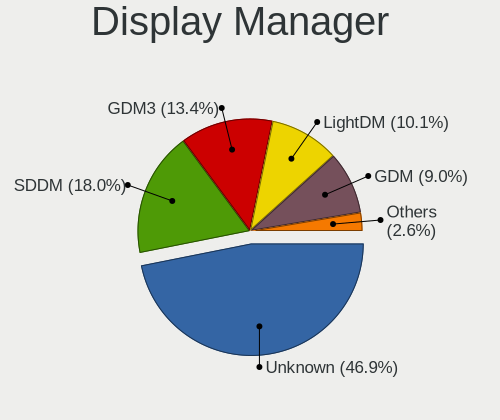

| Name    | Computers | Percent |
|---------|-----------|---------|
| Unknown | 1451      | 47.92%  |
| SDDM    | 528       | 17.44%  |
| GDM3    | 373       | 12.32%  |
| LightDM | 306       | 10.11%  |
| GDM     | 277       | 9.15%   |
| TDM     | 53        | 1.75%   |
| KDM     | 23        | 0.76%   |
| XDM     | 5         | 0.17%   |
| SLiM    | 5         | 0.17%   |
| LXDM    | 3         | 0.1%    |
| NODM    | 1         | 0.03%   |
| MDM     | 1         | 0.03%   |
| LY-DM   | 1         | 0.03%   |
| Ly      | 1         | 0.03%   |

OS Lang
-------

Language

| Lang       | Computers | Percent |
|------------|-----------|---------|
| es_MX      | 1471      | 49.18%  |
| en_US      | 962       | 32.16%  |
| Unknown    | 226       | 7.56%   |
| es_ES      | 202       | 6.75%   |
| C          | 60        | 2.01%   |
| en_GB      | 21        | 0.7%    |
| es_US      | 9         | 0.3%    |
| en_CA      | 7         | 0.23%   |
| fr_FR      | 4         | 0.13%   |
| POSIX      | 2         | 0.07%   |
| it_IT      | 2         | 0.07%   |
| es_MX.UTF8 | 2         | 0.07%   |
| es_CO      | 2         | 0.07%   |
| es_AR      | 2         | 0.07%   |
| en_US.UTF8 | 2         | 0.07%   |
| en_MX      | 2         | 0.07%   |
| en_DK      | 2         | 0.07%   |
| C.UTF8     | 2         | 0.07%   |
| uk_UA      | 1         | 0.03%   |
| ru_RU      | 1         | 0.03%   |
| pt_BR      | 1         | 0.03%   |
| nhn_MX     | 1         | 0.03%   |
| es_PE      | 1         | 0.03%   |
| es_GT      | 1         | 0.03%   |
| es_CR      | 1         | 0.03%   |
| es_419     | 1         | 0.03%   |
| en_IE      | 1         | 0.03%   |
| de_DE      | 1         | 0.03%   |
| Default    | 1         | 0.03%   |

Boot Mode
---------

EFI or BIOS

| Mode | Computers | Percent |
|------|-----------|---------|
| BIOS | 1583      | 53.09%  |
| EFI  | 1399      | 46.91%  |

Filesystem
----------

Type of filesystem

| Type                | Computers | Percent |
|---------------------|-----------|---------|
| Ext4                | 2125      | 70.9%   |
| Btrfs               | 336       | 11.21%  |
| Overlay             | 274       | 9.14%   |
| Tmpfs               | 120       | 4%      |
| Unknown             | 68        | 2.27%   |
| Xfs                 | 40        | 1.33%   |
| Zfs                 | 14        | 0.47%   |
| Ext2                | 8         | 0.27%   |
| Reiserfs            | 4         | 0.13%   |
| XXXXXXX             | 2         | 0.07%   |
| F2fs                | 2         | 0.07%   |
| Ext3                | 2         | 0.07%   |
| Fuse.fuse-overlayfs | 1         | 0.03%   |
| Aufs                | 1         | 0.03%   |

Part. scheme
------------

Scheme of partitioning

| Type    | Computers | Percent |
|---------|-----------|---------|
| Unknown | 1561      | 52.24%  |
| GPT     | 1094      | 36.61%  |
| MBR     | 333       | 11.14%  |

Dual Boot with Linux/BSD
------------------------

Hosting more than one Linux/BSD

| Dual boot | Computers | Percent |
|-----------|-----------|---------|
| No        | 2595      | 87.55%  |
| Yes       | 369       | 12.45%  |

Dual Boot (Win)
---------------

Hosting Linux and Windows

| Dual boot | Computers | Percent |
|-----------|-----------|---------|
| No        | 2040      | 68.55%  |
| Yes       | 936       | 31.45%  |

Board
-----

Vendor
------

Motherboard manufacturer

| Name                    | Computers | Percent |
|-------------------------|-----------|---------|
| Hewlett-Packard         | 555       | 19.06%  |
| Lenovo                  | 416       | 14.29%  |
| Dell                    | 407       | 13.98%  |
| ASUSTek Computer        | 336       | 11.54%  |
| Gigabyte Technology     | 194       | 6.66%   |
| Acer                    | 152       | 5.22%   |
| Apple                   | 99        | 3.4%    |
| Toshiba                 | 93        | 3.19%   |
| HUAWEI                  | 85        | 2.92%   |
| MSI                     | 62        | 2.13%   |
| Sony                    | 44        | 1.51%   |
| ASRock                  | 41        | 1.41%   |
| Intel                   | 40        | 1.37%   |
| ECS                     | 36        | 1.24%   |
| Biostar                 | 30        | 1.03%   |
| Gateway                 | 24        | 0.82%   |
| Samsung Electronics     | 21        | 0.72%   |
| Unknown                 | 21        | 0.72%   |
| Google                  | 19        | 0.65%   |
| Pegatron                | 18        | 0.62%   |
| Alienware               | 18        | 0.62%   |
| Valve                   | 16        | 0.55%   |
| Lanix                   | 16        | 0.55%   |
| Chuwi                   | 13        | 0.45%   |
| Microsoft               | 11        | 0.38%   |
| PCChips                 | 9         | 0.31%   |
| Foxconn                 | 8         | 0.27%   |
| AMI                     | 8         | 0.27%   |
| GPU Company             | 7         | 0.24%   |
| eMachines               | 7         | 0.24%   |
| Timi                    | 5         | 0.17%   |
| Raspberry Pi Foundation | 5         | 0.17%   |
| GHIA                    | 5         | 0.17%   |
| AZW                     | 5         | 0.17%   |
| A-DATA Technology       | 5         | 0.17%   |
| System76                | 4         | 0.14%   |
| Notebook                | 4         | 0.14%   |
| HONOR                   | 4         | 0.14%   |
| EVOO                    | 4         | 0.14%   |
| TPV-INVENTA             | 3         | 0.1%    |

Model
-----

Motherboard model

| Name                                  | Computers | Percent |
|---------------------------------------|-----------|---------|
| Unknown                               | 36        | 1.24%   |
| HP Notebook                           | 29        | 1%      |
| ASUS PRIME A320M-K                    | 25        | 0.86%   |
| HUAWEI HVY-WXX9                       | 21        | 0.72%   |
| HP Pavilion Laptop 15-cw0xxx          | 17        | 0.58%   |
| Valve Jupiter                         | 16        | 0.55%   |
| HP Pavilion g4                        | 16        | 0.55%   |
| HP Pavilion Notebook                  | 15        | 0.52%   |
| ASUS All Series                       | 13        | 0.45%   |
| Apple MacBookPro9,2                   | 13        | 0.45%   |
| HP Pavilion Laptop 15-cw1xxx          | 11        | 0.38%   |
| Apple MacBookPro8,1                   | 11        | 0.38%   |
| HP Laptop 15-da0xxx                   | 10        | 0.34%   |
| Gigabyte B450M DS3H                   | 10        | 0.34%   |
| Dell Latitude E6430                   | 10        | 0.34%   |
| ASUS PRIME B450M-A II                 | 10        | 0.34%   |
| HP EliteBook 8460p                    | 9         | 0.31%   |
| Lenovo IdeaPad 330-14AST 81D5         | 8         | 0.27%   |
| HUAWEI NBLK-WAX9X                     | 8         | 0.27%   |
| HP Pavilion dv4                       | 8         | 0.27%   |
| HP Laptop 15-bw0xx                    | 8         | 0.27%   |
| Dell OptiPlex 9020                    | 8         | 0.27%   |
| Dell OptiPlex 7010                    | 8         | 0.27%   |
| Dell Inspiron 5559                    | 8         | 0.27%   |
| Apple MacBookPro12,1                  | 8         | 0.27%   |
| HUAWEI NBLB-WAX9N                     | 7         | 0.24%   |
| HP Laptop 15-db0xxx                   | 7         | 0.24%   |
| HP Compaq 6200 Pro SFF PC             | 7         | 0.24%   |
| ECS A320AM4-M3D                       | 7         | 0.24%   |
| Dell OptiPlex 745                     | 7         | 0.24%   |
| Lenovo IdeaPad 3 14ALC6 82KT          | 6         | 0.21%   |
| Lenovo G50-30 80G0                    | 6         | 0.21%   |
| Lenovo G40-45 80E1                    | 6         | 0.21%   |
| HUAWEI BOHK-WAX9X                     | 6         | 0.21%   |
| HP Pavilion x360 Convertible 14-ba0xx | 6         | 0.21%   |
| HP Pavilion dv5                       | 6         | 0.21%   |
| HP Pavilion 14                        | 6         | 0.21%   |
| HP Laptop 15-bs0xx                    | 6         | 0.21%   |
| HP Laptop 14-cm0xxx                   | 6         | 0.21%   |
| HP G42                                | 6         | 0.21%   |

Model Family
------------

Motherboard model prefix

| Name               | Computers | Percent |
|--------------------|-----------|---------|
| HP Pavilion        | 138       | 4.74%   |
| Lenovo ThinkPad    | 132       | 4.53%   |
| Lenovo IdeaPad     | 129       | 4.43%   |
| Dell Inspiron      | 127       | 4.36%   |
| Acer Aspire        | 110       | 3.78%   |
| Dell Latitude      | 108       | 3.71%   |
| Toshiba Satellite  | 82        | 2.82%   |
| ASUS PRIME         | 82        | 2.82%   |
| HP Laptop          | 76        | 2.61%   |
| Dell OptiPlex      | 75        | 2.58%   |
| HP Compaq          | 51        | 1.75%   |
| Unknown            | 36        | 1.24%   |
| Lenovo ThinkCentre | 34        | 1.17%   |
| ASUS ROG           | 34        | 1.17%   |
| HP ProBook         | 30        | 1.03%   |
| HP EliteBook       | 30        | 1.03%   |
| ASUS VivoBook      | 30        | 1.03%   |
| HP Notebook        | 29        | 1%      |
| HUAWEI HVY-WXX9    | 21        | 0.72%   |
| Dell Precision     | 21        | 0.72%   |
| HP ENVY            | 20        | 0.69%   |
| ASUS TUF           | 17        | 0.58%   |
| Valve Jupiter      | 16        | 0.55%   |
| Lenovo Yoga        | 16        | 0.55%   |
| HP ProDesk         | 15        | 0.52%   |
| Dell XPS           | 15        | 0.52%   |
| Apple MacBookPro9  | 15        | 0.52%   |
| HP 240             | 14        | 0.48%   |
| Dell Vostro        | 14        | 0.48%   |
| Lenovo Legion      | 13        | 0.45%   |
| Gigabyte B450M     | 13        | 0.45%   |
| ASUS All           | 13        | 0.45%   |
| Dell Studio        | 12        | 0.41%   |
| Apple MacBookPro8  | 12        | 0.41%   |
| Microsoft Surface  | 11        | 0.38%   |
| HP EliteDesk       | 11        | 0.38%   |
| ASUS ASUS          | 11        | 0.38%   |
| HP ZBook           | 10        | 0.34%   |
| HP OMEN            | 10        | 0.34%   |
| Gigabyte A320M-S2H | 10        | 0.34%   |

MFG Year
--------

Motherboard manufacture year

| Year    | Computers | Percent |
|---------|-----------|---------|
| 2018    | 272       | 9.34%   |
| 2011    | 238       | 8.17%   |
| 2020    | 234       | 8.04%   |
| 2012    | 230       | 7.9%    |
| 2019    | 214       | 7.35%   |
| 2017    | 214       | 7.35%   |
| 2013    | 188       | 6.46%   |
| 2014    | 187       | 6.42%   |
| 2021    | 180       | 6.18%   |
| 2015    | 172       | 5.91%   |
| 2010    | 150       | 5.15%   |
| 2016    | 141       | 4.84%   |
| 2008    | 119       | 4.09%   |
| 2009    | 105       | 3.61%   |
| 2022    | 92        | 3.16%   |
| 2007    | 71        | 2.44%   |
| 2023    | 48        | 1.65%   |
| 2006    | 27        | 0.93%   |
| 2005    | 13        | 0.45%   |
| Unknown | 10        | 0.34%   |
| 2024    | 4         | 0.14%   |
| 2004    | 2         | 0.07%   |
| 2003    | 1         | 0.03%   |

Form Factor
-----------

Physical design of the computer

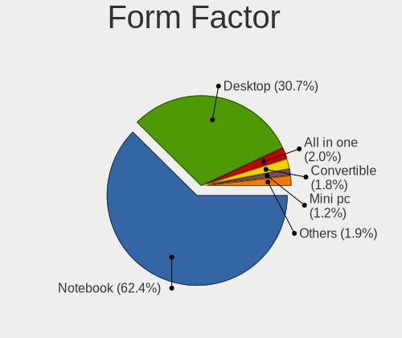

| Name           | Computers | Percent |
|----------------|-----------|---------|
| Notebook       | 1809      | 62.12%  |
| Desktop        | 901       | 30.94%  |
| All in one     | 59        | 2.03%   |
| Convertible    | 56        | 1.92%   |
| Mini pc        | 32        | 1.1%    |
| Tablet         | 30        | 1.03%   |
| Server         | 19        | 0.65%   |
| System on chip | 6         | 0.21%   |

Secure Boot
-----------

Enabled or disabled

| State    | Computers | Percent |
|----------|-----------|---------|
| Disabled | 2687      | 91.49%  |
| Enabled  | 250       | 8.51%   |

Coreboot
--------

Have coreboot on board

| Used | Computers | Percent |
|------|-----------|---------|
| No   | 2891      | 99.28%  |
| Yes  | 21        | 0.72%   |

RAM Size
--------

Total RAM memory

| Size in GB      | Computers | Percent |
|-----------------|-----------|---------|
| 4.01-8.0        | 808       | 27.32%  |
| 3.01-4.0        | 625       | 21.14%  |
| 8.01-16.0       | 581       | 19.65%  |
| 16.01-24.0      | 412       | 13.93%  |
| 32.01-64.0      | 172       | 5.82%   |
| 1.01-2.0        | 157       | 5.31%   |
| 2.01-3.0        | 60        | 2.03%   |
| 24.01-32.0      | 58        | 1.96%   |
| 64.01-256.0     | 55        | 1.86%   |
| 0.51-1.0        | 24        | 0.81%   |
| More than 256.0 | 3         | 0.1%    |
| 0.01-0.5        | 1         | 0.03%   |
| Unknown         | 1         | 0.03%   |

RAM Used
--------

Used RAM memory

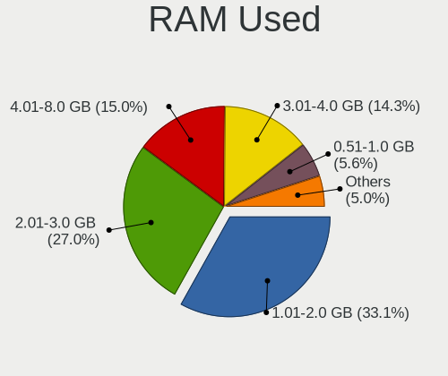

| Used GB     | Computers | Percent |
|-------------|-----------|---------|
| 1.01-2.0    | 1127      | 34.95%  |
| 2.01-3.0    | 866       | 26.85%  |
| 4.01-8.0    | 436       | 13.52%  |
| 3.01-4.0    | 434       | 13.46%  |
| 0.51-1.0    | 198       | 6.14%   |
| 8.01-16.0   | 118       | 3.66%   |
| 0.01-0.5    | 25        | 0.78%   |
| 16.01-24.0  | 12        | 0.37%   |
| 24.01-32.0  | 4         | 0.12%   |
| 32.01-64.0  | 2         | 0.06%   |
| Unknown     | 2         | 0.06%   |
| 64.01-256.0 | 1         | 0.03%   |

Total Drives
------------

Number of drives on board

| Drives  | Computers | Percent |
|---------|-----------|---------|
| 1       | 1964      | 65.34%  |
| 2       | 728       | 24.22%  |
| 3       | 166       | 5.52%   |
| 4       | 69        | 2.3%    |
| 0       | 35        | 1.16%   |
| 5       | 19        | 0.63%   |
| 6       | 14        | 0.47%   |
| 7       | 6         | 0.2%    |
| 37      | 1         | 0.03%   |
| 18      | 1         | 0.03%   |
| 10      | 1         | 0.03%   |
| 8       | 1         | 0.03%   |
| Unknown | 1         | 0.03%   |

Has CD-ROM
----------

Has CD-ROM on board

| Presented | Computers | Percent |
|-----------|-----------|---------|
| No        | 1899      | 64.72%  |
| Yes       | 1035      | 35.28%  |

Has Ethernet
------------

Has Ethernet on board

| Presented | Computers | Percent |
|-----------|-----------|---------|
| Yes       | 2459      | 84.33%  |
| No        | 457       | 15.67%  |

Has WiFi
--------

Has WiFi module

| Presented | Computers | Percent |
|-----------|-----------|---------|
| Yes       | 2411      | 82.4%   |
| No        | 515       | 17.6%   |

Has Bluetooth
-------------

Has Bluetooth module

| Presented | Computers | Percent |
|-----------|-----------|---------|
| Yes       | 1772      | 60.11%  |
| No        | 1176      | 39.89%  |

Location
--------

Country
-------

Geographic location (country)

| Country | Computers | Percent |
|---------|-----------|---------|
| Mexico  | 2912      | 100%    |

City
----

Geographic location (city)

| City                  | Computers | Percent |
|-----------------------|-----------|---------|
| Mexico City           | 597       | 19.33%  |
| Guadalajara           | 151       | 4.89%   |
| Monterrey             | 104       | 3.37%   |
| Tijuana               | 95        | 3.08%   |
| Zapopan               | 92        | 2.98%   |
| Puebla City           | 87        | 2.82%   |
| Mrida               | 61        | 1.97%   |
| Queretaro             | 55        | 1.78%   |
| Toluca                | 42        | 1.36%   |
| Tlalnepantla          | 42        | 1.36%   |
| Morelia               | 42        | 1.36%   |
| Ciudad Jurez        | 39        | 1.26%   |
| Hermosillo            | 37        | 1.2%    |
| Cancn               | 37        | 1.2%    |
| Mexicali              | 34        | 1.1%    |
| Len                 | 34        | 1.1%    |
| Ecatepec              | 34        | 1.1%    |
| Naucalpan             | 33        | 1.07%   |
| Chihuahua City        | 32        | 1.04%   |
| Cuernavaca            | 31        | 1%      |
| Xalapa                | 30        | 0.97%   |
| Ciudad Lopez Mateos   | 30        | 0.97%   |
| Veracruz              | 29        | 0.94%   |
| Culiacn             | 29        | 0.94%   |
| Ciudad Nezahualcoyotl | 29        | 0.94%   |
| Apodaca               | 29        | 0.94%   |
| San Luis Potos City | 28        | 0.91%   |
| Oaxaca City           | 28        | 0.91%   |
| Quertaro City       | 26        | 0.84%   |
| Iztapalapa            | 25        | 0.81%   |
| Gustavo Adolfo Madero | 25        | 0.81%   |
| Guadalupe             | 24        | 0.78%   |
| Mexico                | 23        | 0.74%   |
| Aguascalientes        | 23        | 0.74%   |
| Saltillo              | 22        | 0.71%   |
| Villahermosa          | 21        | 0.68%   |
| Pachuca               | 20        | 0.65%   |
| Ensenada              | 18        | 0.58%   |
| Chalco                | 18        | 0.58%   |
| Puerto Vallarta       | 17        | 0.55%   |

Drives
------

Drive Vendor
------------

Hard drive vendors

| Vendor                      | Computers | Drives | Percent |
|-----------------------------|-----------|--------|---------|
| Seagate                     | 689       | 1008   | 17.31%  |
| WDC                         | 589       | 803    | 14.8%   |
| Kingston                    | 394       | 519    | 9.9%    |
| Toshiba                     | 333       | 406    | 8.36%   |
| A-DATA Technology           | 284       | 351    | 7.13%   |
| Samsung Electronics         | 253       | 328    | 6.36%   |
| Hitachi                     | 182       | 230    | 4.57%   |
| Unknown                     | 178       | 238    | 4.47%   |
| Sandisk                     | 132       | 165    | 3.32%   |
| HGST                        | 91        | 105    | 2.29%   |
| SK hynix                    | 70        | 90     | 1.76%   |
| Intel                       | 69        | 112    | 1.73%   |
| Crucial                     | 51        | 69     | 1.28%   |
| Apple                       | 45        | 62     | 1.13%   |
| Micron Technology           | 40        | 53     | 1%      |
| XPG                         | 36        | 48     | 0.9%    |
| Kingston Technology Company | 30        | 34     | 0.75%   |
| PNY                         | 26        | 33     | 0.65%   |
| Fujitsu                     | 26        | 31     | 0.65%   |
| Realtek Semiconductor       | 24        | 30     | 0.6%    |
| China                       | 23        | 24     | 0.58%   |
| Silicon Motion              | 22        | 25     | 0.55%   |
| KIOXIA                      | 22        | 27     | 0.55%   |
| ADATA Technology            | 22        | 25     | 0.55%   |
| Unknown                     | 20        | 20     | 0.5%    |
| Phison                      | 18        | 20     | 0.45%   |
| LITEON                      | 17        | 22     | 0.43%   |
| Phison Electronics          | 16        | 20     | 0.4%    |
| Hewlett-Packard             | 16        | 18     | 0.4%    |
| Micron/Crucial Technology   | 13        | 18     | 0.33%   |
| Patriot                     | 11        | 16     | 0.28%   |
| Acer                        | 11        | 13     | 0.28%   |
| Netac                       | 10        | 12     | 0.25%   |
| Maxtor                      | 10        | 12     | 0.25%   |
| JMicron Technology          | 9         | 10     | 0.23%   |
| YMTC                        | 8         | 10     | 0.2%    |
| Gigabyte Technology         | 8         | 9      | 0.2%    |
| MAXIO Technology (Hangzhou) | 7         | 7      | 0.18%   |
| UMIS                        | 6         | 8      | 0.15%   |
| Team                        | 6         | 6      | 0.15%   |

Drive Model
-----------

Hard drive models

| Model                                             | Computers | Percent |
|---------------------------------------------------|-----------|---------|
| Kingston SA400S37240G 240GB SSD                   | 109       | 2.55%   |
| Kingston SA400S37480G 480GB SSD                   | 85        | 1.99%   |
| Seagate ST1000LM035-1RK172 1TB                    | 78        | 1.82%   |
| Toshiba MQ01ABD100 1TB                            | 53        | 1.24%   |
| A-DATA SU650 120GB SSD                            | 51        | 1.19%   |
| A-DATA SU630 240GB SSD                            | 45        | 1.05%   |
| Toshiba MQ04ABF100 1TB                            | 44        | 1.03%   |
| Seagate ST500DM002-1BD142 500GB                   | 42        | 0.98%   |
| Seagate ST1000LM024 HN-M101MBB 1TB                | 42        | 0.98%   |
| Unknown MMC Card  32GB                            | 35        | 0.82%   |
| Toshiba MQ01ABF050 500GB                          | 35        | 0.82%   |
| Seagate ST500LT012-1DG142 500GB                   | 35        | 0.82%   |
| Kingston SA400S37120G 120GB SSD                   | 31        | 0.72%   |
| Kingston SA400S37960G 960GB SSD                   | 30        | 0.7%    |
| Seagate ST1000DM010-2EP102 1TB                    | 28        | 0.65%   |
| A-DATA SU630 480GB SSD                            | 27        | 0.63%   |
| Unknown MMC Card  64GB                            | 22        | 0.51%   |
| A-DATA SU650 240GB SSD                            | 22        | 0.51%   |
| Samsung NVMe SSD Controller SM981/PM981/PM983 1TB | 21        | 0.49%   |
| WDC WDS240G2G0A-00JH30 240GB SSD                  | 20        | 0.47%   |
| Unknown                                           | 20        | 0.47%   |
| Seagate ST9500325AS 500GB                         | 19        | 0.44%   |
| Kingston Company SNV2S1000G 1TB                   | 19        | 0.44%   |
| Unknown SD/MMC/MS PRO 128GB                       | 18        | 0.42%   |
| Unknown MMC Card  16GB                            | 17        | 0.4%    |
| Kingston SV300S37A120G 120GB SSD                  | 16        | 0.37%   |
| HGST HTS541010A9E680 1TB                          | 16        | 0.37%   |
| XPG GAMMIX S11 Pro 512GB                          | 15        | 0.35%   |
| Toshiba DT01ACA050 500GB                          | 15        | 0.35%   |
| Seagate ST500LM021-1KJ152 500GB                   | 15        | 0.35%   |
| Seagate ST3500418AS 500GB                         | 15        | 0.35%   |
| Unknown MMC Card  128GB                           | 14        | 0.33%   |
| Toshiba DT01ACA100 1TB                            | 14        | 0.33%   |
| Seagate ST2000LM007-1R8174 2TB                    | 14        | 0.33%   |
| HGST HTS725050A7E630 500GB                        | 14        | 0.33%   |
| WDC WD5000LPCX-60VHAT0 500GB                      | 13        | 0.3%    |
| WDC WD10EZEX-08WN4A0 1TB                          | 13        | 0.3%    |
| Seagate ST500LT012-9WS142 500GB                   | 13        | 0.3%    |
| Seagate ST1000DM003-1CH162 1TB                    | 13        | 0.3%    |
| Sandisk WD Blue SN550 NVMe SSD 2TB                | 13        | 0.3%    |

HDD Vendor
----------

Hard disk drive vendors

| Vendor              | Computers | Drives | Percent |
|---------------------|-----------|--------|---------|
| Seagate             | 685       | 1002   | 36.47%  |
| WDC                 | 500       | 669    | 26.62%  |
| Toshiba             | 296       | 362    | 15.76%  |
| Hitachi             | 182       | 230    | 9.69%   |
| HGST                | 91        | 105    | 4.85%   |
| Samsung Electronics | 35        | 40     | 1.86%   |
| Fujitsu             | 26        | 31     | 1.38%   |
| Unknown             | 18        | 19     | 0.96%   |
| Apple               | 13        | 18     | 0.69%   |
| Maxtor              | 10        | 12     | 0.53%   |
| JMicron Technology  | 5         | 6      | 0.27%   |
| Hewlett-Packard     | 5         | 6      | 0.27%   |
| LaCie               | 2         | 3      | 0.11%   |
| IBM/Hitachi         | 2         | 3      | 0.11%   |
| SAGE                | 1         | 1      | 0.05%   |
| SABRENT             | 1         | 1      | 0.05%   |
| QUANTUM             | 1         | 2      | 0.05%   |
| MaxDigital          | 1         | 4      | 0.05%   |
| HPE                 | 1         | 1      | 0.05%   |
| DELLBOSS            | 1         | 1      | 0.05%   |
| ASMT                | 1         | 7      | 0.05%   |
| ASMedia             | 1         | 1      | 0.05%   |

SSD Vendor
----------

Solid state drive vendors

| Vendor              | Computers | Drives | Percent |
|---------------------|-----------|--------|---------|
| Kingston            | 353       | 456    | 30.75%  |
| A-DATA Technology   | 263       | 328    | 22.91%  |
| Samsung Electronics | 76        | 91     | 6.62%   |
| WDC                 | 73        | 97     | 6.36%   |
| SanDisk             | 44        | 51     | 3.83%   |
| Crucial             | 44        | 54     | 3.83%   |
| PNY                 | 25        | 32     | 2.18%   |
| Apple               | 25        | 28     | 2.18%   |
| China               | 23        | 24     | 2%      |
| SK hynix            | 19        | 28     | 1.66%   |
| Intel               | 17        | 22     | 1.48%   |
| Micron Technology   | 15        | 18     | 1.31%   |
| LITEON              | 14        | 19     | 1.22%   |
| Patriot             | 10        | 15     | 0.87%   |
| Netac               | 10        | 12     | 0.87%   |
| Hewlett-Packard     | 10        | 11     | 0.87%   |
| Acer                | 10        | 11     | 0.87%   |
| Gigabyte Technology | 7         | 8      | 0.61%   |
| Toshiba             | 6         | 7      | 0.52%   |
| AS201               | 6         | 6      | 0.52%   |
| Wibtek              | 5         | 5      | 0.44%   |
| Team                | 5         | 5      | 0.44%   |
| Blackpcs            | 5         | 5      | 0.44%   |
| Unknown             | 5         | 5      | 0.44%   |
| SPCC                | 4         | 4      | 0.35%   |
| LITEONIT            | 4         | 4      | 0.35%   |
| Lexar               | 4         | 4      | 0.35%   |
| BHT                 | 4         | 4      | 0.35%   |
| Yeyian              | 3         | 6      | 0.26%   |
| USB3.0              | 3         | 3      | 0.26%   |
| Unknown             | 3         | 3      | 0.26%   |
| Transcend           | 3         | 3      | 0.26%   |
| Pioneer             | 3         | 5      | 0.26%   |
| OCZ                 | 3         | 5      | 0.26%   |
| KingSpec            | 3         | 10     | 0.26%   |
| Timetec             | 2         | 2      | 0.17%   |
| tecmiyo             | 2         | 4      | 0.17%   |
| Quaroni             | 2         | 2      | 0.17%   |
| Dogfish             | 2         | 5      | 0.17%   |
| AirDisk             | 2         | 2      | 0.17%   |

Drive Kind
----------

HDD or SSD

| Kind    | Computers | Drives | Percent |
|---------|-----------|--------|---------|
| HDD     | 1666      | 2524   | 46.09%  |
| SSD     | 1032      | 1440   | 28.55%  |
| NVMe    | 714       | 1010   | 19.75%  |
| MMC     | 162       | 214    | 4.48%   |
| Unknown | 41        | 61     | 1.13%   |

Drive Connector
---------------

SATA, SAS, NVMe, etc.

| Type | Computers | Drives | Percent |
|------|-----------|--------|---------|
| SATA | 2312      | 3841   | 69.49%  |
| NVMe | 712       | 1005   | 21.4%   |
| MMC  | 162       | 214    | 4.87%   |
| SAS  | 141       | 189    | 4.24%   |

Drive Size
----------

Size of hard drive

| Size in TB | Computers | Drives | Percent |
|------------|-----------|--------|---------|
| 0.01-0.5   | 1692      | 2460   | 61.06%  |
| 0.51-1.0   | 819       | 1082   | 29.56%  |
| 1.01-2.0   | 171       | 238    | 6.17%   |
| 3.01-4.0   | 40        | 77     | 1.44%   |
| 2.01-3.0   | 27        | 36     | 0.97%   |
| 4.01-10.0  | 17        | 41     | 0.61%   |
| 10.01-20.0 | 5         | 30     | 0.18%   |

Space Total
-----------

Amount of disk space available on the file system

| Size in GB     | Computers | Percent |
|----------------|-----------|---------|
| 101-250        | 780       | 25.27%  |
| 251-500        | 723       | 23.42%  |
| 501-1000       | 490       | 15.87%  |
| 1-20           | 254       | 8.23%   |
| 1001-2000      | 245       | 7.94%   |
| 51-100         | 240       | 7.77%   |
| 21-50          | 138       | 4.47%   |
| More than 3000 | 97        | 3.14%   |
| 2001-3000      | 66        | 2.14%   |
| Unknown        | 54        | 1.75%   |

Space Used
----------

Amount of used disk space

| Used GB        | Computers | Percent |
|----------------|-----------|---------|
| 1-20           | 1292      | 40.41%  |
| 21-50          | 626       | 19.58%  |
| 101-250        | 371       | 11.6%   |
| 51-100         | 352       | 11.01%  |
| 251-500        | 219       | 6.85%   |
| 501-1000       | 152       | 4.75%   |
| 1001-2000      | 85        | 2.66%   |
| Unknown        | 54        | 1.69%   |
| More than 3000 | 28        | 0.88%   |
| 2001-3000      | 16        | 0.5%    |
| 0              | 2         | 0.06%   |

Malfunc. Drives
---------------

Drive models with a malfunction

| Model                               | Computers | Drives | Percent |
|-------------------------------------|-----------|--------|---------|
| Toshiba MQ01ABD100 1TB              | 8         | 9      | 2.39%   |
| Seagate ST500LT012-1DG142 500GB     | 7         | 8      | 2.09%   |
| Seagate ST1000LM024 HN-M101MBB 1TB  | 7         | 8      | 2.09%   |
| Seagate ST1000LM035-1RK172 1TB      | 6         | 6      | 1.79%   |
| Toshiba MQ04ABF100 1TB              | 5         | 5      | 1.49%   |
| Seagate ST500LM021-1KJ152 500GB     | 5         | 5      | 1.49%   |
| HGST HTS541010A9E680 1TB            | 5         | 5      | 1.49%   |
| Toshiba MQ01ABF050 500GB            | 4         | 4      | 1.19%   |
| Seagate ST9500420AS 500GB           | 4         | 4      | 1.19%   |
| Seagate ST3160815AS 160GB           | 4         | 4      | 1.19%   |
| Hitachi HTS545050B9A300 500GB       | 4         | 4      | 1.19%   |
| HGST HTS541075A9E680 752GB          | 4         | 4      | 1.19%   |
| WDC WD5000LPCX-60VHAT0 500GB        | 3         | 3      | 0.9%    |
| Seagate ST9500325AS 500GB           | 3         | 3      | 0.9%    |
| Seagate ST500LT012-9WS142 500GB     | 3         | 4      | 0.9%    |
| Seagate ST3500418AS 500GB           | 3         | 4      | 0.9%    |
| Seagate ST31000524AS 1TB            | 3         | 5      | 0.9%    |
| Seagate ST2000DL003-9VT166 2TB      | 3         | 3      | 0.9%    |
| Seagate ST1000DM010-2EP102 1TB      | 3         | 3      | 0.9%    |
| Seagate ST1000DM003-9YN162 1TB      | 3         | 3      | 0.9%    |
| LITEON CV8-8E128-HP 128GB SSD       | 3         | 3      | 0.9%    |
| Hitachi HDS721010CLA332 1TB         | 3         | 3      | 0.9%    |
| HGST HTS545050A7E380 500GB          | 3         | 5      | 0.9%    |
| HGST HTS541010A7E630 1TB            | 3         | 3      | 0.9%    |
| China SSD 256GB                     | 3         | 3      | 0.9%    |
| A-DATA Technology SU650 240GB SSD   | 3         | 3      | 0.9%    |
| WDC WD5000LPVX-22V0TT0 500GB        | 2         | 2      | 0.6%    |
| WDC WD5000AAKX-603CA0 500GB         | 2         | 2      | 0.6%    |
| WDC WD40PURZ-85TTDY0 4TB            | 2         | 6      | 0.6%    |
| WDC WD3200AAJS-00YZCA0 320GB        | 2         | 3      | 0.6%    |
| WDC WD2500BEVS-60UST0 250GB         | 2         | 2      | 0.6%    |
| WDC WD1600BEVT-22ZCT0 160GB         | 2         | 2      | 0.6%    |
| WDC WD10JPVX-60JC3T0 1TB            | 2         | 2      | 0.6%    |
| Toshiba DT01ACA100 1TB              | 2         | 2      | 0.6%    |
| Seagate ST9320325AS 320GB           | 2         | 4      | 0.6%    |
| Seagate ST500LM012 HN-M500MBB 500GB | 2         | 3      | 0.6%    |
| Seagate ST500LM000-1EJ162 500GB     | 2         | 2      | 0.6%    |
| Seagate ST500DM002-1BD142 500GB     | 2         | 2      | 0.6%    |
| Seagate ST2000DM001-1CH164 2TB      | 2         | 2      | 0.6%    |
| Seagate ST1500DL003-9VT16L 1TB      | 2         | 2      | 0.6%    |

Malfunc. Drive Vendor
---------------------

Vendors of faulty drives

| Vendor                    | Computers | Drives | Percent |
|---------------------------|-----------|--------|---------|
| Seagate                   | 103       | 143    | 32.09%  |
| WDC                       | 63        | 79     | 19.63%  |
| Toshiba                   | 41        | 53     | 12.77%  |
| Hitachi                   | 40        | 43     | 12.46%  |
| HGST                      | 18        | 20     | 5.61%   |
| Kingston                  | 14        | 14     | 4.36%   |
| Samsung Electronics       | 8         | 8      | 2.49%   |
| A-DATA Technology         | 7         | 7      | 2.18%   |
| LITEON                    | 5         | 5      | 1.56%   |
| Fujitsu                   | 5         | 5      | 1.56%   |
| SanDisk                   | 4         | 4      | 1.25%   |
| Maxtor                    | 3         | 3      | 0.93%   |
| China                     | 3         | 3      | 0.93%   |
| Crucial                   | 2         | 2      | 0.62%   |
| Realtek Semiconductor     | 1         | 1      | 0.31%   |
| Micron/Crucial Technology | 1         | 2      | 0.31%   |
| Micron Technology         | 1         | 1      | 0.31%   |
| Intel                     | 1         | 1      | 0.31%   |
| IBM/Hitachi               | 1         | 2      | 0.31%   |

Malfunc. HDD Vendor
-------------------

Vendors of faulty HDD drives

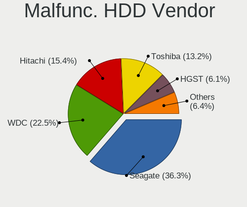

| Vendor              | Computers | Drives | Percent |
|---------------------|-----------|--------|---------|
| Seagate             | 103       | 143    | 36.92%  |
| WDC                 | 61        | 77     | 21.86%  |
| Toshiba             | 41        | 53     | 14.7%   |
| Hitachi             | 40        | 43     | 14.34%  |
| HGST                | 18        | 20     | 6.45%   |
| Samsung Electronics | 7         | 7      | 2.51%   |
| Fujitsu             | 5         | 5      | 1.79%   |
| Maxtor              | 3         | 3      | 1.08%   |
| IBM/Hitachi         | 1         | 2      | 0.36%   |

Malfunc. Drive Kind
-------------------

Kinds of faulty drives

| Kind | Computers | Drives | Percent |
|------|-----------|--------|---------|
| HDD  | 261       | 353    | 86.14%  |
| SSD  | 33        | 33     | 10.89%  |
| NVMe | 9         | 10     | 2.97%   |

Failed Drives
-------------

Failed drive models

| Model                             | Computers | Drives | Percent |
|-----------------------------------|-----------|--------|---------|
| Seagate ST3500410AS 500GB         | 2         | 3      | 25%     |
| Seagate ST31500341AS 1TB          | 2         | 3      | 25%     |
| WDC WD1600BEVT-75A23T0 160GB      | 1         | 1      | 12.5%   |
| Toshiba MK1234GSX 118GB           | 1         | 1      | 12.5%   |
| Samsung Electronics HD161GJ 160GB | 1         | 1      | 12.5%   |
| Hitachi HTS545016B9A300 160GB     | 1         | 1      | 12.5%   |

Failed Drive Vendor
-------------------

Failed drive vendors

| Vendor              | Computers | Drives | Percent |
|---------------------|-----------|--------|---------|
| Seagate             | 2         | 6      | 33.33%  |
| WDC                 | 1         | 1      | 16.67%  |
| Toshiba             | 1         | 1      | 16.67%  |
| Samsung Electronics | 1         | 1      | 16.67%  |
| Hitachi             | 1         | 1      | 16.67%  |

Drive Status
------------

Number of failed and malfunc. drives

| Status   | Computers | Drives | Percent |
|----------|-----------|--------|---------|
| Detected | 1839      | 3195   | 58.77%  |
| Works    | 988       | 1648   | 31.58%  |
| Malfunc  | 296       | 396    | 9.46%   |
| Failed   | 6         | 10     | 0.19%   |

Storage controller
------------------

Storage Vendor
--------------

Storage controller vendors

| Vendor                                  | Computers | Percent |
|-----------------------------------------|-----------|---------|
| Intel                                   | 1786      | 52.79%  |
| AMD                                     | 730       | 21.58%  |
| Samsung Electronics                     | 156       | 4.61%   |
| SanDisk                                 | 112       | 3.31%   |
| Kingston Technology Company             | 75        | 2.22%   |
| Nvidia                                  | 69        | 2.04%   |
| ADATA Technology                        | 61        | 1.8%    |
| SK hynix                                | 51        | 1.51%   |
| Realtek Semiconductor                   | 39        | 1.15%   |
| Phison Electronics                      | 37        | 1.09%   |
| Toshiba America Info Systems            | 31        | 0.92%   |
| Micron Technology                       | 25        | 0.74%   |
| Marvell Technology Group                | 25        | 0.74%   |
| KIOXIA                                  | 23        | 0.68%   |
| Silicon Motion                          | 22        | 0.65%   |
| Micron/Crucial Technology               | 21        | 0.62%   |
| Union Memory (Shenzhen)                 | 16        | 0.47%   |
| ASMedia Technology                      | 12        | 0.35%   |
| Yangtze Memory Technologies             | 11        | 0.33%   |
| MAXIO Technology (Hangzhou)             | 10        | 0.3%    |
| JMicron Technology                      | 10        | 0.3%    |
| LSI Logic / Symbios Logic               | 9         | 0.27%   |
| Apple                                   | 7         | 0.21%   |
| VIA Technologies                        | 6         | 0.18%   |
| O2 Micro                                | 4         | 0.12%   |
| Lite-On Technology                      | 4         | 0.12%   |
| INNOGRIT                                | 4         | 0.12%   |
| Broadcom / LSI                          | 4         | 0.12%   |
| Solid State Storage Technology          | 3         | 0.09%   |
| Silicon Image                           | 3         | 0.09%   |
| Hewlett-Packard                         | 3         | 0.09%   |
| Shenzhen Longsys Electronics            | 2         | 0.06%   |
| Seagate Technology                      | 2         | 0.06%   |
| Lenovo                                  | 2         | 0.06%   |
| Biwin Storage Technology                | 2         | 0.06%   |
| Solidigm                                | 1         | 0.03%   |
| Silicon Integrated Systems [SiS]        | 1         | 0.03%   |
| Shenzhen Unionmemory Information System | 1         | 0.03%   |
| Broadcom                                | 1         | 0.03%   |
| Adaptec                                 | 1         | 0.03%   |

Storage Model
-------------

Storage controller models

| Model                                                                                   | Computers | Percent |
|-----------------------------------------------------------------------------------------|-----------|---------|
| AMD FCH SATA Controller [AHCI mode]                                                     | 507       | 12.85%  |
| Intel 82801 Mobile SATA Controller [RAID mode]                                          | 135       | 3.42%   |
| Intel 7 Series Chipset Family 6-port SATA Controller [AHCI mode]                        | 133       | 3.37%   |
| Intel Sunrise Point-LP SATA Controller [AHCI mode]                                      | 129       | 3.27%   |
| Intel 6 Series/C200 Series Chipset Family 6 port Mobile SATA AHCI Controller            | 100       | 2.53%   |
| Intel 8 Series/C220 Series Chipset Family 6-port SATA Controller 1 [AHCI mode]          | 84        | 2.13%   |
| AMD SB7x0/SB8x0/SB9x0 SATA Controller [AHCI mode]                                       | 75        | 1.9%    |
| Intel SATA Controller [RAID mode]                                                       | 68        | 1.72%   |
| AMD 400 Series Chipset SATA Controller                                                  | 67        | 1.7%    |
| Samsung NVMe SSD Controller SM981/PM981/PM983                                           | 66        | 1.67%   |
| Intel 6 Series/C200 Series Chipset Family 6 port Desktop SATA AHCI Controller           | 63        | 1.6%    |
| Intel 8 Series SATA Controller 1 [AHCI mode]                                            | 59        | 1.5%    |
| Intel NM10/ICH7 Family SATA Controller [IDE mode]                                       | 54        | 1.37%   |
| Intel Celeron/Pentium Silver Processor SATA Controller                                  | 53        | 1.34%   |
| Intel Atom Processor E3800 Series SATA AHCI Controller                                  | 52        | 1.32%   |
| Intel 82801IBM/IEM (ICH9M/ICH9M-E) 4 port SATA Controller [AHCI mode]                   | 52        | 1.32%   |
| AMD SB7x0/SB8x0/SB9x0 IDE Controller                                                    | 52        | 1.32%   |
| Intel Atom/Celeron/Pentium Processor x5-E8000/J3xxx/N3xxx Series SATA Controller        | 51        | 1.29%   |
| Intel Wildcat Point-LP SATA Controller [AHCI Mode]                                      | 48        | 1.22%   |
| Intel Q170/Q150/B150/H170/H110/Z170/CM236 Chipset SATA Controller [AHCI Mode]           | 46        | 1.17%   |
| AMD FCH SATA Controller D                                                               | 46        | 1.17%   |
| Intel Volume Management Device NVMe RAID Controller                                     | 44        | 1.12%   |
| Intel 82801G (ICH7 Family) IDE Controller                                               | 43        | 1.09%   |
| Samsung NVMe SSD Controller 980 (DRAM-less)                                             | 42        | 1.06%   |
| Intel 5 Series/3400 Series Chipset 4 port SATA AHCI Controller                          | 42        | 1.06%   |
| AMD 500 Series Chipset SATA Controller                                                  | 42        | 1.06%   |
| Intel 82801HM/HEM (ICH8M/ICH8M-E) IDE Controller                                        | 41        | 1.04%   |
| AMD SB7x0/SB8x0/SB9x0 SATA Controller [IDE mode]                                        | 40        | 1.01%   |
| Intel 82801HM/HEM (ICH8M/ICH8M-E) SATA Controller [AHCI mode]                           | 38        | 0.96%   |
| ADATA XPG SX8200 Pro PCIe Gen3x4 M.2 2280 Solid State Drive                             | 37        | 0.94%   |
| Intel HM170/QM170 Chipset SATA Controller [AHCI Mode]                                   | 32        | 0.81%   |
| Nvidia MCP61 SATA Controller                                                            | 31        | 0.79%   |
| Intel 200 Series PCH SATA controller [AHCI mode]                                        | 29        | 0.73%   |
| Intel Comet Lake SATA AHCI Controller                                                   | 28        | 0.71%   |
| Intel Cannon Lake Mobile PCH SATA AHCI Controller                                       | 28        | 0.71%   |
| Intel 400 Series Chipset Family SATA AHCI Controller                                    | 28        | 0.71%   |
| Kingston Company NV2 NVMe SSD SM2267XT (DRAM-less)                                      | 26        | 0.66%   |
| Intel 6 Series/C200 Series Chipset Family Desktop SATA Controller (IDE mode, ports 4-5) | 26        | 0.66%   |
| Intel 6 Series/C200 Series Chipset Family Desktop SATA Controller (IDE mode, ports 0-3) | 26        | 0.66%   |
| Intel NM10/ICH7 Family SATA Controller [AHCI mode]                                      | 25        | 0.63%   |

Storage Kind
------------

Kind of storage controller (IDE, SATA, NVMe, SAS, ...)

| Kind | Computers | Percent |
|------|-----------|---------|
| SATA | 2113      | 59.99%  |
| NVMe | 713       | 20.24%  |
| IDE  | 408       | 11.58%  |
| RAID | 271       | 7.69%   |
| SAS  | 15        | 0.43%   |
| SCSI | 2         | 0.06%   |

Processor
---------

CPU Vendor
----------

Processor vendors

| Vendor       | Computers | Percent |
|--------------|-----------|---------|
| Intel        | 2000      | 68.66%  |
| AMD          | 904       | 31.03%  |
| ARM          | 6         | 0.21%   |
| Unknown      | 2         | 0.07%   |
| CentaurHauls | 1         | 0.03%   |

CPU Model
---------

Processor models

| Model                                         | Computers | Percent |
|-----------------------------------------------|-----------|---------|
| AMD Ryzen 5 3500U with Radeon Vega Mobile Gfx | 28        | 0.96%   |
| Intel Core i5-3210M CPU @ 2.50GHz             | 27        | 0.92%   |
| AMD Ryzen 5 4600H with Radeon Graphics        | 27        | 0.92%   |
| Intel Core i5-7200U CPU @ 2.50GHz             | 24        | 0.82%   |
| Intel Celeron CPU N2840 @ 2.16GHz             | 24        | 0.82%   |
| Intel Celeron N4020 CPU @ 1.10GHz             | 23        | 0.79%   |
| Intel Celeron N4000 CPU @ 1.10GHz             | 23        | 0.79%   |
| AMD Ryzen 7 3700U with Radeon Vega Mobile Gfx | 23        | 0.79%   |
| Intel Core i7-8750H CPU @ 2.20GHz             | 22        | 0.75%   |
| Intel 11th Gen Core i5-1135G7 @ 2.40GHz       | 22        | 0.75%   |
| AMD Ryzen 5 5600G with Radeon Graphics        | 22        | 0.75%   |
| AMD Ryzen 5 5500U with Radeon Graphics        | 21        | 0.72%   |
| Intel Celeron CPU N3060 @ 1.60GHz             | 20        | 0.69%   |
| Intel Celeron CPU N3050 @ 1.60GHz             | 20        | 0.69%   |
| Intel 11th Gen Core i7-1165G7 @ 2.80GHz       | 20        | 0.69%   |
| Intel Core i7-6700HQ CPU @ 2.60GHz            | 19        | 0.65%   |
| Intel Core i5-8250U CPU @ 1.60GHz             | 19        | 0.65%   |
| Intel Celeron CPU N3350 @ 1.10GHz             | 19        | 0.65%   |
| Intel Core i7-7500U CPU @ 2.70GHz             | 17        | 0.58%   |
| Intel Core i5-8265U CPU @ 1.60GHz             | 17        | 0.58%   |
| Intel Core i5-5200U CPU @ 2.20GHz             | 17        | 0.58%   |
| Intel Core i7-8550U CPU @ 1.80GHz             | 16        | 0.55%   |
| Intel Core i5-3320M CPU @ 2.60GHz             | 16        | 0.55%   |
| AMD Custom APU 0405                           | 16        | 0.55%   |
| Intel Core i7-9750H CPU @ 2.60GHz             | 15        | 0.51%   |
| Intel Core i7-8565U CPU @ 1.80GHz             | 15        | 0.51%   |
| Intel Core i5-6200U CPU @ 2.30GHz             | 15        | 0.51%   |
| Intel Core i5-2400 CPU @ 3.10GHz              | 15        | 0.51%   |
| AMD Ryzen 3 2200G with Radeon Vega Graphics   | 15        | 0.51%   |
| Intel Core i7-7700HQ CPU @ 2.80GHz            | 14        | 0.48%   |
| Intel Core i7-6500U CPU @ 2.50GHz             | 14        | 0.48%   |
| Intel Core i7-4790 CPU @ 3.60GHz              | 14        | 0.48%   |
| Intel Core i3-10110U CPU @ 2.10GHz            | 14        | 0.48%   |
| Intel Core 2 Duo CPU E8400 @ 3.00GHz          | 14        | 0.48%   |
| Intel Celeron CPU N2830 @ 2.16GHz             | 14        | 0.48%   |
| AMD Ryzen 7 5700U with Radeon Graphics        | 14        | 0.48%   |
| Intel Core i5-10300H CPU @ 2.50GHz            | 13        | 0.45%   |
| Intel Core i3-5005U CPU @ 2.00GHz             | 13        | 0.45%   |
| AMD Ryzen 5 3600 6-Core Processor             | 13        | 0.45%   |
| AMD Ryzen 5 2500U with Radeon Vega Mobile Gfx | 13        | 0.45%   |

CPU Model Family
----------------

Processor model prefix

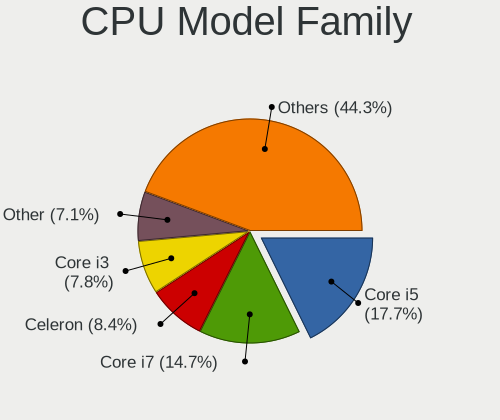

| Model                   | Computers | Percent |
|-------------------------|-----------|---------|
| Intel Core i5           | 516       | 17.69%  |
| Intel Core i7           | 428       | 14.67%  |
| Intel Celeron           | 246       | 8.43%   |
| Intel Core i3           | 235       | 8.06%   |
| AMD Ryzen 5             | 193       | 6.62%   |
| Other                   | 176       | 6.03%   |
| Intel Core 2 Duo        | 117       | 4.01%   |
| AMD Ryzen 7             | 117       | 4.01%   |
| Intel Atom              | 62        | 2.13%   |
| Intel Xeon              | 60        | 2.06%   |
| AMD Ryzen 3             | 59        | 2.02%   |
| Intel Pentium           | 57        | 1.95%   |
| AMD A6                  | 56        | 1.92%   |
| AMD A8                  | 50        | 1.71%   |
| AMD A4                  | 40        | 1.37%   |
| AMD FX                  | 37        | 1.27%   |
| AMD Ryzen 9             | 34        | 1.17%   |
| AMD A10                 | 33        | 1.13%   |
| AMD E                   | 32        | 1.1%    |
| AMD Athlon              | 32        | 1.1%    |
| Intel Pentium Dual-Core | 29        | 0.99%   |
| Intel Pentium Dual      | 29        | 0.99%   |
| AMD E1                  | 20        | 0.69%   |
| Intel Core 2 Quad       | 18        | 0.62%   |
| AMD Athlon II X2        | 17        | 0.58%   |
| Intel Core 2            | 16        | 0.55%   |
| AMD Athlon 64 X2        | 14        | 0.48%   |
| Intel Pentium 4         | 13        | 0.45%   |
| AMD Sempron             | 11        | 0.38%   |
| Intel Genuine           | 10        | 0.34%   |
| AMD Turion 64 X2 Mobile | 10        | 0.34%   |
| AMD Phenom II X4        | 10        | 0.34%   |
| AMD Athlon II           | 10        | 0.34%   |
| AMD Ryzen 5 PRO         | 9         | 0.31%   |
| Intel Core i9           | 8         | 0.27%   |
| Intel Pentium Silver    | 7         | 0.24%   |
| AMD Ryzen 3 PRO         | 6         | 0.21%   |
| AMD Phenom II X6        | 6         | 0.21%   |
| AMD E2                  | 6         | 0.21%   |
| Intel Celeron M         | 5         | 0.17%   |

CPU Cores
---------

Number of processor cores

| Number  | Computers | Percent |
|---------|-----------|---------|
| 2       | 1399      | 47.94%  |
| 4       | 903       | 30.95%  |
| 6       | 253       | 8.67%   |
| 1       | 135       | 4.63%   |
| 8       | 133       | 4.56%   |
| 12      | 25        | 0.86%   |
| 10      | 19        | 0.65%   |
| 16      | 14        | 0.48%   |
| 3       | 13        | 0.45%   |
| 14      | 10        | 0.34%   |
| 24      | 6         | 0.21%   |
| 28      | 3         | 0.1%    |
| Unknown | 3         | 0.1%    |
| 56      | 1         | 0.03%   |
| 32      | 1         | 0.03%   |

CPU Sockets
-----------

Number of sockets

| Number  | Computers | Percent |
|---------|-----------|---------|
| 1       | 2892      | 99.28%  |
| 2       | 19        | 0.65%   |
| Unknown | 2         | 0.07%   |

CPU Threads
-----------

Threads per core (Hyper-Threading)

| Number  | Computers | Percent |
|---------|-----------|---------|
| 2       | 1788      | 61.25%  |
| 1       | 1127      | 38.61%  |
| Unknown | 3         | 0.1%    |
| 4       | 1         | 0.03%   |

CPU Op-Modes
------------

CPU Operation Modes (32-bit, 64-bit)

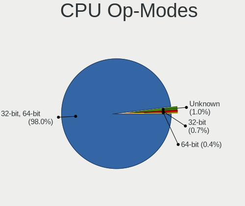

| Op mode        | Computers | Percent |
|----------------|-----------|---------|
| 32-bit, 64-bit | 2849      | 97.64%  |
| Unknown        | 35        | 1.2%    |
| 32-bit         | 22        | 0.75%   |
| 64-bit         | 12        | 0.41%   |

CPU Microcode
-------------

Microcode number

| Number     | Computers | Percent |
|------------|-----------|---------|
| Unknown    | 980       | 32.18%  |
| 0x206a7    | 153       | 5.02%   |
| 0x306a9    | 119       | 3.91%   |
| 0x1067a    | 81        | 2.66%   |
| 0x306c3    | 68        | 2.23%   |
| 0x08108109 | 58        | 1.9%    |
| 0x40651    | 57        | 1.87%   |
| 0x30678    | 53        | 1.74%   |
| 0x806ec    | 50        | 1.64%   |
| 0x806e9    | 49        | 1.61%   |
| 0x806ea    | 43        | 1.41%   |
| 0x906ea    | 42        | 1.38%   |
| 0x306d4    | 42        | 1.38%   |
| 0x6fd      | 40        | 1.31%   |
| 0x406e3    | 40        | 1.31%   |
| 0x506e3    | 38        | 1.25%   |
| 0x06006705 | 38        | 1.25%   |
| 0x806c1    | 37        | 1.22%   |
| 0x406c4    | 35        | 1.15%   |
| 0x20655    | 34        | 1.12%   |
| 0x010000c8 | 34        | 1.12%   |
| 0x906e9    | 32        | 1.05%   |
| 0x06001119 | 32        | 1.05%   |
| 0x10676    | 30        | 0.99%   |
| 0x0810100b | 29        | 0.95%   |
| 0x08600106 | 28        | 0.92%   |
| 0x406c3    | 26        | 0.85%   |
| 0x08608103 | 25        | 0.82%   |
| 0x07030105 | 24        | 0.79%   |
| 0x0600611a | 24        | 0.79%   |
| 0x106ca    | 23        | 0.76%   |
| 0x0a50000d | 23        | 0.76%   |
| 0x08108102 | 23        | 0.76%   |
| 0x08101016 | 22        | 0.72%   |
| 0x706a1    | 20        | 0.66%   |
| 0x0800820d | 20        | 0.66%   |
| 0x05000119 | 20        | 0.66%   |
| 0x20652    | 19        | 0.62%   |
| 0x6fb      | 18        | 0.59%   |
| 0x706e5    | 17        | 0.56%   |

CPU Microarch
-------------

Microarchitecture

| Name             | Computers | Percent |
|------------------|-----------|---------|
| KabyLake         | 350       | 12.01%  |
| SandyBridge      | 226       | 7.75%   |
| Haswell          | 200       | 6.86%   |
| IvyBridge        | 177       | 6.07%   |
| Silvermont       | 140       | 4.8%    |
| Penryn           | 140       | 4.8%    |
| Zen+             | 132       | 4.53%   |
| Skylake          | 130       | 4.46%   |
| Unknown          | 121       | 4.15%   |
| Excavator        | 105       | 3.6%    |
| Core             | 95        | 3.26%   |
| Zen 2            | 85        | 2.92%   |
| Zen              | 81        | 2.78%   |
| Zen 3            | 80        | 2.74%   |
| Westmere         | 76        | 2.61%   |
| Broadwell        | 73        | 2.5%    |
| K10              | 68        | 2.33%   |
| Piledriver       | 64        | 2.2%    |
| TigerLake        | 62        | 2.13%   |
| Goldmont plus    | 61        | 2.09%   |
| CometLake        | 57        | 1.96%   |
| K8 Hammer        | 46        | 1.58%   |
| Bobcat           | 46        | 1.58%   |
| Puma             | 42        | 1.44%   |
| Bonnell          | 39        | 1.34%   |
| IceLake          | 32        | 1.1%    |
| Alderlake Hybrid | 32        | 1.1%    |
| Goldmont         | 26        | 0.89%   |
| Jaguar           | 20        | 0.69%   |
| Steamroller      | 18        | 0.62%   |
| NetBurst         | 18        | 0.62%   |
| Nehalem          | 18        | 0.62%   |
| K10 Llano        | 13        | 0.45%   |
| P6               | 11        | 0.38%   |
| Bulldozer        | 11        | 0.38%   |
| Tremont          | 9         | 0.31%   |
| K8 & K10 hybrid  | 9         | 0.31%   |
| Gracemont        | 2         | 0.07%   |

Graphics
--------

GPU Vendor
----------

Vendors of graphics cards

| Vendor                           | Computers | Percent |
|----------------------------------|-----------|---------|
| Intel                            | 1697      | 51.56%  |
| AMD                              | 951       | 28.9%   |
| Nvidia                           | 618       | 18.78%  |
| Matrox Electronics Systems       | 14        | 0.43%   |
| VIA Technologies                 | 4         | 0.12%   |
| ATI Technologies                 | 3         | 0.09%   |
| ASPEED Technology                | 3         | 0.09%   |
| Silicon Integrated Systems [SiS] | 1         | 0.03%   |

GPU Model
---------

Graphics card models

| Model                                                                                    | Computers | Percent |
|------------------------------------------------------------------------------------------|-----------|---------|
| Intel 2nd Generation Core Processor Family Integrated Graphics Controller                | 185       | 5.42%   |
| Intel 3rd Gen Core processor Graphics Controller                                         | 107       | 3.13%   |
| AMD Picasso/Raven 2 [Radeon Vega Series / Radeon Vega Mobile Series]                     | 107       | 3.13%   |
| Intel Haswell-ULT Integrated Graphics Controller                                         | 75        | 2.2%    |
| Intel Atom Processor Z36xxx/Z37xxx Series Graphics & Display                             | 73        | 2.14%   |
| Intel Atom/Celeron/Pentium Processor x5-E8000/J3xxx/N3xxx Integrated Graphics Controller | 67        | 1.96%   |
| Intel HD Graphics 620                                                                    | 63        | 1.84%   |
| Intel Core Processor Integrated Graphics Controller                                      | 62        | 1.82%   |
| AMD Raven Ridge [Radeon Vega Series / Radeon Vega Mobile Series]                         | 60        | 1.76%   |
| Intel GeminiLake [UHD Graphics 600]                                                      | 56        | 1.64%   |
| Intel UHD Graphics 620                                                                   | 55        | 1.61%   |
| Intel TigerLake-LP GT2 [Iris Xe Graphics]                                                | 55        | 1.61%   |
| Intel HD Graphics 5500                                                                   | 55        | 1.61%   |
| Intel Xeon E3-1200 v3/4th Gen Core Processor Integrated Graphics Controller              | 53        | 1.55%   |
| AMD Stoney [Radeon R2/R3/R4/R5 Graphics]                                                 | 53        | 1.55%   |
| Intel Skylake GT2 [HD Graphics 520]                                                      | 52        | 1.52%   |
| AMD Renoir [Radeon RX Vega 6 (Ryzen 4000/5000 Mobile Series)]                            | 52        | 1.52%   |
| Intel Mobile 4 Series Chipset Integrated Graphics Controller                             | 51        | 1.49%   |
| Intel CoffeeLake-H GT2 [UHD Graphics 630]                                                | 49        | 1.43%   |
| AMD Wani [Radeon R5/R6/R7 Graphics]                                                      | 48        | 1.41%   |
| Intel HD Graphics 530                                                                    | 43        | 1.26%   |
| AMD Cezanne [Radeon Vega Series / Radeon Vega Mobile Series]                             | 41        | 1.2%    |
| AMD Lucienne                                                                             | 40        | 1.17%   |
| Intel WhiskeyLake-U GT2 [UHD Graphics 620]                                               | 39        | 1.14%   |
| Intel HD Graphics 630                                                                    | 39        | 1.14%   |
| Intel Xeon E3-1200 v2/3rd Gen Core processor Graphics Controller                         | 36        | 1.05%   |
| Intel CometLake-U GT2 [UHD Graphics]                                                     | 36        | 1.05%   |
| Intel Mobile GM965/GL960 Integrated Graphics Controller (secondary)                      | 35        | 1.02%   |
| Intel Mobile GM965/GL960 Integrated Graphics Controller (primary)                        | 35        | 1.02%   |
| Intel 4th Gen Core Processor Integrated Graphics Controller                              | 32        | 0.94%   |
| Intel 4 Series Chipset Integrated Graphics Controller                                    | 32        | 0.94%   |
| Intel CometLake-H GT2 [UHD Graphics]                                                     | 31        | 0.91%   |
| AMD Mullins [Radeon R4/R5 Graphics]                                                      | 29        | 0.85%   |
| AMD Ellesmere [Radeon RX 470/480/570/570X/580/580X/590]                                  | 25        | 0.73%   |
| Intel Atom Processor D4xx/D5xx/N4xx/N5xx Integrated Graphics Controller                  | 24        | 0.7%    |
| AMD Sun XT [Radeon HD 8670A/8670M/8690M / R5 M330 / M430 / Radeon 520 Mobile]            | 24        | 0.7%    |
| Intel HD Graphics 500                                                                    | 23        | 0.67%   |
| AMD RS880M [Mobility Radeon HD 4225/4250]                                                | 22        | 0.64%   |
| AMD Wrestler [Radeon HD 6310]                                                            | 21        | 0.61%   |
| AMD Cedar [Radeon HD 5000/6000/7350/8350 Series]                                         | 20        | 0.59%   |

GPU Combo
---------

Combinations of graphics cards

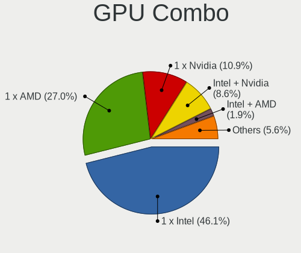

| Name            | Computers | Percent |
|-----------------|-----------|---------|
| 1 x Intel       | 1358      | 46.35%  |
| 1 x AMD         | 793       | 27.06%  |
| 1 x Nvidia      | 323       | 11.02%  |
| Intel + Nvidia  | 237       | 8.09%   |
| Intel + AMD     | 59        | 2.01%   |
| 2 x AMD         | 56        | 1.91%   |
| AMD + Nvidia    | 47        | 1.6%    |
| 2 x Intel       | 15        | 0.51%   |
| Other           | 12        | 0.41%   |
| 1 x Matrox      | 12        | 0.41%   |
| 2 x Nvidia      | 7         | 0.24%   |
| 1 x VIA         | 3         | 0.1%    |
| 1 x ASPEED      | 3         | 0.1%    |
| Nvidia + Matrox | 2         | 0.07%   |
| 3 x AMD         | 1         | 0.03%   |
| 1 x SiS         | 1         | 0.03%   |
| Nvidia + VIA    | 1         | 0.03%   |

GPU Driver
----------

Free vs proprietary

| Driver      | Computers | Percent |
|-------------|-----------|---------|
| Free        | 2565      | 87.22%  |
| Proprietary | 300       | 10.2%   |
| Unknown     | 76        | 2.58%   |

GPU Memory
----------

Total video memory

| Size in GB | Computers | Percent |
|------------|-----------|---------|
| Unknown    | 1791      | 59.94%  |
| 0.01-0.5   | 416       | 13.92%  |
| 1.01-2.0   | 284       | 9.5%    |
| 0.51-1.0   | 227       | 7.6%    |
| 3.01-4.0   | 113       | 3.78%   |
| 7.01-8.0   | 70        | 2.34%   |
| 5.01-6.0   | 53        | 1.77%   |
| 2.01-3.0   | 18        | 0.6%    |
| 8.01-16.0  | 12        | 0.4%    |
| 16.01-24.0 | 4         | 0.13%   |

Monitor
-------

Monitor Vendor
--------------

Monitor vendors

| Vendor                  | Computers | Percent |
|-------------------------|-----------|---------|
| BOE                     | 363       | 11.41%  |
| AU Optronics            | 363       | 11.41%  |
| Samsung Electronics     | 343       | 10.78%  |
| Chimei Innolux          | 302       | 9.49%   |
| LG Display              | 277       | 8.71%   |
| Hewlett-Packard         | 229       | 7.2%    |
| Dell                    | 185       | 5.81%   |
| Goldstar                | 114       | 3.58%   |
| Apple                   | 96        | 3.02%   |
| BenQ                    | 84        | 2.64%   |
| Acer                    | 78        | 2.45%   |
| AOC                     | 65        | 2.04%   |
| Lenovo                  | 58        | 1.82%   |
| Chi Mei Optoelectronics | 45        | 1.41%   |
| Unknown                 | 44        | 1.38%   |
| Sharp                   | 28        | 0.88%   |
| ASUSTek Computer        | 28        | 0.88%   |
| Sony                    | 27        | 0.85%   |
| LG Philips              | 25        | 0.79%   |
| Ancor Communications    | 25        | 0.79%   |
| PANDA                   | 24        | 0.75%   |
| Gateway                 | 21        | 0.66%   |
| ViewSonic               | 20        | 0.63%   |
| InfoVision              | 15        | 0.47%   |
| Valve                   | 14        | 0.44%   |
| ___                     | 12        | 0.38%   |
| HannStar                | 12        | 0.38%   |
| Insignia                | 11        | 0.35%   |
| VOR                     | 9         | 0.28%   |
| Sceptre Tech            | 9         | 0.28%   |
| Unknown                 | 9         | 0.28%   |
| HUAWEI                  | 8         | 0.25%   |
| HKC                     | 8         | 0.25%   |
| FOX                     | 8         | 0.25%   |
| CSO                     | 8         | 0.25%   |
| SLD                     | 7         | 0.22%   |
| SAC                     | 7         | 0.22%   |
| MSI                     | 7         | 0.22%   |
| LG Electronics          | 7         | 0.22%   |
| Hitachi                 | 7         | 0.22%   |

Monitor Model
-------------

Monitor models

| Model                                                                | Computers | Percent |
|----------------------------------------------------------------------|-----------|---------|
| BOE LCD Monitor BOE06A4 1366x768 344x194mm 15.5-inch                 | 22        | 0.68%   |
| Samsung Electronics C24F390 SAM0D2C 1920x1080 521x293mm 23.5-inch    | 21        | 0.65%   |
| BOE LCD Monitor BOE0878 1920x1080 355x200mm 16.0-inch                | 19        | 0.59%   |
| BOE LCD Monitor BOE0877 1920x1080 309x173mm 13.9-inch                | 17        | 0.52%   |
| BOE LCD Monitor BOE076F 1366x768 344x194mm 15.5-inch                 | 17        | 0.52%   |
| BOE LCD Monitor BOE0696 1366x768 309x173mm 13.9-inch                 | 17        | 0.52%   |
| Chimei Innolux LCD Monitor CMN14D6 1366x768 309x173mm 13.9-inch      | 16        | 0.49%   |
| Samsung Electronics LCD Monitor SEC5441 1366x768 344x194mm 15.5-inch | 15        | 0.46%   |
| Chimei Innolux LCD Monitor CMN15E6 1366x768 344x193mm 15.5-inch      | 15        | 0.46%   |
| Chimei Innolux LCD Monitor CMN14C3 1366x768 309x173mm 13.9-inch      | 15        | 0.46%   |
| Valve ANX7530 U VLV3001 800x1280 100x150mm 7.1-inch                  | 14        | 0.43%   |
| Chimei Innolux LCD Monitor CMN15DC 1366x768 344x193mm 15.5-inch      | 14        | 0.43%   |
| AU Optronics LCD Monitor AUO183C 1366x768 309x173mm 13.9-inch        | 14        | 0.43%   |
| BOE LCD Monitor BOE0872 1920x1080 344x194mm 15.5-inch                | 13        | 0.4%    |
| AU Optronics LCD Monitor AUO2E3C 1366x768 309x173mm 13.9-inch        | 13        | 0.4%    |
| AU Optronics LCD Monitor AUO235C 1366x768 256x144mm 11.6-inch        | 13        | 0.4%    |
| LG Display LCD Monitor LGD0456 1366x768 344x194mm 15.5-inch          | 12        | 0.37%   |
| AU Optronics LCD Monitor AUO70EC 1366x768 344x193mm 15.5-inch        | 12        | 0.37%   |
| LG Display LCD Monitor LGD02E9 1366x768 309x174mm 14.0-inch          | 11        | 0.34%   |
| Hewlett-Packard w1907 HWP26A2 1440x900 408x255mm 18.9-inch           | 11        | 0.34%   |
| AU Optronics LCD Monitor AUO21ED 1920x1080 344x193mm 15.5-inch       | 11        | 0.34%   |
| Chimei Innolux LCD Monitor CMN15F5 1920x1080 344x193mm 15.5-inch     | 10        | 0.31%   |
| Chimei Innolux LCD Monitor CMN15E7 1920x1080 344x193mm 15.5-inch     | 10        | 0.31%   |
| BenQ GW2480 BNQ78E7 1920x1080 527x296mm 23.8-inch                    | 10        | 0.31%   |
| Apple LCD Monitor APP9CC3 1280x800 286x179mm 13.3-inch               | 10        | 0.31%   |
| Samsung Electronics LCD Monitor SAM0C3C 1366x768 609x347mm 27.6-inch | 9         | 0.28%   |
| HannStar LCD Monitor HSD03E9 1024x600 220x129mm 10.0-inch            | 9         | 0.28%   |
| Goldstar FULL HD GSM5B55 1920x1080 480x270mm 21.7-inch               | 9         | 0.28%   |
| Chimei Innolux LCD Monitor CMN14C4 1366x768 309x173mm 13.9-inch      | 9         | 0.28%   |
| AU Optronics LCD Monitor AUO2D3C 1366x768 309x173mm 13.9-inch        | 9         | 0.28%   |
| Unknown                                                              | 9         | 0.28%   |
| Unknown LCD Monitor FFFF 2288x1287 2550x2550mm 142.0-inch            | 8         | 0.25%   |
| Insignia LCDTV BBY0019 1680x1050 410x230mm 18.5-inch                 | 8         | 0.25%   |
| Goldstar ULTRAWIDE GSM7770 2560x1080 798x334mm 34.1-inch             | 8         | 0.25%   |
| Chimei Innolux LCD Monitor CMN1490 1366x768 309x173mm 13.9-inch      | 8         | 0.25%   |
| Chimei Innolux LCD Monitor CMN1487 1366x768 309x173mm 13.9-inch      | 8         | 0.25%   |
| Chimei Innolux LCD Monitor CMN1476 1366x768 309x174mm 14.0-inch      | 8         | 0.25%   |
| Chimei Innolux LCD Monitor CMN1472 1366x768 309x174mm 14.0-inch      | 8         | 0.25%   |
| BOE LCD Monitor BOE0812 1920x1080 344x194mm 15.5-inch                | 8         | 0.25%   |
| BenQ GW2270 BNQ78DB 1920x1080 476x268mm 21.5-inch                    | 8         | 0.25%   |

Monitor Resolution
------------------

Monitor screen resolution

| Resolution         | Computers | Percent |
|--------------------|-----------|---------|
| 1366x768 (WXGA)    | 1025      | 33.78%  |
| 1920x1080 (FHD)    | 1015      | 33.45%  |
| 1600x900 (HD+)     | 134       | 4.42%   |
| 1280x800 (WXGA)    | 113       | 3.72%   |
| 1440x900 (WXGA+)   | 103       | 3.39%   |
| 3840x2160 (4K)     | 97        | 3.2%    |
| 1280x1024 (SXGA)   | 89        | 2.93%   |
| 1680x1050 (WSXGA+) | 50        | 1.65%   |
| 2560x1440 (QHD)    | 44        | 1.45%   |
| 1360x768           | 33        | 1.09%   |
| 2560x1080          | 32        | 1.05%   |
| 1024x768 (XGA)     | 29        | 0.96%   |
| 2560x1600          | 27        | 0.89%   |
| 1024x600           | 27        | 0.89%   |
| 1920x1200 (WUXGA)  | 26        | 0.86%   |
| 3440x1440          | 23        | 0.76%   |
| Unknown            | 22        | 0.73%   |
| 2160x1440          | 20        | 0.66%   |
| 800x1280           | 15        | 0.49%   |
| 2880x1800          | 13        | 0.43%   |
| 2288x1287          | 11        | 0.36%   |
| 3840x1080          | 10        | 0.33%   |
| 1600x1200          | 8         | 0.26%   |
| 3000x2000          | 6         | 0.2%    |
| 2736x1824          | 6         | 0.2%    |
| 3840x2400          | 5         | 0.16%   |
| 3200x1800 (QHD+)   | 5         | 0.16%   |
| 1280x960           | 5         | 0.16%   |
| 2520x1680          | 3         | 0.1%    |
| 1920x540           | 3         | 0.1%    |
| 1152x864           | 3         | 0.1%    |
| 3600x1080          | 2         | 0.07%   |
| 3360x1080          | 2         | 0.07%   |
| 2256x1504          | 2         | 0.07%   |
| 2240x1400          | 2         | 0.07%   |
| 1920x1280          | 2         | 0.07%   |
| 1400x1050          | 2         | 0.07%   |
| 1280x768           | 2         | 0.07%   |
| 7280x2160          | 1         | 0.03%   |
| 6720x1440          | 1         | 0.03%   |

Monitor Diagonal
----------------

Diagonal size in inches

| Inches  | Computers | Percent |
|---------|-----------|---------|
| 15      | 806       | 25.51%  |
| 13      | 431       | 13.64%  |
| 14      | 334       | 10.57%  |
| 21      | 164       | 5.19%   |
| 23      | 147       | 4.65%   |
| 17      | 123       | 3.89%   |
| 24      | 119       | 3.77%   |
| 19      | 118       | 3.74%   |
| 18      | 118       | 3.74%   |
| 27      | 112       | 3.55%   |
| Unknown | 96        | 3.04%   |
| 20      | 85        | 2.69%   |
| 11      | 72        | 2.28%   |
| 31      | 61        | 1.93%   |
| 12      | 47        | 1.49%   |
| 34      | 45        | 1.42%   |
| 16      | 41        | 1.3%    |
| 22      | 33        | 1.04%   |
| 10      | 28        | 0.89%   |
| 72      | 27        | 0.85%   |
| 84      | 22        | 0.7%    |
| 7       | 15        | 0.47%   |
| 40      | 14        | 0.44%   |
| 32      | 13        | 0.41%   |
| 54      | 11        | 0.35%   |
| 26      | 10        | 0.32%   |
| 29      | 9         | 0.28%   |
| 142     | 8         | 0.25%   |
| 25      | 6         | 0.19%   |
| 52      | 5         | 0.16%   |
| 46      | 5         | 0.16%   |
| 39      | 4         | 0.13%   |
| 8       | 4         | 0.13%   |
| 48      | 3         | 0.09%   |
| 42      | 3         | 0.09%   |
| 37      | 3         | 0.09%   |
| 49      | 2         | 0.06%   |
| 36      | 2         | 0.06%   |
| 86      | 1         | 0.03%   |
| 74      | 1         | 0.03%   |

Monitor Width
-------------

Physical width

| Width in mm    | Computers | Percent |
|----------------|-----------|---------|
| 301-350        | 1459      | 46.76%  |
| 401-500        | 468       | 15%     |
| 501-600        | 375       | 12.02%  |
| 201-300        | 303       | 9.71%   |
| 351-400        | 145       | 4.65%   |
| Unknown        | 96        | 3.08%   |
| 601-700        | 76        | 2.44%   |
| 701-800        | 61        | 1.96%   |
| 1501-2000      | 50        | 1.6%    |
| 1001-1500      | 32        | 1.03%   |
| 801-900        | 22        | 0.71%   |
| 1-100          | 16        | 0.51%   |
| More than 2000 | 8         | 0.26%   |
| 901-1000       | 5         | 0.16%   |
| 101-200        | 4         | 0.13%   |

Aspect Ratio
------------

Proportional relationship between the width and the height

| Ratio   | Computers | Percent |
|---------|-----------|---------|
| 16/9    | 2188      | 76.4%   |
| 16/10   | 337       | 11.77%  |
| 5/4     | 88        | 3.07%   |
| Unknown | 73        | 2.55%   |
| 4/3     | 50        | 1.75%   |
| 21/9    | 48        | 1.68%   |
| 3/2     | 43        | 1.5%    |
| 0.67    | 15        | 0.52%   |
| 1.00    | 9         | 0.31%   |
| 6/5     | 4         | 0.14%   |
| 32/9    | 3         | 0.1%    |
| 0.62    | 2         | 0.07%   |
| 0.56    | 2         | 0.07%   |
| 2.65    | 1         | 0.03%   |
| 1.96    | 1         | 0.03%   |

Monitor Area
------------

Area in inch

| Area in inch | Computers | Percent |
|----------------|-----------|---------|
| 101-110        | 826       | 26.38%  |
| 81-90          | 673       | 21.49%  |
| 201-250        | 376       | 12.01%  |
| 151-200        | 254       | 8.11%   |
| 141-150        | 159       | 5.08%   |
| 351-500        | 120       | 3.83%   |
| 301-350        | 120       | 3.83%   |
| 71-80          | 96        | 3.07%   |
| Unknown        | 96        | 3.07%   |
| More than 1000 | 82        | 2.62%   |
| 51-60          | 73        | 2.33%   |
| 121-130        | 52        | 1.66%   |
| 251-300        | 42        | 1.34%   |
| 61-70          | 37        | 1.18%   |
| 501-1000       | 36        | 1.15%   |
| 41-50          | 27        | 0.86%   |
| 111-120        | 22        | 0.7%    |
| 1-40           | 20        | 0.64%   |
| 131-140        | 15        | 0.48%   |
| 91-100         | 5         | 0.16%   |

Pixel Density
-------------

Pixels per inch

| Density       | Computers | Percent |
|---------------|-----------|---------|
| 101-120       | 1109      | 36.28%  |
| 51-100        | 914       | 29.9%   |
| 121-160       | 651       | 21.3%   |
| 161-240       | 139       | 4.55%   |
| 1-50          | 104       | 3.4%    |
| Unknown       | 96        | 3.14%   |
| More than 240 | 44        | 1.44%   |

Multiple Monitors
-----------------

Total monitors connected

| Total | Computers | Percent |
|-------|-----------|---------|
| 1     | 2392      | 80.13%  |
| 2     | 449       | 15.04%  |
| 0     | 93        | 3.12%   |
| 3     | 47        | 1.57%   |
| 4     | 4         | 0.13%   |

Network
-------

Net Controller Vendor
---------------------

Controller vendors

| Vendor                                | Computers | Percent |
|---------------------------------------|-----------|---------|
| Realtek Semiconductor                 | 1724      | 39.32%  |
| Intel                                 | 1077      | 24.57%  |
| Qualcomm Atheros                      | 543       | 12.39%  |
| Broadcom                              | 327       | 7.46%   |
| Ralink Technology                     | 86        | 1.96%   |
| Ralink                                | 75        | 1.71%   |
| Broadcom Limited                      | 73        | 1.67%   |
| TP-Link                               | 65        | 1.48%   |
| Nvidia                                | 57        | 1.3%    |
| MediaTek                              | 52        | 1.19%   |
| Marvell Technology Group              | 52        | 1.19%   |
| Qualcomm Atheros Communications       | 38        | 0.87%   |
| ASIX Electronics                      | 23        | 0.52%   |
| Huawei Technologies                   | 20        | 0.46%   |
| Mercucys                              | 15        | 0.34%   |
| DisplayLink                           | 14        | 0.32%   |
| Samsung Electronics                   | 13        | 0.3%    |
| Motorola PCS                          | 12        | 0.27%   |
| Xiaomi                                | 11        | 0.25%   |
| Linksys                               | 7         | 0.16%   |
| D-Link                                | 7         | 0.16%   |
| Qualcomm                              | 6         | 0.14%   |
| ICS Advent                            | 6         | 0.14%   |
| VIA Technologies                      | 5         | 0.11%   |
| Spreadtrum Communications             | 5         | 0.11%   |
| OPPO Electronics                      | 5         | 0.11%   |
| Lenovo                                | 4         | 0.09%   |
| Google                                | 4         | 0.09%   |
| Dell                                  | 4         | 0.09%   |
| D-Link System                         | 4         | 0.09%   |
| NetGear                               | 3         | 0.07%   |
| Microchip Technology                  | 3         | 0.07%   |
| IBM                                   | 3         | 0.07%   |
| 802.11g Adapter [Linksys WUSB54GC v3] | 3         | 0.07%   |
| ZTE WCDMA Technologies MSM            | 2         | 0.05%   |
| Wacom                                 | 2         | 0.05%   |
| Microsoft                             | 2         | 0.05%   |
| LG Electronics                        | 2         | 0.05%   |
| JMicron Technology                    | 2         | 0.05%   |
| Davicom Semiconductor                 | 2         | 0.05%   |

Net Controller Model
--------------------

Controller models

| Model                                                                  | Computers | Percent |
|------------------------------------------------------------------------|-----------|---------|
| Realtek RTL8111/8168/8211/8411 PCI Express Gigabit Ethernet Controller | 999       | 19.02%  |
| Realtek RTL810xE PCI Express Fast Ethernet controller                  | 350       | 6.66%   |
| Realtek RTL8821CE 802.11ac PCIe Wireless Network Adapter               | 126       | 2.4%    |
| Intel 82579LM Gigabit Network Connection (Lewisville)                  | 113       | 2.15%   |
| Qualcomm Atheros QCA9565 / AR9565 Wireless Network Adapter             | 89        | 1.69%   |
| Intel Wi-Fi 6 AX200                                                    | 84        | 1.6%    |
| Realtek RTL8822CE 802.11ac PCIe Wireless Network Adapter               | 83        | 1.58%   |
| Qualcomm Atheros QCA9377 802.11ac Wireless Network Adapter             | 72        | 1.37%   |
| Qualcomm Atheros AR9485 Wireless Network Adapter                       | 72        | 1.37%   |
| Qualcomm Atheros AR9285 Wireless Network Adapter (PCI-Express)         | 68        | 1.29%   |
| Realtek RTL8723DE Wireless Network Adapter                             | 59        | 1.12%   |
| Realtek RTL8723BE PCIe Wireless Network Adapter                        | 59        | 1.12%   |
| Intel Wireless 8265 / 8275                                             | 58        | 1.1%    |
| Broadcom BCM43142 802.11b/g/n                                          | 53        | 1.01%   |
| Realtek RTL8153 Gigabit Ethernet Adapter                               | 52        | 0.99%   |
| Intel Wi-Fi 6 AX201                                                    | 52        | 0.99%   |
| Intel Wireless 7265                                                    | 48        | 0.91%   |
| Qualcomm Atheros QCA6174 802.11ac Wireless Network Adapter             | 47        | 0.89%   |
| Realtek RTL8188EUS 802.11n Wireless Network Adapter                    | 42        | 0.8%    |
| Intel Ethernet Connection I217-LM                                      | 42        | 0.8%    |
| Intel Centrino Advanced-N 6205 [Taylor Peak]                           | 42        | 0.8%    |
| Intel Wireless 7260                                                    | 40        | 0.76%   |
| Broadcom BCM4313 802.11bgn Wireless Network Adapter                    | 40        | 0.76%   |
| Ralink RT2870/RT3070 Wireless Adapter                                  | 39        | 0.74%   |
| Intel Wireless 8260                                                    | 38        | 0.72%   |
| Intel Cannon Lake PCH CNVi WiFi                                        | 37        | 0.7%    |
| Realtek RTL8188EE Wireless Network Adapter                             | 35        | 0.67%   |
| Realtek RTL8125 2.5GbE Controller                                      | 34        | 0.65%   |
| Intel I211 Gigabit Network Connection                                  | 34        | 0.65%   |
| Qualcomm Atheros AR9271 802.11n                                        | 33        | 0.63%   |
| Ralink MT7601U Wireless Adapter                                        | 32        | 0.61%   |
| Broadcom NetXtreme BCM57765 Gigabit Ethernet PCIe                      | 32        | 0.61%   |
| Intel Wireless 3165                                                    | 31        | 0.59%   |
| Realtek 802.11ac NIC                                                   | 29        | 0.55%   |
| Intel Comet Lake PCH-LP CNVi WiFi                                      | 29        | 0.55%   |
| Intel Comet Lake PCH CNVi WiFi                                         | 29        | 0.55%   |
| Broadcom BCM4331 802.11a/b/g/n                                         | 28        | 0.53%   |
| Qualcomm Atheros AR8152 v2.0 Fast Ethernet                             | 25        | 0.48%   |
| Nvidia MCP61 Ethernet                                                  | 25        | 0.48%   |
| Intel Alder Lake-P PCH CNVi WiFi                                       | 25        | 0.48%   |

Wireless Vendor
---------------

Wireless vendors

| Vendor                                | Computers | Percent |
|---------------------------------------|-----------|---------|
| Intel                                 | 794       | 31.03%  |
| Realtek Semiconductor                 | 655       | 25.6%   |
| Qualcomm Atheros                      | 452       | 17.66%  |
| Broadcom                              | 246       | 9.61%   |
| Ralink Technology                     | 86        | 3.36%   |
| Ralink                                | 75        | 2.93%   |
| TP-Link                               | 61        | 2.38%   |
| Broadcom Limited                      | 49        | 1.91%   |
| MediaTek                              | 46        | 1.8%    |
| Qualcomm Atheros Communications       | 38        | 1.48%   |
| Mercucys                              | 15        | 0.59%   |
| Marvell Technology Group              | 7         | 0.27%   |
| D-Link                                | 7         | 0.27%   |
| Linksys                               | 5         | 0.2%    |
| Qualcomm                              | 3         | 0.12%   |
| NetGear                               | 3         | 0.12%   |
| Dell                                  | 3         | 0.12%   |
| D-Link System                         | 3         | 0.12%   |
| 802.11g Adapter [Linksys WUSB54GC v3] | 3         | 0.12%   |
| Wacom                                 | 2         | 0.08%   |
| Tenda                                 | 1         | 0.04%   |
| Qualcomm Technologies                 | 1         | 0.04%   |
| Microsoft                             | 1         | 0.04%   |
| Micro Star International              | 1         | 0.04%   |
| Gemtek                                | 1         | 0.04%   |
| Belkin Components                     | 1         | 0.04%   |

Wireless Model
--------------

Wireless models

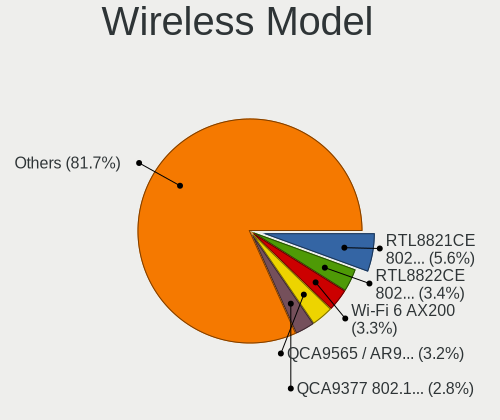

| Model                                                          | Computers | Percent |
|----------------------------------------------------------------|-----------|---------|
| Realtek RTL8821CE 802.11ac PCIe Wireless Network Adapter       | 126       | 4.86%   |
| Qualcomm Atheros QCA9565 / AR9565 Wireless Network Adapter     | 89        | 3.43%   |
| Intel Wi-Fi 6 AX200                                            | 84        | 3.24%   |
| Realtek RTL8822CE 802.11ac PCIe Wireless Network Adapter       | 83        | 3.2%    |
| Qualcomm Atheros QCA9377 802.11ac Wireless Network Adapter     | 72        | 2.78%   |
| Qualcomm Atheros AR9485 Wireless Network Adapter               | 72        | 2.78%   |
| Qualcomm Atheros AR9285 Wireless Network Adapter (PCI-Express) | 68        | 2.62%   |
| Realtek RTL8723DE Wireless Network Adapter                     | 59        | 2.27%   |
| Realtek RTL8723BE PCIe Wireless Network Adapter                | 59        | 2.27%   |
| Intel Wireless 8265 / 8275                                     | 58        | 2.24%   |
| Broadcom BCM43142 802.11b/g/n                                  | 53        | 2.04%   |
| Intel Wi-Fi 6 AX201                                            | 52        | 2%      |
| Intel Wireless 7265                                            | 48        | 1.85%   |
| Qualcomm Atheros QCA6174 802.11ac Wireless Network Adapter     | 47        | 1.81%   |
| Realtek RTL8188EUS 802.11n Wireless Network Adapter            | 42        | 1.62%   |
| Intel Centrino Advanced-N 6205 [Taylor Peak]                   | 42        | 1.62%   |
| Intel Wireless 7260                                            | 40        | 1.54%   |
| Broadcom BCM4313 802.11bgn Wireless Network Adapter            | 40        | 1.54%   |
| Ralink RT2870/RT3070 Wireless Adapter                          | 39        | 1.5%    |
| Intel Wireless 8260                                            | 38        | 1.46%   |
| Intel Cannon Lake PCH CNVi WiFi                                | 37        | 1.43%   |
| Realtek RTL8188EE Wireless Network Adapter                     | 35        | 1.35%   |
| Qualcomm Atheros AR9271 802.11n                                | 33        | 1.27%   |
| Ralink MT7601U Wireless Adapter                                | 32        | 1.23%   |
| Intel Wireless 3165                                            | 31        | 1.2%    |
| Realtek 802.11ac NIC                                           | 29        | 1.12%   |
| Intel Comet Lake PCH-LP CNVi WiFi                              | 29        | 1.12%   |
| Intel Comet Lake PCH CNVi WiFi                                 | 29        | 1.12%   |
| Broadcom BCM4331 802.11a/b/g/n                                 | 28        | 1.08%   |
| Intel Alder Lake-P PCH CNVi WiFi                               | 25        | 0.96%   |
| Realtek RTL8188CE 802.11b/g/n WiFi Adapter                     | 24        | 0.93%   |
| Intel Wireless 3160                                            | 23        | 0.89%   |
| Intel PRO/Wireless 3945ABG [Golan] Network Connection          | 23        | 0.89%   |
| Realtek RTL8822BE 802.11a/b/g/n/ac WiFi adapter                | 22        | 0.85%   |
| MediaTek MT7921 802.11ax PCI Express Wireless Network Adapter  | 22        | 0.85%   |
| Broadcom Limited BCM4312 802.11b/g LP-PHY                      | 22        | 0.85%   |
| Broadcom BCM4312 802.11b/g LP-PHY                              | 21        | 0.81%   |
| Ralink RT3290 Wireless 802.11n 1T/1R PCIe                      | 20        | 0.77%   |
| Ralink RT3090 Wireless 802.11n 1T/1R PCIe                      | 20        | 0.77%   |
| Intel Cannon Point-LP CNVi [Wireless-AC]                       | 20        | 0.77%   |

Ethernet Vendor
---------------

Ethernet vendors

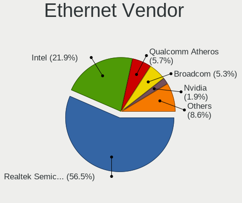

| Vendor                                 | Computers | Percent |
|----------------------------------------|-----------|---------|
| Realtek Semiconductor                  | 1451      | 55.94%  |
| Intel                                  | 562       | 21.67%  |
| Qualcomm Atheros                       | 158       | 6.09%   |
| Broadcom                               | 137       | 5.28%   |
| Nvidia                                 | 57        | 2.2%    |
| Marvell Technology Group               | 45        | 1.73%   |
| Broadcom Limited                       | 24        | 0.93%   |
| ASIX Electronics                       | 23        | 0.89%   |
| Huawei Technologies                    | 19        | 0.73%   |
| DisplayLink                            | 14        | 0.54%   |
| Samsung Electronics                    | 13        | 0.5%    |
| Xiaomi                                 | 11        | 0.42%   |
| Motorola PCS                           | 8         | 0.31%   |
| MediaTek                               | 6         | 0.23%   |
| ICS Advent                             | 6         | 0.23%   |
| VIA Technologies                       | 5         | 0.19%   |
| Spreadtrum Communications              | 5         | 0.19%   |
| OPPO Electronics                       | 5         | 0.19%   |
| TP-Link                                | 4         | 0.15%   |
| Google                                 | 4         | 0.15%   |
| Qualcomm                               | 3         | 0.12%   |
| Lenovo                                 | 3         | 0.12%   |
| IBM                                    | 3         | 0.12%   |
| ZTE WCDMA Technologies MSM             | 2         | 0.08%   |
| Microchip Technology                   | 2         | 0.08%   |
| Linksys                                | 2         | 0.08%   |
| LG Electronics                         | 2         | 0.08%   |
| JMicron Technology                     | 2         | 0.08%   |
| Davicom Semiconductor                  | 2         | 0.08%   |
| T & A Mobile Phones                    | 1         | 0.04%   |
| Sony Ericsson Mobile Communications AB | 1         | 0.04%   |
| Silicon Integrated Systems [SiS]       | 1         | 0.04%   |
| Raspberry Pi                           | 1         | 0.04%   |
| Microsoft                              | 1         | 0.04%   |
| Lab126                                 | 1         | 0.04%   |
| Insyde Software                        | 1         | 0.04%   |
| HTC (High Tech Computer)               | 1         | 0.04%   |
| Hisense                                | 1         | 0.04%   |
| Foxconn / Hon Hai                      | 1         | 0.04%   |
| Emulex                                 | 1         | 0.04%   |

Ethernet Model
--------------

Ethernet models

| Model                                                                  | Computers | Percent |
|------------------------------------------------------------------------|-----------|---------|
| Realtek RTL8111/8168/8211/8411 PCI Express Gigabit Ethernet Controller | 999       | 37.9%   |
| Realtek RTL810xE PCI Express Fast Ethernet controller                  | 350       | 13.28%  |
| Intel 82579LM Gigabit Network Connection (Lewisville)                  | 113       | 4.29%   |
| Realtek RTL8153 Gigabit Ethernet Adapter                               | 52        | 1.97%   |
| Intel Ethernet Connection I217-LM                                      | 42        | 1.59%   |
| Realtek RTL8125 2.5GbE Controller                                      | 34        | 1.29%   |
| Intel I211 Gigabit Network Connection                                  | 34        | 1.29%   |
| Broadcom NetXtreme BCM57765 Gigabit Ethernet PCIe                      | 32        | 1.21%   |
| Qualcomm Atheros AR8152 v2.0 Fast Ethernet                             | 25        | 0.95%   |
| Nvidia MCP61 Ethernet                                                  | 25        | 0.95%   |
| Qualcomm Atheros AR8151 v2.0 Gigabit Ethernet                          | 24        | 0.91%   |
| Intel Ethernet Connection I218-LM                                      | 23        | 0.87%   |
| ASIX AX88179 Gigabit Ethernet                                          | 20        | 0.76%   |
| Intel Ethernet Connection (4) I219-LM                                  | 19        | 0.72%   |
| Intel Ethernet Controller I225-V                                       | 18        | 0.68%   |
| Intel Ethernet Connection (2) I219-V                                   | 18        | 0.68%   |
| Intel Ethernet Connection (2) I219-LM                                  | 18        | 0.68%   |
| Intel 82579V Gigabit Network Connection                                | 18        | 0.68%   |
| Huawei VTR-L09                                                         | 17        | 0.64%   |
| Intel Ethernet Connection (7) I219-V                                   | 15        | 0.57%   |
| Intel Ethernet Connection (3) I218-LM                                  | 15        | 0.57%   |
| Intel 82567LM-3 Gigabit Network Connection                             | 15        | 0.57%   |
| Intel 82567LM Gigabit Network Connection                               | 15        | 0.57%   |
| Qualcomm Atheros QCA8171 Gigabit Ethernet                              | 14        | 0.53%   |
| Qualcomm Atheros AR8162 Fast Ethernet                                  | 14        | 0.53%   |
| Intel 82577LM Gigabit Network Connection                               | 14        | 0.53%   |
| Realtek RTL8152 Fast Ethernet Adapter                                  | 13        | 0.49%   |
| Qualcomm Atheros AR8161 Gigabit Ethernet                               | 13        | 0.49%   |
| Qualcomm Atheros AR8131 Gigabit Ethernet                               | 13        | 0.49%   |
| Nvidia MCP79 Ethernet                                                  | 13        | 0.49%   |
| Qualcomm Atheros Killer E2500 Gigabit Ethernet Controller              | 12        | 0.46%   |
| Marvell Group 88E8040 PCI-E Fast Ethernet Controller                   | 12        | 0.46%   |
| Intel Ethernet Connection I219-LM                                      | 12        | 0.46%   |
| Intel 82574L Gigabit Network Connection                                | 12        | 0.46%   |
| Broadcom NetLink BCM57785 Gigabit Ethernet PCIe                        | 12        | 0.46%   |
| Intel Ethernet Connection I217-V                                       | 11        | 0.42%   |
| Broadcom NetXtreme BCM5764M Gigabit Ethernet PCIe                      | 11        | 0.42%   |
| Qualcomm Atheros AR8152 v1.1 Fast Ethernet                             | 10        | 0.38%   |
| Qualcomm Atheros AR8132 Fast Ethernet                                  | 10        | 0.38%   |
| Xiaomi Mi/Redmi series (RNDIS)                                         | 9         | 0.34%   |

Net Controller Kind
-------------------

Ethernet, WiFi or modem

| Kind     | Computers | Percent |
|----------|-----------|---------|
| Ethernet | 2457      | 50.26%  |
| WiFi     | 2409      | 49.27%  |
| Modem    | 13        | 0.27%   |
| Unknown  | 10        | 0.2%    |

Used Controller
---------------

Currently used network controller

| Kind     | Computers | Percent |
|----------|-----------|---------|
| WiFi     | 1891      | 61.52%  |
| Ethernet | 1181      | 38.42%  |
| Unknown  | 2         | 0.07%   |

NICs
----

Total network controllers on board

| Total | Computers | Percent |
|-------|-----------|---------|
| 2     | 1675      | 57.36%  |
| 1     | 1155      | 39.55%  |
| 0     | 52        | 1.78%   |
| 3     | 25        | 0.86%   |
| 4     | 6         | 0.21%   |
| 8     | 3         | 0.1%    |
| 6     | 3         | 0.1%    |
| 5     | 1         | 0.03%   |

IPv6
----

IPv6 vs IPv4

| Used | Computers | Percent |
|------|-----------|---------|
| No   | 1966      | 65.58%  |
| Yes  | 1032      | 34.42%  |

Bluetooth
---------

Bluetooth Vendor
----------------

Controller vendors

| Vendor                          | Computers | Percent |
|---------------------------------|-----------|---------|
| Intel                           | 608       | 33.89%  |
| Realtek Semiconductor           | 305       | 17%     |
| Qualcomm Atheros Communications | 153       | 8.53%   |
| Cambridge Silicon Radio         | 128       | 7.13%   |
| Broadcom                        | 102       | 5.69%   |
| Apple                           | 89        | 4.96%   |
| IMC Networks                    | 83        | 4.63%   |
| Lite-On Technology              | 68        | 3.79%   |
| Foxconn / Hon Hai               | 50        | 2.79%   |
| Realtek                         | 40        | 2.23%   |
| Dell                            | 34        | 1.9%    |
| Hewlett-Packard                 | 25        | 1.39%   |
| Toshiba                         | 23        | 1.28%   |
| Ralink                          | 20        | 1.11%   |
| ASUSTek Computer                | 15        | 0.84%   |
| MediaTek                        | 11        | 0.61%   |
| Ralink Technology               | 8         | 0.45%   |
| Marvell Semiconductor           | 7         | 0.39%   |
| TP-Link                         | 6         | 0.33%   |
| Foxconn International           | 4         | 0.22%   |
| Alps Electric                   | 4         | 0.22%   |
| Unknown                         | 2         | 0.11%   |
| USI                             | 1         | 0.06%   |
| SiW                             | 1         | 0.06%   |
| Roper                           | 1         | 0.06%   |
| Opticis                         | 1         | 0.06%   |
| Micro Star International        | 1         | 0.06%   |
| Integrated System Solution      | 1         | 0.06%   |
| Fujitsu                         | 1         | 0.06%   |
| Dynex                           | 1         | 0.06%   |
| Chicony Electronics             | 1         | 0.06%   |

Bluetooth Model
---------------

Controller models

| Model                                                                               | Computers | Percent |
|-------------------------------------------------------------------------------------|-----------|---------|
| Realtek Bluetooth Radio                                                             | 148       | 8.24%   |
| Intel Bluetooth wireless interface                                                  | 141       | 7.85%   |
| Cambridge Silicon Radio Bluetooth Dongle (HCI mode)                                 | 128       | 7.13%   |
| Realtek  Bluetooth 4.2 Adapter                                                      | 110       | 6.12%   |
| Intel Bluetooth 9460/9560 Jefferson Peak (JfP)                                      | 105       | 5.85%   |
| Intel AX201 Bluetooth                                                               | 102       | 5.68%   |
| Intel Bluetooth Device                                                              | 87        | 4.84%   |
| Intel AX200 Bluetooth                                                               | 82        | 4.57%   |
| Qualcomm Atheros  Bluetooth Device                                                  | 79        | 4.4%    |
| IMC Networks Bluetooth Radio                                                        | 42        | 2.34%   |
| Apple Bluetooth Host Controller                                                     | 41        | 2.28%   |
| Realtek Bluetooth Radio                                                             | 40        | 2.23%   |
| Broadcom BCM43142A0 Bluetooth 4.0                                                   | 30        | 1.67%   |
| Apple Bluetooth USB Host Controller                                                 | 28        | 1.56%   |
| Lite-On Bluetooth Device                                                            | 26        | 1.45%   |
| Qualcomm Atheros QCA61x4 Bluetooth 4.0                                              | 22        | 1.22%   |
| Intel AX211 Bluetooth                                                               | 22        | 1.22%   |
| Ralink RT3290 Bluetooth                                                             | 20        | 1.11%   |
| Qualcomm Atheros AR3012 Bluetooth 4.0                                               | 19        | 1.06%   |
| Lite-On Atheros AR3012 Bluetooth                                                    | 19        | 1.06%   |
| Intel Centrino Advanced-N 6230 Bluetooth adapter                                    | 19        | 1.06%   |
| Lite-On Qualcomm Atheros QCA9377 Bluetooth                                          | 18        | 1%      |
| Intel Centrino Bluetooth Wireless Transceiver                                       | 18        | 1%      |
| Foxconn / Hon Hai Bluetooth Device                                                  | 18        | 1%      |
| Realtek RTL8723B Bluetooth                                                          | 17        | 0.95%   |
| IMC Networks Wireless_Device                                                        | 17        | 0.95%   |
| Qualcomm Atheros AR3011 Bluetooth                                                   | 15        | 0.84%   |
| Qualcomm Atheros AR9462 Bluetooth                                                   | 14        | 0.78%   |
| HP Broadcom 2070 Bluetooth Combo                                                    | 14        | 0.78%   |
| Realtek RTL8821A Bluetooth                                                          | 13        | 0.72%   |
| Intel Wireless-AC 9260 Bluetooth Adapter                                            | 13        | 0.72%   |
| Broadcom BCM20702 Bluetooth 4.0 [ThinkPad]                                          | 12        | 0.67%   |
| Apple Built-in Bluetooth 2.0+EDR HCI                                                | 12        | 0.67%   |
| MediaTek Wireless_Device                                                            | 11        | 0.61%   |
| Intel AX210 Bluetooth                                                               | 11        | 0.61%   |
| HP Bluetooth 2.0 Interface [Broadcom BCM2045]                                       | 11        | 0.61%   |
| Intel Wireless-AC 3168 Bluetooth                                                    | 10        | 0.56%   |
| Broadcom BCM2045B (BDC-2.1)                                                         | 10        | 0.56%   |
| IMC Networks Bluetooth Device                                                       | 8         | 0.45%   |
| Foxconn / Hon Hai Foxconn T77H114 BCM2070 [Single-Chip Bluetooth 2.1 + EDR Adapter] | 8         | 0.45%   |

Sound
-----

Sound Vendor
------------

Sound card vendors

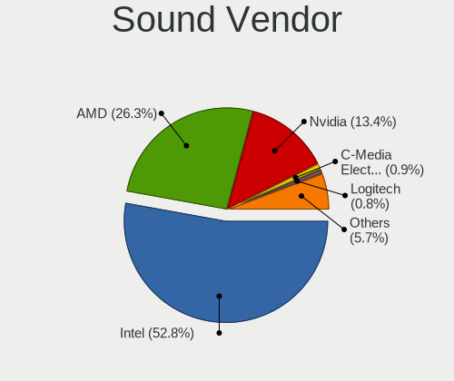

| Vendor                                       | Computers | Percent |
|----------------------------------------------|-----------|---------|
| Intel                                        | 1926      | 53.2%   |
| AMD                                          | 957       | 26.44%  |
| Nvidia                                       | 482       | 13.31%  |
| C-Media Electronics                          | 32        | 0.88%   |
| Logitech                                     | 24        | 0.66%   |
| Generalplus Technology                       | 20        | 0.55%   |
| Texas Instruments                            | 18        | 0.5%    |
| Realtek Semiconductor                        | 11        | 0.3%    |
| GN Netcom                                    | 10        | 0.28%   |
| Creative Labs                                | 10        | 0.28%   |
| JMTek                                        | 9         | 0.25%   |
| ASUSTek Computer                             | 9         | 0.25%   |
| Kingston Technology                          | 8         | 0.22%   |
| VIA Technologies                             | 7         | 0.19%   |
| Corsair                                      | 7         | 0.19%   |
| Razer USA                                    | 6         | 0.17%   |
| Plantronics                                  | 6         | 0.17%   |
| Lenovo                                       | 6         | 0.17%   |
| Tenx Technology                              | 5         | 0.14%   |
| Syntek                                       | 4         | 0.11%   |
| Creative Technology                          | 4         | 0.11%   |
| Sony                                         | 3         | 0.08%   |
| Focusrite-Novation                           | 3         | 0.08%   |
| DCMT Technology                              | 3         | 0.08%   |
| BR25                                         | 3         | 0.08%   |
| ATI Technologies                             | 3         | 0.08%   |
| Apple                                        | 3         | 0.08%   |
| Thesycon Systemsoftware & Consulting         | 2         | 0.06%   |
| Synaptics                                    | 2         | 0.06%   |
| Shure                                        | 2         | 0.06%   |
| SAVITECH                                     | 2         | 0.06%   |
| Samson Technologies                          | 2         | 0.06%   |
| Microsoft                                    | 2         | 0.06%   |
| M-Audio                                      | 2         | 0.06%   |
| Zoran Co. Personal Media Division (Nogatech) | 1         | 0.03%   |
| Yamaha                                       | 1         | 0.03%   |
| USB-MIC                                      | 1         | 0.03%   |
| TX                                           | 1         | 0.03%   |
| Silicon Motion                               | 1         | 0.03%   |
| Silicon Integrated Systems [SiS]             | 1         | 0.03%   |

Sound Model
-----------

Sound card models

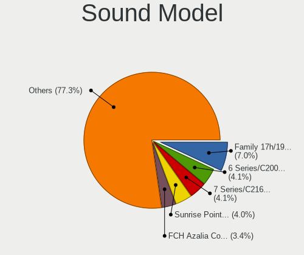

| Model                                                                                             | Computers | Percent |
|---------------------------------------------------------------------------------------------------|-----------|---------|
| AMD Family 17h/19h HD Audio Controller                                                            | 306       | 6.74%   |
| Intel 6 Series/C200 Series Chipset Family High Definition Audio Controller                        | 201       | 4.43%   |
| Intel Sunrise Point-LP HD Audio                                                                   | 190       | 4.19%   |
| Intel 7 Series/C216 Chipset Family High Definition Audio Controller                               | 183       | 4.03%   |
| AMD Raven/Raven2/Fenghuang HDMI/DP Audio Controller                                               | 164       | 3.61%   |
| AMD FCH Azalia Controller                                                                         | 160       | 3.52%   |
| AMD Renoir Radeon High Definition Audio Controller                                                | 132       | 2.91%   |
| AMD SBx00 Azalia (Intel HDA)                                                                      | 124       | 2.73%   |
| Intel 8 Series/C220 Series Chipset High Definition Audio Controller                               | 111       | 2.44%   |
| AMD Kabini HDMI/DP Audio                                                                          | 107       | 2.36%   |
| AMD Family 15h (Models 60h-6fh) Audio Controller                                                  | 102       | 2.25%   |
| Intel NM10/ICH7 Family High Definition Audio Controller                                           | 97        | 2.14%   |
| Intel Xeon E3-1200 v3/4th Gen Core Processor HD Audio Controller                                  | 86        | 1.89%   |
| Intel 82801I (ICH9 Family) HD Audio Controller                                                    | 81        | 1.78%   |
| Intel 5 Series/3400 Series Chipset High Definition Audio                                          | 79        | 1.74%   |
| Intel Cannon Lake PCH cAVS                                                                        | 77        | 1.7%    |
| Intel 8 Series HD Audio Controller                                                                | 77        | 1.7%    |
| Intel Haswell-ULT HD Audio Controller                                                             | 76        | 1.67%   |
| Intel Broadwell-U Audio Controller                                                                | 68        | 1.5%    |
| Intel 100 Series/C230 Series Chipset Family HD Audio Controller                                   | 68        | 1.5%    |
| Intel Wildcat Point-LP High Definition Audio Controller                                           | 67        | 1.48%   |
| Intel Tiger Lake-LP Smart Sound Technology Audio Controller                                       | 62        | 1.37%   |
| Intel Celeron/Pentium Silver Processor High Definition Audio                                      | 61        | 1.34%   |
| Intel Atom Processor Z36xxx/Z37xxx Series High Definition Audio Controller                        | 61        | 1.34%   |
| AMD Starship/Matisse HD Audio Controller                                                          | 59        | 1.3%    |
| Intel 82801H (ICH8 Family) HD Audio Controller                                                    | 58        | 1.28%   |
| Intel Atom/Celeron/Pentium Processor x5-E8000/J3xxx/N3xxx Series High Definition Audio Controller | 56        | 1.23%   |
| AMD High Definition Audio Controller                                                              | 53        | 1.17%   |
| AMD Rembrandt Radeon High Definition Audio Controller                                             | 43        | 0.95%   |
| Intel Cannon Point-LP High Definition Audio Controller                                            | 42        | 0.93%   |
| AMD Trinity HDMI Audio Controller                                                                 | 42        | 0.93%   |
| AMD Family 17h (Models 00h-0fh) HD Audio Controller                                               | 42        | 0.93%   |
| Nvidia GP107GL High Definition Audio Controller                                                   | 40        | 0.88%   |
| Intel Comet Lake PCH-LP cAVS                                                                      | 40        | 0.88%   |
| Intel Comet Lake PCH cAVS                                                                         | 40        | 0.88%   |
| Nvidia GP106 High Definition Audio Controller                                                     | 33        | 0.73%   |
| Intel 200 Series PCH HD Audio                                                                     | 32        | 0.7%    |
| AMD Oland/Hainan/Cape Verde/Pitcairn HDMI Audio [Radeon HD 7000 Series]                           | 32        | 0.7%    |
| Nvidia MCP61 High Definition Audio                                                                | 31        | 0.68%   |
| Nvidia TU107 GeForce GTX 1650 High Definition Audio Controller                                    | 29        | 0.64%   |

Memory
------

Memory Vendor
-------------

Memory module vendors

| Vendor                                           | Computers | Percent |
|--------------------------------------------------|-----------|---------|
| Samsung Electronics                              | 412       | 23.15%  |
| SK hynix                                         | 315       | 17.7%   |
| Kingston                                         | 278       | 15.62%  |
| Micron Technology                                | 191       | 10.73%  |
| A-DATA Technology                                | 139       | 7.81%   |
| Unknown                                          | 135       | 7.58%   |
| Corsair                                          | 51        | 2.87%   |
| Ramaxel Technology                               | 47        | 2.64%   |
| Crucial                                          | 39        | 2.19%   |
| Elpida                                           | 31        | 1.74%   |
| Nanya Technology                                 | 25        | 1.4%    |
| Unknown (ABCD)                                   | 18        | 1.01%   |
| Team                                             | 15        | 0.84%   |
| Unknown                                          | 10        | 0.56%   |
| Patriot                                          | 9         | 0.51%   |
| Qimonda                                          | 7         | 0.39%   |
| PNY                                              | 7         | 0.39%   |
| G.Skill                                          | 7         | 0.39%   |
| ChangXin Memory                                  | 6         | 0.34%   |
| Timetec                                          | 5         | 0.28%   |
| Transcend                                        | 4         | 0.22%   |
| Hewlett-Packard                                  | 2         | 0.11%   |
| CSX                                              | 2         | 0.11%   |
| Avant                                            | 2         | 0.11%   |
| Unknown (8A6B)                                   | 1         | 0.06%   |
| Unknown (0x8AF1)                                 | 1         | 0.06%   |
| Unknown (0x4D342037305435363633515A332D43453620) | 1         | 0.06%   |
| Unknown (0x29E)                                  | 1         | 0.06%   |
| Unknown (0x0E9D)                                 | 1         | 0.06%   |
| Unknown (0x0C75)                                 | 1         | 0.06%   |
| Unifosa                                          | 1         | 0.06%   |
| Silicon Power                                    | 1         | 0.06%   |
| SHARETRONIC                                      | 1         | 0.06%   |
| SGS/Thomson                                      | 1         | 0.06%   |
| S                                                | 1         | 0.06%   |
| Patriot Memory                                   | 1         | 0.06%   |
| MKF_SMBIOS_TYPE17_MANUFACTURER                   | 1         | 0.06%   |
| Goldkey                                          | 1         | 0.06%   |
| Gigabyte Technology                              | 1         | 0.06%   |
| ff                                               | 1         | 0.06%   |

Memory Model
------------

Memory module models

| Model                                                            | Computers | Percent |
|------------------------------------------------------------------|-----------|---------|
| Samsung RAM M471A5244CB0-CTD 4GB SODIMM DDR4 3266MT/s            | 31        | 1.6%    |
| SK hynix RAM HMT451S6BFR8A-PB 4GB SODIMM DDR3 1600MT/s           | 20        | 1.03%   |
| A-DATA RAM DDR4 3200 8GB DIMM DDR4 3600MT/s                      | 20        | 1.03%   |
| Micron RAM 4ATF1G64HZ-3G2E1 8GB Row Of Chips DDR4 3200MT/s       | 19        | 0.98%   |
| Unknown (ABCD) RAM 123456789012345678 2GB SODIMM LPDDR4 2400MT/s | 16        | 0.83%   |
| Samsung RAM M471B5173QH0-YK0 4GB SODIMM DDR3 1600MT/s            | 16        | 0.83%   |
| Samsung RAM M471A1K43DB1-CTD 8GB SODIMM DDR4 2667MT/s            | 15        | 0.78%   |
| Micron RAM 4ATF51264HZ-2G6E1 4GB SODIMM DDR4 2667MT/s            | 13        | 0.67%   |
| SK hynix RAM HMA81GS6AFR8N-UH 8GB SODIMM DDR4 2667MT/s           | 12        | 0.62%   |
| Samsung RAM M471B5273DH0-CH9 4GB SODIMM DDR3 1334MT/s            | 12        | 0.62%   |
| Samsung RAM M471B5173EB0-YK0 4GB SODIMM DDR3 1600MT/s            | 12        | 0.62%   |
| Samsung RAM M471B5173DB0-YK0 4GB SODIMM DDR3 1600MT/s            | 12        | 0.62%   |
| Kingston RAM KF3200C16D4/8GX 8192MB DIMM DDR4 3600MT/s           | 12        | 0.62%   |
| SK hynix RAM HMT41GS6BFR8A-PB 8GB SODIMM DDR3 1600MT/s           | 11        | 0.57%   |
| Samsung RAM M471B1G73QH0-YK0 8GB SODIMM DDR3 1600MT/s            | 11        | 0.57%   |
| Micron RAM 8KTF51264HZ-1G6E1 4GB SODIMM DDR3 1600MT/s            | 11        | 0.57%   |
| SK hynix RAM HMT351S6CFR8C-PB 4GB SODIMM DDR3 1600MT/s           | 10        | 0.52%   |
| Unknown                                                          | 10        | 0.52%   |
| SK hynix RAM HMT41GS6AFR8A-PB 8GB SODIMM DDR3 1600MT/s           | 9         | 0.47%   |
| Samsung RAM M471A1K43CB1-CRC 8GB SODIMM DDR4 2667MT/s            | 9         | 0.47%   |
| Samsung RAM M471A1G44AB0-CWE 8GB Row Of Chips DDR4 3200MT/s      | 9         | 0.47%   |
| Unknown RAM Module 2GB SODIMM DDR2 667MT/s                       | 8         | 0.41%   |
| SK hynix RAM HMA81GS6JJR8N-VK 8GB SODIMM DDR4 2667MT/s           | 8         | 0.41%   |
| Samsung RAM M471B1G73EB0-YK0 8GB SODIMM DDR3 1600MT/s            | 8         | 0.41%   |
| Samsung RAM M471B1G73DB0-YK0 8GB SODIMM DDR3 1600MT/s            | 8         | 0.41%   |
| Samsung RAM M471A5244CB0-CTD 4GB Row Of Chips DDR4 2667MT/s      | 8         | 0.41%   |
| Samsung RAM M471A1K43CB1-CTD 8GB SODIMM DDR4 2667MT/s            | 8         | 0.41%   |
| Kingston RAM 99U5428-018.A00LF 8GB SODIMM DDR3 1600MT/s          | 8         | 0.41%   |
| SK hynix RAM HMT451S6AFR8A-PB 4096MB SODIMM DDR3 1600MT/s        | 7         | 0.36%   |
| SK hynix RAM HMA81GS6CJR8N-VK 8GB SODIMM DDR4 2667MT/s           | 7         | 0.36%   |
| Samsung RAM M471B5273DH0-CK0 4096MB SODIMM DDR3 1600MT/s         | 7         | 0.36%   |
| Samsung RAM M471A1K43DB1-CWE 8GB SODIMM DDR4 3200MT/s            | 7         | 0.36%   |
| Kingston RAM KHX2666C16/8G 8GB DIMM DDR4 3466MT/s                | 7         | 0.36%   |
| Unknown RAM Module 4GB DIMM DDR3 1333MT/s                        | 6         | 0.31%   |
| Unknown RAM Module 4GB DIMM 1333MT/s                             | 6         | 0.31%   |
| SK hynix RAM HMA851S6AFR6N-UH 4GB SODIMM DDR4 2400MT/s           | 6         | 0.31%   |
| SK hynix RAM HMA82GS6JJR8N-VK 16GB SODIMM DDR4 2667MT/s          | 6         | 0.31%   |
| SK hynix RAM HMA81GS6DJR8N-XN 8192MB SODIMM DDR4 3200MT/s        | 6         | 0.31%   |
| Samsung RAM M471A5244CB0-CWE 4GB Row Of Chips DDR4 3200MT/s      | 6         | 0.31%   |
| Samsung RAM M471A5244CB0-CRC 4GB SODIMM DDR4 2667MT/s            | 6         | 0.31%   |

Memory Kind
-----------

Memory module kinds

| Kind    | Computers | Percent |
|---------|-----------|---------|
| DDR4    | 633       | 42.83%  |
| DDR3    | 537       | 36.33%  |
| DDR2    | 95        | 6.43%   |
| SDRAM   | 51        | 3.45%   |
| LPDDR4  | 51        | 3.45%   |
| Unknown | 32        | 2.17%   |
| LPDDR3  | 31        | 2.1%    |
| DDR5    | 18        | 1.22%   |
| DDR     | 14        | 0.95%   |
| LPDDR5  | 13        | 0.88%   |
| DRAM    | 2         | 0.14%   |
| RAM     | 1         | 0.07%   |

Memory Form Factor
------------------

Physical design of the memory module

| Name         | Computers | Percent |
|--------------|-----------|---------|
| SODIMM       | 873       | 59.88%  |
| DIMM         | 443       | 30.38%  |
| Row Of Chips | 128       | 8.78%   |
| Chip         | 7         | 0.48%   |
| Unknown      | 4         | 0.27%   |
| RIMM         | 2         | 0.14%   |
| FB-DIMM      | 1         | 0.07%   |

Memory Size
-----------

Memory module size

| Size  | Computers | Percent |
|-------|-----------|---------|
| 8192  | 581       | 34.65%  |
| 4096  | 508       | 30.29%  |
| 2048  | 254       | 15.15%  |
| 16384 | 172       | 10.26%  |
| 1024  | 76        | 4.53%   |
| 32768 | 70        | 4.17%   |
| 512   | 10        | 0.6%    |
| 256   | 2         | 0.12%   |
| 65536 | 1         | 0.06%   |
| 32767 | 1         | 0.06%   |
| 12288 | 1         | 0.06%   |
| 128   | 1         | 0.06%   |

Memory Speed
------------

Memory module speed

| Speed   | Computers | Percent |
|---------|-----------|---------|
| 1600    | 367       | 22.41%  |
| 2667    | 232       | 14.16%  |
| 3200    | 203       | 12.39%  |
| 1333    | 116       | 7.08%   |
| 2400    | 103       | 6.29%   |
| 2133    | 76        | 4.64%   |
| 667     | 51        | 3.11%   |
| 3600    | 50        | 3.05%   |
| 1334    | 48        | 2.93%   |
| 800     | 40        | 2.44%   |
| Unknown | 35        | 2.14%   |
| 3266    | 31        | 1.89%   |
| 1067    | 23        | 1.4%    |
| 1867    | 21        | 1.28%   |
| 4267    | 20        | 1.22%   |
| 3733    | 20        | 1.22%   |
| 2048    | 14        | 0.85%   |
| 1866    | 14        | 0.85%   |
| 533     | 14        | 0.85%   |
| 6400    | 12        | 0.73%   |
| 1066    | 12        | 0.73%   |
| 4800    | 11        | 0.67%   |
| 3466    | 8         | 0.49%   |
| 2666    | 8         | 0.49%   |
| 975     | 8         | 0.49%   |
| 4199    | 7         | 0.43%   |
| 3400    | 7         | 0.43%   |
| 3000    | 7         | 0.43%   |
| 49926   | 5         | 0.31%   |
| 8400    | 5         | 0.31%   |
| 3933    | 5         | 0.31%   |
| 1800    | 5         | 0.31%   |
| 5600    | 4         | 0.24%   |
| 4000    | 4         | 0.24%   |
| 3800    | 4         | 0.24%   |
| 3066    | 4         | 0.24%   |
| 2800    | 4         | 0.24%   |
| 1639    | 4         | 0.24%   |
| 1331    | 4         | 0.24%   |
| 2933    | 3         | 0.18%   |

Printers & scanners
-------------------

Printer Vendor
--------------

Printer device vendors

| Vendor                 | Computers | Percent |
|------------------------|-----------|---------|
| Seiko Epson            | 16        | 24.62%  |
| Hewlett-Packard        | 16        | 24.62%  |
| Brother Industries     | 14        | 21.54%  |
| Samsung Electronics    | 7         | 10.77%  |
| Canon                  | 7         | 10.77%  |
| Kyocera                | 2         | 3.08%   |
| TSC Auto ID Technology | 1         | 1.54%   |
| QinHeng Electronics    | 1         | 1.54%   |
| BIXOLON                | 1         | 1.54%   |

Printer Model
-------------

Printer device models

| Model                                   | Computers | Percent |
|-----------------------------------------|-----------|---------|
| Seiko Epson L120 Series                 | 6         | 9.09%   |
| HP DeskJet 1110 series                  | 3         | 4.55%   |
| Samsung M2020 Series                    | 2         | 3.03%   |
| HP LaserJet Professional P 1102w        | 2         | 3.03%   |
| HP DeskJet 2300 series                  | 2         | 3.03%   |
| Canon G3000 series                      | 2         | 3.03%   |
| Brother MFC-J470DW                      | 2         | 3.03%   |
| Brother MFC-J460DW                      | 2         | 3.03%   |
| Brother HL-1110 series                  | 2         | 3.03%   |
| TSC Auto ID Printer                     | 1         | 1.52%   |
| Seiko Epson XP-235 Series               | 1         | 1.52%   |
| Seiko Epson Printer                     | 1         | 1.52%   |
| Seiko Epson L805 Series                 | 1         | 1.52%   |
| Seiko Epson L6160 Series                | 1         | 1.52%   |
| Seiko Epson L555 Series                 | 1         | 1.52%   |
| Seiko Epson L382 Series                 | 1         | 1.52%   |
| Seiko Epson L300 Series                 | 1         | 1.52%   |
| Seiko Epson L210 Series                 | 1         | 1.52%   |
| Seiko Epson L200 Series                 | 1         | 1.52%   |
| Seiko Epson L1300 Series                | 1         | 1.52%   |
| Seiko Epson ET-2700 Series              | 1         | 1.52%   |
| Samsung Xerox Phaser 3117 Laser Printer | 1         | 1.52%   |
| Samsung SCX-4600 Series                 | 1         | 1.52%   |
| Samsung ML-1660 Series                  | 1         | 1.52%   |
| Samsung ML-1640 Series Laser Printer    | 1         | 1.52%   |
| Samsung M283x Series                    | 1         | 1.52%   |
| QinHeng CH340S                          | 1         | 1.52%   |
| Kyocera FS-1116MFP                      | 1         | 1.52%   |
| Kyocera FS-1030D printer                | 1         | 1.52%   |
| HP OfficeJet Pro 7740 series            | 1         | 1.52%   |
| HP LaserJet P3010 Series                | 1         | 1.52%   |
| HP LaserJet 1018                        | 1         | 1.52%   |
| HP DeskJet F4200 series                 | 1         | 1.52%   |
| HP DeskJet F300 series                  | 1         | 1.52%   |
| HP DeskJet 4720 series                  | 1         | 1.52%   |
| HP DeskJet 3700 series                  | 1         | 1.52%   |
| HP DeskJet 2600 series                  | 1         | 1.52%   |
| HP Deskjet 2540 series                  | 1         | 1.52%   |
| Canon PIXMA MG3500 Series               | 1         | 1.52%   |
| Canon PIXMA iP3000x Printer             | 1         | 1.52%   |

Scanner Vendor
--------------

Scanner device vendors

| Vendor          | Computers | Percent |
|-----------------|-----------|---------|
| Hewlett-Packard | 6         | 75%     |
| Seiko Epson     | 2         | 25%     |

Scanner Model
-------------

Scanner device models

| Model                                              | Computers | Percent |
|----------------------------------------------------|-----------|---------|
| HP ScanJet 5590                                    | 2         | 25%     |
| HP ScanJet 4500C/5550C                             | 2         | 25%     |
| Seiko Epson GT-X820 [Perfection V600 Photo]        | 1         | 12.5%   |
| Seiko Epson GT-8400UF [Perfection 1670/1670 PHOTO] | 1         | 12.5%   |
| HP ScanJet 3300c                                   | 1         | 12.5%   |
| HP Scanjet 300                                     | 1         | 12.5%   |

Camera
------

Camera Vendor
-------------

Camera device vendors

| Vendor                                 | Computers | Percent |
|----------------------------------------|-----------|---------|
| Chicony Electronics                    | 410       | 21.07%  |
| IMC Networks                           | 181       | 9.3%    |
| Microdia                               | 175       | 8.99%   |
| Realtek Semiconductor                  | 126       | 6.47%   |
| Sunplus Innovation Technology          | 101       | 5.19%   |
| Cheng Uei Precision Industry (Foxlink) | 99        | 5.09%   |
| Quanta                                 | 91        | 4.68%   |
| Bison Electronics                      | 79        | 4.06%   |
| Suyin                                  | 75        | 3.85%   |
| Apple                                  | 70        | 3.6%    |
| Logitech                               | 69        | 3.55%   |
| Syntek                                 | 61        | 3.13%   |
| Lite-On Technology                     | 51        | 2.62%   |
| Acer                                   | 35        | 1.8%    |
| Generalplus Technology                 | 29        | 1.49%   |
| Silicon Motion                         | 25        | 1.28%   |
| Ricoh                                  | 23        | 1.18%   |
| Importek                               | 21        | 1.08%   |
| Luxvisions Innotech Limited            | 19        | 0.98%   |
| Alcor Micro                            | 19        | 0.98%   |
| Microsoft                              | 15        | 0.77%   |
| Samsung Electronics                    | 13        | 0.67%   |
| Z-Star Microelectronics                | 11        | 0.57%   |
| Jieli Technology                       | 11        | 0.57%   |
| Sonix Technology                       | 10        | 0.51%   |
| Primax Electronics                     | 9         | 0.46%   |
| Y Media                                | 8         | 0.41%   |
| GEMBIRD                                | 8         | 0.41%   |
| ALi                                    | 8         | 0.41%   |
| OmniVision Technologies                | 7         | 0.36%   |
| HRY                                    | 6         | 0.31%   |
| Genesys Logic                          | 6         | 0.31%   |
| KYE Systems (Mouse Systems)            | 5         | 0.26%   |
| SunplusIT                              | 4         | 0.21%   |
| MacroSilicon                           | 4         | 0.21%   |
| LG Electronics                         | 4         | 0.21%   |
| Lenovo                                 | 4         | 0.21%   |
| icSpring                               | 4         | 0.21%   |
| Xiongmai                               | 3         | 0.15%   |
| Sunplus Technology                     | 3         | 0.15%   |

Camera Model
------------

Camera device models

| Model                                                          | Computers | Percent |
|----------------------------------------------------------------|-----------|---------|
| Chicony Integrated Camera                                      | 61        | 3.11%   |
| Microdia Integrated_Webcam_HD                                  | 53        | 2.7%    |
| Chicony HD WebCam                                              | 43        | 2.19%   |
| IMC Networks Integrated Camera                                 | 38        | 1.94%   |
| Sunplus Integrated_Webcam_HD                                   | 33        | 1.68%   |
| Realtek Integrated_Webcam_HD                                   | 33        | 1.68%   |
| IMC Networks HD Camera                                         | 28        | 1.43%   |
| Bison Integrated Camera                                        | 28        | 1.43%   |
| IMC Networks USB2.0 VGA UVC WebCam                             | 26        | 1.33%   |
| Logitech HD Pro Webcam C920                                    | 25        | 1.27%   |
| IMC Networks USB2.0 HD UVC WebCam                              | 25        | 1.27%   |
| Apple FaceTime HD Camera                                       | 25        | 1.27%   |
| Syntek Integrated Camera                                       | 24        | 1.22%   |
| Chicony HP Webcam                                              | 23        | 1.17%   |
| Generalplus CAMERA - UVC                                       | 22        | 1.12%   |
| Chicony HP TrueVision HD Camera                                | 22        | 1.12%   |
| Quanta HP Webcam                                               | 20        | 1.02%   |
| Cheng Uei Precision Industry (Foxlink) HD Camera               | 20        | 1.02%   |
| Lite-On HP Wide Vision HD Camera                               | 19        | 0.97%   |
| Chicony HP Truevision HD                                       | 19        | 0.97%   |
| Acer Integrated Camera                                         | 18        | 0.92%   |
| Microdia Integrated Webcam                                     | 17        | 0.87%   |
| Syntek Lenovo EasyCamera                                       | 16        | 0.82%   |
| IMC Networks ov9734_azurewave_camera                           | 16        | 0.82%   |
| IMC Networks EasyCamera                                        | 16        | 0.82%   |
| Apple Built-in iSight                                          | 15        | 0.76%   |
| Microdia Sonix USB 2.0 Camera                                  | 14        | 0.71%   |
| Logitech Webcam C270                                           | 14        | 0.71%   |
| Cheng Uei Precision Industry (Foxlink) HP TrueVision HD Camera | 14        | 0.71%   |
| Bison EasyCamera                                               | 14        | 0.71%   |
| Apple FaceTime HD Camera (Built-in)                            | 14        | 0.71%   |
| Sunplus HD WebCam                                              | 13        | 0.66%   |
| Samsung Galaxy series, misc. (MTP mode)                        | 13        | 0.66%   |
| Realtek USB Camera                                             | 13        | 0.66%   |
| Microdia Lenovo EasyCamera                                     | 13        | 0.66%   |
| Cheng Uei Precision Industry (Foxlink) HP Webcam               | 13        | 0.66%   |
| Quanta HP TrueVision HD Camera                                 | 12        | 0.61%   |
| Chicony TOSHIBA Web Camera - HD                                | 12        | 0.61%   |
| Chicony HP Wide Vision HD Camera                               | 12        | 0.61%   |
| Chicony HP HD Camera                                           | 12        | 0.61%   |

Security
--------

Fingerprint Vendor
------------------

Fingerprint sensor vendors

| Vendor                             | Computers | Percent |
|------------------------------------|-----------|---------|
| Validity Sensors                   | 105       | 31.72%  |
| Shenzhen Goodix Technology         | 86        | 25.98%  |
| Synaptics                          | 55        | 16.62%  |
| AuthenTec                          | 25        | 7.55%   |
| Upek                               | 19        | 5.74%   |
| Elan Microelectronics              | 16        | 4.83%   |
| Focal-systems.Corp                 | 9         | 2.72%   |
| STMicroelectronics                 | 5         | 1.51%   |
| LighTuning Technology              | 4         | 1.21%   |
| Realtek USB2.0 Finger Print Bridge | 2         | 0.6%    |
| Suprema                            | 1         | 0.3%    |
| Samsung Electronics                | 1         | 0.3%    |
| GDMicroelectronics                 | 1         | 0.3%    |
| FocalTech                          | 1         | 0.3%    |
| DigitalPersona                     | 1         | 0.3%    |

Fingerprint Model
-----------------

Fingerprint sensor models

| Model                                                                      | Computers | Percent |
|----------------------------------------------------------------------------|-----------|---------|
| Shenzhen Goodix  Fingerprint Device                                        | 75        | 22.66%  |
| Validity Sensors VFS495 Fingerprint Reader                                 | 24        | 7.25%   |
| Synaptics Prometheus MIS Touch Fingerprint Reader                          | 19        | 5.74%   |
| Upek Biometric Touchchip/Touchstrip Fingerprint Sensor                     | 17        | 5.14%   |
| Validity Sensors VFS 5011 fingerprint sensor                               | 13        | 3.93%   |
| Synaptics Metallica MIS Touch Fingerprint Reader                           | 13        | 3.93%   |
| AuthenTec AES2501 Fingerprint Sensor                                       | 13        | 3.93%   |
| Validity Sensors VFS471 Fingerprint Reader                                 | 12        | 3.63%   |
| Validity Sensors VFS5011 Fingerprint Reader                                | 11        | 3.32%   |
| Shenzhen Goodix Fingerprint Reader                                         | 10        | 3.02%   |
| Focal-systems.Corp FT9201Fingerprint.                                      | 9         | 2.72%   |
| Elan ELAN:ARM-M4                                                           | 9         | 2.72%   |
| Elan ELAN:Fingerprint                                                      | 7         | 2.11%   |
| Validity Sensors VFS491                                                    | 6         | 1.81%   |
| Validity Sensors Synaptics WBDI                                            | 6         | 1.81%   |
| AuthenTec AES2810                                                          | 6         | 1.81%   |
| Validity Sensors VFS7500 Touch Fingerprint Sensor                          | 5         | 1.51%   |
| Validity Sensors VFS451 Fingerprint Reader                                 | 5         | 1.51%   |
| Validity Sensors VFS101 Fingerprint Reader                                 | 5         | 1.51%   |
| Validity Sensors Synaptics VFS7552 Touch Fingerprint Sensor with PurePrint | 5         | 1.51%   |
| Validity Sensors Swipe Fingerprint Sensor                                  | 5         | 1.51%   |
| STMicroelectronics Fingerprint Reader                                      | 5         | 1.51%   |
| Validity Sensors VFS301 Fingerprint Reader                                 | 3         | 0.91%   |
| Synaptics WBDI Fingerprint Reader USB 086                                  | 3         | 0.91%   |
| Synaptics WBDI                                                             | 3         | 0.91%   |
| Synaptics Fingerprint reader [HP G6]                                       | 3         | 0.91%   |
| LighTuning EgisTec Touch Fingerprint Sensor                                | 3         | 0.91%   |
| AuthenTec Fingerprint Sensor                                               | 3         | 0.91%   |
| AuthenTec AES1600                                                          | 3         | 0.91%   |
| Validity Sensors VFS Fingerprint sensor                                    | 2         | 0.6%    |
| Validity Sensors Fingerprint scanner                                       | 2         | 0.6%    |
| Upek TCS5B Fingerprint sensor                                              | 2         | 0.6%    |
| Synaptics UWP WBDI Device                                                  | 2         | 0.6%    |
| Synaptics UWP WBDI                                                         | 2         | 0.6%    |
| Synaptics  WBDI                                                            | 2         | 0.6%    |
| Synaptics  FS7604 Touch Fingerprint Sensor with PurePrint                  | 2         | 0.6%    |
| Synaptics Metallica MOH Touch Fingerprint Reader                           | 2         | 0.6%    |
| Realtek USB2.0 Finger Print Bridge FocalTech Fingerprint Device            | 2         | 0.6%    |
| Validity Sensors VFS7552 Touch Fingerprint Sensor                          | 1         | 0.3%    |
| Synaptics WBDI Fingerprint Reader USB 102                                  | 1         | 0.3%    |

Chipcard Vendor
---------------

Chipcard module vendors

| Vendor                | Computers | Percent |
|-----------------------|-----------|---------|
| Broadcom              | 55        | 63.95%  |
| Alcor Micro           | 15        | 17.44%  |
| Upek                  | 8         | 9.3%    |
| Lenovo                | 6         | 6.98%   |
| O2 Micro              | 1         | 1.16%   |
| Gemalto (was Gemplus) | 1         | 1.16%   |

Chipcard Model
--------------

Chipcard module models

| Model                                                                        | Computers | Percent |
|------------------------------------------------------------------------------|-----------|---------|
| Broadcom BCM5880 Secure Applications Processor                               | 20        | 23.26%  |
| Alcor Micro AU9540 Smartcard Reader                                          | 15        | 17.44%  |
| Broadcom BCM5880 Secure Applications Processor with fingerprint swipe sensor | 14        | 16.28%  |
| Broadcom 5880                                                                | 12        | 13.95%  |
| Upek TouchChip Fingerprint Coprocessor (WBF advanced mode)                   | 8         | 9.3%    |
| Broadcom 58200                                                               | 8         | 9.3%    |
| Lenovo Integrated Smart Card Reader                                          | 6         | 6.98%   |
| O2 Micro OZ776 CCID Smartcard Reader                                         | 1         | 1.16%   |
| Gemalto (was Gemplus) Compact Smart Card Reader Writer                       | 1         | 1.16%   |
| Broadcom BCM5880 Secure Applications Processor with fingerprint touch sensor | 1         | 1.16%   |

Unsupported
-----------

Unsupported Devices
-------------------

Total unsupported devices on board

| Total | Computers | Percent |
|-------|-----------|---------|
| 0     | 2059      | 69.23%  |
| 1     | 755       | 25.39%  |
| 2     | 137       | 4.61%   |
| 3     | 15        | 0.5%    |
| 5     | 3         | 0.1%    |
| 6     | 2         | 0.07%   |
| 8     | 1         | 0.03%   |
| 7     | 1         | 0.03%   |
| 4     | 1         | 0.03%   |

Unsupported Device Types
------------------------

Types of unsupported devices

| Type                     | Computers | Percent |
|--------------------------|-----------|---------|
| Fingerprint reader       | 328       | 30.15%  |
| Graphics card            | 211       | 19.39%  |
| Net/wireless             | 178       | 16.36%  |
| Multimedia controller    | 85        | 7.81%   |
| Chipcard                 | 81        | 7.44%   |
| Communication controller | 48        | 4.41%   |
| Camera                   | 34        | 3.13%   |
| Bluetooth                | 34        | 3.13%   |
| Unassigned class         | 16        | 1.47%   |
| Sound                    | 14        | 1.29%   |
| Net/ethernet             | 13        | 1.19%   |
| Storage                  | 12        | 1.1%    |
| Card reader              | 9         | 0.83%   |
| Network                  | 6         | 0.55%   |
| Modem                    | 6         | 0.55%   |
| Storage/raid             | 3         | 0.28%   |
| Storage/ide              | 3         | 0.28%   |
| Firewire controller      | 2         | 0.18%   |
| Video                    | 1         | 0.09%   |
| Tv card                  | 1         | 0.09%   |
| Storage/nvme             | 1         | 0.09%   |
| Storage/ata              | 1         | 0.09%   |
| Dvb card                 | 1         | 0.09%   |

