Linux in Mexico - Tested Hardware & Statistics (Desktops)
---------------------------------------------------------

A project to collect tested hardware configurations for Linux in Mexico.

Anyone can contribute to this report by the [hw-probe](https://github.com/linuxhw/hw-probe) tool:

    sudo -E hw-probe -all -upload

Please contribute! Especially if your hardware is rare.

Contents
--------

* [ Test Cases ](#test-cases)

* [ System ](#system)
  - [ OS                       ](#os)
  - [ OS Family                ](#os-family)
  - [ Kernel                   ](#kernel)
  - [ Kernel Family            ](#kernel-family)
  - [ Kernel Major Ver.        ](#kernel-major-ver)
  - [ Arch                     ](#arch)
  - [ DE                       ](#de)
  - [ Display Server           ](#display-server)
  - [ Display Manager          ](#display-manager)
  - [ OS Lang                  ](#os-lang)
  - [ Boot Mode                ](#boot-mode)
  - [ Filesystem               ](#filesystem)
  - [ Part. scheme             ](#part-scheme)
  - [ Dual Boot with Linux/BSD ](#dual-boot-with-linuxbsd)
  - [ Dual Boot (Win)          ](#dual-boot-win)

* [ Board ](#board)
  - [ Vendor                   ](#vendor)
  - [ Model                    ](#model)
  - [ Model Family             ](#model-family)
  - [ MFG Year                 ](#mfg-year)
  - [ Form Factor              ](#form-factor)
  - [ Secure Boot              ](#secure-boot)
  - [ Coreboot                 ](#coreboot)
  - [ RAM Size                 ](#ram-size)
  - [ RAM Used                 ](#ram-used)
  - [ Total Drives             ](#total-drives)
  - [ Has CD-ROM               ](#has-cd-rom)
  - [ Has Ethernet             ](#has-ethernet)
  - [ Has WiFi                 ](#has-wifi)
  - [ Has Bluetooth            ](#has-bluetooth)

* [ Location ](#location)
  - [ Country                  ](#country)
  - [ City                     ](#city)

* [ Drives ](#drives)
  - [ Drive Vendor             ](#drive-vendor)
  - [ Drive Model              ](#drive-model)
  - [ HDD Vendor               ](#hdd-vendor)
  - [ SSD Vendor               ](#ssd-vendor)
  - [ Drive Kind               ](#drive-kind)
  - [ Drive Connector          ](#drive-connector)
  - [ Drive Size               ](#drive-size)
  - [ Space Total              ](#space-total)
  - [ Space Used               ](#space-used)
  - [ Malfunc. Drives          ](#malfunc-drives)
  - [ Malfunc. Drive Vendor    ](#malfunc-drive-vendor)
  - [ Malfunc. HDD Vendor      ](#malfunc-hdd-vendor)
  - [ Malfunc. Drive Kind      ](#malfunc-drive-kind)
  - [ Failed Drives            ](#failed-drives)
  - [ Failed Drive Vendor      ](#failed-drive-vendor)
  - [ Drive Status             ](#drive-status)

* [ Storage controller ](#storage-controller)
  - [ Storage Vendor           ](#storage-vendor)
  - [ Storage Model            ](#storage-model)
  - [ Storage Kind             ](#storage-kind)

* [ Processor ](#processor)
  - [ CPU Vendor               ](#cpu-vendor)
  - [ CPU Model                ](#cpu-model)
  - [ CPU Model Family         ](#cpu-model-family)
  - [ CPU Cores                ](#cpu-cores)
  - [ CPU Sockets              ](#cpu-sockets)
  - [ CPU Threads              ](#cpu-threads)
  - [ CPU Op-Modes             ](#cpu-op-modes)
  - [ CPU Microcode            ](#cpu-microcode)
  - [ CPU Microarch            ](#cpu-microarch)

* [ Graphics ](#graphics)
  - [ GPU Vendor               ](#gpu-vendor)
  - [ GPU Model                ](#gpu-model)
  - [ GPU Combo                ](#gpu-combo)
  - [ GPU Driver               ](#gpu-driver)
  - [ GPU Memory               ](#gpu-memory)

* [ Monitor ](#monitor)
  - [ Monitor Vendor           ](#monitor-vendor)
  - [ Monitor Model            ](#monitor-model)
  - [ Monitor Resolution       ](#monitor-resolution)
  - [ Monitor Diagonal         ](#monitor-diagonal)
  - [ Monitor Width            ](#monitor-width)
  - [ Aspect Ratio             ](#aspect-ratio)
  - [ Monitor Area             ](#monitor-area)
  - [ Pixel Density            ](#pixel-density)
  - [ Multiple Monitors        ](#multiple-monitors)

* [ Network ](#network)
  - [ Net Controller Vendor    ](#net-controller-vendor)
  - [ Net Controller Model     ](#net-controller-model)
  - [ Wireless Vendor          ](#wireless-vendor)
  - [ Wireless Model           ](#wireless-model)
  - [ Ethernet Vendor          ](#ethernet-vendor)
  - [ Ethernet Model           ](#ethernet-model)
  - [ Net Controller Kind      ](#net-controller-kind)
  - [ Used Controller          ](#used-controller)
  - [ NICs                     ](#nics)
  - [ IPv6                     ](#ipv6)

* [ Bluetooth ](#bluetooth)
  - [ Bluetooth Vendor         ](#bluetooth-vendor)
  - [ Bluetooth Model          ](#bluetooth-model)

* [ Sound ](#sound)
  - [ Sound Vendor             ](#sound-vendor)
  - [ Sound Model              ](#sound-model)

* [ Memory ](#memory)
  - [ Memory Vendor            ](#memory-vendor)
  - [ Memory Model             ](#memory-model)
  - [ Memory Kind              ](#memory-kind)
  - [ Memory Form Factor       ](#memory-form-factor)
  - [ Memory Size              ](#memory-size)
  - [ Memory Speed             ](#memory-speed)

* [ Printers & scanners ](#printers--scanners)
  - [ Printer Vendor           ](#printer-vendor)
  - [ Printer Model            ](#printer-model)
  - [ Scanner Vendor           ](#scanner-vendor)
  - [ Scanner Model            ](#scanner-model)

* [ Camera ](#camera)
  - [ Camera Vendor            ](#camera-vendor)
  - [ Camera Model             ](#camera-model)

* [ Security ](#security)
  - [ Fingerprint Vendor       ](#fingerprint-vendor)
  - [ Fingerprint Model        ](#fingerprint-model)
  - [ Chipcard Vendor          ](#chipcard-vendor)
  - [ Chipcard Model           ](#chipcard-model)

* [ Unsupported ](#unsupported)
  - [ Unsupported Devices      ](#unsupported-devices)
  - [ Unsupported Device Types ](#unsupported-device-types)

Test Cases
----------

Total: 1986

| Vendor        | Model                       | Probe                                                      | Date         |
|---------------|-----------------------------|------------------------------------------------------------|--------------|
| ASUSTek       | PRIME A520M-K               | [fc8f0f20d3](https://linux-hardware.org/?probe=fc8f0f20d3) | Jan 03, 2026 |
| Dell          | 0R230R A00                  | [608b6c552c](https://linux-hardware.org/?probe=608b6c552c) | Jan 03, 2026 |
| Dell          | 0R230R A00                  | [b78a6a2aaf](https://linux-hardware.org/?probe=b78a6a2aaf) | Jan 03, 2026 |
| Unknown       | Unknown                     | [6f20580744](https://linux-hardware.org/?probe=6f20580744) | Jan 03, 2026 |
| Gigabyte      | H410M H                     | [fcdca2fbf1](https://linux-hardware.org/?probe=fcdca2fbf1) | Jan 02, 2026 |
| ASUSTek       | ROG STRIX B650E-F GAMING... | [9e4697130c](https://linux-hardware.org/?probe=9e4697130c) | Dec 31, 2025 |
| GHIA          | PRIME A320M-K               | [771a983b39](https://linux-hardware.org/?probe=771a983b39) | Dec 30, 2025 |
| HP            | 1905                        | [efe697e75b](https://linux-hardware.org/?probe=efe697e75b) | Dec 29, 2025 |
| ASUSTek       | A88XM-PLUS                  | [92f1f16e5a](https://linux-hardware.org/?probe=92f1f16e5a) | Dec 29, 2025 |
| KOLOE         | H110 Ver:5.01               | [277ce84a81](https://linux-hardware.org/?probe=277ce84a81) | Dec 28, 2025 |
| Gigabyte      | B75M-D3H                    | [88daf55520](https://linux-hardware.org/?probe=88daf55520) | Dec 28, 2025 |
| ASUSTek       | ROG STRIX B550-F GAMING     | [0242008f4f](https://linux-hardware.org/?probe=0242008f4f) | Dec 27, 2025 |
| ASRock        | X870 Pro RS WiFi            | [bdb20e95ee](https://linux-hardware.org/?probe=bdb20e95ee) | Dec 26, 2025 |
| ASUSTek       | PRIME A520M-K               | [17a31af109](https://linux-hardware.org/?probe=17a31af109) | Dec 25, 2025 |
| Intel         | H61                         | [72e71e73ee](https://linux-hardware.org/?probe=72e71e73ee) | Dec 25, 2025 |
| Intel         | H61                         | [5427d0a14c](https://linux-hardware.org/?probe=5427d0a14c) | Dec 25, 2025 |
| Unknown       | Unknown                     | [0942f1d885](https://linux-hardware.org/?probe=0942f1d885) | Dec 25, 2025 |
| GHIA          | PRIME A320M-K               | [8a22488089](https://linux-hardware.org/?probe=8a22488089) | Dec 25, 2025 |
| Unknown       | Unknown                     | [968d886951](https://linux-hardware.org/?probe=968d886951) | Dec 24, 2025 |
| MSI           | Z170A GAMING M5             | [5ab183c898](https://linux-hardware.org/?probe=5ab183c898) | Dec 24, 2025 |
| Pegatron      | 2AC3                        | [dd21f05fe1](https://linux-hardware.org/?probe=dd21f05fe1) | Dec 24, 2025 |
| Pegatron      | 2AED                        | [aae571285d](https://linux-hardware.org/?probe=aae571285d) | Dec 23, 2025 |
| Dell          | 0KWVT8 A03                  | [83da5d4155](https://linux-hardware.org/?probe=83da5d4155) | Dec 23, 2025 |
| MSI           | Z170A GAMING M5             | [17d3c977e5](https://linux-hardware.org/?probe=17d3c977e5) | Dec 23, 2025 |
| ASUSTek       | ROG STRIX B550-F GAMING     | [107f649f96](https://linux-hardware.org/?probe=107f649f96) | Dec 23, 2025 |
| ASUSTek       | PRIME B650M-A AX6 II        | [21d5438de0](https://linux-hardware.org/?probe=21d5438de0) | Dec 21, 2025 |
| HP            | 2B43                        | [1f015a1223](https://linux-hardware.org/?probe=1f015a1223) | Dec 20, 2025 |
| HP            | 2B43                        | [aa62af94ec](https://linux-hardware.org/?probe=aa62af94ec) | Dec 20, 2025 |
| HP            | 2820h                       | [f8e50af8f5](https://linux-hardware.org/?probe=f8e50af8f5) | Dec 20, 2025 |
| ASUSTek       | TUF Gaming A620M-PLUS WI... | [bd02093882](https://linux-hardware.org/?probe=bd02093882) | Dec 19, 2025 |
| ASUSTek       | PRIME B550M-K               | [12c584a8df](https://linux-hardware.org/?probe=12c584a8df) | Dec 19, 2025 |
| Dell          | 0F6X5P A00                  | [17e1141202](https://linux-hardware.org/?probe=17e1141202) | Dec 18, 2025 |
| ASUSTek       | TUF Gaming B650-PLUS WIF... | [7bb31b9a02](https://linux-hardware.org/?probe=7bb31b9a02) | Dec 17, 2025 |
| ASUSTek       | PRIME A320M-K               | [e848147624](https://linux-hardware.org/?probe=e848147624) | Dec 16, 2025 |
| ASUSTek       | PRIME A320M-K               | [f005fdaba7](https://linux-hardware.org/?probe=f005fdaba7) | Dec 16, 2025 |
| ASUSTek       | PRIME A320M-K               | [3f7983fc28](https://linux-hardware.org/?probe=3f7983fc28) | Dec 14, 2025 |
| ASUSTek       | PRIME A320M-K               | [cd5040e9d2](https://linux-hardware.org/?probe=cd5040e9d2) | Dec 14, 2025 |
| ASUSTek       | PRIME B550M-A AC            | [94688ba53b](https://linux-hardware.org/?probe=94688ba53b) | Dec 13, 2025 |
| ASUSTek       | PRIME B350-PLUS             | [7d0116749f](https://linux-hardware.org/?probe=7d0116749f) | Dec 13, 2025 |
| ASUSTek       | PRIME B550M-A AC            | [8a3022ff72](https://linux-hardware.org/?probe=8a3022ff72) | Dec 13, 2025 |
| HP            | 18E5                        | [c16631e6cc](https://linux-hardware.org/?probe=c16631e6cc) | Dec 12, 2025 |
| Dell          | 0HV8FN A01                  | [d348280020](https://linux-hardware.org/?probe=d348280020) | Dec 12, 2025 |
| Dell          | 0PC5F7 A02                  | [fae91ffb27](https://linux-hardware.org/?probe=fae91ffb27) | Dec 12, 2025 |
| MUCAI         | H61 V91                     | [bd6e6a3fe4](https://linux-hardware.org/?probe=bd6e6a3fe4) | Dec 11, 2025 |
| Gigabyte      | AM1M-S2P                    | [326988b8b1](https://linux-hardware.org/?probe=326988b8b1) | Dec 11, 2025 |
| Biostar       | TA785G3+                    | [ca0f7b62bc](https://linux-hardware.org/?probe=ca0f7b62bc) | Dec 10, 2025 |
| ASUSTek       | TUF Gaming A620M-PLUS WI... | [83f2eb6c63](https://linux-hardware.org/?probe=83f2eb6c63) | Dec 10, 2025 |
| ASUSTek       | A88XM-PLUS                  | [25caa70a9c](https://linux-hardware.org/?probe=25caa70a9c) | Dec 10, 2025 |
| JINGSHA       | X99S D4 PLUS                | [3691d8f6dc](https://linux-hardware.org/?probe=3691d8f6dc) | Dec 09, 2025 |
| JINGSHA       | X99S D4 PLUS                | [8ead83466a](https://linux-hardware.org/?probe=8ead83466a) | Dec 09, 2025 |
| Gigabyte      | B550M DS3H AC               | [58eabfe0aa](https://linux-hardware.org/?probe=58eabfe0aa) | Dec 07, 2025 |
| ASUSTek       | TUF Gaming B550-PRO         | [0f3a603000](https://linux-hardware.org/?probe=0f3a603000) | Dec 06, 2025 |
| Biostar       | H61MLV2                     | [d6a9c79bdd](https://linux-hardware.org/?probe=d6a9c79bdd) | Dec 05, 2025 |
| ASUSTek       | ROG STRIX B450-F GAMING     | [e418771103](https://linux-hardware.org/?probe=e418771103) | Dec 02, 2025 |
| Huanan        | X99-F8 GAMING V5.0          | [b3369d435d](https://linux-hardware.org/?probe=b3369d435d) | Dec 01, 2025 |
| Gigabyte      | H410M H V3                  | [b3f5f4bd8d](https://linux-hardware.org/?probe=b3f5f4bd8d) | Dec 01, 2025 |
| ASUSTek       | Pro A520M-C II              | [50acf402af](https://linux-hardware.org/?probe=50acf402af) | Nov 28, 2025 |
| ASUSTek       | PRIME B550M-A AC            | [526f117326](https://linux-hardware.org/?probe=526f117326) | Nov 27, 2025 |
| Lenovo        | ThinkCentre M58p 6137F92    | [6d91156556](https://linux-hardware.org/?probe=6d91156556) | Nov 27, 2025 |
| ASUSTek       | P8H61-M LX3 PLUS R2.0       | [69c79d5749](https://linux-hardware.org/?probe=69c79d5749) | Nov 26, 2025 |
| ASUSTek       | P8H61-M LX3 PLUS R2.0       | [b313ea6b41](https://linux-hardware.org/?probe=b313ea6b41) | Nov 26, 2025 |
| HP            | 1998                        | [a00a767f4a](https://linux-hardware.org/?probe=a00a767f4a) | Nov 23, 2025 |
| HP            | 1998                        | [7cc8d045cd](https://linux-hardware.org/?probe=7cc8d045cd) | Nov 22, 2025 |
| ASUSTek       | PRIME B550M-A AC            | [7f759bd104](https://linux-hardware.org/?probe=7f759bd104) | Nov 20, 2025 |
| ASRock        | B450M Steel Legend          | [a06b755014](https://linux-hardware.org/?probe=a06b755014) | Nov 20, 2025 |
| Gigabyte      | B550 GAMING X V2            | [17fcfe3395](https://linux-hardware.org/?probe=17fcfe3395) | Nov 18, 2025 |
| Intel         | H61                         | [9b819e98f6](https://linux-hardware.org/?probe=9b819e98f6) | Nov 18, 2025 |
| Lanix         | MS-7267 LNXACT              | [7c9a9aefcb](https://linux-hardware.org/?probe=7c9a9aefcb) | Nov 15, 2025 |
| ASUSTek       | PRIME TRX40-PRO S           | [2739649b76](https://linux-hardware.org/?probe=2739649b76) | Nov 15, 2025 |
| HP            | 845A                        | [93901e5e91](https://linux-hardware.org/?probe=93901e5e91) | Nov 15, 2025 |
| Lanix         | MS-7267 LNXACT              | [5756981ff5](https://linux-hardware.org/?probe=5756981ff5) | Nov 15, 2025 |
| ASUSTek       | ROG STRIX X870E-E GAMING... | [530de63234](https://linux-hardware.org/?probe=530de63234) | Nov 13, 2025 |
| Dell          | 0XCR8D A02                  | [4b862b2dbb](https://linux-hardware.org/?probe=4b862b2dbb) | Nov 13, 2025 |
| ASUSTek       | PRIME A320M-K               | [be2803ed01](https://linux-hardware.org/?probe=be2803ed01) | Nov 12, 2025 |
| Unknown       | Unknown                     | [4bad5eba77](https://linux-hardware.org/?probe=4bad5eba77) | Nov 12, 2025 |
| MSI           | B550M PRO-VDH WIFI          | [502d5e8b92](https://linux-hardware.org/?probe=502d5e8b92) | Nov 11, 2025 |
| PELADN        | WI-4                        | [c43ed968e4](https://linux-hardware.org/?probe=c43ed968e4) | Nov 10, 2025 |
| ASUSTek       | ROG STRIX B550-F GAMING     | [76414ad25d](https://linux-hardware.org/?probe=76414ad25d) | Nov 10, 2025 |
| ASRock        | A520M-HVS                   | [dc224befbc](https://linux-hardware.org/?probe=dc224befbc) | Nov 09, 2025 |
| Gigabyte      | Z270-Gaming 3               | [282191a5e1](https://linux-hardware.org/?probe=282191a5e1) | Nov 05, 2025 |
| Dell          | 06D7TR A00                  | [c7dd234359](https://linux-hardware.org/?probe=c7dd234359) | Nov 04, 2025 |
| Gigabyte      | B85M-DS3H-A                 | [99ecb42827](https://linux-hardware.org/?probe=99ecb42827) | Nov 03, 2025 |
| Pegatron      | 2AF0                        | [5fecd697f8](https://linux-hardware.org/?probe=5fecd697f8) | Nov 02, 2025 |
| Pegatron      | 2AF0                        | [72f8d4e1e6](https://linux-hardware.org/?probe=72f8d4e1e6) | Nov 02, 2025 |
| Gigabyte      | B450 GAMING X               | [ed15a32b58](https://linux-hardware.org/?probe=ed15a32b58) | Nov 02, 2025 |
| Gateway       | SX2110GA                    | [8c5730f978](https://linux-hardware.org/?probe=8c5730f978) | Nov 01, 2025 |
| ASUSTek       | PRIME A320M-K               | [4987331e04](https://linux-hardware.org/?probe=4987331e04) | Nov 01, 2025 |
| Dell          | 0VD5HY A07                  | [b2fd5ef645](https://linux-hardware.org/?probe=b2fd5ef645) | Nov 01, 2025 |
| ASUSTek       | H110M-E/M.2                 | [90b6939b6d](https://linux-hardware.org/?probe=90b6939b6d) | Oct 31, 2025 |
| Gigabyte      | Z77-D3H                     | [25df3a136f](https://linux-hardware.org/?probe=25df3a136f) | Oct 30, 2025 |
| Gigabyte      | Z77-D3H                     | [419f9d6df0](https://linux-hardware.org/?probe=419f9d6df0) | Oct 30, 2025 |
| Gigabyte      | G31M-ES2L                   | [b391cd11a3](https://linux-hardware.org/?probe=b391cd11a3) | Oct 30, 2025 |
| Gigabyte      | GA-870A-UD3                 | [99050f8cb6](https://linux-hardware.org/?probe=99050f8cb6) | Oct 30, 2025 |
| Gigabyte      | B550M K                     | [be821b7a52](https://linux-hardware.org/?probe=be821b7a52) | Oct 29, 2025 |
| Lenovo        | MAHOBAY 0B98401 PRO         | [6649171775](https://linux-hardware.org/?probe=6649171775) | Oct 29, 2025 |
| Lenovo        | MAHOBAY 0B98401 PRO         | [fff10a9394](https://linux-hardware.org/?probe=fff10a9394) | Oct 29, 2025 |
| ASUSTek       | H87I-PLUS                   | [db09b78194](https://linux-hardware.org/?probe=db09b78194) | Oct 26, 2025 |
| ASRock        | X670E Steel Legend          | [bab8db8a2d](https://linux-hardware.org/?probe=bab8db8a2d) | Oct 26, 2025 |
| Unknown       | Unknown                     | [3f32a6423b](https://linux-hardware.org/?probe=3f32a6423b) | Oct 26, 2025 |
| ASUSTek       | STRIX B250G GAMING          | [1d2f043199](https://linux-hardware.org/?probe=1d2f043199) | Oct 26, 2025 |
| MSI           | MPG X870E CARBON WIFI       | [5ab30e6ad1](https://linux-hardware.org/?probe=5ab30e6ad1) | Oct 26, 2025 |
| MSI           | MPG X870E CARBON WIFI       | [c9c946fc40](https://linux-hardware.org/?probe=c9c946fc40) | Oct 26, 2025 |
| Gigabyte      | AB350M-DS3H V2-CF           | [5c5a1ab83c](https://linux-hardware.org/?probe=5c5a1ab83c) | Oct 26, 2025 |
| Gigabyte      | Z97X-UD3H-CF                | [07d051585b](https://linux-hardware.org/?probe=07d051585b) | Oct 26, 2025 |
| Gigabyte      | Z97X-UD3H-CF                | [afb12ee262](https://linux-hardware.org/?probe=afb12ee262) | Oct 24, 2025 |
| Dell          | 03D1TV A00                  | [2bdd14bb6a](https://linux-hardware.org/?probe=2bdd14bb6a) | Oct 24, 2025 |
| ASUSTek       | M5A78L-M LX3                | [91cbf3821e](https://linux-hardware.org/?probe=91cbf3821e) | Oct 23, 2025 |
| Dell          | 0PU052                      | [d1c48936d0](https://linux-hardware.org/?probe=d1c48936d0) | Oct 22, 2025 |
| Dell          | OptiPlex 5070               | [379db5165d](https://linux-hardware.org/?probe=379db5165d) | Oct 21, 2025 |
| Dell          | OptiPlex 5070               | [80cc25d055](https://linux-hardware.org/?probe=80cc25d055) | Oct 21, 2025 |
| MSI           | PRO Z790-A MAX WIFI         | [4c8766f0b6](https://linux-hardware.org/?probe=4c8766f0b6) | Oct 21, 2025 |
| Dell          | 0PU052                      | [28905e843d](https://linux-hardware.org/?probe=28905e843d) | Oct 21, 2025 |
| Gigabyte      | 970A-DS3P                   | [eec60f31bd](https://linux-hardware.org/?probe=eec60f31bd) | Oct 20, 2025 |
| Gigabyte      | 970A-DS3P                   | [0bebd506cc](https://linux-hardware.org/?probe=0bebd506cc) | Oct 20, 2025 |
| Gigabyte      | G31M-S2C                    | [882ceb527d](https://linux-hardware.org/?probe=882ceb527d) | Oct 19, 2025 |
| Dell          | 03KWTV A02                  | [5ecb51440e](https://linux-hardware.org/?probe=5ecb51440e) | Oct 19, 2025 |
| MACHINIST     | X99 PR9-H                   | [570625f9df](https://linux-hardware.org/?probe=570625f9df) | Oct 17, 2025 |
| Intel         | 13th Raptor Lake PCH B76... | [15901e8ad1](https://linux-hardware.org/?probe=15901e8ad1) | Oct 17, 2025 |
| Dell          | 051FJ8 A02                  | [7d493df010](https://linux-hardware.org/?probe=7d493df010) | Oct 13, 2025 |
| Gigabyte      | H110M-H-CF                  | [dbc0d5d3a5](https://linux-hardware.org/?probe=dbc0d5d3a5) | Oct 13, 2025 |
| Intel         | 13th Raptor Lake PCH B76... | [a45abc7d49](https://linux-hardware.org/?probe=a45abc7d49) | Oct 11, 2025 |
| ASRock        | H55M                        | [17b9c09b33](https://linux-hardware.org/?probe=17b9c09b33) | Oct 10, 2025 |
| ASUSTek       | A88XM-PLUS                  | [d6de5bd0f9](https://linux-hardware.org/?probe=d6de5bd0f9) | Oct 09, 2025 |
| ECS           | H310CH5-M2                  | [96024dc7bc](https://linux-hardware.org/?probe=96024dc7bc) | Oct 08, 2025 |
| Dell          | 03KWTV A02                  | [24686fa403](https://linux-hardware.org/?probe=24686fa403) | Oct 05, 2025 |
| ASUSTek       | ROG STRIX B650E-F GAMING... | [629e46cb6e](https://linux-hardware.org/?probe=629e46cb6e) | Oct 04, 2025 |
| Gigabyte      | X570 AORUS PRO WIFI         | [9948c1b006](https://linux-hardware.org/?probe=9948c1b006) | Oct 01, 2025 |
| ASUSTek       | ROG STRIX B650E-F GAMING... | [18af646ef2](https://linux-hardware.org/?probe=18af646ef2) | Oct 01, 2025 |
| ASRock        | X670E Steel Legend          | [3d0f368786](https://linux-hardware.org/?probe=3d0f368786) | Oct 01, 2025 |
| ASRock        | B850M Steel Legend WiFi     | [efb203c4e5](https://linux-hardware.org/?probe=efb203c4e5) | Sep 26, 2025 |
| ASUSTek       | PRIME A520M-A II            | [0f08a9a215](https://linux-hardware.org/?probe=0f08a9a215) | Sep 26, 2025 |
| Pelco by S... | DSSRV                       | [ce4ddbc427](https://linux-hardware.org/?probe=ce4ddbc427) | Sep 24, 2025 |
| Biostar       | B450MH                      | [5ddc0f46b4](https://linux-hardware.org/?probe=5ddc0f46b4) | Sep 23, 2025 |
| MSI           | B550M PRO-VDH WIFI          | [3306f57db4](https://linux-hardware.org/?probe=3306f57db4) | Sep 22, 2025 |
| ASRock        | B450M Steel Legend          | [5a6adf0874](https://linux-hardware.org/?probe=5a6adf0874) | Sep 21, 2025 |
| ASUSTek       | PRIME B550M-A AC            | [e9b7f0eee6](https://linux-hardware.org/?probe=e9b7f0eee6) | Sep 21, 2025 |
| Gigabyte      | B450M DS3H V2               | [f7060f00bd](https://linux-hardware.org/?probe=f7060f00bd) | Sep 21, 2025 |
| MSI           | B85M-P33                    | [b1ce14d0e2](https://linux-hardware.org/?probe=b1ce14d0e2) | Sep 21, 2025 |
| ASUSTek       | M4A78LT-M                   | [c79db64779](https://linux-hardware.org/?probe=c79db64779) | Sep 20, 2025 |
| HP            | 8434 11                     | [b5848bebb3](https://linux-hardware.org/?probe=b5848bebb3) | Sep 19, 2025 |
| ASRock        | N68-VS3 FX                  | [8f24cdd5db](https://linux-hardware.org/?probe=8f24cdd5db) | Sep 19, 2025 |
| ASUSTek       | PRIME B550M-A AC            | [277e98d85b](https://linux-hardware.org/?probe=277e98d85b) | Sep 18, 2025 |
| Gigabyte      | GA-MA69VM-S2                | [fca09b5de4](https://linux-hardware.org/?probe=fca09b5de4) | Sep 15, 2025 |
| HP            | 1998                        | [de576f2fec](https://linux-hardware.org/?probe=de576f2fec) | Sep 15, 2025 |
| HP            | 2AF8                        | [8f0ba098b1](https://linux-hardware.org/?probe=8f0ba098b1) | Sep 14, 2025 |
| HP            | 2AF8                        | [177f2ed854](https://linux-hardware.org/?probe=177f2ed854) | Sep 14, 2025 |
| ASUSTek       | PRIME B650M-A AX            | [6000919175](https://linux-hardware.org/?probe=6000919175) | Sep 14, 2025 |
| ASUSTek       | PRIME Z490-P                | [82a5e04e05](https://linux-hardware.org/?probe=82a5e04e05) | Sep 14, 2025 |
| Intel         | DG31PR AAD97573-306         | [e1cd315786](https://linux-hardware.org/?probe=e1cd315786) | Sep 13, 2025 |
| ASRock        | N68-VS3 FX                  | [d46490c00f](https://linux-hardware.org/?probe=d46490c00f) | Sep 12, 2025 |
| MSI           | B550M PRO-VDH WIFI          | [141a9bf7eb](https://linux-hardware.org/?probe=141a9bf7eb) | Sep 11, 2025 |
| Alienware     | 0VDT73 A00                  | [b209973b38](https://linux-hardware.org/?probe=b209973b38) | Sep 10, 2025 |
| Gigabyte      | Z97X-Gaming 5               | [07680b5632](https://linux-hardware.org/?probe=07680b5632) | Sep 10, 2025 |
| Gigabyte      | 970A-DS3P                   | [d4a0066255](https://linux-hardware.org/?probe=d4a0066255) | Sep 10, 2025 |
| Gigabyte      | B450 GAMING X               | [6cc9a34075](https://linux-hardware.org/?probe=6cc9a34075) | Sep 10, 2025 |
| Gigabyte      | B450 GAMING X               | [5d44d47811](https://linux-hardware.org/?probe=5d44d47811) | Sep 10, 2025 |
| Gigabyte      | 970A-DS3P                   | [8417de9321](https://linux-hardware.org/?probe=8417de9321) | Sep 08, 2025 |
| ASUSTek       | M4A78LT-M                   | [5dd6383213](https://linux-hardware.org/?probe=5dd6383213) | Sep 08, 2025 |
| Dell          | 0C0YYY A00                  | [63c9ca213c](https://linux-hardware.org/?probe=63c9ca213c) | Sep 07, 2025 |
| Gigabyte      | B550M AORUS ELITE           | [9e002fb4a5](https://linux-hardware.org/?probe=9e002fb4a5) | Sep 06, 2025 |
| HP            | 82A2                        | [52d95e9d87](https://linux-hardware.org/?probe=52d95e9d87) | Sep 06, 2025 |
| Biostar       | B450MX-S                    | [95da6dda59](https://linux-hardware.org/?probe=95da6dda59) | Sep 04, 2025 |
| HP            | 18E4                        | [4600cd2dc6](https://linux-hardware.org/?probe=4600cd2dc6) | Sep 03, 2025 |
| Gigabyte      | H61M-DS2                    | [3539959769](https://linux-hardware.org/?probe=3539959769) | Sep 01, 2025 |
| Dell          | 0RY007                      | [a9cda38b58](https://linux-hardware.org/?probe=a9cda38b58) | Sep 01, 2025 |
| Dell          | 0KYJ8C A02                  | [5d04b5318d](https://linux-hardware.org/?probe=5d04b5318d) | Sep 01, 2025 |
| Intel         | ChiefRiver                  | [da59d8dc94](https://linux-hardware.org/?probe=da59d8dc94) | Aug 30, 2025 |
| ASUSTek       | Pro A520M-C II              | [c08fc6248a](https://linux-hardware.org/?probe=c08fc6248a) | Aug 30, 2025 |
| Dell          | 0KYJ8C A02                  | [6e9e994b42](https://linux-hardware.org/?probe=6e9e994b42) | Aug 25, 2025 |
| HP            | 1497                        | [e80f663d27](https://linux-hardware.org/?probe=e80f663d27) | Aug 24, 2025 |
| HP            | 1497                        | [6a610b0d64](https://linux-hardware.org/?probe=6a610b0d64) | Aug 24, 2025 |
| IBM           | 8215ER9                     | [21f34b2740](https://linux-hardware.org/?probe=21f34b2740) | Aug 23, 2025 |
| HC Technol... | HCAR5000-MI                 | [10b9453418](https://linux-hardware.org/?probe=10b9453418) | Aug 22, 2025 |
| MSI           | B550M PRO-VDH WIFI          | [63a96234be](https://linux-hardware.org/?probe=63a96234be) | Aug 22, 2025 |
| ASRock        | AMD BC-250                  | [3f0697ec08](https://linux-hardware.org/?probe=3f0697ec08) | Aug 21, 2025 |
| Biostar       | B450MH                      | [3c764ee067](https://linux-hardware.org/?probe=3c764ee067) | Aug 19, 2025 |
| Dell          | 030VXY A01                  | [49a1b06269](https://linux-hardware.org/?probe=49a1b06269) | Aug 18, 2025 |
| MACHINIST     | E5 MR9A PRO MAX V1.1        | [ba205c2c19](https://linux-hardware.org/?probe=ba205c2c19) | Aug 17, 2025 |
| Alienware     | 06G6JW A01                  | [17baa91b29](https://linux-hardware.org/?probe=17baa91b29) | Aug 16, 2025 |
| ASUSTek       | PRIME H510M-E               | [de7a2c7065](https://linux-hardware.org/?probe=de7a2c7065) | Aug 15, 2025 |
| MSI           | MPG X870E CARBON WIFI       | [b65d1c0e39](https://linux-hardware.org/?probe=b65d1c0e39) | Aug 12, 2025 |
| ASUSTek       | H110M-E/M.2                 | [dc8d95f2f8](https://linux-hardware.org/?probe=dc8d95f2f8) | Aug 12, 2025 |
| MSI           | MPG X870E CARBON WIFI       | [3fd2101dc2](https://linux-hardware.org/?probe=3fd2101dc2) | Aug 12, 2025 |
| ECS           | H310H5-M2                   | [d0431297e5](https://linux-hardware.org/?probe=d0431297e5) | Aug 12, 2025 |
| ASUSTek       | H110M-E/M.2                 | [6d76d6ccb9](https://linux-hardware.org/?probe=6d76d6ccb9) | Aug 11, 2025 |
| Alienware     | 06G6JW A01                  | [728d606ab9](https://linux-hardware.org/?probe=728d606ab9) | Aug 11, 2025 |
| Unknown       | Unknown                     | [f9007c93e5](https://linux-hardware.org/?probe=f9007c93e5) | Aug 11, 2025 |
| ASUSTek       | M4A78LT-M                   | [485d24be5b](https://linux-hardware.org/?probe=485d24be5b) | Aug 09, 2025 |
| Biostar       | B550GTA                     | [6819778834](https://linux-hardware.org/?probe=6819778834) | Aug 09, 2025 |
| ASUSTek       | PRIME A520M-A II            | [64cfd6f563](https://linux-hardware.org/?probe=64cfd6f563) | Aug 09, 2025 |
| Intel         | DCP847SKE G80890-101        | [59ba4fec6b](https://linux-hardware.org/?probe=59ba4fec6b) | Aug 08, 2025 |
| Biostar       | B550GTA                     | [d37ca4637f](https://linux-hardware.org/?probe=d37ca4637f) | Aug 07, 2025 |
| ASUSTek       | PRIME J4005I-C              | [f553812a5e](https://linux-hardware.org/?probe=f553812a5e) | Aug 06, 2025 |
| MSI           | PRO H510M-B II              | [1e4cab2b60](https://linux-hardware.org/?probe=1e4cab2b60) | Aug 06, 2025 |
| ASUSTek       | M4A78LT-M                   | [4ca57e6ae7](https://linux-hardware.org/?probe=4ca57e6ae7) | Aug 05, 2025 |
| Lenovo        | HASWELLREFRESHDT 3190005... | [6e0bd5fc69](https://linux-hardware.org/?probe=6e0bd5fc69) | Aug 03, 2025 |
| Dell          | 0RW199                      | [f09b8b4d8c](https://linux-hardware.org/?probe=f09b8b4d8c) | Aug 02, 2025 |
| HP            | 339A                        | [bd1ead3bbf](https://linux-hardware.org/?probe=bd1ead3bbf) | Jul 31, 2025 |
| ASUSTek       | PRIME A520M-A II            | [4c8d7f8f67](https://linux-hardware.org/?probe=4c8d7f8f67) | Jul 29, 2025 |
| Gigabyte      | B550 GAMING X V2            | [fd91009ed3](https://linux-hardware.org/?probe=fd91009ed3) | Jul 28, 2025 |
| Gigabyte      | A520M S2H                   | [02dfb0db93](https://linux-hardware.org/?probe=02dfb0db93) | Jul 27, 2025 |
| Gigabyte      | G31M-S2C                    | [21cd845a53](https://linux-hardware.org/?probe=21cd845a53) | Jul 26, 2025 |
| Gigabyte      | G31M-S2C                    | [b3eb2f8854](https://linux-hardware.org/?probe=b3eb2f8854) | Jul 25, 2025 |
| Dell          | 0X30MX A00                  | [9d668b5960](https://linux-hardware.org/?probe=9d668b5960) | Jul 24, 2025 |
| ASUSTek       | EB1007P                     | [59789c6e72](https://linux-hardware.org/?probe=59789c6e72) | Jul 23, 2025 |
| ASUSTek       | EB1007P                     | [e249ca02b5](https://linux-hardware.org/?probe=e249ca02b5) | Jul 23, 2025 |
| Biostar       | B450MH                      | [81984b16a5](https://linux-hardware.org/?probe=81984b16a5) | Jul 21, 2025 |
| Lenovo        | HASWELLREFRESHDT 3190005... | [1ec33beffb](https://linux-hardware.org/?probe=1ec33beffb) | Jul 20, 2025 |
| Gigabyte      | A520M K V2                  | [ae36d288a5](https://linux-hardware.org/?probe=ae36d288a5) | Jul 19, 2025 |
| ASUSTek       | ROG STRIX B450-F GAMING     | [c3d084e1eb](https://linux-hardware.org/?probe=c3d084e1eb) | Jul 17, 2025 |
| Gigabyte      | B550M DS3H                  | [c44dc0bb46](https://linux-hardware.org/?probe=c44dc0bb46) | Jul 16, 2025 |
| Dell          | 0773VG A00                  | [f93c327fdc](https://linux-hardware.org/?probe=f93c327fdc) | Jul 15, 2025 |
| ASUSTek       | PRIME A620M-A               | [b5d828df77](https://linux-hardware.org/?probe=b5d828df77) | Jul 15, 2025 |
| Gigabyte      | GA-880GM-USB3               | [b2cae0ca1a](https://linux-hardware.org/?probe=b2cae0ca1a) | Jul 15, 2025 |
| MSI           | B550M PRO-VDH WIFI          | [0825129972](https://linux-hardware.org/?probe=0825129972) | Jul 15, 2025 |
| Gigabyte      | E2500N                      | [090d2c79f3](https://linux-hardware.org/?probe=090d2c79f3) | Jul 15, 2025 |
| MSI           | B550M PRO-VDH WIFI          | [651f32991a](https://linux-hardware.org/?probe=651f32991a) | Jul 15, 2025 |
| Gigabyte      | GA-880GM-USB3               | [ccaa88ffb8](https://linux-hardware.org/?probe=ccaa88ffb8) | Jul 15, 2025 |
| Lenovo        | ThinkCentre M90 5474A2U     | [3e5e40827c](https://linux-hardware.org/?probe=3e5e40827c) | Jul 14, 2025 |
| Dell          | 0F6X5P A00                  | [3500c9cf8f](https://linux-hardware.org/?probe=3500c9cf8f) | Jul 13, 2025 |
| MSI           | MPG X870E CARBON WIFI       | [ca4878f93e](https://linux-hardware.org/?probe=ca4878f93e) | Jul 13, 2025 |
| Dell          | 0F6X5P A00                  | [57fa03fbe6](https://linux-hardware.org/?probe=57fa03fbe6) | Jul 12, 2025 |
| ASUSTek       | PRIME B550M-A AC            | [1439f0bbb7](https://linux-hardware.org/?probe=1439f0bbb7) | Jul 12, 2025 |
| ASUSTek       | ROG STRIX X570-E GAMING     | [7dedeaef0b](https://linux-hardware.org/?probe=7dedeaef0b) | Jul 12, 2025 |
| HP            | 8433 11                     | [dd35ad8a06](https://linux-hardware.org/?probe=dd35ad8a06) | Jul 11, 2025 |
| HP            | 1998                        | [d0c1eb8fee](https://linux-hardware.org/?probe=d0c1eb8fee) | Jul 08, 2025 |
| ASUSTek       | TUF Gaming X570-PRO         | [a87965c610](https://linux-hardware.org/?probe=a87965c610) | Jul 07, 2025 |
| Gigabyte      | F2A88XM-D3HP                | [1a84e246cb](https://linux-hardware.org/?probe=1a84e246cb) | Jul 07, 2025 |
| ASRock        | B650 Pro RS                 | [0845eefa77](https://linux-hardware.org/?probe=0845eefa77) | Jul 04, 2025 |
| ASUSTek       | PRIME A320M-K               | [3dde064561](https://linux-hardware.org/?probe=3dde064561) | Jul 04, 2025 |
| Shenzhen D... | MP100                       | [d4a8d8236e](https://linux-hardware.org/?probe=d4a8d8236e) | Jun 26, 2025 |
| Dell          | 0WR7PY A01                  | [5a6a31c395](https://linux-hardware.org/?probe=5a6a31c395) | Jun 20, 2025 |
| ASUSTek       | M4A78LT-M                   | [604211ec7f](https://linux-hardware.org/?probe=604211ec7f) | Jun 19, 2025 |
| Intel         | H61                         | [825d63b7e1](https://linux-hardware.org/?probe=825d63b7e1) | Jun 18, 2025 |
| Intel         | H61                         | [000dbecbf7](https://linux-hardware.org/?probe=000dbecbf7) | Jun 18, 2025 |
| MSI           | MAG B660M MORTAR DDR4       | [6c2b77681d](https://linux-hardware.org/?probe=6c2b77681d) | Jun 15, 2025 |
| ECS           | H110M4-C23                  | [77fbbfca0a](https://linux-hardware.org/?probe=77fbbfca0a) | Jun 14, 2025 |
| ECS           | H110M4-C23                  | [95ab95e669](https://linux-hardware.org/?probe=95ab95e669) | Jun 14, 2025 |
| ASRock        | B660M Pro RS                | [1e18b3e7cd](https://linux-hardware.org/?probe=1e18b3e7cd) | Jun 12, 2025 |
| ASUSTek       | PRIME B450M-A               | [8fbcad43b6](https://linux-hardware.org/?probe=8fbcad43b6) | Jun 12, 2025 |
| Unknown       | Unknown                     | [fd59138adf](https://linux-hardware.org/?probe=fd59138adf) | Jun 12, 2025 |
| ASUSTek       | ROG STRIX B450-F GAMING     | [9c282562f6](https://linux-hardware.org/?probe=9c282562f6) | Jun 12, 2025 |
| Shenzhen D... | MP100                       | [bb96955626](https://linux-hardware.org/?probe=bb96955626) | Jun 11, 2025 |
| ASUSTek       | PRIME A320M-K               | [03d40bd932](https://linux-hardware.org/?probe=03d40bd932) | Jun 10, 2025 |
| ASUSTek       | M4A78LT-M                   | [ea4f90aabf](https://linux-hardware.org/?probe=ea4f90aabf) | Jun 10, 2025 |
| ASUSTek       | PRIME B450M-A               | [2174df6763](https://linux-hardware.org/?probe=2174df6763) | Jun 07, 2025 |
| Gigabyte      | GA-E6010N                   | [0370589a75](https://linux-hardware.org/?probe=0370589a75) | Jun 07, 2025 |
| Gigabyte      | A320M-S2H-CF                | [44587610c4](https://linux-hardware.org/?probe=44587610c4) | Jun 06, 2025 |
| MSI           | PRO H510M-B                 | [7958725afa](https://linux-hardware.org/?probe=7958725afa) | Jun 06, 2025 |
| ASUSTek       | PRIME B550M-A AC            | [7d28fed688](https://linux-hardware.org/?probe=7d28fed688) | Jun 04, 2025 |
| NZXT          | N7 B650E                    | [661a689faa](https://linux-hardware.org/?probe=661a689faa) | Jun 03, 2025 |
| ASRock        | AMD BC-250                  | [0f84dd3318](https://linux-hardware.org/?probe=0f84dd3318) | Jun 02, 2025 |
| ASUSTek       | PRIME X370-PRO              | [8d41dac312](https://linux-hardware.org/?probe=8d41dac312) | Jun 02, 2025 |
| ASUSTek       | PRIME A320M-K               | [021de92aa5](https://linux-hardware.org/?probe=021de92aa5) | Jun 01, 2025 |
| MSI           | MAG Z790 TOMAHAWK MAX WI... | [da65fa8d3a](https://linux-hardware.org/?probe=da65fa8d3a) | May 31, 2025 |
| Unknown       | Unknown                     | [46d42ae488](https://linux-hardware.org/?probe=46d42ae488) | May 31, 2025 |
| ASUSTek       | TUF Gaming B550M-PLUS WI... | [55f0c61566](https://linux-hardware.org/?probe=55f0c61566) | May 29, 2025 |
| ASUSTek       | PRIME A320M-K               | [dd15e23ff2](https://linux-hardware.org/?probe=dd15e23ff2) | May 29, 2025 |
| Gigabyte      | H61M-S1                     | [e5b5684b15](https://linux-hardware.org/?probe=e5b5684b15) | May 28, 2025 |
| Gigabyte      | Z97P-D3                     | [180e79f717](https://linux-hardware.org/?probe=180e79f717) | May 27, 2025 |
| ECS           | A55F2-M4                    | [33843e5658](https://linux-hardware.org/?probe=33843e5658) | May 27, 2025 |
| Lenovo        | 30BC SDK0J40705 WIN 3425... | [0dae5042b1](https://linux-hardware.org/?probe=0dae5042b1) | May 27, 2025 |
| ASUSTek       | M4A78LT-M                   | [6a6ff3c0b2](https://linux-hardware.org/?probe=6a6ff3c0b2) | May 25, 2025 |
| ASUSTek       | PRIME A620M-A               | [4df8725730](https://linux-hardware.org/?probe=4df8725730) | May 24, 2025 |
| MSI           | PRO H510M-B                 | [9b1856a1a9](https://linux-hardware.org/?probe=9b1856a1a9) | May 21, 2025 |
| HP            | 339A                        | [04d4d95ff5](https://linux-hardware.org/?probe=04d4d95ff5) | May 20, 2025 |
| ASUSTek       | PRIME A620M-K               | [58d751ced8](https://linux-hardware.org/?probe=58d751ced8) | May 19, 2025 |
| MSI           | PRO H510M-B                 | [f01d96e41a](https://linux-hardware.org/?probe=f01d96e41a) | May 18, 2025 |
| ASUSTek       | PRIME B550-PLUS             | [0c670af636](https://linux-hardware.org/?probe=0c670af636) | May 17, 2025 |
| Gigabyte      | B550M AORUS PRO AX          | [a12e6f5753](https://linux-hardware.org/?probe=a12e6f5753) | May 16, 2025 |
| AZW           | U59                         | [df7f98e760](https://linux-hardware.org/?probe=df7f98e760) | May 15, 2025 |
| ASUSTek       | PRIME B450M-A II            | [5348e01451](https://linux-hardware.org/?probe=5348e01451) | May 13, 2025 |
| ASUSTek       | PRIME A520M-A II            | [d3392d3663](https://linux-hardware.org/?probe=d3392d3663) | May 13, 2025 |
| ASUSTek       | M4N68T-M-V2                 | [d071afa48b](https://linux-hardware.org/?probe=d071afa48b) | May 12, 2025 |
| Shenzhen D... | MP100                       | [57202c063f](https://linux-hardware.org/?probe=57202c063f) | May 12, 2025 |
| Unknown       | Unknown                     | [af9b4c87ad](https://linux-hardware.org/?probe=af9b4c87ad) | May 10, 2025 |
| ASUSTek       | PRIME Z690-P D4             | [99953ef5ea](https://linux-hardware.org/?probe=99953ef5ea) | May 08, 2025 |
| ASUSTek       | M4A78LT-M                   | [a956f1d01b](https://linux-hardware.org/?probe=a956f1d01b) | May 08, 2025 |
| MSI           | B550-A PRO                  | [842168295e](https://linux-hardware.org/?probe=842168295e) | May 07, 2025 |
| Foxconn       | G31MX Series                | [d2dad562ac](https://linux-hardware.org/?probe=d2dad562ac) | May 06, 2025 |
| Biostar       | B450MH                      | [e4baad1ae5](https://linux-hardware.org/?probe=e4baad1ae5) | May 03, 2025 |
| Biostar       | B450MH                      | [4e98ab5b6a](https://linux-hardware.org/?probe=4e98ab5b6a) | May 03, 2025 |
| Intel         | X79G-A V2.0                 | [0626c24cd5](https://linux-hardware.org/?probe=0626c24cd5) | May 02, 2025 |
| ASUSTek       | PRIME A320M-K               | [daaf20f412](https://linux-hardware.org/?probe=daaf20f412) | May 01, 2025 |
| ASUSTek       | M5A78L-M LX PLUS            | [7dcc0d7a6d](https://linux-hardware.org/?probe=7dcc0d7a6d) | May 01, 2025 |
| MSI           | B350 PC MATE                | [670438b88f](https://linux-hardware.org/?probe=670438b88f) | Apr 30, 2025 |
| Dell          | 0D28YY A00                  | [58cc6392a4](https://linux-hardware.org/?probe=58cc6392a4) | Apr 29, 2025 |
| ASUSTek       | M5A78L-M LX PLUS            | [4523543e9f](https://linux-hardware.org/?probe=4523543e9f) | Apr 29, 2025 |
| Intel         | DH55TC AAE70932-302         | [2d84b11dc9](https://linux-hardware.org/?probe=2d84b11dc9) | Apr 29, 2025 |
| ASRock        | B650I Lightning WiFi        | [0c1f15bb0c](https://linux-hardware.org/?probe=0c1f15bb0c) | Apr 29, 2025 |
| Dell          | 0KRC95 A00                  | [b3f9f5ae73](https://linux-hardware.org/?probe=b3f9f5ae73) | Apr 28, 2025 |
| Gigabyte      | J1800N-D2PH                 | [3f579c4858](https://linux-hardware.org/?probe=3f579c4858) | Apr 28, 2025 |
| ASUSTek       | ROG STRIX B550-F GAMING     | [f55c765ef9](https://linux-hardware.org/?probe=f55c765ef9) | Apr 25, 2025 |
| ASUSTek       | M51AC                       | [95bbabb797](https://linux-hardware.org/?probe=95bbabb797) | Apr 25, 2025 |
| ASUSTek       | TUF Gaming Z690-PLUS WIF... | [42c4773e08](https://linux-hardware.org/?probe=42c4773e08) | Apr 25, 2025 |
| Gigabyte      | A520M DS3H V2               | [97fcff3868](https://linux-hardware.org/?probe=97fcff3868) | Apr 25, 2025 |
| Intel         | DH67BL AAG10189-211         | [25c839d123](https://linux-hardware.org/?probe=25c839d123) | Apr 22, 2025 |
| Gigabyte      | H61M-S1                     | [fa0fb3722a](https://linux-hardware.org/?probe=fa0fb3722a) | Apr 21, 2025 |
| Gigabyte      | B550M DS3H AC               | [bec8503da8](https://linux-hardware.org/?probe=bec8503da8) | Apr 21, 2025 |
| Gigabyte      | H61M-S1                     | [bb629bb206](https://linux-hardware.org/?probe=bb629bb206) | Apr 20, 2025 |
| HP            | 845A                        | [386bf42438](https://linux-hardware.org/?probe=386bf42438) | Apr 19, 2025 |
| Dell          | 0J3C2F A02                  | [84bebf530e](https://linux-hardware.org/?probe=84bebf530e) | Apr 18, 2025 |
| Dell          | 0J3C2F A02                  | [1133a07d84](https://linux-hardware.org/?probe=1133a07d84) | Apr 18, 2025 |
| MAXSUN        | MS-Terminator B760M D4 V... | [d802486409](https://linux-hardware.org/?probe=d802486409) | Apr 17, 2025 |
| Dell          | 0N826N A03                  | [6d53d8b1ad](https://linux-hardware.org/?probe=6d53d8b1ad) | Apr 13, 2025 |
| Dell          | 0N826N A03                  | [cebdca2be7](https://linux-hardware.org/?probe=cebdca2be7) | Apr 13, 2025 |
| Intel         | X79G-A V2.0                 | [bf696cb803](https://linux-hardware.org/?probe=bf696cb803) | Apr 11, 2025 |
| ASRock        | FM2A68M-DG3+                | [6aad7ab2b7](https://linux-hardware.org/?probe=6aad7ab2b7) | Apr 10, 2025 |
| HP            | 198E                        | [b1aa4078f7](https://linux-hardware.org/?probe=b1aa4078f7) | Apr 10, 2025 |
| QIYIDA        | ED4 V1.1                    | [a2eb9480a8](https://linux-hardware.org/?probe=a2eb9480a8) | Apr 09, 2025 |
| HP            | 1850                        | [c623177dfb](https://linux-hardware.org/?probe=c623177dfb) | Apr 09, 2025 |
| Biostar       | B450MH                      | [3f7240a388](https://linux-hardware.org/?probe=3f7240a388) | Apr 09, 2025 |
| ASUSTek       | PRO H310M-R R2.0 WI-FI      | [efbed99e98](https://linux-hardware.org/?probe=efbed99e98) | Apr 08, 2025 |
| Dell          | OptiPlex 5070               | [9f5530a2a2](https://linux-hardware.org/?probe=9f5530a2a2) | Apr 08, 2025 |
| Intel         | X79G-A V2.0                 | [548a0a77bd](https://linux-hardware.org/?probe=548a0a77bd) | Apr 06, 2025 |
| Shenzhen D... | MP100                       | [59bd8d4a2e](https://linux-hardware.org/?probe=59bd8d4a2e) | Apr 05, 2025 |
| Dell          | 0VNP2H A01                  | [6faffe54db](https://linux-hardware.org/?probe=6faffe54db) | Apr 05, 2025 |
| Lenovo        | ThinkCentre M58p 6137F92    | [7507ac0486](https://linux-hardware.org/?probe=7507ac0486) | Apr 05, 2025 |
| Dell          | 0T10XW A01                  | [a8e8b47f0e](https://linux-hardware.org/?probe=a8e8b47f0e) | Apr 04, 2025 |
| Dell          | 0T10XW A01                  | [ca5b938e60](https://linux-hardware.org/?probe=ca5b938e60) | Apr 04, 2025 |
| MSI           | B550M PRO-VDH WIFI          | [900accb580](https://linux-hardware.org/?probe=900accb580) | Apr 02, 2025 |
| Lenovo        | 32CB NOK                    | [c485697e16](https://linux-hardware.org/?probe=c485697e16) | Mar 31, 2025 |
| ASUSTek       | TUF Gaming B760M-BTF WIF... | [7a7d51c0a4](https://linux-hardware.org/?probe=7a7d51c0a4) | Mar 30, 2025 |
| Dell          | 0D28YY A00                  | [7a64175312](https://linux-hardware.org/?probe=7a64175312) | Mar 30, 2025 |
| HP            | 1850                        | [000e5853a3](https://linux-hardware.org/?probe=000e5853a3) | Mar 25, 2025 |
| MSI           | PRO B650M-P                 | [75e98c7be6](https://linux-hardware.org/?probe=75e98c7be6) | Mar 23, 2025 |
| ASUSTek       | TUF Gaming X570-PLUS        | [f354cc4c3b](https://linux-hardware.org/?probe=f354cc4c3b) | Mar 23, 2025 |
| HP            | 198E                        | [a202419cda](https://linux-hardware.org/?probe=a202419cda) | Mar 23, 2025 |
| Dell          | 0T10XW A01                  | [803265e14e](https://linux-hardware.org/?probe=803265e14e) | Mar 22, 2025 |
| Dell          | 0T10XW A01                  | [dfa659dc7c](https://linux-hardware.org/?probe=dfa659dc7c) | Mar 22, 2025 |
| Gigabyte      | A320M-H-CF                  | [969ab64ade](https://linux-hardware.org/?probe=969ab64ade) | Mar 22, 2025 |
| Lenovo        | ThinkCentre M58p 6137F92    | [8638225ab3](https://linux-hardware.org/?probe=8638225ab3) | Mar 21, 2025 |
| Intel         | X79G-A V2.0                 | [de5d11cf3a](https://linux-hardware.org/?probe=de5d11cf3a) | Mar 21, 2025 |
| ASRock        | B550 Phantom Gaming-ITX/... | [22028a3db6](https://linux-hardware.org/?probe=22028a3db6) | Mar 21, 2025 |
| Intel         | X79G-A V2.0                 | [dd1c77debf](https://linux-hardware.org/?probe=dd1c77debf) | Mar 18, 2025 |
| Gigabyte      | A320M-H-CF                  | [32f1f81766](https://linux-hardware.org/?probe=32f1f81766) | Mar 17, 2025 |
| HP            | 3031h                       | [cf6acd606f](https://linux-hardware.org/?probe=cf6acd606f) | Mar 16, 2025 |
| ASUSTek       | M5A78L-M/USB3               | [37302fc88a](https://linux-hardware.org/?probe=37302fc88a) | Mar 15, 2025 |
| ASUSTek       | TUF Gaming A620M-PLUS WI... | [38d98fa39a](https://linux-hardware.org/?probe=38d98fa39a) | Mar 15, 2025 |
| MSI           | B760M GAMING PLUS WIFI      | [018758a587](https://linux-hardware.org/?probe=018758a587) | Mar 13, 2025 |
| MSI           | 2A9C                        | [d38a4b4171](https://linux-hardware.org/?probe=d38a4b4171) | Mar 13, 2025 |
| ASUSTek       | PRIME A320I-K               | [b0210a374e](https://linux-hardware.org/?probe=b0210a374e) | Mar 11, 2025 |
| Dell          | 0JP3NX A01                  | [846d09d67d](https://linux-hardware.org/?probe=846d09d67d) | Mar 10, 2025 |
| Wistron       | SJD4 A.0                    | [e42d60e569](https://linux-hardware.org/?probe=e42d60e569) | Mar 05, 2025 |
| Dell          | 0200DY A01                  | [0828431966](https://linux-hardware.org/?probe=0828431966) | Mar 05, 2025 |
| Dell          | 0D24M8 A01                  | [17f4b76e6f](https://linux-hardware.org/?probe=17f4b76e6f) | Mar 05, 2025 |
| ASUSTek       | PRIME B550M-A AC            | [49741b45e5](https://linux-hardware.org/?probe=49741b45e5) | Mar 03, 2025 |
| HP            | 859B                        | [6b608ff644](https://linux-hardware.org/?probe=6b608ff644) | Mar 03, 2025 |
| HP            | 1495                        | [92b661a80c](https://linux-hardware.org/?probe=92b661a80c) | Mar 03, 2025 |
| HP            | 1998                        | [4db305f5c4](https://linux-hardware.org/?probe=4db305f5c4) | Mar 01, 2025 |
| Gigabyte      | AB350-Gaming 3-CF           | [588dd21bea](https://linux-hardware.org/?probe=588dd21bea) | Feb 28, 2025 |
| ASUSTek       | M5A78L-M LX3                | [afd53d3885](https://linux-hardware.org/?probe=afd53d3885) | Feb 26, 2025 |
| Dell          | 0F6X5P A00                  | [8b2c9cf39b](https://linux-hardware.org/?probe=8b2c9cf39b) | Feb 26, 2025 |
| Gigabyte      | Z270MX-Gaming5              | [cb51439138](https://linux-hardware.org/?probe=cb51439138) | Feb 22, 2025 |
| ECS           | H61H2-M12                   | [5445399aae](https://linux-hardware.org/?probe=5445399aae) | Feb 21, 2025 |
| ASUSTek       | TUF B450M-PLUS GAMING       | [4573a8ec82](https://linux-hardware.org/?probe=4573a8ec82) | Feb 21, 2025 |
| ASRock        | B450M Pro4-F R2.0           | [5d5cd9d3cf](https://linux-hardware.org/?probe=5d5cd9d3cf) | Feb 14, 2025 |
| Gigabyte      | Z270-Gaming 3               | [1978174b96](https://linux-hardware.org/?probe=1978174b96) | Feb 13, 2025 |
| Dell          | 0HD5W2 A01                  | [84c7a6647f](https://linux-hardware.org/?probe=84c7a6647f) | Feb 13, 2025 |
| TPV-INVENT... | 2AF2 A01                    | [32a46e7f3d](https://linux-hardware.org/?probe=32a46e7f3d) | Feb 11, 2025 |
| ASRock        | A520M-ITX/ac                | [c96208b940](https://linux-hardware.org/?probe=c96208b940) | Feb 09, 2025 |
| ASUSTek       | PRIME B450M-A II            | [68fc935995](https://linux-hardware.org/?probe=68fc935995) | Feb 06, 2025 |
| ASUSTek       | TUF Gaming B550M-PLUS WI... | [9f08a0516c](https://linux-hardware.org/?probe=9f08a0516c) | Feb 06, 2025 |
| MSI           | 2A9C                        | [00abaee95c](https://linux-hardware.org/?probe=00abaee95c) | Feb 05, 2025 |
| Intel         | DH67BL AAG10189-211         | [6c9b027408](https://linux-hardware.org/?probe=6c9b027408) | Feb 03, 2025 |
| ASRock        | AB350 Gaming K4             | [84c9e479d2](https://linux-hardware.org/?probe=84c9e479d2) | Feb 03, 2025 |
| HP            | 8434 11                     | [43b1126ba3](https://linux-hardware.org/?probe=43b1126ba3) | Feb 02, 2025 |
| Acer          | Veriton X2631G V:1.0        | [6481ef7e5a](https://linux-hardware.org/?probe=6481ef7e5a) | Feb 01, 2025 |
| Gigabyte      | B550 AORUS ELITE AX V2      | [8b79bff460](https://linux-hardware.org/?probe=8b79bff460) | Jan 31, 2025 |
| Gigabyte      | B550 AORUS ELITE AX V2      | [549d7da077](https://linux-hardware.org/?probe=549d7da077) | Jan 31, 2025 |
| ASUSTek       | A68HM-PLUS                  | [a5e7648528](https://linux-hardware.org/?probe=a5e7648528) | Jan 31, 2025 |
| Dell          | 0T10XW A01                  | [5255032fe6](https://linux-hardware.org/?probe=5255032fe6) | Jan 30, 2025 |
| MSI           | A520M-A PRO                 | [aca2f344cc](https://linux-hardware.org/?probe=aca2f344cc) | Jan 30, 2025 |
| ASUSTek       | ROG STRIX B550-F GAMING ... | [a09e091460](https://linux-hardware.org/?probe=a09e091460) | Jan 29, 2025 |
| ASUSTek       | ROG STRIX B550-F GAMING ... | [8c8a27cce0](https://linux-hardware.org/?probe=8c8a27cce0) | Jan 29, 2025 |
| Intel         | DH67BL AAG10189-211         | [5a9c0d24ec](https://linux-hardware.org/?probe=5a9c0d24ec) | Jan 28, 2025 |
| Dell          | 0HN7XN A00                  | [65b7f8d850](https://linux-hardware.org/?probe=65b7f8d850) | Jan 27, 2025 |
| MSI           | 970 GAMING                  | [4dc39f6336](https://linux-hardware.org/?probe=4dc39f6336) | Jan 26, 2025 |
| HP            | 18E4                        | [45c30336b7](https://linux-hardware.org/?probe=45c30336b7) | Jan 25, 2025 |
| Gigabyte      | B550 AORUS ELITE AX V2      | [fc9ddaece7](https://linux-hardware.org/?probe=fc9ddaece7) | Jan 21, 2025 |
| Gigabyte      | Z97X-SLI-CF                 | [e79f4189d1](https://linux-hardware.org/?probe=e79f4189d1) | Jan 20, 2025 |
| ASRock        | B450M Pro4 R2.0             | [49effa9f84](https://linux-hardware.org/?probe=49effa9f84) | Jan 19, 2025 |
| Gigabyte      | H81M-DS2                    | [6807237910](https://linux-hardware.org/?probe=6807237910) | Jan 18, 2025 |
| Pegatron      | VIOLET                      | [047c552016](https://linux-hardware.org/?probe=047c552016) | Jan 18, 2025 |
| Gigabyte      | H81M-DS2                    | [8b7f57f01a](https://linux-hardware.org/?probe=8b7f57f01a) | Jan 18, 2025 |
| Pegatron      | VIOLET                      | [67e3587767](https://linux-hardware.org/?probe=67e3587767) | Jan 17, 2025 |
| Gigabyte      | H61M-S1                     | [789dfd4c4d](https://linux-hardware.org/?probe=789dfd4c4d) | Jan 17, 2025 |
| Gigabyte      | H61M-S1                     | [c89e0ba918](https://linux-hardware.org/?probe=c89e0ba918) | Jan 17, 2025 |
| MSI           | MPG Z590 GAMING FORCE       | [be41a11d05](https://linux-hardware.org/?probe=be41a11d05) | Jan 13, 2025 |
| PCChips       | A45G                        | [80806534be](https://linux-hardware.org/?probe=80806534be) | Jan 12, 2025 |
| ASUSTek       | ROG STRIX B550-F GAMING ... | [2b7e440ecc](https://linux-hardware.org/?probe=2b7e440ecc) | Jan 12, 2025 |
| Gigabyte      | A320M-S2H-CF                | [0c4021f1eb](https://linux-hardware.org/?probe=0c4021f1eb) | Jan 11, 2025 |
| Gigabyte      | B550 AORUS PRO V2           | [0d54eee701](https://linux-hardware.org/?probe=0d54eee701) | Jan 11, 2025 |
| Gigabyte      | 970A-DS3P                   | [b5c59f73f4](https://linux-hardware.org/?probe=b5c59f73f4) | Jan 11, 2025 |
| Gigabyte      | A320M-S2H-CF                | [6e2a670f36](https://linux-hardware.org/?probe=6e2a670f36) | Jan 08, 2025 |
| Dell          | 0FDY5C A00                  | [a67751f44c](https://linux-hardware.org/?probe=a67751f44c) | Jan 07, 2025 |
| Gigabyte      | H97M-D3H                    | [ea31f306e0](https://linux-hardware.org/?probe=ea31f306e0) | Jan 06, 2025 |
| ECS           | BSWI-D2                     | [88dbc67180](https://linux-hardware.org/?probe=88dbc67180) | Jan 06, 2025 |
| ASUSTek       | ROG STRIX B650E-F GAMING... | [f66034865a](https://linux-hardware.org/?probe=f66034865a) | Jan 05, 2025 |
| Gigabyte      | GA-MA785GMT-UD2H            | [7808d0395e](https://linux-hardware.org/?probe=7808d0395e) | Jan 05, 2025 |
| ASUSTek       | ROG STRIX B550-F GAMING     | [ce85824476](https://linux-hardware.org/?probe=ce85824476) | Jan 03, 2025 |
| ASUSTek       | G20CB                       | [3f76019e9e](https://linux-hardware.org/?probe=3f76019e9e) | Dec 31, 2024 |
| HP            | 1850                        | [e75a7ec226](https://linux-hardware.org/?probe=e75a7ec226) | Dec 31, 2024 |
| HP            | 1850                        | [935c16c9b6](https://linux-hardware.org/?probe=935c16c9b6) | Dec 31, 2024 |
| ASUSTek       | ROG CROSSHAIR VIII HERO     | [f9183ea9f9](https://linux-hardware.org/?probe=f9183ea9f9) | Dec 31, 2024 |
| Dell          | 0MWYPT A02                  | [3a7c58054c](https://linux-hardware.org/?probe=3a7c58054c) | Dec 29, 2024 |
| ASUSTek       | PRIME B550M-A AC            | [51670d2ccf](https://linux-hardware.org/?probe=51670d2ccf) | Dec 25, 2024 |
| Lenovo        | Bantry CRB SDK0E50510 WI... | [a97fbd8b52](https://linux-hardware.org/?probe=a97fbd8b52) | Dec 23, 2024 |
| Lenovo        | Bantry CRB SDK0E50510 WI... | [a00f095086](https://linux-hardware.org/?probe=a00f095086) | Dec 23, 2024 |
| HP            | 18E7                        | [8aadcc618f](https://linux-hardware.org/?probe=8aadcc618f) | Dec 23, 2024 |
| MSI           | B550-A PRO                  | [27c4858497](https://linux-hardware.org/?probe=27c4858497) | Dec 22, 2024 |
| Gigabyte      | B450 AORUS ELITE            | [51f6c29054](https://linux-hardware.org/?probe=51f6c29054) | Dec 22, 2024 |
| Unknown       | Unknown                     | [36c61263b0](https://linux-hardware.org/?probe=36c61263b0) | Dec 19, 2024 |
| ASRock        | B550 Phantom Gaming-ITX/... | [ab0167e7ef](https://linux-hardware.org/?probe=ab0167e7ef) | Dec 19, 2024 |
| HP            | 3396                        | [6036453dd4](https://linux-hardware.org/?probe=6036453dd4) | Dec 18, 2024 |
| HP            | 3396                        | [5c7c904cb4](https://linux-hardware.org/?probe=5c7c904cb4) | Dec 17, 2024 |
| Huanan        | X99-F8 GAMING V5.0          | [28d3412139](https://linux-hardware.org/?probe=28d3412139) | Dec 17, 2024 |
| ASUSTek       | PRIME A320M-K               | [cb6994a81c](https://linux-hardware.org/?probe=cb6994a81c) | Dec 15, 2024 |
| ASRock        | B650M PG Lightning WiFi     | [1ec00fae66](https://linux-hardware.org/?probe=1ec00fae66) | Dec 14, 2024 |
| Lenovo        | SHARKBAY NOK                | [5cd46a0402](https://linux-hardware.org/?probe=5cd46a0402) | Dec 11, 2024 |
| Gigabyte      | GA-78LMT-USB3 x.x           | [b7088d6396](https://linux-hardware.org/?probe=b7088d6396) | Dec 10, 2024 |
| Biostar       | J3060NH                     | [b5c164dd0c](https://linux-hardware.org/?probe=b5c164dd0c) | Dec 09, 2024 |
| ASUSTek       | TUF Gaming X570-PLUS        | [6e3a564716](https://linux-hardware.org/?probe=6e3a564716) | Dec 08, 2024 |
| ASUSTek       | PRIME A320M-K               | [2d2064c328](https://linux-hardware.org/?probe=2d2064c328) | Dec 06, 2024 |
| HP            | 8299                        | [8fb4eb84e5](https://linux-hardware.org/?probe=8fb4eb84e5) | Dec 05, 2024 |
| MSI           | B450M PRO-VDH MAX           | [b0ff4ecc5f](https://linux-hardware.org/?probe=b0ff4ecc5f) | Dec 05, 2024 |
| Foxconn       | 2ABF                        | [a809f902f0](https://linux-hardware.org/?probe=a809f902f0) | Dec 03, 2024 |
| HP            | 8299                        | [5de364edd7](https://linux-hardware.org/?probe=5de364edd7) | Dec 02, 2024 |
| ASRock        | A520M-HDV                   | [b29fed8a2b](https://linux-hardware.org/?probe=b29fed8a2b) | Nov 30, 2024 |
| Biostar       | H81MLV3                     | [0b38f93635](https://linux-hardware.org/?probe=0b38f93635) | Nov 29, 2024 |
| Huanan        | X99-F8 GAMING V5.0          | [dbc6940414](https://linux-hardware.org/?probe=dbc6940414) | Nov 29, 2024 |
| Gigabyte      | B550 AORUS ELITE AX V2      | [82b135ce96](https://linux-hardware.org/?probe=82b135ce96) | Nov 29, 2024 |
| Gigabyte      | Z790 UD AC                  | [1344bf2b23](https://linux-hardware.org/?probe=1344bf2b23) | Nov 28, 2024 |
| ASUSTek       | Leonite2                    | [725af27634](https://linux-hardware.org/?probe=725af27634) | Nov 28, 2024 |
| ECS           | 945GCT-M3                   | [47b8e0556e](https://linux-hardware.org/?probe=47b8e0556e) | Nov 26, 2024 |
| HP            | 18E7                        | [6dbb855fd6](https://linux-hardware.org/?probe=6dbb855fd6) | Nov 26, 2024 |
| MSI           | A320M-A PRO                 | [7e203e22f7](https://linux-hardware.org/?probe=7e203e22f7) | Nov 23, 2024 |
| MSI           | A320M-A PRO                 | [fed882cc64](https://linux-hardware.org/?probe=fed882cc64) | Nov 23, 2024 |
| MSI           | A320M-A PRO                 | [df4b8946cb](https://linux-hardware.org/?probe=df4b8946cb) | Nov 23, 2024 |
| HP            | 1497                        | [a0ee162b98](https://linux-hardware.org/?probe=a0ee162b98) | Nov 23, 2024 |
| ASUSTek       | Z170-A                      | [34197f3732](https://linux-hardware.org/?probe=34197f3732) | Nov 23, 2024 |
| MSI           | MAG X570 TOMAHAWK WIFI      | [ffd1398e1b](https://linux-hardware.org/?probe=ffd1398e1b) | Nov 23, 2024 |
| Intel         | D945GCCR AAD78647-300       | [1b7eecc546](https://linux-hardware.org/?probe=1b7eecc546) | Nov 22, 2024 |
| Lenovo        | 30BC SDK0J40697 WIN 3305... | [976962bd2c](https://linux-hardware.org/?probe=976962bd2c) | Nov 15, 2024 |
| HP            | 2B02                        | [a0b3253900](https://linux-hardware.org/?probe=a0b3253900) | Nov 13, 2024 |
| HP            | 2B02                        | [d5120d2bd5](https://linux-hardware.org/?probe=d5120d2bd5) | Nov 12, 2024 |
| Unknown       | Unknown                     | [e4bf1d127b](https://linux-hardware.org/?probe=e4bf1d127b) | Nov 12, 2024 |
| ASUSTek       | PRIME B450M-A               | [6de3f9f5d4](https://linux-hardware.org/?probe=6de3f9f5d4) | Nov 03, 2024 |
| Dell          | 0KN5W4 A03                  | [a6e1913365](https://linux-hardware.org/?probe=a6e1913365) | Oct 31, 2024 |
| Dell          | 0KN5W4 A03                  | [297650f218](https://linux-hardware.org/?probe=297650f218) | Oct 31, 2024 |
| PELADN        | HA-4                        | [fbd2547c43](https://linux-hardware.org/?probe=fbd2547c43) | Oct 29, 2024 |
| Gigabyte      | GA-78LMT-S2                 | [0008dc905f](https://linux-hardware.org/?probe=0008dc905f) | Oct 29, 2024 |
| Gigabyte      | H170N-WIFI-CF               | [3648083e1b](https://linux-hardware.org/?probe=3648083e1b) | Oct 28, 2024 |
| ASUSTek       | PRIME A320M-K               | [d6dd06cfca](https://linux-hardware.org/?probe=d6dd06cfca) | Oct 28, 2024 |
| HP            | 3047h                       | [42a80cd524](https://linux-hardware.org/?probe=42a80cd524) | Oct 28, 2024 |
| HP            | 3047h                       | [a0af71f769](https://linux-hardware.org/?probe=a0af71f769) | Oct 28, 2024 |
| Gigabyte      | B460M DS3H                  | [929c2648b4](https://linux-hardware.org/?probe=929c2648b4) | Oct 28, 2024 |
| ASUSTek       | Z170-A                      | [3cb746ec85](https://linux-hardware.org/?probe=3cb746ec85) | Oct 27, 2024 |
| Unknown       | Unknown                     | [f39ba553f4](https://linux-hardware.org/?probe=f39ba553f4) | Oct 23, 2024 |
| MSI           | PRO B550-VC                 | [4fc9f18923](https://linux-hardware.org/?probe=4fc9f18923) | Oct 20, 2024 |
| ASUSTek       | ROG STRIX B650E-F GAMING... | [454576f29c](https://linux-hardware.org/?probe=454576f29c) | Oct 19, 2024 |
| Dell          | 042P49 A02                  | [ac7fc8a57f](https://linux-hardware.org/?probe=ac7fc8a57f) | Oct 19, 2024 |
| Dell          | 042P49 A02                  | [7c06334b64](https://linux-hardware.org/?probe=7c06334b64) | Oct 19, 2024 |
| OEM           | X79G                        | [c6b10f3799](https://linux-hardware.org/?probe=c6b10f3799) | Oct 14, 2024 |
| MSI           | A320M-A PRO MAX             | [e5702c1d8a](https://linux-hardware.org/?probe=e5702c1d8a) | Oct 14, 2024 |
| ASUSTek       | SABERTOOTH Z77              | [d2d748abb7](https://linux-hardware.org/?probe=d2d748abb7) | Oct 14, 2024 |
| Pegatron      | Benicia                     | [cd156adfd2](https://linux-hardware.org/?probe=cd156adfd2) | Oct 14, 2024 |
| Acer          | Veriton X2631G V:1.0        | [c16aec5e6a](https://linux-hardware.org/?probe=c16aec5e6a) | Oct 14, 2024 |
| ASUSTek       | ROG CROSSHAIR X870E HERO    | [c7983f7064](https://linux-hardware.org/?probe=c7983f7064) | Oct 14, 2024 |
| ASUSTek       | ROG CROSSHAIR X870E HERO    | [b1b2088801](https://linux-hardware.org/?probe=b1b2088801) | Oct 14, 2024 |
| Unknown       | Unknown                     | [30ad957960](https://linux-hardware.org/?probe=30ad957960) | Oct 09, 2024 |
| MACHINIST     | X99 PR9-H                   | [a0ead70204](https://linux-hardware.org/?probe=a0ead70204) | Oct 09, 2024 |
| ASUSTek       | CM6870                      | [d5ea6e7667](https://linux-hardware.org/?probe=d5ea6e7667) | Oct 09, 2024 |
| Supermicro    | X13DEMA                     | [4ce14b1603](https://linux-hardware.org/?probe=4ce14b1603) | Oct 08, 2024 |
| Unknown       | Unknown                     | [51d8f5f774](https://linux-hardware.org/?probe=51d8f5f774) | Oct 08, 2024 |
| ASUSTek       | TUF X470-PLUS GAMING        | [01da3dd8a1](https://linux-hardware.org/?probe=01da3dd8a1) | Oct 06, 2024 |
| HP            | 1791                        | [91267fb5b8](https://linux-hardware.org/?probe=91267fb5b8) | Oct 05, 2024 |
| ASUSTek       | ROG STRIX B450-F GAMING ... | [0029a3c75b](https://linux-hardware.org/?probe=0029a3c75b) | Oct 04, 2024 |
| ASUSTek       | ROG STRIX B450-F GAMING ... | [9e8b6b6991](https://linux-hardware.org/?probe=9e8b6b6991) | Oct 03, 2024 |
| Dell          | 0F7N3R A00                  | [c2c4334b39](https://linux-hardware.org/?probe=c2c4334b39) | Oct 02, 2024 |
| ASRock        | H61M-VG3                    | [ba3fb7838a](https://linux-hardware.org/?probe=ba3fb7838a) | Sep 26, 2024 |
| HP            | 8298                        | [423a0fac41](https://linux-hardware.org/?probe=423a0fac41) | Sep 26, 2024 |
| HP            | 8298                        | [0abd7f6c7a](https://linux-hardware.org/?probe=0abd7f6c7a) | Sep 26, 2024 |
| Gigabyte      | F2A78M-DASHV                | [ebba91d68c](https://linux-hardware.org/?probe=ebba91d68c) | Sep 26, 2024 |
| Gigabyte      | A320M-S2H-CF                | [fcf3d67e7b](https://linux-hardware.org/?probe=fcf3d67e7b) | Sep 25, 2024 |
| Gigabyte      | GA-78LMT-USB3               | [4d7ee90e04](https://linux-hardware.org/?probe=4d7ee90e04) | Sep 24, 2024 |
| Dell          | 0HY9JP A00                  | [61ca1b22ed](https://linux-hardware.org/?probe=61ca1b22ed) | Sep 22, 2024 |
| Dell          | 0HY9JP A00                  | [6a8448c74c](https://linux-hardware.org/?probe=6a8448c74c) | Sep 21, 2024 |
| Unknown       | Unknown                     | [19aa901316](https://linux-hardware.org/?probe=19aa901316) | Sep 21, 2024 |
| ASUSTek       | Leonite2                    | [88b4de550a](https://linux-hardware.org/?probe=88b4de550a) | Sep 20, 2024 |
| Dell          | 018D1Y A00                  | [a1f2dfcebf](https://linux-hardware.org/?probe=a1f2dfcebf) | Sep 18, 2024 |
| ASRock        | X670E Steel Legend          | [ac862d0253](https://linux-hardware.org/?probe=ac862d0253) | Sep 15, 2024 |
| Lenovo        | MAHOBAY                     | [5f38b02c30](https://linux-hardware.org/?probe=5f38b02c30) | Sep 13, 2024 |
| Foxconn       | 2ABF                        | [048cbe8a70](https://linux-hardware.org/?probe=048cbe8a70) | Sep 11, 2024 |
| MACHINIST     | H97M-PRO V1.1               | [46a6e285e0](https://linux-hardware.org/?probe=46a6e285e0) | Sep 11, 2024 |
| Intel         | CRESCENTBAY                 | [14865f8a73](https://linux-hardware.org/?probe=14865f8a73) | Sep 10, 2024 |
| Dell          | 0P301D A02                  | [3643e9b293](https://linux-hardware.org/?probe=3643e9b293) | Sep 06, 2024 |
| Dell          | 0P301D A02                  | [a37947e498](https://linux-hardware.org/?probe=a37947e498) | Sep 06, 2024 |
| ASUSTek       | A88X-PLUS                   | [2c57038ccf](https://linux-hardware.org/?probe=2c57038ccf) | Sep 03, 2024 |
| Gigabyte      | A520M DS3H V2               | [62736db2f5](https://linux-hardware.org/?probe=62736db2f5) | Sep 02, 2024 |
| ASUSTek       | TUF Gaming A520M-PLUS WI... | [f4202099ef](https://linux-hardware.org/?probe=f4202099ef) | Aug 30, 2024 |
| ASUSTek       | Leonite2                    | [0a9a41d095](https://linux-hardware.org/?probe=0a9a41d095) | Aug 28, 2024 |
| HP            | 18E7                        | [a763da759b](https://linux-hardware.org/?probe=a763da759b) | Aug 25, 2024 |
| ASUSTek       | ROG STRIX B450-F GAMING     | [7e637c2a6c](https://linux-hardware.org/?probe=7e637c2a6c) | Aug 22, 2024 |
| Gigabyte      | H310M DS2 x.x               | [bb51e6272b](https://linux-hardware.org/?probe=bb51e6272b) | Aug 21, 2024 |
| HP            | 1497                        | [34025b9702](https://linux-hardware.org/?probe=34025b9702) | Aug 18, 2024 |
| HP            | 8298                        | [7c08836a71](https://linux-hardware.org/?probe=7c08836a71) | Aug 18, 2024 |
| HP            | 8298                        | [9cdee21525](https://linux-hardware.org/?probe=9cdee21525) | Aug 18, 2024 |
| ASUSTek       | TUF Gaming B550M-PLUS       | [759583ad00](https://linux-hardware.org/?probe=759583ad00) | Aug 17, 2024 |
| Intel         | H81                         | [07e80ac91e](https://linux-hardware.org/?probe=07e80ac91e) | Aug 14, 2024 |
| ASUSTek       | PRIME B650M-A AX            | [de4b50fd56](https://linux-hardware.org/?probe=de4b50fd56) | Aug 13, 2024 |
| ASUSTek       | TUF Z370-PRO GAMING         | [2b574e09d7](https://linux-hardware.org/?probe=2b574e09d7) | Aug 11, 2024 |
| Intel         | 945GCT-M                    | [105ce7af34](https://linux-hardware.org/?probe=105ce7af34) | Aug 10, 2024 |
| ASUSTek       | ROG STRIX B450-F GAMING     | [4b9ae0316a](https://linux-hardware.org/?probe=4b9ae0316a) | Aug 09, 2024 |
| HP            | 3396                        | [3d56a6e197](https://linux-hardware.org/?probe=3d56a6e197) | Aug 08, 2024 |
| Gigabyte      | B550M K                     | [f086bb22e5](https://linux-hardware.org/?probe=f086bb22e5) | Aug 07, 2024 |
| MACHINIST     | X99 PR9-H                   | [0cdafef2f4](https://linux-hardware.org/?probe=0cdafef2f4) | Aug 07, 2024 |
| Intel         | JSL MRD                     | [3652164504](https://linux-hardware.org/?probe=3652164504) | Aug 06, 2024 |
| MSI           | PRESTIGE X570 CREATION      | [c2b5e93b29](https://linux-hardware.org/?probe=c2b5e93b29) | Aug 05, 2024 |
| ASUSTek       | M5A78L-M/USB3               | [af2003adc8](https://linux-hardware.org/?probe=af2003adc8) | Aug 04, 2024 |
| ASUSTek       | M5A78L-M/USB3               | [79da988f6d](https://linux-hardware.org/?probe=79da988f6d) | Aug 04, 2024 |
| ASUSTek       | PRIME A520M-A II            | [7c75a536c6](https://linux-hardware.org/?probe=7c75a536c6) | Aug 03, 2024 |
| ASUSTek       | ROG STRIX B550-F GAMING ... | [99e5eb0e27](https://linux-hardware.org/?probe=99e5eb0e27) | Aug 03, 2024 |
| ASUSTek       | Leonite2                    | [3ee5a64f70](https://linux-hardware.org/?probe=3ee5a64f70) | Aug 03, 2024 |
| HP            | 859B                        | [172155a762](https://linux-hardware.org/?probe=172155a762) | Aug 01, 2024 |
| AMI           | Cherry Trail Tablet         | [8e07c86651](https://linux-hardware.org/?probe=8e07c86651) | Aug 01, 2024 |
| HP            | 8054                        | [718b5d5274](https://linux-hardware.org/?probe=718b5d5274) | Aug 01, 2024 |
| ASUSTek       | PRIME A320M-K               | [861b1da144](https://linux-hardware.org/?probe=861b1da144) | Jul 28, 2024 |
| Dell          | 0D28YY A00                  | [959057ccab](https://linux-hardware.org/?probe=959057ccab) | Jul 28, 2024 |
| ASUSTek       | N3050I-C                    | [2a6d292b88](https://linux-hardware.org/?probe=2a6d292b88) | Jul 28, 2024 |
| Dell          | 0T10XW A01                  | [e37e6d3743](https://linux-hardware.org/?probe=e37e6d3743) | Jul 27, 2024 |
| Biostar       | A10N-9830E                  | [83b8876a72](https://linux-hardware.org/?probe=83b8876a72) | Jul 26, 2024 |
| Biostar       | A10N-9830E                  | [a22cda8c8f](https://linux-hardware.org/?probe=a22cda8c8f) | Jul 26, 2024 |
| ASUSTek       | M5A88-M                     | [5d3d3f7de7](https://linux-hardware.org/?probe=5d3d3f7de7) | Jul 26, 2024 |
| Biostar       | A68MD PRO                   | [2d33bbdbd9](https://linux-hardware.org/?probe=2d33bbdbd9) | Jul 25, 2024 |
| Dell          | 08NPPY A00                  | [d0b5c3ac7b](https://linux-hardware.org/?probe=d0b5c3ac7b) | Jul 25, 2024 |
| Gigabyte      | H310M H x.x                 | [c89938fbbb](https://linux-hardware.org/?probe=c89938fbbb) | Jul 25, 2024 |
| HP            | 859B                        | [2126228654](https://linux-hardware.org/?probe=2126228654) | Jul 21, 2024 |
| HP            | 3047h                       | [98266a1fb3](https://linux-hardware.org/?probe=98266a1fb3) | Jul 21, 2024 |
| MSI           | PRO B760M-P DDR4            | [de6efe8006](https://linux-hardware.org/?probe=de6efe8006) | Jul 21, 2024 |
| MSI           | PRO B760M-P DDR4            | [c2902561c9](https://linux-hardware.org/?probe=c2902561c9) | Jul 20, 2024 |
| ASUSTek       | P7P55 WS SUPERCOMPUTER      | [9b3886ffb5](https://linux-hardware.org/?probe=9b3886ffb5) | Jul 19, 2024 |
| Gigabyte      | B650M AORUS ELITE AX        | [ccf113e5b3](https://linux-hardware.org/?probe=ccf113e5b3) | Jul 19, 2024 |
| ASUSTek       | ROG STRIX B550-F GAMING ... | [8caedf9b79](https://linux-hardware.org/?probe=8caedf9b79) | Jul 17, 2024 |
| MSI           | MS-7267                     | [4d4740079c](https://linux-hardware.org/?probe=4d4740079c) | Jul 17, 2024 |
| Gateway       | FX6850                      | [ded6f2ea7e](https://linux-hardware.org/?probe=ded6f2ea7e) | Jul 17, 2024 |
| Unknown       | Unknown                     | [1d5c11385f](https://linux-hardware.org/?probe=1d5c11385f) | Jul 11, 2024 |
| Unknown       | Unknown                     | [fbb9aa2f4f](https://linux-hardware.org/?probe=fbb9aa2f4f) | Jul 11, 2024 |
| Machenike     | ARB19X                      | [e3a9737d4e](https://linux-hardware.org/?probe=e3a9737d4e) | Jul 08, 2024 |
| Gigabyte      | A520M DS3H V2               | [021b2d59ab](https://linux-hardware.org/?probe=021b2d59ab) | Jul 07, 2024 |
| Shenzhen M... | F6BFC                       | [e1b127fedb](https://linux-hardware.org/?probe=e1b127fedb) | Jul 06, 2024 |
| HP            | ProLiant ML310e Gen8        | [11f1a32973](https://linux-hardware.org/?probe=11f1a32973) | Jul 06, 2024 |
| Gigabyte      | B550M DS3H AC               | [fa4d7809ee](https://linux-hardware.org/?probe=fa4d7809ee) | Jul 06, 2024 |
| Lenovo        | SHARKBAY 0B98401 PRO        | [6cadfd61f0](https://linux-hardware.org/?probe=6cadfd61f0) | Jul 05, 2024 |
| ASUSTek       | PRIME B550M-A AC            | [2b113f3bda](https://linux-hardware.org/?probe=2b113f3bda) | Jul 02, 2024 |
| Gigabyte      | 990FXA-UD3                  | [d8060e3528](https://linux-hardware.org/?probe=d8060e3528) | Jul 01, 2024 |
| HP            | ProLiant ML310e Gen8        | [286b2efa5d](https://linux-hardware.org/?probe=286b2efa5d) | Jun 30, 2024 |
| ASUSTek       | Maximus VII HERO            | [1aa8fd6ffd](https://linux-hardware.org/?probe=1aa8fd6ffd) | Jun 30, 2024 |
| Pegatron      | 2ACB                        | [88a6be55cc](https://linux-hardware.org/?probe=88a6be55cc) | Jun 29, 2024 |
| ASUSTek       | PRIME B550M-A AC            | [34e04923f3](https://linux-hardware.org/?probe=34e04923f3) | Jun 28, 2024 |
| Gigabyte      | B550M DS3H AC               | [fff6a78cc3](https://linux-hardware.org/?probe=fff6a78cc3) | Jun 27, 2024 |
| Dell          | 08NPPY A00                  | [a16f3c2982](https://linux-hardware.org/?probe=a16f3c2982) | Jun 25, 2024 |
| HP            | 2215                        | [1dfbd879f8](https://linux-hardware.org/?probe=1dfbd879f8) | Jun 22, 2024 |
| ASUSTek       | ROG CROSSHAIR X670E HERO    | [70b8ec0c77](https://linux-hardware.org/?probe=70b8ec0c77) | Jun 19, 2024 |
| ECS           | H110M-C3D/C3V               | [0029341c8c](https://linux-hardware.org/?probe=0029341c8c) | Jun 18, 2024 |
| Gigabyte      | Z270-Gaming 3               | [57218bf21e](https://linux-hardware.org/?probe=57218bf21e) | Jun 18, 2024 |
| ASUSTek       | ROG CROSSHAIR VIII HERO     | [2a2ea78d33](https://linux-hardware.org/?probe=2a2ea78d33) | Jun 16, 2024 |
| Gigabyte      | X670 AORUS ELITE AX         | [0bb7bfc506](https://linux-hardware.org/?probe=0bb7bfc506) | Jun 16, 2024 |
| Gigabyte      | B450 AORUS M                | [e259295bd7](https://linux-hardware.org/?probe=e259295bd7) | Jun 15, 2024 |
| Gigabyte      | B450 AORUS M                | [f95a8e81b3](https://linux-hardware.org/?probe=f95a8e81b3) | Jun 15, 2024 |
| Dell          | 0K837J A02                  | [2dda8ebea3](https://linux-hardware.org/?probe=2dda8ebea3) | Jun 13, 2024 |
| Dell          | 06FW8P A01                  | [9e76ad18ea](https://linux-hardware.org/?probe=9e76ad18ea) | Jun 07, 2024 |
| Dell          | 0WG0VR A03                  | [cd02cdd9d6](https://linux-hardware.org/?probe=cd02cdd9d6) | Jun 05, 2024 |
| Dell          | 0D8M0M A00                  | [5ea76637ef](https://linux-hardware.org/?probe=5ea76637ef) | Jun 04, 2024 |
| HP            | 2215                        | [20e9b7d9d3](https://linux-hardware.org/?probe=20e9b7d9d3) | Jun 01, 2024 |
| ASUSTek       | PD500TC                     | [26dadbf071](https://linux-hardware.org/?probe=26dadbf071) | Jun 01, 2024 |
| ASUSTek       | P9X79 WS                    | [272fdc5776](https://linux-hardware.org/?probe=272fdc5776) | May 29, 2024 |
| ASRock        | B450M Pro4 R2.0             | [60af80c38c](https://linux-hardware.org/?probe=60af80c38c) | May 29, 2024 |
| HP            | 18E7                        | [42046a0b95](https://linux-hardware.org/?probe=42046a0b95) | May 27, 2024 |
| Gigabyte      | F2A68HM-H                   | [9e6afa37bf](https://linux-hardware.org/?probe=9e6afa37bf) | May 26, 2024 |
| Gigabyte      | F2A68HM-H                   | [9e973e0b8b](https://linux-hardware.org/?probe=9e973e0b8b) | May 26, 2024 |
| ASUSTek       | TUF Gaming B760-PLUS WIF... | [2038324227](https://linux-hardware.org/?probe=2038324227) | May 25, 2024 |
| Dell          | 018D1Y A00                  | [10d18b74b7](https://linux-hardware.org/?probe=10d18b74b7) | May 24, 2024 |
| ASUSTek       | TUF Gaming X570-PLUS        | [57ba2db209](https://linux-hardware.org/?probe=57ba2db209) | May 23, 2024 |
| Biostar       | A10N-9630E                  | [581dcc6f2e](https://linux-hardware.org/?probe=581dcc6f2e) | May 22, 2024 |
| HP            | 3646h                       | [cf1eb9f877](https://linux-hardware.org/?probe=cf1eb9f877) | May 22, 2024 |
| Dell          | 018D1Y A00                  | [41cef7a181](https://linux-hardware.org/?probe=41cef7a181) | May 20, 2024 |
| Gigabyte      | H310M H x.x                 | [6c986e95fa](https://linux-hardware.org/?probe=6c986e95fa) | May 17, 2024 |
| Gateway       | FIH57                       | [c89097a7c3](https://linux-hardware.org/?probe=c89097a7c3) | May 15, 2024 |
| Dell          | 08VX12 A00                  | [da62c2beb8](https://linux-hardware.org/?probe=da62c2beb8) | May 14, 2024 |
| Intel         | B75 V1.6B                   | [7bce87034c](https://linux-hardware.org/?probe=7bce87034c) | May 14, 2024 |
| Acer          | Veriton X4620G v1.0         | [0bdc1651c3](https://linux-hardware.org/?probe=0bdc1651c3) | May 14, 2024 |
| Dell          | OptiPlex 5070               | [5ccb9c687c](https://linux-hardware.org/?probe=5ccb9c687c) | May 13, 2024 |
| Gigabyte      | B660M GAMING X AX DDR4      | [76e26350ae](https://linux-hardware.org/?probe=76e26350ae) | May 13, 2024 |
| ASUSTek       | PRIME B650M-A AX            | [9001cd39d2](https://linux-hardware.org/?probe=9001cd39d2) | May 11, 2024 |
| ASUSTek       | PRIME B560M-A AC            | [c166fb3c82](https://linux-hardware.org/?probe=c166fb3c82) | May 10, 2024 |
| Dell          | 03W3VW A02                  | [ee02b7cd0b](https://linux-hardware.org/?probe=ee02b7cd0b) | May 05, 2024 |
| ASUSTek       | ROG STRIX B450-F GAMING ... | [b5517c3d77](https://linux-hardware.org/?probe=b5517c3d77) | May 04, 2024 |
| Gigabyte      | 970A-UD3P                   | [99f91f2965](https://linux-hardware.org/?probe=99f91f2965) | May 04, 2024 |
| Gigabyte      | 970A-UD3P                   | [519d12ee29](https://linux-hardware.org/?probe=519d12ee29) | May 04, 2024 |
| OEM           | X79-Turbo                   | [da79944407](https://linux-hardware.org/?probe=da79944407) | May 03, 2024 |
| ASUSTek       | PRIME H310M-E R2.0          | [024f668f69](https://linux-hardware.org/?probe=024f668f69) | May 03, 2024 |
| ECS           | H110M-SI02                  | [6e2344c648](https://linux-hardware.org/?probe=6e2344c648) | May 03, 2024 |
| ASUSTek       | PRIME B350M-A               | [3d11f9d342](https://linux-hardware.org/?probe=3d11f9d342) | May 03, 2024 |
| Gigabyte      | A320M-S2H-CF                | [962196d889](https://linux-hardware.org/?probe=962196d889) | May 02, 2024 |
| Gigabyte      | A320M-S2H-CF                | [fd5584ca3b](https://linux-hardware.org/?probe=fd5584ca3b) | May 02, 2024 |
| Unknown       | Unknown                     | [8ea1b853ad](https://linux-hardware.org/?probe=8ea1b853ad) | May 01, 2024 |
| HP            | 3029h                       | [70cd5cbc22](https://linux-hardware.org/?probe=70cd5cbc22) | Apr 26, 2024 |
| HP            | 2AF7                        | [dcff3bbb91](https://linux-hardware.org/?probe=dcff3bbb91) | Apr 25, 2024 |
| ASUSTek       | PRIME B550M-A AC            | [7e76ea0f76](https://linux-hardware.org/?probe=7e76ea0f76) | Apr 24, 2024 |
| ASUSTek       | PRIME H310M-E R2.0          | [03eb665cce](https://linux-hardware.org/?probe=03eb665cce) | Apr 20, 2024 |
| Dell          | 0R790T A00                  | [82b384c367](https://linux-hardware.org/?probe=82b384c367) | Apr 20, 2024 |
| ECS           | H110M-C3D/C3V               | [7fffccead5](https://linux-hardware.org/?probe=7fffccead5) | Apr 17, 2024 |
| HP            | 2215                        | [593b80f28b](https://linux-hardware.org/?probe=593b80f28b) | Apr 16, 2024 |
| ASUSTek       | PRIME A320M-K               | [f3d0eefe93](https://linux-hardware.org/?probe=f3d0eefe93) | Apr 14, 2024 |
| Gigabyte      | H81M-DS2                    | [b8407eb44d](https://linux-hardware.org/?probe=b8407eb44d) | Apr 13, 2024 |
| Dell          | 0M858N A01                  | [c8afa6f863](https://linux-hardware.org/?probe=c8afa6f863) | Apr 12, 2024 |
| HP            | 2215                        | [278221c29e](https://linux-hardware.org/?probe=278221c29e) | Apr 11, 2024 |
| ASUSTek       | PRIME B450M-A II            | [761e4bd03b](https://linux-hardware.org/?probe=761e4bd03b) | Apr 10, 2024 |
| HP            | 1497                        | [bc9fcab61a](https://linux-hardware.org/?probe=bc9fcab61a) | Apr 06, 2024 |
| ASRock        | 970A-G                      | [e1e0f99df4](https://linux-hardware.org/?probe=e1e0f99df4) | Apr 06, 2024 |
| Gigabyte      | GA-880GM-USB3               | [2ad3b3efa3](https://linux-hardware.org/?probe=2ad3b3efa3) | Apr 06, 2024 |
| HP            | 18E7                        | [9dadc64d70](https://linux-hardware.org/?probe=9dadc64d70) | Apr 03, 2024 |
| Lenovo        | NO DPK                      | [75c9f4eed3](https://linux-hardware.org/?probe=75c9f4eed3) | Apr 01, 2024 |
| Intel         | B75 V1.6B                   | [6cdcc4a3c5](https://linux-hardware.org/?probe=6cdcc4a3c5) | Mar 30, 2024 |
| ASUSTek       | M4A785-M                    | [cb33f5a0f5](https://linux-hardware.org/?probe=cb33f5a0f5) | Mar 30, 2024 |
| ASUSTek       | ROG STRIX B650E-F GAMING... | [f0d50801ff](https://linux-hardware.org/?probe=f0d50801ff) | Mar 30, 2024 |
| Gigabyte      | B450 AORUS M                | [ba62c18a47](https://linux-hardware.org/?probe=ba62c18a47) | Mar 29, 2024 |
| Gigabyte      | B450 AORUS M                | [d58ea5ec2c](https://linux-hardware.org/?probe=d58ea5ec2c) | Mar 29, 2024 |
| MSI           | MAG X570 TOMAHAWK WIFI      | [943c4e0f41](https://linux-hardware.org/?probe=943c4e0f41) | Mar 29, 2024 |
| Dell          | 0K837J A02                  | [d4e979b93a](https://linux-hardware.org/?probe=d4e979b93a) | Mar 29, 2024 |
| Dell          | 0K837J A02                  | [86c44e64e6](https://linux-hardware.org/?probe=86c44e64e6) | Mar 29, 2024 |
| ASUSTek       | PRIME B450M-A II            | [f4fd925d7e](https://linux-hardware.org/?probe=f4fd925d7e) | Mar 27, 2024 |
| ASUSTek       | ROG STRIX B650E-F GAMING... | [c405404136](https://linux-hardware.org/?probe=c405404136) | Mar 26, 2024 |
| ASUSTek       | ROG STRIX B760-A GAMING ... | [d25ea2498d](https://linux-hardware.org/?probe=d25ea2498d) | Mar 26, 2024 |
| ASUSTek       | PRIME A320M-K               | [bd7efcd022](https://linux-hardware.org/?probe=bd7efcd022) | Mar 25, 2024 |
| ASUSTek       | PRIME B450M-A               | [d45555c1f3](https://linux-hardware.org/?probe=d45555c1f3) | Mar 25, 2024 |
| Gigabyte      | X570 AORUS PRO WIFI         | [302c96a79d](https://linux-hardware.org/?probe=302c96a79d) | Mar 24, 2024 |
| Gigabyte      | AB350M-DS3H-CF              | [3cc247be79](https://linux-hardware.org/?probe=3cc247be79) | Mar 23, 2024 |
| Lenovo        | ThinkCentre M58p 6234FB9    | [38a5a34e54](https://linux-hardware.org/?probe=38a5a34e54) | Mar 23, 2024 |
| ASUSTek       | TUF Gaming X570-PRO         | [1c26aa3298](https://linux-hardware.org/?probe=1c26aa3298) | Mar 21, 2024 |
| Lenovo        | 317F SDK0J40697 WIN 3305... | [b632b0cce4](https://linux-hardware.org/?probe=b632b0cce4) | Mar 20, 2024 |
| Intel         | H55                         | [bb1c373ea6](https://linux-hardware.org/?probe=bb1c373ea6) | Mar 20, 2024 |
| Intel         | X99H                        | [d2bcb78b08](https://linux-hardware.org/?probe=d2bcb78b08) | Mar 19, 2024 |
| ASUSTek       | PB50                        | [48a3c760f1](https://linux-hardware.org/?probe=48a3c760f1) | Mar 17, 2024 |
| Dell          | 0VRWRC A00                  | [858ec63e4e](https://linux-hardware.org/?probe=858ec63e4e) | Mar 17, 2024 |
| ASUSTek       | PRIME B550M-A AC            | [45edcadc55](https://linux-hardware.org/?probe=45edcadc55) | Mar 15, 2024 |
| ASUSTek       | PRIME A320M-K               | [08974481fa](https://linux-hardware.org/?probe=08974481fa) | Mar 13, 2024 |
| DIEBOLD       | Canyon                      | [109f1d1d93](https://linux-hardware.org/?probe=109f1d1d93) | Mar 12, 2024 |
| DIEBOLD       | Canyon                      | [a92906b4f5](https://linux-hardware.org/?probe=a92906b4f5) | Mar 12, 2024 |
| Lenovo        | 30BC SDK0J40697 WIN 3305... | [cb4201e540](https://linux-hardware.org/?probe=cb4201e540) | Mar 11, 2024 |
| ASUSTek       | PRIME B450M-A II            | [c37a273452](https://linux-hardware.org/?probe=c37a273452) | Mar 11, 2024 |
| Acer          | Aspire XC-603               | [68c8512ceb](https://linux-hardware.org/?probe=68c8512ceb) | Mar 09, 2024 |
| ASUSTek       | ROG Maximus XII HERO        | [01df88881b](https://linux-hardware.org/?probe=01df88881b) | Mar 08, 2024 |
| Dell          | 0M3918                      | [28a616adee](https://linux-hardware.org/?probe=28a616adee) | Mar 08, 2024 |
| Dell          | 0M3918                      | [4f73764337](https://linux-hardware.org/?probe=4f73764337) | Mar 08, 2024 |
| Intel         | DG33BU AAD79951-405         | [2cdebaa501](https://linux-hardware.org/?probe=2cdebaa501) | Mar 07, 2024 |
| Gigabyte      | M61PME-S2P                  | [3a3676f133](https://linux-hardware.org/?probe=3a3676f133) | Mar 04, 2024 |
| HP            | 8434 11                     | [aa98b6327d](https://linux-hardware.org/?probe=aa98b6327d) | Mar 02, 2024 |
| ASUSTek       | P8H61-M LE/CSM              | [41206d8b5d](https://linux-hardware.org/?probe=41206d8b5d) | Mar 01, 2024 |
| HP            | 8434 11                     | [5b25b65016](https://linux-hardware.org/?probe=5b25b65016) | Mar 01, 2024 |
| Lenovo        | ThinkCentre M91p 7033A75    | [b5798ae74e](https://linux-hardware.org/?probe=b5798ae74e) | Mar 01, 2024 |
| HP            | 18E9                        | [9bdda08a35](https://linux-hardware.org/?probe=9bdda08a35) | Mar 01, 2024 |
| ASUSTek       | PRIME A320M-K               | [4fa18e40f9](https://linux-hardware.org/?probe=4fa18e40f9) | Feb 29, 2024 |
| MSI           | MAG B550M MORTAR WIFI       | [9470ab96b2](https://linux-hardware.org/?probe=9470ab96b2) | Feb 23, 2024 |
| MSI           | MAG B550M MORTAR WIFI       | [d32fba0e96](https://linux-hardware.org/?probe=d32fba0e96) | Feb 23, 2024 |
| GMKtec        | NucBox3                     | [a4d524a507](https://linux-hardware.org/?probe=a4d524a507) | Feb 20, 2024 |
| HP            | 2ABA A01                    | [033f5b54b6](https://linux-hardware.org/?probe=033f5b54b6) | Feb 15, 2024 |
| ASUSTek       | PRIME A320M-K               | [03140aeb75](https://linux-hardware.org/?probe=03140aeb75) | Feb 14, 2024 |
| Lenovo        | 315F NOK                    | [620272c63f](https://linux-hardware.org/?probe=620272c63f) | Feb 13, 2024 |
| ECS           | Iris8                       | [6fc3d3a721](https://linux-hardware.org/?probe=6fc3d3a721) | Feb 11, 2024 |
| ASUSTek       | PRIME B550M-A AC            | [982dc2cfb4](https://linux-hardware.org/?probe=982dc2cfb4) | Feb 09, 2024 |
| HP            | 2B02                        | [c3260325dc](https://linux-hardware.org/?probe=c3260325dc) | Feb 09, 2024 |
| Dell          | 0N4YC8 A00                  | [fa06b6e98c](https://linux-hardware.org/?probe=fa06b6e98c) | Feb 06, 2024 |
| Biostar       | B450NH                      | [79535237f8](https://linux-hardware.org/?probe=79535237f8) | Feb 05, 2024 |
| Dell          | 0C522T A03                  | [8a0946f2b4](https://linux-hardware.org/?probe=8a0946f2b4) | Feb 04, 2024 |
| ASUSTek       | H81M-A                      | [5e0fe80dae](https://linux-hardware.org/?probe=5e0fe80dae) | Feb 04, 2024 |
| ASUSTek       | ROG STRIX B450-F GAMING     | [f27df69b16](https://linux-hardware.org/?probe=f27df69b16) | Feb 03, 2024 |
| ASUSTek       | ROG STRIX B450-F GAMING     | [8a962ab826](https://linux-hardware.org/?probe=8a962ab826) | Feb 03, 2024 |
| Foxconn       | 2ADA                        | [e92639ba10](https://linux-hardware.org/?probe=e92639ba10) | Feb 02, 2024 |
| HP            | 158A                        | [1ec6b139ac](https://linux-hardware.org/?probe=1ec6b139ac) | Feb 02, 2024 |
| ASUSTek       | TUF Gaming B550M-PLUS       | [f8d19ad525](https://linux-hardware.org/?probe=f8d19ad525) | Jan 31, 2024 |
| Biostar       | A68MDE                      | [ab1aaeac91](https://linux-hardware.org/?probe=ab1aaeac91) | Jan 29, 2024 |
| ASUSTek       | PRIME B550M-A AC            | [35b6b0dd05](https://linux-hardware.org/?probe=35b6b0dd05) | Jan 28, 2024 |
| Gigabyte      | A520M DS3H V2               | [507d3e9bbf](https://linux-hardware.org/?probe=507d3e9bbf) | Jan 27, 2024 |
| ASUSTek       | PRIME B450-PLUS             | [fe40514847](https://linux-hardware.org/?probe=fe40514847) | Jan 27, 2024 |
| ASUSTek       | ROG STRIX B450-F GAMING ... | [8ac63955c7](https://linux-hardware.org/?probe=8ac63955c7) | Jan 26, 2024 |
| ASUSTek       | TUF Gaming B650-PLUS WIF... | [7af9e0c4ba](https://linux-hardware.org/?probe=7af9e0c4ba) | Jan 26, 2024 |
| ASUSTek       | PRIME H310M-E R2.0          | [0786b58816](https://linux-hardware.org/?probe=0786b58816) | Jan 24, 2024 |
| Dell          | OptiPlex 780                | [3c444c1e27](https://linux-hardware.org/?probe=3c444c1e27) | Jan 24, 2024 |
| ASUSTek       | PRIME A320M-K               | [0bdecdf839](https://linux-hardware.org/?probe=0bdecdf839) | Jan 24, 2024 |
| ECS           | Iris8                       | [91dd8156df](https://linux-hardware.org/?probe=91dd8156df) | Jan 24, 2024 |
| Dell          | 0KN5W4 A03                  | [4665315883](https://linux-hardware.org/?probe=4665315883) | Jan 23, 2024 |
| Gigabyte      | Z270-Gaming 3               | [3977f0ba53](https://linux-hardware.org/?probe=3977f0ba53) | Jan 23, 2024 |
| Gigabyte      | M68MT-S2                    | [ec13e42e3a](https://linux-hardware.org/?probe=ec13e42e3a) | Jan 20, 2024 |
| ASUSTek       | ROG STRIX B550-I GAMING     | [d166663637](https://linux-hardware.org/?probe=d166663637) | Jan 19, 2024 |
| Dell          | 0KN5W4 A03                  | [64f7b3272e](https://linux-hardware.org/?probe=64f7b3272e) | Jan 18, 2024 |
| ASUSTek       | PRIME A320M-K               | [832ff6a79d](https://linux-hardware.org/?probe=832ff6a79d) | Jan 16, 2024 |
| Gigabyte      | P31-ES3G                    | [27a87a2fc1](https://linux-hardware.org/?probe=27a87a2fc1) | Jan 16, 2024 |
| ASUSTek       | PRIME A320M-K               | [de740b2136](https://linux-hardware.org/?probe=de740b2136) | Jan 15, 2024 |
| ASUSTek       | PRIME A320M-K               | [2ce7044dec](https://linux-hardware.org/?probe=2ce7044dec) | Jan 15, 2024 |
| MSI           | A520M-A PRO                 | [37f2fc1ee2](https://linux-hardware.org/?probe=37f2fc1ee2) | Jan 14, 2024 |
| ASUSTek       | PRIME B550M-K               | [3b6eae725e](https://linux-hardware.org/?probe=3b6eae725e) | Jan 13, 2024 |
| MSI           | A520M-A PRO                 | [04c5daf912](https://linux-hardware.org/?probe=04c5daf912) | Jan 13, 2024 |
| HP            | 8054                        | [cbd77d8fca](https://linux-hardware.org/?probe=cbd77d8fca) | Jan 12, 2024 |
| ASRock        | H61M-DGS                    | [5b064e0d5c](https://linux-hardware.org/?probe=5b064e0d5c) | Jan 12, 2024 |
| ASUSTek       | PRIME B550M-A AC            | [4ec27cc26b](https://linux-hardware.org/?probe=4ec27cc26b) | Jan 10, 2024 |
| ASUSTek       | ROG STRIX B650E-F GAMING... | [1a45402238](https://linux-hardware.org/?probe=1a45402238) | Jan 08, 2024 |
| HP            | 2ABA A01                    | [4272f7e431](https://linux-hardware.org/?probe=4272f7e431) | Jan 07, 2024 |
| ASUSTek       | PRIME A520M-K               | [509d8b972c](https://linux-hardware.org/?probe=509d8b972c) | Jan 03, 2024 |
| HP            | 8054                        | [5389720de6](https://linux-hardware.org/?probe=5389720de6) | Dec 31, 2023 |
| Acer          | Aspire XC-704               | [37410da8b1](https://linux-hardware.org/?probe=37410da8b1) | Dec 29, 2023 |
| ASUSTek       | H81M-A                      | [1676225992](https://linux-hardware.org/?probe=1676225992) | Dec 28, 2023 |
| NZXT          | N7 B550                     | [2ce2b46a02](https://linux-hardware.org/?probe=2ce2b46a02) | Dec 27, 2023 |
| ASRock        | FM2A58M-VG3+ R2.0           | [370753e882](https://linux-hardware.org/?probe=370753e882) | Dec 27, 2023 |
| ASUSTek       | PRIME A520M-A II            | [c37a18c186](https://linux-hardware.org/?probe=c37a18c186) | Dec 25, 2023 |
| ASUSTek       | TUF Gaming B650-PLUS WIF... | [a2d218ac1b](https://linux-hardware.org/?probe=a2d218ac1b) | Dec 24, 2023 |
| HP            | 2ABA A01                    | [dbee4787fa](https://linux-hardware.org/?probe=dbee4787fa) | Dec 24, 2023 |
| Gigabyte      | X570 AORUS PRO WIFI         | [119a1632aa](https://linux-hardware.org/?probe=119a1632aa) | Dec 21, 2023 |
| ASUSTek       | PRIME X670-P WIFI           | [64131ee7e0](https://linux-hardware.org/?probe=64131ee7e0) | Dec 21, 2023 |
| Dell          | 0C522T A03                  | [7cd9f2379e](https://linux-hardware.org/?probe=7cd9f2379e) | Dec 20, 2023 |
| HP            | 1905                        | [540abb14df](https://linux-hardware.org/?probe=540abb14df) | Dec 20, 2023 |
| ASUSTek       | H110M-R                     | [ca0eab5d48](https://linux-hardware.org/?probe=ca0eab5d48) | Dec 19, 2023 |
| Dell          | 0C522T A03                  | [35b8611349](https://linux-hardware.org/?probe=35b8611349) | Dec 19, 2023 |
| MSI           | B550M PRO-VDH WIFI          | [19af9254cb](https://linux-hardware.org/?probe=19af9254cb) | Dec 19, 2023 |
| ASUSTek       | TUF Gaming B650-PLUS WIF... | [5881287b44](https://linux-hardware.org/?probe=5881287b44) | Dec 18, 2023 |
| ASUSTek       | TUF Gaming B650-PLUS WIF... | [7383998676](https://linux-hardware.org/?probe=7383998676) | Dec 18, 2023 |
| ASUSTek       | PRIME B550-PLUS             | [39c5fad7d0](https://linux-hardware.org/?probe=39c5fad7d0) | Dec 17, 2023 |
| ASUSTek       | PRIME B550-PLUS             | [d3ff600405](https://linux-hardware.org/?probe=d3ff600405) | Dec 17, 2023 |
| Lenovo        | ThinkCentre M91p 4524CB9    | [1381c72872](https://linux-hardware.org/?probe=1381c72872) | Dec 11, 2023 |
| Dell          | 0C522T A03                  | [11f857231b](https://linux-hardware.org/?probe=11f857231b) | Dec 10, 2023 |
| Gigabyte      | H310M DS2 x.x               | [6150f23143](https://linux-hardware.org/?probe=6150f23143) | Dec 10, 2023 |
| ASRock        | H61M-DGS                    | [d49b26fe0c](https://linux-hardware.org/?probe=d49b26fe0c) | Dec 10, 2023 |
| ASRock        | H61M-DGS                    | [f8bd255155](https://linux-hardware.org/?probe=f8bd255155) | Dec 09, 2023 |
| Lenovo        | ThinkCentre M58 7359AW5     | [71d7e25b16](https://linux-hardware.org/?probe=71d7e25b16) | Dec 09, 2023 |
| ASUSTek       | PRIME B550M-A AC            | [9b36560b08](https://linux-hardware.org/?probe=9b36560b08) | Dec 06, 2023 |
| HP            | 8054                        | [d5e57e23bb](https://linux-hardware.org/?probe=d5e57e23bb) | Dec 06, 2023 |
| NEC Infron... | MS-9888 10h                 | [8a1a2b9976](https://linux-hardware.org/?probe=8a1a2b9976) | Dec 05, 2023 |
| ASUSTek       | PRIME A520M-A II            | [a2e7a10bdf](https://linux-hardware.org/?probe=a2e7a10bdf) | Dec 05, 2023 |
| Lenovo        | 3102 SDK0J40697 WIN 3305... | [b4efc55410](https://linux-hardware.org/?probe=b4efc55410) | Dec 05, 2023 |
| Lenovo        | Bantry CRB SDK0E50515 ST... | [09d4a641d9](https://linux-hardware.org/?probe=09d4a641d9) | Dec 04, 2023 |
| Gigabyte      | GA-880GM-USB3               | [f4078eb310](https://linux-hardware.org/?probe=f4078eb310) | Dec 04, 2023 |
| HP            | 0AECh D                     | [2a30f0332a](https://linux-hardware.org/?probe=2a30f0332a) | Dec 04, 2023 |
| HP            | 0AECh D                     | [689f0d6876](https://linux-hardware.org/?probe=689f0d6876) | Dec 04, 2023 |
| Gigabyte      | Z77X-UD5H                   | [4cb46d807d](https://linux-hardware.org/?probe=4cb46d807d) | Dec 03, 2023 |
| Gigabyte      | Z77X-UD5H                   | [0c74d4b343](https://linux-hardware.org/?probe=0c74d4b343) | Dec 03, 2023 |
| MSI           | MAG X570 TOMAHAWK WIFI      | [c7a7d555a6](https://linux-hardware.org/?probe=c7a7d555a6) | Dec 02, 2023 |
| Dell          | 02YRK5 A02                  | [73c15b7e61](https://linux-hardware.org/?probe=73c15b7e61) | Dec 02, 2023 |
| Lenovo        | SHARKBAY SDK0E50515 STD     | [d87ba8d291](https://linux-hardware.org/?probe=d87ba8d291) | Nov 29, 2023 |
| HP            | 859B                        | [fd70c499d1](https://linux-hardware.org/?probe=fd70c499d1) | Nov 28, 2023 |
| ASUSTek       | P8Z68-V GEN3                | [dd98dacf94](https://linux-hardware.org/?probe=dd98dacf94) | Nov 28, 2023 |
| Unknown       | Unknown                     | [beca2cade6](https://linux-hardware.org/?probe=beca2cade6) | Nov 26, 2023 |
| ASUSTek       | M5A78L-M LX PLUS            | [4b2a2cc667](https://linux-hardware.org/?probe=4b2a2cc667) | Nov 23, 2023 |
| Unknown       | Unknown                     | [f90c57452a](https://linux-hardware.org/?probe=f90c57452a) | Nov 21, 2023 |
| ASUSTek       | PRIME A320M-K               | [928f91a2f4](https://linux-hardware.org/?probe=928f91a2f4) | Nov 20, 2023 |
| Gigabyte      | A320M-S2H-CF                | [508c867ae8](https://linux-hardware.org/?probe=508c867ae8) | Nov 20, 2023 |
| Unknown       | Unknown                     | [dc2ca2e65b](https://linux-hardware.org/?probe=dc2ca2e65b) | Nov 20, 2023 |
| ASUSTek       | TUF Gaming Z790-PLUS WIF... | [e5d2cc7fcd](https://linux-hardware.org/?probe=e5d2cc7fcd) | Nov 19, 2023 |
| Gigabyte      | B360HD3                     | [281c4b4ac5](https://linux-hardware.org/?probe=281c4b4ac5) | Nov 18, 2023 |
| ASUSTek       | PRIME B650M-A AX            | [496e69e1e4](https://linux-hardware.org/?probe=496e69e1e4) | Nov 16, 2023 |
| HP            | 1408h                       | [b39e21e12c](https://linux-hardware.org/?probe=b39e21e12c) | Nov 15, 2023 |
| HP            | 1408h                       | [0eafe0e468](https://linux-hardware.org/?probe=0eafe0e468) | Nov 15, 2023 |
| Gigabyte      | B550M AORUS ELITE           | [c5f890cb08](https://linux-hardware.org/?probe=c5f890cb08) | Nov 14, 2023 |
| Dell          | 02YRK5 A02                  | [c419dad9b3](https://linux-hardware.org/?probe=c419dad9b3) | Nov 14, 2023 |
| Dell          | 0T10XW A00                  | [c505d16c82](https://linux-hardware.org/?probe=c505d16c82) | Nov 14, 2023 |
| Dell          | 0T10XW A00                  | [e0349fcb14](https://linux-hardware.org/?probe=e0349fcb14) | Nov 14, 2023 |
| Dell          | 0T10XW A01                  | [f7a8d7d27e](https://linux-hardware.org/?probe=f7a8d7d27e) | Nov 14, 2023 |
| Dell          | 0T10XW A01                  | [149bf90d88](https://linux-hardware.org/?probe=149bf90d88) | Nov 14, 2023 |
| Dell          | 02YRK5 A02                  | [1b4972f4e1](https://linux-hardware.org/?probe=1b4972f4e1) | Nov 14, 2023 |
| Dell          | 02YRK5 A02                  | [9e2ced6a3b](https://linux-hardware.org/?probe=9e2ced6a3b) | Nov 14, 2023 |
| Dell          | 02YRK5 A02                  | [7d0e39fe9f](https://linux-hardware.org/?probe=7d0e39fe9f) | Nov 14, 2023 |
| Dell          | 02YRK5 A02                  | [a6e2f5e7f9](https://linux-hardware.org/?probe=a6e2f5e7f9) | Nov 14, 2023 |
| HP            | 09F0h                       | [1c1ab6c56f](https://linux-hardware.org/?probe=1c1ab6c56f) | Nov 12, 2023 |
| Intel         | H61 V1.5                    | [798841e126](https://linux-hardware.org/?probe=798841e126) | Nov 12, 2023 |
| Dell          | 018D1Y A00                  | [4a14d46e6b](https://linux-hardware.org/?probe=4a14d46e6b) | Nov 12, 2023 |
| AZW           | GTR V21                     | [8c7e39a466](https://linux-hardware.org/?probe=8c7e39a466) | Nov 12, 2023 |
| ASUSTek       | ROG STRIX B450-F GAMING     | [e086a0153d](https://linux-hardware.org/?probe=e086a0153d) | Nov 12, 2023 |
| ASUSTek       | ROG STRIX B450-F GAMING     | [d49ee32dd4](https://linux-hardware.org/?probe=d49ee32dd4) | Nov 11, 2023 |
| ASUSTek       | TUF Gaming B650-PLUS WIF... | [c2d982c2dd](https://linux-hardware.org/?probe=c2d982c2dd) | Nov 10, 2023 |
| Dell          | 0YJMC0 A02                  | [7a1de78213](https://linux-hardware.org/?probe=7a1de78213) | Nov 08, 2023 |
| Dell          | 0YJMC0 A02                  | [57fb2a4f18](https://linux-hardware.org/?probe=57fb2a4f18) | Nov 08, 2023 |
| HP            | 8184 X4                     | [fb7f295b44](https://linux-hardware.org/?probe=fb7f295b44) | Nov 05, 2023 |
| Dell          | 0VNP2H A00                  | [98439489ad](https://linux-hardware.org/?probe=98439489ad) | Nov 05, 2023 |
| ASUSTek       | TUF B450M-PLUS GAMING       | [239e99c725](https://linux-hardware.org/?probe=239e99c725) | Nov 03, 2023 |
| Gigabyte      | F2A68HM-H                   | [607a31a8ef](https://linux-hardware.org/?probe=607a31a8ef) | Oct 27, 2023 |
| ASUSTek       | Leonite2                    | [f2ac570d7b](https://linux-hardware.org/?probe=f2ac570d7b) | Oct 25, 2023 |
| Lenovo        | MAHOBAY NOK                 | [5936f87a0e](https://linux-hardware.org/?probe=5936f87a0e) | Oct 23, 2023 |
| HP            | 83EF                        | [9a8026df67](https://linux-hardware.org/?probe=9a8026df67) | Oct 23, 2023 |
| AZW           | SER V1                      | [4262bad6c4](https://linux-hardware.org/?probe=4262bad6c4) | Oct 22, 2023 |
| Gigabyte      | H370 AORUS GAMING 3-CF      | [1303e88b7c](https://linux-hardware.org/?probe=1303e88b7c) | Oct 21, 2023 |
| Biostar       | B450MH                      | [cc72642215](https://linux-hardware.org/?probe=cc72642215) | Oct 20, 2023 |
| HP            | 2B29                        | [70d4194832](https://linux-hardware.org/?probe=70d4194832) | Oct 18, 2023 |
| HP            | 2B29                        | [b4da4bf11d](https://linux-hardware.org/?probe=b4da4bf11d) | Oct 18, 2023 |
| AZW           | SER V1                      | [fa5f054ba7](https://linux-hardware.org/?probe=fa5f054ba7) | Oct 17, 2023 |
| AZW           | SER V1                      | [e5c570b755](https://linux-hardware.org/?probe=e5c570b755) | Oct 17, 2023 |
| Unknown       | Intel X79                   | [d2553e6cbd](https://linux-hardware.org/?probe=d2553e6cbd) | Oct 17, 2023 |
| Unknown       | Unknown                     | [172cfdcd26](https://linux-hardware.org/?probe=172cfdcd26) | Oct 16, 2023 |
| HP            | 339A                        | [188e7d023e](https://linux-hardware.org/?probe=188e7d023e) | Oct 14, 2023 |
| HP            | 8714                        | [1379aae868](https://linux-hardware.org/?probe=1379aae868) | Oct 13, 2023 |
| ASRock        | B450M Pro4                  | [01e717042e](https://linux-hardware.org/?probe=01e717042e) | Oct 13, 2023 |
| Gigabyte      | X570S AORUS ELITE AX        | [71e899c44a](https://linux-hardware.org/?probe=71e899c44a) | Oct 13, 2023 |
| Gigabyte      | X570S AORUS ELITE AX        | [89197d184c](https://linux-hardware.org/?probe=89197d184c) | Oct 12, 2023 |
| ASUSTek       | ROG STRIX B650E-F GAMING... | [904d65b1c0](https://linux-hardware.org/?probe=904d65b1c0) | Oct 11, 2023 |
| ASUSTek       | H81M-A                      | [38a83d68e5](https://linux-hardware.org/?probe=38a83d68e5) | Oct 09, 2023 |
| Toshiba       | Mobile Intel 4 Series/IC... | [d97f4b5e6f](https://linux-hardware.org/?probe=d97f4b5e6f) | Oct 09, 2023 |
| ASUSTek       | H81M-A                      | [fd663ca7fa](https://linux-hardware.org/?probe=fd663ca7fa) | Oct 09, 2023 |
| ASUSTek       | PRIME A320M-K               | [2d73d7e286](https://linux-hardware.org/?probe=2d73d7e286) | Oct 06, 2023 |
| Gigabyte      | H81M-H                      | [97dca67f82](https://linux-hardware.org/?probe=97dca67f82) | Oct 06, 2023 |
| Pegatron      | Benicia                     | [b70dfb3fc8](https://linux-hardware.org/?probe=b70dfb3fc8) | Oct 05, 2023 |
| PCChips       | A51G                        | [307e9880cb](https://linux-hardware.org/?probe=307e9880cb) | Oct 03, 2023 |
| PCChips       | A51G                        | [da68aae4b8](https://linux-hardware.org/?probe=da68aae4b8) | Oct 03, 2023 |
| ASUSTek       | PRIME A320M-K               | [cacc534be7](https://linux-hardware.org/?probe=cacc534be7) | Oct 02, 2023 |
| Gigabyte      | X570 AORUS ELITE WIFI       | [007bb33fbf](https://linux-hardware.org/?probe=007bb33fbf) | Oct 01, 2023 |
| ASUSTek       | Z170-A                      | [bee067d5dd](https://linux-hardware.org/?probe=bee067d5dd) | Sep 30, 2023 |
| ASUSTek       | ROG STRIX Z590-E GAMING ... | [3d40d7878a](https://linux-hardware.org/?probe=3d40d7878a) | Sep 30, 2023 |
| Pegatron      | Benicia                     | [840b02e356](https://linux-hardware.org/?probe=840b02e356) | Sep 29, 2023 |
| MSI           | B450M PRO-M2 MAX            | [da030ed703](https://linux-hardware.org/?probe=da030ed703) | Sep 28, 2023 |
| ASUSTek       | Z97-A-USB31                 | [b7e5fb069c](https://linux-hardware.org/?probe=b7e5fb069c) | Sep 28, 2023 |
| ASUSTek       | ROG STRIX Z590-E GAMING ... | [797275028d](https://linux-hardware.org/?probe=797275028d) | Sep 28, 2023 |
| MSI           | MPG Z390 GAMING PRO CARB... | [312172129f](https://linux-hardware.org/?probe=312172129f) | Sep 22, 2023 |
| Gigabyte      | B250M-D3H-CF                | [3a965cb7e3](https://linux-hardware.org/?probe=3a965cb7e3) | Sep 22, 2023 |
| ASUSTek       | PRIME B450M-A II            | [90c9ffe2e0](https://linux-hardware.org/?probe=90c9ffe2e0) | Sep 22, 2023 |
| ASRock        | H55M-LE                     | [6b7e52fd8c](https://linux-hardware.org/?probe=6b7e52fd8c) | Sep 20, 2023 |
| ASRock        | H55M-LE                     | [ceefe742e2](https://linux-hardware.org/?probe=ceefe742e2) | Sep 20, 2023 |
| ASUSTek       | ROG STRIX Z590-E GAMING ... | [9d59b2b43d](https://linux-hardware.org/?probe=9d59b2b43d) | Sep 19, 2023 |
| Lenovo        | SHARKBAY SDK0E50510 WIN     | [f40bb3790e](https://linux-hardware.org/?probe=f40bb3790e) | Sep 18, 2023 |
| ASUSTek       | M5A78L-M PLUS/USB3          | [0a5f29963e](https://linux-hardware.org/?probe=0a5f29963e) | Sep 18, 2023 |
| Gigabyte      | Z270-Gaming 3               | [9e795a05f1](https://linux-hardware.org/?probe=9e795a05f1) | Sep 18, 2023 |
| ECS           | VX900-I                     | [0a69c91f6b](https://linux-hardware.org/?probe=0a69c91f6b) | Sep 17, 2023 |
| Gigabyte      | B450M DS3H-CF               | [b4dcc89eae](https://linux-hardware.org/?probe=b4dcc89eae) | Sep 15, 2023 |
| Lenovo        | SHARKBAY 0B98401 PRO        | [c424e240c8](https://linux-hardware.org/?probe=c424e240c8) | Sep 15, 2023 |
| Gigabyte      | A55M-DS2                    | [6bc7d0b74c](https://linux-hardware.org/?probe=6bc7d0b74c) | Sep 15, 2023 |
| ASUSTek       | ROG STRIX Z590-E GAMING ... | [28116ad85d](https://linux-hardware.org/?probe=28116ad85d) | Sep 13, 2023 |
| ASUSTek       | Leonite2                    | [6e387e015f](https://linux-hardware.org/?probe=6e387e015f) | Sep 13, 2023 |
| Dell          | 05XGC8 A01                  | [c09c04e44a](https://linux-hardware.org/?probe=c09c04e44a) | Sep 12, 2023 |
| Dell          | 0782GW A00                  | [e763eb02b7](https://linux-hardware.org/?probe=e763eb02b7) | Sep 10, 2023 |
| Intel         | DX58SO AAE29331-501         | [26d87ed353](https://linux-hardware.org/?probe=26d87ed353) | Sep 09, 2023 |
| ASUSTek       | PRIME A320M-K               | [178d6df21a](https://linux-hardware.org/?probe=178d6df21a) | Sep 08, 2023 |
| Gigabyte      | A320M-S2H-CF                | [c5f5d76ac5](https://linux-hardware.org/?probe=c5f5d76ac5) | Sep 08, 2023 |
| Gigabyte      | A320M-S2H-CF                | [8a48280ff2](https://linux-hardware.org/?probe=8a48280ff2) | Sep 08, 2023 |
| Lenovo        | SHARKBAY SDK0E50510 WIN     | [7bdd695dc3](https://linux-hardware.org/?probe=7bdd695dc3) | Sep 07, 2023 |
| Unknown       | Unknown                     | [a5506bdc30](https://linux-hardware.org/?probe=a5506bdc30) | Sep 07, 2023 |
| ASUSTek       | Maximus VII HERO            | [d9509a0fa0](https://linux-hardware.org/?probe=d9509a0fa0) | Sep 07, 2023 |
| Unknown       | Unknown                     | [c4829899c3](https://linux-hardware.org/?probe=c4829899c3) | Sep 06, 2023 |
| Dell          | 02YYK5 A01                  | [ce6860153d](https://linux-hardware.org/?probe=ce6860153d) | Sep 06, 2023 |
| Dell          | 0Y2MRG A00                  | [893bd8a261](https://linux-hardware.org/?probe=893bd8a261) | Sep 04, 2023 |
| Dell          | 0GWHMW A00                  | [b02b2cb5f0](https://linux-hardware.org/?probe=b02b2cb5f0) | Sep 04, 2023 |
| ASUSTek       | PRIME B550M-A AC            | [6ca26976b6](https://linux-hardware.org/?probe=6ca26976b6) | Sep 04, 2023 |
| eMachines     | EL1852G                     | [e9234028f1](https://linux-hardware.org/?probe=e9234028f1) | Sep 03, 2023 |
| Gigabyte      | B550M DS3H                  | [e05acf231c](https://linux-hardware.org/?probe=e05acf231c) | Sep 03, 2023 |
| Biostar       | A10N-9630E                  | [823a9c1693](https://linux-hardware.org/?probe=823a9c1693) | Sep 03, 2023 |
| MSI           | MAG B550M MORTAR WIFI       | [57ecd81ed7](https://linux-hardware.org/?probe=57ecd81ed7) | Aug 31, 2023 |
| MSI           | MAG B550M MORTAR WIFI       | [ffa39e6acd](https://linux-hardware.org/?probe=ffa39e6acd) | Aug 31, 2023 |
| HP            | 2215                        | [3b3b45d0ce](https://linux-hardware.org/?probe=3b3b45d0ce) | Aug 31, 2023 |
| HP            | 1587h                       | [fe659d3db6](https://linux-hardware.org/?probe=fe659d3db6) | Aug 31, 2023 |
| MSI           | Boston                      | [f43cd6df24](https://linux-hardware.org/?probe=f43cd6df24) | Aug 31, 2023 |
| Gigabyte      | H410M H V3                  | [3032b93bc8](https://linux-hardware.org/?probe=3032b93bc8) | Aug 30, 2023 |
| Dell          | 0D28YY A00                  | [9f2585c0aa](https://linux-hardware.org/?probe=9f2585c0aa) | Aug 29, 2023 |
| ASUSTek       | PRIME H310M-A R2.0          | [c3065668c8](https://linux-hardware.org/?probe=c3065668c8) | Aug 29, 2023 |
| ASUSTek       | PRIME H310M-A R2.0          | [3c4c019ee5](https://linux-hardware.org/?probe=3c4c019ee5) | Aug 28, 2023 |
| Gigabyte      | H110M-H-CF                  | [cc89933ff1](https://linux-hardware.org/?probe=cc89933ff1) | Aug 28, 2023 |
| Dell          | 0HR330                      | [700643ac0e](https://linux-hardware.org/?probe=700643ac0e) | Aug 27, 2023 |
| Unknown       | Unknown                     | [2bbc495ee5](https://linux-hardware.org/?probe=2bbc495ee5) | Aug 25, 2023 |
| Pegatron      | BOWIE                       | [270cd028cf](https://linux-hardware.org/?probe=270cd028cf) | Aug 25, 2023 |
| Dell          | 0M017G A00                  | [f5e52dc9f9](https://linux-hardware.org/?probe=f5e52dc9f9) | Aug 24, 2023 |
| Gigabyte      | A520M S2H                   | [3898bac5d4](https://linux-hardware.org/?probe=3898bac5d4) | Aug 24, 2023 |
| Gigabyte      | H310M H x.x                 | [523acf034e](https://linux-hardware.org/?probe=523acf034e) | Aug 23, 2023 |
| GMKtec        | NucBox K2                   | [3cc85b0145](https://linux-hardware.org/?probe=3cc85b0145) | Aug 22, 2023 |
| HP            | 18E7                        | [49957c261d](https://linux-hardware.org/?probe=49957c261d) | Aug 21, 2023 |
| Gigabyte      | MZGLKCP-00                  | [c6f294e543](https://linux-hardware.org/?probe=c6f294e543) | Aug 21, 2023 |
| Gigabyte      | MZGLKCP-00                  | [d6e0b89f34](https://linux-hardware.org/?probe=d6e0b89f34) | Aug 21, 2023 |
| MSI           | A520M-A PRO                 | [277050ce29](https://linux-hardware.org/?probe=277050ce29) | Aug 20, 2023 |
| MSI           | A520M-A PRO                 | [3c24c755d6](https://linux-hardware.org/?probe=3c24c755d6) | Aug 20, 2023 |
| Lenovo        | Win8 Pro DPK TPG            | [455882ed8d](https://linux-hardware.org/?probe=455882ed8d) | Aug 20, 2023 |
| ASUSTek       | TUF Gaming X570-PRO         | [c3d45a0b50](https://linux-hardware.org/?probe=c3d45a0b50) | Aug 18, 2023 |
| Dell          | 0M017G A00                  | [d480387600](https://linux-hardware.org/?probe=d480387600) | Aug 18, 2023 |
| Dell          | 0YJMC0 A02                  | [f4818214d5](https://linux-hardware.org/?probe=f4818214d5) | Aug 18, 2023 |
| ASUSTek       | Leonite2                    | [439a4ee1fb](https://linux-hardware.org/?probe=439a4ee1fb) | Aug 15, 2023 |
| Gigabyte      | AX370-Gaming 5              | [0bd04d6cc0](https://linux-hardware.org/?probe=0bd04d6cc0) | Aug 15, 2023 |
| Lenovo        | 30BC SDK0J40697 WIN 3305... | [da00873a9d](https://linux-hardware.org/?probe=da00873a9d) | Aug 14, 2023 |
| Gigabyte      | G41MT-S2                    | [da23ffa8ca](https://linux-hardware.org/?probe=da23ffa8ca) | Aug 13, 2023 |
| ASRock        | H55M-LE                     | [3751d5807e](https://linux-hardware.org/?probe=3751d5807e) | Aug 12, 2023 |
| HP            | 0A04h                       | [61b0d9bc15](https://linux-hardware.org/?probe=61b0d9bc15) | Aug 12, 2023 |
| Lenovo        | IdeaCentre B320             | [175fb6f041](https://linux-hardware.org/?probe=175fb6f041) | Aug 11, 2023 |
| Biostar       | A10N-8800E                  | [5ccf8e7d00](https://linux-hardware.org/?probe=5ccf8e7d00) | Aug 11, 2023 |
| Dell          | 0MGK50 A01                  | [ac0ed4109e](https://linux-hardware.org/?probe=ac0ed4109e) | Aug 10, 2023 |
| Lenovo        | 30C1                        | [dda7ed4e8b](https://linux-hardware.org/?probe=dda7ed4e8b) | Aug 09, 2023 |
| Pegatron      | BOWIE                       | [6047747c8f](https://linux-hardware.org/?probe=6047747c8f) | Aug 09, 2023 |
| Pegatron      | BOWIE                       | [8a11b56d79](https://linux-hardware.org/?probe=8a11b56d79) | Aug 09, 2023 |
| MSI           | B350 GAMING PLUS            | [951597859a](https://linux-hardware.org/?probe=951597859a) | Aug 08, 2023 |
| Lenovo        | 30BC SDK0J40697 WIN 3305... | [f670b492a9](https://linux-hardware.org/?probe=f670b492a9) | Aug 06, 2023 |
| ASUSTek       | PRIME H410M-E               | [8618a7051f](https://linux-hardware.org/?probe=8618a7051f) | Aug 06, 2023 |
| ASUSTek       | PRIME B450M-A               | [d2d45c853b](https://linux-hardware.org/?probe=d2d45c853b) | Aug 05, 2023 |
| ASUSTek       | PRIME B450M-A               | [f18b2ff744](https://linux-hardware.org/?probe=f18b2ff744) | Aug 05, 2023 |
| Gigabyte      | GA-MA69VM-S2                | [197a9b0139](https://linux-hardware.org/?probe=197a9b0139) | Aug 03, 2023 |
| Pegatron      | BOWIE                       | [cfce53f1a3](https://linux-hardware.org/?probe=cfce53f1a3) | Aug 02, 2023 |
| Dell          | 0D8M0M A00                  | [3ac6740883](https://linux-hardware.org/?probe=3ac6740883) | Jul 31, 2023 |
| Dell          | 0RF705                      | [9370437c75](https://linux-hardware.org/?probe=9370437c75) | Jul 30, 2023 |
| Dell          | 0RF705                      | [fe3118bd3c](https://linux-hardware.org/?probe=fe3118bd3c) | Jul 30, 2023 |
| Biostar       | A320MH                      | [8fbc21fb3e](https://linux-hardware.org/?probe=8fbc21fb3e) | Jul 29, 2023 |
| HP            | 0A04h                       | [aaf7bb9453](https://linux-hardware.org/?probe=aaf7bb9453) | Jul 28, 2023 |
| Pegatron      | BOWIE                       | [4d413cb864](https://linux-hardware.org/?probe=4d413cb864) | Jul 28, 2023 |
| ASUSTek       | ROG STRIX B550-F GAMING     | [e46fa3639e](https://linux-hardware.org/?probe=e46fa3639e) | Jul 27, 2023 |
| ASUSTek       | B250 MINING EXPERT          | [0236b3ce26](https://linux-hardware.org/?probe=0236b3ce26) | Jul 26, 2023 |
| ASUSTek       | 970 PRO GAMING/AURA         | [c950e4d2f9](https://linux-hardware.org/?probe=c950e4d2f9) | Jul 25, 2023 |
| Lenovo        | SHARKBAY SDK0E50510 WIN     | [156d74ec26](https://linux-hardware.org/?probe=156d74ec26) | Jul 24, 2023 |
| Biostar       | A68MDE                      | [8ab5498633](https://linux-hardware.org/?probe=8ab5498633) | Jul 24, 2023 |
| Dell          | 0F373D A00                  | [fd337bb7ab](https://linux-hardware.org/?probe=fd337bb7ab) | Jul 23, 2023 |
| Dell          | 0F373D A00                  | [026854a02c](https://linux-hardware.org/?probe=026854a02c) | Jul 23, 2023 |
| HP            | 18E7                        | [1638b42b8b](https://linux-hardware.org/?probe=1638b42b8b) | Jul 23, 2023 |
| HP            | 18E7                        | [909788f739](https://linux-hardware.org/?probe=909788f739) | Jul 23, 2023 |
| Gigabyte      | Z390 I AORUS PRO WIFI-CF    | [c4890b8f34](https://linux-hardware.org/?probe=c4890b8f34) | Jul 23, 2023 |
| ASRock        | B550M-HDV                   | [af255054c3](https://linux-hardware.org/?probe=af255054c3) | Jul 22, 2023 |
| MSI           | Boston                      | [d71010f2a7](https://linux-hardware.org/?probe=d71010f2a7) | Jul 22, 2023 |
| HP            | 3048h                       | [1be902df43](https://linux-hardware.org/?probe=1be902df43) | Jul 21, 2023 |
| HP            | 805A                        | [d4e6fca09f](https://linux-hardware.org/?probe=d4e6fca09f) | Jul 17, 2023 |
| ASUSTek       | PRIME B550M-A AC            | [ed49c9c5e0](https://linux-hardware.org/?probe=ed49c9c5e0) | Jul 14, 2023 |
| MSI           | MPG Z590 GAMING CARBON W... | [7e1752f29c](https://linux-hardware.org/?probe=7e1752f29c) | Jul 14, 2023 |
| Dell          | 0D28YY A00                  | [1976f92f56](https://linux-hardware.org/?probe=1976f92f56) | Jul 12, 2023 |
| ASUSTek       | PRIME A320M-K               | [a167d41a74](https://linux-hardware.org/?probe=a167d41a74) | Jul 12, 2023 |
| Dell          | 0Y2MRG A00                  | [3866c4a7ff](https://linux-hardware.org/?probe=3866c4a7ff) | Jul 12, 2023 |
| ASRock        | B460M Pro4                  | [c972293107](https://linux-hardware.org/?probe=c972293107) | Jul 10, 2023 |
| Dell          | 04Y8V0 A02                  | [b1b3d1eedc](https://linux-hardware.org/?probe=b1b3d1eedc) | Jul 10, 2023 |
| ASRock        | N68-VS3 FX                  | [9934022e9b](https://linux-hardware.org/?probe=9934022e9b) | Jul 09, 2023 |
| ECS           | A790GXM-AD3                 | [d88aa3d8d1](https://linux-hardware.org/?probe=d88aa3d8d1) | Jul 09, 2023 |
| HP            | 895C                        | [8a7f102530](https://linux-hardware.org/?probe=8a7f102530) | Jul 05, 2023 |
| Gigabyte      | B650 AORUS ELITE AX         | [e59862f167](https://linux-hardware.org/?probe=e59862f167) | Jul 05, 2023 |
| Dell          | 0MWYPT A02                  | [bbfc788fae](https://linux-hardware.org/?probe=bbfc788fae) | Jul 05, 2023 |
| Gigabyte      | AX370-Gaming 5              | [5e07b39a67](https://linux-hardware.org/?probe=5e07b39a67) | Jul 04, 2023 |
| Lenovo        | 30BC SDK0J40697 WIN 3305... | [6ce7d33591](https://linux-hardware.org/?probe=6ce7d33591) | Jul 03, 2023 |
| PCChips       | P17G ECS                    | [c1181f8ae7](https://linux-hardware.org/?probe=c1181f8ae7) | Jul 01, 2023 |
| Dell          | 0YXT71 A00                  | [031599c8b1](https://linux-hardware.org/?probe=031599c8b1) | Jul 01, 2023 |
| ASUSTek       | M5A78L-M PLUS/USB3          | [2f50312c02](https://linux-hardware.org/?probe=2f50312c02) | Jun 29, 2023 |
| HP            | 339A                        | [ff38f43250](https://linux-hardware.org/?probe=ff38f43250) | Jun 25, 2023 |
| Dell          | 0G9322                      | [a742a26282](https://linux-hardware.org/?probe=a742a26282) | Jun 22, 2023 |
| Dell          | 00V62H A01                  | [2e654ead73](https://linux-hardware.org/?probe=2e654ead73) | Jun 21, 2023 |
| Dell          | 00V62H A01                  | [2ebfd9c347](https://linux-hardware.org/?probe=2ebfd9c347) | Jun 21, 2023 |
| Gigabyte      | GA-E350N                    | [dc5ab95b15](https://linux-hardware.org/?probe=dc5ab95b15) | Jun 19, 2023 |
| Pegatron      | BOWIE                       | [a2bbc6abd3](https://linux-hardware.org/?probe=a2bbc6abd3) | Jun 17, 2023 |
| MSI           | B360M PRO-VH                | [e628906fc2](https://linux-hardware.org/?probe=e628906fc2) | Jun 16, 2023 |
| ASUSTek       | Maximus VI HERO             | [ae9d05ff3a](https://linux-hardware.org/?probe=ae9d05ff3a) | Jun 15, 2023 |
| Pegatron      | BOWIE                       | [2794a5aa86](https://linux-hardware.org/?probe=2794a5aa86) | Jun 12, 2023 |
| Toshiba       | Mobile Intel 4 Series/IC... | [45696e1d1b](https://linux-hardware.org/?probe=45696e1d1b) | Jun 12, 2023 |
| ASUSTek       | PRIME B650M-A AX            | [f39a1874f7](https://linux-hardware.org/?probe=f39a1874f7) | Jun 12, 2023 |
| MSI           | PRO B660M-A DDR4            | [e3311e26b6](https://linux-hardware.org/?probe=e3311e26b6) | Jun 11, 2023 |
| Dell          | 0YXT71 A00                  | [477afe615b](https://linux-hardware.org/?probe=477afe615b) | Jun 09, 2023 |
| Dell          | 0YXT71 A00                  | [463dfa5d83](https://linux-hardware.org/?probe=463dfa5d83) | Jun 09, 2023 |
| ASUSTek       | PRIME A520M-A II            | [176b4ca0bb](https://linux-hardware.org/?probe=176b4ca0bb) | Jun 09, 2023 |
| ASUSTek       | Maximus VI HERO             | [5861bc7cef](https://linux-hardware.org/?probe=5861bc7cef) | Jun 08, 2023 |
| Dell          | 0G9322                      | [e81a7f788a](https://linux-hardware.org/?probe=e81a7f788a) | Jun 07, 2023 |
| Gigabyte      | B550 VISION D               | [94cf7f5675](https://linux-hardware.org/?probe=94cf7f5675) | Jun 07, 2023 |
| ASUSTek       | CROSSHAIR V FORMULA-Z       | [d275c3c00b](https://linux-hardware.org/?probe=d275c3c00b) | Jun 05, 2023 |
| ASUSTek       | H81M-A                      | [9636642e65](https://linux-hardware.org/?probe=9636642e65) | Jun 04, 2023 |
| MSI           | Boston                      | [95b4d5183d](https://linux-hardware.org/?probe=95b4d5183d) | Jun 04, 2023 |
| Dell          | 0G9322                      | [a1c5ec8909](https://linux-hardware.org/?probe=a1c5ec8909) | Jun 03, 2023 |
| ASUSTek       | PRIME B650M-A AX            | [983a81f19e](https://linux-hardware.org/?probe=983a81f19e) | Jun 03, 2023 |
| Gigabyte      | GA-E6010N                   | [563074319d](https://linux-hardware.org/?probe=563074319d) | May 31, 2023 |
| Gigabyte      | GA-78LMT-S2P                | [54b872a39b](https://linux-hardware.org/?probe=54b872a39b) | May 31, 2023 |
| Lenovo        | 30BC SDK0J40697 WIN 3305... | [6dbaa9e2ff](https://linux-hardware.org/?probe=6dbaa9e2ff) | May 30, 2023 |
| TPV-INVENT... | 2AC6 A01                    | [1ac394c97c](https://linux-hardware.org/?probe=1ac394c97c) | May 30, 2023 |
| ASUSTek       | ROG STRIX X570-E GAMING     | [d2ce08a746](https://linux-hardware.org/?probe=d2ce08a746) | May 30, 2023 |
| Gigabyte      | H410M H V3                  | [f23e90acce](https://linux-hardware.org/?probe=f23e90acce) | May 30, 2023 |
| Biostar       | H310MHP                     | [7bfe35481d](https://linux-hardware.org/?probe=7bfe35481d) | May 29, 2023 |
| Gigabyte      | B550M DS3H AC               | [6dca0624e2](https://linux-hardware.org/?probe=6dca0624e2) | May 29, 2023 |
| Biostar       | H310MHP                     | [7138f287c8](https://linux-hardware.org/?probe=7138f287c8) | May 29, 2023 |
| Pegatron      | 2ACB                        | [cc1c8b2941](https://linux-hardware.org/?probe=cc1c8b2941) | May 28, 2023 |
| ASUSTek       | H81M-A                      | [70714d71f5](https://linux-hardware.org/?probe=70714d71f5) | May 28, 2023 |
| PCChips       | P17G ECS                    | [0518fce589](https://linux-hardware.org/?probe=0518fce589) | May 27, 2023 |
| Dell          | 0G9322                      | [4d1450ba3a](https://linux-hardware.org/?probe=4d1450ba3a) | May 27, 2023 |
| Biostar       | A10N-8800E                  | [6b8c135c5d](https://linux-hardware.org/?probe=6b8c135c5d) | May 27, 2023 |
| HP            | 1497                        | [94f79f2f74](https://linux-hardware.org/?probe=94f79f2f74) | May 27, 2023 |
| Dell          | 0G9322                      | [d742ccb0c4](https://linux-hardware.org/?probe=d742ccb0c4) | May 27, 2023 |
| HP            | 1497                        | [d2cca6c2a1](https://linux-hardware.org/?probe=d2cca6c2a1) | May 27, 2023 |
| HP            | 895C                        | [f0986c3613](https://linux-hardware.org/?probe=f0986c3613) | May 26, 2023 |
| ASUSTek       | PRIME Z690-P WIFI D4        | [922428b203](https://linux-hardware.org/?probe=922428b203) | May 25, 2023 |
| Gigabyte      | G41MT-S2P                   | [edfd6dd6d9](https://linux-hardware.org/?probe=edfd6dd6d9) | May 24, 2023 |
| Gigabyte      | G41MT-S2P                   | [43cf78743a](https://linux-hardware.org/?probe=43cf78743a) | May 24, 2023 |
| Pegatron      | 2ACB                        | [e9c0ee4659](https://linux-hardware.org/?probe=e9c0ee4659) | May 23, 2023 |
| ASUSTek       | PRIME A320M-K               | [ab21a2a608](https://linux-hardware.org/?probe=ab21a2a608) | May 22, 2023 |
| Gigabyte      | B550M AORUS ELITE           | [2ae04bd0d4](https://linux-hardware.org/?probe=2ae04bd0d4) | May 21, 2023 |
| ASUSTek       | PRIME B550M-A AC            | [916931d01a](https://linux-hardware.org/?probe=916931d01a) | May 19, 2023 |
| MSI           | MAG X570 TOMAHAWK WIFI      | [275f194797](https://linux-hardware.org/?probe=275f194797) | May 13, 2023 |
| ASRock        | H55M-LE                     | [e31e211aa2](https://linux-hardware.org/?probe=e31e211aa2) | May 13, 2023 |
| ASRock        | H55M-LE                     | [8f2f79fb45](https://linux-hardware.org/?probe=8f2f79fb45) | May 13, 2023 |
| Gigabyte      | H310M H x.x                 | [f8c0bd3176](https://linux-hardware.org/?probe=f8c0bd3176) | May 12, 2023 |
| HP            | 0A58h                       | [b48452bdd9](https://linux-hardware.org/?probe=b48452bdd9) | May 12, 2023 |
| Biostar       | B450MH                      | [e5dac06f4e](https://linux-hardware.org/?probe=e5dac06f4e) | May 11, 2023 |
| Biostar       | B450MH                      | [12659ad2e2](https://linux-hardware.org/?probe=12659ad2e2) | May 11, 2023 |
| Gigabyte      | B75M-D3H                    | [e360693145](https://linux-hardware.org/?probe=e360693145) | May 11, 2023 |
| Gigabyte      | Z390 I AORUS PRO WIFI-CF    | [dbeb828b17](https://linux-hardware.org/?probe=dbeb828b17) | May 07, 2023 |
| Gigabyte      | H410M H                     | [3e13b2bc4a](https://linux-hardware.org/?probe=3e13b2bc4a) | May 04, 2023 |
| Dell          | 0D6H9T A00                  | [0e46a82cca](https://linux-hardware.org/?probe=0e46a82cca) | May 01, 2023 |
| ASUSTek       | PRIME A320M-K               | [c2b7a8dbe1](https://linux-hardware.org/?probe=c2b7a8dbe1) | May 01, 2023 |
| Gigabyte      | H410M H                     | [3ea3271f4a](https://linux-hardware.org/?probe=3ea3271f4a) | Apr 29, 2023 |
| Biostar       | A10N-9630E                  | [e9df412284](https://linux-hardware.org/?probe=e9df412284) | Apr 28, 2023 |
| ASUSTek       | PRIME A320M-K               | [155ce08a00](https://linux-hardware.org/?probe=155ce08a00) | Apr 27, 2023 |
| ASUSTek       | AM1M-A                      | [ab3c4ea199](https://linux-hardware.org/?probe=ab3c4ea199) | Apr 26, 2023 |
| Lenovo        | 30FD SDK0J40697 WIN 3305... | [07e9099105](https://linux-hardware.org/?probe=07e9099105) | Apr 26, 2023 |
| Dell          | 0WR7PY A01                  | [6eeb692185](https://linux-hardware.org/?probe=6eeb692185) | Apr 25, 2023 |
| HP            | 805D                        | [091e90cae0](https://linux-hardware.org/?probe=091e90cae0) | Apr 23, 2023 |
| Gigabyte      | G41MT-S2P                   | [9f5177c657](https://linux-hardware.org/?probe=9f5177c657) | Apr 23, 2023 |

...

See full list of test cases in the file [Test_Cases.md](</Location/Mexico/Desktop/Test_Cases.md>).

System
------

OS
--

Installed operating systems

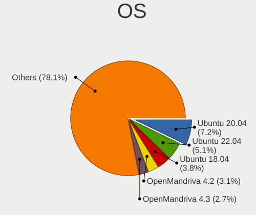

| Name                         | Desktops | Percent |
|------------------------------|----------|---------|
| Ubuntu 20.04                 | 103      | 7.19%   |
| Ubuntu 22.04                 | 73       | 5.1%    |
| Ubuntu 18.04                 | 55       | 3.84%   |
| OpenMandriva 4.2             | 44       | 3.07%   |
| OpenMandriva 4.3             | 39       | 2.72%   |
| Debian 12                    | 38       | 2.65%   |
| Ubuntu 24.04                 | 29       | 2.03%   |
| Debian 11                    | 29       | 2.03%   |
| Zorin 17                     | 28       | 1.96%   |
| OpenMandriva 25.90           | 26       | 1.82%   |
| ArcoLinux Rolling            | 26       | 1.82%   |
| Arch Rolling                 | 26       | 1.82%   |
| Pop!_OS 22.04                | 25       | 1.75%   |
| Linux Mint 22.1              | 21       | 1.47%   |
| Fedora 42                    | 21       | 1.47%   |
| Fedora 39                    | 21       | 1.47%   |
| Fedora 38                    | 19       | 1.33%   |
| Zorin 16                     | 18       | 1.26%   |
| OpenMandriva 23.08           | 18       | 1.26%   |
| Fedora 41                    | 16       | 1.12%   |
| Bazzite 42                   | 15       | 1.05%   |
| OpenMandriva 24.07           | 14       | 0.98%   |
| OpenMandriva 24.12           | 13       | 0.91%   |
| OpenMandriva 23.03           | 13       | 0.91%   |
| OpenMandriva 23.01           | 13       | 0.91%   |
| Manjaro                      | 13       | 0.91%   |
| Fedora 40                    | 13       | 0.91%   |
| EndeavourOS Rolling          | 13       | 0.91%   |
| OpenMandriva 6.0             | 12       | 0.84%   |
| Linux Mint 20.3              | 12       | 0.84%   |
| Linux Mint 20.2              | 12       | 0.84%   |
| KDE neon 22.04               | 12       | 0.84%   |
| Arch                         | 12       | 0.84%   |
| Zorin 18                     | 10       | 0.7%    |
| openSUSE Tumbleweed-XXXXXXXX | 10       | 0.7%    |
| Linux Mint 21.2              | 10       | 0.7%    |
| Fedora 35                    | 10       | 0.7%    |
| Pop!_OS 20.04                | 9        | 0.63%   |
| OpenMandriva 5.0             | 9        | 0.63%   |
| KDE neon 20.04               | 9        | 0.63%   |

OS Family
---------

OS without a version

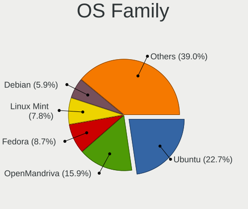

| Name          | Desktops | Percent |
|---------------|----------|---------|
| Ubuntu        | 309      | 22.67%  |
| OpenMandriva  | 217      | 15.92%  |
| Fedora        | 118      | 8.66%   |
| Linux Mint    | 106      | 7.78%   |
| Debian        | 81       | 5.94%   |
| Zorin         | 65       | 4.77%   |
| Pop!_OS       | 44       | 3.23%   |
| Arch          | 38       | 2.79%   |
| Manjaro       | 36       | 2.64%   |
| ROSA          | 33       | 2.42%   |
| Endless       | 26       | 1.91%   |
| ArcoLinux     | 26       | 1.91%   |
| Bazzite       | 25       | 1.83%   |
| Kubuntu       | 23       | 1.69%   |
| KDE neon      | 21       | 1.54%   |
| Elementary    | 18       | 1.32%   |
| Xubuntu       | 17       | 1.25%   |
| openSUSE      | 15       | 1.1%    |
| Nobara        | 14       | 1.03%   |
| EndeavourOS   | 14       | 1.03%   |
| CachyOS       | 8        | 0.59%   |
| Kali          | 7        | 0.51%   |
| Gentoo        | 7        | 0.51%   |
| Garuda Linux  | 7        | 0.51%   |
| Xero          | 5        | 0.37%   |
| Ubuntu MATE   | 5        | 0.37%   |
| Parrot        | 5        | 0.37%   |
| LMDE          | 5        | 0.37%   |
| Linux Lite    | 5        | 0.37%   |
| Ubuntu Budgie | 4        | 0.29%   |
| Lubuntu       | 4        | 0.29%   |
| Deepin        | 4        | 0.29%   |
| Ubuntu Unity  | 3        | 0.22%   |
| Nitrux        | 3        | 0.22%   |
| MX            | 3        | 0.22%   |
| Artix         | 3        | 0.22%   |
| Ubuntu Studio | 2        | 0.15%   |
| Peppermint    | 2        | 0.15%   |
| Clear Linux   | 2        | 0.15%   |
| CentOS        | 2        | 0.15%   |

Kernel
------

Version of the Linux kernel

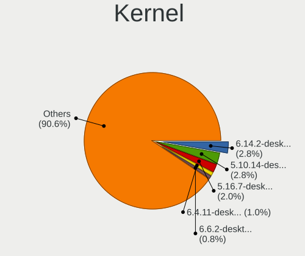

| Version                  | Desktops | Percent |
|--------------------------|----------|---------|
| 6.14.2-desktop-3omv2590  | 44       | 2.8%    |
| 5.10.14-desktop-1omv4002 | 44       | 2.8%    |
| 5.16.7-desktop-1omv4003  | 32       | 2.03%   |
| 6.4.11-desktop-1omv2390  | 15       | 0.95%   |
| 6.6.2-desktop-1omv2390   | 13       | 0.83%   |
| 5.4.0-42-generic         | 13       | 0.83%   |
| 6.10.0-desktop-1omv2490  | 12       | 0.76%   |
| 6.1.1-desktop-1omv2290   | 12       | 0.76%   |
| 5.8.0-14-generic         | 12       | 0.76%   |
| 6.8.0-51-generic         | 11       | 0.7%    |
| 6.12.1-desktop-1omv2490  | 11       | 0.7%    |
| 6.8.0-45-generic         | 10       | 0.64%   |
| 6.2.6-desktop-1omv2390   | 10       | 0.64%   |
| 5.4.0-58-generic         | 8        | 0.51%   |
| 5.4.0-40-generic         | 8        | 0.51%   |
| 5.3.0-40-generic         | 8        | 0.51%   |
| 5.16.13-desktop-1omv4003 | 8        | 0.51%   |
| 5.15.0-58-generic        | 8        | 0.51%   |
| 5.15.0-56-generic        | 8        | 0.51%   |
| 6.8.0-60-generic         | 7        | 0.44%   |
| 6.5.0-14-generic         | 7        | 0.44%   |
| 6.1.0-13-amd64           | 7        | 0.44%   |
| 5.4.0-54-generic         | 7        | 0.44%   |
| 5.15.0-47-generic        | 7        | 0.44%   |
| 6.8.0-52-generic         | 6        | 0.38%   |
| 6.5.0-35-generic         | 6        | 0.38%   |
| 5.4.0-48-generic         | 6        | 0.38%   |
| 5.19.0-35-generic        | 6        | 0.38%   |
| 5.15.0-76-generic        | 6        | 0.38%   |
| 5.15.0-52-generic        | 6        | 0.38%   |
| 5.11.0-37-generic        | 6        | 0.38%   |
| 5.11.0-27-generic        | 6        | 0.38%   |
| 6.9.3-76060903-generic   | 5        | 0.32%   |
| 6.8.0-49-generic         | 5        | 0.32%   |
| 6.2.6-76060206-generic   | 5        | 0.32%   |
| 6.2.0-37-generic         | 5        | 0.32%   |
| 6.2.0-26-generic         | 5        | 0.32%   |
| 6.17.7-ba20.fc43.x86_64  | 5        | 0.32%   |
| 6.14.0-29-generic        | 5        | 0.32%   |
| 5.8.0-53-generic         | 5        | 0.32%   |

Kernel Family
-------------

Linux kernel without a distro release

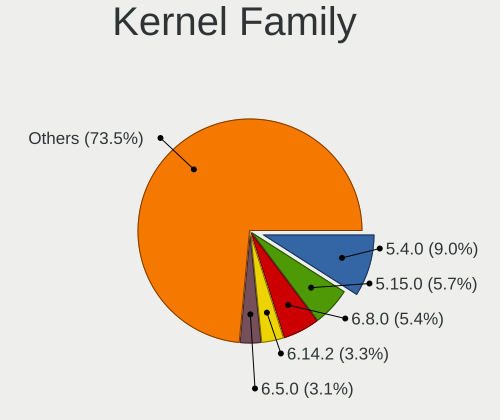

| Version | Desktops | Percent |
|---------|----------|---------|
| 5.4.0   | 135      | 9.05%   |
| 5.15.0  | 85       | 5.7%    |
| 6.8.0   | 80       | 5.36%   |
| 6.14.2  | 49       | 3.28%   |
| 6.5.0   | 46       | 3.08%   |
| 5.10.14 | 44       | 2.95%   |
| 4.15.0  | 42       | 2.82%   |
| 6.1.0   | 41       | 2.75%   |
| 5.11.0  | 41       | 2.75%   |
| 5.8.0   | 39       | 2.61%   |
| 5.13.0  | 34       | 2.28%   |
| 6.14.0  | 33       | 2.21%   |
| 5.3.0   | 33       | 2.21%   |
| 5.16.7  | 32       | 2.14%   |
| 6.2.0   | 28       | 1.88%   |
| 5.10.0  | 28       | 1.88%   |
| 5.19.0  | 24       | 1.61%   |
| 4.18.0  | 18       | 1.21%   |
| 6.4.11  | 17       | 1.14%   |
| 6.2.6   | 15       | 1.01%   |
| 6.6.2   | 14       | 0.94%   |
| 6.10.0  | 14       | 0.94%   |
| 6.12.1  | 13       | 0.87%   |
| 6.11.0  | 13       | 0.87%   |
| 6.1.1   | 13       | 0.87%   |
| 6.17.7  | 12       | 0.8%    |
| 5.0.0   | 12       | 0.8%    |
| 5.16.13 | 9        | 0.6%    |
| 6.7.9   | 8        | 0.54%   |
| 6.5.5   | 7        | 0.47%   |
| 6.16.8  | 7        | 0.47%   |
| 6.15.9  | 7        | 0.47%   |
| 6.12.10 | 7        | 0.47%   |
| 6.9.3   | 6        | 0.4%    |
| 6.7.0   | 5        | 0.34%   |
| 6.5.6   | 5        | 0.34%   |
| 6.4.8   | 5        | 0.34%   |
| 6.16.4  | 5        | 0.34%   |
| 6.13.5  | 5        | 0.34%   |
| 4.9.20  | 5        | 0.34%   |

Kernel Major Ver.
-----------------

Linux kernel major version

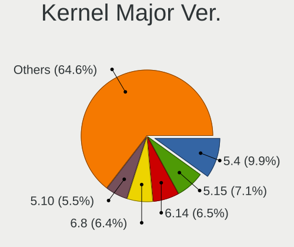

| Version | Desktops | Percent |
|---------|----------|---------|
| 5.4     | 146      | 9.93%   |
| 5.15    | 105      | 7.14%   |
| 6.14    | 95       | 6.46%   |
| 6.8     | 94       | 6.39%   |
| 5.10    | 81       | 5.51%   |
| 6.1     | 67       | 4.56%   |
| 6.5     | 64       | 4.35%   |
| 6.2     | 59       | 4.01%   |
| 6.12    | 57       | 3.88%   |
| 5.16    | 50       | 3.4%    |
| 5.11    | 49       | 3.33%   |
| 5.8     | 45       | 3.06%   |
| 6.4     | 43       | 2.93%   |
| 4.15    | 42       | 2.86%   |
| 6.6     | 41       | 2.79%   |
| 5.3     | 39       | 2.65%   |
| 5.13    | 39       | 2.65%   |
| 5.19    | 33       | 2.24%   |
| 6.10    | 28       | 1.9%    |
| 6.17    | 26       | 1.77%   |
| 6.11    | 26       | 1.77%   |
| 6.16    | 21       | 1.43%   |
| 6.0     | 21       | 1.43%   |
| 6.9     | 19       | 1.29%   |
| 6.7     | 19       | 1.29%   |
| 4.18    | 19       | 1.29%   |
| 6.15    | 14       | 0.95%   |
| 6.3     | 13       | 0.88%   |
| 5.0     | 13       | 0.88%   |
| 4.9     | 13       | 0.88%   |
| 5.18    | 10       | 0.68%   |
| 6.13    | 9        | 0.61%   |
| 5.9     | 9        | 0.61%   |
| 5.14    | 9        | 0.61%   |
| 4.19    | 8        | 0.54%   |
| 5.7     | 7        | 0.48%   |
| 5.12    | 7        | 0.48%   |
| 5.17    | 6        | 0.41%   |
| 5.6     | 5        | 0.34%   |
| 6.18    | 4        | 0.27%   |

Arch
----

OS architecture (x86_64, i586, etc.)

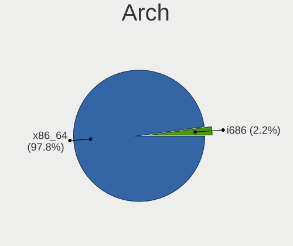

| Name   | Desktops | Percent |
|--------|----------|---------|
| x86_64 | 1270     | 97.84%  |
| i686   | 28       | 2.16%   |

DE
--

Desktop Environment

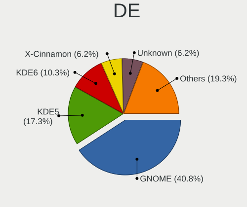

| Name             | Desktops | Percent |
|------------------|----------|---------|
| GNOME            | 563      | 40.8%   |
| KDE5             | 239      | 17.32%  |
| KDE6             | 142      | 10.29%  |
| X-Cinnamon       | 85       | 6.16%   |
| Unknown          | 85       | 6.16%   |
| XFCE             | 84       | 6.09%   |
| MATE             | 39       | 2.83%   |
| KDE              | 21       | 1.52%   |
| Cinnamon         | 20       | 1.45%   |
| KDE4             | 18       | 1.3%    |
| Pantheon         | 17       | 1.23%   |
| LXQt             | 16       | 1.16%   |
| Budgie           | 8        | 0.58%   |
| LXDE             | 5        | 0.36%   |
| Deepin           | 5        | 0.36%   |
| Hyprland         | 4        | 0.29%   |
| Unity            | 3        | 0.22%   |
| qtile            | 3        | 0.22%   |
| i3               | 3        | 0.22%   |
| GNOME Classic    | 3        | 0.22%   |
| niri             | 2        | 0.14%   |
| lightdm-xsession | 2        | 0.14%   |
| GNOME Flashback  | 2        | 0.14%   |
| DDE              | 2        | 0.14%   |
| COSMIC           | 2        | 0.14%   |
| awesome          | 2        | 0.14%   |
| Trinity          | 1        | 0.07%   |
| jwm              | 1        | 0.07%   |
| fluxbox          | 1        | 0.07%   |
| Cutefish         | 1        | 0.07%   |
| chadwm           | 1        | 0.07%   |

Display Server
--------------

X11 or Wayland

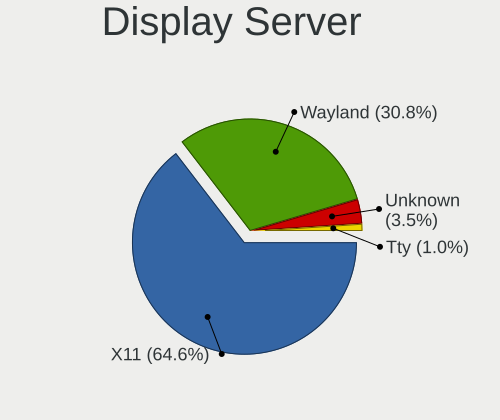

| Name    | Desktops | Percent |
|---------|----------|---------|
| X11     | 875      | 64.58%  |
| Wayland | 418      | 30.85%  |
| Unknown | 48       | 3.54%   |
| Tty     | 14       | 1.03%   |

Display Manager
---------------

SDDM, LightDM, etc.

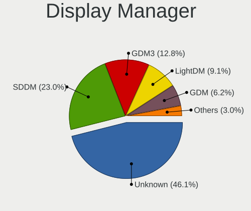

| Name    | Desktops | Percent |
|---------|----------|---------|
| Unknown | 621      | 46.07%  |
| SDDM    | 310      | 23%     |
| GDM3    | 172      | 12.76%  |
| LightDM | 122      | 9.05%   |
| GDM     | 83       | 6.16%   |
| KDM     | 18       | 1.34%   |
| TDM     | 16       | 1.19%   |
| SLiM    | 2        | 0.15%   |
| XDM     | 1        | 0.07%   |
| SLIMSKI | 1        | 0.07%   |
| NODM    | 1        | 0.07%   |
| LXDM    | 1        | 0.07%   |

OS Lang
-------

Language

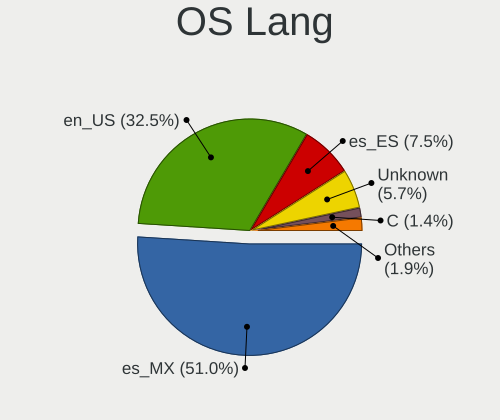

| Lang        | Desktops | Percent |
|-------------|----------|---------|
| es_MX       | 685      | 51.01%  |
| en_US       | 436      | 32.46%  |
| es_ES       | 101      | 7.52%   |
| Unknown     | 76       | 5.66%   |
| C           | 19       | 1.41%   |
| en_GB       | 6        | 0.45%   |
| es_US       | 5        | 0.37%   |
| en_CA       | 5        | 0.37%   |
| POSIX       | 2        | 0.15%   |
| fr_FR       | 2        | 0.15%   |
| es_AR       | 2        | 0.15%   |
| es_VE       | 1        | 0.07%   |
| es_MX UTF-8 | 1        | 0.07%   |
| en_US.UTF8  | 1        | 0.07%   |
| Default     | 1        | 0.07%   |

Boot Mode
---------

EFI or BIOS

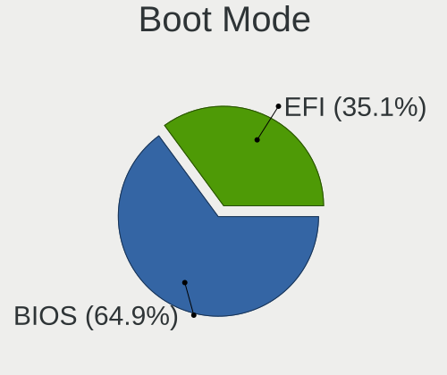

| Mode | Desktops | Percent |
|------|----------|---------|
| BIOS | 866      | 64.92%  |
| EFI  | 468      | 35.08%  |

Filesystem
----------

Type of filesystem

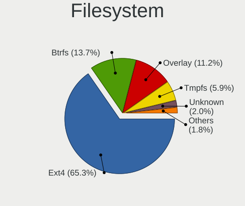

| Type     | Desktops | Percent |
|----------|----------|---------|
| Ext4     | 873      | 65.34%  |
| Btrfs    | 183      | 13.7%   |
| Overlay  | 150      | 11.23%  |
| Tmpfs    | 79       | 5.91%   |
| Unknown  | 27       | 2.02%   |
| Xfs      | 9        | 0.67%   |
| Zfs      | 5        | 0.37%   |
| F2fs     | 4        | 0.3%    |
| Reiserfs | 3        | 0.22%   |
| Ext2     | 3        | 0.22%   |

Part. scheme
------------

Scheme of partitioning

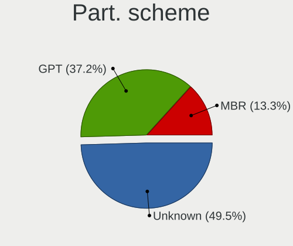

| Type    | Desktops | Percent |
|---------|----------|---------|
| Unknown | 657      | 49.55%  |
| GPT     | 493      | 37.18%  |
| MBR     | 176      | 13.27%  |

Dual Boot with Linux/BSD
------------------------

Hosting more than one Linux/BSD

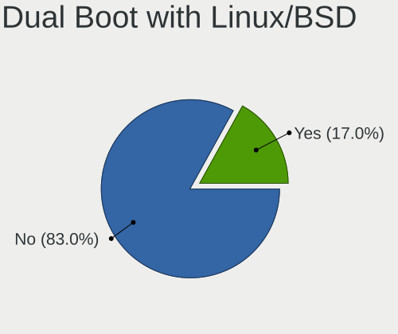

| Dual boot | Desktops | Percent |
|-----------|----------|---------|
| No        | 1102     | 83.04%  |
| Yes       | 225      | 16.96%  |

Dual Boot (Win)
---------------

Hosting Linux and Windows

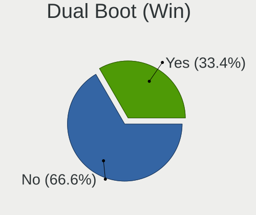

| Dual boot | Desktops | Percent |
|-----------|----------|---------|
| No        | 885      | 66.64%  |
| Yes       | 443      | 33.36%  |

Board
-----

Vendor
------

Motherboard manufacturer

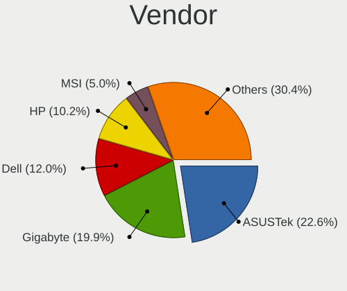

| Name                                 | Desktops | Percent |
|--------------------------------------|----------|---------|
| ASUSTek Computer                     | 293      | 22.57%  |
| Gigabyte Technology                  | 258      | 19.88%  |
| Dell                                 | 156      | 12.02%  |
| Hewlett-Packard                      | 132      | 10.17%  |
| MSI                                  | 65       | 5.01%   |
| ASRock                               | 64       | 4.93%   |
| Intel                                | 49       | 3.78%   |
| Lenovo                               | 47       | 3.62%   |
| ECS                                  | 43       | 3.31%   |
| Biostar                              | 42       | 3.24%   |
| Pegatron                             | 24       | 1.85%   |
| Unknown                              | 16       | 1.23%   |
| Acer                                 | 13       | 1%      |
| PCChips                              | 10       | 0.77%   |
| Foxconn                              | 10       | 0.77%   |
| Lanix                                | 8        | 0.62%   |
| Alienware                            | 6        | 0.46%   |
| MACHINIST                            | 5        | 0.39%   |
| TPV-INVENTA                          | 4        | 0.31%   |
| eMachines                            | 4        | 0.31%   |
| AZW                                  | 4        | 0.31%   |
| Wistron                              | 3        | 0.23%   |
| OEM                                  | 3        | 0.23%   |
| Gateway                              | 3        | 0.23%   |
| Quanta                               | 2        | 0.15%   |
| PELADN                               | 2        | 0.15%   |
| NZXT                                 | 2        | 0.15%   |
| IBM                                  | 2        | 0.15%   |
| Huanan                               | 2        | 0.15%   |
| GMKtec                               | 2        | 0.15%   |
| VIA Technologies                     | 1        | 0.08%   |
| Toshiba                              | 1        | 0.08%   |
| System76                             | 1        | 0.08%   |
| Supermicro                           | 1        | 0.08%   |
| Shenzhen Meigao Electronic Equipment | 1        | 0.08%   |
| Shenzhen DOKE electronic             | 1        | 0.08%   |
| QIYIDA                               | 1        | 0.08%   |
| Pelco by Schneider Electric          | 1        | 0.08%   |
| NEC Infrontia                        | 1        | 0.08%   |
| MUCAI                                | 1        | 0.08%   |

Model
-----

Motherboard model

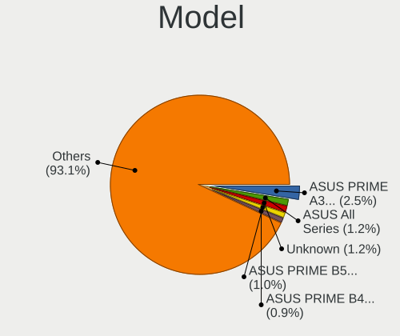

| Name                         | Desktops | Percent |
|------------------------------|----------|---------|
| ASUS PRIME A320M-K           | 33       | 2.54%   |
| ASUS All Series              | 16       | 1.23%   |
| Unknown                      | 16       | 1.23%   |
| ASUS PRIME B550M-A AC        | 13       | 1%      |
| ASUS PRIME B450M-A II        | 12       | 0.92%   |
| Dell OptiPlex 7010           | 11       | 0.85%   |
| Dell OptiPlex 9020           | 10       | 0.77%   |
| Gigabyte B450M DS3H          | 9        | 0.69%   |
| ASUS ROG STRIX B450-F GAMING | 9        | 0.69%   |
| HP Compaq 6200 Pro SFF PC    | 8        | 0.62%   |
| Gigabyte A320M-S2H           | 8        | 0.62%   |
| Dell OptiPlex 790            | 8        | 0.62%   |
| Biostar B450MH               | 8        | 0.62%   |
| Gigabyte GA-880GM-USB3       | 7        | 0.54%   |
| ECS A320AM4-M3D              | 7        | 0.54%   |
| Dell OptiPlex 745            | 7        | 0.54%   |
| ASUS PRIME B450M-A           | 7        | 0.54%   |
| ASUS PRIME A520M-A II        | 7        | 0.54%   |
| Dell OptiPlex 990            | 6        | 0.46%   |
| Dell OptiPlex 755            | 6        | 0.46%   |
| Dell OptiPlex 3010           | 6        | 0.46%   |
| HP ProDesk 600 G1 SFF        | 5        | 0.39%   |
| Gigabyte B550M DS3H AC       | 5        | 0.39%   |
| Gigabyte B550M AORUS ELITE   | 5        | 0.39%   |
| Gigabyte B450 AORUS M        | 5        | 0.39%   |
| Dell OptiPlex 760            | 5        | 0.39%   |
| Dell Inspiron 3647           | 5        | 0.39%   |
| Biostar A10N-8800E           | 5        | 0.39%   |
| ASUS M5A78L-M PLUS/USB3      | 5        | 0.39%   |
| ASUS M5A78L-M LX PLUS        | 5        | 0.39%   |
| ASRock B450M Steel Legend    | 5        | 0.39%   |
| MSI MS-7C95                  | 4        | 0.31%   |
| HP ProDesk 400 G6 SFF        | 4        | 0.31%   |
| HP Compaq Pro 6300 SFF       | 4        | 0.31%   |
| HP Compaq 8200 Elite SFF PC  | 4        | 0.31%   |
| Gigabyte H61M-DS2            | 4        | 0.31%   |
| Gigabyte H310M H 2.0         | 4        | 0.31%   |
| Gigabyte H110M-H             | 4        | 0.31%   |
| Gigabyte GA-E6010N           | 4        | 0.31%   |
| Gigabyte GA-78LMT-USB3       | 4        | 0.31%   |

Model Family
------------

Motherboard model prefix

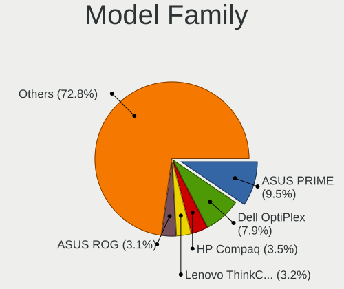

| Name                   | Desktops | Percent |
|------------------------|----------|---------|
| ASUS PRIME             | 123      | 9.48%   |
| Dell OptiPlex          | 103      | 7.94%   |
| HP Compaq              | 46       | 3.54%   |
| Lenovo ThinkCentre     | 41       | 3.16%   |
| ASUS ROG               | 40       | 3.08%   |
| ASUS TUF               | 29       | 2.23%   |
| Dell Inspiron          | 23       | 1.77%   |
| HP ProDesk             | 22       | 1.69%   |
| HP EliteDesk           | 17       | 1.31%   |
| Gigabyte B550M         | 16       | 1.23%   |
| ASUS All               | 16       | 1.23%   |
| Unknown                | 16       | 1.23%   |
| ASUS M5A78L-M          | 14       | 1.08%   |
| Gigabyte B450M         | 13       | 1%      |
| Dell Precision         | 13       | 1%      |
| Gigabyte B450          | 12       | 0.92%   |
| Gigabyte A320M-S2H     | 12       | 0.92%   |
| Acer Aspire            | 11       | 0.85%   |
| Gigabyte X570          | 9        | 0.69%   |
| ASRock B450M           | 9        | 0.69%   |
| Biostar B450MH         | 8        | 0.62%   |
| Gigabyte H410M         | 7        | 0.54%   |
| Gigabyte GA-880GM-USB3 | 7        | 0.54%   |
| ECS A320AM4-M3D        | 7        | 0.54%   |
| ASUS M5A97             | 7        | 0.54%   |
| Gigabyte H310M         | 6        | 0.46%   |
| Gigabyte A520M         | 6        | 0.46%   |
| Gigabyte H61M-DS2      | 5        | 0.39%   |
| Gigabyte H110M-H       | 5        | 0.39%   |
| Gigabyte GA-78LMT-USB3 | 5        | 0.39%   |
| Gigabyte G1.Sniper     | 5        | 0.39%   |
| Gigabyte B550          | 5        | 0.39%   |
| Dell Vostro            | 5        | 0.39%   |
| Biostar A10N-8800E     | 5        | 0.39%   |
| Alienware X51          | 5        | 0.39%   |
| MSI MS-7C95            | 4        | 0.31%   |
| Lanix TITAN            | 4        | 0.31%   |
| Intel DH67BL           | 4        | 0.31%   |
| HP ProLiant            | 4        | 0.31%   |
| Gigabyte Z390          | 4        | 0.31%   |

MFG Year
--------

Motherboard manufacture year

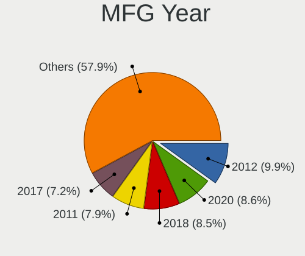

| Year    | Desktops | Percent |
|---------|----------|---------|
| 2012    | 129      | 9.94%   |
| 2020    | 112      | 8.63%   |
| 2018    | 110      | 8.47%   |
| 2011    | 102      | 7.86%   |
| 2017    | 94       | 7.24%   |
| 2013    | 94       | 7.24%   |
| 2009    | 77       | 5.93%   |
| 2021    | 68       | 5.24%   |
| 2019    | 67       | 5.16%   |
| 2014    | 66       | 5.08%   |
| 2010    | 61       | 4.7%    |
| 2016    | 50       | 3.85%   |
| 2015    | 46       | 3.54%   |
| 2007    | 46       | 3.54%   |
| 2022    | 45       | 3.47%   |
| 2023    | 42       | 3.24%   |
| 2008    | 37       | 2.85%   |
| 2006    | 20       | 1.54%   |
| 2024    | 19       | 1.46%   |
| 2005    | 9        | 0.69%   |
| 2025    | 2        | 0.15%   |
| 2003    | 1        | 0.08%   |
| Unknown | 1        | 0.08%   |

Form Factor
-----------

Physical design of the computer

| Name    | Desktops | Percent |
|---------|----------|---------|
| Desktop | 1298     | 100%    |

Secure Boot
-----------

Enabled or disabled

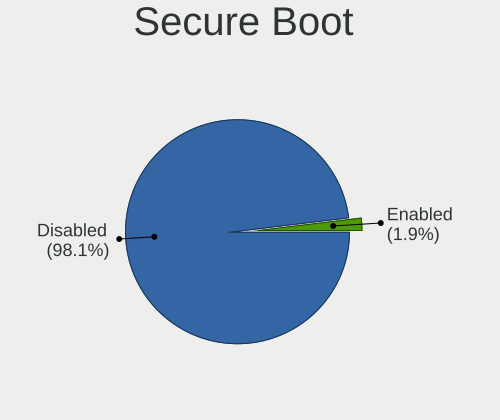

| State    | Desktops | Percent |
|----------|----------|---------|
| Disabled | 1277     | 98.08%  |
| Enabled  | 25       | 1.92%   |

Coreboot
--------

Have coreboot on board

| Used | Desktops | Percent |
|------|----------|---------|
| No   | 1297     | 99.92%  |
| Yes  | 1        | 0.08%   |

RAM Size
--------

Total RAM memory

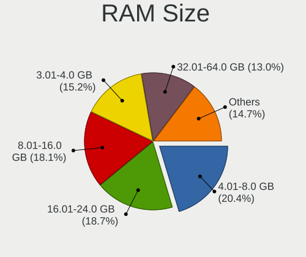

| Size in GB      | Desktops | Percent |
|-----------------|----------|---------|
| 4.01-8.0        | 272      | 20.37%  |
| 16.01-24.0      | 249      | 18.65%  |
| 8.01-16.0       | 241      | 18.05%  |
| 3.01-4.0        | 203      | 15.21%  |
| 32.01-64.0      | 174      | 13.03%  |
| 64.01-256.0     | 65       | 4.87%   |
| 24.01-32.0      | 61       | 4.57%   |
| 1.01-2.0        | 36       | 2.7%    |
| 2.01-3.0        | 25       | 1.87%   |
| 0.51-1.0        | 5        | 0.37%   |
| 0.01-0.5        | 2        | 0.15%   |
| More than 256.0 | 1        | 0.07%   |
| Unknown         | 1        | 0.07%   |

RAM Used
--------

Used RAM memory

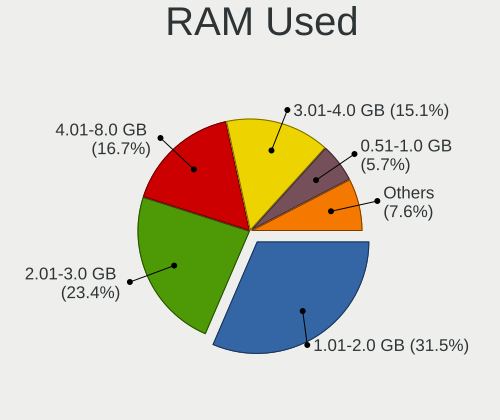

| Used GB     | Desktops | Percent |
|-------------|----------|---------|
| 1.01-2.0    | 455      | 31.47%  |
| 2.01-3.0    | 339      | 23.44%  |
| 4.01-8.0    | 241      | 16.67%  |
| 3.01-4.0    | 219      | 15.15%  |
| 0.51-1.0    | 82       | 5.67%   |
| 8.01-16.0   | 79       | 5.46%   |
| 16.01-24.0  | 10       | 0.69%   |
| 0.01-0.5    | 10       | 0.69%   |
| 24.01-32.0  | 5        | 0.35%   |
| 32.01-64.0  | 3        | 0.21%   |
| Unknown     | 2        | 0.14%   |
| 64.01-256.0 | 1        | 0.07%   |

Total Drives
------------

Number of drives on board

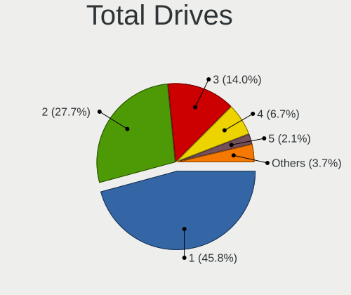

| Drives  | Desktops | Percent |
|---------|----------|---------|
| 1       | 626      | 45.79%  |
| 2       | 378      | 27.65%  |
| 3       | 192      | 14.05%  |
| 4       | 91       | 6.66%   |
| 5       | 29       | 2.12%   |
| 6       | 20       | 1.46%   |
| 0       | 20       | 1.46%   |
| 7       | 7        | 0.51%   |
| 8       | 2        | 0.15%   |
| 10      | 1        | 0.07%   |
| Unknown | 1        | 0.07%   |

Has CD-ROM
----------

Has CD-ROM on board

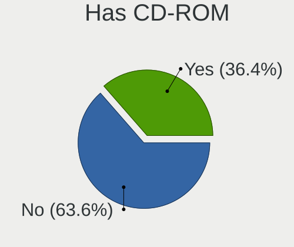

| Presented | Desktops | Percent |
|-----------|----------|---------|
| No        | 834      | 63.57%  |
| Yes       | 478      | 36.43%  |

Has Ethernet
------------

Has Ethernet on board

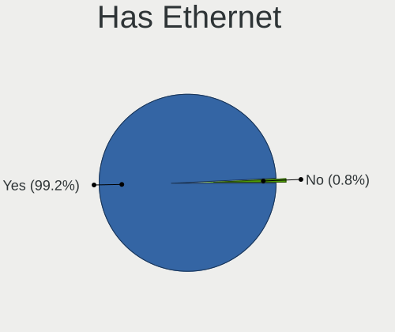

| Presented | Desktops | Percent |
|-----------|----------|---------|
| Yes       | 1288     | 99.23%  |
| No        | 10       | 0.77%   |

Has WiFi
--------

Has WiFi module

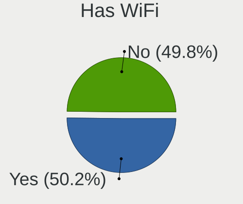

| Presented | Desktops | Percent |
|-----------|----------|---------|
| Yes       | 663      | 50.19%  |
| No        | 658      | 49.81%  |

Has Bluetooth
-------------

Has Bluetooth module

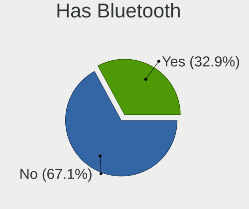

| Presented | Desktops | Percent |
|-----------|----------|---------|
| No        | 882      | 67.07%  |
| Yes       | 433      | 32.93%  |

Location
--------

Country
-------

Geographic location (country)

| Country | Desktops | Percent |
|---------|----------|---------|
| Mexico  | 1298     | 100%    |

City
----

Geographic location (city)

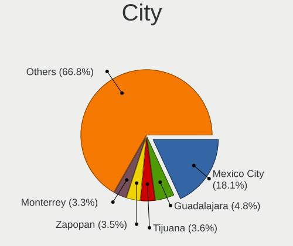

| City                  | Desktops | Percent |
|-----------------------|----------|---------|
| Mexico City           | 250      | 18.1%   |
| Guadalajara           | 66       | 4.78%   |
| Tijuana               | 50       | 3.62%   |
| Zapopan               | 48       | 3.48%   |
| Monterrey             | 45       | 3.26%   |
| Puebla City           | 34       | 2.46%   |
| Mérida               | 32       | 2.32%   |
| Hermosillo            | 24       | 1.74%   |
| Tlalnepantla          | 23       | 1.67%   |
| San Luis Potosí City | 21       | 1.52%   |
| Chihuahua City        | 21       | 1.52%   |
| Queretaro             | 20       | 1.45%   |
| Querétaro City       | 19       | 1.38%   |
| Morelia               | 19       | 1.38%   |
| Mexicali              | 19       | 1.38%   |
| Gustavo Adolfo Madero | 18       | 1.3%    |
| León                 | 17       | 1.23%   |
| Cuernavaca            | 17       | 1.23%   |
| Aguascalientes        | 17       | 1.23%   |
| Ciudad Nezahualcoyotl | 16       | 1.16%   |
| Ciudad Juárez        | 16       | 1.16%   |
| Culiacán             | 15       | 1.09%   |
| Apodaca               | 15       | 1.09%   |
| Iztapalapa            | 14       | 1.01%   |
| Toluca                | 13       | 0.94%   |
| Pachuca               | 13       | 0.94%   |
| Oaxaca City           | 13       | 0.94%   |
| Ecatepec              | 13       | 0.94%   |
| Naucalpan             | 12       | 0.87%   |
| Guadalupe             | 12       | 0.87%   |
| Tuxtla Gutiérrez     | 11       | 0.8%    |
| Cancún               | 11       | 0.8%    |
| Xalapa                | 10       | 0.72%   |
| Veracruz              | 10       | 0.72%   |
| Ciudad Obregón       | 10       | 0.72%   |
| Tepic                 | 9        | 0.65%   |
| Saltillo              | 8        | 0.58%   |
| Puerto Vallarta       | 8        | 0.58%   |
| Mazatlán             | 8        | 0.58%   |
| Torreón              | 7        | 0.51%   |

Drives
------

Drive Vendor
------------

Hard drive vendors

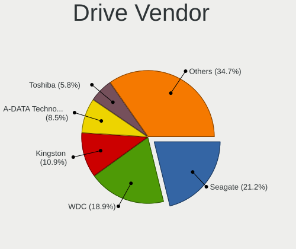

| Vendor                      | Desktops | Drives | Percent |
|-----------------------------|----------|--------|---------|
| Seagate                     | 472      | 741    | 21.17%  |
| WDC                         | 421      | 606    | 18.88%  |
| Kingston                    | 244      | 365    | 10.94%  |
| A-DATA Technology           | 190      | 242    | 8.52%   |
| Toshiba                     | 129      | 173    | 5.78%   |
| Hitachi                     | 117      | 157    | 5.25%   |
| Samsung Electronics         | 95       | 138    | 4.26%   |
| Sandisk                     | 50       | 67     | 2.24%   |
| Kingston Technology Company | 38       | 53     | 1.7%    |
| ADATA Technology            | 27       | 33     | 1.21%   |
| Intel                       | 23       | 41     | 1.03%   |
| HGST                        | 23       | 34     | 1.03%   |
| Crucial                     | 23       | 43     | 1.03%   |
| China                       | 23       | 31     | 1.03%   |
| Unknown                     | 22       | 36     | 0.99%   |
| XPG                         | 21       | 24     | 0.94%   |
| PNY                         | 20       | 28     | 0.9%    |
| Realtek Semiconductor       | 18       | 24     | 0.81%   |
| Micron Technology           | 18       | 23     | 0.81%   |
| MAXIO Technology (Hangzhou) | 17       | 18     | 0.76%   |
| SK hynix                    | 15       | 23     | 0.67%   |
| Patriot                     | 15       | 21     | 0.67%   |
| Maxtor                      | 12       | 15     | 0.54%   |
| Fujitsu                     | 12       | 16     | 0.54%   |
| Hewlett-Packard             | 11       | 11     | 0.49%   |
| Acer                        | 11       | 13     | 0.49%   |
| Micron/Crucial Technology   | 10       | 15     | 0.45%   |
| Gigabyte Technology         | 10       | 11     | 0.45%   |
| Phison Electronics          | 9        | 11     | 0.4%    |
| Phison                      | 6        | 7      | 0.27%   |
| Silicon Motion              | 5        | 6      | 0.22%   |
| JMicron Technology          | 5        | 5      | 0.22%   |
| SPCC                        | 4        | 5      | 0.18%   |
| Quaroni                     | 4        | 4      | 0.18%   |
| Lexar                       | 4        | 4      | 0.18%   |
| WALRAM                      | 3        | 3      | 0.13%   |
| Team                        | 3        | 3      | 0.13%   |
| Realtek                     | 3        | 3      | 0.13%   |
| Predator                    | 3        | 4      | 0.13%   |
| MSI                         | 3        | 3      | 0.13%   |

Drive Model
-----------

Hard drive models

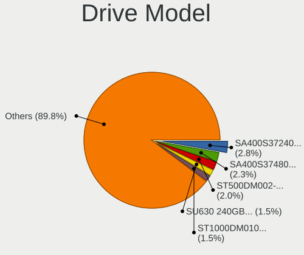

| Model                                                              | Desktops | Percent |
|--------------------------------------------------------------------|----------|---------|
| Kingston SA400S37240G 240GB SSD                                    | 71       | 2.82%   |
| Kingston SA400S37480G 480GB SSD                                    | 59       | 2.34%   |
| Seagate ST500DM002-1BD142 500GB                                    | 51       | 2.02%   |
| A-DATA SU630 240GB SSD                                             | 39       | 1.55%   |
| Seagate ST1000DM010-2EP102 1TB                                     | 38       | 1.51%   |
| A-DATA SU650 120GB SSD                                             | 35       | 1.39%   |
| Kingston SA400S37960G 960GB SSD                                    | 25       | 0.99%   |
| Toshiba DT01ACA100 1TB                                             | 23       | 0.91%   |
| Seagate ST2000DM008-2FR102 2TB                                     | 22       | 0.87%   |
| Kingston SA400S37120G 120GB SSD                                    | 22       | 0.87%   |
| Kingston Company SNV2S1000G 1TB                                    | 20       | 0.79%   |
| WDC WD10EZEX-08WN4A0 1TB                                           | 18       | 0.71%   |
| Seagate ST1000DM003-1ER162 1TB                                     | 18       | 0.71%   |
| A-DATA SU630 480GB SSD                                             | 18       | 0.71%   |
| Toshiba DT01ACA050 500GB                                           | 17       | 0.67%   |
| Seagate ST3500418AS 500GB                                          | 17       | 0.67%   |
| Seagate ST1000DM003-1CH162 1TB                                     | 16       | 0.63%   |
| A-DATA SU650 240GB SSD                                             | 16       | 0.63%   |
| WDC WDS240G2G0A-00JH30 240GB SSD                                   | 13       | 0.52%   |
| WDC WD Green 2.5 1000GB                                            | 13       | 0.52%   |
| Toshiba MQ01ABD100 1TB                                             | 13       | 0.52%   |
| Seagate ST4000DM004-2CV104 4TB                                     | 13       | 0.52%   |
| Toshiba DT01ACA200 2TB                                             | 12       | 0.48%   |
| Seagate ST2000DM006-2DM164 2TB                                     | 12       | 0.48%   |
| MAXIO (Hangzhou) NVMe SSD Controller MAP1202 2TB                   | 12       | 0.48%   |
| ADATA XPG SX8200 Pro PCIe Gen3x4 M.2 2280 Solid State Drive 1024GB | 12       | 0.48%   |
| Seagate ST1000LM035-1RK172 1TB                                     | 11       | 0.44%   |
| Seagate ST1000DM003-1SB102 1TB                                     | 11       | 0.44%   |
| WDC WD5000AAKX-60U6AA0 500GB                                       | 10       | 0.4%    |
| Seagate ST3160815AS 160GB                                          | 10       | 0.4%    |
| Seagate ST31000524AS 1TB                                           | 10       | 0.4%    |
| Kingston SNVS500G 500GB                                            | 10       | 0.4%    |
| A-DATA SU800 512GB SSD                                             | 10       | 0.4%    |
| Seagate ST31000528AS 1TB                                           | 9        | 0.36%   |
| Seagate ST2000DM001-1CH164 2TB                                     | 9        | 0.36%   |
| Kingston SV300S37A120G 120GB SSD                                   | 9        | 0.36%   |
| XPG GAMMIX S11 Pro 1TB                                             | 8        | 0.32%   |
| Seagate ST500LT012-9WS142 500GB                                    | 8        | 0.32%   |
| Seagate ST3500414CS 500GB                                          | 8        | 0.32%   |
| Seagate ST2000DL003-9VT166 2TB                                     | 8        | 0.32%   |

HDD Vendor
----------

Hard disk drive vendors

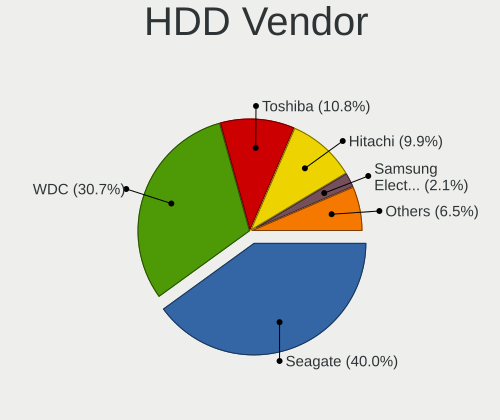

| Vendor              | Desktops | Drives | Percent |
|---------------------|----------|--------|---------|
| Seagate             | 471      | 738    | 40.02%  |
| WDC                 | 361      | 506    | 30.67%  |
| Toshiba             | 127      | 170    | 10.79%  |
| Hitachi             | 117      | 157    | 9.94%   |
| Samsung Electronics | 25       | 29     | 2.12%   |
| HGST                | 23       | 34     | 1.95%   |
| Maxtor              | 12       | 15     | 1.02%   |
| Fujitsu             | 12       | 16     | 1.02%   |
| Unknown             | 7        | 8      | 0.59%   |
| JMicron Technology  | 3        | 3      | 0.25%   |
| Apple               | 3        | 3      | 0.25%   |
| USB3.0              | 2        | 2      | 0.17%   |
| HPE                 | 2        | 3      | 0.17%   |
| HGST HTS            | 2        | 2      | 0.17%   |
| Hewlett-Packard     | 2        | 1      | 0.17%   |
| TO Exter            | 1        | 1      | 0.08%   |
| T-FORCE             | 1        | 1      | 0.08%   |
| Shenzhen            | 1        | 1      | 0.08%   |
| SABRENT             | 1        | 2      | 0.08%   |
| QUANTUM             | 1        | 2      | 0.08%   |
| MaxDigital          | 1        | 4      | 0.08%   |
| IBM/Hitachi         | 1        | 2      | 0.08%   |
| External            | 1        | 2      | 0.08%   |

SSD Vendor
----------

Solid state drive vendors

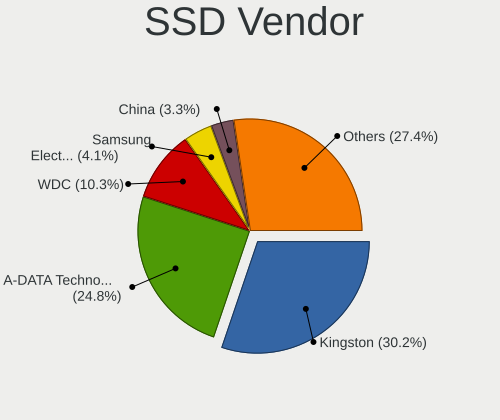

| Vendor              | Desktops | Drives | Percent |
|---------------------|----------|--------|---------|
| Kingston            | 212      | 306    | 30.2%   |
| A-DATA Technology   | 174      | 224    | 24.79%  |
| WDC                 | 72       | 91     | 10.26%  |
| Samsung Electronics | 29       | 40     | 4.13%   |
| China               | 23       | 31     | 3.28%   |
| Crucial             | 21       | 37     | 2.99%   |
| PNY                 | 19       | 27     | 2.71%   |
| Patriot             | 15       | 21     | 2.14%   |
| Micron Technology   | 13       | 16     | 1.85%   |
| Intel               | 11       | 14     | 1.57%   |
| SanDisk             | 10       | 11     | 1.42%   |
| Acer                | 10       | 11     | 1.42%   |
| Hewlett-Packard     | 9        | 10     | 1.28%   |
| Gigabyte Technology | 9        | 10     | 1.28%   |
| SK hynix            | 8        | 16     | 1.14%   |
| SPCC                | 4        | 5      | 0.57%   |
| Quaroni             | 4        | 4      | 0.57%   |
| MSI                 | 3        | 3      | 0.43%   |
| Lexar               | 3        | 3      | 0.43%   |
| Yeyian              | 2        | 2      | 0.28%   |
| XrayDisk            | 2        | 2      | 0.28%   |
| X12                 | 2        | 2      | 0.28%   |
| Transcend           | 2        | 2      | 0.28%   |
| tecmiyo             | 2        | 2      | 0.28%   |
| Team                | 2        | 2      | 0.28%   |
| Plextor             | 2        | 2      | 0.28%   |
| LITEON              | 2        | 2      | 0.28%   |
| Corsair             | 2        | 2      | 0.28%   |
| Blackpcs            | 2        | 2      | 0.28%   |
| WDC WDS2            | 1        | 1      | 0.14%   |
| WALRAM              | 1        | 1      | 0.14%   |
| VERICO              | 1        | 1      | 0.14%   |
| VALK                | 1        | 1      | 0.14%   |
| Unknown (C800)      | 1        | 1      | 0.14%   |
| Unknown             | 1        | 1      | 0.14%   |
| Toshiba             | 1        | 1      | 0.14%   |
| Timetec             | 1        | 1      | 0.14%   |
| Thinkplus           | 1        | 1      | 0.14%   |
| SSSTC               | 1        | 1      | 0.14%   |
| SKIHOTAR            | 1        | 1      | 0.14%   |

Drive Kind
----------

HDD or SSD

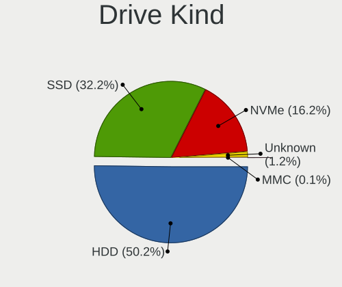

| Kind    | Desktops | Drives | Percent |
|---------|----------|--------|---------|
| HDD     | 932      | 1702   | 50.22%  |
| SSD     | 598      | 940    | 32.22%  |
| NVMe    | 301      | 487    | 16.22%  |
| Unknown | 23       | 43     | 1.24%   |
| MMC     | 2        | 2      | 0.11%   |

Drive Connector
---------------

SATA, SAS, NVMe, etc.

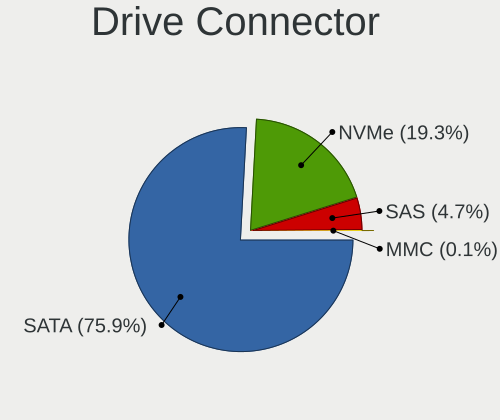

| Type | Desktops | Drives | Percent |
|------|----------|--------|---------|
| SATA | 1178     | 2591   | 75.85%  |
| NVMe | 300      | 482    | 19.32%  |
| SAS  | 73       | 99     | 4.7%    |
| MMC  | 2        | 2      | 0.13%   |

Drive Size
----------

Size of hard drive

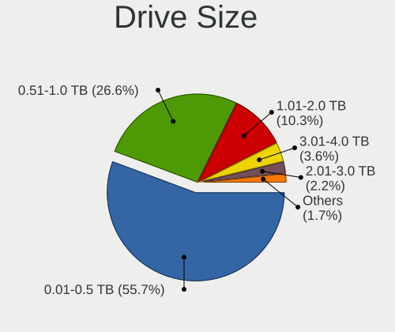

| Size in TB | Desktops | Drives | Percent |
|------------|----------|--------|---------|
| 0.01-0.5   | 902      | 1570   | 55.68%  |
| 0.51-1.0   | 431      | 655    | 26.6%   |
| 1.01-2.0   | 167      | 231    | 10.31%  |
| 3.01-4.0   | 58       | 103    | 3.58%   |
| 2.01-3.0   | 35       | 48     | 2.16%   |
| 4.01-10.0  | 26       | 34     | 1.6%    |
| 10.01-20.0 | 1        | 1      | 0.06%   |

Space Total
-----------

Amount of disk space available on the file system

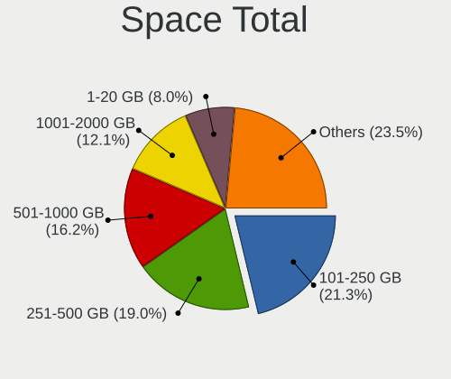

| Size in GB     | Desktops | Percent |
|----------------|----------|---------|
| 101-250        | 299      | 21.25%  |
| 251-500        | 267      | 18.98%  |
| 501-1000       | 228      | 16.2%   |
| 1001-2000      | 170      | 12.08%  |
| 1-20           | 112      | 7.96%   |
| More than 3000 | 102      | 7.25%   |
| 51-100         | 79       | 5.61%   |
| 2001-3000      | 57       | 4.05%   |
| 21-50          | 47       | 3.34%   |
| Unknown        | 46       | 3.27%   |

Space Used
----------

Amount of used disk space

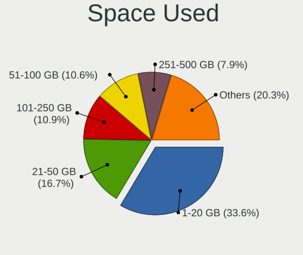

| Used GB        | Desktops | Percent |
|----------------|----------|---------|
| 1-20           | 486      | 33.59%  |
| 21-50          | 242      | 16.72%  |
| 101-250        | 158      | 10.92%  |
| 51-100         | 153      | 10.57%  |
| 251-500        | 114      | 7.88%   |
| 501-1000       | 112      | 7.74%   |
| 1001-2000      | 68       | 4.7%    |
| Unknown        | 46       | 3.18%   |
| More than 3000 | 38       | 2.63%   |
| 2001-3000      | 26       | 1.8%    |
| 0              | 4        | 0.28%   |

Malfunc. Drives
---------------

Drive models with a malfunction

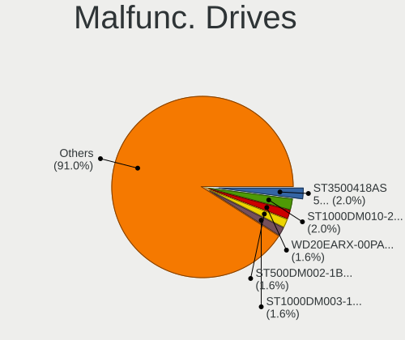

| Model                             | Desktops | Drives | Percent |
|-----------------------------------|----------|--------|---------|
| Seagate ST3500418AS 500GB         | 5        | 6      | 2.05%   |
| Seagate ST1000DM010-2EP102 1TB    | 5        | 5      | 2.05%   |
| WDC WD20EARX-00PASB0 2TB          | 4        | 4      | 1.64%   |
| Seagate ST500DM002-1BD142 500GB   | 4        | 5      | 1.64%   |
| Seagate ST1000DM003-1ER162 1TB    | 4        | 6      | 1.64%   |
| Hitachi HDS721010CLA332 1TB       | 4        | 4      | 1.64%   |
| WDC WD Green 2.5 1000GB           | 3        | 4      | 1.23%   |
| Toshiba DT01ACA100 1TB            | 3        | 3      | 1.23%   |
| Seagate ST500LT012-9WS142 500GB   | 3        | 4      | 1.23%   |
| Seagate ST3160815AS 160GB         | 3        | 3      | 1.23%   |
| Seagate ST31000524AS 1TB          | 3        | 5      | 1.23%   |
| Seagate ST2000DL003-9VT166 2TB    | 3        | 3      | 1.23%   |
| Seagate ST1000DM003-9YN162 1TB    | 3        | 4      | 1.23%   |
| Hitachi HUA722020ALA331 2TB       | 3        | 3      | 1.23%   |
| WDC WD5000AAKX-75U6AA0 500GB      | 2        | 2      | 0.82%   |
| WDC WD5000AAKX-603CA0 500GB       | 2        | 3      | 0.82%   |
| WDC WD5000AAKX-08U6AA0 500GB      | 2        | 2      | 0.82%   |
| WDC WD40PURZ-85TTDY0 4TB          | 2        | 6      | 0.82%   |
| WDC WD3200AAJS-00YZCA0 320GB      | 2        | 3      | 0.82%   |
| WDC WD1600AAJS-00YZCA0 160GB      | 2        | 2      | 0.82%   |
| WDC WD10EURX-61UY4Y0 1TB          | 2        | 2      | 0.82%   |
| Toshiba MQ04ABF100 1TB            | 2        | 2      | 0.82%   |
| Toshiba MQ01ABD100 1TB            | 2        | 2      | 0.82%   |
| Toshiba DT01ACA050 500GB          | 2        | 3      | 0.82%   |
| Seagate ST9500420AS 500GB         | 2        | 2      | 0.82%   |
| Seagate ST9320320AS 320GB         | 2        | 2      | 0.82%   |
| Seagate ST500LT012-1DG142 500GB   | 2        | 2      | 0.82%   |
| Seagate ST31000528AS 1TB          | 2        | 4      | 0.82%   |
| Seagate ST2000DM006-2DM164 2TB    | 2        | 5      | 0.82%   |
| Seagate ST2000DM001-1ER164 2TB    | 2        | 3      | 0.82%   |
| Seagate ST1500DL003-9VT16L 1TB    | 2        | 2      | 0.82%   |
| Maxtor 6Y080M0 81GB               | 2        | 2      | 0.82%   |
| Intel SSDSC2CW120A3 120GB         | 2        | 2      | 0.82%   |
| Hitachi HUS724040ALE641 4TB       | 2        | 2      | 0.82%   |
| Hitachi HDS721616PLA380 160GB     | 2        | 3      | 0.82%   |
| HGST HTS545050A7E680 500GB        | 2        | 2      | 0.82%   |
| HGST HTS545050A7E380 500GB        | 2        | 3      | 0.82%   |
| A-DATA Technology SU650 240GB SSD | 2        | 2      | 0.82%   |
| WDC WD800JD-60LSA5 80GB           | 1        | 1      | 0.41%   |
| WDC WD800JD-00MSA1 80GB           | 1        | 1      | 0.41%   |

Malfunc. Drive Vendor
---------------------

Vendors of faulty drives

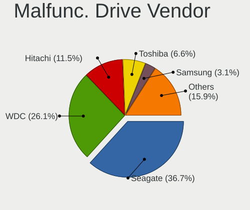

| Vendor                      | Desktops | Drives | Percent |
|-----------------------------|----------|--------|---------|
| Seagate                     | 83       | 115    | 36.73%  |
| WDC                         | 59       | 78     | 26.11%  |
| Hitachi                     | 26       | 28     | 11.5%   |
| Toshiba                     | 15       | 19     | 6.64%   |
| Samsung Electronics         | 7        | 7      | 3.1%    |
| Kingston                    | 6        | 7      | 2.65%   |
| A-DATA Technology           | 6        | 6      | 2.65%   |
| HGST                        | 5        | 6      | 2.21%   |
| Maxtor                      | 3        | 3      | 1.33%   |
| Intel                       | 2        | 2      | 0.88%   |
| tecmiyo                     | 1        | 1      | 0.44%   |
| SSSTC                       | 1        | 1      | 0.44%   |
| Realtek Semiconductor       | 1        | 1      | 0.44%   |
| PNY                         | 1        | 1      | 0.44%   |
| Micron/Crucial Technology   | 1        | 2      | 0.44%   |
| Micron Technology           | 1        | 1      | 0.44%   |
| MAXIO Technology (Hangzhou) | 1        | 1      | 0.44%   |
| IBM/Hitachi                 | 1        | 2      | 0.44%   |
| HGST HTS                    | 1        | 1      | 0.44%   |
| Fujitsu                     | 1        | 1      | 0.44%   |
| China                       | 1        | 1      | 0.44%   |
| Biwin Storage Technology    | 1        | 1      | 0.44%   |
| Apple                       | 1        | 1      | 0.44%   |
| ADATA Technology            | 1        | 1      | 0.44%   |

Malfunc. HDD Vendor
-------------------

Vendors of faulty HDD drives

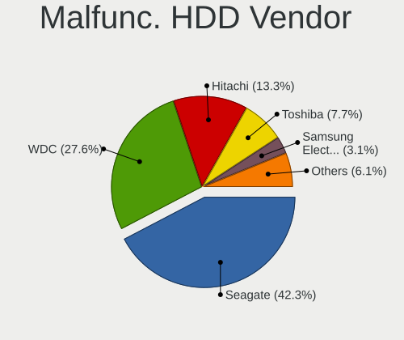

| Vendor              | Desktops | Drives | Percent |
|---------------------|----------|--------|---------|
| Seagate             | 83       | 115    | 42.35%  |
| WDC                 | 54       | 71     | 27.55%  |
| Hitachi             | 26       | 28     | 13.27%  |
| Toshiba             | 15       | 19     | 7.65%   |
| Samsung Electronics | 6        | 6      | 3.06%   |
| HGST                | 5        | 6      | 2.55%   |
| Maxtor              | 3        | 3      | 1.53%   |
| IBM/Hitachi         | 1        | 2      | 0.51%   |
| HGST HTS            | 1        | 1      | 0.51%   |
| Fujitsu             | 1        | 1      | 0.51%   |
| Apple               | 1        | 1      | 0.51%   |

Malfunc. Drive Kind
-------------------

Kinds of faulty drives

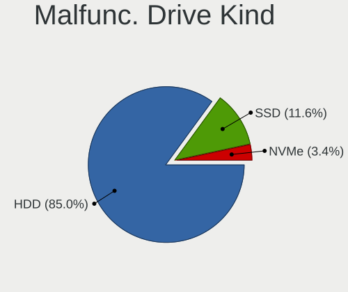

| Kind | Desktops | Drives | Percent |
|------|----------|--------|---------|
| HDD  | 176      | 253    | 85.02%  |
| SSD  | 24       | 26     | 11.59%  |
| NVMe | 7        | 8      | 3.38%   |

Failed Drives
-------------

Failed drive models

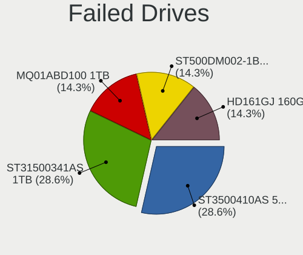

| Model                             | Desktops | Drives | Percent |
|-----------------------------------|----------|--------|---------|
| Seagate ST3500410AS 500GB         | 2        | 3      | 28.57%  |
| Seagate ST31500341AS 1TB          | 2        | 3      | 28.57%  |
| Toshiba MQ01ABD100 1TB            | 1        | 1      | 14.29%  |
| Seagate ST500DM002-1BD142 500GB   | 1        | 1      | 14.29%  |
| Samsung Electronics HD161GJ 160GB | 1        | 1      | 14.29%  |

Failed Drive Vendor
-------------------

Failed drive vendors

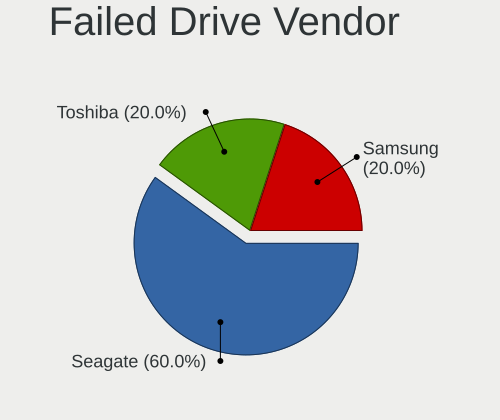

| Vendor              | Desktops | Drives | Percent |
|---------------------|----------|--------|---------|
| Seagate             | 3        | 7      | 60%     |
| Toshiba             | 1        | 1      | 20%     |
| Samsung Electronics | 1        | 1      | 20%     |

Drive Status
------------

Number of failed and malfunc. drives

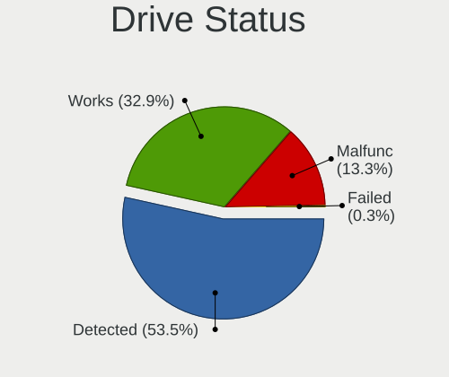

| Status   | Desktops | Drives | Percent |
|----------|----------|--------|---------|
| Detected | 782      | 1804   | 53.45%  |
| Works    | 482      | 1074   | 32.95%  |
| Malfunc  | 194      | 287    | 13.26%  |
| Failed   | 5        | 9      | 0.34%   |

Storage controller
------------------

Storage Vendor
--------------

Storage controller vendors

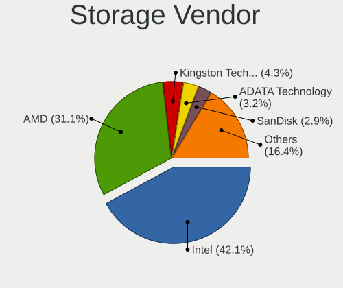

| Vendor                           | Desktops | Percent |
|----------------------------------|----------|---------|
| Intel                            | 713      | 42.11%  |
| AMD                              | 526      | 31.07%  |
| Kingston Technology Company      | 73       | 4.31%   |
| ADATA Technology                 | 55       | 3.25%   |
| SanDisk                          | 49       | 2.89%   |
| Nvidia                           | 48       | 2.84%   |
| Samsung Electronics              | 42       | 2.48%   |
| Realtek Semiconductor            | 28       | 1.65%   |
| ASMedia Technology               | 24       | 1.42%   |
| MAXIO Technology (Hangzhou)      | 19       | 1.12%   |
| Marvell Technology Group         | 18       | 1.06%   |
| Phison Electronics               | 17       | 1%      |
| Micron/Crucial Technology        | 13       | 0.77%   |
| JMicron Technology               | 11       | 0.65%   |
| SK hynix                         | 6        | 0.35%   |
| VIA Technologies                 | 5        | 0.3%    |
| Silicon Motion                   | 5        | 0.3%    |
| Micron Technology                | 5        | 0.3%    |
| LSI Logic / Symbios Logic        | 5        | 0.3%    |
| INNOGRIT                         | 5        | 0.3%    |
| Silicon Image                    | 4        | 0.24%   |
| Broadcom / LSI                   | 3        | 0.18%   |
| Biwin Storage Technology         | 3        | 0.18%   |
| Toshiba America Info Systems     | 2        | 0.12%   |
| Solid State Storage Technology   | 2        | 0.12%   |
| Shenzhen Longsys Electronics     | 2        | 0.12%   |
| KIOXIA                           | 2        | 0.12%   |
| Adaptec                          | 2        | 0.12%   |
| Yangtze Memory Technologies      | 1        | 0.06%   |
| Union Memory (Shenzhen)          | 1        | 0.06%   |
| Silicon Integrated Systems [SiS] | 1        | 0.06%   |
| ShenZhen TIGO Semiconductor      | 1        | 0.06%   |
| Seagate Technology               | 1        | 0.06%   |
| Hewlett-Packard                  | 1        | 0.06%   |

Storage Model
-------------

Storage controller models

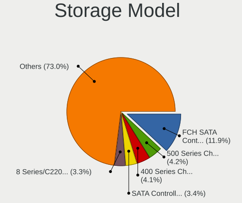

| Model                                                                                   | Desktops | Percent |
|-----------------------------------------------------------------------------------------|----------|---------|
| AMD FCH SATA Controller [AHCI mode]                                                     | 264      | 11.93%  |
| AMD 500 Series Chipset SATA Controller                                                  | 93       | 4.2%    |
| AMD 400 Series Chipset SATA Controller                                                  | 90       | 4.07%   |
| Intel SATA Controller [RAID mode]                                                       | 76       | 3.44%   |
| Intel 8 Series/C220 Series Chipset Family 6-port SATA Controller 1 [AHCI mode]          | 74       | 3.35%   |
| Intel 6 Series/C200 Series Chipset Family 6 port Desktop SATA AHCI Controller           | 71       | 3.21%   |
| Intel NM10/ICH7 Family SATA Controller [IDE mode]                                       | 62       | 2.8%    |
| AMD A320 Chipset SATA Controller [AHCI mode]                                            | 61       | 2.76%   |
| AMD SB7x0/SB8x0/SB9x0 IDE Controller                                                    | 53       | 2.4%    |
| AMD SB7x0/SB8x0/SB9x0 SATA Controller [IDE mode]                                        | 45       | 2.03%   |
| Intel 82801G (ICH7 Family) IDE Controller                                               | 43       | 1.94%   |
| AMD SB7x0/SB8x0/SB9x0 SATA Controller [AHCI mode]                                       | 41       | 1.85%   |
| Intel 200 Series PCH SATA controller [AHCI mode]                                        | 40       | 1.81%   |
| Intel Q170/Q150/B150/H170/H110/Z170/CM236 Chipset SATA Controller [AHCI Mode]           | 39       | 1.76%   |
| Intel 6 Series/C200 Series Chipset Family Desktop SATA Controller (IDE mode, ports 4-5) | 38       | 1.72%   |
| Intel 6 Series/C200 Series Chipset Family Desktop SATA Controller (IDE mode, ports 0-3) | 38       | 1.72%   |
| Intel 7 Series/C210 Series Chipset Family 6-port SATA Controller [AHCI mode]            | 35       | 1.58%   |
| Nvidia MCP61 SATA Controller                                                            | 33       | 1.49%   |
| AMD 600 Series Chipset SATA Controller                                                  | 30       | 1.36%   |
| Intel Cannon Lake PCH SATA AHCI Controller                                              | 27       | 1.22%   |
| AMD 300 Series Chipset SATA Controller                                                  | 27       | 1.22%   |
| ADATA XPG SX8200 Pro PCIe Gen3x4 M.2 2280 Solid State Drive                             | 27       | 1.22%   |
| Nvidia MCP61 IDE                                                                        | 25       | 1.13%   |
| Kingston Company NV2 NVMe SSD [SM2267XT] (DRAM-less)                                    | 25       | 1.13%   |
| ASMedia ASM1061/ASM1062 Serial ATA Controller                                           | 22       | 0.99%   |
| AMD FCH SATA Controller [IDE mode]                                                      | 20       | 0.9%    |
| AMD FCH IDE Controller                                                                  | 18       | 0.81%   |
| Realtek RTS5762 NVMe SSD Controller                                                     | 17       | 0.77%   |
| Intel 500 Series Chipset Family SATA AHCI Controller                                    | 17       | 0.77%   |
| Intel 4 Series Chipset PT IDER Controller                                               | 17       | 0.77%   |
| Samsung NVMe SSD Controller SM981/PM981/PM983                                           | 15       | 0.68%   |
| Intel Alder Lake-S PCH SATA Controller [AHCI Mode]                                      | 15       | 0.68%   |
| Intel 82801JD/DO (ICH10 Family) SATA AHCI Controller                                    | 15       | 0.68%   |
| Kingston Company NV1 NVMe SSD [SM2263XT] (DRAM-less)                                    | 14       | 0.63%   |
| Intel 82801I (ICH9 Family) 2 port SATA Controller [IDE mode]                            | 13       | 0.59%   |
| MAXIO (Hangzhou) NVMe SSD Controller MAP1202 (DRAM-less)                                | 12       | 0.54%   |
| Kingston Company KC3000/FURY Renegade NVMe SSD [E18]                                    | 12       | 0.54%   |
| Intel 82801IR/IO/IH (ICH9R/DO/DH) 4 port SATA Controller [IDE mode]                     | 12       | 0.54%   |
| Intel 82801H (ICH8 Family) 4 port SATA Controller [IDE mode]                            | 12       | 0.54%   |
| Intel 5 Series/3400 Series Chipset 4 port SATA IDE Controller                           | 12       | 0.54%   |

Storage Kind
------------

Kind of storage controller (IDE, SATA, NVMe, SAS, ...)

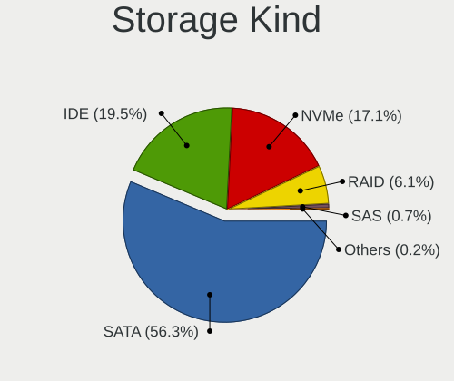

| Kind | Desktops | Percent |
|------|----------|---------|
| SATA | 983      | 56.33%  |
| IDE  | 340      | 19.48%  |
| NVMe | 299      | 17.13%  |
| RAID | 107      | 6.13%   |
| SAS  | 12       | 0.69%   |
| SCSI | 4        | 0.23%   |

Processor
---------

CPU Vendor
----------

Processor vendors

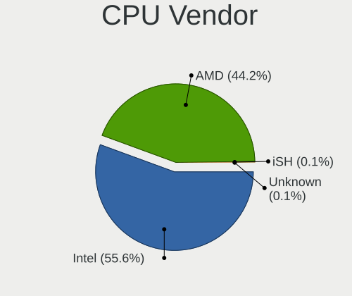

| Vendor       | Desktops | Percent |
|--------------|----------|---------|
| Intel        | 722      | 55.58%  |
| AMD          | 574      | 44.19%  |
| iSH          | 1        | 0.08%   |
| CentaurHauls | 1        | 0.08%   |
| Unknown      | 1        | 0.08%   |

CPU Model
---------

Processor models

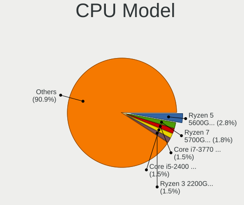

| Model                                         | Desktops | Percent |
|-----------------------------------------------|----------|---------|
| AMD Ryzen 5 5600G with Radeon Graphics        | 37       | 2.84%   |
| AMD Ryzen 7 5700G with Radeon Graphics        | 24       | 1.84%   |
| Intel Core i7-3770 CPU @ 3.40GHz              | 20       | 1.53%   |
| Intel Core i5-2400 CPU @ 3.10GHz              | 19       | 1.46%   |
| AMD Ryzen 3 2200G with Radeon Vega Graphics   | 19       | 1.46%   |
| Intel Core 2 Duo CPU E8400 @ 3.00GHz          | 18       | 1.38%   |
| AMD Ryzen 5 2600 Six-Core Processor           | 18       | 1.38%   |
| AMD Ryzen 5 3600 6-Core Processor             | 17       | 1.3%    |
| Intel Core i7-4790 CPU @ 3.60GHz              | 16       | 1.23%   |
| Intel Core i7-4770 CPU @ 3.40GHz              | 16       | 1.23%   |
| Intel Core i3-3220 CPU @ 3.30GHz              | 16       | 1.23%   |
| Intel Core i5-3470 CPU @ 3.20GHz              | 15       | 1.15%   |
| AMD Ryzen 5 5600X 6-Core Processor            | 14       | 1.07%   |
| AMD Ryzen 3 3200G with Radeon Vega Graphics   | 13       | 1%      |
| AMD Athlon 3000G with Radeon Vega Graphics    | 13       | 1%      |
| AMD A8-9600 RADEON R7, 10 COMPUTE CORES 4C+6G | 13       | 1%      |
| Intel Core i3-2120 CPU @ 3.30GHz              | 12       | 0.92%   |
| AMD Ryzen 7 2700X Eight-Core Processor        | 12       | 0.92%   |
| Intel Core i3-2100 CPU @ 3.10GHz              | 11       | 0.84%   |
| Intel Core i7-7700 CPU @ 3.60GHz              | 10       | 0.77%   |
| AMD Ryzen 9 5950X 16-Core Processor           | 10       | 0.77%   |
| AMD Ryzen 7 2700 Eight-Core Processor         | 10       | 0.77%   |
| AMD Ryzen 5 3400G with Radeon Vega Graphics   | 10       | 0.77%   |
| AMD Sempron 145 Processor                     | 9        | 0.69%   |
| AMD Ryzen 9 5900X 12-Core Processor           | 9        | 0.69%   |
| AMD Ryzen 7 3700X 8-Core Processor            | 9        | 0.69%   |
| Intel Core i7-6700 CPU @ 3.40GHz              | 8        | 0.61%   |
| Intel Core i7-2600 CPU @ 3.40GHz              | 8        | 0.61%   |
| Intel Core i5-10400 CPU @ 2.90GHz             | 8        | 0.61%   |
| AMD Ryzen 7 5700X 8-Core Processor            | 8        | 0.61%   |
| AMD FX-6300 Six-Core Processor                | 8        | 0.61%   |
| Intel Pentium Dual CPU E2200 @ 2.20GHz        | 7        | 0.54%   |
| Intel Pentium 4 CPU 3.00GHz                   | 7        | 0.54%   |
| Intel Core i5-8400 CPU @ 2.80GHz              | 7        | 0.54%   |
| Intel Core 2 Duo CPU E7500 @ 2.93GHz          | 7        | 0.54%   |
| AMD Ryzen 9 3900X 12-Core Processor           | 7        | 0.54%   |
| AMD Ryzen 7 5800X 8-Core Processor            | 7        | 0.54%   |
| Intel Pentium Dual-Core CPU E5800 @ 3.20GHz   | 6        | 0.46%   |
| Intel Pentium CPU G4400 @ 3.30GHz             | 6        | 0.46%   |
| Intel Core i5-4590 CPU @ 3.30GHz              | 6        | 0.46%   |

CPU Model Family
----------------

Processor model prefix

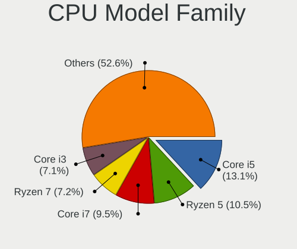

| Model                   | Desktops | Percent |
|-------------------------|----------|---------|
| Intel Core i5           | 171      | 13.11%  |
| AMD Ryzen 5             | 137      | 10.51%  |
| Intel Core i7           | 124      | 9.51%   |
| AMD Ryzen 7             | 94       | 7.21%   |
| Intel Core i3           | 92       | 7.06%   |
| Intel Xeon              | 67       | 5.14%   |
| Intel Core 2 Duo        | 53       | 4.06%   |
| AMD FX                  | 44       | 3.37%   |
| Intel Celeron           | 43       | 3.3%    |
| Other                   | 41       | 3.14%   |
| AMD Ryzen 9             | 41       | 3.14%   |
| AMD Ryzen 3             | 36       | 2.76%   |
| Intel Pentium           | 30       | 2.3%    |
| AMD Athlon              | 24       | 1.84%   |
| AMD A8                  | 23       | 1.76%   |
| Intel Pentium Dual-Core | 21       | 1.61%   |
| Intel Core 2 Quad       | 21       | 1.61%   |
| AMD Athlon II X2        | 20       | 1.53%   |
| AMD A6                  | 18       | 1.38%   |
| Intel Pentium Dual      | 16       | 1.23%   |
| AMD A4                  | 16       | 1.23%   |
| AMD E1                  | 15       | 1.15%   |
| AMD A10                 | 15       | 1.15%   |
| Intel Pentium 4         | 13       | 1%      |
| AMD Sempron             | 13       | 1%      |
| AMD Phenom II X4        | 13       | 1%      |
| Intel Core i9           | 11       | 0.84%   |
| Intel Core 2            | 9        | 0.69%   |
| AMD Athlon 64 X2        | 9        | 0.69%   |
| Intel Atom              | 8        | 0.61%   |
| AMD Ryzen 3 PRO         | 7        | 0.54%   |
| AMD Phenom II X6        | 7        | 0.54%   |
| AMD E                   | 7        | 0.54%   |
| Intel Pentium D         | 5        | 0.38%   |
| AMD Athlon II X4        | 5        | 0.38%   |
| AMD Athlon 64           | 5        | 0.38%   |
| AMD Athlon Dual Core    | 4        | 0.31%   |
| Intel Pentium Gold      | 3        | 0.23%   |
| AMD PRO A8              | 3        | 0.23%   |
| Intel Genuine           | 2        | 0.15%   |

CPU Cores
---------

Number of processor cores

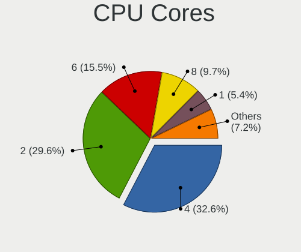

| Number  | Desktops | Percent |
|---------|----------|---------|
| 4       | 426      | 32.62%  |
| 2       | 386      | 29.56%  |
| 6       | 203      | 15.54%  |
| 8       | 127      | 9.72%   |
| 1       | 70       | 5.36%   |
| 12      | 26       | 1.99%   |
| 16      | 23       | 1.76%   |
| 3       | 15       | 1.15%   |
| 10      | 10       | 0.77%   |
| 24      | 6        | 0.46%   |
| 14      | 5        | 0.38%   |
| Unknown | 3        | 0.23%   |
| 20      | 2        | 0.15%   |
| 18      | 2        | 0.15%   |
| 56      | 1        | 0.08%   |
| 28      | 1        | 0.08%   |

CPU Sockets
-----------

Number of sockets

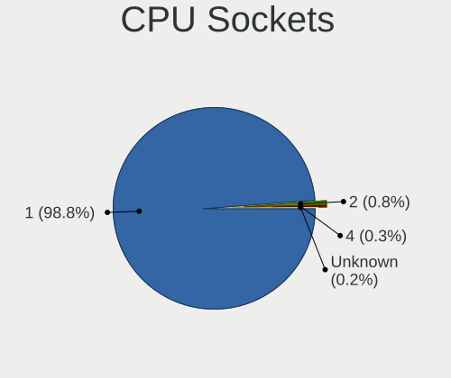

| Number  | Desktops | Percent |
|---------|----------|---------|
| 1       | 1283     | 98.77%  |
| 2       | 10       | 0.77%   |
| 4       | 4        | 0.31%   |
| Unknown | 2        | 0.15%   |

CPU Threads
-----------

Threads per core (Hyper-Threading)

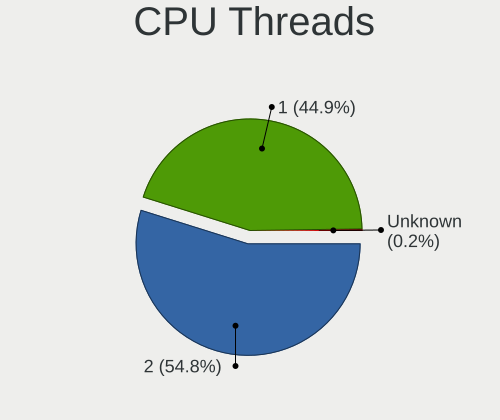

| Number  | Desktops | Percent |
|---------|----------|---------|
| 2       | 715      | 54.83%  |
| 1       | 586      | 44.94%  |
| Unknown | 3        | 0.23%   |

CPU Op-Modes
------------

CPU Operation Modes (32-bit, 64-bit)

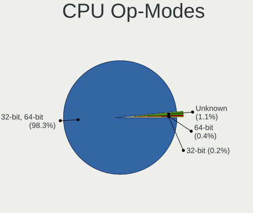

| Op mode        | Desktops | Percent |
|----------------|----------|---------|
| 32-bit, 64-bit | 1280     | 98.31%  |
| Unknown        | 14       | 1.08%   |
| 64-bit         | 5        | 0.38%   |
| 32-bit         | 3        | 0.23%   |

CPU Microcode
-------------

Microcode number

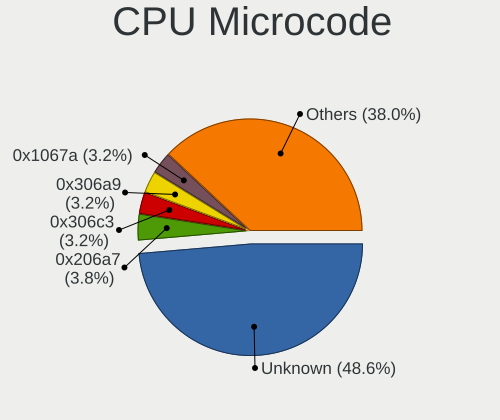

| Number     | Desktops | Percent |
|------------|----------|---------|
| Unknown    | 660      | 48.64%  |
| 0x206a7    | 52       | 3.83%   |
| 0x306c3    | 43       | 3.17%   |
| 0x306a9    | 43       | 3.17%   |
| 0x1067a    | 43       | 3.17%   |
| 0x08101016 | 22       | 1.62%   |
| 0x0800820d | 22       | 1.62%   |
| 0x010000c8 | 21       | 1.55%   |
| 0x6fd      | 20       | 1.47%   |
| 0x08108109 | 18       | 1.33%   |
| 0x0600611a | 18       | 1.33%   |
| 0x0a50000d | 17       | 1.25%   |
| 0x06001119 | 17       | 1.25%   |
| 0x906e9    | 15       | 1.11%   |
| 0x08701021 | 15       | 1.11%   |
| 0x506e3    | 14       | 1.03%   |
| 0x906ea    | 13       | 0.96%   |
| 0x6fb      | 11       | 0.81%   |
| 0xa0653    | 10       | 0.74%   |
| 0x10676    | 10       | 0.74%   |
| 0x06000852 | 10       | 0.74%   |
| 0x0a201016 | 9        | 0.66%   |
| 0x06003106 | 9        | 0.66%   |
| 0x906ed    | 8        | 0.59%   |
| 0x08701013 | 8        | 0.59%   |
| 0x0a50000c | 7        | 0.52%   |
| 0x08001138 | 7        | 0.52%   |
| 0x106e5    | 6        | 0.44%   |
| 0x0a601203 | 6        | 0.44%   |
| 0x0600063e | 6        | 0.44%   |
| 0x6f2      | 5        | 0.37%   |
| 0x206d7    | 5        | 0.37%   |
| 0x106a5    | 5        | 0.37%   |
| 0x08701030 | 5        | 0.37%   |
| 0x0810100b | 5        | 0.37%   |
| 0x05000119 | 5        | 0.37%   |
| 0x03000027 | 5        | 0.37%   |
| 0xf43      | 4        | 0.29%   |
| 0xa0655    | 4        | 0.29%   |
| 0x406c4    | 4        | 0.29%   |

CPU Microarch
-------------

Microarchitecture

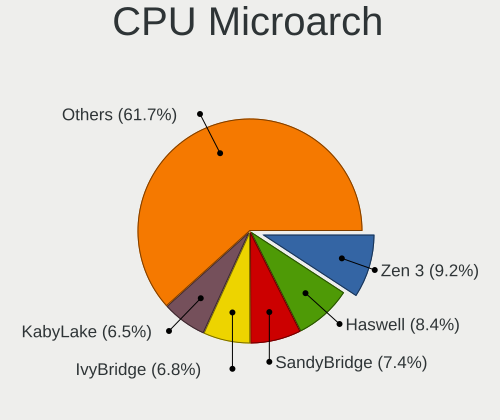

| Name             | Desktops | Percent |
|------------------|----------|---------|
| Zen 3            | 120      | 9.22%   |
| Haswell          | 109      | 8.37%   |
| SandyBridge      | 96       | 7.37%   |
| IvyBridge        | 89       | 6.84%   |
| KabyLake         | 85       | 6.53%   |
| Penryn           | 82       | 6.3%    |
| Zen+             | 73       | 5.61%   |
| Unknown          | 66       | 5.07%   |
| K10              | 61       | 4.69%   |
| Zen              | 55       | 4.22%   |
| Zen 2            | 50       | 3.84%   |
| Piledriver       | 50       | 3.84%   |
| Core             | 48       | 3.69%   |
| Skylake          | 42       | 3.23%   |
| CometLake        | 32       | 2.46%   |
| Excavator        | 31       | 2.38%   |
| K8 Hammer        | 28       | 2.15%   |
| Steamroller      | 19       | 1.46%   |
| NetBurst         | 19       | 1.46%   |
| Silvermont       | 17       | 1.31%   |
| Nehalem          | 16       | 1.23%   |
| Westmere         | 15       | 1.15%   |
| Bobcat           | 15       | 1.15%   |
| Alderlake Hybrid | 14       | 1.08%   |
| Bulldozer        | 13       | 1%      |
| Broadwell        | 11       | 0.84%   |
| K10 Llano        | 8        | 0.61%   |
| Jaguar           | 7        | 0.54%   |
| Icelake          | 7        | 0.54%   |
| Bonnell          | 7        | 0.54%   |
| Puma             | 5        | 0.38%   |
| Goldmont plus    | 5        | 0.38%   |
| Tremont          | 4        | 0.31%   |
| Sapphire Rapids  | 1        | 0.08%   |
| Gracemont        | 1        | 0.08%   |
| Goldmont         | 1        | 0.08%   |

Graphics
--------

GPU Vendor
----------

Vendors of graphics cards

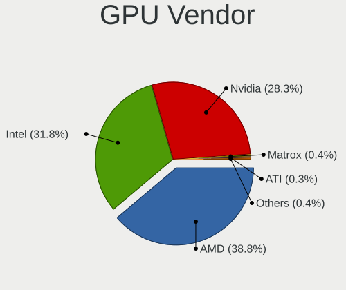

| Vendor                           | Desktops | Percent |
|----------------------------------|----------|---------|
| AMD                              | 544      | 38.83%  |
| Intel                            | 445      | 31.76%  |
| Nvidia                           | 397      | 28.34%  |
| Matrox Electronics Systems       | 6        | 0.43%   |
| ATI Technologies                 | 4        | 0.29%   |
| VIA Technologies                 | 3        | 0.21%   |
| Silicon Integrated Systems [SiS] | 1        | 0.07%   |
| ASPEED Technology                | 1        | 0.07%   |

GPU Model
---------

Graphics card models

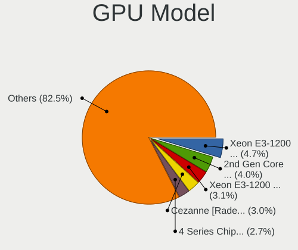

| Model                                                                                    | Desktops | Percent |
|------------------------------------------------------------------------------------------|----------|---------|
| Intel Xeon E3-1200 v3/4th Gen Core Processor Integrated Graphics Controller              | 68       | 4.67%   |
| Intel 2nd Generation Core Processor Family Integrated Graphics Controller                | 58       | 3.99%   |
| Intel Xeon E3-1200 v2/3rd Gen Core processor Graphics Controller                         | 45       | 3.09%   |
| AMD Cezanne [Radeon Vega Series / Radeon Vega Mobile Series]                             | 44       | 3.02%   |
| Intel 4 Series Chipset Integrated Graphics Controller                                    | 40       | 2.75%   |
| AMD Raven Ridge [Radeon Vega Series / Radeon Vega Mobile Series]                         | 34       | 2.34%   |
| AMD Ellesmere [Radeon RX 470/480/570/570X/580/580X/590]                                  | 31       | 2.13%   |
| AMD Picasso/Raven 2 [Radeon Vega Series / Radeon Vega Mobile Series]                     | 28       | 1.92%   |
| AMD Navi 23 [Radeon RX 6600/6600 XT/6600M]                                               | 28       | 1.92%   |
| Intel CoffeeLake-S GT2 [UHD Graphics 630]                                                | 27       | 1.86%   |
| AMD Wani [Radeon R5/R6/R7 Graphics]                                                      | 25       | 1.72%   |
| Nvidia GK208B [GeForce GT 710]                                                           | 24       | 1.65%   |
| Nvidia GP108 [GeForce GT 1030]                                                           | 22       | 1.51%   |
| Nvidia GT218 [GeForce 210]                                                               | 21       | 1.44%   |
| Nvidia GP106 [GeForce GTX 1060 6GB]                                                      | 21       | 1.44%   |
| Intel Skylake-S GT2 [HD Graphics 530]                                                    | 20       | 1.37%   |
| AMD Raphael                                                                              | 20       | 1.37%   |
| AMD Navi 10 [Radeon RX 5600 OEM/5600 XT / 5700/5700 XT]                                  | 20       | 1.37%   |
| AMD Cedar [Radeon HD 5000/6000/7350/8350 Series]                                         | 20       | 1.37%   |
| Nvidia GP107 [GeForce GTX 1050 Ti]                                                       | 16       | 1.1%    |
| Intel 82945G/GZ Integrated Graphics Controller                                           | 16       | 1.1%    |
| Intel Kaby Lake-S GT2 [HD Graphics 630]                                                  | 15       | 1.03%   |
| Intel CometLake-S GT2 [UHD Graphics 630]                                                 | 14       | 0.96%   |
| Intel 82G33/G31 Express Integrated Graphics Controller                                   | 14       | 0.96%   |
| AMD RS780L [Radeon 3000]                                                                 | 13       | 0.89%   |
| Nvidia GM107 [GeForce GTX 750 Ti]                                                        | 12       | 0.82%   |
| Intel Atom/Celeron/Pentium Processor x5-E8000/J3xxx/N3xxx Integrated Graphics Controller | 12       | 0.82%   |
| AMD Baffin [Radeon RX 550 640SP / RX 560/560X]                                           | 12       | 0.82%   |
| Nvidia GA106 [GeForce RTX 3060 Lite Hash Rate]                                           | 11       | 0.76%   |
| Nvidia C61 [GeForce 6150SE nForce 430]                                                   | 11       | 0.76%   |
| Intel IvyBridge GT2 [HD Graphics 4000]                                                   | 11       | 0.76%   |
| AMD Polaris 20 XL [Radeon RX 580 2048SP]                                                 | 11       | 0.76%   |
| AMD Navi 22 [Radeon RX 6700/6700 XT/6750 XT / 6800M/6850M XT]                            | 11       | 0.76%   |
| Intel 82Q963/Q965 Integrated Graphics Controller                                         | 10       | 0.69%   |
| AMD Oland [Radeon HD 8570 / R5 430 OEM / R7 240/340 / Radeon 520 OEM]                    | 10       | 0.69%   |
| AMD Kaveri [Radeon R7 Graphics]                                                          | 10       | 0.69%   |
| AMD Caicos [Radeon HD 6450/7450/8450 / R5 230 OEM]                                       | 10       | 0.69%   |
| Nvidia TU117 [GeForce GTX 1650]                                                          | 9        | 0.62%   |
| Nvidia TU106 [GeForce RTX 2060 Rev. A]                                                   | 9        | 0.62%   |
| Intel Core Processor Integrated Graphics Controller                                      | 9        | 0.62%   |

GPU Combo
---------

Combinations of graphics cards

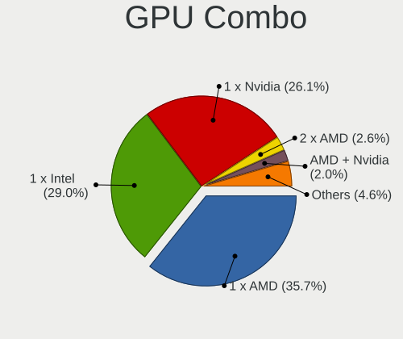

| Name            | Desktops | Percent |
|-----------------|----------|---------|
| 1 x AMD         | 471      | 35.74%  |
| 1 x Intel       | 382      | 28.98%  |
| 1 x Nvidia      | 344      | 26.1%   |
| 2 x AMD         | 34       | 2.58%   |
| AMD + Nvidia    | 27       | 2.05%   |
| Intel + AMD     | 18       | 1.37%   |
| Intel + Nvidia  | 16       | 1.21%   |
| 2 x Intel       | 7        | 0.53%   |
| 2 x Nvidia      | 6        | 0.46%   |
| 1 x Matrox      | 6        | 0.46%   |
| 1 x VIA         | 2        | 0.15%   |
| Other           | 1        | 0.08%   |
| 3 x AMD         | 1        | 0.08%   |
| 1 x SiS         | 1        | 0.08%   |
| Nvidia + VIA    | 1        | 0.08%   |
| Nvidia + ASPEED | 1        | 0.08%   |

GPU Driver
----------

Free vs proprietary

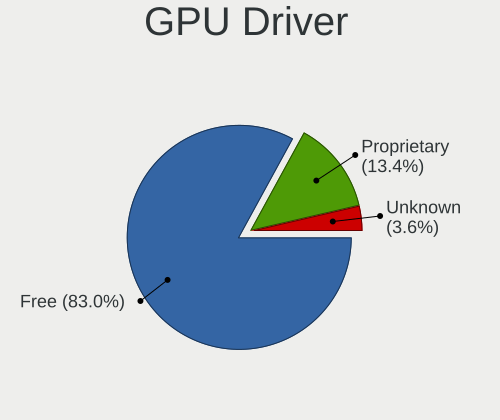

| Driver      | Desktops | Percent |
|-------------|----------|---------|
| Free        | 1095     | 82.95%  |
| Proprietary | 177      | 13.41%  |
| Unknown     | 48       | 3.64%   |

GPU Memory
----------

Total video memory

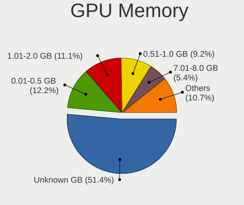

| Size in GB | Desktops | Percent |
|------------|----------|---------|
| Unknown    | 690      | 51.42%  |
| 0.01-0.5   | 164      | 12.22%  |
| 1.01-2.0   | 149      | 11.1%   |
| 0.51-1.0   | 123      | 9.17%   |
| 7.01-8.0   | 72       | 5.37%   |
| 3.01-4.0   | 62       | 4.62%   |
| 5.01-6.0   | 31       | 2.31%   |
| 8.01-16.0  | 28       | 2.09%   |
| 2.01-3.0   | 14       | 1.04%   |
| 16.01-24.0 | 9        | 0.67%   |

Monitor
-------

Monitor Vendor
--------------

Monitor vendors

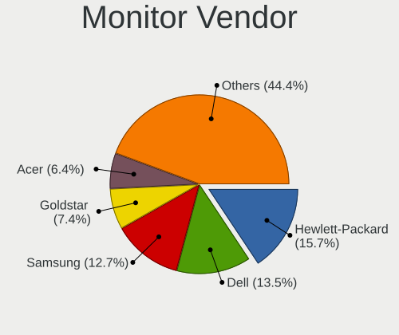

| Vendor               | Desktops | Percent |
|----------------------|----------|---------|
| Hewlett-Packard      | 214      | 15.67%  |
| Dell                 | 184      | 13.47%  |
| Samsung Electronics  | 173      | 12.66%  |
| Goldstar             | 101      | 7.39%   |
| Acer                 | 88       | 6.44%   |
| BenQ                 | 85       | 6.22%   |
| AOC                  | 66       | 4.83%   |
| Unknown              | 42       | 3.07%   |
| ASUSTek Computer     | 31       | 2.27%   |
| Ancor Communications | 29       | 2.12%   |
| ViewSonic            | 26       | 1.9%    |
| Sony                 | 22       | 1.61%   |
| Lenovo               | 22       | 1.61%   |
| Gateway              | 20       | 1.46%   |
| ___                  | 12       | 0.88%   |
| VOR                  | 10       | 0.73%   |
| Unknown              | 10       | 0.73%   |
| Sceptre Tech         | 9        | 0.66%   |
| Roku                 | 9        | 0.66%   |
| Insignia             | 9        | 0.66%   |
| RTK                  | 8        | 0.59%   |
| Hitachi              | 7        | 0.51%   |
| SAC                  | 6        | 0.44%   |
| MSI                  | 6        | 0.44%   |
| LG Electronics       | 6        | 0.44%   |
| Gigabyte Technology  | 6        | 0.44%   |
| Yeyian               | 5        | 0.37%   |
| Philips              | 5        | 0.37%   |
| Panasonic            | 5        | 0.37%   |
| NEC Computers        | 5        | 0.37%   |
| Mi                   | 5        | 0.37%   |
| FOX                  | 5        | 0.37%   |
| Vizio                | 4        | 0.29%   |
| STD                  | 4        | 0.29%   |
| SGT                  | 4        | 0.29%   |
| HUAWEI               | 4        | 0.29%   |
| HKC                  | 4        | 0.29%   |
| Game Factor          | 4        | 0.29%   |
| Compaq Computer      | 4        | 0.29%   |
| VIZTA                | 3        | 0.22%   |

Monitor Model
-------------

Monitor models

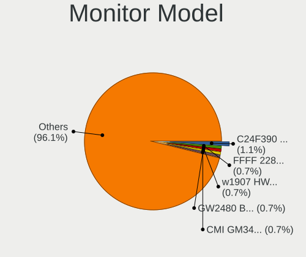

| Model                                                                 | Desktops | Percent |
|-----------------------------------------------------------------------|----------|---------|
| Samsung Electronics C24F390 SAM0D2C 1920x1080 521x293mm 23.5-inch     | 15       | 1.05%   |
| Unknown LCD Monitor FFFF 2288x1287 2550x2550mm 142.0-inch             | 10       | 0.7%    |
| Hewlett-Packard w1907 HWP26A2 1440x900 408x255mm 18.9-inch            | 10       | 0.7%    |
| BenQ GW2480 BNQ78E7 1920x1080 527x296mm 23.8-inch                     | 10       | 0.7%    |
| Unknown                                                               | 10       | 0.7%    |
| ___ LCDTV16 ___3393 1920x1080                                         | 7        | 0.49%   |
| Unknown LCDTV16 3393 1920x1080 1600x900mm 72.3-inch                   | 7        | 0.49%   |
| Goldstar ULTRAWIDE GSM7770 2560x1080 798x334mm 34.1-inch              | 7        | 0.49%   |
| Ancor Communications ASUS VP228 ACI22C3 1920x1080 476x268mm 21.5-inch | 7        | 0.49%   |
| Samsung Electronics LCD Monitor SAM0C3C 1366x768 609x347mm 27.6-inch  | 6        | 0.42%   |
| Hewlett-Packard LV1911 HWP3005 1366x768 410x230mm 18.5-inch           | 6        | 0.42%   |
| Hewlett-Packard Compaq WF1907 HWP26A4 1440x900 408x255mm 18.9-inch    | 6        | 0.42%   |
| Hewlett-Packard All-in-One HWP4218 1600x900 443x249mm 20.0-inch       | 6        | 0.42%   |
| Goldstar FULL HD GSM5B55 1920x1080 480x270mm 21.7-inch                | 6        | 0.42%   |
| Dell E2011H DEL406B 1600x900 443x249mm 20.0-inch                      | 6        | 0.42%   |
| BenQ GW2270 BNQ78DB 1920x1080 476x268mm 21.5-inch                     | 6        | 0.42%   |
| VOR LED21300 VOR2150 1920x1080 597x336mm 27.0-inch                    | 5        | 0.35%   |
| Samsung Electronics SyncMaster SAM03E5 1680x1050 474x296mm 22.0-inch  | 5        | 0.35%   |
| Samsung Electronics SMB1930N SAM0632 1366x768 410x230mm 18.5-inch     | 5        | 0.35%   |
| SAC LED MONITOR SAC952D 1920x1080 480x270mm 21.7-inch                 | 5        | 0.35%   |
| Insignia LCDTV BBY0019 1680x1050 640x384mm 29.4-inch                  | 5        | 0.35%   |
| Hewlett-Packard 2009 HWP2827 1600x900 443x250mm 20.0-inch             | 5        | 0.35%   |
| Goldstar HD GSM5ACB 1366x768 410x230mm 18.5-inch                      | 5        | 0.35%   |
| FOX FBC TV FOX9C01 1366x768 698x393mm 31.5-inch                       | 5        | 0.35%   |
| BenQ G2220HD BNQ7821 1920x1080 477x268mm 21.5-inch                    | 5        | 0.35%   |
| AOC 2343 AOC2343 1920x1080 509x286mm 23.0-inch                        | 5        | 0.35%   |
| Ancor Communications ASUS VS228 ACI22FD 1920x1080 476x268mm 21.5-inch | 5        | 0.35%   |
| Acer V206HQL ACR0334 1600x900 432x240mm 19.5-inch                     | 5        | 0.35%   |
| Samsung Electronics S19E310 SAM0C2B 1366x768 410x230mm 18.5-inch      | 4        | 0.28%   |
| Samsung Electronics LF27T35 SAM707F 1920x1080 598x337mm 27.0-inch     | 4        | 0.28%   |
| Samsung Electronics C27F390 SAM0D32 1920x1080 598x336mm 27.0-inch     | 4        | 0.28%   |
| Panasonic TV MEIA296 1920x1080 698x392mm 31.5-inch                    | 4        | 0.28%   |
| Goldstar W1934 GSM4B7A 1440x900 410x256mm 19.0-inch                   | 4        | 0.28%   |
| Goldstar ULTRAWIDE GSM7768 3440x1440 800x334mm 34.1-inch              | 4        | 0.28%   |
| Gateway HD2201 GWY08AF 1680x1050 465x261mm 21.0-inch                  | 4        | 0.28%   |
| Dell P190S DEL405B 1280x1024 376x301mm 19.0-inch                      | 4        | 0.28%   |
| Dell E2216H DELF069 1920x1080 476x268mm 21.5-inch                     | 4        | 0.28%   |
| Dell E1911 DELF036 1440x900 408x255mm 18.9-inch                       | 4        | 0.28%   |
| Dell 1905FP DEL400D 1280x1024 376x301mm 19.0-inch                     | 4        | 0.28%   |
| ASUSTek Computer VA24E AUS24D1 1920x1080 527x296mm 23.8-inch          | 4        | 0.28%   |

Monitor Resolution
------------------

Monitor screen resolution

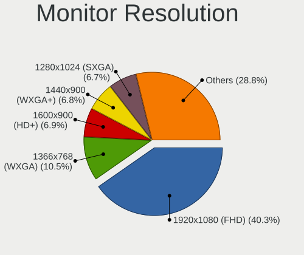

| Resolution         | Desktops | Percent |
|--------------------|----------|---------|
| 1920x1080 (FHD)    | 526      | 40.31%  |
| 1366x768 (WXGA)    | 137      | 10.5%   |
| 1600x900 (HD+)     | 90       | 6.9%    |
| 1440x900 (WXGA+)   | 89       | 6.82%   |
| 1280x1024 (SXGA)   | 87       | 6.67%   |
| 3840x2160 (4K)     | 82       | 6.28%   |
| 1680x1050 (WSXGA+) | 54       | 4.14%   |
| 2560x1440 (QHD)    | 48       | 3.68%   |
| 1360x768           | 30       | 2.3%    |
| 3440x1440          | 20       | 1.53%   |
| 1024x768 (XGA)     | 20       | 1.53%   |
| Unknown            | 20       | 1.53%   |
| 2560x1080          | 19       | 1.46%   |
| 3840x1080          | 14       | 1.07%   |
| 2288x1287          | 13       | 1%      |
| 1920x1200 (WUXGA)  | 12       | 0.92%   |
| 1600x1200          | 7        | 0.54%   |
| 1920x540           | 5        | 0.38%   |
| 1280x960           | 5        | 0.38%   |
| 1280x800 (WXGA)    | 5        | 0.38%   |
| 1400x1050          | 3        | 0.23%   |
| 3360x1080          | 2        | 0.15%   |
| 2560x1600          | 2        | 0.15%   |
| 7280x2160          | 1        | 0.08%   |
| 6720x1440          | 1        | 0.08%   |
| 5560x2160          | 1        | 0.08%   |
| 4721x1050          | 1        | 0.08%   |
| 4310x1080          | 1        | 0.08%   |
| 4093x4093          | 1        | 0.08%   |
| 3600x1080          | 1        | 0.08%   |
| 3286x1080          | 1        | 0.08%   |
| 3280x1200          | 1        | 0.08%   |
| 3200x900           | 1        | 0.08%   |
| 2944x1080          | 1        | 0.08%   |
| 2304x1024          | 1        | 0.08%   |
| 1920x2928          | 1        | 0.08%   |
| 1360x765           | 1        | 0.08%   |
| 1280x720 (HD)      | 1        | 0.08%   |

Monitor Diagonal
----------------

Diagonal size in inches

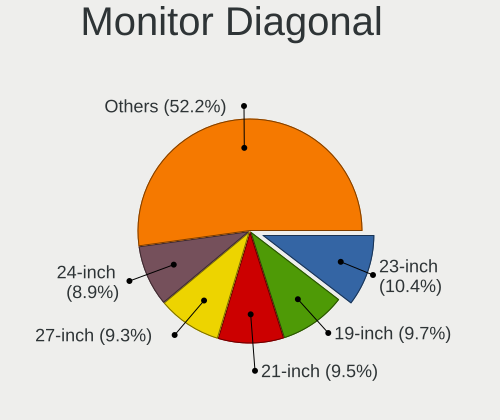

| Inches  | Desktops | Percent |
|---------|----------|---------|
| 23      | 141      | 10.42%  |
| 19      | 131      | 9.68%   |
| 21      | 129      | 9.53%   |
| 27      | 126      | 9.31%   |
| 24      | 120      | 8.87%   |
| 18      | 115      | 8.5%    |
| Unknown | 93       | 6.87%   |
| 20      | 84       | 6.21%   |
| 31      | 72       | 5.32%   |
| 17      | 61       | 4.51%   |
| 15      | 49       | 3.62%   |
| 22      | 39       | 2.88%   |
| 34      | 35       | 2.59%   |
| 72      | 27       | 2%      |
| 84      | 19       | 1.4%    |
| 32      | 13       | 0.96%   |
| 142     | 10       | 0.74%   |
| 54      | 9        | 0.67%   |
| 40      | 9        | 0.67%   |
| 63      | 8        | 0.59%   |
| 29      | 7        | 0.52%   |
| 48      | 6        | 0.44%   |
| 25      | 6        | 0.44%   |
| 12      | 5        | 0.37%   |
| 49      | 4        | 0.3%    |
| 46      | 4        | 0.3%    |
| 42      | 4        | 0.3%    |
| 26      | 4        | 0.3%    |
| 64      | 2        | 0.15%   |
| 38      | 2        | 0.15%   |
| 36      | 2        | 0.15%   |
| 28      | 2        | 0.15%   |
| 16      | 2        | 0.15%   |
| 14      | 2        | 0.15%   |
| 13      | 2        | 0.15%   |
| 57      | 1        | 0.07%   |
| 55      | 1        | 0.07%   |
| 52      | 1        | 0.07%   |
| 50      | 1        | 0.07%   |
| 44      | 1        | 0.07%   |

Monitor Width
-------------

Physical width

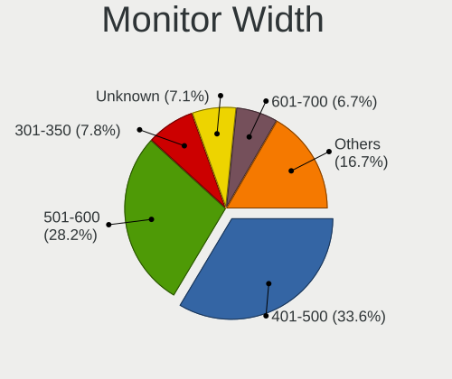

| Width in mm    | Desktops | Percent |
|----------------|----------|---------|
| 401-500        | 441      | 33.56%  |
| 501-600        | 371      | 28.23%  |
| 301-350        | 102      | 7.76%   |
| Unknown        | 93       | 7.08%   |
| 601-700        | 88       | 6.7%    |
| 701-800        | 51       | 3.88%   |
| 351-400        | 50       | 3.81%   |
| 1501-2000      | 46       | 3.5%    |
| 1001-1500      | 36       | 2.74%   |
| 801-900        | 13       | 0.99%   |
| More than 2000 | 10       | 0.76%   |
| 201-300        | 8        | 0.61%   |
| 901-1000       | 5        | 0.38%   |

Aspect Ratio
------------

Proportional relationship between the width and the height

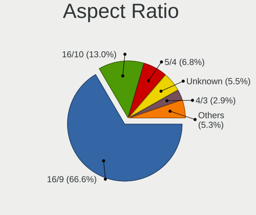

| Ratio   | Desktops | Percent |
|---------|----------|---------|
| 16/9    | 822      | 66.56%  |
| 16/10   | 160      | 12.96%  |
| 5/4     | 84       | 6.8%    |
| Unknown | 68       | 5.51%   |
| 4/3     | 36       | 2.91%   |
| 21/9    | 36       | 2.91%   |
| 1.00    | 10       | 0.81%   |
| 32/9    | 9        | 0.73%   |
| 6/5     | 5        | 0.4%    |
| 3/2     | 1        | 0.08%   |
| 2.65    | 1        | 0.08%   |
| 2.00    | 1        | 0.08%   |
| 1.96    | 1        | 0.08%   |
| 0.56    | 1        | 0.08%   |

Monitor Area
------------

Area in inch²

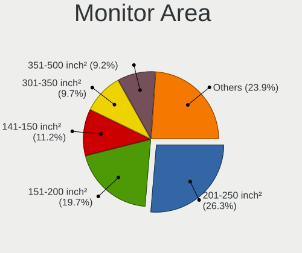

| Area in inch² | Desktops | Percent |
|----------------|----------|---------|
| 201-250        | 347      | 26.33%  |
| 151-200        | 260      | 19.73%  |
| 141-150        | 147      | 11.15%  |
| 301-350        | 128      | 9.71%   |
| 351-500        | 121      | 9.18%   |
| Unknown        | 93       | 7.06%   |
| More than 1000 | 80       | 6.07%   |
| 101-110        | 45       | 3.41%   |
| 251-300        | 40       | 3.03%   |
| 501-1000       | 34       | 2.58%   |
| 111-120        | 7        | 0.53%   |
| 131-140        | 6        | 0.46%   |
| 71-80          | 5        | 0.38%   |
| 121-130        | 2        | 0.15%   |
| 81-90          | 1        | 0.08%   |
| 61-70          | 1        | 0.08%   |
| 91-100         | 1        | 0.08%   |

Pixel Density
-------------

Pixels per inch

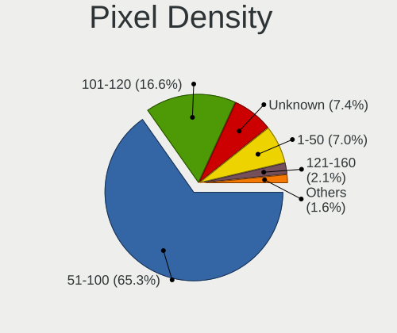

| Density | Desktops | Percent |
|---------|----------|---------|
| 51-100  | 815      | 65.25%  |
| 101-120 | 207      | 16.57%  |
| Unknown | 93       | 7.45%   |
| 1-50    | 88       | 7.05%   |
| 121-160 | 26       | 2.08%   |
| 161-240 | 20       | 1.6%    |

Multiple Monitors
-----------------

Total monitors connected

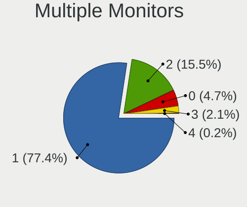

| Total | Desktops | Percent |
|-------|----------|---------|
| 1     | 1027     | 77.39%  |
| 2     | 206      | 15.52%  |
| 0     | 63       | 4.75%   |
| 3     | 28       | 2.11%   |
| 4     | 3        | 0.23%   |

Network
-------

Net Controller Vendor
---------------------

Controller vendors

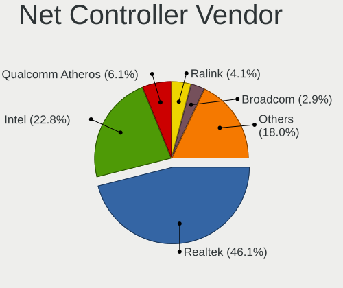

| Vendor                                | Desktops | Percent |
|---------------------------------------|----------|---------|
| Realtek Semiconductor                 | 880      | 46.07%  |
| Intel                                 | 435      | 22.77%  |
| Qualcomm Atheros                      | 117      | 6.13%   |
| Ralink Technology                     | 79       | 4.14%   |
| Broadcom                              | 56       | 2.93%   |
| TP-Link                               | 48       | 2.51%   |
| Nvidia                                | 40       | 2.09%   |
| MediaTek                              | 37       | 1.94%   |
| Ralink                                | 34       | 1.78%   |
| Qualcomm Atheros Communications       | 30       | 1.57%   |
| Mercucys                              | 18       | 0.94%   |
| Broadcom Limited                      | 13       | 0.68%   |
| Samsung Electronics                   | 10       | 0.52%   |
| Huawei Technologies                   | 10       | 0.52%   |
| Motorola PCS                          | 7        | 0.37%   |
| Linksys                               | 7        | 0.37%   |
| ASIX Electronics                      | 7        | 0.37%   |
| QinHeng Electronics                   | 5        | 0.26%   |
| D-Link                                | 5        | 0.26%   |
| Xiaomi                                | 4        | 0.21%   |
| VIA Technologies                      | 4        | 0.21%   |
| Microsoft                             | 4        | 0.21%   |
| D-Link System                         | 4        | 0.21%   |
| Qualcomm Technologies                 | 3        | 0.16%   |
| NetGear                               | 3        | 0.16%   |
| Marvell Technology Group              | 3        | 0.16%   |
| Google                                | 3        | 0.16%   |
| aicsemi                               | 3        | 0.16%   |
| Wacom                                 | 2        | 0.1%    |
| Qualcomm                              | 2        | 0.1%    |
| OPPO Electronics                      | 2        | 0.1%    |
| ICS Advent                            | 2        | 0.1%    |
| DisplayLink                           | 2        | 0.1%    |
| Davicom Semiconductor                 | 2        | 0.1%    |
| Belkin Components                     | 2        | 0.1%    |
| Aquantia                              | 2        | 0.1%    |
| Accton Technology                     | 2        | 0.1%    |
| 802.11g Adapter [Linksys WUSB54GC v3] | 2        | 0.1%    |
| ZyDAS                                 | 1        | 0.05%   |
| ZTE WCDMA Technologies MSM            | 1        | 0.05%   |

Net Controller Model
--------------------

Controller models

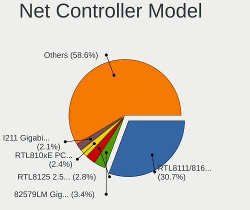

| Model                                                                  | Desktops | Percent |
|------------------------------------------------------------------------|----------|---------|
| Realtek RTL8111/8168/8211/8411 PCI Express Gigabit Ethernet Controller | 672      | 30.74%  |
| Intel 82579LM Gigabit Network Connection (Lewisville)                  | 75       | 3.43%   |
| Realtek RTL8125 2.5GbE Controller                                      | 62       | 2.84%   |
| Realtek RTL810xE PCI Express Fast Ethernet controller                  | 52       | 2.38%   |
| Intel I211 Gigabit Network Connection                                  | 45       | 2.06%   |
| Intel Wi-Fi 6 AX200                                                    | 43       | 1.97%   |
| Intel Ethernet Connection I217-LM                                      | 41       | 1.88%   |
| Realtek RTL8821CE 802.11ac PCIe Wireless Network Adapter               | 37       | 1.69%   |
| Realtek RTL8188EUS 802.11n Wireless Network Adapter                    | 36       | 1.65%   |
| Ralink MT7601U Wireless Adapter                                        | 33       | 1.51%   |
| Ralink RT2870/RT3070 Wireless Adapter                                  | 32       | 1.46%   |
| Intel Ethernet Controller I225-V                                       | 31       | 1.42%   |
| Realtek 802.11ac NIC                                                   | 28       | 1.28%   |
| Nvidia MCP61 Ethernet                                                  | 27       | 1.24%   |
| Qualcomm Atheros AR9271 802.11n                                        | 26       | 1.19%   |
| Intel Ethernet Connection (2) I219-V                                   | 21       | 0.96%   |
| Intel 82567LM-3 Gigabit Network Connection                             | 20       | 0.91%   |
| Intel 82579V Gigabit Network Connection                                | 18       | 0.82%   |
| Intel Wi-Fi 6E(802.11ax) AX210/AX1675* 2x2 [Typhoon Peak]              | 17       | 0.78%   |
| Qualcomm Atheros AR9485 Wireless Network Adapter                       | 16       | 0.73%   |
| Mercucys 802.11n NIC                                                   | 16       | 0.73%   |
| TP-Link TL-WN823N v2/v3 [Realtek RTL8192EU]                            | 14       | 0.64%   |
| Realtek RTL88x2bu [AC1200 Techkey]                                     | 14       | 0.64%   |
| Realtek RTL8852BE PCIe 802.11ax Wireless Network Controller            | 14       | 0.64%   |
| Qualcomm Atheros AR9227 Wireless Network Adapter                       | 14       | 0.64%   |
| Realtek RTL8192EE PCIe Wireless Network Adapter                        | 13       | 0.59%   |
| Realtek RTL8188FTV 802.11b/g/n 1T1R 2.4G WLAN Adapter                  | 13       | 0.59%   |
| Intel 82574L Gigabit Network Connection                                | 12       | 0.55%   |
| Realtek RTL-8185 IEEE 802.11a/b/g Wireless LAN Controller              | 11       | 0.5%    |
| MediaTek MT7921K (RZ608) Wi-Fi 6E 80MHz                                | 11       | 0.5%    |
| Realtek RTL-8100/8101L/8139 PCI Fast Ethernet Adapter                  | 10       | 0.46%   |
| Intel Ethernet Connection I217-V                                       | 10       | 0.46%   |
| Intel Ethernet Connection (7) I219-V                                   | 10       | 0.46%   |
| Intel Ethernet Connection (2) I219-LM                                  | 10       | 0.46%   |
| Intel 82566DM-2 Gigabit Network Connection                             | 10       | 0.46%   |
| Realtek RTL8188EE Wireless Network Adapter                             | 9        | 0.41%   |
| Realtek RTL8188CUS 802.11n WLAN Adapter                                | 9        | 0.41%   |
| Ralink RT2561/RT61 802.11g PCI                                         | 9        | 0.41%   |
| Qualcomm Atheros AR9285 Wireless Network Adapter (PCI-Express)         | 9        | 0.41%   |
| Qualcomm Atheros AR2417 Wireless Network Adapter [AR5007G 802.11bg]    | 9        | 0.41%   |

Wireless Vendor
---------------

Wireless vendors

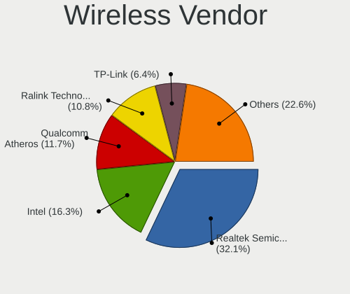

| Vendor                                | Desktops | Percent |
|---------------------------------------|----------|---------|
| Realtek Semiconductor                 | 234      | 32.1%   |
| Intel                                 | 119      | 16.32%  |
| Qualcomm Atheros                      | 85       | 11.66%  |
| Ralink Technology                     | 79       | 10.84%  |
| TP-Link                               | 47       | 6.45%   |
| Ralink                                | 34       | 4.66%   |
| MediaTek                              | 33       | 4.53%   |
| Qualcomm Atheros Communications       | 30       | 4.12%   |
| Mercucys                              | 18       | 2.47%   |
| Broadcom                              | 15       | 2.06%   |
| Linksys                               | 7        | 0.96%   |
| D-Link                                | 5        | 0.69%   |
| Microsoft                             | 4        | 0.55%   |
| NetGear                               | 3        | 0.41%   |
| Broadcom Limited                      | 3        | 0.41%   |
| Wacom                                 | 2        | 0.27%   |
| D-Link System                         | 2        | 0.27%   |
| Belkin Components                     | 2        | 0.27%   |
| 802.11g Adapter [Linksys WUSB54GC v3] | 2        | 0.27%   |
| ZyDAS                                 | 1        | 0.14%   |
| Tenda                                 | 1        | 0.14%   |
| Micro Star International              | 1        | 0.14%   |
| Gemtek                                | 1        | 0.14%   |
| Accton Technology                     | 1        | 0.14%   |

Wireless Model
--------------

Wireless models

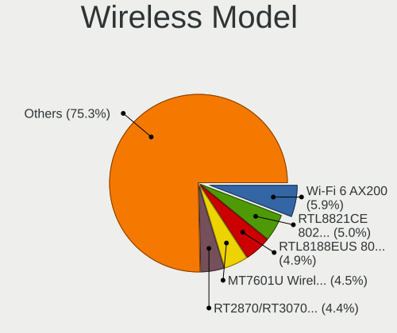

| Model                                                               | Desktops | Percent |
|---------------------------------------------------------------------|----------|---------|
| Intel Wi-Fi 6 AX200                                                 | 43       | 5.86%   |
| Realtek RTL8821CE 802.11ac PCIe Wireless Network Adapter            | 37       | 5.04%   |
| Realtek RTL8188EUS 802.11n Wireless Network Adapter                 | 36       | 4.9%    |
| Ralink MT7601U Wireless Adapter                                     | 33       | 4.5%    |
| Ralink RT2870/RT3070 Wireless Adapter                               | 32       | 4.36%   |
| Realtek 802.11ac NIC                                                | 28       | 3.81%   |
| Qualcomm Atheros AR9271 802.11n                                     | 26       | 3.54%   |
| Intel Wi-Fi 6E(802.11ax) AX210/AX1675* 2x2 [Typhoon Peak]           | 17       | 2.32%   |
| Qualcomm Atheros AR9485 Wireless Network Adapter                    | 16       | 2.18%   |
| Mercucys 802.11n NIC                                                | 16       | 2.18%   |
| TP-Link TL-WN823N v2/v3 [Realtek RTL8192EU]                         | 14       | 1.91%   |
| Realtek RTL88x2bu [AC1200 Techkey]                                  | 14       | 1.91%   |
| Qualcomm Atheros AR9227 Wireless Network Adapter                    | 14       | 1.91%   |
| Realtek RTL8192EE PCIe Wireless Network Adapter                     | 13       | 1.77%   |
| Realtek RTL8188FTV 802.11b/g/n 1T1R 2.4G WLAN Adapter               | 13       | 1.77%   |
| Realtek RTL-8185 IEEE 802.11a/b/g Wireless LAN Controller           | 11       | 1.5%    |
| MediaTek MT7921K (RZ608) Wi-Fi 6E 80MHz                             | 11       | 1.5%    |
| Realtek RTL8852BE PCIe 802.11ax Wireless Network Controller         | 9        | 1.23%   |
| Realtek RTL8188EE Wireless Network Adapter                          | 9        | 1.23%   |
| Realtek RTL8188CUS 802.11n WLAN Adapter                             | 9        | 1.23%   |
| Ralink RT2561/RT61 802.11g PCI                                      | 9        | 1.23%   |
| Qualcomm Atheros AR9285 Wireless Network Adapter (PCI-Express)      | 9        | 1.23%   |
| Qualcomm Atheros AR2417 Wireless Network Adapter [AR5007G 802.11bg] | 9        | 1.23%   |
| Intel Dual Band Wireless-AC 3168NGW [Stone Peak]                    | 9        | 1.23%   |
| Realtek RTL8187 Wireless Adapter                                    | 8        | 1.09%   |
| MediaTek MT7922 802.11ax PCI Express Wireless Network Adapter       | 8        | 1.09%   |
| TP-Link TL-WN722N v2/v3 [Realtek RTL8188EUS]                        | 7        | 0.95%   |
| Ralink RT5370 Wireless Adapter                                      | 7        | 0.95%   |
| Qualcomm Atheros QCA9565 / AR9565 Wireless Network Adapter          | 7        | 0.95%   |
| Qualcomm Atheros AR9287 Wireless Network Adapter (PCI-Express)      | 7        | 0.95%   |
| Intel Wireless 7265                                                 | 7        | 0.95%   |
| Intel Wireless 3165                                                 | 7        | 0.95%   |
| Intel Wi-Fi 5(802.11ac) Wireless-AC 9x6x [Thunder Peak]             | 7        | 0.95%   |
| TP-Link Archer T2U PLUS [RTL8821AU]                                 | 6        | 0.82%   |
| TP-Link AC600 wireless Realtek RTL8811AU [Archer T2U Nano]          | 6        | 0.82%   |
| Realtek RTL8192CU 802.11n WLAN Adapter                              | 6        | 0.82%   |
| Intel Wireless 7260                                                 | 6        | 0.82%   |
| Realtek RTL8192EU 802.11b/g/n WLAN Adapter                          | 5        | 0.68%   |
| Ralink RT5390R 802.11bgn PCIe Wireless Network Adapter              | 5        | 0.68%   |
| Ralink RT5390 Wireless 802.11n 1T/1R PCIe                           | 5        | 0.68%   |

Ethernet Vendor
---------------

Ethernet vendors

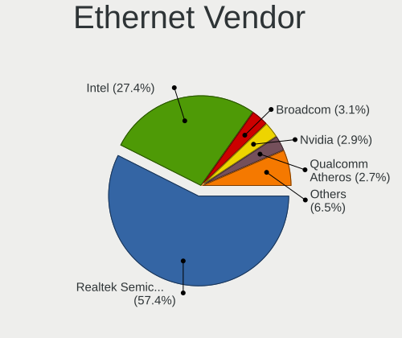

| Vendor                            | Desktops | Percent |
|-----------------------------------|----------|---------|
| Realtek Semiconductor             | 797      | 57.42%  |
| Intel                             | 380      | 27.38%  |
| Broadcom                          | 43       | 3.1%    |
| Nvidia                            | 40       | 2.88%   |
| Qualcomm Atheros                  | 38       | 2.74%   |
| Samsung Electronics               | 10       | 0.72%   |
| Huawei Technologies               | 10       | 0.72%   |
| Broadcom Limited                  | 10       | 0.72%   |
| Motorola PCS                      | 7        | 0.5%    |
| ASIX Electronics                  | 7        | 0.5%    |
| Xiaomi                            | 4        | 0.29%   |
| VIA Technologies                  | 4        | 0.29%   |
| MediaTek                          | 4        | 0.29%   |
| Qualcomm Technologies             | 3        | 0.22%   |
| Marvell Technology Group          | 3        | 0.22%   |
| Google                            | 3        | 0.22%   |
| Qualcomm                          | 2        | 0.14%   |
| OPPO Electronics                  | 2        | 0.14%   |
| ICS Advent                        | 2        | 0.14%   |
| DisplayLink                       | 2        | 0.14%   |
| Davicom Semiconductor             | 2        | 0.14%   |
| D-Link System                     | 2        | 0.14%   |
| Aquantia                          | 2        | 0.14%   |
| ZTE WCDMA Technologies MSM        | 1        | 0.07%   |
| TP-Link                           | 1        | 0.07%   |
| Sundance Technology Inc / IC Plus | 1        | 0.07%   |
| Silicon Integrated Systems [SiS]  | 1        | 0.07%   |
| LG Electronics                    | 1        | 0.07%   |
| Insyde Software                   | 1        | 0.07%   |
| IBM                               | 1        | 0.07%   |
| Hisense                           | 1        | 0.07%   |
| ADMtek                            | 1        | 0.07%   |
| Accton Technology                 | 1        | 0.07%   |
| 3Com                              | 1        | 0.07%   |

Ethernet Model
--------------

Ethernet models

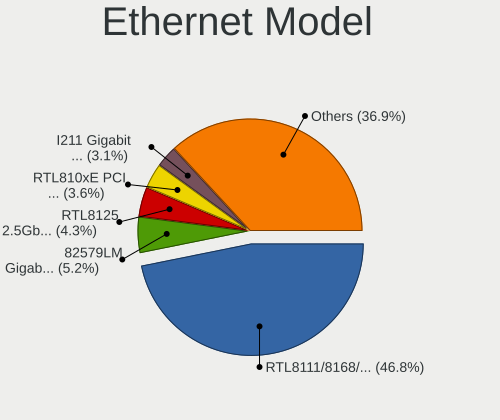

| Model                                                                  | Desktops | Percent |
|------------------------------------------------------------------------|----------|---------|
| Realtek RTL8111/8168/8211/8411 PCI Express Gigabit Ethernet Controller | 672      | 46.83%  |
| Intel 82579LM Gigabit Network Connection (Lewisville)                  | 75       | 5.23%   |
| Realtek RTL8125 2.5GbE Controller                                      | 62       | 4.32%   |
| Realtek RTL810xE PCI Express Fast Ethernet controller                  | 52       | 3.62%   |
| Intel I211 Gigabit Network Connection                                  | 45       | 3.14%   |
| Intel Ethernet Connection I217-LM                                      | 41       | 2.86%   |
| Intel Ethernet Controller I225-V                                       | 31       | 2.16%   |
| Nvidia MCP61 Ethernet                                                  | 27       | 1.88%   |
| Intel Ethernet Connection (2) I219-V                                   | 21       | 1.46%   |
| Intel 82567LM-3 Gigabit Network Connection                             | 20       | 1.39%   |
| Intel 82579V Gigabit Network Connection                                | 18       | 1.25%   |
| Intel 82574L Gigabit Network Connection                                | 12       | 0.84%   |
| Realtek RTL-8100/8101L/8139 PCI Fast Ethernet Adapter                  | 10       | 0.7%    |
| Intel Ethernet Connection I217-V                                       | 10       | 0.7%    |
| Intel Ethernet Connection (7) I219-V                                   | 10       | 0.7%    |
| Intel Ethernet Connection (2) I219-LM                                  | 10       | 0.7%    |
| Intel 82566DM-2 Gigabit Network Connection                             | 10       | 0.7%    |
| Huawei FOA-LX9                                                         | 9        | 0.63%   |
| Broadcom NetXtreme BCM5761 Gigabit Ethernet PCIe                       | 9        | 0.63%   |
| Broadcom NetXtreme BCM5754 Gigabit Ethernet PCI Express                | 9        | 0.63%   |
| Realtek RTL8153 Gigabit Ethernet Adapter                               | 8        | 0.56%   |
| Qualcomm Atheros Killer E2500 Gigabit Ethernet Controller              | 8        | 0.56%   |
| Samsung Galaxy series, misc. (tethering mode)                          | 7        | 0.49%   |
| Intel Ethernet Connection (14) I219-V                                  | 7        | 0.49%   |
| Motorola PCS motorola one 5G ace                                       | 6        | 0.42%   |
| ASIX AX88179 Gigabit Ethernet                                          | 6        | 0.42%   |
| Realtek RTL8852BE PCIe 802.11ax Wireless Network Controller            | 5        | 0.35%   |
| Qualcomm Atheros AR8151 v2.0 Gigabit Ethernet                          | 5        | 0.35%   |
| Intel I210 Gigabit Network Connection                                  | 5        | 0.35%   |
| Intel Ethernet Connection (17) I219-LM                                 | 5        | 0.35%   |
| Intel Ethernet Connection (11) I219-V                                  | 5        | 0.35%   |
| Intel Alder Lake-S PCH CNVi WiFi                                       | 5        | 0.35%   |
| Xiaomi Mi/Redmi series (RNDIS)                                         | 4        | 0.28%   |
| Realtek RTL8126 5GbE Controller                                        | 4        | 0.28%   |
| Qualcomm Atheros Killer E220x Gigabit Ethernet Controller              | 4        | 0.28%   |
| Qualcomm Atheros AR8161 Gigabit Ethernet                               | 4        | 0.28%   |
| Qualcomm Atheros AR8151 v1.0 Gigabit Ethernet                          | 4        | 0.28%   |
| Nvidia MCP79 Ethernet                                                  | 4        | 0.28%   |
| Intel Ethernet Controller I226-V                                       | 4        | 0.28%   |
| Intel Ethernet Connection (7) I219-LM                                  | 4        | 0.28%   |

Net Controller Kind
-------------------

Ethernet, WiFi or modem

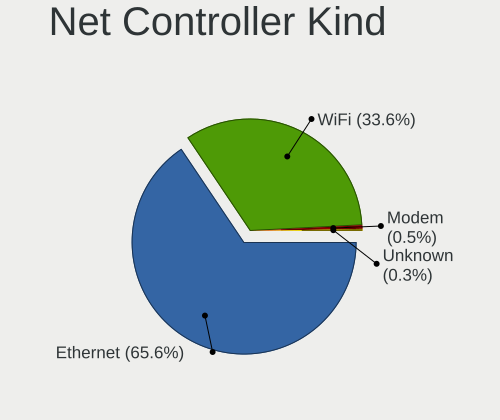

| Kind     | Desktops | Percent |
|----------|----------|---------|
| Ethernet | 1288     | 65.58%  |
| WiFi     | 660      | 33.6%   |
| Modem    | 10       | 0.51%   |
| Unknown  | 6        | 0.31%   |

Used Controller
---------------

Currently used network controller

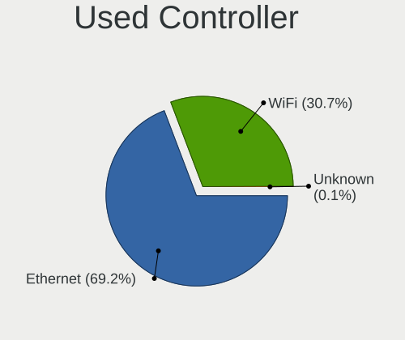

| Kind     | Desktops | Percent |
|----------|----------|---------|
| Ethernet | 952      | 69.24%  |
| WiFi     | 422      | 30.69%  |
| Unknown  | 1        | 0.07%   |

NICs
----

Total network controllers on board

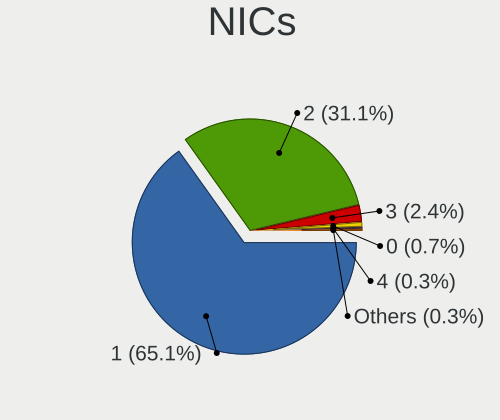

| Total | Desktops | Percent |
|-------|----------|---------|
| 1     | 852      | 65.14%  |
| 2     | 407      | 31.12%  |
| 3     | 32       | 2.45%   |
| 0     | 9        | 0.69%   |
| 4     | 4        | 0.31%   |
| 10    | 1        | 0.08%   |
| 8     | 1        | 0.08%   |
| 6     | 1        | 0.08%   |
| 5     | 1        | 0.08%   |

IPv6
----

IPv6 vs IPv4

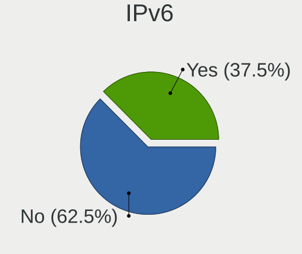

| Used | Desktops | Percent |
|------|----------|---------|
| No   | 841      | 62.53%  |
| Yes  | 504      | 37.47%  |

Bluetooth
---------

Bluetooth Vendor
----------------

Controller vendors

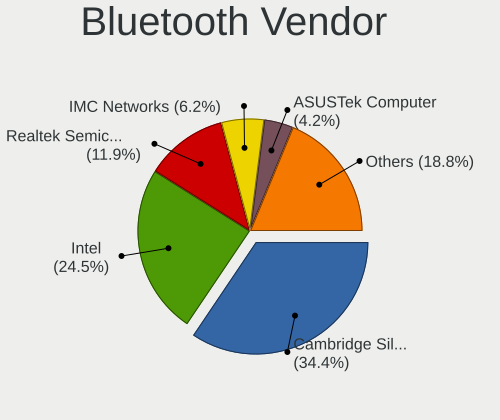

| Vendor                          | Desktops | Percent |
|---------------------------------|----------|---------|
| Cambridge Silicon Radio         | 156      | 34.44%  |
| Intel                           | 111      | 24.5%   |
| Realtek Semiconductor           | 54       | 11.92%  |
| IMC Networks                    | 28       | 6.18%   |
| ASUSTek Computer                | 19       | 4.19%   |
| MediaTek                        | 18       | 3.97%   |
| TP-Link                         | 17       | 3.75%   |
| Qualcomm Atheros Communications | 12       | 2.65%   |
| Foxconn / Hon Hai               | 9        | 1.99%   |
| Broadcom                        | 8        | 1.77%   |
| Lite-On Technology              | 3        | 0.66%   |
| Dell                            | 3        | 0.66%   |
| Unknown                         | 3        | 0.66%   |
| Realtek                         | 2        | 0.44%   |
| Apple                           | 2        | 0.44%   |
| Actions                         | 2        | 0.44%   |
| SiW                             | 1        | 0.22%   |
| Roper                           | 1        | 0.22%   |
| Ralink                          | 1        | 0.22%   |
| Micro Star International        | 1        | 0.22%   |
| Integrated System Solution      | 1        | 0.22%   |
| Dynex                           | 1        | 0.22%   |

Bluetooth Model
---------------

Controller models

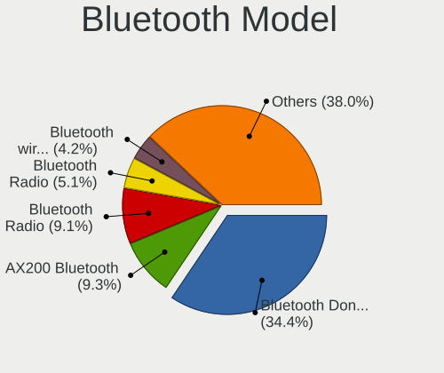

| Model                                               | Desktops | Percent |
|-----------------------------------------------------|----------|---------|
| Cambridge Silicon Radio Bluetooth Dongle (HCI mode) | 156      | 34.44%  |
| Intel AX200 Bluetooth                               | 42       | 9.27%   |
| Realtek Bluetooth Radio                             | 41       | 9.05%   |
| IMC Networks Bluetooth Radio                        | 23       | 5.08%   |
| Intel Bluetooth wireless interface                  | 19       | 4.19%   |
| MediaTek Wireless_Device                            | 18       | 3.97%   |
| TP-Link TP-T@- UB500 Adapter                        | 17       | 3.75%   |
| Intel AX210 Bluetooth                               | 14       | 3.09%   |
| Intel Wireless-AC 3168 Bluetooth                    | 9        | 1.99%   |
| ASUS Broadcom BCM20702A0 Bluetooth                  | 8        | 1.77%   |
| ASUS Bluetooth Radio                                | 8        | 1.77%   |
| Intel Wireless-AC 9260 Bluetooth Adapter            | 7        | 1.55%   |
| Intel Bluetooth Device                              | 7        | 1.55%   |
| Realtek  Bluetooth 4.2 Adapter                      | 6        | 1.32%   |
| Qualcomm Atheros AR9462 Bluetooth                   | 6        | 1.32%   |
| Intel Bluetooth 9460/9560 Jefferson Peak (JfP)      | 6        | 1.32%   |
| Intel AX201 Bluetooth                               | 6        | 1.32%   |
| Qualcomm Atheros  Bluetooth Device                  | 5        | 1.1%    |
| IMC Networks Wireless_Device                        | 4        | 0.88%   |
| Foxconn / Hon Hai Bluetooth Device                  | 4        | 0.88%   |
| Realtek Bluetooth 5.3 Radio                         | 3        | 0.66%   |
| Foxconn / Hon Hai Wireless_Device                   | 3        | 0.66%   |
| Dell Broadcom BCM20702A0 Bluetooth                  | 3        | 0.66%   |
| Broadcom BCM20702A0 Bluetooth 4.0                   | 3        | 0.66%   |
| Unknown                                             | 3        | 0.66%   |
| Realtek Bluetooth Radio                             | 2        | 0.44%   |
| Actions general adapter                             | 2        | 0.44%   |
| SiW SiW                                             | 1        | 0.22%   |
| Roper Class 1 Bluetooth Dongle                      | 1        | 0.22%   |
| Realtek RTL8821A Bluetooth                          | 1        | 0.22%   |
| Realtek RTL8723B Bluetooth                          | 1        | 0.22%   |
| Realtek Bluetooth 5.4 Radio                         | 1        | 0.22%   |
| Realtek 802.11ac WLAN Adapter                       | 1        | 0.22%   |
| Ralink RT3290 Bluetooth                             | 1        | 0.22%   |
| Qualcomm Atheros AR3011 Bluetooth                   | 1        | 0.22%   |
| Micro Star International Bluetooth Device           | 1        | 0.22%   |
| Lite-On Wireless_Device                             | 1        | 0.22%   |
| Lite-On Qualcomm Atheros QCA9377 Bluetooth          | 1        | 0.22%   |
| Lite-On Bluetooth Device                            | 1        | 0.22%   |
| Intel Centrino Advanced-N 6230 Bluetooth adapter    | 1        | 0.22%   |

Sound
-----

Sound Vendor
------------

Sound card vendors

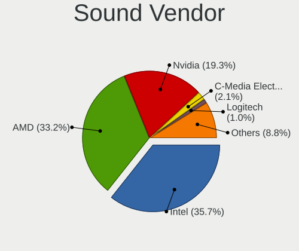

| Vendor                                       | Desktops | Percent |
|----------------------------------------------|----------|---------|
| Intel                                        | 694      | 35.66%  |
| AMD                                          | 646      | 33.2%   |
| Nvidia                                       | 375      | 19.27%  |
| C-Media Electronics                          | 40       | 2.06%   |
| Logitech                                     | 19       | 0.98%   |
| Texas Instruments                            | 14       | 0.72%   |
| Generalplus Technology                       | 13       | 0.67%   |
| Creative Labs                                | 11       | 0.57%   |
| ASUSTek Computer                             | 11       | 0.57%   |
| Corsair                                      | 9        | 0.46%   |
| Zoran Co. Personal Media Division (Nogatech) | 7        | 0.36%   |
| Razer USA                                    | 7        | 0.36%   |
| VIA Technologies                             | 6        | 0.31%   |
| Micro Star International                     | 6        | 0.31%   |
| Jieli Technology                             | 6        | 0.31%   |
| Kingston Technology                          | 5        | 0.26%   |
| JMTek                                        | 5        | 0.26%   |
| Focusrite-Novation                           | 5        | 0.26%   |
| Sony                                         | 4        | 0.21%   |
| Hewlett-Packard                              | 4        | 0.21%   |
| Creative Technology                          | 4        | 0.21%   |
| ATI Technologies                             | 4        | 0.21%   |
| GN Netcom                                    | 3        | 0.15%   |
| SAVITECH                                     | 2        | 0.1%    |
| Realtek Semiconductor                        | 2        | 0.1%    |
| Microsoft                                    | 2        | 0.1%    |
| M-Audio                                      | 2        | 0.1%    |
| KTMicro                                      | 2        | 0.1%    |
| Comtrue                                      | 2        | 0.1%    |
| BEHRINGER International                      | 2        | 0.1%    |
| Apple                                        | 2        | 0.1%    |
| Yamaha                                       | 1        | 0.05%   |
| XMOS                                         | 1        | 0.05%   |
| Walmart                                      | 1        | 0.05%   |
| Trust                                        | 1        | 0.05%   |
| Thesycon Systemsoftware & Consulting         | 1        | 0.05%   |
| Tenx Technology                              | 1        | 0.05%   |
| Syntek                                       | 1        | 0.05%   |
| Soundprese                                   | 1        | 0.05%   |
| Shure                                        | 1        | 0.05%   |

Sound Model
-----------

Sound card models

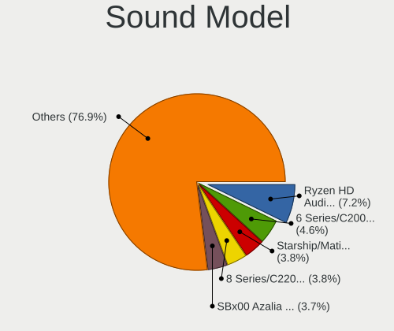

| Model                                                                      | Desktops | Percent |
|----------------------------------------------------------------------------|----------|---------|
| AMD Ryzen HD Audio Controller                                              | 177      | 7.22%   |
| Intel 6 Series/C200 Series Chipset Family High Definition Audio Controller | 112      | 4.57%   |
| AMD Starship/Matisse HD Audio Controller                                   | 94       | 3.83%   |
| Intel 8 Series/C220 Series Chipset High Definition Audio Controller        | 93       | 3.79%   |
| AMD SBx00 Azalia (Intel HDA)                                               | 90       | 3.67%   |
| AMD Renoir/Cezanne HDMI/DP Audio Controller                                | 78       | 3.18%   |
| AMD FCH Azalia Controller                                                  | 74       | 3.02%   |
| Intel Xeon E3-1200 v3/4th Gen Core Processor HD Audio Controller           | 71       | 2.89%   |
| Intel NM10/ICH7 Family High Definition Audio Controller                    | 62       | 2.53%   |
| AMD Raven/Raven2/Fenghuang HDMI/DP Audio Controller                        | 62       | 2.53%   |
| AMD Family 17h (Models 00h-0fh) HD Audio Controller                        | 57       | 2.32%   |
| Intel 7 Series/C216 Chipset Family High Definition Audio Controller        | 53       | 2.16%   |
| AMD Navi 21/23 HDMI/DP Audio Controller                                    | 47       | 1.92%   |
| Intel 200 Series PCH HD Audio                                              | 46       | 1.88%   |
| Intel 100 Series/C230 Series Chipset Family HD Audio Controller            | 44       | 1.79%   |
| AMD Ellesmere HDMI Audio [Radeon RX 470/480 / 570/580/590]                 | 44       | 1.79%   |
| AMD Oland/Hainan/Cape Verde/Pitcairn HDMI Audio [Radeon HD 7000 Series]    | 40       | 1.63%   |
| AMD Kabini HDMI/DP Audio                                                   | 35       | 1.43%   |
| Nvidia MCP61 High Definition Audio                                         | 33       | 1.35%   |
| Nvidia GK208 HDMI/DP Audio Controller                                      | 33       | 1.35%   |
| Intel Cannon Lake PCH cAVS                                                 | 32       | 1.3%    |
| AMD Radeon High Definition Audio Controller                                | 32       | 1.3%    |
| AMD Family 15h (Models 60h-6fh) Audio Controller                           | 29       | 1.18%   |
| Nvidia GP106 High Definition Audio Controller                              | 25       | 1.02%   |
| AMD Navi 10 HDMI Audio                                                     | 25       | 1.02%   |
| AMD Baffin HDMI/DP Audio [Radeon RX 550 640SP / RX 560/560X]               | 25       | 1.02%   |
| Nvidia GP107GL High Definition Audio Controller                            | 24       | 0.98%   |
| Intel 82801I (ICH9 Family) HD Audio Controller                             | 24       | 0.98%   |
| Nvidia High Definition Audio Controller                                    | 23       | 0.94%   |
| Intel 82801JD/DO (ICH10 Family) HD Audio Controller                        | 23       | 0.94%   |
| Nvidia GP108 High Definition Audio Controller                              | 22       | 0.9%    |
| Nvidia GM107 High Definition Audio Controller [GeForce 940MX]              | 20       | 0.82%   |
| Intel 82801JI (ICH10 Family) HD Audio Controller                           | 20       | 0.82%   |
| Intel 5 Series/3400 Series Chipset High Definition Audio                   | 20       | 0.82%   |
| AMD Trinity HDMI Audio Controller                                          | 18       | 0.73%   |
| Nvidia TU116 High Definition Audio Controller                              | 16       | 0.65%   |
| AMD Navi 31 HDMI/DP Audio                                                  | 16       | 0.65%   |
| Nvidia GA104 High Definition Audio Controller                              | 15       | 0.61%   |
| Intel Alder Lake-S HD Audio Controller                                     | 15       | 0.61%   |
| AMD Kaveri HDMI/DP Audio Controller                                        | 15       | 0.61%   |

Memory
------

Memory Vendor
-------------

Memory module vendors

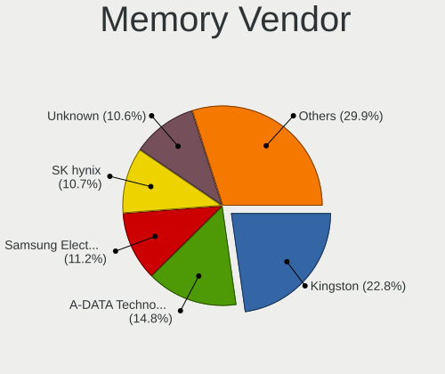

| Vendor              | Desktops | Percent |
|---------------------|----------|---------|
| Kingston            | 181      | 22.77%  |
| A-DATA Technology   | 118      | 14.84%  |
| Samsung Electronics | 89       | 11.19%  |
| SK hynix            | 85       | 10.69%  |
| Unknown             | 84       | 10.57%  |
| Corsair             | 57       | 7.17%   |
| Micron Technology   | 46       | 5.79%   |
| Crucial             | 17       | 2.14%   |
| Unknown             | 16       | 2.01%   |
| G.Skill             | 13       | 1.64%   |
| Team                | 12       | 1.51%   |
| Nanya Technology    | 12       | 1.51%   |
| Ramaxel Technology  | 9        | 1.13%   |
| Patriot             | 6        | 0.75%   |
| Elpida              | 6        | 0.75%   |
| Timetec             | 5        | 0.63%   |
| Qimonda             | 4        | 0.5%    |
| PNY                 | 4        | 0.5%    |
| Unknown (0x0E9D)    | 2        | 0.25%   |
| Transcend           | 2        | 0.25%   |
| PUSKILL             | 2        | 0.25%   |
| CSX                 | 2        | 0.25%   |
| Avant               | 2        | 0.25%   |
| Apacer              | 2        | 0.25%   |
| Unknown (ABCD)      | 1        | 0.13%   |
| Unknown (8A6B)      | 1        | 0.13%   |
| Unknown (0x5846)    | 1        | 0.13%   |
| Unknown (0E97)      | 1        | 0.13%   |
| Unknown (0B92)      | 1        | 0.13%   |
| Toshiba             | 1        | 0.13%   |
| Silicon Power       | 1        | 0.13%   |
| SGS/Thomson         | 1        | 0.13%   |
| S                   | 1        | 0.13%   |
| Patriot Memory      | 1        | 0.13%   |
| Lexar Co Limited    | 1        | 0.13%   |
| Kimtigo             | 1        | 0.13%   |
| Hewlett-Packard     | 1        | 0.13%   |
| H                   | 1        | 0.13%   |
| Gigabyte Technology | 1        | 0.13%   |
| Atermiter           | 1        | 0.13%   |

Memory Model
------------

Memory module models

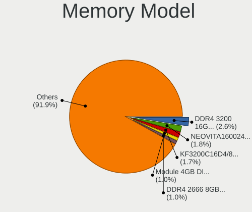

| Model                                                  | Desktops | Percent |
|--------------------------------------------------------|----------|---------|
| A-DATA RAM DDR4 3200 16GB DIMM DDR4 3600MT/s           | 23       | 2.57%   |
| Unknown                                                | 16       | 1.79%   |
| Kingston RAM KF3200C16D4/8GX 8GiB DIMM DDR4 3600MT/s   | 15       | 1.68%   |
| Unknown RAM Module 4GB DIMM 1333MT/s                   | 9        | 1.01%   |
| A-DATA RAM DDR4 2666 8GB DIMM DDR4 3200MT/s            | 9        | 1.01%   |
| Unknown RAM Module 4GB DIMM DDR3 1333MT/s              | 8        | 0.89%   |
| Kingston RAM KHX2666C16/8G 8GiB DIMM DDR4 3466MT/s     | 8        | 0.89%   |
| Kingston RAM KF3200C16D4/16GX 16GB DIMM DDR4 3733MT/s  | 8        | 0.89%   |
| Kingston RAM KHX3200C16D4/8GX 8GB DIMM DDR4 3733MT/s   | 7        | 0.78%   |
| Kingston RAM KF3200C16D4/32GX 32GB DIMM DDR4 3933MT/s  | 7        | 0.78%   |
| A-DATA RAM Module 8GB DIMM DDR4 2133MT/s               | 7        | 0.78%   |
| SK hynix RAM HMT351U6CFR8C-PB 4GB DIMM DDR3 1800MT/s   | 6        | 0.67%   |
| Samsung RAM M378B5773CH0-CH9 2GB DIMM DDR3 1867MT/s    | 6        | 0.67%   |
| Samsung RAM M378B5173DB0-CK0 4096MB DIMM DDR3 1600MT/s | 6        | 0.67%   |
| Micron RAM 8JTF51264AZ-1G6E1 4GB DIMM DDR3 1600MT/s    | 6        | 0.67%   |
| Kingston RAM 99U5471-012.A00LF 4GB DIMM DDR3 1333MT/s  | 6        | 0.67%   |
| A-DATA RAM Module 8GB DIMM DDR4 2400MT/s               | 6        | 0.67%   |
| A-DATA RAM DDR4 3000 8GB DIMM DDR4 3600MT/s            | 6        | 0.67%   |
| Team RAM TEAMGROUP-UD4-2666 16GB DIMM DDR4 2667MT/s    | 5        | 0.56%   |
| SK hynix RAM HYMP125U64CP8-S6 2GB DIMM DDR2 49926MT/s  | 5        | 0.56%   |
| Samsung RAM M378B5173QH0-CK0 4GB DIMM DDR3             | 5        | 0.56%   |
| Samsung RAM M3 78T5663QZ3-CF7 2GB DIMM DDR2 800MT/s    | 5        | 0.56%   |
| Kingston RAM 99U5474-028.A00LF 4GB DIMM DDR3 1333MT/s  | 5        | 0.56%   |
| Corsair RAM CMK16GX4M2D3000C16 8GB DIMM DDR4 3400MT/s  | 5        | 0.56%   |
| A-DATA RAM Module 4GB DIMM DDR3 1333MT/s               | 5        | 0.56%   |
| A-DATA RAM DDR4 2666 8GB DIMM DDR4 2667MT/s            | 5        | 0.56%   |
| Unknown RAM Module 8GB DIMM DDR3 1600MT/s              | 4        | 0.45%   |
| SK hynix RAM Module 2GB DIMM DDR3 1333MT/s             | 4        | 0.45%   |
| Samsung RAM Module 2GB DIMM DDR3 1333MT/s              | 4        | 0.45%   |
| Samsung RAM M378B5273DH0-CK0 4GB DIMM DDR3 2200MT/s    | 4        | 0.45%   |
| Samsung RAM M378B5173EB0-CK0 4GB DIMM DDR3 1600MT/s    | 4        | 0.45%   |
| Kingston RAM Module 2GB DIMM DDR2 800MT/s              | 4        | 0.45%   |
| Kingston RAM Module 1GB DIMM DDR2 667MT/s              | 4        | 0.45%   |
| Kingston RAM KHX2666C15D4/4G 4GB DIMM DDR4 3200MT/s    | 4        | 0.45%   |
| Kingston RAM KHX1866C10D3/8G 8GB DIMM DDR3 1867MT/s    | 4        | 0.45%   |
| Kingston RAM KHX1600C10D3/8G 8GB DIMM DDR3 2133MT/s    | 4        | 0.45%   |
| Kingston RAM KF3600C18D4/32GX 32GB DIMM DDR4 4000MT/s  | 4        | 0.45%   |
| Kingston RAM KF2666C16D4/8G 8GB DIMM DDR4 2667MT/s     | 4        | 0.45%   |
| Kingston RAM 99U5471-052.A00LF 8GB DIMM DDR3 1333MT/s  | 4        | 0.45%   |
| Corsair RAM CMW16GX4M2C3200C16 8GB DIMM DDR4 3733MT/s  | 4        | 0.45%   |

Memory Kind
-----------

Memory module kinds

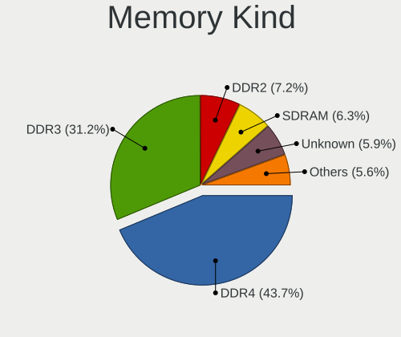

| Kind    | Desktops | Percent |
|---------|----------|---------|
| DDR4    | 297      | 43.74%  |
| DDR3    | 212      | 31.22%  |
| DDR2    | 49       | 7.22%   |
| SDRAM   | 43       | 6.33%   |
| Unknown | 40       | 5.89%   |
| DDR5    | 22       | 3.24%   |
| DDR     | 10       | 1.47%   |
| LPDDR4  | 3        | 0.44%   |
| DRAM    | 2        | 0.29%   |
| LPDDR5  | 1        | 0.15%   |

Memory Form Factor
------------------

Physical design of the memory module

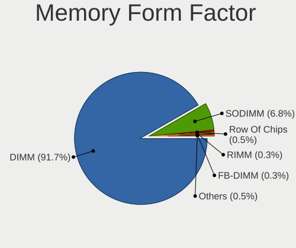

| Name         | Desktops | Percent |
|--------------|----------|---------|
| DIMM         | 595      | 91.68%  |
| SODIMM       | 44       | 6.78%   |
| Row Of Chips | 3        | 0.46%   |
| RIMM         | 2        | 0.31%   |
| FB-DIMM      | 2        | 0.31%   |
| Chip         | 2        | 0.31%   |
| Unknown      | 1        | 0.15%   |

Memory Size
-----------

Memory module size

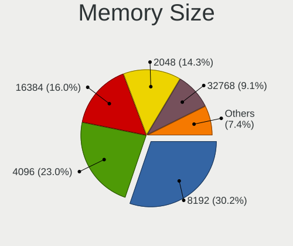

| Size  | Desktops | Percent |
|-------|----------|---------|
| 8192  | 226      | 30.21%  |
| 4096  | 172      | 22.99%  |
| 16384 | 120      | 16.04%  |
| 2048  | 107      | 14.3%   |
| 32768 | 68       | 9.09%   |
| 1024  | 42       | 5.61%   |
| 512   | 8        | 1.07%   |
| 49152 | 2        | 0.27%   |
| 12288 | 1        | 0.13%   |
| 256   | 1        | 0.13%   |
| 128   | 1        | 0.13%   |

Memory Speed
------------

Memory module speed

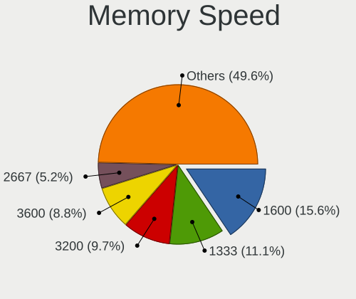

| Speed   | Desktops | Percent |
|---------|----------|---------|
| 1600    | 119      | 15.58%  |
| 1333    | 85       | 11.13%  |
| 3200    | 74       | 9.69%   |
| 3600    | 67       | 8.77%   |
| 2667    | 40       | 5.24%   |
| 2133    | 33       | 4.32%   |
| 800     | 33       | 4.32%   |
| 2400    | 32       | 4.19%   |
| 667     | 26       | 3.4%    |
| 3733    | 24       | 3.14%   |
| Unknown | 18       | 2.36%   |
| 2666    | 14       | 1.83%   |
| 1866    | 12       | 1.57%   |
| 3400    | 10       | 1.31%   |
| 3466    | 9        | 1.18%   |
| 3000    | 9        | 1.18%   |
| 1800    | 9        | 1.18%   |
| 1067    | 9        | 1.18%   |
| 533     | 9        | 1.18%   |
| 4000    | 8        | 1.05%   |
| 3933    | 7        | 0.92%   |
| 3800    | 7        | 0.92%   |
| 1867    | 7        | 0.92%   |
| 1639    | 7        | 0.92%   |
| 1066    | 7        | 0.92%   |
| 49926   | 6        | 0.79%   |
| 5600    | 5        | 0.65%   |
| 5200    | 5        | 0.65%   |
| 2200    | 5        | 0.65%   |
| 6400    | 4        | 0.52%   |
| 4800    | 4        | 0.52%   |
| 3066    | 4        | 0.52%   |
| 2800    | 4        | 0.52%   |
| 2048    | 4        | 0.52%   |
| 1331    | 4        | 0.52%   |
| 6000    | 3        | 0.39%   |
| 2000    | 3        | 0.39%   |
| 1334    | 3        | 0.39%   |
| 333     | 3        | 0.39%   |
| 3467    | 2        | 0.26%   |

Printers & scanners
-------------------

Printer Vendor
--------------

Printer device vendors

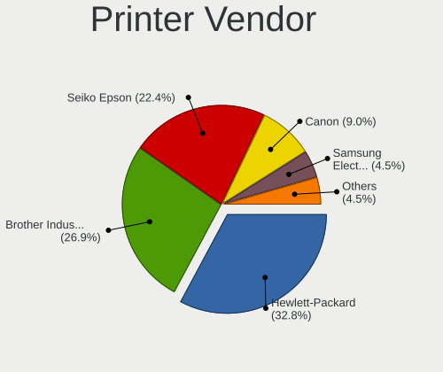

| Vendor              | Desktops | Percent |
|---------------------|----------|---------|
| Hewlett-Packard     | 22       | 32.84%  |
| Brother Industries  | 18       | 26.87%  |
| Seiko Epson         | 15       | 22.39%  |
| Canon               | 6        | 8.96%   |
| Samsung Electronics | 3        | 4.48%   |
| QinHeng Electronics | 1        | 1.49%   |
| Prolific Technology | 1        | 1.49%   |
| Kyocera             | 1        | 1.49%   |

Printer Model
-------------

Printer device models

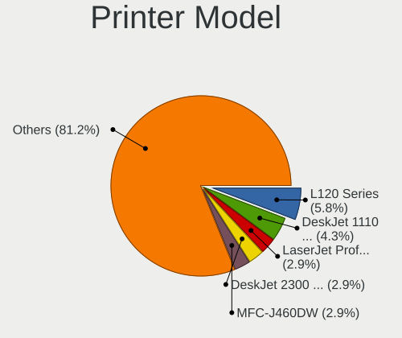

| Model                                   | Desktops | Percent |
|-----------------------------------------|----------|---------|
| Seiko Epson L120 Series                 | 4        | 5.8%    |
| HP DeskJet 1110 series                  | 3        | 4.35%   |
| HP LaserJet Professional P 1102w        | 2        | 2.9%    |
| HP DeskJet 2300 series                  | 2        | 2.9%    |
| Brother MFC-J460DW                      | 2        | 2.9%    |
| Brother HL-2130 series                  | 2        | 2.9%    |
| Brother HL-1110 series                  | 2        | 2.9%    |
| Brother DCP-L2540DW                     | 2        | 2.9%    |
| Seiko Epson XP-235 Series               | 1        | 1.45%   |
| Seiko Epson L805 Series                 | 1        | 1.45%   |
| Seiko Epson L380 Series                 | 1        | 1.45%   |
| Seiko Epson L3210 Series                | 1        | 1.45%   |
| Seiko Epson L3110 Series                | 1        | 1.45%   |
| Seiko Epson L200 Series                 | 1        | 1.45%   |
| Seiko Epson L1300 Series                | 1        | 1.45%   |
| Seiko Epson L1210 Series                | 1        | 1.45%   |
| Seiko Epson L1110 Series                | 1        | 1.45%   |
| Seiko Epson ET-4850 Series              | 1        | 1.45%   |
| Seiko Epson ET-3750 Series              | 1        | 1.45%   |
| Seiko Epson ET-2700 Series              | 1        | 1.45%   |
| Seiko Epson EPSON L300 Series           | 1        | 1.45%   |
| Samsung Xerox Phaser 3117 Laser Printer | 1        | 1.45%   |
| Samsung ML-1640 Series Laser Printer    | 1        | 1.45%   |
| Samsung M283x Series                    | 1        | 1.45%   |
| QinHeng CH340S                          | 1        | 1.45%   |
| Prolific PL2305 Parallel Port           | 1        | 1.45%   |
| Kyocera FS-1030D printer                | 1        | 1.45%   |
| HP Smart Tank 580-590 series            | 1        | 1.45%   |
| HP OfficeJet Pro 7740 series            | 1        | 1.45%   |
| HP LaserJet Professional P1102w         | 1        | 1.45%   |
| HP LaserJet Pro M201dw                  | 1        | 1.45%   |
| HP LaserJet P3010 Series                | 1        | 1.45%   |
| HP Laserjet P1505                       | 1        | 1.45%   |
| HP LaserJet M109-M112                   | 1        | 1.45%   |
| HP LaserJet 1018                        | 1        | 1.45%   |
| HP Ink Tank 110 series                  | 1        | 1.45%   |
| HP DeskJet F4200 series                 | 1        | 1.45%   |
| HP DeskJet F300 series                  | 1        | 1.45%   |
| HP DeskJet 4720 series                  | 1        | 1.45%   |
| HP DeskJet 3700 series                  | 1        | 1.45%   |

Scanner Vendor
--------------

Scanner device vendors

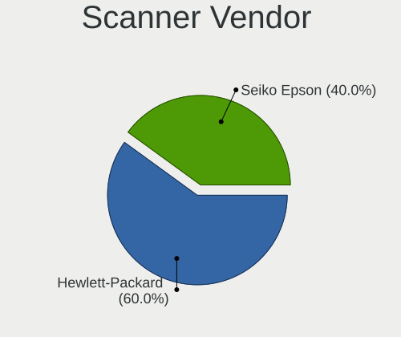

| Vendor          | Desktops | Percent |
|-----------------|----------|---------|
| Hewlett-Packard | 3        | 60%     |
| Seiko Epson     | 2        | 40%     |

Scanner Model
-------------

Scanner device models

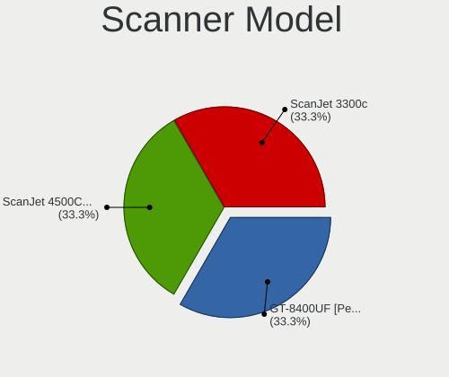

| Model                                              | Desktops | Percent |
|----------------------------------------------------|----------|---------|
| HP ScanJet 4500C/5550C                             | 2        | 40%     |
| Seiko Epson GT-X820 [Perfection V600 Photo]        | 1        | 20%     |
| Seiko Epson GT-8400UF [Perfection 1670/1670 PHOTO] | 1        | 20%     |
| HP ScanJet 3300c                                   | 1        | 20%     |

Camera
------

Camera Vendor
-------------

Camera device vendors

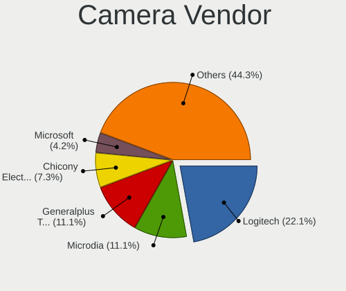

| Vendor                        | Desktops | Percent |
|-------------------------------|----------|---------|
| Logitech                      | 58       | 22.14%  |
| Microdia                      | 29       | 11.07%  |
| Generalplus Technology        | 29       | 11.07%  |
| Chicony Electronics           | 19       | 7.25%   |
| Microsoft                     | 11       | 4.2%    |
| Jieli Technology              | 9        | 3.44%   |
| Samsung Electronics           | 8        | 3.05%   |
| Realtek Semiconductor         | 8        | 3.05%   |
| MacroSilicon                  | 8        | 3.05%   |
| KYE Systems (Mouse Systems)   | 8        | 3.05%   |
| GEMBIRD                       | 8        | 3.05%   |
| Sunplus Innovation Technology | 6        | 2.29%   |
| Apple                         | 6        | 2.29%   |
| Z-Star Microelectronics       | 5        | 1.91%   |
| LG Electronics                | 5        | 1.91%   |
| Hewlett-Packard               | 4        | 1.53%   |
| Xiongmai                      | 2        | 0.76%   |
| Syntek                        | 2        | 0.76%   |
| Sonix Technology              | 2        | 0.76%   |
| Razer USA                     | 2        | 0.76%   |
| Genesys Logic                 | 2        | 0.76%   |
| Creative Technology           | 2        | 0.76%   |
| Aveo Technology               | 2        | 0.76%   |
| ARC International             | 2        | 0.76%   |
| Alcor Micro                   | 2        | 0.76%   |
| XHT-210518                    | 1        | 0.38%   |
| webcam                        | 1        | 0.38%   |
| WCM_USB                       | 1        | 0.38%   |
| Unknown                       | 1        | 0.38%   |
| Sunplus Technology            | 1        | 0.38%   |
| Silicon Motion                | 1        | 0.38%   |
| Ruision                       | 1        | 0.38%   |
| Pixart Imaging                | 1        | 0.38%   |
| OPPO Electronics              | 1        | 0.38%   |
| Novatel Wireless              | 1        | 0.38%   |
| Novatek Microelectronics      | 1        | 0.38%   |
| Linux Foundation HS           | 1        | 0.38%   |
| lihappe8                      | 1        | 0.38%   |
| IMC Networks                  | 1        | 0.38%   |
| Image Processor               | 1        | 0.38%   |

Camera Model
------------

Camera device models

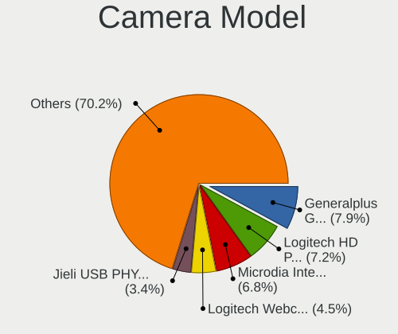

| Model                                                 | Desktops | Percent |
|-------------------------------------------------------|----------|---------|
| Generalplus GENERAL WEBCAM                            | 21       | 7.92%   |
| Logitech HD Pro Webcam C920                           | 19       | 7.17%   |
| Microdia Integrated Camera                            | 18       | 6.79%   |
| Logitech Webcam C270                                  | 12       | 4.53%   |
| Jieli USB PHY 2.0                                     | 9        | 3.4%    |
| Samsung Galaxy series, misc. (MTP mode)               | 8        | 3.02%   |
| MacroSilicon USB Video                                | 7        | 2.64%   |
| Chicony HP High Definition 1MP Webcam                 | 7        | 2.64%   |
| GEMBIRD Generic UVC 1.00 camera [AppoTech AX2311]     | 6        | 2.26%   |
| Realtek HP 1.0MP High Definition Webcam               | 5        | 1.89%   |
| Microsoft LifeCam HD-3000                             | 5        | 1.89%   |
| Logitech Webcam C170                                  | 5        | 1.89%   |
| LG LM-X420xxx/G2/G3 Android Phone (MTP/download mode) | 5        | 1.89%   |
| KYE Systems (Mouse Systems) USB 2.0 HD1080P PC Camera | 4        | 1.51%   |
| Generalplus 808 Camera #9 (web-cam mode)              | 4        | 1.51%   |
| Chicony HP 0.3MP Webcam                               | 4        | 1.51%   |
| Apple iPhone 5/5C/5S/6/SE/7/8/X                       | 4        | 1.51%   |
| Z-Star Venus USB2.0 Camera                            | 3        | 1.13%   |
| Sunplus Integrated Camera                             | 3        | 1.13%   |
| Microdia USB Camera                                   | 3        | 1.13%   |
| Microdia USB 2.0 Camera                               | 3        | 1.13%   |
| Logitech Webcam Pro 9000                              | 3        | 1.13%   |
| Logitech C922 Pro Stream Webcam                       | 3        | 1.13%   |
| Logitech C920 PRO HD Webcam                           | 3        | 1.13%   |
| KYE Systems (Mouse Systems) Genius FaceCam 320        | 3        | 1.13%   |
| HP Webcam HD-2200                                     | 3        | 1.13%   |
| Generalplus WEB CAM                                   | 3        | 1.13%   |
| Xiongmai web camera                                   | 2        | 0.75%   |
| Sonix GENERAL WEBCAM                                  | 2        | 0.75%   |
| Razer USA Razer Kiyo Pro                              | 2        | 0.75%   |
| Microsoft LifeCam Studio                              | 2        | 0.75%   |
| Microdia Webcam Vitade AF                             | 2        | 0.75%   |
| Logitech StreamCam                                    | 2        | 0.75%   |
| Logitech HD Webcam C525                               | 2        | 0.75%   |
| Logitech HD Webcam B910                               | 2        | 0.75%   |
| GEMBIRD USB2.0 PC CAMERA                              | 2        | 0.75%   |
| Chicony CNF8050 Webcam                                | 2        | 0.75%   |
| Aveo UVC camera (Bresser microscope)                  | 2        | 0.75%   |
| ARC International Camera                              | 2        | 0.75%   |
| Apple iPhone 4                                        | 2        | 0.75%   |

Security
--------

Fingerprint Vendor
------------------

Fingerprint sensor vendors

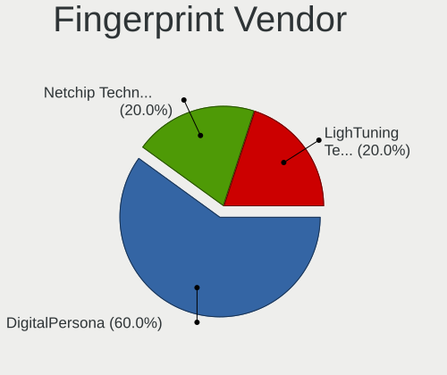

| Vendor                | Desktops | Percent |
|-----------------------|----------|---------|
| DigitalPersona        | 3        | 60%     |
| Netchip Technology    | 1        | 20%     |
| LighTuning Technology | 1        | 20%     |

Fingerprint Model
-----------------

Fingerprint sensor models

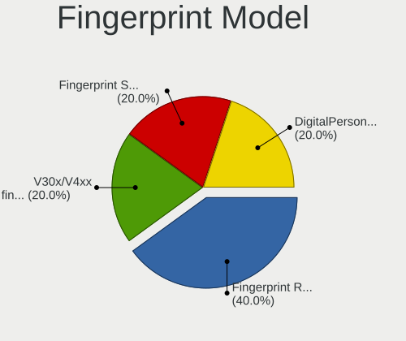

| Model                                                  | Desktops | Percent |
|--------------------------------------------------------|----------|---------|
| DigitalPersona Fingerprint Reader                      | 2        | 40%     |
| Netchip V30x/V4xx fingerprint sensor [Lumidigm]        | 1        | 20%     |
| LighTuning Fingerprint Sensor                          | 1        | 20%     |
| DigitalPersona DigitalPersona, Inc. Fingerprint Reader | 1        | 20%     |

Chipcard Vendor
---------------

Chipcard module vendors

| Vendor                | Desktops | Percent |
|-----------------------|----------|---------|
| Advanced Card Systems | 1        | 100%    |

Chipcard Model
--------------

Chipcard module models

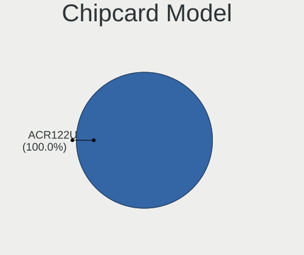

| Model                         | Desktops | Percent |
|-------------------------------|----------|---------|
| Advanced Card Systems ACR122U | 1        | 100%    |

Unsupported
-----------

Unsupported Devices
-------------------

Total unsupported devices on board

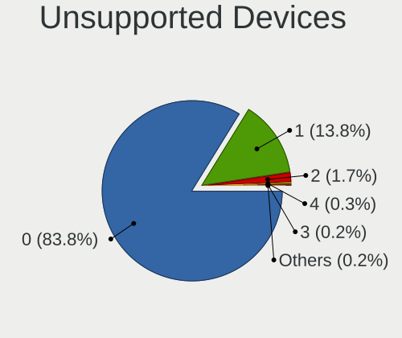

| Total | Desktops | Percent |
|-------|----------|---------|
| 0     | 1113     | 83.81%  |
| 1     | 183      | 13.78%  |
| 2     | 23       | 1.73%   |
| 4     | 4        | 0.3%    |
| 3     | 3        | 0.23%   |
| 8     | 1        | 0.08%   |
| 6     | 1        | 0.08%   |

Unsupported Device Types
------------------------

Types of unsupported devices

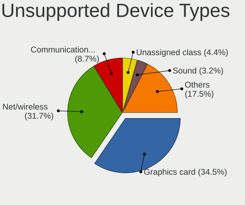

| Type                     | Desktops | Percent |
|--------------------------|----------|---------|
| Graphics card            | 87       | 34.52%  |
| Net/wireless             | 80       | 31.75%  |
| Communication controller | 22       | 8.73%   |
| Unassigned class         | 11       | 4.37%   |
| Sound                    | 8        | 3.17%   |
| Multimedia controller    | 8        | 3.17%   |
| Camera                   | 6        | 2.38%   |
| Net/ethernet             | 5        | 1.98%   |
| Bluetooth                | 5        | 1.98%   |
| Storage/raid             | 4        | 1.59%   |
| Network                  | 4        | 1.59%   |
| Fingerprint reader       | 4        | 1.59%   |
| Video                    | 1        | 0.4%    |
| Tv card                  | 1        | 0.4%    |
| Storage/nvme             | 1        | 0.4%    |
| Storage/ide              | 1        | 0.4%    |
| Storage/ata              | 1        | 0.4%    |
| Modem                    | 1        | 0.4%    |
| Chipcard                 | 1        | 0.4%    |
| Card reader              | 1        | 0.4%    |

