Linux in Mexico - Tested Hardware & Statistics (Desktops)
---------------------------------------------------------

A project to collect tested hardware configurations for Linux in Mexico.

Anyone can contribute to this report by the [hw-probe](https://github.com/linuxhw/hw-probe) tool:

    sudo -E hw-probe -all -upload

Please contribute! Especially if your hardware is rare.

Contents
--------

* [ Test Cases ](#test-cases)

* [ System ](#system)
  - [ OS                       ](#os)
  - [ OS Family                ](#os-family)
  - [ Kernel                   ](#kernel)
  - [ Kernel Family            ](#kernel-family)
  - [ Kernel Major Ver.        ](#kernel-major-ver)
  - [ Arch                     ](#arch)
  - [ DE                       ](#de)
  - [ Display Server           ](#display-server)
  - [ Display Manager          ](#display-manager)
  - [ OS Lang                  ](#os-lang)
  - [ Boot Mode                ](#boot-mode)
  - [ Filesystem               ](#filesystem)
  - [ Part. scheme             ](#part-scheme)
  - [ Dual Boot with Linux/BSD ](#dual-boot-with-linuxbsd)
  - [ Dual Boot (Win)          ](#dual-boot-win)

* [ Board ](#board)
  - [ Vendor                   ](#vendor)
  - [ Model                    ](#model)
  - [ Model Family             ](#model-family)
  - [ MFG Year                 ](#mfg-year)
  - [ Form Factor              ](#form-factor)
  - [ Secure Boot              ](#secure-boot)
  - [ Coreboot                 ](#coreboot)
  - [ RAM Size                 ](#ram-size)
  - [ RAM Used                 ](#ram-used)
  - [ Total Drives             ](#total-drives)
  - [ Has CD-ROM               ](#has-cd-rom)
  - [ Has Ethernet             ](#has-ethernet)
  - [ Has WiFi                 ](#has-wifi)
  - [ Has Bluetooth            ](#has-bluetooth)

* [ Location ](#location)
  - [ Country                  ](#country)
  - [ City                     ](#city)

* [ Drives ](#drives)
  - [ Drive Vendor             ](#drive-vendor)
  - [ Drive Model              ](#drive-model)
  - [ HDD Vendor               ](#hdd-vendor)
  - [ SSD Vendor               ](#ssd-vendor)
  - [ Drive Kind               ](#drive-kind)
  - [ Drive Connector          ](#drive-connector)
  - [ Drive Size               ](#drive-size)
  - [ Space Total              ](#space-total)
  - [ Space Used               ](#space-used)
  - [ Malfunc. Drives          ](#malfunc-drives)
  - [ Malfunc. Drive Vendor    ](#malfunc-drive-vendor)
  - [ Malfunc. HDD Vendor      ](#malfunc-hdd-vendor)
  - [ Malfunc. Drive Kind      ](#malfunc-drive-kind)
  - [ Failed Drives            ](#failed-drives)
  - [ Failed Drive Vendor      ](#failed-drive-vendor)
  - [ Drive Status             ](#drive-status)

* [ Storage controller ](#storage-controller)
  - [ Storage Vendor           ](#storage-vendor)
  - [ Storage Model            ](#storage-model)
  - [ Storage Kind             ](#storage-kind)

* [ Processor ](#processor)
  - [ CPU Vendor               ](#cpu-vendor)
  - [ CPU Model                ](#cpu-model)
  - [ CPU Model Family         ](#cpu-model-family)
  - [ CPU Cores                ](#cpu-cores)
  - [ CPU Sockets              ](#cpu-sockets)
  - [ CPU Threads              ](#cpu-threads)
  - [ CPU Op-Modes             ](#cpu-op-modes)
  - [ CPU Microcode            ](#cpu-microcode)
  - [ CPU Microarch            ](#cpu-microarch)

* [ Graphics ](#graphics)
  - [ GPU Vendor               ](#gpu-vendor)
  - [ GPU Model                ](#gpu-model)
  - [ GPU Combo                ](#gpu-combo)
  - [ GPU Driver               ](#gpu-driver)
  - [ GPU Memory               ](#gpu-memory)

* [ Monitor ](#monitor)
  - [ Monitor Vendor           ](#monitor-vendor)
  - [ Monitor Model            ](#monitor-model)
  - [ Monitor Resolution       ](#monitor-resolution)
  - [ Monitor Diagonal         ](#monitor-diagonal)
  - [ Monitor Width            ](#monitor-width)
  - [ Aspect Ratio             ](#aspect-ratio)
  - [ Monitor Area             ](#monitor-area)
  - [ Pixel Density            ](#pixel-density)
  - [ Multiple Monitors        ](#multiple-monitors)

* [ Network ](#network)
  - [ Net Controller Vendor    ](#net-controller-vendor)
  - [ Net Controller Model     ](#net-controller-model)
  - [ Wireless Vendor          ](#wireless-vendor)
  - [ Wireless Model           ](#wireless-model)
  - [ Ethernet Vendor          ](#ethernet-vendor)
  - [ Ethernet Model           ](#ethernet-model)
  - [ Net Controller Kind      ](#net-controller-kind)
  - [ Used Controller          ](#used-controller)
  - [ NICs                     ](#nics)
  - [ IPv6                     ](#ipv6)

* [ Bluetooth ](#bluetooth)
  - [ Bluetooth Vendor         ](#bluetooth-vendor)
  - [ Bluetooth Model          ](#bluetooth-model)

* [ Sound ](#sound)
  - [ Sound Vendor             ](#sound-vendor)
  - [ Sound Model              ](#sound-model)

* [ Memory ](#memory)
  - [ Memory Vendor            ](#memory-vendor)
  - [ Memory Model             ](#memory-model)
  - [ Memory Kind              ](#memory-kind)
  - [ Memory Form Factor       ](#memory-form-factor)
  - [ Memory Size              ](#memory-size)
  - [ Memory Speed             ](#memory-speed)

* [ Printers & scanners ](#printers--scanners)
  - [ Printer Vendor           ](#printer-vendor)
  - [ Printer Model            ](#printer-model)
  - [ Scanner Vendor           ](#scanner-vendor)
  - [ Scanner Model            ](#scanner-model)

* [ Camera ](#camera)
  - [ Camera Vendor            ](#camera-vendor)
  - [ Camera Model             ](#camera-model)

* [ Security ](#security)
  - [ Fingerprint Vendor       ](#fingerprint-vendor)
  - [ Fingerprint Model        ](#fingerprint-model)
  - [ Chipcard Vendor          ](#chipcard-vendor)
  - [ Chipcard Model           ](#chipcard-model)

* [ Unsupported ](#unsupported)
  - [ Unsupported Devices      ](#unsupported-devices)
  - [ Unsupported Device Types ](#unsupported-device-types)

Test Cases
----------

Total: 1105

| Vendor        | Model                       | Probe                                                      | Date         |
|---------------|-----------------------------|------------------------------------------------------------|--------------|
| HP            | 0A04h                       | [61b0d9bc15](https://linux-hardware.org/?probe=61b0d9bc15) | Aug 12, 2023 |
| Dell          | 03KWTV A02                  | [4d26902a65](https://linux-hardware.org/?probe=4d26902a65) | Aug 12, 2023 |
| Lenovo        | IdeaCentre B320             | [175fb6f041](https://linux-hardware.org/?probe=175fb6f041) | Aug 11, 2023 |
| Biostar       | A10N-8800E                  | [5ccf8e7d00](https://linux-hardware.org/?probe=5ccf8e7d00) | Aug 11, 2023 |
| Dell          | 0MGK50 A01                  | [ac0ed4109e](https://linux-hardware.org/?probe=ac0ed4109e) | Aug 10, 2023 |
| Lenovo        | 30C1                        | [dda7ed4e8b](https://linux-hardware.org/?probe=dda7ed4e8b) | Aug 09, 2023 |
| Pegatron      | BOWIE                       | [6047747c8f](https://linux-hardware.org/?probe=6047747c8f) | Aug 09, 2023 |
| Pegatron      | BOWIE                       | [8a11b56d79](https://linux-hardware.org/?probe=8a11b56d79) | Aug 09, 2023 |
| MSI           | B350 GAMING PLUS            | [951597859a](https://linux-hardware.org/?probe=951597859a) | Aug 08, 2023 |
| Lenovo        | 30BC SDK0J40697 WIN 3305... | [f670b492a9](https://linux-hardware.org/?probe=f670b492a9) | Aug 06, 2023 |
| ASUSTek       | PRIME H410M-E               | [8618a7051f](https://linux-hardware.org/?probe=8618a7051f) | Aug 06, 2023 |
| ASUSTek       | PRIME B450M-A               | [d2d45c853b](https://linux-hardware.org/?probe=d2d45c853b) | Aug 05, 2023 |
| ASUSTek       | PRIME B450M-A               | [f18b2ff744](https://linux-hardware.org/?probe=f18b2ff744) | Aug 05, 2023 |
| Gigabyte      | GA-MA69VM-S2                | [197a9b0139](https://linux-hardware.org/?probe=197a9b0139) | Aug 03, 2023 |
| Pegatron      | BOWIE                       | [cfce53f1a3](https://linux-hardware.org/?probe=cfce53f1a3) | Aug 02, 2023 |
| Dell          | 0D8M0M A00                  | [3ac6740883](https://linux-hardware.org/?probe=3ac6740883) | Jul 31, 2023 |
| Dell          | 0RF705                      | [9370437c75](https://linux-hardware.org/?probe=9370437c75) | Jul 30, 2023 |
| Dell          | 0RF705                      | [fe3118bd3c](https://linux-hardware.org/?probe=fe3118bd3c) | Jul 30, 2023 |
| Biostar       | A320MH                      | [8fbc21fb3e](https://linux-hardware.org/?probe=8fbc21fb3e) | Jul 29, 2023 |
| HP            | 0A04h                       | [aaf7bb9453](https://linux-hardware.org/?probe=aaf7bb9453) | Jul 28, 2023 |
| Pegatron      | BOWIE                       | [4d413cb864](https://linux-hardware.org/?probe=4d413cb864) | Jul 28, 2023 |
| ASUSTek       | ROG STRIX B550-F GAMING     | [e46fa3639e](https://linux-hardware.org/?probe=e46fa3639e) | Jul 27, 2023 |
| ASUSTek       | B250 MINING EXPERT          | [0236b3ce26](https://linux-hardware.org/?probe=0236b3ce26) | Jul 26, 2023 |
| ASUSTek       | 970 PRO GAMING/AURA         | [c950e4d2f9](https://linux-hardware.org/?probe=c950e4d2f9) | Jul 25, 2023 |
| Lenovo        | SHARKBAY SDK0E50510 WIN     | [156d74ec26](https://linux-hardware.org/?probe=156d74ec26) | Jul 24, 2023 |
| Biostar       | A68MDE                      | [8ab5498633](https://linux-hardware.org/?probe=8ab5498633) | Jul 24, 2023 |
| Dell          | 0F373D A00                  | [fd337bb7ab](https://linux-hardware.org/?probe=fd337bb7ab) | Jul 23, 2023 |
| Dell          | 0F373D A00                  | [026854a02c](https://linux-hardware.org/?probe=026854a02c) | Jul 23, 2023 |
| HP            | 18E7                        | [1638b42b8b](https://linux-hardware.org/?probe=1638b42b8b) | Jul 23, 2023 |
| HP            | 18E7                        | [909788f739](https://linux-hardware.org/?probe=909788f739) | Jul 23, 2023 |
| Gigabyte      | Z390 I AORUS PRO WIFI-CF    | [c4890b8f34](https://linux-hardware.org/?probe=c4890b8f34) | Jul 23, 2023 |
| ASRock        | B550M-HDV                   | [af255054c3](https://linux-hardware.org/?probe=af255054c3) | Jul 22, 2023 |
| MSI           | Boston                      | [d71010f2a7](https://linux-hardware.org/?probe=d71010f2a7) | Jul 22, 2023 |
| HP            | 3048h                       | [1be902df43](https://linux-hardware.org/?probe=1be902df43) | Jul 21, 2023 |
| HP            | 805A                        | [d4e6fca09f](https://linux-hardware.org/?probe=d4e6fca09f) | Jul 17, 2023 |
| ASUSTek       | PRIME B550M-A AC            | [ed49c9c5e0](https://linux-hardware.org/?probe=ed49c9c5e0) | Jul 14, 2023 |
| MSI           | MPG Z590 GAMING CARBON W... | [7e1752f29c](https://linux-hardware.org/?probe=7e1752f29c) | Jul 14, 2023 |
| Dell          | 0D28YY A00                  | [1976f92f56](https://linux-hardware.org/?probe=1976f92f56) | Jul 12, 2023 |
| ASUSTek       | PRIME A320M-K               | [a167d41a74](https://linux-hardware.org/?probe=a167d41a74) | Jul 12, 2023 |
| Dell          | 0Y2MRG A00                  | [3866c4a7ff](https://linux-hardware.org/?probe=3866c4a7ff) | Jul 12, 2023 |
| ASRock        | B460M Pro4                  | [c972293107](https://linux-hardware.org/?probe=c972293107) | Jul 10, 2023 |
| Dell          | 04Y8V0 A02                  | [b1b3d1eedc](https://linux-hardware.org/?probe=b1b3d1eedc) | Jul 10, 2023 |
| ASRock        | N68-VS3 FX                  | [9934022e9b](https://linux-hardware.org/?probe=9934022e9b) | Jul 09, 2023 |
| ECS           | A790GXM-AD3                 | [d88aa3d8d1](https://linux-hardware.org/?probe=d88aa3d8d1) | Jul 09, 2023 |
| HP            | 895C                        | [8a7f102530](https://linux-hardware.org/?probe=8a7f102530) | Jul 05, 2023 |
| Gigabyte      | B650 AORUS ELITE AX         | [e59862f167](https://linux-hardware.org/?probe=e59862f167) | Jul 05, 2023 |
| Dell          | 0MWYPT A02                  | [bbfc788fae](https://linux-hardware.org/?probe=bbfc788fae) | Jul 05, 2023 |
| Gigabyte      | AX370-Gaming 5              | [5e07b39a67](https://linux-hardware.org/?probe=5e07b39a67) | Jul 04, 2023 |
| Lenovo        | 30BC SDK0J40697 WIN 3305... | [6ce7d33591](https://linux-hardware.org/?probe=6ce7d33591) | Jul 03, 2023 |
| PCChips       | P17G ECS                    | [c1181f8ae7](https://linux-hardware.org/?probe=c1181f8ae7) | Jul 01, 2023 |
| Dell          | 0YXT71 A00                  | [031599c8b1](https://linux-hardware.org/?probe=031599c8b1) | Jul 01, 2023 |
| ASUSTek       | M5A78L-M PLUS/USB3          | [2f50312c02](https://linux-hardware.org/?probe=2f50312c02) | Jun 29, 2023 |
| HP            | 339A                        | [ff38f43250](https://linux-hardware.org/?probe=ff38f43250) | Jun 25, 2023 |
| Dell          | 0G9322                      | [a742a26282](https://linux-hardware.org/?probe=a742a26282) | Jun 22, 2023 |
| Dell          | 00V62H A01                  | [2e654ead73](https://linux-hardware.org/?probe=2e654ead73) | Jun 21, 2023 |
| Dell          | 00V62H A01                  | [2ebfd9c347](https://linux-hardware.org/?probe=2ebfd9c347) | Jun 21, 2023 |
| Gigabyte      | GA-E350N                    | [dc5ab95b15](https://linux-hardware.org/?probe=dc5ab95b15) | Jun 19, 2023 |
| Pegatron      | BOWIE                       | [a2bbc6abd3](https://linux-hardware.org/?probe=a2bbc6abd3) | Jun 17, 2023 |
| MSI           | B360M PRO-VH                | [e628906fc2](https://linux-hardware.org/?probe=e628906fc2) | Jun 16, 2023 |
| ASUSTek       | Maximus VI HERO             | [ae9d05ff3a](https://linux-hardware.org/?probe=ae9d05ff3a) | Jun 15, 2023 |
| Pegatron      | BOWIE                       | [2794a5aa86](https://linux-hardware.org/?probe=2794a5aa86) | Jun 12, 2023 |
| Toshiba       | Mobile Intel 4 Series/IC... | [45696e1d1b](https://linux-hardware.org/?probe=45696e1d1b) | Jun 12, 2023 |
| ASUSTek       | PRIME B650M-A AX            | [f39a1874f7](https://linux-hardware.org/?probe=f39a1874f7) | Jun 12, 2023 |
| MSI           | PRO B660M-A DDR4            | [e3311e26b6](https://linux-hardware.org/?probe=e3311e26b6) | Jun 11, 2023 |
| Dell          | 0YXT71 A00                  | [477afe615b](https://linux-hardware.org/?probe=477afe615b) | Jun 09, 2023 |
| Dell          | 0YXT71 A00                  | [463dfa5d83](https://linux-hardware.org/?probe=463dfa5d83) | Jun 09, 2023 |
| ASUSTek       | PRIME A520M-A II            | [176b4ca0bb](https://linux-hardware.org/?probe=176b4ca0bb) | Jun 09, 2023 |
| ASUSTek       | Maximus VI HERO             | [5861bc7cef](https://linux-hardware.org/?probe=5861bc7cef) | Jun 08, 2023 |
| Dell          | 0G9322                      | [e81a7f788a](https://linux-hardware.org/?probe=e81a7f788a) | Jun 07, 2023 |
| Gigabyte      | B550 VISION D               | [94cf7f5675](https://linux-hardware.org/?probe=94cf7f5675) | Jun 07, 2023 |
| ASUSTek       | CROSSHAIR V FORMULA-Z       | [d275c3c00b](https://linux-hardware.org/?probe=d275c3c00b) | Jun 05, 2023 |
| ASUSTek       | H81M-A                      | [9636642e65](https://linux-hardware.org/?probe=9636642e65) | Jun 04, 2023 |
| MSI           | Boston                      | [95b4d5183d](https://linux-hardware.org/?probe=95b4d5183d) | Jun 04, 2023 |
| Dell          | 0G9322                      | [a1c5ec8909](https://linux-hardware.org/?probe=a1c5ec8909) | Jun 03, 2023 |
| ASUSTek       | PRIME B650M-A AX            | [983a81f19e](https://linux-hardware.org/?probe=983a81f19e) | Jun 03, 2023 |
| Gigabyte      | GA-E6010N                   | [563074319d](https://linux-hardware.org/?probe=563074319d) | May 31, 2023 |
| Gigabyte      | GA-78LMT-S2P                | [54b872a39b](https://linux-hardware.org/?probe=54b872a39b) | May 31, 2023 |
| Lenovo        | 30BC SDK0J40697 WIN 3305... | [6dbaa9e2ff](https://linux-hardware.org/?probe=6dbaa9e2ff) | May 30, 2023 |
| TPV-INVENT... | 2AC6 A01                    | [1ac394c97c](https://linux-hardware.org/?probe=1ac394c97c) | May 30, 2023 |
| ASUSTek       | ROG STRIX X570-E GAMING     | [d2ce08a746](https://linux-hardware.org/?probe=d2ce08a746) | May 30, 2023 |
| Gigabyte      | H410M H V3                  | [f23e90acce](https://linux-hardware.org/?probe=f23e90acce) | May 30, 2023 |
| Biostar       | H310MHP                     | [7bfe35481d](https://linux-hardware.org/?probe=7bfe35481d) | May 29, 2023 |
| Gigabyte      | B550M DS3H AC               | [6dca0624e2](https://linux-hardware.org/?probe=6dca0624e2) | May 29, 2023 |
| Biostar       | H310MHP                     | [7138f287c8](https://linux-hardware.org/?probe=7138f287c8) | May 29, 2023 |
| Pegatron      | 2ACB                        | [cc1c8b2941](https://linux-hardware.org/?probe=cc1c8b2941) | May 28, 2023 |
| ASUSTek       | H81M-A                      | [70714d71f5](https://linux-hardware.org/?probe=70714d71f5) | May 28, 2023 |
| PCChips       | P17G ECS                    | [0518fce589](https://linux-hardware.org/?probe=0518fce589) | May 27, 2023 |
| Dell          | 0G9322                      | [4d1450ba3a](https://linux-hardware.org/?probe=4d1450ba3a) | May 27, 2023 |
| Biostar       | A10N-8800E                  | [6b8c135c5d](https://linux-hardware.org/?probe=6b8c135c5d) | May 27, 2023 |
| HP            | 1497                        | [94f79f2f74](https://linux-hardware.org/?probe=94f79f2f74) | May 27, 2023 |
| Dell          | 0G9322                      | [d742ccb0c4](https://linux-hardware.org/?probe=d742ccb0c4) | May 27, 2023 |
| HP            | 1497                        | [d2cca6c2a1](https://linux-hardware.org/?probe=d2cca6c2a1) | May 27, 2023 |
| HP            | 895C                        | [f0986c3613](https://linux-hardware.org/?probe=f0986c3613) | May 26, 2023 |
| ASUSTek       | PRIME Z690-P WIFI D4        | [922428b203](https://linux-hardware.org/?probe=922428b203) | May 25, 2023 |
| Gigabyte      | G41MT-S2P                   | [edfd6dd6d9](https://linux-hardware.org/?probe=edfd6dd6d9) | May 24, 2023 |
| Gigabyte      | G41MT-S2P                   | [43cf78743a](https://linux-hardware.org/?probe=43cf78743a) | May 24, 2023 |
| Pegatron      | 2ACB                        | [e9c0ee4659](https://linux-hardware.org/?probe=e9c0ee4659) | May 23, 2023 |
| ASUSTek       | PRIME A320M-K               | [ab21a2a608](https://linux-hardware.org/?probe=ab21a2a608) | May 22, 2023 |
| Gigabyte      | B550M AORUS ELITE           | [2ae04bd0d4](https://linux-hardware.org/?probe=2ae04bd0d4) | May 21, 2023 |
| ASUSTek       | PRIME B550M-A AC            | [916931d01a](https://linux-hardware.org/?probe=916931d01a) | May 19, 2023 |
| MSI           | MAG X570 TOMAHAWK WIFI      | [275f194797](https://linux-hardware.org/?probe=275f194797) | May 13, 2023 |
| ASRock        | H55M-LE                     | [e31e211aa2](https://linux-hardware.org/?probe=e31e211aa2) | May 13, 2023 |
| ASRock        | H55M-LE                     | [8f2f79fb45](https://linux-hardware.org/?probe=8f2f79fb45) | May 13, 2023 |
| Gigabyte      | H310M H x.x                 | [f8c0bd3176](https://linux-hardware.org/?probe=f8c0bd3176) | May 12, 2023 |
| HP            | 0A58h                       | [b48452bdd9](https://linux-hardware.org/?probe=b48452bdd9) | May 12, 2023 |
| Biostar       | B450MH                      | [e5dac06f4e](https://linux-hardware.org/?probe=e5dac06f4e) | May 11, 2023 |
| Biostar       | B450MH                      | [12659ad2e2](https://linux-hardware.org/?probe=12659ad2e2) | May 11, 2023 |
| Gigabyte      | B75M-D3H                    | [e360693145](https://linux-hardware.org/?probe=e360693145) | May 11, 2023 |
| Gigabyte      | Z390 I AORUS PRO WIFI-CF    | [dbeb828b17](https://linux-hardware.org/?probe=dbeb828b17) | May 07, 2023 |
| Gigabyte      | H410M H                     | [3e13b2bc4a](https://linux-hardware.org/?probe=3e13b2bc4a) | May 04, 2023 |
| Dell          | 0D6H9T A00                  | [0e46a82cca](https://linux-hardware.org/?probe=0e46a82cca) | May 01, 2023 |
| ASUSTek       | PRIME A320M-K               | [c2b7a8dbe1](https://linux-hardware.org/?probe=c2b7a8dbe1) | May 01, 2023 |
| Gigabyte      | H410M H                     | [3ea3271f4a](https://linux-hardware.org/?probe=3ea3271f4a) | Apr 29, 2023 |
| Biostar       | A10N-9630E                  | [e9df412284](https://linux-hardware.org/?probe=e9df412284) | Apr 28, 2023 |
| ASUSTek       | PRIME A320M-K               | [155ce08a00](https://linux-hardware.org/?probe=155ce08a00) | Apr 27, 2023 |
| ASUSTek       | AM1M-A                      | [ab3c4ea199](https://linux-hardware.org/?probe=ab3c4ea199) | Apr 26, 2023 |
| Lenovo        | 30FD SDK0J40697 WIN 3305... | [07e9099105](https://linux-hardware.org/?probe=07e9099105) | Apr 26, 2023 |
| Dell          | 0WR7PY A01                  | [6eeb692185](https://linux-hardware.org/?probe=6eeb692185) | Apr 25, 2023 |
| HP            | 805D                        | [091e90cae0](https://linux-hardware.org/?probe=091e90cae0) | Apr 23, 2023 |
| Gigabyte      | G41MT-S2P                   | [9f5177c657](https://linux-hardware.org/?probe=9f5177c657) | Apr 23, 2023 |
| Gigabyte      | G41MT-S2P                   | [e263516539](https://linux-hardware.org/?probe=e263516539) | Apr 23, 2023 |
| ASUSTek       | PRIME A320M-K               | [880ee85934](https://linux-hardware.org/?probe=880ee85934) | Apr 21, 2023 |
| ASUSTek       | 970 PRO GAMING/AURA         | [7215ce49dd](https://linux-hardware.org/?probe=7215ce49dd) | Apr 21, 2023 |
| ASUSTek       | PRIME A320M-K               | [d8025962bf](https://linux-hardware.org/?probe=d8025962bf) | Apr 20, 2023 |
| Dell          | 0HR330                      | [1619f09258](https://linux-hardware.org/?probe=1619f09258) | Apr 19, 2023 |
| Intel         | DZ68DB AAG27985-105         | [aa030a4054](https://linux-hardware.org/?probe=aa030a4054) | Apr 18, 2023 |
| Gigabyte      | H370 AORUS GAMING 3-CF      | [8b585cf135](https://linux-hardware.org/?probe=8b585cf135) | Apr 18, 2023 |
| Gigabyte      | GA-IMB410TN                 | [44293ba6b9](https://linux-hardware.org/?probe=44293ba6b9) | Apr 17, 2023 |
| Gigabyte      | GA-IMB410TN                 | [983906ed11](https://linux-hardware.org/?probe=983906ed11) | Apr 17, 2023 |
| HP            | 1850                        | [9ba17e1d9c](https://linux-hardware.org/?probe=9ba17e1d9c) | Apr 16, 2023 |
| Biostar       | A10N-8800E                  | [31557d5e8c](https://linux-hardware.org/?probe=31557d5e8c) | Apr 15, 2023 |
| HP            | 1850                        | [d30cea781b](https://linux-hardware.org/?probe=d30cea781b) | Apr 15, 2023 |
| Dell          | 0HR330                      | [4fd4f887bd](https://linux-hardware.org/?probe=4fd4f887bd) | Apr 14, 2023 |
| HP            | 1589                        | [b1ca06250e](https://linux-hardware.org/?probe=b1ca06250e) | Apr 13, 2023 |
| Gigabyte      | G1.Sniper M3-CF             | [d3ecd3c066](https://linux-hardware.org/?probe=d3ecd3c066) | Apr 12, 2023 |
| ASUSTek       | 970 PRO GAMING/AURA         | [4c217a8a03](https://linux-hardware.org/?probe=4c217a8a03) | Apr 11, 2023 |
| eMachines     | EL1852G                     | [e99e4b1fac](https://linux-hardware.org/?probe=e99e4b1fac) | Apr 10, 2023 |
| Lanix         | ChiefRiver                  | [ef23ac88e4](https://linux-hardware.org/?probe=ef23ac88e4) | Apr 10, 2023 |
| ASRock        | X570 Pro4                   | [feb08fab62](https://linux-hardware.org/?probe=feb08fab62) | Apr 09, 2023 |
| eMachines     | EL1852G                     | [e9dde876e9](https://linux-hardware.org/?probe=e9dde876e9) | Apr 08, 2023 |
| HP            | 895C                        | [27de3e2244](https://linux-hardware.org/?probe=27de3e2244) | Apr 06, 2023 |
| HP            | 895C                        | [3c87e6de19](https://linux-hardware.org/?probe=3c87e6de19) | Apr 05, 2023 |
| ASRock        | B450M Steel Legend          | [fb0dc3cc20](https://linux-hardware.org/?probe=fb0dc3cc20) | Apr 05, 2023 |
| HP            | 1850                        | [04243d9db8](https://linux-hardware.org/?probe=04243d9db8) | Apr 03, 2023 |
| HP            | 1850                        | [62b8f8056b](https://linux-hardware.org/?probe=62b8f8056b) | Apr 03, 2023 |
| ASUSTek       | M5A78L-M PLUS/USB3          | [a225e27910](https://linux-hardware.org/?probe=a225e27910) | Apr 03, 2023 |
| ASUSTek       | PRIME B550M-A AC            | [2cc7a15de5](https://linux-hardware.org/?probe=2cc7a15de5) | Apr 01, 2023 |
| Gigabyte      | B550M DS3H AC               | [f8e723a8dc](https://linux-hardware.org/?probe=f8e723a8dc) | Mar 31, 2023 |
| Gigabyte      | B460M AORUS ELITE           | [87145cd4b2](https://linux-hardware.org/?probe=87145cd4b2) | Mar 31, 2023 |
| Gigabyte      | B550M DS3H AC               | [4693b65922](https://linux-hardware.org/?probe=4693b65922) | Mar 31, 2023 |
| Dell          | 073MMW A02                  | [311057a095](https://linux-hardware.org/?probe=311057a095) | Mar 28, 2023 |
| Gigabyte      | H410M H V3                  | [c47ec8c99a](https://linux-hardware.org/?probe=c47ec8c99a) | Mar 26, 2023 |
| Biostar       | A10N-9630E                  | [46af7d1f6d](https://linux-hardware.org/?probe=46af7d1f6d) | Mar 25, 2023 |
| Gigabyte      | GA-880GM-USB3               | [e6219dd355](https://linux-hardware.org/?probe=e6219dd355) | Mar 24, 2023 |
| MSI           | B360M PRO-VH                | [2706ed39b7](https://linux-hardware.org/?probe=2706ed39b7) | Mar 23, 2023 |
| Lenovo        | MAHOBAY NO DPK              | [7ccc7e9ae1](https://linux-hardware.org/?probe=7ccc7e9ae1) | Mar 21, 2023 |
| Lenovo        | MAHOBAY NO DPK              | [4544e68d4a](https://linux-hardware.org/?probe=4544e68d4a) | Mar 21, 2023 |
| ASUSTek       | PRIME X570-P                | [417d3cf9b7](https://linux-hardware.org/?probe=417d3cf9b7) | Mar 19, 2023 |
| Biostar       | A10N-9630E                  | [a38995d817](https://linux-hardware.org/?probe=a38995d817) | Mar 18, 2023 |
| ASUSTek       | P5QPL-AM                    | [2e94546c02](https://linux-hardware.org/?probe=2e94546c02) | Mar 11, 2023 |
| Gigabyte      | GA-MA69VM-S2                | [c81f97ee71](https://linux-hardware.org/?probe=c81f97ee71) | Mar 09, 2023 |
| Dell          | 0HR330                      | [314bd7b2be](https://linux-hardware.org/?probe=314bd7b2be) | Mar 08, 2023 |
| Lenovo        | ThinkCentre M91p 4524CB9    | [a56b16b410](https://linux-hardware.org/?probe=a56b16b410) | Mar 08, 2023 |
| Dell          | 0HR330                      | [a652a631f1](https://linux-hardware.org/?probe=a652a631f1) | Mar 08, 2023 |
| Dell          | 0VRWRC A00                  | [4810cd01e3](https://linux-hardware.org/?probe=4810cd01e3) | Mar 06, 2023 |
| ASUSTek       | PRIME A320M-K               | [f163816260](https://linux-hardware.org/?probe=f163816260) | Mar 04, 2023 |
| Biostar       | A10N-9630E                  | [e1bd95af21](https://linux-hardware.org/?probe=e1bd95af21) | Mar 03, 2023 |
| Dell          | 073MMW A02                  | [5915c17b3a](https://linux-hardware.org/?probe=5915c17b3a) | Mar 01, 2023 |
| Dell          | 073MMW A02                  | [e3ba0ef4b7](https://linux-hardware.org/?probe=e3ba0ef4b7) | Mar 01, 2023 |
| Gigabyte      | Z77X-UP4 TH                 | [b80cb49656](https://linux-hardware.org/?probe=b80cb49656) | Mar 01, 2023 |
| Gigabyte      | Z97M-D3H                    | [d93d9bff7f](https://linux-hardware.org/?probe=d93d9bff7f) | Feb 27, 2023 |
| Dell          | 0HR330                      | [9110acd156](https://linux-hardware.org/?probe=9110acd156) | Feb 26, 2023 |
| ASUSTek       | PRIME A320M-K               | [8a2a361aff](https://linux-hardware.org/?probe=8a2a361aff) | Feb 26, 2023 |
| Quanta        | 2AC7 011                    | [3505fadb68](https://linux-hardware.org/?probe=3505fadb68) | Feb 25, 2023 |
| Acer          | Aspire X3990                | [c83e31d66b](https://linux-hardware.org/?probe=c83e31d66b) | Feb 25, 2023 |
| Acer          | Aspire X3990                | [4be9f68049](https://linux-hardware.org/?probe=4be9f68049) | Feb 25, 2023 |
| ASRock        | FM2A58M-VG3+ R2.0           | [92ac86c31b](https://linux-hardware.org/?probe=92ac86c31b) | Feb 25, 2023 |
| ASUSTek       | PRIME B460M-A R2.0          | [0ccac8edb4](https://linux-hardware.org/?probe=0ccac8edb4) | Feb 24, 2023 |
| HP            | 158B                        | [4d6199df48](https://linux-hardware.org/?probe=4d6199df48) | Feb 20, 2023 |
| Gigabyte      | B460 AORUS PRO AC           | [dc6b25dcef](https://linux-hardware.org/?probe=dc6b25dcef) | Feb 19, 2023 |
| Gigabyte      | GA-MA69VM-S2                | [b01f6d7a1f](https://linux-hardware.org/?probe=b01f6d7a1f) | Feb 17, 2023 |
| Biostar       | B450MH                      | [963e90387d](https://linux-hardware.org/?probe=963e90387d) | Feb 17, 2023 |
| ASRock        | FM2A58M-VG3+ R2.0           | [27501ca342](https://linux-hardware.org/?probe=27501ca342) | Feb 17, 2023 |
| Lenovo        | ThinkCentre M91 4518E4S     | [91b1fb7e03](https://linux-hardware.org/?probe=91b1fb7e03) | Feb 16, 2023 |
| Biostar       | B450MH                      | [34591a7516](https://linux-hardware.org/?probe=34591a7516) | Feb 15, 2023 |
| Biostar       | B450MH                      | [12142a9f86](https://linux-hardware.org/?probe=12142a9f86) | Feb 15, 2023 |
| Lenovo        | 30FD SDK0J40697 WIN 3305... | [b6b09f6455](https://linux-hardware.org/?probe=b6b09f6455) | Feb 14, 2023 |
| HP            | 1493                        | [641106a383](https://linux-hardware.org/?probe=641106a383) | Feb 13, 2023 |
| Gigabyte      | Z77M-D3H                    | [6d428a3fb9](https://linux-hardware.org/?probe=6d428a3fb9) | Feb 13, 2023 |
| HP            | 1905                        | [a442e1de06](https://linux-hardware.org/?probe=a442e1de06) | Feb 07, 2023 |
| Gigabyte      | B450M DS3H V2               | [781dc9da09](https://linux-hardware.org/?probe=781dc9da09) | Feb 06, 2023 |
| Gigabyte      | X570 UD                     | [909d48ecda](https://linux-hardware.org/?probe=909d48ecda) | Feb 03, 2023 |
| Dell          | 00V62H A01                  | [5b3fa12024](https://linux-hardware.org/?probe=5b3fa12024) | Feb 03, 2023 |
| ASUSTek       | M5A78L-M LX PLUS            | [cad4d19ab7](https://linux-hardware.org/?probe=cad4d19ab7) | Feb 02, 2023 |
| Gigabyte      | GA-MA69VM-S2                | [72dae43046](https://linux-hardware.org/?probe=72dae43046) | Feb 01, 2023 |
| ASUSTek       | PRIME B550M-A AC            | [c11ff840dd](https://linux-hardware.org/?probe=c11ff840dd) | Jan 29, 2023 |
| ASUSTek       | PRIME H510M-E               | [fa464af5fb](https://linux-hardware.org/?probe=fa464af5fb) | Jan 27, 2023 |
| ASUSTek       | ROG STRIX X570-E GAMING     | [edfd032f00](https://linux-hardware.org/?probe=edfd032f00) | Jan 26, 2023 |
| Gigabyte      | X570 UD                     | [75e92725f5](https://linux-hardware.org/?probe=75e92725f5) | Jan 26, 2023 |
| Dell          | 0773VG A00                  | [328dae4014](https://linux-hardware.org/?probe=328dae4014) | Jan 26, 2023 |
| AZW           | U59                         | [6d2b672b77](https://linux-hardware.org/?probe=6d2b672b77) | Jan 25, 2023 |
| PCChips       | P49G                        | [24a7d0e02b](https://linux-hardware.org/?probe=24a7d0e02b) | Jan 24, 2023 |
| Gigabyte      | B250M-DS3H-CF               | [af23cdf7e9](https://linux-hardware.org/?probe=af23cdf7e9) | Jan 23, 2023 |
| ASRock        | N68-VGS3 FX                 | [d25d4580a9](https://linux-hardware.org/?probe=d25d4580a9) | Jan 23, 2023 |
| ASUSTek       | PRIME B350M-A               | [17bdbada47](https://linux-hardware.org/?probe=17bdbada47) | Jan 20, 2023 |
| Gigabyte      | Z390 I AORUS PRO WIFI-CF    | [0f21d67175](https://linux-hardware.org/?probe=0f21d67175) | Jan 20, 2023 |
| ASUSTek       | PRIME A320M-K               | [b48e8ac2ee](https://linux-hardware.org/?probe=b48e8ac2ee) | Jan 19, 2023 |
| Intel         | DG41RQ AAE54511-205         | [1125db7cfd](https://linux-hardware.org/?probe=1125db7cfd) | Jan 18, 2023 |
| ECS           | Iris8                       | [ed85f79aaa](https://linux-hardware.org/?probe=ed85f79aaa) | Jan 16, 2023 |
| Gigabyte      | B550M DS3H                  | [d667bf6bb2](https://linux-hardware.org/?probe=d667bf6bb2) | Jan 15, 2023 |
| Gigabyte      | H410M H                     | [85605e8c5b](https://linux-hardware.org/?probe=85605e8c5b) | Jan 14, 2023 |
| ASRock        | B450 Gaming-ITX/ac          | [aade436557](https://linux-hardware.org/?probe=aade436557) | Jan 14, 2023 |
| HP            | 2ADC                        | [69bb1386c0](https://linux-hardware.org/?probe=69bb1386c0) | Jan 13, 2023 |
| MSI           | MPG B550 GAMING EDGE WIF... | [306315e4d8](https://linux-hardware.org/?probe=306315e4d8) | Jan 12, 2023 |
| Gigabyte      | B550M DS3H                  | [1058c3d279](https://linux-hardware.org/?probe=1058c3d279) | Jan 11, 2023 |
| Dell          | 0D28YY A00                  | [736f7a2f65](https://linux-hardware.org/?probe=736f7a2f65) | Jan 11, 2023 |
| MSI           | Boston                      | [00949f3199](https://linux-hardware.org/?probe=00949f3199) | Jan 10, 2023 |
| ASUSTek       | Leonite2                    | [cf4fe3c8d7](https://linux-hardware.org/?probe=cf4fe3c8d7) | Jan 09, 2023 |
| HP            | 1497                        | [71550a0f21](https://linux-hardware.org/?probe=71550a0f21) | Jan 07, 2023 |
| ASUSTek       | TUF Gaming X570-PLUS        | [f09e26eaa3](https://linux-hardware.org/?probe=f09e26eaa3) | Jan 07, 2023 |
| ASUSTek       | H61M-C                      | [494e552521](https://linux-hardware.org/?probe=494e552521) | Jan 07, 2023 |
| Gigabyte      | Z390 UD                     | [74859544a4](https://linux-hardware.org/?probe=74859544a4) | Jan 06, 2023 |
| Dell          | 0M5DCD A00                  | [c64a1198cd](https://linux-hardware.org/?probe=c64a1198cd) | Jan 04, 2023 |
| Dell          | 0MM599                      | [95763443e3](https://linux-hardware.org/?probe=95763443e3) | Jan 03, 2023 |
| ASUSTek       | E410                        | [d284787f09](https://linux-hardware.org/?probe=d284787f09) | Jan 01, 2023 |
| ASUSTek       | E410                        | [4dabf86358](https://linux-hardware.org/?probe=4dabf86358) | Jan 01, 2023 |
| ASUSTek       | E410                        | [98e0007b65](https://linux-hardware.org/?probe=98e0007b65) | Dec 31, 2022 |
| Lanix         | P55M-UD2 LNXACT             | [5575ce838c](https://linux-hardware.org/?probe=5575ce838c) | Dec 28, 2022 |
| Dell          | 0M017G A00                  | [5c41315695](https://linux-hardware.org/?probe=5c41315695) | Dec 27, 2022 |
| ASUSTek       | PRIME A320M-K               | [d90a9cdcd3](https://linux-hardware.org/?probe=d90a9cdcd3) | Dec 26, 2022 |
| ASUSTek       | PRIME A320M-K               | [fc0eac877c](https://linux-hardware.org/?probe=fc0eac877c) | Dec 26, 2022 |
| ASUSTek       | PRIME A320M-K               | [bc1c9956b3](https://linux-hardware.org/?probe=bc1c9956b3) | Dec 23, 2022 |
| ASUSTek       | H110M-E/M.2                 | [82584d7e83](https://linux-hardware.org/?probe=82584d7e83) | Dec 20, 2022 |
| Biostar       | A10N-9630E                  | [bc183b5af7](https://linux-hardware.org/?probe=bc183b5af7) | Dec 20, 2022 |
| Biostar       | A10N-9630E                  | [65c72d297e](https://linux-hardware.org/?probe=65c72d297e) | Dec 19, 2022 |
| Gigabyte      | H61M-DS2                    | [b5c4e6cf61](https://linux-hardware.org/?probe=b5c4e6cf61) | Dec 19, 2022 |
| ASUSTek       | ROG STRIX B550-F GAMING ... | [743b2176f1](https://linux-hardware.org/?probe=743b2176f1) | Dec 19, 2022 |
| Dell          | 0M858N A00                  | [e46a95080d](https://linux-hardware.org/?probe=e46a95080d) | Dec 18, 2022 |
| ASUSTek       | PRIME A320M-K               | [7adfddc31e](https://linux-hardware.org/?probe=7adfddc31e) | Dec 16, 2022 |
| Biostar       | A10N-9630E                  | [5dce29a057](https://linux-hardware.org/?probe=5dce29a057) | Dec 16, 2022 |
| Biostar       | A10N-9630E                  | [702d391e89](https://linux-hardware.org/?probe=702d391e89) | Dec 16, 2022 |
| Dell          | 0RW203                      | [2f5bede488](https://linux-hardware.org/?probe=2f5bede488) | Dec 16, 2022 |
| Biostar       | A10N-9630E                  | [a884fddf53](https://linux-hardware.org/?probe=a884fddf53) | Dec 16, 2022 |
| Gigabyte      | X570 AORUS PRO WIFI         | [535643e246](https://linux-hardware.org/?probe=535643e246) | Dec 15, 2022 |
| ASUSTek       | TUF Gaming X570-PLUS        | [7d15ecff86](https://linux-hardware.org/?probe=7d15ecff86) | Dec 15, 2022 |
| Biostar       | A10N-9630E                  | [b90f6a6980](https://linux-hardware.org/?probe=b90f6a6980) | Dec 14, 2022 |
| ASUSTek       | M5A78L-M PLUS/USB3          | [0a564c9f0f](https://linux-hardware.org/?probe=0a564c9f0f) | Dec 14, 2022 |
| Gigabyte      | 970A-UD3P                   | [4a41ed7fae](https://linux-hardware.org/?probe=4a41ed7fae) | Dec 07, 2022 |
| Gigabyte      | GA-E6010N                   | [5fddeb1852](https://linux-hardware.org/?probe=5fddeb1852) | Dec 02, 2022 |
| ASUSTek       | PRIME B450M-A               | [69d71bba75](https://linux-hardware.org/?probe=69d71bba75) | Nov 23, 2022 |
| Lenovo        | SHARKBAY 0B98401 PRO        | [9cbe89c328](https://linux-hardware.org/?probe=9cbe89c328) | Nov 22, 2022 |
| ASUSTek       | PRIME A320M-K               | [9a74fdb05b](https://linux-hardware.org/?probe=9a74fdb05b) | Nov 22, 2022 |
| OEM           | SHARKBAY JHS695             | [03c915bbd9](https://linux-hardware.org/?probe=03c915bbd9) | Nov 22, 2022 |
| Intel         | JSL MRD                     | [469567b71f](https://linux-hardware.org/?probe=469567b71f) | Nov 20, 2022 |
| Dell          | 02YRK5 A02                  | [da08e08dec](https://linux-hardware.org/?probe=da08e08dec) | Nov 18, 2022 |
| TPV-INVENT... | 2AC6 A01                    | [04b3ba4242](https://linux-hardware.org/?probe=04b3ba4242) | Nov 18, 2022 |
| ASUSTek       | PRIME A320M-K               | [41266bf8f0](https://linux-hardware.org/?probe=41266bf8f0) | Nov 18, 2022 |
| ASUSTek       | PRIME A320M-K               | [9a7cae7b96](https://linux-hardware.org/?probe=9a7cae7b96) | Nov 15, 2022 |
| Dell          | 0VNP2H A00                  | [8a9b31c73c](https://linux-hardware.org/?probe=8a9b31c73c) | Nov 14, 2022 |
| Dell          | 0VNP2H A00                  | [b49e089cbc](https://linux-hardware.org/?probe=b49e089cbc) | Nov 14, 2022 |
| HP            | 1850                        | [0b5e36c27b](https://linux-hardware.org/?probe=0b5e36c27b) | Nov 13, 2022 |
| Dell          | 0DF42J A00                  | [52e8355edf](https://linux-hardware.org/?probe=52e8355edf) | Nov 12, 2022 |
| HP            | 304Bh                       | [441e27ba6f](https://linux-hardware.org/?probe=441e27ba6f) | Nov 09, 2022 |
| HP            | 304Bh                       | [ec223d7334](https://linux-hardware.org/?probe=ec223d7334) | Nov 09, 2022 |
| Gigabyte      | A320M-H-CF                  | [fa33ccff27](https://linux-hardware.org/?probe=fa33ccff27) | Nov 05, 2022 |
| ASUSTek       | ROG STRIX B450-F GAMING ... | [56db615f30](https://linux-hardware.org/?probe=56db615f30) | Nov 05, 2022 |
| Intel         | DG33BU AAD79951-407         | [e692849b95](https://linux-hardware.org/?probe=e692849b95) | Nov 04, 2022 |
| Intel         | DG31PR AAD97573-300         | [b2006d028b](https://linux-hardware.org/?probe=b2006d028b) | Nov 03, 2022 |
| MSI           | PRO B660M-A DDR4            | [f6b6afc8a3](https://linux-hardware.org/?probe=f6b6afc8a3) | Nov 01, 2022 |
| ASUSTek       | PRIME A320M-K               | [689b5a4022](https://linux-hardware.org/?probe=689b5a4022) | Nov 01, 2022 |
| MSI           | A320M PRO-M2 V2             | [d7c699118b](https://linux-hardware.org/?probe=d7c699118b) | Oct 30, 2022 |
| ASUSTek       | ROG STRIX X570-E GAMING     | [98fe919d0e](https://linux-hardware.org/?probe=98fe919d0e) | Oct 29, 2022 |
| ASUSTek       | ROG STRIX X570-E GAMING     | [9a6e9239e1](https://linux-hardware.org/?probe=9a6e9239e1) | Oct 29, 2022 |
| Gigabyte      | B365M DS3H                  | [2dd0f7f115](https://linux-hardware.org/?probe=2dd0f7f115) | Oct 26, 2022 |
| Dell          | 0WR7PY A03                  | [fa0daeab26](https://linux-hardware.org/?probe=fa0daeab26) | Oct 26, 2022 |
| HP            | 21B4 A01                    | [ec46b18fd5](https://linux-hardware.org/?probe=ec46b18fd5) | Oct 25, 2022 |
| Biostar       | B450MH                      | [048cd18957](https://linux-hardware.org/?probe=048cd18957) | Oct 24, 2022 |
| Gigabyte      | A320M-S2H-CF                | [bcf4fa1baf](https://linux-hardware.org/?probe=bcf4fa1baf) | Oct 18, 2022 |
| ASUSTek       | H110M-E/M.2                 | [fb73fb5efc](https://linux-hardware.org/?probe=fb73fb5efc) | Oct 18, 2022 |
| ASUSTek       | H110M-E/M.2                 | [77fd87ca91](https://linux-hardware.org/?probe=77fd87ca91) | Oct 18, 2022 |
| Dell          | 0WG864                      | [2feb42b3cf](https://linux-hardware.org/?probe=2feb42b3cf) | Oct 17, 2022 |
| Gigabyte      | X570 AORUS PRO WIFI         | [b140bed0ec](https://linux-hardware.org/?probe=b140bed0ec) | Oct 17, 2022 |
| Intel         | DP45SG AAE27733-403         | [f391a78f4d](https://linux-hardware.org/?probe=f391a78f4d) | Oct 15, 2022 |
| ASUSTek       | PRIME H510M-E               | [2b217ec76a](https://linux-hardware.org/?probe=2b217ec76a) | Oct 14, 2022 |
| Gigabyte      | B450M DS3H-CF               | [ede8c7fa36](https://linux-hardware.org/?probe=ede8c7fa36) | Oct 13, 2022 |
| Intel         | DX79SI AAG28808-600         | [6e3b794116](https://linux-hardware.org/?probe=6e3b794116) | Oct 11, 2022 |
| Biostar       | A10N-9630E                  | [94e5ada4d2](https://linux-hardware.org/?probe=94e5ada4d2) | Oct 11, 2022 |
| Gigabyte      | B450M H                     | [36fc5f2c90](https://linux-hardware.org/?probe=36fc5f2c90) | Oct 10, 2022 |
| Gigabyte      | B450M H                     | [c3dc2e33df](https://linux-hardware.org/?probe=c3dc2e33df) | Oct 10, 2022 |
| eMachines     | EMCP61M                     | [711594c5b4](https://linux-hardware.org/?probe=711594c5b4) | Oct 09, 2022 |
| HP            | ProLiant ML110 Gen9         | [de23da6c1d](https://linux-hardware.org/?probe=de23da6c1d) | Oct 07, 2022 |
| ASRock        | N68-VS3 UCC                 | [e4d5236ae6](https://linux-hardware.org/?probe=e4d5236ae6) | Oct 06, 2022 |
| ASUSTek       | ROG STRIX B365-F GAMING     | [c5cc32bb50](https://linux-hardware.org/?probe=c5cc32bb50) | Oct 05, 2022 |
| ASRock        | B450M Steel Legend          | [4f4352de45](https://linux-hardware.org/?probe=4f4352de45) | Oct 04, 2022 |
| Gigabyte      | X570 AORUS PRO WIFI         | [4a364c0802](https://linux-hardware.org/?probe=4a364c0802) | Oct 04, 2022 |
| Lenovo        | ThinkCentre M58p 6234FB9    | [3c772e3e1d](https://linux-hardware.org/?probe=3c772e3e1d) | Oct 02, 2022 |
| ASUSTek       | TUF Gaming X570-PLUS        | [668ad3e30a](https://linux-hardware.org/?probe=668ad3e30a) | Oct 02, 2022 |
| Gigabyte      | B75M-D3H                    | [162334ac1e](https://linux-hardware.org/?probe=162334ac1e) | Sep 30, 2022 |
| ECS           | A320AM4-M3D/3.x/5.x         | [570ff509ac](https://linux-hardware.org/?probe=570ff509ac) | Sep 30, 2022 |
| Gigabyte      | Z390 UD                     | [afe1282d38](https://linux-hardware.org/?probe=afe1282d38) | Sep 29, 2022 |
| MSI           | A68HM-E33 V2                | [3e8f63475d](https://linux-hardware.org/?probe=3e8f63475d) | Sep 29, 2022 |
| Gigabyte      | B450 AORUS PRO WIFI-CF      | [27ce89f701](https://linux-hardware.org/?probe=27ce89f701) | Sep 28, 2022 |
| Gigabyte      | M68MT-S2                    | [55db3c3775](https://linux-hardware.org/?probe=55db3c3775) | Sep 27, 2022 |
| ASUSTek       | PRIME H410M-A               | [dafae8d45b](https://linux-hardware.org/?probe=dafae8d45b) | Sep 26, 2022 |
| Gigabyte      | B550M AORUS ELITE           | [e5b4fe8914](https://linux-hardware.org/?probe=e5b4fe8914) | Sep 25, 2022 |
| Gigabyte      | H410M H V3                  | [68f3d2bdba](https://linux-hardware.org/?probe=68f3d2bdba) | Sep 25, 2022 |
| ASUSTek       | Leonite2                    | [f7e1dc7c9d](https://linux-hardware.org/?probe=f7e1dc7c9d) | Sep 24, 2022 |
| ASUSTek       | Leonite2                    | [63d494787f](https://linux-hardware.org/?probe=63d494787f) | Sep 24, 2022 |
| ASUSTek       | ROG STRIX B450-F GAMING     | [841474a64b](https://linux-hardware.org/?probe=841474a64b) | Sep 19, 2022 |
| Intel         | DG33BU AAD79951-407         | [d35104af13](https://linux-hardware.org/?probe=d35104af13) | Sep 19, 2022 |
| Wistron       | ProLiant ML110 G6           | [c986542d56](https://linux-hardware.org/?probe=c986542d56) | Sep 18, 2022 |
| Wistron       | ProLiant ML110 G6           | [a17cc62b40](https://linux-hardware.org/?probe=a17cc62b40) | Sep 18, 2022 |
| Gigabyte      | M68MT-S2                    | [1a5358a3c1](https://linux-hardware.org/?probe=1a5358a3c1) | Sep 14, 2022 |
| Gigabyte      | H77M-D3H                    | [3767b84078](https://linux-hardware.org/?probe=3767b84078) | Sep 12, 2022 |
| ECS           | G31T-M9                     | [547762d8bf](https://linux-hardware.org/?probe=547762d8bf) | Sep 11, 2022 |
| Biostar       | H310MHP                     | [6063bede72](https://linux-hardware.org/?probe=6063bede72) | Sep 07, 2022 |
| Gigabyte      | X570 AORUS ULTRA            | [518aa50eb0](https://linux-hardware.org/?probe=518aa50eb0) | Sep 04, 2022 |
| Gigabyte      | H410M H V3                  | [a5f7ef09b8](https://linux-hardware.org/?probe=a5f7ef09b8) | Sep 03, 2022 |
| ASUSTek       | PRIME H310M-E R2.0          | [a138be9eb6](https://linux-hardware.org/?probe=a138be9eb6) | Sep 03, 2022 |
| Dell          | 02YRK5 A02                  | [bc316a8d3f](https://linux-hardware.org/?probe=bc316a8d3f) | Sep 01, 2022 |
| ASUSTek       | ROG STRIX Z590-A GAMING ... | [e311938d4a](https://linux-hardware.org/?probe=e311938d4a) | Sep 01, 2022 |
| ASUSTek       | PRIME H310M-E R2.0          | [a1f434a97c](https://linux-hardware.org/?probe=a1f434a97c) | Aug 27, 2022 |
| ECS           | A320AM4-M3D                 | [685960846a](https://linux-hardware.org/?probe=685960846a) | Aug 26, 2022 |
| Dell          | 0WG864                      | [a333ec7f99](https://linux-hardware.org/?probe=a333ec7f99) | Aug 25, 2022 |
| Dell          | 01TKCC A01                  | [9a362ed844](https://linux-hardware.org/?probe=9a362ed844) | Aug 25, 2022 |
| Pegatron      | E60                         | [c1aba90f51](https://linux-hardware.org/?probe=c1aba90f51) | Aug 23, 2022 |
| Dell          | 0WG864                      | [e199a1a176](https://linux-hardware.org/?probe=e199a1a176) | Aug 23, 2022 |
| ASUSTek       | PRIME B450M-A II            | [56a34e0816](https://linux-hardware.org/?probe=56a34e0816) | Aug 20, 2022 |
| ASUSTek       | PRIME B460M-A R2.0          | [e29f13e0b6](https://linux-hardware.org/?probe=e29f13e0b6) | Aug 19, 2022 |
| Dell          | 02YRK5 A02                  | [959d35921a](https://linux-hardware.org/?probe=959d35921a) | Aug 15, 2022 |
| ASUSTek       | PRIME B450M-A II            | [fd41ccab04](https://linux-hardware.org/?probe=fd41ccab04) | Aug 13, 2022 |
| ASUSTek       | PRIME B450M-A II            | [32bf5bd8b8](https://linux-hardware.org/?probe=32bf5bd8b8) | Aug 13, 2022 |
| Dell          | 0DFRFW A01                  | [9e59d35488](https://linux-hardware.org/?probe=9e59d35488) | Aug 12, 2022 |
| System76      | Thelio thelio-r1            | [5b24d3e87b](https://linux-hardware.org/?probe=5b24d3e87b) | Aug 12, 2022 |
| Dell          | 0WG864                      | [de74f89735](https://linux-hardware.org/?probe=de74f89735) | Aug 12, 2022 |
| Dell          | 0DFRFW A01                  | [4a9c41e3fd](https://linux-hardware.org/?probe=4a9c41e3fd) | Aug 12, 2022 |
| ECS           | A55F-M4                     | [9c032723ab](https://linux-hardware.org/?probe=9c032723ab) | Aug 09, 2022 |
| ASRock        | H61M-DGS                    | [726b790d1a](https://linux-hardware.org/?probe=726b790d1a) | Aug 09, 2022 |
| Intel         | D975XBX2 AAD53350-503       | [67f56805b0](https://linux-hardware.org/?probe=67f56805b0) | Aug 07, 2022 |
| Gigabyte      | A520M S2H                   | [daa1f68f01](https://linux-hardware.org/?probe=daa1f68f01) | Aug 06, 2022 |
| ASUSTek       | PRIME X570-P                | [e962ba603d](https://linux-hardware.org/?probe=e962ba603d) | Jul 31, 2022 |
| ASRock        | B450M Steel Legend          | [7cb85f4322](https://linux-hardware.org/?probe=7cb85f4322) | Jul 29, 2022 |
| ASUSTek       | PRIME B450M-A II            | [d85cd905fd](https://linux-hardware.org/?probe=d85cd905fd) | Jul 28, 2022 |
| Dell          | 0WR7PY A03                  | [0cabe39a74](https://linux-hardware.org/?probe=0cabe39a74) | Jul 27, 2022 |
| ASUSTek       | Z170M-PLUS                  | [8d563bf194](https://linux-hardware.org/?probe=8d563bf194) | Jul 27, 2022 |
| HP            | 0AACh                       | [d7df31df8c](https://linux-hardware.org/?probe=d7df31df8c) | Jul 26, 2022 |
| HP            | 0AACh                       | [357aa343ec](https://linux-hardware.org/?probe=357aa343ec) | Jul 26, 2022 |
| MSI           | PRO Z690-A                  | [9264d3b652](https://linux-hardware.org/?probe=9264d3b652) | Jul 22, 2022 |
| Gigabyte      | M68M-S2P                    | [7d4ba4168a](https://linux-hardware.org/?probe=7d4ba4168a) | Jul 22, 2022 |
| ASUSTek       | PRIME B450-PLUS             | [afb076562c](https://linux-hardware.org/?probe=afb076562c) | Jul 21, 2022 |
| HP            | 3397                        | [81b550875a](https://linux-hardware.org/?probe=81b550875a) | Jul 19, 2022 |
| Dell          | 0D28YY A00                  | [129009177c](https://linux-hardware.org/?probe=129009177c) | Jul 18, 2022 |
| Dell          | 0D28YY A00                  | [3a633633a2](https://linux-hardware.org/?probe=3a633633a2) | Jul 18, 2022 |
| Gigabyte      | GA-MA785GM-US2H             | [639c8172d1](https://linux-hardware.org/?probe=639c8172d1) | Jul 14, 2022 |
| Pegatron      | 2AC3                        | [e1d3204cf2](https://linux-hardware.org/?probe=e1d3204cf2) | Jul 09, 2022 |
| HP            | 18E4                        | [bf615fe0ae](https://linux-hardware.org/?probe=bf615fe0ae) | Jul 08, 2022 |
| ASUSTek       | PRIME X570-P                | [28b43e6c1f](https://linux-hardware.org/?probe=28b43e6c1f) | Jul 06, 2022 |
| Gigabyte      | Z87-HD3                     | [d3fab53889](https://linux-hardware.org/?probe=d3fab53889) | Jul 01, 2022 |
| ASUSTek       | PRIME X570-P                | [7eeeee6c93](https://linux-hardware.org/?probe=7eeeee6c93) | Jun 30, 2022 |
| ASUSTek       | PRIME X570-P                | [53dac35f18](https://linux-hardware.org/?probe=53dac35f18) | Jun 30, 2022 |
| Gigabyte      | B450 AORUS M                | [b85b1f9277](https://linux-hardware.org/?probe=b85b1f9277) | Jun 30, 2022 |
| Biostar       | H510MH/E                    | [7b28198a82](https://linux-hardware.org/?probe=7b28198a82) | Jun 30, 2022 |
| ASUSTek       | M5A97 R2.0                  | [05e7378ad8](https://linux-hardware.org/?probe=05e7378ad8) | Jun 29, 2022 |
| Gigabyte      | B450 AORUS M                | [67dc174a62](https://linux-hardware.org/?probe=67dc174a62) | Jun 29, 2022 |
| ASUSTek       | ROG CROSSHAIR VIII HERO     | [01d9100427](https://linux-hardware.org/?probe=01d9100427) | Jun 29, 2022 |
| HP            | 18E9                        | [67a4877415](https://linux-hardware.org/?probe=67a4877415) | Jun 29, 2022 |
| ASUSTek       | ROG STRIX X570-E GAMING     | [5873a7a8dd](https://linux-hardware.org/?probe=5873a7a8dd) | Jun 29, 2022 |
| MSI           | MAG B550 TOMAHAWK           | [e457a60dd4](https://linux-hardware.org/?probe=e457a60dd4) | Jun 26, 2022 |
| Gigabyte      | GA-880GM-USB3               | [4d48252e22](https://linux-hardware.org/?probe=4d48252e22) | Jun 26, 2022 |
| Gigabyte      | B550M AORUS ELITE           | [4a8c282d59](https://linux-hardware.org/?probe=4a8c282d59) | Jun 24, 2022 |
| Gigabyte      | M68MT-S2                    | [c52b07844d](https://linux-hardware.org/?probe=c52b07844d) | Jun 21, 2022 |
| Gigabyte      | M68MT-S2                    | [31f786c1ff](https://linux-hardware.org/?probe=31f786c1ff) | Jun 21, 2022 |
| ASUSTek       | ROG STRIX B450-F GAMING ... | [8d106f8677](https://linux-hardware.org/?probe=8d106f8677) | Jun 16, 2022 |
| Gigabyte      | M68MT-S2                    | [ded75509fb](https://linux-hardware.org/?probe=ded75509fb) | Jun 15, 2022 |
| ASUSTek       | PRIME H310M-E               | [f0e0fc8360](https://linux-hardware.org/?probe=f0e0fc8360) | Jun 13, 2022 |
| Foxconn       | 2AB7                        | [339721d187](https://linux-hardware.org/?probe=339721d187) | Jun 10, 2022 |
| HP            | 2AF9                        | [005b85e6bb](https://linux-hardware.org/?probe=005b85e6bb) | Jun 10, 2022 |
| TPV-INVENT... | 2AD6 A01                    | [f2a54a7cc4](https://linux-hardware.org/?probe=f2a54a7cc4) | Jun 03, 2022 |
| TPV-INVENT... | 2AD6 A01                    | [deed95f1d2](https://linux-hardware.org/?probe=deed95f1d2) | Jun 03, 2022 |
| Gigabyte      | H410M S2H V3                | [b57b3a635c](https://linux-hardware.org/?probe=b57b3a635c) | Jun 02, 2022 |
| ECS           | A58F2P-M4                   | [295c085967](https://linux-hardware.org/?probe=295c085967) | Jun 01, 2022 |
| ASUSTek       | PRIME A320M-K               | [bee74ec003](https://linux-hardware.org/?probe=bee74ec003) | May 31, 2022 |
| ASUSTek       | PRIME A320M-K               | [d078b8d5dd](https://linux-hardware.org/?probe=d078b8d5dd) | May 30, 2022 |
| MSI           | Boston                      | [7e3c443fb1](https://linux-hardware.org/?probe=7e3c443fb1) | May 27, 2022 |
| ASUSTek       | PRIME B450M-A II            | [ee4d26d407](https://linux-hardware.org/?probe=ee4d26d407) | May 23, 2022 |
| Dell          | 0KRC95 A00                  | [8b45e8387c](https://linux-hardware.org/?probe=8b45e8387c) | May 23, 2022 |
| HP            | 158A                        | [befd0b5756](https://linux-hardware.org/?probe=befd0b5756) | May 18, 2022 |
| Gigabyte      | GA-E6010N                   | [679cd1e540](https://linux-hardware.org/?probe=679cd1e540) | May 18, 2022 |
| Gigabyte      | B550M AORUS ELITE           | [6d1b1bca17](https://linux-hardware.org/?probe=6d1b1bca17) | May 16, 2022 |
| HP            | 2129                        | [d0babde387](https://linux-hardware.org/?probe=d0babde387) | May 14, 2022 |
| HP            | 158A                        | [a6bbb73cc3](https://linux-hardware.org/?probe=a6bbb73cc3) | May 13, 2022 |
| Biostar       | A10N-9630E                  | [d3151cce7a](https://linux-hardware.org/?probe=d3151cce7a) | May 12, 2022 |
| Intel         | D946GZIS AAD66165-501       | [4eb1cdd501](https://linux-hardware.org/?probe=4eb1cdd501) | May 11, 2022 |
| Gigabyte      | X58A-UD3R                   | [838a99f17a](https://linux-hardware.org/?probe=838a99f17a) | May 10, 2022 |
| Dell          | 0Y958C A00                  | [5ae3c49fcd](https://linux-hardware.org/?probe=5ae3c49fcd) | May 08, 2022 |
| HP            | 158A                        | [842aab71bd](https://linux-hardware.org/?probe=842aab71bd) | May 06, 2022 |
| HP            | 158B                        | [a613debdee](https://linux-hardware.org/?probe=a613debdee) | May 06, 2022 |
| HP            | 158B                        | [21f9c188f3](https://linux-hardware.org/?probe=21f9c188f3) | May 06, 2022 |
| Gigabyte      | B550M AORUS ELITE           | [3a3a4e634d](https://linux-hardware.org/?probe=3a3a4e634d) | May 05, 2022 |
| Dell          | 00V62H A01                  | [fc3604980a](https://linux-hardware.org/?probe=fc3604980a) | May 04, 2022 |
| ASUSTek       | VM65N-K                     | [9df63c1d99](https://linux-hardware.org/?probe=9df63c1d99) | May 04, 2022 |
| HP            | 3047h                       | [bc2b3d4c04](https://linux-hardware.org/?probe=bc2b3d4c04) | May 04, 2022 |
| Gigabyte      | G1.Sniper A88X-CF           | [7f9e8dd9f6](https://linux-hardware.org/?probe=7f9e8dd9f6) | May 02, 2022 |
| ASUSTek       | Lancaster8                  | [912f9bb3f9](https://linux-hardware.org/?probe=912f9bb3f9) | Apr 30, 2022 |
| Gigabyte      | G1.Sniper A88X-CF           | [89323fb22d](https://linux-hardware.org/?probe=89323fb22d) | Apr 30, 2022 |
| HP            | 1497                        | [559a844943](https://linux-hardware.org/?probe=559a844943) | Apr 30, 2022 |
| ASUSTek       | M5A78L-M PLUS/USB3          | [88c6676e7b](https://linux-hardware.org/?probe=88c6676e7b) | Apr 29, 2022 |
| ASUSTek       | M5A78L-M PLUS/USB3          | [f2bdbd2a4a](https://linux-hardware.org/?probe=f2bdbd2a4a) | Apr 29, 2022 |
| Lanix         | EQ45M-S2 LNXACT             | [485f464d12](https://linux-hardware.org/?probe=485f464d12) | Apr 27, 2022 |
| Gigabyte      | G1.Sniper A88X-CF           | [392c7e4d0d](https://linux-hardware.org/?probe=392c7e4d0d) | Apr 25, 2022 |
| ASUSTek       | PRO A320M-R WI-FI           | [0cbc3290f0](https://linux-hardware.org/?probe=0cbc3290f0) | Apr 25, 2022 |
| ASUSTek       | ROG STRIX B450-F GAMING ... | [2bcb31328e](https://linux-hardware.org/?probe=2bcb31328e) | Apr 23, 2022 |
| Gigabyte      | B550M AORUS ELITE           | [acc082b594](https://linux-hardware.org/?probe=acc082b594) | Apr 22, 2022 |
| Gigabyte      | B560M AORUS PRO AX          | [61ca629904](https://linux-hardware.org/?probe=61ca629904) | Apr 20, 2022 |
| Gigabyte      | B560M AORUS PRO AX          | [c722e417a1](https://linux-hardware.org/?probe=c722e417a1) | Apr 20, 2022 |
| HP            | 3047h                       | [36a3e2ab98](https://linux-hardware.org/?probe=36a3e2ab98) | Apr 20, 2022 |
| Gigabyte      | G1.Sniper A88X-CF           | [5971999c12](https://linux-hardware.org/?probe=5971999c12) | Apr 16, 2022 |
| ASUSTek       | PRIME B450M-A II            | [bdc8f9b39e](https://linux-hardware.org/?probe=bdc8f9b39e) | Apr 15, 2022 |
| Dell          | 0WMJ54 A01                  | [d113301081](https://linux-hardware.org/?probe=d113301081) | Apr 14, 2022 |
| HP            | 0A54h                       | [11c5e77be7](https://linux-hardware.org/?probe=11c5e77be7) | Apr 14, 2022 |
| Dell          | 0C2XKD A00                  | [4ece5fe0b7](https://linux-hardware.org/?probe=4ece5fe0b7) | Apr 13, 2022 |
| ASUSTek       | M4A88T-M                    | [934e06ad74](https://linux-hardware.org/?probe=934e06ad74) | Apr 12, 2022 |
| Biostar       | H110MHC                     | [09715fbaf2](https://linux-hardware.org/?probe=09715fbaf2) | Apr 05, 2022 |
| HP            | 0B48h                       | [7cd0cbb7b7](https://linux-hardware.org/?probe=7cd0cbb7b7) | Apr 05, 2022 |
| Dell          | 0K240Y A03                  | [7e3ad9ce02](https://linux-hardware.org/?probe=7e3ad9ce02) | Apr 02, 2022 |
| ASUSTek       | M5A97 EVO                   | [96cd3f3a03](https://linux-hardware.org/?probe=96cd3f3a03) | Mar 31, 2022 |
| ECS           | A55F-M4                     | [0d29bdddde](https://linux-hardware.org/?probe=0d29bdddde) | Mar 31, 2022 |
| ASRock        | B550M Pro4                  | [4c69702c19](https://linux-hardware.org/?probe=4c69702c19) | Mar 27, 2022 |
| ASUSTek       | ROG STRIX X470-F GAMING     | [b625abc938](https://linux-hardware.org/?probe=b625abc938) | Mar 26, 2022 |
| Lanix         | EQ45M-S2 LNXACT             | [ab78b9c7a6](https://linux-hardware.org/?probe=ab78b9c7a6) | Mar 25, 2022 |
| Gigabyte      | A520M H                     | [0eb6fdc31d](https://linux-hardware.org/?probe=0eb6fdc31d) | Mar 25, 2022 |
| ASUSTek       | Maximus IX HERO             | [745cc1d638](https://linux-hardware.org/?probe=745cc1d638) | Mar 25, 2022 |
| Gigabyte      | A320M-S2H-CF                | [a237859a86](https://linux-hardware.org/?probe=a237859a86) | Mar 24, 2022 |
| Biostar       | A10N-9630E                  | [08e8cd5735](https://linux-hardware.org/?probe=08e8cd5735) | Mar 24, 2022 |
| Biostar       | G31D-M7                     | [9882f292ea](https://linux-hardware.org/?probe=9882f292ea) | Mar 24, 2022 |
| ASUSTek       | Maximus IX HERO             | [8eb98db533](https://linux-hardware.org/?probe=8eb98db533) | Mar 22, 2022 |
| HP            | 1589                        | [998f465bfc](https://linux-hardware.org/?probe=998f465bfc) | Mar 19, 2022 |
| ASUSTek       | SABERTOOTH 990FX R2.0       | [3be092b600](https://linux-hardware.org/?probe=3be092b600) | Mar 18, 2022 |
| Gigabyte      | GA-A75M-DS2                 | [7e23b31c1b](https://linux-hardware.org/?probe=7e23b31c1b) | Mar 17, 2022 |
| Dell          | 0D28YY A00                  | [065495a18e](https://linux-hardware.org/?probe=065495a18e) | Mar 13, 2022 |
| Gigabyte      | H110M-DS2-CF                | [9cad95edc1](https://linux-hardware.org/?probe=9cad95edc1) | Mar 12, 2022 |
| Gigabyte      | H110M-H-CF                  | [c8474e89b8](https://linux-hardware.org/?probe=c8474e89b8) | Mar 11, 2022 |
| HP            | 1497                        | [7965a1ed31](https://linux-hardware.org/?probe=7965a1ed31) | Mar 11, 2022 |
| Pegatron      | Benicia                     | [00bcb5f530](https://linux-hardware.org/?probe=00bcb5f530) | Mar 10, 2022 |
| Gigabyte      | A520M H                     | [db7727accf](https://linux-hardware.org/?probe=db7727accf) | Mar 09, 2022 |
| Gigabyte      | A520M H                     | [b8038bbdc8](https://linux-hardware.org/?probe=b8038bbdc8) | Mar 09, 2022 |
| ASUSTek       | PRIME A320M-K               | [515e875bbd](https://linux-hardware.org/?probe=515e875bbd) | Mar 07, 2022 |
| ASUSTek       | B85M-G R2.0                 | [673c6bd0db](https://linux-hardware.org/?probe=673c6bd0db) | Mar 07, 2022 |
| HP            | 0A64h                       | [75e39b1761](https://linux-hardware.org/?probe=75e39b1761) | Mar 07, 2022 |
| Intel         | DG41RQ AAE54511-205         | [36979f5dde](https://linux-hardware.org/?probe=36979f5dde) | Mar 07, 2022 |
| Gigabyte      | A520M H                     | [1b45a09429](https://linux-hardware.org/?probe=1b45a09429) | Mar 03, 2022 |
| Dell          | 0M5DCD A00                  | [91a666ba20](https://linux-hardware.org/?probe=91a666ba20) | Mar 02, 2022 |
| Biostar       | N68S3+                      | [d27fca4784](https://linux-hardware.org/?probe=d27fca4784) | Feb 28, 2022 |
| Gigabyte      | B250M-DS3H-CF               | [db907dad62](https://linux-hardware.org/?probe=db907dad62) | Feb 21, 2022 |
| Gigabyte      | X570 GAMING X               | [346c976e4b](https://linux-hardware.org/?probe=346c976e4b) | Feb 19, 2022 |
| ASUSTek       | ROG STRIX B450-F GAMING     | [b2c662bad6](https://linux-hardware.org/?probe=b2c662bad6) | Feb 18, 2022 |
| Gigabyte      | GA-880GM-USB3               | [4054007b41](https://linux-hardware.org/?probe=4054007b41) | Feb 17, 2022 |
| Dell          | 06X1TJ A00                  | [78b50a2601](https://linux-hardware.org/?probe=78b50a2601) | Feb 17, 2022 |
| Gigabyte      | B560M DS3H                  | [0bba38da27](https://linux-hardware.org/?probe=0bba38da27) | Feb 16, 2022 |
| ASRock        | B250 Gaming K4              | [226e1abd06](https://linux-hardware.org/?probe=226e1abd06) | Feb 11, 2022 |
| Gigabyte      | B150-HD3-CF                 | [cab21caab7](https://linux-hardware.org/?probe=cab21caab7) | Feb 10, 2022 |
| ASUSTek       | M5A97 R2.0                  | [0301e86e1b](https://linux-hardware.org/?probe=0301e86e1b) | Feb 09, 2022 |
| Gigabyte      | GA-880GM-USB3               | [9c02ccf9fb](https://linux-hardware.org/?probe=9c02ccf9fb) | Feb 09, 2022 |
| Gigabyte      | G41MT-S2                    | [9e2a093ef4](https://linux-hardware.org/?probe=9e2a093ef4) | Feb 07, 2022 |
| Gigabyte      | B450M DS3H-CF               | [655eea9ee5](https://linux-hardware.org/?probe=655eea9ee5) | Feb 02, 2022 |
| ASUSTek       | PRIME B350M-E               | [3bab4dd576](https://linux-hardware.org/?probe=3bab4dd576) | Jan 28, 2022 |
| Gigabyte      | B450 AORUS ELITE            | [e96d993823](https://linux-hardware.org/?probe=e96d993823) | Jan 26, 2022 |
| Foxconn       | 2A92                        | [affed2d377](https://linux-hardware.org/?probe=affed2d377) | Jan 26, 2022 |
| Gigabyte      | Z87X-UD5H-CF                | [1b2ef9d1dc](https://linux-hardware.org/?probe=1b2ef9d1dc) | Jan 23, 2022 |
| ASUSTek       | PRIME B460M-A R2.0          | [e0197b9fdc](https://linux-hardware.org/?probe=e0197b9fdc) | Jan 23, 2022 |
| Intel         | DH61HO AAG62445-102         | [100cf973bf](https://linux-hardware.org/?probe=100cf973bf) | Jan 21, 2022 |
| Dell          | 0PU052                      | [0b1d31cda2](https://linux-hardware.org/?probe=0b1d31cda2) | Jan 20, 2022 |
| Dell          | 0PU052                      | [36323786b9](https://linux-hardware.org/?probe=36323786b9) | Jan 20, 2022 |
| Gigabyte      | Z170X-Gaming 3              | [5052313cdf](https://linux-hardware.org/?probe=5052313cdf) | Jan 17, 2022 |
| HC            | HCAR357-MI V1.0             | [a610cc37dc](https://linux-hardware.org/?probe=a610cc37dc) | Jan 16, 2022 |
| Pegatron      | EVE                         | [d21708f0ed](https://linux-hardware.org/?probe=d21708f0ed) | Jan 14, 2022 |
| Gigabyte      | GA-A55M-DS2                 | [f05cc95e99](https://linux-hardware.org/?probe=f05cc95e99) | Jan 11, 2022 |
| Gigabyte      | AX370-Gaming 5              | [4f99e4803d](https://linux-hardware.org/?probe=4f99e4803d) | Jan 09, 2022 |
| Acer          | WG43M                       | [8c9d16de68](https://linux-hardware.org/?probe=8c9d16de68) | Jan 08, 2022 |
| Gigabyte      | AB350M-DS3H-CF              | [a2ca29b82e](https://linux-hardware.org/?probe=a2ca29b82e) | Jan 07, 2022 |
| Gigabyte      | AB350M-DS3H-CF              | [b92a220707](https://linux-hardware.org/?probe=b92a220707) | Jan 07, 2022 |
| Intel         | DX58SO AAE29331-501         | [3718c8a46f](https://linux-hardware.org/?probe=3718c8a46f) | Jan 05, 2022 |
| Gigabyte      | X470 AORUS GAMING 5 WIFI... | [df695a7747](https://linux-hardware.org/?probe=df695a7747) | Jan 03, 2022 |
| ASUSTek       | P8B75-M                     | [2436d612db](https://linux-hardware.org/?probe=2436d612db) | Jan 02, 2022 |
| ASUSTek       | P8B75-M                     | [275d5a762b](https://linux-hardware.org/?probe=275d5a762b) | Jan 02, 2022 |
| ASUSTek       | M5A97 R2.0                  | [9d2017b698](https://linux-hardware.org/?probe=9d2017b698) | Dec 29, 2021 |
| Dell          | 0GC080                      | [7ab7f1da0e](https://linux-hardware.org/?probe=7ab7f1da0e) | Dec 23, 2021 |
| Gigabyte      | H110M-DS2-CF                | [729cb86592](https://linux-hardware.org/?probe=729cb86592) | Dec 21, 2021 |
| Gigabyte      | B450M DS3H-CF               | [b7b779b709](https://linux-hardware.org/?probe=b7b779b709) | Dec 16, 2021 |
| Dell          | 0GM819                      | [809fc591dd](https://linux-hardware.org/?probe=809fc591dd) | Dec 16, 2021 |
| Biostar       | H110MHC                     | [bb74f304fd](https://linux-hardware.org/?probe=bb74f304fd) | Dec 16, 2021 |
| Pegatron      | 2A73h                       | [603a6f5087](https://linux-hardware.org/?probe=603a6f5087) | Dec 15, 2021 |
| HP            | 09F8h                       | [c70b669376](https://linux-hardware.org/?probe=c70b669376) | Dec 13, 2021 |
| ASUSTek       | Bantry CRB SDK0E50510 WI... | [5dfc7cb81a](https://linux-hardware.org/?probe=5dfc7cb81a) | Dec 11, 2021 |
| Gigabyte      | B150M-DS3H-CF               | [9cc5505029](https://linux-hardware.org/?probe=9cc5505029) | Dec 11, 2021 |
| HP            | 158A                        | [db518613b6](https://linux-hardware.org/?probe=db518613b6) | Dec 10, 2021 |
| HP            | 3397                        | [9c1590635c](https://linux-hardware.org/?probe=9c1590635c) | Dec 09, 2021 |
| Dell          | 0WG864                      | [59d9c69b35](https://linux-hardware.org/?probe=59d9c69b35) | Dec 08, 2021 |
| HP            | 09F8h                       | [fe41d0247b](https://linux-hardware.org/?probe=fe41d0247b) | Dec 08, 2021 |
| Acer          | Aspire XC-704G              | [961534f79d](https://linux-hardware.org/?probe=961534f79d) | Dec 08, 2021 |
| Acer          | Aspire XC-704G              | [5b69f445ad](https://linux-hardware.org/?probe=5b69f445ad) | Dec 08, 2021 |
| HP            | 0A54h                       | [e445d6aa51](https://linux-hardware.org/?probe=e445d6aa51) | Dec 07, 2021 |
| Gigabyte      | X570 AORUS PRO WIFI         | [a8e4016566](https://linux-hardware.org/?probe=a8e4016566) | Dec 06, 2021 |
| Gigabyte      | X570 AORUS PRO WIFI         | [ebfed157e7](https://linux-hardware.org/?probe=ebfed157e7) | Dec 06, 2021 |
| Lenovo        | SHARKBAY SDK0E50510 WIN     | [7a511dda3d](https://linux-hardware.org/?probe=7a511dda3d) | Dec 04, 2021 |
| Lenovo        | SHARKBAY SDK0E50510 WIN     | [60e7267ddb](https://linux-hardware.org/?probe=60e7267ddb) | Dec 04, 2021 |
| Acer          | Aspire X1930                | [68d51a9af5](https://linux-hardware.org/?probe=68d51a9af5) | Dec 03, 2021 |
| Gigabyte      | GA-E350N                    | [10d55dd433](https://linux-hardware.org/?probe=10d55dd433) | Dec 02, 2021 |
| Gigabyte      | B550M AORUS ELITE           | [0105f991c1](https://linux-hardware.org/?probe=0105f991c1) | Dec 01, 2021 |
| Gigabyte      | B560 AORUS PRO AX           | [13325b986f](https://linux-hardware.org/?probe=13325b986f) | Dec 01, 2021 |
| Biostar       | TH55XE                      | [9e420cc495](https://linux-hardware.org/?probe=9e420cc495) | Nov 28, 2021 |
| Dell          | 0WR7PY A01                  | [f886714ec5](https://linux-hardware.org/?probe=f886714ec5) | Nov 28, 2021 |
| HP            | 1497                        | [6f042fb99c](https://linux-hardware.org/?probe=6f042fb99c) | Nov 28, 2021 |
| ASUSTek       | TUF Gaming B550-PLUS        | [0cb5ca7e51](https://linux-hardware.org/?probe=0cb5ca7e51) | Nov 28, 2021 |
| Gigabyte      | H77M-D3H                    | [8b2be4927b](https://linux-hardware.org/?probe=8b2be4927b) | Nov 27, 2021 |
| ECS           | 945GCT-M3                   | [a81a27ac47](https://linux-hardware.org/?probe=a81a27ac47) | Nov 25, 2021 |
| ASUSTek       | TUF Gaming B550-PLUS        | [81a6212074](https://linux-hardware.org/?probe=81a6212074) | Nov 23, 2021 |
| HP            | 0B4Ch D                     | [0c3c7c6bb3](https://linux-hardware.org/?probe=0c3c7c6bb3) | Nov 23, 2021 |
| Gigabyte      | H77M-D3H                    | [2819a870a8](https://linux-hardware.org/?probe=2819a870a8) | Nov 22, 2021 |
| HP            | 0A5Ch                       | [4858eb5c73](https://linux-hardware.org/?probe=4858eb5c73) | Nov 21, 2021 |
| ECS           | Nettle3                     | [844a70698a](https://linux-hardware.org/?probe=844a70698a) | Nov 21, 2021 |
| Gigabyte      | B550M AORUS ELITE           | [de0c208dd4](https://linux-hardware.org/?probe=de0c208dd4) | Nov 20, 2021 |
| Gigabyte      | B450M DS3H-CF               | [f35f04cabd](https://linux-hardware.org/?probe=f35f04cabd) | Nov 18, 2021 |
| ASUSTek       | ROG CROSSHAIR VI HERO       | [50535d277c](https://linux-hardware.org/?probe=50535d277c) | Nov 18, 2021 |
| ASUSTek       | P8B75-M                     | [a3cd1a283b](https://linux-hardware.org/?probe=a3cd1a283b) | Nov 13, 2021 |
| Dell          | 0HY9JP A00                  | [05c38bf92c](https://linux-hardware.org/?probe=05c38bf92c) | Nov 07, 2021 |
| Dell          | 0N826N A03                  | [d7d0a0b507](https://linux-hardware.org/?probe=d7d0a0b507) | Nov 03, 2021 |
| ASUSTek       | M2N-E SLI                   | [393213dee8](https://linux-hardware.org/?probe=393213dee8) | Oct 31, 2021 |
| Dell          | 0N826N A03                  | [ffb75356ef](https://linux-hardware.org/?probe=ffb75356ef) | Oct 30, 2021 |
| Dell          | 0N826N A03                  | [db2a7eba35](https://linux-hardware.org/?probe=db2a7eba35) | Oct 29, 2021 |
| ASRock        | AB350 Pro4                  | [54f331c0ec](https://linux-hardware.org/?probe=54f331c0ec) | Oct 29, 2021 |
| Gigabyte      | Z77X-UP4 TH                 | [47a0de503d](https://linux-hardware.org/?probe=47a0de503d) | Oct 27, 2021 |
| Dell          | 0GC080                      | [cb7602a2bd](https://linux-hardware.org/?probe=cb7602a2bd) | Oct 26, 2021 |
| ASUSTek       | Z170-A                      | [9fed362dde](https://linux-hardware.org/?probe=9fed362dde) | Oct 25, 2021 |
| ASUSTek       | Z170-A                      | [7414a480f8](https://linux-hardware.org/?probe=7414a480f8) | Oct 25, 2021 |
| Gigabyte      | Z77X-UP4 TH                 | [f3c4f73cb2](https://linux-hardware.org/?probe=f3c4f73cb2) | Oct 23, 2021 |
| Dell          | 0N826N A03                  | [5fea6b8b9a](https://linux-hardware.org/?probe=5fea6b8b9a) | Oct 22, 2021 |
| Dell          | 0N826N A03                  | [eb508ab31e](https://linux-hardware.org/?probe=eb508ab31e) | Oct 22, 2021 |
| Google        | Guado                       | [5aba3d29f4](https://linux-hardware.org/?probe=5aba3d29f4) | Oct 21, 2021 |
| Google        | Guado                       | [2393c52b33](https://linux-hardware.org/?probe=2393c52b33) | Oct 21, 2021 |
| Foxconn       | 2AB7                        | [de1be07e5a](https://linux-hardware.org/?probe=de1be07e5a) | Oct 20, 2021 |
| Foxconn       | 2AB7                        | [4e260fe9f3](https://linux-hardware.org/?probe=4e260fe9f3) | Oct 20, 2021 |
| HP            | 0A5Ch                       | [8d102a03f6](https://linux-hardware.org/?probe=8d102a03f6) | Oct 19, 2021 |
| HP            | 0A5Ch                       | [139efd1a3d](https://linux-hardware.org/?probe=139efd1a3d) | Oct 19, 2021 |
| Dell          | 0RF705                      | [07965413db](https://linux-hardware.org/?probe=07965413db) | Oct 18, 2021 |
| Gigabyte      | GA-MA785GM-US2H             | [6522d9dc18](https://linux-hardware.org/?probe=6522d9dc18) | Oct 18, 2021 |
| ASUSTek       | P6T                         | [69397b40d4](https://linux-hardware.org/?probe=69397b40d4) | Oct 17, 2021 |
| Biostar       | N61PB-M2S                   | [e16a5113ba](https://linux-hardware.org/?probe=e16a5113ba) | Oct 17, 2021 |
| Biostar       | N61PB-M2S                   | [d17b2a3da0](https://linux-hardware.org/?probe=d17b2a3da0) | Oct 16, 2021 |
| Gigabyte      | A320M-S2H V2-CF             | [57eaf5a3e0](https://linux-hardware.org/?probe=57eaf5a3e0) | Oct 15, 2021 |
| Intel         | B75                         | [9374d023b7](https://linux-hardware.org/?probe=9374d023b7) | Oct 15, 2021 |
| Dell          | 09KPNV A00                  | [ecda4970d8](https://linux-hardware.org/?probe=ecda4970d8) | Oct 15, 2021 |
| Dell          | 0N826N A03                  | [54b9ff49e4](https://linux-hardware.org/?probe=54b9ff49e4) | Oct 14, 2021 |
| Biostar       | A10N-9630E                  | [d8ce068d3a](https://linux-hardware.org/?probe=d8ce068d3a) | Oct 12, 2021 |
| Dell          | 0N826N A03                  | [d74fd1a5d9](https://linux-hardware.org/?probe=d74fd1a5d9) | Oct 12, 2021 |
| ASRock        | N73V-S                      | [01e398a327](https://linux-hardware.org/?probe=01e398a327) | Oct 11, 2021 |
| ASRock        | N73V-S                      | [8ae578e81d](https://linux-hardware.org/?probe=8ae578e81d) | Oct 10, 2021 |
| ASUSTek       | H87M-PLUS                   | [f0a1062216](https://linux-hardware.org/?probe=f0a1062216) | Oct 09, 2021 |
| ASUSTek       | M5A78L-M/USB3               | [f8a55a2c62](https://linux-hardware.org/?probe=f8a55a2c62) | Oct 08, 2021 |
| Intel         | B75                         | [3a8b2a06b0](https://linux-hardware.org/?probe=3a8b2a06b0) | Oct 08, 2021 |
| Intel         | B75                         | [a694ca546a](https://linux-hardware.org/?probe=a694ca546a) | Oct 08, 2021 |
| Pegatron      | 2A99                        | [10f364b4ef](https://linux-hardware.org/?probe=10f364b4ef) | Oct 07, 2021 |
| Gigabyte      | Z87X-UD3H-CF                | [9901023f19](https://linux-hardware.org/?probe=9901023f19) | Oct 03, 2021 |
| ASUSTek       | TUF Gaming B550M-PLUS       | [67b629d7f9](https://linux-hardware.org/?probe=67b629d7f9) | Oct 02, 2021 |
| ECS           | A320AM4-M3D/3.x/5.x         | [d92879de9a](https://linux-hardware.org/?probe=d92879de9a) | Sep 28, 2021 |
| ECS           | A320AM4-M3D/3.x/5.x         | [c91a5b0d8d](https://linux-hardware.org/?probe=c91a5b0d8d) | Sep 25, 2021 |
| HP            | 09E0h                       | [35fd460ea9](https://linux-hardware.org/?probe=35fd460ea9) | Sep 25, 2021 |
| ASRock        | N68-VS3 FX                  | [b9c8253944](https://linux-hardware.org/?probe=b9c8253944) | Sep 25, 2021 |
| Dell          | 0478VN A00                  | [89db3ccae7](https://linux-hardware.org/?probe=89db3ccae7) | Sep 22, 2021 |
| Acer          | Veriton X2631G V:1.0        | [c75d05568f](https://linux-hardware.org/?probe=c75d05568f) | Sep 22, 2021 |
| Dell          | 0GC080                      | [0297b84b90](https://linux-hardware.org/?probe=0297b84b90) | Sep 22, 2021 |
| Dell          | 0GC080                      | [d66102b7f1](https://linux-hardware.org/?probe=d66102b7f1) | Sep 22, 2021 |
| Alienware     | 0PGRP5 A02                  | [65615a3aaa](https://linux-hardware.org/?probe=65615a3aaa) | Sep 16, 2021 |
| Alienware     | 0PGRP5 A02                  | [158a015f26](https://linux-hardware.org/?probe=158a015f26) | Sep 15, 2021 |
| ECS           | G41T-M7                     | [42e72694fc](https://linux-hardware.org/?probe=42e72694fc) | Sep 15, 2021 |
| Dell          | 0GC080                      | [e7be152af1](https://linux-hardware.org/?probe=e7be152af1) | Sep 15, 2021 |
| Gigabyte      | B450M DS3H-CF               | [e1f454ca9a](https://linux-hardware.org/?probe=e1f454ca9a) | Sep 13, 2021 |
| ECS           | H81H3-M4                    | [5dcb7c25ca](https://linux-hardware.org/?probe=5dcb7c25ca) | Sep 13, 2021 |
| Gigabyte      | B450M DS3H-CF               | [267c72cca2](https://linux-hardware.org/?probe=267c72cca2) | Sep 11, 2021 |
| Lenovo        | ThinkCentre M58e 7303AS6    | [467b83765f](https://linux-hardware.org/?probe=467b83765f) | Sep 10, 2021 |
| MSI           | MS-7228                     | [30e50bf019](https://linux-hardware.org/?probe=30e50bf019) | Sep 07, 2021 |
| ASRock        | G41M-VS                     | [4895fb4c21](https://linux-hardware.org/?probe=4895fb4c21) | Sep 07, 2021 |
| HP            | 8056                        | [3cab8505c4](https://linux-hardware.org/?probe=3cab8505c4) | Sep 06, 2021 |
| ASUSTek       | PRIME A320M-K               | [fcdcfe317f](https://linux-hardware.org/?probe=fcdcfe317f) | Sep 05, 2021 |
| ASUSTek       | M5A78L-M LX PLUS            | [c9fd460c11](https://linux-hardware.org/?probe=c9fd460c11) | Sep 04, 2021 |
| Lenovo        | Annapurna CRB NOK           | [2891fe25e6](https://linux-hardware.org/?probe=2891fe25e6) | Sep 03, 2021 |
| HP            | 1497                        | [fd4cf5c840](https://linux-hardware.org/?probe=fd4cf5c840) | Sep 01, 2021 |
| Lenovo        | MAHOBAY 0B98401 PRO         | [f1a0e351a2](https://linux-hardware.org/?probe=f1a0e351a2) | Aug 31, 2021 |
| Lenovo        | Annapurna CRB NOK           | [f1eec80b6a](https://linux-hardware.org/?probe=f1eec80b6a) | Aug 30, 2021 |
| ASUSTek       | PRIME X570-P                | [f185dd7230](https://linux-hardware.org/?probe=f185dd7230) | Aug 30, 2021 |
| ASRock        | G31M-S                      | [00579ca792](https://linux-hardware.org/?probe=00579ca792) | Aug 30, 2021 |
| ASRock        | G41M-VS                     | [6d2338d42c](https://linux-hardware.org/?probe=6d2338d42c) | Aug 26, 2021 |
| MSI           | MS-7228                     | [ee7056f565](https://linux-hardware.org/?probe=ee7056f565) | Aug 25, 2021 |
| Intel         | DX58SO AAE29331-501         | [465643c093](https://linux-hardware.org/?probe=465643c093) | Aug 24, 2021 |
| ASUSTek       | F1A75-V PRO                 | [52bfc025ea](https://linux-hardware.org/?probe=52bfc025ea) | Aug 24, 2021 |
| ASUSTek       | F1A75-V PRO                 | [2e19d48879](https://linux-hardware.org/?probe=2e19d48879) | Aug 24, 2021 |
| Dell          | 00V62H A01                  | [76399f56e4](https://linux-hardware.org/?probe=76399f56e4) | Aug 23, 2021 |
| Dell          | 00V62H A01                  | [178106e076](https://linux-hardware.org/?probe=178106e076) | Aug 23, 2021 |
| HP            | 0A54h                       | [bf3279fcac](https://linux-hardware.org/?probe=bf3279fcac) | Aug 21, 2021 |
| MSI           | MS-7228                     | [841ad28c0d](https://linux-hardware.org/?probe=841ad28c0d) | Aug 20, 2021 |
| HP            | 1905                        | [cce83a6aea](https://linux-hardware.org/?probe=cce83a6aea) | Aug 19, 2021 |
| HP            | 1905                        | [6d387ffc16](https://linux-hardware.org/?probe=6d387ffc16) | Aug 19, 2021 |
| ASUSTek       | ROG STRIX B450-F GAMING     | [6f5485edfc](https://linux-hardware.org/?probe=6f5485edfc) | Aug 18, 2021 |
| ASUSTek       | PRIME X570-P                | [a86f566c6c](https://linux-hardware.org/?probe=a86f566c6c) | Aug 15, 2021 |
| ASUSTek       | M5A97                       | [886707949b](https://linux-hardware.org/?probe=886707949b) | Aug 13, 2021 |
| ASUSTek       | PRIME A320M-K               | [0f178a3f71](https://linux-hardware.org/?probe=0f178a3f71) | Aug 12, 2021 |
| ICP / iEi     | SA60 V1.0                   | [222cb216be](https://linux-hardware.org/?probe=222cb216be) | Aug 09, 2021 |
| Dell          | 0PU052                      | [32ebdc5911](https://linux-hardware.org/?probe=32ebdc5911) | Aug 09, 2021 |
| ASUSTek       | H81M-A                      | [fed696b5e3](https://linux-hardware.org/?probe=fed696b5e3) | Aug 08, 2021 |
| HP            | 1791                        | [9de8ddbd32](https://linux-hardware.org/?probe=9de8ddbd32) | Aug 07, 2021 |
| ASRock        | A55M-HVS                    | [d5bc156b08](https://linux-hardware.org/?probe=d5bc156b08) | Aug 05, 2021 |
| Intel         | DG31PR AAD97573-300         | [0a0a8059c2](https://linux-hardware.org/?probe=0a0a8059c2) | Aug 04, 2021 |
| Gigabyte      | GA-MA785GT-UD3H             | [dfaac9ebd2](https://linux-hardware.org/?probe=dfaac9ebd2) | Aug 02, 2021 |
| ASRock        | Z370/OEM                    | [c90b04c55f](https://linux-hardware.org/?probe=c90b04c55f) | Aug 02, 2021 |
| ASRock        | Z370/OEM                    | [2309a1a720](https://linux-hardware.org/?probe=2309a1a720) | Aug 02, 2021 |
| Gigabyte      | H470M DS3H                  | [bac1dc0b38](https://linux-hardware.org/?probe=bac1dc0b38) | Jul 31, 2021 |
| ASRock        | G41M-VS                     | [fbdfda41ad](https://linux-hardware.org/?probe=fbdfda41ad) | Jul 26, 2021 |
| ASRock        | G41M-VS                     | [e128037a00](https://linux-hardware.org/?probe=e128037a00) | Jul 26, 2021 |
| Intel         | DZ68BC AAG30742-401         | [c45e851a86](https://linux-hardware.org/?probe=c45e851a86) | Jul 25, 2021 |
| HP            | 158A                        | [219b010ebb](https://linux-hardware.org/?probe=219b010ebb) | Jul 25, 2021 |
| HP            | 158A                        | [da4016cb27](https://linux-hardware.org/?probe=da4016cb27) | Jul 25, 2021 |
| HP            | 2129                        | [8de5bae655](https://linux-hardware.org/?probe=8de5bae655) | Jul 25, 2021 |
| Intel         | DZ68BC AAG30742-401         | [e7678d488a](https://linux-hardware.org/?probe=e7678d488a) | Jul 25, 2021 |
| Intel         | DZ68BC AAG30742-401         | [d83e25f4e3](https://linux-hardware.org/?probe=d83e25f4e3) | Jul 25, 2021 |
| ASUSTek       | PRIME B360M-A               | [c31b8a6921](https://linux-hardware.org/?probe=c31b8a6921) | Jul 24, 2021 |
| Lanix         | ChiefRiver                  | [749fc3ef84](https://linux-hardware.org/?probe=749fc3ef84) | Jul 24, 2021 |
| ASRock        | FM2A68M-DG3+                | [aff6409a49](https://linux-hardware.org/?probe=aff6409a49) | Jul 23, 2021 |
| Gigabyte      | B360M D3H-CF                | [d836ee6421](https://linux-hardware.org/?probe=d836ee6421) | Jul 22, 2021 |
| Dell          | 0GDG8Y A00                  | [d56411950c](https://linux-hardware.org/?probe=d56411950c) | Jul 22, 2021 |
| Intel         | DG31PR AAD97573-300         | [6b7f5cdcc8](https://linux-hardware.org/?probe=6b7f5cdcc8) | Jul 21, 2021 |
| ASUSTek       | M5A78L-M PLUS/USB3          | [5d56e0dd55](https://linux-hardware.org/?probe=5d56e0dd55) | Jul 21, 2021 |
| ASUSTek       | PRIME X570-P                | [8556b83d79](https://linux-hardware.org/?probe=8556b83d79) | Jul 21, 2021 |
| MSI           | MS-7267                     | [52409111c1](https://linux-hardware.org/?probe=52409111c1) | Jul 20, 2021 |
| HP            | 8719                        | [d6615d50f8](https://linux-hardware.org/?probe=d6615d50f8) | Jul 20, 2021 |
| Gigabyte      | B450M H                     | [cb2babd945](https://linux-hardware.org/?probe=cb2babd945) | Jul 20, 2021 |
| Biostar       | A10N-8800E                  | [aae6a8bcb2](https://linux-hardware.org/?probe=aae6a8bcb2) | Jul 20, 2021 |
| Dell          | 0GM819                      | [4702931d5a](https://linux-hardware.org/?probe=4702931d5a) | Jul 19, 2021 |
| HP            | 83E8                        | [f378108dc3](https://linux-hardware.org/?probe=f378108dc3) | Jul 19, 2021 |
| ASUSTek       | P8H61-M LX3 R2.0            | [156577ba27](https://linux-hardware.org/?probe=156577ba27) | Jul 18, 2021 |
| Gigabyte      | A320M-S2H V2-CF             | [c332ee495e](https://linux-hardware.org/?probe=c332ee495e) | Jul 17, 2021 |
| HP            | 8719                        | [2d00fe2e1a](https://linux-hardware.org/?probe=2d00fe2e1a) | Jul 14, 2021 |
| ASUSTek       | H81M-A                      | [07c39de2b3](https://linux-hardware.org/?probe=07c39de2b3) | Jul 11, 2021 |
| HP            | 1589                        | [7b686149e2](https://linux-hardware.org/?probe=7b686149e2) | Jul 11, 2021 |
| HP            | 1589                        | [0262723214](https://linux-hardware.org/?probe=0262723214) | Jul 11, 2021 |
| ECS           | MCP61PM-AMA                 | [8d410cf5d0](https://linux-hardware.org/?probe=8d410cf5d0) | Jul 11, 2021 |
| ASUSTek       | ROG STRIX X570-E GAMING     | [c8ef49c85e](https://linux-hardware.org/?probe=c8ef49c85e) | Jul 10, 2021 |
| Lenovo        | 0B98401 PRO                 | [f8be96c44a](https://linux-hardware.org/?probe=f8be96c44a) | Jul 09, 2021 |
| HP            | 1495                        | [3dc7075de2](https://linux-hardware.org/?probe=3dc7075de2) | Jul 06, 2021 |
| Lenovo        | 3716 SDK0R32862 WIN 3258... | [5758df25ec](https://linux-hardware.org/?probe=5758df25ec) | Jul 06, 2021 |
| HP            | 1588h                       | [28a2da9b7f](https://linux-hardware.org/?probe=28a2da9b7f) | Jul 05, 2021 |
| Dell          | 0GM819                      | [03375c12d1](https://linux-hardware.org/?probe=03375c12d1) | Jul 03, 2021 |
| PCChips       | P25G                        | [8cbcba9099](https://linux-hardware.org/?probe=8cbcba9099) | Jul 03, 2021 |
| Lenovo        | 3716 SDK0R32862 WIN 3258... | [36c64a337b](https://linux-hardware.org/?probe=36c64a337b) | Jul 03, 2021 |
| Dell          | 0GM819                      | [b7dd22633c](https://linux-hardware.org/?probe=b7dd22633c) | Jul 01, 2021 |
| Dell          | 0J8H4R A00                  | [ceadcc5249](https://linux-hardware.org/?probe=ceadcc5249) | Jun 30, 2021 |
| HP            | 83E8                        | [ced2d9a47f](https://linux-hardware.org/?probe=ced2d9a47f) | Jun 29, 2021 |
| ECS           | G31T-M9                     | [e1952ea77b](https://linux-hardware.org/?probe=e1952ea77b) | Jun 28, 2021 |
| ECS           | G31T-M9                     | [acb1983b65](https://linux-hardware.org/?probe=acb1983b65) | Jun 27, 2021 |
| ASRock        | 890GM Pro3                  | [ba7c80fa48](https://linux-hardware.org/?probe=ba7c80fa48) | Jun 27, 2021 |
| Gigabyte      | B150M-DS3H-CF               | [ee5b0962e9](https://linux-hardware.org/?probe=ee5b0962e9) | Jun 26, 2021 |
| Gigabyte      | GA-78LMT-USB3               | [75e171067f](https://linux-hardware.org/?probe=75e171067f) | Jun 18, 2021 |
| ASUSTek       | PRIME X370-PRO              | [15b6c87991](https://linux-hardware.org/?probe=15b6c87991) | Jun 18, 2021 |
| Gigabyte      | GA-78LMT-USB3               | [f6d899ab00](https://linux-hardware.org/?probe=f6d899ab00) | Jun 17, 2021 |
| Gigabyte      | GA-78LMT-USB3               | [39f357041a](https://linux-hardware.org/?probe=39f357041a) | Jun 17, 2021 |
| Gigabyte      | A320M-S2H V2-CF             | [02f5d5910a](https://linux-hardware.org/?probe=02f5d5910a) | Jun 15, 2021 |
| HC            | HCAR357-MI V1.0             | [6757c0e254](https://linux-hardware.org/?probe=6757c0e254) | Jun 14, 2021 |
| HP            | 8309                        | [f39dd3dca3](https://linux-hardware.org/?probe=f39dd3dca3) | Jun 11, 2021 |
| ASUSTek       | PRIME B450M-A               | [0c70aaba2f](https://linux-hardware.org/?probe=0c70aaba2f) | Jun 10, 2021 |
| ASUSTek       | PRIME B450M-A               | [dc5f10f04f](https://linux-hardware.org/?probe=dc5f10f04f) | Jun 10, 2021 |
| HP            | 8626                        | [e92fa74b31](https://linux-hardware.org/?probe=e92fa74b31) | Jun 07, 2021 |
| ASUSTek       | TUF X470-PLUS GAMING        | [a7a5bcdee3](https://linux-hardware.org/?probe=a7a5bcdee3) | Jun 06, 2021 |
| Dell          | 0GDG8Y A00                  | [45aa9aed0d](https://linux-hardware.org/?probe=45aa9aed0d) | Jun 02, 2021 |
| HP            | 83E8                        | [f2ed15c184](https://linux-hardware.org/?probe=f2ed15c184) | Jun 01, 2021 |
| Gigabyte      | E2100N                      | [a32062eca7](https://linux-hardware.org/?probe=a32062eca7) | May 30, 2021 |
| Dell          | 0JP3NX A01                  | [f3e4767726](https://linux-hardware.org/?probe=f3e4767726) | May 26, 2021 |
| HP            | 8309                        | [e3480e8653](https://linux-hardware.org/?probe=e3480e8653) | May 26, 2021 |
| Gigabyte      | GA-MA69VM-S2                | [6015233ffd](https://linux-hardware.org/?probe=6015233ffd) | May 25, 2021 |
| ASUSTek       | K8N                         | [2bfbb90a8e](https://linux-hardware.org/?probe=2bfbb90a8e) | May 24, 2021 |
| Gigabyte      | B450 AORUS M                | [3647d11d65](https://linux-hardware.org/?probe=3647d11d65) | May 23, 2021 |
| Gigabyte      | F2A68HM-DS2H                | [2721591f4e](https://linux-hardware.org/?probe=2721591f4e) | May 21, 2021 |
| Intel         | DH61CR AAG14064-210         | [bea3558b12](https://linux-hardware.org/?probe=bea3558b12) | May 20, 2021 |
| ASUSTek       | K8N                         | [1d266884ca](https://linux-hardware.org/?probe=1d266884ca) | May 19, 2021 |
| Dell          | 0PJ149                      | [132993403b](https://linux-hardware.org/?probe=132993403b) | May 15, 2021 |
| Dell          | 0PJ149                      | [6c5a768962](https://linux-hardware.org/?probe=6c5a768962) | May 15, 2021 |
| HP            | 1495                        | [57aab0779a](https://linux-hardware.org/?probe=57aab0779a) | May 13, 2021 |
| HP            | 1495                        | [024bb4ac1e](https://linux-hardware.org/?probe=024bb4ac1e) | May 13, 2021 |
| Lenovo        | Annapurna CRB NOK           | [7d4224df3f](https://linux-hardware.org/?probe=7d4224df3f) | May 13, 2021 |
| Lenovo        | Annapurna CRB NOK           | [adef2ac504](https://linux-hardware.org/?probe=adef2ac504) | May 13, 2021 |
| Gigabyte      | B450M DS3H V2               | [39f25072f9](https://linux-hardware.org/?probe=39f25072f9) | May 13, 2021 |
| Gigabyte      | GA-MA770-DS3                | [06fa187755](https://linux-hardware.org/?probe=06fa187755) | May 12, 2021 |
| Lanix         | H55M-E33 LNXACT             | [4671af1d0c](https://linux-hardware.org/?probe=4671af1d0c) | May 11, 2021 |
| Lanix         | H55M-E33 LNXACT             | [04e6d2e131](https://linux-hardware.org/?probe=04e6d2e131) | May 11, 2021 |
| ASUSTek       | K8N                         | [e692a4b6aa](https://linux-hardware.org/?probe=e692a4b6aa) | May 11, 2021 |
| HP            | 1589                        | [6505b7cd57](https://linux-hardware.org/?probe=6505b7cd57) | May 10, 2021 |
| Lenovo        | ThinkCentre M58e 7303AS6    | [b6029c290f](https://linux-hardware.org/?probe=b6029c290f) | May 08, 2021 |
| Acer          | FMCP7A-ION                  | [093d03caf5](https://linux-hardware.org/?probe=093d03caf5) | May 08, 2021 |
| ECS           | APLD-I                      | [0684f7d10f](https://linux-hardware.org/?probe=0684f7d10f) | May 08, 2021 |
| HP            | 0A54h                       | [2d99b2d79d](https://linux-hardware.org/?probe=2d99b2d79d) | May 07, 2021 |
| ASUSTek       | P5G41T-M LX PLUS            | [2e99e6785b](https://linux-hardware.org/?probe=2e99e6785b) | May 05, 2021 |
| Gigabyte      | H61M-DS2                    | [d558c3e02d](https://linux-hardware.org/?probe=d558c3e02d) | May 02, 2021 |
| HP            | 1850                        | [dda5668371](https://linux-hardware.org/?probe=dda5668371) | Apr 27, 2021 |
| ASRock        | FM2A58M-VG3+ R2.0           | [e3cdc7da97](https://linux-hardware.org/?probe=e3cdc7da97) | Apr 24, 2021 |
| Acer          | F690GVM                     | [a0e95916c3](https://linux-hardware.org/?probe=a0e95916c3) | Apr 24, 2021 |
| Lenovo        | ThinkCentre M57p 6073BC1    | [095cc14306](https://linux-hardware.org/?probe=095cc14306) | Apr 21, 2021 |
| ASUSTek       | P8B75-V                     | [6396ba1a82](https://linux-hardware.org/?probe=6396ba1a82) | Apr 18, 2021 |
| ASUSTek       | P8B75-V                     | [57d0c51af4](https://linux-hardware.org/?probe=57d0c51af4) | Apr 18, 2021 |
| ASUSTek       | PRIME A320M-K               | [061de908dd](https://linux-hardware.org/?probe=061de908dd) | Apr 17, 2021 |
| ASUSTek       | PRIME A320M-K               | [f4a50f4037](https://linux-hardware.org/?probe=f4a50f4037) | Apr 16, 2021 |
| Lenovo        | 0B98401 PRO                 | [7632b57ceb](https://linux-hardware.org/?probe=7632b57ceb) | Apr 12, 2021 |
| MSI           | B450 TOMAHAWK MAX           | [e08e82478f](https://linux-hardware.org/?probe=e08e82478f) | Apr 12, 2021 |
| Intel         | DP55WB AAE64798-205         | [c3484ad47c](https://linux-hardware.org/?probe=c3484ad47c) | Apr 09, 2021 |
| ASUSTek       | PRIME A320M-K               | [55543e7a34](https://linux-hardware.org/?probe=55543e7a34) | Apr 08, 2021 |
| ASUSTek       | PRIME A320M-K               | [b2a38f23f6](https://linux-hardware.org/?probe=b2a38f23f6) | Apr 08, 2021 |
| Lenovo        | 0B98401 PRO                 | [4b7f87f3eb](https://linux-hardware.org/?probe=4b7f87f3eb) | Apr 04, 2021 |
| Gigabyte      | Z390 GAMING SLI-CF          | [90f906f5f9](https://linux-hardware.org/?probe=90f906f5f9) | Mar 31, 2021 |
| Gigabyte      | Z390 GAMING SLI-CF          | [b2fa0502d0](https://linux-hardware.org/?probe=b2fa0502d0) | Mar 31, 2021 |
| ASUSTek       | Rampage V EXTREME           | [0699b1c6fb](https://linux-hardware.org/?probe=0699b1c6fb) | Mar 30, 2021 |
| HP            | 1497                        | [4aa0208ce6](https://linux-hardware.org/?probe=4aa0208ce6) | Mar 25, 2021 |
| Gigabyte      | GA-880GM-USB3               | [a0c4ee65a0](https://linux-hardware.org/?probe=a0c4ee65a0) | Mar 25, 2021 |
| ASUSTek       | ROG STRIX Z390-E GAMING     | [b91dd5b40d](https://linux-hardware.org/?probe=b91dd5b40d) | Mar 22, 2021 |
| ASUSTek       | PRIME A320M-K               | [1db414e1cd](https://linux-hardware.org/?probe=1db414e1cd) | Mar 21, 2021 |
| MSI           | 09AC                        | [d104a69625](https://linux-hardware.org/?probe=d104a69625) | Mar 20, 2021 |
| HP            | 0B54h D                     | [4c7077e561](https://linux-hardware.org/?probe=4c7077e561) | Mar 19, 2021 |
| MSI           | Boston                      | [5cb4a31210](https://linux-hardware.org/?probe=5cb4a31210) | Mar 17, 2021 |
| TPV-INVENT... | 2AF2 A01                    | [f94c9af809](https://linux-hardware.org/?probe=f94c9af809) | Mar 15, 2021 |
| TPV-INVENT... | 2AF2 A01                    | [a1742b9438](https://linux-hardware.org/?probe=a1742b9438) | Mar 15, 2021 |
| Gigabyte      | GA-880GM-USB3               | [d704baeb91](https://linux-hardware.org/?probe=d704baeb91) | Mar 12, 2021 |
| MSI           | MEG Z390 ACE                | [2d747722a5](https://linux-hardware.org/?probe=2d747722a5) | Mar 09, 2021 |
| MSI           | A320I-S01                   | [a1d308d16c](https://linux-hardware.org/?probe=a1d308d16c) | Mar 09, 2021 |
| Biostar       | N61PC-M2S                   | [48e245bfde](https://linux-hardware.org/?probe=48e245bfde) | Mar 07, 2021 |
| PCChips       | P23G                        | [b449dc535c](https://linux-hardware.org/?probe=b449dc535c) | Mar 07, 2021 |
| Biostar       | A10N-8800E                  | [f70ae0cb83](https://linux-hardware.org/?probe=f70ae0cb83) | Mar 06, 2021 |
| ASUSTek       | M5A78L-M PLUS/USB3          | [6a0c475800](https://linux-hardware.org/?probe=6a0c475800) | Mar 02, 2021 |
| Gigabyte      | A320M-H-CF                  | [bfa3a17409](https://linux-hardware.org/?probe=bfa3a17409) | Mar 02, 2021 |
| Gigabyte      | A320M-H-CF                  | [4b9649e87e](https://linux-hardware.org/?probe=4b9649e87e) | Mar 02, 2021 |
| MSI           | Boston                      | [5beb270bcf](https://linux-hardware.org/?probe=5beb270bcf) | Mar 02, 2021 |
| Gigabyte      | GA-MA69VM-S2                | [64839e8197](https://linux-hardware.org/?probe=64839e8197) | Mar 01, 2021 |
| MSI           | A320I-S01                   | [cc8c69021c](https://linux-hardware.org/?probe=cc8c69021c) | Mar 01, 2021 |
| ASUSTek       | Rampage V EXTREME           | [8912ddde77](https://linux-hardware.org/?probe=8912ddde77) | Feb 23, 2021 |
| ASUSTek       | P8B75-V                     | [38c2a7057d](https://linux-hardware.org/?probe=38c2a7057d) | Feb 21, 2021 |
| Intel         | DH67BL AAG10189-208         | [5ab028f83a](https://linux-hardware.org/?probe=5ab028f83a) | Feb 21, 2021 |
| Intel         | DH67BL AAG10189-208         | [b8f62cc804](https://linux-hardware.org/?probe=b8f62cc804) | Feb 21, 2021 |
| ASUSTek       | TUF Gaming X570-PRO         | [1c51280c71](https://linux-hardware.org/?probe=1c51280c71) | Feb 19, 2021 |
| Lenovo        | ThinkCentre M91 4518E4S     | [a57355ac9b](https://linux-hardware.org/?probe=a57355ac9b) | Feb 17, 2021 |
| ECS           | A320AM4-M3D                 | [8d2dbe8074](https://linux-hardware.org/?probe=8d2dbe8074) | Feb 15, 2021 |
| ECS           | A320AM4-M3D                 | [a610ba6866](https://linux-hardware.org/?probe=a610ba6866) | Feb 14, 2021 |
| Pegatron      | 2AD3                        | [5888de381b](https://linux-hardware.org/?probe=5888de381b) | Feb 13, 2021 |
| HP            | 83F2                        | [9b30a9a646](https://linux-hardware.org/?probe=9b30a9a646) | Feb 13, 2021 |
| Gigabyte      | H81M-H                      | [07af414e8b](https://linux-hardware.org/?probe=07af414e8b) | Feb 13, 2021 |
| Biostar       | AM1ML                       | [ad658cfe42](https://linux-hardware.org/?probe=ad658cfe42) | Feb 13, 2021 |
| ASRock        | H61M-DGS                    | [74f2e7bbf2](https://linux-hardware.org/?probe=74f2e7bbf2) | Feb 09, 2021 |
| ASRock        | FM2A68M-DG3+                | [85d68c7774](https://linux-hardware.org/?probe=85d68c7774) | Feb 07, 2021 |
| Pegatron      | BSW-P1                      | [e81b62130f](https://linux-hardware.org/?probe=e81b62130f) | Feb 07, 2021 |
| Gigabyte      | A320M-S2H-CF                | [05757c7d76](https://linux-hardware.org/?probe=05757c7d76) | Feb 06, 2021 |
| MSI           | Boston                      | [af3ffa8291](https://linux-hardware.org/?probe=af3ffa8291) | Feb 05, 2021 |
| Foxconn       | ELVAS                       | [dbe0c13d03](https://linux-hardware.org/?probe=dbe0c13d03) | Feb 05, 2021 |
| Gigabyte      | Z97X-SLI-CF                 | [38ac60e3d1](https://linux-hardware.org/?probe=38ac60e3d1) | Feb 03, 2021 |
| Pegatron      | BSW-P1                      | [224f6f733b](https://linux-hardware.org/?probe=224f6f733b) | Feb 03, 2021 |
| Pegatron      | BSW-P1                      | [e42254b8d8](https://linux-hardware.org/?probe=e42254b8d8) | Feb 03, 2021 |
| Biostar       | Hi-Fi A70U3P                | [c2727e98b9](https://linux-hardware.org/?probe=c2727e98b9) | Feb 02, 2021 |
| Biostar       | Hi-Fi A70U3P                | [2c11d020c7](https://linux-hardware.org/?probe=2c11d020c7) | Feb 02, 2021 |
| ASUSTek       | B85M-G R2.0                 | [58b8c851c3](https://linux-hardware.org/?probe=58b8c851c3) | Feb 01, 2021 |
| HP            | 1493                        | [dd2e28d14d](https://linux-hardware.org/?probe=dd2e28d14d) | Feb 01, 2021 |
| Alienware     | 0PGRP5 A02                  | [c0f5f4e375](https://linux-hardware.org/?probe=c0f5f4e375) | Jan 29, 2021 |
| HP            | 806A                        | [b49db12f9f](https://linux-hardware.org/?probe=b49db12f9f) | Jan 28, 2021 |
| ASUSTek       | ROG STRIX B450-F GAMING     | [40c599840d](https://linux-hardware.org/?probe=40c599840d) | Jan 28, 2021 |
| Gigabyte      | H61M-HD2                    | [78c877458a](https://linux-hardware.org/?probe=78c877458a) | Jan 28, 2021 |
| Intel         | DX58SO AAE29331-501         | [52cf72b2dd](https://linux-hardware.org/?probe=52cf72b2dd) | Jan 24, 2021 |
| Gigabyte      | H61M-HD2                    | [6caba093b5](https://linux-hardware.org/?probe=6caba093b5) | Jan 24, 2021 |
| MSI           | Boston                      | [7143ef66af](https://linux-hardware.org/?probe=7143ef66af) | Jan 24, 2021 |
| Dell          | 00V62H A00                  | [863c1d64fe](https://linux-hardware.org/?probe=863c1d64fe) | Jan 23, 2021 |
| HP            | 83F2                        | [8d5b4d0de9](https://linux-hardware.org/?probe=8d5b4d0de9) | Jan 23, 2021 |
| Foxconn       | ELVAS                       | [b816370786](https://linux-hardware.org/?probe=b816370786) | Jan 21, 2021 |
| Dell          | 0D28YY A00                  | [3761191ef4](https://linux-hardware.org/?probe=3761191ef4) | Jan 21, 2021 |
| Dell          | 0D28YY A00                  | [5446971c89](https://linux-hardware.org/?probe=5446971c89) | Jan 20, 2021 |
| Gigabyte      | J1800N-D2P                  | [adf2a9936f](https://linux-hardware.org/?probe=adf2a9936f) | Jan 20, 2021 |
| Gigabyte      | B450M DS3H-CF               | [8c08ce4abd](https://linux-hardware.org/?probe=8c08ce4abd) | Jan 18, 2021 |
| Intel         | DQ965GF AAD41676-402        | [2e9a342427](https://linux-hardware.org/?probe=2e9a342427) | Jan 13, 2021 |
| Gigabyte      | B450M DS3H-CF               | [11b7205a64](https://linux-hardware.org/?probe=11b7205a64) | Jan 12, 2021 |
| ECS           | A320AM4-M3D                 | [926f705d54](https://linux-hardware.org/?probe=926f705d54) | Jan 08, 2021 |
| Gigabyte      | GA-78LMT-USB3               | [b5bfa0a8de](https://linux-hardware.org/?probe=b5bfa0a8de) | Jan 05, 2021 |
| Pegatron      | Benicia                     | [9ecfdb632f](https://linux-hardware.org/?probe=9ecfdb632f) | Jan 03, 2021 |
| Pegatron      | Benicia                     | [62518ac95a](https://linux-hardware.org/?probe=62518ac95a) | Jan 03, 2021 |
| ASUSTek       | NARRA2                      | [8668a91426](https://linux-hardware.org/?probe=8668a91426) | Jan 01, 2021 |
| PCChips       | P17G ECS                    | [67b674cb75](https://linux-hardware.org/?probe=67b674cb75) | Dec 30, 2020 |
| ASUSTek       | E410                        | [a876d4ba4c](https://linux-hardware.org/?probe=a876d4ba4c) | Dec 29, 2020 |
| ASUSTek       | E410                        | [f8c5b85250](https://linux-hardware.org/?probe=f8c5b85250) | Dec 26, 2020 |
| ASUSTek       | M5A99X EVO R2.0             | [f7d949f5a7](https://linux-hardware.org/?probe=f7d949f5a7) | Dec 23, 2020 |
| Gigabyte      | F2A68HM-H                   | [bf18b5147a](https://linux-hardware.org/?probe=bf18b5147a) | Dec 23, 2020 |
| Gigabyte      | F2A68HM-H                   | [b0b75e82c7](https://linux-hardware.org/?probe=b0b75e82c7) | Dec 23, 2020 |
| ASUSTek       | M4A785T-M                   | [9ffb11ada9](https://linux-hardware.org/?probe=9ffb11ada9) | Dec 22, 2020 |
| ASUSTek       | M4A785T-M                   | [48cbf57838](https://linux-hardware.org/?probe=48cbf57838) | Dec 22, 2020 |
| ASUSTek       | PRIME B250M-A               | [1dc9ce743d](https://linux-hardware.org/?probe=1dc9ce743d) | Dec 18, 2020 |
| Gigabyte      | B450 AORUS ELITE            | [5a0f4d7600](https://linux-hardware.org/?probe=5a0f4d7600) | Dec 18, 2020 |
| ASUSTek       | M2N32-SLI DELUXE            | [b1c0b6230d](https://linux-hardware.org/?probe=b1c0b6230d) | Dec 17, 2020 |
| Gigabyte      | B450 AORUS ELITE            | [6e98a15118](https://linux-hardware.org/?probe=6e98a15118) | Dec 16, 2020 |
| ECS           | A320AM4-M3D                 | [aa3366e166](https://linux-hardware.org/?probe=aa3366e166) | Dec 15, 2020 |
| Intel         | DP45SG AAE27733-404         | [858605237b](https://linux-hardware.org/?probe=858605237b) | Dec 15, 2020 |
| Gigabyte      | M68M-S2                     | [2aa18660c1](https://linux-hardware.org/?probe=2aa18660c1) | Dec 13, 2020 |
| HP            | 1497                        | [29015e0a59](https://linux-hardware.org/?probe=29015e0a59) | Dec 13, 2020 |
| Lenovo        | NO DPK                      | [24dc6ea07a](https://linux-hardware.org/?probe=24dc6ea07a) | Dec 09, 2020 |
| Gigabyte      | B450M DS3H-CF               | [cc70d315c7](https://linux-hardware.org/?probe=cc70d315c7) | Dec 08, 2020 |
| ASUSTek       | A58M-K                      | [1efa7f7198](https://linux-hardware.org/?probe=1efa7f7198) | Dec 07, 2020 |
| ASUSTek       | ROG STRIX B450-F GAMING     | [641d6711e7](https://linux-hardware.org/?probe=641d6711e7) | Dec 06, 2020 |
| Gigabyte      | H61M-DS2                    | [49263df7ee](https://linux-hardware.org/?probe=49263df7ee) | Dec 02, 2020 |
| Pegatron      | 2AC0                        | [f3064c4218](https://linux-hardware.org/?probe=f3064c4218) | Dec 01, 2020 |
| ECS           | A320AM4-M3D                 | [0066c9c0f1](https://linux-hardware.org/?probe=0066c9c0f1) | Nov 30, 2020 |
| Intel         | DG31PR AAD97573-301         | [bb174a40c5](https://linux-hardware.org/?probe=bb174a40c5) | Nov 29, 2020 |
| Gigabyte      | B450 GAMING X               | [fca90bec48](https://linux-hardware.org/?probe=fca90bec48) | Nov 29, 2020 |
| Gigabyte      | B450 GAMING X               | [0dbfa9ff7d](https://linux-hardware.org/?probe=0dbfa9ff7d) | Nov 28, 2020 |
| ECS           | A320AM4-M3D                 | [90490e92a3](https://linux-hardware.org/?probe=90490e92a3) | Nov 27, 2020 |
| Gigabyte      | H310M H                     | [1e05b28fdd](https://linux-hardware.org/?probe=1e05b28fdd) | Nov 27, 2020 |
| Wistron       | ProLiant ML110 G6           | [0a93b7c7a3](https://linux-hardware.org/?probe=0a93b7c7a3) | Nov 24, 2020 |
| PCChips       | P53G                        | [8149a46fad](https://linux-hardware.org/?probe=8149a46fad) | Nov 24, 2020 |
| Dell          | 0THJX5 A00                  | [8afcd02221](https://linux-hardware.org/?probe=8afcd02221) | Nov 24, 2020 |
| Dell          | 0T287N A03                  | [c769a7e787](https://linux-hardware.org/?probe=c769a7e787) | Nov 23, 2020 |
| Dell          | 0T287N A03                  | [f1b4344eb4](https://linux-hardware.org/?probe=f1b4344eb4) | Nov 23, 2020 |
| Dell          | 0THJX5 A00                  | [c545287894](https://linux-hardware.org/?probe=c545287894) | Nov 23, 2020 |
| Gigabyte      | MFLP3IP-00                  | [db3aeae143](https://linux-hardware.org/?probe=db3aeae143) | Nov 21, 2020 |
| MSI           | Boston                      | [6b30dd9ff7](https://linux-hardware.org/?probe=6b30dd9ff7) | Nov 21, 2020 |
| Dell          | 0THJX5 A00                  | [f2f5b654ee](https://linux-hardware.org/?probe=f2f5b654ee) | Nov 21, 2020 |
| HP            | 3032h                       | [1a10cb8912](https://linux-hardware.org/?probe=1a10cb8912) | Nov 20, 2020 |
| Dell          | 0PU052                      | [17818ae6d5](https://linux-hardware.org/?probe=17818ae6d5) | Nov 18, 2020 |
| ASUSTek       | PRIME B450M-A               | [fe00092f17](https://linux-hardware.org/?probe=fe00092f17) | Nov 15, 2020 |
| ASUSTek       | PRIME B450M-A               | [f40c1b6361](https://linux-hardware.org/?probe=f40c1b6361) | Nov 13, 2020 |
| Dell          | 0ND237                      | [b03fba236c](https://linux-hardware.org/?probe=b03fba236c) | Nov 08, 2020 |
| ASUSTek       | PRIME A320I-K               | [6bfc04099a](https://linux-hardware.org/?probe=6bfc04099a) | Nov 06, 2020 |
| Apple         | Mac-F221BEC8                | [ac6556242f](https://linux-hardware.org/?probe=ac6556242f) | Nov 06, 2020 |
| Apple         | Mac-F221BEC8                | [56d223bda7](https://linux-hardware.org/?probe=56d223bda7) | Nov 06, 2020 |
| Dell          | 0ND237                      | [2ee8528114](https://linux-hardware.org/?probe=2ee8528114) | Nov 05, 2020 |
| Dell          | 0PU052                      | [3179b2018f](https://linux-hardware.org/?probe=3179b2018f) | Nov 04, 2020 |
| MSI           | MS-7228                     | [169428cb9e](https://linux-hardware.org/?probe=169428cb9e) | Oct 30, 2020 |
| Gigabyte      | B450 AORUS PRO WIFI-CF      | [dc2ece4921](https://linux-hardware.org/?probe=dc2ece4921) | Oct 29, 2020 |
| ASUSTek       | PRIME A320M-K               | [6cd195ebb3](https://linux-hardware.org/?probe=6cd195ebb3) | Oct 25, 2020 |
| ASUSTek       | PRIME A320M-K               | [6760178d98](https://linux-hardware.org/?probe=6760178d98) | Oct 25, 2020 |
| ASUSTek       | H110M-E/M.2                 | [23b33b8b08](https://linux-hardware.org/?probe=23b33b8b08) | Oct 23, 2020 |
| Dell          | 0478VN A00                  | [a1611cc394](https://linux-hardware.org/?probe=a1611cc394) | Oct 20, 2020 |
| ASUSTek       | ET2700I                     | [a76cf210ec](https://linux-hardware.org/?probe=a76cf210ec) | Oct 19, 2020 |
| ASRock        | N68C-S UCC                  | [9eaf591bc1](https://linux-hardware.org/?probe=9eaf591bc1) | Oct 19, 2020 |
| MSI           | Z370M MORTAR                | [0a86954ea1](https://linux-hardware.org/?probe=0a86954ea1) | Oct 18, 2020 |
| HP            | 3047h                       | [79b60290a1](https://linux-hardware.org/?probe=79b60290a1) | Oct 17, 2020 |
| Dell          | 0PXWHK A00                  | [ef1c582dab](https://linux-hardware.org/?probe=ef1c582dab) | Oct 16, 2020 |
| ECS           | Livermore8                  | [bd056e15d1](https://linux-hardware.org/?probe=bd056e15d1) | Oct 13, 2020 |
| Gigabyte      | GA-870A-UD3                 | [35c2c13706](https://linux-hardware.org/?probe=35c2c13706) | Oct 12, 2020 |
| ASRock        | H61M-DGS                    | [a69b4bbc71](https://linux-hardware.org/?probe=a69b4bbc71) | Oct 05, 2020 |
| Gigabyte      | GA-78LMT-USB3               | [b316bd6ad2](https://linux-hardware.org/?probe=b316bd6ad2) | Oct 02, 2020 |
| MSI           | MEG Z390 ACE                | [de1a748846](https://linux-hardware.org/?probe=de1a748846) | Sep 30, 2020 |
| ECS           | BSWI-D2                     | [ba1dd949c3](https://linux-hardware.org/?probe=ba1dd949c3) | Sep 30, 2020 |
| Gigabyte      | AX370-Gaming 3-CF           | [b59179ae3b](https://linux-hardware.org/?probe=b59179ae3b) | Sep 29, 2020 |
| Gigabyte      | Z270X-Ultra Gaming-CF       | [240dde7cd9](https://linux-hardware.org/?probe=240dde7cd9) | Sep 28, 2020 |
| Biostar       | B350GT3                     | [ab6e5b7142](https://linux-hardware.org/?probe=ab6e5b7142) | Sep 28, 2020 |
| ASUSTek       | PRIME A320M-K               | [56b2f13dea](https://linux-hardware.org/?probe=56b2f13dea) | Sep 27, 2020 |
| Intel         | DG41RQ AAE54511-205         | [efeb3fddb0](https://linux-hardware.org/?probe=efeb3fddb0) | Sep 26, 2020 |
| Lanix         | H61MXT1/F2/-S/-V LNX/ACT    | [f63afe7e2a](https://linux-hardware.org/?probe=f63afe7e2a) | Sep 25, 2020 |
| Dell          | 0GXM1W A00                  | [c015d402cd](https://linux-hardware.org/?probe=c015d402cd) | Sep 22, 2020 |
| Gigabyte      | GA-870A-UD3                 | [f93f64ed88](https://linux-hardware.org/?probe=f93f64ed88) | Sep 19, 2020 |
| ASUSTek       | M5A97 R2.0                  | [1aa9e1060c](https://linux-hardware.org/?probe=1aa9e1060c) | Sep 17, 2020 |
| ASUSTek       | M5A97 R2.0                  | [273f4a6ae8](https://linux-hardware.org/?probe=273f4a6ae8) | Sep 17, 2020 |
| Biostar       | N61PC-M2S                   | [09ab16ff61](https://linux-hardware.org/?probe=09ab16ff61) | Sep 15, 2020 |
| ASUSTek       | TUF B450M-PLUS GAMING       | [4accf4ac31](https://linux-hardware.org/?probe=4accf4ac31) | Sep 14, 2020 |
| Pegatron      | 2A8E                        | [9203bde1c9](https://linux-hardware.org/?probe=9203bde1c9) | Sep 12, 2020 |
| Gigabyte      | H61M-S2-B3                  | [034b37fb6b](https://linux-hardware.org/?probe=034b37fb6b) | Sep 08, 2020 |
| Lanix         | H61MXT1/F2/-S/-V LNX/ACT    | [3f6319510c](https://linux-hardware.org/?probe=3f6319510c) | Sep 08, 2020 |
| HP            | 339A                        | [27e43eb333](https://linux-hardware.org/?probe=27e43eb333) | Sep 03, 2020 |
| Lanix         | H61MXT1/F2/-S/-V LNX/ACT    | [cfcea4bf3d](https://linux-hardware.org/?probe=cfcea4bf3d) | Sep 02, 2020 |
| ECS           | 945GCT-M3                   | [f9ba0e8e03](https://linux-hardware.org/?probe=f9ba0e8e03) | Sep 01, 2020 |
| ASUSTek       | TUF B450M-PLUS GAMING       | [99ae4cb1ef](https://linux-hardware.org/?probe=99ae4cb1ef) | Aug 31, 2020 |
| Lanix         | H61MXT1/F2/-S/-V LNX/ACT    | [fd2c93837c](https://linux-hardware.org/?probe=fd2c93837c) | Aug 31, 2020 |
| Lanix         | H61MXT1/F2/-S/-V LNX/ACT    | [6ddfcabba8](https://linux-hardware.org/?probe=6ddfcabba8) | Aug 29, 2020 |
| PCChips       | P53G                        | [0e619b6b8a](https://linux-hardware.org/?probe=0e619b6b8a) | Aug 23, 2020 |
| MSI           | Z270 GAMING M5              | [222b2dec91](https://linux-hardware.org/?probe=222b2dec91) | Aug 23, 2020 |
| Gigabyte      | H110M-H DDR3-CF             | [33968f0bcc](https://linux-hardware.org/?probe=33968f0bcc) | Aug 20, 2020 |
| Dell          | 0N4YC8 A00                  | [633236389a](https://linux-hardware.org/?probe=633236389a) | Aug 08, 2020 |
| PCChips       | P53G                        | [97db6bb116](https://linux-hardware.org/?probe=97db6bb116) | Aug 06, 2020 |
| Gigabyte      | A320M-S2H V2-CF             | [a0e4457af2](https://linux-hardware.org/?probe=a0e4457af2) | Aug 05, 2020 |
| ECS           | H61H2-MV                    | [69a955dbf9](https://linux-hardware.org/?probe=69a955dbf9) | Aug 04, 2020 |
| Gigabyte      | Z390 GAMING SLI-CF          | [0c1cd1f89d](https://linux-hardware.org/?probe=0c1cd1f89d) | Aug 03, 2020 |
| Intel         | D945GCPE AAD97209-201       | [7de47c6716](https://linux-hardware.org/?probe=7de47c6716) | Jul 28, 2020 |
| Intel         | D945GCPE AAD97209-201       | [3dd6745e2e](https://linux-hardware.org/?probe=3dd6745e2e) | Jul 28, 2020 |
| Pegatron      | 2AD3                        | [e24cf57065](https://linux-hardware.org/?probe=e24cf57065) | Jul 28, 2020 |
| Gigabyte      | H110M-H-CF                  | [c96a8407b9](https://linux-hardware.org/?probe=c96a8407b9) | Jul 22, 2020 |
| ASUSTek       | PRIME B350-PLUS             | [e89564e100](https://linux-hardware.org/?probe=e89564e100) | Jul 21, 2020 |
| Gigabyte      | H110M-H-CF                  | [f076c0e711](https://linux-hardware.org/?probe=f076c0e711) | Jul 18, 2020 |
| ASUSTek       | M51AC                       | [fcc0f73453](https://linux-hardware.org/?probe=fcc0f73453) | Jul 15, 2020 |
| Acer          | Aspire XC-780               | [57db4bd726](https://linux-hardware.org/?probe=57db4bd726) | Jul 13, 2020 |
| Acer          | Aspire XC-780               | [247c2d51ee](https://linux-hardware.org/?probe=247c2d51ee) | Jul 13, 2020 |
| Quanta        | 2AC5                        | [97260f8675](https://linux-hardware.org/?probe=97260f8675) | Jul 13, 2020 |
| Gigabyte      | X570 AORUS MASTER           | [b81603bb8b](https://linux-hardware.org/?probe=b81603bb8b) | Jul 12, 2020 |
| Dell          | 0M863N A00                  | [d24f0a5546](https://linux-hardware.org/?probe=d24f0a5546) | Jul 10, 2020 |
| Lanix         | H61MXT1/F2/-S/-V LNX/ACT    | [f7bc7c3be4](https://linux-hardware.org/?probe=f7bc7c3be4) | Jul 09, 2020 |
| Lenovo        | ThinkCentre A70 7844P8U     | [30edd53934](https://linux-hardware.org/?probe=30edd53934) | Jul 09, 2020 |
| HP            | 3396                        | [53167bce1a](https://linux-hardware.org/?probe=53167bce1a) | Jul 09, 2020 |
| ECS           | Livermore8                  | [434040dc80](https://linux-hardware.org/?probe=434040dc80) | Jul 08, 2020 |
| ECS           | BSWI-D2                     | [b0a5229836](https://linux-hardware.org/?probe=b0a5229836) | Jul 08, 2020 |
| Dell          | 0M863N A00                  | [64e64dcf0a](https://linux-hardware.org/?probe=64e64dcf0a) | Jul 08, 2020 |
| Dell          | 0G254H A00                  | [f8d1253343](https://linux-hardware.org/?probe=f8d1253343) | Jul 05, 2020 |
| Apple         | Mac-F221BEC8                | [1d8d1db67e](https://linux-hardware.org/?probe=1d8d1db67e) | Jul 04, 2020 |
| Biostar       | A320MH                      | [6acf5b4866](https://linux-hardware.org/?probe=6acf5b4866) | Jul 03, 2020 |
| ASUSTek       | M51AC                       | [6af32ff946](https://linux-hardware.org/?probe=6af32ff946) | Jul 01, 2020 |
| Gigabyte      | B75M-D3V                    | [b20fb346ec](https://linux-hardware.org/?probe=b20fb346ec) | Jun 30, 2020 |
| Quanta        | 2AC5                        | [8eccc6de6e](https://linux-hardware.org/?probe=8eccc6de6e) | Jun 29, 2020 |
| ASRock        | AB350M Pro4                 | [212debe1b4](https://linux-hardware.org/?probe=212debe1b4) | Jun 29, 2020 |
| ASRockRack    | C226M WS                    | [adb729fe45](https://linux-hardware.org/?probe=adb729fe45) | Jun 29, 2020 |
| PCChips       | P47G                        | [1e54b2d696](https://linux-hardware.org/?probe=1e54b2d696) | Jun 27, 2020 |
| ECS           | A320AM4-M3D                 | [c47ba626e7](https://linux-hardware.org/?probe=c47ba626e7) | Jun 27, 2020 |
| Intel         | D915GRO AAC89748-202        | [d690c17523](https://linux-hardware.org/?probe=d690c17523) | Jun 27, 2020 |
| Apple         | Mac-F221BEC8                | [fbf848af03](https://linux-hardware.org/?probe=fbf848af03) | Jun 26, 2020 |
| ASRock        | AB350M Pro4                 | [b040f06059](https://linux-hardware.org/?probe=b040f06059) | Jun 26, 2020 |
| ECS           | A320AM4-M3D                 | [403664fd65](https://linux-hardware.org/?probe=403664fd65) | Jun 25, 2020 |
| ASUSTek       | M51AC                       | [73089a49f6](https://linux-hardware.org/?probe=73089a49f6) | Jun 23, 2020 |
| ASUSTek       | PRIME X570-P                | [f9990a3c91](https://linux-hardware.org/?probe=f9990a3c91) | Jun 22, 2020 |
| ASUSTek       | PRIME X570-P                | [6d4908178c](https://linux-hardware.org/?probe=6d4908178c) | Jun 22, 2020 |
| Unknown       | Unknown                     | [3d5806d53e](https://linux-hardware.org/?probe=3d5806d53e) | Jun 19, 2020 |
| Unknown       | Unknown                     | [00da8d24e8](https://linux-hardware.org/?probe=00da8d24e8) | Jun 19, 2020 |
| Dell          | 0G254H A00                  | [93597d7061](https://linux-hardware.org/?probe=93597d7061) | Jun 18, 2020 |
| ASUSTek       | M51AC                       | [48e391b160](https://linux-hardware.org/?probe=48e391b160) | Jun 17, 2020 |
| ASUSTek       | M51AC                       | [505cf5f3ca](https://linux-hardware.org/?probe=505cf5f3ca) | Jun 17, 2020 |
| Dell          | 0G254H A00                  | [e0ee148b04](https://linux-hardware.org/?probe=e0ee148b04) | Jun 12, 2020 |
| ECS           | H61H2-MV                    | [faaa747b2e](https://linux-hardware.org/?probe=faaa747b2e) | Jun 11, 2020 |
| MSI           | 0A90                        | [fa39a9a0c6](https://linux-hardware.org/?probe=fa39a9a0c6) | Jun 11, 2020 |
| MSI           | 0A90                        | [747826ea27](https://linux-hardware.org/?probe=747826ea27) | Jun 11, 2020 |
| ASUSTek       | PRIME A320M-K               | [36a2181b76](https://linux-hardware.org/?probe=36a2181b76) | Jun 10, 2020 |
| Foxconn       | A7VMX-S/A7VMX-K/A7GMX-S/... | [635d6a266d](https://linux-hardware.org/?probe=635d6a266d) | Jun 10, 2020 |
| Biostar       | A10N-8800E                  | [8d0657f091](https://linux-hardware.org/?probe=8d0657f091) | Jun 07, 2020 |
| ASRock        | X79 Extreme9                | [6bd71373d1](https://linux-hardware.org/?probe=6bd71373d1) | Jun 06, 2020 |
| Intel         | DH77EB AAG39073-305         | [3bcf235bb6](https://linux-hardware.org/?probe=3bcf235bb6) | Jun 05, 2020 |
| Intel         | DH77EB AAG39073-305         | [2a2a94b221](https://linux-hardware.org/?probe=2a2a94b221) | Jun 05, 2020 |
| IBM           | 81Y7618 SIT                 | [e5d05e0564](https://linux-hardware.org/?probe=e5d05e0564) | Jun 04, 2020 |
| IBM           | 81Y7618 SIT                 | [e41c8754c4](https://linux-hardware.org/?probe=e41c8754c4) | Jun 04, 2020 |
| Gigabyte      | E2500N                      | [06f614e550](https://linux-hardware.org/?probe=06f614e550) | Jun 03, 2020 |
| ECS           | A68F2P-M4                   | [e5938afd2b](https://linux-hardware.org/?probe=e5938afd2b) | Jun 03, 2020 |
| ECS           | A68F2P-M4                   | [9dccf675a7](https://linux-hardware.org/?probe=9dccf675a7) | Jun 03, 2020 |
| Gigabyte      | GA-880GM-USB3               | [1cdaae2637](https://linux-hardware.org/?probe=1cdaae2637) | Jun 01, 2020 |
| ASUSTek       | PRIME B450M-A               | [7615e16d8d](https://linux-hardware.org/?probe=7615e16d8d) | Jun 01, 2020 |
| ASUSTek       | PRIME B450M-A               | [49cc3e01a6](https://linux-hardware.org/?probe=49cc3e01a6) | May 30, 2020 |
| ASUSTek       | PRIME B450M-A               | [246bbfccbb](https://linux-hardware.org/?probe=246bbfccbb) | May 30, 2020 |
| Foxconn       | A7VMX-S/A7VMX-K/A7GMX-S/... | [a7e8ca07dd](https://linux-hardware.org/?probe=a7e8ca07dd) | May 28, 2020 |
| ASUSTek       | PRIME B450M-A               | [7c4aad2a9c](https://linux-hardware.org/?probe=7c4aad2a9c) | May 27, 2020 |
| ASUSTek       | PRIME B450M-A               | [3db2dcafec](https://linux-hardware.org/?probe=3db2dcafec) | May 27, 2020 |
| Gigabyte      | X570 GAMING X               | [38639a0de7](https://linux-hardware.org/?probe=38639a0de7) | May 25, 2020 |
| Gigabyte      | X570 GAMING X               | [7bee4410d5](https://linux-hardware.org/?probe=7bee4410d5) | May 25, 2020 |
| Lanix         | H61MXT1/F2/-S/-V LNX/ACT    | [046051c6b3](https://linux-hardware.org/?probe=046051c6b3) | May 25, 2020 |
| ASUSTek       | P8H61-M LX PLUS             | [42a5f1d64a](https://linux-hardware.org/?probe=42a5f1d64a) | May 21, 2020 |
| Gigabyte      | M68M-S2P                    | [2ac1fd5f0d](https://linux-hardware.org/?probe=2ac1fd5f0d) | May 21, 2020 |
| ASRock        | N3000-NUC                   | [2b738a8a3e](https://linux-hardware.org/?probe=2b738a8a3e) | May 20, 2020 |
| Lenovo        | ThinkCentre M91p 4524CB9    | [1db0f80996](https://linux-hardware.org/?probe=1db0f80996) | May 18, 2020 |
| Lenovo        | ThinkCentre M91p 4524CB9    | [9a945b7bde](https://linux-hardware.org/?probe=9a945b7bde) | May 18, 2020 |
| Gigabyte      | Z68MA-D2H-B3                | [b9ae621029](https://linux-hardware.org/?probe=b9ae621029) | May 16, 2020 |
| eMachines     | EMCP61M                     | [df9fb640bc](https://linux-hardware.org/?probe=df9fb640bc) | May 16, 2020 |
| Dell          | 0VNP2H A00                  | [6377ae1cb0](https://linux-hardware.org/?probe=6377ae1cb0) | May 12, 2020 |
| Foxconn       | Irvine HP P/N               | [838fb32600](https://linux-hardware.org/?probe=838fb32600) | May 10, 2020 |
| Gigabyte      | M68M-S2P                    | [f9197108d3](https://linux-hardware.org/?probe=f9197108d3) | May 09, 2020 |
| Dell          | 0VNP2H A00                  | [db236a2978](https://linux-hardware.org/?probe=db236a2978) | May 08, 2020 |
| Gigabyte      | F2A58M-H                    | [3f549b57b3](https://linux-hardware.org/?probe=3f549b57b3) | May 07, 2020 |
| Gigabyte      | GA-MA74GM-S2                | [7580875f9d](https://linux-hardware.org/?probe=7580875f9d) | May 06, 2020 |
| Gigabyte      | Z170MX-Gaming 5             | [12d8c551ea](https://linux-hardware.org/?probe=12d8c551ea) | May 06, 2020 |
| MSI           | Z370 TOMAHAWK               | [9ef1c24681](https://linux-hardware.org/?probe=9ef1c24681) | May 06, 2020 |
| Lenovo        | ThinkCentre M91p 4524CB9    | [94dc4b06b1](https://linux-hardware.org/?probe=94dc4b06b1) | May 03, 2020 |
| Gigabyte      | H67MA-USB3-B3               | [f9684f76ce](https://linux-hardware.org/?probe=f9684f76ce) | May 02, 2020 |
| ASUSTek       | M5A97                       | [6e267ff0d0](https://linux-hardware.org/?probe=6e267ff0d0) | Apr 29, 2020 |
| HP            | 2B5A 011                    | [1951b972cb](https://linux-hardware.org/?probe=1951b972cb) | Apr 27, 2020 |
| HP            | 2B5A 011                    | [d537b3fbeb](https://linux-hardware.org/?probe=d537b3fbeb) | Apr 26, 2020 |
| Dell          | 0G254H A00                  | [b6c9696f59](https://linux-hardware.org/?probe=b6c9696f59) | Apr 26, 2020 |
| Dell          | 0G254H A00                  | [44b38882e5](https://linux-hardware.org/?probe=44b38882e5) | Apr 26, 2020 |
| ASUSTek       | PRIME A320M-K               | [53a2c3a506](https://linux-hardware.org/?probe=53a2c3a506) | Apr 24, 2020 |
| VIA Techno... | P4M266A-8235                | [8682571d06](https://linux-hardware.org/?probe=8682571d06) | Apr 21, 2020 |
| VIA Techno... | P4M266A-8235                | [1a7a43ddbe](https://linux-hardware.org/?probe=1a7a43ddbe) | Apr 21, 2020 |
| Intel         | DQ67SW AAG12527-310         | [0be292440c](https://linux-hardware.org/?probe=0be292440c) | Apr 18, 2020 |
| Acer          | FMCP7A-ION                  | [5589e1bbd0](https://linux-hardware.org/?probe=5589e1bbd0) | Apr 13, 2020 |
| Pegatron      | 2A72h                       | [43f56b437b](https://linux-hardware.org/?probe=43f56b437b) | Apr 12, 2020 |
| Acer          | FMCP7A-ION                  | [ee7142603e](https://linux-hardware.org/?probe=ee7142603e) | Apr 12, 2020 |
| Gigabyte      | B450M DS3H-CF               | [5e1b7d402f](https://linux-hardware.org/?probe=5e1b7d402f) | Apr 08, 2020 |
| HP            | 2AAC                        | [fc1e1bd245](https://linux-hardware.org/?probe=fc1e1bd245) | Apr 07, 2020 |
| Biostar       | A880GU3                     | [94a6501ae7](https://linux-hardware.org/?probe=94a6501ae7) | Apr 06, 2020 |
| ASUSTek       | B85M-G R2.0                 | [a3c7e710fe](https://linux-hardware.org/?probe=a3c7e710fe) | Apr 04, 2020 |
| Biostar       | A880GU3                     | [2994d8fbb4](https://linux-hardware.org/?probe=2994d8fbb4) | Apr 04, 2020 |
| Intel         | ChiefRiver                  | [578a19575d](https://linux-hardware.org/?probe=578a19575d) | Apr 02, 2020 |
| Gigabyte      | G41MT-S2PT                  | [46f3499835](https://linux-hardware.org/?probe=46f3499835) | Apr 01, 2020 |
| ASRock        | N68-VGS3 FX                 | [e8d3116b68](https://linux-hardware.org/?probe=e8d3116b68) | Mar 31, 2020 |
| MSI           | B450 TOMAHAWK MAX           | [a50766cc51](https://linux-hardware.org/?probe=a50766cc51) | Mar 29, 2020 |
| Gigabyte      | Z390 GAMING X-CF            | [92277deca3](https://linux-hardware.org/?probe=92277deca3) | Mar 25, 2020 |
| MSI           | B360M PRO-VH                | [6056f0e169](https://linux-hardware.org/?probe=6056f0e169) | Mar 23, 2020 |
| MSI           | B360M PRO-VH                | [a9bdd71377](https://linux-hardware.org/?probe=a9bdd71377) | Mar 23, 2020 |
| ASUSTek       | PRIME X470-PRO              | [4392658ae6](https://linux-hardware.org/?probe=4392658ae6) | Mar 23, 2020 |
| Gigabyte      | B450M DS3H-CF               | [c8709a3691](https://linux-hardware.org/?probe=c8709a3691) | Mar 13, 2020 |
| HP            | 18E7                        | [27daf6e4d3](https://linux-hardware.org/?probe=27daf6e4d3) | Mar 13, 2020 |
| ASRock        | X570 Steel Legend           | [a2d6143d95](https://linux-hardware.org/?probe=a2d6143d95) | Mar 10, 2020 |
| MSI           | MS-7135                     | [8379ec143c](https://linux-hardware.org/?probe=8379ec143c) | Mar 09, 2020 |
| MSI           | MS-7135                     | [50653703d8](https://linux-hardware.org/?probe=50653703d8) | Mar 09, 2020 |
| Biostar       | N61PC-M2S                   | [d05836b07a](https://linux-hardware.org/?probe=d05836b07a) | Mar 08, 2020 |
| Biostar       | N61PC-M2S                   | [55cf072af6](https://linux-hardware.org/?probe=55cf072af6) | Mar 07, 2020 |
| Gigabyte      | B450M DS3H-CF               | [590b7a87bc](https://linux-hardware.org/?probe=590b7a87bc) | Mar 06, 2020 |
| Gigabyte      | MZBAYAP-D9                  | [e53d3f792d](https://linux-hardware.org/?probe=e53d3f792d) | Feb 29, 2020 |
| Gigabyte      | H310M H x.x                 | [eda957239b](https://linux-hardware.org/?probe=eda957239b) | Feb 28, 2020 |
| Gigabyte      | H310M H x.x                 | [fddf47c493](https://linux-hardware.org/?probe=fddf47c493) | Feb 28, 2020 |
| Gigabyte      | AB350-Gaming 3-CF           | [c68566f601](https://linux-hardware.org/?probe=c68566f601) | Feb 26, 2020 |
| ASUSTek       | Z170-A                      | [b09942bdcf](https://linux-hardware.org/?probe=b09942bdcf) | Feb 23, 2020 |
| Pegatron      | 2AF0                        | [ce0c019761](https://linux-hardware.org/?probe=ce0c019761) | Feb 18, 2020 |
| Pegatron      | 2AF0                        | [b61e37336c](https://linux-hardware.org/?probe=b61e37336c) | Feb 18, 2020 |
| Pegatron      | 2AF0                        | [70558a219d](https://linux-hardware.org/?probe=70558a219d) | Feb 18, 2020 |
| ASUSTek       | PRIME B450-PLUS             | [e028d403a9](https://linux-hardware.org/?probe=e028d403a9) | Feb 05, 2020 |

...

See full list of test cases in the file [Test_Cases.md](</Location/Mexico/Desktop/Test_Cases.md>).

System
------

OS
--

Installed operating systems

| Name                         | Desktops | Percent |
|------------------------------|----------|---------|
| Ubuntu 20.04                 | 95       | 12.24%  |
| Ubuntu 18.04                 | 53       | 6.83%   |
| Ubuntu 22.04                 | 43       | 5.54%   |
| OpenMandriva 4.2             | 40       | 5.15%   |
| OpenMandriva 4.3             | 35       | 4.51%   |
| Debian 11                    | 23       | 2.96%   |
| Zorin 16                     | 17       | 2.19%   |
| ArcoLinux Rolling            | 14       | 1.8%    |
| Pop!_OS 22.04                | 12       | 1.55%   |
| Arch                         | 12       | 1.55%   |
| OpenMandriva 23.01           | 11       | 1.42%   |
| Linux Mint 20.3              | 11       | 1.42%   |
| Linux Mint 20.2              | 11       | 1.42%   |
| Fedora 38                    | 11       | 1.42%   |
| Fedora 35                    | 10       | 1.29%   |
| Pop!_OS 20.04                | 9        | 1.16%   |
| KDE neon 20.04               | 9        | 1.16%   |
| Ubuntu 21.10                 | 8        | 1.03%   |
| OpenMandriva 23.03           | 8        | 1.03%   |
| Manjaro                      | 8        | 1.03%   |
| Fedora 36                    | 8        | 1.03%   |
| Zorin 15                     | 7        | 0.9%    |
| Ubuntu 20.10                 | 7        | 0.9%    |
| ROSA R10                     | 7        | 0.9%    |
| Xubuntu 20.04                | 6        | 0.77%   |
| Ubuntu 19.10                 | 6        | 0.77%   |
| Ubuntu 18.10                 | 6        | 0.77%   |
| Pop!_OS 21.04                | 6        | 0.77%   |
| Linux Mint 21.1              | 6        | 0.77%   |
| Linux Mint 21                | 6        | 0.77%   |
| Linux Mint 20                | 6        | 0.77%   |
| Linux Mint 19.3              | 6        | 0.77%   |
| Fedora 33                    | 6        | 0.77%   |
| ROSA R9                      | 5        | 0.64%   |
| ROSA R11.1                   | 5        | 0.64%   |
| ROSA R11                     | 5        | 0.64%   |
| openSUSE Tumbleweed-XXXXXXXX | 5        | 0.64%   |
| Linux Mint 20.1              | 5        | 0.64%   |
| Endless 3.9.5                | 5        | 0.64%   |
| Arch Rolling                 | 5        | 0.64%   |

OS Family
---------

OS without a version

| Name          | Desktops | Percent |
|---------------|----------|---------|
| Ubuntu        | 224      | 30.19%  |
| OpenMandriva  | 95       | 12.8%   |
| Linux Mint    | 58       | 7.82%   |
| Fedora        | 43       | 5.8%    |
| Pop!_OS       | 30       | 4.04%   |
| Debian        | 30       | 4.04%   |
| ROSA          | 29       | 3.91%   |
| Zorin         | 26       | 3.5%    |
| Manjaro       | 25       | 3.37%   |
| Endless       | 25       | 3.37%   |
| Arch          | 17       | 2.29%   |
| Xubuntu       | 14       | 1.89%   |
| ArcoLinux     | 14       | 1.89%   |
| KDE neon      | 11       | 1.48%   |
| openSUSE      | 10       | 1.35%   |
| Kubuntu       | 10       | 1.35%   |
| Elementary    | 9        | 1.21%   |
| Nobara        | 6        | 0.81%   |
| Gentoo        | 5        | 0.67%   |
| Ubuntu MATE   | 4        | 0.54%   |
| Ubuntu Budgie | 4        | 0.54%   |
| Lubuntu       | 4        | 0.54%   |
| Linux Lite    | 4        | 0.54%   |
| Kali          | 4        | 0.54%   |
| Xero          | 3        | 0.4%    |
| Ubuntu Unity  | 3        | 0.4%    |
| Parrot        | 3        | 0.4%    |
| EndeavourOS   | 3        | 0.4%    |
| Peppermint    | 2        | 0.27%   |
| MX            | 2        | 0.27%   |
| LMDE          | 2        | 0.27%   |
| Deepin        | 2        | 0.27%   |
| Clear Linux   | 2        | 0.27%   |
| CentOS        | 2        | 0.27%   |
| Archcraft     | 2        | 0.27%   |
| UbuntuDDE     | 1        | 0.13%   |
| Ubuntu Studio | 1        | 0.13%   |
| Solus         | 1        | 0.13%   |
| Rocky Linux   | 1        | 0.13%   |
| RHEL          | 1        | 0.13%   |

Kernel
------

Version of the Linux kernel

| Version                         | Desktops | Percent |
|---------------------------------|----------|---------|
| 5.10.14-desktop-1omv4002        | 40       | 4.65%   |
| 5.16.7-desktop-1omv4003         | 29       | 3.37%   |
| 5.8.0-14-generic                | 12       | 1.39%   |
| 5.4.0-42-generic                | 12       | 1.39%   |
| 6.1.1-desktop-1omv2290          | 10       | 1.16%   |
| 5.4.0-58-generic                | 8        | 0.93%   |
| 5.4.0-40-generic                | 8        | 0.93%   |
| 5.3.0-40-generic                | 8        | 0.93%   |
| 5.15.0-58-generic               | 8        | 0.93%   |
| 5.15.0-56-generic               | 8        | 0.93%   |
| 5.4.0-54-generic                | 7        | 0.81%   |
| 5.16.13-desktop-1omv4003        | 7        | 0.81%   |
| 6.2.6-desktop-1omv2390          | 6        | 0.7%    |
| 5.4.0-48-generic                | 6        | 0.7%    |
| 5.19.0-35-generic               | 6        | 0.7%    |
| 5.15.0-52-generic               | 6        | 0.7%    |
| 5.15.0-47-generic               | 6        | 0.7%    |
| 5.11.0-37-generic               | 6        | 0.7%    |
| 5.11.0-27-generic               | 6        | 0.7%    |
| 6.2.6-76060206-generic          | 5        | 0.58%   |
| 5.8.0-53-generic                | 5        | 0.58%   |
| 5.4.0-91-generic                | 5        | 0.58%   |
| 5.4.0-77-generic                | 5        | 0.58%   |
| 5.4.0-65-generic                | 5        | 0.58%   |
| 5.4.0-39-generic                | 5        | 0.58%   |
| 5.4.0-37-generic                | 5        | 0.58%   |
| 5.4.0-33-generic                | 5        | 0.58%   |
| 5.19.0-32-generic               | 5        | 0.58%   |
| 5.11.0-38-generic               | 5        | 0.58%   |
| 4.9.20-nrj-desktop-1rosa-x86_64 | 5        | 0.58%   |
| 5.8.0-63-generic                | 4        | 0.46%   |
| 5.8.0-50-generic                | 4        | 0.46%   |
| 5.4.0-81-generic                | 4        | 0.46%   |
| 5.4.0-26-generic                | 4        | 0.46%   |
| 5.4.0-19-generic                | 4        | 0.46%   |
| 5.3.0-51-generic                | 4        | 0.46%   |
| 5.19.0-41-generic               | 4        | 0.46%   |
| 5.15.0-78-generic               | 4        | 0.46%   |
| 5.15.0-76-generic               | 4        | 0.46%   |
| 5.15.0-60-generic               | 4        | 0.46%   |

Kernel Family
-------------

Linux kernel without a distro release

| Version | Desktops | Percent |
|---------|----------|---------|
| 5.4.0   | 128      | 15.82%  |
| 5.15.0  | 64       | 7.91%   |
| 5.11.0  | 41       | 5.07%   |
| 4.15.0  | 41       | 5.07%   |
| 5.10.14 | 40       | 4.94%   |
| 5.8.0   | 39       | 4.82%   |
| 5.13.0  | 34       | 4.2%    |
| 5.3.0   | 33       | 4.08%   |
| 5.16.7  | 29       | 3.58%   |
| 5.10.0  | 25       | 3.09%   |
| 5.19.0  | 24       | 2.97%   |
| 4.18.0  | 18       | 2.22%   |
| 5.0.0   | 12       | 1.48%   |
| 6.2.6   | 11       | 1.36%   |
| 6.1.1   | 11       | 1.36%   |
| 5.16.13 | 8        | 0.99%   |
| 4.9.20  | 5        | 0.62%   |
| 4.19.0  | 5        | 0.62%   |
| 6.3.5   | 4        | 0.49%   |
| 6.2.0   | 4        | 0.49%   |
| 6.1.0   | 4        | 0.49%   |
| 6.0.12  | 4        | 0.49%   |
| 6.0.0   | 4        | 0.49%   |
| 5.9.16  | 4        | 0.49%   |
| 5.11.12 | 4        | 0.49%   |
| 6.4.4   | 3        | 0.37%   |
| 6.2.14  | 3        | 0.37%   |
| 6.2.11  | 3        | 0.37%   |
| 6.0.9   | 3        | 0.37%   |
| 6.0.16  | 3        | 0.37%   |
| 5.6.0   | 3        | 0.37%   |
| 5.18.0  | 3        | 0.37%   |
| 5.16.16 | 3        | 0.37%   |
| 5.15.15 | 3        | 0.37%   |
| 5.12.9  | 3        | 0.37%   |
| 5.12.4  | 3        | 0.37%   |
| 5.10.74 | 3        | 0.37%   |
| 4.9.60  | 3        | 0.37%   |
| 4.1.38  | 3        | 0.37%   |
| 6.4.2   | 2        | 0.25%   |

Kernel Major Ver.
-----------------

Linux kernel major version

| Version | Desktops | Percent |
|---------|----------|---------|
| 5.4     | 138      | 17.34%  |
| 5.15    | 83       | 10.43%  |
| 5.10    | 74       | 9.3%    |
| 5.11    | 49       | 6.16%   |
| 5.16    | 46       | 5.78%   |
| 5.8     | 45       | 5.65%   |
| 4.15    | 41       | 5.15%   |
| 5.3     | 39       | 4.9%    |
| 5.13    | 39       | 4.9%    |
| 5.19    | 33       | 4.15%   |
| 6.2     | 27       | 3.39%   |
| 6.1     | 21       | 2.64%   |
| 6.0     | 21       | 2.64%   |
| 4.18    | 19       | 2.39%   |
| 5.0     | 13       | 1.63%   |
| 4.9     | 13       | 1.63%   |
| 6.4     | 11       | 1.38%   |
| 6.3     | 10       | 1.26%   |
| 5.18    | 10       | 1.26%   |
| 5.9     | 9        | 1.13%   |
| 5.14    | 9        | 1.13%   |
| 5.7     | 7        | 0.88%   |
| 5.12    | 7        | 0.88%   |
| 4.19    | 7        | 0.88%   |
| 5.17    | 6        | 0.75%   |
| 5.6     | 5        | 0.63%   |
| 4.1     | 3        | 0.38%   |
| 5.5     | 2        | 0.25%   |
| 5.2     | 2        | 0.25%   |
| 4.4     | 2        | 0.25%   |
| 4.12    | 2        | 0.25%   |
| 4.20    | 1        | 0.13%   |
| 4.10    | 1        | 0.13%   |
| 3.10    | 1        | 0.13%   |

Arch
----

OS architecture (x86_64, i586, etc.)

| Name   | Desktops | Percent |
|--------|----------|---------|
| x86_64 | 692      | 96.51%  |
| i686   | 25       | 3.49%   |

DE
--

Desktop Environment

| Name             | Desktops | Percent |
|------------------|----------|---------|
| GNOME            | 316      | 42.02%  |
| KDE5             | 161      | 21.41%  |
| Unknown          | 67       | 8.91%   |
| XFCE             | 58       | 7.71%   |
| X-Cinnamon       | 40       | 5.32%   |
| MATE             | 26       | 3.46%   |
| KDE4             | 17       | 2.26%   |
| KDE              | 17       | 2.26%   |
| Cinnamon         | 11       | 1.46%   |
| Pantheon         | 8        | 1.06%   |
| LXQt             | 6        | 0.8%    |
| Budgie           | 5        | 0.66%   |
| LXDE             | 4        | 0.53%   |
| Unity            | 3        | 0.4%    |
| Deepin           | 3        | 0.4%    |
| qtile            | 2        | 0.27%   |
| awesome          | 2        | 0.27%   |
| trinity          | 1        | 0.13%   |
| lightdm-xsession | 1        | 0.13%   |
| Hyprland         | 1        | 0.13%   |
| GNOME Flashback  | 1        | 0.13%   |
| GNOME Classic    | 1        | 0.13%   |
| chadwm           | 1        | 0.13%   |

Display Server
--------------

X11 or Wayland

| Name    | Desktops | Percent |
|---------|----------|---------|
| X11     | 581      | 78.62%  |
| Wayland | 111      | 15.02%  |
| Unknown | 41       | 5.55%   |
| Tty     | 6        | 0.81%   |

Display Manager
---------------

SDDM, LightDM, etc.

| Name    | Desktops | Percent |
|---------|----------|---------|
| Unknown | 369      | 49.73%  |
| SDDM    | 143      | 19.27%  |
| GDM3    | 82       | 11.05%  |
| LightDM | 64       | 8.63%   |
| GDM     | 49       | 6.6%    |
| KDM     | 18       | 2.43%   |
| TDM     | 16       | 2.16%   |
| SLiM    | 1        | 0.13%   |

OS Lang
-------

Language

| Lang       | Desktops | Percent |
|------------|----------|---------|
| es_MX      | 370      | 49.87%  |
| en_US      | 226      | 30.46%  |
| Unknown    | 75       | 10.11%  |
| es_ES      | 52       | 7.01%   |
| C          | 10       | 1.35%   |
| en_GB      | 3        | 0.4%    |
| es_US      | 2        | 0.27%   |
| POSIX      | 1        | 0.13%   |
| en_US.UTF8 | 1        | 0.13%   |
| en_CA      | 1        | 0.13%   |
| Default    | 1        | 0.13%   |

Boot Mode
---------

EFI or BIOS

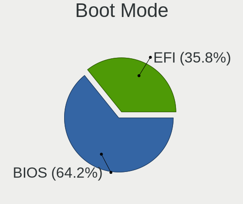

| Mode | Desktops | Percent |
|------|----------|---------|
| BIOS | 478      | 65.84%  |
| EFI  | 248      | 34.16%  |

Filesystem
----------

Type of filesystem

| Type     | Desktops | Percent |
|----------|----------|---------|
| Ext4     | 550      | 75.14%  |
| Overlay  | 85       | 11.61%  |
| Btrfs    | 52       | 7.1%    |
| Unknown  | 26       | 3.55%   |
| Tmpfs    | 8        | 1.09%   |
| Xfs      | 4        | 0.55%   |
| Ext2     | 3        | 0.41%   |
| Zfs      | 2        | 0.27%   |
| Reiserfs | 1        | 0.14%   |
| F2fs     | 1        | 0.14%   |

Part. scheme
------------

Scheme of partitioning

| Type    | Desktops | Percent |
|---------|----------|---------|
| Unknown | 411      | 56.3%   |
| GPT     | 210      | 28.77%  |
| MBR     | 109      | 14.93%  |

Dual Boot with Linux/BSD
------------------------

Hosting more than one Linux/BSD

| Dual boot | Desktops | Percent |
|-----------|----------|---------|
| No        | 608      | 83.29%  |
| Yes       | 122      | 16.71%  |

Dual Boot (Win)
---------------

Hosting Linux and Windows

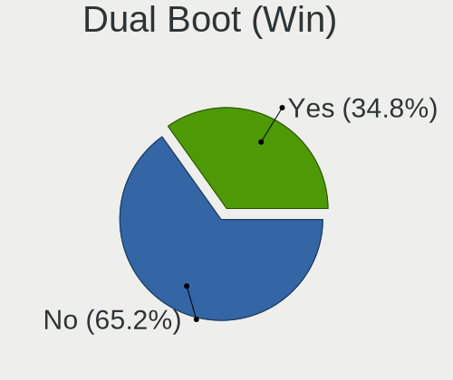

| Dual boot | Desktops | Percent |
|-----------|----------|---------|
| No        | 465      | 63.52%  |
| Yes       | 267      | 36.48%  |

Board
-----

Vendor
------

Motherboard manufacturer

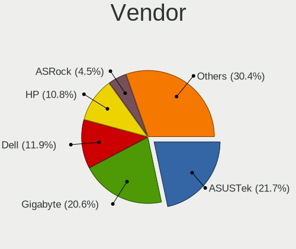

| Name                  | Desktops | Percent |
|-----------------------|----------|---------|
| Gigabyte Technology   | 164      | 22.87%  |
| ASUSTek Computer      | 146      | 20.36%  |
| Dell                  | 81       | 11.3%   |
| Hewlett-Packard       | 73       | 10.18%  |
| ASRock                | 37       | 5.16%   |
| ECS                   | 31       | 4.32%   |
| MSI                   | 30       | 4.18%   |
| Intel                 | 29       | 4.04%   |
| Biostar               | 28       | 3.91%   |
| Lenovo                | 22       | 3.07%   |
| Pegatron              | 16       | 2.23%   |
| Acer                  | 10       | 1.39%   |
| PCChips               | 8        | 1.12%   |
| Lanix                 | 7        | 0.98%   |
| Foxconn               | 7        | 0.98%   |
| eMachines             | 4        | 0.56%   |
| Alienware             | 4        | 0.56%   |
| TPV-INVENTA           | 3        | 0.42%   |
| Wistron               | 2        | 0.28%   |
| Quanta                | 2        | 0.28%   |
| VIA Technologies      | 1        | 0.14%   |
| Toshiba               | 1        | 0.14%   |
| System76              | 1        | 0.14%   |
| OEM                   | 1        | 0.14%   |
| ICP / iEi             | 1        | 0.14%   |
| IBM                   | 1        | 0.14%   |
| HC                    | 1        | 0.14%   |
| Google                | 1        | 0.14%   |
| AZW                   | 1        | 0.14%   |
| ASUSTeK_COMPUTER_INC. | 1        | 0.14%   |
| ASRockRack            | 1        | 0.14%   |
| Apple                 | 1        | 0.14%   |
| Unknown               | 1        | 0.14%   |

Model
-----

Motherboard model

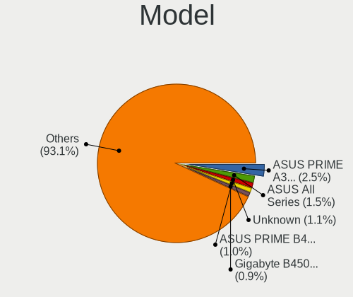

| Name                         | Desktops | Percent |
|------------------------------|----------|---------|
| ASUS PRIME A320M-K           | 18       | 2.51%   |
| Gigabyte B450M DS3H          | 8        | 1.12%   |
| Dell OptiPlex 7010           | 8        | 1.12%   |
| ASUS All Series              | 8        | 1.12%   |
| ECS A320AM4-M3D              | 7        | 0.98%   |
| Dell OptiPlex 9020           | 7        | 0.98%   |
| HP Compaq 6200 Pro SFF PC    | 6        | 0.84%   |
| Dell OptiPlex 745            | 6        | 0.84%   |
| ASUS PRIME B450M-A II        | 6        | 0.84%   |
| Gigabyte GA-880GM-USB3       | 5        | 0.7%    |
| Gigabyte A320M-S2H           | 5        | 0.7%    |
| Dell OptiPlex 790            | 5        | 0.7%    |
| Dell OptiPlex 755            | 5        | 0.7%    |
| Biostar A10N-8800E           | 5        | 0.7%    |
| ASUS ROG STRIX B450-F GAMING | 5        | 0.7%    |
| ASUS M5A78L-M PLUS/USB3      | 5        | 0.7%    |
| Gigabyte A320M-S2H V2        | 4        | 0.56%   |
| Biostar B450MH               | 4        | 0.56%   |
| ASUS ROG STRIX X570-E GAMING | 4        | 0.56%   |
| ASUS PRIME B550M-A AC        | 4        | 0.56%   |
| ASUS PRIME B450M-A           | 4        | 0.56%   |
| Alienware X51 R2             | 4        | 0.56%   |
| PCChips P17G                 | 3        | 0.42%   |
| Lanix MINI-TORRE             | 3        | 0.42%   |
| HP Z420 Workstation          | 3        | 0.42%   |
| HP Compaq Pro 6305 SFF       | 3        | 0.42%   |
| HP Compaq 8200 Elite SFF PC  | 3        | 0.42%   |
| Gigabyte X570 AORUS PRO WIFI | 3        | 0.42%   |
| Gigabyte H61M-DS2            | 3        | 0.42%   |
| Gigabyte GA-E6010N           | 3        | 0.42%   |
| Gigabyte GA-78LMT-USB3       | 3        | 0.42%   |
| Gigabyte B550M AORUS ELITE   | 3        | 0.42%   |
| Gigabyte B450 AORUS M        | 3        | 0.42%   |
| Gigabyte B250M-DS3H          | 3        | 0.42%   |
| ECS A68F2P-M4                | 3        | 0.42%   |
| Dell OptiPlex GX620          | 3        | 0.42%   |
| Dell OptiPlex 990            | 3        | 0.42%   |
| Dell OptiPlex 760            | 3        | 0.42%   |
| ASUS PRIME X570-P            | 3        | 0.42%   |
| ASUS PRIME B460M-A R2.0      | 3        | 0.42%   |

Model Family
------------

Motherboard model prefix

| Name                   | Desktops | Percent |
|------------------------|----------|---------|
| ASUS PRIME             | 58       | 8.09%   |
| Dell OptiPlex          | 53       | 7.39%   |
| HP Compaq              | 32       | 4.46%   |
| ASUS ROG               | 19       | 2.65%   |
| Lenovo ThinkCentre     | 18       | 2.51%   |
| Gigabyte B450M         | 11       | 1.53%   |
| Dell Inspiron          | 11       | 1.53%   |
| Gigabyte A320M-S2H     | 9        | 1.26%   |
| Acer Aspire            | 9        | 1.26%   |
| HP ProDesk             | 8        | 1.12%   |
| Gigabyte X570          | 8        | 1.12%   |
| Dell Precision         | 8        | 1.12%   |
| ASUS M5A78L-M          | 8        | 1.12%   |
| ASUS All               | 8        | 1.12%   |
| Gigabyte B450          | 7        | 0.98%   |
| ECS A320AM4-M3D        | 7        | 0.98%   |
| ASUS TUF               | 7        | 0.98%   |
| ASUS M5A97             | 7        | 0.98%   |
| Gigabyte B550M         | 6        | 0.84%   |
| HP EliteDesk           | 5        | 0.7%    |
| Gigabyte GA-880GM-USB3 | 5        | 0.7%    |
| Gigabyte G1.Sniper     | 5        | 0.7%    |
| Biostar A10N-8800E     | 5        | 0.7%    |
| Gigabyte Z390          | 4        | 0.56%   |
| Gigabyte H61M-DS2      | 4        | 0.56%   |
| Gigabyte H410M         | 4        | 0.56%   |
| Biostar B450MH         | 4        | 0.56%   |
| Alienware X51          | 4        | 0.56%   |
| Pegatron Compaq        | 3        | 0.42%   |
| PCChips P17G           | 3        | 0.42%   |
| Lanix TITAN            | 3        | 0.42%   |
| Lanix MINI-TORRE       | 3        | 0.42%   |
| Intel DH67BL           | 3        | 0.42%   |
| HP Z420                | 3        | 0.42%   |
| HP ProLiant            | 3        | 0.42%   |
| Gigabyte H310M         | 3        | 0.42%   |
| Gigabyte H110M-H       | 3        | 0.42%   |
| Gigabyte GA-E6010N     | 3        | 0.42%   |
| Gigabyte GA-78LMT-USB3 | 3        | 0.42%   |
| Gigabyte B250M-DS3H    | 3        | 0.42%   |

MFG Year
--------

Motherboard manufacture year

| Year | Desktops | Percent |
|------|----------|---------|
| 2018 | 76       | 10.6%   |
| 2011 | 73       | 10.18%  |
| 2012 | 72       | 10.04%  |
| 2017 | 56       | 7.81%   |
| 2009 | 55       | 7.67%   |
| 2019 | 45       | 6.28%   |
| 2020 | 44       | 6.14%   |
| 2013 | 44       | 6.14%   |
| 2014 | 39       | 5.44%   |
| 2010 | 37       | 5.16%   |
| 2007 | 34       | 4.74%   |
| 2016 | 33       | 4.6%    |
| 2021 | 28       | 3.91%   |
| 2015 | 25       | 3.49%   |
| 2008 | 25       | 3.49%   |
| 2006 | 17       | 2.37%   |
| 2005 | 7        | 0.98%   |
| 2022 | 6        | 0.84%   |
| 2003 | 1        | 0.14%   |

Form Factor
-----------

Physical design of the computer

| Name    | Desktops | Percent |
|---------|----------|---------|
| Desktop | 717      | 100%    |

Secure Boot
-----------

Enabled or disabled

| State    | Desktops | Percent |
|----------|----------|---------|
| Disabled | 706      | 98.33%  |
| Enabled  | 12       | 1.67%   |

Coreboot
--------

Have coreboot on board

| Used | Desktops | Percent |
|------|----------|---------|
| No   | 716      | 99.86%  |
| Yes  | 1        | 0.14%   |

RAM Size
--------

Total RAM memory

| Size in GB      | Desktops | Percent |
|-----------------|----------|---------|
| 4.01-8.0        | 160      | 21.83%  |
| 3.01-4.0        | 151      | 20.6%   |
| 8.01-16.0       | 144      | 19.65%  |
| 16.01-24.0      | 114      | 15.55%  |
| 32.01-64.0      | 72       | 9.82%   |
| 1.01-2.0        | 33       | 4.5%    |
| 64.01-256.0     | 21       | 2.86%   |
| 24.01-32.0      | 17       | 2.32%   |
| 2.01-3.0        | 15       | 2.05%   |
| 0.51-1.0        | 4        | 0.55%   |
| More than 256.0 | 1        | 0.14%   |
| 0.01-0.5        | 1        | 0.14%   |

RAM Used
--------

Used RAM memory

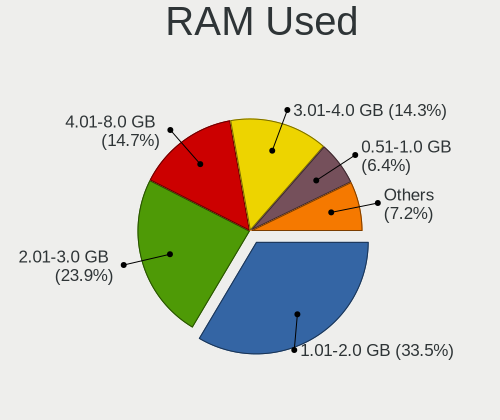

| Used GB     | Desktops | Percent |
|-------------|----------|---------|
| 1.01-2.0    | 300      | 38.02%  |
| 2.01-3.0    | 183      | 23.19%  |
| 4.01-8.0    | 102      | 12.93%  |
| 3.01-4.0    | 95       | 12.04%  |
| 0.51-1.0    | 60       | 7.6%    |
| 8.01-16.0   | 33       | 4.18%   |
| 0.01-0.5    | 6        | 0.76%   |
| 16.01-24.0  | 5        | 0.63%   |
| 24.01-32.0  | 3        | 0.38%   |
| 32.01-64.0  | 1        | 0.13%   |
| 64.01-256.0 | 1        | 0.13%   |

Total Drives
------------

Number of drives on board

| Drives  | Desktops | Percent |
|---------|----------|---------|
| 1       | 364      | 48.4%   |
| 2       | 211      | 28.06%  |
| 3       | 93       | 12.37%  |
| 4       | 44       | 5.85%   |
| 5       | 14       | 1.86%   |
| 0       | 11       | 1.46%   |
| 6       | 10       | 1.33%   |
| 7       | 3        | 0.4%    |
| 8       | 1        | 0.13%   |
| Unknown | 1        | 0.13%   |

Has CD-ROM
----------

Has CD-ROM on board

| Presented | Desktops | Percent |
|-----------|----------|---------|
| No        | 411      | 56.53%  |
| Yes       | 316      | 43.47%  |

Has Ethernet
------------

Has Ethernet on board

| Presented | Desktops | Percent |
|-----------|----------|---------|
| Yes       | 710      | 99.02%  |
| No        | 7        | 0.98%   |

Has WiFi
--------

Has WiFi module

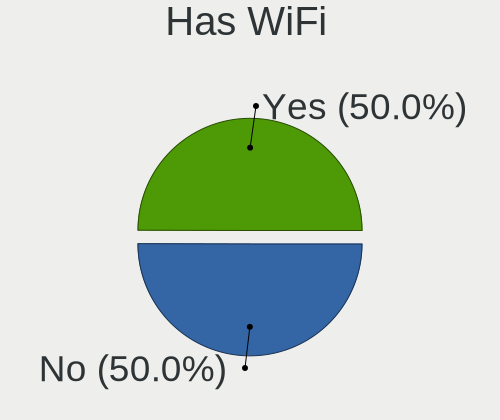

| Presented | Desktops | Percent |
|-----------|----------|---------|
| No        | 377      | 51.86%  |
| Yes       | 350      | 48.14%  |

Has Bluetooth
-------------

Has Bluetooth module

| Presented | Desktops | Percent |
|-----------|----------|---------|
| No        | 539      | 74.04%  |
| Yes       | 189      | 25.96%  |

Location
--------

Country
-------

Geographic location (country)

| Country | Desktops | Percent |
|---------|----------|---------|
| Mexico  | 717      | 100%    |

City
----

Geographic location (city)

| City                  | Desktops | Percent |
|-----------------------|----------|---------|
| Mexico City           | 148      | 19.35%  |
| Guadalajara           | 49       | 6.41%   |
| Monterrey             | 26       | 3.4%    |
| Zapopan               | 23       | 3.01%   |
| Tijuana               | 20       | 2.61%   |
| Mrida               | 17       | 2.22%   |
| Queretaro             | 16       | 2.09%   |
| Tlalnepantla          | 15       | 1.96%   |
| Hermosillo            | 15       | 1.96%   |
| Morelia               | 14       | 1.83%   |
| Ciudad Nezahualcoyotl | 11       | 1.44%   |
| Ciudad Jurez        | 11       | 1.44%   |
| Chihuahua City        | 11       | 1.44%   |
| Puebla City           | 9        | 1.18%   |
| Oaxaca City           | 9        | 1.18%   |
| Naucalpan             | 9        | 1.18%   |
| Mexicali              | 9        | 1.18%   |
| Cuernavaca            | 9        | 1.18%   |
| San Luis Potos City | 8        | 1.05%   |
| Ecatepec              | 8        | 1.05%   |
| Cancn               | 8        | 1.05%   |
| Apodaca               | 8        | 1.05%   |
| Quertaro City       | 7        | 0.92%   |
| Mexico                | 7        | 0.92%   |
| Culiacn             | 7        | 0.92%   |
| Ciudad Obregn       | 7        | 0.92%   |
| Aguascalientes        | 7        | 0.92%   |
| Toluca                | 6        | 0.78%   |
| Iztapalapa            | 6        | 0.78%   |
| Ensenada              | 6        | 0.78%   |
| Zacatecas City        | 5        | 0.65%   |
| Tuxtla Gutirrez     | 5        | 0.65%   |
| Tepic                 | 5        | 0.65%   |
| Saltillo              | 5        | 0.65%   |
| Pachuca               | 5        | 0.65%   |
| Mazatln             | 5        | 0.65%   |
| Len                 | 5        | 0.65%   |
| Gustavo Adolfo Madero | 5        | 0.65%   |
| Guadalupe             | 5        | 0.65%   |
| Colima                | 5        | 0.65%   |

Drives
------

Drive Vendor
------------

Hard drive vendors

| Vendor                      | Desktops | Drives | Percent |
|-----------------------------|----------|--------|---------|
| Seagate                     | 277      | 427    | 23.55%  |
| WDC                         | 260      | 359    | 22.11%  |
| Kingston                    | 123      | 168    | 10.46%  |
| A-DATA Technology           | 102      | 128    | 8.67%   |
| Toshiba                     | 79       | 98     | 6.72%   |
| Hitachi                     | 76       | 110    | 6.46%   |
| Samsung Electronics         | 52       | 65     | 4.42%   |
| Crucial                     | 17       | 22     | 1.45%   |
| PNY                         | 14       | 19     | 1.19%   |
| XPG                         | 13       | 15     | 1.11%   |
| HGST                        | 13       | 22     | 1.11%   |
| Unknown                     | 12       | 19     | 1.02%   |
| Realtek Semiconductor       | 12       | 17     | 1.02%   |
| Sandisk                     | 11       | 15     | 0.94%   |
| Fujitsu                     | 11       | 15     | 0.94%   |
| Intel                       | 10       | 18     | 0.85%   |
| Maxtor                      | 8        | 10     | 0.68%   |
| Acer                        | 7        | 8      | 0.6%    |
| ADATA Technology            | 6        | 7      | 0.51%   |
| Phison                      | 5        | 6      | 0.43%   |
| Gigabyte Technology         | 5        | 6      | 0.43%   |
| SK hynix                    | 4        | 10     | 0.34%   |
| Micron/Crucial Technology   | 4        | 6      | 0.34%   |
| Micron Technology           | 4        | 8      | 0.34%   |
| Kingston Technology Company | 4        | 4      | 0.34%   |
| Hewlett-Packard             | 3        | 3      | 0.26%   |
| China                       | 3        | 3      | 0.26%   |
| Yeyian                      | 2        | 2      | 0.17%   |
| Transcend                   | 2        | 2      | 0.17%   |
| SPCC                        | 2        | 2      | 0.17%   |
| Quaroni                     | 2        | 2      | 0.17%   |
| Patriot                     | 2        | 2      | 0.17%   |
| JMicron Technology          | 2        | 2      | 0.17%   |
| Corsair                     | 2        | 2      | 0.17%   |
| Apple                       | 2        | 2      | 0.17%   |
| WALRAM                      | 1        | 1      | 0.09%   |
| VERICO                      | 1        | 1      | 0.09%   |
| VALK                        | 1        | 1      | 0.09%   |
| USB3.0                      | 1        | 1      | 0.09%   |
| Union Memory                | 1        | 1      | 0.09%   |

Drive Model
-----------

Hard drive models

| Model                                     | Desktops | Percent |
|-------------------------------------------|----------|---------|
| Kingston SA400S37240G 240GB SSD           | 34       | 2.57%   |
| Seagate ST500DM002-1BD142 500GB           | 26       | 1.97%   |
| Kingston SA400S37480G 480GB SSD           | 26       | 1.97%   |
| A-DATA SU650 120GB SSD                    | 23       | 1.74%   |
| Seagate ST1000DM010-2EP102 1TB            | 18       | 1.36%   |
| Kingston SA400S37120G 120GB SSD           | 15       | 1.14%   |
| A-DATA SU630 240GB SSD                    | 15       | 1.14%   |
| Toshiba DT01ACA050 500GB                  | 12       | 0.91%   |
| Seagate ST3500418AS 500GB                 | 12       | 0.91%   |
| Seagate ST1000DM003-1CH162 1TB            | 12       | 0.91%   |
| Toshiba DT01ACA200 2TB                    | 11       | 0.83%   |
| WDC WDS240G2G0A-00JH30 240GB SSD          | 10       | 0.76%   |
| Toshiba DT01ACA100 1TB                    | 10       | 0.76%   |
| A-DATA SU650 240GB SSD                    | 10       | 0.76%   |
| WDC WD10EZEX-08WN4A0 1TB                  | 9        | 0.68%   |
| Toshiba MQ01ABD100 1TB                    | 9        | 0.68%   |
| Seagate ST3160815AS 160GB                 | 9        | 0.68%   |
| A-DATA SU630 480GB SSD                    | 9        | 0.68%   |
| Seagate ST4000DM004-2CV104 4TB            | 8        | 0.61%   |
| Seagate ST31000524AS 1TB                  | 8        | 0.61%   |
| Seagate ST2000DM006-2DM164 2TB            | 8        | 0.61%   |
| Seagate ST1000DM003-1SB102 1TB            | 8        | 0.61%   |
| Seagate ST1000DM003-1ER162 1TB            | 8        | 0.61%   |
| XPG GAMMIX S11 Pro 1TB                    | 7        | 0.53%   |
| WDC WD5000AAKX-60U6AA0 500GB              | 7        | 0.53%   |
| Seagate ST2000DL003-9VT166 2TB            | 7        | 0.53%   |
| WDC WD10EZEX-08M2NA0 1TB                  | 6        | 0.45%   |
| Seagate ST3500414CS 500GB                 | 6        | 0.45%   |
| Seagate ST2000DM008-2FR102 2TB            | 6        | 0.45%   |
| Seagate ST2000DM001-1CH164 2TB            | 6        | 0.45%   |
| Kingston SV300S37A120G 120GB SSD          | 6        | 0.45%   |
| Kingston SA400S37960G 960GB SSD           | 6        | 0.45%   |
| WDC WDS100T2G0A-00JH30 1TB SSD            | 5        | 0.38%   |
| Seagate ST380815AS 80GB                   | 5        | 0.38%   |
| Seagate ST3500630AS 500GB                 | 5        | 0.38%   |
| Seagate ST3500413AS 500GB                 | 5        | 0.38%   |
| Seagate ST3320418AS 320GB                 | 5        | 0.38%   |
| Seagate ST31000528AS 1TB                  | 5        | 0.38%   |
| Seagate ST1000LM035-1RK172 1TB            | 5        | 0.38%   |
| Realtek RTS5763DL NVMe SSD Controller 1TB | 5        | 0.38%   |

HDD Vendor
----------

Hard disk drive vendors

| Vendor              | Desktops | Drives | Percent |
|---------------------|----------|--------|---------|
| Seagate             | 276      | 426    | 38.07%  |
| WDC                 | 231      | 309    | 31.86%  |
| Toshiba             | 79       | 98     | 10.9%   |
| Hitachi             | 76       | 110    | 10.48%  |
| Samsung Electronics | 20       | 23     | 2.76%   |
| HGST                | 13       | 22     | 1.79%   |
| Fujitsu             | 11       | 15     | 1.52%   |
| Maxtor              | 8        | 10     | 1.1%    |
| Unknown             | 3        | 4      | 0.41%   |
| Apple               | 2        | 2      | 0.28%   |
| USB3.0              | 1        | 1      | 0.14%   |
| QUANTUM             | 1        | 2      | 0.14%   |
| MaxDigital          | 1        | 4      | 0.14%   |
| JMicron Technology  | 1        | 1      | 0.14%   |
| HPE                 | 1        | 1      | 0.14%   |
| Hewlett-Packard     | 1        | 1      | 0.14%   |

SSD Vendor
----------

Solid state drive vendors

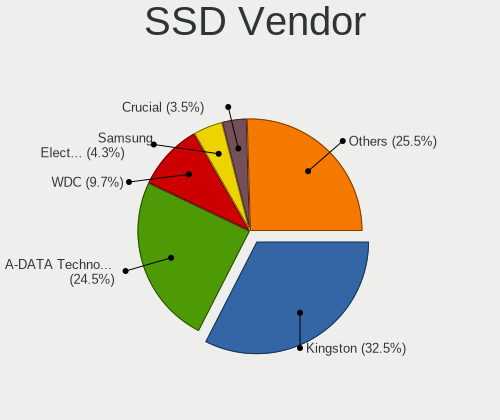

| Vendor              | Desktops | Drives | Percent |
|---------------------|----------|--------|---------|
| Kingston            | 111      | 146    | 32.36%  |
| A-DATA Technology   | 94       | 119    | 27.41%  |
| WDC                 | 35       | 46     | 10.2%   |
| Samsung Electronics | 18       | 22     | 5.25%   |
| Crucial             | 16       | 19     | 4.66%   |
| PNY                 | 14       | 19     | 4.08%   |
| SanDisk             | 6        | 7      | 1.75%   |
| Acer                | 6        | 7      | 1.75%   |
| Intel               | 5        | 6      | 1.46%   |
| Gigabyte Technology | 4        | 5      | 1.17%   |
| SK hynix            | 3        | 9      | 0.87%   |
| Micron Technology   | 3        | 5      | 0.87%   |
| China               | 3        | 3      | 0.87%   |
| Yeyian              | 2        | 2      | 0.58%   |
| Transcend           | 2        | 2      | 0.58%   |
| SPCC                | 2        | 2      | 0.58%   |
| Quaroni             | 2        | 2      | 0.58%   |
| Patriot             | 2        | 2      | 0.58%   |
| Hewlett-Packard     | 2        | 2      | 0.58%   |
| VERICO              | 1        | 1      | 0.29%   |
| VALK                | 1        | 1      | 0.29%   |
| Unknown             | 1        | 1      | 0.29%   |
| Team                | 1        | 1      | 0.29%   |
| SABRENT             | 1        | 1      | 0.29%   |
| Netac               | 1        | 2      | 0.29%   |
| Londisk             | 1        | 1      | 0.29%   |
| Lite-On             | 1        | 3      | 0.29%   |
| Lexar               | 1        | 1      | 0.29%   |
| Corsair             | 1        | 1      | 0.29%   |
| Blackpcs            | 1        | 1      | 0.29%   |
| AS201               | 1        | 1      | 0.29%   |
| Apacer              | 1        | 1      | 0.29%   |

Drive Kind
----------

HDD or SSD

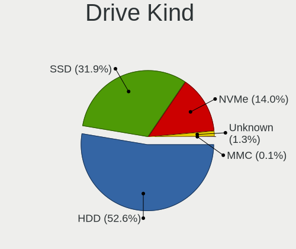

| Kind    | Desktops | Drives | Percent |
|---------|----------|--------|---------|
| HDD     | 565      | 1029   | 57.83%  |
| SSD     | 300      | 441    | 30.71%  |
| NVMe    | 100      | 149    | 10.24%  |
| Unknown | 11       | 19     | 1.13%   |
| MMC     | 1        | 1      | 0.1%    |

Drive Connector
---------------

SATA, SAS, NVMe, etc.

| Type | Desktops | Drives | Percent |
|------|----------|--------|---------|
| SATA | 678      | 1447   | 83.6%   |
| NVMe | 100      | 149    | 12.33%  |
| SAS  | 32       | 42     | 3.95%   |
| MMC  | 1        | 1      | 0.12%   |

Drive Size
----------

Size of hard drive

| Size in TB | Desktops | Drives | Percent |
|------------|----------|--------|---------|
| 0.01-0.5   | 542      | 938    | 59.56%  |
| 0.51-1.0   | 226      | 326    | 24.84%  |
| 1.01-2.0   | 84       | 115    | 9.23%   |
| 3.01-4.0   | 29       | 55     | 3.19%   |
| 2.01-3.0   | 20       | 27     | 2.2%    |
| 4.01-10.0  | 9        | 9      | 0.99%   |

Space Total
-----------

Amount of disk space available on the file system

| Size in GB     | Desktops | Percent |
|----------------|----------|---------|
| 101-250        | 170      | 22.08%  |
| 251-500        | 156      | 20.26%  |
| 501-1000       | 113      | 14.68%  |
| 1001-2000      | 72       | 9.35%   |
| 1-20           | 67       | 8.7%    |
| 51-100         | 59       | 7.66%   |
| More than 3000 | 45       | 5.84%   |
| 21-50          | 35       | 4.55%   |
| 2001-3000      | 30       | 3.9%    |
| Unknown        | 23       | 2.99%   |

Space Used
----------

Amount of used disk space

| Used GB        | Desktops | Percent |
|----------------|----------|---------|
| 1-20           | 304      | 38.29%  |
| 21-50          | 136      | 17.13%  |
| 51-100         | 84       | 10.58%  |
| 101-250        | 82       | 10.33%  |
| 501-1000       | 52       | 6.55%   |
| 251-500        | 50       | 6.3%    |
| 1001-2000      | 40       | 5.04%   |
| Unknown        | 23       | 2.9%    |
| More than 3000 | 15       | 1.89%   |
| 2001-3000      | 8        | 1.01%   |

Malfunc. Drives
---------------

Drive models with a malfunction

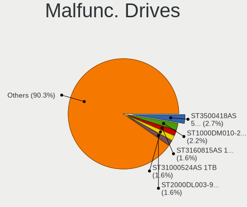

| Model                          | Desktops | Drives | Percent |
|--------------------------------|----------|--------|---------|
| Seagate ST3160815AS 160GB      | 3        | 3      | 2.54%   |
| Seagate ST2000DL003-9VT166 2TB | 3        | 3      | 2.54%   |
| Toshiba MQ04ABF100 1TB         | 2        | 2      | 1.69%   |
| Toshiba MQ01ABD100 1TB         | 2        | 2      | 1.69%   |
| Toshiba DT01ACA100 1TB         | 2        | 2      | 1.69%   |
| Seagate ST3500418AS 500GB      | 2        | 2      | 1.69%   |
| Seagate ST31000524AS 1TB       | 2        | 4      | 1.69%   |
| Seagate ST1500DL003-9VT16L 1TB | 2        | 2      | 1.69%   |
| Maxtor 6Y080M0 80GB            | 2        | 2      | 1.69%   |
| Hitachi HDS721010CLA332 1TB    | 2        | 2      | 1.69%   |
| HGST HTS545050A7E380 500GB     | 2        | 3      | 1.69%   |
| WDC WD800JD-00MSA1 80GB        | 1        | 1      | 0.85%   |
| WDC WD6400BEVT-60A0RT0 640GB   | 1        | 1      | 0.85%   |
| WDC WD5002ABYS-02B1B0 500GB    | 1        | 1      | 0.85%   |
| WDC WD5000AVDS-61U7B1 500GB    | 1        | 1      | 0.85%   |
| WDC WD5000AAKX-75U6AA0 500GB   | 1        | 1      | 0.85%   |
| WDC WD5000AAKX-753CA1 500GB    | 1        | 1      | 0.85%   |
| WDC WD5000AAKX-603CA0 500GB    | 1        | 1      | 0.85%   |
| WDC WD5000AAKX-08U6AA0 500GB   | 1        | 1      | 0.85%   |
| WDC WD5000AADS-56S9B1 500GB    | 1        | 1      | 0.85%   |
| WDC WD5000AACS-61M6B2 500GB    | 1        | 1      | 0.85%   |
| WDC WD40PURZ-85TTDY0 4TB       | 1        | 1      | 0.85%   |
| WDC WD3200KS-75PFB0 320GB      | 1        | 1      | 0.85%   |
| WDC WD3200AVVS-63L2B0 320GB    | 1        | 1      | 0.85%   |
| WDC WD3200AVJS-63B6A0 320GB    | 1        | 4      | 0.85%   |
| WDC WD3200AAJS-60M0A0 320GB    | 1        | 2      | 0.85%   |
| WDC WD3200AAJS-56M0A0 320GB    | 1        | 1      | 0.85%   |
| WDC WD3200AAJS-00YZCA0 320GB   | 1        | 2      | 0.85%   |
| WDC WD2500SD-01KCB0 250GB      | 1        | 1      | 0.85%   |
| WDC WD2500JS-00NCB1 250GB      | 1        | 1      | 0.85%   |
| WDC WD2500AVVS-61L2B0 250GB    | 1        | 1      | 0.85%   |
| WDC WD2500AAKX-00ERMA0 250GB   | 1        | 1      | 0.85%   |
| WDC WD2003FYPS-27W9B0 2TB      | 1        | 1      | 0.85%   |
| WDC WD1600JS-60MHB5 160GB      | 1        | 1      | 0.85%   |
| WDC WD1600BEVT-22ZCT0 160GB    | 1        | 1      | 0.85%   |
| WDC WD1600AAJS-00L7A0 160GB    | 1        | 1      | 0.85%   |
| WDC WD10EZEX-22BN5A0 1TB       | 1        | 1      | 0.85%   |
| WDC WD10EZEX-08M2NA0 1TB       | 1        | 1      | 0.85%   |
| WDC WD10EURX-63UY4Y0 1TB       | 1        | 1      | 0.85%   |
| WDC WD10EURX-61UY4Y0 1TB       | 1        | 1      | 0.85%   |

Malfunc. Drive Vendor
---------------------

Vendors of faulty drives

| Vendor                    | Desktops | Drives | Percent |
|---------------------------|----------|--------|---------|
| Seagate                   | 43       | 54     | 38.39%  |
| WDC                       | 29       | 35     | 25.89%  |
| Hitachi                   | 11       | 13     | 9.82%   |
| Toshiba                   | 9        | 13     | 8.04%   |
| Samsung Electronics       | 5        | 5      | 4.46%   |
| Kingston                  | 4        | 4      | 3.57%   |
| A-DATA Technology         | 4        | 4      | 3.57%   |
| HGST                      | 3        | 4      | 2.68%   |
| Maxtor                    | 2        | 2      | 1.79%   |
| Micron/Crucial Technology | 1        | 2      | 0.89%   |
| Fujitsu                   | 1        | 1      | 0.89%   |

Malfunc. HDD Vendor
-------------------

Vendors of faulty HDD drives

| Vendor              | Desktops | Drives | Percent |
|---------------------|----------|--------|---------|
| Seagate             | 43       | 54     | 41.75%  |
| WDC                 | 29       | 35     | 28.16%  |
| Hitachi             | 11       | 13     | 10.68%  |
| Toshiba             | 9        | 13     | 8.74%   |
| Samsung Electronics | 5        | 5      | 4.85%   |
| HGST                | 3        | 4      | 2.91%   |
| Maxtor              | 2        | 2      | 1.94%   |
| Fujitsu             | 1        | 1      | 0.97%   |

Malfunc. Drive Kind
-------------------

Kinds of faulty drives

| Kind | Desktops | Drives | Percent |
|------|----------|--------|---------|
| HDD  | 91       | 127    | 91%     |
| SSD  | 8        | 8      | 8%      |
| NVMe | 1        | 2      | 1%      |

Failed Drives
-------------

Failed drive models

| Model                             | Desktops | Drives | Percent |
|-----------------------------------|----------|--------|---------|
| Seagate ST3500410AS 500GB         | 1        | 2      | 33.33%  |
| Seagate ST31500341AS 1TB          | 1        | 2      | 33.33%  |
| Samsung Electronics HD161GJ 160GB | 1        | 1      | 33.33%  |

Failed Drive Vendor
-------------------

Failed drive vendors

| Vendor              | Desktops | Drives | Percent |
|---------------------|----------|--------|---------|
| Seagate             | 1        | 4      | 50%     |
| Samsung Electronics | 1        | 1      | 50%     |

Drive Status
------------

Number of failed and malfunc. drives

| Status   | Desktops | Drives | Percent |
|----------|----------|--------|---------|
| Detected | 452      | 988    | 57.14%  |
| Works    | 240      | 509    | 30.34%  |
| Malfunc  | 97       | 137    | 12.26%  |
| Failed   | 2        | 5      | 0.25%   |

Storage controller
------------------

Storage Vendor
--------------

Storage controller vendors

| Vendor                      | Desktops | Percent |
|-----------------------------|----------|---------|
| Intel                       | 398      | 46.17%  |
| AMD                         | 278      | 32.25%  |
| Nvidia                      | 39       | 4.52%   |
| Realtek Semiconductor       | 20       | 2.32%   |
| ADATA Technology            | 20       | 2.32%   |
| Kingston Technology Company | 18       | 2.09%   |
| Samsung Electronics         | 14       | 1.62%   |
| Marvell Technology Group    | 13       | 1.51%   |
| SanDisk                     | 9        | 1.04%   |
| JMicron Technology          | 9        | 1.04%   |
| ASMedia Technology          | 9        | 1.04%   |
| Phison Electronics          | 7        | 0.81%   |
| Micron/Crucial Technology   | 6        | 0.7%    |
| VIA Technologies            | 4        | 0.46%   |
| Silicon Image               | 3        | 0.35%   |
| Broadcom / LSI              | 3        | 0.35%   |
| MAXIO Technology (Hangzhou) | 2        | 0.23%   |
| LSI Logic / Symbios Logic   | 2        | 0.23%   |
| Union Memory (Shenzhen)     | 1        | 0.12%   |
| SK hynix                    | 1        | 0.12%   |
| Silicon Motion              | 1        | 0.12%   |
| Seagate Technology          | 1        | 0.12%   |
| Micron Technology           | 1        | 0.12%   |
| INNOGRIT                    | 1        | 0.12%   |
| Hewlett-Packard             | 1        | 0.12%   |
| Adaptec                     | 1        | 0.12%   |

Storage Model
-------------

Storage controller models

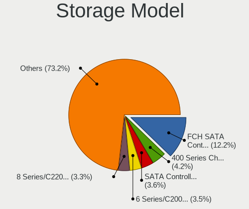

| Model                                                                                   | Desktops | Percent |
|-----------------------------------------------------------------------------------------|----------|---------|
| AMD FCH SATA Controller [AHCI mode]                                                     | 161      | 13.36%  |
| AMD 400 Series Chipset SATA Controller                                                  | 52       | 4.32%   |
| Intel NM10/ICH7 Family SATA Controller [IDE mode]                                       | 47       | 3.9%    |
| Intel SATA Controller [RAID mode]                                                       | 42       | 3.49%   |
| Intel 6 Series/C200 Series Chipset Family 6 port Desktop SATA AHCI Controller           | 41       | 3.4%    |
| AMD FCH SATA Controller D                                                               | 37       | 3.07%   |
| Intel 82801G (ICH7 Family) IDE Controller                                               | 34       | 2.82%   |
| AMD SB7x0/SB8x0/SB9x0 IDE Controller                                                    | 31       | 2.57%   |
| Intel 8 Series/C220 Series Chipset Family 6-port SATA Controller 1 [AHCI mode]          | 30       | 2.49%   |
| AMD SB7x0/SB8x0/SB9x0 SATA Controller [AHCI mode]                                       | 29       | 2.41%   |
| AMD SB7x0/SB8x0/SB9x0 SATA Controller [IDE mode]                                        | 27       | 2.24%   |
| Nvidia MCP61 SATA Controller                                                            | 26       | 2.16%   |
| Intel 6 Series/C200 Series Chipset Family Desktop SATA Controller (IDE mode, ports 4-5) | 24       | 1.99%   |
| Intel 6 Series/C200 Series Chipset Family Desktop SATA Controller (IDE mode, ports 0-3) | 24       | 1.99%   |
| AMD 500 Series Chipset SATA Controller                                                  | 24       | 1.99%   |
| Intel Q170/Q150/B150/H170/H110/Z170/CM236 Chipset SATA Controller [AHCI Mode]           | 23       | 1.91%   |
| Intel 7 Series/C210 Series Chipset Family 6-port SATA Controller [AHCI mode]            | 21       | 1.74%   |
| Nvidia MCP61 IDE                                                                        | 19       | 1.58%   |
| Intel 200 Series PCH SATA controller [AHCI mode]                                        | 19       | 1.58%   |
| AMD 300 Series Chipset SATA Controller                                                  | 18       | 1.49%   |
| Intel Cannon Lake PCH SATA AHCI Controller                                              | 16       | 1.33%   |
| ADATA XPG SX8200 Pro PCIe Gen3x4 M.2 2280 Solid State Drive                             | 16       | 1.33%   |
| AMD FCH SATA Controller [IDE mode]                                                      | 15       | 1.24%   |
| AMD FCH IDE Controller                                                                  | 14       | 1.16%   |
| Realtek RTS5763DL NVMe SSD Controller                                                   | 12       | 1%      |
| Intel 82801H (ICH8 Family) 4 port SATA Controller [IDE mode]                            | 11       | 0.91%   |
| Intel 500 Series Chipset Family SATA AHCI Controller                                    | 10       | 0.83%   |
| Intel C600/X79 series chipset IDE-r Controller                                          | 9        | 0.75%   |
| Intel 82801IR/IO/IH (ICH9R/DO/DH) 4 port SATA Controller [IDE mode]                     | 9        | 0.75%   |
| Intel 82801I (ICH9 Family) 2 port SATA Controller [IDE mode]                            | 9        | 0.75%   |
| Intel 4 Series Chipset PT IDER Controller                                               | 9        | 0.75%   |
| ASMedia ASM1062 Serial ATA Controller                                                   | 9        | 0.75%   |
| Samsung NVMe SSD Controller SM981/PM981/PM983                                           | 8        | 0.66%   |
| Intel C602 chipset 4-Port SATA Storage Control Unit                                     | 8        | 0.66%   |
| Intel C600/X79 series chipset SATA RAID Controller                                      | 8        | 0.66%   |
| Intel 82801HR/HO/HH (ICH8R/DO/DH) 2 port SATA Controller [IDE mode]                     | 8        | 0.66%   |
| Intel 7 Series/C210 Series Chipset Family 4-port SATA Controller [IDE mode]             | 8        | 0.66%   |
| Intel 7 Series/C210 Series Chipset Family 2-port SATA Controller [IDE mode]             | 8        | 0.66%   |
| Intel 400 Series Chipset Family SATA AHCI Controller                                    | 8        | 0.66%   |
| Kingston Company NVMe Controller                                                        | 7        | 0.58%   |

Storage Kind
------------

Kind of storage controller (IDE, SATA, NVMe, SAS, ...)

| Kind | Desktops | Percent |
|------|----------|---------|
| SATA | 505      | 54.95%  |
| IDE  | 238      | 25.9%   |
| NVMe | 100      | 10.88%  |
| RAID | 65       | 7.07%   |
| SAS  | 11       | 1.2%    |

Processor
---------

CPU Vendor
----------

Processor vendors

| Vendor | Desktops | Percent |
|--------|----------|---------|
| Intel  | 406      | 56.62%  |
| AMD    | 311      | 43.38%  |

CPU Model
---------

Processor models

| Model                                           | Desktops | Percent |
|-------------------------------------------------|----------|---------|
| Intel Core i7-4790 CPU @ 3.60GHz                | 12       | 1.66%   |
| Intel Core i7-3770 CPU @ 3.40GHz                | 12       | 1.66%   |
| AMD Ryzen 5 5600G with Radeon Graphics          | 12       | 1.66%   |
| AMD Athlon 3000G with Radeon Vega Graphics      | 12       | 1.66%   |
| Intel Core i5-2400 CPU @ 3.10GHz                | 11       | 1.52%   |
| Intel Core 2 Duo CPU E8400 @ 3.00GHz            | 11       | 1.52%   |
| AMD Ryzen 3 2200G with Radeon Vega Graphics     | 11       | 1.52%   |
| AMD Ryzen 5 3600 6-Core Processor               | 10       | 1.39%   |
| AMD Ryzen 5 2600 Six-Core Processor             | 10       | 1.39%   |
| AMD A8-9600 RADEON R7, 10 COMPUTE CORES 4C+6G   | 10       | 1.39%   |
| Intel Core i3-2100 CPU @ 3.10GHz                | 9        | 1.25%   |
| AMD Ryzen 7 2700X Eight-Core Processor          | 9        | 1.25%   |
| Intel Core i3-2120 CPU @ 3.30GHz                | 8        | 1.11%   |
| AMD Ryzen 7 2700 Eight-Core Processor           | 8        | 1.11%   |
| AMD Ryzen 3 3200G with Radeon Vega Graphics     | 8        | 1.11%   |
| Intel Pentium 4 CPU 3.00GHz                     | 7        | 0.97%   |
| Intel Core i5-3470 CPU @ 3.20GHz                | 7        | 0.97%   |
| Intel Core i3-3220 CPU @ 3.30GHz                | 7        | 0.97%   |
| Intel Core i7-4770 CPU @ 3.40GHz                | 6        | 0.83%   |
| Intel Core i5-8400 CPU @ 2.80GHz                | 6        | 0.83%   |
| AMD Sempron 145 Processor                       | 6        | 0.83%   |
| AMD Ryzen 7 5700G with Radeon Graphics          | 6        | 0.83%   |
| AMD Ryzen 7 3700X 8-Core Processor              | 6        | 0.83%   |
| AMD Ryzen 5 5600X 6-Core Processor              | 6        | 0.83%   |
| AMD Ryzen 5 3400G with Radeon Vega Graphics     | 6        | 0.83%   |
| AMD Ryzen 3 PRO 2200G with Radeon Vega Graphics | 6        | 0.83%   |
| Intel Pentium Dual CPU E2200 @ 2.20GHz          | 5        | 0.69%   |
| Intel Core i7-7700 CPU @ 3.60GHz                | 5        | 0.69%   |
| Intel Core i7-2600 CPU @ 3.40GHz                | 5        | 0.69%   |
| Intel Core i5-10400 CPU @ 2.90GHz               | 5        | 0.69%   |
| Intel Core 2 Quad CPU Q6600 @ 2.40GHz           | 5        | 0.69%   |
| AMD Ryzen 9 5950X 16-Core Processor             | 5        | 0.69%   |
| AMD Ryzen 9 3900X 12-Core Processor             | 5        | 0.69%   |
| AMD FX-8800P Radeon R7, 12 Compute Cores 4C+8G  | 5        | 0.69%   |
| AMD FX-6100 Six-Core Processor                  | 5        | 0.69%   |
| Intel Xeon CPU E5-1650 v2 @ 3.50GHz             | 4        | 0.55%   |
| Intel Pentium Dual-Core CPU E5400 @ 2.70GHz     | 4        | 0.55%   |
| Intel Pentium Dual CPU E2180 @ 2.00GHz          | 4        | 0.55%   |
| Intel Pentium CPU G4400 @ 3.30GHz               | 4        | 0.55%   |
| Intel Pentium CPU G2030 @ 3.00GHz               | 4        | 0.55%   |

CPU Model Family
----------------

Processor model prefix

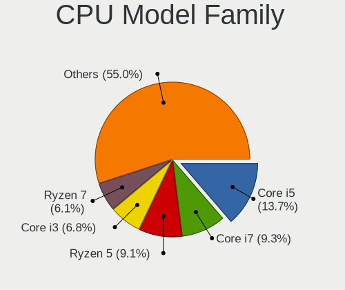

| Model                   | Desktops | Percent |
|-------------------------|----------|---------|
| Intel Core i5           | 91       | 12.62%  |
| Intel Core i7           | 68       | 9.43%   |
| AMD Ryzen 5             | 55       | 7.63%   |
| Intel Core i3           | 52       | 7.21%   |
| Intel Core 2 Duo        | 37       | 5.13%   |
| AMD Ryzen 7             | 34       | 4.72%   |
| Intel Xeon              | 33       | 4.58%   |
| AMD FX                  | 28       | 3.88%   |
| AMD Athlon              | 23       | 3.19%   |
| Intel Celeron           | 22       | 3.05%   |
| AMD Ryzen 3             | 22       | 3.05%   |
| Intel Pentium           | 18       | 2.5%    |
| AMD A8                  | 18       | 2.5%    |
| AMD Ryzen 9             | 17       | 2.36%   |
| AMD Athlon II X2        | 16       | 2.22%   |
| Intel Pentium Dual-Core | 14       | 1.94%   |
| Intel Core 2 Quad       | 14       | 1.94%   |
| Intel Pentium Dual      | 12       | 1.66%   |
| AMD A6                  | 12       | 1.66%   |
| Other                   | 11       | 1.53%   |
| Intel Pentium 4         | 11       | 1.53%   |
| AMD A4                  | 11       | 1.53%   |
| Intel Core 2            | 9        | 1.25%   |
| AMD Sempron             | 8        | 1.11%   |
| AMD Phenom II X4        | 8        | 1.11%   |
| AMD E1                  | 8        | 1.11%   |
| AMD Athlon 64 X2        | 8        | 1.11%   |
| AMD A10                 | 8        | 1.11%   |
| Intel Atom              | 6        | 0.83%   |
| AMD Ryzen 3 PRO         | 6        | 0.83%   |
| AMD Phenom II X6        | 6        | 0.83%   |
| AMD E                   | 6        | 0.83%   |
| Intel Core i9           | 5        | 0.69%   |
| Intel Pentium D         | 3        | 0.42%   |
| AMD Athlon Dual Core    | 3        | 0.42%   |
| AMD Athlon 64           | 3        | 0.42%   |
| AMD Phenom II X2        | 2        | 0.28%   |
| AMD Phenom              | 2        | 0.28%   |
| AMD Athlon II X4        | 2        | 0.28%   |
| Intel Pentium Gold      | 1        | 0.14%   |

CPU Cores
---------

Number of processor cores

| Number  | Desktops | Percent |
|---------|----------|---------|
| 2       | 260      | 36.01%  |
| 4       | 234      | 32.41%  |
| 6       | 89       | 12.33%  |
| 1       | 55       | 7.62%   |
| 8       | 49       | 6.79%   |
| 12      | 12       | 1.66%   |
| 3       | 10       | 1.39%   |
| 16      | 8        | 1.11%   |
| 10      | 3        | 0.42%   |
| 28      | 1        | 0.14%   |
| Unknown | 1        | 0.14%   |

CPU Sockets
-----------

Number of sockets

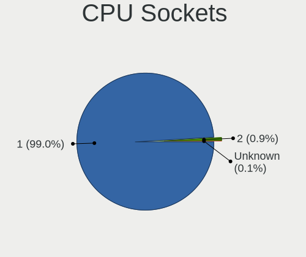

| Number | Desktops | Percent |
|--------|----------|---------|
| 1      | 710      | 99.02%  |
| 2      | 7        | 0.98%   |

CPU Threads
-----------

Threads per core (Hyper-Threading)

| Number  | Desktops | Percent |
|---------|----------|---------|
| 2       | 366      | 50.83%  |
| 1       | 353      | 49.03%  |
| Unknown | 1        | 0.14%   |

CPU Op-Modes
------------

CPU Operation Modes (32-bit, 64-bit)

| Op mode        | Desktops | Percent |
|----------------|----------|---------|
| 32-bit, 64-bit | 700      | 97.22%  |
| Unknown        | 11       | 1.53%   |
| 64-bit         | 6        | 0.83%   |
| 32-bit         | 3        | 0.42%   |

CPU Microcode
-------------

Microcode number

| Number     | Desktops | Percent |
|------------|----------|---------|
| Unknown    | 162      | 21.57%  |
| 0x206a7    | 49       | 6.52%   |
| 0x1067a    | 40       | 5.33%   |
| 0x306a9    | 37       | 4.93%   |
| 0x306c3    | 36       | 4.79%   |
| 0x010000c8 | 21       | 2.8%    |
| 0x08101016 | 20       | 2.66%   |
| 0x0800820d | 19       | 2.53%   |
| 0x6fd      | 16       | 2.13%   |
| 0x08108109 | 16       | 2.13%   |
| 0x0600611a | 16       | 2.13%   |
| 0x08701021 | 15       | 2%      |
| 0x06001119 | 15       | 2%      |
| 0x906e9    | 13       | 1.73%   |
| 0x506e3    | 12       | 1.6%    |
| 0x906ea    | 11       | 1.46%   |
| 0x6fb      | 11       | 1.46%   |
| 0xa0653    | 9        | 1.2%    |
| 0x06000852 | 9        | 1.2%    |
| 0x10676    | 8        | 1.07%   |
| 0x0a50000d | 8        | 1.07%   |
| 0x06003106 | 8        | 1.07%   |
| 0x906ed    | 7        | 0.93%   |
| 0x0a50000c | 7        | 0.93%   |
| 0x0a201016 | 7        | 0.93%   |
| 0x08001138 | 7        | 0.93%   |
| 0x08701013 | 6        | 0.8%    |
| 0x0600063e | 6        | 0.8%    |
| 0x6f2      | 5        | 0.67%   |
| 0x206d7    | 5        | 0.67%   |
| 0x106e5    | 5        | 0.67%   |
| 0x106a5    | 5        | 0.67%   |
| 0xf43      | 4        | 0.53%   |
| 0x306f2    | 4        | 0.53%   |
| 0x0810100b | 4        | 0.53%   |
| 0x05000119 | 4        | 0.53%   |
| 0x03000027 | 4        | 0.53%   |
| 0xf65      | 3        | 0.4%    |
| 0xa0671    | 3        | 0.4%    |
| 0xa0655    | 3        | 0.4%    |

CPU Microarch
-------------

Microarchitecture

| Name             | Desktops | Percent |
|------------------|----------|---------|
| SandyBridge      | 62       | 8.61%   |
| Penryn           | 52       | 7.22%   |
| IvyBridge        | 51       | 7.08%   |
| Haswell          | 51       | 7.08%   |
| Zen+             | 48       | 6.67%   |
| KabyLake         | 46       | 6.39%   |
| K10              | 44       | 6.11%   |
| Core             | 40       | 5.56%   |
| Zen              | 38       | 5.28%   |
| Zen 3            | 34       | 4.72%   |
| Piledriver       | 32       | 4.44%   |
| Zen 2            | 28       | 3.89%   |
| K8 Hammer        | 22       | 3.06%   |
| Excavator        | 22       | 3.06%   |
| Skylake          | 21       | 2.92%   |
| CometLake        | 19       | 2.64%   |
| NetBurst         | 15       | 2.08%   |
| Nehalem          | 13       | 1.81%   |
| Steamroller      | 11       | 1.53%   |
| Silvermont       | 9        | 1.25%   |
| Bulldozer        | 9        | 1.25%   |
| Bobcat           | 9        | 1.25%   |
| Westmere         | 6        | 0.83%   |
| K10 Llano        | 6        | 0.83%   |
| Bonnell          | 6        | 0.83%   |
| Unknown          | 6        | 0.83%   |
| Jaguar           | 5        | 0.69%   |
| Puma             | 3        | 0.42%   |
| Icelake          | 3        | 0.42%   |
| Broadwell        | 3        | 0.42%   |
| Alderlake Hybrid | 3        | 0.42%   |
| Tremont          | 2        | 0.28%   |
| Goldmont         | 1        | 0.14%   |

Graphics
--------

GPU Vendor
----------

Vendors of graphics cards

| Vendor                     | Desktops | Percent |
|----------------------------|----------|---------|
| AMD                        | 289      | 37.73%  |
| Intel                      | 243      | 31.72%  |
| Nvidia                     | 225      | 29.37%  |
| Matrox Electronics Systems | 5        | 0.65%   |
| VIA Technologies           | 2        | 0.26%   |
| ATI Technologies           | 2        | 0.26%   |

GPU Model
---------

Graphics card models

| Model                                                                                    | Desktops | Percent |
|------------------------------------------------------------------------------------------|----------|---------|
| Intel 2nd Generation Core Processor Family Integrated Graphics Controller                | 39       | 4.91%   |
| Intel Xeon E3-1200 v3/4th Gen Core Processor Integrated Graphics Controller              | 32       | 4.03%   |
| Intel Xeon E3-1200 v2/3rd Gen Core processor Graphics Controller                         | 27       | 3.4%    |
| Intel 4 Series Chipset Integrated Graphics Controller                                    | 26       | 3.27%   |
| AMD Raven Ridge [Radeon Vega Series / Radeon Vega Mobile Series]                         | 24       | 3.02%   |
| AMD Picasso/Raven 2 [Radeon Vega Series / Radeon Vega Mobile Series]                     | 21       | 2.64%   |
| AMD Wani [Radeon R5/R6/R7 Graphics]                                                      | 19       | 2.39%   |
| AMD Ellesmere [Radeon RX 470/480/570/570X/580/580X/590]                                  | 18       | 2.26%   |
| AMD Cedar [Radeon HD 5000/6000/7350/8350 Series]                                         | 17       | 2.14%   |
| Nvidia GT218 [GeForce 210]                                                               | 14       | 1.76%   |
| Nvidia GK208B [GeForce GT 710]                                                           | 13       | 1.64%   |
| Intel CoffeeLake-S GT2 [UHD Graphics 630]                                                | 13       | 1.64%   |
| AMD Navi 10 [Radeon RX 5600 OEM/5600 XT / 5700/5700 XT]                                  | 13       | 1.64%   |
| Nvidia GP106 [GeForce GTX 1060 6GB]                                                      | 11       | 1.38%   |
| Intel 82945G/GZ Integrated Graphics Controller                                           | 11       | 1.38%   |
| AMD Cezanne [Radeon Vega Series / Radeon Vega Mobile Series]                             | 11       | 1.38%   |
| Nvidia GP108 [GeForce GT 1030]                                                           | 10       | 1.26%   |
| Nvidia GM107 [GeForce GTX 750 Ti]                                                        | 9        | 1.13%   |
| Nvidia C61 [GeForce 6150SE nForce 430]                                                   | 9        | 1.13%   |
| Intel HD Graphics 530                                                                    | 9        | 1.13%   |
| Intel 82Q963/Q965 Integrated Graphics Controller                                         | 9        | 1.13%   |
| Intel 82G33/G31 Express Integrated Graphics Controller                                   | 9        | 1.13%   |
| Intel HD Graphics 630                                                                    | 8        | 1.01%   |
| Intel CometLake-S GT2 [UHD Graphics 630]                                                 | 8        | 1.01%   |
| AMD RS780L [Radeon 3000]                                                                 | 8        | 1.01%   |
| AMD Caicos [Radeon HD 6450/7450/8450 / R5 230 OEM]                                       | 8        | 1.01%   |
| Nvidia TU106 [GeForce RTX 2060 Rev. A]                                                   | 7        | 0.88%   |
| Nvidia GP107 [GeForce GTX 1050 Ti]                                                       | 7        | 0.88%   |
| Intel Atom/Celeron/Pentium Processor x5-E8000/J3xxx/N3xxx Integrated Graphics Controller | 7        | 0.88%   |
| AMD Navi 23 [Radeon RX 6600/6600 XT/6600M]                                               | 7        | 0.88%   |
| AMD Baffin [Radeon RX 550 640SP / RX 560/560X]                                           | 7        | 0.88%   |
| Intel IvyBridge GT2 [HD Graphics 4000]                                                   | 6        | 0.75%   |
| Intel 82Q35 Express Integrated Graphics Controller                                       | 6        | 0.75%   |
| AMD RS880 [Radeon HD 4250]                                                               | 6        | 0.75%   |
| Nvidia GP104 [GeForce GTX 1080]                                                          | 5        | 0.63%   |
| Nvidia GF119 [GeForce GT 610]                                                            | 5        | 0.63%   |
| AMD Trinity 2 [Radeon HD 7480D]                                                          | 5        | 0.63%   |
| AMD RS880 [Radeon HD 4200]                                                               | 5        | 0.63%   |
| AMD Oland XT [Radeon HD 8670 / R5 340X OEM / R7 250/350/350X OEM]                        | 5        | 0.63%   |
| AMD Navi 22 [Radeon RX 6700/6700 XT/6750 XT / 6800M/6850M XT]                            | 5        | 0.63%   |

GPU Combo
---------

Combinations of graphics cards

| Name           | Desktops | Percent |
|----------------|----------|---------|
| 1 x AMD        | 260      | 35.71%  |
| 1 x Intel      | 214      | 29.4%   |
| 1 x Nvidia     | 200      | 27.47%  |
| 2 x AMD        | 16       | 2.2%    |
| AMD + Nvidia   | 9        | 1.24%   |
| Intel + Nvidia | 8        | 1.1%    |
| Intel + AMD    | 7        | 0.96%   |
| 2 x Nvidia     | 6        | 0.82%   |
| 1 x Matrox     | 5        | 0.69%   |
| 3 x AMD        | 1        | 0.14%   |
| 1 x VIA        | 1        | 0.14%   |
| Nvidia + VIA   | 1        | 0.14%   |

GPU Driver
----------

Free vs proprietary

| Driver      | Desktops | Percent |
|-------------|----------|---------|
| Free        | 599      | 82.28%  |
| Proprietary | 111      | 15.25%  |
| Unknown     | 18       | 2.47%   |

GPU Memory
----------

Total video memory

| Size in GB | Desktops | Percent |
|------------|----------|---------|
| Unknown    | 289      | 38.95%  |
| 0.01-0.5   | 124      | 16.71%  |
| 1.01-2.0   | 113      | 15.23%  |
| 0.51-1.0   | 95       | 12.8%   |
| 7.01-8.0   | 43       | 5.8%    |
| 3.01-4.0   | 33       | 4.45%   |
| 5.01-6.0   | 26       | 3.5%    |
| 2.01-3.0   | 10       | 1.35%   |
| 8.01-16.0  | 6        | 0.81%   |
| 16.01-24.0 | 3        | 0.4%    |

Monitor
-------

Monitor Vendor
--------------

Monitor vendors

| Vendor               | Desktops | Percent |
|----------------------|----------|---------|
| Hewlett-Packard      | 135      | 18.07%  |
| Dell                 | 107      | 14.32%  |
| Samsung Electronics  | 95       | 12.72%  |
| Acer                 | 50       | 6.69%   |
| BenQ                 | 49       | 6.56%   |
| Goldstar             | 47       | 6.29%   |
| AOC                  | 38       | 5.09%   |
| Unknown              | 22       | 2.95%   |
| Ancor Communications | 17       | 2.28%   |
| ASUSTek Computer     | 16       | 2.14%   |
| Sony                 | 14       | 1.87%   |
| Gateway              | 14       | 1.87%   |
| ViewSonic            | 13       | 1.74%   |
| VOR                  | 8        | 1.07%   |
| Lenovo               | 7        | 0.94%   |
| Philips              | 5        | 0.67%   |
| Insignia             | 5        | 0.67%   |
| Unknown              | 5        | 0.67%   |
| ___                  | 4        | 0.54%   |
| Sceptre Tech         | 4        | 0.54%   |
| SAC                  | 4        | 0.54%   |
| NEC Computers        | 4        | 0.54%   |
| LG Electronics       | 4        | 0.54%   |
| Hitachi              | 4        | 0.54%   |
| Compaq Computer      | 4        | 0.54%   |
| STD                  | 3        | 0.4%    |
| RTK                  | 3        | 0.4%    |
| Plain Tree Systems   | 3        | 0.4%    |
| HUAWEI               | 3        | 0.4%    |
| FOX                  | 3        | 0.4%    |
| eMachines            | 3        | 0.4%    |
| AUS                  | 3        | 0.4%    |
| Westinghouse         | 2        | 0.27%   |
| Vizio                | 2        | 0.27%   |
| Toshiba              | 2        | 0.27%   |
| Sun                  | 2        | 0.27%   |
| SANYO                | 2        | 0.27%   |
| Planar               | 2        | 0.27%   |
| Panasonic            | 2        | 0.27%   |
| MSI                  | 2        | 0.27%   |

Monitor Model
-------------

Monitor models

| Model                                                                 | Desktops | Percent |
|-----------------------------------------------------------------------|----------|---------|
| Hewlett-Packard w1907 HWP26A2 1440x900 408x255mm 18.9-inch            | 9        | 1.15%   |
| Samsung Electronics C24F390 SAM0D2C 1920x1080 521x293mm 23.5-inch     | 8        | 1.02%   |
| BenQ GW2480 BNQ78E7 1920x1080 527x296mm 23.8-inch                     | 6        | 0.77%   |
| Ancor Communications ASUS VP228 ACI22C3 1920x1080 476x268mm 21.5-inch | 6        | 0.77%   |
| Unknown                                                               | 5        | 0.64%   |
| VOR LED21300 VOR2150 1920x1080 597x336mm 27.0-inch                    | 4        | 0.51%   |
| Samsung Electronics SMB1930N SAM0632 1366x768 410x230mm 18.5-inch     | 4        | 0.51%   |
| Insignia LCDTV BBY0019 1680x1050 640x384mm 29.4-inch                  | 4        | 0.51%   |
| Hewlett-Packard LV1911 HWP3005 1366x768 410x230mm 18.5-inch           | 4        | 0.51%   |
| Hewlett-Packard Compaq WF1907 HWP26A4 1440x900 408x255mm 18.9-inch    | 4        | 0.51%   |
| Hewlett-Packard 2009 HWP2827 1600x900 443x250mm 20.0-inch             | 4        | 0.51%   |
| Goldstar ULTRAWIDE GSM7770 2560x1080 798x334mm 34.1-inch              | 4        | 0.51%   |
| Goldstar HD GSM5ACB 1366x768 410x230mm 18.5-inch                      | 4        | 0.51%   |
| Goldstar FULL HD GSM5B55 1920x1080 480x270mm 21.7-inch                | 4        | 0.51%   |
| Dell E1911 DELF036 1440x900 408x255mm 18.9-inch                       | 4        | 0.51%   |
| BenQ G2220HD BNQ7821 1920x1080 477x268mm 21.5-inch                    | 4        | 0.51%   |
| AOC 2343 AOC2343 1920x1080 509x286mm 23.0-inch                        | 4        | 0.51%   |
| Acer X163W ACR0015 1366x768 344x193mm 15.5-inch                       | 4        | 0.51%   |
| Samsung Electronics LCD Monitor SAM0C3C 1366x768 609x347mm 27.6-inch  | 3        | 0.38%   |
| SAC DM-MONB2205 SAC952D 1920x1080 450x270mm 20.7-inch                 | 3        | 0.38%   |
| RTK LCD Monitor RTK1D1A 1920x1080 1020x570mm 46.0-inch                | 3        | 0.38%   |
| Hewlett-Packard w1907 HWP26A3 1440x900 408x255mm 18.9-inch            | 3        | 0.38%   |
| Hewlett-Packard vs15 HWP2646 1024x768 300x220mm 14.6-inch             | 3        | 0.38%   |
| Hewlett-Packard TouchSmart HWP4218 1600x900 443x249mm 20.0-inch       | 3        | 0.38%   |
| Hewlett-Packard L1710 HWP26EB 1280x1024 340x270mm 17.1-inch           | 3        | 0.38%   |
| Hewlett-Packard 2011 HWP2935 1600x900 443x250mm 20.0-inch             | 3        | 0.38%   |
| Hewlett-Packard 19ka HWP3328 1366x768 410x230mm 18.5-inch             | 3        | 0.38%   |
| FOX FBC TV FOX9C01 1366x768 698x393mm 31.5-inch                       | 3        | 0.38%   |
| Dell P1913S DELA084 1280x1024 376x301mm 19.0-inch                     | 3        | 0.38%   |
| Dell P190S DEL405A 1280x1024 376x301mm 19.0-inch                      | 3        | 0.38%   |
| Dell E2011H DEL406B 1600x900 443x249mm 20.0-inch                      | 3        | 0.38%   |
| Dell E156FP DELA013 1024x768 304x228mm 15.0-inch                      | 3        | 0.38%   |
| BenQ GW2455 BNQ78D8 1920x1080 521x293mm 23.5-inch                     | 3        | 0.38%   |
| BenQ GW2270 BNQ78DB 1920x1080 476x268mm 21.5-inch                     | 3        | 0.38%   |
| ASUSTek Computer VA24E AUS24D1 1920x1080 527x296mm 23.8-inch          | 3        | 0.38%   |
| ASUSTek Computer MZ279 AUS27CA 1920x1080 598x336mm 27.0-inch          | 3        | 0.38%   |
| Acer X163W ACR0058 1366x768 344x193mm 15.5-inch                       | 3        | 0.38%   |
| Acer AL1916W ACRAD52 1440x900 408x255mm 18.9-inch                     | 3        | 0.38%   |
| VOR LED MONITOR VOR1820 1366x768 414x257mm 19.2-inch                  | 2        | 0.26%   |
| ViewSonic VA1938 Series VSC0626 1366x768 410x230mm 18.5-inch          | 2        | 0.26%   |

Monitor Resolution
------------------

Monitor screen resolution

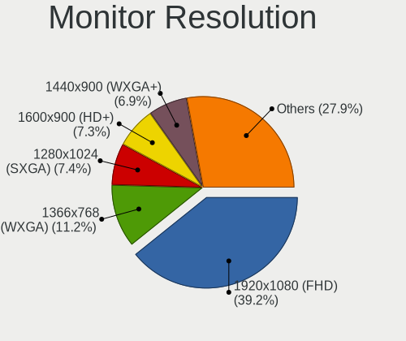

| Resolution         | Desktops | Percent |
|--------------------|----------|---------|
| 1920x1080 (FHD)    | 276      | 37.96%  |
| 1366x768 (WXGA)    | 95       | 13.07%  |
| 1280x1024 (SXGA)   | 62       | 8.53%   |
| 1440x900 (WXGA+)   | 57       | 7.84%   |
| 1600x900 (HD+)     | 52       | 7.15%   |
| 3840x2160 (4K)     | 29       | 3.99%   |
| 1680x1050 (WSXGA+) | 22       | 3.03%   |
| 1360x768           | 21       | 2.89%   |
| 1024x768 (XGA)     | 17       | 2.34%   |
| Unknown            | 17       | 2.34%   |
| 2560x1440 (QHD)    | 14       | 1.93%   |
| 2560x1080          | 12       | 1.65%   |
| 3440x1440          | 9        | 1.24%   |
| 3840x1080          | 8        | 1.1%    |
| 1600x1200          | 5        | 0.69%   |
| 2288x1287          | 4        | 0.55%   |
| 1920x1200 (WUXGA)  | 4        | 0.55%   |
| 1280x960           | 4        | 0.55%   |
| 1280x800 (WXGA)    | 3        | 0.41%   |
| 3360x1080          | 2        | 0.28%   |
| 7280x2160          | 1        | 0.14%   |
| 6720x1440          | 1        | 0.14%   |
| 5560x2160          | 1        | 0.14%   |
| 4721x1050          | 1        | 0.14%   |
| 4310x1080          | 1        | 0.14%   |
| 4093x4093          | 1        | 0.14%   |
| 3600x1080          | 1        | 0.14%   |
| 3286x1080          | 1        | 0.14%   |
| 3280x1200          | 1        | 0.14%   |
| 3200x900           | 1        | 0.14%   |
| 1920x540           | 1        | 0.14%   |
| 1920x2928          | 1        | 0.14%   |
| 1400x1050          | 1        | 0.14%   |
| 1280x720 (HD)      | 1        | 0.14%   |

Monitor Diagonal
----------------

Diagonal size in inches

| Inches  | Desktops | Percent |
|---------|----------|---------|
| 19      | 83       | 11.26%  |
| 21      | 82       | 11.13%  |
| 18      | 79       | 10.72%  |
| 23      | 72       | 9.77%   |
| Unknown | 62       | 8.41%   |
| 27      | 54       | 7.33%   |
| 24      | 54       | 7.33%   |
| 20      | 48       | 6.51%   |
| 17      | 43       | 5.83%   |
| 15      | 33       | 4.48%   |
| 31      | 22       | 2.99%   |
| 34      | 18       | 2.44%   |
| 22      | 17       | 2.31%   |
| 72      | 13       | 1.76%   |
| 84      | 8        | 1.09%   |
| 40      | 6        | 0.81%   |
| 54      | 5        | 0.68%   |
| 32      | 5        | 0.68%   |
| 29      | 5        | 0.68%   |
| 46      | 4        | 0.54%   |
| 25      | 3        | 0.41%   |
| 14      | 3        | 0.41%   |
| 12      | 3        | 0.41%   |
| 49      | 2        | 0.27%   |
| 47      | 2        | 0.27%   |
| 142     | 1        | 0.14%   |
| 64      | 1        | 0.14%   |
| 52      | 1        | 0.14%   |
| 50      | 1        | 0.14%   |
| 48      | 1        | 0.14%   |
| 43      | 1        | 0.14%   |
| 39      | 1        | 0.14%   |
| 38      | 1        | 0.14%   |
| 36      | 1        | 0.14%   |
| 26      | 1        | 0.14%   |
| 13      | 1        | 0.14%   |

Monitor Width
-------------

Physical width

| Width in mm    | Desktops | Percent |
|----------------|----------|---------|
| 401-500        | 270      | 37.71%  |
| 501-600        | 171      | 23.88%  |
| 301-350        | 70       | 9.78%   |
| Unknown        | 62       | 8.66%   |
| 351-400        | 34       | 4.75%   |
| 601-700        | 31       | 4.33%   |
| 701-800        | 24       | 3.35%   |
| 1501-2000      | 21       | 2.93%   |
| 1001-1500      | 17       | 2.37%   |
| 801-900        | 8        | 1.12%   |
| 201-300        | 6        | 0.84%   |
| More than 2000 | 1        | 0.14%   |
| 901-1000       | 1        | 0.14%   |

Aspect Ratio
------------

Proportional relationship between the width and the height

| Ratio   | Desktops | Percent |
|---------|----------|---------|
| 16/9    | 431      | 62.74%  |
| 16/10   | 86       | 12.52%  |
| 5/4     | 60       | 8.73%   |
| Unknown | 53       | 7.71%   |
| 4/3     | 29       | 4.22%   |
| 21/9    | 19       | 2.77%   |
| 6/5     | 3        | 0.44%   |
| 32/9    | 3        | 0.44%   |
| 1.00    | 2        | 0.29%   |
| 3/2     | 1        | 0.15%   |

Monitor Area
------------

Area in inch

| Area in inch | Desktops | Percent |
|----------------|----------|---------|
| 201-250        | 184      | 25.77%  |
| 151-200        | 156      | 21.85%  |
| 141-150        | 104      | 14.57%  |
| Unknown        | 62       | 8.68%   |
| 301-350        | 55       | 7.7%    |
| 351-500        | 44       | 6.16%   |
| 101-110        | 33       | 4.62%   |
| More than 1000 | 31       | 4.34%   |
| 501-1000       | 18       | 2.52%   |
| 251-300        | 15       | 2.1%    |
| 71-80          | 3        | 0.42%   |
| 131-140        | 3        | 0.42%   |
| 111-120        | 3        | 0.42%   |
| 121-130        | 2        | 0.28%   |
| 81-90          | 1        | 0.14%   |

Pixel Density
-------------

Pixels per inch

| Density | Desktops | Percent |
|---------|----------|---------|
| 51-100  | 445      | 64.96%  |
| 101-120 | 121      | 17.66%  |
| Unknown | 62       | 9.05%   |
| 1-50    | 41       | 5.99%   |
| 121-160 | 9        | 1.31%   |
| 161-240 | 7        | 1.02%   |

Multiple Monitors
-----------------

Total monitors connected

| Total | Desktops | Percent |
|-------|----------|---------|
| 1     | 589      | 80.03%  |
| 2     | 106      | 14.4%   |
| 0     | 27       | 3.67%   |
| 3     | 13       | 1.77%   |
| 4     | 1        | 0.14%   |

Network
-------

Net Controller Vendor
---------------------

Controller vendors

| Vendor                                | Desktops | Percent |
|---------------------------------------|----------|---------|
| Realtek Semiconductor                 | 461      | 43.53%  |
| Intel                                 | 236      | 22.29%  |
| Qualcomm Atheros                      | 79       | 7.46%   |
| Ralink Technology                     | 48       | 4.53%   |
| Broadcom                              | 37       | 3.49%   |
| Nvidia                                | 33       | 3.12%   |
| TP-Link                               | 24       | 2.27%   |
| Qualcomm Atheros Communications       | 24       | 2.27%   |
| Ralink                                | 23       | 2.17%   |
| Broadcom Limited                      | 11       | 1.04%   |
| Mercucys                              | 9        | 0.85%   |
| Huawei Technologies                   | 9        | 0.85%   |
| Samsung Electronics                   | 6        | 0.57%   |
| Motorola PCS                          | 6        | 0.57%   |
| MediaTek                              | 6        | 0.57%   |
| VIA Technologies                      | 4        | 0.38%   |
| Linksys                               | 4        | 0.38%   |
| Marvell Technology Group              | 3        | 0.28%   |
| D-Link System                         | 3        | 0.28%   |
| Wacom                                 | 2        | 0.19%   |
| Qualcomm                              | 2        | 0.19%   |
| NetGear                               | 2        | 0.19%   |
| Google                                | 2        | 0.19%   |
| D-Link                                | 2        | 0.19%   |
| ASIX Electronics                      | 2        | 0.19%   |
| 802.11g Adapter [Linksys WUSB54GC v3] | 2        | 0.19%   |
| ZTE WCDMA Technologies MSM            | 1        | 0.09%   |
| Xiaomi                                | 1        | 0.09%   |
| Tenda                                 | 1        | 0.09%   |
| Sangoma Technologies                  | 1        | 0.09%   |
| Microchip Technology                  | 1        | 0.09%   |
| Micro Star International              | 1        | 0.09%   |
| LG Electronics                        | 1        | 0.09%   |
| Lenovo                                | 1        | 0.09%   |
| InterBiometrics                       | 1        | 0.09%   |
| ICS Advent                            | 1        | 0.09%   |
| IBM                                   | 1        | 0.09%   |
| Hisense                               | 1        | 0.09%   |
| Gemtek                                | 1        | 0.09%   |
| Exar                                  | 1        | 0.09%   |

Net Controller Model
--------------------

Controller models

| Model                                                               | Desktops | Percent |
|---------------------------------------------------------------------|----------|---------|
| Realtek RTL8111/8168/8411 PCI Express Gigabit Ethernet Controller   | 356      | 30.07%  |
| Intel 82579LM Gigabit Network Connection (Lewisville)               | 49       | 4.14%   |
| Realtek RTL810xE PCI Express Fast Ethernet controller               | 33       | 2.79%   |
| Intel I211 Gigabit Network Connection                               | 31       | 2.62%   |
| Intel Wi-Fi 6 AX200                                                 | 25       | 2.11%   |
| Realtek RTL8188EUS 802.11n Wireless Network Adapter                 | 23       | 1.94%   |
| Nvidia MCP61 Ethernet                                               | 21       | 1.77%   |
| Qualcomm Atheros AR9271 802.11n                                     | 20       | 1.69%   |
| Ralink MT7601U Wireless Adapter                                     | 19       | 1.6%    |
| Intel Ethernet Connection I217-LM                                   | 19       | 1.6%    |
| Ralink RT2870/RT3070 Wireless Adapter                               | 18       | 1.52%   |
| Realtek RTL8125 2.5GbE Controller                                   | 15       | 1.27%   |
| Intel Ethernet Connection (2) I219-V                                | 14       | 1.18%   |
| Intel 82579V Gigabit Network Connection                             | 11       | 0.93%   |
| TP-Link TL-WN823N v2/v3 [Realtek RTL8192EU]                         | 10       | 0.84%   |
| Realtek RTL8192EE PCIe Wireless Network Adapter                     | 10       | 0.84%   |
| Intel 82567LM-3 Gigabit Network Connection                          | 10       | 0.84%   |
| Qualcomm Atheros AR9485 Wireless Network Adapter                    | 9        | 0.76%   |
| Mercucys 802.11n NIC                                                | 9        | 0.76%   |
| Intel Ethernet Controller I225-V                                    | 9        | 0.76%   |
| Intel 82574L Gigabit Network Connection                             | 9        | 0.76%   |
| Realtek RTL8821CE 802.11ac PCIe Wireless Network Adapter            | 8        | 0.68%   |
| Realtek RTL8188FTV 802.11b/g/n 1T1R 2.4G WLAN Adapter               | 8        | 0.68%   |
| Realtek 802.11ac NIC                                                | 8        | 0.68%   |
| Qualcomm Atheros AR9227 Wireless Network Adapter                    | 8        | 0.68%   |
| Intel 82566DM-2 Gigabit Network Connection                          | 8        | 0.68%   |
| Huawei WLZ-AN00                                                     | 8        | 0.68%   |
| Realtek RTL8187 Wireless Adapter                                    | 7        | 0.59%   |
| Realtek RTL-8185 IEEE 802.11a/b/g Wireless LAN Controller           | 7        | 0.59%   |
| Realtek RTL-8100/8101L/8139 PCI Fast Ethernet Adapter               | 7        | 0.59%   |
| Qualcomm Atheros AR2417 Wireless Network Adapter [AR5007G 802.11bg] | 7        | 0.59%   |
| Broadcom NetXtreme BCM5754 Gigabit Ethernet PCI Express             | 7        | 0.59%   |
| Realtek RTL88x2bu [AC1200 Techkey]                                  | 6        | 0.51%   |
| Realtek RTL8188EE Wireless Network Adapter                          | 6        | 0.51%   |
| Realtek RTL8188CUS 802.11n WLAN Adapter                             | 6        | 0.51%   |
| Ralink RT5370 Wireless Adapter                                      | 6        | 0.51%   |
| Ralink RT2561/RT61 802.11g PCI                                      | 6        | 0.51%   |
| Qualcomm Atheros AR9285 Wireless Network Adapter (PCI-Express)      | 6        | 0.51%   |
| Intel Wireless-AC 9260                                              | 6        | 0.51%   |
| Intel Ethernet Connection I217-V                                    | 6        | 0.51%   |

Wireless Vendor
---------------

Wireless vendors

| Vendor                                | Desktops | Percent |
|---------------------------------------|----------|---------|
| Realtek Semiconductor                 | 114      | 29.46%  |
| Qualcomm Atheros                      | 57       | 14.73%  |
| Intel                                 | 55       | 14.21%  |
| Ralink Technology                     | 48       | 12.4%   |
| TP-Link                               | 24       | 6.2%    |
| Qualcomm Atheros Communications       | 24       | 6.2%    |
| Ralink                                | 23       | 5.94%   |
| Mercucys                              | 9        | 2.33%   |
| Broadcom                              | 8        | 2.07%   |
| MediaTek                              | 5        | 1.29%   |
| Linksys                               | 4        | 1.03%   |
| Broadcom Limited                      | 3        | 0.78%   |
| Wacom                                 | 2        | 0.52%   |
| NetGear                               | 2        | 0.52%   |
| D-Link System                         | 2        | 0.52%   |
| D-Link                                | 2        | 0.52%   |
| 802.11g Adapter [Linksys WUSB54GC v3] | 2        | 0.52%   |
| Micro Star International              | 1        | 0.26%   |
| Gemtek                                | 1        | 0.26%   |
| Belkin Components                     | 1        | 0.26%   |

Wireless Model
--------------

Wireless models

| Model                                                                         | Desktops | Percent |
|-------------------------------------------------------------------------------|----------|---------|
| Intel Wi-Fi 6 AX200                                                           | 25       | 6.41%   |
| Realtek RTL8188EUS 802.11n Wireless Network Adapter                           | 23       | 5.9%    |
| Qualcomm Atheros AR9271 802.11n                                               | 20       | 5.13%   |
| Ralink MT7601U Wireless Adapter                                               | 19       | 4.87%   |
| Ralink RT2870/RT3070 Wireless Adapter                                         | 18       | 4.62%   |
| TP-Link TL-WN823N v2/v3 [Realtek RTL8192EU]                                   | 10       | 2.56%   |
| Realtek RTL8192EE PCIe Wireless Network Adapter                               | 10       | 2.56%   |
| Qualcomm Atheros AR9485 Wireless Network Adapter                              | 9        | 2.31%   |
| Mercucys 802.11n NIC                                                          | 9        | 2.31%   |
| Realtek RTL8821CE 802.11ac PCIe Wireless Network Adapter                      | 8        | 2.05%   |
| Realtek RTL8188FTV 802.11b/g/n 1T1R 2.4G WLAN Adapter                         | 8        | 2.05%   |
| Realtek 802.11ac NIC                                                          | 8        | 2.05%   |
| Qualcomm Atheros AR9227 Wireless Network Adapter                              | 8        | 2.05%   |
| Realtek RTL8187 Wireless Adapter                                              | 7        | 1.79%   |
| Realtek RTL-8185 IEEE 802.11a/b/g Wireless LAN Controller                     | 7        | 1.79%   |
| Qualcomm Atheros AR2417 Wireless Network Adapter [AR5007G 802.11bg]           | 7        | 1.79%   |
| Realtek RTL88x2bu [AC1200 Techkey]                                            | 6        | 1.54%   |
| Realtek RTL8188EE Wireless Network Adapter                                    | 6        | 1.54%   |
| Realtek RTL8188CUS 802.11n WLAN Adapter                                       | 6        | 1.54%   |
| Ralink RT5370 Wireless Adapter                                                | 6        | 1.54%   |
| Ralink RT2561/RT61 802.11g PCI                                                | 6        | 1.54%   |
| Qualcomm Atheros AR9285 Wireless Network Adapter (PCI-Express)                | 6        | 1.54%   |
| Intel Wireless-AC 9260                                                        | 6        | 1.54%   |
| TP-Link TL-WN722N v2/v3 [Realtek RTL8188EUS]                                  | 5        | 1.28%   |
| Qualcomm Atheros AR9287 Wireless Network Adapter (PCI-Express)                | 5        | 1.28%   |
| Intel Dual Band Wireless-AC 3168NGW [Stone Peak]                              | 5        | 1.28%   |
| Realtek RTL8192CU 802.11n WLAN Adapter                                        | 4        | 1.03%   |
| Qualcomm Atheros QCA9377 802.11ac Wireless Network Adapter                    | 4        | 1.03%   |
| Qualcomm Atheros TP-Link TL-WN322G v3 / TL-WN422G v2 802.11g [Atheros AR9271] | 4        | 1.03%   |
| Qualcomm Atheros AR5212/5213/2414 Wireless Network Adapter                    | 4        | 1.03%   |
| Intel Cannon Lake PCH CNVi WiFi                                               | 4        | 1.03%   |
| Realtek RTL8188SU 802.11n WLAN Adapter                                        | 3        | 0.77%   |
| Realtek RTL8187B Wireless 802.11g 54Mbps Network Adapter                      | 3        | 0.77%   |
| Ralink RT2070 Wireless Adapter                                                | 3        | 0.77%   |
| Ralink RT5390 Wireless 802.11n 1T/1R PCIe                                     | 3        | 0.77%   |
| Ralink RT2790 Wireless 802.11n 1T/2R PCIe                                     | 3        | 0.77%   |
| Qualcomm Atheros AR93xx Wireless Network Adapter                              | 3        | 0.77%   |
| Linksys AE6000 802.11a/b/g/n/ac Wireless Adapter [MediaTek MT7610U]           | 3        | 0.77%   |
| Intel Wireless 7265                                                           | 3        | 0.77%   |
| Intel Wireless 3165                                                           | 3        | 0.77%   |

Ethernet Vendor
---------------

Ethernet vendors

| Vendor                     | Desktops | Percent |
|----------------------------|----------|---------|
| Realtek Semiconductor      | 411      | 53.66%  |
| Intel                      | 216      | 28.2%   |
| Nvidia                     | 33       | 4.31%   |
| Broadcom                   | 29       | 3.79%   |
| Qualcomm Atheros           | 25       | 3.26%   |
| Huawei Technologies        | 9        | 1.17%   |
| Broadcom Limited           | 8        | 1.04%   |
| Motorola PCS               | 5        | 0.65%   |
| VIA Technologies           | 4        | 0.52%   |
| Samsung Electronics        | 4        | 0.52%   |
| Marvell Technology Group   | 3        | 0.39%   |
| Qualcomm                   | 2        | 0.26%   |
| Google                     | 2        | 0.26%   |
| ASIX Electronics           | 2        | 0.26%   |
| ZTE WCDMA Technologies MSM | 1        | 0.13%   |
| Xiaomi                     | 1        | 0.13%   |
| Tenda                      | 1        | 0.13%   |
| MediaTek                   | 1        | 0.13%   |
| LG Electronics             | 1        | 0.13%   |
| ICS Advent                 | 1        | 0.13%   |
| IBM                        | 1        | 0.13%   |
| Hisense                    | 1        | 0.13%   |
| DisplayLink                | 1        | 0.13%   |
| D-Link System              | 1        | 0.13%   |
| ADMtek                     | 1        | 0.13%   |
| Accton Technology          | 1        | 0.13%   |
| 3Com                       | 1        | 0.13%   |

Ethernet Model
--------------

Ethernet models

| Model                                                             | Desktops | Percent |
|-------------------------------------------------------------------|----------|---------|
| Realtek RTL8111/8168/8411 PCI Express Gigabit Ethernet Controller | 356      | 45.35%  |
| Intel 82579LM Gigabit Network Connection (Lewisville)             | 49       | 6.24%   |
| Realtek RTL810xE PCI Express Fast Ethernet controller             | 33       | 4.2%    |
| Intel I211 Gigabit Network Connection                             | 31       | 3.95%   |
| Nvidia MCP61 Ethernet                                             | 21       | 2.68%   |
| Intel Ethernet Connection I217-LM                                 | 19       | 2.42%   |
| Realtek RTL8125 2.5GbE Controller                                 | 15       | 1.91%   |
| Intel Ethernet Connection (2) I219-V                              | 14       | 1.78%   |
| Intel 82579V Gigabit Network Connection                           | 11       | 1.4%    |
| Intel 82567LM-3 Gigabit Network Connection                        | 10       | 1.27%   |
| Intel Ethernet Controller I225-V                                  | 9        | 1.15%   |
| Intel 82574L Gigabit Network Connection                           | 9        | 1.15%   |
| Intel 82566DM-2 Gigabit Network Connection                        | 8        | 1.02%   |
| Huawei WLZ-AN00                                                   | 8        | 1.02%   |
| Realtek RTL-8100/8101L/8139 PCI Fast Ethernet Adapter             | 7        | 0.89%   |
| Broadcom NetXtreme BCM5754 Gigabit Ethernet PCI Express           | 7        | 0.89%   |
| Intel Ethernet Connection I217-V                                  | 6        | 0.76%   |
| Intel Ethernet Connection (7) I219-V                              | 6        | 0.76%   |
| Motorola PCS XT1032                                               | 5        | 0.64%   |
| Intel Ethernet Connection (2) I219-LM                             | 5        | 0.64%   |
| Broadcom NetXtreme BCM5761 Gigabit Ethernet PCIe                  | 5        | 0.64%   |
| Samsung Galaxy series, misc. (tethering mode)                     | 4        | 0.51%   |
| Qualcomm Atheros Killer E2500 Gigabit Ethernet Controller         | 4        | 0.51%   |
| Qualcomm Atheros AR8151 v2.0 Gigabit Ethernet                     | 4        | 0.51%   |
| Nvidia MCP79 Ethernet                                             | 4        | 0.51%   |
| Intel I210 Gigabit Network Connection                             | 4        | 0.51%   |
| Intel Ethernet Connection (14) I219-V                             | 4        | 0.51%   |
| Intel Ethernet Connection (11) I219-V                             | 4        | 0.51%   |
| Intel 82566DM Gigabit Network Connection                          | 4        | 0.51%   |
| Broadcom NetXtreme BCM5751 Gigabit Ethernet PCI Express           | 4        | 0.51%   |
| VIA VT6102/VT6103 [Rhine-II]                                      | 3        | 0.38%   |
| Realtek RTL8153 Gigabit Ethernet Adapter                          | 3        | 0.38%   |
| Qualcomm Atheros AR8152 v2.0 Fast Ethernet                        | 3        | 0.38%   |
| Qualcomm Atheros AR8151 v1.0 Gigabit Ethernet                     | 3        | 0.38%   |
| Intel NM10/ICH7 Family LAN Controller                             | 3        | 0.38%   |
| Intel Ethernet Connection (12) I219-V                             | 3        | 0.38%   |
| Intel 82575EB Gigabit Network Connection                          | 3        | 0.38%   |
| Broadcom NetXtreme BCM5764M Gigabit Ethernet PCIe                 | 3        | 0.38%   |
| Broadcom Limited NetXtreme BCM5761 Gigabit Ethernet PCIe          | 3        | 0.38%   |
| Qualcomm SM6150-IDP _SN:488AC473                                  | 2        | 0.25%   |

Net Controller Kind
-------------------

Ethernet, WiFi or modem

| Kind     | Desktops | Percent |
|----------|----------|---------|
| Ethernet | 711      | 66.57%  |
| WiFi     | 348      | 32.58%  |
| Modem    | 5        | 0.47%   |
| Unknown  | 4        | 0.37%   |

Used Controller
---------------

Currently used network controller

| Kind     | Desktops | Percent |
|----------|----------|---------|
| Ethernet | 516      | 68.53%  |
| WiFi     | 236      | 31.34%  |
| Unknown  | 1        | 0.13%   |

NICs
----

Total network controllers on board

| Total | Desktops | Percent |
|-------|----------|---------|
| 1     | 501      | 69.39%  |
| 2     | 200      | 27.7%   |
| 3     | 13       | 1.8%    |
| 4     | 3        | 0.42%   |
| 0     | 3        | 0.42%   |
| 8     | 1        | 0.14%   |
| 6     | 1        | 0.14%   |

IPv6
----

IPv6 vs IPv4

| Used | Desktops | Percent |
|------|----------|---------|
| No   | 534      | 72.06%  |
| Yes  | 207      | 27.94%  |

Bluetooth
---------

Bluetooth Vendor
----------------

Controller vendors

| Vendor                          | Desktops | Percent |
|---------------------------------|----------|---------|
| Cambridge Silicon Radio         | 93       | 46.97%  |
| Intel                           | 50       | 25.25%  |
| ASUSTek Computer                | 12       | 6.06%   |
| Realtek Semiconductor           | 9        | 4.55%   |
| TP-Link                         | 6        | 3.03%   |
| Qualcomm Atheros Communications | 6        | 3.03%   |
| Broadcom                        | 5        | 2.53%   |
| IMC Networks                    | 4        | 2.02%   |
| MediaTek                        | 3        | 1.52%   |
| Dell                            | 3        | 1.52%   |
| Apple                           | 2        | 1.01%   |
| Roper                           | 1        | 0.51%   |
| Ralink                          | 1        | 0.51%   |
| Micro Star International        | 1        | 0.51%   |
| Lite-On Technology              | 1        | 0.51%   |
| Dynex                           | 1        | 0.51%   |

Bluetooth Model
---------------

Controller models

| Model                                                    | Desktops | Percent |
|----------------------------------------------------------|----------|---------|
| Cambridge Silicon Radio Bluetooth Dongle (HCI mode)      | 93       | 46.97%  |
| Intel AX200 Bluetooth                                    | 24       | 12.12%  |
| Intel Bluetooth wireless interface                       | 8        | 4.04%   |
| TP-Link UB500 Adapter                                    | 6        | 3.03%   |
| Realtek Bluetooth Radio                                  | 6        | 3.03%   |
| Intel Wireless-AC 9260 Bluetooth Adapter                 | 6        | 3.03%   |
| ASUS Bluetooth Radio                                     | 6        | 3.03%   |
| Intel Wireless-AC 3168 Bluetooth                         | 5        | 2.53%   |
| Qualcomm Atheros  Bluetooth Device                       | 4        | 2.02%   |
| Intel Bluetooth 9460/9560 Jefferson Peak (JfP)           | 4        | 2.02%   |
| ASUS Broadcom BCM20702A0 Bluetooth                       | 4        | 2.02%   |
| MediaTek Wireless_Device                                 | 3        | 1.52%   |
| IMC Networks Bluetooth Radio                             | 3        | 1.52%   |
| Dell Broadcom BCM20702A0 Bluetooth                       | 3        | 1.52%   |
| Realtek  Bluetooth 4.2 Adapter                           | 2        | 1.01%   |
| Broadcom BCM20702A0 Bluetooth 4.0                        | 2        | 1.01%   |
| Roper Class 1 Bluetooth Dongle                           | 1        | 0.51%   |
| Realtek RTL8821A Bluetooth                               | 1        | 0.51%   |
| Ralink RT3290 Bluetooth                                  | 1        | 0.51%   |
| Qualcomm Atheros AR9462 Bluetooth                        | 1        | 0.51%   |
| Qualcomm Atheros AR3011 Bluetooth                        | 1        | 0.51%   |
| Micro Star International Bluetooth Device                | 1        | 0.51%   |
| Lite-On Qualcomm Atheros QCA9377 Bluetooth               | 1        | 0.51%   |
| Intel Bluetooth Device                                   | 1        | 0.51%   |
| Intel AX210 Bluetooth                                    | 1        | 0.51%   |
| Intel AX201 Bluetooth                                    | 1        | 0.51%   |
| IMC Networks Bluetooth module                            | 1        | 0.51%   |
| Dynex Bluetooth 4.0 Adapter [Broadcom, 1.12, BCM20702A0] | 1        | 0.51%   |
| Broadcom HP Portable Bumble Bee                          | 1        | 0.51%   |
| Broadcom HP Bluetooth Module                             | 1        | 0.51%   |
| Broadcom HP Bluethunder                                  | 1        | 0.51%   |
| ASUS Qualcomm Bluetooth 4.1                              | 1        | 0.51%   |
| ASUS Broadcom BCM20702 Single-Chip Bluetooth 4.0 + LE    | 1        | 0.51%   |
| Apple Built-in Bluetooth 2.0+EDR HCI                     | 1        | 0.51%   |
| Apple Bluetooth USB Host Controller                      | 1        | 0.51%   |

Sound
-----

Sound Vendor
------------

Sound card vendors

| Vendor                      | Desktops | Percent |
|-----------------------------|----------|---------|
| Intel                       | 387      | 37.68%  |
| AMD                         | 337      | 32.81%  |
| Nvidia                      | 209      | 20.35%  |
| C-Media Electronics         | 20       | 1.95%   |
| Logitech                    | 9        | 0.88%   |
| Texas Instruments           | 7        | 0.68%   |
| Generalplus Technology      | 7        | 0.68%   |
| VIA Technologies            | 5        | 0.49%   |
| Razer USA                   | 4        | 0.39%   |
| JMTek                       | 4        | 0.39%   |
| Creative Labs               | 4        | 0.39%   |
| Corsair                     | 4        | 0.39%   |
| Kingston Technology         | 2        | 0.19%   |
| Jieli Technology            | 2        | 0.19%   |
| GN Netcom                   | 2        | 0.19%   |
| ATI Technologies            | 2        | 0.19%   |
| ASUSTek Computer            | 2        | 0.19%   |
| Tenx Technology             | 1        | 0.1%    |
| Syntek                      | 1        | 0.1%    |
| Shure                       | 1        | 0.1%    |
| Scarlett                    | 1        | 0.1%    |
| SAVITECH                    | 1        | 0.1%    |
| Realtek Semiconductor       | 1        | 0.1%    |
| Plantronics                 | 1        | 0.1%    |
| Microsoft                   | 1        | 0.1%    |
| Micro Star International    | 1        | 0.1%    |
| M-Audio                     | 1        | 0.1%    |
| Giga-Byte Technology        | 1        | 0.1%    |
| Focusrite-Novation          | 1        | 0.1%    |
| FiiO Electronics Technology | 1        | 0.1%    |
| FDUCE PRO AUDIO MADE        | 1        | 0.1%    |
| Dell                        | 1        | 0.1%    |
| Creative Technology         | 1        | 0.1%    |
| Cirrus Logic                | 1        | 0.1%    |
| Blue Microphones            | 1        | 0.1%    |
| AKAI Professional M.I.      | 1        | 0.1%    |
| Afatech                     | 1        | 0.1%    |

Sound Model
-----------

Sound card models

| Model                                                                             | Desktops | Percent |
|-----------------------------------------------------------------------------------|----------|---------|
| Intel 6 Series/C200 Series Chipset Family High Definition Audio Controller        | 68       | 5.31%   |
| AMD Family 17h/19h HD Audio Controller                                            | 66       | 5.15%   |
| AMD SBx00 Azalia (Intel HDA)                                                      | 59       | 4.61%   |
| AMD FCH Azalia Controller                                                         | 47       | 3.67%   |
| Intel NM10/ICH7 Family High Definition Audio Controller                           | 46       | 3.59%   |
| AMD Raven/Raven2/Fenghuang HDMI/DP Audio Controller                               | 45       | 3.51%   |
| Intel 8 Series/C220 Series Chipset High Definition Audio Controller               | 44       | 3.43%   |
| AMD Starship/Matisse HD Audio Controller                                          | 44       | 3.43%   |
| AMD Family 17h (Models 00h-0fh) HD Audio Controller                               | 38       | 2.97%   |
| Intel Xeon E3-1200 v3/4th Gen Core Processor HD Audio Controller                  | 34       | 2.65%   |
| Intel 7 Series/C216 Chipset Family High Definition Audio Controller               | 31       | 2.42%   |
| Nvidia MCP61 High Definition Audio                                                | 26       | 2.03%   |
| AMD Kabini HDMI/DP Audio                                                          | 26       | 2.03%   |
| Intel 100 Series/C230 Series Chipset Family HD Audio Controller                   | 25       | 1.95%   |
| Intel 200 Series PCH HD Audio                                                     | 22       | 1.72%   |
| AMD Oland/Hainan/Cape Verde/Pitcairn HDMI Audio [Radeon HD 7000 Series]           | 22       | 1.72%   |
| AMD Ellesmere HDMI Audio [Radeon RX 470/480 / 570/580/590]                        | 21       | 1.64%   |
| AMD Family 15h (Models 60h-6fh) Audio Controller                                  | 20       | 1.56%   |
| Intel Cannon Lake PCH cAVS                                                        | 18       | 1.41%   |
| AMD Renoir Radeon High Definition Audio Controller                                | 18       | 1.41%   |
| Nvidia GK208 HDMI/DP Audio Controller                                             | 17       | 1.33%   |
| Intel 82801I (ICH9 Family) HD Audio Controller                                    | 17       | 1.33%   |
| AMD Navi 10 HDMI Audio                                                            | 17       | 1.33%   |
| AMD Baffin HDMI/DP Audio [Radeon RX 550 640SP / RX 560/560X]                      | 16       | 1.25%   |
| Nvidia High Definition Audio Controller                                           | 15       | 1.17%   |
| Nvidia GP107GL High Definition Audio Controller                                   | 14       | 1.09%   |
| Nvidia GP106 High Definition Audio Controller                                     | 13       | 1.01%   |
| Nvidia GM107 High Definition Audio Controller [GeForce 940MX]                     | 13       | 1.01%   |
| Intel 82801JI (ICH10 Family) HD Audio Controller                                  | 13       | 1.01%   |
| Intel 82801JD/DO (ICH10 Family) HD Audio Controller                               | 13       | 1.01%   |
| AMD Trinity HDMI Audio Controller                                                 | 13       | 1.01%   |
| Intel 82801H (ICH8 Family) HD Audio Controller                                    | 12       | 0.94%   |
| AMD Navi 21/23 HDMI/DP Audio Controller                                           | 12       | 0.94%   |
| AMD Cedar HDMI Audio [Radeon HD 5400/6300/7300 Series]                            | 12       | 0.94%   |
| Nvidia TU116 High Definition Audio Controller                                     | 11       | 0.86%   |
| Intel C600/X79 series chipset High Definition Audio Controller                    | 11       | 0.86%   |
| Nvidia GP108 High Definition Audio Controller                                     | 10       | 0.78%   |
| AMD RS880 HDMI Audio [Radeon HD 4200 Series]                                      | 10       | 0.78%   |
| AMD Caicos HDMI Audio [Radeon HD 6450 / 7450/8450/8490 OEM / R5 230/235/235X OEM] | 10       | 0.78%   |
| Nvidia TU106 High Definition Audio Controller                                     | 9        | 0.7%    |

Memory
------

Memory Vendor
-------------

Memory module vendors

| Vendor              | Desktops | Percent |
|---------------------|----------|---------|
| Kingston            | 103      | 24.41%  |
| A-DATA Technology   | 73       | 17.3%   |
| Unknown             | 50       | 11.85%  |
| Samsung Electronics | 42       | 9.95%   |
| SK hynix            | 39       | 9.24%   |
| Corsair             | 29       | 6.87%   |
| Micron Technology   | 22       | 5.21%   |
| Team                | 9        | 2.13%   |
| Crucial             | 9        | 2.13%   |
| Nanya Technology    | 8        | 1.9%    |
| Patriot             | 6        | 1.42%   |
| Qimonda             | 4        | 0.95%   |
| PNY                 | 4        | 0.95%   |
| G.Skill             | 4        | 0.95%   |
| Ramaxel Technology  | 3        | 0.71%   |
| Elpida              | 3        | 0.71%   |
| Unknown             | 2        | 0.47%   |
| Transcend           | 1        | 0.24%   |
| Timetec             | 1        | 0.24%   |
| Silicon Power       | 1        | 0.24%   |
| SGS/Thomson         | 1        | 0.24%   |
| S                   | 1        | 0.24%   |
| Patriot Memory      | 1        | 0.24%   |
| Hewlett-Packard     | 1        | 0.24%   |
| Gigabyte Technology | 1        | 0.24%   |
| CSX                 | 1        | 0.24%   |
| Avant               | 1        | 0.24%   |
| Apacer              | 1        | 0.24%   |
| Aeneon              | 1        | 0.24%   |

Memory Model
------------

Memory module models

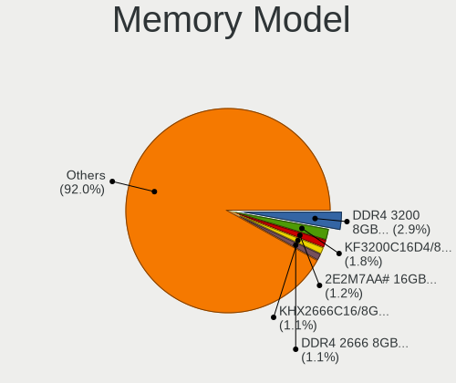

| Model                                                 | Desktops | Percent |
|-------------------------------------------------------|----------|---------|
| A-DATA RAM DDR4 3200 16GB DIMM DDR4 3600MT/s          | 13       | 2.73%   |
| Kingston RAM KF3200C16D4/8GX 8GB DIMM DDR4 3600MT/s   | 9        | 1.89%   |
| Unknown RAM Module 4GB DIMM DDR3 1333MT/s             | 6        | 1.26%   |
| Unknown RAM Module 4GB DIMM 1333MT/s                  | 6        | 1.26%   |
| Kingston RAM KHX2666C16/8G 8GB DIMM DDR4 3466MT/s     | 6        | 1.26%   |
| Team RAM TEAMGROUP-UD4-2666 16GB DIMM DDR4 2933MT/s   | 5        | 1.05%   |
| Kingston RAM KHX3200C16D4/8GX 8GB DIMM DDR4 3600MT/s  | 5        | 1.05%   |
| A-DATA RAM DDR4 2666 8GB DIMM DDR4 3200MT/s           | 5        | 1.05%   |
| Samsung RAM M378B5173QH0-CK0 4GB DIMM DDR3 1600MT/s   | 4        | 0.84%   |
| Samsung RAM M378B5173DB0-CK0 4GB DIMM DDR3 1600MT/s   | 4        | 0.84%   |
| Kingston RAM KF3200C16D4/32GX 32GB DIMM DDR4 3933MT/s | 4        | 0.84%   |
| Kingston RAM 99U5474-028.A00LF 4GB DIMM DDR3 1333MT/s | 4        | 0.84%   |
| Kingston RAM 99U5471-012.A00LF 4GB DIMM DDR3 1600MT/s | 4        | 0.84%   |
| A-DATA RAM Module 8GB DIMM DDR4 2400MT/s              | 4        | 0.84%   |
| A-DATA RAM Module 8GB DIMM DDR4 2133MT/s              | 4        | 0.84%   |
| A-DATA RAM DDR4 3000 16GB DIMM DDR4 3600MT/s          | 4        | 0.84%   |
| A-DATA RAM DDR4 2666 2OZ 16GB DIMM DDR4 3200MT/s      | 4        | 0.84%   |
| Unknown RAM Module 2048MB DIMM DDR2 667MT/s           | 3        | 0.63%   |
| SK hynix RAM Module 2GB DIMM DDR3 1333MT/s            | 3        | 0.63%   |
| SK hynix RAM HYMP125U64CP8-S6 2GB DIMM DDR2 49926MT/s | 3        | 0.63%   |
| Samsung RAM M378B5773CH0-CH9 2GB DIMM DDR3 1867MT/s   | 3        | 0.63%   |
| Kingston RAM KHX2666C15D4/4G 4GB DIMM DDR4 3200MT/s   | 3        | 0.63%   |
| Kingston RAM KHX1866C10D3/8G 8GB DIMM DDR3 2133MT/s   | 3        | 0.63%   |
| Kingston RAM 99U5471-052.A00LF 8GB DIMM DDR3 1333MT/s | 3        | 0.63%   |
| Corsair RAM CMW16GX4M2C3200C16 8GB DIMM DDR4 3733MT/s | 3        | 0.63%   |
| Corsair RAM CMK8GX4M1A2400C16 8GB DIMM DDR4 2800MT/s  | 3        | 0.63%   |
| A-DATA RAM DDR4 2666 8GB DIMM DDR4 2667MT/s           | 3        | 0.63%   |
| A-DATA RAM DDR4 2666 2OZ 16GB DIMM DDR4 2667MT/s      | 3        | 0.63%   |
| A-DATA RAM DDR4 2400 2OZ 8GB DIMM DDR4 3000MT/s       | 3        | 0.63%   |
| Unknown RAM Module 8GB DIMM DDR3 1333MT/s             | 2        | 0.42%   |
| Unknown RAM Module 8192MB DIMM 1333MT/s               | 2        | 0.42%   |
| Unknown RAM Module 4GB DIMM 400MT/s                   | 2        | 0.42%   |
| Unknown RAM Module 2GB DIMM SDRAM                     | 2        | 0.42%   |
| Unknown RAM Module 2GB DIMM 1333MT/s                  | 2        | 0.42%   |
| Unknown RAM Module 2048MB DIMM SDRAM                  | 2        | 0.42%   |
| Unknown RAM Module 2048MB DIMM DDR2 333MT/s           | 2        | 0.42%   |
| Unknown RAM Module 2048MB DIMM 800MT/s                | 2        | 0.42%   |
| Unknown RAM Module 1024MB DIMM DDR2 800MT/s           | 2        | 0.42%   |
| SK hynix RAM Module 4GB DIMM DDR4 2667MT/s            | 2        | 0.42%   |
| SK hynix RAM HYMP564U64P8-C4 512MB DIMM DDR2 533MT/s  | 2        | 0.42%   |

Memory Kind
-----------

Memory module kinds

| Kind    | Desktops | Percent |
|---------|----------|---------|
| DDR4    | 156      | 42.86%  |
| DDR3    | 122      | 33.52%  |
| DDR2    | 34       | 9.34%   |
| SDRAM   | 23       | 6.32%   |
| Unknown | 21       | 5.77%   |
| DDR     | 5        | 1.37%   |
| DDR5    | 2        | 0.55%   |
| LPDDR4  | 1        | 0.27%   |

Memory Form Factor
------------------

Physical design of the memory module

| Name         | Desktops | Percent |
|--------------|----------|---------|
| DIMM         | 325      | 93.39%  |
| SODIMM       | 19       | 5.46%   |
| Row Of Chips | 1        | 0.29%   |
| RIMM         | 1        | 0.29%   |
| FB-DIMM      | 1        | 0.29%   |
| Unknown      | 1        | 0.29%   |

Memory Size
-----------

Memory module size

| Size  | Desktops | Percent |
|-------|----------|---------|
| 8192  | 121      | 30.63%  |
| 4096  | 90       | 22.78%  |
| 2048  | 66       | 16.71%  |
| 16384 | 52       | 13.16%  |
| 1024  | 30       | 7.59%   |
| 32768 | 29       | 7.34%   |
| 512   | 5        | 1.27%   |
| 256   | 1        | 0.25%   |
| 128   | 1        | 0.25%   |

Memory Speed
------------

Memory module speed

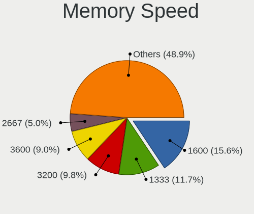

| Speed   | Desktops | Percent |
|---------|----------|---------|
| 1600    | 62       | 15.42%  |
| 1333    | 54       | 13.43%  |
| 3600    | 38       | 9.45%   |
| 3200    | 28       | 6.97%   |
| 800     | 22       | 5.47%   |
| 2667    | 20       | 4.98%   |
| 667     | 19       | 4.73%   |
| 2133    | 17       | 4.23%   |
| 2400    | 14       | 3.48%   |
| 1866    | 9        | 2.24%   |
| 3000    | 8        | 1.99%   |
| Unknown | 8        | 1.99%   |
| 3733    | 6        | 1.49%   |
| 3466    | 6        | 1.49%   |
| 2933    | 6        | 1.49%   |
| 2800    | 6        | 1.49%   |
| 2666    | 6        | 1.49%   |
| 1867    | 6        | 1.49%   |
| 3400    | 5        | 1.24%   |
| 1067    | 5        | 1.24%   |
| 1066    | 5        | 1.24%   |
| 533     | 5        | 1.24%   |
| 49926   | 4        | 1%      |
| 3933    | 4        | 1%      |
| 3800    | 3        | 0.75%   |
| 4800    | 2        | 0.5%    |
| 3266    | 2        | 0.5%    |
| 2048    | 2        | 0.5%    |
| 2000    | 2        | 0.5%    |
| 1800    | 2        | 0.5%    |
| 1334    | 2        | 0.5%    |
| 1332    | 2        | 0.5%    |
| 1331    | 2        | 0.5%    |
| 400     | 2        | 0.5%    |
| 333     | 2        | 0.5%    |
| 266     | 2        | 0.5%    |
| 8400    | 1        | 0.25%   |
| 5200    | 1        | 0.25%   |
| 4000    | 1        | 0.25%   |
| 3534    | 1        | 0.25%   |

Printers & scanners
-------------------

Printer Vendor
--------------

Printer device vendors

| Vendor              | Desktops | Percent |
|---------------------|----------|---------|
| Hewlett-Packard     | 12       | 30%     |
| Seiko Epson         | 10       | 25%     |
| Brother Industries  | 10       | 25%     |
| Samsung Electronics | 3        | 7.5%    |
| Canon               | 3        | 7.5%    |
| QinHeng Electronics | 1        | 2.5%    |
| Kyocera             | 1        | 2.5%    |

Printer Model
-------------

Printer device models

| Model                                   | Desktops | Percent |
|-----------------------------------------|----------|---------|
| Seiko Epson L120 Series                 | 4        | 9.76%   |
| HP DeskJet 1110 series                  | 3        | 7.32%   |
| HP LaserJet Professional P 1102w        | 2        | 4.88%   |
| Brother HL-1110 series                  | 2        | 4.88%   |
| Seiko Epson XP-230 Series               | 1        | 2.44%   |
| Seiko Epson L805 Series                 | 1        | 2.44%   |
| Seiko Epson L6160 Series                | 1        | 2.44%   |
| Seiko Epson L300 Series                 | 1        | 2.44%   |
| Seiko Epson L200 Series                 | 1        | 2.44%   |
| Seiko Epson L1300 Series                | 1        | 2.44%   |
| Seiko Epson ET-2700 Series              | 1        | 2.44%   |
| Samsung Xerox Phaser 3117 Laser Printer | 1        | 2.44%   |
| Samsung ML-1640 Series Laser Printer    | 1        | 2.44%   |
| Samsung M283x Series                    | 1        | 2.44%   |
| QinHeng CH340S                          | 1        | 2.44%   |
| Kyocera FS-1030D printer                | 1        | 2.44%   |
| HP OfficeJet Pro 7740 series            | 1        | 2.44%   |
| HP LaserJet P3010 Series                | 1        | 2.44%   |
| HP DeskJet F4200 series                 | 1        | 2.44%   |
| HP DeskJet 4720 series                  | 1        | 2.44%   |
| HP DeskJet 3700 series                  | 1        | 2.44%   |
| HP DeskJet 2620 All-in-One Printer      | 1        | 2.44%   |
| HP Deskjet 2540 series                  | 1        | 2.44%   |
| Canon PIXMA MG3500 Series               | 1        | 2.44%   |
| Canon PIXMA iP3000x Printer             | 1        | 2.44%   |
| Canon G3000 series                      | 1        | 2.44%   |
| Brother MFC-T910DW                      | 1        | 2.44%   |
| Brother MFC-L3770CDW series             | 1        | 2.44%   |
| Brother MFC-J470DW                      | 1        | 2.44%   |
| Brother MFC-J460DW                      | 1        | 2.44%   |
| Brother HL-2130 series                  | 1        | 2.44%   |
| Brother DCP-T710W                       | 1        | 2.44%   |
| Brother DCP-L2540DW                     | 1        | 2.44%   |
| Brother Composite Device                | 1        | 2.44%   |

Scanner Vendor
--------------

Scanner device vendors

| Vendor          | Desktops | Percent |
|-----------------|----------|---------|
| Hewlett-Packard | 3        | 75%     |
| Seiko Epson     | 1        | 25%     |

Scanner Model
-------------

Scanner device models

| Model                                              | Desktops | Percent |
|----------------------------------------------------|----------|---------|
| HP ScanJet 4500C/5550C                             | 2        | 50%     |
| Seiko Epson GT-8400UF [Perfection 1670/1670 PHOTO] | 1        | 25%     |
| HP ScanJet 3300c                                   | 1        | 25%     |

Camera
------

Camera Vendor
-------------

Camera device vendors

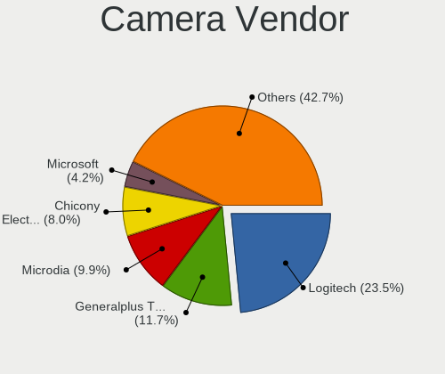

| Vendor                        | Desktops | Percent |
|-------------------------------|----------|---------|
| Logitech                      | 41       | 25.95%  |
| Generalplus Technology        | 17       | 10.76%  |
| Microdia                      | 14       | 8.86%   |
| Chicony Electronics           | 13       | 8.23%   |
| Jieli Technology              | 8        | 5.06%   |
| Samsung Electronics           | 7        | 4.43%   |
| Microsoft                     | 7        | 4.43%   |
| GEMBIRD                       | 6        | 3.8%    |
| Apple                         | 5        | 3.16%   |
| KYE Systems (Mouse Systems)   | 4        | 2.53%   |
| Z-Star Microelectronics       | 3        | 1.9%    |
| Realtek Semiconductor         | 3        | 1.9%    |
| LG Electronics                | 3        | 1.9%    |
| Xiongmai                      | 2        | 1.27%   |
| Sunplus Innovation Technology | 2        | 1.27%   |
| Hewlett-Packard               | 2        | 1.27%   |
| Genesys Logic                 | 2        | 1.27%   |
| Alcor Micro                   | 2        | 1.27%   |
| XHT-210518                    | 1        | 0.63%   |
| Unknown                       | 1        | 0.63%   |
| Syntek                        | 1        | 0.63%   |
| Sunplus Technology            | 1        | 0.63%   |
| Silicon Motion                | 1        | 0.63%   |
| Ruision                       | 1        | 0.63%   |
| Razer USA                     | 1        | 0.63%   |
| Novatel Wireless              | 1        | 0.63%   |
| MacroSilicon                  | 1        | 0.63%   |
| Linux Foundation HS           | 1        | 0.63%   |
| IMC Networks                  | 1        | 0.63%   |
| Huawei Technologies           | 1        | 0.63%   |
| Guillemot                     | 1        | 0.63%   |
| Cubeternet                    | 1        | 0.63%   |
| AVerMedia Technologies        | 1        | 0.63%   |
| Aveo Technology               | 1        | 0.63%   |
| 2M UVC CAMERA                 | 1        | 0.63%   |

Camera Model
------------

Camera device models

| Model                                                 | Desktops | Percent |
|-------------------------------------------------------|----------|---------|
| Logitech HD Pro Webcam C920                           | 14       | 8.7%    |
| Generalplus GENERAL WEBCAM                            | 14       | 8.7%    |
| Logitech Webcam C270                                  | 10       | 6.21%   |
| Microdia Integrated Camera                            | 8        | 4.97%   |
| Jieli USB PHY 2.0                                     | 8        | 4.97%   |
| Samsung Galaxy series, misc. (MTP mode)               | 7        | 4.35%   |
| Logitech Webcam C170                                  | 5        | 3.11%   |
| GEMBIRD Generic UVC 1.00 camera [AppoTech AX2311]     | 5        | 3.11%   |
| Chicony HP 0.3MP Webcam                               | 4        | 2.48%   |
| Microsoft LifeCam HD-3000                             | 3        | 1.86%   |
| LG LM-X420xxx/G2/G3 Android Phone (MTP/download mode) | 3        | 1.86%   |
| Chicony HP High Definition 1MP Webcam                 | 3        | 1.86%   |
| Apple iPhone 5/5C/5S/6/SE/7/8/X                       | 3        | 1.86%   |
| Xiongmai web camera                                   | 2        | 1.24%   |
| Sunplus 1080P Webcam                                  | 2        | 1.24%   |
| Realtek HP 1.0MP High Definition Webcam               | 2        | 1.24%   |
| Logitech Webcam Pro 9000                              | 2        | 1.24%   |
| Logitech HD Webcam C525                               | 2        | 1.24%   |
| Logitech C922 Pro Stream Webcam                       | 2        | 1.24%   |
| Logitech C920 PRO HD Webcam                           | 2        | 1.24%   |
| KYE Systems (Mouse Systems) Genius FaceCam 320        | 2        | 1.24%   |
| HP Webcam HD-2200                                     | 2        | 1.24%   |
| Generalplus 808 Camera #9 (web-cam mode)              | 2        | 1.24%   |
| Chicony CNF8050 Webcam                                | 2        | 1.24%   |
| Apple iPhone 4                                        | 2        | 1.24%   |
| Alcor Micro USB 2.0 PC Camera                         | 2        | 1.24%   |
| Z-Star Venus USB2.0 Camera                            | 1        | 0.62%   |
| Z-Star Sirius USB2.0 Camera                           | 1        | 0.62%   |
| Z-Star Lenovo IdeaCentre Web Camera                   | 1        | 0.62%   |
| XHT-210518 EC500X                                     | 1        | 0.62%   |
| Unknown HD camera                                     | 1        | 0.62%   |
| Syntek USB Video Device                               | 1        | 0.62%   |
| Sunplus USB2.0 2M WebCam                              | 1        | 0.62%   |
| Silicon Motion Silicon Motion Camera                  | 1        | 0.62%   |
| Ruision UVC Camera                                    | 1        | 0.62%   |
| Realtek Webcam                                        | 1        | 0.62%   |
| Razer USA Razer Kiyo Pro                              | 1        | 0.62%   |
| Novatel Wireless Merlin U740 (non-Vodafone)           | 1        | 0.62%   |
| Microsoft Xbox NUI Camera                             | 1        | 0.62%   |
| Microsoft LifeCam VX-800                              | 1        | 0.62%   |

Security
--------

Fingerprint Vendor
------------------

Fingerprint sensor vendors

| Vendor         | Desktops | Percent |
|----------------|----------|---------|
| DigitalPersona | 1        | 100%    |

Fingerprint Model
-----------------

Fingerprint sensor models

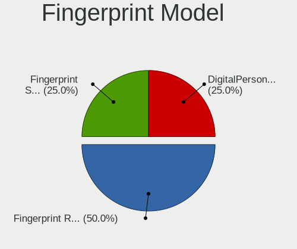

| Model                             | Desktops | Percent |
|-----------------------------------|----------|---------|
| DigitalPersona Fingerprint Reader | 1        | 100%    |

Chipcard Vendor
---------------

Chipcard module vendors

Zero info for selected period =(

Chipcard Model
--------------

Chipcard module models

Zero info for selected period =(

Unsupported
-----------

Unsupported Devices
-------------------

Total unsupported devices on board

| Total | Desktops | Percent |
|-------|----------|---------|
| 0     | 619      | 84.68%  |
| 1     | 97       | 13.27%  |
| 2     | 11       | 1.5%    |
| 3     | 2        | 0.27%   |
| 6     | 1        | 0.14%   |
| 4     | 1        | 0.14%   |

Unsupported Device Types
------------------------

Types of unsupported devices

| Type                     | Desktops | Percent |
|--------------------------|----------|---------|
| Graphics card            | 41       | 32.03%  |
| Net/wireless             | 40       | 31.25%  |
| Communication controller | 16       | 12.5%   |
| Unassigned class         | 6        | 4.69%   |
| Multimedia controller    | 5        | 3.91%   |
| Sound                    | 4        | 3.13%   |
| Storage/raid             | 3        | 2.34%   |
| Network                  | 3        | 2.34%   |
| Bluetooth                | 3        | 2.34%   |
| Camera                   | 2        | 1.56%   |
| Video                    | 1        | 0.78%   |
| Tv card                  | 1        | 0.78%   |
| Net/ethernet             | 1        | 0.78%   |
| Modem                    | 1        | 0.78%   |
| Fingerprint reader       | 1        | 0.78%   |

