Linux in Mexico - Tested Hardware & Statistics (Desktops)
---------------------------------------------------------

A project to collect tested hardware configurations for Linux in Mexico.

Anyone can contribute to this report by the [hw-probe](https://github.com/linuxhw/hw-probe) tool:

    sudo -E hw-probe -all -upload

Please contribute! Especially if your hardware is rare.

Contents
--------

* [ Test Cases ](#test-cases)

* [ System ](#system)
  - [ OS                       ](#os)
  - [ OS Family                ](#os-family)
  - [ Kernel                   ](#kernel)
  - [ Kernel Family            ](#kernel-family)
  - [ Kernel Major Ver.        ](#kernel-major-ver)
  - [ Arch                     ](#arch)
  - [ DE                       ](#de)
  - [ Display Server           ](#display-server)
  - [ Display Manager          ](#display-manager)
  - [ OS Lang                  ](#os-lang)
  - [ Boot Mode                ](#boot-mode)
  - [ Filesystem               ](#filesystem)
  - [ Part. scheme             ](#part-scheme)
  - [ Dual Boot with Linux/BSD ](#dual-boot-with-linuxbsd)
  - [ Dual Boot (Win)          ](#dual-boot-win)

* [ Board ](#board)
  - [ Vendor                   ](#vendor)
  - [ Model                    ](#model)
  - [ Model Family             ](#model-family)
  - [ MFG Year                 ](#mfg-year)
  - [ Form Factor              ](#form-factor)
  - [ Secure Boot              ](#secure-boot)
  - [ Coreboot                 ](#coreboot)
  - [ RAM Size                 ](#ram-size)
  - [ RAM Used                 ](#ram-used)
  - [ Total Drives             ](#total-drives)
  - [ Has CD-ROM               ](#has-cd-rom)
  - [ Has Ethernet             ](#has-ethernet)
  - [ Has WiFi                 ](#has-wifi)
  - [ Has Bluetooth            ](#has-bluetooth)

* [ Location ](#location)
  - [ Country                  ](#country)
  - [ City                     ](#city)

* [ Drives ](#drives)
  - [ Drive Vendor             ](#drive-vendor)
  - [ Drive Model              ](#drive-model)
  - [ HDD Vendor               ](#hdd-vendor)
  - [ SSD Vendor               ](#ssd-vendor)
  - [ Drive Kind               ](#drive-kind)
  - [ Drive Connector          ](#drive-connector)
  - [ Drive Size               ](#drive-size)
  - [ Space Total              ](#space-total)
  - [ Space Used               ](#space-used)
  - [ Malfunc. Drives          ](#malfunc-drives)
  - [ Malfunc. Drive Vendor    ](#malfunc-drive-vendor)
  - [ Malfunc. HDD Vendor      ](#malfunc-hdd-vendor)
  - [ Malfunc. Drive Kind      ](#malfunc-drive-kind)
  - [ Failed Drives            ](#failed-drives)
  - [ Failed Drive Vendor      ](#failed-drive-vendor)
  - [ Drive Status             ](#drive-status)

* [ Storage controller ](#storage-controller)
  - [ Storage Vendor           ](#storage-vendor)
  - [ Storage Model            ](#storage-model)
  - [ Storage Kind             ](#storage-kind)

* [ Processor ](#processor)
  - [ CPU Vendor               ](#cpu-vendor)
  - [ CPU Model                ](#cpu-model)
  - [ CPU Model Family         ](#cpu-model-family)
  - [ CPU Cores                ](#cpu-cores)
  - [ CPU Sockets              ](#cpu-sockets)
  - [ CPU Threads              ](#cpu-threads)
  - [ CPU Op-Modes             ](#cpu-op-modes)
  - [ CPU Microcode            ](#cpu-microcode)
  - [ CPU Microarch            ](#cpu-microarch)

* [ Graphics ](#graphics)
  - [ GPU Vendor               ](#gpu-vendor)
  - [ GPU Model                ](#gpu-model)
  - [ GPU Combo                ](#gpu-combo)
  - [ GPU Driver               ](#gpu-driver)
  - [ GPU Memory               ](#gpu-memory)

* [ Monitor ](#monitor)
  - [ Monitor Vendor           ](#monitor-vendor)
  - [ Monitor Model            ](#monitor-model)
  - [ Monitor Resolution       ](#monitor-resolution)
  - [ Monitor Diagonal         ](#monitor-diagonal)
  - [ Monitor Width            ](#monitor-width)
  - [ Aspect Ratio             ](#aspect-ratio)
  - [ Monitor Area             ](#monitor-area)
  - [ Pixel Density            ](#pixel-density)
  - [ Multiple Monitors        ](#multiple-monitors)

* [ Network ](#network)
  - [ Net Controller Vendor    ](#net-controller-vendor)
  - [ Net Controller Model     ](#net-controller-model)
  - [ Wireless Vendor          ](#wireless-vendor)
  - [ Wireless Model           ](#wireless-model)
  - [ Ethernet Vendor          ](#ethernet-vendor)
  - [ Ethernet Model           ](#ethernet-model)
  - [ Net Controller Kind      ](#net-controller-kind)
  - [ Used Controller          ](#used-controller)
  - [ NICs                     ](#nics)
  - [ IPv6                     ](#ipv6)

* [ Bluetooth ](#bluetooth)
  - [ Bluetooth Vendor         ](#bluetooth-vendor)
  - [ Bluetooth Model          ](#bluetooth-model)

* [ Sound ](#sound)
  - [ Sound Vendor             ](#sound-vendor)
  - [ Sound Model              ](#sound-model)

* [ Memory ](#memory)
  - [ Memory Vendor            ](#memory-vendor)
  - [ Memory Model             ](#memory-model)
  - [ Memory Kind              ](#memory-kind)
  - [ Memory Form Factor       ](#memory-form-factor)
  - [ Memory Size              ](#memory-size)
  - [ Memory Speed             ](#memory-speed)

* [ Printers & scanners ](#printers--scanners)
  - [ Printer Vendor           ](#printer-vendor)
  - [ Printer Model            ](#printer-model)
  - [ Scanner Vendor           ](#scanner-vendor)
  - [ Scanner Model            ](#scanner-model)

* [ Camera ](#camera)
  - [ Camera Vendor            ](#camera-vendor)
  - [ Camera Model             ](#camera-model)

* [ Security ](#security)
  - [ Fingerprint Vendor       ](#fingerprint-vendor)
  - [ Fingerprint Model        ](#fingerprint-model)
  - [ Chipcard Vendor          ](#chipcard-vendor)
  - [ Chipcard Model           ](#chipcard-model)

* [ Unsupported ](#unsupported)
  - [ Unsupported Devices      ](#unsupported-devices)
  - [ Unsupported Device Types ](#unsupported-device-types)

Test Cases
----------

Total: 1588

| Vendor        | Model                       | Probe                                                      | Date         |
|---------------|-----------------------------|------------------------------------------------------------|--------------|
| ASUSTek       | ROG STRIX B650E-F GAMING... | [f66034865a](https://linux-hardware.org/?probe=f66034865a) | Jan 05, 2025 |
| Gigabyte      | GA-MA785GMT-UD2H            | [7808d0395e](https://linux-hardware.org/?probe=7808d0395e) | Jan 05, 2025 |
| ASUSTek       | ROG STRIX B550-F GAMING     | [ce85824476](https://linux-hardware.org/?probe=ce85824476) | Jan 03, 2025 |
| ASUSTek       | G20CB                       | [3f76019e9e](https://linux-hardware.org/?probe=3f76019e9e) | Dec 31, 2024 |
| HP            | 1850                        | [e75a7ec226](https://linux-hardware.org/?probe=e75a7ec226) | Dec 31, 2024 |
| HP            | 1850                        | [935c16c9b6](https://linux-hardware.org/?probe=935c16c9b6) | Dec 31, 2024 |
| ASUSTek       | ROG CROSSHAIR VIII HERO     | [f9183ea9f9](https://linux-hardware.org/?probe=f9183ea9f9) | Dec 31, 2024 |
| Dell          | 0MWYPT A02                  | [3a7c58054c](https://linux-hardware.org/?probe=3a7c58054c) | Dec 29, 2024 |
| ASUSTek       | PRIME B550M-A AC            | [51670d2ccf](https://linux-hardware.org/?probe=51670d2ccf) | Dec 25, 2024 |
| Lenovo        | Bantry CRB SDK0E50510 WI... | [a97fbd8b52](https://linux-hardware.org/?probe=a97fbd8b52) | Dec 23, 2024 |
| Lenovo        | Bantry CRB SDK0E50510 WI... | [a00f095086](https://linux-hardware.org/?probe=a00f095086) | Dec 23, 2024 |
| HP            | 18E7                        | [8aadcc618f](https://linux-hardware.org/?probe=8aadcc618f) | Dec 23, 2024 |
| MSI           | B550-A PRO                  | [27c4858497](https://linux-hardware.org/?probe=27c4858497) | Dec 22, 2024 |
| Gigabyte      | B450 AORUS ELITE            | [51f6c29054](https://linux-hardware.org/?probe=51f6c29054) | Dec 22, 2024 |
| Unknown       | Unknown                     | [36c61263b0](https://linux-hardware.org/?probe=36c61263b0) | Dec 19, 2024 |
| ASRock        | B550 Phantom Gaming-ITX/... | [ab0167e7ef](https://linux-hardware.org/?probe=ab0167e7ef) | Dec 19, 2024 |
| HP            | 3396                        | [6036453dd4](https://linux-hardware.org/?probe=6036453dd4) | Dec 18, 2024 |
| HP            | 3396                        | [5c7c904cb4](https://linux-hardware.org/?probe=5c7c904cb4) | Dec 17, 2024 |
| Huanan        | X99-F8 GAMING V5.0          | [28d3412139](https://linux-hardware.org/?probe=28d3412139) | Dec 17, 2024 |
| ASUSTek       | PRIME A320M-K               | [cb6994a81c](https://linux-hardware.org/?probe=cb6994a81c) | Dec 15, 2024 |
| ASRock        | B650M PG Lightning WiFi     | [1ec00fae66](https://linux-hardware.org/?probe=1ec00fae66) | Dec 14, 2024 |
| Lenovo        | SHARKBAY NOK                | [5cd46a0402](https://linux-hardware.org/?probe=5cd46a0402) | Dec 11, 2024 |
| Gigabyte      | GA-78LMT-USB3 x.x           | [b7088d6396](https://linux-hardware.org/?probe=b7088d6396) | Dec 10, 2024 |
| Biostar       | J3060NH                     | [b5c164dd0c](https://linux-hardware.org/?probe=b5c164dd0c) | Dec 09, 2024 |
| ASUSTek       | TUF Gaming X570-PLUS        | [6e3a564716](https://linux-hardware.org/?probe=6e3a564716) | Dec 08, 2024 |
| ASUSTek       | PRIME A320M-K               | [2d2064c328](https://linux-hardware.org/?probe=2d2064c328) | Dec 06, 2024 |
| HP            | 8299                        | [8fb4eb84e5](https://linux-hardware.org/?probe=8fb4eb84e5) | Dec 05, 2024 |
| MSI           | B450M PRO-VDH MAX           | [b0ff4ecc5f](https://linux-hardware.org/?probe=b0ff4ecc5f) | Dec 05, 2024 |
| Foxconn       | 2ABF                        | [a809f902f0](https://linux-hardware.org/?probe=a809f902f0) | Dec 03, 2024 |
| HP            | 8299                        | [5de364edd7](https://linux-hardware.org/?probe=5de364edd7) | Dec 02, 2024 |
| ASRock        | A520M-HDV                   | [b29fed8a2b](https://linux-hardware.org/?probe=b29fed8a2b) | Nov 30, 2024 |
| Biostar       | H81MLV3                     | [0b38f93635](https://linux-hardware.org/?probe=0b38f93635) | Nov 29, 2024 |
| Huanan        | X99-F8 GAMING V5.0          | [dbc6940414](https://linux-hardware.org/?probe=dbc6940414) | Nov 29, 2024 |
| Gigabyte      | B550 AORUS ELITE AX V2      | [82b135ce96](https://linux-hardware.org/?probe=82b135ce96) | Nov 29, 2024 |
| Gigabyte      | Z790 UD AC                  | [1344bf2b23](https://linux-hardware.org/?probe=1344bf2b23) | Nov 28, 2024 |
| ASUSTek       | Leonite2                    | [725af27634](https://linux-hardware.org/?probe=725af27634) | Nov 28, 2024 |
| ECS           | 945GCT-M3                   | [47b8e0556e](https://linux-hardware.org/?probe=47b8e0556e) | Nov 26, 2024 |
| HP            | 18E7                        | [6dbb855fd6](https://linux-hardware.org/?probe=6dbb855fd6) | Nov 26, 2024 |
| MSI           | A320M-A PRO                 | [7e203e22f7](https://linux-hardware.org/?probe=7e203e22f7) | Nov 23, 2024 |
| MSI           | A320M-A PRO                 | [fed882cc64](https://linux-hardware.org/?probe=fed882cc64) | Nov 23, 2024 |
| MSI           | A320M-A PRO                 | [df4b8946cb](https://linux-hardware.org/?probe=df4b8946cb) | Nov 23, 2024 |
| HP            | 1497                        | [a0ee162b98](https://linux-hardware.org/?probe=a0ee162b98) | Nov 23, 2024 |
| ASUSTek       | Z170-A                      | [34197f3732](https://linux-hardware.org/?probe=34197f3732) | Nov 23, 2024 |
| MSI           | MAG X570 TOMAHAWK WIFI      | [ffd1398e1b](https://linux-hardware.org/?probe=ffd1398e1b) | Nov 23, 2024 |
| Intel         | D945GCCR AAD78647-300       | [1b7eecc546](https://linux-hardware.org/?probe=1b7eecc546) | Nov 22, 2024 |
| Lenovo        | 30BC SDK0J40697 WIN 3305... | [976962bd2c](https://linux-hardware.org/?probe=976962bd2c) | Nov 15, 2024 |
| HP            | 2B02                        | [a0b3253900](https://linux-hardware.org/?probe=a0b3253900) | Nov 13, 2024 |
| HP            | 2B02                        | [d5120d2bd5](https://linux-hardware.org/?probe=d5120d2bd5) | Nov 12, 2024 |
| Unknown       | Unknown                     | [e4bf1d127b](https://linux-hardware.org/?probe=e4bf1d127b) | Nov 12, 2024 |
| ASUSTek       | PRIME B450M-A               | [6de3f9f5d4](https://linux-hardware.org/?probe=6de3f9f5d4) | Nov 03, 2024 |
| Dell          | 0KN5W4 A03                  | [a6e1913365](https://linux-hardware.org/?probe=a6e1913365) | Oct 31, 2024 |
| Dell          | 0KN5W4 A03                  | [297650f218](https://linux-hardware.org/?probe=297650f218) | Oct 31, 2024 |
| PELADN        | HA-4                        | [fbd2547c43](https://linux-hardware.org/?probe=fbd2547c43) | Oct 29, 2024 |
| Gigabyte      | GA-78LMT-S2                 | [0008dc905f](https://linux-hardware.org/?probe=0008dc905f) | Oct 29, 2024 |
| Gigabyte      | H170N-WIFI-CF               | [3648083e1b](https://linux-hardware.org/?probe=3648083e1b) | Oct 28, 2024 |
| ASUSTek       | PRIME A320M-K               | [d6dd06cfca](https://linux-hardware.org/?probe=d6dd06cfca) | Oct 28, 2024 |
| HP            | 3047h                       | [42a80cd524](https://linux-hardware.org/?probe=42a80cd524) | Oct 28, 2024 |
| HP            | 3047h                       | [a0af71f769](https://linux-hardware.org/?probe=a0af71f769) | Oct 28, 2024 |
| Gigabyte      | B460M DS3H                  | [929c2648b4](https://linux-hardware.org/?probe=929c2648b4) | Oct 28, 2024 |
| ASUSTek       | Z170-A                      | [3cb746ec85](https://linux-hardware.org/?probe=3cb746ec85) | Oct 27, 2024 |
| Unknown       | Unknown                     | [f39ba553f4](https://linux-hardware.org/?probe=f39ba553f4) | Oct 23, 2024 |
| MSI           | PRO B550-VC                 | [4fc9f18923](https://linux-hardware.org/?probe=4fc9f18923) | Oct 20, 2024 |
| ASUSTek       | ROG STRIX B650E-F GAMING... | [454576f29c](https://linux-hardware.org/?probe=454576f29c) | Oct 19, 2024 |
| Dell          | 042P49 A02                  | [ac7fc8a57f](https://linux-hardware.org/?probe=ac7fc8a57f) | Oct 19, 2024 |
| Dell          | 042P49 A02                  | [7c06334b64](https://linux-hardware.org/?probe=7c06334b64) | Oct 19, 2024 |
| OEM           | X79G                        | [c6b10f3799](https://linux-hardware.org/?probe=c6b10f3799) | Oct 14, 2024 |
| MSI           | A320M-A PRO MAX             | [e5702c1d8a](https://linux-hardware.org/?probe=e5702c1d8a) | Oct 14, 2024 |
| ASUSTek       | SABERTOOTH Z77              | [d2d748abb7](https://linux-hardware.org/?probe=d2d748abb7) | Oct 14, 2024 |
| Pegatron      | Benicia                     | [cd156adfd2](https://linux-hardware.org/?probe=cd156adfd2) | Oct 14, 2024 |
| Acer          | Veriton X2631G V:1.0        | [c16aec5e6a](https://linux-hardware.org/?probe=c16aec5e6a) | Oct 14, 2024 |
| ASUSTek       | ROG CROSSHAIR X870E HERO    | [c7983f7064](https://linux-hardware.org/?probe=c7983f7064) | Oct 14, 2024 |
| ASUSTek       | ROG CROSSHAIR X870E HERO    | [b1b2088801](https://linux-hardware.org/?probe=b1b2088801) | Oct 14, 2024 |
| Unknown       | Unknown                     | [30ad957960](https://linux-hardware.org/?probe=30ad957960) | Oct 09, 2024 |
| MACHINIST     | X99 PR9-H                   | [a0ead70204](https://linux-hardware.org/?probe=a0ead70204) | Oct 09, 2024 |
| ASUSTek       | CM6870                      | [d5ea6e7667](https://linux-hardware.org/?probe=d5ea6e7667) | Oct 09, 2024 |
| Supermicro    | X13DEMA                     | [4ce14b1603](https://linux-hardware.org/?probe=4ce14b1603) | Oct 08, 2024 |
| Unknown       | Unknown                     | [51d8f5f774](https://linux-hardware.org/?probe=51d8f5f774) | Oct 08, 2024 |
| ASUSTek       | TUF X470-PLUS GAMING        | [01da3dd8a1](https://linux-hardware.org/?probe=01da3dd8a1) | Oct 06, 2024 |
| HP            | 1791                        | [91267fb5b8](https://linux-hardware.org/?probe=91267fb5b8) | Oct 05, 2024 |
| ASUSTek       | ROG STRIX B450-F GAMING ... | [0029a3c75b](https://linux-hardware.org/?probe=0029a3c75b) | Oct 04, 2024 |
| ASUSTek       | ROG STRIX B450-F GAMING ... | [9e8b6b6991](https://linux-hardware.org/?probe=9e8b6b6991) | Oct 03, 2024 |
| Dell          | 0F7N3R A00                  | [c2c4334b39](https://linux-hardware.org/?probe=c2c4334b39) | Oct 02, 2024 |
| ASRock        | H61M-VG3                    | [ba3fb7838a](https://linux-hardware.org/?probe=ba3fb7838a) | Sep 26, 2024 |
| HP            | 8298                        | [423a0fac41](https://linux-hardware.org/?probe=423a0fac41) | Sep 26, 2024 |
| HP            | 8298                        | [0abd7f6c7a](https://linux-hardware.org/?probe=0abd7f6c7a) | Sep 26, 2024 |
| Gigabyte      | F2A78M-DASHV                | [ebba91d68c](https://linux-hardware.org/?probe=ebba91d68c) | Sep 26, 2024 |
| Gigabyte      | A320M-S2H-CF                | [fcf3d67e7b](https://linux-hardware.org/?probe=fcf3d67e7b) | Sep 25, 2024 |
| Gigabyte      | GA-78LMT-USB3               | [4d7ee90e04](https://linux-hardware.org/?probe=4d7ee90e04) | Sep 24, 2024 |
| Dell          | 0HY9JP A00                  | [61ca1b22ed](https://linux-hardware.org/?probe=61ca1b22ed) | Sep 22, 2024 |
| Dell          | 0HY9JP A00                  | [6a8448c74c](https://linux-hardware.org/?probe=6a8448c74c) | Sep 21, 2024 |
| Unknown       | Unknown                     | [19aa901316](https://linux-hardware.org/?probe=19aa901316) | Sep 21, 2024 |
| ASUSTek       | Leonite2                    | [88b4de550a](https://linux-hardware.org/?probe=88b4de550a) | Sep 20, 2024 |
| Dell          | 018D1Y A00                  | [a1f2dfcebf](https://linux-hardware.org/?probe=a1f2dfcebf) | Sep 18, 2024 |
| ASRock        | X670E Steel Legend          | [ac862d0253](https://linux-hardware.org/?probe=ac862d0253) | Sep 15, 2024 |
| Lenovo        | MAHOBAY                     | [5f38b02c30](https://linux-hardware.org/?probe=5f38b02c30) | Sep 13, 2024 |
| Foxconn       | 2ABF                        | [048cbe8a70](https://linux-hardware.org/?probe=048cbe8a70) | Sep 11, 2024 |
| MACHINIST     | H97M-PRO V1.1               | [46a6e285e0](https://linux-hardware.org/?probe=46a6e285e0) | Sep 11, 2024 |
| Intel         | CRESCENTBAY                 | [14865f8a73](https://linux-hardware.org/?probe=14865f8a73) | Sep 10, 2024 |
| Dell          | 0P301D A02                  | [3643e9b293](https://linux-hardware.org/?probe=3643e9b293) | Sep 06, 2024 |
| Dell          | 0P301D A02                  | [a37947e498](https://linux-hardware.org/?probe=a37947e498) | Sep 06, 2024 |
| ASUSTek       | A88X-PLUS                   | [2c57038ccf](https://linux-hardware.org/?probe=2c57038ccf) | Sep 03, 2024 |
| Gigabyte      | A520M DS3H V2               | [62736db2f5](https://linux-hardware.org/?probe=62736db2f5) | Sep 02, 2024 |
| ASUSTek       | TUF Gaming A520M-PLUS WI... | [f4202099ef](https://linux-hardware.org/?probe=f4202099ef) | Aug 30, 2024 |
| ASUSTek       | Leonite2                    | [0a9a41d095](https://linux-hardware.org/?probe=0a9a41d095) | Aug 28, 2024 |
| HP            | 18E7                        | [a763da759b](https://linux-hardware.org/?probe=a763da759b) | Aug 25, 2024 |
| ASUSTek       | ROG STRIX B450-F GAMING     | [7e637c2a6c](https://linux-hardware.org/?probe=7e637c2a6c) | Aug 22, 2024 |
| Gigabyte      | H310M DS2 x.x               | [bb51e6272b](https://linux-hardware.org/?probe=bb51e6272b) | Aug 21, 2024 |
| HP            | 1497                        | [34025b9702](https://linux-hardware.org/?probe=34025b9702) | Aug 18, 2024 |
| HP            | 8298                        | [7c08836a71](https://linux-hardware.org/?probe=7c08836a71) | Aug 18, 2024 |
| HP            | 8298                        | [9cdee21525](https://linux-hardware.org/?probe=9cdee21525) | Aug 18, 2024 |
| ASUSTek       | TUF Gaming B550M-PLUS       | [759583ad00](https://linux-hardware.org/?probe=759583ad00) | Aug 17, 2024 |
| Intel         | H81                         | [07e80ac91e](https://linux-hardware.org/?probe=07e80ac91e) | Aug 14, 2024 |
| ASUSTek       | PRIME B650M-A AX            | [de4b50fd56](https://linux-hardware.org/?probe=de4b50fd56) | Aug 13, 2024 |
| ASUSTek       | TUF Z370-PRO GAMING         | [2b574e09d7](https://linux-hardware.org/?probe=2b574e09d7) | Aug 11, 2024 |
| Intel         | 945GCT-M                    | [105ce7af34](https://linux-hardware.org/?probe=105ce7af34) | Aug 10, 2024 |
| ASUSTek       | ROG STRIX B450-F GAMING     | [4b9ae0316a](https://linux-hardware.org/?probe=4b9ae0316a) | Aug 09, 2024 |
| HP            | 3396                        | [3d56a6e197](https://linux-hardware.org/?probe=3d56a6e197) | Aug 08, 2024 |
| Gigabyte      | B550M K                     | [f086bb22e5](https://linux-hardware.org/?probe=f086bb22e5) | Aug 07, 2024 |
| MACHINIST     | X99 PR9-H                   | [0cdafef2f4](https://linux-hardware.org/?probe=0cdafef2f4) | Aug 07, 2024 |
| Intel         | JSL MRD                     | [3652164504](https://linux-hardware.org/?probe=3652164504) | Aug 06, 2024 |
| MSI           | PRESTIGE X570 CREATION      | [c2b5e93b29](https://linux-hardware.org/?probe=c2b5e93b29) | Aug 05, 2024 |
| ASUSTek       | M5A78L-M/USB3               | [af2003adc8](https://linux-hardware.org/?probe=af2003adc8) | Aug 04, 2024 |
| ASUSTek       | M5A78L-M/USB3               | [79da988f6d](https://linux-hardware.org/?probe=79da988f6d) | Aug 04, 2024 |
| ASUSTek       | PRIME A520M-A II            | [7c75a536c6](https://linux-hardware.org/?probe=7c75a536c6) | Aug 03, 2024 |
| ASUSTek       | ROG STRIX B550-F GAMING ... | [99e5eb0e27](https://linux-hardware.org/?probe=99e5eb0e27) | Aug 03, 2024 |
| ASUSTek       | Leonite2                    | [3ee5a64f70](https://linux-hardware.org/?probe=3ee5a64f70) | Aug 03, 2024 |
| HP            | 859B                        | [172155a762](https://linux-hardware.org/?probe=172155a762) | Aug 01, 2024 |
| AMI           | Cherry Trail Tablet         | [8e07c86651](https://linux-hardware.org/?probe=8e07c86651) | Aug 01, 2024 |
| HP            | 8054                        | [718b5d5274](https://linux-hardware.org/?probe=718b5d5274) | Aug 01, 2024 |
| ASUSTek       | PRIME A320M-K               | [861b1da144](https://linux-hardware.org/?probe=861b1da144) | Jul 28, 2024 |
| Dell          | 0D28YY A00                  | [959057ccab](https://linux-hardware.org/?probe=959057ccab) | Jul 28, 2024 |
| ASUSTek       | N3050I-C                    | [2a6d292b88](https://linux-hardware.org/?probe=2a6d292b88) | Jul 28, 2024 |
| Dell          | 0T10XW A01                  | [e37e6d3743](https://linux-hardware.org/?probe=e37e6d3743) | Jul 27, 2024 |
| Biostar       | A10N-9830E                  | [83b8876a72](https://linux-hardware.org/?probe=83b8876a72) | Jul 26, 2024 |
| Biostar       | A10N-9830E                  | [a22cda8c8f](https://linux-hardware.org/?probe=a22cda8c8f) | Jul 26, 2024 |
| ASUSTek       | M5A88-M                     | [5d3d3f7de7](https://linux-hardware.org/?probe=5d3d3f7de7) | Jul 26, 2024 |
| Biostar       | A68MD PRO                   | [2d33bbdbd9](https://linux-hardware.org/?probe=2d33bbdbd9) | Jul 25, 2024 |
| Dell          | 08NPPY A00                  | [d0b5c3ac7b](https://linux-hardware.org/?probe=d0b5c3ac7b) | Jul 25, 2024 |
| Gigabyte      | H310M H x.x                 | [c89938fbbb](https://linux-hardware.org/?probe=c89938fbbb) | Jul 25, 2024 |
| HP            | 859B                        | [2126228654](https://linux-hardware.org/?probe=2126228654) | Jul 21, 2024 |
| HP            | 3047h                       | [98266a1fb3](https://linux-hardware.org/?probe=98266a1fb3) | Jul 21, 2024 |
| MSI           | PRO B760M-P DDR4            | [de6efe8006](https://linux-hardware.org/?probe=de6efe8006) | Jul 21, 2024 |
| MSI           | PRO B760M-P DDR4            | [c2902561c9](https://linux-hardware.org/?probe=c2902561c9) | Jul 20, 2024 |
| ASUSTek       | P7P55 WS SUPERCOMPUTER      | [9b3886ffb5](https://linux-hardware.org/?probe=9b3886ffb5) | Jul 19, 2024 |
| Gigabyte      | B650M AORUS ELITE AX        | [ccf113e5b3](https://linux-hardware.org/?probe=ccf113e5b3) | Jul 19, 2024 |
| ASUSTek       | ROG STRIX B550-F GAMING ... | [8caedf9b79](https://linux-hardware.org/?probe=8caedf9b79) | Jul 17, 2024 |
| MSI           | MS-7267                     | [4d4740079c](https://linux-hardware.org/?probe=4d4740079c) | Jul 17, 2024 |
| Gateway       | FX6850                      | [ded6f2ea7e](https://linux-hardware.org/?probe=ded6f2ea7e) | Jul 17, 2024 |
| Unknown       | Unknown                     | [1d5c11385f](https://linux-hardware.org/?probe=1d5c11385f) | Jul 11, 2024 |
| Unknown       | Unknown                     | [fbb9aa2f4f](https://linux-hardware.org/?probe=fbb9aa2f4f) | Jul 11, 2024 |
| Machenike     | ARB19X                      | [e3a9737d4e](https://linux-hardware.org/?probe=e3a9737d4e) | Jul 08, 2024 |
| Gigabyte      | A520M DS3H V2               | [021b2d59ab](https://linux-hardware.org/?probe=021b2d59ab) | Jul 07, 2024 |
| Shenzhen M... | F6BFC                       | [e1b127fedb](https://linux-hardware.org/?probe=e1b127fedb) | Jul 06, 2024 |
| HP            | ProLiant ML310e Gen8        | [11f1a32973](https://linux-hardware.org/?probe=11f1a32973) | Jul 06, 2024 |
| Gigabyte      | B550M DS3H AC               | [fa4d7809ee](https://linux-hardware.org/?probe=fa4d7809ee) | Jul 06, 2024 |
| Lenovo        | SHARKBAY 0B98401 PRO        | [6cadfd61f0](https://linux-hardware.org/?probe=6cadfd61f0) | Jul 05, 2024 |
| ASUSTek       | PRIME B550M-A AC            | [2b113f3bda](https://linux-hardware.org/?probe=2b113f3bda) | Jul 02, 2024 |
| Gigabyte      | 990FXA-UD3                  | [d8060e3528](https://linux-hardware.org/?probe=d8060e3528) | Jul 01, 2024 |
| HP            | ProLiant ML310e Gen8        | [286b2efa5d](https://linux-hardware.org/?probe=286b2efa5d) | Jun 30, 2024 |
| ASUSTek       | Maximus VII HERO            | [1aa8fd6ffd](https://linux-hardware.org/?probe=1aa8fd6ffd) | Jun 30, 2024 |
| Pegatron      | 2ACB                        | [88a6be55cc](https://linux-hardware.org/?probe=88a6be55cc) | Jun 29, 2024 |
| ASUSTek       | PRIME B550M-A AC            | [34e04923f3](https://linux-hardware.org/?probe=34e04923f3) | Jun 28, 2024 |
| Gigabyte      | B550M DS3H AC               | [fff6a78cc3](https://linux-hardware.org/?probe=fff6a78cc3) | Jun 27, 2024 |
| Dell          | 08NPPY A00                  | [a16f3c2982](https://linux-hardware.org/?probe=a16f3c2982) | Jun 25, 2024 |
| HP            | 2215                        | [1dfbd879f8](https://linux-hardware.org/?probe=1dfbd879f8) | Jun 22, 2024 |
| ASUSTek       | ROG CROSSHAIR X670E HERO    | [70b8ec0c77](https://linux-hardware.org/?probe=70b8ec0c77) | Jun 19, 2024 |
| ECS           | H110M-C3D/C3V               | [0029341c8c](https://linux-hardware.org/?probe=0029341c8c) | Jun 18, 2024 |
| Gigabyte      | Z270-Gaming 3               | [57218bf21e](https://linux-hardware.org/?probe=57218bf21e) | Jun 18, 2024 |
| ASUSTek       | ROG CROSSHAIR VIII HERO     | [2a2ea78d33](https://linux-hardware.org/?probe=2a2ea78d33) | Jun 16, 2024 |
| Gigabyte      | X670 AORUS ELITE AX         | [0bb7bfc506](https://linux-hardware.org/?probe=0bb7bfc506) | Jun 16, 2024 |
| Gigabyte      | B450 AORUS M                | [e259295bd7](https://linux-hardware.org/?probe=e259295bd7) | Jun 15, 2024 |
| Gigabyte      | B450 AORUS M                | [f95a8e81b3](https://linux-hardware.org/?probe=f95a8e81b3) | Jun 15, 2024 |
| Dell          | 0K837J A02                  | [2dda8ebea3](https://linux-hardware.org/?probe=2dda8ebea3) | Jun 13, 2024 |
| Dell          | 06FW8P A01                  | [9e76ad18ea](https://linux-hardware.org/?probe=9e76ad18ea) | Jun 07, 2024 |
| Dell          | 0WG0VR A03                  | [cd02cdd9d6](https://linux-hardware.org/?probe=cd02cdd9d6) | Jun 05, 2024 |
| Dell          | 0D8M0M A00                  | [5ea76637ef](https://linux-hardware.org/?probe=5ea76637ef) | Jun 04, 2024 |
| HP            | 2215                        | [20e9b7d9d3](https://linux-hardware.org/?probe=20e9b7d9d3) | Jun 01, 2024 |
| ASUSTek       | PD500TC                     | [26dadbf071](https://linux-hardware.org/?probe=26dadbf071) | Jun 01, 2024 |
| ASUSTek       | P9X79 WS                    | [272fdc5776](https://linux-hardware.org/?probe=272fdc5776) | May 29, 2024 |
| ASRock        | B450M Pro4 R2.0             | [60af80c38c](https://linux-hardware.org/?probe=60af80c38c) | May 29, 2024 |
| HP            | 18E7                        | [42046a0b95](https://linux-hardware.org/?probe=42046a0b95) | May 27, 2024 |
| Gigabyte      | F2A68HM-H                   | [9e6afa37bf](https://linux-hardware.org/?probe=9e6afa37bf) | May 26, 2024 |
| Gigabyte      | F2A68HM-H                   | [9e973e0b8b](https://linux-hardware.org/?probe=9e973e0b8b) | May 26, 2024 |
| ASUSTek       | TUF Gaming B760-PLUS WIF... | [2038324227](https://linux-hardware.org/?probe=2038324227) | May 25, 2024 |
| Dell          | 018D1Y A00                  | [10d18b74b7](https://linux-hardware.org/?probe=10d18b74b7) | May 24, 2024 |
| ASUSTek       | TUF Gaming X570-PLUS        | [57ba2db209](https://linux-hardware.org/?probe=57ba2db209) | May 23, 2024 |
| Biostar       | A10N-9630E                  | [581dcc6f2e](https://linux-hardware.org/?probe=581dcc6f2e) | May 22, 2024 |
| HP            | 3646h                       | [cf1eb9f877](https://linux-hardware.org/?probe=cf1eb9f877) | May 22, 2024 |
| Dell          | 018D1Y A00                  | [41cef7a181](https://linux-hardware.org/?probe=41cef7a181) | May 20, 2024 |
| Gigabyte      | H310M H x.x                 | [6c986e95fa](https://linux-hardware.org/?probe=6c986e95fa) | May 17, 2024 |
| Gateway       | FIH57                       | [c89097a7c3](https://linux-hardware.org/?probe=c89097a7c3) | May 15, 2024 |
| Dell          | 08VX12 A00                  | [da62c2beb8](https://linux-hardware.org/?probe=da62c2beb8) | May 14, 2024 |
| Intel         | B75 V1.6B                   | [7bce87034c](https://linux-hardware.org/?probe=7bce87034c) | May 14, 2024 |
| Acer          | Veriton X4620G v1.0         | [0bdc1651c3](https://linux-hardware.org/?probe=0bdc1651c3) | May 14, 2024 |
| Dell          | OptiPlex 5070               | [5ccb9c687c](https://linux-hardware.org/?probe=5ccb9c687c) | May 13, 2024 |
| Gigabyte      | B660M GAMING X AX DDR4      | [76e26350ae](https://linux-hardware.org/?probe=76e26350ae) | May 13, 2024 |
| ASUSTek       | PRIME B650M-A AX            | [9001cd39d2](https://linux-hardware.org/?probe=9001cd39d2) | May 11, 2024 |
| ASUSTek       | PRIME B560M-A AC            | [c166fb3c82](https://linux-hardware.org/?probe=c166fb3c82) | May 10, 2024 |
| Dell          | 03W3VW A02                  | [ee02b7cd0b](https://linux-hardware.org/?probe=ee02b7cd0b) | May 05, 2024 |
| ASUSTek       | ROG STRIX B450-F GAMING ... | [b5517c3d77](https://linux-hardware.org/?probe=b5517c3d77) | May 04, 2024 |
| Gigabyte      | 970A-UD3P                   | [99f91f2965](https://linux-hardware.org/?probe=99f91f2965) | May 04, 2024 |
| Gigabyte      | 970A-UD3P                   | [519d12ee29](https://linux-hardware.org/?probe=519d12ee29) | May 04, 2024 |
| OEM           | X79-Turbo                   | [da79944407](https://linux-hardware.org/?probe=da79944407) | May 03, 2024 |
| ASUSTek       | PRIME H310M-E R2.0          | [024f668f69](https://linux-hardware.org/?probe=024f668f69) | May 03, 2024 |
| ECS           | H110M-SI02                  | [6e2344c648](https://linux-hardware.org/?probe=6e2344c648) | May 03, 2024 |
| ASUSTek       | PRIME B350M-A               | [3d11f9d342](https://linux-hardware.org/?probe=3d11f9d342) | May 03, 2024 |
| Gigabyte      | A320M-S2H-CF                | [962196d889](https://linux-hardware.org/?probe=962196d889) | May 02, 2024 |
| Gigabyte      | A320M-S2H-CF                | [fd5584ca3b](https://linux-hardware.org/?probe=fd5584ca3b) | May 02, 2024 |
| Unknown       | Unknown                     | [8ea1b853ad](https://linux-hardware.org/?probe=8ea1b853ad) | May 01, 2024 |
| HP            | 3029h                       | [70cd5cbc22](https://linux-hardware.org/?probe=70cd5cbc22) | Apr 26, 2024 |
| HP            | 2AF7                        | [dcff3bbb91](https://linux-hardware.org/?probe=dcff3bbb91) | Apr 25, 2024 |
| ASUSTek       | PRIME B550M-A AC            | [7e76ea0f76](https://linux-hardware.org/?probe=7e76ea0f76) | Apr 24, 2024 |
| ASUSTek       | PRIME H310M-E R2.0          | [03eb665cce](https://linux-hardware.org/?probe=03eb665cce) | Apr 20, 2024 |
| Dell          | 0R790T A00                  | [82b384c367](https://linux-hardware.org/?probe=82b384c367) | Apr 20, 2024 |
| ECS           | H110M-C3D/C3V               | [7fffccead5](https://linux-hardware.org/?probe=7fffccead5) | Apr 17, 2024 |
| HP            | 2215                        | [593b80f28b](https://linux-hardware.org/?probe=593b80f28b) | Apr 16, 2024 |
| ASUSTek       | PRIME A320M-K               | [f3d0eefe93](https://linux-hardware.org/?probe=f3d0eefe93) | Apr 14, 2024 |
| Gigabyte      | H81M-DS2                    | [b8407eb44d](https://linux-hardware.org/?probe=b8407eb44d) | Apr 13, 2024 |
| Dell          | 0M858N A01                  | [c8afa6f863](https://linux-hardware.org/?probe=c8afa6f863) | Apr 12, 2024 |
| HP            | 2215                        | [278221c29e](https://linux-hardware.org/?probe=278221c29e) | Apr 11, 2024 |
| ASUSTek       | PRIME B450M-A II            | [761e4bd03b](https://linux-hardware.org/?probe=761e4bd03b) | Apr 10, 2024 |
| HP            | 1497                        | [bc9fcab61a](https://linux-hardware.org/?probe=bc9fcab61a) | Apr 06, 2024 |
| ASRock        | 970A-G                      | [e1e0f99df4](https://linux-hardware.org/?probe=e1e0f99df4) | Apr 06, 2024 |
| Gigabyte      | GA-880GM-USB3               | [2ad3b3efa3](https://linux-hardware.org/?probe=2ad3b3efa3) | Apr 06, 2024 |
| HP            | 18E7                        | [9dadc64d70](https://linux-hardware.org/?probe=9dadc64d70) | Apr 03, 2024 |
| Lenovo        | NO DPK                      | [75c9f4eed3](https://linux-hardware.org/?probe=75c9f4eed3) | Apr 01, 2024 |
| Intel         | B75 V1.6B                   | [6cdcc4a3c5](https://linux-hardware.org/?probe=6cdcc4a3c5) | Mar 30, 2024 |
| ASUSTek       | M4A785-M                    | [cb33f5a0f5](https://linux-hardware.org/?probe=cb33f5a0f5) | Mar 30, 2024 |
| ASUSTek       | ROG STRIX B650E-F GAMING... | [f0d50801ff](https://linux-hardware.org/?probe=f0d50801ff) | Mar 30, 2024 |
| Gigabyte      | B450 AORUS M                | [ba62c18a47](https://linux-hardware.org/?probe=ba62c18a47) | Mar 29, 2024 |
| Gigabyte      | B450 AORUS M                | [d58ea5ec2c](https://linux-hardware.org/?probe=d58ea5ec2c) | Mar 29, 2024 |
| MSI           | MAG X570 TOMAHAWK WIFI      | [943c4e0f41](https://linux-hardware.org/?probe=943c4e0f41) | Mar 29, 2024 |
| Dell          | 0K837J A02                  | [d4e979b93a](https://linux-hardware.org/?probe=d4e979b93a) | Mar 29, 2024 |
| Dell          | 0K837J A02                  | [86c44e64e6](https://linux-hardware.org/?probe=86c44e64e6) | Mar 29, 2024 |
| ASUSTek       | PRIME B450M-A II            | [f4fd925d7e](https://linux-hardware.org/?probe=f4fd925d7e) | Mar 27, 2024 |
| ASUSTek       | ROG STRIX B650E-F GAMING... | [c405404136](https://linux-hardware.org/?probe=c405404136) | Mar 26, 2024 |
| ASUSTek       | ROG STRIX B760-A GAMING ... | [d25ea2498d](https://linux-hardware.org/?probe=d25ea2498d) | Mar 26, 2024 |
| ASUSTek       | PRIME A320M-K               | [bd7efcd022](https://linux-hardware.org/?probe=bd7efcd022) | Mar 25, 2024 |
| ASUSTek       | PRIME B450M-A               | [d45555c1f3](https://linux-hardware.org/?probe=d45555c1f3) | Mar 25, 2024 |
| Gigabyte      | X570 AORUS PRO WIFI         | [302c96a79d](https://linux-hardware.org/?probe=302c96a79d) | Mar 24, 2024 |
| Gigabyte      | AB350M-DS3H-CF              | [3cc247be79](https://linux-hardware.org/?probe=3cc247be79) | Mar 23, 2024 |
| Lenovo        | ThinkCentre M58p 6234FB9    | [38a5a34e54](https://linux-hardware.org/?probe=38a5a34e54) | Mar 23, 2024 |
| ASUSTek       | TUF Gaming X570-PRO         | [1c26aa3298](https://linux-hardware.org/?probe=1c26aa3298) | Mar 21, 2024 |
| Lenovo        | 317F SDK0J40697 WIN 3305... | [b632b0cce4](https://linux-hardware.org/?probe=b632b0cce4) | Mar 20, 2024 |
| Intel         | H55                         | [bb1c373ea6](https://linux-hardware.org/?probe=bb1c373ea6) | Mar 20, 2024 |
| Intel         | X99H                        | [d2bcb78b08](https://linux-hardware.org/?probe=d2bcb78b08) | Mar 19, 2024 |
| ASUSTek       | PB50                        | [48a3c760f1](https://linux-hardware.org/?probe=48a3c760f1) | Mar 17, 2024 |
| Dell          | 0VRWRC A00                  | [858ec63e4e](https://linux-hardware.org/?probe=858ec63e4e) | Mar 17, 2024 |
| ASUSTek       | PRIME B550M-A AC            | [45edcadc55](https://linux-hardware.org/?probe=45edcadc55) | Mar 15, 2024 |
| ASUSTek       | PRIME A320M-K               | [08974481fa](https://linux-hardware.org/?probe=08974481fa) | Mar 13, 2024 |
| DIEBOLD       | Canyon                      | [109f1d1d93](https://linux-hardware.org/?probe=109f1d1d93) | Mar 12, 2024 |
| DIEBOLD       | Canyon                      | [a92906b4f5](https://linux-hardware.org/?probe=a92906b4f5) | Mar 12, 2024 |
| Lenovo        | 30BC SDK0J40697 WIN 3305... | [cb4201e540](https://linux-hardware.org/?probe=cb4201e540) | Mar 11, 2024 |
| ASUSTek       | PRIME B450M-A II            | [c37a273452](https://linux-hardware.org/?probe=c37a273452) | Mar 11, 2024 |
| Acer          | Aspire XC-603               | [68c8512ceb](https://linux-hardware.org/?probe=68c8512ceb) | Mar 09, 2024 |
| ASUSTek       | ROG Maximus XII HERO        | [01df88881b](https://linux-hardware.org/?probe=01df88881b) | Mar 08, 2024 |
| Dell          | 0M3918                      | [28a616adee](https://linux-hardware.org/?probe=28a616adee) | Mar 08, 2024 |
| Dell          | 0M3918                      | [4f73764337](https://linux-hardware.org/?probe=4f73764337) | Mar 08, 2024 |
| Intel         | DG33BU AAD79951-405         | [2cdebaa501](https://linux-hardware.org/?probe=2cdebaa501) | Mar 07, 2024 |
| Gigabyte      | M61PME-S2P                  | [3a3676f133](https://linux-hardware.org/?probe=3a3676f133) | Mar 04, 2024 |
| HP            | 8434 11                     | [aa98b6327d](https://linux-hardware.org/?probe=aa98b6327d) | Mar 02, 2024 |
| ASUSTek       | P8H61-M LE/CSM              | [41206d8b5d](https://linux-hardware.org/?probe=41206d8b5d) | Mar 01, 2024 |
| HP            | 8434 11                     | [5b25b65016](https://linux-hardware.org/?probe=5b25b65016) | Mar 01, 2024 |
| Lenovo        | ThinkCentre M91p 7033A75    | [b5798ae74e](https://linux-hardware.org/?probe=b5798ae74e) | Mar 01, 2024 |
| HP            | 18E9                        | [9bdda08a35](https://linux-hardware.org/?probe=9bdda08a35) | Mar 01, 2024 |
| ASUSTek       | PRIME A320M-K               | [4fa18e40f9](https://linux-hardware.org/?probe=4fa18e40f9) | Feb 29, 2024 |
| MSI           | MAG B550M MORTAR WIFI       | [9470ab96b2](https://linux-hardware.org/?probe=9470ab96b2) | Feb 23, 2024 |
| MSI           | MAG B550M MORTAR WIFI       | [d32fba0e96](https://linux-hardware.org/?probe=d32fba0e96) | Feb 23, 2024 |
| GMKtec        | NucBox3                     | [a4d524a507](https://linux-hardware.org/?probe=a4d524a507) | Feb 20, 2024 |
| HP            | 2ABA A01                    | [033f5b54b6](https://linux-hardware.org/?probe=033f5b54b6) | Feb 15, 2024 |
| ASUSTek       | PRIME A320M-K               | [03140aeb75](https://linux-hardware.org/?probe=03140aeb75) | Feb 14, 2024 |
| Lenovo        | 315F NOK                    | [620272c63f](https://linux-hardware.org/?probe=620272c63f) | Feb 13, 2024 |
| ECS           | Iris8                       | [6fc3d3a721](https://linux-hardware.org/?probe=6fc3d3a721) | Feb 11, 2024 |
| ASUSTek       | PRIME B550M-A AC            | [982dc2cfb4](https://linux-hardware.org/?probe=982dc2cfb4) | Feb 09, 2024 |
| HP            | 2B02                        | [c3260325dc](https://linux-hardware.org/?probe=c3260325dc) | Feb 09, 2024 |
| Dell          | 0N4YC8 A00                  | [fa06b6e98c](https://linux-hardware.org/?probe=fa06b6e98c) | Feb 06, 2024 |
| Biostar       | B450NH                      | [79535237f8](https://linux-hardware.org/?probe=79535237f8) | Feb 05, 2024 |
| Dell          | 0C522T A03                  | [8a0946f2b4](https://linux-hardware.org/?probe=8a0946f2b4) | Feb 04, 2024 |
| ASUSTek       | H81M-A                      | [5e0fe80dae](https://linux-hardware.org/?probe=5e0fe80dae) | Feb 04, 2024 |
| ASUSTek       | ROG STRIX B450-F GAMING     | [f27df69b16](https://linux-hardware.org/?probe=f27df69b16) | Feb 03, 2024 |
| ASUSTek       | ROG STRIX B450-F GAMING     | [8a962ab826](https://linux-hardware.org/?probe=8a962ab826) | Feb 03, 2024 |
| Foxconn       | 2ADA                        | [e92639ba10](https://linux-hardware.org/?probe=e92639ba10) | Feb 02, 2024 |
| HP            | 158A                        | [1ec6b139ac](https://linux-hardware.org/?probe=1ec6b139ac) | Feb 02, 2024 |
| ASUSTek       | TUF Gaming B550M-PLUS       | [f8d19ad525](https://linux-hardware.org/?probe=f8d19ad525) | Jan 31, 2024 |
| Biostar       | A68MDE                      | [ab1aaeac91](https://linux-hardware.org/?probe=ab1aaeac91) | Jan 29, 2024 |
| ASUSTek       | PRIME B550M-A AC            | [35b6b0dd05](https://linux-hardware.org/?probe=35b6b0dd05) | Jan 28, 2024 |
| Gigabyte      | A520M DS3H V2               | [507d3e9bbf](https://linux-hardware.org/?probe=507d3e9bbf) | Jan 27, 2024 |
| ASUSTek       | PRIME B450-PLUS             | [fe40514847](https://linux-hardware.org/?probe=fe40514847) | Jan 27, 2024 |
| ASUSTek       | ROG STRIX B450-F GAMING ... | [8ac63955c7](https://linux-hardware.org/?probe=8ac63955c7) | Jan 26, 2024 |
| ASUSTek       | TUF Gaming B650-PLUS WIF... | [7af9e0c4ba](https://linux-hardware.org/?probe=7af9e0c4ba) | Jan 26, 2024 |
| ASUSTek       | PRIME H310M-E R2.0          | [0786b58816](https://linux-hardware.org/?probe=0786b58816) | Jan 24, 2024 |
| Dell          | OptiPlex 780                | [3c444c1e27](https://linux-hardware.org/?probe=3c444c1e27) | Jan 24, 2024 |
| ASUSTek       | PRIME A320M-K               | [0bdecdf839](https://linux-hardware.org/?probe=0bdecdf839) | Jan 24, 2024 |
| ECS           | Iris8                       | [91dd8156df](https://linux-hardware.org/?probe=91dd8156df) | Jan 24, 2024 |
| Dell          | 0KN5W4 A03                  | [4665315883](https://linux-hardware.org/?probe=4665315883) | Jan 23, 2024 |
| Gigabyte      | Z270-Gaming 3               | [3977f0ba53](https://linux-hardware.org/?probe=3977f0ba53) | Jan 23, 2024 |
| Gigabyte      | M68MT-S2                    | [ec13e42e3a](https://linux-hardware.org/?probe=ec13e42e3a) | Jan 20, 2024 |
| ASUSTek       | ROG STRIX B550-I GAMING     | [d166663637](https://linux-hardware.org/?probe=d166663637) | Jan 19, 2024 |
| Dell          | 0KN5W4 A03                  | [64f7b3272e](https://linux-hardware.org/?probe=64f7b3272e) | Jan 18, 2024 |
| ASUSTek       | PRIME A320M-K               | [832ff6a79d](https://linux-hardware.org/?probe=832ff6a79d) | Jan 16, 2024 |
| Gigabyte      | P31-ES3G                    | [27a87a2fc1](https://linux-hardware.org/?probe=27a87a2fc1) | Jan 16, 2024 |
| ASUSTek       | PRIME A320M-K               | [de740b2136](https://linux-hardware.org/?probe=de740b2136) | Jan 15, 2024 |
| ASUSTek       | PRIME A320M-K               | [2ce7044dec](https://linux-hardware.org/?probe=2ce7044dec) | Jan 15, 2024 |
| MSI           | A520M-A PRO                 | [37f2fc1ee2](https://linux-hardware.org/?probe=37f2fc1ee2) | Jan 14, 2024 |
| ASUSTek       | PRIME B550M-K               | [3b6eae725e](https://linux-hardware.org/?probe=3b6eae725e) | Jan 13, 2024 |
| MSI           | A520M-A PRO                 | [04c5daf912](https://linux-hardware.org/?probe=04c5daf912) | Jan 13, 2024 |
| HP            | 8054                        | [cbd77d8fca](https://linux-hardware.org/?probe=cbd77d8fca) | Jan 12, 2024 |
| ASRock        | H61M-DGS                    | [5b064e0d5c](https://linux-hardware.org/?probe=5b064e0d5c) | Jan 12, 2024 |
| ASUSTek       | PRIME B550M-A AC            | [4ec27cc26b](https://linux-hardware.org/?probe=4ec27cc26b) | Jan 10, 2024 |
| ASUSTek       | ROG STRIX B650E-F GAMING... | [1a45402238](https://linux-hardware.org/?probe=1a45402238) | Jan 08, 2024 |
| HP            | 2ABA A01                    | [4272f7e431](https://linux-hardware.org/?probe=4272f7e431) | Jan 07, 2024 |
| ASUSTek       | PRIME A520M-K               | [509d8b972c](https://linux-hardware.org/?probe=509d8b972c) | Jan 03, 2024 |
| HP            | 8054                        | [5389720de6](https://linux-hardware.org/?probe=5389720de6) | Dec 31, 2023 |
| Acer          | Aspire XC-704               | [37410da8b1](https://linux-hardware.org/?probe=37410da8b1) | Dec 29, 2023 |
| ASUSTek       | H81M-A                      | [1676225992](https://linux-hardware.org/?probe=1676225992) | Dec 28, 2023 |
| NZXT          | N7 B550                     | [2ce2b46a02](https://linux-hardware.org/?probe=2ce2b46a02) | Dec 27, 2023 |
| ASRock        | FM2A58M-VG3+ R2.0           | [370753e882](https://linux-hardware.org/?probe=370753e882) | Dec 27, 2023 |
| ASUSTek       | PRIME A520M-A II            | [c37a18c186](https://linux-hardware.org/?probe=c37a18c186) | Dec 25, 2023 |
| ASUSTek       | TUF Gaming B650-PLUS WIF... | [a2d218ac1b](https://linux-hardware.org/?probe=a2d218ac1b) | Dec 24, 2023 |
| HP            | 2ABA A01                    | [dbee4787fa](https://linux-hardware.org/?probe=dbee4787fa) | Dec 24, 2023 |
| Gigabyte      | X570 AORUS PRO WIFI         | [119a1632aa](https://linux-hardware.org/?probe=119a1632aa) | Dec 21, 2023 |
| ASUSTek       | PRIME X670-P WIFI           | [64131ee7e0](https://linux-hardware.org/?probe=64131ee7e0) | Dec 21, 2023 |
| Dell          | 0C522T A03                  | [7cd9f2379e](https://linux-hardware.org/?probe=7cd9f2379e) | Dec 20, 2023 |
| HP            | 1905                        | [540abb14df](https://linux-hardware.org/?probe=540abb14df) | Dec 20, 2023 |
| ASUSTek       | H110M-R                     | [ca0eab5d48](https://linux-hardware.org/?probe=ca0eab5d48) | Dec 19, 2023 |
| Dell          | 0C522T A03                  | [35b8611349](https://linux-hardware.org/?probe=35b8611349) | Dec 19, 2023 |
| MSI           | B550M PRO-VDH WIFI          | [19af9254cb](https://linux-hardware.org/?probe=19af9254cb) | Dec 19, 2023 |
| ASUSTek       | TUF Gaming B650-PLUS WIF... | [5881287b44](https://linux-hardware.org/?probe=5881287b44) | Dec 18, 2023 |
| ASUSTek       | TUF Gaming B650-PLUS WIF... | [7383998676](https://linux-hardware.org/?probe=7383998676) | Dec 18, 2023 |
| ASUSTek       | PRIME B550-PLUS             | [39c5fad7d0](https://linux-hardware.org/?probe=39c5fad7d0) | Dec 17, 2023 |
| ASUSTek       | PRIME B550-PLUS             | [d3ff600405](https://linux-hardware.org/?probe=d3ff600405) | Dec 17, 2023 |
| Lenovo        | ThinkCentre M91p 4524CB9    | [1381c72872](https://linux-hardware.org/?probe=1381c72872) | Dec 11, 2023 |
| Dell          | 0C522T A03                  | [11f857231b](https://linux-hardware.org/?probe=11f857231b) | Dec 10, 2023 |
| Gigabyte      | H310M DS2 x.x               | [6150f23143](https://linux-hardware.org/?probe=6150f23143) | Dec 10, 2023 |
| ASRock        | H61M-DGS                    | [d49b26fe0c](https://linux-hardware.org/?probe=d49b26fe0c) | Dec 10, 2023 |
| ASRock        | H61M-DGS                    | [f8bd255155](https://linux-hardware.org/?probe=f8bd255155) | Dec 09, 2023 |
| Lenovo        | ThinkCentre M58 7359AW5     | [71d7e25b16](https://linux-hardware.org/?probe=71d7e25b16) | Dec 09, 2023 |
| ASUSTek       | PRIME B550M-A AC            | [9b36560b08](https://linux-hardware.org/?probe=9b36560b08) | Dec 06, 2023 |
| HP            | 8054                        | [d5e57e23bb](https://linux-hardware.org/?probe=d5e57e23bb) | Dec 06, 2023 |
| NEC Infron... | MS-9888 10h                 | [8a1a2b9976](https://linux-hardware.org/?probe=8a1a2b9976) | Dec 05, 2023 |
| ASUSTek       | PRIME A520M-A II            | [a2e7a10bdf](https://linux-hardware.org/?probe=a2e7a10bdf) | Dec 05, 2023 |
| Lenovo        | 3102 SDK0J40697 WIN 3305... | [b4efc55410](https://linux-hardware.org/?probe=b4efc55410) | Dec 05, 2023 |
| Lenovo        | Bantry CRB SDK0E50515 ST... | [09d4a641d9](https://linux-hardware.org/?probe=09d4a641d9) | Dec 04, 2023 |
| Gigabyte      | GA-880GM-USB3               | [f4078eb310](https://linux-hardware.org/?probe=f4078eb310) | Dec 04, 2023 |
| HP            | 0AECh D                     | [2a30f0332a](https://linux-hardware.org/?probe=2a30f0332a) | Dec 04, 2023 |
| HP            | 0AECh D                     | [689f0d6876](https://linux-hardware.org/?probe=689f0d6876) | Dec 04, 2023 |
| Gigabyte      | Z77X-UD5H                   | [4cb46d807d](https://linux-hardware.org/?probe=4cb46d807d) | Dec 03, 2023 |
| Gigabyte      | Z77X-UD5H                   | [0c74d4b343](https://linux-hardware.org/?probe=0c74d4b343) | Dec 03, 2023 |
| MSI           | MAG X570 TOMAHAWK WIFI      | [c7a7d555a6](https://linux-hardware.org/?probe=c7a7d555a6) | Dec 02, 2023 |
| Dell          | 02YRK5 A02                  | [73c15b7e61](https://linux-hardware.org/?probe=73c15b7e61) | Dec 02, 2023 |
| Lenovo        | SHARKBAY SDK0E50515 STD     | [d87ba8d291](https://linux-hardware.org/?probe=d87ba8d291) | Nov 29, 2023 |
| HP            | 859B                        | [fd70c499d1](https://linux-hardware.org/?probe=fd70c499d1) | Nov 28, 2023 |
| ASUSTek       | P8Z68-V GEN3                | [dd98dacf94](https://linux-hardware.org/?probe=dd98dacf94) | Nov 28, 2023 |
| Unknown       | Unknown                     | [beca2cade6](https://linux-hardware.org/?probe=beca2cade6) | Nov 26, 2023 |
| ASUSTek       | M5A78L-M LX PLUS            | [4b2a2cc667](https://linux-hardware.org/?probe=4b2a2cc667) | Nov 23, 2023 |
| Unknown       | Unknown                     | [f90c57452a](https://linux-hardware.org/?probe=f90c57452a) | Nov 21, 2023 |
| ASUSTek       | PRIME A320M-K               | [928f91a2f4](https://linux-hardware.org/?probe=928f91a2f4) | Nov 20, 2023 |
| Gigabyte      | A320M-S2H-CF                | [508c867ae8](https://linux-hardware.org/?probe=508c867ae8) | Nov 20, 2023 |
| Unknown       | Unknown                     | [dc2ca2e65b](https://linux-hardware.org/?probe=dc2ca2e65b) | Nov 20, 2023 |
| ASUSTek       | TUF Gaming Z790-PLUS WIF... | [e5d2cc7fcd](https://linux-hardware.org/?probe=e5d2cc7fcd) | Nov 19, 2023 |
| Gigabyte      | B360HD3                     | [281c4b4ac5](https://linux-hardware.org/?probe=281c4b4ac5) | Nov 18, 2023 |
| ASUSTek       | PRIME B650M-A AX            | [496e69e1e4](https://linux-hardware.org/?probe=496e69e1e4) | Nov 16, 2023 |
| HP            | 1408h                       | [b39e21e12c](https://linux-hardware.org/?probe=b39e21e12c) | Nov 15, 2023 |
| HP            | 1408h                       | [0eafe0e468](https://linux-hardware.org/?probe=0eafe0e468) | Nov 15, 2023 |
| Gigabyte      | B550M AORUS ELITE           | [c5f890cb08](https://linux-hardware.org/?probe=c5f890cb08) | Nov 14, 2023 |
| Dell          | 02YRK5 A02                  | [c419dad9b3](https://linux-hardware.org/?probe=c419dad9b3) | Nov 14, 2023 |
| Dell          | 0T10XW A00                  | [c505d16c82](https://linux-hardware.org/?probe=c505d16c82) | Nov 14, 2023 |
| Dell          | 0T10XW A00                  | [e0349fcb14](https://linux-hardware.org/?probe=e0349fcb14) | Nov 14, 2023 |
| Dell          | 0T10XW A01                  | [f7a8d7d27e](https://linux-hardware.org/?probe=f7a8d7d27e) | Nov 14, 2023 |
| Dell          | 0T10XW A01                  | [149bf90d88](https://linux-hardware.org/?probe=149bf90d88) | Nov 14, 2023 |
| Dell          | 02YRK5 A02                  | [1b4972f4e1](https://linux-hardware.org/?probe=1b4972f4e1) | Nov 14, 2023 |
| Dell          | 02YRK5 A02                  | [9e2ced6a3b](https://linux-hardware.org/?probe=9e2ced6a3b) | Nov 14, 2023 |
| Dell          | 02YRK5 A02                  | [7d0e39fe9f](https://linux-hardware.org/?probe=7d0e39fe9f) | Nov 14, 2023 |
| Dell          | 02YRK5 A02                  | [a6e2f5e7f9](https://linux-hardware.org/?probe=a6e2f5e7f9) | Nov 14, 2023 |
| HP            | 09F0h                       | [1c1ab6c56f](https://linux-hardware.org/?probe=1c1ab6c56f) | Nov 12, 2023 |
| Intel         | H61 V1.5                    | [798841e126](https://linux-hardware.org/?probe=798841e126) | Nov 12, 2023 |
| Dell          | 018D1Y A00                  | [4a14d46e6b](https://linux-hardware.org/?probe=4a14d46e6b) | Nov 12, 2023 |
| AZW           | GTR V21                     | [8c7e39a466](https://linux-hardware.org/?probe=8c7e39a466) | Nov 12, 2023 |
| ASUSTek       | ROG STRIX B450-F GAMING     | [e086a0153d](https://linux-hardware.org/?probe=e086a0153d) | Nov 12, 2023 |
| ASUSTek       | ROG STRIX B450-F GAMING     | [d49ee32dd4](https://linux-hardware.org/?probe=d49ee32dd4) | Nov 11, 2023 |
| ASUSTek       | TUF Gaming B650-PLUS WIF... | [c2d982c2dd](https://linux-hardware.org/?probe=c2d982c2dd) | Nov 10, 2023 |
| Dell          | 0YJMC0 A02                  | [7a1de78213](https://linux-hardware.org/?probe=7a1de78213) | Nov 08, 2023 |
| Dell          | 0YJMC0 A02                  | [57fb2a4f18](https://linux-hardware.org/?probe=57fb2a4f18) | Nov 08, 2023 |
| HP            | 8184 X4                     | [fb7f295b44](https://linux-hardware.org/?probe=fb7f295b44) | Nov 05, 2023 |
| Dell          | 0VNP2H A00                  | [98439489ad](https://linux-hardware.org/?probe=98439489ad) | Nov 05, 2023 |
| ASUSTek       | TUF B450M-PLUS GAMING       | [239e99c725](https://linux-hardware.org/?probe=239e99c725) | Nov 03, 2023 |
| Gigabyte      | F2A68HM-H                   | [607a31a8ef](https://linux-hardware.org/?probe=607a31a8ef) | Oct 27, 2023 |
| ASUSTek       | Leonite2                    | [f2ac570d7b](https://linux-hardware.org/?probe=f2ac570d7b) | Oct 25, 2023 |
| Lenovo        | MAHOBAY NOK                 | [5936f87a0e](https://linux-hardware.org/?probe=5936f87a0e) | Oct 23, 2023 |
| HP            | 83EF                        | [9a8026df67](https://linux-hardware.org/?probe=9a8026df67) | Oct 23, 2023 |
| AZW           | SER V1                      | [4262bad6c4](https://linux-hardware.org/?probe=4262bad6c4) | Oct 22, 2023 |
| Gigabyte      | H370 AORUS GAMING 3-CF      | [1303e88b7c](https://linux-hardware.org/?probe=1303e88b7c) | Oct 21, 2023 |
| Biostar       | B450MH                      | [cc72642215](https://linux-hardware.org/?probe=cc72642215) | Oct 20, 2023 |
| HP            | 2B29                        | [70d4194832](https://linux-hardware.org/?probe=70d4194832) | Oct 18, 2023 |
| HP            | 2B29                        | [b4da4bf11d](https://linux-hardware.org/?probe=b4da4bf11d) | Oct 18, 2023 |
| AZW           | SER V1                      | [fa5f054ba7](https://linux-hardware.org/?probe=fa5f054ba7) | Oct 17, 2023 |
| AZW           | SER V1                      | [e5c570b755](https://linux-hardware.org/?probe=e5c570b755) | Oct 17, 2023 |
| Unknown       | Intel X79                   | [d2553e6cbd](https://linux-hardware.org/?probe=d2553e6cbd) | Oct 17, 2023 |
| Unknown       | Unknown                     | [172cfdcd26](https://linux-hardware.org/?probe=172cfdcd26) | Oct 16, 2023 |
| HP            | 339A                        | [188e7d023e](https://linux-hardware.org/?probe=188e7d023e) | Oct 14, 2023 |
| HP            | 8714                        | [1379aae868](https://linux-hardware.org/?probe=1379aae868) | Oct 13, 2023 |
| ASRock        | B450M Pro4                  | [01e717042e](https://linux-hardware.org/?probe=01e717042e) | Oct 13, 2023 |
| Gigabyte      | X570S AORUS ELITE AX        | [71e899c44a](https://linux-hardware.org/?probe=71e899c44a) | Oct 13, 2023 |
| Gigabyte      | X570S AORUS ELITE AX        | [89197d184c](https://linux-hardware.org/?probe=89197d184c) | Oct 12, 2023 |
| ASUSTek       | ROG STRIX B650E-F GAMING... | [904d65b1c0](https://linux-hardware.org/?probe=904d65b1c0) | Oct 11, 2023 |
| ASUSTek       | H81M-A                      | [38a83d68e5](https://linux-hardware.org/?probe=38a83d68e5) | Oct 09, 2023 |
| Toshiba       | Mobile Intel 4 Series/IC... | [d97f4b5e6f](https://linux-hardware.org/?probe=d97f4b5e6f) | Oct 09, 2023 |
| ASUSTek       | H81M-A                      | [fd663ca7fa](https://linux-hardware.org/?probe=fd663ca7fa) | Oct 09, 2023 |
| ASUSTek       | PRIME A320M-K               | [2d73d7e286](https://linux-hardware.org/?probe=2d73d7e286) | Oct 06, 2023 |
| Gigabyte      | H81M-H                      | [97dca67f82](https://linux-hardware.org/?probe=97dca67f82) | Oct 06, 2023 |
| Pegatron      | Benicia                     | [b70dfb3fc8](https://linux-hardware.org/?probe=b70dfb3fc8) | Oct 05, 2023 |
| PCChips       | A51G                        | [307e9880cb](https://linux-hardware.org/?probe=307e9880cb) | Oct 03, 2023 |
| PCChips       | A51G                        | [da68aae4b8](https://linux-hardware.org/?probe=da68aae4b8) | Oct 03, 2023 |
| ASUSTek       | PRIME A320M-K               | [cacc534be7](https://linux-hardware.org/?probe=cacc534be7) | Oct 02, 2023 |
| Gigabyte      | X570 AORUS ELITE WIFI       | [007bb33fbf](https://linux-hardware.org/?probe=007bb33fbf) | Oct 01, 2023 |
| ASUSTek       | Z170-A                      | [bee067d5dd](https://linux-hardware.org/?probe=bee067d5dd) | Sep 30, 2023 |
| ASUSTek       | ROG STRIX Z590-E GAMING ... | [3d40d7878a](https://linux-hardware.org/?probe=3d40d7878a) | Sep 30, 2023 |
| Pegatron      | Benicia                     | [840b02e356](https://linux-hardware.org/?probe=840b02e356) | Sep 29, 2023 |
| MSI           | B450M PRO-M2 MAX            | [da030ed703](https://linux-hardware.org/?probe=da030ed703) | Sep 28, 2023 |
| ASUSTek       | Z97-A-USB31                 | [b7e5fb069c](https://linux-hardware.org/?probe=b7e5fb069c) | Sep 28, 2023 |
| ASUSTek       | ROG STRIX Z590-E GAMING ... | [797275028d](https://linux-hardware.org/?probe=797275028d) | Sep 28, 2023 |
| MSI           | MPG Z390 GAMING PRO CARB... | [312172129f](https://linux-hardware.org/?probe=312172129f) | Sep 22, 2023 |
| Gigabyte      | B250M-D3H-CF                | [3a965cb7e3](https://linux-hardware.org/?probe=3a965cb7e3) | Sep 22, 2023 |
| ASUSTek       | PRIME B450M-A II            | [90c9ffe2e0](https://linux-hardware.org/?probe=90c9ffe2e0) | Sep 22, 2023 |
| ASRock        | H55M-LE                     | [6b7e52fd8c](https://linux-hardware.org/?probe=6b7e52fd8c) | Sep 20, 2023 |
| ASRock        | H55M-LE                     | [ceefe742e2](https://linux-hardware.org/?probe=ceefe742e2) | Sep 20, 2023 |
| ASUSTek       | ROG STRIX Z590-E GAMING ... | [9d59b2b43d](https://linux-hardware.org/?probe=9d59b2b43d) | Sep 19, 2023 |
| Lenovo        | SHARKBAY SDK0E50510 WIN     | [f40bb3790e](https://linux-hardware.org/?probe=f40bb3790e) | Sep 18, 2023 |
| ASUSTek       | M5A78L-M PLUS/USB3          | [0a5f29963e](https://linux-hardware.org/?probe=0a5f29963e) | Sep 18, 2023 |
| Gigabyte      | Z270-Gaming 3               | [9e795a05f1](https://linux-hardware.org/?probe=9e795a05f1) | Sep 18, 2023 |
| ECS           | VX900-I                     | [0a69c91f6b](https://linux-hardware.org/?probe=0a69c91f6b) | Sep 17, 2023 |
| Gigabyte      | B450M DS3H-CF               | [b4dcc89eae](https://linux-hardware.org/?probe=b4dcc89eae) | Sep 15, 2023 |
| Lenovo        | SHARKBAY 0B98401 PRO        | [c424e240c8](https://linux-hardware.org/?probe=c424e240c8) | Sep 15, 2023 |
| Gigabyte      | A55M-DS2                    | [6bc7d0b74c](https://linux-hardware.org/?probe=6bc7d0b74c) | Sep 15, 2023 |
| ASUSTek       | ROG STRIX Z590-E GAMING ... | [28116ad85d](https://linux-hardware.org/?probe=28116ad85d) | Sep 13, 2023 |
| ASUSTek       | Leonite2                    | [6e387e015f](https://linux-hardware.org/?probe=6e387e015f) | Sep 13, 2023 |
| Dell          | 05XGC8 A01                  | [c09c04e44a](https://linux-hardware.org/?probe=c09c04e44a) | Sep 12, 2023 |
| Dell          | 0782GW A00                  | [e763eb02b7](https://linux-hardware.org/?probe=e763eb02b7) | Sep 10, 2023 |
| Intel         | DX58SO AAE29331-501         | [26d87ed353](https://linux-hardware.org/?probe=26d87ed353) | Sep 09, 2023 |
| ASUSTek       | PRIME A320M-K               | [178d6df21a](https://linux-hardware.org/?probe=178d6df21a) | Sep 08, 2023 |
| Gigabyte      | A320M-S2H-CF                | [c5f5d76ac5](https://linux-hardware.org/?probe=c5f5d76ac5) | Sep 08, 2023 |
| Gigabyte      | A320M-S2H-CF                | [8a48280ff2](https://linux-hardware.org/?probe=8a48280ff2) | Sep 08, 2023 |
| Lenovo        | SHARKBAY SDK0E50510 WIN     | [7bdd695dc3](https://linux-hardware.org/?probe=7bdd695dc3) | Sep 07, 2023 |
| Unknown       | Unknown                     | [a5506bdc30](https://linux-hardware.org/?probe=a5506bdc30) | Sep 07, 2023 |
| ASUSTek       | Maximus VII HERO            | [d9509a0fa0](https://linux-hardware.org/?probe=d9509a0fa0) | Sep 07, 2023 |
| Unknown       | Unknown                     | [c4829899c3](https://linux-hardware.org/?probe=c4829899c3) | Sep 06, 2023 |
| Dell          | 02YYK5 A01                  | [ce6860153d](https://linux-hardware.org/?probe=ce6860153d) | Sep 06, 2023 |
| Dell          | 0Y2MRG A00                  | [893bd8a261](https://linux-hardware.org/?probe=893bd8a261) | Sep 04, 2023 |
| Dell          | 0GWHMW A00                  | [b02b2cb5f0](https://linux-hardware.org/?probe=b02b2cb5f0) | Sep 04, 2023 |
| ASUSTek       | PRIME B550M-A AC            | [6ca26976b6](https://linux-hardware.org/?probe=6ca26976b6) | Sep 04, 2023 |
| eMachines     | EL1852G                     | [e9234028f1](https://linux-hardware.org/?probe=e9234028f1) | Sep 03, 2023 |
| Gigabyte      | B550M DS3H                  | [e05acf231c](https://linux-hardware.org/?probe=e05acf231c) | Sep 03, 2023 |
| Biostar       | A10N-9630E                  | [823a9c1693](https://linux-hardware.org/?probe=823a9c1693) | Sep 03, 2023 |
| MSI           | MAG B550M MORTAR WIFI       | [57ecd81ed7](https://linux-hardware.org/?probe=57ecd81ed7) | Aug 31, 2023 |
| MSI           | MAG B550M MORTAR WIFI       | [ffa39e6acd](https://linux-hardware.org/?probe=ffa39e6acd) | Aug 31, 2023 |
| HP            | 2215                        | [3b3b45d0ce](https://linux-hardware.org/?probe=3b3b45d0ce) | Aug 31, 2023 |
| HP            | 1587h                       | [fe659d3db6](https://linux-hardware.org/?probe=fe659d3db6) | Aug 31, 2023 |
| MSI           | Boston                      | [f43cd6df24](https://linux-hardware.org/?probe=f43cd6df24) | Aug 31, 2023 |
| Gigabyte      | H410M H V3                  | [3032b93bc8](https://linux-hardware.org/?probe=3032b93bc8) | Aug 30, 2023 |
| Dell          | 0D28YY A00                  | [9f2585c0aa](https://linux-hardware.org/?probe=9f2585c0aa) | Aug 29, 2023 |
| ASUSTek       | PRIME H310M-A R2.0          | [c3065668c8](https://linux-hardware.org/?probe=c3065668c8) | Aug 29, 2023 |
| ASUSTek       | PRIME H310M-A R2.0          | [3c4c019ee5](https://linux-hardware.org/?probe=3c4c019ee5) | Aug 28, 2023 |
| Gigabyte      | H110M-H-CF                  | [cc89933ff1](https://linux-hardware.org/?probe=cc89933ff1) | Aug 28, 2023 |
| Dell          | 0HR330                      | [700643ac0e](https://linux-hardware.org/?probe=700643ac0e) | Aug 27, 2023 |
| Unknown       | Unknown                     | [2bbc495ee5](https://linux-hardware.org/?probe=2bbc495ee5) | Aug 25, 2023 |
| Pegatron      | BOWIE                       | [270cd028cf](https://linux-hardware.org/?probe=270cd028cf) | Aug 25, 2023 |
| Dell          | 0M017G A00                  | [f5e52dc9f9](https://linux-hardware.org/?probe=f5e52dc9f9) | Aug 24, 2023 |
| Gigabyte      | A520M S2H                   | [3898bac5d4](https://linux-hardware.org/?probe=3898bac5d4) | Aug 24, 2023 |
| Gigabyte      | H310M H x.x                 | [523acf034e](https://linux-hardware.org/?probe=523acf034e) | Aug 23, 2023 |
| GMKtec        | NucBox K2                   | [3cc85b0145](https://linux-hardware.org/?probe=3cc85b0145) | Aug 22, 2023 |
| HP            | 18E7                        | [49957c261d](https://linux-hardware.org/?probe=49957c261d) | Aug 21, 2023 |
| Gigabyte      | MZGLKCP-00                  | [c6f294e543](https://linux-hardware.org/?probe=c6f294e543) | Aug 21, 2023 |
| Gigabyte      | MZGLKCP-00                  | [d6e0b89f34](https://linux-hardware.org/?probe=d6e0b89f34) | Aug 21, 2023 |
| MSI           | A520M-A PRO                 | [277050ce29](https://linux-hardware.org/?probe=277050ce29) | Aug 20, 2023 |
| MSI           | A520M-A PRO                 | [3c24c755d6](https://linux-hardware.org/?probe=3c24c755d6) | Aug 20, 2023 |
| Lenovo        | Win8 Pro DPK TPG            | [455882ed8d](https://linux-hardware.org/?probe=455882ed8d) | Aug 20, 2023 |
| ASUSTek       | TUF Gaming X570-PRO         | [c3d45a0b50](https://linux-hardware.org/?probe=c3d45a0b50) | Aug 18, 2023 |
| Dell          | 0M017G A00                  | [d480387600](https://linux-hardware.org/?probe=d480387600) | Aug 18, 2023 |
| Dell          | 0YJMC0 A02                  | [f4818214d5](https://linux-hardware.org/?probe=f4818214d5) | Aug 18, 2023 |
| ASUSTek       | Leonite2                    | [439a4ee1fb](https://linux-hardware.org/?probe=439a4ee1fb) | Aug 15, 2023 |
| Gigabyte      | AX370-Gaming 5              | [0bd04d6cc0](https://linux-hardware.org/?probe=0bd04d6cc0) | Aug 15, 2023 |
| Lenovo        | 30BC SDK0J40697 WIN 3305... | [da00873a9d](https://linux-hardware.org/?probe=da00873a9d) | Aug 14, 2023 |
| Gigabyte      | G41MT-S2                    | [da23ffa8ca](https://linux-hardware.org/?probe=da23ffa8ca) | Aug 13, 2023 |
| ASRock        | H55M-LE                     | [3751d5807e](https://linux-hardware.org/?probe=3751d5807e) | Aug 12, 2023 |
| HP            | 0A04h                       | [61b0d9bc15](https://linux-hardware.org/?probe=61b0d9bc15) | Aug 12, 2023 |
| Lenovo        | IdeaCentre B320             | [175fb6f041](https://linux-hardware.org/?probe=175fb6f041) | Aug 11, 2023 |
| Biostar       | A10N-8800E                  | [5ccf8e7d00](https://linux-hardware.org/?probe=5ccf8e7d00) | Aug 11, 2023 |
| Dell          | 0MGK50 A01                  | [ac0ed4109e](https://linux-hardware.org/?probe=ac0ed4109e) | Aug 10, 2023 |
| Lenovo        | 30C1                        | [dda7ed4e8b](https://linux-hardware.org/?probe=dda7ed4e8b) | Aug 09, 2023 |
| Pegatron      | BOWIE                       | [6047747c8f](https://linux-hardware.org/?probe=6047747c8f) | Aug 09, 2023 |
| Pegatron      | BOWIE                       | [8a11b56d79](https://linux-hardware.org/?probe=8a11b56d79) | Aug 09, 2023 |
| MSI           | B350 GAMING PLUS            | [951597859a](https://linux-hardware.org/?probe=951597859a) | Aug 08, 2023 |
| Lenovo        | 30BC SDK0J40697 WIN 3305... | [f670b492a9](https://linux-hardware.org/?probe=f670b492a9) | Aug 06, 2023 |
| ASUSTek       | PRIME H410M-E               | [8618a7051f](https://linux-hardware.org/?probe=8618a7051f) | Aug 06, 2023 |
| ASUSTek       | PRIME B450M-A               | [d2d45c853b](https://linux-hardware.org/?probe=d2d45c853b) | Aug 05, 2023 |
| ASUSTek       | PRIME B450M-A               | [f18b2ff744](https://linux-hardware.org/?probe=f18b2ff744) | Aug 05, 2023 |
| Gigabyte      | GA-MA69VM-S2                | [197a9b0139](https://linux-hardware.org/?probe=197a9b0139) | Aug 03, 2023 |
| Pegatron      | BOWIE                       | [cfce53f1a3](https://linux-hardware.org/?probe=cfce53f1a3) | Aug 02, 2023 |
| Dell          | 0D8M0M A00                  | [3ac6740883](https://linux-hardware.org/?probe=3ac6740883) | Jul 31, 2023 |
| Dell          | 0RF705                      | [9370437c75](https://linux-hardware.org/?probe=9370437c75) | Jul 30, 2023 |
| Dell          | 0RF705                      | [fe3118bd3c](https://linux-hardware.org/?probe=fe3118bd3c) | Jul 30, 2023 |
| Biostar       | A320MH                      | [8fbc21fb3e](https://linux-hardware.org/?probe=8fbc21fb3e) | Jul 29, 2023 |
| HP            | 0A04h                       | [aaf7bb9453](https://linux-hardware.org/?probe=aaf7bb9453) | Jul 28, 2023 |
| Pegatron      | BOWIE                       | [4d413cb864](https://linux-hardware.org/?probe=4d413cb864) | Jul 28, 2023 |
| ASUSTek       | ROG STRIX B550-F GAMING     | [e46fa3639e](https://linux-hardware.org/?probe=e46fa3639e) | Jul 27, 2023 |
| ASUSTek       | B250 MINING EXPERT          | [0236b3ce26](https://linux-hardware.org/?probe=0236b3ce26) | Jul 26, 2023 |
| ASUSTek       | 970 PRO GAMING/AURA         | [c950e4d2f9](https://linux-hardware.org/?probe=c950e4d2f9) | Jul 25, 2023 |
| Lenovo        | SHARKBAY SDK0E50510 WIN     | [156d74ec26](https://linux-hardware.org/?probe=156d74ec26) | Jul 24, 2023 |
| Biostar       | A68MDE                      | [8ab5498633](https://linux-hardware.org/?probe=8ab5498633) | Jul 24, 2023 |
| Dell          | 0F373D A00                  | [fd337bb7ab](https://linux-hardware.org/?probe=fd337bb7ab) | Jul 23, 2023 |
| Dell          | 0F373D A00                  | [026854a02c](https://linux-hardware.org/?probe=026854a02c) | Jul 23, 2023 |
| HP            | 18E7                        | [1638b42b8b](https://linux-hardware.org/?probe=1638b42b8b) | Jul 23, 2023 |
| HP            | 18E7                        | [909788f739](https://linux-hardware.org/?probe=909788f739) | Jul 23, 2023 |
| Gigabyte      | Z390 I AORUS PRO WIFI-CF    | [c4890b8f34](https://linux-hardware.org/?probe=c4890b8f34) | Jul 23, 2023 |
| ASRock        | B550M-HDV                   | [af255054c3](https://linux-hardware.org/?probe=af255054c3) | Jul 22, 2023 |
| MSI           | Boston                      | [d71010f2a7](https://linux-hardware.org/?probe=d71010f2a7) | Jul 22, 2023 |
| HP            | 3048h                       | [1be902df43](https://linux-hardware.org/?probe=1be902df43) | Jul 21, 2023 |
| HP            | 805A                        | [d4e6fca09f](https://linux-hardware.org/?probe=d4e6fca09f) | Jul 17, 2023 |
| ASUSTek       | PRIME B550M-A AC            | [ed49c9c5e0](https://linux-hardware.org/?probe=ed49c9c5e0) | Jul 14, 2023 |
| MSI           | MPG Z590 GAMING CARBON W... | [7e1752f29c](https://linux-hardware.org/?probe=7e1752f29c) | Jul 14, 2023 |
| Dell          | 0D28YY A00                  | [1976f92f56](https://linux-hardware.org/?probe=1976f92f56) | Jul 12, 2023 |
| ASUSTek       | PRIME A320M-K               | [a167d41a74](https://linux-hardware.org/?probe=a167d41a74) | Jul 12, 2023 |
| Dell          | 0Y2MRG A00                  | [3866c4a7ff](https://linux-hardware.org/?probe=3866c4a7ff) | Jul 12, 2023 |
| ASRock        | B460M Pro4                  | [c972293107](https://linux-hardware.org/?probe=c972293107) | Jul 10, 2023 |
| Dell          | 04Y8V0 A02                  | [b1b3d1eedc](https://linux-hardware.org/?probe=b1b3d1eedc) | Jul 10, 2023 |
| ASRock        | N68-VS3 FX                  | [9934022e9b](https://linux-hardware.org/?probe=9934022e9b) | Jul 09, 2023 |
| ECS           | A790GXM-AD3                 | [d88aa3d8d1](https://linux-hardware.org/?probe=d88aa3d8d1) | Jul 09, 2023 |
| HP            | 895C                        | [8a7f102530](https://linux-hardware.org/?probe=8a7f102530) | Jul 05, 2023 |
| Gigabyte      | B650 AORUS ELITE AX         | [e59862f167](https://linux-hardware.org/?probe=e59862f167) | Jul 05, 2023 |
| Dell          | 0MWYPT A02                  | [bbfc788fae](https://linux-hardware.org/?probe=bbfc788fae) | Jul 05, 2023 |
| Gigabyte      | AX370-Gaming 5              | [5e07b39a67](https://linux-hardware.org/?probe=5e07b39a67) | Jul 04, 2023 |
| Lenovo        | 30BC SDK0J40697 WIN 3305... | [6ce7d33591](https://linux-hardware.org/?probe=6ce7d33591) | Jul 03, 2023 |
| PCChips       | P17G ECS                    | [c1181f8ae7](https://linux-hardware.org/?probe=c1181f8ae7) | Jul 01, 2023 |
| Dell          | 0YXT71 A00                  | [031599c8b1](https://linux-hardware.org/?probe=031599c8b1) | Jul 01, 2023 |
| ASUSTek       | M5A78L-M PLUS/USB3          | [2f50312c02](https://linux-hardware.org/?probe=2f50312c02) | Jun 29, 2023 |
| HP            | 339A                        | [ff38f43250](https://linux-hardware.org/?probe=ff38f43250) | Jun 25, 2023 |
| Dell          | 0G9322                      | [a742a26282](https://linux-hardware.org/?probe=a742a26282) | Jun 22, 2023 |
| Dell          | 00V62H A01                  | [2e654ead73](https://linux-hardware.org/?probe=2e654ead73) | Jun 21, 2023 |
| Dell          | 00V62H A01                  | [2ebfd9c347](https://linux-hardware.org/?probe=2ebfd9c347) | Jun 21, 2023 |
| Gigabyte      | GA-E350N                    | [dc5ab95b15](https://linux-hardware.org/?probe=dc5ab95b15) | Jun 19, 2023 |
| Pegatron      | BOWIE                       | [a2bbc6abd3](https://linux-hardware.org/?probe=a2bbc6abd3) | Jun 17, 2023 |
| MSI           | B360M PRO-VH                | [e628906fc2](https://linux-hardware.org/?probe=e628906fc2) | Jun 16, 2023 |
| ASUSTek       | Maximus VI HERO             | [ae9d05ff3a](https://linux-hardware.org/?probe=ae9d05ff3a) | Jun 15, 2023 |
| Pegatron      | BOWIE                       | [2794a5aa86](https://linux-hardware.org/?probe=2794a5aa86) | Jun 12, 2023 |
| Toshiba       | Mobile Intel 4 Series/IC... | [45696e1d1b](https://linux-hardware.org/?probe=45696e1d1b) | Jun 12, 2023 |
| ASUSTek       | PRIME B650M-A AX            | [f39a1874f7](https://linux-hardware.org/?probe=f39a1874f7) | Jun 12, 2023 |
| MSI           | PRO B660M-A DDR4            | [e3311e26b6](https://linux-hardware.org/?probe=e3311e26b6) | Jun 11, 2023 |
| Dell          | 0YXT71 A00                  | [477afe615b](https://linux-hardware.org/?probe=477afe615b) | Jun 09, 2023 |
| Dell          | 0YXT71 A00                  | [463dfa5d83](https://linux-hardware.org/?probe=463dfa5d83) | Jun 09, 2023 |
| ASUSTek       | PRIME A520M-A II            | [176b4ca0bb](https://linux-hardware.org/?probe=176b4ca0bb) | Jun 09, 2023 |
| ASUSTek       | Maximus VI HERO             | [5861bc7cef](https://linux-hardware.org/?probe=5861bc7cef) | Jun 08, 2023 |
| Dell          | 0G9322                      | [e81a7f788a](https://linux-hardware.org/?probe=e81a7f788a) | Jun 07, 2023 |
| Gigabyte      | B550 VISION D               | [94cf7f5675](https://linux-hardware.org/?probe=94cf7f5675) | Jun 07, 2023 |
| ASUSTek       | CROSSHAIR V FORMULA-Z       | [d275c3c00b](https://linux-hardware.org/?probe=d275c3c00b) | Jun 05, 2023 |
| ASUSTek       | H81M-A                      | [9636642e65](https://linux-hardware.org/?probe=9636642e65) | Jun 04, 2023 |
| MSI           | Boston                      | [95b4d5183d](https://linux-hardware.org/?probe=95b4d5183d) | Jun 04, 2023 |
| Dell          | 0G9322                      | [a1c5ec8909](https://linux-hardware.org/?probe=a1c5ec8909) | Jun 03, 2023 |
| ASUSTek       | PRIME B650M-A AX            | [983a81f19e](https://linux-hardware.org/?probe=983a81f19e) | Jun 03, 2023 |
| Gigabyte      | GA-E6010N                   | [563074319d](https://linux-hardware.org/?probe=563074319d) | May 31, 2023 |
| Gigabyte      | GA-78LMT-S2P                | [54b872a39b](https://linux-hardware.org/?probe=54b872a39b) | May 31, 2023 |
| Lenovo        | 30BC SDK0J40697 WIN 3305... | [6dbaa9e2ff](https://linux-hardware.org/?probe=6dbaa9e2ff) | May 30, 2023 |
| TPV-INVENT... | 2AC6 A01                    | [1ac394c97c](https://linux-hardware.org/?probe=1ac394c97c) | May 30, 2023 |
| ASUSTek       | ROG STRIX X570-E GAMING     | [d2ce08a746](https://linux-hardware.org/?probe=d2ce08a746) | May 30, 2023 |
| Gigabyte      | H410M H V3                  | [f23e90acce](https://linux-hardware.org/?probe=f23e90acce) | May 30, 2023 |
| Biostar       | H310MHP                     | [7bfe35481d](https://linux-hardware.org/?probe=7bfe35481d) | May 29, 2023 |
| Gigabyte      | B550M DS3H AC               | [6dca0624e2](https://linux-hardware.org/?probe=6dca0624e2) | May 29, 2023 |
| Biostar       | H310MHP                     | [7138f287c8](https://linux-hardware.org/?probe=7138f287c8) | May 29, 2023 |
| Pegatron      | 2ACB                        | [cc1c8b2941](https://linux-hardware.org/?probe=cc1c8b2941) | May 28, 2023 |
| ASUSTek       | H81M-A                      | [70714d71f5](https://linux-hardware.org/?probe=70714d71f5) | May 28, 2023 |
| PCChips       | P17G ECS                    | [0518fce589](https://linux-hardware.org/?probe=0518fce589) | May 27, 2023 |
| Dell          | 0G9322                      | [4d1450ba3a](https://linux-hardware.org/?probe=4d1450ba3a) | May 27, 2023 |
| Biostar       | A10N-8800E                  | [6b8c135c5d](https://linux-hardware.org/?probe=6b8c135c5d) | May 27, 2023 |
| HP            | 1497                        | [94f79f2f74](https://linux-hardware.org/?probe=94f79f2f74) | May 27, 2023 |
| Dell          | 0G9322                      | [d742ccb0c4](https://linux-hardware.org/?probe=d742ccb0c4) | May 27, 2023 |
| HP            | 1497                        | [d2cca6c2a1](https://linux-hardware.org/?probe=d2cca6c2a1) | May 27, 2023 |
| HP            | 895C                        | [f0986c3613](https://linux-hardware.org/?probe=f0986c3613) | May 26, 2023 |
| ASUSTek       | PRIME Z690-P WIFI D4        | [922428b203](https://linux-hardware.org/?probe=922428b203) | May 25, 2023 |
| Gigabyte      | G41MT-S2P                   | [edfd6dd6d9](https://linux-hardware.org/?probe=edfd6dd6d9) | May 24, 2023 |
| Gigabyte      | G41MT-S2P                   | [43cf78743a](https://linux-hardware.org/?probe=43cf78743a) | May 24, 2023 |
| Pegatron      | 2ACB                        | [e9c0ee4659](https://linux-hardware.org/?probe=e9c0ee4659) | May 23, 2023 |
| ASUSTek       | PRIME A320M-K               | [ab21a2a608](https://linux-hardware.org/?probe=ab21a2a608) | May 22, 2023 |
| Gigabyte      | B550M AORUS ELITE           | [2ae04bd0d4](https://linux-hardware.org/?probe=2ae04bd0d4) | May 21, 2023 |
| ASUSTek       | PRIME B550M-A AC            | [916931d01a](https://linux-hardware.org/?probe=916931d01a) | May 19, 2023 |
| MSI           | MAG X570 TOMAHAWK WIFI      | [275f194797](https://linux-hardware.org/?probe=275f194797) | May 13, 2023 |
| ASRock        | H55M-LE                     | [e31e211aa2](https://linux-hardware.org/?probe=e31e211aa2) | May 13, 2023 |
| ASRock        | H55M-LE                     | [8f2f79fb45](https://linux-hardware.org/?probe=8f2f79fb45) | May 13, 2023 |
| Gigabyte      | H310M H x.x                 | [f8c0bd3176](https://linux-hardware.org/?probe=f8c0bd3176) | May 12, 2023 |
| HP            | 0A58h                       | [b48452bdd9](https://linux-hardware.org/?probe=b48452bdd9) | May 12, 2023 |
| Biostar       | B450MH                      | [e5dac06f4e](https://linux-hardware.org/?probe=e5dac06f4e) | May 11, 2023 |
| Biostar       | B450MH                      | [12659ad2e2](https://linux-hardware.org/?probe=12659ad2e2) | May 11, 2023 |
| Gigabyte      | B75M-D3H                    | [e360693145](https://linux-hardware.org/?probe=e360693145) | May 11, 2023 |
| Gigabyte      | Z390 I AORUS PRO WIFI-CF    | [dbeb828b17](https://linux-hardware.org/?probe=dbeb828b17) | May 07, 2023 |
| Gigabyte      | H410M H                     | [3e13b2bc4a](https://linux-hardware.org/?probe=3e13b2bc4a) | May 04, 2023 |
| Dell          | 0D6H9T A00                  | [0e46a82cca](https://linux-hardware.org/?probe=0e46a82cca) | May 01, 2023 |
| ASUSTek       | PRIME A320M-K               | [c2b7a8dbe1](https://linux-hardware.org/?probe=c2b7a8dbe1) | May 01, 2023 |
| Gigabyte      | H410M H                     | [3ea3271f4a](https://linux-hardware.org/?probe=3ea3271f4a) | Apr 29, 2023 |
| Biostar       | A10N-9630E                  | [e9df412284](https://linux-hardware.org/?probe=e9df412284) | Apr 28, 2023 |
| ASUSTek       | PRIME A320M-K               | [155ce08a00](https://linux-hardware.org/?probe=155ce08a00) | Apr 27, 2023 |
| ASUSTek       | AM1M-A                      | [ab3c4ea199](https://linux-hardware.org/?probe=ab3c4ea199) | Apr 26, 2023 |
| Lenovo        | 30FD SDK0J40697 WIN 3305... | [07e9099105](https://linux-hardware.org/?probe=07e9099105) | Apr 26, 2023 |
| Dell          | 0WR7PY A01                  | [6eeb692185](https://linux-hardware.org/?probe=6eeb692185) | Apr 25, 2023 |
| HP            | 805D                        | [091e90cae0](https://linux-hardware.org/?probe=091e90cae0) | Apr 23, 2023 |
| Gigabyte      | G41MT-S2P                   | [9f5177c657](https://linux-hardware.org/?probe=9f5177c657) | Apr 23, 2023 |
| Gigabyte      | G41MT-S2P                   | [e263516539](https://linux-hardware.org/?probe=e263516539) | Apr 23, 2023 |
| ASUSTek       | PRIME A320M-K               | [880ee85934](https://linux-hardware.org/?probe=880ee85934) | Apr 21, 2023 |
| ASUSTek       | 970 PRO GAMING/AURA         | [7215ce49dd](https://linux-hardware.org/?probe=7215ce49dd) | Apr 21, 2023 |
| ASUSTek       | PRIME A320M-K               | [d8025962bf](https://linux-hardware.org/?probe=d8025962bf) | Apr 20, 2023 |
| Dell          | 0HR330                      | [1619f09258](https://linux-hardware.org/?probe=1619f09258) | Apr 19, 2023 |
| Intel         | DZ68DB AAG27985-105         | [aa030a4054](https://linux-hardware.org/?probe=aa030a4054) | Apr 18, 2023 |
| Gigabyte      | H370 AORUS GAMING 3-CF      | [8b585cf135](https://linux-hardware.org/?probe=8b585cf135) | Apr 18, 2023 |
| Gigabyte      | GA-IMB410TN                 | [44293ba6b9](https://linux-hardware.org/?probe=44293ba6b9) | Apr 17, 2023 |
| Gigabyte      | GA-IMB410TN                 | [983906ed11](https://linux-hardware.org/?probe=983906ed11) | Apr 17, 2023 |
| HP            | 1850                        | [9ba17e1d9c](https://linux-hardware.org/?probe=9ba17e1d9c) | Apr 16, 2023 |
| Biostar       | A10N-8800E                  | [31557d5e8c](https://linux-hardware.org/?probe=31557d5e8c) | Apr 15, 2023 |
| HP            | 1850                        | [d30cea781b](https://linux-hardware.org/?probe=d30cea781b) | Apr 15, 2023 |
| Dell          | 0HR330                      | [4fd4f887bd](https://linux-hardware.org/?probe=4fd4f887bd) | Apr 14, 2023 |
| HP            | 1589                        | [b1ca06250e](https://linux-hardware.org/?probe=b1ca06250e) | Apr 13, 2023 |
| Gigabyte      | G1.Sniper M3-CF             | [d3ecd3c066](https://linux-hardware.org/?probe=d3ecd3c066) | Apr 12, 2023 |
| ASUSTek       | 970 PRO GAMING/AURA         | [4c217a8a03](https://linux-hardware.org/?probe=4c217a8a03) | Apr 11, 2023 |
| eMachines     | EL1852G                     | [e99e4b1fac](https://linux-hardware.org/?probe=e99e4b1fac) | Apr 10, 2023 |
| Lanix         | ChiefRiver                  | [ef23ac88e4](https://linux-hardware.org/?probe=ef23ac88e4) | Apr 10, 2023 |
| ASRock        | X570 Pro4                   | [feb08fab62](https://linux-hardware.org/?probe=feb08fab62) | Apr 09, 2023 |
| eMachines     | EL1852G                     | [e9dde876e9](https://linux-hardware.org/?probe=e9dde876e9) | Apr 08, 2023 |
| HP            | 895C                        | [27de3e2244](https://linux-hardware.org/?probe=27de3e2244) | Apr 06, 2023 |
| HP            | 895C                        | [3c87e6de19](https://linux-hardware.org/?probe=3c87e6de19) | Apr 05, 2023 |
| ASRock        | B450M Steel Legend          | [fb0dc3cc20](https://linux-hardware.org/?probe=fb0dc3cc20) | Apr 05, 2023 |
| HP            | 1850                        | [04243d9db8](https://linux-hardware.org/?probe=04243d9db8) | Apr 03, 2023 |
| HP            | 1850                        | [62b8f8056b](https://linux-hardware.org/?probe=62b8f8056b) | Apr 03, 2023 |
| ASUSTek       | M5A78L-M PLUS/USB3          | [a225e27910](https://linux-hardware.org/?probe=a225e27910) | Apr 03, 2023 |
| ASUSTek       | PRIME B550M-A AC            | [2cc7a15de5](https://linux-hardware.org/?probe=2cc7a15de5) | Apr 01, 2023 |
| Gigabyte      | B550M DS3H AC               | [f8e723a8dc](https://linux-hardware.org/?probe=f8e723a8dc) | Mar 31, 2023 |
| Gigabyte      | B460M AORUS ELITE           | [87145cd4b2](https://linux-hardware.org/?probe=87145cd4b2) | Mar 31, 2023 |
| Gigabyte      | B550M DS3H AC               | [4693b65922](https://linux-hardware.org/?probe=4693b65922) | Mar 31, 2023 |
| Dell          | 073MMW A02                  | [311057a095](https://linux-hardware.org/?probe=311057a095) | Mar 28, 2023 |
| Gigabyte      | H410M H V3                  | [c47ec8c99a](https://linux-hardware.org/?probe=c47ec8c99a) | Mar 26, 2023 |
| Biostar       | A10N-9630E                  | [46af7d1f6d](https://linux-hardware.org/?probe=46af7d1f6d) | Mar 25, 2023 |
| Gigabyte      | GA-880GM-USB3               | [e6219dd355](https://linux-hardware.org/?probe=e6219dd355) | Mar 24, 2023 |
| MSI           | B360M PRO-VH                | [2706ed39b7](https://linux-hardware.org/?probe=2706ed39b7) | Mar 23, 2023 |
| Lenovo        | MAHOBAY NO DPK              | [7ccc7e9ae1](https://linux-hardware.org/?probe=7ccc7e9ae1) | Mar 21, 2023 |
| Lenovo        | MAHOBAY NO DPK              | [4544e68d4a](https://linux-hardware.org/?probe=4544e68d4a) | Mar 21, 2023 |
| ASUSTek       | PRIME X570-P                | [417d3cf9b7](https://linux-hardware.org/?probe=417d3cf9b7) | Mar 19, 2023 |
| Biostar       | A10N-9630E                  | [a38995d817](https://linux-hardware.org/?probe=a38995d817) | Mar 18, 2023 |
| ASUSTek       | P5QPL-AM                    | [2e94546c02](https://linux-hardware.org/?probe=2e94546c02) | Mar 11, 2023 |
| Gigabyte      | GA-MA69VM-S2                | [c81f97ee71](https://linux-hardware.org/?probe=c81f97ee71) | Mar 09, 2023 |
| Dell          | 0HR330                      | [314bd7b2be](https://linux-hardware.org/?probe=314bd7b2be) | Mar 08, 2023 |
| Lenovo        | ThinkCentre M91p 4524CB9    | [a56b16b410](https://linux-hardware.org/?probe=a56b16b410) | Mar 08, 2023 |
| Dell          | 0HR330                      | [a652a631f1](https://linux-hardware.org/?probe=a652a631f1) | Mar 08, 2023 |
| Dell          | 0VRWRC A00                  | [4810cd01e3](https://linux-hardware.org/?probe=4810cd01e3) | Mar 06, 2023 |
| ASUSTek       | PRIME A320M-K               | [f163816260](https://linux-hardware.org/?probe=f163816260) | Mar 04, 2023 |
| Biostar       | A10N-9630E                  | [e1bd95af21](https://linux-hardware.org/?probe=e1bd95af21) | Mar 03, 2023 |
| Dell          | 073MMW A02                  | [5915c17b3a](https://linux-hardware.org/?probe=5915c17b3a) | Mar 01, 2023 |
| Dell          | 073MMW A02                  | [e3ba0ef4b7](https://linux-hardware.org/?probe=e3ba0ef4b7) | Mar 01, 2023 |
| Gigabyte      | Z77X-UP4 TH                 | [b80cb49656](https://linux-hardware.org/?probe=b80cb49656) | Mar 01, 2023 |
| Gigabyte      | Z97M-D3H                    | [d93d9bff7f](https://linux-hardware.org/?probe=d93d9bff7f) | Feb 27, 2023 |
| Dell          | 0HR330                      | [9110acd156](https://linux-hardware.org/?probe=9110acd156) | Feb 26, 2023 |
| ASUSTek       | PRIME A320M-K               | [8a2a361aff](https://linux-hardware.org/?probe=8a2a361aff) | Feb 26, 2023 |
| Quanta        | 2AC7 011                    | [3505fadb68](https://linux-hardware.org/?probe=3505fadb68) | Feb 25, 2023 |
| Acer          | Aspire X3990                | [c83e31d66b](https://linux-hardware.org/?probe=c83e31d66b) | Feb 25, 2023 |
| Acer          | Aspire X3990                | [4be9f68049](https://linux-hardware.org/?probe=4be9f68049) | Feb 25, 2023 |
| ASRock        | FM2A58M-VG3+ R2.0           | [92ac86c31b](https://linux-hardware.org/?probe=92ac86c31b) | Feb 25, 2023 |
| ASUSTek       | PRIME B460M-A R2.0          | [0ccac8edb4](https://linux-hardware.org/?probe=0ccac8edb4) | Feb 24, 2023 |
| HP            | 158B                        | [4d6199df48](https://linux-hardware.org/?probe=4d6199df48) | Feb 20, 2023 |
| Gigabyte      | B460 AORUS PRO AC           | [dc6b25dcef](https://linux-hardware.org/?probe=dc6b25dcef) | Feb 19, 2023 |
| Gigabyte      | GA-MA69VM-S2                | [b01f6d7a1f](https://linux-hardware.org/?probe=b01f6d7a1f) | Feb 17, 2023 |
| Biostar       | B450MH                      | [963e90387d](https://linux-hardware.org/?probe=963e90387d) | Feb 17, 2023 |
| ASRock        | FM2A58M-VG3+ R2.0           | [27501ca342](https://linux-hardware.org/?probe=27501ca342) | Feb 17, 2023 |
| Lenovo        | ThinkCentre M91 4518E4S     | [91b1fb7e03](https://linux-hardware.org/?probe=91b1fb7e03) | Feb 16, 2023 |
| Biostar       | B450MH                      | [34591a7516](https://linux-hardware.org/?probe=34591a7516) | Feb 15, 2023 |
| Biostar       | B450MH                      | [12142a9f86](https://linux-hardware.org/?probe=12142a9f86) | Feb 15, 2023 |
| Lenovo        | 30FD SDK0J40697 WIN 3305... | [b6b09f6455](https://linux-hardware.org/?probe=b6b09f6455) | Feb 14, 2023 |
| HP            | 1493                        | [641106a383](https://linux-hardware.org/?probe=641106a383) | Feb 13, 2023 |
| Gigabyte      | Z77M-D3H                    | [6d428a3fb9](https://linux-hardware.org/?probe=6d428a3fb9) | Feb 13, 2023 |
| HP            | 1905                        | [a442e1de06](https://linux-hardware.org/?probe=a442e1de06) | Feb 07, 2023 |
| Gigabyte      | B450M DS3H V2               | [781dc9da09](https://linux-hardware.org/?probe=781dc9da09) | Feb 06, 2023 |
| Gigabyte      | X570 UD                     | [909d48ecda](https://linux-hardware.org/?probe=909d48ecda) | Feb 03, 2023 |
| Dell          | 00V62H A01                  | [5b3fa12024](https://linux-hardware.org/?probe=5b3fa12024) | Feb 03, 2023 |
| ASUSTek       | M5A78L-M LX PLUS            | [cad4d19ab7](https://linux-hardware.org/?probe=cad4d19ab7) | Feb 02, 2023 |
| Gigabyte      | GA-MA69VM-S2                | [72dae43046](https://linux-hardware.org/?probe=72dae43046) | Feb 01, 2023 |
| ASUSTek       | PRIME B550M-A AC            | [c11ff840dd](https://linux-hardware.org/?probe=c11ff840dd) | Jan 29, 2023 |
| ASUSTek       | PRIME H510M-E               | [fa464af5fb](https://linux-hardware.org/?probe=fa464af5fb) | Jan 27, 2023 |
| ASUSTek       | ROG STRIX X570-E GAMING     | [edfd032f00](https://linux-hardware.org/?probe=edfd032f00) | Jan 26, 2023 |
| Gigabyte      | X570 UD                     | [75e92725f5](https://linux-hardware.org/?probe=75e92725f5) | Jan 26, 2023 |
| Dell          | 0773VG A00                  | [328dae4014](https://linux-hardware.org/?probe=328dae4014) | Jan 26, 2023 |
| AZW           | U59                         | [6d2b672b77](https://linux-hardware.org/?probe=6d2b672b77) | Jan 25, 2023 |
| PCChips       | P49G                        | [24a7d0e02b](https://linux-hardware.org/?probe=24a7d0e02b) | Jan 24, 2023 |
| Gigabyte      | B250M-DS3H-CF               | [af23cdf7e9](https://linux-hardware.org/?probe=af23cdf7e9) | Jan 23, 2023 |
| ASRock        | N68-VGS3 FX                 | [d25d4580a9](https://linux-hardware.org/?probe=d25d4580a9) | Jan 23, 2023 |
| ASUSTek       | PRIME B350M-A               | [17bdbada47](https://linux-hardware.org/?probe=17bdbada47) | Jan 20, 2023 |
| Gigabyte      | Z390 I AORUS PRO WIFI-CF    | [0f21d67175](https://linux-hardware.org/?probe=0f21d67175) | Jan 20, 2023 |
| ASUSTek       | PRIME A320M-K               | [b48e8ac2ee](https://linux-hardware.org/?probe=b48e8ac2ee) | Jan 19, 2023 |
| Intel         | DG41RQ AAE54511-205         | [1125db7cfd](https://linux-hardware.org/?probe=1125db7cfd) | Jan 18, 2023 |
| ECS           | Iris8                       | [ed85f79aaa](https://linux-hardware.org/?probe=ed85f79aaa) | Jan 16, 2023 |
| Gigabyte      | B550M DS3H                  | [d667bf6bb2](https://linux-hardware.org/?probe=d667bf6bb2) | Jan 15, 2023 |
| Gigabyte      | H410M H                     | [85605e8c5b](https://linux-hardware.org/?probe=85605e8c5b) | Jan 14, 2023 |
| ASRock        | B450 Gaming-ITX/ac          | [aade436557](https://linux-hardware.org/?probe=aade436557) | Jan 14, 2023 |
| HP            | 2ADC                        | [69bb1386c0](https://linux-hardware.org/?probe=69bb1386c0) | Jan 13, 2023 |
| MSI           | MPG B550 GAMING EDGE WIF... | [306315e4d8](https://linux-hardware.org/?probe=306315e4d8) | Jan 12, 2023 |
| Gigabyte      | B550M DS3H                  | [1058c3d279](https://linux-hardware.org/?probe=1058c3d279) | Jan 11, 2023 |
| Dell          | 0D28YY A00                  | [736f7a2f65](https://linux-hardware.org/?probe=736f7a2f65) | Jan 11, 2023 |
| MSI           | Boston                      | [00949f3199](https://linux-hardware.org/?probe=00949f3199) | Jan 10, 2023 |
| ASUSTek       | Leonite2                    | [cf4fe3c8d7](https://linux-hardware.org/?probe=cf4fe3c8d7) | Jan 09, 2023 |
| HP            | 1497                        | [71550a0f21](https://linux-hardware.org/?probe=71550a0f21) | Jan 07, 2023 |
| ASUSTek       | TUF Gaming X570-PLUS        | [f09e26eaa3](https://linux-hardware.org/?probe=f09e26eaa3) | Jan 07, 2023 |
| ASUSTek       | H61M-C                      | [494e552521](https://linux-hardware.org/?probe=494e552521) | Jan 07, 2023 |
| Gigabyte      | Z390 UD                     | [74859544a4](https://linux-hardware.org/?probe=74859544a4) | Jan 06, 2023 |
| Dell          | 0M5DCD A00                  | [c64a1198cd](https://linux-hardware.org/?probe=c64a1198cd) | Jan 04, 2023 |
| Dell          | 0MM599                      | [95763443e3](https://linux-hardware.org/?probe=95763443e3) | Jan 03, 2023 |
| ASUSTek       | E410                        | [d284787f09](https://linux-hardware.org/?probe=d284787f09) | Jan 01, 2023 |
| ASUSTek       | E410                        | [4dabf86358](https://linux-hardware.org/?probe=4dabf86358) | Jan 01, 2023 |
| ASUSTek       | E410                        | [98e0007b65](https://linux-hardware.org/?probe=98e0007b65) | Dec 31, 2022 |
| Lanix         | P55M-UD2 LNXACT             | [5575ce838c](https://linux-hardware.org/?probe=5575ce838c) | Dec 28, 2022 |
| Dell          | 0M017G A00                  | [5c41315695](https://linux-hardware.org/?probe=5c41315695) | Dec 27, 2022 |
| ASUSTek       | PRIME A320M-K               | [d90a9cdcd3](https://linux-hardware.org/?probe=d90a9cdcd3) | Dec 26, 2022 |
| ASUSTek       | PRIME A320M-K               | [fc0eac877c](https://linux-hardware.org/?probe=fc0eac877c) | Dec 26, 2022 |
| ASUSTek       | PRIME A320M-K               | [bc1c9956b3](https://linux-hardware.org/?probe=bc1c9956b3) | Dec 23, 2022 |
| ASUSTek       | H110M-E/M.2                 | [82584d7e83](https://linux-hardware.org/?probe=82584d7e83) | Dec 20, 2022 |
| Biostar       | A10N-9630E                  | [bc183b5af7](https://linux-hardware.org/?probe=bc183b5af7) | Dec 20, 2022 |
| Biostar       | A10N-9630E                  | [65c72d297e](https://linux-hardware.org/?probe=65c72d297e) | Dec 19, 2022 |
| Gigabyte      | H61M-DS2                    | [b5c4e6cf61](https://linux-hardware.org/?probe=b5c4e6cf61) | Dec 19, 2022 |
| ASUSTek       | ROG STRIX B550-F GAMING ... | [743b2176f1](https://linux-hardware.org/?probe=743b2176f1) | Dec 19, 2022 |
| Dell          | 0M858N A00                  | [e46a95080d](https://linux-hardware.org/?probe=e46a95080d) | Dec 18, 2022 |
| ASUSTek       | PRIME A320M-K               | [7adfddc31e](https://linux-hardware.org/?probe=7adfddc31e) | Dec 16, 2022 |
| Biostar       | A10N-9630E                  | [5dce29a057](https://linux-hardware.org/?probe=5dce29a057) | Dec 16, 2022 |
| Biostar       | A10N-9630E                  | [702d391e89](https://linux-hardware.org/?probe=702d391e89) | Dec 16, 2022 |
| Dell          | 0RW203                      | [2f5bede488](https://linux-hardware.org/?probe=2f5bede488) | Dec 16, 2022 |
| Biostar       | A10N-9630E                  | [a884fddf53](https://linux-hardware.org/?probe=a884fddf53) | Dec 16, 2022 |
| Gigabyte      | X570 AORUS PRO WIFI         | [535643e246](https://linux-hardware.org/?probe=535643e246) | Dec 15, 2022 |
| ASUSTek       | TUF Gaming X570-PLUS        | [7d15ecff86](https://linux-hardware.org/?probe=7d15ecff86) | Dec 15, 2022 |
| Biostar       | A10N-9630E                  | [b90f6a6980](https://linux-hardware.org/?probe=b90f6a6980) | Dec 14, 2022 |
| ASUSTek       | M5A78L-M PLUS/USB3          | [0a564c9f0f](https://linux-hardware.org/?probe=0a564c9f0f) | Dec 14, 2022 |
| Gigabyte      | 970A-UD3P                   | [4a41ed7fae](https://linux-hardware.org/?probe=4a41ed7fae) | Dec 07, 2022 |
| Gigabyte      | GA-E6010N                   | [5fddeb1852](https://linux-hardware.org/?probe=5fddeb1852) | Dec 02, 2022 |
| ASUSTek       | PRIME B450M-A               | [69d71bba75](https://linux-hardware.org/?probe=69d71bba75) | Nov 23, 2022 |
| Lenovo        | SHARKBAY 0B98401 PRO        | [9cbe89c328](https://linux-hardware.org/?probe=9cbe89c328) | Nov 22, 2022 |
| ASUSTek       | PRIME A320M-K               | [9a74fdb05b](https://linux-hardware.org/?probe=9a74fdb05b) | Nov 22, 2022 |
| OEM           | SHARKBAY JHS695             | [03c915bbd9](https://linux-hardware.org/?probe=03c915bbd9) | Nov 22, 2022 |
| Intel         | JSL MRD                     | [469567b71f](https://linux-hardware.org/?probe=469567b71f) | Nov 20, 2022 |
| Dell          | 02YRK5 A02                  | [da08e08dec](https://linux-hardware.org/?probe=da08e08dec) | Nov 18, 2022 |
| TPV-INVENT... | 2AC6 A01                    | [04b3ba4242](https://linux-hardware.org/?probe=04b3ba4242) | Nov 18, 2022 |
| ASUSTek       | PRIME A320M-K               | [41266bf8f0](https://linux-hardware.org/?probe=41266bf8f0) | Nov 18, 2022 |
| ASUSTek       | PRIME A320M-K               | [9a7cae7b96](https://linux-hardware.org/?probe=9a7cae7b96) | Nov 15, 2022 |
| Dell          | 0VNP2H A00                  | [8a9b31c73c](https://linux-hardware.org/?probe=8a9b31c73c) | Nov 14, 2022 |
| Dell          | 0VNP2H A00                  | [b49e089cbc](https://linux-hardware.org/?probe=b49e089cbc) | Nov 14, 2022 |
| HP            | 1850                        | [0b5e36c27b](https://linux-hardware.org/?probe=0b5e36c27b) | Nov 13, 2022 |
| Dell          | 0DF42J A00                  | [52e8355edf](https://linux-hardware.org/?probe=52e8355edf) | Nov 12, 2022 |
| HP            | 304Bh                       | [441e27ba6f](https://linux-hardware.org/?probe=441e27ba6f) | Nov 09, 2022 |
| HP            | 304Bh                       | [ec223d7334](https://linux-hardware.org/?probe=ec223d7334) | Nov 09, 2022 |
| Gigabyte      | A320M-H-CF                  | [fa33ccff27](https://linux-hardware.org/?probe=fa33ccff27) | Nov 05, 2022 |
| ASUSTek       | ROG STRIX B450-F GAMING ... | [56db615f30](https://linux-hardware.org/?probe=56db615f30) | Nov 05, 2022 |
| Intel         | DG33BU AAD79951-407         | [e692849b95](https://linux-hardware.org/?probe=e692849b95) | Nov 04, 2022 |
| Intel         | DG31PR AAD97573-300         | [b2006d028b](https://linux-hardware.org/?probe=b2006d028b) | Nov 03, 2022 |
| MSI           | PRO B660M-A DDR4            | [f6b6afc8a3](https://linux-hardware.org/?probe=f6b6afc8a3) | Nov 01, 2022 |
| ASUSTek       | PRIME A320M-K               | [689b5a4022](https://linux-hardware.org/?probe=689b5a4022) | Nov 01, 2022 |
| MSI           | A320M PRO-M2 V2             | [d7c699118b](https://linux-hardware.org/?probe=d7c699118b) | Oct 30, 2022 |
| ASUSTek       | ROG STRIX X570-E GAMING     | [98fe919d0e](https://linux-hardware.org/?probe=98fe919d0e) | Oct 29, 2022 |
| ASUSTek       | ROG STRIX X570-E GAMING     | [9a6e9239e1](https://linux-hardware.org/?probe=9a6e9239e1) | Oct 29, 2022 |
| Gigabyte      | B365M DS3H                  | [2dd0f7f115](https://linux-hardware.org/?probe=2dd0f7f115) | Oct 26, 2022 |
| Dell          | 0WR7PY A03                  | [fa0daeab26](https://linux-hardware.org/?probe=fa0daeab26) | Oct 26, 2022 |
| HP            | 21B4 A01                    | [ec46b18fd5](https://linux-hardware.org/?probe=ec46b18fd5) | Oct 25, 2022 |
| Biostar       | B450MH                      | [048cd18957](https://linux-hardware.org/?probe=048cd18957) | Oct 24, 2022 |
| Gigabyte      | A320M-S2H-CF                | [bcf4fa1baf](https://linux-hardware.org/?probe=bcf4fa1baf) | Oct 18, 2022 |
| ASUSTek       | H110M-E/M.2                 | [fb73fb5efc](https://linux-hardware.org/?probe=fb73fb5efc) | Oct 18, 2022 |
| ASUSTek       | H110M-E/M.2                 | [77fd87ca91](https://linux-hardware.org/?probe=77fd87ca91) | Oct 18, 2022 |
| Dell          | 0WG864                      | [2feb42b3cf](https://linux-hardware.org/?probe=2feb42b3cf) | Oct 17, 2022 |
| Gigabyte      | X570 AORUS PRO WIFI         | [b140bed0ec](https://linux-hardware.org/?probe=b140bed0ec) | Oct 17, 2022 |
| Intel         | DP45SG AAE27733-403         | [f391a78f4d](https://linux-hardware.org/?probe=f391a78f4d) | Oct 15, 2022 |
| ASUSTek       | PRIME H510M-E               | [2b217ec76a](https://linux-hardware.org/?probe=2b217ec76a) | Oct 14, 2022 |
| Gigabyte      | B450M DS3H-CF               | [ede8c7fa36](https://linux-hardware.org/?probe=ede8c7fa36) | Oct 13, 2022 |
| Intel         | DX79SI AAG28808-600         | [6e3b794116](https://linux-hardware.org/?probe=6e3b794116) | Oct 11, 2022 |
| Biostar       | A10N-9630E                  | [94e5ada4d2](https://linux-hardware.org/?probe=94e5ada4d2) | Oct 11, 2022 |
| Gigabyte      | B450M H                     | [36fc5f2c90](https://linux-hardware.org/?probe=36fc5f2c90) | Oct 10, 2022 |
| Gigabyte      | B450M H                     | [c3dc2e33df](https://linux-hardware.org/?probe=c3dc2e33df) | Oct 10, 2022 |
| eMachines     | EMCP61M                     | [711594c5b4](https://linux-hardware.org/?probe=711594c5b4) | Oct 09, 2022 |
| HP            | ProLiant ML110 Gen9         | [de23da6c1d](https://linux-hardware.org/?probe=de23da6c1d) | Oct 07, 2022 |
| ASRock        | N68-VS3 UCC                 | [e4d5236ae6](https://linux-hardware.org/?probe=e4d5236ae6) | Oct 06, 2022 |
| ASUSTek       | ROG STRIX B365-F GAMING     | [c5cc32bb50](https://linux-hardware.org/?probe=c5cc32bb50) | Oct 05, 2022 |
| ASRock        | B450M Steel Legend          | [4f4352de45](https://linux-hardware.org/?probe=4f4352de45) | Oct 04, 2022 |
| Gigabyte      | X570 AORUS PRO WIFI         | [4a364c0802](https://linux-hardware.org/?probe=4a364c0802) | Oct 04, 2022 |
| Lenovo        | ThinkCentre M58p 6234FB9    | [3c772e3e1d](https://linux-hardware.org/?probe=3c772e3e1d) | Oct 02, 2022 |
| ASUSTek       | TUF Gaming X570-PLUS        | [668ad3e30a](https://linux-hardware.org/?probe=668ad3e30a) | Oct 02, 2022 |
| Gigabyte      | B75M-D3H                    | [162334ac1e](https://linux-hardware.org/?probe=162334ac1e) | Sep 30, 2022 |
| ECS           | A320AM4-M3D/3.x/5.x         | [570ff509ac](https://linux-hardware.org/?probe=570ff509ac) | Sep 30, 2022 |
| Gigabyte      | Z390 UD                     | [afe1282d38](https://linux-hardware.org/?probe=afe1282d38) | Sep 29, 2022 |
| MSI           | A68HM-E33 V2                | [3e8f63475d](https://linux-hardware.org/?probe=3e8f63475d) | Sep 29, 2022 |
| Gigabyte      | B450 AORUS PRO WIFI-CF      | [27ce89f701](https://linux-hardware.org/?probe=27ce89f701) | Sep 28, 2022 |
| Gigabyte      | M68MT-S2                    | [55db3c3775](https://linux-hardware.org/?probe=55db3c3775) | Sep 27, 2022 |
| ASUSTek       | PRIME H410M-A               | [dafae8d45b](https://linux-hardware.org/?probe=dafae8d45b) | Sep 26, 2022 |
| Gigabyte      | B550M AORUS ELITE           | [e5b4fe8914](https://linux-hardware.org/?probe=e5b4fe8914) | Sep 25, 2022 |
| Gigabyte      | H410M H V3                  | [68f3d2bdba](https://linux-hardware.org/?probe=68f3d2bdba) | Sep 25, 2022 |
| ASUSTek       | Leonite2                    | [f7e1dc7c9d](https://linux-hardware.org/?probe=f7e1dc7c9d) | Sep 24, 2022 |
| ASUSTek       | Leonite2                    | [63d494787f](https://linux-hardware.org/?probe=63d494787f) | Sep 24, 2022 |
| ASUSTek       | ROG STRIX B450-F GAMING     | [841474a64b](https://linux-hardware.org/?probe=841474a64b) | Sep 19, 2022 |
| Intel         | DG33BU AAD79951-407         | [d35104af13](https://linux-hardware.org/?probe=d35104af13) | Sep 19, 2022 |
| Wistron       | ProLiant ML110 G6           | [c986542d56](https://linux-hardware.org/?probe=c986542d56) | Sep 18, 2022 |
| Wistron       | ProLiant ML110 G6           | [a17cc62b40](https://linux-hardware.org/?probe=a17cc62b40) | Sep 18, 2022 |
| Gigabyte      | M68MT-S2                    | [1a5358a3c1](https://linux-hardware.org/?probe=1a5358a3c1) | Sep 14, 2022 |
| Gigabyte      | H77M-D3H                    | [3767b84078](https://linux-hardware.org/?probe=3767b84078) | Sep 12, 2022 |
| ECS           | G31T-M9                     | [547762d8bf](https://linux-hardware.org/?probe=547762d8bf) | Sep 11, 2022 |
| Biostar       | H310MHP                     | [6063bede72](https://linux-hardware.org/?probe=6063bede72) | Sep 07, 2022 |
| Gigabyte      | X570 AORUS ULTRA            | [518aa50eb0](https://linux-hardware.org/?probe=518aa50eb0) | Sep 04, 2022 |
| Gigabyte      | H410M H V3                  | [a5f7ef09b8](https://linux-hardware.org/?probe=a5f7ef09b8) | Sep 03, 2022 |
| ASUSTek       | PRIME H310M-E R2.0          | [a138be9eb6](https://linux-hardware.org/?probe=a138be9eb6) | Sep 03, 2022 |
| Dell          | 02YRK5 A02                  | [bc316a8d3f](https://linux-hardware.org/?probe=bc316a8d3f) | Sep 01, 2022 |
| ASUSTek       | ROG STRIX Z590-A GAMING ... | [e311938d4a](https://linux-hardware.org/?probe=e311938d4a) | Sep 01, 2022 |
| ASUSTek       | PRIME H310M-E R2.0          | [a1f434a97c](https://linux-hardware.org/?probe=a1f434a97c) | Aug 27, 2022 |
| ECS           | A320AM4-M3D                 | [685960846a](https://linux-hardware.org/?probe=685960846a) | Aug 26, 2022 |
| Dell          | 0WG864                      | [a333ec7f99](https://linux-hardware.org/?probe=a333ec7f99) | Aug 25, 2022 |
| Dell          | 01TKCC A01                  | [9a362ed844](https://linux-hardware.org/?probe=9a362ed844) | Aug 25, 2022 |
| Pegatron      | E60                         | [c1aba90f51](https://linux-hardware.org/?probe=c1aba90f51) | Aug 23, 2022 |
| Dell          | 0WG864                      | [e199a1a176](https://linux-hardware.org/?probe=e199a1a176) | Aug 23, 2022 |
| ASUSTek       | PRIME B450M-A II            | [56a34e0816](https://linux-hardware.org/?probe=56a34e0816) | Aug 20, 2022 |
| ASUSTek       | PRIME B460M-A R2.0          | [e29f13e0b6](https://linux-hardware.org/?probe=e29f13e0b6) | Aug 19, 2022 |
| Dell          | 02YRK5 A02                  | [959d35921a](https://linux-hardware.org/?probe=959d35921a) | Aug 15, 2022 |
| ASUSTek       | PRIME B450M-A II            | [fd41ccab04](https://linux-hardware.org/?probe=fd41ccab04) | Aug 13, 2022 |
| ASUSTek       | PRIME B450M-A II            | [32bf5bd8b8](https://linux-hardware.org/?probe=32bf5bd8b8) | Aug 13, 2022 |
| Dell          | 0DFRFW A01                  | [9e59d35488](https://linux-hardware.org/?probe=9e59d35488) | Aug 12, 2022 |
| System76      | Thelio thelio-r1            | [5b24d3e87b](https://linux-hardware.org/?probe=5b24d3e87b) | Aug 12, 2022 |
| Dell          | 0WG864                      | [de74f89735](https://linux-hardware.org/?probe=de74f89735) | Aug 12, 2022 |
| Dell          | 0DFRFW A01                  | [4a9c41e3fd](https://linux-hardware.org/?probe=4a9c41e3fd) | Aug 12, 2022 |
| ECS           | A55F-M4                     | [9c032723ab](https://linux-hardware.org/?probe=9c032723ab) | Aug 09, 2022 |
| ASRock        | H61M-DGS                    | [726b790d1a](https://linux-hardware.org/?probe=726b790d1a) | Aug 09, 2022 |
| Intel         | D975XBX2 AAD53350-503       | [67f56805b0](https://linux-hardware.org/?probe=67f56805b0) | Aug 07, 2022 |
| Gigabyte      | A520M S2H                   | [daa1f68f01](https://linux-hardware.org/?probe=daa1f68f01) | Aug 06, 2022 |
| ASUSTek       | PRIME X570-P                | [e962ba603d](https://linux-hardware.org/?probe=e962ba603d) | Jul 31, 2022 |
| ASRock        | B450M Steel Legend          | [7cb85f4322](https://linux-hardware.org/?probe=7cb85f4322) | Jul 29, 2022 |
| ASUSTek       | PRIME B450M-A II            | [d85cd905fd](https://linux-hardware.org/?probe=d85cd905fd) | Jul 28, 2022 |
| Dell          | 0WR7PY A03                  | [0cabe39a74](https://linux-hardware.org/?probe=0cabe39a74) | Jul 27, 2022 |
| ASUSTek       | Z170M-PLUS                  | [8d563bf194](https://linux-hardware.org/?probe=8d563bf194) | Jul 27, 2022 |
| HP            | 0AACh                       | [d7df31df8c](https://linux-hardware.org/?probe=d7df31df8c) | Jul 26, 2022 |
| HP            | 0AACh                       | [357aa343ec](https://linux-hardware.org/?probe=357aa343ec) | Jul 26, 2022 |
| MSI           | PRO Z690-A                  | [9264d3b652](https://linux-hardware.org/?probe=9264d3b652) | Jul 22, 2022 |
| Gigabyte      | M68M-S2P                    | [7d4ba4168a](https://linux-hardware.org/?probe=7d4ba4168a) | Jul 22, 2022 |
| ASUSTek       | PRIME B450-PLUS             | [afb076562c](https://linux-hardware.org/?probe=afb076562c) | Jul 21, 2022 |
| HP            | 3397                        | [81b550875a](https://linux-hardware.org/?probe=81b550875a) | Jul 19, 2022 |
| Dell          | 0D28YY A00                  | [129009177c](https://linux-hardware.org/?probe=129009177c) | Jul 18, 2022 |
| Dell          | 0D28YY A00                  | [3a633633a2](https://linux-hardware.org/?probe=3a633633a2) | Jul 18, 2022 |
| Gigabyte      | GA-MA785GM-US2H             | [639c8172d1](https://linux-hardware.org/?probe=639c8172d1) | Jul 14, 2022 |
| Pegatron      | 2AC3                        | [e1d3204cf2](https://linux-hardware.org/?probe=e1d3204cf2) | Jul 09, 2022 |
| HP            | 18E4                        | [bf615fe0ae](https://linux-hardware.org/?probe=bf615fe0ae) | Jul 08, 2022 |
| ASUSTek       | PRIME X570-P                | [28b43e6c1f](https://linux-hardware.org/?probe=28b43e6c1f) | Jul 06, 2022 |
| Gigabyte      | Z87-HD3                     | [d3fab53889](https://linux-hardware.org/?probe=d3fab53889) | Jul 01, 2022 |
| ASUSTek       | PRIME X570-P                | [7eeeee6c93](https://linux-hardware.org/?probe=7eeeee6c93) | Jun 30, 2022 |
| ASUSTek       | PRIME X570-P                | [53dac35f18](https://linux-hardware.org/?probe=53dac35f18) | Jun 30, 2022 |
| Gigabyte      | B450 AORUS M                | [b85b1f9277](https://linux-hardware.org/?probe=b85b1f9277) | Jun 30, 2022 |
| Biostar       | H510MH/E                    | [7b28198a82](https://linux-hardware.org/?probe=7b28198a82) | Jun 30, 2022 |
| ASUSTek       | M5A97 R2.0                  | [05e7378ad8](https://linux-hardware.org/?probe=05e7378ad8) | Jun 29, 2022 |
| Gigabyte      | B450 AORUS M                | [67dc174a62](https://linux-hardware.org/?probe=67dc174a62) | Jun 29, 2022 |
| ASUSTek       | ROG CROSSHAIR VIII HERO     | [01d9100427](https://linux-hardware.org/?probe=01d9100427) | Jun 29, 2022 |
| HP            | 18E9                        | [67a4877415](https://linux-hardware.org/?probe=67a4877415) | Jun 29, 2022 |
| ASUSTek       | ROG STRIX X570-E GAMING     | [5873a7a8dd](https://linux-hardware.org/?probe=5873a7a8dd) | Jun 29, 2022 |
| MSI           | MAG B550 TOMAHAWK           | [e457a60dd4](https://linux-hardware.org/?probe=e457a60dd4) | Jun 26, 2022 |
| Gigabyte      | GA-880GM-USB3               | [4d48252e22](https://linux-hardware.org/?probe=4d48252e22) | Jun 26, 2022 |
| Gigabyte      | B550M AORUS ELITE           | [4a8c282d59](https://linux-hardware.org/?probe=4a8c282d59) | Jun 24, 2022 |
| Gigabyte      | M68MT-S2                    | [c52b07844d](https://linux-hardware.org/?probe=c52b07844d) | Jun 21, 2022 |
| Gigabyte      | M68MT-S2                    | [31f786c1ff](https://linux-hardware.org/?probe=31f786c1ff) | Jun 21, 2022 |
| ASUSTek       | ROG STRIX B450-F GAMING ... | [8d106f8677](https://linux-hardware.org/?probe=8d106f8677) | Jun 16, 2022 |
| Gigabyte      | M68MT-S2                    | [ded75509fb](https://linux-hardware.org/?probe=ded75509fb) | Jun 15, 2022 |
| ASUSTek       | PRIME H310M-E               | [f0e0fc8360](https://linux-hardware.org/?probe=f0e0fc8360) | Jun 13, 2022 |
| Foxconn       | 2AB7                        | [339721d187](https://linux-hardware.org/?probe=339721d187) | Jun 10, 2022 |
| HP            | 2AF9                        | [005b85e6bb](https://linux-hardware.org/?probe=005b85e6bb) | Jun 10, 2022 |
| TPV-INVENT... | 2AD6 A01                    | [f2a54a7cc4](https://linux-hardware.org/?probe=f2a54a7cc4) | Jun 03, 2022 |
| TPV-INVENT... | 2AD6 A01                    | [deed95f1d2](https://linux-hardware.org/?probe=deed95f1d2) | Jun 03, 2022 |
| Gigabyte      | H410M S2H V3                | [b57b3a635c](https://linux-hardware.org/?probe=b57b3a635c) | Jun 02, 2022 |
| ECS           | A58F2P-M4                   | [295c085967](https://linux-hardware.org/?probe=295c085967) | Jun 01, 2022 |
| ASUSTek       | PRIME A320M-K               | [bee74ec003](https://linux-hardware.org/?probe=bee74ec003) | May 31, 2022 |
| ASUSTek       | PRIME A320M-K               | [d078b8d5dd](https://linux-hardware.org/?probe=d078b8d5dd) | May 30, 2022 |
| MSI           | Boston                      | [7e3c443fb1](https://linux-hardware.org/?probe=7e3c443fb1) | May 27, 2022 |
| ASUSTek       | PRIME B450M-A II            | [ee4d26d407](https://linux-hardware.org/?probe=ee4d26d407) | May 23, 2022 |
| Dell          | 0KRC95 A00                  | [8b45e8387c](https://linux-hardware.org/?probe=8b45e8387c) | May 23, 2022 |
| HP            | 158A                        | [befd0b5756](https://linux-hardware.org/?probe=befd0b5756) | May 18, 2022 |
| Gigabyte      | GA-E6010N                   | [679cd1e540](https://linux-hardware.org/?probe=679cd1e540) | May 18, 2022 |
| Gigabyte      | B550M AORUS ELITE           | [6d1b1bca17](https://linux-hardware.org/?probe=6d1b1bca17) | May 16, 2022 |
| HP            | 2129                        | [d0babde387](https://linux-hardware.org/?probe=d0babde387) | May 14, 2022 |
| HP            | 158A                        | [a6bbb73cc3](https://linux-hardware.org/?probe=a6bbb73cc3) | May 13, 2022 |
| Biostar       | A10N-9630E                  | [d3151cce7a](https://linux-hardware.org/?probe=d3151cce7a) | May 12, 2022 |
| Intel         | D946GZIS AAD66165-501       | [4eb1cdd501](https://linux-hardware.org/?probe=4eb1cdd501) | May 11, 2022 |
| Gigabyte      | X58A-UD3R                   | [838a99f17a](https://linux-hardware.org/?probe=838a99f17a) | May 10, 2022 |
| Dell          | 0Y958C A00                  | [5ae3c49fcd](https://linux-hardware.org/?probe=5ae3c49fcd) | May 08, 2022 |
| HP            | 158A                        | [842aab71bd](https://linux-hardware.org/?probe=842aab71bd) | May 06, 2022 |
| HP            | 158B                        | [a613debdee](https://linux-hardware.org/?probe=a613debdee) | May 06, 2022 |
| HP            | 158B                        | [21f9c188f3](https://linux-hardware.org/?probe=21f9c188f3) | May 06, 2022 |
| Gigabyte      | B550M AORUS ELITE           | [3a3a4e634d](https://linux-hardware.org/?probe=3a3a4e634d) | May 05, 2022 |
| Dell          | 00V62H A01                  | [fc3604980a](https://linux-hardware.org/?probe=fc3604980a) | May 04, 2022 |
| ASUSTek       | VM65N-K                     | [9df63c1d99](https://linux-hardware.org/?probe=9df63c1d99) | May 04, 2022 |
| HP            | 3047h                       | [bc2b3d4c04](https://linux-hardware.org/?probe=bc2b3d4c04) | May 04, 2022 |
| Gigabyte      | G1.Sniper A88X-CF           | [7f9e8dd9f6](https://linux-hardware.org/?probe=7f9e8dd9f6) | May 02, 2022 |
| ASUSTek       | Lancaster8                  | [912f9bb3f9](https://linux-hardware.org/?probe=912f9bb3f9) | Apr 30, 2022 |
| Gigabyte      | G1.Sniper A88X-CF           | [89323fb22d](https://linux-hardware.org/?probe=89323fb22d) | Apr 30, 2022 |
| HP            | 1497                        | [559a844943](https://linux-hardware.org/?probe=559a844943) | Apr 30, 2022 |
| ASUSTek       | M5A78L-M PLUS/USB3          | [88c6676e7b](https://linux-hardware.org/?probe=88c6676e7b) | Apr 29, 2022 |
| ASUSTek       | M5A78L-M PLUS/USB3          | [f2bdbd2a4a](https://linux-hardware.org/?probe=f2bdbd2a4a) | Apr 29, 2022 |
| Lanix         | EQ45M-S2 LNXACT             | [485f464d12](https://linux-hardware.org/?probe=485f464d12) | Apr 27, 2022 |
| Gigabyte      | G1.Sniper A88X-CF           | [392c7e4d0d](https://linux-hardware.org/?probe=392c7e4d0d) | Apr 25, 2022 |
| ASUSTek       | PRO A320M-R WI-FI           | [0cbc3290f0](https://linux-hardware.org/?probe=0cbc3290f0) | Apr 25, 2022 |
| ASUSTek       | ROG STRIX B450-F GAMING ... | [2bcb31328e](https://linux-hardware.org/?probe=2bcb31328e) | Apr 23, 2022 |
| Gigabyte      | B550M AORUS ELITE           | [acc082b594](https://linux-hardware.org/?probe=acc082b594) | Apr 22, 2022 |
| Gigabyte      | B560M AORUS PRO AX          | [61ca629904](https://linux-hardware.org/?probe=61ca629904) | Apr 20, 2022 |
| Gigabyte      | B560M AORUS PRO AX          | [c722e417a1](https://linux-hardware.org/?probe=c722e417a1) | Apr 20, 2022 |
| HP            | 3047h                       | [36a3e2ab98](https://linux-hardware.org/?probe=36a3e2ab98) | Apr 20, 2022 |
| Gigabyte      | G1.Sniper A88X-CF           | [5971999c12](https://linux-hardware.org/?probe=5971999c12) | Apr 16, 2022 |
| ASUSTek       | PRIME B450M-A II            | [bdc8f9b39e](https://linux-hardware.org/?probe=bdc8f9b39e) | Apr 15, 2022 |
| Dell          | 0WMJ54 A01                  | [d113301081](https://linux-hardware.org/?probe=d113301081) | Apr 14, 2022 |
| HP            | 0A54h                       | [11c5e77be7](https://linux-hardware.org/?probe=11c5e77be7) | Apr 14, 2022 |
| Dell          | 0C2XKD A00                  | [4ece5fe0b7](https://linux-hardware.org/?probe=4ece5fe0b7) | Apr 13, 2022 |
| ASUSTek       | M4A88T-M                    | [934e06ad74](https://linux-hardware.org/?probe=934e06ad74) | Apr 12, 2022 |
| Biostar       | H110MHC                     | [09715fbaf2](https://linux-hardware.org/?probe=09715fbaf2) | Apr 05, 2022 |
| HP            | 0B48h                       | [7cd0cbb7b7](https://linux-hardware.org/?probe=7cd0cbb7b7) | Apr 05, 2022 |
| Dell          | 0K240Y A03                  | [7e3ad9ce02](https://linux-hardware.org/?probe=7e3ad9ce02) | Apr 02, 2022 |
| ASUSTek       | M5A97 EVO                   | [96cd3f3a03](https://linux-hardware.org/?probe=96cd3f3a03) | Mar 31, 2022 |
| ECS           | A55F-M4                     | [0d29bdddde](https://linux-hardware.org/?probe=0d29bdddde) | Mar 31, 2022 |
| ASRock        | B550M Pro4                  | [4c69702c19](https://linux-hardware.org/?probe=4c69702c19) | Mar 27, 2022 |
| ASUSTek       | ROG STRIX X470-F GAMING     | [b625abc938](https://linux-hardware.org/?probe=b625abc938) | Mar 26, 2022 |
| Lanix         | EQ45M-S2 LNXACT             | [ab78b9c7a6](https://linux-hardware.org/?probe=ab78b9c7a6) | Mar 25, 2022 |
| Gigabyte      | A520M H                     | [0eb6fdc31d](https://linux-hardware.org/?probe=0eb6fdc31d) | Mar 25, 2022 |
| ASUSTek       | Maximus IX HERO             | [745cc1d638](https://linux-hardware.org/?probe=745cc1d638) | Mar 25, 2022 |
| Gigabyte      | A320M-S2H-CF                | [a237859a86](https://linux-hardware.org/?probe=a237859a86) | Mar 24, 2022 |
| Biostar       | A10N-9630E                  | [08e8cd5735](https://linux-hardware.org/?probe=08e8cd5735) | Mar 24, 2022 |
| Biostar       | G31D-M7                     | [9882f292ea](https://linux-hardware.org/?probe=9882f292ea) | Mar 24, 2022 |
| ASUSTek       | Maximus IX HERO             | [8eb98db533](https://linux-hardware.org/?probe=8eb98db533) | Mar 22, 2022 |
| HP            | 1589                        | [998f465bfc](https://linux-hardware.org/?probe=998f465bfc) | Mar 19, 2022 |
| ASUSTek       | SABERTOOTH 990FX R2.0       | [3be092b600](https://linux-hardware.org/?probe=3be092b600) | Mar 18, 2022 |
| Gigabyte      | GA-A75M-DS2                 | [7e23b31c1b](https://linux-hardware.org/?probe=7e23b31c1b) | Mar 17, 2022 |
| Dell          | 0D28YY A00                  | [065495a18e](https://linux-hardware.org/?probe=065495a18e) | Mar 13, 2022 |
| Gigabyte      | H110M-DS2-CF                | [9cad95edc1](https://linux-hardware.org/?probe=9cad95edc1) | Mar 12, 2022 |
| Gigabyte      | H110M-H-CF                  | [c8474e89b8](https://linux-hardware.org/?probe=c8474e89b8) | Mar 11, 2022 |
| HP            | 1497                        | [7965a1ed31](https://linux-hardware.org/?probe=7965a1ed31) | Mar 11, 2022 |
| Pegatron      | Benicia                     | [00bcb5f530](https://linux-hardware.org/?probe=00bcb5f530) | Mar 10, 2022 |
| Gigabyte      | A520M H                     | [db7727accf](https://linux-hardware.org/?probe=db7727accf) | Mar 09, 2022 |
| Gigabyte      | A520M H                     | [b8038bbdc8](https://linux-hardware.org/?probe=b8038bbdc8) | Mar 09, 2022 |
| ASUSTek       | PRIME A320M-K               | [515e875bbd](https://linux-hardware.org/?probe=515e875bbd) | Mar 07, 2022 |
| ASUSTek       | B85M-G R2.0                 | [673c6bd0db](https://linux-hardware.org/?probe=673c6bd0db) | Mar 07, 2022 |
| HP            | 0A64h                       | [75e39b1761](https://linux-hardware.org/?probe=75e39b1761) | Mar 07, 2022 |
| Intel         | DG41RQ AAE54511-205         | [36979f5dde](https://linux-hardware.org/?probe=36979f5dde) | Mar 07, 2022 |
| Gigabyte      | A520M H                     | [1b45a09429](https://linux-hardware.org/?probe=1b45a09429) | Mar 03, 2022 |
| Dell          | 0M5DCD A00                  | [91a666ba20](https://linux-hardware.org/?probe=91a666ba20) | Mar 02, 2022 |
| Biostar       | N68S3+                      | [d27fca4784](https://linux-hardware.org/?probe=d27fca4784) | Feb 28, 2022 |
| Gigabyte      | B250M-DS3H-CF               | [db907dad62](https://linux-hardware.org/?probe=db907dad62) | Feb 21, 2022 |
| Gigabyte      | X570 GAMING X               | [346c976e4b](https://linux-hardware.org/?probe=346c976e4b) | Feb 19, 2022 |
| ASUSTek       | ROG STRIX B450-F GAMING     | [b2c662bad6](https://linux-hardware.org/?probe=b2c662bad6) | Feb 18, 2022 |
| Gigabyte      | GA-880GM-USB3               | [4054007b41](https://linux-hardware.org/?probe=4054007b41) | Feb 17, 2022 |
| Dell          | 06X1TJ A00                  | [78b50a2601](https://linux-hardware.org/?probe=78b50a2601) | Feb 17, 2022 |
| Gigabyte      | B560M DS3H                  | [0bba38da27](https://linux-hardware.org/?probe=0bba38da27) | Feb 16, 2022 |
| ASRock        | B250 Gaming K4              | [226e1abd06](https://linux-hardware.org/?probe=226e1abd06) | Feb 11, 2022 |
| Gigabyte      | B150-HD3-CF                 | [cab21caab7](https://linux-hardware.org/?probe=cab21caab7) | Feb 10, 2022 |
| ASUSTek       | M5A97 R2.0                  | [0301e86e1b](https://linux-hardware.org/?probe=0301e86e1b) | Feb 09, 2022 |
| Gigabyte      | GA-880GM-USB3               | [9c02ccf9fb](https://linux-hardware.org/?probe=9c02ccf9fb) | Feb 09, 2022 |
| Gigabyte      | G41MT-S2                    | [9e2a093ef4](https://linux-hardware.org/?probe=9e2a093ef4) | Feb 07, 2022 |
| Gigabyte      | B450M DS3H-CF               | [655eea9ee5](https://linux-hardware.org/?probe=655eea9ee5) | Feb 02, 2022 |
| ASUSTek       | PRIME B350M-E               | [3bab4dd576](https://linux-hardware.org/?probe=3bab4dd576) | Jan 28, 2022 |
| Gigabyte      | B450 AORUS ELITE            | [e96d993823](https://linux-hardware.org/?probe=e96d993823) | Jan 26, 2022 |
| Foxconn       | 2A92                        | [affed2d377](https://linux-hardware.org/?probe=affed2d377) | Jan 26, 2022 |
| Gigabyte      | Z87X-UD5H-CF                | [1b2ef9d1dc](https://linux-hardware.org/?probe=1b2ef9d1dc) | Jan 23, 2022 |
| ASUSTek       | PRIME B460M-A R2.0          | [e0197b9fdc](https://linux-hardware.org/?probe=e0197b9fdc) | Jan 23, 2022 |
| Intel         | DH61HO AAG62445-102         | [100cf973bf](https://linux-hardware.org/?probe=100cf973bf) | Jan 21, 2022 |
| Dell          | 0PU052                      | [0b1d31cda2](https://linux-hardware.org/?probe=0b1d31cda2) | Jan 20, 2022 |
| Dell          | 0PU052                      | [36323786b9](https://linux-hardware.org/?probe=36323786b9) | Jan 20, 2022 |
| Gigabyte      | Z170X-Gaming 3              | [5052313cdf](https://linux-hardware.org/?probe=5052313cdf) | Jan 17, 2022 |
| HC            | HCAR357-MI V1.0             | [a610cc37dc](https://linux-hardware.org/?probe=a610cc37dc) | Jan 16, 2022 |
| Pegatron      | EVE                         | [d21708f0ed](https://linux-hardware.org/?probe=d21708f0ed) | Jan 14, 2022 |
| Gigabyte      | GA-A55M-DS2                 | [f05cc95e99](https://linux-hardware.org/?probe=f05cc95e99) | Jan 11, 2022 |
| Gigabyte      | AX370-Gaming 5              | [4f99e4803d](https://linux-hardware.org/?probe=4f99e4803d) | Jan 09, 2022 |
| Acer          | WG43M                       | [8c9d16de68](https://linux-hardware.org/?probe=8c9d16de68) | Jan 08, 2022 |
| Gigabyte      | AB350M-DS3H-CF              | [a2ca29b82e](https://linux-hardware.org/?probe=a2ca29b82e) | Jan 07, 2022 |
| Gigabyte      | AB350M-DS3H-CF              | [b92a220707](https://linux-hardware.org/?probe=b92a220707) | Jan 07, 2022 |
| Intel         | DX58SO AAE29331-501         | [3718c8a46f](https://linux-hardware.org/?probe=3718c8a46f) | Jan 05, 2022 |
| Gigabyte      | X470 AORUS GAMING 5 WIFI... | [df695a7747](https://linux-hardware.org/?probe=df695a7747) | Jan 03, 2022 |
| ASUSTek       | P8B75-M                     | [2436d612db](https://linux-hardware.org/?probe=2436d612db) | Jan 02, 2022 |
| ASUSTek       | P8B75-M                     | [275d5a762b](https://linux-hardware.org/?probe=275d5a762b) | Jan 02, 2022 |
| ASUSTek       | M5A97 R2.0                  | [9d2017b698](https://linux-hardware.org/?probe=9d2017b698) | Dec 29, 2021 |
| Dell          | 0GC080                      | [7ab7f1da0e](https://linux-hardware.org/?probe=7ab7f1da0e) | Dec 23, 2021 |
| Gigabyte      | H110M-DS2-CF                | [729cb86592](https://linux-hardware.org/?probe=729cb86592) | Dec 21, 2021 |
| Gigabyte      | B450M DS3H-CF               | [b7b779b709](https://linux-hardware.org/?probe=b7b779b709) | Dec 16, 2021 |
| Dell          | 0GM819                      | [809fc591dd](https://linux-hardware.org/?probe=809fc591dd) | Dec 16, 2021 |
| Biostar       | H110MHC                     | [bb74f304fd](https://linux-hardware.org/?probe=bb74f304fd) | Dec 16, 2021 |
| Pegatron      | 2A73h                       | [603a6f5087](https://linux-hardware.org/?probe=603a6f5087) | Dec 15, 2021 |
| HP            | 09F8h                       | [c70b669376](https://linux-hardware.org/?probe=c70b669376) | Dec 13, 2021 |
| ASUSTek       | Bantry CRB SDK0E50510 WI... | [5dfc7cb81a](https://linux-hardware.org/?probe=5dfc7cb81a) | Dec 11, 2021 |
| Gigabyte      | B150M-DS3H-CF               | [9cc5505029](https://linux-hardware.org/?probe=9cc5505029) | Dec 11, 2021 |
| HP            | 158A                        | [db518613b6](https://linux-hardware.org/?probe=db518613b6) | Dec 10, 2021 |
| HP            | 3397                        | [9c1590635c](https://linux-hardware.org/?probe=9c1590635c) | Dec 09, 2021 |
| Dell          | 0WG864                      | [59d9c69b35](https://linux-hardware.org/?probe=59d9c69b35) | Dec 08, 2021 |
| HP            | 09F8h                       | [fe41d0247b](https://linux-hardware.org/?probe=fe41d0247b) | Dec 08, 2021 |
| Acer          | Aspire XC-704G              | [961534f79d](https://linux-hardware.org/?probe=961534f79d) | Dec 08, 2021 |
| Acer          | Aspire XC-704G              | [5b69f445ad](https://linux-hardware.org/?probe=5b69f445ad) | Dec 08, 2021 |
| HP            | 0A54h                       | [e445d6aa51](https://linux-hardware.org/?probe=e445d6aa51) | Dec 07, 2021 |
| Gigabyte      | X570 AORUS PRO WIFI         | [a8e4016566](https://linux-hardware.org/?probe=a8e4016566) | Dec 06, 2021 |
| Gigabyte      | X570 AORUS PRO WIFI         | [ebfed157e7](https://linux-hardware.org/?probe=ebfed157e7) | Dec 06, 2021 |
| Lenovo        | SHARKBAY SDK0E50510 WIN     | [7a511dda3d](https://linux-hardware.org/?probe=7a511dda3d) | Dec 04, 2021 |
| Lenovo        | SHARKBAY SDK0E50510 WIN     | [60e7267ddb](https://linux-hardware.org/?probe=60e7267ddb) | Dec 04, 2021 |
| Acer          | Aspire X1930                | [68d51a9af5](https://linux-hardware.org/?probe=68d51a9af5) | Dec 03, 2021 |
| Gigabyte      | GA-E350N                    | [10d55dd433](https://linux-hardware.org/?probe=10d55dd433) | Dec 02, 2021 |
| Gigabyte      | B550M AORUS ELITE           | [0105f991c1](https://linux-hardware.org/?probe=0105f991c1) | Dec 01, 2021 |
| Gigabyte      | B560 AORUS PRO AX           | [13325b986f](https://linux-hardware.org/?probe=13325b986f) | Dec 01, 2021 |
| Biostar       | TH55XE                      | [9e420cc495](https://linux-hardware.org/?probe=9e420cc495) | Nov 28, 2021 |
| Dell          | 0WR7PY A01                  | [f886714ec5](https://linux-hardware.org/?probe=f886714ec5) | Nov 28, 2021 |
| HP            | 1497                        | [6f042fb99c](https://linux-hardware.org/?probe=6f042fb99c) | Nov 28, 2021 |
| ASUSTek       | TUF Gaming B550-PLUS        | [0cb5ca7e51](https://linux-hardware.org/?probe=0cb5ca7e51) | Nov 28, 2021 |
| Gigabyte      | H77M-D3H                    | [8b2be4927b](https://linux-hardware.org/?probe=8b2be4927b) | Nov 27, 2021 |
| ECS           | 945GCT-M3                   | [a81a27ac47](https://linux-hardware.org/?probe=a81a27ac47) | Nov 25, 2021 |
| ASUSTek       | TUF Gaming B550-PLUS        | [81a6212074](https://linux-hardware.org/?probe=81a6212074) | Nov 23, 2021 |
| HP            | 0B4Ch D                     | [0c3c7c6bb3](https://linux-hardware.org/?probe=0c3c7c6bb3) | Nov 23, 2021 |

...

See full list of test cases in the file [Test_Cases.md](</Location/Mexico/Desktop/Test_Cases.md>).

System
------

OS
--

Installed operating systems

| Name                         | Desktops | Percent |
|------------------------------|----------|---------|
| Ubuntu 20.04                 | 100      | 8.82%   |
| Ubuntu 22.04                 | 71       | 6.26%   |
| Ubuntu 18.04                 | 54       | 4.76%   |
| OpenMandriva 4.2             | 44       | 3.88%   |
| OpenMandriva 4.3             | 39       | 3.44%   |
| Debian 12                    | 29       | 2.56%   |
| Debian 11                    | 28       | 2.47%   |
| ArcoLinux Rolling            | 25       | 2.2%    |
| Fedora 39                    | 20       | 1.76%   |
| Fedora 38                    | 19       | 1.68%   |
| Arch Rolling                 | 19       | 1.68%   |
| Zorin 16                     | 18       | 1.59%   |
| OpenMandriva 23.08           | 18       | 1.59%   |
| Zorin 17                     | 17       | 1.5%    |
| Ubuntu 24.04                 | 17       | 1.5%    |
| Pop!_OS 22.04                | 17       | 1.5%    |
| OpenMandriva 24.07           | 13       | 1.15%   |
| OpenMandriva 23.03           | 13       | 1.15%   |
| OpenMandriva 23.01           | 13       | 1.15%   |
| Fedora 40                    | 13       | 1.15%   |
| Manjaro                      | 12       | 1.06%   |
| Linux Mint 20.3              | 12       | 1.06%   |
| Linux Mint 20.2              | 12       | 1.06%   |
| KDE neon 22.04               | 12       | 1.06%   |
| Arch                         | 12       | 1.06%   |
| EndeavourOS Rolling          | 11       | 0.97%   |
| Linux Mint 21.2              | 10       | 0.88%   |
| Fedora 35                    | 10       | 0.88%   |
| Pop!_OS 20.04                | 9        | 0.79%   |
| openSUSE Tumbleweed-XXXXXXXX | 9        | 0.79%   |
| KDE neon 20.04               | 9        | 0.79%   |
| Ubuntu 21.10                 | 8        | 0.71%   |
| Linux Mint 21.1              | 8        | 0.71%   |
| Fedora 36                    | 8        | 0.71%   |
| Zorin 15                     | 7        | 0.62%   |
| Ubuntu 23.10                 | 7        | 0.62%   |
| Ubuntu 20.10                 | 7        | 0.62%   |
| ROSA R10                     | 7        | 0.62%   |
| OpenMandriva 5.0             | 7        | 0.62%   |
| Linux Mint 19.3              | 7        | 0.62%   |

OS Family
---------

OS without a version

| Name          | Desktops | Percent |
|---------------|----------|---------|
| Ubuntu        | 285      | 26.44%  |
| OpenMandriva  | 153      | 14.19%  |
| Fedora        | 83       | 7.7%    |
| Linux Mint    | 72       | 6.68%   |
| Debian        | 65       | 6.03%   |
| Zorin         | 44       | 4.08%   |
| Pop!_OS       | 35       | 3.25%   |
| Manjaro       | 32       | 2.97%   |
| Arch          | 31       | 2.88%   |
| ROSA          | 30       | 2.78%   |
| Endless       | 26       | 2.41%   |
| ArcoLinux     | 25       | 2.32%   |
| KDE neon      | 19       | 1.76%   |
| Xubuntu       | 17       | 1.58%   |
| Kubuntu       | 15       | 1.39%   |
| Elementary    | 15       | 1.39%   |
| openSUSE      | 14       | 1.3%    |
| EndeavourOS   | 12       | 1.11%   |
| Nobara        | 10       | 0.93%   |
| Gentoo        | 7        | 0.65%   |
| Kali          | 6        | 0.56%   |
| Xero          | 5        | 0.46%   |
| Ubuntu MATE   | 5        | 0.46%   |
| Linux Lite    | 5        | 0.46%   |
| Ubuntu Budgie | 4        | 0.37%   |
| Parrot        | 4        | 0.37%   |
| Lubuntu       | 4        | 0.37%   |
| LMDE          | 4        | 0.37%   |
| Ubuntu Unity  | 3        | 0.28%   |
| Nitrux        | 3        | 0.28%   |
| MX            | 3        | 0.28%   |
| Ubuntu Studio | 2        | 0.19%   |
| Peppermint    | 2        | 0.19%   |
| Garuda Linux  | 2        | 0.19%   |
| Deepin        | 2        | 0.19%   |
| Clear Linux   | 2        | 0.19%   |
| CentOS        | 2        | 0.19%   |
| CachyOS       | 2        | 0.19%   |
| blendOS       | 2        | 0.19%   |
| BigLinux      | 2        | 0.19%   |

Kernel
------

Version of the Linux kernel

| Version                  | Desktops | Percent |
|--------------------------|----------|---------|
| 5.10.14-desktop-1omv4002 | 44       | 3.51%   |
| 5.16.7-desktop-1omv4003  | 32       | 2.55%   |
| 6.4.11-desktop-1omv2390  | 15       | 1.2%    |
| 5.4.0-42-generic         | 13       | 1.04%   |
| 6.1.1-desktop-1omv2290   | 12       | 0.96%   |
| 5.8.0-14-generic         | 12       | 0.96%   |
| 6.6.2-desktop-1omv2390   | 11       | 0.88%   |
| 6.10.0-desktop-1omv2490  | 11       | 0.88%   |
| 6.8.0-45-generic         | 10       | 0.8%    |
| 6.2.6-desktop-1omv2390   | 10       | 0.8%    |
| 5.4.0-58-generic         | 8        | 0.64%   |
| 5.4.0-40-generic         | 8        | 0.64%   |
| 5.3.0-40-generic         | 8        | 0.64%   |
| 5.16.13-desktop-1omv4003 | 8        | 0.64%   |
| 5.15.0-58-generic        | 8        | 0.64%   |
| 5.15.0-56-generic        | 8        | 0.64%   |
| 6.5.0-14-generic         | 7        | 0.56%   |
| 6.1.0-13-amd64           | 7        | 0.56%   |
| 5.4.0-54-generic         | 7        | 0.56%   |
| 5.15.0-47-generic        | 7        | 0.56%   |
| 6.5.0-35-generic         | 6        | 0.48%   |
| 5.4.0-48-generic         | 6        | 0.48%   |
| 5.19.0-35-generic        | 6        | 0.48%   |
| 5.15.0-76-generic        | 6        | 0.48%   |
| 5.15.0-52-generic        | 6        | 0.48%   |
| 5.11.0-37-generic        | 6        | 0.48%   |
| 5.11.0-27-generic        | 6        | 0.48%   |
| 6.8.0-49-generic         | 5        | 0.4%    |
| 6.2.6-76060206-generic   | 5        | 0.4%    |
| 6.2.0-26-generic         | 5        | 0.4%    |
| 5.8.0-53-generic         | 5        | 0.4%    |
| 5.4.0-91-generic         | 5        | 0.4%    |
| 5.4.0-77-generic         | 5        | 0.4%    |
| 5.4.0-65-generic         | 5        | 0.4%    |
| 5.4.0-39-generic         | 5        | 0.4%    |
| 5.4.0-37-generic         | 5        | 0.4%    |
| 5.4.0-33-generic         | 5        | 0.4%    |
| 5.4.0-19-generic         | 5        | 0.4%    |
| 5.19.0-32-generic        | 5        | 0.4%    |
| 5.11.0-38-generic        | 5        | 0.4%    |

Kernel Family
-------------

Linux kernel without a distro release

| Version | Desktops | Percent |
|---------|----------|---------|
| 5.4.0   | 134      | 11.3%   |
| 5.15.0  | 79       | 6.66%   |
| 6.5.0   | 46       | 3.88%   |
| 5.10.14 | 44       | 3.71%   |
| 4.15.0  | 42       | 3.54%   |
| 5.11.0  | 41       | 3.46%   |
| 5.8.0   | 39       | 3.29%   |
| 6.8.0   | 37       | 3.12%   |
| 6.1.0   | 34       | 2.87%   |
| 5.13.0  | 34       | 2.87%   |
| 5.3.0   | 33       | 2.78%   |
| 5.16.7  | 32       | 2.7%    |
| 5.10.0  | 27       | 2.28%   |
| 6.2.0   | 26       | 2.19%   |
| 5.19.0  | 24       | 2.02%   |
| 4.18.0  | 18       | 1.52%   |
| 6.4.11  | 17       | 1.43%   |
| 6.2.6   | 15       | 1.26%   |
| 6.10.0  | 13       | 1.1%    |
| 6.1.1   | 13       | 1.1%    |
| 6.6.2   | 12       | 1.01%   |
| 5.0.0   | 12       | 1.01%   |
| 5.16.13 | 9        | 0.76%   |
| 6.7.9   | 8        | 0.67%   |
| 6.5.5   | 7        | 0.59%   |
| 6.7.0   | 5        | 0.42%   |
| 6.4.8   | 5        | 0.42%   |
| 4.9.20  | 5        | 0.42%   |
| 4.19.0  | 5        | 0.42%   |
| 6.9.7   | 4        | 0.34%   |
| 6.9.3   | 4        | 0.34%   |
| 6.8.9   | 4        | 0.34%   |
| 6.5.6   | 4        | 0.34%   |
| 6.4.9   | 4        | 0.34%   |
| 6.4.12  | 4        | 0.34%   |
| 6.4.10  | 4        | 0.34%   |
| 6.3.5   | 4        | 0.34%   |
| 6.12.1  | 4        | 0.34%   |
| 6.0.12  | 4        | 0.34%   |
| 6.0.0   | 4        | 0.34%   |

Kernel Major Ver.
-----------------

Linux kernel major version

| Version | Desktops | Percent |
|---------|----------|---------|
| 5.4     | 145      | 12.4%   |
| 5.15    | 99       | 8.47%   |
| 5.10    | 80       | 6.84%   |
| 6.5     | 63       | 5.39%   |
| 6.1     | 59       | 5.05%   |
| 6.2     | 57       | 4.88%   |
| 6.8     | 51       | 4.36%   |
| 5.16    | 50       | 4.28%   |
| 5.11    | 49       | 4.19%   |
| 5.8     | 45       | 3.85%   |
| 6.4     | 43       | 3.68%   |
| 4.15    | 42       | 3.59%   |
| 5.3     | 39       | 3.34%   |
| 5.13    | 39       | 3.34%   |
| 6.6     | 35       | 2.99%   |
| 5.19    | 33       | 2.82%   |
| 6.10    | 27       | 2.31%   |
| 6.0     | 21       | 1.8%    |
| 6.7     | 19       | 1.63%   |
| 4.18    | 19       | 1.63%   |
| 6.9     | 17       | 1.45%   |
| 6.3     | 13       | 1.11%   |
| 5.0     | 13       | 1.11%   |
| 4.9     | 13       | 1.11%   |
| 6.11    | 12       | 1.03%   |
| 6.12    | 11       | 0.94%   |
| 5.18    | 10       | 0.86%   |
| 5.9     | 9        | 0.77%   |
| 5.14    | 9        | 0.77%   |
| 4.19    | 8        | 0.68%   |
| 5.7     | 7        | 0.6%    |
| 5.12    | 7        | 0.6%    |
| 5.17    | 6        | 0.51%   |
| 5.6     | 5        | 0.43%   |
| 4.1     | 3        | 0.26%   |
| 5.5     | 2        | 0.17%   |
| 5.2     | 2        | 0.17%   |
| 4.4     | 2        | 0.17%   |
| 4.12    | 2        | 0.17%   |
| 4.20    | 1        | 0.09%   |

Arch
----

OS architecture (x86_64, i586, etc.)

| Name   | Desktops | Percent |
|--------|----------|---------|
| x86_64 | 1006     | 97.39%  |
| i686   | 27       | 2.61%   |

DE
--

Desktop Environment

| Name             | Desktops | Percent |
|------------------|----------|---------|
| GNOME            | 464      | 42.41%  |
| KDE5             | 236      | 21.57%  |
| Unknown          | 85       | 7.77%   |
| XFCE             | 75       | 6.86%   |
| X-Cinnamon       | 54       | 4.94%   |
| MATE             | 35       | 3.2%    |
| KDE6             | 22       | 2.01%   |
| Cinnamon         | 20       | 1.83%   |
| KDE              | 19       | 1.74%   |
| KDE4             | 17       | 1.55%   |
| Pantheon         | 14       | 1.28%   |
| LXQt             | 9        | 0.82%   |
| Budgie           | 8        | 0.73%   |
| LXDE             | 5        | 0.46%   |
| Hyprland         | 4        | 0.37%   |
| Deepin           | 4        | 0.37%   |
| Unity            | 3        | 0.27%   |
| qtile            | 3        | 0.27%   |
| i3               | 3        | 0.27%   |
| GNOME Classic    | 3        | 0.27%   |
| lightdm-xsession | 2        | 0.18%   |
| GNOME Flashback  | 2        | 0.18%   |
| awesome          | 2        | 0.18%   |
| Trinity          | 1        | 0.09%   |
| niri             | 1        | 0.09%   |
| Cutefish         | 1        | 0.09%   |
| COSMIC           | 1        | 0.09%   |
| chadwm           | 1        | 0.09%   |

Display Server
--------------

X11 or Wayland

| Name    | Desktops | Percent |
|---------|----------|---------|
| X11     | 746      | 69.27%  |
| Wayland | 276      | 25.63%  |
| Unknown | 44       | 4.09%   |
| Tty     | 11       | 1.02%   |

Display Manager
---------------

SDDM, LightDM, etc.

| Name    | Desktops | Percent |
|---------|----------|---------|
| Unknown | 482      | 44.8%   |
| SDDM    | 234      | 21.75%  |
| GDM3    | 145      | 13.48%  |
| LightDM | 107      | 9.94%   |
| GDM     | 69       | 6.41%   |
| KDM     | 18       | 1.67%   |
| TDM     | 16       | 1.49%   |
| SLiM    | 2        | 0.19%   |
| XDM     | 1        | 0.09%   |
| NODM    | 1        | 0.09%   |
| LXDM    | 1        | 0.09%   |

OS Lang
-------

Language

| Lang        | Desktops | Percent |
|-------------|----------|---------|
| es_MX       | 537      | 50.23%  |
| en_US       | 349      | 32.65%  |
| es_ES       | 77       | 7.2%    |
| Unknown     | 76       | 7.11%   |
| C           | 15       | 1.4%    |
| en_CA       | 4        | 0.37%   |
| en_GB       | 3        | 0.28%   |
| POSIX       | 2        | 0.19%   |
| es_US       | 2        | 0.19%   |
| es_MX UTF-8 | 1        | 0.09%   |
| es_AR       | 1        | 0.09%   |
| en_US.UTF8  | 1        | 0.09%   |
| Default     | 1        | 0.09%   |

Boot Mode
---------

EFI or BIOS

| Mode | Desktops | Percent |
|------|----------|---------|
| BIOS | 680      | 64.21%  |
| EFI  | 379      | 35.79%  |

Filesystem
----------

Type of filesystem

| Type     | Desktops | Percent |
|----------|----------|---------|
| Ext4     | 732      | 68.8%   |
| Overlay  | 118      | 11.09%  |
| Btrfs    | 108      | 10.15%  |
| Tmpfs    | 59       | 5.55%   |
| Unknown  | 26       | 2.44%   |
| Xfs      | 8        | 0.75%   |
| Zfs      | 5        | 0.47%   |
| Reiserfs | 3        | 0.28%   |
| Ext2     | 3        | 0.28%   |
| F2fs     | 2        | 0.19%   |

Part. scheme
------------

Scheme of partitioning

| Type    | Desktops | Percent |
|---------|----------|---------|
| Unknown | 519      | 49.15%  |
| GPT     | 392      | 37.12%  |
| MBR     | 145      | 13.73%  |

Dual Boot with Linux/BSD
------------------------

Hosting more than one Linux/BSD

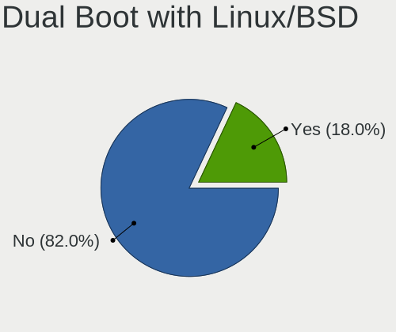

| Dual boot | Desktops | Percent |
|-----------|----------|---------|
| No        | 865      | 81.99%  |
| Yes       | 190      | 18.01%  |

Dual Boot (Win)
---------------

Hosting Linux and Windows

| Dual boot | Desktops | Percent |
|-----------|----------|---------|
| No        | 690      | 65.16%  |
| Yes       | 369      | 34.84%  |

Board
-----

Vendor
------

Motherboard manufacturer

| Name                                 | Desktops | Percent |
|--------------------------------------|----------|---------|
| ASUSTek Computer                     | 224      | 21.68%  |
| Gigabyte Technology                  | 213      | 20.62%  |
| Dell                                 | 123      | 11.91%  |
| Hewlett-Packard                      | 112      | 10.84%  |
| ASRock                               | 47       | 4.55%   |
| MSI                                  | 45       | 4.36%   |
| Lenovo                               | 41       | 3.97%   |
| Intel                                | 40       | 3.87%   |
| ECS                                  | 37       | 3.58%   |
| Biostar                              | 35       | 3.39%   |
| Pegatron                             | 20       | 1.94%   |
| Acer                                 | 13       | 1.26%   |
| Unknown                              | 11       | 1.06%   |
| PCChips                              | 9        | 0.87%   |
| Foxconn                              | 9        | 0.87%   |
| Lanix                                | 7        | 0.68%   |
| eMachines                            | 4        | 0.39%   |
| Alienware                            | 4        | 0.39%   |
| TPV-INVENTA                          | 3        | 0.29%   |
| OEM                                  | 3        | 0.29%   |
| MACHINIST                            | 3        | 0.29%   |
| AZW                                  | 3        | 0.29%   |
| Wistron                              | 2        | 0.19%   |
| Quanta                               | 2        | 0.19%   |
| GMKtec                               | 2        | 0.19%   |
| Gateway                              | 2        | 0.19%   |
| VIA Technologies                     | 1        | 0.1%    |
| Toshiba                              | 1        | 0.1%    |
| System76                             | 1        | 0.1%    |
| Supermicro                           | 1        | 0.1%    |
| Shenzhen Meigao Electronic Equipment | 1        | 0.1%    |
| PELADN                               | 1        | 0.1%    |
| NZXT                                 | 1        | 0.1%    |
| NEC Infrontia                        | 1        | 0.1%    |
| Machenike                            | 1        | 0.1%    |
| ICP / iEi                            | 1        | 0.1%    |
| IBM                                  | 1        | 0.1%    |
| Huanan                               | 1        | 0.1%    |
| HC                                   | 1        | 0.1%    |
| Google                               | 1        | 0.1%    |

Model
-----

Motherboard model

| Name                            | Desktops | Percent |
|---------------------------------|----------|---------|
| ASUS PRIME A320M-K              | 26       | 2.52%   |
| ASUS All Series                 | 15       | 1.45%   |
| Unknown                         | 11       | 1.06%   |
| ASUS PRIME B450M-A II           | 10       | 0.97%   |
| Gigabyte B450M DS3H             | 9        | 0.87%   |
| ASUS PRIME B550M-A AC           | 9        | 0.87%   |
| HP Compaq 6200 Pro SFF PC       | 8        | 0.77%   |
| Dell OptiPlex 9020              | 8        | 0.77%   |
| Dell OptiPlex 7010              | 8        | 0.77%   |
| Gigabyte A320M-S2H              | 7        | 0.68%   |
| ECS A320AM4-M3D                 | 7        | 0.68%   |
| Dell OptiPlex 745               | 7        | 0.68%   |
| Gigabyte GA-880GM-USB3          | 6        | 0.58%   |
| Dell OptiPlex 790               | 6        | 0.58%   |
| Dell OptiPlex 3010              | 6        | 0.58%   |
| ASUS ROG STRIX B450-F GAMING    | 6        | 0.58%   |
| ASUS PRIME B450M-A              | 6        | 0.58%   |
| HP ProDesk 600 G1 SFF           | 5        | 0.48%   |
| Gigabyte B450 AORUS M           | 5        | 0.48%   |
| Dell OptiPlex 755               | 5        | 0.48%   |
| Dell Inspiron 3647              | 5        | 0.48%   |
| Biostar B450MH                  | 5        | 0.48%   |
| Biostar A10N-8800E              | 5        | 0.48%   |
| ASUS M5A78L-M PLUS/USB3         | 5        | 0.48%   |
| Gigabyte H310M H 2.0            | 4        | 0.39%   |
| Gigabyte GA-78LMT-USB3          | 4        | 0.39%   |
| Gigabyte B550M AORUS ELITE      | 4        | 0.39%   |
| Gigabyte A320M-S2H V2           | 4        | 0.39%   |
| Dell OptiPlex 990               | 4        | 0.39%   |
| Dell OptiPlex 760               | 4        | 0.39%   |
| ASUS ROG STRIX X570-E GAMING    | 4        | 0.39%   |
| Alienware X51 R2                | 4        | 0.39%   |
| Pegatron KN278AA-ABM a6430la    | 3        | 0.29%   |
| PCChips P17G                    | 3        | 0.29%   |
| Lenovo ThinkCentre M91p 4524CB9 | 3        | 0.29%   |
| Lanix MINI-TORRE                | 3        | 0.29%   |
| HP Z620 Workstation             | 3        | 0.29%   |
| HP Z420 Workstation             | 3        | 0.29%   |
| HP ProDesk 400 G6 SFF           | 3        | 0.29%   |
| HP Compaq Pro 6305 SFF          | 3        | 0.29%   |

Model Family
------------

Motherboard model prefix

| Name                   | Desktops | Percent |
|------------------------|----------|---------|
| ASUS PRIME             | 88       | 8.52%   |
| Dell OptiPlex          | 78       | 7.55%   |
| HP Compaq              | 41       | 3.97%   |
| Lenovo ThinkCentre     | 36       | 3.48%   |
| ASUS ROG               | 33       | 3.19%   |
| HP ProDesk             | 19       | 1.84%   |
| Dell Inspiron          | 19       | 1.84%   |
| ASUS TUF               | 18       | 1.74%   |
| ASUS All               | 15       | 1.45%   |
| Gigabyte B450M         | 12       | 1.16%   |
| HP EliteDesk           | 11       | 1.06%   |
| Gigabyte B550M         | 11       | 1.06%   |
| Gigabyte A320M-S2H     | 11       | 1.06%   |
| Dell Precision         | 11       | 1.06%   |
| Acer Aspire            | 11       | 1.06%   |
| Unknown                | 11       | 1.06%   |
| Gigabyte B450          | 10       | 0.97%   |
| ASUS M5A78L-M          | 10       | 0.97%   |
| Gigabyte X570          | 9        | 0.87%   |
| ECS A320AM4-M3D        | 7        | 0.68%   |
| ASUS M5A97             | 7        | 0.68%   |
| Gigabyte H310M         | 6        | 0.58%   |
| Gigabyte GA-880GM-USB3 | 6        | 0.58%   |
| Gigabyte H410M         | 5        | 0.48%   |
| Gigabyte GA-78LMT-USB3 | 5        | 0.48%   |
| Gigabyte G1.Sniper     | 5        | 0.48%   |
| Dell Vostro            | 5        | 0.48%   |
| Biostar B450MH         | 5        | 0.48%   |
| Biostar A10N-8800E     | 5        | 0.48%   |
| ASRock B450M           | 5        | 0.48%   |
| HP ProLiant            | 4        | 0.39%   |
| Gigabyte Z390          | 4        | 0.39%   |
| Gigabyte H61M-DS2      | 4        | 0.39%   |
| Gigabyte H110M-H       | 4        | 0.39%   |
| Gigabyte A520M         | 4        | 0.39%   |
| Alienware X51          | 4        | 0.39%   |
| Pegatron KN278AA-ABM   | 3        | 0.29%   |
| Pegatron Compaq        | 3        | 0.29%   |
| PCChips P17G           | 3        | 0.29%   |
| Lanix TITAN            | 3        | 0.29%   |

MFG Year
--------

Motherboard manufacture year

| Year | Desktops | Percent |
|------|----------|---------|
| 2012 | 106      | 10.26%  |
| 2018 | 93       | 9%      |
| 2011 | 88       | 8.52%   |
| 2020 | 79       | 7.65%   |
| 2017 | 77       | 7.45%   |
| 2013 | 70       | 6.78%   |
| 2009 | 67       | 6.49%   |
| 2019 | 55       | 5.32%   |
| 2014 | 55       | 5.32%   |
| 2010 | 52       | 5.03%   |
| 2021 | 47       | 4.55%   |
| 2016 | 42       | 4.07%   |
| 2015 | 41       | 3.97%   |
| 2007 | 40       | 3.87%   |
| 2022 | 32       | 3.1%    |
| 2008 | 31       | 3%      |
| 2023 | 23       | 2.23%   |
| 2006 | 19       | 1.84%   |
| 2005 | 9        | 0.87%   |
| 2024 | 6        | 0.58%   |
| 2003 | 1        | 0.1%    |

Form Factor
-----------

Physical design of the computer

| Name    | Desktops | Percent |
|---------|----------|---------|
| Desktop | 1033     | 100%    |

Secure Boot
-----------

Enabled or disabled

| State    | Desktops | Percent |
|----------|----------|---------|
| Disabled | 1015     | 97.97%  |
| Enabled  | 21       | 2.03%   |

Coreboot
--------

Have coreboot on board

| Used | Desktops | Percent |
|------|----------|---------|
| No   | 1032     | 99.9%   |
| Yes  | 1        | 0.1%    |

RAM Size
--------

Total RAM memory

| Size in GB      | Desktops | Percent |
|-----------------|----------|---------|
| 4.01-8.0        | 224      | 21.09%  |
| 8.01-16.0       | 202      | 19.02%  |
| 16.01-24.0      | 184      | 17.33%  |
| 3.01-4.0        | 181      | 17.04%  |
| 32.01-64.0      | 129      | 12.15%  |
| 24.01-32.0      | 41       | 3.86%   |
| 64.01-256.0     | 37       | 3.48%   |
| 1.01-2.0        | 35       | 3.3%    |
| 2.01-3.0        | 21       | 1.98%   |
| 0.51-1.0        | 5        | 0.47%   |
| More than 256.0 | 1        | 0.09%   |
| 0.01-0.5        | 1        | 0.09%   |
| Unknown         | 1        | 0.09%   |

RAM Used
--------

Used RAM memory

| Used GB     | Desktops | Percent |
|-------------|----------|---------|
| 1.01-2.0    | 388      | 33.54%  |
| 2.01-3.0    | 277      | 23.94%  |
| 4.01-8.0    | 170      | 14.69%  |
| 3.01-4.0    | 165      | 14.26%  |
| 0.51-1.0    | 74       | 6.4%    |
| 8.01-16.0   | 60       | 5.19%   |
| 16.01-24.0  | 7        | 0.61%   |
| 0.01-0.5    | 7        | 0.61%   |
| 24.01-32.0  | 5        | 0.43%   |
| 32.01-64.0  | 2        | 0.17%   |
| 64.01-256.0 | 1        | 0.09%   |
| Unknown     | 1        | 0.09%   |

Total Drives
------------

Number of drives on board

| Drives  | Desktops | Percent |
|---------|----------|---------|
| 1       | 515      | 47.2%   |
| 2       | 300      | 27.5%   |
| 3       | 148      | 13.57%  |
| 4       | 68       | 6.23%   |
| 5       | 24       | 2.2%    |
| 6       | 15       | 1.37%   |
| 0       | 13       | 1.19%   |
| 7       | 6        | 0.55%   |
| 8       | 1        | 0.09%   |
| Unknown | 1        | 0.09%   |

Has CD-ROM
----------

Has CD-ROM on board

| Presented | Desktops | Percent |
|-----------|----------|---------|
| No        | 642      | 61.26%  |
| Yes       | 406      | 38.74%  |

Has Ethernet
------------

Has Ethernet on board

| Presented | Desktops | Percent |
|-----------|----------|---------|
| Yes       | 1025     | 99.23%  |
| No        | 8        | 0.77%   |

Has WiFi
--------

Has WiFi module

| Presented | Desktops | Percent |
|-----------|----------|---------|
| No        | 526      | 50.05%  |
| Yes       | 525      | 49.95%  |

Has Bluetooth
-------------

Has Bluetooth module

| Presented | Desktops | Percent |
|-----------|----------|---------|
| No        | 730      | 69.66%  |
| Yes       | 318      | 30.34%  |

Location
--------

Country
-------

Geographic location (country)

| Country | Desktops | Percent |
|---------|----------|---------|
| Mexico  | 1033     | 100%    |

City
----

Geographic location (city)

| City                  | Desktops | Percent |
|-----------------------|----------|---------|
| Mexico City           | 209      | 18.88%  |
| Guadalajara           | 56       | 5.06%   |
| Tijuana               | 39       | 3.52%   |
| Monterrey             | 36       | 3.25%   |
| Zapopan               | 34       | 3.07%   |
| Mrida               | 23       | 2.08%   |
| Puebla City           | 22       | 1.99%   |
| Tlalnepantla          | 20       | 1.81%   |
| Hermosillo            | 20       | 1.81%   |
| Queretaro             | 17       | 1.54%   |
| Chihuahua City        | 17       | 1.54%   |
| Morelia               | 16       | 1.45%   |
| Mexicali              | 15       | 1.36%   |
| Ciudad Jurez        | 15       | 1.36%   |
| Cuernavaca            | 14       | 1.26%   |
| San Luis Potos City | 13       | 1.17%   |
| Gustavo Adolfo Madero | 13       | 1.17%   |
| Ciudad Nezahualcoyotl | 13       | 1.17%   |
| Quertaro City       | 12       | 1.08%   |
| Toluca                | 11       | 0.99%   |
| Oaxaca City           | 11       | 0.99%   |
| Naucalpan             | 11       | 0.99%   |
| Len                 | 11       | 0.99%   |
| Culiacn             | 11       | 0.99%   |
| Cancn               | 11       | 0.99%   |
| Apodaca               | 11       | 0.99%   |
| Ecatepec              | 10       | 0.9%    |
| Aguascalientes        | 10       | 0.9%    |
| Xalapa                | 9        | 0.81%   |
| Tuxtla Gutirrez     | 9        | 0.81%   |
| Pachuca               | 9        | 0.81%   |
| Iztapalapa            | 9        | 0.81%   |
| Guadalupe             | 9        | 0.81%   |
| Ciudad Obregn       | 9        | 0.81%   |
| Tepic                 | 7        | 0.63%   |
| Parral                | 7        | 0.63%   |
| Mexico                | 7        | 0.63%   |
| Mazatln             | 7        | 0.63%   |
| Ensenada              | 7        | 0.63%   |
| Zacatecas City        | 6        | 0.54%   |

Drives
------

Drive Vendor
------------

Hard drive vendors

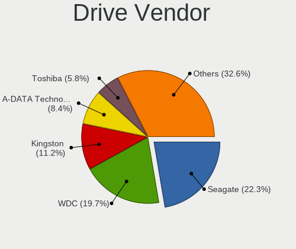

| Vendor                      | Desktops | Drives | Percent |
|-----------------------------|----------|--------|---------|
| Seagate                     | 386      | 611    | 22.33%  |
| WDC                         | 340      | 487    | 19.66%  |
| Kingston                    | 194      | 290    | 11.22%  |
| A-DATA Technology           | 146      | 190    | 8.44%   |
| Toshiba                     | 100      | 133    | 5.78%   |
| Hitachi                     | 98       | 136    | 5.67%   |
| Samsung Electronics         | 72       | 105    | 4.16%   |
| SanDisk                     | 29       | 40     | 1.68%   |
| Kingston Technology Company | 23       | 30     | 1.33%   |
| XPG                         | 21       | 24     | 1.21%   |
| Crucial                     | 21       | 40     | 1.21%   |
| Unknown                     | 20       | 32     | 1.16%   |
| PNY                         | 19       | 26     | 1.1%    |
| Intel                       | 17       | 32     | 0.98%   |
| China                       | 17       | 20     | 0.98%   |
| HGST                        | 15       | 24     | 0.87%   |
| ADATA Technology            | 15       | 18     | 0.87%   |
| Realtek Semiconductor       | 14       | 19     | 0.81%   |
| Maxtor                      | 11       | 13     | 0.64%   |
| Fujitsu                     | 11       | 15     | 0.64%   |
| SK hynix                    | 10       | 18     | 0.58%   |
| Patriot                     | 10       | 14     | 0.58%   |
| Hewlett-Packard             | 10       | 10     | 0.58%   |
| Acer                        | 10       | 12     | 0.58%   |
| Micron/Crucial Technology   | 8        | 13     | 0.46%   |
| Micron Technology           | 8        | 12     | 0.46%   |
| MAXIO Technology (Hangzhou) | 7        | 8      | 0.4%    |
| Gigabyte Technology         | 7        | 8      | 0.4%    |
| Phison Electronics          | 6        | 7      | 0.35%   |
| Phison                      | 5        | 6      | 0.29%   |
| Team                        | 3        | 3      | 0.17%   |
| SPCC                        | 3        | 3      | 0.17%   |
| Quaroni                     | 3        | 3      | 0.17%   |
| Lexar                       | 3        | 3      | 0.17%   |
| JMicron Technology          | 3        | 3      | 0.17%   |
| Biwin Storage Technology    | 3        | 3      | 0.17%   |
| Apple                       | 3        | 3      | 0.17%   |
| Yeyian                      | 2        | 2      | 0.12%   |
| WALRAM                      | 2        | 2      | 0.12%   |
| USB3.0                      | 2        | 2      | 0.12%   |

Drive Model
-----------

Hard drive models

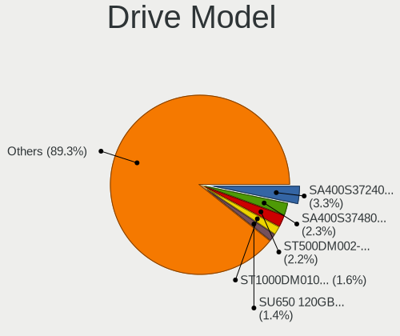

| Model                                                             | Desktops | Percent |
|-------------------------------------------------------------------|----------|---------|
| Kingston SA400S37240G 240GB SSD                                   | 64       | 3.26%   |
| Kingston SA400S37480G 480GB SSD                                   | 45       | 2.29%   |
| Seagate ST500DM002-1BD142 500GB                                   | 43       | 2.19%   |
| Seagate ST1000DM010-2EP102 1TB                                    | 31       | 1.58%   |
| A-DATA SU650 120GB SSD                                            | 27       | 1.37%   |
| A-DATA SU630 240GB SSD                                            | 25       | 1.27%   |
| Kingston SA400S37120G 120GB SSD                                   | 19       | 0.97%   |
| Seagate ST3500418AS 500GB                                         | 16       | 0.81%   |
| Toshiba DT01ACA100 1TB                                            | 15       | 0.76%   |
| Toshiba DT01ACA050 500GB                                          | 15       | 0.76%   |
| Seagate ST1000DM003-1CH162 1TB                                    | 14       | 0.71%   |
| Kingston Company SNV2S1000G 1TB                                   | 14       | 0.71%   |
| A-DATA SU650 240GB SSD                                            | 14       | 0.71%   |
| A-DATA SU630 480GB SSD                                            | 14       | 0.71%   |
| WDC WDS240G2G0A-00JH30 240GB SSD                                  | 13       | 0.66%   |
| WDC WD10EZEX-08WN4A0 1TB                                          | 13       | 0.66%   |
| Seagate ST2000DM008-2FR102 2TB                                    | 13       | 0.66%   |
| Toshiba DT01ACA200 2TB                                            | 12       | 0.61%   |
| Seagate ST1000DM003-1ER162 1TB                                    | 12       | 0.61%   |
| Kingston SA400S37960G 960GB SSD                                   | 12       | 0.61%   |
| Toshiba MQ01ABD100 1TB                                            | 11       | 0.56%   |
| Seagate ST3160815AS 160GB                                         | 10       | 0.51%   |
| Seagate ST2000DM006-2DM164 2TB                                    | 10       | 0.51%   |
| Seagate ST1000DM003-1SB102 1TB                                    | 10       | 0.51%   |
| Seagate ST4000DM004-2CV104 4TB                                    | 9        | 0.46%   |
| Seagate ST31000524AS 1TB                                          | 9        | 0.46%   |
| Kingston SV300S37A120G 120GB SSD                                  | 9        | 0.46%   |
| XPG GAMMIX S11 Pro 512GB                                          | 8        | 0.41%   |
| WDC WD Green 2.5 1000GB SSD                                       | 8        | 0.41%   |
| Seagate ST2000DM001-1CH164 2TB                                    | 8        | 0.41%   |
| Seagate ST2000DL003-9VT166 2TB                                    | 8        | 0.41%   |
| Seagate ST1000LM035-1RK172 1TB                                    | 8        | 0.41%   |
| Hitachi HUA722020ALA331 2TB                                       | 8        | 0.41%   |
| ADATA XPG SX8200 Pro PCIe Gen3x4 M.2 2280 Solid State Drive 256GB | 8        | 0.41%   |
| XPG SPECTRIX S40G 1TB                                             | 7        | 0.36%   |
| WDC WD5000AAKX-60U6AA0 500GB                                      | 7        | 0.36%   |
| WDC WD10EZEX-75M2NA0 1TB                                          | 7        | 0.36%   |
| Seagate ST3500414CS 500GB                                         | 7        | 0.36%   |
| Seagate ST31000528AS 1TB                                          | 7        | 0.36%   |
| Seagate ST1000DM003-9YN162 1TB                                    | 7        | 0.36%   |

HDD Vendor
----------

Hard disk drive vendors

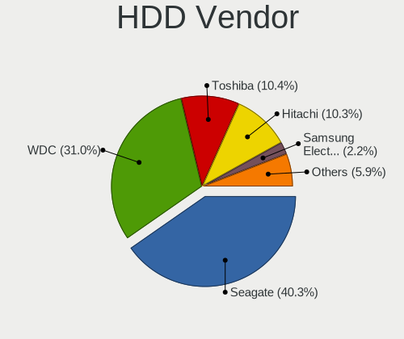

| Vendor              | Desktops | Drives | Percent |
|---------------------|----------|--------|---------|
| Seagate             | 385      | 609    | 40.31%  |
| WDC                 | 296      | 414    | 30.99%  |
| Toshiba             | 99       | 132    | 10.37%  |
| Hitachi             | 98       | 136    | 10.26%  |
| Samsung Electronics | 21       | 24     | 2.2%    |
| HGST                | 15       | 24     | 1.57%   |
| Maxtor              | 11       | 13     | 1.15%   |
| Fujitsu             | 11       | 15     | 1.15%   |
| Unknown             | 6        | 7      | 0.63%   |
| Apple               | 3        | 3      | 0.31%   |
| Hewlett-Packard     | 2        | 1      | 0.21%   |
| SABRENT             | 1        | 2      | 0.1%    |
| QUANTUM             | 1        | 2      | 0.1%    |
| MaxDigital          | 1        | 4      | 0.1%    |
| JMicron Technology  | 1        | 1      | 0.1%    |
| IBM/Hitachi         | 1        | 2      | 0.1%    |
| HPE                 | 1        | 1      | 0.1%    |
| HGST HTS            | 1        | 1      | 0.1%    |
| External            | 1        | 2      | 0.1%    |

SSD Vendor
----------

Solid state drive vendors

| Vendor              | Desktops | Drives | Percent |
|---------------------|----------|--------|---------|
| Kingston            | 175      | 251    | 32.53%  |
| A-DATA Technology   | 132      | 174    | 24.54%  |
| WDC                 | 52       | 67     | 9.67%   |
| Samsung Electronics | 23       | 32     | 4.28%   |
| Crucial             | 19       | 34     | 3.53%   |
| PNY                 | 18       | 25     | 3.35%   |
| China               | 17       | 20     | 3.16%   |
| Patriot             | 10       | 14     | 1.86%   |
| SanDisk             | 9        | 10     | 1.67%   |
| Acer                | 9        | 10     | 1.67%   |
| Intel               | 8        | 10     | 1.49%   |
| Hewlett-Packard     | 8        | 9      | 1.49%   |
| Gigabyte Technology | 6        | 7      | 1.12%   |
| SK hynix            | 5        | 13     | 0.93%   |
| Micron Technology   | 5        | 7      | 0.93%   |
| SPCC                | 3        | 3      | 0.56%   |
| Quaroni             | 3        | 3      | 0.56%   |
| Lexar               | 3        | 3      | 0.56%   |
| Yeyian              | 2        | 2      | 0.37%   |
| USB3.0              | 2        | 2      | 0.37%   |
| Transcend           | 2        | 2      | 0.37%   |
| Team                | 2        | 2      | 0.37%   |
| Blackpcs            | 2        | 2      | 0.37%   |
| VERICO              | 1        | 1      | 0.19%   |
| VALK                | 1        | 1      | 0.19%   |
| Unknown             | 1        | 1      | 0.19%   |
| Toshiba             | 1        | 1      | 0.19%   |
| Timetec             | 1        | 1      | 0.19%   |
| Thinkplus           | 1        | 1      | 0.19%   |
| Plextor             | 1        | 1      | 0.19%   |
| OCZ                 | 1        | 1      | 0.19%   |
| Netac               | 1        | 2      | 0.19%   |
| MSI                 | 1        | 1      | 0.19%   |
| Londisk             | 1        | 1      | 0.19%   |
| LITEON              | 1        | 1      | 0.19%   |
| Lite-On             | 1        | 3      | 0.19%   |
| Lenovo              | 1        | 1      | 0.19%   |
| KingSpec            | 1        | 1      | 0.19%   |
| HS-SSD-C100         | 1        | 1      | 0.19%   |
| Hoodisk             | 1        | 1      | 0.19%   |

Drive Kind
----------

HDD or SSD

| Kind    | Desktops | Drives | Percent |
|---------|----------|--------|---------|
| HDD     | 758      | 1393   | 52.64%  |
| SSD     | 459      | 728    | 31.88%  |
| NVMe    | 202      | 331    | 14.03%  |
| Unknown | 19       | 36     | 1.32%   |
| MMC     | 2        | 2      | 0.14%   |

Drive Connector
---------------

SATA, SAS, NVMe, etc.

| Type | Desktops | Drives | Percent |
|------|----------|--------|---------|
| SATA | 954      | 2082   | 78.58%  |
| NVMe | 202      | 328    | 16.64%  |
| SAS  | 56       | 78     | 4.61%   |
| MMC  | 2        | 2      | 0.16%   |

Drive Size
----------

Size of hard drive

| Size in TB | Desktops | Drives | Percent |
|------------|----------|--------|---------|
| 0.01-0.5   | 749      | 1303   | 57.84%  |
| 0.51-1.0   | 334      | 502    | 25.79%  |
| 1.01-2.0   | 126      | 175    | 9.73%   |
| 3.01-4.0   | 41       | 79     | 3.17%   |
| 2.01-3.0   | 29       | 39     | 2.24%   |
| 4.01-10.0  | 15       | 21     | 1.16%   |
| 10.01-20.0 | 1        | 2      | 0.08%   |

Space Total
-----------

Amount of disk space available on the file system

| Size in GB     | Desktops | Percent |
|----------------|----------|---------|
| 101-250        | 246      | 22%     |
| 251-500        | 217      | 19.41%  |
| 501-1000       | 174      | 15.56%  |
| 1001-2000      | 132      | 11.81%  |
| 1-20           | 95       | 8.5%    |
| 51-100         | 74       | 6.62%   |
| More than 3000 | 68       | 6.08%   |
| 21-50          | 42       | 3.76%   |
| 2001-3000      | 41       | 3.67%   |
| Unknown        | 29       | 2.59%   |

Space Used
----------

Amount of used disk space

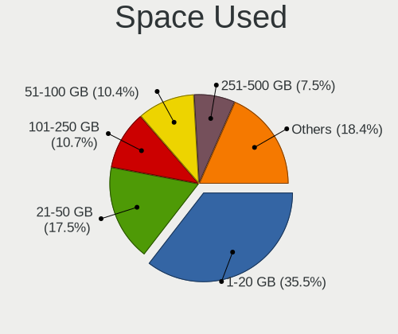

| Used GB        | Desktops | Percent |
|----------------|----------|---------|
| 1-20           | 408      | 35.48%  |
| 21-50          | 201      | 17.48%  |
| 101-250        | 123      | 10.7%   |
| 51-100         | 120      | 10.43%  |
| 251-500        | 86       | 7.48%   |
| 501-1000       | 85       | 7.39%   |
| 1001-2000      | 56       | 4.87%   |
| Unknown        | 29       | 2.52%   |
| More than 3000 | 23       | 2%      |
| 2001-3000      | 17       | 1.48%   |
| 0              | 2        | 0.17%   |

Malfunc. Drives
---------------

Drive models with a malfunction

| Model                             | Desktops | Drives | Percent |
|-----------------------------------|----------|--------|---------|
| Seagate ST3500418AS 500GB         | 5        | 6      | 2.69%   |
| Seagate ST1000DM010-2EP102 1TB    | 4        | 4      | 2.15%   |
| Seagate ST3160815AS 160GB         | 3        | 3      | 1.61%   |
| Seagate ST31000524AS 1TB          | 3        | 5      | 1.61%   |
| Seagate ST2000DL003-9VT166 2TB    | 3        | 3      | 1.61%   |
| Seagate ST1000DM003-9YN162 1TB    | 3        | 3      | 1.61%   |
| Hitachi HUA722020ALA331 2TB       | 3        | 3      | 1.61%   |
| Hitachi HDS721010CLA332 1TB       | 3        | 3      | 1.61%   |
| WDC WD5000AAKX-603CA0 500GB       | 2        | 3      | 1.08%   |
| WDC WD5000AAKX-08U6AA0 500GB      | 2        | 2      | 1.08%   |
| WDC WD40PURZ-85TTDY0 4TB          | 2        | 6      | 1.08%   |
| WDC WD3200AAJS-00YZCA0 320GB      | 2        | 3      | 1.08%   |
| WDC WD Green 2.5 1000GB SSD       | 2        | 2      | 1.08%   |
| Toshiba MQ04ABF100 1TB            | 2        | 2      | 1.08%   |
| Toshiba MQ01ABD100 1TB            | 2        | 2      | 1.08%   |
| Toshiba DT01ACA100 1TB            | 2        | 2      | 1.08%   |
| Seagate ST9500420AS 500GB         | 2        | 2      | 1.08%   |
| Seagate ST500LT012-9WS142 500GB   | 2        | 3      | 1.08%   |
| Seagate ST500DM002-1BD142 500GB   | 2        | 2      | 1.08%   |
| Seagate ST2000DM006-2DM164 2TB    | 2        | 3      | 1.08%   |
| Seagate ST1500DL003-9VT16L 1TB    | 2        | 2      | 1.08%   |
| Seagate ST1000DM003-1ER162 1TB    | 2        | 3      | 1.08%   |
| Maxtor 6Y080M0 82GB               | 2        | 2      | 1.08%   |
| HGST HTS545050A7E380 500GB        | 2        | 3      | 1.08%   |
| A-DATA Technology SU650 240GB SSD | 2        | 2      | 1.08%   |
| WDC WD800JD-00MSA1 80GB           | 1        | 1      | 0.54%   |
| WDC WD800AAJS-00B4A0 80GB         | 1        | 1      | 0.54%   |
| WDC WD6400BEVT-60A0RT0 640GB      | 1        | 1      | 0.54%   |
| WDC WD6400AAKS-65A7B2 640GB       | 1        | 1      | 0.54%   |
| WDC WD60PURZ-85ZUFY1 6TB          | 1        | 1      | 0.54%   |
| WDC WD5002ABYS-02B1B0 500GB       | 1        | 2      | 0.54%   |
| WDC WD5000AVVS-63M8B0 500GB       | 1        | 1      | 0.54%   |
| WDC WD5000AVDS-61U7B1 500GB       | 1        | 1      | 0.54%   |
| WDC WD5000AAVS-57ZTB0 500GB       | 1        | 1      | 0.54%   |
| WDC WD5000AAKX-75U6AA0 500GB      | 1        | 1      | 0.54%   |
| WDC WD5000AAKX-753CA1 500GB       | 1        | 1      | 0.54%   |
| WDC WD5000AADS-56S9B1 500GB       | 1        | 1      | 0.54%   |
| WDC WD5000AACS-61M6B2 500GB       | 1        | 1      | 0.54%   |
| WDC WD3200KS-75PFB0 320GB         | 1        | 1      | 0.54%   |
| WDC WD3200BEKT-75PVMT1 320GB      | 1        | 1      | 0.54%   |

Malfunc. Drive Vendor
---------------------

Vendors of faulty drives

| Vendor                    | Desktops | Drives | Percent |
|---------------------------|----------|--------|---------|
| Seagate                   | 67       | 92     | 39.18%  |
| WDC                       | 44       | 60     | 25.73%  |
| Hitachi                   | 21       | 23     | 12.28%  |
| Toshiba                   | 10       | 14     | 5.85%   |
| Samsung Electronics       | 5        | 5      | 2.92%   |
| Kingston                  | 5        | 5      | 2.92%   |
| A-DATA Technology         | 5        | 5      | 2.92%   |
| Maxtor                    | 3        | 3      | 1.75%   |
| HGST                      | 3        | 4      | 1.75%   |
| Realtek Semiconductor     | 1        | 1      | 0.58%   |
| Micron/Crucial Technology | 1        | 2      | 0.58%   |
| IBM/Hitachi               | 1        | 2      | 0.58%   |
| HGST HTS                  | 1        | 1      | 0.58%   |
| Fujitsu                   | 1        | 1      | 0.58%   |
| China                     | 1        | 1      | 0.58%   |
| Biwin Storage Technology  | 1        | 1      | 0.58%   |
| Apple                     | 1        | 1      | 0.58%   |

Malfunc. HDD Vendor
-------------------

Vendors of faulty HDD drives

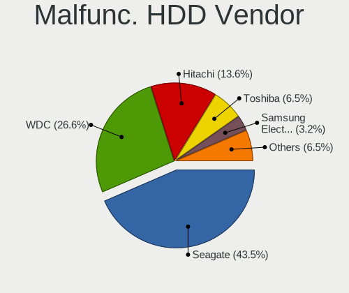

| Vendor              | Desktops | Drives | Percent |
|---------------------|----------|--------|---------|
| Seagate             | 67       | 92     | 43.51%  |
| WDC                 | 41       | 56     | 26.62%  |
| Hitachi             | 21       | 23     | 13.64%  |
| Toshiba             | 10       | 14     | 6.49%   |
| Samsung Electronics | 5        | 5      | 3.25%   |
| Maxtor              | 3        | 3      | 1.95%   |
| HGST                | 3        | 4      | 1.95%   |
| IBM/Hitachi         | 1        | 2      | 0.65%   |
| HGST HTS            | 1        | 1      | 0.65%   |
| Fujitsu             | 1        | 1      | 0.65%   |
| Apple               | 1        | 1      | 0.65%   |

Malfunc. Drive Kind
-------------------

Kinds of faulty drives

| Kind | Desktops | Drives | Percent |
|------|----------|--------|---------|
| HDD  | 136      | 202    | 88.31%  |
| SSD  | 14       | 14     | 9.09%   |
| NVMe | 4        | 5      | 2.6%    |

Failed Drives
-------------

Failed drive models

| Model                             | Desktops | Drives | Percent |
|-----------------------------------|----------|--------|---------|
| Seagate ST3500410AS 500GB         | 2        | 3      | 40%     |
| Seagate ST31500341AS 1TB          | 2        | 3      | 40%     |
| Samsung Electronics HD161GJ 160GB | 1        | 1      | 20%     |

Failed Drive Vendor
-------------------

Failed drive vendors

| Vendor              | Desktops | Drives | Percent |
|---------------------|----------|--------|---------|
| Seagate             | 2        | 6      | 66.67%  |
| Samsung Electronics | 1        | 1      | 33.33%  |

Drive Status
------------

Number of failed and malfunc. drives

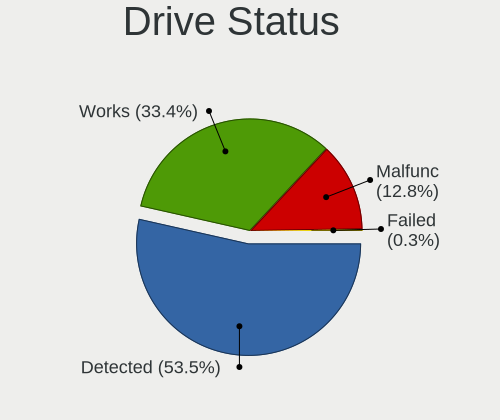

| Status   | Desktops | Drives | Percent |
|----------|----------|--------|---------|
| Detected | 623      | 1413   | 53.52%  |
| Works    | 389      | 849    | 33.42%  |
| Malfunc  | 149      | 221    | 12.8%   |
| Failed   | 3        | 7      | 0.26%   |

Storage controller
------------------

Storage Vendor
--------------

Storage controller vendors

| Vendor                       | Desktops | Percent |
|------------------------------|----------|---------|
| Intel                        | 577      | 44.38%  |
| AMD                          | 399      | 30.69%  |
| Nvidia                       | 45       | 3.46%   |
| Kingston Technology Company  | 44       | 3.38%   |
| ADATA Technology             | 41       | 3.15%   |
| Samsung Electronics          | 28       | 2.15%   |
| SanDisk                      | 26       | 2%      |
| Realtek Semiconductor        | 24       | 1.85%   |
| Marvell Technology Group     | 17       | 1.31%   |
| ASMedia Technology           | 17       | 1.31%   |
| Phison Electronics           | 13       | 1%      |
| Micron/Crucial Technology    | 11       | 0.85%   |
| JMicron Technology           | 10       | 0.77%   |
| MAXIO Technology (Hangzhou)  | 9        | 0.69%   |
| VIA Technologies             | 5        | 0.38%   |
| SK hynix                     | 4        | 0.31%   |
| LSI Logic / Symbios Logic    | 4        | 0.31%   |
| Silicon Image                | 3        | 0.23%   |
| Micron Technology            | 3        | 0.23%   |
| INNOGRIT                     | 3        | 0.23%   |
| Broadcom / LSI               | 3        | 0.23%   |
| Biwin Storage Technology     | 3        | 0.23%   |
| Silicon Motion               | 2        | 0.15%   |
| KIOXIA                       | 2        | 0.15%   |
| Adaptec                      | 2        | 0.15%   |
| Union Memory (Shenzhen)      | 1        | 0.08%   |
| ShenZhen TIGO Semiconductor  | 1        | 0.08%   |
| Shenzhen Longsys Electronics | 1        | 0.08%   |
| Seagate Technology           | 1        | 0.08%   |
| Hewlett-Packard              | 1        | 0.08%   |

Storage Model
-------------

Storage controller models

| Model                                                                                   | Desktops | Percent |
|-----------------------------------------------------------------------------------------|----------|---------|
| AMD FCH SATA Controller [AHCI mode]                                                     | 212      | 12.24%  |
| AMD 400 Series Chipset SATA Controller                                                  | 73       | 4.21%   |
| Intel SATA Controller [RAID mode]                                                       | 62       | 3.58%   |
| Intel 6 Series/C200 Series Chipset Family 6 port Desktop SATA AHCI Controller           | 60       | 3.46%   |
| Intel 8 Series/C220 Series Chipset Family 6-port SATA Controller 1 [AHCI mode]          | 57       | 3.29%   |
| Intel NM10/ICH7 Family SATA Controller [IDE mode]                                       | 55       | 3.18%   |
| AMD 500 Series Chipset SATA Controller                                                  | 55       | 3.18%   |
| AMD A320 Chipset SATA Controller [AHCI mode]                                            | 50       | 2.89%   |
| AMD SB7x0/SB8x0/SB9x0 IDE Controller                                                    | 42       | 2.42%   |
| Intel 82801G (ICH7 Family) IDE Controller                                               | 39       | 2.25%   |
| AMD SB7x0/SB8x0/SB9x0 SATA Controller [IDE mode]                                        | 37       | 2.14%   |
| AMD SB7x0/SB8x0/SB9x0 SATA Controller [AHCI mode]                                       | 35       | 2.02%   |
| Intel Q170/Q150/B150/H170/H110/Z170/CM236 Chipset SATA Controller [AHCI Mode]           | 33       | 1.91%   |
| Intel 200 Series PCH SATA controller [AHCI mode]                                        | 32       | 1.85%   |
| Nvidia MCP61 SATA Controller                                                            | 31       | 1.79%   |
| Intel 7 Series/C210 Series Chipset Family 6-port SATA Controller [AHCI mode]            | 31       | 1.79%   |
| Intel 6 Series/C200 Series Chipset Family Desktop SATA Controller (IDE mode, ports 4-5) | 29       | 1.67%   |
| Intel 6 Series/C200 Series Chipset Family Desktop SATA Controller (IDE mode, ports 0-3) | 29       | 1.67%   |
| Nvidia MCP61 IDE                                                                        | 23       | 1.33%   |
| Intel Cannon Lake PCH SATA AHCI Controller                                              | 23       | 1.33%   |
| ADATA XPG SX8200 Pro PCIe Gen3x4 M.2 2280 Solid State Drive                             | 23       | 1.33%   |
| Kingston Company NV2 NVMe SSD [SM2267XT] (DRAM-less)                                    | 19       | 1.1%    |
| AMD FCH SATA Controller [IDE mode]                                                      | 19       | 1.1%    |
| AMD 300 Series Chipset SATA Controller                                                  | 19       | 1.1%    |
| AMD FCH IDE Controller                                                                  | 17       | 0.98%   |
| ASMedia ASM1061/ASM1062 Serial ATA Controller                                           | 16       | 0.92%   |
| Realtek RTS5762 NVMe SSD Controller                                                     | 15       | 0.87%   |
| Intel 500 Series Chipset Family SATA AHCI Controller                                    | 14       | 0.81%   |
| AMD 600 Series Chipset SATA Controller                                                  | 14       | 0.81%   |
| Intel 4 Series Chipset PT IDER Controller                                               | 13       | 0.75%   |
| Samsung NVMe SSD Controller SM981/PM981/PM983                                           | 12       | 0.69%   |
| Intel 82801JD/DO (ICH10 Family) SATA AHCI Controller                                    | 12       | 0.69%   |
| Intel 82801H (ICH8 Family) 4 port SATA Controller [IDE mode]                            | 12       | 0.69%   |
| Intel C600/X79 series chipset IDE-r Controller                                          | 10       | 0.58%   |
| Intel Atom/Celeron/Pentium Processor x5-E8000/J3xxx/N3xxx Series SATA Controller        | 10       | 0.58%   |
| Intel 82801JI (ICH10 Family) 4 port SATA IDE Controller #1                              | 10       | 0.58%   |
| Intel 82801IR/IO/IH (ICH9R/DO/DH) 4 port SATA Controller [IDE mode]                     | 10       | 0.58%   |
| Intel 82801I (ICH9 Family) 2 port SATA Controller [IDE mode]                            | 10       | 0.58%   |
| Intel 5 Series/3400 Series Chipset 4 port SATA IDE Controller                           | 10       | 0.58%   |
| Intel 5 Series/3400 Series Chipset 2 port SATA IDE Controller                           | 10       | 0.58%   |

Storage Kind
------------

Kind of storage controller (IDE, SATA, NVMe, SAS, ...)

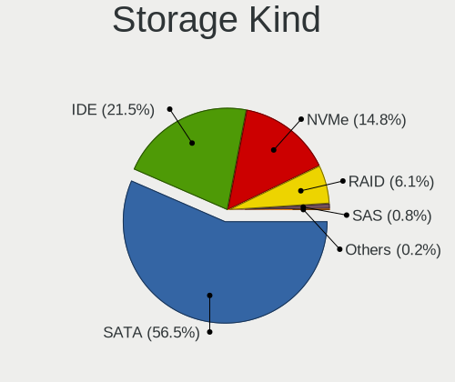

| Kind | Desktops | Percent |
|------|----------|---------|
| SATA | 766      | 56.53%  |
| IDE  | 291      | 21.48%  |
| NVMe | 201      | 14.83%  |
| RAID | 83       | 6.13%   |
| SAS  | 11       | 0.81%   |
| SCSI | 3        | 0.22%   |

Processor
---------

CPU Vendor
----------

Processor vendors

| Vendor       | Desktops | Percent |
|--------------|----------|---------|
| Intel        | 589      | 56.96%  |
| AMD          | 443      | 42.84%  |
| CentaurHauls | 1        | 0.1%    |
| Unknown      | 1        | 0.1%    |

CPU Model
---------

Processor models

| Model                                           | Desktops | Percent |
|-------------------------------------------------|----------|---------|
| AMD Ryzen 5 5600G with Radeon Graphics          | 26       | 2.5%    |
| Intel Core i7-3770 CPU @ 3.40GHz                | 16       | 1.54%   |
| Intel Core i7-4790 CPU @ 3.60GHz                | 15       | 1.44%   |
| Intel Core i5-2400 CPU @ 3.10GHz                | 15       | 1.44%   |
| AMD Ryzen 7 5700G with Radeon Graphics          | 15       | 1.44%   |
| Intel Core i5-3470 CPU @ 3.20GHz                | 14       | 1.35%   |
| Intel Core 2 Duo CPU E8400 @ 3.00GHz            | 14       | 1.35%   |
| AMD Ryzen 5 3600 6-Core Processor               | 14       | 1.35%   |
| AMD Ryzen 3 2200G with Radeon Vega Graphics     | 14       | 1.35%   |
| AMD Ryzen 5 2600 Six-Core Processor             | 13       | 1.25%   |
| AMD Athlon 3000G with Radeon Vega Graphics      | 13       | 1.25%   |
| Intel Core i3-3220 CPU @ 3.30GHz                | 11       | 1.06%   |
| AMD Ryzen 5 5600X 6-Core Processor              | 11       | 1.06%   |
| AMD A8-9600 RADEON R7, 10 COMPUTE CORES 4C+6G   | 11       | 1.06%   |
| Intel Core i3-2100 CPU @ 3.10GHz                | 10       | 0.96%   |
| AMD Ryzen 7 2700 Eight-Core Processor           | 10       | 0.96%   |
| Intel Core i3-2120 CPU @ 3.30GHz                | 9        | 0.87%   |
| AMD Ryzen 9 5950X 16-Core Processor             | 9        | 0.87%   |
| AMD Ryzen 7 2700X Eight-Core Processor          | 9        | 0.87%   |
| AMD Ryzen 3 3200G with Radeon Vega Graphics     | 9        | 0.87%   |
| Intel Core i7-6700 CPU @ 3.40GHz                | 8        | 0.77%   |
| Intel Core i7-4770 CPU @ 3.40GHz                | 8        | 0.77%   |
| Intel Core i7-2600 CPU @ 3.40GHz                | 8        | 0.77%   |
| AMD Ryzen 5 3400G with Radeon Vega Graphics     | 8        | 0.77%   |
| Intel Pentium Dual CPU E2200 @ 2.20GHz          | 7        | 0.67%   |
| Intel Pentium 4 CPU 3.00GHz                     | 7        | 0.67%   |
| Intel Core i5-8400 CPU @ 2.80GHz                | 7        | 0.67%   |
| Intel Core i5-10400 CPU @ 2.90GHz               | 7        | 0.67%   |
| AMD Ryzen 9 3900X 12-Core Processor             | 7        | 0.67%   |
| AMD Ryzen 7 3700X 8-Core Processor              | 7        | 0.67%   |
| Intel Pentium Dual-Core CPU E5800 @ 3.20GHz     | 6        | 0.58%   |
| Intel Core i7-7700 CPU @ 3.60GHz                | 6        | 0.58%   |
| AMD Sempron 145 Processor                       | 6        | 0.58%   |
| AMD Ryzen 9 5900X 12-Core Processor             | 6        | 0.58%   |
| AMD Ryzen 7 5800X 8-Core Processor              | 6        | 0.58%   |
| AMD Ryzen 3 PRO 2200G with Radeon Vega Graphics | 6        | 0.58%   |
| Intel Xeon CPU E5-1650 v2 @ 3.50GHz             | 5        | 0.48%   |
| Intel Pentium CPU G2030 @ 3.00GHz               | 5        | 0.48%   |
| Intel Core i7-7700K CPU @ 4.20GHz               | 5        | 0.48%   |
| Intel Core i5-4590 CPU @ 3.30GHz                | 5        | 0.48%   |

CPU Model Family
----------------

Processor model prefix

| Model                   | Desktops | Percent |
|-------------------------|----------|---------|
| Intel Core i5           | 142      | 13.68%  |
| Intel Core i7           | 97       | 9.34%   |
| AMD Ryzen 5             | 94       | 9.06%   |
| Intel Core i3           | 71       | 6.84%   |
| AMD Ryzen 7             | 63       | 6.07%   |
| Intel Xeon              | 55       | 5.3%    |
| Intel Core 2 Duo        | 45       | 4.34%   |
| AMD FX                  | 36       | 3.47%   |
| Intel Celeron           | 34       | 3.28%   |
| AMD Ryzen 9             | 34       | 3.28%   |
| Other                   | 27       | 2.6%    |
| AMD Ryzen 3             | 26       | 2.5%    |
| Intel Pentium           | 25       | 2.41%   |
| AMD Athlon              | 24       | 2.31%   |
| Intel Pentium Dual-Core | 20       | 1.93%   |
| AMD A8                  | 20       | 1.93%   |
| Intel Core 2 Quad       | 18       | 1.73%   |
| AMD Athlon II X2        | 18       | 1.73%   |
| AMD A6                  | 16       | 1.54%   |
| Intel Pentium Dual      | 15       | 1.45%   |
| AMD A4                  | 14       | 1.35%   |
| Intel Pentium 4         | 13       | 1.25%   |
| AMD A10                 | 13       | 1.25%   |
| AMD Phenom II X4        | 11       | 1.06%   |
| AMD E1                  | 10       | 0.96%   |
| Intel Core 2            | 9        | 0.87%   |
| AMD Athlon 64 X2        | 9        | 0.87%   |
| Intel Core i9           | 8        | 0.77%   |
| AMD Sempron             | 8        | 0.77%   |
| Intel Atom              | 7        | 0.67%   |
| AMD Phenom II X6        | 7        | 0.67%   |
| AMD E                   | 7        | 0.67%   |
| AMD Ryzen 3 PRO         | 6        | 0.58%   |
| AMD Athlon 64           | 5        | 0.48%   |
| Intel Pentium D         | 4        | 0.39%   |
| AMD Athlon II X4        | 4        | 0.39%   |
| AMD Athlon Dual Core    | 4        | 0.39%   |
| Intel Pentium Gold      | 2        | 0.19%   |
| AMD Phenom II X2        | 2        | 0.19%   |
| AMD Phenom              | 2        | 0.19%   |

CPU Cores
---------

Number of processor cores

| Number  | Desktops | Percent |
|---------|----------|---------|
| 4       | 342      | 32.92%  |
| 2       | 332      | 31.95%  |
| 6       | 146      | 14.05%  |
| 8       | 87       | 8.37%   |
| 1       | 63       | 6.06%   |
| 12      | 21       | 2.02%   |
| 16      | 18       | 1.73%   |
| 3       | 12       | 1.15%   |
| 10      | 7        | 0.67%   |
| 14      | 3        | 0.29%   |
| 24      | 2        | 0.19%   |
| Unknown | 2        | 0.19%   |
| 56      | 1        | 0.1%    |
| 28      | 1        | 0.1%    |
| 20      | 1        | 0.1%    |
| 18      | 1        | 0.1%    |

CPU Sockets
-----------

Number of sockets

| Number  | Desktops | Percent |
|---------|----------|---------|
| 1       | 1024     | 99.03%  |
| 2       | 9        | 0.87%   |
| Unknown | 1        | 0.1%    |

CPU Threads
-----------

Threads per core (Hyper-Threading)

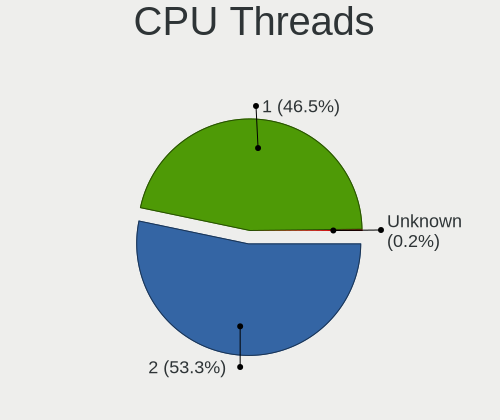

| Number  | Desktops | Percent |
|---------|----------|---------|
| 2       | 553      | 53.28%  |
| 1       | 483      | 46.53%  |
| Unknown | 2        | 0.19%   |

CPU Op-Modes
------------

CPU Operation Modes (32-bit, 64-bit)

| Op mode        | Desktops | Percent |
|----------------|----------|---------|
| 32-bit, 64-bit | 1016     | 97.97%  |
| Unknown        | 13       | 1.25%   |
| 64-bit         | 5        | 0.48%   |
| 32-bit         | 3        | 0.29%   |

CPU Microcode
-------------

Microcode number

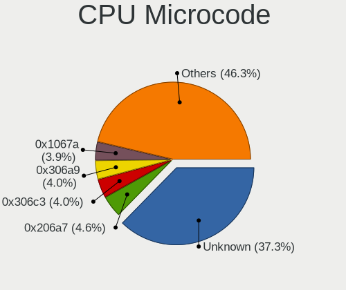

| Number     | Desktops | Percent |
|------------|----------|---------|
| Unknown    | 406      | 37.32%  |
| 0x206a7    | 50       | 4.6%    |
| 0x306c3    | 43       | 3.95%   |
| 0x306a9    | 43       | 3.95%   |
| 0x1067a    | 42       | 3.86%   |
| 0x08101016 | 22       | 2.02%   |
| 0x0800820d | 22       | 2.02%   |
| 0x010000c8 | 21       | 1.93%   |
| 0x6fd      | 19       | 1.75%   |
| 0x08108109 | 18       | 1.65%   |
| 0x0600611a | 18       | 1.65%   |
| 0x0a50000d | 17       | 1.56%   |
| 0x06001119 | 16       | 1.47%   |
| 0x906e9    | 15       | 1.38%   |
| 0x08701021 | 15       | 1.38%   |
| 0x506e3    | 14       | 1.29%   |
| 0x906ea    | 12       | 1.1%    |
| 0x6fb      | 11       | 1.01%   |
| 0xa0653    | 10       | 0.92%   |
| 0x10676    | 10       | 0.92%   |
| 0x06000852 | 10       | 0.92%   |
| 0x0a201016 | 9        | 0.83%   |
| 0x06003106 | 9        | 0.83%   |
| 0x906ed    | 8        | 0.74%   |
| 0x0a50000c | 7        | 0.64%   |
| 0x08701013 | 7        | 0.64%   |
| 0x08001138 | 7        | 0.64%   |
| 0x106e5    | 6        | 0.55%   |
| 0x0a601203 | 6        | 0.55%   |
| 0x0600063e | 6        | 0.55%   |
| 0x6f2      | 5        | 0.46%   |
| 0x206d7    | 5        | 0.46%   |
| 0x106a5    | 5        | 0.46%   |
| 0x08701030 | 5        | 0.46%   |
| 0x0810100b | 5        | 0.46%   |
| 0x03000027 | 5        | 0.46%   |
| 0xf43      | 4        | 0.37%   |
| 0xa0655    | 4        | 0.37%   |
| 0x406c4    | 4        | 0.37%   |
| 0x306f2    | 4        | 0.37%   |

CPU Microarch
-------------

Microarchitecture

| Name             | Desktops | Percent |
|------------------|----------|---------|
| Haswell          | 86       | 8.29%   |
| Zen 3            | 81       | 7.81%   |
| SandyBridge      | 80       | 7.71%   |
| IvyBridge        | 73       | 7.04%   |
| Penryn           | 70       | 6.75%   |
| KabyLake         | 68       | 6.56%   |
| Zen+             | 59       | 5.69%   |
| K10              | 53       | 5.11%   |
| Core             | 45       | 4.34%   |
| Zen              | 44       | 4.24%   |
| Piledriver       | 41       | 3.95%   |
| Zen 2            | 38       | 3.66%   |
| Skylake          | 34       | 3.28%   |
| Unknown          | 34       | 3.28%   |
| Excavator        | 27       | 2.6%    |
| K8 Hammer        | 26       | 2.51%   |
| CometLake        | 26       | 2.51%   |
| NetBurst         | 18       | 1.74%   |
| Steamroller      | 16       | 1.54%   |
| Nehalem          | 16       | 1.54%   |
| Silvermont       | 15       | 1.45%   |
| Bobcat           | 12       | 1.16%   |
| Westmere         | 11       | 1.06%   |
| Bulldozer        | 11       | 1.06%   |
| K10 Llano        | 8        | 0.77%   |
| Alderlake Hybrid | 8        | 0.77%   |
| Icelake          | 6        | 0.58%   |
| Broadwell        | 6        | 0.58%   |
| Bonnell          | 6        | 0.58%   |
| Jaguar           | 5        | 0.48%   |
| Puma             | 4        | 0.39%   |
| Goldmont plus    | 4        | 0.39%   |
| Tremont          | 3        | 0.29%   |
| Sapphire Rapids  | 1        | 0.1%    |
| Gracemont        | 1        | 0.1%    |
| Goldmont         | 1        | 0.1%    |

Graphics
--------

GPU Vendor
----------

Vendors of graphics cards

| Vendor                     | Desktops | Percent |
|----------------------------|----------|---------|
| AMD                        | 422      | 38.05%  |
| Intel                      | 355      | 32.01%  |
| Nvidia                     | 319      | 28.76%  |
| Matrox Electronics Systems | 6        | 0.54%   |
| VIA Technologies           | 3        | 0.27%   |
| ATI Technologies           | 3        | 0.27%   |
| ASPEED Technology          | 1        | 0.09%   |

GPU Model
---------

Graphics card models

| Model                                                                                    | Desktops | Percent |
|------------------------------------------------------------------------------------------|----------|---------|
| Intel Xeon E3-1200 v3/4th Gen Core Processor Integrated Graphics Controller              | 55       | 4.79%   |
| Intel 2nd Generation Core Processor Family Integrated Graphics Controller                | 46       | 4%      |
| Intel Xeon E3-1200 v2/3rd Gen Core processor Graphics Controller                         | 38       | 3.31%   |
| Intel 4 Series Chipset Integrated Graphics Controller                                    | 36       | 3.13%   |
| AMD Cezanne [Radeon Vega Series / Radeon Vega Mobile Series]                             | 31       | 2.7%    |
| AMD Raven Ridge [Radeon Vega Series / Radeon Vega Mobile Series]                         | 28       | 2.44%   |
| AMD Ellesmere [Radeon RX 470/480/570/570X/580/580X/590]                                  | 26       | 2.26%   |
| AMD Picasso/Raven 2 [Radeon Vega Series / Radeon Vega Mobile Series]                     | 25       | 2.18%   |
| AMD Wani [Radeon R5/R6/R7 Graphics]                                                      | 23       | 2%      |
| Nvidia GT218 [GeForce 210]                                                               | 20       | 1.74%   |
| Nvidia GK208B [GeForce GT 710]                                                           | 19       | 1.65%   |
| Intel CoffeeLake-S GT2 [UHD Graphics 630]                                                | 19       | 1.65%   |
| AMD Navi 23 [Radeon RX 6600/6600 XT/6600M]                                               | 19       | 1.65%   |
| AMD Cedar [Radeon HD 5000/6000/7350/8350 Series]                                         | 18       | 1.57%   |
| Nvidia GP106 [GeForce GTX 1060 6GB]                                                      | 17       | 1.48%   |
| Intel HD Graphics 530                                                                    | 16       | 1.39%   |
| AMD Navi 10 [Radeon RX 5600 OEM/5600 XT / 5700/5700 XT]                                  | 16       | 1.39%   |
| Intel 82945G/GZ Integrated Graphics Controller                                           | 15       | 1.31%   |
| Nvidia GP108 [GeForce GT 1030]                                                           | 14       | 1.22%   |
| Intel HD Graphics 630                                                                    | 13       | 1.13%   |
| Nvidia GP107 [GeForce GTX 1050 Ti]                                                       | 12       | 1.04%   |
| Intel CometLake-S GT2 [UHD Graphics 630]                                                 | 12       | 1.04%   |
| AMD Raphael                                                                              | 12       | 1.04%   |
| Nvidia GM107 [GeForce GTX 750 Ti]                                                        | 11       | 0.96%   |
| Nvidia C61 [GeForce 6150SE nForce 430]                                                   | 11       | 0.96%   |
| Intel Atom/Celeron/Pentium Processor x5-E8000/J3xxx/N3xxx Integrated Graphics Controller | 11       | 0.96%   |
| AMD Baffin [Radeon RX 550 640SP / RX 560/560X]                                           | 11       | 0.96%   |
| Intel 82Q963/Q965 Integrated Graphics Controller                                         | 10       | 0.87%   |
| Intel 82G33/G31 Express Integrated Graphics Controller                                   | 10       | 0.87%   |
| AMD Caicos [Radeon HD 6450/7450/8450 / R5 230 OEM]                                       | 10       | 0.87%   |
| Nvidia TU106 [GeForce RTX 2060 Rev. A]                                                   | 9        | 0.78%   |
| Intel IvyBridge GT2 [HD Graphics 4000]                                                   | 9        | 0.78%   |
| AMD Oland [Radeon HD 8570 / R5 430 OEM / R7 240/340 / Radeon 520 OEM]                    | 9        | 0.78%   |
| Nvidia TU117 [GeForce GTX 1650]                                                          | 8        | 0.7%    |
| AMD RS780L [Radeon 3000]                                                                 | 8        | 0.7%    |
| AMD Navi 22 [Radeon RX 6700/6700 XT/6750 XT / 6800M/6850M XT]                            | 8        | 0.7%    |
| Nvidia GF119 [GeForce GT 610]                                                            | 7        | 0.61%   |
| AMD RS880 [Radeon HD 4200]                                                               | 7        | 0.61%   |
| AMD Kaveri [Radeon R7 Graphics]                                                          | 7        | 0.61%   |
| AMD Baffin [Radeon RX 460/560D / Pro 450/455/460/555/555X/560/560X]                      | 7        | 0.61%   |

GPU Combo
---------

Combinations of graphics cards

| Name            | Desktops | Percent |
|-----------------|----------|---------|
| 1 x AMD         | 371      | 35.3%   |
| 1 x Intel       | 314      | 29.88%  |
| 1 x Nvidia      | 280      | 26.64%  |
| 2 x AMD         | 26       | 2.47%   |
| AMD + Nvidia    | 19       | 1.81%   |
| Intel + AMD     | 11       | 1.05%   |
| Intel + Nvidia  | 10       | 0.95%   |
| 2 x Nvidia      | 6        | 0.57%   |
| 1 x Matrox      | 6        | 0.57%   |
| 2 x Intel       | 3        | 0.29%   |
| 1 x VIA         | 2        | 0.19%   |
| 3 x AMD         | 1        | 0.1%    |
| Nvidia + VIA    | 1        | 0.1%    |
| Nvidia + ASPEED | 1        | 0.1%    |

GPU Driver
----------

Free vs proprietary

| Driver      | Desktops | Percent |
|-------------|----------|---------|
| Free        | 863      | 82.03%  |
| Proprietary | 156      | 14.83%  |
| Unknown     | 33       | 3.14%   |

GPU Memory
----------

Total video memory

| Size in GB | Desktops | Percent |
|------------|----------|---------|
| Unknown    | 492      | 45.98%  |
| 0.01-0.5   | 145      | 13.55%  |
| 1.01-2.0   | 139      | 12.99%  |
| 0.51-1.0   | 111      | 10.37%  |
| 7.01-8.0   | 62       | 5.79%   |
| 3.01-4.0   | 55       | 5.14%   |
| 5.01-6.0   | 30       | 2.8%    |
| 8.01-16.0  | 17       | 1.59%   |
| 2.01-3.0   | 13       | 1.21%   |
| 16.01-24.0 | 6        | 0.56%   |

Monitor
-------

Monitor Vendor
--------------

Monitor vendors

| Vendor               | Desktops | Percent |
|----------------------|----------|---------|
| Hewlett-Packard      | 185      | 17%     |
| Dell                 | 153      | 14.06%  |
| Samsung Electronics  | 136      | 12.5%   |
| Goldstar             | 82       | 7.54%   |
| BenQ                 | 65       | 5.97%   |
| Acer                 | 64       | 5.88%   |
| AOC                  | 57       | 5.24%   |
| Unknown              | 36       | 3.31%   |
| ASUSTek Computer     | 23       | 2.11%   |
| Ancor Communications | 23       | 2.11%   |
| Sony                 | 19       | 1.75%   |
| Gateway              | 19       | 1.75%   |
| ViewSonic            | 17       | 1.56%   |
| Lenovo               | 17       | 1.56%   |
| ___                  | 9        | 0.83%   |
| VOR                  | 8        | 0.74%   |
| Sceptre Tech         | 8        | 0.74%   |
| Insignia             | 8        | 0.74%   |
| Roku                 | 7        | 0.64%   |
| Unknown              | 7        | 0.64%   |
| SAC                  | 5        | 0.46%   |
| Philips              | 5        | 0.46%   |
| Panasonic            | 5        | 0.46%   |
| NEC Computers        | 5        | 0.46%   |
| LG Electronics       | 5        | 0.46%   |
| Hitachi              | 5        | 0.46%   |
| FOX                  | 5        | 0.46%   |
| STD                  | 4        | 0.37%   |
| RTK                  | 4        | 0.37%   |
| MSI                  | 4        | 0.37%   |
| Mi                   | 4        | 0.37%   |
| HUAWEI               | 4        | 0.37%   |
| Gigabyte Technology  | 4        | 0.37%   |
| Compaq Computer      | 4        | 0.37%   |
| Yeyian               | 3        | 0.28%   |
| Vizio                | 3        | 0.28%   |
| Planar               | 3        | 0.28%   |
| Plain Tree Systems   | 3        | 0.28%   |
| eMachines            | 3        | 0.28%   |
| AUS                  | 3        | 0.28%   |

Monitor Model
-------------

Monitor models

| Model                                                                 | Desktops | Percent |
|-----------------------------------------------------------------------|----------|---------|
| Samsung Electronics C24F390 SAM0D2C 1920x1080 521x293mm 23.5-inch     | 11       | 0.97%   |
| Hewlett-Packard w1907 HWP26A2 1440x900 408x255mm 18.9-inch            | 9        | 0.79%   |
| BenQ GW2480 BNQ78E7 1920x1080 527x296mm 23.8-inch                     | 9        | 0.79%   |
| Unknown LCD Monitor FFFF 2288x1287 2550x2550mm 142.0-inch             | 7        | 0.62%   |
| Goldstar ULTRAWIDE GSM7770 2560x1080 798x334mm 34.1-inch              | 7        | 0.62%   |
| Ancor Communications ASUS VP228 ACI22C3 1920x1080 476x268mm 21.5-inch | 7        | 0.62%   |
| Unknown                                                               | 7        | 0.62%   |
| ___ LCDTV16 ___3393 1920x1080                                         | 6        | 0.53%   |
| Unknown LCDTV16 3393 1920x1080 1600x900mm 72.3-inch                   | 6        | 0.53%   |
| Samsung Electronics LCD Monitor SAM0C3C 1366x768 609x347mm 27.6-inch  | 6        | 0.53%   |
| Dell E2011H DEL406B 1600x900 443x249mm 20.0-inch                      | 6        | 0.53%   |
| Insignia NS19D310NA21 BBY0019 1680x1050 640x384mm 29.4-inch           | 5        | 0.44%   |
| Hewlett-Packard Compaq WF1907 HWP26A4 1440x900 408x255mm 18.9-inch    | 5        | 0.44%   |
| Hewlett-Packard 2009 HWP2827 1600x900 442x249mm 20.0-inch             | 5        | 0.44%   |
| Goldstar HD GSM5ACB 1366x768 410x230mm 18.5-inch                      | 5        | 0.44%   |
| Goldstar FULL HD GSM5B55 1920x1080 480x270mm 21.7-inch                | 5        | 0.44%   |
| FOX FBC TV FOX9C01 1366x768 698x393mm 31.5-inch                       | 5        | 0.44%   |
| BenQ GW2270 BNQ78DB 1920x1080 476x268mm 21.5-inch                     | 5        | 0.44%   |
| AOC 2343 AOC2343 1920x1080 509x286mm 23.0-inch                        | 5        | 0.44%   |
| VOR LED21300 VOR2150 1920x1080 476x268mm 21.5-inch                    | 4        | 0.35%   |
| Samsung Electronics SyncMaster SAM03E5 1680x1050 474x296mm 22.0-inch  | 4        | 0.35%   |
| Samsung Electronics SMB1930N SAM0632 1360x768 410x230mm 18.5-inch     | 4        | 0.35%   |
| SAC LED MONITOR SAC952D 1920x1080 443x249mm 20.0-inch                 | 4        | 0.35%   |
| Panasonic TV MEIA296 1920x1080 698x392mm 31.5-inch                    | 4        | 0.35%   |
| Hewlett-Packard LV1911 HWP3005 1366x768 410x230mm 18.5-inch           | 4        | 0.35%   |
| Hewlett-Packard All-in-One HWP4218 1600x900 443x249mm 20.0-inch       | 4        | 0.35%   |
| Dell P190S DEL405B 1280x1024 376x301mm 19.0-inch                      | 4        | 0.35%   |
| Dell E1911 DELF036 1440x900 408x255mm 18.9-inch                       | 4        | 0.35%   |
| BenQ G2220HD BNQ7821 1920x1080 477x268mm 21.5-inch                    | 4        | 0.35%   |
| ASUSTek Computer VA24E AUS24D1 1920x1080 527x296mm 23.8-inch          | 4        | 0.35%   |
| AOC Q27G2WG4 AOC2702 2560x1440 597x336mm 27.0-inch                    | 4        | 0.35%   |
| AOC 831W AOC1831 1366x768 410x230mm 18.5-inch                         | 4        | 0.35%   |
| Acer X163W ACR0015 1366x768 344x193mm 15.5-inch                       | 4        | 0.35%   |
| Unknown LCD Monitor SAMSUNG 1366x768                                  | 3        | 0.26%   |
| Samsung Electronics S27D590 SAM0B49 1920x1080 600x340mm 27.2-inch     | 3        | 0.26%   |
| Samsung Electronics S19E310 SAM0C2B 1366x768 410x230mm 18.5-inch      | 3        | 0.26%   |
| Samsung Electronics LF27T35 SAM707F 1920x1080 598x337mm 27.0-inch     | 3        | 0.26%   |
| Samsung Electronics C27F390 SAM0D32 1920x1080 600x340mm 27.2-inch     | 3        | 0.26%   |
| RTK LCD Monitor RTK1D1A 1920x1080 1020x570mm 46.0-inch                | 3        | 0.26%   |
| Hewlett-Packard w1907 HWP26A3 1440x900 408x255mm 18.9-inch            | 3        | 0.26%   |

Monitor Resolution
------------------

Monitor screen resolution

| Resolution         | Desktops | Percent |
|--------------------|----------|---------|
| 1920x1080 (FHD)    | 408      | 39.23%  |
| 1366x768 (WXGA)    | 117      | 11.25%  |
| 1280x1024 (SXGA)   | 77       | 7.4%    |
| 1600x900 (HD+)     | 76       | 7.31%   |
| 1440x900 (WXGA+)   | 72       | 6.92%   |
| 3840x2160 (4K)     | 61       | 5.87%   |
| 1680x1050 (WSXGA+) | 44       | 4.23%   |
| 2560x1440 (QHD)    | 30       | 2.88%   |
| 1360x768           | 25       | 2.4%    |
| 1024x768 (XGA)     | 18       | 1.73%   |
| Unknown            | 18       | 1.73%   |
| 2560x1080          | 17       | 1.63%   |
| 3440x1440          | 14       | 1.35%   |
| 3840x1080          | 11       | 1.06%   |
| 2288x1287          | 10       | 0.96%   |
| 1920x1200 (WUXGA)  | 8        | 0.77%   |
| 1600x1200          | 6        | 0.58%   |
| 1280x960           | 5        | 0.48%   |
| 1280x800 (WXGA)    | 4        | 0.38%   |
| 1920x540           | 3        | 0.29%   |
| 3360x1080          | 2        | 0.19%   |
| 7280x2160          | 1        | 0.1%    |
| 6720x1440          | 1        | 0.1%    |
| 5560x2160          | 1        | 0.1%    |
| 4721x1050          | 1        | 0.1%    |
| 4310x1080          | 1        | 0.1%    |
| 4093x4093          | 1        | 0.1%    |
| 3600x1080          | 1        | 0.1%    |
| 3286x1080          | 1        | 0.1%    |
| 3280x1200          | 1        | 0.1%    |
| 3200x900           | 1        | 0.1%    |
| 1920x2928          | 1        | 0.1%    |
| 1400x1050          | 1        | 0.1%    |
| 1360x765           | 1        | 0.1%    |
| 1280x720 (HD)      | 1        | 0.1%    |

Monitor Diagonal
----------------

Diagonal size in inches

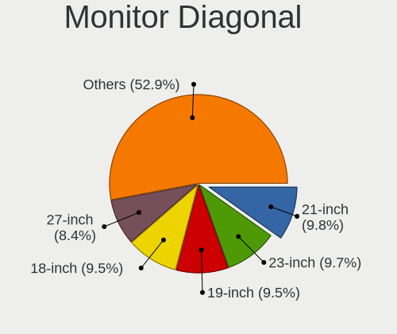

| Inches  | Desktops | Percent |
|---------|----------|---------|
| 21      | 105      | 9.82%   |
| 23      | 104      | 9.73%   |
| 19      | 102      | 9.54%   |
| 18      | 102      | 9.54%   |
| 27      | 90       | 8.42%   |
| 24      | 87       | 8.14%   |
| Unknown | 78       | 7.3%    |
| 20      | 73       | 6.83%   |
| 31      | 62       | 5.8%    |
| 17      | 54       | 5.05%   |
| 15      | 39       | 3.65%   |
| 22      | 31       | 2.9%    |
| 34      | 28       | 2.62%   |
| 72      | 22       | 2.06%   |
| 84      | 15       | 1.4%    |
| 32      | 10       | 0.94%   |
| 40      | 8        | 0.75%   |
| 142     | 7        | 0.65%   |
| 54      | 7        | 0.65%   |
| 29      | 6        | 0.56%   |
| 48      | 4        | 0.37%   |
| 46      | 4        | 0.37%   |
| 49      | 3        | 0.28%   |
| 42      | 3        | 0.28%   |
| 26      | 3        | 0.28%   |
| 25      | 3        | 0.28%   |
| 12      | 3        | 0.28%   |
| 38      | 2        | 0.19%   |
| 36      | 2        | 0.19%   |
| 14      | 2        | 0.19%   |
| 64      | 1        | 0.09%   |
| 52      | 1        | 0.09%   |
| 50      | 1        | 0.09%   |
| 44      | 1        | 0.09%   |
| 43      | 1        | 0.09%   |
| 39      | 1        | 0.09%   |
| 37      | 1        | 0.09%   |
| 33      | 1        | 0.09%   |
| 16      | 1        | 0.09%   |
| 13      | 1        | 0.09%   |

Monitor Width
-------------

Physical width

| Width in mm    | Desktops | Percent |
|----------------|----------|---------|
| 401-500        | 367      | 35.22%  |
| 501-600        | 269      | 25.82%  |
| 301-350        | 86       | 8.25%   |
| Unknown        | 78       | 7.49%   |
| 601-700        | 74       | 7.1%    |
| 351-400        | 42       | 4.03%   |
| 701-800        | 40       | 3.84%   |
| 1501-2000      | 37       | 3.55%   |
| 1001-1500      | 21       | 2.02%   |
| 801-900        | 12       | 1.15%   |
| More than 2000 | 7        | 0.67%   |
| 201-300        | 5        | 0.48%   |
| 901-1000       | 4        | 0.38%   |

Aspect Ratio
------------

Proportional relationship between the width and the height

| Ratio   | Desktops | Percent |
|---------|----------|---------|
| 16/9    | 644      | 65.25%  |
| 16/10   | 124      | 12.56%  |
| 5/4     | 76       | 7.7%    |
| Unknown | 62       | 6.28%   |
| 4/3     | 32       | 3.24%   |
| 21/9    | 30       | 3.04%   |
| 1.00    | 7        | 0.71%   |
| 32/9    | 5        | 0.51%   |
| 6/5     | 3        | 0.3%    |
| 3/2     | 1        | 0.1%    |
| 2.65    | 1        | 0.1%    |
| 2.00    | 1        | 0.1%    |
| 1.96    | 1        | 0.1%    |

Monitor Area
------------

Area in inch

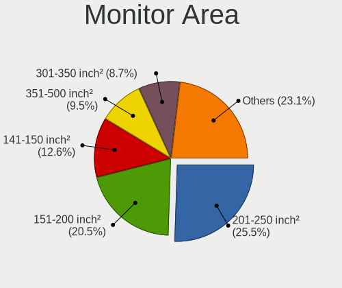

| Area in inch | Desktops | Percent |
|----------------|----------|---------|
| 201-250        | 266      | 25.53%  |
| 151-200        | 214      | 20.54%  |
| 141-150        | 131      | 12.57%  |
| 351-500        | 99       | 9.5%    |
| 301-350        | 91       | 8.73%   |
| Unknown        | 78       | 7.49%   |
| More than 1000 | 55       | 5.28%   |
| 101-110        | 36       | 3.45%   |
| 501-1000       | 28       | 2.69%   |
| 251-300        | 27       | 2.59%   |
| 111-120        | 6        | 0.58%   |
| 131-140        | 5        | 0.48%   |
| 71-80          | 3        | 0.29%   |
| 121-130        | 2        | 0.19%   |
| 81-90          | 1        | 0.1%    |

Pixel Density
-------------

Pixels per inch

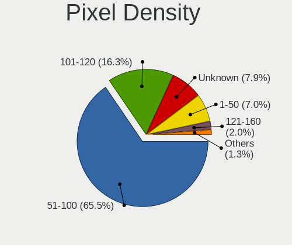

| Density | Desktops | Percent |
|---------|----------|---------|
| 51-100  | 649      | 65.49%  |
| 101-120 | 162      | 16.35%  |
| Unknown | 78       | 7.87%   |
| 1-50    | 69       | 6.96%   |
| 121-160 | 20       | 2.02%   |
| 161-240 | 13       | 1.31%   |

Multiple Monitors
-----------------

Total monitors connected

| Total | Desktops | Percent |
|-------|----------|---------|
| 1     | 836      | 79.02%  |
| 2     | 156      | 14.74%  |
| 0     | 42       | 3.97%   |
| 3     | 22       | 2.08%   |
| 4     | 2        | 0.19%   |

Network
-------

Net Controller Vendor
---------------------

Controller vendors

| Vendor                                | Desktops | Percent |
|---------------------------------------|----------|---------|
| Realtek Semiconductor                 | 681      | 44.71%  |
| Intel                                 | 353      | 23.18%  |
| Qualcomm Atheros                      | 98       | 6.43%   |
| Ralink Technology                     | 63       | 4.14%   |
| Broadcom                              | 50       | 3.28%   |
| TP-Link                               | 37       | 2.43%   |
| Nvidia                                | 37       | 2.43%   |
| Ralink                                | 30       | 1.97%   |
| Qualcomm Atheros Communications       | 30       | 1.97%   |
| MediaTek                              | 24       | 1.58%   |
| Mercucys                              | 15       | 0.98%   |
| Broadcom Limited                      | 13       | 0.85%   |
| Huawei Technologies                   | 10       | 0.66%   |
| Samsung Electronics                   | 9        | 0.59%   |
| Linksys                               | 7        | 0.46%   |
| Motorola PCS                          | 6        | 0.39%   |
| D-Link                                | 5        | 0.33%   |
| VIA Technologies                      | 4        | 0.26%   |
| ASIX Electronics                      | 4        | 0.26%   |
| Microsoft                             | 3        | 0.2%    |
| Marvell Technology Group              | 3        | 0.2%    |
| D-Link System                         | 3        | 0.2%    |
| Xiaomi                                | 2        | 0.13%   |
| Wacom                                 | 2        | 0.13%   |
| Qualcomm                              | 2        | 0.13%   |
| NetGear                               | 2        | 0.13%   |
| ICS Advent                            | 2        | 0.13%   |
| Google                                | 2        | 0.13%   |
| Davicom Semiconductor                 | 2        | 0.13%   |
| Aquantia                              | 2        | 0.13%   |
| 802.11g Adapter [Linksys WUSB54GC v3] | 2        | 0.13%   |
| ZTE WCDMA Technologies MSM            | 1        | 0.07%   |
| Tenda                                 | 1        | 0.07%   |
| Sangoma Technologies                  | 1        | 0.07%   |
| PCTel                                 | 1        | 0.07%   |
| OPPO Electronics                      | 1        | 0.07%   |
| Microchip Technology                  | 1        | 0.07%   |
| Micro Star International              | 1        | 0.07%   |
| LG Electronics                        | 1        | 0.07%   |
| Lenovo                                | 1        | 0.07%   |

Net Controller Model
--------------------

Controller models

| Model                                                                  | Desktops | Percent |
|------------------------------------------------------------------------|----------|---------|
| Realtek RTL8111/8168/8211/8411 PCI Express Gigabit Ethernet Controller | 520      | 30.06%  |
| Intel 82579LM Gigabit Network Connection (Lewisville)                  | 63       | 3.64%   |
| Realtek RTL810xE PCI Express Fast Ethernet controller                  | 45       | 2.6%    |
| Intel I211 Gigabit Network Connection                                  | 40       | 2.31%   |
| Intel Wi-Fi 6 AX200                                                    | 38       | 2.2%    |
| Realtek RTL8125 2.5GbE Controller                                      | 36       | 2.08%   |
| Intel Ethernet Connection I217-LM                                      | 32       | 1.85%   |
| Realtek RTL8188EUS 802.11n Wireless Network Adapter                    | 28       | 1.62%   |
| Realtek RTL8821CE 802.11ac PCIe Wireless Network Adapter               | 26       | 1.5%    |
| Qualcomm Atheros AR9271 802.11n                                        | 26       | 1.5%    |
| Ralink RT2870/RT3070 Wireless Adapter                                  | 25       | 1.45%   |
| Nvidia MCP61 Ethernet                                                  | 25       | 1.45%   |
| Ralink MT7601U Wireless Adapter                                        | 24       | 1.39%   |
| Intel Ethernet Controller I225-V                                       | 22       | 1.27%   |
| Intel Ethernet Connection (2) I219-V                                   | 20       | 1.16%   |
| Intel 82579V Gigabit Network Connection                                | 16       | 0.92%   |
| Intel 82567LM-3 Gigabit Network Connection                             | 16       | 0.92%   |
| Realtek 802.11ac NIC                                                   | 14       | 0.81%   |
| Qualcomm Atheros AR9485 Wireless Network Adapter                       | 13       | 0.75%   |
| Mercucys 802.11n NIC                                                   | 13       | 0.75%   |
| Realtek RTL8192EE PCIe Wireless Network Adapter                        | 12       | 0.69%   |
| Qualcomm Atheros AR9227 Wireless Network Adapter                       | 12       | 0.69%   |
| Intel 82574L Gigabit Network Connection                                | 12       | 0.69%   |
| TP-Link TL-WN823N v2/v3 [Realtek RTL8192EU]                            | 11       | 0.64%   |
| Realtek RTL88x2bu [AC1200 Techkey]                                     | 11       | 0.64%   |
| Realtek RTL8188FTV 802.11b/g/n 1T1R 2.4G WLAN Adapter                  | 11       | 0.64%   |
| Realtek RTL-8185 IEEE 802.11a/b/g Wireless LAN Controller              | 10       | 0.58%   |
| Intel Wi-Fi 6E(802.11ax) AX210/AX1675* 2x2 [Typhoon Peak]              | 10       | 0.58%   |
| Realtek RTL8188CUS 802.11n WLAN Adapter                                | 9        | 0.52%   |
| Realtek RTL-8100/8101L/8139 PCI Fast Ethernet Adapter                  | 9        | 0.52%   |
| MediaTek MT7921K (RZ608) Wi-Fi 6E 80MHz                                | 9        | 0.52%   |
| Intel Ethernet Connection (7) I219-V                                   | 9        | 0.52%   |
| Huawei FOA-LX9                                                         | 9        | 0.52%   |
| Broadcom NetXtreme BCM5761 Gigabit Ethernet PCIe                       | 9        | 0.52%   |
| Realtek RTL8187 Wireless Adapter                                       | 8        | 0.46%   |
| Ralink RT2561/RT61 802.11g PCI                                         | 8        | 0.46%   |
| Intel Ethernet Connection (2) I219-LM                                  | 8        | 0.46%   |
| Intel 82566DM-2 Gigabit Network Connection                             | 8        | 0.46%   |
| Broadcom NetXtreme BCM5754 Gigabit Ethernet PCI Express                | 8        | 0.46%   |
| TP-Link TL-WN722N v2/v3 [Realtek RTL8188EUS]                           | 7        | 0.4%    |

Wireless Vendor
---------------

Wireless vendors

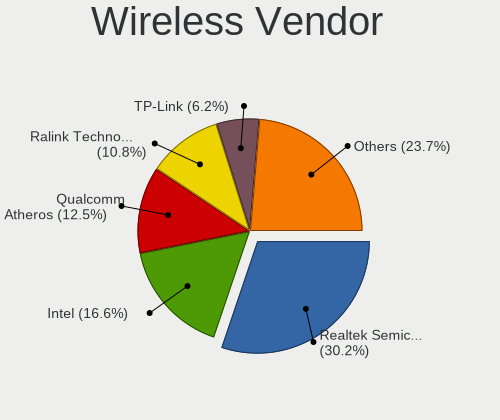

| Vendor                                | Desktops | Percent |
|---------------------------------------|----------|---------|
| Realtek Semiconductor                 | 176      | 30.19%  |
| Intel                                 | 97       | 16.64%  |
| Qualcomm Atheros                      | 73       | 12.52%  |
| Ralink Technology                     | 63       | 10.81%  |
| TP-Link                               | 36       | 6.17%   |
| Ralink                                | 30       | 5.15%   |
| Qualcomm Atheros Communications       | 30       | 5.15%   |
| MediaTek                              | 21       | 3.6%    |
| Mercucys                              | 15       | 2.57%   |
| Broadcom                              | 12       | 2.06%   |
| Linksys                               | 7        | 1.2%    |
| D-Link                                | 5        | 0.86%   |
| Microsoft                             | 3        | 0.51%   |
| Broadcom Limited                      | 3        | 0.51%   |
| Wacom                                 | 2        | 0.34%   |
| NetGear                               | 2        | 0.34%   |
| D-Link System                         | 2        | 0.34%   |
| 802.11g Adapter [Linksys WUSB54GC v3] | 2        | 0.34%   |
| Tenda                                 | 1        | 0.17%   |
| Micro Star International              | 1        | 0.17%   |
| Gemtek                                | 1        | 0.17%   |
| Belkin Components                     | 1        | 0.17%   |

Wireless Model
--------------

Wireless models

| Model                                                               | Desktops | Percent |
|---------------------------------------------------------------------|----------|---------|
| Intel Wi-Fi 6 AX200                                                 | 38       | 6.46%   |
| Realtek RTL8188EUS 802.11n Wireless Network Adapter                 | 28       | 4.76%   |
| Realtek RTL8821CE 802.11ac PCIe Wireless Network Adapter            | 26       | 4.42%   |
| Qualcomm Atheros AR9271 802.11n                                     | 26       | 4.42%   |
| Ralink RT2870/RT3070 Wireless Adapter                               | 25       | 4.25%   |
| Ralink MT7601U Wireless Adapter                                     | 24       | 4.08%   |
| Realtek 802.11ac NIC                                                | 14       | 2.38%   |
| Qualcomm Atheros AR9485 Wireless Network Adapter                    | 13       | 2.21%   |
| Mercucys 802.11n NIC                                                | 13       | 2.21%   |
| Realtek RTL8192EE PCIe Wireless Network Adapter                     | 12       | 2.04%   |
| Qualcomm Atheros AR9227 Wireless Network Adapter                    | 12       | 2.04%   |
| TP-Link TL-WN823N v2/v3 [Realtek RTL8192EU]                         | 11       | 1.87%   |
| Realtek RTL88x2bu [AC1200 Techkey]                                  | 11       | 1.87%   |
| Realtek RTL8188FTV 802.11b/g/n 1T1R 2.4G WLAN Adapter               | 11       | 1.87%   |
| Realtek RTL-8185 IEEE 802.11a/b/g Wireless LAN Controller           | 10       | 1.7%    |
| Intel Wi-Fi 6E(802.11ax) AX210/AX1675* 2x2 [Typhoon Peak]           | 10       | 1.7%    |
| Realtek RTL8188CUS 802.11n WLAN Adapter                             | 9        | 1.53%   |
| MediaTek MT7921K (RZ608) Wi-Fi 6E 80MHz                             | 9        | 1.53%   |
| Realtek RTL8187 Wireless Adapter                                    | 8        | 1.36%   |
| Ralink RT2561/RT61 802.11g PCI                                      | 8        | 1.36%   |
| TP-Link TL-WN722N v2/v3 [Realtek RTL8188EUS]                        | 7        | 1.19%   |
| Realtek RTL8188EE Wireless Network Adapter                          | 7        | 1.19%   |
| Ralink RT5370 Wireless Adapter                                      | 7        | 1.19%   |
| Qualcomm Atheros QCA9565 / AR9565 Wireless Network Adapter          | 7        | 1.19%   |
| Qualcomm Atheros AR9287 Wireless Network Adapter (PCI-Express)      | 7        | 1.19%   |
| Qualcomm Atheros AR2417 Wireless Network Adapter [AR5007G 802.11bg] | 7        | 1.19%   |
| Intel Dual Band Wireless-AC 3168NGW [Stone Peak]                    | 7        | 1.19%   |
| Realtek RTL8192CU 802.11n WLAN Adapter                              | 6        | 1.02%   |
| Qualcomm Atheros AR9285 Wireless Network Adapter (PCI-Express)      | 6        | 1.02%   |
| Intel Wi-Fi 5(802.11ac) Wireless-AC 9x6x [Thunder Peak]             | 6        | 1.02%   |
| TP-Link Archer T2U PLUS [RTL8821AU]                                 | 5        | 0.85%   |
| Ralink RT5390 Wireless 802.11n 1T/1R PCIe                           | 5        | 0.85%   |
| MediaTek MT7922 802.11ax PCI Express Wireless Network Adapter       | 5        | 0.85%   |
| Intel Wireless 3165                                                 | 5        | 0.85%   |
| Intel Alder Lake-S PCH CNVi WiFi                                    | 5        | 0.85%   |
| Broadcom BCM4360 802.11ac Dual Band Wireless Network Adapter        | 5        | 0.85%   |
| Realtek RTL8821CE PCIe 802.11ac Wireless Network Controller         | 4        | 0.68%   |
| Realtek RTL8192EU 802.11b/g/n WLAN Adapter                          | 4        | 0.68%   |
| Ralink RT3090 Wireless 802.11n 1T/1R PCIe                           | 4        | 0.68%   |
| Qualcomm Atheros QCA9377 802.11ac Wireless Network Adapter          | 4        | 0.68%   |

Ethernet Vendor
---------------

Ethernet vendors

| Vendor                     | Desktops | Percent |
|----------------------------|----------|---------|
| Realtek Semiconductor      | 612      | 55.69%  |
| Intel                      | 314      | 28.57%  |
| Broadcom                   | 39       | 3.55%   |
| Nvidia                     | 37       | 3.37%   |
| Qualcomm Atheros           | 28       | 2.55%   |
| Huawei Technologies        | 10       | 0.91%   |
| Broadcom Limited           | 10       | 0.91%   |
| Samsung Electronics        | 6        | 0.55%   |
| Motorola PCS               | 6        | 0.55%   |
| VIA Technologies           | 4        | 0.36%   |
| ASIX Electronics           | 4        | 0.36%   |
| Marvell Technology Group   | 3        | 0.27%   |
| Xiaomi                     | 2        | 0.18%   |
| Qualcomm                   | 2        | 0.18%   |
| MediaTek                   | 2        | 0.18%   |
| ICS Advent                 | 2        | 0.18%   |
| Google                     | 2        | 0.18%   |
| Davicom Semiconductor      | 2        | 0.18%   |
| Aquantia                   | 2        | 0.18%   |
| ZTE WCDMA Technologies MSM | 1        | 0.09%   |
| TP-Link                    | 1        | 0.09%   |
| OPPO Electronics           | 1        | 0.09%   |
| LG Electronics             | 1        | 0.09%   |
| Insyde Software            | 1        | 0.09%   |
| IBM                        | 1        | 0.09%   |
| Hisense                    | 1        | 0.09%   |
| DisplayLink                | 1        | 0.09%   |
| D-Link System              | 1        | 0.09%   |
| ADMtek                     | 1        | 0.09%   |
| Accton Technology          | 1        | 0.09%   |
| 3Com                       | 1        | 0.09%   |

Ethernet Model
--------------

Ethernet models

| Model                                                                  | Desktops | Percent |
|------------------------------------------------------------------------|----------|---------|
| Realtek RTL8111/8168/8211/8411 PCI Express Gigabit Ethernet Controller | 520      | 45.98%  |
| Intel 82579LM Gigabit Network Connection (Lewisville)                  | 63       | 5.57%   |
| Realtek RTL810xE PCI Express Fast Ethernet controller                  | 45       | 3.98%   |
| Intel I211 Gigabit Network Connection                                  | 40       | 3.54%   |
| Realtek RTL8125 2.5GbE Controller                                      | 36       | 3.18%   |
| Intel Ethernet Connection I217-LM                                      | 32       | 2.83%   |
| Nvidia MCP61 Ethernet                                                  | 25       | 2.21%   |
| Intel Ethernet Controller I225-V                                       | 22       | 1.95%   |
| Intel Ethernet Connection (2) I219-V                                   | 20       | 1.77%   |
| Intel 82579V Gigabit Network Connection                                | 16       | 1.41%   |
| Intel 82567LM-3 Gigabit Network Connection                             | 16       | 1.41%   |
| Intel 82574L Gigabit Network Connection                                | 12       | 1.06%   |
| Realtek RTL-8100/8101L/8139 PCI Fast Ethernet Adapter                  | 9        | 0.8%    |
| Intel Ethernet Connection (7) I219-V                                   | 9        | 0.8%    |
| Huawei FOA-LX9                                                         | 9        | 0.8%    |
| Broadcom NetXtreme BCM5761 Gigabit Ethernet PCIe                       | 9        | 0.8%    |
| Intel Ethernet Connection (2) I219-LM                                  | 8        | 0.71%   |
| Intel 82566DM-2 Gigabit Network Connection                             | 8        | 0.71%   |
| Broadcom NetXtreme BCM5754 Gigabit Ethernet PCI Express                | 8        | 0.71%   |
| Intel Ethernet Connection I217-V                                       | 7        | 0.62%   |
| Samsung Galaxy series, misc. (tethering mode)                          | 6        | 0.53%   |
| Intel Ethernet Connection (14) I219-V                                  | 6        | 0.53%   |
| Realtek RTL8852BE PCIe 802.11ax Wireless Network Controller            | 5        | 0.44%   |
| Realtek RTL8153 Gigabit Ethernet Adapter                               | 5        | 0.44%   |
| Qualcomm Atheros Killer E2500 Gigabit Ethernet Controller              | 5        | 0.44%   |
| Motorola PCS moto g84 5G                                               | 5        | 0.44%   |
| Intel Ethernet Connection (11) I219-V                                  | 5        | 0.44%   |
| Qualcomm Atheros AR8151 v2.0 Gigabit Ethernet                          | 4        | 0.35%   |
| Qualcomm Atheros AR8151 v1.0 Gigabit Ethernet                          | 4        | 0.35%   |
| Nvidia MCP79 Ethernet                                                  | 4        | 0.35%   |
| Intel I210 Gigabit Network Connection                                  | 4        | 0.35%   |
| Intel Ethernet Connection (2) I218-V                                   | 4        | 0.35%   |
| Intel Ethernet Connection (17) I219-LM                                 | 4        | 0.35%   |
| Intel 82566DM Gigabit Network Connection                               | 4        | 0.35%   |
| Broadcom NetXtreme BCM5764M Gigabit Ethernet PCIe                      | 4        | 0.35%   |
| Broadcom NetXtreme BCM5751 Gigabit Ethernet PCI Express                | 4        | 0.35%   |
| VIA VT6102/VT6103 [Rhine-II]                                           | 3        | 0.27%   |
| Qualcomm Atheros AR8161 Gigabit Ethernet                               | 3        | 0.27%   |
| Qualcomm Atheros AR8152 v2.0 Fast Ethernet                             | 3        | 0.27%   |
| Intel NM10/ICH7 Family LAN Controller                                  | 3        | 0.27%   |

Net Controller Kind
-------------------

Ethernet, WiFi or modem

| Kind     | Desktops | Percent |
|----------|----------|---------|
| Ethernet | 1025     | 65.79%  |
| WiFi     | 522      | 33.5%   |
| Modem    | 7        | 0.45%   |
| Unknown  | 4        | 0.26%   |

Used Controller
---------------

Currently used network controller

| Kind     | Desktops | Percent |
|----------|----------|---------|
| Ethernet | 760      | 69.41%  |
| WiFi     | 334      | 30.5%   |
| Unknown  | 1        | 0.09%   |

NICs
----

Total network controllers on board

| Total | Desktops | Percent |
|-------|----------|---------|
| 1     | 685      | 65.87%  |
| 2     | 318      | 30.58%  |
| 3     | 24       | 2.31%   |
| 0     | 6        | 0.58%   |
| 4     | 4        | 0.38%   |
| 8     | 1        | 0.1%    |
| 6     | 1        | 0.1%    |
| 5     | 1        | 0.1%    |

IPv6
----

IPv6 vs IPv4

| Used | Desktops | Percent |
|------|----------|---------|
| No   | 710      | 66.17%  |
| Yes  | 363      | 33.83%  |

Bluetooth
---------

Bluetooth Vendor
----------------

Controller vendors

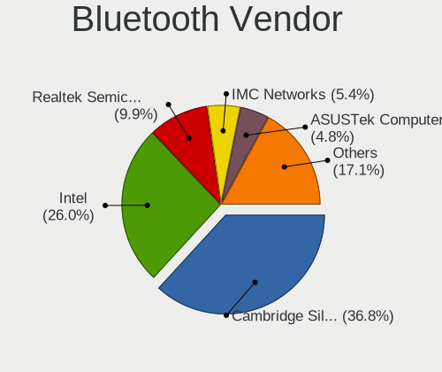

| Vendor                          | Desktops | Percent |
|---------------------------------|----------|---------|
| Cambridge Silicon Radio         | 123      | 36.83%  |
| Intel                           | 87       | 26.05%  |
| Realtek Semiconductor           | 33       | 9.88%   |
| IMC Networks                    | 18       | 5.39%   |
| ASUSTek Computer                | 16       | 4.79%   |
| MediaTek                        | 13       | 3.89%   |
| Qualcomm Atheros Communications | 11       | 3.29%   |
| TP-Link                         | 9        | 2.69%   |
| Broadcom                        | 5        | 1.5%    |
| Lite-On Technology              | 3        | 0.9%    |
| Dell                            | 3        | 0.9%    |
| Realtek                         | 2        | 0.6%    |
| Apple                           | 2        | 0.6%    |
| SiW                             | 1        | 0.3%    |
| Roper                           | 1        | 0.3%    |
| Ralink                          | 1        | 0.3%    |
| Micro Star International        | 1        | 0.3%    |
| Integrated System Solution      | 1        | 0.3%    |
| Foxconn / Hon Hai               | 1        | 0.3%    |
| Dynex                           | 1        | 0.3%    |
| Actions                         | 1        | 0.3%    |
| Unknown                         | 1        | 0.3%    |

Bluetooth Model
---------------

Controller models

| Model                                                    | Desktops | Percent |
|----------------------------------------------------------|----------|---------|
| Cambridge Silicon Radio Bluetooth Dongle (HCI mode)      | 123      | 36.83%  |
| Intel AX200 Bluetooth                                    | 37       | 11.08%  |
| Realtek Bluetooth Radio                                  | 27       | 8.08%   |
| IMC Networks Bluetooth Radio                             | 16       | 4.79%   |
| MediaTek Wireless_Device                                 | 13       | 3.89%   |
| Intel Bluetooth wireless interface                       | 13       | 3.89%   |
| TP-Link TP-Link Bluetooth USB Adapter                    | 9        | 2.69%   |
| Intel AX210 Bluetooth                                    | 8        | 2.4%    |
| Intel Wireless-AC 3168 Bluetooth                         | 7        | 2.1%    |
| ASUS Broadcom BCM20702A0 Bluetooth                       | 7        | 2.1%    |
| Qualcomm Atheros AR9462 Bluetooth                        | 6        | 1.8%    |
| Intel Wireless-AC 9260 Bluetooth Adapter                 | 6        | 1.8%    |
| ASUS Bluetooth Radio                                     | 6        | 1.8%    |
| Intel Bluetooth 9460/9560 Jefferson Peak (JfP)           | 5        | 1.5%    |
| Intel AX211 Bluetooth                                    | 5        | 1.5%    |
| Intel AX201 Bluetooth                                    | 5        | 1.5%    |
| Qualcomm Atheros  Bluetooth Device                       | 4        | 1.2%    |
| Realtek  Bluetooth 4.2 Adapter                           | 3        | 0.9%    |
| Dell Broadcom BCM20702A0 Bluetooth                       | 3        | 0.9%    |
| Realtek Bluetooth 5.3 Radio                              | 2        | 0.6%    |
| Realtek Bluetooth Radio                                  | 2        | 0.6%    |
| SiW SiW                                                  | 1        | 0.3%    |
| Roper Class 1 Bluetooth Dongle                           | 1        | 0.3%    |
| Realtek RTL8821A Bluetooth                               | 1        | 0.3%    |
| Ralink RT3290 Bluetooth                                  | 1        | 0.3%    |
| Qualcomm Atheros AR3011 Bluetooth                        | 1        | 0.3%    |
| Micro Star International Bluetooth Device                | 1        | 0.3%    |
| Lite-On Wireless_Device                                  | 1        | 0.3%    |
| Lite-On Qualcomm Atheros QCA9377 Bluetooth               | 1        | 0.3%    |
| Lite-On Bluetooth Device                                 | 1        | 0.3%    |
| Intel Centrino Advanced-N 6230 Bluetooth adapter         | 1        | 0.3%    |
| Integrated System Solution Bluetooth Device              | 1        | 0.3%    |
| IMC Networks Wireless_Device                             | 1        | 0.3%    |
| IMC Networks Bluetooth module                            | 1        | 0.3%    |
| Foxconn / Hon Hai Wireless_Device                        | 1        | 0.3%    |
| Dynex Bluetooth 4.0 Adapter [Broadcom, 1.12, BCM20702A0] | 1        | 0.3%    |
| Broadcom HP Portable Bumble Bee                          | 1        | 0.3%    |
| Broadcom HP Bluetooth Module                             | 1        | 0.3%    |
| Broadcom HP Bluethunder                                  | 1        | 0.3%    |
| Broadcom BCM20702A0 Bluetooth 4.0                        | 1        | 0.3%    |

Sound
-----

Sound Vendor
------------

Sound card vendors

| Vendor                                       | Desktops | Percent |
|----------------------------------------------|----------|---------|
| Intel                                        | 562      | 37.07%  |
| AMD                                          | 494      | 32.59%  |
| Nvidia                                       | 297      | 19.59%  |
| C-Media Electronics                          | 29       | 1.91%   |
| Texas Instruments                            | 13       | 0.86%   |
| Logitech                                     | 13       | 0.86%   |
| Generalplus Technology                       | 13       | 0.86%   |
| Creative Labs                                | 10       | 0.66%   |
| ASUSTek Computer                             | 9        | 0.59%   |
| Corsair                                      | 7        | 0.46%   |
| VIA Technologies                             | 6        | 0.4%    |
| Zoran Co. Personal Media Division (Nogatech) | 5        | 0.33%   |
| Razer USA                                    | 5        | 0.33%   |
| JMTek                                        | 5        | 0.33%   |
| Kingston Technology                          | 4        | 0.26%   |
| Jieli Technology                             | 3        | 0.2%    |
| GN Netcom                                    | 3        | 0.2%    |
| Focusrite-Novation                           | 3        | 0.2%    |
| ATI Technologies                             | 3        | 0.2%    |
| SAVITECH                                     | 2        | 0.13%   |
| Microsoft                                    | 2        | 0.13%   |
| M-Audio                                      | 2        | 0.13%   |
| Hewlett-Packard                              | 2        | 0.13%   |
| Creative Technology                          | 2        | 0.13%   |
| Tenx Technology                              | 1        | 0.07%   |
| Syntek                                       | 1        | 0.07%   |
| Soundprese                                   | 1        | 0.07%   |
| Sony                                         | 1        | 0.07%   |
| Shure                                        | 1        | 0.07%   |
| RODE Microphones                             | 1        | 0.07%   |
| Realtek Semiconductor                        | 1        | 0.07%   |
| Plantronics                                  | 1        | 0.07%   |
| Micro Star International                     | 1        | 0.07%   |
| Lenovo                                       | 1        | 0.07%   |
| GS3                                          | 1        | 0.07%   |
| Giga-Byte Technology                         | 1        | 0.07%   |
| FiiO Electronics Technology                  | 1        | 0.07%   |
| Dell                                         | 1        | 0.07%   |
| Comtrue                                      | 1        | 0.07%   |
| Cirrus Logic                                 | 1        | 0.07%   |

Sound Model
-----------

Sound card models

| Model                                                                      | Desktops | Percent |
|----------------------------------------------------------------------------|----------|---------|
| AMD Family 17h/19h/1ah HD Audio Controller                                 | 117      | 6.16%   |
| Intel 6 Series/C200 Series Chipset Family High Definition Audio Controller | 91       | 4.79%   |
| AMD SBx00 Azalia (Intel HDA)                                               | 75       | 3.95%   |
| Intel 8 Series/C220 Series Chipset High Definition Audio Controller        | 72       | 3.79%   |
| AMD Starship/Matisse HD Audio Controller                                   | 72       | 3.79%   |
| AMD FCH Azalia Controller                                                  | 62       | 3.26%   |
| Intel Xeon E3-1200 v3/4th Gen Core Processor HD Audio Controller           | 58       | 3.05%   |
| Intel NM10/ICH7 Family High Definition Audio Controller                    | 54       | 2.84%   |
| AMD Raven/Raven2/Fenghuang HDMI/DP Audio Controller                        | 53       | 2.79%   |
| AMD Renoir Radeon High Definition Audio Controller                         | 47       | 2.47%   |
| AMD Family 17h (Models 00h-0fh) HD Audio Controller                        | 46       | 2.42%   |
| Intel 7 Series/C216 Chipset Family High Definition Audio Controller        | 43       | 2.26%   |
| Intel 100 Series/C230 Series Chipset Family HD Audio Controller            | 37       | 1.95%   |
| Intel 200 Series PCH HD Audio                                              | 36       | 1.89%   |
| AMD Oland/Hainan/Cape Verde/Pitcairn HDMI Audio [Radeon HD 7000 Series]    | 34       | 1.79%   |
| AMD Navi 21/23 HDMI/DP Audio Controller                                    | 32       | 1.68%   |
| Nvidia MCP61 High Definition Audio                                         | 31       | 1.63%   |
| AMD Kabini HDMI/DP Audio                                                   | 31       | 1.63%   |
| AMD Ellesmere HDMI Audio [Radeon RX 470/480 / 570/580/590]                 | 31       | 1.63%   |
| Nvidia GK208 HDMI/DP Audio Controller                                      | 26       | 1.37%   |
| Intel Cannon Lake PCH cAVS                                                 | 25       | 1.32%   |
| AMD Family 15h (Models 60h-6fh) Audio Controller                           | 25       | 1.32%   |
| AMD Baffin HDMI/DP Audio [Radeon RX 550 640SP / RX 560/560X]               | 23       | 1.21%   |
| Nvidia GP106 High Definition Audio Controller                              | 21       | 1.11%   |
| AMD Navi 10 HDMI Audio                                                     | 21       | 1.11%   |
| Nvidia GP107GL High Definition Audio Controller                            | 20       | 1.05%   |
| Intel 82801JI (ICH10 Family) HD Audio Controller                           | 20       | 1.05%   |
| Intel 82801I (ICH9 Family) HD Audio Controller                             | 20       | 1.05%   |
| Nvidia High Definition Audio Controller                                    | 19       | 1%      |
| Intel 82801JD/DO (ICH10 Family) HD Audio Controller                        | 19       | 1%      |
| AMD Rembrandt Radeon High Definition Audio Controller                      | 18       | 0.95%   |
| Nvidia GM107 High Definition Audio Controller [GeForce 940MX]              | 17       | 0.89%   |
| AMD Trinity HDMI Audio Controller                                          | 17       | 0.89%   |
| Intel 5 Series/3400 Series Chipset High Definition Audio                   | 15       | 0.79%   |
| Nvidia TU116 High Definition Audio Controller                              | 14       | 0.74%   |
| Nvidia GP108 High Definition Audio Controller                              | 14       | 0.74%   |
| Intel C600/X79 series chipset High Definition Audio Controller             | 14       | 0.74%   |
| AMD Cedar HDMI Audio [Radeon HD 5400/6300/7300 Series]                     | 14       | 0.74%   |
| Nvidia TU106 High Definition Audio Controller                              | 13       | 0.68%   |
| Nvidia GA104 High Definition Audio Controller                              | 13       | 0.68%   |

Memory
------

Memory Vendor
-------------

Memory module vendors

| Vendor              | Desktops | Percent |
|---------------------|----------|---------|
| Kingston            | 152      | 23.28%  |
| A-DATA Technology   | 99       | 15.16%  |
| Samsung Electronics | 74       | 11.33%  |
| Unknown             | 69       | 10.57%  |
| SK hynix            | 67       | 10.26%  |
| Corsair             | 48       | 7.35%   |
| Micron Technology   | 34       | 5.21%   |
| Crucial             | 16       | 2.45%   |
| Team                | 12       | 1.84%   |
| Nanya Technology    | 11       | 1.68%   |
| Unknown             | 9        | 1.38%   |
| Ramaxel Technology  | 8        | 1.23%   |
| Patriot             | 6        | 0.92%   |
| G.Skill             | 6        | 0.92%   |
| Elpida              | 6        | 0.92%   |
| Timetec             | 4        | 0.61%   |
| Qimonda             | 4        | 0.61%   |
| PNY                 | 4        | 0.61%   |
| Transcend           | 2        | 0.31%   |
| CSX                 | 2        | 0.31%   |
| Avant               | 2        | 0.31%   |
| Unknown (ABCD)      | 1        | 0.15%   |
| Unknown (8A6B)      | 1        | 0.15%   |
| Unknown (0x0E9D)    | 1        | 0.15%   |
| Unknown (0E97)      | 1        | 0.15%   |
| Unknown (0B92)      | 1        | 0.15%   |
| Silicon Power       | 1        | 0.15%   |
| SGS/Thomson         | 1        | 0.15%   |
| S                   | 1        | 0.15%   |
| Patriot Memory      | 1        | 0.15%   |
| Lexar Co Limited    | 1        | 0.15%   |
| Kimtigo             | 1        | 0.15%   |
| Hewlett-Packard     | 1        | 0.15%   |
| H                   | 1        | 0.15%   |
| Gigabyte Technology | 1        | 0.15%   |
| Atermiter           | 1        | 0.15%   |
| ASint Technology    | 1        | 0.15%   |
| Apacer              | 1        | 0.15%   |
| Aeneon              | 1        | 0.15%   |

Memory Model
------------

Memory module models

| Model                                                  | Desktops | Percent |
|--------------------------------------------------------|----------|---------|
| A-DATA RAM DDR4 3200 8GB DIMM DDR4 3600MT/s            | 21       | 2.86%   |
| Kingston RAM KF3200C16D4/8GX 8GB DIMM DDR4 3600MT/s    | 13       | 1.77%   |
| Unknown                                                | 9        | 1.23%   |
| Kingston RAM KHX2666C16/8G 8GB DIMM DDR4 3466MT/s      | 8        | 1.09%   |
| A-DATA RAM DDR4 2666 8GB DIMM DDR4 3200MT/s            | 8        | 1.09%   |
| Unknown RAM Module 4GB DIMM 1333MT/s                   | 7        | 0.95%   |
| Unknown RAM Module 4GB DIMM DDR3 1333MT/s              | 6        | 0.82%   |
| Kingston RAM KHX3200C16D4/8GX 8GB DIMM DDR4 3733MT/s   | 6        | 0.82%   |
| A-DATA RAM Module 8GB DIMM DDR4 2133MT/s               | 6        | 0.82%   |
| A-DATA RAM DDR4 3000 8GB DIMM DDR4 3600MT/s            | 6        | 0.82%   |
| Team RAM TEAMGROUP-UD4-2666 4GB DIMM DDR4              | 5        | 0.68%   |
| SK hynix RAM HMT351U6CFR8C-PB 4GB DIMM DDR3 1800MT/s   | 5        | 0.68%   |
| Samsung RAM M378B5773CH0-CH9 2GB DIMM DDR3 1867MT/s    | 5        | 0.68%   |
| Samsung RAM M378B5173QH0-CK0 4GB DIMM DDR3 1600MT/s    | 5        | 0.68%   |
| Samsung RAM M378B5173DB0-CK0 4096MB DIMM DDR3 1600MT/s | 5        | 0.68%   |
| Micron RAM 8JTF51264AZ-1G6E1 4GB DIMM 1600MT/s         | 5        | 0.68%   |
| Kingston RAM KF3200C16D4/32GX 32GB DIMM DDR4 3933MT/s  | 5        | 0.68%   |
| Kingston RAM KF3200C16D4/16GX 16GB DIMM DDR4 3200MT/s  | 5        | 0.68%   |
| Corsair RAM CMK16GX4M2D3000C16 8GB DIMM DDR4 3200MT/s  | 5        | 0.68%   |
| A-DATA RAM Module 8GB DIMM DDR4 2400MT/s               | 5        | 0.68%   |
| SK hynix RAM Module 2GB DIMM DDR3 1333MT/s             | 4        | 0.55%   |
| SK hynix RAM HYMP125U64CP8-S6 2GB DIMM DDR2 49926MT/s  | 4        | 0.55%   |
| Samsung RAM Module 2GB DIMM DDR3 1333MT/s              | 4        | 0.55%   |
| Samsung RAM M378B5173EB0-CK0 4GB DIMM DDR3 1600MT/s    | 4        | 0.55%   |
| Kingston RAM Module 2GB DIMM DDR2 800MT/s              | 4        | 0.55%   |
| Kingston RAM Module 1GB DIMM DDR2 667MT/s              | 4        | 0.55%   |
| Kingston RAM KHX2666C15D4/4G 4GB DIMM DDR4 3200MT/s    | 4        | 0.55%   |
| Kingston RAM KHX1866C10D3/8G 8GB DIMM DDR3 2133MT/s    | 4        | 0.55%   |
| Kingston RAM 99U5474-028.A00LF 4GB DIMM DDR3 1333MT/s  | 4        | 0.55%   |
| Kingston RAM 99U5471-012.A00LF 4GB DIMM DDR3 1333MT/s  | 4        | 0.55%   |
| Corsair RAM CMW16GX4M2C3200C16 8GB DIMM DDR4 3733MT/s  | 4        | 0.55%   |
| Corsair RAM CMK8GX4M1A2400C16 8GB DIMM DDR4 3066MT/s   | 4        | 0.55%   |
| A-DATA RAM Module 8GB DIMM DDR3 1600MT/s               | 4        | 0.55%   |
| A-DATA RAM DDR4 2666 8GB DIMM DDR4 2667MT/s            | 4        | 0.55%   |
| A-DATA RAM DDR4 2666 2OZ 8GB DIMM DDR4 3200MT/s        | 4        | 0.55%   |
| Unknown RAM Module 8GB DIMM DDR3 1600MT/s              | 3        | 0.41%   |
| Unknown RAM Module 2GB DIMM                            | 3        | 0.41%   |
| Unknown RAM Module 2048MB DIMM SDRAM                   | 3        | 0.41%   |
| Unknown RAM Module 2048MB DIMM DDR2 667MT/s            | 3        | 0.41%   |
| Team RAM TEAMGROUP-UD4-3000 8GB DIMM DDR4 3200MT/s     | 3        | 0.41%   |

Memory Kind
-----------

Memory module kinds

| Kind    | Desktops | Percent |
|---------|----------|---------|
| DDR4    | 239      | 42.99%  |
| DDR3    | 180      | 32.37%  |
| DDR2    | 46       | 8.27%   |
| SDRAM   | 35       | 6.29%   |
| Unknown | 29       | 5.22%   |
| DDR5    | 14       | 2.52%   |
| DDR     | 8        | 1.44%   |
| LPDDR4  | 3        | 0.54%   |
| LPDDR5  | 1        | 0.18%   |
| DRAM    | 1        | 0.18%   |

Memory Form Factor
------------------

Physical design of the memory module

| Name         | Desktops | Percent |
|--------------|----------|---------|
| DIMM         | 489      | 92.09%  |
| SODIMM       | 34       | 6.4%    |
| Row Of Chips | 3        | 0.56%   |
| RIMM         | 2        | 0.38%   |
| FB-DIMM      | 1        | 0.19%   |
| Chip         | 1        | 0.19%   |
| Unknown      | 1        | 0.19%   |

Memory Size
-----------

Memory module size

| Size  | Desktops | Percent |
|-------|----------|---------|
| 8192  | 183      | 30%     |
| 4096  | 141      | 23.11%  |
| 2048  | 92       | 15.08%  |
| 16384 | 89       | 14.59%  |
| 32768 | 56       | 9.18%   |
| 1024  | 39       | 6.39%   |
| 512   | 7        | 1.15%   |
| 12288 | 1        | 0.16%   |
| 256   | 1        | 0.16%   |
| 128   | 1        | 0.16%   |

Memory Speed
------------

Memory module speed

| Speed   | Desktops | Percent |
|---------|----------|---------|
| 1600    | 97       | 15.59%  |
| 1333    | 73       | 11.74%  |
| 3200    | 61       | 9.81%   |
| 3600    | 56       | 9%      |
| 2667    | 31       | 4.98%   |
| 800     | 29       | 4.66%   |
| 2400    | 26       | 4.18%   |
| 2133    | 25       | 4.02%   |
| 667     | 22       | 3.54%   |
| 3733    | 17       | 2.73%   |
| Unknown | 16       | 2.57%   |
| 2666    | 11       | 1.77%   |
| 1866    | 11       | 1.77%   |
| 3466    | 9        | 1.45%   |
| 1867    | 8        | 1.29%   |
| 1800    | 8        | 1.29%   |
| 533     | 8        | 1.29%   |
| 3000    | 7        | 1.13%   |
| 1067    | 7        | 1.13%   |
| 1066    | 7        | 1.13%   |
| 3400    | 6        | 0.96%   |
| 49926   | 5        | 0.8%    |
| 4800    | 5        | 0.8%    |
| 3933    | 5        | 0.8%    |
| 1639    | 5        | 0.8%    |
| 4000    | 4        | 0.64%   |
| 3800    | 4        | 0.64%   |
| 3066    | 4        | 0.64%   |
| 2800    | 4        | 0.64%   |
| 2200    | 4        | 0.64%   |
| 2048    | 4        | 0.64%   |
| 1331    | 4        | 0.64%   |
| 5600    | 3        | 0.48%   |
| 6400    | 2        | 0.32%   |
| 6000    | 2        | 0.32%   |
| 5200    | 2        | 0.32%   |
| 2000    | 2        | 0.32%   |
| 1334    | 2        | 0.32%   |
| 1332    | 2        | 0.32%   |
| 400     | 2        | 0.32%   |

Printers & scanners
-------------------

Printer Vendor
--------------

Printer device vendors

| Vendor              | Desktops | Percent |
|---------------------|----------|---------|
| Hewlett-Packard     | 17       | 32.69%  |
| Brother Industries  | 14       | 26.92%  |
| Seiko Epson         | 12       | 23.08%  |
| Samsung Electronics | 3        | 5.77%   |
| Canon               | 3        | 5.77%   |
| QinHeng Electronics | 1        | 1.92%   |
| Prolific Technology | 1        | 1.92%   |
| Kyocera             | 1        | 1.92%   |

Printer Model
-------------

Printer device models

| Model                                   | Desktops | Percent |
|-----------------------------------------|----------|---------|
| Seiko Epson L120 Series                 | 4        | 7.55%   |
| HP DeskJet 1110 series                  | 3        | 5.66%   |
| HP LaserJet Professional P 1102w        | 2        | 3.77%   |
| Brother MFC-J460DW                      | 2        | 3.77%   |
| Brother HL-1110 series                  | 2        | 3.77%   |
| Brother DCP-L2540DW                     | 2        | 3.77%   |
| Seiko Epson XP-235 Series               | 1        | 1.89%   |
| Seiko Epson L805 Series                 | 1        | 1.89%   |
| Seiko Epson L382 Series                 | 1        | 1.89%   |
| Seiko Epson L300 Series                 | 1        | 1.89%   |
| Seiko Epson L200 Series                 | 1        | 1.89%   |
| Seiko Epson L1300 Series                | 1        | 1.89%   |
| Seiko Epson ET-4850 Series              | 1        | 1.89%   |
| Seiko Epson ET-3750 Series              | 1        | 1.89%   |
| Seiko Epson ET-2700 Series              | 1        | 1.89%   |
| Samsung Xerox Phaser 3117 Laser Printer | 1        | 1.89%   |
| Samsung ML-1640 Series Laser Printer    | 1        | 1.89%   |
| Samsung M283x Series                    | 1        | 1.89%   |
| QinHeng CH340S                          | 1        | 1.89%   |
| Prolific PL2305 Parallel Port           | 1        | 1.89%   |
| Kyocera FS-1030D printer                | 1        | 1.89%   |
| HP Smart Tank 580-590 series            | 1        | 1.89%   |
| HP OfficeJet Pro 7740 series            | 1        | 1.89%   |
| HP LaserJet P3010 Series                | 1        | 1.89%   |
| HP LaserJet M109-M112                   | 1        | 1.89%   |
| HP LaserJet 1018                        | 1        | 1.89%   |
| HP DeskJet F4200 series                 | 1        | 1.89%   |
| HP DeskJet F300 series                  | 1        | 1.89%   |
| HP DeskJet 4720 series                  | 1        | 1.89%   |
| HP DeskJet 3700 series                  | 1        | 1.89%   |
| HP DeskJet 2620 All-in-One Printer      | 1        | 1.89%   |
| HP Deskjet 2540 series                  | 1        | 1.89%   |
| HP DeskJet 2300 series                  | 1        | 1.89%   |
| Canon PIXMA MG3500 Series               | 1        | 1.89%   |
| Canon PIXMA iP3000x Printer             | 1        | 1.89%   |
| Canon G3000 series                      | 1        | 1.89%   |
| Brother MFC-T910DW                      | 1        | 1.89%   |
| Brother MFC-L3770CDW                    | 1        | 1.89%   |
| Brother MFC-J470DW                      | 1        | 1.89%   |
| Brother HL-2130 series                  | 1        | 1.89%   |

Scanner Vendor
--------------

Scanner device vendors

| Vendor          | Desktops | Percent |
|-----------------|----------|---------|
| Hewlett-Packard | 3        | 60%     |
| Seiko Epson     | 2        | 40%     |

Scanner Model
-------------

Scanner device models

| Model                                              | Desktops | Percent |
|----------------------------------------------------|----------|---------|
| HP ScanJet 4500C/5550C                             | 2        | 40%     |
| Seiko Epson GT-X820 [Perfection V600 Photo]        | 1        | 20%     |
| Seiko Epson GT-8400UF [Perfection 1670/1670 PHOTO] | 1        | 20%     |
| HP ScanJet 3300c                                   | 1        | 20%     |

Camera
------

Camera Vendor
-------------

Camera device vendors

| Vendor                        | Desktops | Percent |
|-------------------------------|----------|---------|
| Logitech                      | 50       | 23.47%  |
| Generalplus Technology        | 25       | 11.74%  |
| Microdia                      | 21       | 9.86%   |
| Chicony Electronics           | 17       | 7.98%   |
| Microsoft                     | 9        | 4.23%   |
| Jieli Technology              | 9        | 4.23%   |
| Samsung Electronics           | 8        | 3.76%   |
| GEMBIRD                       | 7        | 3.29%   |
| Sunplus Innovation Technology | 6        | 2.82%   |
| KYE Systems (Mouse Systems)   | 6        | 2.82%   |
| Realtek Semiconductor         | 5        | 2.35%   |
| MacroSilicon                  | 5        | 2.35%   |
| Apple                         | 5        | 2.35%   |
| Z-Star Microelectronics       | 4        | 1.88%   |
| LG Electronics                | 3        | 1.41%   |
| Hewlett-Packard               | 3        | 1.41%   |
| Xiongmai                      | 2        | 0.94%   |
| Syntek                        | 2        | 0.94%   |
| Razer USA                     | 2        | 0.94%   |
| Genesys Logic                 | 2        | 0.94%   |
| Creative Technology           | 2        | 0.94%   |
| Alcor Micro                   | 2        | 0.94%   |
| XHT-210518                    | 1        | 0.47%   |
| Unknown                       | 1        | 0.47%   |
| Sunplus Technology            | 1        | 0.47%   |
| Sonix Technology              | 1        | 0.47%   |
| Silicon Motion                | 1        | 0.47%   |
| Ruision                       | 1        | 0.47%   |
| OPPO Electronics              | 1        | 0.47%   |
| Novatel Wireless              | 1        | 0.47%   |
| Linux Foundation HS           | 1        | 0.47%   |
| lihappe8                      | 1        | 0.47%   |
| IMC Networks                  | 1        | 0.47%   |
| Huawei Technologies           | 1        | 0.47%   |
| Guillemot                     | 1        | 0.47%   |
| Cubeternet                    | 1        | 0.47%   |
| AVerMedia Technologies        | 1        | 0.47%   |
| Aveo Technology               | 1        | 0.47%   |
| ARC International             | 1        | 0.47%   |
| 2M UVC CAMERA                 | 1        | 0.47%   |

Camera Model
------------

Camera device models

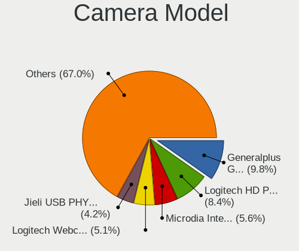

| Model                                                 | Desktops | Percent |
|-------------------------------------------------------|----------|---------|
| Generalplus GENERAL WEBCAM                            | 21       | 9.77%   |
| Logitech HD Pro Webcam C920                           | 18       | 8.37%   |
| Microdia Integrated Camera                            | 12       | 5.58%   |
| Logitech Webcam C270                                  | 11       | 5.12%   |
| Jieli USB PHY 2.0                                     | 9        | 4.19%   |
| Samsung Galaxy series, misc. (MTP mode)               | 8        | 3.72%   |
| MacroSilicon USB Video                                | 5        | 2.33%   |
| Logitech Webcam C170                                  | 5        | 2.33%   |
| GEMBIRD Generic UVC 1.00 camera [AppoTech AX2311]     | 5        | 2.33%   |
| Chicony HP High Definition 1MP Webcam                 | 5        | 2.33%   |
| Chicony HP 0.3MP Webcam                               | 4        | 1.86%   |
| Sunplus DICOTA 4K                                     | 3        | 1.4%    |
| Realtek HP 1.0MP High Definition Webcam               | 3        | 1.4%    |
| Microsoft LifeCam HD-3000                             | 3        | 1.4%    |
| Microdia USB Camera                                   | 3        | 1.4%    |
| Logitech Webcam Pro 9000                              | 3        | 1.4%    |
| LG LM-X420xxx/G2/G3 Android Phone (MTP/download mode) | 3        | 1.4%    |
| KYE Systems (Mouse Systems) Genius FaceCam 320        | 3        | 1.4%    |
| HP Webcam HD-2200                                     | 3        | 1.4%    |
| Generalplus 808 Camera #9 (web-cam mode)              | 3        | 1.4%    |
| Apple iPhone 5/5C/5S/6/SE/7/8/X/XR                    | 3        | 1.4%    |
| Z-Star Venus USB2.0 Camera                            | 2        | 0.93%   |
| Xiongmai web camera                                   | 2        | 0.93%   |
| Razer USA Razer Kiyo Pro                              | 2        | 0.93%   |
| Microdia Webcam Vitade AF                             | 2        | 0.93%   |
| Logitech HD Webcam C525                               | 2        | 0.93%   |
| Logitech C922 Pro Stream Webcam                       | 2        | 0.93%   |
| KYE Systems (Mouse Systems) PC-LM1E Camera            | 2        | 0.93%   |
| GEMBIRD USB2.0 PC CAMERA                              | 2        | 0.93%   |
| Chicony CNF8050 Webcam                                | 2        | 0.93%   |
| Apple iPhone 4                                        | 2        | 0.93%   |
| Alcor Micro USB 2.0 PC Camera                         | 2        | 0.93%   |
| Z-Star Sirius USB2.0 Camera                           | 1        | 0.47%   |
| Z-Star Lenovo IdeaCentre Web Camera                   | 1        | 0.47%   |
| XHT-210518 EC500X                                     | 1        | 0.47%   |
| Unknown HD camera                                     | 1        | 0.47%   |
| Syntek USB Video Device                               | 1        | 0.47%   |
| Syntek Integrated RGB Camera                          | 1        | 0.47%   |
| Sunplus USB2.0 2M WebCam                              | 1        | 0.47%   |
| Sunplus USB 2.0 Camera                                | 1        | 0.47%   |

Security
--------

Fingerprint Vendor
------------------

Fingerprint sensor vendors

| Vendor                | Desktops | Percent |
|-----------------------|----------|---------|
| DigitalPersona        | 3        | 75%     |
| LighTuning Technology | 1        | 25%     |

Fingerprint Model
-----------------

Fingerprint sensor models

| Model                                                  | Desktops | Percent |
|--------------------------------------------------------|----------|---------|
| DigitalPersona Fingerprint Reader                      | 2        | 50%     |
| LighTuning Fingerprint Sensor                          | 1        | 25%     |
| DigitalPersona DigitalPersona, Inc. Fingerprint Reader | 1        | 25%     |

Chipcard Vendor
---------------

Chipcard module vendors

| Vendor                | Desktops | Percent |
|-----------------------|----------|---------|
| Advanced Card Systems | 1        | 100%    |

Chipcard Model
--------------

Chipcard module models

| Model                         | Desktops | Percent |
|-------------------------------|----------|---------|
| Advanced Card Systems ACR122U | 1        | 100%    |

Unsupported
-----------

Unsupported Devices
-------------------

Total unsupported devices on board

| Total | Desktops | Percent |
|-------|----------|---------|
| 0     | 868      | 82.27%  |
| 1     | 159      | 15.07%  |
| 2     | 18       | 1.71%   |
| 4     | 4        | 0.38%   |
| 3     | 4        | 0.38%   |
| 8     | 1        | 0.09%   |
| 6     | 1        | 0.09%   |

Unsupported Device Types
------------------------

Types of unsupported devices

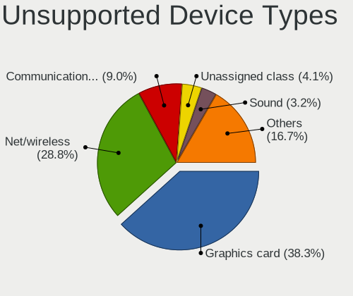

| Type                     | Desktops | Percent |
|--------------------------|----------|---------|
| Graphics card            | 85       | 38.29%  |
| Net/wireless             | 64       | 28.83%  |
| Communication controller | 20       | 9.01%   |
| Unassigned class         | 9        | 4.05%   |
| Sound                    | 7        | 3.15%   |
| Multimedia controller    | 6        | 2.7%    |
| Net/ethernet             | 5        | 2.25%   |
| Bluetooth                | 5        | 2.25%   |
| Network                  | 4        | 1.8%    |
| Camera                   | 4        | 1.8%    |
| Storage/raid             | 3        | 1.35%   |
| Fingerprint reader       | 3        | 1.35%   |
| Video                    | 1        | 0.45%   |
| Tv card                  | 1        | 0.45%   |
| Storage/nvme             | 1        | 0.45%   |
| Storage/ide              | 1        | 0.45%   |
| Storage/ata              | 1        | 0.45%   |
| Modem                    | 1        | 0.45%   |
| Chipcard                 | 1        | 0.45%   |

