Linux in Mexico - Tested Hardware & Statistics (Desktops)
---------------------------------------------------------

A project to collect tested hardware configurations for Linux in Mexico.

Anyone can contribute to this report by the [hw-probe](https://github.com/linuxhw/hw-probe) tool:

    sudo -E hw-probe -all -upload

Please contribute! Especially if your hardware is rare.

Contents
--------

* [ Test Cases ](#test-cases)

* [ System ](#system)
  - [ OS                       ](#os)
  - [ OS Family                ](#os-family)
  - [ Kernel                   ](#kernel)
  - [ Kernel Family            ](#kernel-family)
  - [ Kernel Major Ver.        ](#kernel-major-ver)
  - [ Arch                     ](#arch)
  - [ DE                       ](#de)
  - [ Display Server           ](#display-server)
  - [ Display Manager          ](#display-manager)
  - [ OS Lang                  ](#os-lang)
  - [ Boot Mode                ](#boot-mode)
  - [ Filesystem               ](#filesystem)
  - [ Part. scheme             ](#part-scheme)
  - [ Dual Boot with Linux/BSD ](#dual-boot-with-linuxbsd)
  - [ Dual Boot (Win)          ](#dual-boot-win)

* [ Board ](#board)
  - [ Vendor                   ](#vendor)
  - [ Model                    ](#model)
  - [ Model Family             ](#model-family)
  - [ MFG Year                 ](#mfg-year)
  - [ Form Factor              ](#form-factor)
  - [ Secure Boot              ](#secure-boot)
  - [ Coreboot                 ](#coreboot)
  - [ RAM Size                 ](#ram-size)
  - [ RAM Used                 ](#ram-used)
  - [ Total Drives             ](#total-drives)
  - [ Has CD-ROM               ](#has-cd-rom)
  - [ Has Ethernet             ](#has-ethernet)
  - [ Has WiFi                 ](#has-wifi)
  - [ Has Bluetooth            ](#has-bluetooth)

* [ Location ](#location)
  - [ Country                  ](#country)
  - [ City                     ](#city)

* [ Drives ](#drives)
  - [ Drive Vendor             ](#drive-vendor)
  - [ Drive Model              ](#drive-model)
  - [ HDD Vendor               ](#hdd-vendor)
  - [ SSD Vendor               ](#ssd-vendor)
  - [ Drive Kind               ](#drive-kind)
  - [ Drive Connector          ](#drive-connector)
  - [ Drive Size               ](#drive-size)
  - [ Space Total              ](#space-total)
  - [ Space Used               ](#space-used)
  - [ Malfunc. Drives          ](#malfunc-drives)
  - [ Malfunc. Drive Vendor    ](#malfunc-drive-vendor)
  - [ Malfunc. HDD Vendor      ](#malfunc-hdd-vendor)
  - [ Malfunc. Drive Kind      ](#malfunc-drive-kind)
  - [ Failed Drives            ](#failed-drives)
  - [ Failed Drive Vendor      ](#failed-drive-vendor)
  - [ Drive Status             ](#drive-status)

* [ Storage controller ](#storage-controller)
  - [ Storage Vendor           ](#storage-vendor)
  - [ Storage Model            ](#storage-model)
  - [ Storage Kind             ](#storage-kind)

* [ Processor ](#processor)
  - [ CPU Vendor               ](#cpu-vendor)
  - [ CPU Model                ](#cpu-model)
  - [ CPU Model Family         ](#cpu-model-family)
  - [ CPU Cores                ](#cpu-cores)
  - [ CPU Sockets              ](#cpu-sockets)
  - [ CPU Threads              ](#cpu-threads)
  - [ CPU Op-Modes             ](#cpu-op-modes)
  - [ CPU Microcode            ](#cpu-microcode)
  - [ CPU Microarch            ](#cpu-microarch)

* [ Graphics ](#graphics)
  - [ GPU Vendor               ](#gpu-vendor)
  - [ GPU Model                ](#gpu-model)
  - [ GPU Combo                ](#gpu-combo)
  - [ GPU Driver               ](#gpu-driver)
  - [ GPU Memory               ](#gpu-memory)

* [ Monitor ](#monitor)
  - [ Monitor Vendor           ](#monitor-vendor)
  - [ Monitor Model            ](#monitor-model)
  - [ Monitor Resolution       ](#monitor-resolution)
  - [ Monitor Diagonal         ](#monitor-diagonal)
  - [ Monitor Width            ](#monitor-width)
  - [ Aspect Ratio             ](#aspect-ratio)
  - [ Monitor Area             ](#monitor-area)
  - [ Pixel Density            ](#pixel-density)
  - [ Multiple Monitors        ](#multiple-monitors)

* [ Network ](#network)
  - [ Net Controller Vendor    ](#net-controller-vendor)
  - [ Net Controller Model     ](#net-controller-model)
  - [ Wireless Vendor          ](#wireless-vendor)
  - [ Wireless Model           ](#wireless-model)
  - [ Ethernet Vendor          ](#ethernet-vendor)
  - [ Ethernet Model           ](#ethernet-model)
  - [ Net Controller Kind      ](#net-controller-kind)
  - [ Used Controller          ](#used-controller)
  - [ NICs                     ](#nics)
  - [ IPv6                     ](#ipv6)

* [ Bluetooth ](#bluetooth)
  - [ Bluetooth Vendor         ](#bluetooth-vendor)
  - [ Bluetooth Model          ](#bluetooth-model)

* [ Sound ](#sound)
  - [ Sound Vendor             ](#sound-vendor)
  - [ Sound Model              ](#sound-model)

* [ Memory ](#memory)
  - [ Memory Vendor            ](#memory-vendor)
  - [ Memory Model             ](#memory-model)
  - [ Memory Kind              ](#memory-kind)
  - [ Memory Form Factor       ](#memory-form-factor)
  - [ Memory Size              ](#memory-size)
  - [ Memory Speed             ](#memory-speed)

* [ Printers & scanners ](#printers--scanners)
  - [ Printer Vendor           ](#printer-vendor)
  - [ Printer Model            ](#printer-model)
  - [ Scanner Vendor           ](#scanner-vendor)
  - [ Scanner Model            ](#scanner-model)

* [ Camera ](#camera)
  - [ Camera Vendor            ](#camera-vendor)
  - [ Camera Model             ](#camera-model)

* [ Security ](#security)
  - [ Fingerprint Vendor       ](#fingerprint-vendor)
  - [ Fingerprint Model        ](#fingerprint-model)
  - [ Chipcard Vendor          ](#chipcard-vendor)
  - [ Chipcard Model           ](#chipcard-model)

* [ Unsupported ](#unsupported)
  - [ Unsupported Devices      ](#unsupported-devices)
  - [ Unsupported Device Types ](#unsupported-device-types)

Test Cases
----------

Total: 759

| Vendor        | Model                       | Probe                                                      | Date         |
|---------------|-----------------------------|------------------------------------------------------------|--------------|
| HP            | 2129                        | [0484ca29c5](https://linux-hardware.org/?probe=0484ca29c5) | May 06, 2022 |
| HP            | 158A                        | [842aab71bd](https://linux-hardware.org/?probe=842aab71bd) | May 06, 2022 |
| HP            | 158B                        | [a613debdee](https://linux-hardware.org/?probe=a613debdee) | May 06, 2022 |
| HP            | 158A                        | [4f2832143b](https://linux-hardware.org/?probe=4f2832143b) | May 06, 2022 |
| HP            | 2129                        | [1fb7e49116](https://linux-hardware.org/?probe=1fb7e49116) | May 06, 2022 |
| HP            | 158B                        | [21f9c188f3](https://linux-hardware.org/?probe=21f9c188f3) | May 06, 2022 |
| Gigabyte      | B550M AORUS ELITE           | [3a3a4e634d](https://linux-hardware.org/?probe=3a3a4e634d) | May 05, 2022 |
| Dell          | 00V62H A01                  | [fc3604980a](https://linux-hardware.org/?probe=fc3604980a) | May 04, 2022 |
| ASUSTek       | VM65N-K                     | [9df63c1d99](https://linux-hardware.org/?probe=9df63c1d99) | May 04, 2022 |
| HP            | 3047h                       | [bc2b3d4c04](https://linux-hardware.org/?probe=bc2b3d4c04) | May 04, 2022 |
| Gigabyte      | B550M AORUS ELITE           | [ea29468949](https://linux-hardware.org/?probe=ea29468949) | May 03, 2022 |
| Gigabyte      | G1.Sniper A88X-CF           | [7f9e8dd9f6](https://linux-hardware.org/?probe=7f9e8dd9f6) | May 02, 2022 |
| Gigabyte      | G1.Sniper A88X-CF           | [4c46bd89cf](https://linux-hardware.org/?probe=4c46bd89cf) | May 01, 2022 |
| ASUSTek       | Lancaster8                  | [912f9bb3f9](https://linux-hardware.org/?probe=912f9bb3f9) | Apr 30, 2022 |
| Gigabyte      | G1.Sniper A88X-CF           | [89323fb22d](https://linux-hardware.org/?probe=89323fb22d) | Apr 30, 2022 |
| HP            | 1497                        | [559a844943](https://linux-hardware.org/?probe=559a844943) | Apr 30, 2022 |
| ASUSTek       | M5A78L-M PLUS/USB3          | [88c6676e7b](https://linux-hardware.org/?probe=88c6676e7b) | Apr 29, 2022 |
| Gigabyte      | G1.Sniper A88X-CF           | [c64aa4070a](https://linux-hardware.org/?probe=c64aa4070a) | Apr 29, 2022 |
| ASUSTek       | M5A78L-M PLUS/USB3          | [f2bdbd2a4a](https://linux-hardware.org/?probe=f2bdbd2a4a) | Apr 29, 2022 |
| Lanix         | EQ45M-S2 LNXACT             | [485f464d12](https://linux-hardware.org/?probe=485f464d12) | Apr 27, 2022 |
| Gigabyte      | G1.Sniper A88X-CF           | [392c7e4d0d](https://linux-hardware.org/?probe=392c7e4d0d) | Apr 25, 2022 |
| ASUSTek       | PRO A320M-R WI-FI           | [0cbc3290f0](https://linux-hardware.org/?probe=0cbc3290f0) | Apr 25, 2022 |
| ASUSTek       | ROG STRIX B450-F GAMING ... | [2bcb31328e](https://linux-hardware.org/?probe=2bcb31328e) | Apr 23, 2022 |
| Gigabyte      | B550M AORUS ELITE           | [acc082b594](https://linux-hardware.org/?probe=acc082b594) | Apr 22, 2022 |
| Gigabyte      | B560M AORUS PRO AX          | [61ca629904](https://linux-hardware.org/?probe=61ca629904) | Apr 20, 2022 |
| Gigabyte      | B560M AORUS PRO AX          | [c722e417a1](https://linux-hardware.org/?probe=c722e417a1) | Apr 20, 2022 |
| HP            | 3047h                       | [36a3e2ab98](https://linux-hardware.org/?probe=36a3e2ab98) | Apr 20, 2022 |
| Gigabyte      | G1.Sniper A88X-CF           | [5971999c12](https://linux-hardware.org/?probe=5971999c12) | Apr 16, 2022 |
| ASUSTek       | PRIME B450M-A II            | [bdc8f9b39e](https://linux-hardware.org/?probe=bdc8f9b39e) | Apr 15, 2022 |
| Dell          | 0WMJ54 A01                  | [d113301081](https://linux-hardware.org/?probe=d113301081) | Apr 14, 2022 |
| HP            | 0A54h                       | [11c5e77be7](https://linux-hardware.org/?probe=11c5e77be7) | Apr 14, 2022 |
| Dell          | 0C2XKD A00                  | [4ece5fe0b7](https://linux-hardware.org/?probe=4ece5fe0b7) | Apr 13, 2022 |
| ASUSTek       | M4A88T-M                    | [934e06ad74](https://linux-hardware.org/?probe=934e06ad74) | Apr 12, 2022 |
| Biostar       | H110MHC                     | [09715fbaf2](https://linux-hardware.org/?probe=09715fbaf2) | Apr 05, 2022 |
| HP            | 0B48h                       | [7cd0cbb7b7](https://linux-hardware.org/?probe=7cd0cbb7b7) | Apr 05, 2022 |
| Dell          | 0K240Y A03                  | [7e3ad9ce02](https://linux-hardware.org/?probe=7e3ad9ce02) | Apr 02, 2022 |
| ASUSTek       | M5A97 EVO                   | [96cd3f3a03](https://linux-hardware.org/?probe=96cd3f3a03) | Mar 31, 2022 |
| ECS           | A55F-M4                     | [0d29bdddde](https://linux-hardware.org/?probe=0d29bdddde) | Mar 31, 2022 |
| ASRock        | B550M Pro4                  | [4c69702c19](https://linux-hardware.org/?probe=4c69702c19) | Mar 27, 2022 |
| ASUSTek       | ROG STRIX X470-F GAMING     | [b625abc938](https://linux-hardware.org/?probe=b625abc938) | Mar 26, 2022 |
| Lanix         | EQ45M-S2 LNXACT             | [ab78b9c7a6](https://linux-hardware.org/?probe=ab78b9c7a6) | Mar 25, 2022 |
| Gigabyte      | A520M H                     | [0eb6fdc31d](https://linux-hardware.org/?probe=0eb6fdc31d) | Mar 25, 2022 |
| ASUSTek       | Maximus IX HERO             | [745cc1d638](https://linux-hardware.org/?probe=745cc1d638) | Mar 25, 2022 |
| Gigabyte      | A320M-S2H-CF                | [a237859a86](https://linux-hardware.org/?probe=a237859a86) | Mar 24, 2022 |
| Biostar       | A10N-9630E                  | [08e8cd5735](https://linux-hardware.org/?probe=08e8cd5735) | Mar 24, 2022 |
| Biostar       | G31D-M7                     | [9882f292ea](https://linux-hardware.org/?probe=9882f292ea) | Mar 24, 2022 |
| ASUSTek       | Maximus IX HERO             | [8eb98db533](https://linux-hardware.org/?probe=8eb98db533) | Mar 22, 2022 |
| HP            | 1589                        | [998f465bfc](https://linux-hardware.org/?probe=998f465bfc) | Mar 19, 2022 |
| ASUSTek       | SABERTOOTH 990FX R2.0       | [3be092b600](https://linux-hardware.org/?probe=3be092b600) | Mar 18, 2022 |
| Gigabyte      | GA-A75M-DS2                 | [7e23b31c1b](https://linux-hardware.org/?probe=7e23b31c1b) | Mar 17, 2022 |
| Dell          | 0D28YY A00                  | [065495a18e](https://linux-hardware.org/?probe=065495a18e) | Mar 13, 2022 |
| Gigabyte      | H110M-DS2-CF                | [9cad95edc1](https://linux-hardware.org/?probe=9cad95edc1) | Mar 12, 2022 |
| Biostar       | A10N-9630E                  | [044fc47c7a](https://linux-hardware.org/?probe=044fc47c7a) | Mar 12, 2022 |
| Gigabyte      | H110M-H-CF                  | [c8474e89b8](https://linux-hardware.org/?probe=c8474e89b8) | Mar 11, 2022 |
| HP            | 1497                        | [7965a1ed31](https://linux-hardware.org/?probe=7965a1ed31) | Mar 11, 2022 |
| Pegatron      | Benicia                     | [00bcb5f530](https://linux-hardware.org/?probe=00bcb5f530) | Mar 10, 2022 |
| Gigabyte      | A520M H                     | [db7727accf](https://linux-hardware.org/?probe=db7727accf) | Mar 09, 2022 |
| Gigabyte      | A520M H                     | [b8038bbdc8](https://linux-hardware.org/?probe=b8038bbdc8) | Mar 09, 2022 |
| ASUSTek       | PRIME A320M-K               | [515e875bbd](https://linux-hardware.org/?probe=515e875bbd) | Mar 07, 2022 |
| ASUSTek       | B85M-G R2.0                 | [673c6bd0db](https://linux-hardware.org/?probe=673c6bd0db) | Mar 07, 2022 |
| HP            | 0A64h                       | [75e39b1761](https://linux-hardware.org/?probe=75e39b1761) | Mar 07, 2022 |
| Intel         | DG41RQ AAE54511-205         | [36979f5dde](https://linux-hardware.org/?probe=36979f5dde) | Mar 07, 2022 |
| Gigabyte      | A520M H                     | [1b45a09429](https://linux-hardware.org/?probe=1b45a09429) | Mar 03, 2022 |
| Dell          | 0M5DCD A00                  | [91a666ba20](https://linux-hardware.org/?probe=91a666ba20) | Mar 02, 2022 |
| Biostar       | N68S3+                      | [d27fca4784](https://linux-hardware.org/?probe=d27fca4784) | Feb 28, 2022 |
| Gigabyte      | B250M-DS3H-CF               | [db907dad62](https://linux-hardware.org/?probe=db907dad62) | Feb 21, 2022 |
| Gigabyte      | X570 GAMING X               | [346c976e4b](https://linux-hardware.org/?probe=346c976e4b) | Feb 19, 2022 |
| ASUSTek       | ROG STRIX B450-F GAMING     | [b2c662bad6](https://linux-hardware.org/?probe=b2c662bad6) | Feb 18, 2022 |
| Gigabyte      | GA-880GM-USB3               | [4054007b41](https://linux-hardware.org/?probe=4054007b41) | Feb 17, 2022 |
| Dell          | 06X1TJ A00                  | [78b50a2601](https://linux-hardware.org/?probe=78b50a2601) | Feb 17, 2022 |
| Gigabyte      | B560M DS3H                  | [0bba38da27](https://linux-hardware.org/?probe=0bba38da27) | Feb 16, 2022 |
| ASRock        | B250 Gaming K4              | [226e1abd06](https://linux-hardware.org/?probe=226e1abd06) | Feb 11, 2022 |
| Gigabyte      | B150-HD3-CF                 | [cab21caab7](https://linux-hardware.org/?probe=cab21caab7) | Feb 10, 2022 |
| ASUSTek       | M5A97 R2.0                  | [0301e86e1b](https://linux-hardware.org/?probe=0301e86e1b) | Feb 09, 2022 |
| Gigabyte      | GA-880GM-USB3               | [9c02ccf9fb](https://linux-hardware.org/?probe=9c02ccf9fb) | Feb 09, 2022 |
| Gigabyte      | G41MT-S2                    | [9e2a093ef4](https://linux-hardware.org/?probe=9e2a093ef4) | Feb 07, 2022 |
| Gigabyte      | B450M DS3H-CF               | [655eea9ee5](https://linux-hardware.org/?probe=655eea9ee5) | Feb 02, 2022 |
| ASUSTek       | PRIME B350M-E               | [3bab4dd576](https://linux-hardware.org/?probe=3bab4dd576) | Jan 28, 2022 |
| Gigabyte      | B450 AORUS ELITE            | [e96d993823](https://linux-hardware.org/?probe=e96d993823) | Jan 26, 2022 |
| Foxconn       | 2A92                        | [affed2d377](https://linux-hardware.org/?probe=affed2d377) | Jan 26, 2022 |
| Gigabyte      | Z87X-UD5H-CF                | [1b2ef9d1dc](https://linux-hardware.org/?probe=1b2ef9d1dc) | Jan 23, 2022 |
| ASUSTek       | PRIME B460M-A R2.0          | [e0197b9fdc](https://linux-hardware.org/?probe=e0197b9fdc) | Jan 23, 2022 |
| Intel         | DH61HO AAG62445-102         | [100cf973bf](https://linux-hardware.org/?probe=100cf973bf) | Jan 21, 2022 |
| Dell          | 0PU052                      | [0b1d31cda2](https://linux-hardware.org/?probe=0b1d31cda2) | Jan 20, 2022 |
| Dell          | 0PU052                      | [36323786b9](https://linux-hardware.org/?probe=36323786b9) | Jan 20, 2022 |
| Gigabyte      | Z170X-Gaming 3              | [5052313cdf](https://linux-hardware.org/?probe=5052313cdf) | Jan 17, 2022 |
| HC            | HCAR357-MI V1.0             | [a610cc37dc](https://linux-hardware.org/?probe=a610cc37dc) | Jan 16, 2022 |
| Pegatron      | EVE                         | [d21708f0ed](https://linux-hardware.org/?probe=d21708f0ed) | Jan 14, 2022 |
| Gigabyte      | GA-A55M-DS2                 | [f05cc95e99](https://linux-hardware.org/?probe=f05cc95e99) | Jan 11, 2022 |
| Gigabyte      | AX370-Gaming 5              | [4f99e4803d](https://linux-hardware.org/?probe=4f99e4803d) | Jan 09, 2022 |
| Acer          | WG43M                       | [8c9d16de68](https://linux-hardware.org/?probe=8c9d16de68) | Jan 08, 2022 |
| Gigabyte      | AB350M-DS3H-CF              | [a2ca29b82e](https://linux-hardware.org/?probe=a2ca29b82e) | Jan 07, 2022 |
| Gigabyte      | AB350M-DS3H-CF              | [b92a220707](https://linux-hardware.org/?probe=b92a220707) | Jan 07, 2022 |
| Intel         | DX58SO AAE29331-501         | [3718c8a46f](https://linux-hardware.org/?probe=3718c8a46f) | Jan 05, 2022 |
| Gigabyte      | X470 AORUS GAMING 5 WIFI... | [df695a7747](https://linux-hardware.org/?probe=df695a7747) | Jan 03, 2022 |
| ASUSTek       | P8B75-M                     | [2436d612db](https://linux-hardware.org/?probe=2436d612db) | Jan 02, 2022 |
| ASUSTek       | P8B75-M                     | [275d5a762b](https://linux-hardware.org/?probe=275d5a762b) | Jan 02, 2022 |
| ASUSTek       | M5A97 R2.0                  | [9d2017b698](https://linux-hardware.org/?probe=9d2017b698) | Dec 29, 2021 |
| Dell          | 0GC080                      | [7ab7f1da0e](https://linux-hardware.org/?probe=7ab7f1da0e) | Dec 23, 2021 |
| Gigabyte      | H110M-DS2-CF                | [729cb86592](https://linux-hardware.org/?probe=729cb86592) | Dec 21, 2021 |
| Gigabyte      | B450M DS3H-CF               | [b7b779b709](https://linux-hardware.org/?probe=b7b779b709) | Dec 16, 2021 |
| Dell          | 0GM819                      | [809fc591dd](https://linux-hardware.org/?probe=809fc591dd) | Dec 16, 2021 |
| Biostar       | H110MHC                     | [bb74f304fd](https://linux-hardware.org/?probe=bb74f304fd) | Dec 16, 2021 |
| Pegatron      | 2A73h                       | [603a6f5087](https://linux-hardware.org/?probe=603a6f5087) | Dec 15, 2021 |
| HP            | 09F8h                       | [c70b669376](https://linux-hardware.org/?probe=c70b669376) | Dec 13, 2021 |
| ASUSTek       | Bantry CRB SDK0E50510 WI... | [5dfc7cb81a](https://linux-hardware.org/?probe=5dfc7cb81a) | Dec 11, 2021 |
| Gigabyte      | B150M-DS3H-CF               | [9cc5505029](https://linux-hardware.org/?probe=9cc5505029) | Dec 11, 2021 |
| HP            | 09F8h                       | [b01b09b7a4](https://linux-hardware.org/?probe=b01b09b7a4) | Dec 10, 2021 |
| HP            | 158A                        | [cfb460b3fa](https://linux-hardware.org/?probe=cfb460b3fa) | Dec 10, 2021 |
| HP            | 158A                        | [db518613b6](https://linux-hardware.org/?probe=db518613b6) | Dec 10, 2021 |
| HP            | 3397                        | [9c1590635c](https://linux-hardware.org/?probe=9c1590635c) | Dec 09, 2021 |
| Dell          | 0WG864                      | [59d9c69b35](https://linux-hardware.org/?probe=59d9c69b35) | Dec 08, 2021 |
| HP            | 09F8h                       | [fe41d0247b](https://linux-hardware.org/?probe=fe41d0247b) | Dec 08, 2021 |
| Acer          | Aspire XC-704G              | [961534f79d](https://linux-hardware.org/?probe=961534f79d) | Dec 08, 2021 |
| Acer          | Aspire XC-704G              | [5b69f445ad](https://linux-hardware.org/?probe=5b69f445ad) | Dec 08, 2021 |
| HP            | 0A54h                       | [e445d6aa51](https://linux-hardware.org/?probe=e445d6aa51) | Dec 07, 2021 |
| Gigabyte      | X570 AORUS PRO WIFI         | [a8e4016566](https://linux-hardware.org/?probe=a8e4016566) | Dec 06, 2021 |
| Gigabyte      | X570 AORUS PRO WIFI         | [ebfed157e7](https://linux-hardware.org/?probe=ebfed157e7) | Dec 06, 2021 |
| Lenovo        | SHARKBAY SDK0E50510 WIN     | [7a511dda3d](https://linux-hardware.org/?probe=7a511dda3d) | Dec 04, 2021 |
| Lenovo        | SHARKBAY SDK0E50510 WIN     | [60e7267ddb](https://linux-hardware.org/?probe=60e7267ddb) | Dec 04, 2021 |
| Acer          | Aspire X1930                | [68d51a9af5](https://linux-hardware.org/?probe=68d51a9af5) | Dec 03, 2021 |
| Gigabyte      | GA-E350N                    | [10d55dd433](https://linux-hardware.org/?probe=10d55dd433) | Dec 02, 2021 |
| Gigabyte      | B550M AORUS ELITE           | [0105f991c1](https://linux-hardware.org/?probe=0105f991c1) | Dec 01, 2021 |
| Gigabyte      | B560 AORUS PRO AX           | [13325b986f](https://linux-hardware.org/?probe=13325b986f) | Dec 01, 2021 |
| Biostar       | TH55XE                      | [9e420cc495](https://linux-hardware.org/?probe=9e420cc495) | Nov 28, 2021 |
| Dell          | 0WR7PY A01                  | [f886714ec5](https://linux-hardware.org/?probe=f886714ec5) | Nov 28, 2021 |
| HP            | 1497                        | [6f042fb99c](https://linux-hardware.org/?probe=6f042fb99c) | Nov 28, 2021 |
| ASUSTek       | TUF GAMING B550-PLUS        | [0cb5ca7e51](https://linux-hardware.org/?probe=0cb5ca7e51) | Nov 28, 2021 |
| Gigabyte      | H77M-D3H                    | [8b2be4927b](https://linux-hardware.org/?probe=8b2be4927b) | Nov 27, 2021 |
| ECS           | 945GCT-M3                   | [a81a27ac47](https://linux-hardware.org/?probe=a81a27ac47) | Nov 25, 2021 |
| ASUSTek       | TUF GAMING B550-PLUS        | [81a6212074](https://linux-hardware.org/?probe=81a6212074) | Nov 23, 2021 |
| HP            | 0B4Ch D                     | [0c3c7c6bb3](https://linux-hardware.org/?probe=0c3c7c6bb3) | Nov 23, 2021 |
| Gigabyte      | H77M-D3H                    | [2819a870a8](https://linux-hardware.org/?probe=2819a870a8) | Nov 22, 2021 |
| HP            | 0A5Ch                       | [4858eb5c73](https://linux-hardware.org/?probe=4858eb5c73) | Nov 21, 2021 |
| ECS           | Nettle3                     | [844a70698a](https://linux-hardware.org/?probe=844a70698a) | Nov 21, 2021 |
| Gigabyte      | B550M AORUS ELITE           | [de0c208dd4](https://linux-hardware.org/?probe=de0c208dd4) | Nov 20, 2021 |
| Dell          | 0GC080                      | [4b37c002b2](https://linux-hardware.org/?probe=4b37c002b2) | Nov 19, 2021 |
| Gigabyte      | B450M DS3H-CF               | [f35f04cabd](https://linux-hardware.org/?probe=f35f04cabd) | Nov 18, 2021 |
| ASUSTek       | ROG CROSSHAIR VI HERO       | [50535d277c](https://linux-hardware.org/?probe=50535d277c) | Nov 18, 2021 |
| ASUSTek       | P8B75-M                     | [a3cd1a283b](https://linux-hardware.org/?probe=a3cd1a283b) | Nov 13, 2021 |
| Dell          | 0HY9JP A00                  | [05c38bf92c](https://linux-hardware.org/?probe=05c38bf92c) | Nov 07, 2021 |
| Dell          | 0N826N A03                  | [d7d0a0b507](https://linux-hardware.org/?probe=d7d0a0b507) | Nov 03, 2021 |
| ASUSTek       | M2N-E SLI                   | [393213dee8](https://linux-hardware.org/?probe=393213dee8) | Oct 31, 2021 |
| Dell          | 0N826N A03                  | [ffb75356ef](https://linux-hardware.org/?probe=ffb75356ef) | Oct 30, 2021 |
| Dell          | 0N826N A03                  | [db2a7eba35](https://linux-hardware.org/?probe=db2a7eba35) | Oct 29, 2021 |
| ASRock        | AB350 Pro4                  | [54f331c0ec](https://linux-hardware.org/?probe=54f331c0ec) | Oct 29, 2021 |
| HP            | 0A54h                       | [d3b19636d9](https://linux-hardware.org/?probe=d3b19636d9) | Oct 28, 2021 |
| Gigabyte      | Z77X-UP4 TH                 | [47a0de503d](https://linux-hardware.org/?probe=47a0de503d) | Oct 27, 2021 |
| Dell          | 0GC080                      | [cb7602a2bd](https://linux-hardware.org/?probe=cb7602a2bd) | Oct 26, 2021 |
| ASUSTek       | Z170-A                      | [9fed362dde](https://linux-hardware.org/?probe=9fed362dde) | Oct 25, 2021 |
| ASUSTek       | Z170-A                      | [7414a480f8](https://linux-hardware.org/?probe=7414a480f8) | Oct 25, 2021 |
| Gigabyte      | Z77X-UP4 TH                 | [3930d1a76a](https://linux-hardware.org/?probe=3930d1a76a) | Oct 23, 2021 |
| Gigabyte      | Z77X-UP4 TH                 | [f3c4f73cb2](https://linux-hardware.org/?probe=f3c4f73cb2) | Oct 23, 2021 |
| Dell          | 0N826N A03                  | [5fea6b8b9a](https://linux-hardware.org/?probe=5fea6b8b9a) | Oct 22, 2021 |
| Dell          | 0N826N A03                  | [eb508ab31e](https://linux-hardware.org/?probe=eb508ab31e) | Oct 22, 2021 |
| Google        | Guado                       | [5aba3d29f4](https://linux-hardware.org/?probe=5aba3d29f4) | Oct 21, 2021 |
| Google        | Guado                       | [2393c52b33](https://linux-hardware.org/?probe=2393c52b33) | Oct 21, 2021 |
| Foxconn       | 2AB7                        | [de1be07e5a](https://linux-hardware.org/?probe=de1be07e5a) | Oct 20, 2021 |
| Foxconn       | 2AB7                        | [4e260fe9f3](https://linux-hardware.org/?probe=4e260fe9f3) | Oct 20, 2021 |
| HP            | 0A5Ch                       | [8d102a03f6](https://linux-hardware.org/?probe=8d102a03f6) | Oct 19, 2021 |
| HP            | 0A5Ch                       | [139efd1a3d](https://linux-hardware.org/?probe=139efd1a3d) | Oct 19, 2021 |
| Dell          | 0RF705                      | [07965413db](https://linux-hardware.org/?probe=07965413db) | Oct 18, 2021 |
| Gigabyte      | GA-MA785GM-US2H             | [6522d9dc18](https://linux-hardware.org/?probe=6522d9dc18) | Oct 18, 2021 |
| ASUSTek       | P6T                         | [69397b40d4](https://linux-hardware.org/?probe=69397b40d4) | Oct 17, 2021 |
| Biostar       | N61PB-M2S                   | [e16a5113ba](https://linux-hardware.org/?probe=e16a5113ba) | Oct 17, 2021 |
| Biostar       | N61PB-M2S                   | [d17b2a3da0](https://linux-hardware.org/?probe=d17b2a3da0) | Oct 16, 2021 |
| Gigabyte      | A320M-S2H V2-CF             | [57eaf5a3e0](https://linux-hardware.org/?probe=57eaf5a3e0) | Oct 15, 2021 |
| Intel         | B75                         | [9374d023b7](https://linux-hardware.org/?probe=9374d023b7) | Oct 15, 2021 |
| Dell          | 09KPNV A00                  | [ecda4970d8](https://linux-hardware.org/?probe=ecda4970d8) | Oct 15, 2021 |
| Dell          | 0N826N A03                  | [54b9ff49e4](https://linux-hardware.org/?probe=54b9ff49e4) | Oct 14, 2021 |
| Biostar       | A10N-9630E                  | [d8ce068d3a](https://linux-hardware.org/?probe=d8ce068d3a) | Oct 12, 2021 |
| Dell          | 0N826N A03                  | [d74fd1a5d9](https://linux-hardware.org/?probe=d74fd1a5d9) | Oct 12, 2021 |
| ASRock        | N73V-S                      | [01e398a327](https://linux-hardware.org/?probe=01e398a327) | Oct 11, 2021 |
| ASRock        | N73V-S                      | [8ae578e81d](https://linux-hardware.org/?probe=8ae578e81d) | Oct 10, 2021 |
| ASUSTek       | H87M-PLUS                   | [f0a1062216](https://linux-hardware.org/?probe=f0a1062216) | Oct 09, 2021 |
| ASUSTek       | M5A78L-M/USB3               | [f8a55a2c62](https://linux-hardware.org/?probe=f8a55a2c62) | Oct 08, 2021 |
| Intel         | B75                         | [3a8b2a06b0](https://linux-hardware.org/?probe=3a8b2a06b0) | Oct 08, 2021 |
| Intel         | B75                         | [a694ca546a](https://linux-hardware.org/?probe=a694ca546a) | Oct 08, 2021 |
| Pegatron      | 2A99                        | [10f364b4ef](https://linux-hardware.org/?probe=10f364b4ef) | Oct 07, 2021 |
| Gigabyte      | Z87X-UD3H-CF                | [9901023f19](https://linux-hardware.org/?probe=9901023f19) | Oct 03, 2021 |
| ASUSTek       | TUF GAMING B550M-PLUS       | [67b629d7f9](https://linux-hardware.org/?probe=67b629d7f9) | Oct 02, 2021 |
| ECS           | A320AM4-M3D/3.x/5.x         | [d92879de9a](https://linux-hardware.org/?probe=d92879de9a) | Sep 28, 2021 |
| ECS           | A320AM4-M3D/3.x/5.x         | [c91a5b0d8d](https://linux-hardware.org/?probe=c91a5b0d8d) | Sep 25, 2021 |
| HP            | 09E0h                       | [35fd460ea9](https://linux-hardware.org/?probe=35fd460ea9) | Sep 25, 2021 |
| ASRock        | N68-VS3 FX                  | [b9c8253944](https://linux-hardware.org/?probe=b9c8253944) | Sep 25, 2021 |
| Dell          | 0478VN A00                  | [89db3ccae7](https://linux-hardware.org/?probe=89db3ccae7) | Sep 22, 2021 |
| Acer          | Veriton X2631G V:1.0        | [c75d05568f](https://linux-hardware.org/?probe=c75d05568f) | Sep 22, 2021 |
| Dell          | 0GC080                      | [0297b84b90](https://linux-hardware.org/?probe=0297b84b90) | Sep 22, 2021 |
| Dell          | 0GC080                      | [d66102b7f1](https://linux-hardware.org/?probe=d66102b7f1) | Sep 22, 2021 |
| Alienware     | 0PGRP5 A02                  | [65615a3aaa](https://linux-hardware.org/?probe=65615a3aaa) | Sep 16, 2021 |
| Alienware     | 0PGRP5 A02                  | [158a015f26](https://linux-hardware.org/?probe=158a015f26) | Sep 15, 2021 |
| ECS           | G41T-M7                     | [42e72694fc](https://linux-hardware.org/?probe=42e72694fc) | Sep 15, 2021 |
| Dell          | 0GC080                      | [e7be152af1](https://linux-hardware.org/?probe=e7be152af1) | Sep 15, 2021 |
| Gigabyte      | B450M DS3H-CF               | [e1f454ca9a](https://linux-hardware.org/?probe=e1f454ca9a) | Sep 13, 2021 |
| ECS           | H81H3-M4                    | [5dcb7c25ca](https://linux-hardware.org/?probe=5dcb7c25ca) | Sep 13, 2021 |
| Gigabyte      | B450M DS3H-CF               | [267c72cca2](https://linux-hardware.org/?probe=267c72cca2) | Sep 11, 2021 |
| Lenovo        | ThinkCentre M58e 7303AS6    | [467b83765f](https://linux-hardware.org/?probe=467b83765f) | Sep 10, 2021 |
| MSI           | MS-7228                     | [30e50bf019](https://linux-hardware.org/?probe=30e50bf019) | Sep 07, 2021 |
| ASRock        | G41M-VS                     | [4895fb4c21](https://linux-hardware.org/?probe=4895fb4c21) | Sep 07, 2021 |
| HP            | 8056                        | [3cab8505c4](https://linux-hardware.org/?probe=3cab8505c4) | Sep 06, 2021 |
| ASUSTek       | PRIME A320M-K               | [fcdcfe317f](https://linux-hardware.org/?probe=fcdcfe317f) | Sep 05, 2021 |
| ASUSTek       | M5A78L-M LX PLUS            | [c9fd460c11](https://linux-hardware.org/?probe=c9fd460c11) | Sep 04, 2021 |
| Lenovo        | Annapurna CRB NOK           | [2891fe25e6](https://linux-hardware.org/?probe=2891fe25e6) | Sep 03, 2021 |
| HP            | 1497                        | [fd4cf5c840](https://linux-hardware.org/?probe=fd4cf5c840) | Sep 01, 2021 |
| Lenovo        | MAHOBAY 0B98401 PRO         | [f1a0e351a2](https://linux-hardware.org/?probe=f1a0e351a2) | Aug 31, 2021 |
| Lenovo        | Annapurna CRB NOK           | [a4e9c465c2](https://linux-hardware.org/?probe=a4e9c465c2) | Aug 30, 2021 |
| Lenovo        | Annapurna CRB NOK           | [f1eec80b6a](https://linux-hardware.org/?probe=f1eec80b6a) | Aug 30, 2021 |
| ASUSTek       | PRIME X570-P                | [f185dd7230](https://linux-hardware.org/?probe=f185dd7230) | Aug 30, 2021 |
| ASRock        | G31M-S                      | [00579ca792](https://linux-hardware.org/?probe=00579ca792) | Aug 30, 2021 |
| ASRock        | G41M-VS                     | [6d2338d42c](https://linux-hardware.org/?probe=6d2338d42c) | Aug 26, 2021 |
| MSI           | MS-7228                     | [ee7056f565](https://linux-hardware.org/?probe=ee7056f565) | Aug 25, 2021 |
| Intel         | DX58SO AAE29331-501         | [465643c093](https://linux-hardware.org/?probe=465643c093) | Aug 24, 2021 |
| ASUSTek       | F1A75-V PRO                 | [52bfc025ea](https://linux-hardware.org/?probe=52bfc025ea) | Aug 24, 2021 |
| ASUSTek       | F1A75-V PRO                 | [2e19d48879](https://linux-hardware.org/?probe=2e19d48879) | Aug 24, 2021 |
| Dell          | 00V62H A01                  | [76399f56e4](https://linux-hardware.org/?probe=76399f56e4) | Aug 23, 2021 |
| Dell          | 00V62H A01                  | [178106e076](https://linux-hardware.org/?probe=178106e076) | Aug 23, 2021 |
| HP            | 0A54h                       | [208bb3f7ff](https://linux-hardware.org/?probe=208bb3f7ff) | Aug 22, 2021 |
| HP            | 0A54h                       | [bf3279fcac](https://linux-hardware.org/?probe=bf3279fcac) | Aug 21, 2021 |
| MSI           | MS-7228                     | [841ad28c0d](https://linux-hardware.org/?probe=841ad28c0d) | Aug 20, 2021 |
| HP            | 1905                        | [cce83a6aea](https://linux-hardware.org/?probe=cce83a6aea) | Aug 19, 2021 |
| HP            | 1905                        | [6d387ffc16](https://linux-hardware.org/?probe=6d387ffc16) | Aug 19, 2021 |
| ASUSTek       | ROG STRIX B450-F GAMING     | [6f5485edfc](https://linux-hardware.org/?probe=6f5485edfc) | Aug 18, 2021 |
| HP            | 0A54h                       | [340cf18368](https://linux-hardware.org/?probe=340cf18368) | Aug 18, 2021 |
| ASUSTek       | PRIME X570-P                | [a86f566c6c](https://linux-hardware.org/?probe=a86f566c6c) | Aug 15, 2021 |
| ASUSTek       | PRIME X570-P                | [be9bb3d6af](https://linux-hardware.org/?probe=be9bb3d6af) | Aug 15, 2021 |
| ASUSTek       | M5A97                       | [886707949b](https://linux-hardware.org/?probe=886707949b) | Aug 13, 2021 |
| ASUSTek       | PRIME A320M-K               | [0f178a3f71](https://linux-hardware.org/?probe=0f178a3f71) | Aug 12, 2021 |
| ICP / iEi     | SA60 V1.0                   | [222cb216be](https://linux-hardware.org/?probe=222cb216be) | Aug 09, 2021 |
| Dell          | 0PU052                      | [32ebdc5911](https://linux-hardware.org/?probe=32ebdc5911) | Aug 09, 2021 |
| ASUSTek       | H81M-A                      | [fed696b5e3](https://linux-hardware.org/?probe=fed696b5e3) | Aug 08, 2021 |
| HP            | 1791                        | [9de8ddbd32](https://linux-hardware.org/?probe=9de8ddbd32) | Aug 07, 2021 |
| ASRock        | A55M-HVS                    | [d5bc156b08](https://linux-hardware.org/?probe=d5bc156b08) | Aug 05, 2021 |
| Intel         | DG31PR AAD97573-300         | [0a0a8059c2](https://linux-hardware.org/?probe=0a0a8059c2) | Aug 04, 2021 |
| Gigabyte      | GA-MA785GT-UD3H             | [dfaac9ebd2](https://linux-hardware.org/?probe=dfaac9ebd2) | Aug 02, 2021 |
| ASRock        | Z370/OEM                    | [c90b04c55f](https://linux-hardware.org/?probe=c90b04c55f) | Aug 02, 2021 |
| ASRock        | Z370/OEM                    | [2309a1a720](https://linux-hardware.org/?probe=2309a1a720) | Aug 02, 2021 |
| Gigabyte      | H470M DS3H                  | [bac1dc0b38](https://linux-hardware.org/?probe=bac1dc0b38) | Jul 31, 2021 |
| ASRock        | G41M-VS                     | [fbdfda41ad](https://linux-hardware.org/?probe=fbdfda41ad) | Jul 26, 2021 |
| ASRock        | G41M-VS                     | [e128037a00](https://linux-hardware.org/?probe=e128037a00) | Jul 26, 2021 |
| Intel         | DZ68BC AAG30742-401         | [c45e851a86](https://linux-hardware.org/?probe=c45e851a86) | Jul 25, 2021 |
| HP            | 158A                        | [219b010ebb](https://linux-hardware.org/?probe=219b010ebb) | Jul 25, 2021 |
| HP            | 158A                        | [da4016cb27](https://linux-hardware.org/?probe=da4016cb27) | Jul 25, 2021 |
| HP            | 2129                        | [8de5bae655](https://linux-hardware.org/?probe=8de5bae655) | Jul 25, 2021 |
| Intel         | DZ68BC AAG30742-401         | [e7678d488a](https://linux-hardware.org/?probe=e7678d488a) | Jul 25, 2021 |
| Intel         | DZ68BC AAG30742-401         | [d83e25f4e3](https://linux-hardware.org/?probe=d83e25f4e3) | Jul 25, 2021 |
| ASUSTek       | PRIME B360M-A               | [c31b8a6921](https://linux-hardware.org/?probe=c31b8a6921) | Jul 24, 2021 |
| Lanix         | ChiefRiver                  | [749fc3ef84](https://linux-hardware.org/?probe=749fc3ef84) | Jul 24, 2021 |
| ASRock        | FM2A68M-DG3+                | [aff6409a49](https://linux-hardware.org/?probe=aff6409a49) | Jul 23, 2021 |
| Gigabyte      | B360M D3H-CF                | [d836ee6421](https://linux-hardware.org/?probe=d836ee6421) | Jul 22, 2021 |
| Dell          | 0GDG8Y A00                  | [d56411950c](https://linux-hardware.org/?probe=d56411950c) | Jul 22, 2021 |
| Intel         | DG31PR AAD97573-300         | [6b7f5cdcc8](https://linux-hardware.org/?probe=6b7f5cdcc8) | Jul 21, 2021 |
| ASUSTek       | M5A78L-M PLUS/USB3          | [5d56e0dd55](https://linux-hardware.org/?probe=5d56e0dd55) | Jul 21, 2021 |
| ASUSTek       | PRIME X570-P                | [8556b83d79](https://linux-hardware.org/?probe=8556b83d79) | Jul 21, 2021 |
| MSI           | MS-7267                     | [52409111c1](https://linux-hardware.org/?probe=52409111c1) | Jul 20, 2021 |
| HP            | 8719                        | [d6615d50f8](https://linux-hardware.org/?probe=d6615d50f8) | Jul 20, 2021 |
| Gigabyte      | B450M H                     | [cb2babd945](https://linux-hardware.org/?probe=cb2babd945) | Jul 20, 2021 |
| Biostar       | A10N-8800E                  | [aae6a8bcb2](https://linux-hardware.org/?probe=aae6a8bcb2) | Jul 20, 2021 |
| Dell          | 0GM819                      | [4702931d5a](https://linux-hardware.org/?probe=4702931d5a) | Jul 19, 2021 |
| HP            | 83E8                        | [f378108dc3](https://linux-hardware.org/?probe=f378108dc3) | Jul 19, 2021 |
| ASUSTek       | P8H61-M LX3 R2.0            | [156577ba27](https://linux-hardware.org/?probe=156577ba27) | Jul 18, 2021 |
| Gigabyte      | A320M-S2H V2-CF             | [c332ee495e](https://linux-hardware.org/?probe=c332ee495e) | Jul 17, 2021 |
| HP            | 8719                        | [2d00fe2e1a](https://linux-hardware.org/?probe=2d00fe2e1a) | Jul 14, 2021 |
| ASUSTek       | H81M-A                      | [07c39de2b3](https://linux-hardware.org/?probe=07c39de2b3) | Jul 11, 2021 |
| HP            | 1589                        | [7b686149e2](https://linux-hardware.org/?probe=7b686149e2) | Jul 11, 2021 |
| HP            | 1589                        | [0262723214](https://linux-hardware.org/?probe=0262723214) | Jul 11, 2021 |
| ECS           | MCP61PM-AMA                 | [8d410cf5d0](https://linux-hardware.org/?probe=8d410cf5d0) | Jul 11, 2021 |
| ASUSTek       | ROG STRIX X570-E GAMING     | [c8ef49c85e](https://linux-hardware.org/?probe=c8ef49c85e) | Jul 10, 2021 |
| Lenovo        | 0B98401 PRO                 | [f8be96c44a](https://linux-hardware.org/?probe=f8be96c44a) | Jul 09, 2021 |
| HP            | 1495                        | [3dc7075de2](https://linux-hardware.org/?probe=3dc7075de2) | Jul 06, 2021 |
| Lenovo        | 3716 SDK0R32862 WIN 3258... | [5758df25ec](https://linux-hardware.org/?probe=5758df25ec) | Jul 06, 2021 |
| HP            | 1588h                       | [28a2da9b7f](https://linux-hardware.org/?probe=28a2da9b7f) | Jul 05, 2021 |
| Dell          | 0GM819                      | [03375c12d1](https://linux-hardware.org/?probe=03375c12d1) | Jul 03, 2021 |
| PCChips       | P25G                        | [8cbcba9099](https://linux-hardware.org/?probe=8cbcba9099) | Jul 03, 2021 |
| Lenovo        | 3716 SDK0R32862 WIN 3258... | [36c64a337b](https://linux-hardware.org/?probe=36c64a337b) | Jul 03, 2021 |
| Dell          | 0GM819                      | [b7dd22633c](https://linux-hardware.org/?probe=b7dd22633c) | Jul 01, 2021 |
| Dell          | 0J8H4R A00                  | [ceadcc5249](https://linux-hardware.org/?probe=ceadcc5249) | Jun 30, 2021 |
| HP            | 83E8                        | [ced2d9a47f](https://linux-hardware.org/?probe=ced2d9a47f) | Jun 29, 2021 |
| ECS           | G31T-M9                     | [e1952ea77b](https://linux-hardware.org/?probe=e1952ea77b) | Jun 28, 2021 |
| ECS           | G31T-M9                     | [acb1983b65](https://linux-hardware.org/?probe=acb1983b65) | Jun 27, 2021 |
| ASRock        | 890GM Pro3                  | [ba7c80fa48](https://linux-hardware.org/?probe=ba7c80fa48) | Jun 27, 2021 |
| Gigabyte      | B150M-DS3H-CF               | [ee5b0962e9](https://linux-hardware.org/?probe=ee5b0962e9) | Jun 26, 2021 |
| Gigabyte      | GA-78LMT-USB3               | [75e171067f](https://linux-hardware.org/?probe=75e171067f) | Jun 18, 2021 |
| ASUSTek       | PRIME X370-PRO              | [15b6c87991](https://linux-hardware.org/?probe=15b6c87991) | Jun 18, 2021 |
| Gigabyte      | GA-78LMT-USB3               | [918daf4abf](https://linux-hardware.org/?probe=918daf4abf) | Jun 18, 2021 |
| Gigabyte      | GA-78LMT-USB3               | [f6d899ab00](https://linux-hardware.org/?probe=f6d899ab00) | Jun 17, 2021 |
| Gigabyte      | GA-78LMT-USB3               | [39f357041a](https://linux-hardware.org/?probe=39f357041a) | Jun 17, 2021 |
| Gigabyte      | A320M-S2H V2-CF             | [02f5d5910a](https://linux-hardware.org/?probe=02f5d5910a) | Jun 15, 2021 |
| HC            | HCAR357-MI V1.0             | [6757c0e254](https://linux-hardware.org/?probe=6757c0e254) | Jun 14, 2021 |
| HP            | 8309                        | [f39dd3dca3](https://linux-hardware.org/?probe=f39dd3dca3) | Jun 11, 2021 |
| ASUSTek       | PRIME B450M-A               | [0c70aaba2f](https://linux-hardware.org/?probe=0c70aaba2f) | Jun 10, 2021 |
| ASUSTek       | PRIME B450M-A               | [dc5f10f04f](https://linux-hardware.org/?probe=dc5f10f04f) | Jun 10, 2021 |
| HP            | 8626                        | [e92fa74b31](https://linux-hardware.org/?probe=e92fa74b31) | Jun 07, 2021 |
| ASUSTek       | TUF X470-PLUS GAMING        | [a7a5bcdee3](https://linux-hardware.org/?probe=a7a5bcdee3) | Jun 06, 2021 |
| Dell          | 0GDG8Y A00                  | [45aa9aed0d](https://linux-hardware.org/?probe=45aa9aed0d) | Jun 02, 2021 |
| HP            | 83E8                        | [f2ed15c184](https://linux-hardware.org/?probe=f2ed15c184) | Jun 01, 2021 |
| Gigabyte      | E2100N                      | [a32062eca7](https://linux-hardware.org/?probe=a32062eca7) | May 30, 2021 |
| Dell          | 0JP3NX A01                  | [f3e4767726](https://linux-hardware.org/?probe=f3e4767726) | May 26, 2021 |
| HP            | 8309                        | [e3480e8653](https://linux-hardware.org/?probe=e3480e8653) | May 26, 2021 |
| Gigabyte      | GA-MA69VM-S2                | [6015233ffd](https://linux-hardware.org/?probe=6015233ffd) | May 25, 2021 |
| ASUSTek       | K8N                         | [2bfbb90a8e](https://linux-hardware.org/?probe=2bfbb90a8e) | May 24, 2021 |
| Gigabyte      | B450 AORUS M                | [3647d11d65](https://linux-hardware.org/?probe=3647d11d65) | May 23, 2021 |
| Gigabyte      | F2A68HM-DS2H                | [2721591f4e](https://linux-hardware.org/?probe=2721591f4e) | May 21, 2021 |
| Intel         | DH61CR AAG14064-210         | [bea3558b12](https://linux-hardware.org/?probe=bea3558b12) | May 20, 2021 |
| ASUSTek       | K8N                         | [1d266884ca](https://linux-hardware.org/?probe=1d266884ca) | May 19, 2021 |
| Dell          | 0PJ149                      | [132993403b](https://linux-hardware.org/?probe=132993403b) | May 15, 2021 |
| Dell          | 0PJ149                      | [6c5a768962](https://linux-hardware.org/?probe=6c5a768962) | May 15, 2021 |
| HP            | 1495                        | [57aab0779a](https://linux-hardware.org/?probe=57aab0779a) | May 13, 2021 |
| HP            | 1495                        | [024bb4ac1e](https://linux-hardware.org/?probe=024bb4ac1e) | May 13, 2021 |
| Lenovo        | Annapurna CRB NOK           | [7d4224df3f](https://linux-hardware.org/?probe=7d4224df3f) | May 13, 2021 |
| Lenovo        | Annapurna CRB NOK           | [adef2ac504](https://linux-hardware.org/?probe=adef2ac504) | May 13, 2021 |
| Gigabyte      | B450M DS3H V2               | [39f25072f9](https://linux-hardware.org/?probe=39f25072f9) | May 13, 2021 |
| Gigabyte      | GA-MA770-DS3                | [06fa187755](https://linux-hardware.org/?probe=06fa187755) | May 12, 2021 |
| Lanix         | H55M-E33 LNXACT             | [4671af1d0c](https://linux-hardware.org/?probe=4671af1d0c) | May 11, 2021 |
| Lanix         | H55M-E33 LNXACT             | [04e6d2e131](https://linux-hardware.org/?probe=04e6d2e131) | May 11, 2021 |
| ASUSTek       | K8N                         | [e692a4b6aa](https://linux-hardware.org/?probe=e692a4b6aa) | May 11, 2021 |
| HP            | 1589                        | [6505b7cd57](https://linux-hardware.org/?probe=6505b7cd57) | May 10, 2021 |
| Lenovo        | ThinkCentre M58e 7303AS6    | [b6029c290f](https://linux-hardware.org/?probe=b6029c290f) | May 08, 2021 |
| Acer          | FMCP7A-ION                  | [093d03caf5](https://linux-hardware.org/?probe=093d03caf5) | May 08, 2021 |
| ECS           | APLD-I                      | [0684f7d10f](https://linux-hardware.org/?probe=0684f7d10f) | May 08, 2021 |
| HP            | 0A54h                       | [2d99b2d79d](https://linux-hardware.org/?probe=2d99b2d79d) | May 07, 2021 |
| ASUSTek       | P5G41T-M LX PLUS            | [2e99e6785b](https://linux-hardware.org/?probe=2e99e6785b) | May 05, 2021 |
| Gigabyte      | H61M-DS2                    | [d558c3e02d](https://linux-hardware.org/?probe=d558c3e02d) | May 02, 2021 |
| HP            | 1850                        | [dda5668371](https://linux-hardware.org/?probe=dda5668371) | Apr 27, 2021 |
| ASRock        | FM2A58M-VG3+ R2.0           | [e3cdc7da97](https://linux-hardware.org/?probe=e3cdc7da97) | Apr 24, 2021 |
| Acer          | F690GVM                     | [a0e95916c3](https://linux-hardware.org/?probe=a0e95916c3) | Apr 24, 2021 |
| Lenovo        | ThinkCentre M57p 6073BC1    | [095cc14306](https://linux-hardware.org/?probe=095cc14306) | Apr 21, 2021 |
| ASUSTek       | P8B75-V                     | [6396ba1a82](https://linux-hardware.org/?probe=6396ba1a82) | Apr 18, 2021 |
| ASUSTek       | P8B75-V                     | [57d0c51af4](https://linux-hardware.org/?probe=57d0c51af4) | Apr 18, 2021 |
| ASUSTek       | PRIME A320M-K               | [061de908dd](https://linux-hardware.org/?probe=061de908dd) | Apr 17, 2021 |
| ASUSTek       | PRIME A320M-K               | [f4a50f4037](https://linux-hardware.org/?probe=f4a50f4037) | Apr 16, 2021 |
| Lenovo        | 0B98401 PRO                 | [7632b57ceb](https://linux-hardware.org/?probe=7632b57ceb) | Apr 12, 2021 |
| MSI           | B450 TOMAHAWK MAX           | [e08e82478f](https://linux-hardware.org/?probe=e08e82478f) | Apr 12, 2021 |
| Intel         | DP55WB AAE64798-205         | [c3484ad47c](https://linux-hardware.org/?probe=c3484ad47c) | Apr 09, 2021 |
| ASUSTek       | PRIME A320M-K               | [55543e7a34](https://linux-hardware.org/?probe=55543e7a34) | Apr 08, 2021 |
| ASUSTek       | PRIME A320M-K               | [b2a38f23f6](https://linux-hardware.org/?probe=b2a38f23f6) | Apr 08, 2021 |
| Lenovo        | 0B98401 PRO                 | [4b7f87f3eb](https://linux-hardware.org/?probe=4b7f87f3eb) | Apr 04, 2021 |
| Gigabyte      | GA-MA69VM-S2                | [22e3f6b1bb](https://linux-hardware.org/?probe=22e3f6b1bb) | Apr 02, 2021 |
| Gigabyte      | Z390 GAMING SLI-CF          | [90f906f5f9](https://linux-hardware.org/?probe=90f906f5f9) | Mar 31, 2021 |
| Gigabyte      | Z390 GAMING SLI-CF          | [b2fa0502d0](https://linux-hardware.org/?probe=b2fa0502d0) | Mar 31, 2021 |
| ASUSTek       | Rampage V EXTREME           | [0699b1c6fb](https://linux-hardware.org/?probe=0699b1c6fb) | Mar 30, 2021 |
| HP            | 1497                        | [4aa0208ce6](https://linux-hardware.org/?probe=4aa0208ce6) | Mar 25, 2021 |
| Gigabyte      | GA-880GM-USB3               | [a0c4ee65a0](https://linux-hardware.org/?probe=a0c4ee65a0) | Mar 25, 2021 |
| ASUSTek       | ROG STRIX Z390-E GAMING     | [b91dd5b40d](https://linux-hardware.org/?probe=b91dd5b40d) | Mar 22, 2021 |
| ASUSTek       | PRIME A320M-K               | [1db414e1cd](https://linux-hardware.org/?probe=1db414e1cd) | Mar 21, 2021 |
| MSI           | 09AC                        | [d104a69625](https://linux-hardware.org/?probe=d104a69625) | Mar 20, 2021 |
| HP            | 0B54h D                     | [4c7077e561](https://linux-hardware.org/?probe=4c7077e561) | Mar 19, 2021 |
| MSI           | Boston                      | [5cb4a31210](https://linux-hardware.org/?probe=5cb4a31210) | Mar 17, 2021 |
| Gigabyte      | GA-MA69VM-S2                | [2df7d95de0](https://linux-hardware.org/?probe=2df7d95de0) | Mar 17, 2021 |
| TPV-INVENT... | 2AF2 A01                    | [f94c9af809](https://linux-hardware.org/?probe=f94c9af809) | Mar 15, 2021 |
| TPV-INVENT... | 2AF2 A01                    | [a1742b9438](https://linux-hardware.org/?probe=a1742b9438) | Mar 15, 2021 |
| Gigabyte      | GA-880GM-USB3               | [d704baeb91](https://linux-hardware.org/?probe=d704baeb91) | Mar 12, 2021 |
| MSI           | MEG Z390 ACE                | [2d747722a5](https://linux-hardware.org/?probe=2d747722a5) | Mar 09, 2021 |
| MSI           | A320I-S01                   | [a1d308d16c](https://linux-hardware.org/?probe=a1d308d16c) | Mar 09, 2021 |
| Biostar       | N61PC-M2S                   | [48e245bfde](https://linux-hardware.org/?probe=48e245bfde) | Mar 07, 2021 |
| PCChips       | P23G                        | [b449dc535c](https://linux-hardware.org/?probe=b449dc535c) | Mar 07, 2021 |
| Biostar       | A10N-8800E                  | [f70ae0cb83](https://linux-hardware.org/?probe=f70ae0cb83) | Mar 06, 2021 |
| ASUSTek       | M5A78L-M PLUS/USB3          | [6a0c475800](https://linux-hardware.org/?probe=6a0c475800) | Mar 02, 2021 |
| Gigabyte      | A320M-H-CF                  | [bfa3a17409](https://linux-hardware.org/?probe=bfa3a17409) | Mar 02, 2021 |
| Gigabyte      | A320M-H-CF                  | [4b9649e87e](https://linux-hardware.org/?probe=4b9649e87e) | Mar 02, 2021 |
| MSI           | Boston                      | [5beb270bcf](https://linux-hardware.org/?probe=5beb270bcf) | Mar 02, 2021 |
| Gigabyte      | GA-MA69VM-S2                | [64839e8197](https://linux-hardware.org/?probe=64839e8197) | Mar 01, 2021 |
| MSI           | A320I-S01                   | [cc8c69021c](https://linux-hardware.org/?probe=cc8c69021c) | Mar 01, 2021 |
| MSI           | Boston                      | [843d395292](https://linux-hardware.org/?probe=843d395292) | Feb 26, 2021 |
| ASUSTek       | Rampage V EXTREME           | [8912ddde77](https://linux-hardware.org/?probe=8912ddde77) | Feb 23, 2021 |
| ASUSTek       | P8B75-V                     | [38c2a7057d](https://linux-hardware.org/?probe=38c2a7057d) | Feb 21, 2021 |
| Intel         | DH67BL AAG10189-208         | [5ab028f83a](https://linux-hardware.org/?probe=5ab028f83a) | Feb 21, 2021 |
| Intel         | DH67BL AAG10189-208         | [b8f62cc804](https://linux-hardware.org/?probe=b8f62cc804) | Feb 21, 2021 |
| ASUSTek       | TUF GAMING X570-PRO         | [1c51280c71](https://linux-hardware.org/?probe=1c51280c71) | Feb 19, 2021 |
| Lenovo        | Board                       | [a57355ac9b](https://linux-hardware.org/?probe=a57355ac9b) | Feb 17, 2021 |
| ECS           | A320AM4-M3D                 | [8d2dbe8074](https://linux-hardware.org/?probe=8d2dbe8074) | Feb 15, 2021 |
| ECS           | A320AM4-M3D                 | [a610ba6866](https://linux-hardware.org/?probe=a610ba6866) | Feb 14, 2021 |
| Pegatron      | 2AD3                        | [5888de381b](https://linux-hardware.org/?probe=5888de381b) | Feb 13, 2021 |
| HP            | 83F2                        | [9b30a9a646](https://linux-hardware.org/?probe=9b30a9a646) | Feb 13, 2021 |
| Gigabyte      | H81M-H                      | [07af414e8b](https://linux-hardware.org/?probe=07af414e8b) | Feb 13, 2021 |
| Biostar       | AM1ML                       | [ad658cfe42](https://linux-hardware.org/?probe=ad658cfe42) | Feb 13, 2021 |
| HP            | 83F2                        | [21d7bef304](https://linux-hardware.org/?probe=21d7bef304) | Feb 09, 2021 |
| ASRock        | H61M-DGS                    | [74f2e7bbf2](https://linux-hardware.org/?probe=74f2e7bbf2) | Feb 09, 2021 |
| ASRock        | FM2A68M-DG3+                | [85d68c7774](https://linux-hardware.org/?probe=85d68c7774) | Feb 07, 2021 |
| Pegatron      | BSW-P1                      | [e81b62130f](https://linux-hardware.org/?probe=e81b62130f) | Feb 07, 2021 |
| Pegatron      | BSW-P1                      | [831b8aafdf](https://linux-hardware.org/?probe=831b8aafdf) | Feb 07, 2021 |
| Gigabyte      | A320M-S2H-CF                | [05757c7d76](https://linux-hardware.org/?probe=05757c7d76) | Feb 06, 2021 |
| MSI           | Boston                      | [af3ffa8291](https://linux-hardware.org/?probe=af3ffa8291) | Feb 05, 2021 |
| Foxconn       | ELVAS                       | [dbe0c13d03](https://linux-hardware.org/?probe=dbe0c13d03) | Feb 05, 2021 |
| Gigabyte      | Z97X-SLI-CF                 | [38ac60e3d1](https://linux-hardware.org/?probe=38ac60e3d1) | Feb 03, 2021 |
| Pegatron      | BSW-P1                      | [224f6f733b](https://linux-hardware.org/?probe=224f6f733b) | Feb 03, 2021 |
| Pegatron      | BSW-P1                      | [e42254b8d8](https://linux-hardware.org/?probe=e42254b8d8) | Feb 03, 2021 |
| Biostar       | Hi-Fi A70U3P                | [c2727e98b9](https://linux-hardware.org/?probe=c2727e98b9) | Feb 02, 2021 |
| Biostar       | Hi-Fi A70U3P                | [2c11d020c7](https://linux-hardware.org/?probe=2c11d020c7) | Feb 02, 2021 |
| HP            | 1493                        | [dd2e28d14d](https://linux-hardware.org/?probe=dd2e28d14d) | Feb 01, 2021 |
| Alienware     | 0PGRP5 A02                  | [c0f5f4e375](https://linux-hardware.org/?probe=c0f5f4e375) | Jan 29, 2021 |
| HP            | 806A                        | [b49db12f9f](https://linux-hardware.org/?probe=b49db12f9f) | Jan 28, 2021 |
| ASUSTek       | ROG STRIX B450-F GAMING     | [40c599840d](https://linux-hardware.org/?probe=40c599840d) | Jan 28, 2021 |
| Gigabyte      | H61M-HD2                    | [78c877458a](https://linux-hardware.org/?probe=78c877458a) | Jan 28, 2021 |
| MSI           | Boston                      | [70d947a818](https://linux-hardware.org/?probe=70d947a818) | Jan 25, 2021 |
| Intel         | DX58SO AAE29331-501         | [52cf72b2dd](https://linux-hardware.org/?probe=52cf72b2dd) | Jan 24, 2021 |
| Gigabyte      | H61M-HD2                    | [6caba093b5](https://linux-hardware.org/?probe=6caba093b5) | Jan 24, 2021 |
| MSI           | Boston                      | [7143ef66af](https://linux-hardware.org/?probe=7143ef66af) | Jan 24, 2021 |
| Dell          | 00V62H A00                  | [863c1d64fe](https://linux-hardware.org/?probe=863c1d64fe) | Jan 23, 2021 |
| HP            | 83F2                        | [8d5b4d0de9](https://linux-hardware.org/?probe=8d5b4d0de9) | Jan 23, 2021 |
| Foxconn       | ELVAS                       | [b816370786](https://linux-hardware.org/?probe=b816370786) | Jan 21, 2021 |
| Dell          | 0D28YY A00                  | [3761191ef4](https://linux-hardware.org/?probe=3761191ef4) | Jan 21, 2021 |
| Dell          | 0D28YY A00                  | [5446971c89](https://linux-hardware.org/?probe=5446971c89) | Jan 20, 2021 |
| Gigabyte      | J1800N-D2P                  | [adf2a9936f](https://linux-hardware.org/?probe=adf2a9936f) | Jan 20, 2021 |
| Gigabyte      | B450M DS3H-CF               | [8c08ce4abd](https://linux-hardware.org/?probe=8c08ce4abd) | Jan 18, 2021 |
| Intel         | DQ965GF AAD41676-402        | [2e9a342427](https://linux-hardware.org/?probe=2e9a342427) | Jan 13, 2021 |
| Gigabyte      | B450M DS3H-CF               | [11b7205a64](https://linux-hardware.org/?probe=11b7205a64) | Jan 12, 2021 |
| ECS           | A320AM4-M3D                 | [926f705d54](https://linux-hardware.org/?probe=926f705d54) | Jan 08, 2021 |
| Gigabyte      | GA-78LMT-USB3               | [b5bfa0a8de](https://linux-hardware.org/?probe=b5bfa0a8de) | Jan 05, 2021 |
| Pegatron      | Benicia                     | [9ecfdb632f](https://linux-hardware.org/?probe=9ecfdb632f) | Jan 03, 2021 |
| Pegatron      | Benicia                     | [62518ac95a](https://linux-hardware.org/?probe=62518ac95a) | Jan 03, 2021 |
| ASUSTek       | NARRA2                      | [8668a91426](https://linux-hardware.org/?probe=8668a91426) | Jan 01, 2021 |
| PCChips       | P17G ECS                    | [67b674cb75](https://linux-hardware.org/?probe=67b674cb75) | Dec 30, 2020 |
| ASUSTek       | E410                        | [a876d4ba4c](https://linux-hardware.org/?probe=a876d4ba4c) | Dec 29, 2020 |
| ASUSTek       | E410                        | [f8c5b85250](https://linux-hardware.org/?probe=f8c5b85250) | Dec 26, 2020 |
| ASUSTek       | M5A99X EVO R2.0             | [f7d949f5a7](https://linux-hardware.org/?probe=f7d949f5a7) | Dec 23, 2020 |
| Gigabyte      | F2A68HM-H                   | [bf18b5147a](https://linux-hardware.org/?probe=bf18b5147a) | Dec 23, 2020 |
| Gigabyte      | F2A68HM-H                   | [b0b75e82c7](https://linux-hardware.org/?probe=b0b75e82c7) | Dec 23, 2020 |
| ASUSTek       | M4A785T-M                   | [9ffb11ada9](https://linux-hardware.org/?probe=9ffb11ada9) | Dec 22, 2020 |
| ASUSTek       | M4A785T-M                   | [48cbf57838](https://linux-hardware.org/?probe=48cbf57838) | Dec 22, 2020 |
| ASUSTek       | PRIME B250M-A               | [1dc9ce743d](https://linux-hardware.org/?probe=1dc9ce743d) | Dec 18, 2020 |
| Gigabyte      | B450 AORUS ELITE            | [5a0f4d7600](https://linux-hardware.org/?probe=5a0f4d7600) | Dec 18, 2020 |
| ASUSTek       | M2N32-SLI DELUXE            | [b1c0b6230d](https://linux-hardware.org/?probe=b1c0b6230d) | Dec 17, 2020 |
| Gigabyte      | B450 AORUS ELITE            | [6e98a15118](https://linux-hardware.org/?probe=6e98a15118) | Dec 16, 2020 |
| ECS           | A320AM4-M3D                 | [aa3366e166](https://linux-hardware.org/?probe=aa3366e166) | Dec 15, 2020 |
| Intel         | DP45SG AAE27733-404         | [858605237b](https://linux-hardware.org/?probe=858605237b) | Dec 15, 2020 |
| Gigabyte      | M68M-S2                     | [2aa18660c1](https://linux-hardware.org/?probe=2aa18660c1) | Dec 13, 2020 |
| HP            | 1497                        | [29015e0a59](https://linux-hardware.org/?probe=29015e0a59) | Dec 13, 2020 |
| Lenovo        | NO DPK                      | [24dc6ea07a](https://linux-hardware.org/?probe=24dc6ea07a) | Dec 09, 2020 |
| Gigabyte      | B450M DS3H-CF               | [cc70d315c7](https://linux-hardware.org/?probe=cc70d315c7) | Dec 08, 2020 |
| Gigabyte      | B450M DS3H-CF               | [689c10329a](https://linux-hardware.org/?probe=689c10329a) | Dec 08, 2020 |
| ASUSTek       | A58M-K                      | [1efa7f7198](https://linux-hardware.org/?probe=1efa7f7198) | Dec 07, 2020 |
| ASUSTek       | ROG STRIX B450-F GAMING     | [641d6711e7](https://linux-hardware.org/?probe=641d6711e7) | Dec 06, 2020 |
| Gigabyte      | H61M-DS2                    | [49263df7ee](https://linux-hardware.org/?probe=49263df7ee) | Dec 02, 2020 |
| Pegatron      | 2AC0                        | [f3064c4218](https://linux-hardware.org/?probe=f3064c4218) | Dec 01, 2020 |
| ECS           | A320AM4-M3D                 | [0066c9c0f1](https://linux-hardware.org/?probe=0066c9c0f1) | Nov 30, 2020 |
| Intel         | DG31PR AAD97573-301         | [bb174a40c5](https://linux-hardware.org/?probe=bb174a40c5) | Nov 29, 2020 |
| Gigabyte      | B450 GAMING X               | [fca90bec48](https://linux-hardware.org/?probe=fca90bec48) | Nov 29, 2020 |
| Gigabyte      | B450 GAMING X               | [0dbfa9ff7d](https://linux-hardware.org/?probe=0dbfa9ff7d) | Nov 28, 2020 |
| ECS           | A320AM4-M3D                 | [90490e92a3](https://linux-hardware.org/?probe=90490e92a3) | Nov 27, 2020 |
| Gigabyte      | H310M H                     | [1e05b28fdd](https://linux-hardware.org/?probe=1e05b28fdd) | Nov 27, 2020 |
| Wistron       | ProLiant ML110 G6           | [0a93b7c7a3](https://linux-hardware.org/?probe=0a93b7c7a3) | Nov 24, 2020 |
| Dell          | 0THJX5 A00                  | [8afcd02221](https://linux-hardware.org/?probe=8afcd02221) | Nov 24, 2020 |
| Dell          | 0T287N A03                  | [c769a7e787](https://linux-hardware.org/?probe=c769a7e787) | Nov 23, 2020 |
| Dell          | 0T287N A03                  | [f1b4344eb4](https://linux-hardware.org/?probe=f1b4344eb4) | Nov 23, 2020 |
| Dell          | 0THJX5 A00                  | [c545287894](https://linux-hardware.org/?probe=c545287894) | Nov 23, 2020 |
| Gigabyte      | MFLP3IP-00                  | [db3aeae143](https://linux-hardware.org/?probe=db3aeae143) | Nov 21, 2020 |
| MSI           | Boston                      | [6b30dd9ff7](https://linux-hardware.org/?probe=6b30dd9ff7) | Nov 21, 2020 |
| Dell          | 0THJX5 A00                  | [f2f5b654ee](https://linux-hardware.org/?probe=f2f5b654ee) | Nov 21, 2020 |
| HP            | 3032h                       | [1a10cb8912](https://linux-hardware.org/?probe=1a10cb8912) | Nov 20, 2020 |
| Dell          | 0PU052                      | [17818ae6d5](https://linux-hardware.org/?probe=17818ae6d5) | Nov 18, 2020 |
| ASUSTek       | PRIME B450M-A               | [fe00092f17](https://linux-hardware.org/?probe=fe00092f17) | Nov 15, 2020 |
| ASUSTek       | PRIME B450M-A               | [f40c1b6361](https://linux-hardware.org/?probe=f40c1b6361) | Nov 13, 2020 |
| Dell          | 0ND237                      | [b03fba236c](https://linux-hardware.org/?probe=b03fba236c) | Nov 08, 2020 |
| ASUSTek       | PRIME A320I-K               | [6bfc04099a](https://linux-hardware.org/?probe=6bfc04099a) | Nov 06, 2020 |
| Apple         | Mac-F221BEC8                | [ac6556242f](https://linux-hardware.org/?probe=ac6556242f) | Nov 06, 2020 |
| Apple         | Mac-F221BEC8                | [56d223bda7](https://linux-hardware.org/?probe=56d223bda7) | Nov 06, 2020 |
| Dell          | 0ND237                      | [2ee8528114](https://linux-hardware.org/?probe=2ee8528114) | Nov 05, 2020 |
| Dell          | 0PU052                      | [3179b2018f](https://linux-hardware.org/?probe=3179b2018f) | Nov 04, 2020 |
| MSI           | MS-7228                     | [169428cb9e](https://linux-hardware.org/?probe=169428cb9e) | Oct 30, 2020 |
| Gigabyte      | B450 AORUS PRO WIFI-CF      | [dc2ece4921](https://linux-hardware.org/?probe=dc2ece4921) | Oct 29, 2020 |
| ASUSTek       | PRIME A320M-K               | [6cd195ebb3](https://linux-hardware.org/?probe=6cd195ebb3) | Oct 25, 2020 |
| ASUSTek       | PRIME A320M-K               | [6760178d98](https://linux-hardware.org/?probe=6760178d98) | Oct 25, 2020 |
| ASUSTek       | H110M-E/M.2                 | [23b33b8b08](https://linux-hardware.org/?probe=23b33b8b08) | Oct 23, 2020 |
| Dell          | 0478VN A00                  | [a1611cc394](https://linux-hardware.org/?probe=a1611cc394) | Oct 20, 2020 |
| ASUSTek       | ET2700I                     | [a76cf210ec](https://linux-hardware.org/?probe=a76cf210ec) | Oct 19, 2020 |
| ASRock        | N68C-S UCC                  | [9eaf591bc1](https://linux-hardware.org/?probe=9eaf591bc1) | Oct 19, 2020 |
| MSI           | Z370M MORTAR                | [0a86954ea1](https://linux-hardware.org/?probe=0a86954ea1) | Oct 18, 2020 |
| HP            | 3047h                       | [79b60290a1](https://linux-hardware.org/?probe=79b60290a1) | Oct 17, 2020 |
| Dell          | 0PXWHK A00                  | [ef1c582dab](https://linux-hardware.org/?probe=ef1c582dab) | Oct 16, 2020 |
| ECS           | Livermore8                  | [bd056e15d1](https://linux-hardware.org/?probe=bd056e15d1) | Oct 13, 2020 |
| Gigabyte      | GA-870A-UD3                 | [35c2c13706](https://linux-hardware.org/?probe=35c2c13706) | Oct 12, 2020 |
| ASRock        | H61M-DGS                    | [a69b4bbc71](https://linux-hardware.org/?probe=a69b4bbc71) | Oct 05, 2020 |
| Gigabyte      | GA-78LMT-USB3               | [b316bd6ad2](https://linux-hardware.org/?probe=b316bd6ad2) | Oct 02, 2020 |
| MSI           | MEG Z390 ACE                | [de1a748846](https://linux-hardware.org/?probe=de1a748846) | Sep 30, 2020 |
| ECS           | BSWI-D2                     | [ba1dd949c3](https://linux-hardware.org/?probe=ba1dd949c3) | Sep 30, 2020 |
| Gigabyte      | AX370-Gaming 3-CF           | [b59179ae3b](https://linux-hardware.org/?probe=b59179ae3b) | Sep 29, 2020 |
| Gigabyte      | Z270X-Ultra Gaming-CF       | [240dde7cd9](https://linux-hardware.org/?probe=240dde7cd9) | Sep 28, 2020 |
| Biostar       | B350GT3                     | [ab6e5b7142](https://linux-hardware.org/?probe=ab6e5b7142) | Sep 28, 2020 |
| ASUSTek       | PRIME A320M-K               | [56b2f13dea](https://linux-hardware.org/?probe=56b2f13dea) | Sep 27, 2020 |
| Intel         | DG41RQ AAE54511-205         | [efeb3fddb0](https://linux-hardware.org/?probe=efeb3fddb0) | Sep 26, 2020 |
| Lanix         | H61MXT1/F2/-S/-V LNX/ACT    | [f63afe7e2a](https://linux-hardware.org/?probe=f63afe7e2a) | Sep 25, 2020 |
| Dell          | 0GXM1W A00                  | [c015d402cd](https://linux-hardware.org/?probe=c015d402cd) | Sep 22, 2020 |
| Lanix         | H61MXT1/F2/-S/-V LNX/ACT    | [743e9279d0](https://linux-hardware.org/?probe=743e9279d0) | Sep 20, 2020 |
| Gigabyte      | GA-870A-UD3                 | [f93f64ed88](https://linux-hardware.org/?probe=f93f64ed88) | Sep 19, 2020 |
| ASUSTek       | M5A97 R2.0                  | [1aa9e1060c](https://linux-hardware.org/?probe=1aa9e1060c) | Sep 17, 2020 |
| ASUSTek       | M5A97 R2.0                  | [273f4a6ae8](https://linux-hardware.org/?probe=273f4a6ae8) | Sep 17, 2020 |
| Biostar       | N61PC-M2S                   | [09ab16ff61](https://linux-hardware.org/?probe=09ab16ff61) | Sep 15, 2020 |
| Biostar       | N61PC-M2S                   | [9b7e172bce](https://linux-hardware.org/?probe=9b7e172bce) | Sep 15, 2020 |
| ASUSTek       | TUF B450M-PLUS GAMING       | [4accf4ac31](https://linux-hardware.org/?probe=4accf4ac31) | Sep 14, 2020 |
| Pegatron      | 2A8E                        | [9203bde1c9](https://linux-hardware.org/?probe=9203bde1c9) | Sep 12, 2020 |
| Gigabyte      | H61M-S2-B3                  | [034b37fb6b](https://linux-hardware.org/?probe=034b37fb6b) | Sep 08, 2020 |
| Lanix         | H61MXT1/F2/-S/-V LNX/ACT    | [3f6319510c](https://linux-hardware.org/?probe=3f6319510c) | Sep 08, 2020 |
| Lanix         | H61MXT1/F2/-S/-V LNX/ACT    | [6b88a7e839](https://linux-hardware.org/?probe=6b88a7e839) | Sep 07, 2020 |
| Lanix         | H61MXT1/F2/-S/-V LNX/ACT    | [ebb3848c6d](https://linux-hardware.org/?probe=ebb3848c6d) | Sep 05, 2020 |
| Lanix         | H61MXT1/F2/-S/-V LNX/ACT    | [0d598d1788](https://linux-hardware.org/?probe=0d598d1788) | Sep 04, 2020 |
| Lanix         | H61MXT1/F2/-S/-V LNX/ACT    | [87315c014c](https://linux-hardware.org/?probe=87315c014c) | Sep 04, 2020 |
| HP            | 339A                        | [27e43eb333](https://linux-hardware.org/?probe=27e43eb333) | Sep 03, 2020 |
| Lanix         | H61MXT1/F2/-S/-V LNX/ACT    | [cfcea4bf3d](https://linux-hardware.org/?probe=cfcea4bf3d) | Sep 02, 2020 |
| Lanix         | H61MXT1/F2/-S/-V LNX/ACT    | [7d2b3cc8e4](https://linux-hardware.org/?probe=7d2b3cc8e4) | Sep 02, 2020 |
| ECS           | 945GCT-M3                   | [f9ba0e8e03](https://linux-hardware.org/?probe=f9ba0e8e03) | Sep 01, 2020 |
| ASUSTek       | TUF B450M-PLUS GAMING       | [99ae4cb1ef](https://linux-hardware.org/?probe=99ae4cb1ef) | Aug 31, 2020 |
| Lanix         | H61MXT1/F2/-S/-V LNX/ACT    | [fd2c93837c](https://linux-hardware.org/?probe=fd2c93837c) | Aug 31, 2020 |
| Lanix         | H61MXT1/F2/-S/-V LNX/ACT    | [6ddfcabba8](https://linux-hardware.org/?probe=6ddfcabba8) | Aug 29, 2020 |
| Lanix         | H61MXT1/F2/-S/-V LNX/ACT    | [e67e85c3ca](https://linux-hardware.org/?probe=e67e85c3ca) | Aug 27, 2020 |
| Lanix         | H61MXT1/F2/-S/-V LNX/ACT    | [59e5ae58d0](https://linux-hardware.org/?probe=59e5ae58d0) | Aug 26, 2020 |
| MSI           | Z270 GAMING M5              | [222b2dec91](https://linux-hardware.org/?probe=222b2dec91) | Aug 23, 2020 |
| Gigabyte      | H110M-H DDR3-CF             | [33968f0bcc](https://linux-hardware.org/?probe=33968f0bcc) | Aug 20, 2020 |
| Dell          | 0N4YC8 A00                  | [633236389a](https://linux-hardware.org/?probe=633236389a) | Aug 08, 2020 |
| Gigabyte      | A320M-S2H V2-CF             | [a0e4457af2](https://linux-hardware.org/?probe=a0e4457af2) | Aug 05, 2020 |
| ECS           | H61H2-MV                    | [69a955dbf9](https://linux-hardware.org/?probe=69a955dbf9) | Aug 04, 2020 |
| Gigabyte      | Z390 GAMING SLI-CF          | [0c1cd1f89d](https://linux-hardware.org/?probe=0c1cd1f89d) | Aug 03, 2020 |
| Intel         | D945GCPE AAD97209-201       | [7de47c6716](https://linux-hardware.org/?probe=7de47c6716) | Jul 28, 2020 |
| Intel         | D945GCPE AAD97209-201       | [3dd6745e2e](https://linux-hardware.org/?probe=3dd6745e2e) | Jul 28, 2020 |
| Pegatron      | 2AD3                        | [e24cf57065](https://linux-hardware.org/?probe=e24cf57065) | Jul 28, 2020 |
| Gigabyte      | H110M-H-CF                  | [c96a8407b9](https://linux-hardware.org/?probe=c96a8407b9) | Jul 22, 2020 |
| ASUSTek       | PRIME B350-PLUS             | [e89564e100](https://linux-hardware.org/?probe=e89564e100) | Jul 21, 2020 |
| Gigabyte      | H110M-H-CF                  | [10ce1ef592](https://linux-hardware.org/?probe=10ce1ef592) | Jul 18, 2020 |
| Gigabyte      | H110M-H-CF                  | [f076c0e711](https://linux-hardware.org/?probe=f076c0e711) | Jul 18, 2020 |
| ASUSTek       | M51AC                       | [fcc0f73453](https://linux-hardware.org/?probe=fcc0f73453) | Jul 15, 2020 |
| Acer          | Aspire XC-780               | [57db4bd726](https://linux-hardware.org/?probe=57db4bd726) | Jul 13, 2020 |
| Acer          | Aspire XC-780               | [247c2d51ee](https://linux-hardware.org/?probe=247c2d51ee) | Jul 13, 2020 |
| Gigabyte      | X570 AORUS MASTER           | [b81603bb8b](https://linux-hardware.org/?probe=b81603bb8b) | Jul 12, 2020 |
| Dell          | 0M863N A00                  | [d24f0a5546](https://linux-hardware.org/?probe=d24f0a5546) | Jul 10, 2020 |
| Lanix         | H61MXT1/F2/-S/-V LNX/ACT    | [f7bc7c3be4](https://linux-hardware.org/?probe=f7bc7c3be4) | Jul 09, 2020 |
| Lenovo        | Board                       | [30edd53934](https://linux-hardware.org/?probe=30edd53934) | Jul 09, 2020 |
| HP            | 3396                        | [53167bce1a](https://linux-hardware.org/?probe=53167bce1a) | Jul 09, 2020 |
| ECS           | Livermore8                  | [434040dc80](https://linux-hardware.org/?probe=434040dc80) | Jul 08, 2020 |
| ECS           | BSWI-D2                     | [b0a5229836](https://linux-hardware.org/?probe=b0a5229836) | Jul 08, 2020 |
| Dell          | 0M863N A00                  | [64e64dcf0a](https://linux-hardware.org/?probe=64e64dcf0a) | Jul 08, 2020 |
| Dell          | 0G254H A00                  | [f8d1253343](https://linux-hardware.org/?probe=f8d1253343) | Jul 05, 2020 |
| Apple         | Mac-F221BEC8                | [1d8d1db67e](https://linux-hardware.org/?probe=1d8d1db67e) | Jul 04, 2020 |
| Biostar       | A320MH                      | [6acf5b4866](https://linux-hardware.org/?probe=6acf5b4866) | Jul 03, 2020 |
| ASUSTek       | M51AC                       | [6af32ff946](https://linux-hardware.org/?probe=6af32ff946) | Jul 01, 2020 |
| Gigabyte      | B75M-D3V                    | [b20fb346ec](https://linux-hardware.org/?probe=b20fb346ec) | Jun 30, 2020 |
| Quanta        | 2AC5                        | [8eccc6de6e](https://linux-hardware.org/?probe=8eccc6de6e) | Jun 29, 2020 |
| ASRock        | AB350M Pro4                 | [212debe1b4](https://linux-hardware.org/?probe=212debe1b4) | Jun 29, 2020 |
| ASRockRack    | C226M WS                    | [adb729fe45](https://linux-hardware.org/?probe=adb729fe45) | Jun 29, 2020 |
| PCChips       | P47G                        | [1e54b2d696](https://linux-hardware.org/?probe=1e54b2d696) | Jun 27, 2020 |
| ECS           | A320AM4-M3D                 | [c47ba626e7](https://linux-hardware.org/?probe=c47ba626e7) | Jun 27, 2020 |
| Intel         | D915GRO AAC89748-202        | [d690c17523](https://linux-hardware.org/?probe=d690c17523) | Jun 27, 2020 |
| Apple         | Mac-F221BEC8                | [fbf848af03](https://linux-hardware.org/?probe=fbf848af03) | Jun 26, 2020 |
| ASRock        | AB350M Pro4                 | [b040f06059](https://linux-hardware.org/?probe=b040f06059) | Jun 26, 2020 |
| ECS           | A320AM4-M3D                 | [403664fd65](https://linux-hardware.org/?probe=403664fd65) | Jun 25, 2020 |
| Dell          | 0G254H A00                  | [ae95b58668](https://linux-hardware.org/?probe=ae95b58668) | Jun 25, 2020 |
| Dell          | 0G254H A00                  | [11a2856754](https://linux-hardware.org/?probe=11a2856754) | Jun 25, 2020 |
| ASUSTek       | M51AC                       | [73089a49f6](https://linux-hardware.org/?probe=73089a49f6) | Jun 23, 2020 |
| ASUSTek       | PRIME X570-P                | [f9990a3c91](https://linux-hardware.org/?probe=f9990a3c91) | Jun 22, 2020 |
| ASUSTek       | PRIME X570-P                | [6d4908178c](https://linux-hardware.org/?probe=6d4908178c) | Jun 22, 2020 |
| Unknown       | Unknown                     | [3d5806d53e](https://linux-hardware.org/?probe=3d5806d53e) | Jun 19, 2020 |
| Unknown       | Unknown                     | [00da8d24e8](https://linux-hardware.org/?probe=00da8d24e8) | Jun 19, 2020 |
| Dell          | 0G254H A00                  | [e8484fb137](https://linux-hardware.org/?probe=e8484fb137) | Jun 18, 2020 |
| Dell          | 0G254H A00                  | [93597d7061](https://linux-hardware.org/?probe=93597d7061) | Jun 18, 2020 |
| ASUSTek       | M51AC                       | [48e391b160](https://linux-hardware.org/?probe=48e391b160) | Jun 17, 2020 |
| ASUSTek       | M51AC                       | [505cf5f3ca](https://linux-hardware.org/?probe=505cf5f3ca) | Jun 17, 2020 |
| Dell          | 0G254H A00                  | [e0ee148b04](https://linux-hardware.org/?probe=e0ee148b04) | Jun 12, 2020 |
| Dell          | 0G254H A00                  | [992cbb173d](https://linux-hardware.org/?probe=992cbb173d) | Jun 11, 2020 |
| ECS           | H61H2-MV                    | [faaa747b2e](https://linux-hardware.org/?probe=faaa747b2e) | Jun 11, 2020 |
| MSI           | 0A90                        | [fa39a9a0c6](https://linux-hardware.org/?probe=fa39a9a0c6) | Jun 11, 2020 |
| MSI           | 0A90                        | [747826ea27](https://linux-hardware.org/?probe=747826ea27) | Jun 11, 2020 |
| ASUSTek       | PRIME A320M-K               | [36a2181b76](https://linux-hardware.org/?probe=36a2181b76) | Jun 10, 2020 |
| Foxconn       | A7VMX-S/A7VMX-K/A7GMX-S/... | [635d6a266d](https://linux-hardware.org/?probe=635d6a266d) | Jun 10, 2020 |
| Biostar       | A10N-8800E                  | [8d0657f091](https://linux-hardware.org/?probe=8d0657f091) | Jun 07, 2020 |
| ASRock        | X79 Extreme9                | [6bd71373d1](https://linux-hardware.org/?probe=6bd71373d1) | Jun 06, 2020 |
| Intel         | DH77EB AAG39073-305         | [3bcf235bb6](https://linux-hardware.org/?probe=3bcf235bb6) | Jun 05, 2020 |
| Intel         | DH77EB AAG39073-305         | [2a2a94b221](https://linux-hardware.org/?probe=2a2a94b221) | Jun 05, 2020 |
| IBM           | 81Y7618 SIT                 | [e5d05e0564](https://linux-hardware.org/?probe=e5d05e0564) | Jun 04, 2020 |
| IBM           | 81Y7618 SIT                 | [e41c8754c4](https://linux-hardware.org/?probe=e41c8754c4) | Jun 04, 2020 |
| Gigabyte      | E2500N                      | [06f614e550](https://linux-hardware.org/?probe=06f614e550) | Jun 03, 2020 |
| ECS           | A68F2P-M4                   | [e5938afd2b](https://linux-hardware.org/?probe=e5938afd2b) | Jun 03, 2020 |
| ECS           | A68F2P-M4                   | [9dccf675a7](https://linux-hardware.org/?probe=9dccf675a7) | Jun 03, 2020 |
| Gigabyte      | GA-880GM-USB3               | [1cdaae2637](https://linux-hardware.org/?probe=1cdaae2637) | Jun 01, 2020 |
| ASUSTek       | PRIME B450M-A               | [7615e16d8d](https://linux-hardware.org/?probe=7615e16d8d) | Jun 01, 2020 |
| ASUSTek       | PRIME B450M-A               | [49cc3e01a6](https://linux-hardware.org/?probe=49cc3e01a6) | May 30, 2020 |
| ASUSTek       | PRIME B450M-A               | [246bbfccbb](https://linux-hardware.org/?probe=246bbfccbb) | May 30, 2020 |
| ASUSTek       | PRIME B450M-A               | [1442823df2](https://linux-hardware.org/?probe=1442823df2) | May 29, 2020 |
| ASUSTek       | PRIME B450M-A               | [fe9f843fb5](https://linux-hardware.org/?probe=fe9f843fb5) | May 29, 2020 |
| Foxconn       | A7VMX-S/A7VMX-K/A7GMX-S/... | [a7e8ca07dd](https://linux-hardware.org/?probe=a7e8ca07dd) | May 28, 2020 |
| ASUSTek       | PRIME B450M-A               | [7c4aad2a9c](https://linux-hardware.org/?probe=7c4aad2a9c) | May 27, 2020 |
| ASUSTek       | PRIME B450M-A               | [0c54aa5846](https://linux-hardware.org/?probe=0c54aa5846) | May 27, 2020 |
| ASUSTek       | PRIME B450M-A               | [3db2dcafec](https://linux-hardware.org/?probe=3db2dcafec) | May 27, 2020 |
| Gigabyte      | X570 GAMING X               | [38639a0de7](https://linux-hardware.org/?probe=38639a0de7) | May 25, 2020 |
| Gigabyte      | X570 GAMING X               | [7bee4410d5](https://linux-hardware.org/?probe=7bee4410d5) | May 25, 2020 |
| Lanix         | H61MXT1/F2/-S/-V LNX/ACT    | [046051c6b3](https://linux-hardware.org/?probe=046051c6b3) | May 25, 2020 |
| ASUSTek       | P8H61-M LX PLUS             | [42a5f1d64a](https://linux-hardware.org/?probe=42a5f1d64a) | May 21, 2020 |
| Gigabyte      | M68M-S2P                    | [2ac1fd5f0d](https://linux-hardware.org/?probe=2ac1fd5f0d) | May 21, 2020 |
| ASRock        | N3000-NUC                   | [2b738a8a3e](https://linux-hardware.org/?probe=2b738a8a3e) | May 20, 2020 |
| Lenovo        | Board                       | [1db0f80996](https://linux-hardware.org/?probe=1db0f80996) | May 18, 2020 |
| Lenovo        | Board                       | [9a945b7bde](https://linux-hardware.org/?probe=9a945b7bde) | May 18, 2020 |
| Dell          | 0G254H A00                  | [2a54e570af](https://linux-hardware.org/?probe=2a54e570af) | May 17, 2020 |
| Gigabyte      | Z68MA-D2H-B3                | [b9ae621029](https://linux-hardware.org/?probe=b9ae621029) | May 16, 2020 |
| eMachines     | EMCP61M                     | [df9fb640bc](https://linux-hardware.org/?probe=df9fb640bc) | May 16, 2020 |
| Dell          | 0VNP2H A00                  | [6377ae1cb0](https://linux-hardware.org/?probe=6377ae1cb0) | May 12, 2020 |
| Foxconn       | Irvine HP P/N               | [838fb32600](https://linux-hardware.org/?probe=838fb32600) | May 10, 2020 |
| Gigabyte      | M68M-S2P                    | [f9197108d3](https://linux-hardware.org/?probe=f9197108d3) | May 09, 2020 |
| Dell          | 0VNP2H A00                  | [db236a2978](https://linux-hardware.org/?probe=db236a2978) | May 08, 2020 |
| Gigabyte      | F2A58M-H                    | [3f549b57b3](https://linux-hardware.org/?probe=3f549b57b3) | May 07, 2020 |
| Gigabyte      | GA-MA74GM-S2                | [7580875f9d](https://linux-hardware.org/?probe=7580875f9d) | May 06, 2020 |
| Gigabyte      | Z170MX-Gaming 5             | [12d8c551ea](https://linux-hardware.org/?probe=12d8c551ea) | May 06, 2020 |
| MSI           | Z370 TOMAHAWK               | [9ef1c24681](https://linux-hardware.org/?probe=9ef1c24681) | May 06, 2020 |
| Lenovo        | Board                       | [94dc4b06b1](https://linux-hardware.org/?probe=94dc4b06b1) | May 03, 2020 |
| Gigabyte      | H67MA-USB3-B3               | [f9684f76ce](https://linux-hardware.org/?probe=f9684f76ce) | May 02, 2020 |
| Dell          | 0G254H A00                  | [20b7ff6043](https://linux-hardware.org/?probe=20b7ff6043) | Apr 30, 2020 |
| ASUSTek       | M5A97                       | [6e267ff0d0](https://linux-hardware.org/?probe=6e267ff0d0) | Apr 29, 2020 |
| HP            | 2B5A 011                    | [1951b972cb](https://linux-hardware.org/?probe=1951b972cb) | Apr 27, 2020 |
| HP            | 2B5A 011                    | [d537b3fbeb](https://linux-hardware.org/?probe=d537b3fbeb) | Apr 26, 2020 |
| Dell          | 0G254H A00                  | [d04c289092](https://linux-hardware.org/?probe=d04c289092) | Apr 26, 2020 |
| Dell          | 0G254H A00                  | [b6c9696f59](https://linux-hardware.org/?probe=b6c9696f59) | Apr 26, 2020 |
| Dell          | 0G254H A00                  | [44b38882e5](https://linux-hardware.org/?probe=44b38882e5) | Apr 26, 2020 |
| ASUSTek       | PRIME A320M-K               | [53a2c3a506](https://linux-hardware.org/?probe=53a2c3a506) | Apr 24, 2020 |
| VIA Techno... | P4M266A-8235                | [8682571d06](https://linux-hardware.org/?probe=8682571d06) | Apr 21, 2020 |
| VIA Techno... | P4M266A-8235                | [1a7a43ddbe](https://linux-hardware.org/?probe=1a7a43ddbe) | Apr 21, 2020 |
| Intel         | DQ67SW AAG12527-310         | [0be292440c](https://linux-hardware.org/?probe=0be292440c) | Apr 18, 2020 |
| Acer          | FMCP7A-ION                  | [5589e1bbd0](https://linux-hardware.org/?probe=5589e1bbd0) | Apr 13, 2020 |
| Pegatron      | 2A72h                       | [43f56b437b](https://linux-hardware.org/?probe=43f56b437b) | Apr 12, 2020 |
| Acer          | FMCP7A-ION                  | [ee7142603e](https://linux-hardware.org/?probe=ee7142603e) | Apr 12, 2020 |
| Gigabyte      | B450M DS3H-CF               | [5e1b7d402f](https://linux-hardware.org/?probe=5e1b7d402f) | Apr 08, 2020 |
| HP            | 2AAC                        | [fc1e1bd245](https://linux-hardware.org/?probe=fc1e1bd245) | Apr 07, 2020 |
| Biostar       | A880GU3                     | [94a6501ae7](https://linux-hardware.org/?probe=94a6501ae7) | Apr 06, 2020 |
| ASUSTek       | B85M-G R2.0                 | [a3c7e710fe](https://linux-hardware.org/?probe=a3c7e710fe) | Apr 04, 2020 |
| Biostar       | A880GU3                     | [2994d8fbb4](https://linux-hardware.org/?probe=2994d8fbb4) | Apr 04, 2020 |
| Intel         | ChiefRiver                  | [578a19575d](https://linux-hardware.org/?probe=578a19575d) | Apr 02, 2020 |
| Gigabyte      | G41MT-S2PT                  | [46f3499835](https://linux-hardware.org/?probe=46f3499835) | Apr 01, 2020 |
| ASRock        | N68-VGS3 FX                 | [e8d3116b68](https://linux-hardware.org/?probe=e8d3116b68) | Mar 31, 2020 |
| MSI           | B450 TOMAHAWK MAX           | [a50766cc51](https://linux-hardware.org/?probe=a50766cc51) | Mar 29, 2020 |
| Gigabyte      | Z390 GAMING X-CF            | [92277deca3](https://linux-hardware.org/?probe=92277deca3) | Mar 25, 2020 |
| MSI           | B360M PRO-VH                | [6056f0e169](https://linux-hardware.org/?probe=6056f0e169) | Mar 23, 2020 |
| MSI           | B360M PRO-VH                | [a9bdd71377](https://linux-hardware.org/?probe=a9bdd71377) | Mar 23, 2020 |
| ASUSTek       | PRIME X470-PRO              | [4392658ae6](https://linux-hardware.org/?probe=4392658ae6) | Mar 23, 2020 |
| Gigabyte      | B450M DS3H-CF               | [c8709a3691](https://linux-hardware.org/?probe=c8709a3691) | Mar 13, 2020 |
| HP            | 18E7                        | [27daf6e4d3](https://linux-hardware.org/?probe=27daf6e4d3) | Mar 13, 2020 |
| ASRock        | X570 Steel Legend           | [a2d6143d95](https://linux-hardware.org/?probe=a2d6143d95) | Mar 10, 2020 |
| MSI           | MS-7135                     | [8379ec143c](https://linux-hardware.org/?probe=8379ec143c) | Mar 09, 2020 |
| MSI           | MS-7135                     | [50653703d8](https://linux-hardware.org/?probe=50653703d8) | Mar 09, 2020 |
| Biostar       | N61PC-M2S                   | [d05836b07a](https://linux-hardware.org/?probe=d05836b07a) | Mar 08, 2020 |
| Biostar       | N61PC-M2S                   | [55cf072af6](https://linux-hardware.org/?probe=55cf072af6) | Mar 07, 2020 |
| Gigabyte      | B450M DS3H-CF               | [590b7a87bc](https://linux-hardware.org/?probe=590b7a87bc) | Mar 06, 2020 |
| Gigabyte      | MZBAYAP-D9                  | [e53d3f792d](https://linux-hardware.org/?probe=e53d3f792d) | Feb 29, 2020 |
| Gigabyte      | H310M H x.x                 | [eda957239b](https://linux-hardware.org/?probe=eda957239b) | Feb 28, 2020 |
| Gigabyte      | H310M H x.x                 | [fddf47c493](https://linux-hardware.org/?probe=fddf47c493) | Feb 28, 2020 |
| Gigabyte      | AB350-Gaming 3-CF           | [c68566f601](https://linux-hardware.org/?probe=c68566f601) | Feb 26, 2020 |
| ASUSTek       | Z170-A                      | [b09942bdcf](https://linux-hardware.org/?probe=b09942bdcf) | Feb 23, 2020 |
| Pegatron      | 2AF0                        | [ce0c019761](https://linux-hardware.org/?probe=ce0c019761) | Feb 18, 2020 |
| Pegatron      | 2AF0                        | [b61e37336c](https://linux-hardware.org/?probe=b61e37336c) | Feb 18, 2020 |
| Pegatron      | 2AF0                        | [70558a219d](https://linux-hardware.org/?probe=70558a219d) | Feb 18, 2020 |
| ASUSTek       | PRIME B450-PLUS             | [e028d403a9](https://linux-hardware.org/?probe=e028d403a9) | Feb 05, 2020 |
| ASUSTek       | Z170-AR                     | [03c058b7c7](https://linux-hardware.org/?probe=03c058b7c7) | Feb 05, 2020 |
| ASUSTek       | Z170-AR                     | [cd4ef749f3](https://linux-hardware.org/?probe=cd4ef749f3) | Feb 03, 2020 |
| ASUSTek       | Z170-AR                     | [3c9887587e](https://linux-hardware.org/?probe=3c9887587e) | Feb 03, 2020 |
| ASUSTek       | Z170-AR                     | [74934afe78](https://linux-hardware.org/?probe=74934afe78) | Feb 03, 2020 |
| Gigabyte      | B75M-HD3                    | [417597a413](https://linux-hardware.org/?probe=417597a413) | Jan 30, 2020 |
| Gigabyte      | B75M-HD3                    | [67705ab880](https://linux-hardware.org/?probe=67705ab880) | Jan 30, 2020 |
| Gigabyte      | B75M-HD3                    | [4cc1d9f862](https://linux-hardware.org/?probe=4cc1d9f862) | Jan 30, 2020 |
| ASUSTek       | ROG CROSSHAIR VI HERO       | [7aa1e2d25e](https://linux-hardware.org/?probe=7aa1e2d25e) | Jan 18, 2020 |
| HP            | 18E7                        | [039071a600](https://linux-hardware.org/?probe=039071a600) | Jan 09, 2020 |
| ASRock        | N68-VS3 FX                  | [b4ca700492](https://linux-hardware.org/?probe=b4ca700492) | Dec 23, 2019 |
| Gigabyte      | B450 AORUS M                | [c188ce2fce](https://linux-hardware.org/?probe=c188ce2fce) | Dec 21, 2019 |
| ASRock        | N68-VS3 FX                  | [815527cc71](https://linux-hardware.org/?probe=815527cc71) | Dec 18, 2019 |
| Gigabyte      | P67A-UD4                    | [03bcf97ef6](https://linux-hardware.org/?probe=03bcf97ef6) | Dec 18, 2019 |
| ECS           | H61H2-M3                    | [9091074f4a](https://linux-hardware.org/?probe=9091074f4a) | Dec 18, 2019 |
| ECS           | H61H2-M3                    | [cdab5031aa](https://linux-hardware.org/?probe=cdab5031aa) | Dec 18, 2019 |
| ASRock        | N68-VS3 FX                  | [b028abbbaa](https://linux-hardware.org/?probe=b028abbbaa) | Dec 14, 2019 |
| Dell          | 0PU052                      | [49984b6e76](https://linux-hardware.org/?probe=49984b6e76) | Dec 02, 2019 |
| Dell          | 01D4TT A00                  | [37bc71433c](https://linux-hardware.org/?probe=37bc71433c) | Nov 26, 2019 |
| Dell          | 01D4TT A00                  | [eb3f8b1854](https://linux-hardware.org/?probe=eb3f8b1854) | Nov 26, 2019 |
| Dell          | 01D4TT A00                  | [05e6c5eeb0](https://linux-hardware.org/?probe=05e6c5eeb0) | Nov 26, 2019 |
| ASUSTek       | H81M-A                      | [87f5f7685a](https://linux-hardware.org/?probe=87f5f7685a) | Nov 15, 2019 |
| ASUSTek       | ROG CROSSHAIR VI HERO       | [83413eeedf](https://linux-hardware.org/?probe=83413eeedf) | Nov 14, 2019 |
| Intel         | D410PT AAE76528-402         | [33e8833c53](https://linux-hardware.org/?probe=33e8833c53) | Nov 02, 2019 |
| Intel         | D410PT AAE76528-402         | [29e63bfafe](https://linux-hardware.org/?probe=29e63bfafe) | Nov 02, 2019 |
| Intel         | D410PT AAE76528-402         | [9d573bd517](https://linux-hardware.org/?probe=9d573bd517) | Nov 02, 2019 |
| Intel         | D410PT AAE76528-402         | [fab7c467a5](https://linux-hardware.org/?probe=fab7c467a5) | Nov 02, 2019 |
| ASUSTek       | ROG CROSSHAIR VII HERO      | [d4481b90d3](https://linux-hardware.org/?probe=d4481b90d3) | Oct 30, 2019 |
| HP            | 2B01                        | [b1c35c3aec](https://linux-hardware.org/?probe=b1c35c3aec) | Oct 28, 2019 |
| ASUSTek       | M2N-VM HDMI                 | [ad4f65c1bd](https://linux-hardware.org/?probe=ad4f65c1bd) | Oct 24, 2019 |
| ASUSTek       | M2N-VM HDMI                 | [efd6e6cdfe](https://linux-hardware.org/?probe=efd6e6cdfe) | Oct 24, 2019 |
| Gigabyte      | A320M-S2H-CF                | [e428d180a8](https://linux-hardware.org/?probe=e428d180a8) | Oct 23, 2019 |
| Dell          | 03NVJ6 A01                  | [2ebe664eef](https://linux-hardware.org/?probe=2ebe664eef) | Oct 15, 2019 |
| Biostar       | A10N-8800E                  | [da9dd7dc24](https://linux-hardware.org/?probe=da9dd7dc24) | Oct 13, 2019 |
| Biostar       | A10N-8800E                  | [123d3957c2](https://linux-hardware.org/?probe=123d3957c2) | Oct 12, 2019 |
| Gigabyte      | G1.Sniper B6-CF             | [db9fac0873](https://linux-hardware.org/?probe=db9fac0873) | Oct 10, 2019 |
| Gigabyte      | GA-78LMT-S2PT               | [194d776905](https://linux-hardware.org/?probe=194d776905) | Oct 05, 2019 |
| ASUSTek       | ROG CROSSHAIR VII HERO      | [5ddc020643](https://linux-hardware.org/?probe=5ddc020643) | Sep 24, 2019 |
| ECS           | A68F2P-M4                   | [9da00e895e](https://linux-hardware.org/?probe=9da00e895e) | Sep 17, 2019 |
| Intel         | DH67BL AAG10189-211         | [57299f2dd3](https://linux-hardware.org/?probe=57299f2dd3) | Sep 17, 2019 |
| ECS           | A68F2P-M4                   | [dd48b21469](https://linux-hardware.org/?probe=dd48b21469) | Sep 16, 2019 |
| ECS           | A68F2P-M4                   | [e6cccf5b52](https://linux-hardware.org/?probe=e6cccf5b52) | Sep 16, 2019 |
| ASUSTek       | PRIME A320M-K               | [8dc993afe4](https://linux-hardware.org/?probe=8dc993afe4) | Sep 03, 2019 |
| MSI           | 0A90                        | [9211673f85](https://linux-hardware.org/?probe=9211673f85) | Aug 24, 2019 |
| Foxconn       | H81MXV FAB A                | [989ef79747](https://linux-hardware.org/?probe=989ef79747) | Aug 21, 2019 |
| ASRock        | H61M-VG3                    | [5eef803499](https://linux-hardware.org/?probe=5eef803499) | Aug 20, 2019 |
| ASRock        | FM2A68M-DG3+                | [667af71ce1](https://linux-hardware.org/?probe=667af71ce1) | Aug 20, 2019 |
| Gigabyte      | G1.Sniper B6-CF             | [0b5e23810e](https://linux-hardware.org/?probe=0b5e23810e) | Aug 17, 2019 |
| ASRock        | N68-VGS3 FX                 | [ac35f7775c](https://linux-hardware.org/?probe=ac35f7775c) | Aug 11, 2019 |
| Gigabyte      | B450M DS3H-CF               | [5044ce1f7c](https://linux-hardware.org/?probe=5044ce1f7c) | Aug 10, 2019 |
| ASUSTek       | P5G41T-M LX                 | [7bf6323766](https://linux-hardware.org/?probe=7bf6323766) | Aug 02, 2019 |
| Gigabyte      | A320M-S2H-CF                | [eb99b76371](https://linux-hardware.org/?probe=eb99b76371) | Jul 07, 2019 |
| Gigabyte      | G1.Sniper B6-CF             | [e3bc260234](https://linux-hardware.org/?probe=e3bc260234) | Jul 02, 2019 |
| Intel         | DH67BL AAG10189-211         | [9cd7c321bd](https://linux-hardware.org/?probe=9cd7c321bd) | Jun 29, 2019 |
| Intel         | DH67BL AAG10189-211         | [797643a054](https://linux-hardware.org/?probe=797643a054) | Jun 26, 2019 |
| Intel         | DH67BL AAG10189-211         | [3a4c14e4df](https://linux-hardware.org/?probe=3a4c14e4df) | Jun 26, 2019 |
| Gigabyte      | H81M-H                      | [7b12481536](https://linux-hardware.org/?probe=7b12481536) | Jun 26, 2019 |
| Dell          | 0D28YY A00                  | [d4cf517754](https://linux-hardware.org/?probe=d4cf517754) | Jun 16, 2019 |
| HP            | ProLiant ML30 Gen9          | [4825c12f7d](https://linux-hardware.org/?probe=4825c12f7d) | Jun 12, 2019 |
| ASUSTek       | PRIME Z390-P                | [f1c85b3e57](https://linux-hardware.org/?probe=f1c85b3e57) | Jun 09, 2019 |
| Acer          | FMCP7A-ION                  | [4f99355cfd](https://linux-hardware.org/?probe=4f99355cfd) | May 30, 2019 |
| ASUSTek       | PRIME B350-PLUS             | [579de6c00d](https://linux-hardware.org/?probe=579de6c00d) | May 26, 2019 |
| ECS           | A55F2-M3                    | [ffb74fce84](https://linux-hardware.org/?probe=ffb74fce84) | May 20, 2019 |
| Gigabyte      | F2A68HM-DS2H                | [ed8db3b55d](https://linux-hardware.org/?probe=ed8db3b55d) | May 19, 2019 |
| Dell          | 0RF705                      | [f1ba02d48b](https://linux-hardware.org/?probe=f1ba02d48b) | May 14, 2019 |
| Dell          | 0FM586                      | [171f9a4b1f](https://linux-hardware.org/?probe=171f9a4b1f) | May 14, 2019 |
| Biostar       | A68N-5600                   | [727569f6d7](https://linux-hardware.org/?probe=727569f6d7) | May 13, 2019 |
| ECS           | A68F2P-M4                   | [bed1921035](https://linux-hardware.org/?probe=bed1921035) | May 08, 2019 |
| Gigabyte      | M68M-S2P                    | [463d5f6727](https://linux-hardware.org/?probe=463d5f6727) | May 07, 2019 |
| Gigabyte      | B250M-DS3H-CF               | [bd29ab3803](https://linux-hardware.org/?probe=bd29ab3803) | May 06, 2019 |
| ECS           | A68F2P-M4                   | [30fa80ea19](https://linux-hardware.org/?probe=30fa80ea19) | Apr 29, 2019 |
| Dell          | 0GXM1W A00                  | [190d703678](https://linux-hardware.org/?probe=190d703678) | Apr 24, 2019 |
| ECS           | A68F2P-M4                   | [7d70ad7eed](https://linux-hardware.org/?probe=7d70ad7eed) | Apr 24, 2019 |
| Gigabyte      | H81M-DS2                    | [c3bf31c4c1](https://linux-hardware.org/?probe=c3bf31c4c1) | Apr 23, 2019 |
| Gigabyte      | M68M-S2                     | [1c6b301a87](https://linux-hardware.org/?probe=1c6b301a87) | Apr 20, 2019 |
| ASUSTek       | NODUSM3                     | [11ec1acb37](https://linux-hardware.org/?probe=11ec1acb37) | Apr 18, 2019 |
| Gigabyte      | GA-970A-D3                  | [992ca3cb87](https://linux-hardware.org/?probe=992ca3cb87) | Apr 04, 2019 |
| Gigabyte      | Z270XP-SLI-CF               | [6501adaad4](https://linux-hardware.org/?probe=6501adaad4) | Apr 02, 2019 |
| ASUSTek       | M5A97 LE R2.0               | [1753f67761](https://linux-hardware.org/?probe=1753f67761) | Mar 20, 2019 |
| eMachines     | EMCP61M                     | [844e86258e](https://linux-hardware.org/?probe=844e86258e) | Mar 17, 2019 |
| ECS           | G41T-M5                     | [4768666752](https://linux-hardware.org/?probe=4768666752) | Mar 10, 2019 |
| ASUSTek       | PRIME A320M-K               | [50bd0fa63a](https://linux-hardware.org/?probe=50bd0fa63a) | Mar 08, 2019 |
| ASUSTek       | PRIME A320M-K               | [cdbe68b68b](https://linux-hardware.org/?probe=cdbe68b68b) | Mar 08, 2019 |
| Dell          | 09M8Y8 A01                  | [95ba8f99a0](https://linux-hardware.org/?probe=95ba8f99a0) | Feb 23, 2019 |
| Gigabyte      | P67A-UD4-B3                 | [bf84028302](https://linux-hardware.org/?probe=bf84028302) | Feb 19, 2019 |
| Gigabyte      | AB350-Gaming 3-CF           | [e9365bc8d0](https://linux-hardware.org/?probe=e9365bc8d0) | Feb 06, 2019 |
| ASRock        | N68-GS4 FX                  | [07eb48926c](https://linux-hardware.org/?probe=07eb48926c) | Jan 26, 2019 |
| Biostar       | A68N-5600                   | [18a295412c](https://linux-hardware.org/?probe=18a295412c) | Jan 20, 2019 |
| Foxconn       | 2A8C                        | [e5b2c61c5a](https://linux-hardware.org/?probe=e5b2c61c5a) | Jan 09, 2019 |
| Biostar       | A68N-5600                   | [9bf0c3b864](https://linux-hardware.org/?probe=9bf0c3b864) | Jan 04, 2019 |
| eMachines     | EMCP61M                     | [722cc23fdc](https://linux-hardware.org/?probe=722cc23fdc) | Dec 29, 2018 |
| Dell          | 0F5C5X A00                  | [e304845265](https://linux-hardware.org/?probe=e304845265) | Nov 23, 2018 |
| Dell          | 0F5C5X A00                  | [04df116fdf](https://linux-hardware.org/?probe=04df116fdf) | Nov 23, 2018 |
| Dell          | 09KPNV A01                  | [1afd432dc9](https://linux-hardware.org/?probe=1afd432dc9) | Nov 09, 2018 |
| Dell          | 09KPNV A01                  | [2b0d032dad](https://linux-hardware.org/?probe=2b0d032dad) | Nov 09, 2018 |
| Biostar       | A68N-5545                   | [8014177000](https://linux-hardware.org/?probe=8014177000) | Nov 02, 2018 |
| ASUSTek       | M5A78L-M PLUS/USB3          | [90b5b87f97](https://linux-hardware.org/?probe=90b5b87f97) | Oct 18, 2018 |
| HP            | ProLiant ML350 Gen9         | [02f86a0a2a](https://linux-hardware.org/?probe=02f86a0a2a) | Sep 01, 2018 |
| Intel         | DQ35MP AAD82086-702         | [3ee5bd924c](https://linux-hardware.org/?probe=3ee5bd924c) | Aug 10, 2018 |
| Gigabyte      | H61MS                       | [0a176ad049](https://linux-hardware.org/?probe=0a176ad049) | Jun 22, 2018 |
| Alienware     | 0PGRP5 A01                  | [8fcfdf6ca5](https://linux-hardware.org/?probe=8fcfdf6ca5) | May 29, 2018 |
| Dell          | 0TY565                      | [806ca649d7](https://linux-hardware.org/?probe=806ca649d7) | Jan 02, 2018 |
| Dell          | 0TY565                      | [0f3ad36aa1](https://linux-hardware.org/?probe=0f3ad36aa1) | Dec 08, 2017 |
| Gigabyte      | H61M-DS2 x.x                | [cd75a6eb60](https://linux-hardware.org/?probe=cd75a6eb60) | Oct 17, 2017 |
| Dell          | 0F8098                      | [9752bb70b7](https://linux-hardware.org/?probe=9752bb70b7) | Aug 18, 2017 |
| HP            | 1495                        | [3ddb5649d7](https://linux-hardware.org/?probe=3ddb5649d7) | Jul 18, 2017 |
| HP            | 1495                        | [19378ad2e6](https://linux-hardware.org/?probe=19378ad2e6) | Jul 16, 2017 |
| HP            | 0B4Ch D                     | [83257f0284](https://linux-hardware.org/?probe=83257f0284) | Jun 25, 2017 |
| HP            | 0B4Ch D                     | [5d38830ccc](https://linux-hardware.org/?probe=5d38830ccc) | May 29, 2017 |
| ASRock        | FM2A58M-VG3+ R2.0           | [1d5efff410](https://linux-hardware.org/?probe=1d5efff410) | May 02, 2017 |
| Alienware     | 0PGRP5 A02                  | [a69bfa0fd3](https://linux-hardware.org/?probe=a69bfa0fd3) | Apr 22, 2017 |
| HP            | 0B4Ch D                     | [d246a0a00d](https://linux-hardware.org/?probe=d246a0a00d) | Apr 13, 2017 |
| HP            | 0B4Ch D                     | [dea86bb7e7](https://linux-hardware.org/?probe=dea86bb7e7) | Apr 10, 2017 |
| HP            | 0B4Ch D                     | [06abab3047](https://linux-hardware.org/?probe=06abab3047) | Apr 02, 2017 |
| Gigabyte      | H61M-DS2 x.x                | [5b0a123bc4](https://linux-hardware.org/?probe=5b0a123bc4) | Jan 09, 2017 |

System
------

OS
--

Installed operating systems

| Name                | Desktops | Percent |
|---------------------|----------|---------|
| Ubuntu 20.04        | 86       | 16.83%  |
| Ubuntu 18.04        | 53       | 10.37%  |
| OpenMandriva 4.2    | 34       | 6.65%   |
| OpenMandriva 4.3    | 13       | 2.54%   |
| Linux Mint 20.2     | 11       | 2.15%   |
| Debian 11           | 11       | 2.15%   |
| Arch                | 10       | 1.96%   |
| Xubuntu 20.04       | 9        | 1.76%   |
| Pop!_OS 20.04       | 9        | 1.76%   |
| Fedora 35           | 9        | 1.76%   |
| Ubuntu 21.10        | 8        | 1.57%   |
| Ubuntu 20.10        | 7        | 1.37%   |
| ROSA R10            | 7        | 1.37%   |
| KDE neon 20.04      | 7        | 1.37%   |
| Zorin 16            | 6        | 1.17%   |
| Zorin 15            | 6        | 1.17%   |
| Ubuntu 19.10        | 6        | 1.17%   |
| Ubuntu 18.10        | 6        | 1.17%   |
| Pop!_OS 21.04       | 6        | 1.17%   |
| Manjaro             | 6        | 1.17%   |
| Linux Mint 19.3     | 6        | 1.17%   |
| Fedora 33           | 6        | 1.17%   |
| Ubuntu 16.04        | 5        | 0.98%   |
| ROSA R9             | 5        | 0.98%   |
| ROSA R11.1          | 5        | 0.98%   |
| ROSA R11            | 5        | 0.98%   |
| Linux Mint 20.1     | 5        | 0.98%   |
| Linux Mint 20       | 5        | 0.98%   |
| Endless 3.9.5       | 5        | 0.98%   |
| ROSA R8.1           | 4        | 0.78%   |
| Fedora 31           | 4        | 0.78%   |
| Endless 3.8.3       | 4        | 0.78%   |
| Elementary 6        | 4        | 0.78%   |
| Debian 10           | 4        | 0.78%   |
| Xubuntu 18.04       | 3        | 0.59%   |
| Pop!_OS 20.10       | 3        | 0.59%   |
| Manjaro 20.2.1      | 3        | 0.59%   |
| Manjaro 20.1        | 3        | 0.59%   |
| Linux Mint 20.3     | 3        | 0.59%   |
| Linux Mint 19.2     | 3        | 0.59%   |
| Kubuntu 20.04       | 3        | 0.59%   |
| Fedora 34           | 3        | 0.59%   |
| Endless 3.9.0       | 3        | 0.59%   |
| Elementary 5.1.7    | 3        | 0.59%   |
| ArcoLinux Rolling   | 3        | 0.59%   |
| Arch Rolling        | 3        | 0.59%   |
| Zorin 12            | 2        | 0.39%   |
| Ubuntu MATE 18.04   | 2        | 0.39%   |
| Ubuntu Budgie 20.04 | 2        | 0.39%   |
| Ubuntu 21.04        | 2        | 0.39%   |
| Ubuntu 19.04        | 2        | 0.39%   |
| ROSA 12.2           | 2        | 0.39%   |
| openSUSE Leap-15.3  | 2        | 0.39%   |
| OpenMandriva 4.50   | 2        | 0.39%   |
| Lubuntu 20.04       | 2        | 0.39%   |
| Linux Mint 19       | 2        | 0.39%   |
| Gentoo 2.7          | 2        | 0.39%   |
| Fedora 30           | 2        | 0.39%   |
| Endless 4.0.2       | 2        | 0.39%   |
| Endless 3.9.4       | 2        | 0.39%   |

OS Family
---------

OS without a version

| Name          | Desktops | Percent |
|---------------|----------|---------|
| Ubuntu        | 175      | 35.21%  |
| OpenMandriva  | 48       | 9.66%   |
| Linux Mint    | 35       | 7.04%   |
| ROSA          | 26       | 5.23%   |
| Endless       | 25       | 5.03%   |
| Fedora        | 23       | 4.63%   |
| Manjaro       | 20       | 4.02%   |
| Pop!_OS       | 19       | 3.82%   |
| Zorin         | 14       | 2.82%   |
| Xubuntu       | 14       | 2.82%   |
| Debian        | 14       | 2.82%   |
| Arch          | 13       | 2.62%   |
| openSUSE      | 9        | 1.81%   |
| Elementary    | 8        | 1.61%   |
| Kubuntu       | 7        | 1.41%   |
| KDE neon      | 7        | 1.41%   |
| Ubuntu MATE   | 3        | 0.6%    |
| Ubuntu Budgie | 3        | 0.6%    |
| Lubuntu       | 3        | 0.6%    |
| Gentoo        | 3        | 0.6%    |
| EndeavourOS   | 3        | 0.6%    |
| ArcoLinux     | 3        | 0.6%    |
| Peppermint    | 2        | 0.4%    |
| LMDE          | 2        | 0.4%    |
| Kali          | 2        | 0.4%    |
| Deepin        | 2        | 0.4%    |
| Clear Linux   | 2        | 0.4%    |
| Xero          | 1        | 0.2%    |
| Solus         | 1        | 0.2%    |
| RHEL          | 1        | 0.2%    |
| Parrot        | 1        | 0.2%    |
| Nitrux        | 1        | 0.2%    |
| Netrunner     | 1        | 0.2%    |
| LinuxFX       | 1        | 0.2%    |
| Kaisen        | 1        | 0.2%    |
| CentOS        | 1        | 0.2%    |
| BlackPanther  | 1        | 0.2%    |
| BlackArch     | 1        | 0.2%    |
| Artix         | 1        | 0.2%    |

Kernel
------

Version of the Linux kernel

| Version                         | Desktops | Percent |
|---------------------------------|----------|---------|
| 5.10.14-desktop-1omv4002        | 33       | 5.96%   |
| 5.8.0-14-generic                | 12       | 2.17%   |
| 5.16.7-desktop-1omv4003         | 12       | 2.17%   |
| 5.4.0-42-generic                | 11       | 1.99%   |
| 5.4.0-58-generic                | 8        | 1.44%   |
| 5.3.0-40-generic                | 8        | 1.44%   |
| 5.4.0-40-generic                | 7        | 1.26%   |
| 5.4.0-54-generic                | 6        | 1.08%   |
| 5.4.0-48-generic                | 6        | 1.08%   |
| 5.11.0-38-generic               | 6        | 1.08%   |
| 5.11.0-37-generic               | 6        | 1.08%   |
| 5.11.0-27-generic               | 6        | 1.08%   |
| 5.8.0-53-generic                | 5        | 0.9%    |
| 5.4.0-77-generic                | 5        | 0.9%    |
| 5.4.0-39-generic                | 5        | 0.9%    |
| 5.4.0-37-generic                | 5        | 0.9%    |
| 5.4.0-33-generic                | 5        | 0.9%    |
| 4.9.20-nrj-desktop-1rosa-x86_64 | 5        | 0.9%    |
| 5.8.0-63-generic                | 4        | 0.72%   |
| 5.8.0-50-generic                | 4        | 0.72%   |
| 5.4.0-91-generic                | 4        | 0.72%   |
| 5.4.0-81-generic                | 4        | 0.72%   |
| 5.4.0-65-generic                | 4        | 0.72%   |
| 5.4.0-26-generic                | 4        | 0.72%   |
| 5.4.0-19-generic                | 4        | 0.72%   |
| 5.3.0-51-generic                | 4        | 0.72%   |
| 5.11.0-41-generic               | 4        | 0.72%   |
| 5.10.0-8-amd64                  | 4        | 0.72%   |
| 4.15.0-20-generic               | 4        | 0.72%   |
| 5.9.16-1-MANJARO                | 3        | 0.54%   |
| 5.4.0-80-generic                | 3        | 0.54%   |
| 5.4.0-72-generic                | 3        | 0.54%   |
| 5.4.0-66-generic                | 3        | 0.54%   |
| 5.4.0-52-generic                | 3        | 0.54%   |
| 5.4.0-51-generic                | 3        | 0.54%   |
| 5.4.0-47-generic                | 3        | 0.54%   |
| 5.4.0-31-generic                | 3        | 0.54%   |
| 5.4.0-29-generic                | 3        | 0.54%   |
| 5.3.0-53-generic                | 3        | 0.54%   |
| 5.3.0-45-generic                | 3        | 0.54%   |
| 5.3.0-42-generic                | 3        | 0.54%   |
| 5.3.0-28-generic                | 3        | 0.54%   |
| 5.15.15-76051515-generic        | 3        | 0.54%   |
| 5.13.0-7614-generic             | 3        | 0.54%   |
| 5.13.0-39-generic               | 3        | 0.54%   |
| 5.13.0-27-generic               | 3        | 0.54%   |
| 5.13.0-20-generic               | 3        | 0.54%   |
| 5.11.0-7620-generic             | 3        | 0.54%   |
| 5.11.0-36-generic               | 3        | 0.54%   |
| 5.11.0-35-generic               | 3        | 0.54%   |
| 5.0.0-25-generic                | 3        | 0.54%   |
| 4.18.0-15-generic               | 3        | 0.54%   |
| 4.15.0-66-generic               | 3        | 0.54%   |
| 4.15.0-43-generic               | 3        | 0.54%   |
| 5.8.5-050805-generic            | 2        | 0.36%   |
| 5.8.0-59-generic                | 2        | 0.36%   |
| 5.8.0-48-generic                | 2        | 0.36%   |
| 5.8.0-44-generic                | 2        | 0.36%   |
| 5.8.0-38-generic                | 2        | 0.36%   |
| 5.4.70-amd64-desktop            | 2        | 0.36%   |

Kernel Family
-------------

Linux kernel without a distro release

| Version | Desktops | Percent |
|---------|----------|---------|
| 5.4.0   | 115      | 21.9%   |
| 5.11.0  | 40       | 7.62%   |
| 5.8.0   | 39       | 7.43%   |
| 4.15.0  | 39       | 7.43%   |
| 5.3.0   | 33       | 6.29%   |
| 5.10.14 | 33       | 6.29%   |
| 5.13.0  | 26       | 4.95%   |
| 4.18.0  | 18       | 3.43%   |
| 5.10.0  | 14       | 2.67%   |
| 5.16.7  | 12       | 2.29%   |
| 5.0.0   | 12       | 2.29%   |
| 4.19.0  | 6        | 1.14%   |
| 4.9.20  | 5        | 0.95%   |
| 5.9.16  | 4        | 0.76%   |
| 5.6.0   | 3        | 0.57%   |
| 5.16.16 | 3        | 0.57%   |
| 5.15.15 | 3        | 0.57%   |
| 5.12.4  | 3        | 0.57%   |
| 5.11.12 | 3        | 0.57%   |
| 4.9.60  | 3        | 0.57%   |
| 4.1.38  | 3        | 0.57%   |
| 5.9.11  | 2        | 0.38%   |
| 5.8.5   | 2        | 0.38%   |
| 5.4.70  | 2        | 0.38%   |
| 5.4.32  | 2        | 0.38%   |
| 5.3.18  | 2        | 0.38%   |
| 5.3.11  | 2        | 0.38%   |
| 5.16.13 | 2        | 0.38%   |
| 5.15.0  | 2        | 0.38%   |
| 5.14.18 | 2        | 0.38%   |
| 5.13.19 | 2        | 0.38%   |
| 5.13.15 | 2        | 0.38%   |
| 5.12.9  | 2        | 0.38%   |
| 5.10.74 | 2        | 0.38%   |
| 4.9.95  | 2        | 0.38%   |
| 4.4.0   | 2        | 0.38%   |
| 4.12.14 | 2        | 0.38%   |
| 5.9.9   | 1        | 0.19%   |
| 5.9.8   | 1        | 0.19%   |
| 5.9.6   | 1        | 0.19%   |
| 5.8.8   | 1        | 0.19%   |
| 5.8.6   | 1        | 0.19%   |
| 5.8.16  | 1        | 0.19%   |
| 5.8.12  | 1        | 0.19%   |
| 5.7.9   | 1        | 0.19%   |
| 5.7.7   | 1        | 0.19%   |
| 5.7.6   | 1        | 0.19%   |
| 5.7.5   | 1        | 0.19%   |
| 5.7.4   | 1        | 0.19%   |
| 5.7.17  | 1        | 0.19%   |
| 5.7.10  | 1        | 0.19%   |
| 5.6.6   | 1        | 0.19%   |
| 5.6.10  | 1        | 0.19%   |
| 5.5.9   | 1        | 0.19%   |
| 5.5.5   | 1        | 0.19%   |
| 5.4.95  | 1        | 0.19%   |
| 5.4.80  | 1        | 0.19%   |
| 5.4.40  | 1        | 0.19%   |
| 5.4.28  | 1        | 0.19%   |
| 5.4.23  | 1        | 0.19%   |

Kernel Major Ver.
-----------------

Linux kernel major version

| Version | Desktops | Percent |
|---------|----------|---------|
| 5.4     | 125      | 24.08%  |
| 5.10    | 54       | 10.4%   |
| 5.11    | 47       | 9.06%   |
| 5.8     | 45       | 8.67%   |
| 5.3     | 39       | 7.51%   |
| 4.15    | 39       | 7.51%   |
| 5.13    | 31       | 5.97%   |
| 5.16    | 23       | 4.43%   |
| 4.18    | 19       | 3.66%   |
| 5.15    | 13       | 2.5%    |
| 5.0     | 13       | 2.5%    |
| 4.9     | 13       | 2.5%    |
| 5.9     | 9        | 1.73%   |
| 4.19    | 8        | 1.54%   |
| 5.7     | 7        | 1.35%   |
| 5.14    | 7        | 1.35%   |
| 5.12    | 7        | 1.35%   |
| 5.6     | 5        | 0.96%   |
| 4.1     | 3        | 0.58%   |
| 5.5     | 2        | 0.39%   |
| 5.2     | 2        | 0.39%   |
| 5.17    | 2        | 0.39%   |
| 4.4     | 2        | 0.39%   |
| 4.12    | 2        | 0.39%   |
| 4.20    | 1        | 0.19%   |
| 4.10    | 1        | 0.19%   |

Arch
----

OS architecture (x86_64, i586, etc.)

| Name   | Desktops | Percent |
|--------|----------|---------|
| x86_64 | 463      | 95.46%  |
| i686   | 22       | 4.54%   |

DE
--

Desktop Environment

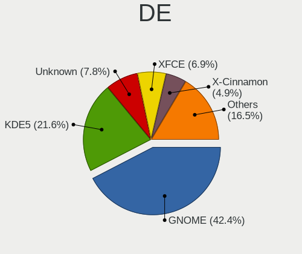

| Name       | Desktops | Percent |
|------------|----------|---------|
| GNOME      | 218      | 43.51%  |
| KDE5       | 83       | 16.57%  |
| Unknown    | 63       | 12.57%  |
| XFCE       | 35       | 6.99%   |
| X-Cinnamon | 21       | 4.19%   |
| KDE4       | 17       | 3.39%   |
| KDE        | 17       | 3.39%   |
| MATE       | 15       | 2.99%   |
| Cinnamon   | 8        | 1.6%    |
| Pantheon   | 7        | 1.4%    |
| LXDE       | 4        | 0.8%    |
| Budgie     | 4        | 0.8%    |
| LXQt       | 3        | 0.6%    |
| Deepin     | 3        | 0.6%    |
| Unity      | 2        | 0.4%    |
| trinity    | 1        | 0.2%    |

Display Server
--------------

X11 or Wayland

| Name    | Desktops | Percent |
|---------|----------|---------|
| X11     | 408      | 82.76%  |
| Wayland | 43       | 8.72%   |
| Unknown | 39       | 7.91%   |
| Tty     | 3        | 0.61%   |

Display Manager
---------------

SDDM, LightDM, etc.

| Name    | Desktops | Percent |
|---------|----------|---------|
| Unknown | 304      | 61.54%  |
| SDDM    | 73       | 14.78%  |
| GDM     | 30       | 6.07%   |
| LightDM | 28       | 5.67%   |
| GDM3    | 26       | 5.26%   |
| KDM     | 18       | 3.64%   |
| TDM     | 15       | 3.04%   |

OS Lang
-------

Language

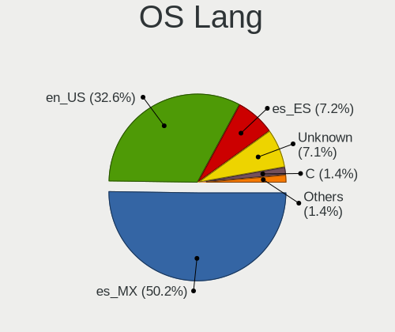

| Lang       | Desktops | Percent |
|------------|----------|---------|
| es_MX      | 239      | 48.09%  |
| en_US      | 136      | 27.36%  |
| Unknown    | 75       | 15.09%  |
| es_ES      | 36       | 7.24%   |
| C          | 6        | 1.21%   |
| POSIX      | 1        | 0.2%    |
| es_US      | 1        | 0.2%    |
| en_US.UTF8 | 1        | 0.2%    |
| en_GB      | 1        | 0.2%    |
| en_CA      | 1        | 0.2%    |

Boot Mode
---------

EFI or BIOS

| Mode | Desktops | Percent |
|------|----------|---------|
| BIOS | 345      | 70.41%  |
| EFI  | 145      | 29.59%  |

Filesystem
----------

Type of filesystem

| Type    | Desktops | Percent |
|---------|----------|---------|
| Ext4    | 387      | 78.82%  |
| Overlay | 45       | 9.16%   |
| Unknown | 26       | 5.3%    |
| Btrfs   | 24       | 4.89%   |
| Xfs     | 3        | 0.61%   |
| Ext2    | 3        | 0.61%   |
| Zfs     | 2        | 0.41%   |
| F2fs    | 1        | 0.2%    |

Part. scheme
------------

Scheme of partitioning

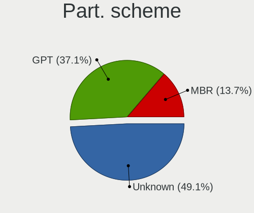

| Type    | Desktops | Percent |
|---------|----------|---------|
| Unknown | 335      | 68.37%  |
| GPT     | 90       | 18.37%  |
| MBR     | 65       | 13.27%  |

Dual Boot with Linux/BSD
------------------------

Hosting more than one Linux/BSD

| Dual boot | Desktops | Percent |
|-----------|----------|---------|
| No        | 420      | 85.54%  |
| Yes       | 71       | 14.46%  |

Dual Boot (Win)
---------------

Hosting Linux and Windows

| Dual boot | Desktops | Percent |
|-----------|----------|---------|
| No        | 319      | 64.84%  |
| Yes       | 173      | 35.16%  |

Board
-----

Vendor
------

Motherboard manufacturer

| Name                  | Desktops | Percent |
|-----------------------|----------|---------|
| Gigabyte Technology   | 116      | 23.92%  |
| ASUSTek Computer      | 90       | 18.56%  |
| Hewlett-Packard       | 50       | 10.31%  |
| Dell                  | 50       | 10.31%  |
| ECS                   | 28       | 5.77%   |
| ASRock                | 25       | 5.15%   |
| Intel                 | 22       | 4.54%   |
| Biostar               | 18       | 3.71%   |
| MSI                   | 17       | 3.51%   |
| Lenovo                | 13       | 2.68%   |
| Pegatron              | 12       | 2.47%   |
| Acer                  | 9        | 1.86%   |
| Foxconn               | 7        | 1.44%   |
| Lanix                 | 6        | 1.24%   |
| PCChips               | 4        | 0.82%   |
| Alienware             | 4        | 0.82%   |
| eMachines             | 2        | 0.41%   |
| Wistron               | 1        | 0.21%   |
| VIA Technologies      | 1        | 0.21%   |
| TPV-INVENTA           | 1        | 0.21%   |
| Quanta                | 1        | 0.21%   |
| ICP / iEi             | 1        | 0.21%   |
| IBM                   | 1        | 0.21%   |
| HC                    | 1        | 0.21%   |
| Google                | 1        | 0.21%   |
| ASUSTeK_COMPUTER_INC. | 1        | 0.21%   |
| ASRockRack            | 1        | 0.21%   |
| Apple                 | 1        | 0.21%   |
| Unknown               | 1        | 0.21%   |

Model
-----

Motherboard model

| Name                              | Desktops | Percent |
|-----------------------------------|----------|---------|
| ASUS PRIME A320M-K                | 12       | 2.47%   |
| Gigabyte B450M DS3H               | 7        | 1.44%   |
| ECS A320AM4-M3D                   | 7        | 1.44%   |
| HP Compaq 6200 Pro SFF PC         | 5        | 1.03%   |
| Dell OptiPlex 9020                | 5        | 1.03%   |
| Dell OptiPlex 755                 | 5        | 1.03%   |
| ASUS All Series                   | 5        | 1.03%   |
| Gigabyte GA-880GM-USB3            | 4        | 0.82%   |
| Gigabyte A320M-S2H V2             | 4        | 0.82%   |
| Gigabyte A320M-S2H                | 4        | 0.82%   |
| Dell OptiPlex 790                 | 4        | 0.82%   |
| ASUS ROG STRIX B450-F GAMING      | 4        | 0.82%   |
| Alienware X51 R2                  | 4        | 0.82%   |
| Lanix MINI-TORRE                  | 3        | 0.62%   |
| HP Z420 Workstation               | 3        | 0.62%   |
| HP Compaq 8200 Elite SFF PC       | 3        | 0.62%   |
| Gigabyte GA-78LMT-USB3            | 3        | 0.62%   |
| ECS A68F2P-M4                     | 3        | 0.62%   |
| Dell OptiPlex GX620               | 3        | 0.62%   |
| Dell OptiPlex 745                 | 3        | 0.62%   |
| Dell OptiPlex 7010                | 3        | 0.62%   |
| Biostar A10N-8800E                | 3        | 0.62%   |
| ASUS PRIME B450M-A                | 3        | 0.62%   |
| ASUS M5A97 R2.0                   | 3        | 0.62%   |
| ASRock FM2A68M-DG3+               | 3        | 0.62%   |
| Acer Aspire R1600                 | 3        | 0.62%   |
| MSI MS-7C02                       | 2        | 0.41%   |
| MSI MS-7B12                       | 2        | 0.41%   |
| Lenovo ThinkCentre M78 10BTA00ELM | 2        | 0.41%   |
| Intel DH67BL AAG10189-211         | 2        | 0.41%   |
| Intel DG41RQ AAE54511-205         | 2        | 0.41%   |
| HP Z620 Workstation               | 2        | 0.41%   |
| HP Z400 Workstation               | 2        | 0.41%   |
| HP EliteDesk 705 G4 SFF           | 2        | 0.41%   |
| HP Compaq 6005 Pro SFF PC         | 2        | 0.41%   |
| Gigabyte X570 GAMING X            | 2        | 0.41%   |
| Gigabyte M68M-S2                  | 2        | 0.41%   |
| Gigabyte H81M-H                   | 2        | 0.41%   |
| Gigabyte H61M-DS2                 | 2        | 0.41%   |
| Gigabyte H110M-H                  | 2        | 0.41%   |
| Gigabyte H110M-DS2                | 2        | 0.41%   |
| Gigabyte G1.Sniper B6             | 2        | 0.41%   |
| Gigabyte G1.Sniper A88X-CF        | 2        | 0.41%   |
| Gigabyte F2A68HM-DS2H             | 2        | 0.41%   |
| Gigabyte B550M AORUS ELITE        | 2        | 0.41%   |
| Gigabyte B450 AORUS M             | 2        | 0.41%   |
| Gigabyte B450 AORUS ELITE         | 2        | 0.41%   |
| Gigabyte B250M-DS3H               | 2        | 0.41%   |
| Gigabyte AB350-Gaming 3           | 2        | 0.41%   |
| Gigabyte A520M H                  | 2        | 0.41%   |
| eMachines EL1320                  | 2        | 0.41%   |
| ECS H61H2-MV                      | 2        | 0.41%   |
| ECS GX705AA-ABM a6300la           | 2        | 0.41%   |
| ECS BSWI-D2                       | 2        | 0.41%   |
| Dell Precision WorkStation T3500  | 2        | 0.41%   |
| Dell Inspiron 545                 | 2        | 0.41%   |
| Biostar A68N-5600                 | 2        | 0.41%   |
| ASUS Z170-A                       | 2        | 0.41%   |
| ASUS PRIME X570-P                 | 2        | 0.41%   |
| ASUS P8B75-M                      | 2        | 0.41%   |

Model Family
------------

Motherboard model prefix

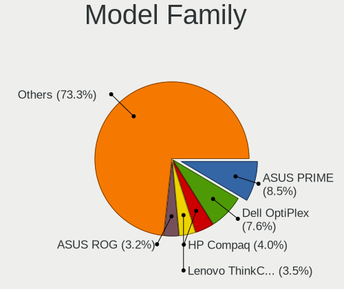

| Name                   | Desktops | Percent |
|------------------------|----------|---------|
| Dell OptiPlex          | 31       | 6.39%   |
| ASUS PRIME             | 28       | 5.77%   |
| HP Compaq              | 22       | 4.54%   |
| Lenovo ThinkCentre     | 11       | 2.27%   |
| Dell Inspiron          | 10       | 2.06%   |
| ASUS ROG               | 10       | 2.06%   |
| Gigabyte B450M         | 9        | 1.86%   |
| Gigabyte A320M-S2H     | 8        | 1.65%   |
| Acer Aspire            | 8        | 1.65%   |
| ECS A320AM4-M3D        | 7        | 1.44%   |
| ASUS M5A97             | 7        | 1.44%   |
| Gigabyte B450          | 6        | 1.24%   |
| HP ProDesk             | 5        | 1.03%   |
| ASUS TUF               | 5        | 1.03%   |
| ASUS All               | 5        | 1.03%   |
| Gigabyte X570          | 4        | 0.82%   |
| Gigabyte GA-880GM-USB3 | 4        | 0.82%   |
| Gigabyte G1.Sniper     | 4        | 0.82%   |
| Dell Precision         | 4        | 0.82%   |
| ASUS M5A78L-M          | 4        | 0.82%   |
| Alienware X51          | 4        | 0.82%   |
| Lanix MINI-TORRE       | 3        | 0.62%   |
| Intel DH67BL           | 3        | 0.62%   |
| HP Z420                | 3        | 0.62%   |
| HP EliteDesk           | 3        | 0.62%   |
| Gigabyte H61M-DS2      | 3        | 0.62%   |
| Gigabyte H110M-H       | 3        | 0.62%   |
| Gigabyte GA-78LMT-USB3 | 3        | 0.62%   |
| ECS A68F2P-M4          | 3        | 0.62%   |
| Biostar A10N-8800E     | 3        | 0.62%   |
| ASRock FM2A68M-DG3+    | 3        | 0.62%   |
| Pegatron Compaq        | 2        | 0.41%   |
| MSI MS-7C02            | 2        | 0.41%   |
| MSI MS-7B12            | 2        | 0.41%   |
| MSI Compaq             | 2        | 0.41%   |
| Lanix TITAN            | 2        | 0.41%   |
| Intel DG41RQ           | 2        | 0.41%   |
| Intel DG31PR           | 2        | 0.41%   |
| HP Z620                | 2        | 0.41%   |
| HP Z400                | 2        | 0.41%   |
| HP ProLiant            | 2        | 0.41%   |
| Gigabyte Z390          | 2        | 0.41%   |
| Gigabyte M68M-S2       | 2        | 0.41%   |
| Gigabyte H81M-H        | 2        | 0.41%   |
| Gigabyte H310M         | 2        | 0.41%   |
| Gigabyte H110M-DS2     | 2        | 0.41%   |
| Gigabyte F2A68HM-DS2H  | 2        | 0.41%   |
| Gigabyte B560M         | 2        | 0.41%   |
| Gigabyte B550M         | 2        | 0.41%   |
| Gigabyte B250M-DS3H    | 2        | 0.41%   |
| Gigabyte AX370-Gaming  | 2        | 0.41%   |
| Gigabyte AB350-Gaming  | 2        | 0.41%   |
| Gigabyte A520M         | 2        | 0.41%   |
| eMachines EL1320       | 2        | 0.41%   |
| ECS H61H2-MV           | 2        | 0.41%   |
| ECS GX705AA-ABM        | 2        | 0.41%   |
| ECS BSWI-D2            | 2        | 0.41%   |
| Biostar A68N-5600      | 2        | 0.41%   |
| ASUS Z170-A            | 2        | 0.41%   |
| ASUS P8H61-M           | 2        | 0.41%   |

MFG Year
--------

Motherboard manufacture year

| Year | Desktops | Percent |
|------|----------|---------|
| 2018 | 56       | 11.55%  |
| 2011 | 54       | 11.13%  |
| 2012 | 52       | 10.72%  |
| 2017 | 41       | 8.45%   |
| 2009 | 39       | 8.04%   |
| 2010 | 30       | 6.19%   |
| 2014 | 29       | 5.98%   |
| 2013 | 27       | 5.57%   |
| 2019 | 25       | 5.15%   |
| 2016 | 24       | 4.95%   |
| 2007 | 24       | 4.95%   |
| 2015 | 22       | 4.54%   |
| 2008 | 17       | 3.51%   |
| 2020 | 15       | 3.09%   |
| 2006 | 14       | 2.89%   |
| 2021 | 8        | 1.65%   |
| 2005 | 7        | 1.44%   |
| 2003 | 1        | 0.21%   |

Form Factor
-----------

Physical design of the computer

| Name    | Desktops | Percent |
|---------|----------|---------|
| Desktop | 485      | 100%    |

Secure Boot
-----------

Enabled or disabled

| State    | Desktops | Percent |
|----------|----------|---------|
| Disabled | 479      | 98.36%  |
| Enabled  | 8        | 1.64%   |

Coreboot
--------

Have coreboot on board

| Used | Desktops | Percent |
|------|----------|---------|
| No   | 484      | 99.79%  |
| Yes  | 1        | 0.21%   |

RAM Size
--------

Total RAM memory

| Size in GB      | Desktops | Percent |
|-----------------|----------|---------|
| 4.01-8.0        | 109      | 22.15%  |
| 3.01-4.0        | 109      | 22.15%  |
| 8.01-16.0       | 95       | 19.31%  |
| 16.01-24.0      | 69       | 14.02%  |
| 32.01-64.0      | 42       | 8.54%   |
| 1.01-2.0        | 31       | 6.3%    |
| 24.01-32.0      | 12       | 2.44%   |
| 64.01-256.0     | 11       | 2.24%   |
| 2.01-3.0        | 9        | 1.83%   |
| 0.51-1.0        | 3        | 0.61%   |
| More than 256.0 | 1        | 0.2%    |
| 0.01-0.5        | 1        | 0.2%    |

RAM Used
--------

Used RAM memory

| Used GB     | Desktops | Percent |
|-------------|----------|---------|
| 1.01-2.0    | 206      | 39.39%  |
| 2.01-3.0    | 124      | 23.71%  |
| 3.01-4.0    | 67       | 12.81%  |
| 4.01-8.0    | 56       | 10.71%  |
| 0.51-1.0    | 44       | 8.41%   |
| 8.01-16.0   | 14       | 2.68%   |
| 0.01-0.5    | 6        | 1.15%   |
| 16.01-24.0  | 3        | 0.57%   |
| 24.01-32.0  | 2        | 0.38%   |
| 64.01-256.0 | 1        | 0.19%   |

Total Drives
------------

Number of drives on board

| Drives  | Desktops | Percent |
|---------|----------|---------|
| 1       | 252      | 50%     |
| 2       | 140      | 27.78%  |
| 3       | 58       | 11.51%  |
| 4       | 28       | 5.56%   |
| 5       | 10       | 1.98%   |
| 0       | 9        | 1.79%   |
| 6       | 3        | 0.6%    |
| 7       | 2        | 0.4%    |
| 8       | 1        | 0.2%    |
| Unknown | 1        | 0.2%    |

Has CD-ROM
----------

Has CD-ROM on board

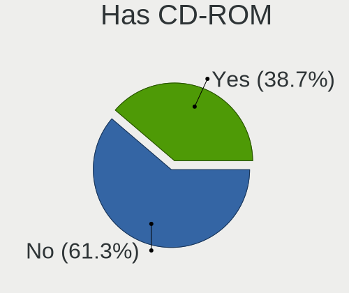

| Presented | Desktops | Percent |
|-----------|----------|---------|
| No        | 258      | 52.87%  |
| Yes       | 230      | 47.13%  |

Has Ethernet
------------

Has Ethernet on board

| Presented | Desktops | Percent |
|-----------|----------|---------|
| Yes       | 480      | 98.97%  |
| No        | 5        | 1.03%   |

Has WiFi
--------

Has WiFi module

| Presented | Desktops | Percent |
|-----------|----------|---------|
| No        | 265      | 54.41%  |
| Yes       | 222      | 45.59%  |

Has Bluetooth
-------------

Has Bluetooth module

| Presented | Desktops | Percent |
|-----------|----------|---------|
| No        | 377      | 76.78%  |
| Yes       | 114      | 23.22%  |

Location
--------

Country
-------

Geographic location (country)

| Country | Desktops | Percent |
|---------|----------|---------|
| Mexico  | 485      | 100%    |

City
----

Geographic location (city)

| City                          | Desktops | Percent |
|-------------------------------|----------|---------|
| Mexico City                   | 89       | 17.35%  |
| Guadalajara                   | 32       | 6.24%   |
| Monterrey                     | 19       | 3.7%    |
| Tijuana                       | 16       | 3.12%   |
| Zapopan                       | 14       | 2.73%   |
| Chihuahua City                | 14       | 2.73%   |
| Hermosillo                    | 12       | 2.34%   |
| Morelia                       | 10       | 1.95%   |
| Ciudad Nezahualcoyotl         | 9        | 1.75%   |
| Tlalnepantla                  | 8        | 1.56%   |
| Mrida                     | 8        | 1.56%   |
| Ciudad Jurez              | 8        | 1.56%   |
| Puebla City                   | 7        | 1.36%   |
| Xalapa                        | 6        | 1.17%   |
| San Pedro                     | 6        | 1.17%   |
| Quertaro City             | 6        | 1.17%   |
| Oaxaca City                   | 6        | 1.17%   |
| Ecatepec                      | 6        | 1.17%   |
| Colima                        | 6        | 1.17%   |
| Apodaca                       | 6        | 1.17%   |
| Toluca                        | 5        | 0.97%   |
| Puerto Vallarta               | 5        | 0.97%   |
| Naucalpan                     | 5        | 0.97%   |
| Len                       | 5        | 0.97%   |
| Iztapalapa                    | 5        | 0.97%   |
| Ensenada                      | 5        | 0.97%   |
| Cuernavaca                    | 5        | 0.97%   |
| Villahermosa                  | 4        | 0.78%   |
| Vicente Guerrero              | 4        | 0.78%   |
| Quertaro City             | 4        | 0.78%   |
| Pachuca                       | 4        | 0.78%   |
| Irapuato                      | 4        | 0.78%   |
| Guadalupe                     | 4        | 0.78%   |
| Cancn                     | 4        | 0.78%   |
| Aguascalientes                | 4        | 0.78%   |
| Tultitlan de Mariano Escobedo | 3        | 0.58%   |
| Tapachula                     | 3        | 0.58%   |
| Tampico                       | 3        | 0.58%   |
| San Nicols de los Garza   | 3        | 0.58%   |
| San Juan del Ro           | 3        | 0.58%   |
| Mexicali                      | 3        | 0.58%   |
| Cuautla                       | 3        | 0.58%   |
| Celaya                        | 3        | 0.58%   |
| Cancn                     | 3        | 0.58%   |
| Zacatecas City                | 2        | 0.39%   |
| Veracruz                      | 2        | 0.39%   |
| Tuxtla Gutirrez           | 2        | 0.39%   |
| Torren                    | 2        | 0.39%   |
| Torren                      | 2        | 0.39%   |
| San Miguel el Alto            | 2        | 0.39%   |
| San Luis Potos City       | 2        | 0.39%   |
| Saltillo                      | 2        | 0.39%   |
| Rioverde                      | 2        | 0.39%   |
| Queretaro                     | 2        | 0.39%   |
| Progreso                      | 2        | 0.39%   |
| Nuevo Laredo                  | 2        | 0.39%   |
| Monclova                      | 2        | 0.39%   |
| Metepec                       | 2        | 0.39%   |
| Mrida                     | 2        | 0.39%   |
| Mazatln                   | 2        | 0.39%   |

Drives
------

Drive Vendor
------------

Hard drive vendors

| Vendor                    | Desktops | Drives | Percent |
|---------------------------|----------|--------|---------|
| Seagate                   | 192      | 289    | 25.07%  |
| WDC                       | 178      | 237    | 23.24%  |
| Kingston                  | 76       | 90     | 9.92%   |
| Hitachi                   | 56       | 85     | 7.31%   |
| Toshiba                   | 55       | 66     | 7.18%   |
| A-DATA Technology         | 50       | 64     | 6.53%   |
| Samsung Electronics       | 40       | 46     | 5.22%   |
| XPG                       | 10       | 11     | 1.31%   |
| Unknown                   | 9        | 12     | 1.17%   |
| HGST                      | 9        | 14     | 1.17%   |
| SanDisk                   | 8        | 9      | 1.04%   |
| MAXTOR                    | 8        | 10     | 1.04%   |
| Fujitsu                   | 8        | 10     | 1.04%   |
| Realtek Semiconductor     | 7        | 9      | 0.91%   |
| PNY                       | 7        | 7      | 0.91%   |
| Intel                     | 7        | 9      | 0.91%   |
| Crucial                   | 7        | 8      | 0.91%   |
| Phison                    | 5        | 6      | 0.65%   |
| Gigabyte Technology       | 4        | 5      | 0.52%   |
| Transcend                 | 2        | 2      | 0.26%   |
| SPCC                      | 2        | 2      | 0.26%   |
| Micron Technology         | 2        | 5      | 0.26%   |
| JMicron                   | 2        | 2      | 0.26%   |
| Hewlett-Packard           | 2        | 2      | 0.26%   |
| Yeyian                    | 1        | 1      | 0.13%   |
| VALK                      | 1        | 1      | 0.13%   |
| USB3.0                    | 1        | 1      | 0.13%   |
| Union Memory              | 1        | 1      | 0.13%   |
| SK Hynix                  | 1        | 1      | 0.13%   |
| Silicon Motion            | 1        | 2      | 0.13%   |
| QUANTUM                   | 1        | 1      | 0.13%   |
| Patriot                   | 1        | 1      | 0.13%   |
| Netac                     | 1        | 2      | 0.13%   |
| Micron/Crucial Technology | 1        | 1      | 0.13%   |
| MaxDigital                | 1        | 4      | 0.13%   |
| LONDISK                   | 1        | 1      | 0.13%   |
| Lite-On                   | 1        | 3      | 0.13%   |
| Lexar                     | 1        | 1      | 0.13%   |
| HS-SSD-C100               | 1        | 2      | 0.13%   |
| HPE                       | 1        | 1      | 0.13%   |
| Corsair                   | 1        | 1      | 0.13%   |
| China                     | 1        | 1      | 0.13%   |
| AS201                     | 1        | 1      | 0.13%   |
| Apacer                    | 1        | 1      | 0.13%   |

Drive Model
-----------

Hard drive models

| Model                               | Desktops | Percent |
|-------------------------------------|----------|---------|
| Kingston SA400S37240G 240GB SSD     | 21       | 2.45%   |
| Seagate ST500DM002-1BD142 500GB     | 20       | 2.33%   |
| Seagate ST1000DM010-2EP102 1TB      | 14       | 1.63%   |
| Kingston SA400S37480G 480GB SSD     | 12       | 1.4%    |
| A-DATA SU650 120GB SSD              | 12       | 1.4%    |
| Kingston SA400S37120G 120GB SSD     | 11       | 1.28%   |
| Toshiba DT01ACA050 500GB            | 10       | 1.17%   |
| Toshiba DT01ACA200 2TB              | 9        | 1.05%   |
| Seagate ST3500418AS 500GB           | 9        | 1.05%   |
| A-DATA SU650 240GB SSD              | 9        | 1.05%   |
| WDC WDS240G2G0A-00JH30 240GB SSD    | 8        | 0.93%   |
| Seagate ST2000DM006-2DM164 2TB      | 8        | 0.93%   |
| WDC WD5000AAKX-60U6AA0 500GB        | 7        | 0.82%   |
| Seagate ST2000DL003-9VT166 2TB      | 7        | 0.82%   |
| Seagate ST1000DM003-1CH162 1TB      | 7        | 0.82%   |
| Seagate ST1000DM003-1SB102 1TB      | 6        | 0.7%    |
| XPG GAMMIX S11 Pro 512GB            | 5        | 0.58%   |
| WDC WDS100T2G0A-00JH30 1TB SSD      | 5        | 0.58%   |
| WDC WD10EZEX-08WN4A0 1TB            | 5        | 0.58%   |
| Toshiba MQ01ABD100 1TB              | 5        | 0.58%   |
| Toshiba DT01ACA100 1TB              | 5        | 0.58%   |
| Seagate ST3500630AS 500GB           | 5        | 0.58%   |
| Seagate ST3160815AS 160GB           | 5        | 0.58%   |
| Seagate ST31000524AS 1TB            | 5        | 0.58%   |
| Seagate ST2000DM008-2FR102 2TB      | 5        | 0.58%   |
| Kingston SV300S37A120G 120GB SSD    | 5        | 0.58%   |
| WDC WD10EZEX-08M2NA0 1TB            | 4        | 0.47%   |
| Seagate ST4000DM004-2CV104 4TB      | 4        | 0.47%   |
| Seagate ST3500414CS 500GB           | 4        | 0.47%   |
| Seagate ST3500413AS 500GB           | 4        | 0.47%   |
| Seagate ST3320418AS 320GB           | 4        | 0.47%   |
| Seagate ST3000DM008-2DM166 3TB      | 4        | 0.47%   |
| Seagate ST3000DM001-1CH166 3TB      | 4        | 0.47%   |
| Seagate ST1000LM035-1RK172 1TB      | 4        | 0.47%   |
| Seagate ST1000DM003-1ER162 1TB      | 4        | 0.47%   |
| Hitachi HUA722020ALA331 2TB         | 4        | 0.47%   |
| Hitachi HDS721616PLA380 160GB       | 4        | 0.47%   |
| Hitachi HDS721050CLA662 500GB       | 4        | 0.47%   |
| A-DATA SU800 256GB SSD              | 4        | 0.47%   |
| XPG SPECTRIX S40G 4TB               | 3        | 0.35%   |
| WDC WD10EZEX-75M2NA0 1TB            | 3        | 0.35%   |
| Unknown SD/MMC/MS PRO 128GB         | 3        | 0.35%   |
| Toshiba MQ01ABF032 320GB            | 3        | 0.35%   |
| Seagate ST500LM012 HN-M500MBB 500GB | 3        | 0.35%   |
| Seagate ST500DM002-1BC142 500GB     | 3        | 0.35%   |
| Seagate ST3400832AS 400GB           | 3        | 0.35%   |
| Seagate ST340014A 40GB              | 3        | 0.35%   |
| Seagate ST3160023AS 160GB           | 3        | 0.35%   |
| Seagate ST31000528AS 1TB            | 3        | 0.35%   |
| Seagate ST3000DM001-1ER166 3TB      | 3        | 0.35%   |
| Seagate ST250DM000-1BD141 250GB     | 3        | 0.35%   |
| Seagate ST2000DX002-2DV164 2TB      | 3        | 0.35%   |
| Seagate ST2000DM001-1CH164 2TB      | 3        | 0.35%   |
| Sandisk NVMe SSD Drive 500GB        | 3        | 0.35%   |
| Samsung HD161HJ 160GB               | 3        | 0.35%   |
| Realtek NVMe SSD Drive 512GB        | 3        | 0.35%   |
| Kingston SHSS37A240G 240GB SSD      | 3        | 0.35%   |
| Kingston SA400S37960G 960GB SSD     | 3        | 0.35%   |
| Hitachi HUS724040ALE641 4TB         | 3        | 0.35%   |
| Hitachi HTS543225L9A300 250GB       | 3        | 0.35%   |

HDD Vendor
----------

Hard disk drive vendors

| Vendor              | Desktops | Drives | Percent |
|---------------------|----------|--------|---------|
| Seagate             | 191      | 288    | 37.82%  |
| WDC                 | 156      | 200    | 30.89%  |
| Hitachi             | 56       | 85     | 11.09%  |
| Toshiba             | 55       | 66     | 10.89%  |
| Samsung Electronics | 15       | 16     | 2.97%   |
| HGST                | 9        | 14     | 1.78%   |
| MAXTOR              | 8        | 10     | 1.58%   |
| Fujitsu             | 8        | 10     | 1.58%   |
| Unknown             | 3        | 4      | 0.59%   |
| QUANTUM             | 1        | 1      | 0.2%    |
| MaxDigital          | 1        | 4      | 0.2%    |
| HPE                 | 1        | 1      | 0.2%    |
| Hewlett-Packard     | 1        | 1      | 0.2%    |

SSD Vendor
----------

Solid state drive vendors

| Vendor              | Desktops | Drives | Percent |
|---------------------|----------|--------|---------|
| Kingston            | 72       | 85     | 34.78%  |
| A-DATA Technology   | 48       | 61     | 23.19%  |
| WDC                 | 26       | 35     | 12.56%  |
| Samsung Electronics | 16       | 18     | 7.73%   |
| PNY                 | 7        | 7      | 3.38%   |
| Crucial             | 6        | 7      | 2.9%    |
| SanDisk             | 4        | 4      | 1.93%   |
| Intel               | 4        | 5      | 1.93%   |
| Gigabyte Technology | 3        | 4      | 1.45%   |
| Transcend           | 2        | 2      | 0.97%   |
| SPCC                | 2        | 2      | 0.97%   |
| Micron Technology   | 2        | 5      | 0.97%   |
| Yeyian              | 1        | 1      | 0.48%   |
| VALK                | 1        | 1      | 0.48%   |
| USB3.0              | 1        | 1      | 0.48%   |
| Unknown             | 1        | 1      | 0.48%   |
| Patriot             | 1        | 1      | 0.48%   |
| Netac               | 1        | 2      | 0.48%   |
| LONDISK             | 1        | 1      | 0.48%   |
| Lite-On             | 1        | 3      | 0.48%   |
| Lexar               | 1        | 1      | 0.48%   |
| JMicron             | 1        | 1      | 0.48%   |
| Hewlett-Packard     | 1        | 1      | 0.48%   |
| Corsair             | 1        | 1      | 0.48%   |
| China               | 1        | 1      | 0.48%   |
| AS201               | 1        | 1      | 0.48%   |
| Apacer              | 1        | 1      | 0.48%   |

Drive Kind
----------

HDD or SSD

| Kind    | Desktops | Drives | Percent |
|---------|----------|--------|---------|
| HDD     | 397      | 700    | 62.32%  |
| SSD     | 184      | 253    | 28.89%  |
| NVMe    | 51       | 67     | 8.01%   |
| Unknown | 5        | 8      | 0.78%   |

Drive Connector
---------------

SATA, SAS, NVMe, etc.

| Type | Desktops | Drives | Percent |
|------|----------|--------|---------|
| SATA | 461      | 941    | 87.48%  |
| NVMe | 51       | 67     | 9.68%   |
| SAS  | 15       | 20     | 2.85%   |

Drive Size
----------

Size of hard drive

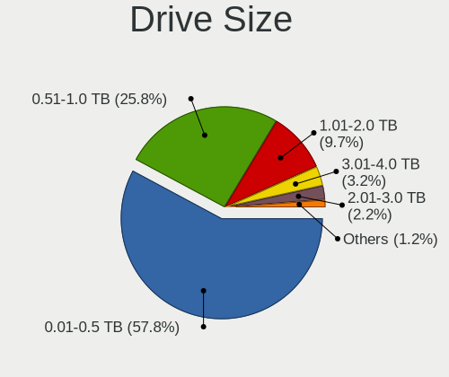

| Size in TB | Desktops | Drives | Percent |
|------------|----------|--------|---------|
| 0.01-0.5   | 372      | 613    | 60.98%  |
| 0.51-1.0   | 137      | 195    | 22.46%  |
| 1.01-2.0   | 62       | 77     | 10.16%  |
| 3.01-4.0   | 19       | 42     | 3.11%   |
| 2.01-3.0   | 17       | 23     | 2.79%   |
| 4.01-10.0  | 3        | 3      | 0.49%   |

Space Total
-----------

Amount of disk space available on the file system

| Size in GB     | Desktops | Percent |
|----------------|----------|---------|
| 101-250        | 112      | 21.83%  |
| 251-500        | 97       | 18.91%  |
| 501-1000       | 76       | 14.81%  |
| 1001-2000      | 50       | 9.75%   |
| 51-100         | 46       | 8.97%   |
| 1-20           | 43       | 8.38%   |
| More than 3000 | 28       | 5.46%   |
| 21-50          | 27       | 5.26%   |
| 2001-3000      | 18       | 3.51%   |
| Unknown        | 16       | 3.12%   |

Space Used
----------

Amount of used disk space

| Used GB        | Desktops | Percent |
|----------------|----------|---------|
| 1-20           | 202      | 38.55%  |
| 21-50          | 103      | 19.66%  |
| 101-250        | 55       | 10.5%   |
| 51-100         | 45       | 8.59%   |
| 501-1000       | 34       | 6.49%   |
| 251-500        | 33       | 6.3%    |
| 1001-2000      | 24       | 4.58%   |
| Unknown        | 16       | 3.05%   |
| More than 3000 | 8        | 1.53%   |
| 2001-3000      | 4        | 0.76%   |

Malfunc. Drives
---------------

Drive models with a malfunction

| Model                                 | Desktops | Drives | Percent |
|---------------------------------------|----------|--------|---------|
| Seagate ST2000DL003-9VT166 2TB        | 3        | 3      | 4.41%   |
| Toshiba MQ01ABD100 1TB                | 2        | 2      | 2.94%   |
| Seagate ST3500418AS 500GB             | 2        | 2      | 2.94%   |
| Seagate ST31000524AS 1TB              | 2        | 4      | 2.94%   |
| MAXTOR 6Y080M0 81GB                   | 2        | 2      | 2.94%   |
| HGST HTS545050A7E380 500GB            | 2        | 2      | 2.94%   |
| WDC WD5000AAKX-753CA1 500GB           | 1        | 1      | 1.47%   |
| WDC WD5000AAKX-08U6AA0 500GB          | 1        | 1      | 1.47%   |
| WDC WD5000AADS-56S9B1 499GB           | 1        | 1      | 1.47%   |
| WDC WD5000AACS-61M6B2 500GB           | 1        | 1      | 1.47%   |
| WDC WD3200KS-75PFB0 320GB             | 1        | 1      | 1.47%   |
| WDC WD3200AVVS-63L2B0 320GB           | 1        | 1      | 1.47%   |
| WDC WD3200AAJS-60M0A0 320GB           | 1        | 1      | 1.47%   |
| WDC WD2500JS-00NCB1 250GB             | 1        | 1      | 1.47%   |
| WDC WD2500AVVS-61L2B0 250GB           | 1        | 1      | 1.47%   |
| WDC WD1600AAJS-00L7A0 160GB           | 1        | 1      | 1.47%   |
| WDC WD10EZEX-08M2NA0 1TB              | 1        | 1      | 1.47%   |
| WDC WD10EURX-63UY4Y0 1TB              | 1        | 1      | 1.47%   |
| WDC WD1002FBYS-18W8B0 1TB             | 1        | 1      | 1.47%   |
| Toshiba MQ04ABF100 1TB                | 1        | 1      | 1.47%   |
| Toshiba MK4058GSX 400GB               | 1        | 1      | 1.47%   |
| Toshiba MK2035GSS 200GB               | 1        | 1      | 1.47%   |
| Toshiba HDWD130 3TB                   | 1        | 1      | 1.47%   |
| Toshiba DT01ACA200 2TB                | 1        | 2      | 1.47%   |
| Toshiba DT01ACA100 1TB                | 1        | 1      | 1.47%   |
| Toshiba DT01ACA050 500GB              | 1        | 2      | 1.47%   |
| Seagate ST9320320AS 320GB             | 1        | 1      | 1.47%   |
| Seagate ST500LT012-1DG142 500GB       | 1        | 1      | 1.47%   |
| Seagate ST500DM002-1BD142 500GB       | 1        | 1      | 1.47%   |
| Seagate ST500DM002-1BC142 500GB       | 1        | 1      | 1.47%   |
| Seagate ST4000DM000-1F2168 4TB        | 1        | 2      | 1.47%   |
| Seagate ST380013AS 80GB               | 1        | 1      | 1.47%   |
| Seagate ST340016A 40GB                | 1        | 1      | 1.47%   |
| Seagate ST340014A 40GB                | 1        | 1      | 1.47%   |
| Seagate ST3320418AS 320GB             | 1        | 1      | 1.47%   |
| Seagate ST3250820AS 250GB             | 1        | 1      | 1.47%   |
| Seagate ST3250318AS 250GB             | 1        | 1      | 1.47%   |
| Seagate ST3160815AS 160GB             | 1        | 1      | 1.47%   |
| Seagate ST3160812AS 160GB             | 1        | 1      | 1.47%   |
| Seagate ST3160023AS 160GB             | 1        | 1      | 1.47%   |
| Seagate ST3120026AS 120GB             | 1        | 1      | 1.47%   |
| Seagate ST31000525SV 1TB              | 1        | 1      | 1.47%   |
| Seagate ST3000DM001-1CH166 3TB        | 1        | 1      | 1.47%   |
| Seagate ST2000DM006-2DM164 2TB        | 1        | 2      | 1.47%   |
| Seagate ST2000DM001-9YN164 2TB        | 1        | 1      | 1.47%   |
| Seagate ST1000VM002-1CT162 1TB        | 1        | 1      | 1.47%   |
| Seagate ST1000DM003-9YN162 1TB        | 1        | 1      | 1.47%   |
| Samsung Electronics HD322GJ 320GB     | 1        | 1      | 1.47%   |
| Samsung Electronics HD161HJ 160GB     | 1        | 1      | 1.47%   |
| Samsung Electronics HD103SI 1TB       | 1        | 1      | 1.47%   |
| Kingston SA400S37240G 240GB SSD       | 1        | 1      | 1.47%   |
| Kingston SA400S37120G 120GB SSD       | 1        | 1      | 1.47%   |
| Hitachi HUA722020ALA331 2TB           | 1        | 1      | 1.47%   |
| Hitachi HUA721010KLA330 1TB           | 1        | 1      | 1.47%   |
| Hitachi HTS723232A7A364 320GB         | 1        | 1      | 1.47%   |
| Hitachi HDT725040VLA360 400GB         | 1        | 1      | 1.47%   |
| Hitachi HDT721032SLA380 320GB         | 1        | 1      | 1.47%   |
| Hitachi HDS721616PLA380 160GB         | 1        | 2      | 1.47%   |
| Hitachi HDS721050CLA362 500GB         | 1        | 1      | 1.47%   |
| A-DATA Technology SU800NS38 256GB SSD | 1        | 1      | 1.47%   |

Malfunc. Drive Vendor
---------------------

Vendors of faulty drives

| Vendor              | Desktops | Drives | Percent |
|---------------------|----------|--------|---------|
| Seagate             | 26       | 32     | 41.94%  |
| WDC                 | 12       | 13     | 19.35%  |
| Toshiba             | 7        | 11     | 11.29%  |
| Hitachi             | 6        | 8      | 9.68%   |
| Samsung Electronics | 3        | 3      | 4.84%   |
| MAXTOR              | 2        | 2      | 3.23%   |
| Kingston            | 2        | 2      | 3.23%   |
| HGST                | 2        | 2      | 3.23%   |
| A-DATA Technology   | 2        | 2      | 3.23%   |

Malfunc. HDD Vendor
-------------------

Vendors of faulty HDD drives

| Vendor              | Desktops | Drives | Percent |
|---------------------|----------|--------|---------|
| Seagate             | 26       | 32     | 44.83%  |
| WDC                 | 12       | 13     | 20.69%  |
| Toshiba             | 7        | 11     | 12.07%  |
| Hitachi             | 6        | 8      | 10.34%  |
| Samsung Electronics | 3        | 3      | 5.17%   |
| MAXTOR              | 2        | 2      | 3.45%   |
| HGST                | 2        | 2      | 3.45%   |

Malfunc. Drive Kind
-------------------

Kinds of faulty drives

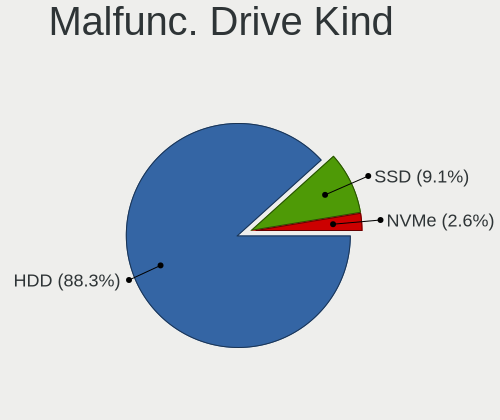

| Kind | Desktops | Drives | Percent |
|------|----------|--------|---------|
| HDD  | 53       | 71     | 92.98%  |
| SSD  | 4        | 4      | 7.02%   |

Failed Drives
-------------

Failed drive models

Zero info for selected period =(

Failed Drive Vendor
-------------------

Failed drive vendors

Zero info for selected period =(

Drive Status
------------

Number of failed and malfunc. drives

| Status   | Desktops | Drives | Percent |
|----------|----------|--------|---------|
| Detected | 338      | 689    | 65%     |
| Works    | 126      | 264    | 24.23%  |
| Malfunc  | 56       | 75     | 10.77%  |

Storage controller
------------------

Storage Vendor
--------------

Storage controller vendors

| Vendor                      | Desktops | Percent |
|-----------------------------|----------|---------|
| Intel                       | 267      | 46.92%  |
| AMD                         | 185      | 32.51%  |
| Nvidia                      | 31       | 5.45%   |
| Realtek Semiconductor       | 12       | 2.11%   |
| Marvell Technology Group    | 10       | 1.76%   |
| ADATA Technology            | 10       | 1.76%   |
| Samsung Electronics         | 9        | 1.58%   |
| Sandisk                     | 6        | 1.05%   |
| Phison Electronics          | 6        | 1.05%   |
| JMicron Technology          | 6        | 1.05%   |
| ASMedia Technology          | 6        | 1.05%   |
| Kingston Technology Company | 4        | 0.7%    |
| VIA Technologies            | 3        | 0.53%   |
| Silicon Image               | 3        | 0.53%   |
| Micron/Crucial Technology   | 2        | 0.35%   |
| Broadcom / LSI              | 2        | 0.35%   |
| Unknown                     | 1        | 0.18%   |
| Union Memory (Shenzhen)     | 1        | 0.18%   |
| SK Hynix                    | 1        | 0.18%   |
| Silicon Motion              | 1        | 0.18%   |
| LSI Logic / Symbios Logic   | 1        | 0.18%   |
| Hewlett-Packard             | 1        | 0.18%   |
| Adaptec                     | 1        | 0.18%   |

Storage Model
-------------

Storage controller models

| Model                                                                                   | Desktops | Percent |
|-----------------------------------------------------------------------------------------|----------|---------|
| AMD FCH SATA Controller [AHCI mode]                                                     | 110      | 13.25%  |
| Intel NM10/ICH7 Family SATA Controller [IDE mode]                                       | 35       | 4.22%   |
| AMD 400 Series Chipset SATA Controller                                                  | 32       | 3.86%   |
| Intel SATA Controller [RAID mode]                                                       | 30       | 3.61%   |
| Intel 6 Series/C200 Series Chipset Family 6 port Desktop SATA AHCI Controller           | 30       | 3.61%   |
| AMD FCH SATA Controller D                                                               | 27       | 3.25%   |
| Intel 82801G (ICH7 Family) IDE Controller                                               | 26       | 3.13%   |
| AMD SB7x0/SB8x0/SB9x0 SATA Controller [AHCI mode]                                       | 23       | 2.77%   |
| Intel 6 Series/C200 Series Chipset Family Desktop SATA Controller (IDE mode, ports 4-5) | 22       | 2.65%   |
| Intel 6 Series/C200 Series Chipset Family Desktop SATA Controller (IDE mode, ports 0-3) | 22       | 2.65%   |
| AMD SB7x0/SB8x0/SB9x0 IDE Controller                                                    | 22       | 2.65%   |
| Intel 8 Series/C220 Series Chipset Family 6-port SATA Controller 1 [AHCI mode]          | 21       | 2.53%   |
| Nvidia MCP61 SATA Controller                                                            | 19       | 2.29%   |
| AMD SB7x0/SB8x0/SB9x0 SATA Controller [IDE mode]                                        | 19       | 2.29%   |
| Intel Q170/Q150/B150/H170/H110/Z170/CM236 Chipset SATA Controller [AHCI Mode]           | 18       | 2.17%   |
| AMD 300 Series Chipset SATA Controller                                                  | 16       | 1.93%   |
| Nvidia MCP61 IDE                                                                        | 15       | 1.81%   |
| AMD FCH SATA Controller [IDE mode]                                                      | 14       | 1.69%   |
| Intel 7 Series/C210 Series Chipset Family 6-port SATA Controller [AHCI mode]            | 12       | 1.45%   |
| AMD FCH IDE Controller                                                                  | 12       | 1.45%   |
| Intel 200 Series PCH SATA controller [AHCI mode]                                        | 11       | 1.33%   |
| Intel Cannon Lake PCH SATA AHCI Controller                                              | 10       | 1.2%    |
| ADATA XPG SX8200 Pro PCIe Gen3x4 M.2 2280 Solid State Drive                             | 10       | 1.2%    |
| Realtek RTS5763DL NVMe SSD Controller                                                   | 8        | 0.96%   |
| Intel C600/X79 series chipset IDE-r Controller                                          | 8        | 0.96%   |
| Intel 82801IR/IO/IH (ICH9R/DO/DH) 4 port SATA Controller [IDE mode]                     | 8        | 0.96%   |
| Intel 82801I (ICH9 Family) 2 port SATA Controller [IDE mode]                            | 8        | 0.96%   |
| AMD 500 Series Chipset SATA Controller                                                  | 8        | 0.96%   |
| Intel C602 chipset 4-Port SATA Storage Control Unit                                     | 7        | 0.84%   |
| Intel C600/X79 series chipset SATA RAID Controller                                      | 7        | 0.84%   |
| Intel Atom/Celeron/Pentium Processor x5-E8000/J3xxx/N3xxx Series SATA Controller        | 7        | 0.84%   |
| Intel 82Q35 Express PT IDER Controller                                                  | 6        | 0.72%   |
| Intel 82801H (ICH8 Family) 4 port SATA Controller [IDE mode]                            | 6        | 0.72%   |
| ASMedia ASM1062 Serial ATA Controller                                                   | 6        | 0.72%   |
| Samsung NVMe SSD Controller SM981/PM981/PM983                                           | 5        | 0.6%    |
| Intel 7 Series/C210 Series Chipset Family 4-port SATA Controller [IDE mode]             | 5        | 0.6%    |
| Intel 7 Series/C210 Series Chipset Family 2-port SATA Controller [IDE mode]             | 5        | 0.6%    |
| AMD X370 Series Chipset SATA Controller                                                 | 5        | 0.6%    |
| Sandisk WD Black 2018/SN750 / PC SN720 NVMe SSD                                         | 4        | 0.48%   |
| Realtek Realtek Non-Volatile memory controller                                          | 4        | 0.48%   |
| Intel 82801HR/HO/HH (ICH8R/DO/DH) 2 port SATA Controller [IDE mode]                     | 4        | 0.48%   |
| Intel 5 Series/3400 Series Chipset 4 port SATA IDE Controller                           | 4        | 0.48%   |
| Intel 5 Series/3400 Series Chipset 2 port SATA IDE Controller                           | 4        | 0.48%   |
| Intel 4 Series Chipset PT IDER Controller                                               | 4        | 0.48%   |
| AMD SB600 Non-Raid-5 SATA                                                               | 4        | 0.48%   |
| AMD SB600 IDE                                                                           | 4        | 0.48%   |
| VIA VT82C586A/B/VT82C686/A/B/VT823x/A/C PIPC Bus Master IDE                             | 3        | 0.36%   |
| Nvidia MCP79 AHCI Controller                                                            | 3        | 0.36%   |
| Marvell Group 88SE91A3 SATA-600 Controller                                              | 3        | 0.36%   |
| Kingston Company A2000 NVMe SSD                                                         | 3        | 0.36%   |
| JMicron JMB368 IDE controller                                                           | 3        | 0.36%   |
| Intel Comet Lake SATA AHCI Controller                                                   | 3        | 0.36%   |
| Intel C600/X79 series chipset 6-Port SATA AHCI Controller                               | 3        | 0.36%   |
| Intel 82801JI (ICH10 Family) SATA AHCI Controller                                       | 3        | 0.36%   |
| Intel 82801JI (ICH10 Family) 4 port SATA IDE Controller #1                              | 3        | 0.36%   |
| Intel 82801JI (ICH10 Family) 2 port SATA IDE Controller #2                              | 3        | 0.36%   |
| Intel 82801JD/DO (ICH10 Family) 4-port SATA IDE Controller                              | 3        | 0.36%   |
| Intel 82801JD/DO (ICH10 Family) 2-port SATA IDE Controller                              | 3        | 0.36%   |
| Intel 82801IR/IO/IH (ICH9R/DO/DH) 6 port SATA Controller [AHCI mode]                    | 3        | 0.36%   |
| Intel 500 Series Chipset Family SATA AHCI Controller                                    | 3        | 0.36%   |

Storage Kind
------------

Kind of storage controller (IDE, SATA, NVMe, SAS, ...)

| Kind | Desktops | Percent |
|------|----------|---------|
| SATA | 327      | 53.52%  |
| IDE  | 179      | 29.3%   |
| NVMe | 51       | 8.35%   |
| RAID | 46       | 7.53%   |
| SAS  | 8        | 1.31%   |

Processor
---------

CPU Vendor
----------

Processor vendors

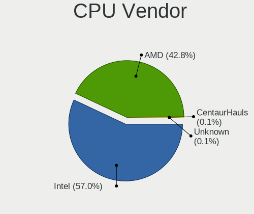

| Vendor | Desktops | Percent |
|--------|----------|---------|
| Intel  | 274      | 56.49%  |
| AMD    | 211      | 43.51%  |

CPU Model
---------

Processor models

| Model                                           | Desktops | Percent |
|-------------------------------------------------|----------|---------|
| Intel Core i7-4790 CPU @ 3.60GHz                | 9        | 1.85%   |
| AMD Ryzen 5 2600 Six-Core Processor             | 9        | 1.85%   |
| AMD Ryzen 3 2200G with Radeon Vega Graphics     | 9        | 1.85%   |
| AMD A8-9600 RADEON R7, 10 COMPUTE CORES 4C+6G   | 9        | 1.85%   |
| Intel Core i5-2400 CPU @ 3.10GHz                | 8        | 1.65%   |
| Intel Core i3-2100 CPU @ 3.10GHz                | 8        | 1.65%   |
| Intel Core 2 Duo CPU E8400 @ 3.00GHz            | 8        | 1.65%   |
| AMD Ryzen 7 2700 Eight-Core Processor           | 8        | 1.65%   |
| AMD Ryzen 3 3200G with Radeon Vega Graphics     | 7        | 1.44%   |
| Intel Core i7-3770 CPU @ 3.40GHz                | 6        | 1.23%   |
| Intel Core i3-2120 CPU @ 3.30GHz                | 6        | 1.23%   |
| AMD Ryzen 7 2700X Eight-Core Processor          | 6        | 1.23%   |
| AMD Ryzen 5 3600 6-Core Processor               | 6        | 1.23%   |
| Intel Pentium 4 CPU 3.00GHz                     | 5        | 1.03%   |
| Intel Core i7-7700 CPU @ 3.60GHz                | 5        | 1.03%   |
| Intel Core i5-3470 CPU @ 3.20GHz                | 5        | 1.03%   |
| AMD Ryzen 7 3700X 8-Core Processor              | 5        | 1.03%   |
| AMD Ryzen 5 3400G with Radeon Vega Graphics     | 5        | 1.03%   |
| Intel Xeon CPU E5-1650 v2 @ 3.50GHz             | 4        | 0.82%   |
| Intel Pentium CPU G4400 @ 3.30GHz               | 4        | 0.82%   |
| Intel Pentium CPU G2030 @ 3.00GHz               | 4        | 0.82%   |
| Intel Core i7-2600 CPU @ 3.40GHz                | 4        | 0.82%   |
| Intel Core i3-3220 CPU @ 3.30GHz                | 4        | 0.82%   |
| Intel Core 2 Quad CPU Q6600 @ 2.40GHz           | 4        | 0.82%   |
| AMD Sempron 145 Processor                       | 4        | 0.82%   |
| AMD Ryzen 5 5600X 6-Core Processor              | 4        | 0.82%   |
| AMD Ryzen 3 PRO 2200G with Radeon Vega Graphics | 4        | 0.82%   |
| AMD A6-7400K Radeon R5, 6 Compute Cores 2C+4G   | 4        | 0.82%   |
| Intel Pentium Dual-Core CPU E5400 @ 2.70GHz     | 3        | 0.62%   |
| Intel Pentium Dual CPU E2180 @ 2.00GHz          | 3        | 0.62%   |
| Intel Pentium Dual CPU E2140 @ 1.60GHz          | 3        | 0.62%   |
| Intel Pentium CPU G620 @ 2.60GHz                | 3        | 0.62%   |
| Intel Pentium CPU G3220 @ 3.00GHz               | 3        | 0.62%   |
| Intel Core i7-7700K CPU @ 4.20GHz               | 3        | 0.62%   |
| Intel Core i7-6700K CPU @ 4.00GHz               | 3        | 0.62%   |
| Intel Core i5-3330 CPU @ 3.00GHz                | 3        | 0.62%   |
| Intel Core i5-2500 CPU @ 3.30GHz                | 3        | 0.62%   |
| Intel Core i5-2310 CPU @ 2.90GHz                | 3        | 0.62%   |
| Intel Core 2 Duo CPU E8500 @ 3.16GHz            | 3        | 0.62%   |
| Intel Core 2 CPU 6300 @ 1.86GHz                 | 3        | 0.62%   |
| Intel Celeron CPU J3060 @ 1.60GHz               | 3        | 0.62%   |
| Intel Atom CPU 230 @ 1.60GHz                    | 3        | 0.62%   |
| AMD Ryzen 5 5600G with Radeon Graphics          | 3        | 0.62%   |
| AMD Phenom II X4 965 Processor                  | 3        | 0.62%   |
| AMD FX-8800P Radeon R7, 12 Compute Cores 4C+8G  | 3        | 0.62%   |
| AMD FX-8350 Eight-Core Processor                | 3        | 0.62%   |
| AMD FX-8320 Eight-Core Processor                | 3        | 0.62%   |
| AMD FX-6300 Six-Core Processor                  | 3        | 0.62%   |
| AMD FX-6100 Six-Core Processor                  | 3        | 0.62%   |
| AMD Athlon II X2 250 Processor                  | 3        | 0.62%   |
| AMD Athlon II X2 220 Processor                  | 3        | 0.62%   |
| AMD Athlon 3000G with Radeon Vega Graphics      | 3        | 0.62%   |
| Intel Xeon CPU X3430 @ 2.40GHz                  | 2        | 0.41%   |
| Intel Xeon CPU W3565 @ 3.20GHz                  | 2        | 0.41%   |
| Intel Xeon CPU W3530 @ 2.80GHz                  | 2        | 0.41%   |
| Intel Xeon CPU E5620 @ 2.40GHz                  | 2        | 0.41%   |
| Intel Pentium Dual-Core CPU E6600 @ 3.06GHz     | 2        | 0.41%   |
| Intel Pentium Dual-Core CPU E5700 @ 3.00GHz     | 2        | 0.41%   |
| Intel Pentium Dual-Core CPU E5500 @ 2.80GHz     | 2        | 0.41%   |
| Intel Pentium Dual CPU E2200 @ 2.20GHz          | 2        | 0.41%   |

CPU Model Family
----------------

Processor model prefix

| Model                   | Desktops | Percent |
|-------------------------|----------|---------|
| Intel Core i5           | 51       | 10.52%  |
| Intel Core i7           | 47       | 9.69%   |
| Intel Core i3           | 34       | 7.01%   |
| AMD Ryzen 5             | 31       | 6.39%   |
| Intel Core 2 Duo        | 26       | 5.36%   |
| Intel Xeon              | 25       | 5.15%   |
| AMD Ryzen 7             | 23       | 4.74%   |
| Intel Celeron           | 19       | 3.92%   |
| AMD Ryzen 3             | 19       | 3.92%   |
| AMD FX                  | 19       | 3.92%   |
| Intel Pentium           | 17       | 3.51%   |
| AMD Athlon II X2        | 15       | 3.09%   |
| AMD A8                  | 15       | 3.09%   |
| AMD Athlon              | 11       | 2.27%   |
| AMD A6                  | 11       | 2.27%   |
| Intel Pentium Dual-Core | 10       | 2.06%   |
| Intel Pentium 4         | 9        | 1.86%   |
| Intel Pentium Dual      | 8        | 1.65%   |
| AMD Athlon 64 X2        | 8        | 1.65%   |
| AMD A4                  | 8        | 1.65%   |
| Intel Core 2 Quad       | 7        | 1.44%   |
| AMD Phenom II X4        | 7        | 1.44%   |
| AMD A10                 | 7        | 1.44%   |
| Intel Core 2            | 6        | 1.24%   |
| AMD Sempron             | 6        | 1.24%   |
| Intel Atom              | 5        | 1.03%   |
| AMD E1                  | 5        | 1.03%   |
| Intel Core i9           | 4        | 0.82%   |
| AMD Ryzen 9             | 4        | 0.82%   |
| AMD Ryzen 3 PRO         | 4        | 0.82%   |
| Other                   | 3        | 0.62%   |
| AMD Phenom II X6        | 3        | 0.62%   |
| AMD E                   | 3        | 0.62%   |
| AMD Athlon 64           | 3        | 0.62%   |
| Intel Pentium D         | 2        | 0.41%   |
| AMD Phenom II X2        | 2        | 0.41%   |
| AMD Phenom              | 2        | 0.41%   |
| Intel Genuine           | 1        | 0.21%   |
| AMD V160                | 1        | 0.21%   |
| AMD Ryzen 5 PRO         | 1        | 0.21%   |
| AMD PRO A10             | 1        | 0.21%   |
| AMD Athlon II X4        | 1        | 0.21%   |
| AMD Athlon Dual Core    | 1        | 0.21%   |

CPU Cores
---------

Number of processor cores

| Number  | Desktops | Percent |
|---------|----------|---------|
| 2       | 190      | 39.09%  |
| 4       | 156      | 32.1%   |
| 1       | 45       | 9.26%   |
| 6       | 44       | 9.05%   |
| 8       | 34       | 7%      |
| 3       | 7        | 1.44%   |
| 12      | 4        | 0.82%   |
| 16      | 3        | 0.62%   |
| 28      | 1        | 0.21%   |
| 10      | 1        | 0.21%   |
| Unknown | 1        | 0.21%   |

CPU Sockets
-----------

Number of sockets

| Number | Desktops | Percent |
|--------|----------|---------|
| 1      | 478      | 98.56%  |
| 2      | 7        | 1.44%   |

CPU Threads
-----------

Threads per core (Hyper-Threading)

| Number  | Desktops | Percent |
|---------|----------|---------|
| 1       | 252      | 51.85%  |
| 2       | 233      | 47.94%  |
| Unknown | 1        | 0.21%   |

CPU Op-Modes
------------

CPU Operation Modes (32-bit, 64-bit)

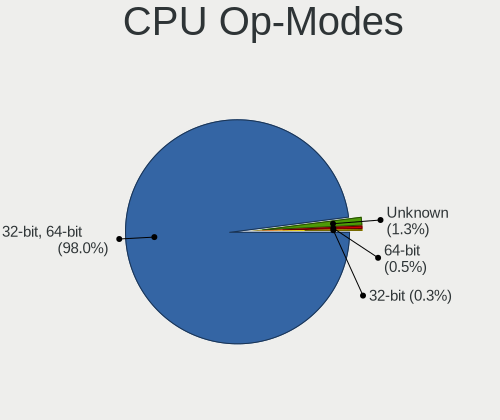

| Op mode        | Desktops | Percent |
|----------------|----------|---------|
| 32-bit, 64-bit | 468      | 96.1%   |
| Unknown        | 10       | 2.05%   |
| 64-bit         | 6        | 1.23%   |
| 32-bit         | 3        | 0.62%   |

CPU Microcode
-------------

Microcode number

| Number     | Desktops | Percent |
|------------|----------|---------|
| Unknown    | 91       | 18.35%  |
| 0x206a7    | 39       | 7.86%   |
| 0x306a9    | 26       | 5.24%   |
| 0x306c3    | 24       | 4.84%   |
| 0x1067a    | 24       | 4.84%   |
| 0x010000c8 | 18       | 3.63%   |
| 0x0800820d | 16       | 3.23%   |
| 0x0600611a | 13       | 2.62%   |
| 0x06001119 | 13       | 2.62%   |
| 0x506e3    | 12       | 2.42%   |
| 0x08101016 | 12       | 2.42%   |
| 0x6fd      | 11       | 2.22%   |
| 0x08108109 | 11       | 2.22%   |
| 0x906e9    | 10       | 2.02%   |
| 0x6fb      | 9        | 1.81%   |
| 0x08701021 | 8        | 1.61%   |
| 0x06003106 | 7        | 1.41%   |
| 0x06000852 | 7        | 1.41%   |
| 0x906ed    | 6        | 1.21%   |
| 0x10676    | 6        | 1.21%   |
| 0x206d7    | 5        | 1.01%   |
| 0x08701013 | 5        | 1.01%   |
| 0x6f2      | 4        | 0.81%   |
| 0x306f2    | 4        | 0.81%   |
| 0x106e5    | 4        | 0.81%   |
| 0x106a5    | 4        | 0.81%   |
| 0x0600063e | 4        | 0.81%   |
| 0x03000027 | 4        | 0.81%   |
| 0xf43      | 3        | 0.6%    |
| 0xa0671    | 3        | 0.6%    |
| 0x906eb    | 3        | 0.6%    |
| 0x906ea    | 3        | 0.6%    |
| 0x6f6      | 3        | 0.6%    |
| 0x406c4    | 3        | 0.6%    |
| 0x406c3    | 3        | 0.6%    |
| 0x106c2    | 3        | 0.6%    |
| 0x0810100b | 3        | 0.6%    |
| 0x08001138 | 3        | 0.6%    |
| 0x05000119 | 3        | 0.6%    |
| 0xf65      | 2        | 0.4%    |
| 0xf49      | 2        | 0.4%    |
| 0xf41      | 2        | 0.4%    |
| 0x906ec    | 2        | 0.4%    |
| 0x306e4    | 2        | 0.4%    |
| 0x206c2    | 2        | 0.4%    |
| 0x20652    | 2        | 0.4%    |
| 0x106a4    | 2        | 0.4%    |
| 0x0a50000c | 2        | 0.4%    |
| 0x0a201009 | 2        | 0.4%    |
| 0x08108102 | 2        | 0.4%    |
| 0x0800820b | 2        | 0.4%    |
| 0x08001137 | 2        | 0.4%    |
| 0x0700010f | 2        | 0.4%    |
| 0x06003104 | 2        | 0.4%    |
| 0x06000629 | 2        | 0.4%    |
| 0x05000101 | 2        | 0.4%    |
| 0x010000dc | 2        | 0.4%    |
| 0x010000b6 | 2        | 0.4%    |
| 0x01000083 | 2        | 0.4%    |
| 0xf44      | 1        | 0.2%    |

CPU Microarch
-------------

Microarchitecture

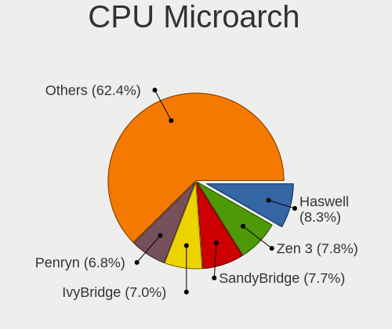

| Name        | Desktops | Percent |
|-------------|----------|---------|
| SandyBridge | 49       | 10.1%   |
| Zen+        | 38       | 7.84%   |
| K10         | 35       | 7.22%   |
| Haswell     | 35       | 7.22%   |
| IvyBridge   | 34       | 7.01%   |
| Penryn      | 33       | 6.8%    |
| KabyLake    | 30       | 6.19%   |
| Core        | 28       | 5.77%   |
| Zen         | 24       | 4.95%   |
| Piledriver  | 24       | 4.95%   |
| K8 Hammer   | 19       | 3.92%   |
| Zen 2       | 17       | 3.51%   |
| Excavator   | 17       | 3.51%   |
| Skylake     | 16       | 3.3%    |
| NetBurst    | 12       | 2.47%   |
| Nehalem     | 10       | 2.06%   |
| Steamroller | 9        | 1.86%   |
| Silvermont  | 9        | 1.86%   |
| Zen 3       | 8        | 1.65%   |
| Bulldozer   | 6        | 1.24%   |
| Bobcat      | 6        | 1.24%   |
| K10 Llano   | 5        | 1.03%   |
| Bonnell     | 5        | 1.03%   |
| Westmere    | 4        | 0.82%   |
| Jaguar      | 3        | 0.62%   |
| CometLake   | 3        | 0.62%   |
| Icelake     | 2        | 0.41%   |
| Broadwell   | 2        | 0.41%   |
| Goldmont    | 1        | 0.21%   |
| Unknown     | 1        | 0.21%   |

Graphics
--------

GPU Vendor
----------

Vendors of graphics cards

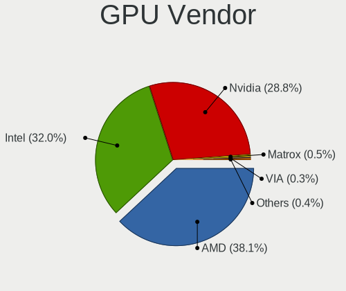

| Vendor                     | Desktops | Percent |
|----------------------------|----------|---------|
| AMD                        | 195      | 37.57%  |
| Intel                      | 166      | 31.98%  |
| Nvidia                     | 150      | 28.9%   |
| Matrox Electronics Systems | 4        | 0.77%   |
| VIA Technologies           | 2        | 0.39%   |
| ATI Technologies           | 2        | 0.39%   |

GPU Model
---------

Graphics card models

| Model                                                                                    | Desktops | Percent |
|------------------------------------------------------------------------------------------|----------|---------|
| Intel 2nd Generation Core Processor Family Integrated Graphics Controller                | 29       | 5.42%   |
| Intel Xeon E3-1200 v3/4th Gen Core Processor Integrated Graphics Controller              | 24       | 4.49%   |
| Intel Xeon E3-1200 v2/3rd Gen Core processor Graphics Controller                         | 18       | 3.36%   |
| Intel 4 Series Chipset Integrated Graphics Controller                                    | 17       | 3.18%   |
| AMD Wani [Radeon R5/R6/R7 Graphics]                                                      | 15       | 2.8%    |
| AMD Raven Ridge [Radeon Vega Series / Radeon Vega Mobile Series]                         | 15       | 2.8%    |
| AMD Picasso/Raven 2 [Radeon Vega Series / Radeon Vega Mobile Series]                     | 15       | 2.8%    |
| AMD Ellesmere [Radeon RX 470/480/570/570X/580/580X/590]                                  | 13       | 2.43%   |
| Nvidia GT218 [GeForce 210]                                                               | 11       | 2.06%   |
| Intel 82945G/GZ Integrated Graphics Controller                                           | 11       | 2.06%   |
| AMD Cedar [Radeon HD 5000/6000/7350/8350 Series]                                         | 11       | 2.06%   |
| Nvidia GP106 [GeForce GTX 1060 6GB]                                                      | 8        | 1.5%    |
| Nvidia GK208B [GeForce GT 710]                                                           | 8        | 1.5%    |
| AMD Navi 10 [Radeon RX 5600 OEM/5600 XT / 5700/5700 XT]                                  | 8        | 1.5%    |
| Nvidia GM107 [GeForce GTX 750 Ti]                                                        | 7        | 1.31%   |
| Intel Atom/Celeron/Pentium Processor x5-E8000/J3xxx/N3xxx Integrated Graphics Controller | 7        | 1.31%   |
| AMD Caicos [Radeon HD 6450/7450/8450 / R5 230 OEM]                                       | 7        | 1.31%   |
| Nvidia C61 [GeForce 6150SE nForce 430]                                                   | 6        | 1.12%   |
| Intel HD Graphics 630                                                                    | 6        | 1.12%   |
| Intel HD Graphics 530                                                                    | 6        | 1.12%   |
| Intel 82Q963/Q965 Integrated Graphics Controller                                         | 6        | 1.12%   |
| Intel 82Q35 Express Integrated Graphics Controller                                       | 6        | 1.12%   |
| Intel 82G33/G31 Express Integrated Graphics Controller                                   | 6        | 1.12%   |
| Nvidia TU106 [GeForce RTX 2060 Rev. A]                                                   | 5        | 0.93%   |
| Nvidia GP104 [GeForce GTX 1080]                                                          | 5        | 0.93%   |
| Intel CoffeeLake-S GT2 [UHD Graphics 630]                                                | 5        | 0.93%   |
| AMD RS880 [Radeon HD 4250]                                                               | 5        | 0.93%   |
| AMD RS780L [Radeon 3000]                                                                 | 5        | 0.93%   |
| AMD Baffin [Radeon RX 550 640SP / RX 560/560X]                                           | 5        | 0.93%   |
| Nvidia GP108 [GeForce GT 1030]                                                           | 4        | 0.75%   |
| Intel IvyBridge GT2 [HD Graphics 4000]                                                   | 4        | 0.75%   |
| AMD Trinity 2 [Radeon HD 7480D]                                                          | 4        | 0.75%   |
| AMD RS880 [Radeon HD 4200]                                                               | 4        | 0.75%   |
| AMD Kaveri [Radeon R5 Graphics]                                                          | 4        | 0.75%   |
| Nvidia TU116 [GeForce GTX 1660 SUPER]                                                    | 3        | 0.56%   |
| Nvidia GP107 [GeForce GTX 1050]                                                          | 3        | 0.56%   |
| Nvidia GP107 [GeForce GTX 1050 Ti]                                                       | 3        | 0.56%   |
| Nvidia GM206 [GeForce GTX 960]                                                           | 3        | 0.56%   |
| Nvidia GK106GL [Quadro K4000]                                                            | 3        | 0.56%   |
| Nvidia GF119 [GeForce GT 610]                                                            | 3        | 0.56%   |
| Nvidia GF106GL [Quadro 2000]                                                             | 3        | 0.56%   |
| Nvidia GA104 [GeForce RTX 3070]                                                          | 3        | 0.56%   |
| Nvidia G96C [GeForce 9500 GT]                                                            | 3        | 0.56%   |
| Nvidia C79 [ION LE]                                                                      | 3        | 0.56%   |
| Intel HD Graphics 510                                                                    | 3        | 0.56%   |
| AMD Wrestler [Radeon HD 7310]                                                            | 3        | 0.56%   |
| AMD Wrestler [Radeon HD 6310]                                                            | 3        | 0.56%   |
| AMD Richland [Radeon HD 8370D]                                                           | 3        | 0.56%   |
| AMD Oland XT [Radeon HD 8670 / R5 340X OEM / R7 250/350/350X OEM]                        | 3        | 0.56%   |
| AMD Lexa PRO [Radeon 540/540X/550/550X / RX 540X/550/550X]                               | 3        | 0.56%   |
| AMD Kaveri [Radeon R7 Graphics]                                                          | 3        | 0.56%   |
| AMD Curacao PRO [Radeon R7 370 / R9 270/370 OEM]                                         | 3        | 0.56%   |
| AMD Cezanne                                                                              | 3        | 0.56%   |
| AMD Baffin [Radeon RX 460/560D / Pro 450/455/460/555/555X/560/560X]                      | 3        | 0.56%   |
| Nvidia GT216 [GeForce GT 220]                                                            | 2        | 0.37%   |
| Nvidia GP106 [GeForce GTX 1060 3GB]                                                      | 2        | 0.37%   |
| Nvidia GP104 [GeForce GTX 1070]                                                          | 2        | 0.37%   |
| Nvidia GP102 [GeForce GTX 1080 Ti]                                                       | 2        | 0.37%   |
| Nvidia GM204 [GeForce GTX 970]                                                           | 2        | 0.37%   |
| Nvidia GK208B [GeForce GT 730]                                                           | 2        | 0.37%   |

GPU Combo
---------

Combinations of graphics cards

| Name           | Desktops | Percent |
|----------------|----------|---------|
| 1 x AMD        | 174      | 35.66%  |
| 1 x Intel      | 144      | 29.51%  |
| 1 x Nvidia     | 131      | 26.84%  |
| 2 x AMD        | 10       | 2.05%   |
| Intel + Nvidia | 7        | 1.43%   |
| AMD + Nvidia   | 6        | 1.23%   |
| Intel + AMD    | 5        | 1.02%   |
| 2 x Nvidia     | 4        | 0.82%   |
| 1 x Matrox     | 4        | 0.82%   |
| 3 x AMD        | 1        | 0.2%    |
| 1 x VIA        | 1        | 0.2%    |
| Nvidia + VIA   | 1        | 0.2%    |

GPU Driver
----------

Free vs proprietary

| Driver      | Desktops | Percent |
|-------------|----------|---------|
| Free        | 405      | 82.48%  |
| Proprietary | 76       | 15.48%  |
| Unknown     | 10       | 2.04%   |

GPU Memory
----------

Total video memory

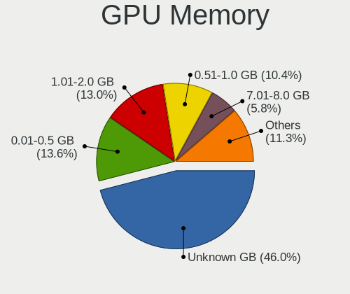

| Size in GB | Desktops | Percent |
|------------|----------|---------|
| Unknown    | 183      | 37.2%   |
| 0.01-0.5   | 91       | 18.5%   |
| 1.01-2.0   | 77       | 15.65%  |
| 0.51-1.0   | 72       | 14.63%  |
| 7.01-8.0   | 23       | 4.67%   |
| 3.01-4.0   | 19       | 3.86%   |
| 5.01-6.0   | 18       | 3.66%   |
| 2.01-3.0   | 7        | 1.42%   |
| 8.01-16.0  | 2        | 0.41%   |

Monitor
-------

Monitor Vendor
--------------

Monitor vendors

| Vendor               | Desktops | Percent |
|----------------------|----------|---------|
| Hewlett-Packard      | 90       | 18.67%  |
| Dell                 | 65       | 13.49%  |
| Samsung Electronics  | 55       | 11.41%  |
| Acer                 | 35       | 7.26%   |
| Goldstar             | 30       | 6.22%   |
| BenQ                 | 30       | 6.22%   |
| AOC                  | 28       | 5.81%   |
| Unknown              | 18       | 3.73%   |
| Ancor Communications | 13       | 2.7%    |
| Gateway              | 12       | 2.49%   |
| ViewSonic            | 10       | 2.07%   |
| Sony                 | 8        | 1.66%   |
| ASUSTek Computer     | 7        | 1.45%   |
| VOR                  | 5        | 1.04%   |
| Philips              | 5        | 1.04%   |
| SAC                  | 4        | 0.83%   |
| NEC Computers        | 4        | 0.83%   |
| Lenovo               | 4        | 0.83%   |
| Compaq Computer      | 4        | 0.83%   |
| Insignia             | 3        | 0.62%   |
| eMachines            | 3        | 0.62%   |
| ___                  | 2        | 0.41%   |
| Sanyo                | 2        | 0.41%   |
| RTK                  | 2        | 0.41%   |
| Panasonic            | 2        | 0.41%   |
| LG Electronics       | 2        | 0.41%   |
| ITE                  | 2        | 0.41%   |
| Hitachi              | 2        | 0.41%   |
| AUS                  | 2        | 0.41%   |
| Westinghouse         | 1        | 0.21%   |
| Vizio                | 1        | 0.21%   |
| Unknown (AAA)        | 1        | 0.21%   |
| TRI                  | 1        | 0.21%   |
| Toshiba              | 1        | 0.21%   |
| Sun                  | 1        | 0.21%   |
| STD                  | 1        | 0.21%   |
| Sharp                | 1        | 0.21%   |
| Sceptre Tech         | 1        | 0.21%   |
| Sangyo               | 1        | 0.21%   |
| Planar               | 1        | 0.21%   |
| Plain Tree Systems   | 1        | 0.21%   |
| NCS                  | 1        | 0.21%   |
| MStar                | 1        | 0.21%   |
| Monoprice            | 1        | 0.21%   |
| MiTAC                | 1        | 0.21%   |
| Lenovo Group Limited | 1        | 0.21%   |
| Lanix                | 1        | 0.21%   |
| KTC                  | 1        | 0.21%   |
| Jean                 | 1        | 0.21%   |
| HUAWEI               | 1        | 0.21%   |
| HPN                  | 1        | 0.21%   |
| Hisense              | 1        | 0.21%   |
| Hedy                 | 1        | 0.21%   |
| Gigabyte Technology  | 1        | 0.21%   |
| GGF                  | 1        | 0.21%   |
| FOX                  | 1        | 0.21%   |
| DENON                | 1        | 0.21%   |
| D&T                  | 1        | 0.21%   |
| CVT                  | 1        | 0.21%   |
| Compaq               | 1        | 0.21%   |

Monitor Model
-------------

Monitor models

| Model                                                                 | Desktops | Percent |
|-----------------------------------------------------------------------|----------|---------|
| Hewlett-Packard w1907 HWP26A2 1440x900 408x255mm 18.9-inch            | 8        | 1.6%    |
| Samsung Electronics C24F390 SAM0D2C 1920x1080 521x293mm 23.5-inch     | 4        | 0.8%    |
| BenQ GW2480 BNQ78E7 1920x1080 527x296mm 23.8-inch                     | 4        | 0.8%    |
| VOR LED21300 VOR2150 1920x1080 476x268mm 21.5-inch                    | 3        | 0.6%    |
| Samsung Electronics SMB1930N SAM0632 1360x768 410x230mm 18.5-inch     | 3        | 0.6%    |
| Samsung Electronics LCD Monitor SAM0C3C 1366x768 609x347mm 27.6-inch  | 3        | 0.6%    |
| SAC LED MONITOR SAC952D 1920x1080 443x249mm 20.0-inch                 | 3        | 0.6%    |
| Hewlett-Packard vs15 HWP2646 1024x768 300x220mm 14.6-inch             | 3        | 0.6%    |
| Hewlett-Packard L1710 HWP26EB 1280x1024 340x270mm 17.1-inch           | 3        | 0.6%    |
| Hewlett-Packard Compaq WF1907 HWP26A4 1440x900 408x255mm 18.9-inch    | 3        | 0.6%    |
| Goldstar HD GSM5ACB 1366x768 410x230mm 18.5-inch                      | 3        | 0.6%    |
| Dell E156FP DELA013 1024x768 304x228mm 15.0-inch                      | 3        | 0.6%    |
| BenQ GW2270 BNQ78DB 1920x1080 480x270mm 21.7-inch                     | 3        | 0.6%    |
| BenQ G2220HD BNQ7821 1920x1080 477x268mm 21.5-inch                    | 3        | 0.6%    |
| ASUSTek Computer MZ279 AUS27CA 1920x1080 598x336mm 27.0-inch          | 3        | 0.6%    |
| AOC 2343 AOC2343 1920x1080 509x286mm 23.0-inch                        | 3        | 0.6%    |
| VOR LED MONITOR VOR1820 1366x768 414x257mm 19.2-inch                  | 2        | 0.4%    |
| Sony TV SNYEB01 1360x768                                              | 2        | 0.4%    |
| Samsung Electronics S22F350 SAM0D1B 1920x1080 477x268mm 21.5-inch     | 2        | 0.4%    |
| Samsung Electronics S22D300 SAM0B3F 1920x1080 477x268mm 21.5-inch     | 2        | 0.4%    |
| Samsung Electronics S19D300 SAM0B34 1366x768 410x230mm 18.5-inch      | 2        | 0.4%    |
| Samsung Electronics LCD Monitor SAM0D4B 1360x768 700x390mm 31.5-inch  | 2        | 0.4%    |
| Samsung Electronics LCD Monitor SAM0C39 1920x1080 700x390mm 31.5-inch | 2        | 0.4%    |
| Samsung Electronics LCD Monitor S22F350 1920x1080                     | 2        | 0.4%    |
| RTK LCD Monitor RTK1D1A 1920x1080 1020x570mm 46.0-inch                | 2        | 0.4%    |
| Panasonic TV MEIA296 1280x1024 698x392mm 31.5-inch                    | 2        | 0.4%    |
| NEC Computers LCD2060NX NEC6637 1600x1200 408x306mm 20.1-inch         | 2        | 0.4%    |
| Insignia NS19D220NA16A BBY0019 1680x1050 640x384mm 29.4-inch          | 2        | 0.4%    |
| Hewlett-Packard w1907 HWP26A3 1440x900 408x255mm 18.9-inch            | 2        | 0.4%    |
| Hewlett-Packard V241a HWP311F 1920x1080 476x268mm 21.5-inch           | 2        | 0.4%    |
| Hewlett-Packard P224 HPN361C 1920x1080 480x270mm 21.7-inch            | 2        | 0.4%    |
| Hewlett-Packard LV1911 HWP3005 1366x768 410x230mm 18.5-inch           | 2        | 0.4%    |
| Hewlett-Packard LE2002x HWP2964 1600x900 443x249mm 20.0-inch          | 2        | 0.4%    |
| Hewlett-Packard LA1751 HWP2858 1280x1024 340x270mm 17.1-inch          | 2        | 0.4%    |
| Hewlett-Packard E201 HWP305F 1600x900 443x249mm 20.0-inch             | 2        | 0.4%    |
| Hewlett-Packard 2311 HWP293B 1920x1080 509x286mm 23.0-inch            | 2        | 0.4%    |
| Hewlett-Packard 2011 HWP2935 1600x900 443x249mm 20.0-inch             | 2        | 0.4%    |
| Goldstar MP59G GSM5B35 1920x1080 480x270mm 21.7-inch                  | 2        | 0.4%    |
| Goldstar MP59G GSM5B34 1920x1080 480x270mm 21.7-inch                  | 2        | 0.4%    |
| Goldstar FULL HD GSM5B55 1920x1080 480x270mm 21.7-inch                | 2        | 0.4%    |
| Gateway HX2000 GWY00CC 1600x900 442x249mm 20.0-inch                   | 2        | 0.4%    |
| Dell P2414H DELA09A 1920x1080 527x297mm 23.8-inch                     | 2        | 0.4%    |
| Dell P1914S DELF04B 1280x1024 376x301mm 19.0-inch                     | 2        | 0.4%    |
| Dell P1913S DELA084 1280x1024 376x301mm 19.0-inch                     | 2        | 0.4%    |
| Dell IN1930 DELF03B 1366x768 410x230mm 18.5-inch                      | 2        | 0.4%    |
| Dell E2011H DEL406B 1600x900 443x249mm 20.0-inch                      | 2        | 0.4%    |
| Dell E1911 DELF036 1440x900 408x255mm 18.9-inch                       | 2        | 0.4%    |
| Dell DEL 1908FPBLK DEL4047 1280x1024 376x301mm 19.0-inch              | 2        | 0.4%    |
| Dell 1708FP DEL4023 1280x1024 338x270mm 17.0-inch                     | 2        | 0.4%    |
| Dell 1704FPV DEL3015 1280x1024 338x270mm 17.0-inch                    | 2        | 0.4%    |
| Compaq Computer FS7600 CPQ1461 1280x1024 312x234mm 15.4-inch          | 2        | 0.4%    |
| Compaq Computer Compaq Q1859 CPQ2826 1366x768 410x230mm 18.5-inch     | 2        | 0.4%    |
| BenQ ZOWIE RL LCD BNQ7F4F 1920x1080 531x299mm 24.0-inch               | 2        | 0.4%    |
| BenQ GW2265 BNQ78D1 1920x1080 477x268mm 21.5-inch                     | 2        | 0.4%    |
| BenQ GW2250 BNQ78BB 1920x1080 477x268mm 21.5-inch                     | 2        | 0.4%    |
| BenQ G2420HD BNQ7840 1920x1080 531x299mm 24.0-inch                    | 2        | 0.4%    |
| BenQ G2220HD BNQ7820 1920x1080 477x268mm 21.5-inch                    | 2        | 0.4%    |
| ASUSTek Computer VA24E AUS24D1 1920x1080 527x296mm 23.8-inch          | 2        | 0.4%    |
| AOC L19W931 AOC1993 1360x768 410x256mm 19.0-inch                      | 2        | 0.4%    |
| AOC 831W AOC1831 1366x768 410x230mm 18.5-inch                         | 2        | 0.4%    |

Monitor Resolution
------------------

Monitor screen resolution

| Resolution         | Desktops | Percent |
|--------------------|----------|---------|
| 1920x1080 (FHD)    | 184      | 39.15%  |
| 1366x768 (WXGA)    | 61       | 12.98%  |
| 1280x1024 (SXGA)   | 40       | 8.51%   |
| 1440x900 (WXGA+)   | 39       | 8.3%    |
| 1600x900 (HD+)     | 34       | 7.23%   |
| 3840x2160 (4K)     | 17       | 3.62%   |
| 1360x768           | 17       | 3.62%   |
| Unknown            | 13       | 2.77%   |
| 1680x1050 (WSXGA+) | 12       | 2.55%   |
| 1024x768 (XGA)     | 12       | 2.55%   |
| 2560x1440 (QHD)    | 9        | 1.91%   |
| 3840x1080          | 6        | 1.28%   |
| 3440x1440          | 4        | 0.85%   |
| 2560x1080          | 3        | 0.64%   |
| 1600x1200          | 3        | 0.64%   |
| 3360x1080          | 2        | 0.43%   |
| 1920x1200 (WUXGA)  | 2        | 0.43%   |
| 1280x960           | 2        | 0.43%   |
| 6720x1440          | 1        | 0.21%   |
| 4721x1050          | 1        | 0.21%   |
| 3600x1080          | 1        | 0.21%   |
| 3280x1200          | 1        | 0.21%   |
| 3200x900           | 1        | 0.21%   |
| 2288x1287          | 1        | 0.21%   |
| 1920x540           | 1        | 0.21%   |
| 1920x2928          | 1        | 0.21%   |
| 1280x800 (WXGA)    | 1        | 0.21%   |
| 1280x720 (HD)      | 1        | 0.21%   |

Monitor Diagonal
----------------

Diagonal size in inches

| Inches  | Desktops | Percent |
|---------|----------|---------|
| 21      | 65       | 13.8%   |
| 19      | 52       | 11.04%  |
| 18      | 50       | 10.62%  |
| Unknown | 47       | 9.98%   |
| 23      | 46       | 9.77%   |
| 20      | 33       | 7.01%   |
| 27      | 30       | 6.37%   |
| 24      | 30       | 6.37%   |
| 17      | 26       | 5.52%   |
| 15      | 22       | 4.67%   |
| 31      | 11       | 2.34%   |
| 22      | 9        | 1.91%   |
| 72      | 8        | 1.7%    |
| 34      | 6        | 1.27%   |
| 84      | 5        | 1.06%   |
| 54      | 4        | 0.85%   |
| 40      | 4        | 0.85%   |
| 25      | 3        | 0.64%   |
| 49      | 2        | 0.42%   |
| 47      | 2        | 0.42%   |
| 46      | 2        | 0.42%   |
| 32      | 2        | 0.42%   |
| 29      | 2        | 0.42%   |
| 14      | 2        | 0.42%   |
| 12      | 2        | 0.42%   |
| 52      | 1        | 0.21%   |
| 50      | 1        | 0.21%   |
| 39      | 1        | 0.21%   |
| 36      | 1        | 0.21%   |
| 26      | 1        | 0.21%   |
| 13      | 1        | 0.21%   |

Monitor Width
-------------

Physical width

| Width in mm | Desktops | Percent |
|-------------|----------|---------|
| 401-500     | 188      | 40.87%  |
| 501-600     | 103      | 22.39%  |
| Unknown     | 47       | 10.22%  |
| 301-350     | 44       | 9.57%   |
| 351-400     | 19       | 4.13%   |
| 601-700     | 15       | 3.26%   |
| 1501-2000   | 13       | 2.83%   |
| 1001-1500   | 12       | 2.61%   |
| 701-800     | 9        | 1.96%   |
| 801-900     | 5        | 1.09%   |
| 201-300     | 5        | 1.09%   |

Aspect Ratio
------------

Proportional relationship between the width and the height

| Ratio   | Desktops | Percent |
|---------|----------|---------|
| 16/9    | 284      | 63.68%  |
| 16/10   | 53       | 11.88%  |
| Unknown | 42       | 9.42%   |
| 5/4     | 37       | 8.3%    |
| 4/3     | 20       | 4.48%   |
| 21/9    | 6        | 1.35%   |
| 32/9    | 3        | 0.67%   |
| 1.00    | 1        | 0.22%   |

Monitor Area
------------

Area in inch

| Area in inch | Desktops | Percent |
|----------------|----------|---------|
| 201-250        | 121      | 26.42%  |
| 151-200        | 109      | 23.8%   |
| 141-150        | 64       | 13.97%  |
| Unknown        | 47       | 10.26%  |
| 301-350        | 30       | 6.55%   |
| 101-110        | 21       | 4.59%   |
| More than 1000 | 19       | 4.15%   |
| 351-500        | 18       | 3.93%   |
| 501-1000       | 12       | 2.62%   |
| 251-300        | 8        | 1.75%   |
| 131-140        | 3        | 0.66%   |
| 111-120        | 3        | 0.66%   |
| 71-80          | 2        | 0.44%   |
| 81-90          | 1        | 0.22%   |

Pixel Density
-------------

Pixels per inch

| Density | Desktops | Percent |
|---------|----------|---------|
| 51-100  | 276      | 61.61%  |
| 101-120 | 91       | 20.31%  |
| Unknown | 47       | 10.49%  |
| 1-50    | 27       | 6.03%   |
| 161-240 | 4        | 0.89%   |
| 121-160 | 3        | 0.67%   |

Multiple Monitors
-----------------

Total monitors connected

| Total | Desktops | Percent |
|-------|----------|---------|
| 1     | 407      | 82.89%  |
| 2     | 60       | 12.22%  |
| 0     | 17       | 3.46%   |
| 3     | 7        | 1.43%   |

Network
-------

Net Controller Vendor
---------------------

Controller vendors

| Vendor                                | Desktops | Percent |
|---------------------------------------|----------|---------|
| Realtek Semiconductor                 | 315      | 44.62%  |
| Intel                                 | 143      | 20.25%  |
| Qualcomm Atheros                      | 61       | 8.64%   |
| Ralink Technology                     | 37       | 5.24%   |
| Nvidia                                | 26       | 3.68%   |
| Broadcom                              | 24       | 3.4%    |
| TP-Link                               | 16       | 2.27%   |
| Qualcomm Atheros Communications       | 13       | 1.84%   |
| Ralink                                | 9        | 1.27%   |
| Huawei Technologies                   | 8        | 1.13%   |
| Broadcom Limited                      | 8        | 1.13%   |
| Motorola PCS                          | 6        | 0.85%   |
| Mercucys                              | 5        | 0.71%   |
| VIA Technologies                      | 3        | 0.42%   |
| Samsung Electronics                   | 3        | 0.42%   |
| Marvell Technology Group              | 3        | 0.42%   |
| Linksys                               | 3        | 0.42%   |
| Wacom                                 | 2        | 0.28%   |
| D-Link System                         | 2        | 0.28%   |
| D-Link                                | 2        | 0.28%   |
| ASIX Electronics                      | 2        | 0.28%   |
| Xiaomi                                | 1        | 0.14%   |
| Sangoma Technologies                  | 1        | 0.14%   |
| Qualcomm                              | 1        | 0.14%   |
| NetGear                               | 1        | 0.14%   |
| Microchip Technology                  | 1        | 0.14%   |
| Micro Star International              | 1        | 0.14%   |
| MediaTek                              | 1        | 0.14%   |
| Lenovo                                | 1        | 0.14%   |
| IBM                                   | 1        | 0.14%   |
| Hisense                               | 1        | 0.14%   |
| Google                                | 1        | 0.14%   |
| Gemtek                                | 1        | 0.14%   |
| DisplayLink                           | 1        | 0.14%   |
| Accton Technology                     | 1        | 0.14%   |
| 802.11g Adapter [Linksys WUSB54GC v3] | 1        | 0.14%   |

Net Controller Model
--------------------

Controller models

| Model                                                               | Desktops | Percent |
|---------------------------------------------------------------------|----------|---------|
| Realtek RTL8111/8168/8411 PCI Express Gigabit Ethernet Controller   | 248      | 31.55%  |
| Intel 82579LM Gigabit Network Connection (Lewisville)               | 34       | 4.33%   |
| Realtek RTL810xE PCI Express Fast Ethernet controller               | 25       | 3.18%   |
| Intel I211 Gigabit Network Connection                               | 17       | 2.16%   |
| Ralink MT7601U Wireless Adapter                                     | 16       | 2.04%   |
| Realtek RTL8188EUS 802.11n Wireless Network Adapter                 | 15       | 1.91%   |
| Nvidia MCP61 Ethernet                                               | 15       | 1.91%   |
| Ralink RT2870/RT3070 Wireless Adapter                               | 13       | 1.65%   |
| Intel Wi-Fi 6 AX200                                                 | 12       | 1.53%   |
| Qualcomm Atheros AR9271 802.11n                                     | 11       | 1.4%    |
| Intel Ethernet Connection I217-LM                                   | 11       | 1.4%    |
| Intel Ethernet Connection (2) I219-V                                | 11       | 1.4%    |
| Qualcomm Atheros AR9485 Wireless Network Adapter                    | 9        | 1.15%   |
| Realtek RTL8192EE PCIe Wireless Network Adapter                     | 7        | 0.89%   |
| Realtek RTL8187 Wireless Adapter                                    | 7        | 0.89%   |
| Intel 82579V Gigabit Network Connection                             | 7        | 0.89%   |
| Intel 82574L Gigabit Network Connection                             | 7        | 0.89%   |
| Intel 82566DM-2 Gigabit Network Connection                          | 7        | 0.89%   |
| Huawei JNY-LX1                                                      | 7        | 0.89%   |
| TP-Link TL-WN823N v2/v3 [Realtek RTL8192EU]                         | 6        | 0.76%   |
| Realtek RTL8188FTV 802.11b/g/n 1T1R 2.4G WLAN Adapter               | 6        | 0.76%   |
| Realtek RTL8188EE Wireless Network Adapter                          | 6        | 0.76%   |
| Realtek RTL-8185 IEEE 802.11a/b/g Wireless LAN Controller           | 6        | 0.76%   |
| Realtek RTL-8100/8101L/8139 PCI Fast Ethernet Adapter               | 6        | 0.76%   |
| Qualcomm Atheros AR2417 Wireless Network Adapter [AR5007G 802.11bg] | 6        | 0.76%   |
| TP-Link TL-WN722N v2/v3 [Realtek RTL8188EUS]                        | 5        | 0.64%   |
| Realtek RTL88x2bu [AC1200 Techkey]                                  | 5        | 0.64%   |
| Qualcomm Atheros AR9285 Wireless Network Adapter (PCI-Express)      | 5        | 0.64%   |
| Motorola PCS moto g(30)                                             | 5        | 0.64%   |
| Mercucys 802.11n NIC                                                | 5        | 0.64%   |
| Intel Ethernet Connection I217-V                                    | 5        | 0.64%   |
| Broadcom NetXtreme BCM5761 Gigabit Ethernet PCIe                    | 5        | 0.64%   |
| Realtek RTL8125 2.5GbE Controller                                   | 4        | 0.51%   |
| Ralink RT5370 Wireless Adapter                                      | 4        | 0.51%   |
| Qualcomm Atheros Killer E2500 Gigabit Ethernet Controller           | 4        | 0.51%   |
| Qualcomm Atheros AR5212/5213/2414 Wireless Network Adapter          | 4        | 0.51%   |
| Intel I210 Gigabit Network Connection                               | 4        | 0.51%   |
| Intel Ethernet Connection (7) I219-V                                | 4        | 0.51%   |
| Intel 82567LM-3 Gigabit Network Connection                          | 4        | 0.51%   |
| Broadcom NetXtreme BCM5751 Gigabit Ethernet PCI Express             | 4        | 0.51%   |
| Realtek RTL8821CE 802.11ac PCIe Wireless Network Adapter            | 3        | 0.38%   |
| Realtek RTL8188SU 802.11n WLAN Adapter                              | 3        | 0.38%   |
| Realtek 802.11ac NIC                                                | 3        | 0.38%   |
| Qualcomm Atheros QCA9377 802.11ac Wireless Network Adapter          | 3        | 0.38%   |
| Qualcomm Atheros AR9227 Wireless Network Adapter                    | 3        | 0.38%   |
| Qualcomm Atheros AR8152 v2.0 Fast Ethernet                          | 3        | 0.38%   |
| Qualcomm Atheros AR8151 v2.0 Gigabit Ethernet                       | 3        | 0.38%   |
| Nvidia MCP79 Ethernet                                               | 3        | 0.38%   |
| Intel Ethernet Controller I225-V                                    | 3        | 0.38%   |
| Intel Dual Band Wireless-AC 3168NGW [Stone Peak]                    | 3        | 0.38%   |
| Intel Cannon Lake PCH CNVi WiFi                                     | 3        | 0.38%   |
| Intel 82575EB Gigabit Network Connection                            | 3        | 0.38%   |
| Intel 82566DM Gigabit Network Connection                            | 3        | 0.38%   |
| Broadcom NetXtreme BCM5764M Gigabit Ethernet PCIe                   | 3        | 0.38%   |
| Broadcom NetXtreme BCM5754 Gigabit Ethernet PCI Express             | 3        | 0.38%   |
| Broadcom Limited BCM4352 802.11ac Wireless Network Adapter          | 3        | 0.38%   |
| Wacom ACK-40401 [Wireless Accessory Kit]                            | 2        | 0.25%   |
| VIA VT6102/VT6103 [Rhine-II]                                        | 2        | 0.25%   |
| TP-Link 802.11ac WLAN Adapter                                       | 2        | 0.25%   |
| Samsung Galaxy series, misc. (tethering mode)                       | 2        | 0.25%   |

Wireless Vendor
---------------

Wireless vendors

| Vendor                                | Desktops | Percent |
|---------------------------------------|----------|---------|
| Realtek Semiconductor                 | 76       | 30.65%  |
| Qualcomm Atheros                      | 43       | 17.34%  |
| Ralink Technology                     | 37       | 14.92%  |
| Intel                                 | 28       | 11.29%  |
| TP-Link                               | 16       | 6.45%   |
| Qualcomm Atheros Communications       | 13       | 5.24%   |
| Ralink                                | 9        | 3.63%   |
| Mercucys                              | 5        | 2.02%   |
| Broadcom                              | 5        | 2.02%   |
| Linksys                               | 3        | 1.21%   |
| Broadcom Limited                      | 3        | 1.21%   |
| Wacom                                 | 2        | 0.81%   |
| D-Link                                | 2        | 0.81%   |
| NetGear                               | 1        | 0.4%    |
| Micro Star International              | 1        | 0.4%    |
| MediaTek                              | 1        | 0.4%    |
| Gemtek                                | 1        | 0.4%    |
| D-Link System                         | 1        | 0.4%    |
| 802.11g Adapter [Linksys WUSB54GC v3] | 1        | 0.4%    |

Wireless Model
--------------

Wireless models

| Model                                                                          | Desktops | Percent |
|--------------------------------------------------------------------------------|----------|---------|
| Ralink MT7601U Wireless Adapter                                                | 16       | 6.4%    |
| Realtek RTL8188EUS 802.11n Wireless Network Adapter                            | 15       | 6%      |
| Ralink RT2870/RT3070 Wireless Adapter                                          | 13       | 5.2%    |
| Intel Wi-Fi 6 AX200                                                            | 12       | 4.8%    |
| Qualcomm Atheros AR9271 802.11n                                                | 11       | 4.4%    |
| Qualcomm Atheros AR9485 Wireless Network Adapter                               | 9        | 3.6%    |
| Realtek RTL8192EE PCIe Wireless Network Adapter                                | 7        | 2.8%    |
| Realtek RTL8187 Wireless Adapter                                               | 7        | 2.8%    |
| TP-Link TL-WN823N v2/v3 [Realtek RTL8192EU]                                    | 6        | 2.4%    |
| Realtek RTL8188FTV 802.11b/g/n 1T1R 2.4G WLAN Adapter                          | 6        | 2.4%    |
| Realtek RTL8188EE Wireless Network Adapter                                     | 6        | 2.4%    |
| Realtek RTL-8185 IEEE 802.11a/b/g Wireless LAN Controller                      | 6        | 2.4%    |
| Qualcomm Atheros AR2417 Wireless Network Adapter [AR5007G 802.11bg]            | 6        | 2.4%    |
| TP-Link TL-WN722N v2/v3 [Realtek RTL8188EUS]                                   | 5        | 2%      |
| Realtek RTL88x2bu [AC1200 Techkey]                                             | 5        | 2%      |
| Qualcomm Atheros AR9285 Wireless Network Adapter (PCI-Express)                 | 5        | 2%      |
| Mercucys 802.11n NIC                                                           | 5        | 2%      |
| Ralink RT5370 Wireless Adapter                                                 | 4        | 1.6%    |
| Qualcomm Atheros AR5212/5213/2414 Wireless Network Adapter                     | 4        | 1.6%    |
| Realtek RTL8821CE 802.11ac PCIe Wireless Network Adapter                       | 3        | 1.2%    |
| Realtek RTL8188SU 802.11n WLAN Adapter                                         | 3        | 1.2%    |
| Realtek 802.11ac NIC                                                           | 3        | 1.2%    |
| Qualcomm Atheros QCA9377 802.11ac Wireless Network Adapter                     | 3        | 1.2%    |
| Qualcomm Atheros AR9227 Wireless Network Adapter                               | 3        | 1.2%    |
| Intel Dual Band Wireless-AC 3168NGW [Stone Peak]                               | 3        | 1.2%    |
| Intel Cannon Lake PCH CNVi WiFi                                                | 3        | 1.2%    |
| Broadcom Limited BCM4352 802.11ac Wireless Network Adapter                     | 3        | 1.2%    |
| Wacom ACK-40401 [Wireless Accessory Kit]                                       | 2        | 0.8%    |
| TP-Link 802.11ac WLAN Adapter                                                  | 2        | 0.8%    |
| Realtek RTL8822BE 802.11a/b/g/n/ac WiFi adapter                                | 2        | 0.8%    |
| Realtek RTL8192EU 802.11b/g/n WLAN Adapter                                     | 2        | 0.8%    |
| Realtek RTL8192CU 802.11n WLAN Adapter                                         | 2        | 0.8%    |
| Realtek RTL8188CUS 802.11n WLAN Adapter                                        | 2        | 0.8%    |
| Realtek RTL8188CE 802.11b/g/n WiFi Adapter                                     | 2        | 0.8%    |
| Ralink RT5572 Wireless Adapter                                                 | 2        | 0.8%    |
| Ralink RT2070 Wireless Adapter                                                 | 2        | 0.8%    |
| Ralink RT5390R 802.11bgn PCIe Wireless Network Adapter                         | 2        | 0.8%    |
| Ralink RT3090 Wireless 802.11n 1T/1R PCIe                                      | 2        | 0.8%    |
| Qualcomm Atheros TP-Link TL-WN322G v3 / TL-WN422G v2 802.11g [Atheros AR9271]  | 2        | 0.8%    |
| Qualcomm Atheros AR93xx Wireless Network Adapter                               | 2        | 0.8%    |
| Qualcomm Atheros AR9287 Wireless Network Adapter (PCI-Express)                 | 2        | 0.8%    |
| Qualcomm Atheros AR5413/AR5414 Wireless Network Adapter [AR5006X(S) 802.11abg] | 2        | 0.8%    |
| Qualcomm Atheros AR242x / AR542x Wireless Network Adapter (PCI-Express)        | 2        | 0.8%    |
| Intel Wireless-AC 9260                                                         | 2        | 0.8%    |
| Intel Wireless 7260                                                            | 2        | 0.8%    |
| Broadcom BCM4360 802.11ac Wireless Network Adapter                             | 2        | 0.8%    |
| TP-Link TL-WN822N Version 4 RTL8192EU                                          | 1        | 0.4%    |
| TP-Link 802.11n NIC                                                            | 1        | 0.4%    |
| TP-Link 802.11ac NIC                                                           | 1        | 0.4%    |
| Realtek RTL8822CE 802.11ac PCIe Wireless Network Adapter                       | 1        | 0.4%    |
| Realtek RTL8821AE 802.11ac PCIe Wireless Network Adapter                       | 1        | 0.4%    |
| Realtek RTL8723BU 802.11b/g/n WLAN Adapter                                     | 1        | 0.4%    |
| Realtek RTL8723BE PCIe Wireless Network Adapter                                | 1        | 0.4%    |
| Realtek RTL8187B Wireless 802.11g 54Mbps Network Adapter                       | 1        | 0.4%    |
| Realtek 8821CE Wireless LAN 802.11ac PCIe NIC                                  | 1        | 0.4%    |
| Ralink RT5372 Wireless Adapter                                                 | 1        | 0.4%    |
| Ralink RT5592 PCIe Wireless Network Adapter                                    | 1        | 0.4%    |
| Ralink RT3092 Wireless 802.11n 2T/2R PCIe                                      | 1        | 0.4%    |
| Ralink RT2790 Wireless 802.11n 1T/2R PCIe                                      | 1        | 0.4%    |
| Ralink RT2600 802.11 MIMO                                                      | 1        | 0.4%    |

Ethernet Vendor
---------------

Ethernet vendors

| Vendor                   | Desktops | Percent |
|--------------------------|----------|---------|
| Realtek Semiconductor    | 283      | 54.63%  |
| Intel                    | 133      | 25.68%  |
| Nvidia                   | 26       | 5.02%   |
| Qualcomm Atheros         | 20       | 3.86%   |
| Broadcom                 | 19       | 3.67%   |
| Huawei Technologies      | 8        | 1.54%   |
| Motorola PCS             | 5        | 0.97%   |
| Broadcom Limited         | 5        | 0.97%   |
| VIA Technologies         | 3        | 0.58%   |
| Samsung Electronics      | 3        | 0.58%   |
| Marvell Technology Group | 3        | 0.58%   |
| ASIX Electronics         | 2        | 0.39%   |
| Xiaomi                   | 1        | 0.19%   |
| Qualcomm                 | 1        | 0.19%   |
| IBM                      | 1        | 0.19%   |
| Hisense                  | 1        | 0.19%   |
| Google                   | 1        | 0.19%   |
| DisplayLink              | 1        | 0.19%   |
| D-Link System            | 1        | 0.19%   |
| Accton Technology        | 1        | 0.19%   |

Ethernet Model
--------------

Ethernet models

| Model                                                             | Desktops | Percent |
|-------------------------------------------------------------------|----------|---------|
| Realtek RTL8111/8168/8411 PCI Express Gigabit Ethernet Controller | 248      | 46.7%   |
| Intel 82579LM Gigabit Network Connection (Lewisville)             | 34       | 6.4%    |
| Realtek RTL810xE PCI Express Fast Ethernet controller             | 25       | 4.71%   |
| Intel I211 Gigabit Network Connection                             | 17       | 3.2%    |
| Nvidia MCP61 Ethernet                                             | 15       | 2.82%   |
| Intel Ethernet Connection I217-LM                                 | 11       | 2.07%   |
| Intel Ethernet Connection (2) I219-V                              | 11       | 2.07%   |
| Intel 82579V Gigabit Network Connection                           | 7        | 1.32%   |
| Intel 82574L Gigabit Network Connection                           | 7        | 1.32%   |
| Intel 82566DM-2 Gigabit Network Connection                        | 7        | 1.32%   |
| Huawei JNY-LX1                                                    | 7        | 1.32%   |
| Realtek RTL-8100/8101L/8139 PCI Fast Ethernet Adapter             | 6        | 1.13%   |
| Motorola PCS moto g(30)                                           | 5        | 0.94%   |
| Intel Ethernet Connection I217-V                                  | 5        | 0.94%   |
| Broadcom NetXtreme BCM5761 Gigabit Ethernet PCIe                  | 5        | 0.94%   |
| Realtek RTL8125 2.5GbE Controller                                 | 4        | 0.75%   |
| Qualcomm Atheros Killer E2500 Gigabit Ethernet Controller         | 4        | 0.75%   |
| Intel I210 Gigabit Network Connection                             | 4        | 0.75%   |
| Intel Ethernet Connection (7) I219-V                              | 4        | 0.75%   |
| Intel 82567LM-3 Gigabit Network Connection                        | 4        | 0.75%   |
| Broadcom NetXtreme BCM5751 Gigabit Ethernet PCI Express           | 4        | 0.75%   |
| Qualcomm Atheros AR8152 v2.0 Fast Ethernet                        | 3        | 0.56%   |
| Qualcomm Atheros AR8151 v2.0 Gigabit Ethernet                     | 3        | 0.56%   |
| Nvidia MCP79 Ethernet                                             | 3        | 0.56%   |
| Intel Ethernet Controller I225-V                                  | 3        | 0.56%   |
| Intel 82575EB Gigabit Network Connection                          | 3        | 0.56%   |
| Intel 82566DM Gigabit Network Connection                          | 3        | 0.56%   |
| Broadcom NetXtreme BCM5764M Gigabit Ethernet PCIe                 | 3        | 0.56%   |
| Broadcom NetXtreme BCM5754 Gigabit Ethernet PCI Express           | 3        | 0.56%   |
| VIA VT6102/VT6103 [Rhine-II]                                      | 2        | 0.38%   |
| Samsung Galaxy series, misc. (tethering mode)                     | 2        | 0.38%   |
| Qualcomm Atheros Killer E220x Gigabit Ethernet Controller         | 2        | 0.38%   |
| Qualcomm Atheros Attansic L2 Fast Ethernet                        | 2        | 0.38%   |
| Qualcomm Atheros AR8151 v1.0 Gigabit Ethernet                     | 2        | 0.38%   |
| Nvidia MCP73 Ethernet                                             | 2        | 0.38%   |
| Nvidia MCP51 Ethernet Controller                                  | 2        | 0.38%   |
| Nvidia CK804 Ethernet Controller                                  | 2        | 0.38%   |
| Intel NM10/ICH7 Family LAN Controller                             | 2        | 0.38%   |
| Intel Ethernet Connection (11) I219-V                             | 2        | 0.38%   |
| ASIX AX88179 Gigabit Ethernet                                     | 2        | 0.38%   |
| Xiaomi Mi/Redmi series (RNDIS)                                    | 1        | 0.19%   |
| VIA VT6105/VT6106S [Rhine-III]                                    | 1        | 0.19%   |
| Samsung GT-I9070 (network tethering, USB debugging enabled)       | 1        | 0.19%   |
| Realtek RTL8153 Gigabit Ethernet Adapter                          | 1        | 0.19%   |
| Realtek RTL-8110SC/8169SC Gigabit Ethernet                        | 1        | 0.19%   |
| Qualcomm Mi A1                                                    | 1        | 0.19%   |
| Qualcomm Atheros QCA8171 Gigabit Ethernet                         | 1        | 0.19%   |
| Qualcomm Atheros AR8161 Gigabit Ethernet                          | 1        | 0.19%   |
| Qualcomm Atheros AR8132 Fast Ethernet                             | 1        | 0.19%   |
| Qualcomm Atheros AR8131 Gigabit Ethernet                          | 1        | 0.19%   |
| Nvidia MCP67 Ethernet                                             | 1        | 0.19%   |
| Nvidia CK8S Ethernet Controller                                   | 1        | 0.19%   |
| Marvell Group 88E8057 PCI-E Gigabit Ethernet Controller           | 1        | 0.19%   |
| Marvell Group 88E8056 PCI-E Gigabit Ethernet Controller           | 1        | 0.19%   |
| Marvell Group 88E8039 PCI-E Fast Ethernet Controller              | 1        | 0.19%   |
| Intel Ethernet Connection I219-V                                  | 1        | 0.19%   |
| Intel Ethernet Connection (2) I219-LM                             | 1        | 0.19%   |
| Intel Ethernet Connection (2) I218-V                              | 1        | 0.19%   |
| Intel Ethernet Connection (2) I218-LM                             | 1        | 0.19%   |
| Intel Ethernet Connection (11) I219-LM                            | 1        | 0.19%   |

Net Controller Kind
-------------------

Ethernet, WiFi or modem

| Kind     | Desktops | Percent |
|----------|----------|---------|
| Ethernet | 480      | 67.89%  |
| WiFi     | 222      | 31.4%   |
| Unknown  | 4        | 0.57%   |
| Modem    | 1        | 0.14%   |

Used Controller
---------------

Currently used network controller

| Kind     | Desktops | Percent |
|----------|----------|---------|
| Ethernet | 398      | 70.69%  |
| WiFi     | 164      | 29.13%  |
| Unknown  | 1        | 0.18%   |

NICs
----

Total network controllers on board

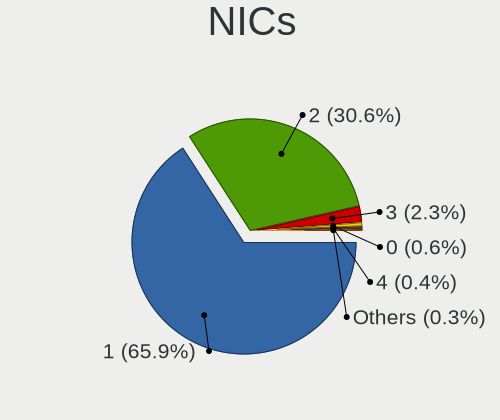

| Total | Desktops | Percent |
|-------|----------|---------|
| 1     | 343      | 70.58%  |
| 2     | 129      | 26.54%  |
| 3     | 6        | 1.23%   |
| 4     | 3        | 0.62%   |
| 0     | 3        | 0.62%   |
| 8     | 1        | 0.21%   |
| 6     | 1        | 0.21%   |

IPv6
----

IPv6 vs IPv4

| Used | Desktops | Percent |
|------|----------|---------|
| No   | 407      | 82.22%  |
| Yes  | 88       | 17.78%  |

Bluetooth
---------

Bluetooth Vendor
----------------

Controller vendors

| Vendor                          | Desktops | Percent |
|---------------------------------|----------|---------|
| Cambridge Silicon Radio         | 61       | 52.14%  |
| Intel                           | 26       | 22.22%  |
| ASUSTek Computer                | 8        | 6.84%   |
| Realtek Semiconductor           | 7        | 5.98%   |
| Qualcomm Atheros Communications | 4        | 3.42%   |
| Dell                            | 3        | 2.56%   |
| IMC Networks                    | 2        | 1.71%   |
| Apple                           | 2        | 1.71%   |
| Roper                           | 1        | 0.85%   |
| Micro Star International        | 1        | 0.85%   |
| Lite-On Technology              | 1        | 0.85%   |
| Dynex                           | 1        | 0.85%   |

Bluetooth Model
---------------

Controller models

| Model                                                    | Desktops | Percent |
|----------------------------------------------------------|----------|---------|
| Cambridge Silicon Radio Bluetooth Dongle (HCI mode)      | 61       | 52.14%  |
| Intel AX200 Bluetooth                                    | 12       | 10.26%  |
| Intel Bluetooth wireless interface                       | 6        | 5.13%   |
| Realtek Bluetooth Radio                                  | 4        | 3.42%   |
| Qualcomm Atheros  Bluetooth Device                       | 3        | 2.56%   |
| Intel Wireless-AC 3168 Bluetooth                         | 3        | 2.56%   |
| Intel Bluetooth 9460/9560 Jefferson Peak (JfP)           | 3        | 2.56%   |
| Dell Broadcom BCM20702A0 Bluetooth                       | 3        | 2.56%   |
| ASUS Broadcom BCM20702A0 Bluetooth                       | 3        | 2.56%   |
| ASUS Bluetooth Radio                                     | 3        | 2.56%   |
| Realtek  Bluetooth 4.2 Adapter                           | 2        | 1.71%   |
| Intel Wireless-AC 9260 Bluetooth Adapter                 | 2        | 1.71%   |
| Roper Class 1 Bluetooth Dongle                           | 1        | 0.85%   |
| Realtek RTL8821A Bluetooth                               | 1        | 0.85%   |
| Qualcomm Atheros AR3011 Bluetooth                        | 1        | 0.85%   |
| Micro Star International Bluetooth Device                | 1        | 0.85%   |
| Lite-On Qualcomm Atheros QCA9377 Bluetooth               | 1        | 0.85%   |
| IMC Networks Bluetooth Radio                             | 1        | 0.85%   |
| IMC Networks Bluetooth module                            | 1        | 0.85%   |
| Dynex Bluetooth 4.0 Adapter [Broadcom, 1.12, BCM20702A0] | 1        | 0.85%   |
| ASUS Qualcomm Bluetooth 4.1                              | 1        | 0.85%   |
| ASUS Broadcom BCM20702 Single-Chip Bluetooth 4.0 + LE    | 1        | 0.85%   |
| Apple Built-in Bluetooth 2.0+EDR HCI                     | 1        | 0.85%   |
| Apple Bluetooth USB Host Controller                      | 1        | 0.85%   |

Sound
-----

Sound Vendor
------------

Sound card vendors

| Vendor                 | Desktops | Percent |
|------------------------|----------|---------|
| Intel                  | 259      | 38.09%  |
| AMD                    | 224      | 32.94%  |
| Nvidia                 | 139      | 20.44%  |
| C-Media Electronics    | 12       | 1.76%   |
| Logitech               | 5        | 0.74%   |
| Generalplus Technology | 5        | 0.74%   |
| VIA Technologies       | 4        | 0.59%   |
| Corsair                | 4        | 0.59%   |
| Creative Labs          | 3        | 0.44%   |
| Texas Instruments      | 2        | 0.29%   |
| Focusrite-Novation     | 2        | 0.29%   |
| ATI Technologies       | 2        | 0.29%   |
| USB-MIC                | 1        | 0.15%   |
| Tenx Technology        | 1        | 0.15%   |
| Syntek                 | 1        | 0.15%   |
| Shure                  | 1        | 0.15%   |
| SAVITECH               | 1        | 0.15%   |
| Realtek Semiconductor  | 1        | 0.15%   |
| Razer USA              | 1        | 0.15%   |
| Plantronics            | 1        | 0.15%   |
| Microsoft              | 1        | 0.15%   |
| M-Audio                | 1        | 0.15%   |
| Kingston Technology    | 1        | 0.15%   |
| JMTek                  | 1        | 0.15%   |
| GN Netcom              | 1        | 0.15%   |
| Giga-Byte Technology   | 1        | 0.15%   |
| Dell                   | 1        | 0.15%   |
| Creative Technology    | 1        | 0.15%   |
| Cirrus Logic           | 1        | 0.15%   |
| AKAI Professional M.I. | 1        | 0.15%   |
| Afatech                | 1        | 0.15%   |

Sound Model
-----------

Sound card models

| Model                                                                                             | Desktops | Percent |
|---------------------------------------------------------------------------------------------------|----------|---------|
| Intel 6 Series/C200 Series Chipset Family High Definition Audio Controller                        | 53       | 6.29%   |
| AMD SBx00 Azalia (Intel HDA)                                                                      | 45       | 5.34%   |
| AMD Family 17h/19h HD Audio Controller                                                            | 35       | 4.15%   |
| AMD FCH Azalia Controller                                                                         | 34       | 4.03%   |
| Intel NM10/ICH7 Family High Definition Audio Controller                                           | 32       | 3.8%    |
| Intel 8 Series/C220 Series Chipset High Definition Audio Controller                               | 30       | 3.56%   |
| AMD Raven/Raven2/Fenghuang HDMI/DP Audio Controller                                               | 30       | 3.56%   |
| AMD Family 17h (Models 00h-0fh) HD Audio Controller                                               | 30       | 3.56%   |
| Intel Xeon E3-1200 v3/4th Gen Core Processor HD Audio Controller                                  | 25       | 2.97%   |
| AMD Starship/Matisse HD Audio Controller                                                          | 21       | 2.49%   |
| Nvidia MCP61 High Definition Audio                                                                | 19       | 2.25%   |
| Intel 7 Series/C216 Chipset Family High Definition Audio Controller                               | 18       | 2.14%   |
| Intel 100 Series/C230 Series Chipset Family HD Audio Controller                                   | 18       | 2.14%   |
| AMD Kabini HDMI/DP Audio                                                                          | 17       | 2.02%   |
| AMD Family 15h (Models 60h-6fh) Audio Controller                                                  | 16       | 1.9%    |
| Intel 82801I (ICH9 Family) HD Audio Controller                                                    | 15       | 1.78%   |
| Intel 200 Series PCH HD Audio                                                                     | 14       | 1.66%   |
| AMD Oland/Hainan/Cape Verde/Pitcairn HDMI Audio [Radeon HD 7000 Series]                           | 14       | 1.66%   |
| AMD Ellesmere HDMI Audio [Radeon RX 470/480 / 570/580/590]                                        | 14       | 1.66%   |
| Nvidia High Definition Audio Controller                                                           | 11       | 1.3%    |
| Intel Cannon Lake PCH cAVS                                                                        | 11       | 1.3%    |
| AMD Trinity HDMI Audio Controller                                                                 | 11       | 1.3%    |
| AMD Baffin HDMI/DP Audio [Radeon RX 550 640SP / RX 560/560X]                                      | 11       | 1.3%    |
| Nvidia GM107 High Definition Audio Controller [GeForce 940MX]                                     | 10       | 1.19%   |
| Nvidia GK208 HDMI/DP Audio Controller                                                             | 10       | 1.19%   |
| Intel 82801JI (ICH10 Family) HD Audio Controller                                                  | 10       | 1.19%   |
| AMD Cedar HDMI Audio [Radeon HD 5400/6300/7300 Series]                                            | 10       | 1.19%   |
| Nvidia GP107GL High Definition Audio Controller                                                   | 9        | 1.07%   |
| Nvidia GP106 High Definition Audio Controller                                                     | 9        | 1.07%   |
| Intel C600/X79 series chipset High Definition Audio Controller                                    | 9        | 1.07%   |
| AMD Navi 10 HDMI Audio                                                                            | 9        | 1.07%   |
| Intel 82801H (ICH8 Family) HD Audio Controller                                                    | 8        | 0.95%   |
| AMD RS880 HDMI Audio [Radeon HD 4200 Series]                                                      | 8        | 0.95%   |
| AMD Caicos HDMI Audio [Radeon HD 6450 / 7450/8450/8490 OEM / R5 230/235/235X OEM]                 | 8        | 0.95%   |
| Nvidia GP104 High Definition Audio Controller                                                     | 7        | 0.83%   |
| Intel Atom/Celeron/Pentium Processor x5-E8000/J3xxx/N3xxx Series High Definition Audio Controller | 7        | 0.83%   |
| AMD Kaveri HDMI/DP Audio Controller                                                               | 7        | 0.83%   |
| Nvidia TU106 High Definition Audio Controller                                                     | 6        | 0.71%   |
| Nvidia GK107 HDMI Audio Controller                                                                | 6        | 0.71%   |
| Nvidia GF119 HDMI Audio Controller                                                                | 6        | 0.71%   |
| Intel 82801JD/DO (ICH10 Family) HD Audio Controller                                               | 6        | 0.71%   |
| Nvidia GK106 HDMI Audio Controller                                                                | 5        | 0.59%   |
| Nvidia GF108 High Definition Audio Controller                                                     | 5        | 0.59%   |
| Nvidia GF106 High Definition Audio Controller                                                     | 5        | 0.59%   |
| Generalplus Technology Usb Audio Device                                                           | 5        | 0.59%   |
| AMD RV710/730 HDMI Audio [Radeon HD 4000 series]                                                  | 5        | 0.59%   |
| Nvidia TU116 High Definition Audio Controller                                                     | 4        | 0.47%   |
| Nvidia GP108 High Definition Audio Controller                                                     | 4        | 0.47%   |
| Nvidia GM206 High Definition Audio Controller                                                     | 4        | 0.47%   |
| Intel 5 Series/3400 Series Chipset High Definition Audio                                          | 4        | 0.47%   |
| AMD Renoir Radeon High Definition Audio Controller                                                | 4        | 0.47%   |
| VIA Technologies VT8233/A/8235/8237 AC97 Audio Controller                                         | 3        | 0.36%   |
| Nvidia TU104 HD Audio Controller                                                                  | 3        | 0.36%   |
| Nvidia MCP79 High Definition Audio                                                                | 3        | 0.36%   |
| Nvidia GA104 High Definition Audio Controller                                                     | 3        | 0.36%   |
| Intel Tiger Lake-H HD Audio Controller                                                            | 3        | 0.36%   |
| Intel Comet Lake PCH cAVS                                                                         | 3        | 0.36%   |
| Intel C610/X99 series chipset HD Audio Controller                                                 | 3        | 0.36%   |
| Intel 82801G (ICH7 Family) AC'97 Audio Controller                                                 | 3        | 0.36%   |
| C-Media Electronics Audio Adapter (Unitek Y-247A)                                                 | 3        | 0.36%   |

Memory
------

Memory Vendor
-------------

Memory module vendors

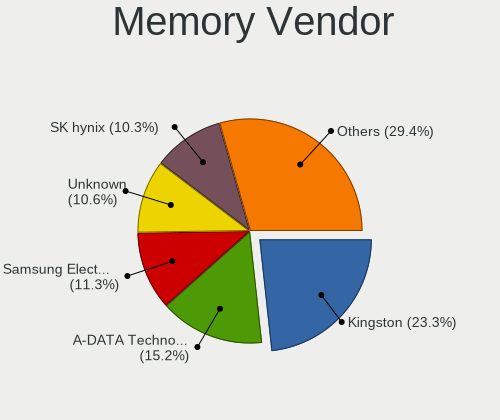

| Vendor              | Desktops | Percent |
|---------------------|----------|---------|
| Kingston            | 59       | 23.69%  |
| A-DATA Technology   | 35       | 14.06%  |
| Unknown             | 34       | 13.65%  |
| SK Hynix            | 24       | 9.64%   |
| Samsung Electronics | 22       | 8.84%   |
| Corsair             | 19       | 7.63%   |
| Micron Technology   | 15       | 6.02%   |
| Patriot             | 6        | 2.41%   |
| Nanya Technology    | 5        | 2.01%   |
| Crucial             | 5        | 2.01%   |
| Team                | 4        | 1.61%   |
| Qimonda             | 3        | 1.2%    |
| G.Skill             | 3        | 1.2%    |
| Elpida              | 3        | 1.2%    |
| PNY                 | 2        | 0.8%    |
| Transcend           | 1        | 0.4%    |
| Silicon Power       | 1        | 0.4%    |
| SGS/Thomson         | 1        | 0.4%    |
| S                   | 1        | 0.4%    |
| Ramaxel Technology  | 1        | 0.4%    |
| Patriot Memory      | 1        | 0.4%    |
| Gigabyte Technology | 1        | 0.4%    |
| Avant               | 1        | 0.4%    |
| Apacer              | 1        | 0.4%    |
| Aeneon              | 1        | 0.4%    |

Memory Model
------------

Memory module models

| Model                                                     | Desktops | Percent |
|-----------------------------------------------------------|----------|---------|
| Kingston RAM KHX2666C16/8G 8GB DIMM DDR4 3466MT/s         | 6        | 2.08%   |
| A-DATA RAM DDR4 2666 16GB DIMM DDR4 2666MT/s              | 4        | 1.39%   |
| Unknown RAM Module 4GB DIMM 1333MT/s                      | 3        | 1.04%   |
| Unknown RAM Module 2048MB DIMM DDR2 667MT/s               | 3        | 1.04%   |
| Team RAM TEAMGROUP-UD4-2666 8192MB DIMM DDR4 2667MT/s     | 3        | 1.04%   |
| Kingston RAM 99U5474-028.A00LF 4GB DIMM DDR3 1600MT/s     | 3        | 1.04%   |
| Kingston RAM 99U5471-012.A00LF 4GB DIMM DDR3 1600MT/s     | 3        | 1.04%   |
| Corsair RAM CMK8GX4M1A2400C16 8GB DIMM DDR4 2800MT/s      | 3        | 1.04%   |
| A-DATA RAM Module 8GB DIMM DDR4 2133MT/s                  | 3        | 1.04%   |
| A-DATA RAM DDR4 3200 8GB DIMM DDR4 3200MT/s               | 3        | 1.04%   |
| Unknown RAM Module 8192MB DIMM 1333MT/s                   | 2        | 0.69%   |
| Unknown RAM Module 4GB DIMM DDR3 1333MT/s                 | 2        | 0.69%   |
| Unknown RAM Module 2GB DIMM SDRAM                         | 2        | 0.69%   |
| Unknown RAM Module 2GB DIMM 1333MT/s                      | 2        | 0.69%   |
| Unknown RAM Module 2048MB DIMM SDRAM                      | 2        | 0.69%   |
| Unknown RAM Module 2048MB DIMM DDR2 333MT/s               | 2        | 0.69%   |
| Unknown RAM Module 2048MB DIMM 800MT/s                    | 2        | 0.69%   |
| SK Hynix RAM Module 4GB DIMM DDR4 2667MT/s                | 2        | 0.69%   |
| SK Hynix RAM Module 2GB DIMM DDR3 1333MT/s                | 2        | 0.69%   |
| SK Hynix RAM HYMP564U64P8-C4 512MB DIMM DDR2 533MT/s      | 2        | 0.69%   |
| SK Hynix RAM HYMP512U64CP8-Y5 1GB DIMM DDR 667MT/s        | 2        | 0.69%   |
| SK Hynix RAM HYMP125U64CP8-S6 2GB DIMM DDR2 49926MT/s     | 2        | 0.69%   |
| Samsung RAM M392B1K70CM0-YH9 8GB DIMM DDR3 1333MT/s       | 2        | 0.69%   |
| Samsung RAM M378B5173DB0-CK0 4GB DIMM DDR3 1600MT/s       | 2        | 0.69%   |
| Patriot RAM 3200 C16 Series 16GB DIMM DDR4 3200MT/s       | 2        | 0.69%   |
| Kingston RAM Module 1GB DIMM DDR2 667MT/s                 | 2        | 0.69%   |
| Kingston RAM Module 1024MB DIMM DDR2 667MT/s              | 2        | 0.69%   |
| Kingston RAM KHX3200C16D4/8GX 8GB DIMM DDR4 3533MT/s      | 2        | 0.69%   |
| Kingston RAM KHX2666C15D4/4G 4096MB DIMM DDR4 3200MT/s    | 2        | 0.69%   |
| Kingston RAM 99U5471-052.A00LF 8GB DIMM DDR3 1333MT/s     | 2        | 0.69%   |
| Corsair RAM CMW16GX4M2C3200C16 8GB DIMM DDR4 3266MT/s     | 2        | 0.69%   |
| Corsair RAM CMK32GX4M2B3000C15 16384MB DIMM DDR4 3000MT/s | 2        | 0.69%   |
| Corsair RAM CMK16GX4M2D3000C16 8192MB DIMM DDR4 3200MT/s  | 2        | 0.69%   |
| A-DATA RAM Module 8GB DIMM DDR4 2400MT/s                  | 2        | 0.69%   |
| A-DATA RAM Module 4096MB DIMM DDR3 1067MT/s               | 2        | 0.69%   |
| A-DATA RAM Module 1024MB DIMM DDR2 667MT/s                | 2        | 0.69%   |
| A-DATA RAM DDR4 2666 2OZ 4GB DIMM DDR4 2667MT/s           | 2        | 0.69%   |
| A-DATA RAM DDR4 2666 2OZ 16GB DIMM DDR4 3200MT/s          | 2        | 0.69%   |
| A-DATA RAM DDR4 2400 2OZ 8GB DIMM DDR4 2666MT/s           | 2        | 0.69%   |
| Unknown RAM Module 8GB DIMM                               | 1        | 0.35%   |
| Unknown RAM Module 8192MB DIMM DDR4 1067MT/s              | 1        | 0.35%   |
| Unknown RAM Module 512MB DIMM SDRAM                       | 1        | 0.35%   |
| Unknown RAM Module 4GB DIMM 400MT/s                       | 1        | 0.35%   |
| Unknown RAM Module 4GB DIMM 1600MT/s                      | 1        | 0.35%   |
| Unknown RAM Module 4GB DDR3 1600MT/s                      | 1        | 0.35%   |
| Unknown RAM Module 4096MB DIMM DDR3 1333MT/s              | 1        | 0.35%   |
| Unknown RAM Module 4096MB DIMM 1333MT/s                   | 1        | 0.35%   |
| Unknown RAM Module 32GB DIMM DDR4 2133MT/s                | 1        | 0.35%   |
| Unknown RAM Module 2GB DIMM 800MT/s                       | 1        | 0.35%   |
| Unknown RAM Module 2GB DIMM 1066MT/s                      | 1        | 0.35%   |
| Unknown RAM Module 2GB DIMM                               | 1        | 0.35%   |
| Unknown RAM Module 256MB DIMM DDR 266MT/s                 | 1        | 0.35%   |
| Unknown RAM Module 2048MB DIMM DDR3 1332MT/s              | 1        | 0.35%   |
| Unknown RAM Module 2048MB DIMM DDR2 800MT/s               | 1        | 0.35%   |
| Unknown RAM Module 2048MB DIMM DDR2 1066MT/s              | 1        | 0.35%   |
| Unknown RAM Module 2048MB DIMM DDR 800MT/s                | 1        | 0.35%   |
| Unknown RAM Module 2048MB DIMM 667MT/s                    | 1        | 0.35%   |
| Unknown RAM Module 1GB DIMM SDRAM                         | 1        | 0.35%   |
| Unknown RAM Module 1GB DIMM 800MT/s                       | 1        | 0.35%   |
| Unknown RAM Module 128MB DIMM DDR 266MT/s                 | 1        | 0.35%   |

Memory Kind
-----------

Memory module kinds

| Kind    | Desktops | Percent |
|---------|----------|---------|
| DDR4    | 78       | 36.79%  |
| DDR3    | 78       | 36.79%  |
| DDR2    | 24       | 11.32%  |
| Unknown | 15       | 7.08%   |
| SDRAM   | 13       | 6.13%   |
| DDR     | 4        | 1.89%   |

Memory Form Factor
------------------

Physical design of the memory module

| Name    | Desktops | Percent |
|---------|----------|---------|
| DIMM    | 189      | 93.1%   |
| SODIMM  | 12       | 5.91%   |
| RIMM    | 1        | 0.49%   |
| Unknown | 1        | 0.49%   |

Memory Size
-----------

Memory module size

| Size  | Desktops | Percent |
|-------|----------|---------|
| 8192  | 73       | 31.06%  |
| 4096  | 55       | 23.4%   |
| 2048  | 46       | 19.57%  |
| 16384 | 23       | 9.79%   |
| 1024  | 23       | 9.79%   |
| 32768 | 9        | 3.83%   |
| 512   | 4        | 1.7%    |
| 256   | 1        | 0.43%   |
| 128   | 1        | 0.43%   |

Memory Speed
------------

Memory module speed

| Speed   | Desktops | Percent |
|---------|----------|---------|
| 1600    | 37       | 15.61%  |
| 1333    | 35       | 14.77%  |
| 3200    | 19       | 8.02%   |
| 800     | 16       | 6.75%   |
| 667     | 15       | 6.33%   |
| 2667    | 12       | 5.06%   |
| 2133    | 12       | 5.06%   |
| 2400    | 11       | 4.64%   |
| Unknown | 8        | 3.38%   |
| 3466    | 7        | 2.95%   |
| 2666    | 7        | 2.95%   |
| 2800    | 5        | 2.11%   |
| 533     | 5        | 2.11%   |
| 3600    | 4        | 1.69%   |
| 3000    | 4        | 1.69%   |
| 1866    | 4        | 1.69%   |
| 49926   | 3        | 1.27%   |
| 1067    | 3        | 1.27%   |
| 1066    | 3        | 1.27%   |
| 3533    | 2        | 0.84%   |
| 3266    | 2        | 0.84%   |
| 2933    | 2        | 0.84%   |
| 2134    | 2        | 0.84%   |
| 1867    | 2        | 0.84%   |
| 1334    | 2        | 0.84%   |
| 333     | 2        | 0.84%   |
| 4000    | 1        | 0.42%   |
| 3400    | 1        | 0.42%   |
| 3333    | 1        | 0.42%   |
| 3066    | 1        | 0.42%   |
| 2048    | 1        | 0.42%   |
| 2000    | 1        | 0.42%   |
| 1800    | 1        | 0.42%   |
| 1639    | 1        | 0.42%   |
| 1450    | 1        | 0.42%   |
| 1332    | 1        | 0.42%   |
| 975     | 1        | 0.42%   |
| 400     | 1        | 0.42%   |
| 266     | 1        | 0.42%   |

Printers & scanners
-------------------

Printer Vendor
--------------

Printer device vendors

| Vendor              | Desktops | Percent |
|---------------------|----------|---------|
| Seiko Epson         | 9        | 29.03%  |
| Hewlett-Packard     | 8        | 25.81%  |
| Brother Industries  | 8        | 25.81%  |
| Canon               | 3        | 9.68%   |
| Samsung Electronics | 2        | 6.45%   |
| Kyocera             | 1        | 3.23%   |

Printer Model
-------------

Printer device models

| Model                                   | Desktops | Percent |
|-----------------------------------------|----------|---------|
| Seiko Epson L120 Series                 | 4        | 12.5%   |
| HP LaserJet Professional P 1102w        | 2        | 6.25%   |
| HP DeskJet 1110 series                  | 2        | 6.25%   |
| Brother HL-1110 series                  | 2        | 6.25%   |
| Seiko Epson XP-235 Series               | 1        | 3.13%   |
| Seiko Epson L4150 Series                | 1        | 3.13%   |
| Seiko Epson L300 Series                 | 1        | 3.13%   |
| Seiko Epson L200 Series                 | 1        | 3.13%   |
| Seiko Epson L1300 Series                | 1        | 3.13%   |
| Seiko Epson ET-3750 Series              | 1        | 3.13%   |
| Samsung Xerox Phaser 3117 Laser Printer | 1        | 3.13%   |
| Samsung M283x Series                    | 1        | 3.13%   |
| Kyocera FS-1030D printer                | 1        | 3.13%   |
| HP OfficeJet Pro 7740 series            | 1        | 3.13%   |
| HP DeskJet F4200 series                 | 1        | 3.13%   |
| HP DeskJet 2600 series                  | 1        | 3.13%   |
| HP Deskjet 2540 series                  | 1        | 3.13%   |
| Canon PIXMA MG3500 Series               | 1        | 3.13%   |
| Canon PIXMA iP3000x Printer             | 1        | 3.13%   |
| Canon G3000 series                      | 1        | 3.13%   |
| Brother MFC-T910DW                      | 1        | 3.13%   |
| Brother MFC-L3770CDW series             | 1        | 3.13%   |
| Brother MFC-J470DW                      | 1        | 3.13%   |
| Brother DCP-T710W                       | 1        | 3.13%   |
| Brother DCP-L2540DW                     | 1        | 3.13%   |
| Brother Composite Device                | 1        | 3.13%   |

Scanner Vendor
--------------

Scanner device vendors

| Vendor          | Desktops | Percent |
|-----------------|----------|---------|
| Hewlett-Packard | 2        | 66.67%  |
| Seiko Epson     | 1        | 33.33%  |

Scanner Model
-------------

Scanner device models

| Model                                              | Desktops | Percent |
|----------------------------------------------------|----------|---------|
| Seiko Epson GT-8400UF [Perfection 1670/1670 PHOTO] | 1        | 33.33%  |
| HP ScanJet 4500C/5550C                             | 1        | 33.33%  |
| HP ScanJet 3300c                                   | 1        | 33.33%  |

Camera
------

Camera Vendor
-------------

Camera device vendors

| Vendor                      | Desktops | Percent |
|-----------------------------|----------|---------|
| Logitech                    | 27       | 27.27%  |
| Generalplus Technology      | 12       | 12.12%  |
| Microdia                    | 7        | 7.07%   |
| Microsoft                   | 6        | 6.06%   |
| GEMBIRD                     | 6        | 6.06%   |
| Chicony Electronics         | 5        | 5.05%   |
| Apple                       | 5        | 5.05%   |
| Samsung Electronics         | 4        | 4.04%   |
| KYE Systems (Mouse Systems) | 4        | 4.04%   |
| Z-Star Microelectronics     | 2        | 2.02%   |
| Realtek Semiconductor       | 2        | 2.02%   |
| LG Electronics              | 2        | 2.02%   |
| Jieli Technology            | 2        | 2.02%   |
| Hewlett-Packard             | 2        | 2.02%   |
| Alcor Micro                 | 2        | 2.02%   |
| Unknown                     | 1        | 1.01%   |
| Syntek                      | 1        | 1.01%   |
| Sunplus Technology          | 1        | 1.01%   |
| Silicon Motion              | 1        | 1.01%   |
| Ruision                     | 1        | 1.01%   |
| Novatel Wireless            | 1        | 1.01%   |
| Linux Foundation HS         | 1        | 1.01%   |
| Huawei Technologies         | 1        | 1.01%   |
| Guillemot                   | 1        | 1.01%   |
| Genesys Logic               | 1        | 1.01%   |
| Cubeternet                  | 1        | 1.01%   |

Camera Model
------------

Camera device models

| Model                                                 | Desktops | Percent |
|-------------------------------------------------------|----------|---------|
| Generalplus GENERAL WEBCAM                            | 10       | 9.9%    |
| Logitech HD Pro Webcam C920                           | 9        | 8.91%   |
| Logitech Webcam C270                                  | 8        | 7.92%   |
| GEMBIRD Generic UVC 1.00 camera [AppoTech AX2311]     | 5        | 4.95%   |
| Samsung Galaxy A5 (MTP)                               | 4        | 3.96%   |
| Logitech Webcam C170                                  | 4        | 3.96%   |
| Microsoft LifeCam HD-3000                             | 3        | 2.97%   |
| Apple iPhone 5/5C/5S/6/SE                             | 3        | 2.97%   |
| Microdia Laptop_Integrated_Webcam_FHD                 | 2        | 1.98%   |
| Logitech Webcam Pro 9000                              | 2        | 1.98%   |
| Logitech HD Webcam C525                               | 2        | 1.98%   |
| LG LM-X420xxx/G2/G3 Android Phone (MTP/download mode) | 2        | 1.98%   |
| KYE Systems (Mouse Systems) Genius FaceCam 320        | 2        | 1.98%   |
| Jieli USB PHY 2.0                                     | 2        | 1.98%   |
| HP Webcam HD-2200                                     | 2        | 1.98%   |
| Generalplus 808 Camera #9 (web-cam mode)              | 2        | 1.98%   |
| Apple iPhone 4                                        | 2        | 1.98%   |
| Alcor Micro USB 2.0 PC Camera                         | 2        | 1.98%   |
| Z-Star Venus USB2.0 Camera                            | 1        | 0.99%   |
| Z-Star Sirius USB2.0 Camera                           | 1        | 0.99%   |
| Unknown HD camera                                     | 1        | 0.99%   |
| Syntek USB Video Device                               | 1        | 0.99%   |
| Sunplus USB2.0 2M WebCam                              | 1        | 0.99%   |
| Silicon Motion Silicon Motion Camera                  | 1        | 0.99%   |
| Ruision UVC Camera                                    | 1        | 0.99%   |
| Realtek Webcam                                        | 1        | 0.99%   |
| Realtek HP 1.0MP High Definition Webcam               | 1        | 0.99%   |
| Novatel Wireless Merlin U740 (non-Vodafone)           | 1        | 0.99%   |
| Microsoft Xbox NUI Camera                             | 1        | 0.99%   |
| Microsoft LifeCam VX-800                              | 1        | 0.99%   |
| Microsoft LifeCam VX-2000                             | 1        | 0.99%   |
| Microdia USB camera                                   | 1        | 0.99%   |
| Microdia USB 2.0 Camera                               | 1        | 0.99%   |
| Microdia Sonix USB 2.0 Camera                         | 1        | 0.99%   |
| Microdia MSI Starcam Racer                            | 1        | 0.99%   |
| Microdia Camera                                       | 1        | 0.99%   |
| Logitech HD Webcam C510                               | 1        | 0.99%   |
| Logitech HD Webcam B910                               | 1        | 0.99%   |
| Logitech C920 PRO HD Webcam                           | 1        | 0.99%   |
| Logitech BRIO Ultra HD Webcam                         | 1        | 0.99%   |
| Linux Foundation HS Webcam gadget HS                  | 1        | 0.99%   |
| KYE Systems (Mouse Systems) PC-LM1E Camera            | 1        | 0.99%   |
| KYE Systems (Mouse Systems) Genius WideCam F100       | 1        | 0.99%   |
| Huawei UVC Camera                                     | 1        | 0.99%   |
| Guillemot Hercules HD Sunset                          | 1        | 0.99%   |
| Genesys Logic Digital Microscope                      | 1        | 0.99%   |
| GEMBIRD USB2.0 PC CAMERA                              | 1        | 0.99%   |
| Cubeternet GL-UPC822 UVC WebCam                       | 1        | 0.99%   |
| Chicony HP Integrated Webcam                          | 1        | 0.99%   |
| Chicony HP High Definition Webcam                     | 1        | 0.99%   |
| Chicony HP 0.3MP Webcam                               | 1        | 0.99%   |
| Chicony CNF8050 Webcam                                | 1        | 0.99%   |
| Chicony CNF7042                                       | 1        | 0.99%   |

Security
--------

Fingerprint Vendor
------------------

Fingerprint sensor vendors

Zero info for selected period =(

Fingerprint Model
-----------------

Fingerprint sensor models

Zero info for selected period =(

Chipcard Vendor
---------------

Chipcard module vendors

Zero info for selected period =(

Chipcard Model
--------------

Chipcard module models

Zero info for selected period =(

Unsupported
-----------

Unsupported Devices
-------------------

Total unsupported devices on board

| Total | Desktops | Percent |
|-------|----------|---------|
| 0     | 419      | 85.51%  |
| 1     | 63       | 12.86%  |
| 2     | 6        | 1.22%   |
| 3     | 2        | 0.41%   |

Unsupported Device Types
------------------------

Types of unsupported devices

| Type                     | Desktops | Percent |
|--------------------------|----------|---------|
| Graphics card            | 24       | 30.77%  |
| Net/wireless             | 23       | 29.49%  |
| Communication controller | 13       | 16.67%  |
| Unassigned class         | 5        | 6.41%   |
| Multimedia controller    | 5        | 6.41%   |
| Storage/raid             | 2        | 2.56%   |
| Sound                    | 2        | 2.56%   |
| Network                  | 2        | 2.56%   |
| Video                    | 1        | 1.28%   |
| Bluetooth                | 1        | 1.28%   |

