Linux in Mexico - Tested Hardware & Statistics (Notebooks)
----------------------------------------------------------

A project to collect tested hardware configurations for Linux in Mexico.

Anyone can contribute to this report by the [hw-probe](https://github.com/linuxhw/hw-probe) tool:

    sudo -E hw-probe -all -upload

Please contribute! Especially if your hardware is rare.

Contents
--------

* [ Test Cases ](#test-cases)

* [ System ](#system)
  - [ OS                       ](#os)
  - [ OS Family                ](#os-family)
  - [ Kernel                   ](#kernel)
  - [ Kernel Family            ](#kernel-family)
  - [ Kernel Major Ver.        ](#kernel-major-ver)
  - [ Arch                     ](#arch)
  - [ DE                       ](#de)
  - [ Display Server           ](#display-server)
  - [ Display Manager          ](#display-manager)
  - [ OS Lang                  ](#os-lang)
  - [ Boot Mode                ](#boot-mode)
  - [ Filesystem               ](#filesystem)
  - [ Part. scheme             ](#part-scheme)
  - [ Dual Boot with Linux/BSD ](#dual-boot-with-linuxbsd)
  - [ Dual Boot (Win)          ](#dual-boot-win)

* [ Board ](#board)
  - [ Vendor                   ](#vendor)
  - [ Model                    ](#model)
  - [ Model Family             ](#model-family)
  - [ MFG Year                 ](#mfg-year)
  - [ Form Factor              ](#form-factor)
  - [ Secure Boot              ](#secure-boot)
  - [ Coreboot                 ](#coreboot)
  - [ RAM Size                 ](#ram-size)
  - [ RAM Used                 ](#ram-used)
  - [ Total Drives             ](#total-drives)
  - [ Has CD-ROM               ](#has-cd-rom)
  - [ Has Ethernet             ](#has-ethernet)
  - [ Has WiFi                 ](#has-wifi)
  - [ Has Bluetooth            ](#has-bluetooth)

* [ Location ](#location)
  - [ Country                  ](#country)
  - [ City                     ](#city)

* [ Drives ](#drives)
  - [ Drive Vendor             ](#drive-vendor)
  - [ Drive Model              ](#drive-model)
  - [ HDD Vendor               ](#hdd-vendor)
  - [ SSD Vendor               ](#ssd-vendor)
  - [ Drive Kind               ](#drive-kind)
  - [ Drive Connector          ](#drive-connector)
  - [ Drive Size               ](#drive-size)
  - [ Space Total              ](#space-total)
  - [ Space Used               ](#space-used)
  - [ Malfunc. Drives          ](#malfunc-drives)
  - [ Malfunc. Drive Vendor    ](#malfunc-drive-vendor)
  - [ Malfunc. HDD Vendor      ](#malfunc-hdd-vendor)
  - [ Malfunc. Drive Kind      ](#malfunc-drive-kind)
  - [ Failed Drives            ](#failed-drives)
  - [ Failed Drive Vendor      ](#failed-drive-vendor)
  - [ Drive Status             ](#drive-status)

* [ Storage controller ](#storage-controller)
  - [ Storage Vendor           ](#storage-vendor)
  - [ Storage Model            ](#storage-model)
  - [ Storage Kind             ](#storage-kind)

* [ Processor ](#processor)
  - [ CPU Vendor               ](#cpu-vendor)
  - [ CPU Model                ](#cpu-model)
  - [ CPU Model Family         ](#cpu-model-family)
  - [ CPU Cores                ](#cpu-cores)
  - [ CPU Sockets              ](#cpu-sockets)
  - [ CPU Threads              ](#cpu-threads)
  - [ CPU Op-Modes             ](#cpu-op-modes)
  - [ CPU Microcode            ](#cpu-microcode)
  - [ CPU Microarch            ](#cpu-microarch)

* [ Graphics ](#graphics)
  - [ GPU Vendor               ](#gpu-vendor)
  - [ GPU Model                ](#gpu-model)
  - [ GPU Combo                ](#gpu-combo)
  - [ GPU Driver               ](#gpu-driver)
  - [ GPU Memory               ](#gpu-memory)

* [ Monitor ](#monitor)
  - [ Monitor Vendor           ](#monitor-vendor)
  - [ Monitor Model            ](#monitor-model)
  - [ Monitor Resolution       ](#monitor-resolution)
  - [ Monitor Diagonal         ](#monitor-diagonal)
  - [ Monitor Width            ](#monitor-width)
  - [ Aspect Ratio             ](#aspect-ratio)
  - [ Monitor Area             ](#monitor-area)
  - [ Pixel Density            ](#pixel-density)
  - [ Multiple Monitors        ](#multiple-monitors)

* [ Network ](#network)
  - [ Net Controller Vendor    ](#net-controller-vendor)
  - [ Net Controller Model     ](#net-controller-model)
  - [ Wireless Vendor          ](#wireless-vendor)
  - [ Wireless Model           ](#wireless-model)
  - [ Ethernet Vendor          ](#ethernet-vendor)
  - [ Ethernet Model           ](#ethernet-model)
  - [ Net Controller Kind      ](#net-controller-kind)
  - [ Used Controller          ](#used-controller)
  - [ NICs                     ](#nics)
  - [ IPv6                     ](#ipv6)

* [ Bluetooth ](#bluetooth)
  - [ Bluetooth Vendor         ](#bluetooth-vendor)
  - [ Bluetooth Model          ](#bluetooth-model)

* [ Sound ](#sound)
  - [ Sound Vendor             ](#sound-vendor)
  - [ Sound Model              ](#sound-model)

* [ Memory ](#memory)
  - [ Memory Vendor            ](#memory-vendor)
  - [ Memory Model             ](#memory-model)
  - [ Memory Kind              ](#memory-kind)
  - [ Memory Form Factor       ](#memory-form-factor)
  - [ Memory Size              ](#memory-size)
  - [ Memory Speed             ](#memory-speed)

* [ Printers & scanners ](#printers--scanners)
  - [ Printer Vendor           ](#printer-vendor)
  - [ Printer Model            ](#printer-model)
  - [ Scanner Vendor           ](#scanner-vendor)
  - [ Scanner Model            ](#scanner-model)

* [ Camera ](#camera)
  - [ Camera Vendor            ](#camera-vendor)
  - [ Camera Model             ](#camera-model)

* [ Security ](#security)
  - [ Fingerprint Vendor       ](#fingerprint-vendor)
  - [ Fingerprint Model        ](#fingerprint-model)
  - [ Chipcard Vendor          ](#chipcard-vendor)
  - [ Chipcard Model           ](#chipcard-model)

* [ Unsupported ](#unsupported)
  - [ Unsupported Devices      ](#unsupported-devices)
  - [ Unsupported Device Types ](#unsupported-device-types)

Test Cases
----------

Total: 3878

| Vendor        | Model                       | Probe                                                      | Date         |
|---------------|-----------------------------|------------------------------------------------------------|--------------|
| Acer          | Swift SF315-41G             | [486be2a816](https://linux-hardware.org/?probe=486be2a816) | Jan 02, 2026 |
| HUAWEI        | BOM-WXX9                    | [e1c9e06b22](https://linux-hardware.org/?probe=e1c9e06b22) | Dec 31, 2025 |
| Dell          | Inspiron 15 3515            | [f53275843c](https://linux-hardware.org/?probe=f53275843c) | Dec 30, 2025 |
| HUAWEI        | FLMH-XX                     | [dcd805d12a](https://linux-hardware.org/?probe=dcd805d12a) | Dec 30, 2025 |
| Lenovo        | ThinkPad L570 20J9S0Q500    | [3b5825dfe7](https://linux-hardware.org/?probe=3b5825dfe7) | Dec 29, 2025 |
| Sony          | VPCEG10EL                   | [3613da0a34](https://linux-hardware.org/?probe=3613da0a34) | Dec 28, 2025 |
| Acer          | Aspire A314-23P             | [9ef6752905](https://linux-hardware.org/?probe=9ef6752905) | Dec 28, 2025 |
| Dell          | System Inspiron N7110       | [c5c2861973](https://linux-hardware.org/?probe=c5c2861973) | Dec 27, 2025 |
| HP            | Victus by Laptop 16-d1xx... | [65b44c0614](https://linux-hardware.org/?probe=65b44c0614) | Dec 27, 2025 |
| Lenovo        | IdeaPad S145-15AST 81N3     | [c5bb84e014](https://linux-hardware.org/?probe=c5bb84e014) | Dec 26, 2025 |
| HP            | Laptop 15-fd0xxx            | [06da632045](https://linux-hardware.org/?probe=06da632045) | Dec 26, 2025 |
| HP            | Laptop 15-fd0xxx            | [52c905c54b](https://linux-hardware.org/?probe=52c905c54b) | Dec 26, 2025 |
| Dell          | XPS L401X                   | [737720f72b](https://linux-hardware.org/?probe=737720f72b) | Dec 26, 2025 |
| Dell          | XPS L401X                   | [7e8652c7f5](https://linux-hardware.org/?probe=7e8652c7f5) | Dec 26, 2025 |
| Lenovo        | LOQ 15IRX10 83JE            | [d6bf940539](https://linux-hardware.org/?probe=d6bf940539) | Dec 26, 2025 |
| HP            | Laptop 14-dq2xxx            | [b5fd85a55e](https://linux-hardware.org/?probe=b5fd85a55e) | Dec 26, 2025 |
| Lenovo        | ThinkPad E495 20NES0FJ00    | [f320cf3cba](https://linux-hardware.org/?probe=f320cf3cba) | Dec 25, 2025 |
| HP            | EliteBook 840 G8 Noteboo... | [73f71ef22f](https://linux-hardware.org/?probe=73f71ef22f) | Dec 23, 2025 |
| HP            | ProBook 4446s               | [758eba67b3](https://linux-hardware.org/?probe=758eba67b3) | Dec 22, 2025 |
| ASUSTek       | Vivobook Go E1504GA_E150... | [0bcfeb0324](https://linux-hardware.org/?probe=0bcfeb0324) | Dec 21, 2025 |
| Apple         | MacBookPro9,1               | [65e68ad920](https://linux-hardware.org/?probe=65e68ad920) | Dec 21, 2025 |
| Apple         | MacBookPro9,1               | [963f27b360](https://linux-hardware.org/?probe=963f27b360) | Dec 21, 2025 |
| HP            | ProBook 4446s               | [b9065994a0](https://linux-hardware.org/?probe=b9065994a0) | Dec 20, 2025 |
| Lenovo        | ThinkPad P50 20EQS4XN00     | [1bf3d1e594](https://linux-hardware.org/?probe=1bf3d1e594) | Dec 20, 2025 |
| Dell          | Latitude 3400               | [ec9a7451f1](https://linux-hardware.org/?probe=ec9a7451f1) | Dec 19, 2025 |
| Apple         | MacBookPro9,2               | [ce67badadd](https://linux-hardware.org/?probe=ce67badadd) | Dec 19, 2025 |
| Dell          | Latitude 5320               | [0c0b6da977](https://linux-hardware.org/?probe=0c0b6da977) | Dec 18, 2025 |
| ASUSTek       | ASUS Zenbook 14 UX3405MA... | [8a1ff23d12](https://linux-hardware.org/?probe=8a1ff23d12) | Dec 18, 2025 |
| Dell          | Latitude 5421               | [64b28565bd](https://linux-hardware.org/?probe=64b28565bd) | Dec 16, 2025 |
| Lenovo        | Legion 5 15IAX10 83F0       | [789489ae23](https://linux-hardware.org/?probe=789489ae23) | Dec 16, 2025 |
| Acer          | Aspire 5742Z                | [e8fe488201](https://linux-hardware.org/?probe=e8fe488201) | Dec 16, 2025 |
| HP            | Laptop 14-dq0xxx            | [e308d226d1](https://linux-hardware.org/?probe=e308d226d1) | Dec 15, 2025 |
| Dell          | Inspiron 5566               | [c2581895fa](https://linux-hardware.org/?probe=c2581895fa) | Dec 15, 2025 |
| Google        | Bobba                       | [b3eb5684e6](https://linux-hardware.org/?probe=b3eb5684e6) | Dec 15, 2025 |
| HP            | Laptop 14-dq0xxx            | [03b2a72922](https://linux-hardware.org/?probe=03b2a72922) | Dec 11, 2025 |
| Lenovo        | V14 G3 IAP 82TS             | [f4122ee12d](https://linux-hardware.org/?probe=f4122ee12d) | Dec 09, 2025 |
| ASUSTek       | ASUS TUF Gaming A15 FA50... | [26679dc045](https://linux-hardware.org/?probe=26679dc045) | Dec 08, 2025 |
| Acer          | Aspire A315-24P             | [56c68dee93](https://linux-hardware.org/?probe=56c68dee93) | Dec 08, 2025 |
| HP            | Notebook                    | [3d917f5150](https://linux-hardware.org/?probe=3d917f5150) | Dec 07, 2025 |
| Acer          | Aspire V7-481P              | [f4f893a793](https://linux-hardware.org/?probe=f4f893a793) | Dec 07, 2025 |
| Lenovo        | IdeaPad 3 15ITL6 82H8       | [079a5e033f](https://linux-hardware.org/?probe=079a5e033f) | Dec 07, 2025 |
| Lenovo        | IdeaPad 3 15ADA05 81W1      | [62ede911e0](https://linux-hardware.org/?probe=62ede911e0) | Dec 06, 2025 |
| Dell          | G15 5510                    | [d533bc5894](https://linux-hardware.org/?probe=d533bc5894) | Dec 06, 2025 |
| ASUSTek       | Vivobook Go E1504GA_E150... | [004ee88daa](https://linux-hardware.org/?probe=004ee88daa) | Dec 06, 2025 |
| Lenovo        | IdeaPad Slim 3 15IAH8 83... | [a11c88481c](https://linux-hardware.org/?probe=a11c88481c) | Dec 05, 2025 |
| Acer          | Nitro AN17-51               | [10381ef427](https://linux-hardware.org/?probe=10381ef427) | Dec 05, 2025 |
| HP            | Laptop 15-da1xxx            | [10a4e98a70](https://linux-hardware.org/?probe=10a4e98a70) | Dec 04, 2025 |
| HP            | Laptop 14-bs0xx             | [db4fe34ea5](https://linux-hardware.org/?probe=db4fe34ea5) | Dec 04, 2025 |
| HP            | Victus by Gaming Laptop ... | [b4fbbbaff9](https://linux-hardware.org/?probe=b4fbbbaff9) | Dec 01, 2025 |
| Lenovo        | ThinkPad T14 Gen 2a 20XL... | [ef0497c56e](https://linux-hardware.org/?probe=ef0497c56e) | Dec 01, 2025 |
| Sony          | SVJ20213CXW                 | [e871264b58](https://linux-hardware.org/?probe=e871264b58) | Dec 01, 2025 |
| HP            | ZBook Fury 16 G10 Mobile... | [cac55ee7ff](https://linux-hardware.org/?probe=cac55ee7ff) | Nov 30, 2025 |
| Chuwi         | CoreBook X                  | [b57d8dcd7a](https://linux-hardware.org/?probe=b57d8dcd7a) | Nov 30, 2025 |
| Chuwi         | CoreBook X                  | [4adc4959fe](https://linux-hardware.org/?probe=4adc4959fe) | Nov 30, 2025 |
| Lenovo        | ThinkPad R61/R61i 7733AY... | [1f5342f0d2](https://linux-hardware.org/?probe=1f5342f0d2) | Nov 29, 2025 |
| ASUSTek       | VivoBook_ASUSLaptop X140... | [7e797ed342](https://linux-hardware.org/?probe=7e797ed342) | Nov 29, 2025 |
| Dell          | Inspiron 7566               | [a46222591c](https://linux-hardware.org/?probe=a46222591c) | Nov 29, 2025 |
| HUAWEI        | VGHH-XX                     | [b3f3a45d23](https://linux-hardware.org/?probe=b3f3a45d23) | Nov 27, 2025 |
| HP            | Presario CQ56               | [94e76113ec](https://linux-hardware.org/?probe=94e76113ec) | Nov 27, 2025 |
| Apple         | MacBookPro9,2               | [affebf0870](https://linux-hardware.org/?probe=affebf0870) | Nov 27, 2025 |
| Dell          | Latitude 5421               | [cc30b10cd4](https://linux-hardware.org/?probe=cc30b10cd4) | Nov 27, 2025 |
| Dell          | Latitude 5400               | [f9b59b73e9](https://linux-hardware.org/?probe=f9b59b73e9) | Nov 24, 2025 |
| ASUSTek       | ROG Strix G512LI_G512LI     | [c649c07206](https://linux-hardware.org/?probe=c649c07206) | Nov 22, 2025 |
| Acer          | Aspire 4250                 | [96206bc255](https://linux-hardware.org/?probe=96206bc255) | Nov 22, 2025 |
| Sony          | VPCEG10EL                   | [5840e69c63](https://linux-hardware.org/?probe=5840e69c63) | Nov 22, 2025 |
| Unknown       | Unknown                     | [589bf44a6b](https://linux-hardware.org/?probe=589bf44a6b) | Nov 22, 2025 |
| Acer          | Aspire AL14-51M             | [7d84b32efa](https://linux-hardware.org/?probe=7d84b32efa) | Nov 18, 2025 |
| HUAWEI        | BOM-WXX9                    | [71253bec9f](https://linux-hardware.org/?probe=71253bec9f) | Nov 18, 2025 |
| Lenovo        | IdeaPad Y500 20193          | [ab107435ca](https://linux-hardware.org/?probe=ab107435ca) | Nov 18, 2025 |
| Lenovo        | IdeaPad 320-14IAP 80XQ      | [d297aff5cb](https://linux-hardware.org/?probe=d297aff5cb) | Nov 16, 2025 |
| HP            | Pavilion Gaming Laptop 1... | [08762f8443](https://linux-hardware.org/?probe=08762f8443) | Nov 15, 2025 |
| Dell          | Latitude 5400               | [1f5603aa35](https://linux-hardware.org/?probe=1f5603aa35) | Nov 14, 2025 |
| HP            | ProBook 4440s               | [271f33249f](https://linux-hardware.org/?probe=271f33249f) | Nov 14, 2025 |
| Sony          | VPCEG10EL                   | [65d578677d](https://linux-hardware.org/?probe=65d578677d) | Nov 12, 2025 |
| Acer          | Aspire A315-24P             | [584dc84aa4](https://linux-hardware.org/?probe=584dc84aa4) | Nov 11, 2025 |
| Apple         | MacBookPro8,2               | [5b276e0d1d](https://linux-hardware.org/?probe=5b276e0d1d) | Nov 11, 2025 |
| HP            | Pavilion 14                 | [777782644a](https://linux-hardware.org/?probe=777782644a) | Nov 10, 2025 |
| Egreat        | I6                          | [293025b2cf](https://linux-hardware.org/?probe=293025b2cf) | Nov 09, 2025 |
| ASUSTek       | Zenbook UX3402ZA_UX3402Z... | [d329ec7937](https://linux-hardware.org/?probe=d329ec7937) | Nov 08, 2025 |
| Lenovo        | ThinkPad L430 2466DN6       | [16d669308c](https://linux-hardware.org/?probe=16d669308c) | Nov 08, 2025 |
| Dell          | Inspiron 5759               | [f6876a9925](https://linux-hardware.org/?probe=f6876a9925) | Nov 07, 2025 |
| HP            | Laptop 14-cm0xxx            | [ff897a8674](https://linux-hardware.org/?probe=ff897a8674) | Nov 07, 2025 |
| HP            | Laptop 14-cm0xxx            | [f79a95cc09](https://linux-hardware.org/?probe=f79a95cc09) | Nov 07, 2025 |
| Lenovo        | B40-45 20394                | [de7da8f3ff](https://linux-hardware.org/?probe=de7da8f3ff) | Nov 06, 2025 |
| HP            | Pavilion Notebook           | [bddb472323](https://linux-hardware.org/?probe=bddb472323) | Nov 06, 2025 |
| Acer          | Aspire A317-52              | [cfdb739745](https://linux-hardware.org/?probe=cfdb739745) | Nov 05, 2025 |
| Apple         | MacBookPro8,1               | [3c1e44de52](https://linux-hardware.org/?probe=3c1e44de52) | Nov 05, 2025 |
| Lenovo        | ThinkPad X390 20Q1SBLC00    | [c8c16ed40b](https://linux-hardware.org/?probe=c8c16ed40b) | Nov 05, 2025 |
| HP            | Presario CQ43               | [2c4b4c2910](https://linux-hardware.org/?probe=2c4b4c2910) | Nov 05, 2025 |
| Lenovo        | ThinkPad P14s Gen 2a 21A... | [f22d4be734](https://linux-hardware.org/?probe=f22d4be734) | Nov 05, 2025 |
| Lenovo        | ThinkPad P14s Gen 2a 21A... | [eee21a9659](https://linux-hardware.org/?probe=eee21a9659) | Nov 05, 2025 |
| HP            | Pavilion Laptop 15-cw1xx... | [5f28bdc49f](https://linux-hardware.org/?probe=5f28bdc49f) | Nov 04, 2025 |
| Acer          | Aspire 4250                 | [dd9090fcf3](https://linux-hardware.org/?probe=dd9090fcf3) | Nov 04, 2025 |
| Acer          | Aspire 4250                 | [e99809aa21](https://linux-hardware.org/?probe=e99809aa21) | Nov 03, 2025 |
| Acer          | Aspire 4250                 | [41a107857f](https://linux-hardware.org/?probe=41a107857f) | Nov 03, 2025 |
| LG Electro... | R410-L.A231B1               | [878e3c5876](https://linux-hardware.org/?probe=878e3c5876) | Nov 03, 2025 |
| Lenovo        | IdeaPad 320-14ISK 80XG      | [8fc4084aff](https://linux-hardware.org/?probe=8fc4084aff) | Nov 03, 2025 |
| Lenovo        | ThinkPad X220 Tablet 429... | [e6571ed57c](https://linux-hardware.org/?probe=e6571ed57c) | Nov 03, 2025 |
| Sony          | SVT13125CLS                 | [bfc8bcae52](https://linux-hardware.org/?probe=bfc8bcae52) | Nov 02, 2025 |
| Lenovo        | Flex 2-14 20404             | [cf9411d9af](https://linux-hardware.org/?probe=cf9411d9af) | Nov 01, 2025 |
| ASUSTek       | ROG Zephyrus GX550LXS_GX... | [64b00f9bb1](https://linux-hardware.org/?probe=64b00f9bb1) | Nov 01, 2025 |
| HP            | ZBook Firefly 16 inch G1... | [bd10bf148d](https://linux-hardware.org/?probe=bd10bf148d) | Oct 31, 2025 |
| ASUSTek       | ASUS Zenbook 14 UX3405MA... | [b32334a28b](https://linux-hardware.org/?probe=b32334a28b) | Oct 31, 2025 |
| Dell          | Latitude 5280               | [cdc6dd372a](https://linux-hardware.org/?probe=cdc6dd372a) | Oct 30, 2025 |
| Lenovo        | ThinkPad T420 4236MBS       | [d111a00a8c](https://linux-hardware.org/?probe=d111a00a8c) | Oct 28, 2025 |
| Lenovo        | ThinkPad T420 4236MBS       | [a240aa7f0f](https://linux-hardware.org/?probe=a240aa7f0f) | Oct 28, 2025 |
| HP            | Pavilion dv6700             | [d1a3951851](https://linux-hardware.org/?probe=d1a3951851) | Oct 27, 2025 |
| HP            | Pavilion 14                 | [e9c2f6c104](https://linux-hardware.org/?probe=e9c2f6c104) | Oct 26, 2025 |
| Lenovo        | IdeaPad 5 Pro 16IHU6 82L... | [28f8f0d424](https://linux-hardware.org/?probe=28f8f0d424) | Oct 26, 2025 |
| Lenovo        | IdeaPad 5 Pro 16IHU6 82L... | [17491491f3](https://linux-hardware.org/?probe=17491491f3) | Oct 26, 2025 |
| HP            | EliteBook 840 G8 Noteboo... | [6db1c2fe88](https://linux-hardware.org/?probe=6db1c2fe88) | Oct 24, 2025 |
| Gateway       | MX6439                      | [6a176c69de](https://linux-hardware.org/?probe=6a176c69de) | Oct 24, 2025 |
| Acer          | Predator PH315-51           | [a524e36495](https://linux-hardware.org/?probe=a524e36495) | Oct 23, 2025 |
| HP            | Presario CQ43               | [90497c6daa](https://linux-hardware.org/?probe=90497c6daa) | Oct 23, 2025 |
| HP            | 240 G5 Notebook PC          | [7e0462dc6d](https://linux-hardware.org/?probe=7e0462dc6d) | Oct 22, 2025 |
| HP            | ZBook Firefly 16 inch G1... | [87903a9c94](https://linux-hardware.org/?probe=87903a9c94) | Oct 22, 2025 |
| Dell          | Inspiron 5558               | [31180d4753](https://linux-hardware.org/?probe=31180d4753) | Oct 22, 2025 |
| HP            | Pavilion 14                 | [17eefe70ce](https://linux-hardware.org/?probe=17eefe70ce) | Oct 21, 2025 |
| HP            | Laptop 15-ef2xxx            | [ea61fe4577](https://linux-hardware.org/?probe=ea61fe4577) | Oct 20, 2025 |
| Toshiba       | Satellite P75-A             | [ea97784c02](https://linux-hardware.org/?probe=ea97784c02) | Oct 19, 2025 |
| HP            | EliteBook 745 G4            | [cba003eda6](https://linux-hardware.org/?probe=cba003eda6) | Oct 18, 2025 |
| Lenovo        | IdeaPad Gaming 3 15IHU6 ... | [9bdf55b29e](https://linux-hardware.org/?probe=9bdf55b29e) | Oct 17, 2025 |
| Apple         | MacBook8,1                  | [07833821f2](https://linux-hardware.org/?probe=07833821f2) | Oct 16, 2025 |
| HP            | 2000                        | [75027fcccf](https://linux-hardware.org/?probe=75027fcccf) | Oct 16, 2025 |
| Lenovo        | IdeaPad 320-15ISK 80XH      | [25ff13b5f0](https://linux-hardware.org/?probe=25ff13b5f0) | Oct 16, 2025 |
| HP            | EliteBook 840 G8 Noteboo... | [891772d68f](https://linux-hardware.org/?probe=891772d68f) | Oct 16, 2025 |
| Apple         | MacBookAir7,2               | [d94dcc924d](https://linux-hardware.org/?probe=d94dcc924d) | Oct 16, 2025 |
| Apple         | MacBook8,1                  | [77cdcb5ea8](https://linux-hardware.org/?probe=77cdcb5ea8) | Oct 16, 2025 |
| Dell          | Latitude 3490               | [c24631b2dc](https://linux-hardware.org/?probe=c24631b2dc) | Oct 15, 2025 |
| Toshiba       | Satellite C75D-A            | [ac89f29d13](https://linux-hardware.org/?probe=ac89f29d13) | Oct 15, 2025 |
| Lenovo        | IdeaPad 3 15IIL05 81WE      | [a3ed4f5a9a](https://linux-hardware.org/?probe=a3ed4f5a9a) | Oct 15, 2025 |
| Dell          | Latitude 7430               | [ac2e3a5a22](https://linux-hardware.org/?probe=ac2e3a5a22) | Oct 14, 2025 |
| Google        | Pantheon                    | [2656c6600d](https://linux-hardware.org/?probe=2656c6600d) | Oct 13, 2025 |
| Google        | Pantheon                    | [6123ea24ad](https://linux-hardware.org/?probe=6123ea24ad) | Oct 13, 2025 |
| Dell          | Latitude E5430 non-vPro     | [0fade50fcd](https://linux-hardware.org/?probe=0fade50fcd) | Oct 13, 2025 |
| HP            | Dev One Notebook PC         | [097e6d83a4](https://linux-hardware.org/?probe=097e6d83a4) | Oct 13, 2025 |
| HP            | 15 Notebook PC              | [2c14114391](https://linux-hardware.org/?probe=2c14114391) | Oct 13, 2025 |
| Acer          | Aspire A315-21              | [c8ad3306d5](https://linux-hardware.org/?probe=c8ad3306d5) | Oct 12, 2025 |
| Dell          | Inspiron 5521               | [f0baac0960](https://linux-hardware.org/?probe=f0baac0960) | Oct 12, 2025 |
| ASUSTek       | X550EA                      | [0387c7decf](https://linux-hardware.org/?probe=0387c7decf) | Oct 11, 2025 |
| Dell          | Inspiron 5570               | [84c08ac86c](https://linux-hardware.org/?probe=84c08ac86c) | Oct 10, 2025 |
| HP            | Pavilion g4                 | [c16e9b95d2](https://linux-hardware.org/?probe=c16e9b95d2) | Oct 10, 2025 |
| ASUSTek       | ASUS TUF Dash F15 FX517Z... | [ac56517dfb](https://linux-hardware.org/?probe=ac56517dfb) | Oct 10, 2025 |
| HP            | EliteBook 860 16 inch G9... | [5021a06770](https://linux-hardware.org/?probe=5021a06770) | Oct 10, 2025 |
| Acer          | Aspire E5-553               | [d123c2e67e](https://linux-hardware.org/?probe=d123c2e67e) | Oct 08, 2025 |
| Google        | Pantheon                    | [8b75162c97](https://linux-hardware.org/?probe=8b75162c97) | Oct 08, 2025 |
| HP            | EliteBook 860 16 inch G9... | [f1141846f8](https://linux-hardware.org/?probe=f1141846f8) | Oct 08, 2025 |
| Acer          | Aspire A315-21              | [78684eaf26](https://linux-hardware.org/?probe=78684eaf26) | Oct 07, 2025 |
| Dell          | Latitude E5570              | [d9565f7583](https://linux-hardware.org/?probe=d9565f7583) | Oct 07, 2025 |
| Dell          | Latitude E4300              | [c5e0ea5ed3](https://linux-hardware.org/?probe=c5e0ea5ed3) | Oct 07, 2025 |
| Toshiba       | Satellite C645              | [52247e94fd](https://linux-hardware.org/?probe=52247e94fd) | Oct 06, 2025 |
| Apple         | MacBookPro8,1               | [b7abce8251](https://linux-hardware.org/?probe=b7abce8251) | Oct 05, 2025 |
| Unknown       | Unknown                     | [b574ecda6e](https://linux-hardware.org/?probe=b574ecda6e) | Oct 04, 2025 |
| Lenovo        | ThinkBook 14-IML 20RV       | [819d601027](https://linux-hardware.org/?probe=819d601027) | Oct 04, 2025 |
| Lenovo        | ThinkBook 14-IML 20RV       | [401413928a](https://linux-hardware.org/?probe=401413928a) | Oct 04, 2025 |
| Lenovo        | ThinkPad P51 20HJCTO1WW     | [ec965e675e](https://linux-hardware.org/?probe=ec965e675e) | Oct 04, 2025 |
| Acer          | Aspire 4352                 | [f4520f691a](https://linux-hardware.org/?probe=f4520f691a) | Oct 03, 2025 |
| Acer          | Aspire 4352                 | [a80cce2514](https://linux-hardware.org/?probe=a80cce2514) | Oct 03, 2025 |
| Lenovo        | ThinkPad T450 20BU000FLM    | [121d3c0721](https://linux-hardware.org/?probe=121d3c0721) | Oct 02, 2025 |
| HP            | Laptop 14-dq0xxx            | [0fbf0c89e6](https://linux-hardware.org/?probe=0fbf0c89e6) | Oct 01, 2025 |
| Lenovo        | IdeaPad 3 15ADA05 81W1      | [a14006447d](https://linux-hardware.org/?probe=a14006447d) | Oct 01, 2025 |
| Dell          | Latitude E6410              | [1ac298f329](https://linux-hardware.org/?probe=1ac298f329) | Sep 30, 2025 |
| Dell          | Latitude E6410              | [c4b6e537e9](https://linux-hardware.org/?probe=c4b6e537e9) | Sep 30, 2025 |
| HP            | Notebook PC                 | [eeaaeb662c](https://linux-hardware.org/?probe=eeaaeb662c) | Sep 30, 2025 |
| Sony          | VGN-CR260FE                 | [ad507d5c9b](https://linux-hardware.org/?probe=ad507d5c9b) | Sep 29, 2025 |
| Dell          | Latitude 5410               | [8b80ad8923](https://linux-hardware.org/?probe=8b80ad8923) | Sep 29, 2025 |
| Dell          | Inspiron 3541               | [958f2c0c8d](https://linux-hardware.org/?probe=958f2c0c8d) | Sep 29, 2025 |
| Acer          | Aspire A315-44P             | [7c14a462be](https://linux-hardware.org/?probe=7c14a462be) | Sep 28, 2025 |
| HP            | EliteBook 745 G4            | [929afe076a](https://linux-hardware.org/?probe=929afe076a) | Sep 28, 2025 |
| Acer          | Nitro ANV15-51              | [69952bd492](https://linux-hardware.org/?probe=69952bd492) | Sep 26, 2025 |
| ASUSTek       | ASUS TUF Gaming F15 FX50... | [a8d43fe297](https://linux-hardware.org/?probe=a8d43fe297) | Sep 26, 2025 |
| Lenovo        | ThinkPad P50 20EQS4XN00     | [9be47d2873](https://linux-hardware.org/?probe=9be47d2873) | Sep 26, 2025 |
| Dell          | Latitude E5570              | [bdbf9e981a](https://linux-hardware.org/?probe=bdbf9e981a) | Sep 25, 2025 |
| Gateway       | NV59C                       | [b8f3d8c00e](https://linux-hardware.org/?probe=b8f3d8c00e) | Sep 24, 2025 |
| Lenovo        | ThinkPad X1C 5th W10DG 2... | [787f029c31](https://linux-hardware.org/?probe=787f029c31) | Sep 24, 2025 |
| ASUSTek       | VivoBook_ASUSLaptop X570... | [06a111e3ff](https://linux-hardware.org/?probe=06a111e3ff) | Sep 23, 2025 |
| ASUSTek       | VivoBook_ASUSLaptop X570... | [00fbfdba7a](https://linux-hardware.org/?probe=00fbfdba7a) | Sep 23, 2025 |
| Alienware     | M14xR2                      | [f72231ebce](https://linux-hardware.org/?probe=f72231ebce) | Sep 23, 2025 |
| HP            | EliteBook 840 G8 Noteboo... | [e2357080e1](https://linux-hardware.org/?probe=e2357080e1) | Sep 22, 2025 |
| Sony          | SVJ20213CXW                 | [928995d2c8](https://linux-hardware.org/?probe=928995d2c8) | Sep 21, 2025 |
| Apple         | MacBookPro9,2               | [dc2a03c148](https://linux-hardware.org/?probe=dc2a03c148) | Sep 19, 2025 |
| Apple         | MacBookPro9,2               | [b31a715249](https://linux-hardware.org/?probe=b31a715249) | Sep 19, 2025 |
| ASUSTek       | VivoBook_ASUSLaptop X515... | [ee97ed4a3b](https://linux-hardware.org/?probe=ee97ed4a3b) | Sep 18, 2025 |
| Lenovo        | Legion S7 15ACH6 82K8       | [8929afd0fc](https://linux-hardware.org/?probe=8929afd0fc) | Sep 18, 2025 |
| Dell          | Latitude E5570              | [488c29636b](https://linux-hardware.org/?probe=488c29636b) | Sep 17, 2025 |
| HP            | ProBook 645 G1              | [ee34f56749](https://linux-hardware.org/?probe=ee34f56749) | Sep 15, 2025 |
| Google        | Cyan                        | [4a76020090](https://linux-hardware.org/?probe=4a76020090) | Sep 14, 2025 |
| HP            | ProBook 645 G1              | [119bb4cad8](https://linux-hardware.org/?probe=119bb4cad8) | Sep 14, 2025 |
| ASUSTek       | Vivobook Go E1504GA_E150... | [f14f9bcd53](https://linux-hardware.org/?probe=f14f9bcd53) | Sep 14, 2025 |
| Google        | Rabbid                      | [543473fcf4](https://linux-hardware.org/?probe=543473fcf4) | Sep 13, 2025 |
| Acer          | Nitro AN515-55              | [7d73867673](https://linux-hardware.org/?probe=7d73867673) | Sep 13, 2025 |
| Intel         | ChiefRiver Platform         | [f8ba4380c9](https://linux-hardware.org/?probe=f8ba4380c9) | Sep 13, 2025 |
| HP            | Pavilion dv7                | [99f84e7091](https://linux-hardware.org/?probe=99f84e7091) | Sep 12, 2025 |
| Lenovo        | IdeaPad 130-15AST 81H5      | [8fe1178583](https://linux-hardware.org/?probe=8fe1178583) | Sep 11, 2025 |
| Acer          | Nitro AN515-55              | [e0551ee901](https://linux-hardware.org/?probe=e0551ee901) | Sep 09, 2025 |
| ASUSTek       | VivoBook_ASUSLaptop X140... | [3200ccfa92](https://linux-hardware.org/?probe=3200ccfa92) | Sep 09, 2025 |
| HP            | Pavilion Gaming Laptop 1... | [89cc9f27fd](https://linux-hardware.org/?probe=89cc9f27fd) | Sep 09, 2025 |
| Lenovo        | ThinkPad E550 20DF0030US    | [55939b7714](https://linux-hardware.org/?probe=55939b7714) | Sep 07, 2025 |
| SORIANA       | ViosBook                    | [541420613d](https://linux-hardware.org/?probe=541420613d) | Sep 06, 2025 |
| HP            | ProBook 640 G5              | [d00bd3cf1c](https://linux-hardware.org/?probe=d00bd3cf1c) | Sep 06, 2025 |
| HUAWEI        | MCLF-XX                     | [fe5199f62f](https://linux-hardware.org/?probe=fe5199f62f) | Sep 05, 2025 |
| Lenovo        | ThinkPad X260 20F5A05NLM    | [6d418b22dc](https://linux-hardware.org/?probe=6d418b22dc) | Sep 05, 2025 |
| Lenovo        | ThinkPad X230 2325AJG       | [81a04ccfab](https://linux-hardware.org/?probe=81a04ccfab) | Sep 05, 2025 |
| HP            | Compaq Presario C700        | [37ccee051c](https://linux-hardware.org/?probe=37ccee051c) | Sep 04, 2025 |
| HP            | 255 15.6 inch G10 Notebo... | [45be0fc9f2](https://linux-hardware.org/?probe=45be0fc9f2) | Sep 04, 2025 |
| Dell          | Inspiron 5584               | [2c3427112f](https://linux-hardware.org/?probe=2c3427112f) | Sep 04, 2025 |
| Dell          | Inspiron 5437               | [0f562b5708](https://linux-hardware.org/?probe=0f562b5708) | Sep 04, 2025 |
| HP            | Pavilion dv5                | [aa8d3be660](https://linux-hardware.org/?probe=aa8d3be660) | Sep 03, 2025 |
| Lenovo        | ThinkPad E570 20H5009MUS    | [3e36116646](https://linux-hardware.org/?probe=3e36116646) | Sep 03, 2025 |
| MSI           | GT72 6QD                    | [a47df5dd29](https://linux-hardware.org/?probe=a47df5dd29) | Sep 02, 2025 |
| HP            | EliteBook 840 G8 Noteboo... | [6031a5a2ca](https://linux-hardware.org/?probe=6031a5a2ca) | Sep 02, 2025 |
| HP            | Victus by Gaming Laptop ... | [d0e06085c0](https://linux-hardware.org/?probe=d0e06085c0) | Sep 02, 2025 |
| HP            | Victus by Gaming Laptop ... | [e753d078d1](https://linux-hardware.org/?probe=e753d078d1) | Sep 02, 2025 |
| Lenovo        | IdeaPad 3 15ABA7 82RN       | [063f8124d7](https://linux-hardware.org/?probe=063f8124d7) | Sep 01, 2025 |
| HP            | EliteBook 8470p             | [eeb0687de0](https://linux-hardware.org/?probe=eeb0687de0) | Sep 01, 2025 |
| HP            | Laptop 15-db0xxx            | [76e8f9718d](https://linux-hardware.org/?probe=76e8f9718d) | Sep 01, 2025 |
| Dell          | Latitude 3520               | [dc41fd79e2](https://linux-hardware.org/?probe=dc41fd79e2) | Aug 31, 2025 |
| Dell          | Inspiron 5566               | [268a296123](https://linux-hardware.org/?probe=268a296123) | Aug 30, 2025 |
| HUAWEI        | WRTB-WXX9                   | [387a12f92d](https://linux-hardware.org/?probe=387a12f92d) | Aug 29, 2025 |
| HUAWEI        | WRTB-WXX9                   | [cad1160c34](https://linux-hardware.org/?probe=cad1160c34) | Aug 29, 2025 |
| HUAWEI        | BOM-WXX9                    | [632d0f19e9](https://linux-hardware.org/?probe=632d0f19e9) | Aug 28, 2025 |
| Unknown       | Unknown                     | [158438ec45](https://linux-hardware.org/?probe=158438ec45) | Aug 28, 2025 |
| HUAWEI        | BOM-WXX9                    | [693a9116ba](https://linux-hardware.org/?probe=693a9116ba) | Aug 28, 2025 |
| Acer          | Aspire AL16-31P             | [889ceb52c9](https://linux-hardware.org/?probe=889ceb52c9) | Aug 28, 2025 |
| Lenovo        | ThinkPad L430 24663P3       | [f99b45ea93](https://linux-hardware.org/?probe=f99b45ea93) | Aug 27, 2025 |
| Lenovo        | ThinkPad T430 23421E0       | [00fbb67c99](https://linux-hardware.org/?probe=00fbb67c99) | Aug 26, 2025 |
| Lenovo        | ThinkPad T440p 20AWS0HE0... | [0f4faf0bbe](https://linux-hardware.org/?probe=0f4faf0bbe) | Aug 23, 2025 |
| Acer          | Nitro AN515-58              | [2ec1b8373b](https://linux-hardware.org/?probe=2ec1b8373b) | Aug 23, 2025 |
| HP            | Unknown                     | [8265e37305](https://linux-hardware.org/?probe=8265e37305) | Aug 22, 2025 |
| MSI           | Creator Z16 A11UET          | [91a2f4bd45](https://linux-hardware.org/?probe=91a2f4bd45) | Aug 21, 2025 |
| Lenovo        | IdeaPad Slim 3 15AMN8 82... | [f8236076e1](https://linux-hardware.org/?probe=f8236076e1) | Aug 21, 2025 |
| HP            | 240 G7 Notebook PC          | [63f0d1a9d3](https://linux-hardware.org/?probe=63f0d1a9d3) | Aug 21, 2025 |
| Toshiba       | Satellite L55-B             | [0ef559d826](https://linux-hardware.org/?probe=0ef559d826) | Aug 21, 2025 |
| Lenovo        | ThinkPad L430 2466DN6       | [ad8b3607e7](https://linux-hardware.org/?probe=ad8b3607e7) | Aug 21, 2025 |
| HP            | EliteBook 840 G1            | [ed551a8ac4](https://linux-hardware.org/?probe=ed551a8ac4) | Aug 20, 2025 |
| HP            | Laptop 14-fq1xxx            | [09845557aa](https://linux-hardware.org/?probe=09845557aa) | Aug 20, 2025 |
| ASUSTek       | ASUS Zenbook 14 UX3405MA... | [a3c907f0a9](https://linux-hardware.org/?probe=a3c907f0a9) | Aug 19, 2025 |
| Acer          | V5-131                      | [13ff3b79c9](https://linux-hardware.org/?probe=13ff3b79c9) | Aug 18, 2025 |
| Acer          | Aspire A315-24P             | [64bf806363](https://linux-hardware.org/?probe=64bf806363) | Aug 17, 2025 |
| Lenovo        | ThinkPad X1 Carbon Gen 9... | [faba015fe2](https://linux-hardware.org/?probe=faba015fe2) | Aug 17, 2025 |
| Lenovo        | ThinkPad X1 Carbon Gen 9... | [c5e83a1ae6](https://linux-hardware.org/?probe=c5e83a1ae6) | Aug 17, 2025 |
| Toshiba       | Satellite C75D-A            | [b407cd77b5](https://linux-hardware.org/?probe=b407cd77b5) | Aug 16, 2025 |
| HP            | EliteBook 840 G8 Noteboo... | [1ddadc819a](https://linux-hardware.org/?probe=1ddadc819a) | Aug 16, 2025 |
| Toshiba       | Satellite M645              | [f55e18f282](https://linux-hardware.org/?probe=f55e18f282) | Aug 16, 2025 |
| HP            | 240 G7 Notebook PC          | [b71ec2c410](https://linux-hardware.org/?probe=b71ec2c410) | Aug 16, 2025 |
| Valve         | Jupiter                     | [54622d7be4](https://linux-hardware.org/?probe=54622d7be4) | Aug 14, 2025 |
| Acer          | Aspire E5-523               | [5d53242004](https://linux-hardware.org/?probe=5d53242004) | Aug 13, 2025 |
| Toshiba       | Satellite C855              | [7979af9a4f](https://linux-hardware.org/?probe=7979af9a4f) | Aug 12, 2025 |
| Dell          | Latitude 5431               | [6a499e521f](https://linux-hardware.org/?probe=6a499e521f) | Aug 12, 2025 |
| HP            | EliteBook 850 G4            | [55a6a736fa](https://linux-hardware.org/?probe=55a6a736fa) | Aug 11, 2025 |
| HP            | Laptop 17z-ca300            | [ebc74a0e84](https://linux-hardware.org/?probe=ebc74a0e84) | Aug 11, 2025 |
| Chuwi         | GemiBook XPro               | [26a50899c3](https://linux-hardware.org/?probe=26a50899c3) | Aug 09, 2025 |
| MSI           | GF63 Thin 10SC              | [2e9a90f717](https://linux-hardware.org/?probe=2e9a90f717) | Aug 09, 2025 |
| HP            | Pavilion g4                 | [fe082f06c1](https://linux-hardware.org/?probe=fe082f06c1) | Aug 09, 2025 |
| Toshiba       | Satellite C855              | [0908d4dac3](https://linux-hardware.org/?probe=0908d4dac3) | Aug 08, 2025 |
| Valve         | Jupiter                     | [867cf166c1](https://linux-hardware.org/?probe=867cf166c1) | Aug 08, 2025 |
| Lenovo        | V14 G3 ABA 82TU             | [e7d0b3c978](https://linux-hardware.org/?probe=e7d0b3c978) | Aug 08, 2025 |
| DERE          | X16                         | [7bbd8d873f](https://linux-hardware.org/?probe=7bbd8d873f) | Aug 07, 2025 |
| HP            | Laptop 14-dk1xxx            | [9d8145bcd5](https://linux-hardware.org/?probe=9d8145bcd5) | Aug 07, 2025 |
| Dell          | Inspiron 5567               | [c6d52fd1ba](https://linux-hardware.org/?probe=c6d52fd1ba) | Aug 07, 2025 |
| Toshiba       | Satellite L745              | [5528206d5a](https://linux-hardware.org/?probe=5528206d5a) | Aug 06, 2025 |
| Apple         | MacBook5,2                  | [c82f501f83](https://linux-hardware.org/?probe=c82f501f83) | Aug 06, 2025 |
| HP            | EliteBook 860 16 inch G9... | [86924f23c7](https://linux-hardware.org/?probe=86924f23c7) | Aug 05, 2025 |
| Acer          | Nitro AN515-57              | [b0ba345ebc](https://linux-hardware.org/?probe=b0ba345ebc) | Aug 04, 2025 |
| Acer          | Nitro AN515-57              | [457a5749da](https://linux-hardware.org/?probe=457a5749da) | Aug 04, 2025 |
| Acer          | Nitro AN515-57              | [0e33cbd695](https://linux-hardware.org/?probe=0e33cbd695) | Aug 04, 2025 |
| Chuwi         | GemiBook Plus               | [ad2f4db6de](https://linux-hardware.org/?probe=ad2f4db6de) | Aug 03, 2025 |
| Acer          | Aspire A315-59              | [a65307d760](https://linux-hardware.org/?probe=a65307d760) | Aug 03, 2025 |
| Acer          | Aspire 5517                 | [8841e7dc7b](https://linux-hardware.org/?probe=8841e7dc7b) | Aug 02, 2025 |
| Toshiba       | Satellite L455              | [46fb3ea488](https://linux-hardware.org/?probe=46fb3ea488) | Aug 02, 2025 |
| Acer          | Aspire E5-575               | [a519877098](https://linux-hardware.org/?probe=a519877098) | Aug 01, 2025 |
| Dell          | Inspiron 5437               | [d52aed4de1](https://linux-hardware.org/?probe=d52aed4de1) | Jul 31, 2025 |
| HUAWEI        | MCLF-XX                     | [7b95654e5b](https://linux-hardware.org/?probe=7b95654e5b) | Jul 31, 2025 |
| Dell          | Inspiron M5040              | [5b7fb7253e](https://linux-hardware.org/?probe=5b7fb7253e) | Jul 30, 2025 |
| Toshiba       | Satellite C75D-A            | [b3e60a3e11](https://linux-hardware.org/?probe=b3e60a3e11) | Jul 30, 2025 |
| HP            | ProBook 645 G1              | [1f702d51b7](https://linux-hardware.org/?probe=1f702d51b7) | Jul 30, 2025 |
| HUAWEI        | HVY-WXX9                    | [de97e5c3f1](https://linux-hardware.org/?probe=de97e5c3f1) | Jul 30, 2025 |
| Lenovo        | ThinkPad T430 23501K0       | [b3284b5ab2](https://linux-hardware.org/?probe=b3284b5ab2) | Jul 30, 2025 |
| HP            | EliteBook 8470p             | [822e9bba32](https://linux-hardware.org/?probe=822e9bba32) | Jul 29, 2025 |
| HP            | Pavilion g4                 | [96aaca5c3c](https://linux-hardware.org/?probe=96aaca5c3c) | Jul 29, 2025 |
| Lenovo        | ThinkPad A485 20MVS0C300    | [a342e4c153](https://linux-hardware.org/?probe=a342e4c153) | Jul 28, 2025 |
| Apple         | MacBookPro11,4              | [b8c7881857](https://linux-hardware.org/?probe=b8c7881857) | Jul 27, 2025 |
| Google        | Joxer                       | [bc774d1258](https://linux-hardware.org/?probe=bc774d1258) | Jul 23, 2025 |
| Lenovo        | ThinkPad T14 Gen 1 20S1S... | [25a4f20bb5](https://linux-hardware.org/?probe=25a4f20bb5) | Jul 23, 2025 |
| Lenovo        | G40-30 80FY                 | [e7e589ced3](https://linux-hardware.org/?probe=e7e589ced3) | Jul 22, 2025 |
| Lenovo        | ThinkPad T14 Gen 1 20S1S... | [9289564b13](https://linux-hardware.org/?probe=9289564b13) | Jul 22, 2025 |
| Apple         | MacBookAir6,2               | [0626ce7ad8](https://linux-hardware.org/?probe=0626ce7ad8) | Jul 21, 2025 |
| Apple         | MacBookAir6,2               | [f3f18b3df3](https://linux-hardware.org/?probe=f3f18b3df3) | Jul 21, 2025 |
| HP            | 240 G7 Notebook PC          | [69a83aeb25](https://linux-hardware.org/?probe=69a83aeb25) | Jul 20, 2025 |
| Dell          | Precision 7520              | [8fd088de83](https://linux-hardware.org/?probe=8fd088de83) | Jul 19, 2025 |
| HP            | EliteBook 850 G2            | [939c8c9afd](https://linux-hardware.org/?probe=939c8c9afd) | Jul 19, 2025 |
| Chuwi         | HeroBook Pro                | [8feda6387b](https://linux-hardware.org/?probe=8feda6387b) | Jul 18, 2025 |
| HP            | EliteBook 850 G2            | [c1e047f676](https://linux-hardware.org/?probe=c1e047f676) | Jul 18, 2025 |
| Lenovo        | IdeaPad 3 14IGL05 81WH      | [57b8c9fb76](https://linux-hardware.org/?probe=57b8c9fb76) | Jul 17, 2025 |
| HP            | EliteBook 845 G8 Noteboo... | [9a90615e32](https://linux-hardware.org/?probe=9a90615e32) | Jul 17, 2025 |
| HP            | 240 G8 Notebook PC          | [6b8723bad2](https://linux-hardware.org/?probe=6b8723bad2) | Jul 17, 2025 |
| Valve         | Jupiter                     | [4caef1fcb3](https://linux-hardware.org/?probe=4caef1fcb3) | Jul 16, 2025 |
| Lenovo        | ThinkPad A485 20MVS0C300    | [03106fddf8](https://linux-hardware.org/?probe=03106fddf8) | Jul 16, 2025 |
| Dell          | Precision 7520              | [8860a1b9d8](https://linux-hardware.org/?probe=8860a1b9d8) | Jul 16, 2025 |
| Acer          | Nitro AN17-72               | [bca2f62a13](https://linux-hardware.org/?probe=bca2f62a13) | Jul 15, 2025 |
| ASUSTek       | ASUS TUF Dash F15 FX517Z... | [9bc53dc8e0](https://linux-hardware.org/?probe=9bc53dc8e0) | Jul 15, 2025 |
| Dell          | System XPS L321X            | [a7c159bc8e](https://linux-hardware.org/?probe=a7c159bc8e) | Jul 15, 2025 |
| Dell          | Inspiron 3451               | [471d8262ed](https://linux-hardware.org/?probe=471d8262ed) | Jul 15, 2025 |
| ASUSTek       | ROG Zephyrus M16 GU603HM... | [ac804e2209](https://linux-hardware.org/?probe=ac804e2209) | Jul 15, 2025 |
| HP            | Laptop 15-fd0xxx            | [9efc1cb2d0](https://linux-hardware.org/?probe=9efc1cb2d0) | Jul 14, 2025 |
| Samsung       | 300E4C/300E5C/300E7C        | [d0631e981d](https://linux-hardware.org/?probe=d0631e981d) | Jul 14, 2025 |
| Apple         | MacBookAir8,1               | [7f0f0d3e51](https://linux-hardware.org/?probe=7f0f0d3e51) | Jul 13, 2025 |
| Dell          | Precision 7520              | [68c87458ca](https://linux-hardware.org/?probe=68c87458ca) | Jul 13, 2025 |
| HP            | Unknown                     | [4ba81dc437](https://linux-hardware.org/?probe=4ba81dc437) | Jul 13, 2025 |
| ASUSTek       | ROG Zephyrus G14 GA402XV... | [1e55975779](https://linux-hardware.org/?probe=1e55975779) | Jul 12, 2025 |
| Lenovo        | ThinkPad T14 Gen 1 20S1S... | [f9a5fc61c4](https://linux-hardware.org/?probe=f9a5fc61c4) | Jul 12, 2025 |
| Dell          | Latitude E6430              | [f8809574a6](https://linux-hardware.org/?probe=f8809574a6) | Jul 12, 2025 |
| ASUSTek       | GL503VD                     | [883f6d60da](https://linux-hardware.org/?probe=883f6d60da) | Jul 11, 2025 |
| ASUSTek       | GL503VD                     | [57bd831935](https://linux-hardware.org/?probe=57bd831935) | Jul 11, 2025 |
| Lenovo        | ThinkPad E595 20NF0018US    | [334acbe112](https://linux-hardware.org/?probe=334acbe112) | Jul 10, 2025 |
| HP            | 240 G8 Notebook PC          | [2cc35fed04](https://linux-hardware.org/?probe=2cc35fed04) | Jul 09, 2025 |
| HP            | 240 G8 Notebook PC          | [028d04efae](https://linux-hardware.org/?probe=028d04efae) | Jul 09, 2025 |
| Lenovo        | ThinkPad T14 Gen 1 20S1S... | [a6849d8279](https://linux-hardware.org/?probe=a6849d8279) | Jul 09, 2025 |
| Lenovo        | G480 20156                  | [fee7e1ecbd](https://linux-hardware.org/?probe=fee7e1ecbd) | Jul 08, 2025 |
| HP            | 240 G4 Notebook PC          | [62ee807cbc](https://linux-hardware.org/?probe=62ee807cbc) | Jul 07, 2025 |
| MSI           | Katana GF66 12UC            | [7cfaa38865](https://linux-hardware.org/?probe=7cfaa38865) | Jul 06, 2025 |
| Lenovo        | IdeaPad 1 15IAU7 82QD       | [560287235b](https://linux-hardware.org/?probe=560287235b) | Jul 06, 2025 |
| ASUSTek       | GL552JX                     | [e9c04e114e](https://linux-hardware.org/?probe=e9c04e114e) | Jul 06, 2025 |
| HP            | 420                         | [682ced45c8](https://linux-hardware.org/?probe=682ced45c8) | Jul 05, 2025 |
| Apple         | MacBookAir1,1               | [3c69c5fc21](https://linux-hardware.org/?probe=3c69c5fc21) | Jul 04, 2025 |
| Dell          | Inspiron 15-3567            | [90f0733b87](https://linux-hardware.org/?probe=90f0733b87) | Jul 03, 2025 |
| ASUSTek       | VivoBook_ASUSLaptop X512... | [81a6279269](https://linux-hardware.org/?probe=81a6279269) | Jul 03, 2025 |
| HP            | Laptop 14-fq1xxx            | [33929b99b2](https://linux-hardware.org/?probe=33929b99b2) | Jul 03, 2025 |
| Acer          | Aspire 4250                 | [4d46496e42](https://linux-hardware.org/?probe=4d46496e42) | Jul 02, 2025 |
| Acer          | Aspire 4250                 | [a982e7e2a1](https://linux-hardware.org/?probe=a982e7e2a1) | Jul 02, 2025 |
| ASUSTek       | TUF Gaming FX505DT_FX505... | [930c5341e8](https://linux-hardware.org/?probe=930c5341e8) | Jul 01, 2025 |
| MSI           | Sword 17 A11UD              | [087c4348c3](https://linux-hardware.org/?probe=087c4348c3) | Jun 30, 2025 |
| HP            | Victus by Laptop 16-d0xx... | [bdcf88d83d](https://linux-hardware.org/?probe=bdcf88d83d) | Jun 30, 2025 |
| Apple         | MacBookAir1,1               | [b7769fdc36](https://linux-hardware.org/?probe=b7769fdc36) | Jun 29, 2025 |
| Apple         | MacBook5,1                  | [a762e8224e](https://linux-hardware.org/?probe=a762e8224e) | Jun 29, 2025 |
| Apple         | MacBook5,1                  | [f40d2d73ff](https://linux-hardware.org/?probe=f40d2d73ff) | Jun 29, 2025 |
| HP            | EliteBook 8470p             | [042f2d8c7b](https://linux-hardware.org/?probe=042f2d8c7b) | Jun 26, 2025 |
| Lenovo        | IdeaPad Z470                | [26ad5d0b0d](https://linux-hardware.org/?probe=26ad5d0b0d) | Jun 25, 2025 |
| Dell          | Latitude 5580               | [6c334d76a3](https://linux-hardware.org/?probe=6c334d76a3) | Jun 25, 2025 |
| HP            | ProBook 6460b               | [b6af2859f2](https://linux-hardware.org/?probe=b6af2859f2) | Jun 25, 2025 |
| Dell          | Latitude 5400               | [6f2e96f308](https://linux-hardware.org/?probe=6f2e96f308) | Jun 24, 2025 |
| Apple         | MacBookPro9,2               | [300ed5fa72](https://linux-hardware.org/?probe=300ed5fa72) | Jun 24, 2025 |
| Toshiba       | Satellite P755              | [180e3b95f0](https://linux-hardware.org/?probe=180e3b95f0) | Jun 23, 2025 |
| SK hynix      | HTLF11INC4Z1                | [b081dd7c64](https://linux-hardware.org/?probe=b081dd7c64) | Jun 23, 2025 |
| HP            | EliteBook 8470p             | [b1b774f614](https://linux-hardware.org/?probe=b1b774f614) | Jun 23, 2025 |
| HP            | 15 Notebook PC              | [e022101589](https://linux-hardware.org/?probe=e022101589) | Jun 23, 2025 |
| Dell          | Inspiron 5570               | [c5574f69f1](https://linux-hardware.org/?probe=c5574f69f1) | Jun 23, 2025 |
| Gateway       | NE46R                       | [586b1893a9](https://linux-hardware.org/?probe=586b1893a9) | Jun 22, 2025 |
| SK hynix      | HTLF11INC4Z1                | [8853d16326](https://linux-hardware.org/?probe=8853d16326) | Jun 21, 2025 |
| Gateway       | NE46R                       | [9a54c4bdf7](https://linux-hardware.org/?probe=9a54c4bdf7) | Jun 21, 2025 |
| Gateway       | NE46R                       | [86fdc91b45](https://linux-hardware.org/?probe=86fdc91b45) | Jun 21, 2025 |
| Google        | Lick                        | [d05e0d5b3c](https://linux-hardware.org/?probe=d05e0d5b3c) | Jun 21, 2025 |
| Acer          | Aspire A315-23              | [bb2686c1a0](https://linux-hardware.org/?probe=bb2686c1a0) | Jun 21, 2025 |
| Apple         | MacBookAir6,2               | [151d5d01a0](https://linux-hardware.org/?probe=151d5d01a0) | Jun 20, 2025 |
| Dell          | Precision 7720              | [07939fad3a](https://linux-hardware.org/?probe=07939fad3a) | Jun 17, 2025 |
| Acer          | Aspire AL16-31P             | [04bbf1443d](https://linux-hardware.org/?probe=04bbf1443d) | Jun 15, 2025 |
| Acer          | Aspire AL16-31P             | [18276b38c8](https://linux-hardware.org/?probe=18276b38c8) | Jun 15, 2025 |
| HP            | Pavilion Notebook           | [0750c16d25](https://linux-hardware.org/?probe=0750c16d25) | Jun 15, 2025 |
| HP            | Pavilion Notebook           | [b5899dfda9](https://linux-hardware.org/?probe=b5899dfda9) | Jun 15, 2025 |
| Dell          | XPS 15 9500                 | [279563d292](https://linux-hardware.org/?probe=279563d292) | Jun 14, 2025 |
| Lenovo        | V14 G4 ABP 82YX             | [dc7b7e1d2b](https://linux-hardware.org/?probe=dc7b7e1d2b) | Jun 14, 2025 |
| Lenovo        | V14 G4 ABP 82YX             | [6606a94b0e](https://linux-hardware.org/?probe=6606a94b0e) | Jun 14, 2025 |
| Lenovo        | LOQ 15ARP9 83JC             | [6fcede302c](https://linux-hardware.org/?probe=6fcede302c) | Jun 14, 2025 |
| Dell          | Inspiron 16 Plus 7640       | [2edfca03e3](https://linux-hardware.org/?probe=2edfca03e3) | Jun 11, 2025 |
| ONE-NETBOO... | ONEXPLAYER 2 PRO ARP23P     | [f09cc311cb](https://linux-hardware.org/?probe=f09cc311cb) | Jun 09, 2025 |
| ONE-NETBOO... | ONEXPLAYER 2 PRO ARP23P     | [cfb9cdeeb4](https://linux-hardware.org/?probe=cfb9cdeeb4) | Jun 09, 2025 |
| HP            | ProBook 460 16 inch G11 ... | [5d2962b123](https://linux-hardware.org/?probe=5d2962b123) | Jun 09, 2025 |
| Lenovo        | ThinkPad X1 Extreme Gen ... | [5d3d391412](https://linux-hardware.org/?probe=5d3d391412) | Jun 08, 2025 |
| Lenovo        | ThinkPad E590 20NBCTO1WW    | [db5d40b3c3](https://linux-hardware.org/?probe=db5d40b3c3) | Jun 08, 2025 |
| Lenovo        | ThinkPad T495s 20QKS1LC0... | [63603f3190](https://linux-hardware.org/?probe=63603f3190) | Jun 08, 2025 |
| Acer          | Aspire A315-44P             | [b36becb5e9](https://linux-hardware.org/?probe=b36becb5e9) | Jun 08, 2025 |
| Acer          | Aspire A315-44P             | [e48a8e4225](https://linux-hardware.org/?probe=e48a8e4225) | Jun 08, 2025 |
| Lenovo        | ThinkPad T480s 20L8S20X0... | [2a31ad2ad8](https://linux-hardware.org/?probe=2a31ad2ad8) | Jun 08, 2025 |
| Toshiba       | Satellite C75D-A            | [e101db71da](https://linux-hardware.org/?probe=e101db71da) | Jun 06, 2025 |
| HP            | 240 G5 Notebook PC          | [a71fa553bf](https://linux-hardware.org/?probe=a71fa553bf) | Jun 05, 2025 |
| Apple         | MacBookPro9,2               | [23cf18fe98](https://linux-hardware.org/?probe=23cf18fe98) | Jun 05, 2025 |
| Apple         | MacBookPro9,2               | [9dd27af239](https://linux-hardware.org/?probe=9dd27af239) | Jun 05, 2025 |
| Lenovo        | B490 20205                  | [31ff79b389](https://linux-hardware.org/?probe=31ff79b389) | Jun 03, 2025 |
| ASUSTek       | ASUS TUF Dash F15 FX517Z... | [4c3f3ebeb5](https://linux-hardware.org/?probe=4c3f3ebeb5) | Jun 03, 2025 |
| Lenovo        | ThinkPad T490 20N3S61A00    | [0d5221ef08](https://linux-hardware.org/?probe=0d5221ef08) | Jun 02, 2025 |
| HP            | Laptop 14-dq0xxx            | [9fa804f7ce](https://linux-hardware.org/?probe=9fa804f7ce) | Jun 02, 2025 |
| Lenovo        | ThinkBook 15 G2 ITL 20VE    | [1ab8f111cd](https://linux-hardware.org/?probe=1ab8f111cd) | Jun 02, 2025 |
| HP            | Laptop 14-dq0xxx            | [2592ada16d](https://linux-hardware.org/?probe=2592ada16d) | Jun 02, 2025 |
| Lenovo        | IdeaPad 3 15ABA7 82RN       | [b1cc7553ae](https://linux-hardware.org/?probe=b1cc7553ae) | Jun 02, 2025 |
| Lenovo        | IdeaPad 1 15ALC7 82R4       | [ea720ec82c](https://linux-hardware.org/?probe=ea720ec82c) | Jun 02, 2025 |
| HP            | Compaq 6910p                | [01190a349a](https://linux-hardware.org/?probe=01190a349a) | Jun 01, 2025 |
| GHIA          | Only Due+                   | [1ce13dafd7](https://linux-hardware.org/?probe=1ce13dafd7) | Jun 01, 2025 |
| Acer          | Aspire A315-44P             | [edf328b1ad](https://linux-hardware.org/?probe=edf328b1ad) | May 31, 2025 |
| HP            | ProBook 640 G2              | [3e6af1a5f6](https://linux-hardware.org/?probe=3e6af1a5f6) | May 31, 2025 |
| Dell          | Latitude 5430               | [1a57d19147](https://linux-hardware.org/?probe=1a57d19147) | May 29, 2025 |
| Dell          | Latitude 5430               | [c4b538c2d0](https://linux-hardware.org/?probe=c4b538c2d0) | May 29, 2025 |
| Dell          | Latitude E5450              | [38721f717e](https://linux-hardware.org/?probe=38721f717e) | May 29, 2025 |
| Dell          | Inspiron 3501               | [19f9d2b314](https://linux-hardware.org/?probe=19f9d2b314) | May 27, 2025 |
| SK hynix      | HTLF11INC4Z1                | [5a8d8eb127](https://linux-hardware.org/?probe=5a8d8eb127) | May 27, 2025 |
| Dell          | Latitude 5590               | [74c73b7b79](https://linux-hardware.org/?probe=74c73b7b79) | May 26, 2025 |
| Dell          | Latitude 5420               | [69164c4d76](https://linux-hardware.org/?probe=69164c4d76) | May 26, 2025 |
| VSAP          | VNJH-1402-1                 | [bdc13c3de3](https://linux-hardware.org/?probe=bdc13c3de3) | May 25, 2025 |
| HP            | Pavilion 14                 | [65f827b302](https://linux-hardware.org/?probe=65f827b302) | May 25, 2025 |
| Valve         | Jupiter                     | [20a8202c95](https://linux-hardware.org/?probe=20a8202c95) | May 22, 2025 |
| Apple         | MacBook5,1                  | [751943b073](https://linux-hardware.org/?probe=751943b073) | May 22, 2025 |
| Google        | Shyvana                     | [0ddde56dea](https://linux-hardware.org/?probe=0ddde56dea) | May 21, 2025 |
| HP            | Unknown                     | [0583dc2a70](https://linux-hardware.org/?probe=0583dc2a70) | May 21, 2025 |
| HP            | Compaq 6530b (WA484LA#AB... | [d3c9928de1](https://linux-hardware.org/?probe=d3c9928de1) | May 20, 2025 |
| Razer         | Blade Stealth               | [e83b1eab8b](https://linux-hardware.org/?probe=e83b1eab8b) | May 19, 2025 |
| ASUSTek       | ROG Strix G513RC_G513RC     | [29ba64a28b](https://linux-hardware.org/?probe=29ba64a28b) | May 18, 2025 |
| Acer          | Nitro AN515-55              | [78ea0e4c61](https://linux-hardware.org/?probe=78ea0e4c61) | May 17, 2025 |
| ASUSTek       | K40IJ                       | [0d7fb48a48](https://linux-hardware.org/?probe=0d7fb48a48) | May 17, 2025 |
| Apple         | MacBookPro9,2               | [4f8429fc53](https://linux-hardware.org/?probe=4f8429fc53) | May 16, 2025 |
| Apple         | MacBookPro9,2               | [e7db11cb10](https://linux-hardware.org/?probe=e7db11cb10) | May 16, 2025 |
| HP            | Victus by Gaming Laptop ... | [8979518fd3](https://linux-hardware.org/?probe=8979518fd3) | May 16, 2025 |
| SK hynix      | HTLB14INC4Z1SSG             | [9c1ebf1eae](https://linux-hardware.org/?probe=9c1ebf1eae) | May 16, 2025 |
| Acer          | Aspire A315-24P             | [b0aa23ed42](https://linux-hardware.org/?probe=b0aa23ed42) | May 15, 2025 |
| HP            | Laptop 15-db0xxx            | [f442275a3e](https://linux-hardware.org/?probe=f442275a3e) | May 14, 2025 |
| Acer          | Nitro AN515-55              | [ef6312509f](https://linux-hardware.org/?probe=ef6312509f) | May 13, 2025 |
| HP            | Laptop 14-dq0xxx            | [a3137b8606](https://linux-hardware.org/?probe=a3137b8606) | May 12, 2025 |
| Acer          | Nitro AN515-46              | [8af2722a00](https://linux-hardware.org/?probe=8af2722a00) | May 12, 2025 |
| HUAWEI        | VGHH-XX                     | [6bc2199e96](https://linux-hardware.org/?probe=6bc2199e96) | May 11, 2025 |
| VSAP          | VNJH-1402-1                 | [981655fe32](https://linux-hardware.org/?probe=981655fe32) | May 11, 2025 |
| Lenovo        | IdeaPad 3 14ALC6 82KT       | [59e16df2cd](https://linux-hardware.org/?probe=59e16df2cd) | May 10, 2025 |
| ASUSTek       | ASUS TUF Gaming A15 FA50... | [5ba549b393](https://linux-hardware.org/?probe=5ba549b393) | May 10, 2025 |
| Dell          | Inspiron 5559               | [1089ab096f](https://linux-hardware.org/?probe=1089ab096f) | May 09, 2025 |
| ASUSTek       | Zenbook UX3402ZA_Q409ZA     | [434ff5e085](https://linux-hardware.org/?probe=434ff5e085) | May 09, 2025 |
| Dell          | G15 5515                    | [954b0be336](https://linux-hardware.org/?probe=954b0be336) | May 08, 2025 |
| Apple         | MacBookAir3,1               | [4de960676b](https://linux-hardware.org/?probe=4de960676b) | May 08, 2025 |
| Apple         | MacBookAir3,1               | [c5c80194a3](https://linux-hardware.org/?probe=c5c80194a3) | May 06, 2025 |
| HP            | Pavilion g4                 | [08dcc18157](https://linux-hardware.org/?probe=08dcc18157) | May 06, 2025 |
| HP            | Pavilion g4                 | [bd36572fcb](https://linux-hardware.org/?probe=bd36572fcb) | May 06, 2025 |
| Valve         | Jupiter                     | [9919a6d73e](https://linux-hardware.org/?probe=9919a6d73e) | May 06, 2025 |
| Valve         | Jupiter                     | [2f3ad41c6e](https://linux-hardware.org/?probe=2f3ad41c6e) | May 05, 2025 |
| Lenovo        | ThinkPad T14 Gen 1 20S00... | [d4974e21e4](https://linux-hardware.org/?probe=d4974e21e4) | May 05, 2025 |
| Acer          | Nitro AN515-55              | [fb5899c78a](https://linux-hardware.org/?probe=fb5899c78a) | May 05, 2025 |
| Lenovo        | IdeaPad 3 14ALC6 82KT       | [b95b6df29b](https://linux-hardware.org/?probe=b95b6df29b) | May 05, 2025 |
| Lenovo        | IdeaPad 320-15ABR 80XS      | [7658f7c994](https://linux-hardware.org/?probe=7658f7c994) | May 04, 2025 |
| HP            | Laptop 14-dq0xxx            | [f26f246a52](https://linux-hardware.org/?probe=f26f246a52) | May 02, 2025 |
| HP            | Laptop 14-dq0xxx            | [15d75e2973](https://linux-hardware.org/?probe=15d75e2973) | May 02, 2025 |
| Google        | Pantheon                    | [8d5fed9b58](https://linux-hardware.org/?probe=8d5fed9b58) | May 02, 2025 |
| Lenovo        | IdeaPad 3 14ITL05 81X7      | [db143e74c5](https://linux-hardware.org/?probe=db143e74c5) | May 02, 2025 |
| Dell          | Latitude D630               | [61a2a7925f](https://linux-hardware.org/?probe=61a2a7925f) | May 01, 2025 |
| ASUSTek       | ZenBook UX425JA_UX425JA     | [38ccc2fdfa](https://linux-hardware.org/?probe=38ccc2fdfa) | May 01, 2025 |
| Alienware     | M17xR4                      | [91a3740544](https://linux-hardware.org/?probe=91a3740544) | May 01, 2025 |
| Lenovo        | LOQ 15IRH8 82XV             | [2d367c19a3](https://linux-hardware.org/?probe=2d367c19a3) | Apr 30, 2025 |
| Google        | Pantheon                    | [829e05e4f3](https://linux-hardware.org/?probe=829e05e4f3) | Apr 30, 2025 |
| Sony          | SVE14A25CLB                 | [5b4a86cc91](https://linux-hardware.org/?probe=5b4a86cc91) | Apr 30, 2025 |
| Google        | Pantheon                    | [bb72fad05c](https://linux-hardware.org/?probe=bb72fad05c) | Apr 29, 2025 |
| SK hynix      | HT14CCIC42E                 | [9eae655a49](https://linux-hardware.org/?probe=9eae655a49) | Apr 29, 2025 |
| Lenovo        | G470 20078                  | [7f39191db3](https://linux-hardware.org/?probe=7f39191db3) | Apr 29, 2025 |
| Lenovo        | IdeaPad 320-14ISK 80XG      | [45f8d47075](https://linux-hardware.org/?probe=45f8d47075) | Apr 29, 2025 |
| VSAP          | VNJH-1402-1                 | [85d9a2e4fc](https://linux-hardware.org/?probe=85d9a2e4fc) | Apr 29, 2025 |
| Lenovo        | ThinkPad T440p 20AWA0UJL... | [1a1a3c12ef](https://linux-hardware.org/?probe=1a1a3c12ef) | Apr 29, 2025 |
| Dell          | Inspiron 3501               | [84e90a57bd](https://linux-hardware.org/?probe=84e90a57bd) | Apr 29, 2025 |
| Dell          | Inspiron 3501               | [fd647a7f95](https://linux-hardware.org/?probe=fd647a7f95) | Apr 29, 2025 |
| HUAWEI        | BOM-WXX9                    | [ed848e8cde](https://linux-hardware.org/?probe=ed848e8cde) | Apr 27, 2025 |
| Dell          | Inspiron 5770               | [1a1f8fc7ba](https://linux-hardware.org/?probe=1a1f8fc7ba) | Apr 27, 2025 |
| HP            | Unknown                     | [a21cd57ff8](https://linux-hardware.org/?probe=a21cd57ff8) | Apr 26, 2025 |
| Dell          | Latitude 7400               | [300bdc76b7](https://linux-hardware.org/?probe=300bdc76b7) | Apr 25, 2025 |
| Lenovo        | ThinkPad T490 20RXS11E00    | [18d32a31c0](https://linux-hardware.org/?probe=18d32a31c0) | Apr 25, 2025 |
| Dell          | Precision M4600             | [3cff14fdb2](https://linux-hardware.org/?probe=3cff14fdb2) | Apr 25, 2025 |
| Dell          | Latitude 5411               | [ce1cecb34f](https://linux-hardware.org/?probe=ce1cecb34f) | Apr 24, 2025 |
| GPU Compan... | GWTC51427                   | [96c58ec716](https://linux-hardware.org/?probe=96c58ec716) | Apr 23, 2025 |
| HP            | ZBook 15 G3                 | [d8e0458761](https://linux-hardware.org/?probe=d8e0458761) | Apr 23, 2025 |
| Dell          | Precision 7520              | [9ad3098f38](https://linux-hardware.org/?probe=9ad3098f38) | Apr 22, 2025 |
| Apple         | MacBookPro9,2               | [71a5933594](https://linux-hardware.org/?probe=71a5933594) | Apr 19, 2025 |
| Apple         | MacBookPro9,2               | [ae04c44c15](https://linux-hardware.org/?probe=ae04c44c15) | Apr 19, 2025 |
| Apple         | MacBookAir8,2               | [02ee49e805](https://linux-hardware.org/?probe=02ee49e805) | Apr 18, 2025 |
| ASUSTek       | ASUS TUF Gaming A16 FA60... | [5bfa4e5e61](https://linux-hardware.org/?probe=5bfa4e5e61) | Apr 16, 2025 |
| Lenovo        | IdeaPad 5 15ITL05 82FG      | [3e90989b9a](https://linux-hardware.org/?probe=3e90989b9a) | Apr 16, 2025 |
| HP            | ProBook 445 G8 Notebook ... | [5420f1375e](https://linux-hardware.org/?probe=5420f1375e) | Apr 16, 2025 |
| Lenovo        | IdeaPad S145-15IWL 81MV     | [0baeffc729](https://linux-hardware.org/?probe=0baeffc729) | Apr 16, 2025 |
| Dell          | Latitude E5440              | [e00fbe8e5b](https://linux-hardware.org/?probe=e00fbe8e5b) | Apr 15, 2025 |
| HP            | Laptop 15-da0xxx            | [4e7745ef5d](https://linux-hardware.org/?probe=4e7745ef5d) | Apr 14, 2025 |
| Dell          | XPS 15 9550                 | [382b40072e](https://linux-hardware.org/?probe=382b40072e) | Apr 13, 2025 |
| Lenovo        | IdeaPad 5 15ITL05 82FG      | [7567bd1325](https://linux-hardware.org/?probe=7567bd1325) | Apr 12, 2025 |
| Lenovo        | IdeaPad Z470                | [2f839da637](https://linux-hardware.org/?probe=2f839da637) | Apr 12, 2025 |
| Dell          | Latitude 3310               | [cecf1a3c2c](https://linux-hardware.org/?probe=cecf1a3c2c) | Apr 12, 2025 |
| Dell          | Studio 1558                 | [76166eab62](https://linux-hardware.org/?probe=76166eab62) | Apr 11, 2025 |
| HP            | Compaq 6530b (WA484LA#AB... | [d3c0cef949](https://linux-hardware.org/?probe=d3c0cef949) | Apr 10, 2025 |
| HUAWEI        | BoDE-WXX9                   | [90bd604acd](https://linux-hardware.org/?probe=90bd604acd) | Apr 09, 2025 |
| HP            | Pavilion dm3 Notebook PC    | [0c491a9002](https://linux-hardware.org/?probe=0c491a9002) | Apr 08, 2025 |
| Lenovo        | G480 20156                  | [5736704b86](https://linux-hardware.org/?probe=5736704b86) | Apr 04, 2025 |
| HP            | Victus by Gaming Laptop ... | [1e10482955](https://linux-hardware.org/?probe=1e10482955) | Apr 04, 2025 |
| Dell          | Latitude E6420              | [571dd7201b](https://linux-hardware.org/?probe=571dd7201b) | Apr 04, 2025 |
| HP            | Laptop 15-da0xxx            | [fc45ea6e27](https://linux-hardware.org/?probe=fc45ea6e27) | Apr 04, 2025 |
| HP            | ProBook 650 G1              | [2767984234](https://linux-hardware.org/?probe=2767984234) | Apr 04, 2025 |
| Lenovo        | ThinkPad T440p 20AWA0UJL... | [d188a0b0bb](https://linux-hardware.org/?probe=d188a0b0bb) | Apr 03, 2025 |
| Lenovo        | G50-30 80G0                 | [583d152a5a](https://linux-hardware.org/?probe=583d152a5a) | Apr 02, 2025 |
| Lenovo        | ThinkPad T530 23945ZS       | [c9d056bd3a](https://linux-hardware.org/?probe=c9d056bd3a) | Apr 01, 2025 |
| Google        | Treeya                      | [a140012740](https://linux-hardware.org/?probe=a140012740) | Mar 31, 2025 |
| HP            | 2000                        | [a03d512a49](https://linux-hardware.org/?probe=a03d512a49) | Mar 31, 2025 |
| Lenovo        | V14 G2 IJL 82QX             | [93926c39df](https://linux-hardware.org/?probe=93926c39df) | Mar 31, 2025 |
| HP            | Presario CQ43               | [a12d3437ca](https://linux-hardware.org/?probe=a12d3437ca) | Mar 30, 2025 |
| Apple         | MacBookPro9,2               | [bb330d8113](https://linux-hardware.org/?probe=bb330d8113) | Mar 30, 2025 |
| Apple         | MacBookPro9,2               | [27272ac7f2](https://linux-hardware.org/?probe=27272ac7f2) | Mar 30, 2025 |
| Alienware     | 14                          | [155e65b018](https://linux-hardware.org/?probe=155e65b018) | Mar 30, 2025 |
| Dell          | Inspiron 5447               | [307f51498e](https://linux-hardware.org/?probe=307f51498e) | Mar 30, 2025 |
| Lenovo        | Legion Slim 5 16APH8 82Y... | [d9606d5108](https://linux-hardware.org/?probe=d9606d5108) | Mar 29, 2025 |
| Unknown       | Unknown                     | [f0cbfd7362](https://linux-hardware.org/?probe=f0cbfd7362) | Mar 28, 2025 |
| Unknown       | Unknown                     | [9fb2d28fca](https://linux-hardware.org/?probe=9fb2d28fca) | Mar 28, 2025 |
| Lenovo        | ThinkPad T14 Gen 4 21HE0... | [470e3917b2](https://linux-hardware.org/?probe=470e3917b2) | Mar 28, 2025 |
| Lenovo        | IdeaPad 1 15AMN7 82VG       | [8c45cf9d65](https://linux-hardware.org/?probe=8c45cf9d65) | Mar 28, 2025 |
| Lenovo        | IdeaPad S340-15IIL 81VW     | [9f416ad681](https://linux-hardware.org/?probe=9f416ad681) | Mar 27, 2025 |
| Acer          | Aspire AL14-31P             | [c1b9edd8c5](https://linux-hardware.org/?probe=c1b9edd8c5) | Mar 27, 2025 |
| HP            | Pavilion dv6700             | [8a14d56c45](https://linux-hardware.org/?probe=8a14d56c45) | Mar 27, 2025 |
| HP            | Mini 210-3000               | [42e1de0ff1](https://linux-hardware.org/?probe=42e1de0ff1) | Mar 27, 2025 |
| HP            | Mini 210-3000               | [af6df2bf1b](https://linux-hardware.org/?probe=af6df2bf1b) | Mar 27, 2025 |
| ASUSTek       | VivoBook 12_ASUS Laptop ... | [4f9c5680bb](https://linux-hardware.org/?probe=4f9c5680bb) | Mar 26, 2025 |
| Lenovo        | V14 G4 ABP 82YX             | [32cdc10f48](https://linux-hardware.org/?probe=32cdc10f48) | Mar 26, 2025 |
| Lenovo        | V14 G4 ABP 82YX             | [952879c238](https://linux-hardware.org/?probe=952879c238) | Mar 26, 2025 |
| Lenovo        | Yoga 900-13ISK 80MK         | [ff2e8f0fdc](https://linux-hardware.org/?probe=ff2e8f0fdc) | Mar 25, 2025 |
| Dell          | G15 5510                    | [1600cefb9c](https://linux-hardware.org/?probe=1600cefb9c) | Mar 24, 2025 |
| Dell          | Sarien                      | [89a67113d7](https://linux-hardware.org/?probe=89a67113d7) | Mar 23, 2025 |
| Dell          | Sarien                      | [597076b8c1](https://linux-hardware.org/?probe=597076b8c1) | Mar 23, 2025 |
| MSI           | GE62 7RD                    | [2002b24ee6](https://linux-hardware.org/?probe=2002b24ee6) | Mar 22, 2025 |
| Lenovo        | ThinkPad T470 20HES18R1V    | [7343c0c389](https://linux-hardware.org/?probe=7343c0c389) | Mar 20, 2025 |
| HP            | Pavilion Laptop 15-cw1xx... | [7de9535351](https://linux-hardware.org/?probe=7de9535351) | Mar 17, 2025 |
| HP            | 2000                        | [db1a2f22f2](https://linux-hardware.org/?probe=db1a2f22f2) | Mar 16, 2025 |
| Google        | Peppy                       | [27a812891f](https://linux-hardware.org/?probe=27a812891f) | Mar 15, 2025 |
| HP            | 2000                        | [aadf1c9db5](https://linux-hardware.org/?probe=aadf1c9db5) | Mar 15, 2025 |
| Acer          | Aspire ES1-521              | [f8ad2fbda5](https://linux-hardware.org/?probe=f8ad2fbda5) | Mar 15, 2025 |
| HP            | Pavilion Laptop 15-cw0xx... | [49e362b748](https://linux-hardware.org/?probe=49e362b748) | Mar 15, 2025 |
| Acer          | Aspire A315-24P             | [92f830d60d](https://linux-hardware.org/?probe=92f830d60d) | Mar 15, 2025 |
| Lenovo        | IdeaPad S340-15IIL 81VW     | [ee7d28d410](https://linux-hardware.org/?probe=ee7d28d410) | Mar 13, 2025 |
| Dell          | Inspiron 3585               | [5bd9576c9e](https://linux-hardware.org/?probe=5bd9576c9e) | Mar 13, 2025 |
| HP            | ProBook 645 G1              | [942e2ad548](https://linux-hardware.org/?probe=942e2ad548) | Mar 13, 2025 |
| Toshiba       | Satellite L55-B             | [f498575a9c](https://linux-hardware.org/?probe=f498575a9c) | Mar 13, 2025 |
| Lenovo        | ThinkPad X230 2306CTO       | [a100e82b98](https://linux-hardware.org/?probe=a100e82b98) | Mar 13, 2025 |
| Lenovo        | Legion 5 15ACH6H 82JU       | [00c288a316](https://linux-hardware.org/?probe=00c288a316) | Mar 12, 2025 |
| HP            | Victus by Gaming Laptop ... | [87196802f5](https://linux-hardware.org/?probe=87196802f5) | Mar 12, 2025 |
| HP            | Victus by Gaming Laptop ... | [7e3333c94c](https://linux-hardware.org/?probe=7e3333c94c) | Mar 12, 2025 |
| ASUSTek       | TUF Gaming FX505DT_FX505... | [a16c71904c](https://linux-hardware.org/?probe=a16c71904c) | Mar 11, 2025 |
| Acer          | Aspire E5-573               | [1b9de16cf3](https://linux-hardware.org/?probe=1b9de16cf3) | Mar 11, 2025 |
| Lenovo        | ThinkPad T14 Gen 4 21K4C... | [f23f5617a0](https://linux-hardware.org/?probe=f23f5617a0) | Mar 11, 2025 |
| Dell          | Precision 7520              | [d906d5089b](https://linux-hardware.org/?probe=d906d5089b) | Mar 10, 2025 |
| HP            | Pavilion dv7                | [95ca887d8e](https://linux-hardware.org/?probe=95ca887d8e) | Mar 09, 2025 |
| HP            | Pavilion 11 x360 PC         | [05e7787799](https://linux-hardware.org/?probe=05e7787799) | Mar 08, 2025 |
| Lenovo        | ThinkPad T14s Gen 1 20UJ... | [65182d1c75](https://linux-hardware.org/?probe=65182d1c75) | Mar 07, 2025 |
| HP            | Laptop 14-cm0xxx            | [ddeee0051f](https://linux-hardware.org/?probe=ddeee0051f) | Mar 06, 2025 |
| Lenovo        | ThinkPad P52 20MAS2Y600     | [e531837737](https://linux-hardware.org/?probe=e531837737) | Mar 06, 2025 |
| Lenovo        | ThinkPad P50 20EQS4XN00     | [fb1c2bf7ae](https://linux-hardware.org/?probe=fb1c2bf7ae) | Mar 06, 2025 |
| ASUSTek       | VivoBook_ASUSLaptop K660... | [a29e22dcd1](https://linux-hardware.org/?probe=a29e22dcd1) | Mar 06, 2025 |
| Valve         | Jupiter                     | [a8a3876e1a](https://linux-hardware.org/?probe=a8a3876e1a) | Mar 05, 2025 |
| Lenovo        | IdeaPad 3 15ABA7 82RN       | [3a17a02a7e](https://linux-hardware.org/?probe=3a17a02a7e) | Mar 05, 2025 |
| Dell          | Studio 1558                 | [fd7a02b0a3](https://linux-hardware.org/?probe=fd7a02b0a3) | Mar 05, 2025 |
| ASUSTek       | ASUS Zenbook 14 UX3405MA... | [b82da9bc5f](https://linux-hardware.org/?probe=b82da9bc5f) | Mar 04, 2025 |
| Toshiba       | Satellite S45-A             | [e8f5280666](https://linux-hardware.org/?probe=e8f5280666) | Mar 02, 2025 |
| Lenovo        | V14-IIL 82C4                | [619da53fc8](https://linux-hardware.org/?probe=619da53fc8) | Feb 28, 2025 |
| ASUSTek       | ASUS EXPERTBOOK B1400CEA... | [24bff71a37](https://linux-hardware.org/?probe=24bff71a37) | Feb 28, 2025 |
| Lenovo        | ThinkPad L430 2466DN6       | [aabd07257c](https://linux-hardware.org/?probe=aabd07257c) | Feb 28, 2025 |
| ASUSTek       | ASUS Zenbook 14 UX3405MA... | [d1a54e2686](https://linux-hardware.org/?probe=d1a54e2686) | Feb 28, 2025 |
| ASUSTek       | ASUS Zenbook 14 UX3405MA... | [38e6eba386](https://linux-hardware.org/?probe=38e6eba386) | Feb 27, 2025 |
| Lenovo        | IdeaPad 3 15ABA7 82RN       | [8253fb774a](https://linux-hardware.org/?probe=8253fb774a) | Feb 27, 2025 |
| Compal        | QAL30                       | [f1c81e2147](https://linux-hardware.org/?probe=f1c81e2147) | Feb 27, 2025 |
| Lenovo        | ThinkPad X230 2306CTO       | [4953521b03](https://linux-hardware.org/?probe=4953521b03) | Feb 27, 2025 |
| ASUSTek       | VivoBook_ASUSLaptop X150... | [cec1deae6d](https://linux-hardware.org/?probe=cec1deae6d) | Feb 26, 2025 |
| Star Labs     | StarBook                    | [9706121ebb](https://linux-hardware.org/?probe=9706121ebb) | Feb 23, 2025 |
| HP            | EliteBook 850 G8 Noteboo... | [ea66f05593](https://linux-hardware.org/?probe=ea66f05593) | Feb 22, 2025 |
| HUAWEI        | BOHK-WAX9X                  | [cd67c57f6c](https://linux-hardware.org/?probe=cd67c57f6c) | Feb 22, 2025 |
| Star Labs     | StarBook                    | [9cd1bc5142](https://linux-hardware.org/?probe=9cd1bc5142) | Feb 19, 2025 |
| Apple         | MacBookPro14,1              | [6fbb9e53c7](https://linux-hardware.org/?probe=6fbb9e53c7) | Feb 19, 2025 |
| Lenovo        | ThinkBook 14-IML 20RV       | [1b52db4da0](https://linux-hardware.org/?probe=1b52db4da0) | Feb 19, 2025 |
| Google        | Bobba                       | [f6f1868fe4](https://linux-hardware.org/?probe=f6f1868fe4) | Feb 17, 2025 |
| HP            | Presario CQ43               | [58ccf3616b](https://linux-hardware.org/?probe=58ccf3616b) | Feb 17, 2025 |
| Dell          | Latitude E5530 non-vPro     | [eb71ff3afd](https://linux-hardware.org/?probe=eb71ff3afd) | Feb 16, 2025 |
| Dell          | Latitude E5530 non-vPro     | [beec6c0a30](https://linux-hardware.org/?probe=beec6c0a30) | Feb 16, 2025 |
| Acer          | Aspire E1-522               | [58bf5cc684](https://linux-hardware.org/?probe=58bf5cc684) | Feb 15, 2025 |
| Lenovo        | ThinkPad T440p 20AWS0HE0... | [11341adea7](https://linux-hardware.org/?probe=11341adea7) | Feb 14, 2025 |
| HP            | Pavilion Laptop 15-cw0xx... | [c1f305478d](https://linux-hardware.org/?probe=c1f305478d) | Feb 14, 2025 |
| Dell          | Latitude 3310               | [8746baf609](https://linux-hardware.org/?probe=8746baf609) | Feb 14, 2025 |
| HP            | Laptop 15-da0xxx            | [509b217211](https://linux-hardware.org/?probe=509b217211) | Feb 13, 2025 |
| HUAWEI        | BOM-WXX9                    | [5dc6dc0929](https://linux-hardware.org/?probe=5dc6dc0929) | Feb 13, 2025 |
| Dell          | Latitude 7640               | [bf97f4f743](https://linux-hardware.org/?probe=bf97f4f743) | Feb 13, 2025 |
| HUAWEI        | BOM-WXX9                    | [e922b4e668](https://linux-hardware.org/?probe=e922b4e668) | Feb 13, 2025 |
| ASUSTek       | Zenbook UX3402ZA            | [67b3612db6](https://linux-hardware.org/?probe=67b3612db6) | Feb 13, 2025 |
| Dell          | Inspiron 5567               | [c0d4c8e964](https://linux-hardware.org/?probe=c0d4c8e964) | Feb 12, 2025 |
| Apple         | MacBookAir6,2               | [fe4f8b385d](https://linux-hardware.org/?probe=fe4f8b385d) | Feb 12, 2025 |
| ASUSTek       | VivoBook_ASUSLaptop X580... | [b72eb4f593](https://linux-hardware.org/?probe=b72eb4f593) | Feb 12, 2025 |
| Apple         | MacBookAir6,2               | [806a53ee9c](https://linux-hardware.org/?probe=806a53ee9c) | Feb 12, 2025 |
| Acer          | Aspire AV15-51              | [aa7fd4b13d](https://linux-hardware.org/?probe=aa7fd4b13d) | Feb 11, 2025 |
| ASUSTek       | ASUS Zenbook 14 UX3405MA... | [fead0775a3](https://linux-hardware.org/?probe=fead0775a3) | Feb 11, 2025 |
| Google        | Bobba                       | [a3acc78163](https://linux-hardware.org/?probe=a3acc78163) | Feb 10, 2025 |
| Toshiba       | Satellite C855              | [45292a5244](https://linux-hardware.org/?probe=45292a5244) | Feb 10, 2025 |
| Valve         | Jupiter                     | [5ddefd7704](https://linux-hardware.org/?probe=5ddefd7704) | Feb 09, 2025 |
| Lenovo        | G50-45 80E3                 | [55bebb8891](https://linux-hardware.org/?probe=55bebb8891) | Feb 08, 2025 |
| Dell          | Vostro 3400                 | [5ca69b4c1c](https://linux-hardware.org/?probe=5ca69b4c1c) | Feb 08, 2025 |
| ASUSTek       | K53Z                        | [ce98fe84ca](https://linux-hardware.org/?probe=ce98fe84ca) | Feb 08, 2025 |
| HUAWEI        | FLMH-XX                     | [6e903d952b](https://linux-hardware.org/?probe=6e903d952b) | Feb 07, 2025 |
| HP            | OMEN Laptop 15-ek0xxx       | [2b29bc020d](https://linux-hardware.org/?probe=2b29bc020d) | Feb 07, 2025 |
| HP            | OMEN Laptop 15-ek0xxx       | [1b68525991](https://linux-hardware.org/?probe=1b68525991) | Feb 07, 2025 |
| Dell          | Inspiron 13-7378            | [9a02a13218](https://linux-hardware.org/?probe=9a02a13218) | Feb 07, 2025 |
| HP            | Stream Laptop 14-ax0XX      | [751fd60e14](https://linux-hardware.org/?probe=751fd60e14) | Feb 05, 2025 |
| HP            | Laptop 14-cm0xxx            | [bdd76b943c](https://linux-hardware.org/?probe=bdd76b943c) | Feb 05, 2025 |
| HP            | OMEN by Laptop 15-dc0xxx    | [7476e2d728](https://linux-hardware.org/?probe=7476e2d728) | Feb 05, 2025 |
| HP            | Notebook                    | [637c0706d1](https://linux-hardware.org/?probe=637c0706d1) | Feb 05, 2025 |
| Lenovo        | ThinkPad T14s Gen 4 21F9... | [ceb88bb0ae](https://linux-hardware.org/?probe=ceb88bb0ae) | Feb 04, 2025 |
| Lenovo        | G50-45 80E3                 | [c1ab21bad0](https://linux-hardware.org/?probe=c1ab21bad0) | Feb 03, 2025 |
| Lenovo        | ThinkPad X1 Carbon 3rd 2... | [4cb699a854](https://linux-hardware.org/?probe=4cb699a854) | Feb 03, 2025 |
| Dell          | G15 5511                    | [43ccd72fa0](https://linux-hardware.org/?probe=43ccd72fa0) | Feb 02, 2025 |
| HP            | Pavilion dv7                | [2652de133a](https://linux-hardware.org/?probe=2652de133a) | Feb 01, 2025 |
| GHIA          | Notebook                    | [62b98605bc](https://linux-hardware.org/?probe=62b98605bc) | Jan 31, 2025 |
| Dell          | Latitude E6440              | [0db727604f](https://linux-hardware.org/?probe=0db727604f) | Jan 31, 2025 |
| ASUSTek       | Zenbook UX3402ZA            | [43281ff889](https://linux-hardware.org/?probe=43281ff889) | Jan 31, 2025 |
| Sony          | SVP13215CLB                 | [8e869639aa](https://linux-hardware.org/?probe=8e869639aa) | Jan 31, 2025 |
| HP            | Pavilion g4                 | [5d8ef72028](https://linux-hardware.org/?probe=5d8ef72028) | Jan 29, 2025 |
| ASUSTek       | ROG Strix G731GT_G731GT     | [fb4a2d701c](https://linux-hardware.org/?probe=fb4a2d701c) | Jan 28, 2025 |
| HP            | 240 G8 Notebook PC          | [1edbeff3ad](https://linux-hardware.org/?probe=1edbeff3ad) | Jan 28, 2025 |
| Valve         | Jupiter                     | [1ff5dc372a](https://linux-hardware.org/?probe=1ff5dc372a) | Jan 27, 2025 |
| Dell          | G15 5515                    | [cda757c1d9](https://linux-hardware.org/?probe=cda757c1d9) | Jan 27, 2025 |
| HP            | EliteBook 845 14 inch G9... | [880767b966](https://linux-hardware.org/?probe=880767b966) | Jan 27, 2025 |
| Dell          | G7 7588                     | [b0a428543b](https://linux-hardware.org/?probe=b0a428543b) | Jan 26, 2025 |
| Dell          | G7 7588                     | [b2b62a5232](https://linux-hardware.org/?probe=b2b62a5232) | Jan 26, 2025 |
| ASUSTek       | TUF Gaming FX505DY_FX505... | [044f241946](https://linux-hardware.org/?probe=044f241946) | Jan 25, 2025 |
| HP            | Laptop 14-cm0xxx            | [750a993f72](https://linux-hardware.org/?probe=750a993f72) | Jan 24, 2025 |
| HONOR         | BMH-WCX9                    | [c14ae8b4b1](https://linux-hardware.org/?probe=c14ae8b4b1) | Jan 24, 2025 |
| MSI           | Stealth 16Studio A13VG      | [528bf811ac](https://linux-hardware.org/?probe=528bf811ac) | Jan 24, 2025 |
| Lenovo        | G50-45 80E3                 | [29a8c3b30c](https://linux-hardware.org/?probe=29a8c3b30c) | Jan 23, 2025 |
| Lenovo        | G50-45 80E3                 | [29cf06d243](https://linux-hardware.org/?probe=29cf06d243) | Jan 23, 2025 |
| Dynabook      | PORTEGE X40-G               | [cb1bf0f7a1](https://linux-hardware.org/?probe=cb1bf0f7a1) | Jan 22, 2025 |
| HP            | EliteBook 850 G5            | [af8b1bc478](https://linux-hardware.org/?probe=af8b1bc478) | Jan 21, 2025 |
| Google        | Robo360                     | [f77324bde9](https://linux-hardware.org/?probe=f77324bde9) | Jan 21, 2025 |
| Dell          | Inspiron 5437               | [d391f09481](https://linux-hardware.org/?probe=d391f09481) | Jan 21, 2025 |
| HP            | Pavilion g7                 | [23f0a93a51](https://linux-hardware.org/?probe=23f0a93a51) | Jan 21, 2025 |
| Apple         | MacBookPro14,1              | [5d163ec697](https://linux-hardware.org/?probe=5d163ec697) | Jan 21, 2025 |
| HP            | Pavilion dv7                | [85be17feaa](https://linux-hardware.org/?probe=85be17feaa) | Jan 21, 2025 |
| Acer          | Aspire A715-71G             | [34510c6eae](https://linux-hardware.org/?probe=34510c6eae) | Jan 20, 2025 |
| Dell          | Latitude E7450              | [a4a7b98dd5](https://linux-hardware.org/?probe=a4a7b98dd5) | Jan 20, 2025 |
| Toshiba       | Satellite L745D             | [5785e6c2f8](https://linux-hardware.org/?probe=5785e6c2f8) | Jan 19, 2025 |
| Dell          | Inspiron 5570               | [b23c36a2d2](https://linux-hardware.org/?probe=b23c36a2d2) | Jan 19, 2025 |
| Toshiba       | Satellite L745D             | [68afbe411c](https://linux-hardware.org/?probe=68afbe411c) | Jan 19, 2025 |
| Dell          | Latitude 7350               | [b830aad610](https://linux-hardware.org/?probe=b830aad610) | Jan 19, 2025 |
| ASUSTek       | ASUS TUF Gaming F17 FX70... | [038015b718](https://linux-hardware.org/?probe=038015b718) | Jan 18, 2025 |
| Apple         | MacBookPro11,1              | [2f7ca7a1f6](https://linux-hardware.org/?probe=2f7ca7a1f6) | Jan 18, 2025 |
| Apple         | MacBookPro14,3              | [2d13a8c2ff](https://linux-hardware.org/?probe=2d13a8c2ff) | Jan 17, 2025 |
| Lenovo        | ThinkPad X131e 33673F4      | [5a8007b921](https://linux-hardware.org/?probe=5a8007b921) | Jan 17, 2025 |
| ASUSTek       | X450LN                      | [f87dd5f3bc](https://linux-hardware.org/?probe=f87dd5f3bc) | Jan 16, 2025 |
| ASUSTek       | X450LN                      | [b9c3c7661d](https://linux-hardware.org/?probe=b9c3c7661d) | Jan 16, 2025 |
| Dell          | Inspiron 1525               | [4b3e5280d3](https://linux-hardware.org/?probe=4b3e5280d3) | Jan 16, 2025 |
| Acer          | Aspire A315-44P             | [ba506a97e4](https://linux-hardware.org/?probe=ba506a97e4) | Jan 15, 2025 |
| MACHENIKE     | L16P                        | [cab6a6e058](https://linux-hardware.org/?probe=cab6a6e058) | Jan 15, 2025 |
| HP            | ProBook 645 G1              | [72c73f5a41](https://linux-hardware.org/?probe=72c73f5a41) | Jan 15, 2025 |
| Dell          | Latitude E6510              | [c0afc5f54c](https://linux-hardware.org/?probe=c0afc5f54c) | Jan 15, 2025 |
| Apple         | MacBook5,2                  | [1aa9faf4a5](https://linux-hardware.org/?probe=1aa9faf4a5) | Jan 15, 2025 |
| HP            | Laptop 14-dq2xxx            | [69c14a26b3](https://linux-hardware.org/?probe=69c14a26b3) | Jan 15, 2025 |
| Apple         | MacBookPro9,2               | [277fbf4969](https://linux-hardware.org/?probe=277fbf4969) | Jan 15, 2025 |
| Dell          | Inspiron 1525               | [b9eaf91ce0](https://linux-hardware.org/?probe=b9eaf91ce0) | Jan 14, 2025 |
| Apple         | MacBookAir7,2               | [48a7c07f08](https://linux-hardware.org/?probe=48a7c07f08) | Jan 14, 2025 |
| HP            | Laptop 15-dy0xxx            | [de22e45e03](https://linux-hardware.org/?probe=de22e45e03) | Jan 12, 2025 |
| HP            | Pavilion dv7                | [3cd37593d6](https://linux-hardware.org/?probe=3cd37593d6) | Jan 12, 2025 |
| HP            | Pavilion g7                 | [552999d4f2](https://linux-hardware.org/?probe=552999d4f2) | Jan 12, 2025 |
| HP            | Pavilion g6                 | [714bdb3e4c](https://linux-hardware.org/?probe=714bdb3e4c) | Jan 11, 2025 |
| HP            | EliteBook 8570w             | [e58d0add47](https://linux-hardware.org/?probe=e58d0add47) | Jan 10, 2025 |
| Apple         | MacBookPro14,1              | [6d187b1df9](https://linux-hardware.org/?probe=6d187b1df9) | Jan 09, 2025 |
| Lenovo        | ThinkPad L430 2466DN6       | [ddc531a0f0](https://linux-hardware.org/?probe=ddc531a0f0) | Jan 07, 2025 |
| Lenovo        | ThinkPad P15 Gen 2i 20YR... | [0d82f56224](https://linux-hardware.org/?probe=0d82f56224) | Jan 07, 2025 |
| Lenovo        | ThinkPad P15 Gen 2i 20YR... | [3a8228babe](https://linux-hardware.org/?probe=3a8228babe) | Jan 07, 2025 |
| Lenovo        | IdeaPad 3 14ALC6 82KT       | [d6a557d3fc](https://linux-hardware.org/?probe=d6a557d3fc) | Jan 06, 2025 |
| Dell          | Precision 3571              | [a2cb869ebf](https://linux-hardware.org/?probe=a2cb869ebf) | Jan 06, 2025 |
| Lenovo        | ThinkPad X1 Carbon 4th 2... | [8d1fc60351](https://linux-hardware.org/?probe=8d1fc60351) | Jan 05, 2025 |
| HUAWEI        | BoDE-WXX9                   | [d5f19c64ad](https://linux-hardware.org/?probe=d5f19c64ad) | Jan 04, 2025 |
| Apple         | MacBookPro9,2               | [cfa406503c](https://linux-hardware.org/?probe=cfa406503c) | Jan 04, 2025 |
| Dell          | Vostro 3420                 | [03772e7414](https://linux-hardware.org/?probe=03772e7414) | Jan 03, 2025 |
| Dell          | Latitude D630               | [3b6bae784e](https://linux-hardware.org/?probe=3b6bae784e) | Jan 03, 2025 |
| Lenovo        | V110-14IAP 80TF             | [5fbac9f592](https://linux-hardware.org/?probe=5fbac9f592) | Jan 03, 2025 |
| Dell          | Inspiron 7420               | [643874a1e2](https://linux-hardware.org/?probe=643874a1e2) | Jan 03, 2025 |
| HUAWEI        | BoDE-WXX9                   | [cacf1ad26f](https://linux-hardware.org/?probe=cacf1ad26f) | Jan 02, 2025 |
| Dell          | Inspiron 7420               | [f4cfceadf3](https://linux-hardware.org/?probe=f4cfceadf3) | Jan 01, 2025 |
| Dell          | Vostro 13 5310              | [b7f2eb4035](https://linux-hardware.org/?probe=b7f2eb4035) | Dec 31, 2024 |
| HP            | OMEN by Laptop 15-dc0xxx    | [83d420ab00](https://linux-hardware.org/?probe=83d420ab00) | Dec 30, 2024 |
| HP            | Pavilion dv4                | [e09129add9](https://linux-hardware.org/?probe=e09129add9) | Dec 30, 2024 |
| HUAWEI        | FLMH-XX                     | [00d586da79](https://linux-hardware.org/?probe=00d586da79) | Dec 30, 2024 |
| Lenovo        | ThinkPad E490 20N8CTO1WW    | [61fe1222c2](https://linux-hardware.org/?probe=61fe1222c2) | Dec 29, 2024 |
| Acer          | Aspire A315-44P             | [cb17e760e0](https://linux-hardware.org/?probe=cb17e760e0) | Dec 29, 2024 |
| Sony          | VPCEB24FX                   | [b2006d7959](https://linux-hardware.org/?probe=b2006d7959) | Dec 29, 2024 |
| HP            | Pavilion dv4                | [ad6955799f](https://linux-hardware.org/?probe=ad6955799f) | Dec 29, 2024 |
| HUAWEI        | FLMH-XX                     | [c469820693](https://linux-hardware.org/?probe=c469820693) | Dec 27, 2024 |
| Lenovo        | ThinkPad X250 20CLA32VLM    | [c62f3b52e2](https://linux-hardware.org/?probe=c62f3b52e2) | Dec 27, 2024 |
| Sony          | SVF14213CLB                 | [dbcabf3c36](https://linux-hardware.org/?probe=dbcabf3c36) | Dec 27, 2024 |
| HP            | Pavilion Notebook           | [ab8938203b](https://linux-hardware.org/?probe=ab8938203b) | Dec 25, 2024 |
| HP            | Pavilion Notebook           | [ac422e1a6c](https://linux-hardware.org/?probe=ac422e1a6c) | Dec 25, 2024 |
| Apple         | MacBookPro8,1               | [22add9e52c](https://linux-hardware.org/?probe=22add9e52c) | Dec 24, 2024 |
| Apple         | MacBookPro8,1               | [4d3d45eab1](https://linux-hardware.org/?probe=4d3d45eab1) | Dec 24, 2024 |
| Acer          | Nitro AN515-54              | [1205a81135](https://linux-hardware.org/?probe=1205a81135) | Dec 23, 2024 |
| Acer          | Aspire A315-510P            | [2bb943950c](https://linux-hardware.org/?probe=2bb943950c) | Dec 23, 2024 |
| Acer          | Nitro AN515-54              | [d6756e38c9](https://linux-hardware.org/?probe=d6756e38c9) | Dec 23, 2024 |
| HP            | G42                         | [3ce0d8feac](https://linux-hardware.org/?probe=3ce0d8feac) | Dec 22, 2024 |
| Lenovo        | ThinkPad T14 Gen 1 20UES... | [7bfad25e97](https://linux-hardware.org/?probe=7bfad25e97) | Dec 22, 2024 |
| Dell          | Latitude E6430              | [e4c5d9fdb7](https://linux-hardware.org/?probe=e4c5d9fdb7) | Dec 22, 2024 |
| Lenovo        | ThinkPad T14 Gen 1 20UES... | [f4f76c3079](https://linux-hardware.org/?probe=f4f76c3079) | Dec 22, 2024 |
| Gateway       | NE572                       | [2d716e759d](https://linux-hardware.org/?probe=2d716e759d) | Dec 21, 2024 |
| Lenovo        | ThinkPad X230 2306CTO       | [5fddd22cc1](https://linux-hardware.org/?probe=5fddd22cc1) | Dec 20, 2024 |
| Unknown       | Unknown                     | [cec2654e16](https://linux-hardware.org/?probe=cec2654e16) | Dec 20, 2024 |
| Lenovo        | V110-14IAP 80TF             | [472709edd8](https://linux-hardware.org/?probe=472709edd8) | Dec 18, 2024 |
| Toshiba       | Satellite L745              | [55a3a3c512](https://linux-hardware.org/?probe=55a3a3c512) | Dec 18, 2024 |
| Dell          | Latitude 5400               | [3ad4d847a7](https://linux-hardware.org/?probe=3ad4d847a7) | Dec 18, 2024 |
| Timi          | TM1801                      | [5d632bcba3](https://linux-hardware.org/?probe=5d632bcba3) | Dec 17, 2024 |
| Lenovo        | IdeaPad 1 15IGL7 82V7       | [273d602adb](https://linux-hardware.org/?probe=273d602adb) | Dec 16, 2024 |
| HP            | ENVY Laptop 13-ad0xx        | [2364d38dd3](https://linux-hardware.org/?probe=2364d38dd3) | Dec 16, 2024 |
| HP            | Laptop 14-dq0xxx            | [be39b7b958](https://linux-hardware.org/?probe=be39b7b958) | Dec 15, 2024 |
| HP            | Laptop 14-dq0xxx            | [039c1af4f6](https://linux-hardware.org/?probe=039c1af4f6) | Dec 15, 2024 |
| Dell          | Inspiron 3558               | [d2b0dd8e1c](https://linux-hardware.org/?probe=d2b0dd8e1c) | Dec 15, 2024 |
| Google        | Pirika                      | [374b76ee47](https://linux-hardware.org/?probe=374b76ee47) | Dec 14, 2024 |
| Dell          | Vostro 3360                 | [e31bd273ad](https://linux-hardware.org/?probe=e31bd273ad) | Dec 13, 2024 |
| Dell          | Latitude 7490               | [f97f9efaf8](https://linux-hardware.org/?probe=f97f9efaf8) | Dec 12, 2024 |
| Gateway       | NE56R                       | [cefc202761](https://linux-hardware.org/?probe=cefc202761) | Dec 10, 2024 |
| HP            | OMEN by Laptop 15-ce0xx     | [aae09c5d04](https://linux-hardware.org/?probe=aae09c5d04) | Dec 10, 2024 |
| Apple         | MacBookPro6,2               | [b632a4d566](https://linux-hardware.org/?probe=b632a4d566) | Dec 10, 2024 |
| Lenovo        | ThinkPad T540p 20BE004EU... | [78000a21a2](https://linux-hardware.org/?probe=78000a21a2) | Dec 09, 2024 |
| HP            | Notebook                    | [d10a25040e](https://linux-hardware.org/?probe=d10a25040e) | Dec 08, 2024 |
| Google        | Caroline                    | [1cb302691a](https://linux-hardware.org/?probe=1cb302691a) | Dec 08, 2024 |
| Lenovo        | ThinkPad T470s W10DG 20J... | [d9e0314d14](https://linux-hardware.org/?probe=d9e0314d14) | Dec 07, 2024 |
| HP            | Pavilion Laptop 15-cw0xx... | [86f767d519](https://linux-hardware.org/?probe=86f767d519) | Dec 07, 2024 |
| ASUSTek       | VivoBook_ASUSLaptop X512... | [d455f5fa7a](https://linux-hardware.org/?probe=d455f5fa7a) | Dec 04, 2024 |
| HP            | Notebook                    | [0171dcd515](https://linux-hardware.org/?probe=0171dcd515) | Dec 04, 2024 |
| HP            | Notebook                    | [b9a4b1639e](https://linux-hardware.org/?probe=b9a4b1639e) | Dec 04, 2024 |
| ASUSTek       | VivoBook_ASUSLaptop X512... | [1728511572](https://linux-hardware.org/?probe=1728511572) | Dec 04, 2024 |
| HUAWEI        | NBLK-WAX9X                  | [2277464b80](https://linux-hardware.org/?probe=2277464b80) | Dec 04, 2024 |
| ASUSTek       | X450LN                      | [e249015d69](https://linux-hardware.org/?probe=e249015d69) | Dec 01, 2024 |
| HP            | EliteBook 645 14 inch G9... | [7ac5dd88d8](https://linux-hardware.org/?probe=7ac5dd88d8) | Dec 01, 2024 |
| Toshiba       | Satellite L745D             | [de3749718c](https://linux-hardware.org/?probe=de3749718c) | Nov 29, 2024 |
| Lenovo        | ThinkPad T420 4236MBS       | [fa4e312428](https://linux-hardware.org/?probe=fa4e312428) | Nov 29, 2024 |
| Lenovo        | ThinkPad T420 4236MBS       | [a0c22f5c5c](https://linux-hardware.org/?probe=a0c22f5c5c) | Nov 29, 2024 |
| ASUSTek       | X541SA                      | [6e168a52c2](https://linux-hardware.org/?probe=6e168a52c2) | Nov 29, 2024 |
| Lenovo        | ThinkPad E14 Gen 2 20TBS... | [0e80cc35d3](https://linux-hardware.org/?probe=0e80cc35d3) | Nov 28, 2024 |
| Google        | Bobba                       | [e7941e2ee4](https://linux-hardware.org/?probe=e7941e2ee4) | Nov 28, 2024 |
| HP            | Pavilion Laptop 15-eh0xx... | [c8ec259d05](https://linux-hardware.org/?probe=c8ec259d05) | Nov 28, 2024 |
| Dell          | Precision 7520              | [414d389f1b](https://linux-hardware.org/?probe=414d389f1b) | Nov 28, 2024 |
| Lenovo        | IdeaPad 720-15IKB 81AG      | [44c34cb1e1](https://linux-hardware.org/?probe=44c34cb1e1) | Nov 27, 2024 |
| HP            | Pavilion Laptop 15-eh0xx... | [13184efc28](https://linux-hardware.org/?probe=13184efc28) | Nov 27, 2024 |
| HP            | Unknown                     | [cf8fe45f43](https://linux-hardware.org/?probe=cf8fe45f43) | Nov 26, 2024 |
| HP            | ENVY Laptop 16-h1xxx        | [b575ef56e5](https://linux-hardware.org/?probe=b575ef56e5) | Nov 25, 2024 |
| Intel         | X99                         | [345df95f7d](https://linux-hardware.org/?probe=345df95f7d) | Nov 25, 2024 |
| HP            | Pavilion Laptop 15-cw1xx... | [bd42e89f36](https://linux-hardware.org/?probe=bd42e89f36) | Nov 25, 2024 |
| Lenovo        | Legion Y540-15IRH-PG0 81... | [ea8d4bb295](https://linux-hardware.org/?probe=ea8d4bb295) | Nov 24, 2024 |
| HUAWEI        | NBLK-WAX9X                  | [98d3557c1e](https://linux-hardware.org/?probe=98d3557c1e) | Nov 24, 2024 |
| HP            | Laptop 14-dq1xxx            | [a949f1c4ec](https://linux-hardware.org/?probe=a949f1c4ec) | Nov 23, 2024 |
| Alienware     | M11xR3                      | [a2b355d751](https://linux-hardware.org/?probe=a2b355d751) | Nov 23, 2024 |
| HP            | 240 G8 Notebook PC          | [33374fdc29](https://linux-hardware.org/?probe=33374fdc29) | Nov 22, 2024 |
| HP            | Notebook                    | [dc1055fc34](https://linux-hardware.org/?probe=dc1055fc34) | Nov 21, 2024 |
| ASUSTek       | K55A                        | [a201300a29](https://linux-hardware.org/?probe=a201300a29) | Nov 21, 2024 |
| Lenovo        | G575 20081                  | [7b80d78f81](https://linux-hardware.org/?probe=7b80d78f81) | Nov 21, 2024 |
| HP            | Laptop 14-dk1xxx            | [4ece0e89f1](https://linux-hardware.org/?probe=4ece0e89f1) | Nov 20, 2024 |
| Acer          | Aspire ES1-420              | [b3cb011199](https://linux-hardware.org/?probe=b3cb011199) | Nov 18, 2024 |
| AYANEO        | AB05-AMD                    | [60390b6f89](https://linux-hardware.org/?probe=60390b6f89) | Nov 16, 2024 |
| Acer          | Aspire R3-131T              | [94cd35b768](https://linux-hardware.org/?probe=94cd35b768) | Nov 16, 2024 |
| Acer          | Aspire R3-131T              | [8280a1c1a6](https://linux-hardware.org/?probe=8280a1c1a6) | Nov 16, 2024 |
| HP            | EliteBook 2730p             | [5ce55a50da](https://linux-hardware.org/?probe=5ce55a50da) | Nov 15, 2024 |
| MSI           | GT73EVR 7RF                 | [e18de4cdc1](https://linux-hardware.org/?probe=e18de4cdc1) | Nov 15, 2024 |
| HP            | Pavilion Laptop 15-cw1xx... | [e89b4f9ddd](https://linux-hardware.org/?probe=e89b4f9ddd) | Nov 15, 2024 |
| Valve         | Jupiter                     | [5e6f8b0b19](https://linux-hardware.org/?probe=5e6f8b0b19) | Nov 14, 2024 |
| Lenovo        | ThinkPad T14 Gen 3 21AJS... | [79c0a5ec49](https://linux-hardware.org/?probe=79c0a5ec49) | Nov 14, 2024 |
| MSI           | GT73EVR 7RF                 | [eeb9fb2448](https://linux-hardware.org/?probe=eeb9fb2448) | Nov 14, 2024 |
| HP            | Pavilion Laptop 15-cw1xx... | [3c549a908f](https://linux-hardware.org/?probe=3c549a908f) | Nov 14, 2024 |
| GPU Compan... | GWTC51427                   | [564c6457d2](https://linux-hardware.org/?probe=564c6457d2) | Nov 14, 2024 |
| GPU Compan... | GWTC51427                   | [167dd94e5a](https://linux-hardware.org/?probe=167dd94e5a) | Nov 13, 2024 |
| Dell          | XPS 13 9310                 | [7443fb3ad9](https://linux-hardware.org/?probe=7443fb3ad9) | Nov 13, 2024 |
| Lenovo        | ThinkPad L430 2466DN6       | [4f5a0a5c17](https://linux-hardware.org/?probe=4f5a0a5c17) | Nov 13, 2024 |
| HP            | Laptop 14-dk1xxx            | [888308f02a](https://linux-hardware.org/?probe=888308f02a) | Nov 13, 2024 |
| HUAWEI        | NBM-WXX9                    | [3693ff954e](https://linux-hardware.org/?probe=3693ff954e) | Nov 12, 2024 |
| HP            | Pavilion Laptop 15-cw1xx... | [5fb9bf3774](https://linux-hardware.org/?probe=5fb9bf3774) | Nov 11, 2024 |
| ASUSTek       | GL503VD                     | [d395d04c9f](https://linux-hardware.org/?probe=d395d04c9f) | Nov 11, 2024 |
| HUAWEI        | NBM-WXX9                    | [184f5c7feb](https://linux-hardware.org/?probe=184f5c7feb) | Nov 11, 2024 |
| Acer          | Aspire A315-24P             | [d26e55e7ac](https://linux-hardware.org/?probe=d26e55e7ac) | Nov 10, 2024 |
| Toshiba       | Satellite S40Dt-A           | [9df604ab8c](https://linux-hardware.org/?probe=9df604ab8c) | Nov 08, 2024 |
| HP            | 250 G7 Notebook PC          | [0ce79c7374](https://linux-hardware.org/?probe=0ce79c7374) | Nov 08, 2024 |
| Sony          | SVE1412BCXB                 | [5ea1638ede](https://linux-hardware.org/?probe=5ea1638ede) | Nov 06, 2024 |
| Lenovo        | ThinkPad T470s W10DG 20J... | [ab5b3b7cf9](https://linux-hardware.org/?probe=ab5b3b7cf9) | Nov 06, 2024 |
| Lenovo        | ThinkPad T14 Gen 1 20S1S... | [49ad033cb1](https://linux-hardware.org/?probe=49ad033cb1) | Nov 05, 2024 |
| Lenovo        | ThinkBook 14s G2 ITL 20V... | [239a991b05](https://linux-hardware.org/?probe=239a991b05) | Nov 04, 2024 |
| Lenovo        | ThinkPad P14s Gen 2i 20V... | [a29a5590ed](https://linux-hardware.org/?probe=a29a5590ed) | Nov 04, 2024 |
| Acer          | Aspire A315-44P             | [2bffbcc4e0](https://linux-hardware.org/?probe=2bffbcc4e0) | Nov 04, 2024 |
| ASUSTek       | GL503VD                     | [a6175c9826](https://linux-hardware.org/?probe=a6175c9826) | Nov 04, 2024 |
| HUAWEI        | BOM-WXX9                    | [f0b28bde30](https://linux-hardware.org/?probe=f0b28bde30) | Nov 03, 2024 |
| Lenovo        | ThinkPad T470s W10DG 20J... | [9c733e6728](https://linux-hardware.org/?probe=9c733e6728) | Nov 03, 2024 |
| ASUSTek       | X450LN                      | [029f170b3e](https://linux-hardware.org/?probe=029f170b3e) | Nov 02, 2024 |
| Valve         | Jupiter                     | [b2b7dd85c2](https://linux-hardware.org/?probe=b2b7dd85c2) | Nov 02, 2024 |
| HP            | 250 15.6 inch G9 Noteboo... | [e0bb43c354](https://linux-hardware.org/?probe=e0bb43c354) | Nov 01, 2024 |
| Lenovo        | IdeaPad 330-15AST 81D6      | [06801a2213](https://linux-hardware.org/?probe=06801a2213) | Nov 01, 2024 |
| Lenovo        | ThinkPad Edge E430 62715... | [42b4397dc0](https://linux-hardware.org/?probe=42b4397dc0) | Nov 01, 2024 |
| Dell          | Latitude 5490               | [d8b5b59d4e](https://linux-hardware.org/?probe=d8b5b59d4e) | Nov 01, 2024 |
| Lenovo        | IdeaPad Y400 20192          | [af8c167505](https://linux-hardware.org/?probe=af8c167505) | Oct 31, 2024 |
| Lenovo        | ThinkPad Edge E430 3254A... | [645dabbfd9](https://linux-hardware.org/?probe=645dabbfd9) | Oct 30, 2024 |
| ASUSTek       | VivoBook_ASUSLaptop X513... | [eb3134b841](https://linux-hardware.org/?probe=eb3134b841) | Oct 30, 2024 |
| HUAWEI        | MCLF-XX                     | [6a8410a585](https://linux-hardware.org/?probe=6a8410a585) | Oct 29, 2024 |
| HUAWEI        | MCLF-XX                     | [eb4b7fdf89](https://linux-hardware.org/?probe=eb4b7fdf89) | Oct 29, 2024 |
| HP            | Compaq 6710b (GJ679LA#AB... | [09df69c2c4](https://linux-hardware.org/?probe=09df69c2c4) | Oct 27, 2024 |
| HP            | ProBook 445 G8 Notebook ... | [cb6b18c765](https://linux-hardware.org/?probe=cb6b18c765) | Oct 27, 2024 |
| Google        | Treeya                      | [bd2d5d31a6](https://linux-hardware.org/?probe=bd2d5d31a6) | Oct 27, 2024 |
| HP            | ProBook 440 G2              | [13e06ebe3b](https://linux-hardware.org/?probe=13e06ebe3b) | Oct 26, 2024 |
| HP            | ProBook 440 G2              | [8b0d8388f4](https://linux-hardware.org/?probe=8b0d8388f4) | Oct 26, 2024 |
| Lenovo        | ThinkPad E470 20H1002FLM    | [7f9f628051](https://linux-hardware.org/?probe=7f9f628051) | Oct 25, 2024 |
| Unknown       | W1415A                      | [d8206d7318](https://linux-hardware.org/?probe=d8206d7318) | Oct 24, 2024 |
| MSI           | GF63 Thin 10SC              | [264705b101](https://linux-hardware.org/?probe=264705b101) | Oct 24, 2024 |
| Toshiba       | Satellite L55-B             | [e3b609b13a](https://linux-hardware.org/?probe=e3b609b13a) | Oct 22, 2024 |
| Dell          | G16 7630                    | [602255e1da](https://linux-hardware.org/?probe=602255e1da) | Oct 22, 2024 |
| HP            | EliteBook 820 G2            | [8b3172d505](https://linux-hardware.org/?probe=8b3172d505) | Oct 22, 2024 |
| Lenovo        | IdeaPad L340-15IWL 81LG     | [daa5ac9d61](https://linux-hardware.org/?probe=daa5ac9d61) | Oct 22, 2024 |
| Dell          | Latitude E6420              | [c8c280e248](https://linux-hardware.org/?probe=c8c280e248) | Oct 21, 2024 |
| Lenovo        | Unknown                     | [0c10558175](https://linux-hardware.org/?probe=0c10558175) | Oct 21, 2024 |
| HUAWEI        | KLVL-WXX9                   | [14a0caaf5b](https://linux-hardware.org/?probe=14a0caaf5b) | Oct 20, 2024 |
| Dell          | XPS 15 9500                 | [7c3a7635b9](https://linux-hardware.org/?probe=7c3a7635b9) | Oct 20, 2024 |
| ASUSTek       | ROG Zephyrus G16 GU603VV... | [7bcbf1f6c4](https://linux-hardware.org/?probe=7bcbf1f6c4) | Oct 18, 2024 |
| Google        | Pirika                      | [e41945c3f4](https://linux-hardware.org/?probe=e41945c3f4) | Oct 16, 2024 |
| Google        | Bobba                       | [816d2f51b3](https://linux-hardware.org/?probe=816d2f51b3) | Oct 16, 2024 |
| Lenovo        | ThinkPad X1 Carbon Gen 9... | [329cd43769](https://linux-hardware.org/?probe=329cd43769) | Oct 14, 2024 |
| ASUSTek       | ASUS TUF Dash F15 FX517Z... | [4379a607c2](https://linux-hardware.org/?probe=4379a607c2) | Oct 14, 2024 |
| ASUSTek       | ASUS TUF Dash F15 FX517Z... | [ea6a9feccf](https://linux-hardware.org/?probe=ea6a9feccf) | Oct 14, 2024 |
| Acer          | Aspire E5-523               | [a248ae3561](https://linux-hardware.org/?probe=a248ae3561) | Oct 14, 2024 |
| ASUSTek       | ROG Strix G731GT_G731GT     | [06da3c14ff](https://linux-hardware.org/?probe=06da3c14ff) | Oct 14, 2024 |
| Dell          | Latitude 7480               | [99ebe96b8f](https://linux-hardware.org/?probe=99ebe96b8f) | Oct 14, 2024 |
| Dell          | Inspiron 5391               | [95dbc4c9eb](https://linux-hardware.org/?probe=95dbc4c9eb) | Oct 13, 2024 |
| Dell          | Inspiron 5391               | [c533b0bf2f](https://linux-hardware.org/?probe=c533b0bf2f) | Oct 13, 2024 |
| Sony          | VPCYB25AL                   | [42ecfd4572](https://linux-hardware.org/?probe=42ecfd4572) | Oct 12, 2024 |
| Sony          | VPCYB25AL                   | [c3b93f9f40](https://linux-hardware.org/?probe=c3b93f9f40) | Oct 12, 2024 |
| HP            | 1000                        | [27c136a8c5](https://linux-hardware.org/?probe=27c136a8c5) | Oct 11, 2024 |
| Dell          | Latitude 7430               | [fbee722228](https://linux-hardware.org/?probe=fbee722228) | Oct 11, 2024 |
| ASUSTek       | ROG Strix G16 G614JVR_G6... | [78f651233a](https://linux-hardware.org/?probe=78f651233a) | Oct 11, 2024 |
| HP            | 455                         | [1cf38a08fd](https://linux-hardware.org/?probe=1cf38a08fd) | Oct 10, 2024 |
| Acer          | Aspire A515-57              | [e443d58fd6](https://linux-hardware.org/?probe=e443d58fd6) | Oct 08, 2024 |
| Dell          | Latitude E6410              | [67c1dd89e4](https://linux-hardware.org/?probe=67c1dd89e4) | Oct 08, 2024 |
| ASUSTek       | VivoBook_ASUSLaptop X340... | [97910147cd](https://linux-hardware.org/?probe=97910147cd) | Oct 08, 2024 |
| ASUSTek       | VivoBook_ASUSLaptop X340... | [120c7de6a8](https://linux-hardware.org/?probe=120c7de6a8) | Oct 08, 2024 |
| Unknown       | W1415A                      | [a0c0ca59b5](https://linux-hardware.org/?probe=a0c0ca59b5) | Oct 07, 2024 |
| Alienware     | M11xR3                      | [c7e78bc700](https://linux-hardware.org/?probe=c7e78bc700) | Oct 06, 2024 |
| Lenovo        | LOQ 15ARP9 83JC             | [5e68ee72a1](https://linux-hardware.org/?probe=5e68ee72a1) | Oct 05, 2024 |
| Lenovo        | LOQ 15ARP9 83JC             | [5c547f2dac](https://linux-hardware.org/?probe=5c547f2dac) | Oct 05, 2024 |
| HP            | Pavilion Laptop 15-cw1xx... | [bdc1ce0ed5](https://linux-hardware.org/?probe=bdc1ce0ed5) | Oct 03, 2024 |
| Dell          | XPS L322X                   | [c099977ba3](https://linux-hardware.org/?probe=c099977ba3) | Oct 03, 2024 |
| HP            | Pavilion Laptop 15-cw1xx... | [0fe758dc03](https://linux-hardware.org/?probe=0fe758dc03) | Oct 03, 2024 |
| Dell          | Inspiron 3521               | [603ca0f8d7](https://linux-hardware.org/?probe=603ca0f8d7) | Oct 02, 2024 |
| HUAWEI        | BOM-WXX9                    | [c23e41e809](https://linux-hardware.org/?probe=c23e41e809) | Oct 02, 2024 |
| Dell          | Latitude E6320              | [14bcade039](https://linux-hardware.org/?probe=14bcade039) | Oct 01, 2024 |
| HP            | Victus by Gaming Laptop ... | [ee4039dadc](https://linux-hardware.org/?probe=ee4039dadc) | Sep 30, 2024 |
| HP            | 240 G6 Notebook PC          | [68dd78918a](https://linux-hardware.org/?probe=68dd78918a) | Sep 30, 2024 |
| ASUSTek       | Vivobook Go E1504FA_E150... | [7745667e53](https://linux-hardware.org/?probe=7745667e53) | Sep 29, 2024 |
| Dell          | Latitude 3340               | [f0db951167](https://linux-hardware.org/?probe=f0db951167) | Sep 28, 2024 |
| HP            | Pavilion g7                 | [7b0ba395dd](https://linux-hardware.org/?probe=7b0ba395dd) | Sep 26, 2024 |
| Valve         | Jupiter                     | [24f9793fb2](https://linux-hardware.org/?probe=24f9793fb2) | Sep 26, 2024 |
| ASUSTek       | ASUS ExpertBook P2451FA     | [76efe6a713](https://linux-hardware.org/?probe=76efe6a713) | Sep 26, 2024 |
| MSI           | Bravo 17 A4DDR              | [994fcd21ee](https://linux-hardware.org/?probe=994fcd21ee) | Sep 25, 2024 |
| Alienware     | 15 R3                       | [6c47406fd9](https://linux-hardware.org/?probe=6c47406fd9) | Sep 25, 2024 |
| HP            | Victus by Gaming Laptop ... | [adf809b073](https://linux-hardware.org/?probe=adf809b073) | Sep 25, 2024 |
| Alienware     | M11xR3                      | [640a59c53a](https://linux-hardware.org/?probe=640a59c53a) | Sep 25, 2024 |
| Dell          | Inspiron 15 3511            | [a82fe56465](https://linux-hardware.org/?probe=a82fe56465) | Sep 24, 2024 |
| HUAWEI        | NBLK-WAX9X                  | [d94733433a](https://linux-hardware.org/?probe=d94733433a) | Sep 24, 2024 |
| Lenovo        | IdeaPad 3 15ABA7 82RN       | [833cd06b6e](https://linux-hardware.org/?probe=833cd06b6e) | Sep 23, 2024 |
| Lenovo        | ThinkPad E16 Gen 2 21M6C... | [2235485166](https://linux-hardware.org/?probe=2235485166) | Sep 22, 2024 |
| Lenovo        | Yoga 300-11IBY 80M0         | [566f0612c9](https://linux-hardware.org/?probe=566f0612c9) | Sep 21, 2024 |
| Dell          | G15 5530                    | [2f8b770f56](https://linux-hardware.org/?probe=2f8b770f56) | Sep 20, 2024 |
| Google        | Bobba                       | [679d38c680](https://linux-hardware.org/?probe=679d38c680) | Sep 19, 2024 |
| MSI           | Bravo 15 B5DD               | [513ec12448](https://linux-hardware.org/?probe=513ec12448) | Sep 19, 2024 |
| ASUSTek       | VivoBook_ASUSLaptop X512... | [801351cbf3](https://linux-hardware.org/?probe=801351cbf3) | Sep 19, 2024 |
| Lenovo        | IdeaPad 330-14AST 81D5      | [1fd97ac5d4](https://linux-hardware.org/?probe=1fd97ac5d4) | Sep 19, 2024 |
| Dell          | Inspiron 5593               | [f0cb4e0c5d](https://linux-hardware.org/?probe=f0cb4e0c5d) | Sep 19, 2024 |
| Chuwi         | GemiBook Pro                | [dde72fe9cf](https://linux-hardware.org/?probe=dde72fe9cf) | Sep 17, 2024 |
| VIOS          | Notebook                    | [c9c6fdacab](https://linux-hardware.org/?probe=c9c6fdacab) | Sep 15, 2024 |
| HP            | Laptop 15-da0xxx            | [a219e18d0a](https://linux-hardware.org/?probe=a219e18d0a) | Sep 15, 2024 |
| Dell          | Inspiron 3521               | [4dff294dbf](https://linux-hardware.org/?probe=4dff294dbf) | Sep 14, 2024 |
| Dell          | Inspiron 1440               | [7371036197](https://linux-hardware.org/?probe=7371036197) | Sep 14, 2024 |
| Apple         | MacBookPro12,1              | [e264945c26](https://linux-hardware.org/?probe=e264945c26) | Sep 14, 2024 |
| Apple         | MacBookPro12,1              | [e73d847f61](https://linux-hardware.org/?probe=e73d847f61) | Sep 14, 2024 |
| Dell          | Inspiron 3521               | [e1e9fecf7c](https://linux-hardware.org/?probe=e1e9fecf7c) | Sep 12, 2024 |
| Lenovo        | IdeaPad 3 15ALC6 82KU       | [a06804b41f](https://linux-hardware.org/?probe=a06804b41f) | Sep 12, 2024 |
| Lenovo        | IdeaPad 330-14AST 81D5      | [71465e244f](https://linux-hardware.org/?probe=71465e244f) | Sep 12, 2024 |
| HP            | 240 G6 Notebook PC          | [25e6acf5fe](https://linux-hardware.org/?probe=25e6acf5fe) | Sep 11, 2024 |
| Dell          | XPS 15 9560                 | [688fac4b96](https://linux-hardware.org/?probe=688fac4b96) | Sep 11, 2024 |
| Dell          | XPS 15 9560                 | [a9af5198f1](https://linux-hardware.org/?probe=a9af5198f1) | Sep 11, 2024 |
| HUAWEI        | BOM-WXX9                    | [326ac4228a](https://linux-hardware.org/?probe=326ac4228a) | Sep 11, 2024 |
| HP            | Laptop 17z-ca300            | [04d1bcbe7c](https://linux-hardware.org/?probe=04d1bcbe7c) | Sep 10, 2024 |
| MSI           | Bravo 17 A4DDR              | [1dfeb24a87](https://linux-hardware.org/?probe=1dfeb24a87) | Sep 10, 2024 |
| HUAWEI        | KLVF-XX                     | [acd8da64d4](https://linux-hardware.org/?probe=acd8da64d4) | Sep 09, 2024 |
| Apple         | MacBookAir5,1               | [1f5216c05b](https://linux-hardware.org/?probe=1f5216c05b) | Sep 08, 2024 |
| HP            | Laptop 15-da0xxx            | [4924216d62](https://linux-hardware.org/?probe=4924216d62) | Sep 08, 2024 |
| Dell          | Inspiron 3585               | [16ca949774](https://linux-hardware.org/?probe=16ca949774) | Sep 07, 2024 |
| Dell          | Latitude 7430               | [015bd38100](https://linux-hardware.org/?probe=015bd38100) | Sep 07, 2024 |
| Dell          | System XPS L502X            | [e540019a47](https://linux-hardware.org/?probe=e540019a47) | Sep 07, 2024 |
| ASUSTek       | Vivobook Go E1404FA_E140... | [238cff7f74](https://linux-hardware.org/?probe=238cff7f74) | Sep 07, 2024 |
| HP            | Pavilion Laptop 15-cw1xx... | [d8463507ba](https://linux-hardware.org/?probe=d8463507ba) | Sep 06, 2024 |
| Timi          | Redmi Book Pro 14 2022      | [9eae2aa3e9](https://linux-hardware.org/?probe=9eae2aa3e9) | Sep 06, 2024 |
| HP            | Pavilion dv4                | [3cef9d23cb](https://linux-hardware.org/?probe=3cef9d23cb) | Sep 04, 2024 |
| HUAWEI        | BOHB-WAX9                   | [865f1eb417](https://linux-hardware.org/?probe=865f1eb417) | Sep 04, 2024 |
| HUAWEI        | BOHB-WAX9                   | [f77ded39c0](https://linux-hardware.org/?probe=f77ded39c0) | Sep 04, 2024 |
| HP            | ENVY Laptop 16-h1xxx        | [f3ad64f1c1](https://linux-hardware.org/?probe=f3ad64f1c1) | Sep 04, 2024 |
| HP            | ENVY Laptop 16-h1xxx        | [fc08756d03](https://linux-hardware.org/?probe=fc08756d03) | Sep 03, 2024 |
| Lenovo        | LOQ 15IAX9 83GS             | [ae94cd873c](https://linux-hardware.org/?probe=ae94cd873c) | Sep 03, 2024 |
| Toshiba       | Satellite C75D-A            | [686997c539](https://linux-hardware.org/?probe=686997c539) | Sep 03, 2024 |
| HP            | Victus by Gaming Laptop ... | [6f54154dcc](https://linux-hardware.org/?probe=6f54154dcc) | Sep 03, 2024 |
| HP            | Pavilion dv4                | [3ffc38c179](https://linux-hardware.org/?probe=3ffc38c179) | Sep 03, 2024 |
| Lenovo        | IdeaPad 3 15ALC6 82KU       | [7a3f39e1c7](https://linux-hardware.org/?probe=7a3f39e1c7) | Sep 03, 2024 |
| Google        | Auron_Paine                 | [1b6d737594](https://linux-hardware.org/?probe=1b6d737594) | Sep 02, 2024 |
| ASUSTek       | ROG Zephyrus G15 GA503RW... | [0abd493e22](https://linux-hardware.org/?probe=0abd493e22) | Sep 02, 2024 |
| Samsung       | 900X3N                      | [72ed80a1f8](https://linux-hardware.org/?probe=72ed80a1f8) | Sep 01, 2024 |
| HUAWEI        | MACH-WX9                    | [40bceeb7e3](https://linux-hardware.org/?probe=40bceeb7e3) | Sep 01, 2024 |
| ASUSTek       | K53TA                       | [97e98f408d](https://linux-hardware.org/?probe=97e98f408d) | Sep 01, 2024 |
| Lenovo        | ThinkPad T450s 20BX001EU... | [fd7ece1b23](https://linux-hardware.org/?probe=fd7ece1b23) | Sep 01, 2024 |
| Dell          | Precision 7740              | [49c0dd0ae9](https://linux-hardware.org/?probe=49c0dd0ae9) | Sep 01, 2024 |
| Dell          | Precision 7740              | [5f67818a4c](https://linux-hardware.org/?probe=5f67818a4c) | Aug 31, 2024 |
| ASUSTek       | TUF Gaming FX505DT_FX505... | [d1faa56159](https://linux-hardware.org/?probe=d1faa56159) | Aug 30, 2024 |
| Lenovo        | ThinkPad X240 20AL009ALM    | [74185c03a6](https://linux-hardware.org/?probe=74185c03a6) | Aug 30, 2024 |
| ASUSTek       | Vivobook Go E1404GAB_E14... | [5a3dac80c0](https://linux-hardware.org/?probe=5a3dac80c0) | Aug 29, 2024 |
| Lenovo        | ThinkPad X1 Carbon 4th 2... | [b50d13ed69](https://linux-hardware.org/?probe=b50d13ed69) | Aug 29, 2024 |
| Dell          | System XPS 15Z              | [64925b60e9](https://linux-hardware.org/?probe=64925b60e9) | Aug 29, 2024 |
| Valve         | Jupiter                     | [a5dc4542d4](https://linux-hardware.org/?probe=a5dc4542d4) | Aug 29, 2024 |
| Lenovo        | ThinkPad T440p 20AWS17U0... | [006961bc3f](https://linux-hardware.org/?probe=006961bc3f) | Aug 29, 2024 |
| Dell          | Inspiron 3481               | [eb002a3b83](https://linux-hardware.org/?probe=eb002a3b83) | Aug 27, 2024 |
| ASUSTek       | Vivobook Go E1404GAB_E14... | [2a9a9f5672](https://linux-hardware.org/?probe=2a9a9f5672) | Aug 27, 2024 |
| Acer          | Nitro AN515-58              | [d87a56b08b](https://linux-hardware.org/?probe=d87a56b08b) | Aug 27, 2024 |
| HUAWEI        | BOM-WXX9                    | [1853009eca](https://linux-hardware.org/?probe=1853009eca) | Aug 26, 2024 |
| Lenovo        | ThinkPad X230 2325S4N       | [cb8bc76587](https://linux-hardware.org/?probe=cb8bc76587) | Aug 25, 2024 |
| Lenovo        | ThinkPad X1 Carbon 4th 2... | [9c03be6f50](https://linux-hardware.org/?probe=9c03be6f50) | Aug 24, 2024 |
| ASUSTek       | ASUS ExpertBook P2451FA     | [774d6bb1e9](https://linux-hardware.org/?probe=774d6bb1e9) | Aug 24, 2024 |
| Lenovo        | IdeaPad 330-15AST 81D6      | [91adaea4ea](https://linux-hardware.org/?probe=91adaea4ea) | Aug 22, 2024 |
| Lenovo        | IdeaPad S145-14IKB 81VB     | [3292387b69](https://linux-hardware.org/?probe=3292387b69) | Aug 22, 2024 |
| Unknown       | Unknown                     | [12370cc137](https://linux-hardware.org/?probe=12370cc137) | Aug 21, 2024 |
| Dell          | G15 5511                    | [814c811429](https://linux-hardware.org/?probe=814c811429) | Aug 21, 2024 |
| Dell          | Precision 3541              | [1c2a5e45f3](https://linux-hardware.org/?probe=1c2a5e45f3) | Aug 21, 2024 |
| Unknown       | Unknown                     | [140fc6ae6e](https://linux-hardware.org/?probe=140fc6ae6e) | Aug 20, 2024 |
| HUAWEI        | BOHB-WAX9                   | [380d202ac2](https://linux-hardware.org/?probe=380d202ac2) | Aug 19, 2024 |
| Apple         | MacBook7,1                  | [170ffff080](https://linux-hardware.org/?probe=170ffff080) | Aug 18, 2024 |
| ASUSTek       | ROG GU501GM                 | [96dae2959d](https://linux-hardware.org/?probe=96dae2959d) | Aug 17, 2024 |
| HP            | Laptop 17-cp0xxx            | [7ff2415cb9](https://linux-hardware.org/?probe=7ff2415cb9) | Aug 17, 2024 |
| HP            | OMEN Notebook PC 15         | [6a6777ac97](https://linux-hardware.org/?probe=6a6777ac97) | Aug 16, 2024 |
| Dell          | Latitude 7280               | [95439ce6aa](https://linux-hardware.org/?probe=95439ce6aa) | Aug 15, 2024 |
| Dell          | Latitude D630               | [38c235a5eb](https://linux-hardware.org/?probe=38c235a5eb) | Aug 15, 2024 |
| Dell          | G15 5510                    | [bd868cf551](https://linux-hardware.org/?probe=bd868cf551) | Aug 15, 2024 |
| Lenovo        | V14 G3 IAP 82TS             | [53cc5d896d](https://linux-hardware.org/?probe=53cc5d896d) | Aug 14, 2024 |
| Acer          | Aspire ES1-431              | [7dd0a748d7](https://linux-hardware.org/?probe=7dd0a748d7) | Aug 14, 2024 |
| Lenovo        | IdeaPad 3 15IIL05 81WE      | [b6ee09c245](https://linux-hardware.org/?probe=b6ee09c245) | Aug 14, 2024 |
| Lenovo        | IdeaPad 3 15IIL05 81WE      | [53a28ccde0](https://linux-hardware.org/?probe=53a28ccde0) | Aug 14, 2024 |
| Lenovo        | IdeaPad 330-14IGM 81D0      | [a8e5c14cab](https://linux-hardware.org/?probe=a8e5c14cab) | Aug 13, 2024 |
| HP            | Pavilion Laptop 15-cw1xx... | [305bb79998](https://linux-hardware.org/?probe=305bb79998) | Aug 13, 2024 |
| Lenovo        | ThinkPad X1 Carbon 4th 2... | [e0b1e65bfc](https://linux-hardware.org/?probe=e0b1e65bfc) | Aug 13, 2024 |
| Dell          | Precision 3541              | [c5f2dba49c](https://linux-hardware.org/?probe=c5f2dba49c) | Aug 13, 2024 |
| Apple         | MacBookPro14,1              | [8cea41010d](https://linux-hardware.org/?probe=8cea41010d) | Aug 13, 2024 |
| Lenovo        | ThinkPad A485 20MVS0C300    | [df71891fdb](https://linux-hardware.org/?probe=df71891fdb) | Aug 13, 2024 |
| Lenovo        | ThinkPad A485 20MVS0C300    | [2413c94c6b](https://linux-hardware.org/?probe=2413c94c6b) | Aug 12, 2024 |
| Alienware     | m15 R7 AMD                  | [a2e5c69278](https://linux-hardware.org/?probe=a2e5c69278) | Aug 12, 2024 |
| HP            | Laptop 15-ef1xxx            | [d7aabf44f3](https://linux-hardware.org/?probe=d7aabf44f3) | Aug 11, 2024 |
| HP            | OMEN Notebook PC 15         | [2060db8449](https://linux-hardware.org/?probe=2060db8449) | Aug 11, 2024 |
| HP            | OMEN Notebook PC 15         | [51669bf4c0](https://linux-hardware.org/?probe=51669bf4c0) | Aug 11, 2024 |
| SK hynix      | HT14CCIC42E                 | [eb41114fc3](https://linux-hardware.org/?probe=eb41114fc3) | Aug 10, 2024 |
| ASUSTek       | VivoBook_ASUSLaptop X515... | [ef94c4980f](https://linux-hardware.org/?probe=ef94c4980f) | Aug 10, 2024 |
| HP            | Laptop 17t-cn200            | [7459965a0b](https://linux-hardware.org/?probe=7459965a0b) | Aug 09, 2024 |
| HP            | ZBook 15 G3                 | [3b8ae377f0](https://linux-hardware.org/?probe=3b8ae377f0) | Aug 09, 2024 |
| Apple         | MacBookPro8,2               | [9c5578c1ae](https://linux-hardware.org/?probe=9c5578c1ae) | Aug 09, 2024 |
| Apple         | MacBookPro12,1              | [9fc4bdeeee](https://linux-hardware.org/?probe=9fc4bdeeee) | Aug 08, 2024 |
| HP            | Laptop 14-bs0xx             | [6923eb858a](https://linux-hardware.org/?probe=6923eb858a) | Aug 08, 2024 |
| HP            | OMEN by Laptop 17t-ck000    | [8426f0e738](https://linux-hardware.org/?probe=8426f0e738) | Aug 07, 2024 |
| Toshiba       | Satellite C55-B             | [e8aacc0d86](https://linux-hardware.org/?probe=e8aacc0d86) | Aug 06, 2024 |
| HP            | Pavilion Laptop 15-cw1xx... | [691dbbb763](https://linux-hardware.org/?probe=691dbbb763) | Aug 06, 2024 |
| Acer          | Aspire A314-32              | [4273c3c32a](https://linux-hardware.org/?probe=4273c3c32a) | Aug 05, 2024 |
| HP            | Pavilion 15                 | [a402c52e8a](https://linux-hardware.org/?probe=a402c52e8a) | Aug 05, 2024 |
| Acer          | Aspire A314-32              | [c65a701fae](https://linux-hardware.org/?probe=c65a701fae) | Aug 05, 2024 |
| ASUSTek       | X541NA                      | [8abc4f8b8b](https://linux-hardware.org/?probe=8abc4f8b8b) | Aug 04, 2024 |
| HP            | Laptop 14-fq1xxx            | [718ac5e26d](https://linux-hardware.org/?probe=718ac5e26d) | Aug 03, 2024 |
| HP            | EliteBook 840 G8 Noteboo... | [54edaca514](https://linux-hardware.org/?probe=54edaca514) | Aug 02, 2024 |
| HP            | Compaq 6720s                | [c87610c4eb](https://linux-hardware.org/?probe=c87610c4eb) | Aug 02, 2024 |
| Apple         | MacBookPro12,1              | [7c337a24b0](https://linux-hardware.org/?probe=7c337a24b0) | Aug 02, 2024 |
| Razer         | Blade                       | [cb5b0f9a9f](https://linux-hardware.org/?probe=cb5b0f9a9f) | Jul 31, 2024 |
| Dell          | Latitude E6430              | [bdf4eb5fc6](https://linux-hardware.org/?probe=bdf4eb5fc6) | Jul 29, 2024 |
| HP            | EliteBook Folio 9470m       | [3840cedae6](https://linux-hardware.org/?probe=3840cedae6) | Jul 29, 2024 |
| HP            | EliteBook Folio 9470m       | [c63a9cada7](https://linux-hardware.org/?probe=c63a9cada7) | Jul 29, 2024 |
| Gateway       | M-6812M                     | [194c5e01e6](https://linux-hardware.org/?probe=194c5e01e6) | Jul 28, 2024 |
| Lenovo        | ThinkPad T470 20HES0J500    | [3debb91c2a](https://linux-hardware.org/?probe=3debb91c2a) | Jul 28, 2024 |
| ASUSTek       | ROG Zephyrus G14 GA401QH... | [38f7f25e92](https://linux-hardware.org/?probe=38f7f25e92) | Jul 26, 2024 |
| ASUSTek       | ROG Zephyrus G14 GA401QH... | [3266ad91bd](https://linux-hardware.org/?probe=3266ad91bd) | Jul 26, 2024 |
| Lenovo        | IdeaPad 3 14ALC6 82KT       | [ab4c1f06d7](https://linux-hardware.org/?probe=ab4c1f06d7) | Jul 25, 2024 |
| Dell          | Latitude 5410               | [f9695c1934](https://linux-hardware.org/?probe=f9695c1934) | Jul 25, 2024 |
| Dell          | Inspiron 5542               | [058371d745](https://linux-hardware.org/?probe=058371d745) | Jul 25, 2024 |
| HP            | Laptop 14-dq2xxx            | [cd7a402b73](https://linux-hardware.org/?probe=cd7a402b73) | Jul 23, 2024 |
| Dell          | Inspiron 7559               | [46c8716ad7](https://linux-hardware.org/?probe=46c8716ad7) | Jul 23, 2024 |
| Dell          | Inspiron 7559               | [2cba5715de](https://linux-hardware.org/?probe=2cba5715de) | Jul 23, 2024 |
| Notebook      | W9x0LU                      | [fb556c4ca6](https://linux-hardware.org/?probe=fb556c4ca6) | Jul 22, 2024 |
| Lenovo        | IdeaPad 1 15AMN7 82VG       | [a3623eb22b](https://linux-hardware.org/?probe=a3623eb22b) | Jul 22, 2024 |
| Intel         | powered classmate PC        | [6186007b81](https://linux-hardware.org/?probe=6186007b81) | Jul 21, 2024 |
| Lenovo        | IdeaPad L340-15API 81LW     | [c705ba0cd6](https://linux-hardware.org/?probe=c705ba0cd6) | Jul 21, 2024 |
| Lenovo        | LOQ 16APH8 82XU             | [77b8df78b2](https://linux-hardware.org/?probe=77b8df78b2) | Jul 19, 2024 |
| HP            | 240 G4                      | [74ad43cd86](https://linux-hardware.org/?probe=74ad43cd86) | Jul 19, 2024 |
| HP            | Pavilion Laptop 15-cw1xx... | [04aa911ebd](https://linux-hardware.org/?probe=04aa911ebd) | Jul 18, 2024 |
| Acer          | Aspire VX5-591G             | [d3c21ed37e](https://linux-hardware.org/?probe=d3c21ed37e) | Jul 18, 2024 |
| Acer          | Aspire VX5-591G             | [3b7905e5c0](https://linux-hardware.org/?probe=3b7905e5c0) | Jul 17, 2024 |
| Google        | Babytiger                   | [69ef38ce4f](https://linux-hardware.org/?probe=69ef38ce4f) | Jul 15, 2024 |
| ASUSTek       | VivoBook_ASUSLaptop M160... | [b1ce1f2db5](https://linux-hardware.org/?probe=b1ce1f2db5) | Jul 15, 2024 |
| Lenovo        | ThinkPad T470 20HES0J500    | [d4dd892eb5](https://linux-hardware.org/?probe=d4dd892eb5) | Jul 14, 2024 |
| HUAWEI        | NBLB-WAX9N                  | [1ede86a24c](https://linux-hardware.org/?probe=1ede86a24c) | Jul 13, 2024 |
| Acer          | Aspire A315-24P             | [bdcf25104f](https://linux-hardware.org/?probe=bdcf25104f) | Jul 11, 2024 |
| Acer          | Aspire A315-24P             | [020379aeaa](https://linux-hardware.org/?probe=020379aeaa) | Jul 11, 2024 |
| HUAWEI        | HVY-WXX9                    | [6ad8913d16](https://linux-hardware.org/?probe=6ad8913d16) | Jul 09, 2024 |
| HUAWEI        | HVY-WXX9                    | [4d4543ae64](https://linux-hardware.org/?probe=4d4543ae64) | Jul 09, 2024 |
| Acer          | Aspire V3-572P              | [941733f1d2](https://linux-hardware.org/?probe=941733f1d2) | Jul 09, 2024 |
| Dell          | Latitude E6230              | [7beec55f65](https://linux-hardware.org/?probe=7beec55f65) | Jul 08, 2024 |
| Dell          | Inspiron 3501               | [1822df7d9c](https://linux-hardware.org/?probe=1822df7d9c) | Jul 08, 2024 |
| HP            | Laptop 14-cm0xxx            | [64eb92c646](https://linux-hardware.org/?probe=64eb92c646) | Jul 07, 2024 |
| Sony          | VPCEG13EL                   | [17cb1e5512](https://linux-hardware.org/?probe=17cb1e5512) | Jul 07, 2024 |
| HUAWEI        | BOHB-WAX9                   | [358385a88c](https://linux-hardware.org/?probe=358385a88c) | Jul 06, 2024 |
| SK hynix      | HYBOOK_ERENY_PLUS           | [216a64ef92](https://linux-hardware.org/?probe=216a64ef92) | Jul 06, 2024 |
| HP            | Pavilion Laptop 15-cw1xx... | [5a42db871b](https://linux-hardware.org/?probe=5a42db871b) | Jul 05, 2024 |
| Dell          | Latitude 5520               | [9e0650f0e0](https://linux-hardware.org/?probe=9e0650f0e0) | Jul 05, 2024 |
| HUAWEI        | BOM-WXX9                    | [4b9b724545](https://linux-hardware.org/?probe=4b9b724545) | Jul 05, 2024 |
| Lenovo        | IdeaPad 100-14IBY 80MH      | [03c3b55154](https://linux-hardware.org/?probe=03c3b55154) | Jul 05, 2024 |
| HP            | EliteBook 845 G8 Noteboo... | [0813773fa7](https://linux-hardware.org/?probe=0813773fa7) | Jul 04, 2024 |
| Dell          | G15 5511                    | [47334e9910](https://linux-hardware.org/?probe=47334e9910) | Jul 04, 2024 |
| Dell          | Latitude 5520               | [6e951ce59a](https://linux-hardware.org/?probe=6e951ce59a) | Jul 04, 2024 |
| HUAWEI        | HN-WX9X                     | [6cf6299f2c](https://linux-hardware.org/?probe=6cf6299f2c) | Jul 03, 2024 |

...

See full list of test cases in the file [Test_Cases.md](</Location/Mexico/Notebook/Test_Cases.md>).

System
------

OS
--

Installed operating systems

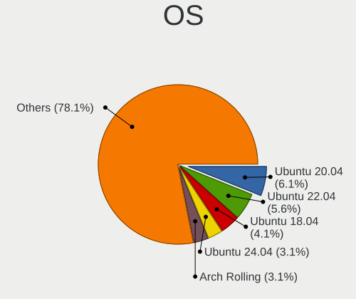

| Name                         | Notebooks | Percent |
|------------------------------|-----------|---------|
| Ubuntu 20.04                 | 171       | 6.09%   |
| Ubuntu 22.04                 | 156       | 5.55%   |
| Ubuntu 18.04                 | 114       | 4.06%   |
| Ubuntu 24.04                 | 87        | 3.1%    |
| Arch Rolling                 | 86        | 3.06%   |
| Debian 12                    | 67        | 2.38%   |
| Zorin 17                     | 65        | 2.31%   |
| Fedora 40                    | 58        | 2.06%   |
| Zorin 16                     | 56        | 1.99%   |
| Manjaro                      | 54        | 1.92%   |
| Fedora 38                    | 53        | 1.89%   |
| Pop!_OS 22.04                | 51        | 1.81%   |
| Debian 11                    | 49        | 1.74%   |
| OpenMandriva 4.3             | 47        | 1.67%   |
| OpenMandriva 4.2             | 43        | 1.53%   |
| KDE neon 20.04               | 36        | 1.28%   |
| Fedora 39                    | 33        | 1.17%   |
| ArcoLinux Rolling            | 33        | 1.17%   |
| Fedora 36                    | 31        | 1.1%    |
| Linux Mint 22.1              | 29        | 1.03%   |
| Linux Mint 20.3              | 29        | 1.03%   |
| KDE neon 22.04               | 29        | 1.03%   |
| Fedora 41                    | 29        | 1.03%   |
| OpenMandriva 25.90           | 27        | 0.96%   |
| Fedora 42                    | 26        | 0.93%   |
| Pop!_OS 20.04                | 23        | 0.82%   |
| OpenMandriva 24.12           | 23        | 0.82%   |
| Linux Mint 21.2              | 23        | 0.82%   |
| OpenMandriva 23.03           | 22        | 0.78%   |
| Zorin 15                     | 21        | 0.75%   |
| openSUSE Tumbleweed-XXXXXXXX | 21        | 0.75%   |
| OpenMandriva 24.07           | 21        | 0.75%   |
| OpenMandriva 23.08           | 21        | 0.75%   |
| Linux Mint 21.1              | 21        | 0.75%   |
| Fedora 37                    | 21        | 0.75%   |
| Arch                         | 21        | 0.75%   |
| Linux Mint 20                | 20        | 0.71%   |
| Ubuntu 19.10                 | 18        | 0.64%   |
| Ubuntu 19.04                 | 18        | 0.64%   |
| OpenMandriva 6.0             | 18        | 0.64%   |

OS Family
---------

OS without a version

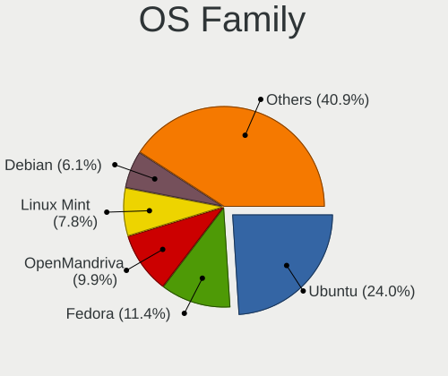

| Name             | Notebooks | Percent |
|------------------|-----------|---------|
| Ubuntu           | 642       | 23.98%  |
| Fedora           | 305       | 11.39%  |
| OpenMandriva     | 265       | 9.9%    |
| Linux Mint       | 208       | 7.77%   |
| Debian           | 163       | 6.09%   |
| Zorin            | 161       | 6.01%   |
| Arch             | 107       | 4%      |
| Pop!_OS          | 104       | 3.88%   |
| Manjaro          | 90        | 3.36%   |
| KDE neon         | 75        | 2.8%    |
| Kubuntu          | 51        | 1.91%   |
| Kali             | 49        | 1.83%   |
| Elementary       | 40        | 1.49%   |
| Xubuntu          | 35        | 1.31%   |
| openSUSE         | 35        | 1.31%   |
| ArcoLinux        | 33        | 1.23%   |
| SteamOS          | 29        | 1.08%   |
| ROSA             | 19        | 0.71%   |
| Lubuntu          | 19        | 0.71%   |
| LMDE             | 16        | 0.6%    |
| Nobara           | 14        | 0.52%   |
| Garuda Linux     | 13        | 0.49%   |
| EndeavourOS      | 13        | 0.49%   |
| Clear Linux      | 13        | 0.49%   |
| Endless          | 12        | 0.45%   |
| Ubuntu MATE      | 11        | 0.41%   |
| Parrot           | 11        | 0.41%   |
| MX               | 11        | 0.41%   |
| Ubuntu Unity     | 10        | 0.37%   |
| Gentoo           | 10        | 0.37%   |
| Ubuntu Budgie    | 9         | 0.34%   |
| Bazzite          | 9         | 0.34%   |
| Xero             | 6         | 0.22%   |
| CentOS           | 6         | 0.22%   |
| RHEL             | 5         | 0.19%   |
| CachyOS          | 5         | 0.19%   |
| org.kde.Platform | 4         | 0.15%   |
| Nitrux           | 4         | 0.15%   |
| Archcraft        | 4         | 0.15%   |
| Ubuntu Studio    | 3         | 0.11%   |

Kernel
------

Version of the Linux kernel

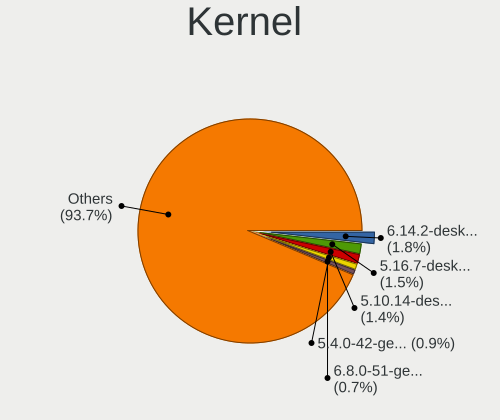

| Version                  | Notebooks | Percent |
|--------------------------|-----------|---------|
| 6.14.2-desktop-3omv2590  | 54        | 1.77%   |
| 5.16.7-desktop-1omv4003  | 47        | 1.54%   |
| 5.10.14-desktop-1omv4002 | 43        | 1.41%   |
| 5.4.0-42-generic         | 27        | 0.89%   |
| 6.8.0-51-generic         | 22        | 0.72%   |
| 6.12.1-desktop-1omv2490  | 20        | 0.66%   |
| 6.2.6-desktop-1omv2390   | 19        | 0.62%   |
| 6.4.11-desktop-1omv2390  | 18        | 0.59%   |
| 5.4.0-58-generic         | 18        | 0.59%   |
| 5.15.0-56-generic        | 18        | 0.59%   |
| 6.6.2-desktop-1omv2390   | 17        | 0.56%   |
| 6.10.0-desktop-1omv2490  | 17        | 0.56%   |
| 6.8.0-45-generic         | 15        | 0.49%   |
| 6.8.0-49-generic         | 14        | 0.46%   |
| 5.4.0-52-generic         | 14        | 0.46%   |
| 5.3.0-46-generic         | 14        | 0.46%   |
| 6.8.0-40-generic         | 13        | 0.43%   |
| 6.1.1-desktop-1omv2290   | 13        | 0.43%   |
| 5.15.0-48-generic        | 13        | 0.43%   |
| 6.8.0-52-generic         | 12        | 0.39%   |
| 6.14.0-33-generic        | 12        | 0.39%   |
| 5.4.0-91-generic         | 12        | 0.39%   |
| 5.4.0-48-generic         | 12        | 0.39%   |
| 5.19.0-38-generic        | 12        | 0.39%   |
| 5.15.0-58-generic        | 12        | 0.39%   |
| 5.11.0-27-generic        | 12        | 0.39%   |
| 5.0.0-37-generic         | 12        | 0.39%   |
| 5.3.0-40-generic         | 11        | 0.36%   |
| 5.19.0-43-generic        | 11        | 0.36%   |
| 5.15.0-43-generic        | 11        | 0.36%   |
| 6.2.0-39-generic         | 10        | 0.33%   |
| 6.12.10-76061203-generic | 10        | 0.33%   |
| 5.3.0-42-generic         | 10        | 0.33%   |
| 5.19.0-35-generic        | 10        | 0.33%   |
| 5.15.0-47-generic        | 10        | 0.33%   |
| 5.13.0-39-generic        | 10        | 0.33%   |
| 5.13.0-28-generic        | 10        | 0.33%   |
| 5.11.0-43-generic        | 10        | 0.33%   |
| 6.5.0-35-generic         | 9         | 0.3%    |
| 6.5.0-14-generic         | 9         | 0.3%    |

Kernel Family
-------------

Linux kernel without a distro release

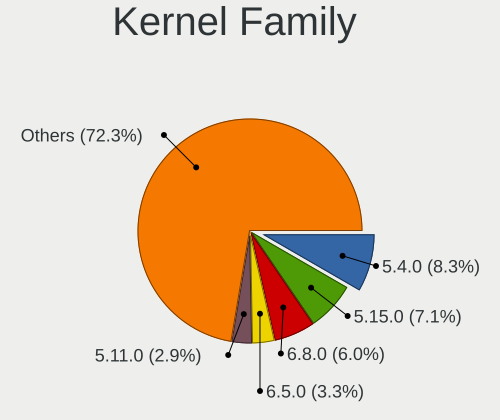

| Version | Notebooks | Percent |
|---------|-----------|---------|
| 5.4.0   | 241       | 8.34%   |
| 5.15.0  | 206       | 7.13%   |
| 6.8.0   | 173       | 5.99%   |
| 6.5.0   | 94        | 3.25%   |
| 5.11.0  | 85        | 2.94%   |
| 5.13.0  | 82        | 2.84%   |
| 6.1.0   | 79        | 2.73%   |
| 5.8.0   | 73        | 2.53%   |
| 5.3.0   | 72        | 2.49%   |
| 5.19.0  | 72        | 2.49%   |
| 4.15.0  | 67        | 2.32%   |
| 6.2.0   | 65        | 2.25%   |
| 6.14.0  | 58        | 2.01%   |
| 6.14.2  | 55        | 1.9%    |
| 5.10.0  | 54        | 1.87%   |
| 5.0.0   | 54        | 1.87%   |
| 5.16.7  | 48        | 1.66%   |
| 4.18.0  | 48        | 1.66%   |
| 5.10.14 | 43        | 1.49%   |
| 6.11.0  | 37        | 1.28%   |
| 4.19.0  | 28        | 0.97%   |
| 6.2.6   | 27        | 0.93%   |
| 6.4.11  | 23        | 0.8%    |
| 6.12.1  | 22        | 0.76%   |
| 6.6.2   | 19        | 0.66%   |
| 6.1.1   | 19        | 0.66%   |
| 6.10.0  | 17        | 0.59%   |
| 6.9.7   | 13        | 0.45%   |
| 6.8.7   | 12        | 0.42%   |
| 6.12.10 | 12        | 0.42%   |
| 6.8.11  | 11        | 0.38%   |
| 6.12.9  | 10        | 0.35%   |
| 6.1.52  | 10        | 0.35%   |
| 5.14.0  | 10        | 0.35%   |
| 6.9.3   | 9         | 0.31%   |
| 6.8.9   | 9         | 0.31%   |
| 6.8.5   | 9         | 0.31%   |
| 6.4.6   | 9         | 0.31%   |
| 6.2.15  | 9         | 0.31%   |
| 6.10.6  | 9         | 0.31%   |

Kernel Major Ver.
-----------------

Linux kernel major version

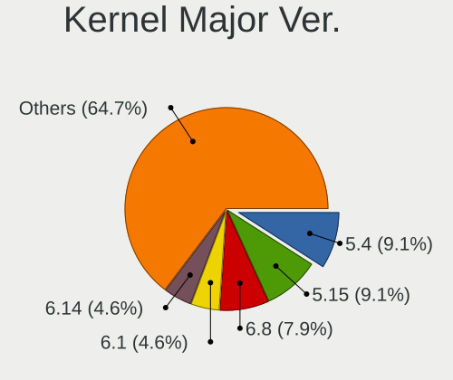

| Version | Notebooks | Percent |
|---------|-----------|---------|
| 5.4     | 258       | 9.1%    |
| 5.15    | 258       | 9.1%    |
| 6.8     | 224       | 7.9%    |
| 6.1     | 131       | 4.62%   |
| 6.14    | 130       | 4.58%   |
| 5.10    | 130       | 4.58%   |
| 6.5     | 128       | 4.51%   |
| 6.2     | 123       | 4.34%   |
| 6.12    | 105       | 3.7%    |
| 5.19    | 98        | 3.46%   |
| 5.13    | 94        | 3.31%   |
| 5.11    | 94        | 3.31%   |
| 5.3     | 83        | 2.93%   |
| 5.8     | 80        | 2.82%   |
| 6.11    | 73        | 2.57%   |
| 5.16    | 70        | 2.47%   |
| 6.6     | 67        | 2.36%   |
| 4.15    | 67        | 2.36%   |
| 6.4     | 57        | 2.01%   |
| 5.0     | 54        | 1.9%    |
| 6.10    | 50        | 1.76%   |
| 4.18    | 49        | 1.73%   |
| 6.9     | 42        | 1.48%   |
| 6.17    | 31        | 1.09%   |
| 6.0     | 30        | 1.06%   |
| 4.19    | 30        | 1.06%   |
| 6.15    | 28        | 0.99%   |
| 5.17    | 27        | 0.95%   |
| 5.14    | 27        | 0.95%   |
| 6.3     | 26        | 0.92%   |
| 5.18    | 23        | 0.81%   |
| 6.7     | 22        | 0.78%   |
| 6.16    | 19        | 0.67%   |
| 6.13    | 19        | 0.67%   |
| 5.9     | 16        | 0.56%   |
| 5.6     | 12        | 0.42%   |
| 4.9     | 12        | 0.42%   |
| 5.12    | 11        | 0.39%   |
| 5.7     | 10        | 0.35%   |
| 5.5     | 7         | 0.25%   |

Arch
----

OS architecture (x86_64, i586, etc.)

| Name    | Notebooks | Percent |
|---------|-----------|---------|
| x86_64  | 2481      | 97.91%  |
| i686    | 52        | 2.05%   |
| aarch64 | 1         | 0.04%   |

DE
--

Desktop Environment

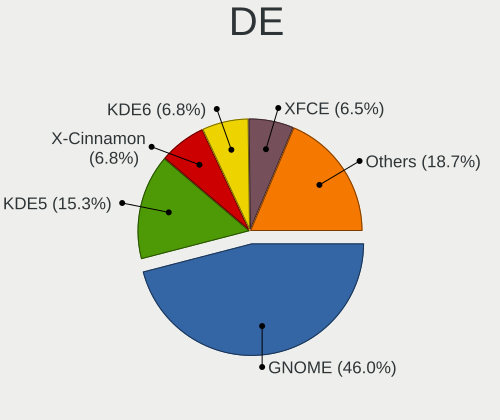

| Name              | Notebooks | Percent |
|-------------------|-----------|---------|
| GNOME             | 1229      | 45.96%  |
| KDE5              | 408       | 15.26%  |
| X-Cinnamon        | 182       | 6.81%   |
| KDE6              | 181       | 6.77%   |
| XFCE              | 175       | 6.54%   |
| Unknown           | 174       | 6.51%   |
| MATE              | 64        | 2.39%   |
| KDE               | 60        | 2.24%   |
| Pantheon          | 39        | 1.46%   |
| LXQt              | 39        | 1.46%   |
| Cinnamon          | 19        | 0.71%   |
| Budgie            | 15        | 0.56%   |
| LXDE              | 11        | 0.41%   |
| Unity             | 10        | 0.37%   |
| i3                | 9         | 0.34%   |
| Hyprland          | 8         | 0.3%    |
| Deepin            | 7         | 0.26%   |
| KDE4              | 6         | 0.22%   |
| Enlightenment     | 6         | 0.22%   |
| openbox           | 5         | 0.19%   |
| GNOME Classic     | 5         | 0.19%   |
| Trinity           | 4         | 0.15%   |
| COSMIC            | 3         | 0.11%   |
| qtile             | 2         | 0.07%   |
| lightdm-xsession  | 2         | 0.07%   |
| Yaru:ubuntu:GNOME | 1         | 0.04%   |
| xmonad            | 1         | 0.04%   |
| wayland           | 1         | 0.04%   |
| Niri              | 1         | 0.04%   |
| i3-with-shmlog    | 1         | 0.04%   |
| GNOME-Classic     | 1         | 0.04%   |
| GNOME Flashback   | 1         | 0.04%   |
| DWM               | 1         | 0.04%   |
| DDE               | 1         | 0.04%   |
| bspwm:            | 1         | 0.04%   |
| bspwm             | 1         | 0.04%   |

Display Server
--------------

X11 or Wayland

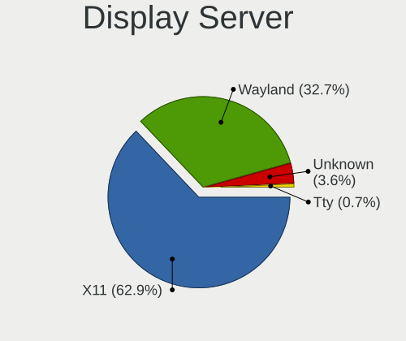

| Name    | Notebooks | Percent |
|---------|-----------|---------|
| X11     | 1661      | 62.92%  |
| Wayland | 864       | 32.73%  |
| Unknown | 96        | 3.64%   |
| Tty     | 19        | 0.72%   |

Display Manager
---------------

SDDM, LightDM, etc.

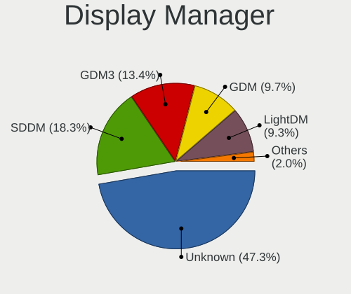

| Name           | Notebooks | Percent |
|----------------|-----------|---------|
| Unknown        | 1257      | 47.26%  |
| SDDM           | 487       | 18.31%  |
| GDM3           | 356       | 13.38%  |
| GDM            | 258       | 9.7%    |
| LightDM        | 248       | 9.32%   |
| TDM            | 34        | 1.28%   |
| KDM            | 5         | 0.19%   |
| XDM            | 4         | 0.15%   |
| SLiM           | 3         | 0.11%   |
| LXDM           | 2         | 0.08%   |
| GREETD         | 2         | 0.08%   |
| MDM            | 1         | 0.04%   |
| LY-DM          | 1         | 0.04%   |
| Ly             | 1         | 0.04%   |
| COSMIC-GREETER | 1         | 0.04%   |

OS Lang
-------

Language

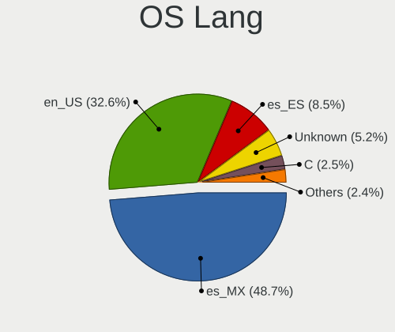

| Lang       | Notebooks | Percent |
|------------|-----------|---------|
| es_MX      | 1270      | 48.71%  |
| en_US      | 851       | 32.64%  |
| es_ES      | 222       | 8.52%   |
| Unknown    | 135       | 5.18%   |
| C          | 66        | 2.53%   |
| en_GB      | 20        | 0.77%   |
| es_US      | 8         | 0.31%   |
| fr_FR      | 4         | 0.15%   |
| en_CA      | 4         | 0.15%   |
| es_AR      | 3         | 0.12%   |
| ru_RU      | 2         | 0.08%   |
| it_IT      | 2         | 0.08%   |
| es_VE      | 2         | 0.08%   |
| es_MX.UTF8 | 2         | 0.08%   |
| en_MX      | 2         | 0.08%   |
| C.UTF8     | 2         | 0.08%   |
| uk_UA      | 1         | 0.04%   |
| pt_BR      | 1         | 0.04%   |
| POSIX      | 1         | 0.04%   |
| es_PE      | 1         | 0.04%   |
| es_LA      | 1         | 0.04%   |
| es_CR      | 1         | 0.04%   |
| es_419     | 1         | 0.04%   |
| en_US.UTF8 | 1         | 0.04%   |
| en_IE      | 1         | 0.04%   |
| en_DK      | 1         | 0.04%   |
| de_DE      | 1         | 0.04%   |
| aa_ET      | 1         | 0.04%   |

Boot Mode
---------

EFI or BIOS

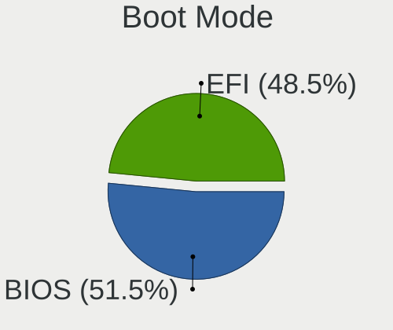

| Mode | Notebooks | Percent |
|------|-----------|---------|
| BIOS | 1340      | 51.54%  |
| EFI  | 1260      | 48.46%  |

Filesystem
----------

Type of filesystem

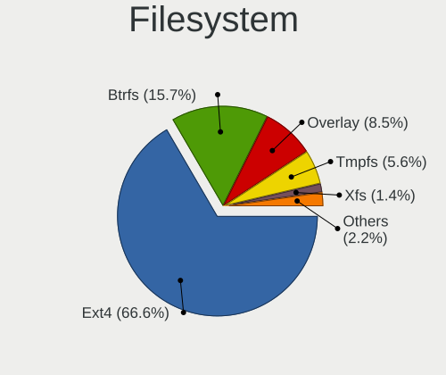

| Type                | Notebooks | Percent |
|---------------------|-----------|---------|
| Ext4                | 1748      | 66.59%  |
| Btrfs               | 413       | 15.73%  |
| Overlay             | 222       | 8.46%   |
| Tmpfs               | 146       | 5.56%   |
| Xfs                 | 37        | 1.41%   |
| Unknown             | 36        | 1.37%   |
| Zfs                 | 11        | 0.42%   |
| Ext2                | 4         | 0.15%   |
| Ext3                | 3         | 0.11%   |
| XXXXXXX             | 2         | 0.08%   |
| Reiserfs            | 1         | 0.04%   |
| Fuse.fuse-overlayfs | 1         | 0.04%   |
| Aufs                | 1         | 0.04%   |

Part. scheme
------------

Scheme of partitioning

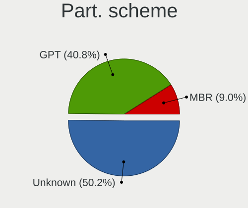

| Type    | Notebooks | Percent |
|---------|-----------|---------|
| Unknown | 1314      | 50.21%  |
| GPT     | 1068      | 40.81%  |
| MBR     | 235       | 8.98%   |

Dual Boot with Linux/BSD
------------------------

Hosting more than one Linux/BSD

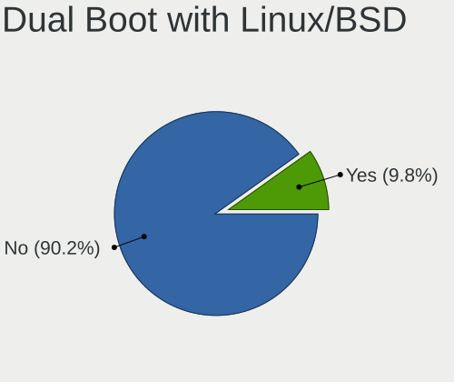

| Dual boot | Notebooks | Percent |
|-----------|-----------|---------|
| No        | 2320      | 90.17%  |
| Yes       | 253       | 9.83%   |

Dual Boot (Win)
---------------

Hosting Linux and Windows

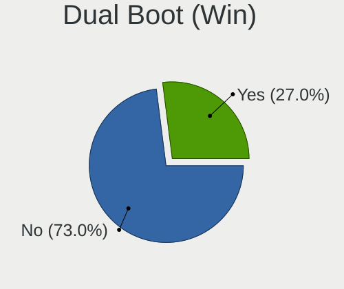

| Dual boot | Notebooks | Percent |
|-----------|-----------|---------|
| No        | 1892      | 72.99%  |
| Yes       | 700       | 27.01%  |

Board
-----

Vendor
------

Motherboard manufacturer

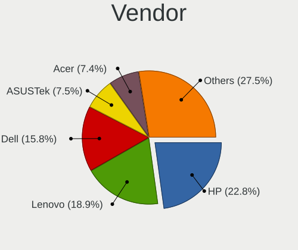

| Name                | Notebooks | Percent |
|---------------------|-----------|---------|
| Hewlett-Packard     | 578       | 22.83%  |
| Lenovo              | 479       | 18.92%  |
| Dell                | 401       | 15.84%  |
| ASUSTek Computer    | 191       | 7.54%   |
| Acer                | 187       | 7.39%   |
| Apple               | 116       | 4.58%   |
| HUAWEI              | 112       | 4.42%   |
| Toshiba             | 106       | 4.19%   |
| Sony                | 55        | 2.17%   |
| MSI                 | 36        | 1.42%   |
| Google              | 31        | 1.22%   |
| Valve               | 27        | 1.07%   |
| Gateway             | 25        | 0.99%   |
| Unknown             | 23        | 0.91%   |
| Samsung Electronics | 22        | 0.87%   |
| Alienware           | 20        | 0.79%   |
| Chuwi               | 13        | 0.51%   |
| GPU Company         | 8         | 0.32%   |
| Timi                | 7         | 0.28%   |
| Lanix               | 7         | 0.28%   |
| SK hynix            | 5         | 0.2%    |
| Notebook            | 5         | 0.2%    |
| A-DATA Technology   | 5         | 0.2%    |
| Razer               | 4         | 0.16%   |
| HONOR               | 4         | 0.16%   |
| GHIA                | 4         | 0.16%   |
| EVOO                | 4         | 0.16%   |
| System76            | 3         | 0.12%   |
| LG Electronics      | 3         | 0.12%   |
| Intel               | 3         | 0.12%   |
| eMachines           | 3         | 0.12%   |
| American Megatrends | 3         | 0.12%   |
| VPU Company         | 2         | 0.08%   |
| Panasonic           | 2         | 0.08%   |
| ONE-NETBOOK         | 2         | 0.08%   |
| MACHENIKE           | 2         | 0.08%   |
| Insyde              | 2         | 0.08%   |
| Gigabyte Technology | 2         | 0.08%   |
| Dynabook            | 2         | 0.08%   |
| DITECMA             | 2         | 0.08%   |

Model
-----

Motherboard model

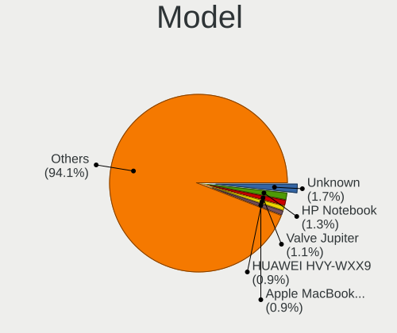

| Name                          | Notebooks | Percent |
|-------------------------------|-----------|---------|
| Unknown                       | 43        | 1.7%    |
| HP Notebook                   | 34        | 1.34%   |
| Valve Jupiter                 | 27        | 1.07%   |
| HUAWEI HVY-WXX9               | 23        | 0.91%   |
| Apple MacBookPro9,2           | 22        | 0.87%   |
| HP Pavilion g4                | 20        | 0.79%   |
| HP Pavilion Notebook          | 19        | 0.75%   |
| HP Pavilion Laptop 15-cw1xxx  | 18        | 0.71%   |
| HP Pavilion Laptop 15-cw0xxx  | 17        | 0.67%   |
| HUAWEI BOM-WXX9               | 15        | 0.59%   |
| Apple MacBookPro8,1           | 14        | 0.55%   |
| HP Pavilion dv4               | 12        | 0.47%   |
| HP Laptop 15-da0xxx           | 12        | 0.47%   |
| Dell Latitude E6430           | 12        | 0.47%   |
| HP Laptop 14-cm0xxx           | 10        | 0.39%   |
| Lenovo IdeaPad 330-14AST 81D5 | 9         | 0.36%   |
| HP Laptop 15-db0xxx           | 9         | 0.36%   |
| HP EliteBook 8460p            | 9         | 0.36%   |
| Dell Inspiron 5559            | 9         | 0.36%   |
| Apple MacBookPro12,1          | 9         | 0.36%   |
| Acer Aspire A315-24P          | 9         | 0.36%   |
| HUAWEI NBLK-WAX9X             | 8         | 0.32%   |
| HUAWEI NBLB-WAX9N             | 8         | 0.32%   |
| HP Pavilion 14                | 8         | 0.32%   |
| HP Laptop 15-bw0xx            | 8         | 0.32%   |
| Dell Inspiron 5570            | 8         | 0.32%   |
| Lenovo IdeaPad 330-15AST 81D6 | 7         | 0.28%   |
| Lenovo G50-30 80G0            | 7         | 0.28%   |
| HP Pavilion dv5               | 7         | 0.28%   |
| HP G42                        | 7         | 0.28%   |
| Dell Latitude E6410           | 7         | 0.28%   |
| Acer Aspire E5-573            | 7         | 0.28%   |
| Toshiba Satellite L55-B       | 6         | 0.24%   |
| Lenovo IdeaPad 330-14IGM 81D0 | 6         | 0.24%   |
| Lenovo IdeaPad 3 14ALC6 82KT  | 6         | 0.24%   |
| Lenovo G40-45 80E1            | 6         | 0.24%   |
| HUAWEI NBM-WXX9               | 6         | 0.24%   |
| HUAWEI BOHK-WAX9X             | 6         | 0.24%   |
| HUAWEI BOHB-WAX9              | 6         | 0.24%   |
| HP Laptop 15-bs0xx            | 6         | 0.24%   |

Model Family
------------

Motherboard model prefix

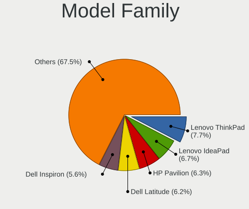

| Name               | Notebooks | Percent |
|--------------------|-----------|---------|
| Lenovo ThinkPad    | 194       | 7.66%   |
| Lenovo IdeaPad     | 169       | 6.67%   |
| HP Pavilion        | 160       | 6.32%   |
| Dell Latitude      | 157       | 6.2%    |
| Dell Inspiron      | 143       | 5.65%   |
| Acer Aspire        | 138       | 5.45%   |
| HP Laptop          | 108       | 4.27%   |
| Toshiba Satellite  | 97        | 3.83%   |
| ASUS VivoBook      | 54        | 2.13%   |
| HP EliteBook       | 47        | 1.86%   |
| HP ProBook         | 44        | 1.74%   |
| Unknown            | 43        | 1.7%    |
| HP Notebook        | 35        | 1.38%   |
| Valve Jupiter      | 27        | 1.07%   |
| HP 240             | 26        | 1.03%   |
| Apple MacBookPro9  | 26        | 1.03%   |
| HUAWEI HVY-WXX9    | 23        | 0.91%   |
| ASUS ASUS          | 21        | 0.83%   |
| HP Compaq          | 19        | 0.75%   |
| Acer Nitro         | 19        | 0.75%   |
| Dell Precision     | 18        | 0.71%   |
| Lenovo Legion      | 17        | 0.67%   |
| HP ENVY            | 17        | 0.67%   |
| Dell XPS           | 17        | 0.67%   |
| Dell Vostro        | 17        | 0.67%   |
| ASUS ROG           | 17        | 0.67%   |
| Apple MacBookPro8  | 17        | 0.67%   |
| HP ZBook           | 16        | 0.63%   |
| HUAWEI BOM-WXX9    | 15        | 0.59%   |
| HP OMEN            | 15        | 0.59%   |
| Dell G15           | 14        | 0.55%   |
| HP Victus          | 10        | 0.39%   |
| Dell System        | 10        | 0.39%   |
| Dell Studio        | 10        | 0.39%   |
| MSI GF63           | 9         | 0.36%   |
| Lenovo ThinkBook   | 9         | 0.36%   |
| ASUS Zenbook       | 9         | 0.36%   |
| Apple MacBookPro12 | 9         | 0.36%   |
| Apple MacBookPro11 | 9         | 0.36%   |
| HUAWEI NBLK-WAX9X  | 8         | 0.32%   |

MFG Year
--------

Motherboard manufacture year

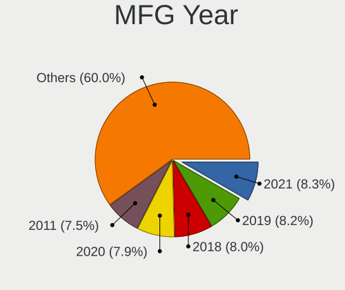

| Year    | Notebooks | Percent |
|---------|-----------|---------|
| 2021    | 211       | 8.33%   |
| 2019    | 208       | 8.21%   |
| 2018    | 203       | 8.02%   |
| 2020    | 201       | 7.94%   |
| 2011    | 190       | 7.5%    |
| 2012    | 185       | 7.31%   |
| 2017    | 163       | 6.44%   |
| 2013    | 160       | 6.32%   |
| 2015    | 155       | 6.12%   |
| 2014    | 145       | 5.73%   |
| 2016    | 124       | 4.9%    |
| 2010    | 116       | 4.58%   |
| 2022    | 113       | 4.46%   |
| 2008    | 99        | 3.91%   |
| 2023    | 84        | 3.32%   |
| 2009    | 53        | 2.09%   |
| 2024    | 50        | 1.97%   |
| 2007    | 38        | 1.5%    |
| 2006    | 14        | 0.55%   |
| 2025    | 8         | 0.32%   |
| Unknown | 6         | 0.24%   |
| 2005    | 4         | 0.16%   |
| 2004    | 2         | 0.08%   |

Form Factor
-----------

Physical design of the computer

| Name     | Notebooks | Percent |
|----------|-----------|---------|
| Notebook | 2532      | 100%    |

Secure Boot
-----------

Enabled or disabled

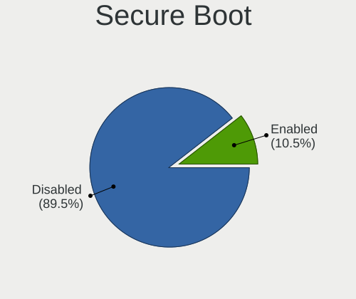

| State    | Notebooks | Percent |
|----------|-----------|---------|
| Disabled | 2296      | 89.48%  |
| Enabled  | 270       | 10.52%  |

Coreboot
--------

Have coreboot on board

| Used | Notebooks | Percent |
|------|-----------|---------|
| No   | 2497      | 98.62%  |
| Yes  | 35        | 1.38%   |

RAM Size
--------

Total RAM memory

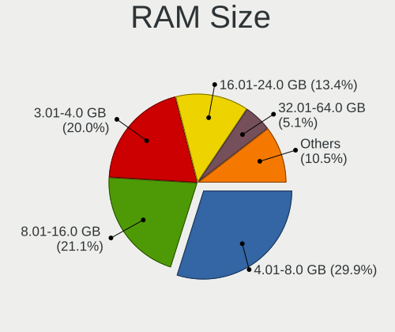

| Size in GB  | Notebooks | Percent |
|-------------|-----------|---------|
| 4.01-8.0    | 767       | 29.86%  |
| 8.01-16.0   | 542       | 21.1%   |
| 3.01-4.0    | 515       | 20.05%  |
| 16.01-24.0  | 345       | 13.43%  |
| 32.01-64.0  | 131       | 5.1%    |
| 1.01-2.0    | 115       | 4.48%   |
| 24.01-32.0  | 56        | 2.18%   |
| 2.01-3.0    | 46        | 1.79%   |
| 64.01-256.0 | 34        | 1.32%   |
| 0.51-1.0    | 18        | 0.7%    |

RAM Used
--------

Used RAM memory

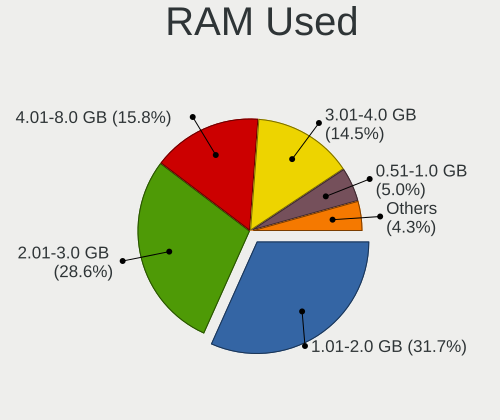

| Used GB    | Notebooks | Percent |
|------------|-----------|---------|
| 1.01-2.0   | 892       | 31.7%   |
| 2.01-3.0   | 806       | 28.64%  |
| 4.01-8.0   | 446       | 15.85%  |
| 3.01-4.0   | 408       | 14.5%   |
| 0.51-1.0   | 140       | 4.98%   |
| 8.01-16.0  | 93        | 3.3%    |
| 0.01-0.5   | 18        | 0.64%   |
| 16.01-24.0 | 8         | 0.28%   |
| 32.01-64.0 | 1         | 0.04%   |
| 24.01-32.0 | 1         | 0.04%   |
| Unknown    | 1         | 0.04%   |

Total Drives
------------

Number of drives on board

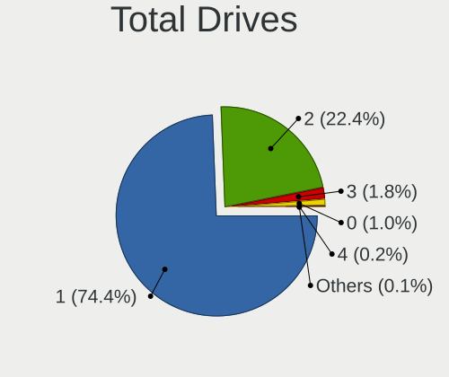

| Drives | Notebooks | Percent |
|--------|-----------|---------|
| 1      | 1922      | 74.38%  |
| 2      | 580       | 22.45%  |
| 3      | 47        | 1.82%   |
| 0      | 27        | 1.04%   |
| 4      | 6         | 0.23%   |
| 6      | 1         | 0.04%   |
| 5      | 1         | 0.04%   |

Has CD-ROM
----------

Has CD-ROM on board

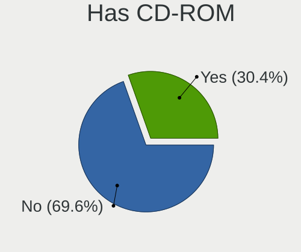

| Presented | Notebooks | Percent |
|-----------|-----------|---------|
| No        | 1771      | 69.59%  |
| Yes       | 774       | 30.41%  |

Has Ethernet
------------

Has Ethernet on board

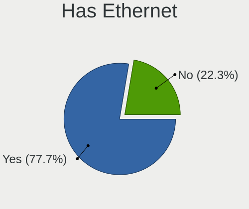

| Presented | Notebooks | Percent |
|-----------|-----------|---------|
| Yes       | 1970      | 77.65%  |
| No        | 567       | 22.35%  |

Has WiFi
--------

Has WiFi module

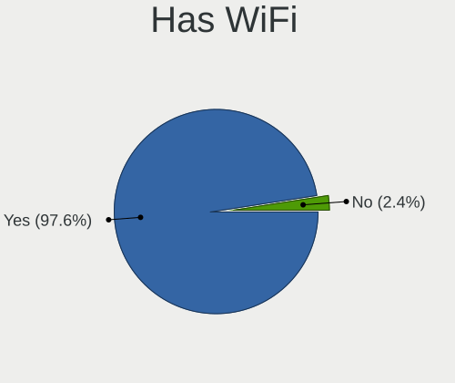

| Presented | Notebooks | Percent |
|-----------|-----------|---------|
| Yes       | 2474      | 97.56%  |
| No        | 62        | 2.44%   |

Has Bluetooth
-------------

Has Bluetooth module

| Presented | Notebooks | Percent |
|-----------|-----------|---------|
| Yes       | 2003      | 78.24%  |
| No        | 557       | 21.76%  |

Location
--------

Country
-------

Geographic location (country)

| Country | Notebooks | Percent |
|---------|-----------|---------|
| Mexico  | 2532      | 100%    |

City
----

Geographic location (city)

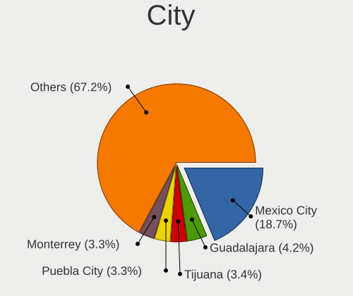

| City                  | Notebooks | Percent |
|-----------------------|-----------|---------|
| Mexico City           | 504       | 18.7%   |
| Guadalajara           | 112       | 4.16%   |
| Tijuana               | 91        | 3.38%   |
| Puebla City           | 89        | 3.3%    |
| Monterrey             | 89        | 3.3%    |
| Zapopan               | 82        | 3.04%   |
| Mérida               | 53        | 1.97%   |
| Queretaro             | 42        | 1.56%   |
| Toluca                | 41        | 1.52%   |
| Ecatepec              | 40        | 1.48%   |
| Cuernavaca            | 35        | 1.3%    |
| Gustavo Adolfo Madero | 32        | 1.19%   |
| León                 | 31        | 1.15%   |
| Xalapa                | 30        | 1.11%   |
| Veracruz              | 30        | 1.11%   |
| Naucalpan             | 30        | 1.11%   |
| Ciudad Juárez        | 29        | 1.08%   |
| Cancún               | 29        | 1.08%   |
| Pachuca               | 27        | 1%      |
| Querétaro City       | 26        | 0.96%   |
| Morelia               | 26        | 0.96%   |
| Mexicali              | 26        | 0.96%   |
| Tlalnepantla          | 25        | 0.93%   |
| Hermosillo            | 25        | 0.93%   |
| Guadalupe             | 25        | 0.93%   |
| Culiacán             | 25        | 0.93%   |
| Oaxaca City           | 23        | 0.85%   |
| Cuautitlán Izcalli   | 23        | 0.85%   |
| Ciudad Nezahualcoyotl | 23        | 0.85%   |
| Chihuahua City        | 23        | 0.85%   |
| Aguascalientes        | 23        | 0.85%   |
| Saltillo              | 22        | 0.82%   |
| Ciudad Lopez Mateos   | 22        | 0.82%   |
| Apodaca               | 22        | 0.82%   |
| Iztapalapa            | 21        | 0.78%   |
| San Luis Potosí City | 18        | 0.67%   |
| Chalco                | 18        | 0.67%   |
| Juarez                | 17        | 0.63%   |
| Durango               | 17        | 0.63%   |
| Zacatecas City        | 16        | 0.59%   |

Drives
------

Drive Vendor
------------

Hard drive vendors

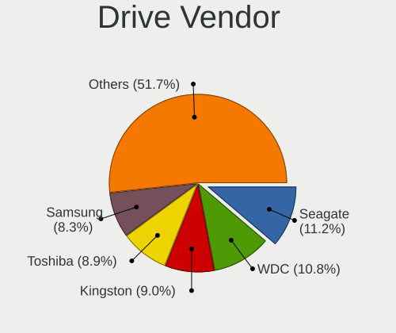

| Vendor                      | Notebooks | Drives | Percent |
|-----------------------------|-----------|--------|---------|
| Seagate                     | 352       | 431    | 11.2%   |
| WDC                         | 340       | 424    | 10.82%  |
| Kingston                    | 284       | 344    | 9.04%   |
| Toshiba                     | 279       | 347    | 8.88%   |
| Samsung Electronics         | 262       | 339    | 8.34%   |
| A-DATA Technology           | 214       | 255    | 6.81%   |
| Sandisk                     | 178       | 218    | 5.67%   |
| Unknown                     | 171       | 218    | 5.44%   |
| Hitachi                     | 106       | 127    | 3.37%   |
| HGST                        | 96        | 106    | 3.06%   |
| SK hynix                    | 88        | 104    | 2.8%    |
| Micron Technology           | 67        | 84     | 2.13%   |
| Intel                       | 63        | 91     | 2.01%   |
| Kingston Technology Company | 54        | 68     | 1.72%   |
| Apple                       | 50        | 66     | 1.59%   |
| Crucial                     | 38        | 43     | 1.21%   |
| Silicon Motion              | 34        | 37     | 1.08%   |
| KIOXIA                      | 34        | 40     | 1.08%   |
| China                       | 24        | 27     | 0.76%   |
| Unknown                     | 24        | 27     | 0.76%   |
| Fujitsu                     | 22        | 23     | 0.7%    |
| ADATA Technology            | 22        | 29     | 0.7%    |
| Phison Electronics          | 20        | 23     | 0.64%   |
| LITEON                      | 18        | 27     | 0.57%   |
| XPG                         | 16        | 24     | 0.51%   |
| PNY                         | 14        | 18     | 0.45%   |
| Phison                      | 14        | 16     | 0.45%   |
| Realtek Semiconductor       | 12        | 14     | 0.38%   |
| YMTC                        | 8         | 10     | 0.25%   |
| UMIS                        | 8         | 11     | 0.25%   |
| O2 Micro                    | 8         | 8      | 0.25%   |
| Netac                       | 8         | 8      | 0.25%   |
| JMicron Technology          | 8         | 8      | 0.25%   |
| Hewlett-Packard             | 8         | 9      | 0.25%   |
| Wibtek                      | 7         | 8      | 0.22%   |
| Union Memory (Shenzhen)     | 6         | 6      | 0.19%   |
| Team                        | 6         | 6      | 0.19%   |
| SSSTC                       | 6         | 6      | 0.19%   |
| Micron/Crucial Technology   | 6         | 9      | 0.19%   |
| Blackpcs                    | 6         | 6      | 0.19%   |

Drive Model
-----------

Hard drive models

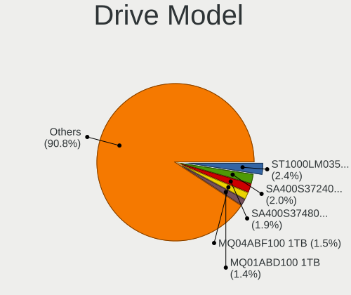

| Model                                              | Notebooks | Percent |
|----------------------------------------------------|-----------|---------|
| Seagate ST1000LM035-1RK172 1TB                     | 78        | 2.4%    |
| Kingston SA400S37240G 240GB SSD                    | 65        | 2%      |
| Kingston SA400S37480G 480GB SSD                    | 61        | 1.88%   |
| Toshiba MQ04ABF100 1TB                             | 49        | 1.51%   |
| Toshiba MQ01ABD100 1TB                             | 47        | 1.45%   |
| Seagate ST1000LM024 HN-M101MBB 1TB                 | 41        | 1.26%   |
| A-DATA SU630 240GB SSD                             | 41        | 1.26%   |
| Toshiba MQ01ABF050 500GB                           | 37        | 1.14%   |
| A-DATA SU650 120GB SSD                             | 36        | 1.11%   |
| Unknown MMC Card  32GB                             | 35        | 1.08%   |
| Seagate ST500LT012-1DG142 500GB                    | 30        | 0.92%   |
| Samsung NVMe SSD Controller SM981/PM981/PM983 1TB  | 29        | 0.89%   |
| Unknown MMC Card  64GB                             | 27        | 0.83%   |
| Kingston SA400S37960G 960GB SSD                    | 27        | 0.83%   |
| Kingston Company SNV2S1000G 1TB                    | 26        | 0.8%    |
| Unknown                                            | 24        | 0.74%   |
| Sandisk WD Blue SN550 NVMe SSD 1024GB              | 21        | 0.65%   |
| Unknown MMC Card  128GB                            | 20        | 0.62%   |
| HGST HTS725050A7E630 500GB                         | 20        | 0.62%   |
| A-DATA SU630 480GB SSD                             | 20        | 0.62%   |
| Seagate ST500LM021-1KJ152 500GB                    | 19        | 0.58%   |
| Seagate ST9500325AS 500GB                          | 18        | 0.55%   |
| Silicon Motion PCIe-8 SSD 512GB                    | 17        | 0.52%   |
| Samsung NVMe SSD Controller PM9A1/PM9A3/980PRO 1TB | 17        | 0.52%   |
| HGST HTS721010A9E630 1TB                           | 17        | 0.52%   |
| HGST HTS541010A9E680 1TB                           | 15        | 0.46%   |
| SanDisk NVMe SSD Drive 512GB                       | 14        | 0.43%   |
| WDC WD5000LPCX-60VHAT0 500GB                       | 13        | 0.4%    |
| WDC WD5000LPCX-24VHAT0 500GB                       | 13        | 0.4%    |
| Unknown MMC Card  16GB                             | 13        | 0.4%    |
| Seagate ST1000LM049-2GH172 1TB                     | 13        | 0.4%    |
| Kingston SA400S37120G 120GB SSD                    | 13        | 0.4%    |
| A-DATA SU800 512GB SSD                             | 13        | 0.4%    |
| A-DATA SU650 240GB SSD                             | 13        | 0.4%    |
| A-DATA SU630 960GB SSD                             | 13        | 0.4%    |
| WDC WD10SPZX-08Z10 1TB                             | 12        | 0.37%   |
| Phison PS5013 E13 NVMe Controller 500GB            | 12        | 0.37%   |
| HGST HTS545050A7E680 500GB                         | 12        | 0.37%   |
| WDC WD10SPZX-60Z10T0 1TB                           | 11        | 0.34%   |
| WDC WD10JPVX-60JC3T1 1TB                           | 11        | 0.34%   |

HDD Vendor
----------

Hard disk drive vendors

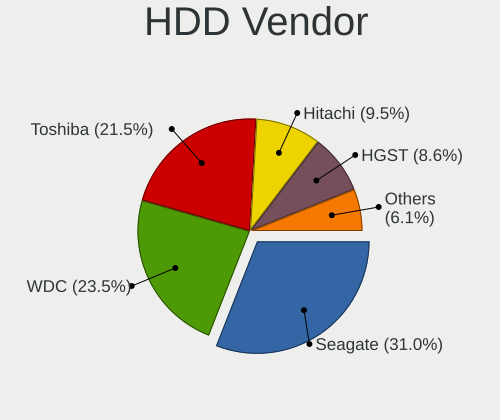

| Vendor              | Notebooks | Drives | Percent |
|---------------------|-----------|--------|---------|
| Seagate             | 347       | 424    | 30.95%  |
| WDC                 | 263       | 323    | 23.46%  |
| Toshiba             | 241       | 300    | 21.5%   |
| Hitachi             | 106       | 127    | 9.46%   |
| HGST                | 96        | 106    | 8.56%   |
| Fujitsu             | 22        | 23     | 1.96%   |
| Samsung Electronics | 17        | 20     | 1.52%   |
| Unknown             | 9         | 10     | 0.8%    |
| Apple               | 8         | 9      | 0.71%   |
| JMicron Technology  | 3         | 3      | 0.27%   |
| Hewlett-Packard     | 2         | 2      | 0.18%   |
| ASMT                | 2         | 2      | 0.18%   |
| WALRAM              | 1         | 1      | 0.09%   |
| SAGE                | 1         | 1      | 0.09%   |
| LaCie               | 1         | 2      | 0.09%   |
| IBM/Hitachi         | 1         | 1      | 0.09%   |
| ASMedia             | 1         | 1      | 0.09%   |

SSD Vendor
----------

Solid state drive vendors

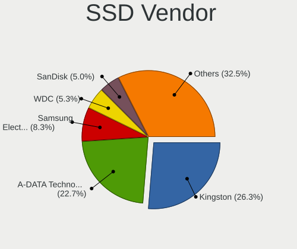

| Vendor              | Notebooks | Drives | Percent |
|---------------------|-----------|--------|---------|
| Kingston            | 238       | 290    | 26.3%   |
| A-DATA Technology   | 205       | 243    | 22.65%  |
| Samsung Electronics | 75        | 88     | 8.29%   |
| WDC                 | 48        | 61     | 5.3%    |
| SanDisk             | 45        | 54     | 4.97%   |
| Crucial             | 30        | 31     | 3.31%   |
| Apple               | 30        | 36     | 3.31%   |
| China               | 23        | 26     | 2.54%   |
| SK hynix            | 17        | 18     | 1.88%   |
| Micron Technology   | 16        | 17     | 1.77%   |
| LITEON              | 15        | 23     | 1.66%   |
| PNY                 | 14        | 18     | 1.55%   |
| Intel               | 12        | 15     | 1.33%   |
| Toshiba             | 8         | 9      | 0.88%   |
| Netac               | 8         | 8      | 0.88%   |
| Wibtek              | 7         | 8      | 0.77%   |
| Unknown             | 7         | 7      | 0.77%   |
| Team                | 6         | 6      | 0.66%   |
| Hewlett-Packard     | 6         | 7      | 0.66%   |
| Blackpcs            | 6         | 6      | 0.66%   |
| LITEONIT            | 5         | 5      | 0.55%   |
| Gigabyte Technology | 5         | 5      | 0.55%   |
| AS201               | 5         | 5      | 0.55%   |
| SPCC                | 4         | 5      | 0.44%   |
| Patriot             | 4         | 7      | 0.44%   |
| BHT                 | 4         | 4      | 0.44%   |
| Acer                | 4         | 4      | 0.44%   |
| Timetec             | 3         | 5      | 0.33%   |
| tecmiyo             | 3         | 5      | 0.33%   |
| SSSTC               | 3         | 3      | 0.33%   |
| sobetter            | 3         | 3      | 0.33%   |
| Pioneer             | 3         | 5      | 0.33%   |
| KingSpec            | 3         | 11     | 0.33%   |
| Dogfish             | 3         | 6      | 0.33%   |
| X12                 | 2         | 2      | 0.22%   |
| Unknown             | 2         | 2      | 0.22%   |
| Transcend           | 2         | 2      | 0.22%   |
| OCZ                 | 2         | 4      | 0.22%   |
| Lexar               | 2         | 2      | 0.22%   |
| GLOWAY              | 2         | 2      | 0.22%   |

Drive Kind
----------

HDD or SSD

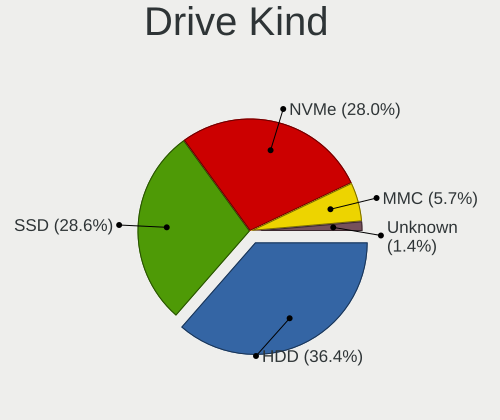

| Kind    | Notebooks | Drives | Percent |
|---------|-----------|--------|---------|
| HDD     | 1087      | 1355   | 36.43%  |
| SSD     | 852       | 1088   | 28.55%  |
| NVMe    | 835       | 1152   | 27.98%  |
| MMC     | 169       | 223    | 5.66%   |
| Unknown | 41        | 49     | 1.37%   |

Drive Connector
---------------

SATA, SAS, NVMe, etc.

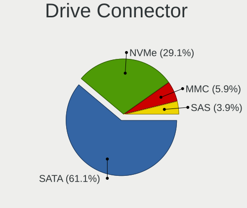

| Type | Notebooks | Drives | Percent |
|------|-----------|--------|---------|
| SATA | 1750      | 2366   | 61.1%   |
| NVMe | 834       | 1148   | 29.12%  |
| MMC  | 169       | 223    | 5.9%    |
| SAS  | 111       | 130    | 3.88%   |

Drive Size
----------

Size of hard drive

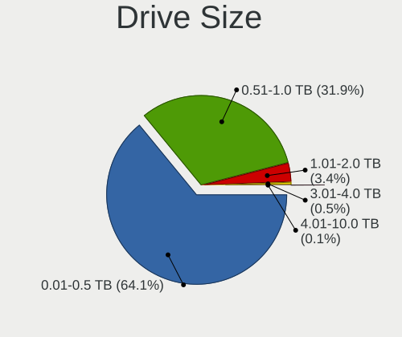

| Size in TB | Notebooks | Drives | Percent |
|------------|-----------|--------|---------|
| 0.01-0.5   | 1236      | 1577   | 64.07%  |
| 0.51-1.0   | 615       | 760    | 31.88%  |
| 1.01-2.0   | 66        | 92     | 3.42%   |
| 3.01-4.0   | 10        | 12     | 0.52%   |
| 4.01-10.0  | 2         | 2      | 0.1%    |

Space Total
-----------

Amount of disk space available on the file system

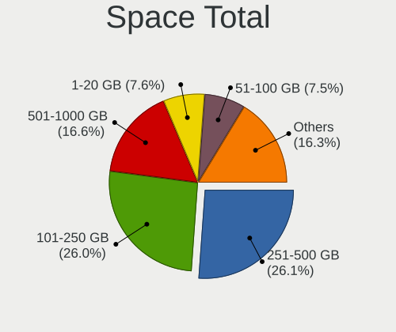

| Size in GB     | Notebooks | Percent |
|----------------|-----------|---------|
| 251-500        | 701       | 26.14%  |
| 101-250        | 696       | 25.95%  |
| 501-1000       | 444       | 16.55%  |
| 1-20           | 203       | 7.57%   |
| 51-100         | 200       | 7.46%   |
| 1001-2000      | 183       | 6.82%   |
| 21-50          | 104       | 3.88%   |
| More than 3000 | 57        | 2.13%   |
| Unknown        | 49        | 1.83%   |
| 2001-3000      | 45        | 1.68%   |

Space Used
----------

Amount of used disk space

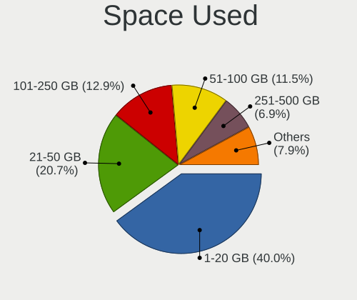

| Used GB        | Notebooks | Percent |
|----------------|-----------|---------|
| 1-20           | 1118      | 39.99%  |
| 21-50          | 580       | 20.74%  |
| 101-250        | 361       | 12.91%  |
| 51-100         | 322       | 11.52%  |
| 251-500        | 194       | 6.94%   |
| 501-1000       | 107       | 3.83%   |
| Unknown        | 49        | 1.75%   |
| 1001-2000      | 40        | 1.43%   |
| More than 3000 | 11        | 0.39%   |
| 2001-3000      | 7         | 0.25%   |
| 0              | 7         | 0.25%   |

Malfunc. Drives
---------------

Drive models with a malfunction

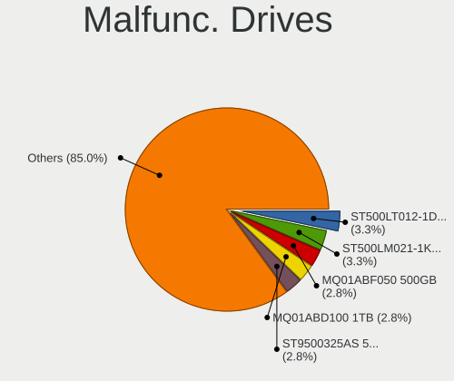

| Model                                   | Notebooks | Drives | Percent |
|-----------------------------------------|-----------|--------|---------|
| Seagate ST500LT012-1DG142 500GB         | 7         | 8      | 3.27%   |
| Seagate ST500LM021-1KJ152 500GB         | 7         | 7      | 3.27%   |
| Toshiba MQ01ABF050 500GB                | 6         | 6      | 2.8%    |
| Toshiba MQ01ABD100 1TB                  | 6         | 7      | 2.8%    |
| Seagate ST9500325AS 500GB               | 6         | 6      | 2.8%    |
| Seagate ST1000LM035-1RK172 1TB          | 5         | 5      | 2.34%   |
| Seagate ST1000LM024 HN-M101MBB 1TB      | 5         | 6      | 2.34%   |
| HGST HTS541010A9E680 1TB                | 5         | 5      | 2.34%   |
| Hitachi HTS545050B9A300 500GB           | 4         | 4      | 1.87%   |
| HGST HTS541075A9E680 752GB              | 4         | 4      | 1.87%   |
| WDC WD5000LPCX-60VHAT0 500GB            | 3         | 3      | 1.4%    |
| Toshiba MQ04ABF100 1TB                  | 3         | 3      | 1.4%    |
| LITEON CV8-8E128-HP 128GB SSD           | 3         | 4      | 1.4%    |
| Hitachi HTS543232A7A384 320GB           | 3         | 3      | 1.4%    |
| HGST HTS725050A7E630 500GB              | 3         | 4      | 1.4%    |
| WDC WD5000LPVX-22V0TT0 500GB            | 2         | 2      | 0.93%   |
| WDC WD2500BEVS-60UST0 250GB             | 2         | 2      | 0.93%   |
| WDC WD10JPVX-60JC3T1 1TB                | 2         | 2      | 0.93%   |
| WDC WD10JPVX-60JC3T0 1TB                | 2         | 2      | 0.93%   |
| Toshiba MK3263GSX 320GB                 | 2         | 3      | 0.93%   |
| Seagate ST9500420AS 500GB               | 2         | 2      | 0.93%   |
| Seagate ST9320325AS 320GB               | 2         | 4      | 0.93%   |
| Seagate ST500LM012 HN-M500MBB 500GB     | 2         | 3      | 0.93%   |
| SanDisk SD9SN8W-128G-1006 128GB SSD     | 2         | 2      | 0.93%   |
| Kingston RBU-SNS8350DES3128GP 128GB SSD | 2         | 2      | 0.93%   |
| Hitachi HTS727575A9E364 752GB           | 2         | 3      | 0.93%   |
| Hitachi HTS545016B9A300 160GB           | 2         | 2      | 0.93%   |
| HGST HTS545050A7E680 500GB              | 2         | 2      | 0.93%   |
| HGST HTS541010A7E630 1TB                | 2         | 2      | 0.93%   |
| Fujitsu MHZ2320BH G2 320GB              | 2         | 2      | 0.93%   |
| China SSD 256GB                         | 2         | 2      | 0.93%   |
| A-DATA Technology SU650 240GB SSD       | 2         | 2      | 0.93%   |
| XPG SPECTRIX S40G 1TB                   | 1         | 1      | 0.47%   |
| WDC WD7500BPKX-75HPJT0 752GB            | 1         | 1      | 0.47%   |
| WDC WD7500BPKT-75PK4T0 752GB            | 1         | 1      | 0.47%   |
| WDC WD5000LPLX-60ZNTT1 500GB            | 1         | 1      | 0.47%   |
| WDC WD5000LPCX-24C6HT0 500GB            | 1         | 1      | 0.47%   |
| WDC WD5000BPVT-22HXZT1 500GB            | 1         | 2      | 0.47%   |
| WDC WD50 00BEVT-11ZAT0 500GB            | 1         | 1      | 0.47%   |
| WDC WD3200BEVT-22ZCT0 320GB             | 1         | 1      | 0.47%   |

Malfunc. Drive Vendor
---------------------

Vendors of faulty drives

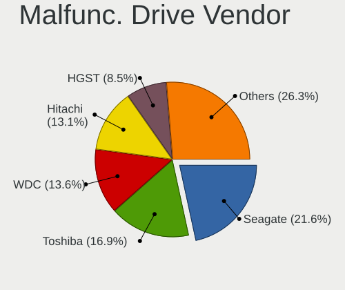

| Vendor                | Notebooks | Drives | Percent |
|-----------------------|-----------|--------|---------|
| Seagate               | 46        | 54     | 21.6%   |
| Toshiba               | 36        | 45     | 16.9%   |
| WDC                   | 29        | 32     | 13.62%  |
| Hitachi               | 28        | 30     | 13.15%  |
| HGST                  | 18        | 20     | 8.45%   |
| Kingston              | 12        | 12     | 5.63%   |
| SanDisk               | 6         | 6      | 2.82%   |
| Fujitsu               | 6         | 6      | 2.82%   |
| A-DATA Technology     | 6         | 6      | 2.82%   |
| Samsung Electronics   | 5         | 6      | 2.35%   |
| LITEON                | 5         | 7      | 2.35%   |
| SSSTC                 | 3         | 3      | 1.41%   |
| China                 | 3         | 3      | 1.41%   |
| Micron Technology     | 2         | 2      | 0.94%   |
| Crucial               | 2         | 2      | 0.94%   |
| XPG                   | 1         | 1      | 0.47%   |
| sk600                 | 1         | 1      | 0.47%   |
| Realtek Semiconductor | 1         | 1      | 0.47%   |
| Intel                 | 1         | 1      | 0.47%   |
| Dogfish               | 1         | 1      | 0.47%   |
| Acer                  | 1         | 1      | 0.47%   |

Malfunc. HDD Vendor
-------------------

Vendors of faulty HDD drives

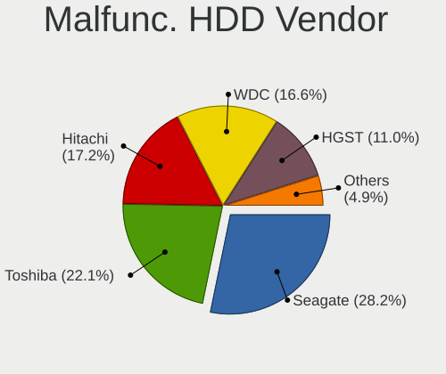

| Vendor              | Notebooks | Drives | Percent |
|---------------------|-----------|--------|---------|
| Seagate             | 46        | 54     | 28.22%  |
| Toshiba             | 36        | 45     | 22.09%  |
| Hitachi             | 28        | 30     | 17.18%  |
| WDC                 | 27        | 30     | 16.56%  |
| HGST                | 18        | 20     | 11.04%  |
| Fujitsu             | 6         | 6      | 3.68%   |
| Samsung Electronics | 2         | 2      | 1.23%   |

Malfunc. Drive Kind
-------------------

Kinds of faulty drives

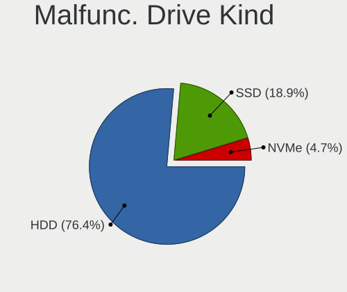

| Kind | Notebooks | Drives | Percent |
|------|-----------|--------|---------|
| HDD  | 162       | 187    | 76.42%  |
| SSD  | 40        | 41     | 18.87%  |
| NVMe | 10        | 12     | 4.72%   |

Failed Drives
-------------

Failed drive models

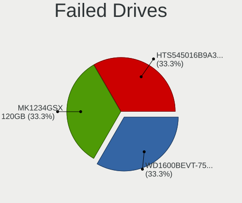

| Model                         | Notebooks | Drives | Percent |
|-------------------------------|-----------|--------|---------|
| WDC WD1600BEVT-75A23T0 160GB  | 1         | 1      | 33.33%  |
| Toshiba MK1234GSX 120GB       | 1         | 1      | 33.33%  |
| Hitachi HTS545016B9A300 160GB | 1         | 1      | 33.33%  |

Failed Drive Vendor
-------------------

Failed drive vendors

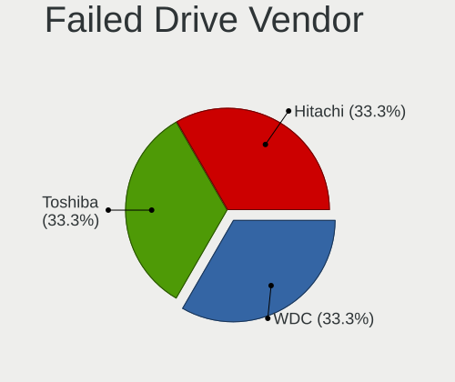

| Vendor  | Notebooks | Drives | Percent |
|---------|-----------|--------|---------|
| WDC     | 1         | 1      | 33.33%  |
| Toshiba | 1         | 1      | 33.33%  |
| Hitachi | 1         | 1      | 33.33%  |

Drive Status
------------

Number of failed and malfunc. drives

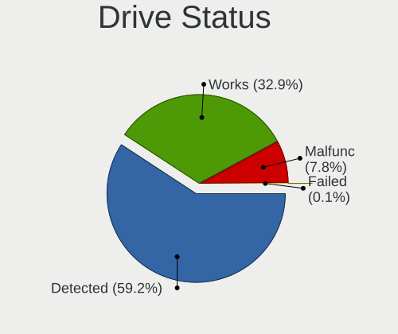

| Status   | Notebooks | Drives | Percent |
|----------|-----------|--------|---------|
| Detected | 1588      | 2384   | 59.23%  |
| Works    | 882       | 1240   | 32.9%   |
| Malfunc  | 208       | 240    | 7.76%   |
| Failed   | 3         | 3      | 0.11%   |

Storage controller
------------------

Storage Vendor
--------------

Storage controller vendors

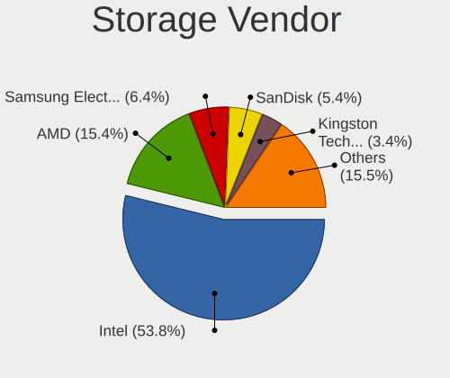

| Vendor                                  | Notebooks | Percent |
|-----------------------------------------|-----------|---------|
| Intel                                   | 1576      | 53.83%  |
| AMD                                     | 451       | 15.4%   |
| Samsung Electronics                     | 188       | 6.42%   |
| SanDisk                                 | 158       | 5.4%    |
| Kingston Technology Company             | 100       | 3.42%   |
| SK hynix                                | 71        | 2.42%   |
| Micron Technology                       | 53        | 1.81%   |
| ADATA Technology                        | 38        | 1.3%    |
| Phison Electronics                      | 35        | 1.2%    |
| Silicon Motion                          | 34        | 1.16%   |
| KIOXIA                                  | 34        | 1.16%   |
| Toshiba America Info Systems            | 31        | 1.06%   |
| Nvidia                                  | 28        | 0.96%   |
| Realtek Semiconductor                   | 19        | 0.65%   |
| Union Memory (Shenzhen)                 | 17        | 0.58%   |
| Micron/Crucial Technology               | 12        | 0.41%   |
| Yangtze Memory Technologies             | 11        | 0.38%   |
| Apple                                   | 11        | 0.38%   |
| O2 Micro                                | 8         | 0.27%   |
| MAXIO Technology (Hangzhou)             | 8         | 0.27%   |
| Marvell Technology Group                | 7         | 0.24%   |
| Solid State Storage Technology          | 6         | 0.2%    |
| Biwin Storage Technology                | 5         | 0.17%   |
| Solidigm                                | 4         | 0.14%   |
| Shenzhen Longsys Electronics            | 4         | 0.14%   |
| Lite-On Technology                      | 4         | 0.14%   |
| INNOGRIT                                | 3         | 0.1%    |
| Shenzhen Unionmemory Information System | 2         | 0.07%   |
| Lenovo                                  | 2         | 0.07%   |
| VIA Technologies                        | 1         | 0.03%   |
| TenaFe                                  | 1         | 0.03%   |
| Silicon Integrated Systems [SiS]        | 1         | 0.03%   |
| Shenzhen Wodposit Electronics           | 1         | 0.03%   |
| Shenzhen Shichuangyi Electronics        | 1         | 0.03%   |
| Seagate Technology                      | 1         | 0.03%   |
| Broadcom / LSI                          | 1         | 0.03%   |
| Unknown                                 | 1         | 0.03%   |

Storage Model
-------------

Storage controller models

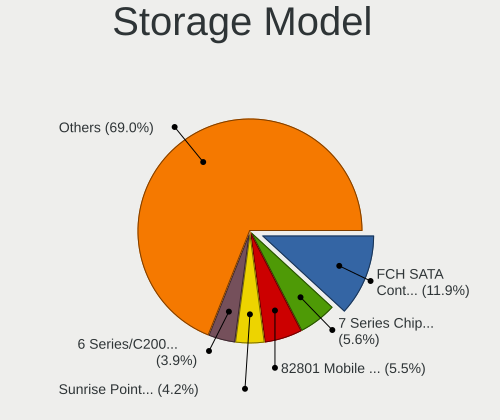

| Model                                                                            | Notebooks | Percent |
|----------------------------------------------------------------------------------|-----------|---------|
| AMD FCH SATA Controller [AHCI mode]                                              | 371       | 11.85%  |
| Intel 7 Series Chipset Family 6-port SATA Controller [AHCI mode]                 | 174       | 5.56%   |
| Intel 82801 Mobile SATA Controller [RAID mode]                                   | 172       | 5.5%    |
| Intel Sunrise Point-LP SATA Controller [AHCI mode]                               | 132       | 4.22%   |
| Intel 6 Series/C200 Series Chipset Family 6 port Mobile SATA AHCI Controller     | 122       | 3.9%    |
| Intel Volume Management Device NVMe RAID Controller                              | 76        | 2.43%   |
| Intel 8 Series SATA Controller 1 [AHCI mode]                                     | 70        | 2.24%   |
| Samsung NVMe SSD Controller SM981/PM981/PM983                                    | 66        | 2.11%   |
| Intel Celeron/Pentium Silver Processor SATA Controller                           | 63        | 2.01%   |
| Intel 82801IBM/IEM (ICH9M/ICH9M-E) 4 port SATA Controller [AHCI mode]            | 61        | 1.95%   |
| Intel Wildcat Point-LP SATA Controller [AHCI Mode]                               | 59        | 1.88%   |
| Intel Atom/Celeron/Pentium Processor x5-E8000/J3xxx/N3xxx Series SATA Controller | 59        | 1.88%   |
| Samsung NVMe SSD Controller 980 (DRAM-less)                                      | 58        | 1.85%   |
| AMD SB7x0/SB8x0/SB9x0 SATA Controller [AHCI mode]                                | 54        | 1.73%   |
| Intel 5 Series/3400 Series Chipset 4 port SATA AHCI Controller                   | 49        | 1.57%   |
| Intel Atom Processor E3800 Series SATA AHCI Controller                           | 48        | 1.53%   |
| Intel 82801HM/HEM (ICH8M/ICH8M-E) IDE Controller                                 | 48        | 1.53%   |
| Intel 82801HM/HEM (ICH8M/ICH8M-E) SATA Controller [AHCI mode]                    | 43        | 1.37%   |
| Intel HM170/QM170 Chipset SATA Controller [AHCI Mode]                            | 42        | 1.34%   |
| Intel Cannon Lake Mobile PCH SATA AHCI Controller                                | 36        | 1.15%   |
| Intel 8 Series/C220 Series Chipset Family 6-port SATA Controller 1 [AHCI mode]   | 36        | 1.15%   |
| SanDisk Ultra 3D / WD PC SN530, IX SN530, Blue SN550 NVMe SSD (DRAM-less)        | 34        | 1.09%   |
| Intel Comet Lake SATA AHCI Controller                                            | 34        | 1.09%   |
| Intel Celeron N3350/Pentium N4200/Atom E3900 Series SATA AHCI Controller         | 33        | 1.05%   |
| SanDisk WD SN560/SN740/SN770/SN5000 NVMe SSD                                     | 32        | 1.02%   |
| Intel Tiger Lake-LP SATA Controller                                              | 31        | 0.99%   |
| Kingston Company NV2 NVMe SSD [SM2267XT] (DRAM-less)                             | 29        | 0.93%   |
| SK hynix Gold P31/BC711/PC711 NVMe Solid State Drive                             | 28        | 0.89%   |
| Silicon Motion Non-Volatile memory controller                                    | 27        | 0.86%   |
| Intel Cannon Point-LP SATA Controller [AHCI Mode]                                | 26        | 0.83%   |
| Intel 400 Series Chipset Family SATA AHCI Controller                             | 25        | 0.8%    |
| KIOXIA NVMe SSD Controller BG4 (DRAM-less)                                       | 24        | 0.77%   |
| Samsung NVMe SSD Controller PM9A1/PM9A3/980PRO                                   | 23        | 0.73%   |
| Phison PS5013-E13 PCIe3 NVMe Controller (DRAM-less)                              | 22        | 0.7%    |
| Intel SSD 670p Series [Keystone Harbor]                                          | 22        | 0.7%    |
| Intel NM10/ICH7 Family SATA Controller [AHCI mode]                               | 22        | 0.7%    |
| Intel Alder Lake-P SATA AHCI Controller                                          | 20        | 0.64%   |
| Intel 5 Series/3400 Series Chipset 6 port SATA AHCI Controller                   | 18        | 0.58%   |
| Toshiba America Info Systems XG6 NVMe SSD Controller                             | 17        | 0.54%   |
| SanDisk Extreme Pro / WD Black SN750 / PC SN730 / Red SN700 NVMe SSD             | 17        | 0.54%   |

Storage Kind
------------

Kind of storage controller (IDE, SATA, NVMe, SAS, ...)

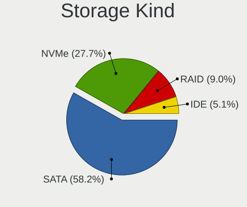

| Kind | Notebooks | Percent |
|------|-----------|---------|
| SATA | 1753      | 58.2%   |
| NVMe | 835       | 27.72%  |
| RAID | 271       | 9%      |
| IDE  | 153       | 5.08%   |

Processor
---------

CPU Vendor
----------

Processor vendors

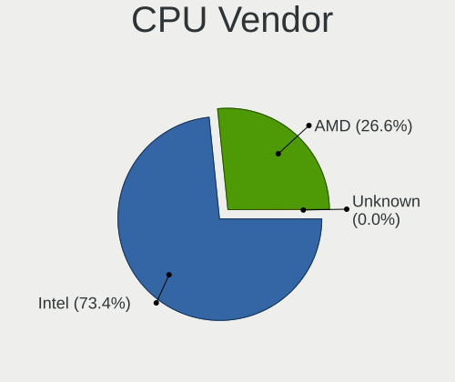

| Vendor  | Notebooks | Percent |
|---------|-----------|---------|
| Intel   | 1858      | 73.38%  |
| AMD     | 673       | 26.58%  |
| Unknown | 1         | 0.04%   |

CPU Model
---------

Processor models

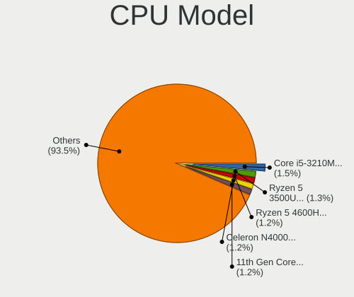

| Model                                         | Notebooks | Percent |
|-----------------------------------------------|-----------|---------|
| Intel Core i5-3210M CPU @ 2.50GHz             | 39        | 1.54%   |
| AMD Ryzen 5 3500U with Radeon Vega Mobile Gfx | 34        | 1.34%   |
| AMD Ryzen 5 4600H with Radeon Graphics        | 31        | 1.22%   |
| Intel Celeron N4000 CPU @ 1.10GHz             | 30        | 1.18%   |
| Intel 11th Gen Core i5-1135G7 @ 2.40GHz       | 30        | 1.18%   |
| Intel Core i7-8750H CPU @ 2.20GHz             | 29        | 1.14%   |
| Intel Celeron N4020 CPU @ 1.10GHz             | 27        | 1.07%   |
| Intel Celeron CPU N3350 @ 1.10GHz             | 27        | 1.07%   |
| Intel Celeron CPU N3060 @ 1.60GHz             | 27        | 1.07%   |
| AMD Ryzen 7 5700U with Radeon Graphics        | 27        | 1.07%   |
| AMD Ryzen 5 5500U with Radeon Graphics        | 27        | 1.07%   |
| AMD Custom APU 0405                           | 27        | 1.07%   |
| Intel Celeron CPU N3050 @ 1.60GHz             | 25        | 0.99%   |
| Intel Celeron CPU N2840 @ 2.16GHz             | 25        | 0.99%   |
| Intel 11th Gen Core i7-1165G7 @ 2.80GHz       | 25        | 0.99%   |
| AMD Ryzen 7 3700U with Radeon Vega Mobile Gfx | 25        | 0.99%   |
| Intel Core i7-6700HQ CPU @ 2.60GHz            | 24        | 0.95%   |
| Intel Core i5-7200U CPU @ 2.50GHz             | 22        | 0.87%   |
| Intel Core i5-8265U CPU @ 1.60GHz             | 21        | 0.83%   |
| Intel Core i5-5200U CPU @ 2.20GHz             | 21        | 0.83%   |
| Intel Core i7-9750H CPU @ 2.60GHz             | 20        | 0.79%   |
| Intel Core i7-7500U CPU @ 2.70GHz             | 20        | 0.79%   |
| Intel Core i7-8550U CPU @ 1.80GHz             | 19        | 0.75%   |
| Intel Core i5-3320M CPU @ 2.60GHz             | 19        | 0.75%   |
| Intel Core i5-10210U CPU @ 1.60GHz            | 18        | 0.71%   |
| Intel Core i7-7700HQ CPU @ 2.80GHz            | 17        | 0.67%   |
| Intel Core i5-8250U CPU @ 1.60GHz             | 17        | 0.67%   |
| Intel Core i5-10300H CPU @ 2.50GHz            | 17        | 0.67%   |
| Intel Core i7-8565U CPU @ 1.80GHz             | 16        | 0.63%   |
| Intel Core i7-6500U CPU @ 2.50GHz             | 16        | 0.63%   |
| Intel Core i5-6200U CPU @ 2.30GHz             | 16        | 0.63%   |
| Intel Core i3-10110U CPU @ 2.10GHz            | 16        | 0.63%   |
| Intel Celeron CPU N2830 @ 2.16GHz             | 16        | 0.63%   |
| AMD A8-7410 APU with AMD Radeon R5 Graphics   | 15        | 0.59%   |
| Intel Core i3-5005U CPU @ 2.00GHz             | 14        | 0.55%   |
| AMD A4-9125 RADEON R3, 4 COMPUTE CORES 2C+2G  | 14        | 0.55%   |
| Intel Core i7-10750H CPU @ 2.60GHz            | 13        | 0.51%   |
| Intel Core i5-2450M CPU @ 2.50GHz             | 13        | 0.51%   |
| Intel Core i3-7020U CPU @ 2.30GHz             | 13        | 0.51%   |
| AMD Ryzen 5 2500U with Radeon Vega Mobile Gfx | 13        | 0.51%   |

CPU Model Family
----------------

Processor model prefix

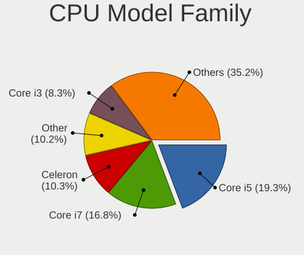

| Model                   | Notebooks | Percent |
|-------------------------|-----------|---------|
| Intel Core i5           | 488       | 19.27%  |
| Intel Core i7           | 425       | 16.79%  |
| Intel Celeron           | 262       | 10.35%  |
| Other                   | 257       | 10.15%  |
| Intel Core i3           | 209       | 8.25%   |
| AMD Ryzen 5             | 153       | 6.04%   |
| AMD Ryzen 7             | 100       | 3.95%   |
| Intel Core 2 Duo        | 93        | 3.67%   |
| Intel Atom              | 48        | 1.9%    |
| AMD A6                  | 48        | 1.9%    |
| Intel Pentium           | 44        | 1.74%   |
| AMD Ryzen 3             | 43        | 1.7%    |
| AMD A8                  | 38        | 1.5%    |
| AMD A4                  | 37        | 1.46%   |
| AMD E                   | 28        | 1.11%   |
| AMD A10                 | 28        | 1.11%   |
| Intel Pentium Dual      | 19        | 0.75%   |
| AMD Athlon              | 15        | 0.59%   |
| AMD E1                  | 13        | 0.51%   |
| Intel Pentium Dual-Core | 12        | 0.47%   |
| AMD Turion 64 X2 Mobile | 12        | 0.47%   |
| AMD Ryzen 5 PRO         | 12        | 0.47%   |
| Intel Core              | 11        | 0.43%   |
| AMD Athlon II           | 11        | 0.43%   |
| AMD Ryzen 9             | 10        | 0.39%   |
| Intel Genuine           | 9         | 0.36%   |
| Intel Xeon              | 7         | 0.28%   |
| Intel Pentium Silver    | 7         | 0.28%   |
| Intel Core 2            | 7         | 0.28%   |
| AMD Ryzen 7 PRO         | 7         | 0.28%   |
| AMD A12                 | 7         | 0.28%   |
| AMD FX                  | 6         | 0.24%   |
| AMD E2                  | 6         | 0.24%   |
| Intel Celeron M         | 5         | 0.2%    |
| AMD Athlon 64 X2        | 5         | 0.2%    |
| AMD Phenom II           | 4         | 0.16%   |
| Intel Core m3           | 3         | 0.12%   |
| Intel Celeron Dual-Core | 3         | 0.12%   |
| AMD Sempron             | 3         | 0.12%   |
| AMD PRO A8              | 3         | 0.12%   |

CPU Cores
---------

Number of processor cores

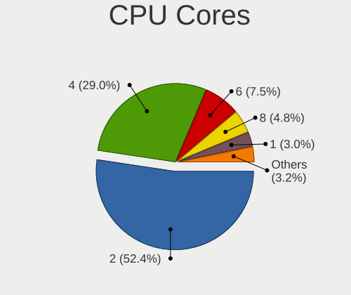

| Number | Notebooks | Percent |
|--------|-----------|---------|
| 2      | 1326      | 52.37%  |
| 4      | 735       | 29.03%  |
| 6      | 190       | 7.5%    |
| 8      | 122       | 4.82%   |
| 1      | 77        | 3.04%   |
| 10     | 35        | 1.38%   |
| 14     | 15        | 0.59%   |
| 12     | 13        | 0.51%   |
| 16     | 10        | 0.39%   |
| 24     | 5         | 0.2%    |
| 3      | 3         | 0.12%   |
| 20     | 1         | 0.04%   |

CPU Sockets
-----------

Number of sockets

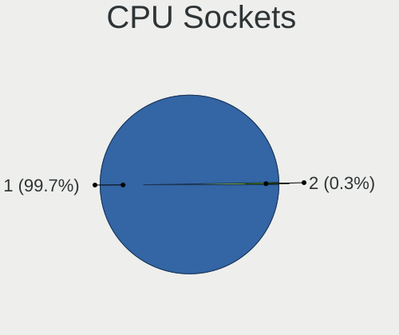

| Number | Notebooks | Percent |
|--------|-----------|---------|
| 1      | 2526      | 99.72%  |
| 2      | 7         | 0.28%   |

CPU Threads
-----------

Threads per core (Hyper-Threading)

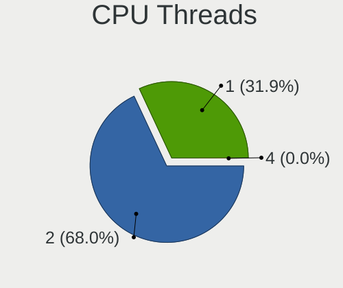

| Number | Notebooks | Percent |
|--------|-----------|---------|
| 2      | 1725      | 68.05%  |
| 1      | 809       | 31.91%  |
| 4      | 1         | 0.04%   |

CPU Op-Modes
------------

CPU Operation Modes (32-bit, 64-bit)

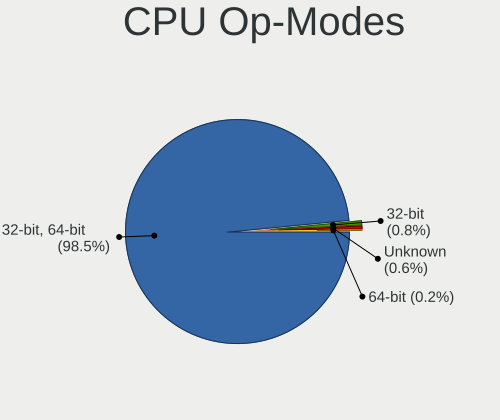

| Op mode        | Notebooks | Percent |
|----------------|-----------|---------|
| 32-bit, 64-bit | 2493      | 98.46%  |
| 32-bit         | 19        | 0.75%   |
| Unknown        | 14        | 0.55%   |
| 64-bit         | 6         | 0.24%   |

CPU Microcode
-------------

Microcode number

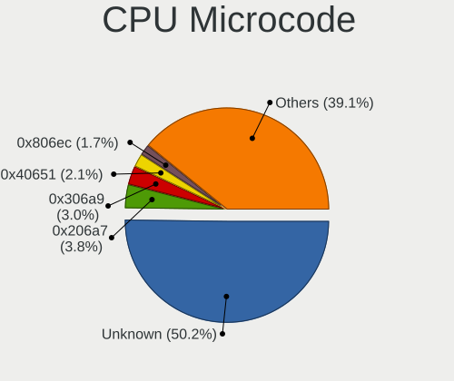

| Number     | Notebooks | Percent |
|------------|-----------|---------|
| Unknown    | 1325      | 50.21%  |
| 0x206a7    | 100       | 3.79%   |
| 0x306a9    | 79        | 2.99%   |
| 0x40651    | 56        | 2.12%   |
| 0x806ec    | 46        | 1.74%   |
| 0x30678    | 42        | 1.59%   |
| 0x08108109 | 42        | 1.59%   |
| 0x806e9    | 39        | 1.48%   |
| 0x306d4    | 39        | 1.48%   |
| 0x1067a    | 36        | 1.36%   |
| 0x06006705 | 36        | 1.36%   |
| 0x406e3    | 35        | 1.33%   |
| 0x806ea    | 33        | 1.25%   |
| 0x806c1    | 33        | 1.25%   |
| 0x906ea    | 32        | 1.21%   |
| 0x20655    | 29        | 1.1%    |
| 0x08600106 | 29        | 1.1%    |
| 0x406c4    | 25        | 0.95%   |
| 0x306c3    | 25        | 0.95%   |
| 0x6fd      | 24        | 0.91%   |
| 0x08608103 | 24        | 0.91%   |
| 0x406c3    | 23        | 0.87%   |
| 0x106ca    | 23        | 0.87%   |
| 0x506e3    | 21        | 0.8%    |
| 0x0810100b | 21        | 0.8%    |
| 0x08108102 | 20        | 0.76%   |
| 0x10676    | 19        | 0.72%   |
| 0x20652    | 17        | 0.64%   |
| 0x07030105 | 17        | 0.64%   |
| 0xa0652    | 16        | 0.61%   |
| 0x906e9    | 16        | 0.61%   |
| 0x706e5    | 16        | 0.61%   |
| 0x506c9    | 16        | 0.61%   |
| 0x06001119 | 16        | 0.61%   |
| 0x05000119 | 16        | 0.61%   |
| 0x706a1    | 15        | 0.57%   |
| 0x706a8    | 13        | 0.49%   |
| 0x06006704 | 13        | 0.49%   |
| 0x010000c8 | 13        | 0.49%   |
| 0x106c2    | 9         | 0.34%   |

CPU Microarch
-------------

Microarchitecture

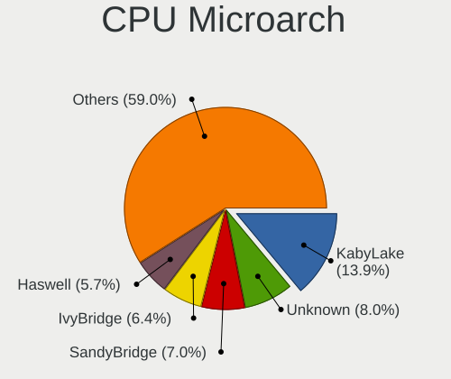

| Name              | Notebooks | Percent |
|-------------------|-----------|---------|
| KabyLake          | 354       | 13.94%  |
| Unknown           | 202       | 7.96%   |
| SandyBridge       | 177       | 6.97%   |
| IvyBridge         | 163       | 6.42%   |
| Haswell           | 145       | 5.71%   |
| Silvermont        | 133       | 5.24%   |
| Skylake           | 110       | 4.33%   |
| Zen+              | 98        | 3.86%   |
| Excavator         | 96        | 3.78%   |
| TigerLake         | 91        | 3.58%   |
| Penryn            | 85        | 3.35%   |
| Broadwell         | 85        | 3.35%   |
| Westmere          | 75        | 2.95%   |
| Goldmont plus     | 75        | 2.95%   |
| Core              | 66        | 2.6%    |
| Zen 2             | 56        | 2.21%   |
| Alderlake Hybrid  | 56        | 2.21%   |
| CometLake         | 46        | 1.81%   |
| Puma              | 43        | 1.69%   |
| Zen 3             | 39        | 1.54%   |
| Bobcat            | 39        | 1.54%   |
| IceLake           | 38        | 1.5%    |
| Zen               | 37        | 1.46%   |
| Goldmont          | 37        | 1.46%   |
| Piledriver        | 34        | 1.34%   |
| Bonnell           | 34        | 1.34%   |
| K10               | 24        | 0.95%   |
| K8 Hammer         | 22        | 0.87%   |
| Jaguar            | 19        | 0.75%   |
| K10 Llano         | 13        | 0.51%   |
| P6                | 11        | 0.43%   |
| K8 & K10 hybrid   | 10        | 0.39%   |
| Meteorlake Hybrid | 7         | 0.28%   |
| Gracemont         | 7         | 0.28%   |
| Tremont           | 6         | 0.24%   |
| Steamroller       | 3         | 0.12%   |
| Nehalem           | 3         | 0.12%   |

Graphics
--------

GPU Vendor
----------

Vendors of graphics cards

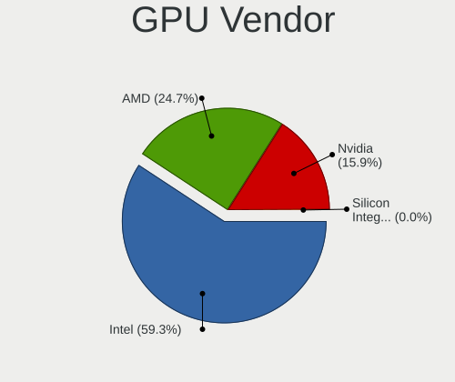

| Vendor                           | Notebooks | Percent |
|----------------------------------|-----------|---------|
| Intel                            | 1763      | 59.26%  |
| AMD                              | 736       | 24.74%  |
| Nvidia                           | 474       | 15.93%  |
| VIA Technologies                 | 1         | 0.03%   |
| Silicon Integrated Systems [SiS] | 1         | 0.03%   |

GPU Model
---------

Graphics card models

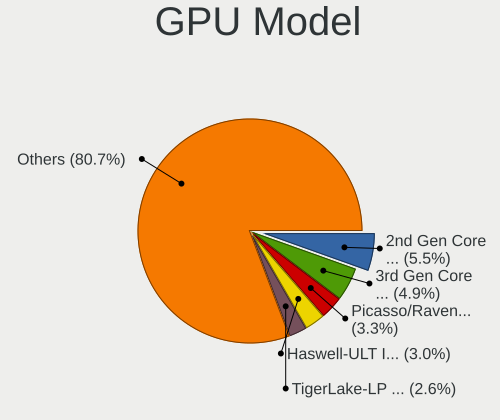

| Model                                                                                    | Notebooks | Percent |
|------------------------------------------------------------------------------------------|-----------|---------|
| Intel 2nd Generation Core Processor Family Integrated Graphics Controller                | 168       | 5.45%   |
| Intel 3rd Gen Core processor Graphics Controller                                         | 150       | 4.87%   |
| AMD Picasso/Raven 2 [Radeon Vega Series / Radeon Vega Mobile Series]                     | 103       | 3.34%   |
| Intel Haswell-ULT Integrated Graphics Controller                                         | 92        | 2.99%   |
| Intel TigerLake-LP GT2 [Iris Xe Graphics]                                                | 80        | 2.6%    |
| Intel GeminiLake [UHD Graphics 600]                                                      | 70        | 2.27%   |
| Intel Atom/Celeron/Pentium Processor x5-E8000/J3xxx/N3xxx Integrated Graphics Controller | 70        | 2.27%   |
| Intel Kaby Lake-U GT2 [HD Graphics 620]                                                  | 68        | 2.21%   |
| Intel Broadwell-U GT2 [HD Graphics 5500]                                                 | 67        | 2.18%   |
| Intel Core Processor Integrated Graphics Controller                                      | 66        | 2.14%   |
| AMD Stoney [Radeon R2/R3/R4/R5 Graphics]                                                 | 65        | 2.11%   |
| Intel Atom Processor Z36xxx/Z37xxx Series Graphics & Display                             | 63        | 2.05%   |
| Intel CoffeeLake-H GT2 [UHD Graphics 630]                                                | 62        | 2.01%   |
| AMD Lucienne                                                                             | 61        | 1.98%   |
| Intel Mobile 4 Series Chipset Integrated Graphics Controller                             | 60        | 1.95%   |
| Intel Skylake-U GT2 [HD Graphics 520]                                                    | 59        | 1.92%   |
| Intel WhiskeyLake-U GT2 [UHD Graphics 620]                                               | 57        | 1.85%   |
| Intel Kaby Lake-R GT2 [UHD Graphics 620]                                                 | 56        | 1.82%   |
| AMD Renoir [Radeon Vega Series / Radeon Vega Mobile Series]                              | 55        | 1.79%   |
| Intel CometLake-U GT2 [UHD Graphics]                                                     | 49        | 1.59%   |
| Intel Mobile GM965/GL960 Integrated Graphics Controller (secondary)                      | 44        | 1.43%   |
| Intel Mobile GM965/GL960 Integrated Graphics Controller (primary)                        | 44        | 1.43%   |
| Intel CometLake-H GT2 [UHD Graphics]                                                     | 43        | 1.4%    |
| Intel 4th Gen Core Processor Integrated Graphics Controller                              | 42        | 1.36%   |
| Intel Kaby Lake-H GT2 [HD Graphics 630]                                                  | 35        | 1.14%   |
| Intel Skylake-H GT2 [HD Graphics 530]                                                    | 33        | 1.07%   |
| Intel Apollo Lake GT1 [HD Graphics 500]                                                  | 33        | 1.07%   |
| AMD Mullins [Radeon R4/R5 Graphics]                                                      | 33        | 1.07%   |
| AMD Raven Ridge [Radeon Vega Series / Radeon Vega Mobile Series]                         | 32        | 1.04%   |
| AMD Wani [Radeon R5/R6/R7 Graphics]                                                      | 31        | 1.01%   |
| Nvidia TU117M [GeForce GTX 1650 Mobile / Max-Q]                                          | 29        | 0.94%   |
| AMD Cezanne [Radeon Vega Series / Radeon Vega Mobile Series]                             | 29        | 0.94%   |
| AMD VanGogh [AMD Custom GPU 0405]                                                        | 27        | 0.88%   |
| Nvidia GP107M [GeForce GTX 1050 Mobile]                                                  | 24        | 0.78%   |
| AMD RS880M [Mobility Radeon HD 4225/4250]                                                | 24        | 0.78%   |
| Intel Atom Processor D4xx/D5xx/N4xx/N5xx Integrated Graphics Controller                  | 23        | 0.75%   |
| AMD Topaz XT [Radeon R7 M260/M265 / M340/M360 / M440/M445 / 530/535 / 620/625 Mobile]    | 23        | 0.75%   |
| AMD Sun XT [Radeon HD 8670A/8670M/8690M / R5 M330 / M430 / Radeon 520 Mobile]            | 23        | 0.75%   |
| Nvidia GA107M [GeForce RTX 3050 Mobile]                                                  | 22        | 0.71%   |
| Intel TigerLake-H GT1 [UHD Graphics]                                                     | 20        | 0.65%   |

GPU Combo
---------

Combinations of graphics cards

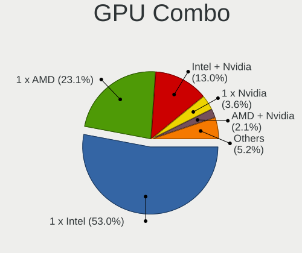

| Name           | Notebooks | Percent |
|----------------|-----------|---------|
| 1 x Intel      | 1345      | 52.97%  |
| 1 x AMD        | 587       | 23.12%  |
| Intel + Nvidia | 330       | 13%     |
| 1 x Nvidia     | 91        | 3.58%   |
| AMD + Nvidia   | 54        | 2.13%   |
| Intel + AMD    | 53        | 2.09%   |
| 2 x AMD        | 41        | 1.61%   |
| 2 x Intel      | 27        | 1.06%   |
| Other          | 9         | 0.35%   |
| 1 x VIA        | 1         | 0.04%   |
| 1 x SiS        | 1         | 0.04%   |

GPU Driver
----------

Free vs proprietary

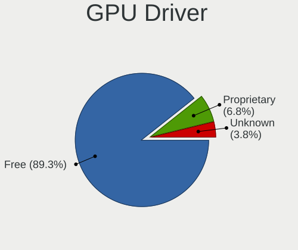

| Driver      | Notebooks | Percent |
|-------------|-----------|---------|
| Free        | 2286      | 89.33%  |
| Proprietary | 175       | 6.84%   |
| Unknown     | 98        | 3.83%   |

GPU Memory
----------

Total video memory

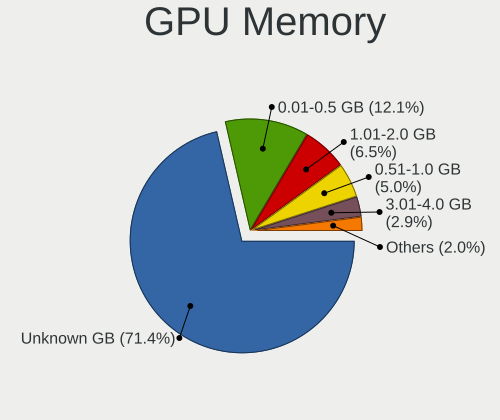

| Size in GB | Notebooks | Percent |
|------------|-----------|---------|
| Unknown    | 1850      | 71.4%   |
| 0.01-0.5   | 314       | 12.12%  |
| 1.01-2.0   | 168       | 6.48%   |
| 0.51-1.0   | 130       | 5.02%   |
| 3.01-4.0   | 76        | 2.93%   |
| 5.01-6.0   | 29        | 1.12%   |
| 7.01-8.0   | 19        | 0.73%   |
| 2.01-3.0   | 5         | 0.19%   |

Monitor
-------

Monitor Vendor
--------------

Monitor vendors

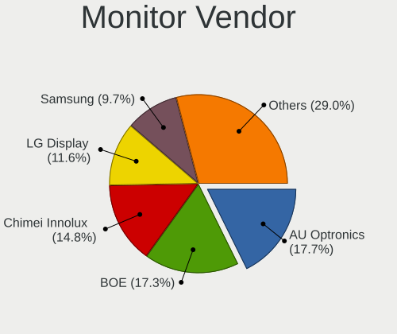

| Vendor                  | Notebooks | Percent |
|-------------------------|-----------|---------|
| AU Optronics            | 510       | 17.68%  |
| BOE                     | 498       | 17.26%  |
| Chimei Innolux          | 426       | 14.77%  |
| LG Display              | 334       | 11.58%  |
| Samsung Electronics     | 279       | 9.67%   |
| Apple                   | 116       | 4.02%   |
| Hewlett-Packard         | 53        | 1.84%   |
| Goldstar                | 53        | 1.84%   |
| Chi Mei Optoelectronics | 53        | 1.84%   |
| Dell                    | 48        | 1.66%   |
| Lenovo                  | 45        | 1.56%   |
| BenQ                    | 34        | 1.18%   |
| PANDA                   | 33        | 1.14%   |
| Sharp                   | 31        | 1.07%   |
| LG Philips              | 29        | 1.01%   |
| Acer                    | 25        | 0.87%   |
| Valve                   | 24        | 0.83%   |
| InfoVision              | 21        | 0.73%   |
| HKC                     | 15        | 0.52%   |
| HannStar                | 13        | 0.45%   |
| AOC                     | 13        | 0.45%   |
| Unknown                 | 12        | 0.42%   |
| SLD                     | 9         | 0.31%   |
| CSO                     | 9         | 0.31%   |
| CPT                     | 9         | 0.31%   |
| ASUSTek Computer        | 9         | 0.31%   |
| Sony                    | 8         | 0.28%   |
| InnoLux Display         | 8         | 0.28%   |
| Gateway                 | 7         | 0.24%   |
| HUAWEI                  | 6         | 0.21%   |
| Ancor Communications    | 6         | 0.21%   |
| Toshiba                 | 5         | 0.17%   |
| TMX                     | 5         | 0.17%   |
| KDC                     | 5         | 0.17%   |
| JDI                     | 5         | 0.17%   |
| Insignia                | 5         | 0.17%   |
| Hitachi                 | 5         | 0.17%   |
| FOX                     | 5         | 0.17%   |
| ViewSonic               | 4         | 0.14%   |
| Unknown (AAA)           | 4         | 0.14%   |

Monitor Model
-------------

Monitor models

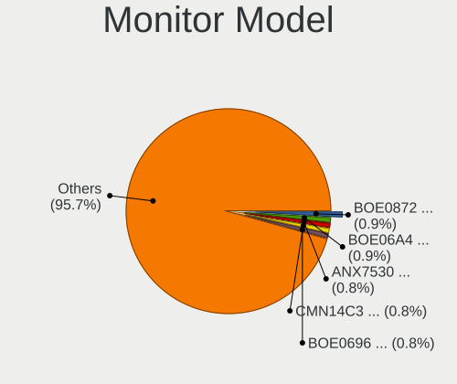

| Model                                                                | Notebooks | Percent |
|----------------------------------------------------------------------|-----------|---------|
| BOE LCD Monitor BOE0872 1920x1080 344x194mm 15.5-inch                | 27        | 0.93%   |
| BOE LCD Monitor BOE06A4 1366x768 344x194mm 15.5-inch                 | 26        | 0.89%   |
| Valve ANX7530 U VLV3001 800x1280 100x150mm 7.1-inch                  | 24        | 0.83%   |
| Chimei Innolux LCD Monitor CMN14C3 1366x768 309x173mm 13.9-inch      | 24        | 0.83%   |
| BOE LCD Monitor BOE0696 1366x768 309x173mm 13.9-inch                 | 24        | 0.83%   |
| Chimei Innolux LCD Monitor CMN15E6 1366x768 344x193mm 15.5-inch      | 22        | 0.76%   |
| BOE LCD Monitor BOE0878 1920x1080 355x200mm 16.0-inch                | 21        | 0.72%   |
| Samsung Electronics LCD Monitor SEC5441 1280x800 331x207mm 15.4-inch | 20        | 0.69%   |
| Chimei Innolux LCD Monitor CMN15F5 1920x1080 344x193mm 15.5-inch     | 19        | 0.65%   |
| BOE LCD Monitor BOE0877 1920x1080 309x173mm 13.9-inch                | 19        | 0.65%   |
| BOE LCD Monitor BOE076F 1366x768 344x194mm 15.5-inch                 | 18        | 0.62%   |
| Chimei Innolux LCD Monitor CMN14D6 1366x768 309x173mm 13.9-inch      | 17        | 0.58%   |
| AU Optronics LCD Monitor AUO183C 1366x768 309x173mm 13.9-inch        | 17        | 0.58%   |
| LG Display LCD Monitor LGD02E9 1366x768 309x174mm 14.0-inch          | 16        | 0.55%   |
| AU Optronics LCD Monitor AUO70EC 1366x768 344x193mm 15.5-inch        | 16        | 0.55%   |
| AU Optronics LCD Monitor AUO2E3C 1366x768 309x173mm 13.9-inch        | 16        | 0.55%   |
| Chimei Innolux LCD Monitor CMN15DC 1366x768 344x193mm 15.5-inch      | 14        | 0.48%   |
| AU Optronics LCD Monitor AUO235C 1366x768 256x144mm 11.6-inch        | 14        | 0.48%   |
| Apple LCD Monitor APP9CC3 1280x800 286x179mm 13.3-inch               | 14        | 0.48%   |
| Chimei Innolux LCD Monitor CMN15E7 1920x1080 344x193mm 15.5-inch     | 13        | 0.45%   |
| Samsung Electronics C24F390 SAM0D2C 1920x1080 521x293mm 23.5-inch    | 12        | 0.41%   |
| LG Display LCD Monitor LGD0456 1366x768 344x194mm 15.5-inch          | 12        | 0.41%   |
| Chimei Innolux LCD Monitor CMN14C4 1366x768 309x173mm 13.9-inch      | 12        | 0.41%   |
| AU Optronics LCD Monitor AUO81EC 1366x768 344x193mm 15.5-inch        | 12        | 0.41%   |
| AU Optronics LCD Monitor AUO2D3C 1366x768 309x173mm 13.9-inch        | 12        | 0.41%   |
| AU Optronics LCD Monitor AUO21ED 1920x1080 344x193mm 15.5-inch       | 12        | 0.41%   |
| AU Optronics LCD Monitor AUO10EC 1366x768 344x193mm 15.5-inch        | 12        | 0.41%   |
| Chimei Innolux LCD Monitor CMN1521 1920x1080 344x193mm 15.5-inch     | 11        | 0.38%   |
| Apple Color LCD APP9CC7 1280x800 286x179mm 13.3-inch                 | 11        | 0.38%   |
| Chimei Innolux LCD Monitor CMN1487 1366x768 309x173mm 13.9-inch      | 10        | 0.34%   |
| Chimei Innolux LCD Monitor CMN1472 1366x768 309x174mm 14.0-inch      | 10        | 0.34%   |
| AU Optronics LCD Monitor AUO22EC 1366x768 344x193mm 15.5-inch        | 10        | 0.34%   |
| SLD LCD Monitor SLD003C 1366x768 309x173mm 13.9-inch                 | 9         | 0.31%   |
| Samsung Electronics LCD Monitor SDC5441 1366x768 344x193mm 15.5-inch | 9         | 0.31%   |
| HannStar LCD Monitor HSD03E9 1024x600 220x129mm 10.0-inch            | 9         | 0.31%   |
| Chimei Innolux LCD Monitor CMN1495 1366x768 309x173mm 13.9-inch      | 9         | 0.31%   |
| Chimei Innolux LCD Monitor CMN1490 1366x768 309x174mm 14.0-inch      | 9         | 0.31%   |
| BOE LCD Monitor BOE0893 2160x1440 296x197mm 14.0-inch                | 9         | 0.31%   |
| AU Optronics LCD Monitor AUOE997 1920x1080 344x194mm 15.5-inch       | 9         | 0.31%   |
| Samsung Electronics LCD Monitor SEC3741 1280x800 331x207mm 15.4-inch | 8         | 0.28%   |

Monitor Resolution
------------------

Monitor screen resolution

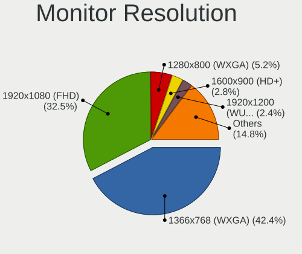

| Resolution         | Notebooks | Percent |
|--------------------|-----------|---------|
| 1366x768 (WXGA)    | 1160      | 42.37%  |
| 1920x1080 (FHD)    | 890       | 32.51%  |
| 1280x800 (WXGA)    | 142       | 5.19%   |
| 1600x900 (HD+)     | 76        | 2.78%   |
| 1920x1200 (WUXGA)  | 65        | 2.37%   |
| 3840x2160 (4K)     | 55        | 2.01%   |
| 1440x900 (WXGA+)   | 44        | 1.61%   |
| 2560x1600          | 43        | 1.57%   |
| 1024x600           | 28        | 1.02%   |
| 800x1280           | 25        | 0.91%   |
| 2560x1440 (QHD)    | 25        | 0.91%   |
| 2880x1800          | 24        | 0.88%   |
| 2160x1440          | 23        | 0.84%   |
| 1680x1050 (WSXGA+) | 15        | 0.55%   |
| 1280x1024 (SXGA)   | 15        | 0.55%   |
| 1360x768           | 13        | 0.47%   |
| 3440x1440          | 12        | 0.44%   |
| 2560x1080          | 12        | 0.44%   |
| 1024x768 (XGA)     | 10        | 0.37%   |
| Unknown            | 9         | 0.33%   |
| 3840x2400          | 6         | 0.22%   |
| 3000x2000          | 6         | 0.22%   |
| 3200x1800 (QHD+)   | 5         | 0.18%   |
| 2288x1287          | 5         | 0.18%   |
| 2520x1680          | 3         | 0.11%   |
| 2240x1400          | 3         | 0.11%   |
| 1920x540           | 3         | 0.11%   |
| 1600x2560          | 2         | 0.07%   |
| 1600x1200          | 2         | 0.07%   |
| 1280x768           | 2         | 0.07%   |
| 1152x864           | 2         | 0.07%   |
| 6000x1440          | 1         | 0.04%   |
| 5760x2160          | 1         | 0.04%   |
| 3840x1100          | 1         | 0.04%   |
| 3840x1080          | 1         | 0.04%   |
| 3600x1080          | 1         | 0.04%   |
| 3280x1080          | 1         | 0.04%   |
| 3200x2000          | 1         | 0.04%   |
| 2400x1600          | 1         | 0.04%   |
| 2304x1440          | 1         | 0.04%   |

Monitor Diagonal
----------------

Diagonal size in inches

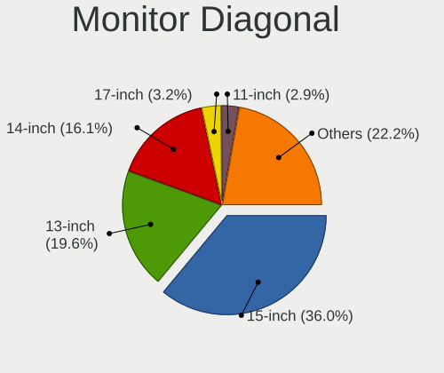

| Inches  | Notebooks | Percent |
|---------|-----------|---------|
| 15      | 1037      | 36.03%  |
| 13      | 563       | 19.56%  |
| 14      | 463       | 16.09%  |
| 17      | 92        | 3.2%    |
| 11      | 83        | 2.88%   |
| 16      | 76        | 2.64%   |
| 21      | 64        | 2.22%   |
| 24      | 60        | 2.08%   |
| 27      | 59        | 2.05%   |
| 23      | 47        | 1.63%   |
| 12      | 46        | 1.6%    |
| 31      | 35        | 1.22%   |
| 18      | 28        | 0.97%   |
| 10      | 27        | 0.94%   |
| 7       | 25        | 0.87%   |
| Unknown | 25        | 0.87%   |
| 34      | 22        | 0.76%   |
| 20      | 18        | 0.63%   |
| 19      | 18        | 0.63%   |
| 84      | 13        | 0.45%   |
| 22      | 10        | 0.35%   |
| 72      | 7         | 0.24%   |
| 40      | 6         | 0.21%   |
| 32      | 6         | 0.21%   |
| 54      | 5         | 0.17%   |
| 8       | 5         | 0.17%   |
| 142     | 4         | 0.14%   |
| 52      | 4         | 0.14%   |
| 39      | 4         | 0.14%   |
| 29      | 4         | 0.14%   |
| 26      | 3         | 0.1%    |
| 25      | 3         | 0.1%    |
| 74      | 2         | 0.07%   |
| 63      | 2         | 0.07%   |
| 48      | 2         | 0.07%   |
| 42      | 2         | 0.07%   |
| 35      | 2         | 0.07%   |
| 86      | 1         | 0.03%   |
| 57      | 1         | 0.03%   |
| 55      | 1         | 0.03%   |

Monitor Width
-------------

Physical width

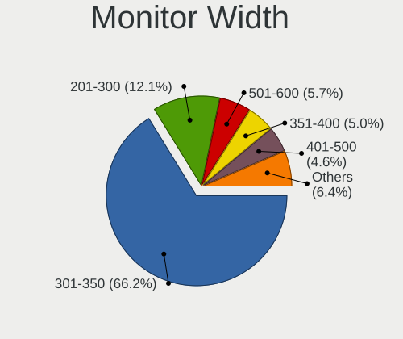

| Width in mm    | Notebooks | Percent |
|----------------|-----------|---------|
| 301-350        | 1890      | 66.2%   |
| 201-300        | 345       | 12.08%  |
| 501-600        | 162       | 5.67%   |
| 351-400        | 143       | 5.01%   |
| 401-500        | 131       | 4.59%   |
| 601-700        | 42        | 1.47%   |
| 701-800        | 29        | 1.02%   |
| 1-100          | 26        | 0.91%   |
| Unknown        | 25        | 0.88%   |
| 1501-2000      | 22        | 0.77%   |
| 1001-1500      | 16        | 0.56%   |
| 801-900        | 12        | 0.42%   |
| 101-200        | 5         | 0.18%   |
| More than 2000 | 4         | 0.14%   |
| 901-1000       | 3         | 0.11%   |

Aspect Ratio
------------

Proportional relationship between the width and the height

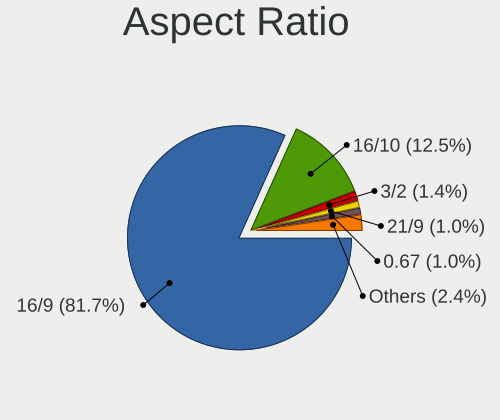

| Ratio   | Notebooks | Percent |
|---------|-----------|---------|
| 16/9    | 2105      | 81.72%  |
| 16/10   | 322       | 12.5%   |
| 3/2     | 37        | 1.44%   |
| 21/9    | 26        | 1.01%   |
| 0.67    | 25        | 0.97%   |
| Unknown | 17        | 0.66%   |
| 4/3     | 16        | 0.62%   |
| 5/4     | 15        | 0.58%   |
| 1.00    | 4         | 0.16%   |
| 0.62    | 3         | 0.12%   |
| 0.56    | 3         | 0.12%   |
| 6/5     | 1         | 0.04%   |
| 3.40    | 1         | 0.04%   |
| 1.96    | 1         | 0.04%   |

Monitor Area
------------

Area in inch²

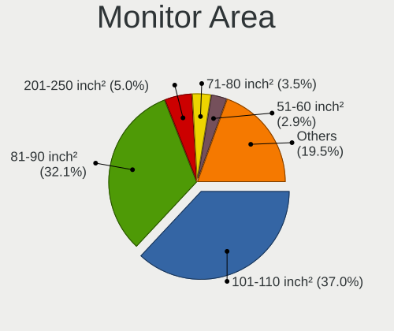

| Area in inch² | Notebooks | Percent |
|----------------|-----------|---------|
| 101-110        | 1062      | 36.96%  |
| 81-90          | 922       | 32.09%  |
| 201-250        | 145       | 5.05%   |
| 71-80          | 100       | 3.48%   |
| 51-60          | 84        | 2.92%   |
| 121-130        | 70        | 2.44%   |
| 351-500        | 67        | 2.33%   |
| 301-350        | 62        | 2.16%   |
| 151-200        | 52        | 1.81%   |
| 111-120        | 46        | 1.6%    |
| 61-70          | 44        | 1.53%   |
| More than 1000 | 40        | 1.39%   |
| 141-150        | 39        | 1.36%   |
| 1-40           | 31        | 1.08%   |
| 41-50          | 27        | 0.94%   |
| Unknown        | 25        | 0.87%   |
| 251-300        | 21        | 0.73%   |
| 501-1000       | 15        | 0.52%   |
| 131-140        | 14        | 0.49%   |
| 91-100         | 7         | 0.24%   |

Pixel Density
-------------

Pixels per inch

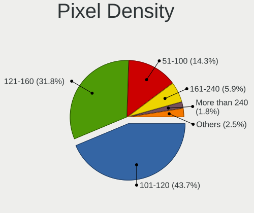

| Density       | Notebooks | Percent |
|---------------|-----------|---------|
| 101-120       | 1236      | 43.69%  |
| 121-160       | 900       | 31.81%  |
| 51-100        | 404       | 14.28%  |
| 161-240       | 166       | 5.87%   |
| More than 240 | 51        | 1.8%    |
| 1-50          | 47        | 1.66%   |
| Unknown       | 25        | 0.88%   |

Multiple Monitors
-----------------

Total monitors connected

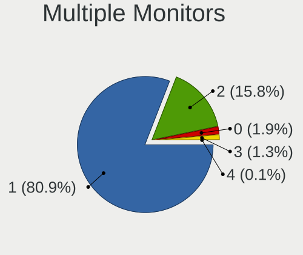

| Total | Notebooks | Percent |
|-------|-----------|---------|
| 1     | 2110      | 80.9%   |
| 2     | 413       | 15.84%  |
| 0     | 49        | 1.88%   |
| 3     | 34        | 1.3%    |
| 4     | 2         | 0.08%   |

Network
-------

Net Controller Vendor
---------------------

Controller vendors

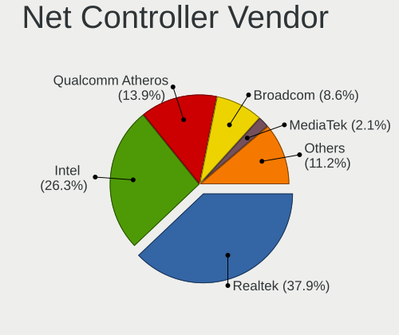

| Vendor                                 | Notebooks | Percent |
|----------------------------------------|-----------|---------|
| Realtek Semiconductor                  | 1460      | 37.91%  |
| Intel                                  | 1012      | 26.28%  |
| Qualcomm Atheros                       | 537       | 13.94%  |
| Broadcom                               | 331       | 8.6%    |
| MediaTek                               | 79        | 2.05%   |
| Broadcom Limited                       | 70        | 1.82%   |
| Ralink                                 | 50        | 1.3%    |
| Marvell Technology Group               | 44        | 1.14%   |
| TP-Link                                | 40        | 1.04%   |
| Ralink Technology                      | 32        | 0.83%   |
| ASIX Electronics                       | 28        | 0.73%   |
| Nvidia                                 | 22        | 0.57%   |
| Xiaomi                                 | 14        | 0.36%   |
| DisplayLink                            | 12        | 0.31%   |
| Qualcomm Atheros Communications        | 11        | 0.29%   |
| Samsung Electronics                    | 10        | 0.26%   |
| Qualcomm                               | 10        | 0.26%   |
| Huawei Technologies                    | 10        | 0.26%   |
| Shenzhen Goodix Technology             | 8         | 0.21%   |
| Motorola PCS                           | 8         | 0.21%   |
| ICS Advent                             | 6         | 0.16%   |
| Spreadtrum Communications              | 5         | 0.13%   |
| OPPO Electronics                       | 5         | 0.13%   |
| Mercucys                               | 5         | 0.13%   |
| Lenovo                                 | 5         | 0.13%   |
| Hewlett-Packard                        | 4         | 0.1%    |
| Google                                 | 3         | 0.08%   |
| Dell                                   | 3         | 0.08%   |
| D-Link                                 | 3         | 0.08%   |
| ZTE WCDMA Technologies MSM             | 2         | 0.05%   |
| QinHeng Electronics                    | 2         | 0.05%   |
| JMicron Technology                     | 2         | 0.05%   |
| Ericsson Business Mobile Networks      | 2         | 0.05%   |
| ZyDAS                                  | 1         | 0.03%   |
| VIA Technologies                       | 1         | 0.03%   |
| T & A Mobile Phones                    | 1         | 0.03%   |
| Sony Ericsson Mobile Communications AB | 1         | 0.03%   |
| Silicon Integrated Systems [SiS]       | 1         | 0.03%   |
| Qualcomm Technologies                  | 1         | 0.03%   |
| OpenMoko                               | 1         | 0.03%   |

Net Controller Model
--------------------

Controller models

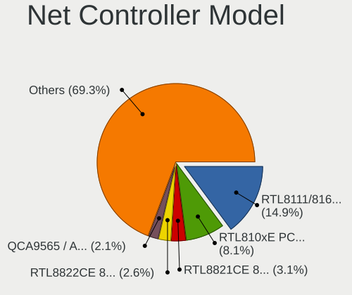

| Model                                                                  | Notebooks | Percent |
|------------------------------------------------------------------------|-----------|---------|
| Realtek RTL8111/8168/8211/8411 PCI Express Gigabit Ethernet Controller | 707       | 14.87%  |
| Realtek RTL810xE PCI Express Fast Ethernet controller                  | 384       | 8.08%   |
| Realtek RTL8821CE 802.11ac PCIe Wireless Network Adapter               | 145       | 3.05%   |
| Realtek RTL8822CE 802.11ac PCIe Wireless Network Adapter               | 124       | 2.61%   |
| Qualcomm Atheros QCA9565 / AR9565 Wireless Network Adapter             | 99        | 2.08%   |
| Qualcomm Atheros QCA9377 802.11ac Wireless Network Adapter             | 94        | 1.98%   |
| Qualcomm Atheros AR9285 Wireless Network Adapter (PCI-Express)         | 75        | 1.58%   |
| Intel 82579LM Gigabit Network Connection (Lewisville)                  | 73        | 1.54%   |
| Intel Wi-Fi 6 AX201                                                    | 72        | 1.51%   |
| Qualcomm Atheros AR9485 Wireless Network Adapter                       | 71        | 1.49%   |
| Realtek RTL8723DE Wireless Network Adapter                             | 68        | 1.43%   |
| Intel Wireless 8265 / 8275                                             | 68        | 1.43%   |
| Realtek RTL8723BE PCIe Wireless Network Adapter                        | 62        | 1.3%    |
| Realtek RTL8153 Gigabit Ethernet Adapter                               | 62        | 1.3%    |
| Intel Wireless 7265                                                    | 62        | 1.3%    |
| Broadcom BCM43142 802.11b/g/n                                          | 60        | 1.26%   |
| Intel Wi-Fi 6 AX200                                                    | 59        | 1.24%   |
| Qualcomm Atheros QCA6174 802.11ac Wireless Network Adapter             | 51        | 1.07%   |
| Intel Centrino Advanced-N 6205 [Taylor Peak]                           | 51        | 1.07%   |
| Intel Wireless 7260                                                    | 48        | 1.01%   |
| Broadcom BCM4313 802.11bgn Wireless Network Adapter                    | 48        | 1.01%   |
| MediaTek MT7921 802.11ax PCIe Wireless Network Adapter [Filogic 330]   | 46        | 0.97%   |
| Intel Alder Lake-P PCH CNVi WiFi                                       | 44        | 0.93%   |
| Intel Wireless 8260                                                    | 43        | 0.9%    |
| Broadcom NetXtreme BCM57765 Gigabit Ethernet PCIe                      | 43        | 0.9%    |
| Broadcom BCM4331 802.11a/b/g/n                                         | 43        | 0.9%    |
| Intel Comet Lake PCH-LP CNVi WiFi                                      | 42        | 0.88%   |
| Intel Cannon Lake PCH CNVi WiFi                                        | 42        | 0.88%   |
| Intel Comet Lake PCH CNVi WiFi                                         | 39        | 0.82%   |
| Intel Cannon Point-LP CNVi [Wireless-AC]                               | 32        | 0.67%   |
| Realtek RTL8188EE Wireless Network Adapter                             | 31        | 0.65%   |
| Realtek RTL8188CE 802.11b/g/n WiFi Adapter                             | 31        | 0.65%   |
| Realtek RTL8852BE PCIe 802.11ax Wireless Network Controller            | 29        | 0.61%   |
| Qualcomm Atheros AR8152 v2.0 Fast Ethernet                             | 28        | 0.59%   |
| Intel Wireless 3160                                                    | 28        | 0.59%   |
| Intel Ethernet Connection (4) I219-LM                                  | 28        | 0.59%   |
| Intel Ethernet Connection I218-LM                                      | 27        | 0.57%   |
| Qualcomm Atheros AR8151 v2.0 Gigabit Ethernet                          | 26        | 0.55%   |
| Intel Wireless 3165                                                    | 26        | 0.55%   |
| Broadcom Limited BCM4312 802.11b/g LP-PHY                              | 25        | 0.53%   |

Wireless Vendor
---------------

Wireless vendors

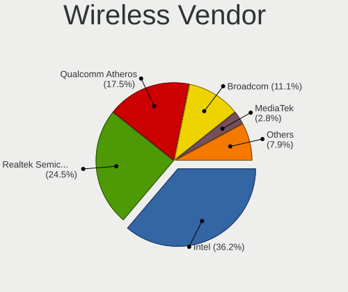

| Vendor                                | Notebooks | Percent |
|---------------------------------------|-----------|---------|
| Intel                                 | 943       | 36.19%  |
| Realtek Semiconductor                 | 639       | 24.52%  |
| Qualcomm Atheros                      | 455       | 17.46%  |
| Broadcom                              | 290       | 11.13%  |
| MediaTek                              | 74        | 2.84%   |
| Broadcom Limited                      | 53        | 2.03%   |
| Ralink                                | 50        | 1.92%   |
| TP-Link                               | 35        | 1.34%   |
| Ralink Technology                     | 32        | 1.23%   |
| Qualcomm Atheros Communications       | 11        | 0.42%   |
| Qualcomm                              | 9         | 0.35%   |
| Mercucys                              | 5         | 0.19%   |
| D-Link                                | 3         | 0.12%   |
| Dell                                  | 2         | 0.08%   |
| ZyDAS                                 | 1         | 0.04%   |
| Qualcomm Technologies                 | 1         | 0.04%   |
| NetGear                               | 1         | 0.04%   |
| D-Link System                         | 1         | 0.04%   |
| 802.11g Adapter [Linksys WUSB54GC v3] | 1         | 0.04%   |

Wireless Model
--------------

Wireless models

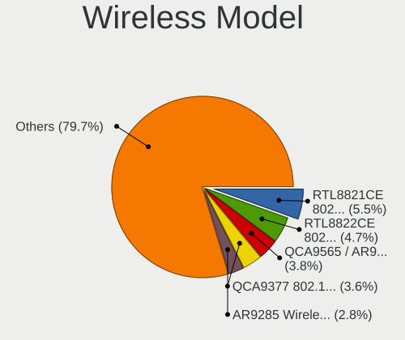

| Model                                                                | Notebooks | Percent |
|----------------------------------------------------------------------|-----------|---------|
| Realtek RTL8821CE 802.11ac PCIe Wireless Network Adapter             | 145       | 5.49%   |
| Realtek RTL8822CE 802.11ac PCIe Wireless Network Adapter             | 124       | 4.7%    |
| Qualcomm Atheros QCA9565 / AR9565 Wireless Network Adapter           | 99        | 3.75%   |
| Qualcomm Atheros QCA9377 802.11ac Wireless Network Adapter           | 94        | 3.56%   |
| Qualcomm Atheros AR9285 Wireless Network Adapter (PCI-Express)       | 75        | 2.84%   |
| Intel Wi-Fi 6 AX201                                                  | 72        | 2.73%   |
| Qualcomm Atheros AR9485 Wireless Network Adapter                     | 71        | 2.69%   |
| Realtek RTL8723DE Wireless Network Adapter                           | 68        | 2.58%   |
| Intel Wireless 8265 / 8275                                           | 68        | 2.58%   |
| Realtek RTL8723BE PCIe Wireless Network Adapter                      | 62        | 2.35%   |
| Intel Wireless 7265                                                  | 62        | 2.35%   |
| Broadcom BCM43142 802.11b/g/n                                        | 60        | 2.27%   |
| Intel Wi-Fi 6 AX200                                                  | 59        | 2.24%   |
| Qualcomm Atheros QCA6174 802.11ac Wireless Network Adapter           | 51        | 1.93%   |
| Intel Centrino Advanced-N 6205 [Taylor Peak]                         | 51        | 1.93%   |
| Intel Wireless 7260                                                  | 48        | 1.82%   |
| Broadcom BCM4313 802.11bgn Wireless Network Adapter                  | 48        | 1.82%   |
| MediaTek MT7921 802.11ax PCIe Wireless Network Adapter [Filogic 330] | 46        | 1.74%   |
| Intel Wireless 8260                                                  | 43        | 1.63%   |
| Broadcom BCM4331 802.11a/b/g/n                                       | 43        | 1.63%   |
| Intel Comet Lake PCH-LP CNVi WiFi                                    | 42        | 1.59%   |
| Intel Cannon Lake PCH CNVi WiFi                                      | 42        | 1.59%   |
| Intel Comet Lake PCH CNVi WiFi                                       | 39        | 1.48%   |
| Intel Cannon Point-LP CNVi [Wireless-AC]                             | 32        | 1.21%   |
| Realtek RTL8188EE Wireless Network Adapter                           | 31        | 1.17%   |
| Realtek RTL8188CE 802.11b/g/n WiFi Adapter                           | 31        | 1.17%   |
| Intel Wireless 3160                                                  | 28        | 1.06%   |
| Intel Alder Lake-P PCH CNVi WiFi                                     | 27        | 1.02%   |
| Intel Wireless 3165                                                  | 26        | 0.99%   |
| Realtek RTL8852BE PCIe 802.11ax Wireless Network Controller          | 25        | 0.95%   |
| Broadcom Limited BCM4312 802.11b/g LP-PHY                            | 25        | 0.95%   |
| Realtek RTL8822BE 802.11a/b/g/n/ac WiFi adapter                      | 24        | 0.91%   |
| Intel PRO/Wireless 3945ABG [Golan] Network Connection                | 24        | 0.91%   |
| Broadcom BCM4312 802.11b/g LP-PHY                                    | 24        | 0.91%   |
| Qualcomm Atheros AR9462 Wireless Network Adapter                     | 21        | 0.8%    |
| Intel Dual Band Wireless-AC 3165 Plus Bluetooth                      | 21        | 0.8%    |
| Realtek RTL8188EUS 802.11n Wireless Network Adapter                  | 20        | 0.76%   |
| Ralink RT3290 Wireless 802.11n 1T/1R PCIe                            | 20        | 0.76%   |
| Broadcom BCM43228 802.11a/b/g/n                                      | 20        | 0.76%   |
| Realtek 802.11ac NIC                                                 | 19        | 0.72%   |

Ethernet Vendor
---------------

Ethernet vendors

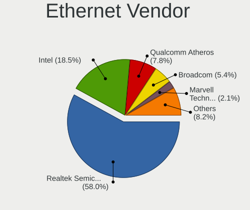

| Vendor                                 | Notebooks | Percent |
|----------------------------------------|-----------|---------|
| Realtek Semiconductor                  | 1196      | 57.97%  |
| Intel                                  | 381       | 18.47%  |
| Qualcomm Atheros                       | 161       | 7.8%    |
| Broadcom                               | 111       | 5.38%   |
| Marvell Technology Group               | 44        | 2.13%   |
| ASIX Electronics                       | 28        | 1.36%   |
| Nvidia                                 | 22        | 1.07%   |
| Broadcom Limited                       | 17        | 0.82%   |
| Xiaomi                                 | 14        | 0.68%   |
| DisplayLink                            | 12        | 0.58%   |
| Samsung Electronics                    | 10        | 0.48%   |
| Huawei Technologies                    | 9         | 0.44%   |
| Motorola PCS                           | 8         | 0.39%   |
| ICS Advent                             | 6         | 0.29%   |
| TP-Link                                | 5         | 0.24%   |
| Spreadtrum Communications              | 5         | 0.24%   |
| OPPO Electronics                       | 5         | 0.24%   |
| MediaTek                               | 5         | 0.24%   |
| Lenovo                                 | 5         | 0.24%   |
| Google                                 | 3         | 0.15%   |
| ZTE WCDMA Technologies MSM             | 2         | 0.1%    |
| JMicron Technology                     | 2         | 0.1%    |
| VIA Technologies                       | 1         | 0.05%   |
| T & A Mobile Phones                    | 1         | 0.05%   |
| Sony Ericsson Mobile Communications AB | 1         | 0.05%   |
| Silicon Integrated Systems [SiS]       | 1         | 0.05%   |
| Qualcomm                               | 1         | 0.05%   |
| QinHeng Electronics                    | 1         | 0.05%   |
| Linksys                                | 1         | 0.05%   |
| LG Electronics                         | 1         | 0.05%   |
| Lab126                                 | 1         | 0.05%   |
| HTC (High Tech Computer)               | 1         | 0.05%   |
| Hewlett-Packard                        | 1         | 0.05%   |
| Foxconn / Hon Hai                      | 1         | 0.05%   |

Ethernet Model
--------------

Ethernet models

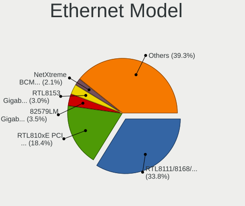

| Model                                                                  | Notebooks | Percent |
|------------------------------------------------------------------------|-----------|---------|
| Realtek RTL8111/8168/8211/8411 PCI Express Gigabit Ethernet Controller | 707       | 33.84%  |
| Realtek RTL810xE PCI Express Fast Ethernet controller                  | 384       | 18.38%  |
| Intel 82579LM Gigabit Network Connection (Lewisville)                  | 73        | 3.49%   |
| Realtek RTL8153 Gigabit Ethernet Adapter                               | 62        | 2.97%   |
| Broadcom NetXtreme BCM57765 Gigabit Ethernet PCIe                      | 43        | 2.06%   |
| Qualcomm Atheros AR8152 v2.0 Fast Ethernet                             | 28        | 1.34%   |
| Intel Ethernet Connection (4) I219-LM                                  | 28        | 1.34%   |
| Intel Ethernet Connection I218-LM                                      | 27        | 1.29%   |
| Qualcomm Atheros AR8151 v2.0 Gigabit Ethernet                          | 26        | 1.24%   |
| ASIX AX88179 Gigabit Ethernet                                          | 25        | 1.2%    |
| Realtek RTL8152 Fast Ethernet Adapter                                  | 23        | 1.1%    |
| Intel Ethernet Connection (3) I218-LM                                  | 23        | 1.1%    |
| Intel Ethernet Connection I217-LM                                      | 19        | 0.91%   |
| Qualcomm Atheros AR8162 Fast Ethernet                                  | 17        | 0.81%   |
| Intel Ethernet Connection I219-LM                                      | 17        | 0.81%   |
| Intel Alder Lake-P PCH CNVi WiFi                                       | 17        | 0.81%   |
| Intel 82577LM Gigabit Network Connection                               | 17        | 0.81%   |
| Qualcomm Atheros QCA8171 Gigabit Ethernet                              | 16        | 0.77%   |
| Intel 82567LM Gigabit Network Connection                               | 16        | 0.77%   |
| Broadcom NetLink BCM57785 Gigabit Ethernet PCIe                        | 15        | 0.72%   |
| Marvell Group 88E8040 PCI-E Fast Ethernet Controller                   | 14        | 0.67%   |
| Realtek Killer E2600 GbE Controller                                    | 13        | 0.62%   |
| Qualcomm Atheros AR8161 Gigabit Ethernet                               | 13        | 0.62%   |
| Qualcomm Atheros AR8131 Gigabit Ethernet                               | 13        | 0.62%   |
| Qualcomm Atheros Killer E2400 Gigabit Ethernet Controller              | 12        | 0.57%   |
| Intel Ethernet Connection (2) I219-LM                                  | 12        | 0.57%   |
| Realtek RTL8125 2.5GbE Controller                                      | 11        | 0.53%   |
| Qualcomm Atheros AR8152 v1.1 Fast Ethernet                             | 11        | 0.53%   |
| Intel Ethernet Connection (6) I219-V                                   | 11        | 0.53%   |
| Intel Ethernet Connection (16) I219-LM                                 | 11        | 0.53%   |
| Qualcomm Atheros AR8132 Fast Ethernet                                  | 10        | 0.48%   |
| Intel Ethernet Connection (6) I219-LM                                  | 10        | 0.48%   |
| Nvidia MCP79 Ethernet                                                  | 9         | 0.43%   |
| Broadcom NetLink BCM57780 Gigabit Ethernet PCIe                        | 9         | 0.43%   |
| Xiaomi Mi/Redmi series (RNDIS)                                         | 8         | 0.38%   |
| Qualcomm Atheros Killer E2500 Gigabit Ethernet Controller              | 8         | 0.38%   |
| Nvidia MCP67 Ethernet                                                  | 8         | 0.38%   |
| Intel Ethernet Connection I219-V                                       | 8         | 0.38%   |
| Intel Ethernet Connection (7) I219-V                                   | 8         | 0.38%   |
| Huawei FOA-LX9                                                         | 8         | 0.38%   |

Net Controller Kind
-------------------

Ethernet, WiFi or modem

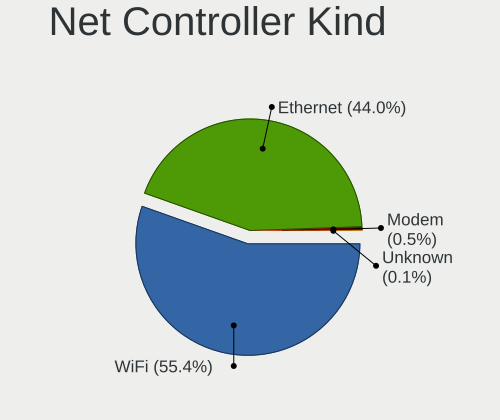

| Kind     | Notebooks | Percent |
|----------|-----------|---------|
| WiFi     | 2474      | 55.42%  |
| Ethernet | 1965      | 44.02%  |
| Modem    | 22        | 0.49%   |
| Unknown  | 3         | 0.07%   |

Used Controller
---------------

Currently used network controller

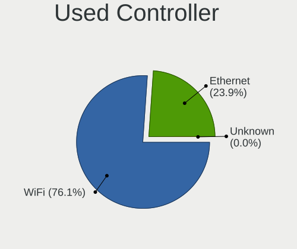

| Kind     | Notebooks | Percent |
|----------|-----------|---------|
| WiFi     | 2044      | 76.1%   |
| Ethernet | 641       | 23.86%  |
| Unknown  | 1         | 0.04%   |

NICs
----

Total network controllers on board

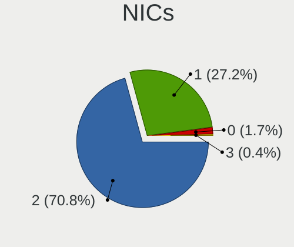

| Total | Notebooks | Percent |
|-------|-----------|---------|
| 2     | 1793      | 70.76%  |
| 1     | 688       | 27.15%  |
| 0     | 43        | 1.7%    |
| 3     | 10        | 0.39%   |

IPv6
----

IPv6 vs IPv4

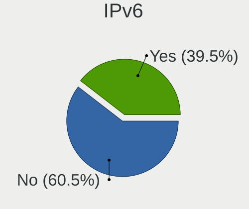

| Used | Notebooks | Percent |
|------|-----------|---------|
| No   | 1585      | 60.47%  |
| Yes  | 1036      | 39.53%  |

Bluetooth
---------

Bluetooth Vendor
----------------

Controller vendors

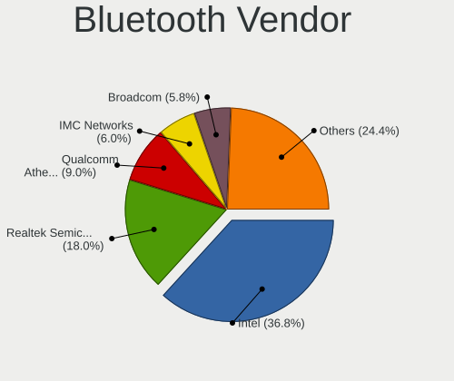

| Vendor                          | Notebooks | Percent |
|---------------------------------|-----------|---------|
| Intel                           | 742       | 36.77%  |
| Realtek Semiconductor           | 363       | 17.99%  |
| Qualcomm Atheros Communications | 181       | 8.97%   |
| IMC Networks                    | 122       | 6.05%   |
| Broadcom                        | 118       | 5.85%   |
| Apple                           | 102       | 5.05%   |
| Lite-On Technology              | 86        | 4.26%   |
| Foxconn / Hon Hai               | 76        | 3.77%   |
| Realtek                         | 53        | 2.63%   |
| Dell                            | 40        | 1.98%   |
| Hewlett-Packard                 | 32        | 1.59%   |
| Toshiba                         | 25        | 1.24%   |
| Ralink                          | 20        | 0.99%   |
| Cambridge Silicon Radio         | 18        | 0.89%   |
| Ralink Technology               | 11        | 0.55%   |
| Foxconn International           | 5         | 0.25%   |
| Alps Electric                   | 5         | 0.25%   |
| USI                             | 3         | 0.15%   |
| MediaTek                        | 3         | 0.15%   |
| TP-Link                         | 2         | 0.1%    |
| Opticis                         | 2         | 0.1%    |
| Chicony Electronics             | 2         | 0.1%    |
| Actions                         | 2         | 0.1%    |
| Unknown                         | 2         | 0.1%    |
| Integrated System Solution      | 1         | 0.05%   |
| Fujitsu                         | 1         | 0.05%   |
| ASUSTek Computer                | 1         | 0.05%   |

Bluetooth Model
---------------

Controller models

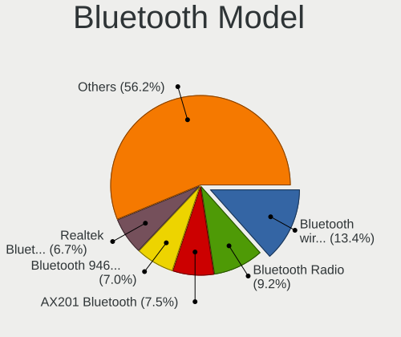

| Model                                                                               | Notebooks | Percent |
|-------------------------------------------------------------------------------------|-----------|---------|
| Intel Bluetooth wireless interface                                                  | 271       | 13.41%  |
| Realtek Bluetooth Radio                                                             | 185       | 9.15%   |
| Intel AX201 Bluetooth                                                               | 151       | 7.47%   |
| Intel Bluetooth 9460/9560 Jefferson Peak (JfP)                                      | 142       | 7.03%   |
| Realtek  Bluetooth 4.2 Adapter                                                      | 136       | 6.73%   |
| Qualcomm Atheros  Bluetooth Device                                                  | 101       | 5%      |
| Intel AX200 Bluetooth                                                               | 57        | 2.82%   |
| Realtek Bluetooth Radio                                                             | 53        | 2.62%   |
| IMC Networks Bluetooth Radio                                                        | 52        | 2.57%   |
| Apple Bluetooth Host Controller                                                     | 48        | 2.38%   |
| Intel Bluetooth Device                                                              | 42        | 2.08%   |
| Apple Bluetooth USB Host Controller                                                 | 41        | 2.03%   |
| IMC Networks Wireless_Device                                                        | 40        | 1.98%   |
| Broadcom BCM43142A0 Bluetooth 4.0                                                   | 34        | 1.68%   |
| Intel Centrino Bluetooth Wireless Transceiver                                       | 29        | 1.43%   |
| Lite-On Bluetooth Device                                                            | 27        | 1.34%   |
| Foxconn / Hon Hai Bluetooth Device                                                  | 26        | 1.29%   |
| Qualcomm Atheros AR3012 Bluetooth 4.0                                               | 24        | 1.19%   |
| Lite-On Qualcomm Atheros QCA9377 Bluetooth                                          | 23        | 1.14%   |
| Lite-On Atheros AR3012 Bluetooth                                                    | 22        | 1.09%   |
| Intel Centrino Advanced-N 6230 Bluetooth adapter                                    | 22        | 1.09%   |
| Ralink RT3290 Bluetooth                                                             | 20        | 0.99%   |
| Qualcomm Atheros QCA61x4 Bluetooth 4.0                                              | 20        | 0.99%   |
| Qualcomm Atheros AR3011 Bluetooth                                                   | 19        | 0.94%   |
| Cambridge Silicon Radio Bluetooth Dongle (HCI mode)                                 | 18        | 0.89%   |
| Broadcom BCM20702 Bluetooth 4.0 [ThinkPad]                                          | 18        | 0.89%   |
| Realtek RTL8723B Bluetooth                                                          | 17        | 0.84%   |
| Intel AX210 Bluetooth                                                               | 17        | 0.84%   |
| IMC Networks Bluetooth Device                                                       | 16        | 0.79%   |
| HP Broadcom 2070 Bluetooth Combo                                                    | 16        | 0.79%   |
| HP Bluetooth 2.0 Interface [Broadcom BCM2045]                                       | 16        | 0.79%   |
| Foxconn / Hon Hai MediaTek Bluetooth Adapter                                        | 13        | 0.64%   |
| Realtek RTL8821A Bluetooth                                                          | 12        | 0.59%   |
| Dell BCM20702A0 Bluetooth Module                                                    | 11        | 0.54%   |
| Broadcom BCM2045B (BDC-2.1)                                                         | 11        | 0.54%   |
| Qualcomm Atheros AR9462 Bluetooth                                                   | 10        | 0.49%   |
| Intel Wireless-AC 9260 Bluetooth Adapter                                            | 10        | 0.49%   |
| Foxconn / Hon Hai Wireless_Device                                                   | 9         | 0.45%   |
| Foxconn / Hon Hai Foxconn T77H114 BCM2070 [Single-Chip Bluetooth 2.1 + EDR Adapter] | 9         | 0.45%   |
| Dell DW375 Bluetooth Module                                                         | 9         | 0.45%   |

Sound
-----

Sound Vendor
------------

Sound card vendors

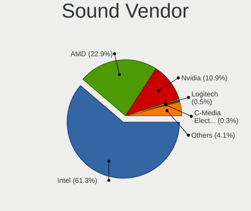

| Vendor                                       | Notebooks | Percent |
|----------------------------------------------|-----------|---------|
| Intel                                        | 1828      | 61.26%  |
| AMD                                          | 683       | 22.89%  |
| Nvidia                                       | 326       | 10.92%  |
| Logitech                                     | 14        | 0.47%   |
| C-Media Electronics                          | 10        | 0.34%   |
| Realtek Semiconductor                        | 9         | 0.3%    |
| GN Netcom                                    | 9         | 0.3%    |
| Texas Instruments                            | 8         | 0.27%   |
| Generalplus Technology                       | 8         | 0.27%   |
| Plantronics                                  | 6         | 0.2%    |
| Lenovo                                       | 6         | 0.2%    |
| Kingston Technology                          | 5         | 0.17%   |
| Tenx Technology                              | 4         | 0.13%   |
| Sony                                         | 4         | 0.13%   |
| JMTek                                        | 4         | 0.13%   |
| Focusrite-Novation                           | 4         | 0.13%   |
| ASUSTek Computer                             | 4         | 0.13%   |
| Apple                                        | 4         | 0.13%   |
| Thesycon Systemsoftware & Consulting         | 3         | 0.1%    |
| KTMicro                                      | 3         | 0.1%    |
| Creative Technology                          | 3         | 0.1%    |
| Syntek                                       | 2         | 0.07%   |
| Synaptics                                    | 2         | 0.07%   |
| SteelSeries ApS                              | 2         | 0.07%   |
| Samson Technologies                          | 2         | 0.07%   |
| Razer USA                                    | 2         | 0.07%   |
| Huawei Technologies                          | 2         | 0.07%   |
| Hewlett-Packard                              | 2         | 0.07%   |
| DisplayLink                                  | 2         | 0.07%   |
| Unknown                                      | 2         | 0.07%   |
| Zoran Co. Personal Media Division (Nogatech) | 1         | 0.03%   |
| Yamaha                                       | 1         | 0.03%   |
| Walmart                                      | 1         | 0.03%   |
| VIA Technologies                             | 1         | 0.03%   |
| TTGK Technology                              | 1         | 0.03%   |
| Silicon Motion                               | 1         | 0.03%   |
| Silicon Integrated Systems [SiS]             | 1         | 0.03%   |
| Shure                                        | 1         | 0.03%   |
| Sennheiser Communications                    | 1         | 0.03%   |
| Samsung Electronics                          | 1         | 0.03%   |

Sound Model
-----------

Sound card models

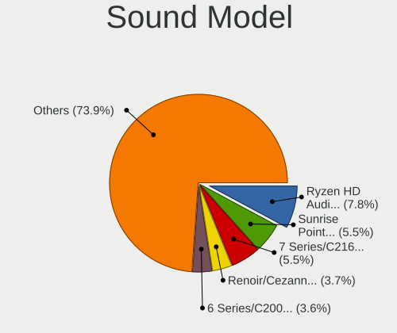

| Model                                                                                             | Notebooks | Percent |
|---------------------------------------------------------------------------------------------------|-----------|---------|
| AMD Ryzen HD Audio Controller                                                                     | 293       | 7.85%   |
| Intel Sunrise Point-LP HD Audio                                                                   | 206       | 5.52%   |
| Intel 7 Series/C216 Chipset Family High Definition Audio Controller                               | 205       | 5.49%   |
| AMD Renoir/Cezanne HDMI/DP Audio Controller                                                       | 137       | 3.67%   |
| Intel 6 Series/C200 Series Chipset Family High Definition Audio Controller                        | 135       | 3.62%   |
| AMD Raven/Raven2/Fenghuang HDMI/DP Audio Controller                                               | 131       | 3.51%   |
| AMD FCH Azalia Controller                                                                         | 126       | 3.37%   |
| Intel Haswell-ULT HD Audio Controller                                                             | 93        | 2.49%   |
| Intel 8 Series HD Audio Controller                                                                | 93        | 2.49%   |
| AMD Kabini HDMI/DP Audio                                                                          | 93        | 2.49%   |
| AMD Family 15h (Models 60h-6fh) Audio Controller                                                  | 93        | 2.49%   |
| Intel Tiger Lake-LP Smart Sound Technology Audio Controller                                       | 91        | 2.44%   |
| Intel Broadwell-U Audio Controller                                                                | 85        | 2.28%   |
| Intel Wildcat Point-LP High Definition Audio Controller                                           | 84        | 2.25%   |
| Intel 5 Series/3400 Series Chipset High Definition Audio                                          | 78        | 2.09%   |
| Intel Celeron/Pentium Silver Processor High Definition Audio                                      | 75        | 2.01%   |
| AMD Radeon High Definition Audio Controller                                                       | 73        | 1.96%   |
| Intel 82801I (ICH9 Family) HD Audio Controller                                                    | 72        | 1.93%   |
| Intel Cannon Lake PCH cAVS                                                                        | 69        | 1.85%   |
| AMD SBx00 Azalia (Intel HDA)                                                                      | 67        | 1.79%   |
| Intel Atom/Celeron/Pentium Processor x5-E8000/J3xxx/N3xxx Series High Definition Audio Controller | 65        | 1.74%   |
| AMD High Definition Audio Controller                                                              | 65        | 1.74%   |
| Intel Cannon Point-LP High Definition Audio Controller                                            | 61        | 1.63%   |
| Intel Alder Lake PCH-P High Definition Audio Controller                                           | 59        | 1.58%   |
| Intel Atom Processor Z36xxx/Z37xxx Series High Definition Audio Controller                        | 54        | 1.45%   |
| Intel 82801H (ICH8 Family) HD Audio Controller                                                    | 54        | 1.45%   |
| Intel Comet Lake PCH-LP cAVS                                                                      | 53        | 1.42%   |
| Intel 8 Series/C220 Series Chipset High Definition Audio Controller                               | 51        | 1.37%   |
| Intel NM10/ICH7 Family High Definition Audio Controller                                           | 48        | 1.29%   |
| Intel Comet Lake PCH cAVS                                                                         | 45        | 1.21%   |
| Intel Xeon E3-1200 v3/4th Gen Core Processor HD Audio Controller                                  | 39        | 1.04%   |
| Intel 100 Series/C230 Series Chipset Family HD Audio Controller                                   | 39        | 1.04%   |
| Intel CM238 HD Audio Controller                                                                   | 37        | 0.99%   |
| Intel Celeron N3350/Pentium N4200/Atom E3900 Series Audio Cluster                                 | 37        | 0.99%   |
| Nvidia TU107 GeForce GTX 1650 High Definition Audio Controller                                    | 35        | 0.94%   |
| Nvidia GA107 High Definition Audio Controller                                                     | 35        | 0.94%   |
| AMD Trinity HDMI Audio Controller                                                                 | 34        | 0.91%   |
| Intel Ice Lake-LP Smart Sound Technology Audio Controller                                         | 30        | 0.8%    |
| Nvidia GF108 High Definition Audio Controller                                                     | 28        | 0.75%   |
| Nvidia GP107GL High Definition Audio Controller                                                   | 27        | 0.72%   |

Memory
------

Memory Vendor
-------------

Memory module vendors

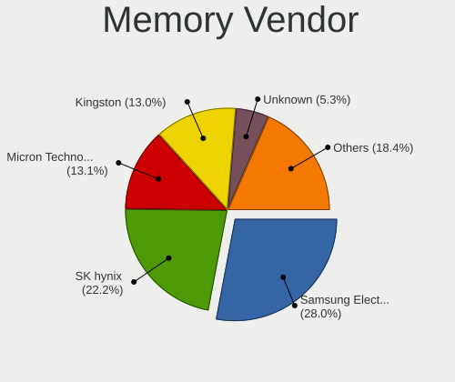

| Vendor                                           | Notebooks | Percent |
|--------------------------------------------------|-----------|---------|
| Samsung Electronics                              | 442       | 27.97%  |
| SK hynix                                         | 351       | 22.22%  |
| Micron Technology                                | 207       | 13.1%   |
| Kingston                                         | 206       | 13.04%  |
| Unknown                                          | 83        | 5.25%   |
| A-DATA Technology                                | 64        | 4.05%   |
| Ramaxel Technology                               | 45        | 2.85%   |
| Crucial                                          | 34        | 2.15%   |
| Elpida                                           | 26        | 1.65%   |
| Unknown (ABCD)                                   | 20        | 1.27%   |
| Nanya Technology                                 | 18        | 1.14%   |
| Corsair                                          | 15        | 0.95%   |
| Unknown                                          | 14        | 0.89%   |
| ChangXin Memory                                  | 6         | 0.38%   |
| Timetec                                          | 4         | 0.25%   |
| Team                                             | 4         | 0.25%   |
| Patriot                                          | 4         | 0.25%   |
| Transcend                                        | 3         | 0.19%   |
| Qimonda                                          | 3         | 0.19%   |
| PNY                                              | 3         | 0.19%   |
| 4ea5                                             | 3         | 0.19%   |
| G.Skill                                          | 2         | 0.13%   |
| ff                                               | 2         | 0.13%   |
| Unknown (89EC)                                   | 1         | 0.06%   |
| Unknown (83DA)                                   | 1         | 0.06%   |
| Unknown (268C)                                   | 1         | 0.06%   |
| Unknown (0x8AF1)                                 | 1         | 0.06%   |
| Unknown (0x4D342037305435363633515A332D43453620) | 1         | 0.06%   |
| Unknown (0x0CAB)                                 | 1         | 0.06%   |
| Unknown (0x0C75)                                 | 1         | 0.06%   |
| Toshiba                                          | 1         | 0.06%   |
| Silicon Power                                    | 1         | 0.06%   |
| SHARETRONIC                                      | 1         | 0.06%   |
| Patriot Memory (PDP Systems)                     | 1         | 0.06%   |
| M4 70T5663EH3-CF7                                | 1         | 0.06%   |
| GSkill                                           | 1         | 0.06%   |
| Goldkey                                          | 1         | 0.06%   |
| fef5                                             | 1         | 0.06%   |
| Avant                                            | 1         | 0.06%   |
| ASint Technology                                 | 1         | 0.06%   |

Memory Model
------------

Memory module models

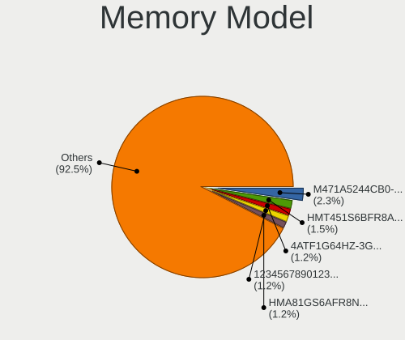

| Model                                                            | Notebooks | Percent |
|------------------------------------------------------------------|-----------|---------|
| Samsung RAM M471A5244CB0-CTD 4GB SODIMM DDR4 3266MT/s            | 39        | 2.31%   |
| SK hynix RAM HMT451S6BFR8A-PB 4GB SODIMM DDR3 1600MT/s           | 26        | 1.54%   |
| Micron RAM 4ATF1G64HZ-3G2E1 8GB Row Of Chips DDR4 3200MT/s       | 21        | 1.25%   |
| Unknown (ABCD) RAM 123456789012345678 2GB SODIMM LPDDR4 2400MT/s | 20        | 1.19%   |
| SK hynix RAM HMA81GS6AFR8N-UH 8GB SODIMM DDR4 2667MT/s           | 20        | 1.19%   |
| Samsung RAM M471B5173DB0-YK0 4GB SODIMM DDR3 1600MT/s            | 18        | 1.07%   |
| Samsung RAM M471B5173QH0-YK0 4GB SODIMM DDR3 1600MT/s            | 17        | 1.01%   |
| Samsung RAM M471A1K43DB1-CTD 8GB SODIMM DDR4 2667MT/s            | 16        | 0.95%   |
| Samsung RAM M471B5273DH0-CH9 4GB SODIMM DDR3 1600MT/s            | 15        | 0.89%   |
| SK hynix RAM HMA81GS6DJR8N-XN 8GB SODIMM DDR4 3200MT/s           | 14        | 0.83%   |
| Micron RAM 4ATF51264HZ-2G6E1 4GB SODIMM DDR4 2667MT/s            | 14        | 0.83%   |
| Unknown                                                          | 14        | 0.83%   |
| SK hynix RAM HMA81GS6JJR8N-VK 8GB SODIMM DDR4 2667MT/s           | 12        | 0.71%   |
| Samsung RAM M471B5173EB0-YK0 4GB SODIMM DDR3 1600MT/s            | 12        | 0.71%   |
| Samsung RAM M471A1K43CB1-CTD 8GB SODIMM DDR4 3200MT/s            | 12        | 0.71%   |
| Samsung RAM M471A1K43CB1-CRC 8GB SODIMM DDR4 8400MT/s            | 12        | 0.71%   |
| Kingston RAM KF3200C20S4/16G 16GB SODIMM DDR4 3200MT/s           | 12        | 0.71%   |
| Unknown RAM Module 2GB SODIMM DDR2 667MT/s                       | 11        | 0.65%   |
| SK hynix RAM HMAA1GS6CJR6N-XN 8GB SODIMM DDR4 3200MT/s           | 11        | 0.65%   |
| Samsung RAM M471B1G73QH0-YK0 8GB SODIMM DDR3 1600MT/s            | 11        | 0.65%   |
| Samsung RAM M471A1K43BB1-CRC 8GB SODIMM DDR4 2667MT/s            | 11        | 0.65%   |
| Samsung RAM M471A1G44AB0-CWE 8GiB SODIMM DDR4 3200MT/s           | 11        | 0.65%   |
| Samsung RAM M471A1G44AB0-CWE 8GB Row Of Chips DDR4 3200MT/s      | 11        | 0.65%   |
| SK hynix RAM HMT451S6AFR8A-PB 4GB SODIMM DDR3 1600MT/s           | 10        | 0.59%   |
| Samsung RAM M471B1G73DB0-YK0 8GB SODIMM DDR3 1600MT/s            | 10        | 0.59%   |
| Samsung RAM M471A5244CB0-CTD 4GB Row Of Chips DDR4 2667MT/s      | 10        | 0.59%   |
| Micron RAM 8KTF51264HZ-1G6E1 4GB SODIMM DDR3 1600MT/s            | 10        | 0.59%   |
| SK hynix RAM HMT41GS6AFR8A-PB 8GB SODIMM DDR3 1600MT/s           | 9         | 0.53%   |
| SK hynix RAM HMA81GS6CJR8N-VK 8GB SODIMM DDR4 2667MT/s           | 9         | 0.53%   |
| Samsung RAM M471B5273CH0-CH9 4GB SODIMM DDR3 1334MT/s            | 9         | 0.53%   |
| Samsung RAM M471A1K43DB1-CWE 8GB SODIMM DDR4 3200MT/s            | 9         | 0.53%   |
| Kingston RAM 99U5428-018.A00LF 8GB SODIMM DDR3 1600MT/s          | 9         | 0.53%   |
| Samsung RAM M471B5273DH0-CK0 4GB SODIMM DDR3 2400MT/s            | 8         | 0.47%   |
| Samsung RAM M471B1G73EB0-YK0 8192MB SODIMM DDR3 1600MT/s         | 8         | 0.47%   |
| Samsung RAM M4 70T5663QZ3-CF7 2GB SODIMM DDR2 2048MT/s           | 8         | 0.47%   |
| Ramaxel RAM RMSA3260ME78HAF-2666 8GB SODIMM DDR4 2667MT/s        | 8         | 0.47%   |
| Micron RAM 16KTF1G64HZ-1G6E1 8GB SODIMM DDR3 1600MT/s            | 8         | 0.47%   |
| SK hynix RAM HMT41GS6BFR8A-PB 8GB SODIMM DDR3 2667MT/s           | 7         | 0.42%   |
| SK hynix RAM HMT351S6CFR8C-PB 4GB SODIMM DDR3 1600MT/s           | 7         | 0.42%   |
| SK hynix RAM HMA851S6AFR6N-UH 4GB SODIMM DDR4 2400MT/s           | 7         | 0.42%   |

Memory Kind
-----------

Memory module kinds

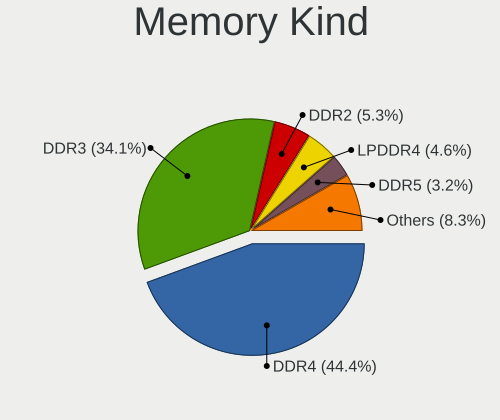

| Kind    | Notebooks | Percent |
|---------|-----------|---------|
| DDR4    | 567       | 44.4%   |
| DDR3    | 436       | 34.14%  |
| DDR2    | 68        | 5.32%   |
| LPDDR4  | 59        | 4.62%   |
| DDR5    | 41        | 3.21%   |
| LPDDR3  | 33        | 2.58%   |
| LPDDR5  | 31        | 2.43%   |
| SDRAM   | 28        | 2.19%   |
| DDR     | 7         | 0.55%   |
| Unknown | 6         | 0.47%   |
| RAM     | 1         | 0.08%   |

Memory Form Factor
------------------

Physical design of the memory module

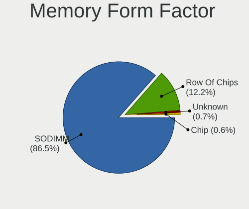

| Name         | Notebooks | Percent |
|--------------|-----------|---------|
| SODIMM       | 1107      | 86.48%  |
| Row Of Chips | 156       | 12.19%  |
| Unknown      | 9         | 0.7%    |
| Chip         | 8         | 0.63%   |

Memory Size
-----------

Memory module size

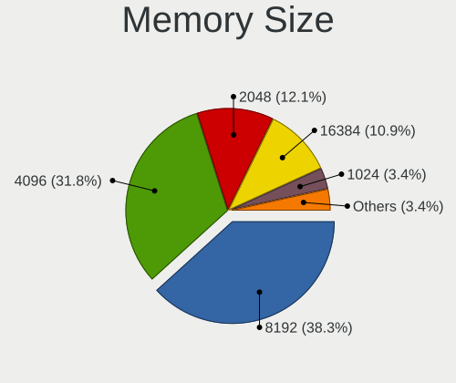

| Size  | Notebooks | Percent |
|-------|-----------|---------|
| 8192  | 567       | 38.26%  |
| 4096  | 472       | 31.85%  |
| 2048  | 180       | 12.15%  |
| 16384 | 162       | 10.93%  |
| 1024  | 50        | 3.37%   |
| 32768 | 44        | 2.97%   |
| 12288 | 3         | 0.2%    |
| 512   | 3         | 0.2%    |
| 256   | 1         | 0.07%   |

Memory Speed
------------

Memory module speed

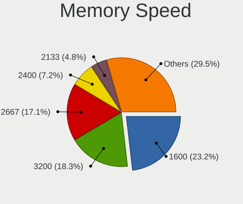

| Speed   | Notebooks | Percent |
|---------|-----------|---------|
| 1600    | 327       | 23.16%  |
| 3200    | 259       | 18.34%  |
| 2667    | 241       | 17.07%  |
| 2400    | 101       | 7.15%   |
| 2133    | 68        | 4.82%   |
| 1333    | 48        | 3.4%    |
| 1334    | 43        | 3.05%   |
| 3266    | 39        | 2.76%   |
| 667     | 39        | 2.76%   |
| Unknown | 27        | 1.91%   |
| 4800    | 25        | 1.77%   |
| 6400    | 23        | 1.63%   |
| 4267    | 22        | 1.56%   |
| 1067    | 18        | 1.27%   |
| 5600    | 17        | 1.2%    |
| 2048    | 17        | 1.2%    |
| 800     | 17        | 1.2%    |
| 8400    | 15        | 1.06%   |
| 1867    | 13        | 0.92%   |
| 4199    | 10        | 0.71%   |
| 3733    | 7         | 0.5%    |
| 975     | 7         | 0.5%    |
| 533     | 7         | 0.5%    |
| 1066    | 6         | 0.42%   |
| 7500    | 3         | 0.21%   |
| 7467    | 3         | 0.21%   |
| 2933    | 3         | 0.21%   |
| 5500    | 2         | 0.14%   |
| 1866    | 2         | 0.14%   |
| 1639    | 1         | 0.07%   |
| 666     | 1         | 0.07%   |
| 400     | 1         | 0.07%   |

Printers & scanners
-------------------

Printer Vendor
--------------

Printer device vendors

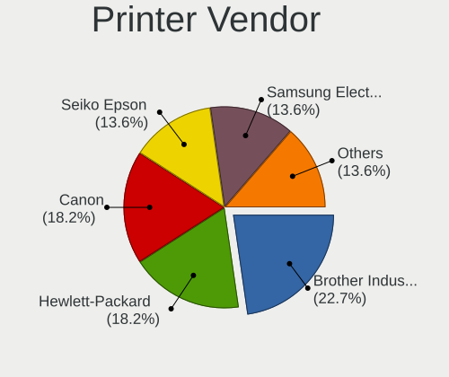

| Vendor                 | Notebooks | Percent |
|------------------------|-----------|---------|
| Brother Industries     | 5         | 22.73%  |
| Hewlett-Packard        | 4         | 18.18%  |
| Canon                  | 4         | 18.18%  |
| Seiko Epson            | 3         | 13.64%  |
| Samsung Electronics    | 3         | 13.64%  |
| TSC Auto ID Technology | 1         | 4.55%   |
| Kyocera                | 1         | 4.55%   |
| BIXOLON                | 1         | 4.55%   |

Printer Model
-------------

Printer device models

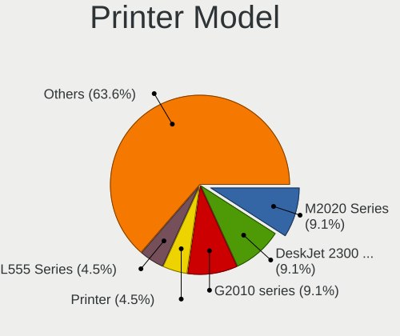

| Model                            | Notebooks | Percent |
|----------------------------------|-----------|---------|
| Samsung M2020 Series             | 2         | 9.09%   |
| HP DeskJet 2300 series           | 2         | 9.09%   |
| Canon G2010 series               | 2         | 9.09%   |
| TSC Auto ID Printer              | 1         | 4.55%   |
| Seiko Epson L555 Series          | 1         | 4.55%   |
| Seiko Epson L210 Series          | 1         | 4.55%   |
| Seiko Epson L120 Series          | 1         | 4.55%   |
| Samsung ML-1660 Series           | 1         | 4.55%   |
| Kyocera FS-1116MFP               | 1         | 4.55%   |
| HP LaserJet Professional P 1102w | 1         | 4.55%   |
| HP DeskJet 2600 series           | 1         | 4.55%   |
| Canon MF220 Series               | 1         | 4.55%   |
| Canon iP2600 series              | 1         | 4.55%   |
| Brother MFC-J470DW               | 1         | 4.55%   |
| Brother DCP-T520W                | 1         | 4.55%   |
| Brother DCP-T510W                | 1         | 4.55%   |
| Brother DCP-1600                 | 1         | 4.55%   |
| Brother DCP-1510                 | 1         | 4.55%   |
| BIXOLON SRP-350plusIII           | 1         | 4.55%   |

Scanner Vendor
--------------

Scanner device vendors

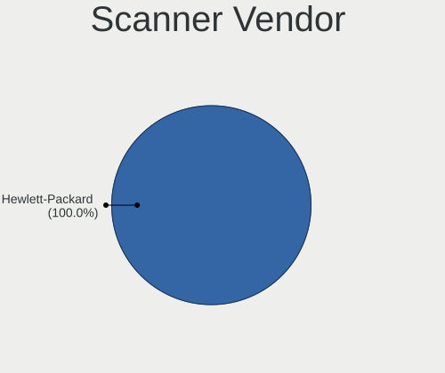

| Vendor          | Notebooks | Percent |
|-----------------|-----------|---------|
| Hewlett-Packard | 3         | 100%    |

Scanner Model
-------------

Scanner device models

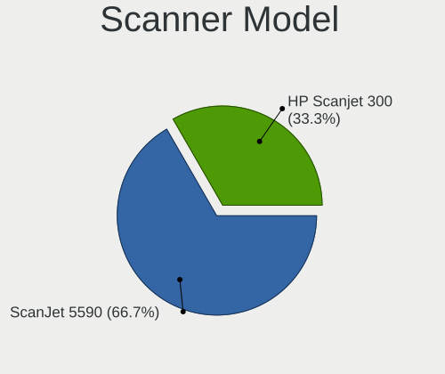

| Model             | Notebooks | Percent |
|-------------------|-----------|---------|
| HP ScanJet 5590   | 2         | 66.67%  |
| HP HP Scanjet 300 | 1         | 33.33%  |

Camera
------

Camera Vendor
-------------

Camera device vendors

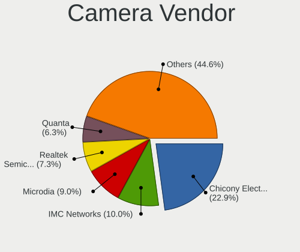

| Vendor                                 | Notebooks | Percent |
|----------------------------------------|-----------|---------|
| Chicony Electronics                    | 522       | 22.87%  |
| IMC Networks                           | 229       | 10.04%  |
| Microdia                               | 205       | 8.98%   |
| Realtek Semiconductor                  | 166       | 7.27%   |
| Quanta                                 | 143       | 6.27%   |
| Sunplus Innovation Technology          | 133       | 5.83%   |
| Bison Electronics                      | 133       | 5.83%   |
| Cheng Uei Precision Industry (Foxlink) | 120       | 5.26%   |
| Suyin                                  | 85        | 3.72%   |
| Apple                                  | 72        | 3.16%   |
| Syntek                                 | 65        | 2.85%   |
| Lite-On Technology                     | 65        | 2.85%   |
| Luxvisions Innotech Limited            | 42        | 1.84%   |
| Silicon Motion                         | 33        | 1.45%   |
| Ricoh                                  | 26        | 1.14%   |
| Alcor Micro                            | 24        | 1.05%   |
| Importek                               | 23        | 1.01%   |
| Logitech                               | 21        | 0.92%   |
| Sonix Technology                       | 20        | 0.88%   |
| Acer                                   | 14        | 0.61%   |
| Primax Electronics                     | 13        | 0.57%   |
| ALi                                    | 10        | 0.44%   |
| Y Media                                | 8         | 0.35%   |
| OmniVision Technologies                | 8         | 0.35%   |
| ShineTech                              | 6         | 0.26%   |
| icSpring                               | 6         | 0.26%   |
| HRY                                    | 6         | 0.26%   |
| Generalplus Technology                 | 6         | 0.26%   |
| SunplusIT                              | 5         | 0.22%   |
| Samsung Electronics                    | 5         | 0.22%   |
| Microsoft                              | 5         | 0.22%   |
| Lenovo                                 | 4         | 0.18%   |
| Genesys Logic                          | 4         | 0.18%   |
| SenseTek                               | 3         | 0.13%   |
| MacroSilicon                           | 3         | 0.13%   |
| kingcome                               | 3         | 0.13%   |
| Foxconn / Hon Hai                      | 3         | 0.13%   |
| BRS 2Mp Camera                         | 3         | 0.13%   |
| Z-Star Microelectronics                | 2         | 0.09%   |
| YGTek                                  | 2         | 0.09%   |

Camera Model
------------

Camera device models

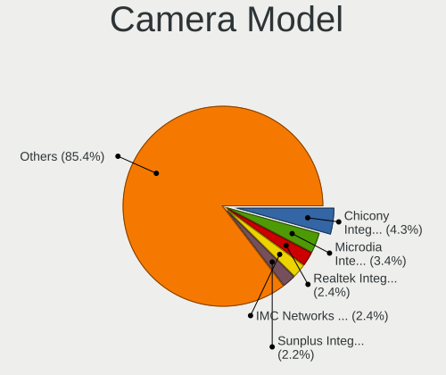

| Model                                                          | Notebooks | Percent |
|----------------------------------------------------------------|-----------|---------|
| Chicony Integrated Camera                                      | 99        | 4.31%   |
| Microdia Integrated_Webcam_HD                                  | 77        | 3.36%   |
| Realtek Integrated_Webcam_HD                                   | 54        | 2.35%   |
| IMC Networks Integrated Camera                                 | 54        | 2.35%   |
| Sunplus Integrated_Webcam_HD                                   | 51        | 2.22%   |
| Chicony HD WebCam                                              | 49        | 2.14%   |
| IMC Networks USB2.0 HD UVC WebCam                              | 45        | 1.96%   |
| Bison Integrated Camera                                        | 45        | 1.96%   |
| Apple FaceTime HD Camera                                       | 41        | 1.79%   |
| IMC Networks HD Camera                                         | 33        | 1.44%   |
| Syntek Integrated Camera                                       | 29        | 1.26%   |
| IMC Networks USB2.0 VGA UVC WebCam                             | 28        | 1.22%   |
| Chicony HP Webcam                                              | 28        | 1.22%   |
| Chicony HP Truevision HD                                       | 28        | 1.22%   |
| Chicony HP TrueVision HD Camera                                | 26        | 1.13%   |
| Quanta HP Webcam                                               | 23        | 1%      |
| Cheng Uei Precision Industry (Foxlink) HD Camera               | 22        | 0.96%   |
| IMC Networks ov9734_azurewave_camera                           | 20        | 0.87%   |
| Cheng Uei Precision Industry (Foxlink) HP Webcam               | 20        | 0.87%   |
| Cheng Uei Precision Industry (Foxlink) HP TrueVision HD Camera | 20        | 0.87%   |
| Microdia Integrated Webcam                                     | 19        | 0.83%   |
| Quanta HP TrueVision HD Camera                                 | 18        | 0.78%   |
| Bison EasyCamera                                               | 18        | 0.78%   |
| IMC Networks EasyCamera                                        | 17        | 0.74%   |
| Microdia Sonix USB 2.0 Camera                                  | 16        | 0.7%    |
| Chicony TOSHIBA Web Camera - HD                                | 16        | 0.7%    |
| Syntek Lenovo EasyCamera                                       | 15        | 0.65%   |
| Sunplus HD WebCam                                              | 15        | 0.65%   |
| Quanta ov9734_techfront_camera                                 | 15        | 0.65%   |
| Microdia Lenovo EasyCamera                                     | 15        | 0.65%   |
| Luxvisions Innotech Limited HP TrueVision HD Camera            | 15        | 0.65%   |
| Lite-On HP Wide Vision HD Camera                               | 15        | 0.65%   |
| Chicony HP Wide Vision HD Camera                               | 15        | 0.65%   |
| Chicony HP HD Camera                                           | 15        | 0.65%   |
| Cheng Uei Precision Industry (Foxlink) HP TrueVision HD        | 15        | 0.65%   |
| Apple Built-in iSight                                          | 15        | 0.65%   |
| Sonix USB2.0 HD UVC WebCam                                     | 14        | 0.61%   |
| Chicony USB 2.0 Camera                                         | 14        | 0.61%   |
| Chicony HP HD Webcam                                           | 14        | 0.61%   |
| Bison Lenovo EasyCamera                                        | 14        | 0.61%   |

Security
--------

Fingerprint Vendor
------------------

Fingerprint sensor vendors

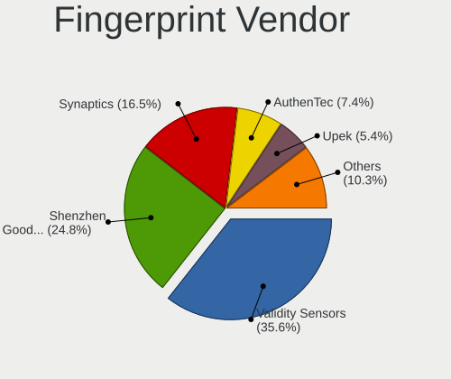

| Vendor                             | Notebooks | Percent |
|------------------------------------|-----------|---------|
| Validity Sensors                   | 145       | 35.63%  |
| Shenzhen Goodix Technology         | 101       | 24.82%  |
| Synaptics                          | 67        | 16.46%  |
| AuthenTec                          | 30        | 7.37%   |
| Upek                               | 22        | 5.41%   |
| Elan Microelectronics              | 17        | 4.18%   |
| Focal-systems.Corp                 | 9         | 2.21%   |
| STMicroelectronics                 | 6         | 1.47%   |
| LighTuning Technology              | 4         | 0.98%   |
| Realtek USB2.0 Finger Print Bridge | 2         | 0.49%   |
| Suprema                            | 1         | 0.25%   |
| Samsung Electronics                | 1         | 0.25%   |
| HOLTEK                             | 1         | 0.25%   |
| GDMicroelectronics                 | 1         | 0.25%   |

Fingerprint Model
-----------------

Fingerprint sensor models

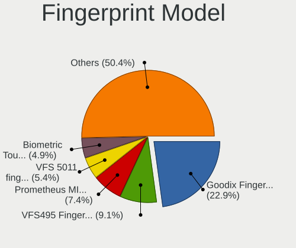

| Model                                                                      | Notebooks | Percent |
|----------------------------------------------------------------------------|-----------|---------|
| Shenzhen Goodix  Fingerprint Device                                        | 93        | 22.85%  |
| Validity Sensors VFS495 Fingerprint Reader                                 | 37        | 9.09%   |
| Synaptics Prometheus MIS Touch Fingerprint Reader                          | 30        | 7.37%   |
| Validity Sensors VFS 5011 fingerprint sensor                               | 22        | 5.41%   |
| Upek Biometric Touchchip/Touchstrip Fingerprint Sensor                     | 20        | 4.91%   |
| AuthenTec AES2501 Fingerprint Sensor                                       | 16        | 3.93%   |
| Validity Sensors VFS5011 Fingerprint Reader                                | 15        | 3.69%   |
| Synaptics Metallica MIS Touch Fingerprint Reader                           | 15        | 3.69%   |
| Validity Sensors VFS471 Fingerprint Reader                                 | 14        | 3.44%   |
| Validity Sensors VFS491                                                    | 10        | 2.46%   |
| Validity Sensors Synaptics WBDI                                            | 10        | 2.46%   |
| Elan ELAN:ARM-M4                                                           | 10        | 2.46%   |
| Focal-systems.Corp FT9201Fingerprint.                                      | 9         | 2.21%   |
| AuthenTec AES2810                                                          | 8         | 1.97%   |
| Validity Sensors VFS7500 Touch Fingerprint Sensor                          | 7         | 1.72%   |
| Elan ELAN:Fingerprint                                                      | 7         | 1.72%   |
| STMicroelectronics Fingerprint Reader                                      | 6         | 1.47%   |
| Validity Sensors VFS451 Fingerprint Reader                                 | 5         | 1.23%   |
| Validity Sensors VFS101 Fingerprint Reader                                 | 5         | 1.23%   |
| Validity Sensors Synaptics VFS7552 Touch Fingerprint Sensor with PurePrint | 5         | 1.23%   |
| Validity Sensors Swipe Fingerprint Sensor                                  | 5         | 1.23%   |
| Synaptics FS7604 Touch Fingerprint Sensor with PurePrint                   | 5         | 1.23%   |
| Shenzhen Goodix Fingerprint Reader                                         | 5         | 1.23%   |
| Validity Sensors VFS301 Fingerprint Reader                                 | 4         | 0.98%   |
| LighTuning EgisTec Touch Fingerprint Sensor                                | 4         | 0.98%   |
| Validity Sensors Fingerprint scanner                                       | 3         | 0.74%   |
| Synaptics WBDI Fingerprint Reader USB 086                                  | 3         | 0.74%   |
| Synaptics UWP WBDI Device                                                  | 3         | 0.74%   |
| Synaptics Prometheus Fingerprint Reader                                    | 3         | 0.74%   |
| Synaptics Fingerprint reader [HP G6]                                       | 3         | 0.74%   |
| Shenzhen Goodix FingerPrint                                                | 3         | 0.74%   |
| AuthenTec Fingerprint Sensor                                               | 3         | 0.74%   |
| AuthenTec AES1600                                                          | 3         | 0.74%   |
| Validity Sensors VFS Fingerprint sensor                                    | 2         | 0.49%   |
| Upek TCS5B Fingerprint sensor                                              | 2         | 0.49%   |
| Synaptics  FS7604 Touch Fingerprint Sensor with PurePrint                  | 2         | 0.49%   |
| Realtek USB2.0 Finger Print Bridge FocalTech Fingerprint Device            | 2         | 0.49%   |
| Validity Sensors VFS7552 Touch Fingerprint Sensor                          | 1         | 0.25%   |
| Synaptics WBDI Device                                                      | 1         | 0.25%   |
| Synaptics WBDI                                                             | 1         | 0.25%   |

Chipcard Vendor
---------------

Chipcard module vendors

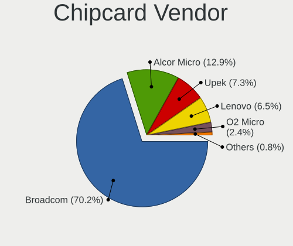

| Vendor                | Notebooks | Percent |
|-----------------------|-----------|---------|
| Broadcom              | 87        | 70.16%  |
| Alcor Micro           | 16        | 12.9%   |
| Upek                  | 9         | 7.26%   |
| Lenovo                | 8         | 6.45%   |
| O2 Micro              | 3         | 2.42%   |
| Gemalto (was Gemplus) | 1         | 0.81%   |

Chipcard Model
--------------

Chipcard module models

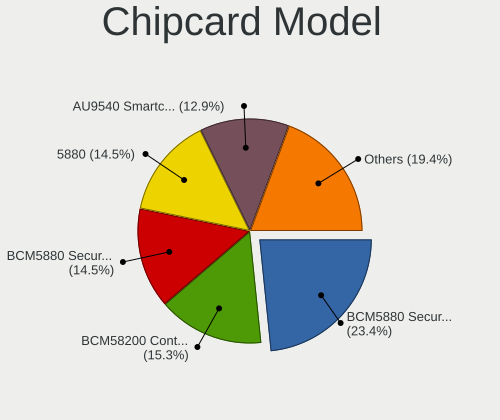

| Model                                                                        | Notebooks | Percent |
|------------------------------------------------------------------------------|-----------|---------|
| Broadcom BCM5880 Secure Applications Processor                               | 29        | 23.39%  |
| Broadcom BCM58200 ControlVault 3 (FingerPrint sensor + Contacted SmartCard)  | 19        | 15.32%  |
| Broadcom BCM5880 Secure Applications Processor with fingerprint swipe sensor | 18        | 14.52%  |
| Broadcom 5880                                                                | 18        | 14.52%  |
| Alcor Micro AU9540 Smartcard Reader                                          | 16        | 12.9%   |
| Upek TouchChip Fingerprint Coprocessor (WBF advanced mode)                   | 9         | 7.26%   |
| Lenovo Integrated Smart Card Reader                                          | 8         | 6.45%   |
| O2 Micro OZ776 CCID Smartcard Reader                                         | 3         | 2.42%   |
| Broadcom 58200                                                               | 2         | 1.61%   |
| Gemalto (was Gemplus) Compact Smart Card Reader Writer                       | 1         | 0.81%   |
| Broadcom BCM5880 Secure Applications Processor with fingerprint touch sensor | 1         | 0.81%   |

Unsupported
-----------

Unsupported Devices
-------------------

Total unsupported devices on board

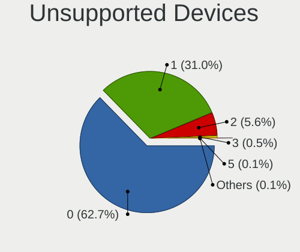

| Total | Notebooks | Percent |
|-------|-----------|---------|
| 0     | 1625      | 62.69%  |
| 1     | 804       | 31.02%  |
| 2     | 144       | 5.56%   |
| 3     | 14        | 0.54%   |
| 5     | 3         | 0.12%   |
| 7     | 1         | 0.04%   |
| 6     | 1         | 0.04%   |

Unsupported Device Types
------------------------

Types of unsupported devices

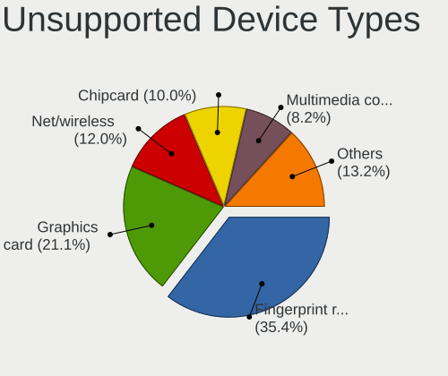

| Type                     | Notebooks | Percent |
|--------------------------|-----------|---------|
| Fingerprint reader       | 404       | 35.44%  |
| Graphics card            | 241       | 21.14%  |
| Net/wireless             | 137       | 12.02%  |
| Chipcard                 | 114       | 10%     |
| Multimedia controller    | 93        | 8.16%   |
| Camera                   | 37        | 3.25%   |
| Bluetooth                | 35        | 3.07%   |
| Communication controller | 18        | 1.58%   |
| Storage                  | 14        | 1.23%   |
| Sound                    | 11        | 0.96%   |
| Net/ethernet             | 11        | 0.96%   |
| Card reader              | 11        | 0.96%   |
| Modem                    | 5         | 0.44%   |
| Network                  | 4         | 0.35%   |
| Unassigned class         | 2         | 0.18%   |
| Storage/ide              | 1         | 0.09%   |
| Firewire controller      | 1         | 0.09%   |
| Dvb card                 | 1         | 0.09%   |

