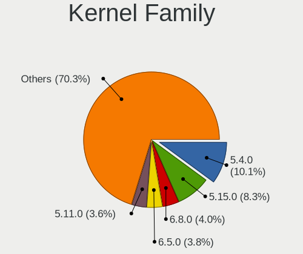
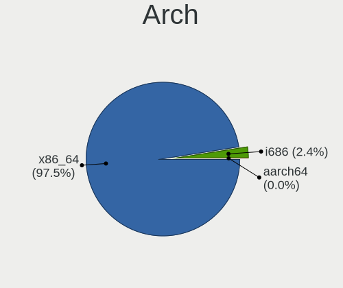
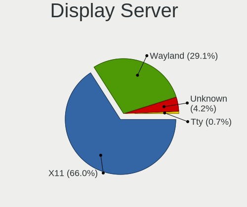
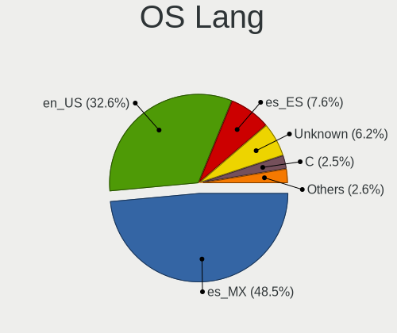
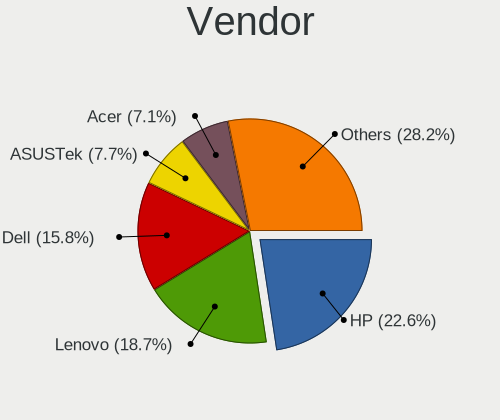
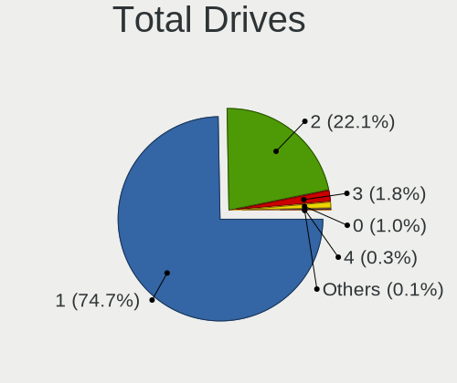
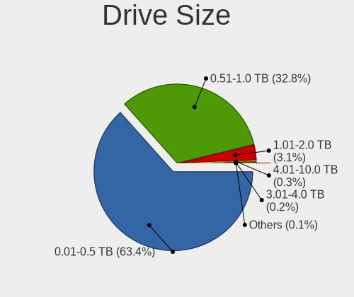
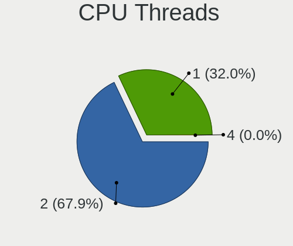
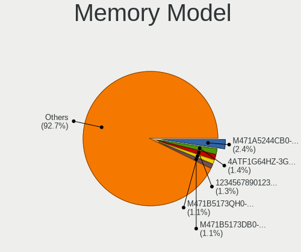
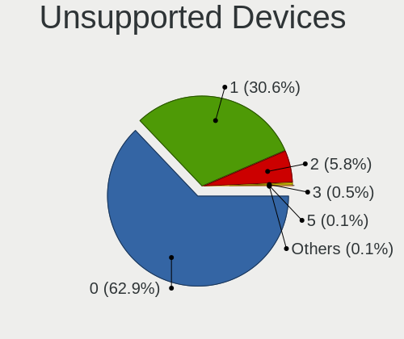

Linux in Mexico - Tested Hardware & Statistics (Notebooks)
----------------------------------------------------------

A project to collect tested hardware configurations for Linux in Mexico.

Anyone can contribute to this report by the [hw-probe](https://github.com/linuxhw/hw-probe) tool:

    sudo -E hw-probe -all -upload

Please contribute! Especially if your hardware is rare.

Contents
--------

* [ Test Cases ](#test-cases)

* [ System ](#system)
  - [ OS                       ](#os)
  - [ OS Family                ](#os-family)
  - [ Kernel                   ](#kernel)
  - [ Kernel Family            ](#kernel-family)
  - [ Kernel Major Ver.        ](#kernel-major-ver)
  - [ Arch                     ](#arch)
  - [ DE                       ](#de)
  - [ Display Server           ](#display-server)
  - [ Display Manager          ](#display-manager)
  - [ OS Lang                  ](#os-lang)
  - [ Boot Mode                ](#boot-mode)
  - [ Filesystem               ](#filesystem)
  - [ Part. scheme             ](#part-scheme)
  - [ Dual Boot with Linux/BSD ](#dual-boot-with-linuxbsd)
  - [ Dual Boot (Win)          ](#dual-boot-win)

* [ Board ](#board)
  - [ Vendor                   ](#vendor)
  - [ Model                    ](#model)
  - [ Model Family             ](#model-family)
  - [ MFG Year                 ](#mfg-year)
  - [ Form Factor              ](#form-factor)
  - [ Secure Boot              ](#secure-boot)
  - [ Coreboot                 ](#coreboot)
  - [ RAM Size                 ](#ram-size)
  - [ RAM Used                 ](#ram-used)
  - [ Total Drives             ](#total-drives)
  - [ Has CD-ROM               ](#has-cd-rom)
  - [ Has Ethernet             ](#has-ethernet)
  - [ Has WiFi                 ](#has-wifi)
  - [ Has Bluetooth            ](#has-bluetooth)

* [ Location ](#location)
  - [ Country                  ](#country)
  - [ City                     ](#city)

* [ Drives ](#drives)
  - [ Drive Vendor             ](#drive-vendor)
  - [ Drive Model              ](#drive-model)
  - [ HDD Vendor               ](#hdd-vendor)
  - [ SSD Vendor               ](#ssd-vendor)
  - [ Drive Kind               ](#drive-kind)
  - [ Drive Connector          ](#drive-connector)
  - [ Drive Size               ](#drive-size)
  - [ Space Total              ](#space-total)
  - [ Space Used               ](#space-used)
  - [ Malfunc. Drives          ](#malfunc-drives)
  - [ Malfunc. Drive Vendor    ](#malfunc-drive-vendor)
  - [ Malfunc. HDD Vendor      ](#malfunc-hdd-vendor)
  - [ Malfunc. Drive Kind      ](#malfunc-drive-kind)
  - [ Failed Drives            ](#failed-drives)
  - [ Failed Drive Vendor      ](#failed-drive-vendor)
  - [ Drive Status             ](#drive-status)

* [ Storage controller ](#storage-controller)
  - [ Storage Vendor           ](#storage-vendor)
  - [ Storage Model            ](#storage-model)
  - [ Storage Kind             ](#storage-kind)

* [ Processor ](#processor)
  - [ CPU Vendor               ](#cpu-vendor)
  - [ CPU Model                ](#cpu-model)
  - [ CPU Model Family         ](#cpu-model-family)
  - [ CPU Cores                ](#cpu-cores)
  - [ CPU Sockets              ](#cpu-sockets)
  - [ CPU Threads              ](#cpu-threads)
  - [ CPU Op-Modes             ](#cpu-op-modes)
  - [ CPU Microcode            ](#cpu-microcode)
  - [ CPU Microarch            ](#cpu-microarch)

* [ Graphics ](#graphics)
  - [ GPU Vendor               ](#gpu-vendor)
  - [ GPU Model                ](#gpu-model)
  - [ GPU Combo                ](#gpu-combo)
  - [ GPU Driver               ](#gpu-driver)
  - [ GPU Memory               ](#gpu-memory)

* [ Monitor ](#monitor)
  - [ Monitor Vendor           ](#monitor-vendor)
  - [ Monitor Model            ](#monitor-model)
  - [ Monitor Resolution       ](#monitor-resolution)
  - [ Monitor Diagonal         ](#monitor-diagonal)
  - [ Monitor Width            ](#monitor-width)
  - [ Aspect Ratio             ](#aspect-ratio)
  - [ Monitor Area             ](#monitor-area)
  - [ Pixel Density            ](#pixel-density)
  - [ Multiple Monitors        ](#multiple-monitors)

* [ Network ](#network)
  - [ Net Controller Vendor    ](#net-controller-vendor)
  - [ Net Controller Model     ](#net-controller-model)
  - [ Wireless Vendor          ](#wireless-vendor)
  - [ Wireless Model           ](#wireless-model)
  - [ Ethernet Vendor          ](#ethernet-vendor)
  - [ Ethernet Model           ](#ethernet-model)
  - [ Net Controller Kind      ](#net-controller-kind)
  - [ Used Controller          ](#used-controller)
  - [ NICs                     ](#nics)
  - [ IPv6                     ](#ipv6)

* [ Bluetooth ](#bluetooth)
  - [ Bluetooth Vendor         ](#bluetooth-vendor)
  - [ Bluetooth Model          ](#bluetooth-model)

* [ Sound ](#sound)
  - [ Sound Vendor             ](#sound-vendor)
  - [ Sound Model              ](#sound-model)

* [ Memory ](#memory)
  - [ Memory Vendor            ](#memory-vendor)
  - [ Memory Model             ](#memory-model)
  - [ Memory Kind              ](#memory-kind)
  - [ Memory Form Factor       ](#memory-form-factor)
  - [ Memory Size              ](#memory-size)
  - [ Memory Speed             ](#memory-speed)

* [ Printers & scanners ](#printers--scanners)
  - [ Printer Vendor           ](#printer-vendor)
  - [ Printer Model            ](#printer-model)
  - [ Scanner Vendor           ](#scanner-vendor)
  - [ Scanner Model            ](#scanner-model)

* [ Camera ](#camera)
  - [ Camera Vendor            ](#camera-vendor)
  - [ Camera Model             ](#camera-model)

* [ Security ](#security)
  - [ Fingerprint Vendor       ](#fingerprint-vendor)
  - [ Fingerprint Model        ](#fingerprint-model)
  - [ Chipcard Vendor          ](#chipcard-vendor)
  - [ Chipcard Model           ](#chipcard-model)

* [ Unsupported ](#unsupported)
  - [ Unsupported Devices      ](#unsupported-devices)
  - [ Unsupported Device Types ](#unsupported-device-types)

Test Cases
----------

Total: 1703

| Vendor        | Model                       | Probe                                                      | Date         |
|---------------|-----------------------------|------------------------------------------------------------|--------------|
| Lenovo        | ThinkPad E15 Gen 3 20YHS... | [9cd72ed352](https://linux-hardware.org/?probe=9cd72ed352) | Oct 01, 2022 |
| HP            | Pavilion                    | [124e8b760a](https://linux-hardware.org/?probe=124e8b760a) | Oct 01, 2022 |
| EVOO          | EG-LP10                     | [32c1a174d1](https://linux-hardware.org/?probe=32c1a174d1) | Oct 01, 2022 |
| GHIA          | LFI3H                       | [4233e4e6c5](https://linux-hardware.org/?probe=4233e4e6c5) | Sep 29, 2022 |
| GHIA          | LFI3H                       | [482e78460a](https://linux-hardware.org/?probe=482e78460a) | Sep 29, 2022 |
| HP            | Pavilion Notebook           | [ee72cbd627](https://linux-hardware.org/?probe=ee72cbd627) | Sep 29, 2022 |
| HUAWEI        | HVY-WXX9                    | [4f2655de78](https://linux-hardware.org/?probe=4f2655de78) | Sep 29, 2022 |
| Lenovo        | ThinkPad T430 23501K0       | [124afba97e](https://linux-hardware.org/?probe=124afba97e) | Sep 28, 2022 |
| Apple         | MacBookPro8,1               | [c0d2617a28](https://linux-hardware.org/?probe=c0d2617a28) | Sep 27, 2022 |
| HUAWEI        | NBLK-WAX9X                  | [c60d7e3375](https://linux-hardware.org/?probe=c60d7e3375) | Sep 27, 2022 |
| Dell          | Latitude E7440              | [d211ff97c6](https://linux-hardware.org/?probe=d211ff97c6) | Sep 27, 2022 |
| Dell          | Latitude E5450              | [8738ac7280](https://linux-hardware.org/?probe=8738ac7280) | Sep 26, 2022 |
| HP            | Unknown                     | [63af86aa38](https://linux-hardware.org/?probe=63af86aa38) | Sep 25, 2022 |
| Lenovo        | IdeaPad 5 15ITL05 82FG      | [f72f370511](https://linux-hardware.org/?probe=f72f370511) | Sep 23, 2022 |
| Chuwi         | CoreBook XPro               | [5ace2b3ea5](https://linux-hardware.org/?probe=5ace2b3ea5) | Sep 23, 2022 |
| MSI           | Prestige 14Evo A11M         | [609225524a](https://linux-hardware.org/?probe=609225524a) | Sep 23, 2022 |
| ASUSTek       | G750JM                      | [2e53c11312](https://linux-hardware.org/?probe=2e53c11312) | Sep 22, 2022 |
| MSI           | GT70 2OC/2OD                | [c6a0b0d987](https://linux-hardware.org/?probe=c6a0b0d987) | Sep 22, 2022 |
| Lenovo        | G40-80 80E4                 | [575b85b038](https://linux-hardware.org/?probe=575b85b038) | Sep 21, 2022 |
| Lenovo        | G40-80 80E4                 | [18a0a2158c](https://linux-hardware.org/?probe=18a0a2158c) | Sep 21, 2022 |
| Gateway       | NE46R                       | [61ee26263b](https://linux-hardware.org/?probe=61ee26263b) | Sep 20, 2022 |
| American M... | XA133PR110                  | [b79d35c0bd](https://linux-hardware.org/?probe=b79d35c0bd) | Sep 19, 2022 |
| Toshiba       | Satellite L40t-A            | [b09254248d](https://linux-hardware.org/?probe=b09254248d) | Sep 19, 2022 |
| HUAWEI        | NBLK-WAX9X                  | [bb8fdeb489](https://linux-hardware.org/?probe=bb8fdeb489) | Sep 19, 2022 |
| Sony          | VPCF236FM                   | [397f485cfc](https://linux-hardware.org/?probe=397f485cfc) | Sep 19, 2022 |
| HP            | EliteBook 2740p             | [6643773237](https://linux-hardware.org/?probe=6643773237) | Sep 18, 2022 |
| HP            | Notebook                    | [9fcfcab16e](https://linux-hardware.org/?probe=9fcfcab16e) | Sep 17, 2022 |
| ASUSTek       | X555DG                      | [c46c229dfb](https://linux-hardware.org/?probe=c46c229dfb) | Sep 16, 2022 |
| ASUSTek       | X555DG                      | [e39d4a8247](https://linux-hardware.org/?probe=e39d4a8247) | Sep 16, 2022 |
| Toshiba       | Satellite L855              | [1065197a6e](https://linux-hardware.org/?probe=1065197a6e) | Sep 15, 2022 |
| ASUSTek       | G501VW                      | [cf04ceb420](https://linux-hardware.org/?probe=cf04ceb420) | Sep 15, 2022 |
| HUAWEI        | KLVD-WXX9                   | [9e0c10b8e3](https://linux-hardware.org/?probe=9e0c10b8e3) | Sep 14, 2022 |
| HUAWEI        | HVY-WXX9                    | [8fab790c57](https://linux-hardware.org/?probe=8fab790c57) | Sep 14, 2022 |
| Dell          | Latitude E6400              | [0c6b0c35e6](https://linux-hardware.org/?probe=0c6b0c35e6) | Sep 14, 2022 |
| Dell          | Latitude E6400              | [b4c9fcf4c3](https://linux-hardware.org/?probe=b4c9fcf4c3) | Sep 14, 2022 |
| Lanix         | AL V9                       | [03e7c7ece5](https://linux-hardware.org/?probe=03e7c7ece5) | Sep 14, 2022 |
| Toshiba       | Satellite L55-B             | [b593ff9e20](https://linux-hardware.org/?probe=b593ff9e20) | Sep 14, 2022 |
| Chuwi         | GemiBook Pro                | [5b62dddb37](https://linux-hardware.org/?probe=5b62dddb37) | Sep 13, 2022 |
| HUAWEI        | HVY-WXX9                    | [d574f5da9b](https://linux-hardware.org/?probe=d574f5da9b) | Sep 13, 2022 |
| HUAWEI        | HVY-WXX9                    | [d1b95841a4](https://linux-hardware.org/?probe=d1b95841a4) | Sep 13, 2022 |
| HP            | EliteBook 745 G6            | [61da5fee97](https://linux-hardware.org/?probe=61da5fee97) | Sep 13, 2022 |
| Lanix         | AL V9                       | [e03f9aecc3](https://linux-hardware.org/?probe=e03f9aecc3) | Sep 12, 2022 |
| ASUSTek       | X553MA                      | [32c5b56788](https://linux-hardware.org/?probe=32c5b56788) | Sep 11, 2022 |
| Lenovo        | G50-45 80E3                 | [2f4b4e4203](https://linux-hardware.org/?probe=2f4b4e4203) | Sep 10, 2022 |
| Gateway       | NE56R                       | [c928861fb0](https://linux-hardware.org/?probe=c928861fb0) | Sep 09, 2022 |
| Gateway       | NE56R                       | [3167a59b9b](https://linux-hardware.org/?probe=3167a59b9b) | Sep 09, 2022 |
| ASUSTek       | X553MA                      | [32edc5cfad](https://linux-hardware.org/?probe=32edc5cfad) | Sep 08, 2022 |
| Apple         | MacBook4,1                  | [500d050ad6](https://linux-hardware.org/?probe=500d050ad6) | Sep 06, 2022 |
| Dell          | Latitude D410               | [6782e0a28f](https://linux-hardware.org/?probe=6782e0a28f) | Sep 05, 2022 |
| HP            | Laptop 15-bw0xx             | [68406339d5](https://linux-hardware.org/?probe=68406339d5) | Sep 04, 2022 |
| Apple         | MacBook4,1                  | [01b8531ddf](https://linux-hardware.org/?probe=01b8531ddf) | Sep 04, 2022 |
| Apple         | MacBook4,1                  | [9e4c1bc292](https://linux-hardware.org/?probe=9e4c1bc292) | Sep 04, 2022 |
| Dell          | Latitude E7450              | [de66677d3d](https://linux-hardware.org/?probe=de66677d3d) | Sep 03, 2022 |
| HP            | Pavilion 14                 | [7a2b6c5f4b](https://linux-hardware.org/?probe=7a2b6c5f4b) | Sep 02, 2022 |
| Dell          | Inspiron 5559               | [7da5af06fb](https://linux-hardware.org/?probe=7da5af06fb) | Sep 02, 2022 |
| Dell          | Inspiron 5559               | [c7b43caa52](https://linux-hardware.org/?probe=c7b43caa52) | Sep 01, 2022 |
| HP            | Pavilion 14                 | [b35151af0c](https://linux-hardware.org/?probe=b35151af0c) | Sep 01, 2022 |
| HP            | Compaq 6830s (FR883LA#AB... | [bceac5a658](https://linux-hardware.org/?probe=bceac5a658) | Aug 30, 2022 |
| Toshiba       | Satellite C845              | [58d3152512](https://linux-hardware.org/?probe=58d3152512) | Aug 29, 2022 |
| Lenovo        | Legion 5 15ARH05 82B5       | [c44a50e117](https://linux-hardware.org/?probe=c44a50e117) | Aug 29, 2022 |
| Lenovo        | IdeaPad Gaming 3 15ACH6 ... | [6f169db96b](https://linux-hardware.org/?probe=6f169db96b) | Aug 29, 2022 |
| Lenovo        | Legion 5 15ARH05 82B5       | [e3e8a26940](https://linux-hardware.org/?probe=e3e8a26940) | Aug 29, 2022 |
| HUAWEI        | KLVL-WXXW                   | [829a45ed6f](https://linux-hardware.org/?probe=829a45ed6f) | Aug 28, 2022 |
| HP            | 240 G7 Notebook PC          | [af418375d3](https://linux-hardware.org/?probe=af418375d3) | Aug 27, 2022 |
| Lenovo        | IdeaPad L340-15IRH Gamin... | [8021bbb58b](https://linux-hardware.org/?probe=8021bbb58b) | Aug 24, 2022 |
| Dell          | Inspiron M5030              | [59eec9a80d](https://linux-hardware.org/?probe=59eec9a80d) | Aug 24, 2022 |
| Dell          | Inspiron M5030              | [a43c618dbb](https://linux-hardware.org/?probe=a43c618dbb) | Aug 23, 2022 |
| MSI           | GL75 Leopard 10SDK          | [7004b23b33](https://linux-hardware.org/?probe=7004b23b33) | Aug 23, 2022 |
| HP            | ENVY m6 Notebook            | [c51af546e7](https://linux-hardware.org/?probe=c51af546e7) | Aug 22, 2022 |
| HP            | Pavilion dv7                | [81b7ddb4e9](https://linux-hardware.org/?probe=81b7ddb4e9) | Aug 21, 2022 |
| Dell          | Inspiron 5447               | [aa44fba5de](https://linux-hardware.org/?probe=aa44fba5de) | Aug 21, 2022 |
| Dell          | Inspiron 5447               | [21d9982f20](https://linux-hardware.org/?probe=21d9982f20) | Aug 21, 2022 |
| HUAWEI        | EMD-WXX                     | [1ee66f2c65](https://linux-hardware.org/?probe=1ee66f2c65) | Aug 20, 2022 |
| HUAWEI        | EMD-WXX                     | [9c4217c76b](https://linux-hardware.org/?probe=9c4217c76b) | Aug 19, 2022 |
| Lenovo        | IdeaPad 3 14IGL05 81WH      | [d78fb85708](https://linux-hardware.org/?probe=d78fb85708) | Aug 18, 2022 |
| Acer          | Aspire E5-573               | [1815c3a2f2](https://linux-hardware.org/?probe=1815c3a2f2) | Aug 17, 2022 |
| HP            | 240 G7 Notebook PC          | [ffa5707dc9](https://linux-hardware.org/?probe=ffa5707dc9) | Aug 17, 2022 |
| HP            | Pavilion TS 14              | [145fc8369f](https://linux-hardware.org/?probe=145fc8369f) | Aug 16, 2022 |
| Acer          | Aspire E5-573               | [d3bd05f20b](https://linux-hardware.org/?probe=d3bd05f20b) | Aug 16, 2022 |
| HP            | Pavilion Laptop 15-eh2xx... | [da2935226c](https://linux-hardware.org/?probe=da2935226c) | Aug 14, 2022 |
| Toshiba       | Satellite P200              | [83fcabac55](https://linux-hardware.org/?probe=83fcabac55) | Aug 13, 2022 |
| Dell          | Vostro 1520                 | [9dab88f3ee](https://linux-hardware.org/?probe=9dab88f3ee) | Aug 13, 2022 |
| Samsung       | 300E4C/300E5C/300E7C        | [94eb72e4ac](https://linux-hardware.org/?probe=94eb72e4ac) | Aug 13, 2022 |
| HP            | Pavilion Notebook           | [3dd4d44be4](https://linux-hardware.org/?probe=3dd4d44be4) | Aug 12, 2022 |
| Sony          | VPCYB20AL                   | [f886e2ff98](https://linux-hardware.org/?probe=f886e2ff98) | Aug 10, 2022 |
| Lenovo        | L340-15API 81LW             | [50eca7fa1e](https://linux-hardware.org/?probe=50eca7fa1e) | Aug 10, 2022 |
| HUAWEI        | WRT-WX9                     | [f9c85afff2](https://linux-hardware.org/?probe=f9c85afff2) | Aug 10, 2022 |
| Lenovo        | ThinkPad T14 Gen 1 20UES... | [dee5c21fb7](https://linux-hardware.org/?probe=dee5c21fb7) | Aug 09, 2022 |
| Lenovo        | IdeaPad 100S-11IBY 80R2     | [699bd44c36](https://linux-hardware.org/?probe=699bd44c36) | Aug 07, 2022 |
| Lenovo        | ThinkPad T14 Gen 1 20UES... | [7dc1825a38](https://linux-hardware.org/?probe=7dc1825a38) | Aug 06, 2022 |
| Lenovo        | ThinkPad T14 Gen 1 20UES... | [0a6068ab6b](https://linux-hardware.org/?probe=0a6068ab6b) | Aug 06, 2022 |
| ASUSTek       | VivoBook_ASUSLaptop X421... | [2ff6a7fe85](https://linux-hardware.org/?probe=2ff6a7fe85) | Aug 06, 2022 |
| ASUSTek       | VivoBook_ASUSLaptop X421... | [d54acf14ff](https://linux-hardware.org/?probe=d54acf14ff) | Aug 06, 2022 |
| Google        | Blorb                       | [b893b34702](https://linux-hardware.org/?probe=b893b34702) | Aug 06, 2022 |
| Acer          | AO756                       | [4bc715a31c](https://linux-hardware.org/?probe=4bc715a31c) | Aug 05, 2022 |
| Dell          | Inspiron 5559               | [3e02305524](https://linux-hardware.org/?probe=3e02305524) | Aug 04, 2022 |
| Lenovo        | IdeaPad S340-15API 81NC     | [5ab9ae3992](https://linux-hardware.org/?probe=5ab9ae3992) | Aug 03, 2022 |
| HP            | ProBook 4520s               | [8e03860e5f](https://linux-hardware.org/?probe=8e03860e5f) | Jul 30, 2022 |
| HP            | EliteBook 8570w             | [1876d4e53d](https://linux-hardware.org/?probe=1876d4e53d) | Jul 30, 2022 |
| Alienware     | 17 R4                       | [ae2cd7095b](https://linux-hardware.org/?probe=ae2cd7095b) | Jul 29, 2022 |
| ASUSTek       | VivoBook_ASUSLaptop X509... | [057703210a](https://linux-hardware.org/?probe=057703210a) | Jul 28, 2022 |
| Sony          | VPCS110FL                   | [8576955f3c](https://linux-hardware.org/?probe=8576955f3c) | Jul 28, 2022 |
| HP            | ProBook 4520s               | [80024f9b67](https://linux-hardware.org/?probe=80024f9b67) | Jul 26, 2022 |
| HP            | 245 G7 Notebook PC          | [07c70033f5](https://linux-hardware.org/?probe=07c70033f5) | Jul 25, 2022 |
| Alienware     | M11xR3                      | [e479dcdefb](https://linux-hardware.org/?probe=e479dcdefb) | Jul 22, 2022 |
| Dell          | Inspiron 3505               | [5bec1168d0](https://linux-hardware.org/?probe=5bec1168d0) | Jul 22, 2022 |
| HP            | 240 G4                      | [449fb8b8f8](https://linux-hardware.org/?probe=449fb8b8f8) | Jul 21, 2022 |
| Unknown       | W1415A                      | [3a2f4f9848](https://linux-hardware.org/?probe=3a2f4f9848) | Jul 21, 2022 |
| Lenovo        | ThinkPad T14s Gen 2i 20W... | [8bf06ee1c1](https://linux-hardware.org/?probe=8bf06ee1c1) | Jul 21, 2022 |
| Dell          | Latitude E7250              | [5fdb8cad05](https://linux-hardware.org/?probe=5fdb8cad05) | Jul 21, 2022 |
| GHIA          | Notebook                    | [2193ab1cd3](https://linux-hardware.org/?probe=2193ab1cd3) | Jul 20, 2022 |
| Lenovo        | IdeaPad 120S-14IAP 81A5     | [5859932a73](https://linux-hardware.org/?probe=5859932a73) | Jul 20, 2022 |
| HP            | EliteBook 8570w             | [6b8bf59f68](https://linux-hardware.org/?probe=6b8bf59f68) | Jul 19, 2022 |
| Sony          | VPCYB20AL                   | [17169107a8](https://linux-hardware.org/?probe=17169107a8) | Jul 19, 2022 |
| Dell          | Inspiron 3421               | [d4c15eb5fd](https://linux-hardware.org/?probe=d4c15eb5fd) | Jul 18, 2022 |
| Lenovo        | IdeaPad 120S-14IAP 81A5     | [27f6399025](https://linux-hardware.org/?probe=27f6399025) | Jul 16, 2022 |
| Dell          | Precision M4600             | [96f8364d87](https://linux-hardware.org/?probe=96f8364d87) | Jul 15, 2022 |
| Lenovo        | IdeaPad 5 14ITL05 82FE      | [1cf6844d33](https://linux-hardware.org/?probe=1cf6844d33) | Jul 14, 2022 |
| Toshiba       | Satellite L55-B             | [0e0ba8274b](https://linux-hardware.org/?probe=0e0ba8274b) | Jul 13, 2022 |
| Toshiba       | Satellite L55-B             | [a7bebd622f](https://linux-hardware.org/?probe=a7bebd622f) | Jul 13, 2022 |
| Dell          | Inspiron 7460               | [316285fb12](https://linux-hardware.org/?probe=316285fb12) | Jul 13, 2022 |
| Lenovo        | IdeaPad 3 15ADA05 81W1      | [3d9f189ad0](https://linux-hardware.org/?probe=3d9f189ad0) | Jul 13, 2022 |
| Dell          | Latitude E5530 non-vPro     | [0ab6a30f98](https://linux-hardware.org/?probe=0ab6a30f98) | Jul 12, 2022 |
| Sony          | VPCYB20AL                   | [c9645d6952](https://linux-hardware.org/?probe=c9645d6952) | Jul 10, 2022 |
| Lenovo        | IdeaPad Y430 2781           | [b8960364cb](https://linux-hardware.org/?probe=b8960364cb) | Jul 10, 2022 |
| Dell          | Inspiron 3558               | [14cacca8ad](https://linux-hardware.org/?probe=14cacca8ad) | Jul 09, 2022 |
| MSI           | GF63 Thin 11UC              | [ecfb5f39c5](https://linux-hardware.org/?probe=ecfb5f39c5) | Jul 09, 2022 |
| Lenovo        | IdeaPad 3 14IML05 81WA      | [a64c483143](https://linux-hardware.org/?probe=a64c483143) | Jul 08, 2022 |
| Lenovo        | IdeaPad 3 14IML05 81WA      | [39e56d90b1](https://linux-hardware.org/?probe=39e56d90b1) | Jul 07, 2022 |
| Acer          | Nitro AN515-51              | [0b57ab5b5b](https://linux-hardware.org/?probe=0b57ab5b5b) | Jul 07, 2022 |
| ASUSTek       | X555DG                      | [b7a2c97bf2](https://linux-hardware.org/?probe=b7a2c97bf2) | Jul 07, 2022 |
| Acer          | Aspire E3-112M              | [6de763aad6](https://linux-hardware.org/?probe=6de763aad6) | Jul 06, 2022 |
| ASUSTek       | ASUS TUF Gaming F15 FX50... | [7e53f712c5](https://linux-hardware.org/?probe=7e53f712c5) | Jul 06, 2022 |
| Acer          | Aspire F5-573               | [1ada0ad162](https://linux-hardware.org/?probe=1ada0ad162) | Jul 06, 2022 |
| Lenovo        | IdeaPad 3 15ALC6 82KU       | [1b94ade16a](https://linux-hardware.org/?probe=1b94ade16a) | Jul 05, 2022 |
| ASUSTek       | VivoBook_ASUSLaptop X512... | [a673b1557d](https://linux-hardware.org/?probe=a673b1557d) | Jul 05, 2022 |
| HP            | Pavilion dv4                | [d40a5bd13e](https://linux-hardware.org/?probe=d40a5bd13e) | Jul 04, 2022 |
| Lenovo        | G40-45 80E1                 | [bce4ceea50](https://linux-hardware.org/?probe=bce4ceea50) | Jul 03, 2022 |
| Lenovo        | ThinkPad W520 4284D47       | [a5ad48eeb5](https://linux-hardware.org/?probe=a5ad48eeb5) | Jul 03, 2022 |
| Lenovo        | IdeaPad 110-14IBR 80T6      | [c364b347a5](https://linux-hardware.org/?probe=c364b347a5) | Jul 02, 2022 |
| Dell          | Precision M4600             | [ea07b9e45f](https://linux-hardware.org/?probe=ea07b9e45f) | Jul 01, 2022 |
| Dell          | Precision M4600             | [535d6029bc](https://linux-hardware.org/?probe=535d6029bc) | Jul 01, 2022 |
| HUAWEI        | NBM-WXX9                    | [6ed674f77e](https://linux-hardware.org/?probe=6ed674f77e) | Jul 01, 2022 |
| Acer          | Aspire E5-573               | [01f3150f60](https://linux-hardware.org/?probe=01f3150f60) | Jul 01, 2022 |
| HP            | Pavilion Gaming Laptop 1... | [6095915fb5](https://linux-hardware.org/?probe=6095915fb5) | Jun 30, 2022 |
| HP            | Pavilion Gaming Laptop 1... | [1f66ba5535](https://linux-hardware.org/?probe=1f66ba5535) | Jun 30, 2022 |
| HUAWEI        | HVY-WXX9                    | [e7f3ea5cf5](https://linux-hardware.org/?probe=e7f3ea5cf5) | Jun 30, 2022 |
| HP            | Compaq CQ45                 | [74948790d0](https://linux-hardware.org/?probe=74948790d0) | Jun 29, 2022 |
| Apple         | MacBookAir6,1               | [c3172fd9cf](https://linux-hardware.org/?probe=c3172fd9cf) | Jun 28, 2022 |
| Dell          | Latitude E6400              | [df93b48c3c](https://linux-hardware.org/?probe=df93b48c3c) | Jun 28, 2022 |
| Dell          | Latitude 7420               | [3730ffb739](https://linux-hardware.org/?probe=3730ffb739) | Jun 27, 2022 |
| HP            | OMEN Notebook PC 15         | [66f845b63e](https://linux-hardware.org/?probe=66f845b63e) | Jun 25, 2022 |
| Sony          | VPCF236FM                   | [b2af243689](https://linux-hardware.org/?probe=b2af243689) | Jun 25, 2022 |
| Google        | Kip                         | [d21adde488](https://linux-hardware.org/?probe=d21adde488) | Jun 24, 2022 |
| HP            | Pavilion dv5                | [4009a4fd8c](https://linux-hardware.org/?probe=4009a4fd8c) | Jun 24, 2022 |
| HP            | Laptop 15-bw0xx             | [a55d01829f](https://linux-hardware.org/?probe=a55d01829f) | Jun 23, 2022 |
| Dell          | Latitude E6400              | [6198dd2784](https://linux-hardware.org/?probe=6198dd2784) | Jun 22, 2022 |
| Alienware     | 17 R4                       | [74b66aebc5](https://linux-hardware.org/?probe=74b66aebc5) | Jun 21, 2022 |
| ASUSTek       | ZenBook UX434DA_UM433DA     | [68ca5e600d](https://linux-hardware.org/?probe=68ca5e600d) | Jun 18, 2022 |
| Apple         | MacBookAir6,1               | [665cfa446b](https://linux-hardware.org/?probe=665cfa446b) | Jun 18, 2022 |
| HP            | Laptop 15-bs0xx             | [aa89682b09](https://linux-hardware.org/?probe=aa89682b09) | Jun 18, 2022 |
| Google        | Kindred                     | [c12b15c596](https://linux-hardware.org/?probe=c12b15c596) | Jun 17, 2022 |
| Lenovo        | ThinkPad T540p 20BE003NU... | [e05c2e42c2](https://linux-hardware.org/?probe=e05c2e42c2) | Jun 17, 2022 |
| Gateway       | NE513                       | [c33ad72253](https://linux-hardware.org/?probe=c33ad72253) | Jun 17, 2022 |
| Lenovo        | IdeaPad 3 15ALC6 82KU       | [e4d5856a72](https://linux-hardware.org/?probe=e4d5856a72) | Jun 16, 2022 |
| Lenovo        | IdeaPad Z480                | [1e34fa546d](https://linux-hardware.org/?probe=1e34fa546d) | Jun 15, 2022 |
| Dell          | Latitude E6410              | [6194911b41](https://linux-hardware.org/?probe=6194911b41) | Jun 15, 2022 |
| Dell          | XPS 15 9560                 | [8faa0f9e6a](https://linux-hardware.org/?probe=8faa0f9e6a) | Jun 14, 2022 |
| Lenovo        | Y50-70 20378                | [6153f90073](https://linux-hardware.org/?probe=6153f90073) | Jun 13, 2022 |
| Apple         | MacBookPro14,1              | [537b26aaf0](https://linux-hardware.org/?probe=537b26aaf0) | Jun 12, 2022 |
| Dell          | Latitude E6410              | [005799b9bf](https://linux-hardware.org/?probe=005799b9bf) | Jun 12, 2022 |
| Apple         | MacBookPro14,1              | [ca2c0e822c](https://linux-hardware.org/?probe=ca2c0e822c) | Jun 11, 2022 |
| Dell          | Studio XPS 1340             | [36f61b29b5](https://linux-hardware.org/?probe=36f61b29b5) | Jun 11, 2022 |
| HP            | Pavilion dv6                | [c8e7eea8fc](https://linux-hardware.org/?probe=c8e7eea8fc) | Jun 11, 2022 |
| Corporativ... | Neuron LT                   | [84ed262694](https://linux-hardware.org/?probe=84ed262694) | Jun 10, 2022 |
| Corporativ... | Neuron LT                   | [ad265d5197](https://linux-hardware.org/?probe=ad265d5197) | Jun 10, 2022 |
| Lenovo        | IdeaPad Y700-15ACZ 80NY     | [479a01b8d8](https://linux-hardware.org/?probe=479a01b8d8) | Jun 10, 2022 |
| ASUSTek       | K43E                        | [cd9e7dab5e](https://linux-hardware.org/?probe=cd9e7dab5e) | Jun 09, 2022 |
| Acer          | Aspire E5-573               | [bb17805ada](https://linux-hardware.org/?probe=bb17805ada) | Jun 08, 2022 |
| Lenovo        | ThinkPad T400 2767AL9       | [8084a9ed95](https://linux-hardware.org/?probe=8084a9ed95) | Jun 08, 2022 |
| Toshiba       | Satellite L55-B             | [38c0d1cebc](https://linux-hardware.org/?probe=38c0d1cebc) | Jun 07, 2022 |
| HP            | Laptop 15-dy0xxx            | [e2a9ba60e2](https://linux-hardware.org/?probe=e2a9ba60e2) | Jun 07, 2022 |
| HP            | Laptop 15-dy2xxx            | [ecc580e75f](https://linux-hardware.org/?probe=ecc580e75f) | Jun 06, 2022 |
| HP            | Laptop 15-dy2xxx            | [e737d522f2](https://linux-hardware.org/?probe=e737d522f2) | Jun 06, 2022 |
| HUAWEI        | NBLK-WAX9X                  | [63467c4755](https://linux-hardware.org/?probe=63467c4755) | Jun 05, 2022 |
| HUAWEI        | NBLK-WAX9X                  | [8577975269](https://linux-hardware.org/?probe=8577975269) | Jun 05, 2022 |
| ASUSTek       | VivoBook_ASUSLaptop X515... | [84d72b2b06](https://linux-hardware.org/?probe=84d72b2b06) | Jun 05, 2022 |
| Lenovo        | IdeaPad S145-14IIL 81W6     | [058bd1f6b9](https://linux-hardware.org/?probe=058bd1f6b9) | Jun 04, 2022 |
| Lenovo        | G470 20078                  | [44e0643923](https://linux-hardware.org/?probe=44e0643923) | Jun 03, 2022 |
| EVOO          | EV-C-116-7                  | [1955955afc](https://linux-hardware.org/?probe=1955955afc) | Jun 02, 2022 |
| Lenovo        | ThinkPad T14 Gen 2a 20XL... | [978a80c358](https://linux-hardware.org/?probe=978a80c358) | Jun 02, 2022 |
| SK hynix      | Onnyx III                   | [a04d3f7fd9](https://linux-hardware.org/?probe=a04d3f7fd9) | Jun 01, 2022 |
| ASUSTek       | VivoBook_ASUSLaptop X515... | [a3e63f04e7](https://linux-hardware.org/?probe=a3e63f04e7) | May 31, 2022 |
| Dell          | G7 7588                     | [3e41b876c2](https://linux-hardware.org/?probe=3e41b876c2) | May 31, 2022 |
| Dell          | Inspiron 5547               | [066f6369b2](https://linux-hardware.org/?probe=066f6369b2) | May 31, 2022 |
| Lenovo        | IdeaPad S300 20197          | [fcb07ac9aa](https://linux-hardware.org/?probe=fcb07ac9aa) | May 31, 2022 |
| Lenovo        | IdeaPad Z480                | [b1cf8ca505](https://linux-hardware.org/?probe=b1cf8ca505) | May 30, 2022 |
| Lenovo        | G50-30 80G0                 | [0bf1fadaa2](https://linux-hardware.org/?probe=0bf1fadaa2) | May 29, 2022 |
| Lenovo        | G50-30 80G0                 | [8895ea240a](https://linux-hardware.org/?probe=8895ea240a) | May 29, 2022 |
| Lenovo        | IdeaPad 320-15AST 80XV      | [55dfdf01c6](https://linux-hardware.org/?probe=55dfdf01c6) | May 29, 2022 |
| HP            | Presario CQ62               | [fe3cac8868](https://linux-hardware.org/?probe=fe3cac8868) | May 27, 2022 |
| Dell          | Inspiron 5570               | [ea74ff47bc](https://linux-hardware.org/?probe=ea74ff47bc) | May 27, 2022 |
| Dell          | Inspiron 5570               | [83e0c49ab0](https://linux-hardware.org/?probe=83e0c49ab0) | May 27, 2022 |
| Acer          | Swift SF113-31              | [2bdba73cfa](https://linux-hardware.org/?probe=2bdba73cfa) | May 26, 2022 |
| Acer          | Aspire E3-112M              | [240ed3197a](https://linux-hardware.org/?probe=240ed3197a) | May 26, 2022 |
| HP            | Pavilion Laptop 15-cd0xx    | [ad9da27671](https://linux-hardware.org/?probe=ad9da27671) | May 26, 2022 |
| HP            | Pavilion g4                 | [0c943e458a](https://linux-hardware.org/?probe=0c943e458a) | May 25, 2022 |
| Toshiba       | Satellite C55-C             | [0c52032af4](https://linux-hardware.org/?probe=0c52032af4) | May 24, 2022 |
| ASUSTek       | X402CA                      | [eb6132725e](https://linux-hardware.org/?probe=eb6132725e) | May 21, 2022 |
| HUAWEI        | HVY-WXX9                    | [93bb32d1b2](https://linux-hardware.org/?probe=93bb32d1b2) | May 21, 2022 |
| Acer          | Aspire 5332                 | [f48da95c17](https://linux-hardware.org/?probe=f48da95c17) | May 21, 2022 |
| System76      | Oryx Pro                    | [b68edfe15c](https://linux-hardware.org/?probe=b68edfe15c) | May 17, 2022 |
| Lenovo        | ThinkPad W520 4284D47       | [f0fef230c2](https://linux-hardware.org/?probe=f0fef230c2) | May 15, 2022 |
| Lenovo        | ThinkPad W520 4284D47       | [2f0e46cc27](https://linux-hardware.org/?probe=2f0e46cc27) | May 15, 2022 |
| Lenovo        | S10-3                       | [b2eb29a65e](https://linux-hardware.org/?probe=b2eb29a65e) | May 14, 2022 |
| Lenovo        | IdeaPad 320-15AST 80XV      | [4316b121b1](https://linux-hardware.org/?probe=4316b121b1) | May 14, 2022 |
| Dell          | Studio 1558                 | [ccffb59f97](https://linux-hardware.org/?probe=ccffb59f97) | May 13, 2022 |
| Toshiba       | Satellite C55-C             | [2695dd828d](https://linux-hardware.org/?probe=2695dd828d) | May 13, 2022 |
| HUAWEI        | HVY-WXX9                    | [2bd7babedc](https://linux-hardware.org/?probe=2bd7babedc) | May 13, 2022 |
| Toshiba       | TECRA Z50-A                 | [985d5869bf](https://linux-hardware.org/?probe=985d5869bf) | May 12, 2022 |
| Dell          | XPS 15 9550                 | [de90425a28](https://linux-hardware.org/?probe=de90425a28) | May 09, 2022 |
| HP            | Compaq 6830s (FR883LA#AB... | [9b6892ebed](https://linux-hardware.org/?probe=9b6892ebed) | May 09, 2022 |
| Google        | Blooglet                    | [64b4f18c1c](https://linux-hardware.org/?probe=64b4f18c1c) | May 09, 2022 |
| Google        | Blooglet                    | [f3dc91bf66](https://linux-hardware.org/?probe=f3dc91bf66) | May 09, 2022 |
| HP            | Laptop 17z-ca300            | [c43f2b0e29](https://linux-hardware.org/?probe=c43f2b0e29) | May 08, 2022 |
| Acer          | Aspire ES1-531              | [a7927b8b27](https://linux-hardware.org/?probe=a7927b8b27) | May 08, 2022 |
| Acer          | Aspire F5-573               | [d6961632c4](https://linux-hardware.org/?probe=d6961632c4) | May 07, 2022 |
| HP            | Notebook                    | [04f5e602de](https://linux-hardware.org/?probe=04f5e602de) | May 07, 2022 |
| Lenovo        | IdeaPad 330S-15IKB 81F5     | [46d0c349d6](https://linux-hardware.org/?probe=46d0c349d6) | May 07, 2022 |
| HP            | OMEN Laptop 15-en0xxx       | [38f5d37dcc](https://linux-hardware.org/?probe=38f5d37dcc) | May 07, 2022 |
| HP            | Pavilion 14                 | [2bd48eeb41](https://linux-hardware.org/?probe=2bd48eeb41) | May 06, 2022 |
| Apple         | MacBookAir6,2               | [d04d5e927d](https://linux-hardware.org/?probe=d04d5e927d) | May 05, 2022 |
| Lenovo        | ThinkPad L412 0585AV3       | [4208da52ad](https://linux-hardware.org/?probe=4208da52ad) | May 04, 2022 |
| HP            | Compaq 6830s (FR883LA#AB... | [a3eb29c75d](https://linux-hardware.org/?probe=a3eb29c75d) | May 04, 2022 |
| Dell          | Latitude 7420               | [a0bd1ee0f4](https://linux-hardware.org/?probe=a0bd1ee0f4) | May 03, 2022 |
| Sony          | VPCF236FM                   | [ec0af02205](https://linux-hardware.org/?probe=ec0af02205) | May 02, 2022 |
| Acer          | Aspire V5-561               | [e9dfda82d4](https://linux-hardware.org/?probe=e9dfda82d4) | May 02, 2022 |
| Dell          | Latitude E5550              | [42a576bd39](https://linux-hardware.org/?probe=42a576bd39) | May 01, 2022 |
| HP            | Pavilion 13 x2 PC           | [fbb6d3b97e](https://linux-hardware.org/?probe=fbb6d3b97e) | May 01, 2022 |
| HP            | Pavilion 13 x2 PC           | [d594f3335c](https://linux-hardware.org/?probe=d594f3335c) | May 01, 2022 |
| ASUSTek       | X202E                       | [37ad2923f5](https://linux-hardware.org/?probe=37ad2923f5) | May 01, 2022 |
| Lenovo        | IdeaPad Flex-14API 81SS     | [f5d70fb9d3](https://linux-hardware.org/?probe=f5d70fb9d3) | Apr 30, 2022 |
| Lenovo        | S10-3                       | [712c2dced9](https://linux-hardware.org/?probe=712c2dced9) | Apr 30, 2022 |
| HUAWEI        | HVY-WXX9                    | [824ccc1317](https://linux-hardware.org/?probe=824ccc1317) | Apr 27, 2022 |
| Toshiba       | Satellite C55-C             | [35e8d13a74](https://linux-hardware.org/?probe=35e8d13a74) | Apr 27, 2022 |
| Lenovo        | IdeaPad 310-14ISK 80SL      | [a57363e60a](https://linux-hardware.org/?probe=a57363e60a) | Apr 27, 2022 |
| Toshiba       | Satellite L735D             | [4bd23809e6](https://linux-hardware.org/?probe=4bd23809e6) | Apr 27, 2022 |
| Toshiba       | Satellite C55-C             | [d48006a0b2](https://linux-hardware.org/?probe=d48006a0b2) | Apr 26, 2022 |
| Toshiba       | Satellite C55-C             | [e9bc1aaf05](https://linux-hardware.org/?probe=e9bc1aaf05) | Apr 26, 2022 |
| Dell          | Inspiron 5577               | [0925d92173](https://linux-hardware.org/?probe=0925d92173) | Apr 25, 2022 |
| Lenovo        | ThinkPad E460 20ET000YLM    | [c82beac367](https://linux-hardware.org/?probe=c82beac367) | Apr 23, 2022 |
| HUAWEI        | HVY-WXX9                    | [56d949b3bb](https://linux-hardware.org/?probe=56d949b3bb) | Apr 23, 2022 |
| ASUSTek       | K46CA                       | [e762eba391](https://linux-hardware.org/?probe=e762eba391) | Apr 23, 2022 |
| HP            | EliteBook 8570w             | [0a4b339d0f](https://linux-hardware.org/?probe=0a4b339d0f) | Apr 23, 2022 |
| Chuwi         | Unknown                     | [96105ecbb2](https://linux-hardware.org/?probe=96105ecbb2) | Apr 23, 2022 |
| Lenovo        | ThinkPad W530 2463A49       | [202b5d34a1](https://linux-hardware.org/?probe=202b5d34a1) | Apr 18, 2022 |
| Lenovo        | ThinkPad L412 0585AV3       | [55186a3c2e](https://linux-hardware.org/?probe=55186a3c2e) | Apr 18, 2022 |
| Lenovo        | ThinkPad L420 7829BH2       | [726f69890c](https://linux-hardware.org/?probe=726f69890c) | Apr 17, 2022 |
| HP            | 14                          | [71f296bd93](https://linux-hardware.org/?probe=71f296bd93) | Apr 17, 2022 |
| Lenovo        | ThinkPad L412 0585AV3       | [382836d952](https://linux-hardware.org/?probe=382836d952) | Apr 16, 2022 |
| Acer          | Aspire R3-131T              | [776575ecdb](https://linux-hardware.org/?probe=776575ecdb) | Apr 16, 2022 |
| Lenovo        | G40-45 80E1                 | [840ffde0c4](https://linux-hardware.org/?probe=840ffde0c4) | Apr 15, 2022 |
| Lenovo        | ThinkPad X1 Carbon 5th 2... | [086a94d83c](https://linux-hardware.org/?probe=086a94d83c) | Apr 15, 2022 |
| Sony          | VPCEE23FX                   | [4c7634a096](https://linux-hardware.org/?probe=4c7634a096) | Apr 15, 2022 |
| Lenovo        | Legion 7 15IMH05 81YT       | [25c2200e11](https://linux-hardware.org/?probe=25c2200e11) | Apr 14, 2022 |
| HP            | Laptop 14-cm0xxx            | [d6463e4014](https://linux-hardware.org/?probe=d6463e4014) | Apr 14, 2022 |
| HUAWEI        | KLVL-WXXW                   | [8888d86504](https://linux-hardware.org/?probe=8888d86504) | Apr 13, 2022 |
| Acer          | Nitro AN515-41              | [b938e715f4](https://linux-hardware.org/?probe=b938e715f4) | Apr 13, 2022 |
| HP            | ProBook 650 G1              | [5d153a1030](https://linux-hardware.org/?probe=5d153a1030) | Apr 12, 2022 |
| HP            | ZBook 15                    | [c8c2248854](https://linux-hardware.org/?probe=c8c2248854) | Apr 11, 2022 |
| Toshiba       | Satellite L735D             | [47f0119635](https://linux-hardware.org/?probe=47f0119635) | Apr 10, 2022 |
| HP            | EliteBook 8570w             | [9d7c1a88d6](https://linux-hardware.org/?probe=9d7c1a88d6) | Apr 10, 2022 |
| HP            | Laptop 15-da1xxx            | [8d9c212045](https://linux-hardware.org/?probe=8d9c212045) | Apr 10, 2022 |
| ASUSTek       | N56DY                       | [aff377f6ed](https://linux-hardware.org/?probe=aff377f6ed) | Apr 09, 2022 |
| Dell          | Inspiron 5570               | [a75a1551fa](https://linux-hardware.org/?probe=a75a1551fa) | Apr 09, 2022 |
| HP            | ZBook 15                    | [ee70932ef2](https://linux-hardware.org/?probe=ee70932ef2) | Apr 09, 2022 |
| HP            | Pavilion dv6                | [9d37acefa0](https://linux-hardware.org/?probe=9d37acefa0) | Apr 09, 2022 |
| Sony          | VPCF236FM                   | [ea109b146b](https://linux-hardware.org/?probe=ea109b146b) | Apr 08, 2022 |
| Toshiba       | NB505                       | [55f9f70b0b](https://linux-hardware.org/?probe=55f9f70b0b) | Apr 08, 2022 |
| Toshiba       | Satellite P775              | [3acd0b8861](https://linux-hardware.org/?probe=3acd0b8861) | Apr 08, 2022 |
| Dell          | Inspiron 5570               | [801e4fdab1](https://linux-hardware.org/?probe=801e4fdab1) | Apr 07, 2022 |
| Dell          | Latitude E5440              | [18a9d37c02](https://linux-hardware.org/?probe=18a9d37c02) | Apr 07, 2022 |
| MSI           | GL75 Leopard 10SDK          | [e168714dee](https://linux-hardware.org/?probe=e168714dee) | Apr 06, 2022 |
| HP            | Stream Laptop 14-ax1xxx     | [a25b973df6](https://linux-hardware.org/?probe=a25b973df6) | Apr 05, 2022 |
| HP            | Stream Laptop 14-ax1xxx     | [4228c17983](https://linux-hardware.org/?probe=4228c17983) | Apr 05, 2022 |
| HP            | 245 G7 Notebook PC          | [9d26a79ca6](https://linux-hardware.org/?probe=9d26a79ca6) | Apr 05, 2022 |
| HP            | 245 G7 Notebook PC          | [54db9ac27f](https://linux-hardware.org/?probe=54db9ac27f) | Apr 05, 2022 |
| HP            | Pavilion 14                 | [136105017c](https://linux-hardware.org/?probe=136105017c) | Apr 04, 2022 |
| HP            | Presario CQ56               | [7233c29381](https://linux-hardware.org/?probe=7233c29381) | Apr 03, 2022 |
| Toshiba       | Satellite S855D             | [45b97d03ed](https://linux-hardware.org/?probe=45b97d03ed) | Apr 03, 2022 |
| Apple         | MacBookPro9,2               | [f646cb03d2](https://linux-hardware.org/?probe=f646cb03d2) | Mar 31, 2022 |
| Sony          | SVF14213CLB                 | [b87a95ae1a](https://linux-hardware.org/?probe=b87a95ae1a) | Mar 31, 2022 |
| Sony          | SVF14213CLB                 | [fecf079b63](https://linux-hardware.org/?probe=fecf079b63) | Mar 31, 2022 |
| Dell          | Venue 8 Pro 5855            | [35a463a0fb](https://linux-hardware.org/?probe=35a463a0fb) | Mar 31, 2022 |
| HUAWEI        | HVY-WXX9                    | [5af7df2c2a](https://linux-hardware.org/?probe=5af7df2c2a) | Mar 30, 2022 |
| Acer          | Aspire one                  | [2b0b231b1a](https://linux-hardware.org/?probe=2b0b231b1a) | Mar 29, 2022 |
| Lenovo        | Legion 5 15ARH05 82B5       | [d346f2a1b1](https://linux-hardware.org/?probe=d346f2a1b1) | Mar 29, 2022 |
| HUAWEI        | CREM-WXX9                   | [67475db5e9](https://linux-hardware.org/?probe=67475db5e9) | Mar 29, 2022 |
| HUAWEI        | CREM-WXX9                   | [2c7227662f](https://linux-hardware.org/?probe=2c7227662f) | Mar 29, 2022 |
| Toshiba       | NB505                       | [cab0ce252d](https://linux-hardware.org/?probe=cab0ce252d) | Mar 27, 2022 |
| Dell          | Latitude E6510              | [4feee8c983](https://linux-hardware.org/?probe=4feee8c983) | Mar 26, 2022 |
| HP            | Pavilion 11 x360 PC         | [975bcd1031](https://linux-hardware.org/?probe=975bcd1031) | Mar 25, 2022 |
| HP            | Laptop 15-bw0xx             | [eb140d5b4d](https://linux-hardware.org/?probe=eb140d5b4d) | Mar 25, 2022 |
| Sony          | SVT13125CLS                 | [5332da89c8](https://linux-hardware.org/?probe=5332da89c8) | Mar 25, 2022 |
| Lenovo        | IdeaPad 330-14AST 81D5      | [4b955479cc](https://linux-hardware.org/?probe=4b955479cc) | Mar 24, 2022 |
| System76      | Gazelle                     | [5a83198dd6](https://linux-hardware.org/?probe=5a83198dd6) | Mar 24, 2022 |
| Acer          | Nitro AN515-54              | [4bb7650e38](https://linux-hardware.org/?probe=4bb7650e38) | Mar 23, 2022 |
| Lenovo        | Unknown                     | [661ddbd0df](https://linux-hardware.org/?probe=661ddbd0df) | Mar 18, 2022 |
| HUAWEI        | HVY-WXX9                    | [e1f3c645b5](https://linux-hardware.org/?probe=e1f3c645b5) | Mar 17, 2022 |
| Lenovo        | ThinkPad T440 20B7S1PD0M    | [ed01dc4465](https://linux-hardware.org/?probe=ed01dc4465) | Mar 17, 2022 |
| HP            | EliteBook 8460p             | [6c0caa0de4](https://linux-hardware.org/?probe=6c0caa0de4) | Mar 17, 2022 |
| HUAWEI        | HVY-WXX9                    | [ddcbb702c6](https://linux-hardware.org/?probe=ddcbb702c6) | Mar 17, 2022 |
| Lenovo        | ThinkPad T440 20B7S1PD0M    | [dbed1562e8](https://linux-hardware.org/?probe=dbed1562e8) | Mar 17, 2022 |
| HUAWEI        | HVY-WXX9                    | [d54d90820a](https://linux-hardware.org/?probe=d54d90820a) | Mar 17, 2022 |
| HP            | Pavilion 15                 | [29ac5f13cd](https://linux-hardware.org/?probe=29ac5f13cd) | Mar 16, 2022 |
| Apple         | MacBookPro15,2              | [a77a1ff925](https://linux-hardware.org/?probe=a77a1ff925) | Mar 16, 2022 |
| Dell          | Latitude E6220              | [0dbd85da47](https://linux-hardware.org/?probe=0dbd85da47) | Mar 13, 2022 |
| Dell          | G5 5505                     | [286d140bd5](https://linux-hardware.org/?probe=286d140bd5) | Mar 10, 2022 |
| HP            | ProBook 650 G1              | [046572a251](https://linux-hardware.org/?probe=046572a251) | Mar 09, 2022 |
| Dell          | XPS 15 9570                 | [dd0ebc18ce](https://linux-hardware.org/?probe=dd0ebc18ce) | Mar 07, 2022 |
| Acer          | Aspire E5-575               | [bc5e48379d](https://linux-hardware.org/?probe=bc5e48379d) | Mar 07, 2022 |
| Chuwi         | GemiBook                    | [60146fd918](https://linux-hardware.org/?probe=60146fd918) | Mar 07, 2022 |
| Acer          | Aspire VN7-572              | [952fd83515](https://linux-hardware.org/?probe=952fd83515) | Mar 06, 2022 |
| Unknown       | KN12A                       | [3ba6165509](https://linux-hardware.org/?probe=3ba6165509) | Mar 05, 2022 |
| Panasonic     | CF-30KTPA9NP                | [fffe3abd97](https://linux-hardware.org/?probe=fffe3abd97) | Mar 05, 2022 |
| Lenovo        | G40-70 20369                | [fd797ac0c1](https://linux-hardware.org/?probe=fd797ac0c1) | Mar 03, 2022 |
| Chuwi         | GemiBook                    | [af28b0f0d8](https://linux-hardware.org/?probe=af28b0f0d8) | Mar 02, 2022 |
| Timi          | TM1612                      | [dc1c26b3a9](https://linux-hardware.org/?probe=dc1c26b3a9) | Mar 01, 2022 |
| Sony          | VGN-Z690N                   | [d3465abe44](https://linux-hardware.org/?probe=d3465abe44) | Mar 01, 2022 |
| ASUSTek       | X555LAB                     | [0a0e3feff6](https://linux-hardware.org/?probe=0a0e3feff6) | Mar 01, 2022 |
| ASUSTek       | X555LAB                     | [2b791434ce](https://linux-hardware.org/?probe=2b791434ce) | Feb 28, 2022 |
| Toshiba       | Satellite C655D             | [10f38d005e](https://linux-hardware.org/?probe=10f38d005e) | Feb 28, 2022 |
| ASUSTek       | X401A                       | [e97f529634](https://linux-hardware.org/?probe=e97f529634) | Feb 28, 2022 |
| Lenovo        | Z40-70 20366                | [5210de65b3](https://linux-hardware.org/?probe=5210de65b3) | Feb 27, 2022 |
| Apple         | MacBookAir5,2               | [fb0403c8b8](https://linux-hardware.org/?probe=fb0403c8b8) | Feb 26, 2022 |
| Timi          | RedmiBook 13 R              | [a74bea030c](https://linux-hardware.org/?probe=a74bea030c) | Feb 25, 2022 |
| Timi          | RedmiBook 13 R              | [318a4d1d35](https://linux-hardware.org/?probe=318a4d1d35) | Feb 25, 2022 |
| MSI           | GL75 Leopard 10SDK          | [6a14728490](https://linux-hardware.org/?probe=6a14728490) | Feb 24, 2022 |
| Apple         | MacBookPro15,2              | [aebbda3f2d](https://linux-hardware.org/?probe=aebbda3f2d) | Feb 23, 2022 |
| Apple         | MacBookPro15,2              | [302836f9d3](https://linux-hardware.org/?probe=302836f9d3) | Feb 23, 2022 |
| HP            | Pavilion Laptop 15-cw0xx... | [fe042017e6](https://linux-hardware.org/?probe=fe042017e6) | Feb 23, 2022 |
| ASUSTek       | X45U                        | [41f11e9487](https://linux-hardware.org/?probe=41f11e9487) | Feb 20, 2022 |
| Apple         | MacBookPro14,1              | [229a11c203](https://linux-hardware.org/?probe=229a11c203) | Feb 20, 2022 |
| Apple         | MacBookPro14,1              | [2a934577d6](https://linux-hardware.org/?probe=2a934577d6) | Feb 20, 2022 |
| Acer          | Aspire A315-56              | [26d9aa49e7](https://linux-hardware.org/?probe=26d9aa49e7) | Feb 19, 2022 |
| HP            | ProBook 4530s               | [26a60b46d2](https://linux-hardware.org/?probe=26a60b46d2) | Feb 18, 2022 |
| Samsung       | 300E5EV/300E4EV/270E5EV/... | [91540e8aa6](https://linux-hardware.org/?probe=91540e8aa6) | Feb 18, 2022 |
| HP            | Pavilion Gaming Laptop 1... | [3e5d5d5afe](https://linux-hardware.org/?probe=3e5d5d5afe) | Feb 18, 2022 |
| Hyundai Te... | Thinnote 13                 | [16d5bcb194](https://linux-hardware.org/?probe=16d5bcb194) | Feb 17, 2022 |
| Lenovo        | ThinkPad E15 Gen 3 20YHS... | [eb1d4cf9d8](https://linux-hardware.org/?probe=eb1d4cf9d8) | Feb 17, 2022 |
| Acer          | Aspire A315-56              | [38fe80e2a8](https://linux-hardware.org/?probe=38fe80e2a8) | Feb 17, 2022 |
| Acer          | Aspire A315-56              | [cf4c296719](https://linux-hardware.org/?probe=cf4c296719) | Feb 17, 2022 |
| Apple         | MacBookPro14,1              | [f7c7bd4baf](https://linux-hardware.org/?probe=f7c7bd4baf) | Feb 17, 2022 |
| Acer          | TravelMate P214-53          | [4d1c34fef7](https://linux-hardware.org/?probe=4d1c34fef7) | Feb 17, 2022 |
| Lenovo        | G40-45 80E1                 | [f181193143](https://linux-hardware.org/?probe=f181193143) | Feb 16, 2022 |
| Lenovo        | G40-45 80E1                 | [88c9f0db96](https://linux-hardware.org/?probe=88c9f0db96) | Feb 16, 2022 |
| Dell          | Latitude E7440              | [1efc982c71](https://linux-hardware.org/?probe=1efc982c71) | Feb 16, 2022 |
| HP            | Laptop 15-da0xxx            | [84171dc3cd](https://linux-hardware.org/?probe=84171dc3cd) | Feb 16, 2022 |
| Lenovo        | IdeaPad Y700-15ACZ 80NY     | [34fff5bf39](https://linux-hardware.org/?probe=34fff5bf39) | Feb 15, 2022 |
| ASUSTek       | VivoBook 15_ASUS Laptop ... | [85d4a8278e](https://linux-hardware.org/?probe=85d4a8278e) | Feb 15, 2022 |
| Lenovo        | ThinkPad E15 Gen 3 20YHS... | [a533f0d469](https://linux-hardware.org/?probe=a533f0d469) | Feb 14, 2022 |
| HP            | 655                         | [b0189b16b1](https://linux-hardware.org/?probe=b0189b16b1) | Feb 14, 2022 |
| HP            | Laptop 15-da2xxx            | [51dfcad0d4](https://linux-hardware.org/?probe=51dfcad0d4) | Feb 14, 2022 |
| HP            | OMEN by Laptop 15-dc0xxx    | [429d06ed33](https://linux-hardware.org/?probe=429d06ed33) | Feb 13, 2022 |
| HP            | 245 G1                      | [30c3eb937a](https://linux-hardware.org/?probe=30c3eb937a) | Feb 13, 2022 |
| Dell          | Inspiron 5537               | [3ef228db80](https://linux-hardware.org/?probe=3ef228db80) | Feb 11, 2022 |
| Dell          | Latitude 7420               | [2547d7836e](https://linux-hardware.org/?probe=2547d7836e) | Feb 11, 2022 |
| HP            | Laptop 15-dw0xxx            | [16157beba6](https://linux-hardware.org/?probe=16157beba6) | Feb 11, 2022 |
| Sony          | VGN-Z575FN                  | [4998f7ae6d](https://linux-hardware.org/?probe=4998f7ae6d) | Feb 11, 2022 |
| Lenovo        | IdeaPad 520S-14IKB 80X2     | [cc5c3cd3d0](https://linux-hardware.org/?probe=cc5c3cd3d0) | Feb 11, 2022 |
| Lenovo        | ThinkPad T430 2349L38       | [85d1c3705e](https://linux-hardware.org/?probe=85d1c3705e) | Feb 09, 2022 |
| Dell          | Inspiron 5567               | [eec17e2cdc](https://linux-hardware.org/?probe=eec17e2cdc) | Feb 09, 2022 |
| HP            | ProBook 645 G1              | [98bdb87a7c](https://linux-hardware.org/?probe=98bdb87a7c) | Feb 08, 2022 |
| Lanix         | A V16                       | [2cbb463004](https://linux-hardware.org/?probe=2cbb463004) | Feb 08, 2022 |
| Lenovo        | ThinkPad Edge 13IAL# 019... | [78011da841](https://linux-hardware.org/?probe=78011da841) | Feb 07, 2022 |
| Lenovo        | ThinkPad L420 7829BH2       | [7196de2b08](https://linux-hardware.org/?probe=7196de2b08) | Feb 06, 2022 |
| HP            | Notebook                    | [1f47143486](https://linux-hardware.org/?probe=1f47143486) | Feb 06, 2022 |
| Sony          | VPCF236FM                   | [784b1b0c3b](https://linux-hardware.org/?probe=784b1b0c3b) | Feb 06, 2022 |
| Lanix         | NEURON_FLEX                 | [566f9282eb](https://linux-hardware.org/?probe=566f9282eb) | Feb 05, 2022 |
| HP            | Laptop 17-cn0xxx            | [cfdee7d88e](https://linux-hardware.org/?probe=cfdee7d88e) | Feb 05, 2022 |
| Lanix         | NEURON_FLEX                 | [90d39053df](https://linux-hardware.org/?probe=90d39053df) | Feb 05, 2022 |
| Lenovo        | ThinkPad E15 Gen 3 20YHS... | [5a11c55e55](https://linux-hardware.org/?probe=5a11c55e55) | Feb 05, 2022 |
| HP            | 240 G4                      | [9e7ffa0cf2](https://linux-hardware.org/?probe=9e7ffa0cf2) | Feb 04, 2022 |
| Samsung       | 305V4A/305V5A               | [5a1bf3cb9e](https://linux-hardware.org/?probe=5a1bf3cb9e) | Feb 04, 2022 |
| Dell          | Latitude 3420               | [98d388a60d](https://linux-hardware.org/?probe=98d388a60d) | Feb 03, 2022 |
| Lenovo        | V14-ARE 82DQ                | [b3cfaa23eb](https://linux-hardware.org/?probe=b3cfaa23eb) | Feb 01, 2022 |
| Lenovo        | Rev B 20YM                  | [83c63da100](https://linux-hardware.org/?probe=83c63da100) | Feb 01, 2022 |
| Dell          | Latitude 3330               | [c3b39f74b4](https://linux-hardware.org/?probe=c3b39f74b4) | Jan 31, 2022 |
| Dell          | Latitude 3330               | [61a24473d4](https://linux-hardware.org/?probe=61a24473d4) | Jan 31, 2022 |
| Corporativ... | MB40II5                     | [ba6bc223c3](https://linux-hardware.org/?probe=ba6bc223c3) | Jan 31, 2022 |
| HP            | Laptop 15-db0xxx            | [8c455b3274](https://linux-hardware.org/?probe=8c455b3274) | Jan 30, 2022 |
| HP            | ZBook Studio G7 Mobile W... | [2248ba47d2](https://linux-hardware.org/?probe=2248ba47d2) | Jan 30, 2022 |
| HP            | ZBook Studio G7 Mobile W... | [74eb47cb2f](https://linux-hardware.org/?probe=74eb47cb2f) | Jan 30, 2022 |
| Corporativ... | MB40II5                     | [3c62692a0f](https://linux-hardware.org/?probe=3c62692a0f) | Jan 30, 2022 |
| Lenovo        | IdeaPad 3 14ALC6 82KT       | [e06431af49](https://linux-hardware.org/?probe=e06431af49) | Jan 29, 2022 |
| HP            | Laptop 14-cm0xxx            | [36fa473b25](https://linux-hardware.org/?probe=36fa473b25) | Jan 29, 2022 |
| Apple         | MacBookAir6,2               | [f25c578f5a](https://linux-hardware.org/?probe=f25c578f5a) | Jan 28, 2022 |
| Timi          | TM1701                      | [c4387537b3](https://linux-hardware.org/?probe=c4387537b3) | Jan 28, 2022 |
| Dell          | Latitude E6410              | [8f9cad1934](https://linux-hardware.org/?probe=8f9cad1934) | Jan 28, 2022 |
| Lenovo        | ThinkPad T440p 20AWA15L0... | [6e1153bb21](https://linux-hardware.org/?probe=6e1153bb21) | Jan 28, 2022 |
| Timi          | TM1701                      | [90877c2a8a](https://linux-hardware.org/?probe=90877c2a8a) | Jan 28, 2022 |
| HP            | EliteBook 8460p             | [49ab3da4e2](https://linux-hardware.org/?probe=49ab3da4e2) | Jan 28, 2022 |
| System76      | Gazelle                     | [4066e8f06a](https://linux-hardware.org/?probe=4066e8f06a) | Jan 24, 2022 |
| ASUSTek       | B551LG                      | [4df03afb9f](https://linux-hardware.org/?probe=4df03afb9f) | Jan 21, 2022 |
| Lenovo        | ThinkPad E15 Gen 3 20YHS... | [f9deb1d329](https://linux-hardware.org/?probe=f9deb1d329) | Jan 20, 2022 |
| Alienware     | x15 R1                      | [5f9dce49b3](https://linux-hardware.org/?probe=5f9dce49b3) | Jan 20, 2022 |
| Acer          | Predator G9-591             | [187b246949](https://linux-hardware.org/?probe=187b246949) | Jan 19, 2022 |
| Lenovo        | ThinkPad E15 Gen 3 20YHS... | [efdc064669](https://linux-hardware.org/?probe=efdc064669) | Jan 19, 2022 |
| Dell          | Latitude E6400              | [05d5d5de96](https://linux-hardware.org/?probe=05d5d5de96) | Jan 17, 2022 |
| Google        | Ultima                      | [d942b9081b](https://linux-hardware.org/?probe=d942b9081b) | Jan 16, 2022 |
| Lenovo        | IdeaPad S145-14IIL 81W6     | [585aa2aa39](https://linux-hardware.org/?probe=585aa2aa39) | Jan 16, 2022 |
| HP            | Pavilion 11 x360 PC         | [750744f996](https://linux-hardware.org/?probe=750744f996) | Jan 16, 2022 |
| Dell          | XPS 15 9570                 | [eb68d3d4dd](https://linux-hardware.org/?probe=eb68d3d4dd) | Jan 15, 2022 |
| Dell          | Inspiron 1525               | [286a7e58fd](https://linux-hardware.org/?probe=286a7e58fd) | Jan 14, 2022 |
| Dell          | Inspiron 1525               | [981a9aff50](https://linux-hardware.org/?probe=981a9aff50) | Jan 14, 2022 |
| Lenovo        | ThinkPad X1 Carbon 6th 2... | [2d83a27067](https://linux-hardware.org/?probe=2d83a27067) | Jan 14, 2022 |
| ASUSTek       | VivoBook_ASUS Laptop E21... | [ee8a872afd](https://linux-hardware.org/?probe=ee8a872afd) | Jan 13, 2022 |
| Dell          | Inspiron 3505               | [85c2838614](https://linux-hardware.org/?probe=85c2838614) | Jan 11, 2022 |
| Acer          | Aspire F5-573               | [2bf3f44e95](https://linux-hardware.org/?probe=2bf3f44e95) | Jan 09, 2022 |
| Lenovo        | ThinkPad E15 Gen 3 20YHS... | [99a245965c](https://linux-hardware.org/?probe=99a245965c) | Jan 09, 2022 |
| HUAWEI        | MACHD-WXX9                  | [72b280602e](https://linux-hardware.org/?probe=72b280602e) | Jan 07, 2022 |
| Apple         | MacBook3,1                  | [b384dcb200](https://linux-hardware.org/?probe=b384dcb200) | Jan 06, 2022 |
| Dell          | Inspiron M5030              | [1715a3e584](https://linux-hardware.org/?probe=1715a3e584) | Jan 06, 2022 |
| MSI           | Bravo 15 A4DDR              | [1660421dd9](https://linux-hardware.org/?probe=1660421dd9) | Jan 05, 2022 |
| MSI           | Bravo 15 A4DDR              | [d9aa580e5f](https://linux-hardware.org/?probe=d9aa580e5f) | Jan 05, 2022 |
| HP            | Compaq Mini CQ10-400        | [643f4e101f](https://linux-hardware.org/?probe=643f4e101f) | Jan 05, 2022 |
| HP            | Compaq Mini CQ10-400        | [ca3df238bc](https://linux-hardware.org/?probe=ca3df238bc) | Jan 05, 2022 |
| HP            | Pavilion 14                 | [34167c8022](https://linux-hardware.org/?probe=34167c8022) | Jan 04, 2022 |
| Acer          | Aspire E3-112M              | [466004173b](https://linux-hardware.org/?probe=466004173b) | Jan 04, 2022 |
| Lenovo        | ThinkPad W530 24382HU       | [5a4cc794e4](https://linux-hardware.org/?probe=5a4cc794e4) | Jan 02, 2022 |
| Lanix         | NeuronALV5                  | [11aa45646b](https://linux-hardware.org/?probe=11aa45646b) | Jan 01, 2022 |
| ASUSTek       | G75VW                       | [ffda51867b](https://linux-hardware.org/?probe=ffda51867b) | Jan 01, 2022 |
| eMachines     | E525                        | [192bbb8b30](https://linux-hardware.org/?probe=192bbb8b30) | Jan 01, 2022 |
| HP            | EliteBook 8460p             | [f215102713](https://linux-hardware.org/?probe=f215102713) | Dec 31, 2021 |
| HP            | EliteBook 8460p             | [e060f00ff8](https://linux-hardware.org/?probe=e060f00ff8) | Dec 31, 2021 |
| Alienware     | 17 R3                       | [d5f4157f56](https://linux-hardware.org/?probe=d5f4157f56) | Dec 30, 2021 |
| Alienware     | 17 R3                       | [6c4813d3fd](https://linux-hardware.org/?probe=6c4813d3fd) | Dec 30, 2021 |
| Sony          | SVF14215CLW                 | [de9115a89c](https://linux-hardware.org/?probe=de9115a89c) | Dec 30, 2021 |
| Sony          | SVF14215CLW                 | [bf4fd6e13c](https://linux-hardware.org/?probe=bf4fd6e13c) | Dec 30, 2021 |
| HP            | ZBook 15u G3                | [e220b55c78](https://linux-hardware.org/?probe=e220b55c78) | Dec 30, 2021 |
| ASUSTek       | K43E                        | [38e1c3f86f](https://linux-hardware.org/?probe=38e1c3f86f) | Dec 30, 2021 |
| HUAWEI        | WRTD-WXX9                   | [0184868fb6](https://linux-hardware.org/?probe=0184868fb6) | Dec 29, 2021 |
| HP            | EliteBook 8460p             | [e9cf5c0353](https://linux-hardware.org/?probe=e9cf5c0353) | Dec 29, 2021 |
| Sony          | VPCEA35FL                   | [6c2b68633d](https://linux-hardware.org/?probe=6c2b68633d) | Dec 27, 2021 |
| HP            | ZBook 15u G3                | [f770dacb13](https://linux-hardware.org/?probe=f770dacb13) | Dec 25, 2021 |
| Acer          | Aspire 4752                 | [bb08100c63](https://linux-hardware.org/?probe=bb08100c63) | Dec 24, 2021 |
| MSI           | GF65 Thin 9SEXR             | [2be4e41c8e](https://linux-hardware.org/?probe=2be4e41c8e) | Dec 22, 2021 |
| Samsung       | RC410/RC510/RC710           | [123bdbfa71](https://linux-hardware.org/?probe=123bdbfa71) | Dec 22, 2021 |
| HP            | Pavilion dv4                | [7152c2fcd9](https://linux-hardware.org/?probe=7152c2fcd9) | Dec 22, 2021 |
| Apple         | MacBookPro14,1              | [e82554da93](https://linux-hardware.org/?probe=e82554da93) | Dec 21, 2021 |
| Apple         | MacBookPro14,1              | [022cabd3f2](https://linux-hardware.org/?probe=022cabd3f2) | Dec 21, 2021 |
| Lenovo        | ThinkPad T430 2349MMS       | [d14536043e](https://linux-hardware.org/?probe=d14536043e) | Dec 20, 2021 |
| HUAWEI        | MACH-WX9                    | [033e872459](https://linux-hardware.org/?probe=033e872459) | Dec 19, 2021 |
| HUAWEI        | NBLB-WAX9N                  | [ffd979b53f](https://linux-hardware.org/?probe=ffd979b53f) | Dec 19, 2021 |
| HP            | 14                          | [921783a9be](https://linux-hardware.org/?probe=921783a9be) | Dec 17, 2021 |
| ASUSTek       | X541NA                      | [70801591a7](https://linux-hardware.org/?probe=70801591a7) | Dec 16, 2021 |
| HP            | Pavilion Laptop 15-cw1xx... | [66c985876e](https://linux-hardware.org/?probe=66c985876e) | Dec 16, 2021 |
| HP            | Pavilion Laptop 15-cw1xx... | [ca0c96e24b](https://linux-hardware.org/?probe=ca0c96e24b) | Dec 15, 2021 |
| ASUSTek       | N53SV                       | [c17076e55c](https://linux-hardware.org/?probe=c17076e55c) | Dec 15, 2021 |
| Toshiba       | TECRA Z50-A                 | [0119ac4373](https://linux-hardware.org/?probe=0119ac4373) | Dec 15, 2021 |
| Lenovo        | ThinkPad T430 2349MMS       | [191acd1645](https://linux-hardware.org/?probe=191acd1645) | Dec 14, 2021 |
| Acer          | Aspire 4352                 | [f87ff266d6](https://linux-hardware.org/?probe=f87ff266d6) | Dec 13, 2021 |
| Acer          | Aspire 4352                 | [38f2bc6cc7](https://linux-hardware.org/?probe=38f2bc6cc7) | Dec 13, 2021 |
| HUAWEI        | NBLB-WAX9N                  | [2e8509fb8b](https://linux-hardware.org/?probe=2e8509fb8b) | Dec 12, 2021 |
| Dell          | Inspiron 5570               | [1bed203660](https://linux-hardware.org/?probe=1bed203660) | Dec 12, 2021 |
| Timi          | TM1612                      | [1179aed154](https://linux-hardware.org/?probe=1179aed154) | Dec 12, 2021 |
| Dell          | Latitude E5400              | [3ce40a821b](https://linux-hardware.org/?probe=3ce40a821b) | Dec 09, 2021 |
| Gateway       | NE511                       | [ca37375600](https://linux-hardware.org/?probe=ca37375600) | Dec 09, 2021 |
| Lenovo        | ThinkPad E550 20DF002YUS    | [1533118145](https://linux-hardware.org/?probe=1533118145) | Dec 09, 2021 |
| HONOR         | NBR-WAX9                    | [e4edda2131](https://linux-hardware.org/?probe=e4edda2131) | Dec 08, 2021 |
| Lenovo        | ThinkPad W520 4284D47       | [a48239fba8](https://linux-hardware.org/?probe=a48239fba8) | Dec 08, 2021 |
| HUAWEI        | HVY-WXX9                    | [89330570db](https://linux-hardware.org/?probe=89330570db) | Dec 07, 2021 |
| HUAWEI        | HVY-WXX9                    | [7ff7601d59](https://linux-hardware.org/?probe=7ff7601d59) | Dec 07, 2021 |
| Lenovo        | ThinkPad X230 23255E4       | [3f2487b1a6](https://linux-hardware.org/?probe=3f2487b1a6) | Dec 07, 2021 |
| Dell          | Vostro 3405                 | [b2dc2ac6b8](https://linux-hardware.org/?probe=b2dc2ac6b8) | Dec 05, 2021 |
| Lenovo        | G50-45 80E3                 | [cf43f05660](https://linux-hardware.org/?probe=cf43f05660) | Dec 03, 2021 |
| HP            | Laptop 15-db0xxx            | [4993feea8f](https://linux-hardware.org/?probe=4993feea8f) | Dec 02, 2021 |
| ASUSTek       | VivoBook_ASUSLaptop X515... | [4855fe75cb](https://linux-hardware.org/?probe=4855fe75cb) | Dec 01, 2021 |
| HP            | Pavilion dv5                | [71ea9a6485](https://linux-hardware.org/?probe=71ea9a6485) | Nov 30, 2021 |
| HUAWEI        | HVY-WXX9                    | [c6289480ca](https://linux-hardware.org/?probe=c6289480ca) | Nov 27, 2021 |
| HUAWEI        | HVY-WXX9                    | [7569ef6338](https://linux-hardware.org/?probe=7569ef6338) | Nov 26, 2021 |
| Dell          | Latitude 3520               | [dfb19a422e](https://linux-hardware.org/?probe=dfb19a422e) | Nov 25, 2021 |
| Dell          | Latitude 3520               | [a0271563a5](https://linux-hardware.org/?probe=a0271563a5) | Nov 25, 2021 |
| Dell          | Inspiron 3505               | [9d28cad38c](https://linux-hardware.org/?probe=9d28cad38c) | Nov 24, 2021 |
| Alienware     | m15 R6                      | [7a71325757](https://linux-hardware.org/?probe=7a71325757) | Nov 24, 2021 |
| HP            | Laptop 15-da2xxx            | [eade5e3428](https://linux-hardware.org/?probe=eade5e3428) | Nov 24, 2021 |
| HP            | EliteBook 8460p             | [8278dcbd86](https://linux-hardware.org/?probe=8278dcbd86) | Nov 23, 2021 |
| MSI           | Prestige 14Evo A11M         | [ecc3ddf24a](https://linux-hardware.org/?probe=ecc3ddf24a) | Nov 22, 2021 |
| Lenovo        | Legion Y530-15ICH 81FV      | [af11f87974](https://linux-hardware.org/?probe=af11f87974) | Nov 22, 2021 |
| HP            | Laptop 14-cm0xxx            | [55e4412774](https://linux-hardware.org/?probe=55e4412774) | Nov 20, 2021 |
| Lenovo        | G475 20080                  | [98bc985284](https://linux-hardware.org/?probe=98bc985284) | Nov 18, 2021 |
| Dell          | System XPS L502X            | [8d247d71f2](https://linux-hardware.org/?probe=8d247d71f2) | Nov 17, 2021 |
| HP            | ENVY m7 Notebook            | [4b101cc132](https://linux-hardware.org/?probe=4b101cc132) | Nov 17, 2021 |
| Sony          | VPCF236FM                   | [70cffc5595](https://linux-hardware.org/?probe=70cffc5595) | Nov 16, 2021 |
| Dell          | Latitude E6400              | [e86a11de03](https://linux-hardware.org/?probe=e86a11de03) | Nov 15, 2021 |
| Lenovo        | ThinkPad T450 20BU000QLM    | [5df470b888](https://linux-hardware.org/?probe=5df470b888) | Nov 15, 2021 |
| HP            | Pavilion g4                 | [e82daa0aba](https://linux-hardware.org/?probe=e82daa0aba) | Nov 13, 2021 |
| HP            | Pavilion g4                 | [ec71ab6f0c](https://linux-hardware.org/?probe=ec71ab6f0c) | Nov 12, 2021 |
| Dell          | Inspiron 1501               | [94ca9e7f47](https://linux-hardware.org/?probe=94ca9e7f47) | Nov 12, 2021 |
| Sony          | SVF14211CLB                 | [7c0dacdd54](https://linux-hardware.org/?probe=7c0dacdd54) | Nov 10, 2021 |
| Sony          | SVF14211CLB                 | [fdfd650fcc](https://linux-hardware.org/?probe=fdfd650fcc) | Nov 10, 2021 |
| HP            | ProBook 645 G2              | [beada5c26b](https://linux-hardware.org/?probe=beada5c26b) | Nov 09, 2021 |
| HP            | ProBook 645 G2              | [64b38adff8](https://linux-hardware.org/?probe=64b38adff8) | Nov 09, 2021 |
| HP            | Laptop 15-dy1xxx            | [e019dfb216](https://linux-hardware.org/?probe=e019dfb216) | Nov 09, 2021 |
| Dell          | XPS 15 9570                 | [a990ce7acd](https://linux-hardware.org/?probe=a990ce7acd) | Nov 08, 2021 |
| Sony          | VPCF236FM                   | [dda9f712f8](https://linux-hardware.org/?probe=dda9f712f8) | Nov 07, 2021 |
| Unknown       | Unknown                     | [38d3058206](https://linux-hardware.org/?probe=38d3058206) | Nov 05, 2021 |
| Unknown       | Unknown                     | [c78a5c81b2](https://linux-hardware.org/?probe=c78a5c81b2) | Nov 05, 2021 |
| Sony          | VPCEG23EL                   | [cc967c03fb](https://linux-hardware.org/?probe=cc967c03fb) | Nov 05, 2021 |
| ASUSTek       | T100TA                      | [7ac20ab25f](https://linux-hardware.org/?probe=7ac20ab25f) | Nov 03, 2021 |
| ASUSTek       | T100TA                      | [fa6b87b50d](https://linux-hardware.org/?probe=fa6b87b50d) | Nov 03, 2021 |
| Lenovo        | ThinkPad E15 20RDCTO1WW     | [d7c67d8ce7](https://linux-hardware.org/?probe=d7c67d8ce7) | Nov 02, 2021 |
| System76      | Gazelle                     | [09a256c5ae](https://linux-hardware.org/?probe=09a256c5ae) | Nov 02, 2021 |
| System76      | Gazelle                     | [09da0264ca](https://linux-hardware.org/?probe=09da0264ca) | Nov 01, 2021 |
| Gateway       | NV42                        | [8f46bc202f](https://linux-hardware.org/?probe=8f46bc202f) | Nov 01, 2021 |
| Toshiba       | Satellite P105              | [1b17b5c927](https://linux-hardware.org/?probe=1b17b5c927) | Oct 31, 2021 |
| Toshiba       | Satellite P105              | [8f6268031e](https://linux-hardware.org/?probe=8f6268031e) | Oct 31, 2021 |
| Lenovo        | IdeaPad Y700 Touch-15ISK... | [2fca11cf26](https://linux-hardware.org/?probe=2fca11cf26) | Oct 31, 2021 |
| Dell          | Inspiron 3537               | [0812a6b105](https://linux-hardware.org/?probe=0812a6b105) | Oct 29, 2021 |
| Dell          | Inspiron 3537               | [0e2d73ad29](https://linux-hardware.org/?probe=0e2d73ad29) | Oct 29, 2021 |
| HP            | Laptop 17z-ca300            | [0071faabac](https://linux-hardware.org/?probe=0071faabac) | Oct 29, 2021 |
| HP            | Notebook                    | [0ba26ccc72](https://linux-hardware.org/?probe=0ba26ccc72) | Oct 28, 2021 |
| Dell          | Studio 1535                 | [69dc8fefa7](https://linux-hardware.org/?probe=69dc8fefa7) | Oct 27, 2021 |
| Dell          | Studio 1535                 | [3779b20704](https://linux-hardware.org/?probe=3779b20704) | Oct 27, 2021 |
| HP            | ENVY m7 Notebook            | [235fa5cacd](https://linux-hardware.org/?probe=235fa5cacd) | Oct 25, 2021 |
| HP            | Laptop 15-db0xxx            | [57be86b920](https://linux-hardware.org/?probe=57be86b920) | Oct 24, 2021 |
| Dell          | Inspiron 1545               | [e8e9a85406](https://linux-hardware.org/?probe=e8e9a85406) | Oct 23, 2021 |
| HP            | 240 G4 Notebook PC          | [b4cd0bde35](https://linux-hardware.org/?probe=b4cd0bde35) | Oct 23, 2021 |
| Lenovo        | Legion 7 15IMH05 81YT       | [20123f6b2f](https://linux-hardware.org/?probe=20123f6b2f) | Oct 23, 2021 |
| Dell          | Inspiron 1545               | [172b30ebe0](https://linux-hardware.org/?probe=172b30ebe0) | Oct 23, 2021 |
| Dell          | Latitude 5400               | [6a14ed2d5e](https://linux-hardware.org/?probe=6a14ed2d5e) | Oct 21, 2021 |
| HP            | Pavilion dv5                | [74cee5b7a8](https://linux-hardware.org/?probe=74cee5b7a8) | Oct 20, 2021 |
| Acer          | Aspire V5-122P              | [14086a6760](https://linux-hardware.org/?probe=14086a6760) | Oct 19, 2021 |
| Lenovo        | IdeaPad 3 15IIL05 81WE      | [90aa462368](https://linux-hardware.org/?probe=90aa462368) | Oct 18, 2021 |
| Acer          | Aspire E5-523               | [fb8d7a6a25](https://linux-hardware.org/?probe=fb8d7a6a25) | Oct 18, 2021 |
| HP            | Compaq Presario CQ50        | [bb34275819](https://linux-hardware.org/?probe=bb34275819) | Oct 18, 2021 |
| ASUSTek       | VivoBook_ASUS Laptop E21... | [b4c6139d09](https://linux-hardware.org/?probe=b4c6139d09) | Oct 17, 2021 |
| Sony          | SVE14A15FLB                 | [22a4b460cc](https://linux-hardware.org/?probe=22a4b460cc) | Oct 14, 2021 |
| Acer          | Aspire A514-53              | [ef16468238](https://linux-hardware.org/?probe=ef16468238) | Oct 13, 2021 |
| Sony          | SVE14A15FLB                 | [51170d9250](https://linux-hardware.org/?probe=51170d9250) | Oct 13, 2021 |
| Lenovo        | ThinkPad L15 Gen 1 20U4S... | [3bb6121afa](https://linux-hardware.org/?probe=3bb6121afa) | Oct 13, 2021 |
| Apple         | MacBookPro8,1               | [01a3f25bec](https://linux-hardware.org/?probe=01a3f25bec) | Oct 12, 2021 |
| Apple         | MacBookPro8,1               | [d8de6fc953](https://linux-hardware.org/?probe=d8de6fc953) | Oct 12, 2021 |
| HP            | Pavilion Laptop 15-cw1xx... | [bdc66de1e6](https://linux-hardware.org/?probe=bdc66de1e6) | Oct 11, 2021 |
| Lenovo        | IdeaPad 100S-11IBY 80R2     | [90dd918da6](https://linux-hardware.org/?probe=90dd918da6) | Oct 11, 2021 |
| Lenovo        | IdeaPad 100S-11IBY 80R2     | [0562199997](https://linux-hardware.org/?probe=0562199997) | Oct 11, 2021 |
| HP            | EliteBook 820 G2            | [96da43b986](https://linux-hardware.org/?probe=96da43b986) | Oct 11, 2021 |
| Toshiba       | Satellite A215              | [06c3b56836](https://linux-hardware.org/?probe=06c3b56836) | Oct 11, 2021 |
| ASUSTek       | N61Jq                       | [2307cb57c4](https://linux-hardware.org/?probe=2307cb57c4) | Oct 11, 2021 |
| HP            | EliteBook 8440p             | [e5071e6c43](https://linux-hardware.org/?probe=e5071e6c43) | Oct 10, 2021 |
| Acer          | Aspire E5-523               | [30036170b1](https://linux-hardware.org/?probe=30036170b1) | Oct 05, 2021 |
| Lenovo        | ThinkPad L470 20J5A00FLM    | [ccc6db1c41](https://linux-hardware.org/?probe=ccc6db1c41) | Oct 05, 2021 |
| Lenovo        | ThinkPad L470 20J5A00FLM    | [55ec005acb](https://linux-hardware.org/?probe=55ec005acb) | Oct 05, 2021 |
| Acer          | Aspire E5-523               | [841a71eac1](https://linux-hardware.org/?probe=841a71eac1) | Oct 04, 2021 |
| Alienware     | 17 R4                       | [564dd05308](https://linux-hardware.org/?probe=564dd05308) | Oct 04, 2021 |
| Alienware     | 17 R4                       | [01f8341213](https://linux-hardware.org/?probe=01f8341213) | Oct 04, 2021 |
| Lenovo        | ThinkPad X220 4291T5Q       | [d31646221c](https://linux-hardware.org/?probe=d31646221c) | Oct 04, 2021 |
| ASUSTek       | X455LD                      | [70b6961d1d](https://linux-hardware.org/?probe=70b6961d1d) | Oct 03, 2021 |
| ASUSTek       | X455LD                      | [7587f9b825](https://linux-hardware.org/?probe=7587f9b825) | Oct 03, 2021 |
| ASUSTek       | T102HA                      | [0a301456dc](https://linux-hardware.org/?probe=0a301456dc) | Oct 03, 2021 |
| ASUSTek       | T102HA                      | [16e83f5564](https://linux-hardware.org/?probe=16e83f5564) | Oct 03, 2021 |
| MSI           | GE72 6QD                    | [a8713aca99](https://linux-hardware.org/?probe=a8713aca99) | Oct 01, 2021 |
| Eluktronic... | RP-15                       | [c147de5b16](https://linux-hardware.org/?probe=c147de5b16) | Sep 30, 2021 |
| HP            | Pavilion Laptop 15-cw1xx... | [2692ea7a93](https://linux-hardware.org/?probe=2692ea7a93) | Sep 29, 2021 |
| Lenovo        | IdeaPad 3 15IIL05 81WE      | [fb88fc18f4](https://linux-hardware.org/?probe=fb88fc18f4) | Sep 29, 2021 |
| Dell          | Latitude 5491               | [197b1a5c35](https://linux-hardware.org/?probe=197b1a5c35) | Sep 29, 2021 |
| Sony          | VGN-NR330FE                 | [9222a5b0bf](https://linux-hardware.org/?probe=9222a5b0bf) | Sep 26, 2021 |
| Sony          | VGN-NR330FE                 | [4e7013363c](https://linux-hardware.org/?probe=4e7013363c) | Sep 26, 2021 |
| Lenovo        | G50-45 80E3                 | [72bee59f14](https://linux-hardware.org/?probe=72bee59f14) | Sep 26, 2021 |
| Dell          | Latitude E6440              | [940e015781](https://linux-hardware.org/?probe=940e015781) | Sep 24, 2021 |
| Dell          | Latitude E6440              | [3b8c430d4d](https://linux-hardware.org/?probe=3b8c430d4d) | Sep 24, 2021 |
| Google        | Ekko                        | [8760e0b36c](https://linux-hardware.org/?probe=8760e0b36c) | Sep 24, 2021 |
| Google        | Ekko                        | [0d6d5cc44a](https://linux-hardware.org/?probe=0d6d5cc44a) | Sep 23, 2021 |
| EVOO          | EG-LP10                     | [e6ab927226](https://linux-hardware.org/?probe=e6ab927226) | Sep 22, 2021 |
| Dell          | Latitude E6440              | [45f88af089](https://linux-hardware.org/?probe=45f88af089) | Sep 22, 2021 |
| Dell          | Latitude E6440              | [28a8dacd93](https://linux-hardware.org/?probe=28a8dacd93) | Sep 22, 2021 |
| Sony          | VGN-CR360FE                 | [db32680a97](https://linux-hardware.org/?probe=db32680a97) | Sep 22, 2021 |
| Lenovo        | Legion 5 15IMH05H 81Y6      | [2d0d73c751](https://linux-hardware.org/?probe=2d0d73c751) | Sep 19, 2021 |
| Lenovo        | Legion 5 15IMH05H 81Y6      | [a2bbae72c0](https://linux-hardware.org/?probe=a2bbae72c0) | Sep 18, 2021 |
| Toshiba       | Satellite L15W-B            | [3871a3c4fc](https://linux-hardware.org/?probe=3871a3c4fc) | Sep 18, 2021 |
| Acer          | AO751h                      | [d217a1c6b7](https://linux-hardware.org/?probe=d217a1c6b7) | Sep 18, 2021 |
| Dell          | Inspiron 5577               | [3c89bcae88](https://linux-hardware.org/?probe=3c89bcae88) | Sep 18, 2021 |
| Acer          | Aspire E5-551               | [223b8d9942](https://linux-hardware.org/?probe=223b8d9942) | Sep 18, 2021 |
| Dell          | Precision 5540              | [5f6d259dce](https://linux-hardware.org/?probe=5f6d259dce) | Sep 18, 2021 |
| Dell          | XPS 15 9570                 | [cc48078a68](https://linux-hardware.org/?probe=cc48078a68) | Sep 16, 2021 |
| Sony          | VGN-CS140F                  | [a7e19c8a44](https://linux-hardware.org/?probe=a7e19c8a44) | Sep 16, 2021 |
| Lenovo        | B40-45 20394                | [627672a7ec](https://linux-hardware.org/?probe=627672a7ec) | Sep 16, 2021 |
| HP            | Notebook                    | [c3bcf38e50](https://linux-hardware.org/?probe=c3bcf38e50) | Sep 15, 2021 |
| Acer          | Aspire 5733Z                | [6cfdfd04c6](https://linux-hardware.org/?probe=6cfdfd04c6) | Sep 14, 2021 |
| HP            | Mini 110-3500               | [a4dd2b26bf](https://linux-hardware.org/?probe=a4dd2b26bf) | Sep 13, 2021 |
| Acer          | Aspire 4320                 | [fae514c059](https://linux-hardware.org/?probe=fae514c059) | Sep 12, 2021 |
| Lenovo        | IdeaPad 100-14IBD 80RK      | [69338ada32](https://linux-hardware.org/?probe=69338ada32) | Sep 12, 2021 |
| Lenovo        | IdeaPad 100-14IBD 80RK      | [57f772fc9f](https://linux-hardware.org/?probe=57f772fc9f) | Sep 12, 2021 |
| Sony          | VPCCW25FL                   | [5dcd7a6c93](https://linux-hardware.org/?probe=5dcd7a6c93) | Sep 12, 2021 |
| ASUSTek       | U56E                        | [99bd7dbfdf](https://linux-hardware.org/?probe=99bd7dbfdf) | Sep 09, 2021 |
| HP            | G60                         | [065e03350f](https://linux-hardware.org/?probe=065e03350f) | Sep 09, 2021 |
| HP            | G60                         | [4d35031cdf](https://linux-hardware.org/?probe=4d35031cdf) | Sep 09, 2021 |
| Acer          | Aspire 4752                 | [f11003a698](https://linux-hardware.org/?probe=f11003a698) | Sep 08, 2021 |
| Acer          | Aspire 4752                 | [cb8ee015c6](https://linux-hardware.org/?probe=cb8ee015c6) | Sep 08, 2021 |
| Samsung       | 550P5C/550P7C               | [a2a7c20bf7](https://linux-hardware.org/?probe=a2a7c20bf7) | Sep 07, 2021 |
| Gateway       | NV55C                       | [1515d7dfbf](https://linux-hardware.org/?probe=1515d7dfbf) | Sep 06, 2021 |
| Apple         | MacBookPro9,1               | [78f1531e54](https://linux-hardware.org/?probe=78f1531e54) | Sep 05, 2021 |
| Apple         | MacBookPro9,1               | [d306a73462](https://linux-hardware.org/?probe=d306a73462) | Sep 05, 2021 |
| Apple         | MacBookPro12,1              | [b3c5e46b4d](https://linux-hardware.org/?probe=b3c5e46b4d) | Sep 04, 2021 |
| Lenovo        | ThinkPad X230 23255E4       | [4115bc0195](https://linux-hardware.org/?probe=4115bc0195) | Sep 03, 2021 |
| Acer          | Aspire E1-522               | [8cd8899bae](https://linux-hardware.org/?probe=8cd8899bae) | Sep 02, 2021 |
| Sony          | SVE14A15FLB                 | [b49abbf4c8](https://linux-hardware.org/?probe=b49abbf4c8) | Sep 01, 2021 |
| HP            | Laptop 15-bs0xx             | [fc0f8f406b](https://linux-hardware.org/?probe=fc0f8f406b) | Aug 31, 2021 |
| Toshiba       | Satellite A215              | [2d0d778e8e](https://linux-hardware.org/?probe=2d0d778e8e) | Aug 31, 2021 |
| Toshiba       | Satellite A215              | [3140742cd5](https://linux-hardware.org/?probe=3140742cd5) | Aug 31, 2021 |
| Lenovo        | IdeaPad 5 15ITL05 82FG      | [e134361dc2](https://linux-hardware.org/?probe=e134361dc2) | Aug 31, 2021 |
| HP            | Pavilion Laptop 15-cw0xx... | [cf69bd4423](https://linux-hardware.org/?probe=cf69bd4423) | Aug 31, 2021 |
| HP            | Pavilion Laptop 15-cw0xx... | [b409334e94](https://linux-hardware.org/?probe=b409334e94) | Aug 30, 2021 |
| HP            | ProBook 440 G3              | [c4b5fdc75f](https://linux-hardware.org/?probe=c4b5fdc75f) | Aug 30, 2021 |
| Acer          | Aspire E1-522               | [f2542100bc](https://linux-hardware.org/?probe=f2542100bc) | Aug 30, 2021 |
| HP            | 2000                        | [c1d490dc62](https://linux-hardware.org/?probe=c1d490dc62) | Aug 29, 2021 |
| Lenovo        | ThinkPad T450 20BU000QLM    | [d8daca96d1](https://linux-hardware.org/?probe=d8daca96d1) | Aug 28, 2021 |
| Toshiba       | Satellite S75Dt-A           | [c3e9c3d13b](https://linux-hardware.org/?probe=c3e9c3d13b) | Aug 28, 2021 |
| Acer          | Aspire E5-521               | [5716a5328f](https://linux-hardware.org/?probe=5716a5328f) | Aug 28, 2021 |
| HUAWEI        | WRT-WX9                     | [e1e5a14c77](https://linux-hardware.org/?probe=e1e5a14c77) | Aug 25, 2021 |
| Toshiba       | Satellite A215              | [5899e10002](https://linux-hardware.org/?probe=5899e10002) | Aug 25, 2021 |
| Dell          | Inspiron 5577               | [27ba1b6422](https://linux-hardware.org/?probe=27ba1b6422) | Aug 25, 2021 |
| Dell          | Inspiron 5577               | [cfc2b9442c](https://linux-hardware.org/?probe=cfc2b9442c) | Aug 25, 2021 |
| Lenovo        | B40-45 20394                | [3d74a16440](https://linux-hardware.org/?probe=3d74a16440) | Aug 25, 2021 |
| Lenovo        | B40-45 20394                | [551749a1af](https://linux-hardware.org/?probe=551749a1af) | Aug 25, 2021 |
| HP            | Laptop 14-cm0xxx            | [df0fa8e968](https://linux-hardware.org/?probe=df0fa8e968) | Aug 24, 2021 |
| HP            | 245 G7 Notebook PC          | [c0806e4955](https://linux-hardware.org/?probe=c0806e4955) | Aug 23, 2021 |
| HP            | 245 G7 Notebook PC          | [c409287d23](https://linux-hardware.org/?probe=c409287d23) | Aug 23, 2021 |
| Lenovo        | IdeaPad S340-14IWL 81N7     | [01fadd29fd](https://linux-hardware.org/?probe=01fadd29fd) | Aug 23, 2021 |
| ASUSTek       | X455LA                      | [d40617b08b](https://linux-hardware.org/?probe=d40617b08b) | Aug 22, 2021 |
| HP            | ENVY 14                     | [34f9505762](https://linux-hardware.org/?probe=34f9505762) | Aug 20, 2021 |
| Lenovo        | IdeaPad S145-14IIL 81W6     | [0d33aed04c](https://linux-hardware.org/?probe=0d33aed04c) | Aug 19, 2021 |
| Dell          | Inspiron 5559               | [004298137f](https://linux-hardware.org/?probe=004298137f) | Aug 17, 2021 |
| HP            | Notebook                    | [a3058005e3](https://linux-hardware.org/?probe=a3058005e3) | Aug 16, 2021 |
| HP            | Notebook                    | [7800ef9623](https://linux-hardware.org/?probe=7800ef9623) | Aug 16, 2021 |
| Lenovo        | ThinkPad T450 20BU000QLM    | [41e2825c3d](https://linux-hardware.org/?probe=41e2825c3d) | Aug 15, 2021 |
| Dell          | XPS 15 9570                 | [3a677218c5](https://linux-hardware.org/?probe=3a677218c5) | Aug 14, 2021 |
| HP            | ProBook 440 G3              | [e93a65b9cf](https://linux-hardware.org/?probe=e93a65b9cf) | Aug 14, 2021 |
| HP            | Notebook                    | [53235618da](https://linux-hardware.org/?probe=53235618da) | Aug 13, 2021 |
| Lenovo        | ThinkPad R61/R61i 7733AY... | [b074276477](https://linux-hardware.org/?probe=b074276477) | Aug 13, 2021 |
| HP            | ProBook 645 G1              | [38105c93e2](https://linux-hardware.org/?probe=38105c93e2) | Aug 13, 2021 |
| HUAWEI        | BOHK-WAX9X                  | [c6acb13b5c](https://linux-hardware.org/?probe=c6acb13b5c) | Aug 12, 2021 |
| Apple         | MacBookPro9,2               | [10a9ce514b](https://linux-hardware.org/?probe=10a9ce514b) | Aug 11, 2021 |
| Apple         | MacBookPro9,2               | [4a08b4bc9c](https://linux-hardware.org/?probe=4a08b4bc9c) | Aug 11, 2021 |
| Samsung       | R530/R730                   | [3c4eb18a66](https://linux-hardware.org/?probe=3c4eb18a66) | Aug 11, 2021 |
| Acer          | Aspire 5742Z                | [dd55e4423e](https://linux-hardware.org/?probe=dd55e4423e) | Aug 11, 2021 |
| HP            | Pavilion Laptop 15-cw0xx... | [538a15f3cc](https://linux-hardware.org/?probe=538a15f3cc) | Aug 09, 2021 |
| Dell          | Precision M6600             | [58b77bf05d](https://linux-hardware.org/?probe=58b77bf05d) | Aug 09, 2021 |
| HP            | 240 G6 Notebook PC          | [1344db8d42](https://linux-hardware.org/?probe=1344db8d42) | Aug 08, 2021 |
| HP            | 240 G6 Notebook PC          | [261f5fbbe7](https://linux-hardware.org/?probe=261f5fbbe7) | Aug 08, 2021 |
| Sony          | VPCS110FL                   | [2227fd7ae7](https://linux-hardware.org/?probe=2227fd7ae7) | Aug 07, 2021 |
| Sony          | VPCS110FL                   | [1741c7d3db](https://linux-hardware.org/?probe=1741c7d3db) | Aug 07, 2021 |
| Apple         | MacBookPro9,2               | [f4e31f03fb](https://linux-hardware.org/?probe=f4e31f03fb) | Aug 07, 2021 |
| ASUSTek       | X550CA                      | [a1e7efd7c1](https://linux-hardware.org/?probe=a1e7efd7c1) | Aug 07, 2021 |
| ASUSTek       | GL502VS                     | [921dd6e763](https://linux-hardware.org/?probe=921dd6e763) | Aug 07, 2021 |
| Sony          | VPCF236FM                   | [01a2971d58](https://linux-hardware.org/?probe=01a2971d58) | Aug 06, 2021 |
| Lenovo        | Z40-70 20366                | [506d99ad35](https://linux-hardware.org/?probe=506d99ad35) | Aug 05, 2021 |
| ASUSTek       | G750JZ                      | [f35df8640b](https://linux-hardware.org/?probe=f35df8640b) | Aug 02, 2021 |
| ASUSTek       | X556URK                     | [39508e15e9](https://linux-hardware.org/?probe=39508e15e9) | Aug 02, 2021 |
| Toshiba       | Satellite L855              | [8a2a8de791](https://linux-hardware.org/?probe=8a2a8de791) | Aug 01, 2021 |
| Dell          | Latitude 7400               | [f726a607ca](https://linux-hardware.org/?probe=f726a607ca) | Aug 01, 2021 |
| Acer          | Aspire V3-572P              | [b2fb71990b](https://linux-hardware.org/?probe=b2fb71990b) | Jul 31, 2021 |
| Lenovo        | G50-30 80G0                 | [79adcd22d0](https://linux-hardware.org/?probe=79adcd22d0) | Jul 31, 2021 |
| Toshiba       | Satellite S40Dt-A           | [25911158d3](https://linux-hardware.org/?probe=25911158d3) | Jul 31, 2021 |
| Dell          | Inspiron 5558               | [c7392e540f](https://linux-hardware.org/?probe=c7392e540f) | Jul 31, 2021 |
| Dell          | Inspiron 5558               | [f9ab524654](https://linux-hardware.org/?probe=f9ab524654) | Jul 31, 2021 |
| Lenovo        | IdeaPad S145-14IIL 81W6     | [07d66d0963](https://linux-hardware.org/?probe=07d66d0963) | Jul 30, 2021 |
| Toshiba       | Satellite L855              | [354b3bf7c6](https://linux-hardware.org/?probe=354b3bf7c6) | Jul 30, 2021 |
| Lenovo        | ThinkPad P50 20ENA00PLM     | [3b6f4346e5](https://linux-hardware.org/?probe=3b6f4346e5) | Jul 29, 2021 |
| ASUSTek       | UX31E                       | [af97b2b4d4](https://linux-hardware.org/?probe=af97b2b4d4) | Jul 29, 2021 |
| Lenovo        | G450 2949                   | [fcdd9d6dd7](https://linux-hardware.org/?probe=fcdd9d6dd7) | Jul 29, 2021 |
| Dell          | Inspiron 14-3467            | [a5b40bdc89](https://linux-hardware.org/?probe=a5b40bdc89) | Jul 28, 2021 |
| Dell          | Vostro 3400                 | [a95b01dfee](https://linux-hardware.org/?probe=a95b01dfee) | Jul 27, 2021 |
| Dell          | Precision M6600             | [67a1d8b2e4](https://linux-hardware.org/?probe=67a1d8b2e4) | Jul 27, 2021 |
| HUAWEI        | NBLK-WAX9X                  | [8e2d810033](https://linux-hardware.org/?probe=8e2d810033) | Jul 25, 2021 |
| Acer          | Aspire A514-53              | [ce59a5d66a](https://linux-hardware.org/?probe=ce59a5d66a) | Jul 25, 2021 |
| HP            | EliteBook 820 G2            | [17b5a12640](https://linux-hardware.org/?probe=17b5a12640) | Jul 25, 2021 |
| Lenovo        | IdeaPad 110-14ISK 80UC      | [6d6a97729d](https://linux-hardware.org/?probe=6d6a97729d) | Jul 21, 2021 |
| Toshiba       | Satellite S855              | [fd91905dbd](https://linux-hardware.org/?probe=fd91905dbd) | Jul 20, 2021 |
| Google        | Gnawty                      | [146da98e30](https://linux-hardware.org/?probe=146da98e30) | Jul 19, 2021 |
| Dell          | Inspiron 1520               | [b842c5ba03](https://linux-hardware.org/?probe=b842c5ba03) | Jul 19, 2021 |
| Dell          | Vostro 3400                 | [350080b7d5](https://linux-hardware.org/?probe=350080b7d5) | Jul 17, 2021 |
| Dell          | Latitude E6430              | [a0d9dec751](https://linux-hardware.org/?probe=a0d9dec751) | Jul 17, 2021 |
| Dell          | XPS 15 9550                 | [1183f6f39b](https://linux-hardware.org/?probe=1183f6f39b) | Jul 16, 2021 |
| Acer          | Aspire A514-53              | [035d8c290f](https://linux-hardware.org/?probe=035d8c290f) | Jul 15, 2021 |
| Acer          | Aspire A514-53              | [d41390ad39](https://linux-hardware.org/?probe=d41390ad39) | Jul 15, 2021 |
| Lenovo        | Y50-70 20378                | [4544d706e3](https://linux-hardware.org/?probe=4544d706e3) | Jul 14, 2021 |
| Lenovo        | Y50-70 20378                | [fa38a3ca0b](https://linux-hardware.org/?probe=fa38a3ca0b) | Jul 14, 2021 |
| Lenovo        | ThinkPad T490 20N3S5DV14    | [85acf9a5a3](https://linux-hardware.org/?probe=85acf9a5a3) | Jul 13, 2021 |
| Dell          | Latitude E6430              | [089735a3b4](https://linux-hardware.org/?probe=089735a3b4) | Jul 11, 2021 |
| Samsung       | N145P/N250P/N260P           | [e60ff3401a](https://linux-hardware.org/?probe=e60ff3401a) | Jul 11, 2021 |
| Lenovo        | G475 20080                  | [df7fc44231](https://linux-hardware.org/?probe=df7fc44231) | Jul 10, 2021 |
| Samsung       | 520U4C/520U4X               | [356e4d7151](https://linux-hardware.org/?probe=356e4d7151) | Jul 09, 2021 |
| Lenovo        | G475 20080                  | [3c28da8576](https://linux-hardware.org/?probe=3c28da8576) | Jul 09, 2021 |
| HP            | Pavilion dv2000 (RX563LA... | [ad42c0a861](https://linux-hardware.org/?probe=ad42c0a861) | Jul 08, 2021 |
| Dell          | Latitude E6430              | [516ee82d3c](https://linux-hardware.org/?probe=516ee82d3c) | Jul 07, 2021 |
| Dell          | Latitude E6430              | [b7854a10bf](https://linux-hardware.org/?probe=b7854a10bf) | Jul 07, 2021 |
| HP            | EliteBook Folio 1040 G3     | [8c12c26efd](https://linux-hardware.org/?probe=8c12c26efd) | Jul 06, 2021 |
| Dell          | Inspiron 5521               | [f2ab6f6a6f](https://linux-hardware.org/?probe=f2ab6f6a6f) | Jul 05, 2021 |
| Dell          | Inspiron 5521               | [260f6cb321](https://linux-hardware.org/?probe=260f6cb321) | Jul 05, 2021 |
| Lanix         | A V16                       | [98fb8de3e2](https://linux-hardware.org/?probe=98fb8de3e2) | Jul 05, 2021 |
| Dell          | Latitude 5480               | [9d6aca71eb](https://linux-hardware.org/?probe=9d6aca71eb) | Jul 05, 2021 |
| Lenovo        | ThinkPad X1 Extreme 20MF... | [e39ebb5e0f](https://linux-hardware.org/?probe=e39ebb5e0f) | Jul 04, 2021 |
| HP            | Pavilion dv2000 (RX563LA... | [7288eb9051](https://linux-hardware.org/?probe=7288eb9051) | Jul 04, 2021 |
| Acer          | Aspire 5250                 | [fd1b061559](https://linux-hardware.org/?probe=fd1b061559) | Jul 04, 2021 |
| ASUSTek       | VivoBook_ASUS Laptop E21... | [4d4b243c17](https://linux-hardware.org/?probe=4d4b243c17) | Jul 04, 2021 |
| Lenovo        | ThinkPad E490 20N8CTO1WW    | [41837d1bed](https://linux-hardware.org/?probe=41837d1bed) | Jul 04, 2021 |
| Lenovo        | ThinkPad E490 20N8CTO1WW    | [aea8fb485e](https://linux-hardware.org/?probe=aea8fb485e) | Jul 04, 2021 |
| HP            | Pavilion 11                 | [02856a7ef0](https://linux-hardware.org/?probe=02856a7ef0) | Jul 03, 2021 |
| HP            | Mini 110-3500               | [f7b35a9834](https://linux-hardware.org/?probe=f7b35a9834) | Jun 30, 2021 |
| Lanix         | A V16                       | [221857ee7e](https://linux-hardware.org/?probe=221857ee7e) | Jun 30, 2021 |
| Dell          | G7 7588                     | [c053b00ac1](https://linux-hardware.org/?probe=c053b00ac1) | Jun 29, 2021 |
| HP            | EliteBook 8460p             | [463c88f144](https://linux-hardware.org/?probe=463c88f144) | Jun 23, 2021 |
| Lenovo        | ThinkPad T420 42363S6       | [9689bef600](https://linux-hardware.org/?probe=9689bef600) | Jun 21, 2021 |
| Dell          | Inspiron 7348               | [52a2e0d342](https://linux-hardware.org/?probe=52a2e0d342) | Jun 18, 2021 |
| HP            | EliteBook 8460p             | [890fd61ee1](https://linux-hardware.org/?probe=890fd61ee1) | Jun 15, 2021 |
| HP            | Pavilion Notebook           | [752fc58f56](https://linux-hardware.org/?probe=752fc58f56) | Jun 14, 2021 |
| Lenovo        | ThinkPad S3 Yoga 14 20DM... | [11f773ff99](https://linux-hardware.org/?probe=11f773ff99) | Jun 14, 2021 |
| Lenovo        | ThinkPad S3 Yoga 14 20DM... | [0ba47d5ae1](https://linux-hardware.org/?probe=0ba47d5ae1) | Jun 14, 2021 |
| Lenovo        | ThinkPad E14 Gen 2 20TBS... | [b86630050e](https://linux-hardware.org/?probe=b86630050e) | Jun 14, 2021 |
| HP            | 14                          | [f6f78edde4](https://linux-hardware.org/?probe=f6f78edde4) | Jun 14, 2021 |
| HP            | EliteBook 8460p             | [e034952cce](https://linux-hardware.org/?probe=e034952cce) | Jun 13, 2021 |
| MSI           | GT70 2OC/2OD                | [fab3d5dbf8](https://linux-hardware.org/?probe=fab3d5dbf8) | Jun 11, 2021 |
| HP            | Pavilion Gaming Laptop 1... | [0dde07f321](https://linux-hardware.org/?probe=0dde07f321) | Jun 11, 2021 |
| HP            | EliteBook 8460p             | [7fdea263ce](https://linux-hardware.org/?probe=7fdea263ce) | Jun 11, 2021 |
| HP            | EliteBook 8460p             | [52f443990e](https://linux-hardware.org/?probe=52f443990e) | Jun 11, 2021 |
| Lenovo        | ThinkPad T460 20FMA0GALM    | [1499d1854d](https://linux-hardware.org/?probe=1499d1854d) | Jun 10, 2021 |
| Lenovo        | IdeaPad Gaming 3 15ARH05... | [abd01e8eac](https://linux-hardware.org/?probe=abd01e8eac) | Jun 09, 2021 |
| Sony          | VPCF236FM                   | [91ec4b799a](https://linux-hardware.org/?probe=91ec4b799a) | Jun 07, 2021 |
| HP            | Compaq 6735b                | [0188c881d6](https://linux-hardware.org/?probe=0188c881d6) | Jun 06, 2021 |
| Lenovo        | ThinkPad S1 Yoga 20C0A01... | [818682d156](https://linux-hardware.org/?probe=818682d156) | Jun 06, 2021 |
| HP            | Mini 110-1100               | [dcaac9d2ce](https://linux-hardware.org/?probe=dcaac9d2ce) | Jun 04, 2021 |
| HP            | Mini 110-1100               | [d919b139c6](https://linux-hardware.org/?probe=d919b139c6) | Jun 04, 2021 |
| Dell          | Inspiron 3505               | [fe512b6857](https://linux-hardware.org/?probe=fe512b6857) | Jun 04, 2021 |
| Dell          | Vostro 3400                 | [6e49963b0f](https://linux-hardware.org/?probe=6e49963b0f) | Jun 03, 2021 |
| HP            | 240 G4 Notebook PC          | [e47851b0ed](https://linux-hardware.org/?probe=e47851b0ed) | Jun 01, 2021 |
| ASUSTek       | ROG Zephyrus G14 GA401QM... | [51b5746d72](https://linux-hardware.org/?probe=51b5746d72) | Jun 01, 2021 |
| HP            | 240 G4 Notebook PC          | [0a9b2c114f](https://linux-hardware.org/?probe=0a9b2c114f) | Jun 01, 2021 |
| Alienware     | 17 R4                       | [cc69851e7f](https://linux-hardware.org/?probe=cc69851e7f) | May 31, 2021 |
| Dell          | Inspiron 5558               | [91fdca7228](https://linux-hardware.org/?probe=91fdca7228) | May 31, 2021 |
| ASUSTek       | TP501UAM                    | [b0c32b29bb](https://linux-hardware.org/?probe=b0c32b29bb) | May 30, 2021 |
| Lenovo        | ThinkPad T420 42366Y0       | [74547808d3](https://linux-hardware.org/?probe=74547808d3) | May 30, 2021 |
| Dell          | Inspiron 11 - 3147          | [8efeef8292](https://linux-hardware.org/?probe=8efeef8292) | May 30, 2021 |
| Lenovo        | ThinkPad T420 42366Y0       | [d36582d3d6](https://linux-hardware.org/?probe=d36582d3d6) | May 29, 2021 |
| HP            | Unknown                     | [e6e060ca51](https://linux-hardware.org/?probe=e6e060ca51) | May 29, 2021 |
| Lenovo        | G50-30 80G0                 | [4c8e456405](https://linux-hardware.org/?probe=4c8e456405) | May 29, 2021 |
| HP            | Unknown                     | [324d49aba6](https://linux-hardware.org/?probe=324d49aba6) | May 29, 2021 |
| Lenovo        | IdeaPad 100-14IBY 80MH      | [bac9935f0b](https://linux-hardware.org/?probe=bac9935f0b) | May 28, 2021 |
| HP            | ProBook 4530s               | [f583d8f959](https://linux-hardware.org/?probe=f583d8f959) | May 27, 2021 |
| HP            | ProBook 4530s               | [f40e368515](https://linux-hardware.org/?probe=f40e368515) | May 27, 2021 |
| Acer          | Aspire E5-573               | [2427d069a8](https://linux-hardware.org/?probe=2427d069a8) | May 27, 2021 |
| Apple         | MacBookPro7,1               | [85073cea15](https://linux-hardware.org/?probe=85073cea15) | May 25, 2021 |
| Apple         | MacBookPro7,1               | [e1730dafc1](https://linux-hardware.org/?probe=e1730dafc1) | May 25, 2021 |
| ASUSTek       | TP501UAM                    | [0573e97043](https://linux-hardware.org/?probe=0573e97043) | May 25, 2021 |
| ASUSTek       | TP501UAM                    | [7acd82dc46](https://linux-hardware.org/?probe=7acd82dc46) | May 25, 2021 |
| ASUSTek       | ZenBook UX425JA_UX425JA     | [8b7eea5d26](https://linux-hardware.org/?probe=8b7eea5d26) | May 25, 2021 |
| MSI           | GF63 Thin 10SCSR            | [f5d60039e2](https://linux-hardware.org/?probe=f5d60039e2) | May 24, 2021 |
| HP            | Compaq 6735b                | [9a0f49c584](https://linux-hardware.org/?probe=9a0f49c584) | May 24, 2021 |
| HP            | Compaq 6735b                | [2e64a7319a](https://linux-hardware.org/?probe=2e64a7319a) | May 24, 2021 |
| Google        | Candy                       | [f6b5b1fd81](https://linux-hardware.org/?probe=f6b5b1fd81) | May 23, 2021 |
| Alienware     | M14xR2                      | [bf1baf508f](https://linux-hardware.org/?probe=bf1baf508f) | May 22, 2021 |
| Alienware     | M14xR2                      | [8fc65dd34f](https://linux-hardware.org/?probe=8fc65dd34f) | May 22, 2021 |
| Dell          | Inspiron 3505               | [c973055db8](https://linux-hardware.org/?probe=c973055db8) | May 20, 2021 |
| Sony          | VPCF236FM                   | [5e0b431cb8](https://linux-hardware.org/?probe=5e0b431cb8) | May 19, 2021 |
| Sony          | VPCF236FM                   | [22921fb0b7](https://linux-hardware.org/?probe=22921fb0b7) | May 16, 2021 |
| Dell          | Inspiron 5570               | [2fd333bc52](https://linux-hardware.org/?probe=2fd333bc52) | May 14, 2021 |
| Lenovo        | Yoga 900-13ISK 80MK         | [0d44d30be1](https://linux-hardware.org/?probe=0d44d30be1) | May 13, 2021 |
| Apple         | MacBookPro9,2               | [1a045980ab](https://linux-hardware.org/?probe=1a045980ab) | May 13, 2021 |
| HP            | 14                          | [f1239691b2](https://linux-hardware.org/?probe=f1239691b2) | May 07, 2021 |
| Lenovo        | ThinkPad P50 20EQA0GSLM     | [c9837ef0c1](https://linux-hardware.org/?probe=c9837ef0c1) | May 07, 2021 |
| Lenovo        | ThinkPad P50 20EQA0GSLM     | [9546178741](https://linux-hardware.org/?probe=9546178741) | May 07, 2021 |
| HP            | Laptop 15-bs2xx             | [de6dfe1d67](https://linux-hardware.org/?probe=de6dfe1d67) | May 05, 2021 |
| HP            | Pavilion g4                 | [92f327db54](https://linux-hardware.org/?probe=92f327db54) | May 02, 2021 |
| HP            | Pavilion Laptop 15-cw1xx... | [5fb16a0af0](https://linux-hardware.org/?probe=5fb16a0af0) | May 02, 2021 |
| Acer          | Aspire V3-574               | [3696026fc9](https://linux-hardware.org/?probe=3696026fc9) | May 01, 2021 |
| Alienware     | 17 R4                       | [b054aca191](https://linux-hardware.org/?probe=b054aca191) | May 01, 2021 |
| Dell          | Inspiron 5567               | [b6590f348d](https://linux-hardware.org/?probe=b6590f348d) | Apr 30, 2021 |
| HP            | Mini 110-3500               | [2f0cbfc23f](https://linux-hardware.org/?probe=2f0cbfc23f) | Apr 28, 2021 |
| HP            | ZBook 15 G3                 | [d9d1ea9712](https://linux-hardware.org/?probe=d9d1ea9712) | Apr 28, 2021 |
| Acer          | Aspire A315-31              | [051b60637b](https://linux-hardware.org/?probe=051b60637b) | Apr 28, 2021 |
| Lenovo        | G40-45 80E1                 | [3aa335d3bb](https://linux-hardware.org/?probe=3aa335d3bb) | Apr 28, 2021 |
| Lenovo        | G40-45 80E1                 | [489e368d37](https://linux-hardware.org/?probe=489e368d37) | Apr 27, 2021 |
| HP            | Pavilion dv4                | [40f26c8648](https://linux-hardware.org/?probe=40f26c8648) | Apr 27, 2021 |
| MSI           | GT70 2OC/2OD                | [f20d184a9c](https://linux-hardware.org/?probe=f20d184a9c) | Apr 25, 2021 |
| Acer          | Aspire V5-572               | [b1e4ebb53f](https://linux-hardware.org/?probe=b1e4ebb53f) | Apr 24, 2021 |
| Dell          | Inspiron 3421               | [8917f27d77](https://linux-hardware.org/?probe=8917f27d77) | Apr 22, 2021 |
| HP            | Pavilion Notebook           | [6f3d83062c](https://linux-hardware.org/?probe=6f3d83062c) | Apr 22, 2021 |
| Toshiba       | Satellite L305              | [c355f731bb](https://linux-hardware.org/?probe=c355f731bb) | Apr 21, 2021 |
| Toshiba       | Satellite L305              | [3e072f5d47](https://linux-hardware.org/?probe=3e072f5d47) | Apr 21, 2021 |
| Toshiba       | Satellite C55-B             | [38361bab55](https://linux-hardware.org/?probe=38361bab55) | Apr 21, 2021 |
| Acer          | AOD270                      | [e0bbdeb849](https://linux-hardware.org/?probe=e0bbdeb849) | Apr 20, 2021 |
| Lenovo        | ThinkPad P1 Gen 3 20TJS2... | [349f951788](https://linux-hardware.org/?probe=349f951788) | Apr 18, 2021 |
| Apple         | MacBook4,1                  | [c81b5705ce](https://linux-hardware.org/?probe=c81b5705ce) | Apr 17, 2021 |
| Sony          | VPCM120AL                   | [e15b3dcfa3](https://linux-hardware.org/?probe=e15b3dcfa3) | Apr 16, 2021 |
| Acer          | Aspire V5-572               | [0e3054df28](https://linux-hardware.org/?probe=0e3054df28) | Apr 16, 2021 |
| Dell          | XPS 13 9310                 | [b722afa311](https://linux-hardware.org/?probe=b722afa311) | Apr 14, 2021 |
| Dell          | Inspiron 3505               | [50763a8b5f](https://linux-hardware.org/?probe=50763a8b5f) | Apr 14, 2021 |
| Acer          | Swift SF315-52              | [fadc8d5548](https://linux-hardware.org/?probe=fadc8d5548) | Apr 13, 2021 |
| Acer          | Swift SF315-52              | [78eb961ecd](https://linux-hardware.org/?probe=78eb961ecd) | Apr 13, 2021 |
| Lenovo        | IdeaPad Y700-15ACZ 80NY     | [666c09f493](https://linux-hardware.org/?probe=666c09f493) | Apr 13, 2021 |
| Lenovo        | IdeaPad Y700-15ACZ 80NY     | [e5008f2ec8](https://linux-hardware.org/?probe=e5008f2ec8) | Apr 13, 2021 |
| Lenovo        | ThinkPad T440p 20AWA20LL... | [c7fb55258d](https://linux-hardware.org/?probe=c7fb55258d) | Apr 12, 2021 |
| HP            | Pavilion dv4                | [e15fd6726e](https://linux-hardware.org/?probe=e15fd6726e) | Apr 12, 2021 |
| HP            | Pavilion dv5                | [2df1512442](https://linux-hardware.org/?probe=2df1512442) | Apr 12, 2021 |
| HP            | Pavilion dv5                | [963a9c98df](https://linux-hardware.org/?probe=963a9c98df) | Apr 12, 2021 |
| Dell          | Inspiron 5391               | [80bf268441](https://linux-hardware.org/?probe=80bf268441) | Apr 08, 2021 |
| Toshiba       | Satellite M505D             | [2711ae5eca](https://linux-hardware.org/?probe=2711ae5eca) | Apr 07, 2021 |
| Sony          | VGN-N350FE                  | [6900bee5ac](https://linux-hardware.org/?probe=6900bee5ac) | Apr 06, 2021 |
| Sony          | VGN-N350FE                  | [f8de549a62](https://linux-hardware.org/?probe=f8de549a62) | Apr 06, 2021 |
| Lenovo        | ThinkPad P1 Gen 3 20TJS2... | [f98af88440](https://linux-hardware.org/?probe=f98af88440) | Apr 06, 2021 |
| Lenovo        | ThinkPad P1 Gen 3 20TJS2... | [d4b7cef21b](https://linux-hardware.org/?probe=d4b7cef21b) | Apr 06, 2021 |
| Lenovo        | ThinkPad T590 20N4CTO1WW    | [c55d72e928](https://linux-hardware.org/?probe=c55d72e928) | Apr 06, 2021 |
| ASUSTek       | N53SN                       | [94ddcfa2ea](https://linux-hardware.org/?probe=94ddcfa2ea) | Apr 05, 2021 |
| Sony          | VPCF236FM                   | [c7f9905fe5](https://linux-hardware.org/?probe=c7f9905fe5) | Apr 05, 2021 |
| Lenovo        | IdeaPad 330-14AST 81D5      | [4b9332ae3a](https://linux-hardware.org/?probe=4b9332ae3a) | Apr 05, 2021 |
| HP            | Pavilion 14                 | [917ffdcb82](https://linux-hardware.org/?probe=917ffdcb82) | Apr 04, 2021 |
| HP            | Pavilion 14                 | [a08fdec4d3](https://linux-hardware.org/?probe=a08fdec4d3) | Apr 04, 2021 |
| Sony          | VPCF236FM                   | [cb5204d13b](https://linux-hardware.org/?probe=cb5204d13b) | Apr 04, 2021 |
| LG Electro... | X300-L.CR31B1               | [728ce1cec3](https://linux-hardware.org/?probe=728ce1cec3) | Apr 02, 2021 |
| Lenovo        | IdeaPad 330-14AST 81D5      | [d4a7fbec30](https://linux-hardware.org/?probe=d4a7fbec30) | Apr 01, 2021 |
| LG Electro... | X300-L.CR31B1               | [2dee5439bd](https://linux-hardware.org/?probe=2dee5439bd) | Apr 01, 2021 |
| Dell          | Vostro 3460                 | [22e8a09fcc](https://linux-hardware.org/?probe=22e8a09fcc) | Mar 31, 2021 |
| Toshiba       | Satellite L855              | [72af831ab1](https://linux-hardware.org/?probe=72af831ab1) | Mar 31, 2021 |
| Apple         | MacBook4,1                  | [74bbc27867](https://linux-hardware.org/?probe=74bbc27867) | Mar 31, 2021 |
| Lenovo        | ThinkPad Edge E431 62772... | [284e6c79de](https://linux-hardware.org/?probe=284e6c79de) | Mar 31, 2021 |
| Lenovo        | ThinkPad Edge E431 62772... | [ee8d0c801c](https://linux-hardware.org/?probe=ee8d0c801c) | Mar 30, 2021 |
| HP            | Stream Laptop 11-ah0XX      | [a2b11b405a](https://linux-hardware.org/?probe=a2b11b405a) | Mar 30, 2021 |
| Dell          | XPS 15 9550                 | [dbea4f6b5f](https://linux-hardware.org/?probe=dbea4f6b5f) | Mar 30, 2021 |
| HP            | Pavilion Laptop 15-cw1xx... | [52cc42c292](https://linux-hardware.org/?probe=52cc42c292) | Mar 26, 2021 |
| HP            | Pavilion Laptop 15-cw1xx... | [a54ea64f8d](https://linux-hardware.org/?probe=a54ea64f8d) | Mar 26, 2021 |
| HP            | Pavilion Notebook           | [c9b5e75a90](https://linux-hardware.org/?probe=c9b5e75a90) | Mar 26, 2021 |
| Dell          | Latitude E6430              | [a14da1e028](https://linux-hardware.org/?probe=a14da1e028) | Mar 25, 2021 |
| HP            | Pavilion 15                 | [dc6f0c2474](https://linux-hardware.org/?probe=dc6f0c2474) | Mar 25, 2021 |
| ASUSTek       | VivoBook_ASUSLaptop X532... | [1a538b0e45](https://linux-hardware.org/?probe=1a538b0e45) | Mar 24, 2021 |
| Dell          | Inspiron 3421               | [b977195eb4](https://linux-hardware.org/?probe=b977195eb4) | Mar 21, 2021 |
| Sony          | VPCCW25FL                   | [b0f9776d13](https://linux-hardware.org/?probe=b0f9776d13) | Mar 21, 2021 |
| Sony          | VPCCW25FL                   | [6ac0416576](https://linux-hardware.org/?probe=6ac0416576) | Mar 21, 2021 |
| HP            | Pavilion Laptop 15-cw0xx... | [e8158529b3](https://linux-hardware.org/?probe=e8158529b3) | Mar 18, 2021 |
| Toshiba       | Satellite S855              | [eb315acbe4](https://linux-hardware.org/?probe=eb315acbe4) | Mar 17, 2021 |
| Dell          | Inspiron 11-3168            | [df9cba1f5c](https://linux-hardware.org/?probe=df9cba1f5c) | Mar 15, 2021 |
| Acer          | Aspire E3-112M              | [7f7af56989](https://linux-hardware.org/?probe=7f7af56989) | Mar 15, 2021 |
| Apple         | MacBookPro8,1               | [694960a902](https://linux-hardware.org/?probe=694960a902) | Mar 15, 2021 |
| HUAWEI        | BOHK-WAX9X                  | [53d619550a](https://linux-hardware.org/?probe=53d619550a) | Mar 15, 2021 |
| Acer          | Aspire V5-572               | [ab7a951eb5](https://linux-hardware.org/?probe=ab7a951eb5) | Mar 15, 2021 |
| Toshiba       | Satellite L855              | [946a3afec1](https://linux-hardware.org/?probe=946a3afec1) | Mar 14, 2021 |
| Lenovo        | ThinkPad L420 7829BH2       | [db0c1fe4c4](https://linux-hardware.org/?probe=db0c1fe4c4) | Mar 13, 2021 |
| Dell          | Vostro 3700                 | [d1ece8006f](https://linux-hardware.org/?probe=d1ece8006f) | Mar 13, 2021 |
| HUAWEI        | MACHR-WX9                   | [32ddd24929](https://linux-hardware.org/?probe=32ddd24929) | Mar 13, 2021 |
| Dell          | Inspiron N5110              | [b06fd43a6e](https://linux-hardware.org/?probe=b06fd43a6e) | Mar 13, 2021 |
| Toshiba       | Satellite L855              | [3d8c77f6fc](https://linux-hardware.org/?probe=3d8c77f6fc) | Mar 12, 2021 |
| Dell          | Inspiron 3505               | [3870b0a8b0](https://linux-hardware.org/?probe=3870b0a8b0) | Mar 11, 2021 |
| Toshiba       | Satellite L855              | [59b708132a](https://linux-hardware.org/?probe=59b708132a) | Mar 11, 2021 |
| Dell          | Latitude E6430              | [df0fd6efc1](https://linux-hardware.org/?probe=df0fd6efc1) | Mar 11, 2021 |
| Dell          | Inspiron 3505               | [0a52f61c0b](https://linux-hardware.org/?probe=0a52f61c0b) | Mar 10, 2021 |
| Lenovo        | G475 20080                  | [bc23f1203d](https://linux-hardware.org/?probe=bc23f1203d) | Mar 10, 2021 |
| Lenovo        | ThinkPad T460 20FMA05ELM    | [6df088eed7](https://linux-hardware.org/?probe=6df088eed7) | Mar 09, 2021 |
| HP            | ProBook 440 G5              | [22f1c0cdf5](https://linux-hardware.org/?probe=22f1c0cdf5) | Mar 08, 2021 |
| Dell          | Inspiron N5010              | [0cc19de212](https://linux-hardware.org/?probe=0cc19de212) | Mar 07, 2021 |
| Sony          | VGN-NR130FE                 | [beff5e7b84](https://linux-hardware.org/?probe=beff5e7b84) | Mar 02, 2021 |
| HP            | ProBook 440 G5              | [65aaf4d956](https://linux-hardware.org/?probe=65aaf4d956) | Mar 02, 2021 |
| Sony          | VPCYB35AL                   | [b2276da50d](https://linux-hardware.org/?probe=b2276da50d) | Feb 28, 2021 |
| MSI           | GF63 Thin 10SCSR            | [6e2ec81f33](https://linux-hardware.org/?probe=6e2ec81f33) | Feb 27, 2021 |
| Dell          | Vostro 3460                 | [3127b67fa3](https://linux-hardware.org/?probe=3127b67fa3) | Feb 27, 2021 |
| Dell          | Vostro 3460                 | [452f5e2dc5](https://linux-hardware.org/?probe=452f5e2dc5) | Feb 27, 2021 |
| HP            | 435                         | [47d8f21d1d](https://linux-hardware.org/?probe=47d8f21d1d) | Feb 27, 2021 |
| Toshiba       | QOSMIO X875                 | [8c031f25b1](https://linux-hardware.org/?probe=8c031f25b1) | Feb 27, 2021 |
| Acer          | Aspire E5-511               | [8de4c7bbdb](https://linux-hardware.org/?probe=8de4c7bbdb) | Feb 26, 2021 |
| Dell          | Latitude E5450              | [a1ff35f981](https://linux-hardware.org/?probe=a1ff35f981) | Feb 26, 2021 |
| HP            | Pavilion Laptop 15-cw0xx... | [2a89244123](https://linux-hardware.org/?probe=2a89244123) | Feb 25, 2021 |
| HP            | Pavilion Laptop 15-cw0xx... | [1d0e4cc00f](https://linux-hardware.org/?probe=1d0e4cc00f) | Feb 25, 2021 |
| Apple         | MacBookPro9,2               | [c92086c4ca](https://linux-hardware.org/?probe=c92086c4ca) | Feb 25, 2021 |
| HP            | Pavilion Laptop 15-cw0xx... | [eec33f21eb](https://linux-hardware.org/?probe=eec33f21eb) | Feb 24, 2021 |
| Dell          | XPS 15 9550                 | [7d1c10bc9a](https://linux-hardware.org/?probe=7d1c10bc9a) | Feb 23, 2021 |
| Toshiba       | Satellite L855              | [e507a57307](https://linux-hardware.org/?probe=e507a57307) | Feb 23, 2021 |
| Samsung       | 300E4C/300E5C/300E7C        | [c8fa1fd6d2](https://linux-hardware.org/?probe=c8fa1fd6d2) | Feb 23, 2021 |
| Samsung       | 300E4C/300E5C/300E7C        | [bda750c182](https://linux-hardware.org/?probe=bda750c182) | Feb 23, 2021 |
| Lenovo        | IdeaPad 320-14IAP 80XQ      | [4a94a7377c](https://linux-hardware.org/?probe=4a94a7377c) | Feb 23, 2021 |
| Lenovo        | IdeaPad L340-15IRH Gamin... | [b845d0167a](https://linux-hardware.org/?probe=b845d0167a) | Feb 23, 2021 |
| Sony          | SVE11125CLB                 | [32f7cd36f3](https://linux-hardware.org/?probe=32f7cd36f3) | Feb 21, 2021 |
| MSI           | GV62 8RE                    | [e79d3bdfe8](https://linux-hardware.org/?probe=e79d3bdfe8) | Feb 20, 2021 |
| Lenovo        | IdeaPad 320-14IAP 80XQ      | [676acf093a](https://linux-hardware.org/?probe=676acf093a) | Feb 20, 2021 |
| HP            | Pavilion Laptop 15-cw1xx... | [4d90e248e9](https://linux-hardware.org/?probe=4d90e248e9) | Feb 20, 2021 |
| Sony          | SVF15325CLB                 | [80b33d70fa](https://linux-hardware.org/?probe=80b33d70fa) | Feb 19, 2021 |
| Lenovo        | IdeaPad 110-14ISK 80UC      | [aa73d76a73](https://linux-hardware.org/?probe=aa73d76a73) | Feb 19, 2021 |
| HUAWEI        | MACH-WX9                    | [a5408b1b90](https://linux-hardware.org/?probe=a5408b1b90) | Feb 19, 2021 |
| Samsung       | 900X3N                      | [c2fafa6c24](https://linux-hardware.org/?probe=c2fafa6c24) | Feb 19, 2021 |
| ASUSTek       | TUF Gaming FX505DT_FX505... | [030df8a064](https://linux-hardware.org/?probe=030df8a064) | Feb 18, 2021 |
| HP            | Notebook                    | [b5c62a3151](https://linux-hardware.org/?probe=b5c62a3151) | Feb 18, 2021 |
| Acer          | Aspire 5720Z                | [aa5a168ee1](https://linux-hardware.org/?probe=aa5a168ee1) | Feb 18, 2021 |
| ASUSTek       | ZenBook UX425JA_UX425JA     | [0777f9cf28](https://linux-hardware.org/?probe=0777f9cf28) | Feb 17, 2021 |
| Acer          | Aspire 4736                 | [dcfe6a6021](https://linux-hardware.org/?probe=dcfe6a6021) | Feb 17, 2021 |
| Acer          | Swift SF314-42              | [401fbc4e6c](https://linux-hardware.org/?probe=401fbc4e6c) | Feb 17, 2021 |
| Acer          | Swift SF314-42              | [3911c9802c](https://linux-hardware.org/?probe=3911c9802c) | Feb 17, 2021 |
| HP            | ProBook 4430s               | [039d3e4962](https://linux-hardware.org/?probe=039d3e4962) | Feb 17, 2021 |
| Notebook      | N85_N87,HJ,HJ1,HK1          | [8fd2d8bfcc](https://linux-hardware.org/?probe=8fd2d8bfcc) | Feb 17, 2021 |
| Notebook      | N85_N87,HJ,HJ1,HK1          | [f9891df090](https://linux-hardware.org/?probe=f9891df090) | Feb 17, 2021 |
| Lenovo        | ThinkPad A285 20MWCTO1WW    | [8e663db748](https://linux-hardware.org/?probe=8e663db748) | Feb 17, 2021 |
| Lenovo        | ThinkPad T430 23421W9       | [85b751b7e9](https://linux-hardware.org/?probe=85b751b7e9) | Feb 17, 2021 |
| Sony          | SVF15325CLB                 | [4a6e4f85e1](https://linux-hardware.org/?probe=4a6e4f85e1) | Feb 16, 2021 |
| Unknown       | Unknown                     | [3c68044d9b](https://linux-hardware.org/?probe=3c68044d9b) | Feb 16, 2021 |
| Dell          | Inspiron 1420               | [0c5957927b](https://linux-hardware.org/?probe=0c5957927b) | Feb 15, 2021 |
| Acer          | V5-131                      | [fb508c9cd9](https://linux-hardware.org/?probe=fb508c9cd9) | Feb 14, 2021 |
| Toshiba       | Satellite L855              | [941b946e5e](https://linux-hardware.org/?probe=941b946e5e) | Feb 14, 2021 |
| Toshiba       | Satellite L855              | [4cfe29288e](https://linux-hardware.org/?probe=4cfe29288e) | Feb 14, 2021 |
| Dell          | Inspiron 3505               | [553d901926](https://linux-hardware.org/?probe=553d901926) | Feb 14, 2021 |
| HP            | ZBook 15 G3                 | [62c6b7586e](https://linux-hardware.org/?probe=62c6b7586e) | Feb 14, 2021 |
| HP            | Notebook                    | [56a5c8c252](https://linux-hardware.org/?probe=56a5c8c252) | Feb 14, 2021 |
| Gateway       | ID59C                       | [b19abd45ba](https://linux-hardware.org/?probe=b19abd45ba) | Feb 13, 2021 |
| Gateway       | ID59C                       | [ad762a3729](https://linux-hardware.org/?probe=ad762a3729) | Feb 13, 2021 |
| Acer          | Aspire V5-572               | [5d8e9893af](https://linux-hardware.org/?probe=5d8e9893af) | Feb 12, 2021 |
| HUAWEI        | BOHK-WAX9X                  | [a0d2a03bed](https://linux-hardware.org/?probe=a0d2a03bed) | Feb 12, 2021 |
| Lenovo        | G50-30 80G0                 | [c12f388512](https://linux-hardware.org/?probe=c12f388512) | Feb 10, 2021 |
| Lenovo        | G50-30 80G0                 | [652e5a1352](https://linux-hardware.org/?probe=652e5a1352) | Feb 10, 2021 |
| HP            | Pavilion dv5                | [a1d8a0b99b](https://linux-hardware.org/?probe=a1d8a0b99b) | Feb 10, 2021 |
| HP            | Pavilion dv5                | [fe4b5ef832](https://linux-hardware.org/?probe=fe4b5ef832) | Feb 10, 2021 |
| Sony          | VGN-NR130FE                 | [02d525c94c](https://linux-hardware.org/?probe=02d525c94c) | Feb 10, 2021 |
| Lenovo        | IdeaPad L340-15API 81LW     | [6f095f70ea](https://linux-hardware.org/?probe=6f095f70ea) | Feb 08, 2021 |
| Lenovo        | IdeaPad L340-15API 81LW     | [4573978fce](https://linux-hardware.org/?probe=4573978fce) | Feb 08, 2021 |
| Lenovo        | IdeaPad 110-15ISK 80UD      | [cfc0721a89](https://linux-hardware.org/?probe=cfc0721a89) | Feb 08, 2021 |
| Acer          | Aspire V5-572               | [845ac62ec7](https://linux-hardware.org/?probe=845ac62ec7) | Feb 07, 2021 |
| Lenovo        | ThinkPad X1 Carbon 6th 2... | [ea7df9c5e5](https://linux-hardware.org/?probe=ea7df9c5e5) | Feb 07, 2021 |
| Acer          | Aspire R3-431T              | [f19b7db6c0](https://linux-hardware.org/?probe=f19b7db6c0) | Feb 07, 2021 |
| HP            | G62                         | [ea05144ac6](https://linux-hardware.org/?probe=ea05144ac6) | Feb 06, 2021 |
| Toshiba       | Satellite P755              | [5fd0a5a782](https://linux-hardware.org/?probe=5fd0a5a782) | Feb 05, 2021 |
| HP            | G62                         | [5d141c74aa](https://linux-hardware.org/?probe=5d141c74aa) | Feb 04, 2021 |
| Toshiba       | Satellite L855              | [7a2993f67a](https://linux-hardware.org/?probe=7a2993f67a) | Feb 03, 2021 |
| ASUSTek       | X541NA                      | [42e8ac7e57](https://linux-hardware.org/?probe=42e8ac7e57) | Feb 03, 2021 |
| Lenovo        | ThinkPad P72 20MBCTO1WW     | [b877012ac5](https://linux-hardware.org/?probe=b877012ac5) | Feb 02, 2021 |
| Lenovo        | ThinkPad P72 20MBCTO1WW     | [a147d69ec6](https://linux-hardware.org/?probe=a147d69ec6) | Feb 02, 2021 |
| Dell          | Latitude 3450               | [e581e8fe39](https://linux-hardware.org/?probe=e581e8fe39) | Feb 01, 2021 |
| Dell          | Latitude 3450               | [d1c4ad0cdf](https://linux-hardware.org/?probe=d1c4ad0cdf) | Feb 01, 2021 |
| Acer          | AOD257                      | [6516a78368](https://linux-hardware.org/?probe=6516a78368) | Feb 01, 2021 |
| Acer          | AOD257                      | [f435e31f67](https://linux-hardware.org/?probe=f435e31f67) | Feb 01, 2021 |
| HP            | ENVY Laptop 13-ad0xx        | [4398b5184f](https://linux-hardware.org/?probe=4398b5184f) | Jan 29, 2021 |
| Acer          | Aspire E3-112M              | [2dcea34103](https://linux-hardware.org/?probe=2dcea34103) | Jan 29, 2021 |
| ASUSTek       | VivoBook_ASUSLaptop X532... | [669b3a7aeb](https://linux-hardware.org/?probe=669b3a7aeb) | Jan 28, 2021 |
| Lenovo        | IdeaPad Y910-17ISK 80V1     | [9a9e567ab4](https://linux-hardware.org/?probe=9a9e567ab4) | Jan 27, 2021 |
| HP            | Pavilion 13 x360 PC         | [06b271f142](https://linux-hardware.org/?probe=06b271f142) | Jan 27, 2021 |
| HUAWEI        | HN-WX9X                     | [eb28878f00](https://linux-hardware.org/?probe=eb28878f00) | Jan 26, 2021 |
| ASUSTek       | X541NA                      | [d0f16970b3](https://linux-hardware.org/?probe=d0f16970b3) | Jan 26, 2021 |
| Lenovo        | IdeaPad 330-15AST 81D6      | [cb06da42f6](https://linux-hardware.org/?probe=cb06da42f6) | Jan 26, 2021 |
| Lenovo        | IdeaPad 330-15AST 81D6      | [236fc1c1ea](https://linux-hardware.org/?probe=236fc1c1ea) | Jan 26, 2021 |
| Dell          | XPS 13 9350                 | [b9fe4c55c7](https://linux-hardware.org/?probe=b9fe4c55c7) | Jan 24, 2021 |
| Toshiba       | Satellite P305              | [c510c015c5](https://linux-hardware.org/?probe=c510c015c5) | Jan 23, 2021 |
| HP            | Pavilion g4                 | [f3b07013c2](https://linux-hardware.org/?probe=f3b07013c2) | Jan 22, 2021 |
| Toshiba       | Satellite P305              | [92c11ef7c0](https://linux-hardware.org/?probe=92c11ef7c0) | Jan 20, 2021 |
| HP            | Notebook                    | [5724cfe110](https://linux-hardware.org/?probe=5724cfe110) | Jan 19, 2021 |
| Acer          | Aspire R3-431T              | [1748407050](https://linux-hardware.org/?probe=1748407050) | Jan 18, 2021 |
| HP            | Pavilion 13 x360 PC         | [360a410808](https://linux-hardware.org/?probe=360a410808) | Jan 18, 2021 |
| HP            | Pavilion dv5                | [82242f6396](https://linux-hardware.org/?probe=82242f6396) | Jan 17, 2021 |
| Unknown       | Unknown                     | [43e80c011f](https://linux-hardware.org/?probe=43e80c011f) | Jan 16, 2021 |
| Dell          | Latitude 5580               | [eba5e925b8](https://linux-hardware.org/?probe=eba5e925b8) | Jan 14, 2021 |
| HP            | Pavilion dv5                | [c2024b4670](https://linux-hardware.org/?probe=c2024b4670) | Jan 12, 2021 |
| Samsung       | RC410/RC510/RC710           | [3ddef39d9e](https://linux-hardware.org/?probe=3ddef39d9e) | Jan 12, 2021 |
| Lenovo        | IdeaPad 310-14ISK 80SL      | [88b12593bc](https://linux-hardware.org/?probe=88b12593bc) | Jan 11, 2021 |
| HP            | Pavilion Laptop 15-cd0xx    | [af18fa04c3](https://linux-hardware.org/?probe=af18fa04c3) | Jan 11, 2021 |
| HP            | Pavilion Laptop 15-cd0xx    | [d163fb38d9](https://linux-hardware.org/?probe=d163fb38d9) | Jan 11, 2021 |
| Acer          | Aspire E3-112M              | [f438408755](https://linux-hardware.org/?probe=f438408755) | Jan 11, 2021 |
| Acer          | Aspire E3-112M              | [78d2276d7d](https://linux-hardware.org/?probe=78d2276d7d) | Jan 11, 2021 |
| Dell          | Inspiron 3505               | [b1981ecfff](https://linux-hardware.org/?probe=b1981ecfff) | Jan 10, 2021 |
| Acer          | Aspire V5-572               | [074b13aec5](https://linux-hardware.org/?probe=074b13aec5) | Jan 10, 2021 |
| ASUSTek       | X541NA                      | [a583bd4996](https://linux-hardware.org/?probe=a583bd4996) | Jan 10, 2021 |
| Acer          | Aspire V5-572               | [d58a15213d](https://linux-hardware.org/?probe=d58a15213d) | Jan 10, 2021 |
| Dell          | Inspiron 1545               | [17d1b27e3f](https://linux-hardware.org/?probe=17d1b27e3f) | Jan 10, 2021 |
| ASUSTek       | K46CA                       | [5c1da54689](https://linux-hardware.org/?probe=5c1da54689) | Jan 07, 2021 |
| Acer          | AOD257                      | [0f4e766947](https://linux-hardware.org/?probe=0f4e766947) | Jan 07, 2021 |
| HP            | Pavilion Laptop 15-cw0xx... | [2ad9f6368e](https://linux-hardware.org/?probe=2ad9f6368e) | Jan 07, 2021 |
| Dell          | Latitude E6540              | [a224945d15](https://linux-hardware.org/?probe=a224945d15) | Jan 07, 2021 |
| Lenovo        | IdeaPad S340-15IIL 81VW     | [92c9f3e6c5](https://linux-hardware.org/?probe=92c9f3e6c5) | Jan 07, 2021 |
| ASUSTek       | G501VW                      | [32db9dc08a](https://linux-hardware.org/?probe=32db9dc08a) | Jan 07, 2021 |
| Lenovo        | G560e 20107                 | [aa92d6896e](https://linux-hardware.org/?probe=aa92d6896e) | Jan 07, 2021 |
| HP            | Mini 110-3700               | [33a6e65493](https://linux-hardware.org/?probe=33a6e65493) | Jan 06, 2021 |
| HP            | Pavilion dv5                | [cd2ef33093](https://linux-hardware.org/?probe=cd2ef33093) | Jan 05, 2021 |
| Apple         | MacBookPro8,1               | [86e79059c1](https://linux-hardware.org/?probe=86e79059c1) | Jan 04, 2021 |
| HP            | ProBook 4440s               | [8e6c01f203](https://linux-hardware.org/?probe=8e6c01f203) | Jan 04, 2021 |
| Lenovo        | IdeaPad L340-15API 81LW     | [efc897224f](https://linux-hardware.org/?probe=efc897224f) | Jan 03, 2021 |
| Acer          | AOD257                      | [bf6b850869](https://linux-hardware.org/?probe=bf6b850869) | Jan 03, 2021 |
| Gateway       | MX3631m                     | [15d8283384](https://linux-hardware.org/?probe=15d8283384) | Jan 03, 2021 |
| Acer          | Aspire E5-523               | [99c0e6fe8e](https://linux-hardware.org/?probe=99c0e6fe8e) | Jan 03, 2021 |
| ASUSTek       | GL553VD                     | [5f06cd3dc3](https://linux-hardware.org/?probe=5f06cd3dc3) | Jan 02, 2021 |
| ASUSTek       | GL553VD                     | [20fa405313](https://linux-hardware.org/?probe=20fa405313) | Jan 02, 2021 |
| Dell          | Precision 5520              | [e6ab46466b](https://linux-hardware.org/?probe=e6ab46466b) | Jan 02, 2021 |
| Dell          | Inspiron 3421               | [4d1abcba42](https://linux-hardware.org/?probe=4d1abcba42) | Jan 01, 2021 |
| Lenovo        | G50-45 80E3                 | [b26d930390](https://linux-hardware.org/?probe=b26d930390) | Jan 01, 2021 |
| HP            | Notebook                    | [f35ecfc673](https://linux-hardware.org/?probe=f35ecfc673) | Dec 31, 2020 |
| HP            | Pavilion g4                 | [704323b941](https://linux-hardware.org/?probe=704323b941) | Dec 31, 2020 |
| Acer          | Extensa 5630                | [eed68dd316](https://linux-hardware.org/?probe=eed68dd316) | Dec 30, 2020 |
| HP            | Compaq Presario CQ40        | [13ff1292c7](https://linux-hardware.org/?probe=13ff1292c7) | Dec 30, 2020 |
| MSI           | GL65 9SC                    | [e5fa3eefd0](https://linux-hardware.org/?probe=e5fa3eefd0) | Dec 30, 2020 |
| HP            | Notebook                    | [638aeddfe5](https://linux-hardware.org/?probe=638aeddfe5) | Dec 29, 2020 |
| HP            | Compaq Presario CQ40        | [f2648edd87](https://linux-hardware.org/?probe=f2648edd87) | Dec 29, 2020 |
| MSI           | GF63 Thin 10SCSR            | [f886aa9044](https://linux-hardware.org/?probe=f886aa9044) | Dec 28, 2020 |
| Lenovo        | ThinkPad X250 20CLA32VLM    | [cfa92bb7f3](https://linux-hardware.org/?probe=cfa92bb7f3) | Dec 28, 2020 |
| HP            | Pavilion g4                 | [753e9881d6](https://linux-hardware.org/?probe=753e9881d6) | Dec 27, 2020 |
| MSI           | GT70 2OC/2OD                | [b0ee02d1de](https://linux-hardware.org/?probe=b0ee02d1de) | Dec 27, 2020 |
| MSI           | GT70 2OC/2OD                | [909dfca881](https://linux-hardware.org/?probe=909dfca881) | Dec 26, 2020 |
| HP            | Pavilion dv5                | [e645ea7d89](https://linux-hardware.org/?probe=e645ea7d89) | Dec 26, 2020 |
| ASUSTek       | K46CA                       | [65b5ddbda5](https://linux-hardware.org/?probe=65b5ddbda5) | Dec 25, 2020 |
| HP            | G42                         | [c2046377dc](https://linux-hardware.org/?probe=c2046377dc) | Dec 25, 2020 |
| Lenovo        | ThinkPad X250 20CLA32VLM    | [08c1e530c1](https://linux-hardware.org/?probe=08c1e530c1) | Dec 24, 2020 |
| Acer          | Aspire E1-522               | [f6e709b997](https://linux-hardware.org/?probe=f6e709b997) | Dec 24, 2020 |

...

See full list of test cases in the file [Test_Cases.md](</Location/Mexico/Notebook/Test_Cases.md>).

System
------

OS
--

Installed operating systems

| Name                         | Notebooks | Percent |
|------------------------------|-----------|---------|
| Ubuntu 20.04                 | 160       | 13.64%  |
| Ubuntu 18.04                 | 113       | 9.63%   |
| OpenMandriva 4.2             | 43        | 3.67%   |
| KDE neon 20.04               | 34        | 2.9%    |
| OpenMandriva 4.3             | 31        | 2.64%   |
| Manjaro                      | 31        | 2.64%   |
| Debian 11                    | 28        | 2.39%   |
| Ubuntu 22.04                 | 27        | 2.3%    |
| Fedora 36                    | 27        | 2.3%    |
| Zorin 16                     | 25        | 2.13%   |
| Pop!_OS 20.04                | 23        | 1.96%   |
| Arch                         | 21        | 1.79%   |
| Linux Mint 20.3              | 20        | 1.71%   |
| Zorin 15                     | 19        | 1.62%   |
| Linux Mint 20                | 19        | 1.62%   |
| Ubuntu 19.10                 | 18        | 1.53%   |
| Ubuntu 19.04                 | 18        | 1.53%   |
| Linux Mint 19.3              | 17        | 1.45%   |
| Debian 10                    | 16        | 1.36%   |
| Ubuntu 21.10                 | 15        | 1.28%   |
| Pop!_OS 21.04                | 15        | 1.28%   |
| Kubuntu 20.04                | 15        | 1.28%   |
| Fedora 34                    | 15        | 1.28%   |
| Xubuntu 18.04                | 14        | 1.19%   |
| Ubuntu 20.10                 | 14        | 1.19%   |
| Fedora 35                    | 14        | 1.19%   |
| Linux Mint 20.1              | 13        | 1.11%   |
| Fedora 32                    | 12        | 1.02%   |
| Xubuntu 20.04                | 10        | 0.85%   |
| Pop!_OS 22.04                | 10        | 0.85%   |
| Elementary 6.1               | 10        | 0.85%   |
| Ubuntu 21.04                 | 9         | 0.77%   |
| Pop!_OS 20.10                | 8         | 0.68%   |
| Fedora 33                    | 8         | 0.68%   |
| Fedora 31                    | 8         | 0.68%   |
| Ubuntu 18.10                 | 7         | 0.6%    |
| Ubuntu Unity 16.04           | 6         | 0.51%   |
| Ubuntu 16.04                 | 6         | 0.51%   |
| openSUSE Tumbleweed-XXXXXXXX | 6         | 0.51%   |
| LMDE 4                       | 6         | 0.51%   |

OS Family
---------

OS without a version

| Name          | Notebooks | Percent |
|---------------|-----------|---------|
| Ubuntu        | 377       | 33.25%  |
| Linux Mint    | 86        | 7.58%   |
| Fedora        | 84        | 7.41%   |
| OpenMandriva  | 79        | 6.97%   |
| Pop!_OS       | 60        | 5.29%   |
| Manjaro       | 54        | 4.76%   |
| Debian        | 49        | 4.32%   |
| Zorin         | 48        | 4.23%   |
| KDE neon      | 38        | 3.35%   |
| Xubuntu       | 28        | 2.47%   |
| Kubuntu       | 28        | 2.47%   |
| Arch          | 27        | 2.38%   |
| Elementary    | 20        | 1.76%   |
| ROSA          | 14        | 1.23%   |
| Kali          | 13        | 1.15%   |
| openSUSE      | 12        | 1.06%   |
| Endless       | 11        | 0.97%   |
| LMDE          | 9         | 0.79%   |
| Clear Linux   | 9         | 0.79%   |
| Ubuntu Budgie | 8         | 0.71%   |
| Lubuntu       | 8         | 0.71%   |
| Ubuntu Unity  | 6         | 0.53%   |
| Gentoo        | 6         | 0.53%   |
| Garuda Linux  | 5         | 0.44%   |
| EndeavourOS   | 5         | 0.44%   |
| CentOS        | 5         | 0.44%   |
| ArcoLinux     | 5         | 0.44%   |
| Ubuntu MATE   | 4         | 0.35%   |
| MX            | 4         | 0.35%   |
| RHEL          | 3         | 0.26%   |
| Peppermint    | 3         | 0.26%   |
| Parrot        | 3         | 0.26%   |
| Reborn OS     | 2         | 0.18%   |
| LinuxFX       | 2         | 0.18%   |
| BlackPanther  | 2         | 0.18%   |
| Archcraft     | 2         | 0.18%   |
| Void Linux    | 1         | 0.09%   |
| UbuntuDDE     | 1         | 0.09%   |
| Ubuntu Studio | 1         | 0.09%   |
| Trisquel      | 1         | 0.09%   |

Kernel
------

Version of the Linux kernel

| Version                  | Notebooks | Percent |
|--------------------------|-----------|---------|
| 5.10.14-desktop-1omv4002 | 43        | 3.35%   |
| 5.16.7-desktop-1omv4003  | 31        | 2.42%   |
| 5.4.0-42-generic         | 27        | 2.11%   |
| 5.4.0-58-generic         | 17        | 1.33%   |
| 5.4.0-52-generic         | 14        | 1.09%   |
| 5.3.0-46-generic         | 14        | 1.09%   |
| 5.4.0-48-generic         | 12        | 0.94%   |
| 5.11.0-27-generic        | 12        | 0.94%   |
| 5.0.0-37-generic         | 12        | 0.94%   |
| 5.3.0-40-generic         | 11        | 0.86%   |
| 5.4.0-91-generic         | 10        | 0.78%   |
| 5.3.0-42-generic         | 10        | 0.78%   |
| 5.13.0-39-generic        | 10        | 0.78%   |
| 5.13.0-28-generic        | 10        | 0.78%   |
| 5.11.0-43-generic        | 10        | 0.78%   |
| 5.4.0-7642-generic       | 9         | 0.7%    |
| 5.4.0-74-generic         | 9         | 0.7%    |
| 5.4.0-65-generic         | 9         | 0.7%    |
| 5.4.0-45-generic         | 9         | 0.7%    |
| 5.3.0-28-generic         | 9         | 0.7%    |
| 5.13.0-40-generic        | 9         | 0.7%    |
| 5.11.0-7620-generic      | 9         | 0.7%    |
| 5.11.0-37-generic        | 9         | 0.7%    |
| 5.8.0-43-generic         | 8         | 0.62%   |
| 5.4.0-37-generic         | 8         | 0.62%   |
| 5.15.0-47-generic        | 8         | 0.62%   |
| 4.18.0-25-generic        | 8         | 0.62%   |
| 4.18.0-15-generic        | 8         | 0.62%   |
| 5.4.0-7634-generic       | 7         | 0.55%   |
| 5.4.0-40-generic         | 7         | 0.55%   |
| 5.4.0-33-generic         | 7         | 0.55%   |
| 5.15.0-41-generic        | 7         | 0.55%   |
| 5.13.0-44-generic        | 7         | 0.55%   |
| 5.0.0-32-generic         | 7         | 0.55%   |
| 4.15.0-54-generic        | 7         | 0.55%   |
| 5.4.0-72-generic         | 6         | 0.47%   |
| 5.4.0-56-generic         | 6         | 0.47%   |
| 5.4.0-54-generic         | 6         | 0.47%   |
| 5.4.0-29-generic         | 6         | 0.47%   |
| 5.4.0-26-generic         | 6         | 0.47%   |

Kernel Family
-------------

Linux kernel without a distro release

| Version | Notebooks | Percent |
|---------|-----------|---------|
| 5.4.0   | 223       | 18.55%  |
| 5.11.0  | 85        | 7.07%   |
| 5.3.0   | 72        | 5.99%   |
| 5.8.0   | 71        | 5.91%   |
| 5.13.0  | 71        | 5.91%   |
| 4.15.0  | 64        | 5.32%   |
| 5.0.0   | 54        | 4.49%   |
| 5.15.0  | 50        | 4.16%   |
| 4.18.0  | 47        | 3.91%   |
| 5.10.14 | 43        | 3.58%   |
| 5.10.0  | 34        | 2.83%   |
| 5.16.7  | 32        | 2.66%   |
| 4.19.0  | 26        | 2.16%   |
| 5.17.5  | 8         | 0.67%   |
| 5.9.1   | 5         | 0.42%   |
| 5.15.8  | 5         | 0.42%   |
| 5.14.0  | 5         | 0.42%   |
| 5.3.18  | 4         | 0.33%   |
| 5.19.8  | 4         | 0.33%   |
| 5.19.0  | 4         | 0.33%   |
| 5.17.0  | 4         | 0.33%   |
| 5.16.0  | 4         | 0.33%   |
| 5.15.13 | 4         | 0.33%   |
| 4.9.20  | 4         | 0.33%   |
| 4.4.0   | 4         | 0.33%   |
| 5.9.14  | 3         | 0.25%   |
| 5.7.15  | 3         | 0.25%   |
| 5.19.11 | 3         | 0.25%   |
| 5.18.9  | 3         | 0.25%   |
| 5.18.6  | 3         | 0.25%   |
| 5.17.4  | 3         | 0.25%   |
| 5.17.15 | 3         | 0.25%   |
| 5.16.11 | 3         | 0.25%   |
| 5.15.41 | 3         | 0.25%   |
| 5.15.4  | 3         | 0.25%   |
| 5.15.32 | 3         | 0.25%   |
| 5.15.25 | 3         | 0.25%   |
| 5.15.21 | 3         | 0.25%   |
| 5.15.16 | 3         | 0.25%   |
| 5.14.15 | 3         | 0.25%   |

Kernel Major Ver.
-----------------

Linux kernel major version

| Version | Notebooks | Percent |
|---------|-----------|---------|
| 5.4     | 240       | 20.22%  |
| 5.10    | 102       | 8.59%   |
| 5.11    | 94        | 7.92%   |
| 5.15    | 92        | 7.75%   |
| 5.3     | 83        | 6.99%   |
| 5.13    | 83        | 6.99%   |
| 5.8     | 78        | 6.57%   |
| 4.15    | 64        | 5.39%   |
| 5.0     | 54        | 4.55%   |
| 5.16    | 53        | 4.47%   |
| 4.18    | 48        | 4.04%   |
| 4.19    | 28        | 2.36%   |
| 5.17    | 26        | 2.19%   |
| 5.18    | 22        | 1.85%   |
| 5.19    | 21        | 1.77%   |
| 5.9     | 16        | 1.35%   |
| 5.14    | 16        | 1.35%   |
| 5.6     | 12        | 1.01%   |
| 4.9     | 12        | 1.01%   |
| 5.12    | 11        | 0.93%   |
| 5.7     | 10        | 0.84%   |
| 5.5     | 7         | 0.59%   |
| 4.4     | 4         | 0.34%   |
| 4.13    | 3         | 0.25%   |
| 5.2     | 2         | 0.17%   |
| 4.12    | 2         | 0.17%   |
| 5.1     | 1         | 0.08%   |
| 4.10    | 1         | 0.08%   |
| 3.2     | 1         | 0.08%   |
| 3.10    | 1         | 0.08%   |

Arch
----

OS architecture (x86_64, i586, etc.)

| Name   | Notebooks | Percent |
|--------|-----------|---------|
| x86_64 | 1051      | 95.89%  |
| i686   | 45        | 4.11%   |

DE
--

Desktop Environment

| Name              | Notebooks | Percent |
|-------------------|-----------|---------|
| GNOME             | 521       | 45.66%  |
| KDE5              | 164       | 14.37%  |
| Unknown           | 135       | 11.83%  |
| XFCE              | 84        | 7.36%   |
| X-Cinnamon        | 63        | 5.52%   |
| KDE               | 50        | 4.38%   |
| MATE              | 32        | 2.8%    |
| Pantheon          | 20        | 1.75%   |
| Cinnamon          | 15        | 1.31%   |
| LXQt              | 11        | 0.96%   |
| Budgie            | 10        | 0.88%   |
| Unity             | 6         | 0.53%   |
| LXDE              | 6         | 0.53%   |
| KDE4              | 5         | 0.44%   |
| Deepin            | 4         | 0.35%   |
| openbox           | 2         | 0.18%   |
| i3                | 2         | 0.18%   |
| GNOME Classic     | 2         | 0.18%   |
| Enlightenment     | 2         | 0.18%   |
| Yaru:ubuntu:GNOME | 1         | 0.09%   |
| xmonad            | 1         | 0.09%   |
| trinity           | 1         | 0.09%   |
| qtile             | 1         | 0.09%   |
| lightdm-xsession  | 1         | 0.09%   |
| GNOME Flashback   | 1         | 0.09%   |
| bspwm             | 1         | 0.09%   |

Display Server
--------------

X11 or Wayland

| Name    | Notebooks | Percent |
|---------|-----------|---------|
| X11     | 883       | 78.7%   |
| Wayland | 153       | 13.64%  |
| Unknown | 80        | 7.13%   |
| Tty     | 6         | 0.53%   |

Display Manager
---------------

SDDM, LightDM, etc.

| Name    | Notebooks | Percent |
|---------|-----------|---------|
| Unknown | 636       | 56.13%  |
| GDM     | 155       | 13.68%  |
| SDDM    | 148       | 13.06%  |
| LightDM | 81        | 7.15%   |
| GDM3    | 65        | 5.74%   |
| TDM     | 34        | 3%      |
| KDM     | 5         | 0.44%   |
| XDM     | 4         | 0.35%   |
| SLiM    | 3         | 0.26%   |
| MDM     | 1         | 0.09%   |
| LXDM    | 1         | 0.09%   |

OS Lang
-------

Language

| Lang       | Notebooks | Percent |
|------------|-----------|---------|
| es_MX      | 534       | 47.89%  |
| en_US      | 329       | 29.51%  |
| Unknown    | 130       | 11.66%  |
| es_ES      | 78        | 7%      |
| C          | 21        | 1.88%   |
| en_GB      | 7         | 0.63%   |
| es_US      | 3         | 0.27%   |
| en_CA      | 3         | 0.27%   |
| es_MX.UTF8 | 2         | 0.18%   |
| es_AR      | 2         | 0.18%   |
| en_MX      | 2         | 0.18%   |
| uk_UA      | 1         | 0.09%   |
| POSIX      | 1         | 0.09%   |
| it_IT      | 1         | 0.09%   |
| C.UTF8     | 1         | 0.09%   |

Boot Mode
---------

EFI or BIOS

| Mode | Notebooks | Percent |
|------|-----------|---------|
| BIOS | 563       | 50.49%  |
| EFI  | 552       | 49.51%  |

Filesystem
----------

Type of filesystem

| Type    | Notebooks | Percent |
|---------|-----------|---------|
| Ext4    | 868       | 78.27%  |
| Overlay | 100       | 9.02%   |
| Btrfs   | 71        | 6.4%    |
| Unknown | 36        | 3.25%   |
| Xfs     | 20        | 1.8%    |
| Zfs     | 6         | 0.54%   |
| Ext2    | 4         | 0.36%   |
| Ext3    | 2         | 0.18%   |
| XXXXXXX | 1         | 0.09%   |
| Aufs    | 1         | 0.09%   |

Part. scheme
------------

Scheme of partitioning

| Type    | Notebooks | Percent |
|---------|-----------|---------|
| Unknown | 707       | 63.35%  |
| GPT     | 296       | 26.52%  |
| MBR     | 113       | 10.13%  |

Dual Boot with Linux/BSD
------------------------

Hosting more than one Linux/BSD

| Dual boot | Notebooks | Percent |
|-----------|-----------|---------|
| No        | 990       | 89.27%  |
| Yes       | 119       | 10.73%  |

Dual Boot (Win)
---------------

Hosting Linux and Windows

| Dual boot | Notebooks | Percent |
|-----------|-----------|---------|
| No        | 754       | 67.68%  |
| Yes       | 360       | 32.32%  |

Board
-----

Vendor
------

Motherboard manufacturer

| Name                | Notebooks | Percent |
|---------------------|-----------|---------|
| Hewlett-Packard     | 278       | 25.39%  |
| Lenovo              | 213       | 19.45%  |
| Dell                | 161       | 14.7%   |
| Acer                | 90        | 8.22%   |
| ASUSTek Computer    | 75        | 6.85%   |
| Toshiba             | 58        | 5.3%    |
| Sony                | 36        | 3.29%   |
| HUAWEI              | 35        | 3.2%    |
| Apple               | 35        | 3.2%    |
| Samsung Electronics | 17        | 1.55%   |
| MSI                 | 15        | 1.37%   |
| Gateway             | 15        | 1.37%   |
| Google              | 10        | 0.91%   |
| Alienware           | 9         | 0.82%   |
| Lanix               | 6         | 0.55%   |
| Unknown             | 6         | 0.55%   |
| Chuwi               | 4         | 0.37%   |
| Timi                | 3         | 0.27%   |
| System76            | 3         | 0.27%   |
| EVOO                | 3         | 0.27%   |
| Panasonic           | 2         | 0.18%   |
| Insyde              | 2         | 0.18%   |
| GHIA                | 2         | 0.18%   |
| eMachines           | 2         | 0.18%   |
| Corporativo Lanix   | 2         | 0.18%   |
| TECH PAD            | 1         | 0.09%   |
| SK hynix            | 1         | 0.09%   |
| Razer               | 1         | 0.09%   |
| Notebook            | 1         | 0.09%   |
| LG Electronics      | 1         | 0.09%   |
| Hyundai Technology  | 1         | 0.09%   |
| HONOR               | 1         | 0.09%   |
| Hannspree           | 1         | 0.09%   |
| Eluktronics         | 1         | 0.09%   |
| Clevo               | 1         | 0.09%   |
| BenQ                | 1         | 0.09%   |
| AMI                 | 1         | 0.09%   |
| American Megatrends | 1         | 0.09%   |

Model
-----

Motherboard model

| Name                                       | Notebooks | Percent |
|--------------------------------------------|-----------|---------|
| HP Notebook                                | 26        | 2.37%   |
| Unknown                                    | 17        | 1.55%   |
| HP Pavilion Laptop 15-cw0xxx               | 16        | 1.46%   |
| HP Pavilion g4                             | 11        | 1%      |
| HUAWEI HVY-WXX9                            | 10        | 0.91%   |
| HP Pavilion Notebook                       | 9         | 0.82%   |
| HP Laptop 15-da0xxx                        | 9         | 0.82%   |
| Lenovo IdeaPad 330-14AST 81D5              | 8         | 0.73%   |
| HP Laptop 15-bw0xx                         | 7         | 0.64%   |
| HP EliteBook 8460p                         | 7         | 0.64%   |
| Dell Latitude E6430                        | 7         | 0.64%   |
| HP Pavilion Laptop 15-cw1xxx               | 6         | 0.55%   |
| HP Pavilion dv4                            | 6         | 0.55%   |
| Dell Inspiron 5559                         | 6         | 0.55%   |
| Dell Inspiron 3421                         | 6         | 0.55%   |
| HP Pavilion dv5                            | 5         | 0.46%   |
| Apple MacBookPro9,2                        | 5         | 0.46%   |
| Acer Aspire E5-573                         | 5         | 0.46%   |
| Acer Aspire E3-112M                        | 5         | 0.46%   |
| Toshiba Satellite L855                     | 4         | 0.37%   |
| Lenovo G50-30 80G0                         | 4         | 0.37%   |
| Lenovo G40-45 80E1                         | 4         | 0.37%   |
| HP Pavilion 14                             | 4         | 0.37%   |
| HP Laptop 15-bs0xx                         | 4         | 0.37%   |
| HP Laptop 14-cm0xxx                        | 4         | 0.37%   |
| HP G42                                     | 4         | 0.37%   |
| HP 14                                      | 4         | 0.37%   |
| Dell Latitude E6410                        | 4         | 0.37%   |
| Dell Latitude E6400                        | 4         | 0.37%   |
| Dell Inspiron 5570                         | 4         | 0.37%   |
| ASUS X555DG                                | 4         | 0.37%   |
| Apple MacBookPro8,1                        | 4         | 0.37%   |
| Apple MacBookPro14,1                       | 4         | 0.37%   |
| Toshiba Satellite S40Dt-A                  | 3         | 0.27%   |
| Toshiba Satellite P755                     | 3         | 0.27%   |
| Toshiba Satellite L55-B                    | 3         | 0.27%   |
| Toshiba Satellite C55-B                    | 3         | 0.27%   |
| Sony VPCYB35AL                             | 3         | 0.27%   |
| Samsung 300V3A/300V4A/300V5A/200A4B/200A5B | 3         | 0.27%   |
| MSI GF63 Thin 10SCSR                       | 3         | 0.27%   |

Model Family
------------

Motherboard model prefix

| Name               | Notebooks | Percent |
|--------------------|-----------|---------|
| HP Pavilion        | 89        | 8.13%   |
| Lenovo ThinkPad    | 88        | 8.04%   |
| Lenovo IdeaPad     | 77        | 7.03%   |
| Acer Aspire        | 65        | 5.94%   |
| Dell Inspiron      | 63        | 5.75%   |
| Dell Latitude      | 60        | 5.48%   |
| Toshiba Satellite  | 54        | 4.93%   |
| HP Laptop          | 45        | 4.11%   |
| HP Notebook        | 26        | 2.37%   |
| HP EliteBook       | 21        | 1.92%   |
| HP ProBook         | 20        | 1.83%   |
| Unknown            | 17        | 1.55%   |
| ASUS VivoBook      | 15        | 1.37%   |
| HP Compaq          | 12        | 1.1%    |
| HUAWEI HVY-WXX9    | 10        | 0.91%   |
| HP ENVY            | 9         | 0.82%   |
| HP 240             | 9         | 0.82%   |
| Dell XPS           | 9         | 0.82%   |
| Dell Vostro        | 8         | 0.73%   |
| Dell Studio        | 8         | 0.73%   |
| Lenovo Legion      | 6         | 0.55%   |
| HP ZBook           | 6         | 0.55%   |
| Apple MacBookPro9  | 6         | 0.55%   |
| MSI GF63           | 5         | 0.46%   |
| HP OMEN            | 5         | 0.46%   |
| Lenovo G50-30      | 4         | 0.37%   |
| Lenovo G40-45      | 4         | 0.37%   |
| HP G42             | 4         | 0.37%   |
| HP 245             | 4         | 0.37%   |
| HP 14              | 4         | 0.37%   |
| Dell Precision     | 4         | 0.37%   |
| ASUS ZenBook       | 4         | 0.37%   |
| ASUS X555DG        | 4         | 0.37%   |
| Apple MacBookPro8  | 4         | 0.37%   |
| Apple MacBookPro14 | 4         | 0.37%   |
| Apple MacBookAir6  | 4         | 0.37%   |
| Alienware 17       | 4         | 0.37%   |
| Acer Swift         | 4         | 0.37%   |
| Acer Nitro         | 4         | 0.37%   |
| Sony VPCYB35AL     | 3         | 0.27%   |

MFG Year
--------

Motherboard manufacture year

| Year    | Notebooks | Percent |
|---------|-----------|---------|
| 2018    | 106       | 9.68%   |
| 2011    | 100       | 9.13%   |
| 2019    | 89        | 8.13%   |
| 2012    | 87        | 7.95%   |
| 2015    | 86        | 7.85%   |
| 2017    | 83        | 7.58%   |
| 2014    | 81        | 7.4%    |
| 2020    | 78        | 7.12%   |
| 2013    | 76        | 6.94%   |
| 2010    | 74        | 6.76%   |
| 2008    | 61        | 5.57%   |
| 2016    | 56        | 5.11%   |
| 2021    | 48        | 4.38%   |
| 2009    | 30        | 2.74%   |
| 2007    | 20        | 1.83%   |
| 2006    | 6         | 0.55%   |
| 2022    | 5         | 0.46%   |
| 2005    | 4         | 0.37%   |
| Unknown | 3         | 0.27%   |
| 2004    | 2         | 0.18%   |

Form Factor
-----------

Physical design of the computer

| Name     | Notebooks | Percent |
|----------|-----------|---------|
| Notebook | 1095      | 100%    |

Secure Boot
-----------

Enabled or disabled

| State    | Notebooks | Percent |
|----------|-----------|---------|
| Disabled | 973       | 87.82%  |
| Enabled  | 135       | 12.18%  |

Coreboot
--------

Have coreboot on board

| Used | Notebooks | Percent |
|------|-----------|---------|
| No   | 1084      | 99%     |
| Yes  | 11        | 1%      |

RAM Size
--------

Total RAM memory

| Size in GB  | Notebooks | Percent |
|-------------|-----------|---------|
| 4.01-8.0    | 316       | 28.6%   |
| 3.01-4.0    | 285       | 25.79%  |
| 8.01-16.0   | 208       | 18.82%  |
| 16.01-24.0  | 124       | 11.22%  |
| 1.01-2.0    | 84        | 7.6%    |
| 32.01-64.0  | 30        | 2.71%   |
| 2.01-3.0    | 26        | 2.35%   |
| 0.51-1.0    | 17        | 1.54%   |
| 24.01-32.0  | 11        | 1%      |
| 64.01-256.0 | 4         | 0.36%   |

RAM Used
--------

Used RAM memory

| Used GB    | Notebooks | Percent |
|------------|-----------|---------|
| 1.01-2.0   | 473       | 39.48%  |
| 2.01-3.0   | 328       | 27.38%  |
| 3.01-4.0   | 138       | 11.52%  |
| 4.01-8.0   | 116       | 9.68%   |
| 0.51-1.0   | 91        | 7.6%    |
| 8.01-16.0  | 34        | 2.84%   |
| 0.01-0.5   | 11        | 0.92%   |
| 16.01-24.0 | 5         | 0.42%   |
| 32.01-64.0 | 1         | 0.08%   |
| Unknown    | 1         | 0.08%   |

Total Drives
------------

Number of drives on board

| Drives | Notebooks | Percent |
|--------|-----------|---------|
| 1      | 852       | 76.41%  |
| 2      | 224       | 20.09%  |
| 3      | 20        | 1.79%   |
| 0      | 15        | 1.35%   |
| 4      | 3         | 0.27%   |
| 6      | 1         | 0.09%   |

Has CD-ROM
----------

Has CD-ROM on board

| Presented | Notebooks | Percent |
|-----------|-----------|---------|
| No        | 676       | 61.4%   |
| Yes       | 425       | 38.6%   |

Has Ethernet
------------

Has Ethernet on board

| Presented | Notebooks | Percent |
|-----------|-----------|---------|
| Yes       | 919       | 83.93%  |
| No        | 176       | 16.07%  |

Has WiFi
--------

Has WiFi module

| Presented | Notebooks | Percent |
|-----------|-----------|---------|
| Yes       | 1077      | 98.36%  |
| No        | 18        | 1.64%   |

Has Bluetooth
-------------

Has Bluetooth module

| Presented | Notebooks | Percent |
|-----------|-----------|---------|
| Yes       | 810       | 72.65%  |
| No        | 305       | 27.35%  |

Location
--------

Country
-------

Geographic location (country)

| Country | Notebooks | Percent |
|---------|-----------|---------|
| Mexico  | 1095      | 100%    |

City
----

Geographic location (city)

| City                  | Notebooks | Percent |
|-----------------------|-----------|---------|
| Mexico City           | 247       | 21.4%   |
| Guadalajara           | 57        | 4.94%   |
| Monterrey             | 34        | 2.95%   |
| Zapopan               | 31        | 2.69%   |
| Queretaro             | 29        | 2.51%   |
| Tijuana               | 28        | 2.43%   |
| Puebla City           | 25        | 2.17%   |
| Toluca                | 20        | 1.73%   |
| Cancn               | 20        | 1.73%   |
| Mrida               | 18        | 1.56%   |
| Ciudad Lopez Mateos   | 16        | 1.39%   |
| Len                 | 15        | 1.3%    |
| Hermosillo            | 14        | 1.21%   |
| Ecatepec              | 14        | 1.21%   |
| Ciudad Jurez        | 14        | 1.21%   |
| Naucalpan             | 13        | 1.13%   |
| Apodaca               | 13        | 1.13%   |
| Morelia               | 12        | 1.04%   |
| Celaya                | 12        | 1.04%   |
| Xalapa                | 11        | 0.95%   |
| Villahermosa          | 11        | 0.95%   |
| Veracruz              | 11        | 0.95%   |
| Tlalnepantla          | 11        | 0.95%   |
| Mexico                | 11        | 0.95%   |
| Culiacn             | 11        | 0.95%   |
| Ciudad Nezahualcoyotl | 11        | 0.95%   |
| Ensenada              | 10        | 0.87%   |
| Mexicali              | 9         | 0.78%   |
| Durango               | 9         | 0.78%   |
| Cuernavaca            | 9         | 0.78%   |
| Azcapotzalco          | 9         | 0.78%   |
| Zacatecas City        | 8         | 0.69%   |
| San Luis Potos City | 8         | 0.69%   |
| Puerto Vallarta       | 8         | 0.69%   |
| Oaxaca City           | 8         | 0.69%   |
| Iztapalapa            | 8         | 0.69%   |
| Guadalupe             | 8         | 0.69%   |
| Chihuahua City        | 8         | 0.69%   |
| Saltillo              | 7         | 0.61%   |
| Puebla                | 7         | 0.61%   |

Drives
------

Drive Vendor
------------

Hard drive vendors

| Vendor                  | Notebooks | Drives | Percent |
|-------------------------|-----------|--------|---------|
| Seagate                 | 207       | 262    | 15.62%  |
| WDC                     | 194       | 240    | 14.64%  |
| Toshiba                 | 155       | 186    | 11.7%   |
| Kingston                | 124       | 152    | 9.36%   |
| Samsung Electronics     | 96        | 115    | 7.25%   |
| A-DATA Technology       | 80        | 98     | 6.04%   |
| Unknown                 | 71        | 80     | 5.36%   |
| HGST                    | 64        | 67     | 4.83%   |
| Hitachi                 | 62        | 68     | 4.68%   |
| SanDisk                 | 48        | 60     | 3.62%   |
| SK hynix                | 24        | 31     | 1.81%   |
| Apple                   | 21        | 27     | 1.58%   |
| Intel                   | 20        | 28     | 1.51%   |
| Crucial                 | 15        | 17     | 1.13%   |
| Micron Technology       | 12        | 13     | 0.91%   |
| Fujitsu                 | 12        | 13     | 0.91%   |
| LITEON                  | 9         | 14     | 0.68%   |
| Realtek Semiconductor   | 8         | 9      | 0.6%    |
| YMTC                    | 7         | 8      | 0.53%   |
| XPG                     | 7         | 14     | 0.53%   |
| Phison                  | 6         | 6      | 0.45%   |
| KIOXIA                  | 6         | 8      | 0.45%   |
| PNY                     | 5         | 7      | 0.38%   |
| Unknown                 | 5         | 5      | 0.38%   |
| Silicon Motion          | 4         | 4      | 0.3%    |
| JMicron Technology      | 4         | 4      | 0.3%    |
| China                   | 4         | 4      | 0.3%    |
| SABRENT                 | 3         | 3      | 0.23%   |
| Phison Electronics      | 3         | 3      | 0.23%   |
| Netac                   | 3         | 3      | 0.23%   |
| Union Memory (Shenzhen) | 2         | 2      | 0.15%   |
| Pioneer                 | 2         | 3      | 0.15%   |
| Patriot                 | 2         | 4      | 0.15%   |
| OCZ                     | 2         | 4      | 0.15%   |
| LITEONIT                | 2         | 2      | 0.15%   |
| Hewlett-Packard         | 2         | 2      | 0.15%   |
| Gigabyte Technology     | 2         | 2      | 0.15%   |
| AS201                   | 2         | 2      | 0.15%   |
| ZTC                     | 1         | 1      | 0.08%   |
| Zheino                  | 1         | 1      | 0.08%   |

Drive Model
-----------

Hard drive models

| Model                              | Notebooks | Percent |
|------------------------------------|-----------|---------|
| Seagate ST1000LM035-1RK172 1TB     | 46        | 3.38%   |
| Toshiba MQ04ABF100 1TB             | 33        | 2.42%   |
| Seagate ST1000LM024 HN-M101MBB 1TB | 29        | 2.13%   |
| Kingston SA400S37240G 240GB SSD    | 29        | 2.13%   |
| Toshiba MQ01ABD100 1TB             | 28        | 2.06%   |
| Kingston SA400S37480G 480GB SSD    | 23        | 1.69%   |
| Seagate ST500LT012-1DG142 500GB    | 20        | 1.47%   |
| Toshiba MQ01ABF050 500GB           | 19        | 1.4%    |
| A-DATA SU650 120GB SSD             | 17        | 1.25%   |
| HGST HTS725050A7E630 500GB         | 12        | 0.88%   |
| HGST HTS541010A9E680 1TB           | 12        | 0.88%   |
| A-DATA SU630 240GB SSD             | 12        | 0.88%   |
| WDC WD5000LPCX-60VHAT0 500GB       | 11        | 0.81%   |
| Samsung NVMe SSD Drive 512GB       | 11        | 0.81%   |
| Unknown MMC Card  64GB             | 10        | 0.73%   |
| WDC WD5000LPCX-24VHAT0 500GB       | 9         | 0.66%   |
| Unknown MMC Card  32GB             | 9         | 0.66%   |
| Seagate ST500LM021-1KJ152 500GB    | 9         | 0.66%   |
| HGST HTS721010A9E630 1TB           | 9         | 0.66%   |
| HGST HTS541075A9E680 752GB         | 9         | 0.66%   |
| WDC WD10JPVX-60JC3T1 1TB           | 8         | 0.59%   |
| WDC WD10JPCX-24UE4T0 1TB           | 8         | 0.59%   |
| Seagate ST9500325AS 500GB          | 8         | 0.59%   |
| Seagate Expansion 1TB              | 8         | 0.59%   |
| Kingston SA400S37120G 120GB SSD    | 8         | 0.59%   |
| HGST HTS545050A7E680 500GB         | 8         | 0.59%   |
| WDC WD10SPZX-08Z10 1TB             | 7         | 0.51%   |
| Seagate ST2000LM007-1R8174 2TB     | 7         | 0.51%   |
| Kingston SUV400S37480G 480GB SSD   | 7         | 0.51%   |
| Kingston SA400S37960G 960GB SSD    | 7         | 0.51%   |
| A-DATA SU650 240GB SSD             | 7         | 0.51%   |
| YMTC PC005 512GB                   | 6         | 0.44%   |
| WDC WD10SPZX-60Z10T0 1TB           | 6         | 0.44%   |
| WDC WD10JPVX-22JC3T0 1TB           | 6         | 0.44%   |
| Unknown MMC Card  16GB             | 6         | 0.44%   |
| Seagate ST500LT012-9WS142 500GB    | 6         | 0.44%   |
| Seagate ST1000LM049-2GH172 1TB     | 6         | 0.44%   |
| SanDisk NVMe SSD Drive 512GB       | 6         | 0.44%   |
| SanDisk NVMe SSD Drive 256GB       | 6         | 0.44%   |
| Hitachi HTS547550A9E384 500GB      | 6         | 0.44%   |

HDD Vendor
----------

Hard disk drive vendors

| Vendor              | Notebooks | Drives | Percent |
|---------------------|-----------|--------|---------|
| Seagate             | 206       | 259    | 30.56%  |
| WDC                 | 165       | 201    | 24.48%  |
| Toshiba             | 138       | 167    | 20.47%  |
| HGST                | 64        | 67     | 9.5%    |
| Hitachi             | 62        | 68     | 9.2%    |
| Samsung Electronics | 12        | 13     | 1.78%   |
| Fujitsu             | 12        | 13     | 1.78%   |
| Unknown             | 5         | 5      | 0.74%   |
| Apple               | 4         | 5      | 0.59%   |
| Hewlett-Packard     | 2         | 2      | 0.3%    |
| SAGE                | 1         | 1      | 0.15%   |
| LaCie               | 1         | 2      | 0.15%   |
| IBM/Hitachi         | 1         | 1      | 0.15%   |
| ASMedia             | 1         | 1      | 0.15%   |

SSD Vendor
----------

Solid state drive vendors

| Vendor              | Notebooks | Drives | Percent |
|---------------------|-----------|--------|---------|
| Kingston            | 112       | 137    | 31.64%  |
| A-DATA Technology   | 78        | 96     | 22.03%  |
| Samsung Electronics | 30        | 32     | 8.47%   |
| SanDisk             | 23        | 27     | 6.5%    |
| WDC                 | 13        | 19     | 3.67%   |
| Crucial             | 13        | 13     | 3.67%   |
| Apple               | 13        | 14     | 3.67%   |
| LITEON              | 9         | 14     | 2.54%   |
| Micron Technology   | 7         | 8      | 1.98%   |
| SK hynix            | 6         | 7      | 1.69%   |
| Intel               | 6         | 7      | 1.69%   |
| PNY                 | 5         | 7      | 1.41%   |
| China               | 4         | 4      | 1.13%   |
| Netac               | 3         | 3      | 0.85%   |
| Unknown             | 2         | 2      | 0.56%   |
| Toshiba             | 2         | 2      | 0.56%   |
| Pioneer             | 2         | 3      | 0.56%   |
| Patriot             | 2         | 4      | 0.56%   |
| OCZ                 | 2         | 4      | 0.56%   |
| LITEONIT            | 2         | 2      | 0.56%   |
| Gigabyte Technology | 2         | 2      | 0.56%   |
| AS201               | 2         | 2      | 0.56%   |
| Unknown             | 2         | 2      | 0.56%   |
| ZTC                 | 1         | 1      | 0.28%   |
| Zheino              | 1         | 1      | 0.28%   |
| Yeyian              | 1         | 2      | 0.28%   |
| Transcend           | 1         | 1      | 0.28%   |
| Team                | 1         | 1      | 0.28%   |
| StoreJet            | 1         | 1      | 0.28%   |
| SPCC                | 1         | 1      | 0.28%   |
| ShanDianZhe         | 1         | 2      | 0.28%   |
| KingSpec            | 1         | 2      | 0.28%   |
| Hikvision           | 1         | 1      | 0.28%   |
| Dogfish             | 1         | 4      | 0.28%   |
| Blackpcs            | 1         | 1      | 0.28%   |
| BHT                 | 1         | 1      | 0.28%   |
| ASMT                | 1         | 1      | 0.28%   |

Drive Kind
----------

HDD or SSD

| Kind    | Notebooks | Drives | Percent |
|---------|-----------|--------|---------|
| HDD     | 661       | 805    | 51.44%  |
| SSD     | 333       | 431    | 25.91%  |
| NVMe    | 210       | 280    | 16.34%  |
| MMC     | 67        | 77     | 5.21%   |
| Unknown | 14        | 15     | 1.09%   |

Drive Connector
---------------

SATA, SAS, NVMe, etc.

| Type | Notebooks | Drives | Percent |
|------|-----------|--------|---------|
| SATA | 905       | 1201   | 74%     |
| NVMe | 207       | 277    | 16.93%  |
| MMC  | 67        | 77     | 5.48%   |
| SAS  | 44        | 53     | 3.6%    |

Drive Size
----------

Size of hard drive

| Size in TB | Notebooks | Drives | Percent |
|------------|-----------|--------|---------|
| 0.01-0.5   | 625       | 783    | 63.07%  |
| 0.51-1.0   | 340       | 412    | 34.31%  |
| 1.01-2.0   | 25        | 40     | 2.52%   |
| 4.01-10.0  | 1         | 1      | 0.1%    |

Space Total
-----------

Amount of disk space available on the file system

| Size in GB     | Notebooks | Percent |
|----------------|-----------|---------|
| 101-250        | 311       | 27.38%  |
| 251-500        | 279       | 24.56%  |
| 501-1000       | 186       | 16.37%  |
| 1-20           | 107       | 9.42%   |
| 51-100         | 92        | 8.1%    |
| 1001-2000      | 62        | 5.46%   |
| 21-50          | 59        | 5.19%   |
| More than 3000 | 15        | 1.32%   |
| Unknown        | 13        | 1.14%   |
| 2001-3000      | 12        | 1.06%   |

Space Used
----------

Amount of used disk space

| Used GB        | Notebooks | Percent |
|----------------|-----------|---------|
| 1-20           | 533       | 45.17%  |
| 21-50          | 221       | 18.73%  |
| 101-250        | 145       | 12.29%  |
| 51-100         | 131       | 11.1%   |
| 251-500        | 73        | 6.19%   |
| 501-1000       | 41        | 3.47%   |
| 1001-2000      | 15        | 1.27%   |
| Unknown        | 13        | 1.1%    |
| More than 3000 | 5         | 0.42%   |
| 2001-3000      | 3         | 0.25%   |

Malfunc. Drives
---------------

Drive models with a malfunction

| Model                               | Notebooks | Drives | Percent |
|-------------------------------------|-----------|--------|---------|
| HGST HTS541010A9E680 1TB            | 5         | 5      | 5.05%   |
| Toshiba MQ01ABD100 1TB              | 4         | 5      | 4.04%   |
| Seagate ST500LT012-1DG142 500GB     | 4         | 4      | 4.04%   |
| Hitachi HTS545050B9A300 500GB       | 4         | 4      | 4.04%   |
| HGST HTS541075A9E680 752GB          | 4         | 4      | 4.04%   |
| Toshiba MQ01ABF050 500GB            | 3         | 3      | 3.03%   |
| WDC WD2500BEVS-60UST0 250GB         | 2         | 2      | 2.02%   |
| Seagate ST9500420AS 500GB           | 2         | 2      | 2.02%   |
| Seagate ST500LM021-1KJ152 500GB     | 2         | 2      | 2.02%   |
| Seagate ST1000LM024 HN-M101MBB 1TB  | 2         | 2      | 2.02%   |
| SanDisk SD9SN8W-128G-1006 128GB SSD | 2         | 2      | 2.02%   |
| LITEON CV8-8E128-HP 128GB SSD       | 2         | 2      | 2.02%   |
| Hitachi HTS545016B9A300 160GB       | 2         | 2      | 2.02%   |
| HGST HTS541010A7E630 1TB            | 2         | 2      | 2.02%   |
| WDC WD5000LPVX-22V0TT0 500GB        | 1         | 1      | 1.01%   |
| WDC WD5000LPCX-60VHAT0 500GB        | 1         | 1      | 1.01%   |
| WDC WD5000BPVT-22HXZT1 500GB        | 1         | 2      | 1.01%   |
| WDC WD50 00BEVT-11ZAT0 500GB        | 1         | 1      | 1.01%   |
| WDC WD3200BEVT-22A23T0 320GB        | 1         | 1      | 1.01%   |
| WDC WD2500LPVX-22V0TT0 250GB        | 1         | 1      | 1.01%   |
| WDC WD2500BEVT-80A23T0 250GB        | 1         | 2      | 1.01%   |
| WDC WD10SPCX-60KHST0 1TB            | 1         | 1      | 1.01%   |
| WDC WD10JPVX-60JC3T1 1TB            | 1         | 1      | 1.01%   |
| WDC WD10JPVX-55JC3T3 1TB            | 1         | 1      | 1.01%   |
| WDC WD10JPCX-24UE4T0 1TB            | 1         | 1      | 1.01%   |
| Toshiba MQ04ABF100 1TB              | 1         | 1      | 1.01%   |
| Toshiba MQ01ABD050 500GB            | 1         | 1      | 1.01%   |
| Toshiba MQ01ABD032 320GB            | 1         | 1      | 1.01%   |
| Toshiba MK7559GSXP 752GB            | 1         | 6      | 1.01%   |
| Toshiba MK6465GSX 640GB             | 1         | 1      | 1.01%   |
| Toshiba MK2561GSY 250GB             | 1         | 1      | 1.01%   |
| Toshiba MK2559GSXP 250GB            | 1         | 1      | 1.01%   |
| Toshiba MK2555GSX 250GB             | 1         | 1      | 1.01%   |
| Toshiba MK1655GSX 160GB             | 1         | 1      | 1.01%   |
| Toshiba MK1652GSX 160GB             | 1         | 1      | 1.01%   |
| Toshiba MK1237GSX 120GB             | 1         | 1      | 1.01%   |
| Seagate ST9500423AS 500GB           | 1         | 1      | 1.01%   |
| Seagate ST9320325AS 320GB           | 1         | 2      | 1.01%   |
| Seagate ST9250410AS 250GB           | 1         | 1      | 1.01%   |
| Seagate ST500LT012-9WS142 500GB     | 1         | 1      | 1.01%   |

Malfunc. Drive Vendor
---------------------

Vendors of faulty drives

| Vendor              | Notebooks | Drives | Percent |
|---------------------|-----------|--------|---------|
| Toshiba             | 18        | 24     | 18.18%  |
| Seagate             | 18        | 19     | 18.18%  |
| Hitachi             | 17        | 17     | 17.17%  |
| WDC                 | 13        | 15     | 13.13%  |
| HGST                | 13        | 13     | 13.13%  |
| Kingston            | 6         | 6      | 6.06%   |
| SanDisk             | 4         | 4      | 4.04%   |
| Fujitsu             | 3         | 3      | 3.03%   |
| Samsung Electronics | 2         | 2      | 2.02%   |
| LITEON              | 2         | 2      | 2.02%   |
| Micron Technology   | 1         | 1      | 1.01%   |
| Crucial             | 1         | 1      | 1.01%   |
| China               | 1         | 1      | 1.01%   |

Malfunc. HDD Vendor
-------------------

Vendors of faulty HDD drives

| Vendor              | Notebooks | Drives | Percent |
|---------------------|-----------|--------|---------|
| Toshiba             | 18        | 24     | 21.69%  |
| Seagate             | 18        | 19     | 21.69%  |
| Hitachi             | 17        | 17     | 20.48%  |
| WDC                 | 13        | 15     | 15.66%  |
| HGST                | 13        | 13     | 15.66%  |
| Fujitsu             | 3         | 3      | 3.61%   |
| Samsung Electronics | 1         | 1      | 1.2%    |

Malfunc. Drive Kind
-------------------

Kinds of faulty drives

| Kind | Notebooks | Drives | Percent |
|------|-----------|--------|---------|
| HDD  | 83        | 92     | 83.84%  |
| SSD  | 13        | 13     | 13.13%  |
| NVMe | 3         | 3      | 3.03%   |

Failed Drives
-------------

Failed drive models

| Model                        | Notebooks | Drives | Percent |
|------------------------------|-----------|--------|---------|
| WDC WD1600BEVT-75A23T0 160GB | 1         | 1      | 100%    |

Failed Drive Vendor
-------------------

Failed drive vendors

| Vendor | Notebooks | Drives | Percent |
|--------|-----------|--------|---------|
| WDC    | 1         | 1      | 100%    |

Drive Status
------------

Number of failed and malfunc. drives

| Status   | Notebooks | Drives | Percent |
|----------|-----------|--------|---------|
| Detected | 733       | 1074   | 64.3%   |
| Works    | 309       | 425    | 27.11%  |
| Malfunc  | 97        | 108    | 8.51%   |
| Failed   | 1         | 1      | 0.09%   |

Storage controller
------------------

Storage Vendor
--------------

Storage controller vendors

| Vendor                           | Notebooks | Percent |
|----------------------------------|-----------|---------|
| Intel                            | 752       | 62.82%  |
| AMD                              | 215       | 17.96%  |
| Samsung Electronics              | 59        | 4.93%   |
| SanDisk                          | 38        | 3.17%   |
| SK hynix                         | 18        | 1.5%    |
| Nvidia                           | 16        | 1.34%   |
| Toshiba America Info Systems     | 15        | 1.25%   |
| Kingston Technology Company      | 12        | 1%      |
| Realtek Semiconductor            | 10        | 0.84%   |
| Phison Electronics               | 9         | 0.75%   |
| KIOXIA                           | 8         | 0.67%   |
| Yangtze Memory Technologies      | 7         | 0.58%   |
| ADATA Technology                 | 7         | 0.58%   |
| Union Memory (Shenzhen)          | 5         | 0.42%   |
| Micron Technology                | 5         | 0.42%   |
| Marvell Technology Group         | 5         | 0.42%   |
| Silicon Motion                   | 4         | 0.33%   |
| Apple                            | 4         | 0.33%   |
| Micron/Crucial Technology        | 3         | 0.25%   |
| Silicon Integrated Systems [SiS] | 1         | 0.08%   |
| Lite-On Technology               | 1         | 0.08%   |
| Lenovo                           | 1         | 0.08%   |
| Biwin Storage Technology         | 1         | 0.08%   |
| Unknown                          | 1         | 0.08%   |

Storage Model
-------------

Storage controller models

| Model                                                                            | Notebooks | Percent |
|----------------------------------------------------------------------------------|-----------|---------|
| AMD FCH SATA Controller [AHCI mode]                                              | 171       | 13.34%  |
| Intel 7 Series Chipset Family 6-port SATA Controller [AHCI mode]                 | 88        | 6.86%   |
| Intel 82801 Mobile SATA Controller [RAID mode]                                   | 77        | 6.01%   |
| Intel 6 Series/C200 Series Chipset Family 6 port Mobile SATA AHCI Controller     | 66        | 5.15%   |
| Intel Sunrise Point-LP SATA Controller [AHCI mode]                               | 61        | 4.76%   |
| Intel 8 Series SATA Controller 1 [AHCI mode]                                     | 43        | 3.35%   |
| Intel 82801IBM/IEM (ICH9M/ICH9M-E) 4 port SATA Controller [AHCI mode]            | 38        | 2.96%   |
| AMD SB7x0/SB8x0/SB9x0 SATA Controller [AHCI mode]                                | 34        | 2.65%   |
| Intel Wildcat Point-LP SATA Controller [AHCI Mode]                               | 33        | 2.57%   |
| Intel Atom/Celeron/Pentium Processor x5-E8000/J3xxx/N3xxx Series SATA Controller | 33        | 2.57%   |
| Samsung NVMe SSD Controller SM981/PM981/PM983                                    | 32        | 2.5%    |
| Intel Atom Processor E3800 Series SATA AHCI Controller                           | 27        | 2.11%   |
| Intel 5 Series/3400 Series Chipset 4 port SATA AHCI Controller                   | 26        | 2.03%   |
| Intel HM170/QM170 Chipset SATA Controller [AHCI Mode]                            | 24        | 1.87%   |
| Intel 82801HM/HEM (ICH8M/ICH8M-E) IDE Controller                                 | 23        | 1.79%   |
| Intel 82801HM/HEM (ICH8M/ICH8M-E) SATA Controller [AHCI mode]                    | 21        | 1.64%   |
| Intel NM10/ICH7 Family SATA Controller [AHCI mode]                               | 18        | 1.4%    |
| Intel Celeron/Pentium Silver Processor SATA Controller                           | 18        | 1.4%    |
| Intel Celeron N3350/Pentium N4200/Atom E3900 Series SATA AHCI Controller         | 18        | 1.4%    |
| Samsung NVMe SSD Controller 980                                                  | 17        | 1.33%   |
| Intel Cannon Lake Mobile PCH SATA AHCI Controller                                | 17        | 1.33%   |
| Intel 8 Series/C220 Series Chipset Family 6-port SATA Controller 1 [AHCI mode]   | 17        | 1.33%   |
| Intel 5 Series/3400 Series Chipset 6 port SATA AHCI Controller                   | 15        | 1.17%   |
| AMD SB7x0/SB8x0/SB9x0 IDE Controller                                             | 13        | 1.01%   |
| Intel Cannon Point-LP SATA Controller [AHCI Mode]                                | 11        | 0.86%   |
| Intel 82801GBM/GHM (ICH7-M Family) SATA Controller [IDE mode]                    | 11        | 0.86%   |
| Realtek Realtek Non-Volatile memory controller                                   | 10        | 0.78%   |
| Intel Volume Management Device NVMe RAID Controller                              | 10        | 0.78%   |
| Intel Comet Lake SATA AHCI Controller                                            | 10        | 0.78%   |
| SanDisk WD Black SN750 / PC SN730 NVMe SSD                                       | 9         | 0.7%    |
| SanDisk Non-Volatile memory controller                                           | 9         | 0.7%    |
| Intel Tiger Lake-LP SATA Controller                                              | 9         | 0.7%    |
| Intel 400 Series Chipset Family SATA AHCI Controller                             | 9         | 0.7%    |
| Toshiba America Info Systems XG6 NVMe SSD Controller                             | 8         | 0.62%   |
| KIOXIA NVMe SSD Controller BG4                                                   | 8         | 0.62%   |
| Intel Q170/Q150/B150/H170/H110/Z170/CM236 Chipset SATA Controller [AHCI Mode]    | 8         | 0.62%   |
| Intel Ice Lake-LP SATA Controller [AHCI mode]                                    | 8         | 0.62%   |
| Yangtze Memory Non-Volatile memory controller                                    | 7         | 0.55%   |
| SanDisk WD Blue SN500 / PC SN520 NVMe SSD                                        | 7         | 0.55%   |
| Phison PS5013 E13 NVMe Controller                                                | 7         | 0.55%   |

Storage Kind
------------

Kind of storage controller (IDE, SATA, NVMe, SAS, ...)

| Kind | Notebooks | Percent |
|------|-----------|---------|
| SATA | 856       | 68.7%   |
| NVMe | 209       | 16.77%  |
| IDE  | 91        | 7.3%    |
| RAID | 90        | 7.22%   |

Processor
---------

CPU Vendor
----------

Processor vendors

| Vendor | Notebooks | Percent |
|--------|-----------|---------|
| Intel  | 834       | 76.16%  |
| AMD    | 261       | 23.84%  |

CPU Model
---------

Processor models

| Model                                         | Notebooks | Percent |
|-----------------------------------------------|-----------|---------|
| Intel Celeron CPU N2840 @ 2.16GHz             | 20        | 1.82%   |
| AMD Ryzen 5 3500U with Radeon Vega Mobile Gfx | 17        | 1.55%   |
| Intel Core i7-8750H CPU @ 2.20GHz             | 15        | 1.37%   |
| Intel Core i7-6700HQ CPU @ 2.60GHz            | 15        | 1.37%   |
| Intel Celeron CPU N3050 @ 1.60GHz             | 15        | 1.37%   |
| Intel Core i5-8265U CPU @ 1.60GHz             | 14        | 1.28%   |
| Intel Core i5-3210M CPU @ 2.50GHz             | 14        | 1.28%   |
| Intel Celeron CPU N3060 @ 1.60GHz             | 14        | 1.28%   |
| Intel Core i5-5200U CPU @ 2.20GHz             | 13        | 1.19%   |
| Intel Celeron CPU N3350 @ 1.10GHz             | 13        | 1.19%   |
| Intel Celeron N4000 CPU @ 1.10GHz             | 12        | 1.09%   |
| AMD Ryzen 5 4600H with Radeon Graphics        | 12        | 1.09%   |
| Intel Core i7-8565U CPU @ 1.80GHz             | 11        | 1%      |
| Intel Core i7-8550U CPU @ 1.80GHz             | 11        | 1%      |
| Intel Core i7-6500U CPU @ 2.50GHz             | 11        | 1%      |
| AMD Ryzen 3 2300U with Radeon Vega Mobile Gfx | 11        | 1%      |
| Intel Core i5-8250U CPU @ 1.60GHz             | 10        | 0.91%   |
| Intel Core i5-7200U CPU @ 2.50GHz             | 10        | 0.91%   |
| Intel Core i7-9750H CPU @ 2.60GHz             | 9         | 0.82%   |
| Intel Core i5-4200U CPU @ 1.60GHz             | 9         | 0.82%   |
| Intel Core i5-2450M CPU @ 2.50GHz             | 9         | 0.82%   |
| Intel Core i3-7020U CPU @ 2.30GHz             | 9         | 0.82%   |
| Intel Core i3-5005U CPU @ 2.00GHz             | 9         | 0.82%   |
| Intel Core i5-3320M CPU @ 2.60GHz             | 8         | 0.73%   |
| Intel Celeron CPU N2830 @ 2.16GHz             | 8         | 0.73%   |
| Intel Atom CPU N450 @ 1.66GHz                 | 8         | 0.73%   |
| Intel 11th Gen Core i5-1135G7 @ 2.40GHz       | 8         | 0.73%   |
| AMD Ryzen 5 2500U with Radeon Vega Mobile Gfx | 8         | 0.73%   |
| AMD A8-7410 APU with AMD Radeon R5 Graphics   | 8         | 0.73%   |
| AMD A4-9125 RADEON R3, 4 COMPUTE CORES 2C+2G  | 8         | 0.73%   |
| Intel Core i7-7700HQ CPU @ 2.80GHz            | 7         | 0.64%   |
| Intel Core i7-7500U CPU @ 2.70GHz             | 7         | 0.64%   |
| Intel Core i7-2670QM CPU @ 2.20GHz            | 7         | 0.64%   |
| Intel Core i5-2520M CPU @ 2.50GHz             | 7         | 0.64%   |
| Intel Core i5-10300H CPU @ 2.50GHz            | 7         | 0.64%   |
| Intel Core i3-4005U CPU @ 1.70GHz             | 7         | 0.64%   |
| Intel Core i3-3217U CPU @ 1.80GHz             | 7         | 0.64%   |
| Intel Core i3 CPU M 370 @ 2.40GHz             | 7         | 0.64%   |
| Intel Core i3 CPU M 330 @ 2.13GHz             | 7         | 0.64%   |
| Intel Atom CPU N455 @ 1.66GHz                 | 7         | 0.64%   |

CPU Model Family
----------------

Processor model prefix

| Model                          | Notebooks | Percent |
|--------------------------------|-----------|---------|
| Intel Core i5                  | 225       | 20.55%  |
| Intel Core i7                  | 207       | 18.9%   |
| Intel Celeron                  | 127       | 11.6%   |
| Intel Core i3                  | 102       | 9.32%   |
| AMD Ryzen 5                    | 52        | 4.75%   |
| Intel Core 2 Duo               | 46        | 4.2%    |
| Other                          | 40        | 3.65%   |
| Intel Atom                     | 39        | 3.56%   |
| AMD A6                         | 25        | 2.28%   |
| Intel Pentium                  | 21        | 1.92%   |
| AMD A8                         | 21        | 1.92%   |
| AMD Ryzen 7                    | 19        | 1.74%   |
| AMD E                          | 16        | 1.46%   |
| AMD A4                         | 16        | 1.46%   |
| AMD A10                        | 16        | 1.46%   |
| AMD Ryzen 3                    | 15        | 1.37%   |
| Intel Pentium Dual             | 11        | 1%      |
| Intel Genuine                  | 8         | 0.73%   |
| AMD Turion 64 X2 Mobile        | 8         | 0.73%   |
| AMD Athlon II                  | 8         | 0.73%   |
| Intel Pentium Dual-Core        | 7         | 0.64%   |
| AMD FX                         | 5         | 0.46%   |
| AMD E1                         | 5         | 0.46%   |
| Intel Core 2                   | 4         | 0.37%   |
| AMD Ryzen 5 PRO                | 4         | 0.37%   |
| AMD Athlon 64 X2               | 4         | 0.37%   |
| AMD A12                        | 4         | 0.37%   |
| AMD Sempron                    | 3         | 0.27%   |
| AMD E2                         | 3         | 0.27%   |
| AMD Athlon                     | 3         | 0.27%   |
| Intel Pentium Silver           | 2         | 0.18%   |
| Intel Pentium M                | 2         | 0.18%   |
| Intel Celeron M                | 2         | 0.18%   |
| AMD Turion X2 Dual-Core Mobile | 2         | 0.18%   |
| AMD C-60                       | 2         | 0.18%   |
| AMD Athlon X2                  | 2         | 0.18%   |
| AMD Athlon II Neo              | 2         | 0.18%   |
| Intel Xeon                     | 1         | 0.09%   |
| Intel Core m3                  | 1         | 0.09%   |
| Intel Core Duo                 | 1         | 0.09%   |

CPU Cores
---------

Number of processor cores

| Number | Notebooks | Percent |
|--------|-----------|---------|
| 2      | 670       | 61.19%  |
| 4      | 290       | 26.48%  |
| 6      | 61        | 5.57%   |
| 1      | 57        | 5.21%   |
| 8      | 16        | 1.46%   |
| 3      | 1         | 0.09%   |

CPU Sockets
-----------

Number of sockets

| Number | Notebooks | Percent |
|--------|-----------|---------|
| 1      | 1095      | 100%    |

CPU Threads
-----------

Threads per core (Hyper-Threading)

| Number | Notebooks | Percent |
|--------|-----------|---------|
| 2      | 696       | 63.56%  |
| 1      | 399       | 36.44%  |

CPU Op-Modes
------------

CPU Operation Modes (32-bit, 64-bit)

| Op mode        | Notebooks | Percent |
|----------------|-----------|---------|
| 32-bit, 64-bit | 1059      | 96.71%  |
| 32-bit         | 17        | 1.55%   |
| Unknown        | 14        | 1.28%   |
| 64-bit         | 5         | 0.46%   |

CPU Microcode
-------------

Microcode number

| Number     | Notebooks | Percent |
|------------|-----------|---------|
| Unknown    | 213       | 18.9%   |
| 0x206a7    | 77        | 6.83%   |
| 0x306a9    | 62        | 5.5%    |
| 0x40651    | 46        | 4.08%   |
| 0x806ec    | 33        | 2.93%   |
| 0x306d4    | 31        | 2.75%   |
| 0x30678    | 31        | 2.75%   |
| 0x806e9    | 29        | 2.57%   |
| 0x1067a    | 28        | 2.48%   |
| 0x806ea    | 25        | 2.22%   |
| 0x20655    | 25        | 2.22%   |
| 0x06006705 | 23        | 2.04%   |
| 0x906ea    | 22        | 1.95%   |
| 0x406e3    | 22        | 1.95%   |
| 0x106ca    | 20        | 1.77%   |
| 0x406c4    | 19        | 1.69%   |
| 0x406c3    | 19        | 1.69%   |
| 0x08108109 | 19        | 1.69%   |
| 0x806c1    | 17        | 1.51%   |
| 0x506e3    | 17        | 1.51%   |
| 0x306c3    | 17        | 1.51%   |
| 0x0810100b | 17        | 1.51%   |
| 0x6fd      | 16        | 1.42%   |
| 0x20652    | 16        | 1.42%   |
| 0x08600106 | 15        | 1.33%   |
| 0x506c9    | 14        | 1.24%   |
| 0x10676    | 14        | 1.24%   |
| 0x08108102 | 14        | 1.24%   |
| 0x07030105 | 14        | 1.24%   |
| 0x06001119 | 13        | 1.15%   |
| 0x05000119 | 13        | 1.15%   |
| 0x906e9    | 12        | 1.06%   |
| 0x706a1    | 12        | 1.06%   |
| 0x706e5    | 11        | 0.98%   |
| 0x010000c8 | 11        | 0.98%   |
| 0xa0652    | 10        | 0.89%   |
| 0x106c2    | 9         | 0.8%    |
| 0x06006704 | 9         | 0.8%    |
| 0x06006110 | 7         | 0.62%   |
| 0x02000057 | 7         | 0.62%   |

CPU Microarch
-------------

Microarchitecture

| Name            | Notebooks | Percent |
|-----------------|-----------|---------|
| KabyLake        | 156       | 14.25%  |
| SandyBridge     | 96        | 8.77%   |
| Silvermont      | 77        | 7.03%   |
| IvyBridge       | 76        | 6.94%   |
| Haswell         | 75        | 6.85%   |
| Skylake         | 52        | 4.75%   |
| Excavator       | 52        | 4.75%   |
| Penryn          | 51        | 4.66%   |
| Westmere        | 43        | 3.93%   |
| Broadwell       | 41        | 3.74%   |
| Zen+            | 35        | 3.2%    |
| Core            | 31        | 2.83%   |
| Bonnell         | 30        | 2.74%   |
| Zen 2           | 24        | 2.19%   |
| Bobcat          | 23        | 2.1%    |
| TigerLake       | 22        | 2.01%   |
| Goldmont plus   | 22        | 2.01%   |
| Zen             | 21        | 1.92%   |
| Puma            | 19        | 1.74%   |
| Piledriver      | 19        | 1.74%   |
| Goldmont        | 18        | 1.64%   |
| CometLake       | 16        | 1.46%   |
| K8 Hammer       | 15        | 1.37%   |
| IceLake         | 15        | 1.37%   |
| K10             | 14        | 1.28%   |
| Unknown         | 10        | 0.91%   |
| P6              | 9         | 0.82%   |
| K8 & K10 hybrid | 9         | 0.82%   |
| Jaguar          | 8         | 0.73%   |
| Zen 3           | 6         | 0.55%   |
| K10 Llano       | 5         | 0.46%   |
| Steamroller     | 3         | 0.27%   |
| Nehalem         | 2         | 0.18%   |

Graphics
--------

GPU Vendor
----------

Vendors of graphics cards

| Vendor                           | Notebooks | Percent |
|----------------------------------|-----------|---------|
| Intel                            | 787       | 62.31%  |
| AMD                              | 292       | 23.12%  |
| Nvidia                           | 183       | 14.49%  |
| Silicon Integrated Systems [SiS] | 1         | 0.08%   |

GPU Model
---------

Graphics card models

| Model                                                                                    | Notebooks | Percent |
|------------------------------------------------------------------------------------------|-----------|---------|
| Intel 2nd Generation Core Processor Family Integrated Graphics Controller                | 90        | 6.8%    |
| Intel 3rd Gen Core processor Graphics Controller                                         | 70        | 5.29%   |
| Intel Haswell-ULT Integrated Graphics Controller                                         | 54        | 4.08%   |
| Intel Atom/Celeron/Pentium Processor x5-E8000/J3xxx/N3xxx Integrated Graphics Controller | 39        | 2.95%   |
| Intel HD Graphics 5500                                                                   | 38        | 2.87%   |
| Intel Atom Processor Z36xxx/Z37xxx Series Graphics & Display                             | 38        | 2.87%   |
| Intel Core Processor Integrated Graphics Controller                                      | 37        | 2.8%    |
| Intel Mobile 4 Series Chipset Integrated Graphics Controller                             | 36        | 2.72%   |
| AMD Picasso/Raven 2 [Radeon Vega Series / Radeon Vega Mobile Series]                     | 36        | 2.72%   |
| AMD Stoney [Radeon R2/R3/R4/R5 Graphics]                                                 | 33        | 2.49%   |
| Intel WhiskeyLake-U GT2 [UHD Graphics 620]                                               | 30        | 2.27%   |
| Intel CoffeeLake-H GT2 [UHD Graphics 630]                                                | 29        | 2.19%   |
| Intel UHD Graphics 620                                                                   | 28        | 2.12%   |
| Intel HD Graphics 620                                                                    | 28        | 2.12%   |
| Intel Skylake GT2 [HD Graphics 520]                                                      | 26        | 1.97%   |
| AMD Renoir                                                                               | 23        | 1.74%   |
| Intel Mobile GM965/GL960 Integrated Graphics Controller (secondary)                      | 22        | 1.66%   |
| Intel Mobile GM965/GL960 Integrated Graphics Controller (primary)                        | 22        | 1.66%   |
| Intel HD Graphics 530                                                                    | 21        | 1.59%   |
| Intel GeminiLake [UHD Graphics 600]                                                      | 20        | 1.51%   |
| Intel Atom Processor D4xx/D5xx/N4xx/N5xx Integrated Graphics Controller                  | 20        | 1.51%   |
| AMD Raven Ridge [Radeon Vega Series / Radeon Vega Mobile Series]                         | 20        | 1.51%   |
| Intel TigerLake-LP GT2 [Iris Xe Graphics]                                                | 19        | 1.44%   |
| Intel 4th Gen Core Processor Integrated Graphics Controller                              | 19        | 1.44%   |
| AMD Wani [Radeon R5/R6/R7 Graphics]                                                      | 19        | 1.44%   |
| Intel Mobile 945GM/GMS/GME, 943/940GML Express Integrated Graphics Controller            | 15        | 1.13%   |
| Intel HD Graphics 500                                                                    | 15        | 1.13%   |
| Intel CometLake-H GT2 [UHD Graphics]                                                     | 15        | 1.13%   |
| AMD Mullins [Radeon R4/R5 Graphics]                                                      | 15        | 1.13%   |
| Intel HD Graphics 630                                                                    | 14        | 1.06%   |
| Intel CometLake-U GT2 [UHD Graphics]                                                     | 14        | 1.06%   |
| AMD Sun XT [Radeon HD 8670A/8670M/8690M / R5 M330 / M430 / Radeon 520 Mobile]            | 14        | 1.06%   |
| AMD RS880M [Mobility Radeon HD 4225/4250]                                                | 14        | 1.06%   |
| Nvidia GM107M [GeForce GTX 960M]                                                         | 12        | 0.91%   |
| AMD Topaz XT [Radeon R7 M260/M265 / M340/M360 / M440/M445 / 530/535 / 620/625 Mobile]    | 11        | 0.83%   |
| AMD Wrestler [Radeon HD 6310]                                                            | 10        | 0.76%   |
| Nvidia GP107M [GeForce GTX 1050 Ti Mobile]                                               | 8         | 0.6%    |
| Nvidia GP107M [GeForce GTX 1050 Mobile]                                                  | 8         | 0.6%    |
| Intel Mobile 945GM/GMS, 943/940GML Express Integrated Graphics Controller                | 8         | 0.6%    |
| AMD Lucienne                                                                             | 8         | 0.6%    |

GPU Combo
---------

Combinations of graphics cards

| Name           | Notebooks | Percent |
|----------------|-----------|---------|
| 1 x Intel      | 628       | 57.25%  |
| 1 x AMD        | 231       | 21.06%  |
| Intel + Nvidia | 126       | 11.49%  |
| 1 x Nvidia     | 46        | 4.19%   |
| Intel + AMD    | 28        | 2.55%   |
| 2 x AMD        | 23        | 2.1%    |
| AMD + Nvidia   | 10        | 0.91%   |
| Other          | 3         | 0.27%   |
| 2 x Intel      | 1         | 0.09%   |
| 1 x SiS        | 1         | 0.09%   |

GPU Driver
----------

Free vs proprietary

| Driver      | Notebooks | Percent |
|-------------|-----------|---------|
| Free        | 992       | 89.86%  |
| Proprietary | 92        | 8.33%   |
| Unknown     | 20        | 1.81%   |

GPU Memory
----------

Total video memory

| Size in GB | Notebooks | Percent |
|------------|-----------|---------|
| Unknown    | 712       | 63.97%  |
| 0.01-0.5   | 166       | 14.91%  |
| 1.01-2.0   | 94        | 8.45%   |
| 0.51-1.0   | 78        | 7.01%   |
| 3.01-4.0   | 39        | 3.5%    |
| 7.01-8.0   | 10        | 0.9%    |
| 5.01-6.0   | 10        | 0.9%    |
| 2.01-3.0   | 4         | 0.36%   |

Monitor
-------

Monitor Vendor
--------------

Monitor vendors

| Vendor                  | Notebooks | Percent |
|-------------------------|-----------|---------|
| AU Optronics            | 227       | 18.35%  |
| BOE                     | 187       | 15.12%  |
| Chimei Innolux          | 179       | 14.47%  |
| LG Display              | 178       | 14.39%  |
| Samsung Electronics     | 146       | 11.8%   |
| Apple                   | 38        | 3.07%   |
| Chi Mei Optoelectronics | 35        | 2.83%   |
| Goldstar                | 26        | 2.1%    |
| Lenovo                  | 24        | 1.94%   |
| Hewlett-Packard         | 24        | 1.94%   |
| Dell                    | 19        | 1.54%   |
| LG Philips              | 16        | 1.29%   |
| Sharp                   | 13        | 1.05%   |
| BenQ                    | 13        | 1.05%   |
| Acer                    | 12        | 0.97%   |
| HannStar                | 9         | 0.73%   |
| Unknown                 | 8         | 0.65%   |
| PANDA                   | 8         | 0.65%   |
| Sony                    | 6         | 0.49%   |
| InnoLux Display         | 5         | 0.4%    |
| InfoVision              | 5         | 0.4%    |
| AOC                     | 5         | 0.4%    |
| JDI                     | 4         | 0.32%   |
| Gateway                 | 4         | 0.32%   |
| CPT                     | 4         | 0.32%   |
| Toshiba                 | 3         | 0.24%   |
| FOX                     | 3         | 0.24%   |
| CSO                     | 3         | 0.24%   |
| ASUSTek Computer        | 3         | 0.24%   |
| ___                     | 2         | 0.16%   |
| ViewSonic               | 2         | 0.16%   |
| Unknown (AAA)           | 2         | 0.16%   |
| SLD                     | 2         | 0.16%   |
| LGD                     | 2         | 0.16%   |
| Westinghouse            | 1         | 0.08%   |
| VOR                     | 1         | 0.08%   |
| Vizio                   | 1         | 0.08%   |
| VIE                     | 1         | 0.08%   |
| VHT                     | 1         | 0.08%   |
| STA                     | 1         | 0.08%   |

Monitor Model
-------------

Monitor models

| Model                                                                    | Notebooks | Percent |
|--------------------------------------------------------------------------|-----------|---------|
| BOE LCD Monitor BOE06A4 1366x768 344x194mm 15.5-inch                     | 16        | 1.28%   |
| BOE LCD Monitor BOE076F 1366x768 344x194mm 15.5-inch                     | 13        | 1.04%   |
| Chimei Innolux LCD Monitor CMN14C3 1366x768 309x173mm 13.9-inch          | 11        | 0.88%   |
| AU Optronics LCD Monitor AUO183C 1366x768 309x173mm 13.9-inch            | 11        | 0.88%   |
| LG Display LCD Monitor LGD0456 1366x768 344x194mm 15.5-inch              | 10        | 0.8%    |
| Chimei Innolux LCD Monitor CMN15DC 1366x768 344x193mm 15.5-inch          | 10        | 0.8%    |
| BOE LCD Monitor BOE0878 1920x1080 355x200mm 16.0-inch                    | 10        | 0.8%    |
| AU Optronics LCD Monitor AUO2E3C 1366x768 309x173mm 13.9-inch            | 10        | 0.8%    |
| AU Optronics LCD Monitor AUO235C 1366x768 256x144mm 11.6-inch            | 10        | 0.8%    |
| Samsung Electronics LCD Monitor SEC5441 1366x768 353x198mm 15.9-inch     | 9         | 0.72%   |
| LG Display LCD Monitor LGD02E9 1366x768 309x174mm 14.0-inch              | 9         | 0.72%   |
| Chimei Innolux LCD Monitor CMN14D6 1366x768 309x173mm 13.9-inch          | 9         | 0.72%   |
| Chimei Innolux LCD Monitor CMN14C4 1366x768 309x173mm 13.9-inch          | 9         | 0.72%   |
| BOE LCD Monitor BOE0696 1366x768 309x173mm 13.9-inch                     | 9         | 0.72%   |
| AU Optronics LCD Monitor AUO70EC 1366x768 344x193mm 15.5-inch            | 9         | 0.72%   |
| HannStar LCD Monitor HSD03E9 1024x600 220x129mm 10.0-inch                | 8         | 0.64%   |
| Chimei Innolux LCD Monitor CMN15E6 1366x768 344x193mm 15.5-inch          | 8         | 0.64%   |
| Chimei Innolux LCD Monitor CMN1487 1366x768 309x173mm 13.9-inch          | 8         | 0.64%   |
| Chimei Innolux LCD Monitor CMN1476 1366x768 309x174mm 14.0-inch          | 8         | 0.64%   |
| LG Display LCD Monitor LGD04A7 1920x1080 344x194mm 15.5-inch             | 7         | 0.56%   |
| Chimei Innolux LCD Monitor CMN1472 1366x768 309x174mm 14.0-inch          | 7         | 0.56%   |
| AU Optronics LCD Monitor AUO61ED 1920x1080 344x194mm 15.5-inch           | 7         | 0.56%   |
| AU Optronics LCD Monitor AUO21ED 1920x1080 344x193mm 15.5-inch           | 7         | 0.56%   |
| LG Display LCD Monitor LGD05E5 1920x1080 344x194mm 15.5-inch             | 6         | 0.48%   |
| LG Display LCD Monitor LGD045E 1366x768 309x174mm 14.0-inch              | 6         | 0.48%   |
| LG Display LCD Monitor LGD033A 1366x768 344x194mm 15.5-inch              | 6         | 0.48%   |
| Chimei Innolux LCD Monitor CMN15FD 1366x768 344x193mm 15.5-inch          | 6         | 0.48%   |
| Chimei Innolux LCD Monitor CMN1490 1366x768 309x173mm 13.9-inch          | 6         | 0.48%   |
| Chi Mei Optoelectronics LCD Monitor CMO1113 1366x768 256x144mm 11.6-inch | 6         | 0.48%   |
| BOE LCD Monitor BOE06BD 1366x768 309x173mm 13.9-inch                     | 6         | 0.48%   |
| AU Optronics LCD Monitor AUO61D2 1024x600 222x125mm 10.0-inch            | 6         | 0.48%   |
| Samsung Electronics C24F390 SAM0D2C 1920x1080 521x293mm 23.5-inch        | 5         | 0.4%    |
| Lenovo LCD Monitor LEN40B2 1920x1080 344x193mm 15.5-inch                 | 5         | 0.4%    |
| Goldstar ULTRAWIDE GSM59F1 2560x1080 673x284mm 28.8-inch                 | 5         | 0.4%    |
| Chimei Innolux P130ZFA-BA1 CMN8201 2160x1440 275x183mm 13.0-inch         | 5         | 0.4%    |
| Chimei Innolux LCD Monitor CMN15E7 1920x1080 344x193mm 15.5-inch         | 5         | 0.4%    |
| Chimei Innolux LCD Monitor CMN15CA 1366x768 344x193mm 15.5-inch          | 5         | 0.4%    |
| Chi Mei Optoelectronics LCD Monitor CMO1526 1280x800 331x207mm 15.4-inch | 5         | 0.4%    |
| AU Optronics LCD Monitor AUO46EC 1366x768 344x193mm 15.5-inch            | 5         | 0.4%    |
| AU Optronics LCD Monitor AUO45EC 1366x768 344x193mm 15.5-inch            | 5         | 0.4%    |

Monitor Resolution
------------------

Monitor screen resolution

| Resolution         | Notebooks | Percent |
|--------------------|-----------|---------|
| 1366x768 (WXGA)    | 611       | 51.69%  |
| 1920x1080 (FHD)    | 302       | 25.55%  |
| 1280x800 (WXGA)    | 66        | 5.58%   |
| 1600x900 (HD+)     | 40        | 3.38%   |
| 1024x600           | 25        | 2.12%   |
| 1440x900 (WXGA+)   | 24        | 2.03%   |
| 3840x2160 (4K)     | 19        | 1.61%   |
| 2160x1440          | 10        | 0.85%   |
| 1360x768           | 8         | 0.68%   |
| 2560x1440 (QHD)    | 7         | 0.59%   |
| 1680x1050 (WSXGA+) | 7         | 0.59%   |
| 1280x1024 (SXGA)   | 7         | 0.59%   |
| 2560x1080          | 6         | 0.51%   |
| 1024x768 (XGA)     | 6         | 0.51%   |
| 3440x1440          | 5         | 0.42%   |
| 3000x2000          | 5         | 0.42%   |
| 2880x1800          | 5         | 0.42%   |
| 2560x1600          | 5         | 0.42%   |
| 3200x1800 (QHD+)   | 3         | 0.25%   |
| 1920x1200 (WUXGA)  | 3         | 0.25%   |
| Unknown            | 3         | 0.25%   |
| 2520x1680          | 2         | 0.17%   |
| 2288x1287          | 2         | 0.17%   |
| 1600x1200          | 2         | 0.17%   |
| 1280x768           | 2         | 0.17%   |
| 3840x2400          | 1         | 0.08%   |
| 3840x1080          | 1         | 0.08%   |
| 3280x1080          | 1         | 0.08%   |
| 1920x540           | 1         | 0.08%   |
| 1400x1050          | 1         | 0.08%   |
| 1366x912           | 1         | 0.08%   |
| 1152x864           | 1         | 0.08%   |

Monitor Diagonal
----------------

Diagonal size in inches

| Inches  | Notebooks | Percent |
|---------|-----------|---------|
| 15      | 449       | 36.39%  |
| 13      | 249       | 20.18%  |
| 14      | 197       | 15.96%  |
| 11      | 47        | 3.81%   |
| 17      | 37        | 3%      |
| 21      | 29        | 2.35%   |
| 12      | 24        | 1.94%   |
| 10      | 23        | 1.86%   |
| 23      | 22        | 1.78%   |
| 24      | 19        | 1.54%   |
| 27      | 16        | 1.3%    |
| 18      | 16        | 1.3%    |
| Unknown | 14        | 1.13%   |
| 20      | 13        | 1.05%   |
| 16      | 13        | 1.05%   |
| 34      | 10        | 0.81%   |
| 31      | 10        | 0.81%   |
| 19      | 10        | 0.81%   |
| 22      | 5         | 0.41%   |
| 84      | 4         | 0.32%   |
| 54      | 4         | 0.32%   |
| 72      | 3         | 0.24%   |
| 32      | 3         | 0.24%   |
| 142     | 2         | 0.16%   |
| 40      | 2         | 0.16%   |
| 39      | 2         | 0.16%   |
| 8       | 2         | 0.16%   |
| 74      | 1         | 0.08%   |
| 55      | 1         | 0.08%   |
| 48      | 1         | 0.08%   |
| 46      | 1         | 0.08%   |
| 42      | 1         | 0.08%   |
| 37      | 1         | 0.08%   |
| 35      | 1         | 0.08%   |
| 29      | 1         | 0.08%   |
| 26      | 1         | 0.08%   |

Monitor Width
-------------

Physical width

| Width in mm    | Notebooks | Percent |
|----------------|-----------|---------|
| 301-350        | 802       | 65.58%  |
| 201-300        | 173       | 14.15%  |
| 401-500        | 72        | 5.89%   |
| 351-400        | 56        | 4.58%   |
| 501-600        | 55        | 4.5%    |
| Unknown        | 14        | 1.14%   |
| 701-800        | 13        | 1.06%   |
| 601-700        | 12        | 0.98%   |
| 1501-2000      | 8         | 0.65%   |
| 1001-1500      | 7         | 0.57%   |
| 801-900        | 6         | 0.49%   |
| More than 2000 | 2         | 0.16%   |
| 101-200        | 2         | 0.16%   |
| 901-1000       | 1         | 0.08%   |

Aspect Ratio
------------

Proportional relationship between the width and the height

| Ratio   | Notebooks | Percent |
|---------|-----------|---------|
| 16/9    | 937       | 84.64%  |
| 16/10   | 111       | 10.03%  |
| 3/2     | 21        | 1.9%    |
| 21/9    | 11        | 0.99%   |
| 4/3     | 10        | 0.9%    |
| Unknown | 10        | 0.9%    |
| 5/4     | 5         | 0.45%   |
| 1.00    | 2         | 0.18%   |

Monitor Area
------------

Area in inch

| Area in inch | Notebooks | Percent |
|----------------|-----------|---------|
| 101-110        | 457       | 37.06%  |
| 81-90          | 397       | 32.2%   |
| 201-250        | 62        | 5.03%   |
| 71-80          | 49        | 3.97%   |
| 51-60          | 47        | 3.81%   |
| 151-200        | 29        | 2.35%   |
| 351-500        | 25        | 2.03%   |
| 121-130        | 25        | 2.03%   |
| 61-70          | 23        | 1.87%   |
| 41-50          | 23        | 1.87%   |
| 141-150        | 20        | 1.62%   |
| 301-350        | 17        | 1.38%   |
| More than 1000 | 16        | 1.3%    |
| Unknown        | 14        | 1.14%   |
| 131-140        | 8         | 0.65%   |
| 501-1000       | 7         | 0.57%   |
| 251-300        | 4         | 0.32%   |
| 111-120        | 4         | 0.32%   |
| 91-100         | 4         | 0.32%   |
| 1-40           | 2         | 0.16%   |

Pixel Density
-------------

Pixels per inch

| Density       | Notebooks | Percent |
|---------------|-----------|---------|
| 101-120       | 627       | 51.82%  |
| 121-160       | 313       | 25.87%  |
| 51-100        | 174       | 14.38%  |
| 161-240       | 39        | 3.22%   |
| 1-50          | 24        | 1.98%   |
| More than 240 | 19        | 1.57%   |
| Unknown       | 14        | 1.16%   |

Multiple Monitors
-----------------

Total monitors connected

| Total | Notebooks | Percent |
|-------|-----------|---------|
| 1     | 916       | 81.49%  |
| 2     | 171       | 15.21%  |
| 0     | 20        | 1.78%   |
| 3     | 17        | 1.51%   |

Network
-------

Net Controller Vendor
---------------------

Controller vendors

| Vendor                                 | Notebooks | Percent |
|----------------------------------------|-----------|---------|
| Realtek Semiconductor                  | 630       | 37.08%  |
| Intel                                  | 421       | 24.78%  |
| Qualcomm Atheros                       | 285       | 16.77%  |
| Broadcom                               | 157       | 9.24%   |
| Broadcom Limited                       | 39        | 2.3%    |
| Ralink                                 | 34        | 2%      |
| Marvell Technology Group               | 28        | 1.65%   |
| TP-Link                                | 14        | 0.82%   |
| Ralink Technology                      | 13        | 0.77%   |
| Nvidia                                 | 13        | 0.77%   |
| Huawei Technologies                    | 8         | 0.47%   |
| MediaTek                               | 7         | 0.41%   |
| Qualcomm Atheros Communications        | 5         | 0.29%   |
| DisplayLink                            | 5         | 0.29%   |
| ASIX Electronics                       | 5         | 0.29%   |
| Xiaomi                                 | 4         | 0.24%   |
| Motorola PCS                           | 4         | 0.24%   |
| ICS Advent                             | 3         | 0.18%   |
| Spreadtrum Communications              | 2         | 0.12%   |
| Samsung Electronics                    | 2         | 0.12%   |
| Lenovo                                 | 2         | 0.12%   |
| JMicron Technology                     | 2         | 0.12%   |
| Dell                                   | 2         | 0.12%   |
| D-Link                                 | 2         | 0.12%   |
| ZTE WCDMA Technologies MSM             | 1         | 0.06%   |
| T & A Mobile Phones                    | 1         | 0.06%   |
| Sony Ericsson Mobile Communications AB | 1         | 0.06%   |
| Silicon Integrated Systems [SiS]       | 1         | 0.06%   |
| Qualcomm                               | 1         | 0.06%   |
| NetGear                                | 1         | 0.06%   |
| LG Electronics                         | 1         | 0.06%   |
| Lab126                                 | 1         | 0.06%   |
| Hewlett-Packard                        | 1         | 0.06%   |
| Foxconn / Hon Hai                      | 1         | 0.06%   |
| D-Link System                          | 1         | 0.06%   |
| 802.11g Adapter [Linksys WUSB54GC v3]  | 1         | 0.06%   |

Net Controller Model
--------------------

Controller models

| Model                                                                   | Notebooks | Percent |
|-------------------------------------------------------------------------|-----------|---------|
| Realtek RTL8111/8168/8411 PCI Express Gigabit Ethernet Controller       | 316       | 14.99%  |
| Realtek RTL810xE PCI Express Fast Ethernet controller                   | 221       | 10.48%  |
| Realtek RTL8821CE 802.11ac PCIe Wireless Network Adapter                | 59        | 2.8%    |
| Qualcomm Atheros QCA9565 / AR9565 Wireless Network Adapter              | 52        | 2.47%   |
| Qualcomm Atheros AR9285 Wireless Network Adapter (PCI-Express)          | 48        | 2.28%   |
| Realtek RTL8723BE PCIe Wireless Network Adapter                         | 42        | 1.99%   |
| Realtek RTL8723DE Wireless Network Adapter                              | 40        | 1.9%    |
| Qualcomm Atheros QCA9377 802.11ac Wireless Network Adapter              | 40        | 1.9%    |
| Intel 82579LM Gigabit Network Connection (Lewisville)                   | 39        | 1.85%   |
| Qualcomm Atheros AR9485 Wireless Network Adapter                        | 36        | 1.71%   |
| Intel Wi-Fi 6 AX200                                                     | 33        | 1.57%   |
| Broadcom BCM43142 802.11b/g/n                                           | 33        | 1.57%   |
| Intel Wireless 7265                                                     | 27        | 1.28%   |
| Intel Wireless 8265 / 8275                                              | 25        | 1.19%   |
| Intel Centrino Advanced-N 6205 [Taylor Peak]                            | 25        | 1.19%   |
| Broadcom BCM4313 802.11bgn Wireless Network Adapter                     | 24        | 1.14%   |
| Intel Wireless 7260                                                     | 23        | 1.09%   |
| Realtek RTL8822CE 802.11ac PCIe Wireless Network Adapter                | 21        | 1%      |
| Intel Cannon Lake PCH CNVi WiFi                                         | 21        | 1%      |
| Qualcomm Atheros QCA6174 802.11ac Wireless Network Adapter              | 20        | 0.95%   |
| Realtek RTL8153 Gigabit Ethernet Adapter                                | 17        | 0.81%   |
| Qualcomm Atheros AR8151 v2.0 Gigabit Ethernet                           | 17        | 0.81%   |
| Intel Wireless 8260                                                     | 17        | 0.81%   |
| Intel Wireless 3160                                                     | 17        | 0.81%   |
| Intel Wi-Fi 6 AX201                                                     | 17        | 0.81%   |
| Realtek RTL8188EE Wireless Network Adapter                              | 16        | 0.76%   |
| Broadcom Limited BCM4312 802.11b/g LP-PHY                               | 16        | 0.76%   |
| Intel PRO/Wireless 3945ABG [Golan] Network Connection                   | 15        | 0.71%   |
| Intel Cannon Point-LP CNVi [Wireless-AC]                                | 15        | 0.71%   |
| Realtek RTL8188CE 802.11b/g/n WiFi Adapter                              | 14        | 0.66%   |
| Ralink RT3290 Wireless 802.11n 1T/1R PCIe                               | 14        | 0.66%   |
| Intel Comet Lake PCH CNVi WiFi                                          | 14        | 0.66%   |
| Qualcomm Atheros AR9462 Wireless Network Adapter                        | 13        | 0.62%   |
| Intel Wireless 3165                                                     | 13        | 0.62%   |
| Intel Ethernet Connection I218-LM                                       | 13        | 0.62%   |
| Intel Comet Lake PCH-LP CNVi WiFi                                       | 13        | 0.62%   |
| Ralink RT3090 Wireless 802.11n 1T/1R PCIe                               | 12        | 0.57%   |
| Qualcomm Atheros AR8131 Gigabit Ethernet                                | 12        | 0.57%   |
| Qualcomm Atheros AR242x / AR542x Wireless Network Adapter (PCI-Express) | 12        | 0.57%   |
| Intel Dual Band Wireless-AC 3165 Plus Bluetooth                         | 12        | 0.57%   |

Wireless Vendor
---------------

Wireless vendors

| Vendor                                | Notebooks | Percent |
|---------------------------------------|-----------|---------|
| Intel                                 | 391       | 34.76%  |
| Realtek Semiconductor                 | 257       | 22.84%  |
| Qualcomm Atheros                      | 241       | 21.42%  |
| Broadcom                              | 130       | 11.56%  |
| Ralink                                | 34        | 3.02%   |
| Broadcom Limited                      | 31        | 2.76%   |
| Ralink Technology                     | 13        | 1.16%   |
| TP-Link                               | 12        | 1.07%   |
| Qualcomm Atheros Communications       | 5         | 0.44%   |
| MediaTek                              | 4         | 0.36%   |
| D-Link                                | 2         | 0.18%   |
| Qualcomm                              | 1         | 0.09%   |
| NetGear                               | 1         | 0.09%   |
| Dell                                  | 1         | 0.09%   |
| D-Link System                         | 1         | 0.09%   |
| 802.11g Adapter [Linksys WUSB54GC v3] | 1         | 0.09%   |

Wireless Model
--------------

Wireless models

| Model                                                                   | Notebooks | Percent |
|-------------------------------------------------------------------------|-----------|---------|
| Realtek RTL8821CE 802.11ac PCIe Wireless Network Adapter                | 59        | 5.16%   |
| Qualcomm Atheros QCA9565 / AR9565 Wireless Network Adapter              | 52        | 4.55%   |
| Qualcomm Atheros AR9285 Wireless Network Adapter (PCI-Express)          | 48        | 4.2%    |
| Realtek RTL8723BE PCIe Wireless Network Adapter                         | 42        | 3.67%   |
| Realtek RTL8723DE Wireless Network Adapter                              | 40        | 3.5%    |
| Qualcomm Atheros QCA9377 802.11ac Wireless Network Adapter              | 40        | 3.5%    |
| Qualcomm Atheros AR9485 Wireless Network Adapter                        | 36        | 3.15%   |
| Intel Wi-Fi 6 AX200                                                     | 33        | 2.88%   |
| Broadcom BCM43142 802.11b/g/n                                           | 33        | 2.88%   |
| Intel Wireless 7265                                                     | 27        | 2.36%   |
| Intel Wireless 8265 / 8275                                              | 25        | 2.19%   |
| Intel Centrino Advanced-N 6205 [Taylor Peak]                            | 25        | 2.19%   |
| Broadcom BCM4313 802.11bgn Wireless Network Adapter                     | 24        | 2.1%    |
| Intel Wireless 7260                                                     | 23        | 2.01%   |
| Realtek RTL8822CE 802.11ac PCIe Wireless Network Adapter                | 21        | 1.84%   |
| Intel Cannon Lake PCH CNVi WiFi                                         | 21        | 1.84%   |
| Qualcomm Atheros QCA6174 802.11ac Wireless Network Adapter              | 20        | 1.75%   |
| Intel Wireless 8260                                                     | 17        | 1.49%   |
| Intel Wireless 3160                                                     | 17        | 1.49%   |
| Intel Wi-Fi 6 AX201                                                     | 17        | 1.49%   |
| Realtek RTL8188EE Wireless Network Adapter                              | 16        | 1.4%    |
| Broadcom Limited BCM4312 802.11b/g LP-PHY                               | 16        | 1.4%    |
| Intel PRO/Wireless 3945ABG [Golan] Network Connection                   | 15        | 1.31%   |
| Intel Cannon Point-LP CNVi [Wireless-AC]                                | 15        | 1.31%   |
| Realtek RTL8188CE 802.11b/g/n WiFi Adapter                              | 14        | 1.22%   |
| Ralink RT3290 Wireless 802.11n 1T/1R PCIe                               | 14        | 1.22%   |
| Intel Comet Lake PCH CNVi WiFi                                          | 14        | 1.22%   |
| Qualcomm Atheros AR9462 Wireless Network Adapter                        | 13        | 1.14%   |
| Intel Wireless 3165                                                     | 13        | 1.14%   |
| Intel Comet Lake PCH-LP CNVi WiFi                                       | 13        | 1.14%   |
| Ralink RT3090 Wireless 802.11n 1T/1R PCIe                               | 12        | 1.05%   |
| Qualcomm Atheros AR242x / AR542x Wireless Network Adapter (PCI-Express) | 12        | 1.05%   |
| Intel Dual Band Wireless-AC 3165 Plus Bluetooth                         | 12        | 1.05%   |
| Broadcom BCM4312 802.11b/g LP-PHY                                       | 12        | 1.05%   |
| Realtek RTL8822BE 802.11a/b/g/n/ac WiFi adapter                         | 11        | 0.96%   |
| Realtek RTL8188EUS 802.11n Wireless Network Adapter                     | 10        | 0.87%   |
| Intel Centrino Ultimate-N 6300                                          | 10        | 0.87%   |
| Intel Centrino Advanced-N 6200                                          | 10        | 0.87%   |
| Broadcom BCM4331 802.11a/b/g/n                                          | 10        | 0.87%   |
| Qualcomm Atheros AR928X Wireless Network Adapter (PCI-Express)          | 9         | 0.79%   |

Ethernet Vendor
---------------

Ethernet vendors

| Vendor                                 | Notebooks | Percent |
|----------------------------------------|-----------|---------|
| Realtek Semiconductor                  | 556       | 58.65%  |
| Intel                                  | 162       | 17.09%  |
| Qualcomm Atheros                       | 89        | 9.39%   |
| Broadcom                               | 47        | 4.96%   |
| Marvell Technology Group               | 28        | 2.95%   |
| Nvidia                                 | 13        | 1.37%   |
| Broadcom Limited                       | 8         | 0.84%   |
| Huawei Technologies                    | 7         | 0.74%   |
| DisplayLink                            | 5         | 0.53%   |
| ASIX Electronics                       | 5         | 0.53%   |
| Xiaomi                                 | 4         | 0.42%   |
| MediaTek                               | 3         | 0.32%   |
| ICS Advent                             | 3         | 0.32%   |
| TP-Link                                | 2         | 0.21%   |
| Spreadtrum Communications              | 2         | 0.21%   |
| Samsung Electronics                    | 2         | 0.21%   |
| Lenovo                                 | 2         | 0.21%   |
| JMicron Technology                     | 2         | 0.21%   |
| ZTE WCDMA Technologies MSM             | 1         | 0.11%   |
| T & A Mobile Phones                    | 1         | 0.11%   |
| Sony Ericsson Mobile Communications AB | 1         | 0.11%   |
| Silicon Integrated Systems [SiS]       | 1         | 0.11%   |
| Motorola PCS                           | 1         | 0.11%   |
| LG Electronics                         | 1         | 0.11%   |
| Lab126                                 | 1         | 0.11%   |
| Foxconn / Hon Hai                      | 1         | 0.11%   |

Ethernet Model
--------------

Ethernet models

| Model                                                                          | Notebooks | Percent |
|--------------------------------------------------------------------------------|-----------|---------|
| Realtek RTL8111/8168/8411 PCI Express Gigabit Ethernet Controller              | 316       | 33.16%  |
| Realtek RTL810xE PCI Express Fast Ethernet controller                          | 221       | 23.19%  |
| Intel 82579LM Gigabit Network Connection (Lewisville)                          | 39        | 4.09%   |
| Realtek RTL8153 Gigabit Ethernet Adapter                                       | 17        | 1.78%   |
| Qualcomm Atheros AR8151 v2.0 Gigabit Ethernet                                  | 17        | 1.78%   |
| Intel Ethernet Connection I218-LM                                              | 13        | 1.36%   |
| Qualcomm Atheros AR8131 Gigabit Ethernet                                       | 12        | 1.26%   |
| Intel 82577LM Gigabit Network Connection                                       | 12        | 1.26%   |
| Qualcomm Atheros AR8152 v2.0 Fast Ethernet                                     | 11        | 1.15%   |
| Intel Ethernet Connection (3) I218-LM                                          | 11        | 1.15%   |
| Qualcomm Atheros AR8162 Fast Ethernet                                          | 10        | 1.05%   |
| Broadcom NetXtreme BCM57765 Gigabit Ethernet PCIe                              | 10        | 1.05%   |
| Broadcom NetLink BCM57785 Gigabit Ethernet PCIe                                | 10        | 1.05%   |
| Intel 82567LM Gigabit Network Connection                                       | 9         | 0.94%   |
| Qualcomm Atheros AR8132 Fast Ethernet                                          | 8         | 0.84%   |
| Marvell Group 88E8040 PCI-E Fast Ethernet Controller                           | 8         | 0.84%   |
| Intel Ethernet Connection I217-LM                                              | 8         | 0.84%   |
| Intel Ethernet Connection (4) I219-LM                                          | 8         | 0.84%   |
| Qualcomm Atheros Killer E2400 Gigabit Ethernet Controller                      | 7         | 0.73%   |
| Qualcomm Atheros AR8161 Gigabit Ethernet                                       | 7         | 0.73%   |
| Nvidia MCP67 Ethernet                                                          | 7         | 0.73%   |
| Intel Ethernet Connection (6) I219-V                                           | 7         | 0.73%   |
| Qualcomm Atheros QCA8171 Gigabit Ethernet                                      | 6         | 0.63%   |
| Qualcomm Atheros AR8152 v1.1 Fast Ethernet                                     | 6         | 0.63%   |
| Huawei YAL-L21                                                                 | 6         | 0.63%   |
| Realtek RTL8152 Fast Ethernet Adapter                                          | 5         | 0.52%   |
| Marvell Group Yukon Optima 88E8059 [PCIe Gigabit Ethernet Controller with AVB] | 5         | 0.52%   |
| Intel Ethernet Connection I219-LM                                              | 5         | 0.52%   |
| Intel Ethernet Connection (7) I219-V                                           | 5         | 0.52%   |
| Intel Ethernet Connection (2) I219-LM                                          | 5         | 0.52%   |
| Broadcom NetLink BCM5784M Gigabit Ethernet PCIe                                | 5         | 0.52%   |
| Broadcom NetLink BCM57780 Gigabit Ethernet PCIe                                | 5         | 0.52%   |
| Xiaomi Mi/Redmi series (RNDIS)                                                 | 4         | 0.42%   |
| Marvell Group 88E8058 PCI-E Gigabit Ethernet Controller                        | 4         | 0.42%   |
| Marvell Group 88E8039 PCI-E Fast Ethernet Controller                           | 4         | 0.42%   |
| Intel Ethernet Connection I219-V                                               | 4         | 0.42%   |
| Intel Ethernet Connection (6) I219-LM                                          | 4         | 0.42%   |
| Intel Ethernet Connection (10) I219-V                                          | 4         | 0.42%   |
| Qualcomm Atheros Killer E2500 Gigabit Ethernet Controller                      | 3         | 0.31%   |
| Nvidia MCP79 Ethernet                                                          | 3         | 0.31%   |

Net Controller Kind
-------------------

Ethernet, WiFi or modem

| Kind     | Notebooks | Percent |
|----------|-----------|---------|
| WiFi     | 1077      | 53.72%  |
| Ethernet | 917       | 45.74%  |
| Modem    | 7         | 0.35%   |
| Unknown  | 4         | 0.2%    |

Used Controller
---------------

Currently used network controller

| Kind     | Notebooks | Percent |
|----------|-----------|---------|
| WiFi     | 881       | 75.75%  |
| Ethernet | 281       | 24.16%  |
| Unknown  | 1         | 0.09%   |

NICs
----

Total network controllers on board

| Total | Notebooks | Percent |
|-------|-----------|---------|
| 2     | 861       | 78.63%  |
| 1     | 217       | 19.82%  |
| 0     | 14        | 1.28%   |
| 3     | 3         | 0.27%   |

IPv6
----

IPv6 vs IPv4

| Used | Notebooks | Percent |
|------|-----------|---------|
| No   | 845       | 75.45%  |
| Yes  | 275       | 24.55%  |

Bluetooth
---------

Bluetooth Vendor
----------------

Controller vendors

| Vendor                          | Notebooks | Percent |
|---------------------------------|-----------|---------|
| Intel                           | 275       | 33.83%  |
| Realtek Semiconductor           | 165       | 20.3%   |
| Qualcomm Atheros Communications | 86        | 10.58%  |
| Broadcom                        | 66        | 8.12%   |
| Lite-On Technology              | 37        | 4.55%   |
| Foxconn / Hon Hai               | 31        | 3.81%   |
| Apple                           | 30        | 3.69%   |
| IMC Networks                    | 22        | 2.71%   |
| Dell                            | 22        | 2.71%   |
| Toshiba                         | 16        | 1.97%   |
| Hewlett-Packard                 | 16        | 1.97%   |
| Ralink                          | 14        | 1.72%   |
| Realtek                         | 11        | 1.35%   |
| Cambridge Silicon Radio         | 7         | 0.86%   |
| Ralink Technology               | 5         | 0.62%   |
| Alps Electric                   | 4         | 0.49%   |
| Foxconn International           | 3         | 0.37%   |
| Integrated System Solution      | 1         | 0.12%   |
| Chicony Electronics             | 1         | 0.12%   |
| ASUSTek Computer                | 1         | 0.12%   |

Bluetooth Model
---------------

Controller models

| Model                                                                               | Notebooks | Percent |
|-------------------------------------------------------------------------------------|-----------|---------|
| Intel Bluetooth wireless interface                                                  | 123       | 15.11%  |
| Realtek Bluetooth Radio                                                             | 78        | 9.58%   |
| Realtek  Bluetooth 4.2 Adapter                                                      | 69        | 8.48%   |
| Intel Bluetooth 9460/9560 Jefferson Peak (JfP)                                      | 54        | 6.63%   |
| Qualcomm Atheros  Bluetooth Device                                                  | 40        | 4.91%   |
| Intel AX201 Bluetooth                                                               | 35        | 4.3%    |
| Intel AX200 Bluetooth                                                               | 33        | 4.05%   |
| Broadcom BCM43142A0 Bluetooth 4.0                                                   | 19        | 2.33%   |
| Qualcomm Atheros AR3012 Bluetooth 4.0                                               | 16        | 1.97%   |
| Ralink RT3290 Bluetooth                                                             | 14        | 1.72%   |
| Foxconn / Hon Hai Bluetooth Device                                                  | 14        | 1.72%   |
| Intel Centrino Bluetooth Wireless Transceiver                                       | 13        | 1.6%    |
| Intel Centrino Advanced-N 6230 Bluetooth adapter                                    | 13        | 1.6%    |
| Lite-On Atheros AR3012 Bluetooth                                                    | 12        | 1.47%   |
| Realtek RTL8723B Bluetooth                                                          | 11        | 1.35%   |
| Realtek Bluetooth Radio                                                             | 11        | 1.35%   |
| Lite-On Qualcomm Atheros QCA9377 Bluetooth                                          | 11        | 1.35%   |
| HP Broadcom 2070 Bluetooth Combo                                                    | 11        | 1.35%   |
| Apple Bluetooth USB Host Controller                                                 | 11        | 1.35%   |
| Apple Bluetooth Host Controller                                                     | 11        | 1.35%   |
| Qualcomm Atheros QCA61x4 Bluetooth 4.0                                              | 10        | 1.23%   |
| Qualcomm Atheros AR3011 Bluetooth                                                   | 10        | 1.23%   |
| Lite-On Bluetooth Device                                                            | 10        | 1.23%   |
| Broadcom BCM2045B (BDC-2.1)                                                         | 10        | 1.23%   |
| Foxconn / Hon Hai Foxconn T77H114 BCM2070 [Single-Chip Bluetooth 2.1 + EDR Adapter] | 8         | 0.98%   |
| Dell Wireless 370 Bluetooth Mini-card                                               | 8         | 0.98%   |
| Broadcom BCM20702 Bluetooth 4.0 [ThinkPad]                                          | 8         | 0.98%   |
| Qualcomm Atheros AR9462 Bluetooth                                                   | 7         | 0.86%   |
| IMC Networks Bluetooth Radio                                                        | 7         | 0.86%   |
| Cambridge Silicon Radio Bluetooth Dongle (HCI mode)                                 | 7         | 0.86%   |
| IMC Networks Bluetooth Device                                                       | 6         | 0.74%   |
| HP Bluetooth 2.0 Interface [Broadcom BCM2045]                                       | 5         | 0.61%   |
| Dell Wireless 355 Bluetooth                                                         | 5         | 0.61%   |
| Dell BCM20702A0 Bluetooth Module                                                    | 5         | 0.61%   |
| Broadcom BCM2070 Bluetooth 2.1 + EDR                                                | 5         | 0.61%   |
| Toshiba RT Bluetooth Radio                                                          | 4         | 0.49%   |
| Realtek RTL8822BE Bluetooth 4.2 Adapter                                             | 4         | 0.49%   |
| Ralink Motorola BC4 Bluetooth 3.0+HS Adapter                                        | 4         | 0.49%   |
| IMC Networks Atheros AR3012 Bluetooth 4.0 Adapter                                   | 4         | 0.49%   |
| Broadcom HP Portable Bumble Bee                                                     | 4         | 0.49%   |

Sound
-----

Sound Vendor
------------

Sound card vendors

| Vendor                                          | Notebooks | Percent |
|-------------------------------------------------|-----------|---------|
| Intel                                           | 819       | 66.1%   |
| AMD                                             | 262       | 21.15%  |
| Nvidia                                          | 103       | 8.31%   |
| Texas Instruments                               | 7         | 0.56%   |
| Logitech                                        | 6         | 0.48%   |
| C-Media Electronics                             | 6         | 0.48%   |
| Plantronics                                     | 4         | 0.32%   |
| Tenx Technology                                 | 3         | 0.24%   |
| Realtek Semiconductor                           | 3         | 0.24%   |
| Lenovo                                          | 3         | 0.24%   |
| GN Netcom                                       | 3         | 0.24%   |
| Generalplus Technology                          | 3         | 0.24%   |
| Creative Technology                             | 3         | 0.24%   |
| Syntek                                          | 2         | 0.16%   |
| Samson Technologies                             | 2         | 0.16%   |
| Synaptics                                       | 1         | 0.08%   |
| Silicon Integrated Systems [SiS]                | 1         | 0.08%   |
| Sennheiser Communications                       | 1         | 0.08%   |
| Razer USA                                       | 1         | 0.08%   |
| M-Audio                                         | 1         | 0.08%   |
| Licensed by Sony Computer Entertainment America | 1         | 0.08%   |
| Kingston Technology                             | 1         | 0.08%   |
| DisplayLink                                     | 1         | 0.08%   |
| Cambridge Audio                                 | 1         | 0.08%   |
| Apple                                           | 1         | 0.08%   |

Sound Model
-----------

Sound card models

| Model                                                                                             | Notebooks | Percent |
|---------------------------------------------------------------------------------------------------|-----------|---------|
| Intel 7 Series/C216 Chipset Family High Definition Audio Controller                               | 100       | 6.37%   |
| Intel Sunrise Point-LP HD Audio                                                                   | 91        | 5.8%    |
| AMD Family 17h/19h HD Audio Controller                                                            | 81        | 5.16%   |
| Intel 6 Series/C200 Series Chipset Family High Definition Audio Controller                        | 72        | 4.59%   |
| AMD FCH Azalia Controller                                                                         | 62        | 3.95%   |
| Intel Haswell-ULT HD Audio Controller                                                             | 54        | 3.44%   |
| Intel 8 Series HD Audio Controller                                                                | 54        | 3.44%   |
| AMD Raven/Raven2/Fenghuang HDMI/DP Audio Controller                                               | 54        | 3.44%   |
| AMD Family 15h (Models 60h-6fh) Audio Controller                                                  | 52        | 3.31%   |
| AMD Kabini HDMI/DP Audio                                                                          | 46        | 2.93%   |
| Intel 5 Series/3400 Series Chipset High Definition Audio                                          | 45        | 2.87%   |
| Intel 82801I (ICH9 Family) HD Audio Controller                                                    | 44        | 2.8%    |
| AMD SBx00 Azalia (Intel HDA)                                                                      | 42        | 2.68%   |
| Intel Wildcat Point-LP High Definition Audio Controller                                           | 41        | 2.61%   |
| Intel Broadwell-U Audio Controller                                                                | 41        | 2.61%   |
| Intel NM10/ICH7 Family High Definition Audio Controller                                           | 39        | 2.48%   |
| Intel Atom/Celeron/Pentium Processor x5-E8000/J3xxx/N3xxx Series High Definition Audio Controller | 35        | 2.23%   |
| Intel Atom Processor Z36xxx/Z37xxx Series High Definition Audio Controller                        | 33        | 2.1%    |
| AMD High Definition Audio Controller                                                              | 33        | 2.1%    |
| Intel Cannon Point-LP High Definition Audio Controller                                            | 32        | 2.04%   |
| Intel Cannon Lake PCH cAVS                                                                        | 32        | 2.04%   |
| AMD Renoir Radeon High Definition Audio Controller                                                | 31        | 1.97%   |
| Intel 82801H (ICH8 Family) HD Audio Controller                                                    | 27        | 1.72%   |
| Intel Tiger Lake-LP Smart Sound Technology Audio Controller                                       | 22        | 1.4%    |
| Intel Celeron/Pentium Silver Processor High Definition Audio                                      | 22        | 1.4%    |
| Intel 100 Series/C230 Series Chipset Family HD Audio Controller                                   | 22        | 1.4%    |
| Intel 8 Series/C220 Series Chipset High Definition Audio Controller                               | 21        | 1.34%   |
| AMD Trinity HDMI Audio Controller                                                                 | 19        | 1.21%   |
| Intel Xeon E3-1200 v3/4th Gen Core Processor HD Audio Controller                                  | 18        | 1.15%   |
| Intel Celeron N3350/Pentium N4200/Atom E3900 Series Audio Cluster                                 | 18        | 1.15%   |
| Intel Comet Lake PCH-LP cAVS                                                                      | 17        | 1.08%   |
| Intel Comet Lake PCH cAVS                                                                         | 15        | 0.96%   |
| Intel CM238 HD Audio Controller                                                                   | 15        | 0.96%   |
| Nvidia GP107GL High Definition Audio Controller                                                   | 14        | 0.89%   |
| Intel Ice Lake-LP Smart Sound Technology Audio Controller                                         | 14        | 0.89%   |
| AMD Wrestler HDMI Audio                                                                           | 14        | 0.89%   |
| Nvidia GF108 High Definition Audio Controller                                                     | 12        | 0.76%   |
| AMD RS880 HDMI Audio [Radeon HD 4200 Series]                                                      | 12        | 0.76%   |
| Nvidia TU107 GeForce GTX 1650 High Definition Audio Controller                                    | 10        | 0.64%   |
| Nvidia TU116 High Definition Audio Controller                                                     | 7         | 0.45%   |

Memory
------

Memory Vendor
-------------

Memory module vendors

| Vendor              | Notebooks | Percent |
|---------------------|-----------|---------|
| Samsung Electronics | 169       | 27.66%  |
| SK hynix            | 134       | 21.93%  |
| Kingston            | 83        | 13.58%  |
| Micron Technology   | 81        | 13.26%  |
| Unknown             | 45        | 7.36%   |
| A-DATA Technology   | 25        | 4.09%   |
| Ramaxel Technology  | 19        | 3.11%   |
| Nanya Technology    | 9         | 1.47%   |
| Elpida              | 9         | 1.47%   |
| Unknown (ABCD)      | 8         | 1.31%   |
| Crucial             | 5         | 0.82%   |
| Corsair             | 5         | 0.82%   |
| Transcend           | 2         | 0.33%   |
| Team                | 2         | 0.33%   |
| Qimonda             | 2         | 0.33%   |
| PNY                 | 2         | 0.33%   |
| Patriot             | 2         | 0.33%   |
| ChangXin Memory     | 2         | 0.33%   |
| Timetec             | 1         | 0.16%   |
| SHARETRONIC         | 1         | 0.16%   |
| Goldkey             | 1         | 0.16%   |
| Avant               | 1         | 0.16%   |
| 3235CB0010E4        | 1         | 0.16%   |
| 0161000080AD        | 1         | 0.16%   |
| Unknown             | 1         | 0.16%   |

Memory Model
------------

Memory module models

| Model                                                            | Notebooks | Percent |
|------------------------------------------------------------------|-----------|---------|
| Samsung RAM M471A5244CB0-CTD 4GB SODIMM DDR4 3266MT/s            | 22        | 3.31%   |
| Samsung RAM M471A1K43DB1-CTD 8GB SODIMM DDR4 2667MT/s            | 10        | 1.51%   |
| Samsung RAM M471B5273DH0-CH9 4GB SODIMM DDR3 1334MT/s            | 9         | 1.36%   |
| Micron RAM 4ATF1G64HZ-3G2E1 8GB Row Of Chips DDR4 3200MT/s       | 9         | 1.36%   |
| Unknown (ABCD) RAM 123456789012345678 1GB SODIMM LPDDR4 2400MT/s | 8         | 1.2%    |
| SK hynix RAM HMT41GS6BFR8A-PB 8GB SODIMM DDR3 1600MT/s           | 8         | 1.2%    |
| SK hynix RAM HMA81GS6AFR8N-UH 8192MB SODIMM DDR4 2667MT/s        | 8         | 1.2%    |
| Micron RAM 4ATF51264HZ-2G6E1 4GB SODIMM DDR4 2667MT/s            | 8         | 1.2%    |
| SK hynix RAM HMT451S6BFR8A-PB 4GB SODIMM DDR3 1600MT/s           | 7         | 1.05%   |
| SK hynix RAM HMT451S6BFR8A-PB 4096MB SODIMM DDR3 1600MT/s        | 7         | 1.05%   |
| Samsung RAM M471B1G73DB0-YK0 8GB SODIMM DDR3 1600MT/s            | 7         | 1.05%   |
| SK hynix RAM HMT351S6CFR8C-PB 4GB SODIMM DDR3 1600MT/s           | 6         | 0.9%    |
| Samsung RAM M471B5173DB0-YK0 4GB SODIMM DDR3 1600MT/s            | 6         | 0.9%    |
| Samsung RAM M471A1K43CB1-CTD 8GB SODIMM DDR4 2667MT/s            | 6         | 0.9%    |
| Micron RAM 8KTF51264HZ-1G6E1 4096MB SODIMM DDR3 1600MT/s         | 6         | 0.9%    |
| Kingston RAM 99U5428-018.A00LF 8GB SODIMM DDR3 1600MT/s          | 6         | 0.9%    |
| Unknown RAM Module 2GB SODIMM DDR2 667MT/s                       | 5         | 0.75%   |
| SK hynix RAM HMA851S6AFR6N-UH 4GB SODIMM DDR4 2400MT/s           | 5         | 0.75%   |
| Samsung RAM M471B5273DH0-CK0 4096MB SODIMM DDR3 1600MT/s         | 5         | 0.75%   |
| Samsung RAM M471B5273CH0-CH9 4GB SODIMM DDR3 1334MT/s            | 5         | 0.75%   |
| Samsung RAM M471B5173QH0-YK0 4GB SODIMM DDR3 1600MT/s            | 5         | 0.75%   |
| Samsung RAM M471A1K43CB1-CRC 8GB SODIMM DDR4 2667MT/s            | 5         | 0.75%   |
| Micron RAM 8ATF1G64HZ-2G3B1 8GB SODIMM DDR4 2400MT/s             | 5         | 0.75%   |
| Kingston RAM KHX1600C9S3L/8G 8GB SODIMM DDR3 1600MT/s            | 5         | 0.75%   |
| Unknown RAM Module 2GB SODIMM DDR3                               | 4         | 0.6%    |
| SK hynix RAM HMT451S6AFR8A-PB 4GB SODIMM DDR3 1600MT/s           | 4         | 0.6%    |
| SK hynix RAM HMT41GS6AFR8A-PB 8GB SODIMM DDR3 1600MT/s           | 4         | 0.6%    |
| SK hynix RAM HMA82GS6JJR8N-VK 16GB SODIMM DDR4 2667MT/s          | 4         | 0.6%    |
| SK hynix RAM HMA81GS6JJR8N-VK 8192MB SODIMM DDR4 2667MT/s        | 4         | 0.6%    |
| Samsung RAM M471B5173EB0-YK0 4GB SODIMM DDR3 1600MT/s            | 4         | 0.6%    |
| Samsung RAM M471B1G73QH0-YK0 8192MB SODIMM DDR3 1600MT/s         | 4         | 0.6%    |
| Samsung RAM M471A1K43BB1-CRC 8GB SODIMM DDR4 2667MT/s            | 4         | 0.6%    |
| Samsung RAM M471A1K43BB0-CPB 8GB SODIMM DDR4 2133MT/s            | 4         | 0.6%    |
| Samsung RAM M471A1G44AB0-CWE 8GB SODIMM DDR4 3200MT/s            | 4         | 0.6%    |
| Ramaxel RAM RMSA3260ME78HAF-2666 8GB SODIMM DDR4 2667MT/s        | 4         | 0.6%    |
| Micron RAM 8ATF1G64HZ-2G6E1 8GB SODIMM DDR4 2667MT/s             | 4         | 0.6%    |
| Unknown RAM Module 4GB SODIMM DDR3 1600MT/s                      | 3         | 0.45%   |
| Unknown RAM Module 4GB SODIMM DDR3                               | 3         | 0.45%   |
| SK hynix RAM HYMP125S64CP8-S6 2GB SODIMM DDR2 800MT/s            | 3         | 0.45%   |
| SK hynix RAM HMT425S6CFR6A-PB 2GB SODIMM DDR3 1600MT/s           | 3         | 0.45%   |

Memory Kind
-----------

Memory module kinds

| Kind    | Notebooks | Percent |
|---------|-----------|---------|
| DDR3    | 225       | 45.09%  |
| DDR4    | 193       | 38.68%  |
| DDR2    | 29        | 5.81%   |
| LPDDR4  | 18        | 3.61%   |
| LPDDR3  | 17        | 3.41%   |
| SDRAM   | 7         | 1.4%    |
| Unknown | 5         | 1%      |
| DDR     | 4         | 0.8%    |
| RAM     | 1         | 0.2%    |

Memory Form Factor
------------------

Physical design of the memory module

| Name         | Notebooks | Percent |
|--------------|-----------|---------|
| SODIMM       | 453       | 90.06%  |
| Row Of Chips | 45        | 8.95%   |
| Chip         | 4         | 0.8%    |
| Unknown      | 1         | 0.2%    |

Memory Size
-----------

Memory module size

| Size  | Notebooks | Percent |
|-------|-----------|---------|
| 4096  | 235       | 39.9%   |
| 8192  | 203       | 34.47%  |
| 2048  | 88        | 14.94%  |
| 16384 | 31        | 5.26%   |
| 1024  | 24        | 4.07%   |
| 32768 | 5         | 0.85%   |
| 512   | 2         | 0.34%   |
| 256   | 1         | 0.17%   |

Memory Speed
------------

Memory module speed

| Speed   | Notebooks | Percent |
|---------|-----------|---------|
| 1600    | 171       | 30.59%  |
| 2667    | 104       | 18.6%   |
| 3200    | 45        | 8.05%   |
| 2400    | 38        | 6.8%    |
| 2133    | 34        | 6.08%   |
| 1334    | 34        | 6.08%   |
| 1333    | 29        | 5.19%   |
| 3266    | 22        | 3.94%   |
| 667     | 18        | 3.22%   |
| Unknown | 16        | 2.86%   |
| 800     | 8         | 1.43%   |
| 4267    | 6         | 1.07%   |
| 1067    | 5         | 0.89%   |
| 1066    | 5         | 0.89%   |
| 2048    | 4         | 0.72%   |
| 1867    | 4         | 0.72%   |
| 975     | 4         | 0.72%   |
| 4199    | 3         | 0.54%   |
| 533     | 3         | 0.54%   |
| 8400    | 2         | 0.36%   |
| 3733    | 2         | 0.36%   |
| 2933    | 1         | 0.18%   |
| 400     | 1         | 0.18%   |

Printers & scanners
-------------------

Printer Vendor
--------------

Printer device vendors

| Vendor                 | Notebooks | Percent |
|------------------------|-----------|---------|
| Seiko Epson            | 3         | 37.5%   |
| Brother Industries     | 2         | 25%     |
| TSC Auto ID Technology | 1         | 12.5%   |
| Samsung Electronics    | 1         | 12.5%   |
| BIXOLON                | 1         | 12.5%   |

Printer Model
-------------

Printer device models

| Model                   | Notebooks | Percent |
|-------------------------|-----------|---------|
| TSC Auto ID Printer     | 1         | 12.5%   |
| Seiko Epson L555 Series | 1         | 12.5%   |
| Seiko Epson L210 Series | 1         | 12.5%   |
| Seiko Epson L120 Series | 1         | 12.5%   |
| Samsung ML-1660 Series  | 1         | 12.5%   |
| Brother MFC-J470DW      | 1         | 12.5%   |
| Brother DCP-1510        | 1         | 12.5%   |
| BIXOLON SRP-350plusIII  | 1         | 12.5%   |

Scanner Vendor
--------------

Scanner device vendors

| Vendor          | Notebooks | Percent |
|-----------------|-----------|---------|
| Hewlett-Packard | 2         | 100%    |

Scanner Model
-------------

Scanner device models

| Model           | Notebooks | Percent |
|-----------------|-----------|---------|
| HP ScanJet 5590 | 2         | 100%    |

Camera
------

Camera Vendor
-------------

Camera device vendors

| Vendor                                 | Notebooks | Percent |
|----------------------------------------|-----------|---------|
| Chicony Electronics                    | 252       | 25%     |
| IMC Networks                           | 95        | 9.42%   |
| Microdia                               | 91        | 9.03%   |
| Realtek Semiconductor                  | 75        | 7.44%   |
| Cheng Uei Precision Industry (Foxlink) | 62        | 6.15%   |
| Acer                                   | 61        | 6.05%   |
| Suyin                                  | 58        | 5.75%   |
| Sunplus Innovation Technology          | 53        | 5.26%   |
| Quanta                                 | 38        | 3.77%   |
| Syntek                                 | 34        | 3.37%   |
| Lite-On Technology                     | 28        | 2.78%   |
| Apple                                  | 25        | 2.48%   |
| Ricoh                                  | 19        | 1.88%   |
| Silicon Motion                         | 16        | 1.59%   |
| Importek                               | 14        | 1.39%   |
| Alcor Micro                            | 12        | 1.19%   |
| Logitech                               | 10        | 0.99%   |
| ALi                                    | 7         | 0.69%   |
| OmniVision Technologies                | 5         | 0.5%    |
| Y Media                                | 4         | 0.4%    |
| Primax Electronics                     | 4         | 0.4%    |
| Genesys Logic                          | 4         | 0.4%    |
| MacroSilicon                           | 3         | 0.3%    |
| Luxvisions Innotech Limited            | 3         | 0.3%    |
| Lenovo                                 | 3         | 0.3%    |
| Generalplus Technology                 | 3         | 0.3%    |
| Tobii Technology AB                    | 2         | 0.2%    |
| Sunplus Technology                     | 2         | 0.2%    |
| Samsung Electronics                    | 2         | 0.2%    |
| Microsoft                              | 2         | 0.2%    |
| Jieli Technology                       | 2         | 0.2%    |
| DigiTech                               | 2         | 0.2%    |
| Z-Star Microelectronics                | 1         | 0.1%    |
| YGTek                                  | 1         | 0.1%    |
| Sonix Technology                       | 1         | 0.1%    |
| Novatek Microelectronics               | 1         | 0.1%    |
| Nebraska Furniture Mart                | 1         | 0.1%    |
| LG Electronics                         | 1         | 0.1%    |
| kingcome                               | 1         | 0.1%    |
| JMicron Technology                     | 1         | 0.1%    |

Camera Model
------------

Camera device models

| Model                                                                      | Notebooks | Percent |
|----------------------------------------------------------------------------|-----------|---------|
| Chicony Integrated Camera                                                  | 37        | 3.65%   |
| Microdia Integrated_Webcam_HD                                              | 32        | 3.16%   |
| Chicony HD WebCam                                                          | 25        | 2.47%   |
| IMC Networks Integrated Camera                                             | 21        | 2.07%   |
| Acer Integrated Camera                                                     | 21        | 2.07%   |
| Realtek Integrated_Webcam_HD                                               | 19        | 1.87%   |
| Chicony HP Webcam                                                          | 19        | 1.87%   |
| Sunplus Integrated_Webcam_HD                                               | 15        | 1.48%   |
| IMC Networks USB2.0 VGA UVC WebCam                                         | 14        | 1.38%   |
| IMC Networks HD Camera                                                     | 14        | 1.38%   |
| Chicony HP TrueVision HD                                                   | 13        | 1.28%   |
| Sunplus HD WebCam                                                          | 12        | 1.18%   |
| Quanta HP Webcam                                                           | 12        | 1.18%   |
| Chicony HP Truevision HD camera                                            | 12        | 1.18%   |
| Syntek Lenovo EasyCamera                                                   | 11        | 1.08%   |
| IMC Networks EasyCamera                                                    | 11        | 1.08%   |
| Chicony USB 2.0 Camera                                                     | 10        | 0.99%   |
| Chicony HP Wide Vision HD Camera                                           | 10        | 0.99%   |
| Cheng Uei Precision Industry (Foxlink) HP Wide Vision HD Integrated Webcam | 10        | 0.99%   |
| Cheng Uei Precision Industry (Foxlink) HD Camera                           | 10        | 0.99%   |
| Apple FaceTime HD Camera                                                   | 10        | 0.99%   |
| Syntek Integrated Camera                                                   | 9         | 0.89%   |
| Suyin HP Truevision HD                                                     | 9         | 0.89%   |
| Microdia Integrated Webcam                                                 | 9         | 0.89%   |
| IMC Networks USB2.0 HD UVC WebCam                                          | 9         | 0.89%   |
| Chicony HP HD Camera                                                       | 9         | 0.89%   |
| Acer Lenovo EasyCamera                                                     | 9         | 0.89%   |
| Acer EasyCamera                                                            | 9         | 0.89%   |
| Realtek USB Camera                                                         | 8         | 0.79%   |
| Lite-On HP Wide Vision HD Camera                                           | 8         | 0.79%   |
| Cheng Uei Precision Industry (Foxlink) HP Webcam                           | 8         | 0.79%   |
| Cheng Uei Precision Industry (Foxlink) HP TrueVision HD Camera             | 8         | 0.79%   |
| Cheng Uei Precision Industry (Foxlink) HP Truevision HD                    | 8         | 0.79%   |
| Realtek HP Truevision HD                                                   | 7         | 0.69%   |
| Microdia Sonix USB 2.0 Camera                                              | 7         | 0.69%   |
| Microdia Lenovo EasyCamera                                                 | 7         | 0.69%   |
| Microdia Laptop_Integrated_Webcam_HD                                       | 7         | 0.69%   |
| Chicony TOSHIBA Web Camera - HD                                            | 7         | 0.69%   |
| Chicony Lenovo EasyCamera                                                  | 7         | 0.69%   |
| Syntek EasyCamera                                                          | 6         | 0.59%   |

Security
--------

Fingerprint Vendor
------------------

Fingerprint sensor vendors

| Vendor                     | Notebooks | Percent |
|----------------------------|-----------|---------|
| Validity Sensors           | 70        | 40%     |
| Shenzhen Goodix Technology | 34        | 19.43%  |
| Synaptics                  | 27        | 15.43%  |
| Upek                       | 14        | 8%      |
| AuthenTec                  | 14        | 8%      |
| STMicroelectronics         | 5         | 2.86%   |
| Elan Microelectronics      | 5         | 2.86%   |
| LighTuning Technology      | 3         | 1.71%   |
| Suprema                    | 1         | 0.57%   |
| Samsung Electronics        | 1         | 0.57%   |
| Focal-systems.Corp         | 1         | 0.57%   |

Fingerprint Model
-----------------

Fingerprint sensor models

| Model                                                                      | Notebooks | Percent |
|----------------------------------------------------------------------------|-----------|---------|
| Shenzhen Goodix  FingerPrint Device                                        | 29        | 16.57%  |
| Validity Sensors VFS495 Fingerprint Reader                                 | 16        | 9.14%   |
| Upek Biometric Touchchip/Touchstrip Fingerprint Sensor                     | 12        | 6.86%   |
| Synaptics Prometheus MIS Touch Fingerprint Reader                          | 12        | 6.86%   |
| Validity Sensors VFS 5011 fingerprint sensor                               | 9         | 5.14%   |
| Validity Sensors VFS5011 Fingerprint Reader                                | 8         | 4.57%   |
| Validity Sensors VFS471 Fingerprint Reader                                 | 8         | 4.57%   |
| Synaptics Metallica MIS Touch Fingerprint Reader                           | 8         | 4.57%   |
| AuthenTec AES2501 Fingerprint Sensor                                       | 7         | 4%      |
| Validity Sensors VFS451 Fingerprint Reader                                 | 5         | 2.86%   |
| Validity Sensors VFS101 Fingerprint Reader                                 | 5         | 2.86%   |
| STMicroelectronics Fingerprint Reader                                      | 5         | 2.86%   |
| AuthenTec AES2810                                                          | 5         | 2.86%   |
| Validity Sensors VFS7500 Touch Fingerprint Sensor                          | 4         | 2.29%   |
| Shenzhen Goodix Fingerprint Reader                                         | 4         | 2.29%   |
| Validity Sensors VFS491                                                    | 3         | 1.71%   |
| Validity Sensors Synaptics VFS7552 Touch Fingerprint Sensor with PurePrint | 3         | 1.71%   |
| Synaptics  VFS7552 Touch Fingerprint Sensor with PurePrint                 | 3         | 1.71%   |
| LighTuning EgisTec Touch Fingerprint Sensor                                | 3         | 1.71%   |
| Elan ELAN:Fingerprint                                                      | 3         | 1.71%   |
| Unknown                                                                    | 3         | 1.71%   |
| Validity Sensors VFS Fingerprint sensor                                    | 2         | 1.14%   |
| Validity Sensors Swipe Fingerprint Sensor                                  | 2         | 1.14%   |
| Validity Sensors Fingerprint scanner                                       | 2         | 1.14%   |
| Upek TCS5B Fingerprint sensor                                              | 2         | 1.14%   |
| Elan ELAN:ARM-M4                                                           | 2         | 1.14%   |
| Validity Sensors VFS7552 Touch Fingerprint Sensor                          | 1         | 0.57%   |
| Validity Sensors VFS301 Fingerprint Reader                                 | 1         | 0.57%   |
| Validity Sensors Synaptics WBDI                                            | 1         | 0.57%   |
| Synaptics  FS7604 Touch Fingerprint Sensor with PurePrint                  | 1         | 0.57%   |
| Suprema SUP-SFR400(A) BioMini Fingerprint Reader                           | 1         | 0.57%   |
| Shenzhen Goodix FingerPrint                                                | 1         | 0.57%   |
| Samsung Fingerprint Device                                                 | 1         | 0.57%   |
| Focal-systems.Corp FT9201Fingerprint.                                      | 1         | 0.57%   |
| AuthenTec Fingerprint Sensor                                               | 1         | 0.57%   |
| AuthenTec AES1600                                                          | 1         | 0.57%   |

Chipcard Vendor
---------------

Chipcard module vendors

| Vendor                | Notebooks | Percent |
|-----------------------|-----------|---------|
| Broadcom              | 29        | 54.72%  |
| Alcor Micro           | 11        | 20.75%  |
| Upek                  | 7         | 13.21%  |
| Lenovo                | 5         | 9.43%   |
| Gemalto (was Gemplus) | 1         | 1.89%   |

Chipcard Model
--------------

Chipcard module models

| Model                                                                        | Notebooks | Percent |
|------------------------------------------------------------------------------|-----------|---------|
| Broadcom BCM5880 Secure Applications Processor                               | 13        | 24.53%  |
| Broadcom BCM5880 Secure Applications Processor with fingerprint swipe sensor | 11        | 20.75%  |
| Alcor Micro AU9540 Smartcard Reader                                          | 11        | 20.75%  |
| Upek TouchChip Fingerprint Coprocessor (WBF advanced mode)                   | 7         | 13.21%  |
| Lenovo Integrated Smart Card Reader                                          | 5         | 9.43%   |
| Broadcom 58200                                                               | 3         | 5.66%   |
| Broadcom 5880                                                                | 2         | 3.77%   |
| Gemalto (was Gemplus) Compact Smart Card Reader Writer                       | 1         | 1.89%   |

Unsupported
-----------

Unsupported Devices
-------------------

Total unsupported devices on board

| Total | Notebooks | Percent |
|-------|-----------|---------|
| 0     | 721       | 64.38%  |
| 1     | 332       | 29.64%  |
| 2     | 59        | 5.27%   |
| 3     | 6         | 0.54%   |
| 7     | 1         | 0.09%   |
| 6     | 1         | 0.09%   |

Unsupported Device Types
------------------------

Types of unsupported devices

| Type                     | Notebooks | Percent |
|--------------------------|-----------|---------|
| Fingerprint reader       | 173       | 36.89%  |
| Net/wireless             | 73        | 15.57%  |
| Graphics card            | 68        | 14.5%   |
| Chipcard                 | 52        | 11.09%  |
| Multimedia controller    | 25        | 5.33%   |
| Bluetooth                | 19        | 4.05%   |
| Camera                   | 14        | 2.99%   |
| Storage                  | 9         | 1.92%   |
| Net/ethernet             | 9         | 1.92%   |
| Communication controller | 9         | 1.92%   |
| Sound                    | 5         | 1.07%   |
| Card reader              | 5         | 1.07%   |
| Modem                    | 4         | 0.85%   |
| Network                  | 2         | 0.43%   |
| Storage/ide              | 1         | 0.21%   |
| Dvb card                 | 1         | 0.21%   |

