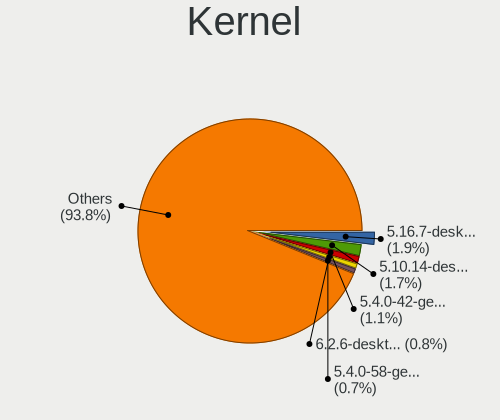
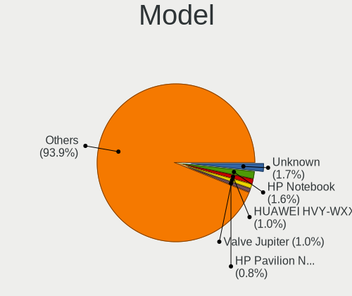
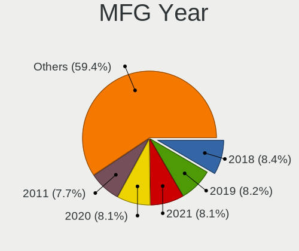
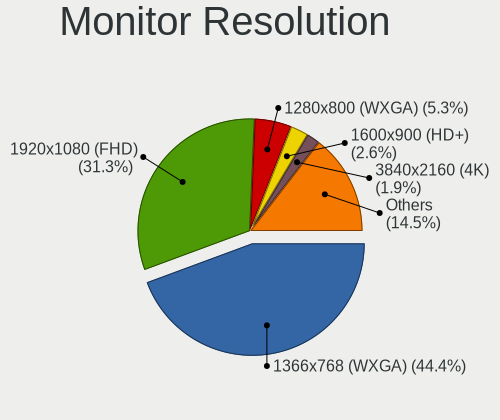
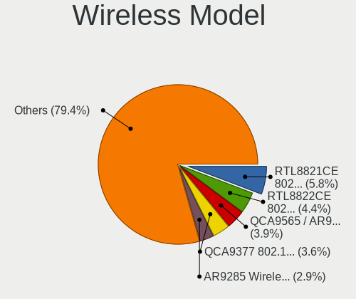

Linux in Mexico - Tested Hardware & Statistics (Notebooks)
----------------------------------------------------------

A project to collect tested hardware configurations for Linux in Mexico.

Anyone can contribute to this report by the [hw-probe](https://github.com/linuxhw/hw-probe) tool:

    sudo -E hw-probe -all -upload

Please contribute! Especially if your hardware is rare.

Contents
--------

* [ Test Cases ](#test-cases)

* [ System ](#system)
  - [ OS                       ](#os)
  - [ OS Family                ](#os-family)
  - [ Kernel                   ](#kernel)
  - [ Kernel Family            ](#kernel-family)
  - [ Kernel Major Ver.        ](#kernel-major-ver)
  - [ Arch                     ](#arch)
  - [ DE                       ](#de)
  - [ Display Server           ](#display-server)
  - [ Display Manager          ](#display-manager)
  - [ OS Lang                  ](#os-lang)
  - [ Boot Mode                ](#boot-mode)
  - [ Filesystem               ](#filesystem)
  - [ Part. scheme             ](#part-scheme)
  - [ Dual Boot with Linux/BSD ](#dual-boot-with-linuxbsd)
  - [ Dual Boot (Win)          ](#dual-boot-win)

* [ Board ](#board)
  - [ Vendor                   ](#vendor)
  - [ Model                    ](#model)
  - [ Model Family             ](#model-family)
  - [ MFG Year                 ](#mfg-year)
  - [ Form Factor              ](#form-factor)
  - [ Secure Boot              ](#secure-boot)
  - [ Coreboot                 ](#coreboot)
  - [ RAM Size                 ](#ram-size)
  - [ RAM Used                 ](#ram-used)
  - [ Total Drives             ](#total-drives)
  - [ Has CD-ROM               ](#has-cd-rom)
  - [ Has Ethernet             ](#has-ethernet)
  - [ Has WiFi                 ](#has-wifi)
  - [ Has Bluetooth            ](#has-bluetooth)

* [ Location ](#location)
  - [ Country                  ](#country)
  - [ City                     ](#city)

* [ Drives ](#drives)
  - [ Drive Vendor             ](#drive-vendor)
  - [ Drive Model              ](#drive-model)
  - [ HDD Vendor               ](#hdd-vendor)
  - [ SSD Vendor               ](#ssd-vendor)
  - [ Drive Kind               ](#drive-kind)
  - [ Drive Connector          ](#drive-connector)
  - [ Drive Size               ](#drive-size)
  - [ Space Total              ](#space-total)
  - [ Space Used               ](#space-used)
  - [ Malfunc. Drives          ](#malfunc-drives)
  - [ Malfunc. Drive Vendor    ](#malfunc-drive-vendor)
  - [ Malfunc. HDD Vendor      ](#malfunc-hdd-vendor)
  - [ Malfunc. Drive Kind      ](#malfunc-drive-kind)
  - [ Failed Drives            ](#failed-drives)
  - [ Failed Drive Vendor      ](#failed-drive-vendor)
  - [ Drive Status             ](#drive-status)

* [ Storage controller ](#storage-controller)
  - [ Storage Vendor           ](#storage-vendor)
  - [ Storage Model            ](#storage-model)
  - [ Storage Kind             ](#storage-kind)

* [ Processor ](#processor)
  - [ CPU Vendor               ](#cpu-vendor)
  - [ CPU Model                ](#cpu-model)
  - [ CPU Model Family         ](#cpu-model-family)
  - [ CPU Cores                ](#cpu-cores)
  - [ CPU Sockets              ](#cpu-sockets)
  - [ CPU Threads              ](#cpu-threads)
  - [ CPU Op-Modes             ](#cpu-op-modes)
  - [ CPU Microcode            ](#cpu-microcode)
  - [ CPU Microarch            ](#cpu-microarch)

* [ Graphics ](#graphics)
  - [ GPU Vendor               ](#gpu-vendor)
  - [ GPU Model                ](#gpu-model)
  - [ GPU Combo                ](#gpu-combo)
  - [ GPU Driver               ](#gpu-driver)
  - [ GPU Memory               ](#gpu-memory)

* [ Monitor ](#monitor)
  - [ Monitor Vendor           ](#monitor-vendor)
  - [ Monitor Model            ](#monitor-model)
  - [ Monitor Resolution       ](#monitor-resolution)
  - [ Monitor Diagonal         ](#monitor-diagonal)
  - [ Monitor Width            ](#monitor-width)
  - [ Aspect Ratio             ](#aspect-ratio)
  - [ Monitor Area             ](#monitor-area)
  - [ Pixel Density            ](#pixel-density)
  - [ Multiple Monitors        ](#multiple-monitors)

* [ Network ](#network)
  - [ Net Controller Vendor    ](#net-controller-vendor)
  - [ Net Controller Model     ](#net-controller-model)
  - [ Wireless Vendor          ](#wireless-vendor)
  - [ Wireless Model           ](#wireless-model)
  - [ Ethernet Vendor          ](#ethernet-vendor)
  - [ Ethernet Model           ](#ethernet-model)
  - [ Net Controller Kind      ](#net-controller-kind)
  - [ Used Controller          ](#used-controller)
  - [ NICs                     ](#nics)
  - [ IPv6                     ](#ipv6)

* [ Bluetooth ](#bluetooth)
  - [ Bluetooth Vendor         ](#bluetooth-vendor)
  - [ Bluetooth Model          ](#bluetooth-model)

* [ Sound ](#sound)
  - [ Sound Vendor             ](#sound-vendor)
  - [ Sound Model              ](#sound-model)

* [ Memory ](#memory)
  - [ Memory Vendor            ](#memory-vendor)
  - [ Memory Model             ](#memory-model)
  - [ Memory Kind              ](#memory-kind)
  - [ Memory Form Factor       ](#memory-form-factor)
  - [ Memory Size              ](#memory-size)
  - [ Memory Speed             ](#memory-speed)

* [ Printers & scanners ](#printers--scanners)
  - [ Printer Vendor           ](#printer-vendor)
  - [ Printer Model            ](#printer-model)
  - [ Scanner Vendor           ](#scanner-vendor)
  - [ Scanner Model            ](#scanner-model)

* [ Camera ](#camera)
  - [ Camera Vendor            ](#camera-vendor)
  - [ Camera Model             ](#camera-model)

* [ Security ](#security)
  - [ Fingerprint Vendor       ](#fingerprint-vendor)
  - [ Fingerprint Model        ](#fingerprint-model)
  - [ Chipcard Vendor          ](#chipcard-vendor)
  - [ Chipcard Model           ](#chipcard-model)

* [ Unsupported ](#unsupported)
  - [ Unsupported Devices      ](#unsupported-devices)
  - [ Unsupported Device Types ](#unsupported-device-types)

Test Cases
----------

Total: 2620

| Vendor        | Model                       | Probe                                                      | Date         |
|---------------|-----------------------------|------------------------------------------------------------|--------------|
| Toshiba       | Satellite L55-C             | [f32d9dc51a](https://linux-hardware.org/?probe=f32d9dc51a) | Feb 02, 2024 |
| HP            | Pavilion dv4                | [09400a55bb](https://linux-hardware.org/?probe=09400a55bb) | Feb 01, 2024 |
| Lenovo        | IdeaPad 300-17ISK 80QH      | [4f9b6c7262](https://linux-hardware.org/?probe=4f9b6c7262) | Jan 31, 2024 |
| Lenovo        | IdeaPad 3 14ALC6 82KT       | [40f306477e](https://linux-hardware.org/?probe=40f306477e) | Jan 31, 2024 |
| Lenovo        | IdeaPad 300-17ISK 80QH      | [0e068176e4](https://linux-hardware.org/?probe=0e068176e4) | Jan 31, 2024 |
| Lenovo        | IdeaPad 3 14ALC6 82KT       | [25fe740321](https://linux-hardware.org/?probe=25fe740321) | Jan 30, 2024 |
| Dell          | Inspiron 1545               | [3cffc989aa](https://linux-hardware.org/?probe=3cffc989aa) | Jan 29, 2024 |
| Dell          | Inspiron 1545               | [31ce3ae751](https://linux-hardware.org/?probe=31ce3ae751) | Jan 29, 2024 |
| HUAWEI        | NbDE-WXX9                   | [39f2e4dc9e](https://linux-hardware.org/?probe=39f2e4dc9e) | Jan 29, 2024 |
| HUAWEI        | NbDE-WXX9                   | [bf90b37fe4](https://linux-hardware.org/?probe=bf90b37fe4) | Jan 29, 2024 |
| HP            | Laptop 15-da0xxx            | [0001a7672a](https://linux-hardware.org/?probe=0001a7672a) | Jan 29, 2024 |
| Lenovo        | IdeaPad 3 15IML05 81WB      | [67781b5f97](https://linux-hardware.org/?probe=67781b5f97) | Jan 28, 2024 |
| Lenovo        | ThinkPad E14 Gen 2 20T7S... | [32f526010e](https://linux-hardware.org/?probe=32f526010e) | Jan 27, 2024 |
| VPU Compan... | VWNC71429-S                 | [5f72f42958](https://linux-hardware.org/?probe=5f72f42958) | Jan 27, 2024 |
| Lenovo        | ThinkPad T430s 2356GRS      | [c12736937f](https://linux-hardware.org/?probe=c12736937f) | Jan 26, 2024 |
| Apple         | MacBookPro9,2               | [5591f82595](https://linux-hardware.org/?probe=5591f82595) | Jan 26, 2024 |
| Acer          | Aspire ES1-531              | [7faffb7f83](https://linux-hardware.org/?probe=7faffb7f83) | Jan 25, 2024 |
| Lenovo        | IdeaPad 330S-15IKB 81F5     | [3361cf9ae9](https://linux-hardware.org/?probe=3361cf9ae9) | Jan 23, 2024 |
| ASUSTek       | ROG Zephyrus M16 GU603ZW... | [7ea2706c0f](https://linux-hardware.org/?probe=7ea2706c0f) | Jan 23, 2024 |
| HP            | 240 G7 Notebook PC          | [5225ed2250](https://linux-hardware.org/?probe=5225ed2250) | Jan 22, 2024 |
| Dell          | Inspiron 5559               | [a0c06abcbd](https://linux-hardware.org/?probe=a0c06abcbd) | Jan 22, 2024 |
| Lenovo        | ThinkPad T480 20L6S3ED18    | [63d8796a60](https://linux-hardware.org/?probe=63d8796a60) | Jan 20, 2024 |
| Lenovo        | G40-80 80E4                 | [d03cd5d338](https://linux-hardware.org/?probe=d03cd5d338) | Jan 19, 2024 |
| HP            | Victus by Gaming Laptop ... | [3dfc03f457](https://linux-hardware.org/?probe=3dfc03f457) | Jan 19, 2024 |
| HP            | Victus by Gaming Laptop ... | [f3ce87bc3c](https://linux-hardware.org/?probe=f3ce87bc3c) | Jan 19, 2024 |
| Acer          | Aspire F5-573               | [9a2df369e8](https://linux-hardware.org/?probe=9a2df369e8) | Jan 19, 2024 |
| HP            | Laptop 14-dq1xxx            | [048c8842d1](https://linux-hardware.org/?probe=048c8842d1) | Jan 19, 2024 |
| Lenovo        | G40-80 80E4                 | [b32403a45f](https://linux-hardware.org/?probe=b32403a45f) | Jan 16, 2024 |
| Lenovo        | IdeaPad Slim 5 14ABR8 82... | [7398e123b9](https://linux-hardware.org/?probe=7398e123b9) | Jan 16, 2024 |
| Lenovo        | IdeaPad Slim 5 14ABR8 82... | [0fee6d88f1](https://linux-hardware.org/?probe=0fee6d88f1) | Jan 15, 2024 |
| Lenovo        | ThinkPad P15v Gen 1 20TR... | [3382b10d32](https://linux-hardware.org/?probe=3382b10d32) | Jan 14, 2024 |
| Apple         | MacBookPro8,1               | [56c544af3a](https://linux-hardware.org/?probe=56c544af3a) | Jan 12, 2024 |
| Apple         | MacBookPro8,1               | [a245d0825c](https://linux-hardware.org/?probe=a245d0825c) | Jan 11, 2024 |
| Lenovo        | IdeaPad 330-15AST 81D6      | [5479dc0213](https://linux-hardware.org/?probe=5479dc0213) | Jan 11, 2024 |
| Lenovo        | IdeaPad 330-15AST 81D6      | [48bddf33da](https://linux-hardware.org/?probe=48bddf33da) | Jan 11, 2024 |
| Dell          | Precision 7720              | [7466090144](https://linux-hardware.org/?probe=7466090144) | Jan 11, 2024 |
| Toshiba       | Satellite A215              | [486dfc11fe](https://linux-hardware.org/?probe=486dfc11fe) | Jan 11, 2024 |
| ASUSTek       | N56JR                       | [513c456753](https://linux-hardware.org/?probe=513c456753) | Jan 11, 2024 |
| Dell          | Inspiron N5110              | [1665424e63](https://linux-hardware.org/?probe=1665424e63) | Jan 10, 2024 |
| Toshiba       | Satellite L845              | [e45e9517b3](https://linux-hardware.org/?probe=e45e9517b3) | Jan 10, 2024 |
| Dell          | Inspiron N5110              | [5e233e08dc](https://linux-hardware.org/?probe=5e233e08dc) | Jan 10, 2024 |
| HP            | ENVY Laptop 13-ah0xxx       | [8fde8d2ee6](https://linux-hardware.org/?probe=8fde8d2ee6) | Jan 09, 2024 |
| HP            | Laptop 15-ef1xxx            | [ab9812dca2](https://linux-hardware.org/?probe=ab9812dca2) | Jan 08, 2024 |
| ASUSTek       | Unknown                     | [1a45402238](https://linux-hardware.org/?probe=1a45402238) | Jan 08, 2024 |
| Toshiba       | Satellite L655              | [29fa7bdb5e](https://linux-hardware.org/?probe=29fa7bdb5e) | Jan 08, 2024 |
| Lenovo        | IdeaPad 3 14ALC6 82KT       | [0fbaacab13](https://linux-hardware.org/?probe=0fbaacab13) | Jan 07, 2024 |
| Lenovo        | ThinkPad E14 Gen 2 20T7S... | [e26a035827](https://linux-hardware.org/?probe=e26a035827) | Jan 07, 2024 |
| Toshiba       | Satellite L55D-B            | [e0358ccedc](https://linux-hardware.org/?probe=e0358ccedc) | Jan 06, 2024 |
| Lenovo        | V14 G2 ALC 82KC             | [42bd246eae](https://linux-hardware.org/?probe=42bd246eae) | Jan 05, 2024 |
| HP            | Laptop 15-ef1xxx            | [3f8d3f0aec](https://linux-hardware.org/?probe=3f8d3f0aec) | Jan 04, 2024 |
| Toshiba       | Satellite L635              | [c32ce4ff4d](https://linux-hardware.org/?probe=c32ce4ff4d) | Jan 04, 2024 |
| Acer          | Aspire A315-21              | [7d4f4c0cbc](https://linux-hardware.org/?probe=7d4f4c0cbc) | Jan 04, 2024 |
| Lenovo        | V14 G2 ALC 82KC             | [ab04c74157](https://linux-hardware.org/?probe=ab04c74157) | Jan 02, 2024 |
| Lenovo        | V14 G2 ALC 82KC             | [8250c46efe](https://linux-hardware.org/?probe=8250c46efe) | Jan 02, 2024 |
| Lenovo        | V14 G2 ALC 82KC             | [57cd074cfd](https://linux-hardware.org/?probe=57cd074cfd) | Jan 02, 2024 |
| Apple         | MacBookPro7,1               | [9181cf5581](https://linux-hardware.org/?probe=9181cf5581) | Jan 01, 2024 |
| Lenovo        | ThinkPad E14 Gen 2 20T7S... | [6a6513cf92](https://linux-hardware.org/?probe=6a6513cf92) | Jan 01, 2024 |
| Google        | Blorb                       | [4e0c068a82](https://linux-hardware.org/?probe=4e0c068a82) | Dec 30, 2023 |
| HP            | ENVY m4                     | [6416f24210](https://linux-hardware.org/?probe=6416f24210) | Dec 30, 2023 |
| Lenovo        | ThinkPad E14 Gen 2 20T7S... | [394c35d74b](https://linux-hardware.org/?probe=394c35d74b) | Dec 30, 2023 |
| HP            | ENVY m4                     | [f0cd285399](https://linux-hardware.org/?probe=f0cd285399) | Dec 30, 2023 |
| Razer         | Blade                       | [87f8a27b0a](https://linux-hardware.org/?probe=87f8a27b0a) | Dec 29, 2023 |
| Lenovo        | ThinkPad E14 Gen 2 20T7S... | [d5ac5fcf72](https://linux-hardware.org/?probe=d5ac5fcf72) | Dec 29, 2023 |
| Lenovo        | 3000 N500 42333GS           | [523a81b813](https://linux-hardware.org/?probe=523a81b813) | Dec 29, 2023 |
| Gateway       | MX3235m                     | [074b414446](https://linux-hardware.org/?probe=074b414446) | Dec 28, 2023 |
| Gateway       | MX3235m                     | [283075fa43](https://linux-hardware.org/?probe=283075fa43) | Dec 28, 2023 |
| Dell          | Latitude 3380               | [4f9660f132](https://linux-hardware.org/?probe=4f9660f132) | Dec 28, 2023 |
| Dell          | Latitude 3380               | [bb1422b9bd](https://linux-hardware.org/?probe=bb1422b9bd) | Dec 28, 2023 |
| Lenovo        | ThinkPad E14 Gen 2 20T7S... | [341b25443b](https://linux-hardware.org/?probe=341b25443b) | Dec 28, 2023 |
| Lenovo        | IdeaPad 1 14IGL7 82V6       | [82dda49ee8](https://linux-hardware.org/?probe=82dda49ee8) | Dec 27, 2023 |
| Lenovo        | IdeaPad S145-14API 81UV     | [bd8145e3db](https://linux-hardware.org/?probe=bd8145e3db) | Dec 27, 2023 |
| HP            | ZBook Studio G7 Mobile W... | [df9f1cce5b](https://linux-hardware.org/?probe=df9f1cce5b) | Dec 27, 2023 |
| Lenovo        | ThinkPad E14 Gen 2 20TBS... | [626b056720](https://linux-hardware.org/?probe=626b056720) | Dec 27, 2023 |
| Apple         | MacBookPro13,1              | [63344458c9](https://linux-hardware.org/?probe=63344458c9) | Dec 26, 2023 |
| ASUSTek       | X550DP                      | [c7758c21ce](https://linux-hardware.org/?probe=c7758c21ce) | Dec 26, 2023 |
| ASUSTek       | X550DP                      | [a456e712b7](https://linux-hardware.org/?probe=a456e712b7) | Dec 26, 2023 |
| HP            | ENVY Notebook               | [6ffaa62d3d](https://linux-hardware.org/?probe=6ffaa62d3d) | Dec 26, 2023 |
| Lenovo        | Legion Y530-15ICH 81FV      | [53e2517636](https://linux-hardware.org/?probe=53e2517636) | Dec 26, 2023 |
| Lenovo        | ThinkPad E14 Gen 2 20T7S... | [34060a7062](https://linux-hardware.org/?probe=34060a7062) | Dec 26, 2023 |
| HP            | Pavilion dm4                | [f077672580](https://linux-hardware.org/?probe=f077672580) | Dec 25, 2023 |
| Apple         | MacBookPro13,1              | [555e444fe5](https://linux-hardware.org/?probe=555e444fe5) | Dec 25, 2023 |
| ASUSTek       | X411UN                      | [c0cf1b362d](https://linux-hardware.org/?probe=c0cf1b362d) | Dec 25, 2023 |
| Lenovo        | ThinkPad T400 6474AV5       | [b98f0a2c09](https://linux-hardware.org/?probe=b98f0a2c09) | Dec 24, 2023 |
| Acer          | Aspire 5250                 | [224ca602f3](https://linux-hardware.org/?probe=224ca602f3) | Dec 24, 2023 |
| Gateway       | NV59C                       | [1537866140](https://linux-hardware.org/?probe=1537866140) | Dec 23, 2023 |
| Unknown       | W1415A                      | [f1fbd72c23](https://linux-hardware.org/?probe=f1fbd72c23) | Dec 23, 2023 |
| Gateway       | NV59C                       | [62d62c0a3b](https://linux-hardware.org/?probe=62d62c0a3b) | Dec 22, 2023 |
| HP            | ENVY Notebook               | [ca2e6f9061](https://linux-hardware.org/?probe=ca2e6f9061) | Dec 22, 2023 |
| Google        | Bobba                       | [c0e8038184](https://linux-hardware.org/?probe=c0e8038184) | Dec 22, 2023 |
| Google        | Bobba                       | [c03b219f2e](https://linux-hardware.org/?probe=c03b219f2e) | Dec 22, 2023 |
| Dell          | Inspiron 3541               | [67f350fefc](https://linux-hardware.org/?probe=67f350fefc) | Dec 21, 2023 |
| Lenovo        | ThinkPad E14 Gen 2 20T7S... | [00b16e835d](https://linux-hardware.org/?probe=00b16e835d) | Dec 20, 2023 |
| Lenovo        | ThinkPad E14 Gen 2 20T7S... | [0b6e9c4c26](https://linux-hardware.org/?probe=0b6e9c4c26) | Dec 20, 2023 |
| Dell          | G7 7700                     | [506de63cb5](https://linux-hardware.org/?probe=506de63cb5) | Dec 20, 2023 |
| HP            | EliteBook 8460p             | [38ac246006](https://linux-hardware.org/?probe=38ac246006) | Dec 19, 2023 |
| Toshiba       | NB505                       | [7aa351f4c3](https://linux-hardware.org/?probe=7aa351f4c3) | Dec 19, 2023 |
| Toshiba       | NB505                       | [9ed9ded2ea](https://linux-hardware.org/?probe=9ed9ded2ea) | Dec 19, 2023 |
| HP            | ZBook Studio G7 Mobile W... | [b0526a42f4](https://linux-hardware.org/?probe=b0526a42f4) | Dec 18, 2023 |
| HP            | Compaq CQ45                 | [2d0f39803d](https://linux-hardware.org/?probe=2d0f39803d) | Dec 17, 2023 |
| HP            | EliteBook 8460p             | [e85c54f3fd](https://linux-hardware.org/?probe=e85c54f3fd) | Dec 17, 2023 |
| HUAWEI        | BoDE-WXX9                   | [e9f2e211bd](https://linux-hardware.org/?probe=e9f2e211bd) | Dec 16, 2023 |
| HP            | G60                         | [9fabfc936c](https://linux-hardware.org/?probe=9fabfc936c) | Dec 16, 2023 |
| Lenovo        | IdeaPad 3 15ADA05 81W1      | [734375c1cc](https://linux-hardware.org/?probe=734375c1cc) | Dec 14, 2023 |
| Lenovo        | IdeaPad 3 15ADA05 81W1      | [3eb792873c](https://linux-hardware.org/?probe=3eb792873c) | Dec 14, 2023 |
| Dell          | Inspiron 3501               | [67a35f1dd7](https://linux-hardware.org/?probe=67a35f1dd7) | Dec 10, 2023 |
| Lenovo        | IdeaPad 330S-15IKB 81F5     | [5a75d4827a](https://linux-hardware.org/?probe=5a75d4827a) | Dec 10, 2023 |
| Dell          | Latitude 3480               | [ee6070cfbe](https://linux-hardware.org/?probe=ee6070cfbe) | Dec 09, 2023 |
| HP            | Compaq 6720s                | [63200c945b](https://linux-hardware.org/?probe=63200c945b) | Dec 08, 2023 |
| HUAWEI        | BoDE-WXX9                   | [44e608daff](https://linux-hardware.org/?probe=44e608daff) | Dec 08, 2023 |
| VPU Compan... | VWNC71429-S                 | [c0b0f86403](https://linux-hardware.org/?probe=c0b0f86403) | Dec 07, 2023 |
| Dell          | System Inspiron N4110       | [72874bcc85](https://linux-hardware.org/?probe=72874bcc85) | Dec 07, 2023 |
| MSI           | GF63 Thin 10SC              | [9c8600990d](https://linux-hardware.org/?probe=9c8600990d) | Dec 07, 2023 |
| Valve         | Jupiter                     | [bbb500139e](https://linux-hardware.org/?probe=bbb500139e) | Dec 07, 2023 |
| HP            | EliteBook 8460p             | [747cf33a22](https://linux-hardware.org/?probe=747cf33a22) | Dec 06, 2023 |
| HP            | ENVY Notebook               | [26a4295a68](https://linux-hardware.org/?probe=26a4295a68) | Dec 06, 2023 |
| ASUSTek       | X556UQK                     | [de505ab1fd](https://linux-hardware.org/?probe=de505ab1fd) | Dec 05, 2023 |
| Toshiba       | Satellite S75-B             | [dbec4c564e](https://linux-hardware.org/?probe=dbec4c564e) | Dec 05, 2023 |
| Valve         | Jupiter                     | [2a17ca7efe](https://linux-hardware.org/?probe=2a17ca7efe) | Dec 05, 2023 |
| Acer          | Aspire A515-55              | [0c467a2af3](https://linux-hardware.org/?probe=0c467a2af3) | Dec 04, 2023 |
| HP            | Laptop 17t-cn200            | [26c356c486](https://linux-hardware.org/?probe=26c356c486) | Dec 04, 2023 |
| Lenovo        | ThinkPad X1 Carbon Gen 1... | [30c19ab13f](https://linux-hardware.org/?probe=30c19ab13f) | Dec 04, 2023 |
| Gateway       | M-6812M                     | [008f6448dc](https://linux-hardware.org/?probe=008f6448dc) | Dec 03, 2023 |
| GPU Compan... | GWNR71517                   | [4f3cfed57b](https://linux-hardware.org/?probe=4f3cfed57b) | Dec 02, 2023 |
| HP            | Compaq 6910p (GY174UP#AB... | [54f08c139f](https://linux-hardware.org/?probe=54f08c139f) | Dec 02, 2023 |
| HP            | Laptop 15-da0xxx            | [6aff076a55](https://linux-hardware.org/?probe=6aff076a55) | Dec 01, 2023 |
| Toshiba       | Satellite A215              | [dcde3a9390](https://linux-hardware.org/?probe=dcde3a9390) | Dec 01, 2023 |
| Dell          | Latitude 3480               | [f83ad2bb01](https://linux-hardware.org/?probe=f83ad2bb01) | Nov 30, 2023 |
| Dell          | Latitude E6420              | [12b36e0bb9](https://linux-hardware.org/?probe=12b36e0bb9) | Nov 30, 2023 |
| PC Special... | Recoil 16                   | [3dd3569b17](https://linux-hardware.org/?probe=3dd3569b17) | Nov 29, 2023 |
| ASUSTek       | X441NA                      | [6965a13f84](https://linux-hardware.org/?probe=6965a13f84) | Nov 29, 2023 |
| HP            | 245 G4 Notebook PC          | [ef0bb61d83](https://linux-hardware.org/?probe=ef0bb61d83) | Nov 27, 2023 |
| HP            | 245 G4 Notebook PC          | [4a48fe8985](https://linux-hardware.org/?probe=4a48fe8985) | Nov 27, 2023 |
| Unknown       | Apple MacBook Pro (14-in... | [54e171f5dc](https://linux-hardware.org/?probe=54e171f5dc) | Nov 27, 2023 |
| HP            | EliteBook 745 G4            | [c3c18efc38](https://linux-hardware.org/?probe=c3c18efc38) | Nov 27, 2023 |
| HP            | G42                         | [b53c2fe1be](https://linux-hardware.org/?probe=b53c2fe1be) | Nov 27, 2023 |
| HUAWEI        | BOM-WXX9                    | [13c14b2399](https://linux-hardware.org/?probe=13c14b2399) | Nov 27, 2023 |
| HP            | EliteBook 745 G4            | [33d8baae78](https://linux-hardware.org/?probe=33d8baae78) | Nov 26, 2023 |
| Apple         | MacBook5,1                  | [9e05915f77](https://linux-hardware.org/?probe=9e05915f77) | Nov 26, 2023 |
| Apple         | MacBook5,1                  | [ff1af2d7d2](https://linux-hardware.org/?probe=ff1af2d7d2) | Nov 26, 2023 |
| Unknown       | Apple MacBook Pro (14-in... | [c68a8b3cc0](https://linux-hardware.org/?probe=c68a8b3cc0) | Nov 25, 2023 |
| HUAWEI        | HVY-WXX9                    | [e17bdfe79f](https://linux-hardware.org/?probe=e17bdfe79f) | Nov 25, 2023 |
| Lenovo        | IdeaPad 1 15AMN7 82VG       | [5cbdf33238](https://linux-hardware.org/?probe=5cbdf33238) | Nov 25, 2023 |
| HP            | Laptop 15-da0xxx            | [ea0a7aa615](https://linux-hardware.org/?probe=ea0a7aa615) | Nov 24, 2023 |
| Lenovo        | IdeaPad Slim 5 14ABR8 82... | [432ec62dd0](https://linux-hardware.org/?probe=432ec62dd0) | Nov 24, 2023 |
| Samsung       | 300V3A/300V4A/300V5A/200... | [85f5270891](https://linux-hardware.org/?probe=85f5270891) | Nov 23, 2023 |
| Lenovo        | IdeaPad Slim 3 15IAN8 82... | [8b107cb438](https://linux-hardware.org/?probe=8b107cb438) | Nov 23, 2023 |
| HUAWEI        | NbDE-WXX9                   | [c5d9332805](https://linux-hardware.org/?probe=c5d9332805) | Nov 23, 2023 |
| HUAWEI        | NBLK-WAX9X                  | [522acd0620](https://linux-hardware.org/?probe=522acd0620) | Nov 22, 2023 |
| Lenovo        | IdeaPad 1 15AMN7 82VG       | [6b88b81e69](https://linux-hardware.org/?probe=6b88b81e69) | Nov 21, 2023 |
| Lenovo        | IdeaPad 3 14ALC6 82KT       | [7273b32790](https://linux-hardware.org/?probe=7273b32790) | Nov 20, 2023 |
| Alienware     | m15 R7 AMD                  | [cc1ff7f9a8](https://linux-hardware.org/?probe=cc1ff7f9a8) | Nov 18, 2023 |
| Dell          | Inspiron 15 3515            | [c526bb7fac](https://linux-hardware.org/?probe=c526bb7fac) | Nov 17, 2023 |
| Dell          | Inspiron 15 3515            | [ea21fd1e60](https://linux-hardware.org/?probe=ea21fd1e60) | Nov 17, 2023 |
| Dell          | Latitude 5520               | [234733a1e4](https://linux-hardware.org/?probe=234733a1e4) | Nov 17, 2023 |
| Dell          | System XPS L502X            | [33f54ee5dc](https://linux-hardware.org/?probe=33f54ee5dc) | Nov 16, 2023 |
| Lenovo        | IdeaPad 5 14ITL05 82FE      | [3e6ad056d6](https://linux-hardware.org/?probe=3e6ad056d6) | Nov 16, 2023 |
| Dell          | Precision 7520              | [f004d80157](https://linux-hardware.org/?probe=f004d80157) | Nov 16, 2023 |
| Acer          | Aspire ES1-512              | [03c6bfd1ee](https://linux-hardware.org/?probe=03c6bfd1ee) | Nov 15, 2023 |
| Acer          | Aspire ES1-512              | [41ae79ffa6](https://linux-hardware.org/?probe=41ae79ffa6) | Nov 15, 2023 |
| Apple         | MacBookPro5,5               | [870fedf2eb](https://linux-hardware.org/?probe=870fedf2eb) | Nov 15, 2023 |
| Dell          | Latitude 7390 2-in-1        | [f92b2d58ec](https://linux-hardware.org/?probe=f92b2d58ec) | Nov 14, 2023 |
| ASUSTek       | X555QG                      | [243bc51d12](https://linux-hardware.org/?probe=243bc51d12) | Nov 14, 2023 |
| Unknown       | Unknown                     | [f9ee628d93](https://linux-hardware.org/?probe=f9ee628d93) | Nov 13, 2023 |
| Apple         | MacBookPro5,5               | [87e3c4fa90](https://linux-hardware.org/?probe=87e3c4fa90) | Nov 12, 2023 |
| Valve         | Jupiter                     | [1f6282ce11](https://linux-hardware.org/?probe=1f6282ce11) | Nov 12, 2023 |
| HUAWEI        | NBM-WXX9                    | [0c76c82295](https://linux-hardware.org/?probe=0c76c82295) | Nov 11, 2023 |
| HP            | Pavilion Notebook           | [164a2ae911](https://linux-hardware.org/?probe=164a2ae911) | Nov 10, 2023 |
| HP            | Pavilion Laptop 15-cw0xx... | [71b28a2547](https://linux-hardware.org/?probe=71b28a2547) | Nov 10, 2023 |
| HP            | Pavilion Laptop 15-cw0xx... | [89417204e0](https://linux-hardware.org/?probe=89417204e0) | Nov 09, 2023 |
| Lenovo        | IdeaPad Slim 5 14ABR8 82... | [4af4346c2a](https://linux-hardware.org/?probe=4af4346c2a) | Nov 09, 2023 |
| Lenovo        | IdeaPad Slim 5 14ABR8 82... | [745cc9650d](https://linux-hardware.org/?probe=745cc9650d) | Nov 08, 2023 |
| MACHENIKE     | L16P                        | [c8e67672f3](https://linux-hardware.org/?probe=c8e67672f3) | Nov 08, 2023 |
| Apple         | MacBook5,1                  | [ed339d2cbb](https://linux-hardware.org/?probe=ed339d2cbb) | Nov 08, 2023 |
| HP            | ZBook Studio G7 Mobile W... | [5cfd80c832](https://linux-hardware.org/?probe=5cfd80c832) | Nov 08, 2023 |
| HP            | ZBook Studio G7 Mobile W... | [675571ef30](https://linux-hardware.org/?probe=675571ef30) | Nov 08, 2023 |
| ASUSTek       | VivoBook_ASUSLaptop X515... | [b3df6b76e8](https://linux-hardware.org/?probe=b3df6b76e8) | Nov 08, 2023 |
| Acer          | Aspire ES1-531              | [9fd8344477](https://linux-hardware.org/?probe=9fd8344477) | Nov 07, 2023 |
| HP            | Pavilion Plus Laptop 14-... | [5cfef4c0b7](https://linux-hardware.org/?probe=5cfef4c0b7) | Nov 06, 2023 |
| HP            | Pavilion Plus Laptop 14-... | [f1d9fe0bb7](https://linux-hardware.org/?probe=f1d9fe0bb7) | Nov 06, 2023 |
| HP            | Pavilion Laptop 15-cw0xx... | [279f1b8b4f](https://linux-hardware.org/?probe=279f1b8b4f) | Nov 05, 2023 |
| American M... | A6                          | [4ff43d7d31](https://linux-hardware.org/?probe=4ff43d7d31) | Nov 04, 2023 |
| Lenovo        | IdeaPad 1 15AMN7 82VG       | [6c0dc28b9f](https://linux-hardware.org/?probe=6c0dc28b9f) | Nov 03, 2023 |
| HUAWEI        | BOM-WXX9                    | [97ca7a0bfd](https://linux-hardware.org/?probe=97ca7a0bfd) | Nov 02, 2023 |
| Alienware     | 14                          | [3d3be9ce75](https://linux-hardware.org/?probe=3d3be9ce75) | Nov 01, 2023 |
| Toshiba       | Satellite A215              | [de8e05d9e3](https://linux-hardware.org/?probe=de8e05d9e3) | Nov 01, 2023 |
| Toshiba       | Satellite A215              | [4c2cc71fc2](https://linux-hardware.org/?probe=4c2cc71fc2) | Nov 01, 2023 |
| ONE-NETBOO... | ONE XPLAYER 1002-C          | [b89ceef38d](https://linux-hardware.org/?probe=b89ceef38d) | Nov 01, 2023 |
| Dell          | Latitude 5480               | [1bf5aeba87](https://linux-hardware.org/?probe=1bf5aeba87) | Nov 01, 2023 |
| HP            | Pavilion Laptop 15-cw0xx... | [d7b08bbbab](https://linux-hardware.org/?probe=d7b08bbbab) | Nov 01, 2023 |
| Toshiba       | Satellite L845              | [90e266bd8e](https://linux-hardware.org/?probe=90e266bd8e) | Oct 31, 2023 |
| Lenovo        | IdeaPad 3 14ALC6 82KT       | [17f4f01635](https://linux-hardware.org/?probe=17f4f01635) | Oct 30, 2023 |
| Lenovo        | B40-45 20394                | [ef45bdcea9](https://linux-hardware.org/?probe=ef45bdcea9) | Oct 28, 2023 |
| HP            | 6360t                       | [d0f94e770b](https://linux-hardware.org/?probe=d0f94e770b) | Oct 28, 2023 |
| Dell          | Inspiron 3451               | [2c1267e536](https://linux-hardware.org/?probe=2c1267e536) | Oct 27, 2023 |
| HP            | Notebook                    | [b6f188a1fe](https://linux-hardware.org/?probe=b6f188a1fe) | Oct 27, 2023 |
| HUAWEI        | KLVL-WXXW                   | [303c4197c7](https://linux-hardware.org/?probe=303c4197c7) | Oct 26, 2023 |
| Lenovo        | ThinkPad T480 20L6S29D00    | [b270ca3670](https://linux-hardware.org/?probe=b270ca3670) | Oct 24, 2023 |
| Apple         | MacBookPro5,5               | [ed7e1a1932](https://linux-hardware.org/?probe=ed7e1a1932) | Oct 24, 2023 |
| Apple         | MacBookPro5,5               | [37be8caf53](https://linux-hardware.org/?probe=37be8caf53) | Oct 23, 2023 |
| Acer          | Aspire R3-431T              | [eb6c623c2d](https://linux-hardware.org/?probe=eb6c623c2d) | Oct 23, 2023 |
| Lenovo        | ThinkPad T470 W10DG 20JN... | [2e4786bb32](https://linux-hardware.org/?probe=2e4786bb32) | Oct 23, 2023 |
| Apple         | MacBookPro8,1               | [fde726622c](https://linux-hardware.org/?probe=fde726622c) | Oct 22, 2023 |
| Apple         | MacBookPro8,1               | [116946c81c](https://linux-hardware.org/?probe=116946c81c) | Oct 22, 2023 |
| HP            | Notebook                    | [e8c7b38b1b](https://linux-hardware.org/?probe=e8c7b38b1b) | Oct 21, 2023 |
| Google        | Pirika                      | [98eea3bc0f](https://linux-hardware.org/?probe=98eea3bc0f) | Oct 20, 2023 |
| HP            | ProBook 655 G1              | [8e1cb99809](https://linux-hardware.org/?probe=8e1cb99809) | Oct 19, 2023 |
| ASUSTek       | Zenbook UX3402ZA_UX3402Z... | [4d4e3d82fd](https://linux-hardware.org/?probe=4d4e3d82fd) | Oct 18, 2023 |
| HP            | ProBook 655 G1              | [a80cd678f2](https://linux-hardware.org/?probe=a80cd678f2) | Oct 18, 2023 |
| Dell          | G7 7790                     | [250d61d6a7](https://linux-hardware.org/?probe=250d61d6a7) | Oct 18, 2023 |
| Apple         | MacBookPro6,2               | [036b6067b8](https://linux-hardware.org/?probe=036b6067b8) | Oct 18, 2023 |
| ASUSTek       | VivoBook_ASUSLaptop X509... | [04885ecaa3](https://linux-hardware.org/?probe=04885ecaa3) | Oct 18, 2023 |
| ASUSTek       | X200MA                      | [c1ea75561b](https://linux-hardware.org/?probe=c1ea75561b) | Oct 18, 2023 |
| HP            | OMEN Laptop 15-ek0xxx       | [501f7abc3b](https://linux-hardware.org/?probe=501f7abc3b) | Oct 18, 2023 |
| HUAWEI        | NBLK-WAX9X                  | [4593a22b63](https://linux-hardware.org/?probe=4593a22b63) | Oct 18, 2023 |
| Google        | Treeya                      | [1cf43225f5](https://linux-hardware.org/?probe=1cf43225f5) | Oct 17, 2023 |
| Google        | Treeya                      | [6f05b84b18](https://linux-hardware.org/?probe=6f05b84b18) | Oct 17, 2023 |
| HP            | 630                         | [db6efff83b](https://linux-hardware.org/?probe=db6efff83b) | Oct 16, 2023 |
| Apple         | MacBookPro9,2               | [fd91b9ece9](https://linux-hardware.org/?probe=fd91b9ece9) | Oct 16, 2023 |
| HP            | Laptop 15-dy2xxx            | [5079c96f33](https://linux-hardware.org/?probe=5079c96f33) | Oct 15, 2023 |
| Dell          | Inspiron 5575               | [c50573f4ae](https://linux-hardware.org/?probe=c50573f4ae) | Oct 14, 2023 |
| HP            | 240 G8 Notebook PC          | [df4a5a4722](https://linux-hardware.org/?probe=df4a5a4722) | Oct 14, 2023 |
| Dell          | Inspiron 1318               | [2ac81db219](https://linux-hardware.org/?probe=2ac81db219) | Oct 14, 2023 |
| Timi          | RedmiBook 13 R              | [a39c380c4f](https://linux-hardware.org/?probe=a39c380c4f) | Oct 13, 2023 |
| Sony          | VPCEB15EL                   | [f7a3de3793](https://linux-hardware.org/?probe=f7a3de3793) | Oct 13, 2023 |
| Lenovo        | IdeaPad 110-14IBR 80T6      | [94e6d9d3cb](https://linux-hardware.org/?probe=94e6d9d3cb) | Oct 13, 2023 |
| Lenovo        | IdeaPad 330S-15IKB 81F5     | [de2f74b12a](https://linux-hardware.org/?probe=de2f74b12a) | Oct 13, 2023 |
| Lenovo        | IdeaPad 3 14ALC6 82KT       | [fb51024b14](https://linux-hardware.org/?probe=fb51024b14) | Oct 13, 2023 |
| Apple         | MacBookPro9,2               | [27b7cf72ac](https://linux-hardware.org/?probe=27b7cf72ac) | Oct 13, 2023 |
| Lenovo        | G40-45 80E1                 | [365f77219e](https://linux-hardware.org/?probe=365f77219e) | Oct 11, 2023 |
| HP            | 240 G8 Notebook PC          | [d582dc334c](https://linux-hardware.org/?probe=d582dc334c) | Oct 11, 2023 |
| Apple         | MacBookPro9,2               | [f53b6f5e53](https://linux-hardware.org/?probe=f53b6f5e53) | Oct 11, 2023 |
| Dell          | Latitude E6440              | [7471faa299](https://linux-hardware.org/?probe=7471faa299) | Oct 10, 2023 |
| ASUSTek       | VivoBook_ASUS Laptop X50... | [7d759c245f](https://linux-hardware.org/?probe=7d759c245f) | Oct 10, 2023 |
| Dell          | XPS 15 9530                 | [e1ff6e4124](https://linux-hardware.org/?probe=e1ff6e4124) | Oct 08, 2023 |
| HP            | Pavilion g4                 | [83fd464aa8](https://linux-hardware.org/?probe=83fd464aa8) | Oct 08, 2023 |
| HP            | Pavilion g4                 | [035c4dbf68](https://linux-hardware.org/?probe=035c4dbf68) | Oct 08, 2023 |
| Toshiba       | Satellite A305D             | [d2fc1d1762](https://linux-hardware.org/?probe=d2fc1d1762) | Oct 07, 2023 |
| Thomson       | WWN15I5-8BK1T               | [10ca155743](https://linux-hardware.org/?probe=10ca155743) | Oct 06, 2023 |
| Acer          | Aspire E1-531               | [9d54872fa1](https://linux-hardware.org/?probe=9d54872fa1) | Oct 05, 2023 |
| Acer          | Aspire E1-531               | [ad0cc18353](https://linux-hardware.org/?probe=ad0cc18353) | Oct 05, 2023 |
| HUAWEI        | NBLB-WAX9N                  | [ef041058aa](https://linux-hardware.org/?probe=ef041058aa) | Oct 05, 2023 |
| HUAWEI        | NBLB-WAX9N                  | [75be134738](https://linux-hardware.org/?probe=75be134738) | Oct 05, 2023 |
| HP            | EliteBook 8460p             | [6be4af5bb3](https://linux-hardware.org/?probe=6be4af5bb3) | Oct 05, 2023 |
| Sony          | VPCEG10EL                   | [1c789caaec](https://linux-hardware.org/?probe=1c789caaec) | Oct 04, 2023 |
| HP            | Laptop 15-db0xxx            | [d2e42707c6](https://linux-hardware.org/?probe=d2e42707c6) | Oct 04, 2023 |
| Dell          | Latitude E6410              | [0b58de80dd](https://linux-hardware.org/?probe=0b58de80dd) | Oct 04, 2023 |
| ASUSTek       | Zenbook UX7602ZM_UX7602Z... | [cc7ba8c1ea](https://linux-hardware.org/?probe=cc7ba8c1ea) | Oct 03, 2023 |
| Lenovo        | IdeaPad 330S-15IKB 81F5     | [d91dd7bed6](https://linux-hardware.org/?probe=d91dd7bed6) | Oct 02, 2023 |
| Toshiba       | Satellite L735              | [c969a72669](https://linux-hardware.org/?probe=c969a72669) | Oct 01, 2023 |
| Apple         | MacBook4,1                  | [efc04e4b27](https://linux-hardware.org/?probe=efc04e4b27) | Oct 01, 2023 |
| Apple         | MacBook4,1                  | [d17d6d2b70](https://linux-hardware.org/?probe=d17d6d2b70) | Oct 01, 2023 |
| Sony          | VPCEG10EL                   | [8271942cc2](https://linux-hardware.org/?probe=8271942cc2) | Sep 30, 2023 |
| HP            | ENVY Laptop 13-ah0xxx       | [6f19668c91](https://linux-hardware.org/?probe=6f19668c91) | Sep 29, 2023 |
| Acer          | Aspire E1-531               | [6b981869d7](https://linux-hardware.org/?probe=6b981869d7) | Sep 27, 2023 |
| Sony          | VPCEG10EL                   | [7bfbe9b21d](https://linux-hardware.org/?probe=7bfbe9b21d) | Sep 27, 2023 |
| Acer          | Aspire E1-531               | [d47b59c89b](https://linux-hardware.org/?probe=d47b59c89b) | Sep 27, 2023 |
| Toshiba       | dynabook T350/46BW          | [26ffaa1c0f](https://linux-hardware.org/?probe=26ffaa1c0f) | Sep 27, 2023 |
| Acer          | Nitro AN515-44              | [0ba9157463](https://linux-hardware.org/?probe=0ba9157463) | Sep 27, 2023 |
| HP            | Pavilion 14                 | [a7589d8c93](https://linux-hardware.org/?probe=a7589d8c93) | Sep 26, 2023 |
| HP            | Pavilion 14                 | [1aed6aba04](https://linux-hardware.org/?probe=1aed6aba04) | Sep 26, 2023 |
| Lenovo        | ThinkPad T460 20FMS0RN1S    | [598d621f0d](https://linux-hardware.org/?probe=598d621f0d) | Sep 26, 2023 |
| HP            | EliteBook 840 G3            | [897f671915](https://linux-hardware.org/?probe=897f671915) | Sep 25, 2023 |
| Dell          | Latitude E5470              | [64c20e3e21](https://linux-hardware.org/?probe=64c20e3e21) | Sep 25, 2023 |
| HP            | Laptop 14-cm0xxx            | [2af47d0dca](https://linux-hardware.org/?probe=2af47d0dca) | Sep 24, 2023 |
| GPU Compan... | GWNR71517                   | [93b975d65b](https://linux-hardware.org/?probe=93b975d65b) | Sep 24, 2023 |
| Lenovo        | ThinkPad T440 20B6006DUS    | [4428a91f65](https://linux-hardware.org/?probe=4428a91f65) | Sep 23, 2023 |
| Lenovo        | ThinkPad P17 Gen 1 20SQS... | [05bf70d208](https://linux-hardware.org/?probe=05bf70d208) | Sep 22, 2023 |
| Dell          | Inspiron 1464               | [026e1e3391](https://linux-hardware.org/?probe=026e1e3391) | Sep 21, 2023 |
| Valve         | Jupiter                     | [2b2966eb3d](https://linux-hardware.org/?probe=2b2966eb3d) | Sep 21, 2023 |
| Dell          | Inspiron 1464               | [bdb084e4a8](https://linux-hardware.org/?probe=bdb084e4a8) | Sep 20, 2023 |
| Lenovo        | ThinkPad L420 78564ES       | [a6f3af802d](https://linux-hardware.org/?probe=a6f3af802d) | Sep 20, 2023 |
| Apple         | MacBookPro8,1               | [43edd5f49f](https://linux-hardware.org/?probe=43edd5f49f) | Sep 20, 2023 |
| ASUSTek       | X453MA                      | [8eacbd2f7a](https://linux-hardware.org/?probe=8eacbd2f7a) | Sep 19, 2023 |
| HP            | ProBook 6475b               | [43c4870e11](https://linux-hardware.org/?probe=43c4870e11) | Sep 19, 2023 |
| HP            | Dragonfly Pro               | [0c5d439504](https://linux-hardware.org/?probe=0c5d439504) | Sep 18, 2023 |
| Dell          | Inspiron 1464               | [9830a0345b](https://linux-hardware.org/?probe=9830a0345b) | Sep 17, 2023 |
| Lenovo        | Legion 5 15ARH05H 82B1      | [a53b964a47](https://linux-hardware.org/?probe=a53b964a47) | Sep 17, 2023 |
| Lenovo        | Legion 5 15ARH05H 82B1      | [648af5d937](https://linux-hardware.org/?probe=648af5d937) | Sep 17, 2023 |
| Dell          | Inspiron 5505               | [cf501dc9f9](https://linux-hardware.org/?probe=cf501dc9f9) | Sep 16, 2023 |
| Apple         | MacBookPro8,1               | [c3791ba730](https://linux-hardware.org/?probe=c3791ba730) | Sep 16, 2023 |
| A-DATA Tec... | XENIAXe15TI5G11GXELX        | [6c2fdbd791](https://linux-hardware.org/?probe=6c2fdbd791) | Sep 14, 2023 |
| Lenovo        | IdeaPad 3 14ALC6 82KT       | [361c6cb056](https://linux-hardware.org/?probe=361c6cb056) | Sep 14, 2023 |
| Toshiba       | Satellite L735              | [fee724f874](https://linux-hardware.org/?probe=fee724f874) | Sep 14, 2023 |
| Dell          | Inspiron 5537               | [4ff9edf944](https://linux-hardware.org/?probe=4ff9edf944) | Sep 12, 2023 |
| Dell          | XPS 15 9530                 | [26b3fd07ae](https://linux-hardware.org/?probe=26b3fd07ae) | Sep 12, 2023 |
| HUAWEI        | NBM-WXX9                    | [74914c875f](https://linux-hardware.org/?probe=74914c875f) | Sep 12, 2023 |
| Dell          | Precision 7520              | [803e67f286](https://linux-hardware.org/?probe=803e67f286) | Sep 12, 2023 |
| Lenovo        | IdeaPad 5 15ALC05 82LN      | [92762d264f](https://linux-hardware.org/?probe=92762d264f) | Sep 11, 2023 |
| ASUSTek       | X541UA                      | [a8184365b8](https://linux-hardware.org/?probe=a8184365b8) | Sep 10, 2023 |
| HP            | Laptop 14-ck0xxx            | [8c5abbf5a2](https://linux-hardware.org/?probe=8c5abbf5a2) | Sep 10, 2023 |
| ASUSTek       | G750JW                      | [2e81baa143](https://linux-hardware.org/?probe=2e81baa143) | Sep 09, 2023 |
| Unknown       | W1415A                      | [67fc8d5ea8](https://linux-hardware.org/?probe=67fc8d5ea8) | Sep 08, 2023 |
| Google        | Pirika                      | [fc27e22f1c](https://linux-hardware.org/?probe=fc27e22f1c) | Sep 08, 2023 |
| Acer          | Predator PH315-51           | [89e33145c3](https://linux-hardware.org/?probe=89e33145c3) | Sep 08, 2023 |
| Dell          | Latitude 5480               | [166d57f310](https://linux-hardware.org/?probe=166d57f310) | Sep 07, 2023 |
| ASUSTek       | ASUS TUF Gaming F15 FX50... | [b982251e82](https://linux-hardware.org/?probe=b982251e82) | Sep 07, 2023 |
| Dell          | Latitude E5450              | [a705913b6e](https://linux-hardware.org/?probe=a705913b6e) | Sep 07, 2023 |
| Apple         | MacBookPro13,1              | [54f48be7f6](https://linux-hardware.org/?probe=54f48be7f6) | Sep 06, 2023 |
| Google        | Pirika                      | [e05149e1de](https://linux-hardware.org/?probe=e05149e1de) | Sep 06, 2023 |
| Acer          | Aspire E1-531               | [9d5880bc6c](https://linux-hardware.org/?probe=9d5880bc6c) | Sep 06, 2023 |
| Acer          | Aspire E1-531               | [6ffc334cf9](https://linux-hardware.org/?probe=6ffc334cf9) | Sep 06, 2023 |
| Apple         | MacBookPro13,1              | [d6b6455af2](https://linux-hardware.org/?probe=d6b6455af2) | Sep 06, 2023 |
| Lenovo        | IdeaPad 5 15ITL05 82FG      | [3c55d4d55b](https://linux-hardware.org/?probe=3c55d4d55b) | Sep 05, 2023 |
| Acer          | Aspire V3-572P              | [1b021435e8](https://linux-hardware.org/?probe=1b021435e8) | Sep 05, 2023 |
| Lenovo        | IdeaPad 5 15ITL05 82FG      | [ab9c556dc7](https://linux-hardware.org/?probe=ab9c556dc7) | Sep 05, 2023 |
| Acer          | Aspire E1-531               | [7f9460a97c](https://linux-hardware.org/?probe=7f9460a97c) | Sep 04, 2023 |
| HUAWEI        | NBLB-WAX9N                  | [b7d2eae326](https://linux-hardware.org/?probe=b7d2eae326) | Sep 04, 2023 |
| Chuwi         | GemiBook XPro               | [acf39c0e3f](https://linux-hardware.org/?probe=acf39c0e3f) | Sep 04, 2023 |
| Lenovo        | ThinkPad T400 64758S4       | [efcb0a82e1](https://linux-hardware.org/?probe=efcb0a82e1) | Sep 04, 2023 |
| HP            | 240 G3                      | [24381b91f7](https://linux-hardware.org/?probe=24381b91f7) | Sep 03, 2023 |
| HUAWEI        | BOM-WXX9                    | [6b895a5320](https://linux-hardware.org/?probe=6b895a5320) | Sep 03, 2023 |
| Valve         | Jupiter                     | [9e037b28bc](https://linux-hardware.org/?probe=9e037b28bc) | Sep 03, 2023 |
| ASUSTek       | X540NA                      | [69ccd7d6f2](https://linux-hardware.org/?probe=69ccd7d6f2) | Sep 02, 2023 |
| Lenovo        | ThinkPad L570 20J9S07N00    | [88d1350771](https://linux-hardware.org/?probe=88d1350771) | Sep 01, 2023 |
| Lenovo        | ThinkPad T14 Gen 2i 20W1... | [de36e26c21](https://linux-hardware.org/?probe=de36e26c21) | Sep 01, 2023 |
| Lenovo        | ThinkPad L570 20J9S07N00    | [fe660fb390](https://linux-hardware.org/?probe=fe660fb390) | Sep 01, 2023 |
| Lenovo        | IdeaPad 1 15IGL7 82V7       | [5db10955f8](https://linux-hardware.org/?probe=5db10955f8) | Sep 01, 2023 |
| HP            | ProBook 6460b               | [18deeb6be6](https://linux-hardware.org/?probe=18deeb6be6) | Aug 30, 2023 |
| Dell          | Inspiron 1464               | [1020c99eec](https://linux-hardware.org/?probe=1020c99eec) | Aug 30, 2023 |
| ASUSTek       | ASUS TUF Gaming F15 FX50... | [863b7d7901](https://linux-hardware.org/?probe=863b7d7901) | Aug 29, 2023 |
| Google        | Treeya                      | [396f71a402](https://linux-hardware.org/?probe=396f71a402) | Aug 28, 2023 |
| HP            | Laptop 14-dk1xxx            | [bdd515fe27](https://linux-hardware.org/?probe=bdd515fe27) | Aug 28, 2023 |
| HP            | Laptop 15-bs0xx             | [f8a316e74c](https://linux-hardware.org/?probe=f8a316e74c) | Aug 27, 2023 |
| Acer          | Aspire V5-471P              | [fcbacf6769](https://linux-hardware.org/?probe=fcbacf6769) | Aug 26, 2023 |
| Dell          | G15 5510                    | [f9e857e751](https://linux-hardware.org/?probe=f9e857e751) | Aug 24, 2023 |
| Google        | Pirika                      | [f0937aba65](https://linux-hardware.org/?probe=f0937aba65) | Aug 23, 2023 |
| Dell          | Inspiron 3583               | [69d3db7d28](https://linux-hardware.org/?probe=69d3db7d28) | Aug 23, 2023 |
| Unknown       | Unknown                     | [176f1e45e9](https://linux-hardware.org/?probe=176f1e45e9) | Aug 22, 2023 |
| Lenovo        | IdeaPad 1 15IGL7 82V7       | [3e831762f2](https://linux-hardware.org/?probe=3e831762f2) | Aug 22, 2023 |
| Dell          | Latitude E6430              | [8125ef4bf1](https://linux-hardware.org/?probe=8125ef4bf1) | Aug 22, 2023 |
| HUAWEI        | HVY-WXX9                    | [d63bd363bc](https://linux-hardware.org/?probe=d63bd363bc) | Aug 22, 2023 |
| Acer          | Aspire E1-531               | [ca5348bd31](https://linux-hardware.org/?probe=ca5348bd31) | Aug 22, 2023 |
| HUAWEI        | HVY-WXX9                    | [55e95b21f1](https://linux-hardware.org/?probe=55e95b21f1) | Aug 22, 2023 |
| Lenovo        | ThinkPad T530 23945ZS       | [07f7243392](https://linux-hardware.org/?probe=07f7243392) | Aug 21, 2023 |
| Dell          | Latitude E6430              | [839ae55173](https://linux-hardware.org/?probe=839ae55173) | Aug 21, 2023 |
| Dell          | Latitude E7440              | [edae1bc7d3](https://linux-hardware.org/?probe=edae1bc7d3) | Aug 21, 2023 |
| Dell          | Latitude E6430              | [4fc5a7442a](https://linux-hardware.org/?probe=4fc5a7442a) | Aug 20, 2023 |
| Lenovo        | G50-30 80G0                 | [54c2ded452](https://linux-hardware.org/?probe=54c2ded452) | Aug 19, 2023 |
| Lenovo        | IdeaPad 3 14ALC6 82KT       | [68df495196](https://linux-hardware.org/?probe=68df495196) | Aug 19, 2023 |
| Lenovo        | Rev B 82KU                  | [114345f952](https://linux-hardware.org/?probe=114345f952) | Aug 18, 2023 |
| Lenovo        | S10-3                       | [d1c8fb66ec](https://linux-hardware.org/?probe=d1c8fb66ec) | Aug 18, 2023 |
| Lenovo        | G40-30 80FY                 | [6574b3e96d](https://linux-hardware.org/?probe=6574b3e96d) | Aug 16, 2023 |
| Dell          | Latitude D630               | [878b00d959](https://linux-hardware.org/?probe=878b00d959) | Aug 15, 2023 |
| Dell          | Inspiron 3505               | [53717914de](https://linux-hardware.org/?probe=53717914de) | Aug 14, 2023 |
| Lenovo        | IdeaPad S145-15API 81V7     | [4d26902a65](https://linux-hardware.org/?probe=4d26902a65) | Aug 12, 2023 |
| Valve         | Jupiter                     | [069bfd618c](https://linux-hardware.org/?probe=069bfd618c) | Aug 11, 2023 |
| Lenovo        | G40-45 80E1                 | [d6f18c79f6](https://linux-hardware.org/?probe=d6f18c79f6) | Aug 10, 2023 |
| Toshiba       | Satellite L745D             | [9576dab2b0](https://linux-hardware.org/?probe=9576dab2b0) | Aug 09, 2023 |
| Dell          | Precision 3551              | [a9b776ade0](https://linux-hardware.org/?probe=a9b776ade0) | Aug 09, 2023 |
| ASUSTek       | X455LA                      | [8b60fb0411](https://linux-hardware.org/?probe=8b60fb0411) | Aug 08, 2023 |
| Lenovo        | Y720-15IKB 80VR             | [7a088aea04](https://linux-hardware.org/?probe=7a088aea04) | Aug 08, 2023 |
| GPU Compan... | GWNR71517                   | [3fea8d650e](https://linux-hardware.org/?probe=3fea8d650e) | Aug 08, 2023 |
| ASUSTek       | N550LF                      | [57f7da9570](https://linux-hardware.org/?probe=57f7da9570) | Aug 08, 2023 |
| HUAWEI        | NBLK-WAX9X                  | [72bb72d2aa](https://linux-hardware.org/?probe=72bb72d2aa) | Aug 08, 2023 |
| System76      | Oryx Pro                    | [c5b97761d3](https://linux-hardware.org/?probe=c5b97761d3) | Aug 07, 2023 |
| HUAWEI        | WRTD-WXX9                   | [dc02eefe63](https://linux-hardware.org/?probe=dc02eefe63) | Aug 06, 2023 |
| HUAWEI        | HVY-WXX9                    | [0c8aef568d](https://linux-hardware.org/?probe=0c8aef568d) | Aug 06, 2023 |
| HUAWEI        | HVY-WXX9                    | [597f8ddaf2](https://linux-hardware.org/?probe=597f8ddaf2) | Aug 06, 2023 |
| ONE-NETBOO... | ONEXPLAYER 2 ARP23 Ver.1... | [8b6db0bfbb](https://linux-hardware.org/?probe=8b6db0bfbb) | Aug 05, 2023 |
| Apple         | MacBookPro11,2              | [32f8bbeff7](https://linux-hardware.org/?probe=32f8bbeff7) | Aug 05, 2023 |
| HUAWEI        | HVY-WXX9                    | [9f813efccc](https://linux-hardware.org/?probe=9f813efccc) | Aug 05, 2023 |
| Lenovo        | IdeaPad 3 14ALC6 82KT       | [349326315f](https://linux-hardware.org/?probe=349326315f) | Aug 05, 2023 |
| Dell          | Latitude 5490               | [e93c786075](https://linux-hardware.org/?probe=e93c786075) | Aug 03, 2023 |
| Dell          | Latitude E6440              | [c00884f2cd](https://linux-hardware.org/?probe=c00884f2cd) | Aug 03, 2023 |
| Lenovo        | ThinkPad T450 20BU000QLM    | [610fdfd850](https://linux-hardware.org/?probe=610fdfd850) | Aug 03, 2023 |
| HP            | Pavilion Laptop 15-cw0xx... | [451bfcf27d](https://linux-hardware.org/?probe=451bfcf27d) | Aug 02, 2023 |
| HUAWEI        | WRTD-WXX9                   | [18396303b8](https://linux-hardware.org/?probe=18396303b8) | Aug 02, 2023 |
| Anbernic      | Win600                      | [6d076e4bc9](https://linux-hardware.org/?probe=6d076e4bc9) | Aug 02, 2023 |
| Dell          | Inspiron 5567               | [6f220fcf23](https://linux-hardware.org/?probe=6f220fcf23) | Aug 01, 2023 |
| Dell          | Inspiron 5567               | [d6c2eae395](https://linux-hardware.org/?probe=d6c2eae395) | Aug 01, 2023 |
| HUAWEI        | HVY-WXX9                    | [39774f9f5d](https://linux-hardware.org/?probe=39774f9f5d) | Aug 01, 2023 |
| Lenovo        | IdeaPad C340-14API 81N6     | [1dfc12fc6c](https://linux-hardware.org/?probe=1dfc12fc6c) | Jul 31, 2023 |
| VPU Compan... | VWNC71429-S                 | [2a21ab7b53](https://linux-hardware.org/?probe=2a21ab7b53) | Jul 31, 2023 |
| HP            | 255 G7 Notebook PC          | [9d93bef2df](https://linux-hardware.org/?probe=9d93bef2df) | Jul 30, 2023 |
| ASUSTek       | X540NA                      | [68b0d7d1fb](https://linux-hardware.org/?probe=68b0d7d1fb) | Jul 30, 2023 |
| HONOR         | BMH-WCX9                    | [c098429c68](https://linux-hardware.org/?probe=c098429c68) | Jul 29, 2023 |
| HP            | Pavilion Laptop 15-cw0xx... | [fb2ba2d3eb](https://linux-hardware.org/?probe=fb2ba2d3eb) | Jul 29, 2023 |
| Apple         | MacBookAir6,2               | [dd2b310ecf](https://linux-hardware.org/?probe=dd2b310ecf) | Jul 29, 2023 |
| Apple         | MacBookAir6,2               | [b8e059a47d](https://linux-hardware.org/?probe=b8e059a47d) | Jul 29, 2023 |
| Lenovo        | G40-45 80E1                 | [27af99ec54](https://linux-hardware.org/?probe=27af99ec54) | Jul 28, 2023 |
| HUAWEI        | BOM-WXX9                    | [1e0ad64e6f](https://linux-hardware.org/?probe=1e0ad64e6f) | Jul 27, 2023 |
| HONOR         | BMH-WCX9                    | [865315bd06](https://linux-hardware.org/?probe=865315bd06) | Jul 27, 2023 |
| Dell          | Latitude 5530               | [165d2cd3b1](https://linux-hardware.org/?probe=165d2cd3b1) | Jul 27, 2023 |
| Dell          | Inspiron 5570               | [fb125d5fcb](https://linux-hardware.org/?probe=fb125d5fcb) | Jul 25, 2023 |
| Acer          | Aspire A114-33              | [a8c1a06e1a](https://linux-hardware.org/?probe=a8c1a06e1a) | Jul 25, 2023 |
| Apple         | MacBookPro8,1               | [d3ba6058c7](https://linux-hardware.org/?probe=d3ba6058c7) | Jul 24, 2023 |
| Lenovo        | IdeaPad 3 14IGL05 81WH      | [92c6b0de0c](https://linux-hardware.org/?probe=92c6b0de0c) | Jul 23, 2023 |
| Dell          | Latitude E6400              | [77a598aa4d](https://linux-hardware.org/?probe=77a598aa4d) | Jul 23, 2023 |
| ASUSTek       | VivoBook_ASUSLaptop X150... | [28340d4ad4](https://linux-hardware.org/?probe=28340d4ad4) | Jul 23, 2023 |
| HP            | Pavilion Plus Laptop 14-... | [a6e2f105ed](https://linux-hardware.org/?probe=a6e2f105ed) | Jul 23, 2023 |
| HP            | Pavilion dv2500             | [6e86c0a75b](https://linux-hardware.org/?probe=6e86c0a75b) | Jul 23, 2023 |
| Dell          | Latitude E7450              | [d7a8f0a599](https://linux-hardware.org/?probe=d7a8f0a599) | Jul 22, 2023 |
| Lenovo        | ThinkBook 15 G3 ACL 21A4    | [d10701a88b](https://linux-hardware.org/?probe=d10701a88b) | Jul 22, 2023 |
| HP            | Pavilion dv6700             | [aed45c2e40](https://linux-hardware.org/?probe=aed45c2e40) | Jul 21, 2023 |
| Acer          | Aspire SW3-013              | [b503fa1044](https://linux-hardware.org/?probe=b503fa1044) | Jul 21, 2023 |
| HP            | Pavilion Plus Laptop 14-... | [937715a75f](https://linux-hardware.org/?probe=937715a75f) | Jul 20, 2023 |
| Lenovo        | IdeaPad 3 14ALC6 82KT       | [39ea43d323](https://linux-hardware.org/?probe=39ea43d323) | Jul 20, 2023 |
| Dell          | Latitude 5420               | [ea97d72c47](https://linux-hardware.org/?probe=ea97d72c47) | Jul 20, 2023 |
| HP            | ENVY Notebook               | [0055da01e2](https://linux-hardware.org/?probe=0055da01e2) | Jul 19, 2023 |
| Lenovo        | ThinkBook 15 G3 ACL 21A4    | [d79851836e](https://linux-hardware.org/?probe=d79851836e) | Jul 19, 2023 |
| HP            | OMEN by Laptop 15-dc0xxx    | [c4ab55ea69](https://linux-hardware.org/?probe=c4ab55ea69) | Jul 18, 2023 |
| HUAWEI        | HVY-WXX9                    | [666c1c0162](https://linux-hardware.org/?probe=666c1c0162) | Jul 18, 2023 |
| HP            | G42                         | [d42b44461e](https://linux-hardware.org/?probe=d42b44461e) | Jul 18, 2023 |
| Apple         | MacBookAir6,2               | [a83e3b42b3](https://linux-hardware.org/?probe=a83e3b42b3) | Jul 17, 2023 |
| MSI           | GE72MVR 7RG                 | [c1834b63c2](https://linux-hardware.org/?probe=c1834b63c2) | Jul 16, 2023 |
| HP            | Laptop 14-fq1xxx            | [2687ecdde1](https://linux-hardware.org/?probe=2687ecdde1) | Jul 14, 2023 |
| Dell          | Inspiron 5555               | [a63fbcabfb](https://linux-hardware.org/?probe=a63fbcabfb) | Jul 14, 2023 |
| GPU Compan... | GWTC51427                   | [138ef93d27](https://linux-hardware.org/?probe=138ef93d27) | Jul 13, 2023 |
| Apple         | MacBookPro12,1              | [dd19bc7fee](https://linux-hardware.org/?probe=dd19bc7fee) | Jul 12, 2023 |
| Lenovo        | IdeaPad 1 15IGL7 82V7       | [052461ef4d](https://linux-hardware.org/?probe=052461ef4d) | Jul 11, 2023 |
| HP            | Pavilion g4                 | [6e76f09416](https://linux-hardware.org/?probe=6e76f09416) | Jul 11, 2023 |
| Apple         | MacBookAir6,2               | [ea833bb195](https://linux-hardware.org/?probe=ea833bb195) | Jul 11, 2023 |
| HP            | Laptop 14-cm0xxx            | [a0fd2eeb7b](https://linux-hardware.org/?probe=a0fd2eeb7b) | Jul 11, 2023 |
| Acer          | Aspire ES1-511              | [1e7434d3b0](https://linux-hardware.org/?probe=1e7434d3b0) | Jul 10, 2023 |
| Dell          | Precision M6700             | [ec5b230e37](https://linux-hardware.org/?probe=ec5b230e37) | Jul 09, 2023 |
| Sony          | VPCF236FM                   | [21a805fe1d](https://linux-hardware.org/?probe=21a805fe1d) | Jul 08, 2023 |
| Dell          | Inspiron 5565               | [d1df053096](https://linux-hardware.org/?probe=d1df053096) | Jul 08, 2023 |
| HP            | Stream Laptop 14-cb1XX      | [883185ea85](https://linux-hardware.org/?probe=883185ea85) | Jul 07, 2023 |
| Toshiba       | Satellite L745              | [cda3474ee7](https://linux-hardware.org/?probe=cda3474ee7) | Jul 07, 2023 |
| HUAWEI        | BOM-WXX9                    | [905af6686d](https://linux-hardware.org/?probe=905af6686d) | Jul 06, 2023 |
| HUAWEI        | HVY-WXX9                    | [8d64c46d1d](https://linux-hardware.org/?probe=8d64c46d1d) | Jul 06, 2023 |
| HUAWEI        | BOHK-WAX9X                  | [9d57d6a85f](https://linux-hardware.org/?probe=9d57d6a85f) | Jul 05, 2023 |
| Acer          | Aspire V5-472               | [663adbe947](https://linux-hardware.org/?probe=663adbe947) | Jul 05, 2023 |
| Lenovo        | IdeaPad Gaming 3 15ARH05... | [8553179448](https://linux-hardware.org/?probe=8553179448) | Jul 04, 2023 |
| Dell          | Inspiron 5555               | [011aa45cc1](https://linux-hardware.org/?probe=011aa45cc1) | Jul 01, 2023 |
| HP            | 550                         | [7681694808](https://linux-hardware.org/?probe=7681694808) | Jul 01, 2023 |
| HUAWEI        | BOM-WXX9                    | [4d4d992cb0](https://linux-hardware.org/?probe=4d4d992cb0) | Jul 01, 2023 |
| HP            | 255 G8 Notebook PC          | [3c3ddffa8b](https://linux-hardware.org/?probe=3c3ddffa8b) | Jul 01, 2023 |
| Lenovo        | ThinkPad L430 246634S       | [5368d4410f](https://linux-hardware.org/?probe=5368d4410f) | Jun 30, 2023 |
| Dell          | Inspiron 5555               | [7c07dbad40](https://linux-hardware.org/?probe=7c07dbad40) | Jun 29, 2023 |
| Alienware     | 17 R4                       | [e7f3110f1f](https://linux-hardware.org/?probe=e7f3110f1f) | Jun 29, 2023 |
| HP            | Pavilion dv6700             | [182bf6e4a7](https://linux-hardware.org/?probe=182bf6e4a7) | Jun 27, 2023 |
| HP            | Pavilion dv6700             | [c5e6819ca8](https://linux-hardware.org/?probe=c5e6819ca8) | Jun 26, 2023 |
| Lenovo        | ThinkPad T480 20L6S01G00    | [a66d6dba45](https://linux-hardware.org/?probe=a66d6dba45) | Jun 25, 2023 |
| Acer          | AOD270                      | [af596f2c11](https://linux-hardware.org/?probe=af596f2c11) | Jun 24, 2023 |
| Acer          | AOD270                      | [d3204f80d5](https://linux-hardware.org/?probe=d3204f80d5) | Jun 24, 2023 |
| MSI           | GE66 Raider 10SFS           | [683b7b2dc2](https://linux-hardware.org/?probe=683b7b2dc2) | Jun 24, 2023 |
| MSI           | GE66 Raider 10SFS           | [558a5b8a7f](https://linux-hardware.org/?probe=558a5b8a7f) | Jun 24, 2023 |
| Lenovo        | IdeaPad Gaming 3 16IAH7 ... | [ef5eb06f90](https://linux-hardware.org/?probe=ef5eb06f90) | Jun 24, 2023 |
| Lenovo        | IdeaPad 3 14ALC6 82KT       | [44b5bb5453](https://linux-hardware.org/?probe=44b5bb5453) | Jun 23, 2023 |
| Dell          | Latitude E5470              | [e10153b4c9](https://linux-hardware.org/?probe=e10153b4c9) | Jun 23, 2023 |
| HP            | Pavilion Laptop 15-cw0xx... | [696e42eaba](https://linux-hardware.org/?probe=696e42eaba) | Jun 20, 2023 |
| ASUSTek       | TP501UA                     | [e883c61561](https://linux-hardware.org/?probe=e883c61561) | Jun 19, 2023 |
| Dell          | Latitude 5531               | [bf22616526](https://linux-hardware.org/?probe=bf22616526) | Jun 18, 2023 |
| Lenovo        | Legion 5 Pro 16ACH6H 82J... | [dc892cf2b0](https://linux-hardware.org/?probe=dc892cf2b0) | Jun 16, 2023 |
| Dell          | Latitude E6320              | [f1552f3016](https://linux-hardware.org/?probe=f1552f3016) | Jun 16, 2023 |
| Chuwi         | LarkBook X                  | [1869c3f4dc](https://linux-hardware.org/?probe=1869c3f4dc) | Jun 16, 2023 |
| Chuwi         | LarkBook X                  | [2aed95c237](https://linux-hardware.org/?probe=2aed95c237) | Jun 16, 2023 |
| Dell          | Inspiron 5548               | [547ffd8db7](https://linux-hardware.org/?probe=547ffd8db7) | Jun 16, 2023 |
| HP            | Laptop 14-cm0xxx            | [67ed3346c2](https://linux-hardware.org/?probe=67ed3346c2) | Jun 15, 2023 |
| HP            | Laptop 14-cm0xxx            | [07f1089ee7](https://linux-hardware.org/?probe=07f1089ee7) | Jun 15, 2023 |
| Acer          | Aspire V5-472               | [58dc632831](https://linux-hardware.org/?probe=58dc632831) | Jun 15, 2023 |
| Lenovo        | ThinkPad T495 20NKS0TG00    | [628c8fb554](https://linux-hardware.org/?probe=628c8fb554) | Jun 15, 2023 |
| HP            | Laptop 15-db0xxx            | [ca0a511cd7](https://linux-hardware.org/?probe=ca0a511cd7) | Jun 14, 2023 |
| HP            | G61                         | [52e962e82d](https://linux-hardware.org/?probe=52e962e82d) | Jun 14, 2023 |
| Dell          | Latitude 5590               | [56f8f9bbaf](https://linux-hardware.org/?probe=56f8f9bbaf) | Jun 14, 2023 |
| HP            | Pavilion Notebook           | [f444f44a49](https://linux-hardware.org/?probe=f444f44a49) | Jun 13, 2023 |
| Gateway       | NE572                       | [771f8d0d63](https://linux-hardware.org/?probe=771f8d0d63) | Jun 13, 2023 |
| Lenovo        | IdeaPad 330-14IGM 81D0      | [98a4801b23](https://linux-hardware.org/?probe=98a4801b23) | Jun 12, 2023 |
| HUAWEI        | HVY-WXX9                    | [4cf431ecc8](https://linux-hardware.org/?probe=4cf431ecc8) | Jun 12, 2023 |
| ASUSTek       | ASUS TUF Gaming F15 FX50... | [2c5f9d83bd](https://linux-hardware.org/?probe=2c5f9d83bd) | Jun 12, 2023 |
| HP            | Pavilion Notebook           | [b31d9c8e55](https://linux-hardware.org/?probe=b31d9c8e55) | Jun 12, 2023 |
| Dell          | Latitude 5590               | [f6347f5d6b](https://linux-hardware.org/?probe=f6347f5d6b) | Jun 11, 2023 |
| Dell          | Inspiron 3583               | [f3a04ea109](https://linux-hardware.org/?probe=f3a04ea109) | Jun 11, 2023 |
| Dell          | Inspiron 3583               | [d9ad875572](https://linux-hardware.org/?probe=d9ad875572) | Jun 11, 2023 |
| Apple         | MacBookPro12,1              | [7e6a1fa5ff](https://linux-hardware.org/?probe=7e6a1fa5ff) | Jun 11, 2023 |
| Lenovo        | Legion Slim 7 16IRH8 82Y... | [e9e79a1c3b](https://linux-hardware.org/?probe=e9e79a1c3b) | Jun 11, 2023 |
| HP            | Stream Laptop 11-ah0XX      | [a3e566ad38](https://linux-hardware.org/?probe=a3e566ad38) | Jun 11, 2023 |
| HP            | Laptop 15-db0xxx            | [03f0e4060e](https://linux-hardware.org/?probe=03f0e4060e) | Jun 10, 2023 |
| Google        | Pirika                      | [67fce0a645](https://linux-hardware.org/?probe=67fce0a645) | Jun 10, 2023 |
| Dell          | Vostro 3560                 | [86f646e00f](https://linux-hardware.org/?probe=86f646e00f) | Jun 10, 2023 |
| Dell          | Vostro 3560                 | [1bb9178df2](https://linux-hardware.org/?probe=1bb9178df2) | Jun 10, 2023 |
| HP            | Laptop 15-db0xxx            | [881d5dc409](https://linux-hardware.org/?probe=881d5dc409) | Jun 09, 2023 |
| Dell          | Inspiron 7348               | [a2bd4ab5b9](https://linux-hardware.org/?probe=a2bd4ab5b9) | Jun 09, 2023 |
| Lenovo        | ThinkPad T14s Gen 1 20T0... | [a579703f97](https://linux-hardware.org/?probe=a579703f97) | Jun 09, 2023 |
| Lenovo        | IdeaPad 3 14ALC6 82KT       | [c35e22de2b](https://linux-hardware.org/?probe=c35e22de2b) | Jun 09, 2023 |
| Lenovo        | IdeaPad 3 14ALC6 82KT       | [68be9da7f1](https://linux-hardware.org/?probe=68be9da7f1) | Jun 09, 2023 |
| HUAWEI        | NBLK-WAX9X                  | [e28668e147](https://linux-hardware.org/?probe=e28668e147) | Jun 08, 2023 |
| HP            | Laptop 14-cm0xxx            | [f1100ce875](https://linux-hardware.org/?probe=f1100ce875) | Jun 08, 2023 |
| ASUSTek       | VivoBook_ASUSLaptop M350... | [59ff5486a9](https://linux-hardware.org/?probe=59ff5486a9) | Jun 08, 2023 |
| ASUSTek       | X455LA                      | [583596672d](https://linux-hardware.org/?probe=583596672d) | Jun 08, 2023 |
| ASUSTek       | VivoBook_ASUSLaptop X160... | [3acaedf40f](https://linux-hardware.org/?probe=3acaedf40f) | Jun 08, 2023 |
| Acer          | Nitro AN515-55              | [99b42755e8](https://linux-hardware.org/?probe=99b42755e8) | Jun 07, 2023 |
| Dell          | Latitude E6400              | [ced90af89e](https://linux-hardware.org/?probe=ced90af89e) | Jun 06, 2023 |
| HP            | Pavilion Laptop 15-cw0xx... | [a9ea51ea77](https://linux-hardware.org/?probe=a9ea51ea77) | Jun 06, 2023 |
| Lenovo        | ThinkPad W520 427637U       | [1bec07891b](https://linux-hardware.org/?probe=1bec07891b) | Jun 05, 2023 |
| HP            | Pavilion g4                 | [af0c33de44](https://linux-hardware.org/?probe=af0c33de44) | Jun 05, 2023 |
| Apple         | MacBookPro12,1              | [bfce53d6f5](https://linux-hardware.org/?probe=bfce53d6f5) | Jun 05, 2023 |
| HP            | 240 G3                      | [475e3e63ef](https://linux-hardware.org/?probe=475e3e63ef) | Jun 05, 2023 |
| Dell          | Inspiron 5559               | [9ee7eff678](https://linux-hardware.org/?probe=9ee7eff678) | Jun 04, 2023 |
| Lanix         | AL V9                       | [3bd23fdde7](https://linux-hardware.org/?probe=3bd23fdde7) | Jun 04, 2023 |
| Dell          | Inspiron 5555               | [e14ab40d68](https://linux-hardware.org/?probe=e14ab40d68) | Jun 03, 2023 |
| HP            | Laptop 14-cm0xxx            | [8933e1b0ad](https://linux-hardware.org/?probe=8933e1b0ad) | Jun 03, 2023 |
| Lenovo        | ThinkPad E15 Gen 3 20YHS... | [b546b2e7f1](https://linux-hardware.org/?probe=b546b2e7f1) | Jun 02, 2023 |
| Dell          | Latitude E5470              | [daa15a6cb0](https://linux-hardware.org/?probe=daa15a6cb0) | Jun 02, 2023 |
| Dell          | Latitude E5470              | [92d3a8b502](https://linux-hardware.org/?probe=92d3a8b502) | Jun 02, 2023 |
| Dell          | Inspiron N4030              | [1a01fbae46](https://linux-hardware.org/?probe=1a01fbae46) | Jun 02, 2023 |
| Lenovo        | ThinkPad T430 2350BG7       | [29d6e72544](https://linux-hardware.org/?probe=29d6e72544) | Jun 02, 2023 |
| HP            | EliteBook 8470p             | [bc606409ff](https://linux-hardware.org/?probe=bc606409ff) | Jun 01, 2023 |
| Valve         | Jupiter                     | [30a2370d6e](https://linux-hardware.org/?probe=30a2370d6e) | Jun 01, 2023 |
| Acer          | AO756                       | [e135dbe37e](https://linux-hardware.org/?probe=e135dbe37e) | Jun 01, 2023 |
| Lenovo        | ThinkPad L440 20ASA20VLM    | [1d59682589](https://linux-hardware.org/?probe=1d59682589) | Jun 01, 2023 |
| HP            | Pavilion Laptop 15-cw1xx... | [560680687c](https://linux-hardware.org/?probe=560680687c) | May 31, 2023 |
| Lenovo        | IdeaPad 3 14ALC6 82KT       | [65b03710b2](https://linux-hardware.org/?probe=65b03710b2) | May 31, 2023 |
| Lenovo        | ThinkPad T430 2350BG7       | [a09171afde](https://linux-hardware.org/?probe=a09171afde) | May 31, 2023 |
| ASUSTek       | VivoBook_ASUSLaptop X515... | [32ba69494b](https://linux-hardware.org/?probe=32ba69494b) | May 31, 2023 |
| Alienware     | m15 Ryzen Ed. R5            | [ed1996aaeb](https://linux-hardware.org/?probe=ed1996aaeb) | May 30, 2023 |
| Alienware     | m15 Ryzen Ed. R5            | [3b8f9077db](https://linux-hardware.org/?probe=3b8f9077db) | May 30, 2023 |
| Lenovo        | Legion 5 Pro 16ACH6H 82J... | [bb05a8a89b](https://linux-hardware.org/?probe=bb05a8a89b) | May 30, 2023 |
| HP            | Pavilion Gaming Laptop 1... | [7816244e1a](https://linux-hardware.org/?probe=7816244e1a) | May 30, 2023 |
| Acer          | Aspire E5-573               | [fc839b0b6f](https://linux-hardware.org/?probe=fc839b0b6f) | May 29, 2023 |
| HP            | Compaq 6910p (GY174UP#AB... | [43ee52e798](https://linux-hardware.org/?probe=43ee52e798) | May 28, 2023 |
| HUAWEI        | HVY-WXX9                    | [412b42ae92](https://linux-hardware.org/?probe=412b42ae92) | May 28, 2023 |
| HP            | Mini 110-3700               | [0f9528a8d2](https://linux-hardware.org/?probe=0f9528a8d2) | May 28, 2023 |
| HUAWEI        | HVY-WXX9                    | [3f6fc3ec0c](https://linux-hardware.org/?probe=3f6fc3ec0c) | May 27, 2023 |
| Lenovo        | Legion 5 Pro 16ACH6H 82J... | [3715c09ad3](https://linux-hardware.org/?probe=3715c09ad3) | May 27, 2023 |
| Lenovo        | Legion 5 Pro 16ACH6H 82J... | [df5ea78282](https://linux-hardware.org/?probe=df5ea78282) | May 25, 2023 |
| Acer          | Aspire E5-575               | [45ac56e70c](https://linux-hardware.org/?probe=45ac56e70c) | May 25, 2023 |
| Dell          | Latitude E5470              | [6054d2ee2b](https://linux-hardware.org/?probe=6054d2ee2b) | May 25, 2023 |
| Apple         | MacBookPro6,1               | [c8eb2c32b3](https://linux-hardware.org/?probe=c8eb2c32b3) | May 25, 2023 |
| Apple         | MacBookPro6,1               | [a8da820b95](https://linux-hardware.org/?probe=a8da820b95) | May 24, 2023 |
| Dell          | Inspiron 5548               | [5665ccbc0a](https://linux-hardware.org/?probe=5665ccbc0a) | May 23, 2023 |
| Toshiba       | Satellite C645D             | [97abd98fdd](https://linux-hardware.org/?probe=97abd98fdd) | May 23, 2023 |
| MSI           | GF65 Thin 9SE               | [c485674a13](https://linux-hardware.org/?probe=c485674a13) | May 23, 2023 |
| HP            | Pavilion dm4                | [81f264e4ef](https://linux-hardware.org/?probe=81f264e4ef) | May 22, 2023 |
| HP            | Pavilion dm4                | [1f1a9e3f62](https://linux-hardware.org/?probe=1f1a9e3f62) | May 22, 2023 |
| Apple         | MacBookPro5,5               | [a4b0d5fd13](https://linux-hardware.org/?probe=a4b0d5fd13) | May 22, 2023 |
| HP            | Pavilion dm4                | [e25186a486](https://linux-hardware.org/?probe=e25186a486) | May 22, 2023 |
| HUAWEI        | NBM-WXX9                    | [e3ea42dd02](https://linux-hardware.org/?probe=e3ea42dd02) | May 22, 2023 |
| Lenovo        | ThinkPad W530 24382LU       | [908f53f58b](https://linux-hardware.org/?probe=908f53f58b) | May 20, 2023 |
| Apple         | MacBookPro12,1              | [c25d920f3d](https://linux-hardware.org/?probe=c25d920f3d) | May 20, 2023 |
| Lenovo        | G50-30 80G0                 | [03c6d7a815](https://linux-hardware.org/?probe=03c6d7a815) | May 19, 2023 |
| HP            | Pavilion Notebook           | [f76ac6d7b5](https://linux-hardware.org/?probe=f76ac6d7b5) | May 19, 2023 |
| Lenovo        | ThinkPad L14 Gen 3 21C2C... | [a0f983e519](https://linux-hardware.org/?probe=a0f983e519) | May 18, 2023 |
| ASUSTek       | G73Sw                       | [ec9817e3d1](https://linux-hardware.org/?probe=ec9817e3d1) | May 16, 2023 |
| HP            | Laptop 15-db0xxx            | [496f6048ec](https://linux-hardware.org/?probe=496f6048ec) | May 15, 2023 |
| Samsung       | R530/R730                   | [d7674fa203](https://linux-hardware.org/?probe=d7674fa203) | May 15, 2023 |
| Lenovo        | Legion 5 Pro 16ACH6H 82J... | [2df8fbd5a5](https://linux-hardware.org/?probe=2df8fbd5a5) | May 15, 2023 |
| ASUSTek       | VivoBook_ASUS Laptop X50... | [204400bcf7](https://linux-hardware.org/?probe=204400bcf7) | May 13, 2023 |
| Apple         | MacBookPro9,2               | [ecb43775d1](https://linux-hardware.org/?probe=ecb43775d1) | May 11, 2023 |
| HP            | Laptop 14-dk0xxx            | [e644ef3b24](https://linux-hardware.org/?probe=e644ef3b24) | May 11, 2023 |
| Lenovo        | ThinkPad E15 Gen 3 20YHS... | [f02c2abaab](https://linux-hardware.org/?probe=f02c2abaab) | May 11, 2023 |
| Lenovo        | IdeaPad 320-15AST 80XV      | [9ff409cce8](https://linux-hardware.org/?probe=9ff409cce8) | May 11, 2023 |
| Lenovo        | IdeaPad 3 14IGL05 81WH      | [79d149ff5c](https://linux-hardware.org/?probe=79d149ff5c) | May 11, 2023 |
| ASUSTek       | VivoBook_ASUS Laptop X50... | [b791be35c2](https://linux-hardware.org/?probe=b791be35c2) | May 10, 2023 |
| eMachines     | E625                        | [1271e33078](https://linux-hardware.org/?probe=1271e33078) | May 10, 2023 |
| ASUSTek       | VivoBook_ASUS Laptop X50... | [7058baf75d](https://linux-hardware.org/?probe=7058baf75d) | May 10, 2023 |
| eMachines     | E625                        | [3160c872b8](https://linux-hardware.org/?probe=3160c872b8) | May 10, 2023 |
| Lenovo        | ThinkPad T480 20L6S91L00    | [82c3d7dd74](https://linux-hardware.org/?probe=82c3d7dd74) | May 09, 2023 |
| Lanix Amer... | A V19                       | [31e64dbd5d](https://linux-hardware.org/?probe=31e64dbd5d) | May 08, 2023 |
| HP            | 15                          | [fd2af6a225](https://linux-hardware.org/?probe=fd2af6a225) | May 08, 2023 |
| HP            | Laptop 15-da2xxx            | [8f08aa189f](https://linux-hardware.org/?probe=8f08aa189f) | May 08, 2023 |
| ASUSTek       | VivoBook_ASUS Laptop E41... | [75fe05267b](https://linux-hardware.org/?probe=75fe05267b) | May 08, 2023 |
| Apple         | MacBookPro9,2               | [a8d45ac430](https://linux-hardware.org/?probe=a8d45ac430) | May 07, 2023 |
| Lenovo        | IdeaPad 110-15IBR 80T7      | [c3ef7b4de9](https://linux-hardware.org/?probe=c3ef7b4de9) | May 06, 2023 |
| HP            | Pavilion g4                 | [55a4a7978e](https://linux-hardware.org/?probe=55a4a7978e) | May 04, 2023 |
| Lenovo        | IdeaPad Yoga 11S 20246      | [fde0845fa4](https://linux-hardware.org/?probe=fde0845fa4) | May 04, 2023 |
| Lenovo        | IdeaPad Yoga 11S 20246      | [1a15177f0a](https://linux-hardware.org/?probe=1a15177f0a) | May 04, 2023 |
| Lenovo        | Yoga 300-11IBY 80M0         | [a4a894bb7a](https://linux-hardware.org/?probe=a4a894bb7a) | May 03, 2023 |
| HUAWEI        | BOHB-WAX9                   | [3a9a2590e3](https://linux-hardware.org/?probe=3a9a2590e3) | May 01, 2023 |
| Lenovo        | ThinkPad T480 20L6S91L00    | [fe2f2e420f](https://linux-hardware.org/?probe=fe2f2e420f) | May 01, 2023 |
| Lenovo        | IdeaPad 320-15AST 80XV      | [0784fc9b1c](https://linux-hardware.org/?probe=0784fc9b1c) | Apr 30, 2023 |
| Dell          | Latitude 5580               | [556abc1561](https://linux-hardware.org/?probe=556abc1561) | Apr 30, 2023 |
| Lenovo        | IdeaPad 320-15AST 80XV      | [9c07454907](https://linux-hardware.org/?probe=9c07454907) | Apr 30, 2023 |
| HP            | Laptop 15-dw1xxx            | [3056c07eb6](https://linux-hardware.org/?probe=3056c07eb6) | Apr 29, 2023 |
| HUAWEI        | BOHK-WAX9X                  | [4490476bd2](https://linux-hardware.org/?probe=4490476bd2) | Apr 29, 2023 |
| HP            | Laptop 15-dy2xxx            | [210ceedb6d](https://linux-hardware.org/?probe=210ceedb6d) | Apr 28, 2023 |
| HP            | Pavilion Laptop 15-cw1xx... | [7aa3832621](https://linux-hardware.org/?probe=7aa3832621) | Apr 28, 2023 |
| Acer          | Aspire A315-56              | [1fb0741f20](https://linux-hardware.org/?probe=1fb0741f20) | Apr 26, 2023 |
| Acer          | Aspire A315-56              | [f43777b85b](https://linux-hardware.org/?probe=f43777b85b) | Apr 26, 2023 |
| Lenovo        | Y720-15IKB 80VR             | [c9ef115a29](https://linux-hardware.org/?probe=c9ef115a29) | Apr 26, 2023 |
| Lenovo        | Y720-15IKB 80VR             | [1602540ab8](https://linux-hardware.org/?probe=1602540ab8) | Apr 25, 2023 |
| Lenovo        | Legion 5 15IMH05H 81Y6      | [93b15a590f](https://linux-hardware.org/?probe=93b15a590f) | Apr 25, 2023 |
| HUAWEI        | BOHB-WAX9                   | [e05975b1cc](https://linux-hardware.org/?probe=e05975b1cc) | Apr 25, 2023 |
| DERE          | X16                         | [8c51699ade](https://linux-hardware.org/?probe=8c51699ade) | Apr 23, 2023 |
| Acer          | AOD270                      | [d7d653d3d6](https://linux-hardware.org/?probe=d7d653d3d6) | Apr 23, 2023 |
| Toshiba       | Satellite C845              | [8174d09074](https://linux-hardware.org/?probe=8174d09074) | Apr 21, 2023 |
| Dell          | G15 5510                    | [724945ee92](https://linux-hardware.org/?probe=724945ee92) | Apr 20, 2023 |
| ASUSTek       | T100TAF                     | [9e59d428d2](https://linux-hardware.org/?probe=9e59d428d2) | Apr 19, 2023 |
| ASUSTek       | ASUS TUF Gaming F15 FX50... | [2cb8ecb34d](https://linux-hardware.org/?probe=2cb8ecb34d) | Apr 19, 2023 |
| HP            | EliteBook 8460p             | [33b92210c7](https://linux-hardware.org/?probe=33b92210c7) | Apr 19, 2023 |
| HP            | EliteBook 8460p             | [fe26aeffdd](https://linux-hardware.org/?probe=fe26aeffdd) | Apr 19, 2023 |
| HP            | Unknown                     | [5a295b02bc](https://linux-hardware.org/?probe=5a295b02bc) | Apr 19, 2023 |
| Apple         | MacBook4,1                  | [39057bb60a](https://linux-hardware.org/?probe=39057bb60a) | Apr 18, 2023 |
| Apple         | MacBook4,1                  | [ebfd8fec1b](https://linux-hardware.org/?probe=ebfd8fec1b) | Apr 18, 2023 |
| Apple         | MacBookPro12,1              | [28f6e6e6c6](https://linux-hardware.org/?probe=28f6e6e6c6) | Apr 18, 2023 |
| HP            | ProBook 645 G1              | [e7d992accf](https://linux-hardware.org/?probe=e7d992accf) | Apr 17, 2023 |
| ASUSTek       | ASUS TUF Gaming F17 FX70... | [ad381ae6d8](https://linux-hardware.org/?probe=ad381ae6d8) | Apr 17, 2023 |
| Lenovo        | ThinkPad E15 Gen 3 20YHS... | [94f62c41e5](https://linux-hardware.org/?probe=94f62c41e5) | Apr 17, 2023 |
| ASUSTek       | ASUS TUF Gaming F17 FX70... | [4644eb92ef](https://linux-hardware.org/?probe=4644eb92ef) | Apr 17, 2023 |
| ASUSTek       | ASUS TUF Gaming F15 FX50... | [52e4ec34e1](https://linux-hardware.org/?probe=52e4ec34e1) | Apr 16, 2023 |
| HUAWEI        | NBLB-WAX9N                  | [2e6b5600aa](https://linux-hardware.org/?probe=2e6b5600aa) | Apr 14, 2023 |
| Dell          | Inspiron 1525               | [9ab8e04a20](https://linux-hardware.org/?probe=9ab8e04a20) | Apr 14, 2023 |
| Dell          | Inspiron 1525               | [1a327ce647](https://linux-hardware.org/?probe=1a327ce647) | Apr 13, 2023 |
| Dell          | Vostro 14-3468              | [947f70ebf7](https://linux-hardware.org/?probe=947f70ebf7) | Apr 13, 2023 |
| Dell          | Inspiron 1525               | [bc3ccff50c](https://linux-hardware.org/?probe=bc3ccff50c) | Apr 13, 2023 |
| Lenovo        | IdeaPad 5 15ITL05 82FG      | [77384847ef](https://linux-hardware.org/?probe=77384847ef) | Apr 12, 2023 |
| Dell          | Inspiron 15-3567            | [23c158b19b](https://linux-hardware.org/?probe=23c158b19b) | Apr 12, 2023 |
| HP            | ProBook 655 G1              | [aaef8a36db](https://linux-hardware.org/?probe=aaef8a36db) | Apr 10, 2023 |
| Gateway       | M-6812M                     | [6101b79a06](https://linux-hardware.org/?probe=6101b79a06) | Apr 08, 2023 |
| Samsung       | RV415/RV515                 | [fe77afbdfa](https://linux-hardware.org/?probe=fe77afbdfa) | Apr 07, 2023 |
| HP            | ProBook 6360b               | [bfa6c44b14](https://linux-hardware.org/?probe=bfa6c44b14) | Apr 07, 2023 |
| Acer          | Aspire 3680                 | [b5511d9060](https://linux-hardware.org/?probe=b5511d9060) | Apr 05, 2023 |
| Apple         | MacBookPro10,2              | [ad5d8f611a](https://linux-hardware.org/?probe=ad5d8f611a) | Apr 04, 2023 |
| Notebook      | L140PU                      | [628319771e](https://linux-hardware.org/?probe=628319771e) | Apr 04, 2023 |
| HUAWEI        | HVY-WXX9                    | [9da88b2a33](https://linux-hardware.org/?probe=9da88b2a33) | Apr 04, 2023 |
| Sony          | VPCF236FM                   | [d02623453c](https://linux-hardware.org/?probe=d02623453c) | Apr 03, 2023 |
| Valve         | Jupiter                     | [7a6dcc077f](https://linux-hardware.org/?probe=7a6dcc077f) | Apr 03, 2023 |
| HP            | Unknown                     | [bd783cf180](https://linux-hardware.org/?probe=bd783cf180) | Apr 03, 2023 |
| HP            | 2000                        | [3fffec7875](https://linux-hardware.org/?probe=3fffec7875) | Apr 03, 2023 |
| HUAWEI        | HVY-WXX9                    | [63d38ddebf](https://linux-hardware.org/?probe=63d38ddebf) | Apr 02, 2023 |
| Dell          | System XPS L502X            | [2ed08c70a9](https://linux-hardware.org/?probe=2ed08c70a9) | Apr 01, 2023 |
| Apple         | MacBookPro9,2               | [111eeac3b3](https://linux-hardware.org/?probe=111eeac3b3) | Apr 01, 2023 |
| Apple         | MacBookPro9,2               | [2fcab6a925](https://linux-hardware.org/?probe=2fcab6a925) | Apr 01, 2023 |
| EVOO          | EVC156-1                    | [8e665ae8b2](https://linux-hardware.org/?probe=8e665ae8b2) | Mar 31, 2023 |
| HP            | Pavilion Laptop 15-cw1xx... | [f5db7a6030](https://linux-hardware.org/?probe=f5db7a6030) | Mar 30, 2023 |
| HP            | Notebook                    | [e631e8e62a](https://linux-hardware.org/?probe=e631e8e62a) | Mar 29, 2023 |
| HUAWEI        | HVY-WXX9                    | [31d94ffb5f](https://linux-hardware.org/?probe=31d94ffb5f) | Mar 29, 2023 |
| Apple         | MacBookPro8,3               | [90fadbf903](https://linux-hardware.org/?probe=90fadbf903) | Mar 28, 2023 |
| Apple         | MacBookPro9,2               | [bce7f8b531](https://linux-hardware.org/?probe=bce7f8b531) | Mar 27, 2023 |
| Alienware     | 17 R4                       | [4a61d300b5](https://linux-hardware.org/?probe=4a61d300b5) | Mar 27, 2023 |
| Lenovo        | IdeaPad Y910-17ISK 80V1     | [5e4e7975c1](https://linux-hardware.org/?probe=5e4e7975c1) | Mar 26, 2023 |
| HUAWEI        | BOHB-WAX9                   | [4cc097dbcf](https://linux-hardware.org/?probe=4cc097dbcf) | Mar 26, 2023 |
| Toshiba       | Satellite C845D             | [32341bde2a](https://linux-hardware.org/?probe=32341bde2a) | Mar 26, 2023 |
| Lenovo        | Y50-70 20378                | [61897b32de](https://linux-hardware.org/?probe=61897b32de) | Mar 25, 2023 |
| American M... | XA133PR110                  | [7e49d89ca8](https://linux-hardware.org/?probe=7e49d89ca8) | Mar 25, 2023 |
| ASUSTek       | N56VJ                       | [da2c5d6ff1](https://linux-hardware.org/?probe=da2c5d6ff1) | Mar 24, 2023 |
| HP            | Unknown                     | [c27dcda931](https://linux-hardware.org/?probe=c27dcda931) | Mar 24, 2023 |
| Dell          | Inspiron 7559               | [51aab276a2](https://linux-hardware.org/?probe=51aab276a2) | Mar 23, 2023 |
| ASUSTek       | X202EP                      | [5cc1f3216b](https://linux-hardware.org/?probe=5cc1f3216b) | Mar 23, 2023 |
| HP            | Unknown                     | [913aa678bf](https://linux-hardware.org/?probe=913aa678bf) | Mar 23, 2023 |
| Lenovo        | Yoga 500-14IBD 80N4         | [f364402e8a](https://linux-hardware.org/?probe=f364402e8a) | Mar 23, 2023 |
| HONOR         | BBR-WAX9                    | [b16e6324ed](https://linux-hardware.org/?probe=b16e6324ed) | Mar 22, 2023 |
| Dell          | G15 5511                    | [6d71997e08](https://linux-hardware.org/?probe=6d71997e08) | Mar 21, 2023 |
| Dell          | G15 5510                    | [3ddfc82bcd](https://linux-hardware.org/?probe=3ddfc82bcd) | Mar 21, 2023 |
| HUAWEI        | KLVL-WXXW                   | [8a70a156a4](https://linux-hardware.org/?probe=8a70a156a4) | Mar 21, 2023 |
| HUAWEI        | KLVL-WXXW                   | [6dc3256710](https://linux-hardware.org/?probe=6dc3256710) | Mar 21, 2023 |
| HP            | Unknown                     | [66723d18e0](https://linux-hardware.org/?probe=66723d18e0) | Mar 21, 2023 |
| Acer          | Aspire 5253                 | [56b1138062](https://linux-hardware.org/?probe=56b1138062) | Mar 21, 2023 |
| Acer          | Aspire 5253                 | [1fe782c379](https://linux-hardware.org/?probe=1fe782c379) | Mar 21, 2023 |
| HP            | Laptop 14-cm0xxx            | [b939c61b5a](https://linux-hardware.org/?probe=b939c61b5a) | Mar 18, 2023 |
| Lenovo        | G40-80 80E4                 | [70b2fab92b](https://linux-hardware.org/?probe=70b2fab92b) | Mar 17, 2023 |
| Lenovo        | ThinkPad A485 20MVS0C300    | [70812fb9c8](https://linux-hardware.org/?probe=70812fb9c8) | Mar 17, 2023 |
| HP            | Pavilion Notebook           | [40c232c45d](https://linux-hardware.org/?probe=40c232c45d) | Mar 16, 2023 |
| Toshiba       | Satellite P55t-B            | [7bd981d445](https://linux-hardware.org/?probe=7bd981d445) | Mar 15, 2023 |
| Lenovo        | ThinkPad A485 20MVS0C300    | [f3dd1409f6](https://linux-hardware.org/?probe=f3dd1409f6) | Mar 14, 2023 |
| HUAWEI        | NBM-WXX9                    | [27b710cd68](https://linux-hardware.org/?probe=27b710cd68) | Mar 12, 2023 |
| Dell          | Inspiron 5593               | [631b554e46](https://linux-hardware.org/?probe=631b554e46) | Mar 12, 2023 |
| Apple         | MacBookPro9,2               | [fd63e92774](https://linux-hardware.org/?probe=fd63e92774) | Mar 12, 2023 |
| Apple         | MacBookPro9,2               | [6a0426cb65](https://linux-hardware.org/?probe=6a0426cb65) | Mar 12, 2023 |
| Lenovo        | Y520-15IKBN 80WK            | [f91bf005b0](https://linux-hardware.org/?probe=f91bf005b0) | Mar 11, 2023 |
| HP            | Pavilion Notebook           | [158d246d65](https://linux-hardware.org/?probe=158d246d65) | Mar 11, 2023 |
| Lenovo        | G50-45 80E3                 | [e2b7d998d8](https://linux-hardware.org/?probe=e2b7d998d8) | Mar 11, 2023 |
| Acer          | Aspire R3-131T              | [94435f58ed](https://linux-hardware.org/?probe=94435f58ed) | Mar 11, 2023 |
| Lenovo        | Y520-15IKBN 80WK            | [e770c2f24c](https://linux-hardware.org/?probe=e770c2f24c) | Mar 10, 2023 |
| Samsung       | R430/R480/R440              | [cdb2525b51](https://linux-hardware.org/?probe=cdb2525b51) | Mar 10, 2023 |
| Dell          | G3 3500                     | [5cfed5bee9](https://linux-hardware.org/?probe=5cfed5bee9) | Mar 10, 2023 |
| HP            | Pavilion dv4                | [79a8c505ef](https://linux-hardware.org/?probe=79a8c505ef) | Mar 09, 2023 |
| ASUSTek       | ASUS TUF Gaming F17 FX70... | [b7fd2dfa30](https://linux-hardware.org/?probe=b7fd2dfa30) | Mar 09, 2023 |
| Lenovo        | IdeaPad 3 14IGL05 81WH      | [d677609a51](https://linux-hardware.org/?probe=d677609a51) | Mar 07, 2023 |
| Lenovo        | G50-45 80E3                 | [ade979391f](https://linux-hardware.org/?probe=ade979391f) | Mar 07, 2023 |
| Lenovo        | IdeaPad 5 14ITL05 82FE      | [67d9219fc2](https://linux-hardware.org/?probe=67d9219fc2) | Mar 07, 2023 |
| Dell          | Inspiron 5567               | [780dc15bcc](https://linux-hardware.org/?probe=780dc15bcc) | Mar 06, 2023 |
| ASUSTek       | VivoBook_ASUSLaptop X515... | [6f7e8084e5](https://linux-hardware.org/?probe=6f7e8084e5) | Mar 04, 2023 |
| HP            | ProBook 6360b               | [8b6826988f](https://linux-hardware.org/?probe=8b6826988f) | Mar 03, 2023 |
| A-DATA Tec... | XENIAXe15TI7G11GXELX        | [c3113c9da6](https://linux-hardware.org/?probe=c3113c9da6) | Mar 02, 2023 |
| A-DATA Tec... | XENIAXe15TI7G11GXELX        | [73efff8199](https://linux-hardware.org/?probe=73efff8199) | Mar 02, 2023 |
| HP            | Pavilion 14                 | [ae0e65f5d1](https://linux-hardware.org/?probe=ae0e65f5d1) | Feb 28, 2023 |
| Dell          | Latitude E7270              | [2718026d03](https://linux-hardware.org/?probe=2718026d03) | Feb 28, 2023 |
| Dell          | Latitude E7450              | [0e5fe9d2a7](https://linux-hardware.org/?probe=0e5fe9d2a7) | Feb 28, 2023 |
| A-DATA Tec... | XENIAXe15TI7G11GXELX        | [d6e0c6c0ac](https://linux-hardware.org/?probe=d6e0c6c0ac) | Feb 26, 2023 |
| Acer          | Nitro AN515-52              | [f589c3687b](https://linux-hardware.org/?probe=f589c3687b) | Feb 26, 2023 |
| HP            | Pavilion 14                 | [c9b9f213b5](https://linux-hardware.org/?probe=c9b9f213b5) | Feb 26, 2023 |
| Lenovo        | B40-45 20394                | [8472ed364a](https://linux-hardware.org/?probe=8472ed364a) | Feb 26, 2023 |
| HUAWEI        | WRT-WX9                     | [d49316c5e8](https://linux-hardware.org/?probe=d49316c5e8) | Feb 25, 2023 |
| Alienware     | 17 R4                       | [bfeccbf9f3](https://linux-hardware.org/?probe=bfeccbf9f3) | Feb 25, 2023 |
| Valve         | Jupiter                     | [0ec37b6ef2](https://linux-hardware.org/?probe=0ec37b6ef2) | Feb 25, 2023 |
| Chuwi         | HeroBook Air                | [8daed679c2](https://linux-hardware.org/?probe=8daed679c2) | Feb 24, 2023 |
| Lenovo        | IdeaPad Y510P 20217         | [bfd3019210](https://linux-hardware.org/?probe=bfd3019210) | Feb 22, 2023 |
| Dell          | Latitude E6430              | [80c9785ef0](https://linux-hardware.org/?probe=80c9785ef0) | Feb 21, 2023 |
| Toshiba       | Satellite C50D-A            | [3e9201a0fe](https://linux-hardware.org/?probe=3e9201a0fe) | Feb 20, 2023 |
| HP            | Pavilion g6                 | [2b4de6efbe](https://linux-hardware.org/?probe=2b4de6efbe) | Feb 18, 2023 |
| Dell          | Studio 1558                 | [4a2f0524b9](https://linux-hardware.org/?probe=4a2f0524b9) | Feb 17, 2023 |
| Dell          | G15 5515                    | [17ff15f50e](https://linux-hardware.org/?probe=17ff15f50e) | Feb 16, 2023 |
| Dell          | Latitude E7440              | [86f8d34ba7](https://linux-hardware.org/?probe=86f8d34ba7) | Feb 16, 2023 |
| Lenovo        | ThinkPad A485 20MVS0C300    | [269420c3fe](https://linux-hardware.org/?probe=269420c3fe) | Feb 15, 2023 |
| ASUSTek       | ROG Zephyrus G14 GA401IV... | [de592b6218](https://linux-hardware.org/?probe=de592b6218) | Feb 14, 2023 |
| Dell          | Latitude E7270              | [03199b7612](https://linux-hardware.org/?probe=03199b7612) | Feb 14, 2023 |
| HP            | Laptop 15-da2xxx            | [41bf5d50f8](https://linux-hardware.org/?probe=41bf5d50f8) | Feb 14, 2023 |
| Dell          | Inspiron 5555               | [395077145c](https://linux-hardware.org/?probe=395077145c) | Feb 13, 2023 |
| HP            | Stream Laptop 14-ax0XX      | [cfeb6479d1](https://linux-hardware.org/?probe=cfeb6479d1) | Feb 13, 2023 |
| Apple         | MacBookPro10,2              | [4a6ea9bd99](https://linux-hardware.org/?probe=4a6ea9bd99) | Feb 12, 2023 |
| Apple         | MacBookPro10,2              | [063d6eb482](https://linux-hardware.org/?probe=063d6eb482) | Feb 12, 2023 |
| Dell          | Latitude E7270              | [c684709755](https://linux-hardware.org/?probe=c684709755) | Feb 11, 2023 |
| HP            | Laptop 15-da2xxx            | [200150e4e3](https://linux-hardware.org/?probe=200150e4e3) | Feb 10, 2023 |
| HONOR         | NMH-WCX9                    | [d5bb6335d4](https://linux-hardware.org/?probe=d5bb6335d4) | Feb 08, 2023 |
| HP            | 240 G3                      | [e3a0318824](https://linux-hardware.org/?probe=e3a0318824) | Feb 07, 2023 |
| HP            | Laptop 15-bw0xx             | [da8dac3c03](https://linux-hardware.org/?probe=da8dac3c03) | Feb 07, 2023 |
| Lenovo        | IdeaPad S340-15IIL 81VW     | [f7c5e9e498](https://linux-hardware.org/?probe=f7c5e9e498) | Feb 06, 2023 |
| Lenovo        | ThinkPad E15 Gen 3 20YHS... | [413341361a](https://linux-hardware.org/?probe=413341361a) | Feb 05, 2023 |
| HP            | Pavilion Laptop 15-cw1xx... | [44aed7e81a](https://linux-hardware.org/?probe=44aed7e81a) | Feb 04, 2023 |
| HUAWEI        | NBLB-WAX9N                  | [5acc007668](https://linux-hardware.org/?probe=5acc007668) | Feb 04, 2023 |
| HP            | 240 G3                      | [43e56d3ae5](https://linux-hardware.org/?probe=43e56d3ae5) | Feb 03, 2023 |
| HP            | 240 G3                      | [a977b66ced](https://linux-hardware.org/?probe=a977b66ced) | Feb 02, 2023 |
| HP            | 240 G3                      | [816a3f4b28](https://linux-hardware.org/?probe=816a3f4b28) | Feb 02, 2023 |
| HUAWEI        | KLVD-WXX9                   | [6546c6e279](https://linux-hardware.org/?probe=6546c6e279) | Feb 02, 2023 |
| HP            | Pavilion Gaming Laptop 1... | [73230e9490](https://linux-hardware.org/?probe=73230e9490) | Feb 02, 2023 |
| Acer          | Predator PH315-52           | [4f59d41c11](https://linux-hardware.org/?probe=4f59d41c11) | Feb 02, 2023 |
| ASUSTek       | N56VB                       | [d5b5c983c9](https://linux-hardware.org/?probe=d5b5c983c9) | Feb 02, 2023 |
| Apple         | MacBookPro15,2              | [7c17db143e](https://linux-hardware.org/?probe=7c17db143e) | Feb 01, 2023 |
| Apple         | MacBookPro8,1               | [13467e9e83](https://linux-hardware.org/?probe=13467e9e83) | Feb 01, 2023 |
| Dell          | Latitude 5430               | [2afa57d0fa](https://linux-hardware.org/?probe=2afa57d0fa) | Feb 01, 2023 |
| Apple         | MacBookPro15,2              | [7612aba4cb](https://linux-hardware.org/?probe=7612aba4cb) | Jan 31, 2023 |
| Lenovo        | ThinkPad T430 2349A44       | [9f8528c5da](https://linux-hardware.org/?probe=9f8528c5da) | Jan 31, 2023 |
| Dell          | G15 5511                    | [36214ba4de](https://linux-hardware.org/?probe=36214ba4de) | Jan 30, 2023 |
| Dell          | G15 5515                    | [1be125c3cd](https://linux-hardware.org/?probe=1be125c3cd) | Jan 29, 2023 |
| HP            | Laptop 15-da2xxx            | [8384a02b4b](https://linux-hardware.org/?probe=8384a02b4b) | Jan 28, 2023 |
| Apple         | MacBookPro9,2               | [1aa83fb987](https://linux-hardware.org/?probe=1aa83fb987) | Jan 28, 2023 |
| HP            | Laptop 15-dw1xxx            | [c7d825c34c](https://linux-hardware.org/?probe=c7d825c34c) | Jan 26, 2023 |
| ASUSTek       | TUF Gaming FX505DT_FX505... | [bd58d910f7](https://linux-hardware.org/?probe=bd58d910f7) | Jan 25, 2023 |
| Dell          | Latitude E5440              | [f8e7f1785b](https://linux-hardware.org/?probe=f8e7f1785b) | Jan 24, 2023 |
| ASUSTek       | TUF Gaming FX505DT_FX505... | [65b6391803](https://linux-hardware.org/?probe=65b6391803) | Jan 24, 2023 |
| Lenovo        | ThinkPad E15 Gen 3 20YHS... | [fd6d2ec3c2](https://linux-hardware.org/?probe=fd6d2ec3c2) | Jan 23, 2023 |
| Dell          | Inspiron 5558               | [bf87467519](https://linux-hardware.org/?probe=bf87467519) | Jan 23, 2023 |
| Lenovo        | IdeaPad 3 15IGL05 81WQ      | [57ed6980d4](https://linux-hardware.org/?probe=57ed6980d4) | Jan 22, 2023 |
| Lenovo        | ThinkPad T470s 20HGS27Y0... | [e1678320fc](https://linux-hardware.org/?probe=e1678320fc) | Jan 22, 2023 |
| Lenovo        | IdeaPad 3 14IGL05 81WH      | [0667ad7cee](https://linux-hardware.org/?probe=0667ad7cee) | Jan 22, 2023 |
| Apple         | MacBook5,1                  | [9732bb65cd](https://linux-hardware.org/?probe=9732bb65cd) | Jan 20, 2023 |
| HP            | Laptop 15-dy1xxx            | [4b76c154f3](https://linux-hardware.org/?probe=4b76c154f3) | Jan 20, 2023 |
| Lenovo        | IdeaPad 100S-11IBY 80R2     | [9c9279b845](https://linux-hardware.org/?probe=9c9279b845) | Jan 19, 2023 |
| Lenovo        | ThinkPad T15 Gen 2i 20W5... | [393e6cd6d2](https://linux-hardware.org/?probe=393e6cd6d2) | Jan 18, 2023 |
| Lenovo        | IdeaPad 330-15AST 81D6      | [7be5d0d09b](https://linux-hardware.org/?probe=7be5d0d09b) | Jan 18, 2023 |
| HP            | Laptop 15-dy2xxx            | [7e61f98275](https://linux-hardware.org/?probe=7e61f98275) | Jan 18, 2023 |
| ASUSTek       | ASUS TUF Gaming F15 FX50... | [5661d09dd0](https://linux-hardware.org/?probe=5661d09dd0) | Jan 15, 2023 |
| HUAWEI        | EMD-WXX                     | [3709c83303](https://linux-hardware.org/?probe=3709c83303) | Jan 15, 2023 |
| HUAWEI        | EMD-WXX                     | [6eeac14bb9](https://linux-hardware.org/?probe=6eeac14bb9) | Jan 15, 2023 |
| Dell          | Latitude E6440              | [d04d05f246](https://linux-hardware.org/?probe=d04d05f246) | Jan 14, 2023 |
| Lenovo        | B490 20205                  | [14243e79d2](https://linux-hardware.org/?probe=14243e79d2) | Jan 13, 2023 |
| HP            | ProBook 4230s               | [63a87864b9](https://linux-hardware.org/?probe=63a87864b9) | Jan 12, 2023 |
| HP            | ProBook 4230s               | [9a6505c0aa](https://linux-hardware.org/?probe=9a6505c0aa) | Jan 12, 2023 |
| Lenovo        | Y50-70 20378                | [64ec4b6816](https://linux-hardware.org/?probe=64ec4b6816) | Jan 12, 2023 |
| Lenovo        | ThinkPad P1 20MDCTO1WW      | [d859e0ff10](https://linux-hardware.org/?probe=d859e0ff10) | Jan 12, 2023 |
| Gateway       | M-6854m                     | [76f293b62b](https://linux-hardware.org/?probe=76f293b62b) | Jan 12, 2023 |
| Dell          | Precision M4400             | [27da7825fb](https://linux-hardware.org/?probe=27da7825fb) | Jan 12, 2023 |
| Lenovo        | IdeaPad 3 15ALC6 82KU       | [8c1eb7fc02](https://linux-hardware.org/?probe=8c1eb7fc02) | Jan 11, 2023 |
| Lenovo        | Y50-70 20378                | [9cd68b4513](https://linux-hardware.org/?probe=9cd68b4513) | Jan 11, 2023 |
| Sony          | VPCEH1AFX                   | [3f64681bc7](https://linux-hardware.org/?probe=3f64681bc7) | Jan 11, 2023 |
| HP            | Pavilion Notebook           | [2132701432](https://linux-hardware.org/?probe=2132701432) | Jan 11, 2023 |
| HUAWEI        | NBLB-WAX9N                  | [04a9deb0c1](https://linux-hardware.org/?probe=04a9deb0c1) | Jan 10, 2023 |
| Valve         | Jupiter                     | [57b570af42](https://linux-hardware.org/?probe=57b570af42) | Jan 09, 2023 |
| HP            | Pavilion 15                 | [2937882035](https://linux-hardware.org/?probe=2937882035) | Jan 08, 2023 |
| Notebook      | W9x0LU                      | [a81dd09b0c](https://linux-hardware.org/?probe=a81dd09b0c) | Jan 07, 2023 |
| HP            | Stream Laptop 11-y0XX       | [b40a3e32e9](https://linux-hardware.org/?probe=b40a3e32e9) | Jan 06, 2023 |
| HP            | Stream Laptop 11-y0XX       | [73db1ffcf6](https://linux-hardware.org/?probe=73db1ffcf6) | Jan 06, 2023 |
| Samsung       | 300E4C/300E5C/300E7C        | [3245d27cb7](https://linux-hardware.org/?probe=3245d27cb7) | Jan 05, 2023 |
| Lenovo        | G580 20157                  | [c0199fa7bf](https://linux-hardware.org/?probe=c0199fa7bf) | Jan 05, 2023 |
| Lenovo        | ThinkPad P1 20MDCTO1WW      | [23bfcb7f4c](https://linux-hardware.org/?probe=23bfcb7f4c) | Jan 04, 2023 |
| HP            | EliteBook 840 G5            | [f7bf32067f](https://linux-hardware.org/?probe=f7bf32067f) | Jan 03, 2023 |
| Lenovo        | ThinkPad T590 20N5S2NC1V    | [c621679405](https://linux-hardware.org/?probe=c621679405) | Jan 03, 2023 |
| HP            | EliteBook 8460p             | [3365055862](https://linux-hardware.org/?probe=3365055862) | Jan 02, 2023 |
| HP            | EliteBook 8460p             | [45184e1f70](https://linux-hardware.org/?probe=45184e1f70) | Jan 02, 2023 |
| HP            | Laptop 15-dy2xxx            | [8c76b9ad8e](https://linux-hardware.org/?probe=8c76b9ad8e) | Jan 01, 2023 |
| HP            | Laptop 15-da2xxx            | [a96e5b892b](https://linux-hardware.org/?probe=a96e5b892b) | Jan 01, 2023 |
| Lenovo        | IdeaPad 100S-11IBY 80R2     | [0179007813](https://linux-hardware.org/?probe=0179007813) | Jan 01, 2023 |
| Acer          | Aspire A114-33              | [bba53b0159](https://linux-hardware.org/?probe=bba53b0159) | Jan 01, 2023 |
| Toshiba       | Satellite A305D             | [b85a377462](https://linux-hardware.org/?probe=b85a377462) | Dec 31, 2022 |
| Acer          | Aspire R7-371T              | [057e717cb7](https://linux-hardware.org/?probe=057e717cb7) | Dec 30, 2022 |
| HP            | 240 G7 Notebook PC          | [414db30bff](https://linux-hardware.org/?probe=414db30bff) | Dec 30, 2022 |
| ASUSTek       | N56VB                       | [6201ddc028](https://linux-hardware.org/?probe=6201ddc028) | Dec 30, 2022 |
| Apple         | MacBook4,1                  | [41a9d09ec8](https://linux-hardware.org/?probe=41a9d09ec8) | Dec 29, 2022 |
| GPU Compan... | GWNR71517                   | [bc9e41ea0d](https://linux-hardware.org/?probe=bc9e41ea0d) | Dec 29, 2022 |
| GPU Compan... | GWNR71517                   | [65f3d3dd65](https://linux-hardware.org/?probe=65f3d3dd65) | Dec 29, 2022 |
| Dell          | Inspiron MM061              | [34804f8a34](https://linux-hardware.org/?probe=34804f8a34) | Dec 29, 2022 |
| HUAWEI        | HVY-WXX9                    | [069f0917d6](https://linux-hardware.org/?probe=069f0917d6) | Dec 28, 2022 |
| Lenovo        | IdeaPad S340-15API 81NC     | [0f15c0b801](https://linux-hardware.org/?probe=0f15c0b801) | Dec 28, 2022 |
| HP            | Laptop 14-fq0xxx            | [e020678b51](https://linux-hardware.org/?probe=e020678b51) | Dec 28, 2022 |
| HP            | Laptop 15-dy2xxx            | [8e2393e7b4](https://linux-hardware.org/?probe=8e2393e7b4) | Dec 26, 2022 |
| Acer          | Aspire E1-522               | [8bf37cf82d](https://linux-hardware.org/?probe=8bf37cf82d) | Dec 26, 2022 |
| HP            | ProBook 6470b               | [880f8d51d3](https://linux-hardware.org/?probe=880f8d51d3) | Dec 24, 2022 |
| HP            | ProBook 6470b               | [315e362044](https://linux-hardware.org/?probe=315e362044) | Dec 24, 2022 |
| Google        | Bobba360                    | [bdad461cec](https://linux-hardware.org/?probe=bdad461cec) | Dec 23, 2022 |
| HUAWEI        | NBLB-WAX9N                  | [77e30fee83](https://linux-hardware.org/?probe=77e30fee83) | Dec 23, 2022 |
| Schenker      | VIA 15 Pro                  | [b1a40c91d2](https://linux-hardware.org/?probe=b1a40c91d2) | Dec 22, 2022 |
| Schenker      | VIA 15 Pro                  | [75efe6fb52](https://linux-hardware.org/?probe=75efe6fb52) | Dec 22, 2022 |
| Dell          | Inspiron 7559               | [52cf8ddc0f](https://linux-hardware.org/?probe=52cf8ddc0f) | Dec 22, 2022 |
| HP            | Laptop 15-dy2xxx            | [482001243a](https://linux-hardware.org/?probe=482001243a) | Dec 22, 2022 |
| HP            | Laptop 15-dy2xxx            | [95a82bb7e0](https://linux-hardware.org/?probe=95a82bb7e0) | Dec 22, 2022 |
| Acer          | Aspire A515-51              | [29af4c3712](https://linux-hardware.org/?probe=29af4c3712) | Dec 20, 2022 |
| Google        | Coral                       | [8e2407d4b2](https://linux-hardware.org/?probe=8e2407d4b2) | Dec 19, 2022 |
| Lenovo        | Y720-15IKB 80VR             | [96dcb47ba1](https://linux-hardware.org/?probe=96dcb47ba1) | Dec 18, 2022 |
| Acer          | Aspire A515-46              | [fab35bfa42](https://linux-hardware.org/?probe=fab35bfa42) | Dec 18, 2022 |
| Lenovo        | IdeaPad 3 15ALC6 82KU       | [7c678e18cd](https://linux-hardware.org/?probe=7c678e18cd) | Dec 16, 2022 |
| HUAWEI        | HVY-WXX9                    | [5c6f8cd52d](https://linux-hardware.org/?probe=5c6f8cd52d) | Dec 16, 2022 |
| Lenovo        | ThinkPad X240 20AMA40QLM    | [ec9133f05d](https://linux-hardware.org/?probe=ec9133f05d) | Dec 16, 2022 |
| HUAWEI        | HVY-WXX9                    | [87603a034e](https://linux-hardware.org/?probe=87603a034e) | Dec 15, 2022 |
| Valve         | Jupiter                     | [f89644c711](https://linux-hardware.org/?probe=f89644c711) | Dec 15, 2022 |
| HP            | Laptop 15-da2xxx            | [cd64f27416](https://linux-hardware.org/?probe=cd64f27416) | Dec 14, 2022 |
| MSI           | GL75 Leopard 10SDK          | [03dc950ee5](https://linux-hardware.org/?probe=03dc950ee5) | Dec 14, 2022 |
| Lenovo        | IdeaPad 3 15ALC6 82KU       | [b2d808ab85](https://linux-hardware.org/?probe=b2d808ab85) | Dec 14, 2022 |
| Acer          | Aspire ES1-531              | [36bd6688bb](https://linux-hardware.org/?probe=36bd6688bb) | Dec 14, 2022 |
| Acer          | Aspire ES1-531              | [ed5d274c1a](https://linux-hardware.org/?probe=ed5d274c1a) | Dec 14, 2022 |
| HUAWEI        | NBLK-WAX9X                  | [5ea80edee8](https://linux-hardware.org/?probe=5ea80edee8) | Dec 14, 2022 |
| Alienware     | 15 R4                       | [f365266667](https://linux-hardware.org/?probe=f365266667) | Dec 14, 2022 |
| Lenovo        | ThinkPad E15 Gen 3 20YHS... | [14f87b8695](https://linux-hardware.org/?probe=14f87b8695) | Dec 13, 2022 |
| Toshiba       | TECRA A10                   | [760bda2b7d](https://linux-hardware.org/?probe=760bda2b7d) | Dec 13, 2022 |
| HUAWEI        | KLVL-WXX9                   | [469a37f1e4](https://linux-hardware.org/?probe=469a37f1e4) | Dec 12, 2022 |
| HUAWEI        | KLVL-WXX9                   | [bdddbb7807](https://linux-hardware.org/?probe=bdddbb7807) | Dec 12, 2022 |
| ASUSTek       | VivoBook_ASUSLaptop X512... | [4a5f657daf](https://linux-hardware.org/?probe=4a5f657daf) | Dec 12, 2022 |
| Toshiba       | Satellite L855              | [932d8fec2d](https://linux-hardware.org/?probe=932d8fec2d) | Dec 12, 2022 |
| Sony          | VGN-NS220TH                 | [29e1373be4](https://linux-hardware.org/?probe=29e1373be4) | Dec 11, 2022 |
| Sony          | VPCEE27FL                   | [dd2bc8b6ff](https://linux-hardware.org/?probe=dd2bc8b6ff) | Dec 10, 2022 |
| Dell          | Latitude E6420              | [acd81c73d0](https://linux-hardware.org/?probe=acd81c73d0) | Dec 09, 2022 |
| HUAWEI        | NBLB-WAX9N                  | [38d274571d](https://linux-hardware.org/?probe=38d274571d) | Dec 09, 2022 |
| Lenovo        | IdeaPad 3 15ALC6 82KU       | [1595cc246a](https://linux-hardware.org/?probe=1595cc246a) | Dec 09, 2022 |
| Lenovo        | IdeaPad 3 15ALC6 82KU       | [94c151e95d](https://linux-hardware.org/?probe=94c151e95d) | Dec 09, 2022 |
| HP            | Pavilion dv5                | [cdd08235ff](https://linux-hardware.org/?probe=cdd08235ff) | Dec 09, 2022 |
| Acer          | TravelMate 5720             | [d0a54f621e](https://linux-hardware.org/?probe=d0a54f621e) | Dec 09, 2022 |
| GPU Compan... | GWNR71517                   | [148040d1fd](https://linux-hardware.org/?probe=148040d1fd) | Dec 09, 2022 |
| Acer          | TravelMate B117-M           | [00ff19b078](https://linux-hardware.org/?probe=00ff19b078) | Dec 08, 2022 |
| Acer          | Aspire A315-51              | [3ab56a93d6](https://linux-hardware.org/?probe=3ab56a93d6) | Dec 07, 2022 |
| HP            | Pavilion dv6000 (RV009UA... | [6dcd661136](https://linux-hardware.org/?probe=6dcd661136) | Dec 05, 2022 |
| HP            | 15                          | [132fad5c38](https://linux-hardware.org/?probe=132fad5c38) | Dec 04, 2022 |
| Acer          | TravelMate B117-M           | [0b86a9c3b9](https://linux-hardware.org/?probe=0b86a9c3b9) | Dec 03, 2022 |
| HP            | Pavilion g4                 | [c6a564dce1](https://linux-hardware.org/?probe=c6a564dce1) | Dec 02, 2022 |
| MSI           | GE75 Raider 10SE            | [88245a0df3](https://linux-hardware.org/?probe=88245a0df3) | Nov 30, 2022 |
| HP            | Pavilion 14                 | [dedd30adc4](https://linux-hardware.org/?probe=dedd30adc4) | Nov 30, 2022 |
| Sony          | VGN-NS150FJ                 | [e675a19a27](https://linux-hardware.org/?probe=e675a19a27) | Nov 29, 2022 |
| Apple         | MacBookPro8,1               | [7ba1690c68](https://linux-hardware.org/?probe=7ba1690c68) | Nov 28, 2022 |
| HP            | OMEN Laptop 15-ek0xxx       | [a7b7f4f100](https://linux-hardware.org/?probe=a7b7f4f100) | Nov 25, 2022 |
| Lenovo        | ThinkPad X250 20CLS3AX05    | [c4a2ce46ca](https://linux-hardware.org/?probe=c4a2ce46ca) | Nov 24, 2022 |
| HUAWEI        | CREM-WXX9                   | [240694e932](https://linux-hardware.org/?probe=240694e932) | Nov 23, 2022 |
| HP            | Notebook                    | [616c071073](https://linux-hardware.org/?probe=616c071073) | Nov 23, 2022 |
| Dell          | G3 3579                     | [7f4d27ea26](https://linux-hardware.org/?probe=7f4d27ea26) | Nov 23, 2022 |
| Unknown       | Unknown                     | [1de34b67e2](https://linux-hardware.org/?probe=1de34b67e2) | Nov 22, 2022 |
| Toshiba       | Satellite L45Dt-B           | [9cdcee20dc](https://linux-hardware.org/?probe=9cdcee20dc) | Nov 22, 2022 |
| Valve         | Jupiter                     | [e9f2caddf6](https://linux-hardware.org/?probe=e9f2caddf6) | Nov 21, 2022 |
| MSI           | Stealth GS66 12UGS          | [ca3d88f38d](https://linux-hardware.org/?probe=ca3d88f38d) | Nov 21, 2022 |
| Dell          | Latitude E5440              | [f423bbe9b0](https://linux-hardware.org/?probe=f423bbe9b0) | Nov 19, 2022 |
| Dell          | Latitude E5440              | [0f98fe6066](https://linux-hardware.org/?probe=0f98fe6066) | Nov 18, 2022 |
| HP            | Laptop 15-da2xxx            | [e55a0e2ae1](https://linux-hardware.org/?probe=e55a0e2ae1) | Nov 18, 2022 |
| ASUSTek       | VivoBook_ASUSLaptop M760... | [c08218542c](https://linux-hardware.org/?probe=c08218542c) | Nov 18, 2022 |
| ASUSTek       | VivoBook_ASUSLaptop M760... | [4830cb0a27](https://linux-hardware.org/?probe=4830cb0a27) | Nov 17, 2022 |
| ASUSTek       | X556UQK                     | [fb33c2bdea](https://linux-hardware.org/?probe=fb33c2bdea) | Nov 16, 2022 |
| ASUSTek       | X556UQK                     | [b4f8d67230](https://linux-hardware.org/?probe=b4f8d67230) | Nov 16, 2022 |
| ASUSTek       | VivoBook_ASUSLaptop M760... | [f29e7d7659](https://linux-hardware.org/?probe=f29e7d7659) | Nov 16, 2022 |
| HP            | Laptop 15-da2xxx            | [b1ed3e6190](https://linux-hardware.org/?probe=b1ed3e6190) | Nov 16, 2022 |
| HP            | EliteBook 820 G3            | [fe84036164](https://linux-hardware.org/?probe=fe84036164) | Nov 15, 2022 |
| Lenovo        | IdeaPad 3 15ITL6 82H8       | [b9d92c6041](https://linux-hardware.org/?probe=b9d92c6041) | Nov 15, 2022 |
| HUAWEI        | BOHK-WAX9X                  | [61b131a3ae](https://linux-hardware.org/?probe=61b131a3ae) | Nov 13, 2022 |
| ASUSTek       | VivoBook_ASUSLaptop X412... | [3f3280fa71](https://linux-hardware.org/?probe=3f3280fa71) | Nov 13, 2022 |
| Lenovo        | ThinkPad P1 Gen 2 20QT00... | [9a69ea4724](https://linux-hardware.org/?probe=9a69ea4724) | Nov 10, 2022 |
| HUAWEI        | CREM-WXX9                   | [416c73c293](https://linux-hardware.org/?probe=416c73c293) | Nov 09, 2022 |
| HUAWEI        | BOHK-WAX9X                  | [eac572ee3d](https://linux-hardware.org/?probe=eac572ee3d) | Nov 09, 2022 |
| Lenovo        | ThinkPad E15 Gen 3 20YHS... | [6b1f5f2c2a](https://linux-hardware.org/?probe=6b1f5f2c2a) | Nov 08, 2022 |
| Chuwi         | GemiBook Pro                | [315d8b6ff7](https://linux-hardware.org/?probe=315d8b6ff7) | Nov 08, 2022 |
| A-DATA Tec... | XENIAXe15TI7G11GXELX        | [5285abf94f](https://linux-hardware.org/?probe=5285abf94f) | Nov 08, 2022 |
| A-DATA Tec... | XENIAXe15TI7G11GXELX        | [5cfd9a145a](https://linux-hardware.org/?probe=5cfd9a145a) | Nov 08, 2022 |
| Google        | Treeya                      | [dc9067b4b6](https://linux-hardware.org/?probe=dc9067b4b6) | Nov 07, 2022 |
| HP            | OMEN by Laptop 15-dc0xxx    | [20826ec148](https://linux-hardware.org/?probe=20826ec148) | Nov 06, 2022 |
| Lenovo        | G485 20136                  | [f8ee5082f8](https://linux-hardware.org/?probe=f8ee5082f8) | Nov 06, 2022 |
| Lenovo        | G40-30 80FY                 | [2313029c70](https://linux-hardware.org/?probe=2313029c70) | Nov 04, 2022 |
| ASUSTek       | ROG Zephyrus G15 GA503QS... | [41e941e3ca](https://linux-hardware.org/?probe=41e941e3ca) | Nov 03, 2022 |
| HP            | Laptop 17-ca0xxx            | [af3aa996df](https://linux-hardware.org/?probe=af3aa996df) | Nov 03, 2022 |
| HP            | Pavilion Notebook           | [caaca6d1f1](https://linux-hardware.org/?probe=caaca6d1f1) | Nov 03, 2022 |
| Lenovo        | ThinkPad E15 Gen 3 20YHS... | [7a5f1eaf6c](https://linux-hardware.org/?probe=7a5f1eaf6c) | Nov 03, 2022 |
| Lenovo        | ThinkPad E15 Gen 3 20YHS... | [cecc0cca9d](https://linux-hardware.org/?probe=cecc0cca9d) | Nov 03, 2022 |
| Toshiba       | Satellite L55-B             | [ca03715db3](https://linux-hardware.org/?probe=ca03715db3) | Nov 03, 2022 |
| Acer          | Aspire E5-522               | [32f73c64a6](https://linux-hardware.org/?probe=32f73c64a6) | Nov 02, 2022 |
| Acer          | Aspire E5-522               | [412b8c701e](https://linux-hardware.org/?probe=412b8c701e) | Nov 02, 2022 |
| Lenovo        | IdeaPad 110-15ACL 80TJ      | [0a79270558](https://linux-hardware.org/?probe=0a79270558) | Nov 02, 2022 |
| Acer          | Nitro AN515-57              | [44f768478e](https://linux-hardware.org/?probe=44f768478e) | Nov 02, 2022 |
| HP            | Pavilion Notebook           | [95d825cd94](https://linux-hardware.org/?probe=95d825cd94) | Nov 01, 2022 |
| HP            | Laptop 15-da2xxx            | [ea7591794a](https://linux-hardware.org/?probe=ea7591794a) | Nov 01, 2022 |
| Dell          | Inspiron 5537               | [4cd1e12a5d](https://linux-hardware.org/?probe=4cd1e12a5d) | Oct 30, 2022 |
| ASUSTek       | X556UQK                     | [f8bdcbce4e](https://linux-hardware.org/?probe=f8bdcbce4e) | Oct 29, 2022 |
| GPU Compan... | GWNR71517                   | [168f199ffd](https://linux-hardware.org/?probe=168f199ffd) | Oct 29, 2022 |
| Dell          | Latitude 3590               | [d1b6c7cd85](https://linux-hardware.org/?probe=d1b6c7cd85) | Oct 28, 2022 |
| HP            | EliteBook 845 G7 Noteboo... | [0957761dea](https://linux-hardware.org/?probe=0957761dea) | Oct 28, 2022 |
| HP            | Laptop 15-da2xxx            | [071938b19a](https://linux-hardware.org/?probe=071938b19a) | Oct 28, 2022 |
| GPU Compan... | GWNR71517                   | [e03f1db8e1](https://linux-hardware.org/?probe=e03f1db8e1) | Oct 27, 2022 |
| HP            | Laptop 15-dy2xxx            | [16b3338525](https://linux-hardware.org/?probe=16b3338525) | Oct 27, 2022 |
| HP            | EliteBook 8570w             | [7d30f96368](https://linux-hardware.org/?probe=7d30f96368) | Oct 27, 2022 |
| Dell          | Inspiron 3421               | [6ebaad0374](https://linux-hardware.org/?probe=6ebaad0374) | Oct 25, 2022 |
| Dell          | Inspiron 3421               | [d10106fb33](https://linux-hardware.org/?probe=d10106fb33) | Oct 24, 2022 |
| Dell          | Latitude 9420               | [ab37e0d841](https://linux-hardware.org/?probe=ab37e0d841) | Oct 24, 2022 |
| HP            | Pavilion g4                 | [3b6666b5ba](https://linux-hardware.org/?probe=3b6666b5ba) | Oct 24, 2022 |
| Dell          | Inspiron 3505               | [891f846aac](https://linux-hardware.org/?probe=891f846aac) | Oct 24, 2022 |
| HP            | Pavilion g4                 | [487a972bda](https://linux-hardware.org/?probe=487a972bda) | Oct 23, 2022 |
| HP            | OMEN Notebook PC 15         | [1d5ebc92c4](https://linux-hardware.org/?probe=1d5ebc92c4) | Oct 23, 2022 |
| HP            | Laptop 15-da2xxx            | [a9de489f26](https://linux-hardware.org/?probe=a9de489f26) | Oct 21, 2022 |
| Lenovo        | ThinkBook 14 G2 ITL 20VD    | [914bab2302](https://linux-hardware.org/?probe=914bab2302) | Oct 20, 2022 |
| Dell          | Inspiron 7460               | [879fabd350](https://linux-hardware.org/?probe=879fabd350) | Oct 20, 2022 |
| GPU Compan... | GWNR71517                   | [f467f29abf](https://linux-hardware.org/?probe=f467f29abf) | Oct 19, 2022 |
| Lenovo        | Yoga 900-13ISK2 80UE        | [efadc96c65](https://linux-hardware.org/?probe=efadc96c65) | Oct 19, 2022 |
| ASUSTek       | ASUS TUF Gaming A15 FA50... | [c14937070e](https://linux-hardware.org/?probe=c14937070e) | Oct 19, 2022 |
| Lenovo        | G450 2949                   | [13c0232085](https://linux-hardware.org/?probe=13c0232085) | Oct 19, 2022 |
| Lenovo        | G450 2949                   | [1e5a91a31d](https://linux-hardware.org/?probe=1e5a91a31d) | Oct 18, 2022 |
| Dell          | Latitude 7430               | [d4d6f89390](https://linux-hardware.org/?probe=d4d6f89390) | Oct 18, 2022 |
| HP            | Unknown                     | [4a0df43034](https://linux-hardware.org/?probe=4a0df43034) | Oct 17, 2022 |
| Dell          | Vostro 14-3468              | [c0958ba47f](https://linux-hardware.org/?probe=c0958ba47f) | Oct 17, 2022 |
| Lenovo        | IdeaPad S340-15IIL 81VW     | [2dd84a41e8](https://linux-hardware.org/?probe=2dd84a41e8) | Oct 17, 2022 |
| HP            | 245 G7 Notebook PC          | [c164c2ab59](https://linux-hardware.org/?probe=c164c2ab59) | Oct 16, 2022 |
| A-DATA Tec... | XENIAXe15TI7G11GXELX        | [87cf4b398b](https://linux-hardware.org/?probe=87cf4b398b) | Oct 16, 2022 |
| HUAWEI        | CREM-WXX9                   | [3edd19f985](https://linux-hardware.org/?probe=3edd19f985) | Oct 15, 2022 |
| Dell          | Latitude E5440              | [432aa93109](https://linux-hardware.org/?probe=432aa93109) | Oct 14, 2022 |
| HP            | Laptop 14-bw0xx             | [3a190d5718](https://linux-hardware.org/?probe=3a190d5718) | Oct 13, 2022 |
| HP            | Laptop 15-da2xxx            | [2813d441b5](https://linux-hardware.org/?probe=2813d441b5) | Oct 13, 2022 |
| HP            | Laptop 15-da2xxx            | [4039ed6d6f](https://linux-hardware.org/?probe=4039ed6d6f) | Oct 13, 2022 |
| Toshiba       | Satellite P55t-A            | [60d52e85a0](https://linux-hardware.org/?probe=60d52e85a0) | Oct 12, 2022 |
| EVOO          | EG-LP10                     | [f8895e9483](https://linux-hardware.org/?probe=f8895e9483) | Oct 11, 2022 |
| MSI           | GV62 8RD                    | [8902a355f4](https://linux-hardware.org/?probe=8902a355f4) | Oct 09, 2022 |
| Dell          | System XPS L502X            | [cd40a3f168](https://linux-hardware.org/?probe=cd40a3f168) | Oct 08, 2022 |
| Dell          | Inspiron 3520               | [5cf6d495ff](https://linux-hardware.org/?probe=5cf6d495ff) | Oct 08, 2022 |
| HP            | ZBook 17 G5                 | [19db5a4e7c](https://linux-hardware.org/?probe=19db5a4e7c) | Oct 07, 2022 |
| HP            | ZBook 17 G5                 | [005d2d7671](https://linux-hardware.org/?probe=005d2d7671) | Oct 07, 2022 |
| Dell          | Precision 5530              | [db48ac269b](https://linux-hardware.org/?probe=db48ac269b) | Oct 07, 2022 |
| Lenovo        | IdeaPad S145-15AST 81N3     | [167321509c](https://linux-hardware.org/?probe=167321509c) | Oct 07, 2022 |
| Apple         | MacBookPro8,1               | [0d9e169836](https://linux-hardware.org/?probe=0d9e169836) | Oct 06, 2022 |
| Acer          | Aspire E5-575G              | [330f866cf3](https://linux-hardware.org/?probe=330f866cf3) | Oct 03, 2022 |
| HP            | Pavilion Gaming Laptop 1... | [0382d1ec36](https://linux-hardware.org/?probe=0382d1ec36) | Oct 02, 2022 |
| HP            | ProBook 6470b               | [10438199c4](https://linux-hardware.org/?probe=10438199c4) | Oct 02, 2022 |
| HP            | Unknown                     | [72a00fa1a2](https://linux-hardware.org/?probe=72a00fa1a2) | Oct 02, 2022 |
| Lenovo        | ThinkPad E15 Gen 3 20YHS... | [9cd72ed352](https://linux-hardware.org/?probe=9cd72ed352) | Oct 01, 2022 |
| HP            | Pavilion                    | [124e8b760a](https://linux-hardware.org/?probe=124e8b760a) | Oct 01, 2022 |
| EVOO          | EG-LP10                     | [32c1a174d1](https://linux-hardware.org/?probe=32c1a174d1) | Oct 01, 2022 |
| GHIA          | LFI3H                       | [4233e4e6c5](https://linux-hardware.org/?probe=4233e4e6c5) | Sep 29, 2022 |
| GHIA          | LFI3H                       | [482e78460a](https://linux-hardware.org/?probe=482e78460a) | Sep 29, 2022 |
| HP            | Pavilion Notebook           | [ee72cbd627](https://linux-hardware.org/?probe=ee72cbd627) | Sep 29, 2022 |
| HUAWEI        | HVY-WXX9                    | [4f2655de78](https://linux-hardware.org/?probe=4f2655de78) | Sep 29, 2022 |
| Lenovo        | ThinkPad T430 23501K0       | [124afba97e](https://linux-hardware.org/?probe=124afba97e) | Sep 28, 2022 |
| Apple         | MacBookPro8,1               | [c0d2617a28](https://linux-hardware.org/?probe=c0d2617a28) | Sep 27, 2022 |
| HUAWEI        | NBLK-WAX9X                  | [c60d7e3375](https://linux-hardware.org/?probe=c60d7e3375) | Sep 27, 2022 |
| Dell          | Latitude E7440              | [d211ff97c6](https://linux-hardware.org/?probe=d211ff97c6) | Sep 27, 2022 |
| Dell          | Latitude E5450              | [8738ac7280](https://linux-hardware.org/?probe=8738ac7280) | Sep 26, 2022 |
| HP            | Unknown                     | [63af86aa38](https://linux-hardware.org/?probe=63af86aa38) | Sep 25, 2022 |
| Lenovo        | IdeaPad 5 15ITL05 82FG      | [f72f370511](https://linux-hardware.org/?probe=f72f370511) | Sep 23, 2022 |
| Chuwi         | CoreBook XPro               | [5ace2b3ea5](https://linux-hardware.org/?probe=5ace2b3ea5) | Sep 23, 2022 |
| MSI           | Prestige 14Evo A11M         | [609225524a](https://linux-hardware.org/?probe=609225524a) | Sep 23, 2022 |
| ASUSTek       | G750JM                      | [2e53c11312](https://linux-hardware.org/?probe=2e53c11312) | Sep 22, 2022 |
| MSI           | GT70 2OC/2OD                | [c6a0b0d987](https://linux-hardware.org/?probe=c6a0b0d987) | Sep 22, 2022 |
| Lenovo        | G40-80 80E4                 | [575b85b038](https://linux-hardware.org/?probe=575b85b038) | Sep 21, 2022 |
| Lenovo        | G40-80 80E4                 | [18a0a2158c](https://linux-hardware.org/?probe=18a0a2158c) | Sep 21, 2022 |
| Gateway       | NE46R                       | [61ee26263b](https://linux-hardware.org/?probe=61ee26263b) | Sep 20, 2022 |
| American M... | XA133PR110                  | [b79d35c0bd](https://linux-hardware.org/?probe=b79d35c0bd) | Sep 19, 2022 |
| Toshiba       | Satellite L40t-A            | [b09254248d](https://linux-hardware.org/?probe=b09254248d) | Sep 19, 2022 |
| HUAWEI        | NBLK-WAX9X                  | [bb8fdeb489](https://linux-hardware.org/?probe=bb8fdeb489) | Sep 19, 2022 |
| Sony          | VPCF236FM                   | [397f485cfc](https://linux-hardware.org/?probe=397f485cfc) | Sep 19, 2022 |
| HP            | EliteBook 2740p             | [6643773237](https://linux-hardware.org/?probe=6643773237) | Sep 18, 2022 |
| HP            | Notebook                    | [9fcfcab16e](https://linux-hardware.org/?probe=9fcfcab16e) | Sep 17, 2022 |
| ASUSTek       | X555DG                      | [c46c229dfb](https://linux-hardware.org/?probe=c46c229dfb) | Sep 16, 2022 |
| ASUSTek       | X555DG                      | [e39d4a8247](https://linux-hardware.org/?probe=e39d4a8247) | Sep 16, 2022 |
| Toshiba       | Satellite L855              | [1065197a6e](https://linux-hardware.org/?probe=1065197a6e) | Sep 15, 2022 |
| ASUSTek       | G501VW                      | [cf04ceb420](https://linux-hardware.org/?probe=cf04ceb420) | Sep 15, 2022 |
| HUAWEI        | KLVD-WXX9                   | [9e0c10b8e3](https://linux-hardware.org/?probe=9e0c10b8e3) | Sep 14, 2022 |
| HUAWEI        | HVY-WXX9                    | [8fab790c57](https://linux-hardware.org/?probe=8fab790c57) | Sep 14, 2022 |
| Dell          | Latitude E6400              | [0c6b0c35e6](https://linux-hardware.org/?probe=0c6b0c35e6) | Sep 14, 2022 |
| Dell          | Latitude E6400              | [b4c9fcf4c3](https://linux-hardware.org/?probe=b4c9fcf4c3) | Sep 14, 2022 |
| Lanix         | AL V9                       | [03e7c7ece5](https://linux-hardware.org/?probe=03e7c7ece5) | Sep 14, 2022 |
| Toshiba       | Satellite L55-B             | [b593ff9e20](https://linux-hardware.org/?probe=b593ff9e20) | Sep 14, 2022 |
| Chuwi         | GemiBook Pro                | [5b62dddb37](https://linux-hardware.org/?probe=5b62dddb37) | Sep 13, 2022 |
| HUAWEI        | HVY-WXX9                    | [d574f5da9b](https://linux-hardware.org/?probe=d574f5da9b) | Sep 13, 2022 |
| HUAWEI        | HVY-WXX9                    | [d1b95841a4](https://linux-hardware.org/?probe=d1b95841a4) | Sep 13, 2022 |
| HP            | EliteBook 745 G6            | [61da5fee97](https://linux-hardware.org/?probe=61da5fee97) | Sep 13, 2022 |
| Lanix         | AL V9                       | [e03f9aecc3](https://linux-hardware.org/?probe=e03f9aecc3) | Sep 12, 2022 |
| ASUSTek       | X553MA                      | [32c5b56788](https://linux-hardware.org/?probe=32c5b56788) | Sep 11, 2022 |
| Lenovo        | G50-45 80E3                 | [2f4b4e4203](https://linux-hardware.org/?probe=2f4b4e4203) | Sep 10, 2022 |
| Gateway       | NE56R                       | [c928861fb0](https://linux-hardware.org/?probe=c928861fb0) | Sep 09, 2022 |
| Gateway       | NE56R                       | [3167a59b9b](https://linux-hardware.org/?probe=3167a59b9b) | Sep 09, 2022 |
| ASUSTek       | X553MA                      | [32edc5cfad](https://linux-hardware.org/?probe=32edc5cfad) | Sep 08, 2022 |
| Apple         | MacBook4,1                  | [500d050ad6](https://linux-hardware.org/?probe=500d050ad6) | Sep 06, 2022 |
| Dell          | Latitude D410               | [6782e0a28f](https://linux-hardware.org/?probe=6782e0a28f) | Sep 05, 2022 |
| HP            | Laptop 15-bw0xx             | [68406339d5](https://linux-hardware.org/?probe=68406339d5) | Sep 04, 2022 |
| Apple         | MacBook4,1                  | [01b8531ddf](https://linux-hardware.org/?probe=01b8531ddf) | Sep 04, 2022 |
| Apple         | MacBook4,1                  | [9e4c1bc292](https://linux-hardware.org/?probe=9e4c1bc292) | Sep 04, 2022 |
| Dell          | Latitude E7450              | [de66677d3d](https://linux-hardware.org/?probe=de66677d3d) | Sep 03, 2022 |
| HP            | Pavilion 14                 | [7a2b6c5f4b](https://linux-hardware.org/?probe=7a2b6c5f4b) | Sep 02, 2022 |
| Dell          | Inspiron 5559               | [7da5af06fb](https://linux-hardware.org/?probe=7da5af06fb) | Sep 02, 2022 |
| Dell          | Inspiron 5559               | [c7b43caa52](https://linux-hardware.org/?probe=c7b43caa52) | Sep 01, 2022 |
| HP            | Compaq 6830s (FR883LA#AB... | [bceac5a658](https://linux-hardware.org/?probe=bceac5a658) | Aug 30, 2022 |
| Toshiba       | Satellite C845              | [58d3152512](https://linux-hardware.org/?probe=58d3152512) | Aug 29, 2022 |
| Lenovo        | Legion 5 15ARH05 82B5       | [c44a50e117](https://linux-hardware.org/?probe=c44a50e117) | Aug 29, 2022 |
| Lenovo        | IdeaPad Gaming 3 15ACH6 ... | [6f169db96b](https://linux-hardware.org/?probe=6f169db96b) | Aug 29, 2022 |
| HUAWEI        | KLVL-WXXW                   | [829a45ed6f](https://linux-hardware.org/?probe=829a45ed6f) | Aug 28, 2022 |
| HP            | 240 G7 Notebook PC          | [af418375d3](https://linux-hardware.org/?probe=af418375d3) | Aug 27, 2022 |
| Lenovo        | IdeaPad L340-15IRH Gamin... | [8021bbb58b](https://linux-hardware.org/?probe=8021bbb58b) | Aug 24, 2022 |
| Dell          | Inspiron M5030              | [59eec9a80d](https://linux-hardware.org/?probe=59eec9a80d) | Aug 24, 2022 |
| Dell          | Inspiron M5030              | [a43c618dbb](https://linux-hardware.org/?probe=a43c618dbb) | Aug 23, 2022 |
| MSI           | GL75 Leopard 10SDK          | [7004b23b33](https://linux-hardware.org/?probe=7004b23b33) | Aug 23, 2022 |
| HP            | ENVY m6 Notebook            | [c51af546e7](https://linux-hardware.org/?probe=c51af546e7) | Aug 22, 2022 |
| HP            | Pavilion dv7                | [81b7ddb4e9](https://linux-hardware.org/?probe=81b7ddb4e9) | Aug 21, 2022 |
| Dell          | Inspiron 5447               | [aa44fba5de](https://linux-hardware.org/?probe=aa44fba5de) | Aug 21, 2022 |
| Dell          | Inspiron 5447               | [21d9982f20](https://linux-hardware.org/?probe=21d9982f20) | Aug 21, 2022 |
| HUAWEI        | EMD-WXX                     | [1ee66f2c65](https://linux-hardware.org/?probe=1ee66f2c65) | Aug 20, 2022 |
| HUAWEI        | EMD-WXX                     | [9c4217c76b](https://linux-hardware.org/?probe=9c4217c76b) | Aug 19, 2022 |
| Lenovo        | IdeaPad 3 14IGL05 81WH      | [d78fb85708](https://linux-hardware.org/?probe=d78fb85708) | Aug 18, 2022 |
| Acer          | Aspire E5-573               | [1815c3a2f2](https://linux-hardware.org/?probe=1815c3a2f2) | Aug 17, 2022 |
| HP            | 240 G7 Notebook PC          | [ffa5707dc9](https://linux-hardware.org/?probe=ffa5707dc9) | Aug 17, 2022 |
| HP            | Pavilion TS 14              | [145fc8369f](https://linux-hardware.org/?probe=145fc8369f) | Aug 16, 2022 |
| Acer          | Aspire E5-573               | [d3bd05f20b](https://linux-hardware.org/?probe=d3bd05f20b) | Aug 16, 2022 |
| Toshiba       | Satellite P200              | [83fcabac55](https://linux-hardware.org/?probe=83fcabac55) | Aug 13, 2022 |
| Dell          | Vostro 1520                 | [9dab88f3ee](https://linux-hardware.org/?probe=9dab88f3ee) | Aug 13, 2022 |

...

See full list of test cases in the file [Test_Cases.md](</Location/Mexico/Notebook/Test_Cases.md>).

System
------

OS
--

Installed operating systems

| Name               | Notebooks | Percent |
|--------------------|-----------|---------|
| Ubuntu 20.04       | 168       | 9.13%   |
| Ubuntu 22.04       | 121       | 6.58%   |
| Ubuntu 18.04       | 114       | 6.2%    |
| Zorin 16           | 51        | 2.77%   |
| Fedora 38          | 51        | 2.77%   |
| Debian 11          | 48        | 2.61%   |
| OpenMandriva 4.3   | 47        | 2.55%   |
| OpenMandriva 4.2   | 43        | 2.34%   |
| Manjaro            | 43        | 2.34%   |
| KDE neon 20.04     | 36        | 1.96%   |
| Fedora 36          | 31        | 1.68%   |
| Pop!_OS 22.04      | 30        | 1.63%   |
| Linux Mint 20.3    | 28        | 1.52%   |
| Arch Rolling       | 24        | 1.3%    |
| Pop!_OS 20.04      | 23        | 1.25%   |
| KDE neon 22.04     | 23        | 1.25%   |
| OpenMandriva 23.03 | 22        | 1.2%    |
| Linux Mint 21.2    | 21        | 1.14%   |
| Fedora 37          | 21        | 1.14%   |
| Arch               | 21        | 1.14%   |
| Zorin 15           | 20        | 1.09%   |
| Linux Mint 21.1    | 20        | 1.09%   |
| Linux Mint 20      | 20        | 1.09%   |
| ArcoLinux Rolling  | 19        | 1.03%   |
| Ubuntu 19.10       | 18        | 0.98%   |
| Ubuntu 19.04       | 18        | 0.98%   |
| Linux Mint 19.3    | 18        | 0.98%   |
| Debian 10          | 18        | 0.98%   |
| Ubuntu 22.10       | 16        | 0.87%   |
| Ubuntu 21.10       | 16        | 0.87%   |
| Debian 12          | 16        | 0.87%   |
| Ubuntu 23.04       | 15        | 0.82%   |
| Pop!_OS 21.04      | 15        | 0.82%   |
| OpenMandriva 23.08 | 15        | 0.82%   |
| Linux Mint 21      | 15        | 0.82%   |
| Kubuntu 20.04      | 15        | 0.82%   |
| Fedora 34          | 15        | 0.82%   |
| Xubuntu 18.04      | 14        | 0.76%   |
| Ubuntu 20.10       | 14        | 0.76%   |
| Linux Mint 20.1    | 14        | 0.76%   |

OS Family
---------

OS without a version

| Name          | Notebooks | Percent |
|---------------|-----------|---------|
| Ubuntu        | 510       | 28.94%  |
| Fedora        | 168       | 9.53%   |
| OpenMandriva  | 146       | 8.29%   |
| Linux Mint    | 144       | 8.17%   |
| Debian        | 90        | 5.11%   |
| Pop!_OS       | 80        | 4.54%   |
| Zorin         | 79        | 4.48%   |
| Manjaro       | 70        | 3.97%   |
| KDE neon      | 62        | 3.52%   |
| Arch          | 45        | 2.55%   |
| Kubuntu       | 39        | 2.21%   |
| Xubuntu       | 31        | 1.76%   |
| Elementary    | 30        | 1.7%    |
| Kali          | 24        | 1.36%   |
| openSUSE      | 20        | 1.14%   |
| ArcoLinux     | 19        | 1.08%   |
| ROSA          | 17        | 0.96%   |
| Lubuntu       | 12        | 0.68%   |
| Endless       | 12        | 0.68%   |
| Clear Linux   | 12        | 0.68%   |
| SteamOS       | 11        | 0.62%   |
| Nobara        | 11        | 0.62%   |
| LMDE          | 11        | 0.62%   |
| EndeavourOS   | 10        | 0.57%   |
| Ubuntu Unity  | 8         | 0.45%   |
| Ubuntu Budgie | 8         | 0.45%   |
| Gentoo        | 8         | 0.45%   |
| Ubuntu MATE   | 7         | 0.4%    |
| MX            | 7         | 0.4%    |
| Parrot        | 6         | 0.34%   |
| Xero          | 5         | 0.28%   |
| Garuda Linux  | 5         | 0.28%   |
| CentOS        | 5         | 0.28%   |
| Archcraft     | 4         | 0.23%   |
| RHEL          | 3         | 0.17%   |
| Peppermint    | 3         | 0.17%   |
| UbuntuDDE     | 2         | 0.11%   |
| Ubuntu Studio | 2         | 0.11%   |
| Solus         | 2         | 0.11%   |
| Reborn OS     | 2         | 0.11%   |

Kernel
------

Version of the Linux kernel

| Version                  | Notebooks | Percent |
|--------------------------|-----------|---------|
| 5.16.7-desktop-1omv4003  | 47        | 2.34%   |
| 5.10.14-desktop-1omv4002 | 43        | 2.14%   |
| 5.4.0-42-generic         | 27        | 1.35%   |
| 6.2.6-desktop-1omv2390   | 19        | 0.95%   |
| 5.4.0-58-generic         | 18        | 0.9%    |
| 5.15.0-56-generic        | 18        | 0.9%    |
| 5.4.0-52-generic         | 14        | 0.7%    |
| 5.3.0-46-generic         | 14        | 0.7%    |
| 6.4.11-desktop-1omv2390  | 13        | 0.65%   |
| 5.15.0-48-generic        | 13        | 0.65%   |
| 6.1.1-desktop-1omv2290   | 12        | 0.6%    |
| 5.4.0-91-generic         | 12        | 0.6%    |
| 5.4.0-48-generic         | 12        | 0.6%    |
| 5.19.0-38-generic        | 12        | 0.6%    |
| 5.15.0-58-generic        | 12        | 0.6%    |
| 5.11.0-27-generic        | 12        | 0.6%    |
| 5.0.0-37-generic         | 12        | 0.6%    |
| 5.3.0-40-generic         | 11        | 0.55%   |
| 5.19.0-43-generic        | 11        | 0.55%   |
| 5.15.0-43-generic        | 11        | 0.55%   |
| 6.2.0-33-generic         | 10        | 0.5%    |
| 5.3.0-42-generic         | 10        | 0.5%    |
| 5.19.0-35-generic        | 10        | 0.5%    |
| 5.15.0-47-generic        | 10        | 0.5%    |
| 5.13.0-39-generic        | 10        | 0.5%    |
| 5.13.0-28-generic        | 10        | 0.5%    |
| 5.11.0-43-generic        | 10        | 0.5%    |
| 6.2.0-37-generic         | 9         | 0.45%   |
| 5.4.0-7642-generic       | 9         | 0.45%   |
| 5.4.0-74-generic         | 9         | 0.45%   |
| 5.4.0-65-generic         | 9         | 0.45%   |
| 5.4.0-45-generic         | 9         | 0.45%   |
| 5.3.0-28-generic         | 9         | 0.45%   |
| 5.15.0-91-generic        | 9         | 0.45%   |
| 5.15.0-52-generic        | 9         | 0.45%   |
| 5.13.0-40-generic        | 9         | 0.45%   |
| 5.11.0-7620-generic      | 9         | 0.45%   |
| 5.11.0-37-generic        | 9         | 0.45%   |
| 6.5.0-14-generic         | 8         | 0.4%    |
| 6.2.6-76060206-generic   | 8         | 0.4%    |

Kernel Family
-------------

Linux kernel without a distro release

| Version | Notebooks | Percent |
|---------|-----------|---------|
| 5.4.0   | 237       | 12.52%  |
| 5.15.0  | 182       | 9.61%   |
| 5.11.0  | 85        | 4.49%   |
| 5.13.0  | 82        | 4.33%   |
| 5.8.0   | 73        | 3.86%   |
| 5.3.0   | 72        | 3.8%    |
| 5.19.0  | 71        | 3.75%   |
| 4.15.0  | 66        | 3.49%   |
| 6.2.0   | 61        | 3.22%   |
| 5.0.0   | 54        | 2.85%   |
| 5.10.0  | 53        | 2.8%    |
| 5.16.7  | 48        | 2.54%   |
| 4.18.0  | 48        | 2.54%   |
| 5.10.14 | 43        | 2.27%   |
| 6.1.0   | 29        | 1.53%   |
| 4.19.0  | 28        | 1.48%   |
| 6.2.6   | 27        | 1.43%   |
| 6.5.0   | 23        | 1.22%   |
| 6.4.11  | 18        | 0.95%   |
| 6.1.1   | 18        | 0.95%   |
| 6.4.6   | 9         | 0.48%   |
| 6.2.15  | 9         | 0.48%   |
| 5.17.5  | 8         | 0.42%   |
| 6.5.6   | 7         | 0.37%   |
| 6.0.12  | 7         | 0.37%   |
| 5.14.0  | 7         | 0.37%   |
| 6.6.2   | 6         | 0.32%   |
| 6.2.9   | 6         | 0.32%   |
| 6.4.12  | 5         | 0.26%   |
| 6.2.14  | 5         | 0.26%   |
| 6.0.11  | 5         | 0.26%   |
| 6.0.0   | 5         | 0.26%   |
| 5.9.1   | 5         | 0.26%   |
| 5.15.8  | 5         | 0.26%   |
| 6.6.1   | 4         | 0.21%   |
| 6.5.7   | 4         | 0.21%   |
| 6.5.5   | 4         | 0.21%   |
| 6.3.7   | 4         | 0.21%   |
| 6.3.5   | 4         | 0.21%   |
| 6.1.9   | 4         | 0.21%   |

Kernel Major Ver.
-----------------

Linux kernel major version

| Version | Notebooks | Percent |
|---------|-----------|---------|
| 5.4     | 254       | 13.62%  |
| 5.15    | 232       | 12.44%  |
| 5.10    | 126       | 6.76%   |
| 6.2     | 119       | 6.38%   |
| 5.19    | 97        | 5.2%    |
| 5.13    | 94        | 5.04%   |
| 5.11    | 94        | 5.04%   |
| 5.3     | 83        | 4.45%   |
| 5.8     | 80        | 4.29%   |
| 6.1     | 73        | 3.91%   |
| 5.16    | 70        | 3.75%   |
| 4.15    | 66        | 3.54%   |
| 6.5     | 56        | 3%      |
| 5.0     | 54        | 2.9%    |
| 6.4     | 52        | 2.79%   |
| 4.18    | 49        | 2.63%   |
| 6.0     | 30        | 1.61%   |
| 4.19    | 30        | 1.61%   |
| 5.17    | 27        | 1.45%   |
| 6.6     | 25        | 1.34%   |
| 6.3     | 25        | 1.34%   |
| 5.18    | 23        | 1.23%   |
| 5.14    | 21        | 1.13%   |
| 5.9     | 16        | 0.86%   |
| 5.6     | 12        | 0.64%   |
| 4.9     | 12        | 0.64%   |
| 5.12    | 11        | 0.59%   |
| 5.7     | 10        | 0.54%   |
| 5.5     | 7         | 0.38%   |
| 4.4     | 4         | 0.21%   |
| 4.13    | 3         | 0.16%   |
| 6.7     | 2         | 0.11%   |
| 5.2     | 2         | 0.11%   |
| 4.12    | 2         | 0.11%   |
| 5.1     | 1         | 0.05%   |
| 4.10    | 1         | 0.05%   |
| 3.2     | 1         | 0.05%   |
| 3.10    | 1         | 0.05%   |

Arch
----

OS architecture (x86_64, i586, etc.)

| Name    | Notebooks | Percent |
|---------|-----------|---------|
| x86_64  | 1632      | 96.97%  |
| i686    | 50        | 2.97%   |
| aarch64 | 1         | 0.06%   |

DE
--

Desktop Environment

| Name              | Notebooks | Percent |
|-------------------|-----------|---------|
| GNOME             | 811       | 46.16%  |
| KDE5              | 336       | 19.12%  |
| Unknown           | 143       | 8.14%   |
| XFCE              | 122       | 6.94%   |
| X-Cinnamon        | 115       | 6.55%   |
| KDE               | 54        | 3.07%   |
| MATE              | 46        | 2.62%   |
| Pantheon          | 30        | 1.71%   |
| LXQt              | 17        | 0.97%   |
| Cinnamon          | 16        | 0.91%   |
| Budgie            | 10        | 0.57%   |
| LXDE              | 9         | 0.51%   |
| Unity             | 8         | 0.46%   |
| i3                | 6         | 0.34%   |
| Deepin            | 6         | 0.34%   |
| KDE4              | 5         | 0.28%   |
| openbox           | 4         | 0.23%   |
| Hyprland          | 3         | 0.17%   |
| Enlightenment     | 3         | 0.17%   |
| Trinity           | 2         | 0.11%   |
| lightdm-xsession  | 2         | 0.11%   |
| GNOME Classic     | 2         | 0.11%   |
| Yaru:ubuntu:GNOME | 1         | 0.06%   |
| xmonad            | 1         | 0.06%   |
| wayland           | 1         | 0.06%   |
| qtile             | 1         | 0.06%   |
| i3-with-shmlog    | 1         | 0.06%   |
| GNOME Flashback   | 1         | 0.06%   |
| bspwm             | 1         | 0.06%   |

Display Server
--------------

X11 or Wayland

| Name    | Notebooks | Percent |
|---------|-----------|---------|
| X11     | 1266      | 72.59%  |
| Wayland | 381       | 21.85%  |
| Unknown | 87        | 4.99%   |
| Tty     | 10        | 0.57%   |

Display Manager
---------------

SDDM, LightDM, etc.

| Name    | Notebooks | Percent |
|---------|-----------|---------|
| Unknown | 857       | 48.94%  |
| SDDM    | 276       | 15.76%  |
| GDM3    | 209       | 11.94%  |
| GDM     | 196       | 11.19%  |
| LightDM | 162       | 9.25%   |
| TDM     | 34        | 1.94%   |
| KDM     | 5         | 0.29%   |
| XDM     | 4         | 0.23%   |
| SLiM    | 3         | 0.17%   |
| LXDM    | 2         | 0.11%   |
| MDM     | 1         | 0.06%   |
| LY-DM   | 1         | 0.06%   |
| Ly      | 1         | 0.06%   |

OS Lang
-------

Language

| Lang       | Notebooks | Percent |
|------------|-----------|---------|
| es_MX      | 841       | 48.87%  |
| en_US      | 557       | 32.36%  |
| Unknown    | 132       | 7.67%   |
| es_ES      | 112       | 6.51%   |
| C          | 33        | 1.92%   |
| en_GB      | 16        | 0.93%   |
| es_US      | 5         | 0.29%   |
| fr_FR      | 3         | 0.17%   |
| en_CA      | 3         | 0.17%   |
| it_IT      | 2         | 0.12%   |
| es_MX.UTF8 | 2         | 0.12%   |
| es_AR      | 2         | 0.12%   |
| en_MX      | 2         | 0.12%   |
| C.UTF8     | 2         | 0.12%   |
| uk_UA      | 1         | 0.06%   |
| ru_RU      | 1         | 0.06%   |
| pt_BR      | 1         | 0.06%   |
| POSIX      | 1         | 0.06%   |
| es_PE      | 1         | 0.06%   |
| es_CR      | 1         | 0.06%   |
| es_419     | 1         | 0.06%   |
| en_IE      | 1         | 0.06%   |
| en_DK      | 1         | 0.06%   |

Boot Mode
---------

EFI or BIOS

| Mode | Notebooks | Percent |
|------|-----------|---------|
| EFI  | 876       | 50.84%  |
| BIOS | 847       | 49.16%  |

Filesystem
----------

Type of filesystem

| Type                | Notebooks | Percent |
|---------------------|-----------|---------|
| Ext4                | 1252      | 72.29%  |
| Btrfs               | 194       | 11.2%   |
| Overlay             | 149       | 8.6%    |
| Tmpfs               | 55        | 3.18%   |
| Unknown             | 36        | 2.08%   |
| Xfs                 | 27        | 1.56%   |
| Zfs                 | 9         | 0.52%   |
| Ext2                | 4         | 0.23%   |
| XXXXXXX             | 2         | 0.12%   |
| Ext3                | 2         | 0.12%   |
| Fuse.fuse-overlayfs | 1         | 0.06%   |
| Aufs                | 1         | 0.06%   |

Part. scheme
------------

Scheme of partitioning

| Type    | Notebooks | Percent |
|---------|-----------|---------|
| Unknown | 923       | 53.45%  |
| GPT     | 626       | 36.25%  |
| MBR     | 178       | 10.31%  |

Dual Boot with Linux/BSD
------------------------

Hosting more than one Linux/BSD

| Dual boot | Notebooks | Percent |
|-----------|-----------|---------|
| No        | 1527      | 89.46%  |
| Yes       | 180       | 10.54%  |

Dual Boot (Win)
---------------

Hosting Linux and Windows

| Dual boot | Notebooks | Percent |
|-----------|-----------|---------|
| No        | 1196      | 69.82%  |
| Yes       | 517       | 30.18%  |

Board
-----

Vendor
------

Motherboard manufacturer

| Name                   | Notebooks | Percent |
|------------------------|-----------|---------|
| Hewlett-Packard        | 391       | 23.25%  |
| Lenovo                 | 323       | 19.2%   |
| Dell                   | 260       | 15.46%  |
| ASUSTek Computer       | 124       | 7.37%   |
| Acer                   | 124       | 7.37%   |
| Toshiba                | 82        | 4.88%   |
| HUAWEI                 | 74        | 4.4%    |
| Apple                  | 70        | 4.16%   |
| Sony                   | 42        | 2.5%    |
| MSI                    | 22        | 1.31%   |
| Samsung Electronics    | 20        | 1.19%   |
| Gateway                | 20        | 1.19%   |
| Google                 | 17        | 1.01%   |
| Alienware              | 13        | 0.77%   |
| Unknown                | 10        | 0.59%   |
| Valve                  | 9         | 0.54%   |
| Chuwi                  | 8         | 0.48%   |
| Lanix                  | 7         | 0.42%   |
| GPU Company            | 7         | 0.42%   |
| A-DATA Technology      | 5         | 0.3%    |
| Timi                   | 4         | 0.24%   |
| HONOR                  | 4         | 0.24%   |
| EVOO                   | 4         | 0.24%   |
| System76               | 3         | 0.18%   |
| Notebook               | 3         | 0.18%   |
| eMachines              | 3         | 0.18%   |
| American Megatrends    | 3         | 0.18%   |
| VPU Company            | 2         | 0.12%   |
| Razer                  | 2         | 0.12%   |
| Panasonic              | 2         | 0.12%   |
| Insyde                 | 2         | 0.12%   |
| GHIA                   | 2         | 0.12%   |
| Corporativo Lanix      | 2         | 0.12%   |
| Thomson                | 1         | 0.06%   |
| TECH PAD               | 1         | 0.06%   |
| SK hynix               | 1         | 0.06%   |
| Schenker               | 1         | 0.06%   |
| PC Specialist          | 1         | 0.06%   |
| ONE-NETBOOK TECHNOLOGY | 1         | 0.06%   |
| ONE-NETBOOK            | 1         | 0.06%   |

Model
-----

Motherboard model

| Name                          | Notebooks | Percent |
|-------------------------------|-----------|---------|
| HP Notebook                   | 29        | 1.72%   |
| Unknown                       | 25        | 1.49%   |
| HUAWEI HVY-WXX9               | 18        | 1.07%   |
| HP Pavilion Laptop 15-cw0xxx  | 17        | 1.01%   |
| HP Pavilion g4                | 16        | 0.95%   |
| HP Pavilion Notebook          | 15        | 0.89%   |
| Apple MacBookPro9,2           | 12        | 0.71%   |
| Apple MacBookPro8,1           | 11        | 0.65%   |
| HP Pavilion Laptop 15-cw1xxx  | 10        | 0.59%   |
| HP Laptop 15-da0xxx           | 10        | 0.59%   |
| Dell Latitude E6430           | 10        | 0.59%   |
| Valve Jupiter                 | 9         | 0.54%   |
| HP EliteBook 8460p            | 9         | 0.54%   |
| Lenovo IdeaPad 330-14AST 81D5 | 8         | 0.48%   |
| HP Pavilion dv4               | 8         | 0.48%   |
| HP Laptop 15-bw0xx            | 8         | 0.48%   |
| Dell Inspiron 5559            | 8         | 0.48%   |
| HUAWEI NBLK-WAX9X             | 7         | 0.42%   |
| HUAWEI NBLB-WAX9N             | 7         | 0.42%   |
| HP Laptop 15-db0xxx           | 7         | 0.42%   |
| Apple MacBookPro12,1          | 7         | 0.42%   |
| Lenovo IdeaPad 3 14ALC6 82KT  | 6         | 0.36%   |
| Lenovo G40-45 80E1            | 6         | 0.36%   |
| HP Pavilion dv5               | 6         | 0.36%   |
| HP Pavilion 14                | 6         | 0.36%   |
| HP Laptop 14-cm0xxx           | 6         | 0.36%   |
| HP G42                        | 6         | 0.36%   |
| GPU Company GWNR71517         | 6         | 0.36%   |
| Dell Inspiron 3421            | 6         | 0.36%   |
| Acer Aspire E5-573            | 6         | 0.36%   |
| Lenovo Y720-15IKB 80VR        | 5         | 0.3%    |
| Lenovo Y50-70 20378           | 5         | 0.3%    |
| Lenovo IdeaPad 330-15AST 81D6 | 5         | 0.3%    |
| Lenovo G50-30 80G0            | 5         | 0.3%    |
| HUAWEI BOHK-WAX9X             | 5         | 0.3%    |
| HP Laptop 15-da2xxx           | 5         | 0.3%    |
| HP Laptop 15-bs0xx            | 5         | 0.3%    |
| Dell Latitude E6440           | 5         | 0.3%    |
| Dell Latitude E6410           | 5         | 0.3%    |
| Dell Latitude E6400           | 5         | 0.3%    |

Model Family
------------

Motherboard model prefix

| Name                  | Notebooks | Percent |
|-----------------------|-----------|---------|
| Lenovo ThinkPad       | 123       | 7.31%   |
| Lenovo IdeaPad        | 122       | 7.25%   |
| HP Pavilion           | 120       | 7.13%   |
| Dell Latitude         | 100       | 5.95%   |
| Dell Inspiron         | 97        | 5.77%   |
| Acer Aspire           | 89        | 5.29%   |
| Toshiba Satellite     | 75        | 4.46%   |
| HP Laptop             | 72        | 4.28%   |
| HP Notebook           | 29        | 1.72%   |
| HP EliteBook          | 29        | 1.72%   |
| ASUS VivoBook         | 28        | 1.66%   |
| HP ProBook            | 27        | 1.61%   |
| Unknown               | 25        | 1.49%   |
| HUAWEI HVY-WXX9       | 18        | 1.07%   |
| HP Compaq             | 15        | 0.89%   |
| HP ENVY               | 13        | 0.77%   |
| HP 240                | 13        | 0.77%   |
| Apple MacBookPro9     | 13        | 0.77%   |
| Lenovo Legion         | 12        | 0.71%   |
| Apple MacBookPro8     | 12        | 0.71%   |
| Dell XPS              | 11        | 0.65%   |
| Dell Vostro           | 11        | 0.65%   |
| Dell Precision        | 11        | 0.65%   |
| Valve Jupiter         | 9         | 0.54%   |
| Dell Studio           | 9         | 0.54%   |
| ASUS ASUS             | 9         | 0.54%   |
| HP OMEN               | 8         | 0.48%   |
| Acer Nitro            | 8         | 0.48%   |
| HUAWEI NBLK-WAX9X     | 7         | 0.42%   |
| HUAWEI NBLB-WAX9N     | 7         | 0.42%   |
| Apple MacBookPro12    | 7         | 0.42%   |
| MSI GF63              | 6         | 0.36%   |
| Lenovo G40-45         | 6         | 0.36%   |
| HP ZBook              | 6         | 0.36%   |
| HP G42                | 6         | 0.36%   |
| HP 245                | 6         | 0.36%   |
| GPU Company GWNR71517 | 6         | 0.36%   |
| ASUS Zenbook          | 6         | 0.36%   |
| Apple MacBookAir6     | 6         | 0.36%   |
| Lenovo Yoga           | 5         | 0.3%    |

MFG Year
--------

Motherboard manufacture year

| Year    | Notebooks | Percent |
|---------|-----------|---------|
| 2018    | 152       | 9.04%   |
| 2011    | 145       | 8.62%   |
| 2020    | 142       | 8.44%   |
| 2019    | 134       | 7.97%   |
| 2012    | 127       | 7.55%   |
| 2021    | 116       | 6.9%    |
| 2017    | 114       | 6.78%   |
| 2015    | 113       | 6.72%   |
| 2014    | 112       | 6.66%   |
| 2013    | 110       | 6.54%   |
| 2010    | 92        | 5.47%   |
| 2016    | 85        | 5.05%   |
| 2008    | 83        | 4.93%   |
| 2022    | 51        | 3.03%   |
| 2009    | 39        | 2.32%   |
| 2007    | 30        | 1.78%   |
| 2023    | 18        | 1.07%   |
| 2006    | 9         | 0.54%   |
| 2005    | 4         | 0.24%   |
| Unknown | 4         | 0.24%   |
| 2004    | 2         | 0.12%   |

Form Factor
-----------

Physical design of the computer

| Name     | Notebooks | Percent |
|----------|-----------|---------|
| Notebook | 1682      | 100%    |

Secure Boot
-----------

Enabled or disabled

| State    | Notebooks | Percent |
|----------|-----------|---------|
| Disabled | 1498      | 87.91%  |
| Enabled  | 206       | 12.09%  |

Coreboot
--------

Have coreboot on board

| Used | Notebooks | Percent |
|------|-----------|---------|
| No   | 1663      | 98.87%  |
| Yes  | 19        | 1.13%   |

RAM Size
--------

Total RAM memory

| Size in GB  | Notebooks | Percent |
|-------------|-----------|---------|
| 4.01-8.0    | 512       | 30.05%  |
| 3.01-4.0    | 387       | 22.71%  |
| 8.01-16.0   | 329       | 19.31%  |
| 16.01-24.0  | 223       | 13.09%  |
| 1.01-2.0    | 101       | 5.93%   |
| 32.01-64.0  | 56        | 3.29%   |
| 2.01-3.0    | 39        | 2.29%   |
| 24.01-32.0  | 24        | 1.41%   |
| 0.51-1.0    | 18        | 1.06%   |
| 64.01-256.0 | 15        | 0.88%   |

RAM Used
--------

Used RAM memory

| Used GB    | Notebooks | Percent |
|------------|-----------|---------|
| 1.01-2.0   | 653       | 35.11%  |
| 2.01-3.0   | 535       | 28.76%  |
| 3.01-4.0   | 252       | 13.55%  |
| 4.01-8.0   | 222       | 11.94%  |
| 0.51-1.0   | 117       | 6.29%   |
| 8.01-16.0  | 58        | 3.12%   |
| 0.01-0.5   | 15        | 0.81%   |
| 16.01-24.0 | 6         | 0.32%   |
| 32.01-64.0 | 1         | 0.05%   |
| Unknown    | 1         | 0.05%   |

Total Drives
------------

Number of drives on board

| Drives | Notebooks | Percent |
|--------|-----------|---------|
| 1      | 1287      | 74.91%  |
| 2      | 376       | 21.89%  |
| 3      | 28        | 1.63%   |
| 0      | 19        | 1.11%   |
| 4      | 6         | 0.35%   |
| 6      | 1         | 0.06%   |
| 5      | 1         | 0.06%   |

Has CD-ROM
----------

Has CD-ROM on board

| Presented | Notebooks | Percent |
|-----------|-----------|---------|
| No        | 1094      | 64.73%  |
| Yes       | 596       | 35.27%  |

Has Ethernet
------------

Has Ethernet on board

| Presented | Notebooks | Percent |
|-----------|-----------|---------|
| Yes       | 1353      | 80.34%  |
| No        | 331       | 19.66%  |

Has WiFi
--------

Has WiFi module

| Presented | Notebooks | Percent |
|-----------|-----------|---------|
| Yes       | 1656      | 98.4%   |
| No        | 27        | 1.6%    |

Has Bluetooth
-------------

Has Bluetooth module

| Presented | Notebooks | Percent |
|-----------|-----------|---------|
| Yes       | 1274      | 74.77%  |
| No        | 430       | 25.23%  |

Location
--------

Country
-------

Geographic location (country)

| Country | Notebooks | Percent |
|---------|-----------|---------|
| Mexico  | 1682      | 100%    |

City
----

Geographic location (city)

| City                  | Notebooks | Percent |
|-----------------------|-----------|---------|
| Mexico City           | 358       | 20.12%  |
| Guadalajara           | 84        | 4.72%   |
| Monterrey             | 58        | 3.26%   |
| Puebla City           | 57        | 3.2%    |
| Zapopan               | 53        | 2.98%   |
| Tijuana               | 50        | 2.81%   |
| Queretaro             | 34        | 1.91%   |
| Mrida               | 31        | 1.74%   |
| Toluca                | 27        | 1.52%   |
| Cancn               | 24        | 1.35%   |
| Xalapa                | 22        | 1.24%   |
| Ecatepec              | 21        | 1.18%   |
| Ciudad Jurez        | 21        | 1.18%   |
| Veracruz              | 20        | 1.12%   |
| Naucalpan             | 20        | 1.12%   |
| Mexicali              | 20        | 1.12%   |
| Len                 | 19        | 1.07%   |
| Cuernavaca            | 19        | 1.07%   |
| Ciudad Lopez Mateos   | 19        | 1.07%   |
| Morelia               | 18        | 1.01%   |
| Hermosillo            | 18        | 1.01%   |
| Apodaca               | 18        | 1.01%   |
| Tlalnepantla          | 17        | 0.96%   |
| Culiacn             | 16        | 0.9%    |
| Ciudad Nezahualcoyotl | 16        | 0.9%    |
| Saltillo              | 15        | 0.84%   |
| Villahermosa          | 14        | 0.79%   |
| Oaxaca City           | 14        | 0.79%   |
| Iztapalapa            | 14        | 0.79%   |
| Guadalupe             | 14        | 0.79%   |
| Chihuahua City        | 14        | 0.79%   |
| Celaya                | 14        | 0.79%   |
| San Luis Potos City | 12        | 0.67%   |
| Mxico               | 12        | 0.67%   |
| Gustavo Adolfo Madero | 12        | 0.67%   |
| Durango               | 12        | 0.67%   |
| Cuautitln Izcalli   | 12        | 0.67%   |
| Colima                | 12        | 0.67%   |
| Chalco                | 12        | 0.67%   |
| Pachuca               | 11        | 0.62%   |

Drives
------

Drive Vendor
------------

Hard drive vendors

| Vendor                      | Notebooks | Drives | Percent |
|-----------------------------|-----------|--------|---------|
| Seagate                     | 285       | 355    | 13.83%  |
| WDC                         | 254       | 325    | 12.32%  |
| Toshiba                     | 207       | 251    | 10.04%  |
| Kingston                    | 197       | 241    | 9.56%   |
| Samsung Electronics         | 167       | 218    | 8.1%    |
| A-DATA Technology           | 133       | 157    | 6.45%   |
| Unknown                     | 114       | 144    | 5.53%   |
| SanDisk                     | 88        | 110    | 4.27%   |
| Hitachi                     | 88        | 100    | 4.27%   |
| HGST                        | 74        | 79     | 3.59%   |
| SK hynix                    | 48        | 57     | 2.33%   |
| Intel                       | 42        | 61     | 2.04%   |
| Apple                       | 32        | 43     | 1.55%   |
| Micron Technology           | 26        | 34     | 1.26%   |
| Crucial                     | 25        | 29     | 1.21%   |
| KIOXIA                      | 17        | 20     | 0.82%   |
| Silicon Motion              | 16        | 17     | 0.78%   |
| XPG                         | 15        | 23     | 0.73%   |
| Fujitsu                     | 14        | 15     | 0.68%   |
| LITEON                      | 12        | 17     | 0.58%   |
| China                       | 12        | 12     | 0.58%   |
| Unknown                     | 12        | 12     | 0.58%   |
| Phison                      | 11        | 11     | 0.53%   |
| Realtek Semiconductor       | 10        | 11     | 0.49%   |
| ADATA Technology            | 10        | 11     | 0.49%   |
| YMTC                        | 8         | 9      | 0.39%   |
| Phison Electronics          | 8         | 11     | 0.39%   |
| PNY                         | 7         | 9      | 0.34%   |
| UMIS                        | 6         | 7      | 0.29%   |
| Netac                       | 6         | 6      | 0.29%   |
| Wibtek                      | 5         | 5      | 0.24%   |
| Kingston Technology Company | 5         | 5      | 0.24%   |
| JMicron Technology          | 5         | 5      | 0.24%   |
| Hewlett-Packard             | 5         | 6      | 0.24%   |
| AS201                       | 5         | 5      | 0.24%   |
| Patriot                     | 4         | 7      | 0.19%   |
| Micron/Crucial Technology   | 4         | 5      | 0.19%   |
| LITEONIT                    | 4         | 4      | 0.19%   |
| WALRAM                      | 3         | 7      | 0.15%   |
| Union Memory (Shenzhen)     | 3         | 3      | 0.15%   |

Drive Model
-----------

Hard drive models

| Model                                             | Notebooks | Percent |
|---------------------------------------------------|-----------|---------|
| Seagate ST1000LM035-1RK172 1TB                    | 65        | 3.05%   |
| Kingston SA400S37240G 240GB SSD                   | 47        | 2.2%    |
| Kingston SA400S37480G 480GB SSD                   | 42        | 1.97%   |
| Toshiba MQ01ABD100 1TB                            | 40        | 1.87%   |
| Toshiba MQ04ABF100 1TB                            | 38        | 1.78%   |
| Seagate ST1000LM024 HN-M101MBB 1TB                | 37        | 1.73%   |
| Seagate ST500LT012-1DG142 500GB                   | 25        | 1.17%   |
| Unknown MMC Card  32GB                            | 24        | 1.12%   |
| Toshiba MQ01ABF050 500GB                          | 24        | 1.12%   |
| A-DATA SU630 240GB SSD                            | 23        | 1.08%   |
| A-DATA SU650 120GB SSD                            | 20        | 0.94%   |
| Kingston SA400S37960G 960GB SSD                   | 19        | 0.89%   |
| Unknown MMC Card  64GB                            | 18        | 0.84%   |
| Samsung NVMe SSD Controller SM981/PM981/PM983 1TB | 16        | 0.75%   |
| A-DATA SU630 480GB SSD                            | 15        | 0.7%    |
| Seagate ST9500325AS 500GB                         | 14        | 0.66%   |
| HGST HTS725050A7E630 500GB                        | 14        | 0.66%   |
| HGST HTS541010A9E680 1TB                          | 13        | 0.61%   |
| WDC WD5000LPCX-60VHAT0 500GB                      | 12        | 0.56%   |
| Seagate ST500LM021-1KJ152 500GB                   | 12        | 0.56%   |
| HGST HTS721010A9E630 1TB                          | 12        | 0.56%   |
| Unknown                                           | 12        | 0.56%   |
| Unknown MMC Card  16GB                            | 11        | 0.52%   |
| Silicon Motion PCIe-8 SSD 512GB                   | 11        | 0.52%   |
| Sandisk WD Blue SN550 NVMe SSD 512GB              | 11        | 0.52%   |
| Samsung NVMe SSD Drive 512GB                      | 11        | 0.52%   |
| A-DATA SU650 240GB SSD                            | 11        | 0.52%   |
| WDC WD5000LPCX-24VHAT0 500GB                      | 10        | 0.47%   |
| WDC WD10SPZX-08Z10 1TB                            | 10        | 0.47%   |
| WDC WD10JPVX-60JC3T1 1TB                          | 10        | 0.47%   |
| WDC WD10JPCX-24UE4T0 1TB                          | 10        | 0.47%   |
| Seagate ST2000LM007-1R8174 2TB                    | 10        | 0.47%   |
| Kingston SA400S37120G 120GB SSD                   | 10        | 0.47%   |
| Seagate Expansion 1TB                             | 9         | 0.42%   |
| HGST HTS545050A7E680 500GB                        | 9         | 0.42%   |
| HGST HTS541075A9E680 752GB                        | 9         | 0.42%   |
| WDC WD10SPZX-60Z10T0 1TB                          | 8         | 0.37%   |
| WDC WD10JPVX-60JC3T0 1TB                          | 8         | 0.37%   |
| Unknown MMC Card  128GB                           | 8         | 0.37%   |
| YMTC PC005 512GB                                  | 7         | 0.33%   |

HDD Vendor
----------

Hard disk drive vendors

| Vendor              | Notebooks | Drives | Percent |
|---------------------|-----------|--------|---------|
| Seagate             | 282       | 350    | 31.86%  |
| WDC                 | 209       | 260    | 23.62%  |
| Toshiba             | 183       | 223    | 20.68%  |
| Hitachi             | 88        | 100    | 9.94%   |
| HGST                | 74        | 79     | 8.36%   |
| Samsung Electronics | 15        | 17     | 1.69%   |
| Fujitsu             | 14        | 15     | 1.58%   |
| Unknown             | 7         | 7      | 0.79%   |
| Apple               | 5         | 6      | 0.56%   |
| JMicron Technology  | 2         | 2      | 0.23%   |
| Hewlett-Packard     | 2         | 2      | 0.23%   |
| StoreJet            | 1         | 1      | 0.11%   |
| SAGE                | 1         | 1      | 0.11%   |
| LaCie               | 1         | 2      | 0.11%   |
| IBM/Hitachi         | 1         | 1      | 0.11%   |

SSD Vendor
----------

Solid state drive vendors

| Vendor              | Notebooks | Drives | Percent |
|---------------------|-----------|--------|---------|
| Kingston            | 174       | 212    | 30.05%  |
| A-DATA Technology   | 126       | 150    | 21.76%  |
| Samsung Electronics | 49        | 55     | 8.46%   |
| SanDisk             | 31        | 36     | 5.35%   |
| WDC                 | 25        | 36     | 4.32%   |
| Crucial             | 22        | 23     | 3.8%    |
| Apple               | 20        | 22     | 3.45%   |
| China               | 12        | 12     | 2.07%   |
| SK hynix            | 10        | 11     | 1.73%   |
| LITEON              | 10        | 15     | 1.73%   |
| Micron Technology   | 9         | 10     | 1.55%   |
| PNY                 | 7         | 9      | 1.21%   |
| Intel               | 7         | 9      | 1.21%   |
| Netac               | 6         | 6      | 1.04%   |
| Wibtek              | 5         | 5      | 0.86%   |
| AS201               | 5         | 5      | 0.86%   |
| LITEONIT            | 4         | 4      | 0.69%   |
| Unknown             | 4         | 4      | 0.69%   |
| Toshiba             | 3         | 3      | 0.52%   |
| Team                | 3         | 3      | 0.52%   |
| Pioneer             | 3         | 4      | 0.52%   |
| Patriot             | 3         | 6      | 0.52%   |
| Hewlett-Packard     | 3         | 4      | 0.52%   |
| Gigabyte Technology | 3         | 3      | 0.52%   |
| Blackpcs            | 3         | 3      | 0.52%   |
| BHT                 | 3         | 3      | 0.52%   |
| Unknown             | 2         | 2      | 0.35%   |
| tecmiyo             | 2         | 4      | 0.35%   |
| OCZ                 | 2         | 4      | 0.35%   |
| Dogfish             | 2         | 5      | 0.35%   |
| Acer                | 2         | 2      | 0.35%   |
| ZTC                 | 1         | 1      | 0.17%   |
| Zheino              | 1         | 1      | 0.17%   |
| Yeyian              | 1         | 4      | 0.17%   |
| Transcend           | 1         | 1      | 0.17%   |
| SSSTC               | 1         | 1      | 0.17%   |
| SPCC                | 1         | 1      | 0.17%   |
| sobetter            | 1         | 1      | 0.17%   |
| ShanDianZhe         | 1         | 2      | 0.17%   |
| SABRENT             | 1         | 1      | 0.17%   |

Drive Kind
----------

HDD or SSD

| Kind    | Notebooks | Drives | Percent |
|---------|-----------|--------|---------|
| HDD     | 863       | 1066   | 43.54%  |
| SSD     | 544       | 698    | 27.45%  |
| NVMe    | 437       | 603    | 22.05%  |
| MMC     | 112       | 144    | 5.65%   |
| Unknown | 26        | 31     | 1.31%   |

Drive Connector
---------------

SATA, SAS, NVMe, etc.

| Type | Notebooks | Drives | Percent |
|------|-----------|--------|---------|
| SATA | 1280      | 1719   | 67.55%  |
| NVMe | 436       | 602    | 23.01%  |
| MMC  | 112       | 144    | 5.91%   |
| SAS  | 67        | 77     | 3.54%   |

Drive Size
----------

Size of hard drive

| Size in TB | Notebooks | Drives | Percent |
|------------|-----------|--------|---------|
| 0.01-0.5   | 883       | 1116   | 62.98%  |
| 0.51-1.0   | 475       | 586    | 33.88%  |
| 1.01-2.0   | 39        | 57     | 2.78%   |
| 4.01-10.0  | 3         | 3      | 0.21%   |
| 3.01-4.0   | 2         | 2      | 0.14%   |

Space Total
-----------

Amount of disk space available on the file system

| Size in GB     | Notebooks | Percent |
|----------------|-----------|---------|
| 101-250        | 481       | 27.19%  |
| 251-500        | 439       | 24.82%  |
| 501-1000       | 298       | 16.85%  |
| 1-20           | 149       | 8.42%   |
| 51-100         | 149       | 8.42%   |
| 1001-2000      | 108       | 6.11%   |
| 21-50          | 78        | 4.41%   |
| More than 3000 | 29        | 1.64%   |
| 2001-3000      | 20        | 1.13%   |
| Unknown        | 18        | 1.02%   |

Space Used
----------

Amount of used disk space

| Used GB        | Notebooks | Percent |
|----------------|-----------|---------|
| 1-20           | 784       | 42.75%  |
| 21-50          | 368       | 20.07%  |
| 101-250        | 234       | 12.76%  |
| 51-100         | 201       | 10.96%  |
| 251-500        | 124       | 6.76%   |
| 501-1000       | 69        | 3.76%   |
| 1001-2000      | 25        | 1.36%   |
| Unknown        | 18        | 0.98%   |
| More than 3000 | 7         | 0.38%   |
| 2001-3000      | 3         | 0.16%   |
| 0              | 1         | 0.05%   |

Malfunc. Drives
---------------

Drive models with a malfunction

| Model                               | Notebooks | Drives | Percent |
|-------------------------------------|-----------|--------|---------|
| Toshiba MQ01ABD100 1TB              | 6         | 7      | 3.97%   |
| Seagate ST500LT012-1DG142 500GB     | 5         | 6      | 3.31%   |
| Seagate ST1000LM024 HN-M101MBB 1TB  | 5         | 6      | 3.31%   |
| HGST HTS541010A9E680 1TB            | 5         | 5      | 3.31%   |
| Toshiba MQ01ABF050 500GB            | 4         | 4      | 2.65%   |
| Seagate ST500LM021-1KJ152 500GB     | 4         | 4      | 2.65%   |
| Hitachi HTS545050B9A300 500GB       | 4         | 4      | 2.65%   |
| HGST HTS541075A9E680 752GB          | 4         | 4      | 2.65%   |
| Toshiba MQ04ABF100 1TB              | 3         | 3      | 1.99%   |
| Seagate ST9500325AS 500GB           | 3         | 3      | 1.99%   |
| WDC WD5000LPVX-22V0TT0 500GB        | 2         | 2      | 1.32%   |
| WDC WD5000LPCX-60VHAT0 500GB        | 2         | 2      | 1.32%   |
| WDC WD2500BEVS-60UST0 250GB         | 2         | 2      | 1.32%   |
| WDC WD10JPVX-60JC3T0 1TB            | 2         | 2      | 1.32%   |
| Seagate ST9500420AS 500GB           | 2         | 2      | 1.32%   |
| Seagate ST9320325AS 320GB           | 2         | 4      | 1.32%   |
| Seagate ST500LM012 HN-M500MBB 500GB | 2         | 3      | 1.32%   |
| Seagate ST1000LM035-1RK172 1TB      | 2         | 2      | 1.32%   |
| SanDisk SD9SN8W-128G-1006 128GB SSD | 2         | 2      | 1.32%   |
| LITEON CV8-8E128-HP 128GB SSD       | 2         | 2      | 1.32%   |
| Hitachi HTS727575A9E364 752GB       | 2         | 3      | 1.32%   |
| Hitachi HTS545016B9A300 160GB       | 2         | 2      | 1.32%   |
| Hitachi HTS543232A7A384 320GB       | 2         | 2      | 1.32%   |
| HGST HTS541010A7E630 1TB            | 2         | 2      | 1.32%   |
| China SSD 256GB                     | 2         | 2      | 1.32%   |
| A-DATA Technology SU650 240GB SSD   | 2         | 2      | 1.32%   |
| WDC WD5000BPVT-22HXZT1 500GB        | 1         | 2      | 0.66%   |
| WDC WD50 00BEVT-11ZAT0 500GB        | 1         | 1      | 0.66%   |
| WDC WD3200BEVT-22ZCT0 320GB         | 1         | 1      | 0.66%   |
| WDC WD3200BEVT-22A23T0 320GB        | 1         | 1      | 0.66%   |
| WDC WD2500LPVX-22V0TT0 250GB        | 1         | 1      | 0.66%   |
| WDC WD2500BEVT-80A23T0 250GB        | 1         | 2      | 0.66%   |
| WDC WD1600BEVT-60ZCT0 160GB         | 1         | 1      | 0.66%   |
| WDC WD1600BEVT-22ZCT0 160GB         | 1         | 1      | 0.66%   |
| WDC WD10SPZX-24Z10T0 1TB            | 1         | 1      | 0.66%   |
| WDC WD10SPCX-60KHST0 1TB            | 1         | 1      | 0.66%   |
| WDC WD10JPVX-60JC3T1 1TB            | 1         | 1      | 0.66%   |
| WDC WD10JPVX-55JC3T3 1TB            | 1         | 1      | 0.66%   |
| WDC WD10JPCX-24UE4T0 1TB            | 1         | 1      | 0.66%   |
| Toshiba MQ01ABD050 500GB            | 1         | 1      | 0.66%   |

Malfunc. Drive Vendor
---------------------

Vendors of faulty drives

| Vendor              | Notebooks | Drives | Percent |
|---------------------|-----------|--------|---------|
| Seagate             | 31        | 37     | 20.67%  |
| Toshiba             | 30        | 38     | 20%     |
| Hitachi             | 23        | 24     | 15.33%  |
| WDC                 | 21        | 23     | 14%     |
| HGST                | 14        | 15     | 9.33%   |
| Kingston            | 9         | 9      | 6%      |
| SanDisk             | 4         | 4      | 2.67%   |
| Fujitsu             | 4         | 4      | 2.67%   |
| Samsung Electronics | 3         | 3      | 2%      |
| LITEON              | 3         | 3      | 2%      |
| Crucial             | 2         | 2      | 1.33%   |
| China               | 2         | 2      | 1.33%   |
| A-DATA Technology   | 2         | 2      | 1.33%   |
| Micron Technology   | 1         | 1      | 0.67%   |
| Intel               | 1         | 1      | 0.67%   |

Malfunc. HDD Vendor
-------------------

Vendors of faulty HDD drives

| Vendor              | Notebooks | Drives | Percent |
|---------------------|-----------|--------|---------|
| Seagate             | 31        | 37     | 24.8%   |
| Toshiba             | 30        | 38     | 24%     |
| Hitachi             | 23        | 24     | 18.4%   |
| WDC                 | 21        | 23     | 16.8%   |
| HGST                | 14        | 15     | 11.2%   |
| Fujitsu             | 4         | 4      | 3.2%    |
| Samsung Electronics | 2         | 2      | 1.6%    |

Malfunc. Drive Kind
-------------------

Kinds of faulty drives

| Kind | Notebooks | Drives | Percent |
|------|-----------|--------|---------|
| HDD  | 124       | 143    | 83.22%  |
| SSD  | 20        | 20     | 13.42%  |
| NVMe | 5         | 5      | 3.36%   |

Failed Drives
-------------

Failed drive models

| Model                         | Notebooks | Drives | Percent |
|-------------------------------|-----------|--------|---------|
| WDC WD1600BEVT-75A23T0 160GB  | 1         | 1      | 33.33%  |
| Toshiba MK1234GSX 120GB       | 1         | 1      | 33.33%  |
| Hitachi HTS545016B9A300 160GB | 1         | 1      | 33.33%  |

Failed Drive Vendor
-------------------

Failed drive vendors

| Vendor  | Notebooks | Drives | Percent |
|---------|-----------|--------|---------|
| WDC     | 1         | 1      | 33.33%  |
| Toshiba | 1         | 1      | 33.33%  |
| Hitachi | 1         | 1      | 33.33%  |

Drive Status
------------

Number of failed and malfunc. drives

| Status   | Notebooks | Drives | Percent |
|----------|-----------|--------|---------|
| Detected | 1063      | 1605   | 60.16%  |
| Works    | 554       | 766    | 31.35%  |
| Malfunc  | 147       | 168    | 8.32%   |
| Failed   | 3         | 3      | 0.17%   |

Storage controller
------------------

Storage Vendor
--------------

Storage controller vendors

| Vendor                                  | Notebooks | Percent |
|-----------------------------------------|-----------|---------|
| Intel                                   | 1098      | 57.91%  |
| AMD                                     | 331       | 17.46%  |
| Samsung Electronics                     | 113       | 5.96%   |
| SanDisk                                 | 76        | 4.01%   |
| SK hynix                                | 37        | 1.95%   |
| Kingston Technology Company             | 30        | 1.58%   |
| ADATA Technology                        | 24        | 1.27%   |
| Toshiba America Info Systems            | 22        | 1.16%   |
| Nvidia                                  | 21        | 1.11%   |
| Phison Electronics                      | 20        | 1.05%   |
| KIOXIA                                  | 18        | 0.95%   |
| Micron Technology                       | 17        | 0.9%    |
| Silicon Motion                          | 16        | 0.84%   |
| Realtek Semiconductor                   | 15        | 0.79%   |
| Union Memory (Shenzhen)                 | 13        | 0.69%   |
| Yangtze Memory Technologies             | 8         | 0.42%   |
| Micron/Crucial Technology               | 7         | 0.37%   |
| Marvell Technology Group                | 7         | 0.37%   |
| Apple                                   | 6         | 0.32%   |
| Lite-On Technology                      | 3         | 0.16%   |
| Solid State Storage Technology          | 2         | 0.11%   |
| MAXIO Technology (Hangzhou)             | 2         | 0.11%   |
| Lenovo                                  | 2         | 0.11%   |
| VIA Technologies                        | 1         | 0.05%   |
| Solidigm                                | 1         | 0.05%   |
| Silicon Integrated Systems [SiS]        | 1         | 0.05%   |
| Shenzhen Unionmemory Information System | 1         | 0.05%   |
| Seagate Technology                      | 1         | 0.05%   |
| O2 Micro                                | 1         | 0.05%   |
| Biwin Storage Technology                | 1         | 0.05%   |
| Unknown                                 | 1         | 0.05%   |

Storage Model
-------------

Storage controller models

| Model                                                                            | Notebooks | Percent |
|----------------------------------------------------------------------------------|-----------|---------|
| AMD FCH SATA Controller [AHCI mode]                                              | 272       | 13.39%  |
| Intel 82801 Mobile SATA Controller [RAID mode]                                   | 121       | 5.95%   |
| Intel 7 Series Chipset Family 6-port SATA Controller [AHCI mode]                 | 121       | 5.95%   |
| Intel Sunrise Point-LP SATA Controller [AHCI mode]                               | 98        | 4.82%   |
| Intel 6 Series/C200 Series Chipset Family 6 port Mobile SATA AHCI Controller     | 96        | 4.72%   |
| Intel 8 Series SATA Controller 1 [AHCI mode]                                     | 51        | 2.51%   |
| Samsung NVMe SSD Controller SM981/PM981/PM983                                    | 50        | 2.46%   |
| Intel 82801IBM/IEM (ICH9M/ICH9M-E) 4 port SATA Controller [AHCI mode]            | 47        | 2.31%   |
| Intel Wildcat Point-LP SATA Controller [AHCI Mode]                               | 44        | 2.17%   |
| Intel Atom/Celeron/Pentium Processor x5-E8000/J3xxx/N3xxx Series SATA Controller | 42        | 2.07%   |
| AMD SB7x0/SB8x0/SB9x0 SATA Controller [AHCI mode]                                | 40        | 1.97%   |
| Intel Atom Processor E3800 Series SATA AHCI Controller                           | 39        | 1.92%   |
| Intel 5 Series/3400 Series Chipset 4 port SATA AHCI Controller                   | 39        | 1.92%   |
| Intel 82801HM/HEM (ICH8M/ICH8M-E) IDE Controller                                 | 38        | 1.87%   |
| Samsung NVMe SSD Controller 980 (DRAM-less)                                      | 36        | 1.77%   |
| Intel 82801HM/HEM (ICH8M/ICH8M-E) SATA Controller [AHCI mode]                    | 35        | 1.72%   |
| Intel Celeron/Pentium Silver Processor SATA Controller                           | 34        | 1.67%   |
| Intel Volume Management Device NVMe RAID Controller                              | 29        | 1.43%   |
| Intel HM170/QM170 Chipset SATA Controller [AHCI Mode]                            | 28        | 1.38%   |
| Intel 8 Series/C220 Series Chipset Family 6-port SATA Controller 1 [AHCI mode]   | 26        | 1.28%   |
| Intel Cannon Lake Mobile PCH SATA AHCI Controller                                | 24        | 1.18%   |
| Intel Celeron N3350/Pentium N4200/Atom E3900 Series SATA AHCI Controller         | 23        | 1.13%   |
| SanDisk Ultra 3D / WD Blue SN550 NVMe SSD                                        | 21        | 1.03%   |
| Intel NM10/ICH7 Family SATA Controller [AHCI mode]                               | 21        | 1.03%   |
| Intel Comet Lake SATA AHCI Controller                                            | 21        | 1.03%   |
| Intel 400 Series Chipset Family SATA AHCI Controller                             | 18        | 0.89%   |
| KIOXIA NVMe SSD Controller BG4 (DRAM-less)                                       | 17        | 0.84%   |
| Intel 5 Series/3400 Series Chipset 6 port SATA AHCI Controller                   | 16        | 0.79%   |
| SK hynix Gold P31/BC711/PC711 NVMe Solid State Drive                             | 15        | 0.74%   |
| SanDisk Extreme Pro / WD Black SN750 / PC SN730 / Red SN700 NVMe SSD             | 14        | 0.69%   |
| Phison PS5013-E13 PCIe3 NVMe Controller (DRAM-less)                              | 14        | 0.69%   |
| Intel Tiger Lake-LP SATA Controller                                              | 14        | 0.69%   |
| AMD SB7x0/SB8x0/SB9x0 IDE Controller                                             | 14        | 0.69%   |
| ADATA XPG SX8200 Pro PCIe Gen3x4 M.2 2280 Solid State Drive                      | 14        | 0.69%   |
| Intel 82801GBM/GHM (ICH7-M Family) SATA Controller [IDE mode]                    | 13        | 0.64%   |
| Toshiba America Info Systems XG6 NVMe SSD Controller                             | 12        | 0.59%   |
| Silicon Motion Non-Volatile memory controller                                    | 12        | 0.59%   |
| Realtek RTS5763DL NVMe SSD Controller (DRAM-less)                                | 12        | 0.59%   |
| Intel Cannon Point-LP SATA Controller [AHCI Mode]                                | 12        | 0.59%   |
| Samsung NVMe SSD Controller PM9A1/PM9A3/980PRO                                   | 11        | 0.54%   |

Storage Kind
------------

Kind of storage controller (IDE, SATA, NVMe, SAS, ...)

| Kind | Notebooks | Percent |
|------|-----------|---------|
| SATA | 1248      | 63.38%  |
| NVMe | 437       | 22.19%  |
| RAID | 159       | 8.08%   |
| IDE  | 125       | 6.35%   |

Processor
---------

CPU Vendor
----------

Processor vendors

| Vendor  | Notebooks | Percent |
|---------|-----------|---------|
| Intel   | 1250      | 74.32%  |
| AMD     | 431       | 25.62%  |
| Unknown | 1         | 0.06%   |

CPU Model
---------

Processor models

| Model                                         | Notebooks | Percent |
|-----------------------------------------------|-----------|---------|
| AMD Ryzen 5 3500U with Radeon Vega Mobile Gfx | 25        | 1.49%   |
| Intel Core i5-3210M CPU @ 2.50GHz             | 24        | 1.43%   |
| AMD Ryzen 5 4600H with Radeon Graphics        | 24        | 1.43%   |
| Intel Celeron CPU N2840 @ 2.16GHz             | 23        | 1.37%   |
| Intel Core i7-8750H CPU @ 2.20GHz             | 21        | 1.25%   |
| Intel Celeron CPU N3060 @ 1.60GHz             | 19        | 1.13%   |
| Intel Celeron CPU N3050 @ 1.60GHz             | 19        | 1.13%   |
| Intel Celeron N4020 CPU @ 1.10GHz             | 18        | 1.07%   |
| Intel Celeron N4000 CPU @ 1.10GHz             | 18        | 1.07%   |
| Intel Celeron CPU N3350 @ 1.10GHz             | 18        | 1.07%   |
| Intel 11th Gen Core i5-1135G7 @ 2.40GHz       | 18        | 1.07%   |
| AMD Ryzen 7 3700U with Radeon Vega Mobile Gfx | 18        | 1.07%   |
| Intel Core i7-6700HQ CPU @ 2.60GHz            | 17        | 1.01%   |
| AMD Ryzen 5 5500U with Radeon Graphics        | 17        | 1.01%   |
| Intel Core i5-5200U CPU @ 2.20GHz             | 16        | 0.95%   |
| Intel Core i7-7500U CPU @ 2.70GHz             | 15        | 0.89%   |
| Intel Core i5-8265U CPU @ 1.60GHz             | 15        | 0.89%   |
| Intel Core i5-3320M CPU @ 2.60GHz             | 15        | 0.89%   |
| Intel 11th Gen Core i7-1165G7 @ 2.80GHz       | 15        | 0.89%   |
| Intel Core i7-6500U CPU @ 2.50GHz             | 14        | 0.83%   |
| Intel Core i5-7200U CPU @ 2.50GHz             | 14        | 0.83%   |
| Intel Core i7-9750H CPU @ 2.60GHz             | 13        | 0.77%   |
| Intel Core i7-8550U CPU @ 1.80GHz             | 13        | 0.77%   |
| Intel Core i5-8250U CPU @ 1.60GHz             | 13        | 0.77%   |
| Intel Core i3-5005U CPU @ 2.00GHz             | 13        | 0.77%   |
| Intel Core i3-10110U CPU @ 2.10GHz            | 13        | 0.77%   |
| Intel Celeron CPU N2830 @ 2.16GHz             | 13        | 0.77%   |
| Intel Core i7-8565U CPU @ 1.80GHz             | 12        | 0.71%   |
| Intel Core i5-6200U CPU @ 2.30GHz             | 12        | 0.71%   |
| Intel Core i5-10300H CPU @ 2.50GHz            | 12        | 0.71%   |
| AMD Ryzen 3 2300U with Radeon Vega Mobile Gfx | 12        | 0.71%   |
| Intel Core i7-7700HQ CPU @ 2.80GHz            | 11        | 0.65%   |
| Intel Core i7-10750H CPU @ 2.60GHz            | 11        | 0.65%   |
| AMD A9-9425 RADEON R5, 5 COMPUTE CORES 2C+3G  | 11        | 0.65%   |
| Intel Core i5-4200U CPU @ 1.60GHz             | 10        | 0.59%   |
| Intel Core i5-2520M CPU @ 2.50GHz             | 10        | 0.59%   |
| Intel Core i5-2450M CPU @ 2.50GHz             | 10        | 0.59%   |
| Intel Core i5-10210U CPU @ 1.60GHz            | 10        | 0.59%   |
| Intel Core i3-7020U CPU @ 2.30GHz             | 10        | 0.59%   |
| Intel Core i3-2350M CPU @ 2.30GHz             | 10        | 0.59%   |

CPU Model Family
----------------

Processor model prefix

| Model                          | Notebooks | Percent |
|--------------------------------|-----------|---------|
| Intel Core i5                  | 333       | 19.8%   |
| Intel Core i7                  | 299       | 17.78%  |
| Intel Celeron                  | 182       | 10.82%  |
| Intel Core i3                  | 149       | 8.86%   |
| Other                          | 120       | 7.13%   |
| AMD Ryzen 5                    | 94        | 5.59%   |
| Intel Core 2 Duo               | 67        | 3.98%   |
| AMD Ryzen 7                    | 50        | 2.97%   |
| Intel Atom                     | 45        | 2.68%   |
| AMD A6                         | 32        | 1.9%    |
| AMD A8                         | 30        | 1.78%   |
| Intel Pentium                  | 29        | 1.72%   |
| AMD Ryzen 3                    | 29        | 1.72%   |
| AMD A10                        | 23        | 1.37%   |
| AMD E                          | 22        | 1.31%   |
| AMD A4                         | 22        | 1.31%   |
| Intel Pentium Dual             | 17        | 1.01%   |
| Intel Pentium Dual-Core        | 11        | 0.65%   |
| AMD Turion 64 X2 Mobile        | 10        | 0.59%   |
| AMD Athlon II                  | 10        | 0.59%   |
| Intel Genuine                  | 9         | 0.54%   |
| AMD Athlon                     | 8         | 0.48%   |
| AMD Ryzen 9                    | 7         | 0.42%   |
| AMD Ryzen 5 PRO                | 7         | 0.42%   |
| Intel Core 2                   | 6         | 0.36%   |
| AMD FX                         | 6         | 0.36%   |
| AMD E1                         | 6         | 0.36%   |
| Intel Pentium Silver           | 5         | 0.3%    |
| Intel Celeron M                | 5         | 0.3%    |
| AMD Athlon 64 X2               | 5         | 0.3%    |
| AMD A12                        | 5         | 0.3%    |
| AMD E2                         | 4         | 0.24%   |
| AMD Sempron                    | 3         | 0.18%   |
| Intel Xeon                     | 2         | 0.12%   |
| Intel Pentium M                | 2         | 0.12%   |
| Intel Core Duo                 | 2         | 0.12%   |
| AMD Turion X2 Dual-Core Mobile | 2         | 0.12%   |
| AMD PRO A10                    | 2         | 0.12%   |
| AMD C-60                       | 2         | 0.12%   |
| AMD Athlon X2                  | 2         | 0.12%   |

CPU Cores
---------

Number of processor cores

| Number | Notebooks | Percent |
|--------|-----------|---------|
| 2      | 967       | 57.49%  |
| 4      | 464       | 27.59%  |
| 6      | 115       | 6.84%   |
| 1      | 70        | 4.16%   |
| 8      | 43        | 2.56%   |
| 14     | 8         | 0.48%   |
| 10     | 8         | 0.48%   |
| 12     | 4         | 0.24%   |
| 24     | 1         | 0.06%   |
| 16     | 1         | 0.06%   |
| 3      | 1         | 0.06%   |

CPU Sockets
-----------

Number of sockets

| Number | Notebooks | Percent |
|--------|-----------|---------|
| 1      | 1682      | 100%    |

CPU Threads
-----------

Threads per core (Hyper-Threading)

| Number | Notebooks | Percent |
|--------|-----------|---------|
| 2      | 1107      | 65.81%  |
| 1      | 574       | 34.13%  |
| 4      | 1         | 0.06%   |

CPU Op-Modes
------------

CPU Operation Modes (32-bit, 64-bit)

| Op mode        | Notebooks | Percent |
|----------------|-----------|---------|
| 32-bit, 64-bit | 1643      | 97.68%  |
| 32-bit         | 19        | 1.13%   |
| Unknown        | 14        | 0.83%   |
| 64-bit         | 6         | 0.36%   |

CPU Microcode
-------------

Microcode number

| Number     | Notebooks | Percent |
|------------|-----------|---------|
| Unknown    | 518       | 29.58%  |
| 0x206a7    | 95        | 5.43%   |
| 0x306a9    | 75        | 4.28%   |
| 0x40651    | 53        | 3.03%   |
| 0x806ec    | 43        | 2.46%   |
| 0x30678    | 40        | 2.28%   |
| 0x306d4    | 39        | 2.23%   |
| 0x806e9    | 37        | 2.11%   |
| 0x08108109 | 37        | 2.11%   |
| 0x06006705 | 35        | 2%      |
| 0x1067a    | 34        | 1.94%   |
| 0x806ea    | 33        | 1.88%   |
| 0x806c1    | 32        | 1.83%   |
| 0x406e3    | 32        | 1.83%   |
| 0x906ea    | 31        | 1.77%   |
| 0x20655    | 29        | 1.66%   |
| 0x08600106 | 27        | 1.54%   |
| 0x6fd      | 24        | 1.37%   |
| 0x406c4    | 24        | 1.37%   |
| 0x406c3    | 23        | 1.31%   |
| 0x306c3    | 23        | 1.31%   |
| 0x106ca    | 22        | 1.26%   |
| 0x08608103 | 21        | 1.2%    |
| 0x506e3    | 20        | 1.14%   |
| 0x0810100b | 20        | 1.14%   |
| 0x10676    | 19        | 1.09%   |
| 0x08108102 | 18        | 1.03%   |
| 0x20652    | 17        | 0.97%   |
| 0x07030105 | 17        | 0.97%   |
| 0xa0652    | 16        | 0.91%   |
| 0x706e5    | 16        | 0.91%   |
| 0x06001119 | 16        | 0.91%   |
| 0x05000119 | 16        | 0.91%   |
| 0x906e9    | 15        | 0.86%   |
| 0x506c9    | 15        | 0.86%   |
| 0x706a1    | 14        | 0.8%    |
| 0x010000c8 | 12        | 0.69%   |
| 0x06006704 | 11        | 0.63%   |
| 0x706a8    | 10        | 0.57%   |
| 0x106c2    | 9         | 0.51%   |

CPU Microarch
-------------

Microarchitecture

| Name             | Notebooks | Percent |
|------------------|-----------|---------|
| KabyLake         | 233       | 13.85%  |
| SandyBridge      | 138       | 8.2%    |
| IvyBridge        | 105       | 6.24%   |
| Silvermont       | 103       | 6.12%   |
| Haswell          | 103       | 6.12%   |
| Skylake          | 78        | 4.64%   |
| Excavator        | 74        | 4.4%    |
| Zen+             | 68        | 4.04%   |
| Penryn           | 67        | 3.98%   |
| Unknown          | 62        | 3.69%   |
| Broadwell        | 61        | 3.63%   |
| Westmere         | 59        | 3.51%   |
| TigerLake        | 51        | 3.03%   |
| Core             | 51        | 3.03%   |
| Zen 2            | 45        | 2.68%   |
| Goldmont plus    | 42        | 2.5%    |
| Bonnell          | 33        | 1.96%   |
| Zen              | 31        | 1.84%   |
| CometLake        | 31        | 1.84%   |
| Bobcat           | 31        | 1.84%   |
| Puma             | 29        | 1.72%   |
| Piledriver       | 26        | 1.55%   |
| Goldmont         | 24        | 1.43%   |
| Icelake          | 22        | 1.31%   |
| K8 Hammer        | 19        | 1.13%   |
| K10              | 18        | 1.07%   |
| Alderlake Hybrid | 18        | 1.07%   |
| Zen 3            | 14        | 0.83%   |
| P6               | 11        | 0.65%   |
| K8 & K10 hybrid  | 9         | 0.54%   |
| Jaguar           | 9         | 0.54%   |
| K10 Llano        | 6         | 0.36%   |
| Tremont          | 4         | 0.24%   |
| Steamroller      | 3         | 0.18%   |
| Nehalem          | 2         | 0.12%   |
| Gracemont        | 2         | 0.12%   |

Graphics
--------

GPU Vendor
----------

Vendors of graphics cards

| Vendor                           | Notebooks | Percent |
|----------------------------------|-----------|---------|
| Intel                            | 1183      | 60.33%  |
| AMD                              | 478       | 24.38%  |
| Nvidia                           | 298       | 15.2%   |
| VIA Technologies                 | 1         | 0.05%   |
| Silicon Integrated Systems [SiS] | 1         | 0.05%   |

GPU Model
---------

Graphics card models

| Model                                                                                    | Notebooks | Percent |
|------------------------------------------------------------------------------------------|-----------|---------|
| Intel 2nd Generation Core Processor Family Integrated Graphics Controller                | 129       | 6.31%   |
| Intel 3rd Gen Core processor Graphics Controller                                         | 98        | 4.8%    |
| AMD Picasso/Raven 2 [Radeon Vega Series / Radeon Vega Mobile Series]                     | 73        | 3.57%   |
| Intel Haswell-ULT Integrated Graphics Controller                                         | 68        | 3.33%   |
| Intel Atom Processor Z36xxx/Z37xxx Series Graphics & Display                             | 53        | 2.59%   |
| Intel HD Graphics 5500                                                                   | 52        | 2.55%   |
| Intel Core Processor Integrated Graphics Controller                                      | 52        | 2.55%   |
| Intel Atom/Celeron/Pentium Processor x5-E8000/J3xxx/N3xxx Integrated Graphics Controller | 50        | 2.45%   |
| AMD Stoney [Radeon R2/R3/R4/R5 Graphics]                                                 | 48        | 2.35%   |
| Intel TigerLake-LP GT2 [Iris Xe Graphics]                                                | 46        | 2.25%   |
| Intel Mobile 4 Series Chipset Integrated Graphics Controller                             | 46        | 2.25%   |
| Intel HD Graphics 620                                                                    | 46        | 2.25%   |
| Intel CoffeeLake-H GT2 [UHD Graphics 630]                                                | 46        | 2.25%   |
| AMD Renoir [Radeon RX Vega 6 (Ryzen 4000/5000 Mobile Series)]                            | 44        | 2.15%   |
| Intel Skylake GT2 [HD Graphics 520]                                                      | 42        | 2.06%   |
| Intel UHD Graphics 620                                                                   | 41        | 2.01%   |
| Intel GeminiLake [UHD Graphics 600]                                                      | 39        | 1.91%   |
| Intel WhiskeyLake-U GT2 [UHD Graphics 620]                                               | 34        | 1.66%   |
| Intel Mobile GM965/GL960 Integrated Graphics Controller (secondary)                      | 34        | 1.66%   |
| Intel Mobile GM965/GL960 Integrated Graphics Controller (primary)                        | 34        | 1.66%   |
| AMD Lucienne                                                                             | 31        | 1.52%   |
| Intel CometLake-U GT2 [UHD Graphics]                                                     | 30        | 1.47%   |
| Intel CometLake-H GT2 [UHD Graphics]                                                     | 30        | 1.47%   |
| Intel 4th Gen Core Processor Integrated Graphics Controller                              | 30        | 1.47%   |
| AMD Wani [Radeon R5/R6/R7 Graphics]                                                      | 26        | 1.27%   |
| AMD Raven Ridge [Radeon Vega Series / Radeon Vega Mobile Series]                         | 26        | 1.27%   |
| Intel HD Graphics 530                                                                    | 25        | 1.22%   |
| AMD Mullins [Radeon R4/R5 Graphics]                                                      | 24        | 1.17%   |
| Intel HD Graphics 630                                                                    | 22        | 1.08%   |
| Intel Atom Processor D4xx/D5xx/N4xx/N5xx Integrated Graphics Controller                  | 22        | 1.08%   |
| Intel HD Graphics 500                                                                    | 21        | 1.03%   |
| AMD Sun XT [Radeon HD 8670A/8670M/8690M / R5 M330 / M430 / Radeon 520 Mobile]            | 21        | 1.03%   |
| AMD RS880M [Mobility Radeon HD 4225/4250]                                                | 18        | 0.88%   |
| Intel Mobile 945GM/GMS/GME, 943/940GML Express Integrated Graphics Controller            | 17        | 0.83%   |
| Nvidia TU117M [GeForce GTX 1650 Mobile / Max-Q]                                          | 16        | 0.78%   |
| AMD Topaz XT [Radeon R7 M260/M265 / M340/M360 / M440/M445 / 530/535 / 620/625 Mobile]    | 16        | 0.78%   |
| AMD Wrestler [Radeon HD 6310]                                                            | 15        | 0.73%   |
| Nvidia GP107M [GeForce GTX 1050 Mobile]                                                  | 14        | 0.69%   |
| Nvidia GM107M [GeForce GTX 960M]                                                         | 13        | 0.64%   |
| Nvidia GP106M [GeForce GTX 1060 Mobile]                                                  | 12        | 0.59%   |

GPU Combo
---------

Combinations of graphics cards

| Name           | Notebooks | Percent |
|----------------|-----------|---------|
| 1 x Intel      | 917       | 54.39%  |
| 1 x AMD        | 382       | 22.66%  |
| Intel + Nvidia | 208       | 12.34%  |
| 1 x Nvidia     | 63        | 3.74%   |
| Intel + AMD    | 39        | 2.31%   |
| 2 x AMD        | 30        | 1.78%   |
| AMD + Nvidia   | 27        | 1.6%    |
| 2 x Intel      | 12        | 0.71%   |
| Other          | 6         | 0.36%   |
| 1 x VIA        | 1         | 0.06%   |
| 1 x SiS        | 1         | 0.06%   |

GPU Driver
----------

Free vs proprietary

| Driver      | Notebooks | Percent |
|-------------|-----------|---------|
| Free        | 1518      | 89.61%  |
| Proprietary | 141       | 8.32%   |
| Unknown     | 35        | 2.07%   |

GPU Memory
----------

Total video memory

| Size in GB | Notebooks | Percent |
|------------|-----------|---------|
| Unknown    | 1146      | 66.63%  |
| 0.01-0.5   | 235       | 13.66%  |
| 1.01-2.0   | 133       | 7.73%   |
| 0.51-1.0   | 109       | 6.34%   |
| 3.01-4.0   | 56        | 3.26%   |
| 5.01-6.0   | 22        | 1.28%   |
| 7.01-8.0   | 14        | 0.81%   |
| 2.01-3.0   | 5         | 0.29%   |

Monitor
-------

Monitor Vendor
--------------

Monitor vendors

| Vendor                  | Notebooks | Percent |
|-------------------------|-----------|---------|
| BOE                     | 327       | 17.28%  |
| AU Optronics            | 327       | 17.28%  |
| Chimei Innolux          | 273       | 14.43%  |
| LG Display              | 246       | 13%     |
| Samsung Electronics     | 193       | 10.2%   |
| Apple                   | 72        | 3.81%   |
| Chi Mei Optoelectronics | 43        | 2.27%   |
| Hewlett-Packard         | 37        | 1.96%   |
| Goldstar                | 36        | 1.9%    |
| Lenovo                  | 34        | 1.8%    |
| Dell                    | 27        | 1.43%   |
| LG Philips              | 25        | 1.32%   |
| BenQ                    | 25        | 1.32%   |
| Sharp                   | 20        | 1.06%   |
| PANDA                   | 19        | 1%      |
| Acer                    | 17        | 0.9%    |
| HannStar                | 12        | 0.63%   |
| AOC                     | 12        | 0.63%   |
| Unknown                 | 10        | 0.53%   |
| InfoVision              | 10        | 0.53%   |
| Valve                   | 8         | 0.42%   |
| Sony                    | 7         | 0.37%   |
| HKC                     | 6         | 0.32%   |
| CSO                     | 6         | 0.32%   |
| InnoLux Display         | 5         | 0.26%   |
| CPT                     | 5         | 0.26%   |
| Unknown (AAA)           | 4         | 0.21%   |
| SLD                     | 4         | 0.21%   |
| JDI                     | 4         | 0.21%   |
| HUAWEI                  | 4         | 0.21%   |
| Gateway                 | 4         | 0.21%   |
| FOX                     | 4         | 0.21%   |
| Ancor Communications    | 4         | 0.21%   |
| ___                     | 3         | 0.16%   |
| Vizio                   | 3         | 0.16%   |
| ViewSonic               | 3         | 0.16%   |
| Toshiba                 | 3         | 0.16%   |
| TMX                     | 3         | 0.16%   |
| MSI                     | 3         | 0.16%   |
| Hitachi                 | 3         | 0.16%   |

Monitor Model
-------------

Monitor models

| Model                                                                | Notebooks | Percent |
|----------------------------------------------------------------------|-----------|---------|
| BOE LCD Monitor BOE06A4 1366x768 344x194mm 15.5-inch                 | 22        | 1.15%   |
| BOE LCD Monitor BOE076F 1366x768 344x194mm 15.5-inch                 | 17        | 0.89%   |
| BOE LCD Monitor BOE0878 1920x1080 355x200mm 16.0-inch                | 16        | 0.84%   |
| Samsung Electronics LCD Monitor SEC5441 1366x768 344x194mm 15.5-inch | 15        | 0.79%   |
| Chimei Innolux LCD Monitor CMN14C3 1366x768 309x173mm 13.9-inch      | 15        | 0.79%   |
| BOE LCD Monitor BOE0696 1366x768 309x173mm 13.9-inch                 | 15        | 0.79%   |
| Chimei Innolux LCD Monitor CMN15DC 1366x768 344x193mm 15.5-inch      | 14        | 0.73%   |
| BOE LCD Monitor BOE0877 1920x1080 309x173mm 13.9-inch                | 14        | 0.73%   |
| AU Optronics LCD Monitor AUO183C 1366x768 309x173mm 13.9-inch        | 14        | 0.73%   |
| Chimei Innolux LCD Monitor CMN15E6 1366x768 344x193mm 15.5-inch      | 13        | 0.68%   |
| Chimei Innolux LCD Monitor CMN14D6 1366x768 309x173mm 13.9-inch      | 13        | 0.68%   |
| AU Optronics LCD Monitor AUO235C 1366x768 256x144mm 11.6-inch        | 13        | 0.68%   |
| LG Display LCD Monitor LGD0456 1366x768 344x194mm 15.5-inch          | 12        | 0.63%   |
| BOE LCD Monitor BOE0872 1920x1080 344x194mm 15.5-inch                | 12        | 0.63%   |
| LG Display LCD Monitor LGD02E9 1366x768 309x174mm 14.0-inch          | 11        | 0.58%   |
| AU Optronics LCD Monitor AUO70EC 1366x768 344x193mm 15.5-inch        | 11        | 0.58%   |
| AU Optronics LCD Monitor AUO2E3C 1366x768 309x173mm 13.9-inch        | 11        | 0.58%   |
| Chimei Innolux LCD Monitor CMN15F5 1920x1080 344x193mm 15.5-inch     | 10        | 0.52%   |
| Chimei Innolux LCD Monitor CMN15E7 1920x1080 344x193mm 15.5-inch     | 10        | 0.52%   |
| HannStar LCD Monitor HSD03E9 1024x600 220x129mm 10.0-inch            | 9         | 0.47%   |
| Chimei Innolux LCD Monitor CMN14C4 1366x768 309x173mm 13.9-inch      | 9         | 0.47%   |
| AU Optronics LCD Monitor AUO2D3C 1366x768 309x173mm 13.9-inch        | 9         | 0.47%   |
| Apple LCD Monitor APP9CC3 1280x800 286x179mm 13.3-inch               | 9         | 0.47%   |
| Valve ANX7530 U VLV3001 800x1280 100x150mm 7.1-inch                  | 8         | 0.42%   |
| Chimei Innolux LCD Monitor CMN1490 1366x768 309x173mm 13.9-inch      | 8         | 0.42%   |
| Chimei Innolux LCD Monitor CMN1487 1366x768 309x173mm 13.9-inch      | 8         | 0.42%   |
| Chimei Innolux LCD Monitor CMN1476 1366x768 309x174mm 14.0-inch      | 8         | 0.42%   |
| AU Optronics LCD Monitor AUO21ED 1920x1080 344x193mm 15.5-inch       | 8         | 0.42%   |
| LG Display LCD Monitor LGD05E5 1920x1080 344x194mm 15.5-inch         | 7         | 0.37%   |
| LG Display LCD Monitor LGD04A7 1920x1080 344x194mm 15.5-inch         | 7         | 0.37%   |
| Lenovo LCD Monitor LEN40B2 1920x1080 344x193mm 15.5-inch             | 7         | 0.37%   |
| Chimei Innolux LCD Monitor CMN15FD 1366x768 344x193mm 15.5-inch      | 7         | 0.37%   |
| Chimei Innolux LCD Monitor CMN1472 1366x768 309x174mm 14.0-inch      | 7         | 0.37%   |
| BOE LCD Monitor BOE0893 2160x1440 296x197mm 14.0-inch                | 7         | 0.37%   |
| AU Optronics LCD Monitor AUO81EC 1366x768 344x193mm 15.5-inch        | 7         | 0.37%   |
| AU Optronics LCD Monitor AUO45EC 1366x768 340x190mm 15.3-inch        | 7         | 0.37%   |
| AU Optronics LCD Monitor AUO36ED 1920x1080 344x193mm 15.5-inch       | 7         | 0.37%   |
| AU Optronics LCD Monitor AUO333C 1366x768 309x173mm 13.9-inch        | 7         | 0.37%   |
| AU Optronics LCD Monitor AUO323C 1366x768 309x173mm 13.9-inch        | 7         | 0.37%   |
| AU Optronics LCD Monitor AUO313C 1366x768 309x173mm 13.9-inch        | 7         | 0.37%   |

Monitor Resolution
------------------

Monitor screen resolution

| Resolution         | Notebooks | Percent |
|--------------------|-----------|---------|
| 1366x768 (WXGA)    | 859       | 47.7%   |
| 1920x1080 (FHD)    | 523       | 29.04%  |
| 1280x800 (WXGA)    | 106       | 5.89%   |
| 1600x900 (HD+)     | 49        | 2.72%   |
| 1440x900 (WXGA+)   | 31        | 1.72%   |
| 3840x2160 (4K)     | 30        | 1.67%   |
| 1024x600           | 27        | 1.5%    |
| 2560x1600          | 20        | 1.11%   |
| 2160x1440          | 17        | 0.94%   |
| 2560x1440 (QHD)    | 16        | 0.89%   |
| 1920x1200 (WUXGA)  | 14        | 0.78%   |
| 3440x1440          | 11        | 0.61%   |
| 2560x1080          | 10        | 0.56%   |
| 800x1280           | 9         | 0.5%    |
| 2880x1800          | 9         | 0.5%    |
| 1280x1024 (SXGA)   | 9         | 0.5%    |
| 1680x1050 (WSXGA+) | 8         | 0.44%   |
| 1360x768           | 8         | 0.44%   |
| 1024x768 (XGA)     | 7         | 0.39%   |
| 3200x1800 (QHD+)   | 5         | 0.28%   |
| 3000x2000          | 5         | 0.28%   |
| 3840x2400          | 4         | 0.22%   |
| Unknown            | 4         | 0.22%   |
| 2520x1680          | 3         | 0.17%   |
| 2288x1287          | 2         | 0.11%   |
| 2240x1400          | 2         | 0.11%   |
| 1600x1200          | 2         | 0.11%   |
| 1280x768           | 2         | 0.11%   |
| 6000x1440          | 1         | 0.06%   |
| 3840x1080          | 1         | 0.06%   |
| 3600x1080          | 1         | 0.06%   |
| 3280x1080          | 1         | 0.06%   |
| 1920x540           | 1         | 0.06%   |
| 1600x2560          | 1         | 0.06%   |
| 1400x1050          | 1         | 0.06%   |
| 1366x912           | 1         | 0.06%   |
| 1152x864           | 1         | 0.06%   |

Monitor Diagonal
----------------

Diagonal size in inches

| Inches  | Notebooks | Percent |
|---------|-----------|---------|
| 15      | 706       | 37.32%  |
| 13      | 380       | 20.08%  |
| 14      | 293       | 15.49%  |
| 11      | 61        | 3.22%   |
| 17      | 58        | 3.07%   |
| 21      | 46        | 2.43%   |
| 24      | 33        | 1.74%   |
| 23      | 33        | 1.74%   |
| 16      | 33        | 1.74%   |
| 12      | 31        | 1.64%   |
| 27      | 28        | 1.48%   |
| 10      | 25        | 1.32%   |
| 18      | 21        | 1.11%   |
| 34      | 19        | 1%      |
| Unknown | 16        | 0.85%   |
| 20      | 15        | 0.79%   |
| 31      | 12        | 0.63%   |
| 19      | 11        | 0.58%   |
| 84      | 10        | 0.53%   |
| 7       | 8         | 0.42%   |
| 22      | 7         | 0.37%   |
| 40      | 6         | 0.32%   |
| 72      | 4         | 0.21%   |
| 54      | 4         | 0.21%   |
| 32      | 4         | 0.21%   |
| 8       | 4         | 0.21%   |
| 39      | 3         | 0.16%   |
| 142     | 2         | 0.11%   |
| 52      | 2         | 0.11%   |
| 42      | 2         | 0.11%   |
| 29      | 2         | 0.11%   |
| 25      | 2         | 0.11%   |
| 86      | 1         | 0.05%   |
| 74      | 1         | 0.05%   |
| 63      | 1         | 0.05%   |
| 57      | 1         | 0.05%   |
| 55      | 1         | 0.05%   |
| 48      | 1         | 0.05%   |
| 46      | 1         | 0.05%   |
| 37      | 1         | 0.05%   |

Monitor Width
-------------

Physical width

| Width in mm    | Notebooks | Percent |
|----------------|-----------|---------|
| 301-350        | 1243      | 66.15%  |
| 201-300        | 246       | 13.09%  |
| 401-500        | 98        | 5.22%   |
| 501-600        | 92        | 4.9%    |
| 351-400        | 91        | 4.84%   |
| 701-800        | 24        | 1.28%   |
| Unknown        | 16        | 0.85%   |
| 601-700        | 15        | 0.8%    |
| 1501-2000      | 15        | 0.8%    |
| 1001-1500      | 11        | 0.59%   |
| 801-900        | 10        | 0.53%   |
| 1-100          | 9         | 0.48%   |
| 101-200        | 4         | 0.21%   |
| 901-1000       | 3         | 0.16%   |
| More than 2000 | 2         | 0.11%   |

Aspect Ratio
------------

Proportional relationship between the width and the height

| Ratio   | Notebooks | Percent |
|---------|-----------|---------|
| 16/9    | 1404      | 82.69%  |
| 16/10   | 198       | 11.66%  |
| 3/2     | 29        | 1.71%   |
| 21/9    | 21        | 1.24%   |
| 4/3     | 12        | 0.71%   |
| Unknown | 11        | 0.65%   |
| 5/4     | 8         | 0.47%   |
| 0.67    | 8         | 0.47%   |
| 1.00    | 2         | 0.12%   |
| 0.62    | 2         | 0.12%   |
| 0.56    | 2         | 0.12%   |
| 6/5     | 1         | 0.06%   |

Monitor Area
------------

Area in inch

| Area in inch | Notebooks | Percent |
|----------------|-----------|---------|
| 101-110        | 723       | 38.27%  |
| 81-90          | 601       | 31.82%  |
| 201-250        | 99        | 5.24%   |
| 71-80          | 72        | 3.81%   |
| 51-60          | 61        | 3.23%   |
| 121-130        | 42        | 2.22%   |
| 351-500        | 37        | 1.96%   |
| 151-200        | 34        | 1.8%    |
| 61-70          | 29        | 1.54%   |
| 301-350        | 29        | 1.54%   |
| More than 1000 | 27        | 1.43%   |
| 141-150        | 27        | 1.43%   |
| 41-50          | 25        | 1.32%   |
| Unknown        | 16        | 0.85%   |
| 111-120        | 14        | 0.74%   |
| 1-40           | 13        | 0.69%   |
| 501-1000       | 13        | 0.69%   |
| 131-140        | 12        | 0.64%   |
| 251-300        | 11        | 0.58%   |
| 91-100         | 4         | 0.21%   |

Pixel Density
-------------

Pixels per inch

| Density       | Notebooks | Percent |
|---------------|-----------|---------|
| 101-120       | 888       | 47.79%  |
| 121-160       | 541       | 29.12%  |
| 51-100        | 267       | 14.37%  |
| 161-240       | 83        | 4.47%   |
| 1-50          | 32        | 1.72%   |
| More than 240 | 31        | 1.67%   |
| Unknown       | 16        | 0.86%   |

Multiple Monitors
-----------------

Total monitors connected

| Total | Notebooks | Percent |
|-------|-----------|---------|
| 1     | 1400      | 81.21%  |
| 2     | 262       | 15.2%   |
| 0     | 38        | 2.2%    |
| 3     | 23        | 1.33%   |
| 4     | 1         | 0.06%   |

Network
-------

Net Controller Vendor
---------------------

Controller vendors

| Vendor                                 | Notebooks | Percent |
|----------------------------------------|-----------|---------|
| Realtek Semiconductor                  | 963       | 37.3%   |
| Intel                                  | 656       | 25.41%  |
| Qualcomm Atheros                       | 398       | 15.41%  |
| Broadcom                               | 242       | 9.37%   |
| Broadcom Limited                       | 50        | 1.94%   |
| Ralink                                 | 42        | 1.63%   |
| Marvell Technology Group               | 39        | 1.51%   |
| MediaTek                               | 27        | 1.05%   |
| TP-Link                                | 24        | 0.93%   |
| Ralink Technology                      | 21        | 0.81%   |
| Nvidia                                 | 17        | 0.66%   |
| ASIX Electronics                       | 17        | 0.66%   |
| Huawei Technologies                    | 10        | 0.39%   |
| DisplayLink                            | 9         | 0.35%   |
| Qualcomm Atheros Communications        | 7         | 0.27%   |
| Xiaomi                                 | 6         | 0.23%   |
| Motorola PCS                           | 5         | 0.19%   |
| Spreadtrum Communications              | 4         | 0.15%   |
| Qualcomm                               | 4         | 0.15%   |
| OPPO Electronics                       | 4         | 0.15%   |
| ICS Advent                             | 4         | 0.15%   |
| Samsung Electronics                    | 3         | 0.12%   |
| Lenovo                                 | 3         | 0.12%   |
| JMicron Technology                     | 2         | 0.08%   |
| Google                                 | 2         | 0.08%   |
| Dell                                   | 2         | 0.08%   |
| D-Link                                 | 2         | 0.08%   |
| ZTE WCDMA Technologies MSM             | 1         | 0.04%   |
| VIA Technologies                       | 1         | 0.04%   |
| T & A Mobile Phones                    | 1         | 0.04%   |
| Sony Ericsson Mobile Communications AB | 1         | 0.04%   |
| Silicon Integrated Systems [SiS]       | 1         | 0.04%   |
| Shenzhen Goodix Technology             | 1         | 0.04%   |
| Qualcomm Technologies                  | 1         | 0.04%   |
| OpenMoko                               | 1         | 0.04%   |
| NIIMBOT                                | 1         | 0.04%   |
| NetGear                                | 1         | 0.04%   |
| Mercucys                               | 1         | 0.04%   |
| Linksys                                | 1         | 0.04%   |
| LG Electronics                         | 1         | 0.04%   |

Net Controller Model
--------------------

Controller models

| Model                                                                  | Notebooks | Percent |
|------------------------------------------------------------------------|-----------|---------|
| Realtek RTL8111/8168/8211/8411 PCI Express Gigabit Ethernet Controller | 462       | 14.48%  |
| Realtek RTL810xE PCI Express Fast Ethernet controller                  | 295       | 9.24%   |
| Realtek RTL8821CE 802.11ac PCIe Wireless Network Adapter               | 94        | 2.95%   |
| Qualcomm Atheros QCA9565 / AR9565 Wireless Network Adapter             | 75        | 2.35%   |
| Realtek RTL8822CE 802.11ac PCIe Wireless Network Adapter               | 65        | 2.04%   |
| Qualcomm Atheros QCA9377 802.11ac Wireless Network Adapter             | 61        | 1.91%   |
| Qualcomm Atheros AR9285 Wireless Network Adapter (PCI-Express)         | 61        | 1.91%   |
| Intel 82579LM Gigabit Network Connection (Lewisville)                  | 54        | 1.69%   |
| Realtek RTL8723DE Wireless Network Adapter                             | 51        | 1.6%    |
| Qualcomm Atheros AR9485 Wireless Network Adapter                       | 51        | 1.6%    |
| Realtek RTL8723BE PCIe Wireless Network Adapter                        | 49        | 1.54%   |
| Intel Wireless 8265 / 8275                                             | 47        | 1.47%   |
| Intel Wi-Fi 6 AX200                                                    | 47        | 1.47%   |
| Broadcom BCM43142 802.11b/g/n                                          | 46        | 1.44%   |
| Intel Wireless 7265                                                    | 41        | 1.28%   |
| Intel Wi-Fi 6 AX201                                                    | 41        | 1.28%   |
| Intel Centrino Advanced-N 6205 [Taylor Peak]                           | 41        | 1.28%   |
| Realtek RTL8153 Gigabit Ethernet Adapter                               | 37        | 1.16%   |
| Broadcom BCM4313 802.11bgn Wireless Network Adapter                    | 37        | 1.16%   |
| Qualcomm Atheros QCA6174 802.11ac Wireless Network Adapter             | 34        | 1.07%   |
| Intel Wireless 7260                                                    | 31        | 0.97%   |
| Intel Cannon Lake PCH CNVi WiFi                                        | 30        | 0.94%   |
| Intel Wireless 8260                                                    | 27        | 0.85%   |
| Intel Comet Lake PCH CNVi WiFi                                         | 26        | 0.81%   |
| Intel Comet Lake PCH-LP CNVi WiFi                                      | 25        | 0.78%   |
| Broadcom NetXtreme BCM57765 Gigabit Ethernet PCIe                      | 25        | 0.78%   |
| Broadcom BCM4331 802.11a/b/g/n                                         | 25        | 0.78%   |
| Intel PRO/Wireless 3945ABG [Golan] Network Connection                  | 22        | 0.69%   |
| Intel Wireless 3160                                                    | 21        | 0.66%   |
| Realtek RTL8188EE Wireless Network Adapter                             | 20        | 0.63%   |
| Qualcomm Atheros AR8152 v2.0 Fast Ethernet                             | 20        | 0.63%   |
| Qualcomm Atheros AR8151 v2.0 Gigabit Ethernet                          | 20        | 0.63%   |
| Broadcom Limited BCM4312 802.11b/g LP-PHY                              | 20        | 0.63%   |
| Broadcom BCM4312 802.11b/g LP-PHY                                      | 20        | 0.63%   |
| Realtek RTL8188CE 802.11b/g/n WiFi Adapter                             | 19        | 0.6%    |
| Intel Ethernet Connection I218-LM                                      | 19        | 0.6%    |
| Realtek RTL8822BE 802.11a/b/g/n/ac WiFi adapter                        | 18        | 0.56%   |
| Ralink RT3290 Wireless 802.11n 1T/1R PCIe                              | 18        | 0.56%   |
| Intel Wireless 3165                                                    | 18        | 0.56%   |
| Intel Ethernet Connection (4) I219-LM                                  | 18        | 0.56%   |

Wireless Vendor
---------------

Wireless vendors

| Vendor                                | Notebooks | Percent |
|---------------------------------------|-----------|---------|
| Intel                                 | 613       | 35.39%  |
| Realtek Semiconductor                 | 408       | 23.56%  |
| Qualcomm Atheros                      | 338       | 19.52%  |
| Broadcom                              | 209       | 12.07%  |
| Ralink                                | 42        | 2.42%   |
| Broadcom Limited                      | 38        | 2.19%   |
| MediaTek                              | 23        | 1.33%   |
| TP-Link                               | 22        | 1.27%   |
| Ralink Technology                     | 21        | 1.21%   |
| Qualcomm Atheros Communications       | 7         | 0.4%    |
| Qualcomm                              | 3         | 0.17%   |
| D-Link                                | 2         | 0.12%   |
| Qualcomm Technologies                 | 1         | 0.06%   |
| NetGear                               | 1         | 0.06%   |
| Mercucys                              | 1         | 0.06%   |
| Dell                                  | 1         | 0.06%   |
| D-Link System                         | 1         | 0.06%   |
| 802.11g Adapter [Linksys WUSB54GC v3] | 1         | 0.06%   |

Wireless Model
--------------

Wireless models

| Model                                                                   | Notebooks | Percent |
|-------------------------------------------------------------------------|-----------|---------|
| Realtek RTL8821CE 802.11ac PCIe Wireless Network Adapter                | 94        | 5.35%   |
| Qualcomm Atheros QCA9565 / AR9565 Wireless Network Adapter              | 75        | 4.27%   |
| Realtek RTL8822CE 802.11ac PCIe Wireless Network Adapter                | 65        | 3.7%    |
| Qualcomm Atheros QCA9377 802.11ac Wireless Network Adapter              | 61        | 3.47%   |
| Qualcomm Atheros AR9285 Wireless Network Adapter (PCI-Express)          | 61        | 3.47%   |
| Realtek RTL8723DE Wireless Network Adapter                              | 51        | 2.9%    |
| Qualcomm Atheros AR9485 Wireless Network Adapter                        | 51        | 2.9%    |
| Realtek RTL8723BE PCIe Wireless Network Adapter                         | 49        | 2.79%   |
| Intel Wireless 8265 / 8275                                              | 47        | 2.67%   |
| Intel Wi-Fi 6 AX200                                                     | 47        | 2.67%   |
| Broadcom BCM43142 802.11b/g/n                                           | 46        | 2.62%   |
| Intel Wireless 7265                                                     | 41        | 2.33%   |
| Intel Wi-Fi 6 AX201                                                     | 41        | 2.33%   |
| Intel Centrino Advanced-N 6205 [Taylor Peak]                            | 41        | 2.33%   |
| Broadcom BCM4313 802.11bgn Wireless Network Adapter                     | 37        | 2.1%    |
| Qualcomm Atheros QCA6174 802.11ac Wireless Network Adapter              | 34        | 1.93%   |
| Intel Wireless 7260                                                     | 31        | 1.76%   |
| Intel Cannon Lake PCH CNVi WiFi                                         | 30        | 1.71%   |
| Intel Wireless 8260                                                     | 27        | 1.54%   |
| Intel Comet Lake PCH CNVi WiFi                                          | 26        | 1.48%   |
| Intel Comet Lake PCH-LP CNVi WiFi                                       | 25        | 1.42%   |
| Broadcom BCM4331 802.11a/b/g/n                                          | 25        | 1.42%   |
| Intel PRO/Wireless 3945ABG [Golan] Network Connection                   | 22        | 1.25%   |
| Intel Wireless 3160                                                     | 21        | 1.19%   |
| Realtek RTL8188EE Wireless Network Adapter                              | 20        | 1.14%   |
| Broadcom Limited BCM4312 802.11b/g LP-PHY                               | 20        | 1.14%   |
| Broadcom BCM4312 802.11b/g LP-PHY                                       | 20        | 1.14%   |
| Realtek RTL8188CE 802.11b/g/n WiFi Adapter                              | 19        | 1.08%   |
| Realtek RTL8822BE 802.11a/b/g/n/ac WiFi adapter                         | 18        | 1.02%   |
| Ralink RT3290 Wireless 802.11n 1T/1R PCIe                               | 18        | 1.02%   |
| Intel Wireless 3165                                                     | 18        | 1.02%   |
| Qualcomm Atheros AR9462 Wireless Network Adapter                        | 17        | 0.97%   |
| Intel Cannon Point-LP CNVi [Wireless-AC]                                | 17        | 0.97%   |
| MediaTek MT7921 802.11ax PCI Express Wireless Network Adapter           | 16        | 0.91%   |
| Intel Alder Lake-P PCH CNVi WiFi                                        | 16        | 0.91%   |
| Realtek RTL8188EUS 802.11n Wireless Network Adapter                     | 15        | 0.85%   |
| Qualcomm Atheros AR242x / AR542x Wireless Network Adapter (PCI-Express) | 15        | 0.85%   |
| Intel Dual Band Wireless-AC 3165 Plus Bluetooth                         | 14        | 0.8%    |
| Realtek 802.11ac NIC                                                    | 13        | 0.74%   |
| Broadcom BCM43228 802.11a/b/g/n                                         | 13        | 0.74%   |

Ethernet Vendor
---------------

Ethernet vendors

| Vendor                                 | Notebooks | Percent |
|----------------------------------------|-----------|---------|
| Realtek Semiconductor                  | 809       | 57.54%  |
| Intel                                  | 247       | 17.57%  |
| Qualcomm Atheros                       | 121       | 8.61%   |
| Broadcom                               | 79        | 5.62%   |
| Marvell Technology Group               | 39        | 2.77%   |
| Nvidia                                 | 17        | 1.21%   |
| ASIX Electronics                       | 17        | 1.21%   |
| Broadcom Limited                       | 12        | 0.85%   |
| Huawei Technologies                    | 9         | 0.64%   |
| DisplayLink                            | 9         | 0.64%   |
| Xiaomi                                 | 6         | 0.43%   |
| Spreadtrum Communications              | 4         | 0.28%   |
| OPPO Electronics                       | 4         | 0.28%   |
| MediaTek                               | 4         | 0.28%   |
| ICS Advent                             | 4         | 0.28%   |
| Samsung Electronics                    | 3         | 0.21%   |
| Lenovo                                 | 3         | 0.21%   |
| TP-Link                                | 2         | 0.14%   |
| Motorola PCS                           | 2         | 0.14%   |
| JMicron Technology                     | 2         | 0.14%   |
| Google                                 | 2         | 0.14%   |
| ZTE WCDMA Technologies MSM             | 1         | 0.07%   |
| VIA Technologies                       | 1         | 0.07%   |
| T & A Mobile Phones                    | 1         | 0.07%   |
| Sony Ericsson Mobile Communications AB | 1         | 0.07%   |
| Silicon Integrated Systems [SiS]       | 1         | 0.07%   |
| Qualcomm                               | 1         | 0.07%   |
| Linksys                                | 1         | 0.07%   |
| LG Electronics                         | 1         | 0.07%   |
| Lab126                                 | 1         | 0.07%   |
| HTC (High Tech Computer)               | 1         | 0.07%   |
| Foxconn / Hon Hai                      | 1         | 0.07%   |

Ethernet Model
--------------

Ethernet models

| Model                                                                          | Notebooks | Percent |
|--------------------------------------------------------------------------------|-----------|---------|
| Realtek RTL8111/8168/8211/8411 PCI Express Gigabit Ethernet Controller         | 462       | 32.6%   |
| Realtek RTL810xE PCI Express Fast Ethernet controller                          | 295       | 20.82%  |
| Intel 82579LM Gigabit Network Connection (Lewisville)                          | 54        | 3.81%   |
| Realtek RTL8153 Gigabit Ethernet Adapter                                       | 37        | 2.61%   |
| Broadcom NetXtreme BCM57765 Gigabit Ethernet PCIe                              | 25        | 1.76%   |
| Qualcomm Atheros AR8152 v2.0 Fast Ethernet                                     | 20        | 1.41%   |
| Qualcomm Atheros AR8151 v2.0 Gigabit Ethernet                                  | 20        | 1.41%   |
| Intel Ethernet Connection I218-LM                                              | 19        | 1.34%   |
| Intel Ethernet Connection (4) I219-LM                                          | 18        | 1.27%   |
| Intel Ethernet Connection (3) I218-LM                                          | 15        | 1.06%   |
| Intel 82567LM Gigabit Network Connection                                       | 14        | 0.99%   |
| ASIX AX88179 Gigabit Ethernet                                                  | 14        | 0.99%   |
| Intel 82577LM Gigabit Network Connection                                       | 13        | 0.92%   |
| Qualcomm Atheros AR8162 Fast Ethernet                                          | 12        | 0.85%   |
| Qualcomm Atheros AR8131 Gigabit Ethernet                                       | 12        | 0.85%   |
| Marvell Group 88E8040 PCI-E Fast Ethernet Controller                           | 12        | 0.85%   |
| Broadcom NetLink BCM57785 Gigabit Ethernet PCIe                                | 12        | 0.85%   |
| Qualcomm Atheros QCA8171 Gigabit Ethernet                                      | 11        | 0.78%   |
| Intel Ethernet Connection I217-LM                                              | 11        | 0.78%   |
| Realtek RTL8152 Fast Ethernet Adapter                                          | 10        | 0.71%   |
| Qualcomm Atheros AR8161 Gigabit Ethernet                                       | 9         | 0.64%   |
| Qualcomm Atheros AR8152 v1.1 Fast Ethernet                                     | 9         | 0.64%   |
| Qualcomm Atheros AR8132 Fast Ethernet                                          | 9         | 0.64%   |
| Intel Ethernet Connection I219-LM                                              | 9         | 0.64%   |
| Qualcomm Atheros Killer E2400 Gigabit Ethernet Controller                      | 8         | 0.56%   |
| Intel Ethernet Connection (2) I219-LM                                          | 8         | 0.56%   |
| Huawei STG-LX1                                                                 | 8         | 0.56%   |
| Qualcomm Atheros Killer E2500 Gigabit Ethernet Controller                      | 7         | 0.49%   |
| Nvidia MCP67 Ethernet                                                          | 7         | 0.49%   |
| Intel Ethernet Connection (7) I219-V                                           | 7         | 0.49%   |
| Intel Ethernet Connection (6) I219-V                                           | 7         | 0.49%   |
| Realtek RTL8125 2.5GbE Controller                                              | 6         | 0.42%   |
| Nvidia MCP79 Ethernet                                                          | 6         | 0.42%   |
| Marvell Group Yukon Optima 88E8059 [PCIe Gigabit Ethernet Controller with AVB] | 6         | 0.42%   |
| Marvell Group 88E8058 PCI-E Gigabit Ethernet Controller                        | 6         | 0.42%   |
| Intel Ethernet Connection I219-V                                               | 6         | 0.42%   |
| Broadcom NetXtreme BCM5764M Gigabit Ethernet PCIe                              | 6         | 0.42%   |
| Broadcom NetLink BCM5906M Fast Ethernet PCI Express                            | 6         | 0.42%   |
| Broadcom NetLink BCM57780 Gigabit Ethernet PCIe                                | 6         | 0.42%   |
| Xiaomi Mi/Redmi series (RNDIS)                                                 | 5         | 0.35%   |

Net Controller Kind
-------------------

Ethernet, WiFi or modem

| Kind     | Notebooks | Percent |
|----------|-----------|---------|
| WiFi     | 1656      | 54.78%  |
| Ethernet | 1351      | 44.69%  |
| Modem    | 10        | 0.33%   |
| Unknown  | 6         | 0.2%    |

Used Controller
---------------

Currently used network controller

| Kind     | Notebooks | Percent |
|----------|-----------|---------|
| WiFi     | 1359      | 75.75%  |
| Ethernet | 434       | 24.19%  |
| Unknown  | 1         | 0.06%   |

NICs
----

Total network controllers on board

| Total | Notebooks | Percent |
|-------|-----------|---------|
| 2     | 1249      | 74.26%  |
| 1     | 396       | 23.54%  |
| 0     | 31        | 1.84%   |
| 3     | 6         | 0.36%   |

IPv6
----

IPv6 vs IPv4

| Used | Notebooks | Percent |
|------|-----------|---------|
| No   | 1145      | 66.34%  |
| Yes  | 581       | 33.66%  |

Bluetooth
---------

Bluetooth Vendor
----------------

Controller vendors

| Vendor                          | Notebooks | Percent |
|---------------------------------|-----------|---------|
| Intel                           | 448       | 35%     |
| Realtek Semiconductor           | 238       | 18.59%  |
| Qualcomm Atheros Communications | 125       | 9.77%   |
| Broadcom                        | 89        | 6.95%   |
| Apple                           | 61        | 4.77%   |
| Lite-On Technology              | 59        | 4.61%   |
| IMC Networks                    | 54        | 4.22%   |
| Foxconn / Hon Hai               | 45        | 3.52%   |
| Realtek                         | 32        | 2.5%    |
| Dell                            | 30        | 2.34%   |
| Hewlett-Packard                 | 24        | 1.88%   |
| Toshiba                         | 22        | 1.72%   |
| Ralink                          | 18        | 1.41%   |
| Cambridge Silicon Radio         | 12        | 0.94%   |
| Ralink Technology               | 7         | 0.55%   |
| Foxconn International           | 4         | 0.31%   |
| Alps Electric                   | 4         | 0.31%   |
| MediaTek                        | 2         | 0.16%   |
| USI                             | 1         | 0.08%   |
| Integrated System Solution      | 1         | 0.08%   |
| Fujitsu                         | 1         | 0.08%   |
| Chicony Electronics             | 1         | 0.08%   |
| ASUSTek Computer                | 1         | 0.08%   |
| Unknown                         | 1         | 0.08%   |

Bluetooth Model
---------------

Controller models

| Model                                                                               | Notebooks | Percent |
|-------------------------------------------------------------------------------------|-----------|---------|
| Intel Bluetooth wireless interface                                                  | 179       | 13.96%  |
| Realtek Bluetooth Radio                                                             | 116       | 9.05%   |
| Realtek  Bluetooth 4.2 Adapter                                                      | 98        | 7.64%   |
| Intel Bluetooth 9460/9560 Jefferson Peak (JfP)                                      | 90        | 7.02%   |
| Intel AX201 Bluetooth                                                               | 77        | 6.01%   |
| Qualcomm Atheros  Bluetooth Device                                                  | 63        | 4.91%   |
| Intel AX200 Bluetooth                                                               | 46        | 3.59%   |
| Realtek Bluetooth Radio                                                             | 32        | 2.5%    |
| Intel Bluetooth Device                                                              | 31        | 2.42%   |
| Apple Bluetooth Host Controller                                                     | 31        | 2.42%   |
| Broadcom BCM43142A0 Bluetooth 4.0                                                   | 25        | 1.95%   |
| IMC Networks Bluetooth Radio                                                        | 23        | 1.79%   |
| Lite-On Bluetooth Device                                                            | 20        | 1.56%   |
| Apple Bluetooth USB Host Controller                                                 | 20        | 1.56%   |
| Qualcomm Atheros AR3012 Bluetooth 4.0                                               | 19        | 1.48%   |
| Ralink RT3290 Bluetooth                                                             | 18        | 1.4%    |
| Foxconn / Hon Hai Bluetooth Device                                                  | 18        | 1.4%    |
| Qualcomm Atheros QCA61x4 Bluetooth 4.0                                              | 17        | 1.33%   |
| Lite-On Qualcomm Atheros QCA9377 Bluetooth                                          | 17        | 1.33%   |
| Lite-On Atheros AR3012 Bluetooth                                                    | 17        | 1.33%   |
| Intel Centrino Bluetooth Wireless Transceiver                                       | 16        | 1.25%   |
| Realtek RTL8723B Bluetooth                                                          | 14        | 1.09%   |
| Qualcomm Atheros AR3011 Bluetooth                                                   | 14        | 1.09%   |
| HP Broadcom 2070 Bluetooth Combo                                                    | 13        | 1.01%   |
| Cambridge Silicon Radio Bluetooth Dongle (HCI mode)                                 | 12        | 0.94%   |
| HP Bluetooth 2.0 Interface [Broadcom BCM2045]                                       | 11        | 0.86%   |
| Broadcom BCM20702 Bluetooth 4.0 [ThinkPad]                                          | 11        | 0.86%   |
| IMC Networks Wireless_Device                                                        | 10        | 0.78%   |
| Broadcom BCM2045B (BDC-2.1)                                                         | 10        | 0.78%   |
| IMC Networks Bluetooth Device                                                       | 9         | 0.7%    |
| Qualcomm Atheros AR9462 Bluetooth                                                   | 8         | 0.62%   |
| Foxconn / Hon Hai Wireless_Device                                                   | 8         | 0.62%   |
| Foxconn / Hon Hai Foxconn T77H114 BCM2070 [Single-Chip Bluetooth 2.1 + EDR Adapter] | 8         | 0.62%   |
| Dell Wireless 370 Bluetooth Mini-card                                               | 8         | 0.62%   |
| Dell BCM20702A0 Bluetooth Module                                                    | 7         | 0.55%   |
| Realtek RTL8822BE Bluetooth 4.2 Adapter                                             | 6         | 0.47%   |
| IMC Networks Atheros AR3012 Bluetooth 4.0 Adapter                                   | 6         | 0.47%   |
| Dell Wireless 355 Bluetooth                                                         | 6         | 0.47%   |
| Dell DW375 Bluetooth Module                                                         | 6         | 0.47%   |
| Broadcom HP Portable Bumble Bee                                                     | 6         | 0.47%   |

Sound
-----

Sound Vendor
------------

Sound card vendors

| Vendor                                          | Notebooks | Percent |
|-------------------------------------------------|-----------|---------|
| Intel                                           | 1228      | 62.81%  |
| AMD                                             | 435       | 22.25%  |
| Nvidia                                          | 193       | 9.87%   |
| Logitech                                        | 10        | 0.51%   |
| Texas Instruments                               | 7         | 0.36%   |
| Realtek Semiconductor                           | 7         | 0.36%   |
| C-Media Electronics                             | 7         | 0.36%   |
| GN Netcom                                       | 6         | 0.31%   |
| Generalplus Technology                          | 6         | 0.31%   |
| Plantronics                                     | 5         | 0.26%   |
| Lenovo                                          | 5         | 0.26%   |
| Kingston Technology                             | 5         | 0.26%   |
| Tenx Technology                                 | 4         | 0.2%    |
| JMTek                                           | 4         | 0.2%    |
| ASUSTek Computer                                | 4         | 0.2%    |
| Creative Technology                             | 3         | 0.15%   |
| Thesycon Systemsoftware & Consulting            | 2         | 0.1%    |
| Syntek                                          | 2         | 0.1%    |
| Synaptics                                       | 2         | 0.1%    |
| Samson Technologies                             | 2         | 0.1%    |
| KTMicro                                         | 2         | 0.1%    |
| Focusrite-Novation                              | 2         | 0.1%    |
| Apple                                           | 2         | 0.1%    |
| Yamaha                                          | 1         | 0.05%   |
| VIA Technologies                                | 1         | 0.05%   |
| Sony                                            | 1         | 0.05%   |
| Silicon Integrated Systems [SiS]                | 1         | 0.05%   |
| Sennheiser Communications                       | 1         | 0.05%   |
| Samsung Electronics                             | 1         | 0.05%   |
| Razer USA                                       | 1         | 0.05%   |
| M-Audio                                         | 1         | 0.05%   |
| Licensed by Sony Computer Entertainment America | 1         | 0.05%   |
| Huawei Technologies                             | 1         | 0.05%   |
| DisplayLink                                     | 1         | 0.05%   |
| Cambridge Audio                                 | 1         | 0.05%   |

Sound Model
-----------

Sound card models

| Model                                                                                             | Notebooks | Percent |
|---------------------------------------------------------------------------------------------------|-----------|---------|
| AMD Family 17h/19h HD Audio Controller                                                            | 168       | 6.83%   |
| Intel Sunrise Point-LP HD Audio                                                                   | 141       | 5.73%   |
| Intel 7 Series/C216 Chipset Family High Definition Audio Controller                               | 138       | 5.61%   |
| Intel 6 Series/C200 Series Chipset Family High Definition Audio Controller                        | 105       | 4.27%   |
| AMD Raven/Raven2/Fenghuang HDMI/DP Audio Controller                                               | 96        | 3.9%    |
| AMD FCH Azalia Controller                                                                         | 85        | 3.46%   |
| AMD Renoir Radeon High Definition Audio Controller                                                | 76        | 3.09%   |
| AMD Family 15h (Models 60h-6fh) Audio Controller                                                  | 73        | 2.97%   |
| Intel Haswell-ULT HD Audio Controller                                                             | 68        | 2.77%   |
| Intel 8 Series HD Audio Controller                                                                | 68        | 2.77%   |
| AMD Kabini HDMI/DP Audio                                                                          | 64        | 2.6%    |
| Intel Wildcat Point-LP High Definition Audio Controller                                           | 61        | 2.48%   |
| Intel Broadwell-U Audio Controller                                                                | 61        | 2.48%   |
| Intel 5 Series/3400 Series Chipset High Definition Audio                                          | 61        | 2.48%   |
| Intel 82801I (ICH9 Family) HD Audio Controller                                                    | 57        | 2.32%   |
| AMD SBx00 Azalia (Intel HDA)                                                                      | 53        | 2.16%   |
| Intel Tiger Lake-LP Smart Sound Technology Audio Controller                                       | 51        | 2.07%   |
| Intel Cannon Lake PCH cAVS                                                                        | 50        | 2.03%   |
| AMD High Definition Audio Controller                                                              | 48        | 1.95%   |
| Intel NM10/ICH7 Family High Definition Audio Controller                                           | 46        | 1.87%   |
| Intel Atom/Celeron/Pentium Processor x5-E8000/J3xxx/N3xxx Series High Definition Audio Controller | 46        | 1.87%   |
| Intel Atom Processor Z36xxx/Z37xxx Series High Definition Audio Controller                        | 45        | 1.83%   |
| Intel 82801H (ICH8 Family) HD Audio Controller                                                    | 43        | 1.75%   |
| Intel Celeron/Pentium Silver Processor High Definition Audio                                      | 42        | 1.71%   |
| Intel Cannon Point-LP High Definition Audio Controller                                            | 37        | 1.5%    |
| Intel 8 Series/C220 Series Chipset High Definition Audio Controller                               | 35        | 1.42%   |
| Intel Comet Lake PCH-LP cAVS                                                                      | 34        | 1.38%   |
| Intel Comet Lake PCH cAVS                                                                         | 30        | 1.22%   |
| Intel Xeon E3-1200 v3/4th Gen Core Processor HD Audio Controller                                  | 29        | 1.18%   |
| Intel 100 Series/C230 Series Chipset Family HD Audio Controller                                   | 27        | 1.1%    |
| AMD Trinity HDMI Audio Controller                                                                 | 26        | 1.06%   |
| Intel CM238 HD Audio Controller                                                                   | 24        | 0.98%   |
| Intel Celeron N3350/Pentium N4200/Atom E3900 Series Audio Cluster                                 | 24        | 0.98%   |
| Nvidia TU107 GeForce GTX 1650 High Definition Audio Controller                                    | 21        | 0.85%   |
| Nvidia GP107GL High Definition Audio Controller                                                   | 21        | 0.85%   |
| Nvidia GF108 High Definition Audio Controller                                                     | 20        | 0.81%   |
| Intel Ice Lake-LP Smart Sound Technology Audio Controller                                         | 20        | 0.81%   |
| AMD Wrestler HDMI Audio                                                                           | 19        | 0.77%   |
| Intel Alder Lake PCH-P High Definition Audio Controller                                           | 18        | 0.73%   |
| AMD Rembrandt Radeon High Definition Audio Controller                                             | 17        | 0.69%   |

Memory
------

Memory Vendor
-------------

Memory module vendors

| Vendor                                           | Notebooks | Percent |
|--------------------------------------------------|-----------|---------|
| Samsung Electronics                              | 286       | 27.74%  |
| SK hynix                                         | 223       | 21.63%  |
| Micron Technology                                | 139       | 13.48%  |
| Kingston                                         | 131       | 12.71%  |
| Unknown                                          | 68        | 6.6%    |
| A-DATA Technology                                | 44        | 4.27%   |
| Ramaxel Technology                               | 30        | 2.91%   |
| Elpida                                           | 21        | 2.04%   |
| Crucial                                          | 21        | 2.04%   |
| Nanya Technology                                 | 14        | 1.36%   |
| Unknown (ABCD)                                   | 11        | 1.07%   |
| Corsair                                          | 8         | 0.78%   |
| ChangXin Memory                                  | 6         | 0.58%   |
| Team                                             | 3         | 0.29%   |
| Qimonda                                          | 3         | 0.29%   |
| PNY                                              | 3         | 0.29%   |
| Unknown                                          | 3         | 0.29%   |
| Transcend                                        | 2         | 0.19%   |
| Patriot                                          | 2         | 0.19%   |
| Unknown (0x8AF1)                                 | 1         | 0.1%    |
| Unknown (0x4D342037305435363633515A332D43453620) | 1         | 0.1%    |
| Timetec                                          | 1         | 0.1%    |
| SHARETRONIC                                      | 1         | 0.1%    |
| Goldkey                                          | 1         | 0.1%    |
| G.Skill                                          | 1         | 0.1%    |
| ff                                               | 1         | 0.1%    |
| Avant                                            | 1         | 0.1%    |
| ASint Technology                                 | 1         | 0.1%    |
| A-TECH                                           | 1         | 0.1%    |
| 4ea5                                             | 1         | 0.1%    |
| 3235CB0010E4                                     | 1         | 0.1%    |
| 0161000080AD                                     | 1         | 0.1%    |

Memory Model
------------

Memory module models

| Model                                                               | Notebooks | Percent |
|---------------------------------------------------------------------|-----------|---------|
| Samsung RAM M471A5244CB0-CTD 4096MB SODIMM DDR4 3266MT/s            | 27        | 2.44%   |
| Micron RAM 4ATF1G64HZ-3G2E1 8GB Row Of Chips DDR4 3200MT/s          | 18        | 1.63%   |
| SK hynix RAM HMT451S6BFR8A-PB 4GB SODIMM DDR3 1600MT/s              | 17        | 1.54%   |
| Samsung RAM M471B5173QH0-YK0 4096MB SODIMM DDR3 1600MT/s            | 13        | 1.18%   |
| Samsung RAM M471A1K43DB1-CTD 8GB SODIMM DDR4 2667MT/s               | 13        | 1.18%   |
| Samsung RAM M471B5273DH0-CH9 4GB SODIMM DDR3 1334MT/s               | 12        | 1.08%   |
| Micron RAM 4ATF51264HZ-2G6E1 4GB SODIMM DDR4 2667MT/s               | 12        | 1.08%   |
| Unknown (ABCD) RAM 123456789012345678 2048MB SODIMM LPDDR4 2400MT/s | 11        | 0.99%   |
| SK hynix RAM HMA81GS6AFR8N-UH 8GB SODIMM DDR4 2667MT/s              | 11        | 0.99%   |
| Samsung RAM M471B5173DB0-YK0 4GB SODIMM DDR3 1600MT/s               | 11        | 0.99%   |
| SK hynix RAM HMT41GS6BFR8A-PB 8GB SODIMM DDR3 1600MT/s              | 10        | 0.9%    |
| SK hynix RAM HMT41GS6AFR8A-PB 8GB SODIMM DDR3 1600MT/s              | 9         | 0.81%   |
| Samsung RAM M471B5173EB0-YK0 4GB SODIMM DDR3 1600MT/s               | 9         | 0.81%   |
| Unknown RAM Module 2GB SODIMM DDR2 667MT/s                          | 8         | 0.72%   |
| SK hynix RAM HMT351S6CFR8C-PB 4GB SODIMM DDR3 1600MT/s              | 8         | 0.72%   |
| SK hynix RAM HMA81GS6JJR8N-VK 8GB SODIMM DDR4 2667MT/s              | 8         | 0.72%   |
| Samsung RAM M471B1G73QH0-YK0 8GB SODIMM DDR3 1600MT/s               | 8         | 0.72%   |
| Samsung RAM M471B1G73DB0-YK0 8GB SODIMM DDR3 1600MT/s               | 8         | 0.72%   |
| Samsung RAM M471A1K43CB1-CTD 8GB SODIMM DDR4 2667MT/s               | 8         | 0.72%   |
| Samsung RAM M471A1K43CB1-CRC 8GB SODIMM DDR4 2667MT/s               | 8         | 0.72%   |
| Micron RAM 8KTF51264HZ-1G6E1 4096MB SODIMM DDR3 1600MT/s            | 8         | 0.72%   |
| Kingston RAM 99U5428-018.A00LF 8192MB SODIMM DDR3 1600MT/s          | 8         | 0.72%   |
| SK hynix RAM HMT451S6AFR8A-PB 4GB SODIMM DDR3 1600MT/s              | 7         | 0.63%   |
| SK hynix RAM HMA81GS6DJR8N-XN 8GB SODIMM DDR4 3200MT/s              | 7         | 0.63%   |
| Samsung RAM M471B5273DH0-CK0 4GB SODIMM DDR3 1600MT/s               | 7         | 0.63%   |
| Samsung RAM M471A5244CB0-CTD 4GB Row Of Chips DDR4 2667MT/s         | 7         | 0.63%   |
| Samsung RAM M471A1G44AB0-CWE 8GB Row Of Chips DDR4 3200MT/s         | 7         | 0.63%   |
| SK hynix RAM HMA851S6AFR6N-UH 4GB SODIMM DDR4 2400MT/s              | 6         | 0.54%   |
| SK hynix RAM HMA81GS6CJR8N-VK 8GB SODIMM DDR4 2667MT/s              | 6         | 0.54%   |
| Samsung RAM M471A1K43DB1-CWE 8GB SODIMM DDR4 3200MT/s               | 6         | 0.54%   |
| Samsung RAM M471A1G44AB0-CWE 8GB SODIMM DDR4 3200MT/s               | 6         | 0.54%   |
| SK hynix RAM HMT425S6CFR6A-PB 2GB SODIMM DDR3 1600MT/s              | 5         | 0.45%   |
| SK hynix RAM HMT325S6CFR8C-PB 2GB SODIMM DDR3 1600MT/s              | 5         | 0.45%   |
| SK hynix RAM HMA851S6CJR6N-VK 4GB Row Of Chips DDR4 2667MT/s        | 5         | 0.45%   |
| SK hynix RAM HMA82GS6JJR8N-VK 16GB SODIMM DDR4 2667MT/s             | 5         | 0.45%   |
| Samsung RAM M471B5273CH0-CH9 4GB SODIMM DDR3 1334MT/s               | 5         | 0.45%   |
| Samsung RAM M471B1G73EB0-YK0 8GB SODIMM DDR3 1600MT/s               | 5         | 0.45%   |
| Samsung RAM M471A5244CB0-CWE 4GB Row Of Chips DDR4 3200MT/s         | 5         | 0.45%   |
| Samsung RAM M4 70T5663QZ3-CF7 2GB SODIMM DDR 2048MT/s               | 5         | 0.45%   |
| Ramaxel RAM RMT3170MN68F9F1600 4096MB SODIMM DDR3 1600MT/s          | 5         | 0.45%   |

Memory Kind
-----------

Memory module kinds

| Kind    | Notebooks | Percent |
|---------|-----------|---------|
| DDR4    | 351       | 42.04%  |
| DDR3    | 327       | 39.16%  |
| DDR2    | 52        | 6.23%   |
| LPDDR4  | 36        | 4.31%   |
| LPDDR3  | 24        | 2.87%   |
| SDRAM   | 16        | 1.92%   |
| LPDDR5  | 8         | 0.96%   |
| DDR5    | 8         | 0.96%   |
| DDR     | 7         | 0.84%   |
| Unknown | 5         | 0.6%    |
| RAM     | 1         | 0.12%   |

Memory Form Factor
------------------

Physical design of the memory module

| Name         | Notebooks | Percent |
|--------------|-----------|---------|
| SODIMM       | 726       | 86.63%  |
| Row Of Chips | 104       | 12.41%  |
| Chip         | 5         | 0.6%    |
| Unknown      | 2         | 0.24%   |
| DIMM         | 1         | 0.12%   |

Memory Size
-----------

Memory module size

| Size  | Notebooks | Percent |
|-------|-----------|---------|
| 8192  | 364       | 37.49%  |
| 4096  | 328       | 33.78%  |
| 2048  | 144       | 14.83%  |
| 16384 | 78        | 8.03%   |
| 1024  | 39        | 4.02%   |
| 32768 | 13        | 1.34%   |
| 512   | 3         | 0.31%   |
| 12288 | 1         | 0.1%    |
| 256   | 1         | 0.1%    |

Memory Speed
------------

Memory module speed

| Speed   | Notebooks | Percent |
|---------|-----------|---------|
| 1600    | 246       | 26.54%  |
| 2667    | 169       | 18.23%  |
| 3200    | 126       | 13.59%  |
| 2400    | 60        | 6.47%   |
| 2133    | 47        | 5.07%   |
| 1334    | 46        | 4.96%   |
| 1333    | 40        | 4.31%   |
| 667     | 31        | 3.34%   |
| 3266    | 27        | 2.91%   |
| Unknown | 21        | 2.27%   |
| 4267    | 15        | 1.62%   |
| 800     | 13        | 1.4%    |
| 1067    | 11        | 1.19%   |
| 2048    | 10        | 1.08%   |
| 1867    | 8         | 0.86%   |
| 6400    | 7         | 0.76%   |
| 975     | 7         | 0.76%   |
| 533     | 7         | 0.76%   |
| 4800    | 6         | 0.65%   |
| 4199    | 6         | 0.65%   |
| 3733    | 6         | 0.65%   |
| 1066    | 5         | 0.54%   |
| 8400    | 4         | 0.43%   |
| 1866    | 3         | 0.32%   |
| 2933    | 2         | 0.22%   |
| 5600    | 1         | 0.11%   |
| 5500    | 1         | 0.11%   |
| 5200    | 1         | 0.11%   |
| 400     | 1         | 0.11%   |

Printers & scanners
-------------------

Printer Vendor
--------------

Printer device vendors

| Vendor                 | Notebooks | Percent |
|------------------------|-----------|---------|
| Seiko Epson            | 3         | 18.75%  |
| Samsung Electronics    | 3         | 18.75%  |
| Brother Industries     | 3         | 18.75%  |
| Hewlett-Packard        | 2         | 12.5%   |
| Canon                  | 2         | 12.5%   |
| TSC Auto ID Technology | 1         | 6.25%   |
| Kyocera                | 1         | 6.25%   |
| BIXOLON                | 1         | 6.25%   |

Printer Model
-------------

Printer device models

| Model                   | Notebooks | Percent |
|-------------------------|-----------|---------|
| Samsung M2020 Series    | 2         | 12.5%   |
| HP DeskJet 2300 series  | 2         | 12.5%   |
| TSC Auto ID Printer     | 1         | 6.25%   |
| Seiko Epson L555 Series | 1         | 6.25%   |
| Seiko Epson L210 Series | 1         | 6.25%   |
| Seiko Epson L120 Series | 1         | 6.25%   |
| Samsung ML-1660 Series  | 1         | 6.25%   |
| Kyocera FS-1116MFP      | 1         | 6.25%   |
| Canon iP2600 series     | 1         | 6.25%   |
| Canon G2010 series      | 1         | 6.25%   |
| Brother MFC-J470DW      | 1         | 6.25%   |
| Brother DCP-1600        | 1         | 6.25%   |
| Brother DCP-1510        | 1         | 6.25%   |
| BIXOLON SRP-350plusIII  | 1         | 6.25%   |

Scanner Vendor
--------------

Scanner device vendors

| Vendor          | Notebooks | Percent |
|-----------------|-----------|---------|
| Hewlett-Packard | 2         | 100%    |

Scanner Model
-------------

Scanner device models

| Model           | Notebooks | Percent |
|-----------------|-----------|---------|
| HP ScanJet 5590 | 2         | 100%    |

Camera
------

Camera Vendor
-------------

Camera device vendors

| Vendor                                 | Notebooks | Percent |
|----------------------------------------|-----------|---------|
| Chicony Electronics                    | 349       | 22.86%  |
| IMC Networks                           | 162       | 10.61%  |
| Microdia                               | 145       | 9.5%    |
| Realtek Semiconductor                  | 108       | 7.07%   |
| Cheng Uei Precision Industry (Foxlink) | 84        | 5.5%    |
| Sunplus Innovation Technology          | 83        | 5.44%   |
| Quanta                                 | 75        | 4.91%   |
| Bison Electronics                      | 72        | 4.72%   |
| Suyin                                  | 70        | 4.58%   |
| Syntek                                 | 53        | 3.47%   |
| Apple                                  | 46        | 3.01%   |
| Lite-On Technology                     | 39        | 2.55%   |
| Acer                                   | 29        | 1.9%    |
| Ricoh                                  | 23        | 1.51%   |
| Silicon Motion                         | 21        | 1.38%   |
| Importek                               | 19        | 1.24%   |
| Logitech                               | 17        | 1.11%   |
| Alcor Micro                            | 15        | 0.98%   |
| Luxvisions Innotech Limited            | 13        | 0.85%   |
| Primax Electronics                     | 9         | 0.59%   |
| Y Media                                | 8         | 0.52%   |
| Sonix Technology                       | 8         | 0.52%   |
| ALi                                    | 8         | 0.52%   |
| OmniVision Technologies                | 6         | 0.39%   |
| HRY                                    | 6         | 0.39%   |
| Generalplus Technology                 | 6         | 0.39%   |
| USB Camera                             | 4         | 0.26%   |
| Microsoft                              | 4         | 0.26%   |
| Lenovo                                 | 4         | 0.26%   |
| Genesys Logic                          | 4         | 0.26%   |
| SunplusIT                              | 3         | 0.2%    |
| Samsung Electronics                    | 3         | 0.2%    |
| MacroSilicon                           | 3         | 0.2%    |
| Z-Star Microelectronics                | 2         | 0.13%   |
| Tobii Technology AB                    | 2         | 0.13%   |
| Sunplus Technology                     | 2         | 0.13%   |
| Jieli Technology                       | 2         | 0.13%   |
| DigiTech                               | 2         | 0.13%   |
| YGTek                                  | 1         | 0.07%   |
| Tripath Technology                     | 1         | 0.07%   |

Camera Model
------------

Camera device models

| Model                                                                      | Notebooks | Percent |
|----------------------------------------------------------------------------|-----------|---------|
| Chicony Integrated Camera                                                  | 54        | 3.52%   |
| Microdia Integrated_Webcam_HD                                              | 48        | 3.13%   |
| Chicony HD Webcam                                                          | 38        | 2.48%   |
| IMC Networks Integrated Camera                                             | 36        | 2.35%   |
| Realtek Integrated_Webcam_HD                                               | 34        | 2.22%   |
| Sunplus Integrated_Webcam_HD                                               | 27        | 1.76%   |
| Bison Integrated Camera                                                    | 26        | 1.7%    |
| IMC Networks HD Camera                                                     | 25        | 1.63%   |
| IMC Networks USB2.0 VGA UVC WebCam                                         | 24        | 1.57%   |
| Apple FaceTime HD Camera                                                   | 23        | 1.5%    |
| Chicony HP Webcam                                                          | 22        | 1.44%   |
| Chicony HP TrueVision HD Camera                                            | 21        | 1.37%   |
| IMC Networks USB2.0 HD UVC WebCam                                          | 20        | 1.31%   |
| Syntek Integrated Camera                                                   | 19        | 1.24%   |
| Chicony HP Truevision HD                                                   | 18        | 1.17%   |
| Cheng Uei Precision Industry (Foxlink) HD Camera                           | 18        | 1.17%   |
| Quanta HP Webcam                                                           | 16        | 1.04%   |
| Microdia Integrated Webcam                                                 | 16        | 1.04%   |
| Syntek Lenovo EasyCamera                                                   | 15        | 0.98%   |
| IMC Networks ov9734_azurewave_camera                                       | 14        | 0.91%   |
| Cheng Uei Precision Industry (Foxlink) HP TrueVision HD Camera             | 14        | 0.91%   |
| Sunplus HD WebCam                                                          | 13        | 0.85%   |
| IMC Networks EasyCamera                                                    | 13        | 0.85%   |
| Realtek USB Camera                                                         | 12        | 0.78%   |
| Microdia Lenovo EasyCamera                                                 | 12        | 0.78%   |
| Lite-On HP Wide Vision HD Camera                                           | 12        | 0.78%   |
| Chicony HP Wide Vision HD Camera                                           | 12        | 0.78%   |
| Cheng Uei Precision Industry (Foxlink) HP Webcam                           | 12        | 0.78%   |
| Quanta HP TrueVision HD Camera                                             | 11        | 0.72%   |
| Chicony USB 2.0 Camera                                                     | 11        | 0.72%   |
| Chicony HP HD Camera                                                       | 11        | 0.72%   |
| Chicony HD User Facing                                                     | 11        | 0.72%   |
| Acer Integrated Camera                                                     | 11        | 0.72%   |
| Suyin HP Truevision HD                                                     | 10        | 0.65%   |
| Realtek Integrated Webcam                                                  | 10        | 0.65%   |
| Microdia Laptop_Integrated_Webcam_HD                                       | 10        | 0.65%   |
| Chicony TOSHIBA Web Camera - HD                                            | 10        | 0.65%   |
| Chicony Lenovo EasyCamera                                                  | 10        | 0.65%   |
| Cheng Uei Precision Industry (Foxlink) HP Wide Vision HD Integrated Webcam | 10        | 0.65%   |
| Cheng Uei Precision Industry (Foxlink) HP Truevision HD                    | 10        | 0.65%   |

Security
--------

Fingerprint Vendor
------------------

Fingerprint sensor vendors

| Vendor                             | Notebooks | Percent |
|------------------------------------|-----------|---------|
| Validity Sensors                   | 94        | 33.94%  |
| Shenzhen Goodix Technology         | 69        | 24.91%  |
| Synaptics                          | 41        | 14.8%   |
| AuthenTec                          | 25        | 9.03%   |
| Upek                               | 18        | 6.5%    |
| Elan Microelectronics              | 9         | 3.25%   |
| Focal-systems.Corp                 | 8         | 2.89%   |
| STMicroelectronics                 | 5         | 1.81%   |
| LighTuning Technology              | 3         | 1.08%   |
| Realtek USB2.0 Finger Print Bridge | 2         | 0.72%   |
| Suprema                            | 1         | 0.36%   |
| Samsung Electronics                | 1         | 0.36%   |
| GDMicroelectronics                 | 1         | 0.36%   |

Fingerprint Model
-----------------

Fingerprint sensor models

| Model                                                                      | Notebooks | Percent |
|----------------------------------------------------------------------------|-----------|---------|
| Shenzhen Goodix  Fingerprint Device                                        | 64        | 23.1%   |
| Validity Sensors VFS495 Fingerprint Reader                                 | 21        | 7.58%   |
| Synaptics Prometheus MIS Touch Fingerprint Reader                          | 18        | 6.5%    |
| Upek Biometric Touchchip/Touchstrip Fingerprint Sensor                     | 16        | 5.78%   |
| Validity Sensors VFS 5011 fingerprint sensor                               | 13        | 4.69%   |
| Synaptics Metallica MIS Touch Fingerprint Reader                           | 13        | 4.69%   |
| AuthenTec AES2501 Fingerprint Sensor                                       | 13        | 4.69%   |
| Validity Sensors VFS471 Fingerprint Reader                                 | 12        | 4.33%   |
| Validity Sensors VFS5011 Fingerprint Reader                                | 10        | 3.61%   |
| Focal-systems.Corp FT9201Fingerprint.                                  | 8         | 2.89%   |
| Validity Sensors VFS491                                                    | 6         | 2.17%   |
| Elan ELAN:ARM-M4                                                           | 6         | 2.17%   |
| AuthenTec AES2810                                                          | 6         | 2.17%   |
| Validity Sensors VFS451 Fingerprint Reader                                 | 5         | 1.81%   |
| Validity Sensors VFS101 Fingerprint Reader                                 | 5         | 1.81%   |
| STMicroelectronics Fingerprint Reader                                      | 5         | 1.81%   |
| Validity Sensors VFS7500 Touch Fingerprint Sensor                          | 4         | 1.44%   |
| Validity Sensors Synaptics VFS7552 Touch Fingerprint Sensor with PurePrint | 4         | 1.44%   |
| Validity Sensors Swipe Fingerprint Sensor                                  | 4         | 1.44%   |
| Shenzhen Goodix Fingerprint Reader                                         | 4         | 1.44%   |
| Validity Sensors Synaptics WBDI                                            | 3         | 1.08%   |
| Synaptics WBDI Fingerprint Reader USB 086                                  | 3         | 1.08%   |
| Synaptics Fingerprint reader [HP G6]                                       | 3         | 1.08%   |
| LighTuning EgisTec Touch Fingerprint Sensor                                | 3         | 1.08%   |
| Elan ELAN:Fingerprint                                                      | 3         | 1.08%   |
| AuthenTec Fingerprint Sensor                                               | 3         | 1.08%   |
| AuthenTec AES1600                                                          | 3         | 1.08%   |
| Validity Sensors VFS301 Fingerprint Reader                                 | 2         | 0.72%   |
| Validity Sensors VFS Fingerprint sensor                                    | 2         | 0.72%   |
| Validity Sensors Fingerprint scanner                                       | 2         | 0.72%   |
| Upek TCS5B Fingerprint sensor                                              | 2         | 0.72%   |
| Synaptics UWP WBDI Device                                                  | 2         | 0.72%   |
| Realtek USB2.0 Finger Print Bridge FocalTech Fingerprint Device            | 2         | 0.72%   |
| Validity Sensors VFS7552 Touch Fingerprint Sensor                          | 1         | 0.36%   |
| Synaptics WBDI                                                             | 1         | 0.36%   |
| Synaptics  FS7604 Touch Fingerprint Sensor with PurePrint                  | 1         | 0.36%   |
| Suprema SUP-SFR400(A) BioMini Fingerprint Reader                           | 1         | 0.36%   |
| Shenzhen Goodix FingerPrint                                                | 1         | 0.36%   |
| Samsung Fingerprint Device                                                 | 1         | 0.36%   |
| GDMicroelectronics Touch Fingerprint Sensor                                | 1         | 0.36%   |

Chipcard Vendor
---------------

Chipcard module vendors

| Vendor                | Notebooks | Percent |
|-----------------------|-----------|---------|
| Broadcom              | 51        | 64.56%  |
| Alcor Micro           | 12        | 15.19%  |
| Upek                  | 8         | 10.13%  |
| Lenovo                | 6         | 7.59%   |
| O2 Micro              | 1         | 1.27%   |
| Gemalto (was Gemplus) | 1         | 1.27%   |

Chipcard Model
--------------

Chipcard module models

| Model                                                                        | Notebooks | Percent |
|------------------------------------------------------------------------------|-----------|---------|
| Broadcom BCM5880 Secure Applications Processor                               | 20        | 25.32%  |
| Broadcom BCM5880 Secure Applications Processor with fingerprint swipe sensor | 14        | 17.72%  |
| Alcor Micro AU9540 Smartcard Reader                                          | 12        | 15.19%  |
| Broadcom 5880                                                                | 10        | 12.66%  |
| Upek TouchChip Fingerprint Coprocessor (WBF advanced mode)                   | 8         | 10.13%  |
| Lenovo Integrated Smart Card Reader                                          | 6         | 7.59%   |
| Broadcom 58200                                                               | 6         | 7.59%   |
| O2 Micro OZ776 CCID Smartcard Reader                                         | 1         | 1.27%   |
| Gemalto (was Gemplus) Compact Smart Card Reader Writer                       | 1         | 1.27%   |
| Broadcom BCM5880 Secure Applications Processor with fingerprint touch sensor | 1         | 1.27%   |

Unsupported
-----------

Unsupported Devices
-------------------

Total unsupported devices on board

| Total | Notebooks | Percent |
|-------|-----------|---------|
| 0     | 1087      | 63.27%  |
| 1     | 524       | 30.5%   |
| 2     | 96        | 5.59%   |
| 3     | 6         | 0.35%   |
| 5     | 3         | 0.17%   |
| 7     | 1         | 0.06%   |
| 6     | 1         | 0.06%   |

Unsupported Device Types
------------------------

Types of unsupported devices

| Type                     | Notebooks | Percent |
|--------------------------|-----------|---------|
| Fingerprint reader       | 274       | 36.73%  |
| Graphics card            | 129       | 17.29%  |
| Net/wireless             | 97        | 13%     |
| Chipcard                 | 76        | 10.19%  |
| Multimedia controller    | 53        | 7.1%    |
| Camera                   | 29        | 3.89%   |
| Bluetooth                | 29        | 3.89%   |
| Communication controller | 13        | 1.74%   |
| Storage                  | 11        | 1.47%   |
| Net/ethernet             | 10        | 1.34%   |
| Sound                    | 7         | 0.94%   |
| Card reader              | 7         | 0.94%   |
| Modem                    | 5         | 0.67%   |
| Network                  | 3         | 0.4%    |
| Storage/ide              | 1         | 0.13%   |
| Firewire controller      | 1         | 0.13%   |
| Dvb card                 | 1         | 0.13%   |

