Linux in Mexico - Tested Hardware & Statistics (Notebooks)
----------------------------------------------------------

A project to collect tested hardware configurations for Linux in Mexico.

Anyone can contribute to this report by the [hw-probe](https://github.com/linuxhw/hw-probe) tool:

    sudo -E hw-probe -all -upload

Please contribute! Especially if your hardware is rare.

Contents
--------

* [ Test Cases ](#test-cases)

* [ System ](#system)
  - [ OS                       ](#os)
  - [ OS Family                ](#os-family)
  - [ Kernel                   ](#kernel)
  - [ Kernel Family            ](#kernel-family)
  - [ Kernel Major Ver.        ](#kernel-major-ver)
  - [ Arch                     ](#arch)
  - [ DE                       ](#de)
  - [ Display Server           ](#display-server)
  - [ Display Manager          ](#display-manager)
  - [ OS Lang                  ](#os-lang)
  - [ Boot Mode                ](#boot-mode)
  - [ Filesystem               ](#filesystem)
  - [ Part. scheme             ](#part-scheme)
  - [ Dual Boot with Linux/BSD ](#dual-boot-with-linuxbsd)
  - [ Dual Boot (Win)          ](#dual-boot-win)

* [ Board ](#board)
  - [ Vendor                   ](#vendor)
  - [ Model                    ](#model)
  - [ Model Family             ](#model-family)
  - [ MFG Year                 ](#mfg-year)
  - [ Form Factor              ](#form-factor)
  - [ Secure Boot              ](#secure-boot)
  - [ Coreboot                 ](#coreboot)
  - [ RAM Size                 ](#ram-size)
  - [ RAM Used                 ](#ram-used)
  - [ Total Drives             ](#total-drives)
  - [ Has CD-ROM               ](#has-cd-rom)
  - [ Has Ethernet             ](#has-ethernet)
  - [ Has WiFi                 ](#has-wifi)
  - [ Has Bluetooth            ](#has-bluetooth)

* [ Location ](#location)
  - [ Country                  ](#country)
  - [ City                     ](#city)

* [ Drives ](#drives)
  - [ Drive Vendor             ](#drive-vendor)
  - [ Drive Model              ](#drive-model)
  - [ HDD Vendor               ](#hdd-vendor)
  - [ SSD Vendor               ](#ssd-vendor)
  - [ Drive Kind               ](#drive-kind)
  - [ Drive Connector          ](#drive-connector)
  - [ Drive Size               ](#drive-size)
  - [ Space Total              ](#space-total)
  - [ Space Used               ](#space-used)
  - [ Malfunc. Drives          ](#malfunc-drives)
  - [ Malfunc. Drive Vendor    ](#malfunc-drive-vendor)
  - [ Malfunc. HDD Vendor      ](#malfunc-hdd-vendor)
  - [ Malfunc. Drive Kind      ](#malfunc-drive-kind)
  - [ Failed Drives            ](#failed-drives)
  - [ Failed Drive Vendor      ](#failed-drive-vendor)
  - [ Drive Status             ](#drive-status)

* [ Storage controller ](#storage-controller)
  - [ Storage Vendor           ](#storage-vendor)
  - [ Storage Model            ](#storage-model)
  - [ Storage Kind             ](#storage-kind)

* [ Processor ](#processor)
  - [ CPU Vendor               ](#cpu-vendor)
  - [ CPU Model                ](#cpu-model)
  - [ CPU Model Family         ](#cpu-model-family)
  - [ CPU Cores                ](#cpu-cores)
  - [ CPU Sockets              ](#cpu-sockets)
  - [ CPU Threads              ](#cpu-threads)
  - [ CPU Op-Modes             ](#cpu-op-modes)
  - [ CPU Microcode            ](#cpu-microcode)
  - [ CPU Microarch            ](#cpu-microarch)

* [ Graphics ](#graphics)
  - [ GPU Vendor               ](#gpu-vendor)
  - [ GPU Model                ](#gpu-model)
  - [ GPU Combo                ](#gpu-combo)
  - [ GPU Driver               ](#gpu-driver)
  - [ GPU Memory               ](#gpu-memory)

* [ Monitor ](#monitor)
  - [ Monitor Vendor           ](#monitor-vendor)
  - [ Monitor Model            ](#monitor-model)
  - [ Monitor Resolution       ](#monitor-resolution)
  - [ Monitor Diagonal         ](#monitor-diagonal)
  - [ Monitor Width            ](#monitor-width)
  - [ Aspect Ratio             ](#aspect-ratio)
  - [ Monitor Area             ](#monitor-area)
  - [ Pixel Density            ](#pixel-density)
  - [ Multiple Monitors        ](#multiple-monitors)

* [ Network ](#network)
  - [ Net Controller Vendor    ](#net-controller-vendor)
  - [ Net Controller Model     ](#net-controller-model)
  - [ Wireless Vendor          ](#wireless-vendor)
  - [ Wireless Model           ](#wireless-model)
  - [ Ethernet Vendor          ](#ethernet-vendor)
  - [ Ethernet Model           ](#ethernet-model)
  - [ Net Controller Kind      ](#net-controller-kind)
  - [ Used Controller          ](#used-controller)
  - [ NICs                     ](#nics)
  - [ IPv6                     ](#ipv6)

* [ Bluetooth ](#bluetooth)
  - [ Bluetooth Vendor         ](#bluetooth-vendor)
  - [ Bluetooth Model          ](#bluetooth-model)

* [ Sound ](#sound)
  - [ Sound Vendor             ](#sound-vendor)
  - [ Sound Model              ](#sound-model)

* [ Memory ](#memory)
  - [ Memory Vendor            ](#memory-vendor)
  - [ Memory Model             ](#memory-model)
  - [ Memory Kind              ](#memory-kind)
  - [ Memory Form Factor       ](#memory-form-factor)
  - [ Memory Size              ](#memory-size)
  - [ Memory Speed             ](#memory-speed)

* [ Printers & scanners ](#printers--scanners)
  - [ Printer Vendor           ](#printer-vendor)
  - [ Printer Model            ](#printer-model)
  - [ Scanner Vendor           ](#scanner-vendor)
  - [ Scanner Model            ](#scanner-model)

* [ Camera ](#camera)
  - [ Camera Vendor            ](#camera-vendor)
  - [ Camera Model             ](#camera-model)

* [ Security ](#security)
  - [ Fingerprint Vendor       ](#fingerprint-vendor)
  - [ Fingerprint Model        ](#fingerprint-model)
  - [ Chipcard Vendor          ](#chipcard-vendor)
  - [ Chipcard Model           ](#chipcard-model)

* [ Unsupported ](#unsupported)
  - [ Unsupported Devices      ](#unsupported-devices)
  - [ Unsupported Device Types ](#unsupported-device-types)

Test Cases
----------

Total: 3224

| Vendor        | Model                       | Probe                                                      | Date         |
|---------------|-----------------------------|------------------------------------------------------------|--------------|
| Lenovo        | ThinkPad X1 Carbon 4th 2... | [8d1fc60351](https://linux-hardware.org/?probe=8d1fc60351) | Jan 05, 2025 |
| HUAWEI        | BoDE-WXX9                   | [d5f19c64ad](https://linux-hardware.org/?probe=d5f19c64ad) | Jan 04, 2025 |
| Apple         | MacBookPro9,2               | [cfa406503c](https://linux-hardware.org/?probe=cfa406503c) | Jan 04, 2025 |
| Dell          | Vostro 3420                 | [03772e7414](https://linux-hardware.org/?probe=03772e7414) | Jan 03, 2025 |
| Dell          | Latitude D630               | [3b6bae784e](https://linux-hardware.org/?probe=3b6bae784e) | Jan 03, 2025 |
| Lenovo        | V110-14IAP 80TF             | [5fbac9f592](https://linux-hardware.org/?probe=5fbac9f592) | Jan 03, 2025 |
| Dell          | Inspiron 7420               | [643874a1e2](https://linux-hardware.org/?probe=643874a1e2) | Jan 03, 2025 |
| HUAWEI        | BoDE-WXX9                   | [cacf1ad26f](https://linux-hardware.org/?probe=cacf1ad26f) | Jan 02, 2025 |
| Dell          | Inspiron 7420               | [f4cfceadf3](https://linux-hardware.org/?probe=f4cfceadf3) | Jan 01, 2025 |
| Dell          | Vostro 13 5310              | [b7f2eb4035](https://linux-hardware.org/?probe=b7f2eb4035) | Dec 31, 2024 |
| HP            | OMEN by Laptop 15-dc0xxx    | [83d420ab00](https://linux-hardware.org/?probe=83d420ab00) | Dec 30, 2024 |
| HP            | Pavilion dv4                | [e09129add9](https://linux-hardware.org/?probe=e09129add9) | Dec 30, 2024 |
| HUAWEI        | FLMH-XX                     | [00d586da79](https://linux-hardware.org/?probe=00d586da79) | Dec 30, 2024 |
| Lenovo        | ThinkPad E490 20N8CTO1WW    | [61fe1222c2](https://linux-hardware.org/?probe=61fe1222c2) | Dec 29, 2024 |
| Acer          | Aspire A315-44P             | [cb17e760e0](https://linux-hardware.org/?probe=cb17e760e0) | Dec 29, 2024 |
| Sony          | VPCEB24FX                   | [b2006d7959](https://linux-hardware.org/?probe=b2006d7959) | Dec 29, 2024 |
| HP            | Pavilion dv4                | [ad6955799f](https://linux-hardware.org/?probe=ad6955799f) | Dec 29, 2024 |
| HUAWEI        | FLMH-XX                     | [c469820693](https://linux-hardware.org/?probe=c469820693) | Dec 27, 2024 |
| Lenovo        | ThinkPad X250 20CLA32VLM    | [c62f3b52e2](https://linux-hardware.org/?probe=c62f3b52e2) | Dec 27, 2024 |
| Sony          | SVF14213CLB                 | [dbcabf3c36](https://linux-hardware.org/?probe=dbcabf3c36) | Dec 27, 2024 |
| HP            | Pavilion Notebook           | [ab8938203b](https://linux-hardware.org/?probe=ab8938203b) | Dec 25, 2024 |
| HP            | Pavilion Notebook           | [ac422e1a6c](https://linux-hardware.org/?probe=ac422e1a6c) | Dec 25, 2024 |
| Apple         | MacBookPro8,1               | [22add9e52c](https://linux-hardware.org/?probe=22add9e52c) | Dec 24, 2024 |
| Apple         | MacBookPro8,1               | [4d3d45eab1](https://linux-hardware.org/?probe=4d3d45eab1) | Dec 24, 2024 |
| Acer          | Nitro AN515-54              | [1205a81135](https://linux-hardware.org/?probe=1205a81135) | Dec 23, 2024 |
| Acer          | Aspire A315-510P            | [2bb943950c](https://linux-hardware.org/?probe=2bb943950c) | Dec 23, 2024 |
| Acer          | Nitro AN515-54              | [d6756e38c9](https://linux-hardware.org/?probe=d6756e38c9) | Dec 23, 2024 |
| HP            | G42                         | [3ce0d8feac](https://linux-hardware.org/?probe=3ce0d8feac) | Dec 22, 2024 |
| Lenovo        | ThinkPad T14 Gen 1 20UES... | [7bfad25e97](https://linux-hardware.org/?probe=7bfad25e97) | Dec 22, 2024 |
| Dell          | Latitude E6430              | [e4c5d9fdb7](https://linux-hardware.org/?probe=e4c5d9fdb7) | Dec 22, 2024 |
| Lenovo        | ThinkPad T14 Gen 1 20UES... | [f4f76c3079](https://linux-hardware.org/?probe=f4f76c3079) | Dec 22, 2024 |
| Gateway       | NE572                       | [2d716e759d](https://linux-hardware.org/?probe=2d716e759d) | Dec 21, 2024 |
| Lenovo        | ThinkPad X230 2306CTO       | [5fddd22cc1](https://linux-hardware.org/?probe=5fddd22cc1) | Dec 20, 2024 |
| Unknown       | Unknown                     | [cec2654e16](https://linux-hardware.org/?probe=cec2654e16) | Dec 20, 2024 |
| Lenovo        | V110-14IAP 80TF             | [472709edd8](https://linux-hardware.org/?probe=472709edd8) | Dec 18, 2024 |
| Toshiba       | Satellite L745              | [55a3a3c512](https://linux-hardware.org/?probe=55a3a3c512) | Dec 18, 2024 |
| Dell          | Latitude 5400               | [3ad4d847a7](https://linux-hardware.org/?probe=3ad4d847a7) | Dec 18, 2024 |
| Timi          | TM1801                      | [5d632bcba3](https://linux-hardware.org/?probe=5d632bcba3) | Dec 17, 2024 |
| Lenovo        | IdeaPad 1 15IGL7 82V7       | [273d602adb](https://linux-hardware.org/?probe=273d602adb) | Dec 16, 2024 |
| HP            | ENVY Laptop 13-ad0xx        | [2364d38dd3](https://linux-hardware.org/?probe=2364d38dd3) | Dec 16, 2024 |
| HP            | Laptop 14-dq0xxx            | [be39b7b958](https://linux-hardware.org/?probe=be39b7b958) | Dec 15, 2024 |
| HP            | Laptop 14-dq0xxx            | [039c1af4f6](https://linux-hardware.org/?probe=039c1af4f6) | Dec 15, 2024 |
| Dell          | Inspiron 3558               | [d2b0dd8e1c](https://linux-hardware.org/?probe=d2b0dd8e1c) | Dec 15, 2024 |
| Google        | Pirika                      | [374b76ee47](https://linux-hardware.org/?probe=374b76ee47) | Dec 14, 2024 |
| Dell          | Vostro 3360                 | [e31bd273ad](https://linux-hardware.org/?probe=e31bd273ad) | Dec 13, 2024 |
| Dell          | Latitude 7490               | [f97f9efaf8](https://linux-hardware.org/?probe=f97f9efaf8) | Dec 12, 2024 |
| Gateway       | NE56R                       | [cefc202761](https://linux-hardware.org/?probe=cefc202761) | Dec 10, 2024 |
| HP            | OMEN by Laptop 15-ce0xx     | [aae09c5d04](https://linux-hardware.org/?probe=aae09c5d04) | Dec 10, 2024 |
| Apple         | MacBookPro6,2               | [b632a4d566](https://linux-hardware.org/?probe=b632a4d566) | Dec 10, 2024 |
| Lenovo        | ThinkPad T540p 20BE004EU... | [78000a21a2](https://linux-hardware.org/?probe=78000a21a2) | Dec 09, 2024 |
| HP            | Notebook                    | [d10a25040e](https://linux-hardware.org/?probe=d10a25040e) | Dec 08, 2024 |
| Google        | Caroline                    | [1cb302691a](https://linux-hardware.org/?probe=1cb302691a) | Dec 08, 2024 |
| Lenovo        | ThinkPad T470s W10DG 20J... | [d9e0314d14](https://linux-hardware.org/?probe=d9e0314d14) | Dec 07, 2024 |
| HP            | Pavilion Laptop 15-cw0xx... | [86f767d519](https://linux-hardware.org/?probe=86f767d519) | Dec 07, 2024 |
| ASUSTek       | VivoBook_ASUSLaptop X512... | [d455f5fa7a](https://linux-hardware.org/?probe=d455f5fa7a) | Dec 04, 2024 |
| HP            | Notebook                    | [0171dcd515](https://linux-hardware.org/?probe=0171dcd515) | Dec 04, 2024 |
| HP            | Notebook                    | [b9a4b1639e](https://linux-hardware.org/?probe=b9a4b1639e) | Dec 04, 2024 |
| ASUSTek       | VivoBook_ASUSLaptop X512... | [1728511572](https://linux-hardware.org/?probe=1728511572) | Dec 04, 2024 |
| HUAWEI        | NBLK-WAX9X                  | [2277464b80](https://linux-hardware.org/?probe=2277464b80) | Dec 04, 2024 |
| ASUSTek       | X450LN                      | [e249015d69](https://linux-hardware.org/?probe=e249015d69) | Dec 01, 2024 |
| HP            | EliteBook 645 14 inch G9... | [7ac5dd88d8](https://linux-hardware.org/?probe=7ac5dd88d8) | Dec 01, 2024 |
| Toshiba       | Satellite L745D             | [de3749718c](https://linux-hardware.org/?probe=de3749718c) | Nov 29, 2024 |
| Lenovo        | ThinkPad T420 4236MBS       | [fa4e312428](https://linux-hardware.org/?probe=fa4e312428) | Nov 29, 2024 |
| Lenovo        | ThinkPad T420 4236MBS       | [a0c22f5c5c](https://linux-hardware.org/?probe=a0c22f5c5c) | Nov 29, 2024 |
| ASUSTek       | X541SA                      | [6e168a52c2](https://linux-hardware.org/?probe=6e168a52c2) | Nov 29, 2024 |
| Lenovo        | ThinkPad E14 Gen 2 20TBS... | [0e80cc35d3](https://linux-hardware.org/?probe=0e80cc35d3) | Nov 28, 2024 |
| Google        | Bobba                       | [e7941e2ee4](https://linux-hardware.org/?probe=e7941e2ee4) | Nov 28, 2024 |
| HP            | Pavilion Laptop 15-eh0xx... | [c8ec259d05](https://linux-hardware.org/?probe=c8ec259d05) | Nov 28, 2024 |
| Dell          | Precision 7520              | [414d389f1b](https://linux-hardware.org/?probe=414d389f1b) | Nov 28, 2024 |
| Lenovo        | IdeaPad 720-15IKB 81AG      | [44c34cb1e1](https://linux-hardware.org/?probe=44c34cb1e1) | Nov 27, 2024 |
| HP            | Pavilion Laptop 15-eh0xx... | [13184efc28](https://linux-hardware.org/?probe=13184efc28) | Nov 27, 2024 |
| HP            | Unknown                     | [cf8fe45f43](https://linux-hardware.org/?probe=cf8fe45f43) | Nov 26, 2024 |
| HP            | ENVY Laptop 16-h1xxx        | [b575ef56e5](https://linux-hardware.org/?probe=b575ef56e5) | Nov 25, 2024 |
| Intel         | X99                         | [345df95f7d](https://linux-hardware.org/?probe=345df95f7d) | Nov 25, 2024 |
| HP            | Pavilion Laptop 15-cw1xx... | [bd42e89f36](https://linux-hardware.org/?probe=bd42e89f36) | Nov 25, 2024 |
| Lenovo        | Legion Y540-15IRH-PG0 81... | [ea8d4bb295](https://linux-hardware.org/?probe=ea8d4bb295) | Nov 24, 2024 |
| HUAWEI        | NBLK-WAX9X                  | [98d3557c1e](https://linux-hardware.org/?probe=98d3557c1e) | Nov 24, 2024 |
| HP            | Laptop 14-dq1xxx            | [a949f1c4ec](https://linux-hardware.org/?probe=a949f1c4ec) | Nov 23, 2024 |
| Alienware     | M11xR3                      | [a2b355d751](https://linux-hardware.org/?probe=a2b355d751) | Nov 23, 2024 |
| HP            | 240 G8 Notebook PC          | [33374fdc29](https://linux-hardware.org/?probe=33374fdc29) | Nov 22, 2024 |
| HP            | Notebook                    | [dc1055fc34](https://linux-hardware.org/?probe=dc1055fc34) | Nov 21, 2024 |
| ASUSTek       | K55A                        | [a201300a29](https://linux-hardware.org/?probe=a201300a29) | Nov 21, 2024 |
| Lenovo        | G575 20081                  | [7b80d78f81](https://linux-hardware.org/?probe=7b80d78f81) | Nov 21, 2024 |
| HP            | Laptop 14-dk1xxx            | [4ece0e89f1](https://linux-hardware.org/?probe=4ece0e89f1) | Nov 20, 2024 |
| Acer          | Aspire ES1-420              | [b3cb011199](https://linux-hardware.org/?probe=b3cb011199) | Nov 18, 2024 |
| AYANEO        | AB05-AMD                    | [60390b6f89](https://linux-hardware.org/?probe=60390b6f89) | Nov 16, 2024 |
| Acer          | Aspire R3-131T              | [94cd35b768](https://linux-hardware.org/?probe=94cd35b768) | Nov 16, 2024 |
| Acer          | Aspire R3-131T              | [8280a1c1a6](https://linux-hardware.org/?probe=8280a1c1a6) | Nov 16, 2024 |
| HP            | EliteBook 2730p             | [5ce55a50da](https://linux-hardware.org/?probe=5ce55a50da) | Nov 15, 2024 |
| MSI           | GT73EVR 7RF                 | [e18de4cdc1](https://linux-hardware.org/?probe=e18de4cdc1) | Nov 15, 2024 |
| HP            | Pavilion Laptop 15-cw1xx... | [e89b4f9ddd](https://linux-hardware.org/?probe=e89b4f9ddd) | Nov 15, 2024 |
| Valve         | Jupiter                     | [5e6f8b0b19](https://linux-hardware.org/?probe=5e6f8b0b19) | Nov 14, 2024 |
| Lenovo        | ThinkPad T14 Gen 3 21AJS... | [79c0a5ec49](https://linux-hardware.org/?probe=79c0a5ec49) | Nov 14, 2024 |
| MSI           | GT73EVR 7RF                 | [eeb9fb2448](https://linux-hardware.org/?probe=eeb9fb2448) | Nov 14, 2024 |
| HP            | Pavilion Laptop 15-cw1xx... | [3c549a908f](https://linux-hardware.org/?probe=3c549a908f) | Nov 14, 2024 |
| GPU Compan... | GWTC51427                   | [564c6457d2](https://linux-hardware.org/?probe=564c6457d2) | Nov 14, 2024 |
| GPU Compan... | GWTC51427                   | [167dd94e5a](https://linux-hardware.org/?probe=167dd94e5a) | Nov 13, 2024 |
| Dell          | XPS 13 9310                 | [7443fb3ad9](https://linux-hardware.org/?probe=7443fb3ad9) | Nov 13, 2024 |
| Lenovo        | ThinkPad L430 2466DN6       | [4f5a0a5c17](https://linux-hardware.org/?probe=4f5a0a5c17) | Nov 13, 2024 |
| HP            | Laptop 14-dk1xxx            | [888308f02a](https://linux-hardware.org/?probe=888308f02a) | Nov 13, 2024 |
| HUAWEI        | NBM-WXX9                    | [3693ff954e](https://linux-hardware.org/?probe=3693ff954e) | Nov 12, 2024 |
| HP            | Pavilion Laptop 15-cw1xx... | [5fb9bf3774](https://linux-hardware.org/?probe=5fb9bf3774) | Nov 11, 2024 |
| ASUSTek       | GL503VD                     | [d395d04c9f](https://linux-hardware.org/?probe=d395d04c9f) | Nov 11, 2024 |
| HUAWEI        | NBM-WXX9                    | [184f5c7feb](https://linux-hardware.org/?probe=184f5c7feb) | Nov 11, 2024 |
| Acer          | Aspire A315-24P             | [d26e55e7ac](https://linux-hardware.org/?probe=d26e55e7ac) | Nov 10, 2024 |
| Toshiba       | Satellite S40Dt-A           | [9df604ab8c](https://linux-hardware.org/?probe=9df604ab8c) | Nov 08, 2024 |
| HP            | 250 G7 Notebook PC          | [0ce79c7374](https://linux-hardware.org/?probe=0ce79c7374) | Nov 08, 2024 |
| Sony          | SVE1412BCXB                 | [5ea1638ede](https://linux-hardware.org/?probe=5ea1638ede) | Nov 06, 2024 |
| Lenovo        | ThinkPad T470s W10DG 20J... | [ab5b3b7cf9](https://linux-hardware.org/?probe=ab5b3b7cf9) | Nov 06, 2024 |
| Lenovo        | ThinkPad T14 Gen 1 20S1S... | [49ad033cb1](https://linux-hardware.org/?probe=49ad033cb1) | Nov 05, 2024 |
| Lenovo        | ThinkBook 14s G2 ITL 20V... | [239a991b05](https://linux-hardware.org/?probe=239a991b05) | Nov 04, 2024 |
| Lenovo        | ThinkPad P14s Gen 2i 20V... | [a29a5590ed](https://linux-hardware.org/?probe=a29a5590ed) | Nov 04, 2024 |
| Acer          | Aspire A315-44P             | [2bffbcc4e0](https://linux-hardware.org/?probe=2bffbcc4e0) | Nov 04, 2024 |
| ASUSTek       | GL503VD                     | [a6175c9826](https://linux-hardware.org/?probe=a6175c9826) | Nov 04, 2024 |
| HUAWEI        | BOM-WXX9                    | [f0b28bde30](https://linux-hardware.org/?probe=f0b28bde30) | Nov 03, 2024 |
| Lenovo        | ThinkPad T470s W10DG 20J... | [9c733e6728](https://linux-hardware.org/?probe=9c733e6728) | Nov 03, 2024 |
| ASUSTek       | X450LN                      | [029f170b3e](https://linux-hardware.org/?probe=029f170b3e) | Nov 02, 2024 |
| Valve         | Jupiter                     | [b2b7dd85c2](https://linux-hardware.org/?probe=b2b7dd85c2) | Nov 02, 2024 |
| HP            | 250 15.6 inch G9 Noteboo... | [e0bb43c354](https://linux-hardware.org/?probe=e0bb43c354) | Nov 01, 2024 |
| Lenovo        | IdeaPad 330-15AST 81D6      | [06801a2213](https://linux-hardware.org/?probe=06801a2213) | Nov 01, 2024 |
| Lenovo        | ThinkPad Edge E430 62715... | [42b4397dc0](https://linux-hardware.org/?probe=42b4397dc0) | Nov 01, 2024 |
| Dell          | Latitude 5490               | [d8b5b59d4e](https://linux-hardware.org/?probe=d8b5b59d4e) | Nov 01, 2024 |
| Lenovo        | IdeaPad Y400 20192          | [af8c167505](https://linux-hardware.org/?probe=af8c167505) | Oct 31, 2024 |
| Lenovo        | ThinkPad Edge E430 3254A... | [645dabbfd9](https://linux-hardware.org/?probe=645dabbfd9) | Oct 30, 2024 |
| ASUSTek       | VivoBook_ASUSLaptop X513... | [eb3134b841](https://linux-hardware.org/?probe=eb3134b841) | Oct 30, 2024 |
| HUAWEI        | MCLF-XX                     | [6a8410a585](https://linux-hardware.org/?probe=6a8410a585) | Oct 29, 2024 |
| HUAWEI        | MCLF-XX                     | [eb4b7fdf89](https://linux-hardware.org/?probe=eb4b7fdf89) | Oct 29, 2024 |
| HP            | Compaq 6710b (GJ679LA#AB... | [09df69c2c4](https://linux-hardware.org/?probe=09df69c2c4) | Oct 27, 2024 |
| HP            | ProBook 445 G8 Notebook ... | [cb6b18c765](https://linux-hardware.org/?probe=cb6b18c765) | Oct 27, 2024 |
| Google        | Treeya                      | [bd2d5d31a6](https://linux-hardware.org/?probe=bd2d5d31a6) | Oct 27, 2024 |
| HP            | ProBook 440 G2              | [13e06ebe3b](https://linux-hardware.org/?probe=13e06ebe3b) | Oct 26, 2024 |
| HP            | ProBook 440 G2              | [8b0d8388f4](https://linux-hardware.org/?probe=8b0d8388f4) | Oct 26, 2024 |
| Lenovo        | ThinkPad E470 20H1002FLM    | [7f9f628051](https://linux-hardware.org/?probe=7f9f628051) | Oct 25, 2024 |
| Unknown       | W1415A                      | [d8206d7318](https://linux-hardware.org/?probe=d8206d7318) | Oct 24, 2024 |
| MSI           | GF63 Thin 10SC              | [264705b101](https://linux-hardware.org/?probe=264705b101) | Oct 24, 2024 |
| Toshiba       | Satellite L55-B             | [e3b609b13a](https://linux-hardware.org/?probe=e3b609b13a) | Oct 22, 2024 |
| Dell          | G16 7630                    | [602255e1da](https://linux-hardware.org/?probe=602255e1da) | Oct 22, 2024 |
| HP            | EliteBook 820 G2            | [8b3172d505](https://linux-hardware.org/?probe=8b3172d505) | Oct 22, 2024 |
| Lenovo        | IdeaPad L340-15IWL 81LG     | [daa5ac9d61](https://linux-hardware.org/?probe=daa5ac9d61) | Oct 22, 2024 |
| Dell          | Latitude E6420              | [c8c280e248](https://linux-hardware.org/?probe=c8c280e248) | Oct 21, 2024 |
| Lenovo        | Unknown                     | [0c10558175](https://linux-hardware.org/?probe=0c10558175) | Oct 21, 2024 |
| HUAWEI        | KLVL-WXX9                   | [14a0caaf5b](https://linux-hardware.org/?probe=14a0caaf5b) | Oct 20, 2024 |
| Dell          | XPS 15 9500                 | [7c3a7635b9](https://linux-hardware.org/?probe=7c3a7635b9) | Oct 20, 2024 |
| ASUSTek       | ROG Zephyrus G16 GU603VV... | [7bcbf1f6c4](https://linux-hardware.org/?probe=7bcbf1f6c4) | Oct 18, 2024 |
| Google        | Pirika                      | [e41945c3f4](https://linux-hardware.org/?probe=e41945c3f4) | Oct 16, 2024 |
| Google        | Bobba                       | [816d2f51b3](https://linux-hardware.org/?probe=816d2f51b3) | Oct 16, 2024 |
| Lenovo        | ThinkPad X1 Carbon Gen 9... | [329cd43769](https://linux-hardware.org/?probe=329cd43769) | Oct 14, 2024 |
| ASUSTek       | ASUS TUF Dash F15 FX517Z... | [4379a607c2](https://linux-hardware.org/?probe=4379a607c2) | Oct 14, 2024 |
| ASUSTek       | ASUS TUF Dash F15 FX517Z... | [ea6a9feccf](https://linux-hardware.org/?probe=ea6a9feccf) | Oct 14, 2024 |
| Acer          | Aspire E5-523               | [a248ae3561](https://linux-hardware.org/?probe=a248ae3561) | Oct 14, 2024 |
| ASUSTek       | ROG Strix G731GT_G731GT     | [06da3c14ff](https://linux-hardware.org/?probe=06da3c14ff) | Oct 14, 2024 |
| Dell          | Latitude 7480               | [99ebe96b8f](https://linux-hardware.org/?probe=99ebe96b8f) | Oct 14, 2024 |
| Dell          | Inspiron 5391               | [95dbc4c9eb](https://linux-hardware.org/?probe=95dbc4c9eb) | Oct 13, 2024 |
| Dell          | Inspiron 5391               | [c533b0bf2f](https://linux-hardware.org/?probe=c533b0bf2f) | Oct 13, 2024 |
| Sony          | VPCYB25AL                   | [42ecfd4572](https://linux-hardware.org/?probe=42ecfd4572) | Oct 12, 2024 |
| Sony          | VPCYB25AL                   | [c3b93f9f40](https://linux-hardware.org/?probe=c3b93f9f40) | Oct 12, 2024 |
| HP            | 1000                        | [27c136a8c5](https://linux-hardware.org/?probe=27c136a8c5) | Oct 11, 2024 |
| Dell          | Latitude 7430               | [fbee722228](https://linux-hardware.org/?probe=fbee722228) | Oct 11, 2024 |
| ASUSTek       | ROG Strix G16 G614JVR_G6... | [78f651233a](https://linux-hardware.org/?probe=78f651233a) | Oct 11, 2024 |
| HP            | 455                         | [1cf38a08fd](https://linux-hardware.org/?probe=1cf38a08fd) | Oct 10, 2024 |
| Acer          | Aspire A515-57              | [e443d58fd6](https://linux-hardware.org/?probe=e443d58fd6) | Oct 08, 2024 |
| Dell          | Latitude E6410              | [67c1dd89e4](https://linux-hardware.org/?probe=67c1dd89e4) | Oct 08, 2024 |
| ASUSTek       | VivoBook_ASUSLaptop X340... | [97910147cd](https://linux-hardware.org/?probe=97910147cd) | Oct 08, 2024 |
| ASUSTek       | VivoBook_ASUSLaptop X340... | [120c7de6a8](https://linux-hardware.org/?probe=120c7de6a8) | Oct 08, 2024 |
| Unknown       | W1415A                      | [a0c0ca59b5](https://linux-hardware.org/?probe=a0c0ca59b5) | Oct 07, 2024 |
| Alienware     | M11xR3                      | [c7e78bc700](https://linux-hardware.org/?probe=c7e78bc700) | Oct 06, 2024 |
| Lenovo        | LOQ 15ARP9 83JC             | [5e68ee72a1](https://linux-hardware.org/?probe=5e68ee72a1) | Oct 05, 2024 |
| Lenovo        | LOQ 15ARP9 83JC             | [5c547f2dac](https://linux-hardware.org/?probe=5c547f2dac) | Oct 05, 2024 |
| HP            | Pavilion Laptop 15-cw1xx... | [bdc1ce0ed5](https://linux-hardware.org/?probe=bdc1ce0ed5) | Oct 03, 2024 |
| Dell          | XPS L322X                   | [c099977ba3](https://linux-hardware.org/?probe=c099977ba3) | Oct 03, 2024 |
| HP            | Pavilion Laptop 15-cw1xx... | [0fe758dc03](https://linux-hardware.org/?probe=0fe758dc03) | Oct 03, 2024 |
| Dell          | Inspiron 3521               | [603ca0f8d7](https://linux-hardware.org/?probe=603ca0f8d7) | Oct 02, 2024 |
| HUAWEI        | BOM-WXX9                    | [c23e41e809](https://linux-hardware.org/?probe=c23e41e809) | Oct 02, 2024 |
| Dell          | Latitude E6320              | [14bcade039](https://linux-hardware.org/?probe=14bcade039) | Oct 01, 2024 |
| HP            | Victus by Gaming Laptop ... | [ee4039dadc](https://linux-hardware.org/?probe=ee4039dadc) | Sep 30, 2024 |
| HP            | 240 G6 Notebook PC          | [68dd78918a](https://linux-hardware.org/?probe=68dd78918a) | Sep 30, 2024 |
| ASUSTek       | Vivobook Go E1504FA_E150... | [7745667e53](https://linux-hardware.org/?probe=7745667e53) | Sep 29, 2024 |
| Dell          | Latitude 3340               | [f0db951167](https://linux-hardware.org/?probe=f0db951167) | Sep 28, 2024 |
| HP            | Pavilion g7                 | [7b0ba395dd](https://linux-hardware.org/?probe=7b0ba395dd) | Sep 26, 2024 |
| Valve         | Jupiter                     | [24f9793fb2](https://linux-hardware.org/?probe=24f9793fb2) | Sep 26, 2024 |
| ASUSTek       | ASUS ExpertBook P2451FA     | [76efe6a713](https://linux-hardware.org/?probe=76efe6a713) | Sep 26, 2024 |
| MSI           | Bravo 17 A4DDR              | [994fcd21ee](https://linux-hardware.org/?probe=994fcd21ee) | Sep 25, 2024 |
| Alienware     | 15 R3                       | [6c47406fd9](https://linux-hardware.org/?probe=6c47406fd9) | Sep 25, 2024 |
| HP            | Victus by Gaming Laptop ... | [adf809b073](https://linux-hardware.org/?probe=adf809b073) | Sep 25, 2024 |
| Alienware     | M11xR3                      | [640a59c53a](https://linux-hardware.org/?probe=640a59c53a) | Sep 25, 2024 |
| Dell          | Inspiron 15 3511            | [a82fe56465](https://linux-hardware.org/?probe=a82fe56465) | Sep 24, 2024 |
| HUAWEI        | NBLK-WAX9X                  | [d94733433a](https://linux-hardware.org/?probe=d94733433a) | Sep 24, 2024 |
| Lenovo        | IdeaPad 3 15ABA7 82RN       | [833cd06b6e](https://linux-hardware.org/?probe=833cd06b6e) | Sep 23, 2024 |
| Lenovo        | ThinkPad E16 Gen 2 21M6C... | [2235485166](https://linux-hardware.org/?probe=2235485166) | Sep 22, 2024 |
| Lenovo        | Yoga 300-11IBY 80M0         | [566f0612c9](https://linux-hardware.org/?probe=566f0612c9) | Sep 21, 2024 |
| Dell          | G15 5530                    | [2f8b770f56](https://linux-hardware.org/?probe=2f8b770f56) | Sep 20, 2024 |
| Google        | Bobba                       | [679d38c680](https://linux-hardware.org/?probe=679d38c680) | Sep 19, 2024 |
| MSI           | Bravo 15 B5DD               | [513ec12448](https://linux-hardware.org/?probe=513ec12448) | Sep 19, 2024 |
| ASUSTek       | VivoBook_ASUSLaptop X512... | [801351cbf3](https://linux-hardware.org/?probe=801351cbf3) | Sep 19, 2024 |
| Lenovo        | IdeaPad 330-14AST 81D5      | [1fd97ac5d4](https://linux-hardware.org/?probe=1fd97ac5d4) | Sep 19, 2024 |
| Dell          | Inspiron 5593               | [f0cb4e0c5d](https://linux-hardware.org/?probe=f0cb4e0c5d) | Sep 19, 2024 |
| Chuwi         | GemiBook Pro                | [dde72fe9cf](https://linux-hardware.org/?probe=dde72fe9cf) | Sep 17, 2024 |
| VIOS          | Notebook                    | [c9c6fdacab](https://linux-hardware.org/?probe=c9c6fdacab) | Sep 15, 2024 |
| HP            | Laptop 15-da0xxx            | [a219e18d0a](https://linux-hardware.org/?probe=a219e18d0a) | Sep 15, 2024 |
| Dell          | Inspiron 3521               | [4dff294dbf](https://linux-hardware.org/?probe=4dff294dbf) | Sep 14, 2024 |
| Dell          | Inspiron 1440               | [7371036197](https://linux-hardware.org/?probe=7371036197) | Sep 14, 2024 |
| Apple         | MacBookPro12,1              | [e264945c26](https://linux-hardware.org/?probe=e264945c26) | Sep 14, 2024 |
| Apple         | MacBookPro12,1              | [e73d847f61](https://linux-hardware.org/?probe=e73d847f61) | Sep 14, 2024 |
| Dell          | Inspiron 3521               | [e1e9fecf7c](https://linux-hardware.org/?probe=e1e9fecf7c) | Sep 12, 2024 |
| Lenovo        | IdeaPad 3 15ALC6 82KU       | [a06804b41f](https://linux-hardware.org/?probe=a06804b41f) | Sep 12, 2024 |
| Lenovo        | IdeaPad 330-14AST 81D5      | [71465e244f](https://linux-hardware.org/?probe=71465e244f) | Sep 12, 2024 |
| HP            | 240 G6 Notebook PC          | [25e6acf5fe](https://linux-hardware.org/?probe=25e6acf5fe) | Sep 11, 2024 |
| Dell          | XPS 15 9560                 | [688fac4b96](https://linux-hardware.org/?probe=688fac4b96) | Sep 11, 2024 |
| Dell          | XPS 15 9560                 | [a9af5198f1](https://linux-hardware.org/?probe=a9af5198f1) | Sep 11, 2024 |
| HUAWEI        | BOM-WXX9                    | [326ac4228a](https://linux-hardware.org/?probe=326ac4228a) | Sep 11, 2024 |
| HP            | Laptop 17z-ca300            | [04d1bcbe7c](https://linux-hardware.org/?probe=04d1bcbe7c) | Sep 10, 2024 |
| MSI           | Bravo 17 A4DDR              | [1dfeb24a87](https://linux-hardware.org/?probe=1dfeb24a87) | Sep 10, 2024 |
| HUAWEI        | KLVF-XX                     | [acd8da64d4](https://linux-hardware.org/?probe=acd8da64d4) | Sep 09, 2024 |
| Apple         | MacBookAir5,1               | [1f5216c05b](https://linux-hardware.org/?probe=1f5216c05b) | Sep 08, 2024 |
| HP            | Laptop 15-da0xxx            | [4924216d62](https://linux-hardware.org/?probe=4924216d62) | Sep 08, 2024 |
| Dell          | Inspiron 3585               | [16ca949774](https://linux-hardware.org/?probe=16ca949774) | Sep 07, 2024 |
| Dell          | Latitude 7430               | [015bd38100](https://linux-hardware.org/?probe=015bd38100) | Sep 07, 2024 |
| Dell          | System XPS L502X            | [e540019a47](https://linux-hardware.org/?probe=e540019a47) | Sep 07, 2024 |
| ASUSTek       | Vivobook Go E1404FA_E140... | [238cff7f74](https://linux-hardware.org/?probe=238cff7f74) | Sep 07, 2024 |
| HP            | Pavilion Laptop 15-cw1xx... | [d8463507ba](https://linux-hardware.org/?probe=d8463507ba) | Sep 06, 2024 |
| Timi          | Redmi Book Pro 14 2022      | [9eae2aa3e9](https://linux-hardware.org/?probe=9eae2aa3e9) | Sep 06, 2024 |
| HP            | Pavilion dv4                | [3cef9d23cb](https://linux-hardware.org/?probe=3cef9d23cb) | Sep 04, 2024 |
| HUAWEI        | BOHB-WAX9                   | [865f1eb417](https://linux-hardware.org/?probe=865f1eb417) | Sep 04, 2024 |
| HUAWEI        | BOHB-WAX9                   | [f77ded39c0](https://linux-hardware.org/?probe=f77ded39c0) | Sep 04, 2024 |
| HP            | ENVY Laptop 16-h1xxx        | [f3ad64f1c1](https://linux-hardware.org/?probe=f3ad64f1c1) | Sep 04, 2024 |
| HP            | ENVY Laptop 16-h1xxx        | [fc08756d03](https://linux-hardware.org/?probe=fc08756d03) | Sep 03, 2024 |
| Lenovo        | LOQ 15IAX9 83GS             | [ae94cd873c](https://linux-hardware.org/?probe=ae94cd873c) | Sep 03, 2024 |
| Toshiba       | Satellite C75D-A            | [686997c539](https://linux-hardware.org/?probe=686997c539) | Sep 03, 2024 |
| HP            | Victus by Gaming Laptop ... | [6f54154dcc](https://linux-hardware.org/?probe=6f54154dcc) | Sep 03, 2024 |
| HP            | Pavilion dv4                | [3ffc38c179](https://linux-hardware.org/?probe=3ffc38c179) | Sep 03, 2024 |
| Lenovo        | IdeaPad 3 15ALC6 82KU       | [7a3f39e1c7](https://linux-hardware.org/?probe=7a3f39e1c7) | Sep 03, 2024 |
| Google        | Auron_Paine                 | [1b6d737594](https://linux-hardware.org/?probe=1b6d737594) | Sep 02, 2024 |
| ASUSTek       | ROG Zephyrus G15 GA503RW... | [0abd493e22](https://linux-hardware.org/?probe=0abd493e22) | Sep 02, 2024 |
| Samsung       | 900X3N                      | [72ed80a1f8](https://linux-hardware.org/?probe=72ed80a1f8) | Sep 01, 2024 |
| HUAWEI        | MACH-WX9                    | [40bceeb7e3](https://linux-hardware.org/?probe=40bceeb7e3) | Sep 01, 2024 |
| ASUSTek       | K53TA                       | [97e98f408d](https://linux-hardware.org/?probe=97e98f408d) | Sep 01, 2024 |
| Lenovo        | ThinkPad T450s 20BX001EU... | [fd7ece1b23](https://linux-hardware.org/?probe=fd7ece1b23) | Sep 01, 2024 |
| Dell          | Precision 7740              | [49c0dd0ae9](https://linux-hardware.org/?probe=49c0dd0ae9) | Sep 01, 2024 |
| Dell          | Precision 7740              | [5f67818a4c](https://linux-hardware.org/?probe=5f67818a4c) | Aug 31, 2024 |
| ASUSTek       | TUF Gaming FX505DT_FX505... | [d1faa56159](https://linux-hardware.org/?probe=d1faa56159) | Aug 30, 2024 |
| Lenovo        | ThinkPad X240 20AL009ALM    | [74185c03a6](https://linux-hardware.org/?probe=74185c03a6) | Aug 30, 2024 |
| ASUSTek       | Vivobook Go E1404GAB_E14... | [5a3dac80c0](https://linux-hardware.org/?probe=5a3dac80c0) | Aug 29, 2024 |
| Lenovo        | ThinkPad X1 Carbon 4th 2... | [b50d13ed69](https://linux-hardware.org/?probe=b50d13ed69) | Aug 29, 2024 |
| Dell          | System XPS 15Z              | [64925b60e9](https://linux-hardware.org/?probe=64925b60e9) | Aug 29, 2024 |
| Valve         | Jupiter                     | [a5dc4542d4](https://linux-hardware.org/?probe=a5dc4542d4) | Aug 29, 2024 |
| Lenovo        | ThinkPad T440p 20AWS17U0... | [006961bc3f](https://linux-hardware.org/?probe=006961bc3f) | Aug 29, 2024 |
| Dell          | Inspiron 3481               | [eb002a3b83](https://linux-hardware.org/?probe=eb002a3b83) | Aug 27, 2024 |
| ASUSTek       | Vivobook Go E1404GAB_E14... | [2a9a9f5672](https://linux-hardware.org/?probe=2a9a9f5672) | Aug 27, 2024 |
| Acer          | Nitro AN515-58              | [d87a56b08b](https://linux-hardware.org/?probe=d87a56b08b) | Aug 27, 2024 |
| HUAWEI        | BOM-WXX9                    | [1853009eca](https://linux-hardware.org/?probe=1853009eca) | Aug 26, 2024 |
| Lenovo        | ThinkPad X230 2325S4N       | [cb8bc76587](https://linux-hardware.org/?probe=cb8bc76587) | Aug 25, 2024 |
| Lenovo        | ThinkPad X1 Carbon 4th 2... | [9c03be6f50](https://linux-hardware.org/?probe=9c03be6f50) | Aug 24, 2024 |
| ASUSTek       | ASUS ExpertBook P2451FA     | [774d6bb1e9](https://linux-hardware.org/?probe=774d6bb1e9) | Aug 24, 2024 |
| Lenovo        | IdeaPad 330-15AST 81D6      | [91adaea4ea](https://linux-hardware.org/?probe=91adaea4ea) | Aug 22, 2024 |
| Lenovo        | IdeaPad S145-14IKB 81VB     | [3292387b69](https://linux-hardware.org/?probe=3292387b69) | Aug 22, 2024 |
| Unknown       | Unknown                     | [12370cc137](https://linux-hardware.org/?probe=12370cc137) | Aug 21, 2024 |
| Dell          | G15 5511                    | [814c811429](https://linux-hardware.org/?probe=814c811429) | Aug 21, 2024 |
| Dell          | Precision 3541              | [1c2a5e45f3](https://linux-hardware.org/?probe=1c2a5e45f3) | Aug 21, 2024 |
| Unknown       | Unknown                     | [140fc6ae6e](https://linux-hardware.org/?probe=140fc6ae6e) | Aug 20, 2024 |
| HUAWEI        | BOHB-WAX9                   | [380d202ac2](https://linux-hardware.org/?probe=380d202ac2) | Aug 19, 2024 |
| Apple         | MacBook7,1                  | [170ffff080](https://linux-hardware.org/?probe=170ffff080) | Aug 18, 2024 |
| ASUSTek       | ROG GU501GM                 | [96dae2959d](https://linux-hardware.org/?probe=96dae2959d) | Aug 17, 2024 |
| HP            | Laptop 17-cp0xxx            | [7ff2415cb9](https://linux-hardware.org/?probe=7ff2415cb9) | Aug 17, 2024 |
| HP            | OMEN Notebook PC 15         | [6a6777ac97](https://linux-hardware.org/?probe=6a6777ac97) | Aug 16, 2024 |
| Dell          | Latitude 7280               | [95439ce6aa](https://linux-hardware.org/?probe=95439ce6aa) | Aug 15, 2024 |
| Dell          | Latitude D630               | [38c235a5eb](https://linux-hardware.org/?probe=38c235a5eb) | Aug 15, 2024 |
| Dell          | G15 5510                    | [bd868cf551](https://linux-hardware.org/?probe=bd868cf551) | Aug 15, 2024 |
| Lenovo        | V14 G3 IAP 82TS             | [53cc5d896d](https://linux-hardware.org/?probe=53cc5d896d) | Aug 14, 2024 |
| Acer          | Aspire ES1-431              | [7dd0a748d7](https://linux-hardware.org/?probe=7dd0a748d7) | Aug 14, 2024 |
| Lenovo        | IdeaPad 3 15IIL05 81WE      | [b6ee09c245](https://linux-hardware.org/?probe=b6ee09c245) | Aug 14, 2024 |
| Lenovo        | IdeaPad 3 15IIL05 81WE      | [53a28ccde0](https://linux-hardware.org/?probe=53a28ccde0) | Aug 14, 2024 |
| Lenovo        | IdeaPad 330-14IGM 81D0      | [a8e5c14cab](https://linux-hardware.org/?probe=a8e5c14cab) | Aug 13, 2024 |
| HP            | Pavilion Laptop 15-cw1xx... | [305bb79998](https://linux-hardware.org/?probe=305bb79998) | Aug 13, 2024 |
| Lenovo        | ThinkPad X1 Carbon 4th 2... | [e0b1e65bfc](https://linux-hardware.org/?probe=e0b1e65bfc) | Aug 13, 2024 |
| Dell          | Precision 3541              | [c5f2dba49c](https://linux-hardware.org/?probe=c5f2dba49c) | Aug 13, 2024 |
| Apple         | MacBookPro14,1              | [8cea41010d](https://linux-hardware.org/?probe=8cea41010d) | Aug 13, 2024 |
| Lenovo        | ThinkPad A485 20MVS0C300    | [df71891fdb](https://linux-hardware.org/?probe=df71891fdb) | Aug 13, 2024 |
| Lenovo        | ThinkPad A485 20MVS0C300    | [2413c94c6b](https://linux-hardware.org/?probe=2413c94c6b) | Aug 12, 2024 |
| Alienware     | m15 R7 AMD                  | [a2e5c69278](https://linux-hardware.org/?probe=a2e5c69278) | Aug 12, 2024 |
| HP            | Laptop 15-ef1xxx            | [d7aabf44f3](https://linux-hardware.org/?probe=d7aabf44f3) | Aug 11, 2024 |
| HP            | OMEN Notebook PC 15         | [2060db8449](https://linux-hardware.org/?probe=2060db8449) | Aug 11, 2024 |
| HP            | OMEN Notebook PC 15         | [51669bf4c0](https://linux-hardware.org/?probe=51669bf4c0) | Aug 11, 2024 |
| SK hynix      | HT14CCIC42E                 | [eb41114fc3](https://linux-hardware.org/?probe=eb41114fc3) | Aug 10, 2024 |
| ASUSTek       | VivoBook_ASUSLaptop X515... | [ef94c4980f](https://linux-hardware.org/?probe=ef94c4980f) | Aug 10, 2024 |
| HP            | Laptop 17t-cn200            | [7459965a0b](https://linux-hardware.org/?probe=7459965a0b) | Aug 09, 2024 |
| HP            | ZBook 15 G3                 | [3b8ae377f0](https://linux-hardware.org/?probe=3b8ae377f0) | Aug 09, 2024 |
| Apple         | MacBookPro8,2               | [9c5578c1ae](https://linux-hardware.org/?probe=9c5578c1ae) | Aug 09, 2024 |
| Apple         | MacBookPro12,1              | [9fc4bdeeee](https://linux-hardware.org/?probe=9fc4bdeeee) | Aug 08, 2024 |
| HP            | Laptop 14-bs0xx             | [6923eb858a](https://linux-hardware.org/?probe=6923eb858a) | Aug 08, 2024 |
| HP            | OMEN by Laptop 17t-ck000    | [8426f0e738](https://linux-hardware.org/?probe=8426f0e738) | Aug 07, 2024 |
| Toshiba       | Satellite C55-B             | [e8aacc0d86](https://linux-hardware.org/?probe=e8aacc0d86) | Aug 06, 2024 |
| HP            | Pavilion Laptop 15-cw1xx... | [691dbbb763](https://linux-hardware.org/?probe=691dbbb763) | Aug 06, 2024 |
| Acer          | Aspire A314-32              | [4273c3c32a](https://linux-hardware.org/?probe=4273c3c32a) | Aug 05, 2024 |
| HP            | Pavilion 15                 | [a402c52e8a](https://linux-hardware.org/?probe=a402c52e8a) | Aug 05, 2024 |
| Acer          | Aspire A314-32              | [c65a701fae](https://linux-hardware.org/?probe=c65a701fae) | Aug 05, 2024 |
| ASUSTek       | X541NA                      | [8abc4f8b8b](https://linux-hardware.org/?probe=8abc4f8b8b) | Aug 04, 2024 |
| HP            | Laptop 14-fq1xxx            | [718ac5e26d](https://linux-hardware.org/?probe=718ac5e26d) | Aug 03, 2024 |
| HP            | EliteBook 840 G8 Noteboo... | [54edaca514](https://linux-hardware.org/?probe=54edaca514) | Aug 02, 2024 |
| HP            | Compaq 6720s                | [c87610c4eb](https://linux-hardware.org/?probe=c87610c4eb) | Aug 02, 2024 |
| Apple         | MacBookPro12,1              | [7c337a24b0](https://linux-hardware.org/?probe=7c337a24b0) | Aug 02, 2024 |
| Razer         | Blade                       | [cb5b0f9a9f](https://linux-hardware.org/?probe=cb5b0f9a9f) | Jul 31, 2024 |
| Dell          | Latitude E6430              | [bdf4eb5fc6](https://linux-hardware.org/?probe=bdf4eb5fc6) | Jul 29, 2024 |
| HP            | EliteBook Folio 9470m       | [3840cedae6](https://linux-hardware.org/?probe=3840cedae6) | Jul 29, 2024 |
| HP            | EliteBook Folio 9470m       | [c63a9cada7](https://linux-hardware.org/?probe=c63a9cada7) | Jul 29, 2024 |
| Gateway       | M-6812M                     | [194c5e01e6](https://linux-hardware.org/?probe=194c5e01e6) | Jul 28, 2024 |
| Lenovo        | ThinkPad T470 20HES0J500    | [3debb91c2a](https://linux-hardware.org/?probe=3debb91c2a) | Jul 28, 2024 |
| ASUSTek       | ROG Zephyrus G14 GA401QH... | [38f7f25e92](https://linux-hardware.org/?probe=38f7f25e92) | Jul 26, 2024 |
| ASUSTek       | ROG Zephyrus G14 GA401QH... | [3266ad91bd](https://linux-hardware.org/?probe=3266ad91bd) | Jul 26, 2024 |
| Lenovo        | IdeaPad 3 14ALC6 82KT       | [ab4c1f06d7](https://linux-hardware.org/?probe=ab4c1f06d7) | Jul 25, 2024 |
| Dell          | Latitude 5410               | [f9695c1934](https://linux-hardware.org/?probe=f9695c1934) | Jul 25, 2024 |
| Dell          | Inspiron 5542               | [058371d745](https://linux-hardware.org/?probe=058371d745) | Jul 25, 2024 |
| HP            | Laptop 14-dq2xxx            | [cd7a402b73](https://linux-hardware.org/?probe=cd7a402b73) | Jul 23, 2024 |
| Dell          | Inspiron 7559               | [46c8716ad7](https://linux-hardware.org/?probe=46c8716ad7) | Jul 23, 2024 |
| Dell          | Inspiron 7559               | [2cba5715de](https://linux-hardware.org/?probe=2cba5715de) | Jul 23, 2024 |
| Notebook      | W9x0LU                      | [fb556c4ca6](https://linux-hardware.org/?probe=fb556c4ca6) | Jul 22, 2024 |
| Lenovo        | IdeaPad 1 15AMN7 82VG       | [a3623eb22b](https://linux-hardware.org/?probe=a3623eb22b) | Jul 22, 2024 |
| Intel         | powered classmate PC        | [6186007b81](https://linux-hardware.org/?probe=6186007b81) | Jul 21, 2024 |
| Lenovo        | IdeaPad L340-15API 81LW     | [c705ba0cd6](https://linux-hardware.org/?probe=c705ba0cd6) | Jul 21, 2024 |
| Lenovo        | LOQ 16APH8 82XU             | [77b8df78b2](https://linux-hardware.org/?probe=77b8df78b2) | Jul 19, 2024 |
| HP            | 240 G4                      | [74ad43cd86](https://linux-hardware.org/?probe=74ad43cd86) | Jul 19, 2024 |
| HP            | Pavilion Laptop 15-cw1xx... | [04aa911ebd](https://linux-hardware.org/?probe=04aa911ebd) | Jul 18, 2024 |
| Acer          | Aspire VX5-591G             | [d3c21ed37e](https://linux-hardware.org/?probe=d3c21ed37e) | Jul 18, 2024 |
| Acer          | Aspire VX5-591G             | [3b7905e5c0](https://linux-hardware.org/?probe=3b7905e5c0) | Jul 17, 2024 |
| Google        | Babytiger                   | [69ef38ce4f](https://linux-hardware.org/?probe=69ef38ce4f) | Jul 15, 2024 |
| ASUSTek       | VivoBook_ASUSLaptop M160... | [b1ce1f2db5](https://linux-hardware.org/?probe=b1ce1f2db5) | Jul 15, 2024 |
| Lenovo        | ThinkPad T470 20HES0J500    | [d4dd892eb5](https://linux-hardware.org/?probe=d4dd892eb5) | Jul 14, 2024 |
| HUAWEI        | NBLB-WAX9N                  | [1ede86a24c](https://linux-hardware.org/?probe=1ede86a24c) | Jul 13, 2024 |
| Acer          | Aspire A315-24P             | [bdcf25104f](https://linux-hardware.org/?probe=bdcf25104f) | Jul 11, 2024 |
| Acer          | Aspire A315-24P             | [020379aeaa](https://linux-hardware.org/?probe=020379aeaa) | Jul 11, 2024 |
| HUAWEI        | HVY-WXX9                    | [6ad8913d16](https://linux-hardware.org/?probe=6ad8913d16) | Jul 09, 2024 |
| HUAWEI        | HVY-WXX9                    | [4d4543ae64](https://linux-hardware.org/?probe=4d4543ae64) | Jul 09, 2024 |
| Acer          | Aspire V3-572P              | [941733f1d2](https://linux-hardware.org/?probe=941733f1d2) | Jul 09, 2024 |
| Dell          | Latitude E6230              | [7beec55f65](https://linux-hardware.org/?probe=7beec55f65) | Jul 08, 2024 |
| Dell          | Inspiron 3501               | [1822df7d9c](https://linux-hardware.org/?probe=1822df7d9c) | Jul 08, 2024 |
| HP            | Laptop 14-cm0xxx            | [64eb92c646](https://linux-hardware.org/?probe=64eb92c646) | Jul 07, 2024 |
| Sony          | VPCEG13EL                   | [17cb1e5512](https://linux-hardware.org/?probe=17cb1e5512) | Jul 07, 2024 |
| HUAWEI        | BOHB-WAX9                   | [358385a88c](https://linux-hardware.org/?probe=358385a88c) | Jul 06, 2024 |
| SK hynix      | HYBOOK_ERENY_PLUS           | [216a64ef92](https://linux-hardware.org/?probe=216a64ef92) | Jul 06, 2024 |
| HP            | Pavilion Laptop 15-cw1xx... | [5a42db871b](https://linux-hardware.org/?probe=5a42db871b) | Jul 05, 2024 |
| Dell          | Latitude 5520               | [9e0650f0e0](https://linux-hardware.org/?probe=9e0650f0e0) | Jul 05, 2024 |
| HUAWEI        | BOM-WXX9                    | [4b9b724545](https://linux-hardware.org/?probe=4b9b724545) | Jul 05, 2024 |
| Lenovo        | IdeaPad 100-14IBY 80MH      | [03c3b55154](https://linux-hardware.org/?probe=03c3b55154) | Jul 05, 2024 |
| HP            | EliteBook 845 G8 Noteboo... | [0813773fa7](https://linux-hardware.org/?probe=0813773fa7) | Jul 04, 2024 |
| Dell          | G15 5511                    | [47334e9910](https://linux-hardware.org/?probe=47334e9910) | Jul 04, 2024 |
| Dell          | Latitude 5520               | [6e951ce59a](https://linux-hardware.org/?probe=6e951ce59a) | Jul 04, 2024 |
| HUAWEI        | HN-WX9X                     | [6cf6299f2c](https://linux-hardware.org/?probe=6cf6299f2c) | Jul 03, 2024 |
| Apple         | MacBookPro7,1               | [9be18c393b](https://linux-hardware.org/?probe=9be18c393b) | Jul 02, 2024 |
| Alienware     | m16 R2                      | [feb28e6188](https://linux-hardware.org/?probe=feb28e6188) | Jul 01, 2024 |
| HP            | Pavilion Notebook           | [a086ac5af6](https://linux-hardware.org/?probe=a086ac5af6) | Jun 30, 2024 |
| HP            | Pavilion Notebook           | [d6d93f5f6d](https://linux-hardware.org/?probe=d6d93f5f6d) | Jun 30, 2024 |
| ASUSTek       | ASUS TUF Gaming F15 FX50... | [1843d51f38](https://linux-hardware.org/?probe=1843d51f38) | Jun 30, 2024 |
| Lenovo        | IdeaPad L340-15API 81LW     | [39e7d93f02](https://linux-hardware.org/?probe=39e7d93f02) | Jun 30, 2024 |
| Apple         | MacBook4,1                  | [d1d6e0ff42](https://linux-hardware.org/?probe=d1d6e0ff42) | Jun 29, 2024 |
| DITECMA       | LP14123                     | [56f0d438da](https://linux-hardware.org/?probe=56f0d438da) | Jun 28, 2024 |
| Dell          | Inspiron 14-3452            | [6d0fd62ea1](https://linux-hardware.org/?probe=6d0fd62ea1) | Jun 28, 2024 |
| Dell          | Inspiron 15 3535            | [92ca1ed430](https://linux-hardware.org/?probe=92ca1ed430) | Jun 27, 2024 |
| Samsung       | 305V4A/305V5A               | [e4f376bd36](https://linux-hardware.org/?probe=e4f376bd36) | Jun 26, 2024 |
| Dell          | Latitude 7300               | [3b2e0050fe](https://linux-hardware.org/?probe=3b2e0050fe) | Jun 26, 2024 |
| Dell          | Latitude E4310              | [c2303e5967](https://linux-hardware.org/?probe=c2303e5967) | Jun 25, 2024 |
| Dell          | Latitude E4310              | [f985372e98](https://linux-hardware.org/?probe=f985372e98) | Jun 25, 2024 |
| HP            | Pavilion dv4                | [4d8fa0dcd3](https://linux-hardware.org/?probe=4d8fa0dcd3) | Jun 23, 2024 |
| Lenovo        | ThinkPad E14 Gen 4 21ECS... | [c9db237075](https://linux-hardware.org/?probe=c9db237075) | Jun 22, 2024 |
| Dell          | Inspiron 1525               | [764ec8ea06](https://linux-hardware.org/?probe=764ec8ea06) | Jun 21, 2024 |
| Dynabook      | TECRA A50-K                 | [be01c2ee3b](https://linux-hardware.org/?probe=be01c2ee3b) | Jun 21, 2024 |
| DITECMA       | LP14123                     | [a232c24cf7](https://linux-hardware.org/?probe=a232c24cf7) | Jun 20, 2024 |
| Lenovo        | ThinkPad T470 W10DG 20JN... | [855be4b944](https://linux-hardware.org/?probe=855be4b944) | Jun 20, 2024 |
| HUAWEI        | HVY-WXX9                    | [f0e4c170c1](https://linux-hardware.org/?probe=f0e4c170c1) | Jun 18, 2024 |
| HONOR         | BMH-WCX9                    | [2e4fd94768](https://linux-hardware.org/?probe=2e4fd94768) | Jun 18, 2024 |
| HONOR         | BMH-WCX9                    | [ee3eee56d2](https://linux-hardware.org/?probe=ee3eee56d2) | Jun 18, 2024 |
| Lenovo        | ThinkPad E14 Gen 2 20TBS... | [6c0c315866](https://linux-hardware.org/?probe=6c0c315866) | Jun 18, 2024 |
| Acer          | Aspire A315-44P             | [b38280e5a6](https://linux-hardware.org/?probe=b38280e5a6) | Jun 16, 2024 |
| Dell          | Vostro 3550                 | [bd4f65c637](https://linux-hardware.org/?probe=bd4f65c637) | Jun 15, 2024 |
| HP            | ZBook 17 G6                 | [d8bc159b17](https://linux-hardware.org/?probe=d8bc159b17) | Jun 14, 2024 |
| ASUSTek       | VivoBook_ASUSLaptop S540... | [a23580444f](https://linux-hardware.org/?probe=a23580444f) | Jun 14, 2024 |
| ASUSTek       | VivoBook_ASUSLaptop X412... | [6d71054af1](https://linux-hardware.org/?probe=6d71054af1) | Jun 13, 2024 |
| MSI           | Raider GE76 12UE            | [9318afd1a8](https://linux-hardware.org/?probe=9318afd1a8) | Jun 11, 2024 |
| HP            | Laptop 17t-cn200            | [3c291f6923](https://linux-hardware.org/?probe=3c291f6923) | Jun 11, 2024 |
| HUAWEI        | BOHB-WAX9                   | [2f30502b91](https://linux-hardware.org/?probe=2f30502b91) | Jun 11, 2024 |
| Lenovo        | ThinkPad P53s 20N7S0AC03    | [ea3cf319d9](https://linux-hardware.org/?probe=ea3cf319d9) | Jun 10, 2024 |
| HP            | OMEN by Gaming Laptop 16... | [63bc17b94f](https://linux-hardware.org/?probe=63bc17b94f) | Jun 10, 2024 |
| Acer          | Aspire E1-422               | [6693bdfdae](https://linux-hardware.org/?probe=6693bdfdae) | Jun 09, 2024 |
| Dell          | Latitude 7420               | [102756201a](https://linux-hardware.org/?probe=102756201a) | Jun 09, 2024 |
| Acer          | Aspire A315-44P             | [a6300b245c](https://linux-hardware.org/?probe=a6300b245c) | Jun 08, 2024 |
| HP            | Laptop 15-ef2xxx            | [8e9f45ecb0](https://linux-hardware.org/?probe=8e9f45ecb0) | Jun 06, 2024 |
| HP            | Laptop 15-ef2xxx            | [db1a99c7ab](https://linux-hardware.org/?probe=db1a99c7ab) | Jun 06, 2024 |
| Lenovo        | ThinkPad T450s 20BXCTO1W... | [e4314e18b2](https://linux-hardware.org/?probe=e4314e18b2) | Jun 05, 2024 |
| HP            | Laptop 15-da0xxx            | [d3d6ff816d](https://linux-hardware.org/?probe=d3d6ff816d) | Jun 05, 2024 |
| Sony          | SVF14211CLB                 | [fc31dc9f92](https://linux-hardware.org/?probe=fc31dc9f92) | Jun 05, 2024 |
| HP            | OMEN by Gaming Laptop 16... | [08c0ab63a7](https://linux-hardware.org/?probe=08c0ab63a7) | Jun 05, 2024 |
| Apple         | MacBookPro9,1               | [992174cd5e](https://linux-hardware.org/?probe=992174cd5e) | Jun 04, 2024 |
| Toshiba       | Satellite C55D-A            | [057a330a3f](https://linux-hardware.org/?probe=057a330a3f) | Jun 03, 2024 |
| Lenovo        | IdeaPad 3 15IML05 81WB      | [8b162a0c87](https://linux-hardware.org/?probe=8b162a0c87) | Jun 01, 2024 |
| Dell          | Latitude 3490               | [b1e2e4cff4](https://linux-hardware.org/?probe=b1e2e4cff4) | Jun 01, 2024 |
| Apple         | MacBookPro11,1              | [93932a640f](https://linux-hardware.org/?probe=93932a640f) | Jun 01, 2024 |
| HP            | Stream Laptop 11-y0XX       | [4b5824ff7f](https://linux-hardware.org/?probe=4b5824ff7f) | May 27, 2024 |
| HP            | Laptop 15-da1xxx            | [d3dee446d4](https://linux-hardware.org/?probe=d3dee446d4) | May 27, 2024 |
| HP            | 250 15.6 inch G9 Noteboo... | [d7a87b7100](https://linux-hardware.org/?probe=d7a87b7100) | May 24, 2024 |
| HP            | ZBook 17 G2                 | [d0afc361c9](https://linux-hardware.org/?probe=d0afc361c9) | May 24, 2024 |
| Dell          | Latitude 5430               | [2879e77c6e](https://linux-hardware.org/?probe=2879e77c6e) | May 22, 2024 |
| HP            | ProBook 440 G3              | [6442d2a4a0](https://linux-hardware.org/?probe=6442d2a4a0) | May 21, 2024 |
| Dell          | System XPS L502X            | [85c8dde0b4](https://linux-hardware.org/?probe=85c8dde0b4) | May 19, 2024 |
| ASUSTek       | VivoBook_ASUSLaptop M160... | [3b13e762e7](https://linux-hardware.org/?probe=3b13e762e7) | May 19, 2024 |
| HP            | 240 G4                      | [fd6f9163ea](https://linux-hardware.org/?probe=fd6f9163ea) | May 19, 2024 |
| HP            | ZBook Studio G7 Mobile W... | [ab845a047c](https://linux-hardware.org/?probe=ab845a047c) | May 18, 2024 |
| SDZ           | X133                        | [41def77caf](https://linux-hardware.org/?probe=41def77caf) | May 18, 2024 |
| Lenovo        | Unknown                     | [d427cb3b64](https://linux-hardware.org/?probe=d427cb3b64) | May 17, 2024 |
| SDZ           | X133                        | [b2e5b00298](https://linux-hardware.org/?probe=b2e5b00298) | May 16, 2024 |
| HP            | Pavilion Laptop 15-cw1xx... | [a2aeeeee5c](https://linux-hardware.org/?probe=a2aeeeee5c) | May 16, 2024 |
| HP            | Notebook                    | [d845adfa73](https://linux-hardware.org/?probe=d845adfa73) | May 16, 2024 |
| ASUSTek       | ASUS TUF Gaming F15 FX50... | [7642e68170](https://linux-hardware.org/?probe=7642e68170) | May 16, 2024 |
| HP            | Pavilion Laptop 15-cw1xx... | [2498e9e756](https://linux-hardware.org/?probe=2498e9e756) | May 16, 2024 |
| Apple         | MacBookPro11,5              | [cfe353d661](https://linux-hardware.org/?probe=cfe353d661) | May 16, 2024 |
| HP            | Notebook                    | [cfbfe1b77e](https://linux-hardware.org/?probe=cfbfe1b77e) | May 16, 2024 |
| HP            | Stream Laptop 11-y0XX       | [0eaa393b8a](https://linux-hardware.org/?probe=0eaa393b8a) | May 14, 2024 |
| Google        | Lick                        | [9919fb3050](https://linux-hardware.org/?probe=9919fb3050) | May 14, 2024 |
| ASUSTek       | GL502VML                    | [02323aec0b](https://linux-hardware.org/?probe=02323aec0b) | May 14, 2024 |
| Lenovo        | IdeaPad Y700 Touch-15ISK... | [eb4ddf0adb](https://linux-hardware.org/?probe=eb4ddf0adb) | May 13, 2024 |
| Lenovo        | ThinkPad X1 Carbon 4th 2... | [804c4c9ce6](https://linux-hardware.org/?probe=804c4c9ce6) | May 11, 2024 |
| ASUSTek       | VivoBook_ASUSLaptop X140... | [da2ad0241c](https://linux-hardware.org/?probe=da2ad0241c) | May 11, 2024 |
| HP            | ZBook Firefly 14 inch G8... | [4723a24766](https://linux-hardware.org/?probe=4723a24766) | May 11, 2024 |
| MSI           | GF65 Thin 10UE              | [72b3aea048](https://linux-hardware.org/?probe=72b3aea048) | May 10, 2024 |
| Apple         | MacBookPro9,2               | [39f2854a8f](https://linux-hardware.org/?probe=39f2854a8f) | May 10, 2024 |
| HP            | ENVY m6                     | [73cac9c76c](https://linux-hardware.org/?probe=73cac9c76c) | May 10, 2024 |
| HP            | ENVY m6                     | [2a3b768042](https://linux-hardware.org/?probe=2a3b768042) | May 10, 2024 |
| Sony          | SVD11225CLB                 | [cbc4c57710](https://linux-hardware.org/?probe=cbc4c57710) | May 09, 2024 |
| SDZ           | X133                        | [442d4da2a4](https://linux-hardware.org/?probe=442d4da2a4) | May 09, 2024 |
| HP            | Pavilion Plus Laptop 14-... | [161509c62b](https://linux-hardware.org/?probe=161509c62b) | May 09, 2024 |
| Dell          | Vostro 1220                 | [a4ee382052](https://linux-hardware.org/?probe=a4ee382052) | May 09, 2024 |
| Dell          | Vostro 1220                 | [7f6372d340](https://linux-hardware.org/?probe=7f6372d340) | May 08, 2024 |
| Dell          | Inspiron 5420               | [24c2d41566](https://linux-hardware.org/?probe=24c2d41566) | May 08, 2024 |
| Sony          | SVE1412BCXB                 | [593942e0e3](https://linux-hardware.org/?probe=593942e0e3) | May 08, 2024 |
| ASUSTek       | ROG Zephyrus G14 GA403UI... | [61b3a490a8](https://linux-hardware.org/?probe=61b3a490a8) | May 07, 2024 |
| Acer          | Aspire A315-24P             | [3fbbffc4e8](https://linux-hardware.org/?probe=3fbbffc4e8) | May 04, 2024 |
| Chuwi         | CoreBook X                  | [b1b4be48b3](https://linux-hardware.org/?probe=b1b4be48b3) | May 04, 2024 |
| Toshiba       | Satellite L745              | [797c23bdbc](https://linux-hardware.org/?probe=797c23bdbc) | May 03, 2024 |
| Apple         | MacBookPro11,5              | [fdf75026c9](https://linux-hardware.org/?probe=fdf75026c9) | May 03, 2024 |
| Gigabyte      | B450M DS3H-CF               | [eb1d061242](https://linux-hardware.org/?probe=eb1d061242) | May 02, 2024 |
| Acer          | Aspire A315-23              | [ee01c6ee48](https://linux-hardware.org/?probe=ee01c6ee48) | May 01, 2024 |
| MSI           | Bravo 15 B5DD               | [c3ea06def8](https://linux-hardware.org/?probe=c3ea06def8) | May 01, 2024 |
| Lenovo        | ThinkPad T460s 20FAS1QU0... | [5429ec2fa3](https://linux-hardware.org/?probe=5429ec2fa3) | Apr 30, 2024 |
| Lenovo        | ThinkPad T460s 20FAS1QU0... | [60d21b08c6](https://linux-hardware.org/?probe=60d21b08c6) | Apr 30, 2024 |
| Dell          | System Vostro 3450          | [eede1fda8a](https://linux-hardware.org/?probe=eede1fda8a) | Apr 30, 2024 |
| Toshiba       | Satellite C75D-A            | [cf14ec8d91](https://linux-hardware.org/?probe=cf14ec8d91) | Apr 30, 2024 |
| Toshiba       | Satellite C75D-A            | [2aa3b0b51b](https://linux-hardware.org/?probe=2aa3b0b51b) | Apr 30, 2024 |
| Lenovo        | IdeaPad 330-15IKB 81DE      | [fc7d5ed265](https://linux-hardware.org/?probe=fc7d5ed265) | Apr 29, 2024 |
| Lenovo        | IdeaPad 330-15IKB 81DE      | [b6a512b4fc](https://linux-hardware.org/?probe=b6a512b4fc) | Apr 29, 2024 |
| HP            | 14                          | [e3828c3dc9](https://linux-hardware.org/?probe=e3828c3dc9) | Apr 29, 2024 |
| HP            | 14                          | [a1017c1b83](https://linux-hardware.org/?probe=a1017c1b83) | Apr 29, 2024 |
| HP            | ProBook 4510s               | [8de734fc37](https://linux-hardware.org/?probe=8de734fc37) | Apr 28, 2024 |
| HUAWEI        | HVY-WXX9                    | [0f16f57261](https://linux-hardware.org/?probe=0f16f57261) | Apr 28, 2024 |
| Timi          | Redmi G 2022                | [42d8e2e055](https://linux-hardware.org/?probe=42d8e2e055) | Apr 28, 2024 |
| Lenovo        | ThinkPad T430 2349G87       | [44960bd729](https://linux-hardware.org/?probe=44960bd729) | Apr 27, 2024 |
| HP            | ZBook 14                    | [42c92ec19d](https://linux-hardware.org/?probe=42c92ec19d) | Apr 27, 2024 |
| Lenovo        | ThinkPad T430 2349G87       | [f84eda1847](https://linux-hardware.org/?probe=f84eda1847) | Apr 27, 2024 |
| HUAWEI        | HVY-WXX9                    | [5d98ce8c7a](https://linux-hardware.org/?probe=5d98ce8c7a) | Apr 27, 2024 |
| Acer          | Aspire A314-35              | [b81c267e1b](https://linux-hardware.org/?probe=b81c267e1b) | Apr 27, 2024 |
| HP            | Laptop 17t-cn200            | [d2301475ae](https://linux-hardware.org/?probe=d2301475ae) | Apr 26, 2024 |
| HP            | ZBook 14                    | [d6e2400956](https://linux-hardware.org/?probe=d6e2400956) | Apr 26, 2024 |
| GPD           | G1618-04                    | [2c1da6a68d](https://linux-hardware.org/?probe=2c1da6a68d) | Apr 26, 2024 |
| ASUSTek       | VivoBook 15_ASUS Laptop ... | [256b1160a5](https://linux-hardware.org/?probe=256b1160a5) | Apr 25, 2024 |
| Apple         | MacBookPro11,5              | [cfd10a22a4](https://linux-hardware.org/?probe=cfd10a22a4) | Apr 25, 2024 |
| Dell          | Inspiron 15 3520            | [3c7367dc40](https://linux-hardware.org/?probe=3c7367dc40) | Apr 25, 2024 |
| Unknown       | W1415A                      | [50907a4878](https://linux-hardware.org/?probe=50907a4878) | Apr 25, 2024 |
| Sony          | SVF14211CLB                 | [715b8f68ea](https://linux-hardware.org/?probe=715b8f68ea) | Apr 25, 2024 |
| Notebook      | PA70ES                      | [866c7351b4](https://linux-hardware.org/?probe=866c7351b4) | Apr 24, 2024 |
| THUNDEROBO... | ZERO                        | [9f1b5806e2](https://linux-hardware.org/?probe=9f1b5806e2) | Apr 23, 2024 |
| Acer          | Aspire A315-59              | [ecc36cef1b](https://linux-hardware.org/?probe=ecc36cef1b) | Apr 23, 2024 |
| Acer          | Aspire A315-59              | [5a88798ad6](https://linux-hardware.org/?probe=5a88798ad6) | Apr 22, 2024 |
| Dell          | XPS MXC062                  | [3d7326b94d](https://linux-hardware.org/?probe=3d7326b94d) | Apr 22, 2024 |
| Dell          | XPS MXC062                  | [d217b8e5ee](https://linux-hardware.org/?probe=d217b8e5ee) | Apr 22, 2024 |
| Dell          | Latitude E5400              | [fba5edc10c](https://linux-hardware.org/?probe=fba5edc10c) | Apr 21, 2024 |
| Valve         | Jupiter                     | [da44a88ec3](https://linux-hardware.org/?probe=da44a88ec3) | Apr 19, 2024 |
| HP            | Pavilion Aero Laptop 13-... | [b3e2fd82b1](https://linux-hardware.org/?probe=b3e2fd82b1) | Apr 18, 2024 |
| HP            | ZBook 15                    | [f581a351ed](https://linux-hardware.org/?probe=f581a351ed) | Apr 15, 2024 |
| HUAWEI        | HVY-WXX9                    | [8e08ea7707](https://linux-hardware.org/?probe=8e08ea7707) | Apr 15, 2024 |
| Apple         | MacBookPro9,2               | [a34c77d581](https://linux-hardware.org/?probe=a34c77d581) | Apr 15, 2024 |
| Apple         | MacBookPro9,2               | [64dad1f2cc](https://linux-hardware.org/?probe=64dad1f2cc) | Apr 15, 2024 |
| Lenovo        | IdeaPad 1 15AMN7 82VG       | [4d70d7056d](https://linux-hardware.org/?probe=4d70d7056d) | Apr 15, 2024 |
| MSI           | GF63 Thin 9SCSR             | [f0aa2a4553](https://linux-hardware.org/?probe=f0aa2a4553) | Apr 14, 2024 |
| Unknown       | Unknown                     | [b6ce023a2a](https://linux-hardware.org/?probe=b6ce023a2a) | Apr 13, 2024 |
| Toshiba       | Satellite S55t-A            | [83f4844e2a](https://linux-hardware.org/?probe=83f4844e2a) | Apr 12, 2024 |
| Toshiba       | Satellite M645              | [f5c39a1c49](https://linux-hardware.org/?probe=f5c39a1c49) | Apr 12, 2024 |
| Dell          | Inspiron 15-3567            | [7e75593e22](https://linux-hardware.org/?probe=7e75593e22) | Apr 11, 2024 |
| Dell          | Inspiron 15 3525            | [a10b3d14be](https://linux-hardware.org/?probe=a10b3d14be) | Apr 11, 2024 |
| Chuwi         | GemiBook Pro                | [1e7a6a55d7](https://linux-hardware.org/?probe=1e7a6a55d7) | Apr 11, 2024 |
| HP            | ProBook 440 G2              | [1761f221f8](https://linux-hardware.org/?probe=1761f221f8) | Apr 09, 2024 |
| HP            | ProBook 440 G2              | [84b8f6128b](https://linux-hardware.org/?probe=84b8f6128b) | Apr 09, 2024 |
| HP            | Pavilion Gaming Laptop 1... | [c149854fdc](https://linux-hardware.org/?probe=c149854fdc) | Apr 09, 2024 |
| HP            | Pavilion Gaming Laptop 1... | [072ce57a20](https://linux-hardware.org/?probe=072ce57a20) | Apr 09, 2024 |
| HP            | ZBook Firefly 14 inch G8... | [009000b54c](https://linux-hardware.org/?probe=009000b54c) | Apr 09, 2024 |
| HUAWEI        | HVY-WXX9                    | [15856bf371](https://linux-hardware.org/?probe=15856bf371) | Apr 08, 2024 |
| HUAWEI        | HVY-WXX9                    | [9e68874b1d](https://linux-hardware.org/?probe=9e68874b1d) | Apr 08, 2024 |
| HP            | ProBook 650 G2              | [693d207c41](https://linux-hardware.org/?probe=693d207c41) | Apr 07, 2024 |
| HP            | ProBook 650 G2              | [5e5491e5cd](https://linux-hardware.org/?probe=5e5491e5cd) | Apr 07, 2024 |
| Lenovo        | G50-30 80G0                 | [901e9f9640](https://linux-hardware.org/?probe=901e9f9640) | Apr 07, 2024 |
| Apple         | MacBookAir5,1               | [b78a1f13a5](https://linux-hardware.org/?probe=b78a1f13a5) | Apr 06, 2024 |
| Apple         | MacBookAir5,1               | [4fcbb0c76e](https://linux-hardware.org/?probe=4fcbb0c76e) | Apr 06, 2024 |
| Valve         | Jupiter                     | [70c2145a5e](https://linux-hardware.org/?probe=70c2145a5e) | Apr 06, 2024 |
| HP            | ZBook Firefly 14 inch G8... | [1c39800ffb](https://linux-hardware.org/?probe=1c39800ffb) | Apr 06, 2024 |
| HP            | ZBook Firefly 14 inch G8... | [d7dbb4d491](https://linux-hardware.org/?probe=d7dbb4d491) | Apr 06, 2024 |
| HUAWEI        | NBLK-WAX9X                  | [fb40c0b7f8](https://linux-hardware.org/?probe=fb40c0b7f8) | Apr 06, 2024 |
| Valve         | Jupiter                     | [04c5de9351](https://linux-hardware.org/?probe=04c5de9351) | Apr 05, 2024 |
| Valve         | Jupiter                     | [a981f41f5c](https://linux-hardware.org/?probe=a981f41f5c) | Apr 05, 2024 |
| Toshiba       | Satellite C645D             | [b7665d5de2](https://linux-hardware.org/?probe=b7665d5de2) | Apr 05, 2024 |
| HP            | Pavilion dm4                | [928ce1826d](https://linux-hardware.org/?probe=928ce1826d) | Apr 04, 2024 |
| Toshiba       | Satellite NB15t-A           | [812de2aaae](https://linux-hardware.org/?probe=812de2aaae) | Apr 04, 2024 |
| Lenovo        | G50-30 80G0                 | [8ad07875a5](https://linux-hardware.org/?probe=8ad07875a5) | Apr 04, 2024 |
| ASUSTek       | ROG Strix G731GU_G731GU     | [8dfb911855](https://linux-hardware.org/?probe=8dfb911855) | Apr 03, 2024 |
| Alienware     | 17 R4                       | [0c83302e22](https://linux-hardware.org/?probe=0c83302e22) | Apr 02, 2024 |
| HP            | Laptop 15-bs0xx             | [1e796b8f8c](https://linux-hardware.org/?probe=1e796b8f8c) | Apr 01, 2024 |
| Acer          | Aspire A315-24P             | [e8817f1766](https://linux-hardware.org/?probe=e8817f1766) | Apr 01, 2024 |
| Apple         | MacBookPro9,2               | [cccef069f7](https://linux-hardware.org/?probe=cccef069f7) | Apr 01, 2024 |
| HP            | Laptop 15-dw1xxx            | [e28e296839](https://linux-hardware.org/?probe=e28e296839) | Mar 30, 2024 |
| ASUSTek       | ASUS TUF Gaming F17 FX70... | [a6e6eec43a](https://linux-hardware.org/?probe=a6e6eec43a) | Mar 30, 2024 |
| ASUSTek       | ASUS TUF Gaming F17 FX70... | [e49cbff800](https://linux-hardware.org/?probe=e49cbff800) | Mar 30, 2024 |
| ASUSTek       | Zenbook UX3402ZA_UX3402Z... | [b75c8663ed](https://linux-hardware.org/?probe=b75c8663ed) | Mar 29, 2024 |
| Lenovo        | IdeaPad 330-14IGM 81D0      | [8d88a75722](https://linux-hardware.org/?probe=8d88a75722) | Mar 27, 2024 |
| Lenovo        | ThinkPad E14 Gen 2 20T7S... | [e23a935b8e](https://linux-hardware.org/?probe=e23a935b8e) | Mar 27, 2024 |
| Lenovo        | ThinkPad E14 Gen 2 20T7S... | [650cc5973f](https://linux-hardware.org/?probe=650cc5973f) | Mar 27, 2024 |
| Apple         | MacBookPro9,1               | [b0266d88c6](https://linux-hardware.org/?probe=b0266d88c6) | Mar 25, 2024 |
| Lenovo        | ThinkPad T470p 20J7A004L... | [7aa99b8f2b](https://linux-hardware.org/?probe=7aa99b8f2b) | Mar 24, 2024 |
| HP            | OMEN by Laptop 16-c0xxx     | [e22abd24d3](https://linux-hardware.org/?probe=e22abd24d3) | Mar 24, 2024 |
| HP            | ENVY Notebook               | [cc51a9f994](https://linux-hardware.org/?probe=cc51a9f994) | Mar 23, 2024 |
| HUAWEI        | BoDE-WXX9                   | [7a3e14e618](https://linux-hardware.org/?probe=7a3e14e618) | Mar 20, 2024 |
| Dell          | Latitude E7470              | [ab8a5e8ce5](https://linux-hardware.org/?probe=ab8a5e8ce5) | Mar 20, 2024 |
| Acer          | Aspire E1-422               | [e6ff98fb07](https://linux-hardware.org/?probe=e6ff98fb07) | Mar 19, 2024 |
| Alienware     | 17 R3                       | [7a56c80abc](https://linux-hardware.org/?probe=7a56c80abc) | Mar 19, 2024 |
| HP            | Stream Laptop 14-ds0xxx     | [e003a1215d](https://linux-hardware.org/?probe=e003a1215d) | Mar 19, 2024 |
| Lenovo        | IdeaPad 1 15IGL7 82V7       | [5603a5896d](https://linux-hardware.org/?probe=5603a5896d) | Mar 17, 2024 |
| Sony          | VPCF236FM                   | [82b1f5dd66](https://linux-hardware.org/?probe=82b1f5dd66) | Mar 17, 2024 |
| HUAWEI        | BOHK-WAX9X                  | [250f1255fd](https://linux-hardware.org/?probe=250f1255fd) | Mar 16, 2024 |
| HUAWEI        | BOHK-WAX9X                  | [b24d70c129](https://linux-hardware.org/?probe=b24d70c129) | Mar 16, 2024 |
| Acer          | Aspire 5745                 | [512b58fc90](https://linux-hardware.org/?probe=512b58fc90) | Mar 16, 2024 |
| Lenovo        | ThinkPad T460s 20FAS1QU0... | [0aeadde0d2](https://linux-hardware.org/?probe=0aeadde0d2) | Mar 15, 2024 |
| Lenovo        | ThinkBook 14s-IWL 20RM      | [597ac47473](https://linux-hardware.org/?probe=597ac47473) | Mar 15, 2024 |
| HP            | Pavilion g6                 | [992ebee68f](https://linux-hardware.org/?probe=992ebee68f) | Mar 15, 2024 |
| Google        | Celes                       | [996befe940](https://linux-hardware.org/?probe=996befe940) | Mar 13, 2024 |
| Toshiba       | Satellite C845D             | [dba3c8f7b1](https://linux-hardware.org/?probe=dba3c8f7b1) | Mar 12, 2024 |
| Dell          | Inspiron 15 3515            | [ed5c4423dc](https://linux-hardware.org/?probe=ed5c4423dc) | Mar 12, 2024 |
| Dell          | Inspiron 15 3525            | [5fc6a99a63](https://linux-hardware.org/?probe=5fc6a99a63) | Mar 11, 2024 |
| HUAWEI        | BOHB-WAX9                   | [dd6d973cd5](https://linux-hardware.org/?probe=dd6d973cd5) | Mar 11, 2024 |
| ASUSTek       | VivoBook_ASUSLaptop X415... | [b7c41acc81](https://linux-hardware.org/?probe=b7c41acc81) | Mar 11, 2024 |
| Gigabyte      | B550M DS3H AC               | [1550ac647f](https://linux-hardware.org/?probe=1550ac647f) | Mar 10, 2024 |
| HUAWEI        | MACH-WX9                    | [c0ec9884e2](https://linux-hardware.org/?probe=c0ec9884e2) | Mar 10, 2024 |
| Acer          | Aspire 4552                 | [37b07d052c](https://linux-hardware.org/?probe=37b07d052c) | Mar 08, 2024 |
| HP            | Victus by Gaming Laptop ... | [4ba0cd9d57](https://linux-hardware.org/?probe=4ba0cd9d57) | Mar 08, 2024 |
| HP            | Pavilion Notebook           | [83525aec38](https://linux-hardware.org/?probe=83525aec38) | Mar 07, 2024 |
| Apple         | MacBookAir7,2               | [9dae6d704f](https://linux-hardware.org/?probe=9dae6d704f) | Mar 07, 2024 |
| HUAWEI        | NBM-WXX9                    | [164e1486c4](https://linux-hardware.org/?probe=164e1486c4) | Mar 07, 2024 |
| HUAWEI        | NBM-WXX9                    | [97f11050b4](https://linux-hardware.org/?probe=97f11050b4) | Mar 06, 2024 |
| MSI           | Katana GF66 12UC            | [13e9499bcc](https://linux-hardware.org/?probe=13e9499bcc) | Mar 05, 2024 |
| MSI           | Katana GF66 12UC            | [27e54c1325](https://linux-hardware.org/?probe=27e54c1325) | Mar 05, 2024 |
| HP            | Victus by Gaming Laptop ... | [f6557a8982](https://linux-hardware.org/?probe=f6557a8982) | Mar 04, 2024 |
| Apple         | MacBookAir7,1               | [f50392faa6](https://linux-hardware.org/?probe=f50392faa6) | Mar 02, 2024 |
| Valve         | Jupiter                     | [8b06ba52f8](https://linux-hardware.org/?probe=8b06ba52f8) | Mar 02, 2024 |
| Valve         | Jupiter                     | [610fa788bb](https://linux-hardware.org/?probe=610fa788bb) | Mar 01, 2024 |
| Acer          | Nitro AN515-42              | [d0b8c0c8e3](https://linux-hardware.org/?probe=d0b8c0c8e3) | Mar 01, 2024 |
| Acer          | Nitro AN515-42              | [ea076d2fa1](https://linux-hardware.org/?probe=ea076d2fa1) | Mar 01, 2024 |
| Apple         | MacBookAir7,1               | [35c1cbf028](https://linux-hardware.org/?probe=35c1cbf028) | Mar 01, 2024 |
| Acer          | Aspire VN7-592G             | [85e5cb8bbf](https://linux-hardware.org/?probe=85e5cb8bbf) | Feb 29, 2024 |
| Toshiba       | PORTEGE Z10t-A              | [6eae7deb8c](https://linux-hardware.org/?probe=6eae7deb8c) | Feb 28, 2024 |
| ASUSTek       | ASUS TUF Gaming F15 FX50... | [fb716bf15a](https://linux-hardware.org/?probe=fb716bf15a) | Feb 27, 2024 |
| HP            | Pavilion Laptop 15-cw1xx... | [135aa487e2](https://linux-hardware.org/?probe=135aa487e2) | Feb 27, 2024 |
| HP            | ZBook Firefly 14 inch G8... | [e82d50f527](https://linux-hardware.org/?probe=e82d50f527) | Feb 26, 2024 |
| Apple         | MacBookPro12,1              | [3e204ee57c](https://linux-hardware.org/?probe=3e204ee57c) | Feb 25, 2024 |
| Lenovo        | 80VR                        | [28bf028644](https://linux-hardware.org/?probe=28bf028644) | Feb 25, 2024 |
| HP            | Pavilion dv6                | [2f035fa111](https://linux-hardware.org/?probe=2f035fa111) | Feb 24, 2024 |
| Apple         | MacBookPro11,3              | [024ce1892f](https://linux-hardware.org/?probe=024ce1892f) | Feb 24, 2024 |
| ASUSTek       | ROG Zephyrus G14 GA402XV... | [854b480d0e](https://linux-hardware.org/?probe=854b480d0e) | Feb 23, 2024 |
| HUAWEI        | BOM-WXX9                    | [31008e9ce3](https://linux-hardware.org/?probe=31008e9ce3) | Feb 23, 2024 |
| HUAWEI        | NBM-WXX9                    | [4e5db7ef0b](https://linux-hardware.org/?probe=4e5db7ef0b) | Feb 23, 2024 |
| Apple         | MacBookPro11,3              | [39c63d2ac1](https://linux-hardware.org/?probe=39c63d2ac1) | Feb 23, 2024 |
| Dell          | Precision 5520              | [ef95414cdd](https://linux-hardware.org/?probe=ef95414cdd) | Feb 22, 2024 |
| Lenovo        | ThinkPad T420 4236MBS       | [bcba4e78e0](https://linux-hardware.org/?probe=bcba4e78e0) | Feb 21, 2024 |
| Acer          | Aspire one                  | [39289d9272](https://linux-hardware.org/?probe=39289d9272) | Feb 19, 2024 |
| HP            | ZBook Firefly 15.6 inch ... | [d0562f4f40](https://linux-hardware.org/?probe=d0562f4f40) | Feb 19, 2024 |
| Lenovo        | ThinkPad T470s 20HGS15V0... | [60bc5e5ff6](https://linux-hardware.org/?probe=60bc5e5ff6) | Feb 19, 2024 |
| HP            | 240 G7 Notebook PC          | [5d25d52442](https://linux-hardware.org/?probe=5d25d52442) | Feb 18, 2024 |
| Dell          | Latitude 5430               | [87697e2371](https://linux-hardware.org/?probe=87697e2371) | Feb 18, 2024 |
| Lenovo        | IdeaPad L340-15API 81LW     | [f934645327](https://linux-hardware.org/?probe=f934645327) | Feb 17, 2024 |
| Dell          | Latitude E7270              | [1fa10e0cbb](https://linux-hardware.org/?probe=1fa10e0cbb) | Feb 17, 2024 |
| HUAWEI        | HVY-WXX9                    | [47841ddf05](https://linux-hardware.org/?probe=47841ddf05) | Feb 17, 2024 |
| Lenovo        | IdeaPad S340-15API 81NC     | [0139d27bce](https://linux-hardware.org/?probe=0139d27bce) | Feb 17, 2024 |
| ASUSTek       | X550EA                      | [9e0a3e5b40](https://linux-hardware.org/?probe=9e0a3e5b40) | Feb 16, 2024 |
| HP            | Laptop 14-ck0xxx            | [d36ca0b771](https://linux-hardware.org/?probe=d36ca0b771) | Feb 16, 2024 |
| HP            | Laptop 14-ck0xxx            | [4317b0643f](https://linux-hardware.org/?probe=4317b0643f) | Feb 16, 2024 |
| ASUSTek       | X550EA                      | [2b9bdf9093](https://linux-hardware.org/?probe=2b9bdf9093) | Feb 15, 2024 |
| Lenovo        | IdeaPad 3 15IGL05 81WQ      | [b5bad706ef](https://linux-hardware.org/?probe=b5bad706ef) | Feb 15, 2024 |
| Valve         | Jupiter                     | [3cc9a72587](https://linux-hardware.org/?probe=3cc9a72587) | Feb 15, 2024 |
| HUAWEI        | HVY-WXX9                    | [c26220f7e3](https://linux-hardware.org/?probe=c26220f7e3) | Feb 14, 2024 |
| Unknown       | W1415A                      | [923b811bb5](https://linux-hardware.org/?probe=923b811bb5) | Feb 14, 2024 |
| Unknown       | W1415A                      | [a0c020f290](https://linux-hardware.org/?probe=a0c020f290) | Feb 13, 2024 |
| Dell          | Inspiron 5570               | [6d494e469d](https://linux-hardware.org/?probe=6d494e469d) | Feb 12, 2024 |
| Lenovo        | IdeaPad 5 14ITL05 82FE      | [fd93dfb574](https://linux-hardware.org/?probe=fd93dfb574) | Feb 10, 2024 |
| Toshiba       | PORTEGE Z30-A               | [bdaddeea3c](https://linux-hardware.org/?probe=bdaddeea3c) | Feb 10, 2024 |
| Toshiba       | PORTEGE Z30-A               | [695c229b60](https://linux-hardware.org/?probe=695c229b60) | Feb 10, 2024 |
| Dell          | Latitude E7440              | [e4f0f96f3d](https://linux-hardware.org/?probe=e4f0f96f3d) | Feb 10, 2024 |
| HP            | Laptop 15-da0xxx            | [cc4ac646f5](https://linux-hardware.org/?probe=cc4ac646f5) | Feb 10, 2024 |
| Apple         | MacBookPro11,3              | [911f8b9339](https://linux-hardware.org/?probe=911f8b9339) | Feb 08, 2024 |
| HP            | Laptop 17t-cn200            | [ade07084cc](https://linux-hardware.org/?probe=ade07084cc) | Feb 06, 2024 |
| Lenovo        | ThinkPad E14 Gen 2 20T7S... | [578f387ae6](https://linux-hardware.org/?probe=578f387ae6) | Feb 06, 2024 |
| Apple         | MacBookPro11,3              | [7ae8f18923](https://linux-hardware.org/?probe=7ae8f18923) | Feb 06, 2024 |
| LG Electro... | 13ZD970-GX3PK               | [30c8b7026c](https://linux-hardware.org/?probe=30c8b7026c) | Feb 04, 2024 |
| Valve         | Jupiter                     | [6c300e05f5](https://linux-hardware.org/?probe=6c300e05f5) | Feb 03, 2024 |
| HUAWEI        | NBM-WXX9                    | [b0956fb9c4](https://linux-hardware.org/?probe=b0956fb9c4) | Feb 02, 2024 |
| Toshiba       | Satellite L55-C             | [f32d9dc51a](https://linux-hardware.org/?probe=f32d9dc51a) | Feb 02, 2024 |
| HP            | Pavilion dv4                | [09400a55bb](https://linux-hardware.org/?probe=09400a55bb) | Feb 01, 2024 |
| Lenovo        | IdeaPad 300-17ISK 80QH      | [4f9b6c7262](https://linux-hardware.org/?probe=4f9b6c7262) | Jan 31, 2024 |
| Lenovo        | IdeaPad 3 14ALC6 82KT       | [40f306477e](https://linux-hardware.org/?probe=40f306477e) | Jan 31, 2024 |
| Lenovo        | IdeaPad 300-17ISK 80QH      | [0e068176e4](https://linux-hardware.org/?probe=0e068176e4) | Jan 31, 2024 |
| Lenovo        | IdeaPad 3 14ALC6 82KT       | [25fe740321](https://linux-hardware.org/?probe=25fe740321) | Jan 30, 2024 |
| Dell          | Inspiron 1545               | [3cffc989aa](https://linux-hardware.org/?probe=3cffc989aa) | Jan 29, 2024 |
| Dell          | Inspiron 1545               | [31ce3ae751](https://linux-hardware.org/?probe=31ce3ae751) | Jan 29, 2024 |
| HUAWEI        | NbDE-WXX9                   | [39f2e4dc9e](https://linux-hardware.org/?probe=39f2e4dc9e) | Jan 29, 2024 |
| HUAWEI        | NbDE-WXX9                   | [bf90b37fe4](https://linux-hardware.org/?probe=bf90b37fe4) | Jan 29, 2024 |
| HP            | Laptop 15-da0xxx            | [0001a7672a](https://linux-hardware.org/?probe=0001a7672a) | Jan 29, 2024 |
| Lenovo        | IdeaPad 3 15IML05 81WB      | [67781b5f97](https://linux-hardware.org/?probe=67781b5f97) | Jan 28, 2024 |
| Lenovo        | ThinkPad E14 Gen 2 20T7S... | [32f526010e](https://linux-hardware.org/?probe=32f526010e) | Jan 27, 2024 |
| VPU Compan... | VWNC71429-S                 | [5f72f42958](https://linux-hardware.org/?probe=5f72f42958) | Jan 27, 2024 |
| Lenovo        | ThinkPad T430s 2356GRS      | [c12736937f](https://linux-hardware.org/?probe=c12736937f) | Jan 26, 2024 |
| Apple         | MacBookPro9,2               | [5591f82595](https://linux-hardware.org/?probe=5591f82595) | Jan 26, 2024 |
| Acer          | Aspire ES1-531              | [7faffb7f83](https://linux-hardware.org/?probe=7faffb7f83) | Jan 25, 2024 |
| Lenovo        | IdeaPad 330S-15IKB 81F5     | [3361cf9ae9](https://linux-hardware.org/?probe=3361cf9ae9) | Jan 23, 2024 |
| ASUSTek       | ROG Zephyrus M16 GU603ZW... | [7ea2706c0f](https://linux-hardware.org/?probe=7ea2706c0f) | Jan 23, 2024 |
| HP            | 240 G7 Notebook PC          | [5225ed2250](https://linux-hardware.org/?probe=5225ed2250) | Jan 22, 2024 |
| Dell          | Inspiron 5559               | [a0c06abcbd](https://linux-hardware.org/?probe=a0c06abcbd) | Jan 22, 2024 |
| Lenovo        | ThinkPad T480 20L6S3ED18    | [63d8796a60](https://linux-hardware.org/?probe=63d8796a60) | Jan 20, 2024 |
| Lenovo        | G40-80 80E4                 | [d03cd5d338](https://linux-hardware.org/?probe=d03cd5d338) | Jan 19, 2024 |
| HP            | Victus by Gaming Laptop ... | [3dfc03f457](https://linux-hardware.org/?probe=3dfc03f457) | Jan 19, 2024 |
| HP            | Victus by Gaming Laptop ... | [f3ce87bc3c](https://linux-hardware.org/?probe=f3ce87bc3c) | Jan 19, 2024 |
| Acer          | Aspire F5-573               | [9a2df369e8](https://linux-hardware.org/?probe=9a2df369e8) | Jan 19, 2024 |
| HP            | Laptop 14-dq1xxx            | [048c8842d1](https://linux-hardware.org/?probe=048c8842d1) | Jan 19, 2024 |
| Lenovo        | G40-80 80E4                 | [b32403a45f](https://linux-hardware.org/?probe=b32403a45f) | Jan 16, 2024 |
| Lenovo        | IdeaPad Slim 5 14ABR8 82... | [7398e123b9](https://linux-hardware.org/?probe=7398e123b9) | Jan 16, 2024 |
| Lenovo        | IdeaPad Slim 5 14ABR8 82... | [0fee6d88f1](https://linux-hardware.org/?probe=0fee6d88f1) | Jan 15, 2024 |
| Lenovo        | ThinkPad P15v Gen 1 20TR... | [3382b10d32](https://linux-hardware.org/?probe=3382b10d32) | Jan 14, 2024 |
| Apple         | MacBookPro8,1               | [56c544af3a](https://linux-hardware.org/?probe=56c544af3a) | Jan 12, 2024 |
| Apple         | MacBookPro8,1               | [a245d0825c](https://linux-hardware.org/?probe=a245d0825c) | Jan 11, 2024 |
| Lenovo        | IdeaPad 330-15AST 81D6      | [5479dc0213](https://linux-hardware.org/?probe=5479dc0213) | Jan 11, 2024 |
| Lenovo        | IdeaPad 330-15AST 81D6      | [48bddf33da](https://linux-hardware.org/?probe=48bddf33da) | Jan 11, 2024 |
| Dell          | Precision 7720              | [7466090144](https://linux-hardware.org/?probe=7466090144) | Jan 11, 2024 |
| Toshiba       | Satellite A215              | [486dfc11fe](https://linux-hardware.org/?probe=486dfc11fe) | Jan 11, 2024 |
| ASUSTek       | N56JR                       | [513c456753](https://linux-hardware.org/?probe=513c456753) | Jan 11, 2024 |
| Dell          | Inspiron N5110              | [1665424e63](https://linux-hardware.org/?probe=1665424e63) | Jan 10, 2024 |
| Toshiba       | Satellite L845              | [e45e9517b3](https://linux-hardware.org/?probe=e45e9517b3) | Jan 10, 2024 |
| Dell          | Inspiron N5110              | [5e233e08dc](https://linux-hardware.org/?probe=5e233e08dc) | Jan 10, 2024 |
| HP            | ENVY Laptop 13-ah0xxx       | [8fde8d2ee6](https://linux-hardware.org/?probe=8fde8d2ee6) | Jan 09, 2024 |
| HP            | Laptop 15-ef1xxx            | [ab9812dca2](https://linux-hardware.org/?probe=ab9812dca2) | Jan 08, 2024 |
| Toshiba       | Satellite L655              | [29fa7bdb5e](https://linux-hardware.org/?probe=29fa7bdb5e) | Jan 08, 2024 |
| Lenovo        | IdeaPad 3 14ALC6 82KT       | [0fbaacab13](https://linux-hardware.org/?probe=0fbaacab13) | Jan 07, 2024 |
| Lenovo        | ThinkPad E14 Gen 2 20T7S... | [e26a035827](https://linux-hardware.org/?probe=e26a035827) | Jan 07, 2024 |
| Toshiba       | Satellite L55D-B            | [e0358ccedc](https://linux-hardware.org/?probe=e0358ccedc) | Jan 06, 2024 |
| Lenovo        | V14 G2 ALC 82KC             | [42bd246eae](https://linux-hardware.org/?probe=42bd246eae) | Jan 05, 2024 |
| HP            | Laptop 15-ef1xxx            | [3f8d3f0aec](https://linux-hardware.org/?probe=3f8d3f0aec) | Jan 04, 2024 |
| Toshiba       | Satellite L635              | [c32ce4ff4d](https://linux-hardware.org/?probe=c32ce4ff4d) | Jan 04, 2024 |
| Acer          | Aspire A315-21              | [7d4f4c0cbc](https://linux-hardware.org/?probe=7d4f4c0cbc) | Jan 04, 2024 |
| Lenovo        | V14 G2 ALC 82KC             | [ab04c74157](https://linux-hardware.org/?probe=ab04c74157) | Jan 02, 2024 |
| Lenovo        | V14 G2 ALC 82KC             | [8250c46efe](https://linux-hardware.org/?probe=8250c46efe) | Jan 02, 2024 |
| Lenovo        | V14 G2 ALC 82KC             | [57cd074cfd](https://linux-hardware.org/?probe=57cd074cfd) | Jan 02, 2024 |
| Apple         | MacBookPro7,1               | [9181cf5581](https://linux-hardware.org/?probe=9181cf5581) | Jan 01, 2024 |
| Lenovo        | ThinkPad E14 Gen 2 20T7S... | [6a6513cf92](https://linux-hardware.org/?probe=6a6513cf92) | Jan 01, 2024 |
| Google        | Blorb                       | [4e0c068a82](https://linux-hardware.org/?probe=4e0c068a82) | Dec 30, 2023 |
| HP            | ENVY m4                     | [6416f24210](https://linux-hardware.org/?probe=6416f24210) | Dec 30, 2023 |
| Lenovo        | ThinkPad E14 Gen 2 20T7S... | [394c35d74b](https://linux-hardware.org/?probe=394c35d74b) | Dec 30, 2023 |
| HP            | ENVY m4                     | [f0cd285399](https://linux-hardware.org/?probe=f0cd285399) | Dec 30, 2023 |
| Razer         | Blade                       | [87f8a27b0a](https://linux-hardware.org/?probe=87f8a27b0a) | Dec 29, 2023 |
| Lenovo        | ThinkPad E14 Gen 2 20T7S... | [d5ac5fcf72](https://linux-hardware.org/?probe=d5ac5fcf72) | Dec 29, 2023 |
| Lenovo        | 3000 N500 42333GS           | [523a81b813](https://linux-hardware.org/?probe=523a81b813) | Dec 29, 2023 |
| Gateway       | MX3235m                     | [074b414446](https://linux-hardware.org/?probe=074b414446) | Dec 28, 2023 |
| Gateway       | MX3235m                     | [283075fa43](https://linux-hardware.org/?probe=283075fa43) | Dec 28, 2023 |
| Dell          | Latitude 3380               | [4f9660f132](https://linux-hardware.org/?probe=4f9660f132) | Dec 28, 2023 |
| Dell          | Latitude 3380               | [bb1422b9bd](https://linux-hardware.org/?probe=bb1422b9bd) | Dec 28, 2023 |
| Lenovo        | ThinkPad E14 Gen 2 20T7S... | [341b25443b](https://linux-hardware.org/?probe=341b25443b) | Dec 28, 2023 |
| Lenovo        | IdeaPad 1 14IGL7 82V6       | [82dda49ee8](https://linux-hardware.org/?probe=82dda49ee8) | Dec 27, 2023 |
| Lenovo        | IdeaPad S145-14API 81UV     | [bd8145e3db](https://linux-hardware.org/?probe=bd8145e3db) | Dec 27, 2023 |
| HP            | ZBook Studio G7 Mobile W... | [df9f1cce5b](https://linux-hardware.org/?probe=df9f1cce5b) | Dec 27, 2023 |
| Lenovo        | ThinkPad E14 Gen 2 20TBS... | [626b056720](https://linux-hardware.org/?probe=626b056720) | Dec 27, 2023 |
| Apple         | MacBookPro13,1              | [63344458c9](https://linux-hardware.org/?probe=63344458c9) | Dec 26, 2023 |
| ASUSTek       | X550DP                      | [c7758c21ce](https://linux-hardware.org/?probe=c7758c21ce) | Dec 26, 2023 |
| ASUSTek       | X550DP                      | [a456e712b7](https://linux-hardware.org/?probe=a456e712b7) | Dec 26, 2023 |
| HP            | ENVY Notebook               | [6ffaa62d3d](https://linux-hardware.org/?probe=6ffaa62d3d) | Dec 26, 2023 |
| Lenovo        | Legion Y530-15ICH 81FV      | [53e2517636](https://linux-hardware.org/?probe=53e2517636) | Dec 26, 2023 |
| Lenovo        | ThinkPad E14 Gen 2 20T7S... | [34060a7062](https://linux-hardware.org/?probe=34060a7062) | Dec 26, 2023 |
| HP            | Pavilion dm4                | [f077672580](https://linux-hardware.org/?probe=f077672580) | Dec 25, 2023 |
| Apple         | MacBookPro13,1              | [555e444fe5](https://linux-hardware.org/?probe=555e444fe5) | Dec 25, 2023 |
| ASUSTek       | X411UN                      | [c0cf1b362d](https://linux-hardware.org/?probe=c0cf1b362d) | Dec 25, 2023 |
| Lenovo        | ThinkPad T400 6474AV5       | [b98f0a2c09](https://linux-hardware.org/?probe=b98f0a2c09) | Dec 24, 2023 |
| Acer          | Aspire 5250                 | [224ca602f3](https://linux-hardware.org/?probe=224ca602f3) | Dec 24, 2023 |
| Gateway       | NV59C                       | [1537866140](https://linux-hardware.org/?probe=1537866140) | Dec 23, 2023 |
| Unknown       | W1415A                      | [f1fbd72c23](https://linux-hardware.org/?probe=f1fbd72c23) | Dec 23, 2023 |
| Gateway       | NV59C                       | [62d62c0a3b](https://linux-hardware.org/?probe=62d62c0a3b) | Dec 22, 2023 |
| HP            | ENVY Notebook               | [ca2e6f9061](https://linux-hardware.org/?probe=ca2e6f9061) | Dec 22, 2023 |
| Google        | Bobba                       | [c0e8038184](https://linux-hardware.org/?probe=c0e8038184) | Dec 22, 2023 |
| Google        | Bobba                       | [c03b219f2e](https://linux-hardware.org/?probe=c03b219f2e) | Dec 22, 2023 |
| Dell          | Inspiron 3541               | [67f350fefc](https://linux-hardware.org/?probe=67f350fefc) | Dec 21, 2023 |
| Lenovo        | ThinkPad E14 Gen 2 20T7S... | [00b16e835d](https://linux-hardware.org/?probe=00b16e835d) | Dec 20, 2023 |
| Lenovo        | ThinkPad E14 Gen 2 20T7S... | [0b6e9c4c26](https://linux-hardware.org/?probe=0b6e9c4c26) | Dec 20, 2023 |
| Dell          | G7 7700                     | [506de63cb5](https://linux-hardware.org/?probe=506de63cb5) | Dec 20, 2023 |
| HP            | EliteBook 8460p             | [38ac246006](https://linux-hardware.org/?probe=38ac246006) | Dec 19, 2023 |
| Toshiba       | NB505                       | [7aa351f4c3](https://linux-hardware.org/?probe=7aa351f4c3) | Dec 19, 2023 |
| Toshiba       | NB505                       | [9ed9ded2ea](https://linux-hardware.org/?probe=9ed9ded2ea) | Dec 19, 2023 |
| HP            | ZBook Studio G7 Mobile W... | [b0526a42f4](https://linux-hardware.org/?probe=b0526a42f4) | Dec 18, 2023 |
| HP            | Compaq CQ45                 | [2d0f39803d](https://linux-hardware.org/?probe=2d0f39803d) | Dec 17, 2023 |
| HP            | EliteBook 8460p             | [e85c54f3fd](https://linux-hardware.org/?probe=e85c54f3fd) | Dec 17, 2023 |
| HUAWEI        | BoDE-WXX9                   | [e9f2e211bd](https://linux-hardware.org/?probe=e9f2e211bd) | Dec 16, 2023 |
| HP            | G60                         | [9fabfc936c](https://linux-hardware.org/?probe=9fabfc936c) | Dec 16, 2023 |
| Lenovo        | IdeaPad 3 15ADA05 81W1      | [734375c1cc](https://linux-hardware.org/?probe=734375c1cc) | Dec 14, 2023 |
| Lenovo        | IdeaPad 3 15ADA05 81W1      | [3eb792873c](https://linux-hardware.org/?probe=3eb792873c) | Dec 14, 2023 |
| Dell          | Inspiron 3501               | [67a35f1dd7](https://linux-hardware.org/?probe=67a35f1dd7) | Dec 10, 2023 |
| Lenovo        | IdeaPad 330S-15IKB 81F5     | [5a75d4827a](https://linux-hardware.org/?probe=5a75d4827a) | Dec 10, 2023 |
| Dell          | Latitude 3480               | [ee6070cfbe](https://linux-hardware.org/?probe=ee6070cfbe) | Dec 09, 2023 |
| HP            | Compaq 6720s                | [63200c945b](https://linux-hardware.org/?probe=63200c945b) | Dec 08, 2023 |
| HUAWEI        | BoDE-WXX9                   | [44e608daff](https://linux-hardware.org/?probe=44e608daff) | Dec 08, 2023 |
| VPU Compan... | VWNC71429-S                 | [c0b0f86403](https://linux-hardware.org/?probe=c0b0f86403) | Dec 07, 2023 |
| Dell          | System Inspiron N4110       | [72874bcc85](https://linux-hardware.org/?probe=72874bcc85) | Dec 07, 2023 |
| MSI           | GF63 Thin 10SC              | [9c8600990d](https://linux-hardware.org/?probe=9c8600990d) | Dec 07, 2023 |
| Valve         | Jupiter                     | [bbb500139e](https://linux-hardware.org/?probe=bbb500139e) | Dec 07, 2023 |
| HP            | EliteBook 8460p             | [747cf33a22](https://linux-hardware.org/?probe=747cf33a22) | Dec 06, 2023 |
| HP            | ENVY Notebook               | [26a4295a68](https://linux-hardware.org/?probe=26a4295a68) | Dec 06, 2023 |
| ASUSTek       | X556UQK                     | [de505ab1fd](https://linux-hardware.org/?probe=de505ab1fd) | Dec 05, 2023 |
| Toshiba       | Satellite S75-B             | [dbec4c564e](https://linux-hardware.org/?probe=dbec4c564e) | Dec 05, 2023 |
| Valve         | Jupiter                     | [2a17ca7efe](https://linux-hardware.org/?probe=2a17ca7efe) | Dec 05, 2023 |
| Acer          | Aspire A515-55              | [0c467a2af3](https://linux-hardware.org/?probe=0c467a2af3) | Dec 04, 2023 |
| HP            | Laptop 17t-cn200            | [26c356c486](https://linux-hardware.org/?probe=26c356c486) | Dec 04, 2023 |
| Lenovo        | ThinkPad X1 Carbon Gen 1... | [30c19ab13f](https://linux-hardware.org/?probe=30c19ab13f) | Dec 04, 2023 |
| Gateway       | M-6812M                     | [008f6448dc](https://linux-hardware.org/?probe=008f6448dc) | Dec 03, 2023 |
| GPU Compan... | GWNR71517                   | [4f3cfed57b](https://linux-hardware.org/?probe=4f3cfed57b) | Dec 02, 2023 |
| HP            | Compaq 6910p (GY174UP#AB... | [54f08c139f](https://linux-hardware.org/?probe=54f08c139f) | Dec 02, 2023 |
| HP            | Laptop 15-da0xxx            | [6aff076a55](https://linux-hardware.org/?probe=6aff076a55) | Dec 01, 2023 |
| Toshiba       | Satellite A215              | [dcde3a9390](https://linux-hardware.org/?probe=dcde3a9390) | Dec 01, 2023 |
| Dell          | Latitude 3480               | [f83ad2bb01](https://linux-hardware.org/?probe=f83ad2bb01) | Nov 30, 2023 |
| Dell          | Latitude E6420              | [12b36e0bb9](https://linux-hardware.org/?probe=12b36e0bb9) | Nov 30, 2023 |
| PC Special... | Recoil 16                   | [3dd3569b17](https://linux-hardware.org/?probe=3dd3569b17) | Nov 29, 2023 |
| ASUSTek       | X441NA                      | [6965a13f84](https://linux-hardware.org/?probe=6965a13f84) | Nov 29, 2023 |
| HP            | 245 G4 Notebook PC          | [ef0bb61d83](https://linux-hardware.org/?probe=ef0bb61d83) | Nov 27, 2023 |
| HP            | 245 G4 Notebook PC          | [4a48fe8985](https://linux-hardware.org/?probe=4a48fe8985) | Nov 27, 2023 |
| Unknown       | Apple MacBook Pro (14-in... | [54e171f5dc](https://linux-hardware.org/?probe=54e171f5dc) | Nov 27, 2023 |
| HP            | EliteBook 745 G4            | [c3c18efc38](https://linux-hardware.org/?probe=c3c18efc38) | Nov 27, 2023 |
| HP            | G42                         | [b53c2fe1be](https://linux-hardware.org/?probe=b53c2fe1be) | Nov 27, 2023 |
| HUAWEI        | BOM-WXX9                    | [13c14b2399](https://linux-hardware.org/?probe=13c14b2399) | Nov 27, 2023 |
| HP            | EliteBook 745 G4            | [33d8baae78](https://linux-hardware.org/?probe=33d8baae78) | Nov 26, 2023 |
| Apple         | MacBook5,1                  | [9e05915f77](https://linux-hardware.org/?probe=9e05915f77) | Nov 26, 2023 |
| Apple         | MacBook5,1                  | [ff1af2d7d2](https://linux-hardware.org/?probe=ff1af2d7d2) | Nov 26, 2023 |
| Unknown       | Apple MacBook Pro (14-in... | [c68a8b3cc0](https://linux-hardware.org/?probe=c68a8b3cc0) | Nov 25, 2023 |
| HUAWEI        | HVY-WXX9                    | [e17bdfe79f](https://linux-hardware.org/?probe=e17bdfe79f) | Nov 25, 2023 |
| Lenovo        | IdeaPad 1 15AMN7 82VG       | [5cbdf33238](https://linux-hardware.org/?probe=5cbdf33238) | Nov 25, 2023 |
| HP            | Laptop 15-da0xxx            | [ea0a7aa615](https://linux-hardware.org/?probe=ea0a7aa615) | Nov 24, 2023 |
| Lenovo        | IdeaPad Slim 5 14ABR8 82... | [432ec62dd0](https://linux-hardware.org/?probe=432ec62dd0) | Nov 24, 2023 |
| Samsung       | 300V3A/300V4A/300V5A/200... | [85f5270891](https://linux-hardware.org/?probe=85f5270891) | Nov 23, 2023 |
| Lenovo        | IdeaPad Slim 3 15IAN8 82... | [8b107cb438](https://linux-hardware.org/?probe=8b107cb438) | Nov 23, 2023 |
| HUAWEI        | NbDE-WXX9                   | [c5d9332805](https://linux-hardware.org/?probe=c5d9332805) | Nov 23, 2023 |
| HUAWEI        | NBLK-WAX9X                  | [522acd0620](https://linux-hardware.org/?probe=522acd0620) | Nov 22, 2023 |
| Lenovo        | IdeaPad 1 15AMN7 82VG       | [6b88b81e69](https://linux-hardware.org/?probe=6b88b81e69) | Nov 21, 2023 |
| Lenovo        | IdeaPad 3 14ALC6 82KT       | [7273b32790](https://linux-hardware.org/?probe=7273b32790) | Nov 20, 2023 |
| Alienware     | m15 R7 AMD                  | [cc1ff7f9a8](https://linux-hardware.org/?probe=cc1ff7f9a8) | Nov 18, 2023 |
| Dell          | Inspiron 15 3515            | [c526bb7fac](https://linux-hardware.org/?probe=c526bb7fac) | Nov 17, 2023 |
| Dell          | Inspiron 15 3515            | [ea21fd1e60](https://linux-hardware.org/?probe=ea21fd1e60) | Nov 17, 2023 |
| Dell          | Latitude 5520               | [234733a1e4](https://linux-hardware.org/?probe=234733a1e4) | Nov 17, 2023 |
| Dell          | System XPS L502X            | [33f54ee5dc](https://linux-hardware.org/?probe=33f54ee5dc) | Nov 16, 2023 |
| Lenovo        | IdeaPad 5 14ITL05 82FE      | [3e6ad056d6](https://linux-hardware.org/?probe=3e6ad056d6) | Nov 16, 2023 |
| Dell          | Precision 7520              | [f004d80157](https://linux-hardware.org/?probe=f004d80157) | Nov 16, 2023 |
| Acer          | Aspire ES1-512              | [03c6bfd1ee](https://linux-hardware.org/?probe=03c6bfd1ee) | Nov 15, 2023 |
| Acer          | Aspire ES1-512              | [41ae79ffa6](https://linux-hardware.org/?probe=41ae79ffa6) | Nov 15, 2023 |
| Apple         | MacBookPro5,5               | [870fedf2eb](https://linux-hardware.org/?probe=870fedf2eb) | Nov 15, 2023 |
| Dell          | Latitude 7390 2-in-1        | [f92b2d58ec](https://linux-hardware.org/?probe=f92b2d58ec) | Nov 14, 2023 |
| ASUSTek       | X555QG                      | [243bc51d12](https://linux-hardware.org/?probe=243bc51d12) | Nov 14, 2023 |
| Unknown       | Unknown                     | [f9ee628d93](https://linux-hardware.org/?probe=f9ee628d93) | Nov 13, 2023 |
| Apple         | MacBookPro5,5               | [87e3c4fa90](https://linux-hardware.org/?probe=87e3c4fa90) | Nov 12, 2023 |
| Valve         | Jupiter                     | [1f6282ce11](https://linux-hardware.org/?probe=1f6282ce11) | Nov 12, 2023 |
| HUAWEI        | NBM-WXX9                    | [0c76c82295](https://linux-hardware.org/?probe=0c76c82295) | Nov 11, 2023 |
| HP            | Pavilion Notebook           | [164a2ae911](https://linux-hardware.org/?probe=164a2ae911) | Nov 10, 2023 |
| HP            | Pavilion Laptop 15-cw0xx... | [71b28a2547](https://linux-hardware.org/?probe=71b28a2547) | Nov 10, 2023 |
| HP            | Pavilion Laptop 15-cw0xx... | [89417204e0](https://linux-hardware.org/?probe=89417204e0) | Nov 09, 2023 |
| Lenovo        | IdeaPad Slim 5 14ABR8 82... | [4af4346c2a](https://linux-hardware.org/?probe=4af4346c2a) | Nov 09, 2023 |
| Lenovo        | IdeaPad Slim 5 14ABR8 82... | [745cc9650d](https://linux-hardware.org/?probe=745cc9650d) | Nov 08, 2023 |
| MACHENIKE     | L16P                        | [c8e67672f3](https://linux-hardware.org/?probe=c8e67672f3) | Nov 08, 2023 |
| Apple         | MacBook5,1                  | [ed339d2cbb](https://linux-hardware.org/?probe=ed339d2cbb) | Nov 08, 2023 |
| HP            | ZBook Studio G7 Mobile W... | [5cfd80c832](https://linux-hardware.org/?probe=5cfd80c832) | Nov 08, 2023 |
| HP            | ZBook Studio G7 Mobile W... | [675571ef30](https://linux-hardware.org/?probe=675571ef30) | Nov 08, 2023 |
| ASUSTek       | VivoBook_ASUSLaptop X515... | [b3df6b76e8](https://linux-hardware.org/?probe=b3df6b76e8) | Nov 08, 2023 |
| Acer          | Aspire ES1-531              | [9fd8344477](https://linux-hardware.org/?probe=9fd8344477) | Nov 07, 2023 |
| HP            | Pavilion Plus Laptop 14-... | [5cfef4c0b7](https://linux-hardware.org/?probe=5cfef4c0b7) | Nov 06, 2023 |
| HP            | Pavilion Plus Laptop 14-... | [f1d9fe0bb7](https://linux-hardware.org/?probe=f1d9fe0bb7) | Nov 06, 2023 |
| HP            | Pavilion Laptop 15-cw0xx... | [279f1b8b4f](https://linux-hardware.org/?probe=279f1b8b4f) | Nov 05, 2023 |
| American M... | A6                          | [4ff43d7d31](https://linux-hardware.org/?probe=4ff43d7d31) | Nov 04, 2023 |
| Lenovo        | IdeaPad 1 15AMN7 82VG       | [6c0dc28b9f](https://linux-hardware.org/?probe=6c0dc28b9f) | Nov 03, 2023 |
| HUAWEI        | BOM-WXX9                    | [97ca7a0bfd](https://linux-hardware.org/?probe=97ca7a0bfd) | Nov 02, 2023 |
| Alienware     | 14                          | [3d3be9ce75](https://linux-hardware.org/?probe=3d3be9ce75) | Nov 01, 2023 |
| Toshiba       | Satellite A215              | [de8e05d9e3](https://linux-hardware.org/?probe=de8e05d9e3) | Nov 01, 2023 |
| Toshiba       | Satellite A215              | [4c2cc71fc2](https://linux-hardware.org/?probe=4c2cc71fc2) | Nov 01, 2023 |
| ONE-NETBOO... | ONE XPLAYER 1002-C          | [b89ceef38d](https://linux-hardware.org/?probe=b89ceef38d) | Nov 01, 2023 |
| Dell          | Latitude 5480               | [1bf5aeba87](https://linux-hardware.org/?probe=1bf5aeba87) | Nov 01, 2023 |
| HP            | Pavilion Laptop 15-cw0xx... | [d7b08bbbab](https://linux-hardware.org/?probe=d7b08bbbab) | Nov 01, 2023 |
| Toshiba       | Satellite L845              | [90e266bd8e](https://linux-hardware.org/?probe=90e266bd8e) | Oct 31, 2023 |
| Lenovo        | IdeaPad 3 14ALC6 82KT       | [17f4f01635](https://linux-hardware.org/?probe=17f4f01635) | Oct 30, 2023 |
| Lenovo        | B40-45 20394                | [ef45bdcea9](https://linux-hardware.org/?probe=ef45bdcea9) | Oct 28, 2023 |
| HP            | 6360t                       | [d0f94e770b](https://linux-hardware.org/?probe=d0f94e770b) | Oct 28, 2023 |
| Dell          | Inspiron 3451               | [2c1267e536](https://linux-hardware.org/?probe=2c1267e536) | Oct 27, 2023 |
| HP            | Notebook                    | [b6f188a1fe](https://linux-hardware.org/?probe=b6f188a1fe) | Oct 27, 2023 |
| HUAWEI        | KLVL-WXXW                   | [303c4197c7](https://linux-hardware.org/?probe=303c4197c7) | Oct 26, 2023 |
| Lenovo        | ThinkPad T480 20L6S29D00    | [b270ca3670](https://linux-hardware.org/?probe=b270ca3670) | Oct 24, 2023 |
| Apple         | MacBookPro5,5               | [ed7e1a1932](https://linux-hardware.org/?probe=ed7e1a1932) | Oct 24, 2023 |
| Apple         | MacBookPro5,5               | [37be8caf53](https://linux-hardware.org/?probe=37be8caf53) | Oct 23, 2023 |
| Acer          | Aspire R3-431T              | [eb6c623c2d](https://linux-hardware.org/?probe=eb6c623c2d) | Oct 23, 2023 |
| Lenovo        | ThinkPad T470 W10DG 20JN... | [2e4786bb32](https://linux-hardware.org/?probe=2e4786bb32) | Oct 23, 2023 |
| Apple         | MacBookPro8,1               | [fde726622c](https://linux-hardware.org/?probe=fde726622c) | Oct 22, 2023 |
| Apple         | MacBookPro8,1               | [116946c81c](https://linux-hardware.org/?probe=116946c81c) | Oct 22, 2023 |
| HP            | Notebook                    | [e8c7b38b1b](https://linux-hardware.org/?probe=e8c7b38b1b) | Oct 21, 2023 |
| Google        | Pirika                      | [98eea3bc0f](https://linux-hardware.org/?probe=98eea3bc0f) | Oct 20, 2023 |
| HP            | ProBook 655 G1              | [8e1cb99809](https://linux-hardware.org/?probe=8e1cb99809) | Oct 19, 2023 |
| ASUSTek       | Zenbook UX3402ZA_UX3402Z... | [4d4e3d82fd](https://linux-hardware.org/?probe=4d4e3d82fd) | Oct 18, 2023 |
| HP            | ProBook 655 G1              | [a80cd678f2](https://linux-hardware.org/?probe=a80cd678f2) | Oct 18, 2023 |
| Dell          | G7 7790                     | [250d61d6a7](https://linux-hardware.org/?probe=250d61d6a7) | Oct 18, 2023 |
| Apple         | MacBookPro6,2               | [036b6067b8](https://linux-hardware.org/?probe=036b6067b8) | Oct 18, 2023 |
| ASUSTek       | VivoBook_ASUSLaptop X509... | [04885ecaa3](https://linux-hardware.org/?probe=04885ecaa3) | Oct 18, 2023 |
| ASUSTek       | X200MA                      | [c1ea75561b](https://linux-hardware.org/?probe=c1ea75561b) | Oct 18, 2023 |
| HP            | OMEN Laptop 15-ek0xxx       | [501f7abc3b](https://linux-hardware.org/?probe=501f7abc3b) | Oct 18, 2023 |
| HUAWEI        | NBLK-WAX9X                  | [4593a22b63](https://linux-hardware.org/?probe=4593a22b63) | Oct 18, 2023 |
| Google        | Treeya                      | [1cf43225f5](https://linux-hardware.org/?probe=1cf43225f5) | Oct 17, 2023 |
| Google        | Treeya                      | [6f05b84b18](https://linux-hardware.org/?probe=6f05b84b18) | Oct 17, 2023 |
| HP            | 630                         | [db6efff83b](https://linux-hardware.org/?probe=db6efff83b) | Oct 16, 2023 |
| Apple         | MacBookPro9,2               | [fd91b9ece9](https://linux-hardware.org/?probe=fd91b9ece9) | Oct 16, 2023 |
| HP            | Laptop 15-dy2xxx            | [5079c96f33](https://linux-hardware.org/?probe=5079c96f33) | Oct 15, 2023 |
| Dell          | Inspiron 5575               | [c50573f4ae](https://linux-hardware.org/?probe=c50573f4ae) | Oct 14, 2023 |
| HP            | 240 G8 Notebook PC          | [df4a5a4722](https://linux-hardware.org/?probe=df4a5a4722) | Oct 14, 2023 |
| Dell          | Inspiron 1318               | [2ac81db219](https://linux-hardware.org/?probe=2ac81db219) | Oct 14, 2023 |
| Timi          | RedmiBook 13 R              | [a39c380c4f](https://linux-hardware.org/?probe=a39c380c4f) | Oct 13, 2023 |
| Sony          | VPCEB15EL                   | [f7a3de3793](https://linux-hardware.org/?probe=f7a3de3793) | Oct 13, 2023 |
| Lenovo        | IdeaPad 110-14IBR 80T6      | [94e6d9d3cb](https://linux-hardware.org/?probe=94e6d9d3cb) | Oct 13, 2023 |
| Lenovo        | IdeaPad 330S-15IKB 81F5     | [de2f74b12a](https://linux-hardware.org/?probe=de2f74b12a) | Oct 13, 2023 |
| Lenovo        | IdeaPad 3 14ALC6 82KT       | [fb51024b14](https://linux-hardware.org/?probe=fb51024b14) | Oct 13, 2023 |
| Apple         | MacBookPro9,2               | [27b7cf72ac](https://linux-hardware.org/?probe=27b7cf72ac) | Oct 13, 2023 |
| Lenovo        | G40-45 80E1                 | [365f77219e](https://linux-hardware.org/?probe=365f77219e) | Oct 11, 2023 |
| HP            | 240 G8 Notebook PC          | [d582dc334c](https://linux-hardware.org/?probe=d582dc334c) | Oct 11, 2023 |
| Apple         | MacBookPro9,2               | [f53b6f5e53](https://linux-hardware.org/?probe=f53b6f5e53) | Oct 11, 2023 |
| Dell          | Latitude E6440              | [7471faa299](https://linux-hardware.org/?probe=7471faa299) | Oct 10, 2023 |
| ASUSTek       | VivoBook_ASUS Laptop X50... | [7d759c245f](https://linux-hardware.org/?probe=7d759c245f) | Oct 10, 2023 |
| Dell          | XPS 15 9530                 | [e1ff6e4124](https://linux-hardware.org/?probe=e1ff6e4124) | Oct 08, 2023 |
| HP            | Pavilion g4                 | [83fd464aa8](https://linux-hardware.org/?probe=83fd464aa8) | Oct 08, 2023 |
| HP            | Pavilion g4                 | [035c4dbf68](https://linux-hardware.org/?probe=035c4dbf68) | Oct 08, 2023 |
| Toshiba       | Satellite A305D             | [d2fc1d1762](https://linux-hardware.org/?probe=d2fc1d1762) | Oct 07, 2023 |
| Thomson       | WWN15I5-8BK1T               | [10ca155743](https://linux-hardware.org/?probe=10ca155743) | Oct 06, 2023 |
| Acer          | Aspire E1-531               | [9d54872fa1](https://linux-hardware.org/?probe=9d54872fa1) | Oct 05, 2023 |
| Acer          | Aspire E1-531               | [ad0cc18353](https://linux-hardware.org/?probe=ad0cc18353) | Oct 05, 2023 |
| HUAWEI        | NBLB-WAX9N                  | [ef041058aa](https://linux-hardware.org/?probe=ef041058aa) | Oct 05, 2023 |
| HUAWEI        | NBLB-WAX9N                  | [75be134738](https://linux-hardware.org/?probe=75be134738) | Oct 05, 2023 |
| HP            | EliteBook 8460p             | [6be4af5bb3](https://linux-hardware.org/?probe=6be4af5bb3) | Oct 05, 2023 |
| Sony          | VPCEG10EL                   | [1c789caaec](https://linux-hardware.org/?probe=1c789caaec) | Oct 04, 2023 |
| HP            | Laptop 15-db0xxx            | [d2e42707c6](https://linux-hardware.org/?probe=d2e42707c6) | Oct 04, 2023 |
| Dell          | Latitude E6410              | [0b58de80dd](https://linux-hardware.org/?probe=0b58de80dd) | Oct 04, 2023 |
| ASUSTek       | Zenbook UX7602ZM_UX7602Z... | [cc7ba8c1ea](https://linux-hardware.org/?probe=cc7ba8c1ea) | Oct 03, 2023 |
| Lenovo        | IdeaPad 330S-15IKB 81F5     | [d91dd7bed6](https://linux-hardware.org/?probe=d91dd7bed6) | Oct 02, 2023 |
| Toshiba       | Satellite L735              | [c969a72669](https://linux-hardware.org/?probe=c969a72669) | Oct 01, 2023 |
| Apple         | MacBook4,1                  | [efc04e4b27](https://linux-hardware.org/?probe=efc04e4b27) | Oct 01, 2023 |
| Apple         | MacBook4,1                  | [d17d6d2b70](https://linux-hardware.org/?probe=d17d6d2b70) | Oct 01, 2023 |
| Sony          | VPCEG10EL                   | [8271942cc2](https://linux-hardware.org/?probe=8271942cc2) | Sep 30, 2023 |
| HP            | ENVY Laptop 13-ah0xxx       | [6f19668c91](https://linux-hardware.org/?probe=6f19668c91) | Sep 29, 2023 |
| Acer          | Aspire E1-531               | [6b981869d7](https://linux-hardware.org/?probe=6b981869d7) | Sep 27, 2023 |
| Sony          | VPCEG10EL                   | [7bfbe9b21d](https://linux-hardware.org/?probe=7bfbe9b21d) | Sep 27, 2023 |
| Acer          | Aspire E1-531               | [d47b59c89b](https://linux-hardware.org/?probe=d47b59c89b) | Sep 27, 2023 |
| Toshiba       | dynabook T350/46BW          | [26ffaa1c0f](https://linux-hardware.org/?probe=26ffaa1c0f) | Sep 27, 2023 |
| Acer          | Nitro AN515-44              | [0ba9157463](https://linux-hardware.org/?probe=0ba9157463) | Sep 27, 2023 |
| HP            | Pavilion 14                 | [a7589d8c93](https://linux-hardware.org/?probe=a7589d8c93) | Sep 26, 2023 |
| HP            | Pavilion 14                 | [1aed6aba04](https://linux-hardware.org/?probe=1aed6aba04) | Sep 26, 2023 |
| Lenovo        | ThinkPad T460 20FMS0RN1S    | [598d621f0d](https://linux-hardware.org/?probe=598d621f0d) | Sep 26, 2023 |
| HP            | EliteBook 840 G3            | [897f671915](https://linux-hardware.org/?probe=897f671915) | Sep 25, 2023 |
| Dell          | Latitude E5470              | [64c20e3e21](https://linux-hardware.org/?probe=64c20e3e21) | Sep 25, 2023 |
| HP            | Laptop 14-cm0xxx            | [2af47d0dca](https://linux-hardware.org/?probe=2af47d0dca) | Sep 24, 2023 |
| GPU Compan... | GWNR71517                   | [93b975d65b](https://linux-hardware.org/?probe=93b975d65b) | Sep 24, 2023 |
| Lenovo        | ThinkPad T440 20B6006DUS    | [4428a91f65](https://linux-hardware.org/?probe=4428a91f65) | Sep 23, 2023 |
| Lenovo        | ThinkPad P17 Gen 1 20SQS... | [05bf70d208](https://linux-hardware.org/?probe=05bf70d208) | Sep 22, 2023 |
| Dell          | Inspiron 1464               | [026e1e3391](https://linux-hardware.org/?probe=026e1e3391) | Sep 21, 2023 |
| Valve         | Jupiter                     | [2b2966eb3d](https://linux-hardware.org/?probe=2b2966eb3d) | Sep 21, 2023 |
| Dell          | Inspiron 1464               | [bdb084e4a8](https://linux-hardware.org/?probe=bdb084e4a8) | Sep 20, 2023 |
| Lenovo        | ThinkPad L420 78564ES       | [a6f3af802d](https://linux-hardware.org/?probe=a6f3af802d) | Sep 20, 2023 |
| Apple         | MacBookPro8,1               | [43edd5f49f](https://linux-hardware.org/?probe=43edd5f49f) | Sep 20, 2023 |
| ASUSTek       | X453MA                      | [8eacbd2f7a](https://linux-hardware.org/?probe=8eacbd2f7a) | Sep 19, 2023 |
| HP            | ProBook 6475b               | [43c4870e11](https://linux-hardware.org/?probe=43c4870e11) | Sep 19, 2023 |
| HP            | Dragonfly Pro               | [0c5d439504](https://linux-hardware.org/?probe=0c5d439504) | Sep 18, 2023 |
| Dell          | Inspiron 1464               | [9830a0345b](https://linux-hardware.org/?probe=9830a0345b) | Sep 17, 2023 |
| Lenovo        | Legion 5 15ARH05H 82B1      | [a53b964a47](https://linux-hardware.org/?probe=a53b964a47) | Sep 17, 2023 |
| Lenovo        | Legion 5 15ARH05H 82B1      | [648af5d937](https://linux-hardware.org/?probe=648af5d937) | Sep 17, 2023 |
| Dell          | Inspiron 5505               | [cf501dc9f9](https://linux-hardware.org/?probe=cf501dc9f9) | Sep 16, 2023 |
| Apple         | MacBookPro8,1               | [c3791ba730](https://linux-hardware.org/?probe=c3791ba730) | Sep 16, 2023 |
| A-DATA Tec... | XENIAXe15TI5G11GXELX        | [6c2fdbd791](https://linux-hardware.org/?probe=6c2fdbd791) | Sep 14, 2023 |
| Lenovo        | IdeaPad 3 14ALC6 82KT       | [361c6cb056](https://linux-hardware.org/?probe=361c6cb056) | Sep 14, 2023 |
| Toshiba       | Satellite L735              | [fee724f874](https://linux-hardware.org/?probe=fee724f874) | Sep 14, 2023 |
| Dell          | Inspiron 5537               | [4ff9edf944](https://linux-hardware.org/?probe=4ff9edf944) | Sep 12, 2023 |
| Dell          | XPS 15 9530                 | [26b3fd07ae](https://linux-hardware.org/?probe=26b3fd07ae) | Sep 12, 2023 |
| HUAWEI        | NBM-WXX9                    | [74914c875f](https://linux-hardware.org/?probe=74914c875f) | Sep 12, 2023 |
| Dell          | Precision 7520              | [803e67f286](https://linux-hardware.org/?probe=803e67f286) | Sep 12, 2023 |
| Lenovo        | IdeaPad 5 15ALC05 82LN      | [92762d264f](https://linux-hardware.org/?probe=92762d264f) | Sep 11, 2023 |
| ASUSTek       | X541UA                      | [a8184365b8](https://linux-hardware.org/?probe=a8184365b8) | Sep 10, 2023 |
| HP            | Laptop 14-ck0xxx            | [8c5abbf5a2](https://linux-hardware.org/?probe=8c5abbf5a2) | Sep 10, 2023 |
| ASUSTek       | G750JW                      | [2e81baa143](https://linux-hardware.org/?probe=2e81baa143) | Sep 09, 2023 |
| Unknown       | W1415A                      | [67fc8d5ea8](https://linux-hardware.org/?probe=67fc8d5ea8) | Sep 08, 2023 |
| Google        | Pirika                      | [fc27e22f1c](https://linux-hardware.org/?probe=fc27e22f1c) | Sep 08, 2023 |
| Acer          | Predator PH315-51           | [89e33145c3](https://linux-hardware.org/?probe=89e33145c3) | Sep 08, 2023 |
| Dell          | Latitude 5480               | [166d57f310](https://linux-hardware.org/?probe=166d57f310) | Sep 07, 2023 |
| ASUSTek       | ASUS TUF Gaming F15 FX50... | [b982251e82](https://linux-hardware.org/?probe=b982251e82) | Sep 07, 2023 |
| Dell          | Latitude E5450              | [a705913b6e](https://linux-hardware.org/?probe=a705913b6e) | Sep 07, 2023 |
| Apple         | MacBookPro13,1              | [54f48be7f6](https://linux-hardware.org/?probe=54f48be7f6) | Sep 06, 2023 |
| Google        | Pirika                      | [e05149e1de](https://linux-hardware.org/?probe=e05149e1de) | Sep 06, 2023 |
| Acer          | Aspire E1-531               | [9d5880bc6c](https://linux-hardware.org/?probe=9d5880bc6c) | Sep 06, 2023 |
| Acer          | Aspire E1-531               | [6ffc334cf9](https://linux-hardware.org/?probe=6ffc334cf9) | Sep 06, 2023 |
| Apple         | MacBookPro13,1              | [d6b6455af2](https://linux-hardware.org/?probe=d6b6455af2) | Sep 06, 2023 |
| Lenovo        | IdeaPad 5 15ITL05 82FG      | [3c55d4d55b](https://linux-hardware.org/?probe=3c55d4d55b) | Sep 05, 2023 |
| Acer          | Aspire V3-572P              | [1b021435e8](https://linux-hardware.org/?probe=1b021435e8) | Sep 05, 2023 |
| Lenovo        | IdeaPad 5 15ITL05 82FG      | [ab9c556dc7](https://linux-hardware.org/?probe=ab9c556dc7) | Sep 05, 2023 |
| Acer          | Aspire E1-531               | [7f9460a97c](https://linux-hardware.org/?probe=7f9460a97c) | Sep 04, 2023 |
| HUAWEI        | NBLB-WAX9N                  | [b7d2eae326](https://linux-hardware.org/?probe=b7d2eae326) | Sep 04, 2023 |
| Chuwi         | GemiBook XPro               | [acf39c0e3f](https://linux-hardware.org/?probe=acf39c0e3f) | Sep 04, 2023 |
| Lenovo        | ThinkPad T400 64758S4       | [efcb0a82e1](https://linux-hardware.org/?probe=efcb0a82e1) | Sep 04, 2023 |
| HP            | 240 G3                      | [24381b91f7](https://linux-hardware.org/?probe=24381b91f7) | Sep 03, 2023 |
| HUAWEI        | BOM-WXX9                    | [6b895a5320](https://linux-hardware.org/?probe=6b895a5320) | Sep 03, 2023 |
| Valve         | Jupiter                     | [9e037b28bc](https://linux-hardware.org/?probe=9e037b28bc) | Sep 03, 2023 |
| ASUSTek       | X540NA                      | [69ccd7d6f2](https://linux-hardware.org/?probe=69ccd7d6f2) | Sep 02, 2023 |
| Lenovo        | ThinkPad L570 20J9S07N00    | [88d1350771](https://linux-hardware.org/?probe=88d1350771) | Sep 01, 2023 |
| Lenovo        | ThinkPad T14 Gen 2i 20W1... | [de36e26c21](https://linux-hardware.org/?probe=de36e26c21) | Sep 01, 2023 |
| Lenovo        | ThinkPad L570 20J9S07N00    | [fe660fb390](https://linux-hardware.org/?probe=fe660fb390) | Sep 01, 2023 |
| Lenovo        | IdeaPad 1 15IGL7 82V7       | [5db10955f8](https://linux-hardware.org/?probe=5db10955f8) | Sep 01, 2023 |
| HP            | ProBook 6460b               | [18deeb6be6](https://linux-hardware.org/?probe=18deeb6be6) | Aug 30, 2023 |
| Dell          | Inspiron 1464               | [1020c99eec](https://linux-hardware.org/?probe=1020c99eec) | Aug 30, 2023 |
| ASUSTek       | ASUS TUF Gaming F15 FX50... | [863b7d7901](https://linux-hardware.org/?probe=863b7d7901) | Aug 29, 2023 |
| Google        | Treeya                      | [396f71a402](https://linux-hardware.org/?probe=396f71a402) | Aug 28, 2023 |
| HP            | Laptop 14-dk1xxx            | [bdd515fe27](https://linux-hardware.org/?probe=bdd515fe27) | Aug 28, 2023 |
| HP            | Laptop 15-bs0xx             | [f8a316e74c](https://linux-hardware.org/?probe=f8a316e74c) | Aug 27, 2023 |
| Acer          | Aspire V5-471P              | [fcbacf6769](https://linux-hardware.org/?probe=fcbacf6769) | Aug 26, 2023 |
| Dell          | G15 5510                    | [f9e857e751](https://linux-hardware.org/?probe=f9e857e751) | Aug 24, 2023 |
| Google        | Pirika                      | [f0937aba65](https://linux-hardware.org/?probe=f0937aba65) | Aug 23, 2023 |
| Dell          | Inspiron 3583               | [69d3db7d28](https://linux-hardware.org/?probe=69d3db7d28) | Aug 23, 2023 |
| Unknown       | Unknown                     | [176f1e45e9](https://linux-hardware.org/?probe=176f1e45e9) | Aug 22, 2023 |
| Lenovo        | IdeaPad 1 15IGL7 82V7       | [3e831762f2](https://linux-hardware.org/?probe=3e831762f2) | Aug 22, 2023 |
| Dell          | Latitude E6430              | [8125ef4bf1](https://linux-hardware.org/?probe=8125ef4bf1) | Aug 22, 2023 |
| HUAWEI        | HVY-WXX9                    | [d63bd363bc](https://linux-hardware.org/?probe=d63bd363bc) | Aug 22, 2023 |
| Acer          | Aspire E1-531               | [ca5348bd31](https://linux-hardware.org/?probe=ca5348bd31) | Aug 22, 2023 |
| HUAWEI        | HVY-WXX9                    | [55e95b21f1](https://linux-hardware.org/?probe=55e95b21f1) | Aug 22, 2023 |
| Lenovo        | ThinkPad T530 23945ZS       | [07f7243392](https://linux-hardware.org/?probe=07f7243392) | Aug 21, 2023 |
| Dell          | Latitude E6430              | [839ae55173](https://linux-hardware.org/?probe=839ae55173) | Aug 21, 2023 |
| Dell          | Latitude E7440              | [edae1bc7d3](https://linux-hardware.org/?probe=edae1bc7d3) | Aug 21, 2023 |
| Dell          | Latitude E6430              | [4fc5a7442a](https://linux-hardware.org/?probe=4fc5a7442a) | Aug 20, 2023 |
| Lenovo        | G50-30 80G0                 | [54c2ded452](https://linux-hardware.org/?probe=54c2ded452) | Aug 19, 2023 |
| Lenovo        | IdeaPad 3 14ALC6 82KT       | [68df495196](https://linux-hardware.org/?probe=68df495196) | Aug 19, 2023 |
| Lenovo        | Rev B 82KU                  | [114345f952](https://linux-hardware.org/?probe=114345f952) | Aug 18, 2023 |
| Lenovo        | S10-3                       | [d1c8fb66ec](https://linux-hardware.org/?probe=d1c8fb66ec) | Aug 18, 2023 |
| Lenovo        | G40-30 80FY                 | [6574b3e96d](https://linux-hardware.org/?probe=6574b3e96d) | Aug 16, 2023 |
| Dell          | Latitude D630               | [878b00d959](https://linux-hardware.org/?probe=878b00d959) | Aug 15, 2023 |
| Dell          | Inspiron 3505               | [53717914de](https://linux-hardware.org/?probe=53717914de) | Aug 14, 2023 |
| Dell          | Inspiron 14 Plus 7440       | [4d26902a65](https://linux-hardware.org/?probe=4d26902a65) | Aug 12, 2023 |
| Valve         | Jupiter                     | [069bfd618c](https://linux-hardware.org/?probe=069bfd618c) | Aug 11, 2023 |
| Lenovo        | G40-45 80E1                 | [d6f18c79f6](https://linux-hardware.org/?probe=d6f18c79f6) | Aug 10, 2023 |
| Toshiba       | Satellite L745D             | [9576dab2b0](https://linux-hardware.org/?probe=9576dab2b0) | Aug 09, 2023 |
| Dell          | Precision 3551              | [a9b776ade0](https://linux-hardware.org/?probe=a9b776ade0) | Aug 09, 2023 |
| ASUSTek       | X455LA                      | [8b60fb0411](https://linux-hardware.org/?probe=8b60fb0411) | Aug 08, 2023 |
| Lenovo        | Y720-15IKB 80VR             | [7a088aea04](https://linux-hardware.org/?probe=7a088aea04) | Aug 08, 2023 |
| GPU Compan... | GWNR71517                   | [3fea8d650e](https://linux-hardware.org/?probe=3fea8d650e) | Aug 08, 2023 |
| ASUSTek       | N550LF                      | [57f7da9570](https://linux-hardware.org/?probe=57f7da9570) | Aug 08, 2023 |
| HUAWEI        | NBLK-WAX9X                  | [72bb72d2aa](https://linux-hardware.org/?probe=72bb72d2aa) | Aug 08, 2023 |
| System76      | Oryx Pro                    | [c5b97761d3](https://linux-hardware.org/?probe=c5b97761d3) | Aug 07, 2023 |
| HUAWEI        | WRTD-WXX9                   | [dc02eefe63](https://linux-hardware.org/?probe=dc02eefe63) | Aug 06, 2023 |
| HUAWEI        | HVY-WXX9                    | [0c8aef568d](https://linux-hardware.org/?probe=0c8aef568d) | Aug 06, 2023 |
| HUAWEI        | HVY-WXX9                    | [597f8ddaf2](https://linux-hardware.org/?probe=597f8ddaf2) | Aug 06, 2023 |
| ONE-NETBOO... | ONEXPLAYER 2 ARP23 Ver.1... | [8b6db0bfbb](https://linux-hardware.org/?probe=8b6db0bfbb) | Aug 05, 2023 |
| Apple         | MacBookPro11,2              | [32f8bbeff7](https://linux-hardware.org/?probe=32f8bbeff7) | Aug 05, 2023 |
| HUAWEI        | HVY-WXX9                    | [9f813efccc](https://linux-hardware.org/?probe=9f813efccc) | Aug 05, 2023 |
| Lenovo        | IdeaPad 3 14ALC6 82KT       | [349326315f](https://linux-hardware.org/?probe=349326315f) | Aug 05, 2023 |
| Dell          | Latitude 5490               | [e93c786075](https://linux-hardware.org/?probe=e93c786075) | Aug 03, 2023 |
| Dell          | Latitude E6440              | [c00884f2cd](https://linux-hardware.org/?probe=c00884f2cd) | Aug 03, 2023 |
| Lenovo        | ThinkPad T450 20BU000QLM    | [610fdfd850](https://linux-hardware.org/?probe=610fdfd850) | Aug 03, 2023 |
| HP            | Pavilion Laptop 15-cw0xx... | [451bfcf27d](https://linux-hardware.org/?probe=451bfcf27d) | Aug 02, 2023 |
| HUAWEI        | WRTD-WXX9                   | [18396303b8](https://linux-hardware.org/?probe=18396303b8) | Aug 02, 2023 |
| Anbernic      | Win600                      | [6d076e4bc9](https://linux-hardware.org/?probe=6d076e4bc9) | Aug 02, 2023 |
| Dell          | Inspiron 5567               | [6f220fcf23](https://linux-hardware.org/?probe=6f220fcf23) | Aug 01, 2023 |
| Dell          | Inspiron 5567               | [d6c2eae395](https://linux-hardware.org/?probe=d6c2eae395) | Aug 01, 2023 |
| HUAWEI        | HVY-WXX9                    | [39774f9f5d](https://linux-hardware.org/?probe=39774f9f5d) | Aug 01, 2023 |
| Lenovo        | IdeaPad C340-14API 81N6     | [1dfc12fc6c](https://linux-hardware.org/?probe=1dfc12fc6c) | Jul 31, 2023 |
| VPU Compan... | VWNC71429-S                 | [2a21ab7b53](https://linux-hardware.org/?probe=2a21ab7b53) | Jul 31, 2023 |
| HP            | 255 G7 Notebook PC          | [9d93bef2df](https://linux-hardware.org/?probe=9d93bef2df) | Jul 30, 2023 |
| ASUSTek       | X540NA                      | [68b0d7d1fb](https://linux-hardware.org/?probe=68b0d7d1fb) | Jul 30, 2023 |
| HONOR         | BMH-WCX9                    | [c098429c68](https://linux-hardware.org/?probe=c098429c68) | Jul 29, 2023 |
| HP            | Pavilion Laptop 15-cw0xx... | [fb2ba2d3eb](https://linux-hardware.org/?probe=fb2ba2d3eb) | Jul 29, 2023 |
| Apple         | MacBookAir6,2               | [dd2b310ecf](https://linux-hardware.org/?probe=dd2b310ecf) | Jul 29, 2023 |
| Apple         | MacBookAir6,2               | [b8e059a47d](https://linux-hardware.org/?probe=b8e059a47d) | Jul 29, 2023 |
| Lenovo        | G40-45 80E1                 | [27af99ec54](https://linux-hardware.org/?probe=27af99ec54) | Jul 28, 2023 |
| HUAWEI        | BOM-WXX9                    | [1e0ad64e6f](https://linux-hardware.org/?probe=1e0ad64e6f) | Jul 27, 2023 |
| HONOR         | BMH-WCX9                    | [865315bd06](https://linux-hardware.org/?probe=865315bd06) | Jul 27, 2023 |
| Dell          | Latitude 5530               | [165d2cd3b1](https://linux-hardware.org/?probe=165d2cd3b1) | Jul 27, 2023 |
| Dell          | Inspiron 5570               | [fb125d5fcb](https://linux-hardware.org/?probe=fb125d5fcb) | Jul 25, 2023 |
| Acer          | Aspire A114-33              | [a8c1a06e1a](https://linux-hardware.org/?probe=a8c1a06e1a) | Jul 25, 2023 |
| Apple         | MacBookPro8,1               | [d3ba6058c7](https://linux-hardware.org/?probe=d3ba6058c7) | Jul 24, 2023 |
| Lenovo        | IdeaPad 3 14IGL05 81WH      | [92c6b0de0c](https://linux-hardware.org/?probe=92c6b0de0c) | Jul 23, 2023 |
| Dell          | Latitude E6400              | [77a598aa4d](https://linux-hardware.org/?probe=77a598aa4d) | Jul 23, 2023 |
| ASUSTek       | VivoBook_ASUSLaptop X150... | [28340d4ad4](https://linux-hardware.org/?probe=28340d4ad4) | Jul 23, 2023 |
| HP            | Pavilion Plus Laptop 14-... | [a6e2f105ed](https://linux-hardware.org/?probe=a6e2f105ed) | Jul 23, 2023 |
| HP            | Pavilion dv2500             | [6e86c0a75b](https://linux-hardware.org/?probe=6e86c0a75b) | Jul 23, 2023 |
| Dell          | Latitude E7450              | [d7a8f0a599](https://linux-hardware.org/?probe=d7a8f0a599) | Jul 22, 2023 |
| Lenovo        | ThinkBook 15 G3 ACL 21A4    | [d10701a88b](https://linux-hardware.org/?probe=d10701a88b) | Jul 22, 2023 |
| HP            | Pavilion dv6700             | [aed45c2e40](https://linux-hardware.org/?probe=aed45c2e40) | Jul 21, 2023 |
| Acer          | Aspire SW3-013              | [b503fa1044](https://linux-hardware.org/?probe=b503fa1044) | Jul 21, 2023 |
| HP            | Pavilion Plus Laptop 14-... | [937715a75f](https://linux-hardware.org/?probe=937715a75f) | Jul 20, 2023 |
| Lenovo        | IdeaPad 3 14ALC6 82KT       | [39ea43d323](https://linux-hardware.org/?probe=39ea43d323) | Jul 20, 2023 |

...

See full list of test cases in the file [Test_Cases.md](</Location/Mexico/Notebook/Test_Cases.md>).

System
------

OS
--

Installed operating systems

| Name               | Notebooks | Percent |
|--------------------|-----------|---------|
| Ubuntu 20.04       | 171       | 7.41%   |
| Ubuntu 22.04       | 149       | 6.46%   |
| Ubuntu 18.04       | 114       | 4.94%   |
| Fedora 40          | 56        | 2.43%   |
| Zorin 16           | 55        | 2.38%   |
| Fedora 38          | 53        | 2.3%    |
| Arch Rolling       | 50        | 2.17%   |
| Manjaro            | 49        | 2.12%   |
| Debian 11          | 48        | 2.08%   |
| OpenMandriva 4.3   | 47        | 2.04%   |
| Ubuntu 24.04       | 46        | 1.99%   |
| Debian 12          | 46        | 1.99%   |
| OpenMandriva 4.2   | 43        | 1.86%   |
| Pop!_OS 22.04      | 38        | 1.65%   |
| Zorin 17           | 37        | 1.6%    |
| KDE neon 20.04     | 36        | 1.56%   |
| Fedora 39          | 33        | 1.43%   |
| Fedora 36          | 31        | 1.34%   |
| Linux Mint 20.3    | 29        | 1.26%   |
| KDE neon 22.04     | 29        | 1.26%   |
| ArcoLinux Rolling  | 27        | 1.17%   |
| Pop!_OS 20.04      | 23        | 1%      |
| OpenMandriva 23.03 | 22        | 0.95%   |
| Linux Mint 21.2    | 21        | 0.91%   |
| Fedora 37          | 21        | 0.91%   |
| Arch               | 21        | 0.91%   |
| Zorin 15           | 20        | 0.87%   |
| OpenMandriva 23.08 | 20        | 0.87%   |
| Linux Mint 21.1    | 20        | 0.87%   |
| Linux Mint 20      | 20        | 0.87%   |
| Ubuntu 19.10       | 18        | 0.78%   |
| Ubuntu 19.04       | 18        | 0.78%   |
| Linux Mint 19.3    | 18        | 0.78%   |
| Debian 10          | 18        | 0.78%   |
| Ubuntu 22.10       | 17        | 0.74%   |
| OpenMandriva 24.07 | 17        | 0.74%   |
| Ubuntu 21.10       | 16        | 0.69%   |
| Ubuntu 23.10       | 15        | 0.65%   |
| Ubuntu 23.04       | 15        | 0.65%   |
| Pop!_OS 21.04      | 15        | 0.65%   |

OS Family
---------

OS without a version

| Name             | Notebooks | Percent |
|------------------|-----------|---------|
| Ubuntu           | 585       | 26.52%  |
| Fedora           | 254       | 11.51%  |
| OpenMandriva     | 184       | 8.34%   |
| Linux Mint       | 163       | 7.39%   |
| Debian           | 123       | 5.58%   |
| Zorin            | 115       | 5.21%   |
| Pop!_OS          | 89        | 4.03%   |
| Manjaro          | 81        | 3.67%   |
| Arch             | 71        | 3.22%   |
| KDE neon         | 70        | 3.17%   |
| Kubuntu          | 46        | 2.09%   |
| Kali             | 38        | 1.72%   |
| Elementary       | 37        | 1.68%   |
| Xubuntu          | 34        | 1.54%   |
| ArcoLinux        | 27        | 1.22%   |
| openSUSE         | 26        | 1.18%   |
| SteamOS          | 21        | 0.95%   |
| ROSA             | 17        | 0.77%   |
| Lubuntu          | 16        | 0.73%   |
| Nobara           | 13        | 0.59%   |
| Clear Linux      | 13        | 0.59%   |
| LMDE             | 12        | 0.54%   |
| Endless          | 12        | 0.54%   |
| EndeavourOS      | 12        | 0.54%   |
| MX               | 11        | 0.5%    |
| Ubuntu MATE      | 10        | 0.45%   |
| Parrot           | 10        | 0.45%   |
| Gentoo           | 10        | 0.45%   |
| Ubuntu Unity     | 9         | 0.41%   |
| Ubuntu Budgie    | 8         | 0.36%   |
| Garuda Linux     | 8         | 0.36%   |
| Xero             | 6         | 0.27%   |
| CentOS           | 6         | 0.27%   |
| RHEL             | 4         | 0.18%   |
| Bazzite          | 4         | 0.18%   |
| Archcraft        | 4         | 0.18%   |
| Ubuntu Studio    | 3         | 0.14%   |
| Solus            | 3         | 0.14%   |
| Peppermint       | 3         | 0.14%   |
| org.kde.Platform | 3         | 0.14%   |

Kernel
------

Version of the Linux kernel

| Version                  | Notebooks | Percent |
|--------------------------|-----------|---------|
| 5.16.7-desktop-1omv4003  | 47        | 1.88%   |
| 5.10.14-desktop-1omv4002 | 43        | 1.72%   |
| 5.4.0-42-generic         | 27        | 1.08%   |
| 6.2.6-desktop-1omv2390   | 19        | 0.76%   |
| 5.4.0-58-generic         | 18        | 0.72%   |
| 5.15.0-56-generic        | 18        | 0.72%   |
| 6.4.11-desktop-1omv2390  | 17        | 0.68%   |
| 6.8.0-45-generic         | 14        | 0.56%   |
| 5.4.0-52-generic         | 14        | 0.56%   |
| 5.3.0-46-generic         | 14        | 0.56%   |
| 6.8.0-49-generic         | 13        | 0.52%   |
| 6.10.0-desktop-1omv2490  | 13        | 0.52%   |
| 6.1.1-desktop-1omv2290   | 13        | 0.52%   |
| 5.15.0-48-generic        | 13        | 0.52%   |
| 6.8.0-40-generic         | 12        | 0.48%   |
| 6.6.2-desktop-1omv2390   | 12        | 0.48%   |
| 5.4.0-91-generic         | 12        | 0.48%   |
| 5.4.0-48-generic         | 12        | 0.48%   |
| 5.19.0-38-generic        | 12        | 0.48%   |
| 5.15.0-58-generic        | 12        | 0.48%   |
| 5.11.0-27-generic        | 12        | 0.48%   |
| 5.0.0-37-generic         | 12        | 0.48%   |
| 5.3.0-40-generic         | 11        | 0.44%   |
| 5.19.0-43-generic        | 11        | 0.44%   |
| 5.15.0-43-generic        | 11        | 0.44%   |
| 5.3.0-42-generic         | 10        | 0.4%    |
| 5.19.0-35-generic        | 10        | 0.4%    |
| 5.15.0-47-generic        | 10        | 0.4%    |
| 5.13.0-39-generic        | 10        | 0.4%    |
| 5.13.0-28-generic        | 10        | 0.4%    |
| 5.11.0-43-generic        | 10        | 0.4%    |
| 6.5.0-35-generic         | 9         | 0.36%   |
| 6.5.0-14-generic         | 9         | 0.36%   |
| 6.2.0-39-generic         | 9         | 0.36%   |
| 6.2.0-37-generic         | 9         | 0.36%   |
| 6.2.0-33-generic         | 9         | 0.36%   |
| 6.12.1-desktop-1omv2490  | 9         | 0.36%   |
| 5.4.0-7642-generic       | 9         | 0.36%   |
| 5.4.0-74-generic         | 9         | 0.36%   |
| 5.4.0-65-generic         | 9         | 0.36%   |

Kernel Family
-------------

Linux kernel without a distro release

| Version | Notebooks | Percent |
|---------|-----------|---------|
| 5.4.0   | 240       | 10.09%  |
| 5.15.0  | 198       | 8.33%   |
| 6.8.0   | 94        | 3.95%   |
| 6.5.0   | 90        | 3.78%   |
| 5.11.0  | 85        | 3.57%   |
| 5.13.0  | 82        | 3.45%   |
| 5.8.0   | 73        | 3.07%   |
| 5.3.0   | 72        | 3.03%   |
| 5.19.0  | 72        | 3.03%   |
| 4.15.0  | 67        | 2.82%   |
| 6.2.0   | 64        | 2.69%   |
| 6.1.0   | 58        | 2.44%   |
| 5.0.0   | 54        | 2.27%   |
| 5.10.0  | 53        | 2.23%   |
| 5.16.7  | 48        | 2.02%   |
| 4.18.0  | 48        | 2.02%   |
| 5.10.14 | 43        | 1.81%   |
| 4.19.0  | 28        | 1.18%   |
| 6.2.6   | 27        | 1.14%   |
| 6.4.11  | 22        | 0.93%   |
| 6.1.1   | 19        | 0.8%    |
| 6.6.2   | 14        | 0.59%   |
| 6.9.7   | 13        | 0.55%   |
| 6.10.0  | 13        | 0.55%   |
| 6.8.7   | 12        | 0.5%    |
| 6.8.11  | 11        | 0.46%   |
| 6.12.1  | 11        | 0.46%   |
| 6.1.52  | 10        | 0.42%   |
| 6.8.9   | 9         | 0.38%   |
| 6.8.5   | 9         | 0.38%   |
| 6.4.6   | 9         | 0.38%   |
| 6.2.15  | 9         | 0.38%   |
| 6.10.6  | 9         | 0.38%   |
| 5.14.0  | 9         | 0.38%   |
| 6.5.6   | 8         | 0.34%   |
| 6.0.12  | 8         | 0.34%   |
| 5.17.5  | 8         | 0.34%   |
| 6.9.3   | 7         | 0.29%   |
| 6.11.4  | 7         | 0.29%   |
| 6.10.10 | 7         | 0.29%   |

Kernel Major Ver.
-----------------

Linux kernel major version

| Version | Notebooks | Percent |
|---------|-----------|---------|
| 5.4     | 257       | 11%     |
| 5.15    | 250       | 10.7%   |
| 6.8     | 145       | 6.2%    |
| 5.10    | 126       | 5.39%   |
| 6.5     | 124       | 5.31%   |
| 6.2     | 122       | 5.22%   |
| 6.1     | 110       | 4.71%   |
| 5.19    | 98        | 4.19%   |
| 5.13    | 94        | 4.02%   |
| 5.11    | 94        | 4.02%   |
| 5.3     | 83        | 3.55%   |
| 5.8     | 80        | 3.42%   |
| 5.16    | 70        | 3%      |
| 4.15    | 67        | 2.87%   |
| 6.6     | 62        | 2.65%   |
| 6.4     | 56        | 2.4%    |
| 5.0     | 54        | 2.31%   |
| 4.18    | 49        | 2.1%    |
| 6.10    | 46        | 1.97%   |
| 6.9     | 40        | 1.71%   |
| 6.0     | 30        | 1.28%   |
| 4.19    | 30        | 1.28%   |
| 6.11    | 28        | 1.2%    |
| 5.17    | 27        | 1.16%   |
| 6.3     | 26        | 1.11%   |
| 5.14    | 25        | 1.07%   |
| 5.18    | 23        | 0.98%   |
| 6.7     | 21        | 0.9%    |
| 6.12    | 16        | 0.68%   |
| 5.9     | 16        | 0.68%   |
| 5.6     | 12        | 0.51%   |
| 4.9     | 12        | 0.51%   |
| 5.12    | 11        | 0.47%   |
| 5.7     | 10        | 0.43%   |
| 5.5     | 7         | 0.3%    |
| 4.4     | 4         | 0.17%   |
| 4.13    | 3         | 0.13%   |
| 5.2     | 2         | 0.09%   |
| 4.12    | 2         | 0.09%   |
| 3.10    | 2         | 0.09%   |

Arch
----

OS architecture (x86_64, i586, etc.)

| Name    | Notebooks | Percent |
|---------|-----------|---------|
| x86_64  | 2050      | 97.53%  |
| i686    | 51        | 2.43%   |
| aarch64 | 1         | 0.05%   |

DE
--

Desktop Environment

| Name              | Notebooks | Percent |
|-------------------|-----------|---------|
| GNOME             | 1032      | 46.8%   |
| KDE5              | 388       | 17.6%   |
| Unknown           | 172       | 7.8%    |
| XFCE              | 158       | 7.17%   |
| X-Cinnamon        | 135       | 6.12%   |
| KDE               | 58        | 2.63%   |
| MATE              | 55        | 2.49%   |
| KDE6              | 44        | 2%      |
| Pantheon          | 36        | 1.63%   |
| LXQt              | 29        | 1.32%   |
| Cinnamon          | 17        | 0.77%   |
| Budgie            | 11        | 0.5%    |
| Unity             | 9         | 0.41%   |
| LXDE              | 9         | 0.41%   |
| i3                | 7         | 0.32%   |
| Enlightenment     | 6         | 0.27%   |
| Deepin            | 6         | 0.27%   |
| openbox           | 5         | 0.23%   |
| KDE4              | 5         | 0.23%   |
| Hyprland          | 5         | 0.23%   |
| Trinity           | 3         | 0.14%   |
| GNOME Classic     | 3         | 0.14%   |
| qtile             | 2         | 0.09%   |
| lightdm-xsession  | 2         | 0.09%   |
| Yaru:ubuntu:GNOME | 1         | 0.05%   |
| xmonad            | 1         | 0.05%   |
| wayland           | 1         | 0.05%   |
| i3-with-shmlog    | 1         | 0.05%   |
| GNOME-Classic     | 1         | 0.05%   |
| GNOME Flashback   | 1         | 0.05%   |
| DWM               | 1         | 0.05%   |
| COSMIC            | 1         | 0.05%   |

Display Server
--------------

X11 or Wayland

| Name    | Notebooks | Percent |
|---------|-----------|---------|
| X11     | 1439      | 65.98%  |
| Wayland | 635       | 29.12%  |
| Unknown | 92        | 4.22%   |
| Tty     | 15        | 0.69%   |

Display Manager
---------------

SDDM, LightDM, etc.

| Name    | Notebooks | Percent |
|---------|-----------|---------|
| Unknown | 1052      | 48.04%  |
| SDDM    | 361       | 16.48%  |
| GDM3    | 287       | 13.11%  |
| GDM     | 230       | 10.5%   |
| LightDM | 209       | 9.54%   |
| TDM     | 34        | 1.55%   |
| KDM     | 5         | 0.23%   |
| XDM     | 4         | 0.18%   |
| SLiM    | 3         | 0.14%   |
| LXDM    | 2         | 0.09%   |
| MDM     | 1         | 0.05%   |
| LY-DM   | 1         | 0.05%   |
| Ly      | 1         | 0.05%   |

OS Lang
-------

Language

| Lang       | Notebooks | Percent |
|------------|-----------|---------|
| es_MX      | 1045      | 48.54%  |
| en_US      | 702       | 32.61%  |
| es_ES      | 163       | 7.57%   |
| Unknown    | 134       | 6.22%   |
| C          | 53        | 2.46%   |
| en_GB      | 18        | 0.84%   |
| es_US      | 6         | 0.28%   |
| fr_FR      | 4         | 0.19%   |
| en_CA      | 4         | 0.19%   |
| it_IT      | 2         | 0.09%   |
| es_VE      | 2         | 0.09%   |
| es_MX.UTF8 | 2         | 0.09%   |
| es_AR      | 2         | 0.09%   |
| en_MX      | 2         | 0.09%   |
| C.UTF8     | 2         | 0.09%   |
| uk_UA      | 1         | 0.05%   |
| ru_RU      | 1         | 0.05%   |
| pt_BR      | 1         | 0.05%   |
| POSIX      | 1         | 0.05%   |
| es_PE      | 1         | 0.05%   |
| es_CR      | 1         | 0.05%   |
| es_419     | 1         | 0.05%   |
| en_US.UTF8 | 1         | 0.05%   |
| en_IE      | 1         | 0.05%   |
| en_DK      | 1         | 0.05%   |
| de_DE      | 1         | 0.05%   |
| aa_ET      | 1         | 0.05%   |

Boot Mode
---------

EFI or BIOS

| Mode | Notebooks | Percent |
|------|-----------|---------|
| BIOS | 1093      | 50.74%  |
| EFI  | 1061      | 49.26%  |

Filesystem
----------

Type of filesystem

| Type                | Notebooks | Percent |
|---------------------|-----------|---------|
| Ext4                | 1485      | 68.59%  |
| Btrfs               | 313       | 14.46%  |
| Overlay             | 178       | 8.22%   |
| Tmpfs               | 102       | 4.71%   |
| Unknown             | 36        | 1.66%   |
| Xfs                 | 31        | 1.43%   |
| Zfs                 | 9         | 0.42%   |
| Ext2                | 4         | 0.18%   |
| XXXXXXX             | 2         | 0.09%   |
| Ext3                | 2         | 0.09%   |
| Reiserfs            | 1         | 0.05%   |
| Fuse.fuse-overlayfs | 1         | 0.05%   |
| Aufs                | 1         | 0.05%   |

Part. scheme
------------

Scheme of partitioning

| Type    | Notebooks | Percent |
|---------|-----------|---------|
| Unknown | 1111      | 51.39%  |
| GPT     | 839       | 38.81%  |
| MBR     | 212       | 9.81%   |

Dual Boot with Linux/BSD
------------------------

Hosting more than one Linux/BSD

| Dual boot | Notebooks | Percent |
|-----------|-----------|---------|
| No        | 1922      | 90.07%  |
| Yes       | 212       | 9.93%   |

Dual Boot (Win)
---------------

Hosting Linux and Windows

| Dual boot | Notebooks | Percent |
|-----------|-----------|---------|
| No        | 1530      | 71.33%  |
| Yes       | 615       | 28.67%  |

Board
-----

Vendor
------

Motherboard manufacturer

| Name                | Notebooks | Percent |
|---------------------|-----------|---------|
| Hewlett-Packard     | 475       | 22.61%  |
| Lenovo              | 392       | 18.66%  |
| Dell                | 332       | 15.8%   |
| ASUSTek Computer    | 161       | 7.66%   |
| Acer                | 149       | 7.09%   |
| HUAWEI              | 100       | 4.76%   |
| Toshiba             | 95        | 4.52%   |
| Apple               | 90        | 4.28%   |
| Sony                | 49        | 2.33%   |
| MSI                 | 30        | 1.43%   |
| Google              | 24        | 1.14%   |
| Gateway             | 22        | 1.05%   |
| Samsung Electronics | 21        | 1%      |
| Valve               | 20        | 0.95%   |
| Unknown             | 19        | 0.9%    |
| Alienware           | 17        | 0.81%   |
| Chuwi               | 10        | 0.48%   |
| GPU Company         | 8         | 0.38%   |
| Timi                | 7         | 0.33%   |
| Lanix               | 7         | 0.33%   |
| Notebook            | 5         | 0.24%   |
| A-DATA Technology   | 5         | 0.24%   |
| HONOR               | 4         | 0.19%   |
| EVOO                | 4         | 0.19%   |
| System76            | 3         | 0.14%   |
| SK hynix            | 3         | 0.14%   |
| Razer               | 3         | 0.14%   |
| eMachines           | 3         | 0.14%   |
| American Megatrends | 3         | 0.14%   |
| VPU Company         | 2         | 0.1%    |
| Panasonic           | 2         | 0.1%    |
| LG Electronics      | 2         | 0.1%    |
| Intel               | 2         | 0.1%    |
| Insyde              | 2         | 0.1%    |
| Gigabyte Technology | 2         | 0.1%    |
| GHIA                | 2         | 0.1%    |
| DITECMA             | 2         | 0.1%    |
| Corporativo Lanix   | 2         | 0.1%    |
| VIOS                | 1         | 0.05%   |
| THUNDEROBOT         | 1         | 0.05%   |

Model
-----

Motherboard model

| Name                          | Notebooks | Percent |
|-------------------------------|-----------|---------|
| Unknown                       | 36        | 1.71%   |
| HP Notebook                   | 33        | 1.57%   |
| HUAWEI HVY-WXX9               | 22        | 1.05%   |
| Valve Jupiter                 | 20        | 0.95%   |
| HP Pavilion Notebook          | 17        | 0.81%   |
| HP Pavilion Laptop 15-cw0xxx  | 17        | 0.81%   |
| HP Pavilion Laptop 15-cw1xxx  | 16        | 0.76%   |
| HP Pavilion g4                | 16        | 0.76%   |
| Apple MacBookPro9,2           | 15        | 0.71%   |
| HP Pavilion dv4               | 12        | 0.57%   |
| Dell Latitude E6430           | 12        | 0.57%   |
| Apple MacBookPro8,1           | 12        | 0.57%   |
| HP Laptop 15-da0xxx           | 11        | 0.52%   |
| HUAWEI BOM-WXX9               | 10        | 0.48%   |
| Lenovo IdeaPad 330-14AST 81D5 | 9         | 0.43%   |
| HP EliteBook 8460p            | 9         | 0.43%   |
| Apple MacBookPro12,1          | 9         | 0.43%   |
| HUAWEI NBLK-WAX9X             | 8         | 0.38%   |
| HUAWEI NBLB-WAX9N             | 8         | 0.38%   |
| HP Laptop 15-bw0xx            | 8         | 0.38%   |
| Dell Inspiron 5559            | 8         | 0.38%   |
| Lenovo IdeaPad 330-15AST 81D6 | 7         | 0.33%   |
| HP Laptop 15-db0xxx           | 7         | 0.33%   |
| HP G42                        | 7         | 0.33%   |
| Lenovo IdeaPad 330-14IGM 81D0 | 6         | 0.29%   |
| Lenovo IdeaPad 3 14ALC6 82KT  | 6         | 0.29%   |
| Lenovo G50-30 80G0            | 6         | 0.29%   |
| Lenovo G40-45 80E1            | 6         | 0.29%   |
| HUAWEI NBM-WXX9               | 6         | 0.29%   |
| HUAWEI BOHK-WAX9X             | 6         | 0.29%   |
| HUAWEI BOHB-WAX9              | 6         | 0.29%   |
| HP Pavilion dv5               | 6         | 0.29%   |
| HP Pavilion 14                | 6         | 0.29%   |
| HP Laptop 15-bs0xx            | 6         | 0.29%   |
| HP Laptop 14-cm0xxx           | 6         | 0.29%   |
| GPU Company GWNR71517         | 6         | 0.29%   |
| Dell Latitude E6410           | 6         | 0.29%   |
| Dell Inspiron 5570            | 6         | 0.29%   |
| Dell Inspiron 3421            | 6         | 0.29%   |
| Acer Aspire E5-573            | 6         | 0.29%   |

Model Family
------------

Motherboard model prefix

| Name               | Notebooks | Percent |
|--------------------|-----------|---------|
| Lenovo ThinkPad    | 155       | 7.38%   |
| Lenovo IdeaPad     | 144       | 6.85%   |
| HP Pavilion        | 140       | 6.66%   |
| Dell Latitude      | 127       | 6.04%   |
| Dell Inspiron      | 119       | 5.66%   |
| Acer Aspire        | 111       | 5.28%   |
| HP Laptop          | 87        | 4.14%   |
| Toshiba Satellite  | 86        | 4.09%   |
| ASUS VivoBook      | 43        | 2.05%   |
| Unknown            | 36        | 1.71%   |
| HP EliteBook       | 35        | 1.67%   |
| HP ProBook         | 33        | 1.57%   |
| HP Notebook        | 33        | 1.57%   |
| HUAWEI HVY-WXX9    | 22        | 1.05%   |
| Valve Jupiter      | 20        | 0.95%   |
| HP 240             | 19        | 0.9%    |
| Apple MacBookPro9  | 18        | 0.86%   |
| HP ENVY            | 17        | 0.81%   |
| HP Compaq          | 16        | 0.76%   |
| Dell XPS           | 16        | 0.76%   |
| Dell Vostro        | 16        | 0.76%   |
| Dell Precision     | 15        | 0.71%   |
| ASUS ASUS          | 14        | 0.67%   |
| Apple MacBookPro8  | 14        | 0.67%   |
| Lenovo Legion      | 13        | 0.62%   |
| HP ZBook           | 13        | 0.62%   |
| HP OMEN            | 13        | 0.62%   |
| ASUS ROG           | 13        | 0.62%   |
| Acer Nitro         | 11        | 0.52%   |
| HUAWEI BOM-WXX9    | 10        | 0.48%   |
| Dell Studio        | 9         | 0.43%   |
| Dell G15           | 9         | 0.43%   |
| Apple MacBookPro12 | 9         | 0.43%   |
| MSI GF63           | 8         | 0.38%   |
| HUAWEI NBLK-WAX9X  | 8         | 0.38%   |
| HUAWEI NBLB-WAX9N  | 8         | 0.38%   |
| Dell System        | 8         | 0.38%   |
| HP G42             | 7         | 0.33%   |
| ASUS Zenbook       | 7         | 0.33%   |
| Apple MacBookPro11 | 7         | 0.33%   |

MFG Year
--------

Motherboard manufacture year

| Year    | Notebooks | Percent |
|---------|-----------|---------|
| 2018    | 177       | 8.42%   |
| 2019    | 173       | 8.23%   |
| 2021    | 171       | 8.14%   |
| 2020    | 171       | 8.14%   |
| 2011    | 162       | 7.71%   |
| 2012    | 156       | 7.43%   |
| 2017    | 142       | 6.76%   |
| 2013    | 135       | 6.43%   |
| 2015    | 133       | 6.33%   |
| 2014    | 129       | 6.14%   |
| 2010    | 105       | 5%      |
| 2016    | 101       | 4.81%   |
| 2008    | 91        | 4.33%   |
| 2022    | 81        | 3.86%   |
| 2023    | 54        | 2.57%   |
| 2009    | 44        | 2.09%   |
| 2007    | 34        | 1.62%   |
| 2024    | 20        | 0.95%   |
| 2006    | 10        | 0.48%   |
| Unknown | 6         | 0.29%   |
| 2005    | 4         | 0.19%   |
| 2004    | 2         | 0.1%    |

Form Factor
-----------

Physical design of the computer

| Name     | Notebooks | Percent |
|----------|-----------|---------|
| Notebook | 2101      | 100%    |

Secure Boot
-----------

Enabled or disabled

| State    | Notebooks | Percent |
|----------|-----------|---------|
| Disabled | 1897      | 89.19%  |
| Enabled  | 230       | 10.81%  |

Coreboot
--------

Have coreboot on board

| Used | Notebooks | Percent |
|------|-----------|---------|
| No   | 2075      | 98.76%  |
| Yes  | 26        | 1.24%   |

RAM Size
--------

Total RAM memory

| Size in GB  | Notebooks | Percent |
|-------------|-----------|---------|
| 4.01-8.0    | 639       | 30.01%  |
| 3.01-4.0    | 448       | 21.04%  |
| 8.01-16.0   | 443       | 20.81%  |
| 16.01-24.0  | 283       | 13.29%  |
| 1.01-2.0    | 105       | 4.93%   |
| 32.01-64.0  | 87        | 4.09%   |
| 2.01-3.0    | 42        | 1.97%   |
| 24.01-32.0  | 39        | 1.83%   |
| 64.01-256.0 | 25        | 1.17%   |
| 0.51-1.0    | 18        | 0.85%   |

RAM Used
--------

Used RAM memory

| Used GB    | Notebooks | Percent |
|------------|-----------|---------|
| 1.01-2.0   | 763       | 32.86%  |
| 2.01-3.0   | 672       | 28.94%  |
| 4.01-8.0   | 336       | 14.47%  |
| 3.01-4.0   | 327       | 14.08%  |
| 0.51-1.0   | 127       | 5.47%   |
| 8.01-16.0  | 73        | 3.14%   |
| 0.01-0.5   | 15        | 0.65%   |
| 16.01-24.0 | 7         | 0.3%    |
| 32.01-64.0 | 1         | 0.04%   |
| Unknown    | 1         | 0.04%   |

Total Drives
------------

Number of drives on board

| Drives | Notebooks | Percent |
|--------|-----------|---------|
| 1      | 1598      | 74.71%  |
| 2      | 472       | 22.07%  |
| 3      | 39        | 1.82%   |
| 0      | 22        | 1.03%   |
| 4      | 6         | 0.28%   |
| 6      | 1         | 0.05%   |
| 5      | 1         | 0.05%   |

Has CD-ROM
----------

Has CD-ROM on board

| Presented | Notebooks | Percent |
|-----------|-----------|---------|
| No        | 1443      | 68.39%  |
| Yes       | 667       | 31.61%  |

Has Ethernet
------------

Has Ethernet on board

| Presented | Notebooks | Percent |
|-----------|-----------|---------|
| Yes       | 1644      | 78.1%   |
| No        | 461       | 21.9%   |

Has WiFi
--------

Has WiFi module

| Presented | Notebooks | Percent |
|-----------|-----------|---------|
| Yes       | 2066      | 98.29%  |
| No        | 36        | 1.71%   |

Has Bluetooth
-------------

Has Bluetooth module

| Presented | Notebooks | Percent |
|-----------|-----------|---------|
| Yes       | 1636      | 76.99%  |
| No        | 489       | 23.01%  |

Location
--------

Country
-------

Geographic location (country)

| Country | Notebooks | Percent |
|---------|-----------|---------|
| Mexico  | 2101      | 100%    |

City
----

Geographic location (city)

| City                  | Notebooks | Percent |
|-----------------------|-----------|---------|
| Mexico City           | 436       | 19.59%  |
| Guadalajara           | 97        | 4.36%   |
| Puebla City           | 74        | 3.32%   |
| Zapopan               | 69        | 3.1%    |
| Monterrey             | 69        | 3.1%    |
| Tijuana               | 64        | 2.88%   |
| Mrida               | 44        | 1.98%   |
| Toluca                | 36        | 1.62%   |
| Queretaro             | 36        | 1.62%   |
| Ecatepec              | 29        | 1.3%    |
| Xalapa                | 26        | 1.17%   |
| Veracruz              | 26        | 1.17%   |
| Cuernavaca            | 26        | 1.17%   |
| Naucalpan             | 25        | 1.12%   |
| Cancn               | 25        | 1.12%   |
| Tlalnepantla          | 24        | 1.08%   |
| Len                 | 24        | 1.08%   |
| Morelia               | 23        | 1.03%   |
| Ciudad Jurez        | 23        | 1.03%   |
| Mexicali              | 22        | 0.99%   |
| Culiacn             | 22        | 0.99%   |
| Chihuahua City        | 22        | 0.99%   |
| Ciudad Lopez Mateos   | 21        | 0.94%   |
| Hermosillo            | 20        | 0.9%    |
| Gustavo Adolfo Madero | 20        | 0.9%    |
| Saltillo              | 19        | 0.85%   |
| Quertaro City       | 19        | 0.85%   |
| Pachuca               | 19        | 0.85%   |
| Guadalupe             | 19        | 0.85%   |
| Ciudad Nezahualcoyotl | 19        | 0.85%   |
| Apodaca               | 18        | 0.81%   |
| Iztapalapa            | 17        | 0.76%   |
| San Luis Potos City | 16        | 0.72%   |
| Oaxaca City           | 16        | 0.72%   |
| Aguascalientes        | 16        | 0.72%   |
| Zacatecas City        | 15        | 0.67%   |
| Villahermosa          | 15        | 0.67%   |
| Celaya                | 15        | 0.67%   |
| Durango               | 14        | 0.63%   |
| Cuautitln Izcalli   | 14        | 0.63%   |

Drives
------

Drive Vendor
------------

Hard drive vendors

| Vendor                      | Notebooks | Drives | Percent |
|-----------------------------|-----------|--------|---------|
| Seagate                     | 318       | 394    | 12.26%  |
| WDC                         | 299       | 371    | 11.53%  |
| Kingston                    | 244       | 292    | 9.41%   |
| Toshiba                     | 243       | 297    | 9.37%   |
| Samsung Electronics         | 206       | 273    | 7.94%   |
| A-DATA Technology           | 173       | 206    | 6.67%   |
| Unknown                     | 145       | 181    | 5.59%   |
| SanDisk                     | 129       | 160    | 4.97%   |
| Hitachi                     | 96        | 110    | 3.7%    |
| HGST                        | 83        | 88     | 3.2%    |
| SK hynix                    | 63        | 76     | 2.43%   |
| Intel                       | 54        | 76     | 2.08%   |
| Micron Technology           | 46        | 57     | 1.77%   |
| Apple                       | 41        | 56     | 1.58%   |
| Crucial                     | 34        | 38     | 1.31%   |
| Kingston Technology Company | 32        | 34     | 1.23%   |
| Silicon Motion              | 26        | 28     | 1%      |
| KIOXIA                      | 26        | 31     | 1%      |
| Unknown                     | 19        | 20     | 0.73%   |
| LITEON                      | 18        | 25     | 0.69%   |
| China                       | 17        | 18     | 0.66%   |
| Fujitsu                     | 16        | 17     | 0.62%   |
| ADATA Technology            | 16        | 22     | 0.62%   |
| XPG                         | 15        | 23     | 0.58%   |
| Phison Electronics          | 15        | 18     | 0.58%   |
| Phison                      | 13        | 14     | 0.5%    |
| Realtek Semiconductor       | 12        | 14     | 0.46%   |
| PNY                         | 10        | 13     | 0.39%   |
| YMTC                        | 8         | 10     | 0.31%   |
| UMIS                        | 7         | 10     | 0.27%   |
| Netac                       | 7         | 7      | 0.27%   |
| JMicron Technology          | 7         | 7      | 0.27%   |
| Hewlett-Packard             | 7         | 8      | 0.27%   |
| Wibtek                      | 6         | 6      | 0.23%   |
| O2 Micro                    | 5         | 5      | 0.19%   |
| Micron/Crucial Technology   | 5         | 6      | 0.19%   |
| LITEONIT                    | 5         | 5      | 0.19%   |
| AS201                       | 5         | 5      | 0.19%   |
| Union Memory (Shenzhen)     | 4         | 4      | 0.15%   |
| Union Memory                | 4         | 4      | 0.15%   |

Drive Model
-----------

Hard drive models

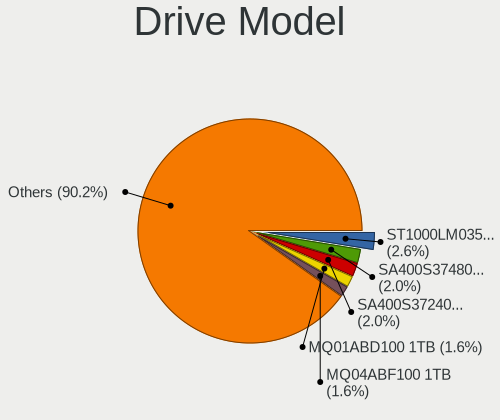

| Model                                                | Notebooks | Percent |
|------------------------------------------------------|-----------|---------|
| Seagate ST1000LM035-1RK172 1TB                       | 69        | 2.57%   |
| Kingston SA400S37480G 480GB SSD                      | 55        | 2.05%   |
| Kingston SA400S37240G 240GB SSD                      | 54        | 2.01%   |
| Toshiba MQ01ABD100 1TB                               | 44        | 1.64%   |
| Toshiba MQ04ABF100 1TB                               | 42        | 1.56%   |
| Seagate ST1000LM024 HN-M101MBB 1TB                   | 39        | 1.45%   |
| A-DATA SU630 240GB SSD                               | 33        | 1.23%   |
| Seagate ST500LT012-1DG142 500GB                      | 30        | 1.12%   |
| Toshiba MQ01ABF050 500GB                             | 29        | 1.08%   |
| Unknown MMC Card  32GB                               | 28        | 1.04%   |
| A-DATA SU650 120GB SSD                               | 28        | 1.04%   |
| Unknown MMC Card  64GB                               | 24        | 0.89%   |
| Kingston SA400S37960G 960GB SSD                      | 24        | 0.89%   |
| Samsung NVMe SSD Controller SM981/PM981/PM983 512GB  | 22        | 0.82%   |
| A-DATA SU630 480GB SSD                               | 19        | 0.71%   |
| Unknown                                              | 19        | 0.71%   |
| Seagate ST9500325AS 500GB                            | 15        | 0.56%   |
| Sandisk WD Blue SN550 NVMe SSD 256GB                 | 15        | 0.56%   |
| HGST HTS725050A7E630 500GB                           | 15        | 0.56%   |
| HGST HTS721010A9E630 1TB                             | 15        | 0.56%   |
| Unknown MMC Card  128GB                              | 14        | 0.52%   |
| Silicon Motion PCIe-8 SSD 512GB                      | 14        | 0.52%   |
| Kingston Company SNV2S1000G 1TB                      | 14        | 0.52%   |
| HGST HTS541010A9E680 1TB                             | 14        | 0.52%   |
| WDC WD5000LPCX-60VHAT0 500GB                         | 13        | 0.48%   |
| WDC WD5000LPCX-24VHAT0 500GB                         | 13        | 0.48%   |
| Seagate ST500LM021-1KJ152 500GB                      | 13        | 0.48%   |
| Unknown MMC Card  16GB                               | 12        | 0.45%   |
| Seagate ST1000LM049-2GH172 1TB                       | 12        | 0.45%   |
| A-DATA SU650 240GB SSD                               | 12        | 0.45%   |
| WDC WD10SPZX-60Z10T0 1TB                             | 11        | 0.41%   |
| WDC WD10SPZX-08Z10 1TB                               | 11        | 0.41%   |
| WDC WD10JPVX-60JC3T1 1TB                             | 11        | 0.41%   |
| Samsung NVMe SSD Drive 512GB                         | 11        | 0.41%   |
| Samsung NVMe SSD Controller PM9A1/PM9A3/980PRO 512GB | 11        | 0.41%   |
| Phison PS5013 E13 NVMe Controller 512GB              | 11        | 0.41%   |
| Kingston SA400S37120G 120GB SSD                      | 11        | 0.41%   |
| HGST HTS545050A7E680 500GB                           | 11        | 0.41%   |
| WDC WD10JPCX-24UE4T0 1TB                             | 10        | 0.37%   |
| Seagate ST2000LM007-1R8174 2TB                       | 10        | 0.37%   |

HDD Vendor
----------

Hard disk drive vendors

| Vendor              | Notebooks | Drives | Percent |
|---------------------|-----------|--------|---------|
| Seagate             | 315       | 389    | 31.72%  |
| WDC                 | 236       | 288    | 23.77%  |
| Toshiba             | 209       | 256    | 21.05%  |
| Hitachi             | 96        | 110    | 9.67%   |
| HGST                | 83        | 88     | 8.36%   |
| Fujitsu             | 16        | 17     | 1.61%   |
| Samsung Electronics | 15        | 17     | 1.51%   |
| Unknown             | 7         | 7      | 0.7%    |
| Apple               | 6         | 7      | 0.6%    |
| JMicron Technology  | 2         | 2      | 0.2%    |
| Hewlett-Packard     | 2         | 2      | 0.2%    |
| SAGE                | 1         | 1      | 0.1%    |
| SABRENT             | 1         | 1      | 0.1%    |
| LaCie               | 1         | 2      | 0.1%    |
| IBM/Hitachi         | 1         | 1      | 0.1%    |
| ASMT                | 1         | 1      | 0.1%    |
| ASMedia             | 1         | 1      | 0.1%    |

SSD Vendor
----------

Solid state drive vendors

| Vendor              | Notebooks | Drives | Percent |
|---------------------|-----------|--------|---------|
| Kingston            | 211       | 251    | 28.36%  |
| A-DATA Technology   | 164       | 195    | 22.04%  |
| Samsung Electronics | 57        | 68     | 7.66%   |
| WDC                 | 38        | 49     | 5.11%   |
| SanDisk             | 38        | 46     | 5.11%   |
| Crucial             | 28        | 29     | 3.76%   |
| Apple               | 26        | 31     | 3.49%   |
| China               | 17        | 18     | 2.28%   |
| LITEON              | 15        | 21     | 2.02%   |
| Micron Technology   | 14        | 15     | 1.88%   |
| SK hynix            | 12        | 13     | 1.61%   |
| PNY                 | 10        | 13     | 1.34%   |
| Intel               | 9         | 12     | 1.21%   |
| Toshiba             | 7         | 8      | 0.94%   |
| Netac               | 7         | 7      | 0.94%   |
| Wibtek              | 6         | 6      | 0.81%   |
| Unknown             | 6         | 6      | 0.81%   |
| LITEONIT            | 5         | 5      | 0.67%   |
| Hewlett-Packard     | 5         | 6      | 0.67%   |
| AS201               | 5         | 5      | 0.67%   |
| Team                | 4         | 4      | 0.54%   |
| Gigabyte Technology | 4         | 4      | 0.54%   |
| Blackpcs            | 4         | 4      | 0.54%   |
| BHT                 | 4         | 4      | 0.54%   |
| tecmiyo             | 3         | 5      | 0.4%    |
| Pioneer             | 3         | 5      | 0.4%    |
| Patriot             | 3         | 6      | 0.4%    |
| Acer                | 3         | 3      | 0.4%    |
| Unknown             | 2         | 2      | 0.27%   |
| Transcend           | 2         | 2      | 0.27%   |
| Timetec             | 2         | 2      | 0.27%   |
| SPCC                | 2         | 2      | 0.27%   |
| OCZ                 | 2         | 4      | 0.27%   |
| Dogfish             | 2         | 5      | 0.27%   |
| ZTC                 | 1         | 1      | 0.13%   |
| Zheino              | 1         | 1      | 0.13%   |
| Yeyian              | 1         | 4      | 0.13%   |
| X12                 | 1         | 1      | 0.13%   |
| StorFly             | 1         | 1      | 0.13%   |
| StoreJet            | 1         | 1      | 0.13%   |

Drive Kind
----------

HDD or SSD

| Kind    | Notebooks | Drives | Percent |
|---------|-----------|--------|---------|
| HDD     | 967       | 1190   | 38.98%  |
| SSD     | 703       | 891    | 28.34%  |
| NVMe    | 637       | 873    | 25.68%  |
| MMC     | 143       | 185    | 5.76%   |
| Unknown | 31        | 37     | 1.25%   |

Drive Connector
---------------

SATA, SAS, NVMe, etc.

| Type | Notebooks | Drives | Percent |
|------|-----------|--------|---------|
| SATA | 1507      | 2018   | 63.48%  |
| NVMe | 635       | 870    | 26.75%  |
| MMC  | 143       | 185    | 6.02%   |
| SAS  | 89        | 103    | 3.75%   |

Drive Size
----------

Size of hard drive

| Size in TB | Notebooks | Drives | Percent |
|------------|-----------|--------|---------|
| 0.01-0.5   | 1054      | 1329   | 63.42%  |
| 0.51-1.0   | 545       | 665    | 32.79%  |
| 1.01-2.0   | 52        | 74     | 3.13%   |
| 4.01-10.0  | 5         | 6      | 0.3%    |
| 3.01-4.0   | 4         | 5      | 0.24%   |
| 10.01-20.0 | 2         | 2      | 0.12%   |

Space Total
-----------

Amount of disk space available on the file system

| Size in GB     | Notebooks | Percent |
|----------------|-----------|---------|
| 251-500        | 581       | 26.24%  |
| 101-250        | 577       | 26.06%  |
| 501-1000       | 366       | 16.53%  |
| 51-100         | 180       | 8.13%   |
| 1-20           | 174       | 7.86%   |
| 1001-2000      | 146       | 6.59%   |
| 21-50          | 92        | 4.16%   |
| More than 3000 | 41        | 1.85%   |
| 2001-3000      | 31        | 1.4%    |
| Unknown        | 26        | 1.17%   |

Space Used
----------

Amount of used disk space

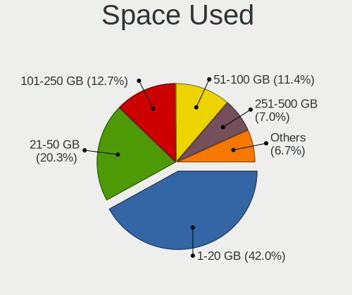

| Used GB        | Notebooks | Percent |
|----------------|-----------|---------|
| 1-20           | 965       | 41.97%  |
| 21-50          | 466       | 20.27%  |
| 101-250        | 292       | 12.7%   |
| 51-100         | 261       | 11.35%  |
| 251-500        | 160       | 6.96%   |
| 501-1000       | 83        | 3.61%   |
| 1001-2000      | 31        | 1.35%   |
| Unknown        | 26        | 1.13%   |
| More than 3000 | 9         | 0.39%   |
| 2001-3000      | 3         | 0.13%   |
| 0              | 3         | 0.13%   |

Malfunc. Drives
---------------

Drive models with a malfunction

| Model                                   | Notebooks | Drives | Percent |
|-----------------------------------------|-----------|--------|---------|
| Seagate ST500LT012-1DG142 500GB         | 7         | 8      | 3.83%   |
| Toshiba MQ01ABD100 1TB                  | 6         | 7      | 3.28%   |
| Seagate ST500LM021-1KJ152 500GB         | 5         | 5      | 2.73%   |
| Seagate ST1000LM024 HN-M101MBB 1TB      | 5         | 6      | 2.73%   |
| HGST HTS541010A9E680 1TB                | 5         | 5      | 2.73%   |
| Toshiba MQ01ABF050 500GB                | 4         | 4      | 2.19%   |
| Seagate ST9500325AS 500GB               | 4         | 4      | 2.19%   |
| Seagate ST1000LM035-1RK172 1TB          | 4         | 4      | 2.19%   |
| Hitachi HTS545050B9A300 500GB           | 4         | 4      | 2.19%   |
| HGST HTS541075A9E680 752GB              | 4         | 4      | 2.19%   |
| WDC WD5000LPCX-60VHAT0 500GB            | 3         | 3      | 1.64%   |
| Toshiba MQ04ABF100 1TB                  | 3         | 3      | 1.64%   |
| LITEON CV8-8E128-HP 128GB SSD           | 3         | 4      | 1.64%   |
| WDC WD5000LPVX-22V0TT0 500GB            | 2         | 2      | 1.09%   |
| WDC WD2500BEVS-60UST0 250GB             | 2         | 2      | 1.09%   |
| WDC WD10JPVX-60JC3T1 1TB                | 2         | 2      | 1.09%   |
| WDC WD10JPVX-60JC3T0 1TB                | 2         | 2      | 1.09%   |
| Seagate ST9500420AS 500GB               | 2         | 2      | 1.09%   |
| Seagate ST9320325AS 320GB               | 2         | 4      | 1.09%   |
| Seagate ST500LM012 HN-M500MBB 500GB     | 2         | 3      | 1.09%   |
| SanDisk SD9SN8W-128G-1006 128GB SSD     | 2         | 2      | 1.09%   |
| Kingston RBU-SNS8350DES3128GP 128GB SSD | 2         | 2      | 1.09%   |
| Hitachi HTS727575A9E364 752GB           | 2         | 3      | 1.09%   |
| Hitachi HTS545016B9A300 160GB           | 2         | 2      | 1.09%   |
| Hitachi HTS543232A7A384 320GB           | 2         | 2      | 1.09%   |
| HGST HTS541010A7E630 1TB                | 2         | 2      | 1.09%   |
| Fujitsu MHZ2320BH G2 320GB              | 2         | 2      | 1.09%   |
| China SSD 256GB                         | 2         | 2      | 1.09%   |
| A-DATA Technology SU650 240GB SSD       | 2         | 2      | 1.09%   |
| WDC WD7500BPKT-75PK4T0 752GB            | 1         | 1      | 0.55%   |
| WDC WD5000LPLX-60ZNTT1 500GB            | 1         | 1      | 0.55%   |
| WDC WD5000LPCX-24C6HT0 500GB            | 1         | 1      | 0.55%   |
| WDC WD5000BPVT-22HXZT1 500GB            | 1         | 2      | 0.55%   |
| WDC WD50 00BEVT-11ZAT0 500GB            | 1         | 1      | 0.55%   |
| WDC WD3200BEVT-22ZCT0 320GB             | 1         | 1      | 0.55%   |
| WDC WD3200BEVT-22A23T0 320GB            | 1         | 1      | 0.55%   |
| WDC WD2500LPVX-22V0TT0 250GB            | 1         | 1      | 0.55%   |
| WDC WD2500BEVT-80A23T0 250GB            | 1         | 2      | 0.55%   |
| WDC WD1600BEVT-60ZCT0 160GB             | 1         | 1      | 0.55%   |
| WDC WD1600BEVT-22ZCT0 160GB             | 1         | 1      | 0.55%   |

Malfunc. Drive Vendor
---------------------

Vendors of faulty drives

| Vendor                | Notebooks | Drives | Percent |
|-----------------------|-----------|--------|---------|
| Seagate               | 38        | 46     | 20.88%  |
| Toshiba               | 31        | 39     | 17.03%  |
| WDC                   | 27        | 29     | 14.84%  |
| Hitachi               | 26        | 27     | 14.29%  |
| HGST                  | 15        | 16     | 8.24%   |
| Kingston              | 11        | 11     | 6.04%   |
| SanDisk               | 5         | 5      | 2.75%   |
| LITEON                | 5         | 7      | 2.75%   |
| Fujitsu               | 5         | 5      | 2.75%   |
| A-DATA Technology     | 5         | 5      | 2.75%   |
| Samsung Electronics   | 3         | 3      | 1.65%   |
| China                 | 3         | 3      | 1.65%   |
| Crucial               | 2         | 2      | 1.1%    |
| SSSTC                 | 1         | 1      | 0.55%   |
| sk600                 | 1         | 1      | 0.55%   |
| Realtek Semiconductor | 1         | 1      | 0.55%   |
| Micron Technology     | 1         | 1      | 0.55%   |
| Intel                 | 1         | 1      | 0.55%   |
| Acer                  | 1         | 1      | 0.55%   |

Malfunc. HDD Vendor
-------------------

Vendors of faulty HDD drives

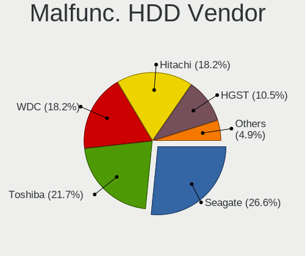

| Vendor              | Notebooks | Drives | Percent |
|---------------------|-----------|--------|---------|
| Seagate             | 38        | 46     | 26.57%  |
| Toshiba             | 31        | 39     | 21.68%  |
| WDC                 | 26        | 28     | 18.18%  |
| Hitachi             | 26        | 27     | 18.18%  |
| HGST                | 15        | 16     | 10.49%  |
| Fujitsu             | 5         | 5      | 3.5%    |
| Samsung Electronics | 2         | 2      | 1.4%    |

Malfunc. Drive Kind
-------------------

Kinds of faulty drives

| Kind | Notebooks | Drives | Percent |
|------|-----------|--------|---------|
| HDD  | 142       | 163    | 78.45%  |
| SSD  | 31        | 32     | 17.13%  |
| NVMe | 8         | 9      | 4.42%   |

Failed Drives
-------------

Failed drive models

| Model                         | Notebooks | Drives | Percent |
|-------------------------------|-----------|--------|---------|
| WDC WD1600BEVT-75A23T0 160GB  | 1         | 1      | 33.33%  |
| Toshiba MK1234GSX 120GB       | 1         | 1      | 33.33%  |
| Hitachi HTS545016B9A300 160GB | 1         | 1      | 33.33%  |

Failed Drive Vendor
-------------------

Failed drive vendors

| Vendor  | Notebooks | Drives | Percent |
|---------|-----------|--------|---------|
| WDC     | 1         | 1      | 33.33%  |
| Toshiba | 1         | 1      | 33.33%  |
| Hitachi | 1         | 1      | 33.33%  |

Drive Status
------------

Number of failed and malfunc. drives

| Status   | Notebooks | Drives | Percent |
|----------|-----------|--------|---------|
| Detected | 1326      | 1989   | 59.86%  |
| Works    | 709       | 980    | 32.01%  |
| Malfunc  | 177       | 204    | 7.99%   |
| Failed   | 3         | 3      | 0.14%   |

Storage controller
------------------

Storage Vendor
--------------

Storage controller vendors

| Vendor                                  | Notebooks | Percent |
|-----------------------------------------|-----------|---------|
| Intel                                   | 1347      | 55.89%  |
| AMD                                     | 380       | 15.77%  |
| Samsung Electronics                     | 150       | 6.22%   |
| SanDisk                                 | 114       | 4.73%   |
| Kingston Technology Company             | 67        | 2.78%   |
| SK hynix                                | 51        | 2.12%   |
| Micron Technology                       | 32        | 1.33%   |
| ADATA Technology                        | 30        | 1.24%   |
| Phison Electronics                      | 29        | 1.2%    |
| Toshiba America Info Systems            | 28        | 1.16%   |
| Silicon Motion                          | 26        | 1.08%   |
| KIOXIA                                  | 26        | 1.08%   |
| Nvidia                                  | 23        | 0.95%   |
| Realtek Semiconductor                   | 18        | 0.75%   |
| Union Memory (Shenzhen)                 | 15        | 0.62%   |
| Micron/Crucial Technology               | 11        | 0.46%   |
| Yangtze Memory Technologies             | 10        | 0.41%   |
| Apple                                   | 8         | 0.33%   |
| Marvell Technology Group                | 7         | 0.29%   |
| O2 Micro                                | 5         | 0.21%   |
| MAXIO Technology (Hangzhou)             | 5         | 0.21%   |
| Solid State Storage Technology          | 4         | 0.17%   |
| Shenzhen Longsys Electronics            | 4         | 0.17%   |
| Lite-On Technology                      | 4         | 0.17%   |
| Biwin Storage Technology                | 4         | 0.17%   |
| INNOGRIT                                | 3         | 0.12%   |
| Solidigm                                | 2         | 0.08%   |
| Lenovo                                  | 2         | 0.08%   |
| VIA Technologies                        | 1         | 0.04%   |
| Silicon Integrated Systems [SiS]        | 1         | 0.04%   |
| Shenzhen Unionmemory Information System | 1         | 0.04%   |
| Seagate Technology                      | 1         | 0.04%   |
| Unknown                                 | 1         | 0.04%   |

Storage Model
-------------

Storage controller models

| Model                                                                            | Notebooks | Percent |
|----------------------------------------------------------------------------------|-----------|---------|
| AMD FCH SATA Controller [AHCI mode]                                              | 314       | 12.19%  |
| Intel 82801 Mobile SATA Controller [RAID mode]                                   | 147       | 5.71%   |
| Intel 7 Series Chipset Family 6-port SATA Controller [AHCI mode]                 | 146       | 5.67%   |
| Intel Sunrise Point-LP SATA Controller [AHCI mode]                               | 114       | 4.43%   |
| Intel 6 Series/C200 Series Chipset Family 6 port Mobile SATA AHCI Controller     | 108       | 4.19%   |
| Intel 8 Series SATA Controller 1 [AHCI mode]                                     | 62        | 2.41%   |
| Samsung NVMe SSD Controller SM981/PM981/PM983                                    | 57        | 2.21%   |
| Intel 82801IBM/IEM (ICH9M/ICH9M-E) 4 port SATA Controller [AHCI mode]            | 55        | 2.14%   |
| Intel Volume Management Device NVMe RAID Controller                              | 53        | 2.06%   |
| Intel Wildcat Point-LP SATA Controller [AHCI Mode]                               | 52        | 2.02%   |
| Intel Atom/Celeron/Pentium Processor x5-E8000/J3xxx/N3xxx Series SATA Controller | 52        | 2.02%   |
| Samsung NVMe SSD Controller 980 (DRAM-less)                                      | 50        | 1.94%   |
| Intel Celeron/Pentium Silver Processor SATA Controller                           | 50        | 1.94%   |
| Intel 5 Series/3400 Series Chipset 4 port SATA AHCI Controller                   | 44        | 1.71%   |
| AMD SB7x0/SB8x0/SB9x0 SATA Controller [AHCI mode]                                | 44        | 1.71%   |
| Intel Atom Processor E3800 Series SATA AHCI Controller                           | 43        | 1.67%   |
| Intel 82801HM/HEM (ICH8M/ICH8M-E) IDE Controller                                 | 42        | 1.63%   |
| Intel HM170/QM170 Chipset SATA Controller [AHCI Mode]                            | 39        | 1.51%   |
| Intel 82801HM/HEM (ICH8M/ICH8M-E) SATA Controller [AHCI mode]                    | 37        | 1.44%   |
| Intel Cannon Lake Mobile PCH SATA AHCI Controller                                | 35        | 1.36%   |
| Intel 8 Series/C220 Series Chipset Family 6-port SATA Controller 1 [AHCI mode]   | 31        | 1.2%    |
| Intel Celeron N3350/Pentium N4200/Atom E3900 Series SATA AHCI Controller         | 30        | 1.16%   |
| Intel Comet Lake SATA AHCI Controller                                            | 29        | 1.13%   |
| SanDisk Ultra 3D / WD PC SN530, IX SN530, Blue SN550 NVMe SSD (DRAM-less)        | 26        | 1.01%   |
| Silicon Motion Non-Volatile memory controller                                    | 21        | 0.82%   |
| SanDisk WD Black SN770 / PC SN740 256GB / PC SN560 (DRAM-less) NVMe SSD          | 21        | 0.82%   |
| Phison PS5013-E13 PCIe3 NVMe Controller (DRAM-less)                              | 21        | 0.82%   |
| KIOXIA NVMe SSD Controller BG4 (DRAM-less)                                       | 21        | 0.82%   |
| Kingston Company NV2 NVMe SSD [SM2267XT] (DRAM-less)                             | 21        | 0.82%   |
| Intel NM10/ICH7 Family SATA Controller [AHCI mode]                               | 21        | 0.82%   |
| Intel 400 Series Chipset Family SATA AHCI Controller                             | 20        | 0.78%   |
| Intel Tiger Lake-LP SATA Controller                                              | 19        | 0.74%   |
| SK hynix Gold P31/BC711/PC711 NVMe Solid State Drive                             | 18        | 0.7%    |
| Intel SSD 670p Series [Keystone Harbor]                                          | 18        | 0.7%    |
| Samsung NVMe SSD Controller PM9A1/PM9A3/980PRO                                   | 17        | 0.66%   |
| Intel Cannon Point-LP SATA Controller [AHCI Mode]                                | 17        | 0.66%   |
| Toshiba America Info Systems XG6 NVMe SSD Controller                             | 16        | 0.62%   |
| SanDisk Extreme Pro / WD Black SN750 / PC SN730 / Red SN700 NVMe SSD             | 16        | 0.62%   |
| Intel 5 Series/3400 Series Chipset 6 port SATA AHCI Controller                   | 16        | 0.62%   |
| Intel Alder Lake-P SATA AHCI Controller                                          | 15        | 0.58%   |

Storage Kind
------------

Kind of storage controller (IDE, SATA, NVMe, SAS, ...)

| Kind | Notebooks | Percent |
|------|-----------|---------|
| SATA | 1496      | 60.2%   |
| NVMe | 637       | 25.63%  |
| RAID | 215       | 8.65%   |
| IDE  | 137       | 5.51%   |

Processor
---------

CPU Vendor
----------

Processor vendors

| Vendor  | Notebooks | Percent |
|---------|-----------|---------|
| Intel   | 1551      | 73.82%  |
| AMD     | 549       | 26.13%  |
| Unknown | 1         | 0.05%   |

CPU Model
---------

Processor models

| Model                                         | Notebooks | Percent |
|-----------------------------------------------|-----------|---------|
| AMD Ryzen 5 3500U with Radeon Vega Mobile Gfx | 32        | 1.52%   |
| Intel Core i5-3210M CPU @ 2.50GHz             | 31        | 1.47%   |
| AMD Ryzen 5 4600H with Radeon Graphics        | 28        | 1.33%   |
| Intel Core i7-8750H CPU @ 2.20GHz             | 25        | 1.19%   |
| Intel Celeron N4020 CPU @ 1.10GHz             | 25        | 1.19%   |
| Intel Celeron N4000 CPU @ 1.10GHz             | 25        | 1.19%   |
| Intel Celeron CPU N3350 @ 1.10GHz             | 24        | 1.14%   |
| Intel Celeron CPU N2840 @ 2.16GHz             | 24        | 1.14%   |
| Intel 11th Gen Core i5-1135G7 @ 2.40GHz       | 24        | 1.14%   |
| AMD Ryzen 5 5500U with Radeon Graphics        | 24        | 1.14%   |
| Intel Celeron CPU N3060 @ 1.60GHz             | 23        | 1.09%   |
| Intel Celeron CPU N3050 @ 1.60GHz             | 23        | 1.09%   |
| AMD Ryzen 7 3700U with Radeon Vega Mobile Gfx | 23        | 1.09%   |
| Intel Core i7-6700HQ CPU @ 2.60GHz            | 22        | 1.05%   |
| Intel 11th Gen Core i7-1165G7 @ 2.80GHz       | 22        | 1.05%   |
| AMD Ryzen 7 5700U with Radeon Graphics        | 20        | 0.95%   |
| AMD Custom APU 0405                           | 20        | 0.95%   |
| Intel Core i7-9750H CPU @ 2.60GHz             | 19        | 0.9%    |
| Intel Core i5-8265U CPU @ 1.60GHz             | 19        | 0.9%    |
| Intel Core i5-7200U CPU @ 2.50GHz             | 18        | 0.86%   |
| Intel Core i5-5200U CPU @ 2.20GHz             | 18        | 0.86%   |
| Intel Core i7-7500U CPU @ 2.70GHz             | 17        | 0.81%   |
| Intel Core i5-3320M CPU @ 2.60GHz             | 17        | 0.81%   |
| Intel Core i7-8550U CPU @ 1.80GHz             | 16        | 0.76%   |
| Intel Core i7-7700HQ CPU @ 2.80GHz            | 16        | 0.76%   |
| Intel Core i5-10210U CPU @ 1.60GHz            | 16        | 0.76%   |
| Intel Core i7-6500U CPU @ 2.50GHz             | 15        | 0.71%   |
| Intel Core i3-10110U CPU @ 2.10GHz            | 15        | 0.71%   |
| Intel Core i5-8250U CPU @ 1.60GHz             | 14        | 0.67%   |
| Intel Core i5-6200U CPU @ 2.30GHz             | 14        | 0.67%   |
| Intel Celeron CPU N2830 @ 2.16GHz             | 14        | 0.67%   |
| Intel Core i7-8565U CPU @ 1.80GHz             | 13        | 0.62%   |
| Intel Core i5-10300H CPU @ 2.50GHz            | 13        | 0.62%   |
| Intel Core i3-7020U CPU @ 2.30GHz             | 13        | 0.62%   |
| Intel Core i3-5005U CPU @ 2.00GHz             | 13        | 0.62%   |
| Intel Core i7-10750H CPU @ 2.60GHz            | 12        | 0.57%   |
| Intel Core i5-2520M CPU @ 2.50GHz             | 12        | 0.57%   |
| AMD Ryzen 3 2300U with Radeon Vega Mobile Gfx | 12        | 0.57%   |
| AMD A9-9425 RADEON R5, 5 COMPUTE CORES 2C+3G  | 12        | 0.57%   |
| AMD A8-7410 APU with AMD Radeon R5 Graphics   | 12        | 0.57%   |

CPU Model Family
----------------

Processor model prefix

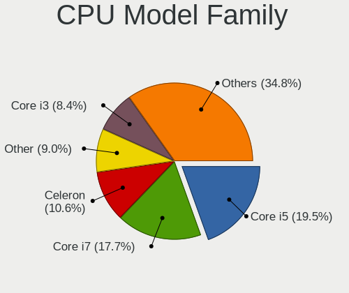

| Model                          | Notebooks | Percent |
|--------------------------------|-----------|---------|
| Intel Core i5                  | 410       | 19.51%  |
| Intel Core i7                  | 371       | 17.66%  |
| Intel Celeron                  | 222       | 10.57%  |
| Other                          | 189       | 9%      |
| Intel Core i3                  | 177       | 8.42%   |
| AMD Ryzen 5                    | 126       | 6%      |
| Intel Core 2 Duo               | 81        | 3.86%   |
| AMD Ryzen 7                    | 78        | 3.71%   |
| Intel Atom                     | 45        | 2.14%   |
| AMD Ryzen 3                    | 38        | 1.81%   |
| AMD A6                         | 37        | 1.76%   |
| Intel Pentium                  | 36        | 1.71%   |
| AMD A8                         | 33        | 1.57%   |
| AMD A4                         | 30        | 1.43%   |
| AMD E                          | 25        | 1.19%   |
| AMD A10                        | 24        | 1.14%   |
| Intel Pentium Dual             | 17        | 0.81%   |
| Intel Pentium Dual-Core        | 11        | 0.52%   |
| AMD E1                         | 11        | 0.52%   |
| AMD Turion 64 X2 Mobile        | 10        | 0.48%   |
| AMD Ryzen 9                    | 10        | 0.48%   |
| AMD Athlon II                  | 10        | 0.48%   |
| AMD Athlon                     | 10        | 0.48%   |
| Intel Genuine                  | 9         | 0.43%   |
| AMD Ryzen 5 PRO                | 9         | 0.43%   |
| Intel Core 2                   | 7         | 0.33%   |
| Intel Pentium Silver           | 6         | 0.29%   |
| AMD FX                         | 6         | 0.29%   |
| Intel Celeron M                | 5         | 0.24%   |
| AMD Athlon 64 X2               | 5         | 0.24%   |
| AMD A12                        | 5         | 0.24%   |
| Intel Xeon                     | 4         | 0.19%   |
| AMD E2                         | 4         | 0.19%   |
| AMD Sempron                    | 3         | 0.14%   |
| Intel Pentium M                | 2         | 0.1%    |
| Intel Core m3                  | 2         | 0.1%    |
| Intel Core Duo                 | 2         | 0.1%    |
| Intel Core                     | 2         | 0.1%    |
| AMD V120                       | 2         | 0.1%    |
| AMD Turion X2 Dual-Core Mobile | 2         | 0.1%    |

CPU Cores
---------

Number of processor cores

| Number | Notebooks | Percent |
|--------|-----------|---------|
| 2      | 1147      | 54.59%  |
| 4      | 597       | 28.42%  |
| 6      | 156       | 7.43%   |
| 8      | 79        | 3.76%   |
| 1      | 72        | 3.43%   |
| 10     | 22        | 1.05%   |
| 14     | 12        | 0.57%   |
| 12     | 8         | 0.38%   |
| 24     | 4         | 0.19%   |
| 16     | 2         | 0.1%    |
| 3      | 2         | 0.1%    |

CPU Sockets
-----------

Number of sockets

| Number | Notebooks | Percent |
|--------|-----------|---------|
| 1      | 2101      | 99.95%  |
| 2      | 1         | 0.05%   |

CPU Threads
-----------

Threads per core (Hyper-Threading)

| Number | Notebooks | Percent |
|--------|-----------|---------|
| 2      | 1428      | 67.94%  |
| 1      | 673       | 32.02%  |
| 4      | 1         | 0.05%   |

CPU Op-Modes
------------

CPU Operation Modes (32-bit, 64-bit)

| Op mode        | Notebooks | Percent |
|----------------|-----------|---------|
| 32-bit, 64-bit | 2062      | 98.14%  |
| 32-bit         | 19        | 0.9%    |
| Unknown        | 14        | 0.67%   |
| 64-bit         | 6         | 0.29%   |

CPU Microcode
-------------

Microcode number

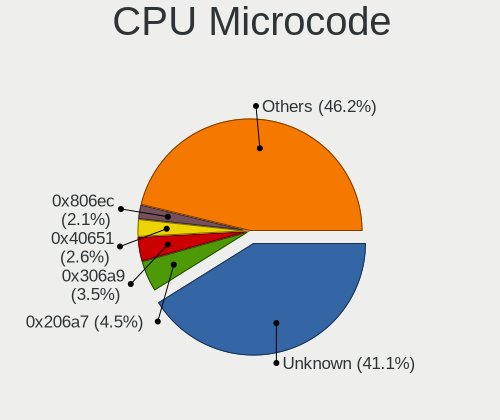

| Number     | Notebooks | Percent |
|------------|-----------|---------|
| Unknown    | 901       | 41.12%  |
| 0x206a7    | 99        | 4.52%   |
| 0x306a9    | 77        | 3.51%   |
| 0x40651    | 56        | 2.56%   |
| 0x806ec    | 45        | 2.05%   |
| 0x30678    | 41        | 1.87%   |
| 0x08108109 | 41        | 1.87%   |
| 0x806e9    | 39        | 1.78%   |
| 0x306d4    | 39        | 1.78%   |
| 0x06006705 | 36        | 1.64%   |
| 0x406e3    | 35        | 1.6%    |
| 0x1067a    | 35        | 1.6%    |
| 0x806ea    | 33        | 1.51%   |
| 0x806c1    | 33        | 1.51%   |
| 0x906ea    | 32        | 1.46%   |
| 0x20655    | 29        | 1.32%   |
| 0x08600106 | 28        | 1.28%   |
| 0x6fd      | 24        | 1.1%    |
| 0x406c4    | 24        | 1.1%    |
| 0x306c3    | 24        | 1.1%    |
| 0x08608103 | 24        | 1.1%    |
| 0x406c3    | 23        | 1.05%   |
| 0x106ca    | 22        | 1%      |
| 0x506e3    | 21        | 0.96%   |
| 0x0810100b | 21        | 0.96%   |
| 0x10676    | 19        | 0.87%   |
| 0x08108102 | 19        | 0.87%   |
| 0x20652    | 17        | 0.78%   |
| 0x07030105 | 17        | 0.78%   |
| 0xa0652    | 16        | 0.73%   |
| 0x706e5    | 16        | 0.73%   |
| 0x506c9    | 16        | 0.73%   |
| 0x06001119 | 16        | 0.73%   |
| 0x05000119 | 16        | 0.73%   |
| 0x906e9    | 15        | 0.68%   |
| 0x706a1    | 15        | 0.68%   |
| 0x06006704 | 13        | 0.59%   |
| 0x010000c8 | 13        | 0.59%   |
| 0x706a8    | 12        | 0.55%   |
| 0x106c2    | 9         | 0.41%   |

CPU Microarch
-------------

Microarchitecture

| Name              | Notebooks | Percent |
|-------------------|-----------|---------|
| KabyLake          | 299       | 14.22%  |
| SandyBridge       | 156       | 7.42%   |
| IvyBridge         | 133       | 6.33%   |
| Unknown           | 131       | 6.23%   |
| Haswell           | 125       | 5.95%   |
| Silvermont        | 118       | 5.61%   |
| Skylake           | 96        | 4.57%   |
| Zen+              | 87        | 4.14%   |
| Excavator         | 81        | 3.85%   |
| Penryn            | 75        | 3.57%   |
| Broadwell         | 73        | 3.47%   |
| TigerLake         | 71        | 3.38%   |
| Westmere          | 68        | 3.24%   |
| Goldmont plus     | 60        | 2.85%   |
| Core              | 58        | 2.76%   |
| Zen 2             | 51        | 2.43%   |
| CometLake         | 36        | 1.71%   |
| Bobcat            | 35        | 1.67%   |
| Zen               | 34        | 1.62%   |
| Alderlake Hybrid  | 34        | 1.62%   |
| Puma              | 33        | 1.57%   |
| Bonnell           | 33        | 1.57%   |
| Goldmont          | 32        | 1.52%   |
| Piledriver        | 29        | 1.38%   |
| IceLake           | 29        | 1.38%   |
| Zen 3             | 25        | 1.19%   |
| K10               | 20        | 0.95%   |
| K8 Hammer         | 19        | 0.9%    |
| Jaguar            | 15        | 0.71%   |
| P6                | 11        | 0.52%   |
| K10 Llano         | 10        | 0.48%   |
| K8 & K10 hybrid   | 9         | 0.43%   |
| Tremont           | 5         | 0.24%   |
| Gracemont         | 4         | 0.19%   |
| Steamroller       | 3         | 0.14%   |
| Nehalem           | 2         | 0.1%    |
| Meteorlake Hybrid | 2         | 0.1%    |

Graphics
--------

GPU Vendor
----------

Vendors of graphics cards

| Vendor                           | Notebooks | Percent |
|----------------------------------|-----------|---------|
| Intel                            | 1467      | 59.49%  |
| AMD                              | 604       | 24.49%  |
| Nvidia                           | 393       | 15.94%  |
| VIA Technologies                 | 1         | 0.04%   |
| Silicon Integrated Systems [SiS] | 1         | 0.04%   |

GPU Model
---------

Graphics card models

| Model                                                                                    | Notebooks | Percent |
|------------------------------------------------------------------------------------------|-----------|---------|
| Intel 2nd Generation Core Processor Family Integrated Graphics Controller                | 147       | 5.74%   |
| Intel 3rd Gen Core processor Graphics Controller                                         | 123       | 4.81%   |
| AMD Picasso/Raven 2 [Radeon Vega Series / Radeon Vega Mobile Series]                     | 92        | 3.6%    |
| Intel Haswell-ULT Integrated Graphics Controller                                         | 80        | 3.13%   |
| Intel TigerLake-LP GT2 [Iris Xe Graphics]                                                | 64        | 2.5%    |
| Intel Atom/Celeron/Pentium Processor x5-E8000/J3xxx/N3xxx Integrated Graphics Controller | 61        | 2.38%   |
| Intel HD Graphics 620                                                                    | 60        | 2.34%   |
| Intel Core Processor Integrated Graphics Controller                                      | 60        | 2.34%   |
| Intel HD Graphics 5500                                                                   | 59        | 2.31%   |
| Intel CoffeeLake-H GT2 [UHD Graphics 630]                                                | 57        | 2.23%   |
| Intel Atom Processor Z36xxx/Z37xxx Series Graphics & Display                             | 57        | 2.23%   |
| Intel GeminiLake [UHD Graphics 600]                                                      | 56        | 2.19%   |
| AMD Stoney [Radeon R2/R3/R4/R5 Graphics]                                                 | 55        | 2.15%   |
| Intel Mobile 4 Series Chipset Integrated Graphics Controller                             | 53        | 2.07%   |
| Intel Skylake GT2 [HD Graphics 520]                                                      | 52        | 2.03%   |
| AMD Renoir [Radeon Vega Series / Radeon Vega Mobile Series]                              | 50        | 1.95%   |
| Intel UHD Graphics 620                                                                   | 48        | 1.88%   |
| AMD Lucienne                                                                             | 48        | 1.88%   |
| Intel WhiskeyLake-U GT2 [UHD Graphics 620]                                               | 44        | 1.72%   |
| Intel CometLake-U GT2 [UHD Graphics]                                                     | 41        | 1.6%    |
| Intel Mobile GM965/GL960 Integrated Graphics Controller (secondary)                      | 38        | 1.48%   |
| Intel Mobile GM965/GL960 Integrated Graphics Controller (primary)                        | 38        | 1.48%   |
| Intel 4th Gen Core Processor Integrated Graphics Controller                              | 35        | 1.37%   |
| Intel CometLake-H GT2 [UHD Graphics]                                                     | 34        | 1.33%   |
| Intel HD Graphics 630                                                                    | 30        | 1.17%   |
| Intel HD Graphics 530                                                                    | 30        | 1.17%   |
| AMD Raven Ridge [Radeon Vega Series / Radeon Vega Mobile Series]                         | 29        | 1.13%   |
| Intel HD Graphics 500                                                                    | 28        | 1.09%   |
| AMD Mullins [Radeon R4/R5 Graphics]                                                      | 27        | 1.06%   |
| AMD Wani [Radeon R5/R6/R7 Graphics]                                                      | 26        | 1.02%   |
| Nvidia TU117M [GeForce GTX 1650 Mobile / Max-Q]                                          | 23        | 0.9%    |
| AMD Sun XT [Radeon HD 8670A/8670M/8690M / R5 M330 / M430 / Radeon 520 Mobile]            | 23        | 0.9%    |
| Intel Atom Processor D4xx/D5xx/N4xx/N5xx Integrated Graphics Controller                  | 22        | 0.86%   |
| AMD VanGogh [AMD Custom GPU 0405]                                                        | 20        | 0.78%   |
| AMD RS880M [Mobility Radeon HD 4225/4250]                                                | 20        | 0.78%   |
| Nvidia GP107M [GeForce GTX 1050 Mobile]                                                  | 19        | 0.74%   |
| AMD Cezanne [Radeon Vega Series / Radeon Vega Mobile Series]                             | 19        | 0.74%   |
| Intel Mobile 945GM/GMS/GME, 943/940GML Express Integrated Graphics Controller            | 18        | 0.7%    |
| AMD Topaz XT [Radeon R7 M260/M265 / M340/M360 / M440/M445 / 530/535 / 620/625 Mobile]    | 18        | 0.7%    |
| AMD Wrestler [Radeon HD 6310]                                                            | 17        | 0.66%   |

GPU Combo
---------

Combinations of graphics cards

| Name           | Notebooks | Percent |
|----------------|-----------|---------|
| 1 x Intel      | 1118      | 53.06%  |
| 1 x AMD        | 485       | 23.02%  |
| Intel + Nvidia | 275       | 13.05%  |
| 1 x Nvidia     | 81        | 3.84%   |
| Intel + AMD    | 47        | 2.23%   |
| AMD + Nvidia   | 37        | 1.76%   |
| 2 x AMD        | 35        | 1.66%   |
| 2 x Intel      | 19        | 0.9%    |
| Other          | 8         | 0.38%   |
| 1 x VIA        | 1         | 0.05%   |
| 1 x SiS        | 1         | 0.05%   |

GPU Driver
----------

Free vs proprietary

| Driver      | Notebooks | Percent |
|-------------|-----------|---------|
| Free        | 1878      | 88.71%  |
| Proprietary | 182       | 8.6%    |
| Unknown     | 57        | 2.69%   |

GPU Memory
----------

Total video memory

| Size in GB | Notebooks | Percent |
|------------|-----------|---------|
| Unknown    | 1486      | 69.18%  |
| 0.01-0.5   | 273       | 12.71%  |
| 1.01-2.0   | 155       | 7.22%   |
| 0.51-1.0   | 122       | 5.68%   |
| 3.01-4.0   | 64        | 2.98%   |
| 5.01-6.0   | 26        | 1.21%   |
| 7.01-8.0   | 17        | 0.79%   |
| 2.01-3.0   | 5         | 0.23%   |

Monitor
-------

Monitor Vendor
--------------

Monitor vendors

| Vendor                  | Notebooks | Percent |
|-------------------------|-----------|---------|
| AU Optronics            | 421       | 17.68%  |
| BOE                     | 411       | 17.26%  |
| Chimei Innolux          | 350       | 14.7%   |
| LG Display              | 286       | 12.01%  |
| Samsung Electronics     | 241       | 10.12%  |
| Apple                   | 91        | 3.82%   |
| Chi Mei Optoelectronics | 47        | 1.97%   |
| Goldstar                | 46        | 1.93%   |
| Hewlett-Packard         | 44        | 1.85%   |
| Lenovo                  | 37        | 1.55%   |
| Dell                    | 35        | 1.47%   |
| Sharp                   | 28        | 1.18%   |
| LG Philips              | 27        | 1.13%   |
| BenQ                    | 27        | 1.13%   |
| PANDA                   | 26        | 1.09%   |
| Acer                    | 22        | 0.92%   |
| Valve                   | 17        | 0.71%   |
| InfoVision              | 13        | 0.55%   |
| HannStar                | 13        | 0.55%   |
| AOC                     | 13        | 0.55%   |
| Unknown                 | 12        | 0.5%    |
| CSO                     | 9         | 0.38%   |
| SLD                     | 8         | 0.34%   |
| HKC                     | 8         | 0.34%   |
| CPT                     | 8         | 0.34%   |
| Sony                    | 7         | 0.29%   |
| ASUSTek Computer        | 7         | 0.29%   |
| InnoLux Display         | 6         | 0.25%   |
| TMX                     | 5         | 0.21%   |
| KDC                     | 5         | 0.21%   |
| JDI                     | 5         | 0.21%   |
| HUAWEI                  | 5         | 0.21%   |
| Gateway                 | 5         | 0.21%   |
| FOX                     | 5         | 0.21%   |
| Unknown (AAA)           | 4         | 0.17%   |
| MSI                     | 4         | 0.17%   |
| Insignia                | 4         | 0.17%   |
| Hitachi                 | 4         | 0.17%   |
| Ancor Communications    | 4         | 0.17%   |
| ___                     | 3         | 0.13%   |

Monitor Model
-------------

Monitor models

| Model                                                                | Notebooks | Percent |
|----------------------------------------------------------------------|-----------|---------|
| BOE LCD Monitor BOE06A4 1366x768 344x194mm 15.5-inch                 | 24        | 1%      |
| Chimei Innolux LCD Monitor CMN14C3 1366x768 309x173mm 13.9-inch      | 21        | 0.88%   |
| BOE LCD Monitor BOE0872 1920x1080 344x194mm 15.5-inch                | 21        | 0.88%   |
| BOE LCD Monitor BOE0878 1920x1080 355x200mm 16.0-inch                | 20        | 0.83%   |
| BOE LCD Monitor BOE0877 1920x1080 309x173mm 13.9-inch                | 19        | 0.79%   |
| Chimei Innolux LCD Monitor CMN15E6 1366x768 344x193mm 15.5-inch      | 18        | 0.75%   |
| BOE LCD Monitor BOE076F 1366x768 344x194mm 15.5-inch                 | 18        | 0.75%   |
| BOE LCD Monitor BOE0696 1366x768 309x173mm 13.9-inch                 | 18        | 0.75%   |
| Valve ANX7530 U VLV3001 800x1280 100x150mm 7.1-inch                  | 17        | 0.71%   |
| Samsung Electronics LCD Monitor SEC5441 1280x800 286x179mm 13.3-inch | 17        | 0.71%   |
| Chimei Innolux LCD Monitor CMN15F5 1920x1080 344x193mm 15.5-inch     | 16        | 0.67%   |
| AU Optronics LCD Monitor AUO183C 1366x768 309x173mm 13.9-inch        | 16        | 0.67%   |
| Chimei Innolux LCD Monitor CMN15DC 1366x768 344x193mm 15.5-inch      | 14        | 0.58%   |
| Chimei Innolux LCD Monitor CMN14D6 1366x768 309x173mm 13.9-inch      | 14        | 0.58%   |
| AU Optronics LCD Monitor AUO2E3C 1366x768 309x173mm 13.9-inch        | 14        | 0.58%   |
| AU Optronics LCD Monitor AUO235C 1366x768 256x144mm 11.6-inch        | 14        | 0.58%   |
| AU Optronics LCD Monitor AUO70EC 1366x768 344x193mm 15.5-inch        | 13        | 0.54%   |
| LG Display LCD Monitor LGD0456 1366x768 344x194mm 15.5-inch          | 12        | 0.5%    |
| LG Display LCD Monitor LGD02E9 1366x768 309x174mm 14.0-inch          | 12        | 0.5%    |
| AU Optronics LCD Monitor AUO2D3C 1366x768 309x173mm 13.9-inch        | 12        | 0.5%    |
| Samsung Electronics C24F390 SAM0D2C 1920x1080 521x293mm 23.5-inch    | 11        | 0.46%   |
| Chimei Innolux LCD Monitor CMN15E7 1920x1080 344x193mm 15.5-inch     | 11        | 0.46%   |
| AU Optronics LCD Monitor AUO21ED 1920x1080 344x193mm 15.5-inch       | 11        | 0.46%   |
| Chimei Innolux LCD Monitor CMN14C4 1366x768 309x173mm 13.9-inch      | 10        | 0.42%   |
| Apple LCD Monitor APP9CC3 1280x800 286x179mm 13.3-inch               | 10        | 0.42%   |
| HannStar LCD Monitor HSD03E9 1024x600 220x129mm 10.0-inch            | 9         | 0.38%   |
| Chimei Innolux LCD Monitor CMN1472 1366x768 309x174mm 14.0-inch      | 9         | 0.38%   |
| BOE LCD Monitor BOE0893 2160x1440 296x197mm 14.0-inch                | 9         | 0.38%   |
| AU Optronics LCD Monitor AUO81EC 1366x768 344x193mm 15.5-inch        | 9         | 0.38%   |
| AU Optronics LCD Monitor AUO10EC 1366x768 344x193mm 15.5-inch        | 9         | 0.38%   |
| Apple Color LCD APP9CC7 1280x800 286x179mm 13.3-inch                 | 9         | 0.38%   |
| SLD LCD Monitor SLD003C 1366x768 309x173mm 13.9-inch                 | 8         | 0.33%   |
| LG Display LCD Monitor LGD04A7 1920x1080 344x194mm 15.5-inch         | 8         | 0.33%   |
| Chimei Innolux LCD Monitor CMN15FD 1366x768 344x193mm 15.5-inch      | 8         | 0.33%   |
| Chimei Innolux LCD Monitor CMN1521 1920x1080 344x193mm 15.5-inch     | 8         | 0.33%   |
| Chimei Innolux LCD Monitor CMN1490 1366x768 309x173mm 13.9-inch      | 8         | 0.33%   |
| Chimei Innolux LCD Monitor CMN1487 1366x768 309x173mm 13.9-inch      | 8         | 0.33%   |
| Chimei Innolux LCD Monitor CMN1476 1366x768 309x174mm 14.0-inch      | 8         | 0.33%   |
| BOE LCD Monitor BOE0812 1920x1080 344x194mm 15.5-inch                | 8         | 0.33%   |
| BOE LCD Monitor BOE06BD 1366x768 309x173mm 13.9-inch                 | 8         | 0.33%   |

Monitor Resolution
------------------

Monitor screen resolution

| Resolution         | Notebooks | Percent |
|--------------------|-----------|---------|
| 1366x768 (WXGA)    | 1003      | 44.36%  |
| 1920x1080 (FHD)    | 708       | 31.31%  |
| 1280x800 (WXGA)    | 120       | 5.31%   |
| 1600x900 (HD+)     | 59        | 2.61%   |
| 3840x2160 (4K)     | 43        | 1.9%    |
| 1920x1200 (WUXGA)  | 39        | 1.72%   |
| 1440x900 (WXGA+)   | 37        | 1.64%   |
| 2560x1600          | 31        | 1.37%   |
| 1024x600           | 27        | 1.19%   |
| 2560x1440 (QHD)    | 23        | 1.02%   |
| 2160x1440          | 21        | 0.93%   |
| 800x1280           | 18        | 0.8%    |
| 2880x1800          | 17        | 0.75%   |
| 1680x1050 (WSXGA+) | 13        | 0.57%   |
| 1280x1024 (SXGA)   | 12        | 0.53%   |
| 2560x1080          | 11        | 0.49%   |
| 1360x768           | 11        | 0.49%   |
| 3440x1440          | 10        | 0.44%   |
| 1024x768 (XGA)     | 10        | 0.44%   |
| 3000x2000          | 6         | 0.27%   |
| 3840x2400          | 5         | 0.22%   |
| 3200x1800 (QHD+)   | 5         | 0.22%   |
| Unknown            | 5         | 0.22%   |
| 2288x1287          | 4         | 0.18%   |
| 2520x1680          | 3         | 0.13%   |
| 2240x1400          | 2         | 0.09%   |
| 1600x1200          | 2         | 0.09%   |
| 1280x768           | 2         | 0.09%   |
| 1152x864           | 2         | 0.09%   |
| 6000x1440          | 1         | 0.04%   |
| 5760x2160          | 1         | 0.04%   |
| 3840x1080          | 1         | 0.04%   |
| 3600x1080          | 1         | 0.04%   |
| 3280x1080          | 1         | 0.04%   |
| 2400x1600          | 1         | 0.04%   |
| 1920x540           | 1         | 0.04%   |
| 1600x2560          | 1         | 0.04%   |
| 1400x1050          | 1         | 0.04%   |
| 1366x912           | 1         | 0.04%   |
| 1200x1920          | 1         | 0.04%   |

Monitor Diagonal
----------------

Diagonal size in inches

| Inches  | Notebooks | Percent |
|---------|-----------|---------|
| 15      | 869       | 36.6%   |
| 13      | 471       | 19.84%  |
| 14      | 369       | 15.54%  |
| 17      | 74        | 3.12%   |
| 11      | 74        | 3.12%   |
| 16      | 52        | 2.19%   |
| 21      | 49        | 2.06%   |
| 24      | 47        | 1.98%   |
| 27      | 43        | 1.81%   |
| 12      | 42        | 1.77%   |
| 23      | 40        | 1.68%   |
| 31      | 28        | 1.18%   |
| 10      | 26        | 1.1%    |
| 18      | 23        | 0.97%   |
| 34      | 22        | 0.93%   |
| Unknown | 21        | 0.88%   |
| 7       | 18        | 0.76%   |
| 20      | 17        | 0.72%   |
| 19      | 13        | 0.55%   |
| 84      | 11        | 0.46%   |
| 22      | 8         | 0.34%   |
| 72      | 6         | 0.25%   |
| 40      | 6         | 0.25%   |
| 54      | 5         | 0.21%   |
| 142     | 4         | 0.17%   |
| 39      | 4         | 0.17%   |
| 32      | 4         | 0.17%   |
| 8       | 4         | 0.17%   |
| 52      | 3         | 0.13%   |
| 29      | 3         | 0.13%   |
| 26      | 3         | 0.13%   |
| 25      | 3         | 0.13%   |
| 42      | 2         | 0.08%   |
| 86      | 1         | 0.04%   |
| 74      | 1         | 0.04%   |
| 63      | 1         | 0.04%   |
| 57      | 1         | 0.04%   |
| 55      | 1         | 0.04%   |
| 48      | 1         | 0.04%   |
| 46      | 1         | 0.04%   |

Monitor Width
-------------

Physical width

| Width in mm    | Notebooks | Percent |
|----------------|-----------|---------|
| 301-350        | 1555      | 65.92%  |
| 201-300        | 299       | 12.67%  |
| 501-600        | 129       | 5.47%   |
| 351-400        | 115       | 4.87%   |
| 401-500        | 109       | 4.62%   |
| 601-700        | 32        | 1.36%   |
| 701-800        | 27        | 1.14%   |
| Unknown        | 21        | 0.89%   |
| 1-100          | 19        | 0.81%   |
| 1501-2000      | 18        | 0.76%   |
| 1001-1500      | 13        | 0.55%   |
| 801-900        | 11        | 0.47%   |
| More than 2000 | 4         | 0.17%   |
| 101-200        | 4         | 0.17%   |
| 901-1000       | 3         | 0.13%   |

Aspect Ratio
------------

Proportional relationship between the width and the height

| Ratio   | Notebooks | Percent |
|---------|-----------|---------|
| 16/9    | 1751      | 82.17%  |
| 16/10   | 253       | 11.87%  |
| 3/2     | 35        | 1.64%   |
| 21/9    | 24        | 1.13%   |
| 0.67    | 18        | 0.84%   |
| 4/3     | 16        | 0.75%   |
| Unknown | 13        | 0.61%   |
| 5/4     | 11        | 0.52%   |
| 1.00    | 4         | 0.19%   |
| 0.56    | 3         | 0.14%   |
| 0.62    | 2         | 0.09%   |
| 6/5     | 1         | 0.05%   |

Monitor Area
------------

Area in inch

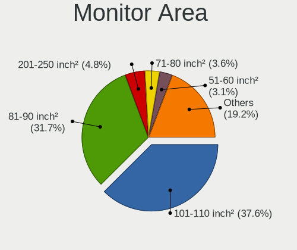

| Area in inch | Notebooks | Percent |
|----------------|-----------|---------|
| 101-110        | 891       | 37.56%  |
| 81-90          | 753       | 31.75%  |
| 201-250        | 114       | 4.81%   |
| 71-80          | 85        | 3.58%   |
| 51-60          | 74        | 3.12%   |
| 351-500        | 57        | 2.4%    |
| 121-130        | 57        | 2.4%    |
| 301-350        | 45        | 1.9%    |
| 151-200        | 43        | 1.81%   |
| 61-70          | 40        | 1.69%   |
| More than 1000 | 34        | 1.43%   |
| 141-150        | 31        | 1.31%   |
| 111-120        | 27        | 1.14%   |
| 41-50          | 26        | 1.1%    |
| 1-40           | 23        | 0.97%   |
| Unknown        | 21        | 0.89%   |
| 251-300        | 19        | 0.8%    |
| 501-1000       | 14        | 0.59%   |
| 131-140        | 12        | 0.51%   |
| 91-100         | 6         | 0.25%   |

Pixel Density
-------------

Pixels per inch

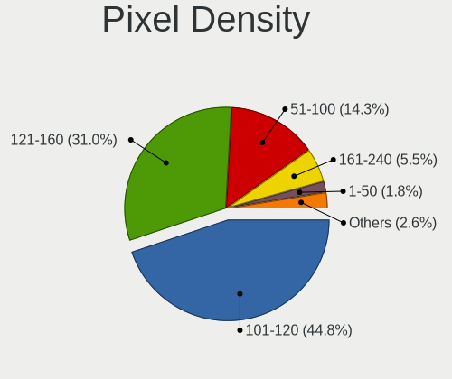

| Density       | Notebooks | Percent |
|---------------|-----------|---------|
| 101-120       | 1049      | 44.85%  |
| 121-160       | 726       | 31.04%  |
| 51-100        | 335       | 14.32%  |
| 161-240       | 128       | 5.47%   |
| 1-50          | 41        | 1.75%   |
| More than 240 | 39        | 1.67%   |
| Unknown       | 21        | 0.9%    |

Multiple Monitors
-----------------

Total monitors connected

| Total | Notebooks | Percent |
|-------|-----------|---------|
| 1     | 1753      | 81.19%  |
| 2     | 333       | 15.42%  |
| 0     | 44        | 2.04%   |
| 3     | 28        | 1.3%    |
| 4     | 1         | 0.05%   |

Network
-------

Net Controller Vendor
---------------------

Controller vendors

| Vendor                                 | Notebooks | Percent |
|----------------------------------------|-----------|---------|
| Realtek Semiconductor                  | 1209      | 37.78%  |
| Intel                                  | 833       | 26.03%  |
| Qualcomm Atheros                       | 465       | 14.53%  |
| Broadcom                               | 283       | 8.84%   |
| Broadcom Limited                       | 60        | 1.88%   |
| MediaTek                               | 52        | 1.63%   |
| Ralink                                 | 45        | 1.41%   |
| Marvell Technology Group               | 41        | 1.28%   |
| TP-Link                                | 31        | 0.97%   |
| Ralink Technology                      | 26        | 0.81%   |
| ASIX Electronics                       | 24        | 0.75%   |
| Nvidia                                 | 18        | 0.56%   |
| DisplayLink                            | 12        | 0.38%   |
| Xiaomi                                 | 10        | 0.31%   |
| Huawei Technologies                    | 10        | 0.31%   |
| Qualcomm Atheros Communications        | 9         | 0.28%   |
| Samsung Electronics                    | 8         | 0.25%   |
| Motorola PCS                           | 8         | 0.25%   |
| Qualcomm                               | 6         | 0.19%   |
| Spreadtrum Communications              | 5         | 0.16%   |
| OPPO Electronics                       | 4         | 0.13%   |
| Mercucys                               | 4         | 0.13%   |
| ICS Advent                             | 4         | 0.13%   |
| Lenovo                                 | 3         | 0.09%   |
| Hewlett-Packard                        | 3         | 0.09%   |
| Google                                 | 3         | 0.09%   |
| ZTE WCDMA Technologies MSM             | 2         | 0.06%   |
| JMicron Technology                     | 2         | 0.06%   |
| Dell                                   | 2         | 0.06%   |
| D-Link                                 | 2         | 0.06%   |
| VIA Technologies                       | 1         | 0.03%   |
| T & A Mobile Phones                    | 1         | 0.03%   |
| Sony Ericsson Mobile Communications AB | 1         | 0.03%   |
| Silicon Integrated Systems [SiS]       | 1         | 0.03%   |
| Shenzhen Goodix Technology             | 1         | 0.03%   |
| Qualcomm Technologies                  | 1         | 0.03%   |
| OpenMoko                               | 1         | 0.03%   |
| NIIMBOT                                | 1         | 0.03%   |
| NetGear                                | 1         | 0.03%   |
| Linksys                                | 1         | 0.03%   |

Net Controller Model
--------------------

Controller models

| Model                                                                  | Notebooks | Percent |
|------------------------------------------------------------------------|-----------|---------|
| Realtek RTL8111/8168/8211/8411 PCI Express Gigabit Ethernet Controller | 582       | 14.73%  |
| Realtek RTL810xE PCI Express Fast Ethernet controller                  | 335       | 8.48%   |
| Realtek RTL8821CE 802.11ac PCIe Wireless Network Adapter               | 127       | 3.21%   |
| Realtek RTL8822CE 802.11ac PCIe Wireless Network Adapter               | 96        | 2.43%   |
| Qualcomm Atheros QCA9565 / AR9565 Wireless Network Adapter             | 86        | 2.18%   |
| Qualcomm Atheros QCA9377 802.11ac Wireless Network Adapter             | 79        | 2%      |
| Intel 82579LM Gigabit Network Connection (Lewisville)                  | 65        | 1.65%   |
| Qualcomm Atheros AR9285 Wireless Network Adapter (PCI-Express)         | 64        | 1.62%   |
| Qualcomm Atheros AR9485 Wireless Network Adapter                       | 61        | 1.54%   |
| Intel Wireless 8265 / 8275                                             | 58        | 1.47%   |
| Realtek RTL8723DE Wireless Network Adapter                             | 57        | 1.44%   |
| Realtek RTL8723BE PCIe Wireless Network Adapter                        | 57        | 1.44%   |
| Intel Wi-Fi 6 AX201                                                    | 56        | 1.42%   |
| Intel Wi-Fi 6 AX200                                                    | 55        | 1.39%   |
| Broadcom BCM43142 802.11b/g/n                                          | 55        | 1.39%   |
| Realtek RTL8153 Gigabit Ethernet Adapter                               | 51        | 1.29%   |
| Intel Wireless 7265                                                    | 49        | 1.24%   |
| Intel Centrino Advanced-N 6205 [Taylor Peak]                           | 46        | 1.16%   |
| Qualcomm Atheros QCA6174 802.11ac Wireless Network Adapter             | 45        | 1.14%   |
| Broadcom BCM4313 802.11bgn Wireless Network Adapter                    | 41        | 1.04%   |
| Intel Wireless 7260                                                    | 40        | 1.01%   |
| Intel Wireless 8260                                                    | 37        | 0.94%   |
| Intel Cannon Lake PCH CNVi WiFi                                        | 37        | 0.94%   |
| Intel Comet Lake PCH-LP CNVi WiFi                                      | 35        | 0.89%   |
| Intel Alder Lake-P PCH CNVi WiFi                                       | 32        | 0.81%   |
| Broadcom NetXtreme BCM57765 Gigabit Ethernet PCIe                      | 32        | 0.81%   |
| Broadcom BCM4331 802.11a/b/g/n                                         | 32        | 0.81%   |
| MediaTek MT7921 802.11ax PCI Express Wireless Network Adapter          | 30        | 0.76%   |
| Intel Comet Lake PCH CNVi WiFi                                         | 30        | 0.76%   |
| Realtek RTL8188EE Wireless Network Adapter                             | 27        | 0.68%   |
| Intel Ethernet Connection I218-LM                                      | 25        | 0.63%   |
| Qualcomm Atheros AR8152 v2.0 Fast Ethernet                             | 24        | 0.61%   |
| Broadcom Limited BCM4312 802.11b/g LP-PHY                              | 24        | 0.61%   |
| Realtek RTL8188CE 802.11b/g/n WiFi Adapter                             | 23        | 0.58%   |
| Qualcomm Atheros AR8151 v2.0 Gigabit Ethernet                          | 23        | 0.58%   |
| Intel Wireless 3160                                                    | 23        | 0.58%   |
| Intel PRO/Wireless 3945ABG [Golan] Network Connection                  | 23        | 0.58%   |
| Intel Ethernet Connection (4) I219-LM                                  | 23        | 0.58%   |
| Intel Cannon Point-LP CNVi [Wireless-AC]                               | 23        | 0.58%   |
| Intel Wireless 3165                                                    | 22        | 0.56%   |

Wireless Vendor
---------------

Wireless vendors

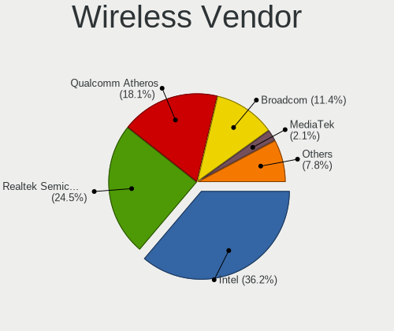

| Vendor                                | Notebooks | Percent |
|---------------------------------------|-----------|---------|
| Intel                                 | 784       | 36.18%  |
| Realtek Semiconductor                 | 530       | 24.46%  |
| Qualcomm Atheros                      | 392       | 18.09%  |
| Broadcom                              | 246       | 11.35%  |
| MediaTek                              | 46        | 2.12%   |
| Broadcom Limited                      | 46        | 2.12%   |
| Ralink                                | 45        | 2.08%   |
| TP-Link                               | 27        | 1.25%   |
| Ralink Technology                     | 26        | 1.2%    |
| Qualcomm Atheros Communications       | 9         | 0.42%   |
| Qualcomm                              | 5         | 0.23%   |
| Mercucys                              | 4         | 0.18%   |
| D-Link                                | 2         | 0.09%   |
| Qualcomm Technologies                 | 1         | 0.05%   |
| NetGear                               | 1         | 0.05%   |
| Dell                                  | 1         | 0.05%   |
| D-Link System                         | 1         | 0.05%   |
| 802.11g Adapter [Linksys WUSB54GC v3] | 1         | 0.05%   |

Wireless Model
--------------

Wireless models

| Model                                                          | Notebooks | Percent |
|----------------------------------------------------------------|-----------|---------|
| Realtek RTL8821CE 802.11ac PCIe Wireless Network Adapter       | 127       | 5.78%   |
| Realtek RTL8822CE 802.11ac PCIe Wireless Network Adapter       | 96        | 4.37%   |
| Qualcomm Atheros QCA9565 / AR9565 Wireless Network Adapter     | 86        | 3.91%   |
| Qualcomm Atheros QCA9377 802.11ac Wireless Network Adapter     | 79        | 3.59%   |
| Qualcomm Atheros AR9285 Wireless Network Adapter (PCI-Express) | 64        | 2.91%   |
| Qualcomm Atheros AR9485 Wireless Network Adapter               | 61        | 2.78%   |
| Intel Wireless 8265 / 8275                                     | 58        | 2.64%   |
| Realtek RTL8723DE Wireless Network Adapter                     | 57        | 2.59%   |
| Realtek RTL8723BE PCIe Wireless Network Adapter                | 57        | 2.59%   |
| Intel Wi-Fi 6 AX201                                            | 56        | 2.55%   |
| Intel Wi-Fi 6 AX200                                            | 55        | 2.5%    |
| Broadcom BCM43142 802.11b/g/n                                  | 55        | 2.5%    |
| Intel Wireless 7265                                            | 49        | 2.23%   |
| Intel Centrino Advanced-N 6205 [Taylor Peak]                   | 46        | 2.09%   |
| Qualcomm Atheros QCA6174 802.11ac Wireless Network Adapter     | 45        | 2.05%   |
| Broadcom BCM4313 802.11bgn Wireless Network Adapter            | 41        | 1.87%   |
| Intel Wireless 7260                                            | 40        | 1.82%   |
| Intel Wireless 8260                                            | 37        | 1.68%   |
| Intel Cannon Lake PCH CNVi WiFi                                | 37        | 1.68%   |
| Intel Comet Lake PCH-LP CNVi WiFi                              | 35        | 1.59%   |
| Broadcom BCM4331 802.11a/b/g/n                                 | 32        | 1.46%   |
| Intel Alder Lake-P PCH CNVi WiFi                               | 31        | 1.41%   |
| MediaTek MT7921 802.11ax PCI Express Wireless Network Adapter  | 30        | 1.36%   |
| Intel Comet Lake PCH CNVi WiFi                                 | 30        | 1.36%   |
| Realtek RTL8188EE Wireless Network Adapter                     | 27        | 1.23%   |
| Broadcom Limited BCM4312 802.11b/g LP-PHY                      | 24        | 1.09%   |
| Realtek RTL8188CE 802.11b/g/n WiFi Adapter                     | 23        | 1.05%   |
| Intel Wireless 3160                                            | 23        | 1.05%   |
| Intel PRO/Wireless 3945ABG [Golan] Network Connection          | 23        | 1.05%   |
| Intel Cannon Point-LP CNVi [Wireless-AC]                       | 23        | 1.05%   |
| Intel Wireless 3165                                            | 22        | 1%      |
| Broadcom BCM4312 802.11b/g LP-PHY                              | 22        | 1%      |
| Realtek RTL8822BE 802.11a/b/g/n/ac WiFi adapter                | 20        | 0.91%   |
| Ralink RT3290 Wireless 802.11n 1T/1R PCIe                      | 19        | 0.86%   |
| Intel Dual Band Wireless-AC 3165 Plus Bluetooth                | 19        | 0.86%   |
| Realtek RTL8188EUS 802.11n Wireless Network Adapter            | 18        | 0.82%   |
| Realtek 802.11ac NIC                                           | 17        | 0.77%   |
| Qualcomm Atheros AR9462 Wireless Network Adapter               | 17        | 0.77%   |
| Realtek RTL8852BE PCIe 802.11ax Wireless Network Controller    | 16        | 0.73%   |
| Intel Centrino Wireless-N 1030 [Rainbow Peak]                  | 16        | 0.73%   |

Ethernet Vendor
---------------

Ethernet vendors

| Vendor                                 | Notebooks | Percent |
|----------------------------------------|-----------|---------|
| Realtek Semiconductor                  | 993       | 57.67%  |
| Intel                                  | 309       | 17.94%  |
| Qualcomm Atheros                       | 142       | 8.25%   |
| Broadcom                               | 93        | 5.4%    |
| Marvell Technology Group               | 41        | 2.38%   |
| ASIX Electronics                       | 24        | 1.39%   |
| Nvidia                                 | 18        | 1.05%   |
| Broadcom Limited                       | 14        | 0.81%   |
| DisplayLink                            | 12        | 0.7%    |
| Xiaomi                                 | 10        | 0.58%   |
| Huawei Technologies                    | 9         | 0.52%   |
| Motorola PCS                           | 8         | 0.46%   |
| Samsung Electronics                    | 6         | 0.35%   |
| MediaTek                               | 6         | 0.35%   |
| Spreadtrum Communications              | 5         | 0.29%   |
| TP-Link                                | 4         | 0.23%   |
| OPPO Electronics                       | 4         | 0.23%   |
| ICS Advent                             | 4         | 0.23%   |
| Lenovo                                 | 3         | 0.17%   |
| Google                                 | 3         | 0.17%   |
| ZTE WCDMA Technologies MSM             | 2         | 0.12%   |
| JMicron Technology                     | 2         | 0.12%   |
| VIA Technologies                       | 1         | 0.06%   |
| T & A Mobile Phones                    | 1         | 0.06%   |
| Sony Ericsson Mobile Communications AB | 1         | 0.06%   |
| Silicon Integrated Systems [SiS]       | 1         | 0.06%   |
| Qualcomm                               | 1         | 0.06%   |
| Linksys                                | 1         | 0.06%   |
| LG Electronics                         | 1         | 0.06%   |
| Lab126                                 | 1         | 0.06%   |
| HTC (High Tech Computer)               | 1         | 0.06%   |
| Foxconn / Hon Hai                      | 1         | 0.06%   |

Ethernet Model
--------------

Ethernet models

| Model                                                                          | Notebooks | Percent |
|--------------------------------------------------------------------------------|-----------|---------|
| Realtek RTL8111/8168/8211/8411 PCI Express Gigabit Ethernet Controller         | 582       | 33.53%  |
| Realtek RTL810xE PCI Express Fast Ethernet controller                          | 335       | 19.3%   |
| Intel 82579LM Gigabit Network Connection (Lewisville)                          | 65        | 3.74%   |
| Realtek RTL8153 Gigabit Ethernet Adapter                                       | 51        | 2.94%   |
| Broadcom NetXtreme BCM57765 Gigabit Ethernet PCIe                              | 32        | 1.84%   |
| Intel Ethernet Connection I218-LM                                              | 25        | 1.44%   |
| Qualcomm Atheros AR8152 v2.0 Fast Ethernet                                     | 24        | 1.38%   |
| Qualcomm Atheros AR8151 v2.0 Gigabit Ethernet                                  | 23        | 1.32%   |
| Intel Ethernet Connection (4) I219-LM                                          | 23        | 1.32%   |
| ASIX AX88179 Gigabit Ethernet                                                  | 21        | 1.21%   |
| Intel Ethernet Connection (3) I218-LM                                          | 19        | 1.09%   |
| Realtek RTL8152 Fast Ethernet Adapter                                          | 15        | 0.86%   |
| Qualcomm Atheros QCA8171 Gigabit Ethernet                                      | 15        | 0.86%   |
| Qualcomm Atheros AR8162 Fast Ethernet                                          | 15        | 0.86%   |
| Intel Ethernet Connection I217-LM                                              | 15        | 0.86%   |
| Intel 82577LM Gigabit Network Connection                                       | 15        | 0.86%   |
| Intel 82567LM Gigabit Network Connection                                       | 15        | 0.86%   |
| Intel Ethernet Connection I219-LM                                              | 14        | 0.81%   |
| Qualcomm Atheros AR8131 Gigabit Ethernet                                       | 13        | 0.75%   |
| Broadcom NetLink BCM57785 Gigabit Ethernet PCIe                                | 13        | 0.75%   |
| Marvell Group 88E8040 PCI-E Fast Ethernet Controller                           | 12        | 0.69%   |
| Qualcomm Atheros AR8161 Gigabit Ethernet                                       | 11        | 0.63%   |
| Qualcomm Atheros Killer E2400 Gigabit Ethernet Controller                      | 10        | 0.58%   |
| Qualcomm Atheros AR8152 v1.1 Fast Ethernet                                     | 10        | 0.58%   |
| Qualcomm Atheros AR8132 Fast Ethernet                                          | 9         | 0.52%   |
| Intel Ethernet Connection (2) I219-LM                                          | 9         | 0.52%   |
| Realtek RTL8125 2.5GbE Controller                                              | 8         | 0.46%   |
| Intel Ethernet Connection I219-V                                               | 8         | 0.46%   |
| Intel Ethernet Connection (7) I219-V                                           | 8         | 0.46%   |
| Intel Ethernet Connection (6) I219-V                                           | 8         | 0.46%   |
| Intel Ethernet Connection (16) I219-LM                                         | 8         | 0.46%   |
| Huawei FOA-LX9                                                                 | 8         | 0.46%   |
| Broadcom NetXtreme BCM5764M Gigabit Ethernet PCIe                              | 8         | 0.46%   |
| Xiaomi Mi/Redmi series (RNDIS)                                                 | 7         | 0.4%    |
| Realtek Killer E2600 GbE Controller                                            | 7         | 0.4%    |
| Qualcomm Atheros Killer E2500 Gigabit Ethernet Controller                      | 7         | 0.4%    |
| Nvidia MCP67 Ethernet                                                          | 7         | 0.4%    |
| Marvell Group Yukon Optima 88E8059 [PCIe Gigabit Ethernet Controller with AVB] | 7         | 0.4%    |
| Intel Ethernet Connection (10) I219-V                                          | 7         | 0.4%    |
| Broadcom NetLink BCM57780 Gigabit Ethernet PCIe                                | 7         | 0.4%    |

Net Controller Kind
-------------------

Ethernet, WiFi or modem

| Kind     | Notebooks | Percent |
|----------|-----------|---------|
| WiFi     | 2066      | 55.48%  |
| Ethernet | 1641      | 44.07%  |
| Modem    | 14        | 0.38%   |
| Unknown  | 3         | 0.08%   |

Used Controller
---------------

Currently used network controller

| Kind     | Notebooks | Percent |
|----------|-----------|---------|
| WiFi     | 1698      | 76.04%  |
| Ethernet | 534       | 23.91%  |
| Unknown  | 1         | 0.04%   |

NICs
----

Total network controllers on board

| Total | Notebooks | Percent |
|-------|-----------|---------|
| 2     | 1506      | 71.68%  |
| 1     | 550       | 26.18%  |
| 0     | 38        | 1.81%   |
| 3     | 7         | 0.33%   |

IPv6
----

IPv6 vs IPv4

| Used | Notebooks | Percent |
|------|-----------|---------|
| No   | 1360      | 62.93%  |
| Yes  | 801       | 37.07%  |

Bluetooth
---------

Bluetooth Vendor
----------------

Controller vendors

| Vendor                          | Notebooks | Percent |
|---------------------------------|-----------|---------|
| Intel                           | 596       | 36.21%  |
| Realtek Semiconductor           | 296       | 17.98%  |
| Qualcomm Atheros Communications | 154       | 9.36%   |
| Broadcom                        | 103       | 6.26%   |
| IMC Networks                    | 91        | 5.53%   |
| Apple                           | 80        | 4.86%   |
| Lite-On Technology              | 72        | 4.37%   |
| Foxconn / Hon Hai               | 58        | 3.52%   |
| Realtek                         | 47        | 2.86%   |
| Dell                            | 35        | 2.13%   |
| Hewlett-Packard                 | 30        | 1.82%   |
| Toshiba                         | 24        | 1.46%   |
| Ralink                          | 19        | 1.15%   |
| Cambridge Silicon Radio         | 13        | 0.79%   |
| Ralink Technology               | 8         | 0.49%   |
| Foxconn International           | 4         | 0.24%   |
| Alps Electric                   | 4         | 0.24%   |
| Opticis                         | 2         | 0.12%   |
| MediaTek                        | 2         | 0.12%   |
| Chicony Electronics             | 2         | 0.12%   |
| Unknown                         | 2         | 0.12%   |
| USI                             | 1         | 0.06%   |
| Integrated System Solution      | 1         | 0.06%   |
| Fujitsu                         | 1         | 0.06%   |
| ASUSTek Computer                | 1         | 0.06%   |

Bluetooth Model
---------------

Controller models

| Model                                                                               | Notebooks | Percent |
|-------------------------------------------------------------------------------------|-----------|---------|
| Intel Bluetooth wireless interface                                                  | 226       | 13.71%  |
| Realtek Bluetooth Radio                                                             | 133       | 8.07%   |
| Realtek  Bluetooth 4.2 Adapter                                                      | 116       | 7.03%   |
| Intel AX201 Bluetooth                                                               | 115       | 6.97%   |
| Intel Bluetooth 9460/9560 Jefferson Peak (JfP)                                      | 114       | 6.91%   |
| Qualcomm Atheros  Bluetooth Device                                                  | 85        | 5.15%   |
| Intel AX200 Bluetooth                                                               | 53        | 3.21%   |
| Realtek Bluetooth Radio                                                             | 47        | 2.85%   |
| Apple Bluetooth Host Controller                                                     | 42        | 2.55%   |
| IMC Networks Bluetooth Radio                                                        | 38        | 2.3%    |
| Broadcom BCM43142A0 Bluetooth 4.0                                                   | 31        | 1.88%   |
| IMC Networks Wireless_Device                                                        | 27        | 1.64%   |
| Apple Bluetooth USB Host Controller                                                 | 27        | 1.64%   |
| Lite-On Bluetooth Device                                                            | 24        | 1.46%   |
| Intel Centrino Bluetooth Wireless Transceiver                                       | 24        | 1.46%   |
| Intel AX211 Bluetooth                                                               | 23        | 1.39%   |
| Intel Centrino Advanced-N 6230 Bluetooth adapter                                    | 22        | 1.33%   |
| Qualcomm Atheros AR3012 Bluetooth 4.0                                               | 20        | 1.21%   |
| Lite-On Atheros AR3012 Bluetooth                                                    | 20        | 1.21%   |
| Foxconn / Hon Hai Bluetooth Device                                                  | 20        | 1.21%   |
| Ralink RT3290 Bluetooth                                                             | 19        | 1.15%   |
| Qualcomm Atheros QCA61x4 Bluetooth 4.0                                              | 19        | 1.15%   |
| Lite-On Qualcomm Atheros QCA9377 Bluetooth                                          | 19        | 1.15%   |
| Qualcomm Atheros AR3011 Bluetooth                                                   | 16        | 0.97%   |
| HP Broadcom 2070 Bluetooth Combo                                                    | 16        | 0.97%   |
| Realtek RTL8723B Bluetooth                                                          | 15        | 0.91%   |
| HP Bluetooth 2.0 Interface [Broadcom BCM2045]                                       | 14        | 0.85%   |
| Broadcom BCM20702 Bluetooth 4.0 [ThinkPad]                                          | 14        | 0.85%   |
| Cambridge Silicon Radio Bluetooth Dongle (HCI mode)                                 | 13        | 0.79%   |
| Realtek 802.11ac WLAN Adapter                                                       | 11        | 0.67%   |
| IMC Networks Bluetooth Device                                                       | 11        | 0.67%   |
| Realtek RTL8821A Bluetooth                                                          | 10        | 0.61%   |
| Intel AX210 Bluetooth                                                               | 10        | 0.61%   |
| Dell BCM20702A0 Bluetooth Module                                                    | 10        | 0.61%   |
| Broadcom BCM2045B (BDC-2.1)                                                         | 10        | 0.61%   |
| Foxconn / Hon Hai Foxconn T77H114 BCM2070 [Single-Chip Bluetooth 2.1 + EDR Adapter] | 9         | 0.55%   |
| Qualcomm Atheros AR9462 Bluetooth                                                   | 8         | 0.49%   |
| Foxconn / Hon Hai MediaTek Bluetooth Adapter                                        | 8         | 0.49%   |
| Dell Wireless 370 Bluetooth Mini-card                                               | 8         | 0.49%   |
| Toshiba Bluetooth Device                                                            | 7         | 0.42%   |

Sound
-----

Sound Vendor
------------

Sound card vendors

| Vendor                                          | Notebooks | Percent |
|-------------------------------------------------|-----------|---------|
| Intel                                           | 1528      | 61.81%  |
| AMD                                             | 557       | 22.53%  |
| Nvidia                                          | 260       | 10.52%  |
| Logitech                                        | 14        | 0.57%   |
| Realtek Semiconductor                           | 9         | 0.36%   |
| GN Netcom                                       | 9         | 0.36%   |
| Texas Instruments                               | 8         | 0.32%   |
| C-Media Electronics                             | 8         | 0.32%   |
| Plantronics                                     | 6         | 0.24%   |
| Lenovo                                          | 6         | 0.24%   |
| Generalplus Technology                          | 6         | 0.24%   |
| Kingston Technology                             | 5         | 0.2%    |
| Tenx Technology                                 | 4         | 0.16%   |
| Sony                                            | 4         | 0.16%   |
| JMTek                                           | 4         | 0.16%   |
| Focusrite-Novation                              | 4         | 0.16%   |
| ASUSTek Computer                                | 4         | 0.16%   |
| Thesycon Systemsoftware & Consulting            | 3         | 0.12%   |
| KTMicro                                         | 3         | 0.12%   |
| Creative Technology                             | 3         | 0.12%   |
| Syntek                                          | 2         | 0.08%   |
| Synaptics                                       | 2         | 0.08%   |
| Samson Technologies                             | 2         | 0.08%   |
| Razer USA                                       | 2         | 0.08%   |
| Apple                                           | 2         | 0.08%   |
| Yamaha                                          | 1         | 0.04%   |
| VIA Technologies                                | 1         | 0.04%   |
| SteelSeries ApS                                 | 1         | 0.04%   |
| Silicon Motion                                  | 1         | 0.04%   |
| Silicon Integrated Systems [SiS]                | 1         | 0.04%   |
| Shure                                           | 1         | 0.04%   |
| Sennheiser Communications                       | 1         | 0.04%   |
| Samsung Electronics                             | 1         | 0.04%   |
| M-Audio                                         | 1         | 0.04%   |
| Licensed by Sony Computer Entertainment America | 1         | 0.04%   |
| Huawei Technologies                             | 1         | 0.04%   |
| HiBy                                            | 1         | 0.04%   |
| Hewlett-Packard                                 | 1         | 0.04%   |
| DisplayLink                                     | 1         | 0.04%   |
| Cambridge Audio                                 | 1         | 0.04%   |

Sound Model
-----------

Sound card models

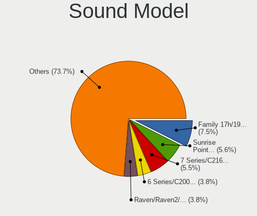

| Model                                                                                             | Notebooks | Percent |
|---------------------------------------------------------------------------------------------------|-----------|---------|
| AMD Family 17h/19h/1ah HD Audio Controller                                                        | 231       | 7.47%   |
| Intel Sunrise Point-LP HD Audio                                                                   | 174       | 5.63%   |
| Intel 7 Series/C216 Chipset Family High Definition Audio Controller                               | 170       | 5.5%    |
| Intel 6 Series/C200 Series Chipset Family High Definition Audio Controller                        | 119       | 3.85%   |
| AMD Raven/Raven2/Fenghuang HDMI/DP Audio Controller                                               | 118       | 3.82%   |
| AMD Renoir Radeon High Definition Audio Controller                                                | 108       | 3.49%   |
| AMD FCH Azalia Controller                                                                         | 104       | 3.36%   |
| Intel Haswell-ULT HD Audio Controller                                                             | 81        | 2.62%   |
| Intel 8 Series HD Audio Controller                                                                | 81        | 2.62%   |
| AMD Family 15h (Models 60h-6fh) Audio Controller                                                  | 79        | 2.55%   |
| AMD Kabini HDMI/DP Audio                                                                          | 74        | 2.39%   |
| Intel Wildcat Point-LP High Definition Audio Controller                                           | 73        | 2.36%   |
| Intel Broadwell-U Audio Controller                                                                | 73        | 2.36%   |
| Intel Tiger Lake-LP Smart Sound Technology Audio Controller                                       | 71        | 2.3%    |
| Intel 5 Series/3400 Series Chipset High Definition Audio                                          | 70        | 2.26%   |
| Intel 82801I (ICH9 Family) HD Audio Controller                                                    | 65        | 2.1%    |
| Intel Cannon Lake PCH cAVS                                                                        | 64        | 2.07%   |
| Intel Celeron/Pentium Silver Processor High Definition Audio                                      | 60        | 1.94%   |
| Intel Atom/Celeron/Pentium Processor x5-E8000/J3xxx/N3xxx Series High Definition Audio Controller | 57        | 1.84%   |
| AMD SBx00 Azalia (Intel HDA)                                                                      | 57        | 1.84%   |
| AMD High Definition Audio Controller                                                              | 55        | 1.78%   |
| Intel Atom Processor Z36xxx/Z37xxx Series High Definition Audio Controller                        | 49        | 1.58%   |
| Intel NM10/ICH7 Family High Definition Audio Controller                                           | 47        | 1.52%   |
| Intel Cannon Point-LP High Definition Audio Controller                                            | 47        | 1.52%   |
| Intel 82801H (ICH8 Family) HD Audio Controller                                                    | 47        | 1.52%   |
| AMD Rembrandt Radeon High Definition Audio Controller                                             | 47        | 1.52%   |
| Intel Comet Lake PCH-LP cAVS                                                                      | 45        | 1.45%   |
| Intel 8 Series/C220 Series Chipset High Definition Audio Controller                               | 43        | 1.39%   |
| Intel Alder Lake PCH-P High Definition Audio Controller                                           | 42        | 1.36%   |
| Intel Comet Lake PCH cAVS                                                                         | 35        | 1.13%   |
| Intel 100 Series/C230 Series Chipset Family HD Audio Controller                                   | 34        | 1.1%    |
| Intel CM238 HD Audio Controller                                                                   | 33        | 1.07%   |
| Intel Xeon E3-1200 v3/4th Gen Core Processor HD Audio Controller                                  | 32        | 1.03%   |
| Intel Celeron N3350/Pentium N4200/Atom E3900 Series Audio Cluster                                 | 32        | 1.03%   |
| AMD Trinity HDMI Audio Controller                                                                 | 29        | 0.94%   |
| Nvidia TU107 GeForce GTX 1650 High Definition Audio Controller                                    | 27        | 0.87%   |
| Nvidia GF108 High Definition Audio Controller                                                     | 26        | 0.84%   |
| Intel Ice Lake-LP Smart Sound Technology Audio Controller                                         | 25        | 0.81%   |
| Nvidia GP107GL High Definition Audio Controller                                                   | 23        | 0.74%   |
| Nvidia GA107 High Definition Audio Controller                                                     | 22        | 0.71%   |

Memory
------

Memory Vendor
-------------

Memory module vendors

| Vendor                                           | Notebooks | Percent |
|--------------------------------------------------|-----------|---------|
| Samsung Electronics                              | 366       | 28.15%  |
| SK hynix                                         | 286       | 22%     |
| Micron Technology                                | 170       | 13.08%  |
| Kingston                                         | 164       | 12.62%  |
| Unknown                                          | 75        | 5.77%   |
| A-DATA Technology                                | 51        | 3.92%   |
| Ramaxel Technology                               | 41        | 3.15%   |
| Crucial                                          | 30        | 2.31%   |
| Elpida                                           | 23        | 1.77%   |
| Unknown (ABCD)                                   | 18        | 1.38%   |
| Nanya Technology                                 | 16        | 1.23%   |
| Corsair                                          | 11        | 0.85%   |
| Unknown                                          | 8         | 0.62%   |
| ChangXin Memory                                  | 6         | 0.46%   |
| Team                                             | 3         | 0.23%   |
| Qimonda                                          | 3         | 0.23%   |
| PNY                                              | 3         | 0.23%   |
| Patriot                                          | 3         | 0.23%   |
| Transcend                                        | 2         | 0.15%   |
| Timetec                                          | 2         | 0.15%   |
| G.Skill                                          | 2         | 0.15%   |
| ff                                               | 2         | 0.15%   |
| 4ea5                                             | 2         | 0.15%   |
| Unknown (0x8AF1)                                 | 1         | 0.08%   |
| Unknown (0x4D342037305435363633515A332D43453620) | 1         | 0.08%   |
| Unknown (0x0C75)                                 | 1         | 0.08%   |
| Silicon Power                                    | 1         | 0.08%   |
| SHARETRONIC                                      | 1         | 0.08%   |
| Patriot Memory (PDP Systems)                     | 1         | 0.08%   |
| Goldkey                                          | 1         | 0.08%   |
| Avant                                            | 1         | 0.08%   |
| ASint Technology                                 | 1         | 0.08%   |
| A-TECH                                           | 1         | 0.08%   |
| 8A6B0000802C                                     | 1         | 0.08%   |
| 3235CB0010E4                                     | 1         | 0.08%   |
| 0161000080AD                                     | 1         | 0.08%   |

Memory Model
------------

Memory module models

| Model                                                            | Notebooks | Percent |
|------------------------------------------------------------------|-----------|---------|
| Samsung RAM M471A5244CB0-CTD 4GB SODIMM DDR4 3266MT/s            | 33        | 2.38%   |
| Micron RAM 4ATF1G64HZ-3G2E1 8GB Row Of Chips DDR4 3200MT/s       | 20        | 1.44%   |
| Unknown (ABCD) RAM 123456789012345678 2GB SODIMM LPDDR3 2400MT/s | 18        | 1.3%    |
| SK hynix RAM HMA81GS6AFR8N-UH 8GB SODIMM DDR4 2667MT/s           | 15        | 1.08%   |
| Samsung RAM M471B5173QH0-YK0 4GB SODIMM DDR3 1600MT/s            | 15        | 1.08%   |
| Samsung RAM M471B5173DB0-YK0 4GB SODIMM DDR3 1600MT/s            | 15        | 1.08%   |
| Samsung RAM M471A1K43DB1-CTD 8GB SODIMM DDR4 2667MT/s            | 15        | 1.08%   |
| Samsung RAM M471B5273DH0-CH9 4GB SODIMM DDR3 1334MT/s            | 14        | 1.01%   |
| Micron RAM 4ATF51264HZ-2G6E1 4GB SODIMM DDR4 2667MT/s            | 14        | 1.01%   |
| SK hynix RAM HMT451S6BFR8A-PB 4096MB SODIMM DDR3 1600MT/s        | 11        | 0.79%   |
| Samsung RAM M471B5173EB0-YK0 4GB SODIMM DDR3 1600MT/s            | 11        | 0.79%   |
| Samsung RAM M471A1K43CB1-CTD 8GB SODIMM DDR4 2667MT/s            | 11        | 0.79%   |
| SK hynix RAM HMT451S6BFR8A-PB 4GB SODIMM DDR3 1600MT/s           | 10        | 0.72%   |
| SK hynix RAM HMT41GS6BFR8A-PB 8GB SODIMM DDR3 1600MT/s           | 10        | 0.72%   |
| SK hynix RAM HMA81GS6JJR8N-VK 8GB SODIMM DDR4 2667MT/s           | 10        | 0.72%   |
| SK hynix RAM HMA81GS6DJR8N-XN 8GB SODIMM DDR4 3200MT/s           | 10        | 0.72%   |
| Samsung RAM M471A1K43CB1-CRC 8GB SODIMM DDR4 2667MT/s            | 10        | 0.72%   |
| Micron RAM 8KTF51264HZ-1G6E1 4GB SODIMM DDR3 1600MT/s            | 10        | 0.72%   |
| SK hynix RAM HMT351S6CFR8C-PB 4GB SODIMM DDR3 1600MT/s           | 9         | 0.65%   |
| Samsung RAM M471B1G73QH0-YK0 8GB SODIMM DDR3 1600MT/s            | 9         | 0.65%   |
| Samsung RAM M471B1G73DB0-YK0 8GB SODIMM DDR3 1600MT/s            | 9         | 0.65%   |
| Samsung RAM M471A5244CB0-CTD 4GB Row Of Chips DDR4 2667MT/s      | 9         | 0.65%   |
| Samsung RAM M471A1G44AB0-CWE 8GB Row Of Chips DDR4 3200MT/s      | 9         | 0.65%   |
| Unknown RAM Module 2GB SODIMM DDR2 667MT/s                       | 8         | 0.58%   |
| SK hynix RAM HMT451S6AFR8A-PB 4GB SODIMM DDR3 1600MT/s           | 8         | 0.58%   |
| SK hynix RAM HMT41GS6AFR8A-PB 8GB SODIMM DDR3 1600MT/s           | 8         | 0.58%   |
| SK hynix RAM HMA81GS6CJR8N-VK 8GB SODIMM DDR4 2667MT/s           | 8         | 0.58%   |
| Samsung RAM M471B5273CH0-CH9 4GB SODIMM DDR3 1334MT/s            | 8         | 0.58%   |
| Samsung RAM M471A1K43DB1-CWE 8GB SODIMM DDR4 3200MT/s            | 8         | 0.58%   |
| Samsung RAM M471A1G44AB0-CWE 8GB SODIMM DDR4 3200MT/s            | 8         | 0.58%   |
| Samsung RAM M4 70T5663QZ3-CF7 2GB SODIMM DDR2 2048MT/s           | 8         | 0.58%   |
| Kingston RAM 99U5428-018.A00LF 8GB SODIMM DDR3 1600MT/s          | 8         | 0.58%   |
| Unknown                                                          | 8         | 0.58%   |
| SK hynix RAM HMA851S6AFR6N-UH 4GB SODIMM DDR4 2400MT/s           | 7         | 0.51%   |
| Samsung RAM M471B5273DH0-CK0 4GB SODIMM DDR3 2400MT/s            | 7         | 0.51%   |
| Samsung RAM M471B1G73EB0-YK0 8GB SODIMM DDR3 1600MT/s            | 7         | 0.51%   |
| Ramaxel RAM RMSA3260ME78HAF-2666 8GB SODIMM DDR4 2667MT/s        | 7         | 0.51%   |
| Micron RAM 16KTF1G64HZ-1G6E1 8GB SODIMM DDR3 1600MT/s            | 7         | 0.51%   |
| SK hynix RAM HMT425S6CFR6A-PB 2GB SODIMM DDR3 1600MT/s           | 6         | 0.43%   |
| SK hynix RAM HMA851S6CJR6N-VK 4GB Row Of Chips DDR4 2667MT/s     | 6         | 0.43%   |

Memory Kind
-----------

Memory module kinds

| Kind    | Notebooks | Percent |
|---------|-----------|---------|
| DDR4    | 465       | 44.08%  |
| DDR3    | 378       | 35.83%  |
| DDR2    | 56        | 5.31%   |
| LPDDR4  | 52        | 4.93%   |
| LPDDR3  | 30        | 2.84%   |
| SDRAM   | 24        | 2.27%   |
| DDR5    | 19        | 1.8%    |
| LPDDR5  | 18        | 1.71%   |
| DDR     | 7         | 0.66%   |
| Unknown | 5         | 0.47%   |
| RAM     | 1         | 0.09%   |

Memory Form Factor
------------------

Physical design of the memory module

| Name         | Notebooks | Percent |
|--------------|-----------|---------|
| SODIMM       | 908       | 86.07%  |
| Row Of Chips | 133       | 12.61%  |
| Chip         | 7         | 0.66%   |
| Unknown      | 7         | 0.66%   |

Memory Size
-----------

Memory module size

| Size  | Notebooks | Percent |
|-------|-----------|---------|
| 8192  | 465       | 38.05%  |
| 4096  | 409       | 33.47%  |
| 2048  | 158       | 12.93%  |
| 16384 | 120       | 9.82%   |
| 1024  | 43        | 3.52%   |
| 32768 | 21        | 1.72%   |
| 512   | 3         | 0.25%   |
| 12288 | 2         | 0.16%   |
| 256   | 1         | 0.08%   |

Memory Speed
------------

Memory module speed

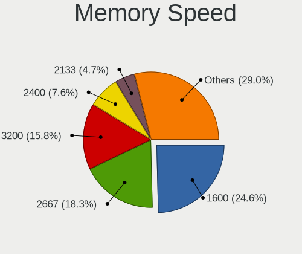

| Speed   | Notebooks | Percent |
|---------|-----------|---------|
| 1600    | 287       | 24.61%  |
| 2667    | 213       | 18.27%  |
| 3200    | 184       | 15.78%  |
| 2400    | 89        | 7.63%   |
| 2133    | 55        | 4.72%   |
| 1334    | 53        | 4.55%   |
| 1333    | 41        | 3.52%   |
| 3266    | 33        | 2.83%   |
| 667     | 33        | 2.83%   |
| Unknown | 22        | 1.89%   |
| 4267    | 20        | 1.72%   |
| 2048    | 16        | 1.37%   |
| 6400    | 15        | 1.29%   |
| 800     | 15        | 1.29%   |
| 4800    | 14        | 1.2%    |
| 1067    | 14        | 1.2%    |
| 1867    | 12        | 1.03%   |
| 4199    | 8         | 0.69%   |
| 975     | 7         | 0.6%    |
| 533     | 7         | 0.6%    |
| 3733    | 6         | 0.51%   |
| 5600    | 5         | 0.43%   |
| 1066    | 5         | 0.43%   |
| 8400    | 4         | 0.34%   |
| 5500    | 2         | 0.17%   |
| 2933    | 2         | 0.17%   |
| 1866    | 2         | 0.17%   |
| 7467    | 1         | 0.09%   |
| 400     | 1         | 0.09%   |

Printers & scanners
-------------------

Printer Vendor
--------------

Printer device vendors

| Vendor                 | Notebooks | Percent |
|------------------------|-----------|---------|
| Seiko Epson            | 3         | 16.67%  |
| Samsung Electronics    | 3         | 16.67%  |
| Hewlett-Packard        | 3         | 16.67%  |
| Canon                  | 3         | 16.67%  |
| Brother Industries     | 3         | 16.67%  |
| TSC Auto ID Technology | 1         | 5.56%   |
| Kyocera                | 1         | 5.56%   |
| BIXOLON                | 1         | 5.56%   |

Printer Model
-------------

Printer device models

| Model                            | Notebooks | Percent |
|----------------------------------|-----------|---------|
| Samsung M2020 Series             | 2         | 11.11%  |
| HP DeskJet 2300 series           | 2         | 11.11%  |
| TSC Auto ID Printer              | 1         | 5.56%   |
| Seiko Epson L555 Series          | 1         | 5.56%   |
| Seiko Epson L210 Series          | 1         | 5.56%   |
| Seiko Epson L120 Series          | 1         | 5.56%   |
| Samsung ML-1660 Series           | 1         | 5.56%   |
| Kyocera FS-1116MFP               | 1         | 5.56%   |
| HP LaserJet Professional P 1102w | 1         | 5.56%   |
| Canon MF220 Series               | 1         | 5.56%   |
| Canon iP2600 series              | 1         | 5.56%   |
| Canon G2010 series               | 1         | 5.56%   |
| Brother MFC-J470DW               | 1         | 5.56%   |
| Brother DCP-1600                 | 1         | 5.56%   |
| Brother DCP-1510                 | 1         | 5.56%   |
| BIXOLON SRP-350plusIII           | 1         | 5.56%   |

Scanner Vendor
--------------

Scanner device vendors

| Vendor          | Notebooks | Percent |
|-----------------|-----------|---------|
| Hewlett-Packard | 3         | 100%    |

Scanner Model
-------------

Scanner device models

| Model           | Notebooks | Percent |
|-----------------|-----------|---------|
| HP ScanJet 5590 | 2         | 66.67%  |
| HP Scanjet 300  | 1         | 33.33%  |

Camera
------

Camera Vendor
-------------

Camera device vendors

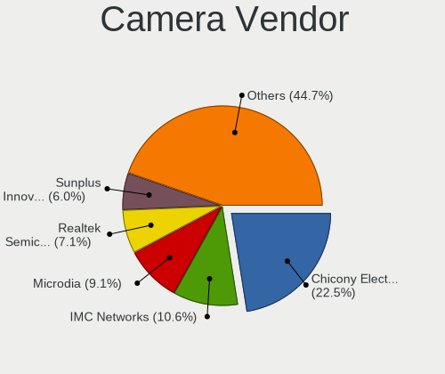

| Vendor                                 | Notebooks | Percent |
|----------------------------------------|-----------|---------|
| Chicony Electronics                    | 428       | 22.5%   |
| IMC Networks                           | 201       | 10.57%  |
| Microdia                               | 174       | 9.15%   |
| Realtek Semiconductor                  | 135       | 7.1%    |
| Sunplus Innovation Technology          | 114       | 5.99%   |
| Quanta                                 | 105       | 5.52%   |
| Cheng Uei Precision Industry (Foxlink) | 104       | 5.47%   |
| Bison Electronics                      | 102       | 5.36%   |
| Suyin                                  | 77        | 4.05%   |
| Syntek                                 | 59        | 3.1%    |
| Apple                                  | 57        | 3%      |
| Lite-On Technology                     | 54        | 2.84%   |
| Silicon Motion                         | 29        | 1.52%   |
| Acer                                   | 25        | 1.31%   |
| Ricoh                                  | 24        | 1.26%   |
| Luxvisions Innotech Limited            | 24        | 1.26%   |
| Importek                               | 21        | 1.1%    |
| Alcor Micro                            | 21        | 1.1%    |
| Logitech                               | 19        | 1%      |
| Sonix Technology                       | 14        | 0.74%   |
| Primax Electronics                     | 10        | 0.53%   |
| Y Media                                | 8         | 0.42%   |
| ALi                                    | 8         | 0.42%   |
| OmniVision Technologies                | 7         | 0.37%   |
| HRY                                    | 6         | 0.32%   |
| Generalplus Technology                 | 6         | 0.32%   |
| Samsung Electronics                    | 5         | 0.26%   |
| icSpring                               | 5         | 0.26%   |
| SunplusIT                              | 4         | 0.21%   |
| Microsoft                              | 4         | 0.21%   |
| Lenovo                                 | 4         | 0.21%   |
| Genesys Logic                          | 4         | 0.21%   |
| ShineTech                              | 3         | 0.16%   |
| MacroSilicon                           | 3         | 0.16%   |
| Z-Star Microelectronics                | 2         | 0.11%   |
| YGTek                                  | 2         | 0.11%   |
| Tobii Technology AB                    | 2         | 0.11%   |
| Sunplus Technology                     | 2         | 0.11%   |
| kingcome                               | 2         | 0.11%   |
| Jieli Technology                       | 2         | 0.11%   |

Camera Model
------------

Camera device models

| Model                                                          | Notebooks | Percent |
|----------------------------------------------------------------|-----------|---------|
| Chicony Integrated Camera                                      | 75        | 3.93%   |
| Microdia Integrated_Webcam_HD                                  | 60        | 3.14%   |
| Realtek Integrated_Webcam_HD                                   | 43        | 2.25%   |
| IMC Networks Integrated Camera                                 | 43        | 2.25%   |
| Sunplus Integrated_Webcam_HD                                   | 42        | 2.2%    |
| Chicony HD WebCam                                              | 40        | 2.1%    |
| Bison Integrated Camera                                        | 38        | 1.99%   |
| IMC Networks USB2.0 HD UVC WebCam                              | 36        | 1.89%   |
| IMC Networks HD Camera                                         | 32        | 1.68%   |
| Apple FaceTime HD Camera                                       | 30        | 1.57%   |
| IMC Networks USB2.0 VGA UVC WebCam                             | 26        | 1.36%   |
| Syntek Integrated Camera                                       | 23        | 1.2%    |
| Chicony HP Webcam                                              | 23        | 1.2%    |
| Chicony HP TrueVision HD                                       | 23        | 1.2%    |
| Chicony HP TrueVision HD Camera                                | 22        | 1.15%   |
| Cheng Uei Precision Industry (Foxlink) HD Camera               | 21        | 1.1%    |
| Sunplus HD WebCam                                              | 19        | 1%      |
| Quanta HP Webcam                                               | 18        | 0.94%   |
| IMC Networks ov9734_azurewave_camera                           | 18        | 0.94%   |
| Microdia Integrated Webcam                                     | 17        | 0.89%   |
| Cheng Uei Precision Industry (Foxlink) HP TrueVision HD Camera | 17        | 0.89%   |
| Cheng Uei Precision Industry (Foxlink) HP Webcam               | 16        | 0.84%   |
| Syntek Lenovo EasyCamera                                       | 15        | 0.79%   |
| Quanta HP TrueVision HD Camera                                 | 15        | 0.79%   |
| IMC Networks EasyCamera                                        | 15        | 0.79%   |
| Microdia Sonix USB 2.0 Camera                                  | 14        | 0.73%   |
| Lite-On HP Wide Vision HD Camera                               | 14        | 0.73%   |
| Bison Lenovo EasyCamera                                        | 14        | 0.73%   |
| Alcor Micro USB 2.0 Camera                                     | 14        | 0.73%   |
| Suyin HP Truevision HD                                         | 13        | 0.68%   |
| Quanta ov9734_techfront_camera                                 | 13        | 0.68%   |
| Microdia Lenovo EasyCamera                                     | 13        | 0.68%   |
| Chicony TOSHIBA Web Camera - HD                                | 13        | 0.68%   |
| Chicony HP Wide Vision HD Camera                               | 13        | 0.68%   |
| Chicony HP HD Camera                                           | 13        | 0.68%   |
| Cheng Uei Precision Industry (Foxlink) HP Truevision HD        | 13        | 0.68%   |
| Apple Built-in iSight                                          | 13        | 0.68%   |
| Sonix USB2.0 HD UVC WebCam                                     | 12        | 0.63%   |
| Quanta HD Camera                                               | 12        | 0.63%   |
| Luxvisions Innotech Limited HP TrueVision HD Camera            | 12        | 0.63%   |

Security
--------

Fingerprint Vendor
------------------

Fingerprint sensor vendors

| Vendor                             | Notebooks | Percent |
|------------------------------------|-----------|---------|
| Validity Sensors                   | 121       | 34.77%  |
| Shenzhen Goodix Technology         | 90        | 25.86%  |
| Synaptics                          | 52        | 14.94%  |
| AuthenTec                          | 27        | 7.76%   |
| Upek                               | 21        | 6.03%   |
| Elan Microelectronics              | 14        | 4.02%   |
| Focal-systems.Corp                 | 9         | 2.59%   |
| STMicroelectronics                 | 5         | 1.44%   |
| LighTuning Technology              | 3         | 0.86%   |
| Realtek USB2.0 Finger Print Bridge | 2         | 0.57%   |
| Suprema                            | 1         | 0.29%   |
| Samsung Electronics                | 1         | 0.29%   |
| GDMicroelectronics                 | 1         | 0.29%   |
| FocalTech                          | 1         | 0.29%   |

Fingerprint Model
-----------------

Fingerprint sensor models

| Model                                                                      | Notebooks | Percent |
|----------------------------------------------------------------------------|-----------|---------|
| Shenzhen Goodix  Fingerprint Device                                        | 82        | 23.56%  |
| Validity Sensors VFS495 Fingerprint Reader                                 | 29        | 8.33%   |
| Synaptics Prometheus MIS Touch Fingerprint Reader                          | 22        | 6.32%   |
| Upek Biometric Touchchip/Touchstrip Fingerprint Sensor                     | 19        | 5.46%   |
| Validity Sensors VFS 5011 fingerprint sensor                               | 18        | 5.17%   |
| AuthenTec AES2501 Fingerprint Sensor                                       | 14        | 4.02%   |
| Validity Sensors VFS5011 Fingerprint Reader                                | 13        | 3.74%   |
| Validity Sensors VFS471 Fingerprint Reader                                 | 13        | 3.74%   |
| Synaptics Metallica MIS Touch Fingerprint Reader                           | 13        | 3.74%   |
| Elan ELAN:ARM-M4                                                           | 10        | 2.87%   |
| Focal-systems.Corp FT9201Fingerprint.                                  | 9         | 2.59%   |
| Validity Sensors VFS491                                                    | 7         | 2.01%   |
| Validity Sensors Synaptics WBDI                                            | 7         | 2.01%   |
| AuthenTec AES2810                                                          | 7         | 2.01%   |
| Validity Sensors VFS7500 Touch Fingerprint Sensor                          | 6         | 1.72%   |
| Validity Sensors VFS451 Fingerprint Reader                                 | 5         | 1.44%   |
| Validity Sensors VFS101 Fingerprint Reader                                 | 5         | 1.44%   |
| Validity Sensors Swipe Fingerprint Sensor                                  | 5         | 1.44%   |
| STMicroelectronics Fingerprint Reader                                      | 5         | 1.44%   |
| Shenzhen Goodix Fingerprint Reader                                         | 5         | 1.44%   |
| Validity Sensors Synaptics VFS7552 Touch Fingerprint Sensor with PurePrint | 4         | 1.15%   |
| Elan ELAN:Fingerprint                                                      | 4         | 1.15%   |
| Validity Sensors VFS301 Fingerprint Reader                                 | 3         | 0.86%   |
| Validity Sensors Fingerprint scanner                                       | 3         | 0.86%   |
| Synaptics WBDI Fingerprint Reader USB 086                                  | 3         | 0.86%   |
| Synaptics Fingerprint reader [HP G6]                                       | 3         | 0.86%   |
| Shenzhen Goodix FingerPrint                                                | 3         | 0.86%   |
| LighTuning EgisTec Touch Fingerprint Sensor                                | 3         | 0.86%   |
| AuthenTec Fingerprint Sensor                                               | 3         | 0.86%   |
| AuthenTec AES1600                                                          | 3         | 0.86%   |
| Validity Sensors VFS Fingerprint sensor                                    | 2         | 0.57%   |
| Upek TCS5B Fingerprint sensor                                              | 2         | 0.57%   |
| Synaptics UWP WBDI Device                                                  | 2         | 0.57%   |
| Synaptics  FS7604 Touch Fingerprint Sensor with PurePrint                  | 2         | 0.57%   |
| Synaptics Prometheus Fingerprint Reader                                    | 2         | 0.57%   |
| Synaptics FS7604 Touch Fingerprint Sensor with PurePrint                   | 2         | 0.57%   |
| Realtek USB2.0 Finger Print Bridge FocalTech Fingerprint Device            | 2         | 0.57%   |
| Validity Sensors VFS7552 Touch Fingerprint Sensor                          | 1         | 0.29%   |
| Synaptics WBDI Device                                                      | 1         | 0.29%   |
| Synaptics WBDI                                                             | 1         | 0.29%   |

Chipcard Vendor
---------------

Chipcard module vendors

| Vendor                | Notebooks | Percent |
|-----------------------|-----------|---------|
| Broadcom              | 69        | 67.65%  |
| Alcor Micro           | 15        | 14.71%  |
| Upek                  | 8         | 7.84%   |
| Lenovo                | 6         | 5.88%   |
| O2 Micro              | 3         | 2.94%   |
| Gemalto (was Gemplus) | 1         | 0.98%   |

Chipcard Model
--------------

Chipcard module models

| Model                                                                        | Notebooks | Percent |
|------------------------------------------------------------------------------|-----------|---------|
| Broadcom BCM5880 Secure Applications Processor                               | 23        | 22.55%  |
| Broadcom BCM5880 Secure Applications Processor with fingerprint swipe sensor | 17        | 16.67%  |
| Broadcom 5880                                                                | 16        | 15.69%  |
| Alcor Micro AU9540 Smartcard Reader                                          | 15        | 14.71%  |
| Broadcom 58200                                                               | 12        | 11.76%  |
| Upek TouchChip Fingerprint Coprocessor (WBF advanced mode)                   | 8         | 7.84%   |
| Lenovo Integrated Smart Card Reader                                          | 6         | 5.88%   |
| O2 Micro OZ776 CCID Smartcard Reader                                         | 3         | 2.94%   |
| Gemalto (was Gemplus) Compact Smart Card Reader Writer                       | 1         | 0.98%   |
| Broadcom BCM5880 Secure Applications Processor with fingerprint touch sensor | 1         | 0.98%   |

Unsupported
-----------

Unsupported Devices
-------------------

Total unsupported devices on board

| Total | Notebooks | Percent |
|-------|-----------|---------|
| 0     | 1352      | 62.91%  |
| 1     | 658       | 30.62%  |
| 2     | 124       | 5.77%   |
| 3     | 10        | 0.47%   |
| 5     | 3         | 0.14%   |
| 7     | 1         | 0.05%   |
| 6     | 1         | 0.05%   |

Unsupported Device Types
------------------------

Types of unsupported devices

| Type                     | Notebooks | Percent |
|--------------------------|-----------|---------|
| Fingerprint reader       | 345       | 36.55%  |
| Graphics card            | 178       | 18.86%  |
| Net/wireless             | 119       | 12.61%  |
| Chipcard                 | 93        | 9.85%   |
| Multimedia controller    | 73        | 7.73%   |
| Camera                   | 35        | 3.71%   |
| Bluetooth                | 32        | 3.39%   |
| Communication controller | 14        | 1.48%   |
| Storage                  | 12        | 1.27%   |
| Net/ethernet             | 11        | 1.17%   |
| Sound                    | 9         | 0.95%   |
| Card reader              | 9         | 0.95%   |
| Modem                    | 5         | 0.53%   |
| Network                  | 4         | 0.42%   |
| Unassigned class         | 2         | 0.21%   |
| Storage/ide              | 1         | 0.11%   |
| Firewire controller      | 1         | 0.11%   |
| Dvb card                 | 1         | 0.11%   |

