Linux in Mexico - Tested Hardware & Statistics
----------------------------------------------

A project to collect tested hardware configurations for Linux in Mexico.

Anyone can contribute to this report by the [hw-probe](https://github.com/linuxhw/hw-probe) tool:

    sudo -E hw-probe -all -upload

Please contribute! Especially if your hardware is rare.

This is a report for all computer types. See also reports for [desktops](/Location/Mexico/Desktop/README.md) and [notebooks](/Location/Mexico/Notebook/README.md).

Contents
--------

* [ Test Cases ](#test-cases)

* [ System ](#system)
  - [ OS                       ](#os)
  - [ OS Family                ](#os-family)
  - [ Kernel                   ](#kernel)
  - [ Kernel Family            ](#kernel-family)
  - [ Kernel Major Ver.        ](#kernel-major-ver)
  - [ Arch                     ](#arch)
  - [ DE                       ](#de)
  - [ Display Server           ](#display-server)
  - [ Display Manager          ](#display-manager)
  - [ OS Lang                  ](#os-lang)
  - [ Boot Mode                ](#boot-mode)
  - [ Filesystem               ](#filesystem)
  - [ Part. scheme             ](#part-scheme)
  - [ Dual Boot with Linux/BSD ](#dual-boot-with-linuxbsd)
  - [ Dual Boot (Win)          ](#dual-boot-win)

* [ Board ](#board)
  - [ Vendor                   ](#vendor)
  - [ Model                    ](#model)
  - [ Model Family             ](#model-family)
  - [ MFG Year                 ](#mfg-year)
  - [ Form Factor              ](#form-factor)
  - [ Secure Boot              ](#secure-boot)
  - [ Coreboot                 ](#coreboot)
  - [ RAM Size                 ](#ram-size)
  - [ RAM Used                 ](#ram-used)
  - [ Total Drives             ](#total-drives)
  - [ Has CD-ROM               ](#has-cd-rom)
  - [ Has Ethernet             ](#has-ethernet)
  - [ Has WiFi                 ](#has-wifi)
  - [ Has Bluetooth            ](#has-bluetooth)

* [ Location ](#location)
  - [ Country                  ](#country)
  - [ City                     ](#city)

* [ Drives ](#drives)
  - [ Drive Vendor             ](#drive-vendor)
  - [ Drive Model              ](#drive-model)
  - [ HDD Vendor               ](#hdd-vendor)
  - [ SSD Vendor               ](#ssd-vendor)
  - [ Drive Kind               ](#drive-kind)
  - [ Drive Connector          ](#drive-connector)
  - [ Drive Size               ](#drive-size)
  - [ Space Total              ](#space-total)
  - [ Space Used               ](#space-used)
  - [ Malfunc. Drives          ](#malfunc-drives)
  - [ Malfunc. Drive Vendor    ](#malfunc-drive-vendor)
  - [ Malfunc. HDD Vendor      ](#malfunc-hdd-vendor)
  - [ Malfunc. Drive Kind      ](#malfunc-drive-kind)
  - [ Failed Drives            ](#failed-drives)
  - [ Failed Drive Vendor      ](#failed-drive-vendor)
  - [ Drive Status             ](#drive-status)

* [ Storage controller ](#storage-controller)
  - [ Storage Vendor           ](#storage-vendor)
  - [ Storage Model            ](#storage-model)
  - [ Storage Kind             ](#storage-kind)

* [ Processor ](#processor)
  - [ CPU Vendor               ](#cpu-vendor)
  - [ CPU Model                ](#cpu-model)
  - [ CPU Model Family         ](#cpu-model-family)
  - [ CPU Cores                ](#cpu-cores)
  - [ CPU Sockets              ](#cpu-sockets)
  - [ CPU Threads              ](#cpu-threads)
  - [ CPU Op-Modes             ](#cpu-op-modes)
  - [ CPU Microcode            ](#cpu-microcode)
  - [ CPU Microarch            ](#cpu-microarch)

* [ Graphics ](#graphics)
  - [ GPU Vendor               ](#gpu-vendor)
  - [ GPU Model                ](#gpu-model)
  - [ GPU Combo                ](#gpu-combo)
  - [ GPU Driver               ](#gpu-driver)
  - [ GPU Memory               ](#gpu-memory)

* [ Monitor ](#monitor)
  - [ Monitor Vendor           ](#monitor-vendor)
  - [ Monitor Model            ](#monitor-model)
  - [ Monitor Resolution       ](#monitor-resolution)
  - [ Monitor Diagonal         ](#monitor-diagonal)
  - [ Monitor Width            ](#monitor-width)
  - [ Aspect Ratio             ](#aspect-ratio)
  - [ Monitor Area             ](#monitor-area)
  - [ Pixel Density            ](#pixel-density)
  - [ Multiple Monitors        ](#multiple-monitors)

* [ Network ](#network)
  - [ Net Controller Vendor    ](#net-controller-vendor)
  - [ Net Controller Model     ](#net-controller-model)
  - [ Wireless Vendor          ](#wireless-vendor)
  - [ Wireless Model           ](#wireless-model)
  - [ Ethernet Vendor          ](#ethernet-vendor)
  - [ Ethernet Model           ](#ethernet-model)
  - [ Net Controller Kind      ](#net-controller-kind)
  - [ Used Controller          ](#used-controller)
  - [ NICs                     ](#nics)
  - [ IPv6                     ](#ipv6)

* [ Bluetooth ](#bluetooth)
  - [ Bluetooth Vendor         ](#bluetooth-vendor)
  - [ Bluetooth Model          ](#bluetooth-model)

* [ Sound ](#sound)
  - [ Sound Vendor             ](#sound-vendor)
  - [ Sound Model              ](#sound-model)

* [ Memory ](#memory)
  - [ Memory Vendor            ](#memory-vendor)
  - [ Memory Model             ](#memory-model)
  - [ Memory Kind              ](#memory-kind)
  - [ Memory Form Factor       ](#memory-form-factor)
  - [ Memory Size              ](#memory-size)
  - [ Memory Speed             ](#memory-speed)

* [ Printers & scanners ](#printers--scanners)
  - [ Printer Vendor           ](#printer-vendor)
  - [ Printer Model            ](#printer-model)
  - [ Scanner Vendor           ](#scanner-vendor)
  - [ Scanner Model            ](#scanner-model)

* [ Camera ](#camera)
  - [ Camera Vendor            ](#camera-vendor)
  - [ Camera Model             ](#camera-model)

* [ Security ](#security)
  - [ Fingerprint Vendor       ](#fingerprint-vendor)
  - [ Fingerprint Model        ](#fingerprint-model)
  - [ Chipcard Vendor          ](#chipcard-vendor)
  - [ Chipcard Model           ](#chipcard-model)

* [ Unsupported ](#unsupported)
  - [ Unsupported Devices      ](#unsupported-devices)
  - [ Unsupported Device Types ](#unsupported-device-types)

Test Cases
----------

Total: 6355

| Vendor        | Model                       | Form-Factor | Probe                                                      | Date         |
|---------------|-----------------------------|-------------|------------------------------------------------------------|--------------|
| ASUSTek       | PRIME A520M-K               | Desktop     | [fc8f0f20d3](https://linux-hardware.org/?probe=fc8f0f20d3) | Jan 03, 2026 |
| Dell          | 0R230R A00                  | Desktop     | [608b6c552c](https://linux-hardware.org/?probe=608b6c552c) | Jan 03, 2026 |
| Dell          | 0R230R A00                  | Desktop     | [b78a6a2aaf](https://linux-hardware.org/?probe=b78a6a2aaf) | Jan 03, 2026 |
| Unknown       | Unknown                     | Desktop     | [6f20580744](https://linux-hardware.org/?probe=6f20580744) | Jan 03, 2026 |
| Acer          | Swift SF315-41G             | Notebook    | [486be2a816](https://linux-hardware.org/?probe=486be2a816) | Jan 02, 2026 |
| Gigabyte      | H410M H                     | Desktop     | [fcdca2fbf1](https://linux-hardware.org/?probe=fcdca2fbf1) | Jan 02, 2026 |
| HUAWEI        | BOM-WXX9                    | Notebook    | [e1c9e06b22](https://linux-hardware.org/?probe=e1c9e06b22) | Dec 31, 2025 |
| ASUSTek       | ROG STRIX B650E-F GAMING... | Desktop     | [9e4697130c](https://linux-hardware.org/?probe=9e4697130c) | Dec 31, 2025 |
| Dell          | Inspiron 15 3515            | Notebook    | [f53275843c](https://linux-hardware.org/?probe=f53275843c) | Dec 30, 2025 |
| GHIA          | PRIME A320M-K               | Desktop     | [771a983b39](https://linux-hardware.org/?probe=771a983b39) | Dec 30, 2025 |
| HUAWEI        | FLMH-XX                     | Notebook    | [dcd805d12a](https://linux-hardware.org/?probe=dcd805d12a) | Dec 30, 2025 |
| Lenovo        | ThinkPad L570 20J9S0Q500    | Notebook    | [3b5825dfe7](https://linux-hardware.org/?probe=3b5825dfe7) | Dec 29, 2025 |
| HP            | 1905                        | Desktop     | [efe697e75b](https://linux-hardware.org/?probe=efe697e75b) | Dec 29, 2025 |
| ASUSTek       | A88XM-PLUS                  | Desktop     | [92f1f16e5a](https://linux-hardware.org/?probe=92f1f16e5a) | Dec 29, 2025 |
| Unknown       | Nintendo Switch (OLED mo... | Soc         | [d1c0b50074](https://linux-hardware.org/?probe=d1c0b50074) | Dec 28, 2025 |
| Sony          | VPCEG10EL                   | Notebook    | [3613da0a34](https://linux-hardware.org/?probe=3613da0a34) | Dec 28, 2025 |
| KOLOE         | H110 Ver:5.01               | Desktop     | [277ce84a81](https://linux-hardware.org/?probe=277ce84a81) | Dec 28, 2025 |
| Acer          | Aspire A314-23P             | Notebook    | [9ef6752905](https://linux-hardware.org/?probe=9ef6752905) | Dec 28, 2025 |
| Gigabyte      | B75M-D3H                    | Desktop     | [88daf55520](https://linux-hardware.org/?probe=88daf55520) | Dec 28, 2025 |
| Dell          | System Inspiron N7110       | Notebook    | [c5c2861973](https://linux-hardware.org/?probe=c5c2861973) | Dec 27, 2025 |
| HP            | Victus by Laptop 16-d1xx... | Notebook    | [65b44c0614](https://linux-hardware.org/?probe=65b44c0614) | Dec 27, 2025 |
| ASUSTek       | ROG STRIX B550-F GAMING     | Desktop     | [0242008f4f](https://linux-hardware.org/?probe=0242008f4f) | Dec 27, 2025 |
| Lenovo        | IdeaPad S145-15AST 81N3     | Notebook    | [c5bb84e014](https://linux-hardware.org/?probe=c5bb84e014) | Dec 26, 2025 |
| HP            | Laptop 15-fd0xxx            | Notebook    | [06da632045](https://linux-hardware.org/?probe=06da632045) | Dec 26, 2025 |
| HP            | Laptop 15-fd0xxx            | Notebook    | [52c905c54b](https://linux-hardware.org/?probe=52c905c54b) | Dec 26, 2025 |
| Dell          | XPS L401X                   | Notebook    | [737720f72b](https://linux-hardware.org/?probe=737720f72b) | Dec 26, 2025 |
| Dell          | XPS L401X                   | Notebook    | [7e8652c7f5](https://linux-hardware.org/?probe=7e8652c7f5) | Dec 26, 2025 |
| Lenovo        | LOQ 15IRX10 83JE            | Notebook    | [d6bf940539](https://linux-hardware.org/?probe=d6bf940539) | Dec 26, 2025 |
| HP            | Laptop 14-dq2xxx            | Notebook    | [b5fd85a55e](https://linux-hardware.org/?probe=b5fd85a55e) | Dec 26, 2025 |
| ASRock        | X870 Pro RS WiFi            | Desktop     | [bdb20e95ee](https://linux-hardware.org/?probe=bdb20e95ee) | Dec 26, 2025 |
| Lenovo        | ThinkPad E495 20NES0FJ00    | Notebook    | [f320cf3cba](https://linux-hardware.org/?probe=f320cf3cba) | Dec 25, 2025 |
| ASUSTek       | PRIME A520M-K               | Desktop     | [17a31af109](https://linux-hardware.org/?probe=17a31af109) | Dec 25, 2025 |
| Intel         | H61                         | Desktop     | [72e71e73ee](https://linux-hardware.org/?probe=72e71e73ee) | Dec 25, 2025 |
| Intel         | H61                         | Desktop     | [5427d0a14c](https://linux-hardware.org/?probe=5427d0a14c) | Dec 25, 2025 |
| Unknown       | Unknown                     | Desktop     | [0942f1d885](https://linux-hardware.org/?probe=0942f1d885) | Dec 25, 2025 |
| GHIA          | PRIME A320M-K               | Desktop     | [8a22488089](https://linux-hardware.org/?probe=8a22488089) | Dec 25, 2025 |
| Unknown       | Unknown                     | Desktop     | [968d886951](https://linux-hardware.org/?probe=968d886951) | Dec 24, 2025 |
| MSI           | Z170A GAMING M5             | Desktop     | [5ab183c898](https://linux-hardware.org/?probe=5ab183c898) | Dec 24, 2025 |
| Pegatron      | 2AC3                        | Desktop     | [dd21f05fe1](https://linux-hardware.org/?probe=dd21f05fe1) | Dec 24, 2025 |
| Pegatron      | 2AED                        | Desktop     | [aae571285d](https://linux-hardware.org/?probe=aae571285d) | Dec 23, 2025 |
| Dell          | 0KWVT8 A03                  | Desktop     | [83da5d4155](https://linux-hardware.org/?probe=83da5d4155) | Dec 23, 2025 |
| MSI           | Z170A GAMING M5             | Desktop     | [17d3c977e5](https://linux-hardware.org/?probe=17d3c977e5) | Dec 23, 2025 |
| ASUSTek       | ROG STRIX B550-F GAMING     | Desktop     | [107f649f96](https://linux-hardware.org/?probe=107f649f96) | Dec 23, 2025 |
| HP            | EliteBook 840 G8 Noteboo... | Notebook    | [73f71ef22f](https://linux-hardware.org/?probe=73f71ef22f) | Dec 23, 2025 |
| HP            | ProBook 4446s               | Notebook    | [758eba67b3](https://linux-hardware.org/?probe=758eba67b3) | Dec 22, 2025 |
| ASUSTek       | Vivobook Go E1504GA_E150... | Notebook    | [0bcfeb0324](https://linux-hardware.org/?probe=0bcfeb0324) | Dec 21, 2025 |
| ASUSTek       | PRIME B650M-A AX6 II        | Desktop     | [21d5438de0](https://linux-hardware.org/?probe=21d5438de0) | Dec 21, 2025 |
| Apple         | MacBookPro9,1               | Notebook    | [65e68ad920](https://linux-hardware.org/?probe=65e68ad920) | Dec 21, 2025 |
| Apple         | MacBookPro9,1               | Notebook    | [963f27b360](https://linux-hardware.org/?probe=963f27b360) | Dec 21, 2025 |
| HP            | 2B43                        | Desktop     | [1f015a1223](https://linux-hardware.org/?probe=1f015a1223) | Dec 20, 2025 |
| HP            | ProBook 4446s               | Notebook    | [b9065994a0](https://linux-hardware.org/?probe=b9065994a0) | Dec 20, 2025 |
| HP            | 2B43                        | Desktop     | [aa62af94ec](https://linux-hardware.org/?probe=aa62af94ec) | Dec 20, 2025 |
| HP            | 2820h                       | Desktop     | [f8e50af8f5](https://linux-hardware.org/?probe=f8e50af8f5) | Dec 20, 2025 |
| Lenovo        | ThinkPad P50 20EQS4XN00     | Notebook    | [1bf3d1e594](https://linux-hardware.org/?probe=1bf3d1e594) | Dec 20, 2025 |
| Lenovo        | ThinkPad X1 Tablet Gen 3... | Tablet      | [d1605972aa](https://linux-hardware.org/?probe=d1605972aa) | Dec 19, 2025 |
| Dell          | Latitude 3400               | Notebook    | [ec9a7451f1](https://linux-hardware.org/?probe=ec9a7451f1) | Dec 19, 2025 |
| Lenovo        | ThinkPad X1 Tablet Gen 3... | Tablet      | [968552b291](https://linux-hardware.org/?probe=968552b291) | Dec 19, 2025 |
| Apple         | MacBookPro9,2               | Notebook    | [ce67badadd](https://linux-hardware.org/?probe=ce67badadd) | Dec 19, 2025 |
| ASUSTek       | TUF Gaming A620M-PLUS WI... | Desktop     | [bd02093882](https://linux-hardware.org/?probe=bd02093882) | Dec 19, 2025 |
| ASUSTek       | PRIME B550M-K               | Desktop     | [12c584a8df](https://linux-hardware.org/?probe=12c584a8df) | Dec 19, 2025 |
| Dell          | 0F6X5P A00                  | Desktop     | [17e1141202](https://linux-hardware.org/?probe=17e1141202) | Dec 18, 2025 |
| Dell          | Latitude 5320               | Notebook    | [0c0b6da977](https://linux-hardware.org/?probe=0c0b6da977) | Dec 18, 2025 |
| ASUSTek       | ASUS Zenbook 14 UX3405MA... | Notebook    | [8a1ff23d12](https://linux-hardware.org/?probe=8a1ff23d12) | Dec 18, 2025 |
| ASUSTek       | TUF Gaming B650-PLUS WIF... | Desktop     | [7bb31b9a02](https://linux-hardware.org/?probe=7bb31b9a02) | Dec 17, 2025 |
| Dell          | Latitude 5421               | Notebook    | [64b28565bd](https://linux-hardware.org/?probe=64b28565bd) | Dec 16, 2025 |
| Lenovo        | Legion 5 15IAX10 83F0       | Notebook    | [789489ae23](https://linux-hardware.org/?probe=789489ae23) | Dec 16, 2025 |
| ASUSTek       | PRIME A320M-K               | Desktop     | [e848147624](https://linux-hardware.org/?probe=e848147624) | Dec 16, 2025 |
| ASUSTek       | PRIME A320M-K               | Desktop     | [f005fdaba7](https://linux-hardware.org/?probe=f005fdaba7) | Dec 16, 2025 |
| Acer          | Aspire 5742Z                | Notebook    | [e8fe488201](https://linux-hardware.org/?probe=e8fe488201) | Dec 16, 2025 |
| HP            | Laptop 14-dq0xxx            | Notebook    | [e308d226d1](https://linux-hardware.org/?probe=e308d226d1) | Dec 15, 2025 |
| Dell          | Inspiron 5566               | Notebook    | [c2581895fa](https://linux-hardware.org/?probe=c2581895fa) | Dec 15, 2025 |
| Lenovo        | Yoga 7 2-in-1 14AKP10 83... | Convertible | [5039164be5](https://linux-hardware.org/?probe=5039164be5) | Dec 15, 2025 |
| Google        | Bobba                       | Notebook    | [b3eb5684e6](https://linux-hardware.org/?probe=b3eb5684e6) | Dec 15, 2025 |
| ASUSTek       | PRIME A320M-K               | Desktop     | [3f7983fc28](https://linux-hardware.org/?probe=3f7983fc28) | Dec 14, 2025 |
| ASUSTek       | PRIME A320M-K               | Desktop     | [cd5040e9d2](https://linux-hardware.org/?probe=cd5040e9d2) | Dec 14, 2025 |
| ASUSTek       | PRIME B550M-A AC            | Desktop     | [94688ba53b](https://linux-hardware.org/?probe=94688ba53b) | Dec 13, 2025 |
| ASUSTek       | PRIME B350-PLUS             | Desktop     | [7d0116749f](https://linux-hardware.org/?probe=7d0116749f) | Dec 13, 2025 |
| ASUSTek       | PRIME B550M-A AC            | Desktop     | [8a3022ff72](https://linux-hardware.org/?probe=8a3022ff72) | Dec 13, 2025 |
| HP            | 18E5                        | Desktop     | [c16631e6cc](https://linux-hardware.org/?probe=c16631e6cc) | Dec 12, 2025 |
| Dell          | 0HV8FN A01                  | Desktop     | [d348280020](https://linux-hardware.org/?probe=d348280020) | Dec 12, 2025 |
| Dell          | 0PC5F7 A02                  | Desktop     | [fae91ffb27](https://linux-hardware.org/?probe=fae91ffb27) | Dec 12, 2025 |
| MUCAI         | H61 V91                     | Desktop     | [bd6e6a3fe4](https://linux-hardware.org/?probe=bd6e6a3fe4) | Dec 11, 2025 |
| HP            | Laptop 14-dq0xxx            | Notebook    | [03b2a72922](https://linux-hardware.org/?probe=03b2a72922) | Dec 11, 2025 |
| Gigabyte      | AM1M-S2P                    | Desktop     | [326988b8b1](https://linux-hardware.org/?probe=326988b8b1) | Dec 11, 2025 |
| Apple         | Mac-FC02E91DDD3FA6A4 iMa... | All in one  | [be843102e0](https://linux-hardware.org/?probe=be843102e0) | Dec 10, 2025 |
| Apple         | Mac-FC02E91DDD3FA6A4 iMa... | All in one  | [a6e69062a7](https://linux-hardware.org/?probe=a6e69062a7) | Dec 10, 2025 |
| Biostar       | TA785G3+                    | Desktop     | [ca0f7b62bc](https://linux-hardware.org/?probe=ca0f7b62bc) | Dec 10, 2025 |
| ASUSTek       | TUF Gaming A620M-PLUS WI... | Desktop     | [83f2eb6c63](https://linux-hardware.org/?probe=83f2eb6c63) | Dec 10, 2025 |
| ASUSTek       | A88XM-PLUS                  | Desktop     | [25caa70a9c](https://linux-hardware.org/?probe=25caa70a9c) | Dec 10, 2025 |
| JINGSHA       | X99S D4 PLUS                | Desktop     | [3691d8f6dc](https://linux-hardware.org/?probe=3691d8f6dc) | Dec 09, 2025 |
| Lenovo        | V14 G3 IAP 82TS             | Notebook    | [f4122ee12d](https://linux-hardware.org/?probe=f4122ee12d) | Dec 09, 2025 |
| JINGSHA       | X99S D4 PLUS                | Desktop     | [8ead83466a](https://linux-hardware.org/?probe=8ead83466a) | Dec 09, 2025 |
| Dell          | Latitude 7440               | Convertible | [06c27e7370](https://linux-hardware.org/?probe=06c27e7370) | Dec 08, 2025 |
| Dell          | Latitude 7440               | Convertible | [8e14583832](https://linux-hardware.org/?probe=8e14583832) | Dec 08, 2025 |
| ASUSTek       | ASUS TUF Gaming A15 FA50... | Notebook    | [26679dc045](https://linux-hardware.org/?probe=26679dc045) | Dec 08, 2025 |
| Acer          | Aspire A315-24P             | Notebook    | [56c68dee93](https://linux-hardware.org/?probe=56c68dee93) | Dec 08, 2025 |
| HP            | Notebook                    | Notebook    | [3d917f5150](https://linux-hardware.org/?probe=3d917f5150) | Dec 07, 2025 |
| Apple         | Mac-F2268CC8                | All in one  | [21371821a1](https://linux-hardware.org/?probe=21371821a1) | Dec 07, 2025 |
| Gigabyte      | B550M DS3H AC               | Desktop     | [58eabfe0aa](https://linux-hardware.org/?probe=58eabfe0aa) | Dec 07, 2025 |
| Acer          | Aspire V7-481P              | Notebook    | [f4f893a793](https://linux-hardware.org/?probe=f4f893a793) | Dec 07, 2025 |
| Lenovo        | IdeaPad 3 15ITL6 82H8       | Notebook    | [079a5e033f](https://linux-hardware.org/?probe=079a5e033f) | Dec 07, 2025 |
| ASUSTek       | TUF Gaming B550-PRO         | Desktop     | [0f3a603000](https://linux-hardware.org/?probe=0f3a603000) | Dec 06, 2025 |
| Lenovo        | IdeaPad 3 15ADA05 81W1      | Notebook    | [62ede911e0](https://linux-hardware.org/?probe=62ede911e0) | Dec 06, 2025 |
| Dell          | G15 5510                    | Notebook    | [d533bc5894](https://linux-hardware.org/?probe=d533bc5894) | Dec 06, 2025 |
| ASUSTek       | Vivobook Go E1504GA_E150... | Notebook    | [004ee88daa](https://linux-hardware.org/?probe=004ee88daa) | Dec 06, 2025 |
| Apple         | Mac-031AEE4D24BFF0B1 Mac... | Mini pc     | [ea3f7440c5](https://linux-hardware.org/?probe=ea3f7440c5) | Dec 06, 2025 |
| Lenovo        | Unknown                     | Tablet      | [907cb4be5b](https://linux-hardware.org/?probe=907cb4be5b) | Dec 05, 2025 |
| Lenovo        | IdeaPad Slim 3 15IAH8 83... | Notebook    | [a11c88481c](https://linux-hardware.org/?probe=a11c88481c) | Dec 05, 2025 |
| Acer          | Nitro AN17-51               | Notebook    | [10381ef427](https://linux-hardware.org/?probe=10381ef427) | Dec 05, 2025 |
| Biostar       | H61MLV2                     | Desktop     | [d6a9c79bdd](https://linux-hardware.org/?probe=d6a9c79bdd) | Dec 05, 2025 |
| HP            | ProBook x360 435 G8 Note... | Convertible | [4d958c4833](https://linux-hardware.org/?probe=4d958c4833) | Dec 04, 2025 |
| HP            | Laptop 15-da1xxx            | Notebook    | [10a4e98a70](https://linux-hardware.org/?probe=10a4e98a70) | Dec 04, 2025 |
| HP            | Laptop 14-bs0xx             | Notebook    | [db4fe34ea5](https://linux-hardware.org/?probe=db4fe34ea5) | Dec 04, 2025 |
| Lenovo        | Inagua CRB                  | All in one  | [465aeba506](https://linux-hardware.org/?probe=465aeba506) | Dec 03, 2025 |
| Apple         | Mac-7BA5B2DFE22DDD8C Mac... | Mini pc     | [089b913f16](https://linux-hardware.org/?probe=089b913f16) | Dec 03, 2025 |
| Apple         | Mac-F2238BAE iMac11,3       | All in one  | [d9902566c7](https://linux-hardware.org/?probe=d9902566c7) | Dec 03, 2025 |
| Apple         | Mac-F2238BAE iMac11,3       | All in one  | [b31cf2c79e](https://linux-hardware.org/?probe=b31cf2c79e) | Dec 03, 2025 |
| ASUSTek       | ROG STRIX B450-F GAMING     | Desktop     | [e418771103](https://linux-hardware.org/?probe=e418771103) | Dec 02, 2025 |
| Huanan        | X99-F8 GAMING V5.0          | Desktop     | [b3369d435d](https://linux-hardware.org/?probe=b3369d435d) | Dec 01, 2025 |
| HP            | Victus by Gaming Laptop ... | Notebook    | [b4fbbbaff9](https://linux-hardware.org/?probe=b4fbbbaff9) | Dec 01, 2025 |
| Lenovo        | ThinkPad T14 Gen 2a 20XL... | Notebook    | [ef0497c56e](https://linux-hardware.org/?probe=ef0497c56e) | Dec 01, 2025 |
| Gigabyte      | H410M H V3                  | Desktop     | [b3f5f4bd8d](https://linux-hardware.org/?probe=b3f5f4bd8d) | Dec 01, 2025 |
| Sony          | SVJ20213CXW                 | Notebook    | [e871264b58](https://linux-hardware.org/?probe=e871264b58) | Dec 01, 2025 |
| HP            | ZBook Fury 16 G10 Mobile... | Notebook    | [cac55ee7ff](https://linux-hardware.org/?probe=cac55ee7ff) | Nov 30, 2025 |
| Chuwi         | CoreBook X                  | Notebook    | [b57d8dcd7a](https://linux-hardware.org/?probe=b57d8dcd7a) | Nov 30, 2025 |
| Chuwi         | CoreBook X                  | Notebook    | [4adc4959fe](https://linux-hardware.org/?probe=4adc4959fe) | Nov 30, 2025 |
| Lenovo        | ThinkPad R61/R61i 7733AY... | Notebook    | [1f5342f0d2](https://linux-hardware.org/?probe=1f5342f0d2) | Nov 29, 2025 |
| ASUSTek       | VivoBook_ASUSLaptop X140... | Notebook    | [7e797ed342](https://linux-hardware.org/?probe=7e797ed342) | Nov 29, 2025 |
| HP            | 82DD 0001                   | All in one  | [a2b175f206](https://linux-hardware.org/?probe=a2b175f206) | Nov 29, 2025 |
| Dell          | Inspiron 7566               | Notebook    | [a46222591c](https://linux-hardware.org/?probe=a46222591c) | Nov 29, 2025 |
| ASUSTek       | Pro A520M-C II              | Desktop     | [50acf402af](https://linux-hardware.org/?probe=50acf402af) | Nov 28, 2025 |
| ASUSTek       | PRIME B550M-A AC            | Desktop     | [526f117326](https://linux-hardware.org/?probe=526f117326) | Nov 27, 2025 |
| HUAWEI        | VGHH-XX                     | Notebook    | [b3f3a45d23](https://linux-hardware.org/?probe=b3f3a45d23) | Nov 27, 2025 |
| Lenovo        | ThinkCentre M58p 6137F92    | Desktop     | [6d91156556](https://linux-hardware.org/?probe=6d91156556) | Nov 27, 2025 |
| HP            | Presario CQ56               | Notebook    | [94e76113ec](https://linux-hardware.org/?probe=94e76113ec) | Nov 27, 2025 |
| Apple         | MacBookPro9,2               | Notebook    | [affebf0870](https://linux-hardware.org/?probe=affebf0870) | Nov 27, 2025 |
| Apple         | Mac-F2238AC8                | All in one  | [0f3223f9bc](https://linux-hardware.org/?probe=0f3223f9bc) | Nov 27, 2025 |
| Dell          | Latitude 5421               | Notebook    | [cc30b10cd4](https://linux-hardware.org/?probe=cc30b10cd4) | Nov 27, 2025 |
| ASUSTek       | P8H61-M LX3 PLUS R2.0       | Desktop     | [69c79d5749](https://linux-hardware.org/?probe=69c79d5749) | Nov 26, 2025 |
| ASUSTek       | P8H61-M LX3 PLUS R2.0       | Desktop     | [b313ea6b41](https://linux-hardware.org/?probe=b313ea6b41) | Nov 26, 2025 |
| ORIGIMAGIC    | DNB58                       | Mini pc     | [19cbb47d73](https://linux-hardware.org/?probe=19cbb47d73) | Nov 24, 2025 |
| Lenovo        | Inagua CRB                  | All in one  | [22d199cf94](https://linux-hardware.org/?probe=22d199cf94) | Nov 24, 2025 |
| Dell          | Latitude 5400               | Notebook    | [f9b59b73e9](https://linux-hardware.org/?probe=f9b59b73e9) | Nov 24, 2025 |
| Lenovo        | Inagua CRB                  | All in one  | [7409dc3d26](https://linux-hardware.org/?probe=7409dc3d26) | Nov 24, 2025 |
| HP            | 1998                        | Desktop     | [a00a767f4a](https://linux-hardware.org/?probe=a00a767f4a) | Nov 23, 2025 |
| ASUSTek       | ROG Strix G512LI_G512LI     | Notebook    | [c649c07206](https://linux-hardware.org/?probe=c649c07206) | Nov 22, 2025 |
| Acer          | Aspire 4250                 | Notebook    | [96206bc255](https://linux-hardware.org/?probe=96206bc255) | Nov 22, 2025 |
| HP            | 1998                        | Desktop     | [7cc8d045cd](https://linux-hardware.org/?probe=7cc8d045cd) | Nov 22, 2025 |
| Sony          | VPCEG10EL                   | Notebook    | [5840e69c63](https://linux-hardware.org/?probe=5840e69c63) | Nov 22, 2025 |
| Unknown       | Unknown                     | Notebook    | [589bf44a6b](https://linux-hardware.org/?probe=589bf44a6b) | Nov 22, 2025 |
| ASUSTek       | PRIME B550M-A AC            | Desktop     | [7f759bd104](https://linux-hardware.org/?probe=7f759bd104) | Nov 20, 2025 |
| ASRock        | B450M Steel Legend          | Desktop     | [a06b755014](https://linux-hardware.org/?probe=a06b755014) | Nov 20, 2025 |
| Apple         | Mac-7BA5B2794B2CDB12 Mac... | Mini pc     | [7d9d345a7d](https://linux-hardware.org/?probe=7d9d345a7d) | Nov 19, 2025 |
| Gigabyte      | B550 GAMING X V2            | Desktop     | [17fcfe3395](https://linux-hardware.org/?probe=17fcfe3395) | Nov 18, 2025 |
| Acer          | Aspire AL14-51M             | Notebook    | [7d84b32efa](https://linux-hardware.org/?probe=7d84b32efa) | Nov 18, 2025 |
| HUAWEI        | BOM-WXX9                    | Notebook    | [71253bec9f](https://linux-hardware.org/?probe=71253bec9f) | Nov 18, 2025 |
| Lenovo        | IdeaPad Y500 20193          | Notebook    | [ab107435ca](https://linux-hardware.org/?probe=ab107435ca) | Nov 18, 2025 |
| Intel         | H61                         | Desktop     | [9b819e98f6](https://linux-hardware.org/?probe=9b819e98f6) | Nov 18, 2025 |
| Samsung       | 960QFG                      | Convertible | [458357dd4b](https://linux-hardware.org/?probe=458357dd4b) | Nov 17, 2025 |
| Lenovo        | IdeaPad 320-14IAP 80XQ      | Notebook    | [d297aff5cb](https://linux-hardware.org/?probe=d297aff5cb) | Nov 16, 2025 |
| Lanix         | MS-7267 LNXACT              | Desktop     | [7c9a9aefcb](https://linux-hardware.org/?probe=7c9a9aefcb) | Nov 15, 2025 |
| HP            | Pavilion Gaming Laptop 1... | Notebook    | [08762f8443](https://linux-hardware.org/?probe=08762f8443) | Nov 15, 2025 |
| ASUSTek       | PRIME TRX40-PRO S           | Desktop     | [2739649b76](https://linux-hardware.org/?probe=2739649b76) | Nov 15, 2025 |
| HP            | 845A                        | Desktop     | [93901e5e91](https://linux-hardware.org/?probe=93901e5e91) | Nov 15, 2025 |
| Lanix         | MS-7267 LNXACT              | Desktop     | [5756981ff5](https://linux-hardware.org/?probe=5756981ff5) | Nov 15, 2025 |
| Dell          | Latitude 5400               | Notebook    | [1f5603aa35](https://linux-hardware.org/?probe=1f5603aa35) | Nov 14, 2025 |
| HP            | ProBook 4440s               | Notebook    | [271f33249f](https://linux-hardware.org/?probe=271f33249f) | Nov 14, 2025 |
| Unknown       | Unknown                     | Mini pc     | [ba5bc3b395](https://linux-hardware.org/?probe=ba5bc3b395) | Nov 13, 2025 |
| ASUSTek       | ROG STRIX X870E-E GAMING... | Desktop     | [530de63234](https://linux-hardware.org/?probe=530de63234) | Nov 13, 2025 |
| Dell          | 0XCR8D A02                  | Desktop     | [4b862b2dbb](https://linux-hardware.org/?probe=4b862b2dbb) | Nov 13, 2025 |
| Unknown       | Unknown                     | Mini pc     | [266ec0857e](https://linux-hardware.org/?probe=266ec0857e) | Nov 13, 2025 |
| Sony          | VPCEG10EL                   | Notebook    | [65d578677d](https://linux-hardware.org/?probe=65d578677d) | Nov 12, 2025 |
| ASUSTek       | PRIME A320M-K               | Desktop     | [be2803ed01](https://linux-hardware.org/?probe=be2803ed01) | Nov 12, 2025 |
| Unknown       | Unknown                     | Desktop     | [4bad5eba77](https://linux-hardware.org/?probe=4bad5eba77) | Nov 12, 2025 |
| Acer          | Aspire A315-24P             | Notebook    | [584dc84aa4](https://linux-hardware.org/?probe=584dc84aa4) | Nov 11, 2025 |
| MSI           | B550M PRO-VDH WIFI          | Desktop     | [502d5e8b92](https://linux-hardware.org/?probe=502d5e8b92) | Nov 11, 2025 |
| Apple         | MacBookPro8,2               | Notebook    | [5b276e0d1d](https://linux-hardware.org/?probe=5b276e0d1d) | Nov 11, 2025 |
| PELADN        | WI-4                        | Desktop     | [c43ed968e4](https://linux-hardware.org/?probe=c43ed968e4) | Nov 10, 2025 |
| ASUSTek       | ROG STRIX B550-F GAMING     | Desktop     | [76414ad25d](https://linux-hardware.org/?probe=76414ad25d) | Nov 10, 2025 |
| HP            | Pavilion 14                 | Notebook    | [777782644a](https://linux-hardware.org/?probe=777782644a) | Nov 10, 2025 |
| Egreat        | I6                          | Notebook    | [293025b2cf](https://linux-hardware.org/?probe=293025b2cf) | Nov 09, 2025 |
| ASRock        | A520M-HVS                   | Desktop     | [dc224befbc](https://linux-hardware.org/?probe=dc224befbc) | Nov 09, 2025 |
| ASUSTek       | Zenbook UX3402ZA_UX3402Z... | Notebook    | [d329ec7937](https://linux-hardware.org/?probe=d329ec7937) | Nov 08, 2025 |
| Lenovo        | ThinkPad L430 2466DN6       | Notebook    | [16d669308c](https://linux-hardware.org/?probe=16d669308c) | Nov 08, 2025 |
| Dell          | Inspiron 5759               | Notebook    | [f6876a9925](https://linux-hardware.org/?probe=f6876a9925) | Nov 07, 2025 |
| HP            | Laptop 14-cm0xxx            | Notebook    | [ff897a8674](https://linux-hardware.org/?probe=ff897a8674) | Nov 07, 2025 |
| HP            | Laptop 14-cm0xxx            | Notebook    | [f79a95cc09](https://linux-hardware.org/?probe=f79a95cc09) | Nov 07, 2025 |
| Lenovo        | B40-45 20394                | Notebook    | [de7da8f3ff](https://linux-hardware.org/?probe=de7da8f3ff) | Nov 06, 2025 |
| HP            | Pavilion Notebook           | Notebook    | [bddb472323](https://linux-hardware.org/?probe=bddb472323) | Nov 06, 2025 |
| Acer          | Aspire A317-52              | Notebook    | [cfdb739745](https://linux-hardware.org/?probe=cfdb739745) | Nov 05, 2025 |
| Gigabyte      | Z270-Gaming 3               | Desktop     | [282191a5e1](https://linux-hardware.org/?probe=282191a5e1) | Nov 05, 2025 |
| Apple         | MacBookPro8,1               | Notebook    | [3c1e44de52](https://linux-hardware.org/?probe=3c1e44de52) | Nov 05, 2025 |
| Lenovo        | ThinkPad X390 20Q1SBLC00    | Notebook    | [c8c16ed40b](https://linux-hardware.org/?probe=c8c16ed40b) | Nov 05, 2025 |
| HP            | Presario CQ43               | Notebook    | [2c4b4c2910](https://linux-hardware.org/?probe=2c4b4c2910) | Nov 05, 2025 |
| Lenovo        | ThinkPad P14s Gen 2a 21A... | Notebook    | [f22d4be734](https://linux-hardware.org/?probe=f22d4be734) | Nov 05, 2025 |
| Lenovo        | ThinkPad P14s Gen 2a 21A... | Notebook    | [eee21a9659](https://linux-hardware.org/?probe=eee21a9659) | Nov 05, 2025 |
| HP            | Pavilion Laptop 15-cw1xx... | Notebook    | [5f28bdc49f](https://linux-hardware.org/?probe=5f28bdc49f) | Nov 04, 2025 |
| Raspberry ... | Raspberry Pi 3 Model B R... | Soc         | [9d5696e16b](https://linux-hardware.org/?probe=9d5696e16b) | Nov 04, 2025 |
| Raspberry ... | Raspberry Pi 3 Model B R... | Soc         | [e710211c3a](https://linux-hardware.org/?probe=e710211c3a) | Nov 04, 2025 |
| HP            | 2B42 100                    | All in one  | [ed36f8cb7d](https://linux-hardware.org/?probe=ed36f8cb7d) | Nov 04, 2025 |
| Acer          | Aspire 4250                 | Notebook    | [dd9090fcf3](https://linux-hardware.org/?probe=dd9090fcf3) | Nov 04, 2025 |
| Dell          | 06D7TR A00                  | Desktop     | [c7dd234359](https://linux-hardware.org/?probe=c7dd234359) | Nov 04, 2025 |
| Acer          | Aspire 4250                 | Notebook    | [e99809aa21](https://linux-hardware.org/?probe=e99809aa21) | Nov 03, 2025 |
| Acer          | Aspire 4250                 | Notebook    | [41a107857f](https://linux-hardware.org/?probe=41a107857f) | Nov 03, 2025 |
| Gigabyte      | B85M-DS3H-A                 | Desktop     | [99ecb42827](https://linux-hardware.org/?probe=99ecb42827) | Nov 03, 2025 |
| LG Electro... | R410-L.A231B1               | Notebook    | [878e3c5876](https://linux-hardware.org/?probe=878e3c5876) | Nov 03, 2025 |
| Lenovo        | IdeaPad 320-14ISK 80XG      | Notebook    | [8fc4084aff](https://linux-hardware.org/?probe=8fc4084aff) | Nov 03, 2025 |
| Lenovo        | ThinkPad X220 Tablet 429... | Notebook    | [e6571ed57c](https://linux-hardware.org/?probe=e6571ed57c) | Nov 03, 2025 |
| Pegatron      | 2AF0                        | Desktop     | [5fecd697f8](https://linux-hardware.org/?probe=5fecd697f8) | Nov 02, 2025 |
| Pegatron      | 2AF0                        | Desktop     | [72f8d4e1e6](https://linux-hardware.org/?probe=72f8d4e1e6) | Nov 02, 2025 |
| Sony          | SVT13125CLS                 | Notebook    | [bfc8bcae52](https://linux-hardware.org/?probe=bfc8bcae52) | Nov 02, 2025 |
| Gigabyte      | B450 GAMING X               | Desktop     | [ed15a32b58](https://linux-hardware.org/?probe=ed15a32b58) | Nov 02, 2025 |
| Gateway       | SX2110GA                    | Desktop     | [8c5730f978](https://linux-hardware.org/?probe=8c5730f978) | Nov 01, 2025 |
| ASUSTek       | PRIME A320M-K               | Desktop     | [4987331e04](https://linux-hardware.org/?probe=4987331e04) | Nov 01, 2025 |
| Lenovo        | Flex 2-14 20404             | Notebook    | [cf9411d9af](https://linux-hardware.org/?probe=cf9411d9af) | Nov 01, 2025 |
| Dell          | 0VD5HY A07                  | Desktop     | [b2fd5ef645](https://linux-hardware.org/?probe=b2fd5ef645) | Nov 01, 2025 |
| ASUSTek       | ROG Zephyrus GX550LXS_GX... | Notebook    | [64b00f9bb1](https://linux-hardware.org/?probe=64b00f9bb1) | Nov 01, 2025 |
| HP            | ZBook Firefly 16 inch G1... | Notebook    | [bd10bf148d](https://linux-hardware.org/?probe=bd10bf148d) | Oct 31, 2025 |
| ASUSTek       | H110M-E/M.2                 | Desktop     | [90b6939b6d](https://linux-hardware.org/?probe=90b6939b6d) | Oct 31, 2025 |
| ASUSTek       | ASUS Zenbook 14 UX3405MA... | Notebook    | [b32334a28b](https://linux-hardware.org/?probe=b32334a28b) | Oct 31, 2025 |
| Gigabyte      | Z77-D3H                     | Desktop     | [25df3a136f](https://linux-hardware.org/?probe=25df3a136f) | Oct 30, 2025 |
| Gigabyte      | Z77-D3H                     | Desktop     | [419f9d6df0](https://linux-hardware.org/?probe=419f9d6df0) | Oct 30, 2025 |
| Gigabyte      | G31M-ES2L                   | Desktop     | [b391cd11a3](https://linux-hardware.org/?probe=b391cd11a3) | Oct 30, 2025 |
| Gigabyte      | GA-870A-UD3                 | Desktop     | [99050f8cb6](https://linux-hardware.org/?probe=99050f8cb6) | Oct 30, 2025 |
| Dell          | Latitude 5280               | Notebook    | [cdc6dd372a](https://linux-hardware.org/?probe=cdc6dd372a) | Oct 30, 2025 |
| Gigabyte      | B550M K                     | Desktop     | [be821b7a52](https://linux-hardware.org/?probe=be821b7a52) | Oct 29, 2025 |
| Lenovo        | MAHOBAY 0B98401 PRO         | Desktop     | [6649171775](https://linux-hardware.org/?probe=6649171775) | Oct 29, 2025 |
| Lenovo        | MAHOBAY 0B98401 PRO         | Desktop     | [fff10a9394](https://linux-hardware.org/?probe=fff10a9394) | Oct 29, 2025 |
| GHIA          | LIBERO                      | Convertible | [fc359bdb94](https://linux-hardware.org/?probe=fc359bdb94) | Oct 29, 2025 |
| Lenovo        | ThinkPad T420 4236MBS       | Notebook    | [d111a00a8c](https://linux-hardware.org/?probe=d111a00a8c) | Oct 28, 2025 |
| Lenovo        | ThinkPad T420 4236MBS       | Notebook    | [a240aa7f0f](https://linux-hardware.org/?probe=a240aa7f0f) | Oct 28, 2025 |
| HP            | Pavilion dv6700             | Notebook    | [d1a3951851](https://linux-hardware.org/?probe=d1a3951851) | Oct 27, 2025 |
| Lenovo        | Larne CRB 31900059 STD      | All in one  | [37e63f88e6](https://linux-hardware.org/?probe=37e63f88e6) | Oct 27, 2025 |
| ASUSTek       | H87I-PLUS                   | Desktop     | [db09b78194](https://linux-hardware.org/?probe=db09b78194) | Oct 26, 2025 |
| ASRock        | X670E Steel Legend          | Desktop     | [bab8db8a2d](https://linux-hardware.org/?probe=bab8db8a2d) | Oct 26, 2025 |
| HP            | Pavilion 14                 | Notebook    | [e9c2f6c104](https://linux-hardware.org/?probe=e9c2f6c104) | Oct 26, 2025 |
| Unknown       | Unknown                     | Desktop     | [3f32a6423b](https://linux-hardware.org/?probe=3f32a6423b) | Oct 26, 2025 |
| ASUSTek       | STRIX B250G GAMING          | Desktop     | [1d2f043199](https://linux-hardware.org/?probe=1d2f043199) | Oct 26, 2025 |
| MSI           | MPG X870E CARBON WIFI       | Desktop     | [5ab30e6ad1](https://linux-hardware.org/?probe=5ab30e6ad1) | Oct 26, 2025 |
| MSI           | MPG X870E CARBON WIFI       | Desktop     | [c9c946fc40](https://linux-hardware.org/?probe=c9c946fc40) | Oct 26, 2025 |
| Lenovo        | IdeaPad 5 Pro 16IHU6 82L... | Notebook    | [28f8f0d424](https://linux-hardware.org/?probe=28f8f0d424) | Oct 26, 2025 |
| Gigabyte      | AB350M-DS3H V2-CF           | Desktop     | [5c5a1ab83c](https://linux-hardware.org/?probe=5c5a1ab83c) | Oct 26, 2025 |
| Lenovo        | IdeaPad 5 Pro 16IHU6 82L... | Notebook    | [17491491f3](https://linux-hardware.org/?probe=17491491f3) | Oct 26, 2025 |
| Gigabyte      | Z97X-UD3H-CF                | Desktop     | [07d051585b](https://linux-hardware.org/?probe=07d051585b) | Oct 26, 2025 |
| Gigabyte      | Z97X-UD3H-CF                | Desktop     | [afb12ee262](https://linux-hardware.org/?probe=afb12ee262) | Oct 24, 2025 |
| HP            | EliteBook 840 G8 Noteboo... | Notebook    | [6db1c2fe88](https://linux-hardware.org/?probe=6db1c2fe88) | Oct 24, 2025 |
| Dell          | 03D1TV A00                  | Desktop     | [2bdd14bb6a](https://linux-hardware.org/?probe=2bdd14bb6a) | Oct 24, 2025 |
| Gateway       | MX6439                      | Notebook    | [6a176c69de](https://linux-hardware.org/?probe=6a176c69de) | Oct 24, 2025 |
| ASUSTek       | M5A78L-M LX3                | Desktop     | [91cbf3821e](https://linux-hardware.org/?probe=91cbf3821e) | Oct 23, 2025 |
| Acer          | Predator PH315-51           | Notebook    | [a524e36495](https://linux-hardware.org/?probe=a524e36495) | Oct 23, 2025 |
| HP            | Presario CQ43               | Notebook    | [90497c6daa](https://linux-hardware.org/?probe=90497c6daa) | Oct 23, 2025 |
| HP            | 240 G5 Notebook PC          | Notebook    | [7e0462dc6d](https://linux-hardware.org/?probe=7e0462dc6d) | Oct 22, 2025 |
| HP            | ZBook Firefly 16 inch G1... | Notebook    | [87903a9c94](https://linux-hardware.org/?probe=87903a9c94) | Oct 22, 2025 |
| Dell          | Inspiron 5558               | Notebook    | [31180d4753](https://linux-hardware.org/?probe=31180d4753) | Oct 22, 2025 |
| Dell          | 0PU052                      | Desktop     | [d1c48936d0](https://linux-hardware.org/?probe=d1c48936d0) | Oct 22, 2025 |
| Dell          | OptiPlex 5070               | Desktop     | [379db5165d](https://linux-hardware.org/?probe=379db5165d) | Oct 21, 2025 |
| Dell          | OptiPlex 5070               | Desktop     | [80cc25d055](https://linux-hardware.org/?probe=80cc25d055) | Oct 21, 2025 |
| ASUSTek       | ROG Flow Z13 GZ302EA_GZ3... | Tablet      | [38b11d9c0e](https://linux-hardware.org/?probe=38b11d9c0e) | Oct 21, 2025 |
| HP            | Pavilion 14                 | Notebook    | [17eefe70ce](https://linux-hardware.org/?probe=17eefe70ce) | Oct 21, 2025 |
| MSI           | PRO Z790-A MAX WIFI         | Desktop     | [4c8766f0b6](https://linux-hardware.org/?probe=4c8766f0b6) | Oct 21, 2025 |
| Dell          | 0PU052                      | Desktop     | [28905e843d](https://linux-hardware.org/?probe=28905e843d) | Oct 21, 2025 |
| Gigabyte      | 970A-DS3P                   | Desktop     | [eec60f31bd](https://linux-hardware.org/?probe=eec60f31bd) | Oct 20, 2025 |
| Gigabyte      | 970A-DS3P                   | Desktop     | [0bebd506cc](https://linux-hardware.org/?probe=0bebd506cc) | Oct 20, 2025 |
| HP            | Laptop 15-ef2xxx            | Notebook    | [ea61fe4577](https://linux-hardware.org/?probe=ea61fe4577) | Oct 20, 2025 |
| Toshiba       | Satellite P75-A             | Notebook    | [ea97784c02](https://linux-hardware.org/?probe=ea97784c02) | Oct 19, 2025 |
| Gigabyte      | G31M-S2C                    | Desktop     | [882ceb527d](https://linux-hardware.org/?probe=882ceb527d) | Oct 19, 2025 |
| Dell          | 03KWTV A02                  | Desktop     | [5ecb51440e](https://linux-hardware.org/?probe=5ecb51440e) | Oct 19, 2025 |
| Lenovo        | AntWerp SDK0J40688 WIN 3... | All in one  | [7cf390b213](https://linux-hardware.org/?probe=7cf390b213) | Oct 18, 2025 |
| Apple         | Mac-942B5BF58194151B        | All in one  | [b40673bb62](https://linux-hardware.org/?probe=b40673bb62) | Oct 18, 2025 |
| HP            | EliteBook 745 G4            | Notebook    | [cba003eda6](https://linux-hardware.org/?probe=cba003eda6) | Oct 18, 2025 |
| MACHINIST     | X99 PR9-H                   | Desktop     | [570625f9df](https://linux-hardware.org/?probe=570625f9df) | Oct 17, 2025 |
| Lenovo        | IdeaPad Gaming 3 15IHU6 ... | Notebook    | [9bdf55b29e](https://linux-hardware.org/?probe=9bdf55b29e) | Oct 17, 2025 |
| Intel         | 13th Raptor Lake PCH B76... | Desktop     | [15901e8ad1](https://linux-hardware.org/?probe=15901e8ad1) | Oct 17, 2025 |
| Apple         | MacBook8,1                  | Notebook    | [07833821f2](https://linux-hardware.org/?probe=07833821f2) | Oct 16, 2025 |
| HP            | 2000                        | Notebook    | [75027fcccf](https://linux-hardware.org/?probe=75027fcccf) | Oct 16, 2025 |
| Lenovo        | IdeaPad 320-15ISK 80XH      | Notebook    | [25ff13b5f0](https://linux-hardware.org/?probe=25ff13b5f0) | Oct 16, 2025 |
| HP            | EliteBook 840 G8 Noteboo... | Notebook    | [891772d68f](https://linux-hardware.org/?probe=891772d68f) | Oct 16, 2025 |
| Apple         | MacBookAir7,2               | Notebook    | [d94dcc924d](https://linux-hardware.org/?probe=d94dcc924d) | Oct 16, 2025 |
| Apple         | MacBook8,1                  | Notebook    | [77cdcb5ea8](https://linux-hardware.org/?probe=77cdcb5ea8) | Oct 16, 2025 |
| Dell          | Latitude 3490               | Notebook    | [c24631b2dc](https://linux-hardware.org/?probe=c24631b2dc) | Oct 15, 2025 |
| Toshiba       | Satellite C75D-A            | Notebook    | [ac89f29d13](https://linux-hardware.org/?probe=ac89f29d13) | Oct 15, 2025 |
| Lenovo        | IdeaPad 3 15IIL05 81WE      | Notebook    | [a3ed4f5a9a](https://linux-hardware.org/?probe=a3ed4f5a9a) | Oct 15, 2025 |
| Dell          | Latitude 7430               | Notebook    | [ac2e3a5a22](https://linux-hardware.org/?probe=ac2e3a5a22) | Oct 14, 2025 |
| Dell          | 051FJ8 A02                  | Desktop     | [7d493df010](https://linux-hardware.org/?probe=7d493df010) | Oct 13, 2025 |
| Google        | Pantheon                    | Notebook    | [2656c6600d](https://linux-hardware.org/?probe=2656c6600d) | Oct 13, 2025 |
| Google        | Pantheon                    | Notebook    | [6123ea24ad](https://linux-hardware.org/?probe=6123ea24ad) | Oct 13, 2025 |
| Gigabyte      | H110M-H-CF                  | Desktop     | [dbc0d5d3a5](https://linux-hardware.org/?probe=dbc0d5d3a5) | Oct 13, 2025 |
| HP            | 8522 A01                    | Mini pc     | [8af690412e](https://linux-hardware.org/?probe=8af690412e) | Oct 13, 2025 |
| Dell          | Latitude E5430 non-vPro     | Notebook    | [0fade50fcd](https://linux-hardware.org/?probe=0fade50fcd) | Oct 13, 2025 |
| HP            | Dev One Notebook PC         | Notebook    | [097e6d83a4](https://linux-hardware.org/?probe=097e6d83a4) | Oct 13, 2025 |
| HP            | 15 Notebook PC              | Notebook    | [2c14114391](https://linux-hardware.org/?probe=2c14114391) | Oct 13, 2025 |
| HP            | 8522 A01                    | Mini pc     | [1b91eacb62](https://linux-hardware.org/?probe=1b91eacb62) | Oct 13, 2025 |
| Acer          | Aspire A315-21              | Notebook    | [c8ad3306d5](https://linux-hardware.org/?probe=c8ad3306d5) | Oct 12, 2025 |
| Dell          | Inspiron 5521               | Notebook    | [f0baac0960](https://linux-hardware.org/?probe=f0baac0960) | Oct 12, 2025 |
| ASUSTek       | X550EA                      | Notebook    | [0387c7decf](https://linux-hardware.org/?probe=0387c7decf) | Oct 11, 2025 |
| Intel         | 13th Raptor Lake PCH B76... | Desktop     | [a45abc7d49](https://linux-hardware.org/?probe=a45abc7d49) | Oct 11, 2025 |
| Dell          | Inspiron 5570               | Notebook    | [84c08ac86c](https://linux-hardware.org/?probe=84c08ac86c) | Oct 10, 2025 |
| ASRock        | H55M                        | Desktop     | [17b9c09b33](https://linux-hardware.org/?probe=17b9c09b33) | Oct 10, 2025 |
| HP            | Pavilion g4                 | Notebook    | [c16e9b95d2](https://linux-hardware.org/?probe=c16e9b95d2) | Oct 10, 2025 |
| ASUSTek       | ASUS TUF Dash F15 FX517Z... | Notebook    | [ac56517dfb](https://linux-hardware.org/?probe=ac56517dfb) | Oct 10, 2025 |
| HP            | EliteBook 860 16 inch G9... | Notebook    | [5021a06770](https://linux-hardware.org/?probe=5021a06770) | Oct 10, 2025 |
| HP            | ENVY x360 2-in-1 Laptop ... | Convertible | [0917c1ce2f](https://linux-hardware.org/?probe=0917c1ce2f) | Oct 09, 2025 |
| ASUSTek       | A88XM-PLUS                  | Desktop     | [d6de5bd0f9](https://linux-hardware.org/?probe=d6de5bd0f9) | Oct 09, 2025 |
| Acer          | Aspire E5-553               | Notebook    | [d123c2e67e](https://linux-hardware.org/?probe=d123c2e67e) | Oct 08, 2025 |
| ECS           | H310CH5-M2                  | Desktop     | [96024dc7bc](https://linux-hardware.org/?probe=96024dc7bc) | Oct 08, 2025 |
| Google        | Pantheon                    | Notebook    | [8b75162c97](https://linux-hardware.org/?probe=8b75162c97) | Oct 08, 2025 |
| HP            | EliteBook 860 16 inch G9... | Notebook    | [f1141846f8](https://linux-hardware.org/?probe=f1141846f8) | Oct 08, 2025 |
| Acer          | Aspire A315-21              | Notebook    | [78684eaf26](https://linux-hardware.org/?probe=78684eaf26) | Oct 07, 2025 |
| Dell          | Latitude E5570              | Notebook    | [d9565f7583](https://linux-hardware.org/?probe=d9565f7583) | Oct 07, 2025 |
| Dell          | Latitude E4300              | Notebook    | [c5e0ea5ed3](https://linux-hardware.org/?probe=c5e0ea5ed3) | Oct 07, 2025 |
| Toshiba       | Satellite C645              | Notebook    | [52247e94fd](https://linux-hardware.org/?probe=52247e94fd) | Oct 06, 2025 |
| Apple         | MacBookPro8,1               | Notebook    | [b7abce8251](https://linux-hardware.org/?probe=b7abce8251) | Oct 05, 2025 |
| Dell          | 03KWTV A02                  | Desktop     | [24686fa403](https://linux-hardware.org/?probe=24686fa403) | Oct 05, 2025 |
| Unknown       | Unknown                     | Notebook    | [b574ecda6e](https://linux-hardware.org/?probe=b574ecda6e) | Oct 04, 2025 |
| Lenovo        | ThinkBook 14-IML 20RV       | Notebook    | [819d601027](https://linux-hardware.org/?probe=819d601027) | Oct 04, 2025 |
| Lenovo        | ThinkBook 14-IML 20RV       | Notebook    | [401413928a](https://linux-hardware.org/?probe=401413928a) | Oct 04, 2025 |
| Lenovo        | ThinkPad P51 20HJCTO1WW     | Notebook    | [ec965e675e](https://linux-hardware.org/?probe=ec965e675e) | Oct 04, 2025 |
| ASUSTek       | ROG STRIX B650E-F GAMING... | Desktop     | [629e46cb6e](https://linux-hardware.org/?probe=629e46cb6e) | Oct 04, 2025 |
| Acer          | Aspire 4352                 | Notebook    | [f4520f691a](https://linux-hardware.org/?probe=f4520f691a) | Oct 03, 2025 |
| Acer          | Aspire 4352                 | Notebook    | [a80cce2514](https://linux-hardware.org/?probe=a80cce2514) | Oct 03, 2025 |
| Lenovo        | ThinkPad T450 20BU000FLM    | Notebook    | [121d3c0721](https://linux-hardware.org/?probe=121d3c0721) | Oct 02, 2025 |
| Gigabyte      | X570 AORUS PRO WIFI         | Desktop     | [9948c1b006](https://linux-hardware.org/?probe=9948c1b006) | Oct 01, 2025 |
| ASUSTek       | ROG STRIX B650E-F GAMING... | Desktop     | [18af646ef2](https://linux-hardware.org/?probe=18af646ef2) | Oct 01, 2025 |
| HP            | Laptop 14-dq0xxx            | Notebook    | [0fbf0c89e6](https://linux-hardware.org/?probe=0fbf0c89e6) | Oct 01, 2025 |
| ASRock        | X670E Steel Legend          | Desktop     | [3d0f368786](https://linux-hardware.org/?probe=3d0f368786) | Oct 01, 2025 |
| HP            | 87F9 A00                    | All in one  | [8f2b2972ce](https://linux-hardware.org/?probe=8f2b2972ce) | Oct 01, 2025 |
| Lenovo        | IdeaPad 3 15ADA05 81W1      | Notebook    | [a14006447d](https://linux-hardware.org/?probe=a14006447d) | Oct 01, 2025 |
| Dell          | Latitude E6410              | Notebook    | [1ac298f329](https://linux-hardware.org/?probe=1ac298f329) | Sep 30, 2025 |
| Dell          | Latitude E6410              | Notebook    | [c4b6e537e9](https://linux-hardware.org/?probe=c4b6e537e9) | Sep 30, 2025 |
| HP            | Notebook PC                 | Notebook    | [eeaaeb662c](https://linux-hardware.org/?probe=eeaaeb662c) | Sep 30, 2025 |
| Sony          | VGN-CR260FE                 | Notebook    | [ad507d5c9b](https://linux-hardware.org/?probe=ad507d5c9b) | Sep 29, 2025 |
| Dell          | Latitude 5410               | Notebook    | [8b80ad8923](https://linux-hardware.org/?probe=8b80ad8923) | Sep 29, 2025 |
| Dell          | Inspiron 3541               | Notebook    | [958f2c0c8d](https://linux-hardware.org/?probe=958f2c0c8d) | Sep 29, 2025 |
| Unknown       | V00                         | Mini pc     | [d4217b0cfd](https://linux-hardware.org/?probe=d4217b0cfd) | Sep 29, 2025 |
| Unknown       | Unknown                     | Mini pc     | [2458c0e9e3](https://linux-hardware.org/?probe=2458c0e9e3) | Sep 29, 2025 |
| Acer          | Aspire A315-44P             | Notebook    | [7c14a462be](https://linux-hardware.org/?probe=7c14a462be) | Sep 28, 2025 |
| HP            | EliteBook 745 G4            | Notebook    | [929afe076a](https://linux-hardware.org/?probe=929afe076a) | Sep 28, 2025 |
| Acer          | Nitro ANV15-51              | Notebook    | [69952bd492](https://linux-hardware.org/?probe=69952bd492) | Sep 26, 2025 |
| ASUSTek       | ASUS TUF Gaming F15 FX50... | Notebook    | [a8d43fe297](https://linux-hardware.org/?probe=a8d43fe297) | Sep 26, 2025 |
| ASRock        | B850M Steel Legend WiFi     | Desktop     | [efb203c4e5](https://linux-hardware.org/?probe=efb203c4e5) | Sep 26, 2025 |
| Lenovo        | ThinkPad P50 20EQS4XN00     | Notebook    | [9be47d2873](https://linux-hardware.org/?probe=9be47d2873) | Sep 26, 2025 |
| ASUSTek       | PRIME A520M-A II            | Desktop     | [0f08a9a215](https://linux-hardware.org/?probe=0f08a9a215) | Sep 26, 2025 |
| Dell          | Latitude E5570              | Notebook    | [bdbf9e981a](https://linux-hardware.org/?probe=bdbf9e981a) | Sep 25, 2025 |
| Gateway       | NV59C                       | Notebook    | [b8f3d8c00e](https://linux-hardware.org/?probe=b8f3d8c00e) | Sep 24, 2025 |
| Lenovo        | ThinkPad X1C 5th W10DG 2... | Notebook    | [787f029c31](https://linux-hardware.org/?probe=787f029c31) | Sep 24, 2025 |
| Pelco by S... | DSSRV                       | Desktop     | [ce4ddbc427](https://linux-hardware.org/?probe=ce4ddbc427) | Sep 24, 2025 |
| ASUSTek       | VivoBook_ASUSLaptop X570... | Notebook    | [06a111e3ff](https://linux-hardware.org/?probe=06a111e3ff) | Sep 23, 2025 |
| ASUSTek       | VivoBook_ASUSLaptop X570... | Notebook    | [00fbfdba7a](https://linux-hardware.org/?probe=00fbfdba7a) | Sep 23, 2025 |
| Biostar       | B450MH                      | Desktop     | [5ddc0f46b4](https://linux-hardware.org/?probe=5ddc0f46b4) | Sep 23, 2025 |
| Alienware     | M14xR2                      | Notebook    | [f72231ebce](https://linux-hardware.org/?probe=f72231ebce) | Sep 23, 2025 |
| MSI           | B550M PRO-VDH WIFI          | Desktop     | [3306f57db4](https://linux-hardware.org/?probe=3306f57db4) | Sep 22, 2025 |
| HP            | EliteBook 840 G8 Noteboo... | Notebook    | [e2357080e1](https://linux-hardware.org/?probe=e2357080e1) | Sep 22, 2025 |
| ASRock        | B450M Steel Legend          | Desktop     | [5a6adf0874](https://linux-hardware.org/?probe=5a6adf0874) | Sep 21, 2025 |
| Sony          | SVJ20213CXW                 | Notebook    | [928995d2c8](https://linux-hardware.org/?probe=928995d2c8) | Sep 21, 2025 |
| ASUSTek       | PRIME B550M-A AC            | Desktop     | [e9b7f0eee6](https://linux-hardware.org/?probe=e9b7f0eee6) | Sep 21, 2025 |
| HP            | EliteBook x360 1030 G3      | Convertible | [dd80a282b5](https://linux-hardware.org/?probe=dd80a282b5) | Sep 21, 2025 |
| Gigabyte      | B450M DS3H V2               | Desktop     | [f7060f00bd](https://linux-hardware.org/?probe=f7060f00bd) | Sep 21, 2025 |
| MSI           | B85M-P33                    | Desktop     | [b1ce14d0e2](https://linux-hardware.org/?probe=b1ce14d0e2) | Sep 21, 2025 |
| Lenovo        | IdeaPadFlex 5 14ARE05 81... | Convertible | [c75ae7e53c](https://linux-hardware.org/?probe=c75ae7e53c) | Sep 20, 2025 |
| ASUSTek       | M4A78LT-M                   | Desktop     | [c79db64779](https://linux-hardware.org/?probe=c79db64779) | Sep 20, 2025 |
| HP            | 8434 11                     | Desktop     | [b5848bebb3](https://linux-hardware.org/?probe=b5848bebb3) | Sep 19, 2025 |
| Apple         | MacBookPro9,2               | Notebook    | [dc2a03c148](https://linux-hardware.org/?probe=dc2a03c148) | Sep 19, 2025 |
| Apple         | MacBookPro9,2               | Notebook    | [b31a715249](https://linux-hardware.org/?probe=b31a715249) | Sep 19, 2025 |
| ASRock        | N68-VS3 FX                  | Desktop     | [8f24cdd5db](https://linux-hardware.org/?probe=8f24cdd5db) | Sep 19, 2025 |
| ASUSTek       | PRIME B550M-A AC            | Desktop     | [277e98d85b](https://linux-hardware.org/?probe=277e98d85b) | Sep 18, 2025 |
| ASUSTek       | VivoBook_ASUSLaptop X515... | Notebook    | [ee97ed4a3b](https://linux-hardware.org/?probe=ee97ed4a3b) | Sep 18, 2025 |
| Lenovo        | Legion S7 15ACH6 82K8       | Notebook    | [8929afd0fc](https://linux-hardware.org/?probe=8929afd0fc) | Sep 18, 2025 |
| Dell          | Latitude E5570              | Notebook    | [488c29636b](https://linux-hardware.org/?probe=488c29636b) | Sep 17, 2025 |
| Gigabyte      | GA-MA69VM-S2                | Desktop     | [fca09b5de4](https://linux-hardware.org/?probe=fca09b5de4) | Sep 15, 2025 |
| HP            | 1998                        | Desktop     | [de576f2fec](https://linux-hardware.org/?probe=de576f2fec) | Sep 15, 2025 |
| HP            | ProBook 645 G1              | Notebook    | [ee34f56749](https://linux-hardware.org/?probe=ee34f56749) | Sep 15, 2025 |
| Google        | Cyan                        | Notebook    | [4a76020090](https://linux-hardware.org/?probe=4a76020090) | Sep 14, 2025 |
| HP            | ProBook 645 G1              | Notebook    | [119bb4cad8](https://linux-hardware.org/?probe=119bb4cad8) | Sep 14, 2025 |
| HP            | 2AF8                        | Desktop     | [8f0ba098b1](https://linux-hardware.org/?probe=8f0ba098b1) | Sep 14, 2025 |
| HP            | 2AF8                        | Desktop     | [177f2ed854](https://linux-hardware.org/?probe=177f2ed854) | Sep 14, 2025 |
| ASUSTek       | PRIME B650M-A AX            | Desktop     | [6000919175](https://linux-hardware.org/?probe=6000919175) | Sep 14, 2025 |
| Raspberry ... | Raspberry Pi 2 Model B R... | Soc         | [b6f4b20008](https://linux-hardware.org/?probe=b6f4b20008) | Sep 14, 2025 |
| ASUSTek       | Vivobook Go E1504GA_E150... | Notebook    | [f14f9bcd53](https://linux-hardware.org/?probe=f14f9bcd53) | Sep 14, 2025 |
| ASUSTek       | PRIME Z490-P                | Desktop     | [82a5e04e05](https://linux-hardware.org/?probe=82a5e04e05) | Sep 14, 2025 |
| Intel         | DG31PR AAD97573-306         | Desktop     | [e1cd315786](https://linux-hardware.org/?probe=e1cd315786) | Sep 13, 2025 |
| Google        | Rabbid                      | Notebook    | [543473fcf4](https://linux-hardware.org/?probe=543473fcf4) | Sep 13, 2025 |
| Acer          | Nitro AN515-55              | Notebook    | [7d73867673](https://linux-hardware.org/?probe=7d73867673) | Sep 13, 2025 |
| Intel         | ChiefRiver Platform         | Notebook    | [f8ba4380c9](https://linux-hardware.org/?probe=f8ba4380c9) | Sep 13, 2025 |
| ASRock        | N68-VS3 FX                  | Desktop     | [d46490c00f](https://linux-hardware.org/?probe=d46490c00f) | Sep 12, 2025 |
| HP            | Pavilion dv7                | Notebook    | [99f84e7091](https://linux-hardware.org/?probe=99f84e7091) | Sep 12, 2025 |
| MSI           | B550M PRO-VDH WIFI          | Desktop     | [141a9bf7eb](https://linux-hardware.org/?probe=141a9bf7eb) | Sep 11, 2025 |
| ASUSTek       | PN41-S1                     | Mini pc     | [39be88f0e6](https://linux-hardware.org/?probe=39be88f0e6) | Sep 11, 2025 |
| Lenovo        | IdeaPad 130-15AST 81H5      | Notebook    | [8fe1178583](https://linux-hardware.org/?probe=8fe1178583) | Sep 11, 2025 |
| Alienware     | 0VDT73 A00                  | Desktop     | [b209973b38](https://linux-hardware.org/?probe=b209973b38) | Sep 10, 2025 |
| Gigabyte      | Z97X-Gaming 5               | Desktop     | [07680b5632](https://linux-hardware.org/?probe=07680b5632) | Sep 10, 2025 |
| Gigabyte      | 970A-DS3P                   | Desktop     | [d4a0066255](https://linux-hardware.org/?probe=d4a0066255) | Sep 10, 2025 |
| Gigabyte      | B450 GAMING X               | Desktop     | [6cc9a34075](https://linux-hardware.org/?probe=6cc9a34075) | Sep 10, 2025 |
| Gigabyte      | B450 GAMING X               | Desktop     | [5d44d47811](https://linux-hardware.org/?probe=5d44d47811) | Sep 10, 2025 |
| Acer          | Nitro AN515-55              | Notebook    | [e0551ee901](https://linux-hardware.org/?probe=e0551ee901) | Sep 09, 2025 |
| ASUSTek       | VivoBook_ASUSLaptop X140... | Notebook    | [3200ccfa92](https://linux-hardware.org/?probe=3200ccfa92) | Sep 09, 2025 |
| HP            | Pavilion Gaming Laptop 1... | Notebook    | [89cc9f27fd](https://linux-hardware.org/?probe=89cc9f27fd) | Sep 09, 2025 |
| Gigabyte      | 970A-DS3P                   | Desktop     | [8417de9321](https://linux-hardware.org/?probe=8417de9321) | Sep 08, 2025 |
| ASUSTek       | M4A78LT-M                   | Desktop     | [5dd6383213](https://linux-hardware.org/?probe=5dd6383213) | Sep 08, 2025 |
| Dell          | 0C0YYY A00                  | Desktop     | [63c9ca213c](https://linux-hardware.org/?probe=63c9ca213c) | Sep 07, 2025 |
| Lenovo        | ThinkPad E550 20DF0030US    | Notebook    | [55939b7714](https://linux-hardware.org/?probe=55939b7714) | Sep 07, 2025 |
| Gigabyte      | B550M AORUS ELITE           | Desktop     | [9e002fb4a5](https://linux-hardware.org/?probe=9e002fb4a5) | Sep 06, 2025 |
| SORIANA       | ViosBook                    | Notebook    | [541420613d](https://linux-hardware.org/?probe=541420613d) | Sep 06, 2025 |
| HP            | ProBook 640 G5              | Notebook    | [d00bd3cf1c](https://linux-hardware.org/?probe=d00bd3cf1c) | Sep 06, 2025 |
| HP            | 82A2                        | Desktop     | [52d95e9d87](https://linux-hardware.org/?probe=52d95e9d87) | Sep 06, 2025 |
| HUAWEI        | MCLF-XX                     | Notebook    | [fe5199f62f](https://linux-hardware.org/?probe=fe5199f62f) | Sep 05, 2025 |
| Lenovo        | ThinkPad X260 20F5A05NLM    | Notebook    | [6d418b22dc](https://linux-hardware.org/?probe=6d418b22dc) | Sep 05, 2025 |
| Lenovo        | ThinkPad X230 2325AJG       | Notebook    | [81a04ccfab](https://linux-hardware.org/?probe=81a04ccfab) | Sep 05, 2025 |
| HP            | Compaq Presario C700        | Notebook    | [37ccee051c](https://linux-hardware.org/?probe=37ccee051c) | Sep 04, 2025 |
| HP            | 255 15.6 inch G10 Notebo... | Notebook    | [45be0fc9f2](https://linux-hardware.org/?probe=45be0fc9f2) | Sep 04, 2025 |
| Dell          | Inspiron 5584               | Notebook    | [2c3427112f](https://linux-hardware.org/?probe=2c3427112f) | Sep 04, 2025 |
| Dell          | Inspiron 5437               | Notebook    | [0f562b5708](https://linux-hardware.org/?probe=0f562b5708) | Sep 04, 2025 |
| Biostar       | B450MX-S                    | Desktop     | [95da6dda59](https://linux-hardware.org/?probe=95da6dda59) | Sep 04, 2025 |
| HP            | 18E4                        | Desktop     | [4600cd2dc6](https://linux-hardware.org/?probe=4600cd2dc6) | Sep 03, 2025 |
| HP            | Pavilion dv5                | Notebook    | [aa8d3be660](https://linux-hardware.org/?probe=aa8d3be660) | Sep 03, 2025 |
| Lenovo        | ThinkPad E570 20H5009MUS    | Notebook    | [3e36116646](https://linux-hardware.org/?probe=3e36116646) | Sep 03, 2025 |
| MSI           | GT72 6QD                    | Notebook    | [a47df5dd29](https://linux-hardware.org/?probe=a47df5dd29) | Sep 02, 2025 |
| HP            | EliteBook 840 G8 Noteboo... | Notebook    | [6031a5a2ca](https://linux-hardware.org/?probe=6031a5a2ca) | Sep 02, 2025 |
| HP            | Victus by Gaming Laptop ... | Notebook    | [d0e06085c0](https://linux-hardware.org/?probe=d0e06085c0) | Sep 02, 2025 |
| HP            | Victus by Gaming Laptop ... | Notebook    | [e753d078d1](https://linux-hardware.org/?probe=e753d078d1) | Sep 02, 2025 |
| Lenovo        | IdeaPad 3 15ABA7 82RN       | Notebook    | [063f8124d7](https://linux-hardware.org/?probe=063f8124d7) | Sep 01, 2025 |
| Gigabyte      | H61M-DS2                    | Desktop     | [3539959769](https://linux-hardware.org/?probe=3539959769) | Sep 01, 2025 |
| Dell          | 0RY007                      | Desktop     | [a9cda38b58](https://linux-hardware.org/?probe=a9cda38b58) | Sep 01, 2025 |
| Dell          | 0KYJ8C A02                  | Desktop     | [5d04b5318d](https://linux-hardware.org/?probe=5d04b5318d) | Sep 01, 2025 |
| HP            | EliteBook 8470p             | Notebook    | [eeb0687de0](https://linux-hardware.org/?probe=eeb0687de0) | Sep 01, 2025 |
| HP            | Laptop 15-db0xxx            | Notebook    | [76e8f9718d](https://linux-hardware.org/?probe=76e8f9718d) | Sep 01, 2025 |
| Dell          | Latitude 3520               | Notebook    | [dc41fd79e2](https://linux-hardware.org/?probe=dc41fd79e2) | Aug 31, 2025 |
| Intel         | ChiefRiver                  | Desktop     | [da59d8dc94](https://linux-hardware.org/?probe=da59d8dc94) | Aug 30, 2025 |
| Dell          | Inspiron 5566               | Notebook    | [268a296123](https://linux-hardware.org/?probe=268a296123) | Aug 30, 2025 |
| ASUSTek       | Pro A520M-C II              | Desktop     | [c08fc6248a](https://linux-hardware.org/?probe=c08fc6248a) | Aug 30, 2025 |
| HUAWEI        | WRTB-WXX9                   | Notebook    | [387a12f92d](https://linux-hardware.org/?probe=387a12f92d) | Aug 29, 2025 |
| HUAWEI        | WRTB-WXX9                   | Notebook    | [cad1160c34](https://linux-hardware.org/?probe=cad1160c34) | Aug 29, 2025 |
| HUAWEI        | BOM-WXX9                    | Notebook    | [632d0f19e9](https://linux-hardware.org/?probe=632d0f19e9) | Aug 28, 2025 |
| Unknown       | Unknown                     | Notebook    | [158438ec45](https://linux-hardware.org/?probe=158438ec45) | Aug 28, 2025 |
| HUAWEI        | BOM-WXX9                    | Notebook    | [693a9116ba](https://linux-hardware.org/?probe=693a9116ba) | Aug 28, 2025 |
| Acer          | Aspire AL16-31P             | Notebook    | [889ceb52c9](https://linux-hardware.org/?probe=889ceb52c9) | Aug 28, 2025 |
| Lenovo        | ThinkPad L430 24663P3       | Notebook    | [f99b45ea93](https://linux-hardware.org/?probe=f99b45ea93) | Aug 27, 2025 |
| Lenovo        | ThinkPad T430 23421E0       | Notebook    | [00fbb67c99](https://linux-hardware.org/?probe=00fbb67c99) | Aug 26, 2025 |
| Dell          | 0KYJ8C A02                  | Desktop     | [6e9e994b42](https://linux-hardware.org/?probe=6e9e994b42) | Aug 25, 2025 |
| HP            | 1497                        | Desktop     | [e80f663d27](https://linux-hardware.org/?probe=e80f663d27) | Aug 24, 2025 |
| HP            | 1497                        | Desktop     | [6a610b0d64](https://linux-hardware.org/?probe=6a610b0d64) | Aug 24, 2025 |
| Lenovo        | ThinkPad T440p 20AWS0HE0... | Notebook    | [0f4faf0bbe](https://linux-hardware.org/?probe=0f4faf0bbe) | Aug 23, 2025 |
| IBM           | 8215ER9                     | Desktop     | [21f34b2740](https://linux-hardware.org/?probe=21f34b2740) | Aug 23, 2025 |
| Acer          | Nitro AN515-58              | Notebook    | [2ec1b8373b](https://linux-hardware.org/?probe=2ec1b8373b) | Aug 23, 2025 |
| HC Technol... | HCAR5000-MI                 | Desktop     | [10b9453418](https://linux-hardware.org/?probe=10b9453418) | Aug 22, 2025 |
| HP            | Unknown                     | Notebook    | [8265e37305](https://linux-hardware.org/?probe=8265e37305) | Aug 22, 2025 |
| MSI           | B550M PRO-VDH WIFI          | Desktop     | [63a96234be](https://linux-hardware.org/?probe=63a96234be) | Aug 22, 2025 |
| ASRock        | AMD BC-250                  | Desktop     | [3f0697ec08](https://linux-hardware.org/?probe=3f0697ec08) | Aug 21, 2025 |
| MSI           | Creator Z16 A11UET          | Notebook    | [91a2f4bd45](https://linux-hardware.org/?probe=91a2f4bd45) | Aug 21, 2025 |
| Lenovo        | IdeaPad Slim 3 15AMN8 82... | Notebook    | [f8236076e1](https://linux-hardware.org/?probe=f8236076e1) | Aug 21, 2025 |
| HP            | 240 G7 Notebook PC          | Notebook    | [63f0d1a9d3](https://linux-hardware.org/?probe=63f0d1a9d3) | Aug 21, 2025 |
| Toshiba       | Satellite L55-B             | Notebook    | [0ef559d826](https://linux-hardware.org/?probe=0ef559d826) | Aug 21, 2025 |
| Lenovo        | ThinkPad L430 2466DN6       | Notebook    | [ad8b3607e7](https://linux-hardware.org/?probe=ad8b3607e7) | Aug 21, 2025 |
| HP            | EliteBook 840 G1            | Notebook    | [ed551a8ac4](https://linux-hardware.org/?probe=ed551a8ac4) | Aug 20, 2025 |
| HP            | Laptop 14-fq1xxx            | Notebook    | [09845557aa](https://linux-hardware.org/?probe=09845557aa) | Aug 20, 2025 |
| Intel         | AB2L .A004                  | Mini pc     | [e9e5f5ac78](https://linux-hardware.org/?probe=e9e5f5ac78) | Aug 19, 2025 |
| ASUSTek       | ASUS Zenbook 14 UX3405MA... | Notebook    | [a3c907f0a9](https://linux-hardware.org/?probe=a3c907f0a9) | Aug 19, 2025 |
| Biostar       | B450MH                      | Desktop     | [3c764ee067](https://linux-hardware.org/?probe=3c764ee067) | Aug 19, 2025 |
| Acer          | V5-131                      | Notebook    | [13ff3b79c9](https://linux-hardware.org/?probe=13ff3b79c9) | Aug 18, 2025 |
| Dell          | 030VXY A01                  | Desktop     | [49a1b06269](https://linux-hardware.org/?probe=49a1b06269) | Aug 18, 2025 |
| Intel         | AB2L .A001                  | Mini pc     | [733f812363](https://linux-hardware.org/?probe=733f812363) | Aug 18, 2025 |
| MACHINIST     | E5 MR9A PRO MAX V1.1        | Desktop     | [ba205c2c19](https://linux-hardware.org/?probe=ba205c2c19) | Aug 17, 2025 |
| Acer          | Aspire A315-24P             | Notebook    | [64bf806363](https://linux-hardware.org/?probe=64bf806363) | Aug 17, 2025 |
| Lenovo        | ThinkPad X1 Carbon Gen 9... | Notebook    | [faba015fe2](https://linux-hardware.org/?probe=faba015fe2) | Aug 17, 2025 |
| Lenovo        | ThinkPad X1 Carbon Gen 9... | Notebook    | [c5e83a1ae6](https://linux-hardware.org/?probe=c5e83a1ae6) | Aug 17, 2025 |
| Toshiba       | Satellite C75D-A            | Notebook    | [b407cd77b5](https://linux-hardware.org/?probe=b407cd77b5) | Aug 16, 2025 |
| HP            | EliteBook 840 G8 Noteboo... | Notebook    | [1ddadc819a](https://linux-hardware.org/?probe=1ddadc819a) | Aug 16, 2025 |
| Alienware     | 06G6JW A01                  | Desktop     | [17baa91b29](https://linux-hardware.org/?probe=17baa91b29) | Aug 16, 2025 |
| Toshiba       | Satellite M645              | Notebook    | [f55e18f282](https://linux-hardware.org/?probe=f55e18f282) | Aug 16, 2025 |
| HP            | 240 G7 Notebook PC          | Notebook    | [b71ec2c410](https://linux-hardware.org/?probe=b71ec2c410) | Aug 16, 2025 |
| Dell          | 08GMV7 A00                  | All in one  | [859b2fb7a6](https://linux-hardware.org/?probe=859b2fb7a6) | Aug 16, 2025 |
| ASUSTek       | PRIME H510M-E               | Desktop     | [de7a2c7065](https://linux-hardware.org/?probe=de7a2c7065) | Aug 15, 2025 |
| Valve         | Jupiter                     | Notebook    | [54622d7be4](https://linux-hardware.org/?probe=54622d7be4) | Aug 14, 2025 |
| Acer          | Aspire E5-523               | Notebook    | [5d53242004](https://linux-hardware.org/?probe=5d53242004) | Aug 13, 2025 |
| MSI           | MPG X870E CARBON WIFI       | Desktop     | [b65d1c0e39](https://linux-hardware.org/?probe=b65d1c0e39) | Aug 12, 2025 |
| ASUSTek       | H110M-E/M.2                 | Desktop     | [dc8d95f2f8](https://linux-hardware.org/?probe=dc8d95f2f8) | Aug 12, 2025 |
| Toshiba       | Satellite C855              | Notebook    | [7979af9a4f](https://linux-hardware.org/?probe=7979af9a4f) | Aug 12, 2025 |
| Dell          | Latitude 5431               | Notebook    | [6a499e521f](https://linux-hardware.org/?probe=6a499e521f) | Aug 12, 2025 |
| MSI           | MPG X870E CARBON WIFI       | Desktop     | [3fd2101dc2](https://linux-hardware.org/?probe=3fd2101dc2) | Aug 12, 2025 |
| ECS           | H310H5-M2                   | Desktop     | [d0431297e5](https://linux-hardware.org/?probe=d0431297e5) | Aug 12, 2025 |
| HP            | EliteBook 850 G4            | Notebook    | [55a6a736fa](https://linux-hardware.org/?probe=55a6a736fa) | Aug 11, 2025 |
| ASUSTek       | H110M-E/M.2                 | Desktop     | [6d76d6ccb9](https://linux-hardware.org/?probe=6d76d6ccb9) | Aug 11, 2025 |
| HP            | Laptop 17z-ca300            | Notebook    | [ebc74a0e84](https://linux-hardware.org/?probe=ebc74a0e84) | Aug 11, 2025 |
| Alienware     | 06G6JW A01                  | Desktop     | [728d606ab9](https://linux-hardware.org/?probe=728d606ab9) | Aug 11, 2025 |
| Unknown       | Unknown                     | Desktop     | [f9007c93e5](https://linux-hardware.org/?probe=f9007c93e5) | Aug 11, 2025 |
| ASUSTek       | Vivobook Slate T3300KA_T... | Tablet      | [d48147c3ba](https://linux-hardware.org/?probe=d48147c3ba) | Aug 10, 2025 |
| ASUSTek       | M4A78LT-M                   | Desktop     | [485d24be5b](https://linux-hardware.org/?probe=485d24be5b) | Aug 09, 2025 |
| Chuwi         | GemiBook XPro               | Notebook    | [26a50899c3](https://linux-hardware.org/?probe=26a50899c3) | Aug 09, 2025 |
| Biostar       | B550GTA                     | Desktop     | [6819778834](https://linux-hardware.org/?probe=6819778834) | Aug 09, 2025 |
| MSI           | GF63 Thin 10SC              | Notebook    | [2e9a90f717](https://linux-hardware.org/?probe=2e9a90f717) | Aug 09, 2025 |
| ASUSTek       | PRIME A520M-A II            | Desktop     | [64cfd6f563](https://linux-hardware.org/?probe=64cfd6f563) | Aug 09, 2025 |
| HP            | Pavilion g4                 | Notebook    | [fe082f06c1](https://linux-hardware.org/?probe=fe082f06c1) | Aug 09, 2025 |
| Toshiba       | Satellite C855              | Notebook    | [0908d4dac3](https://linux-hardware.org/?probe=0908d4dac3) | Aug 08, 2025 |
| Valve         | Jupiter                     | Notebook    | [867cf166c1](https://linux-hardware.org/?probe=867cf166c1) | Aug 08, 2025 |
| Lenovo        | V14 G3 ABA 82TU             | Notebook    | [e7d0b3c978](https://linux-hardware.org/?probe=e7d0b3c978) | Aug 08, 2025 |
| Intel         | DCP847SKE G80890-101        | Desktop     | [59ba4fec6b](https://linux-hardware.org/?probe=59ba4fec6b) | Aug 08, 2025 |
| DERE          | X16                         | Notebook    | [7bbd8d873f](https://linux-hardware.org/?probe=7bbd8d873f) | Aug 07, 2025 |
| HP            | Laptop 14-dk1xxx            | Notebook    | [9d8145bcd5](https://linux-hardware.org/?probe=9d8145bcd5) | Aug 07, 2025 |
| Biostar       | B550GTA                     | Desktop     | [d37ca4637f](https://linux-hardware.org/?probe=d37ca4637f) | Aug 07, 2025 |
| Dell          | Inspiron 5567               | Notebook    | [c6d52fd1ba](https://linux-hardware.org/?probe=c6d52fd1ba) | Aug 07, 2025 |
| ASUSTek       | PRIME J4005I-C              | Desktop     | [f553812a5e](https://linux-hardware.org/?probe=f553812a5e) | Aug 06, 2025 |
| Toshiba       | Satellite L745              | Notebook    | [5528206d5a](https://linux-hardware.org/?probe=5528206d5a) | Aug 06, 2025 |
| MSI           | PRO H510M-B II              | Desktop     | [1e4cab2b60](https://linux-hardware.org/?probe=1e4cab2b60) | Aug 06, 2025 |
| Apple         | MacBook5,2                  | Notebook    | [c82f501f83](https://linux-hardware.org/?probe=c82f501f83) | Aug 06, 2025 |
| Dell          | 08GMV7 A00                  | All in one  | [ef7dd44b8e](https://linux-hardware.org/?probe=ef7dd44b8e) | Aug 05, 2025 |
| HP            | EliteBook 860 16 inch G9... | Notebook    | [86924f23c7](https://linux-hardware.org/?probe=86924f23c7) | Aug 05, 2025 |
| HP            | Pavilion x360 Convertibl... | Convertible | [7e3dd8e55a](https://linux-hardware.org/?probe=7e3dd8e55a) | Aug 05, 2025 |
| ASUSTek       | M4A78LT-M                   | Desktop     | [4ca57e6ae7](https://linux-hardware.org/?probe=4ca57e6ae7) | Aug 05, 2025 |
| Acer          | Nitro AN515-57              | Notebook    | [b0ba345ebc](https://linux-hardware.org/?probe=b0ba345ebc) | Aug 04, 2025 |
| Acer          | Nitro AN515-57              | Notebook    | [457a5749da](https://linux-hardware.org/?probe=457a5749da) | Aug 04, 2025 |
| Acer          | Nitro AN515-57              | Notebook    | [0e33cbd695](https://linux-hardware.org/?probe=0e33cbd695) | Aug 04, 2025 |
| Lenovo        | HASWELLREFRESHDT 3190005... | Desktop     | [6e0bd5fc69](https://linux-hardware.org/?probe=6e0bd5fc69) | Aug 03, 2025 |
| Chuwi         | GemiBook Plus               | Notebook    | [ad2f4db6de](https://linux-hardware.org/?probe=ad2f4db6de) | Aug 03, 2025 |
| Acer          | Aspire A315-59              | Notebook    | [a65307d760](https://linux-hardware.org/?probe=a65307d760) | Aug 03, 2025 |
| Acer          | Aspire 5517                 | Notebook    | [8841e7dc7b](https://linux-hardware.org/?probe=8841e7dc7b) | Aug 02, 2025 |
| Dell          | 0RW199                      | Desktop     | [f09b8b4d8c](https://linux-hardware.org/?probe=f09b8b4d8c) | Aug 02, 2025 |
| Toshiba       | Satellite L455              | Notebook    | [46fb3ea488](https://linux-hardware.org/?probe=46fb3ea488) | Aug 02, 2025 |
| Acer          | Aspire E5-575               | Notebook    | [a519877098](https://linux-hardware.org/?probe=a519877098) | Aug 01, 2025 |
| Dell          | Inspiron 5437               | Notebook    | [d52aed4de1](https://linux-hardware.org/?probe=d52aed4de1) | Jul 31, 2025 |
| HUAWEI        | MCLF-XX                     | Notebook    | [7b95654e5b](https://linux-hardware.org/?probe=7b95654e5b) | Jul 31, 2025 |
| HP            | 339A                        | Desktop     | [bd1ead3bbf](https://linux-hardware.org/?probe=bd1ead3bbf) | Jul 31, 2025 |
| Dell          | Inspiron M5040              | Notebook    | [5b7fb7253e](https://linux-hardware.org/?probe=5b7fb7253e) | Jul 30, 2025 |
| Toshiba       | Satellite C75D-A            | Notebook    | [b3e60a3e11](https://linux-hardware.org/?probe=b3e60a3e11) | Jul 30, 2025 |
| HP            | ProBook 645 G1              | Notebook    | [1f702d51b7](https://linux-hardware.org/?probe=1f702d51b7) | Jul 30, 2025 |
| HUAWEI        | HVY-WXX9                    | Notebook    | [de97e5c3f1](https://linux-hardware.org/?probe=de97e5c3f1) | Jul 30, 2025 |
| Lenovo        | ThinkPad T430 23501K0       | Notebook    | [b3284b5ab2](https://linux-hardware.org/?probe=b3284b5ab2) | Jul 30, 2025 |
| HP            | EliteBook 8470p             | Notebook    | [822e9bba32](https://linux-hardware.org/?probe=822e9bba32) | Jul 29, 2025 |
| ASUSTek       | PRIME A520M-A II            | Desktop     | [4c8d7f8f67](https://linux-hardware.org/?probe=4c8d7f8f67) | Jul 29, 2025 |
| HP            | Pavilion g4                 | Notebook    | [96aaca5c3c](https://linux-hardware.org/?probe=96aaca5c3c) | Jul 29, 2025 |
| Lenovo        | 312D SDK0J40697 WIN 3305... | Mini pc     | [a57d08d423](https://linux-hardware.org/?probe=a57d08d423) | Jul 29, 2025 |
| Gigabyte      | B550 GAMING X V2            | Desktop     | [fd91009ed3](https://linux-hardware.org/?probe=fd91009ed3) | Jul 28, 2025 |
| Lenovo        | ThinkPad A485 20MVS0C300    | Notebook    | [a342e4c153](https://linux-hardware.org/?probe=a342e4c153) | Jul 28, 2025 |
| Gigabyte      | A520M S2H                   | Desktop     | [02dfb0db93](https://linux-hardware.org/?probe=02dfb0db93) | Jul 27, 2025 |
| Apple         | MacBookPro11,4              | Notebook    | [b8c7881857](https://linux-hardware.org/?probe=b8c7881857) | Jul 27, 2025 |
| Getac         | K120                        | Tablet      | [f291f6f997](https://linux-hardware.org/?probe=f291f6f997) | Jul 26, 2025 |
| Gigabyte      | G31M-S2C                    | Desktop     | [21cd845a53](https://linux-hardware.org/?probe=21cd845a53) | Jul 26, 2025 |
| Gigabyte      | G31M-S2C                    | Desktop     | [b3eb2f8854](https://linux-hardware.org/?probe=b3eb2f8854) | Jul 25, 2025 |
| ASUSTek       | TP410UA                     | Convertible | [40ad736be9](https://linux-hardware.org/?probe=40ad736be9) | Jul 25, 2025 |
| Star Labs     | Byte                        | Mini pc     | [4766d2ea4b](https://linux-hardware.org/?probe=4766d2ea4b) | Jul 24, 2025 |
| Dell          | 0X30MX A00                  | Desktop     | [9d668b5960](https://linux-hardware.org/?probe=9d668b5960) | Jul 24, 2025 |
| ASUSTek       | EB1007P                     | Desktop     | [59789c6e72](https://linux-hardware.org/?probe=59789c6e72) | Jul 23, 2025 |
| ASUSTek       | EB1007P                     | Desktop     | [e249ca02b5](https://linux-hardware.org/?probe=e249ca02b5) | Jul 23, 2025 |
| Google        | Joxer                       | Notebook    | [bc774d1258](https://linux-hardware.org/?probe=bc774d1258) | Jul 23, 2025 |
| Lenovo        | ThinkPad T14 Gen 1 20S1S... | Notebook    | [25a4f20bb5](https://linux-hardware.org/?probe=25a4f20bb5) | Jul 23, 2025 |
| Lenovo        | G40-30 80FY                 | Notebook    | [e7e589ced3](https://linux-hardware.org/?probe=e7e589ced3) | Jul 22, 2025 |
| Lenovo        | ThinkPad T14 Gen 1 20S1S... | Notebook    | [9289564b13](https://linux-hardware.org/?probe=9289564b13) | Jul 22, 2025 |
| Biostar       | B450MH                      | Desktop     | [81984b16a5](https://linux-hardware.org/?probe=81984b16a5) | Jul 21, 2025 |
| Apple         | MacBookAir6,2               | Notebook    | [0626ce7ad8](https://linux-hardware.org/?probe=0626ce7ad8) | Jul 21, 2025 |
| Apple         | MacBookAir6,2               | Notebook    | [f3f18b3df3](https://linux-hardware.org/?probe=f3f18b3df3) | Jul 21, 2025 |
| Lenovo        | HASWELLREFRESHDT 3190005... | Desktop     | [1ec33beffb](https://linux-hardware.org/?probe=1ec33beffb) | Jul 20, 2025 |
| HP            | 240 G7 Notebook PC          | Notebook    | [69a83aeb25](https://linux-hardware.org/?probe=69a83aeb25) | Jul 20, 2025 |
| Dell          | Precision 7520              | Notebook    | [8fd088de83](https://linux-hardware.org/?probe=8fd088de83) | Jul 19, 2025 |
| Gigabyte      | A520M K V2                  | Desktop     | [ae36d288a5](https://linux-hardware.org/?probe=ae36d288a5) | Jul 19, 2025 |
| HP            | EliteBook 850 G2            | Notebook    | [939c8c9afd](https://linux-hardware.org/?probe=939c8c9afd) | Jul 19, 2025 |
| Chuwi         | HeroBook Pro                | Notebook    | [8feda6387b](https://linux-hardware.org/?probe=8feda6387b) | Jul 18, 2025 |
| HP            | EliteBook 850 G2            | Notebook    | [c1e047f676](https://linux-hardware.org/?probe=c1e047f676) | Jul 18, 2025 |
| Lenovo        | IdeaPad 3 14IGL05 81WH      | Notebook    | [57b8c9fb76](https://linux-hardware.org/?probe=57b8c9fb76) | Jul 17, 2025 |
| ASUSTek       | ROG STRIX B450-F GAMING     | Desktop     | [c3d084e1eb](https://linux-hardware.org/?probe=c3d084e1eb) | Jul 17, 2025 |
| HP            | EliteBook 845 G8 Noteboo... | Notebook    | [9a90615e32](https://linux-hardware.org/?probe=9a90615e32) | Jul 17, 2025 |
| HP            | 240 G8 Notebook PC          | Notebook    | [6b8723bad2](https://linux-hardware.org/?probe=6b8723bad2) | Jul 17, 2025 |
| ASUSTek       | ROG Ally RC71L_RC71L        | Tablet      | [7bc4e3098b](https://linux-hardware.org/?probe=7bc4e3098b) | Jul 16, 2025 |
| Valve         | Jupiter                     | Notebook    | [4caef1fcb3](https://linux-hardware.org/?probe=4caef1fcb3) | Jul 16, 2025 |
| Lenovo        | ThinkPad A485 20MVS0C300    | Notebook    | [03106fddf8](https://linux-hardware.org/?probe=03106fddf8) | Jul 16, 2025 |
| Dell          | Precision 7520              | Notebook    | [8860a1b9d8](https://linux-hardware.org/?probe=8860a1b9d8) | Jul 16, 2025 |
| Gigabyte      | B550M DS3H                  | Desktop     | [c44dc0bb46](https://linux-hardware.org/?probe=c44dc0bb46) | Jul 16, 2025 |
| Acer          | Nitro AN17-72               | Notebook    | [bca2f62a13](https://linux-hardware.org/?probe=bca2f62a13) | Jul 15, 2025 |
| Dell          | 0773VG A00                  | Desktop     | [f93c327fdc](https://linux-hardware.org/?probe=f93c327fdc) | Jul 15, 2025 |
| ASUSTek       | ASUS TUF Dash F15 FX517Z... | Notebook    | [9bc53dc8e0](https://linux-hardware.org/?probe=9bc53dc8e0) | Jul 15, 2025 |
| Dell          | System XPS L321X            | Notebook    | [a7c159bc8e](https://linux-hardware.org/?probe=a7c159bc8e) | Jul 15, 2025 |
| Dell          | Inspiron 3451               | Notebook    | [471d8262ed](https://linux-hardware.org/?probe=471d8262ed) | Jul 15, 2025 |
| ASUSTek       | PRIME A620M-A               | Desktop     | [b5d828df77](https://linux-hardware.org/?probe=b5d828df77) | Jul 15, 2025 |
| Gigabyte      | GA-880GM-USB3               | Desktop     | [b2cae0ca1a](https://linux-hardware.org/?probe=b2cae0ca1a) | Jul 15, 2025 |
| MSI           | B550M PRO-VDH WIFI          | Desktop     | [0825129972](https://linux-hardware.org/?probe=0825129972) | Jul 15, 2025 |
| Gigabyte      | E2500N                      | Desktop     | [090d2c79f3](https://linux-hardware.org/?probe=090d2c79f3) | Jul 15, 2025 |
| MSI           | B550M PRO-VDH WIFI          | Desktop     | [651f32991a](https://linux-hardware.org/?probe=651f32991a) | Jul 15, 2025 |
| Gigabyte      | GA-880GM-USB3               | Desktop     | [ccaa88ffb8](https://linux-hardware.org/?probe=ccaa88ffb8) | Jul 15, 2025 |
| ASUSTek       | ROG Zephyrus M16 GU603HM... | Notebook    | [ac804e2209](https://linux-hardware.org/?probe=ac804e2209) | Jul 15, 2025 |
| HP            | Laptop 15-fd0xxx            | Notebook    | [9efc1cb2d0](https://linux-hardware.org/?probe=9efc1cb2d0) | Jul 14, 2025 |
| Samsung       | 300E4C/300E5C/300E7C        | Notebook    | [d0631e981d](https://linux-hardware.org/?probe=d0631e981d) | Jul 14, 2025 |
| Lenovo        | ThinkCentre M90 5474A2U     | Desktop     | [3e5e40827c](https://linux-hardware.org/?probe=3e5e40827c) | Jul 14, 2025 |
| Apple         | MacBookAir8,1               | Notebook    | [7f0f0d3e51](https://linux-hardware.org/?probe=7f0f0d3e51) | Jul 13, 2025 |
| Dell          | 0F6X5P A00                  | Desktop     | [3500c9cf8f](https://linux-hardware.org/?probe=3500c9cf8f) | Jul 13, 2025 |
| Dell          | Precision 7520              | Notebook    | [68c87458ca](https://linux-hardware.org/?probe=68c87458ca) | Jul 13, 2025 |
| HP            | Unknown                     | Notebook    | [4ba81dc437](https://linux-hardware.org/?probe=4ba81dc437) | Jul 13, 2025 |
| HP            | 829A                        | Mini pc     | [6c4e16d0d7](https://linux-hardware.org/?probe=6c4e16d0d7) | Jul 13, 2025 |
| MSI           | MPG X870E CARBON WIFI       | Desktop     | [ca4878f93e](https://linux-hardware.org/?probe=ca4878f93e) | Jul 13, 2025 |
| ASUSTek       | ROG Zephyrus G14 GA402XV... | Notebook    | [1e55975779](https://linux-hardware.org/?probe=1e55975779) | Jul 12, 2025 |
| Lenovo        | ThinkPad T14 Gen 1 20S1S... | Notebook    | [f9a5fc61c4](https://linux-hardware.org/?probe=f9a5fc61c4) | Jul 12, 2025 |
| Dell          | 0F6X5P A00                  | Desktop     | [57fa03fbe6](https://linux-hardware.org/?probe=57fa03fbe6) | Jul 12, 2025 |
| ASUSTek       | PRIME B550M-A AC            | Desktop     | [1439f0bbb7](https://linux-hardware.org/?probe=1439f0bbb7) | Jul 12, 2025 |
| Dell          | Latitude E6430              | Notebook    | [f8809574a6](https://linux-hardware.org/?probe=f8809574a6) | Jul 12, 2025 |
| ASUSTek       | ROG STRIX X570-E GAMING     | Desktop     | [7dedeaef0b](https://linux-hardware.org/?probe=7dedeaef0b) | Jul 12, 2025 |
| HP            | 8433 11                     | Desktop     | [dd35ad8a06](https://linux-hardware.org/?probe=dd35ad8a06) | Jul 11, 2025 |
| ASUSTek       | GL503VD                     | Notebook    | [883f6d60da](https://linux-hardware.org/?probe=883f6d60da) | Jul 11, 2025 |
| ASUSTek       | GL503VD                     | Notebook    | [57bd831935](https://linux-hardware.org/?probe=57bd831935) | Jul 11, 2025 |
| Apple         | Mac-F2268CC8                | All in one  | [bc558c2e42](https://linux-hardware.org/?probe=bc558c2e42) | Jul 11, 2025 |
| Lenovo        | ThinkPad E595 20NF0018US    | Notebook    | [334acbe112](https://linux-hardware.org/?probe=334acbe112) | Jul 10, 2025 |
| Lenovo        | ThinkPad X1 2-in-1 Gen 9... | Convertible | [4659e6690b](https://linux-hardware.org/?probe=4659e6690b) | Jul 09, 2025 |
| HP            | 240 G8 Notebook PC          | Notebook    | [2cc35fed04](https://linux-hardware.org/?probe=2cc35fed04) | Jul 09, 2025 |
| HP            | 240 G8 Notebook PC          | Notebook    | [028d04efae](https://linux-hardware.org/?probe=028d04efae) | Jul 09, 2025 |
| Lenovo        | ThinkPad T14 Gen 1 20S1S... | Notebook    | [a6849d8279](https://linux-hardware.org/?probe=a6849d8279) | Jul 09, 2025 |
| Lenovo        | G480 20156                  | Notebook    | [fee7e1ecbd](https://linux-hardware.org/?probe=fee7e1ecbd) | Jul 08, 2025 |
| HP            | 1998                        | Desktop     | [d0c1eb8fee](https://linux-hardware.org/?probe=d0c1eb8fee) | Jul 08, 2025 |
| Apple         | Mac-BE088AF8C5EB4FA2 iMa... | All in one  | [f10c61deda](https://linux-hardware.org/?probe=f10c61deda) | Jul 08, 2025 |
| Intel         | AB2L .A001                  | Mini pc     | [b5a9f96182](https://linux-hardware.org/?probe=b5a9f96182) | Jul 08, 2025 |
| ASUSTek       | TUF Gaming X570-PRO         | Desktop     | [a87965c610](https://linux-hardware.org/?probe=a87965c610) | Jul 07, 2025 |
| Gigabyte      | F2A88XM-D3HP                | Desktop     | [1a84e246cb](https://linux-hardware.org/?probe=1a84e246cb) | Jul 07, 2025 |
| HP            | 240 G4 Notebook PC          | Notebook    | [62ee807cbc](https://linux-hardware.org/?probe=62ee807cbc) | Jul 07, 2025 |
| Intel         | AB2L .A001                  | Mini pc     | [b44e895b06](https://linux-hardware.org/?probe=b44e895b06) | Jul 07, 2025 |
| MSI           | Katana GF66 12UC            | Notebook    | [7cfaa38865](https://linux-hardware.org/?probe=7cfaa38865) | Jul 06, 2025 |
| Lenovo        | IdeaPad 1 15IAU7 82QD       | Notebook    | [560287235b](https://linux-hardware.org/?probe=560287235b) | Jul 06, 2025 |
| ASUSTek       | GL552JX                     | Notebook    | [e9c04e114e](https://linux-hardware.org/?probe=e9c04e114e) | Jul 06, 2025 |
| Lenovo        | IdeaPadFlex 5 14IIL05 81... | Convertible | [1fc3a44445](https://linux-hardware.org/?probe=1fc3a44445) | Jul 06, 2025 |
| HP            | 420                         | Notebook    | [682ced45c8](https://linux-hardware.org/?probe=682ced45c8) | Jul 05, 2025 |
| ASRock        | B650 Pro RS                 | Desktop     | [0845eefa77](https://linux-hardware.org/?probe=0845eefa77) | Jul 04, 2025 |
| ASUSTek       | PRIME A320M-K               | Desktop     | [3dde064561](https://linux-hardware.org/?probe=3dde064561) | Jul 04, 2025 |
| Apple         | MacBookAir1,1               | Notebook    | [3c69c5fc21](https://linux-hardware.org/?probe=3c69c5fc21) | Jul 04, 2025 |
| GHIA          | LIBERO                      | Convertible | [28464b7094](https://linux-hardware.org/?probe=28464b7094) | Jul 03, 2025 |
| Dell          | Inspiron 15-3567            | Notebook    | [90f0733b87](https://linux-hardware.org/?probe=90f0733b87) | Jul 03, 2025 |
| ASUSTek       | VivoBook_ASUSLaptop X512... | Notebook    | [81a6279269](https://linux-hardware.org/?probe=81a6279269) | Jul 03, 2025 |
| HP            | Laptop 14-fq1xxx            | Notebook    | [33929b99b2](https://linux-hardware.org/?probe=33929b99b2) | Jul 03, 2025 |
| Acer          | Aspire 4250                 | Notebook    | [4d46496e42](https://linux-hardware.org/?probe=4d46496e42) | Jul 02, 2025 |
| Acer          | Aspire 4250                 | Notebook    | [a982e7e2a1](https://linux-hardware.org/?probe=a982e7e2a1) | Jul 02, 2025 |
| ASUSTek       | TP410UA                     | Convertible | [562cb925f0](https://linux-hardware.org/?probe=562cb925f0) | Jul 02, 2025 |
| ASUSTek       | TUF Gaming FX505DT_FX505... | Notebook    | [930c5341e8](https://linux-hardware.org/?probe=930c5341e8) | Jul 01, 2025 |
| MSI           | Sword 17 A11UD              | Notebook    | [087c4348c3](https://linux-hardware.org/?probe=087c4348c3) | Jun 30, 2025 |
| HP            | Victus by Laptop 16-d0xx... | Notebook    | [bdcf88d83d](https://linux-hardware.org/?probe=bdcf88d83d) | Jun 30, 2025 |
| Apple         | MacBookAir1,1               | Notebook    | [b7769fdc36](https://linux-hardware.org/?probe=b7769fdc36) | Jun 29, 2025 |
| Apple         | MacBook5,1                  | Notebook    | [a762e8224e](https://linux-hardware.org/?probe=a762e8224e) | Jun 29, 2025 |
| Apple         | MacBook5,1                  | Notebook    | [f40d2d73ff](https://linux-hardware.org/?probe=f40d2d73ff) | Jun 29, 2025 |
| HP            | Pavilion x360 Convertibl... | Convertible | [9a14e8509b](https://linux-hardware.org/?probe=9a14e8509b) | Jun 27, 2025 |
| HP            | Pavilion x360 Convertibl... | Convertible | [177995f1df](https://linux-hardware.org/?probe=177995f1df) | Jun 27, 2025 |
| HP            | Pavilion x360 Convertibl... | Convertible | [0168bfc779](https://linux-hardware.org/?probe=0168bfc779) | Jun 26, 2025 |
| HP            | EliteBook 8470p             | Notebook    | [042f2d8c7b](https://linux-hardware.org/?probe=042f2d8c7b) | Jun 26, 2025 |
| Shenzhen D... | MP100                       | Desktop     | [d4a8d8236e](https://linux-hardware.org/?probe=d4a8d8236e) | Jun 26, 2025 |
| Lenovo        | IdeaPad Z470                | Notebook    | [26ad5d0b0d](https://linux-hardware.org/?probe=26ad5d0b0d) | Jun 25, 2025 |
| Dell          | Latitude 5580               | Notebook    | [6c334d76a3](https://linux-hardware.org/?probe=6c334d76a3) | Jun 25, 2025 |
| HP            | ProBook 6460b               | Notebook    | [b6af2859f2](https://linux-hardware.org/?probe=b6af2859f2) | Jun 25, 2025 |
| Dell          | Latitude 5400               | Notebook    | [6f2e96f308](https://linux-hardware.org/?probe=6f2e96f308) | Jun 24, 2025 |
| Apple         | MacBookPro9,2               | Notebook    | [300ed5fa72](https://linux-hardware.org/?probe=300ed5fa72) | Jun 24, 2025 |
| Toshiba       | Satellite P755              | Notebook    | [180e3b95f0](https://linux-hardware.org/?probe=180e3b95f0) | Jun 23, 2025 |
| SK hynix      | HTLF11INC4Z1                | Notebook    | [b081dd7c64](https://linux-hardware.org/?probe=b081dd7c64) | Jun 23, 2025 |
| HP            | EliteBook 8470p             | Notebook    | [b1b774f614](https://linux-hardware.org/?probe=b1b774f614) | Jun 23, 2025 |
| HP            | 15 Notebook PC              | Notebook    | [e022101589](https://linux-hardware.org/?probe=e022101589) | Jun 23, 2025 |
| Dell          | Inspiron 5570               | Notebook    | [c5574f69f1](https://linux-hardware.org/?probe=c5574f69f1) | Jun 23, 2025 |
| Gateway       | NE46R                       | Notebook    | [586b1893a9](https://linux-hardware.org/?probe=586b1893a9) | Jun 22, 2025 |
| SK hynix      | HTLF11INC4Z1                | Notebook    | [8853d16326](https://linux-hardware.org/?probe=8853d16326) | Jun 21, 2025 |
| Gateway       | NE46R                       | Notebook    | [9a54c4bdf7](https://linux-hardware.org/?probe=9a54c4bdf7) | Jun 21, 2025 |
| Gateway       | NE46R                       | Notebook    | [86fdc91b45](https://linux-hardware.org/?probe=86fdc91b45) | Jun 21, 2025 |
| Google        | Lick                        | Notebook    | [d05e0d5b3c](https://linux-hardware.org/?probe=d05e0d5b3c) | Jun 21, 2025 |
| Acer          | Aspire A315-23              | Notebook    | [bb2686c1a0](https://linux-hardware.org/?probe=bb2686c1a0) | Jun 21, 2025 |
| Lenovo        | Aptio CRB SDK0J40679 WIN... | Mini pc     | [7529a8d9e0](https://linux-hardware.org/?probe=7529a8d9e0) | Jun 20, 2025 |
| Dell          | 0WR7PY A01                  | Desktop     | [5a6a31c395](https://linux-hardware.org/?probe=5a6a31c395) | Jun 20, 2025 |
| Apple         | MacBookAir6,2               | Notebook    | [151d5d01a0](https://linux-hardware.org/?probe=151d5d01a0) | Jun 20, 2025 |
| ASUSTek       | M4A78LT-M                   | Desktop     | [604211ec7f](https://linux-hardware.org/?probe=604211ec7f) | Jun 19, 2025 |
| Lenovo        | 36ED SDK0M26027 WIN 3273... | All in one  | [3d95c60bea](https://linux-hardware.org/?probe=3d95c60bea) | Jun 19, 2025 |
| Intel         | H61                         | Desktop     | [825d63b7e1](https://linux-hardware.org/?probe=825d63b7e1) | Jun 18, 2025 |
| Intel         | H61                         | Desktop     | [000dbecbf7](https://linux-hardware.org/?probe=000dbecbf7) | Jun 18, 2025 |
| Lenovo        | 36ED SDK0M26027 WIN 3273... | All in one  | [9ad96f0a1b](https://linux-hardware.org/?probe=9ad96f0a1b) | Jun 18, 2025 |
| Dell          | Precision 7720              | Notebook    | [07939fad3a](https://linux-hardware.org/?probe=07939fad3a) | Jun 17, 2025 |
| Apple         | Mac-63001698E7A34814 iMa... | All in one  | [68ecf94b65](https://linux-hardware.org/?probe=68ecf94b65) | Jun 16, 2025 |
| MSI           | MAG B660M MORTAR DDR4       | Desktop     | [6c2b77681d](https://linux-hardware.org/?probe=6c2b77681d) | Jun 15, 2025 |
| SU            | ARB19D                      | Mini pc     | [b6bc88367a](https://linux-hardware.org/?probe=b6bc88367a) | Jun 15, 2025 |
| Acer          | Aspire AL16-31P             | Notebook    | [04bbf1443d](https://linux-hardware.org/?probe=04bbf1443d) | Jun 15, 2025 |
| Acer          | Aspire AL16-31P             | Notebook    | [18276b38c8](https://linux-hardware.org/?probe=18276b38c8) | Jun 15, 2025 |
| HP            | Pavilion Notebook           | Notebook    | [0750c16d25](https://linux-hardware.org/?probe=0750c16d25) | Jun 15, 2025 |
| HP            | Pavilion Notebook           | Notebook    | [b5899dfda9](https://linux-hardware.org/?probe=b5899dfda9) | Jun 15, 2025 |
| Dell          | XPS 15 9500                 | Notebook    | [279563d292](https://linux-hardware.org/?probe=279563d292) | Jun 14, 2025 |
| ECS           | H110M4-C23                  | Desktop     | [77fbbfca0a](https://linux-hardware.org/?probe=77fbbfca0a) | Jun 14, 2025 |
| ECS           | H110M4-C23                  | Desktop     | [95ab95e669](https://linux-hardware.org/?probe=95ab95e669) | Jun 14, 2025 |
| Lenovo        | V14 G4 ABP 82YX             | Notebook    | [dc7b7e1d2b](https://linux-hardware.org/?probe=dc7b7e1d2b) | Jun 14, 2025 |
| Lenovo        | V14 G4 ABP 82YX             | Notebook    | [6606a94b0e](https://linux-hardware.org/?probe=6606a94b0e) | Jun 14, 2025 |
| Lenovo        | LOQ 15ARP9 83JC             | Notebook    | [6fcede302c](https://linux-hardware.org/?probe=6fcede302c) | Jun 14, 2025 |
| ASRock        | B660M Pro RS                | Desktop     | [1e18b3e7cd](https://linux-hardware.org/?probe=1e18b3e7cd) | Jun 12, 2025 |
| Apple         | Mac-F2208EC8                | Mini pc     | [72f9ed806c](https://linux-hardware.org/?probe=72f9ed806c) | Jun 12, 2025 |
| ASUSTek       | PRIME B450M-A               | Desktop     | [8fbcad43b6](https://linux-hardware.org/?probe=8fbcad43b6) | Jun 12, 2025 |
| Unknown       | Unknown                     | Desktop     | [fd59138adf](https://linux-hardware.org/?probe=fd59138adf) | Jun 12, 2025 |
| ASUSTek       | ROG STRIX B450-F GAMING     | Desktop     | [9c282562f6](https://linux-hardware.org/?probe=9c282562f6) | Jun 12, 2025 |
| Dell          | Inspiron 16 Plus 7640       | Notebook    | [2edfca03e3](https://linux-hardware.org/?probe=2edfca03e3) | Jun 11, 2025 |
| Shenzhen D... | MP100                       | Desktop     | [bb96955626](https://linux-hardware.org/?probe=bb96955626) | Jun 11, 2025 |
| Microsoft     | Surface Laptop 3            | Tablet      | [81ebf2f2ae](https://linux-hardware.org/?probe=81ebf2f2ae) | Jun 11, 2025 |
| Microsoft     | Surface Laptop Go           | Tablet      | [1e9cc63b54](https://linux-hardware.org/?probe=1e9cc63b54) | Jun 11, 2025 |
| ASUSTek       | PRIME A320M-K               | Desktop     | [03d40bd932](https://linux-hardware.org/?probe=03d40bd932) | Jun 10, 2025 |
| HP            | 895E                        | Mini pc     | [825174da67](https://linux-hardware.org/?probe=825174da67) | Jun 10, 2025 |
| ASUSTek       | M4A78LT-M                   | Desktop     | [ea4f90aabf](https://linux-hardware.org/?probe=ea4f90aabf) | Jun 10, 2025 |
| ONE-NETBOO... | ONEXPLAYER 2 PRO ARP23P     | Notebook    | [f09cc311cb](https://linux-hardware.org/?probe=f09cc311cb) | Jun 09, 2025 |
| ONE-NETBOO... | ONEXPLAYER 2 PRO ARP23P     | Notebook    | [cfb9cdeeb4](https://linux-hardware.org/?probe=cfb9cdeeb4) | Jun 09, 2025 |
| HP            | ProBook 460 16 inch G11 ... | Notebook    | [5d2962b123](https://linux-hardware.org/?probe=5d2962b123) | Jun 09, 2025 |
| Lenovo        | ThinkPad X1 Extreme Gen ... | Notebook    | [5d3d391412](https://linux-hardware.org/?probe=5d3d391412) | Jun 08, 2025 |
| Lenovo        | ThinkPad E590 20NBCTO1WW    | Notebook    | [db5d40b3c3](https://linux-hardware.org/?probe=db5d40b3c3) | Jun 08, 2025 |
| Lenovo        | ThinkPad T495s 20QKS1LC0... | Notebook    | [63603f3190](https://linux-hardware.org/?probe=63603f3190) | Jun 08, 2025 |
| Acer          | Aspire A315-44P             | Notebook    | [b36becb5e9](https://linux-hardware.org/?probe=b36becb5e9) | Jun 08, 2025 |
| Acer          | Aspire A315-44P             | Notebook    | [e48a8e4225](https://linux-hardware.org/?probe=e48a8e4225) | Jun 08, 2025 |
| Lenovo        | ThinkPad T480s 20L8S20X0... | Notebook    | [2a31ad2ad8](https://linux-hardware.org/?probe=2a31ad2ad8) | Jun 08, 2025 |
| ASUSTek       | PRIME B450M-A               | Desktop     | [2174df6763](https://linux-hardware.org/?probe=2174df6763) | Jun 07, 2025 |
| Gigabyte      | GA-E6010N                   | Desktop     | [0370589a75](https://linux-hardware.org/?probe=0370589a75) | Jun 07, 2025 |
| Apple         | Mac-F226BEC8 PVT            | All in one  | [91a0aa94fa](https://linux-hardware.org/?probe=91a0aa94fa) | Jun 06, 2025 |
| Gigabyte      | A320M-S2H-CF                | Desktop     | [44587610c4](https://linux-hardware.org/?probe=44587610c4) | Jun 06, 2025 |
| Toshiba       | Satellite C75D-A            | Notebook    | [e101db71da](https://linux-hardware.org/?probe=e101db71da) | Jun 06, 2025 |
| MSI           | PRO H510M-B                 | Desktop     | [7958725afa](https://linux-hardware.org/?probe=7958725afa) | Jun 06, 2025 |
| HP            | 240 G5 Notebook PC          | Notebook    | [a71fa553bf](https://linux-hardware.org/?probe=a71fa553bf) | Jun 05, 2025 |
| Apple         | MacBookPro9,2               | Notebook    | [23cf18fe98](https://linux-hardware.org/?probe=23cf18fe98) | Jun 05, 2025 |
| Apple         | MacBookPro9,2               | Notebook    | [9dd27af239](https://linux-hardware.org/?probe=9dd27af239) | Jun 05, 2025 |
| ASUSTek       | PRIME B550M-A AC            | Desktop     | [7d28fed688](https://linux-hardware.org/?probe=7d28fed688) | Jun 04, 2025 |
| Lenovo        | B490 20205                  | Notebook    | [31ff79b389](https://linux-hardware.org/?probe=31ff79b389) | Jun 03, 2025 |
| Microsoft     | Surface Pro 3               | Tablet      | [d0bf21dc05](https://linux-hardware.org/?probe=d0bf21dc05) | Jun 03, 2025 |
| ASUSTek       | ASUS TUF Dash F15 FX517Z... | Notebook    | [4c3f3ebeb5](https://linux-hardware.org/?probe=4c3f3ebeb5) | Jun 03, 2025 |
| NZXT          | N7 B650E                    | Desktop     | [661a689faa](https://linux-hardware.org/?probe=661a689faa) | Jun 03, 2025 |
| ASRock        | AMD BC-250                  | Desktop     | [0f84dd3318](https://linux-hardware.org/?probe=0f84dd3318) | Jun 02, 2025 |
| ASUSTek       | PRIME X370-PRO              | Desktop     | [8d41dac312](https://linux-hardware.org/?probe=8d41dac312) | Jun 02, 2025 |
| Lenovo        | ThinkPad T490 20N3S61A00    | Notebook    | [0d5221ef08](https://linux-hardware.org/?probe=0d5221ef08) | Jun 02, 2025 |
| HP            | Laptop 14-dq0xxx            | Notebook    | [9fa804f7ce](https://linux-hardware.org/?probe=9fa804f7ce) | Jun 02, 2025 |
| Lenovo        | ThinkBook 15 G2 ITL 20VE    | Notebook    | [1ab8f111cd](https://linux-hardware.org/?probe=1ab8f111cd) | Jun 02, 2025 |
| HP            | Laptop 14-dq0xxx            | Notebook    | [2592ada16d](https://linux-hardware.org/?probe=2592ada16d) | Jun 02, 2025 |
| Lenovo        | IdeaPad 3 15ABA7 82RN       | Notebook    | [b1cc7553ae](https://linux-hardware.org/?probe=b1cc7553ae) | Jun 02, 2025 |
| Lenovo        | IdeaPad 1 15ALC7 82R4       | Notebook    | [ea720ec82c](https://linux-hardware.org/?probe=ea720ec82c) | Jun 02, 2025 |
| Lenovo        | ThinkPad Yoga 11e 3rd Ge... | Convertible | [ba06ba73d9](https://linux-hardware.org/?probe=ba06ba73d9) | Jun 01, 2025 |
| ASUSTek       | PRIME A320M-K               | Desktop     | [021de92aa5](https://linux-hardware.org/?probe=021de92aa5) | Jun 01, 2025 |
| HP            | Compaq 6910p                | Notebook    | [01190a349a](https://linux-hardware.org/?probe=01190a349a) | Jun 01, 2025 |
| GHIA          | Only Due+                   | Notebook    | [1ce13dafd7](https://linux-hardware.org/?probe=1ce13dafd7) | Jun 01, 2025 |
| Acer          | Aspire A315-44P             | Notebook    | [edf328b1ad](https://linux-hardware.org/?probe=edf328b1ad) | May 31, 2025 |
| HP            | ProBook 640 G2              | Notebook    | [3e6af1a5f6](https://linux-hardware.org/?probe=3e6af1a5f6) | May 31, 2025 |
| MSI           | MAG Z790 TOMAHAWK MAX WI... | Desktop     | [da65fa8d3a](https://linux-hardware.org/?probe=da65fa8d3a) | May 31, 2025 |
| Unknown       | Unknown                     | Desktop     | [46d42ae488](https://linux-hardware.org/?probe=46d42ae488) | May 31, 2025 |
| Dell          | Latitude 5430               | Notebook    | [1a57d19147](https://linux-hardware.org/?probe=1a57d19147) | May 29, 2025 |
| Dell          | Latitude 5430               | Notebook    | [c4b538c2d0](https://linux-hardware.org/?probe=c4b538c2d0) | May 29, 2025 |
| ASUSTek       | TUF Gaming B550M-PLUS WI... | Desktop     | [55f0c61566](https://linux-hardware.org/?probe=55f0c61566) | May 29, 2025 |
| ASUSTek       | PRIME A320M-K               | Desktop     | [dd15e23ff2](https://linux-hardware.org/?probe=dd15e23ff2) | May 29, 2025 |
| Dell          | Latitude E5450              | Notebook    | [38721f717e](https://linux-hardware.org/?probe=38721f717e) | May 29, 2025 |
| Gigabyte      | H61M-S1                     | Desktop     | [e5b5684b15](https://linux-hardware.org/?probe=e5b5684b15) | May 28, 2025 |
| Gigabyte      | Z97P-D3                     | Desktop     | [180e79f717](https://linux-hardware.org/?probe=180e79f717) | May 27, 2025 |
| Dell          | Inspiron 3501               | Notebook    | [19f9d2b314](https://linux-hardware.org/?probe=19f9d2b314) | May 27, 2025 |
| ECS           | A55F2-M4                    | Desktop     | [33843e5658](https://linux-hardware.org/?probe=33843e5658) | May 27, 2025 |
| Lenovo        | ThinkBook 14s Yoga G2 IA... | Convertible | [0067bf29f2](https://linux-hardware.org/?probe=0067bf29f2) | May 27, 2025 |
| Lenovo        | 30BC SDK0J40705 WIN 3425... | Desktop     | [0dae5042b1](https://linux-hardware.org/?probe=0dae5042b1) | May 27, 2025 |
| SK hynix      | HTLF11INC4Z1                | Notebook    | [5a8d8eb127](https://linux-hardware.org/?probe=5a8d8eb127) | May 27, 2025 |
| Dell          | Latitude 5590               | Notebook    | [74c73b7b79](https://linux-hardware.org/?probe=74c73b7b79) | May 26, 2025 |
| Dell          | Latitude 5420               | Notebook    | [69164c4d76](https://linux-hardware.org/?probe=69164c4d76) | May 26, 2025 |
| VSAP          | VNJH-1402-1                 | Notebook    | [bdc13c3de3](https://linux-hardware.org/?probe=bdc13c3de3) | May 25, 2025 |
| HP            | Pavilion 14                 | Notebook    | [65f827b302](https://linux-hardware.org/?probe=65f827b302) | May 25, 2025 |
| ASUSTek       | M4A78LT-M                   | Desktop     | [6a6ff3c0b2](https://linux-hardware.org/?probe=6a6ff3c0b2) | May 25, 2025 |
| ASUSTek       | PRIME A620M-A               | Desktop     | [4df8725730](https://linux-hardware.org/?probe=4df8725730) | May 24, 2025 |
| Valve         | Jupiter                     | Notebook    | [20a8202c95](https://linux-hardware.org/?probe=20a8202c95) | May 22, 2025 |
| Apple         | MacBook5,1                  | Notebook    | [751943b073](https://linux-hardware.org/?probe=751943b073) | May 22, 2025 |
| MSI           | PRO H510M-B                 | Desktop     | [9b1856a1a9](https://linux-hardware.org/?probe=9b1856a1a9) | May 21, 2025 |
| Microsoft     | Surface Pro 3               | Tablet      | [dcdd33333c](https://linux-hardware.org/?probe=dcdd33333c) | May 21, 2025 |
| Google        | Shyvana                     | Notebook    | [0ddde56dea](https://linux-hardware.org/?probe=0ddde56dea) | May 21, 2025 |
| HP            | Unknown                     | Notebook    | [0583dc2a70](https://linux-hardware.org/?probe=0583dc2a70) | May 21, 2025 |
| HP            | Compaq 6530b (WA484LA#AB... | Notebook    | [d3c9928de1](https://linux-hardware.org/?probe=d3c9928de1) | May 20, 2025 |
| HP            | 339A                        | Desktop     | [04d4d95ff5](https://linux-hardware.org/?probe=04d4d95ff5) | May 20, 2025 |
| ASUSTek       | PRIME A620M-K               | Desktop     | [58d751ced8](https://linux-hardware.org/?probe=58d751ced8) | May 19, 2025 |
| Razer         | Blade Stealth               | Notebook    | [e83b1eab8b](https://linux-hardware.org/?probe=e83b1eab8b) | May 19, 2025 |
| ASUSTek       | ROG Strix G513RC_G513RC     | Notebook    | [29ba64a28b](https://linux-hardware.org/?probe=29ba64a28b) | May 18, 2025 |
| MSI           | PRO H510M-B                 | Desktop     | [f01d96e41a](https://linux-hardware.org/?probe=f01d96e41a) | May 18, 2025 |
| ASUSTek       | PRIME B550-PLUS             | Desktop     | [0c670af636](https://linux-hardware.org/?probe=0c670af636) | May 17, 2025 |
| Acer          | Nitro AN515-55              | Notebook    | [78ea0e4c61](https://linux-hardware.org/?probe=78ea0e4c61) | May 17, 2025 |
| ASUSTek       | K40IJ                       | Notebook    | [0d7fb48a48](https://linux-hardware.org/?probe=0d7fb48a48) | May 17, 2025 |
| Apple         | MacBookPro9,2               | Notebook    | [4f8429fc53](https://linux-hardware.org/?probe=4f8429fc53) | May 16, 2025 |
| Apple         | MacBookPro9,2               | Notebook    | [e7db11cb10](https://linux-hardware.org/?probe=e7db11cb10) | May 16, 2025 |
| HP            | Victus by Gaming Laptop ... | Notebook    | [8979518fd3](https://linux-hardware.org/?probe=8979518fd3) | May 16, 2025 |
| SK hynix      | HTLB14INC4Z1SSG             | Notebook    | [9c1ebf1eae](https://linux-hardware.org/?probe=9c1ebf1eae) | May 16, 2025 |
| Gigabyte      | B550M AORUS PRO AX          | Desktop     | [a12e6f5753](https://linux-hardware.org/?probe=a12e6f5753) | May 16, 2025 |
| Acer          | Aspire A315-24P             | Notebook    | [b0aa23ed42](https://linux-hardware.org/?probe=b0aa23ed42) | May 15, 2025 |
| AZW           | U59                         | Desktop     | [df7f98e760](https://linux-hardware.org/?probe=df7f98e760) | May 15, 2025 |
| HP            | Laptop 15-db0xxx            | Notebook    | [f442275a3e](https://linux-hardware.org/?probe=f442275a3e) | May 14, 2025 |
| Acer          | Nitro AN515-55              | Notebook    | [ef6312509f](https://linux-hardware.org/?probe=ef6312509f) | May 13, 2025 |
| ASUSTek       | PRIME B450M-A II            | Desktop     | [5348e01451](https://linux-hardware.org/?probe=5348e01451) | May 13, 2025 |
| ASUSTek       | PRIME A520M-A II            | Desktop     | [d3392d3663](https://linux-hardware.org/?probe=d3392d3663) | May 13, 2025 |
| ASUSTek       | M4N68T-M-V2                 | Desktop     | [d071afa48b](https://linux-hardware.org/?probe=d071afa48b) | May 12, 2025 |
| Shenzhen D... | MP100                       | Desktop     | [57202c063f](https://linux-hardware.org/?probe=57202c063f) | May 12, 2025 |
| HP            | Laptop 14-dq0xxx            | Notebook    | [a3137b8606](https://linux-hardware.org/?probe=a3137b8606) | May 12, 2025 |
| Acer          | Nitro AN515-46              | Notebook    | [8af2722a00](https://linux-hardware.org/?probe=8af2722a00) | May 12, 2025 |
| HUAWEI        | VGHH-XX                     | Notebook    | [6bc2199e96](https://linux-hardware.org/?probe=6bc2199e96) | May 11, 2025 |
| VSAP          | VNJH-1402-1                 | Notebook    | [981655fe32](https://linux-hardware.org/?probe=981655fe32) | May 11, 2025 |
| Lenovo        | IdeaPad 3 14ALC6 82KT       | Notebook    | [59e16df2cd](https://linux-hardware.org/?probe=59e16df2cd) | May 10, 2025 |
| ASUSTek       | ASUS TUF Gaming A15 FA50... | Notebook    | [5ba549b393](https://linux-hardware.org/?probe=5ba549b393) | May 10, 2025 |
| Unknown       | Unknown                     | Desktop     | [af9b4c87ad](https://linux-hardware.org/?probe=af9b4c87ad) | May 10, 2025 |
| Dell          | Inspiron 5559               | Notebook    | [1089ab096f](https://linux-hardware.org/?probe=1089ab096f) | May 09, 2025 |
| ASUSTek       | Zenbook UX3402ZA_Q409ZA     | Notebook    | [434ff5e085](https://linux-hardware.org/?probe=434ff5e085) | May 09, 2025 |
| ASUSTek       | PRIME Z690-P D4             | Desktop     | [99953ef5ea](https://linux-hardware.org/?probe=99953ef5ea) | May 08, 2025 |
| Dell          | G15 5515                    | Notebook    | [954b0be336](https://linux-hardware.org/?probe=954b0be336) | May 08, 2025 |
| Apple         | MacBookAir3,1               | Notebook    | [4de960676b](https://linux-hardware.org/?probe=4de960676b) | May 08, 2025 |
| ASUSTek       | M4A78LT-M                   | Desktop     | [a956f1d01b](https://linux-hardware.org/?probe=a956f1d01b) | May 08, 2025 |
| MSI           | B550-A PRO                  | Desktop     | [842168295e](https://linux-hardware.org/?probe=842168295e) | May 07, 2025 |
| Lenovo        | IdeaPadFlex 5 14ALC05 82... | Convertible | [ab6100096c](https://linux-hardware.org/?probe=ab6100096c) | May 06, 2025 |
| Apple         | MacBookAir3,1               | Notebook    | [c5c80194a3](https://linux-hardware.org/?probe=c5c80194a3) | May 06, 2025 |
| Foxconn       | G31MX Series                | Desktop     | [d2dad562ac](https://linux-hardware.org/?probe=d2dad562ac) | May 06, 2025 |
| Lenovo        | IdeaPadFlex 5 14ALC05 82... | Convertible | [7adeec1be0](https://linux-hardware.org/?probe=7adeec1be0) | May 06, 2025 |
| HP            | Pavilion g4                 | Notebook    | [08dcc18157](https://linux-hardware.org/?probe=08dcc18157) | May 06, 2025 |
| HP            | Pavilion g4                 | Notebook    | [bd36572fcb](https://linux-hardware.org/?probe=bd36572fcb) | May 06, 2025 |
| Valve         | Jupiter                     | Notebook    | [9919a6d73e](https://linux-hardware.org/?probe=9919a6d73e) | May 06, 2025 |
| Valve         | Jupiter                     | Notebook    | [2f3ad41c6e](https://linux-hardware.org/?probe=2f3ad41c6e) | May 05, 2025 |
| Lenovo        | ThinkPad T14 Gen 1 20S00... | Notebook    | [d4974e21e4](https://linux-hardware.org/?probe=d4974e21e4) | May 05, 2025 |
| Acer          | Nitro AN515-55              | Notebook    | [fb5899c78a](https://linux-hardware.org/?probe=fb5899c78a) | May 05, 2025 |
| Lenovo        | IdeaPad 3 14ALC6 82KT       | Notebook    | [b95b6df29b](https://linux-hardware.org/?probe=b95b6df29b) | May 05, 2025 |
| Lenovo        | IdeaPad 320-15ABR 80XS      | Notebook    | [7658f7c994](https://linux-hardware.org/?probe=7658f7c994) | May 04, 2025 |
| Biostar       | B450MH                      | Desktop     | [e4baad1ae5](https://linux-hardware.org/?probe=e4baad1ae5) | May 03, 2025 |
| Biostar       | B450MH                      | Desktop     | [4e98ab5b6a](https://linux-hardware.org/?probe=4e98ab5b6a) | May 03, 2025 |
| Intel         | X79G-A V2.0                 | Desktop     | [0626c24cd5](https://linux-hardware.org/?probe=0626c24cd5) | May 02, 2025 |
| HP            | Laptop 14-dq0xxx            | Notebook    | [f26f246a52](https://linux-hardware.org/?probe=f26f246a52) | May 02, 2025 |
| HP            | Laptop 14-dq0xxx            | Notebook    | [15d75e2973](https://linux-hardware.org/?probe=15d75e2973) | May 02, 2025 |
| Google        | Pantheon                    | Notebook    | [8d5fed9b58](https://linux-hardware.org/?probe=8d5fed9b58) | May 02, 2025 |
| Lenovo        | IdeaPad 3 14ITL05 81X7      | Notebook    | [db143e74c5](https://linux-hardware.org/?probe=db143e74c5) | May 02, 2025 |
| ASUSTek       | PRIME A320M-K               | Desktop     | [daaf20f412](https://linux-hardware.org/?probe=daaf20f412) | May 01, 2025 |
| Dell          | Latitude D630               | Notebook    | [61a2a7925f](https://linux-hardware.org/?probe=61a2a7925f) | May 01, 2025 |
| ASUSTek       | ZenBook UX425JA_UX425JA     | Notebook    | [38ccc2fdfa](https://linux-hardware.org/?probe=38ccc2fdfa) | May 01, 2025 |
| Alienware     | M17xR4                      | Notebook    | [91a3740544](https://linux-hardware.org/?probe=91a3740544) | May 01, 2025 |
| ASUSTek       | M5A78L-M LX PLUS            | Desktop     | [7dcc0d7a6d](https://linux-hardware.org/?probe=7dcc0d7a6d) | May 01, 2025 |
| Lenovo        | LOQ 15IRH8 82XV             | Notebook    | [2d367c19a3](https://linux-hardware.org/?probe=2d367c19a3) | Apr 30, 2025 |
| Google        | Pantheon                    | Notebook    | [829e05e4f3](https://linux-hardware.org/?probe=829e05e4f3) | Apr 30, 2025 |
| Sony          | SVE14A25CLB                 | Notebook    | [5b4a86cc91](https://linux-hardware.org/?probe=5b4a86cc91) | Apr 30, 2025 |
| MSI           | B350 PC MATE                | Desktop     | [670438b88f](https://linux-hardware.org/?probe=670438b88f) | Apr 30, 2025 |
| Dell          | 0D28YY A00                  | Desktop     | [58cc6392a4](https://linux-hardware.org/?probe=58cc6392a4) | Apr 29, 2025 |
| ASUSTek       | M5A78L-M LX PLUS            | Desktop     | [4523543e9f](https://linux-hardware.org/?probe=4523543e9f) | Apr 29, 2025 |
| Google        | Pantheon                    | Notebook    | [bb72fad05c](https://linux-hardware.org/?probe=bb72fad05c) | Apr 29, 2025 |
| SK hynix      | HT14CCIC42E                 | Notebook    | [9eae655a49](https://linux-hardware.org/?probe=9eae655a49) | Apr 29, 2025 |
| Lenovo        | G470 20078                  | Notebook    | [7f39191db3](https://linux-hardware.org/?probe=7f39191db3) | Apr 29, 2025 |
| Lenovo        | IdeaPad 320-14ISK 80XG      | Notebook    | [45f8d47075](https://linux-hardware.org/?probe=45f8d47075) | Apr 29, 2025 |
| Intel         | DH55TC AAE70932-302         | Desktop     | [2d84b11dc9](https://linux-hardware.org/?probe=2d84b11dc9) | Apr 29, 2025 |
| VSAP          | VNJH-1402-1                 | Notebook    | [85d9a2e4fc](https://linux-hardware.org/?probe=85d9a2e4fc) | Apr 29, 2025 |
| ASRock        | B650I Lightning WiFi        | Desktop     | [0c1f15bb0c](https://linux-hardware.org/?probe=0c1f15bb0c) | Apr 29, 2025 |
| Lenovo        | ThinkPad T440p 20AWA0UJL... | Notebook    | [1a1a3c12ef](https://linux-hardware.org/?probe=1a1a3c12ef) | Apr 29, 2025 |
| Dell          | Inspiron 3501               | Notebook    | [84e90a57bd](https://linux-hardware.org/?probe=84e90a57bd) | Apr 29, 2025 |
| Dell          | Inspiron 3501               | Notebook    | [fd647a7f95](https://linux-hardware.org/?probe=fd647a7f95) | Apr 29, 2025 |
| Dell          | 0KRC95 A00                  | Desktop     | [b3f9f5ae73](https://linux-hardware.org/?probe=b3f9f5ae73) | Apr 28, 2025 |
| Gigabyte      | J1800N-D2PH                 | Desktop     | [3f579c4858](https://linux-hardware.org/?probe=3f579c4858) | Apr 28, 2025 |
| HUAWEI        | BOM-WXX9                    | Notebook    | [ed848e8cde](https://linux-hardware.org/?probe=ed848e8cde) | Apr 27, 2025 |
| Dell          | Inspiron 5770               | Notebook    | [1a1f8fc7ba](https://linux-hardware.org/?probe=1a1f8fc7ba) | Apr 27, 2025 |
| HP            | Unknown                     | Notebook    | [a21cd57ff8](https://linux-hardware.org/?probe=a21cd57ff8) | Apr 26, 2025 |
| ASUSTek       | ROG STRIX B550-F GAMING     | Desktop     | [f55c765ef9](https://linux-hardware.org/?probe=f55c765ef9) | Apr 25, 2025 |
| ASUSTek       | M51AC                       | Desktop     | [95bbabb797](https://linux-hardware.org/?probe=95bbabb797) | Apr 25, 2025 |
| Dell          | Latitude 7400               | Notebook    | [300bdc76b7](https://linux-hardware.org/?probe=300bdc76b7) | Apr 25, 2025 |
| Lenovo        | ThinkPad T490 20RXS11E00    | Notebook    | [18d32a31c0](https://linux-hardware.org/?probe=18d32a31c0) | Apr 25, 2025 |
| ASUSTek       | TUF Gaming Z690-PLUS WIF... | Desktop     | [42c4773e08](https://linux-hardware.org/?probe=42c4773e08) | Apr 25, 2025 |
| Dell          | Precision M4600             | Notebook    | [3cff14fdb2](https://linux-hardware.org/?probe=3cff14fdb2) | Apr 25, 2025 |
| Gigabyte      | A520M DS3H V2               | Desktop     | [97fcff3868](https://linux-hardware.org/?probe=97fcff3868) | Apr 25, 2025 |
| Dell          | Latitude 5411               | Notebook    | [ce1cecb34f](https://linux-hardware.org/?probe=ce1cecb34f) | Apr 24, 2025 |
| GPU Compan... | GWTC51427                   | Notebook    | [96c58ec716](https://linux-hardware.org/?probe=96c58ec716) | Apr 23, 2025 |
| HP            | ZBook 15 G3                 | Notebook    | [d8e0458761](https://linux-hardware.org/?probe=d8e0458761) | Apr 23, 2025 |
| Dell          | Precision 7520              | Notebook    | [9ad3098f38](https://linux-hardware.org/?probe=9ad3098f38) | Apr 22, 2025 |
| Intel         | DH67BL AAG10189-211         | Desktop     | [25c839d123](https://linux-hardware.org/?probe=25c839d123) | Apr 22, 2025 |
| Gigabyte      | H61M-S1                     | Desktop     | [fa0fb3722a](https://linux-hardware.org/?probe=fa0fb3722a) | Apr 21, 2025 |
| Gigabyte      | B550M DS3H AC               | Desktop     | [bec8503da8](https://linux-hardware.org/?probe=bec8503da8) | Apr 21, 2025 |
| Gigabyte      | H61M-S1                     | Desktop     | [bb629bb206](https://linux-hardware.org/?probe=bb629bb206) | Apr 20, 2025 |
| HP            | 845A                        | Desktop     | [386bf42438](https://linux-hardware.org/?probe=386bf42438) | Apr 19, 2025 |
| Apple         | MacBookPro9,2               | Notebook    | [71a5933594](https://linux-hardware.org/?probe=71a5933594) | Apr 19, 2025 |
| Apple         | MacBookPro9,2               | Notebook    | [ae04c44c15](https://linux-hardware.org/?probe=ae04c44c15) | Apr 19, 2025 |
| Dell          | 0J3C2F A02                  | Desktop     | [84bebf530e](https://linux-hardware.org/?probe=84bebf530e) | Apr 18, 2025 |
| Dell          | 0J3C2F A02                  | Desktop     | [1133a07d84](https://linux-hardware.org/?probe=1133a07d84) | Apr 18, 2025 |
| Apple         | MacBookAir8,2               | Notebook    | [02ee49e805](https://linux-hardware.org/?probe=02ee49e805) | Apr 18, 2025 |
| MAXSUN        | MS-Terminator B760M D4 V... | Desktop     | [d802486409](https://linux-hardware.org/?probe=d802486409) | Apr 17, 2025 |
| ASUSTek       | ASUS TUF Gaming A16 FA60... | Notebook    | [5bfa4e5e61](https://linux-hardware.org/?probe=5bfa4e5e61) | Apr 16, 2025 |
| Apple         | Mac-35C5E08120C7EEAF Mac... | Mini pc     | [db8ff60403](https://linux-hardware.org/?probe=db8ff60403) | Apr 16, 2025 |
| Apple         | Mac-77F17D7DA9285301 iMa... | All in one  | [eb99e38405](https://linux-hardware.org/?probe=eb99e38405) | Apr 16, 2025 |
| Lenovo        | IdeaPad 5 15ITL05 82FG      | Notebook    | [3e90989b9a](https://linux-hardware.org/?probe=3e90989b9a) | Apr 16, 2025 |
| HP            | ProBook 445 G8 Notebook ... | Notebook    | [5420f1375e](https://linux-hardware.org/?probe=5420f1375e) | Apr 16, 2025 |
| Lenovo        | IdeaPad S145-15IWL 81MV     | Notebook    | [0baeffc729](https://linux-hardware.org/?probe=0baeffc729) | Apr 16, 2025 |
| Acer          | Aspire Z1-612               | All in one  | [f1042fe27b](https://linux-hardware.org/?probe=f1042fe27b) | Apr 15, 2025 |
| Dell          | Latitude E5440              | Notebook    | [e00fbe8e5b](https://linux-hardware.org/?probe=e00fbe8e5b) | Apr 15, 2025 |
| HP            | 2B26 A01                    | All in one  | [5feead53b4](https://linux-hardware.org/?probe=5feead53b4) | Apr 14, 2025 |
| Lanix         | Neuron A                    | Tablet      | [70e9f3f48e](https://linux-hardware.org/?probe=70e9f3f48e) | Apr 14, 2025 |
| HP            | Laptop 15-da0xxx            | Notebook    | [4e7745ef5d](https://linux-hardware.org/?probe=4e7745ef5d) | Apr 14, 2025 |
| Dell          | XPS 15 9550                 | Notebook    | [382b40072e](https://linux-hardware.org/?probe=382b40072e) | Apr 13, 2025 |
| Dell          | 0N826N A03                  | Desktop     | [6d53d8b1ad](https://linux-hardware.org/?probe=6d53d8b1ad) | Apr 13, 2025 |
| Dell          | 0N826N A03                  | Desktop     | [cebdca2be7](https://linux-hardware.org/?probe=cebdca2be7) | Apr 13, 2025 |
| Lenovo        | IdeaPad 5 15ITL05 82FG      | Notebook    | [7567bd1325](https://linux-hardware.org/?probe=7567bd1325) | Apr 12, 2025 |
| Lenovo        | IdeaPad Z470                | Notebook    | [2f839da637](https://linux-hardware.org/?probe=2f839da637) | Apr 12, 2025 |
| Dell          | Latitude 3310               | Notebook    | [cecf1a3c2c](https://linux-hardware.org/?probe=cecf1a3c2c) | Apr 12, 2025 |
| Dell          | Studio 1558                 | Notebook    | [76166eab62](https://linux-hardware.org/?probe=76166eab62) | Apr 11, 2025 |
| Intel         | X79G-A V2.0                 | Desktop     | [bf696cb803](https://linux-hardware.org/?probe=bf696cb803) | Apr 11, 2025 |
| HP            | Compaq 6530b (WA484LA#AB... | Notebook    | [d3c0cef949](https://linux-hardware.org/?probe=d3c0cef949) | Apr 10, 2025 |
| ASRock        | FM2A68M-DG3+                | Desktop     | [6aad7ab2b7](https://linux-hardware.org/?probe=6aad7ab2b7) | Apr 10, 2025 |
| HP            | 198E                        | Desktop     | [b1aa4078f7](https://linux-hardware.org/?probe=b1aa4078f7) | Apr 10, 2025 |
| HUAWEI        | BoDE-WXX9                   | Notebook    | [90bd604acd](https://linux-hardware.org/?probe=90bd604acd) | Apr 09, 2025 |
| QIYIDA        | ED4 V1.1                    | Desktop     | [a2eb9480a8](https://linux-hardware.org/?probe=a2eb9480a8) | Apr 09, 2025 |
| HP            | 1850                        | Desktop     | [c623177dfb](https://linux-hardware.org/?probe=c623177dfb) | Apr 09, 2025 |
| Biostar       | B450MH                      | Desktop     | [3f7240a388](https://linux-hardware.org/?probe=3f7240a388) | Apr 09, 2025 |
| ASUSTek       | PRO H310M-R R2.0 WI-FI      | Desktop     | [efbed99e98](https://linux-hardware.org/?probe=efbed99e98) | Apr 08, 2025 |
| Dell          | OptiPlex 5070               | Desktop     | [9f5530a2a2](https://linux-hardware.org/?probe=9f5530a2a2) | Apr 08, 2025 |
| HP            | Pavilion dm3 Notebook PC    | Notebook    | [0c491a9002](https://linux-hardware.org/?probe=0c491a9002) | Apr 08, 2025 |
| Intel         | X79G-A V2.0                 | Desktop     | [548a0a77bd](https://linux-hardware.org/?probe=548a0a77bd) | Apr 06, 2025 |
| Shenzhen D... | MP100                       | Desktop     | [59bd8d4a2e](https://linux-hardware.org/?probe=59bd8d4a2e) | Apr 05, 2025 |
| Dell          | 0VNP2H A01                  | Desktop     | [6faffe54db](https://linux-hardware.org/?probe=6faffe54db) | Apr 05, 2025 |
| Lenovo        | ThinkCentre M58p 6137F92    | Desktop     | [7507ac0486](https://linux-hardware.org/?probe=7507ac0486) | Apr 05, 2025 |
| Dell          | 0T10XW A01                  | Desktop     | [a8e8b47f0e](https://linux-hardware.org/?probe=a8e8b47f0e) | Apr 04, 2025 |
| Lenovo        | G480 20156                  | Notebook    | [5736704b86](https://linux-hardware.org/?probe=5736704b86) | Apr 04, 2025 |
| HP            | Victus by Gaming Laptop ... | Notebook    | [1e10482955](https://linux-hardware.org/?probe=1e10482955) | Apr 04, 2025 |
| Dell          | Latitude E6420              | Notebook    | [571dd7201b](https://linux-hardware.org/?probe=571dd7201b) | Apr 04, 2025 |
| ASUSTek       | ZenBook UX563FD_Q537FD      | Convertible | [73cd7b2d3e](https://linux-hardware.org/?probe=73cd7b2d3e) | Apr 04, 2025 |
| HP            | Laptop 15-da0xxx            | Notebook    | [fc45ea6e27](https://linux-hardware.org/?probe=fc45ea6e27) | Apr 04, 2025 |
| HP            | ProBook 650 G1              | Notebook    | [2767984234](https://linux-hardware.org/?probe=2767984234) | Apr 04, 2025 |
| Dell          | 0T10XW A01                  | Desktop     | [ca5b938e60](https://linux-hardware.org/?probe=ca5b938e60) | Apr 04, 2025 |
| Lenovo        | ThinkPad T440p 20AWA0UJL... | Notebook    | [d188a0b0bb](https://linux-hardware.org/?probe=d188a0b0bb) | Apr 03, 2025 |
| Intel         | DP965LV AAD59511-404        | Other       | [c3a7655d93](https://linux-hardware.org/?probe=c3a7655d93) | Apr 03, 2025 |
| MSI           | B550M PRO-VDH WIFI          | Desktop     | [900accb580](https://linux-hardware.org/?probe=900accb580) | Apr 02, 2025 |
| Lenovo        | G50-30 80G0                 | Notebook    | [583d152a5a](https://linux-hardware.org/?probe=583d152a5a) | Apr 02, 2025 |
| Lenovo        | ThinkPad T530 23945ZS       | Notebook    | [c9d056bd3a](https://linux-hardware.org/?probe=c9d056bd3a) | Apr 01, 2025 |
| Lenovo        | 32CB NOK                    | Desktop     | [c485697e16](https://linux-hardware.org/?probe=c485697e16) | Mar 31, 2025 |
| Google        | Treeya                      | Notebook    | [a140012740](https://linux-hardware.org/?probe=a140012740) | Mar 31, 2025 |
| HP            | 2000                        | Notebook    | [a03d512a49](https://linux-hardware.org/?probe=a03d512a49) | Mar 31, 2025 |
| Lenovo        | V14 G2 IJL 82QX             | Notebook    | [93926c39df](https://linux-hardware.org/?probe=93926c39df) | Mar 31, 2025 |
| HP            | Presario CQ43               | Notebook    | [a12d3437ca](https://linux-hardware.org/?probe=a12d3437ca) | Mar 30, 2025 |
| Apple         | MacBookPro9,2               | Notebook    | [bb330d8113](https://linux-hardware.org/?probe=bb330d8113) | Mar 30, 2025 |
| Apple         | MacBookPro9,2               | Notebook    | [27272ac7f2](https://linux-hardware.org/?probe=27272ac7f2) | Mar 30, 2025 |
| Alienware     | 14                          | Notebook    | [155e65b018](https://linux-hardware.org/?probe=155e65b018) | Mar 30, 2025 |
| Dell          | Inspiron 5447               | Notebook    | [307f51498e](https://linux-hardware.org/?probe=307f51498e) | Mar 30, 2025 |
| ASUSTek       | TUF Gaming B760M-BTF WIF... | Desktop     | [7a7d51c0a4](https://linux-hardware.org/?probe=7a7d51c0a4) | Mar 30, 2025 |
| Dell          | 0D28YY A00                  | Desktop     | [7a64175312](https://linux-hardware.org/?probe=7a64175312) | Mar 30, 2025 |
| Lenovo        | Legion Slim 5 16APH8 82Y... | Notebook    | [d9606d5108](https://linux-hardware.org/?probe=d9606d5108) | Mar 29, 2025 |
| Unknown       | Unknown                     | Notebook    | [f0cbfd7362](https://linux-hardware.org/?probe=f0cbfd7362) | Mar 28, 2025 |
| Unknown       | Unknown                     | Notebook    | [9fb2d28fca](https://linux-hardware.org/?probe=9fb2d28fca) | Mar 28, 2025 |
| Lenovo        | ThinkBook 14s Yoga G2 IA... | Convertible | [2fe9c25fc7](https://linux-hardware.org/?probe=2fe9c25fc7) | Mar 28, 2025 |
| Lenovo        | ThinkPad T14 Gen 4 21HE0... | Notebook    | [470e3917b2](https://linux-hardware.org/?probe=470e3917b2) | Mar 28, 2025 |
| Lenovo        | IdeaPad 1 15AMN7 82VG       | Notebook    | [8c45cf9d65](https://linux-hardware.org/?probe=8c45cf9d65) | Mar 28, 2025 |
| Lenovo        | IdeaPad S340-15IIL 81VW     | Notebook    | [9f416ad681](https://linux-hardware.org/?probe=9f416ad681) | Mar 27, 2025 |
| Acer          | Aspire AL14-31P             | Notebook    | [c1b9edd8c5](https://linux-hardware.org/?probe=c1b9edd8c5) | Mar 27, 2025 |
| HP            | Pavilion dv6700             | Notebook    | [8a14d56c45](https://linux-hardware.org/?probe=8a14d56c45) | Mar 27, 2025 |
| HP            | Mini 210-3000               | Notebook    | [42e1de0ff1](https://linux-hardware.org/?probe=42e1de0ff1) | Mar 27, 2025 |
| HP            | Mini 210-3000               | Notebook    | [af6df2bf1b](https://linux-hardware.org/?probe=af6df2bf1b) | Mar 27, 2025 |
| ASUSTek       | VivoBook 12_ASUS Laptop ... | Notebook    | [4f9c5680bb](https://linux-hardware.org/?probe=4f9c5680bb) | Mar 26, 2025 |
| Apple         | Mac-942B5BF58194151B        | All in one  | [0cc5bb1cc8](https://linux-hardware.org/?probe=0cc5bb1cc8) | Mar 26, 2025 |
| Lenovo        | V14 G4 ABP 82YX             | Notebook    | [32cdc10f48](https://linux-hardware.org/?probe=32cdc10f48) | Mar 26, 2025 |
| Lenovo        | V14 G4 ABP 82YX             | Notebook    | [952879c238](https://linux-hardware.org/?probe=952879c238) | Mar 26, 2025 |
| Lenovo        | Yoga 900-13ISK 80MK         | Notebook    | [ff2e8f0fdc](https://linux-hardware.org/?probe=ff2e8f0fdc) | Mar 25, 2025 |
| HP            | 1850                        | Desktop     | [000e5853a3](https://linux-hardware.org/?probe=000e5853a3) | Mar 25, 2025 |
| Dell          | G15 5510                    | Notebook    | [1600cefb9c](https://linux-hardware.org/?probe=1600cefb9c) | Mar 24, 2025 |
| Dell          | Sarien                      | Notebook    | [89a67113d7](https://linux-hardware.org/?probe=89a67113d7) | Mar 23, 2025 |
| Dell          | Sarien                      | Notebook    | [597076b8c1](https://linux-hardware.org/?probe=597076b8c1) | Mar 23, 2025 |
| MSI           | PRO B650M-P                 | Desktop     | [75e98c7be6](https://linux-hardware.org/?probe=75e98c7be6) | Mar 23, 2025 |
| ASUSTek       | TUF Gaming X570-PLUS        | Desktop     | [f354cc4c3b](https://linux-hardware.org/?probe=f354cc4c3b) | Mar 23, 2025 |
| HP            | 198E                        | Desktop     | [a202419cda](https://linux-hardware.org/?probe=a202419cda) | Mar 23, 2025 |
| Dell          | 0T10XW A01                  | Desktop     | [803265e14e](https://linux-hardware.org/?probe=803265e14e) | Mar 22, 2025 |
| Dell          | 0T10XW A01                  | Desktop     | [dfa659dc7c](https://linux-hardware.org/?probe=dfa659dc7c) | Mar 22, 2025 |
| MSI           | GE62 7RD                    | Notebook    | [2002b24ee6](https://linux-hardware.org/?probe=2002b24ee6) | Mar 22, 2025 |
| Gigabyte      | A320M-H-CF                  | Desktop     | [969ab64ade](https://linux-hardware.org/?probe=969ab64ade) | Mar 22, 2025 |
| Lenovo        | ThinkCentre M58p 6137F92    | Desktop     | [8638225ab3](https://linux-hardware.org/?probe=8638225ab3) | Mar 21, 2025 |
| Apple         | Mac-F226BEC8 PVT            | All in one  | [c4f42ccf48](https://linux-hardware.org/?probe=c4f42ccf48) | Mar 21, 2025 |
| Apple         | Mac-F226BEC8 PVT            | All in one  | [0103a16415](https://linux-hardware.org/?probe=0103a16415) | Mar 21, 2025 |
| Intel         | X79G-A V2.0                 | Desktop     | [de5d11cf3a](https://linux-hardware.org/?probe=de5d11cf3a) | Mar 21, 2025 |
| ASRock        | B550 Phantom Gaming-ITX/... | Desktop     | [22028a3db6](https://linux-hardware.org/?probe=22028a3db6) | Mar 21, 2025 |
| Lenovo        | ThinkPad T470 20HES18R1V    | Notebook    | [7343c0c389](https://linux-hardware.org/?probe=7343c0c389) | Mar 20, 2025 |
| Intel         | X79G-A V2.0                 | Desktop     | [dd1c77debf](https://linux-hardware.org/?probe=dd1c77debf) | Mar 18, 2025 |
| Gigabyte      | A320M-H-CF                  | Desktop     | [32f1f81766](https://linux-hardware.org/?probe=32f1f81766) | Mar 17, 2025 |
| HP            | Pavilion Laptop 15-cw1xx... | Notebook    | [7de9535351](https://linux-hardware.org/?probe=7de9535351) | Mar 17, 2025 |
| HP            | 2000                        | Notebook    | [db1a2f22f2](https://linux-hardware.org/?probe=db1a2f22f2) | Mar 16, 2025 |
| HP            | 3031h                       | Desktop     | [cf6acd606f](https://linux-hardware.org/?probe=cf6acd606f) | Mar 16, 2025 |
| Google        | Peppy                       | Notebook    | [27a812891f](https://linux-hardware.org/?probe=27a812891f) | Mar 15, 2025 |
| HP            | 2000                        | Notebook    | [aadf1c9db5](https://linux-hardware.org/?probe=aadf1c9db5) | Mar 15, 2025 |
| ASUSTek       | M5A78L-M/USB3               | Desktop     | [37302fc88a](https://linux-hardware.org/?probe=37302fc88a) | Mar 15, 2025 |
| Acer          | Aspire ES1-521              | Notebook    | [f8ad2fbda5](https://linux-hardware.org/?probe=f8ad2fbda5) | Mar 15, 2025 |
| ASUSTek       | TUF Gaming A620M-PLUS WI... | Desktop     | [38d98fa39a](https://linux-hardware.org/?probe=38d98fa39a) | Mar 15, 2025 |
| HP            | Pavilion Laptop 15-cw0xx... | Notebook    | [49e362b748](https://linux-hardware.org/?probe=49e362b748) | Mar 15, 2025 |
| Acer          | Aspire A315-24P             | Notebook    | [92f830d60d](https://linux-hardware.org/?probe=92f830d60d) | Mar 15, 2025 |
| MSI           | B760M GAMING PLUS WIFI      | Desktop     | [018758a587](https://linux-hardware.org/?probe=018758a587) | Mar 13, 2025 |
| MSI           | 2A9C                        | Desktop     | [d38a4b4171](https://linux-hardware.org/?probe=d38a4b4171) | Mar 13, 2025 |
| Lenovo        | IdeaPad S340-15IIL 81VW     | Notebook    | [ee7d28d410](https://linux-hardware.org/?probe=ee7d28d410) | Mar 13, 2025 |
| Dell          | Inspiron 3585               | Notebook    | [5bd9576c9e](https://linux-hardware.org/?probe=5bd9576c9e) | Mar 13, 2025 |
| HP            | ProBook 645 G1              | Notebook    | [942e2ad548](https://linux-hardware.org/?probe=942e2ad548) | Mar 13, 2025 |
| Toshiba       | Satellite L55-B             | Notebook    | [f498575a9c](https://linux-hardware.org/?probe=f498575a9c) | Mar 13, 2025 |
| Lenovo        | ThinkPad X230 2306CTO       | Notebook    | [a100e82b98](https://linux-hardware.org/?probe=a100e82b98) | Mar 13, 2025 |
| Lenovo        | Legion 5 15ACH6H 82JU       | Notebook    | [00c288a316](https://linux-hardware.org/?probe=00c288a316) | Mar 12, 2025 |
| HP            | Victus by Gaming Laptop ... | Notebook    | [87196802f5](https://linux-hardware.org/?probe=87196802f5) | Mar 12, 2025 |
| HP            | Victus by Gaming Laptop ... | Notebook    | [7e3333c94c](https://linux-hardware.org/?probe=7e3333c94c) | Mar 12, 2025 |
| ASUSTek       | TUF Gaming FX505DT_FX505... | Notebook    | [a16c71904c](https://linux-hardware.org/?probe=a16c71904c) | Mar 11, 2025 |
| Acer          | Aspire E5-573               | Notebook    | [1b9de16cf3](https://linux-hardware.org/?probe=1b9de16cf3) | Mar 11, 2025 |
| Lenovo        | ThinkPad T14 Gen 4 21K4C... | Notebook    | [f23f5617a0](https://linux-hardware.org/?probe=f23f5617a0) | Mar 11, 2025 |
| ASUSTek       | PRIME A320I-K               | Desktop     | [b0210a374e](https://linux-hardware.org/?probe=b0210a374e) | Mar 11, 2025 |
| Lenovo        | IdeaPadFlex 5 14ARE05 81... | Convertible | [c4ed788d55](https://linux-hardware.org/?probe=c4ed788d55) | Mar 11, 2025 |
| Dell          | Precision 7520              | Notebook    | [d906d5089b](https://linux-hardware.org/?probe=d906d5089b) | Mar 10, 2025 |
| Dell          | 0JP3NX A01                  | Desktop     | [846d09d67d](https://linux-hardware.org/?probe=846d09d67d) | Mar 10, 2025 |
| Unknown       | Unknown                     | Soc         | [04ac284d8c](https://linux-hardware.org/?probe=04ac284d8c) | Mar 10, 2025 |
| HP            | Pavilion dv7                | Notebook    | [95ca887d8e](https://linux-hardware.org/?probe=95ca887d8e) | Mar 09, 2025 |
| HP            | Pavilion 11 x360 PC         | Notebook    | [05e7787799](https://linux-hardware.org/?probe=05e7787799) | Mar 08, 2025 |
| Lenovo        | ThinkPad T14s Gen 1 20UJ... | Notebook    | [65182d1c75](https://linux-hardware.org/?probe=65182d1c75) | Mar 07, 2025 |
| HP            | Laptop 14-cm0xxx            | Notebook    | [ddeee0051f](https://linux-hardware.org/?probe=ddeee0051f) | Mar 06, 2025 |
| Lenovo        | ThinkPad P52 20MAS2Y600     | Notebook    | [e531837737](https://linux-hardware.org/?probe=e531837737) | Mar 06, 2025 |
| Lenovo        | ThinkPad P50 20EQS4XN00     | Notebook    | [fb1c2bf7ae](https://linux-hardware.org/?probe=fb1c2bf7ae) | Mar 06, 2025 |
| ASUSTek       | VivoBook_ASUSLaptop K660... | Notebook    | [a29e22dcd1](https://linux-hardware.org/?probe=a29e22dcd1) | Mar 06, 2025 |
| Wistron       | SJD4 A.0                    | Desktop     | [e42d60e569](https://linux-hardware.org/?probe=e42d60e569) | Mar 05, 2025 |
| Dell          | 0200DY A01                  | Desktop     | [0828431966](https://linux-hardware.org/?probe=0828431966) | Mar 05, 2025 |
| Valve         | Jupiter                     | Notebook    | [a8a3876e1a](https://linux-hardware.org/?probe=a8a3876e1a) | Mar 05, 2025 |
| Lenovo        | IdeaPad 3 15ABA7 82RN       | Notebook    | [3a17a02a7e](https://linux-hardware.org/?probe=3a17a02a7e) | Mar 05, 2025 |
| Dell          | 0D24M8 A01                  | Desktop     | [17f4b76e6f](https://linux-hardware.org/?probe=17f4b76e6f) | Mar 05, 2025 |
| Dell          | Studio 1558                 | Notebook    | [fd7a02b0a3](https://linux-hardware.org/?probe=fd7a02b0a3) | Mar 05, 2025 |
| ASUSTek       | ASUS Zenbook 14 UX3405MA... | Notebook    | [b82da9bc5f](https://linux-hardware.org/?probe=b82da9bc5f) | Mar 04, 2025 |
| ASUSTek       | PRIME B550M-A AC            | Desktop     | [49741b45e5](https://linux-hardware.org/?probe=49741b45e5) | Mar 03, 2025 |
| HP            | 859B                        | Desktop     | [6b608ff644](https://linux-hardware.org/?probe=6b608ff644) | Mar 03, 2025 |
| HP            | 1495                        | Desktop     | [92b661a80c](https://linux-hardware.org/?probe=92b661a80c) | Mar 03, 2025 |
| Toshiba       | Satellite S45-A             | Notebook    | [e8f5280666](https://linux-hardware.org/?probe=e8f5280666) | Mar 02, 2025 |
| Apple         | Mac-942B59F58194171B iMa... | All in one  | [7ed59916bd](https://linux-hardware.org/?probe=7ed59916bd) | Mar 02, 2025 |
| Chuwi         | Hi10 X1                     | Tablet      | [7727b66e5a](https://linux-hardware.org/?probe=7727b66e5a) | Mar 02, 2025 |
| Dell          | 064N3D A00                  | All in one  | [c70558527b](https://linux-hardware.org/?probe=c70558527b) | Mar 01, 2025 |
| HP            | 1998                        | Desktop     | [4db305f5c4](https://linux-hardware.org/?probe=4db305f5c4) | Mar 01, 2025 |
| Lenovo        | V14-IIL 82C4                | Notebook    | [619da53fc8](https://linux-hardware.org/?probe=619da53fc8) | Feb 28, 2025 |
| ASUSTek       | ASUS EXPERTBOOK B1400CEA... | Notebook    | [24bff71a37](https://linux-hardware.org/?probe=24bff71a37) | Feb 28, 2025 |
| Gigabyte      | AB350-Gaming 3-CF           | Desktop     | [588dd21bea](https://linux-hardware.org/?probe=588dd21bea) | Feb 28, 2025 |
| Lenovo        | ThinkPad L430 2466DN6       | Notebook    | [aabd07257c](https://linux-hardware.org/?probe=aabd07257c) | Feb 28, 2025 |
| ASUSTek       | ASUS Zenbook 14 UX3405MA... | Notebook    | [d1a54e2686](https://linux-hardware.org/?probe=d1a54e2686) | Feb 28, 2025 |
| ASUSTek       | ASUS Zenbook 14 UX3405MA... | Notebook    | [38e6eba386](https://linux-hardware.org/?probe=38e6eba386) | Feb 27, 2025 |
| Lenovo        | IdeaPad 3 15ABA7 82RN       | Notebook    | [8253fb774a](https://linux-hardware.org/?probe=8253fb774a) | Feb 27, 2025 |
| Compal        | QAL30                       | Notebook    | [f1c81e2147](https://linux-hardware.org/?probe=f1c81e2147) | Feb 27, 2025 |
| Lenovo        | ThinkPad X230 2306CTO       | Notebook    | [4953521b03](https://linux-hardware.org/?probe=4953521b03) | Feb 27, 2025 |

...

See full list of test cases in the file [Test_Cases.md](</Location/Mexico/All/Test_Cases.md>).

System
------

OS
--

Installed operating systems

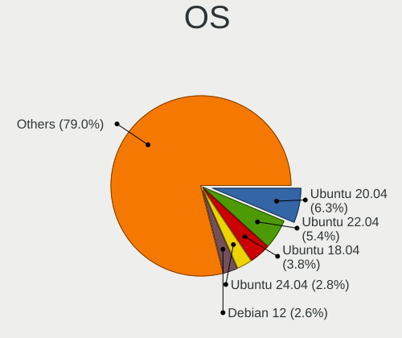

| Name                         | Computers | Percent |
|------------------------------|-----------|---------|
| Ubuntu 20.04                 | 290       | 6.31%   |
| Ubuntu 22.04                 | 249       | 5.42%   |
| Ubuntu 18.04                 | 176       | 3.83%   |
| Ubuntu 24.04                 | 129       | 2.81%   |
| Debian 12                    | 121       | 2.63%   |
| Arch Rolling                 | 118       | 2.57%   |
| Zorin 17                     | 100       | 2.18%   |
| OpenMandriva 4.2             | 94        | 2.05%   |
| OpenMandriva 4.3             | 89        | 1.94%   |
| Debian 11                    | 87        | 1.89%   |
| Pop!_OS 22.04                | 85        | 1.85%   |
| Zorin 16                     | 80        | 1.74%   |
| Fedora 38                    | 75        | 1.63%   |
| Fedora 40                    | 74        | 1.61%   |
| Manjaro                      | 71        | 1.55%   |
| ArcoLinux Rolling            | 61        | 1.33%   |
| OpenMandriva 25.90           | 57        | 1.24%   |
| Fedora 39                    | 56        | 1.22%   |
| Linux Mint 22.1              | 52        | 1.13%   |
| KDE neon 20.04               | 51        | 1.11%   |
| Fedora 42                    | 51        | 1.11%   |
| Fedora 41                    | 51        | 1.11%   |
| Linux Mint 20.3              | 48        | 1.04%   |
| KDE neon 22.04               | 43        | 0.94%   |
| Fedora 36                    | 43        | 0.94%   |
| OpenMandriva 23.08           | 39        | 0.85%   |
| OpenMandriva 24.12           | 38        | 0.83%   |
| Linux Mint 21.2              | 38        | 0.83%   |
| OpenMandriva 23.03           | 36        | 0.78%   |
| OpenMandriva 6.0             | 35        | 0.76%   |
| OpenMandriva 24.07           | 35        | 0.76%   |
| Arch                         | 34        | 0.74%   |
| Pop!_OS 20.04                | 33        | 0.72%   |
| openSUSE Tumbleweed-XXXXXXXX | 32        | 0.7%    |
| Zorin 15                     | 31        | 0.67%   |
| Linux Mint 21.1              | 30        | 0.65%   |
| Zorin 18                     | 29        | 0.63%   |
| EndeavourOS Rolling          | 28        | 0.61%   |
| Debian 13                    | 28        | 0.61%   |
| OpenMandriva 23.01           | 27        | 0.59%   |

OS Family
---------

OS without a version

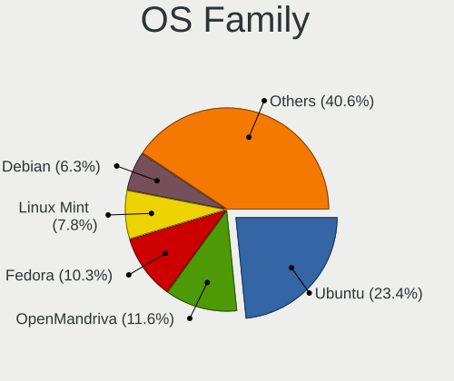

| Name          | Computers | Percent |
|---------------|-----------|---------|
| Ubuntu        | 1023      | 23.4%   |
| OpenMandriva  | 507       | 11.6%   |
| Fedora        | 451       | 10.32%  |
| Linux Mint    | 339       | 7.75%   |
| Debian        | 275       | 6.29%   |
| Zorin         | 244       | 5.58%   |
| Pop!_OS       | 159       | 3.64%   |
| Arch          | 152       | 3.48%   |
| Manjaro       | 136       | 3.11%   |
| KDE neon      | 107       | 2.45%   |
| Kubuntu       | 84        | 1.92%   |
| Elementary    | 68        | 1.56%   |
| Kali          | 63        | 1.44%   |
| ArcoLinux     | 61        | 1.4%    |
| Xubuntu       | 54        | 1.24%   |
| ROSA          | 53        | 1.21%   |
| openSUSE      | 51        | 1.17%   |
| Endless       | 48        | 1.1%    |
| Bazzite       | 40        | 0.91%   |
| Nobara        | 32        | 0.73%   |
| SteamOS       | 31        | 0.71%   |
| EndeavourOS   | 31        | 0.71%   |
| Garuda Linux  | 25        | 0.57%   |
| Lubuntu       | 24        | 0.55%   |
| LMDE          | 21        | 0.48%   |
| Ubuntu MATE   | 20        | 0.46%   |
| Parrot        | 20        | 0.46%   |
| Gentoo        | 18        | 0.41%   |
| Clear Linux   | 17        | 0.39%   |
| MX            | 15        | 0.34%   |
| Ubuntu Unity  | 14        | 0.32%   |
| CachyOS       | 14        | 0.32%   |
| Ubuntu Budgie | 13        | 0.3%    |
| Xero          | 11        | 0.25%   |
| CentOS        | 11        | 0.25%   |
| Nitrux        | 7         | 0.16%   |
| Linux Lite    | 7         | 0.16%   |
| RHEL          | 6         | 0.14%   |
| Deepin        | 6         | 0.14%   |
| Archcraft     | 6         | 0.14%   |

Kernel
------

Version of the Linux kernel

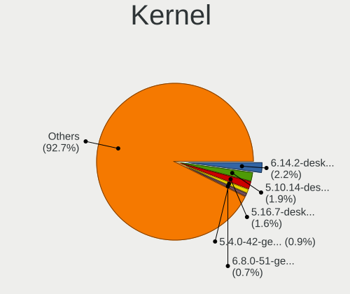

| Version                  | Computers | Percent |
|--------------------------|-----------|---------|
| 6.14.2-desktop-3omv2590  | 108       | 2.16%   |
| 5.10.14-desktop-1omv4002 | 94        | 1.88%   |
| 5.16.7-desktop-1omv4003  | 82        | 1.64%   |
| 5.4.0-42-generic         | 45        | 0.9%    |
| 6.8.0-51-generic         | 36        | 0.72%   |
| 6.4.11-desktop-1omv2390  | 33        | 0.66%   |
| 6.12.1-desktop-1omv2490  | 33        | 0.66%   |
| 6.8.0-45-generic         | 30        | 0.6%    |
| 6.6.2-desktop-1omv2390   | 30        | 0.6%    |
| 6.2.6-desktop-1omv2390   | 30        | 0.6%    |
| 6.10.0-desktop-1omv2490  | 29        | 0.58%   |
| 5.4.0-58-generic         | 27        | 0.54%   |
| 5.15.0-56-generic        | 27        | 0.54%   |
| 6.1.1-desktop-1omv2290   | 25        | 0.5%    |
| 6.8.0-52-generic         | 22        | 0.44%   |
| 5.15.0-58-generic        | 22        | 0.44%   |
| 6.8.0-49-generic         | 21        | 0.42%   |
| 5.8.0-14-generic         | 21        | 0.42%   |
| 5.4.0-91-generic         | 20        | 0.4%    |
| 5.3.0-40-generic         | 20        | 0.4%    |
| 6.14.0-33-generic        | 19        | 0.38%   |
| 5.11.0-27-generic        | 19        | 0.38%   |
| 5.4.0-48-generic         | 18        | 0.36%   |
| 5.15.0-52-generic        | 18        | 0.36%   |
| 6.5.0-14-generic         | 17        | 0.34%   |
| 5.4.0-52-generic         | 17        | 0.34%   |
| 5.4.0-40-generic         | 17        | 0.34%   |
| 5.19.0-35-generic        | 17        | 0.34%   |
| 5.15.0-48-generic        | 17        | 0.34%   |
| 5.15.0-47-generic        | 17        | 0.34%   |
| 6.8.0-40-generic         | 16        | 0.32%   |
| 6.1.0-13-amd64           | 16        | 0.32%   |
| 5.3.0-46-generic         | 16        | 0.32%   |
| 5.11.0-37-generic        | 16        | 0.32%   |
| 6.9.3-76060903-generic   | 15        | 0.3%    |
| 6.8.0-60-generic         | 15        | 0.3%    |
| 6.5.0-35-generic         | 15        | 0.3%    |
| 6.2.6-76060206-generic   | 15        | 0.3%    |
| 6.2.0-39-generic         | 15        | 0.3%    |
| 6.2.0-26-generic         | 15        | 0.3%    |

Kernel Family
-------------

Linux kernel without a distro release

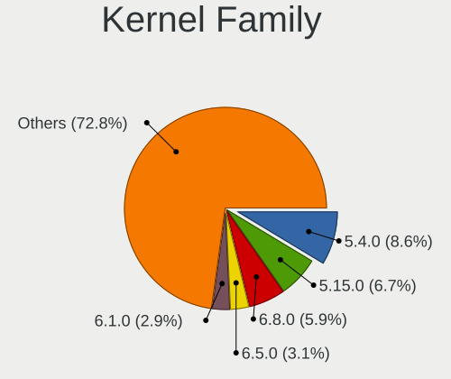

| Version | Computers | Percent |
|---------|-----------|---------|
| 5.4.0   | 409       | 8.63%   |
| 5.15.0  | 316       | 6.67%   |
| 6.8.0   | 281       | 5.93%   |
| 6.5.0   | 145       | 3.06%   |
| 6.1.0   | 137       | 2.89%   |
| 5.11.0  | 134       | 2.83%   |
| 5.13.0  | 127       | 2.68%   |
| 5.8.0   | 121       | 2.55%   |
| 6.14.2  | 116       | 2.45%   |
| 4.15.0  | 115       | 2.43%   |
| 5.3.0   | 111       | 2.34%   |
| 6.14.0  | 102       | 2.15%   |
| 5.19.0  | 102       | 2.15%   |
| 6.2.0   | 101       | 2.13%   |
| 5.10.14 | 94        | 1.98%   |
| 5.10.0  | 89        | 1.88%   |
| 5.16.7  | 83        | 1.75%   |
| 4.18.0  | 74        | 1.56%   |
| 5.0.0   | 72        | 1.52%   |
| 6.11.0  | 55        | 1.16%   |
| 6.2.6   | 45        | 0.95%   |
| 6.4.11  | 41        | 0.86%   |
| 6.12.1  | 38        | 0.8%    |
| 4.19.0  | 35        | 0.74%   |
| 6.6.2   | 34        | 0.72%   |
| 6.1.1   | 32        | 0.67%   |
| 6.10.0  | 31        | 0.65%   |
| 6.12.10 | 20        | 0.42%   |
| 6.9.3   | 18        | 0.38%   |
| 6.17.7  | 18        | 0.38%   |
| 6.9.7   | 17        | 0.36%   |
| 6.8.7   | 15        | 0.32%   |
| 6.12.9  | 14        | 0.3%    |
| 5.14.0  | 14        | 0.3%    |
| 6.8.9   | 13        | 0.27%   |
| 6.8.11  | 13        | 0.27%   |
| 6.7.9   | 13        | 0.27%   |
| 6.5.6   | 13        | 0.27%   |
| 6.16.8  | 13        | 0.27%   |
| 6.2.15  | 12        | 0.25%   |

Kernel Major Ver.
-----------------

Linux kernel major version

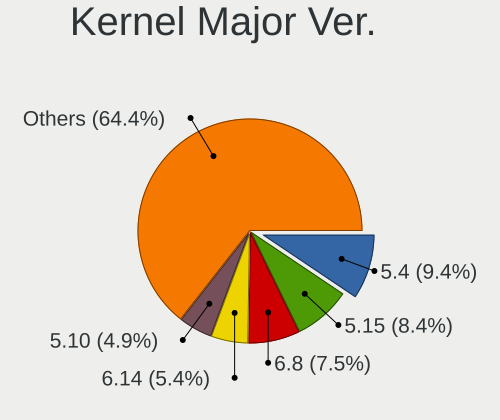

| Version | Computers | Percent |
|---------|-----------|---------|
| 5.4     | 439       | 9.41%   |
| 5.15    | 390       | 8.36%   |
| 6.8     | 349       | 7.48%   |
| 6.14    | 252       | 5.4%    |
| 5.10    | 229       | 4.91%   |
| 6.1     | 218       | 4.67%   |
| 6.5     | 201       | 4.31%   |
| 6.2     | 195       | 4.18%   |
| 6.12    | 181       | 3.88%   |
| 5.11    | 152       | 3.26%   |
| 5.13    | 145       | 3.11%   |
| 5.19    | 138       | 2.96%   |
| 5.8     | 136       | 2.92%   |
| 5.3     | 128       | 2.74%   |
| 5.16    | 126       | 2.7%    |
| 4.15    | 115       | 2.47%   |
| 6.6     | 114       | 2.44%   |
| 6.11    | 110       | 2.36%   |
| 6.4     | 106       | 2.27%   |
| 6.10    | 84        | 1.8%    |
| 4.18    | 76        | 1.63%   |
| 5.0     | 73        | 1.56%   |
| 6.17    | 67        | 1.44%   |
| 6.9     | 65        | 1.39%   |
| 6.0     | 54        | 1.16%   |
| 6.15    | 47        | 1.01%   |
| 6.7     | 43        | 0.92%   |
| 6.3     | 43        | 0.92%   |
| 6.16    | 43        | 0.92%   |
| 4.19    | 41        | 0.88%   |
| 5.14    | 39        | 0.84%   |
| 5.18    | 37        | 0.79%   |
| 5.17    | 35        | 0.75%   |
| 6.13    | 33        | 0.71%   |
| 4.9     | 27        | 0.58%   |
| 5.9     | 25        | 0.54%   |
| 5.7     | 22        | 0.47%   |
| 5.12    | 21        | 0.45%   |
| 5.6     | 19        | 0.41%   |
| 6.18    | 9         | 0.19%   |

Arch
----

OS architecture (x86_64, i586, etc.)

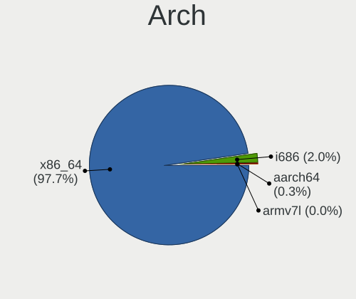

| Name    | Computers | Percent |
|---------|-----------|---------|
| x86_64  | 4053      | 97.71%  |
| i686    | 81        | 1.95%   |
| aarch64 | 12        | 0.29%   |
| armv7l  | 2         | 0.05%   |

DE
--

Desktop Environment

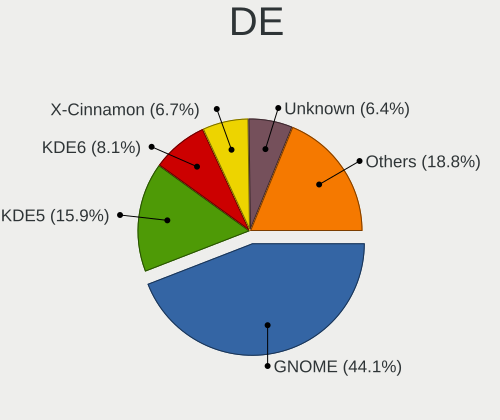

| Name              | Computers | Percent |
|-------------------|-----------|---------|
| GNOME             | 1936      | 44.11%  |
| KDE5              | 696       | 15.86%  |
| KDE6              | 357       | 8.13%   |
| X-Cinnamon        | 293       | 6.68%   |
| Unknown           | 280       | 6.38%   |
| XFCE              | 279       | 6.36%   |
| MATE              | 114       | 2.6%    |
| KDE               | 84        | 1.91%   |
| Pantheon          | 65        | 1.48%   |
| LXQt              | 56        | 1.28%   |
| Cinnamon          | 41        | 0.93%   |
| KDE4              | 24        | 0.55%   |
| Budgie            | 23        | 0.52%   |
| LXDE              | 20        | 0.46%   |
| Unity             | 14        | 0.32%   |
| i3                | 14        | 0.32%   |
| Hyprland          | 13        | 0.3%    |
| Deepin            | 12        | 0.27%   |
| GNOME Classic     | 9         | 0.21%   |
| openbox           | 8         | 0.18%   |
| Enlightenment     | 7         | 0.16%   |
| COSMIC            | 6         | 0.14%   |
| Trinity           | 5         | 0.11%   |
| qtile             | 5         | 0.11%   |
| lightdm-xsession  | 4         | 0.09%   |
| Niri              | 3         | 0.07%   |
| GNOME Flashback   | 3         | 0.07%   |
| DDE               | 3         | 0.07%   |
| awesome           | 2         | 0.05%   |
| Yaru:ubuntu:GNOME | 1         | 0.02%   |
| xmonad            | 1         | 0.02%   |
| wayland           | 1         | 0.02%   |
| labwc:wlroots     | 1         | 0.02%   |
| jwm               | 1         | 0.02%   |
| i3-with-shmlog    | 1         | 0.02%   |
| GNOME-Classic     | 1         | 0.02%   |
| fluxbox           | 1         | 0.02%   |
| DWM               | 1         | 0.02%   |
| Cutefish          | 1         | 0.02%   |
| chadwm            | 1         | 0.02%   |

Display Server
--------------

X11 or Wayland

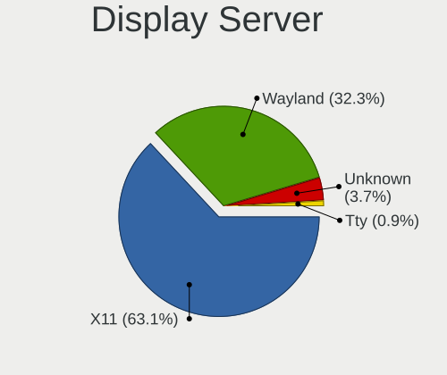

| Name    | Computers | Percent |
|---------|-----------|---------|
| X11     | 2727      | 63.07%  |
| Wayland | 1396      | 32.28%  |
| Unknown | 160       | 3.7%    |
| Tty     | 41        | 0.95%   |

Display Manager
---------------

SDDM, LightDM, etc.

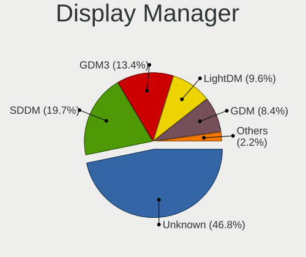

| Name           | Computers | Percent |
|----------------|-----------|---------|
| Unknown        | 2029      | 46.77%  |
| SDDM           | 853       | 19.66%  |
| GDM3           | 580       | 13.37%  |
| LightDM        | 415       | 9.57%   |
| GDM            | 364       | 8.39%   |
| TDM            | 53        | 1.22%   |
| KDM            | 23        | 0.53%   |
| XDM            | 5         | 0.12%   |
| SLiM           | 5         | 0.12%   |
| LXDM           | 3         | 0.07%   |
| GREETD         | 2         | 0.05%   |
| SLIMSKI        | 1         | 0.02%   |
| NODM           | 1         | 0.02%   |
| MDM            | 1         | 0.02%   |
| LY-DM          | 1         | 0.02%   |
| Ly             | 1         | 0.02%   |
| COSMIC-GREETER | 1         | 0.02%   |

OS Lang
-------

Language

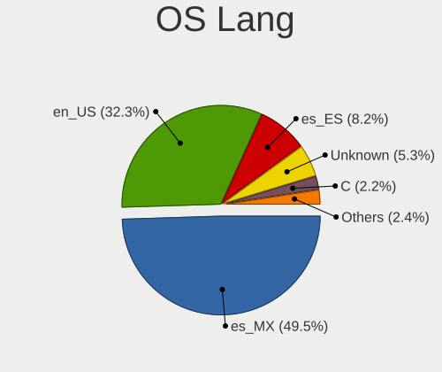

| Lang        | Computers | Percent |
|-------------|-----------|---------|
| es_MX       | 2117      | 49.51%  |
| en_US       | 1380      | 32.27%  |
| es_ES       | 352       | 8.23%   |
| Unknown     | 227       | 5.31%   |
| C           | 96        | 2.25%   |
| en_GB       | 32        | 0.75%   |
| es_US       | 14        | 0.33%   |
| en_CA       | 9         | 0.21%   |
| fr_FR       | 8         | 0.19%   |
| es_AR       | 5         | 0.12%   |
| POSIX       | 3         | 0.07%   |
| es_VE       | 3         | 0.07%   |
| ru_RU       | 2         | 0.05%   |
| it_IT       | 2         | 0.05%   |
| es_MX.UTF8  | 2         | 0.05%   |
| es_CO       | 2         | 0.05%   |
| en_US.UTF8  | 2         | 0.05%   |
| en_MX       | 2         | 0.05%   |
| en_DK       | 2         | 0.05%   |
| de_DE       | 2         | 0.05%   |
| C.UTF8      | 2         | 0.05%   |
| uk_UA       | 1         | 0.02%   |
| pt_BR       | 1         | 0.02%   |
| nhn_MX      | 1         | 0.02%   |
| es_PE       | 1         | 0.02%   |
| es_MX UTF-8 | 1         | 0.02%   |
| es_LA       | 1         | 0.02%   |
| es_GT       | 1         | 0.02%   |
| es_CR       | 1         | 0.02%   |
| es_419      | 1         | 0.02%   |
| en_IE       | 1         | 0.02%   |
| Default     | 1         | 0.02%   |
| aa_ET       | 1         | 0.02%   |

Boot Mode
---------

EFI or BIOS

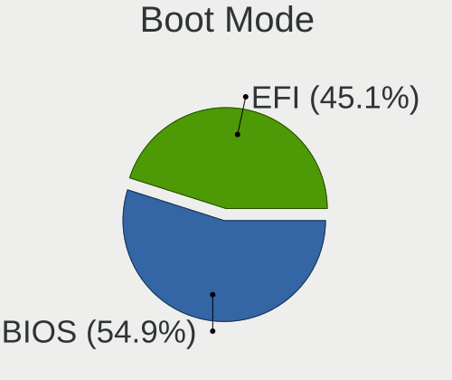

| Mode | Computers | Percent |
|------|-----------|---------|
| BIOS | 2340      | 54.9%   |
| EFI  | 1922      | 45.1%   |

Filesystem
----------

Type of filesystem

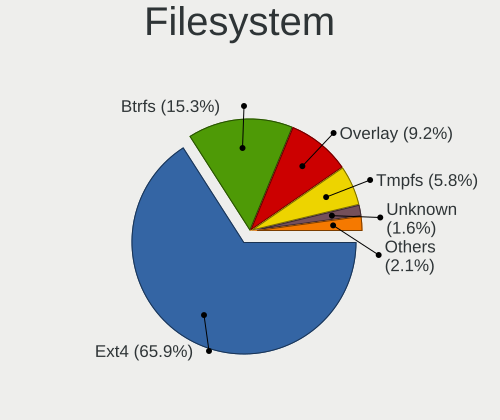

| Type                | Computers | Percent |
|---------------------|-----------|---------|
| Ext4                | 2828      | 65.94%  |
| Btrfs               | 655       | 15.27%  |
| Overlay             | 395       | 9.21%   |
| Tmpfs               | 250       | 5.83%   |
| Unknown             | 69        | 1.61%   |
| Xfs                 | 53        | 1.24%   |
| Zfs                 | 16        | 0.37%   |
| Ext2                | 8         | 0.19%   |
| Reiserfs            | 4         | 0.09%   |
| F2fs                | 4         | 0.09%   |
| Ext3                | 3         | 0.07%   |
| XXXXXXX             | 2         | 0.05%   |
| Fuse.fuse-overlayfs | 1         | 0.02%   |
| Aufs                | 1         | 0.02%   |

Part. scheme
------------

Scheme of partitioning

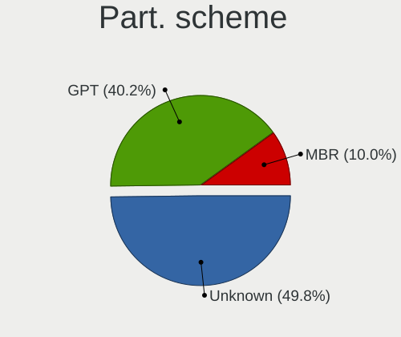

| Type    | Computers | Percent |
|---------|-----------|---------|
| Unknown | 2127      | 49.8%   |
| GPT     | 1718      | 40.22%  |
| MBR     | 426       | 9.97%   |

Dual Boot with Linux/BSD
------------------------

Hosting more than one Linux/BSD

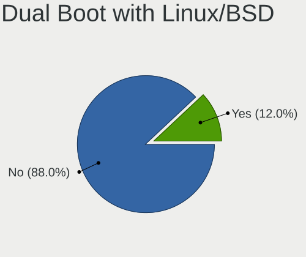

| Dual boot | Computers | Percent |
|-----------|-----------|---------|
| No        | 3716      | 88.02%  |
| Yes       | 506       | 11.98%  |

Dual Boot (Win)
---------------

Hosting Linux and Windows

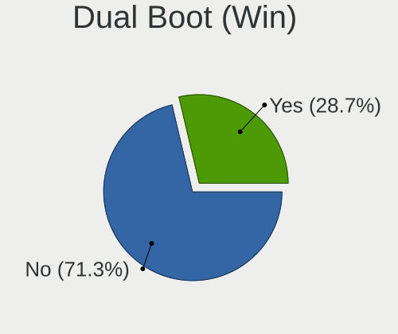

| Dual boot | Computers | Percent |
|-----------|-----------|---------|
| No        | 3028      | 71.31%  |
| Yes       | 1218      | 28.69%  |

Board
-----

Vendor
------

Motherboard manufacturer

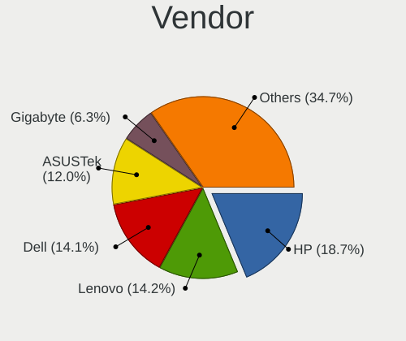

| Name                    | Computers | Percent |
|-------------------------|-----------|---------|
| Hewlett-Packard         | 777       | 18.74%  |
| Lenovo                  | 588       | 14.18%  |
| Dell                    | 584       | 14.09%  |
| ASUSTek Computer        | 499       | 12.04%  |
| Gigabyte Technology     | 260       | 6.27%   |
| Acer                    | 209       | 5.04%   |
| Apple                   | 160       | 3.86%   |
| HUAWEI                  | 113       | 2.73%   |
| Toshiba                 | 108       | 2.6%    |
| MSI                     | 101       | 2.44%   |
| ASRock                  | 64        | 1.54%   |
| Intel                   | 62        | 1.5%    |
| Sony                    | 55        | 1.33%   |
| Unknown                 | 46        | 1.11%   |
| ECS                     | 43        | 1.04%   |
| Biostar                 | 42        | 1.01%   |
| Google                  | 32        | 0.77%   |
| Gateway                 | 32        | 0.77%   |
| Valve                   | 27        | 0.65%   |
| Alienware               | 26        | 0.63%   |
| Samsung Electronics     | 25        | 0.6%    |
| Pegatron                | 24        | 0.58%   |
| Lanix                   | 19        | 0.46%   |
| Chuwi                   | 19        | 0.46%   |
| Microsoft               | 16        | 0.39%   |
| PCChips                 | 10        | 0.24%   |
| GHIA                    | 10        | 0.24%   |
| Foxconn                 | 10        | 0.24%   |
| Raspberry Pi Foundation | 9         | 0.22%   |
| AMI                     | 9         | 0.22%   |
| GPU Company             | 8         | 0.19%   |
| Timi                    | 7         | 0.17%   |
| eMachines               | 7         | 0.17%   |
| AZW                     | 7         | 0.17%   |
| SK hynix                | 6         | 0.14%   |
| Notebook                | 5         | 0.12%   |
| MACHINIST               | 5         | 0.12%   |
| A-DATA Technology       | 5         | 0.12%   |
| TPV-INVENTA             | 4         | 0.1%    |
| System76                | 4         | 0.1%    |

Model
-----

Motherboard model

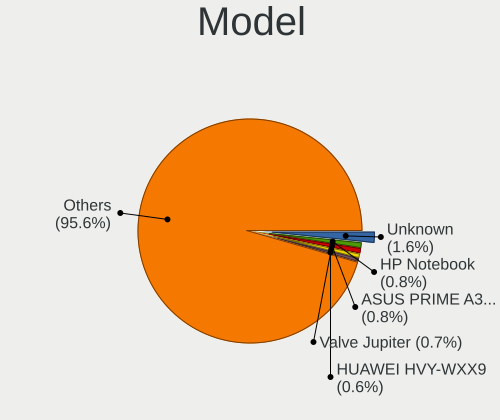

| Name                          | Computers | Percent |
|-------------------------------|-----------|---------|
| Unknown                       | 67        | 1.62%   |
| HP Notebook                   | 34        | 0.82%   |
| ASUS PRIME A320M-K            | 33        | 0.8%    |
| Valve Jupiter                 | 27        | 0.65%   |
| HUAWEI HVY-WXX9               | 23        | 0.55%   |
| Apple MacBookPro9,2           | 22        | 0.53%   |
| HP Pavilion g4                | 20        | 0.48%   |
| HP Pavilion Notebook          | 19        | 0.46%   |
| HP Pavilion Laptop 15-cw1xxx  | 18        | 0.43%   |
| HP Pavilion Laptop 15-cw0xxx  | 17        | 0.41%   |
| ASUS All Series               | 16        | 0.39%   |
| HUAWEI BOM-WXX9               | 15        | 0.36%   |
| Apple MacBookPro8,1           | 14        | 0.34%   |
| ASUS PRIME B550M-A AC         | 13        | 0.31%   |
| HP Pavilion dv4               | 12        | 0.29%   |
| HP Laptop 15-da0xxx           | 12        | 0.29%   |
| Dell Latitude E6430           | 12        | 0.29%   |
| ASUS PRIME B450M-A II         | 12        | 0.29%   |
| Dell OptiPlex 7010            | 11        | 0.27%   |
| HP Laptop 14-cm0xxx           | 10        | 0.24%   |
| Gigabyte B450M DS3H           | 10        | 0.24%   |
| Dell OptiPlex 9020            | 10        | 0.24%   |
| Lenovo IdeaPad 330-14AST 81D5 | 9         | 0.22%   |
| HP Laptop 15-db0xxx           | 9         | 0.22%   |
| HP EliteBook 8460p            | 9         | 0.22%   |
| Dell Inspiron 5559            | 9         | 0.22%   |
| ASUS ROG STRIX B450-F GAMING  | 9         | 0.22%   |
| Apple MacBookPro12,1          | 9         | 0.22%   |
| Acer Aspire A315-24P          | 9         | 0.22%   |
| HUAWEI NBLK-WAX9X             | 8         | 0.19%   |
| HUAWEI NBLB-WAX9N             | 8         | 0.19%   |
| HP Pavilion 14                | 8         | 0.19%   |
| HP Laptop 15-bw0xx            | 8         | 0.19%   |
| HP Compaq 6200 Pro SFF PC     | 8         | 0.19%   |
| Gigabyte A320M-S2H            | 8         | 0.19%   |
| Dell OptiPlex 790             | 8         | 0.19%   |
| Dell Inspiron 5570            | 8         | 0.19%   |
| Biostar B450MH                | 8         | 0.19%   |
| Lenovo IdeaPad 330-15AST 81D6 | 7         | 0.17%   |
| Lenovo G50-30 80G0            | 7         | 0.17%   |

Model Family
------------

Motherboard model prefix

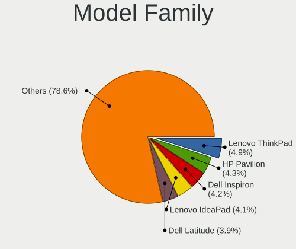

| Name               | Computers | Percent |
|--------------------|-----------|---------|
| Lenovo ThinkPad    | 204       | 4.92%   |
| HP Pavilion        | 177       | 4.27%   |
| Dell Inspiron      | 176       | 4.25%   |
| Lenovo IdeaPad     | 170       | 4.1%    |
| Dell Latitude      | 161       | 3.88%   |
| Acer Aspire        | 153       | 3.69%   |
| ASUS PRIME         | 123       | 2.97%   |
| HP Laptop          | 108       | 2.6%    |
| Dell OptiPlex      | 107       | 2.58%   |
| Toshiba Satellite  | 97        | 2.34%   |
| Unknown            | 67        | 1.62%   |
| HP Compaq          | 65        | 1.57%   |
| ASUS ROG           | 62        | 1.5%    |
| ASUS VivoBook      | 55        | 1.33%   |
| HP EliteBook       | 49        | 1.18%   |
| Lenovo ThinkCentre | 45        | 1.09%   |
| HP ProBook         | 45        | 1.09%   |
| HP Notebook        | 35        | 0.84%   |
| ASUS TUF           | 34        | 0.82%   |
| Dell Precision     | 31        | 0.75%   |
| Valve Jupiter      | 27        | 0.65%   |
| HP 240             | 26        | 0.63%   |
| Apple MacBookPro9  | 26        | 0.63%   |
| HP ENVY            | 24        | 0.58%   |
| HUAWEI HVY-WXX9    | 23        | 0.55%   |
| HP ProDesk         | 23        | 0.55%   |
| Dell Vostro        | 22        | 0.53%   |
| HP EliteDesk       | 21        | 0.51%   |
| Dell XPS           | 21        | 0.51%   |
| ASUS ASUS          | 21        | 0.51%   |
| Lenovo Legion      | 19        | 0.46%   |
| Acer Nitro         | 19        | 0.46%   |
| Lenovo Yoga        | 17        | 0.41%   |
| Gigabyte B550M     | 17        | 0.41%   |
| Apple MacBookPro8  | 17        | 0.41%   |
| Microsoft Surface  | 16        | 0.39%   |
| HP ZBook           | 16        | 0.39%   |
| HP OMEN            | 16        | 0.39%   |
| ASUS All           | 16        | 0.39%   |
| HUAWEI BOM-WXX9    | 15        | 0.36%   |

MFG Year
--------

Motherboard manufacture year

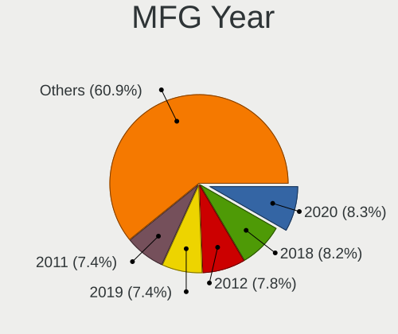

| Year    | Computers | Percent |
|---------|-----------|---------|
| 2020    | 344       | 8.3%    |
| 2018    | 342       | 8.25%   |
| 2012    | 325       | 7.84%   |
| 2019    | 307       | 7.4%    |
| 2011    | 305       | 7.36%   |
| 2021    | 296       | 7.14%   |
| 2017    | 291       | 7.02%   |
| 2013    | 261       | 6.3%    |
| 2014    | 238       | 5.74%   |
| 2015    | 227       | 5.48%   |
| 2016    | 192       | 4.63%   |
| 2010    | 185       | 4.46%   |
| 2022    | 174       | 4.2%    |
| 2023    | 141       | 3.4%    |
| 2008    | 141       | 3.4%    |
| 2009    | 135       | 3.26%   |
| 2007    | 85        | 2.05%   |
| 2024    | 74        | 1.78%   |
| 2006    | 36        | 0.87%   |
| Unknown | 17        | 0.41%   |
| 2025    | 14        | 0.34%   |
| 2005    | 13        | 0.31%   |
| 2004    | 2         | 0.05%   |
| 2003    | 1         | 0.02%   |

Form Factor
-----------

Physical design of the computer

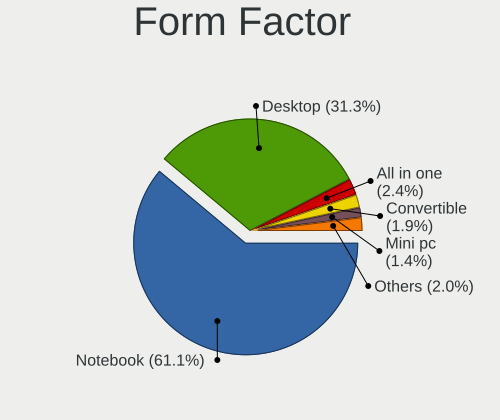

| Name           | Computers | Percent |
|----------------|-----------|---------|
| Notebook       | 2532      | 61.07%  |
| Desktop        | 1298      | 31.31%  |
| All in one     | 98        | 2.36%   |
| Convertible    | 78        | 1.88%   |
| Mini pc        | 59        | 1.42%   |
| Tablet         | 47        | 1.13%   |
| Server         | 20        | 0.48%   |
| System on chip | 13        | 0.31%   |
| Other          | 1         | 0.02%   |

Secure Boot
-----------

Enabled or disabled

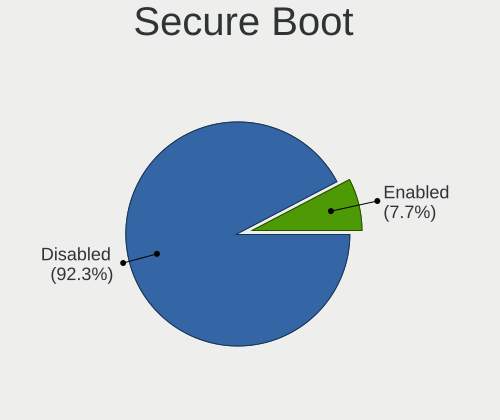

| State    | Computers | Percent |
|----------|-----------|---------|
| Disabled | 3865      | 92.33%  |
| Enabled  | 321       | 7.67%   |

Coreboot
--------

Have coreboot on board

| Used | Computers | Percent |
|------|-----------|---------|
| No   | 4109      | 99.11%  |
| Yes  | 37        | 0.89%   |

RAM Size
--------

Total RAM memory

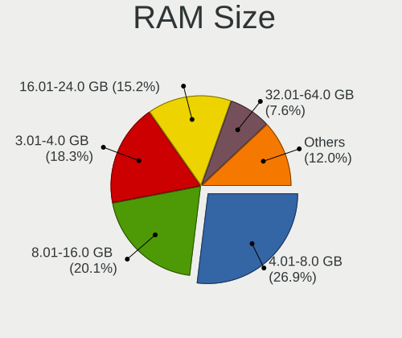

| Size in GB      | Computers | Percent |
|-----------------|-----------|---------|
| 4.01-8.0        | 1138      | 26.94%  |
| 8.01-16.0       | 847       | 20.05%  |
| 3.01-4.0        | 773       | 18.3%   |
| 16.01-24.0      | 640       | 15.15%  |
| 32.01-64.0      | 320       | 7.58%   |
| 1.01-2.0        | 171       | 4.05%   |
| 24.01-32.0      | 122       | 2.89%   |
| 64.01-256.0     | 107       | 2.53%   |
| 2.01-3.0        | 73        | 1.73%   |
| 0.51-1.0        | 27        | 0.64%   |
| More than 256.0 | 3         | 0.07%   |
| 0.01-0.5        | 2         | 0.05%   |
| Unknown         | 1         | 0.02%   |

RAM Used
--------

Used RAM memory

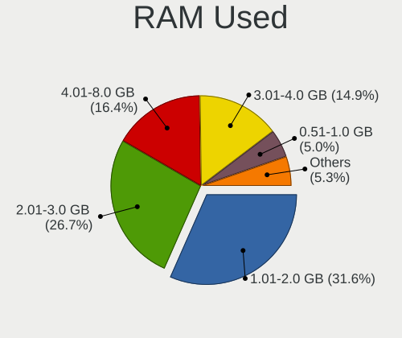

| Used GB     | Computers | Percent |
|-------------|-----------|---------|
| 1.01-2.0    | 1458      | 31.62%  |
| 2.01-3.0    | 1232      | 26.72%  |
| 4.01-8.0    | 758       | 16.44%  |
| 3.01-4.0    | 687       | 14.9%   |
| 0.51-1.0    | 232       | 5.03%   |
| 8.01-16.0   | 179       | 3.88%   |
| 0.01-0.5    | 33        | 0.72%   |
| 16.01-24.0  | 18        | 0.39%   |
| 24.01-32.0  | 6         | 0.13%   |
| 32.01-64.0  | 4         | 0.09%   |
| Unknown     | 3         | 0.07%   |
| 64.01-256.0 | 1         | 0.02%   |

Total Drives
------------

Number of drives on board

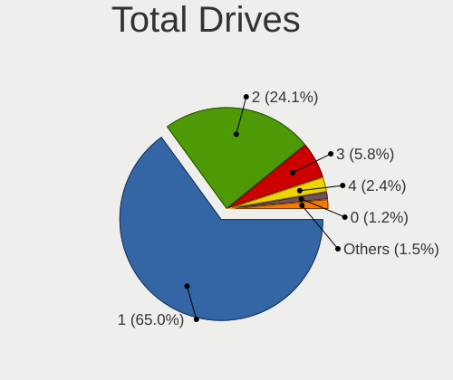

| Drives  | Computers | Percent |
|---------|-----------|---------|
| 1       | 2779      | 65.01%  |
| 2       | 1031      | 24.12%  |
| 3       | 247       | 5.78%   |
| 4       | 102       | 2.39%   |
| 0       | 50        | 1.17%   |
| 5       | 30        | 0.7%    |
| 6       | 21        | 0.49%   |
| 7       | 8         | 0.19%   |
| 10      | 2         | 0.05%   |
| 8       | 2         | 0.05%   |
| 37      | 1         | 0.02%   |
| 18      | 1         | 0.02%   |
| Unknown | 1         | 0.02%   |

Has CD-ROM
----------

Has CD-ROM on board

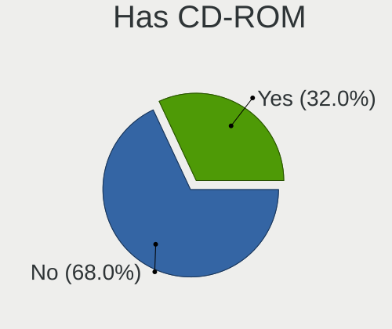

| Presented | Computers | Percent |
|-----------|-----------|---------|
| No        | 2840      | 68.04%  |
| Yes       | 1334      | 31.96%  |

Has Ethernet
------------

Has Ethernet on board

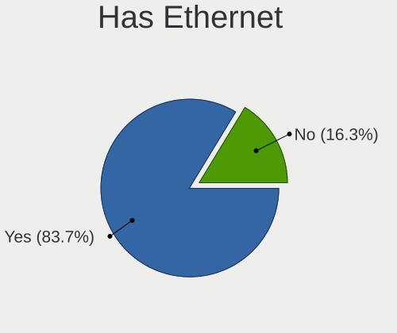

| Presented | Computers | Percent |
|-----------|-----------|---------|
| Yes       | 3477      | 83.68%  |
| No        | 678       | 16.32%  |

Has WiFi
--------

Has WiFi module

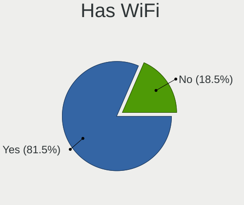

| Presented | Computers | Percent |
|-----------|-----------|---------|
| Yes       | 3402      | 81.52%  |
| No        | 771       | 18.48%  |

Has Bluetooth
-------------

Has Bluetooth module

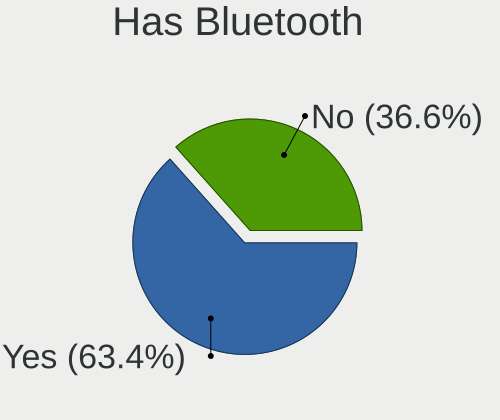

| Presented | Computers | Percent |
|-----------|-----------|---------|
| Yes       | 2659      | 63.42%  |
| No        | 1534      | 36.58%  |

Location
--------

Country
-------

Geographic location (country)

| Country | Computers | Percent |
|---------|-----------|---------|
| Mexico  | 4146      | 100%    |

City
----

Geographic location (city)

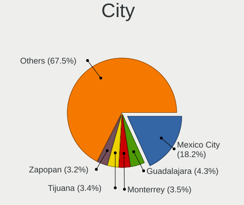

| City                  | Computers | Percent |
|-----------------------|-----------|---------|
| Mexico City           | 804       | 18.22%  |
| Guadalajara           | 189       | 4.28%   |
| Monterrey             | 153       | 3.47%   |
| Tijuana               | 149       | 3.38%   |
| Zapopan               | 140       | 3.17%   |
| Puebla City           | 136       | 3.08%   |
| Mérida               | 96        | 2.18%   |
| Queretaro             | 67        | 1.52%   |
| Toluca                | 60        | 1.36%   |
| Ecatepec              | 56        | 1.27%   |
| León                 | 55        | 1.25%   |
| Tlalnepantla          | 53        | 1.2%    |
| Morelia               | 53        | 1.2%    |
| Cuernavaca            | 53        | 1.2%    |
| Gustavo Adolfo Madero | 52        | 1.18%   |
| Hermosillo            | 51        | 1.16%   |
| Querétaro City       | 50        | 1.13%   |
| Mexicali              | 49        | 1.11%   |
| Ciudad Juárez        | 49        | 1.11%   |
| Naucalpan             | 48        | 1.09%   |
| Chihuahua City        | 46        | 1.04%   |
| Veracruz              | 44        | 1%      |
| Aguascalientes        | 44        | 1%      |
| Pachuca               | 43        | 0.97%   |
| Oaxaca City           | 42        | 0.95%   |
| Cancún               | 42        | 0.95%   |
| Xalapa                | 41        | 0.93%   |
| San Luis Potosí City | 41        | 0.93%   |
| Culiacán             | 41        | 0.93%   |
| Ciudad Nezahualcoyotl | 41        | 0.93%   |
| Guadalupe             | 39        | 0.88%   |
| Apodaca               | 39        | 0.88%   |
| Iztapalapa            | 36        | 0.82%   |
| Cuautitlán Izcalli   | 35        | 0.79%   |
| Ciudad Lopez Mateos   | 35        | 0.79%   |
| Saltillo              | 33        | 0.75%   |
| Chalco                | 25        | 0.57%   |
| Villahermosa          | 24        | 0.54%   |
| Ensenada              | 24        | 0.54%   |
| Tlaxcala City         | 23        | 0.52%   |

Drives
------

Drive Vendor
------------

Hard drive vendors

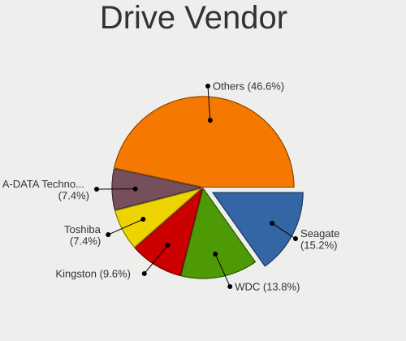

| Vendor                      | Computers | Drives | Percent |
|-----------------------------|-----------|--------|---------|
| Seagate                     | 877       | 1279   | 15.19%  |
| WDC                         | 795       | 1077   | 13.77%  |
| Kingston                    | 553       | 735    | 9.58%   |
| Toshiba                     | 430       | 546    | 7.45%   |
| A-DATA Technology           | 428       | 528    | 7.41%   |
| Samsung Electronics         | 381       | 506    | 6.6%    |
| Sandisk                     | 250       | 309    | 4.33%   |
| Unknown                     | 249       | 331    | 4.31%   |
| Hitachi                     | 230       | 291    | 3.98%   |
| HGST                        | 122       | 143    | 2.11%   |
| SK hynix                    | 117       | 145    | 2.03%   |
| Intel                       | 98        | 157    | 1.7%    |
| Kingston Technology Company | 95        | 125    | 1.65%   |
| Micron Technology           | 91        | 114    | 1.58%   |
| Crucial                     | 67        | 94     | 1.16%   |
| Apple                       | 67        | 90     | 1.16%   |
| China                       | 51        | 64     | 0.88%   |
| ADATA Technology            | 50        | 63     | 0.87%   |
| Silicon Motion              | 43        | 47     | 0.74%   |
| KIOXIA                      | 41        | 50     | 0.71%   |
| XPG                         | 39        | 51     | 0.68%   |
| Unknown                     | 37        | 42     | 0.64%   |
| PNY                         | 35        | 47     | 0.61%   |
| Fujitsu                     | 34        | 39     | 0.59%   |
| Realtek Semiconductor       | 30        | 38     | 0.52%   |
| Phison Electronics          | 29        | 34     | 0.5%    |
| MAXIO Technology (Hangzhou) | 27        | 29     | 0.47%   |
| LITEON                      | 23        | 32     | 0.4%    |
| Hewlett-Packard             | 21        | 24     | 0.36%   |
| Phison                      | 20        | 23     | 0.35%   |
| Patriot                     | 20        | 29     | 0.35%   |
| Micron/Crucial Technology   | 19        | 27     | 0.33%   |
| JMicron Technology          | 16        | 17     | 0.28%   |
| Acer                        | 16        | 18     | 0.28%   |
| Gigabyte Technology         | 15        | 16     | 0.26%   |
| Netac                       | 13        | 15     | 0.23%   |
| Maxtor                      | 12        | 15     | 0.21%   |
| Team                        | 9         | 9      | 0.16%   |
| YMTC                        | 8         | 10     | 0.14%   |
| WALRAM                      | 8         | 12     | 0.14%   |

Drive Model
-----------

Hard drive models

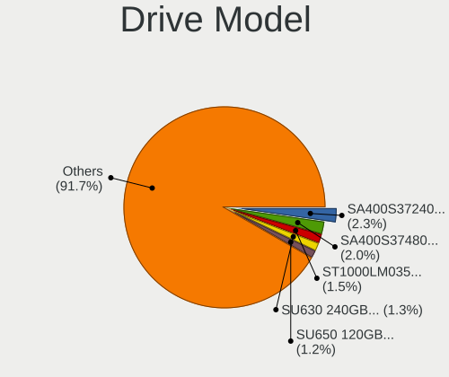

| Model                                                              | Computers | Percent |
|--------------------------------------------------------------------|-----------|---------|
| Kingston SA400S37240G 240GB SSD                                    | 140       | 2.26%   |
| Kingston SA400S37480G 480GB SSD                                    | 126       | 2.03%   |
| Seagate ST1000LM035-1RK172 1TB                                     | 92        | 1.48%   |
| A-DATA SU630 240GB SSD                                             | 82        | 1.32%   |
| A-DATA SU650 120GB SSD                                             | 75        | 1.21%   |
| Toshiba MQ01ABD100 1TB                                             | 61        | 0.98%   |
| Toshiba MQ04ABF100 1TB                                             | 60        | 0.97%   |
| Seagate ST500DM002-1BD142 500GB                                    | 54        | 0.87%   |
| Kingston SA400S37960G 960GB SSD                                    | 53        | 0.85%   |
| Unknown MMC Card  32GB                                             | 49        | 0.79%   |
| Seagate ST1000LM024 HN-M101MBB 1TB                                 | 48        | 0.77%   |
| Kingston Company SNV2S1000G 1TB                                    | 48        | 0.77%   |
| Toshiba MQ01ABF050 500GB                                           | 46        | 0.74%   |
| Kingston SA400S37120G 120GB SSD                                    | 41        | 0.66%   |
| Seagate ST1000DM010-2EP102 1TB                                     | 40        | 0.65%   |
| A-DATA SU630 480GB SSD                                             | 39        | 0.63%   |
| Seagate ST500LT012-1DG142 500GB                                    | 38        | 0.61%   |
| Unknown                                                            | 37        | 0.6%    |
| Unknown MMC Card  64GB                                             | 36        | 0.58%   |
| Samsung NVMe SSD Controller SM981/PM981/PM983 1TB                  | 36        | 0.58%   |
| A-DATA SU650 240GB SSD                                             | 29        | 0.47%   |
| Unknown SD/MMC/MS PRO 2GB                                          | 24        | 0.39%   |
| Toshiba DT01ACA100 1TB                                             | 24        | 0.39%   |
| Seagate ST9500325AS 500GB                                          | 24        | 0.39%   |
| Sandisk WD Blue SN550 NVMe SSD 1024GB                              | 24        | 0.39%   |
| Unknown MMC Card  128GB                                            | 23        | 0.37%   |
| A-DATA SU800 512GB SSD                                             | 23        | 0.37%   |
| Seagate ST500LM021-1KJ152 500GB                                    | 22        | 0.35%   |
| Seagate ST2000DM008-2FR102 2TB                                     | 22        | 0.35%   |
| Samsung NVMe SSD Controller PM9A1/PM9A3/980PRO 1TB                 | 22        | 0.35%   |
| HGST HTS725050A7E630 500GB                                         | 21        | 0.34%   |
| ADATA XPG SX8200 Pro PCIe Gen3x4 M.2 2280 Solid State Drive 1024GB | 21        | 0.34%   |
| WDC WDS240G2G0A-00JH30 240GB SSD                                   | 20        | 0.32%   |
| Unknown MMC Card  16GB                                             | 20        | 0.32%   |
| Seagate ST1000DM003-1ER162 1TB                                     | 20        | 0.32%   |
| WDC WD10EZEX-08WN4A0 1TB                                           | 19        | 0.31%   |
| WDC WD Green 2.5 1000GB                                            | 19        | 0.31%   |
| Toshiba DT01ACA050 500GB                                           | 19        | 0.31%   |
| Seagate ST3500418AS 500GB                                          | 19        | 0.31%   |
| HGST HTS541010A9E680 1TB                                           | 18        | 0.29%   |

HDD Vendor
----------

Hard disk drive vendors

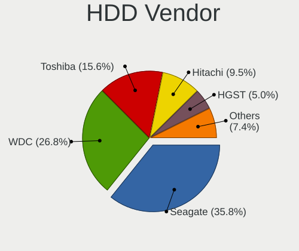

| Vendor              | Computers | Drives | Percent |
|---------------------|-----------|--------|---------|
| Seagate             | 870       | 1268   | 35.77%  |
| WDC                 | 651       | 868    | 26.77%  |
| Toshiba             | 380       | 482    | 15.63%  |
| Hitachi             | 230       | 291    | 9.46%   |
| HGST                | 122       | 143    | 5.02%   |
| Samsung Electronics | 44        | 51     | 1.81%   |
| Fujitsu             | 34        | 39     | 1.4%    |
| Unknown             | 25        | 28     | 1.03%   |
| Apple               | 24        | 30     | 0.99%   |
| Maxtor              | 12        | 15     | 0.49%   |
| JMicron Technology  | 8         | 9      | 0.33%   |
| Hewlett-Packard     | 5         | 6      | 0.21%   |
| ASMT                | 4         | 10     | 0.16%   |
| USB3.0              | 3         | 3      | 0.12%   |
| LaCie               | 2         | 3      | 0.08%   |
| IBM/Hitachi         | 2         | 3      | 0.08%   |
| HPE                 | 2         | 3      | 0.08%   |
| HGST HTS            | 2         | 2      | 0.08%   |
| WALRAM              | 1         | 1      | 0.04%   |
| TO Exter            | 1         | 1      | 0.04%   |
| T-FORCE             | 1         | 1      | 0.04%   |
| Shenzhen            | 1         | 1      | 0.04%   |
| SAGE                | 1         | 1      | 0.04%   |
| SABRENT             | 1         | 2      | 0.04%   |
| QUANTUM             | 1         | 2      | 0.04%   |
| MaxDigital          | 1         | 4      | 0.04%   |
| External            | 1         | 2      | 0.04%   |
| DELLBOSS            | 1         | 1      | 0.04%   |
| China               | 1         | 1      | 0.04%   |
| ASMedia             | 1         | 1      | 0.04%   |

SSD Vendor
----------

Solid state drive vendors

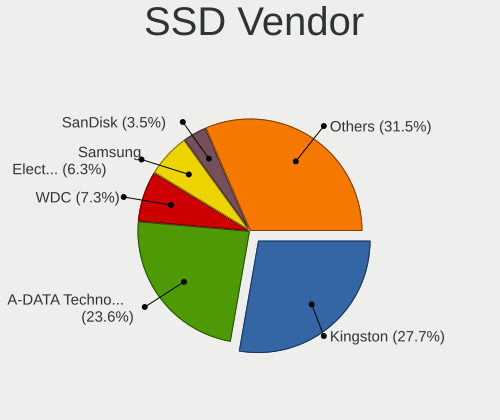

| Vendor              | Computers | Drives | Percent |
|---------------------|-----------|--------|---------|
| Kingston            | 473       | 620    | 27.74%  |
| A-DATA Technology   | 403       | 498    | 23.64%  |
| WDC                 | 125       | 157    | 7.33%   |
| Samsung Electronics | 108       | 135    | 6.33%   |
| SanDisk             | 59        | 69     | 3.46%   |
| Crucial             | 56        | 74     | 3.28%   |
| China               | 49        | 62     | 2.87%   |
| PNY                 | 34        | 46     | 1.99%   |
| Apple               | 32        | 38     | 1.88%   |
| Micron Technology   | 29        | 33     | 1.7%    |
| SK hynix            | 27        | 36     | 1.58%   |
| Intel               | 25        | 33     | 1.47%   |
| LITEON              | 20        | 28     | 1.17%   |
| Patriot             | 19        | 28     | 1.11%   |
| Hewlett-Packard     | 15        | 17     | 0.88%   |
| Gigabyte Technology | 14        | 15     | 0.82%   |
| Acer                | 14        | 15     | 0.82%   |
| Netac               | 12        | 14     | 0.7%    |
| Toshiba             | 10        | 11     | 0.59%   |
| Unknown             | 9         | 9      | 0.53%   |
| Team                | 8         | 8      | 0.47%   |
| SPCC                | 8         | 10     | 0.47%   |
| Blackpcs            | 8         | 8      | 0.47%   |
| Wibtek              | 7         | 8      | 0.41%   |
| AS201               | 6         | 6      | 0.35%   |
| tecmiyo             | 5         | 7      | 0.29%   |
| Quaroni             | 5         | 6      | 0.29%   |
| LITEONIT            | 5         | 5      | 0.29%   |
| Lexar               | 5         | 5      | 0.29%   |
| KingSpec            | 5         | 13     | 0.29%   |
| AirDisk             | 5         | 6      | 0.29%   |
| X12                 | 4         | 4      | 0.23%   |
| Transcend           | 4         | 4      | 0.23%   |
| Timetec             | 4         | 6      | 0.23%   |
| SSSTC               | 4         | 4      | 0.23%   |
| MSI                 | 4         | 4      | 0.23%   |
| BHT                 | 4         | 4      | 0.23%   |
| Yeyian              | 3         | 6      | 0.18%   |
| Unknown             | 3         | 3      | 0.18%   |
| sobetter            | 3         | 3      | 0.18%   |

Drive Kind
----------

HDD or SSD

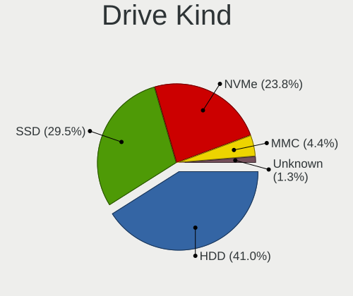

| Kind    | Computers | Drives | Percent |
|---------|-----------|--------|---------|
| HDD     | 2139      | 3272   | 41.01%  |
| SSD     | 1540      | 2145   | 29.52%  |
| NVMe    | 1241      | 1781   | 23.79%  |
| MMC     | 227       | 306    | 4.35%   |
| Unknown | 69        | 97     | 1.32%   |

Drive Connector
---------------

SATA, SAS, NVMe, etc.

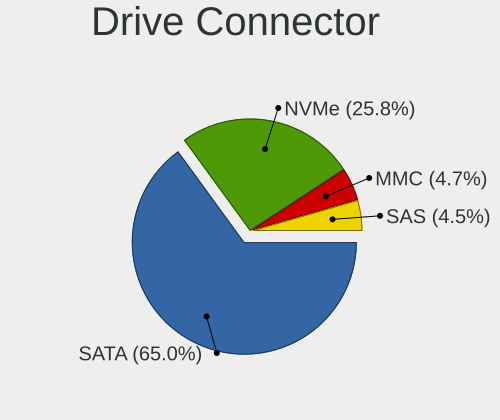

| Type | Computers | Drives | Percent |
|------|-----------|--------|---------|
| SATA | 3114      | 5247   | 64.98%  |
| NVMe | 1237      | 1769   | 25.81%  |
| MMC  | 227       | 306    | 4.74%   |
| SAS  | 214       | 279    | 4.47%   |

Drive Size
----------

Size of hard drive

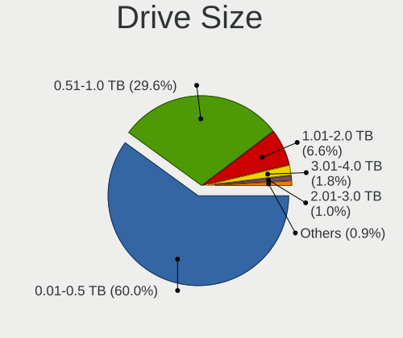

| Size in TB | Computers | Drives | Percent |
|------------|-----------|--------|---------|
| 0.01-0.5   | 2260      | 3303   | 60.01%  |
| 0.51-1.0   | 1116      | 1513   | 29.63%  |
| 1.01-2.0   | 250       | 348    | 6.64%   |
| 3.01-4.0   | 69        | 116    | 1.83%   |
| 2.01-3.0   | 36        | 49     | 0.96%   |
| 4.01-10.0  | 31        | 60     | 0.82%   |
| 10.01-20.0 | 4         | 28     | 0.11%   |

Space Total
-----------

Amount of disk space available on the file system

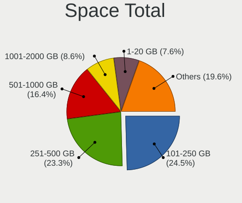

| Size in GB     | Computers | Percent |
|----------------|-----------|---------|
| 101-250        | 1087      | 24.55%  |
| 251-500        | 1033      | 23.33%  |
| 501-1000       | 726       | 16.4%   |
| 1001-2000      | 380       | 8.58%   |
| 1-20           | 336       | 7.59%   |
| 51-100         | 304       | 6.87%   |
| More than 3000 | 173       | 3.91%   |
| 21-50          | 173       | 3.91%   |
| 2001-3000      | 114       | 2.57%   |
| Unknown        | 102       | 2.3%    |

Space Used
----------

Amount of used disk space

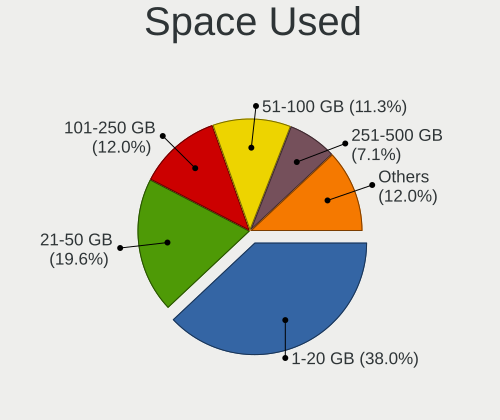

| Used GB        | Computers | Percent |
|----------------|-----------|---------|
| 1-20           | 1745      | 37.99%  |
| 21-50          | 900       | 19.6%   |
| 101-250        | 551       | 12%     |
| 51-100         | 521       | 11.34%  |
| 251-500        | 327       | 7.12%   |
| 501-1000       | 235       | 5.12%   |
| 1001-2000      | 114       | 2.48%   |
| Unknown        | 102       | 2.22%   |
| More than 3000 | 51        | 1.11%   |
| 2001-3000      | 35        | 0.76%   |
| 0              | 12        | 0.26%   |

Malfunc. Drives
---------------

Drive models with a malfunction

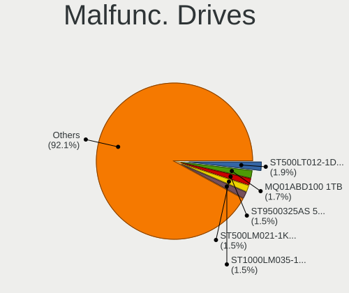

| Model                              | Computers | Drives | Percent |
|------------------------------------|-----------|--------|---------|
| Seagate ST500LT012-1DG142 500GB    | 9         | 10     | 1.88%   |
| Toshiba MQ01ABD100 1TB             | 8         | 9      | 1.67%   |
| Seagate ST9500325AS 500GB          | 7         | 7      | 1.46%   |
| Seagate ST500LM021-1KJ152 500GB    | 7         | 7      | 1.46%   |
| Seagate ST1000LM035-1RK172 1TB     | 7         | 7      | 1.46%   |
| Seagate ST1000LM024 HN-M101MBB 1TB | 7         | 8      | 1.46%   |
| Toshiba MQ01ABF050 500GB           | 6         | 6      | 1.25%   |
| Toshiba MQ04ABF100 1TB             | 5         | 5      | 1.04%   |
| Seagate ST3500418AS 500GB          | 5         | 6      | 1.04%   |
| Seagate ST1000DM010-2EP102 1TB     | 5         | 5      | 1.04%   |
| HGST HTS541010A9E680 1TB           | 5         | 5      | 1.04%   |
| WDC WD20EARX-00PASB0 2TB           | 4         | 4      | 0.83%   |
| WDC WD Green 2.5 1000GB            | 4         | 5      | 0.83%   |
| Seagate ST9500420AS 500GB          | 4         | 4      | 0.83%   |
| Seagate ST500LT012-9WS142 500GB    | 4         | 5      | 0.83%   |
| Seagate ST500DM002-1BD142 500GB    | 4         | 5      | 0.83%   |
| Seagate ST3160815AS 160GB          | 4         | 4      | 0.83%   |
| Seagate ST1000DM003-1ER162 1TB     | 4         | 6      | 0.83%   |
| LITEON CV8-8E128-HP 128GB SSD      | 4         | 5      | 0.83%   |
| Hitachi HTS545050B9A300 500GB      | 4         | 4      | 0.83%   |
| Hitachi HDS721010CLA332 1TB        | 4         | 4      | 0.83%   |
| HGST HTS545050A7E680 500GB         | 4         | 4      | 0.83%   |
| HGST HTS541075A9E680 752GB         | 4         | 4      | 0.83%   |
| A-DATA Technology SU650 240GB SSD  | 4         | 4      | 0.83%   |
| WDC WD5000LPCX-60VHAT0 500GB       | 3         | 3      | 0.63%   |
| WDC WD10JPVX-60JC3T0 1TB           | 3         | 3      | 0.63%   |
| Toshiba DT01ACA100 1TB             | 3         | 3      | 0.63%   |
| Seagate ST31000524AS 1TB           | 3         | 5      | 0.63%   |
| Seagate ST2000DL003-9VT166 2TB     | 3         | 3      | 0.63%   |
| Seagate ST1000DM003-9YN162 1TB     | 3         | 4      | 0.63%   |
| Hitachi HUA722020ALA331 2TB        | 3         | 3      | 0.63%   |
| Hitachi HTS543232A7A384 320GB      | 3         | 3      | 0.63%   |
| HGST HTS725050A7E630 500GB         | 3         | 4      | 0.63%   |
| HGST HTS545050A7E380 500GB         | 3         | 5      | 0.63%   |
| HGST HTS541010A7E630 1TB           | 3         | 3      | 0.63%   |
| China SSD 256GB                    | 3         | 3      | 0.63%   |
| WDC WD5000LPVX-22V0TT0 500GB       | 2         | 2      | 0.42%   |
| WDC WD5000AAKX-75U6AA0 500GB       | 2         | 2      | 0.42%   |
| WDC WD5000AAKX-603CA0 500GB        | 2         | 3      | 0.42%   |
| WDC WD5000AAKX-08U6AA0 500GB       | 2         | 2      | 0.42%   |

Malfunc. Drive Vendor
---------------------

Vendors of faulty drives

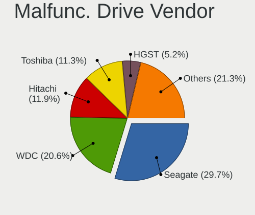

| Vendor                      | Computers | Drives | Percent |
|-----------------------------|-----------|--------|---------|
| Seagate                     | 137       | 190    | 29.72%  |
| WDC                         | 95        | 117    | 20.61%  |
| Hitachi                     | 55        | 59     | 11.93%  |
| Toshiba                     | 52        | 65     | 11.28%  |
| HGST                        | 24        | 27     | 5.21%   |
| Kingston                    | 18        | 19     | 3.9%    |
| A-DATA Technology           | 13        | 13     | 2.82%   |
| Samsung Electronics         | 12        | 13     | 2.6%    |
| Fujitsu                     | 7         | 7      | 1.52%   |
| SanDisk                     | 6         | 6      | 1.3%    |
| LITEON                      | 6         | 8      | 1.3%    |
| China                       | 5         | 5      | 1.08%   |
| SSSTC                       | 4         | 4      | 0.87%   |
| Micron Technology           | 3         | 3      | 0.65%   |
| Maxtor                      | 3         | 3      | 0.65%   |
| Intel                       | 3         | 3      | 0.65%   |
| Realtek Semiconductor       | 2         | 2      | 0.43%   |
| Crucial                     | 2         | 2      | 0.43%   |
| Apple                       | 2         | 2      | 0.43%   |
| XPG                         | 1         | 1      | 0.22%   |
| tecmiyo                     | 1         | 1      | 0.22%   |
| sk600                       | 1         | 1      | 0.22%   |
| PNY                         | 1         | 1      | 0.22%   |
| Micron/Crucial Technology   | 1         | 2      | 0.22%   |
| MAXIO Technology (Hangzhou) | 1         | 1      | 0.22%   |
| IBM/Hitachi                 | 1         | 2      | 0.22%   |
| HGST HTS                    | 1         | 1      | 0.22%   |
| Dogfish                     | 1         | 1      | 0.22%   |
| Biwin Storage Technology    | 1         | 1      | 0.22%   |
| ADATA Technology            | 1         | 1      | 0.22%   |
| Acer                        | 1         | 1      | 0.22%   |

Malfunc. HDD Vendor
-------------------

Vendors of faulty HDD drives

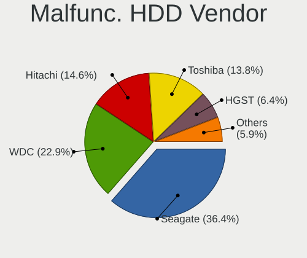

| Vendor              | Computers | Drives | Percent |
|---------------------|-----------|--------|---------|
| Seagate             | 137       | 190    | 36.44%  |
| WDC                 | 86        | 106    | 22.87%  |
| Hitachi             | 55        | 59     | 14.63%  |
| Toshiba             | 52        | 65     | 13.83%  |
| HGST                | 24        | 27     | 6.38%   |
| Samsung Electronics | 8         | 8      | 2.13%   |
| Fujitsu             | 7         | 7      | 1.86%   |
| Maxtor              | 3         | 3      | 0.8%    |
| Apple               | 2         | 2      | 0.53%   |
| IBM/Hitachi         | 1         | 2      | 0.27%   |
| HGST HTS            | 1         | 1      | 0.27%   |

Malfunc. Drive Kind
-------------------

Kinds of faulty drives

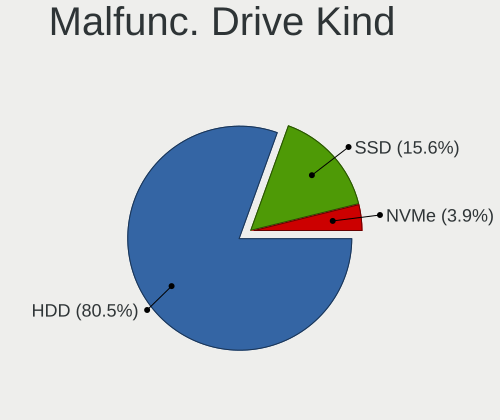

| Kind | Computers | Drives | Percent |
|------|-----------|--------|---------|
| HDD  | 355       | 470    | 80.5%   |
| SSD  | 69        | 72     | 15.65%  |
| NVMe | 17        | 20     | 3.85%   |

Failed Drives
-------------

Failed drive models

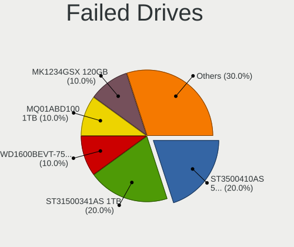

| Model                             | Computers | Drives | Percent |
|-----------------------------------|-----------|--------|---------|
| Seagate ST3500410AS 500GB         | 2         | 3      | 20%     |
| Seagate ST31500341AS 1TB          | 2         | 3      | 20%     |
| WDC WD1600BEVT-75A23T0 160GB      | 1         | 1      | 10%     |
| Toshiba MQ01ABD100 1TB            | 1         | 1      | 10%     |
| Toshiba MK1234GSX 120GB           | 1         | 1      | 10%     |
| Seagate ST500DM002-1BD142 500GB   | 1         | 1      | 10%     |
| Samsung Electronics HD161GJ 160GB | 1         | 1      | 10%     |
| Hitachi HTS545016B9A300 160GB     | 1         | 1      | 10%     |

Failed Drive Vendor
-------------------

Failed drive vendors

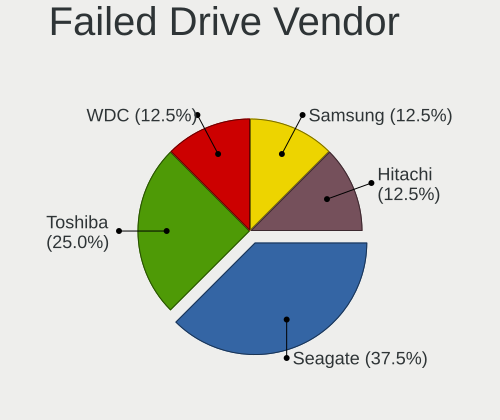

| Vendor              | Computers | Drives | Percent |
|---------------------|-----------|--------|---------|
| Seagate             | 3         | 7      | 37.5%   |
| Toshiba             | 2         | 2      | 25%     |
| WDC                 | 1         | 1      | 12.5%   |
| Samsung Electronics | 1         | 1      | 12.5%   |
| Hitachi             | 1         | 1      | 12.5%   |

Drive Status
------------

Number of failed and malfunc. drives

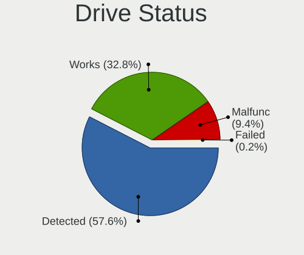

| Status   | Computers | Drives | Percent |
|----------|-----------|--------|---------|
| Detected | 2585      | 4533   | 57.56%  |
| Works    | 1474      | 2494   | 32.82%  |
| Malfunc  | 424       | 562    | 9.44%   |
| Failed   | 8         | 12     | 0.18%   |

Storage controller
------------------

Storage Vendor
--------------

Storage controller vendors

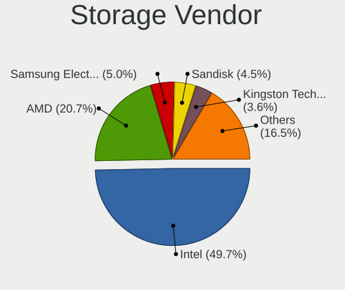

| Vendor                                  | Computers | Percent |
|-----------------------------------------|-----------|---------|
| Intel                                   | 2467      | 49.67%  |
| AMD                                     | 1029      | 20.72%  |
| Samsung Electronics                     | 249       | 5.01%   |
| Sandisk                                 | 224       | 4.51%   |
| Kingston Technology Company             | 178       | 3.58%   |
| ADATA Technology                        | 96        | 1.93%   |
| SK hynix                                | 89        | 1.79%   |
| Nvidia                                  | 82        | 1.65%   |
| Micron Technology                       | 64        | 1.29%   |
| Phison Electronics                      | 52        | 1.05%   |
| Realtek Semiconductor                   | 47        | 0.95%   |
| Silicon Motion                          | 43        | 0.87%   |
| KIOXIA                                  | 42        | 0.85%   |
| Toshiba America Info Systems            | 41        | 0.83%   |
| MAXIO Technology (Hangzhou)             | 32        | 0.64%   |
| Micron/Crucial Technology               | 29        | 0.58%   |
| Marvell Technology Group                | 29        | 0.58%   |
| ASMedia Technology                      | 24        | 0.48%   |
| Union Memory (Shenzhen)                 | 20        | 0.4%    |
| Yangtze Memory Technologies             | 13        | 0.26%   |
| Apple                                   | 12        | 0.24%   |
| LSI Logic / Symbios Logic               | 11        | 0.22%   |
| JMicron Technology                      | 11        | 0.22%   |
| INNOGRIT                                | 9         | 0.18%   |
| Solid State Storage Technology          | 8         | 0.16%   |
| O2 Micro                                | 8         | 0.16%   |
| Biwin Storage Technology                | 8         | 0.16%   |
| VIA Technologies                        | 6         | 0.12%   |
| Shenzhen Longsys Electronics            | 6         | 0.12%   |
| Broadcom / LSI                          | 5         | 0.1%    |
| Solidigm                                | 4         | 0.08%   |
| Silicon Image                           | 4         | 0.08%   |
| Lite-On Technology                      | 4         | 0.08%   |
| Hewlett-Packard                         | 3         | 0.06%   |
| TenaFe                                  | 2         | 0.04%   |
| Silicon Integrated Systems [SiS]        | 2         | 0.04%   |
| Shenzhen Unionmemory Information System | 2         | 0.04%   |
| Seagate Technology                      | 2         | 0.04%   |
| Lenovo                                  | 2         | 0.04%   |
| Adaptec                                 | 2         | 0.04%   |

Storage Model
-------------

Storage controller models

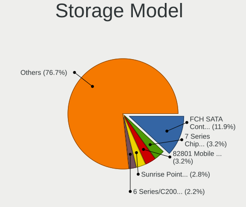

| Model                                                                                   | Computers | Percent |
|-----------------------------------------------------------------------------------------|-----------|---------|
| AMD FCH SATA Controller [AHCI mode]                                                     | 680       | 11.89%  |
| Intel 7 Series Chipset Family 6-port SATA Controller [AHCI mode]                        | 183       | 3.2%    |
| Intel 82801 Mobile SATA Controller [RAID mode]                                          | 181       | 3.17%   |
| Intel Sunrise Point-LP SATA Controller [AHCI mode]                                      | 162       | 2.83%   |
| Intel 6 Series/C200 Series Chipset Family 6 port Mobile SATA AHCI Controller            | 124       | 2.17%   |
| Intel 8 Series/C220 Series Chipset Family 6-port SATA Controller 1 [AHCI mode]          | 119       | 2.08%   |
| AMD SB7x0/SB8x0/SB9x0 SATA Controller [AHCI mode]                                       | 97        | 1.7%    |
| AMD 500 Series Chipset SATA Controller                                                  | 94        | 1.64%   |
| AMD 400 Series Chipset SATA Controller                                                  | 91        | 1.59%   |
| Intel Volume Management Device NVMe RAID Controller                                     | 88        | 1.54%   |
| Intel SATA Controller [RAID mode]                                                       | 88        | 1.54%   |
| Samsung NVMe SSD Controller SM981/PM981/PM983                                           | 87        | 1.52%   |
| Intel 6 Series/C200 Series Chipset Family 6 port Desktop SATA AHCI Controller           | 83        | 1.45%   |
| Intel Celeron/Pentium Silver Processor SATA Controller                                  | 80        | 1.4%    |
| Intel 8 Series SATA Controller 1 [AHCI mode]                                            | 77        | 1.35%   |
| Intel Atom/Celeron/Pentium Processor x5-E8000/J3xxx/N3xxx Series SATA Controller        | 76        | 1.33%   |
| AMD SB7x0/SB8x0/SB9x0 IDE Controller                                                    | 74        | 1.29%   |
| Intel NM10/ICH7 Family SATA Controller [IDE mode]                                       | 65        | 1.14%   |
| Samsung NVMe SSD Controller 980 (DRAM-less)                                             | 64        | 1.12%   |
| Intel Wildcat Point-LP SATA Controller [AHCI Mode]                                      | 64        | 1.12%   |
| Intel 82801IBM/IEM (ICH9M/ICH9M-E) 4 port SATA Controller [AHCI mode]                   | 63        | 1.1%    |
| Intel Q170/Q150/B150/H170/H110/Z170/CM236 Chipset SATA Controller [AHCI Mode]           | 62        | 1.08%   |
| Intel Atom Processor E3800 Series SATA AHCI Controller                                  | 62        | 1.08%   |
| AMD A320 Chipset SATA Controller [AHCI mode]                                            | 61        | 1.07%   |
| Kingston Company NV2 NVMe SSD [SM2267XT] (DRAM-less)                                    | 57        | 1%      |
| AMD SB7x0/SB8x0/SB9x0 SATA Controller [IDE mode]                                        | 57        | 1%      |
| Intel 82801HM/HEM (ICH8M/ICH8M-E) IDE Controller                                        | 53        | 0.93%   |
| Intel 5 Series/3400 Series Chipset 4 port SATA AHCI Controller                          | 52        | 0.91%   |
| Intel 82801G (ICH7 Family) IDE Controller                                               | 51        | 0.89%   |
| Intel 82801HM/HEM (ICH8M/ICH8M-E) SATA Controller [AHCI mode]                           | 48        | 0.84%   |
| ADATA XPG SX8200 Pro PCIe Gen3x4 M.2 2280 Solid State Drive                             | 47        | 0.82%   |
| Intel 200 Series PCH SATA controller [AHCI mode]                                        | 44        | 0.77%   |
| Intel Comet Lake SATA AHCI Controller                                                   | 43        | 0.75%   |
| Intel HM170/QM170 Chipset SATA Controller [AHCI Mode]                                   | 42        | 0.73%   |
| SanDisk WD SN560/SN740/SN770/SN5000 NVMe SSD                                            | 40        | 0.7%    |
| Intel Celeron N3350/Pentium N4200/Atom E3900 Series SATA AHCI Controller                | 39        | 0.68%   |
| Intel 6 Series/C200 Series Chipset Family Desktop SATA Controller (IDE mode, ports 4-5) | 39        | 0.68%   |
| Intel 6 Series/C200 Series Chipset Family Desktop SATA Controller (IDE mode, ports 0-3) | 39        | 0.68%   |
| SanDisk Ultra 3D / WD PC SN530, IX SN530, Blue SN550 NVMe SSD (DRAM-less)               | 37        | 0.65%   |
| Intel Cannon Lake Mobile PCH SATA AHCI Controller                                       | 36        | 0.63%   |

Storage Kind
------------

Kind of storage controller (IDE, SATA, NVMe, SAS, ...)

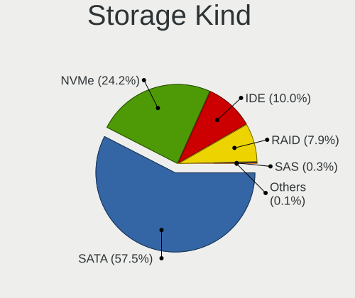

| Kind | Computers | Percent |
|------|-----------|---------|
| SATA | 2944      | 57.54%  |
| NVMe | 1237      | 24.18%  |
| IDE  | 510       | 9.97%   |
| RAID | 404       | 7.9%    |
| SAS  | 16        | 0.31%   |
| SCSI | 5         | 0.1%    |

Processor
---------

CPU Vendor
----------

Processor vendors

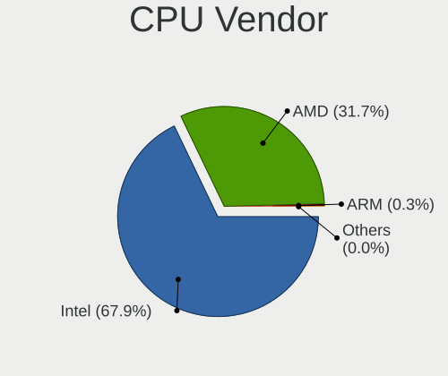

| Vendor       | Computers | Percent |
|--------------|-----------|---------|
| Intel        | 2815      | 67.88%  |
| AMD          | 1315      | 31.71%  |
| ARM          | 12        | 0.29%   |
| Unknown      | 2         | 0.05%   |
| Qualcomm     | 1         | 0.02%   |
| iSH          | 1         | 0.02%   |
| CentaurHauls | 1         | 0.02%   |

CPU Model
---------

Processor models

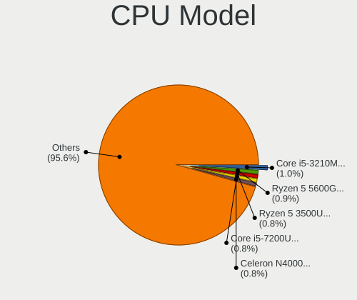

| Model                                         | Computers | Percent |
|-----------------------------------------------|-----------|---------|
| Intel Core i5-3210M CPU @ 2.50GHz             | 41        | 0.99%   |
| AMD Ryzen 5 5600G with Radeon Graphics        | 37        | 0.89%   |
| AMD Ryzen 5 3500U with Radeon Vega Mobile Gfx | 35        | 0.84%   |
| Intel Core i5-7200U CPU @ 2.50GHz             | 34        | 0.82%   |
| Intel Celeron N4000 CPU @ 1.10GHz             | 34        | 0.82%   |
| Intel 11th Gen Core i5-1135G7 @ 2.40GHz       | 34        | 0.82%   |
| AMD Ryzen 7 5700U with Radeon Graphics        | 32        | 0.77%   |
| AMD Ryzen 5 4600H with Radeon Graphics        | 31        | 0.75%   |
| Intel Celeron CPU N3350 @ 1.10GHz             | 30        | 0.72%   |
| AMD Ryzen 5 5500U with Radeon Graphics        | 30        | 0.72%   |
| Intel Core i7-8750H CPU @ 2.20GHz             | 29        | 0.7%    |
| Intel Celeron N4020 CPU @ 1.10GHz             | 29        | 0.7%    |
| Intel 11th Gen Core i7-1165G7 @ 2.80GHz       | 28        | 0.67%   |
| Intel Celeron CPU N3060 @ 1.60GHz             | 27        | 0.65%   |
| Intel Celeron CPU N3050 @ 1.60GHz             | 27        | 0.65%   |
| AMD Custom APU 0405                           | 27        | 0.65%   |
| Intel Celeron CPU N2840 @ 2.16GHz             | 26        | 0.63%   |
| AMD Ryzen 7 3700U with Radeon Vega Mobile Gfx | 26        | 0.63%   |
| Intel Core i7-6700HQ CPU @ 2.60GHz            | 24        | 0.58%   |
| Intel Core i5-8250U CPU @ 1.60GHz             | 24        | 0.58%   |
| AMD Ryzen 7 5700G with Radeon Graphics        | 24        | 0.58%   |
| Intel Core i5-8265U CPU @ 1.60GHz             | 22        | 0.53%   |
| Intel Core i5-5200U CPU @ 2.20GHz             | 22        | 0.53%   |
| Intel Core i7-8550U CPU @ 1.80GHz             | 21        | 0.51%   |
| Intel Core i7-7500U CPU @ 2.70GHz             | 21        | 0.51%   |
| Intel Core i7-9750H CPU @ 2.60GHz             | 20        | 0.48%   |
| Intel Core i7-8565U CPU @ 1.80GHz             | 20        | 0.48%   |
| Intel Core i7-3770 CPU @ 3.40GHz              | 20        | 0.48%   |
| Intel Core i5-6200U CPU @ 2.30GHz             | 20        | 0.48%   |
| Intel Core i5-2400 CPU @ 3.10GHz              | 20        | 0.48%   |
| Intel Core i5-10210U CPU @ 1.60GHz            | 20        | 0.48%   |
| AMD Ryzen 3 2200G with Radeon Vega Graphics   | 20        | 0.48%   |
| Intel Core i5-3320M CPU @ 2.60GHz             | 19        | 0.46%   |
| Intel Core i7-7700HQ CPU @ 2.80GHz            | 18        | 0.43%   |
| Intel Core 2 Duo CPU E8400 @ 3.00GHz          | 18        | 0.43%   |
| AMD Ryzen 5 2600 Six-Core Processor           | 18        | 0.43%   |
| Intel Core i7-6500U CPU @ 2.50GHz             | 17        | 0.41%   |
| Intel Core i5-10300H CPU @ 2.50GHz            | 17        | 0.41%   |
| AMD Ryzen 5 3600 6-Core Processor             | 17        | 0.41%   |
| Intel Core i7-4790 CPU @ 3.60GHz              | 16        | 0.39%   |

CPU Model Family
----------------

Processor model prefix

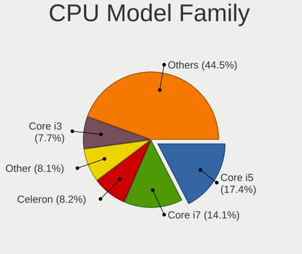

| Model                   | Computers | Percent |
|-------------------------|-----------|---------|
| Intel Core i5           | 723       | 17.41%  |
| Intel Core i7           | 585       | 14.09%  |
| Intel Celeron           | 342       | 8.24%   |
| Other                   | 336       | 8.09%   |
| Intel Core i3           | 320       | 7.71%   |
| AMD Ryzen 5             | 304       | 7.32%   |
| AMD Ryzen 7             | 200       | 4.82%   |
| Intel Core 2 Duo        | 155       | 3.73%   |
| Intel Xeon              | 87        | 2.1%    |
| Intel Pentium           | 81        | 1.95%   |
| AMD Ryzen 3             | 81        | 1.95%   |
| AMD A6                  | 78        | 1.88%   |
| Intel Atom              | 68        | 1.64%   |
| AMD A8                  | 61        | 1.47%   |
| AMD A4                  | 58        | 1.4%    |
| AMD Ryzen 9             | 52        | 1.25%   |
| AMD FX                  | 50        | 1.2%    |
| AMD A10                 | 44        | 1.06%   |
| AMD E                   | 39        | 0.94%   |
| AMD Athlon              | 39        | 0.94%   |
| Intel Pentium Dual      | 35        | 0.84%   |
| Intel Pentium Dual-Core | 34        | 0.82%   |
| AMD E1                  | 32        | 0.77%   |
| Intel Core 2 Quad       | 22        | 0.53%   |
| AMD Athlon II X2        | 20        | 0.48%   |
| Intel Core 2            | 17        | 0.41%   |
| AMD Sempron             | 16        | 0.39%   |
| AMD Ryzen 5 PRO         | 15        | 0.36%   |
| AMD Athlon 64 X2        | 14        | 0.34%   |
| Intel Pentium 4         | 13        | 0.31%   |
| Intel Core i9           | 13        | 0.31%   |
| Intel Core              | 13        | 0.31%   |
| AMD Phenom II X4        | 13        | 0.31%   |
| AMD Turion 64 X2 Mobile | 12        | 0.29%   |
| Intel Genuine           | 11        | 0.26%   |
| AMD Athlon II           | 11        | 0.26%   |
| Intel Pentium Silver    | 10        | 0.24%   |
| AMD Ryzen 7 PRO         | 9         | 0.22%   |
| AMD E2                  | 9         | 0.22%   |
| AMD Ryzen 3 PRO         | 7         | 0.17%   |

CPU Cores
---------

Number of processor cores

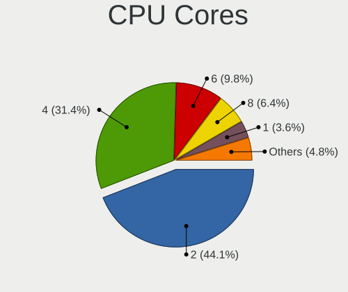

| Number  | Computers | Percent |
|---------|-----------|---------|
| 2       | 1832      | 44.1%   |
| 4       | 1303      | 31.37%  |
| 6       | 407       | 9.8%    |
| 8       | 264       | 6.36%   |
| 1       | 148       | 3.56%   |
| 10      | 49        | 1.18%   |
| 12      | 43        | 1.04%   |
| 16      | 34        | 0.82%   |
| 14      | 22        | 0.53%   |
| 3       | 18        | 0.43%   |
| 24      | 13        | 0.31%   |
| Unknown | 9         | 0.22%   |
| 20      | 4         | 0.1%    |
| 28      | 3         | 0.07%   |
| 56      | 2         | 0.05%   |
| 18      | 2         | 0.05%   |
| 32      | 1         | 0.02%   |

CPU Sockets
-----------

Number of sockets

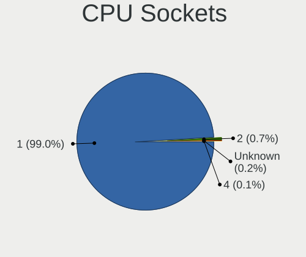

| Number  | Computers | Percent |
|---------|-----------|---------|
| 1       | 4108      | 99.04%  |
| 2       | 28        | 0.68%   |
| Unknown | 8         | 0.19%   |
| 4       | 4         | 0.1%    |

CPU Threads
-----------

Threads per core (Hyper-Threading)

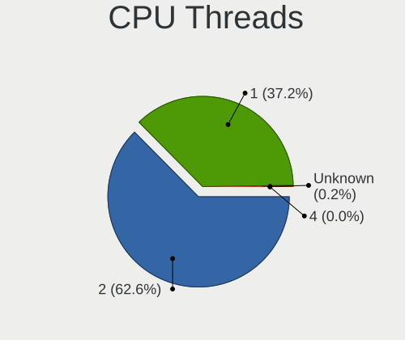

| Number  | Computers | Percent |
|---------|-----------|---------|
| 2       | 2602      | 62.59%  |
| 1       | 1545      | 37.17%  |
| Unknown | 9         | 0.22%   |
| 4       | 1         | 0.02%   |

CPU Op-Modes
------------

CPU Operation Modes (32-bit, 64-bit)

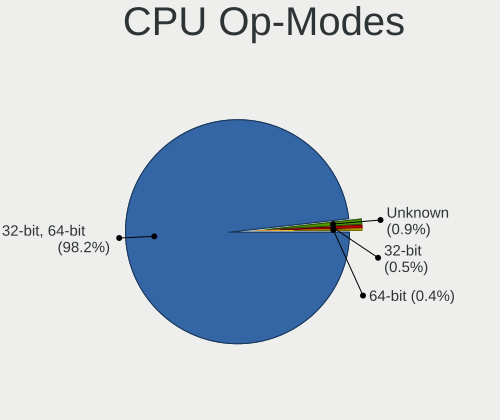

| Op mode        | Computers | Percent |
|----------------|-----------|---------|
| 32-bit, 64-bit | 4078      | 98.22%  |
| Unknown        | 37        | 0.89%   |
| 32-bit         | 22        | 0.53%   |
| 64-bit         | 15        | 0.36%   |

CPU Microcode
-------------

Microcode number

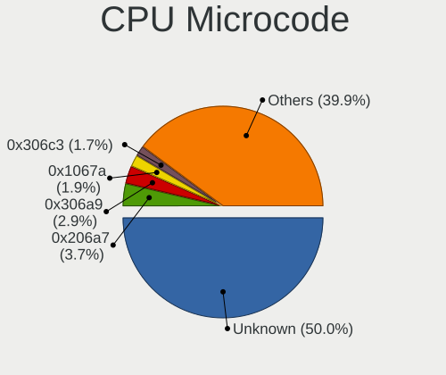

| Number     | Computers | Percent |
|------------|-----------|---------|
| Unknown    | 2165      | 49.99%  |
| 0x206a7    | 160       | 3.69%   |
| 0x306a9    | 124       | 2.86%   |
| 0x1067a    | 83        | 1.92%   |
| 0x306c3    | 73        | 1.69%   |
| 0x08108109 | 61        | 1.41%   |
| 0x40651    | 58        | 1.34%   |
| 0x30678    | 57        | 1.32%   |
| 0x806ec    | 55        | 1.27%   |
| 0x806e9    | 51        | 1.18%   |
| 0x906ea    | 45        | 1.04%   |
| 0x6fd      | 44        | 1.02%   |
| 0x806ea    | 43        | 0.99%   |
| 0x306d4    | 43        | 0.99%   |
| 0x406e3    | 41        | 0.95%   |
| 0x806c1    | 38        | 0.88%   |
| 0x506e3    | 38        | 0.88%   |
| 0x06006705 | 38        | 0.88%   |
| 0x406c4    | 37        | 0.85%   |
| 0x906e9    | 34        | 0.79%   |
| 0x20655    | 34        | 0.79%   |
| 0x010000c8 | 34        | 0.79%   |
| 0x06001119 | 33        | 0.76%   |
| 0x10676    | 30        | 0.69%   |
| 0x08600106 | 30        | 0.69%   |
| 0x0810100b | 29        | 0.67%   |
| 0x406c3    | 26        | 0.6%    |
| 0x0600611a | 26        | 0.6%    |
| 0x08608103 | 25        | 0.58%   |
| 0x106ca    | 24        | 0.55%   |
| 0x08108102 | 24        | 0.55%   |
| 0x07030105 | 24        | 0.55%   |
| 0x0a50000d | 23        | 0.53%   |
| 0x08101016 | 22        | 0.51%   |
| 0x0800820d | 22        | 0.51%   |
| 0x05000119 | 21        | 0.48%   |
| 0x706a1    | 20        | 0.46%   |
| 0x506c9    | 19        | 0.44%   |
| 0x20652    | 19        | 0.44%   |
| 0x6fb      | 18        | 0.42%   |

CPU Microarch
-------------

Microarchitecture

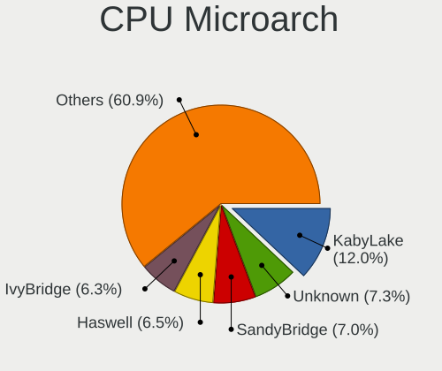

| Name              | Computers | Percent |
|-------------------|-----------|---------|
| KabyLake          | 500       | 12.03%  |
| Unknown           | 303       | 7.29%   |
| SandyBridge       | 289       | 6.95%   |
| Haswell           | 272       | 6.54%   |
| IvyBridge         | 261       | 6.28%   |
| Silvermont        | 180       | 4.33%   |
| Penryn            | 177       | 4.26%   |
| Zen+              | 175       | 4.21%   |
| Skylake           | 171       | 4.11%   |
| Zen 3             | 164       | 3.94%   |
| Excavator         | 134       | 3.22%   |
| Core              | 117       | 2.81%   |
| Zen 2             | 110       | 2.65%   |
| TigerLake         | 102       | 2.45%   |
| Broadwell         | 101       | 2.43%   |
| Zen               | 98        | 2.36%   |
| Westmere          | 95        | 2.28%   |
| Goldmont plus     | 92        | 2.21%   |
| Piledriver        | 85        | 2.04%   |
| K10               | 85        | 2.04%   |
| CometLake         | 79        | 1.9%    |
| Alderlake Hybrid  | 76        | 1.83%   |
| Puma              | 61        | 1.47%   |
| Bobcat            | 60        | 1.44%   |
| IceLake           | 52        | 1.25%   |
| K8 Hammer         | 51        | 1.23%   |
| Goldmont          | 43        | 1.03%   |
| Bonnell           | 41        | 0.99%   |
| Jaguar            | 30        | 0.72%   |
| Steamroller       | 25        | 0.6%    |
| Nehalem           | 21        | 0.51%   |
| K10 Llano         | 21        | 0.51%   |
| NetBurst          | 19        | 0.46%   |
| Bulldozer         | 14        | 0.34%   |
| Tremont           | 13        | 0.31%   |
| P6                | 11        | 0.26%   |
| Gracemont         | 11        | 0.26%   |
| K8 & K10 hybrid   | 10        | 0.24%   |
| Meteorlake Hybrid | 8         | 0.19%   |
| Sapphire Rapids   | 1         | 0.02%   |

Graphics
--------

GPU Vendor
----------

Vendors of graphics cards

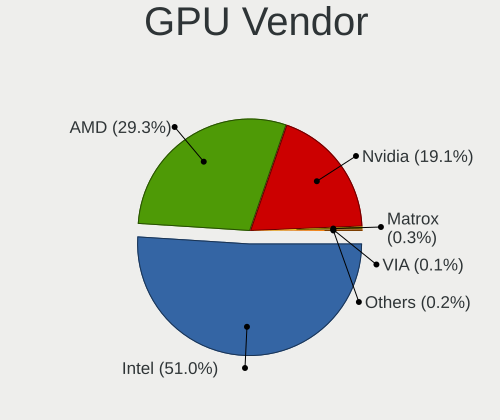

| Vendor                           | Computers | Percent |
|----------------------------------|-----------|---------|
| Intel                            | 2401      | 51.01%  |
| AMD                              | 1377      | 29.25%  |
| Nvidia                           | 899       | 19.1%   |
| Matrox Electronics Systems       | 16        | 0.34%   |
| VIA Technologies                 | 4         | 0.08%   |
| ATI Technologies                 | 4         | 0.08%   |
| ASPEED Technology                | 4         | 0.08%   |
| Silicon Integrated Systems [SiS] | 2         | 0.04%   |

GPU Model
---------

Graphics card models

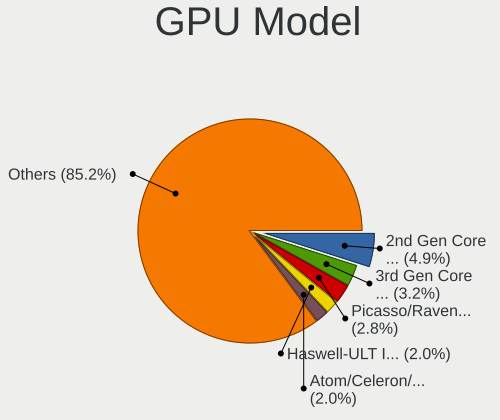

| Model                                                                                    | Computers | Percent |
|------------------------------------------------------------------------------------------|-----------|---------|
| Intel 2nd Generation Core Processor Family Integrated Graphics Controller                | 240       | 4.93%   |
| Intel 3rd Gen Core processor Graphics Controller                                         | 154       | 3.16%   |
| AMD Picasso/Raven 2 [Radeon Vega Series / Radeon Vega Mobile Series]                     | 135       | 2.77%   |
| Intel Haswell-ULT Integrated Graphics Controller                                         | 98        | 2.01%   |
| Intel Atom/Celeron/Pentium Processor x5-E8000/J3xxx/N3xxx Integrated Graphics Controller | 95        | 1.95%   |
| Intel TigerLake-LP GT2 [Iris Xe Graphics]                                                | 88        | 1.81%   |
| Intel GeminiLake [UHD Graphics 600]                                                      | 85        | 1.75%   |
| Intel Atom Processor Z36xxx/Z37xxx Series Graphics & Display                             | 85        | 1.75%   |
| Intel Kaby Lake-U GT2 [HD Graphics 620]                                                  | 84        | 1.73%   |
| AMD Cezanne [Radeon Vega Series / Radeon Vega Mobile Series]                             | 78        | 1.6%    |
| Intel Core Processor Integrated Graphics Controller                                      | 77        | 1.58%   |
| AMD Raven Ridge [Radeon Vega Series / Radeon Vega Mobile Series]                         | 72        | 1.48%   |
| Intel Xeon E3-1200 v3/4th Gen Core Processor Integrated Graphics Controller              | 71        | 1.46%   |
| Intel Kaby Lake-R GT2 [UHD Graphics 620]                                                 | 71        | 1.46%   |
| Intel Broadwell-U GT2 [HD Graphics 5500]                                                 | 70        | 1.44%   |
| AMD Stoney [Radeon R2/R3/R4/R5 Graphics]                                                 | 70        | 1.44%   |
| AMD Lucienne                                                                             | 70        | 1.44%   |
| Intel Skylake-U GT2 [HD Graphics 520]                                                    | 67        | 1.38%   |
| AMD Renoir [Radeon Vega Series / Radeon Vega Mobile Series]                              | 64        | 1.31%   |
| Intel WhiskeyLake-U GT2 [UHD Graphics 620]                                               | 63        | 1.29%   |
| Intel CoffeeLake-H GT2 [UHD Graphics 630]                                                | 63        | 1.29%   |
| Intel Mobile 4 Series Chipset Integrated Graphics Controller                             | 62        | 1.27%   |
| AMD Wani [Radeon R5/R6/R7 Graphics]                                                      | 58        | 1.19%   |
| Intel CometLake-U GT2 [UHD Graphics]                                                     | 56        | 1.15%   |
| Intel Xeon E3-1200 v2/3rd Gen Core processor Graphics Controller                         | 47        | 0.97%   |
| Intel Mobile GM965/GL960 Integrated Graphics Controller (secondary)                      | 45        | 0.92%   |
| Intel Mobile GM965/GL960 Integrated Graphics Controller (primary)                        | 45        | 0.92%   |
| Intel CometLake-H GT2 [UHD Graphics]                                                     | 43        | 0.88%   |
| Intel 4th Gen Core Processor Integrated Graphics Controller                              | 42        | 0.86%   |
| AMD Mullins [Radeon R4/R5 Graphics]                                                      | 41        | 0.84%   |
| Intel 4 Series Chipset Integrated Graphics Controller                                    | 40        | 0.82%   |
| Intel Apollo Lake GT1 [HD Graphics 500]                                                  | 37        | 0.76%   |
| Intel Kaby Lake-H GT2 [HD Graphics 630]                                                  | 36        | 0.74%   |
| AMD Ellesmere [Radeon RX 470/480/570/570X/580/580X/590]                                  | 34        | 0.7%    |
| Intel Skylake-H GT2 [HD Graphics 530]                                                    | 33        | 0.68%   |
| Intel CoffeeLake-S GT2 [UHD Graphics 630]                                                | 30        | 0.62%   |
| Nvidia TU117M [GeForce GTX 1650 Mobile / Max-Q]                                          | 29        | 0.6%    |
| AMD Navi 23 [Radeon RX 6600/6600 XT/6600M]                                               | 29        | 0.6%    |
| AMD VanGogh [AMD Custom GPU 0405]                                                        | 27        | 0.55%   |
| Nvidia GP107M [GeForce GTX 1050 Mobile]                                                  | 26        | 0.53%   |

GPU Combo
---------

Combinations of graphics cards

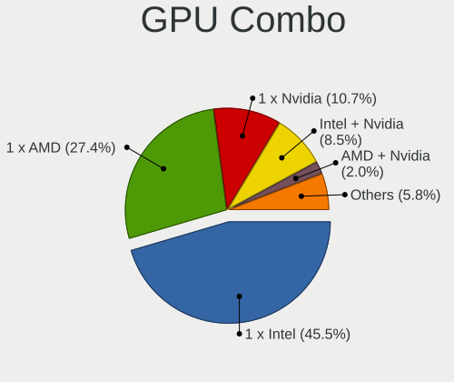

| Name            | Computers | Percent |
|-----------------|-----------|---------|
| 1 x Intel       | 1897      | 45.46%  |
| 1 x AMD         | 1145      | 27.44%  |
| 1 x Nvidia      | 448       | 10.74%  |
| Intel + Nvidia  | 355       | 8.51%   |
| AMD + Nvidia    | 84        | 2.01%   |
| Intel + AMD     | 77        | 1.85%   |
| 2 x AMD         | 76        | 1.82%   |
| 2 x Intel       | 34        | 0.81%   |
| Other           | 23        | 0.55%   |
| 1 x Matrox      | 14        | 0.34%   |
| 2 x Nvidia      | 7         | 0.17%   |
| 1 x VIA         | 3         | 0.07%   |
| 1 x ASPEED      | 3         | 0.07%   |
| 1 x SiS         | 2         | 0.05%   |
| Nvidia + Matrox | 2         | 0.05%   |
| 3 x AMD         | 1         | 0.02%   |
| Nvidia + VIA    | 1         | 0.02%   |
| Nvidia + ASPEED | 1         | 0.02%   |

GPU Driver
----------

Free vs proprietary

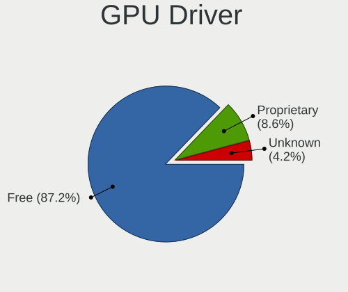

| Driver      | Computers | Percent |
|-------------|-----------|---------|
| Free        | 3661      | 87.19%  |
| Proprietary | 363       | 8.64%   |
| Unknown     | 175       | 4.17%   |

GPU Memory
----------

Total video memory

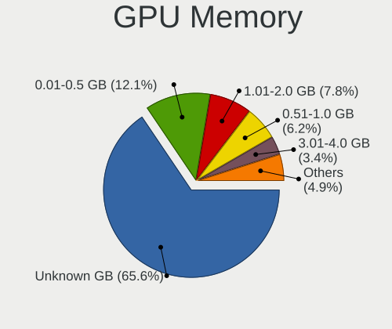

| Size in GB | Computers | Percent |
|------------|-----------|---------|
| Unknown    | 2790      | 65.55%  |
| 0.01-0.5   | 514       | 12.08%  |
| 1.01-2.0   | 331       | 7.78%   |
| 0.51-1.0   | 266       | 6.25%   |
| 3.01-4.0   | 145       | 3.41%   |
| 7.01-8.0   | 91        | 2.14%   |
| 5.01-6.0   | 60        | 1.41%   |
| 8.01-16.0  | 28        | 0.66%   |
| 2.01-3.0   | 21        | 0.49%   |
| 16.01-24.0 | 9         | 0.21%   |
| 4.01-5.0   | 1         | 0.02%   |

Monitor
-------

Monitor Vendor
--------------

Monitor vendors

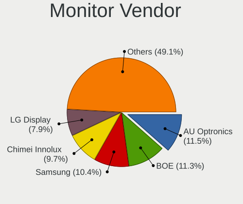

| Vendor                  | Computers | Percent |
|-------------------------|-----------|---------|
| AU Optronics            | 525       | 11.52%  |
| BOE                     | 515       | 11.3%   |
| Samsung Electronics     | 473       | 10.38%  |
| Chimei Innolux          | 444       | 9.75%   |
| LG Display              | 361       | 7.92%   |
| Hewlett-Packard         | 305       | 6.69%   |
| Dell                    | 254       | 5.58%   |
| Goldstar                | 164       | 3.6%    |
| Apple                   | 151       | 3.31%   |
| BenQ                    | 125       | 2.74%   |
| Acer                    | 117       | 2.57%   |
| Lenovo                  | 87        | 1.91%   |
| AOC                     | 81        | 1.78%   |
| Unknown                 | 57        | 1.25%   |
| Chi Mei Optoelectronics | 55        | 1.21%   |
| ASUSTek Computer        | 45        | 0.99%   |
| Sharp                   | 40        | 0.88%   |
| PANDA                   | 36        | 0.79%   |
| Ancor Communications    | 35        | 0.77%   |
| Sony                    | 34        | 0.75%   |
| ViewSonic               | 33        | 0.72%   |
| LG Philips              | 29        | 0.64%   |
| Gateway                 | 29        | 0.64%   |
| InfoVision              | 26        | 0.57%   |
| Valve                   | 24        | 0.53%   |
| HKC                     | 19        | 0.42%   |
| ___                     | 15        | 0.33%   |
| Insignia                | 15        | 0.33%   |
| RTK                     | 14        | 0.31%   |
| HannStar                | 14        | 0.31%   |
| VOR                     | 13        | 0.29%   |
| Roku                    | 13        | 0.29%   |
| Sceptre Tech            | 12        | 0.26%   |
| Panasonic               | 12        | 0.26%   |
| Hitachi                 | 12        | 0.26%   |
| Unknown                 | 12        | 0.26%   |
| MSI                     | 10        | 0.22%   |
| HUAWEI                  | 10        | 0.22%   |
| FOX                     | 10        | 0.22%   |
| CSO                     | 10        | 0.22%   |

Monitor Model
-------------

Monitor models

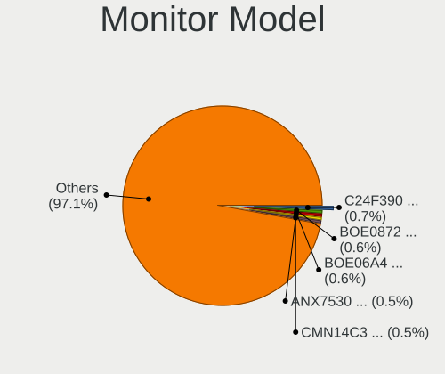

| Model                                                                | Computers | Percent |
|----------------------------------------------------------------------|-----------|---------|
| Samsung Electronics C24F390 SAM0D2C 1920x1080 521x293mm 23.5-inch    | 32        | 0.69%   |
| BOE LCD Monitor BOE0872 1920x1080 344x194mm 15.5-inch                | 27        | 0.58%   |
| BOE LCD Monitor BOE06A4 1366x768 344x194mm 15.5-inch                 | 26        | 0.56%   |
| Valve ANX7530 U VLV3001 800x1280 100x150mm 7.1-inch                  | 24        | 0.52%   |
| Chimei Innolux LCD Monitor CMN14C3 1366x768 309x173mm 13.9-inch      | 24        | 0.52%   |
| BOE LCD Monitor BOE0696 1366x768 309x173mm 13.9-inch                 | 24        | 0.52%   |
| Chimei Innolux LCD Monitor CMN15E6 1366x768 344x193mm 15.5-inch      | 22        | 0.47%   |
| BOE LCD Monitor BOE0878 1920x1080 355x200mm 16.0-inch                | 21        | 0.45%   |
| Samsung Electronics LCD Monitor SEC5441 1280x800 331x207mm 15.4-inch | 20        | 0.43%   |
| Chimei Innolux LCD Monitor CMN14D6 1366x768 309x173mm 13.9-inch      | 20        | 0.43%   |
| Chimei Innolux LCD Monitor CMN15F5 1920x1080 344x193mm 15.5-inch     | 19        | 0.41%   |
| BOE LCD Monitor BOE0877 1920x1080 309x173mm 13.9-inch                | 19        | 0.41%   |
| BOE LCD Monitor BOE076F 1366x768 344x194mm 15.5-inch                 | 18        | 0.39%   |
| Unknown LCD Monitor FFFF 2288x1287 2550x2550mm 142.0-inch            | 17        | 0.37%   |
| AU Optronics LCD Monitor AUO2E3C 1366x768 309x173mm 13.9-inch        | 17        | 0.37%   |
| AU Optronics LCD Monitor AUO183C 1366x768 309x173mm 13.9-inch        | 17        | 0.37%   |
| LG Display LCD Monitor LGD02E9 1366x768 309x174mm 14.0-inch          | 16        | 0.34%   |
| BenQ GW2480 BNQ78E7 1920x1080 527x296mm 23.8-inch                    | 16        | 0.34%   |
| AU Optronics LCD Monitor AUO70EC 1366x768 344x193mm 15.5-inch        | 16        | 0.34%   |
| Chimei Innolux LCD Monitor CMN15E7 1920x1080 344x193mm 15.5-inch     | 14        | 0.3%    |
| Chimei Innolux LCD Monitor CMN15DC 1366x768 344x193mm 15.5-inch      | 14        | 0.3%    |
| AU Optronics LCD Monitor AUO235C 1366x768 256x144mm 11.6-inch        | 14        | 0.3%    |
| AU Optronics LCD Monitor AUO21ED 1920x1080 344x193mm 15.5-inch       | 14        | 0.3%    |
| Apple LCD Monitor APP9CC3 1280x800 286x179mm 13.3-inch               | 14        | 0.3%    |
| LG Display LCD Monitor LGD0456 1366x768 344x194mm 15.5-inch          | 12        | 0.26%   |
| Hewlett-Packard w1907 HWP26A2 1440x900 408x255mm 18.9-inch           | 12        | 0.26%   |
| Goldstar FULL HD GSM5B55 1920x1080 480x270mm 21.7-inch               | 12        | 0.26%   |
| Chimei Innolux LCD Monitor CMN14C4 1366x768 309x173mm 13.9-inch      | 12        | 0.26%   |
| AU Optronics LCD Monitor AUO81EC 1366x768 344x193mm 15.5-inch        | 12        | 0.26%   |
| AU Optronics LCD Monitor AUO2D3C 1366x768 309x173mm 13.9-inch        | 12        | 0.26%   |
| AU Optronics LCD Monitor AUO10EC 1366x768 344x193mm 15.5-inch        | 12        | 0.26%   |
| Unknown                                                              | 12        | 0.26%   |
| Chimei Innolux LCD Monitor CMN1521 1920x1080 344x193mm 15.5-inch     | 11        | 0.24%   |
| BenQ GW2270 BNQ78DB 1920x1080 476x268mm 21.5-inch                    | 11        | 0.24%   |
| Apple Color LCD APP9CC7 1280x800 286x179mm 13.3-inch                 | 11        | 0.24%   |
| Goldstar MP59G GSM5B34 1920x1080 480x270mm 21.7-inch                 | 10        | 0.22%   |
| Chimei Innolux LCD Monitor CMN1487 1366x768 309x173mm 13.9-inch      | 10        | 0.22%   |
| Chimei Innolux LCD Monitor CMN1472 1366x768 309x174mm 14.0-inch      | 10        | 0.22%   |
| AU Optronics LCD Monitor AUO22EC 1366x768 344x193mm 15.5-inch        | 10        | 0.22%   |
| SLD LCD Monitor SLD003C 1366x768 309x173mm 13.9-inch                 | 9         | 0.19%   |

Monitor Resolution
------------------

Monitor screen resolution

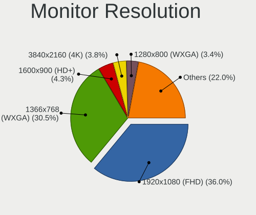

| Resolution         | Computers | Percent |
|--------------------|-----------|---------|
| 1920x1080 (FHD)    | 1563      | 36.01%  |
| 1366x768 (WXGA)    | 1323      | 30.48%  |
| 1600x900 (HD+)     | 186       | 4.28%   |
| 3840x2160 (4K)     | 164       | 3.78%   |
| 1280x800 (WXGA)    | 148       | 3.41%   |
| 1440x900 (WXGA+)   | 138       | 3.18%   |
| 1280x1024 (SXGA)   | 107       | 2.46%   |
| 2560x1440 (QHD)    | 86        | 1.98%   |
| 1920x1200 (WUXGA)  | 83        | 1.91%   |
| 1680x1050 (WSXGA+) | 75        | 1.73%   |
| 2560x1600          | 49        | 1.13%   |
| 1360x768           | 43        | 0.99%   |
| 2560x1080          | 38        | 0.88%   |
| 3440x1440          | 33        | 0.76%   |
| 1024x768 (XGA)     | 33        | 0.76%   |
| Unknown            | 31        | 0.71%   |
| 1024x600           | 28        | 0.65%   |
| 2160x1440          | 27        | 0.62%   |
| 800x1280           | 25        | 0.58%   |
| 2880x1800          | 25        | 0.58%   |
| 2288x1287          | 21        | 0.48%   |
| 3840x1080          | 15        | 0.35%   |
| 1600x1200          | 9         | 0.21%   |
| 3000x2000          | 8         | 0.18%   |
| 1920x540           | 8         | 0.18%   |
| 3840x2400          | 6         | 0.14%   |
| 3200x1800 (QHD+)   | 5         | 0.12%   |
| 2880x1920          | 5         | 0.12%   |
| 1280x960           | 5         | 0.12%   |
| 1400x1050          | 4         | 0.09%   |
| 2520x1680          | 3         | 0.07%   |
| 2256x1504          | 3         | 0.07%   |
| 2240x1400          | 3         | 0.07%   |
| 1152x864           | 3         | 0.07%   |
| 3600x1080          | 2         | 0.05%   |
| 3360x1080          | 2         | 0.05%   |
| 2736x1824          | 2         | 0.05%   |
| 2400x1600          | 2         | 0.05%   |
| 1920x1280          | 2         | 0.05%   |
| 1600x2560          | 2         | 0.05%   |

Monitor Diagonal
----------------

Diagonal size in inches

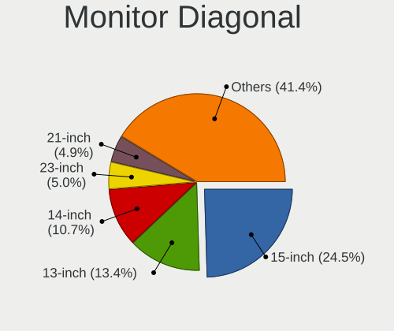

| Inches  | Computers | Percent |
|---------|-----------|---------|
| 15      | 1112      | 24.51%  |
| 13      | 610       | 13.45%  |
| 14      | 487       | 10.74%  |
| 23      | 227       | 5%      |
| 21      | 224       | 4.94%   |
| 27      | 209       | 4.61%   |
| 24      | 195       | 4.3%    |
| 19      | 162       | 3.57%   |
| 17      | 159       | 3.51%   |
| 18      | 150       | 3.31%   |
| Unknown | 121       | 2.67%   |
| 31      | 118       | 2.6%    |
| 20      | 112       | 2.47%   |
| 11      | 90        | 1.98%   |
| 16      | 80        | 1.76%   |
| 34      | 60        | 1.32%   |
| 12      | 59        | 1.3%    |
| 22      | 52        | 1.15%   |
| 72      | 37        | 0.82%   |
| 84      | 33        | 0.73%   |
| 10      | 30        | 0.66%   |
| 7       | 27        | 0.6%    |
| 32      | 20        | 0.44%   |
| 142     | 17        | 0.37%   |
| 40      | 16        | 0.35%   |
| 54      | 14        | 0.31%   |
| 26      | 14        | 0.31%   |
| 29      | 11        | 0.24%   |
| 63      | 10        | 0.22%   |
| 25      | 9         | 0.2%    |
| 48      | 8         | 0.18%   |
| 52      | 7         | 0.15%   |
| 42      | 6         | 0.13%   |
| 8       | 6         | 0.13%   |
| 46      | 5         | 0.11%   |
| 39      | 5         | 0.11%   |
| 49      | 4         | 0.09%   |
| 28      | 4         | 0.09%   |
| 57      | 3         | 0.07%   |
| 37      | 3         | 0.07%   |

Monitor Width
-------------

Physical width

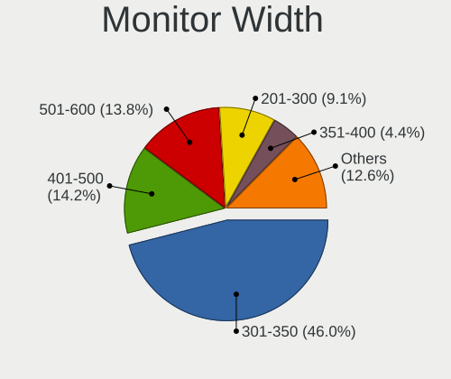

| Width in mm    | Computers | Percent |
|----------------|-----------|---------|
| 301-350        | 2057      | 46.02%  |
| 401-500        | 634       | 14.18%  |
| 501-600        | 617       | 13.8%   |
| 201-300        | 405       | 9.06%   |
| 351-400        | 195       | 4.36%   |
| 601-700        | 142       | 3.18%   |
| Unknown        | 121       | 2.71%   |
| 701-800        | 86        | 1.92%   |
| 1501-2000      | 72        | 1.61%   |
| 1001-1500      | 55        | 1.23%   |
| 801-900        | 27        | 0.6%    |
| 1-100          | 26        | 0.58%   |
| More than 2000 | 17        | 0.38%   |
| 101-200        | 8         | 0.18%   |
| 901-1000       | 8         | 0.18%   |

Aspect Ratio
------------

Proportional relationship between the width and the height

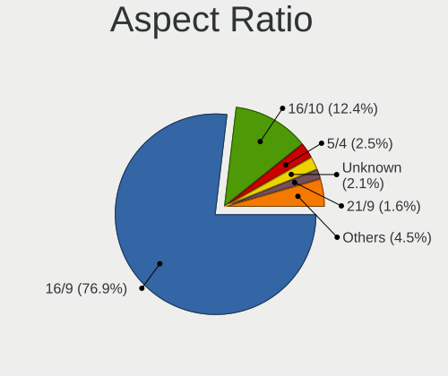

| Ratio   | Computers | Percent |
|---------|-----------|---------|
| 16/9    | 3145      | 76.88%  |
| 16/10   | 506       | 12.37%  |
| 5/4     | 104       | 2.54%   |
| Unknown | 87        | 2.13%   |
| 21/9    | 65        | 1.59%   |
| 4/3     | 58        | 1.42%   |
| 3/2     | 55        | 1.34%   |
| 0.67    | 25        | 0.61%   |
| 1.00    | 17        | 0.42%   |
| 32/9    | 9         | 0.22%   |
| 6/5     | 6         | 0.15%   |
| 0.56    | 5         | 0.12%   |
| 0.62    | 3         | 0.07%   |
| 1.96    | 2         | 0.05%   |
| 3.40    | 1         | 0.02%   |
| 2.65    | 1         | 0.02%   |
| 2.00    | 1         | 0.02%   |
| 0.63    | 1         | 0.02%   |

Monitor Area
------------

Area in inch²

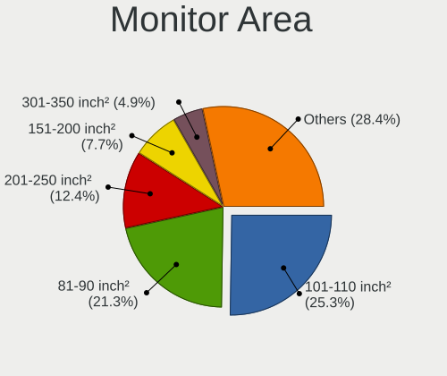

| Area in inch² | Computers | Percent |
|----------------|-----------|---------|
| 101-110        | 1134      | 25.25%  |
| 81-90          | 958       | 21.33%  |
| 201-250        | 558       | 12.42%  |
| 151-200        | 347       | 7.73%   |
| 301-350        | 220       | 4.9%    |
| 351-500        | 203       | 4.52%   |
| 141-150        | 198       | 4.41%   |
| 71-80          | 136       | 3.03%   |
| More than 1000 | 131       | 2.92%   |
| Unknown        | 121       | 2.69%   |
| 51-60          | 92        | 2.05%   |
| 121-130        | 73        | 1.63%   |
| 251-300        | 69        | 1.54%   |
| 111-120        | 55        | 1.22%   |
| 61-70          | 52        | 1.16%   |
| 501-1000       | 52        | 1.16%   |
| 1-40           | 34        | 0.76%   |
| 41-50          | 29        | 0.65%   |
| 131-140        | 20        | 0.45%   |
| 91-100         | 9         | 0.2%    |

Pixel Density
-------------

Pixels per inch

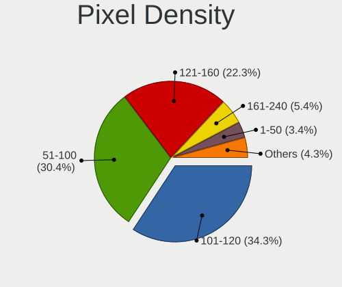

| Density       | Computers | Percent |
|---------------|-----------|---------|
| 101-120       | 1497      | 34.26%  |
| 51-100        | 1330      | 30.43%  |
| 121-160       | 973       | 22.27%  |
| 161-240       | 234       | 5.35%   |
| 1-50          | 147       | 3.36%   |
| Unknown       | 121       | 2.77%   |
| More than 240 | 68        | 1.56%   |

Multiple Monitors
-----------------

Total monitors connected

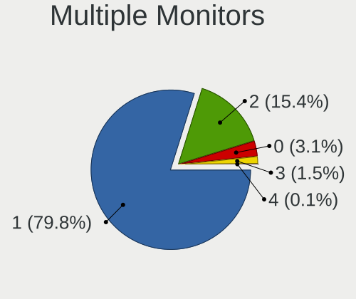

| Total | Computers | Percent |
|-------|-----------|---------|
| 1     | 3400      | 79.83%  |
| 2     | 656       | 15.4%   |
| 0     | 133       | 3.12%   |
| 3     | 64        | 1.5%    |
| 4     | 6         | 0.14%   |

Network
-------

Net Controller Vendor
---------------------

Controller vendors

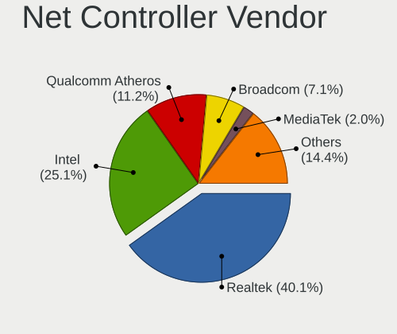

| Vendor                          | Computers | Percent |
|---------------------------------|-----------|---------|
| Realtek Semiconductor           | 2491      | 40.13%  |
| Intel                           | 1561      | 25.14%  |
| Qualcomm Atheros                | 694       | 11.18%  |
| Broadcom                        | 440       | 7.09%   |
| MediaTek                        | 125       | 2.01%   |
| Ralink Technology               | 119       | 1.92%   |
| TP-Link                         | 92        | 1.48%   |
| Ralink                          | 91        | 1.47%   |
| Broadcom Limited                | 91        | 1.47%   |
| Nvidia                          | 67        | 1.08%   |
| Marvell Technology Group        | 60        | 0.97%   |
| Qualcomm Atheros Communications | 42        | 0.68%   |
| ASIX Electronics                | 40        | 0.64%   |
| Mercucys                        | 23        | 0.37%   |
| Samsung Electronics             | 22        | 0.35%   |
| Huawei Technologies             | 21        | 0.34%   |
| Xiaomi                          | 20        | 0.32%   |
| DisplayLink                     | 17        | 0.27%   |
| Motorola PCS                    | 16        | 0.26%   |
| Qualcomm                        | 12        | 0.19%   |
| Linksys                         | 9         | 0.14%   |
| Shenzhen Goodix Technology      | 8         | 0.13%   |
| ICS Advent                      | 8         | 0.13%   |
| D-Link                          | 8         | 0.13%   |
| QinHeng Electronics             | 7         | 0.11%   |
| OPPO Electronics                | 7         | 0.11%   |
| Lenovo                          | 6         | 0.1%    |
| Google                          | 6         | 0.1%    |
| VIA Technologies                | 5         | 0.08%   |
| Spreadtrum Communications       | 5         | 0.08%   |
| Microsoft                       | 5         | 0.08%   |
| Microchip Technology            | 5         | 0.08%   |
| Dell                            | 5         | 0.08%   |
| D-Link System                   | 5         | 0.08%   |
| Qualcomm Technologies           | 4         | 0.06%   |
| NetGear                         | 4         | 0.06%   |
| IBM                             | 4         | 0.06%   |
| Hewlett-Packard                 | 4         | 0.06%   |
| aicsemi                         | 4         | 0.06%   |
| ZTE WCDMA Technologies MSM      | 3         | 0.05%   |

Net Controller Model
--------------------

Controller models

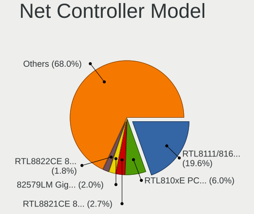

| Model                                                                  | Computers | Percent |
|------------------------------------------------------------------------|-----------|---------|
| Realtek RTL8111/8168/8211/8411 PCI Express Gigabit Ethernet Controller | 1464      | 19.57%  |
| Realtek RTL810xE PCI Express Fast Ethernet controller                  | 446       | 5.96%   |
| Realtek RTL8821CE 802.11ac PCIe Wireless Network Adapter               | 201       | 2.69%   |
| Intel 82579LM Gigabit Network Connection (Lewisville)                  | 148       | 1.98%   |
| Realtek RTL8822CE 802.11ac PCIe Wireless Network Adapter               | 133       | 1.78%   |
| Qualcomm Atheros QCA9565 / AR9565 Wireless Network Adapter             | 111       | 1.48%   |
| Intel Wi-Fi 6 AX200                                                    | 107       | 1.43%   |
| Qualcomm Atheros QCA9377 802.11ac Wireless Network Adapter             | 102       | 1.36%   |
| Qualcomm Atheros AR9485 Wireless Network Adapter                       | 93        | 1.24%   |
| Realtek RTL8153 Gigabit Ethernet Adapter                               | 85        | 1.14%   |
| Qualcomm Atheros AR9285 Wireless Network Adapter (PCI-Express)         | 85        | 1.14%   |
| Intel Wireless 8265 / 8275                                             | 81        | 1.08%   |
| Intel Wi-Fi 6 AX201                                                    | 81        | 1.08%   |
| Realtek RTL8125 2.5GbE Controller                                      | 79        | 1.06%   |
| Realtek RTL8723DE Wireless Network Adapter                             | 74        | 0.99%   |
| Realtek RTL8723BE PCIe Wireless Network Adapter                        | 73        | 0.98%   |
| Intel Wireless 7265                                                    | 73        | 0.98%   |
| Broadcom BCM43142 802.11b/g/n                                          | 66        | 0.88%   |
| Intel Ethernet Connection I217-LM                                      | 63        | 0.84%   |
| Qualcomm Atheros QCA6174 802.11ac Wireless Network Adapter             | 61        | 0.82%   |
| Realtek RTL8188EUS 802.11n Wireless Network Adapter                    | 58        | 0.78%   |
| Intel Wireless 7260                                                    | 56        | 0.75%   |
| Broadcom NetXtreme BCM57765 Gigabit Ethernet PCIe                      | 53        | 0.71%   |
| Realtek RTL8188EE Wireless Network Adapter                             | 52        | 0.7%    |
| Intel Wireless 8260                                                    | 52        | 0.7%    |
| Ralink RT2870/RT3070 Wireless Adapter                                  | 51        | 0.68%   |
| MediaTek MT7921 802.11ax PCIe Wireless Network Adapter [Filogic 330]   | 51        | 0.68%   |
| Intel Centrino Advanced-N 6205 [Taylor Peak]                           | 51        | 0.68%   |
| Broadcom BCM4313 802.11bgn Wireless Network Adapter                    | 50        | 0.67%   |
| Realtek 802.11ac NIC                                                   | 49        | 0.66%   |
| Realtek RTL8852BE PCIe 802.11ax Wireless Network Controller            | 48        | 0.64%   |
| Ralink MT7601U Wireless Adapter                                        | 48        | 0.64%   |
| Intel Comet Lake PCH-LP CNVi WiFi                                      | 48        | 0.64%   |
| Intel Alder Lake-P PCH CNVi WiFi                                       | 48        | 0.64%   |
| Intel Cannon Lake PCH CNVi WiFi                                        | 47        | 0.63%   |
| Broadcom BCM4331 802.11a/b/g/n                                         | 47        | 0.63%   |
| Intel I211 Gigabit Network Connection                                  | 45        | 0.6%    |
| Intel Wireless 3165                                                    | 44        | 0.59%   |
| Intel Comet Lake PCH CNVi WiFi                                         | 42        | 0.56%   |
| Intel Wi-Fi 6E(802.11ax) AX210/AX1675* 2x2 [Typhoon Peak]              | 37        | 0.49%   |

Wireless Vendor
---------------

Wireless vendors

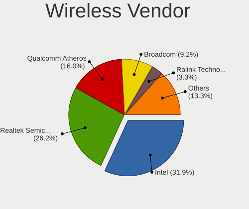

| Vendor                                | Computers | Percent |
|---------------------------------------|-----------|---------|
| Intel                                 | 1153      | 31.87%  |
| Realtek Semiconductor                 | 949       | 26.23%  |
| Qualcomm Atheros                      | 580       | 16.03%  |
| Broadcom                              | 334       | 9.23%   |
| Ralink Technology                     | 119       | 3.29%   |
| MediaTek                              | 114       | 3.15%   |
| Ralink                                | 91        | 2.52%   |
| TP-Link                               | 86        | 2.38%   |
| Broadcom Limited                      | 63        | 1.74%   |
| Qualcomm Atheros Communications       | 42        | 1.16%   |
| Mercucys                              | 23        | 0.64%   |
| Qualcomm                              | 9         | 0.25%   |
| Marvell Technology Group              | 9         | 0.25%   |
| D-Link                                | 8         | 0.22%   |
| Linksys                               | 7         | 0.19%   |
| NetGear                               | 4         | 0.11%   |
| Microsoft                             | 4         | 0.11%   |
| Dell                                  | 4         | 0.11%   |
| D-Link System                         | 3         | 0.08%   |
| 802.11g Adapter [Linksys WUSB54GC v3] | 3         | 0.08%   |
| ZyDAS                                 | 2         | 0.06%   |
| Wacom                                 | 2         | 0.06%   |
| Sierra Wireless                       | 2         | 0.06%   |
| Belkin Components                     | 2         | 0.06%   |
| Tenda                                 | 1         | 0.03%   |
| Qualcomm Technologies                 | 1         | 0.03%   |
| Micro Star International              | 1         | 0.03%   |
| Gemtek                                | 1         | 0.03%   |
| Accton Technology                     | 1         | 0.03%   |

Wireless Model
--------------

Wireless models

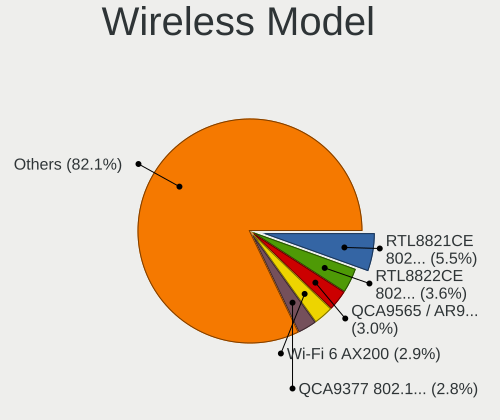

| Model                                                                | Computers | Percent |
|----------------------------------------------------------------------|-----------|---------|
| Realtek RTL8821CE 802.11ac PCIe Wireless Network Adapter             | 201       | 5.49%   |
| Realtek RTL8822CE 802.11ac PCIe Wireless Network Adapter             | 133       | 3.63%   |
| Qualcomm Atheros QCA9565 / AR9565 Wireless Network Adapter           | 111       | 3.03%   |
| Intel Wi-Fi 6 AX200                                                  | 107       | 2.92%   |
| Qualcomm Atheros QCA9377 802.11ac Wireless Network Adapter           | 102       | 2.79%   |
| Qualcomm Atheros AR9485 Wireless Network Adapter                     | 93        | 2.54%   |
| Qualcomm Atheros AR9285 Wireless Network Adapter (PCI-Express)       | 85        | 2.32%   |
| Intel Wireless 8265 / 8275                                           | 81        | 2.21%   |
| Intel Wi-Fi 6 AX201                                                  | 81        | 2.21%   |
| Realtek RTL8723DE Wireless Network Adapter                           | 74        | 2.02%   |
| Realtek RTL8723BE PCIe Wireless Network Adapter                      | 73        | 1.99%   |
| Intel Wireless 7265                                                  | 73        | 1.99%   |
| Broadcom BCM43142 802.11b/g/n                                        | 66        | 1.8%    |
| Qualcomm Atheros QCA6174 802.11ac Wireless Network Adapter           | 61        | 1.67%   |
| Realtek RTL8188EUS 802.11n Wireless Network Adapter                  | 58        | 1.58%   |
| Intel Wireless 7260                                                  | 56        | 1.53%   |
| Realtek RTL8188EE Wireless Network Adapter                           | 52        | 1.42%   |
| Intel Wireless 8260                                                  | 52        | 1.42%   |
| Ralink RT2870/RT3070 Wireless Adapter                                | 51        | 1.39%   |
| MediaTek MT7921 802.11ax PCIe Wireless Network Adapter [Filogic 330] | 51        | 1.39%   |
| Intel Centrino Advanced-N 6205 [Taylor Peak]                         | 51        | 1.39%   |
| Broadcom BCM4313 802.11bgn Wireless Network Adapter                  | 50        | 1.37%   |
| Realtek 802.11ac NIC                                                 | 49        | 1.34%   |
| Ralink MT7601U Wireless Adapter                                      | 48        | 1.31%   |
| Intel Comet Lake PCH-LP CNVi WiFi                                    | 48        | 1.31%   |
| Intel Cannon Lake PCH CNVi WiFi                                      | 47        | 1.28%   |
| Broadcom BCM4331 802.11a/b/g/n                                       | 47        | 1.28%   |
| Intel Wireless 3165                                                  | 44        | 1.2%    |
| Intel Comet Lake PCH CNVi WiFi                                       | 42        | 1.15%   |
| Intel Wi-Fi 6E(802.11ax) AX210/AX1675* 2x2 [Typhoon Peak]            | 37        | 1.01%   |
| Realtek RTL8188CE 802.11b/g/n WiFi Adapter                           | 36        | 0.98%   |
| Qualcomm Atheros AR9271 802.11n                                      | 36        | 0.98%   |
| Intel Cannon Point-LP CNVi [Wireless-AC]                             | 36        | 0.98%   |
| Realtek RTL8852BE PCIe 802.11ax Wireless Network Controller          | 34        | 0.93%   |
| Intel Alder Lake-P PCH CNVi WiFi                                     | 31        | 0.85%   |
| Intel Wireless 3160                                                  | 30        | 0.82%   |
| Realtek RTL8822BE 802.11a/b/g/n/ac WiFi adapter                      | 29        | 0.79%   |
| Broadcom Limited BCM4312 802.11b/g LP-PHY                            | 25        | 0.68%   |
| Broadcom BCM4312 802.11b/g LP-PHY                                    | 25        | 0.68%   |
| Ralink RT3090 Wireless 802.11n 1T/1R PCIe                            | 24        | 0.66%   |

Ethernet Vendor
---------------

Ethernet vendors

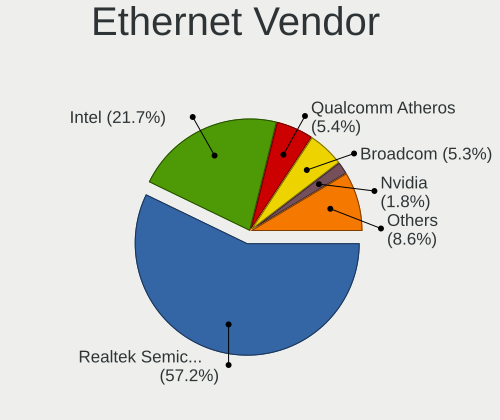

| Vendor                                 | Computers | Percent |
|----------------------------------------|-----------|---------|
| Realtek Semiconductor                  | 2109      | 57.17%  |
| Intel                                  | 800       | 21.69%  |
| Qualcomm Atheros                       | 200       | 5.42%   |
| Broadcom                               | 196       | 5.31%   |
| Nvidia                                 | 67        | 1.82%   |
| Marvell Technology Group               | 51        | 1.38%   |
| ASIX Electronics                       | 40        | 1.08%   |
| Broadcom Limited                       | 28        | 0.76%   |
| Samsung Electronics                    | 22        | 0.6%    |
| Xiaomi                                 | 20        | 0.54%   |
| Huawei Technologies                    | 20        | 0.54%   |
| DisplayLink                            | 17        | 0.46%   |
| Motorola PCS                           | 16        | 0.43%   |
| MediaTek                               | 11        | 0.3%    |
| ICS Advent                             | 8         | 0.22%   |
| OPPO Electronics                       | 7         | 0.19%   |
| TP-Link                                | 6         | 0.16%   |
| Google                                 | 6         | 0.16%   |
| VIA Technologies                       | 5         | 0.14%   |
| Spreadtrum Communications              | 5         | 0.14%   |
| Lenovo                                 | 5         | 0.14%   |
| Microchip Technology                   | 4         | 0.11%   |
| IBM                                    | 4         | 0.11%   |
| ZTE WCDMA Technologies MSM             | 3         | 0.08%   |
| Qualcomm Technologies                  | 3         | 0.08%   |
| Qualcomm                               | 3         | 0.08%   |
| Silicon Integrated Systems [SiS]       | 2         | 0.05%   |
| Raspberry Pi                           | 2         | 0.05%   |
| Linksys                                | 2         | 0.05%   |
| LG Electronics                         | 2         | 0.05%   |
| JMicron Technology                     | 2         | 0.05%   |
| Insyde Software                        | 2         | 0.05%   |
| Davicom Semiconductor                  | 2         | 0.05%   |
| D-Link System                          | 2         | 0.05%   |
| Aquantia                               | 2         | 0.05%   |
| T & A Mobile Phones                    | 1         | 0.03%   |
| Suzhou Motorcomm Electronic Technology | 1         | 0.03%   |
| Sundance Technology Inc / IC Plus      | 1         | 0.03%   |
| Sony Ericsson Mobile Communications AB | 1         | 0.03%   |
| QinHeng Electronics                    | 1         | 0.03%   |

Ethernet Model
--------------

Ethernet models

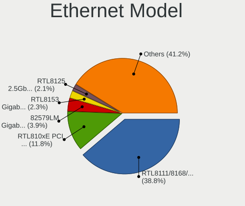

| Model                                                                  | Computers | Percent |
|------------------------------------------------------------------------|-----------|---------|
| Realtek RTL8111/8168/8211/8411 PCI Express Gigabit Ethernet Controller | 1464      | 38.77%  |
| Realtek RTL810xE PCI Express Fast Ethernet controller                  | 446       | 11.81%  |
| Intel 82579LM Gigabit Network Connection (Lewisville)                  | 148       | 3.92%   |
| Realtek RTL8153 Gigabit Ethernet Adapter                               | 85        | 2.25%   |
| Realtek RTL8125 2.5GbE Controller                                      | 79        | 2.09%   |
| Intel Ethernet Connection I217-LM                                      | 63        | 1.67%   |
| Broadcom NetXtreme BCM57765 Gigabit Ethernet PCIe                      | 53        | 1.4%    |
| Intel I211 Gigabit Network Connection                                  | 45        | 1.19%   |
| ASIX AX88179 Gigabit Ethernet                                          | 36        | 0.95%   |
| Intel Ethernet Controller I225-V                                       | 32        | 0.85%   |
| Qualcomm Atheros AR8152 v2.0 Fast Ethernet                             | 31        | 0.82%   |
| Qualcomm Atheros AR8151 v2.0 Gigabit Ethernet                          | 31        | 0.82%   |
| Intel Ethernet Connection (4) I219-LM                                  | 28        | 0.74%   |
| Nvidia MCP61 Ethernet                                                  | 27        | 0.72%   |
| Intel Ethernet Connection I218-LM                                      | 27        | 0.72%   |
| Realtek RTL8152 Fast Ethernet Adapter                                  | 26        | 0.69%   |
| Intel Ethernet Connection (2) I219-LM                                  | 25        | 0.66%   |
| Intel 82579V Gigabit Network Connection                                | 24        | 0.64%   |
| Intel Ethernet Connection (3) I218-LM                                  | 23        | 0.61%   |
| Intel Ethernet Connection (2) I219-V                                   | 22        | 0.58%   |
| Broadcom NetXtreme BCM57766 Gigabit Ethernet PCIe                      | 21        | 0.56%   |
| Intel Ethernet Connection (7) I219-V                                   | 20        | 0.53%   |
| Intel 82567LM-3 Gigabit Network Connection                             | 20        | 0.53%   |
| Qualcomm Atheros QCA8171 Gigabit Ethernet                              | 18        | 0.48%   |
| Qualcomm Atheros AR8161 Gigabit Ethernet                               | 18        | 0.48%   |
| Nvidia MCP79 Ethernet                                                  | 18        | 0.48%   |
| Intel Ethernet Connection I219-LM                                      | 18        | 0.48%   |
| Intel 82577LM Gigabit Network Connection                               | 18        | 0.48%   |
| Huawei FOA-LX9                                                         | 18        | 0.48%   |
| Qualcomm Atheros AR8162 Fast Ethernet                                  | 17        | 0.45%   |
| Intel Alder Lake-P PCH CNVi WiFi                                       | 17        | 0.45%   |
| Intel 82567LM Gigabit Network Connection                               | 17        | 0.45%   |
| Qualcomm Atheros Killer E2500 Gigabit Ethernet Controller              | 16        | 0.42%   |
| Qualcomm Atheros AR8131 Gigabit Ethernet                               | 15        | 0.4%    |
| Intel Ethernet Connection (5) I219-LM                                  | 15        | 0.4%    |
| Broadcom NetXtreme BCM5764M Gigabit Ethernet PCIe                      | 15        | 0.4%    |
| Broadcom NetLink BCM57785 Gigabit Ethernet PCIe                        | 15        | 0.4%    |
| Xiaomi Mi/Redmi series (RNDIS)                                         | 14        | 0.37%   |
| Samsung Galaxy series, misc. (tethering mode)                          | 14        | 0.37%   |
| Realtek RTL8852BE PCIe 802.11ax Wireless Network Controller            | 14        | 0.37%   |

Net Controller Kind
-------------------

Ethernet, WiFi or modem

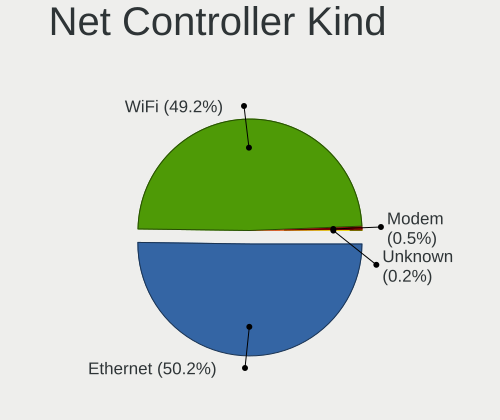

| Kind     | Computers | Percent |
|----------|-----------|---------|
| Ethernet | 3473      | 50.22%  |
| WiFi     | 3399      | 49.15%  |
| Modem    | 32        | 0.46%   |
| Unknown  | 11        | 0.16%   |

Used Controller
---------------

Currently used network controller

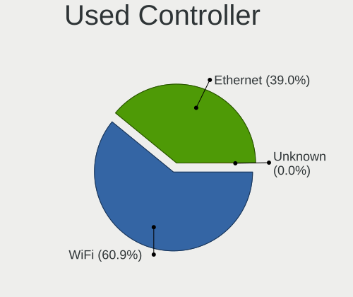

| Kind     | Computers | Percent |
|----------|-----------|---------|
| WiFi     | 2661      | 60.91%  |
| Ethernet | 1706      | 39.05%  |
| Unknown  | 2         | 0.05%   |

NICs
----

Total network controllers on board

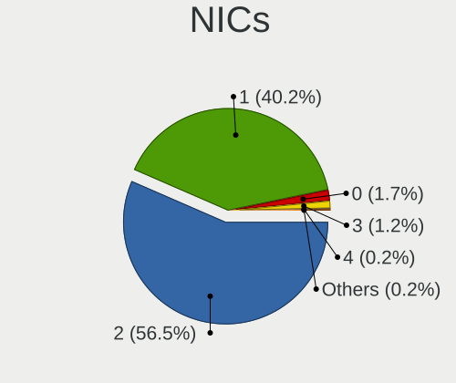

| Total | Computers | Percent |
|-------|-----------|---------|
| 2     | 2351      | 56.53%  |
| 1     | 1672      | 40.2%   |
| 0     | 71        | 1.71%   |
| 3     | 50        | 1.2%    |
| 4     | 7         | 0.17%   |
| 8     | 3         | 0.07%   |
| 6     | 3         | 0.07%   |
| 10    | 1         | 0.02%   |
| 5     | 1         | 0.02%   |

IPv6
----

IPv6 vs IPv4

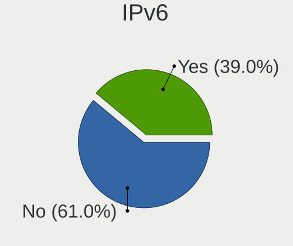

| Used | Computers | Percent |
|------|-----------|---------|
| No   | 2620      | 61.04%  |
| Yes  | 1672      | 38.96%  |

Bluetooth
---------

Bluetooth Vendor
----------------

Controller vendors

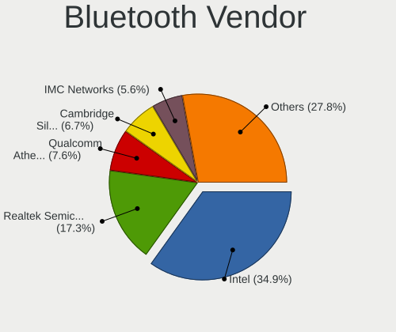

| Vendor                          | Computers | Percent |
|---------------------------------|-----------|---------|
| Intel                           | 941       | 34.89%  |
| Realtek Semiconductor           | 467       | 17.32%  |
| Qualcomm Atheros Communications | 206       | 7.64%   |
| Cambridge Silicon Radio         | 180       | 6.67%   |
| IMC Networks                    | 152       | 5.64%   |
| Apple                           | 143       | 5.3%    |
| Broadcom                        | 132       | 4.89%   |
| Lite-On Technology              | 94        | 3.49%   |
| Foxconn / Hon Hai               | 89        | 3.3%    |
| Realtek                         | 55        | 2.04%   |
| Dell                            | 43        | 1.59%   |
| Hewlett-Packard                 | 32        | 1.19%   |
| Toshiba                         | 25        | 0.93%   |
| Ralink                          | 23        | 0.85%   |
| MediaTek                        | 23        | 0.85%   |
| ASUSTek Computer                | 20        | 0.74%   |
| TP-Link                         | 19        | 0.7%    |
| Ralink Technology               | 11        | 0.41%   |
| Marvell Semiconductor           | 9         | 0.33%   |
| Foxconn International           | 5         | 0.19%   |
| Alps Electric                   | 5         | 0.19%   |
| Unknown                         | 5         | 0.19%   |
| Actions                         | 4         | 0.15%   |
| USI                             | 3         | 0.11%   |
| Opticis                         | 2         | 0.07%   |
| Integrated System Solution      | 2         | 0.07%   |
| Chicony Electronics             | 2         | 0.07%   |
| SiW                             | 1         | 0.04%   |
| Roper                           | 1         | 0.04%   |
| Micro Star International        | 1         | 0.04%   |
| Fujitsu                         | 1         | 0.04%   |
| Dynex                           | 1         | 0.04%   |

Bluetooth Model
---------------

Controller models

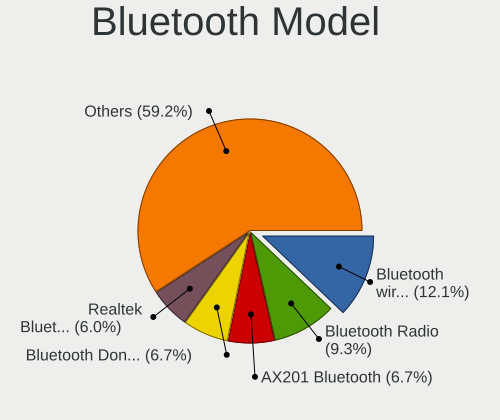

| Model                                               | Computers | Percent |
|-----------------------------------------------------|-----------|---------|
| Intel Bluetooth wireless interface                  | 327       | 12.11%  |
| Realtek Bluetooth Radio                             | 252       | 9.33%   |
| Intel AX201 Bluetooth                               | 182       | 6.74%   |
| Cambridge Silicon Radio Bluetooth Dongle (HCI mode) | 180       | 6.67%   |
| Realtek  Bluetooth 4.2 Adapter                      | 161       | 5.96%   |
| Intel Bluetooth 9460/9560 Jefferson Peak (JfP)      | 156       | 5.78%   |
| Qualcomm Atheros  Bluetooth Device                  | 113       | 4.19%   |
| Intel AX200 Bluetooth                               | 104       | 3.85%   |
| IMC Networks Bluetooth Radio                        | 76        | 2.81%   |
| Apple Bluetooth Host Controller                     | 61        | 2.26%   |
| Intel Bluetooth Device                              | 56        | 2.07%   |
| Realtek Bluetooth Radio                             | 55        | 2.04%   |
| Apple Bluetooth USB Host Controller                 | 51        | 1.89%   |
| IMC Networks Wireless_Device                        | 45        | 1.67%   |
| Broadcom BCM43142A0 Bluetooth 4.0                   | 39        | 1.44%   |
| Intel AX210 Bluetooth                               | 34        | 1.26%   |
| Lite-On Bluetooth Device                            | 31        | 1.15%   |
| Foxconn / Hon Hai Bluetooth Device                  | 30        | 1.11%   |
| Intel Centrino Bluetooth Wireless Transceiver       | 29        | 1.07%   |
| Qualcomm Atheros QCA61x4 Bluetooth 4.0              | 25        | 0.93%   |
| Lite-On Qualcomm Atheros QCA9377 Bluetooth          | 25        | 0.93%   |
| Qualcomm Atheros AR3012 Bluetooth 4.0               | 24        | 0.89%   |
| Ralink RT3290 Bluetooth                             | 23        | 0.85%   |
| MediaTek Wireless_Device                            | 23        | 0.85%   |
| Lite-On Atheros AR3012 Bluetooth                    | 23        | 0.85%   |
| Intel Centrino Advanced-N 6230 Bluetooth adapter    | 23        | 0.85%   |
| Apple Built-in Bluetooth 2.0+EDR HCI                | 21        | 0.78%   |
| Realtek RTL8723B Bluetooth                          | 20        | 0.74%   |
| Qualcomm Atheros AR3011 Bluetooth                   | 20        | 0.74%   |
| TP-Link TP-T@- UB500 Adapter                        | 19        | 0.7%    |
| Intel Wireless-AC 9260 Bluetooth Adapter            | 18        | 0.67%   |
| Broadcom BCM20702 Bluetooth 4.0 [ThinkPad]          | 18        | 0.67%   |
| Qualcomm Atheros AR9462 Bluetooth                   | 17        | 0.63%   |
| IMC Networks Bluetooth Device                       | 16        | 0.59%   |
| HP Broadcom 2070 Bluetooth Combo                    | 16        | 0.59%   |
| HP Bluetooth 2.0 Interface [Broadcom BCM2045]       | 16        | 0.59%   |
| Realtek RTL8821A Bluetooth                          | 15        | 0.56%   |
| Intel Wireless-AC 3168 Bluetooth                    | 15        | 0.56%   |
| Foxconn / Hon Hai Wireless_Device                   | 15        | 0.56%   |
| Foxconn / Hon Hai MediaTek Bluetooth Adapter        | 15        | 0.56%   |

Sound
-----

Sound Vendor
------------

Sound card vendors

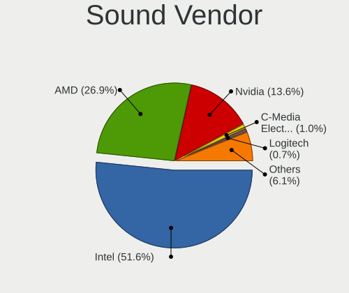

| Vendor                                       | Computers | Percent |
|----------------------------------------------|-----------|---------|
| Intel                                        | 2725      | 51.64%  |
| AMD                                          | 1417      | 26.85%  |
| Nvidia                                       | 720       | 13.64%  |
| C-Media Electronics                          | 53        | 1%      |
| Logitech                                     | 39        | 0.74%   |
| Generalplus Technology                       | 25        | 0.47%   |
| Texas Instruments                            | 23        | 0.44%   |
| Realtek Semiconductor                        | 15        | 0.28%   |
| ASUSTek Computer                             | 15        | 0.28%   |
| Creative Labs                                | 13        | 0.25%   |
| GN Netcom                                    | 12        | 0.23%   |
| Kingston Technology                          | 11        | 0.21%   |
| Zoran Co. Personal Media Division (Nogatech) | 9         | 0.17%   |
| Sony                                         | 9         | 0.17%   |
| Razer USA                                    | 9         | 0.17%   |
| JMTek                                        | 9         | 0.17%   |
| Focusrite-Novation                           | 9         | 0.17%   |
| Corsair                                      | 9         | 0.17%   |
| Lenovo                                       | 8         | 0.15%   |
| VIA Technologies                             | 7         | 0.13%   |
| Plantronics                                  | 7         | 0.13%   |
| Creative Technology                          | 7         | 0.13%   |
| Apple                                        | 7         | 0.13%   |
| Micro Star International                     | 6         | 0.11%   |
| Jieli Technology                             | 6         | 0.11%   |
| Hewlett-Packard                              | 6         | 0.11%   |
| Tenx Technology                              | 5         | 0.09%   |
| KTMicro                                      | 5         | 0.09%   |
| Thesycon Systemsoftware & Consulting         | 4         | 0.08%   |
| Syntek                                       | 4         | 0.08%   |
| ATI Technologies                             | 4         | 0.08%   |
| Walmart                                      | 3         | 0.06%   |
| M-Audio                                      | 3         | 0.06%   |
| FiiO Electronics Technology                  | 3         | 0.06%   |
| BEHRINGER International                      | 3         | 0.06%   |
| Unknown                                      | 3         | 0.06%   |
| Yamaha                                       | 2         | 0.04%   |
| Synaptics                                    | 2         | 0.04%   |
| SteelSeries ApS                              | 2         | 0.04%   |
| Shure                                        | 2         | 0.04%   |

Sound Model
-----------

Sound card models

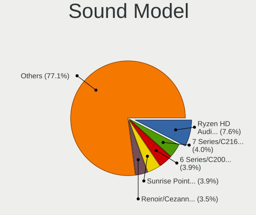

| Model                                                                                             | Computers | Percent |
|---------------------------------------------------------------------------------------------------|-----------|---------|
| AMD Ryzen HD Audio Controller                                                                     | 502       | 7.6%    |
| Intel 7 Series/C216 Chipset Family High Definition Audio Controller                               | 265       | 4.01%   |
| Intel 6 Series/C200 Series Chipset Family High Definition Audio Controller                        | 261       | 3.95%   |
| Intel Sunrise Point-LP HD Audio                                                                   | 255       | 3.86%   |
| AMD Renoir/Cezanne HDMI/DP Audio Controller                                                       | 231       | 3.5%    |
| AMD FCH Azalia Controller                                                                         | 221       | 3.34%   |
| AMD Raven/Raven2/Fenghuang HDMI/DP Audio Controller                                               | 203       | 3.07%   |
| AMD SBx00 Azalia (Intel HDA)                                                                      | 163       | 2.47%   |
| Intel 8 Series/C220 Series Chipset High Definition Audio Controller                               | 153       | 2.32%   |
| AMD Kabini HDMI/DP Audio                                                                          | 145       | 2.19%   |
| AMD Family 15h (Models 60h-6fh) Audio Controller                                                  | 129       | 1.95%   |
| Intel Xeon E3-1200 v3/4th Gen Core Processor HD Audio Controller                                  | 114       | 1.73%   |
| AMD Radeon High Definition Audio Controller                                                       | 111       | 1.68%   |
| Intel NM10/ICH7 Family High Definition Audio Controller                                           | 110       | 1.66%   |
| Intel Cannon Lake PCH cAVS                                                                        | 107       | 1.62%   |
| Intel 5 Series/3400 Series Chipset High Definition Audio                                          | 103       | 1.56%   |
| Intel Tiger Lake-LP Smart Sound Technology Audio Controller                                       | 102       | 1.54%   |
| Intel 8 Series HD Audio Controller                                                                | 100       | 1.51%   |
| Intel Haswell-ULT HD Audio Controller                                                             | 99        | 1.5%    |
| Intel 82801I (ICH9 Family) HD Audio Controller                                                    | 97        | 1.47%   |
| AMD Starship/Matisse HD Audio Controller                                                          | 95        | 1.44%   |
| Intel Celeron/Pentium Silver Processor High Definition Audio                                      | 92        | 1.39%   |
| Intel Broadwell-U Audio Controller                                                                | 91        | 1.38%   |
| Intel 100 Series/C230 Series Chipset Family HD Audio Controller                                   | 90        | 1.36%   |
| Intel Wildcat Point-LP High Definition Audio Controller                                           | 88        | 1.33%   |
| Intel Atom/Celeron/Pentium Processor x5-E8000/J3xxx/N3xxx Series High Definition Audio Controller | 82        | 1.24%   |
| Intel 82801H (ICH8 Family) HD Audio Controller                                                    | 72        | 1.09%   |
| Intel Atom Processor Z36xxx/Z37xxx Series High Definition Audio Controller                        | 71        | 1.07%   |
| AMD High Definition Audio Controller                                                              | 70        | 1.06%   |
| Intel Cannon Point-LP High Definition Audio Controller                                            | 67        | 1.01%   |
| Intel Alder Lake PCH-P High Definition Audio Controller                                           | 64        | 0.97%   |
| Intel Comet Lake PCH-LP cAVS                                                                      | 60        | 0.91%   |
| Intel Comet Lake PCH cAVS                                                                         | 58        | 0.88%   |
| AMD Family 17h (Models 00h-0fh) HD Audio Controller                                               | 57        | 0.86%   |
| Nvidia GP107GL High Definition Audio Controller                                                   | 52        | 0.79%   |
| AMD Trinity HDMI Audio Controller                                                                 | 52        | 0.79%   |
| Intel 200 Series PCH HD Audio                                                                     | 50        | 0.76%   |
| AMD Navi 21/23 HDMI/DP Audio Controller                                                           | 50        | 0.76%   |
| Nvidia TU107 GeForce GTX 1650 High Definition Audio Controller                                    | 48        | 0.73%   |
| AMD Ellesmere HDMI Audio [Radeon RX 470/480 / 570/580/590]                                        | 46        | 0.7%    |

Memory
------

Memory Vendor
-------------

Memory module vendors

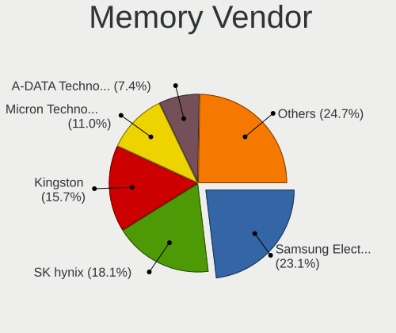

| Vendor                                           | Computers | Percent |
|--------------------------------------------------|-----------|---------|
| Samsung Electronics                              | 591       | 23.09%  |
| SK hynix                                         | 462       | 18.05%  |
| Kingston                                         | 402       | 15.71%  |
| Micron Technology                                | 281       | 10.98%  |
| A-DATA Technology                                | 190       | 7.42%   |
| Unknown                                          | 174       | 6.8%    |
| Corsair                                          | 74        | 2.89%   |
| Ramaxel Technology                               | 61        | 2.38%   |
| Crucial                                          | 55        | 2.15%   |
| Elpida                                           | 38        | 1.48%   |
| Unknown                                          | 33        | 1.29%   |
| Nanya Technology                                 | 30        | 1.17%   |
| Unknown (ABCD)                                   | 29        | 1.13%   |
| Team                                             | 17        | 0.66%   |
| G.Skill                                          | 15        | 0.59%   |
| Patriot                                          | 11        | 0.43%   |
| Timetec                                          | 10        | 0.39%   |
| Qimonda                                          | 7         | 0.27%   |
| PNY                                              | 7         | 0.27%   |
| ChangXin Memory                                  | 6         | 0.23%   |
| Transcend                                        | 5         | 0.2%    |
| Avant                                            | 3         | 0.12%   |
| 4ea5                                             | 3         | 0.12%   |
| Unknown (0x0E9D)                                 | 2         | 0.08%   |
| Toshiba                                          | 2         | 0.08%   |
| Silicon Power                                    | 2         | 0.08%   |
| PUSKILL                                          | 2         | 0.08%   |
| Hewlett-Packard                                  | 2         | 0.08%   |
| ff                                               | 2         | 0.08%   |
| CSX                                              | 2         | 0.08%   |
| ASint Technology                                 | 2         | 0.08%   |
| Apacer                                           | 2         | 0.08%   |
| Unknown (8A6B)                                   | 1         | 0.04%   |
| Unknown (89EC)                                   | 1         | 0.04%   |
| Unknown (83DA)                                   | 1         | 0.04%   |
| Unknown (268C)                                   | 1         | 0.04%   |
| Unknown (0x8AF1)                                 | 1         | 0.04%   |
| Unknown (0x5846)                                 | 1         | 0.04%   |
| Unknown (0x4D342037305435363633515A332D43453620) | 1         | 0.04%   |
| Unknown (0x29E)                                  | 1         | 0.04%   |

Memory Model
------------

Memory module models

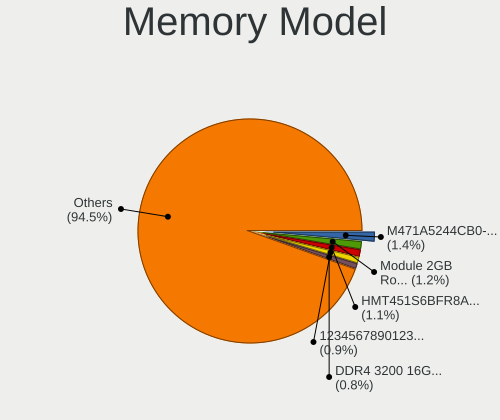

| Model                                                            | Computers | Percent |
|------------------------------------------------------------------|-----------|---------|
| Samsung RAM M471A5244CB0-CTD 4GB SODIMM DDR4 3266MT/s            | 40        | 1.44%   |
| Unknown                                                          | 33        | 1.19%   |
| SK hynix RAM HMT451S6BFR8A-PB 4GB SODIMM DDR3 1600MT/s           | 30        | 1.08%   |
| Unknown (ABCD) RAM 123456789012345678 2GB SODIMM LPDDR4 2400MT/s | 26        | 0.94%   |
| A-DATA RAM DDR4 3200 16GB DIMM DDR4 3600MT/s                     | 23        | 0.83%   |
| SK hynix RAM HMA81GS6AFR8N-UH 8GB SODIMM DDR4 2667MT/s           | 22        | 0.79%   |
| Micron RAM 4ATF1G64HZ-3G2E1 8GB Row Of Chips DDR4 3200MT/s       | 21        | 0.76%   |
| Samsung RAM M471B5173QH0-YK0 4GB SODIMM DDR3 1600MT/s            | 19        | 0.69%   |
| Samsung RAM M471B5173DB0-YK0 4GB SODIMM DDR3 1600MT/s            | 19        | 0.69%   |
| Samsung RAM M471A1K43DB1-CTD 8GB SODIMM DDR4 2667MT/s            | 18        | 0.65%   |
| Micron RAM 4ATF51264HZ-2G6E1 4GB SODIMM DDR4 2667MT/s            | 16        | 0.58%   |
| SK hynix RAM HMA81GS6DJR8N-XN 8GB SODIMM DDR4 3200MT/s           | 15        | 0.54%   |
| Samsung RAM M471B5273DH0-CH9 4GB SODIMM DDR3 1600MT/s            | 15        | 0.54%   |
| Samsung RAM M471B5173EB0-YK0 4GB SODIMM DDR3 1600MT/s            | 15        | 0.54%   |
| Samsung RAM M471B1G73QH0-YK0 8GB SODIMM DDR3 1600MT/s            | 15        | 0.54%   |
| Samsung RAM M471A1G44AB0-CWE 8GB Row Of Chips DDR4 3200MT/s      | 15        | 0.54%   |
| Kingston RAM KF3200C16D4/8GX 8GiB DIMM DDR4 3600MT/s             | 15        | 0.54%   |
| Micron RAM 8KTF51264HZ-1G6E1 4GB SODIMM DDR3 1600MT/s            | 14        | 0.51%   |
| SK hynix RAM HMAA1GS6CJR6N-XN 8GB SODIMM DDR4 3200MT/s           | 13        | 0.47%   |
| Samsung RAM M471A1K43CB1-CRC 8GB SODIMM DDR4 8400MT/s            | 13        | 0.47%   |
| Kingston RAM KF3200C20S4/16G 16GB SODIMM DDR4 3200MT/s           | 13        | 0.47%   |
| SK hynix RAM HMT451S6AFR8A-PB 4GB SODIMM DDR3 1600MT/s           | 12        | 0.43%   |
| SK hynix RAM HMA81GS6JJR8N-VK 8GB SODIMM DDR4 2667MT/s           | 12        | 0.43%   |
| Samsung RAM M471B1G73EB0-YK0 8192MB SODIMM DDR3 1600MT/s         | 12        | 0.43%   |
| Samsung RAM M471A1K43CB1-CTD 8GB SODIMM DDR4 3200MT/s            | 12        | 0.43%   |
| Unknown RAM Module 2GB SODIMM DDR2 667MT/s                       | 11        | 0.4%    |
| Samsung RAM M471B1G73DB0-YK0 8GB SODIMM DDR3 1600MT/s            | 11        | 0.4%    |
| Samsung RAM M471A1K43BB1-CRC 8GB SODIMM DDR4 2667MT/s            | 11        | 0.4%    |
| Samsung RAM M471A1G44AB0-CWE 8GiB SODIMM DDR4 3200MT/s           | 11        | 0.4%    |
| Samsung RAM M471A5244CB0-CTD 4GB Row Of Chips DDR4 2667MT/s      | 10        | 0.36%   |
| Samsung RAM M471A1K43DB1-CWE 8GB SODIMM DDR4 3200MT/s            | 10        | 0.36%   |
| Micron RAM 16KTF1G64HZ-1G6E1 8GB SODIMM DDR3 1600MT/s            | 10        | 0.36%   |
| Unknown RAM Module 4GB DIMM 1333MT/s                             | 9         | 0.32%   |
| SK hynix RAM HMT41GS6AFR8A-PB 8GB SODIMM DDR3 1600MT/s           | 9         | 0.32%   |
| SK hynix RAM HMT351S6CFR8C-PB 4GB SODIMM DDR3 1600MT/s           | 9         | 0.32%   |
| SK hynix RAM HMA81GS6CJR8N-VK 8GB SODIMM DDR4 2667MT/s           | 9         | 0.32%   |
| Samsung RAM M471B5273CH0-CH9 4GB SODIMM DDR3 1334MT/s            | 9         | 0.32%   |
| Ramaxel RAM RMSA3260ME78HAF-2666 8GB SODIMM DDR4 2667MT/s        | 9         | 0.32%   |
| Kingston RAM 99U5428-018.A00LF 8GB SODIMM DDR3 1600MT/s          | 9         | 0.32%   |
| A-DATA RAM DDR4 2666 8GB DIMM DDR4 3200MT/s                      | 9         | 0.32%   |

Memory Kind
-----------

Memory module kinds

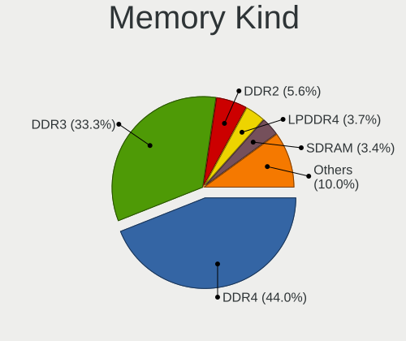

| Kind    | Computers | Percent |
|---------|-----------|---------|
| DDR4    | 930       | 43.99%  |
| DDR3    | 705       | 33.35%  |
| DDR2    | 118       | 5.58%   |
| LPDDR4  | 78        | 3.69%   |
| SDRAM   | 71        | 3.36%   |
| DDR5    | 64        | 3.03%   |
| Unknown | 47        | 2.22%   |
| LPDDR3  | 41        | 1.94%   |
| LPDDR5  | 39        | 1.84%   |
| DDR     | 17        | 0.8%    |
| DRAM    | 3         | 0.14%   |
| RAM     | 1         | 0.05%   |

Memory Form Factor
------------------

Physical design of the memory module

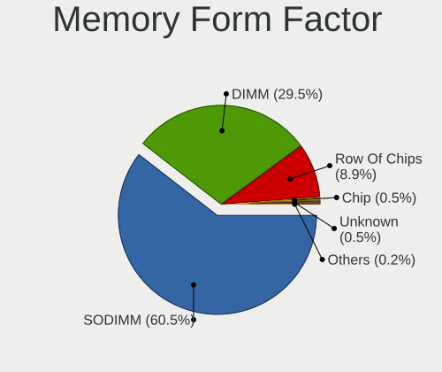

| Name         | Computers | Percent |
|--------------|-----------|---------|
| SODIMM       | 1263      | 60.49%  |
| DIMM         | 615       | 29.45%  |
| Row Of Chips | 185       | 8.86%   |
| Chip         | 11        | 0.53%   |
| Unknown      | 10        | 0.48%   |
| RIMM         | 2         | 0.1%    |
| FB-DIMM      | 2         | 0.1%    |

Memory Size
-----------

Memory module size

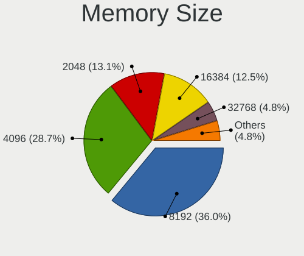

| Size  | Computers | Percent |
|-------|-----------|---------|
| 8192  | 866       | 36.02%  |
| 4096  | 691       | 28.74%  |
| 2048  | 316       | 13.14%  |
| 16384 | 301       | 12.52%  |
| 32768 | 115       | 4.78%   |
| 1024  | 92        | 3.83%   |
| 512   | 11        | 0.46%   |
| 12288 | 4         | 0.17%   |
| 49152 | 2         | 0.08%   |
| 256   | 2         | 0.08%   |
| 65536 | 1         | 0.04%   |
| 32767 | 1         | 0.04%   |
| 3072  | 1         | 0.04%   |
| 128   | 1         | 0.04%   |

Memory Speed
------------

Memory module speed

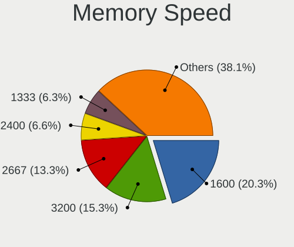

| Speed   | Computers | Percent |
|---------|-----------|---------|
| 1600    | 477       | 20.3%   |
| 3200    | 360       | 15.32%  |
| 2667    | 313       | 13.32%  |
| 2400    | 156       | 6.64%   |
| 1333    | 149       | 6.34%   |
| 2133    | 111       | 4.72%   |
| 3600    | 67        | 2.85%   |
| 667     | 65        | 2.77%   |
| 800     | 52        | 2.21%   |
| 1334    | 46        | 1.96%   |
| Unknown | 45        | 1.91%   |
| 3266    | 42        | 1.79%   |
| 1067    | 34        | 1.45%   |
| 6400    | 31        | 1.32%   |
| 3733    | 31        | 1.32%   |
| 4800    | 29        | 1.23%   |
| 4267    | 28        | 1.19%   |
| 1867    | 26        | 1.11%   |
| 5600    | 23        | 0.98%   |
| 2048    | 21        | 0.89%   |
| 8400    | 18        | 0.77%   |
| 2666    | 16        | 0.68%   |
| 533     | 16        | 0.68%   |
| 1866    | 14        | 0.6%    |
| 1066    | 14        | 0.6%    |
| 4199    | 11        | 0.47%   |
| 3400    | 10        | 0.43%   |
| 4000    | 9         | 0.38%   |
| 3466    | 9         | 0.38%   |
| 3000    | 9         | 0.38%   |
| 1800    | 9         | 0.38%   |
| 1639    | 8         | 0.34%   |
| 975     | 8         | 0.34%   |
| 3933    | 7         | 0.3%    |
| 3800    | 7         | 0.3%    |
| 49926   | 6         | 0.26%   |
| 5200    | 5         | 0.21%   |
| 2933    | 5         | 0.21%   |
| 2200    | 5         | 0.21%   |
| 7500    | 4         | 0.17%   |

Printers & scanners
-------------------

Printer Vendor
--------------

Printer device vendors

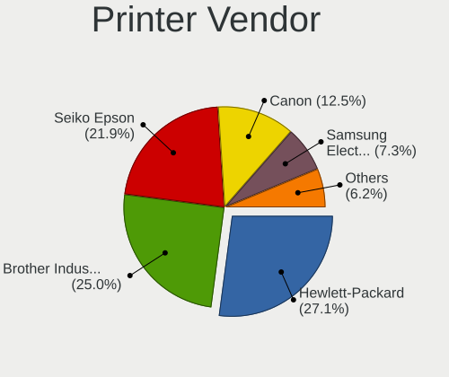

| Vendor                 | Computers | Percent |
|------------------------|-----------|---------|
| Hewlett-Packard        | 26        | 27.08%  |
| Brother Industries     | 24        | 25%     |
| Seiko Epson            | 21        | 21.88%  |
| Canon                  | 12        | 12.5%   |
| Samsung Electronics    | 7         | 7.29%   |
| Kyocera                | 2         | 2.08%   |
| TSC Auto ID Technology | 1         | 1.04%   |
| QinHeng Electronics    | 1         | 1.04%   |
| Prolific Technology    | 1         | 1.04%   |
| BIXOLON                | 1         | 1.04%   |

Printer Model
-------------

Printer device models

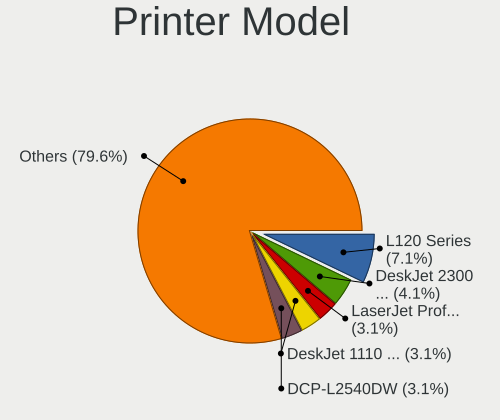

| Model                                   | Computers | Percent |
|-----------------------------------------|-----------|---------|
| Seiko Epson L120 Series                 | 7         | 7.14%   |
| HP DeskJet 2300 series                  | 4         | 4.08%   |
| HP LaserJet Professional P 1102w        | 3         | 3.06%   |
| HP DeskJet 1110 series                  | 3         | 3.06%   |
| Brother DCP-L2540DW                     | 3         | 3.06%   |
| Samsung M2020 Series                    | 2         | 2.04%   |
| HP DeskJet 2600 series                  | 2         | 2.04%   |
| Canon G3000 series                      | 2         | 2.04%   |
| Canon G2010 series                      | 2         | 2.04%   |
| Brother MFC-J470DW                      | 2         | 2.04%   |
| Brother MFC-J460DW                      | 2         | 2.04%   |
| Brother HL-2130 series                  | 2         | 2.04%   |
| Brother HL-1110 series                  | 2         | 2.04%   |
| Brother DCP-T520W                       | 2         | 2.04%   |
| Brother DCP-1510                        | 2         | 2.04%   |
| TSC Auto ID Printer                     | 1         | 1.02%   |
| Seiko Epson XP-235 Series               | 1         | 1.02%   |
| Seiko Epson Printer                     | 1         | 1.02%   |
| Seiko Epson L805 Series                 | 1         | 1.02%   |
| Seiko Epson L555 Series                 | 1         | 1.02%   |
| Seiko Epson L380 Series                 | 1         | 1.02%   |
| Seiko Epson L3210 Series                | 1         | 1.02%   |
| Seiko Epson L3110 Series                | 1         | 1.02%   |
| Seiko Epson L210 Series                 | 1         | 1.02%   |
| Seiko Epson L200 Series                 | 1         | 1.02%   |
| Seiko Epson L1300 Series                | 1         | 1.02%   |
| Seiko Epson L1210 Series                | 1         | 1.02%   |
| Seiko Epson L1110 Series                | 1         | 1.02%   |
| Seiko Epson ET-4850 Series              | 1         | 1.02%   |
| Seiko Epson ET-3750 Series              | 1         | 1.02%   |
| Seiko Epson ET-2700 Series              | 1         | 1.02%   |
| Seiko Epson EPSON L300 Series           | 1         | 1.02%   |
| Samsung Xerox Phaser 3117 Laser Printer | 1         | 1.02%   |
| Samsung SCX-4600 Series                 | 1         | 1.02%   |
| Samsung ML-1660 Series                  | 1         | 1.02%   |
| Samsung ML-1640 Series Laser Printer    | 1         | 1.02%   |
| Samsung M283x Series                    | 1         | 1.02%   |
| QinHeng CH340S                          | 1         | 1.02%   |
| Prolific PL2305 Parallel Port           | 1         | 1.02%   |
| Kyocera FS-1116MFP                      | 1         | 1.02%   |

Scanner Vendor
--------------

Scanner device vendors

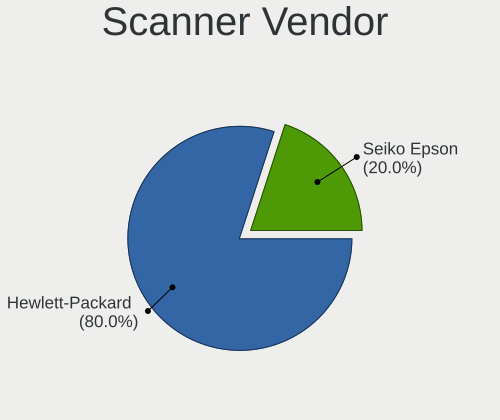

| Vendor          | Computers | Percent |
|-----------------|-----------|---------|
| Hewlett-Packard | 6         | 75%     |
| Seiko Epson     | 2         | 25%     |

Scanner Model
-------------

Scanner device models

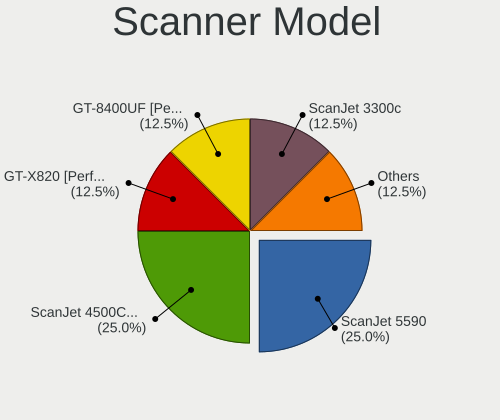

| Model                                              | Computers | Percent |
|----------------------------------------------------|-----------|---------|
| HP ScanJet 5590                                    | 2         | 25%     |
| HP ScanJet 4500C/5550C                             | 2         | 25%     |
| Seiko Epson GT-X820 [Perfection V600 Photo]        | 1         | 12.5%   |
| Seiko Epson GT-8400UF [Perfection 1670/1670 PHOTO] | 1         | 12.5%   |
| HP ScanJet 3300c                                   | 1         | 12.5%   |
| HP HP Scanjet 300                                  | 1         | 12.5%   |

Camera
------

Camera Vendor
-------------

Camera device vendors

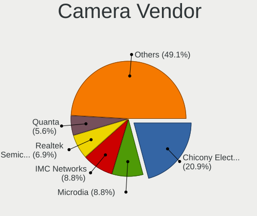

| Vendor                                 | Computers | Percent |
|----------------------------------------|-----------|---------|
| Chicony Electronics                    | 573       | 20.86%  |
| Microdia                               | 242       | 8.81%   |
| IMC Networks                           | 241       | 8.77%   |
| Realtek Semiconductor                  | 190       | 6.92%   |
| Quanta                                 | 153       | 5.57%   |
| Bison Electronics                      | 147       | 5.35%   |
| Sunplus Innovation Technology          | 143       | 5.21%   |
| Cheng Uei Precision Industry (Foxlink) | 134       | 4.88%   |
| Apple                                  | 111       | 4.04%   |
| Suyin                                  | 88        | 3.2%    |
| Logitech                               | 84        | 3.06%   |
| Syntek                                 | 78        | 2.84%   |
| Lite-On Technology                     | 75        | 2.73%   |
| Luxvisions Innotech Limited            | 46        | 1.67%   |
| Generalplus Technology                 | 36        | 1.31%   |
| Silicon Motion                         | 35        | 1.27%   |
| Alcor Micro                            | 28        | 1.02%   |
| Ricoh                                  | 26        | 0.95%   |
| Importek                               | 24        | 0.87%   |
| Sonix Technology                       | 22        | 0.8%    |
| Microsoft                              | 22        | 0.8%    |
| Acer                                   | 16        | 0.58%   |
| Z-Star Microelectronics                | 14        | 0.51%   |
| Samsung Electronics                    | 14        | 0.51%   |
| Primax Electronics                     | 13        | 0.47%   |
| MacroSilicon                           | 11        | 0.4%    |
| Jieli Technology                       | 11        | 0.4%    |
| GEMBIRD                                | 10        | 0.36%   |
| ALi                                    | 10        | 0.36%   |
| OmniVision Technologies                | 9         | 0.33%   |
| KYE Systems (Mouse Systems)            | 9         | 0.33%   |
| Y Media                                | 8         | 0.29%   |
| ShineTech                              | 6         | 0.22%   |
| LG Electronics                         | 6         | 0.22%   |
| icSpring                               | 6         | 0.22%   |
| HRY                                    | 6         | 0.22%   |
| Genesys Logic                          | 6         | 0.22%   |
| SunplusIT                              | 5         | 0.18%   |
| Lenovo                                 | 4         | 0.15%   |
| Hewlett-Packard                        | 4         | 0.15%   |

Camera Model
------------

Camera device models

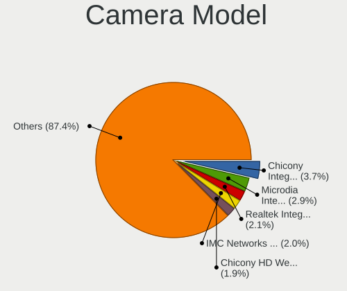

| Model                                                          | Computers | Percent |
|----------------------------------------------------------------|-----------|---------|
| Chicony Integrated Camera                                      | 102       | 3.68%   |
| Microdia Integrated_Webcam_HD                                  | 81        | 2.92%   |
| Realtek Integrated_Webcam_HD                                   | 58        | 2.09%   |
| IMC Networks Integrated Camera                                 | 56        | 2.02%   |
| Chicony HD WebCam                                              | 53        | 1.91%   |
| Sunplus Integrated_Webcam_HD                                   | 52        | 1.88%   |
| Bison Integrated Camera                                        | 52        | 1.88%   |
| IMC Networks USB2.0 HD UVC WebCam                              | 49        | 1.77%   |
| Apple FaceTime HD Camera                                       | 41        | 1.48%   |
| Syntek Integrated Camera                                       | 36        | 1.3%    |
| IMC Networks HD Camera                                         | 33        | 1.19%   |
| Logitech HD Pro Webcam C920                                    | 29        | 1.05%   |
| IMC Networks USB2.0 VGA UVC WebCam                             | 29        | 1.05%   |
| Chicony HP Webcam                                              | 28        | 1.01%   |
| Chicony HP Truevision HD                                       | 28        | 1.01%   |
| Generalplus GENERAL WEBCAM                                     | 27        | 0.97%   |
| Chicony HP TrueVision HD Camera                                | 27        | 0.97%   |
| Quanta HP Webcam                                               | 26        | 0.94%   |
| Apple Built-in iSight                                          | 26        | 0.94%   |
| Apple FaceTime HD Camera (Built-in)                            | 25        | 0.9%    |
| Cheng Uei Precision Industry (Foxlink) HD Camera               | 22        | 0.79%   |
| Lite-On HP Wide Vision HD Camera                               | 21        | 0.76%   |
| Microdia Integrated Webcam                                     | 20        | 0.72%   |
| IMC Networks ov9734_azurewave_camera                           | 20        | 0.72%   |
| IMC Networks EasyCamera                                        | 20        | 0.72%   |
| Cheng Uei Precision Industry (Foxlink) HP Webcam               | 20        | 0.72%   |
| Cheng Uei Precision Industry (Foxlink) HP TrueVision HD Camera | 20        | 0.72%   |
| Quanta HP TrueVision HD Camera                                 | 19        | 0.69%   |
| Microdia Integrated Camera                                     | 19        | 0.69%   |
| Chicony USB 2.0 Camera                                         | 19        | 0.69%   |
| Bison EasyCamera                                               | 19        | 0.69%   |
| Syntek Lenovo EasyCamera                                       | 17        | 0.61%   |
| Microdia Sonix USB 2.0 Camera                                  | 17        | 0.61%   |
| Logitech Webcam C270                                           | 16        | 0.58%   |
| Chicony TOSHIBA Web Camera - HD                                | 16        | 0.58%   |
| Cheng Uei Precision Industry (Foxlink) HP TrueVision HD        | 16        | 0.58%   |
| Sunplus HD WebCam                                              | 15        | 0.54%   |
| Quanta ov9734_techfront_camera                                 | 15        | 0.54%   |
| Microdia Lenovo EasyCamera                                     | 15        | 0.54%   |
| Luxvisions Innotech Limited HP TrueVision HD Camera            | 15        | 0.54%   |

Security
--------

Fingerprint Vendor
------------------

Fingerprint sensor vendors

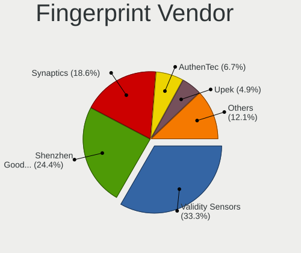

| Vendor                             | Computers | Percent |
|------------------------------------|-----------|---------|
| Validity Sensors                   | 149       | 33.33%  |
| Shenzhen Goodix Technology         | 109       | 24.38%  |
| Synaptics                          | 83        | 18.57%  |
| AuthenTec                          | 30        | 6.71%   |
| Upek                               | 22        | 4.92%   |
| Elan Microelectronics              | 22        | 4.92%   |
| Focal-systems.Corp                 | 9         | 2.01%   |
| STMicroelectronics                 | 6         | 1.34%   |
| LighTuning Technology              | 6         | 1.34%   |
| DigitalPersona                     | 3         | 0.67%   |
| Samsung Electronics                | 2         | 0.45%   |
| Realtek USB2.0 Finger Print Bridge | 2         | 0.45%   |
| Suprema                            | 1         | 0.22%   |
| Netchip Technology                 | 1         | 0.22%   |
| HOLTEK                             | 1         | 0.22%   |
| GDMicroelectronics                 | 1         | 0.22%   |

Fingerprint Model
-----------------

Fingerprint sensor models

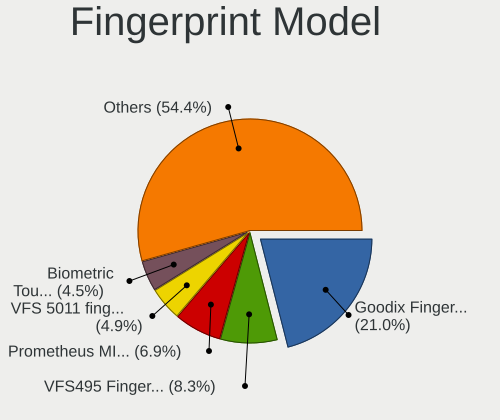

| Model                                                                      | Computers | Percent |
|----------------------------------------------------------------------------|-----------|---------|
| Shenzhen Goodix  Fingerprint Device                                        | 94        | 21.03%  |
| Validity Sensors VFS495 Fingerprint Reader                                 | 37        | 8.28%   |
| Synaptics Prometheus MIS Touch Fingerprint Reader                          | 31        | 6.94%   |
| Validity Sensors VFS 5011 fingerprint sensor                               | 22        | 4.92%   |
| Upek Biometric Touchchip/Touchstrip Fingerprint Sensor                     | 20        | 4.47%   |
| AuthenTec AES2501 Fingerprint Sensor                                       | 16        | 3.58%   |
| Validity Sensors VFS5011 Fingerprint Reader                                | 15        | 3.36%   |
| Synaptics Metallica MIS Touch Fingerprint Reader                           | 15        | 3.36%   |
| Validity Sensors VFS471 Fingerprint Reader                                 | 14        | 3.13%   |
| Shenzhen Goodix Fingerprint Reader                                         | 12        | 2.68%   |
| Validity Sensors Synaptics WBDI                                            | 11        | 2.46%   |
| Elan ELAN:Fingerprint                                                      | 11        | 2.46%   |
| Elan ELAN:ARM-M4                                                           | 11        | 2.46%   |
| Validity Sensors VFS491                                                    | 10        | 2.24%   |
| Focal-systems.Corp FT9201Fingerprint.                                      | 9         | 2.01%   |
| Validity Sensors VFS7500 Touch Fingerprint Sensor                          | 8         | 1.79%   |
| AuthenTec AES2810                                                          | 8         | 1.79%   |
| Validity Sensors Synaptics VFS7552 Touch Fingerprint Sensor with PurePrint | 7         | 1.57%   |
| Synaptics WBDI                                                             | 7         | 1.57%   |
| Synaptics FS7604 Touch Fingerprint Sensor with PurePrint                   | 6         | 1.34%   |
| STMicroelectronics Fingerprint Reader                                      | 6         | 1.34%   |
| Validity Sensors VFS451 Fingerprint Reader                                 | 5         | 1.12%   |
| Validity Sensors VFS101 Fingerprint Reader                                 | 5         | 1.12%   |
| Validity Sensors Swipe Fingerprint Sensor                                  | 5         | 1.12%   |
| LighTuning EgisTec Touch Fingerprint Sensor                                | 5         | 1.12%   |
| Validity Sensors VFS301 Fingerprint Reader                                 | 4         | 0.89%   |
| Validity Sensors Fingerprint scanner                                       | 3         | 0.67%   |
| Synaptics WBDI Fingerprint Reader USB 086                                  | 3         | 0.67%   |
| Synaptics UWP WBDI Device                                                  | 3         | 0.67%   |
| Synaptics  WBDI                                                            | 3         | 0.67%   |
| Synaptics Prometheus Fingerprint Reader                                    | 3         | 0.67%   |
| Synaptics Fingerprint reader [HP G6]                                       | 3         | 0.67%   |
| Shenzhen Goodix FingerPrint                                                | 3         | 0.67%   |
| AuthenTec Fingerprint Sensor                                               | 3         | 0.67%   |
| AuthenTec AES1600                                                          | 3         | 0.67%   |
| Validity Sensors VFS Fingerprint sensor                                    | 2         | 0.45%   |
| Upek TCS5B Fingerprint sensor                                              | 2         | 0.45%   |
| Synaptics UWP WBDI                                                         | 2         | 0.45%   |
| Synaptics  FS7604 Touch Fingerprint Sensor with PurePrint                  | 2         | 0.45%   |
| Synaptics Metallica MOH Touch Fingerprint Reader                           | 2         | 0.45%   |

Chipcard Vendor
---------------

Chipcard module vendors

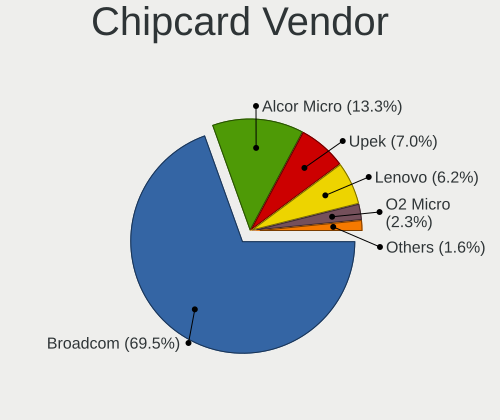

| Vendor                | Computers | Percent |
|-----------------------|-----------|---------|
| Broadcom              | 89        | 69.53%  |
| Alcor Micro           | 17        | 13.28%  |
| Upek                  | 9         | 7.03%   |
| Lenovo                | 8         | 6.25%   |
| O2 Micro              | 3         | 2.34%   |
| Gemalto (was Gemplus) | 1         | 0.78%   |
| Advanced Card Systems | 1         | 0.78%   |

Chipcard Model
--------------

Chipcard module models

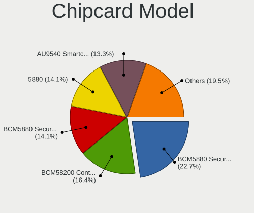

| Model                                                                        | Computers | Percent |
|------------------------------------------------------------------------------|-----------|---------|
| Broadcom BCM5880 Secure Applications Processor                               | 29        | 22.66%  |
| Broadcom BCM58200 ControlVault 3 (FingerPrint sensor + Contacted SmartCard)  | 21        | 16.41%  |
| Broadcom BCM5880 Secure Applications Processor with fingerprint swipe sensor | 18        | 14.06%  |
| Broadcom 5880                                                                | 18        | 14.06%  |
| Alcor Micro AU9540 Smartcard Reader                                          | 17        | 13.28%  |
| Upek TouchChip Fingerprint Coprocessor (WBF advanced mode)                   | 9         | 7.03%   |
| Lenovo Integrated Smart Card Reader                                          | 8         | 6.25%   |
| O2 Micro OZ776 CCID Smartcard Reader                                         | 3         | 2.34%   |
| Broadcom 58200                                                               | 2         | 1.56%   |
| Gemalto (was Gemplus) Compact Smart Card Reader Writer                       | 1         | 0.78%   |
| Broadcom BCM5880 Secure Applications Processor with fingerprint touch sensor | 1         | 0.78%   |
| Advanced Card Systems ACR122U                                                | 1         | 0.78%   |

Unsupported
-----------

Unsupported Devices
-------------------

Total unsupported devices on board

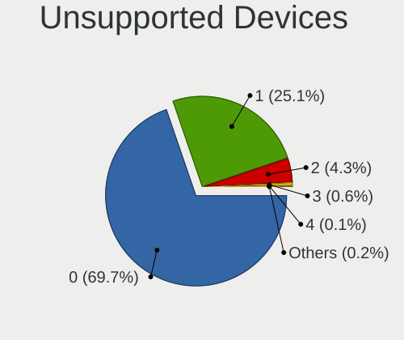

| Total | Computers | Percent |
|-------|-----------|---------|
| 0     | 2961      | 69.74%  |
| 1     | 1066      | 25.11%  |
| 2     | 184       | 4.33%   |
| 3     | 24        | 0.57%   |
| 4     | 4         | 0.09%   |
| 5     | 3         | 0.07%   |
| 6     | 2         | 0.05%   |
| 8     | 1         | 0.02%   |
| 7     | 1         | 0.02%   |

Unsupported Device Types
------------------------

Types of unsupported devices

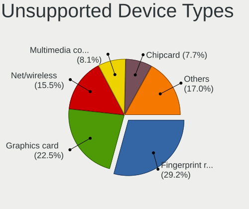

| Type                     | Computers | Percent |
|--------------------------|-----------|---------|
| Fingerprint reader       | 443       | 29.24%  |
| Graphics card            | 341       | 22.51%  |
| Net/wireless             | 235       | 15.51%  |
| Multimedia controller    | 122       | 8.05%   |
| Chipcard                 | 117       | 7.72%   |
| Communication controller | 58        | 3.83%   |
| Camera                   | 44        | 2.9%    |
| Bluetooth                | 42        | 2.77%   |
| Unassigned class         | 21        | 1.39%   |
| Sound                    | 20        | 1.32%   |
| Net/ethernet             | 17        | 1.12%   |
| Storage                  | 15        | 0.99%   |
| Card reader              | 12        | 0.79%   |
| Network                  | 8         | 0.53%   |
| Modem                    | 6         | 0.4%    |
| Storage/raid             | 4         | 0.26%   |
| Storage/ide              | 3         | 0.2%    |
| Firewire controller      | 2         | 0.13%   |
| Video                    | 1         | 0.07%   |
| Tv card                  | 1         | 0.07%   |
| Storage/nvme             | 1         | 0.07%   |
| Storage/ata              | 1         | 0.07%   |
| Dvb card                 | 1         | 0.07%   |

