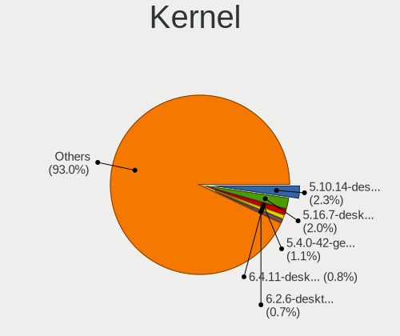
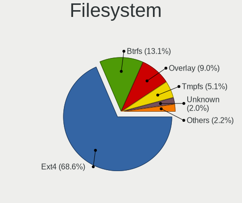
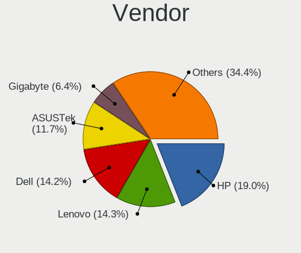
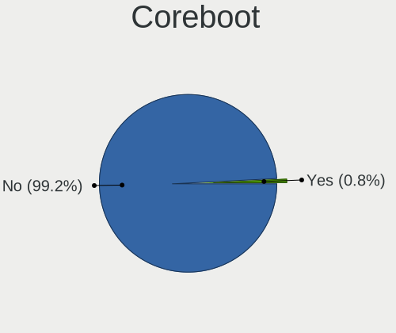
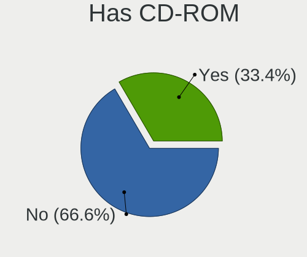
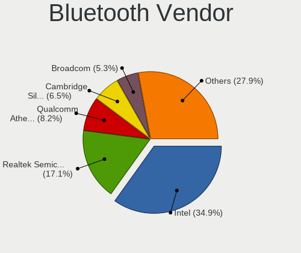
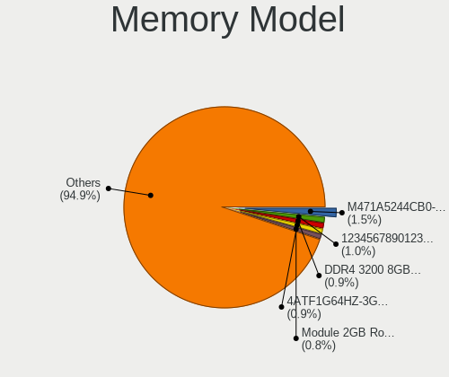
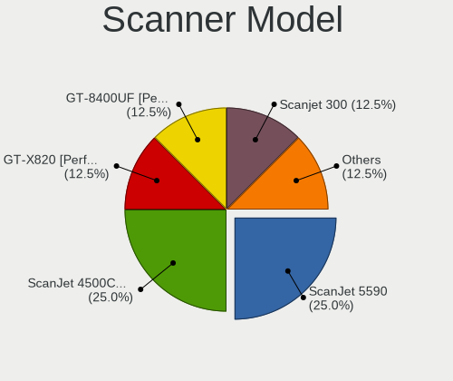

Linux in Mexico - Tested Hardware & Statistics
----------------------------------------------

A project to collect tested hardware configurations for Linux in Mexico.

Anyone can contribute to this report by the [hw-probe](https://github.com/linuxhw/hw-probe) tool:

    sudo -E hw-probe -all -upload

Please contribute! Especially if your hardware is rare.

This is a report for all computer types. See also reports for [desktops](/Location/Mexico/Desktop/README.md) and [notebooks](/Location/Mexico/Notebook/README.md).

Contents
--------

* [ Test Cases ](#test-cases)

* [ System ](#system)
  - [ OS                       ](#os)
  - [ OS Family                ](#os-family)
  - [ Kernel                   ](#kernel)
  - [ Kernel Family            ](#kernel-family)
  - [ Kernel Major Ver.        ](#kernel-major-ver)
  - [ Arch                     ](#arch)
  - [ DE                       ](#de)
  - [ Display Server           ](#display-server)
  - [ Display Manager          ](#display-manager)
  - [ OS Lang                  ](#os-lang)
  - [ Boot Mode                ](#boot-mode)
  - [ Filesystem               ](#filesystem)
  - [ Part. scheme             ](#part-scheme)
  - [ Dual Boot with Linux/BSD ](#dual-boot-with-linuxbsd)
  - [ Dual Boot (Win)          ](#dual-boot-win)

* [ Board ](#board)
  - [ Vendor                   ](#vendor)
  - [ Model                    ](#model)
  - [ Model Family             ](#model-family)
  - [ MFG Year                 ](#mfg-year)
  - [ Form Factor              ](#form-factor)
  - [ Secure Boot              ](#secure-boot)
  - [ Coreboot                 ](#coreboot)
  - [ RAM Size                 ](#ram-size)
  - [ RAM Used                 ](#ram-used)
  - [ Total Drives             ](#total-drives)
  - [ Has CD-ROM               ](#has-cd-rom)
  - [ Has Ethernet             ](#has-ethernet)
  - [ Has WiFi                 ](#has-wifi)
  - [ Has Bluetooth            ](#has-bluetooth)

* [ Location ](#location)
  - [ Country                  ](#country)
  - [ City                     ](#city)

* [ Drives ](#drives)
  - [ Drive Vendor             ](#drive-vendor)
  - [ Drive Model              ](#drive-model)
  - [ HDD Vendor               ](#hdd-vendor)
  - [ SSD Vendor               ](#ssd-vendor)
  - [ Drive Kind               ](#drive-kind)
  - [ Drive Connector          ](#drive-connector)
  - [ Drive Size               ](#drive-size)
  - [ Space Total              ](#space-total)
  - [ Space Used               ](#space-used)
  - [ Malfunc. Drives          ](#malfunc-drives)
  - [ Malfunc. Drive Vendor    ](#malfunc-drive-vendor)
  - [ Malfunc. HDD Vendor      ](#malfunc-hdd-vendor)
  - [ Malfunc. Drive Kind      ](#malfunc-drive-kind)
  - [ Failed Drives            ](#failed-drives)
  - [ Failed Drive Vendor      ](#failed-drive-vendor)
  - [ Drive Status             ](#drive-status)

* [ Storage controller ](#storage-controller)
  - [ Storage Vendor           ](#storage-vendor)
  - [ Storage Model            ](#storage-model)
  - [ Storage Kind             ](#storage-kind)

* [ Processor ](#processor)
  - [ CPU Vendor               ](#cpu-vendor)
  - [ CPU Model                ](#cpu-model)
  - [ CPU Model Family         ](#cpu-model-family)
  - [ CPU Cores                ](#cpu-cores)
  - [ CPU Sockets              ](#cpu-sockets)
  - [ CPU Threads              ](#cpu-threads)
  - [ CPU Op-Modes             ](#cpu-op-modes)
  - [ CPU Microcode            ](#cpu-microcode)
  - [ CPU Microarch            ](#cpu-microarch)

* [ Graphics ](#graphics)
  - [ GPU Vendor               ](#gpu-vendor)
  - [ GPU Model                ](#gpu-model)
  - [ GPU Combo                ](#gpu-combo)
  - [ GPU Driver               ](#gpu-driver)
  - [ GPU Memory               ](#gpu-memory)

* [ Monitor ](#monitor)
  - [ Monitor Vendor           ](#monitor-vendor)
  - [ Monitor Model            ](#monitor-model)
  - [ Monitor Resolution       ](#monitor-resolution)
  - [ Monitor Diagonal         ](#monitor-diagonal)
  - [ Monitor Width            ](#monitor-width)
  - [ Aspect Ratio             ](#aspect-ratio)
  - [ Monitor Area             ](#monitor-area)
  - [ Pixel Density            ](#pixel-density)
  - [ Multiple Monitors        ](#multiple-monitors)

* [ Network ](#network)
  - [ Net Controller Vendor    ](#net-controller-vendor)
  - [ Net Controller Model     ](#net-controller-model)
  - [ Wireless Vendor          ](#wireless-vendor)
  - [ Wireless Model           ](#wireless-model)
  - [ Ethernet Vendor          ](#ethernet-vendor)
  - [ Ethernet Model           ](#ethernet-model)
  - [ Net Controller Kind      ](#net-controller-kind)
  - [ Used Controller          ](#used-controller)
  - [ NICs                     ](#nics)
  - [ IPv6                     ](#ipv6)

* [ Bluetooth ](#bluetooth)
  - [ Bluetooth Vendor         ](#bluetooth-vendor)
  - [ Bluetooth Model          ](#bluetooth-model)

* [ Sound ](#sound)
  - [ Sound Vendor             ](#sound-vendor)
  - [ Sound Model              ](#sound-model)

* [ Memory ](#memory)
  - [ Memory Vendor            ](#memory-vendor)
  - [ Memory Model             ](#memory-model)
  - [ Memory Kind              ](#memory-kind)
  - [ Memory Form Factor       ](#memory-form-factor)
  - [ Memory Size              ](#memory-size)
  - [ Memory Speed             ](#memory-speed)

* [ Printers & scanners ](#printers--scanners)
  - [ Printer Vendor           ](#printer-vendor)
  - [ Printer Model            ](#printer-model)
  - [ Scanner Vendor           ](#scanner-vendor)
  - [ Scanner Model            ](#scanner-model)

* [ Camera ](#camera)
  - [ Camera Vendor            ](#camera-vendor)
  - [ Camera Model             ](#camera-model)

* [ Security ](#security)
  - [ Fingerprint Vendor       ](#fingerprint-vendor)
  - [ Fingerprint Model        ](#fingerprint-model)
  - [ Chipcard Vendor          ](#chipcard-vendor)
  - [ Chipcard Model           ](#chipcard-model)

* [ Unsupported ](#unsupported)
  - [ Unsupported Devices      ](#unsupported-devices)
  - [ Unsupported Device Types ](#unsupported-device-types)

Test Cases
----------

Total: 2541

| Vendor        | Model                       | Form-Factor | Probe                                                      | Date         |
|---------------|-----------------------------|-------------|------------------------------------------------------------|--------------|
| Lenovo        | IdeaPad 330S-15IKB 81F5     | Notebook    | [46d0c349d6](https://linux-hardware.org/?probe=46d0c349d6) | May 07, 2022 |
| HP            | OMEN Laptop 15-en0xxx       | Notebook    | [38f5d37dcc](https://linux-hardware.org/?probe=38f5d37dcc) | May 07, 2022 |
| Dell          | 008R9M A02                  | Server      | [02f8e21fa8](https://linux-hardware.org/?probe=02f8e21fa8) | May 06, 2022 |
| Dell          | 072T6D A01                  | Server      | [4b88759a98](https://linux-hardware.org/?probe=4b88759a98) | May 06, 2022 |
| HP            | Pavilion 14                 | Notebook    | [2bd48eeb41](https://linux-hardware.org/?probe=2bd48eeb41) | May 06, 2022 |
| HP            | 2129                        | Desktop     | [0484ca29c5](https://linux-hardware.org/?probe=0484ca29c5) | May 06, 2022 |
| HP            | 158A                        | Desktop     | [842aab71bd](https://linux-hardware.org/?probe=842aab71bd) | May 06, 2022 |
| HP            | 158B                        | Desktop     | [a613debdee](https://linux-hardware.org/?probe=a613debdee) | May 06, 2022 |
| HP            | 158A                        | Desktop     | [4f2832143b](https://linux-hardware.org/?probe=4f2832143b) | May 06, 2022 |
| HP            | 2129                        | Desktop     | [1fb7e49116](https://linux-hardware.org/?probe=1fb7e49116) | May 06, 2022 |
| HP            | 158B                        | Desktop     | [21f9c188f3](https://linux-hardware.org/?probe=21f9c188f3) | May 06, 2022 |
| Dell          | 072T6D A01                  | Server      | [1c1e47824e](https://linux-hardware.org/?probe=1c1e47824e) | May 06, 2022 |
| Dell          | 0X2MKR A00                  | All in one  | [23c1cdc921](https://linux-hardware.org/?probe=23c1cdc921) | May 05, 2022 |
| Apple         | MacBookAir6,2               | Notebook    | [d04d5e927d](https://linux-hardware.org/?probe=d04d5e927d) | May 05, 2022 |
| Gigabyte      | B550M AORUS ELITE           | Desktop     | [3a3a4e634d](https://linux-hardware.org/?probe=3a3a4e634d) | May 05, 2022 |
| Dell          | 00V62H A01                  | Desktop     | [fc3604980a](https://linux-hardware.org/?probe=fc3604980a) | May 04, 2022 |
| Lenovo        | ThinkPad L412 0585AV3       | Notebook    | [4208da52ad](https://linux-hardware.org/?probe=4208da52ad) | May 04, 2022 |
| Dell          | 072T6D A01                  | Server      | [d60ed32364](https://linux-hardware.org/?probe=d60ed32364) | May 04, 2022 |
| Dell          | 072T6D A01                  | Server      | [4fe1d33c99](https://linux-hardware.org/?probe=4fe1d33c99) | May 04, 2022 |
| ASUSTek       | VM65N-K                     | Desktop     | [9df63c1d99](https://linux-hardware.org/?probe=9df63c1d99) | May 04, 2022 |
| HP            | Compaq 6830s (FR883LA#AB... | Notebook    | [a3eb29c75d](https://linux-hardware.org/?probe=a3eb29c75d) | May 04, 2022 |
| HP            | 3047h                       | Desktop     | [bc2b3d4c04](https://linux-hardware.org/?probe=bc2b3d4c04) | May 04, 2022 |
| Dell          | Latitude 7420               | Notebook    | [a0bd1ee0f4](https://linux-hardware.org/?probe=a0bd1ee0f4) | May 03, 2022 |
| Gigabyte      | B550M AORUS ELITE           | Desktop     | [ea29468949](https://linux-hardware.org/?probe=ea29468949) | May 03, 2022 |
| Dell          | Inspiron 7506 2n1           | Convertible | [d943b0302e](https://linux-hardware.org/?probe=d943b0302e) | May 02, 2022 |
| Sony          | VPCF236FM                   | Notebook    | [ec0af02205](https://linux-hardware.org/?probe=ec0af02205) | May 02, 2022 |
| Gigabyte      | G1.Sniper A88X-CF           | Desktop     | [7f9e8dd9f6](https://linux-hardware.org/?probe=7f9e8dd9f6) | May 02, 2022 |
| Acer          | Aspire V5-561               | Notebook    | [e9dfda82d4](https://linux-hardware.org/?probe=e9dfda82d4) | May 02, 2022 |
| Gigabyte      | G1.Sniper A88X-CF           | Desktop     | [4c46bd89cf](https://linux-hardware.org/?probe=4c46bd89cf) | May 01, 2022 |
| Dell          | Latitude E5550              | Notebook    | [42a576bd39](https://linux-hardware.org/?probe=42a576bd39) | May 01, 2022 |
| HP            | Pavilion 13 x2 PC           | Notebook    | [fbb6d3b97e](https://linux-hardware.org/?probe=fbb6d3b97e) | May 01, 2022 |
| HP            | Pavilion 13 x2 PC           | Notebook    | [d594f3335c](https://linux-hardware.org/?probe=d594f3335c) | May 01, 2022 |
| ASUSTek       | X202E                       | Notebook    | [37ad2923f5](https://linux-hardware.org/?probe=37ad2923f5) | May 01, 2022 |
| Lenovo        | IdeaPad Flex-14API 81SS     | Notebook    | [f5d70fb9d3](https://linux-hardware.org/?probe=f5d70fb9d3) | Apr 30, 2022 |
| ASUSTek       | Lancaster8                  | Desktop     | [912f9bb3f9](https://linux-hardware.org/?probe=912f9bb3f9) | Apr 30, 2022 |
| Gigabyte      | G1.Sniper A88X-CF           | Desktop     | [89323fb22d](https://linux-hardware.org/?probe=89323fb22d) | Apr 30, 2022 |
| HP            | 1497                        | Desktop     | [559a844943](https://linux-hardware.org/?probe=559a844943) | Apr 30, 2022 |
| Lenovo        | S10-3                       | Notebook    | [712c2dced9](https://linux-hardware.org/?probe=712c2dced9) | Apr 30, 2022 |
| ASUSTek       | M5A78L-M PLUS/USB3          | Desktop     | [88c6676e7b](https://linux-hardware.org/?probe=88c6676e7b) | Apr 29, 2022 |
| Gigabyte      | G1.Sniper A88X-CF           | Desktop     | [c64aa4070a](https://linux-hardware.org/?probe=c64aa4070a) | Apr 29, 2022 |
| ASUSTek       | M5A78L-M PLUS/USB3          | Desktop     | [f2bdbd2a4a](https://linux-hardware.org/?probe=f2bdbd2a4a) | Apr 29, 2022 |
| HUAWEI        | HVY-WXX9                    | Notebook    | [824ccc1317](https://linux-hardware.org/?probe=824ccc1317) | Apr 27, 2022 |
| Lanix         | EQ45M-S2 LNXACT             | Desktop     | [485f464d12](https://linux-hardware.org/?probe=485f464d12) | Apr 27, 2022 |
| Toshiba       | Satellite C55-C             | Notebook    | [35e8d13a74](https://linux-hardware.org/?probe=35e8d13a74) | Apr 27, 2022 |
| Lenovo        | IdeaPad 310-14ISK 80SL      | Notebook    | [a57363e60a](https://linux-hardware.org/?probe=a57363e60a) | Apr 27, 2022 |
| Toshiba       | Satellite L735D             | Notebook    | [4bd23809e6](https://linux-hardware.org/?probe=4bd23809e6) | Apr 27, 2022 |
| Toshiba       | Satellite L735D             | Notebook    | [a832b721e3](https://linux-hardware.org/?probe=a832b721e3) | Apr 27, 2022 |
| Toshiba       | Satellite C55-C             | Notebook    | [d48006a0b2](https://linux-hardware.org/?probe=d48006a0b2) | Apr 26, 2022 |
| Toshiba       | Satellite C55-C             | Notebook    | [e9bc1aaf05](https://linux-hardware.org/?probe=e9bc1aaf05) | Apr 26, 2022 |
| Gigabyte      | G1.Sniper A88X-CF           | Desktop     | [392c7e4d0d](https://linux-hardware.org/?probe=392c7e4d0d) | Apr 25, 2022 |
| Dell          | Inspiron 5577               | Notebook    | [0925d92173](https://linux-hardware.org/?probe=0925d92173) | Apr 25, 2022 |
| ASUSTek       | PRO A320M-R WI-FI           | Desktop     | [0cbc3290f0](https://linux-hardware.org/?probe=0cbc3290f0) | Apr 25, 2022 |
| Lenovo        | ThinkPad E460 20ET000YLM    | Notebook    | [c82beac367](https://linux-hardware.org/?probe=c82beac367) | Apr 23, 2022 |
| HUAWEI        | HVY-WXX9                    | Notebook    | [56d949b3bb](https://linux-hardware.org/?probe=56d949b3bb) | Apr 23, 2022 |
| ASUSTek       | K46CA                       | Notebook    | [e762eba391](https://linux-hardware.org/?probe=e762eba391) | Apr 23, 2022 |
| HP            | EliteBook 8570w             | Notebook    | [0a4b339d0f](https://linux-hardware.org/?probe=0a4b339d0f) | Apr 23, 2022 |
| ASUSTek       | ROG STRIX B450-F GAMING ... | Desktop     | [2bcb31328e](https://linux-hardware.org/?probe=2bcb31328e) | Apr 23, 2022 |
| Chuwi         | Unknown                     | Notebook    | [96105ecbb2](https://linux-hardware.org/?probe=96105ecbb2) | Apr 23, 2022 |
| Gigabyte      | B550M AORUS ELITE           | Desktop     | [acc082b594](https://linux-hardware.org/?probe=acc082b594) | Apr 22, 2022 |
| Gigabyte      | B560M AORUS PRO AX          | Desktop     | [61ca629904](https://linux-hardware.org/?probe=61ca629904) | Apr 20, 2022 |
| Gigabyte      | B560M AORUS PRO AX          | Desktop     | [c722e417a1](https://linux-hardware.org/?probe=c722e417a1) | Apr 20, 2022 |
| HP            | 3047h                       | Desktop     | [36a3e2ab98](https://linux-hardware.org/?probe=36a3e2ab98) | Apr 20, 2022 |
| AMI           | Aptio CRB                   | Mini pc     | [b720cd5fc5](https://linux-hardware.org/?probe=b720cd5fc5) | Apr 20, 2022 |
| Lenovo        | ThinkPad W530 2463A49       | Notebook    | [202b5d34a1](https://linux-hardware.org/?probe=202b5d34a1) | Apr 18, 2022 |
| Lenovo        | ThinkPad L412 0585AV3       | Notebook    | [55186a3c2e](https://linux-hardware.org/?probe=55186a3c2e) | Apr 18, 2022 |
| Lenovo        | ThinkPad L420 7829BH2       | Notebook    | [726f69890c](https://linux-hardware.org/?probe=726f69890c) | Apr 17, 2022 |
| HP            | 14                          | Notebook    | [71f296bd93](https://linux-hardware.org/?probe=71f296bd93) | Apr 17, 2022 |
| Lenovo        | ThinkPad L412 0585AV3       | Notebook    | [382836d952](https://linux-hardware.org/?probe=382836d952) | Apr 16, 2022 |
| Acer          | Aspire R3-131T              | Notebook    | [776575ecdb](https://linux-hardware.org/?probe=776575ecdb) | Apr 16, 2022 |
| Gigabyte      | G1.Sniper A88X-CF           | Desktop     | [5971999c12](https://linux-hardware.org/?probe=5971999c12) | Apr 16, 2022 |
| ASUSTek       | PRIME B450M-A II            | Desktop     | [bdc8f9b39e](https://linux-hardware.org/?probe=bdc8f9b39e) | Apr 15, 2022 |
| Lenovo        | G40-45 80E1                 | Notebook    | [840ffde0c4](https://linux-hardware.org/?probe=840ffde0c4) | Apr 15, 2022 |
| Lenovo        | ThinkPad X1 Carbon 5th 2... | Notebook    | [086a94d83c](https://linux-hardware.org/?probe=086a94d83c) | Apr 15, 2022 |
| Sony          | VPCEE23FX                   | Notebook    | [4c7634a096](https://linux-hardware.org/?probe=4c7634a096) | Apr 15, 2022 |
| Dell          | 0WMJ54 A01                  | Desktop     | [d113301081](https://linux-hardware.org/?probe=d113301081) | Apr 14, 2022 |
| HP            | 0A54h                       | Desktop     | [11c5e77be7](https://linux-hardware.org/?probe=11c5e77be7) | Apr 14, 2022 |
| Lenovo        | Legion 7 15IMH05 81YT       | Notebook    | [25c2200e11](https://linux-hardware.org/?probe=25c2200e11) | Apr 14, 2022 |
| HP            | Laptop 14-cm0xxx            | Notebook    | [d6463e4014](https://linux-hardware.org/?probe=d6463e4014) | Apr 14, 2022 |
| HUAWEI        | KLVL-WXXW                   | Notebook    | [8888d86504](https://linux-hardware.org/?probe=8888d86504) | Apr 13, 2022 |
| HP            | EliteBook 8570w             | Notebook    | [6faed9730c](https://linux-hardware.org/?probe=6faed9730c) | Apr 13, 2022 |
| Dell          | 0C2XKD A00                  | Desktop     | [4ece5fe0b7](https://linux-hardware.org/?probe=4ece5fe0b7) | Apr 13, 2022 |
| Acer          | Nitro AN515-41              | Notebook    | [b938e715f4](https://linux-hardware.org/?probe=b938e715f4) | Apr 13, 2022 |
| HP            | ProBook 650 G1              | Notebook    | [5d153a1030](https://linux-hardware.org/?probe=5d153a1030) | Apr 12, 2022 |
| ASUSTek       | M4A88T-M                    | Desktop     | [934e06ad74](https://linux-hardware.org/?probe=934e06ad74) | Apr 12, 2022 |
| HP            | ZBook 15                    | Notebook    | [c8c2248854](https://linux-hardware.org/?probe=c8c2248854) | Apr 11, 2022 |
| Toshiba       | Satellite L735D             | Notebook    | [47f0119635](https://linux-hardware.org/?probe=47f0119635) | Apr 10, 2022 |
| HP            | EliteBook 8570w             | Notebook    | [9d7c1a88d6](https://linux-hardware.org/?probe=9d7c1a88d6) | Apr 10, 2022 |
| HP            | Laptop 15-da1xxx            | Notebook    | [8d9c212045](https://linux-hardware.org/?probe=8d9c212045) | Apr 10, 2022 |
| ASUSTek       | N56DY                       | Notebook    | [aff377f6ed](https://linux-hardware.org/?probe=aff377f6ed) | Apr 09, 2022 |
| Dell          | Inspiron 5570               | Notebook    | [a75a1551fa](https://linux-hardware.org/?probe=a75a1551fa) | Apr 09, 2022 |
| HP            | ZBook 15                    | Notebook    | [ee70932ef2](https://linux-hardware.org/?probe=ee70932ef2) | Apr 09, 2022 |
| HP            | Pavilion dv6                | Notebook    | [9d37acefa0](https://linux-hardware.org/?probe=9d37acefa0) | Apr 09, 2022 |
| HP            | Pavilion x360 Convertibl... | Convertible | [320ae25dbf](https://linux-hardware.org/?probe=320ae25dbf) | Apr 09, 2022 |
| Sony          | VPCF236FM                   | Notebook    | [ea109b146b](https://linux-hardware.org/?probe=ea109b146b) | Apr 08, 2022 |
| Sony          | VPCF236FM                   | Notebook    | [aa210dfd36](https://linux-hardware.org/?probe=aa210dfd36) | Apr 08, 2022 |
| Toshiba       | NB505                       | Notebook    | [55f9f70b0b](https://linux-hardware.org/?probe=55f9f70b0b) | Apr 08, 2022 |
| Toshiba       | Satellite P775              | Notebook    | [3acd0b8861](https://linux-hardware.org/?probe=3acd0b8861) | Apr 08, 2022 |
| Dell          | Inspiron 5570               | Notebook    | [801e4fdab1](https://linux-hardware.org/?probe=801e4fdab1) | Apr 07, 2022 |
| Dell          | Latitude E5440              | Notebook    | [18a9d37c02](https://linux-hardware.org/?probe=18a9d37c02) | Apr 07, 2022 |
| MSI           | GL75 Leopard 10SDK          | Notebook    | [e168714dee](https://linux-hardware.org/?probe=e168714dee) | Apr 06, 2022 |
| Biostar       | H110MHC                     | Desktop     | [09715fbaf2](https://linux-hardware.org/?probe=09715fbaf2) | Apr 05, 2022 |
| HP            | ProLiant DL380 Gen9         | Server      | [b183986866](https://linux-hardware.org/?probe=b183986866) | Apr 05, 2022 |
| HP            | Stream Laptop 14-ax1xxx     | Notebook    | [a25b973df6](https://linux-hardware.org/?probe=a25b973df6) | Apr 05, 2022 |
| HP            | Stream Laptop 14-ax1xxx     | Notebook    | [4228c17983](https://linux-hardware.org/?probe=4228c17983) | Apr 05, 2022 |
| HP            | 0B48h                       | Desktop     | [7cd0cbb7b7](https://linux-hardware.org/?probe=7cd0cbb7b7) | Apr 05, 2022 |
| HP            | 245 G7 Notebook PC          | Notebook    | [9d26a79ca6](https://linux-hardware.org/?probe=9d26a79ca6) | Apr 05, 2022 |
| HP            | 245 G7 Notebook PC          | Notebook    | [54db9ac27f](https://linux-hardware.org/?probe=54db9ac27f) | Apr 05, 2022 |
| HP            | Pavilion 14                 | Notebook    | [136105017c](https://linux-hardware.org/?probe=136105017c) | Apr 04, 2022 |
| HP            | Presario CQ56               | Notebook    | [7233c29381](https://linux-hardware.org/?probe=7233c29381) | Apr 03, 2022 |
| Toshiba       | Satellite S855D             | Notebook    | [45b97d03ed](https://linux-hardware.org/?probe=45b97d03ed) | Apr 03, 2022 |
| Dell          | 0K240Y A03                  | Desktop     | [7e3ad9ce02](https://linux-hardware.org/?probe=7e3ad9ce02) | Apr 02, 2022 |
| Intel         | S2600CP G50768-505          | Server      | [cdfba65630](https://linux-hardware.org/?probe=cdfba65630) | Apr 01, 2022 |
| Apple         | MacBookPro9,2               | Notebook    | [f646cb03d2](https://linux-hardware.org/?probe=f646cb03d2) | Mar 31, 2022 |
| ASUSTek       | M5A97 EVO                   | Desktop     | [96cd3f3a03](https://linux-hardware.org/?probe=96cd3f3a03) | Mar 31, 2022 |
| ECS           | A55F-M4                     | Desktop     | [0d29bdddde](https://linux-hardware.org/?probe=0d29bdddde) | Mar 31, 2022 |
| Sony          | SVF14213CLB                 | Notebook    | [b87a95ae1a](https://linux-hardware.org/?probe=b87a95ae1a) | Mar 31, 2022 |
| Sony          | SVF14213CLB                 | Notebook    | [fecf079b63](https://linux-hardware.org/?probe=fecf079b63) | Mar 31, 2022 |
| Dell          | Venue 8 Pro 5855            | Notebook    | [35a463a0fb](https://linux-hardware.org/?probe=35a463a0fb) | Mar 31, 2022 |
| HUAWEI        | HVY-WXX9                    | Notebook    | [5af7df2c2a](https://linux-hardware.org/?probe=5af7df2c2a) | Mar 30, 2022 |
| HP            | 2B3B                        | All in one  | [032bb3134f](https://linux-hardware.org/?probe=032bb3134f) | Mar 30, 2022 |
| Acer          | Aspire one                  | Notebook    | [2b0b231b1a](https://linux-hardware.org/?probe=2b0b231b1a) | Mar 29, 2022 |
| Lenovo        | Legion 5 15ARH05 82B5       | Notebook    | [d346f2a1b1](https://linux-hardware.org/?probe=d346f2a1b1) | Mar 29, 2022 |
| HUAWEI        | CREM-WXX9                   | Notebook    | [67475db5e9](https://linux-hardware.org/?probe=67475db5e9) | Mar 29, 2022 |
| HUAWEI        | CREM-WXX9                   | Notebook    | [2c7227662f](https://linux-hardware.org/?probe=2c7227662f) | Mar 29, 2022 |
| Toshiba       | NB505                       | Notebook    | [cab0ce252d](https://linux-hardware.org/?probe=cab0ce252d) | Mar 27, 2022 |
| ASRock        | B550M Pro4                  | Desktop     | [4c69702c19](https://linux-hardware.org/?probe=4c69702c19) | Mar 27, 2022 |
| Dell          | Latitude E6510              | Notebook    | [4feee8c983](https://linux-hardware.org/?probe=4feee8c983) | Mar 26, 2022 |
| ASUSTek       | ROG STRIX X470-F GAMING     | Desktop     | [b625abc938](https://linux-hardware.org/?probe=b625abc938) | Mar 26, 2022 |
| Lanix         | EQ45M-S2 LNXACT             | Desktop     | [ab78b9c7a6](https://linux-hardware.org/?probe=ab78b9c7a6) | Mar 25, 2022 |
| Gigabyte      | A520M H                     | Desktop     | [0eb6fdc31d](https://linux-hardware.org/?probe=0eb6fdc31d) | Mar 25, 2022 |
| HP            | Pavilion 11 x360 PC         | Notebook    | [975bcd1031](https://linux-hardware.org/?probe=975bcd1031) | Mar 25, 2022 |
| ASUSTek       | Maximus IX HERO             | Desktop     | [745cc1d638](https://linux-hardware.org/?probe=745cc1d638) | Mar 25, 2022 |
| HP            | Laptop 15-bw0xx             | Notebook    | [eb140d5b4d](https://linux-hardware.org/?probe=eb140d5b4d) | Mar 25, 2022 |
| Sony          | SVT13125CLS                 | Notebook    | [5332da89c8](https://linux-hardware.org/?probe=5332da89c8) | Mar 25, 2022 |
| Gigabyte      | A320M-S2H-CF                | Desktop     | [a237859a86](https://linux-hardware.org/?probe=a237859a86) | Mar 24, 2022 |
| Biostar       | A10N-9630E                  | Desktop     | [08e8cd5735](https://linux-hardware.org/?probe=08e8cd5735) | Mar 24, 2022 |
| Lenovo        | IdeaPad 330-14AST 81D5      | Notebook    | [4b955479cc](https://linux-hardware.org/?probe=4b955479cc) | Mar 24, 2022 |
| Biostar       | G31D-M7                     | Desktop     | [9882f292ea](https://linux-hardware.org/?probe=9882f292ea) | Mar 24, 2022 |
| System76      | Gazelle                     | Notebook    | [5a83198dd6](https://linux-hardware.org/?probe=5a83198dd6) | Mar 24, 2022 |
| Acer          | Nitro AN515-54              | Notebook    | [4bb7650e38](https://linux-hardware.org/?probe=4bb7650e38) | Mar 23, 2022 |
| ASUSTek       | Maximus IX HERO             | Desktop     | [8eb98db533](https://linux-hardware.org/?probe=8eb98db533) | Mar 22, 2022 |
| HP            | 1589                        | Desktop     | [998f465bfc](https://linux-hardware.org/?probe=998f465bfc) | Mar 19, 2022 |
| Lenovo        | Unknown                     | Notebook    | [661ddbd0df](https://linux-hardware.org/?probe=661ddbd0df) | Mar 18, 2022 |
| ASUSTek       | SABERTOOTH 990FX R2.0       | Desktop     | [3be092b600](https://linux-hardware.org/?probe=3be092b600) | Mar 18, 2022 |
| HUAWEI        | HVY-WXX9                    | Notebook    | [e1f3c645b5](https://linux-hardware.org/?probe=e1f3c645b5) | Mar 17, 2022 |
| Lenovo        | ThinkPad T440 20B7S1PD0M    | Notebook    | [ed01dc4465](https://linux-hardware.org/?probe=ed01dc4465) | Mar 17, 2022 |
| HP            | EliteBook 8460p             | Notebook    | [6c0caa0de4](https://linux-hardware.org/?probe=6c0caa0de4) | Mar 17, 2022 |
| HUAWEI        | HVY-WXX9                    | Notebook    | [ddcbb702c6](https://linux-hardware.org/?probe=ddcbb702c6) | Mar 17, 2022 |
| Lenovo        | ThinkPad T440 20B7S1PD0M    | Notebook    | [dbed1562e8](https://linux-hardware.org/?probe=dbed1562e8) | Mar 17, 2022 |
| Gigabyte      | GA-A75M-DS2                 | Desktop     | [7e23b31c1b](https://linux-hardware.org/?probe=7e23b31c1b) | Mar 17, 2022 |
| HUAWEI        | HVY-WXX9                    | Notebook    | [d54d90820a](https://linux-hardware.org/?probe=d54d90820a) | Mar 17, 2022 |
| HP            | Pavilion 15                 | Notebook    | [29ac5f13cd](https://linux-hardware.org/?probe=29ac5f13cd) | Mar 16, 2022 |
| Raspberry ... | Raspberry Pi                | Soc         | [68aaea88ba](https://linux-hardware.org/?probe=68aaea88ba) | Mar 16, 2022 |
| Apple         | MacBookPro15,2              | Notebook    | [a77a1ff925](https://linux-hardware.org/?probe=a77a1ff925) | Mar 16, 2022 |
| AMI           | Aptio CRB                   | Mini pc     | [9e61aac69e](https://linux-hardware.org/?probe=9e61aac69e) | Mar 14, 2022 |
| AMI           | Aptio CRB                   | Mini pc     | [41fec60404](https://linux-hardware.org/?probe=41fec60404) | Mar 14, 2022 |
| Dell          | Latitude E6220              | Notebook    | [0dbd85da47](https://linux-hardware.org/?probe=0dbd85da47) | Mar 13, 2022 |
| Dell          | 0D28YY A00                  | Desktop     | [065495a18e](https://linux-hardware.org/?probe=065495a18e) | Mar 13, 2022 |
| Gigabyte      | H110M-DS2-CF                | Desktop     | [9cad95edc1](https://linux-hardware.org/?probe=9cad95edc1) | Mar 12, 2022 |
| Biostar       | A10N-9630E                  | Desktop     | [044fc47c7a](https://linux-hardware.org/?probe=044fc47c7a) | Mar 12, 2022 |
| Gigabyte      | H110M-H-CF                  | Desktop     | [c8474e89b8](https://linux-hardware.org/?probe=c8474e89b8) | Mar 11, 2022 |
| HP            | 1497                        | Desktop     | [7965a1ed31](https://linux-hardware.org/?probe=7965a1ed31) | Mar 11, 2022 |
| Dell          | G5 5505                     | Notebook    | [286d140bd5](https://linux-hardware.org/?probe=286d140bd5) | Mar 10, 2022 |
| Pegatron      | Benicia                     | Desktop     | [00bcb5f530](https://linux-hardware.org/?probe=00bcb5f530) | Mar 10, 2022 |
| HP            | ProBook 650 G1              | Notebook    | [046572a251](https://linux-hardware.org/?probe=046572a251) | Mar 09, 2022 |
| Gigabyte      | A520M H                     | Desktop     | [db7727accf](https://linux-hardware.org/?probe=db7727accf) | Mar 09, 2022 |
| Gigabyte      | A520M H                     | Desktop     | [b8038bbdc8](https://linux-hardware.org/?probe=b8038bbdc8) | Mar 09, 2022 |
| Lenovo        | ThinkPad L390 Yoga 20NT0... | Convertible | [1935867fe2](https://linux-hardware.org/?probe=1935867fe2) | Mar 09, 2022 |
| Apple         | Mac-942B5BF58194151B        | All in one  | [fe2249c404](https://linux-hardware.org/?probe=fe2249c404) | Mar 08, 2022 |
| Dell          | XPS 15 9570                 | Notebook    | [dd0ebc18ce](https://linux-hardware.org/?probe=dd0ebc18ce) | Mar 07, 2022 |
| ASUSTek       | PRIME A320M-K               | Desktop     | [515e875bbd](https://linux-hardware.org/?probe=515e875bbd) | Mar 07, 2022 |
| ASUSTek       | B85M-G R2.0                 | Desktop     | [673c6bd0db](https://linux-hardware.org/?probe=673c6bd0db) | Mar 07, 2022 |
| HP            | 0A64h                       | Desktop     | [75e39b1761](https://linux-hardware.org/?probe=75e39b1761) | Mar 07, 2022 |
| Acer          | Aspire E5-575               | Notebook    | [bc5e48379d](https://linux-hardware.org/?probe=bc5e48379d) | Mar 07, 2022 |
| Apple         | Mac-F65AE981FFA204ED Mac... | Mini pc     | [c3a014ca22](https://linux-hardware.org/?probe=c3a014ca22) | Mar 07, 2022 |
| Chuwi         | GemiBook                    | Notebook    | [60146fd918](https://linux-hardware.org/?probe=60146fd918) | Mar 07, 2022 |
| Intel         | DG41RQ AAE54511-205         | Desktop     | [36979f5dde](https://linux-hardware.org/?probe=36979f5dde) | Mar 07, 2022 |
| Acer          | Aspire VN7-572              | Notebook    | [952fd83515](https://linux-hardware.org/?probe=952fd83515) | Mar 06, 2022 |
| Unknown       | KN12A                       | Notebook    | [3ba6165509](https://linux-hardware.org/?probe=3ba6165509) | Mar 05, 2022 |
| Panasonic     | CF-30KTPA9NP                | Notebook    | [fffe3abd97](https://linux-hardware.org/?probe=fffe3abd97) | Mar 05, 2022 |
| Lenovo        | G40-70 20369                | Notebook    | [fd797ac0c1](https://linux-hardware.org/?probe=fd797ac0c1) | Mar 03, 2022 |
| Gigabyte      | A520M H                     | Desktop     | [1b45a09429](https://linux-hardware.org/?probe=1b45a09429) | Mar 03, 2022 |
| Apple         | Mac-942B5BF58194151B        | All in one  | [0ba7ca16b8](https://linux-hardware.org/?probe=0ba7ca16b8) | Mar 02, 2022 |
| Dell          | 0M5DCD A00                  | Desktop     | [91a666ba20](https://linux-hardware.org/?probe=91a666ba20) | Mar 02, 2022 |
| Chuwi         | GemiBook                    | Notebook    | [af28b0f0d8](https://linux-hardware.org/?probe=af28b0f0d8) | Mar 02, 2022 |
| Timi          | TM1612                      | Notebook    | [dc1c26b3a9](https://linux-hardware.org/?probe=dc1c26b3a9) | Mar 01, 2022 |
| Sony          | VGN-Z690N                   | Notebook    | [d3465abe44](https://linux-hardware.org/?probe=d3465abe44) | Mar 01, 2022 |
| ASUSTek       | X555LAB                     | Notebook    | [0a0e3feff6](https://linux-hardware.org/?probe=0a0e3feff6) | Mar 01, 2022 |
| ASUSTek       | X555LAB                     | Notebook    | [2b791434ce](https://linux-hardware.org/?probe=2b791434ce) | Feb 28, 2022 |
| Toshiba       | Satellite C655D             | Notebook    | [10f38d005e](https://linux-hardware.org/?probe=10f38d005e) | Feb 28, 2022 |
| ASUSTek       | X401A                       | Notebook    | [e97f529634](https://linux-hardware.org/?probe=e97f529634) | Feb 28, 2022 |
| GHIA          | GB3B V1.1                   | Mini pc     | [b11e8e0ad2](https://linux-hardware.org/?probe=b11e8e0ad2) | Feb 28, 2022 |
| Biostar       | N68S3+                      | Desktop     | [d27fca4784](https://linux-hardware.org/?probe=d27fca4784) | Feb 28, 2022 |
| Lenovo        | Z40-70 20366                | Notebook    | [5210de65b3](https://linux-hardware.org/?probe=5210de65b3) | Feb 27, 2022 |
| Apple         | MacBookAir5,2               | Notebook    | [fb0403c8b8](https://linux-hardware.org/?probe=fb0403c8b8) | Feb 26, 2022 |
| Timi          | RedmiBook 13 R              | Notebook    | [a74bea030c](https://linux-hardware.org/?probe=a74bea030c) | Feb 25, 2022 |
| Timi          | RedmiBook 13 R              | Notebook    | [318a4d1d35](https://linux-hardware.org/?probe=318a4d1d35) | Feb 25, 2022 |
| MSI           | GL75 Leopard 10SDK          | Notebook    | [6a14728490](https://linux-hardware.org/?probe=6a14728490) | Feb 24, 2022 |
| Apple         | MacBookPro15,2              | Notebook    | [aebbda3f2d](https://linux-hardware.org/?probe=aebbda3f2d) | Feb 23, 2022 |
| Apple         | MacBookPro15,2              | Notebook    | [302836f9d3](https://linux-hardware.org/?probe=302836f9d3) | Feb 23, 2022 |
| HP            | Pavilion Laptop 15-cw0xx... | Notebook    | [fe042017e6](https://linux-hardware.org/?probe=fe042017e6) | Feb 23, 2022 |
| Gigabyte      | B250M-DS3H-CF               | Desktop     | [db907dad62](https://linux-hardware.org/?probe=db907dad62) | Feb 21, 2022 |
| ASUSTek       | X45U                        | Notebook    | [41f11e9487](https://linux-hardware.org/?probe=41f11e9487) | Feb 20, 2022 |
| Apple         | MacBookPro14,1              | Notebook    | [229a11c203](https://linux-hardware.org/?probe=229a11c203) | Feb 20, 2022 |
| Apple         | MacBookPro14,1              | Notebook    | [2a934577d6](https://linux-hardware.org/?probe=2a934577d6) | Feb 20, 2022 |
| Gigabyte      | X570 GAMING X               | Desktop     | [346c976e4b](https://linux-hardware.org/?probe=346c976e4b) | Feb 19, 2022 |
| Acer          | Aspire A315-56              | Notebook    | [26d9aa49e7](https://linux-hardware.org/?probe=26d9aa49e7) | Feb 19, 2022 |
| HP            | ProBook 4530s               | Notebook    | [26a60b46d2](https://linux-hardware.org/?probe=26a60b46d2) | Feb 18, 2022 |
| Samsung       | 300E5EV/300E4EV/270E5EV/... | Notebook    | [91540e8aa6](https://linux-hardware.org/?probe=91540e8aa6) | Feb 18, 2022 |
| ASUSTek       | ROG STRIX B450-F GAMING     | Desktop     | [b2c662bad6](https://linux-hardware.org/?probe=b2c662bad6) | Feb 18, 2022 |
| HP            | Pavilion Gaming Laptop 1... | Notebook    | [3e5d5d5afe](https://linux-hardware.org/?probe=3e5d5d5afe) | Feb 18, 2022 |
| Hyundai Te... | Thinnote 13                 | Notebook    | [16d5bcb194](https://linux-hardware.org/?probe=16d5bcb194) | Feb 17, 2022 |
| Gigabyte      | GA-880GM-USB3               | Desktop     | [4054007b41](https://linux-hardware.org/?probe=4054007b41) | Feb 17, 2022 |
| Lenovo        | ThinkPad E15 Gen 3 20YHS... | Notebook    | [eb1d4cf9d8](https://linux-hardware.org/?probe=eb1d4cf9d8) | Feb 17, 2022 |
| HP            | 2B31                        | All in one  | [f9526f3928](https://linux-hardware.org/?probe=f9526f3928) | Feb 17, 2022 |
| Acer          | Aspire A315-56              | Notebook    | [38fe80e2a8](https://linux-hardware.org/?probe=38fe80e2a8) | Feb 17, 2022 |
| Acer          | Aspire A315-56              | Notebook    | [cf4c296719](https://linux-hardware.org/?probe=cf4c296719) | Feb 17, 2022 |
| Apple         | MacBookPro14,1              | Notebook    | [f7c7bd4baf](https://linux-hardware.org/?probe=f7c7bd4baf) | Feb 17, 2022 |
| Dell          | 06X1TJ A00                  | Desktop     | [78b50a2601](https://linux-hardware.org/?probe=78b50a2601) | Feb 17, 2022 |
| Acer          | TravelMate P214-53          | Notebook    | [4d1c34fef7](https://linux-hardware.org/?probe=4d1c34fef7) | Feb 17, 2022 |
| Lenovo        | G40-45 80E1                 | Notebook    | [f181193143](https://linux-hardware.org/?probe=f181193143) | Feb 16, 2022 |
| Lenovo        | G40-45 80E1                 | Notebook    | [88c9f0db96](https://linux-hardware.org/?probe=88c9f0db96) | Feb 16, 2022 |
| Dell          | Latitude E7440              | Notebook    | [1efc982c71](https://linux-hardware.org/?probe=1efc982c71) | Feb 16, 2022 |
| HP            | Laptop 15-da0xxx            | Notebook    | [84171dc3cd](https://linux-hardware.org/?probe=84171dc3cd) | Feb 16, 2022 |
| Gigabyte      | B560M DS3H                  | Desktop     | [0bba38da27](https://linux-hardware.org/?probe=0bba38da27) | Feb 16, 2022 |
| Lenovo        | IdeaPad Y700-15ACZ 80NY     | Notebook    | [34fff5bf39](https://linux-hardware.org/?probe=34fff5bf39) | Feb 15, 2022 |
| ASUSTek       | VivoBook 15_ASUS Laptop ... | Notebook    | [85d4a8278e](https://linux-hardware.org/?probe=85d4a8278e) | Feb 15, 2022 |
| Lenovo        | ThinkPad E15 Gen 3 20YHS... | Notebook    | [a533f0d469](https://linux-hardware.org/?probe=a533f0d469) | Feb 14, 2022 |
| HP            | 655                         | Notebook    | [b0189b16b1](https://linux-hardware.org/?probe=b0189b16b1) | Feb 14, 2022 |
| Lenovo        | MIIX 320-10ICR 80XF         | Tablet      | [64dd67ba95](https://linux-hardware.org/?probe=64dd67ba95) | Feb 14, 2022 |
| HP            | Laptop 15-da2xxx            | Notebook    | [51dfcad0d4](https://linux-hardware.org/?probe=51dfcad0d4) | Feb 14, 2022 |
| HP            | OMEN by Laptop 15-dc0xxx    | Notebook    | [429d06ed33](https://linux-hardware.org/?probe=429d06ed33) | Feb 13, 2022 |
| HP            | 245 G1                      | Notebook    | [30c3eb937a](https://linux-hardware.org/?probe=30c3eb937a) | Feb 13, 2022 |
| Dell          | Inspiron 5537               | Notebook    | [3ef228db80](https://linux-hardware.org/?probe=3ef228db80) | Feb 11, 2022 |
| Dell          | Latitude 7420               | Notebook    | [2547d7836e](https://linux-hardware.org/?probe=2547d7836e) | Feb 11, 2022 |
| HP            | Laptop 15-dw0xxx            | Notebook    | [16157beba6](https://linux-hardware.org/?probe=16157beba6) | Feb 11, 2022 |
| Sony          | VGN-Z575FN                  | Notebook    | [4998f7ae6d](https://linux-hardware.org/?probe=4998f7ae6d) | Feb 11, 2022 |
| Lenovo        | IdeaPad 520S-14IKB 80X2     | Notebook    | [cc5c3cd3d0](https://linux-hardware.org/?probe=cc5c3cd3d0) | Feb 11, 2022 |
| ASRock        | B250 Gaming K4              | Desktop     | [226e1abd06](https://linux-hardware.org/?probe=226e1abd06) | Feb 11, 2022 |
| Apple         | Mac-F2238AC8                | All in one  | [99d7e82df9](https://linux-hardware.org/?probe=99d7e82df9) | Feb 11, 2022 |
| Gigabyte      | B150-HD3-CF                 | Desktop     | [cab21caab7](https://linux-hardware.org/?probe=cab21caab7) | Feb 10, 2022 |
| ASUSTek       | M5A97 R2.0                  | Desktop     | [0301e86e1b](https://linux-hardware.org/?probe=0301e86e1b) | Feb 09, 2022 |
| Lenovo        | ThinkPad T430 2349L38       | Notebook    | [85d1c3705e](https://linux-hardware.org/?probe=85d1c3705e) | Feb 09, 2022 |
| Gigabyte      | GA-880GM-USB3               | Desktop     | [9c02ccf9fb](https://linux-hardware.org/?probe=9c02ccf9fb) | Feb 09, 2022 |
| Dell          | Inspiron 5567               | Notebook    | [eec17e2cdc](https://linux-hardware.org/?probe=eec17e2cdc) | Feb 09, 2022 |
| HP            | ProBook 645 G1              | Notebook    | [98bdb87a7c](https://linux-hardware.org/?probe=98bdb87a7c) | Feb 08, 2022 |
| Lanix         | A V16                       | Notebook    | [2cbb463004](https://linux-hardware.org/?probe=2cbb463004) | Feb 08, 2022 |
| Lenovo        | ThinkPad Edge 13IAL# 019... | Notebook    | [78011da841](https://linux-hardware.org/?probe=78011da841) | Feb 07, 2022 |
| Gigabyte      | G41MT-S2                    | Desktop     | [9e2a093ef4](https://linux-hardware.org/?probe=9e2a093ef4) | Feb 07, 2022 |
| Lenovo        | ThinkPad L420 7829BH2       | Notebook    | [7196de2b08](https://linux-hardware.org/?probe=7196de2b08) | Feb 06, 2022 |
| HP            | Notebook                    | Notebook    | [1f47143486](https://linux-hardware.org/?probe=1f47143486) | Feb 06, 2022 |
| Sony          | VPCF236FM                   | Notebook    | [784b1b0c3b](https://linux-hardware.org/?probe=784b1b0c3b) | Feb 06, 2022 |
| Lanix         | NEURON_FLEX                 | Notebook    | [566f9282eb](https://linux-hardware.org/?probe=566f9282eb) | Feb 05, 2022 |
| HP            | Laptop 17-cn0xxx            | Notebook    | [cfdee7d88e](https://linux-hardware.org/?probe=cfdee7d88e) | Feb 05, 2022 |
| Lanix         | NEURON_FLEX                 | Notebook    | [90d39053df](https://linux-hardware.org/?probe=90d39053df) | Feb 05, 2022 |
| Lenovo        | ThinkPad E15 Gen 3 20YHS... | Notebook    | [5a11c55e55](https://linux-hardware.org/?probe=5a11c55e55) | Feb 05, 2022 |
| HP            | 240 G4                      | Notebook    | [9e7ffa0cf2](https://linux-hardware.org/?probe=9e7ffa0cf2) | Feb 04, 2022 |
| Samsung       | 305V4A/305V5A               | Notebook    | [5a1bf3cb9e](https://linux-hardware.org/?probe=5a1bf3cb9e) | Feb 04, 2022 |
| HP            | 2B3B                        | All in one  | [b3dccf594c](https://linux-hardware.org/?probe=b3dccf594c) | Feb 03, 2022 |
| Dell          | Latitude 3420               | Notebook    | [98d388a60d](https://linux-hardware.org/?probe=98d388a60d) | Feb 03, 2022 |
| Dell          | Inspiron 7506 2n1           | Convertible | [32586355fe](https://linux-hardware.org/?probe=32586355fe) | Feb 02, 2022 |
| Gigabyte      | B450M DS3H-CF               | Desktop     | [655eea9ee5](https://linux-hardware.org/?probe=655eea9ee5) | Feb 02, 2022 |
| Lenovo        | V14-ARE 82DQ                | Notebook    | [b3cfaa23eb](https://linux-hardware.org/?probe=b3cfaa23eb) | Feb 01, 2022 |
| Lenovo        | Rev B 20YM                  | Notebook    | [83c63da100](https://linux-hardware.org/?probe=83c63da100) | Feb 01, 2022 |
| Dell          | Latitude 3330               | Notebook    | [c3b39f74b4](https://linux-hardware.org/?probe=c3b39f74b4) | Jan 31, 2022 |
| Dell          | Latitude 3330               | Notebook    | [61a24473d4](https://linux-hardware.org/?probe=61a24473d4) | Jan 31, 2022 |
| Corporativ... | MB40II5                     | Notebook    | [ba6bc223c3](https://linux-hardware.org/?probe=ba6bc223c3) | Jan 31, 2022 |
| HP            | Laptop 15-db0xxx            | Notebook    | [8c455b3274](https://linux-hardware.org/?probe=8c455b3274) | Jan 30, 2022 |
| HP            | ZBook Studio G7 Mobile W... | Notebook    | [2248ba47d2](https://linux-hardware.org/?probe=2248ba47d2) | Jan 30, 2022 |
| HP            | ZBook Studio G7 Mobile W... | Notebook    | [74eb47cb2f](https://linux-hardware.org/?probe=74eb47cb2f) | Jan 30, 2022 |
| Corporativ... | MB40II5                     | Notebook    | [3c62692a0f](https://linux-hardware.org/?probe=3c62692a0f) | Jan 30, 2022 |
| Microsoft     | Surface Book                | Tablet      | [627c9a74be](https://linux-hardware.org/?probe=627c9a74be) | Jan 30, 2022 |
| Lenovo        | IdeaPad 3 14ALC6 82KT       | Notebook    | [e06431af49](https://linux-hardware.org/?probe=e06431af49) | Jan 29, 2022 |
| HP            | Laptop 14-cm0xxx            | Notebook    | [36fa473b25](https://linux-hardware.org/?probe=36fa473b25) | Jan 29, 2022 |
| ASUSTek       | PRIME B350M-E               | Desktop     | [3bab4dd576](https://linux-hardware.org/?probe=3bab4dd576) | Jan 28, 2022 |
| HP            | Pavilion x360 Convertibl... | Convertible | [0c23524659](https://linux-hardware.org/?probe=0c23524659) | Jan 28, 2022 |
| Microsoft     | Surface Pro 6               | Tablet      | [e21f938f27](https://linux-hardware.org/?probe=e21f938f27) | Jan 28, 2022 |
| Microsoft     | Surface Pro 6               | Tablet      | [097ee1d69a](https://linux-hardware.org/?probe=097ee1d69a) | Jan 28, 2022 |
| Apple         | MacBookAir6,2               | Notebook    | [f25c578f5a](https://linux-hardware.org/?probe=f25c578f5a) | Jan 28, 2022 |
| Timi          | TM1701                      | Notebook    | [c4387537b3](https://linux-hardware.org/?probe=c4387537b3) | Jan 28, 2022 |
| Dell          | Latitude E6410              | Notebook    | [8f9cad1934](https://linux-hardware.org/?probe=8f9cad1934) | Jan 28, 2022 |
| Microsoft     | Surface Book                | Tablet      | [86c4883034](https://linux-hardware.org/?probe=86c4883034) | Jan 28, 2022 |
| HP            | Pavilion x360 Convertibl... | Convertible | [d45c6ba963](https://linux-hardware.org/?probe=d45c6ba963) | Jan 28, 2022 |
| Lenovo        | ThinkPad T440p 20AWA15L0... | Notebook    | [6e1153bb21](https://linux-hardware.org/?probe=6e1153bb21) | Jan 28, 2022 |
| Timi          | TM1701                      | Notebook    | [90877c2a8a](https://linux-hardware.org/?probe=90877c2a8a) | Jan 28, 2022 |
| HP            | 2B3B                        | All in one  | [35e4a2dffb](https://linux-hardware.org/?probe=35e4a2dffb) | Jan 28, 2022 |
| HP            | EliteBook 8460p             | Notebook    | [49ab3da4e2](https://linux-hardware.org/?probe=49ab3da4e2) | Jan 28, 2022 |
| Gigabyte      | B450 AORUS ELITE            | Desktop     | [e96d993823](https://linux-hardware.org/?probe=e96d993823) | Jan 26, 2022 |
| Foxconn       | 2A92                        | Desktop     | [affed2d377](https://linux-hardware.org/?probe=affed2d377) | Jan 26, 2022 |
| HP            | 2B3B                        | All in one  | [44d4e60321](https://linux-hardware.org/?probe=44d4e60321) | Jan 26, 2022 |
| HP            | 8245 001                    | All in one  | [bfdc2533bb](https://linux-hardware.org/?probe=bfdc2533bb) | Jan 25, 2022 |
| System76      | Gazelle                     | Notebook    | [4066e8f06a](https://linux-hardware.org/?probe=4066e8f06a) | Jan 24, 2022 |
| Gigabyte      | Z87X-UD5H-CF                | Desktop     | [1b2ef9d1dc](https://linux-hardware.org/?probe=1b2ef9d1dc) | Jan 23, 2022 |
| ASUSTek       | PRIME B460M-A R2.0          | Desktop     | [e0197b9fdc](https://linux-hardware.org/?probe=e0197b9fdc) | Jan 23, 2022 |
| Intel         | DH61HO AAG62445-102         | Desktop     | [100cf973bf](https://linux-hardware.org/?probe=100cf973bf) | Jan 21, 2022 |
| ASUSTek       | B551LG                      | Notebook    | [4df03afb9f](https://linux-hardware.org/?probe=4df03afb9f) | Jan 21, 2022 |
| Lenovo        | ThinkPad E15 Gen 3 20YHS... | Notebook    | [f9deb1d329](https://linux-hardware.org/?probe=f9deb1d329) | Jan 20, 2022 |
| Alienware     | x15 R1                      | Notebook    | [5f9dce49b3](https://linux-hardware.org/?probe=5f9dce49b3) | Jan 20, 2022 |
| HP            | 8381 1000                   | All in one  | [acba4af69a](https://linux-hardware.org/?probe=acba4af69a) | Jan 20, 2022 |
| Dell          | 0PU052                      | Desktop     | [0b1d31cda2](https://linux-hardware.org/?probe=0b1d31cda2) | Jan 20, 2022 |
| Dell          | 0PU052                      | Desktop     | [36323786b9](https://linux-hardware.org/?probe=36323786b9) | Jan 20, 2022 |
| Acer          | Predator G9-591             | Notebook    | [187b246949](https://linux-hardware.org/?probe=187b246949) | Jan 19, 2022 |
| Lenovo        | ThinkPad E15 Gen 3 20YHS... | Notebook    | [efdc064669](https://linux-hardware.org/?probe=efdc064669) | Jan 19, 2022 |
| Apple         | Mac-F22C86C8                | Mini pc     | [c3d19d1297](https://linux-hardware.org/?probe=c3d19d1297) | Jan 18, 2022 |
| Gigabyte      | Z170X-Gaming 3              | Desktop     | [5052313cdf](https://linux-hardware.org/?probe=5052313cdf) | Jan 17, 2022 |
| Dell          | Latitude E6400              | Notebook    | [05d5d5de96](https://linux-hardware.org/?probe=05d5d5de96) | Jan 17, 2022 |
| Google        | Ultima                      | Notebook    | [d942b9081b](https://linux-hardware.org/?probe=d942b9081b) | Jan 16, 2022 |
| Lenovo        | IdeaPad S145-14IIL 81W6     | Notebook    | [585aa2aa39](https://linux-hardware.org/?probe=585aa2aa39) | Jan 16, 2022 |
| HC            | HCAR357-MI V1.0             | Desktop     | [a610cc37dc](https://linux-hardware.org/?probe=a610cc37dc) | Jan 16, 2022 |
| HP            | Pavilion 11 x360 PC         | Notebook    | [0c41cd2cd0](https://linux-hardware.org/?probe=0c41cd2cd0) | Jan 16, 2022 |
| HP            | Pavilion 11 x360 PC         | Notebook    | [750744f996](https://linux-hardware.org/?probe=750744f996) | Jan 16, 2022 |
| Dell          | XPS 15 9570                 | Notebook    | [eb68d3d4dd](https://linux-hardware.org/?probe=eb68d3d4dd) | Jan 15, 2022 |
| Pegatron      | EVE                         | Desktop     | [d21708f0ed](https://linux-hardware.org/?probe=d21708f0ed) | Jan 14, 2022 |
| Dell          | Inspiron 1525               | Notebook    | [286a7e58fd](https://linux-hardware.org/?probe=286a7e58fd) | Jan 14, 2022 |
| Dell          | Inspiron 1525               | Notebook    | [981a9aff50](https://linux-hardware.org/?probe=981a9aff50) | Jan 14, 2022 |
| Lenovo        | ThinkPad X1 Carbon 6th 2... | Notebook    | [2d83a27067](https://linux-hardware.org/?probe=2d83a27067) | Jan 14, 2022 |
| ASUSTek       | VivoBook_ASUS Laptop E21... | Notebook    | [ee8a872afd](https://linux-hardware.org/?probe=ee8a872afd) | Jan 13, 2022 |
| HP            | 2B3B                        | All in one  | [013bf0239d](https://linux-hardware.org/?probe=013bf0239d) | Jan 13, 2022 |
| Gigabyte      | GA-A55M-DS2                 | Desktop     | [f05cc95e99](https://linux-hardware.org/?probe=f05cc95e99) | Jan 11, 2022 |
| Dell          | Inspiron 3505               | Notebook    | [85c2838614](https://linux-hardware.org/?probe=85c2838614) | Jan 11, 2022 |
| Lenovo        | ThinkPad E15 Gen 3 20YHS... | Notebook    | [a046d0cd96](https://linux-hardware.org/?probe=a046d0cd96) | Jan 10, 2022 |
| HP            | 2B3B                        | All in one  | [57472b76b7](https://linux-hardware.org/?probe=57472b76b7) | Jan 10, 2022 |
| HP            | 2B3B                        | All in one  | [f03a5fe290](https://linux-hardware.org/?probe=f03a5fe290) | Jan 10, 2022 |
| Acer          | Aspire F5-573               | Notebook    | [2bf3f44e95](https://linux-hardware.org/?probe=2bf3f44e95) | Jan 09, 2022 |
| Lenovo        | ThinkPad E15 Gen 3 20YHS... | Notebook    | [99a245965c](https://linux-hardware.org/?probe=99a245965c) | Jan 09, 2022 |
| Gigabyte      | AX370-Gaming 5              | Desktop     | [4f99e4803d](https://linux-hardware.org/?probe=4f99e4803d) | Jan 09, 2022 |
| Acer          | WG43M                       | Desktop     | [8c9d16de68](https://linux-hardware.org/?probe=8c9d16de68) | Jan 08, 2022 |
| HUAWEI        | MACHD-WXX9                  | Notebook    | [72b280602e](https://linux-hardware.org/?probe=72b280602e) | Jan 07, 2022 |
| Gigabyte      | AB350M-DS3H-CF              | Desktop     | [a2ca29b82e](https://linux-hardware.org/?probe=a2ca29b82e) | Jan 07, 2022 |
| Gigabyte      | AB350M-DS3H-CF              | Desktop     | [b92a220707](https://linux-hardware.org/?probe=b92a220707) | Jan 07, 2022 |
| Apple         | MacBook3,1                  | Notebook    | [b384dcb200](https://linux-hardware.org/?probe=b384dcb200) | Jan 06, 2022 |
| Dell          | Inspiron M5030              | Notebook    | [1715a3e584](https://linux-hardware.org/?probe=1715a3e584) | Jan 06, 2022 |
| Microsoft     | Surface Pro 3               | Tablet      | [8f4b5410ad](https://linux-hardware.org/?probe=8f4b5410ad) | Jan 06, 2022 |
| MSI           | Bravo 15 A4DDR              | Notebook    | [1660421dd9](https://linux-hardware.org/?probe=1660421dd9) | Jan 05, 2022 |
| MSI           | Bravo 15 A4DDR              | Notebook    | [d9aa580e5f](https://linux-hardware.org/?probe=d9aa580e5f) | Jan 05, 2022 |
| HP            | Compaq Mini CQ10-400        | Notebook    | [643f4e101f](https://linux-hardware.org/?probe=643f4e101f) | Jan 05, 2022 |
| Intel         | DX58SO AAE29331-501         | Desktop     | [3718c8a46f](https://linux-hardware.org/?probe=3718c8a46f) | Jan 05, 2022 |
| HP            | Compaq Mini CQ10-400        | Notebook    | [ca3df238bc](https://linux-hardware.org/?probe=ca3df238bc) | Jan 05, 2022 |
| HP            | Pavilion 14                 | Notebook    | [34167c8022](https://linux-hardware.org/?probe=34167c8022) | Jan 04, 2022 |
| Acer          | Aspire E3-112M              | Notebook    | [466004173b](https://linux-hardware.org/?probe=466004173b) | Jan 04, 2022 |
| Gigabyte      | X470 AORUS GAMING 5 WIFI... | Desktop     | [df695a7747](https://linux-hardware.org/?probe=df695a7747) | Jan 03, 2022 |
| ASUSTek       | P8B75-M                     | Desktop     | [2436d612db](https://linux-hardware.org/?probe=2436d612db) | Jan 02, 2022 |
| ASUSTek       | P8B75-M                     | Desktop     | [275d5a762b](https://linux-hardware.org/?probe=275d5a762b) | Jan 02, 2022 |
| Lenovo        | ThinkPad W530 24382HU       | Notebook    | [5a4cc794e4](https://linux-hardware.org/?probe=5a4cc794e4) | Jan 02, 2022 |
| Lanix         | NeuronALV5                  | Notebook    | [11aa45646b](https://linux-hardware.org/?probe=11aa45646b) | Jan 01, 2022 |
| ASUSTek       | G75VW                       | Notebook    | [ffda51867b](https://linux-hardware.org/?probe=ffda51867b) | Jan 01, 2022 |
| eMachines     | E525                        | Notebook    | [192bbb8b30](https://linux-hardware.org/?probe=192bbb8b30) | Jan 01, 2022 |
| HP            | EliteBook 8460p             | Notebook    | [f215102713](https://linux-hardware.org/?probe=f215102713) | Dec 31, 2021 |
| HP            | EliteBook 8460p             | Notebook    | [e060f00ff8](https://linux-hardware.org/?probe=e060f00ff8) | Dec 31, 2021 |
| Alienware     | 17 R3                       | Notebook    | [d5f4157f56](https://linux-hardware.org/?probe=d5f4157f56) | Dec 30, 2021 |
| Alienware     | 17 R3                       | Notebook    | [6c4813d3fd](https://linux-hardware.org/?probe=6c4813d3fd) | Dec 30, 2021 |
| Sony          | SVF14215CLW                 | Notebook    | [de9115a89c](https://linux-hardware.org/?probe=de9115a89c) | Dec 30, 2021 |
| Sony          | SVF14215CLW                 | Notebook    | [bf4fd6e13c](https://linux-hardware.org/?probe=bf4fd6e13c) | Dec 30, 2021 |
| HP            | ZBook 15u G3                | Notebook    | [e220b55c78](https://linux-hardware.org/?probe=e220b55c78) | Dec 30, 2021 |
| ASUSTek       | K43E                        | Notebook    | [38e1c3f86f](https://linux-hardware.org/?probe=38e1c3f86f) | Dec 30, 2021 |
| ASUSTek       | M5A97 R2.0                  | Desktop     | [9d2017b698](https://linux-hardware.org/?probe=9d2017b698) | Dec 29, 2021 |
| HUAWEI        | WRTD-WXX9                   | Notebook    | [0184868fb6](https://linux-hardware.org/?probe=0184868fb6) | Dec 29, 2021 |
| HP            | EliteBook 8460p             | Notebook    | [e9cf5c0353](https://linux-hardware.org/?probe=e9cf5c0353) | Dec 29, 2021 |
| Sony          | VPCEA35FL                   | Notebook    | [6c2b68633d](https://linux-hardware.org/?probe=6c2b68633d) | Dec 27, 2021 |
| HP            | ZBook 15u G3                | Notebook    | [f770dacb13](https://linux-hardware.org/?probe=f770dacb13) | Dec 25, 2021 |
| Acer          | Aspire 4752                 | Notebook    | [bb08100c63](https://linux-hardware.org/?probe=bb08100c63) | Dec 24, 2021 |
| Dell          | 0GC080                      | Desktop     | [7ab7f1da0e](https://linux-hardware.org/?probe=7ab7f1da0e) | Dec 23, 2021 |
| MSI           | GF65 Thin 9SEXR             | Notebook    | [2be4e41c8e](https://linux-hardware.org/?probe=2be4e41c8e) | Dec 22, 2021 |
| Samsung       | RC410/RC510/RC710           | Notebook    | [123bdbfa71](https://linux-hardware.org/?probe=123bdbfa71) | Dec 22, 2021 |
| HP            | Pavilion dv4                | Notebook    | [7152c2fcd9](https://linux-hardware.org/?probe=7152c2fcd9) | Dec 22, 2021 |
| Apple         | MacBookPro14,1              | Notebook    | [e82554da93](https://linux-hardware.org/?probe=e82554da93) | Dec 21, 2021 |
| Apple         | MacBookPro14,1              | Notebook    | [022cabd3f2](https://linux-hardware.org/?probe=022cabd3f2) | Dec 21, 2021 |
| Gigabyte      | H110M-DS2-CF                | Desktop     | [729cb86592](https://linux-hardware.org/?probe=729cb86592) | Dec 21, 2021 |
| HP            | 2B3B                        | All in one  | [583460f9ab](https://linux-hardware.org/?probe=583460f9ab) | Dec 20, 2021 |
| Lenovo        | ThinkPad T430 2349MMS       | Notebook    | [d14536043e](https://linux-hardware.org/?probe=d14536043e) | Dec 20, 2021 |
| HUAWEI        | MACH-WX9                    | Notebook    | [033e872459](https://linux-hardware.org/?probe=033e872459) | Dec 19, 2021 |
| HP            | 2B3B                        | All in one  | [4c39b178ad](https://linux-hardware.org/?probe=4c39b178ad) | Dec 19, 2021 |
| HUAWEI        | NBLB-WAX9N                  | Notebook    | [ffd979b53f](https://linux-hardware.org/?probe=ffd979b53f) | Dec 19, 2021 |
| HP            | 14                          | Notebook    | [921783a9be](https://linux-hardware.org/?probe=921783a9be) | Dec 17, 2021 |
| Timi          | TM1612                      | Notebook    | [1f9429ddf5](https://linux-hardware.org/?probe=1f9429ddf5) | Dec 16, 2021 |
| Gigabyte      | B450M DS3H-CF               | Desktop     | [b7b779b709](https://linux-hardware.org/?probe=b7b779b709) | Dec 16, 2021 |
| ASUSTek       | X541NA                      | Notebook    | [70801591a7](https://linux-hardware.org/?probe=70801591a7) | Dec 16, 2021 |
| HP            | Pavilion Laptop 15-cw1xx... | Notebook    | [66c985876e](https://linux-hardware.org/?probe=66c985876e) | Dec 16, 2021 |
| Dell          | 0GM819                      | Desktop     | [809fc591dd](https://linux-hardware.org/?probe=809fc591dd) | Dec 16, 2021 |
| Biostar       | H110MHC                     | Desktop     | [bb74f304fd](https://linux-hardware.org/?probe=bb74f304fd) | Dec 16, 2021 |
| HP            | Pavilion Laptop 15-cw1xx... | Notebook    | [ca0c96e24b](https://linux-hardware.org/?probe=ca0c96e24b) | Dec 15, 2021 |
| ASUSTek       | N53SV                       | Notebook    | [c17076e55c](https://linux-hardware.org/?probe=c17076e55c) | Dec 15, 2021 |
| Pegatron      | 2A73h                       | Desktop     | [603a6f5087](https://linux-hardware.org/?probe=603a6f5087) | Dec 15, 2021 |
| Toshiba       | TECRA Z50-A                 | Notebook    | [0119ac4373](https://linux-hardware.org/?probe=0119ac4373) | Dec 15, 2021 |
| Supermicro    | X10DRH-iT                   | Server      | [50aebe4b28](https://linux-hardware.org/?probe=50aebe4b28) | Dec 14, 2021 |
| Lenovo        | ThinkPad T430 2349MMS       | Notebook    | [191acd1645](https://linux-hardware.org/?probe=191acd1645) | Dec 14, 2021 |
| Acer          | Aspire 4352                 | Notebook    | [f87ff266d6](https://linux-hardware.org/?probe=f87ff266d6) | Dec 13, 2021 |
| Acer          | Aspire 4352                 | Notebook    | [38f2bc6cc7](https://linux-hardware.org/?probe=38f2bc6cc7) | Dec 13, 2021 |
| HP            | 09F8h                       | Desktop     | [c70b669376](https://linux-hardware.org/?probe=c70b669376) | Dec 13, 2021 |
| HUAWEI        | NBLB-WAX9N                  | Notebook    | [2e8509fb8b](https://linux-hardware.org/?probe=2e8509fb8b) | Dec 12, 2021 |
| Dell          | Inspiron 5570               | Notebook    | [1bed203660](https://linux-hardware.org/?probe=1bed203660) | Dec 12, 2021 |
| Timi          | TM1612                      | Notebook    | [1179aed154](https://linux-hardware.org/?probe=1179aed154) | Dec 12, 2021 |
| ASUSTek       | Bantry CRB SDK0E50510 WI... | Desktop     | [5dfc7cb81a](https://linux-hardware.org/?probe=5dfc7cb81a) | Dec 11, 2021 |
| Gigabyte      | B150M-DS3H-CF               | Desktop     | [9cc5505029](https://linux-hardware.org/?probe=9cc5505029) | Dec 11, 2021 |
| HP            | 09F8h                       | Desktop     | [b01b09b7a4](https://linux-hardware.org/?probe=b01b09b7a4) | Dec 10, 2021 |
| HP            | 158A                        | Desktop     | [cfb460b3fa](https://linux-hardware.org/?probe=cfb460b3fa) | Dec 10, 2021 |
| HP            | 158A                        | Desktop     | [db518613b6](https://linux-hardware.org/?probe=db518613b6) | Dec 10, 2021 |
| Dell          | Latitude E5400              | Notebook    | [3ce40a821b](https://linux-hardware.org/?probe=3ce40a821b) | Dec 09, 2021 |
| Gateway       | NE511                       | Notebook    | [ca37375600](https://linux-hardware.org/?probe=ca37375600) | Dec 09, 2021 |
| Lenovo        | ThinkPad E550 20DF002YUS    | Notebook    | [1533118145](https://linux-hardware.org/?probe=1533118145) | Dec 09, 2021 |
| HP            | 3397                        | Desktop     | [9c1590635c](https://linux-hardware.org/?probe=9c1590635c) | Dec 09, 2021 |
| HONOR         | NBR-WAX9                    | Notebook    | [e4edda2131](https://linux-hardware.org/?probe=e4edda2131) | Dec 08, 2021 |
| Dell          | 0WG864                      | Desktop     | [59d9c69b35](https://linux-hardware.org/?probe=59d9c69b35) | Dec 08, 2021 |
| HP            | 09F8h                       | Desktop     | [fe41d0247b](https://linux-hardware.org/?probe=fe41d0247b) | Dec 08, 2021 |
| Acer          | Aspire XC-704G              | Desktop     | [961534f79d](https://linux-hardware.org/?probe=961534f79d) | Dec 08, 2021 |
| Acer          | Aspire XC-704G              | Desktop     | [5b69f445ad](https://linux-hardware.org/?probe=5b69f445ad) | Dec 08, 2021 |
| Lenovo        | ThinkPad W520 4284D47       | Notebook    | [a48239fba8](https://linux-hardware.org/?probe=a48239fba8) | Dec 08, 2021 |
| HP            | 0A54h                       | Desktop     | [e445d6aa51](https://linux-hardware.org/?probe=e445d6aa51) | Dec 07, 2021 |
| HUAWEI        | HVY-WXX9                    | Notebook    | [89330570db](https://linux-hardware.org/?probe=89330570db) | Dec 07, 2021 |
| HUAWEI        | HVY-WXX9                    | Notebook    | [7ff7601d59](https://linux-hardware.org/?probe=7ff7601d59) | Dec 07, 2021 |
| Lenovo        | ThinkPad X230 23255E4       | Notebook    | [3f2487b1a6](https://linux-hardware.org/?probe=3f2487b1a6) | Dec 07, 2021 |
| Gigabyte      | X570 AORUS PRO WIFI         | Desktop     | [a8e4016566](https://linux-hardware.org/?probe=a8e4016566) | Dec 06, 2021 |
| Gigabyte      | X570 AORUS PRO WIFI         | Desktop     | [ebfed157e7](https://linux-hardware.org/?probe=ebfed157e7) | Dec 06, 2021 |
| Dell          | Vostro 3405                 | Notebook    | [b2dc2ac6b8](https://linux-hardware.org/?probe=b2dc2ac6b8) | Dec 05, 2021 |
| Lenovo        | SHARKBAY SDK0E50510 WIN     | Desktop     | [7a511dda3d](https://linux-hardware.org/?probe=7a511dda3d) | Dec 04, 2021 |
| Lenovo        | SHARKBAY SDK0E50510 WIN     | Desktop     | [60e7267ddb](https://linux-hardware.org/?probe=60e7267ddb) | Dec 04, 2021 |
| Acer          | Aspire X1930                | Desktop     | [68d51a9af5](https://linux-hardware.org/?probe=68d51a9af5) | Dec 03, 2021 |
| Lenovo        | G50-45 80E3                 | Notebook    | [cf43f05660](https://linux-hardware.org/?probe=cf43f05660) | Dec 03, 2021 |
| HP            | 2B07                        | All in one  | [b6cf0a1651](https://linux-hardware.org/?probe=b6cf0a1651) | Dec 03, 2021 |
| Gigabyte      | GA-E350N                    | Desktop     | [10d55dd433](https://linux-hardware.org/?probe=10d55dd433) | Dec 02, 2021 |
| HP            | 829A                        | Mini pc     | [a790174646](https://linux-hardware.org/?probe=a790174646) | Dec 02, 2021 |
| HP            | Laptop 15-db0xxx            | Notebook    | [4993feea8f](https://linux-hardware.org/?probe=4993feea8f) | Dec 02, 2021 |
| Gigabyte      | B550M AORUS ELITE           | Desktop     | [0105f991c1](https://linux-hardware.org/?probe=0105f991c1) | Dec 01, 2021 |
| Gigabyte      | B560 AORUS PRO AX           | Desktop     | [13325b986f](https://linux-hardware.org/?probe=13325b986f) | Dec 01, 2021 |
| ASUSTek       | VivoBook_ASUSLaptop X515... | Notebook    | [4855fe75cb](https://linux-hardware.org/?probe=4855fe75cb) | Dec 01, 2021 |
| HP            | Pavilion dv5                | Notebook    | [71ea9a6485](https://linux-hardware.org/?probe=71ea9a6485) | Nov 30, 2021 |
| Biostar       | TH55XE                      | Desktop     | [9e420cc495](https://linux-hardware.org/?probe=9e420cc495) | Nov 28, 2021 |
| Dell          | 0WR7PY A01                  | Desktop     | [f886714ec5](https://linux-hardware.org/?probe=f886714ec5) | Nov 28, 2021 |
| HP            | 1497                        | Desktop     | [6f042fb99c](https://linux-hardware.org/?probe=6f042fb99c) | Nov 28, 2021 |
| ASUSTek       | TUF GAMING B550-PLUS        | Desktop     | [0cb5ca7e51](https://linux-hardware.org/?probe=0cb5ca7e51) | Nov 28, 2021 |
| Gigabyte      | H77M-D3H                    | Desktop     | [8b2be4927b](https://linux-hardware.org/?probe=8b2be4927b) | Nov 27, 2021 |
| HUAWEI        | HVY-WXX9                    | Notebook    | [c6289480ca](https://linux-hardware.org/?probe=c6289480ca) | Nov 27, 2021 |
| HUAWEI        | HVY-WXX9                    | Notebook    | [7569ef6338](https://linux-hardware.org/?probe=7569ef6338) | Nov 26, 2021 |
| ECS           | 945GCT-M3                   | Desktop     | [a81a27ac47](https://linux-hardware.org/?probe=a81a27ac47) | Nov 25, 2021 |
| Dell          | Latitude 3520               | Notebook    | [dfb19a422e](https://linux-hardware.org/?probe=dfb19a422e) | Nov 25, 2021 |
| Dell          | Latitude 3520               | Notebook    | [a0271563a5](https://linux-hardware.org/?probe=a0271563a5) | Nov 25, 2021 |
| Lenovo        | [Lenovo SR950 4TiB] SB27... | Server      | [05228da4b0](https://linux-hardware.org/?probe=05228da4b0) | Nov 25, 2021 |
| Dell          | Inspiron 3505               | Notebook    | [9d28cad38c](https://linux-hardware.org/?probe=9d28cad38c) | Nov 24, 2021 |
| Alienware     | m15 R6                      | Notebook    | [7a71325757](https://linux-hardware.org/?probe=7a71325757) | Nov 24, 2021 |
| HP            | Laptop 15-da2xxx            | Notebook    | [eade5e3428](https://linux-hardware.org/?probe=eade5e3428) | Nov 24, 2021 |
| ASUSTek       | TUF GAMING B550-PLUS        | Desktop     | [81a6212074](https://linux-hardware.org/?probe=81a6212074) | Nov 23, 2021 |
| HP            | EliteBook 8460p             | Notebook    | [8278dcbd86](https://linux-hardware.org/?probe=8278dcbd86) | Nov 23, 2021 |
| HP            | 0B4Ch D                     | Desktop     | [0c3c7c6bb3](https://linux-hardware.org/?probe=0c3c7c6bb3) | Nov 23, 2021 |
| MSI           | Prestige 14Evo A11M         | Notebook    | [ecc3ddf24a](https://linux-hardware.org/?probe=ecc3ddf24a) | Nov 22, 2021 |
| Gigabyte      | H77M-D3H                    | Desktop     | [2819a870a8](https://linux-hardware.org/?probe=2819a870a8) | Nov 22, 2021 |
| Lenovo        | Legion Y530-15ICH 81FV      | Notebook    | [af11f87974](https://linux-hardware.org/?probe=af11f87974) | Nov 22, 2021 |
| HP            | 0A5Ch                       | Desktop     | [4858eb5c73](https://linux-hardware.org/?probe=4858eb5c73) | Nov 21, 2021 |
| ECS           | Nettle3                     | Desktop     | [844a70698a](https://linux-hardware.org/?probe=844a70698a) | Nov 21, 2021 |
| Gigabyte      | B550M AORUS ELITE           | Desktop     | [de0c208dd4](https://linux-hardware.org/?probe=de0c208dd4) | Nov 20, 2021 |
| HP            | Laptop 14-cm0xxx            | Notebook    | [55e4412774](https://linux-hardware.org/?probe=55e4412774) | Nov 20, 2021 |
| HP            | 829A                        | Mini pc     | [a906b7c0d4](https://linux-hardware.org/?probe=a906b7c0d4) | Nov 20, 2021 |
| HP            | 829A                        | Mini pc     | [0eabb0317b](https://linux-hardware.org/?probe=0eabb0317b) | Nov 20, 2021 |
| Dell          | 0GC080                      | Desktop     | [4b37c002b2](https://linux-hardware.org/?probe=4b37c002b2) | Nov 19, 2021 |
| AMD           | AOPW-PLUS                   | Server      | [4a83a85932](https://linux-hardware.org/?probe=4a83a85932) | Nov 18, 2021 |
| Gigabyte      | B450M DS3H-CF               | Desktop     | [f35f04cabd](https://linux-hardware.org/?probe=f35f04cabd) | Nov 18, 2021 |
| ASUSTek       | ROG CROSSHAIR VI HERO       | Desktop     | [50535d277c](https://linux-hardware.org/?probe=50535d277c) | Nov 18, 2021 |
| Lenovo        | G475 20080                  | Notebook    | [98bc985284](https://linux-hardware.org/?probe=98bc985284) | Nov 18, 2021 |
| Dell          | System XPS L502X            | Notebook    | [8d247d71f2](https://linux-hardware.org/?probe=8d247d71f2) | Nov 17, 2021 |
| HP            | ENVY m7 Notebook            | Notebook    | [4b101cc132](https://linux-hardware.org/?probe=4b101cc132) | Nov 17, 2021 |
| Sony          | VPCF236FM                   | Notebook    | [70cffc5595](https://linux-hardware.org/?probe=70cffc5595) | Nov 16, 2021 |
| Dell          | Latitude E6400              | Notebook    | [e86a11de03](https://linux-hardware.org/?probe=e86a11de03) | Nov 15, 2021 |
| Lenovo        | ThinkPad T450 20BU000QLM    | Notebook    | [5df470b888](https://linux-hardware.org/?probe=5df470b888) | Nov 15, 2021 |
| ASUSTek       | P8B75-M                     | Desktop     | [a3cd1a283b](https://linux-hardware.org/?probe=a3cd1a283b) | Nov 13, 2021 |
| HP            | Pavilion g4                 | Notebook    | [e82daa0aba](https://linux-hardware.org/?probe=e82daa0aba) | Nov 13, 2021 |
| HP            | Pavilion g4                 | Notebook    | [ec71ab6f0c](https://linux-hardware.org/?probe=ec71ab6f0c) | Nov 12, 2021 |
| Dell          | Inspiron 1501               | Notebook    | [94ca9e7f47](https://linux-hardware.org/?probe=94ca9e7f47) | Nov 12, 2021 |
| Sony          | SVF14211CLB                 | Notebook    | [7c0dacdd54](https://linux-hardware.org/?probe=7c0dacdd54) | Nov 10, 2021 |
| Sony          | SVF14211CLB                 | Notebook    | [fdfd650fcc](https://linux-hardware.org/?probe=fdfd650fcc) | Nov 10, 2021 |
| HP            | ProBook 645 G2              | Notebook    | [beada5c26b](https://linux-hardware.org/?probe=beada5c26b) | Nov 09, 2021 |
| HP            | ProBook 645 G2              | Notebook    | [64b38adff8](https://linux-hardware.org/?probe=64b38adff8) | Nov 09, 2021 |
| Dell          | 0CYTN6 A00                  | All in one  | [a70fc41793](https://linux-hardware.org/?probe=a70fc41793) | Nov 09, 2021 |
| HP            | Laptop 15-dy1xxx            | Notebook    | [e019dfb216](https://linux-hardware.org/?probe=e019dfb216) | Nov 09, 2021 |
| Dell          | XPS 15 9570                 | Notebook    | [a990ce7acd](https://linux-hardware.org/?probe=a990ce7acd) | Nov 08, 2021 |
| Dell          | 0HY9JP A00                  | Desktop     | [05c38bf92c](https://linux-hardware.org/?probe=05c38bf92c) | Nov 07, 2021 |
| Sony          | VPCF236FM                   | Notebook    | [dda9f712f8](https://linux-hardware.org/?probe=dda9f712f8) | Nov 07, 2021 |
| IP3 Tech      | AB3                         | Mini pc     | [25cbd96c5f](https://linux-hardware.org/?probe=25cbd96c5f) | Nov 06, 2021 |
| Unknown       | Unknown                     | Notebook    | [38d3058206](https://linux-hardware.org/?probe=38d3058206) | Nov 05, 2021 |
| Unknown       | Unknown                     | Notebook    | [c78a5c81b2](https://linux-hardware.org/?probe=c78a5c81b2) | Nov 05, 2021 |
| Sony          | VPCEG23EL                   | Notebook    | [cc967c03fb](https://linux-hardware.org/?probe=cc967c03fb) | Nov 05, 2021 |
| ASUSTek       | T100TA                      | Notebook    | [7ac20ab25f](https://linux-hardware.org/?probe=7ac20ab25f) | Nov 03, 2021 |
| ASUSTek       | T100TA                      | Notebook    | [fa6b87b50d](https://linux-hardware.org/?probe=fa6b87b50d) | Nov 03, 2021 |
| Dell          | 0N826N A03                  | Desktop     | [d7d0a0b507](https://linux-hardware.org/?probe=d7d0a0b507) | Nov 03, 2021 |
| Lenovo        | Yoga Book C930 ZA3S         | Convertible | [6b0d6d003d](https://linux-hardware.org/?probe=6b0d6d003d) | Nov 03, 2021 |
| Lenovo        | Yoga Book C930 ZA3S         | Convertible | [9fd4c9e3a2](https://linux-hardware.org/?probe=9fd4c9e3a2) | Nov 03, 2021 |
| Lenovo        | ThinkPad E15 20RDCTO1WW     | Notebook    | [d7c67d8ce7](https://linux-hardware.org/?probe=d7c67d8ce7) | Nov 02, 2021 |
| System76      | Gazelle                     | Notebook    | [09a256c5ae](https://linux-hardware.org/?probe=09a256c5ae) | Nov 02, 2021 |
| System76      | Gazelle                     | Notebook    | [09da0264ca](https://linux-hardware.org/?probe=09da0264ca) | Nov 01, 2021 |
| Gateway       | NV42                        | Notebook    | [8f46bc202f](https://linux-hardware.org/?probe=8f46bc202f) | Nov 01, 2021 |
| Toshiba       | Satellite P105              | Notebook    | [1b17b5c927](https://linux-hardware.org/?probe=1b17b5c927) | Oct 31, 2021 |
| Toshiba       | Satellite P105              | Notebook    | [8f6268031e](https://linux-hardware.org/?probe=8f6268031e) | Oct 31, 2021 |
| Lenovo        | IdeaPad Y700 Touch-15ISK... | Notebook    | [2fca11cf26](https://linux-hardware.org/?probe=2fca11cf26) | Oct 31, 2021 |
| ASUSTek       | M2N-E SLI                   | Desktop     | [393213dee8](https://linux-hardware.org/?probe=393213dee8) | Oct 31, 2021 |
| Dell          | 0N826N A03                  | Desktop     | [ffb75356ef](https://linux-hardware.org/?probe=ffb75356ef) | Oct 30, 2021 |
| Dell          | Inspiron 3537               | Notebook    | [0812a6b105](https://linux-hardware.org/?probe=0812a6b105) | Oct 29, 2021 |
| Dell          | Inspiron 3537               | Notebook    | [0e2d73ad29](https://linux-hardware.org/?probe=0e2d73ad29) | Oct 29, 2021 |
| HP            | Laptop 17z-ca300            | Notebook    | [0071faabac](https://linux-hardware.org/?probe=0071faabac) | Oct 29, 2021 |
| Dell          | 0N826N A03                  | Desktop     | [db2a7eba35](https://linux-hardware.org/?probe=db2a7eba35) | Oct 29, 2021 |
| ASRock        | AB350 Pro4                  | Desktop     | [54f331c0ec](https://linux-hardware.org/?probe=54f331c0ec) | Oct 29, 2021 |
| HP            | Notebook                    | Notebook    | [0ba26ccc72](https://linux-hardware.org/?probe=0ba26ccc72) | Oct 28, 2021 |
| HP            | 0A54h                       | Desktop     | [d3b19636d9](https://linux-hardware.org/?probe=d3b19636d9) | Oct 28, 2021 |
| Dell          | Studio 1535                 | Notebook    | [69dc8fefa7](https://linux-hardware.org/?probe=69dc8fefa7) | Oct 27, 2021 |
| Dell          | Studio 1535                 | Notebook    | [3779b20704](https://linux-hardware.org/?probe=3779b20704) | Oct 27, 2021 |
| Gigabyte      | Z77X-UP4 TH                 | Desktop     | [47a0de503d](https://linux-hardware.org/?probe=47a0de503d) | Oct 27, 2021 |
| Dell          | 0GC080                      | Desktop     | [cb7602a2bd](https://linux-hardware.org/?probe=cb7602a2bd) | Oct 26, 2021 |
| Dell          | Inspiron 7506 2n1           | Convertible | [a391445664](https://linux-hardware.org/?probe=a391445664) | Oct 25, 2021 |
| HP            | ENVY m7 Notebook            | Notebook    | [235fa5cacd](https://linux-hardware.org/?probe=235fa5cacd) | Oct 25, 2021 |
| ASUSTek       | Z170-A                      | Desktop     | [9fed362dde](https://linux-hardware.org/?probe=9fed362dde) | Oct 25, 2021 |
| ASUSTek       | Z170-A                      | Desktop     | [7414a480f8](https://linux-hardware.org/?probe=7414a480f8) | Oct 25, 2021 |
| HP            | Laptop 15-db0xxx            | Notebook    | [57be86b920](https://linux-hardware.org/?probe=57be86b920) | Oct 24, 2021 |
| Dell          | Inspiron 1545               | Notebook    | [e8e9a85406](https://linux-hardware.org/?probe=e8e9a85406) | Oct 23, 2021 |
| HP            | 240 G4 Notebook PC          | Notebook    | [b4cd0bde35](https://linux-hardware.org/?probe=b4cd0bde35) | Oct 23, 2021 |
| Gigabyte      | Z77X-UP4 TH                 | Desktop     | [3930d1a76a](https://linux-hardware.org/?probe=3930d1a76a) | Oct 23, 2021 |
| Lenovo        | Legion 7 15IMH05 81YT       | Notebook    | [20123f6b2f](https://linux-hardware.org/?probe=20123f6b2f) | Oct 23, 2021 |
| Gigabyte      | Z77X-UP4 TH                 | Desktop     | [f3c4f73cb2](https://linux-hardware.org/?probe=f3c4f73cb2) | Oct 23, 2021 |
| Dell          | Inspiron 1545               | Notebook    | [172b30ebe0](https://linux-hardware.org/?probe=172b30ebe0) | Oct 23, 2021 |
| Dell          | 0N826N A03                  | Desktop     | [5fea6b8b9a](https://linux-hardware.org/?probe=5fea6b8b9a) | Oct 22, 2021 |
| Dell          | 0N826N A03                  | Desktop     | [eb508ab31e](https://linux-hardware.org/?probe=eb508ab31e) | Oct 22, 2021 |
| Google        | Guado                       | Desktop     | [5aba3d29f4](https://linux-hardware.org/?probe=5aba3d29f4) | Oct 21, 2021 |
| Google        | Guado                       | Desktop     | [2393c52b33](https://linux-hardware.org/?probe=2393c52b33) | Oct 21, 2021 |
| Dell          | Latitude 5400               | Notebook    | [6a14ed2d5e](https://linux-hardware.org/?probe=6a14ed2d5e) | Oct 21, 2021 |
| HP            | Pavilion dv5                | Notebook    | [74cee5b7a8](https://linux-hardware.org/?probe=74cee5b7a8) | Oct 20, 2021 |
| Foxconn       | 2AB7                        | Desktop     | [de1be07e5a](https://linux-hardware.org/?probe=de1be07e5a) | Oct 20, 2021 |
| Foxconn       | 2AB7                        | Desktop     | [4e260fe9f3](https://linux-hardware.org/?probe=4e260fe9f3) | Oct 20, 2021 |
| HP            | 0A5Ch                       | Desktop     | [8d102a03f6](https://linux-hardware.org/?probe=8d102a03f6) | Oct 19, 2021 |
| HP            | 0A5Ch                       | Desktop     | [139efd1a3d](https://linux-hardware.org/?probe=139efd1a3d) | Oct 19, 2021 |
| Acer          | Aspire V5-122P              | Notebook    | [14086a6760](https://linux-hardware.org/?probe=14086a6760) | Oct 19, 2021 |
| Lenovo        | IdeaPad 3 15IIL05 81WE      | Notebook    | [90aa462368](https://linux-hardware.org/?probe=90aa462368) | Oct 18, 2021 |
| Acer          | Aspire E5-523               | Notebook    | [fb8d7a6a25](https://linux-hardware.org/?probe=fb8d7a6a25) | Oct 18, 2021 |
| Dell          | 0RF705                      | Desktop     | [07965413db](https://linux-hardware.org/?probe=07965413db) | Oct 18, 2021 |
| HP            | Compaq Presario CQ50        | Notebook    | [bb34275819](https://linux-hardware.org/?probe=bb34275819) | Oct 18, 2021 |
| Gigabyte      | GA-MA785GM-US2H             | Desktop     | [6522d9dc18](https://linux-hardware.org/?probe=6522d9dc18) | Oct 18, 2021 |
| ASUSTek       | VivoBook_ASUS Laptop E21... | Notebook    | [b4c6139d09](https://linux-hardware.org/?probe=b4c6139d09) | Oct 17, 2021 |
| ASUSTek       | P6T                         | Desktop     | [69397b40d4](https://linux-hardware.org/?probe=69397b40d4) | Oct 17, 2021 |
| Biostar       | N61PB-M2S                   | Desktop     | [e16a5113ba](https://linux-hardware.org/?probe=e16a5113ba) | Oct 17, 2021 |
| Biostar       | N61PB-M2S                   | Desktop     | [d17b2a3da0](https://linux-hardware.org/?probe=d17b2a3da0) | Oct 16, 2021 |
| Gigabyte      | A320M-S2H V2-CF             | Desktop     | [57eaf5a3e0](https://linux-hardware.org/?probe=57eaf5a3e0) | Oct 15, 2021 |
| Intel         | B75                         | Desktop     | [9374d023b7](https://linux-hardware.org/?probe=9374d023b7) | Oct 15, 2021 |
| Dell          | 09KPNV A00                  | Desktop     | [ecda4970d8](https://linux-hardware.org/?probe=ecda4970d8) | Oct 15, 2021 |
| Lenovo        | ThinkPad T450 20BU000QLM    | Notebook    | [64b138b3d3](https://linux-hardware.org/?probe=64b138b3d3) | Oct 14, 2021 |
| Dell          | 0N826N A03                  | Desktop     | [54b9ff49e4](https://linux-hardware.org/?probe=54b9ff49e4) | Oct 14, 2021 |
| Sony          | VAIO                        | Notebook    | [22a4b460cc](https://linux-hardware.org/?probe=22a4b460cc) | Oct 14, 2021 |
| Acer          | Aspire A514-53              | Notebook    | [ef16468238](https://linux-hardware.org/?probe=ef16468238) | Oct 13, 2021 |
| Sony          | VAIO                        | Notebook    | [51170d9250](https://linux-hardware.org/?probe=51170d9250) | Oct 13, 2021 |
| Lenovo        | ThinkPad L15 Gen 1 20U4S... | Notebook    | [3bb6121afa](https://linux-hardware.org/?probe=3bb6121afa) | Oct 13, 2021 |
| Biostar       | A10N-9630E                  | Desktop     | [d8ce068d3a](https://linux-hardware.org/?probe=d8ce068d3a) | Oct 12, 2021 |
| Dell          | 0N826N A03                  | Desktop     | [d74fd1a5d9](https://linux-hardware.org/?probe=d74fd1a5d9) | Oct 12, 2021 |
| Apple         | MacBookPro8,1               | Notebook    | [01a3f25bec](https://linux-hardware.org/?probe=01a3f25bec) | Oct 12, 2021 |
| Apple         | MacBookPro8,1               | Notebook    | [d8de6fc953](https://linux-hardware.org/?probe=d8de6fc953) | Oct 12, 2021 |
| HP            | Pavilion Laptop 15-cw1xx... | Notebook    | [bdc66de1e6](https://linux-hardware.org/?probe=bdc66de1e6) | Oct 11, 2021 |
| Lenovo        | IdeaPad 100S-11IBY 80R2     | Notebook    | [90dd918da6](https://linux-hardware.org/?probe=90dd918da6) | Oct 11, 2021 |
| Lenovo        | IdeaPad 100S-11IBY 80R2     | Notebook    | [0562199997](https://linux-hardware.org/?probe=0562199997) | Oct 11, 2021 |
| HP            | EliteBook 820 G2            | Notebook    | [96da43b986](https://linux-hardware.org/?probe=96da43b986) | Oct 11, 2021 |
| Toshiba       | Satellite A215              | Notebook    | [06c3b56836](https://linux-hardware.org/?probe=06c3b56836) | Oct 11, 2021 |
| ASUSTek       | N61Jq                       | Notebook    | [2307cb57c4](https://linux-hardware.org/?probe=2307cb57c4) | Oct 11, 2021 |
| ASRock        | N73V-S                      | Desktop     | [01e398a327](https://linux-hardware.org/?probe=01e398a327) | Oct 11, 2021 |
| ASRock        | N73V-S                      | Desktop     | [8ae578e81d](https://linux-hardware.org/?probe=8ae578e81d) | Oct 10, 2021 |
| HP            | EliteBook 8440p             | Notebook    | [e5071e6c43](https://linux-hardware.org/?probe=e5071e6c43) | Oct 10, 2021 |
| ASUSTek       | H87M-PLUS                   | Desktop     | [f0a1062216](https://linux-hardware.org/?probe=f0a1062216) | Oct 09, 2021 |
| ASUSTek       | M5A78L-M/USB3               | Desktop     | [f8a55a2c62](https://linux-hardware.org/?probe=f8a55a2c62) | Oct 08, 2021 |
| Intel         | B75                         | Desktop     | [3a8b2a06b0](https://linux-hardware.org/?probe=3a8b2a06b0) | Oct 08, 2021 |
| Intel         | B75                         | Desktop     | [a694ca546a](https://linux-hardware.org/?probe=a694ca546a) | Oct 08, 2021 |
| Pegatron      | 2A99                        | Desktop     | [10f364b4ef](https://linux-hardware.org/?probe=10f364b4ef) | Oct 07, 2021 |
| Dell          | 0HD5K4 A00                  | All in one  | [75ce72a959](https://linux-hardware.org/?probe=75ce72a959) | Oct 06, 2021 |
| Acer          | Aspire E5-523               | Notebook    | [30036170b1](https://linux-hardware.org/?probe=30036170b1) | Oct 05, 2021 |
| Lenovo        | ThinkPad L470 20J5A00FLM    | Notebook    | [ccc6db1c41](https://linux-hardware.org/?probe=ccc6db1c41) | Oct 05, 2021 |
| Lenovo        | ThinkPad L470 20J5A00FLM    | Notebook    | [55ec005acb](https://linux-hardware.org/?probe=55ec005acb) | Oct 05, 2021 |
| Acer          | Aspire E5-523               | Notebook    | [841a71eac1](https://linux-hardware.org/?probe=841a71eac1) | Oct 04, 2021 |
| Alienware     | 17 R4                       | Notebook    | [564dd05308](https://linux-hardware.org/?probe=564dd05308) | Oct 04, 2021 |
| Alienware     | 17 R4                       | Notebook    | [01f8341213](https://linux-hardware.org/?probe=01f8341213) | Oct 04, 2021 |
| Lenovo        | ThinkPad X220 4291T5Q       | Notebook    | [d31646221c](https://linux-hardware.org/?probe=d31646221c) | Oct 04, 2021 |
| ASUSTek       | X455LD                      | Notebook    | [70b6961d1d](https://linux-hardware.org/?probe=70b6961d1d) | Oct 03, 2021 |
| ASUSTek       | X455LD                      | Notebook    | [7587f9b825](https://linux-hardware.org/?probe=7587f9b825) | Oct 03, 2021 |
| ASUSTek       | T102HA                      | Notebook    | [0a301456dc](https://linux-hardware.org/?probe=0a301456dc) | Oct 03, 2021 |
| Gigabyte      | Z87X-UD3H-CF                | Desktop     | [9901023f19](https://linux-hardware.org/?probe=9901023f19) | Oct 03, 2021 |
| ASUSTek       | T102HA                      | Notebook    | [16e83f5564](https://linux-hardware.org/?probe=16e83f5564) | Oct 03, 2021 |
| ASUSTek       | TUF GAMING B550M-PLUS       | Desktop     | [67b629d7f9](https://linux-hardware.org/?probe=67b629d7f9) | Oct 02, 2021 |
| MSI           | GE72 6QD                    | Notebook    | [a8713aca99](https://linux-hardware.org/?probe=a8713aca99) | Oct 01, 2021 |
| Eluktronic... | RP-15                       | Notebook    | [c147de5b16](https://linux-hardware.org/?probe=c147de5b16) | Sep 30, 2021 |
| HP            | Pavilion Laptop 15-cw1xx... | Notebook    | [2692ea7a93](https://linux-hardware.org/?probe=2692ea7a93) | Sep 29, 2021 |
| Lenovo        | IdeaPad 3 15IIL05 81WE      | Notebook    | [fb88fc18f4](https://linux-hardware.org/?probe=fb88fc18f4) | Sep 29, 2021 |
| Dell          | Latitude 5491               | Notebook    | [197b1a5c35](https://linux-hardware.org/?probe=197b1a5c35) | Sep 29, 2021 |
| ECS           | A320AM4-M3D/3.x/5.x         | Desktop     | [d92879de9a](https://linux-hardware.org/?probe=d92879de9a) | Sep 28, 2021 |
| Sony          | VGN-NR330FE                 | Notebook    | [9222a5b0bf](https://linux-hardware.org/?probe=9222a5b0bf) | Sep 26, 2021 |
| Sony          | VGN-NR330FE                 | Notebook    | [4e7013363c](https://linux-hardware.org/?probe=4e7013363c) | Sep 26, 2021 |
| Lenovo        | G50-45 80E3                 | Notebook    | [72bee59f14](https://linux-hardware.org/?probe=72bee59f14) | Sep 26, 2021 |
| ECS           | A320AM4-M3D/3.x/5.x         | Desktop     | [c91a5b0d8d](https://linux-hardware.org/?probe=c91a5b0d8d) | Sep 25, 2021 |
| HP            | 09E0h                       | Desktop     | [35fd460ea9](https://linux-hardware.org/?probe=35fd460ea9) | Sep 25, 2021 |
| ASRock        | N68-VS3 FX                  | Desktop     | [b9c8253944](https://linux-hardware.org/?probe=b9c8253944) | Sep 25, 2021 |
| Dell          | Latitude E6440              | Notebook    | [940e015781](https://linux-hardware.org/?probe=940e015781) | Sep 24, 2021 |
| Dell          | Latitude E6440              | Notebook    | [3b8c430d4d](https://linux-hardware.org/?probe=3b8c430d4d) | Sep 24, 2021 |
| Google        | Ekko                        | Notebook    | [8760e0b36c](https://linux-hardware.org/?probe=8760e0b36c) | Sep 24, 2021 |
| Google        | Ekko                        | Notebook    | [0d6d5cc44a](https://linux-hardware.org/?probe=0d6d5cc44a) | Sep 23, 2021 |
| Dell          | 0478VN A00                  | Desktop     | [89db3ccae7](https://linux-hardware.org/?probe=89db3ccae7) | Sep 22, 2021 |
| EVOO          | EG-LP10                     | Notebook    | [e6ab927226](https://linux-hardware.org/?probe=e6ab927226) | Sep 22, 2021 |
| Acer          | Veriton X2631G V:1.0        | Desktop     | [c75d05568f](https://linux-hardware.org/?probe=c75d05568f) | Sep 22, 2021 |
| Dell          | Latitude E6440              | Notebook    | [45f88af089](https://linux-hardware.org/?probe=45f88af089) | Sep 22, 2021 |
| Dell          | Latitude E6440              | Notebook    | [28a8dacd93](https://linux-hardware.org/?probe=28a8dacd93) | Sep 22, 2021 |
| Dell          | 0GC080                      | Desktop     | [0297b84b90](https://linux-hardware.org/?probe=0297b84b90) | Sep 22, 2021 |
| Dell          | 0GC080                      | Desktop     | [d66102b7f1](https://linux-hardware.org/?probe=d66102b7f1) | Sep 22, 2021 |
| Sony          | VGN-CR360FE                 | Notebook    | [db32680a97](https://linux-hardware.org/?probe=db32680a97) | Sep 22, 2021 |
| Apple         | Mac-942B5BF58194151B        | All in one  | [0beca82e69](https://linux-hardware.org/?probe=0beca82e69) | Sep 20, 2021 |
| Lenovo        | Legion 5 15IMH05H 81Y6      | Notebook    | [2d0d73c751](https://linux-hardware.org/?probe=2d0d73c751) | Sep 19, 2021 |
| Lenovo        | Legion 5 15IMH05H 81Y6      | Notebook    | [a2bbae72c0](https://linux-hardware.org/?probe=a2bbae72c0) | Sep 18, 2021 |
| Dell          | 0HD5K4 A00                  | All in one  | [b8ac53850d](https://linux-hardware.org/?probe=b8ac53850d) | Sep 18, 2021 |
| Toshiba       | Satellite L15W-B            | Notebook    | [3871a3c4fc](https://linux-hardware.org/?probe=3871a3c4fc) | Sep 18, 2021 |
| Acer          | AO751h                      | Notebook    | [d217a1c6b7](https://linux-hardware.org/?probe=d217a1c6b7) | Sep 18, 2021 |
| Dell          | Inspiron 5577               | Notebook    | [3c89bcae88](https://linux-hardware.org/?probe=3c89bcae88) | Sep 18, 2021 |
| Acer          | Aspire E5-551               | Notebook    | [223b8d9942](https://linux-hardware.org/?probe=223b8d9942) | Sep 18, 2021 |
| Dell          | Inspiron 5577               | Notebook    | [2424b9981d](https://linux-hardware.org/?probe=2424b9981d) | Sep 18, 2021 |
| Dell          | Precision 5540              | Notebook    | [5f6d259dce](https://linux-hardware.org/?probe=5f6d259dce) | Sep 18, 2021 |
| Dell          | XPS 15 9570                 | Notebook    | [cc48078a68](https://linux-hardware.org/?probe=cc48078a68) | Sep 16, 2021 |
| Sony          | VGN-CS140F                  | Notebook    | [a7e19c8a44](https://linux-hardware.org/?probe=a7e19c8a44) | Sep 16, 2021 |
| Lenovo        | B40-45 20394                | Notebook    | [627672a7ec](https://linux-hardware.org/?probe=627672a7ec) | Sep 16, 2021 |
| Alienware     | 0PGRP5 A02                  | Desktop     | [65615a3aaa](https://linux-hardware.org/?probe=65615a3aaa) | Sep 16, 2021 |
| Alienware     | 0PGRP5 A02                  | Desktop     | [158a015f26](https://linux-hardware.org/?probe=158a015f26) | Sep 15, 2021 |
| ECS           | G41T-M7                     | Desktop     | [42e72694fc](https://linux-hardware.org/?probe=42e72694fc) | Sep 15, 2021 |
| Dell          | 0GC080                      | Desktop     | [e7be152af1](https://linux-hardware.org/?probe=e7be152af1) | Sep 15, 2021 |
| HP            | Notebook                    | Notebook    | [c3bcf38e50](https://linux-hardware.org/?probe=c3bcf38e50) | Sep 15, 2021 |
| Acer          | Aspire 5733Z                | Notebook    | [6cfdfd04c6](https://linux-hardware.org/?probe=6cfdfd04c6) | Sep 14, 2021 |
| Gigabyte      | B450M DS3H-CF               | Desktop     | [e1f454ca9a](https://linux-hardware.org/?probe=e1f454ca9a) | Sep 13, 2021 |
| HP            | Mini 110-3500               | Notebook    | [a4dd2b26bf](https://linux-hardware.org/?probe=a4dd2b26bf) | Sep 13, 2021 |
| ECS           | H81H3-M4                    | Desktop     | [5dcb7c25ca](https://linux-hardware.org/?probe=5dcb7c25ca) | Sep 13, 2021 |
| Acer          | Aspire 4320                 | Notebook    | [fae514c059](https://linux-hardware.org/?probe=fae514c059) | Sep 12, 2021 |
| Lenovo        | IdeaPad 100-14IBD 80RK      | Notebook    | [69338ada32](https://linux-hardware.org/?probe=69338ada32) | Sep 12, 2021 |
| Lenovo        | IdeaPad 100-14IBD 80RK      | Notebook    | [57f772fc9f](https://linux-hardware.org/?probe=57f772fc9f) | Sep 12, 2021 |
| Sony          | VPCCW25FL                   | Notebook    | [5dcd7a6c93](https://linux-hardware.org/?probe=5dcd7a6c93) | Sep 12, 2021 |
| Gigabyte      | B450M DS3H-CF               | Desktop     | [267c72cca2](https://linux-hardware.org/?probe=267c72cca2) | Sep 11, 2021 |
| HP            | Stream x360 Convertible ... | Convertible | [4e86625634](https://linux-hardware.org/?probe=4e86625634) | Sep 10, 2021 |
| HP            | Stream x360 Convertible ... | Convertible | [e0e7daf6f8](https://linux-hardware.org/?probe=e0e7daf6f8) | Sep 10, 2021 |
| Lenovo        | ThinkCentre M58e 7303AS6    | Desktop     | [467b83765f](https://linux-hardware.org/?probe=467b83765f) | Sep 10, 2021 |
| ASUSTek       | U56E                        | Notebook    | [99bd7dbfdf](https://linux-hardware.org/?probe=99bd7dbfdf) | Sep 09, 2021 |
| HP            | G60                         | Notebook    | [065e03350f](https://linux-hardware.org/?probe=065e03350f) | Sep 09, 2021 |
| HP            | G60                         | Notebook    | [4d35031cdf](https://linux-hardware.org/?probe=4d35031cdf) | Sep 09, 2021 |
| Acer          | Aspire 4752                 | Notebook    | [f11003a698](https://linux-hardware.org/?probe=f11003a698) | Sep 08, 2021 |
| Acer          | Aspire 4752                 | Notebook    | [cb8ee015c6](https://linux-hardware.org/?probe=cb8ee015c6) | Sep 08, 2021 |
| MSI           | MS-7228                     | Desktop     | [30e50bf019](https://linux-hardware.org/?probe=30e50bf019) | Sep 07, 2021 |
| Samsung       | 550P5C/550P7C               | Notebook    | [a2a7c20bf7](https://linux-hardware.org/?probe=a2a7c20bf7) | Sep 07, 2021 |
| ASRock        | G41M-VS                     | Desktop     | [4895fb4c21](https://linux-hardware.org/?probe=4895fb4c21) | Sep 07, 2021 |
| Gateway       | NV55C                       | Notebook    | [1515d7dfbf](https://linux-hardware.org/?probe=1515d7dfbf) | Sep 06, 2021 |
| HP            | 8056                        | Desktop     | [3cab8505c4](https://linux-hardware.org/?probe=3cab8505c4) | Sep 06, 2021 |
| Acer          | One S1003                   | Tablet      | [879a8ee9da](https://linux-hardware.org/?probe=879a8ee9da) | Sep 05, 2021 |
| Acer          | One S1003                   | Tablet      | [e5d901c7a5](https://linux-hardware.org/?probe=e5d901c7a5) | Sep 05, 2021 |
| Apple         | MacBookPro9,1               | Notebook    | [78f1531e54](https://linux-hardware.org/?probe=78f1531e54) | Sep 05, 2021 |
| Apple         | MacBookPro9,1               | Notebook    | [d306a73462](https://linux-hardware.org/?probe=d306a73462) | Sep 05, 2021 |
| ASUSTek       | PRIME A320M-K               | Desktop     | [fcdcfe317f](https://linux-hardware.org/?probe=fcdcfe317f) | Sep 05, 2021 |
| Apple         | MacBookPro12,1              | Notebook    | [b3c5e46b4d](https://linux-hardware.org/?probe=b3c5e46b4d) | Sep 04, 2021 |
| ASUSTek       | M5A78L-M LX PLUS            | Desktop     | [c9fd460c11](https://linux-hardware.org/?probe=c9fd460c11) | Sep 04, 2021 |
| Lenovo        | ThinkPad X230 23255E4       | Notebook    | [4115bc0195](https://linux-hardware.org/?probe=4115bc0195) | Sep 03, 2021 |
| Lenovo        | Annapurna CRB NOK           | Desktop     | [2891fe25e6](https://linux-hardware.org/?probe=2891fe25e6) | Sep 03, 2021 |
| Acer          | Aspire E1-522               | Notebook    | [8cd8899bae](https://linux-hardware.org/?probe=8cd8899bae) | Sep 02, 2021 |
| HP            | 1497                        | Desktop     | [fd4cf5c840](https://linux-hardware.org/?probe=fd4cf5c840) | Sep 01, 2021 |
| Microsoft     | Surface Pro 4               | Tablet      | [08ede2b115](https://linux-hardware.org/?probe=08ede2b115) | Sep 01, 2021 |
| Sony          | VAIO                        | Notebook    | [b49abbf4c8](https://linux-hardware.org/?probe=b49abbf4c8) | Sep 01, 2021 |
| Dell          | 094MXG A00                  | All in one  | [7fe3c46d72](https://linux-hardware.org/?probe=7fe3c46d72) | Sep 01, 2021 |
| Lenovo        | MAHOBAY 0B98401 PRO         | Desktop     | [f1a0e351a2](https://linux-hardware.org/?probe=f1a0e351a2) | Aug 31, 2021 |
| HP            | Laptop 15-bs0xx             | Notebook    | [fc0f8f406b](https://linux-hardware.org/?probe=fc0f8f406b) | Aug 31, 2021 |
| Toshiba       | Satellite A215              | Notebook    | [2d0d778e8e](https://linux-hardware.org/?probe=2d0d778e8e) | Aug 31, 2021 |
| Toshiba       | Satellite A215              | Notebook    | [3140742cd5](https://linux-hardware.org/?probe=3140742cd5) | Aug 31, 2021 |
| Lenovo        | IdeaPad 5 15ITL05 82FG      | Notebook    | [e134361dc2](https://linux-hardware.org/?probe=e134361dc2) | Aug 31, 2021 |
| HP            | Pavilion Laptop 15-cw0xx... | Notebook    | [cf69bd4423](https://linux-hardware.org/?probe=cf69bd4423) | Aug 31, 2021 |
| Lenovo        | Annapurna CRB NOK           | Desktop     | [a4e9c465c2](https://linux-hardware.org/?probe=a4e9c465c2) | Aug 30, 2021 |
| HP            | Pavilion Laptop 15-cw0xx... | Notebook    | [b409334e94](https://linux-hardware.org/?probe=b409334e94) | Aug 30, 2021 |
| Lenovo        | Annapurna CRB NOK           | Desktop     | [f1eec80b6a](https://linux-hardware.org/?probe=f1eec80b6a) | Aug 30, 2021 |
| HP            | ProBook 440 G3              | Notebook    | [c4b5fdc75f](https://linux-hardware.org/?probe=c4b5fdc75f) | Aug 30, 2021 |
| ASUSTek       | PRIME X570-P                | Desktop     | [f185dd7230](https://linux-hardware.org/?probe=f185dd7230) | Aug 30, 2021 |
| Acer          | Aspire E1-522               | Notebook    | [80412fd612](https://linux-hardware.org/?probe=80412fd612) | Aug 30, 2021 |
| Acer          | Aspire E1-522               | Notebook    | [f2542100bc](https://linux-hardware.org/?probe=f2542100bc) | Aug 30, 2021 |
| ASRock        | G31M-S                      | Desktop     | [00579ca792](https://linux-hardware.org/?probe=00579ca792) | Aug 30, 2021 |
| Lenovo        | ThinkPad T450 20BU000QLM    | Notebook    | [fce2351650](https://linux-hardware.org/?probe=fce2351650) | Aug 29, 2021 |
| HP            | 2000                        | Notebook    | [c1d490dc62](https://linux-hardware.org/?probe=c1d490dc62) | Aug 29, 2021 |
| Lenovo        | ThinkPad T450 20BU000QLM    | Notebook    | [d8daca96d1](https://linux-hardware.org/?probe=d8daca96d1) | Aug 28, 2021 |
| Chuwi         | UBook                       | Tablet      | [5d34718515](https://linux-hardware.org/?probe=5d34718515) | Aug 28, 2021 |
| Toshiba       | Satellite S75Dt-A           | Notebook    | [c3e9c3d13b](https://linux-hardware.org/?probe=c3e9c3d13b) | Aug 28, 2021 |
| Acer          | Aspire E5-521               | Notebook    | [5716a5328f](https://linux-hardware.org/?probe=5716a5328f) | Aug 28, 2021 |
| ASRock        | G41M-VS                     | Desktop     | [6d2338d42c](https://linux-hardware.org/?probe=6d2338d42c) | Aug 26, 2021 |
| MSI           | MS-7228                     | Desktop     | [ee7056f565](https://linux-hardware.org/?probe=ee7056f565) | Aug 25, 2021 |
| HUAWEI        | WRT-WX9                     | Notebook    | [e1e5a14c77](https://linux-hardware.org/?probe=e1e5a14c77) | Aug 25, 2021 |
| Toshiba       | Satellite A215              | Notebook    | [5899e10002](https://linux-hardware.org/?probe=5899e10002) | Aug 25, 2021 |
| Dell          | Inspiron 5577               | Notebook    | [27ba1b6422](https://linux-hardware.org/?probe=27ba1b6422) | Aug 25, 2021 |
| Dell          | Inspiron 5577               | Notebook    | [cfc2b9442c](https://linux-hardware.org/?probe=cfc2b9442c) | Aug 25, 2021 |
| Lenovo        | B40-45 20394                | Notebook    | [3d74a16440](https://linux-hardware.org/?probe=3d74a16440) | Aug 25, 2021 |
| Lenovo        | B40-45 20394                | Notebook    | [551749a1af](https://linux-hardware.org/?probe=551749a1af) | Aug 25, 2021 |
| Intel         | DX58SO AAE29331-501         | Desktop     | [465643c093](https://linux-hardware.org/?probe=465643c093) | Aug 24, 2021 |
| ASUSTek       | F1A75-V PRO                 | Desktop     | [52bfc025ea](https://linux-hardware.org/?probe=52bfc025ea) | Aug 24, 2021 |
| ASUSTek       | F1A75-V PRO                 | Desktop     | [2e19d48879](https://linux-hardware.org/?probe=2e19d48879) | Aug 24, 2021 |
| HP            | Laptop 14-cm0xxx            | Notebook    | [df0fa8e968](https://linux-hardware.org/?probe=df0fa8e968) | Aug 24, 2021 |
| HP            | 245 G7 Notebook PC          | Notebook    | [c0806e4955](https://linux-hardware.org/?probe=c0806e4955) | Aug 23, 2021 |
| HP            | 245 G7 Notebook PC          | Notebook    | [c409287d23](https://linux-hardware.org/?probe=c409287d23) | Aug 23, 2021 |
| Dell          | 00V62H A01                  | Desktop     | [76399f56e4](https://linux-hardware.org/?probe=76399f56e4) | Aug 23, 2021 |
| Dell          | 00V62H A01                  | Desktop     | [178106e076](https://linux-hardware.org/?probe=178106e076) | Aug 23, 2021 |
| Lenovo        | IdeaPad S340-14IWL 81N7     | Notebook    | [01fadd29fd](https://linux-hardware.org/?probe=01fadd29fd) | Aug 23, 2021 |
| ASUSTek       | X455LA                      | Notebook    | [d40617b08b](https://linux-hardware.org/?probe=d40617b08b) | Aug 22, 2021 |
| HP            | 0A54h                       | Desktop     | [208bb3f7ff](https://linux-hardware.org/?probe=208bb3f7ff) | Aug 22, 2021 |
| HP            | 0A54h                       | Desktop     | [bf3279fcac](https://linux-hardware.org/?probe=bf3279fcac) | Aug 21, 2021 |
| MSI           | MS-7228                     | Desktop     | [841ad28c0d](https://linux-hardware.org/?probe=841ad28c0d) | Aug 20, 2021 |
| HP            | ENVY 14                     | Notebook    | [34f9505762](https://linux-hardware.org/?probe=34f9505762) | Aug 20, 2021 |
| HP            | 1905                        | Desktop     | [cce83a6aea](https://linux-hardware.org/?probe=cce83a6aea) | Aug 19, 2021 |
| HP            | 1905                        | Desktop     | [6d387ffc16](https://linux-hardware.org/?probe=6d387ffc16) | Aug 19, 2021 |
| Lenovo        | IdeaPad S145-14IIL 81W6     | Notebook    | [0d33aed04c](https://linux-hardware.org/?probe=0d33aed04c) | Aug 19, 2021 |
| ASUSTek       | ROG STRIX B450-F GAMING     | Desktop     | [6f5485edfc](https://linux-hardware.org/?probe=6f5485edfc) | Aug 18, 2021 |
| HP            | 0A54h                       | Desktop     | [340cf18368](https://linux-hardware.org/?probe=340cf18368) | Aug 18, 2021 |
| Dell          | Inspiron 5559               | Notebook    | [004298137f](https://linux-hardware.org/?probe=004298137f) | Aug 17, 2021 |
| HP            | Notebook                    | Notebook    | [a3058005e3](https://linux-hardware.org/?probe=a3058005e3) | Aug 16, 2021 |
| HP            | Notebook                    | Notebook    | [7800ef9623](https://linux-hardware.org/?probe=7800ef9623) | Aug 16, 2021 |
| ASUSTek       | PRIME X570-P                | Desktop     | [a86f566c6c](https://linux-hardware.org/?probe=a86f566c6c) | Aug 15, 2021 |
| ASUSTek       | PRIME X570-P                | Desktop     | [be9bb3d6af](https://linux-hardware.org/?probe=be9bb3d6af) | Aug 15, 2021 |
| Lenovo        | ThinkPad T450 20BU000QLM    | Notebook    | [41e2825c3d](https://linux-hardware.org/?probe=41e2825c3d) | Aug 15, 2021 |
| Dell          | XPS 15 9570                 | Notebook    | [3a677218c5](https://linux-hardware.org/?probe=3a677218c5) | Aug 14, 2021 |
| HP            | ProBook 440 G3              | Notebook    | [e93a65b9cf](https://linux-hardware.org/?probe=e93a65b9cf) | Aug 14, 2021 |
| HP            | Notebook                    | Notebook    | [53235618da](https://linux-hardware.org/?probe=53235618da) | Aug 13, 2021 |
| ASUSTek       | M5A97                       | Desktop     | [886707949b](https://linux-hardware.org/?probe=886707949b) | Aug 13, 2021 |
| Lenovo        | ThinkPad R61/R61i 7733AY... | Notebook    | [b074276477](https://linux-hardware.org/?probe=b074276477) | Aug 13, 2021 |
| HP            | ProBook 645 G1              | Notebook    | [38105c93e2](https://linux-hardware.org/?probe=38105c93e2) | Aug 13, 2021 |
| HUAWEI        | BOHK-WAX9X                  | Notebook    | [c6acb13b5c](https://linux-hardware.org/?probe=c6acb13b5c) | Aug 12, 2021 |
| ASUSTek       | PRIME A320M-K               | Desktop     | [0f178a3f71](https://linux-hardware.org/?probe=0f178a3f71) | Aug 12, 2021 |
| Apple         | MacBookPro9,2               | Notebook    | [10a9ce514b](https://linux-hardware.org/?probe=10a9ce514b) | Aug 11, 2021 |
| Apple         | MacBookPro9,2               | Notebook    | [4a08b4bc9c](https://linux-hardware.org/?probe=4a08b4bc9c) | Aug 11, 2021 |
| Samsung       | R530/R730                   | Notebook    | [3c4eb18a66](https://linux-hardware.org/?probe=3c4eb18a66) | Aug 11, 2021 |
| Acer          | Aspire 5742Z                | Notebook    | [dd55e4423e](https://linux-hardware.org/?probe=dd55e4423e) | Aug 11, 2021 |
| ICP / iEi     | SA60 V1.0                   | Desktop     | [222cb216be](https://linux-hardware.org/?probe=222cb216be) | Aug 09, 2021 |
| HP            | Pavilion Laptop 15-cw0xx... | Notebook    | [538a15f3cc](https://linux-hardware.org/?probe=538a15f3cc) | Aug 09, 2021 |
| Dell          | Precision M6600             | Notebook    | [58b77bf05d](https://linux-hardware.org/?probe=58b77bf05d) | Aug 09, 2021 |
| Dell          | 0PU052                      | Desktop     | [32ebdc5911](https://linux-hardware.org/?probe=32ebdc5911) | Aug 09, 2021 |
| ASUSTek       | H81M-A                      | Desktop     | [fed696b5e3](https://linux-hardware.org/?probe=fed696b5e3) | Aug 08, 2021 |
| HP            | 240 G6 Notebook PC          | Notebook    | [1344db8d42](https://linux-hardware.org/?probe=1344db8d42) | Aug 08, 2021 |
| HP            | 240 G6 Notebook PC          | Notebook    | [261f5fbbe7](https://linux-hardware.org/?probe=261f5fbbe7) | Aug 08, 2021 |
| Sony          | VPCS110FL                   | Notebook    | [2227fd7ae7](https://linux-hardware.org/?probe=2227fd7ae7) | Aug 07, 2021 |
| Sony          | VPCS110FL                   | Notebook    | [1741c7d3db](https://linux-hardware.org/?probe=1741c7d3db) | Aug 07, 2021 |
| Apple         | MacBookPro9,2               | Notebook    | [f4e31f03fb](https://linux-hardware.org/?probe=f4e31f03fb) | Aug 07, 2021 |
| HP            | 1791                        | Desktop     | [9de8ddbd32](https://linux-hardware.org/?probe=9de8ddbd32) | Aug 07, 2021 |
| ASUSTek       | X550CA                      | Notebook    | [a1e7efd7c1](https://linux-hardware.org/?probe=a1e7efd7c1) | Aug 07, 2021 |
| ASUSTek       | GL502VS                     | Notebook    | [921dd6e763](https://linux-hardware.org/?probe=921dd6e763) | Aug 07, 2021 |
| Sony          | VPCF236FM                   | Notebook    | [01a2971d58](https://linux-hardware.org/?probe=01a2971d58) | Aug 06, 2021 |
| ASRock        | A55M-HVS                    | Desktop     | [d5bc156b08](https://linux-hardware.org/?probe=d5bc156b08) | Aug 05, 2021 |
| Lenovo        | Z40-70 20366                | Notebook    | [506d99ad35](https://linux-hardware.org/?probe=506d99ad35) | Aug 05, 2021 |
| Intel         | DG31PR AAD97573-300         | Desktop     | [0a0a8059c2](https://linux-hardware.org/?probe=0a0a8059c2) | Aug 04, 2021 |
| Gigabyte      | GA-MA785GT-UD3H             | Desktop     | [dfaac9ebd2](https://linux-hardware.org/?probe=dfaac9ebd2) | Aug 02, 2021 |
| ASRock        | Z370/OEM                    | Desktop     | [c90b04c55f](https://linux-hardware.org/?probe=c90b04c55f) | Aug 02, 2021 |
| ASRock        | Z370/OEM                    | Desktop     | [2309a1a720](https://linux-hardware.org/?probe=2309a1a720) | Aug 02, 2021 |
| ASUSTek       | G750JZ                      | Notebook    | [f35df8640b](https://linux-hardware.org/?probe=f35df8640b) | Aug 02, 2021 |
| ASUSTek       | X556URK                     | Notebook    | [39508e15e9](https://linux-hardware.org/?probe=39508e15e9) | Aug 02, 2021 |
| Toshiba       | Satellite L855              | Notebook    | [8a2a8de791](https://linux-hardware.org/?probe=8a2a8de791) | Aug 01, 2021 |
| Dell          | Latitude 7400               | Notebook    | [f726a607ca](https://linux-hardware.org/?probe=f726a607ca) | Aug 01, 2021 |
| Acer          | Aspire V3-572P              | Notebook    | [b2fb71990b](https://linux-hardware.org/?probe=b2fb71990b) | Jul 31, 2021 |
| Lenovo        | G50-30 80G0                 | Notebook    | [79adcd22d0](https://linux-hardware.org/?probe=79adcd22d0) | Jul 31, 2021 |
| Toshiba       | Satellite S40Dt-A           | Notebook    | [25911158d3](https://linux-hardware.org/?probe=25911158d3) | Jul 31, 2021 |
| Dell          | Inspiron 5558               | Notebook    | [c7392e540f](https://linux-hardware.org/?probe=c7392e540f) | Jul 31, 2021 |
| Dell          | Inspiron 5558               | Notebook    | [f9ab524654](https://linux-hardware.org/?probe=f9ab524654) | Jul 31, 2021 |
| Gigabyte      | H470M DS3H                  | Desktop     | [bac1dc0b38](https://linux-hardware.org/?probe=bac1dc0b38) | Jul 31, 2021 |
| Lenovo        | IdeaPad S145-14IIL 81W6     | Notebook    | [07d66d0963](https://linux-hardware.org/?probe=07d66d0963) | Jul 30, 2021 |
| Dell          | 0CYTN6 A00                  | All in one  | [bad32665f2](https://linux-hardware.org/?probe=bad32665f2) | Jul 30, 2021 |
| Toshiba       | Satellite L855              | Notebook    | [354b3bf7c6](https://linux-hardware.org/?probe=354b3bf7c6) | Jul 30, 2021 |
| Lenovo        | ThinkPad P50 20ENA00PLM     | Notebook    | [3b6f4346e5](https://linux-hardware.org/?probe=3b6f4346e5) | Jul 29, 2021 |
| ASUSTek       | UX31E                       | Notebook    | [af97b2b4d4](https://linux-hardware.org/?probe=af97b2b4d4) | Jul 29, 2021 |
| Lenovo        | G450 2949                   | Notebook    | [fcdd9d6dd7](https://linux-hardware.org/?probe=fcdd9d6dd7) | Jul 29, 2021 |
| Dell          | Inspiron 14-3467            | Notebook    | [a5b40bdc89](https://linux-hardware.org/?probe=a5b40bdc89) | Jul 28, 2021 |
| Dell          | Vostro 3400                 | Notebook    | [a95b01dfee](https://linux-hardware.org/?probe=a95b01dfee) | Jul 27, 2021 |
| Dell          | Precision M6600             | Notebook    | [67a1d8b2e4](https://linux-hardware.org/?probe=67a1d8b2e4) | Jul 27, 2021 |
| ASRock        | G41M-VS                     | Desktop     | [fbdfda41ad](https://linux-hardware.org/?probe=fbdfda41ad) | Jul 26, 2021 |
| ASRock        | G41M-VS                     | Desktop     | [e128037a00](https://linux-hardware.org/?probe=e128037a00) | Jul 26, 2021 |
| Intel         | DZ68BC AAG30742-401         | Desktop     | [c45e851a86](https://linux-hardware.org/?probe=c45e851a86) | Jul 25, 2021 |
| HP            | 158A                        | Desktop     | [219b010ebb](https://linux-hardware.org/?probe=219b010ebb) | Jul 25, 2021 |
| HP            | 158A                        | Desktop     | [da4016cb27](https://linux-hardware.org/?probe=da4016cb27) | Jul 25, 2021 |
| HP            | 2129                        | Desktop     | [8de5bae655](https://linux-hardware.org/?probe=8de5bae655) | Jul 25, 2021 |
| HUAWEI        | NBLK-WAX9X                  | Notebook    | [8e2d810033](https://linux-hardware.org/?probe=8e2d810033) | Jul 25, 2021 |
| Intel         | DZ68BC AAG30742-401         | Desktop     | [e7678d488a](https://linux-hardware.org/?probe=e7678d488a) | Jul 25, 2021 |
| Intel         | DZ68BC AAG30742-401         | Desktop     | [d83e25f4e3](https://linux-hardware.org/?probe=d83e25f4e3) | Jul 25, 2021 |
| Acer          | Aspire A514-53              | Notebook    | [ce59a5d66a](https://linux-hardware.org/?probe=ce59a5d66a) | Jul 25, 2021 |
| HP            | EliteBook 820 G2            | Notebook    | [17b5a12640](https://linux-hardware.org/?probe=17b5a12640) | Jul 25, 2021 |
| ASUSTek       | PRIME B360M-A               | Desktop     | [c31b8a6921](https://linux-hardware.org/?probe=c31b8a6921) | Jul 24, 2021 |
| Lanix         | ChiefRiver                  | Desktop     | [749fc3ef84](https://linux-hardware.org/?probe=749fc3ef84) | Jul 24, 2021 |
| AMI           | Aptio CRB                   | Mini pc     | [a346751093](https://linux-hardware.org/?probe=a346751093) | Jul 24, 2021 |
| ASRock        | FM2A68M-DG3+                | Desktop     | [aff6409a49](https://linux-hardware.org/?probe=aff6409a49) | Jul 23, 2021 |
| Gigabyte      | B360M D3H-CF                | Desktop     | [d836ee6421](https://linux-hardware.org/?probe=d836ee6421) | Jul 22, 2021 |
| Dell          | 0GDG8Y A00                  | Desktop     | [d56411950c](https://linux-hardware.org/?probe=d56411950c) | Jul 22, 2021 |
| Lenovo        | IdeaPad 110-14ISK 80UC      | Notebook    | [6d6a97729d](https://linux-hardware.org/?probe=6d6a97729d) | Jul 21, 2021 |
| Intel         | DG31PR AAD97573-300         | Desktop     | [6b7f5cdcc8](https://linux-hardware.org/?probe=6b7f5cdcc8) | Jul 21, 2021 |
| ASUSTek       | M5A78L-M PLUS/USB3          | Desktop     | [5d56e0dd55](https://linux-hardware.org/?probe=5d56e0dd55) | Jul 21, 2021 |
| ASUSTek       | PRIME X570-P                | Desktop     | [8556b83d79](https://linux-hardware.org/?probe=8556b83d79) | Jul 21, 2021 |
| MSI           | MS-7267                     | Desktop     | [52409111c1](https://linux-hardware.org/?probe=52409111c1) | Jul 20, 2021 |
| HP            | 8719                        | Desktop     | [d6615d50f8](https://linux-hardware.org/?probe=d6615d50f8) | Jul 20, 2021 |
| Gigabyte      | B450M H                     | Desktop     | [cb2babd945](https://linux-hardware.org/?probe=cb2babd945) | Jul 20, 2021 |
| Biostar       | A10N-8800E                  | Desktop     | [aae6a8bcb2](https://linux-hardware.org/?probe=aae6a8bcb2) | Jul 20, 2021 |
| Toshiba       | Satellite S855              | Notebook    | [fd91905dbd](https://linux-hardware.org/?probe=fd91905dbd) | Jul 20, 2021 |
| Google        | Gnawty                      | Notebook    | [146da98e30](https://linux-hardware.org/?probe=146da98e30) | Jul 19, 2021 |
| Dell          | 0GM819                      | Desktop     | [4702931d5a](https://linux-hardware.org/?probe=4702931d5a) | Jul 19, 2021 |
| HP            | 83E8                        | Desktop     | [f378108dc3](https://linux-hardware.org/?probe=f378108dc3) | Jul 19, 2021 |
| Dell          | Inspiron 1520               | Notebook    | [b842c5ba03](https://linux-hardware.org/?probe=b842c5ba03) | Jul 19, 2021 |
| ASUSTek       | P8H61-M LX3 R2.0            | Desktop     | [156577ba27](https://linux-hardware.org/?probe=156577ba27) | Jul 18, 2021 |
| Dell          | Vostro 3400                 | Notebook    | [350080b7d5](https://linux-hardware.org/?probe=350080b7d5) | Jul 17, 2021 |
| Gigabyte      | A320M-S2H V2-CF             | Desktop     | [c332ee495e](https://linux-hardware.org/?probe=c332ee495e) | Jul 17, 2021 |
| Dell          | Latitude E6430              | Notebook    | [a0d9dec751](https://linux-hardware.org/?probe=a0d9dec751) | Jul 17, 2021 |
| Dell          | XPS 15 9550                 | Notebook    | [1183f6f39b](https://linux-hardware.org/?probe=1183f6f39b) | Jul 16, 2021 |
| Acer          | Aspire A514-53              | Notebook    | [035d8c290f](https://linux-hardware.org/?probe=035d8c290f) | Jul 15, 2021 |
| Acer          | Aspire A514-53              | Notebook    | [d41390ad39](https://linux-hardware.org/?probe=d41390ad39) | Jul 15, 2021 |
| HP            | 8719                        | Desktop     | [2d00fe2e1a](https://linux-hardware.org/?probe=2d00fe2e1a) | Jul 14, 2021 |
| Lenovo        | Y50-70 20378                | Notebook    | [4544d706e3](https://linux-hardware.org/?probe=4544d706e3) | Jul 14, 2021 |
| Lenovo        | Y50-70 20378                | Notebook    | [fa38a3ca0b](https://linux-hardware.org/?probe=fa38a3ca0b) | Jul 14, 2021 |
| 3E            | Education PC by 3E          | Tablet      | [4997e0ca93](https://linux-hardware.org/?probe=4997e0ca93) | Jul 14, 2021 |
| 3E            | Education PC by 3E          | Tablet      | [9719e5e012](https://linux-hardware.org/?probe=9719e5e012) | Jul 14, 2021 |
| Lenovo        | ThinkPad T490 20N3S5DV14    | Notebook    | [85acf9a5a3](https://linux-hardware.org/?probe=85acf9a5a3) | Jul 13, 2021 |
| Toshiba       | Satellite L855              | Notebook    | [0b96c604db](https://linux-hardware.org/?probe=0b96c604db) | Jul 11, 2021 |
| Dell          | Latitude E6430              | Notebook    | [089735a3b4](https://linux-hardware.org/?probe=089735a3b4) | Jul 11, 2021 |
| Samsung       | N145P/N250P/N260P           | Notebook    | [e60ff3401a](https://linux-hardware.org/?probe=e60ff3401a) | Jul 11, 2021 |
| ASUSTek       | H81M-A                      | Desktop     | [07c39de2b3](https://linux-hardware.org/?probe=07c39de2b3) | Jul 11, 2021 |
| HP            | 1589                        | Desktop     | [7b686149e2](https://linux-hardware.org/?probe=7b686149e2) | Jul 11, 2021 |
| HP            | 1589                        | Desktop     | [0262723214](https://linux-hardware.org/?probe=0262723214) | Jul 11, 2021 |
| ECS           | MCP61PM-AMA                 | Desktop     | [8d410cf5d0](https://linux-hardware.org/?probe=8d410cf5d0) | Jul 11, 2021 |
| Lenovo        | IdeaPadFlex 5 14ARE05 81... | Convertible | [146fe75ccd](https://linux-hardware.org/?probe=146fe75ccd) | Jul 11, 2021 |
| Lenovo        | G475 20080                  | Notebook    | [df7fc44231](https://linux-hardware.org/?probe=df7fc44231) | Jul 10, 2021 |
| ASUSTek       | ROG STRIX X570-E GAMING     | Desktop     | [c8ef49c85e](https://linux-hardware.org/?probe=c8ef49c85e) | Jul 10, 2021 |
| Samsung       | 520U4C/520U4X               | Notebook    | [356e4d7151](https://linux-hardware.org/?probe=356e4d7151) | Jul 09, 2021 |
| Lenovo        | 0B98401 PRO                 | Desktop     | [f8be96c44a](https://linux-hardware.org/?probe=f8be96c44a) | Jul 09, 2021 |
| Lenovo        | G475 20080                  | Notebook    | [3c28da8576](https://linux-hardware.org/?probe=3c28da8576) | Jul 09, 2021 |
| HP            | Pavilion dv2000 (RX563LA... | Notebook    | [ad42c0a861](https://linux-hardware.org/?probe=ad42c0a861) | Jul 08, 2021 |
| Dell          | Latitude E6430              | Notebook    | [516ee82d3c](https://linux-hardware.org/?probe=516ee82d3c) | Jul 07, 2021 |
| Dell          | Latitude E6430              | Notebook    | [b7854a10bf](https://linux-hardware.org/?probe=b7854a10bf) | Jul 07, 2021 |
| HP            | 1495                        | Desktop     | [3dc7075de2](https://linux-hardware.org/?probe=3dc7075de2) | Jul 06, 2021 |
| HP            | EliteBook Folio 1040 G3     | Notebook    | [8c12c26efd](https://linux-hardware.org/?probe=8c12c26efd) | Jul 06, 2021 |
| Lenovo        | 3716 SDK0R32862 WIN 3258... | Desktop     | [5758df25ec](https://linux-hardware.org/?probe=5758df25ec) | Jul 06, 2021 |
| Dell          | Inspiron 5521               | Notebook    | [f2ab6f6a6f](https://linux-hardware.org/?probe=f2ab6f6a6f) | Jul 05, 2021 |
| Dell          | Inspiron 5521               | Notebook    | [260f6cb321](https://linux-hardware.org/?probe=260f6cb321) | Jul 05, 2021 |
| HP            | 1588h                       | Desktop     | [28a2da9b7f](https://linux-hardware.org/?probe=28a2da9b7f) | Jul 05, 2021 |
| Lanix         | A V16                       | Notebook    | [98fb8de3e2](https://linux-hardware.org/?probe=98fb8de3e2) | Jul 05, 2021 |
| Dell          | Latitude 5480               | Notebook    | [9d6aca71eb](https://linux-hardware.org/?probe=9d6aca71eb) | Jul 05, 2021 |
| Lenovo        | ThinkPad X1 Extreme 20MF... | Notebook    | [e39ebb5e0f](https://linux-hardware.org/?probe=e39ebb5e0f) | Jul 04, 2021 |
| HP            | Pavilion dv2000 (RX563LA... | Notebook    | [beb7fb43ce](https://linux-hardware.org/?probe=beb7fb43ce) | Jul 04, 2021 |
| HP            | Pavilion dv2000 (RX563LA... | Notebook    | [7288eb9051](https://linux-hardware.org/?probe=7288eb9051) | Jul 04, 2021 |
| Acer          | Aspire 5250                 | Notebook    | [fd1b061559](https://linux-hardware.org/?probe=fd1b061559) | Jul 04, 2021 |
| ASUSTek       | VivoBook_ASUS Laptop E21... | Notebook    | [4d4b243c17](https://linux-hardware.org/?probe=4d4b243c17) | Jul 04, 2021 |
| Lenovo        | ThinkPad E490 20N8CTO1WW    | Notebook    | [41837d1bed](https://linux-hardware.org/?probe=41837d1bed) | Jul 04, 2021 |
| Lenovo        | ThinkPad E490 20N8CTO1WW    | Notebook    | [aea8fb485e](https://linux-hardware.org/?probe=aea8fb485e) | Jul 04, 2021 |
| HP            | Pavilion 11                 | Notebook    | [02856a7ef0](https://linux-hardware.org/?probe=02856a7ef0) | Jul 03, 2021 |
| Dell          | 0GM819                      | Desktop     | [03375c12d1](https://linux-hardware.org/?probe=03375c12d1) | Jul 03, 2021 |
| PCChips       | P25G                        | Desktop     | [8cbcba9099](https://linux-hardware.org/?probe=8cbcba9099) | Jul 03, 2021 |
| Lenovo        | 3716 SDK0R32862 WIN 3258... | Desktop     | [36c64a337b](https://linux-hardware.org/?probe=36c64a337b) | Jul 03, 2021 |
| Dell          | 0GM819                      | Desktop     | [b7dd22633c](https://linux-hardware.org/?probe=b7dd22633c) | Jul 01, 2021 |
| HP            | EliteBook 8460p             | Notebook    | [f95f9de725](https://linux-hardware.org/?probe=f95f9de725) | Jul 01, 2021 |
| HP            | EliteBook 8460p             | Notebook    | [e752d2b1b7](https://linux-hardware.org/?probe=e752d2b1b7) | Jul 01, 2021 |
| Dell          | 0J8H4R A00                  | Desktop     | [ceadcc5249](https://linux-hardware.org/?probe=ceadcc5249) | Jun 30, 2021 |
| HP            | Mini 110-3500               | Notebook    | [f7b35a9834](https://linux-hardware.org/?probe=f7b35a9834) | Jun 30, 2021 |
| Lanix         | A V16                       | Notebook    | [221857ee7e](https://linux-hardware.org/?probe=221857ee7e) | Jun 30, 2021 |
| HP            | 83E8                        | Desktop     | [ced2d9a47f](https://linux-hardware.org/?probe=ced2d9a47f) | Jun 29, 2021 |
| Dell          | G7 7588                     | Notebook    | [c053b00ac1](https://linux-hardware.org/?probe=c053b00ac1) | Jun 29, 2021 |
| ECS           | G31T-M9                     | Desktop     | [e1952ea77b](https://linux-hardware.org/?probe=e1952ea77b) | Jun 28, 2021 |
| ECS           | G31T-M9                     | Desktop     | [acb1983b65](https://linux-hardware.org/?probe=acb1983b65) | Jun 27, 2021 |
| ASRock        | 890GM Pro3                  | Desktop     | [ba7c80fa48](https://linux-hardware.org/?probe=ba7c80fa48) | Jun 27, 2021 |
| Lanix         | LNXACT                      | Server      | [2ca318177c](https://linux-hardware.org/?probe=2ca318177c) | Jun 26, 2021 |
| Lanix         | LNXACT                      | Server      | [6f2452bcfc](https://linux-hardware.org/?probe=6f2452bcfc) | Jun 26, 2021 |
| HP            | EliteBook 8460p             | Notebook    | [5808532dbd](https://linux-hardware.org/?probe=5808532dbd) | Jun 26, 2021 |
| Gigabyte      | B150M-DS3H-CF               | Desktop     | [ee5b0962e9](https://linux-hardware.org/?probe=ee5b0962e9) | Jun 26, 2021 |
| HP            | EliteBook 8460p             | Notebook    | [463c88f144](https://linux-hardware.org/?probe=463c88f144) | Jun 23, 2021 |
| Lenovo        | ThinkPad T420 42363S6       | Notebook    | [9689bef600](https://linux-hardware.org/?probe=9689bef600) | Jun 21, 2021 |
| Gigabyte      | GA-78LMT-USB3               | Desktop     | [75e171067f](https://linux-hardware.org/?probe=75e171067f) | Jun 18, 2021 |
| ASUSTek       | PRIME X370-PRO              | Desktop     | [15b6c87991](https://linux-hardware.org/?probe=15b6c87991) | Jun 18, 2021 |
| Gigabyte      | GA-78LMT-USB3               | Desktop     | [918daf4abf](https://linux-hardware.org/?probe=918daf4abf) | Jun 18, 2021 |
| Dell          | Inspiron 7348               | Notebook    | [52a2e0d342](https://linux-hardware.org/?probe=52a2e0d342) | Jun 18, 2021 |
| Gigabyte      | GA-78LMT-USB3               | Desktop     | [f6d899ab00](https://linux-hardware.org/?probe=f6d899ab00) | Jun 17, 2021 |
| Gigabyte      | GA-78LMT-USB3               | Desktop     | [39f357041a](https://linux-hardware.org/?probe=39f357041a) | Jun 17, 2021 |
| Gigabyte      | A320M-S2H V2-CF             | Desktop     | [02f5d5910a](https://linux-hardware.org/?probe=02f5d5910a) | Jun 15, 2021 |
| HP            | EliteBook 8460p             | Notebook    | [890fd61ee1](https://linux-hardware.org/?probe=890fd61ee1) | Jun 15, 2021 |
| HC            | HCAR357-MI V1.0             | Desktop     | [6757c0e254](https://linux-hardware.org/?probe=6757c0e254) | Jun 14, 2021 |
| HP            | Pavilion Notebook           | Notebook    | [752fc58f56](https://linux-hardware.org/?probe=752fc58f56) | Jun 14, 2021 |
| Lenovo        | ThinkPad S3 Yoga 14 20DM... | Notebook    | [11f773ff99](https://linux-hardware.org/?probe=11f773ff99) | Jun 14, 2021 |
| Lenovo        | ThinkPad S3 Yoga 14 20DM... | Notebook    | [0ba47d5ae1](https://linux-hardware.org/?probe=0ba47d5ae1) | Jun 14, 2021 |
| Lenovo        | ThinkPad E14 Gen 2 20TBS... | Notebook    | [b86630050e](https://linux-hardware.org/?probe=b86630050e) | Jun 14, 2021 |
| HP            | 14                          | Notebook    | [f6f78edde4](https://linux-hardware.org/?probe=f6f78edde4) | Jun 14, 2021 |
| HP            | EliteBook 8460p             | Notebook    | [e034952cce](https://linux-hardware.org/?probe=e034952cce) | Jun 13, 2021 |
| MSI           | GT70 2OC/2OD                | Notebook    | [fab3d5dbf8](https://linux-hardware.org/?probe=fab3d5dbf8) | Jun 11, 2021 |
| HP            | Pavilion Gaming Laptop 1... | Notebook    | [0dde07f321](https://linux-hardware.org/?probe=0dde07f321) | Jun 11, 2021 |
| HP            | EliteBook 8460p             | Notebook    | [7fdea263ce](https://linux-hardware.org/?probe=7fdea263ce) | Jun 11, 2021 |
| HP            | 8309                        | Desktop     | [f39dd3dca3](https://linux-hardware.org/?probe=f39dd3dca3) | Jun 11, 2021 |
| HP            | EliteBook 8460p             | Notebook    | [52f443990e](https://linux-hardware.org/?probe=52f443990e) | Jun 11, 2021 |
| IP3 Tech      | AB3                         | Mini pc     | [9aa58951ea](https://linux-hardware.org/?probe=9aa58951ea) | Jun 11, 2021 |
| ASUSTek       | PRIME B450M-A               | Desktop     | [0c70aaba2f](https://linux-hardware.org/?probe=0c70aaba2f) | Jun 10, 2021 |
| ASUSTek       | PRIME B450M-A               | Desktop     | [dc5f10f04f](https://linux-hardware.org/?probe=dc5f10f04f) | Jun 10, 2021 |
| Lenovo        | ThinkPad T460 20FMA0GALM    | Notebook    | [1499d1854d](https://linux-hardware.org/?probe=1499d1854d) | Jun 10, 2021 |
| Lenovo        | IdeaPad Gaming 3 15ARH05... | Notebook    | [abd01e8eac](https://linux-hardware.org/?probe=abd01e8eac) | Jun 09, 2021 |
| HP            | 8626                        | Desktop     | [e92fa74b31](https://linux-hardware.org/?probe=e92fa74b31) | Jun 07, 2021 |
| Sony          | VPCF236FM                   | Notebook    | [91ec4b799a](https://linux-hardware.org/?probe=91ec4b799a) | Jun 07, 2021 |
| HP            | Compaq 6735b                | Notebook    | [0188c881d6](https://linux-hardware.org/?probe=0188c881d6) | Jun 06, 2021 |
| Lenovo        | ThinkPad S1 Yoga 20C0A01... | Notebook    | [818682d156](https://linux-hardware.org/?probe=818682d156) | Jun 06, 2021 |
| ASUSTek       | TUF X470-PLUS GAMING        | Desktop     | [a7a5bcdee3](https://linux-hardware.org/?probe=a7a5bcdee3) | Jun 06, 2021 |
| HP            | Mini 110-1100               | Notebook    | [dcaac9d2ce](https://linux-hardware.org/?probe=dcaac9d2ce) | Jun 04, 2021 |
| HP            | Mini 110-1100               | Notebook    | [d919b139c6](https://linux-hardware.org/?probe=d919b139c6) | Jun 04, 2021 |
| Dell          | Inspiron 3505               | Notebook    | [fe512b6857](https://linux-hardware.org/?probe=fe512b6857) | Jun 04, 2021 |
| Dell          | Vostro 3400                 | Notebook    | [45a9eec004](https://linux-hardware.org/?probe=45a9eec004) | Jun 03, 2021 |
| Dell          | Vostro 3400                 | Notebook    | [6e49963b0f](https://linux-hardware.org/?probe=6e49963b0f) | Jun 03, 2021 |
| Dell          | 0GDG8Y A00                  | Desktop     | [45aa9aed0d](https://linux-hardware.org/?probe=45aa9aed0d) | Jun 02, 2021 |
| Dell          | Inspiron 3505               | Notebook    | [6efb3f85be](https://linux-hardware.org/?probe=6efb3f85be) | Jun 02, 2021 |
| HP            | 240 G4 Notebook PC          | Notebook    | [e47851b0ed](https://linux-hardware.org/?probe=e47851b0ed) | Jun 01, 2021 |
| HP            | 83E8                        | Desktop     | [f2ed15c184](https://linux-hardware.org/?probe=f2ed15c184) | Jun 01, 2021 |
| ASUSTek       | ROG Zephyrus G14 GA401QM... | Notebook    | [51b5746d72](https://linux-hardware.org/?probe=51b5746d72) | Jun 01, 2021 |
| HP            | 240 G4 Notebook PC          | Notebook    | [0a9b2c114f](https://linux-hardware.org/?probe=0a9b2c114f) | Jun 01, 2021 |
| Alienware     | 17 R4                       | Notebook    | [cc69851e7f](https://linux-hardware.org/?probe=cc69851e7f) | May 31, 2021 |
| Dell          | Inspiron 5558               | Notebook    | [91fdca7228](https://linux-hardware.org/?probe=91fdca7228) | May 31, 2021 |
| Gigabyte      | E2100N                      | Desktop     | [a32062eca7](https://linux-hardware.org/?probe=a32062eca7) | May 30, 2021 |
| ASUSTek       | TP501UAM                    | Notebook    | [b0c32b29bb](https://linux-hardware.org/?probe=b0c32b29bb) | May 30, 2021 |
| Lenovo        | ThinkPad T420 42366Y0       | Notebook    | [74547808d3](https://linux-hardware.org/?probe=74547808d3) | May 30, 2021 |
| Dell          | Inspiron 11 - 3147          | Notebook    | [8efeef8292](https://linux-hardware.org/?probe=8efeef8292) | May 30, 2021 |
| Dell          | Inspiron 3505               | Notebook    | [4157528079](https://linux-hardware.org/?probe=4157528079) | May 29, 2021 |
| IP3 Tech      | AB3                         | Mini pc     | [161e6b136e](https://linux-hardware.org/?probe=161e6b136e) | May 29, 2021 |
| Lenovo        | ThinkPad T420 42366Y0       | Notebook    | [d36582d3d6](https://linux-hardware.org/?probe=d36582d3d6) | May 29, 2021 |
| HP            | Unknown                     | Notebook    | [e6e060ca51](https://linux-hardware.org/?probe=e6e060ca51) | May 29, 2021 |
| Lenovo        | G50-30 80G0                 | Notebook    | [4c8e456405](https://linux-hardware.org/?probe=4c8e456405) | May 29, 2021 |
| HP            | Unknown                     | Notebook    | [324d49aba6](https://linux-hardware.org/?probe=324d49aba6) | May 29, 2021 |
| Lenovo        | IdeaPad 100-14IBY 80MH      | Notebook    | [bac9935f0b](https://linux-hardware.org/?probe=bac9935f0b) | May 28, 2021 |
| HP            | ProBook 4530s               | Notebook    | [f583d8f959](https://linux-hardware.org/?probe=f583d8f959) | May 27, 2021 |
| HP            | ProBook 4530s               | Notebook    | [f40e368515](https://linux-hardware.org/?probe=f40e368515) | May 27, 2021 |
| Acer          | Aspire E5-573               | Notebook    | [2427d069a8](https://linux-hardware.org/?probe=2427d069a8) | May 27, 2021 |
| Dell          | 0JP3NX A01                  | Desktop     | [f3e4767726](https://linux-hardware.org/?probe=f3e4767726) | May 26, 2021 |
| HP            | 8309                        | Desktop     | [e3480e8653](https://linux-hardware.org/?probe=e3480e8653) | May 26, 2021 |
| Apple         | MacBookPro7,1               | Notebook    | [85073cea15](https://linux-hardware.org/?probe=85073cea15) | May 25, 2021 |
| Apple         | MacBookPro7,1               | Notebook    | [e1730dafc1](https://linux-hardware.org/?probe=e1730dafc1) | May 25, 2021 |
| ASUSTek       | TP501UAM                    | Notebook    | [0573e97043](https://linux-hardware.org/?probe=0573e97043) | May 25, 2021 |
| Gigabyte      | GA-MA69VM-S2                | Desktop     | [6015233ffd](https://linux-hardware.org/?probe=6015233ffd) | May 25, 2021 |
| ASUSTek       | TP501UAM                    | Notebook    | [7acd82dc46](https://linux-hardware.org/?probe=7acd82dc46) | May 25, 2021 |
| ASUSTek       | ZenBook UX425JA_UX425JA     | Notebook    | [8b7eea5d26](https://linux-hardware.org/?probe=8b7eea5d26) | May 25, 2021 |
| ASUSTek       | K8N                         | Desktop     | [2bfbb90a8e](https://linux-hardware.org/?probe=2bfbb90a8e) | May 24, 2021 |
| MSI           | GF63 Thin 10SCSR            | Notebook    | [f5d60039e2](https://linux-hardware.org/?probe=f5d60039e2) | May 24, 2021 |
| HP            | Compaq 6735b                | Notebook    | [9a0f49c584](https://linux-hardware.org/?probe=9a0f49c584) | May 24, 2021 |
| HP            | Compaq 6735b                | Notebook    | [2e64a7319a](https://linux-hardware.org/?probe=2e64a7319a) | May 24, 2021 |
| Google        | Candy                       | Notebook    | [f6b5b1fd81](https://linux-hardware.org/?probe=f6b5b1fd81) | May 23, 2021 |
| Gigabyte      | B450 AORUS M                | Desktop     | [3647d11d65](https://linux-hardware.org/?probe=3647d11d65) | May 23, 2021 |
| Alienware     | M14xR2                      | Notebook    | [bf1baf508f](https://linux-hardware.org/?probe=bf1baf508f) | May 22, 2021 |
| Alienware     | M14xR2                      | Notebook    | [8fc65dd34f](https://linux-hardware.org/?probe=8fc65dd34f) | May 22, 2021 |
| Gigabyte      | F2A68HM-DS2H                | Desktop     | [2721591f4e](https://linux-hardware.org/?probe=2721591f4e) | May 21, 2021 |
| Intel         | DH61CR AAG14064-210         | Desktop     | [bea3558b12](https://linux-hardware.org/?probe=bea3558b12) | May 20, 2021 |
| Dell          | Inspiron 3505               | Notebook    | [c973055db8](https://linux-hardware.org/?probe=c973055db8) | May 20, 2021 |
| HP            | Mini 110-3500               | Notebook    | [849ec7ec89](https://linux-hardware.org/?probe=849ec7ec89) | May 19, 2021 |
| Sony          | VPCF236FM                   | Notebook    | [5e0b431cb8](https://linux-hardware.org/?probe=5e0b431cb8) | May 19, 2021 |
| ASUSTek       | K8N                         | Desktop     | [1d266884ca](https://linux-hardware.org/?probe=1d266884ca) | May 19, 2021 |
| Apple         | Mac-F2268CC8                | All in one  | [8ab1ba226d](https://linux-hardware.org/?probe=8ab1ba226d) | May 18, 2021 |
| Sony          | VPCF236FM                   | Notebook    | [22921fb0b7](https://linux-hardware.org/?probe=22921fb0b7) | May 16, 2021 |
| Sony          | VPCF236FM                   | Notebook    | [82d13555b4](https://linux-hardware.org/?probe=82d13555b4) | May 16, 2021 |
| Dell          | 0PJ149                      | Desktop     | [132993403b](https://linux-hardware.org/?probe=132993403b) | May 15, 2021 |
| Dell          | 0PJ149                      | Desktop     | [6c5a768962](https://linux-hardware.org/?probe=6c5a768962) | May 15, 2021 |
| Dell          | Inspiron 5570               | Notebook    | [2fd333bc52](https://linux-hardware.org/?probe=2fd333bc52) | May 14, 2021 |
| Acer          | Spin SP513-54N              | Convertible | [aa8934716b](https://linux-hardware.org/?probe=aa8934716b) | May 13, 2021 |
| Lenovo        | Yoga 900-13ISK 80MK         | Notebook    | [0d44d30be1](https://linux-hardware.org/?probe=0d44d30be1) | May 13, 2021 |
| HP            | 1495                        | Desktop     | [57aab0779a](https://linux-hardware.org/?probe=57aab0779a) | May 13, 2021 |
| HP            | 1495                        | Desktop     | [024bb4ac1e](https://linux-hardware.org/?probe=024bb4ac1e) | May 13, 2021 |
| Apple         | MacBookPro9,2               | Notebook    | [1a045980ab](https://linux-hardware.org/?probe=1a045980ab) | May 13, 2021 |
| Lenovo        | Annapurna CRB NOK           | Desktop     | [7d4224df3f](https://linux-hardware.org/?probe=7d4224df3f) | May 13, 2021 |
| Lenovo        | Annapurna CRB NOK           | Desktop     | [adef2ac504](https://linux-hardware.org/?probe=adef2ac504) | May 13, 2021 |
| Gigabyte      | B450M DS3H V2               | Desktop     | [39f25072f9](https://linux-hardware.org/?probe=39f25072f9) | May 13, 2021 |
| Gigabyte      | GA-MA770-DS3                | Desktop     | [06fa187755](https://linux-hardware.org/?probe=06fa187755) | May 12, 2021 |
| Lanix         | H55M-E33 LNXACT             | Desktop     | [4671af1d0c](https://linux-hardware.org/?probe=4671af1d0c) | May 11, 2021 |
| Lanix         | H55M-E33 LNXACT             | Desktop     | [04e6d2e131](https://linux-hardware.org/?probe=04e6d2e131) | May 11, 2021 |
| ASUSTek       | K8N                         | Desktop     | [e692a4b6aa](https://linux-hardware.org/?probe=e692a4b6aa) | May 11, 2021 |
| HP            | 1589                        | Desktop     | [6505b7cd57](https://linux-hardware.org/?probe=6505b7cd57) | May 10, 2021 |
| Lenovo        | ThinkCentre M58e 7303AS6    | Desktop     | [b6029c290f](https://linux-hardware.org/?probe=b6029c290f) | May 08, 2021 |
| Acer          | FMCP7A-ION                  | Desktop     | [093d03caf5](https://linux-hardware.org/?probe=093d03caf5) | May 08, 2021 |
| ECS           | APLD-I                      | Desktop     | [0684f7d10f](https://linux-hardware.org/?probe=0684f7d10f) | May 08, 2021 |
| HP            | 14                          | Notebook    | [f1239691b2](https://linux-hardware.org/?probe=f1239691b2) | May 07, 2021 |
| Lenovo        | ThinkPad P50 20EQA0GSLM     | Notebook    | [c9837ef0c1](https://linux-hardware.org/?probe=c9837ef0c1) | May 07, 2021 |
| HP            | 0A54h                       | Desktop     | [2d99b2d79d](https://linux-hardware.org/?probe=2d99b2d79d) | May 07, 2021 |
| Lenovo        | ThinkPad P50 20EQA0GSLM     | Notebook    | [9546178741](https://linux-hardware.org/?probe=9546178741) | May 07, 2021 |
| HP            | Laptop 15-bs2xx             | Notebook    | [de6dfe1d67](https://linux-hardware.org/?probe=de6dfe1d67) | May 05, 2021 |
| ASUSTek       | P5G41T-M LX PLUS            | Desktop     | [2e99e6785b](https://linux-hardware.org/?probe=2e99e6785b) | May 05, 2021 |
| Acer          | One S1003                   | Tablet      | [23e45b2b8e](https://linux-hardware.org/?probe=23e45b2b8e) | May 03, 2021 |
| Acer          | One S1003                   | Tablet      | [38a4af836c](https://linux-hardware.org/?probe=38a4af836c) | May 03, 2021 |
| Sony          | VPCF236FM                   | Notebook    | [8eedd84276](https://linux-hardware.org/?probe=8eedd84276) | May 03, 2021 |
| HP            | Pavilion g4                 | Notebook    | [92f327db54](https://linux-hardware.org/?probe=92f327db54) | May 02, 2021 |
| HP            | Pavilion Laptop 15-cw1xx... | Notebook    | [5fb16a0af0](https://linux-hardware.org/?probe=5fb16a0af0) | May 02, 2021 |
| Gigabyte      | H61M-DS2                    | Desktop     | [d558c3e02d](https://linux-hardware.org/?probe=d558c3e02d) | May 02, 2021 |
| Acer          | Aspire V3-574               | Notebook    | [3696026fc9](https://linux-hardware.org/?probe=3696026fc9) | May 01, 2021 |
| Alienware     | 17 R4                       | Notebook    | [b054aca191](https://linux-hardware.org/?probe=b054aca191) | May 01, 2021 |
| Lenovo        | Inagua CRB                  | All in one  | [d404124022](https://linux-hardware.org/?probe=d404124022) | Apr 30, 2021 |
| Lenovo        | Inagua CRB                  | All in one  | [3a37d04595](https://linux-hardware.org/?probe=3a37d04595) | Apr 30, 2021 |
| Dell          | Inspiron 5567               | Notebook    | [b6590f348d](https://linux-hardware.org/?probe=b6590f348d) | Apr 30, 2021 |
| HP            | Mini 110-3500               | Notebook    | [2f0cbfc23f](https://linux-hardware.org/?probe=2f0cbfc23f) | Apr 28, 2021 |
| HP            | ZBook 15 G3                 | Notebook    | [d9d1ea9712](https://linux-hardware.org/?probe=d9d1ea9712) | Apr 28, 2021 |
| Acer          | Aspire A315-31              | Notebook    | [051b60637b](https://linux-hardware.org/?probe=051b60637b) | Apr 28, 2021 |
| Lenovo        | G40-45 80E1                 | Notebook    | [3aa335d3bb](https://linux-hardware.org/?probe=3aa335d3bb) | Apr 28, 2021 |
| Lenovo        | G40-45 80E1                 | Notebook    | [489e368d37](https://linux-hardware.org/?probe=489e368d37) | Apr 27, 2021 |
| HP            | Pavilion dv4                | Notebook    | [40f26c8648](https://linux-hardware.org/?probe=40f26c8648) | Apr 27, 2021 |
| HP            | 1850                        | Desktop     | [dda5668371](https://linux-hardware.org/?probe=dda5668371) | Apr 27, 2021 |
| MSI           | GT70 2OC/2OD                | Notebook    | [f20d184a9c](https://linux-hardware.org/?probe=f20d184a9c) | Apr 25, 2021 |
| Acer          | Aspire V5-572               | Notebook    | [b1e4ebb53f](https://linux-hardware.org/?probe=b1e4ebb53f) | Apr 24, 2021 |
| ASRock        | FM2A58M-VG3+ R2.0           | Desktop     | [e3cdc7da97](https://linux-hardware.org/?probe=e3cdc7da97) | Apr 24, 2021 |
| Acer          | F690GVM                     | Desktop     | [a0e95916c3](https://linux-hardware.org/?probe=a0e95916c3) | Apr 24, 2021 |
| Dell          | Inspiron 3421               | Notebook    | [8917f27d77](https://linux-hardware.org/?probe=8917f27d77) | Apr 22, 2021 |
| HP            | Pavilion Notebook           | Notebook    | [6f3d83062c](https://linux-hardware.org/?probe=6f3d83062c) | Apr 22, 2021 |
| Toshiba       | Satellite L305              | Notebook    | [c355f731bb](https://linux-hardware.org/?probe=c355f731bb) | Apr 21, 2021 |
| Toshiba       | Satellite L305              | Notebook    | [3e072f5d47](https://linux-hardware.org/?probe=3e072f5d47) | Apr 21, 2021 |
| Lenovo        | ThinkCentre M57p 6073BC1    | Desktop     | [095cc14306](https://linux-hardware.org/?probe=095cc14306) | Apr 21, 2021 |
| Toshiba       | Satellite C55-B             | Notebook    | [38361bab55](https://linux-hardware.org/?probe=38361bab55) | Apr 21, 2021 |
| Acer          | AOD270                      | Notebook    | [e0bbdeb849](https://linux-hardware.org/?probe=e0bbdeb849) | Apr 20, 2021 |
| ASUSTek       | P8B75-V                     | Desktop     | [6396ba1a82](https://linux-hardware.org/?probe=6396ba1a82) | Apr 18, 2021 |
| ASUSTek       | P8B75-V                     | Desktop     | [57d0c51af4](https://linux-hardware.org/?probe=57d0c51af4) | Apr 18, 2021 |
| Lenovo        | ThinkPad P1 Gen 3 20TJS2... | Notebook    | [349f951788](https://linux-hardware.org/?probe=349f951788) | Apr 18, 2021 |
| Raspberry ... | Raspberry Pi 4 Model B R... | Soc         | [49a7623806](https://linux-hardware.org/?probe=49a7623806) | Apr 18, 2021 |
| Raspberry ... | Raspberry Pi 4 Model B R... | Soc         | [c8b23ef6bd](https://linux-hardware.org/?probe=c8b23ef6bd) | Apr 18, 2021 |
| ASUSTek       | PRIME A320M-K               | Desktop     | [061de908dd](https://linux-hardware.org/?probe=061de908dd) | Apr 17, 2021 |
| Apple         | MacBook4,1                  | Notebook    | [c81b5705ce](https://linux-hardware.org/?probe=c81b5705ce) | Apr 17, 2021 |
| Sony          | VPCM120AL                   | Notebook    | [e15b3dcfa3](https://linux-hardware.org/?probe=e15b3dcfa3) | Apr 16, 2021 |
| Sony          | VPCF236FM                   | Notebook    | [de40fd5901](https://linux-hardware.org/?probe=de40fd5901) | Apr 16, 2021 |
| ASUSTek       | PRIME A320M-K               | Desktop     | [f4a50f4037](https://linux-hardware.org/?probe=f4a50f4037) | Apr 16, 2021 |
| Acer          | Aspire V5-572               | Notebook    | [0e3054df28](https://linux-hardware.org/?probe=0e3054df28) | Apr 16, 2021 |
| Supermicro    | H8SGL                       | Server      | [cffe15a3e5](https://linux-hardware.org/?probe=cffe15a3e5) | Apr 16, 2021 |
| Apple         | Mac-77F17D7DA9285301 iMa... | All in one  | [632b6526f7](https://linux-hardware.org/?probe=632b6526f7) | Apr 15, 2021 |
| Dell          | XPS 13 9310                 | Notebook    | [b722afa311](https://linux-hardware.org/?probe=b722afa311) | Apr 14, 2021 |
| Dell          | Inspiron 3505               | Notebook    | [50763a8b5f](https://linux-hardware.org/?probe=50763a8b5f) | Apr 14, 2021 |
| Acer          | Swift SF315-52              | Notebook    | [fadc8d5548](https://linux-hardware.org/?probe=fadc8d5548) | Apr 13, 2021 |
| Acer          | Swift SF315-52              | Notebook    | [78eb961ecd](https://linux-hardware.org/?probe=78eb961ecd) | Apr 13, 2021 |
| Dell          | Inspiron 3505               | Notebook    | [0b105170a8](https://linux-hardware.org/?probe=0b105170a8) | Apr 13, 2021 |
| Lenovo        | IdeaPad Y700-15ACZ 80NY     | Notebook    | [666c09f493](https://linux-hardware.org/?probe=666c09f493) | Apr 13, 2021 |
| Lenovo        | IdeaPad Y700-15ACZ 80NY     | Notebook    | [e5008f2ec8](https://linux-hardware.org/?probe=e5008f2ec8) | Apr 13, 2021 |
| Sony          | VPCF236FM                   | Notebook    | [2cfd70f6f2](https://linux-hardware.org/?probe=2cfd70f6f2) | Apr 13, 2021 |
| Lenovo        | ThinkPad T440p 20AWA20LL... | Notebook    | [c7fb55258d](https://linux-hardware.org/?probe=c7fb55258d) | Apr 12, 2021 |
| HP            | Pavilion dv4                | Notebook    | [e15fd6726e](https://linux-hardware.org/?probe=e15fd6726e) | Apr 12, 2021 |
| HP            | Pavilion dv5                | Notebook    | [2df1512442](https://linux-hardware.org/?probe=2df1512442) | Apr 12, 2021 |
| HP            | Pavilion dv5                | Notebook    | [963a9c98df](https://linux-hardware.org/?probe=963a9c98df) | Apr 12, 2021 |
| Lenovo        | 0B98401 PRO                 | Desktop     | [7632b57ceb](https://linux-hardware.org/?probe=7632b57ceb) | Apr 12, 2021 |
| MSI           | B450 TOMAHAWK MAX           | Desktop     | [e08e82478f](https://linux-hardware.org/?probe=e08e82478f) | Apr 12, 2021 |
| Intel         | DP55WB AAE64798-205         | Desktop     | [c3484ad47c](https://linux-hardware.org/?probe=c3484ad47c) | Apr 09, 2021 |
| Lenovo        | IdeaPad FLEX 4-1470 80SA    | Convertible | [46edd4d4bf](https://linux-hardware.org/?probe=46edd4d4bf) | Apr 08, 2021 |
| Lenovo        | IdeaPad FLEX 4-1470 80SA    | Convertible | [9e5d79f857](https://linux-hardware.org/?probe=9e5d79f857) | Apr 08, 2021 |
| ASUSTek       | PRIME A320M-K               | Desktop     | [55543e7a34](https://linux-hardware.org/?probe=55543e7a34) | Apr 08, 2021 |
| ASUSTek       | PRIME A320M-K               | Desktop     | [b2a38f23f6](https://linux-hardware.org/?probe=b2a38f23f6) | Apr 08, 2021 |
| Dell          | Inspiron 5391               | Notebook    | [80bf268441](https://linux-hardware.org/?probe=80bf268441) | Apr 08, 2021 |
| Sony          | VPCF236FM                   | Notebook    | [14a234faf3](https://linux-hardware.org/?probe=14a234faf3) | Apr 07, 2021 |
| Toshiba       | Satellite M505D             | Notebook    | [2711ae5eca](https://linux-hardware.org/?probe=2711ae5eca) | Apr 07, 2021 |
| Sony          | VGN-N350FE                  | Notebook    | [6900bee5ac](https://linux-hardware.org/?probe=6900bee5ac) | Apr 06, 2021 |
| Sony          | VGN-N350FE                  | Notebook    | [f8de549a62](https://linux-hardware.org/?probe=f8de549a62) | Apr 06, 2021 |
| Lenovo        | ThinkPad P1 Gen 3 20TJS2... | Notebook    | [f98af88440](https://linux-hardware.org/?probe=f98af88440) | Apr 06, 2021 |
| Lenovo        | ThinkPad P1 Gen 3 20TJS2... | Notebook    | [d4b7cef21b](https://linux-hardware.org/?probe=d4b7cef21b) | Apr 06, 2021 |
| Lenovo        | ThinkPad T590 20N4CTO1WW    | Notebook    | [c55d72e928](https://linux-hardware.org/?probe=c55d72e928) | Apr 06, 2021 |
| ASUSTek       | N53SN                       | Notebook    | [94ddcfa2ea](https://linux-hardware.org/?probe=94ddcfa2ea) | Apr 05, 2021 |
| Apple         | MacBook4,1                  | Notebook    | [298dadfff9](https://linux-hardware.org/?probe=298dadfff9) | Apr 05, 2021 |
| Sony          | VPCF236FM                   | Notebook    | [c7f9905fe5](https://linux-hardware.org/?probe=c7f9905fe5) | Apr 05, 2021 |
| Dell          | Latitude 7275               | Tablet      | [7a9c92f242](https://linux-hardware.org/?probe=7a9c92f242) | Apr 05, 2021 |
| Lenovo        | IdeaPad 330-14AST 81D5      | Notebook    | [4b9332ae3a](https://linux-hardware.org/?probe=4b9332ae3a) | Apr 05, 2021 |
| Lenovo        | 0B98401 PRO                 | Desktop     | [4b7f87f3eb](https://linux-hardware.org/?probe=4b7f87f3eb) | Apr 04, 2021 |
| HP            | Pavilion 14                 | Notebook    | [917ffdcb82](https://linux-hardware.org/?probe=917ffdcb82) | Apr 04, 2021 |
| HP            | Pavilion 14                 | Notebook    | [a08fdec4d3](https://linux-hardware.org/?probe=a08fdec4d3) | Apr 04, 2021 |
| Sony          | VPCF236FM                   | Notebook    | [cb5204d13b](https://linux-hardware.org/?probe=cb5204d13b) | Apr 04, 2021 |
| Apple         | MacBook4,1                  | Notebook    | [6edccc53b3](https://linux-hardware.org/?probe=6edccc53b3) | Apr 03, 2021 |
| Gigabyte      | GA-MA69VM-S2                | Desktop     | [22e3f6b1bb](https://linux-hardware.org/?probe=22e3f6b1bb) | Apr 02, 2021 |
| IBM           | 90Y4784                     | Server      | [2856aaf09f](https://linux-hardware.org/?probe=2856aaf09f) | Apr 02, 2021 |
| IBM           | 90Y4784                     | Server      | [b988213cdc](https://linux-hardware.org/?probe=b988213cdc) | Apr 02, 2021 |
| LG Electro... | X300-L.CR31B1               | Notebook    | [728ce1cec3](https://linux-hardware.org/?probe=728ce1cec3) | Apr 02, 2021 |
| Lenovo        | IdeaPad 330-14AST 81D5      | Notebook    | [d4a7fbec30](https://linux-hardware.org/?probe=d4a7fbec30) | Apr 01, 2021 |
| LG Electro... | X300-L.CR31B1               | Notebook    | [2dee5439bd](https://linux-hardware.org/?probe=2dee5439bd) | Apr 01, 2021 |
| Gigabyte      | Z390 GAMING SLI-CF          | Desktop     | [90f906f5f9](https://linux-hardware.org/?probe=90f906f5f9) | Mar 31, 2021 |
| Gigabyte      | Z390 GAMING SLI-CF          | Desktop     | [b2fa0502d0](https://linux-hardware.org/?probe=b2fa0502d0) | Mar 31, 2021 |
| Dell          | Vostro 3460                 | Notebook    | [22e8a09fcc](https://linux-hardware.org/?probe=22e8a09fcc) | Mar 31, 2021 |
| Apple         | MacBook4,1                  | Notebook    | [f430c60495](https://linux-hardware.org/?probe=f430c60495) | Mar 31, 2021 |
| Toshiba       | Satellite L855              | Notebook    | [72af831ab1](https://linux-hardware.org/?probe=72af831ab1) | Mar 31, 2021 |
| Apple         | MacBook4,1                  | Notebook    | [74bbc27867](https://linux-hardware.org/?probe=74bbc27867) | Mar 31, 2021 |
| Lenovo        | ThinkPad Edge E431 62772... | Notebook    | [284e6c79de](https://linux-hardware.org/?probe=284e6c79de) | Mar 31, 2021 |
| Lenovo        | ThinkPad Edge E431 62772... | Notebook    | [ee8d0c801c](https://linux-hardware.org/?probe=ee8d0c801c) | Mar 30, 2021 |
| HP            | Stream Laptop 11-ah0XX      | Notebook    | [a2b11b405a](https://linux-hardware.org/?probe=a2b11b405a) | Mar 30, 2021 |
| ASUSTek       | Rampage V EXTREME           | Desktop     | [0699b1c6fb](https://linux-hardware.org/?probe=0699b1c6fb) | Mar 30, 2021 |
| Dell          | XPS 15 9550                 | Notebook    | [dbea4f6b5f](https://linux-hardware.org/?probe=dbea4f6b5f) | Mar 30, 2021 |
| Gateway       | ZX4971                      | All in one  | [155de85715](https://linux-hardware.org/?probe=155de85715) | Mar 30, 2021 |
| Dell          | 0X2MKR A00                  | All in one  | [2658f22021](https://linux-hardware.org/?probe=2658f22021) | Mar 28, 2021 |
| HP            | Pavilion Laptop 15-cw1xx... | Notebook    | [52cc42c292](https://linux-hardware.org/?probe=52cc42c292) | Mar 26, 2021 |
| HP            | Pavilion Laptop 15-cw1xx... | Notebook    | [a54ea64f8d](https://linux-hardware.org/?probe=a54ea64f8d) | Mar 26, 2021 |
| HP            | Pavilion Notebook           | Notebook    | [db519c59aa](https://linux-hardware.org/?probe=db519c59aa) | Mar 26, 2021 |
| HP            | Pavilion Notebook           | Notebook    | [c9b5e75a90](https://linux-hardware.org/?probe=c9b5e75a90) | Mar 26, 2021 |
| HP            | 1497                        | Desktop     | [4aa0208ce6](https://linux-hardware.org/?probe=4aa0208ce6) | Mar 25, 2021 |
| Dell          | Latitude E6430              | Notebook    | [a14da1e028](https://linux-hardware.org/?probe=a14da1e028) | Mar 25, 2021 |
| Gigabyte      | GA-880GM-USB3               | Desktop     | [a0c4ee65a0](https://linux-hardware.org/?probe=a0c4ee65a0) | Mar 25, 2021 |
| HP            | Pavilion 15                 | Notebook    | [dc6f0c2474](https://linux-hardware.org/?probe=dc6f0c2474) | Mar 25, 2021 |
| HP            | ProLiant DL385 G2           | Server      | [5ab62504f8](https://linux-hardware.org/?probe=5ab62504f8) | Mar 24, 2021 |
| ASUSTek       | VivoBook_ASUSLaptop X532... | Notebook    | [1a538b0e45](https://linux-hardware.org/?probe=1a538b0e45) | Mar 24, 2021 |
| ASUSTek       | ROG STRIX Z390-E GAMING     | Desktop     | [b91dd5b40d](https://linux-hardware.org/?probe=b91dd5b40d) | Mar 22, 2021 |
| Dell          | Inspiron 3421               | Notebook    | [b977195eb4](https://linux-hardware.org/?probe=b977195eb4) | Mar 21, 2021 |
| Sony          | VPCCW25FL                   | Notebook    | [b0f9776d13](https://linux-hardware.org/?probe=b0f9776d13) | Mar 21, 2021 |
| Sony          | VPCCW25FL                   | Notebook    | [6ac0416576](https://linux-hardware.org/?probe=6ac0416576) | Mar 21, 2021 |
| ASUSTek       | PRIME A320M-K               | Desktop     | [1db414e1cd](https://linux-hardware.org/?probe=1db414e1cd) | Mar 21, 2021 |
| MSI           | 09AC                        | Desktop     | [d104a69625](https://linux-hardware.org/?probe=d104a69625) | Mar 20, 2021 |
| HP            | 0B54h D                     | Desktop     | [4c7077e561](https://linux-hardware.org/?probe=4c7077e561) | Mar 19, 2021 |
| Intel         | NUC7i5BNB J31144-305        | Mini pc     | [18368633c1](https://linux-hardware.org/?probe=18368633c1) | Mar 19, 2021 |
| Intel         | NUC7i5BNB J31144-305        | Mini pc     | [59681c51ea](https://linux-hardware.org/?probe=59681c51ea) | Mar 19, 2021 |
| HP            | Pavilion Laptop 15-cw0xx... | Notebook    | [e8158529b3](https://linux-hardware.org/?probe=e8158529b3) | Mar 18, 2021 |
| Toshiba       | Satellite S855              | Notebook    | [eb315acbe4](https://linux-hardware.org/?probe=eb315acbe4) | Mar 17, 2021 |
| MSI           | Boston                      | Desktop     | [5cb4a31210](https://linux-hardware.org/?probe=5cb4a31210) | Mar 17, 2021 |
| Gigabyte      | GA-MA69VM-S2                | Desktop     | [2df7d95de0](https://linux-hardware.org/?probe=2df7d95de0) | Mar 17, 2021 |
| Dell          | Inspiron 11-3168            | Notebook    | [df9cba1f5c](https://linux-hardware.org/?probe=df9cba1f5c) | Mar 15, 2021 |
| Acer          | Aspire E3-112M              | Notebook    | [7f7af56989](https://linux-hardware.org/?probe=7f7af56989) | Mar 15, 2021 |
| Apple         | MacBookPro8,1               | Notebook    | [694960a902](https://linux-hardware.org/?probe=694960a902) | Mar 15, 2021 |
| TPV-INVENT... | 2AF2 A01                    | Desktop     | [f94c9af809](https://linux-hardware.org/?probe=f94c9af809) | Mar 15, 2021 |
| TPV-INVENT... | 2AF2 A01                    | Desktop     | [a1742b9438](https://linux-hardware.org/?probe=a1742b9438) | Mar 15, 2021 |
| HUAWEI        | BOHK-WAX9X                  | Notebook    | [53d619550a](https://linux-hardware.org/?probe=53d619550a) | Mar 15, 2021 |
| Acer          | Aspire V5-572               | Notebook    | [ab7a951eb5](https://linux-hardware.org/?probe=ab7a951eb5) | Mar 15, 2021 |
| Toshiba       | Satellite L855              | Notebook    | [946a3afec1](https://linux-hardware.org/?probe=946a3afec1) | Mar 14, 2021 |
| Lenovo        | ThinkPad L420 7829BH2       | Notebook    | [db0c1fe4c4](https://linux-hardware.org/?probe=db0c1fe4c4) | Mar 13, 2021 |
| Dell          | Vostro 3700                 | Notebook    | [d1ece8006f](https://linux-hardware.org/?probe=d1ece8006f) | Mar 13, 2021 |
| HUAWEI        | MACHR-WX9                   | Notebook    | [32ddd24929](https://linux-hardware.org/?probe=32ddd24929) | Mar 13, 2021 |
| Dell          | Inspiron N5110              | Notebook    | [b06fd43a6e](https://linux-hardware.org/?probe=b06fd43a6e) | Mar 13, 2021 |
| Lenovo        | SDK0F82990 WIN              | All in one  | [cb2927d290](https://linux-hardware.org/?probe=cb2927d290) | Mar 12, 2021 |
| Gigabyte      | GA-880GM-USB3               | Desktop     | [d704baeb91](https://linux-hardware.org/?probe=d704baeb91) | Mar 12, 2021 |
| Toshiba       | Satellite L855              | Notebook    | [3d8c77f6fc](https://linux-hardware.org/?probe=3d8c77f6fc) | Mar 12, 2021 |
| Dell          | Inspiron 3505               | Notebook    | [3870b0a8b0](https://linux-hardware.org/?probe=3870b0a8b0) | Mar 11, 2021 |
| Toshiba       | Satellite L855              | Notebook    | [59b708132a](https://linux-hardware.org/?probe=59b708132a) | Mar 11, 2021 |
| Dell          | Latitude E6430              | Notebook    | [df0fd6efc1](https://linux-hardware.org/?probe=df0fd6efc1) | Mar 11, 2021 |
| Dell          | Inspiron 3505               | Notebook    | [0a52f61c0b](https://linux-hardware.org/?probe=0a52f61c0b) | Mar 10, 2021 |
| Lenovo        | G475 20080                  | Notebook    | [bc23f1203d](https://linux-hardware.org/?probe=bc23f1203d) | Mar 10, 2021 |
| MSI           | MEG Z390 ACE                | Desktop     | [2d747722a5](https://linux-hardware.org/?probe=2d747722a5) | Mar 09, 2021 |
| MSI           | A320I-S01                   | Desktop     | [a1d308d16c](https://linux-hardware.org/?probe=a1d308d16c) | Mar 09, 2021 |
| Lenovo        | ThinkPad T460 20FMA05ELM    | Notebook    | [6df088eed7](https://linux-hardware.org/?probe=6df088eed7) | Mar 09, 2021 |
| HP            | ProBook 440 G5              | Notebook    | [22f1c0cdf5](https://linux-hardware.org/?probe=22f1c0cdf5) | Mar 08, 2021 |
| Biostar       | N61PC-M2S                   | Desktop     | [48e245bfde](https://linux-hardware.org/?probe=48e245bfde) | Mar 07, 2021 |
| Dell          | Inspiron N5010              | Notebook    | [0cc19de212](https://linux-hardware.org/?probe=0cc19de212) | Mar 07, 2021 |
| PCChips       | P23G                        | Desktop     | [b449dc535c](https://linux-hardware.org/?probe=b449dc535c) | Mar 07, 2021 |
| Biostar       | A10N-8800E                  | Desktop     | [f70ae0cb83](https://linux-hardware.org/?probe=f70ae0cb83) | Mar 06, 2021 |
| HP            | 2B3B                        | All in one  | [ba4da15b98](https://linux-hardware.org/?probe=ba4da15b98) | Mar 03, 2021 |
| Sony          | VGN-NR130FE                 | Notebook    | [beff5e7b84](https://linux-hardware.org/?probe=beff5e7b84) | Mar 02, 2021 |
| ASUSTek       | M5A78L-M PLUS/USB3          | Desktop     | [6a0c475800](https://linux-hardware.org/?probe=6a0c475800) | Mar 02, 2021 |
| HP            | ProBook 440 G5              | Notebook    | [65aaf4d956](https://linux-hardware.org/?probe=65aaf4d956) | Mar 02, 2021 |
| Gigabyte      | A320M-H-CF                  | Desktop     | [bfa3a17409](https://linux-hardware.org/?probe=bfa3a17409) | Mar 02, 2021 |
| Gigabyte      | A320M-H-CF                  | Desktop     | [4b9649e87e](https://linux-hardware.org/?probe=4b9649e87e) | Mar 02, 2021 |
| MSI           | Boston                      | Desktop     | [5beb270bcf](https://linux-hardware.org/?probe=5beb270bcf) | Mar 02, 2021 |
| Gigabyte      | GA-MA69VM-S2                | Desktop     | [64839e8197](https://linux-hardware.org/?probe=64839e8197) | Mar 01, 2021 |
| MSI           | A320I-S01                   | Desktop     | [cc8c69021c](https://linux-hardware.org/?probe=cc8c69021c) | Mar 01, 2021 |
| Sony          | VPCYB35AL                   | Notebook    | [b2276da50d](https://linux-hardware.org/?probe=b2276da50d) | Feb 28, 2021 |
| MSI           | GF63 Thin 10SCSR            | Notebook    | [6e2ec81f33](https://linux-hardware.org/?probe=6e2ec81f33) | Feb 27, 2021 |
| Dell          | Vostro 3460                 | Notebook    | [3127b67fa3](https://linux-hardware.org/?probe=3127b67fa3) | Feb 27, 2021 |
| Dell          | Vostro 3460                 | Notebook    | [452f5e2dc5](https://linux-hardware.org/?probe=452f5e2dc5) | Feb 27, 2021 |
| HP            | 435                         | Notebook    | [47d8f21d1d](https://linux-hardware.org/?probe=47d8f21d1d) | Feb 27, 2021 |
| Toshiba       | QOSMIO X875                 | Notebook    | [8c031f25b1](https://linux-hardware.org/?probe=8c031f25b1) | Feb 27, 2021 |
| Dell          | Latitude 7275               | Tablet      | [fd44b61daf](https://linux-hardware.org/?probe=fd44b61daf) | Feb 26, 2021 |
| Acer          | Aspire E5-511               | Notebook    | [8de4c7bbdb](https://linux-hardware.org/?probe=8de4c7bbdb) | Feb 26, 2021 |
| Dell          | Latitude E5450              | Notebook    | [a1ff35f981](https://linux-hardware.org/?probe=a1ff35f981) | Feb 26, 2021 |
| MSI           | Boston                      | Desktop     | [843d395292](https://linux-hardware.org/?probe=843d395292) | Feb 26, 2021 |
| HP            | Pavilion Laptop 15-cw0xx... | Notebook    | [2a89244123](https://linux-hardware.org/?probe=2a89244123) | Feb 25, 2021 |
| HP            | Pavilion Laptop 15-cw0xx... | Notebook    | [1d0e4cc00f](https://linux-hardware.org/?probe=1d0e4cc00f) | Feb 25, 2021 |
| Samsung       | DP300A2A-B01MX SEC_SW_RE... | All in one  | [a46bab6a58](https://linux-hardware.org/?probe=a46bab6a58) | Feb 25, 2021 |
| Apple         | MacBookPro9,2               | Notebook    | [c92086c4ca](https://linux-hardware.org/?probe=c92086c4ca) | Feb 25, 2021 |
| HP            | Pavilion Laptop 15-cw0xx... | Notebook    | [eec33f21eb](https://linux-hardware.org/?probe=eec33f21eb) | Feb 24, 2021 |
| Dell          | XPS 15 9550                 | Notebook    | [7d1c10bc9a](https://linux-hardware.org/?probe=7d1c10bc9a) | Feb 23, 2021 |
| Toshiba       | Satellite L855              | Notebook    | [e507a57307](https://linux-hardware.org/?probe=e507a57307) | Feb 23, 2021 |
| Samsung       | 300E4C/300E5C/300E7C        | Notebook    | [c8fa1fd6d2](https://linux-hardware.org/?probe=c8fa1fd6d2) | Feb 23, 2021 |
| Samsung       | 300E4C/300E5C/300E7C        | Notebook    | [bda750c182](https://linux-hardware.org/?probe=bda750c182) | Feb 23, 2021 |
| Lenovo        | IdeaPad 320-14IAP 80XQ      | Notebook    | [4a94a7377c](https://linux-hardware.org/?probe=4a94a7377c) | Feb 23, 2021 |
| ASUSTek       | Rampage V EXTREME           | Desktop     | [8912ddde77](https://linux-hardware.org/?probe=8912ddde77) | Feb 23, 2021 |
| Lenovo        | IdeaPad L340-15IRH Gamin... | Notebook    | [b845d0167a](https://linux-hardware.org/?probe=b845d0167a) | Feb 23, 2021 |
| AMI           | Aptio CRB                   | Mini pc     | [1af5471f63](https://linux-hardware.org/?probe=1af5471f63) | Feb 22, 2021 |
| ASUSTek       | P8B75-V                     | Desktop     | [38c2a7057d](https://linux-hardware.org/?probe=38c2a7057d) | Feb 21, 2021 |
| Acer          | Aspire V5-572               | Notebook    | [6c489e4598](https://linux-hardware.org/?probe=6c489e4598) | Feb 21, 2021 |
| Intel         | DH67BL AAG10189-208         | Desktop     | [5ab028f83a](https://linux-hardware.org/?probe=5ab028f83a) | Feb 21, 2021 |
| Intel         | DH67BL AAG10189-208         | Desktop     | [b8f62cc804](https://linux-hardware.org/?probe=b8f62cc804) | Feb 21, 2021 |
| Sony          | SVE11125CLB                 | Notebook    | [32f7cd36f3](https://linux-hardware.org/?probe=32f7cd36f3) | Feb 21, 2021 |
| MSI           | GV62 8RE                    | Notebook    | [e79d3bdfe8](https://linux-hardware.org/?probe=e79d3bdfe8) | Feb 20, 2021 |
| Lenovo        | IdeaPad 320-14IAP 80XQ      | Notebook    | [676acf093a](https://linux-hardware.org/?probe=676acf093a) | Feb 20, 2021 |
| HP            | Pavilion Laptop 15-cw1xx... | Notebook    | [4d90e248e9](https://linux-hardware.org/?probe=4d90e248e9) | Feb 20, 2021 |
| Sony          | SVF15325CLB                 | Notebook    | [80b33d70fa](https://linux-hardware.org/?probe=80b33d70fa) | Feb 19, 2021 |
| ASUSTek       | TUF GAMING X570-PRO         | Desktop     | [1c51280c71](https://linux-hardware.org/?probe=1c51280c71) | Feb 19, 2021 |
| Lenovo        | IdeaPad 110-14ISK 80UC      | Notebook    | [aa73d76a73](https://linux-hardware.org/?probe=aa73d76a73) | Feb 19, 2021 |
| HUAWEI        | MACH-WX9                    | Notebook    | [a5408b1b90](https://linux-hardware.org/?probe=a5408b1b90) | Feb 19, 2021 |
| Samsung       | 900X3N                      | Notebook    | [c2fafa6c24](https://linux-hardware.org/?probe=c2fafa6c24) | Feb 19, 2021 |
| ASUSTek       | TUF Gaming FX505DT_FX505... | Notebook    | [030df8a064](https://linux-hardware.org/?probe=030df8a064) | Feb 18, 2021 |
| HP            | Notebook                    | Notebook    | [b5c62a3151](https://linux-hardware.org/?probe=b5c62a3151) | Feb 18, 2021 |
| Acer          | Aspire 5720Z                | Notebook    | [aa5a168ee1](https://linux-hardware.org/?probe=aa5a168ee1) | Feb 18, 2021 |
| ASUSTek       | ZenBook UX425JA_UX425JA     | Notebook    | [0777f9cf28](https://linux-hardware.org/?probe=0777f9cf28) | Feb 17, 2021 |
| Acer          | Aspire 4736                 | Notebook    | [dcfe6a6021](https://linux-hardware.org/?probe=dcfe6a6021) | Feb 17, 2021 |
| Lenovo        | Board                       | Desktop     | [a57355ac9b](https://linux-hardware.org/?probe=a57355ac9b) | Feb 17, 2021 |
| Acer          | Swift SF314-42              | Notebook    | [401fbc4e6c](https://linux-hardware.org/?probe=401fbc4e6c) | Feb 17, 2021 |
| Acer          | Swift SF314-42              | Notebook    | [3911c9802c](https://linux-hardware.org/?probe=3911c9802c) | Feb 17, 2021 |
| HP            | ProBook 4430s               | Notebook    | [039d3e4962](https://linux-hardware.org/?probe=039d3e4962) | Feb 17, 2021 |
| Notebook      | N85_N87,HJ,HJ1,HK1          | Notebook    | [8fd2d8bfcc](https://linux-hardware.org/?probe=8fd2d8bfcc) | Feb 17, 2021 |
| Notebook      | N85_N87,HJ,HJ1,HK1          | Notebook    | [f9891df090](https://linux-hardware.org/?probe=f9891df090) | Feb 17, 2021 |
| Lenovo        | ThinkPad A285 20MWCTO1WW    | Notebook    | [8e663db748](https://linux-hardware.org/?probe=8e663db748) | Feb 17, 2021 |
| Lenovo        | ThinkPad T430 23421W9       | Notebook    | [85b751b7e9](https://linux-hardware.org/?probe=85b751b7e9) | Feb 17, 2021 |
| Sony          | SVF15325CLB                 | Notebook    | [4a6e4f85e1](https://linux-hardware.org/?probe=4a6e4f85e1) | Feb 16, 2021 |
| Unknown       | Unknown                     | Notebook    | [3c68044d9b](https://linux-hardware.org/?probe=3c68044d9b) | Feb 16, 2021 |
| Dell          | Inspiron 1420               | Notebook    | [0c5957927b](https://linux-hardware.org/?probe=0c5957927b) | Feb 15, 2021 |
| ECS           | A320AM4-M3D                 | Desktop     | [8d2dbe8074](https://linux-hardware.org/?probe=8d2dbe8074) | Feb 15, 2021 |
| Acer          | V5-131                      | Notebook    | [fb508c9cd9](https://linux-hardware.org/?probe=fb508c9cd9) | Feb 14, 2021 |
| Toshiba       | Satellite L855              | Notebook    | [941b946e5e](https://linux-hardware.org/?probe=941b946e5e) | Feb 14, 2021 |
| Toshiba       | Satellite L855              | Notebook    | [4cfe29288e](https://linux-hardware.org/?probe=4cfe29288e) | Feb 14, 2021 |
| Dell          | Inspiron 3505               | Notebook    | [553d901926](https://linux-hardware.org/?probe=553d901926) | Feb 14, 2021 |
| HP            | ZBook 15 G3                 | Notebook    | [62c6b7586e](https://linux-hardware.org/?probe=62c6b7586e) | Feb 14, 2021 |
| HP            | Notebook                    | Notebook    | [56a5c8c252](https://linux-hardware.org/?probe=56a5c8c252) | Feb 14, 2021 |
| ECS           | A320AM4-M3D                 | Desktop     | [a610ba6866](https://linux-hardware.org/?probe=a610ba6866) | Feb 14, 2021 |
| Pegatron      | 2AD3                        | Desktop     | [5888de381b](https://linux-hardware.org/?probe=5888de381b) | Feb 13, 2021 |
| HP            | 83F2                        | Desktop     | [9b30a9a646](https://linux-hardware.org/?probe=9b30a9a646) | Feb 13, 2021 |
| Gateway       | ID59C                       | Notebook    | [b19abd45ba](https://linux-hardware.org/?probe=b19abd45ba) | Feb 13, 2021 |
| Gateway       | ID59C                       | Notebook    | [ad762a3729](https://linux-hardware.org/?probe=ad762a3729) | Feb 13, 2021 |
| Gigabyte      | H81M-H                      | Desktop     | [07af414e8b](https://linux-hardware.org/?probe=07af414e8b) | Feb 13, 2021 |
| Biostar       | AM1ML                       | Desktop     | [ad658cfe42](https://linux-hardware.org/?probe=ad658cfe42) | Feb 13, 2021 |
| Dell          | Inspiron 3505               | Notebook    | [3b4e5dc713](https://linux-hardware.org/?probe=3b4e5dc713) | Feb 12, 2021 |
| Acer          | Aspire V5-572               | Notebook    | [5d8e9893af](https://linux-hardware.org/?probe=5d8e9893af) | Feb 12, 2021 |
| HUAWEI        | BOHK-WAX9X                  | Notebook    | [a0d2a03bed](https://linux-hardware.org/?probe=a0d2a03bed) | Feb 12, 2021 |
| Lenovo        | G50-30 80G0                 | Notebook    | [c12f388512](https://linux-hardware.org/?probe=c12f388512) | Feb 10, 2021 |
| Lenovo        | G50-30 80G0                 | Notebook    | [652e5a1352](https://linux-hardware.org/?probe=652e5a1352) | Feb 10, 2021 |
| HP            | Pavilion dv5                | Notebook    | [a1d8a0b99b](https://linux-hardware.org/?probe=a1d8a0b99b) | Feb 10, 2021 |
| HP            | Pavilion dv5                | Notebook    | [fe4b5ef832](https://linux-hardware.org/?probe=fe4b5ef832) | Feb 10, 2021 |
| Sony          | VGN-NR130FE                 | Notebook    | [02d525c94c](https://linux-hardware.org/?probe=02d525c94c) | Feb 10, 2021 |
| HP            | 83F2                        | Desktop     | [21d7bef304](https://linux-hardware.org/?probe=21d7bef304) | Feb 09, 2021 |
| ASRock        | H61M-DGS                    | Desktop     | [74f2e7bbf2](https://linux-hardware.org/?probe=74f2e7bbf2) | Feb 09, 2021 |
| Acer          | Spin SP515-51N              | Convertible | [cf6164516e](https://linux-hardware.org/?probe=cf6164516e) | Feb 08, 2021 |
| Lenovo        | IdeaPad L340-15API 81LW     | Notebook    | [6f095f70ea](https://linux-hardware.org/?probe=6f095f70ea) | Feb 08, 2021 |
| Lenovo        | IdeaPad L340-15API 81LW     | Notebook    | [4573978fce](https://linux-hardware.org/?probe=4573978fce) | Feb 08, 2021 |
| Lenovo        | IdeaPad 110-15ISK 80UD      | Notebook    | [cfc0721a89](https://linux-hardware.org/?probe=cfc0721a89) | Feb 08, 2021 |
| Acer          | Aspire V5-572               | Notebook    | [845ac62ec7](https://linux-hardware.org/?probe=845ac62ec7) | Feb 07, 2021 |
| Lenovo        | ThinkPad X1 Carbon 6th 2... | Notebook    | [ea7df9c5e5](https://linux-hardware.org/?probe=ea7df9c5e5) | Feb 07, 2021 |
| ASRock        | FM2A68M-DG3+                | Desktop     | [85d68c7774](https://linux-hardware.org/?probe=85d68c7774) | Feb 07, 2021 |
| Acer          | Aspire R3-431T              | Notebook    | [f19b7db6c0](https://linux-hardware.org/?probe=f19b7db6c0) | Feb 07, 2021 |
| Pegatron      | BSW-P1                      | Desktop     | [e81b62130f](https://linux-hardware.org/?probe=e81b62130f) | Feb 07, 2021 |
| Pegatron      | BSW-P1                      | Desktop     | [831b8aafdf](https://linux-hardware.org/?probe=831b8aafdf) | Feb 07, 2021 |
| Gigabyte      | A320M-S2H-CF                | Desktop     | [05757c7d76](https://linux-hardware.org/?probe=05757c7d76) | Feb 06, 2021 |
| HP            | G62                         | Notebook    | [ea05144ac6](https://linux-hardware.org/?probe=ea05144ac6) | Feb 06, 2021 |
| MSI           | Boston                      | Desktop     | [af3ffa8291](https://linux-hardware.org/?probe=af3ffa8291) | Feb 05, 2021 |
| Foxconn       | ELVAS                       | Desktop     | [dbe0c13d03](https://linux-hardware.org/?probe=dbe0c13d03) | Feb 05, 2021 |
| Toshiba       | Satellite P755              | Notebook    | [5fd0a5a782](https://linux-hardware.org/?probe=5fd0a5a782) | Feb 05, 2021 |
| HP            | Pavilion Laptop 15-cw1xx... | Notebook    | [33c0b2534b](https://linux-hardware.org/?probe=33c0b2534b) | Feb 05, 2021 |
| HP            | G62                         | Notebook    | [5d141c74aa](https://linux-hardware.org/?probe=5d141c74aa) | Feb 04, 2021 |
| Toshiba       | Satellite L855              | Notebook    | [7a2993f67a](https://linux-hardware.org/?probe=7a2993f67a) | Feb 03, 2021 |
| Gigabyte      | Z97X-SLI-CF                 | Desktop     | [38ac60e3d1](https://linux-hardware.org/?probe=38ac60e3d1) | Feb 03, 2021 |
| ASUSTek       | X541NA                      | Notebook    | [42e8ac7e57](https://linux-hardware.org/?probe=42e8ac7e57) | Feb 03, 2021 |
| Pegatron      | BSW-P1                      | Desktop     | [224f6f733b](https://linux-hardware.org/?probe=224f6f733b) | Feb 03, 2021 |
| Pegatron      | BSW-P1                      | Desktop     | [e42254b8d8](https://linux-hardware.org/?probe=e42254b8d8) | Feb 03, 2021 |
| Lenovo        | ThinkPad P72 20MBCTO1WW     | Notebook    | [b877012ac5](https://linux-hardware.org/?probe=b877012ac5) | Feb 02, 2021 |
| Lenovo        | ThinkPad P72 20MBCTO1WW     | Notebook    | [a147d69ec6](https://linux-hardware.org/?probe=a147d69ec6) | Feb 02, 2021 |
| HP            | ProBook 4430s               | Notebook    | [41efa61585](https://linux-hardware.org/?probe=41efa61585) | Feb 02, 2021 |
| Biostar       | Hi-Fi A70U3P                | Desktop     | [c2727e98b9](https://linux-hardware.org/?probe=c2727e98b9) | Feb 02, 2021 |
| Biostar       | Hi-Fi A70U3P                | Desktop     | [2c11d020c7](https://linux-hardware.org/?probe=2c11d020c7) | Feb 02, 2021 |
| Dell          | Latitude 3450               | Notebook    | [e581e8fe39](https://linux-hardware.org/?probe=e581e8fe39) | Feb 01, 2021 |
| Dell          | Latitude 3450               | Notebook    | [d1c4ad0cdf](https://linux-hardware.org/?probe=d1c4ad0cdf) | Feb 01, 2021 |
| Acer          | AOD257                      | Notebook    | [6516a78368](https://linux-hardware.org/?probe=6516a78368) | Feb 01, 2021 |
| Acer          | AOD257                      | Notebook    | [f435e31f67](https://linux-hardware.org/?probe=f435e31f67) | Feb 01, 2021 |
| HP            | 1493                        | Desktop     | [dd2e28d14d](https://linux-hardware.org/?probe=dd2e28d14d) | Feb 01, 2021 |
| Lenovo        | ThinkPad P72 20MBCTO1WW     | Notebook    | [acb14f3921](https://linux-hardware.org/?probe=acb14f3921) | Jan 31, 2021 |
| Lenovo        | MIIX 320-10ICR 80XF         | Tablet      | [fbd1cdbb19](https://linux-hardware.org/?probe=fbd1cdbb19) | Jan 31, 2021 |
| Lenovo        | MIIX 320-10ICR 80XF         | Tablet      | [e5748a13fe](https://linux-hardware.org/?probe=e5748a13fe) | Jan 29, 2021 |
| HP            | ENVY Laptop 13-ad0xx        | Notebook    | [4398b5184f](https://linux-hardware.org/?probe=4398b5184f) | Jan 29, 2021 |
| Alienware     | 0PGRP5 A02                  | Desktop     | [c0f5f4e375](https://linux-hardware.org/?probe=c0f5f4e375) | Jan 29, 2021 |
| Acer          | Aspire E3-112M              | Notebook    | [2dcea34103](https://linux-hardware.org/?probe=2dcea34103) | Jan 29, 2021 |
| Lenovo        | MIIX 320-10ICR 80XF         | Tablet      | [a2af7da43d](https://linux-hardware.org/?probe=a2af7da43d) | Jan 29, 2021 |
| Lenovo        | MIIX 320-10ICR 80XF         | Tablet      | [a5f239b35f](https://linux-hardware.org/?probe=a5f239b35f) | Jan 29, 2021 |
| HP            | 806A                        | Desktop     | [b49db12f9f](https://linux-hardware.org/?probe=b49db12f9f) | Jan 28, 2021 |
| ASUSTek       | VivoBook_ASUSLaptop X532... | Notebook    | [669b3a7aeb](https://linux-hardware.org/?probe=669b3a7aeb) | Jan 28, 2021 |
| ASUSTek       | ROG STRIX B450-F GAMING     | Desktop     | [40c599840d](https://linux-hardware.org/?probe=40c599840d) | Jan 28, 2021 |
| Gigabyte      | H61M-HD2                    | Desktop     | [78c877458a](https://linux-hardware.org/?probe=78c877458a) | Jan 28, 2021 |
| Dell          | Inspiron 3505               | Notebook    | [847004f5e7](https://linux-hardware.org/?probe=847004f5e7) | Jan 28, 2021 |
| Lenovo        | IdeaPad Y910-17ISK 80V1     | Notebook    | [9a9e567ab4](https://linux-hardware.org/?probe=9a9e567ab4) | Jan 27, 2021 |
| HP            | Pavilion 13 x360 PC         | Notebook    | [06b271f142](https://linux-hardware.org/?probe=06b271f142) | Jan 27, 2021 |
| HUAWEI        | HN-WX9X                     | Notebook    | [eb28878f00](https://linux-hardware.org/?probe=eb28878f00) | Jan 26, 2021 |
| ASUSTek       | X541NA                      | Notebook    | [d0f16970b3](https://linux-hardware.org/?probe=d0f16970b3) | Jan 26, 2021 |
| Lenovo        | IdeaPad 330-15AST 81D6      | Notebook    | [cb06da42f6](https://linux-hardware.org/?probe=cb06da42f6) | Jan 26, 2021 |
| Lenovo        | IdeaPad 330-15AST 81D6      | Notebook    | [236fc1c1ea](https://linux-hardware.org/?probe=236fc1c1ea) | Jan 26, 2021 |
| MSI           | Boston                      | Desktop     | [70d947a818](https://linux-hardware.org/?probe=70d947a818) | Jan 25, 2021 |
| Intel         | DX58SO AAE29331-501         | Desktop     | [52cf72b2dd](https://linux-hardware.org/?probe=52cf72b2dd) | Jan 24, 2021 |
| Gigabyte      | H61M-HD2                    | Desktop     | [6caba093b5](https://linux-hardware.org/?probe=6caba093b5) | Jan 24, 2021 |
| Dell          | XPS 13 9350                 | Notebook    | [b9fe4c55c7](https://linux-hardware.org/?probe=b9fe4c55c7) | Jan 24, 2021 |
| MSI           | Boston                      | Desktop     | [7143ef66af](https://linux-hardware.org/?probe=7143ef66af) | Jan 24, 2021 |
| Toshiba       | Satellite P305              | Notebook    | [c510c015c5](https://linux-hardware.org/?probe=c510c015c5) | Jan 23, 2021 |
| Dell          | 00V62H A00                  | Desktop     | [863c1d64fe](https://linux-hardware.org/?probe=863c1d64fe) | Jan 23, 2021 |
| HP            | 83F2                        | Desktop     | [8d5b4d0de9](https://linux-hardware.org/?probe=8d5b4d0de9) | Jan 23, 2021 |
| HP            | Pavilion g4                 | Notebook    | [f3b07013c2](https://linux-hardware.org/?probe=f3b07013c2) | Jan 22, 2021 |
| Foxconn       | ELVAS                       | Desktop     | [b816370786](https://linux-hardware.org/?probe=b816370786) | Jan 21, 2021 |
| Dell          | 0D28YY A00                  | Desktop     | [3761191ef4](https://linux-hardware.org/?probe=3761191ef4) | Jan 21, 2021 |
| Dell          | 0D28YY A00                  | Desktop     | [5446971c89](https://linux-hardware.org/?probe=5446971c89) | Jan 20, 2021 |
| Toshiba       | Satellite P305              | Notebook    | [92c11ef7c0](https://linux-hardware.org/?probe=92c11ef7c0) | Jan 20, 2021 |
| Gigabyte      | J1800N-D2P                  | Desktop     | [adf2a9936f](https://linux-hardware.org/?probe=adf2a9936f) | Jan 20, 2021 |
| HP            | Notebook                    | Notebook    | [5724cfe110](https://linux-hardware.org/?probe=5724cfe110) | Jan 19, 2021 |
| Acer          | Aspire R3-431T              | Notebook    | [1748407050](https://linux-hardware.org/?probe=1748407050) | Jan 18, 2021 |
| HP            | Pavilion 13 x360 PC         | Notebook    | [360a410808](https://linux-hardware.org/?probe=360a410808) | Jan 18, 2021 |
| HP            | 2B3B                        | All in one  | [a65dee7039](https://linux-hardware.org/?probe=a65dee7039) | Jan 18, 2021 |
| Gigabyte      | B450M DS3H-CF               | Desktop     | [8c08ce4abd](https://linux-hardware.org/?probe=8c08ce4abd) | Jan 18, 2021 |
| HP            | Pavilion dv5                | Notebook    | [82242f6396](https://linux-hardware.org/?probe=82242f6396) | Jan 17, 2021 |
| HP            | Pavilion dv5                | Notebook    | [132945bf2d](https://linux-hardware.org/?probe=132945bf2d) | Jan 17, 2021 |
| Unknown       | Unknown                     | Notebook    | [43e80c011f](https://linux-hardware.org/?probe=43e80c011f) | Jan 16, 2021 |
| Dell          | Latitude 5580               | Notebook    | [eba5e925b8](https://linux-hardware.org/?probe=eba5e925b8) | Jan 14, 2021 |
| Intel         | DQ965GF AAD41676-402        | Desktop     | [2e9a342427](https://linux-hardware.org/?probe=2e9a342427) | Jan 13, 2021 |
| Gigabyte      | B450M DS3H-CF               | Desktop     | [11b7205a64](https://linux-hardware.org/?probe=11b7205a64) | Jan 12, 2021 |
| HP            | Pavilion dv5                | Notebook    | [c2024b4670](https://linux-hardware.org/?probe=c2024b4670) | Jan 12, 2021 |
| Samsung       | RC410/RC510/RC710           | Notebook    | [3ddef39d9e](https://linux-hardware.org/?probe=3ddef39d9e) | Jan 12, 2021 |
| Lenovo        | IdeaPad 310-14ISK 80SL      | Notebook    | [88b12593bc](https://linux-hardware.org/?probe=88b12593bc) | Jan 11, 2021 |
| HP            | Pavilion Laptop 15-cd0xx    | Notebook    | [af18fa04c3](https://linux-hardware.org/?probe=af18fa04c3) | Jan 11, 2021 |
| HP            | Pavilion Laptop 15-cd0xx    | Notebook    | [d163fb38d9](https://linux-hardware.org/?probe=d163fb38d9) | Jan 11, 2021 |
| Acer          | Aspire E3-112M              | Notebook    | [f438408755](https://linux-hardware.org/?probe=f438408755) | Jan 11, 2021 |
| Acer          | Aspire E3-112M              | Notebook    | [78d2276d7d](https://linux-hardware.org/?probe=78d2276d7d) | Jan 11, 2021 |
| Dell          | Inspiron 3505               | Notebook    | [b1981ecfff](https://linux-hardware.org/?probe=b1981ecfff) | Jan 10, 2021 |
| Acer          | Aspire V5-572               | Notebook    | [074b13aec5](https://linux-hardware.org/?probe=074b13aec5) | Jan 10, 2021 |
| ASUSTek       | X541NA                      | Notebook    | [a583bd4996](https://linux-hardware.org/?probe=a583bd4996) | Jan 10, 2021 |
| Acer          | Aspire V5-572               | Notebook    | [d58a15213d](https://linux-hardware.org/?probe=d58a15213d) | Jan 10, 2021 |
| Dell          | Inspiron 1545               | Notebook    | [17d1b27e3f](https://linux-hardware.org/?probe=17d1b27e3f) | Jan 10, 2021 |
| ECS           | A320AM4-M3D                 | Desktop     | [926f705d54](https://linux-hardware.org/?probe=926f705d54) | Jan 08, 2021 |
| ASUSTek       | K46CA                       | Notebook    | [5c1da54689](https://linux-hardware.org/?probe=5c1da54689) | Jan 07, 2021 |
| Acer          | AOD257                      | Notebook    | [0f4e766947](https://linux-hardware.org/?probe=0f4e766947) | Jan 07, 2021 |
| HP            | Pavilion Laptop 15-cw0xx... | Notebook    | [2ad9f6368e](https://linux-hardware.org/?probe=2ad9f6368e) | Jan 07, 2021 |
| Dell          | Latitude E6540              | Notebook    | [a224945d15](https://linux-hardware.org/?probe=a224945d15) | Jan 07, 2021 |
| Lenovo        | IdeaPad S340-15IIL 81VW     | Notebook    | [92c9f3e6c5](https://linux-hardware.org/?probe=92c9f3e6c5) | Jan 07, 2021 |
| ASUSTek       | G501VW                      | Notebook    | [32db9dc08a](https://linux-hardware.org/?probe=32db9dc08a) | Jan 07, 2021 |
| Lenovo        | G560e 20107                 | Notebook    | [aa92d6896e](https://linux-hardware.org/?probe=aa92d6896e) | Jan 07, 2021 |
| HP            | Pavilion Laptop 15-cw0xx... | Notebook    | [2c0427bbe4](https://linux-hardware.org/?probe=2c0427bbe4) | Jan 06, 2021 |
| HP            | Mini 110-3700               | Notebook    | [33a6e65493](https://linux-hardware.org/?probe=33a6e65493) | Jan 06, 2021 |
| Gigabyte      | GA-78LMT-USB3               | Desktop     | [b5bfa0a8de](https://linux-hardware.org/?probe=b5bfa0a8de) | Jan 05, 2021 |
| Lenovo        | IdeaPad FLEX 4-1470 80SA    | Convertible | [efea79c15d](https://linux-hardware.org/?probe=efea79c15d) | Jan 05, 2021 |
| Lenovo        | IdeaPad FLEX 4-1470 80SA    | Convertible | [b90f6eeebf](https://linux-hardware.org/?probe=b90f6eeebf) | Jan 05, 2021 |
| HP            | Pavilion dv5                | Notebook    | [cd2ef33093](https://linux-hardware.org/?probe=cd2ef33093) | Jan 05, 2021 |
| Apple         | MacBookPro8,1               | Notebook    | [95bab64f15](https://linux-hardware.org/?probe=95bab64f15) | Jan 04, 2021 |
| Apple         | MacBookPro8,1               | Notebook    | [86e79059c1](https://linux-hardware.org/?probe=86e79059c1) | Jan 04, 2021 |
| HP            | ProBook 4440s               | Notebook    | [8e6c01f203](https://linux-hardware.org/?probe=8e6c01f203) | Jan 04, 2021 |
| Lenovo        | IdeaPad L340-15API 81LW     | Notebook    | [efc897224f](https://linux-hardware.org/?probe=efc897224f) | Jan 03, 2021 |
| Acer          | AOD257                      | Notebook    | [bf6b850869](https://linux-hardware.org/?probe=bf6b850869) | Jan 03, 2021 |
| Gateway       | MX3631m                     | Notebook    | [15d8283384](https://linux-hardware.org/?probe=15d8283384) | Jan 03, 2021 |
| Acer          | Aspire E5-523               | Notebook    | [99c0e6fe8e](https://linux-hardware.org/?probe=99c0e6fe8e) | Jan 03, 2021 |
| Pegatron      | Benicia                     | Desktop     | [9ecfdb632f](https://linux-hardware.org/?probe=9ecfdb632f) | Jan 03, 2021 |
| Pegatron      | Benicia                     | Desktop     | [62518ac95a](https://linux-hardware.org/?probe=62518ac95a) | Jan 03, 2021 |
| ASUSTek       | GL553VD                     | Notebook    | [5f06cd3dc3](https://linux-hardware.org/?probe=5f06cd3dc3) | Jan 02, 2021 |
| ASUSTek       | GL553VD                     | Notebook    | [20fa405313](https://linux-hardware.org/?probe=20fa405313) | Jan 02, 2021 |
| Dell          | Precision 5520              | Notebook    | [e6ab46466b](https://linux-hardware.org/?probe=e6ab46466b) | Jan 02, 2021 |
| ASUSTek       | NARRA2                      | Desktop     | [8668a91426](https://linux-hardware.org/?probe=8668a91426) | Jan 01, 2021 |
| Dell          | Inspiron 3421               | Notebook    | [4d1abcba42](https://linux-hardware.org/?probe=4d1abcba42) | Jan 01, 2021 |
| Lenovo        | G50-45 80E3                 | Notebook    | [b26d930390](https://linux-hardware.org/?probe=b26d930390) | Jan 01, 2021 |
| HP            | Notebook                    | Notebook    | [f35ecfc673](https://linux-hardware.org/?probe=f35ecfc673) | Dec 31, 2020 |
| HP            | Pavilion g4                 | Notebook    | [704323b941](https://linux-hardware.org/?probe=704323b941) | Dec 31, 2020 |
| Acer          | Extensa 5630                | Notebook    | [eed68dd316](https://linux-hardware.org/?probe=eed68dd316) | Dec 30, 2020 |
| HP            | Compaq Presario CQ40        | Notebook    | [13ff1292c7](https://linux-hardware.org/?probe=13ff1292c7) | Dec 30, 2020 |
| HP            | Pavilion g4                 | Notebook    | [d520bbb75c](https://linux-hardware.org/?probe=d520bbb75c) | Dec 30, 2020 |
| MSI           | GL65 9SC                    | Notebook    | [e5fa3eefd0](https://linux-hardware.org/?probe=e5fa3eefd0) | Dec 30, 2020 |
| PCChips       | P17G ECS                    | Desktop     | [67b674cb75](https://linux-hardware.org/?probe=67b674cb75) | Dec 30, 2020 |
| HP            | Notebook                    | Notebook    | [638aeddfe5](https://linux-hardware.org/?probe=638aeddfe5) | Dec 29, 2020 |
| ASUSTek       | E410                        | Desktop     | [a876d4ba4c](https://linux-hardware.org/?probe=a876d4ba4c) | Dec 29, 2020 |
| HP            | Compaq Presario CQ40        | Notebook    | [f2648edd87](https://linux-hardware.org/?probe=f2648edd87) | Dec 29, 2020 |
| MSI           | GF63 Thin 10SCSR            | Notebook    | [f886aa9044](https://linux-hardware.org/?probe=f886aa9044) | Dec 28, 2020 |
| Lenovo        | ThinkPad X250 20CLA32VLM    | Notebook    | [cfa92bb7f3](https://linux-hardware.org/?probe=cfa92bb7f3) | Dec 28, 2020 |
| HP            | Pavilion g4                 | Notebook    | [753e9881d6](https://linux-hardware.org/?probe=753e9881d6) | Dec 27, 2020 |
| MSI           | GT70 2OC/2OD                | Notebook    | [b0ee02d1de](https://linux-hardware.org/?probe=b0ee02d1de) | Dec 27, 2020 |
| MSI           | GT70 2OC/2OD                | Notebook    | [909dfca881](https://linux-hardware.org/?probe=909dfca881) | Dec 26, 2020 |
| ASUSTek       | E410                        | Desktop     | [f8c5b85250](https://linux-hardware.org/?probe=f8c5b85250) | Dec 26, 2020 |
| HP            | Pavilion dv5                | Notebook    | [e645ea7d89](https://linux-hardware.org/?probe=e645ea7d89) | Dec 26, 2020 |
| ASUSTek       | K46CA                       | Notebook    | [65b5ddbda5](https://linux-hardware.org/?probe=65b5ddbda5) | Dec 25, 2020 |
| HP            | G42                         | Notebook    | [c2046377dc](https://linux-hardware.org/?probe=c2046377dc) | Dec 25, 2020 |
| Lenovo        | ThinkPad X250 20CLA32VLM    | Notebook    | [08c1e530c1](https://linux-hardware.org/?probe=08c1e530c1) | Dec 24, 2020 |
| Acer          | Aspire E1-522               | Notebook    | [f6e709b997](https://linux-hardware.org/?probe=f6e709b997) | Dec 24, 2020 |
| HP            | Pavilion Laptop 15-cw1xx... | Notebook    | [5537ea447d](https://linux-hardware.org/?probe=5537ea447d) | Dec 24, 2020 |
| ASUSTek       | M5A99X EVO R2.0             | Desktop     | [f7d949f5a7](https://linux-hardware.org/?probe=f7d949f5a7) | Dec 23, 2020 |
| MSI           | GL75 Leopard 10SDK          | Notebook    | [8b792fe096](https://linux-hardware.org/?probe=8b792fe096) | Dec 23, 2020 |
| Gigabyte      | F2A68HM-H                   | Desktop     | [bf18b5147a](https://linux-hardware.org/?probe=bf18b5147a) | Dec 23, 2020 |
| Gigabyte      | F2A68HM-H                   | Desktop     | [b0b75e82c7](https://linux-hardware.org/?probe=b0b75e82c7) | Dec 23, 2020 |
| Toshiba       | Satellite T215D             | Notebook    | [084f254e1f](https://linux-hardware.org/?probe=084f254e1f) | Dec 23, 2020 |
| Toshiba       | Satellite T215D             | Notebook    | [bdb8fe4e55](https://linux-hardware.org/?probe=bdb8fe4e55) | Dec 23, 2020 |
| Toshiba       | Satellite L855              | Notebook    | [0173204c7f](https://linux-hardware.org/?probe=0173204c7f) | Dec 23, 2020 |
| ASUSTek       | X541NA                      | Notebook    | [b17ba4582e](https://linux-hardware.org/?probe=b17ba4582e) | Dec 22, 2020 |
| ASUSTek       | M4A785T-M                   | Desktop     | [9ffb11ada9](https://linux-hardware.org/?probe=9ffb11ada9) | Dec 22, 2020 |
| ASUSTek       | M4A785T-M                   | Desktop     | [48cbf57838](https://linux-hardware.org/?probe=48cbf57838) | Dec 22, 2020 |
| ASUSTek       | X541NA                      | Notebook    | [1feb258908](https://linux-hardware.org/?probe=1feb258908) | Dec 20, 2020 |
| Dell          | Studio 1749                 | Notebook    | [3aae3f0b4b](https://linux-hardware.org/?probe=3aae3f0b4b) | Dec 19, 2020 |
| Acer          | Aspire M5-481T              | Notebook    | [30ef9f3c40](https://linux-hardware.org/?probe=30ef9f3c40) | Dec 19, 2020 |
| Lenovo        | ThinkPad T490s 20NYS0290... | Notebook    | [d87cdee8cb](https://linux-hardware.org/?probe=d87cdee8cb) | Dec 19, 2020 |
| Dell          | Studio 1749                 | Notebook    | [13c11d7a5e](https://linux-hardware.org/?probe=13c11d7a5e) | Dec 19, 2020 |
| ASUSTek       | PRIME B250M-A               | Desktop     | [1dc9ce743d](https://linux-hardware.org/?probe=1dc9ce743d) | Dec 18, 2020 |
| Gigabyte      | B450 AORUS ELITE            | Desktop     | [5a0f4d7600](https://linux-hardware.org/?probe=5a0f4d7600) | Dec 18, 2020 |
| ASUSTek       | G501VW                      | Notebook    | [cac201af5b](https://linux-hardware.org/?probe=cac201af5b) | Dec 17, 2020 |
| ASUSTek       | M2N32-SLI DELUXE            | Desktop     | [b1c0b6230d](https://linux-hardware.org/?probe=b1c0b6230d) | Dec 17, 2020 |
| HP            | Compaq Presario A900        | Notebook    | [7190813d9f](https://linux-hardware.org/?probe=7190813d9f) | Dec 17, 2020 |
| HP            | Compaq Presario A900        | Notebook    | [3fd24577d3](https://linux-hardware.org/?probe=3fd24577d3) | Dec 17, 2020 |
| Acer          | Aspire E5-523               | Notebook    | [ff03816a1e](https://linux-hardware.org/?probe=ff03816a1e) | Dec 16, 2020 |
| Gigabyte      | B450 AORUS ELITE            | Desktop     | [6e98a15118](https://linux-hardware.org/?probe=6e98a15118) | Dec 16, 2020 |
| AMI           | Aptio CRB                   | Mini pc     | [7dbef78a4a](https://linux-hardware.org/?probe=7dbef78a4a) | Dec 16, 2020 |
| AMI           | Aptio CRB                   | Mini pc     | [b283f2d460](https://linux-hardware.org/?probe=b283f2d460) | Dec 16, 2020 |
| ECS           | A320AM4-M3D                 | Desktop     | [aa3366e166](https://linux-hardware.org/?probe=aa3366e166) | Dec 15, 2020 |
| Intel         | DP45SG AAE27733-404         | Desktop     | [858605237b](https://linux-hardware.org/?probe=858605237b) | Dec 15, 2020 |
| Raspberry ... | Raspberry Pi 3 Model B R... | Soc         | [e27b1cf91c](https://linux-hardware.org/?probe=e27b1cf91c) | Dec 15, 2020 |
| Lenovo        | Legion 5 15ARH05H 82B1      | Notebook    | [b7fa9e38a1](https://linux-hardware.org/?probe=b7fa9e38a1) | Dec 14, 2020 |
| HP            | Pavilion dv5                | Notebook    | [d85d993bd8](https://linux-hardware.org/?probe=d85d993bd8) | Dec 14, 2020 |
| HP            | Pavilion dv5                | Notebook    | [82b27081ba](https://linux-hardware.org/?probe=82b27081ba) | Dec 14, 2020 |
| Gigabyte      | M68M-S2                     | Desktop     | [2aa18660c1](https://linux-hardware.org/?probe=2aa18660c1) | Dec 13, 2020 |
| HP            | ProBook 4430s               | Notebook    | [334236a7a9](https://linux-hardware.org/?probe=334236a7a9) | Dec 13, 2020 |
| HP            | ProBook 4430s               | Notebook    | [dd137b1bad](https://linux-hardware.org/?probe=dd137b1bad) | Dec 13, 2020 |
| HP            | 1497                        | Desktop     | [29015e0a59](https://linux-hardware.org/?probe=29015e0a59) | Dec 13, 2020 |
| Toshiba       | Satellite L855              | Notebook    | [3d3a517e96](https://linux-hardware.org/?probe=3d3a517e96) | Dec 11, 2020 |
| HP            | ZBook 17 G5                 | Notebook    | [ca21d7e31d](https://linux-hardware.org/?probe=ca21d7e31d) | Dec 11, 2020 |
| Lenovo        | ThinkPad T490s 20NYS0290... | Notebook    | [9d12f4f222](https://linux-hardware.org/?probe=9d12f4f222) | Dec 10, 2020 |
| Lenovo        | ThinkPad T490s 20NYS0290... | Notebook    | [c26814bfc2](https://linux-hardware.org/?probe=c26814bfc2) | Dec 10, 2020 |
| Lenovo        | NO DPK                      | Desktop     | [24dc6ea07a](https://linux-hardware.org/?probe=24dc6ea07a) | Dec 09, 2020 |
| Lenovo        | IdeaPad 3 15ADA05 81W1      | Notebook    | [2e6f19a420](https://linux-hardware.org/?probe=2e6f19a420) | Dec 09, 2020 |
| Gigabyte      | B450M DS3H-CF               | Desktop     | [cc70d315c7](https://linux-hardware.org/?probe=cc70d315c7) | Dec 08, 2020 |
| Gigabyte      | B450M DS3H-CF               | Desktop     | [689c10329a](https://linux-hardware.org/?probe=689c10329a) | Dec 08, 2020 |
| ASUSTek       | A58M-K                      | Desktop     | [1efa7f7198](https://linux-hardware.org/?probe=1efa7f7198) | Dec 07, 2020 |
| HP            | Pavilion dv1000 (EW999LA... | Notebook    | [6675bde630](https://linux-hardware.org/?probe=6675bde630) | Dec 07, 2020 |
| HP            | Pavilion Laptop 15-cd0xx    | Notebook    | [b70448e7c3](https://linux-hardware.org/?probe=b70448e7c3) | Dec 07, 2020 |
| HP            | Pavilion Laptop 15-cw0xx... | Notebook    | [cf0d9c6a89](https://linux-hardware.org/?probe=cf0d9c6a89) | Dec 06, 2020 |
| ASUSTek       | ROG STRIX B450-F GAMING     | Desktop     | [641d6711e7](https://linux-hardware.org/?probe=641d6711e7) | Dec 06, 2020 |
| HP            | Pavilion Laptop 15-cw0xx... | Notebook    | [2de8f0d1ae](https://linux-hardware.org/?probe=2de8f0d1ae) | Dec 06, 2020 |
| Lenovo        | ThinkPad T450 20BU000QLM    | Notebook    | [f60732b8e7](https://linux-hardware.org/?probe=f60732b8e7) | Dec 06, 2020 |
| Toshiba       | Satellite C655              | Notebook    | [2f3994d3e2](https://linux-hardware.org/?probe=2f3994d3e2) | Dec 05, 2020 |
| Toshiba       | Satellite C655              | Notebook    | [0410607acd](https://linux-hardware.org/?probe=0410607acd) | Dec 05, 2020 |
| Lenovo        | G400s 20244                 | Notebook    | [baefa771ef](https://linux-hardware.org/?probe=baefa771ef) | Dec 05, 2020 |
| Lenovo        | G400s 20244                 | Notebook    | [ab6a7a6eb5](https://linux-hardware.org/?probe=ab6a7a6eb5) | Dec 05, 2020 |
| Lenovo        | ThinkPad X1 Carbon 7th 2... | Notebook    | [4c880dbbf7](https://linux-hardware.org/?probe=4c880dbbf7) | Dec 03, 2020 |
| Lenovo        | ThinkPad X1 Carbon 7th 2... | Notebook    | [19f15f5bf8](https://linux-hardware.org/?probe=19f15f5bf8) | Dec 03, 2020 |
| Acer          | Aspire E5-411               | Notebook    | [2513d28117](https://linux-hardware.org/?probe=2513d28117) | Dec 02, 2020 |
| Gigabyte      | H61M-DS2                    | Desktop     | [49263df7ee](https://linux-hardware.org/?probe=49263df7ee) | Dec 02, 2020 |
| ASUSTek       | VivoBook 15_ASUS Laptop ... | Notebook    | [f9f0d6845f](https://linux-hardware.org/?probe=f9f0d6845f) | Dec 02, 2020 |
| Pegatron      | 2AC0                        | Desktop     | [f3064c4218](https://linux-hardware.org/?probe=f3064c4218) | Dec 01, 2020 |
| Lenovo        | Legion Y740-17ICHg 81HH     | Notebook    | [c9aa8ab3f3](https://linux-hardware.org/?probe=c9aa8ab3f3) | Nov 30, 2020 |
| ECS           | A320AM4-M3D                 | Desktop     | [0066c9c0f1](https://linux-hardware.org/?probe=0066c9c0f1) | Nov 30, 2020 |
| ASUSTek       | X541NA                      | Notebook    | [14b61c8d9f](https://linux-hardware.org/?probe=14b61c8d9f) | Nov 30, 2020 |
| HP            | Pavilion Laptop 15-cw1xx... | Notebook    | [69cb387fe7](https://linux-hardware.org/?probe=69cb387fe7) | Nov 30, 2020 |
| HP            | Pavilion dv2700             | Notebook    | [19cda851d2](https://linux-hardware.org/?probe=19cda851d2) | Nov 30, 2020 |
| Lenovo        | ThinkPad X13 Gen 1 20UGS... | Notebook    | [0e719d2807](https://linux-hardware.org/?probe=0e719d2807) | Nov 29, 2020 |
| Lenovo        | ThinkPad T420 4236S3C       | Notebook    | [7a61b58c47](https://linux-hardware.org/?probe=7a61b58c47) | Nov 29, 2020 |
| Lenovo        | ThinkPad X13 Gen 1 20UGS... | Notebook    | [d6559e4ce6](https://linux-hardware.org/?probe=d6559e4ce6) | Nov 29, 2020 |
| Intel         | DG31PR AAD97573-301         | Desktop     | [bb174a40c5](https://linux-hardware.org/?probe=bb174a40c5) | Nov 29, 2020 |
| Gigabyte      | B450 GAMING X               | Desktop     | [fca90bec48](https://linux-hardware.org/?probe=fca90bec48) | Nov 29, 2020 |
| ASUSTek       | X541NA                      | Notebook    | [c0b415e230](https://linux-hardware.org/?probe=c0b415e230) | Nov 28, 2020 |
| Dell          | Inspiron 15-3552            | Notebook    | [762c5e70ba](https://linux-hardware.org/?probe=762c5e70ba) | Nov 28, 2020 |
| Dell          | Inspiron 15-3552            | Notebook    | [fc13827e05](https://linux-hardware.org/?probe=fc13827e05) | Nov 28, 2020 |
| ASUSTek       | X541NA                      | Notebook    | [481c3fdef2](https://linux-hardware.org/?probe=481c3fdef2) | Nov 28, 2020 |
| Gigabyte      | B450 GAMING X               | Desktop     | [0dbfa9ff7d](https://linux-hardware.org/?probe=0dbfa9ff7d) | Nov 28, 2020 |
| HP            | Pavilion dv5                | Notebook    | [2a5735c275](https://linux-hardware.org/?probe=2a5735c275) | Nov 27, 2020 |
| HP            | Pavilion Laptop 15-cw0xx... | Notebook    | [dbb90b2e1c](https://linux-hardware.org/?probe=dbb90b2e1c) | Nov 27, 2020 |
| ECS           | A320AM4-M3D                 | Desktop     | [90490e92a3](https://linux-hardware.org/?probe=90490e92a3) | Nov 27, 2020 |
| Gigabyte      | H310M H                     | Desktop     | [1e05b28fdd](https://linux-hardware.org/?probe=1e05b28fdd) | Nov 27, 2020 |
| ASUSTek       | X541NA                      | Notebook    | [094f00aca4](https://linux-hardware.org/?probe=094f00aca4) | Nov 27, 2020 |
| Dell          | Latitude E6520              | Notebook    | [5fda977607](https://linux-hardware.org/?probe=5fda977607) | Nov 27, 2020 |
| ASUSTek       | G501VW                      | Notebook    | [4827515019](https://linux-hardware.org/?probe=4827515019) | Nov 27, 2020 |
| ASUSTek       | X541NA                      | Notebook    | [652018b5b2](https://linux-hardware.org/?probe=652018b5b2) | Nov 25, 2020 |
| ASUSTek       | X541NA                      | Notebook    | [290b120d94](https://linux-hardware.org/?probe=290b120d94) | Nov 25, 2020 |
| Wistron       | ProLiant ML110 G6           | Desktop     | [0a93b7c7a3](https://linux-hardware.org/?probe=0a93b7c7a3) | Nov 24, 2020 |
| Dell          | 0THJX5 A00                  | Desktop     | [8afcd02221](https://linux-hardware.org/?probe=8afcd02221) | Nov 24, 2020 |
| Dell          | 0T287N A03                  | Desktop     | [c769a7e787](https://linux-hardware.org/?probe=c769a7e787) | Nov 23, 2020 |
| Dell          | 0T287N A03                  | Desktop     | [f1b4344eb4](https://linux-hardware.org/?probe=f1b4344eb4) | Nov 23, 2020 |
| Dell          | 0THJX5 A00                  | Desktop     | [c545287894](https://linux-hardware.org/?probe=c545287894) | Nov 23, 2020 |
| System76      | Gazelle                     | Notebook    | [04cbce95b0](https://linux-hardware.org/?probe=04cbce95b0) | Nov 22, 2020 |
| Dell          | Precision 5520              | Notebook    | [1b927d9748](https://linux-hardware.org/?probe=1b927d9748) | Nov 22, 2020 |
| Lenovo        | IdeaPad Y700 Touch-15ISK... | Notebook    | [18d99f9e4f](https://linux-hardware.org/?probe=18d99f9e4f) | Nov 22, 2020 |
| Lenovo        | IdeaPad Y700 Touch-15ISK... | Notebook    | [c17dc0982c](https://linux-hardware.org/?probe=c17dc0982c) | Nov 22, 2020 |
| HP            | Pavilion Laptop 15-cw0xx... | Notebook    | [84a70ed914](https://linux-hardware.org/?probe=84a70ed914) | Nov 21, 2020 |
| Gigabyte      | MFLP3IP-00                  | Desktop     | [db3aeae143](https://linux-hardware.org/?probe=db3aeae143) | Nov 21, 2020 |
| Apple         | MacBookAir5,2               | Notebook    | [5fb845c549](https://linux-hardware.org/?probe=5fb845c549) | Nov 21, 2020 |
| MSI           | Boston                      | Desktop     | [6b30dd9ff7](https://linux-hardware.org/?probe=6b30dd9ff7) | Nov 21, 2020 |
| Acer          | Aspire A515-44G             | Notebook    | [e51d8b6e95](https://linux-hardware.org/?probe=e51d8b6e95) | Nov 21, 2020 |
| Acer          | Aspire A515-44G             | Notebook    | [88a96faacb](https://linux-hardware.org/?probe=88a96faacb) | Nov 21, 2020 |
| Dell          | 0THJX5 A00                  | Desktop     | [f2f5b654ee](https://linux-hardware.org/?probe=f2f5b654ee) | Nov 21, 2020 |
| HP            | 3032h                       | Desktop     | [1a10cb8912](https://linux-hardware.org/?probe=1a10cb8912) | Nov 20, 2020 |
| HP            | ProBook 640 G5              | Notebook    | [fc9abd07f4](https://linux-hardware.org/?probe=fc9abd07f4) | Nov 20, 2020 |
| HP            | Pavilion Gaming Laptop 1... | Notebook    | [fdf88803ba](https://linux-hardware.org/?probe=fdf88803ba) | Nov 20, 2020 |
| HP            | ENVY x360 Convertible 15... | Convertible | [685933c6c0](https://linux-hardware.org/?probe=685933c6c0) | Nov 19, 2020 |
| HP            | Pavilion TS 14              | Notebook    | [131e26b57a](https://linux-hardware.org/?probe=131e26b57a) | Nov 18, 2020 |
| HP            | Pavilion TS 14              | Notebook    | [5bb89a3e53](https://linux-hardware.org/?probe=5bb89a3e53) | Nov 18, 2020 |
| Dell          | 0PU052                      | Desktop     | [17818ae6d5](https://linux-hardware.org/?probe=17818ae6d5) | Nov 18, 2020 |
| Lenovo        | ThinkPad X1 Carbon 7th 2... | Notebook    | [da52f55c07](https://linux-hardware.org/?probe=da52f55c07) | Nov 18, 2020 |
| Lenovo        | IdeaPad S145-14API 81UV     | Notebook    | [7558b24484](https://linux-hardware.org/?probe=7558b24484) | Nov 16, 2020 |
| Lenovo        | ThinkPad T420 4236S3C       | Notebook    | [19f2fc978a](https://linux-hardware.org/?probe=19f2fc978a) | Nov 15, 2020 |
| ASUSTek       | PRIME B450M-A               | Desktop     | [fe00092f17](https://linux-hardware.org/?probe=fe00092f17) | Nov 15, 2020 |
| Acer          | Aspire E5-523               | Notebook    | [ae9800cc49](https://linux-hardware.org/?probe=ae9800cc49) | Nov 14, 2020 |
| Dell          | Latitude 3460               | Notebook    | [ca434a1d16](https://linux-hardware.org/?probe=ca434a1d16) | Nov 14, 2020 |
| Dell          | Latitude 3460               | Notebook    | [acb05d0cf6](https://linux-hardware.org/?probe=acb05d0cf6) | Nov 14, 2020 |
| Acer          | Aspire E5-523               | Notebook    | [316dc021cb](https://linux-hardware.org/?probe=316dc021cb) | Nov 14, 2020 |
| ASUSTek       | PRIME B450M-A               | Desktop     | [f40c1b6361](https://linux-hardware.org/?probe=f40c1b6361) | Nov 13, 2020 |
| Dell          | XPS 13 9380                 | Notebook    | [f06c553056](https://linux-hardware.org/?probe=f06c553056) | Nov 12, 2020 |
| Lenovo        | ThinkPad P15s Gen 1 20T4... | Notebook    | [6fbc070dc3](https://linux-hardware.org/?probe=6fbc070dc3) | Nov 11, 2020 |
| Sony          | SVE14A25CLB                 | Notebook    | [36b2478eee](https://linux-hardware.org/?probe=36b2478eee) | Nov 11, 2020 |
| Dell          | Inspiron 3520               | Notebook    | [4193ceaa32](https://linux-hardware.org/?probe=4193ceaa32) | Nov 09, 2020 |
| Lenovo        | 3130 SDK0J40697 WIN 3305... | Mini pc     | [04634da546](https://linux-hardware.org/?probe=04634da546) | Nov 09, 2020 |
| Dell          | 0ND237                      | Desktop     | [b03fba236c](https://linux-hardware.org/?probe=b03fba236c) | Nov 08, 2020 |
| HP            | Pavilion Laptop 15-cw0xx... | Notebook    | [e3850715a2](https://linux-hardware.org/?probe=e3850715a2) | Nov 07, 2020 |
| ASUSTek       | PRIME A320I-K               | Desktop     | [6bfc04099a](https://linux-hardware.org/?probe=6bfc04099a) | Nov 06, 2020 |
| Apple         | Mac-F221BEC8                | Desktop     | [ac6556242f](https://linux-hardware.org/?probe=ac6556242f) | Nov 06, 2020 |
| Apple         | Mac-F221BEC8                | Desktop     | [56d223bda7](https://linux-hardware.org/?probe=56d223bda7) | Nov 06, 2020 |
| Dell          | 0ND237                      | Desktop     | [2ee8528114](https://linux-hardware.org/?probe=2ee8528114) | Nov 05, 2020 |
| HP            | Compaq Presario CQ40        | Notebook    | [7ef796213b](https://linux-hardware.org/?probe=7ef796213b) | Nov 05, 2020 |
| Toshiba       | Satellite T115D             | Notebook    | [0ecef5c6a4](https://linux-hardware.org/?probe=0ecef5c6a4) | Nov 05, 2020 |
| Dell          | Inspiron 3442               | Notebook    | [3e1ef3d0d5](https://linux-hardware.org/?probe=3e1ef3d0d5) | Nov 05, 2020 |
| Dell          | Inspiron 3442               | Notebook    | [91e0e72594](https://linux-hardware.org/?probe=91e0e72594) | Nov 05, 2020 |
| Sony          | VGN-CS370T                  | Notebook    | [0747cec367](https://linux-hardware.org/?probe=0747cec367) | Nov 05, 2020 |
| Dell          | 0PU052                      | Desktop     | [3179b2018f](https://linux-hardware.org/?probe=3179b2018f) | Nov 04, 2020 |
| ASUSTek       | X555QG                      | Notebook    | [e3453cf4bb](https://linux-hardware.org/?probe=e3453cf4bb) | Nov 04, 2020 |
| HUAWEI        | MACHC-WAX9                  | Notebook    | [c4cf6564b8](https://linux-hardware.org/?probe=c4cf6564b8) | Nov 04, 2020 |
| ASUSTek       | X555QG                      | Notebook    | [b19afd7ea9](https://linux-hardware.org/?probe=b19afd7ea9) | Nov 04, 2020 |
| Toshiba       | Satellite L655              | Notebook    | [0d09980c96](https://linux-hardware.org/?probe=0d09980c96) | Nov 02, 2020 |
| HP            | ProBook 640 G1              | Notebook    | [8d9ca2df40](https://linux-hardware.org/?probe=8d9ca2df40) | Nov 02, 2020 |
| HP            | ProBook 640 G1              | Notebook    | [2d30d43daa](https://linux-hardware.org/?probe=2d30d43daa) | Nov 02, 2020 |
| Dell          | Inspiron 3421               | Notebook    | [02aaa335e8](https://linux-hardware.org/?probe=02aaa335e8) | Nov 02, 2020 |
| Toshiba       | Satellite L855              | Notebook    | [57b4629ea3](https://linux-hardware.org/?probe=57b4629ea3) | Nov 02, 2020 |
| Lenovo        | Gardenia CRB SDK0J40679 ... | All in one  | [4863245a0e](https://linux-hardware.org/?probe=4863245a0e) | Oct 31, 2020 |
| Dell          | Latitude E4300              | Notebook    | [2cd7ae1a0e](https://linux-hardware.org/?probe=2cd7ae1a0e) | Oct 30, 2020 |
| ASUSTek       | X556UQK                     | Notebook    | [c05de50902](https://linux-hardware.org/?probe=c05de50902) | Oct 30, 2020 |
| MSI           | MS-7228                     | Desktop     | [169428cb9e](https://linux-hardware.org/?probe=169428cb9e) | Oct 30, 2020 |
| Dell          | Studio XPS 1640             | Notebook    | [f9295825d1](https://linux-hardware.org/?probe=f9295825d1) | Oct 30, 2020 |
| Dell          | Latitude 5480               | Notebook    | [356ef986cc](https://linux-hardware.org/?probe=356ef986cc) | Oct 29, 2020 |
| Dell          | Latitude 5480               | Notebook    | [ecc79d59e4](https://linux-hardware.org/?probe=ecc79d59e4) | Oct 29, 2020 |
| Lenovo        | ThinkPad T430 23501K0       | Notebook    | [cbaf077bd3](https://linux-hardware.org/?probe=cbaf077bd3) | Oct 29, 2020 |
| Lenovo        | ThinkPad T430 23501K0       | Notebook    | [604548bcb1](https://linux-hardware.org/?probe=604548bcb1) | Oct 29, 2020 |
| Lenovo        | ThinkPad T430 23501K0       | Notebook    | [ab43860392](https://linux-hardware.org/?probe=ab43860392) | Oct 29, 2020 |
| Gigabyte      | B450 AORUS PRO WIFI-CF      | Desktop     | [dc2ece4921](https://linux-hardware.org/?probe=dc2ece4921) | Oct 29, 2020 |
| Dell          | Inspiron 7559               | Notebook    | [9ce06bcd74](https://linux-hardware.org/?probe=9ce06bcd74) | Oct 29, 2020 |
| MSI           | GF63 Thin 9RCX              | Notebook    | [4bce2cf204](https://linux-hardware.org/?probe=4bce2cf204) | Oct 28, 2020 |
| Lenovo        | ThinkPad T420 42366Y0       | Notebook    | [ebcf2c46e9](https://linux-hardware.org/?probe=ebcf2c46e9) | Oct 26, 2020 |
| Lenovo        | ThinkPad T420 42366Y0       | Notebook    | [1b2fb4f3ac](https://linux-hardware.org/?probe=1b2fb4f3ac) | Oct 26, 2020 |
| Lenovo        | ThinkPad T450 20BU000QLM    | Notebook    | [375eed9e37](https://linux-hardware.org/?probe=375eed9e37) | Oct 26, 2020 |
| Lenovo        | ThinkPad T450 20BU000QLM    | Notebook    | [02aa7a33f0](https://linux-hardware.org/?probe=02aa7a33f0) | Oct 26, 2020 |
| Lenovo        | ThinkPad T450 20BU000QLM    | Notebook    | [1721052832](https://linux-hardware.org/?probe=1721052832) | Oct 26, 2020 |
| Lenovo        | ThinkPad T450 20BU000QLM    | Notebook    | [13b5f2a8e9](https://linux-hardware.org/?probe=13b5f2a8e9) | Oct 26, 2020 |
| HP            | ENVY x360 Convertible 15... | Convertible | [a1d898cfe8](https://linux-hardware.org/?probe=a1d898cfe8) | Oct 25, 2020 |
| ASUSTek       | PRIME A320M-K               | Desktop     | [6cd195ebb3](https://linux-hardware.org/?probe=6cd195ebb3) | Oct 25, 2020 |
| ASUSTek       | PRIME A320M-K               | Desktop     | [6760178d98](https://linux-hardware.org/?probe=6760178d98) | Oct 25, 2020 |
| Lenovo        | ThinkPad T520 4242BC5       | Notebook    | [3e986def5b](https://linux-hardware.org/?probe=3e986def5b) | Oct 25, 2020 |
| HP            | Pavilion g4                 | Notebook    | [3452219005](https://linux-hardware.org/?probe=3452219005) | Oct 24, 2020 |
| Apple         | MacBookPro9,2               | Notebook    | [4bd53283df](https://linux-hardware.org/?probe=4bd53283df) | Oct 24, 2020 |
| Apple         | MacBookPro9,2               | Notebook    | [3d2d1ef257](https://linux-hardware.org/?probe=3d2d1ef257) | Oct 24, 2020 |
| ASUSTek       | H110M-E/M.2                 | Desktop     | [23b33b8b08](https://linux-hardware.org/?probe=23b33b8b08) | Oct 23, 2020 |
| Samsung       | 300V3A/300V4A/300V5A/200... | Notebook    | [47cb21f832](https://linux-hardware.org/?probe=47cb21f832) | Oct 23, 2020 |
| Lenovo        | ThinkPad L490 20Q6S80S00    | Notebook    | [399e928328](https://linux-hardware.org/?probe=399e928328) | Oct 22, 2020 |
| Lenovo        | IdeaPad U310                | Notebook    | [3a7e7833d7](https://linux-hardware.org/?probe=3a7e7833d7) | Oct 21, 2020 |
| Dell          | Inspiron 3421               | Notebook    | [33e944eab2](https://linux-hardware.org/?probe=33e944eab2) | Oct 20, 2020 |
| Dell          | 0478VN A00                  | Desktop     | [a1611cc394](https://linux-hardware.org/?probe=a1611cc394) | Oct 20, 2020 |
| ASUSTek       | ET2700I                     | Desktop     | [a76cf210ec](https://linux-hardware.org/?probe=a76cf210ec) | Oct 19, 2020 |
| ASRock        | N68C-S UCC                  | Desktop     | [9eaf591bc1](https://linux-hardware.org/?probe=9eaf591bc1) | Oct 19, 2020 |
| HP            | Compaq Presario CQ60        | Notebook    | [0fdfd91ef2](https://linux-hardware.org/?probe=0fdfd91ef2) | Oct 19, 2020 |
| Intel         | Intel Education Tablet      | Tablet      | [b09fe8903a](https://linux-hardware.org/?probe=b09fe8903a) | Oct 18, 2020 |
| MSI           | Z370M MORTAR                | Desktop     | [0a86954ea1](https://linux-hardware.org/?probe=0a86954ea1) | Oct 18, 2020 |
| HUAWEI        | NBLK-WAX9X                  | Notebook    | [9e02d94bf0](https://linux-hardware.org/?probe=9e02d94bf0) | Oct 17, 2020 |
| HP            | 3047h                       | Desktop     | [79b60290a1](https://linux-hardware.org/?probe=79b60290a1) | Oct 17, 2020 |
| Acer          | Aspire E5-522               | Notebook    | [1b817099d9](https://linux-hardware.org/?probe=1b817099d9) | Oct 17, 2020 |
| HP            | Pavilion x360 Convertibl... | Convertible | [e6aead85b4](https://linux-hardware.org/?probe=e6aead85b4) | Oct 17, 2020 |
| HP            | Pavilion x360 Convertibl... | Convertible | [d8e3d5f943](https://linux-hardware.org/?probe=d8e3d5f943) | Oct 17, 2020 |
| Dell          | 0PXWHK A00                  | Desktop     | [ef1c582dab](https://linux-hardware.org/?probe=ef1c582dab) | Oct 16, 2020 |
| Dell          | Inspiron 5558               | Notebook    | [8b369f4f83](https://linux-hardware.org/?probe=8b369f4f83) | Oct 15, 2020 |
| HP            | EliteBook 820 G1            | Notebook    | [69db8e6f19](https://linux-hardware.org/?probe=69db8e6f19) | Oct 14, 2020 |
| ECS           | Livermore8                  | Desktop     | [bd056e15d1](https://linux-hardware.org/?probe=bd056e15d1) | Oct 13, 2020 |
| Lanix         | Neuron A                    | Tablet      | [dd65c5abf7](https://linux-hardware.org/?probe=dd65c5abf7) | Oct 13, 2020 |
| Lanix         | Neuron A                    | Tablet      | [8c11f60423](https://linux-hardware.org/?probe=8c11f60423) | Oct 13, 2020 |
| Gigabyte      | GA-870A-UD3                 | Desktop     | [35c2c13706](https://linux-hardware.org/?probe=35c2c13706) | Oct 12, 2020 |
| HP            | Pavilion Notebook           | Notebook    | [6cfa593625](https://linux-hardware.org/?probe=6cfa593625) | Oct 11, 2020 |
| Acer          | Aspire E5-522               | Notebook    | [fd5a778809](https://linux-hardware.org/?probe=fd5a778809) | Oct 11, 2020 |
| Lenovo        | ThinkPad L490 20Q6S80S00    | Notebook    | [1d9d75467f](https://linux-hardware.org/?probe=1d9d75467f) | Oct 09, 2020 |
| Lenovo        | ThinkPad T450 20BU000QLM    | Notebook    | [4c31e8d0bc](https://linux-hardware.org/?probe=4c31e8d0bc) | Oct 09, 2020 |
| Dell          | Latitude E7240              | Notebook    | [f0eed491f0](https://linux-hardware.org/?probe=f0eed491f0) | Oct 07, 2020 |
| HP            | Notebook                    | Notebook    | [5152b94329](https://linux-hardware.org/?probe=5152b94329) | Oct 07, 2020 |
| Toshiba       | Satellite S40Dt-A           | Notebook    | [1e7683c83e](https://linux-hardware.org/?probe=1e7683c83e) | Oct 06, 2020 |
| Toshiba       | Satellite A135              | Notebook    | [872e375f7d](https://linux-hardware.org/?probe=872e375f7d) | Oct 06, 2020 |
| Toshiba       | Satellite A135              | Notebook    | [51279c1662](https://linux-hardware.org/?probe=51279c1662) | Oct 06, 2020 |
| Acer          | Aspire V5-572               | Notebook    | [94442f9f9a](https://linux-hardware.org/?probe=94442f9f9a) | Oct 06, 2020 |
| ASRock        | H61M-DGS                    | Desktop     | [a69b4bbc71](https://linux-hardware.org/?probe=a69b4bbc71) | Oct 05, 2020 |
| Lenovo        | Unknown                     | Notebook    | [9985f4ca1a](https://linux-hardware.org/?probe=9985f4ca1a) | Oct 02, 2020 |
| Gigabyte      | GA-78LMT-USB3               | Desktop     | [b316bd6ad2](https://linux-hardware.org/?probe=b316bd6ad2) | Oct 02, 2020 |
| Dell          | G3 3579                     | Notebook    | [07c2e25a8c](https://linux-hardware.org/?probe=07c2e25a8c) | Oct 02, 2020 |
| MSI           | MEG Z390 ACE                | Desktop     | [de1a748846](https://linux-hardware.org/?probe=de1a748846) | Sep 30, 2020 |
| HP            | Pavilion 15                 | Notebook    | [b7c4b5f8e6](https://linux-hardware.org/?probe=b7c4b5f8e6) | Sep 30, 2020 |
| ECS           | BSWI-D2                     | Desktop     | [ba1dd949c3](https://linux-hardware.org/?probe=ba1dd949c3) | Sep 30, 2020 |
| Gigabyte      | AX370-Gaming 3-CF           | Desktop     | [b59179ae3b](https://linux-hardware.org/?probe=b59179ae3b) | Sep 29, 2020 |
| Lenovo        | IdeaPad Y700-15ISK 80NV     | Notebook    | [dad6085603](https://linux-hardware.org/?probe=dad6085603) | Sep 29, 2020 |
| Gigabyte      | Z270X-Ultra Gaming-CF       | Desktop     | [240dde7cd9](https://linux-hardware.org/?probe=240dde7cd9) | Sep 28, 2020 |
| Biostar       | B350GT3                     | Desktop     | [ab6e5b7142](https://linux-hardware.org/?probe=ab6e5b7142) | Sep 28, 2020 |
| Acer          | Aspire E5-575               | Notebook    | [2b44e3ac0d](https://linux-hardware.org/?probe=2b44e3ac0d) | Sep 28, 2020 |
| Acer          | Aspire E5-575               | Notebook    | [4645186a02](https://linux-hardware.org/?probe=4645186a02) | Sep 28, 2020 |
| Dell          | Inspiron 5558               | Notebook    | [0acd3457e0](https://linux-hardware.org/?probe=0acd3457e0) | Sep 27, 2020 |
| ASUSTek       | PRIME A320M-K               | Desktop     | [56b2f13dea](https://linux-hardware.org/?probe=56b2f13dea) | Sep 27, 2020 |
| Acer          | Aspire E5-475               | Notebook    | [adb40d2eb4](https://linux-hardware.org/?probe=adb40d2eb4) | Sep 26, 2020 |
| Intel         | DG41RQ AAE54511-205         | Desktop     | [efeb3fddb0](https://linux-hardware.org/?probe=efeb3fddb0) | Sep 26, 2020 |
| Lanix         | H61MXT1/F2/-S/-V LNX/ACT    | Desktop     | [f63afe7e2a](https://linux-hardware.org/?probe=f63afe7e2a) | Sep 25, 2020 |
| Lenovo        | ThinkPad L13 20R3CTO1WW     | Notebook    | [7cf2dda814](https://linux-hardware.org/?probe=7cf2dda814) | Sep 25, 2020 |
| Dell          | Inspiron 1440               | Notebook    | [863493a36c](https://linux-hardware.org/?probe=863493a36c) | Sep 25, 2020 |
| Google        | Kefka                       | Notebook    | [8b10654673](https://linux-hardware.org/?probe=8b10654673) | Sep 25, 2020 |
| Lenovo        | 3000 N200 0769AWS           | Notebook    | [1ae21f5419](https://linux-hardware.org/?probe=1ae21f5419) | Sep 24, 2020 |
| Lenovo        | 3000 N200 0769AWS           | Notebook    | [d0178cb242](https://linux-hardware.org/?probe=d0178cb242) | Sep 24, 2020 |
| Google        | Kefka                       | Notebook    | [2cbe4fba5a](https://linux-hardware.org/?probe=2cbe4fba5a) | Sep 24, 2020 |
| Google        | Kefka                       | Notebook    | [35ba340c7c](https://linux-hardware.org/?probe=35ba340c7c) | Sep 24, 2020 |
| Samsung       | 300V3A/300V4A/300V5A/200... | Notebook    | [4b03ee65ce](https://linux-hardware.org/?probe=4b03ee65ce) | Sep 23, 2020 |
| Dell          | 0GXM1W A00                  | Desktop     | [c015d402cd](https://linux-hardware.org/?probe=c015d402cd) | Sep 22, 2020 |
| Acer          | Aspire ES1-111M             | Notebook    | [b5a412b4ae](https://linux-hardware.org/?probe=b5a412b4ae) | Sep 22, 2020 |
| Dell          | Inspiron 1440               | Notebook    | [c30f194de1](https://linux-hardware.org/?probe=c30f194de1) | Sep 22, 2020 |
| Samsung       | 300V3A/300V4A/300V5A/200... | Notebook    | [7a07706a75](https://linux-hardware.org/?probe=7a07706a75) | Sep 21, 2020 |
| HP            | G42                         | Notebook    | [c3c240b5fe](https://linux-hardware.org/?probe=c3c240b5fe) | Sep 20, 2020 |
| Lanix         | H61MXT1/F2/-S/-V LNX/ACT    | Desktop     | [743e9279d0](https://linux-hardware.org/?probe=743e9279d0) | Sep 20, 2020 |
| Lenovo        | IdeaPad FLEX 4-1470 80SA    | Convertible | [4ad16b3038](https://linux-hardware.org/?probe=4ad16b3038) | Sep 20, 2020 |
| Lenovo        | Gardenia CRB SDK0J40679 ... | All in one  | [8c0da6e4ea](https://linux-hardware.org/?probe=8c0da6e4ea) | Sep 19, 2020 |
| Gigabyte      | GA-870A-UD3                 | Desktop     | [f93f64ed88](https://linux-hardware.org/?probe=f93f64ed88) | Sep 19, 2020 |
| Dell          | Inspiron 3421               | Notebook    | [4eb88f63fd](https://linux-hardware.org/?probe=4eb88f63fd) | Sep 19, 2020 |
| ASUSTek       | M5A97 R2.0                  | Desktop     | [1aa9e1060c](https://linux-hardware.org/?probe=1aa9e1060c) | Sep 17, 2020 |
| ASUSTek       | M5A97 R2.0                  | Desktop     | [273f4a6ae8](https://linux-hardware.org/?probe=273f4a6ae8) | Sep 17, 2020 |
| Google        | Kefka                       | Notebook    | [fe38a788e3](https://linux-hardware.org/?probe=fe38a788e3) | Sep 15, 2020 |
| Biostar       | N61PC-M2S                   | Desktop     | [09ab16ff61](https://linux-hardware.org/?probe=09ab16ff61) | Sep 15, 2020 |
| Clevo         | M1110M                      | Notebook    | [c545781337](https://linux-hardware.org/?probe=c545781337) | Sep 15, 2020 |
| Biostar       | N61PC-M2S                   | Desktop     | [9b7e172bce](https://linux-hardware.org/?probe=9b7e172bce) | Sep 15, 2020 |
| Google        | Kefka                       | Notebook    | [9a6994eccc](https://linux-hardware.org/?probe=9a6994eccc) | Sep 15, 2020 |
| ASUSTek       | TUF B450M-PLUS GAMING       | Desktop     | [4accf4ac31](https://linux-hardware.org/?probe=4accf4ac31) | Sep 14, 2020 |
| Lenovo        | IdeaPad 320-15IKB 81BG      | Notebook    | [06a2be071c](https://linux-hardware.org/?probe=06a2be071c) | Sep 14, 2020 |
| Lenovo        | IdeaPad 320-15IKB 81BG      | Notebook    | [1134efa13a](https://linux-hardware.org/?probe=1134efa13a) | Sep 14, 2020 |
| ASUSTek       | VivoBook_ASUSLaptop X530... | Notebook    | [614f49754a](https://linux-hardware.org/?probe=614f49754a) | Sep 13, 2020 |
| HP            | Pavilion x360 Convertibl... | Convertible | [026067e41d](https://linux-hardware.org/?probe=026067e41d) | Sep 12, 2020 |
| Pegatron      | 2A8E                        | Desktop     | [9203bde1c9](https://linux-hardware.org/?probe=9203bde1c9) | Sep 12, 2020 |
| Lenovo        | ThinkPad P1 Gen 2 20QTCT... | Notebook    | [462b1c7b2f](https://linux-hardware.org/?probe=462b1c7b2f) | Sep 11, 2020 |
| ASUSTek       | VivoBook_ASUSLaptop X530... | Notebook    | [a606c2599e](https://linux-hardware.org/?probe=a606c2599e) | Sep 11, 2020 |
| ASUSTek       | VivoBook_ASUSLaptop X530... | Notebook    | [ff590d3a5e](https://linux-hardware.org/?probe=ff590d3a5e) | Sep 11, 2020 |
| Lenovo        | ThinkPad P1 Gen 2 20QTCT... | Notebook    | [065df82a87](https://linux-hardware.org/?probe=065df82a87) | Sep 11, 2020 |
| Lenovo        | ThinkPad X1 Extreme 20MF... | Notebook    | [bc05c6b8f2](https://linux-hardware.org/?probe=bc05c6b8f2) | Sep 11, 2020 |
| Lenovo        | IdeaPad FLEX 4-1470 80SA    | Convertible | [bfa0dcffca](https://linux-hardware.org/?probe=bfa0dcffca) | Sep 09, 2020 |
| Lenovo        | IdeaPad FLEX 4-1470 80SA    | Convertible | [afb30592b3](https://linux-hardware.org/?probe=afb30592b3) | Sep 09, 2020 |
| Lenovo        | IdeaPad 320-15ABR 80XS      | Notebook    | [c4f748ee40](https://linux-hardware.org/?probe=c4f748ee40) | Sep 08, 2020 |
| Gigabyte      | H61M-S2-B3                  | Desktop     | [034b37fb6b](https://linux-hardware.org/?probe=034b37fb6b) | Sep 08, 2020 |
| Lanix         | H61MXT1/F2/-S/-V LNX/ACT    | Desktop     | [3f6319510c](https://linux-hardware.org/?probe=3f6319510c) | Sep 08, 2020 |
| HP            | Pavilion Laptop 15-cw0xx... | Notebook    | [b090124c20](https://linux-hardware.org/?probe=b090124c20) | Sep 08, 2020 |
| HP            | 2000                        | Notebook    | [9b9d1846bb](https://linux-hardware.org/?probe=9b9d1846bb) | Sep 07, 2020 |
| Lanix         | H61MXT1/F2/-S/-V LNX/ACT    | Desktop     | [6b88a7e839](https://linux-hardware.org/?probe=6b88a7e839) | Sep 07, 2020 |
| Sony          | VPCCW25FL                   | Notebook    | [f239a287e7](https://linux-hardware.org/?probe=f239a287e7) | Sep 07, 2020 |
| Dell          | Vostro 1520                 | Notebook    | [f92bb1d4a7](https://linux-hardware.org/?probe=f92bb1d4a7) | Sep 07, 2020 |
| Apple         | MacBookPro9,2               | Notebook    | [9eaa287137](https://linux-hardware.org/?probe=9eaa287137) | Sep 07, 2020 |
| Apple         | MacBookPro14,1              | Notebook    | [e8b5085a16](https://linux-hardware.org/?probe=e8b5085a16) | Sep 06, 2020 |
| Lenovo        | IdeaPad 320-15ABR 80XS      | Notebook    | [f0f7bbc20d](https://linux-hardware.org/?probe=f0f7bbc20d) | Sep 06, 2020 |
| Dell          | Inspiron 3421               | Notebook    | [9d0e36cc9b](https://linux-hardware.org/?probe=9d0e36cc9b) | Sep 06, 2020 |
| Apple         | Mac-942B5BF58194151B        | All in one  | [9fbcddb5f1](https://linux-hardware.org/?probe=9fbcddb5f1) | Sep 05, 2020 |
| Lenovo        | Flex 2-14 20404             | Notebook    | [74cf2869d7](https://linux-hardware.org/?probe=74cf2869d7) | Sep 05, 2020 |
| Lanix         | H61MXT1/F2/-S/-V LNX/ACT    | Desktop     | [ebb3848c6d](https://linux-hardware.org/?probe=ebb3848c6d) | Sep 05, 2020 |
| HP            | Notebook                    | Notebook    | [232fad8804](https://linux-hardware.org/?probe=232fad8804) | Sep 05, 2020 |
| Toshiba       | Satellite L855              | Notebook    | [3da5c16a94](https://linux-hardware.org/?probe=3da5c16a94) | Sep 04, 2020 |
| Toshiba       | Satellite L855              | Notebook    | [8df05adb6e](https://linux-hardware.org/?probe=8df05adb6e) | Sep 04, 2020 |
| Dell          | Inspiron 3421               | Notebook    | [117835012a](https://linux-hardware.org/?probe=117835012a) | Sep 04, 2020 |
| Lenovo        | ThinkPad T440p 20AWA0UJL... | Notebook    | [bd739bcc4b](https://linux-hardware.org/?probe=bd739bcc4b) | Sep 04, 2020 |
| Lanix         | H61MXT1/F2/-S/-V LNX/ACT    | Desktop     | [0d598d1788](https://linux-hardware.org/?probe=0d598d1788) | Sep 04, 2020 |
| Lanix         | H61MXT1/F2/-S/-V LNX/ACT    | Desktop     | [87315c014c](https://linux-hardware.org/?probe=87315c014c) | Sep 04, 2020 |
| HP            | 339A                        | Desktop     | [27e43eb333](https://linux-hardware.org/?probe=27e43eb333) | Sep 03, 2020 |
| HP            | Pavilion x360 Convertibl... | Convertible | [aea79590d7](https://linux-hardware.org/?probe=aea79590d7) | Sep 03, 2020 |
| ASUSTek       | VivoBook_ASUSLaptop X512... | Notebook    | [51aa00a8f0](https://linux-hardware.org/?probe=51aa00a8f0) | Sep 03, 2020 |
| Acer          | Aspire V5-473P              | Notebook    | [53b5caab70](https://linux-hardware.org/?probe=53b5caab70) | Sep 02, 2020 |
| Insyde        | B14                         | Notebook    | [17f56fffc9](https://linux-hardware.org/?probe=17f56fffc9) | Sep 02, 2020 |
| Lanix         | H61MXT1/F2/-S/-V LNX/ACT    | Desktop     | [cfcea4bf3d](https://linux-hardware.org/?probe=cfcea4bf3d) | Sep 02, 2020 |
| Lanix         | H61MXT1/F2/-S/-V LNX/ACT    | Desktop     | [7d2b3cc8e4](https://linux-hardware.org/?probe=7d2b3cc8e4) | Sep 02, 2020 |
| Toshiba       | Satellite L855              | Notebook    | [1eb77b05c5](https://linux-hardware.org/?probe=1eb77b05c5) | Sep 02, 2020 |
| ECS           | 945GCT-M3                   | Desktop     | [f9ba0e8e03](https://linux-hardware.org/?probe=f9ba0e8e03) | Sep 01, 2020 |
| ASUSTek       | TUF B450M-PLUS GAMING       | Desktop     | [99ae4cb1ef](https://linux-hardware.org/?probe=99ae4cb1ef) | Aug 31, 2020 |
| Lanix         | H61MXT1/F2/-S/-V LNX/ACT    | Desktop     | [fd2c93837c](https://linux-hardware.org/?probe=fd2c93837c) | Aug 31, 2020 |
| Lenovo        | IdeaPad 320-15ABR 80XS      | Notebook    | [88dde753df](https://linux-hardware.org/?probe=88dde753df) | Aug 30, 2020 |
| Lenovo        | IdeaPad 320-15ABR 80XS      | Notebook    | [ed09cfb011](https://linux-hardware.org/?probe=ed09cfb011) | Aug 30, 2020 |
| Apple         | MacBookPro7,1               | Notebook    | [6c3518c3f2](https://linux-hardware.org/?probe=6c3518c3f2) | Aug 29, 2020 |
| Lenovo        | G40-45 80E1                 | Notebook    | [7479bd1e8e](https://linux-hardware.org/?probe=7479bd1e8e) | Aug 29, 2020 |
| Lenovo        | G40-45 80E1                 | Notebook    | [70df828288](https://linux-hardware.org/?probe=70df828288) | Aug 29, 2020 |
| Apple         | MacBookPro7,1               | Notebook    | [03f1147cb9](https://linux-hardware.org/?probe=03f1147cb9) | Aug 29, 2020 |
| Lanix         | H61MXT1/F2/-S/-V LNX/ACT    | Desktop     | [6ddfcabba8](https://linux-hardware.org/?probe=6ddfcabba8) | Aug 29, 2020 |
| Dell          | Inspiron 1440               | Notebook    | [ea7a9a7e0f](https://linux-hardware.org/?probe=ea7a9a7e0f) | Aug 29, 2020 |
| Dell          | Inspiron 1440               | Notebook    | [b7beb93997](https://linux-hardware.org/?probe=b7beb93997) | Aug 28, 2020 |
| Lanix         | H61MXT1/F2/-S/-V LNX/ACT    | Desktop     | [e67e85c3ca](https://linux-hardware.org/?probe=e67e85c3ca) | Aug 27, 2020 |
| Lenovo        | IdeaPad FLEX 4-1470 80SA    | Convertible | [c87fcab7c7](https://linux-hardware.org/?probe=c87fcab7c7) | Aug 26, 2020 |
| Lanix         | H61MXT1/F2/-S/-V LNX/ACT    | Desktop     | [59e5ae58d0](https://linux-hardware.org/?probe=59e5ae58d0) | Aug 26, 2020 |
| HP            | Notebook                    | Notebook    | [2aa4b68203](https://linux-hardware.org/?probe=2aa4b68203) | Aug 26, 2020 |
| HP            | G42                         | Notebook    | [a5b6e6f033](https://linux-hardware.org/?probe=a5b6e6f033) | Aug 26, 2020 |
| Quanta        | 3624                        | Notebook    | [7bc6c01fdf](https://linux-hardware.org/?probe=7bc6c01fdf) | Aug 25, 2020 |
| Dell          | Latitude E6430s             | Notebook    | [34b7dc2f1c](https://linux-hardware.org/?probe=34b7dc2f1c) | Aug 25, 2020 |
| Dell          | Latitude E6430s             | Notebook    | [2b6bc59942](https://linux-hardware.org/?probe=2b6bc59942) | Aug 25, 2020 |
| Dell          | Studio 1535                 | Notebook    | [cc6fde20e2](https://linux-hardware.org/?probe=cc6fde20e2) | Aug 25, 2020 |
| HP            | Notebook                    | Notebook    | [16874b02c3](https://linux-hardware.org/?probe=16874b02c3) | Aug 24, 2020 |
| Lenovo        | IdeaPad Slim 1-14AST-05 ... | Notebook    | [52667a817a](https://linux-hardware.org/?probe=52667a817a) | Aug 24, 2020 |
| Lenovo        | IdeaPad Slim 1-14AST-05 ... | Notebook    | [d6ecec7769](https://linux-hardware.org/?probe=d6ecec7769) | Aug 24, 2020 |
| Toshiba       | Satellite L855              | Notebook    | [294143b0da](https://linux-hardware.org/?probe=294143b0da) | Aug 24, 2020 |
| Toshiba       | Satellite L855D             | Notebook    | [c43432c162](https://linux-hardware.org/?probe=c43432c162) | Aug 23, 2020 |
| MSI           | Z270 GAMING M5              | Desktop     | [222b2dec91](https://linux-hardware.org/?probe=222b2dec91) | Aug 23, 2020 |
| HP            | Pavilion dv4                | Notebook    | [580a586842](https://linux-hardware.org/?probe=580a586842) | Aug 23, 2020 |
| Lenovo        | IdeaPad FLEX 4-1470 80SA    | Convertible | [c362850138](https://linux-hardware.org/?probe=c362850138) | Aug 22, 2020 |
| Lenovo        | QIQY5                       | Notebook    | [d527778919](https://linux-hardware.org/?probe=d527778919) | Aug 22, 2020 |
| Lenovo        | IdeaPad FLEX 4-1470 80SA    | Convertible | [608ad8477d](https://linux-hardware.org/?probe=608ad8477d) | Aug 22, 2020 |
| HP            | Pavilion dv6                | Notebook    | [0ed6b0a0bf](https://linux-hardware.org/?probe=0ed6b0a0bf) | Aug 22, 2020 |
| Toshiba       | Satellite C55-B             | Notebook    | [a30f907fcc](https://linux-hardware.org/?probe=a30f907fcc) | Aug 21, 2020 |
| Dell          | Studio 1535                 | Notebook    | [c549336288](https://linux-hardware.org/?probe=c549336288) | Aug 21, 2020 |
| Toshiba       | Satellite L855D             | Notebook    | [e24b9e7fdb](https://linux-hardware.org/?probe=e24b9e7fdb) | Aug 21, 2020 |
| Toshiba       | Satellite C55-B             | Notebook    | [9738b3a41e](https://linux-hardware.org/?probe=9738b3a41e) | Aug 21, 2020 |
| Gigabyte      | H110M-H DDR3-CF             | Desktop     | [33968f0bcc](https://linux-hardware.org/?probe=33968f0bcc) | Aug 20, 2020 |
| Dell          | G7 7588                     | Notebook    | [45f986f03d](https://linux-hardware.org/?probe=45f986f03d) | Aug 20, 2020 |
| Samsung       | 300V3A/300V4A/300V5A/200... | Notebook    | [2090ed80ba](https://linux-hardware.org/?probe=2090ed80ba) | Aug 19, 2020 |
| HP            | 8430 1000                   | All in one  | [c36afe6bf7](https://linux-hardware.org/?probe=c36afe6bf7) | Aug 18, 2020 |
| HUAWEI        | HN-WX9X                     | Notebook    | [8b773f01d7](https://linux-hardware.org/?probe=8b773f01d7) | Aug 17, 2020 |
| Lenovo        | Gardenia CRB SDK0J40679 ... | All in one  | [80f843c478](https://linux-hardware.org/?probe=80f843c478) | Aug 17, 2020 |
| HP            | Laptop 14-ck0xxx            | Notebook    | [2df9042677](https://linux-hardware.org/?probe=2df9042677) | Aug 17, 2020 |
| Dell          | Inspiron 7577               | Notebook    | [0829131f58](https://linux-hardware.org/?probe=0829131f58) | Aug 17, 2020 |
| ASUSTek       | X555DG                      | Notebook    | [eb45939783](https://linux-hardware.org/?probe=eb45939783) | Aug 17, 2020 |
| ASUSTek       | X55CR                       | Notebook    | [6d4b5b2778](https://linux-hardware.org/?probe=6d4b5b2778) | Aug 17, 2020 |
| Unknown       | KN12A                       | Notebook    | [56648f0d99](https://linux-hardware.org/?probe=56648f0d99) | Aug 16, 2020 |
| HP            | Pavilion Laptop 15-cw0xx... | Notebook    | [93f97456c9](https://linux-hardware.org/?probe=93f97456c9) | Aug 16, 2020 |
| Sony          | VPCEK20AL                   | Notebook    | [2147eeff89](https://linux-hardware.org/?probe=2147eeff89) | Aug 16, 2020 |
| ASUSTek       | X541NA                      | Notebook    | [b9b89d3949](https://linux-hardware.org/?probe=b9b89d3949) | Aug 16, 2020 |
| ASUSTek       | X541NA                      | Notebook    | [53663e6c4d](https://linux-hardware.org/?probe=53663e6c4d) | Aug 16, 2020 |
| HP            | Pavilion x360 Convertibl... | Convertible | [363c54d31f](https://linux-hardware.org/?probe=363c54d31f) | Aug 14, 2020 |
| HP            | Pavilion x360 Convertibl... | Convertible | [862a4bab99](https://linux-hardware.org/?probe=862a4bab99) | Aug 14, 2020 |
| Lenovo        | IdeaPad Flex 5 14ARE05 8... | Convertible | [bbb2d66361](https://linux-hardware.org/?probe=bbb2d66361) | Aug 13, 2020 |
| Toshiba       | Satellite L855D             | Notebook    | [10da28f142](https://linux-hardware.org/?probe=10da28f142) | Aug 13, 2020 |
| Toshiba       | Satellite L855D             | Notebook    | [78b4307a24](https://linux-hardware.org/?probe=78b4307a24) | Aug 13, 2020 |
| ASUSTek       | X541NA                      | Notebook    | [38626e48c4](https://linux-hardware.org/?probe=38626e48c4) | Aug 13, 2020 |
| Toshiba       | Satellite L755D             | Notebook    | [8b95e230b3](https://linux-hardware.org/?probe=8b95e230b3) | Aug 13, 2020 |
| Lenovo        | HURONRIVER                  | All in one  | [f2d65d0d1d](https://linux-hardware.org/?probe=f2d65d0d1d) | Aug 12, 2020 |
| ASUSTek       | X541NA                      | Notebook    | [c125790b65](https://linux-hardware.org/?probe=c125790b65) | Aug 12, 2020 |
| AMI           | Aptio CRB                   | Mini pc     | [8790b1b459](https://linux-hardware.org/?probe=8790b1b459) | Aug 12, 2020 |
| AMI           | Aptio CRB                   | Mini pc     | [e94f81e5f1](https://linux-hardware.org/?probe=e94f81e5f1) | Aug 12, 2020 |
| Acer          | Aspire A315-42              | Notebook    | [6b2998527f](https://linux-hardware.org/?probe=6b2998527f) | Aug 11, 2020 |
| Dell          | 0N4YC8 A00                  | Desktop     | [633236389a](https://linux-hardware.org/?probe=633236389a) | Aug 08, 2020 |
| HP            | ENVY 15                     | Notebook    | [50351c4fc3](https://linux-hardware.org/?probe=50351c4fc3) | Aug 06, 2020 |
| Gigabyte      | A320M-S2H V2-CF             | Desktop     | [a0e4457af2](https://linux-hardware.org/?probe=a0e4457af2) | Aug 05, 2020 |
| Lenovo        | IdeaPad Flex 5 14ARE05 8... | Convertible | [7e061387c0](https://linux-hardware.org/?probe=7e061387c0) | Aug 05, 2020 |
| Lenovo        | ThinkPad Helix 37024V8      | Notebook    | [12ef944776](https://linux-hardware.org/?probe=12ef944776) | Aug 05, 2020 |
| Lenovo        | ThinkPad Helix 37024V8      | Notebook    | [8e8e86364e](https://linux-hardware.org/?probe=8e8e86364e) | Aug 05, 2020 |
| ASUSTek       | X541NA                      | Notebook    | [573c4745e3](https://linux-hardware.org/?probe=573c4745e3) | Aug 05, 2020 |
| Toshiba       | Satellite L855              | Notebook    | [5d7abe55d1](https://linux-hardware.org/?probe=5d7abe55d1) | Aug 05, 2020 |
| ECS           | H61H2-MV                    | Desktop     | [69a955dbf9](https://linux-hardware.org/?probe=69a955dbf9) | Aug 04, 2020 |
| ASUSTek       | G750JW                      | Notebook    | [4199c37a8b](https://linux-hardware.org/?probe=4199c37a8b) | Aug 04, 2020 |
| ASUSTek       | X541NA                      | Notebook    | [920f977317](https://linux-hardware.org/?probe=920f977317) | Aug 04, 2020 |
| ASUSTek       | G750JW                      | Notebook    | [458aee2b71](https://linux-hardware.org/?probe=458aee2b71) | Aug 04, 2020 |
| Toshiba       | Satellite C55-B             | Notebook    | [7e10814d65](https://linux-hardware.org/?probe=7e10814d65) | Aug 03, 2020 |
| Gigabyte      | Z390 GAMING SLI-CF          | Desktop     | [0c1cd1f89d](https://linux-hardware.org/?probe=0c1cd1f89d) | Aug 03, 2020 |
| HP            | Pavilion dv6                | Notebook    | [d16b017e7b](https://linux-hardware.org/?probe=d16b017e7b) | Aug 01, 2020 |
| HP            | Pavilion dv6                | Notebook    | [1294d68d02](https://linux-hardware.org/?probe=1294d68d02) | Aug 01, 2020 |
| HP            | Pavilion Laptop 15-cw0xx... | Notebook    | [6542295059](https://linux-hardware.org/?probe=6542295059) | Aug 01, 2020 |
| Dell          | Latitude 5580               | Notebook    | [f2260d4787](https://linux-hardware.org/?probe=f2260d4787) | Jul 30, 2020 |
| HP            | 240 G4                      | Notebook    | [259b0c0b6c](https://linux-hardware.org/?probe=259b0c0b6c) | Jul 29, 2020 |
| HP            | Pavilion dv2                | Notebook    | [8b119b3b2e](https://linux-hardware.org/?probe=8b119b3b2e) | Jul 29, 2020 |
| HP            | Pavilion dv2                | Notebook    | [872f8d83ab](https://linux-hardware.org/?probe=872f8d83ab) | Jul 29, 2020 |
| Samsung       | RC410/RC510/RC710           | Notebook    | [ff0e1e29b9](https://linux-hardware.org/?probe=ff0e1e29b9) | Jul 28, 2020 |
| Intel         | D945GCPE AAD97209-201       | Desktop     | [7de47c6716](https://linux-hardware.org/?probe=7de47c6716) | Jul 28, 2020 |
| Intel         | D945GCPE AAD97209-201       | Desktop     | [3dd6745e2e](https://linux-hardware.org/?probe=3dd6745e2e) | Jul 28, 2020 |
| Pegatron      | 2AD3                        | Desktop     | [e24cf57065](https://linux-hardware.org/?probe=e24cf57065) | Jul 28, 2020 |
| Acer          | Aspire one                  | Notebook    | [cb5f7734ad](https://linux-hardware.org/?probe=cb5f7734ad) | Jul 27, 2020 |
| Sony          | VPCEA36FM                   | Notebook    | [f2855a01a1](https://linux-hardware.org/?probe=f2855a01a1) | Jul 27, 2020 |
| ASUSTek       | G50VT                       | Notebook    | [919044caec](https://linux-hardware.org/?probe=919044caec) | Jul 25, 2020 |
| Acer          | Aspier XXXX                 | Notebook    | [947f2f3fe1](https://linux-hardware.org/?probe=947f2f3fe1) | Jul 25, 2020 |
| ASUSTek       | X541NA                      | Notebook    | [96205d339f](https://linux-hardware.org/?probe=96205d339f) | Jul 24, 2020 |
| Gateway       | NV59                        | Notebook    | [072f41bee2](https://linux-hardware.org/?probe=072f41bee2) | Jul 23, 2020 |
| HP            | Pavilion Laptop 15-cw1xx... | Notebook    | [4f9801f50a](https://linux-hardware.org/?probe=4f9801f50a) | Jul 23, 2020 |
| Dell          | Inspiron 3421               | Notebook    | [aed55dd96d](https://linux-hardware.org/?probe=aed55dd96d) | Jul 23, 2020 |
| Gigabyte      | H110M-H-CF                  | Desktop     | [c96a8407b9](https://linux-hardware.org/?probe=c96a8407b9) | Jul 22, 2020 |
| Lenovo        | ThinkPad T590 20N4CTO1WW    | Notebook    | [f9d6bbd72e](https://linux-hardware.org/?probe=f9d6bbd72e) | Jul 22, 2020 |
| HP            | Spectre x360 Convertible... | Convertible | [845f758d57](https://linux-hardware.org/?probe=845f758d57) | Jul 22, 2020 |
| ASUSTek       | PRIME B350-PLUS             | Desktop     | [e89564e100](https://linux-hardware.org/?probe=e89564e100) | Jul 21, 2020 |
| HP            | G42                         | Notebook    | [a610e20c2e](https://linux-hardware.org/?probe=a610e20c2e) | Jul 19, 2020 |
| Apple         | MacBook5,1                  | Notebook    | [36bf6eee91](https://linux-hardware.org/?probe=36bf6eee91) | Jul 18, 2020 |
| Apple         | MacBook5,1                  | Notebook    | [a7e0cecd46](https://linux-hardware.org/?probe=a7e0cecd46) | Jul 18, 2020 |
| Gigabyte      | H110M-H-CF                  | Desktop     | [10ce1ef592](https://linux-hardware.org/?probe=10ce1ef592) | Jul 18, 2020 |
| Gigabyte      | H110M-H-CF                  | Desktop     | [f076c0e711](https://linux-hardware.org/?probe=f076c0e711) | Jul 18, 2020 |
| HP            | Laptop 14-bs0xx             | Notebook    | [9c797ef0a4](https://linux-hardware.org/?probe=9c797ef0a4) | Jul 17, 2020 |
| Apple         | MacBookPro11,4              | Notebook    | [e1a10e043b](https://linux-hardware.org/?probe=e1a10e043b) | Jul 17, 2020 |
| Lenovo        | ThinkPad T590 20N4CTO1WW    | Notebook    | [b444564e32](https://linux-hardware.org/?probe=b444564e32) | Jul 17, 2020 |
| ASUSTek       | X541NA                      | Notebook    | [133839845c](https://linux-hardware.org/?probe=133839845c) | Jul 16, 2020 |
| Toshiba       | Satellite U305              | Notebook    | [a08a02467a](https://linux-hardware.org/?probe=a08a02467a) | Jul 16, 2020 |
| ASUSTek       | M51AC                       | Desktop     | [fcc0f73453](https://linux-hardware.org/?probe=fcc0f73453) | Jul 15, 2020 |
| Acer          | Aspire XC-780               | Desktop     | [57db4bd726](https://linux-hardware.org/?probe=57db4bd726) | Jul 13, 2020 |
| Acer          | Aspire XC-780               | Desktop     | [247c2d51ee](https://linux-hardware.org/?probe=247c2d51ee) | Jul 13, 2020 |
| Insyde        | i101c                       | Notebook    | [0165ffabd2](https://linux-hardware.org/?probe=0165ffabd2) | Jul 13, 2020 |
| Gigabyte      | X570 AORUS MASTER           | Desktop     | [b81603bb8b](https://linux-hardware.org/?probe=b81603bb8b) | Jul 12, 2020 |
| Dell          | 0M863N A00                  | Desktop     | [d24f0a5546](https://linux-hardware.org/?probe=d24f0a5546) | Jul 10, 2020 |
| Lenovo        | Yoga C940-14IIL 81Q9        | Convertible | [b2d30ed1b2](https://linux-hardware.org/?probe=b2d30ed1b2) | Jul 10, 2020 |
| Lenovo        | Yoga C940-14IIL 81Q9        | Convertible | [3dcc1cbdf2](https://linux-hardware.org/?probe=3dcc1cbdf2) | Jul 10, 2020 |
| Lanix         | H61MXT1/F2/-S/-V LNX/ACT    | Desktop     | [f7bc7c3be4](https://linux-hardware.org/?probe=f7bc7c3be4) | Jul 09, 2020 |
| ASUSTek       | X541NA                      | Notebook    | [3ad86e6a72](https://linux-hardware.org/?probe=3ad86e6a72) | Jul 09, 2020 |
| Lenovo        | Board                       | Desktop     | [30edd53934](https://linux-hardware.org/?probe=30edd53934) | Jul 09, 2020 |
| HP            | 3396                        | Desktop     | [53167bce1a](https://linux-hardware.org/?probe=53167bce1a) | Jul 09, 2020 |
| ECS           | Livermore8                  | Desktop     | [434040dc80](https://linux-hardware.org/?probe=434040dc80) | Jul 08, 2020 |
| ECS           | BSWI-D2                     | Desktop     | [b0a5229836](https://linux-hardware.org/?probe=b0a5229836) | Jul 08, 2020 |
| Dell          | 0M863N A00                  | Desktop     | [64e64dcf0a](https://linux-hardware.org/?probe=64e64dcf0a) | Jul 08, 2020 |
| Apple         | Mac-F2268CC8                | All in one  | [09ac9d21e5](https://linux-hardware.org/?probe=09ac9d21e5) | Jul 08, 2020 |
| Dell          | Inspiron 3421               | Notebook    | [65ebed8669](https://linux-hardware.org/?probe=65ebed8669) | Jul 06, 2020 |
| HP            | Pavilion Notebook           | Notebook    | [367a2ebf06](https://linux-hardware.org/?probe=367a2ebf06) | Jul 06, 2020 |
| Dell          | 0G254H A00                  | Desktop     | [f8d1253343](https://linux-hardware.org/?probe=f8d1253343) | Jul 05, 2020 |
| HP            | Pavilion Laptop 15-cw1xx... | Notebook    | [e2f2937842](https://linux-hardware.org/?probe=e2f2937842) | Jul 05, 2020 |
| Dell          | 01Y1CJ A00                  | Mini pc     | [e46f325cba](https://linux-hardware.org/?probe=e46f325cba) | Jul 05, 2020 |
| Gateway       | MX6939M                     | Notebook    | [bcf6858e7d](https://linux-hardware.org/?probe=bcf6858e7d) | Jul 05, 2020 |
| Toshiba       | Satellite P305              | Notebook    | [375e5e169c](https://linux-hardware.org/?probe=375e5e169c) | Jul 04, 2020 |
| Apple         | Mac-F221BEC8                | Desktop     | [1d8d1db67e](https://linux-hardware.org/?probe=1d8d1db67e) | Jul 04, 2020 |
| Lenovo        | IdeaPad 330-14AST 81D5      | Notebook    | [86cdd553b2](https://linux-hardware.org/?probe=86cdd553b2) | Jul 04, 2020 |
| Acer          | Aspire 5000                 | Notebook    | [c3722a65f4](https://linux-hardware.org/?probe=c3722a65f4) | Jul 04, 2020 |
| Biostar       | A320MH                      | Desktop     | [6acf5b4866](https://linux-hardware.org/?probe=6acf5b4866) | Jul 03, 2020 |
| Acer          | Aspire 5000                 | Notebook    | [d91f2c3af1](https://linux-hardware.org/?probe=d91f2c3af1) | Jul 03, 2020 |
| HP            | Pavilion Laptop 15-cw1xx... | Notebook    | [c67e3d5b3d](https://linux-hardware.org/?probe=c67e3d5b3d) | Jul 02, 2020 |
| HP            | Pavilion g4                 | Notebook    | [21261aa7d1](https://linux-hardware.org/?probe=21261aa7d1) | Jul 01, 2020 |
| ASUSTek       | M51AC                       | Desktop     | [6af32ff946](https://linux-hardware.org/?probe=6af32ff946) | Jul 01, 2020 |
| HP            | Spectre x360 Convertible... | Convertible | [ebf056cc0b](https://linux-hardware.org/?probe=ebf056cc0b) | Jul 01, 2020 |
| Gigabyte      | B75M-D3V                    | Desktop     | [b20fb346ec](https://linux-hardware.org/?probe=b20fb346ec) | Jun 30, 2020 |
| HP            | Laptop 14-bs0xx             | Notebook    | [cc1e0b07da](https://linux-hardware.org/?probe=cc1e0b07da) | Jun 30, 2020 |
| Quanta        | 2AC5                        | Desktop     | [8eccc6de6e](https://linux-hardware.org/?probe=8eccc6de6e) | Jun 29, 2020 |
| HP            | Pavilion Notebook           | Notebook    | [cd427a58b1](https://linux-hardware.org/?probe=cd427a58b1) | Jun 29, 2020 |
| HP            | Pavilion Notebook           | Notebook    | [64fcc4cd00](https://linux-hardware.org/?probe=64fcc4cd00) | Jun 29, 2020 |
| ASRock        | AB350M Pro4                 | Desktop     | [212debe1b4](https://linux-hardware.org/?probe=212debe1b4) | Jun 29, 2020 |
| ASRockRack    | C226M WS                    | Desktop     | [adb729fe45](https://linux-hardware.org/?probe=adb729fe45) | Jun 29, 2020 |
| Toshiba       | Satellite S55t-B            | Notebook    | [01aa2bca69](https://linux-hardware.org/?probe=01aa2bca69) | Jun 28, 2020 |
| Toshiba       | Satellite S55t-B            | Notebook    | [71ae60ebc0](https://linux-hardware.org/?probe=71ae60ebc0) | Jun 27, 2020 |
| PCChips       | P47G                        | Desktop     | [1e54b2d696](https://linux-hardware.org/?probe=1e54b2d696) | Jun 27, 2020 |
| ECS           | A320AM4-M3D                 | Desktop     | [c47ba626e7](https://linux-hardware.org/?probe=c47ba626e7) | Jun 27, 2020 |
| Intel         | D915GRO AAC89748-202        | Desktop     | [d690c17523](https://linux-hardware.org/?probe=d690c17523) | Jun 27, 2020 |
| Apple         | Mac-F221BEC8                | Desktop     | [fbf848af03](https://linux-hardware.org/?probe=fbf848af03) | Jun 26, 2020 |
| ASRock        | AB350M Pro4                 | Desktop     | [b040f06059](https://linux-hardware.org/?probe=b040f06059) | Jun 26, 2020 |
| ECS           | A320AM4-M3D                 | Desktop     | [403664fd65](https://linux-hardware.org/?probe=403664fd65) | Jun 25, 2020 |
| Dell          | 0G254H A00                  | Desktop     | [ae95b58668](https://linux-hardware.org/?probe=ae95b58668) | Jun 25, 2020 |
| Dell          | 0G254H A00                  | Desktop     | [11a2856754](https://linux-hardware.org/?probe=11a2856754) | Jun 25, 2020 |
| Dell          | Inspiron 5481               | Notebook    | [1075dca72a](https://linux-hardware.org/?probe=1075dca72a) | Jun 24, 2020 |
| eMachines     | eM350                       | Notebook    | [a7ce4015ef](https://linux-hardware.org/?probe=a7ce4015ef) | Jun 23, 2020 |
| ASUSTek       | M51AC                       | Desktop     | [73089a49f6](https://linux-hardware.org/?probe=73089a49f6) | Jun 23, 2020 |
| Toshiba       | Satellite L755              | Notebook    | [a2168405a7](https://linux-hardware.org/?probe=a2168405a7) | Jun 23, 2020 |
| Apple         | MacBookPro9,2               | Notebook    | [dece8639b5](https://linux-hardware.org/?probe=dece8639b5) | Jun 22, 2020 |
| ASUSTek       | PRIME X570-P                | Desktop     | [f9990a3c91](https://linux-hardware.org/?probe=f9990a3c91) | Jun 22, 2020 |
| ASUSTek       | PRIME X570-P                | Desktop     | [6d4908178c](https://linux-hardware.org/?probe=6d4908178c) | Jun 22, 2020 |
| HP            | OMEN by HP Laptop           | Notebook    | [9b052aee3a](https://linux-hardware.org/?probe=9b052aee3a) | Jun 22, 2020 |
| Lenovo        | IdeaPad Flex 5 14ARE05 8... | Convertible | [a4fe72c063](https://linux-hardware.org/?probe=a4fe72c063) | Jun 21, 2020 |
| Acer          | Swift SF514-52T             | Notebook    | [339f46cb2f](https://linux-hardware.org/?probe=339f46cb2f) | Jun 21, 2020 |
| Apple         | MacBookAir3,2               | Notebook    | [57590b568e](https://linux-hardware.org/?probe=57590b568e) | Jun 20, 2020 |
| Acer          | AOD255E                     | Notebook    | [1ff694ea71](https://linux-hardware.org/?probe=1ff694ea71) | Jun 20, 2020 |
| Lenovo        | ThinkPad S2 20GKA02100      | Notebook    | [a87fce4cf2](https://linux-hardware.org/?probe=a87fce4cf2) | Jun 19, 2020 |
| HP            | 2B3B                        | All in one  | [5f4a4cc3fe](https://linux-hardware.org/?probe=5f4a4cc3fe) | Jun 19, 2020 |
| Unknown       | Unknown                     | Desktop     | [3d5806d53e](https://linux-hardware.org/?probe=3d5806d53e) | Jun 19, 2020 |
| Unknown       | Unknown                     | Desktop     | [00da8d24e8](https://linux-hardware.org/?probe=00da8d24e8) | Jun 19, 2020 |
| HP            | 8381 1000                   | All in one  | [6bd1b11855](https://linux-hardware.org/?probe=6bd1b11855) | Jun 18, 2020 |
| Dell          | Latitude E5470              | Notebook    | [eb93b4150a](https://linux-hardware.org/?probe=eb93b4150a) | Jun 18, 2020 |
| Dell          | 0G254H A00                  | Desktop     | [e8484fb137](https://linux-hardware.org/?probe=e8484fb137) | Jun 18, 2020 |
| Dell          | 0G254H A00                  | Desktop     | [93597d7061](https://linux-hardware.org/?probe=93597d7061) | Jun 18, 2020 |
| Dell          | Inspiron 5565               | Notebook    | [a077b3089f](https://linux-hardware.org/?probe=a077b3089f) | Jun 18, 2020 |
| Dell          | Inspiron 5584               | Notebook    | [03f0b77896](https://linux-hardware.org/?probe=03f0b77896) | Jun 18, 2020 |
| ASUSTek       | M51AC                       | Desktop     | [48e391b160](https://linux-hardware.org/?probe=48e391b160) | Jun 17, 2020 |
| ASUSTek       | M51AC                       | Desktop     | [505cf5f3ca](https://linux-hardware.org/?probe=505cf5f3ca) | Jun 17, 2020 |
| eMachines     | eM350                       | Notebook    | [37dd12d435](https://linux-hardware.org/?probe=37dd12d435) | Jun 16, 2020 |
| Lenovo        | ThinkPad X1 Carbon 7th 2... | Notebook    | [bcbc0e3494](https://linux-hardware.org/?probe=bcbc0e3494) | Jun 16, 2020 |
| Lenovo        | ThinkPad L530 24792M8       | Notebook    | [ebbd146327](https://linux-hardware.org/?probe=ebbd146327) | Jun 15, 2020 |
| Dell          | Latitude E6430              | Notebook    | [97304444b6](https://linux-hardware.org/?probe=97304444b6) | Jun 14, 2020 |
| Sony          | VPCCW25FL                   | Notebook    | [2e9d3ed45b](https://linux-hardware.org/?probe=2e9d3ed45b) | Jun 14, 2020 |
| Lenovo        | Gardenia CRB SDK0J40679 ... | All in one  | [14ec500188](https://linux-hardware.org/?probe=14ec500188) | Jun 14, 2020 |
| HP            | Laptop 14-bs0xx             | Notebook    | [ca74c75b75](https://linux-hardware.org/?probe=ca74c75b75) | Jun 14, 2020 |
| Lenovo        | ThinkPad L530 24792M8       | Notebook    | [d175fcfe4d](https://linux-hardware.org/?probe=d175fcfe4d) | Jun 14, 2020 |
| Dell          | Inspiron 5558               | Notebook    | [fe3aff4df8](https://linux-hardware.org/?probe=fe3aff4df8) | Jun 12, 2020 |
| Dell          | Inspiron 5558               | Notebook    | [a54b1c951c](https://linux-hardware.org/?probe=a54b1c951c) | Jun 12, 2020 |
| Dell          | 0G254H A00                  | Desktop     | [e0ee148b04](https://linux-hardware.org/?probe=e0ee148b04) | Jun 12, 2020 |
| HP            | Laptop 14-bs0xx             | Notebook    | [3fbfb7068e](https://linux-hardware.org/?probe=3fbfb7068e) | Jun 12, 2020 |
| Acer          | Aspire S3                   | Notebook    | [1f5e93da5d](https://linux-hardware.org/?probe=1f5e93da5d) | Jun 11, 2020 |
| HP            | EliteBook 840 G1            | Notebook    | [abf4039e5c](https://linux-hardware.org/?probe=abf4039e5c) | Jun 11, 2020 |
| Dell          | 0G254H A00                  | Desktop     | [992cbb173d](https://linux-hardware.org/?probe=992cbb173d) | Jun 11, 2020 |
| Lenovo        | Gardenia CRB SDK0J40679 ... | All in one  | [aa973caf98](https://linux-hardware.org/?probe=aa973caf98) | Jun 11, 2020 |
| HP            | Laptop 14-bs0xx             | Notebook    | [b91a8274aa](https://linux-hardware.org/?probe=b91a8274aa) | Jun 11, 2020 |
| ASUSTek       | VivoBook 14_ASUS Laptop ... | Notebook    | [48144c145b](https://linux-hardware.org/?probe=48144c145b) | Jun 11, 2020 |
| ECS           | H61H2-MV                    | Desktop     | [faaa747b2e](https://linux-hardware.org/?probe=faaa747b2e) | Jun 11, 2020 |
| MSI           | 0A90                        | Desktop     | [fa39a9a0c6](https://linux-hardware.org/?probe=fa39a9a0c6) | Jun 11, 2020 |
| MSI           | 0A90                        | Desktop     | [747826ea27](https://linux-hardware.org/?probe=747826ea27) | Jun 11, 2020 |
| Dell          | Latitude E5470              | Notebook    | [31a6197816](https://linux-hardware.org/?probe=31a6197816) | Jun 11, 2020 |
| Lenovo        | MIIX 3-1030 80HV            | Tablet      | [b9bd264405](https://linux-hardware.org/?probe=b9bd264405) | Jun 10, 2020 |
| Samsung       | 300E5EV/300E4EV/270E5EV/... | Notebook    | [0b76db5cd2](https://linux-hardware.org/?probe=0b76db5cd2) | Jun 10, 2020 |
| ASUSTek       | PRIME A320M-K               | Desktop     | [36a2181b76](https://linux-hardware.org/?probe=36a2181b76) | Jun 10, 2020 |
| Dell          | Latitude 7490               | Notebook    | [6bf81ba8f3](https://linux-hardware.org/?probe=6bf81ba8f3) | Jun 10, 2020 |
| Foxconn       | A7VMX-S/A7VMX-K/A7GMX-S/... | Desktop     | [635d6a266d](https://linux-hardware.org/?probe=635d6a266d) | Jun 10, 2020 |
| HP            | Pavilion Laptop 15-cw0xx... | Notebook    | [b93dafce99](https://linux-hardware.org/?probe=b93dafce99) | Jun 09, 2020 |
| Dell          | Latitude 5480               | Notebook    | [10fc20ceee](https://linux-hardware.org/?probe=10fc20ceee) | Jun 09, 2020 |
| HP            | Pavilion Laptop 15-cw0xx... | Notebook    | [27b21d21f9](https://linux-hardware.org/?probe=27b21d21f9) | Jun 09, 2020 |
| HP            | Laptop 14-bs0xx             | Notebook    | [5018334136](https://linux-hardware.org/?probe=5018334136) | Jun 08, 2020 |
| HP            | Laptop 14-bs0xx             | Notebook    | [15f7aa1f1b](https://linux-hardware.org/?probe=15f7aa1f1b) | Jun 08, 2020 |
| HP            | Laptop 14-bs0xx             | Notebook    | [88c7defa55](https://linux-hardware.org/?probe=88c7defa55) | Jun 08, 2020 |
| ASUSTek       | X541NA                      | Notebook    | [b8d172d989](https://linux-hardware.org/?probe=b8d172d989) | Jun 08, 2020 |
| ASUSTek       | X541NA                      | Notebook    | [c304a8f6f8](https://linux-hardware.org/?probe=c304a8f6f8) | Jun 08, 2020 |
| HP            | Pavilion g4                 | Notebook    | [cc7f94e1cd](https://linux-hardware.org/?probe=cc7f94e1cd) | Jun 08, 2020 |
| HP            | Pavilion g4                 | Notebook    | [a8d3be0148](https://linux-hardware.org/?probe=a8d3be0148) | Jun 08, 2020 |
| HP            | Laptop 14-bs0xx             | Notebook    | [32b21e20fa](https://linux-hardware.org/?probe=32b21e20fa) | Jun 08, 2020 |
| Biostar       | A10N-8800E                  | Desktop     | [8d0657f091](https://linux-hardware.org/?probe=8d0657f091) | Jun 07, 2020 |
| ASRock        | X79 Extreme9                | Desktop     | [6bd71373d1](https://linux-hardware.org/?probe=6bd71373d1) | Jun 06, 2020 |
| Lenovo        | IdeaPad 330S-14IKB 81F4     | Notebook    | [35995e9a53](https://linux-hardware.org/?probe=35995e9a53) | Jun 06, 2020 |
| Lenovo        | IdeaPad 330S-14IKB 81F4     | Notebook    | [d6bcbe862e](https://linux-hardware.org/?probe=d6bcbe862e) | Jun 05, 2020 |
| HP            | Pavilion Laptop 15-cw0xx... | Notebook    | [f6ce69be74](https://linux-hardware.org/?probe=f6ce69be74) | Jun 05, 2020 |
| Lenovo        | IdeaPad 330-14IGM 81D0      | Notebook    | [835562a983](https://linux-hardware.org/?probe=835562a983) | Jun 05, 2020 |
| AMI           | Cherry Trail CR             | Notebook    | [0ba222ad65](https://linux-hardware.org/?probe=0ba222ad65) | Jun 05, 2020 |
| Intel         | DH77EB AAG39073-305         | Desktop     | [3bcf235bb6](https://linux-hardware.org/?probe=3bcf235bb6) | Jun 05, 2020 |
| Intel         | DH77EB AAG39073-305         | Desktop     | [2a2a94b221](https://linux-hardware.org/?probe=2a2a94b221) | Jun 05, 2020 |
| Lenovo        | IdeaPad 330-14IGM 81D0      | Notebook    | [c074d83c99](https://linux-hardware.org/?probe=c074d83c99) | Jun 04, 2020 |
| IBM           | 81Y7618 SIT                 | Desktop     | [e5d05e0564](https://linux-hardware.org/?probe=e5d05e0564) | Jun 04, 2020 |
| IBM           | 81Y7618 SIT                 | Desktop     | [e41c8754c4](https://linux-hardware.org/?probe=e41c8754c4) | Jun 04, 2020 |
| HP            | EliteBook 745 G2            | Notebook    | [d1d202e7d3](https://linux-hardware.org/?probe=d1d202e7d3) | Jun 03, 2020 |
| Apple         | MacBookPro9,2               | Notebook    | [0e37132392](https://linux-hardware.org/?probe=0e37132392) | Jun 03, 2020 |
| ASUSTek       | X541NA                      | Notebook    | [51258219c2](https://linux-hardware.org/?probe=51258219c2) | Jun 03, 2020 |
| ASUSTek       | X541NA                      | Notebook    | [52d3f1eccd](https://linux-hardware.org/?probe=52d3f1eccd) | Jun 03, 2020 |
| MSI           | MS-N014                     | Notebook    | [f9d927e8e8](https://linux-hardware.org/?probe=f9d927e8e8) | Jun 03, 2020 |
| Gigabyte      | E2500N                      | Desktop     | [06f614e550](https://linux-hardware.org/?probe=06f614e550) | Jun 03, 2020 |
| Lenovo        | IdeaPad U310                | Notebook    | [df9eae6346](https://linux-hardware.org/?probe=df9eae6346) | Jun 03, 2020 |
| ECS           | A68F2P-M4                   | Desktop     | [e5938afd2b](https://linux-hardware.org/?probe=e5938afd2b) | Jun 03, 2020 |
| ECS           | A68F2P-M4                   | Desktop     | [9dccf675a7](https://linux-hardware.org/?probe=9dccf675a7) | Jun 03, 2020 |
| Dell          | Inspiron 5584               | Notebook    | [4225b7f5ae](https://linux-hardware.org/?probe=4225b7f5ae) | Jun 02, 2020 |
| HUAWEI        | KPL-W0X                     | Notebook    | [89038c4214](https://linux-hardware.org/?probe=89038c4214) | Jun 01, 2020 |
| Sony          | VPCEG3WFX                   | Notebook    | [eb209bcdb1](https://linux-hardware.org/?probe=eb209bcdb1) | Jun 01, 2020 |
| Gigabyte      | GA-880GM-USB3               | Desktop     | [1cdaae2637](https://linux-hardware.org/?probe=1cdaae2637) | Jun 01, 2020 |
| ASUSTek       | PRIME B450M-A               | Desktop     | [7615e16d8d](https://linux-hardware.org/?probe=7615e16d8d) | Jun 01, 2020 |
| ASUSTek       | PRIME B450M-A               | Desktop     | [49cc3e01a6](https://linux-hardware.org/?probe=49cc3e01a6) | May 30, 2020 |
| ASUSTek       | PRIME B450M-A               | Desktop     | [246bbfccbb](https://linux-hardware.org/?probe=246bbfccbb) | May 30, 2020 |
| ASUSTek       | PRIME B450M-A               | Desktop     | [1442823df2](https://linux-hardware.org/?probe=1442823df2) | May 29, 2020 |
| ASUSTek       | PRIME B450M-A               | Desktop     | [fe9f843fb5](https://linux-hardware.org/?probe=fe9f843fb5) | May 29, 2020 |
| ASUSTek       | X541NA                      | Notebook    | [3b6f1169ca](https://linux-hardware.org/?probe=3b6f1169ca) | May 29, 2020 |
| Dell          | Inspiron N5050              | Notebook    | [50d2e1431b](https://linux-hardware.org/?probe=50d2e1431b) | May 29, 2020 |
| Dell          | Inspiron N5050              | Notebook    | [a0ad1f624b](https://linux-hardware.org/?probe=a0ad1f624b) | May 29, 2020 |
| HP            | EliteBook 8540w             | Notebook    | [4fb041418f](https://linux-hardware.org/?probe=4fb041418f) | May 29, 2020 |
| HP            | EliteBook 8540w             | Notebook    | [7846423802](https://linux-hardware.org/?probe=7846423802) | May 28, 2020 |
| HP            | EliteBook 8540w             | Notebook    | [b36f5a9ddf](https://linux-hardware.org/?probe=b36f5a9ddf) | May 28, 2020 |
| Foxconn       | A7VMX-S/A7VMX-K/A7GMX-S/... | Desktop     | [a7e8ca07dd](https://linux-hardware.org/?probe=a7e8ca07dd) | May 28, 2020 |
| Dell          | Inspiron 5584               | Notebook    | [707a042148](https://linux-hardware.org/?probe=707a042148) | May 27, 2020 |
| Dell          | Inspiron 5584               | Notebook    | [5e0d7c2ec1](https://linux-hardware.org/?probe=5e0d7c2ec1) | May 27, 2020 |
| ASUSTek       | PRIME B450M-A               | Desktop     | [7c4aad2a9c](https://linux-hardware.org/?probe=7c4aad2a9c) | May 27, 2020 |
| HP            | ProBook 440 G6              | Notebook    | [2871cd2944](https://linux-hardware.org/?probe=2871cd2944) | May 27, 2020 |
| ASUSTek       | PRIME B450M-A               | Desktop     | [0c54aa5846](https://linux-hardware.org/?probe=0c54aa5846) | May 27, 2020 |
| ASUSTek       | PRIME B450M-A               | Desktop     | [3db2dcafec](https://linux-hardware.org/?probe=3db2dcafec) | May 27, 2020 |
| HP            | Notebook                    | Notebook    | [06a311a209](https://linux-hardware.org/?probe=06a311a209) | May 27, 2020 |
| Lenovo        | IdeaPad 330-14AST 81D5      | Notebook    | [add4c19bf6](https://linux-hardware.org/?probe=add4c19bf6) | May 26, 2020 |
| Gigabyte      | X570 GAMING X               | Desktop     | [38639a0de7](https://linux-hardware.org/?probe=38639a0de7) | May 25, 2020 |
| Gigabyte      | X570 GAMING X               | Desktop     | [7bee4410d5](https://linux-hardware.org/?probe=7bee4410d5) | May 25, 2020 |
| Acer          | Aspire E5-551               | Notebook    | [9cb02e8061](https://linux-hardware.org/?probe=9cb02e8061) | May 25, 2020 |
| Lanix         | H61MXT1/F2/-S/-V LNX/ACT    | Desktop     | [046051c6b3](https://linux-hardware.org/?probe=046051c6b3) | May 25, 2020 |
| ASUSTek       | X540SA                      | Notebook    | [b68266e0e6](https://linux-hardware.org/?probe=b68266e0e6) | May 24, 2020 |
| Lenovo        | ThinkPad L440 20ASA0STLM    | Notebook    | [85d33d9127](https://linux-hardware.org/?probe=85d33d9127) | May 23, 2020 |
| ASUSTek       | X540SA                      | Notebook    | [5681a16363](https://linux-hardware.org/?probe=5681a16363) | May 23, 2020 |
| ASUSTek       | X540SA                      | Notebook    | [6da96852bd](https://linux-hardware.org/?probe=6da96852bd) | May 23, 2020 |
| ASUSTek       | X541NA                      | Notebook    | [4fb4f4b3c3](https://linux-hardware.org/?probe=4fb4f4b3c3) | May 21, 2020 |
| HP            | EliteBook 840 G2            | Notebook    | [2deaa8db50](https://linux-hardware.org/?probe=2deaa8db50) | May 21, 2020 |
| ASUSTek       | P8H61-M LX PLUS             | Desktop     | [42a5f1d64a](https://linux-hardware.org/?probe=42a5f1d64a) | May 21, 2020 |
| Gigabyte      | M68M-S2P                    | Desktop     | [2ac1fd5f0d](https://linux-hardware.org/?probe=2ac1fd5f0d) | May 21, 2020 |
| ASUSTek       | X541NA                      | Notebook    | [3da0141f0b](https://linux-hardware.org/?probe=3da0141f0b) | May 20, 2020 |
| ASRock        | N3000-NUC                   | Desktop     | [2b738a8a3e](https://linux-hardware.org/?probe=2b738a8a3e) | May 20, 2020 |
| Dell          | Latitude E6440              | Notebook    | [cb23d3096c](https://linux-hardware.org/?probe=cb23d3096c) | May 19, 2020 |
| Lenovo        | ThinkPad T490s 20NXCTO1W... | Notebook    | [25ed02b04a](https://linux-hardware.org/?probe=25ed02b04a) | May 19, 2020 |
| Lenovo        | IdeaPad 330-14AST 81D5      | Notebook    | [c2d5094a2d](https://linux-hardware.org/?probe=c2d5094a2d) | May 18, 2020 |
| Lenovo        | Board                       | Desktop     | [1db0f80996](https://linux-hardware.org/?probe=1db0f80996) | May 18, 2020 |
| Lenovo        | Board                       | Desktop     | [9a945b7bde](https://linux-hardware.org/?probe=9a945b7bde) | May 18, 2020 |
| Dell          | 0G254H A00                  | Desktop     | [2a54e570af](https://linux-hardware.org/?probe=2a54e570af) | May 17, 2020 |
| Gigabyte      | Z68MA-D2H-B3                | Desktop     | [b9ae621029](https://linux-hardware.org/?probe=b9ae621029) | May 16, 2020 |
| HP            | Laptop 15-bw0xx             | Notebook    | [522b796b7f](https://linux-hardware.org/?probe=522b796b7f) | May 16, 2020 |
| eMachines     | EMCP61M                     | Desktop     | [df9fb640bc](https://linux-hardware.org/?probe=df9fb640bc) | May 16, 2020 |
| HP            | ENVY Laptop 13-ah0xxx       | Notebook    | [52ab731a04](https://linux-hardware.org/?probe=52ab731a04) | May 16, 2020 |
| Dell          | Inspiron 5520               | Notebook    | [42f13839fc](https://linux-hardware.org/?probe=42f13839fc) | May 15, 2020 |
| HP            | ProBook 655 G1              | Notebook    | [e7efd28e25](https://linux-hardware.org/?probe=e7efd28e25) | May 14, 2020 |
| Sony          | VPCEG3WFX                   | Notebook    | [3e571fdf8f](https://linux-hardware.org/?probe=3e571fdf8f) | May 14, 2020 |
| Dell          | Inspiron 3421               | Notebook    | [6d3b8c8280](https://linux-hardware.org/?probe=6d3b8c8280) | May 14, 2020 |
| Acer          | Aspire 4752                 | Notebook    | [7f2daf70f2](https://linux-hardware.org/?probe=7f2daf70f2) | May 13, 2020 |
| HP            | Notebook                    | Notebook    | [dbed542e5a](https://linux-hardware.org/?probe=dbed542e5a) | May 12, 2020 |
| Dell          | 0VNP2H A00                  | Desktop     | [6377ae1cb0](https://linux-hardware.org/?probe=6377ae1cb0) | May 12, 2020 |
| ASUSTek       | X541NA                      | Notebook    | [e5966e4342](https://linux-hardware.org/?probe=e5966e4342) | May 12, 2020 |
| HP            | Laptop 15-da0xxx            | Notebook    | [3897071746](https://linux-hardware.org/?probe=3897071746) | May 12, 2020 |
| Acer          | Aspire E5-522               | Notebook    | [b4a770be27](https://linux-hardware.org/?probe=b4a770be27) | May 12, 2020 |
| HP            | Notebook                    | Notebook    | [ae11af2244](https://linux-hardware.org/?probe=ae11af2244) | May 10, 2020 |
| Foxconn       | Irvine HP P/N               | Desktop     | [838fb32600](https://linux-hardware.org/?probe=838fb32600) | May 10, 2020 |
| HP            | Laptop 15-bw0xx             | Notebook    | [34129109b5](https://linux-hardware.org/?probe=34129109b5) | May 09, 2020 |
| Gigabyte      | M68M-S2P                    | Desktop     | [f9197108d3](https://linux-hardware.org/?probe=f9197108d3) | May 09, 2020 |
| HP            | Notebook                    | Notebook    | [915c735cd9](https://linux-hardware.org/?probe=915c735cd9) | May 08, 2020 |
| HP            | Notebook                    | Notebook    | [c2839b0dbe](https://linux-hardware.org/?probe=c2839b0dbe) | May 08, 2020 |
| Dell          | 0VNP2H A00                  | Desktop     | [db236a2978](https://linux-hardware.org/?probe=db236a2978) | May 08, 2020 |
| Gigabyte      | F2A58M-H                    | Desktop     | [3f549b57b3](https://linux-hardware.org/?probe=3f549b57b3) | May 07, 2020 |
| Gigabyte      | GA-MA74GM-S2                | Desktop     | [7580875f9d](https://linux-hardware.org/?probe=7580875f9d) | May 06, 2020 |
| Gigabyte      | Z170MX-Gaming 5             | Desktop     | [12d8c551ea](https://linux-hardware.org/?probe=12d8c551ea) | May 06, 2020 |
| ASUSTek       | X541NA                      | Notebook    | [0297320c60](https://linux-hardware.org/?probe=0297320c60) | May 06, 2020 |
| MSI           | Z370 TOMAHAWK               | Desktop     | [9ef1c24681](https://linux-hardware.org/?probe=9ef1c24681) | May 06, 2020 |
| ASUSTek       | TUF Gaming FX505DT_FX505... | Notebook    | [c3b02984d5](https://linux-hardware.org/?probe=c3b02984d5) | May 05, 2020 |
| ASUSTek       | X541NA                      | Notebook    | [4b9f8bab81](https://linux-hardware.org/?probe=4b9f8bab81) | May 05, 2020 |
| ASUSTek       | X541NA                      | Notebook    | [58254b6315](https://linux-hardware.org/?probe=58254b6315) | May 05, 2020 |
| ASUSTek       | X541NA                      | Notebook    | [ca3817dcd7](https://linux-hardware.org/?probe=ca3817dcd7) | May 05, 2020 |
| ASUSTek       | X541NA                      | Notebook    | [902e3ec116](https://linux-hardware.org/?probe=902e3ec116) | May 05, 2020 |
| Dell          | Latitude 5480               | Notebook    | [786e8f0318](https://linux-hardware.org/?probe=786e8f0318) | May 05, 2020 |
| HP            | EliteBook 840 G2            | Notebook    | [778f60cd53](https://linux-hardware.org/?probe=778f60cd53) | May 05, 2020 |
| Dell          | Inspiron 3421               | Notebook    | [24b77103fe](https://linux-hardware.org/?probe=24b77103fe) | May 04, 2020 |
| Dell          | Latitude 5480               | Notebook    | [655485ab03](https://linux-hardware.org/?probe=655485ab03) | May 04, 2020 |
| Lenovo        | Board                       | Desktop     | [94dc4b06b1](https://linux-hardware.org/?probe=94dc4b06b1) | May 03, 2020 |
| HP            | Pavilion dv5                | Notebook    | [5608c5d048](https://linux-hardware.org/?probe=5608c5d048) | May 02, 2020 |
| HP            | Pavilion Laptop 15-cw0xx... | Notebook    | [59a0c19077](https://linux-hardware.org/?probe=59a0c19077) | May 02, 2020 |
| Gigabyte      | H67MA-USB3-B3               | Desktop     | [f9684f76ce](https://linux-hardware.org/?probe=f9684f76ce) | May 02, 2020 |
| Lenovo        | ThinkPad P52s 20LBCTO1WW    | Notebook    | [77b5e42351](https://linux-hardware.org/?probe=77b5e42351) | May 01, 2020 |
| HP            | Pavilion dv5                | Notebook    | [45a5298619](https://linux-hardware.org/?probe=45a5298619) | Apr 30, 2020 |
| Acer          | Aspire E3-112M              | Notebook    | [48bb5c33ea](https://linux-hardware.org/?probe=48bb5c33ea) | Apr 30, 2020 |
| Acer          | Aspire 5252                 | Notebook    | [06d9316dc7](https://linux-hardware.org/?probe=06d9316dc7) | Apr 30, 2020 |
| Dell          | 0G254H A00                  | Desktop     | [20b7ff6043](https://linux-hardware.org/?probe=20b7ff6043) | Apr 30, 2020 |
| ASUSTek       | M5A97                       | Desktop     | [6e267ff0d0](https://linux-hardware.org/?probe=6e267ff0d0) | Apr 29, 2020 |
| HP            | Pavilion Notebook           | Notebook    | [3b016a1599](https://linux-hardware.org/?probe=3b016a1599) | Apr 29, 2020 |
| HP            | Laptop 14-dq1xxx            | Notebook    | [16dbe6c7cf](https://linux-hardware.org/?probe=16dbe6c7cf) | Apr 28, 2020 |
| HP            | 2B5A 011                    | Desktop     | [1951b972cb](https://linux-hardware.org/?probe=1951b972cb) | Apr 27, 2020 |
| HP            | 2B5A 011                    | Desktop     | [d537b3fbeb](https://linux-hardware.org/?probe=d537b3fbeb) | Apr 26, 2020 |
| Dell          | 0G254H A00                  | Desktop     | [d04c289092](https://linux-hardware.org/?probe=d04c289092) | Apr 26, 2020 |
| Dell          | 0G254H A00                  | Desktop     | [b6c9696f59](https://linux-hardware.org/?probe=b6c9696f59) | Apr 26, 2020 |
| Dell          | 0G254H A00                  | Desktop     | [44b38882e5](https://linux-hardware.org/?probe=44b38882e5) | Apr 26, 2020 |
| HP            | EliteBook 840 G6            | Notebook    | [3da001fdb1](https://linux-hardware.org/?probe=3da001fdb1) | Apr 25, 2020 |
| ASUSTek       | PRIME A320M-K               | Desktop     | [53a2c3a506](https://linux-hardware.org/?probe=53a2c3a506) | Apr 24, 2020 |
| ASUSTek       | X441NA                      | Notebook    | [65fec6e1d7](https://linux-hardware.org/?probe=65fec6e1d7) | Apr 23, 2020 |
| ASUSTek       | X441NA                      | Notebook    | [9545894606](https://linux-hardware.org/?probe=9545894606) | Apr 23, 2020 |
| Sony          | VPCEE43EL                   | Notebook    | [2483b8e6b6](https://linux-hardware.org/?probe=2483b8e6b6) | Apr 22, 2020 |
| Sony          | VPCEE43EL                   | Notebook    | [96bf91786c](https://linux-hardware.org/?probe=96bf91786c) | Apr 22, 2020 |
| Lenovo        | 31900004 STD                | All in one  | [5630dcfc55](https://linux-hardware.org/?probe=5630dcfc55) | Apr 22, 2020 |
| Samsung       | R580/R590                   | Notebook    | [d7a6640f85](https://linux-hardware.org/?probe=d7a6640f85) | Apr 21, 2020 |
| HP            | Presario V3700              | Notebook    | [0eac5f43d5](https://linux-hardware.org/?probe=0eac5f43d5) | Apr 21, 2020 |
| VIA Techno... | P4M266A-8235                | Desktop     | [8682571d06](https://linux-hardware.org/?probe=8682571d06) | Apr 21, 2020 |
| VIA Techno... | P4M266A-8235                | Desktop     | [1a7a43ddbe](https://linux-hardware.org/?probe=1a7a43ddbe) | Apr 21, 2020 |
| Sony          | VPCEE43EL                   | Notebook    | [022873c4bf](https://linux-hardware.org/?probe=022873c4bf) | Apr 21, 2020 |
| Lenovo        | IdeaPad 330-14IGM 81D0      | Notebook    | [adee231cee](https://linux-hardware.org/?probe=adee231cee) | Apr 19, 2020 |
| Intel         | Intel Education Tablet      | Tablet      | [6d6e9feffb](https://linux-hardware.org/?probe=6d6e9feffb) | Apr 19, 2020 |
| Lenovo        | IdeaPad 330-14AST 81D5      | Notebook    | [d881ea8ef3](https://linux-hardware.org/?probe=d881ea8ef3) | Apr 19, 2020 |
| Lenovo        | IdeaPad 330-14AST 81D5      | Notebook    | [a29cfa915c](https://linux-hardware.org/?probe=a29cfa915c) | Apr 19, 2020 |
| Intel         | DQ67SW AAG12527-310         | Desktop     | [0be292440c](https://linux-hardware.org/?probe=0be292440c) | Apr 18, 2020 |
| Sony          | VPCYB35AL                   | Notebook    | [a96bfb28b5](https://linux-hardware.org/?probe=a96bfb28b5) | Apr 18, 2020 |
| HP            | EliteBook 8460p             | Notebook    | [41c3cb6523](https://linux-hardware.org/?probe=41c3cb6523) | Apr 17, 2020 |
| HP            | EliteBook 8460p             | Notebook    | [e5283d7a27](https://linux-hardware.org/?probe=e5283d7a27) | Apr 17, 2020 |
| Lenovo        | VILG1                       | Notebook    | [a64ec0748d](https://linux-hardware.org/?probe=a64ec0748d) | Apr 16, 2020 |
| ASUSTek       | X505BA                      | Notebook    | [b636e2a22b](https://linux-hardware.org/?probe=b636e2a22b) | Apr 16, 2020 |
| ASUSTek       | X505BA                      | Notebook    | [3c10caf07e](https://linux-hardware.org/?probe=3c10caf07e) | Apr 16, 2020 |
| Dell          | Latitude E7240              | Notebook    | [ff2a028a63](https://linux-hardware.org/?probe=ff2a028a63) | Apr 16, 2020 |
| Toshiba       | Satellite M105              | Notebook    | [060f929e11](https://linux-hardware.org/?probe=060f929e11) | Apr 15, 2020 |
| Toshiba       | Satellite C50D-A            | Notebook    | [73d855f513](https://linux-hardware.org/?probe=73d855f513) | Apr 14, 2020 |
| Apple         | MacBookPro12,1              | Notebook    | [2498026e1d](https://linux-hardware.org/?probe=2498026e1d) | Apr 14, 2020 |
| Gateway       | NV53A                       | Notebook    | [1d3b62bc99](https://linux-hardware.org/?probe=1d3b62bc99) | Apr 13, 2020 |
| Acer          | FMCP7A-ION                  | Desktop     | [5589e1bbd0](https://linux-hardware.org/?probe=5589e1bbd0) | Apr 13, 2020 |
| Dell          | Latitude E5450              | Notebook    | [7991e0a25d](https://linux-hardware.org/?probe=7991e0a25d) | Apr 12, 2020 |
| Pegatron      | 2A72h                       | Desktop     | [43f56b437b](https://linux-hardware.org/?probe=43f56b437b) | Apr 12, 2020 |
| Acer          | FMCP7A-ION                  | Desktop     | [ee7142603e](https://linux-hardware.org/?probe=ee7142603e) | Apr 12, 2020 |
| HP            | Notebook                    | Notebook    | [ed42a4cdaa](https://linux-hardware.org/?probe=ed42a4cdaa) | Apr 11, 2020 |
| Gateway       | NV53A                       | Notebook    | [4b736beb15](https://linux-hardware.org/?probe=4b736beb15) | Apr 11, 2020 |
| Dell          | Inspiron MXC061             | Notebook    | [e3bb4fc11f](https://linux-hardware.org/?probe=e3bb4fc11f) | Apr 10, 2020 |
| Gigabyte      | B450M DS3H-CF               | Desktop     | [5e1b7d402f](https://linux-hardware.org/?probe=5e1b7d402f) | Apr 08, 2020 |
| ASUSTek       | X510UAR                     | Notebook    | [f9d15dfa3b](https://linux-hardware.org/?probe=f9d15dfa3b) | Apr 08, 2020 |
| Dell          | G3 3590                     | Notebook    | [357f2b4feb](https://linux-hardware.org/?probe=357f2b4feb) | Apr 08, 2020 |
| Lenovo        | IdeaPad 100-14IBD 80RK      | Notebook    | [bc59639878](https://linux-hardware.org/?probe=bc59639878) | Apr 07, 2020 |
| Lenovo        | IdeaPad 100-14IBD 80RK      | Notebook    | [6943c28c65](https://linux-hardware.org/?probe=6943c28c65) | Apr 07, 2020 |
| HP            | 2AAC                        | Desktop     | [fc1e1bd245](https://linux-hardware.org/?probe=fc1e1bd245) | Apr 07, 2020 |
| Dell          | Vostro 3550                 | Notebook    | [b2247bf39b](https://linux-hardware.org/?probe=b2247bf39b) | Apr 07, 2020 |
| Biostar       | A880GU3                     | Desktop     | [94a6501ae7](https://linux-hardware.org/?probe=94a6501ae7) | Apr 06, 2020 |
| Toshiba       | Satellite L55-C             | Notebook    | [c6f3bbf3dd](https://linux-hardware.org/?probe=c6f3bbf3dd) | Apr 06, 2020 |
| Lenovo        | ThinkPad T420 42366Y0       | Notebook    | [b317d53b55](https://linux-hardware.org/?probe=b317d53b55) | Apr 05, 2020 |
| Lenovo        | ThinkPad T420 42366Y0       | Notebook    | [d1b9098ac6](https://linux-hardware.org/?probe=d1b9098ac6) | Apr 05, 2020 |
| Lenovo        | ThinkPad T420 42366Y0       | Notebook    | [a174bf8505](https://linux-hardware.org/?probe=a174bf8505) | Apr 05, 2020 |
| ASUSTek       | B85M-G R2.0                 | Desktop     | [a3c7e710fe](https://linux-hardware.org/?probe=a3c7e710fe) | Apr 04, 2020 |
| HP            | Notebook                    | Notebook    | [b9fbf34eee](https://linux-hardware.org/?probe=b9fbf34eee) | Apr 04, 2020 |
| Biostar       | A880GU3                     | Desktop     | [2994d8fbb4](https://linux-hardware.org/?probe=2994d8fbb4) | Apr 04, 2020 |
| Dell          | Studio 1558                 | Notebook    | [36307f44b0](https://linux-hardware.org/?probe=36307f44b0) | Apr 03, 2020 |
| HP            | ProBook 440 G6              | Notebook    | [8d48457b81](https://linux-hardware.org/?probe=8d48457b81) | Apr 02, 2020 |
| Lenovo        | ThinkPad T420 42366Y0       | Notebook    | [ea2e1cbba0](https://linux-hardware.org/?probe=ea2e1cbba0) | Apr 02, 2020 |
| HP            | Pavilion g4                 | Notebook    | [f7cd111c17](https://linux-hardware.org/?probe=f7cd111c17) | Apr 02, 2020 |
| Lenovo        | ThinkPad E15 20RDCTO1WW     | Notebook    | [b7fe03109a](https://linux-hardware.org/?probe=b7fe03109a) | Apr 02, 2020 |
| Intel         | ChiefRiver                  | Desktop     | [578a19575d](https://linux-hardware.org/?probe=578a19575d) | Apr 02, 2020 |
| Gigabyte      | G41MT-S2PT                  | Desktop     | [46f3499835](https://linux-hardware.org/?probe=46f3499835) | Apr 01, 2020 |
| Gateway       | NE56R                       | Notebook    | [307d646a70](https://linux-hardware.org/?probe=307d646a70) | Apr 01, 2020 |
| HP            | Pavilion g4                 | Notebook    | [685a9ddee6](https://linux-hardware.org/?probe=685a9ddee6) | Apr 01, 2020 |
| HP            | Pavilion g4                 | Notebook    | [6045e87127](https://linux-hardware.org/?probe=6045e87127) | Apr 01, 2020 |
| ASUSTek       | X510UAR                     | Notebook    | [69161f3f6f](https://linux-hardware.org/?probe=69161f3f6f) | Apr 01, 2020 |
| ASUSTek       | X510UAR                     | Notebook    | [4ef06a0d4b](https://linux-hardware.org/?probe=4ef06a0d4b) | Apr 01, 2020 |
| ASUSTek       | X510UAR                     | Notebook    | [dafb5dcfe6](https://linux-hardware.org/?probe=dafb5dcfe6) | Apr 01, 2020 |
| ASUSTek       | X510UAR                     | Notebook    | [08cc217b36](https://linux-hardware.org/?probe=08cc217b36) | Apr 01, 2020 |
| HP            | OMEN by HP Laptop 15-dh0... | Notebook    | [6bc5982c0f](https://linux-hardware.org/?probe=6bc5982c0f) | Mar 31, 2020 |
| HP            | Pavilion g4                 | Notebook    | [0602af5cc6](https://linux-hardware.org/?probe=0602af5cc6) | Mar 31, 2020 |
| HP            | Pavilion g4                 | Notebook    | [19d12d132a](https://linux-hardware.org/?probe=19d12d132a) | Mar 31, 2020 |
| Dell          | Inspiron 5559               | Notebook    | [7663b99e7a](https://linux-hardware.org/?probe=7663b99e7a) | Mar 31, 2020 |
| HP            | Pavilion g4                 | Notebook    | [686fc6ddb4](https://linux-hardware.org/?probe=686fc6ddb4) | Mar 31, 2020 |
| Gateway       | NE56R                       | Notebook    | [782170d178](https://linux-hardware.org/?probe=782170d178) | Mar 31, 2020 |
| ASRock        | N68-VGS3 FX                 | Desktop     | [e8d3116b68](https://linux-hardware.org/?probe=e8d3116b68) | Mar 31, 2020 |
| TECH PAD      | Xtab Flex 14                | Notebook    | [6db942d3f0](https://linux-hardware.org/?probe=6db942d3f0) | Mar 30, 2020 |
| TECH PAD      | Xtab Flex 14                | Notebook    | [9b15666730](https://linux-hardware.org/?probe=9b15666730) | Mar 30, 2020 |
| Gateway       | NE56R                       | Notebook    | [830f8cde80](https://linux-hardware.org/?probe=830f8cde80) | Mar 30, 2020 |
| Gateway       | NE56R                       | Notebook    | [4994ba8851](https://linux-hardware.org/?probe=4994ba8851) | Mar 30, 2020 |
| MSI           | B450 TOMAHAWK MAX           | Desktop     | [a50766cc51](https://linux-hardware.org/?probe=a50766cc51) | Mar 29, 2020 |
| HP            | Notebook                    | Notebook    | [a0236c9d0f](https://linux-hardware.org/?probe=a0236c9d0f) | Mar 28, 2020 |
| HP            | Notebook                    | Notebook    | [e995b4baa0](https://linux-hardware.org/?probe=e995b4baa0) | Mar 28, 2020 |
| HP            | Notebook                    | Notebook    | [6eb7efa78f](https://linux-hardware.org/?probe=6eb7efa78f) | Mar 27, 2020 |
| HP            | Laptop 14-bw0xx             | Notebook    | [c69f89dd0e](https://linux-hardware.org/?probe=c69f89dd0e) | Mar 27, 2020 |
| Gigabyte      | Z390 GAMING X-CF            | Desktop     | [92277deca3](https://linux-hardware.org/?probe=92277deca3) | Mar 25, 2020 |
| Apple         | MacBookPro12,1              | Notebook    | [af43ef7ac8](https://linux-hardware.org/?probe=af43ef7ac8) | Mar 25, 2020 |
| Lenovo        | G480 20156                  | Notebook    | [436ab23001](https://linux-hardware.org/?probe=436ab23001) | Mar 25, 2020 |
| ASUSTek       | X455LAB                     | Notebook    | [4a5174a726](https://linux-hardware.org/?probe=4a5174a726) | Mar 24, 2020 |
| Dell          | Inspiron 13-5378            | Notebook    | [242a7e4fdc](https://linux-hardware.org/?probe=242a7e4fdc) | Mar 24, 2020 |
| HP            | Notebook                    | Notebook    | [ff4e99ae64](https://linux-hardware.org/?probe=ff4e99ae64) | Mar 24, 2020 |
| MSI           | B360M PRO-VH                | Desktop     | [6056f0e169](https://linux-hardware.org/?probe=6056f0e169) | Mar 23, 2020 |
| MSI           | B360M PRO-VH                | Desktop     | [a9bdd71377](https://linux-hardware.org/?probe=a9bdd71377) | Mar 23, 2020 |
| HP            | Notebook                    | Notebook    | [2a36d04018](https://linux-hardware.org/?probe=2a36d04018) | Mar 23, 2020 |
| ASUSTek       | PRIME X470-PRO              | Desktop     | [4392658ae6](https://linux-hardware.org/?probe=4392658ae6) | Mar 23, 2020 |
| Acer          | Aspire 4352                 | Notebook    | [f0db411e92](https://linux-hardware.org/?probe=f0db411e92) | Mar 22, 2020 |
| HP            | EliteBook 840 G6            | Notebook    | [e34f0cec2d](https://linux-hardware.org/?probe=e34f0cec2d) | Mar 21, 2020 |
| HP            | EliteBook 840 G6            | Notebook    | [57e0abd00f](https://linux-hardware.org/?probe=57e0abd00f) | Mar 21, 2020 |
| HP            | Pavilion Laptop 14-ce0xx... | Notebook    | [e3e1789744](https://linux-hardware.org/?probe=e3e1789744) | Mar 20, 2020 |
| ASUSTek       | X541NA                      | Notebook    | [3c432560a7](https://linux-hardware.org/?probe=3c432560a7) | Mar 19, 2020 |
| HP            | Pavilion Laptop 15-cw1xx... | Notebook    | [7bb8688560](https://linux-hardware.org/?probe=7bb8688560) | Mar 19, 2020 |
| HP            | Pavilion tx1000             | Notebook    | [5f8a15817c](https://linux-hardware.org/?probe=5f8a15817c) | Mar 18, 2020 |
| HP            | Pavilion tx1000             | Notebook    | [76f5c62167](https://linux-hardware.org/?probe=76f5c62167) | Mar 18, 2020 |
| Lenovo        | IdeaPad S340-15API 81NC     | Notebook    | [8f55278584](https://linux-hardware.org/?probe=8f55278584) | Mar 18, 2020 |
| HP            | Pavilion Notebook           | Notebook    | [17999c07a4](https://linux-hardware.org/?probe=17999c07a4) | Mar 16, 2020 |
| HP            | EliteBook 840 G6            | Notebook    | [f7db97fb08](https://linux-hardware.org/?probe=f7db97fb08) | Mar 15, 2020 |
| HP            | EliteBook 840 G6            | Notebook    | [e5998f9663](https://linux-hardware.org/?probe=e5998f9663) | Mar 14, 2020 |
| HP            | EliteBook 840 G6            | Notebook    | [c47a892b8d](https://linux-hardware.org/?probe=c47a892b8d) | Mar 14, 2020 |
| HP            | Pavilion x360 Convertibl... | Convertible | [bab1c171bd](https://linux-hardware.org/?probe=bab1c171bd) | Mar 14, 2020 |
| HP            | ProBook 6470b               | Notebook    | [b4f56c045b](https://linux-hardware.org/?probe=b4f56c045b) | Mar 14, 2020 |
| HP            | Pavilion x360 Convertibl... | Convertible | [502f3834e1](https://linux-hardware.org/?probe=502f3834e1) | Mar 14, 2020 |
| Gigabyte      | B450M DS3H-CF               | Desktop     | [c8709a3691](https://linux-hardware.org/?probe=c8709a3691) | Mar 13, 2020 |
| Apple         | Mac-F42386C8 PVT            | All in one  | [cf79468d97](https://linux-hardware.org/?probe=cf79468d97) | Mar 13, 2020 |
| HP            | 18E7                        | Desktop     | [27daf6e4d3](https://linux-hardware.org/?probe=27daf6e4d3) | Mar 13, 2020 |
| Lenovo        | ThinkPad P52 20MAS33F00     | Notebook    | [231f2c2d7c](https://linux-hardware.org/?probe=231f2c2d7c) | Mar 12, 2020 |
| ASRock        | X570 Steel Legend           | Desktop     | [a2d6143d95](https://linux-hardware.org/?probe=a2d6143d95) | Mar 10, 2020 |
| MSI           | MS-7135                     | Desktop     | [8379ec143c](https://linux-hardware.org/?probe=8379ec143c) | Mar 09, 2020 |
| MSI           | MS-7135                     | Desktop     | [50653703d8](https://linux-hardware.org/?probe=50653703d8) | Mar 09, 2020 |
| Apple         | MacBookAir4,1               | Notebook    | [801de88bbc](https://linux-hardware.org/?probe=801de88bbc) | Mar 09, 2020 |
| HP            | Notebook                    | Notebook    | [aca3734fcd](https://linux-hardware.org/?probe=aca3734fcd) | Mar 09, 2020 |
| Biostar       | N61PC-M2S                   | Desktop     | [d05836b07a](https://linux-hardware.org/?probe=d05836b07a) | Mar 08, 2020 |
| Dell          | Latitude E6430              | Notebook    | [7d66d4dfdb](https://linux-hardware.org/?probe=7d66d4dfdb) | Mar 07, 2020 |
| Biostar       | N61PC-M2S                   | Desktop     | [55cf072af6](https://linux-hardware.org/?probe=55cf072af6) | Mar 07, 2020 |
| Lenovo        | ThinkBook 13s-IWL 20R9      | Notebook    | [c4b9b4ab26](https://linux-hardware.org/?probe=c4b9b4ab26) | Mar 07, 2020 |
| Acer          | Aspire V5-573P              | Notebook    | [6e29e040ea](https://linux-hardware.org/?probe=6e29e040ea) | Mar 06, 2020 |
| Gigabyte      | B450M DS3H-CF               | Desktop     | [590b7a87bc](https://linux-hardware.org/?probe=590b7a87bc) | Mar 06, 2020 |
| Lenovo        | ThinkPad Edge E430 62715... | Notebook    | [a3731b85e7](https://linux-hardware.org/?probe=a3731b85e7) | Mar 05, 2020 |
| HP            | OMEN by HP Laptop 15-dh0... | Notebook    | [67885f2c6a](https://linux-hardware.org/?probe=67885f2c6a) | Mar 04, 2020 |
| ASUSTek       | VivoBook_ASUSLaptop X570... | Notebook    | [935c7208e3](https://linux-hardware.org/?probe=935c7208e3) | Mar 04, 2020 |
| ASUSTek       | X555DG                      | Notebook    | [f9862b1f7c](https://linux-hardware.org/?probe=f9862b1f7c) | Mar 04, 2020 |
| HP            | OMEN by HP Laptop 15-dh0... | Notebook    | [66bc457d7c](https://linux-hardware.org/?probe=66bc457d7c) | Mar 03, 2020 |
| HP            | OMEN by HP Laptop 15-dh0... | Notebook    | [bcc7be3d46](https://linux-hardware.org/?probe=bcc7be3d46) | Mar 03, 2020 |
| Gigabyte      | MZBAYAP-D9                  | Desktop     | [e53d3f792d](https://linux-hardware.org/?probe=e53d3f792d) | Feb 29, 2020 |
| Gigabyte      | H310M H x.x                 | Desktop     | [eda957239b](https://linux-hardware.org/?probe=eda957239b) | Feb 28, 2020 |
| Gigabyte      | H310M H x.x                 | Desktop     | [fddf47c493](https://linux-hardware.org/?probe=fddf47c493) | Feb 28, 2020 |
| Lenovo        | ThinkPad E15 20RDCTO1WW     | Notebook    | [cfdc1dbcf2](https://linux-hardware.org/?probe=cfdc1dbcf2) | Feb 28, 2020 |
| Lenovo        | ThinkPad W520 42844YS       | Notebook    | [9e345a31d7](https://linux-hardware.org/?probe=9e345a31d7) | Feb 27, 2020 |
| ASUSTek       | S301LP                      | Notebook    | [24ed245680](https://linux-hardware.org/?probe=24ed245680) | Feb 26, 2020 |
| ASUSTek       | S301LP                      | Notebook    | [d92f7d66a2](https://linux-hardware.org/?probe=d92f7d66a2) | Feb 26, 2020 |
| ASUSTek       | S301LP                      | Notebook    | [717886fea2](https://linux-hardware.org/?probe=717886fea2) | Feb 26, 2020 |
| Dell          | Latitude 5491               | Notebook    | [053bb4e97a](https://linux-hardware.org/?probe=053bb4e97a) | Feb 26, 2020 |
| Gigabyte      | AB350-Gaming 3-CF           | Desktop     | [c68566f601](https://linux-hardware.org/?probe=c68566f601) | Feb 26, 2020 |
| Lenovo        | ThinkPad X1 Carbon 4th 2... | Notebook    | [c38bfbc6d3](https://linux-hardware.org/?probe=c38bfbc6d3) | Feb 25, 2020 |
| Dell          | Latitude 5400               | Notebook    | [c3c4d89f41](https://linux-hardware.org/?probe=c3c4d89f41) | Feb 24, 2020 |
| ASUSTek       | Z170-A                      | Desktop     | [b09942bdcf](https://linux-hardware.org/?probe=b09942bdcf) | Feb 23, 2020 |
| Lenovo        | ThinkPad T440s 20ARS3CQ0... | Notebook    | [b84fa900ee](https://linux-hardware.org/?probe=b84fa900ee) | Feb 23, 2020 |
| Lenovo        | IdeaPad 110-14IBR 80T6      | Notebook    | [910129b12f](https://linux-hardware.org/?probe=910129b12f) | Feb 20, 2020 |
| Lenovo        | G485 20136                  | Notebook    | [83eac14ffc](https://linux-hardware.org/?probe=83eac14ffc) | Feb 20, 2020 |
| Razer         | Blade                       | Notebook    | [98b6b5f40d](https://linux-hardware.org/?probe=98b6b5f40d) | Feb 20, 2020 |
| Lenovo        | ThinkPad Edge E430 62715... | Notebook    | [78bb7008d6](https://linux-hardware.org/?probe=78bb7008d6) | Feb 19, 2020 |
| Dell          | Latitude E6410              | Notebook    | [d4c32e834e](https://linux-hardware.org/?probe=d4c32e834e) | Feb 19, 2020 |
| Pegatron      | 2AF0                        | Desktop     | [ce0c019761](https://linux-hardware.org/?probe=ce0c019761) | Feb 18, 2020 |
| Pegatron      | 2AF0                        | Desktop     | [b61e37336c](https://linux-hardware.org/?probe=b61e37336c) | Feb 18, 2020 |
| Pegatron      | 2AF0                        | Desktop     | [70558a219d](https://linux-hardware.org/?probe=70558a219d) | Feb 18, 2020 |
| ASUSTek       | TUF Gaming FX505DY_FX505... | Notebook    | [9bf1701a79](https://linux-hardware.org/?probe=9bf1701a79) | Feb 18, 2020 |
| Acer          | AOD257                      | Notebook    | [42c2447bcf](https://linux-hardware.org/?probe=42c2447bcf) | Feb 18, 2020 |
| HP            | Laptop 15-bs0xx             | Notebook    | [88c7aae3fe](https://linux-hardware.org/?probe=88c7aae3fe) | Feb 18, 2020 |
| HP            | Laptop 15-bs0xx             | Notebook    | [f922d1ec4a](https://linux-hardware.org/?probe=f922d1ec4a) | Feb 18, 2020 |
| ASUSTek       | X441NA                      | Notebook    | [7f2704244a](https://linux-hardware.org/?probe=7f2704244a) | Feb 17, 2020 |
| Acer          | Aspire V5-431               | Notebook    | [a7095637f4](https://linux-hardware.org/?probe=a7095637f4) | Feb 15, 2020 |
| HP            | Pavilion Laptop 15-cw0xx... | Notebook    | [000ba4c307](https://linux-hardware.org/?probe=000ba4c307) | Feb 12, 2020 |
| Toshiba       | Satellite L55-C             | Notebook    | [acebd8101e](https://linux-hardware.org/?probe=acebd8101e) | Feb 11, 2020 |
| HP            | Laptop 15-bw0xx             | Notebook    | [68477ff275](https://linux-hardware.org/?probe=68477ff275) | Feb 11, 2020 |
| Dell          | Inspiron 5565               | Notebook    | [236b7d9514](https://linux-hardware.org/?probe=236b7d9514) | Feb 10, 2020 |
| Lenovo        | IdeaPad L340-15IRH Gamin... | Notebook    | [1dfb87d7bd](https://linux-hardware.org/?probe=1dfb87d7bd) | Feb 10, 2020 |
| Lenovo        | IdeaPad L340-15IRH Gamin... | Notebook    | [52269a6154](https://linux-hardware.org/?probe=52269a6154) | Feb 09, 2020 |
| ASUSTek       | X441NA                      | Notebook    | [7db3f40611](https://linux-hardware.org/?probe=7db3f40611) | Feb 08, 2020 |
| ASUSTek       | X441NA                      | Notebook    | [0448db985e](https://linux-hardware.org/?probe=0448db985e) | Feb 07, 2020 |
| Dell          | Latitude 7490               | Notebook    | [84de010704](https://linux-hardware.org/?probe=84de010704) | Feb 07, 2020 |
| Acer          | AOD255                      | Notebook    | [b427b5dc95](https://linux-hardware.org/?probe=b427b5dc95) | Feb 06, 2020 |
| Lenovo        | MIIX 320-10ICR 80XF         | Tablet      | [9b36729048](https://linux-hardware.org/?probe=9b36729048) | Feb 06, 2020 |
| Lenovo        | MIIX 320-10ICR 80XF         | Tablet      | [d6796228ad](https://linux-hardware.org/?probe=d6796228ad) | Feb 06, 2020 |
| ASUSTek       | X541NA                      | Notebook    | [e0fd3ff0fc](https://linux-hardware.org/?probe=e0fd3ff0fc) | Feb 06, 2020 |
| HP            | Compaq Presario CQ40        | Notebook    | [a8c476cd53](https://linux-hardware.org/?probe=a8c476cd53) | Feb 06, 2020 |
| ASUSTek       | PRIME B450-PLUS             | Desktop     | [e028d403a9](https://linux-hardware.org/?probe=e028d403a9) | Feb 05, 2020 |
| ASUSTek       | X541NA                      | Notebook    | [d1ce0f74bd](https://linux-hardware.org/?probe=d1ce0f74bd) | Feb 05, 2020 |
| ASUSTek       | Z170-AR                     | Desktop     | [03c058b7c7](https://linux-hardware.org/?probe=03c058b7c7) | Feb 05, 2020 |
| Lenovo        | ThinkPad X61s 874824U       | Notebook    | [241e0014cc](https://linux-hardware.org/?probe=241e0014cc) | Feb 04, 2020 |
| Lenovo        | ThinkPad X61s 874824U       | Notebook    | [1fef3c5f5b](https://linux-hardware.org/?probe=1fef3c5f5b) | Feb 04, 2020 |
| Lenovo        | ThinkPad X61s 874824U       | Notebook    | [376bcc78a9](https://linux-hardware.org/?probe=376bcc78a9) | Feb 04, 2020 |
| Apple         | MacBook5,1                  | Notebook    | [e8545416cb](https://linux-hardware.org/?probe=e8545416cb) | Feb 03, 2020 |
| Apple         | MacBook5,1                  | Notebook    | [c44bcec6b2](https://linux-hardware.org/?probe=c44bcec6b2) | Feb 03, 2020 |
| Apple         | MacBook5,1                  | Notebook    | [392e6ba3a8](https://linux-hardware.org/?probe=392e6ba3a8) | Feb 03, 2020 |
| ASUSTek       | Z170-AR                     | Desktop     | [cd4ef749f3](https://linux-hardware.org/?probe=cd4ef749f3) | Feb 03, 2020 |
| ASUSTek       | Z170-AR                     | Desktop     | [3c9887587e](https://linux-hardware.org/?probe=3c9887587e) | Feb 03, 2020 |
| ASUSTek       | Z170-AR                     | Desktop     | [74934afe78](https://linux-hardware.org/?probe=74934afe78) | Feb 03, 2020 |
| ASUSTek       | X541NA                      | Notebook    | [f961631d1c](https://linux-hardware.org/?probe=f961631d1c) | Feb 03, 2020 |
| Dell          | Inspiron 1564               | Notebook    | [b80e556643](https://linux-hardware.org/?probe=b80e556643) | Feb 02, 2020 |
| ASUSTek       | X541NA                      | Notebook    | [795e2f5a96](https://linux-hardware.org/?probe=795e2f5a96) | Feb 01, 2020 |
| ASUSTek       | X541NA                      | Notebook    | [f0c58cc811](https://linux-hardware.org/?probe=f0c58cc811) | Jan 31, 2020 |
| Gigabyte      | B75M-HD3                    | Desktop     | [417597a413](https://linux-hardware.org/?probe=417597a413) | Jan 30, 2020 |
| Gigabyte      | B75M-HD3                    | Desktop     | [67705ab880](https://linux-hardware.org/?probe=67705ab880) | Jan 30, 2020 |
| Gigabyte      | B75M-HD3                    | Desktop     | [4cc1d9f862](https://linux-hardware.org/?probe=4cc1d9f862) | Jan 30, 2020 |
| ASUSTek       | X541NA                      | Notebook    | [909d2e3605](https://linux-hardware.org/?probe=909d2e3605) | Jan 30, 2020 |
| Dell          | Latitude E5470              | Notebook    | [65eddceddf](https://linux-hardware.org/?probe=65eddceddf) | Jan 29, 2020 |
| Lenovo        | ThinkPad X201 Tablet 309... | Notebook    | [8672dde937](https://linux-hardware.org/?probe=8672dde937) | Jan 28, 2020 |
| Dell          | Latitude E5470              | Notebook    | [ae7acc1b3a](https://linux-hardware.org/?probe=ae7acc1b3a) | Jan 28, 2020 |
| ASUSTek       | X541NA                      | Notebook    | [369bf28fc4](https://linux-hardware.org/?probe=369bf28fc4) | Jan 28, 2020 |
| Dell          | Latitude E5470              | Notebook    | [cc8bdb3a8c](https://linux-hardware.org/?probe=cc8bdb3a8c) | Jan 28, 2020 |
| Dell          | Latitude E5470              | Notebook    | [f0a1120a51](https://linux-hardware.org/?probe=f0a1120a51) | Jan 27, 2020 |
| Dell          | Latitude E6410              | Notebook    | [d6ca0a71e9](https://linux-hardware.org/?probe=d6ca0a71e9) | Jan 27, 2020 |
| Lenovo        | Y50-70 20378                | Notebook    | [39a9917502](https://linux-hardware.org/?probe=39a9917502) | Jan 24, 2020 |
| Lenovo        | Y50-70 20378                | Notebook    | [c34eecb4fb](https://linux-hardware.org/?probe=c34eecb4fb) | Jan 24, 2020 |
| Dell          | Latitude E5530 non-vPro     | Notebook    | [013dfebe2f](https://linux-hardware.org/?probe=013dfebe2f) | Jan 23, 2020 |
| HP            | ZBook 14                    | Notebook    | [c1363da9be](https://linux-hardware.org/?probe=c1363da9be) | Jan 22, 2020 |
| ASUSTek       | X541NA                      | Notebook    | [2ae3f5a61f](https://linux-hardware.org/?probe=2ae3f5a61f) | Jan 22, 2020 |
| HP            | Notebook                    | Notebook    | [ed91686a18](https://linux-hardware.org/?probe=ed91686a18) | Jan 19, 2020 |
| ASUSTek       | ROG CROSSHAIR VI HERO       | Desktop     | [7aa1e2d25e](https://linux-hardware.org/?probe=7aa1e2d25e) | Jan 18, 2020 |
| Dell          | G3 3579                     | Notebook    | [9dad78d944](https://linux-hardware.org/?probe=9dad78d944) | Jan 18, 2020 |
| Dell          | G3 3579                     | Notebook    | [b8a3b38138](https://linux-hardware.org/?probe=b8a3b38138) | Jan 16, 2020 |
| Dell          | G3 3579                     | Notebook    | [7b8dc1b4e7](https://linux-hardware.org/?probe=7b8dc1b4e7) | Jan 16, 2020 |
| ASUSTek       | X541NA                      | Notebook    | [dc3b475642](https://linux-hardware.org/?probe=dc3b475642) | Jan 15, 2020 |
| ASUSTek       | X541NA                      | Notebook    | [ea69e810d9](https://linux-hardware.org/?probe=ea69e810d9) | Jan 15, 2020 |
| Samsung       | 355V4C/355V4X/355V5C/355... | Notebook    | [0ed327df04](https://linux-hardware.org/?probe=0ed327df04) | Jan 14, 2020 |
| Insyde        | B14                         | Notebook    | [f6361c3a7e](https://linux-hardware.org/?probe=f6361c3a7e) | Jan 12, 2020 |
| HP            | 18E7                        | Desktop     | [039071a600](https://linux-hardware.org/?probe=039071a600) | Jan 09, 2020 |
| Dell          | XPS M1330                   | Notebook    | [2e4e1cfdb8](https://linux-hardware.org/?probe=2e4e1cfdb8) | Jan 09, 2020 |
| Dell          | Latitude E6410              | Notebook    | [1840866ecd](https://linux-hardware.org/?probe=1840866ecd) | Jan 09, 2020 |
| Dell          | Latitude E6410              | Notebook    | [2fb00b811c](https://linux-hardware.org/?probe=2fb00b811c) | Jan 09, 2020 |
| Acer          | Aspire E5-573               | Notebook    | [cdb9a90494](https://linux-hardware.org/?probe=cdb9a90494) | Jan 07, 2020 |
| Lenovo        | ThinkPad T590 20N4CTO1WW    | Notebook    | [a64cade811](https://linux-hardware.org/?probe=a64cade811) | Jan 06, 2020 |
| HP            | Pavilion dv4                | Notebook    | [265cdc3301](https://linux-hardware.org/?probe=265cdc3301) | Jan 03, 2020 |
| Lenovo        | Z40-70 20366                | Notebook    | [9f83597911](https://linux-hardware.org/?probe=9f83597911) | Jan 03, 2020 |
| HP            | Laptop 15-bw0xx             | Notebook    | [13a57cad2e](https://linux-hardware.org/?probe=13a57cad2e) | Jan 03, 2020 |
| Toshiba       | Satellite A215              | Notebook    | [47dcd6e7bf](https://linux-hardware.org/?probe=47dcd6e7bf) | Jan 02, 2020 |
| Toshiba       | Satellite A215              | Notebook    | [d631681834](https://linux-hardware.org/?probe=d631681834) | Jan 02, 2020 |
| Toshiba       | Satellite A215              | Notebook    | [746c66b8c6](https://linux-hardware.org/?probe=746c66b8c6) | Jan 02, 2020 |
| HP            | Pavilion Notebook           | Notebook    | [aa000969db](https://linux-hardware.org/?probe=aa000969db) | Jan 01, 2020 |
| HP            | Pavilion Notebook           | Notebook    | [261fe45e48](https://linux-hardware.org/?probe=261fe45e48) | Dec 31, 2019 |
| Dell          | Inspiron 5565               | Notebook    | [3c27b4a785](https://linux-hardware.org/?probe=3c27b4a785) | Dec 30, 2019 |
| HP            | Compaq Mini CQ10-400        | Notebook    | [83b74358f7](https://linux-hardware.org/?probe=83b74358f7) | Dec 27, 2019 |
| Toshiba       | Satellite P755              | Notebook    | [c1acd923e1](https://linux-hardware.org/?probe=c1acd923e1) | Dec 26, 2019 |
| HP            | 240 G3                      | Notebook    | [f432e62120](https://linux-hardware.org/?probe=f432e62120) | Dec 24, 2019 |
| ASRock        | N68-VS3 FX                  | Desktop     | [b4ca700492](https://linux-hardware.org/?probe=b4ca700492) | Dec 23, 2019 |
| Lenovo        | IdeaPad 330-14AST 81D5      | Notebook    | [9285519de9](https://linux-hardware.org/?probe=9285519de9) | Dec 22, 2019 |
| Gigabyte      | B450 AORUS M                | Desktop     | [c188ce2fce](https://linux-hardware.org/?probe=c188ce2fce) | Dec 21, 2019 |
| Lenovo        | IdeaPad 330-14AST 81D5      | Notebook    | [2ba3d0ae75](https://linux-hardware.org/?probe=2ba3d0ae75) | Dec 19, 2019 |
| ASRock        | N68-VS3 FX                  | Desktop     | [815527cc71](https://linux-hardware.org/?probe=815527cc71) | Dec 18, 2019 |
| Apple         | MacBookPro8,1               | Notebook    | [2b202b204b](https://linux-hardware.org/?probe=2b202b204b) | Dec 18, 2019 |
| Gigabyte      | P67A-UD4                    | Desktop     | [03bcf97ef6](https://linux-hardware.org/?probe=03bcf97ef6) | Dec 18, 2019 |
| ECS           | H61H2-M3                    | Desktop     | [9091074f4a](https://linux-hardware.org/?probe=9091074f4a) | Dec 18, 2019 |
| ECS           | H61H2-M3                    | Desktop     | [cdab5031aa](https://linux-hardware.org/?probe=cdab5031aa) | Dec 18, 2019 |
| HP            | ProBook 640 G2              | Notebook    | [d937f7c7a3](https://linux-hardware.org/?probe=d937f7c7a3) | Dec 16, 2019 |
| Lenovo        | Y720-15IKB 80VR             | Notebook    | [43ac1a35d7](https://linux-hardware.org/?probe=43ac1a35d7) | Dec 14, 2019 |
| ASRock        | N68-VS3 FX                  | Desktop     | [b028abbbaa](https://linux-hardware.org/?probe=b028abbbaa) | Dec 14, 2019 |
| Lenovo        | ThinkPad T460p 20FXS1AQ0... | Notebook    | [ce47638461](https://linux-hardware.org/?probe=ce47638461) | Dec 14, 2019 |
| Dell          | Latitude E7450              | Notebook    | [aedb41cc44](https://linux-hardware.org/?probe=aedb41cc44) | Dec 13, 2019 |
| Dell          | Latitude E7450              | Notebook    | [a48df80cea](https://linux-hardware.org/?probe=a48df80cea) | Dec 13, 2019 |
| Lenovo        | ThinkPad X201 Tablet 298... | Notebook    | [9c774dc87f](https://linux-hardware.org/?probe=9c774dc87f) | Dec 09, 2019 |
| Dell          | Latitude 14 Rugged (5404... | Notebook    | [3ecd36e2dd](https://linux-hardware.org/?probe=3ecd36e2dd) | Dec 08, 2019 |
| Toshiba       | Satellite P755              | Notebook    | [2fae738892](https://linux-hardware.org/?probe=2fae738892) | Dec 05, 2019 |
| HP            | EliteBook 840 G6            | Notebook    | [f32bb8da9a](https://linux-hardware.org/?probe=f32bb8da9a) | Dec 04, 2019 |
| Dell          | 0PU052                      | Desktop     | [49984b6e76](https://linux-hardware.org/?probe=49984b6e76) | Dec 02, 2019 |
| Dell          | 01D4TT A00                  | Desktop     | [37bc71433c](https://linux-hardware.org/?probe=37bc71433c) | Nov 26, 2019 |
| Dell          | 01D4TT A00                  | Desktop     | [eb3f8b1854](https://linux-hardware.org/?probe=eb3f8b1854) | Nov 26, 2019 |
| Dell          | 01D4TT A00                  | Desktop     | [05e6c5eeb0](https://linux-hardware.org/?probe=05e6c5eeb0) | Nov 26, 2019 |
| Lenovo        | IdeaPad 110-14IBR 80T6      | Notebook    | [8222676bfb](https://linux-hardware.org/?probe=8222676bfb) | Nov 23, 2019 |
| Sony          | VPCEA36FM                   | Notebook    | [44b359d5b3](https://linux-hardware.org/?probe=44b359d5b3) | Nov 23, 2019 |
| Lenovo        | IdeaPad 330-15AST 81D6      | Notebook    | [9552ec26f0](https://linux-hardware.org/?probe=9552ec26f0) | Nov 22, 2019 |
| Lenovo        | IdeaPad 330-14IGM 81D0      | Notebook    | [d721d41ec7](https://linux-hardware.org/?probe=d721d41ec7) | Nov 21, 2019 |
| Lenovo        | IdeaPad 330-14IGM 81D0      | Notebook    | [83fc80837f](https://linux-hardware.org/?probe=83fc80837f) | Nov 21, 2019 |
| HP            | Laptop 15-bw0xx             | Notebook    | [404650b68d](https://linux-hardware.org/?probe=404650b68d) | Nov 18, 2019 |
| Lenovo        | IdeaPad 330-15AST 81D6      | Notebook    | [3ab7f8f303](https://linux-hardware.org/?probe=3ab7f8f303) | Nov 18, 2019 |
| Lenovo        | IdeaPad 330-15AST 81D6      | Notebook    | [53b65e6ffd](https://linux-hardware.org/?probe=53b65e6ffd) | Nov 17, 2019 |
| Lenovo        | IdeaPad 330-15AST 81D6      | Notebook    | [867817c5a0](https://linux-hardware.org/?probe=867817c5a0) | Nov 17, 2019 |
| Lenovo        | IdeaPad 330-15AST 81D6      | Notebook    | [85fd7fcce0](https://linux-hardware.org/?probe=85fd7fcce0) | Nov 17, 2019 |
| Lenovo        | IdeaPad 330-15AST 81D6      | Notebook    | [a721bdd946](https://linux-hardware.org/?probe=a721bdd946) | Nov 17, 2019 |
| Lenovo        | IdeaPad 330-15AST 81D6      | Notebook    | [b9830822fd](https://linux-hardware.org/?probe=b9830822fd) | Nov 17, 2019 |
| Acer          | Aspire E5-573               | Notebook    | [5861b2e713](https://linux-hardware.org/?probe=5861b2e713) | Nov 16, 2019 |
| Acer          | Aspire E5-573               | Notebook    | [600ec4fc40](https://linux-hardware.org/?probe=600ec4fc40) | Nov 16, 2019 |
| ASUSTek       | H81M-A                      | Desktop     | [87f5f7685a](https://linux-hardware.org/?probe=87f5f7685a) | Nov 15, 2019 |
| ASUSTek       | ROG CROSSHAIR VI HERO       | Desktop     | [83413eeedf](https://linux-hardware.org/?probe=83413eeedf) | Nov 14, 2019 |
| Lenovo        | ThinkPad W530 2436CTO       | Notebook    | [7d167c3d79](https://linux-hardware.org/?probe=7d167c3d79) | Nov 14, 2019 |
| Toshiba       | NB505                       | Notebook    | [7012b3df03](https://linux-hardware.org/?probe=7012b3df03) | Nov 12, 2019 |
| Intel         | D410PT AAE76528-402         | Desktop     | [33e8833c53](https://linux-hardware.org/?probe=33e8833c53) | Nov 02, 2019 |
| Intel         | D410PT AAE76528-402         | Desktop     | [29e63bfafe](https://linux-hardware.org/?probe=29e63bfafe) | Nov 02, 2019 |
| Intel         | D410PT AAE76528-402         | Desktop     | [9d573bd517](https://linux-hardware.org/?probe=9d573bd517) | Nov 02, 2019 |
| Intel         | D410PT AAE76528-402         | Desktop     | [fab7c467a5](https://linux-hardware.org/?probe=fab7c467a5) | Nov 02, 2019 |
| HP            | Unknown                     | Notebook    | [30076c1eea](https://linux-hardware.org/?probe=30076c1eea) | Nov 02, 2019 |
| HP            | Unknown                     | Notebook    | [6ae280e378](https://linux-hardware.org/?probe=6ae280e378) | Nov 02, 2019 |
| ASUSTek       | ROG CROSSHAIR VII HERO      | Desktop     | [d4481b90d3](https://linux-hardware.org/?probe=d4481b90d3) | Oct 30, 2019 |
| HP            | 2B01                        | Desktop     | [b1c35c3aec](https://linux-hardware.org/?probe=b1c35c3aec) | Oct 28, 2019 |
| HP            | Laptop 15-bw0xx             | Notebook    | [86077c7759](https://linux-hardware.org/?probe=86077c7759) | Oct 26, 2019 |
| HP            | Laptop 15-bw0xx             | Notebook    | [a034d470d5](https://linux-hardware.org/?probe=a034d470d5) | Oct 26, 2019 |
| HP            | Laptop 15-bw0xx             | Notebook    | [9ced23c64f](https://linux-hardware.org/?probe=9ced23c64f) | Oct 26, 2019 |
| ASUSTek       | M2N-VM HDMI                 | Desktop     | [ad4f65c1bd](https://linux-hardware.org/?probe=ad4f65c1bd) | Oct 24, 2019 |
| ASUSTek       | M2N-VM HDMI                 | Desktop     | [efd6e6cdfe](https://linux-hardware.org/?probe=efd6e6cdfe) | Oct 24, 2019 |
| Gigabyte      | A320M-S2H-CF                | Desktop     | [e428d180a8](https://linux-hardware.org/?probe=e428d180a8) | Oct 23, 2019 |
| Apple         | MacBook4,1                  | Notebook    | [3a850564bc](https://linux-hardware.org/?probe=3a850564bc) | Oct 23, 2019 |
| Gateway       | NV47H                       | Notebook    | [38ee8c70cc](https://linux-hardware.org/?probe=38ee8c70cc) | Oct 21, 2019 |
| Gateway       | NV47H                       | Notebook    | [837d777ad7](https://linux-hardware.org/?probe=837d777ad7) | Oct 21, 2019 |
| Gateway       | NV47H                       | Notebook    | [943b8827cb](https://linux-hardware.org/?probe=943b8827cb) | Oct 21, 2019 |
| Gateway       | NV47H                       | Notebook    | [063d956190](https://linux-hardware.org/?probe=063d956190) | Oct 21, 2019 |
| HP            | 455                         | Notebook    | [53782ccce3](https://linux-hardware.org/?probe=53782ccce3) | Oct 20, 2019 |
| HP            | Laptop 14-ck0xxx            | Notebook    | [6834f4bc15](https://linux-hardware.org/?probe=6834f4bc15) | Oct 17, 2019 |
| HP            | Laptop 14-ck0xxx            | Notebook    | [119b72bbde](https://linux-hardware.org/?probe=119b72bbde) | Oct 17, 2019 |
| HP            | Notebook                    | Notebook    | [280cc65530](https://linux-hardware.org/?probe=280cc65530) | Oct 16, 2019 |
| HP            | Notebook                    | Notebook    | [9d1be0a329](https://linux-hardware.org/?probe=9d1be0a329) | Oct 16, 2019 |
| HP            | Notebook                    | Notebook    | [528ac3c680](https://linux-hardware.org/?probe=528ac3c680) | Oct 16, 2019 |
| HP            | Laptop 14-ck0xxx            | Notebook    | [134af97fff](https://linux-hardware.org/?probe=134af97fff) | Oct 15, 2019 |
| HP            | Laptop 14-ck0xxx            | Notebook    | [3d5d96af4f](https://linux-hardware.org/?probe=3d5d96af4f) | Oct 15, 2019 |
| HP            | Laptop 14-ck0xxx            | Notebook    | [3ad9aef30a](https://linux-hardware.org/?probe=3ad9aef30a) | Oct 15, 2019 |
| Dell          | 03NVJ6 A01                  | Desktop     | [2ebe664eef](https://linux-hardware.org/?probe=2ebe664eef) | Oct 15, 2019 |
| HP            | Laptop 14-ck0xxx            | Notebook    | [d2eb01e742](https://linux-hardware.org/?probe=d2eb01e742) | Oct 15, 2019 |
| HP            | Laptop 14-ck0xxx            | Notebook    | [cdbe532e8a](https://linux-hardware.org/?probe=cdbe532e8a) | Oct 15, 2019 |
| HP            | Laptop 14-ck0xxx            | Notebook    | [969fea5d03](https://linux-hardware.org/?probe=969fea5d03) | Oct 15, 2019 |
| Lenovo        | ThinkPad T590 20N4CTO1WW    | Notebook    | [6e5919edb5](https://linux-hardware.org/?probe=6e5919edb5) | Oct 14, 2019 |
| ASUSTek       | X441NA                      | Notebook    | [89cca94cdf](https://linux-hardware.org/?probe=89cca94cdf) | Oct 14, 2019 |
| ASUSTek       | X441NA                      | Notebook    | [c05f5ac970](https://linux-hardware.org/?probe=c05f5ac970) | Oct 13, 2019 |
| ASUSTek       | X441NA                      | Notebook    | [9ce590427c](https://linux-hardware.org/?probe=9ce590427c) | Oct 13, 2019 |
| Biostar       | A10N-8800E                  | Desktop     | [da9dd7dc24](https://linux-hardware.org/?probe=da9dd7dc24) | Oct 13, 2019 |
| Biostar       | A10N-8800E                  | Desktop     | [123d3957c2](https://linux-hardware.org/?probe=123d3957c2) | Oct 12, 2019 |
| Dell          | Latitude E6410              | Notebook    | [1d58a5316e](https://linux-hardware.org/?probe=1d58a5316e) | Oct 11, 2019 |
| Dell          | Latitude E6410              | Notebook    | [ca058f7365](https://linux-hardware.org/?probe=ca058f7365) | Oct 11, 2019 |
| Dell          | Latitude E6410              | Notebook    | [4b29d8009a](https://linux-hardware.org/?probe=4b29d8009a) | Oct 11, 2019 |
| Dell          | Latitude E6410              | Notebook    | [d70ba21dda](https://linux-hardware.org/?probe=d70ba21dda) | Oct 11, 2019 |
| Gigabyte      | G1.Sniper B6-CF             | Desktop     | [db9fac0873](https://linux-hardware.org/?probe=db9fac0873) | Oct 10, 2019 |
| Toshiba       | Satellite L845              | Notebook    | [f39187603d](https://linux-hardware.org/?probe=f39187603d) | Oct 09, 2019 |
| Dell          | Latitude E6220              | Notebook    | [e0e18094ad](https://linux-hardware.org/?probe=e0e18094ad) | Oct 06, 2019 |
| Lenovo        | ThinkPad T590 20N4CTO1WW    | Notebook    | [eb20dc01d8](https://linux-hardware.org/?probe=eb20dc01d8) | Oct 06, 2019 |
| BenQ          | Joybook Lite U102           | Notebook    | [b8ce5070c7](https://linux-hardware.org/?probe=b8ce5070c7) | Oct 05, 2019 |
| Gigabyte      | GA-78LMT-S2PT               | Desktop     | [194d776905](https://linux-hardware.org/?probe=194d776905) | Oct 05, 2019 |
| BenQ          | Joybook Lite U102           | Notebook    | [2eecadf154](https://linux-hardware.org/?probe=2eecadf154) | Oct 05, 2019 |
| HP            | ENVY Laptop 13-ah0xxx       | Notebook    | [b1e0f41323](https://linux-hardware.org/?probe=b1e0f41323) | Oct 04, 2019 |
| Acer          | AO725                       | Notebook    | [47615b437f](https://linux-hardware.org/?probe=47615b437f) | Oct 03, 2019 |
| Sony          | VPCEH2JFX                   | Notebook    | [5bc6ebd718](https://linux-hardware.org/?probe=5bc6ebd718) | Oct 01, 2019 |
| Intel         | Intel Education Tablet      | Tablet      | [e6816549a0](https://linux-hardware.org/?probe=e6816549a0) | Sep 28, 2019 |
| Acer          | Nitro AN515-51              | Notebook    | [9afa037539](https://linux-hardware.org/?probe=9afa037539) | Sep 28, 2019 |
| Dell          | Latitude E5450              | Notebook    | [001f6a7015](https://linux-hardware.org/?probe=001f6a7015) | Sep 26, 2019 |
| Dell          | Latitude D505               | Notebook    | [4ebb330bf9](https://linux-hardware.org/?probe=4ebb330bf9) | Sep 26, 2019 |
| Dell          | Latitude D505               | Notebook    | [67f24d0ec2](https://linux-hardware.org/?probe=67f24d0ec2) | Sep 26, 2019 |
| Dell          | Latitude E5450              | Notebook    | [116078fd22](https://linux-hardware.org/?probe=116078fd22) | Sep 26, 2019 |
| Dell          | Latitude E5450              | Notebook    | [6fef8c47b3](https://linux-hardware.org/?probe=6fef8c47b3) | Sep 26, 2019 |
| ASUSTek       | ROG CROSSHAIR VII HERO      | Desktop     | [5ddc020643](https://linux-hardware.org/?probe=5ddc020643) | Sep 24, 2019 |
| HP            | Notebook                    | Notebook    | [ace4010918](https://linux-hardware.org/?probe=ace4010918) | Sep 24, 2019 |
| HP            | Unknown                     | Notebook    | [8e27aa5946](https://linux-hardware.org/?probe=8e27aa5946) | Sep 23, 2019 |
| HP            | Unknown                     | Notebook    | [4246a38d15](https://linux-hardware.org/?probe=4246a38d15) | Sep 23, 2019 |
| HP            | Unknown                     | Notebook    | [e99e56e8df](https://linux-hardware.org/?probe=e99e56e8df) | Sep 23, 2019 |
| HP            | Unknown                     | Notebook    | [73608ee0d3](https://linux-hardware.org/?probe=73608ee0d3) | Sep 23, 2019 |
| HP            | Unknown                     | Notebook    | [816bbd2f4f](https://linux-hardware.org/?probe=816bbd2f4f) | Sep 23, 2019 |
| HP            | Unknown                     | Notebook    | [d15c887163](https://linux-hardware.org/?probe=d15c887163) | Sep 23, 2019 |
| HP            | Unknown                     | Notebook    | [f4a59f9a78](https://linux-hardware.org/?probe=f4a59f9a78) | Sep 23, 2019 |
| Toshiba       | Satellite U305              | Notebook    | [a2bce6c4a7](https://linux-hardware.org/?probe=a2bce6c4a7) | Sep 22, 2019 |
| HP            | Notebook                    | Notebook    | [50df3b1711](https://linux-hardware.org/?probe=50df3b1711) | Sep 19, 2019 |
| ECS           | A68F2P-M4                   | Desktop     | [9da00e895e](https://linux-hardware.org/?probe=9da00e895e) | Sep 17, 2019 |
| Intel         | DH67BL AAG10189-211         | Desktop     | [57299f2dd3](https://linux-hardware.org/?probe=57299f2dd3) | Sep 17, 2019 |
| HP            | Pavilion 17                 | Notebook    | [19543857cc](https://linux-hardware.org/?probe=19543857cc) | Sep 17, 2019 |
| ECS           | A68F2P-M4                   | Desktop     | [dd48b21469](https://linux-hardware.org/?probe=dd48b21469) | Sep 16, 2019 |
| ECS           | A68F2P-M4                   | Desktop     | [e6cccf5b52](https://linux-hardware.org/?probe=e6cccf5b52) | Sep 16, 2019 |
| HP            | Unknown                     | Notebook    | [bdb1268aa5](https://linux-hardware.org/?probe=bdb1268aa5) | Sep 12, 2019 |
| HP            | Unknown                     | Notebook    | [9f595190df](https://linux-hardware.org/?probe=9f595190df) | Sep 12, 2019 |
| HP            | Unknown                     | Notebook    | [eff1f02e0f](https://linux-hardware.org/?probe=eff1f02e0f) | Sep 11, 2019 |
| Lenovo        | ThinkPad T480 20L50011US    | Notebook    | [4c19881af9](https://linux-hardware.org/?probe=4c19881af9) | Sep 06, 2019 |
| HP            | ENVY Laptop 13-ah0xxx       | Notebook    | [0fb9118d8e](https://linux-hardware.org/?probe=0fb9118d8e) | Sep 05, 2019 |
| HP            | 240 G4 Notebook PC          | Notebook    | [f017e25c1b](https://linux-hardware.org/?probe=f017e25c1b) | Sep 04, 2019 |
| Acer          | Aspire ES1-571              | Notebook    | [d24a1a7f29](https://linux-hardware.org/?probe=d24a1a7f29) | Sep 04, 2019 |
| Acer          | AOD255E                     | Notebook    | [80b480a2a6](https://linux-hardware.org/?probe=80b480a2a6) | Sep 03, 2019 |
| ASUSTek       | PRIME A320M-K               | Desktop     | [8dc993afe4](https://linux-hardware.org/?probe=8dc993afe4) | Sep 03, 2019 |
| HP            | Unknown                     | Notebook    | [47e15bceb4](https://linux-hardware.org/?probe=47e15bceb4) | Aug 30, 2019 |
| HP            | Unknown                     | Notebook    | [073fd2afae](https://linux-hardware.org/?probe=073fd2afae) | Aug 30, 2019 |
| HP            | Unknown                     | Notebook    | [7f0538b83b](https://linux-hardware.org/?probe=7f0538b83b) | Aug 30, 2019 |
| HP            | Unknown                     | Notebook    | [0ad4c7f011](https://linux-hardware.org/?probe=0ad4c7f011) | Aug 30, 2019 |
| Alienware     | m15x                        | Notebook    | [7e166afa9d](https://linux-hardware.org/?probe=7e166afa9d) | Aug 30, 2019 |
| Alienware     | m15x                        | Notebook    | [621b6c19b0](https://linux-hardware.org/?probe=621b6c19b0) | Aug 30, 2019 |
| Alienware     | m15x                        | Notebook    | [369f343406](https://linux-hardware.org/?probe=369f343406) | Aug 30, 2019 |
| HP            | Unknown                     | Notebook    | [7132c3215a](https://linux-hardware.org/?probe=7132c3215a) | Aug 30, 2019 |
| MSI           | 0A90                        | Desktop     | [9211673f85](https://linux-hardware.org/?probe=9211673f85) | Aug 24, 2019 |
| HP            | 2AFC                        | All in one  | [b8b0f511bf](https://linux-hardware.org/?probe=b8b0f511bf) | Aug 23, 2019 |
| HP            | Laptop 15-bw0xx             | Notebook    | [f05db4fe05](https://linux-hardware.org/?probe=f05db4fe05) | Aug 22, 2019 |
| Foxconn       | H81MXV FAB A                | Desktop     | [989ef79747](https://linux-hardware.org/?probe=989ef79747) | Aug 21, 2019 |
| ASRock        | H61M-VG3                    | Desktop     | [5eef803499](https://linux-hardware.org/?probe=5eef803499) | Aug 20, 2019 |
| ASRock        | FM2A68M-DG3+                | Desktop     | [667af71ce1](https://linux-hardware.org/?probe=667af71ce1) | Aug 20, 2019 |
| Gigabyte      | G1.Sniper B6-CF             | Desktop     | [0b5e23810e](https://linux-hardware.org/?probe=0b5e23810e) | Aug 17, 2019 |
| ASUSTek       | X555QA                      | Notebook    | [2bc3de5c8c](https://linux-hardware.org/?probe=2bc3de5c8c) | Aug 15, 2019 |
| Lenovo        | IdeaPad 330-14AST 81D5      | Notebook    | [e9fba15cd9](https://linux-hardware.org/?probe=e9fba15cd9) | Aug 15, 2019 |
| ASRock        | N68-VGS3 FX                 | Desktop     | [ac35f7775c](https://linux-hardware.org/?probe=ac35f7775c) | Aug 11, 2019 |
| HP            | Notebook                    | Notebook    | [f10fd89f8a](https://linux-hardware.org/?probe=f10fd89f8a) | Aug 10, 2019 |
| Gigabyte      | B450M DS3H-CF               | Desktop     | [5044ce1f7c](https://linux-hardware.org/?probe=5044ce1f7c) | Aug 10, 2019 |
| Dell          | Inspiron 1545               | Notebook    | [1a34250605](https://linux-hardware.org/?probe=1a34250605) | Aug 06, 2019 |
| Lenovo        | Gardenia CRB SDK0J40679 ... | All in one  | [3a3b100e41](https://linux-hardware.org/?probe=3a3b100e41) | Aug 03, 2019 |
| ASUSTek       | P5G41T-M LX                 | Desktop     | [7bf6323766](https://linux-hardware.org/?probe=7bf6323766) | Aug 02, 2019 |
| HP            | ENVY Laptop 13-ah0xxx       | Notebook    | [accc1f741e](https://linux-hardware.org/?probe=accc1f741e) | Jul 29, 2019 |
| HP            | ENVY Laptop 13-ah0xxx       | Notebook    | [5d57a0dedf](https://linux-hardware.org/?probe=5d57a0dedf) | Jul 29, 2019 |
| Acer          | Nitro AN515-51              | Notebook    | [c80caabfc9](https://linux-hardware.org/?probe=c80caabfc9) | Jul 26, 2019 |
| Acer          | Nitro AN515-51              | Notebook    | [3d09d3cb7d](https://linux-hardware.org/?probe=3d09d3cb7d) | Jul 26, 2019 |
| Acer          | Nitro AN515-51              | Notebook    | [c633a79bd3](https://linux-hardware.org/?probe=c633a79bd3) | Jul 26, 2019 |
| HP            | ENVY Laptop 13-ah0xxx       | Notebook    | [24a04ca275](https://linux-hardware.org/?probe=24a04ca275) | Jul 25, 2019 |
| Dell          | Latitude E7240              | Notebook    | [ca9c198099](https://linux-hardware.org/?probe=ca9c198099) | Jul 24, 2019 |
| Dell          | Latitude E7240              | Notebook    | [dfc4c9b154](https://linux-hardware.org/?probe=dfc4c9b154) | Jul 24, 2019 |
| Gateway       | NE46R                       | Notebook    | [11b9c937c9](https://linux-hardware.org/?probe=11b9c937c9) | Jul 24, 2019 |
| Samsung       | 300E5EV/300E4EV/270E5EV/... | Notebook    | [4df42728b2](https://linux-hardware.org/?probe=4df42728b2) | Jul 24, 2019 |
| HP            | 240 G5 Notebook PC          | Notebook    | [315b95ad61](https://linux-hardware.org/?probe=315b95ad61) | Jul 22, 2019 |
| HP            | Pavilion Laptop 15-cw0xx... | Notebook    | [788cb4019c](https://linux-hardware.org/?probe=788cb4019c) | Jul 21, 2019 |
| HP            | Pavilion Laptop 15-cw0xx... | Notebook    | [cd8307531c](https://linux-hardware.org/?probe=cd8307531c) | Jul 21, 2019 |
| Google        | Candy                       | Notebook    | [32438812a5](https://linux-hardware.org/?probe=32438812a5) | Jul 18, 2019 |
| Lenovo        | Yoga 530-14ARR 81H9         | Convertible | [52036bd95b](https://linux-hardware.org/?probe=52036bd95b) | Jul 17, 2019 |
| HP            | Laptop 15-bs0xx             | Notebook    | [ed8af41b6e](https://linux-hardware.org/?probe=ed8af41b6e) | Jul 17, 2019 |
| Sony          | VPCYB35AL                   | Notebook    | [569b9b8b32](https://linux-hardware.org/?probe=569b9b8b32) | Jul 17, 2019 |
| Acer          | AOA150                      | Notebook    | [5da90f3771](https://linux-hardware.org/?probe=5da90f3771) | Jul 15, 2019 |
| HP            | Laptop 15-da0xxx            | Notebook    | [d6c8e34b95](https://linux-hardware.org/?probe=d6c8e34b95) | Jul 14, 2019 |
| Lenovo        | IdeaPad 330-15AST 81D6      | Notebook    | [7f7856d313](https://linux-hardware.org/?probe=7f7856d313) | Jul 13, 2019 |
| Microsoft     | Surface Book                | Tablet      | [2fb15d0705](https://linux-hardware.org/?probe=2fb15d0705) | Jul 10, 2019 |
| HP            | Notebook                    | Notebook    | [8c487be380](https://linux-hardware.org/?probe=8c487be380) | Jul 09, 2019 |
| Gigabyte      | A320M-S2H-CF                | Desktop     | [eb99b76371](https://linux-hardware.org/?probe=eb99b76371) | Jul 07, 2019 |
| HP            | Notebook                    | Notebook    | [12257f307f](https://linux-hardware.org/?probe=12257f307f) | Jul 05, 2019 |
| Lenovo        | Yoga 530-14ARR 81H9         | Convertible | [68d4259d5a](https://linux-hardware.org/?probe=68d4259d5a) | Jul 03, 2019 |
| Lenovo        | Yoga 530-14ARR 81H9         | Convertible | [4d318365ba](https://linux-hardware.org/?probe=4d318365ba) | Jul 03, 2019 |
| HUAWEI        | VLT-WX0                     | Notebook    | [67efa34926](https://linux-hardware.org/?probe=67efa34926) | Jul 03, 2019 |
| Gigabyte      | G1.Sniper B6-CF             | Desktop     | [e3bc260234](https://linux-hardware.org/?probe=e3bc260234) | Jul 02, 2019 |
| HP            | Unknown                     | Notebook    | [1184f5572b](https://linux-hardware.org/?probe=1184f5572b) | Jul 02, 2019 |
| HP            | Unknown                     | Notebook    | [a2a49e8ef7](https://linux-hardware.org/?probe=a2a49e8ef7) | Jul 02, 2019 |
| Intel         | DH67BL AAG10189-211         | Desktop     | [9cd7c321bd](https://linux-hardware.org/?probe=9cd7c321bd) | Jun 29, 2019 |
| HP            | Laptop 14-bs0xx             | Notebook    | [402fa5458c](https://linux-hardware.org/?probe=402fa5458c) | Jun 28, 2019 |
| Intel         | DH67BL AAG10189-211         | Desktop     | [797643a054](https://linux-hardware.org/?probe=797643a054) | Jun 26, 2019 |
| Intel         | DH67BL AAG10189-211         | Desktop     | [3a4c14e4df](https://linux-hardware.org/?probe=3a4c14e4df) | Jun 26, 2019 |
| Gigabyte      | H81M-H                      | Desktop     | [7b12481536](https://linux-hardware.org/?probe=7b12481536) | Jun 26, 2019 |
| Acer          | AOA150                      | Notebook    | [75927be93c](https://linux-hardware.org/?probe=75927be93c) | Jun 24, 2019 |
| Lenovo        | ThinkPad L480 20LTS55300    | Notebook    | [2e8e0a1cd1](https://linux-hardware.org/?probe=2e8e0a1cd1) | Jun 23, 2019 |
| Acer          | Aspire V5-473P              | Notebook    | [44dc7d96c7](https://linux-hardware.org/?probe=44dc7d96c7) | Jun 22, 2019 |
| Acer          | Aspire V5-473P              | Notebook    | [b774e9e530](https://linux-hardware.org/?probe=b774e9e530) | Jun 22, 2019 |
| Toshiba       | Satellite Pro L750          | Notebook    | [3c40eeb687](https://linux-hardware.org/?probe=3c40eeb687) | Jun 21, 2019 |
| Toshiba       | Satellite Pro L750          | Notebook    | [ad23ab1660](https://linux-hardware.org/?probe=ad23ab1660) | Jun 21, 2019 |
| HP            | ENVY x360 Convertible 15... | Convertible | [8b7a2d2a08](https://linux-hardware.org/?probe=8b7a2d2a08) | Jun 21, 2019 |
| HP            | ENVY x360 Convertible 15... | Convertible | [5c31c430e8](https://linux-hardware.org/?probe=5c31c430e8) | Jun 21, 2019 |
| ASUSTek       | ZenBook UX533FD_UX533FD     | Notebook    | [6bcfb65563](https://linux-hardware.org/?probe=6bcfb65563) | Jun 18, 2019 |
| ASUSTek       | ZenBook UX533FD_UX533FD     | Notebook    | [6073bf9b88](https://linux-hardware.org/?probe=6073bf9b88) | Jun 18, 2019 |
| Toshiba       | Satellite P755              | Notebook    | [d9fc00d39e](https://linux-hardware.org/?probe=d9fc00d39e) | Jun 17, 2019 |
| HP            | Laptop 15-da0xxx            | Notebook    | [262f7958e6](https://linux-hardware.org/?probe=262f7958e6) | Jun 17, 2019 |
| Dell          | Studio 1558                 | Notebook    | [a3f3eb5872](https://linux-hardware.org/?probe=a3f3eb5872) | Jun 16, 2019 |
| Lenovo        | ThinkPad L480 20LTS55300    | Notebook    | [f217bc45ca](https://linux-hardware.org/?probe=f217bc45ca) | Jun 16, 2019 |
| Dell          | 0D28YY A00                  | Desktop     | [d4cf517754](https://linux-hardware.org/?probe=d4cf517754) | Jun 16, 2019 |
| Dell          | Inspiron 5423               | Notebook    | [2ef2a4013d](https://linux-hardware.org/?probe=2ef2a4013d) | Jun 14, 2019 |
| HP            | ProLiant ML30 Gen9          | Desktop     | [4825c12f7d](https://linux-hardware.org/?probe=4825c12f7d) | Jun 12, 2019 |
| Dell          | Latitude E6220              | Notebook    | [79b2a2d980](https://linux-hardware.org/?probe=79b2a2d980) | Jun 11, 2019 |
| Lenovo        | Yoga 3 Pro-1370 80HE        | Notebook    | [e1cd9fd6c1](https://linux-hardware.org/?probe=e1cd9fd6c1) | Jun 10, 2019 |
| Lenovo        | Yoga 3 Pro-1370 80HE        | Notebook    | [cc5cadc107](https://linux-hardware.org/?probe=cc5cadc107) | Jun 10, 2019 |
| ASUSTek       | PRIME Z390-P                | Desktop     | [f1c85b3e57](https://linux-hardware.org/?probe=f1c85b3e57) | Jun 09, 2019 |
| HP            | 2AFC                        | All in one  | [45679fa2f6](https://linux-hardware.org/?probe=45679fa2f6) | Jun 09, 2019 |
| Dell          | 0H603H A00                  | Server      | [1c2a92612a](https://linux-hardware.org/?probe=1c2a92612a) | Jun 03, 2019 |
| Panasonic     | CF-52PFNBX2M                | Notebook    | [400317e66e](https://linux-hardware.org/?probe=400317e66e) | May 31, 2019 |
| Lenovo        | ThinkPad L440 20ASA0STLM    | Notebook    | [7bb11c44a8](https://linux-hardware.org/?probe=7bb11c44a8) | May 31, 2019 |
| HP            | 2AFC                        | All in one  | [4d8837fcea](https://linux-hardware.org/?probe=4d8837fcea) | May 31, 2019 |
| HP            | 2AFC                        | All in one  | [5c5503a27f](https://linux-hardware.org/?probe=5c5503a27f) | May 31, 2019 |
| Acer          | FMCP7A-ION                  | Desktop     | [4f99355cfd](https://linux-hardware.org/?probe=4f99355cfd) | May 30, 2019 |
| Acer          | Aspire E1-421               | Notebook    | [966134dd8f](https://linux-hardware.org/?probe=966134dd8f) | May 27, 2019 |
| ASUSTek       | PRIME B350-PLUS             | Desktop     | [579de6c00d](https://linux-hardware.org/?probe=579de6c00d) | May 26, 2019 |
| Sony          | VPCEB25FL                   | Notebook    | [c88a9f6269](https://linux-hardware.org/?probe=c88a9f6269) | May 23, 2019 |
| Acer          | Aspire E5-573               | Notebook    | [ca27efc86b](https://linux-hardware.org/?probe=ca27efc86b) | May 22, 2019 |
| Lenovo        | IdeaPad Y700 Touch-15ISK... | Notebook    | [3ef3ee8b41](https://linux-hardware.org/?probe=3ef3ee8b41) | May 22, 2019 |
| Lenovo        | IdeaPad Y700 Touch-15ISK... | Notebook    | [b83a3e25e7](https://linux-hardware.org/?probe=b83a3e25e7) | May 22, 2019 |
| ECS           | A55F2-M3                    | Desktop     | [ffb74fce84](https://linux-hardware.org/?probe=ffb74fce84) | May 20, 2019 |
| Gigabyte      | F2A68HM-DS2H                | Desktop     | [ed8db3b55d](https://linux-hardware.org/?probe=ed8db3b55d) | May 19, 2019 |
| HP            | Laptop 15-da0xxx            | Notebook    | [369c8f2a12](https://linux-hardware.org/?probe=369c8f2a12) | May 19, 2019 |
| HP            | Laptop 14-cf0xxx            | Notebook    | [7b60495aed](https://linux-hardware.org/?probe=7b60495aed) | May 17, 2019 |
| Acer          | Aspire E5-411               | Notebook    | [60681259fd](https://linux-hardware.org/?probe=60681259fd) | May 16, 2019 |
| Dell          | 0RF705                      | Desktop     | [f1ba02d48b](https://linux-hardware.org/?probe=f1ba02d48b) | May 14, 2019 |
| Dell          | 0FM586                      | Desktop     | [171f9a4b1f](https://linux-hardware.org/?probe=171f9a4b1f) | May 14, 2019 |
| Biostar       | A68N-5600                   | Desktop     | [727569f6d7](https://linux-hardware.org/?probe=727569f6d7) | May 13, 2019 |
| HP            | Laptop 15-da0xxx            | Notebook    | [defe0773a6](https://linux-hardware.org/?probe=defe0773a6) | May 13, 2019 |
| Gateway       | MX6940M                     | Notebook    | [668db92873](https://linux-hardware.org/?probe=668db92873) | May 09, 2019 |
| ECS           | A68F2P-M4                   | Desktop     | [bed1921035](https://linux-hardware.org/?probe=bed1921035) | May 08, 2019 |
| ASUSTek       | E402NA                      | Notebook    | [e0cf330ee2](https://linux-hardware.org/?probe=e0cf330ee2) | May 08, 2019 |
| Gigabyte      | M68M-S2P                    | Desktop     | [463d5f6727](https://linux-hardware.org/?probe=463d5f6727) | May 07, 2019 |
| Lenovo        | IdeaPad 320-14IAP 80XQ      | Notebook    | [2a19bf5724](https://linux-hardware.org/?probe=2a19bf5724) | May 07, 2019 |
| Gigabyte      | B250M-DS3H-CF               | Desktop     | [bd29ab3803](https://linux-hardware.org/?probe=bd29ab3803) | May 06, 2019 |
| Dell          | Inspiron MP061              | Notebook    | [8557ccf8d1](https://linux-hardware.org/?probe=8557ccf8d1) | May 06, 2019 |
| Lenovo        | Z40-70 20366                | Notebook    | [5872e2bad1](https://linux-hardware.org/?probe=5872e2bad1) | May 06, 2019 |
| Dell          | Inspiron 5559               | Notebook    | [27a6ab8a2e](https://linux-hardware.org/?probe=27a6ab8a2e) | May 04, 2019 |
| Hannspree     | SN12E200                    | Notebook    | [927279dc7f](https://linux-hardware.org/?probe=927279dc7f) | May 01, 2019 |
| ECS           | A68F2P-M4                   | Desktop     | [30fa80ea19](https://linux-hardware.org/?probe=30fa80ea19) | Apr 29, 2019 |
| Lenovo        | Z40-70 20366                | Notebook    | [820780de40](https://linux-hardware.org/?probe=820780de40) | Apr 28, 2019 |
| Lenovo        | Z40-70 20366                | Notebook    | [abbc791872](https://linux-hardware.org/?probe=abbc791872) | Apr 28, 2019 |
| HP            | Laptop 15-da0xxx            | Notebook    | [221ba50e67](https://linux-hardware.org/?probe=221ba50e67) | Apr 28, 2019 |
| Toshiba       | Satellite L455D             | Notebook    | [bafd1696ab](https://linux-hardware.org/?probe=bafd1696ab) | Apr 26, 2019 |
| HP            | ENVY 14                     | Notebook    | [15ab3c7abf](https://linux-hardware.org/?probe=15ab3c7abf) | Apr 26, 2019 |
| Dell          | Latitude E7240              | Notebook    | [24d1c1fabd](https://linux-hardware.org/?probe=24d1c1fabd) | Apr 25, 2019 |
| Dell          | 0GXM1W A00                  | Desktop     | [190d703678](https://linux-hardware.org/?probe=190d703678) | Apr 24, 2019 |
| ECS           | A68F2P-M4                   | Desktop     | [7d70ad7eed](https://linux-hardware.org/?probe=7d70ad7eed) | Apr 24, 2019 |
| Microsoft     | Surface Pro                 | Tablet      | [428581c02e](https://linux-hardware.org/?probe=428581c02e) | Apr 24, 2019 |
| Gigabyte      | H81M-DS2                    | Desktop     | [c3bf31c4c1](https://linux-hardware.org/?probe=c3bf31c4c1) | Apr 23, 2019 |
| Microsoft     | Surface Pro                 | Tablet      | [71b15d89cc](https://linux-hardware.org/?probe=71b15d89cc) | Apr 23, 2019 |
| Microsoft     | Surface Pro                 | Tablet      | [1fbed4689c](https://linux-hardware.org/?probe=1fbed4689c) | Apr 22, 2019 |
| HP            | Spectre x360 Convertible    | Convertible | [d9ca1dbe13](https://linux-hardware.org/?probe=d9ca1dbe13) | Apr 21, 2019 |
| Gigabyte      | M68M-S2                     | Desktop     | [1c6b301a87](https://linux-hardware.org/?probe=1c6b301a87) | Apr 20, 2019 |
| Toshiba       | Satellite T215D             | Notebook    | [3bf39d603e](https://linux-hardware.org/?probe=3bf39d603e) | Apr 18, 2019 |
| ASUSTek       | NODUSM3                     | Desktop     | [11ec1acb37](https://linux-hardware.org/?probe=11ec1acb37) | Apr 18, 2019 |
| Toshiba       | Satellite T215D             | Notebook    | [8ebb39776a](https://linux-hardware.org/?probe=8ebb39776a) | Apr 18, 2019 |
| HP            | Pavilion x360 Convertibl... | Convertible | [8952b7b287](https://linux-hardware.org/?probe=8952b7b287) | Apr 16, 2019 |
| Gateway       | ZX6900                      | All in one  | [1e17cf76b7](https://linux-hardware.org/?probe=1e17cf76b7) | Apr 15, 2019 |
| Apple         | MacBookAir6,1               | Notebook    | [c7366c6491](https://linux-hardware.org/?probe=c7366c6491) | Apr 13, 2019 |
| Apple         | MacBookAir6,1               | Notebook    | [87ca43668b](https://linux-hardware.org/?probe=87ca43668b) | Apr 13, 2019 |
| Apple         | MacBookAir6,1               | Notebook    | [3a2a390f59](https://linux-hardware.org/?probe=3a2a390f59) | Apr 13, 2019 |
| Apple         | MacBookAir6,1               | Notebook    | [256b1b59ee](https://linux-hardware.org/?probe=256b1b59ee) | Apr 13, 2019 |
| Dell          | Vostro 5470                 | Notebook    | [e106741644](https://linux-hardware.org/?probe=e106741644) | Apr 10, 2019 |
| HP            | Laptop 14-ck0xxx            | Notebook    | [d430ed846e](https://linux-hardware.org/?probe=d430ed846e) | Apr 06, 2019 |
| Gigabyte      | GA-970A-D3                  | Desktop     | [992ca3cb87](https://linux-hardware.org/?probe=992ca3cb87) | Apr 04, 2019 |
| Dell          | Latitude E6430              | Notebook    | [c41045e39b](https://linux-hardware.org/?probe=c41045e39b) | Apr 04, 2019 |
| HP            | Laptop 15-da0xxx            | Notebook    | [00eebe5ef9](https://linux-hardware.org/?probe=00eebe5ef9) | Apr 04, 2019 |
| Dell          | Latitude E6430              | Notebook    | [baa0bc08fe](https://linux-hardware.org/?probe=baa0bc08fe) | Apr 04, 2019 |
| Dell          | Latitude E6430              | Notebook    | [ede2a9f963](https://linux-hardware.org/?probe=ede2a9f963) | Apr 03, 2019 |
| Dell          | Latitude E6430              | Notebook    | [7a1779c1fa](https://linux-hardware.org/?probe=7a1779c1fa) | Apr 03, 2019 |
| Gigabyte      | Z270XP-SLI-CF               | Desktop     | [6501adaad4](https://linux-hardware.org/?probe=6501adaad4) | Apr 02, 2019 |
| HP            | EliteBook 8460p             | Notebook    | [86301cabac](https://linux-hardware.org/?probe=86301cabac) | Mar 26, 2019 |
| Toshiba       | Satellite L655D             | Notebook    | [1b336889a7](https://linux-hardware.org/?probe=1b336889a7) | Mar 24, 2019 |
| Acer          | Aspire 1410                 | Notebook    | [00a29f0866](https://linux-hardware.org/?probe=00a29f0866) | Mar 23, 2019 |
| HP            | Laptop 15-da0xxx            | Notebook    | [4affbdeb95](https://linux-hardware.org/?probe=4affbdeb95) | Mar 23, 2019 |
| HP            | ProBook 6560b               | Notebook    | [8f832ad1b8](https://linux-hardware.org/?probe=8f832ad1b8) | Mar 22, 2019 |
| Lenovo        | ThinkPad E490s 20NGCTO1W... | Notebook    | [3cfd2cd856](https://linux-hardware.org/?probe=3cfd2cd856) | Mar 21, 2019 |
| ASUSTek       | M5A97 LE R2.0               | Desktop     | [1753f67761](https://linux-hardware.org/?probe=1753f67761) | Mar 20, 2019 |
| eMachines     | EMCP61M                     | Desktop     | [844e86258e](https://linux-hardware.org/?probe=844e86258e) | Mar 17, 2019 |
| Lenovo        | Y720-15IKB 80VR             | Notebook    | [5912bca027](https://linux-hardware.org/?probe=5912bca027) | Mar 12, 2019 |
| ASUSTek       | K54HR                       | Notebook    | [811bd2044b](https://linux-hardware.org/?probe=811bd2044b) | Mar 11, 2019 |
| ECS           | G41T-M5                     | Desktop     | [4768666752](https://linux-hardware.org/?probe=4768666752) | Mar 10, 2019 |
| ASUSTek       | PRIME A320M-K               | Desktop     | [50bd0fa63a](https://linux-hardware.org/?probe=50bd0fa63a) | Mar 08, 2019 |
| ASUSTek       | PRIME A320M-K               | Desktop     | [cdbe68b68b](https://linux-hardware.org/?probe=cdbe68b68b) | Mar 08, 2019 |
| Apple         | MacBookPro11,1              | Notebook    | [c84275fd05](https://linux-hardware.org/?probe=c84275fd05) | Feb 28, 2019 |
| HP            | 15                          | Notebook    | [c0412b10c3](https://linux-hardware.org/?probe=c0412b10c3) | Feb 27, 2019 |
| Dell          | 09M8Y8 A01                  | Desktop     | [95ba8f99a0](https://linux-hardware.org/?probe=95ba8f99a0) | Feb 23, 2019 |
| Gigabyte      | P67A-UD4-B3                 | Desktop     | [bf84028302](https://linux-hardware.org/?probe=bf84028302) | Feb 19, 2019 |
| Gigabyte      | AB350-Gaming 3-CF           | Desktop     | [e9365bc8d0](https://linux-hardware.org/?probe=e9365bc8d0) | Feb 06, 2019 |
| HP            | Pavilion g4                 | Notebook    | [0c9e0f4767](https://linux-hardware.org/?probe=0c9e0f4767) | Feb 02, 2019 |
| HP            | Pavilion g4                 | Notebook    | [429216ae74](https://linux-hardware.org/?probe=429216ae74) | Feb 02, 2019 |
| ASRock        | N68-GS4 FX                  | Desktop     | [07eb48926c](https://linux-hardware.org/?probe=07eb48926c) | Jan 26, 2019 |
| HP            | EliteBook 8460p             | Notebook    | [75f7ec794f](https://linux-hardware.org/?probe=75f7ec794f) | Jan 26, 2019 |
| Biostar       | A68N-5600                   | Desktop     | [18a295412c](https://linux-hardware.org/?probe=18a295412c) | Jan 20, 2019 |
| HP            | Pavilion g7                 | Notebook    | [b9085e4b0a](https://linux-hardware.org/?probe=b9085e4b0a) | Jan 20, 2019 |
| HP            | Notebook                    | Notebook    | [2495b19c7e](https://linux-hardware.org/?probe=2495b19c7e) | Jan 14, 2019 |
| HP            | Notebook                    | Notebook    | [36169cf6a3](https://linux-hardware.org/?probe=36169cf6a3) | Jan 14, 2019 |
| Lenovo        | IdeaPad Y550 20017          | Notebook    | [20eec08e14](https://linux-hardware.org/?probe=20eec08e14) | Jan 13, 2019 |
| ASUSTek       | X555DG                      | Notebook    | [70a046ff8d](https://linux-hardware.org/?probe=70a046ff8d) | Jan 10, 2019 |
| Foxconn       | 2A8C                        | Desktop     | [e5b2c61c5a](https://linux-hardware.org/?probe=e5b2c61c5a) | Jan 09, 2019 |
| Acer          | AO532h                      | Notebook    | [9cbd769d05](https://linux-hardware.org/?probe=9cbd769d05) | Jan 06, 2019 |
| Biostar       | A68N-5600                   | Desktop     | [9bf0c3b864](https://linux-hardware.org/?probe=9bf0c3b864) | Jan 04, 2019 |
| AMI           | Aptio CRB                   | Mini pc     | [49d36c9eef](https://linux-hardware.org/?probe=49d36c9eef) | Dec 30, 2018 |
| eMachines     | EMCP61M                     | Desktop     | [722cc23fdc](https://linux-hardware.org/?probe=722cc23fdc) | Dec 29, 2018 |
| HP            | Compaq Presario CQ50        | Notebook    | [dbce37e351](https://linux-hardware.org/?probe=dbce37e351) | Dec 17, 2018 |
| HP            | 8245 001                    | All in one  | [c1c67ccb4d](https://linux-hardware.org/?probe=c1c67ccb4d) | Dec 13, 2018 |
| HP            | 8245 001                    | All in one  | [56f7f91667](https://linux-hardware.org/?probe=56f7f91667) | Dec 13, 2018 |
| Lenovo        | IdeaPad Y550 20017          | Notebook    | [4f702e0936](https://linux-hardware.org/?probe=4f702e0936) | Nov 27, 2018 |
| Lenovo        | IdeaPad Y550 20017          | Notebook    | [e9ef0ae93b](https://linux-hardware.org/?probe=e9ef0ae93b) | Nov 27, 2018 |
| Lenovo        | IdeaPad Y550 20017          | Notebook    | [a70e0ab08f](https://linux-hardware.org/?probe=a70e0ab08f) | Nov 27, 2018 |
| Lenovo        | IdeaPad Y550 20017          | Notebook    | [16c2fdf222](https://linux-hardware.org/?probe=16c2fdf222) | Nov 27, 2018 |
| GHIA          | Only Due+                   | Tablet      | [a752f887e4](https://linux-hardware.org/?probe=a752f887e4) | Nov 24, 2018 |
| Dell          | 0F5C5X A00                  | Desktop     | [e304845265](https://linux-hardware.org/?probe=e304845265) | Nov 23, 2018 |
| Dell          | 0F5C5X A00                  | Desktop     | [04df116fdf](https://linux-hardware.org/?probe=04df116fdf) | Nov 23, 2018 |
| Lenovo        | ThinkPad L560 20F2A0GWLM    | Notebook    | [87ac0729e6](https://linux-hardware.org/?probe=87ac0729e6) | Nov 21, 2018 |
| Lenovo        | ThinkPad L560 20F2A0GWLM    | Notebook    | [de287d73dc](https://linux-hardware.org/?probe=de287d73dc) | Nov 18, 2018 |
| Lenovo        | ThinkPad L560 20F2A0GWLM    | Notebook    | [63a2c5b94b](https://linux-hardware.org/?probe=63a2c5b94b) | Nov 18, 2018 |
| Lenovo        | ThinkPad L560 20F2A0GWLM    | Notebook    | [8f8807630a](https://linux-hardware.org/?probe=8f8807630a) | Nov 18, 2018 |
| Alienware     | 17 R5                       | Notebook    | [3996651d78](https://linux-hardware.org/?probe=3996651d78) | Nov 18, 2018 |
| Alienware     | 17 R5                       | Notebook    | [e53cebefbb](https://linux-hardware.org/?probe=e53cebefbb) | Nov 18, 2018 |
| Alienware     | 17 R5                       | Notebook    | [ff499350ac](https://linux-hardware.org/?probe=ff499350ac) | Nov 18, 2018 |
| Alienware     | 17 R5                       | Notebook    | [2d25cbf1fc](https://linux-hardware.org/?probe=2d25cbf1fc) | Nov 18, 2018 |
| Alienware     | 17 R5                       | Notebook    | [8ececec7f1](https://linux-hardware.org/?probe=8ececec7f1) | Nov 18, 2018 |
| Alienware     | 17 R5                       | Notebook    | [aca7993158](https://linux-hardware.org/?probe=aca7993158) | Nov 17, 2018 |
| Alienware     | 17 R5                       | Notebook    | [39a0032bfe](https://linux-hardware.org/?probe=39a0032bfe) | Nov 17, 2018 |
| Alienware     | 17 R5                       | Notebook    | [4fad45b9cd](https://linux-hardware.org/?probe=4fad45b9cd) | Nov 17, 2018 |
| Alienware     | 17 R5                       | Notebook    | [3fbdbb7e9c](https://linux-hardware.org/?probe=3fbdbb7e9c) | Nov 17, 2018 |
| Alienware     | 17 R5                       | Notebook    | [94e9aa6095](https://linux-hardware.org/?probe=94e9aa6095) | Nov 17, 2018 |
| Dell          | 09KPNV A01                  | Desktop     | [1afd432dc9](https://linux-hardware.org/?probe=1afd432dc9) | Nov 09, 2018 |
| Dell          | 09KPNV A01                  | Desktop     | [2b0d032dad](https://linux-hardware.org/?probe=2b0d032dad) | Nov 09, 2018 |
| Biostar       | A68N-5545                   | Desktop     | [8014177000](https://linux-hardware.org/?probe=8014177000) | Nov 02, 2018 |
| ASUSTek       | M5A78L-M PLUS/USB3          | Desktop     | [90b5b87f97](https://linux-hardware.org/?probe=90b5b87f97) | Oct 18, 2018 |
| Lenovo        | ThinkPad X201 36809T7       | Notebook    | [935c012353](https://linux-hardware.org/?probe=935c012353) | Sep 10, 2018 |
| HP            | ProLiant ML350 Gen9         | Desktop     | [02f86a0a2a](https://linux-hardware.org/?probe=02f86a0a2a) | Sep 01, 2018 |
| Intel         | DQ35MP AAD82086-702         | Desktop     | [3ee5bd924c](https://linux-hardware.org/?probe=3ee5bd924c) | Aug 10, 2018 |
| Gigabyte      | H61MS                       | Desktop     | [0a176ad049](https://linux-hardware.org/?probe=0a176ad049) | Jun 22, 2018 |
| Alienware     | 0PGRP5 A01                  | Desktop     | [8fcfdf6ca5](https://linux-hardware.org/?probe=8fcfdf6ca5) | May 29, 2018 |
| HP            | ENVY m4                     | Notebook    | [6996375996](https://linux-hardware.org/?probe=6996375996) | Feb 28, 2018 |
| Lenovo        | ThinkPad T420 4180C99       | Notebook    | [4f95c28e80](https://linux-hardware.org/?probe=4f95c28e80) | Feb 26, 2018 |
| Dell          | 0TY565                      | Desktop     | [806ca649d7](https://linux-hardware.org/?probe=806ca649d7) | Jan 02, 2018 |
| Lenovo        | ThinkPad T530 23945ZS       | Notebook    | [4638250924](https://linux-hardware.org/?probe=4638250924) | Dec 31, 2017 |
| Dell          | 0TY565                      | Desktop     | [0f3ad36aa1](https://linux-hardware.org/?probe=0f3ad36aa1) | Dec 08, 2017 |
| Gigabyte      | H61M-DS2 x.x                | Desktop     | [cd75a6eb60](https://linux-hardware.org/?probe=cd75a6eb60) | Oct 17, 2017 |
| HP            | Pavilion g4                 | Notebook    | [2ae6ba2cd2](https://linux-hardware.org/?probe=2ae6ba2cd2) | Aug 25, 2017 |
| Dell          | 0F8098                      | Desktop     | [9752bb70b7](https://linux-hardware.org/?probe=9752bb70b7) | Aug 18, 2017 |
| HP            | 1495                        | Desktop     | [3ddb5649d7](https://linux-hardware.org/?probe=3ddb5649d7) | Jul 18, 2017 |
| HP            | 1495                        | Desktop     | [19378ad2e6](https://linux-hardware.org/?probe=19378ad2e6) | Jul 16, 2017 |
| Toshiba       | Satellite S40Dt-A           | Notebook    | [0f518acfc3](https://linux-hardware.org/?probe=0f518acfc3) | Jul 11, 2017 |
| HP            | 0B4Ch D                     | Desktop     | [83257f0284](https://linux-hardware.org/?probe=83257f0284) | Jun 25, 2017 |
| Dell          | Latitude E6400              | Notebook    | [27413a0bd2](https://linux-hardware.org/?probe=27413a0bd2) | Jun 15, 2017 |
| HP            | 0B4Ch D                     | Desktop     | [5d38830ccc](https://linux-hardware.org/?probe=5d38830ccc) | May 29, 2017 |
| ASRock        | FM2A58M-VG3+ R2.0           | Desktop     | [1d5efff410](https://linux-hardware.org/?probe=1d5efff410) | May 02, 2017 |
| Alienware     | 0PGRP5 A02                  | Desktop     | [a69bfa0fd3](https://linux-hardware.org/?probe=a69bfa0fd3) | Apr 22, 2017 |
| HP            | 0B4Ch D                     | Desktop     | [d246a0a00d](https://linux-hardware.org/?probe=d246a0a00d) | Apr 13, 2017 |
| HP            | 0B4Ch D                     | Desktop     | [dea86bb7e7](https://linux-hardware.org/?probe=dea86bb7e7) | Apr 10, 2017 |
| HP            | 0B4Ch D                     | Desktop     | [06abab3047](https://linux-hardware.org/?probe=06abab3047) | Apr 02, 2017 |
| Gigabyte      | H61M-DS2 x.x                | Desktop     | [5b0a123bc4](https://linux-hardware.org/?probe=5b0a123bc4) | Jan 09, 2017 |
| HP            | Pavilion dv2700             | Notebook    | [03fdc915f0](https://linux-hardware.org/?probe=03fdc915f0) | Oct 03, 2016 |

...

See full list of test cases in the file [Test_Cases.md](</Location/Mexico/All/Test_Cases.md>).

System
------

OS
--

Installed operating systems

| Name                | Computers | Percent |
|---------------------|-----------|---------|
| Ubuntu 20.04        | 250       | 15.26%  |
| Ubuntu 18.04        | 172       | 10.5%   |
| OpenMandriva 4.2    | 82        | 5.01%   |
| KDE neon 20.04      | 41        | 2.5%    |
| Debian 11           | 35        | 2.14%   |
| OpenMandriva 4.3    | 34        | 2.08%   |
| Pop!_OS 20.04       | 33        | 2.01%   |
| Manjaro             | 31        | 1.89%   |
| Arch                | 31        | 1.89%   |
| Zorin 16            | 28        | 1.71%   |
| Zorin 15            | 27        | 1.65%   |
| Ubuntu 19.10        | 26        | 1.59%   |
| Linux Mint 20       | 25        | 1.53%   |
| Linux Mint 19.3     | 24        | 1.47%   |
| Ubuntu 21.10        | 23        | 1.4%    |
| Ubuntu 19.04        | 23        | 1.4%    |
| Fedora 35           | 23        | 1.4%    |
| Ubuntu 20.10        | 22        | 1.34%   |
| Pop!_OS 21.04       | 22        | 1.34%   |
| Debian 10           | 22        | 1.34%   |
| Xubuntu 20.04       | 21        | 1.28%   |
| Kubuntu 20.04       | 20        | 1.22%   |
| Linux Mint 20.1     | 19        | 1.16%   |
| Fedora 34           | 18        | 1.1%    |
| Xubuntu 18.04       | 17        | 1.04%   |
| Ubuntu 16.04        | 17        | 1.04%   |
| Linux Mint 20.2     | 17        | 1.04%   |
| Fedora 33           | 16        | 0.98%   |
| Ubuntu 18.10        | 15        | 0.92%   |
| Linux Mint 20.3     | 15        | 0.92%   |
| Fedora 32           | 15        | 0.92%   |
| Ubuntu 21.04        | 12        | 0.73%   |
| Fedora 31           | 12        | 0.73%   |
| ROSA R10            | 11        | 0.67%   |
| Pop!_OS 20.10       | 11        | 0.67%   |
| Elementary 5.1.7    | 11        | 0.67%   |
| ROSA R11.1          | 10        | 0.61%   |
| Linux Mint 19.2     | 10        | 0.61%   |
| ROSA R9             | 9         | 0.55%   |
| Arch Rolling        | 9         | 0.55%   |
| Manjaro 20.2.1      | 8         | 0.49%   |
| Endless 3.9.5       | 8         | 0.49%   |
| Elementary 6.1      | 8         | 0.49%   |
| Pop!_OS 21.10       | 7         | 0.43%   |
| LMDE 4              | 7         | 0.43%   |
| Elementary 6        | 7         | 0.43%   |
| ArcoLinux Rolling   | 7         | 0.43%   |
| Zorin 12            | 6         | 0.37%   |
| ROSA R11            | 6         | 0.37%   |
| Fedora 30           | 6         | 0.37%   |
| Endless 3.8.3       | 6         | 0.37%   |
| EndeavourOS Rolling | 6         | 0.37%   |
| CentOS 8            | 6         | 0.37%   |
| Ubuntu 22.04        | 5         | 0.31%   |
| OpenMandriva 4.50   | 5         | 0.31%   |
| Manjaro 20.1        | 5         | 0.31%   |
| Lubuntu 20.04       | 5         | 0.31%   |
| Linux Mint 19.1     | 5         | 0.31%   |
| Endless 3.9.0       | 5         | 0.31%   |
| Ubuntu MATE 20.04   | 4         | 0.24%   |

OS Family
---------

OS without a version

| Name             | Computers | Percent |
|------------------|-----------|---------|
| Ubuntu           | 555       | 35.06%  |
| OpenMandriva     | 120       | 7.58%   |
| Linux Mint       | 114       | 7.2%    |
| Fedora           | 86        | 5.43%   |
| Pop!_OS          | 72        | 4.55%   |
| Manjaro          | 66        | 4.17%   |
| Debian           | 63        | 3.98%   |
| Zorin            | 61        | 3.85%   |
| Endless          | 46        | 2.91%   |
| KDE neon         | 45        | 2.84%   |
| Xubuntu          | 42        | 2.65%   |
| ROSA             | 41        | 2.59%   |
| Arch             | 40        | 2.53%   |
| Kubuntu          | 34        | 2.15%   |
| Elementary       | 29        | 1.83%   |
| openSUSE         | 20        | 1.26%   |
| Kali             | 16        | 1.01%   |
| Clear Linux      | 12        | 0.76%   |
| Ubuntu Budgie    | 10        | 0.63%   |
| Lubuntu          | 10        | 0.63%   |
| LMDE             | 9         | 0.57%   |
| Ubuntu MATE      | 8         | 0.51%   |
| EndeavourOS      | 8         | 0.51%   |
| CentOS           | 7         | 0.44%   |
| ArcoLinux        | 7         | 0.44%   |
| Parrot           | 6         | 0.38%   |
| Gentoo           | 6         | 0.38%   |
| Peppermint       | 5         | 0.32%   |
| Garuda Linux     | 5         | 0.32%   |
| RHEL             | 4         | 0.25%   |
| MX               | 4         | 0.25%   |
| BlackPanther     | 4         | 0.25%   |
| Reborn OS        | 3         | 0.19%   |
| LinuxFX          | 3         | 0.19%   |
| Deepin           | 3         | 0.19%   |
| Solus            | 2         | 0.13%   |
| Xero             | 1         | 0.06%   |
| Ubuntu Studio    | 1         | 0.06%   |
| Trisquel         | 1         | 0.06%   |
| Slackware        | 1         | 0.06%   |
| Rocky Linux      | 1         | 0.06%   |
| Raspbian         | 1         | 0.06%   |
| org.kde.Platform | 1         | 0.06%   |
| Nitrux           | 1         | 0.06%   |
| Netrunner        | 1         | 0.06%   |
| Mageia           | 1         | 0.06%   |
| KaOS             | 1         | 0.06%   |
| Kaisen           | 1         | 0.06%   |
| Devuan           | 1         | 0.06%   |
| BlackArch        | 1         | 0.06%   |
| Artix            | 1         | 0.06%   |
| antiX            | 1         | 0.06%   |
| Alpine           | 1         | 0.06%   |

Kernel
------

Version of the Linux kernel

| Version                         | Computers | Percent |
|---------------------------------|-----------|---------|
| 5.10.14-desktop-1omv4002        | 81        | 4.55%   |
| 5.4.0-42-generic                | 42        | 2.36%   |
| 5.16.7-desktop-1omv4003         | 33        | 1.85%   |
| 5.4.0-58-generic                | 27        | 1.52%   |
| 5.8.0-14-generic                | 21        | 1.18%   |
| 5.3.0-40-generic                | 20        | 1.12%   |
| 5.11.0-27-generic               | 19        | 1.07%   |
| 5.4.0-52-generic                | 18        | 1.01%   |
| 5.4.0-48-generic                | 17        | 0.95%   |
| 5.4.0-40-generic                | 16        | 0.9%    |
| 5.3.0-46-generic                | 16        | 0.9%    |
| 5.11.0-37-generic               | 16        | 0.9%    |
| 5.4.0-91-generic                | 14        | 0.79%   |
| 5.4.0-37-generic                | 14        | 0.79%   |
| 5.3.0-42-generic                | 14        | 0.79%   |
| 5.3.0-28-generic                | 14        | 0.79%   |
| 5.4.0-65-generic                | 13        | 0.73%   |
| 5.4.0-54-generic                | 13        | 0.73%   |
| 5.13.0-39-generic               | 13        | 0.73%   |
| 5.11.0-7620-generic             | 13        | 0.73%   |
| 5.4.0-77-generic                | 12        | 0.67%   |
| 5.4.0-7642-generic              | 12        | 0.67%   |
| 5.4.0-33-generic                | 12        | 0.67%   |
| 5.13.0-28-generic               | 12        | 0.67%   |
| 5.11.0-43-generic               | 12        | 0.67%   |
| 5.0.0-37-generic                | 12        | 0.67%   |
| 5.11.0-38-generic               | 11        | 0.62%   |
| 5.10.0-8-amd64                  | 11        | 0.62%   |
| 5.0.0-32-generic                | 11        | 0.62%   |
| 4.18.0-15-generic               | 11        | 0.62%   |
| 5.4.0-74-generic                | 10        | 0.56%   |
| 5.4.0-72-generic                | 10        | 0.56%   |
| 5.4.0-47-generic                | 10        | 0.56%   |
| 5.4.0-26-generic                | 10        | 0.56%   |
| 5.13.0-40-generic               | 10        | 0.56%   |
| 5.11.0-41-generic               | 10        | 0.56%   |
| 5.11.0-40-generic               | 10        | 0.56%   |
| 4.18.0-25-generic               | 10        | 0.56%   |
| 5.8.0-53-generic                | 9         | 0.51%   |
| 5.8.0-50-generic                | 9         | 0.51%   |
| 5.4.0-45-generic                | 9         | 0.51%   |
| 5.4.0-29-generic                | 9         | 0.51%   |
| 5.3.0-51-generic                | 9         | 0.51%   |
| 5.13.0-7614-generic             | 9         | 0.51%   |
| 4.9.20-nrj-desktop-1rosa-x86_64 | 9         | 0.51%   |
| 5.8.0-63-generic                | 8         | 0.45%   |
| 5.8.0-43-generic                | 8         | 0.45%   |
| 5.4.0-80-generic                | 8         | 0.45%   |
| 5.4.0-7634-generic              | 8         | 0.45%   |
| 5.4.0-51-generic                | 8         | 0.45%   |
| 5.4.0-39-generic                | 8         | 0.45%   |
| 5.4.0-19-generic                | 8         | 0.45%   |
| 5.10.0-9-amd64                  | 8         | 0.45%   |
| 5.0.0-25-generic                | 8         | 0.45%   |
| 4.15.0-54-generic               | 8         | 0.45%   |
| 4.15.0-20-generic               | 8         | 0.45%   |
| 5.8.0-41-generic                | 7         | 0.39%   |
| 5.4.0-73-generic                | 7         | 0.39%   |
| 5.4.0-66-generic                | 7         | 0.39%   |
| 5.3.0-53-generic                | 7         | 0.39%   |

Kernel Family
-------------

Linux kernel without a distro release

| Version | Computers | Percent |
|---------|-----------|---------|
| 5.4.0   | 354       | 21.2%   |
| 5.11.0  | 133       | 7.96%   |
| 5.8.0   | 119       | 7.13%   |
| 5.3.0   | 111       | 6.65%   |
| 4.15.0  | 107       | 6.41%   |
| 5.13.0  | 87        | 5.21%   |
| 5.10.14 | 81        | 4.85%   |
| 5.0.0   | 72        | 4.31%   |
| 4.18.0  | 72        | 4.31%   |
| 5.10.0  | 44        | 2.63%   |
| 5.16.7  | 34        | 2.04%   |
| 4.19.0  | 34        | 2.04%   |
| 5.15.0  | 10        | 0.6%    |
| 4.9.20  | 9         | 0.54%   |
| 5.14.0  | 7         | 0.42%   |
| 5.9.16  | 6         | 0.36%   |
| 5.3.18  | 6         | 0.36%   |
| 5.12.4  | 6         | 0.36%   |
| 5.11.12 | 6         | 0.36%   |
| 4.9.60  | 6         | 0.36%   |
| 4.4.0   | 6         | 0.36%   |
| 5.9.1   | 5         | 0.3%    |
| 5.4.32  | 5         | 0.3%    |
| 5.16.16 | 5         | 0.3%    |
| 5.16.11 | 5         | 0.3%    |
| 5.16.0  | 5         | 0.3%    |
| 5.15.8  | 5         | 0.3%    |
| 5.15.15 | 5         | 0.3%    |
| 5.15.13 | 5         | 0.3%    |
| 5.7.0   | 4         | 0.24%   |
| 5.6.0   | 4         | 0.24%   |
| 5.3.11  | 4         | 0.24%   |
| 5.15.32 | 4         | 0.24%   |
| 5.15.21 | 4         | 0.24%   |
| 5.15.16 | 4         | 0.24%   |
| 5.14.15 | 4         | 0.24%   |
| 5.13.19 | 4         | 0.24%   |
| 5.12.9  | 4         | 0.24%   |
| 5.11.11 | 4         | 0.24%   |
| 4.12.14 | 4         | 0.24%   |
| 5.9.8   | 3         | 0.18%   |
| 5.9.14  | 3         | 0.18%   |
| 5.9.11  | 3         | 0.18%   |
| 5.7.15  | 3         | 0.18%   |
| 5.6.6   | 3         | 0.18%   |
| 5.6.19  | 3         | 0.18%   |
| 5.4.28  | 3         | 0.18%   |
| 5.17.4  | 3         | 0.18%   |
| 5.17.0  | 3         | 0.18%   |
| 5.16.18 | 3         | 0.18%   |
| 5.16.12 | 3         | 0.18%   |
| 5.15.4  | 3         | 0.18%   |
| 5.15.10 | 3         | 0.18%   |
| 5.13.5  | 3         | 0.18%   |
| 5.13.15 | 3         | 0.18%   |
| 5.13.13 | 3         | 0.18%   |
| 5.11.10 | 3         | 0.18%   |
| 5.10.9  | 3         | 0.18%   |
| 5.10.74 | 3         | 0.18%   |
| 5.10.7  | 3         | 0.18%   |

Kernel Major Ver.
-----------------

Linux kernel major version

| Version | Computers | Percent |
|---------|-----------|---------|
| 5.4     | 383       | 23.18%  |
| 5.10    | 158       | 9.56%   |
| 5.11    | 150       | 9.08%   |
| 5.8     | 133       | 8.05%   |
| 5.3     | 128       | 7.75%   |
| 4.15    | 107       | 6.48%   |
| 5.13    | 105       | 6.36%   |
| 4.18    | 74        | 4.48%   |
| 5.0     | 73        | 4.42%   |
| 5.16    | 68        | 4.12%   |
| 5.15    | 54        | 3.27%   |
| 4.19    | 39        | 2.36%   |
| 5.9     | 25        | 1.51%   |
| 4.9     | 25        | 1.51%   |
| 5.14    | 24        | 1.45%   |
| 5.7     | 22        | 1.33%   |
| 5.12    | 20        | 1.21%   |
| 5.6     | 19        | 1.15%   |
| 5.17    | 10        | 0.61%   |
| 5.5     | 9         | 0.54%   |
| 4.4     | 6         | 0.36%   |
| 5.2     | 4         | 0.24%   |
| 4.12    | 4         | 0.24%   |
| 4.13    | 3         | 0.18%   |
| 4.1     | 3         | 0.18%   |
| 4.10    | 2         | 0.12%   |
| 5.1     | 1         | 0.06%   |
| 4.20    | 1         | 0.06%   |
| 3.2     | 1         | 0.06%   |
| 3.10    | 1         | 0.06%   |

Arch
----

OS architecture (x86_64, i586, etc.)

| Name    | Computers | Percent |
|---------|-----------|---------|
| x86_64  | 1468      | 95.57%  |
| i686    | 65        | 4.23%   |
| aarch64 | 2         | 0.13%   |
| armv7l  | 1         | 0.07%   |

DE
--

Desktop Environment

| Name              | Computers | Percent |
|-------------------|-----------|---------|
| GNOME             | 711       | 44.58%  |
| KDE5              | 229       | 14.36%  |
| Unknown           | 215       | 13.48%  |
| XFCE              | 112       | 7.02%   |
| X-Cinnamon        | 80        | 5.02%   |
| KDE               | 69        | 4.33%   |
| MATE              | 49        | 3.07%   |
| Pantheon          | 27        | 1.69%   |
| KDE4              | 22        | 1.38%   |
| Cinnamon          | 21        | 1.32%   |
| LXDE              | 12        | 0.75%   |
| Budgie            | 12        | 0.75%   |
| LXQt              | 10        | 0.63%   |
| Unity             | 8         | 0.5%    |
| Deepin            | 7         | 0.44%   |
| trinity           | 2         | 0.13%   |
| i3                | 2         | 0.13%   |
| Yaru:ubuntu:GNOME | 1         | 0.06%   |
| xmonad            | 1         | 0.06%   |
| Openbox           | 1         | 0.06%   |
| lightdm-xsession  | 1         | 0.06%   |
| GNOME Flashback   | 1         | 0.06%   |
| GNOME Classic     | 1         | 0.06%   |
| Enlightenment     | 1         | 0.06%   |

Display Server
--------------

X11 or Wayland

| Name    | Computers | Percent |
|---------|-----------|---------|
| X11     | 1267      | 80.86%  |
| Wayland | 160       | 10.21%  |
| Unknown | 132       | 8.42%   |
| Tty     | 8         | 0.51%   |

Display Manager
---------------

SDDM, LightDM, etc.

| Name    | Computers | Percent |
|---------|-----------|---------|
| Unknown | 950       | 60.36%  |
| SDDM    | 204       | 12.96%  |
| GDM     | 177       | 11.25%  |
| LightDM | 93        | 5.91%   |
| GDM3    | 68        | 4.32%   |
| TDM     | 51        | 3.24%   |
| KDM     | 23        | 1.46%   |
| SLiM    | 3         | 0.19%   |
| XDM     | 2         | 0.13%   |
| LXDM    | 2         | 0.13%   |
| MDM     | 1         | 0.06%   |

OS Lang
-------

Language

| Lang       | Computers | Percent |
|------------|-----------|---------|
| es_MX      | 745       | 47.54%  |
| en_US      | 437       | 27.89%  |
| Unknown    | 220       | 14.04%  |
| es_ES      | 113       | 7.21%   |
| C          | 26        | 1.66%   |
| en_GB      | 7         | 0.45%   |
| es_US      | 5         | 0.32%   |
| en_CA      | 3         | 0.19%   |
| POSIX      | 2         | 0.13%   |
| es_MX.UTF8 | 2         | 0.13%   |
| en_MX      | 2         | 0.13%   |
| uk_UA      | 1         | 0.06%   |
| nhn_MX     | 1         | 0.06%   |
| es_AR      | 1         | 0.06%   |
| en_US.UTF8 | 1         | 0.06%   |
| de_DE      | 1         | 0.06%   |

Boot Mode
---------

EFI or BIOS

| Mode | Computers | Percent |
|------|-----------|---------|
| BIOS | 877       | 56.15%  |
| EFI  | 685       | 43.85%  |

Filesystem
----------

Type of filesystem

| Type    | Computers | Percent |
|---------|-----------|---------|
| Ext4    | 1231      | 79.11%  |
| Overlay | 141       | 9.06%   |
| Btrfs   | 75        | 4.82%   |
| Unknown | 66        | 4.24%   |
| Xfs     | 23        | 1.48%   |
| Ext2    | 8         | 0.51%   |
| Zfs     | 7         | 0.45%   |
| Ext3    | 2         | 0.13%   |
| Tmpfs   | 1         | 0.06%   |
| F2fs    | 1         | 0.06%   |
| Aufs    | 1         | 0.06%   |

Part. scheme
------------

Scheme of partitioning

| Type    | Computers | Percent |
|---------|-----------|---------|
| Unknown | 1031      | 66.13%  |
| GPT     | 361       | 23.16%  |
| MBR     | 167       | 10.71%  |

Dual Boot with Linux/BSD
------------------------

Hosting more than one Linux/BSD

| Dual boot | Computers | Percent |
|-----------|-----------|---------|
| No        | 1375      | 88.37%  |
| Yes       | 181       | 11.63%  |

Dual Boot (Win)
---------------

Hosting Linux and Windows

| Dual boot | Computers | Percent |
|-----------|-----------|---------|
| No        | 1048      | 67.14%  |
| Yes       | 513       | 32.86%  |

Board
-----

Vendor
------

Motherboard manufacturer

| Name                    | Computers | Percent |
|-------------------------|-----------|---------|
| Hewlett-Packard         | 327       | 21.3%   |
| Lenovo                  | 217       | 14.14%  |
| Dell                    | 201       | 13.09%  |
| ASUSTek Computer        | 153       | 9.97%   |
| Gigabyte Technology     | 116       | 7.56%   |
| Acer                    | 94        | 6.12%   |
| Toshiba                 | 51        | 3.32%   |
| Apple                   | 42        | 2.74%   |
| Sony                    | 33        | 2.15%   |
| MSI                     | 30        | 1.95%   |
| ECS                     | 28        | 1.82%   |
| Intel                   | 25        | 1.63%   |
| ASRock                  | 25        | 1.63%   |
| HUAWEI                  | 23        | 1.5%    |
| Biostar                 | 18        | 1.17%   |
| Samsung Electronics     | 17        | 1.11%   |
| Gateway                 | 14        | 0.91%   |
| Pegatron                | 12        | 0.78%   |
| Lanix                   | 12        | 0.78%   |
| Alienware               | 12        | 0.78%   |
| Google                  | 7         | 0.46%   |
| Foxconn                 | 7         | 0.46%   |
| Microsoft               | 6         | 0.39%   |
| AMI                     | 6         | 0.39%   |
| Unknown                 | 6         | 0.39%   |
| PCChips                 | 4         | 0.26%   |
| eMachines               | 4         | 0.26%   |
| Timi                    | 3         | 0.2%    |
| Raspberry Pi Foundation | 3         | 0.2%    |
| Chuwi                   | 3         | 0.2%    |
| System76                | 2         | 0.13%   |
| Supermicro              | 2         | 0.13%   |
| Quanta                  | 2         | 0.13%   |
| Panasonic               | 2         | 0.13%   |
| Insyde                  | 2         | 0.13%   |
| IBM                     | 2         | 0.13%   |
| GHIA                    | 2         | 0.13%   |
| Wistron                 | 1         | 0.07%   |
| VIA Technologies        | 1         | 0.07%   |
| TPV-INVENTA             | 1         | 0.07%   |
| TECH PAD                | 1         | 0.07%   |
| Razer                   | 1         | 0.07%   |
| Notebook                | 1         | 0.07%   |
| LG Electronics          | 1         | 0.07%   |
| IP3 Tech                | 1         | 0.07%   |
| ICP / iEi               | 1         | 0.07%   |
| Hyundai Technology      | 1         | 0.07%   |
| HONOR                   | 1         | 0.07%   |
| HC                      | 1         | 0.07%   |
| Hannspree               | 1         | 0.07%   |
| EVOO                    | 1         | 0.07%   |
| Eluktronics             | 1         | 0.07%   |
| Corporativo Lanix       | 1         | 0.07%   |
| Clevo                   | 1         | 0.07%   |
| BenQ                    | 1         | 0.07%   |
| ASUSTeK_COMPUTER_INC.   | 1         | 0.07%   |
| ASRockRack              | 1         | 0.07%   |
| AMD                     | 1         | 0.07%   |
| 3E                      | 1         | 0.07%   |

Model
-----

Motherboard model

| Name                                       | Computers | Percent |
|--------------------------------------------|-----------|---------|
| HP Notebook                                | 24        | 1.56%   |
| HP Pavilion Laptop 15-cw0xxx               | 16        | 1.04%   |
| Unknown                                    | 16        | 1.04%   |
| ASUS PRIME A320M-K                         | 12        | 0.78%   |
| HP Pavilion g4                             | 10        | 0.65%   |
| HP Laptop 15-da0xxx                        | 9         | 0.59%   |
| Lenovo IdeaPad 330-14AST 81D5              | 8         | 0.52%   |
| HP Pavilion Notebook                       | 8         | 0.52%   |
| HP EliteBook 8460p                         | 7         | 0.46%   |
| Gigabyte B450M DS3H                        | 7         | 0.46%   |
| ECS A320AM4-M3D                            | 7         | 0.46%   |
| Dell Latitude E6430                        | 7         | 0.46%   |
| HP Pavilion Laptop 15-cw1xxx               | 6         | 0.39%   |
| HUAWEI HVY-WXX9                            | 5         | 0.33%   |
| HP Pavilion x360 Convertible 14-ba0xx      | 5         | 0.33%   |
| HP Pavilion dv5                            | 5         | 0.33%   |
| HP Pavilion dv4                            | 5         | 0.33%   |
| HP Laptop 15-bw0xx                         | 5         | 0.33%   |
| HP Compaq 6200 Pro SFF PC                  | 5         | 0.33%   |
| Dell OptiPlex 9020                         | 5         | 0.33%   |
| Dell OptiPlex 755                          | 5         | 0.33%   |
| Dell Inspiron 3421                         | 5         | 0.33%   |
| ASUS All Series                            | 5         | 0.33%   |
| Apple MacBookPro9,2                        | 5         | 0.33%   |
| Toshiba Satellite L855                     | 4         | 0.26%   |
| HP Pavilion 14                             | 4         | 0.26%   |
| HP Laptop 14-cm0xxx                        | 4         | 0.26%   |
| HP G42                                     | 4         | 0.26%   |
| HP 14                                      | 4         | 0.26%   |
| Gigabyte GA-880GM-USB3                     | 4         | 0.26%   |
| Gigabyte A320M-S2H V2                      | 4         | 0.26%   |
| Gigabyte A320M-S2H                         | 4         | 0.26%   |
| Dell OptiPlex 790                          | 4         | 0.26%   |
| Dell Inspiron 5570                         | 4         | 0.26%   |
| ASUS ROG STRIX B450-F GAMING               | 4         | 0.26%   |
| Alienware X51 R2                           | 4         | 0.26%   |
| Acer Aspire E5-573                         | 4         | 0.26%   |
| Toshiba Satellite S40Dt-A                  | 3         | 0.2%    |
| Toshiba Satellite P755                     | 3         | 0.2%    |
| Toshiba Satellite C55-B                    | 3         | 0.2%    |
| Sony VPCYB35AL                             | 3         | 0.2%    |
| Samsung 300V3A/300V4A/300V5A/200A4B/200A5B | 3         | 0.2%    |
| MSI GF63 Thin 10SCSR                       | 3         | 0.2%    |
| Lenovo MIIX 320-10ICR 80XF                 | 3         | 0.2%    |
| Lenovo IdeaPad Y700 Touch-15ISK 80NW       | 3         | 0.2%    |
| Lenovo IdeaPad 330-15AST 81D6              | 3         | 0.2%    |
| Lenovo IdeaPad 330-14IGM 81D0              | 3         | 0.2%    |
| Lenovo G50-30 80G0                         | 3         | 0.2%    |
| Lenovo G475 20080                          | 3         | 0.2%    |
| Lenovo G40-45 80E1                         | 3         | 0.2%    |
| Lanix MINI-TORRE                           | 3         | 0.2%    |
| HP Z420 Workstation                        | 3         | 0.2%    |
| HP Pavilion 15                             | 3         | 0.2%    |
| HP Laptop 15-db0xxx                        | 3         | 0.2%    |
| HP Laptop 15-bs0xx                         | 3         | 0.2%    |
| HP Laptop 14-ck0xxx                        | 3         | 0.2%    |
| HP Compaq Presario CQ40                    | 3         | 0.2%    |
| HP Compaq 8200 Elite SFF PC                | 3         | 0.2%    |
| Gigabyte GA-78LMT-USB3                     | 3         | 0.2%    |
| ECS A68F2P-M4                              | 3         | 0.2%    |

Model Family
------------

Motherboard model prefix

| Name                   | Computers | Percent |
|------------------------|-----------|---------|
| HP Pavilion            | 86        | 5.6%    |
| Lenovo ThinkPad        | 84        | 5.47%   |
| Dell Inspiron          | 69        | 4.5%    |
| Acer Aspire            | 67        | 4.36%   |
| Lenovo IdeaPad         | 62        | 4.04%   |
| Dell Latitude          | 54        | 3.52%   |
| Toshiba Satellite      | 47        | 3.06%   |
| HP Laptop              | 40        | 2.61%   |
| Dell OptiPlex          | 34        | 2.21%   |
| HP Compaq              | 33        | 2.15%   |
| ASUS PRIME             | 28        | 1.82%   |
| HP Notebook            | 24        | 1.56%   |
| HP ProBook             | 19        | 1.24%   |
| HP EliteBook           | 19        | 1.24%   |
| Unknown                | 16        | 1.04%   |
| Lenovo ThinkCentre     | 12        | 0.78%   |
| ASUS ROG               | 11        | 0.72%   |
| HP ENVY                | 10        | 0.65%   |
| ASUS VivoBook          | 10        | 0.65%   |
| Gigabyte B450M         | 9         | 0.59%   |
| Gigabyte A320M-S2H     | 8         | 0.52%   |
| Dell Vostro            | 8         | 0.52%   |
| Lenovo Legion          | 7         | 0.46%   |
| HP 240                 | 7         | 0.46%   |
| ECS A320AM4-M3D        | 7         | 0.46%   |
| Dell XPS               | 7         | 0.46%   |
| Dell Precision         | 7         | 0.46%   |
| ASUS TUF               | 7         | 0.46%   |
| ASUS M5A97             | 7         | 0.46%   |
| Microsoft Surface      | 6         | 0.39%   |
| Lenovo Yoga            | 6         | 0.39%   |
| HP ZBook               | 6         | 0.39%   |
| Gigabyte B450          | 6         | 0.39%   |
| Dell Studio            | 6         | 0.39%   |
| Apple MacBookPro9      | 6         | 0.39%   |
| HUAWEI HVY-WXX9        | 5         | 0.33%   |
| HP ProDesk             | 5         | 0.33%   |
| HP OMEN                | 5         | 0.33%   |
| ASUS All               | 5         | 0.33%   |
| MSI GF63               | 4         | 0.26%   |
| Lenovo MIIX            | 4         | 0.26%   |
| HP ProLiant            | 4         | 0.26%   |
| HP G42                 | 4         | 0.26%   |
| HP EliteDesk           | 4         | 0.26%   |
| HP 14                  | 4         | 0.26%   |
| Gigabyte X570          | 4         | 0.26%   |
| Gigabyte GA-880GM-USB3 | 4         | 0.26%   |
| Gigabyte G1.Sniper     | 4         | 0.26%   |
| Dell PowerEdge         | 4         | 0.26%   |
| ASUS M5A78L-M          | 4         | 0.26%   |
| Alienware X51          | 4         | 0.26%   |
| Alienware 17           | 4         | 0.26%   |
| Sony VPCYB35AL         | 3         | 0.2%    |
| Samsung 300V3A         | 3         | 0.2%    |
| Samsung 300E5EV        | 3         | 0.2%    |
| RPi Raspberry          | 3         | 0.2%    |
| Lenovo G50-30          | 3         | 0.2%    |
| Lenovo G475            | 3         | 0.2%    |
| Lenovo G40-45          | 3         | 0.2%    |
| Lanix MINI-TORRE       | 3         | 0.2%    |

MFG Year
--------

Motherboard manufacture year

| Year    | Computers | Percent |
|---------|-----------|---------|
| 2018    | 171       | 11.14%  |
| 2011    | 156       | 10.16%  |
| 2017    | 129       | 8.4%    |
| 2012    | 126       | 8.21%   |
| 2019    | 115       | 7.49%   |
| 2015    | 111       | 7.23%   |
| 2014    | 107       | 6.97%   |
| 2010    | 100       | 6.51%   |
| 2013    | 98        | 6.38%   |
| 2020    | 87        | 5.67%   |
| 2016    | 83        | 5.41%   |
| 2008    | 71        | 4.63%   |
| 2009    | 67        | 4.36%   |
| 2007    | 43        | 2.8%    |
| 2021    | 32        | 2.08%   |
| 2006    | 21        | 1.37%   |
| 2005    | 10        | 0.65%   |
| Unknown | 4         | 0.26%   |
| 2004    | 2         | 0.13%   |
| 2022    | 1         | 0.07%   |
| 2003    | 1         | 0.07%   |

Form Factor
-----------

Physical design of the computer

| Name           | Computers | Percent |
|----------------|-----------|---------|
| Notebook       | 944       | 61.5%   |
| Desktop        | 485       | 31.6%   |
| All in one     | 34        | 2.21%   |
| Convertible    | 26        | 1.69%   |
| Tablet         | 18        | 1.17%   |
| Mini pc        | 13        | 0.85%   |
| Server         | 12        | 0.78%   |
| System on chip | 3         | 0.2%    |

Secure Boot
-----------

Enabled or disabled

| State    | Computers | Percent |
|----------|-----------|---------|
| Disabled | 1411      | 91.15%  |
| Enabled  | 137       | 8.85%   |

Coreboot
--------

Have coreboot on board

| Used | Computers | Percent |
|------|-----------|---------|
| No   | 1528      | 99.54%  |
| Yes  | 7         | 0.46%   |

RAM Size
--------

Total RAM memory

| Size in GB      | Computers | Percent |
|-----------------|-----------|---------|
| 4.01-8.0        | 402       | 25.97%  |
| 3.01-4.0        | 382       | 24.68%  |
| 8.01-16.0       | 300       | 19.38%  |
| 16.01-24.0      | 176       | 11.37%  |
| 1.01-2.0        | 120       | 7.75%   |
| 32.01-64.0      | 71        | 4.59%   |
| 2.01-3.0        | 34        | 2.2%    |
| 24.01-32.0      | 22        | 1.42%   |
| 0.51-1.0        | 20        | 1.29%   |
| 64.01-256.0     | 18        | 1.16%   |
| More than 256.0 | 2         | 0.13%   |
| 0.01-0.5        | 1         | 0.06%   |

RAM Used
--------

Used RAM memory

| Used GB     | Computers | Percent |
|-------------|-----------|---------|
| 1.01-2.0    | 675       | 40.32%  |
| 2.01-3.0    | 439       | 26.22%  |
| 3.01-4.0    | 193       | 11.53%  |
| 4.01-8.0    | 159       | 9.5%    |
| 0.51-1.0    | 137       | 8.18%   |
| 8.01-16.0   | 42        | 2.51%   |
| 0.01-0.5    | 16        | 0.96%   |
| 16.01-24.0  | 8         | 0.48%   |
| 24.01-32.0  | 2         | 0.12%   |
| 32.01-64.0  | 1         | 0.06%   |
| 64.01-256.0 | 1         | 0.06%   |
| Unknown     | 1         | 0.06%   |

Total Drives
------------

Number of drives on board

| Drives  | Computers | Percent |
|---------|-----------|---------|
| 1       | 1052      | 66.92%  |
| 2       | 362       | 23.03%  |
| 3       | 79        | 5.03%   |
| 4       | 34        | 2.16%   |
| 0       | 25        | 1.59%   |
| 5       | 10        | 0.64%   |
| 6       | 4         | 0.25%   |
| 7       | 2         | 0.13%   |
| 37      | 1         | 0.06%   |
| 18      | 1         | 0.06%   |
| 8       | 1         | 0.06%   |
| Unknown | 1         | 0.06%   |

Has CD-ROM
----------

Has CD-ROM on board

| Presented | Computers | Percent |
|-----------|-----------|---------|
| No        | 899       | 58.26%  |
| Yes       | 644       | 41.74%  |

Has Ethernet
------------

Has Ethernet on board

| Presented | Computers | Percent |
|-----------|-----------|---------|
| Yes       | 1368      | 89.06%  |
| No        | 168       | 10.94%  |

Has WiFi
--------

Has WiFi module

| Presented | Computers | Percent |
|-----------|-----------|---------|
| Yes       | 1239      | 80.61%  |
| No        | 298       | 19.39%  |

Has Bluetooth
-------------

Has Bluetooth module

| Presented | Computers | Percent |
|-----------|-----------|---------|
| Yes       | 881       | 56.51%  |
| No        | 678       | 43.49%  |

Location
--------

Country
-------

Geographic location (country)

| Country | Computers | Percent |
|---------|-----------|---------|
| Mexico  | 1535      | 100%    |

City
----

Geographic location (city)

| City                                    | Computers | Percent |
|-----------------------------------------|-----------|---------|
| Mexico City                             | 327       | 20.19%  |
| Guadalajara                             | 80        | 4.94%   |
| Monterrey                               | 58        | 3.58%   |
| Tijuana                                 | 45        | 2.78%   |
| Zapopan                                 | 42        | 2.59%   |
| Puebla City                             | 37        | 2.28%   |
| Morelia                                 | 27        | 1.67%   |
| Ecatepec                                | 25        | 1.54%   |
| Toluca                                  | 23        | 1.42%   |
| Len                                 | 22        | 1.36%   |
| Hermosillo                              | 22        | 1.36%   |
| Chihuahua City                          | 21        | 1.3%    |
| Mrida                               | 19        | 1.17%   |
| Tlalnepantla                            | 18        | 1.11%   |
| Quertaro City                       | 18        | 1.11%   |
| Apodaca                                 | 18        | 1.11%   |
| Xalapa                                  | 17        | 1.05%   |
| Ciudad Nezahualcoyotl                   | 17        | 1.05%   |
| Ciudad Lopez Mateos                     | 17        | 1.05%   |
| Quertaro City                       | 16        | 0.99%   |
| Naucalpan                               | 16        | 0.99%   |
| Pachuca                                 | 15        | 0.93%   |
| Mexicali                                | 15        | 0.93%   |
| Iztapalapa                              | 15        | 0.93%   |
| Cuernavaca                              | 15        | 0.93%   |
| Villahermosa                            | 14        | 0.86%   |
| Puerto Vallarta                         | 14        | 0.86%   |
| Celaya                                  | 14        | 0.86%   |
| Oaxaca City                             | 13        | 0.8%    |
| Ciudad Jurez                        | 13        | 0.8%    |
| Ensenada                                | 11        | 0.68%   |
| Zacatecas City                          | 10        | 0.62%   |
| San Pedro                               | 10        | 0.62%   |
| Guadalupe                               | 10        | 0.62%   |
| Cancn                               | 10        | 0.62%   |
| Aguascalientes                          | 10        | 0.62%   |
| Veracruz                                | 9         | 0.56%   |
| Santa Maria Chimalhuacan                | 9         | 0.56%   |
| Colima                                  | 9         | 0.56%   |
| Cancn                               | 9         | 0.56%   |
| Playa del Carmen                        | 8         | 0.49%   |
| Mrida                               | 8         | 0.49%   |
| Len                                 | 8         | 0.49%   |
| Cuautla                                 | 8         | 0.49%   |
| Coatzacoalcos                           | 8         | 0.49%   |
| Tultitlan de Mariano Escobedo           | 7         | 0.43%   |
| Tepic                                   | 7         | 0.43%   |
| Saltillo                                | 7         | 0.43%   |
| Mxico                                 | 7         | 0.43%   |
| Irapuato                                | 7         | 0.43%   |
| Gustavo Adolfo Madero                   | 7         | 0.43%   |
| Chalco                                  | 7         | 0.43%   |
| Union de Credito Agricola de Hermosillo | 6         | 0.37%   |
| Torren                              | 6         | 0.37%   |
| Tampico                                 | 6         | 0.37%   |
| San Luis Potos City                 | 6         | 0.37%   |
| Queretaro                               | 6         | 0.37%   |
| Metepec                                 | 6         | 0.37%   |
| La Paz                                  | 6         | 0.37%   |
| Durango                                 | 6         | 0.37%   |

Drives
------

Drive Vendor
------------

Hard drive vendors

| Vendor                    | Computers | Drives | Percent |
|---------------------------|-----------|--------|---------|
| Seagate                   | 415       | 607    | 20.32%  |
| WDC                       | 357       | 463    | 17.48%  |
| Toshiba                   | 199       | 237    | 9.75%   |
| Kingston                  | 191       | 229    | 9.35%   |
| Samsung Electronics       | 130       | 153    | 6.37%   |
| A-DATA Technology         | 123       | 149    | 6.02%   |
| Hitachi                   | 112       | 146    | 5.48%   |
| Unknown                   | 91        | 117    | 4.46%   |
| HGST                      | 68        | 77     | 3.33%   |
| Sandisk                   | 50        | 62     | 2.45%   |
| Intel                     | 31        | 50     | 1.52%   |
| Crucial                   | 25        | 26     | 1.22%   |
| SK Hynix                  | 23        | 30     | 1.13%   |
| Apple                     | 21        | 26     | 1.03%   |
| XPG                       | 19        | 29     | 0.93%   |
| Fujitsu                   | 18        | 21     | 0.88%   |
| Realtek Semiconductor     | 14        | 16     | 0.69%   |
| PNY                       | 11        | 13     | 0.54%   |
| LITEON                    | 10        | 15     | 0.49%   |
| Phison                    | 9         | 10     | 0.44%   |
| Micron Technology         | 9         | 12     | 0.44%   |
| MAXTOR                    | 8         | 10     | 0.39%   |
| JMicron                   | 7         | 7      | 0.34%   |
| KIOXIA                    | 6         | 6      | 0.29%   |
| Gigabyte Technology       | 6         | 7      | 0.29%   |
| YMTC                      | 5         | 6      | 0.24%   |
| China                     | 5         | 5      | 0.24%   |
| Hewlett-Packard           | 4         | 4      | 0.2%    |
| Union Memory (Shenzhen)   | 3         | 3      | 0.15%   |
| Transcend                 | 3         | 3      | 0.15%   |
| SPCC                      | 3         | 3      | 0.15%   |
| Silicon Motion            | 3         | 4      | 0.15%   |
| SABRENT                   | 3         | 3      | 0.15%   |
| Patriot                   | 3         | 4      | 0.15%   |
| Netac                     | 3         | 4      | 0.15%   |
| Yeyian                    | 2         | 3      | 0.1%    |
| Union Memory              | 2         | 2      | 0.1%    |
| Pioneer                   | 2         | 3      | 0.1%    |
| OCZ                       | 2         | 4      | 0.1%    |
| Micron/Crucial Technology | 2         | 2      | 0.1%    |
| LITEONIT                  | 2         | 2      | 0.1%    |
| Lite-On                   | 2         | 4      | 0.1%    |
| KingSpec                  | 2         | 3      | 0.1%    |
| Unknown                   | 2         | 2      | 0.1%    |
| ZTC                       | 1         | 1      | 0.05%   |
| WDC WDS4                  | 1         | 1      | 0.05%   |
| VALK                      | 1         | 1      | 0.05%   |
| USB3.0                    | 1         | 1      | 0.05%   |
| Team                      | 1         | 1      | 0.05%   |
| StoreJet                  | 1         | 1      | 0.05%   |
| StarTech                  | 1         | 2      | 0.05%   |
| sobetter                  | 1         | 1      | 0.05%   |
| ShanDianZhe               | 1         | 2      | 0.05%   |
| Realtek                   | 1         | 1      | 0.05%   |
| QUANTUM                   | 1         | 1      | 0.05%   |
| Phison Electronics        | 1         | 1      | 0.05%   |
| Morebeck-N100             | 1         | 1      | 0.05%   |
| MaxDigital                | 1         | 4      | 0.05%   |
| Mass                      | 1         | 1      | 0.05%   |
| LONDISK                   | 1         | 1      | 0.05%   |

Drive Model
-----------

Hard drive models

| Model                               | Computers | Percent |
|-------------------------------------|-----------|---------|
| Seagate ST1000LM035-1RK172 1TB      | 47        | 2.16%   |
| Kingston SA400S37240G 240GB SSD     | 44        | 2.02%   |
| Kingston SA400S37480G 480GB SSD     | 33        | 1.52%   |
| Toshiba MQ04ABF100 1TB              | 30        | 1.38%   |
| Toshiba MQ01ABD100 1TB              | 29        | 1.33%   |
| Seagate ST1000LM024 HN-M101MBB 1TB  | 28        | 1.29%   |
| A-DATA SU650 120GB SSD              | 26        | 1.2%    |
| Seagate ST500LT012-1DG142 500GB     | 23        | 1.06%   |
| Seagate ST500DM002-1BD142 500GB     | 22        | 1.01%   |
| Kingston SA400S37120G 120GB SSD     | 21        | 0.97%   |
| Toshiba MQ01ABF050 500GB            | 20        | 0.92%   |
| Unknown MMC Card  32GB              | 17        | 0.78%   |
| Seagate ST1000DM010-2EP102 1TB      | 16        | 0.74%   |
| A-DATA SU650 240GB SSD              | 15        | 0.69%   |
| Toshiba DT01ACA050 500GB            | 12        | 0.55%   |
| HGST HTS725050A7E630 500GB          | 12        | 0.55%   |
| HGST HTS541010A9E680 1TB            | 12        | 0.55%   |
| WDC WDS240G2G0A-00JH30 240GB SSD    | 11        | 0.51%   |
| WDC WD5000LPCX-60VHAT0 500GB        | 11        | 0.51%   |
| Unknown MMC Card  64GB              | 11        | 0.51%   |
| Seagate ST500LM021-1KJ152 500GB     | 11        | 0.51%   |
| Seagate ST3500418AS 500GB           | 11        | 0.51%   |
| Samsung NVMe SSD Drive 512GB        | 11        | 0.51%   |
| XPG GAMMIX S11 Pro 512GB            | 10        | 0.46%   |
| Seagate ST9500325AS 500GB           | 10        | 0.46%   |
| Kingston SV300S37A120G 120GB SSD    | 10        | 0.46%   |
| Kingston SA400S37960G 960GB SSD     | 10        | 0.46%   |
| A-DATA SU630 240GB SSD              | 10        | 0.46%   |
| WDC WD5000LPCX-24VHAT0 500GB        | 9         | 0.41%   |
| Unknown SD/MMC/MS PRO 128GB         | 9         | 0.41%   |
| Unknown MMC Card  16GB              | 9         | 0.41%   |
| Toshiba DT01ACA200 2TB              | 9         | 0.41%   |
| HGST HTS721010A9E630 1TB            | 9         | 0.41%   |
| HGST HTS541075A9E680 752GB          | 9         | 0.41%   |
| WDC WD10JPVX-60JC3T1 1TB            | 8         | 0.37%   |
| Seagate ST500LT012-9WS142 500GB     | 8         | 0.37%   |
| Seagate ST2000LM007-1R8174 2TB      | 8         | 0.37%   |
| Seagate ST2000DM006-2DM164 2TB      | 8         | 0.37%   |
| Seagate ST1000DM003-1SB102 1TB      | 8         | 0.37%   |
| Seagate Expansion+ 2TB              | 8         | 0.37%   |
| WDC WD5000AAKX-60U6AA0 500GB        | 7         | 0.32%   |
| WDC WD10JPCX-24UE4T0 1TB            | 7         | 0.32%   |
| Seagate ST2000DL003-9VT166 2TB      | 7         | 0.32%   |
| Seagate ST1000DM003-1CH162 1TB      | 7         | 0.32%   |
| Kingston SUV400S37480G 480GB SSD    | 7         | 0.32%   |
| HGST HTS545050A7E680 500GB          | 7         | 0.32%   |
| A-DATA SU800 512GB SSD              | 7         | 0.32%   |
| A-DATA SU800 256GB SSD              | 7         | 0.32%   |
| A-DATA SU650 480GB SSD              | 7         | 0.32%   |
| WDC WD10SPZX-60Z10T0 1TB            | 6         | 0.28%   |
| WDC WD10EZEX-08WN4A0 1TB            | 6         | 0.28%   |
| Seagate ST9250315AS 250GB           | 6         | 0.28%   |
| Seagate ST500LM012 HN-M500MBB 500GB | 6         | 0.28%   |
| Seagate ST3160815AS 160GB           | 6         | 0.28%   |
| Seagate ST1000LM049-2GH172 1TB      | 6         | 0.28%   |
| Samsung NVMe SSD Drive 256GB        | 6         | 0.28%   |
| LITEON CV8-8E128-HP 128GB SSD       | 6         | 0.28%   |
| Kingston SV300S37A240G 240GB SSD    | 6         | 0.28%   |
| Hitachi HTS547550A9E384 500GB       | 6         | 0.28%   |
| Hitachi HTS545050B9A300 500GB       | 6         | 0.28%   |

HDD Vendor
----------

Hard disk drive vendors

| Vendor              | Computers | Drives | Percent |
|---------------------|-----------|--------|---------|
| Seagate             | 414       | 604    | 35.66%  |
| WDC                 | 310       | 392    | 26.7%   |
| Toshiba             | 177       | 213    | 15.25%  |
| Hitachi             | 112       | 146    | 9.65%   |
| HGST                | 68        | 77     | 5.86%   |
| Samsung Electronics | 27        | 29     | 2.33%   |
| Fujitsu             | 18        | 21     | 1.55%   |
| Unknown             | 9         | 10     | 0.78%   |
| MAXTOR              | 8         | 10     | 0.69%   |
| Apple               | 6         | 7      | 0.52%   |
| Hewlett-Packard     | 3         | 3      | 0.26%   |
| SABRENT             | 1         | 1      | 0.09%   |
| QUANTUM             | 1         | 1      | 0.09%   |
| MaxDigital          | 1         | 4      | 0.09%   |
| LaCie               | 1         | 2      | 0.09%   |
| IBM/Hitachi         | 1         | 1      | 0.09%   |
| HPE                 | 1         | 1      | 0.09%   |
| DELLBOSS            | 1         | 1      | 0.09%   |
| ASMT                | 1         | 1      | 0.09%   |
| ASMedia             | 1         | 1      | 0.09%   |

SSD Vendor
----------

Solid state drive vendors

| Vendor              | Computers | Drives | Percent |
|---------------------|-----------|--------|---------|
| Kingston            | 180       | 213    | 32.67%  |
| A-DATA Technology   | 119       | 144    | 21.6%   |
| Samsung Electronics | 46        | 53     | 8.35%   |
| WDC                 | 38        | 53     | 6.9%    |
| SanDisk             | 25        | 27     | 4.54%   |
| Crucial             | 21        | 22     | 3.81%   |
| Intel               | 12        | 16     | 2.18%   |
| Apple               | 12        | 13     | 2.18%   |
| PNY                 | 11        | 13     | 2%      |
| LITEON              | 10        | 15     | 1.81%   |
| Micron Technology   | 8         | 11     | 1.45%   |
| SK Hynix            | 7         | 8      | 1.27%   |
| Gigabyte Technology | 5         | 6      | 0.91%   |
| China               | 5         | 5      | 0.91%   |
| JMicron             | 4         | 4      | 0.73%   |
| Unknown             | 3         | 3      | 0.54%   |
| Transcend           | 3         | 3      | 0.54%   |
| Toshiba             | 3         | 3      | 0.54%   |
| SPCC                | 3         | 3      | 0.54%   |
| Patriot             | 3         | 4      | 0.54%   |
| Netac               | 3         | 4      | 0.54%   |
| Yeyian              | 2         | 3      | 0.36%   |
| Pioneer             | 2         | 3      | 0.36%   |
| OCZ                 | 2         | 4      | 0.36%   |
| LITEONIT            | 2         | 2      | 0.36%   |
| KingSpec            | 2         | 3      | 0.36%   |
| ZTC                 | 1         | 1      | 0.18%   |
| WDC WDS4            | 1         | 1      | 0.18%   |
| VALK                | 1         | 1      | 0.18%   |
| USB3.0              | 1         | 1      | 0.18%   |
| Team                | 1         | 1      | 0.18%   |
| StoreJet            | 1         | 1      | 0.18%   |
| ShanDianZhe         | 1         | 2      | 0.18%   |
| Morebeck-N100       | 1         | 1      | 0.18%   |
| LONDISK             | 1         | 1      | 0.18%   |
| Lite-On             | 1         | 3      | 0.18%   |
| Lexar               | 1         | 1      | 0.18%   |
| Hikvision           | 1         | 1      | 0.18%   |
| Hewlett-Packard     | 1         | 1      | 0.18%   |
| Dogfish             | 1         | 1      | 0.18%   |
| CT1000MX            | 1         | 1      | 0.18%   |
| Corsair             | 1         | 1      | 0.18%   |
| Blackpcs            | 1         | 1      | 0.18%   |
| BHT                 | 1         | 1      | 0.18%   |
| AS201               | 1         | 1      | 0.18%   |
| Apacer              | 1         | 1      | 0.18%   |

Drive Kind
----------

HDD or SSD

| Kind    | Computers | Drives | Percent |
|---------|-----------|--------|---------|
| HDD     | 1038      | 1525   | 55.66%  |
| SSD     | 501       | 661    | 26.86%  |
| NVMe    | 232       | 317    | 12.44%  |
| MMC     | 77        | 101    | 4.13%   |
| Unknown | 17        | 21     | 0.91%   |

Drive Connector
---------------

SATA, SAS, NVMe, etc.

| Type | Computers | Drives | Percent |
|------|-----------|--------|---------|
| SATA | 1331      | 2131   | 78.29%  |
| NVMe | 231       | 316    | 13.59%  |
| MMC  | 77        | 101    | 4.53%   |
| SAS  | 61        | 77     | 3.59%   |

Drive Size
----------

Size of hard drive

| Size in TB | Computers | Drives | Percent |
|------------|-----------|--------|---------|
| 0.01-0.5   | 971       | 1371   | 61.89%  |
| 0.51-1.0   | 454       | 581    | 28.94%  |
| 1.01-2.0   | 99        | 126    | 6.31%   |
| 3.01-4.0   | 20        | 43     | 1.27%   |
| 2.01-3.0   | 18        | 24     | 1.15%   |
| 4.01-10.0  | 6         | 27     | 0.38%   |
| 10.01-20.0 | 1         | 14     | 0.06%   |

Space Total
-----------

Amount of disk space available on the file system

| Size in GB     | Computers | Percent |
|----------------|-----------|---------|
| 101-250        | 407       | 25.34%  |
| 251-500        | 362       | 22.54%  |
| 501-1000       | 257       | 16%     |
| 1-20           | 147       | 9.15%   |
| 51-100         | 136       | 8.47%   |
| 1001-2000      | 104       | 6.48%   |
| 21-50          | 89        | 5.54%   |
| More than 3000 | 44        | 2.74%   |
| 2001-3000      | 30        | 1.87%   |
| Unknown        | 30        | 1.87%   |

Space Used
----------

Amount of used disk space

| Used GB        | Computers | Percent |
|----------------|-----------|---------|
| 1-20           | 728       | 43.93%  |
| 21-50          | 319       | 19.25%  |
| 101-250        | 185       | 11.16%  |
| 51-100         | 158       | 9.54%   |
| 251-500        | 107       | 6.46%   |
| 501-1000       | 73        | 4.41%   |
| 1001-2000      | 36        | 2.17%   |
| Unknown        | 30        | 1.81%   |
| More than 3000 | 13        | 0.78%   |
| 2001-3000      | 8         | 0.48%   |

Malfunc. Drives
---------------

Drive models with a malfunction

| Model                               | Computers | Drives | Percent |
|-------------------------------------|-----------|--------|---------|
| Toshiba MQ01ABD100 1TB              | 6         | 6      | 3.64%   |
| Seagate ST500LT012-1DG142 500GB     | 5         | 5      | 3.03%   |
| HGST HTS541075A9E680 752GB          | 4         | 4      | 2.42%   |
| HGST HTS541010A9E680 1TB            | 4         | 4      | 2.42%   |
| Toshiba MQ01ABF050 500GB            | 3         | 3      | 1.82%   |
| Seagate ST2000DL003-9VT166 2TB      | 3         | 3      | 1.82%   |
| Seagate ST1000LM024 HN-M101MBB 1TB  | 3         | 3      | 1.82%   |
| LITEON CV8-8E128-HP 128GB SSD       | 3         | 3      | 1.82%   |
| Hitachi HTS545050B9A300 500GB       | 3         | 3      | 1.82%   |
| HGST HTS541010A7E630 1TB            | 3         | 3      | 1.82%   |
| WDC WD2500BEVS-60UST0 250GB         | 2         | 2      | 1.21%   |
| Toshiba MQ04ABF100 1TB              | 2         | 2      | 1.21%   |
| Seagate ST9500420AS 500GB           | 2         | 2      | 1.21%   |
| Seagate ST500LM021-1KJ152 500GB     | 2         | 2      | 1.21%   |
| Seagate ST3500418AS 500GB           | 2         | 2      | 1.21%   |
| Seagate ST3160815AS 160GB           | 2         | 2      | 1.21%   |
| Seagate ST31000524AS 1TB            | 2         | 4      | 1.21%   |
| Seagate ST1000LM035-1RK172 1TB      | 2         | 2      | 1.21%   |
| SanDisk SD9SN8W-128G-1006 128GB SSD | 2         | 2      | 1.21%   |
| MAXTOR 6Y080M0 81GB                 | 2         | 2      | 1.21%   |
| Kingston SA400S37240G 240GB SSD     | 2         | 2      | 1.21%   |
| Hitachi HTS723232A7A364 320GB       | 2         | 2      | 1.21%   |
| HGST HTS545050A7E380 500GB          | 2         | 2      | 1.21%   |
| WDC WD5000LPVX-22V0TT0 500GB        | 1         | 1      | 0.61%   |
| WDC WD5000LPCX-60VHAT0 500GB        | 1         | 1      | 0.61%   |
| WDC WD5000BPVT-22HXZT1 500GB        | 1         | 2      | 0.61%   |
| WDC WD5000AAKX-753CA1 500GB         | 1         | 1      | 0.61%   |
| WDC WD5000AAKX-08U6AA0 500GB        | 1         | 1      | 0.61%   |
| WDC WD5000AAKS-402AA0 500GB         | 1         | 1      | 0.61%   |
| WDC WD5000AADS-56S9B1 499GB         | 1         | 1      | 0.61%   |
| WDC WD5000AACS-61M6B2 500GB         | 1         | 1      | 0.61%   |
| WDC WD50 00BEVT-11ZAT0 500GB        | 1         | 1      | 0.61%   |
| WDC WD3200KS-75PFB0 320GB           | 1         | 1      | 0.61%   |
| WDC WD3200BEVT-22A23T0 320GB        | 1         | 1      | 0.61%   |
| WDC WD3200AVVS-63L2B0 320GB         | 1         | 1      | 0.61%   |
| WDC WD3200AAJS-60M0A0 320GB         | 1         | 1      | 0.61%   |
| WDC WD2500LPVX-22V0TT0 250GB        | 1         | 1      | 0.61%   |
| WDC WD2500JS-00NCB1 250GB           | 1         | 1      | 0.61%   |
| WDC WD2500BEVT-80A23T0 250GB        | 1         | 2      | 0.61%   |
| WDC WD2500AVVS-61L2B0 250GB         | 1         | 1      | 0.61%   |
| WDC WD1600AAJS-00L7A0 160GB         | 1         | 1      | 0.61%   |
| WDC WD10SPCX-60KHST0 1TB            | 1         | 1      | 0.61%   |
| WDC WD10JPVX-60JC3T1 1TB            | 1         | 1      | 0.61%   |
| WDC WD10JPVX-55JC3T3 1TB            | 1         | 1      | 0.61%   |
| WDC WD10JPCX-24UE4T0 1TB            | 1         | 1      | 0.61%   |
| WDC WD10EZEX-60M2NA0 1TB            | 1         | 1      | 0.61%   |
| WDC WD10EZEX-08M2NA0 1TB            | 1         | 1      | 0.61%   |
| WDC WD10EURX-63UY4Y0 1TB            | 1         | 1      | 0.61%   |
| WDC WD1002FBYS-18W8B0 1TB           | 1         | 1      | 0.61%   |
| Toshiba MQ01ABD050 500GB            | 1         | 1      | 0.61%   |
| Toshiba MQ01ABD032 320GB            | 1         | 1      | 0.61%   |
| Toshiba MK7559GSXP 752GB            | 1         | 4      | 0.61%   |
| Toshiba MK4058GSX 400GB             | 1         | 1      | 0.61%   |
| Toshiba MK2561GSY 250GB             | 1         | 1      | 0.61%   |
| Toshiba MK2559GSXP 250GB            | 1         | 1      | 0.61%   |
| Toshiba MK2035GSS 200GB             | 1         | 1      | 0.61%   |
| Toshiba MK1655GSX 160GB             | 1         | 1      | 0.61%   |
| Toshiba MK1652GSX 160GB             | 1         | 1      | 0.61%   |
| Toshiba MK1237GSX 120GB             | 1         | 1      | 0.61%   |
| Toshiba HDWD130 3TB                 | 1         | 1      | 0.61%   |

Malfunc. Drive Vendor
---------------------

Vendors of faulty drives

| Vendor              | Computers | Drives | Percent |
|---------------------|-----------|--------|---------|
| Seagate             | 48        | 68     | 30.19%  |
| WDC                 | 27        | 30     | 16.98%  |
| Toshiba             | 23        | 30     | 14.47%  |
| Hitachi             | 19        | 21     | 11.95%  |
| HGST                | 15        | 15     | 9.43%   |
| Kingston            | 7         | 7      | 4.4%    |
| Samsung Electronics | 5         | 5      | 3.14%   |
| SanDisk             | 3         | 3      | 1.89%   |
| LITEON              | 3         | 3      | 1.89%   |
| MAXTOR              | 2         | 2      | 1.26%   |
| Fujitsu             | 2         | 2      | 1.26%   |
| A-DATA Technology   | 2         | 2      | 1.26%   |
| Micron Technology   | 1         | 1      | 0.63%   |
| Crucial             | 1         | 1      | 0.63%   |
| China               | 1         | 1      | 0.63%   |

Malfunc. HDD Vendor
-------------------

Vendors of faulty HDD drives

| Vendor              | Computers | Drives | Percent |
|---------------------|-----------|--------|---------|
| Seagate             | 48        | 68     | 34.29%  |
| WDC                 | 27        | 30     | 19.29%  |
| Toshiba             | 23        | 30     | 16.43%  |
| Hitachi             | 19        | 21     | 13.57%  |
| HGST                | 15        | 15     | 10.71%  |
| Samsung Electronics | 4         | 4      | 2.86%   |
| MAXTOR              | 2         | 2      | 1.43%   |
| Fujitsu             | 2         | 2      | 1.43%   |

Malfunc. Drive Kind
-------------------

Kinds of faulty drives

| Kind | Computers | Drives | Percent |
|------|-----------|--------|---------|
| HDD  | 135       | 172    | 87.66%  |
| SSD  | 17        | 17     | 11.04%  |
| NVMe | 2         | 2      | 1.3%    |

Failed Drives
-------------

Failed drive models

Zero info for selected period =(

Failed Drive Vendor
-------------------

Failed drive vendors

Zero info for selected period =(

Drive Status
------------

Number of failed and malfunc. drives

| Status   | Computers | Drives | Percent |
|----------|-----------|--------|---------|
| Detected | 1058      | 1763   | 65.43%  |
| Works    | 408       | 671    | 25.23%  |
| Malfunc  | 151       | 191    | 9.34%   |

Storage controller
------------------

Storage Vendor
--------------

Storage controller vendors

| Vendor                           | Computers | Percent |
|----------------------------------|-----------|---------|
| Intel                            | 976       | 57.45%  |
| AMD                              | 397       | 23.37%  |
| Samsung Electronics              | 62        | 3.65%   |
| Nvidia                           | 49        | 2.88%   |
| Sandisk                          | 37        | 2.18%   |
| Realtek Semiconductor            | 22        | 1.29%   |
| ADATA Technology                 | 19        | 1.12%   |
| Toshiba America Info Systems     | 18        | 1.06%   |
| SK Hynix                         | 16        | 0.94%   |
| Marvell Technology Group         | 15        | 0.88%   |
| Phison Electronics               | 11        | 0.65%   |
| Kingston Technology Company      | 11        | 0.65%   |
| KIOXIA                           | 8         | 0.47%   |
| Union Memory (Shenzhen)          | 6         | 0.35%   |
| Micron/Crucial Technology        | 6         | 0.35%   |
| JMicron Technology               | 6         | 0.35%   |
| ASMedia Technology               | 6         | 0.35%   |
| Yangtze Memory Technologies      | 5         | 0.29%   |
| LSI Logic / Symbios Logic        | 5         | 0.29%   |
| VIA Technologies                 | 3         | 0.18%   |
| Silicon Motion                   | 3         | 0.18%   |
| Silicon Image                    | 3         | 0.18%   |
| Hewlett-Packard                  | 3         | 0.18%   |
| Apple                            | 3         | 0.18%   |
| Broadcom / LSI                   | 2         | 0.12%   |
| Unknown                          | 1         | 0.06%   |
| Silicon Integrated Systems [SiS] | 1         | 0.06%   |
| Micron Technology                | 1         | 0.06%   |
| Lite-On Technology               | 1         | 0.06%   |
| Lenovo                           | 1         | 0.06%   |
| Broadcom                         | 1         | 0.06%   |
| Adaptec                          | 1         | 0.06%   |

Storage Model
-------------

Storage controller models

| Model                                                                                   | Computers | Percent |
|-----------------------------------------------------------------------------------------|-----------|---------|
| AMD FCH SATA Controller [AHCI mode]                                                     | 278       | 13.56%  |
| Intel 7 Series Chipset Family 6-port SATA Controller [AHCI mode]                        | 81        | 3.95%   |
| Intel 82801 Mobile SATA Controller [RAID mode]                                          | 72        | 3.51%   |
| Intel Sunrise Point-LP SATA Controller [AHCI mode]                                      | 70        | 3.41%   |
| Intel 6 Series/C200 Series Chipset Family 6 port Mobile SATA AHCI Controller            | 61        | 2.98%   |
| AMD SB7x0/SB8x0/SB9x0 SATA Controller [AHCI mode]                                       | 54        | 2.63%   |
| Intel 8 Series SATA Controller 1 [AHCI mode]                                            | 39        | 1.9%    |
| Intel NM10/ICH7 Family SATA Controller [IDE mode]                                       | 38        | 1.85%   |
| Intel 8 Series/C220 Series Chipset Family 6-port SATA Controller 1 [AHCI mode]          | 38        | 1.85%   |
| AMD SB7x0/SB8x0/SB9x0 IDE Controller                                                    | 38        | 1.85%   |
| Intel 6 Series/C200 Series Chipset Family 6 port Desktop SATA AHCI Controller           | 35        | 1.71%   |
| Intel Atom/Celeron/Pentium Processor x5-E8000/J3xxx/N3xxx Series SATA Controller        | 34        | 1.66%   |
| Samsung NVMe SSD Controller SM981/PM981/PM983                                           | 33        | 1.61%   |
| Intel Wildcat Point-LP SATA Controller [AHCI Mode]                                      | 33        | 1.61%   |
| Intel SATA Controller [RAID mode]                                                       | 33        | 1.61%   |
| Intel 82801IBM/IEM (ICH9M/ICH9M-E) 4 port SATA Controller [AHCI mode]                   | 33        | 1.61%   |
| AMD 400 Series Chipset SATA Controller                                                  | 32        | 1.56%   |
| Intel 82801G (ICH7 Family) IDE Controller                                               | 31        | 1.51%   |
| Intel Q170/Q150/B150/H170/H110/Z170/CM236 Chipset SATA Controller [AHCI Mode]           | 28        | 1.37%   |
| Intel Atom Processor E3800 Series SATA AHCI Controller                                  | 27        | 1.32%   |
| AMD FCH SATA Controller D                                                               | 27        | 1.32%   |
| AMD SB7x0/SB8x0/SB9x0 SATA Controller [IDE mode]                                        | 26        | 1.27%   |
| Intel 5 Series/3400 Series Chipset 4 port SATA AHCI Controller                          | 24        | 1.17%   |
| Intel 82801HM/HEM (ICH8M/ICH8M-E) IDE Controller                                        | 23        | 1.12%   |
| Intel 6 Series/C200 Series Chipset Family Desktop SATA Controller (IDE mode, ports 4-5) | 22        | 1.07%   |
| Intel 6 Series/C200 Series Chipset Family Desktop SATA Controller (IDE mode, ports 0-3) | 22        | 1.07%   |
| Intel 82801HM/HEM (ICH8M/ICH8M-E) SATA Controller [AHCI mode]                           | 21        | 1.02%   |
| Intel HM170/QM170 Chipset SATA Controller [AHCI Mode]                                   | 20        | 0.98%   |
| Nvidia MCP61 SATA Controller                                                            | 19        | 0.93%   |
| Intel NM10/ICH7 Family SATA Controller [AHCI mode]                                      | 19        | 0.93%   |
| Intel Celeron/Pentium Silver Processor SATA Controller                                  | 18        | 0.88%   |
| ADATA XPG SX8200 Pro PCIe Gen3x4 M.2 2280 Solid State Drive                             | 18        | 0.88%   |
| Intel Cannon Lake Mobile PCH SATA AHCI Controller                                       | 17        | 0.83%   |
| AMD FCH SATA Controller [IDE mode]                                                      | 16        | 0.78%   |
| AMD 300 Series Chipset SATA Controller                                                  | 16        | 0.78%   |
| Nvidia MCP61 IDE                                                                        | 15        | 0.73%   |
| Samsung NVMe SSD Controller 980                                                         | 14        | 0.68%   |
| Realtek Realtek Non-Volatile memory controller                                          | 14        | 0.68%   |
| Intel Celeron N3350/Pentium N4200/Atom E3900 Series SATA AHCI Controller                | 14        | 0.68%   |
| Intel 5 Series/3400 Series Chipset 6 port SATA AHCI Controller                          | 14        | 0.68%   |
| AMD FCH IDE Controller                                                                  | 14        | 0.68%   |
| Intel Comet Lake SATA AHCI Controller                                                   | 12        | 0.59%   |
| Intel 7 Series/C210 Series Chipset Family 6-port SATA Controller [AHCI mode]            | 12        | 0.59%   |
| Intel 200 Series PCH SATA controller [AHCI mode]                                        | 12        | 0.59%   |
| Sandisk WD Black SN750 / PC SN730 NVMe SSD                                              | 10        | 0.49%   |
| Intel Cannon Point-LP SATA Controller [AHCI Mode]                                       | 10        | 0.49%   |
| Intel Cannon Lake PCH SATA AHCI Controller                                              | 10        | 0.49%   |
| Intel 82801GBM/GHM (ICH7-M Family) SATA Controller [IDE mode]                           | 10        | 0.49%   |
| Realtek RTS5763DL NVMe SSD Controller                                                   | 8         | 0.39%   |
| Nvidia MCP79 AHCI Controller                                                            | 8         | 0.39%   |
| Nvidia MCP67 IDE Controller                                                             | 8         | 0.39%   |
| Nvidia MCP67 AHCI Controller                                                            | 8         | 0.39%   |
| KIOXIA Non-Volatile memory controller                                                   | 8         | 0.39%   |
| Intel Volume Management Device NVMe RAID Controller                                     | 8         | 0.39%   |
| Intel C602 chipset 4-Port SATA Storage Control Unit                                     | 8         | 0.39%   |
| Intel C600/X79 series chipset IDE-r Controller                                          | 8         | 0.39%   |
| Intel 82801IR/IO/IH (ICH9R/DO/DH) 4 port SATA Controller [IDE mode]                     | 8         | 0.39%   |
| Intel 82801I (ICH9 Family) 2 port SATA Controller [IDE mode]                            | 8         | 0.39%   |
| AMD SB600 Non-Raid-5 SATA                                                               | 8         | 0.39%   |
| AMD SB600 IDE                                                                           | 8         | 0.39%   |

Storage Kind
------------

Kind of storage controller (IDE, SATA, NVMe, SAS, ...)

| Kind | Computers | Percent |
|------|-----------|---------|
| SATA | 1144      | 63.87%  |
| IDE  | 270       | 15.08%  |
| NVMe | 232       | 12.95%  |
| RAID | 135       | 7.54%   |
| SAS  | 9         | 0.5%    |
| SCSI | 1         | 0.06%   |

Processor
---------

CPU Vendor
----------

Processor vendors

| Vendor | Computers | Percent |
|--------|-----------|---------|
| Intel  | 1076      | 70.1%   |
| AMD    | 456       | 29.71%  |
| ARM    | 3         | 0.2%    |

CPU Model
---------

Processor models

| Model                                         | Computers | Percent |
|-----------------------------------------------|-----------|---------|
| Intel Celeron CPU N2840 @ 2.16GHz             | 16        | 1.04%   |
| Intel Core i5-7200U CPU @ 2.50GHz             | 15        | 0.98%   |
| Intel Core i7-8750H CPU @ 2.20GHz             | 14        | 0.91%   |
| Intel Core i7-6700HQ CPU @ 2.60GHz            | 13        | 0.85%   |
| Intel Core i5-8265U CPU @ 1.60GHz             | 13        | 0.85%   |
| Intel Core i5-8250U CPU @ 1.60GHz             | 13        | 0.85%   |
| Intel Core i5-5200U CPU @ 2.20GHz             | 13        | 0.85%   |
| Intel Core i5-3210M CPU @ 2.50GHz             | 13        | 0.85%   |
| Intel Celeron CPU N3050 @ 1.60GHz             | 13        | 0.85%   |
| AMD Ryzen 5 3500U with Radeon Vega Mobile Gfx | 13        | 0.85%   |
| Intel Core i7-8565U CPU @ 1.80GHz             | 12        | 0.78%   |
| Intel Celeron CPU N3060 @ 1.60GHz             | 12        | 0.78%   |
| Intel Core i7-8550U CPU @ 1.80GHz             | 11        | 0.72%   |
| Intel Celeron N4000 CPU @ 1.10GHz             | 11        | 0.72%   |
| AMD Ryzen 3 2300U with Radeon Vega Mobile Gfx | 11        | 0.72%   |
| Intel Celeron CPU N3350 @ 1.10GHz             | 10        | 0.65%   |
| AMD Ryzen 5 2500U with Radeon Vega Mobile Gfx | 10        | 0.65%   |
| AMD A4-9125 RADEON R3, 4 COMPUTE CORES 2C+2G  | 10        | 0.65%   |
| Intel Core i7-6500U CPU @ 2.50GHz             | 9         | 0.59%   |
| Intel Core i7-4790 CPU @ 3.60GHz              | 9         | 0.59%   |
| Intel Core i5-4200U CPU @ 1.60GHz             | 9         | 0.59%   |
| Intel Core i5-2450M CPU @ 2.50GHz             | 9         | 0.59%   |
| AMD Ryzen 5 2600 Six-Core Processor           | 9         | 0.59%   |
| AMD Ryzen 3 2200G with Radeon Vega Graphics   | 9         | 0.59%   |
| AMD A8-9600 RADEON R7, 10 COMPUTE CORES 4C+6G | 9         | 0.59%   |
| Intel Core i7-9750H CPU @ 2.60GHz             | 8         | 0.52%   |
| Intel Core i5-3320M CPU @ 2.60GHz             | 8         | 0.52%   |
| Intel Core i5-2520M CPU @ 2.50GHz             | 8         | 0.52%   |
| Intel Core i5-2400 CPU @ 3.10GHz              | 8         | 0.52%   |
| Intel Core i3-7020U CPU @ 2.30GHz             | 8         | 0.52%   |
| Intel Core i3-2100 CPU @ 3.10GHz              | 8         | 0.52%   |
| Intel Core 2 Duo CPU E8400 @ 3.00GHz          | 8         | 0.52%   |
| Intel Atom CPU N450 @ 1.66GHz                 | 8         | 0.52%   |
| AMD Ryzen 7 2700 Eight-Core Processor         | 8         | 0.52%   |
| Intel Core i7-2670QM CPU @ 2.20GHz            | 7         | 0.46%   |
| Intel Core i7-1065G7 CPU @ 1.30GHz            | 7         | 0.46%   |
| Intel Core i5-6300U CPU @ 2.40GHz             | 7         | 0.46%   |
| Intel Core i5-6200U CPU @ 2.30GHz             | 7         | 0.46%   |
| Intel Core i3-5005U CPU @ 2.00GHz             | 7         | 0.46%   |
| Intel Core i3-3217U CPU @ 1.80GHz             | 7         | 0.46%   |
| Intel Core i3-2120 CPU @ 3.30GHz              | 7         | 0.46%   |
| Intel Atom x5-Z8350 CPU @ 1.44GHz             | 7         | 0.46%   |
| Intel Atom CPU N455 @ 1.66GHz                 | 7         | 0.46%   |
| AMD Ryzen 5 4600H with Radeon Graphics        | 7         | 0.46%   |
| AMD Ryzen 3 3200G with Radeon Vega Graphics   | 7         | 0.46%   |
| AMD E-450 APU with Radeon HD Graphics         | 7         | 0.46%   |
| AMD A8-7410 APU with AMD Radeon R5 Graphics   | 7         | 0.46%   |
| AMD A6-9225 RADEON R4, 5 COMPUTE CORES 2C+3G  | 7         | 0.46%   |
| Intel Core i7-7700HQ CPU @ 2.80GHz            | 6         | 0.39%   |
| Intel Core i7-7500U CPU @ 2.70GHz             | 6         | 0.39%   |
| Intel Core i7-5500U CPU @ 2.40GHz             | 6         | 0.39%   |
| Intel Core i7-3770 CPU @ 3.40GHz              | 6         | 0.39%   |
| Intel Core i7-10510U CPU @ 1.80GHz            | 6         | 0.39%   |
| Intel Core i5-4300U CPU @ 1.90GHz             | 6         | 0.39%   |
| Intel Core i5-4210U CPU @ 1.70GHz             | 6         | 0.39%   |
| Intel Core i3-4005U CPU @ 1.70GHz             | 6         | 0.39%   |
| Intel Core i3-2310M CPU @ 2.10GHz             | 6         | 0.39%   |
| Intel Core i3 CPU M 370 @ 2.40GHz             | 6         | 0.39%   |
| Intel Core i3 CPU M 330 @ 2.13GHz             | 6         | 0.39%   |
| Intel Celeron CPU N2830 @ 2.16GHz             | 6         | 0.39%   |

CPU Model Family
----------------

Processor model prefix

| Model                          | Computers | Percent |
|--------------------------------|-----------|---------|
| Intel Core i5                  | 275       | 17.92%  |
| Intel Core i7                  | 243       | 15.83%  |
| Intel Core i3                  | 128       | 8.34%   |
| Intel Celeron                  | 127       | 8.27%   |
| AMD Ryzen 5                    | 74        | 4.82%   |
| Intel Core 2 Duo               | 68        | 4.43%   |
| Intel Atom                     | 51        | 3.32%   |
| AMD A6                         | 40        | 2.61%   |
| Intel Pentium                  | 38        | 2.48%   |
| Other                          | 37        | 2.41%   |
| AMD Ryzen 7                    | 36        | 2.35%   |
| AMD A8                         | 34        | 2.21%   |
| Intel Xeon                     | 33        | 2.15%   |
| AMD Ryzen 3                    | 33        | 2.15%   |
| AMD A4                         | 28        | 1.82%   |
| AMD FX                         | 22        | 1.43%   |
| AMD A10                        | 20        | 1.3%    |
| Intel Pentium Dual             | 19        | 1.24%   |
| AMD E                          | 18        | 1.17%   |
| Intel Pentium Dual-Core        | 16        | 1.04%   |
| AMD Athlon II X2               | 15        | 0.98%   |
| AMD Athlon                     | 13        | 0.85%   |
| AMD Athlon 64 X2               | 12        | 0.78%   |
| Intel Core 2                   | 10        | 0.65%   |
| AMD E1                         | 10        | 0.65%   |
| Intel Pentium 4                | 9         | 0.59%   |
| Intel Genuine                  | 9         | 0.59%   |
| AMD Sempron                    | 9         | 0.59%   |
| Intel Core 2 Quad              | 8         | 0.52%   |
| AMD Turion 64 X2 Mobile        | 8         | 0.52%   |
| AMD Athlon II                  | 8         | 0.52%   |
| AMD Phenom II X4               | 7         | 0.46%   |
| AMD Ryzen 9                    | 5         | 0.33%   |
| Intel Core i9                  | 4         | 0.26%   |
| AMD Ryzen 5 PRO                | 4         | 0.26%   |
| AMD Ryzen 3 PRO                | 4         | 0.26%   |
| AMD E2                         | 4         | 0.26%   |
| AMD A12                        | 4         | 0.26%   |
| Intel Core m3                  | 3         | 0.2%    |
| AMD Phenom II X6               | 3         | 0.2%    |
| AMD Athlon 64                  | 3         | 0.2%    |
| Intel Pentium Silver           | 2         | 0.13%   |
| Intel Pentium D                | 2         | 0.13%   |
| Intel Core m5                  | 2         | 0.13%   |
| Intel Celeron M                | 2         | 0.13%   |
| AMD Turion X2 Dual-Core Mobile | 2         | 0.13%   |
| AMD PRO A10                    | 2         | 0.13%   |
| AMD Phenom II X2               | 2         | 0.13%   |
| AMD Phenom                     | 2         | 0.13%   |
| AMD Opteron                    | 2         | 0.13%   |
| AMD C-60                       | 2         | 0.13%   |
| AMD Athlon X2                  | 2         | 0.13%   |
| AMD Athlon II Neo              | 2         | 0.13%   |
| Intel Xeon Platinum            | 1         | 0.07%   |
| Intel Xeon Gold                | 1         | 0.07%   |
| Intel Pentium M                | 1         | 0.07%   |
| Intel Core Duo                 | 1         | 0.07%   |
| Intel Core 2 Extreme           | 1         | 0.07%   |
| Intel Celeron Dual-Core        | 1         | 0.07%   |
| ARM BCM                        | 1         | 0.07%   |

CPU Cores
---------

Number of processor cores

| Number  | Computers | Percent |
|---------|-----------|---------|
| 2       | 821       | 53.45%  |
| 4       | 454       | 29.56%  |
| 6       | 96        | 6.25%   |
| 1       | 95        | 6.18%   |
| 8       | 49        | 3.19%   |
| 3       | 8         | 0.52%   |
| 12      | 4         | 0.26%   |
| 28      | 3         | 0.2%    |
| 16      | 3         | 0.2%    |
| 32      | 1         | 0.07%   |
| 10      | 1         | 0.07%   |
| Unknown | 1         | 0.07%   |

CPU Sockets
-----------

Number of sockets

| Number | Computers | Percent |
|--------|-----------|---------|
| 1      | 1522      | 99.15%  |
| 2      | 13        | 0.85%   |

CPU Threads
-----------

Threads per core (Hyper-Threading)

| Number  | Computers | Percent |
|---------|-----------|---------|
| 2       | 881       | 57.36%  |
| 1       | 654       | 42.58%  |
| Unknown | 1         | 0.07%   |

CPU Op-Modes
------------

CPU Operation Modes (32-bit, 64-bit)

| Op mode        | Computers | Percent |
|----------------|-----------|---------|
| 32-bit, 64-bit | 1478      | 96.04%  |
| Unknown        | 32        | 2.08%   |
| 32-bit         | 18        | 1.17%   |
| 64-bit         | 11        | 0.71%   |

CPU Microcode
-------------

Microcode number

| Number     | Computers | Percent |
|------------|-----------|---------|
| Unknown    | 278       | 17.59%  |
| 0x206a7    | 117       | 7.41%   |
| 0x306a9    | 84        | 5.32%   |
| 0x1067a    | 52        | 3.29%   |
| 0x40651    | 42        | 2.66%   |
| 0x306c3    | 40        | 2.53%   |
| 0x806e9    | 36        | 2.28%   |
| 0x806ec    | 33        | 2.09%   |
| 0x30678    | 33        | 2.09%   |
| 0x306d4    | 31        | 1.96%   |
| 0x806ea    | 30        | 1.9%    |
| 0x506e3    | 30        | 1.9%    |
| 0x010000c8 | 29        | 1.84%   |
| 0x406e3    | 26        | 1.65%   |
| 0x6fd      | 25        | 1.58%   |
| 0x20655    | 25        | 1.58%   |
| 0x06001119 | 25        | 1.58%   |
| 0x406c4    | 24        | 1.52%   |
| 0x06006705 | 24        | 1.52%   |
| 0x906ea    | 23        | 1.46%   |
| 0x906e9    | 23        | 1.46%   |
| 0x0810100b | 23        | 1.46%   |
| 0x08108109 | 22        | 1.39%   |
| 0x106ca    | 21        | 1.33%   |
| 0x406c3    | 19        | 1.2%    |
| 0x10676    | 19        | 1.2%    |
| 0x07030105 | 19        | 1.2%    |
| 0x0800820d | 16        | 1.01%   |
| 0x05000119 | 16        | 1.01%   |
| 0x20652    | 15        | 0.95%   |
| 0x706a1    | 14        | 0.89%   |
| 0x08108102 | 14        | 0.89%   |
| 0x0600611a | 14        | 0.89%   |
| 0x806c1    | 13        | 0.82%   |
| 0x6fb      | 13        | 0.82%   |
| 0x506c9    | 13        | 0.82%   |
| 0x08101016 | 12        | 0.76%   |
| 0x106c2    | 11        | 0.7%    |
| 0x706e5    | 10        | 0.63%   |
| 0x06003106 | 10        | 0.63%   |
| 0x08600106 | 9         | 0.57%   |
| 0x06006704 | 9         | 0.57%   |
| 0x03000027 | 9         | 0.57%   |
| 0xa0652    | 8         | 0.51%   |
| 0x906ed    | 8         | 0.51%   |
| 0x08701021 | 8         | 0.51%   |
| 0x0700010f | 8         | 0.51%   |
| 0x06000852 | 8         | 0.51%   |
| 0x02000057 | 7         | 0.44%   |
| 0x806eb    | 6         | 0.38%   |
| 0x6f2      | 6         | 0.38%   |
| 0x6f6      | 5         | 0.32%   |
| 0x306f2    | 5         | 0.32%   |
| 0x30673    | 5         | 0.32%   |
| 0x206d7    | 5         | 0.32%   |
| 0x106e5    | 5         | 0.32%   |
| 0x08701013 | 5         | 0.32%   |
| 0x06006118 | 5         | 0.32%   |
| 0x06006110 | 5         | 0.32%   |
| 0x6e8      | 4         | 0.25%   |

CPU Microarch
-------------

Microarchitecture

| Name            | Computers | Percent |
|-----------------|-----------|---------|
| KabyLake        | 193       | 12.57%  |
| SandyBridge     | 142       | 9.25%   |
| Haswell         | 106       | 6.91%   |
| IvyBridge       | 104       | 6.78%   |
| Silvermont      | 87        | 5.67%   |
| Penryn          | 80        | 5.21%   |
| Skylake         | 73        | 4.76%   |
| Excavator       | 65        | 4.23%   |
| Zen+            | 63        | 4.1%    |
| Core            | 58        | 3.78%   |
| Zen             | 48        | 3.13%   |
| K10             | 48        | 3.13%   |
| Westmere        | 44        | 2.87%   |
| Piledriver      | 42        | 2.74%   |
| Broadwell       | 42        | 2.74%   |
| Zen 2           | 38        | 2.48%   |
| K8 Hammer       | 35        | 2.28%   |
| Bonnell         | 34        | 2.21%   |
| Bobcat          | 28        | 1.82%   |
| Puma            | 24        | 1.56%   |
| Goldmont plus   | 20        | 1.3%    |
| TigerLake       | 15        | 0.98%   |
| IceLake         | 15        | 0.98%   |
| CometLake       | 15        | 0.98%   |
| Goldmont        | 14        | 0.91%   |
| Jaguar          | 13        | 0.85%   |
| Steamroller     | 12        | 0.78%   |
| NetBurst        | 12        | 0.78%   |
| Zen 3           | 11        | 0.72%   |
| Nehalem         | 11        | 0.72%   |
| K10 Llano       | 10        | 0.65%   |
| K8 & K10 hybrid | 9         | 0.59%   |
| Unknown         | 9         | 0.59%   |
| P6              | 8         | 0.52%   |
| Bulldozer       | 7         | 0.46%   |

Graphics
--------

GPU Vendor
----------

Vendors of graphics cards

| Vendor                           | Computers | Percent |
|----------------------------------|-----------|---------|
| Intel                            | 911       | 53.12%  |
| AMD                              | 474       | 27.64%  |
| Nvidia                           | 314       | 18.31%  |
| Matrox Electronics Systems       | 9         | 0.52%   |
| VIA Technologies                 | 2         | 0.12%   |
| ATI Technologies                 | 2         | 0.12%   |
| ASPEED Technology                | 2         | 0.12%   |
| Silicon Integrated Systems [SiS] | 1         | 0.06%   |

GPU Model
---------

Graphics card models

| Model                                                                                    | Computers | Percent |
|------------------------------------------------------------------------------------------|-----------|---------|
| Intel 2nd Generation Core Processor Family Integrated Graphics Controller                | 116       | 6.49%   |
| Intel 3rd Gen Core processor Graphics Controller                                         | 64        | 3.58%   |
| Intel Haswell-ULT Integrated Graphics Controller                                         | 49        | 2.74%   |
| Intel Atom/Celeron/Pentium Processor x5-E8000/J3xxx/N3xxx Integrated Graphics Controller | 45        | 2.52%   |
| Intel Atom Processor Z36xxx/Z37xxx Series Graphics & Display                             | 42        | 2.35%   |
| AMD Picasso/Raven 2 [Radeon Vega Series / Radeon Vega Mobile Series]                     | 41        | 2.29%   |
| AMD Raven Ridge [Radeon Vega Series / Radeon Vega Mobile Series]                         | 38        | 2.13%   |
| Intel HD Graphics 5500                                                                   | 36        | 2.01%   |
| Intel UHD Graphics 620                                                                   | 34        | 1.9%    |
| Intel Core Processor Integrated Graphics Controller                                      | 34        | 1.9%    |
| AMD Stoney [Radeon R2/R3/R4/R5 Graphics]                                                 | 34        | 1.9%    |
| Intel HD Graphics 620                                                                    | 33        | 1.85%   |
| Intel WhiskeyLake-U GT2 [UHD Graphics 620]                                               | 30        | 1.68%   |
| Intel Mobile 4 Series Chipset Integrated Graphics Controller                             | 30        | 1.68%   |
| AMD Wani [Radeon R5/R6/R7 Graphics]                                                      | 29        | 1.62%   |
| Intel Skylake GT2 [HD Graphics 520]                                                      | 28        | 1.57%   |
| Intel HD Graphics 530                                                                    | 27        | 1.51%   |
| Intel CoffeeLake-H GT2 [UHD Graphics 630]                                                | 27        | 1.51%   |
| Intel Xeon E3-1200 v3/4th Gen Core Processor Integrated Graphics Controller              | 26        | 1.45%   |
| Intel Mobile GM965/GL960 Integrated Graphics Controller (secondary)                      | 22        | 1.23%   |
| Intel Mobile GM965/GL960 Integrated Graphics Controller (primary)                        | 22        | 1.23%   |
| Intel Atom Processor D4xx/D5xx/N4xx/N5xx Integrated Graphics Controller                  | 22        | 1.23%   |
| AMD Renoir                                                                               | 20        | 1.12%   |
| Intel HD Graphics 630                                                                    | 19        | 1.06%   |
| Intel Xeon E3-1200 v2/3rd Gen Core processor Graphics Controller                         | 18        | 1.01%   |
| Intel GeminiLake [UHD Graphics 600]                                                      | 18        | 1.01%   |
| AMD Mullins [Radeon R4/R5 Graphics]                                                      | 18        | 1.01%   |
| Intel 4 Series Chipset Integrated Graphics Controller                                    | 17        | 0.95%   |
| Intel 4th Gen Core Processor Integrated Graphics Controller                              | 15        | 0.84%   |
| AMD RS880M [Mobility Radeon HD 4225/4250]                                                | 15        | 0.84%   |
| Intel Mobile 945GM/GMS/GME, 943/940GML Express Integrated Graphics Controller            | 14        | 0.78%   |
| Intel CometLake-U GT2 [UHD Graphics]                                                     | 14        | 0.78%   |
| Intel TigerLake-LP GT2 [Iris Xe Graphics]                                                | 13        | 0.73%   |
| AMD Ellesmere [Radeon RX 470/480/570/570X/580/580X/590]                                  | 13        | 0.73%   |
| Intel HD Graphics 500                                                                    | 12        | 0.67%   |
| AMD Sun XT [Radeon HD 8670A/8670M/8690M / R5 M330 / M430 / Radeon 520 Mobile]            | 12        | 0.67%   |
| AMD Cedar [Radeon HD 5000/6000/7350/8350 Series]                                         | 12        | 0.67%   |
| Nvidia GT218 [GeForce 210]                                                               | 11        | 0.62%   |
| Intel CometLake-H GT2 [UHD Graphics]                                                     | 11        | 0.62%   |
| Intel 82945G/GZ Integrated Graphics Controller                                           | 11        | 0.62%   |
| AMD Wrestler [Radeon HD 6310]                                                            | 11        | 0.62%   |
| Nvidia GM107M [GeForce GTX 960M]                                                         | 10        | 0.56%   |
| AMD Topaz XT [Radeon R7 M260/M265 / M340/M360 / M440/M445 / 530/535 / 620/625 Mobile]    | 9         | 0.5%    |
| AMD Navi 10 [Radeon RX 5600 OEM/5600 XT / 5700/5700 XT]                                  | 9         | 0.5%    |
| Nvidia GP106 [GeForce GTX 1060 6GB]                                                      | 8         | 0.45%   |
| Nvidia GK208B [GeForce GT 710]                                                           | 8         | 0.45%   |
| Intel Mobile 945GM/GMS, 943/940GML Express Integrated Graphics Controller                | 8         | 0.45%   |
| Nvidia GP107M [GeForce GTX 1050 Ti Mobile]                                               | 7         | 0.39%   |
| Nvidia GP107M [GeForce GTX 1050 Mobile]                                                  | 7         | 0.39%   |
| Nvidia GM107 [GeForce GTX 750 Ti]                                                        | 7         | 0.39%   |
| Nvidia C67 [GeForce 7150M / nForce 630M]                                                 | 7         | 0.39%   |
| Intel Iris Plus Graphics G7                                                              | 7         | 0.39%   |
| AMD Wrestler [Radeon HD 6320]                                                            | 7         | 0.39%   |
| AMD RS780M [Mobility Radeon HD 3200]                                                     | 7         | 0.39%   |
| AMD Caicos [Radeon HD 6450/7450/8450 / R5 230 OEM]                                       | 7         | 0.39%   |
| Nvidia TU116M [GeForce GTX 1660 Ti Mobile]                                               | 6         | 0.34%   |
| Nvidia GP108M [GeForce MX150]                                                            | 6         | 0.34%   |
| Nvidia GP106M [GeForce GTX 1060 Mobile]                                                  | 6         | 0.34%   |
| Nvidia C61 [GeForce 6150SE nForce 430]                                                   | 6         | 0.34%   |
| Intel Mobile 945GSE Express Integrated Graphics Controller                               | 6         | 0.34%   |

GPU Combo
---------

Combinations of graphics cards

| Name            | Computers | Percent |
|-----------------|-----------|---------|
| 1 x Intel       | 752       | 48.83%  |
| 1 x AMD         | 398       | 25.84%  |
| 1 x Nvidia      | 177       | 11.49%  |
| Intel + Nvidia  | 113       | 7.34%   |
| Intel + AMD     | 31        | 2.01%   |
| 2 x AMD         | 30        | 1.95%   |
| AMD + Nvidia    | 15        | 0.97%   |
| 1 x Matrox      | 8         | 0.52%   |
| 2 x Nvidia      | 5         | 0.32%   |
| Other           | 4         | 0.26%   |
| 1 x ASPEED      | 2         | 0.13%   |
| 3 x AMD         | 1         | 0.06%   |
| 1 x VIA         | 1         | 0.06%   |
| 1 x SiS         | 1         | 0.06%   |
| Nvidia + VIA    | 1         | 0.06%   |
| Nvidia + Matrox | 1         | 0.06%   |

GPU Driver
----------

Free vs proprietary

| Driver      | Computers | Percent |
|-------------|-----------|---------|
| Free        | 1363      | 87.94%  |
| Proprietary | 156       | 10.06%  |
| Unknown     | 31        | 2%      |

GPU Memory
----------

Total video memory

| Size in GB | Computers | Percent |
|------------|-----------|---------|
| Unknown    | 862       | 55.29%  |
| 0.01-0.5   | 259       | 16.61%  |
| 1.01-2.0   | 159       | 10.2%   |
| 0.51-1.0   | 149       | 9.56%   |
| 3.01-4.0   | 56        | 3.59%   |
| 7.01-8.0   | 33        | 2.12%   |
| 5.01-6.0   | 28        | 1.8%    |
| 2.01-3.0   | 11        | 0.71%   |
| 8.01-16.0  | 2         | 0.13%   |

Monitor
-------

Monitor Vendor
--------------

Monitor vendors

| Vendor                  | Computers | Percent |
|-------------------------|-----------|---------|
| AU Optronics            | 197       | 12.07%  |
| Samsung Electronics     | 188       | 11.52%  |
| LG Display              | 171       | 10.48%  |
| Chimei Innolux          | 160       | 9.8%    |
| BOE                     | 158       | 9.68%   |
| Hewlett-Packard         | 128       | 7.84%   |
| Dell                    | 87        | 5.33%   |
| Goldstar                | 50        | 3.06%   |
| Acer                    | 48        | 2.94%   |
| BenQ                    | 42        | 2.57%   |
| Apple                   | 42        | 2.57%   |
| AOC                     | 33        | 2.02%   |
| Chi Mei Optoelectronics | 30        | 1.84%   |
| Lenovo                  | 29        | 1.78%   |
| Unknown                 | 26        | 1.59%   |
| LG Philips              | 16        | 0.98%   |
| Gateway                 | 16        | 0.98%   |
| ViewSonic               | 14        | 0.86%   |
| Sony                    | 14        | 0.86%   |
| Sharp                   | 14        | 0.86%   |
| Ancor Communications    | 13        | 0.8%    |
| ASUSTek Computer        | 11        | 0.67%   |
| HannStar                | 9         | 0.55%   |
| InfoVision              | 8         | 0.49%   |
| VOR                     | 6         | 0.37%   |
| SAC                     | 6         | 0.37%   |
| Philips                 | 5         | 0.31%   |
| PANDA                   | 5         | 0.31%   |
| Panasonic               | 5         | 0.31%   |
| InnoLux Display         | 5         | 0.31%   |
| ___                     | 4         | 0.25%   |
| NEC Computers           | 4         | 0.25%   |
| JDI                     | 4         | 0.25%   |
| FOX                     | 4         | 0.25%   |
| eMachines               | 4         | 0.25%   |
| CPT                     | 4         | 0.25%   |
| Compaq Computer         | 4         | 0.25%   |
| Vizio                   | 3         | 0.18%   |
| Toshiba                 | 3         | 0.18%   |
| RTK                     | 3         | 0.18%   |
| LG Electronics          | 3         | 0.18%   |
| Insignia                | 3         | 0.18%   |
| Unknown (AAA)           | 2         | 0.12%   |
| Sanyo                   | 2         | 0.12%   |
| Plain Tree Systems      | 2         | 0.12%   |
| ITE                     | 2         | 0.12%   |
| Hitachi                 | 2         | 0.12%   |
| Hisense                 | 2         | 0.12%   |
| CSO                     | 2         | 0.12%   |
| AUS                     | 2         | 0.12%   |
| Westinghouse            | 1         | 0.06%   |
| VIE                     | 1         | 0.06%   |
| VHT                     | 1         | 0.06%   |
| TRI                     | 1         | 0.06%   |
| Sun                     | 1         | 0.06%   |
| STD                     | 1         | 0.06%   |
| SLD                     | 1         | 0.06%   |
| Seiko/Epson             | 1         | 0.06%   |
| Sceptre Tech            | 1         | 0.06%   |
| Sangyo                  | 1         | 0.06%   |

Monitor Model
-------------

Monitor models

| Model                                                                    | Computers | Percent |
|--------------------------------------------------------------------------|-----------|---------|
| BOE LCD Monitor BOE06A4 1366x768 344x194mm 15.5-inch                     | 14        | 0.84%   |
| BOE LCD Monitor BOE076F 1366x768 344x194mm 15.5-inch                     | 12        | 0.72%   |
| Hewlett-Packard w1907 HWP26A2 1440x900 408x255mm 18.9-inch               | 10        | 0.6%    |
| Chimei Innolux LCD Monitor CMN15DC 1366x768 344x193mm 15.5-inch          | 10        | 0.6%    |
| Chimei Innolux LCD Monitor CMN14C3 1366x768 309x173mm 13.9-inch          | 10        | 0.6%    |
| Samsung Electronics C24F390 SAM0D2C 1920x1080 521x293mm 23.5-inch        | 9         | 0.54%   |
| Chimei Innolux LCD Monitor CMN14D6 1366x768 309x173mm 13.9-inch          | 9         | 0.54%   |
| BOE LCD Monitor BOE0696 1366x768 309x173mm 13.9-inch                     | 9         | 0.54%   |
| AU Optronics LCD Monitor AUO2E3C 1366x768 309x173mm 13.9-inch            | 9         | 0.54%   |
| AU Optronics LCD Monitor AUO183C 1366x768 309x173mm 13.9-inch            | 9         | 0.54%   |
| LG Display LCD Monitor LGD02E9 1366x768 309x174mm 14.0-inch              | 8         | 0.48%   |
| HannStar HSD100IFW1 HSD03E9 1024x600 220x129mm 10.0-inch                 | 8         | 0.48%   |
| Chimei Innolux LCD Monitor CMN14C4 1366x768 309x173mm 13.9-inch          | 8         | 0.48%   |
| AU Optronics LCD Monitor AUO235C 1366x768 256x144mm 11.6-inch            | 8         | 0.48%   |
| LG Display LCD Monitor LGD04A7 1920x1080 344x194mm 15.5-inch             | 7         | 0.42%   |
| LG Display LCD Monitor LGD0456 1366x768 344x194mm 15.5-inch              | 7         | 0.42%   |
| Chimei Innolux LCD Monitor CMN15E6 1366x768 344x193mm 15.5-inch          | 7         | 0.42%   |
| Chimei Innolux LCD Monitor CMN1487 1366x768 309x173mm 13.9-inch          | 7         | 0.42%   |
| Chimei Innolux LCD Monitor CMN1472 1366x768 309x174mm 14.0-inch          | 7         | 0.42%   |
| AU Optronics LCD Monitor AUO70EC 1366x768 344x193mm 15.5-inch            | 7         | 0.42%   |
| AU Optronics LCD Monitor AUO21ED 1920x1080 344x193mm 15.5-inch           | 7         | 0.42%   |
| Samsung Electronics LCD Monitor SEC5441 1366x768 309x174mm 14.0-inch     | 6         | 0.36%   |
| Samsung Electronics LCD Monitor SAM0C3C 1366x768 609x347mm 27.6-inch     | 6         | 0.36%   |
| LG Display LCD Monitor LGD05E5 1920x1080 344x194mm 15.5-inch             | 6         | 0.36%   |
| LG Display LCD Monitor LGD045E 1366x768 309x174mm 14.0-inch              | 6         | 0.36%   |
| LG Display LCD Monitor LGD033A 1366x768 344x194mm 15.5-inch              | 6         | 0.36%   |
| Chimei Innolux LCD Monitor CMN15FD 1366x768 344x193mm 15.5-inch          | 6         | 0.36%   |
| Chimei Innolux LCD Monitor CMN1490 1366x768 309x173mm 13.9-inch          | 6         | 0.36%   |
| Chimei Innolux LCD Monitor CMN1476 1366x768 309x174mm 14.0-inch          | 6         | 0.36%   |
| AU Optronics LCD Monitor AUO61ED 1920x1080 344x194mm 15.5-inch           | 6         | 0.36%   |
| AU Optronics LCD Monitor AUO61D2 1024x600 222x125mm 10.0-inch            | 6         | 0.36%   |
| Lenovo LCD Monitor LEN40B2 1920x1080 344x193mm 15.5-inch                 | 5         | 0.3%    |
| Chimei Innolux LCD Monitor CMN15CA 1366x768 344x193mm 15.5-inch          | 5         | 0.3%    |
| Chi Mei Optoelectronics LCD Monitor CMO1526 1280x800 331x207mm 15.4-inch | 5         | 0.3%    |
| BOE LCD Monitor BOE0878 1920x1080 355x200mm 16.0-inch                    | 5         | 0.3%    |
| BOE LCD Monitor BOE06BD 1366x768 309x173mm 13.9-inch                     | 5         | 0.3%    |
| BenQ GW2480 BNQ78E7 1920x1080 527x296mm 23.8-inch                        | 5         | 0.3%    |
| AU Optronics LCD Monitor AUO333C 1366x768 309x173mm 13.9-inch            | 5         | 0.3%    |
| AU Optronics LCD Monitor AUO313C 1366x768 309x173mm 13.9-inch            | 5         | 0.3%    |
| AU Optronics LCD Monitor AUO10EC 1366x768 344x193mm 15.5-inch            | 5         | 0.3%    |
| Apple LCD Monitor APP9CC3 1280x800 286x179mm 13.3-inch                   | 5         | 0.3%    |
| Unknown SMART TV 0563 1920x1080 1209x680mm 54.6-inch                     | 4         | 0.24%   |
| Samsung Electronics LCD Monitor SEC3649 1366x768 309x174mm 14.0-inch     | 4         | 0.24%   |
| Samsung Electronics LCD Monitor SEC3633 1280x800 331x207mm 15.4-inch     | 4         | 0.24%   |
| Samsung Electronics LCD Monitor SEC3150 1366x768 344x193mm 15.5-inch     | 4         | 0.24%   |
| Samsung Electronics LCD Monitor SDC4E42 1366x768 309x174mm 14.0-inch     | 4         | 0.24%   |
| SAC LED MONITOR SAC952D 1920x1080 443x249mm 20.0-inch                    | 4         | 0.24%   |
| LG Display LCD Monitor LGD0574 1920x1080 309x175mm 14.0-inch             | 4         | 0.24%   |
| LG Display LCD Monitor LGD033E 1366x768 309x174mm 14.0-inch              | 4         | 0.24%   |
| LG Display LCD Monitor LGD02DC 1366x768 344x194mm 15.5-inch              | 4         | 0.24%   |
| JDI LCD Monitor JDI422A 3000x2000 293x196mm 13.9-inch                    | 4         | 0.24%   |
| Goldstar MP59G GSM5B34 1920x1080 480x270mm 21.7-inch                     | 4         | 0.24%   |
| Goldstar HD GSM5ACB 1366x768 410x230mm 18.5-inch                         | 4         | 0.24%   |
| Goldstar FULL HD GSM5B55 1920x1080 480x270mm 21.7-inch                   | 4         | 0.24%   |
| FOX FBC TV FOX9C01 1366x768 698x393mm 31.5-inch                          | 4         | 0.24%   |
| Chimei Innolux P130ZFA-BA1 CMN8201 2160x1440 275x183mm 13.0-inch         | 4         | 0.24%   |
| Chimei Innolux LCD Monitor CMN15C6 1366x768 344x193mm 15.5-inch          | 4         | 0.24%   |
| Chimei Innolux LCD Monitor CMN14A1 1366x768 309x174mm 14.0-inch          | 4         | 0.24%   |
| Chimei Innolux LCD Monitor CMN1495 1366x768 309x173mm 13.9-inch          | 4         | 0.24%   |
| BOE LCD Monitor BOE0672 1366x768 344x194mm 15.5-inch                     | 4         | 0.24%   |

Monitor Resolution
------------------

Monitor screen resolution

| Resolution         | Computers | Percent |
|--------------------|-----------|---------|
| 1366x768 (WXGA)    | 607       | 38.69%  |
| 1920x1080 (FHD)    | 473       | 30.15%  |
| 1600x900 (HD+)     | 79        | 5.04%   |
| 1280x800 (WXGA)    | 63        | 4.02%   |
| 1440x900 (WXGA+)   | 61        | 3.89%   |
| 1280x1024 (SXGA)   | 47        | 3%      |
| 3840x2160 (4K)     | 37        | 2.36%   |
| 1024x600           | 25        | 1.59%   |
| 1360x768           | 24        | 1.53%   |
| 1680x1050 (WSXGA+) | 19        | 1.21%   |
| 1024x768 (XGA)     | 18        | 1.15%   |
| 2560x1440 (QHD)    | 17        | 1.08%   |
| Unknown            | 15        | 0.96%   |
| 2560x1080          | 9         | 0.57%   |
| 3440x1440          | 8         | 0.51%   |
| 2160x1440          | 7         | 0.45%   |
| 3840x1080          | 6         | 0.38%   |
| 3000x2000          | 5         | 0.32%   |
| 2560x1600          | 5         | 0.32%   |
| 1600x1200          | 5         | 0.32%   |
| 2880x1800          | 4         | 0.25%   |
| 1920x1200 (WUXGA)  | 4         | 0.25%   |
| 3200x1800 (QHD+)   | 3         | 0.19%   |
| 2736x1824          | 3         | 0.19%   |
| 2288x1287          | 3         | 0.19%   |
| 3360x1080          | 2         | 0.13%   |
| 1920x540           | 2         | 0.13%   |
| 1280x960           | 2         | 0.13%   |
| 1280x768           | 2         | 0.13%   |
| 1152x864           | 2         | 0.13%   |
| 6720x1440          | 1         | 0.06%   |
| 4721x1050          | 1         | 0.06%   |
| 3840x2400          | 1         | 0.06%   |
| 3600x1080          | 1         | 0.06%   |
| 3280x1200          | 1         | 0.06%   |
| 3280x1080          | 1         | 0.06%   |
| 3200x900           | 1         | 0.06%   |
| 2520x1680          | 1         | 0.06%   |
| 2256x1504          | 1         | 0.06%   |
| 1920x2928          | 1         | 0.06%   |
| 1400x1050          | 1         | 0.06%   |
| 1280x720 (HD)      | 1         | 0.06%   |

Monitor Diagonal
----------------

Diagonal size in inches

| Inches  | Computers | Percent |
|---------|-----------|---------|
| 15      | 415       | 25.66%  |
| 13      | 227       | 14.04%  |
| 14      | 185       | 11.44%  |
| 21      | 98        | 6.06%   |
| 23      | 76        | 4.7%    |
| 19      | 68        | 4.21%   |
| 18      | 65        | 4.02%   |
| 17      | 62        | 3.83%   |
| Unknown | 60        | 3.71%   |
| 24      | 51        | 3.15%   |
| 27      | 48        | 2.97%   |
| 20      | 45        | 2.78%   |
| 11      | 39        | 2.41%   |
| 12      | 27        | 1.67%   |
| 10      | 25        | 1.55%   |
| 31      | 24        | 1.48%   |
| 34      | 14        | 0.87%   |
| 22      | 14        | 0.87%   |
| 72      | 11        | 0.68%   |
| 16      | 9         | 0.56%   |
| 84      | 8         | 0.49%   |
| 54      | 8         | 0.49%   |
| 40      | 5         | 0.31%   |
| 32      | 4         | 0.25%   |
| 26      | 4         | 0.25%   |
| 46      | 3         | 0.19%   |
| 25      | 3         | 0.19%   |
| 142     | 2         | 0.12%   |
| 49      | 2         | 0.12%   |
| 47      | 2         | 0.12%   |
| 37      | 2         | 0.12%   |
| 29      | 2         | 0.12%   |
| 8       | 2         | 0.12%   |
| 52      | 1         | 0.06%   |
| 50      | 1         | 0.06%   |
| 48      | 1         | 0.06%   |
| 42      | 1         | 0.06%   |
| 39      | 1         | 0.06%   |
| 36      | 1         | 0.06%   |
| 35      | 1         | 0.06%   |

Monitor Width
-------------

Physical width

| Width in mm    | Computers | Percent |
|----------------|-----------|---------|
| 301-350        | 764       | 47.84%  |
| 401-500        | 270       | 16.91%  |
| 501-600        | 172       | 10.77%  |
| 201-300        | 167       | 10.46%  |
| 351-400        | 66        | 4.13%   |
| Unknown        | 60        | 3.76%   |
| 601-700        | 28        | 1.75%   |
| 701-800        | 19        | 1.19%   |
| 1501-2000      | 19        | 1.19%   |
| 1001-1500      | 18        | 1.13%   |
| 801-900        | 9         | 0.56%   |
| More than 2000 | 2         | 0.13%   |
| 101-200        | 2         | 0.13%   |
| 901-1000       | 1         | 0.06%   |

Aspect Ratio
------------

Proportional relationship between the width and the height

| Ratio   | Computers | Percent |
|---------|-----------|---------|
| 16/9    | 1159      | 78.36%  |
| 16/10   | 155       | 10.48%  |
| Unknown | 51        | 3.45%   |
| 5/4     | 43        | 2.91%   |
| 4/3     | 31        | 2.1%    |
| 3/2     | 19        | 1.28%   |
| 21/9    | 15        | 1.01%   |
| 32/9    | 3         | 0.2%    |
| 1.00    | 3         | 0.2%    |

Monitor Area
------------

Area in inch

| Area in inch | Computers | Percent |
|----------------|-----------|---------|
| 101-110        | 416       | 25.95%  |
| 81-90          | 360       | 22.46%  |
| 201-250        | 193       | 12.04%  |
| 151-200        | 149       | 9.3%    |
| 141-150        | 85        | 5.3%    |
| Unknown        | 60        | 3.74%   |
| 71-80          | 54        | 3.37%   |
| 301-350        | 50        | 3.12%   |
| 351-500        | 41        | 2.56%   |
| 51-60          | 39        | 2.43%   |
| More than 1000 | 32        | 2%      |
| 41-50          | 25        | 1.56%   |
| 121-130        | 24        | 1.5%    |
| 61-70          | 22        | 1.37%   |
| 501-1000       | 17        | 1.06%   |
| 251-300        | 12        | 0.75%   |
| 131-140        | 9         | 0.56%   |
| 111-120        | 9         | 0.56%   |
| 91-100         | 4         | 0.25%   |
| 1-40           | 2         | 0.12%   |

Pixel Density
-------------

Pixels per inch

| Density       | Computers | Percent |
|---------------|-----------|---------|
| 101-120       | 661       | 42.13%  |
| 51-100        | 458       | 29.19%  |
| 121-160       | 273       | 17.4%   |
| Unknown       | 60        | 3.82%   |
| 1-50          | 51        | 3.25%   |
| 161-240       | 44        | 2.8%    |
| More than 240 | 22        | 1.4%    |

Multiple Monitors
-----------------

Total monitors connected

| Total | Computers | Percent |
|-------|-----------|---------|
| 1     | 1290      | 82.53%  |
| 2     | 206       | 13.18%  |
| 0     | 44        | 2.82%   |
| 3     | 22        | 1.41%   |
| 4     | 1         | 0.06%   |

Network
-------

Net Controller Vendor
---------------------

Controller vendors

| Vendor                                 | Computers | Percent |
|----------------------------------------|-----------|---------|
| Realtek Semiconductor                  | 909       | 39.03%  |
| Intel                                  | 537       | 23.06%  |
| Qualcomm Atheros                       | 319       | 13.7%   |
| Broadcom                               | 182       | 7.81%   |
| Ralink Technology                      | 53        | 2.28%   |
| Ralink                                 | 44        | 1.89%   |
| Broadcom Limited                       | 43        | 1.85%   |
| Nvidia                                 | 41        | 1.76%   |
| Marvell Technology Group               | 36        | 1.55%   |
| TP-Link                                | 32        | 1.37%   |
| Qualcomm Atheros Communications        | 19        | 0.82%   |
| Huawei Technologies                    | 12        | 0.52%   |
| Motorola PCS                           | 11        | 0.47%   |
| Samsung Electronics                    | 7         | 0.3%    |
| MediaTek                               | 7         | 0.3%    |
| DisplayLink                            | 7         | 0.3%    |
| Xiaomi                                 | 6         | 0.26%   |
| ASIX Electronics                       | 6         | 0.26%   |
| Mercucys                               | 5         | 0.21%   |
| Linksys                                | 4         | 0.17%   |
| Dell                                   | 4         | 0.17%   |
| VIA Technologies                       | 3         | 0.13%   |
| Lenovo                                 | 3         | 0.13%   |
| IBM                                    | 3         | 0.13%   |
| D-Link System                          | 3         | 0.13%   |
| D-Link                                 | 3         | 0.13%   |
| Wacom                                  | 2         | 0.09%   |
| Spreadtrum Communications              | 2         | 0.09%   |
| Qualcomm                               | 2         | 0.09%   |
| NetGear                                | 2         | 0.09%   |
| Microchip Technology                   | 2         | 0.09%   |
| JMicron Technology                     | 2         | 0.09%   |
| ICS Advent                             | 2         | 0.09%   |
| 802.11g Adapter [Linksys WUSB54GC v3]  | 2         | 0.09%   |
| ZTE WCDMA Technologies MSM             | 1         | 0.04%   |
| T & A Mobile Phones                    | 1         | 0.04%   |
| Sony Ericsson Mobile Communications AB | 1         | 0.04%   |
| Silicon Integrated Systems [SiS]       | 1         | 0.04%   |
| Sangoma Technologies                   | 1         | 0.04%   |
| Microsoft                              | 1         | 0.04%   |
| Micro Star International               | 1         | 0.04%   |
| LG Electronics                         | 1         | 0.04%   |
| Hisense                                | 1         | 0.04%   |
| Hewlett-Packard                        | 1         | 0.04%   |
| Google                                 | 1         | 0.04%   |
| Gemtek                                 | 1         | 0.04%   |
| Foxconn / Hon Hai                      | 1         | 0.04%   |
| Accton Technology                      | 1         | 0.04%   |

Net Controller Model
--------------------

Controller models

| Model                                                                   | Computers | Percent |
|-------------------------------------------------------------------------|-----------|---------|
| Realtek RTL8111/8168/8411 PCI Express Gigabit Ethernet Controller       | 554       | 19.72%  |
| Realtek RTL810xE PCI Express Fast Ethernet controller                   | 228       | 8.11%   |
| Intel 82579LM Gigabit Network Connection (Lewisville)                   | 72        | 2.56%   |
| Realtek RTL8821CE 802.11ac PCIe Wireless Network Adapter                | 63        | 2.24%   |
| Qualcomm Atheros AR9285 Wireless Network Adapter (PCI-Express)          | 51        | 1.81%   |
| Qualcomm Atheros QCA9565 / AR9565 Wireless Network Adapter              | 50        | 1.78%   |
| Realtek RTL8723BE PCIe Wireless Network Adapter                         | 42        | 1.49%   |
| Intel Wi-Fi 6 AX200                                                     | 40        | 1.42%   |
| Realtek RTL8723DE Wireless Network Adapter                              | 39        | 1.39%   |
| Qualcomm Atheros AR9485 Wireless Network Adapter                        | 39        | 1.39%   |
| Qualcomm Atheros QCA9377 802.11ac Wireless Network Adapter              | 37        | 1.32%   |
| Broadcom BCM43142 802.11b/g/n                                           | 35        | 1.25%   |
| Realtek RTL8188EUS 802.11n Wireless Network Adapter                     | 27        | 0.96%   |
| Intel Wireless 8265 / 8275                                              | 27        | 0.96%   |
| Intel Wireless 7265                                                     | 27        | 0.96%   |
| Intel Centrino Advanced-N 6205 [Taylor Peak]                            | 25        | 0.89%   |
| Broadcom BCM4313 802.11bgn Wireless Network Adapter                     | 24        | 0.85%   |
| Realtek RTL8188EE Wireless Network Adapter                              | 23        | 0.82%   |
| Ralink MT7601U Wireless Adapter                                         | 23        | 0.82%   |
| Intel Wireless 8260                                                     | 23        | 0.82%   |
| Intel Cannon Lake PCH CNVi WiFi                                         | 23        | 0.82%   |
| Ralink RT2870/RT3070 Wireless Adapter                                   | 22        | 0.78%   |
| Intel Wireless 7260                                                     | 21        | 0.75%   |
| Intel Wireless 3165                                                     | 20        | 0.71%   |
| Intel Ethernet Connection I217-LM                                       | 20        | 0.71%   |
| Qualcomm Atheros QCA6174 802.11ac Wireless Network Adapter              | 19        | 0.68%   |
| Realtek RTL8153 Gigabit Ethernet Adapter                                | 18        | 0.64%   |
| Realtek RTL8822CE 802.11ac PCIe Wireless Network Adapter                | 17        | 0.6%    |
| Realtek RTL8188CE 802.11b/g/n WiFi Adapter                              | 17        | 0.6%    |
| Qualcomm Atheros AR8151 v2.0 Gigabit Ethernet                           | 17        | 0.6%    |
| Intel I211 Gigabit Network Connection                                   | 17        | 0.6%    |
| Qualcomm Atheros AR9271 802.11n                                         | 16        | 0.57%   |
| Intel Cannon Point-LP CNVi [Wireless-AC]                                | 16        | 0.57%   |
| Ralink RT3290 Wireless 802.11n 1T/1R PCIe                               | 15        | 0.53%   |
| Ralink RT3090 Wireless 802.11n 1T/1R PCIe                               | 15        | 0.53%   |
| Nvidia MCP61 Ethernet                                                   | 15        | 0.53%   |
| Intel PRO/Wireless 3945ABG [Golan] Network Connection                   | 15        | 0.53%   |
| Qualcomm Atheros AR242x / AR542x Wireless Network Adapter (PCI-Express) | 14        | 0.5%    |
| Broadcom Limited BCM4312 802.11b/g LP-PHY                               | 14        | 0.5%    |
| Realtek RTL8822BE 802.11a/b/g/n/ac WiFi adapter                         | 13        | 0.46%   |
| Broadcom BCM4312 802.11b/g LP-PHY                                       | 13        | 0.46%   |
| Realtek RTL8187 Wireless Adapter                                        | 12        | 0.43%   |
| Qualcomm Atheros AR9462 Wireless Network Adapter                        | 12        | 0.43%   |
| Qualcomm Atheros AR8152 v2.0 Fast Ethernet                              | 12        | 0.43%   |
| Intel Wi-Fi 6 AX201                                                     | 12        | 0.43%   |
| Intel Ethernet Connection I218-LM                                       | 12        | 0.43%   |
| Intel Ethernet Connection (2) I219-V                                    | 12        | 0.43%   |
| Intel Comet Lake PCH-LP CNVi WiFi                                       | 12        | 0.43%   |
| Broadcom NetXtreme BCM57765 Gigabit Ethernet PCIe                       | 12        | 0.43%   |
| Intel Wireless 3160                                                     | 11        | 0.39%   |
| Intel Dual Band Wireless-AC 3165 Plus Bluetooth                         | 11        | 0.39%   |
| Intel Comet Lake PCH CNVi WiFi                                          | 11        | 0.39%   |
| Realtek RTL8192EE PCIe Wireless Network Adapter                         | 10        | 0.36%   |
| Qualcomm Atheros AR928X Wireless Network Adapter (PCI-Express)          | 10        | 0.36%   |
| Qualcomm Atheros AR9287 Wireless Network Adapter (PCI-Express)          | 10        | 0.36%   |
| Qualcomm Atheros AR8162 Fast Ethernet                                   | 10        | 0.36%   |
| Qualcomm Atheros AR8131 Gigabit Ethernet                                | 10        | 0.36%   |
| Intel 82577LM Gigabit Network Connection                                | 10        | 0.36%   |
| Huawei JNY-LX1                                                          | 10        | 0.36%   |
| Broadcom BCM4331 802.11a/b/g/n                                          | 10        | 0.36%   |

Wireless Vendor
---------------

Wireless vendors

| Vendor                                | Computers | Percent |
|---------------------------------------|-----------|---------|
| Intel                                 | 389       | 29.49%  |
| Realtek Semiconductor                 | 322       | 24.41%  |
| Qualcomm Atheros                      | 265       | 20.09%  |
| Broadcom                              | 133       | 10.08%  |
| Ralink Technology                     | 53        | 4.02%   |
| Ralink                                | 44        | 3.34%   |
| TP-Link                               | 30        | 2.27%   |
| Broadcom Limited                      | 29        | 2.2%    |
| Qualcomm Atheros Communications       | 19        | 1.44%   |
| Marvell Technology Group              | 6         | 0.45%   |
| Mercucys                              | 5         | 0.38%   |
| MEDIATEK                              | 4         | 0.3%    |
| Linksys                               | 3         | 0.23%   |
| Dell                                  | 3         | 0.23%   |
| D-Link                                | 3         | 0.23%   |
| Wacom                                 | 2         | 0.15%   |
| NetGear                               | 2         | 0.15%   |
| D-Link System                         | 2         | 0.15%   |
| 802.11g Adapter [Linksys WUSB54GC v3] | 2         | 0.15%   |
| Qualcomm                              | 1         | 0.08%   |
| Micro Star International              | 1         | 0.08%   |
| Gemtek                                | 1         | 0.08%   |

Wireless Model
--------------

Wireless models

| Model                                                                   | Computers | Percent |
|-------------------------------------------------------------------------|-----------|---------|
| Realtek RTL8821CE 802.11ac PCIe Wireless Network Adapter                | 63        | 4.71%   |
| Qualcomm Atheros AR9285 Wireless Network Adapter (PCI-Express)          | 51        | 3.81%   |
| Qualcomm Atheros QCA9565 / AR9565 Wireless Network Adapter              | 50        | 3.73%   |
| Realtek RTL8723BE PCIe Wireless Network Adapter                         | 42        | 3.14%   |
| Intel Wi-Fi 6 AX200                                                     | 40        | 2.99%   |
| Realtek RTL8723DE Wireless Network Adapter                              | 39        | 2.91%   |
| Qualcomm Atheros AR9485 Wireless Network Adapter                        | 39        | 2.91%   |
| Qualcomm Atheros QCA9377 802.11ac Wireless Network Adapter              | 37        | 2.76%   |
| Broadcom BCM43142 802.11b/g/n                                           | 35        | 2.61%   |
| Realtek RTL8188EUS 802.11n Wireless Network Adapter                     | 27        | 2.02%   |
| Intel Wireless 8265 / 8275                                              | 27        | 2.02%   |
| Intel Wireless 7265                                                     | 27        | 2.02%   |
| Intel Centrino Advanced-N 6205 [Taylor Peak]                            | 25        | 1.87%   |
| Broadcom BCM4313 802.11bgn Wireless Network Adapter                     | 24        | 1.79%   |
| Realtek RTL8188EE Wireless Network Adapter                              | 23        | 1.72%   |
| Ralink MT7601U Wireless Adapter                                         | 23        | 1.72%   |
| Intel Wireless 8260                                                     | 23        | 1.72%   |
| Intel Cannon Lake PCH CNVi WiFi                                         | 23        | 1.72%   |
| Ralink RT2870/RT3070 Wireless Adapter                                   | 22        | 1.64%   |
| Intel Wireless 7260                                                     | 21        | 1.57%   |
| Intel Wireless 3165                                                     | 20        | 1.49%   |
| Qualcomm Atheros QCA6174 802.11ac Wireless Network Adapter              | 19        | 1.42%   |
| Realtek RTL8822CE 802.11ac PCIe Wireless Network Adapter                | 17        | 1.27%   |
| Realtek RTL8188CE 802.11b/g/n WiFi Adapter                              | 17        | 1.27%   |
| Qualcomm Atheros AR9271 802.11n                                         | 16        | 1.19%   |
| Intel Cannon Point-LP CNVi [Wireless-AC]                                | 16        | 1.19%   |
| Ralink RT3290 Wireless 802.11n 1T/1R PCIe                               | 15        | 1.12%   |
| Ralink RT3090 Wireless 802.11n 1T/1R PCIe                               | 15        | 1.12%   |
| Intel PRO/Wireless 3945ABG [Golan] Network Connection                   | 15        | 1.12%   |
| Qualcomm Atheros AR242x / AR542x Wireless Network Adapter (PCI-Express) | 14        | 1.05%   |
| Broadcom Limited BCM4312 802.11b/g LP-PHY                               | 14        | 1.05%   |
| Realtek RTL8822BE 802.11a/b/g/n/ac WiFi adapter                         | 13        | 0.97%   |
| Broadcom BCM4312 802.11b/g LP-PHY                                       | 13        | 0.97%   |
| Realtek RTL8187 Wireless Adapter                                        | 12        | 0.9%    |
| Qualcomm Atheros AR9462 Wireless Network Adapter                        | 12        | 0.9%    |
| Intel Wi-Fi 6 AX201                                                     | 12        | 0.9%    |
| Intel Comet Lake PCH-LP CNVi WiFi                                       | 12        | 0.9%    |
| Intel Wireless 3160                                                     | 11        | 0.82%   |
| Intel Dual Band Wireless-AC 3165 Plus Bluetooth                         | 11        | 0.82%   |
| Intel Comet Lake PCH CNVi WiFi                                          | 11        | 0.82%   |
| Realtek RTL8192EE PCIe Wireless Network Adapter                         | 10        | 0.75%   |
| Qualcomm Atheros AR928X Wireless Network Adapter (PCI-Express)          | 10        | 0.75%   |
| Qualcomm Atheros AR9287 Wireless Network Adapter (PCI-Express)          | 10        | 0.75%   |
| Broadcom BCM4331 802.11a/b/g/n                                          | 10        | 0.75%   |
| TP-Link TL-WN823N v2/v3 [Realtek RTL8192EU]                             | 9         | 0.67%   |
| Intel WiFi Link 5100                                                    | 9         | 0.67%   |
| Intel Centrino Ultimate-N 6300                                          | 9         | 0.67%   |
| Intel Centrino Advanced-N 6200                                          | 9         | 0.67%   |
| TP-Link TL-WN722N v2/v3 [Realtek RTL8188EUS]                            | 8         | 0.6%    |
| Broadcom BCM43228 802.11a/b/g/n                                         | 8         | 0.6%    |
| Realtek RTL8821AE 802.11ac PCIe Wireless Network Adapter                | 7         | 0.52%   |
| Intel PRO/Wireless 4965 AG or AGN [Kedron] Network Connection           | 7         | 0.52%   |
| Intel Ice Lake-LP PCH CNVi WiFi                                         | 7         | 0.52%   |
| Broadcom BCM4322 802.11a/b/g/n Wireless LAN Controller                  | 7         | 0.52%   |
| Realtek RTL88x2bu [AC1200 Techkey]                                      | 6         | 0.45%   |
| Realtek RTL8188SU 802.11n WLAN Adapter                                  | 6         | 0.45%   |
| Realtek RTL8188FTV 802.11b/g/n 1T1R 2.4G WLAN Adapter                   | 6         | 0.45%   |
| Realtek RTL-8185 IEEE 802.11a/b/g Wireless LAN Controller               | 6         | 0.45%   |
| Qualcomm Atheros AR2417 Wireless Network Adapter [AR5007G 802.11bg]     | 6         | 0.45%   |
| Marvell Group 88W8897 [AVASTAR] 802.11ac Wireless                       | 6         | 0.45%   |

Ethernet Vendor
---------------

Ethernet vendors

| Vendor                                 | Computers | Percent |
|----------------------------------------|-----------|---------|
| Realtek Semiconductor                  | 810       | 56.41%  |
| Intel                                  | 296       | 20.61%  |
| Qualcomm Atheros                       | 97        | 6.75%   |
| Broadcom                               | 70        | 4.87%   |
| Nvidia                                 | 41        | 2.86%   |
| Marvell Technology Group               | 30        | 2.09%   |
| Broadcom Limited                       | 14        | 0.97%   |
| Huawei Technologies                    | 12        | 0.84%   |
| Samsung Electronics                    | 7         | 0.49%   |
| Motorola PCS                           | 7         | 0.49%   |
| DisplayLink                            | 7         | 0.49%   |
| Xiaomi                                 | 6         | 0.42%   |
| ASIX Electronics                       | 6         | 0.42%   |
| VIA Technologies                       | 3         | 0.21%   |
| MediaTek                               | 3         | 0.21%   |
| IBM                                    | 3         | 0.21%   |
| TP-Link                                | 2         | 0.14%   |
| Spreadtrum Communications              | 2         | 0.14%   |
| Lenovo                                 | 2         | 0.14%   |
| JMicron Technology                     | 2         | 0.14%   |
| ICS Advent                             | 2         | 0.14%   |
| ZTE WCDMA Technologies MSM             | 1         | 0.07%   |
| T & A Mobile Phones                    | 1         | 0.07%   |
| Sony Ericsson Mobile Communications AB | 1         | 0.07%   |
| Silicon Integrated Systems [SiS]       | 1         | 0.07%   |
| Qualcomm                               | 1         | 0.07%   |
| Microsoft                              | 1         | 0.07%   |
| Microchip Technology                   | 1         | 0.07%   |
| Linksys                                | 1         | 0.07%   |
| LG Electronics                         | 1         | 0.07%   |
| Hisense                                | 1         | 0.07%   |
| Google                                 | 1         | 0.07%   |
| Foxconn / Hon Hai                      | 1         | 0.07%   |
| D-Link System                          | 1         | 0.07%   |
| Accton Technology                      | 1         | 0.07%   |

Ethernet Model
--------------

Ethernet models

| Model                                                                          | Computers | Percent |
|--------------------------------------------------------------------------------|-----------|---------|
| Realtek RTL8111/8168/8411 PCI Express Gigabit Ethernet Controller              | 554       | 38.02%  |
| Realtek RTL810xE PCI Express Fast Ethernet controller                          | 228       | 15.65%  |
| Intel 82579LM Gigabit Network Connection (Lewisville)                          | 72        | 4.94%   |
| Intel Ethernet Connection I217-LM                                              | 20        | 1.37%   |
| Realtek RTL8153 Gigabit Ethernet Adapter                                       | 18        | 1.24%   |
| Qualcomm Atheros AR8151 v2.0 Gigabit Ethernet                                  | 17        | 1.17%   |
| Intel I211 Gigabit Network Connection                                          | 17        | 1.17%   |
| Nvidia MCP61 Ethernet                                                          | 15        | 1.03%   |
| Qualcomm Atheros AR8152 v2.0 Fast Ethernet                                     | 12        | 0.82%   |
| Intel Ethernet Connection I218-LM                                              | 12        | 0.82%   |
| Intel Ethernet Connection (2) I219-V                                           | 12        | 0.82%   |
| Broadcom NetXtreme BCM57765 Gigabit Ethernet PCIe                              | 12        | 0.82%   |
| Qualcomm Atheros AR8162 Fast Ethernet                                          | 10        | 0.69%   |
| Qualcomm Atheros AR8131 Gigabit Ethernet                                       | 10        | 0.69%   |
| Intel 82577LM Gigabit Network Connection                                       | 10        | 0.69%   |
| Huawei JNY-LX1                                                                 | 10        | 0.69%   |
| Intel Ethernet Connection (7) I219-V                                           | 9         | 0.62%   |
| Intel Ethernet Connection (3) I218-LM                                          | 9         | 0.62%   |
| Qualcomm Atheros AR8132 Fast Ethernet                                          | 8         | 0.55%   |
| Nvidia MCP79 Ethernet                                                          | 8         | 0.55%   |
| Nvidia MCP67 Ethernet                                                          | 8         | 0.55%   |
| Marvell Group 88E8040 PCI-E Fast Ethernet Controller                           | 8         | 0.55%   |
| Intel Ethernet Connection I217-V                                               | 8         | 0.55%   |
| Intel Ethernet Connection (6) I219-V                                           | 8         | 0.55%   |
| Intel Ethernet Connection (4) I219-LM                                          | 8         | 0.55%   |
| Intel Ethernet Connection (2) I219-LM                                          | 8         | 0.55%   |
| Intel 82579V Gigabit Network Connection                                        | 8         | 0.55%   |
| Intel 82574L Gigabit Network Connection                                        | 8         | 0.55%   |
| Broadcom NetLink BCM57785 Gigabit Ethernet PCIe                                | 8         | 0.55%   |
| Realtek RTL-8100/8101L/8139 PCI Fast Ethernet Adapter                          | 7         | 0.48%   |
| Qualcomm Atheros Killer E2500 Gigabit Ethernet Controller                      | 7         | 0.48%   |
| Qualcomm Atheros AR8161 Gigabit Ethernet                                       | 7         | 0.48%   |
| Motorola PCS moto g(30)                                                        | 7         | 0.48%   |
| Intel 82566DM-2 Gigabit Network Connection                                     | 7         | 0.48%   |
| Broadcom NetXtreme BCM5764M Gigabit Ethernet PCIe                              | 7         | 0.48%   |
| Xiaomi Mi/Redmi series (RNDIS)                                                 | 6         | 0.41%   |
| Qualcomm Atheros QCA8171 Gigabit Ethernet                                      | 6         | 0.41%   |
| Qualcomm Atheros Killer E2400 Gigabit Ethernet Controller                      | 6         | 0.41%   |
| Qualcomm Atheros AR8152 v1.1 Fast Ethernet                                     | 6         | 0.41%   |
| Intel 82567LM Gigabit Network Connection                                       | 6         | 0.41%   |
| Broadcom NetXtreme BCM5761 Gigabit Ethernet PCIe                               | 6         | 0.41%   |
| Broadcom NetLink BCM57780 Gigabit Ethernet PCIe                                | 6         | 0.41%   |
| Samsung GT-I9070 (network tethering, USB debugging enabled)                    | 5         | 0.34%   |
| Marvell Group Yukon Optima 88E8059 [PCIe Gigabit Ethernet Controller with AVB] | 5         | 0.34%   |
| Marvell Group 88E8039 PCI-E Fast Ethernet Controller                           | 5         | 0.34%   |
| Intel I210 Gigabit Network Connection                                          | 5         | 0.34%   |
| Intel Ethernet Connection I219-V                                               | 5         | 0.34%   |
| Intel Ethernet Connection I219-LM                                              | 5         | 0.34%   |
| Broadcom NetLink BCM5784M Gigabit Ethernet PCIe                                | 5         | 0.34%   |
| Realtek RTL8125 2.5GbE Controller                                              | 4         | 0.27%   |
| Marvell Group 88E8058 PCI-E Gigabit Ethernet Controller                        | 4         | 0.27%   |
| Intel Ethernet Connection (6) I219-LM                                          | 4         | 0.27%   |
| Intel Ethernet Connection (4) I219-V                                           | 4         | 0.27%   |
| Intel Ethernet Connection (10) I219-V                                          | 4         | 0.27%   |
| Intel 82567LM-3 Gigabit Network Connection                                     | 4         | 0.27%   |
| Broadcom NetXtreme BCM5751 Gigabit Ethernet PCI Express                        | 4         | 0.27%   |
| ASIX AX88179 Gigabit Ethernet                                                  | 4         | 0.27%   |
| Realtek RTL8152 Fast Ethernet Adapter                                          | 3         | 0.21%   |
| Qualcomm Atheros Killer E220x Gigabit Ethernet Controller                      | 3         | 0.21%   |
| Nvidia MCP51 Ethernet Controller                                               | 3         | 0.21%   |

Net Controller Kind
-------------------

Ethernet, WiFi or modem

| Kind     | Computers | Percent |
|----------|-----------|---------|
| Ethernet | 1367      | 52.18%  |
| WiFi     | 1239      | 47.29%  |
| Unknown  | 8         | 0.31%   |
| Modem    | 6         | 0.23%   |

Used Controller
---------------

Currently used network controller

| Kind     | Computers | Percent |
|----------|-----------|---------|
| WiFi     | 1037      | 53.23%  |
| Ethernet | 909       | 46.66%  |
| Unknown  | 2         | 0.1%    |

NICs
----

Total network controllers on board

| Total | Computers | Percent |
|-------|-----------|---------|
| 2     | 950       | 61.81%  |
| 1     | 550       | 35.78%  |
| 0     | 19        | 1.24%   |
| 3     | 9         | 0.59%   |
| 4     | 5         | 0.33%   |
| 8     | 3         | 0.2%    |
| 6     | 1         | 0.07%   |

IPv6
----

IPv6 vs IPv4

| Used | Computers | Percent |
|------|-----------|---------|
| No   | 1254      | 79.82%  |
| Yes  | 317       | 20.18%  |

Bluetooth
---------

Bluetooth Vendor
----------------

Controller vendors

| Vendor                          | Computers | Percent |
|---------------------------------|-----------|---------|
| Intel                           | 282       | 31.83%  |
| Realtek Semiconductor           | 165       | 18.62%  |
| Qualcomm Atheros Communications | 84        | 9.48%   |
| Cambridge Silicon Radio         | 68        | 7.67%   |
| Broadcom                        | 67        | 7.56%   |
| Apple                           | 38        | 4.29%   |
| Lite-On Technology              | 34        | 3.84%   |
| Foxconn / Hon Hai               | 28        | 3.16%   |
| Dell                            | 20        | 2.26%   |
| IMC Networks                    | 19        | 2.14%   |
| Toshiba                         | 15        | 1.69%   |
| Ralink                          | 15        | 1.69%   |
| Hewlett-Packard                 | 14        | 1.58%   |
| ASUSTek Computer                | 9         | 1.02%   |
| Realtek                         | 6         | 0.68%   |
| Marvell Semiconductor           | 6         | 0.68%   |
| Ralink Technology               | 4         | 0.45%   |
| Alps Electric                   | 4         | 0.45%   |
| Foxconn International           | 3         | 0.34%   |
| Roper                           | 1         | 0.11%   |
| Micro Star International        | 1         | 0.11%   |
| Integrated System Solution      | 1         | 0.11%   |
| Dynex                           | 1         | 0.11%   |
| Chicony Electronics             | 1         | 0.11%   |

Bluetooth Model
---------------

Controller models

| Model                                                                               | Computers | Percent |
|-------------------------------------------------------------------------------------|-----------|---------|
| Intel Bluetooth wireless interface                                                  | 129       | 14.54%  |
| Realtek Bluetooth Radio                                                             | 69        | 7.78%   |
| Cambridge Silicon Radio Bluetooth Dongle (HCI mode)                                 | 68        | 7.67%   |
| Intel Bluetooth 9460/9560 Jefferson Peak (JfP)                                      | 51        | 5.75%   |
| Qualcomm Atheros  Bluetooth Device                                                  | 42        | 4.74%   |
| Intel AX200 Bluetooth                                                               | 40        | 4.51%   |
| Realtek  Bluetooth 4.2 Adapter                                                      | 39        | 4.4%    |
| Realtek 802.11n WLAN Adapter                                                        | 37        | 4.17%   |
| Intel AX201 Bluetooth                                                               | 31        | 3.49%   |
| Broadcom BCM43142A0 Bluetooth 4.0                                                   | 21        | 2.37%   |
| Ralink RT3290 Bluetooth                                                             | 15        | 1.69%   |
| Qualcomm Atheros AR3012 Bluetooth 4.0                                               | 15        | 1.69%   |
| Apple Bluetooth USB Host Controller                                                 | 14        | 1.58%   |
| Intel Centrino Bluetooth Wireless Transceiver                                       | 13        | 1.47%   |
| Foxconn / Hon Hai Bluetooth Device                                                  | 13        | 1.47%   |
| Realtek RTL8723B Bluetooth                                                          | 11        | 1.24%   |
| Qualcomm Atheros AR3011 Bluetooth                                                   | 11        | 1.24%   |
| Lite-On Qualcomm Atheros QCA9377 Bluetooth                                          | 11        | 1.24%   |
| Intel Bluetooth Device                                                              | 11        | 1.24%   |
| Lite-On Bluetooth Device                                                            | 10        | 1.13%   |
| Lite-On Atheros AR3012 Bluetooth                                                    | 10        | 1.13%   |
| Broadcom BCM2045B (BDC-2.1)                                                         | 10        | 1.13%   |
| Apple Built-in Bluetooth 2.0+EDR HCI                                                | 10        | 1.13%   |
| Apple Bluetooth Host Controller                                                     | 10        | 1.13%   |
| HP Broadcom 2070 Bluetooth Combo                                                    | 9         | 1.01%   |
| IMC Networks Bluetooth Radio                                                        | 8         | 0.9%    |
| Broadcom BCM20702 Bluetooth 4.0 [ThinkPad]                                          | 8         | 0.9%    |
| Realtek RTL8821A Bluetooth                                                          | 7         | 0.79%   |
| Qualcomm Atheros QCA61x4 Bluetooth 4.0                                              | 7         | 0.79%   |
| Realtek Bluetooth Radio                                                             | 6         | 0.68%   |
| Qualcomm Atheros AR9462 Bluetooth                                                   | 6         | 0.68%   |
| Foxconn / Hon Hai Foxconn T77H114 BCM2070 [Single-Chip Bluetooth 2.1 + EDR Adapter] | 6         | 0.68%   |
| Dell Wireless 370 Bluetooth Mini-card                                               | 6         | 0.68%   |
| Marvell Bluetooth and Wireless LAN Composite                                        | 5         | 0.56%   |
| HP Bluetooth 2.0 Interface [Broadcom BCM2045]                                       | 5         | 0.56%   |
| Dell BCM20702A0 Bluetooth Module                                                    | 5         | 0.56%   |
| Broadcom BCM2070 Bluetooth 2.1 + EDR                                                | 5         | 0.56%   |
| Toshiba RT Bluetooth Radio                                                          | 4         | 0.45%   |
| Intel Wireless-AC 3168 Bluetooth                                                    | 4         | 0.45%   |
| IMC Networks Atheros AR3012 Bluetooth 4.0 Adapter                                   | 4         | 0.45%   |
| Dell Wireless 355 Bluetooth                                                         | 4         | 0.45%   |
| Broadcom HP Portable Bumble Bee                                                     | 4         | 0.45%   |
| Apple Bluetooth HCI                                                                 | 4         | 0.45%   |
| Toshiba Bluetooth Device                                                            | 3         | 0.34%   |
| Toshiba BCM43142A0                                                                  | 3         | 0.34%   |
| Ralink Motorola BC4 Bluetooth 3.0+HS Adapter                                        | 3         | 0.34%   |
| Intel Wireless-AC 9260 Bluetooth Adapter                                            | 3         | 0.34%   |
| IMC Networks Bluetooth Device                                                       | 3         | 0.34%   |
| Foxconn International BCM43142A0 Bluetooth module                                   | 3         | 0.34%   |
| Foxconn / Hon Hai Bluetooth USB Host Controller                                     | 3         | 0.34%   |
| Dell Broadcom BCM20702A0 Bluetooth                                                  | 3         | 0.34%   |
| Broadcom BCM43142A0 Bluetooth Device                                                | 3         | 0.34%   |
| Broadcom BCM20702A0                                                                 | 3         | 0.34%   |
| ASUS Broadcom BCM20702A0 Bluetooth                                                  | 3         | 0.34%   |
| ASUS Bluetooth Radio                                                                | 3         | 0.34%   |
| Alps Electric BCM2046 Bluetooth Device                                              | 3         | 0.34%   |
| Toshiba Integrated Bluetooth HCI                                                    | 2         | 0.23%   |
| Toshiba Askey Bluetooth Module                                                      | 2         | 0.23%   |
| Realtek CSR BS8510                                                                  | 2         | 0.23%   |
| Qualcomm Atheros Bluetooth USB Host Controller                                      | 2         | 0.23%   |

Sound
-----

Sound Vendor
------------

Sound card vendors

| Vendor                                          | Computers | Percent |
|-------------------------------------------------|-----------|---------|
| Intel                                           | 1027      | 55.48%  |
| AMD                                             | 474       | 25.61%  |
| Nvidia                                          | 237       | 12.8%   |
| C-Media Electronics                             | 19        | 1.03%   |
| Logitech                                        | 11        | 0.59%   |
| Texas Instruments                               | 9         | 0.49%   |
| Generalplus Technology                          | 8         | 0.43%   |
| Realtek Semiconductor                           | 5         | 0.27%   |
| Creative Labs                                   | 5         | 0.27%   |
| VIA Technologies                                | 4         | 0.22%   |
| Syntek                                          | 4         | 0.22%   |
| Plantronics                                     | 4         | 0.22%   |
| GN Netcom                                       | 4         | 0.22%   |
| Creative Technology                             | 4         | 0.22%   |
| Corsair                                         | 4         | 0.22%   |
| Tenx Technology                                 | 3         | 0.16%   |
| Lenovo                                          | 3         | 0.16%   |
| Samson Technologies                             | 2         | 0.11%   |
| Razer USA                                       | 2         | 0.11%   |
| M-Audio                                         | 2         | 0.11%   |
| Focusrite-Novation                              | 2         | 0.11%   |
| ATI Technologies                                | 2         | 0.11%   |
| USB-MIC                                         | 1         | 0.05%   |
| Synaptics                                       | 1         | 0.05%   |
| Silicon Integrated Systems [SiS]                | 1         | 0.05%   |
| Shure                                           | 1         | 0.05%   |
| Sennheiser Communications                       | 1         | 0.05%   |
| SAVITECH                                        | 1         | 0.05%   |
| Microsoft                                       | 1         | 0.05%   |
| Licensed by Sony Computer Entertainment America | 1         | 0.05%   |
| Kingston Technology                             | 1         | 0.05%   |
| JMTek                                           | 1         | 0.05%   |
| Giga-Byte Technology                            | 1         | 0.05%   |
| Dell                                            | 1         | 0.05%   |
| Cirrus Logic                                    | 1         | 0.05%   |
| Apple                                           | 1         | 0.05%   |
| AKAI Professional M.I.                          | 1         | 0.05%   |
| Afatech                                         | 1         | 0.05%   |

Sound Model
-----------

Sound card models

| Model                                                                                             | Computers | Percent |
|---------------------------------------------------------------------------------------------------|-----------|---------|
| Intel 6 Series/C200 Series Chipset Family High Definition Audio Controller                        | 125       | 5.39%   |
| Intel 7 Series/C216 Chipset Family High Definition Audio Controller                               | 108       | 4.65%   |
| Intel Sunrise Point-LP HD Audio                                                                   | 107       | 4.61%   |
| AMD Family 17h/19h HD Audio Controller                                                            | 105       | 4.52%   |
| AMD FCH Azalia Controller                                                                         | 101       | 4.35%   |
| AMD SBx00 Azalia (Intel HDA)                                                                      | 86        | 3.71%   |
| AMD Raven/Raven2/Fenghuang HDMI/DP Audio Controller                                               | 77        | 3.32%   |
| Intel NM10/ICH7 Family High Definition Audio Controller                                           | 70        | 3.02%   |
| AMD Kabini HDMI/DP Audio                                                                          | 64        | 2.76%   |
| AMD Family 15h (Models 60h-6fh) Audio Controller                                                  | 64        | 2.76%   |
| Intel 82801I (ICH9 Family) HD Audio Controller                                                    | 52        | 2.24%   |
| Intel 8 Series/C220 Series Chipset High Definition Audio Controller                               | 50        | 2.15%   |
| Intel Haswell-ULT HD Audio Controller                                                             | 49        | 2.11%   |
| Intel 8 Series HD Audio Controller                                                                | 49        | 2.11%   |
| Intel 5 Series/3400 Series Chipset High Definition Audio                                          | 44        | 1.9%    |
| Intel Xeon E3-1200 v3/4th Gen Core Processor HD Audio Controller                                  | 42        | 1.81%   |
| Intel Cannon Lake PCH cAVS                                                                        | 41        | 1.77%   |
| Intel 100 Series/C230 Series Chipset Family HD Audio Controller                                   | 41        | 1.77%   |
| Intel Broadwell-U Audio Controller                                                                | 40        | 1.72%   |
| Intel Wildcat Point-LP High Definition Audio Controller                                           | 38        | 1.64%   |
| Intel Atom/Celeron/Pentium Processor x5-E8000/J3xxx/N3xxx Series High Definition Audio Controller | 36        | 1.55%   |
| Intel Atom Processor Z36xxx/Z37xxx Series High Definition Audio Controller                        | 34        | 1.46%   |
| Intel 82801H (ICH8 Family) HD Audio Controller                                                    | 34        | 1.46%   |
| AMD High Definition Audio Controller                                                              | 34        | 1.46%   |
| Intel Cannon Point-LP High Definition Audio Controller                                            | 31        | 1.34%   |
| AMD Family 17h (Models 00h-0fh) HD Audio Controller                                               | 30        | 1.29%   |
| AMD Trinity HDMI Audio Controller                                                                 | 28        | 1.21%   |
| AMD Renoir Radeon High Definition Audio Controller                                                | 24        | 1.03%   |
| Nvidia GP107GL High Definition Audio Controller                                                   | 23        | 0.99%   |
| AMD Starship/Matisse HD Audio Controller                                                          | 21        | 0.9%    |
| Intel Celeron/Pentium Silver Processor High Definition Audio                                      | 20        | 0.86%   |
| Nvidia MCP61 High Definition Audio                                                                | 19        | 0.82%   |
| AMD RS880 HDMI Audio [Radeon HD 4200 Series]                                                      | 19        | 0.82%   |
| Nvidia GF108 High Definition Audio Controller                                                     | 17        | 0.73%   |
| Intel Comet Lake PCH-LP cAVS                                                                      | 16        | 0.69%   |
| Intel Tiger Lake-LP Smart Sound Technology Audio Controller                                       | 15        | 0.65%   |
| Intel 200 Series PCH HD Audio                                                                     | 15        | 0.65%   |
| AMD Oland/Hainan/Cape Verde/Pitcairn HDMI Audio [Radeon HD 7000 Series]                           | 15        | 0.65%   |
| Nvidia GP106 High Definition Audio Controller                                                     | 14        | 0.6%    |
| Nvidia GM107 High Definition Audio Controller [GeForce 940MX]                                     | 14        | 0.6%    |
| Intel Comet Lake PCH cAVS                                                                         | 14        | 0.6%    |
| Intel Celeron N3350/Pentium N4200/Atom E3900 Series Audio Cluster                                 | 14        | 0.6%    |
| AMD Ellesmere HDMI Audio [Radeon RX 470/480 / 570/580/590]                                        | 14        | 0.6%    |
| Nvidia TU106 High Definition Audio Controller                                                     | 13        | 0.56%   |
| Intel Ice Lake-LP Smart Sound Technology Audio Controller                                         | 13        | 0.56%   |
| Intel CM238 HD Audio Controller                                                                   | 13        | 0.56%   |
| AMD Wrestler HDMI Audio                                                                           | 13        | 0.56%   |
| Nvidia High Definition Audio Controller                                                           | 12        | 0.52%   |
| Nvidia GP104 High Definition Audio Controller                                                     | 12        | 0.52%   |
| Nvidia GK107 HDMI Audio Controller                                                                | 12        | 0.52%   |
| AMD Caicos HDMI Audio [Radeon HD 6450 / 7450/8450/8490 OEM / R5 230/235/235X OEM]                 | 12        | 0.52%   |
| AMD Baffin HDMI/DP Audio [Radeon RX 550 640SP / RX 560/560X]                                      | 12        | 0.52%   |
| Nvidia GK208 HDMI/DP Audio Controller                                                             | 11        | 0.47%   |
| AMD Navi 10 HDMI Audio                                                                            | 11        | 0.47%   |
| AMD Cedar HDMI Audio [Radeon HD 5400/6300/7300 Series]                                            | 11        | 0.47%   |
| Nvidia TU116 High Definition Audio Controller                                                     | 10        | 0.43%   |
| Intel 82801JI (ICH10 Family) HD Audio Controller                                                  | 10        | 0.43%   |
| AMD Kaveri HDMI/DP Audio Controller                                                               | 10        | 0.43%   |
| Intel C600/X79 series chipset High Definition Audio Controller                                    | 9         | 0.39%   |
| Texas Instruments PCM2902 Audio Codec                                                             | 8         | 0.34%   |

Memory
------

Memory Vendor
-------------

Memory module vendors

| Vendor                         | Computers | Percent |
|--------------------------------|-----------|---------|
| Samsung Electronics            | 194       | 23.46%  |
| SK Hynix                       | 144       | 17.41%  |
| Kingston                       | 137       | 16.57%  |
| Micron Technology              | 85        | 10.28%  |
| Unknown                        | 75        | 9.07%   |
| A-DATA Technology              | 60        | 7.26%   |
| Corsair                        | 24        | 2.9%    |
| Ramaxel Technology             | 19        | 2.3%    |
| Nanya Technology               | 12        | 1.45%   |
| ELPIDA                         | 12        | 1.45%   |
| Crucial                        | 11        | 1.33%   |
| Patriot                        | 9         | 1.09%   |
| Unknown (ABCD)                 | 5         | 0.6%    |
| Team                           | 5         | 0.6%    |
| Qimonda                        | 5         | 0.6%    |
| PNY                            | 4         | 0.48%   |
| Transcend                      | 3         | 0.36%   |
| G.Skill                        | 3         | 0.36%   |
| TIMETEC                        | 2         | 0.24%   |
| Avant                          | 2         | 0.24%   |
| Unknown (0x29E)                | 1         | 0.12%   |
| Silicon Power                  | 1         | 0.12%   |
| SHARETRONIC                    | 1         | 0.12%   |
| SGS/Thomson                    | 1         | 0.12%   |
| S                              | 1         | 0.12%   |
| Patriot Memory                 | 1         | 0.12%   |
| MKF_SMBIOS_TYPE17_MANUFACTURER | 1         | 0.12%   |
| Hewlett-Packard                | 1         | 0.12%   |
| Goldkey                        | 1         | 0.12%   |
| Gigabyte Technology            | 1         | 0.12%   |
| ChangXin Memory                | 1         | 0.12%   |
| Apacer                         | 1         | 0.12%   |
| Aeneon                         | 1         | 0.12%   |
| 3235CB0010E4                   | 1         | 0.12%   |
| 0161000080AD                   | 1         | 0.12%   |
| Unknown                        | 1         | 0.12%   |

Memory Model
------------

Memory module models

| Model                                                               | Computers | Percent |
|---------------------------------------------------------------------|-----------|---------|
| Samsung RAM M471A5244CB0-CTD 4GB SODIMM DDR4 3266MT/s               | 18        | 1.97%   |
| Samsung RAM M471A1K43DB1-CTD 8GB SODIMM DDR4 2667MT/s               | 10        | 1.1%    |
| SK Hynix RAM HMT41GS6BFR8A-PB 8GB SODIMM DDR3 1600MT/s              | 9         | 0.99%   |
| Micron RAM 4ATF51264HZ-2G6E1 4096MB SODIMM DDR4 2667MT/s            | 9         | 0.99%   |
| SK Hynix RAM HMT451S6BFR8A-PB 4GB SODIMM DDR3 1600MT/s              | 8         | 0.88%   |
| SK Hynix RAM HMA81GS6AFR8N-UH 8GB SODIMM DDR4 2667MT/s              | 8         | 0.88%   |
| Samsung RAM M471B5273DH0-CH9 4GB SODIMM DDR3 1334MT/s               | 7         | 0.77%   |
| Samsung RAM M471B1G73DB0-YK0 8GB SODIMM DDR3 1600MT/s               | 7         | 0.77%   |
| SK Hynix RAM HMA81GS6JJR8N-VK 8GB SODIMM DDR4 2667MT/s              | 6         | 0.66%   |
| Samsung RAM M471B5173QH0-YK0 4GB SODIMM DDR3 1600MT/s               | 6         | 0.66%   |
| Samsung RAM M471B5173EB0-YK0 4GB SODIMM DDR3 1600MT/s               | 6         | 0.66%   |
| Micron RAM 8KTF51264HZ-1G6E1 4GB SODIMM DDR3 1600MT/s               | 6         | 0.66%   |
| Kingston RAM KHX2666C16/8G 8GB DIMM DDR4 3466MT/s                   | 6         | 0.66%   |
| Kingston RAM 99U5428-018.A00LF 8192MB SODIMM DDR3 1600MT/s          | 6         | 0.66%   |
| SK Hynix RAM HMT451S6BFR8A-PB 4096MB SODIMM DDR3 1600MT/s           | 5         | 0.55%   |
| SK Hynix RAM HMA851S6AFR6N-UH 4GB SODIMM DDR4 2400MT/s              | 5         | 0.55%   |
| Samsung RAM M471B5273DH0-CK0 4GB SODIMM DDR3 1600MT/s               | 5         | 0.55%   |
| Samsung RAM M471B5273CH0-CH9 4096MB SODIMM DDR3 1334MT/s            | 5         | 0.55%   |
| Samsung RAM M471B1G73QH0-YK0 8GB SODIMM DDR3 1600MT/s               | 5         | 0.55%   |
| Samsung RAM M471B1G73EB0-YK0 8192MB SODIMM DDR3 1600MT/s            | 5         | 0.55%   |
| Samsung RAM M471A1K43CB1-CTD 8GB SODIMM DDR4 2667MT/s               | 5         | 0.55%   |
| Samsung RAM M471A1K43CB1-CRC 8GB SODIMM DDR4 2667MT/s               | 5         | 0.55%   |
| Samsung RAM M471A1K43BB0-CPB 8GB SODIMM DDR4 2133MT/s               | 5         | 0.55%   |
| Micron RAM 4ATF1G64HZ-3G2E1 8GB Row Of Chips DDR4 3200MT/s          | 5         | 0.55%   |
| Kingston RAM KHX1600C9S3L/8G 8192MB SODIMM DDR3 1600MT/s            | 5         | 0.55%   |
| Unknown (ABCD) RAM 123456789012345678 2048MB SODIMM LPDDR4 2400MT/s | 4         | 0.44%   |
| SK Hynix RAM HMT451S6AFR8A-PB 4096MB SODIMM DDR3 1600MT/s           | 4         | 0.44%   |
| SK Hynix RAM HMT351S6CFR8C-PB 4GB SODIMM DDR3 1600MT/s              | 4         | 0.44%   |
| SK Hynix RAM HMT351S6CFR8C-H9 4GB SODIMM DDR3 1333MT/s              | 4         | 0.44%   |
| SK Hynix RAM HMA82GS6JJR8N-VK 16GB SODIMM DDR4 2667MT/s             | 4         | 0.44%   |
| Samsung RAM M471B5173DB0-YK0 4096MB SODIMM DDR3 1600MT/s            | 4         | 0.44%   |
| Samsung RAM M471A1K43BB1-CRC 8GB SODIMM DDR4 2667MT/s               | 4         | 0.44%   |
| Ramaxel RAM RMSA3260ME78HAF-2666 8GB SODIMM DDR4 2667MT/s           | 4         | 0.44%   |
| A-DATA RAM DDR4 2666 16GB DIMM DDR4 2666MT/s                        | 4         | 0.44%   |
| Unknown RAM Module 4GB SODIMM DDR3 1600MT/s                         | 3         | 0.33%   |
| Unknown RAM Module 4GB DIMM 1333MT/s                                | 3         | 0.33%   |
| Unknown RAM Module 2GB SODIMM DDR3                                  | 3         | 0.33%   |
| Unknown RAM Module 2GB SODIMM DDR2 667MT/s                          | 3         | 0.33%   |
| Unknown RAM Module 2048MB SODIMM DDR3 1333MT/s                      | 3         | 0.33%   |
| Unknown RAM Module 2048MB DIMM DDR2 667MT/s                         | 3         | 0.33%   |
| Team RAM TEAMGROUP-UD4-2666 8192MB DIMM DDR4 2667MT/s               | 3         | 0.33%   |
| SK Hynix RAM HYMP125S64CP8-S6 2GB SODIMM DDR 975MT/s                | 3         | 0.33%   |
| SK Hynix RAM HMA851S6JJR6N-VK 4GB SODIMM DDR4 2667MT/s              | 3         | 0.33%   |
| SK Hynix RAM HMA81GS6DJR8N-XN 8GB SODIMM DDR4 3200MT/s              | 3         | 0.33%   |
| SK Hynix RAM HMA81GS6AFR8N-UH 8GB SODIMM DDR4 2400MT/s              | 3         | 0.33%   |
| SK Hynix RAM HMA451S6AFR8N-TF 4GB SODIMM DDR4 2133MT/s              | 3         | 0.33%   |
| SK Hynix RAM HMA41GS6AFR8N-TF 8GB SODIMM DDR4 2667MT/s              | 3         | 0.33%   |
| Samsung RAM M471A5244BB0-CRC 4GB SODIMM DDR4 2667MT/s               | 3         | 0.33%   |
| Samsung RAM M471A1G44AB0-CWE 8GB SODIMM DDR4 3200MT/s               | 3         | 0.33%   |
| Samsung RAM M471A1G44AB0-CWE 8GB Row Of Chips DDR4 3200MT/s         | 3         | 0.33%   |
| Ramaxel RAM RMT3170MN68F9F1600 4GB SODIMM DDR3 1600MT/s             | 3         | 0.33%   |
| Nanya RAM NT4GC64B8HG0NS-DI 4096MB SODIMM DDR3 1600MT/s             | 3         | 0.33%   |
| Micron RAM Module 4096MB SODIMM DDR3 1600MT/s                       | 3         | 0.33%   |
| Micron RAM 8JSF25664HZ-1G4D1 2048MB SODIMM DDR3 1334MT/s            | 3         | 0.33%   |
| Micron RAM 8ATF1G64HZ-2G6E1 8192MB SODIMM DDR4 2667MT/s             | 3         | 0.33%   |
| Micron RAM 8ATF1G64HZ-2G3B1 8GB SODIMM DDR4 2400MT/s                | 3         | 0.33%   |
| Micron RAM 16KTF1G64HZ-1G6E1 8GB SODIMM DDR3 1600MT/s               | 3         | 0.33%   |
| Kingston RAM KHX2666C15S4/8G 8192MB SODIMM DDR4 2667MT/s            | 3         | 0.33%   |
| Kingston RAM ACR16D3LS1KFG/4G 4GB SODIMM DDR3 1600MT/s              | 3         | 0.33%   |
| Kingston RAM ACR16D3LFS1KBG/2G 2GB SODIMM DDR3 1600MT/s             | 3         | 0.33%   |

Memory Kind
-----------

Memory module kinds

| Kind    | Computers | Percent |
|---------|-----------|---------|
| DDR3    | 295       | 43.32%  |
| DDR4    | 258       | 37.89%  |
| DDR2    | 48        | 7.05%   |
| LPDDR3  | 21        | 3.08%   |
| Unknown | 20        | 2.94%   |
| SDRAM   | 19        | 2.79%   |
| LPDDR4  | 12        | 1.76%   |
| DDR     | 7         | 1.03%   |
| RAM     | 1         | 0.15%   |

Memory Form Factor
------------------

Physical design of the memory module

| Name         | Computers | Percent |
|--------------|-----------|---------|
| SODIMM       | 428       | 63.69%  |
| DIMM         | 199       | 29.61%  |
| Row Of Chips | 38        | 5.65%   |
| Chip         | 4         | 0.6%    |
| Unknown      | 2         | 0.3%    |
| RIMM         | 1         | 0.15%   |

Memory Size
-----------

Memory module size

| Size  | Computers | Percent |
|-------|-----------|---------|
| 4096  | 271       | 34.3%   |
| 8192  | 265       | 33.54%  |
| 2048  | 135       | 17.09%  |
| 16384 | 54        | 6.84%   |
| 1024  | 41        | 5.19%   |
| 32768 | 14        | 1.77%   |
| 512   | 6         | 0.76%   |
| 256   | 2         | 0.25%   |
| 32767 | 1         | 0.13%   |
| 128   | 1         | 0.13%   |

Memory Speed
------------

Memory module speed

| Speed   | Computers | Percent |
|---------|-----------|---------|
| 1600    | 191       | 25.2%   |
| 2667    | 110       | 14.51%  |
| 1333    | 69        | 9.1%    |
| 3200    | 53        | 6.99%   |
| 2400    | 50        | 6.6%    |
| 2133    | 45        | 5.94%   |
| 1334    | 33        | 4.35%   |
| 667     | 29        | 3.83%   |
| 800     | 23        | 3.03%   |
| Unknown | 21        | 2.77%   |
| 3266    | 20        | 2.64%   |
| 1067    | 12        | 1.58%   |
| 1867    | 10        | 1.32%   |
| 1066    | 10        | 1.32%   |
| 2666    | 8         | 1.06%   |
| 533     | 8         | 1.06%   |
| 3466    | 7         | 0.92%   |
| 4267    | 6         | 0.79%   |
| 2800    | 5         | 0.66%   |
| 3600    | 4         | 0.53%   |
| 3000    | 4         | 0.53%   |
| 2048    | 4         | 0.53%   |
| 1866    | 4         | 0.53%   |
| 975     | 4         | 0.53%   |
| 49926   | 3         | 0.4%    |
| 4199    | 3         | 0.4%    |
| 3533    | 2         | 0.26%   |
| 2933    | 2         | 0.26%   |
| 2134    | 2         | 0.26%   |
| 400     | 2         | 0.26%   |
| 333     | 2         | 0.26%   |
| 8400    | 1         | 0.13%   |
| 4000    | 1         | 0.13%   |
| 3733    | 1         | 0.13%   |
| 3400    | 1         | 0.13%   |
| 3333    | 1         | 0.13%   |
| 3066    | 1         | 0.13%   |
| 2000    | 1         | 0.13%   |
| 1800    | 1         | 0.13%   |
| 1639    | 1         | 0.13%   |
| 1450    | 1         | 0.13%   |
| 1332    | 1         | 0.13%   |
| 266     | 1         | 0.13%   |

Printers & scanners
-------------------

Printer Vendor
--------------

Printer device vendors

| Vendor                 | Computers | Percent |
|------------------------|-----------|---------|
| Seiko Epson            | 14        | 33.33%  |
| Brother Industries     | 10        | 23.81%  |
| Hewlett-Packard        | 8         | 19.05%  |
| Canon                  | 4         | 9.52%   |
| Samsung Electronics    | 3         | 7.14%   |
| TSC Auto ID Technology | 1         | 2.38%   |
| Kyocera                | 1         | 2.38%   |
| BIXOLON                | 1         | 2.38%   |

Printer Model
-------------

Printer device models

| Model                                   | Computers | Percent |
|-----------------------------------------|-----------|---------|
| Seiko Epson L120 Series                 | 6         | 13.95%  |
| HP LaserJet Professional P 1102w        | 2         | 4.65%   |
| HP DeskJet 1110 series                  | 2         | 4.65%   |
| Canon G3000 series                      | 2         | 4.65%   |
| Brother MFC-J470DW                      | 2         | 4.65%   |
| Brother HL-1110 series                  | 2         | 4.65%   |
| TSC Auto ID Printer                     | 1         | 2.33%   |
| Seiko Epson XP-235 Series               | 1         | 2.33%   |
| Seiko Epson Printer                     | 1         | 2.33%   |
| Seiko Epson L555 Series                 | 1         | 2.33%   |
| Seiko Epson L4150 Series                | 1         | 2.33%   |
| Seiko Epson L300 Series                 | 1         | 2.33%   |
| Seiko Epson L210 Series                 | 1         | 2.33%   |
| Seiko Epson L200 Series                 | 1         | 2.33%   |
| Seiko Epson L1300 Series                | 1         | 2.33%   |
| Seiko Epson ET-3750 Series              | 1         | 2.33%   |
| Samsung Xerox Phaser 3117 Laser Printer | 1         | 2.33%   |
| Samsung ML-1660 Series                  | 1         | 2.33%   |
| Samsung M283x Series                    | 1         | 2.33%   |
| Kyocera FS-1030D printer                | 1         | 2.33%   |
| HP OfficeJet Pro 7740 series            | 1         | 2.33%   |
| HP DeskJet F4200 series                 | 1         | 2.33%   |
| HP DeskJet 2600 series                  | 1         | 2.33%   |
| HP Deskjet 2540 series                  | 1         | 2.33%   |
| Canon PIXMA MG3500 Series               | 1         | 2.33%   |
| Canon PIXMA iP3000x Printer             | 1         | 2.33%   |
| Brother MFC-T910DW                      | 1         | 2.33%   |
| Brother MFC-L3770CDW series             | 1         | 2.33%   |
| Brother DCP-T710W                       | 1         | 2.33%   |
| Brother DCP-L2540DW                     | 1         | 2.33%   |
| Brother DCP-1510                        | 1         | 2.33%   |
| Brother Composite Device                | 1         | 2.33%   |
| BIXOLON SRP-350plusIII                  | 1         | 2.33%   |

Scanner Vendor
--------------

Scanner device vendors

| Vendor          | Computers | Percent |
|-----------------|-----------|---------|
| Hewlett-Packard | 4         | 80%     |
| Seiko Epson     | 1         | 20%     |

Scanner Model
-------------

Scanner device models

| Model                                              | Computers | Percent |
|----------------------------------------------------|-----------|---------|
| HP ScanJet 5590                                    | 2         | 40%     |
| Seiko Epson GT-8400UF [Perfection 1670/1670 PHOTO] | 1         | 20%     |
| HP ScanJet 4500C/5550C                             | 1         | 20%     |
| HP ScanJet 3300c                                   | 1         | 20%     |

Camera
------

Camera Vendor
-------------

Camera device vendors

| Vendor                                 | Computers | Percent |
|----------------------------------------|-----------|---------|
| Chicony Electronics                    | 241       | 23.38%  |
| Microdia                               | 92        | 8.92%   |
| IMC Networks                           | 79        | 7.66%   |
| Realtek Semiconductor                  | 74        | 7.18%   |
| Cheng Uei Precision Industry (Foxlink) | 58        | 5.63%   |
| Acer                                   | 54        | 5.24%   |
| Suyin                                  | 52        | 5.04%   |
| Sunplus Innovation Technology          | 46        | 4.46%   |
| Logitech                               | 37        | 3.59%   |
| Quanta                                 | 35        | 3.39%   |
| Apple                                  | 35        | 3.39%   |
| Syntek                                 | 31        | 3.01%   |
| Lite-On Technology                     | 30        | 2.91%   |
| Silicon Motion                         | 17        | 1.65%   |
| Ricoh                                  | 16        | 1.55%   |
| Generalplus Technology                 | 15        | 1.45%   |
| Importek                               | 13        | 1.26%   |
| Alcor Micro                            | 13        | 1.26%   |
| Microsoft                              | 9         | 0.87%   |
| GEMBIRD                                | 8         | 0.78%   |
| ALi                                    | 7         | 0.68%   |
| Samsung Electronics                    | 6         | 0.58%   |
| OmniVision Technologies                | 6         | 0.58%   |
| Z-Star Microelectronics                | 5         | 0.48%   |
| Genesys Logic                          | 5         | 0.48%   |
| Primax Electronics                     | 4         | 0.39%   |
| KYE Systems (Mouse Systems)            | 4         | 0.39%   |
| Jieli Technology                       | 4         | 0.39%   |
| MacroSilicon                           | 3         | 0.29%   |
| LG Electronics                         | 3         | 0.29%   |
| Tobii Technology AB                    | 2         | 0.19%   |
| Sunplus Technology                     | 2         | 0.19%   |
| Lenovo                                 | 2         | 0.19%   |
| Hewlett-Packard                        | 2         | 0.19%   |
| DigiTech                               | 2         | 0.19%   |
| Cubeternet                             | 2         | 0.19%   |
| YGTek                                  | 1         | 0.1%    |
| Y Media                                | 1         | 0.1%    |
| Unknown                                | 1         | 0.1%    |
| Ruision                                | 1         | 0.1%    |
| Novatel Wireless                       | 1         | 0.1%    |
| Novatek Microelectronics               | 1         | 0.1%    |
| Nebraska Furniture Mart                | 1         | 0.1%    |
| Linux Foundation HS                    | 1         | 0.1%    |
| kingcome                               | 1         | 0.1%    |
| JMicron Technology                     | 1         | 0.1%    |
| Huawei Technologies                    | 1         | 0.1%    |
| Guillemot                              | 1         | 0.1%    |
| Foxconn / Hon Hai                      | 1         | 0.1%    |
| Fitipower Integrated Technology        | 1         | 0.1%    |
| Creative Technology                    | 1         | 0.1%    |
| Blackmagic design                      | 1         | 0.1%    |
| ARC International                      | 1         | 0.1%    |

Camera Model
------------

Camera device models

| Model                                                                      | Computers | Percent |
|----------------------------------------------------------------------------|-----------|---------|
| Chicony Integrated Camera                                                  | 35        | 3.36%   |
| Microdia Integrated_Webcam_HD                                              | 29        | 2.79%   |
| Chicony HD WebCam                                                          | 24        | 2.31%   |
| Acer Integrated Camera                                                     | 20        | 1.92%   |
| Chicony HP Webcam                                                          | 19        | 1.83%   |
| IMC Networks Integrated Camera                                             | 17        | 1.63%   |
| Realtek Integrated_Webcam_HD                                               | 14        | 1.34%   |
| Sunplus Integrated_Webcam_HD                                               | 13        | 1.25%   |
| IMC Networks USB2.0 VGA UVC WebCam                                         | 13        | 1.25%   |
| Logitech HD Pro Webcam C920                                                | 12        | 1.15%   |
| Generalplus GENERAL WEBCAM                                                 | 12        | 1.15%   |
| Chicony HP Truevision HD                                                   | 12        | 1.15%   |
| Quanta HP Webcam                                                           | 11        | 1.06%   |
| Lite-On HP Wide Vision HD Camera                                           | 11        | 1.06%   |
| IMC Networks EasyCamera                                                    | 11        | 1.06%   |
| Chicony USB 2.0 Camera                                                     | 11        | 1.06%   |
| Chicony HP Truevision HD camera                                            | 11        | 1.06%   |
| Sunplus HD WebCam                                                          | 10        | 0.96%   |
| IMC Networks HD Camera                                                     | 10        | 0.96%   |
| Syntek Lenovo EasyCamera                                                   | 9         | 0.86%   |
| Syntek Integrated Camera                                                   | 9         | 0.86%   |
| Logitech Webcam C270                                                       | 9         | 0.86%   |
| Chicony HP Wide Vision HD Camera                                           | 9         | 0.86%   |
| Apple FaceTime HD Camera                                                   | 9         | 0.86%   |
| Suyin HP Truevision HD                                                     | 8         | 0.77%   |
| Realtek HP Truevision HD                                                   | 8         | 0.77%   |
| Microdia Integrated Webcam                                                 | 8         | 0.77%   |
| Chicony HP HD Camera                                                       | 8         | 0.77%   |
| Cheng Uei Precision Industry (Foxlink) HP TrueVision HD                    | 8         | 0.77%   |
| Apple Built-in iSight                                                      | 8         | 0.77%   |
| Acer EasyCamera                                                            | 8         | 0.77%   |
| Realtek USB Camera                                                         | 7         | 0.67%   |
| Quanta HP TrueVision HD Camera                                             | 7         | 0.67%   |
| IMC Networks USB2.0 HD UVC WebCam                                          | 7         | 0.67%   |
| GEMBIRD Generic UVC 1.00 camera [AppoTech AX2311]                          | 7         | 0.67%   |
| Cheng Uei Precision Industry (Foxlink) HP TrueVision HD Camera             | 7         | 0.67%   |
| Cheng Uei Precision Industry (Foxlink) HD Camera                           | 7         | 0.67%   |
| Acer Lenovo EasyCamera                                                     | 7         | 0.67%   |
| Samsung Galaxy A5 (MTP)                                                    | 6         | 0.58%   |
| Microdia Lenovo EasyCamera                                                 | 6         | 0.58%   |
| Microdia Laptop_Integrated_Webcam_HD                                       | 6         | 0.58%   |
| Importek TOSHIBA Web Camera - HD                                           | 6         | 0.58%   |
| Chicony VGA 24fps UVC Webcam                                               | 6         | 0.58%   |
| Chicony Lenovo EasyCamera                                                  | 6         | 0.58%   |
| Chicony Integrated HP HD Webcam                                            | 6         | 0.58%   |
| Chicony HP HD Webcam                                                       | 6         | 0.58%   |
| Cheng Uei Precision Industry (Foxlink) HP Wide Vision HD Integrated Webcam | 6         | 0.58%   |
| Apple iPhone 5/5C/5S/6/SE                                                  | 6         | 0.58%   |
| Apple FaceTime HD Camera (Built-in)                                        | 6         | 0.58%   |
| ALi Gateway Webcam                                                         | 6         | 0.58%   |
| Syntek EasyCamera                                                          | 5         | 0.48%   |
| Sunplus Laptop Integrated Webcam HD                                        | 5         | 0.48%   |
| Ricoh Integrated Webcam                                                    | 5         | 0.48%   |
| Realtek HD WebCam                                                          | 5         | 0.48%   |
| Quanta HP Wide Vision HD Camera                                            | 5         | 0.48%   |
| Microdia Sonix USB 2.0 Camera                                              | 5         | 0.48%   |
| Microdia Dell Integrated HD Webcam                                         | 5         | 0.48%   |
| Chicony Integrated Camera (1280x720@30)                                    | 5         | 0.48%   |
| Chicony HD User Facing                                                     | 5         | 0.48%   |
| Cheng Uei Precision Industry (Foxlink) Webcam                              | 5         | 0.48%   |

Security
--------

Fingerprint Vendor
------------------

Fingerprint sensor vendors

| Vendor                     | Computers | Percent |
|----------------------------|-----------|---------|
| Validity Sensors           | 64        | 42.11%  |
| Synaptics                  | 28        | 18.42%  |
| Shenzhen Goodix Technology | 22        | 14.47%  |
| Upek                       | 13        | 8.55%   |
| AuthenTec                  | 12        | 7.89%   |
| STMicroelectronics         | 5         | 3.29%   |
| Elan Microelectronics      | 4         | 2.63%   |
| LighTuning Technology      | 2         | 1.32%   |
| Suprema                    | 1         | 0.66%   |
| Samsung Electronics        | 1         | 0.66%   |

Fingerprint Model
-----------------

Fingerprint sensor models

| Model                                                                      | Computers | Percent |
|----------------------------------------------------------------------------|-----------|---------|
| Validity Sensors VFS495 Fingerprint Reader                                 | 16        | 10.53%  |
| Shenzhen Goodix  Fingerprint Device                                        | 15        | 9.87%   |
| Upek Biometric Touchchip/Touchstrip Fingerprint Sensor                     | 12        | 7.89%   |
| Synaptics Prometheus MIS Touch Fingerprint Reader                          | 11        | 7.24%   |
| Validity Sensors VFS5011 Fingerprint Reader                                | 8         | 5.26%   |
| Validity Sensors VFS471 Fingerprint Reader                                 | 8         | 5.26%   |
| Validity Sensors VFS 5011 fingerprint sensor                               | 8         | 5.26%   |
| Synaptics Metallica MIS Touch Fingerprint Reader                           | 8         | 5.26%   |
| AuthenTec AES2501 Fingerprint Sensor                                       | 7         | 4.61%   |
| Shenzhen Goodix Fingerprint Reader                                         | 6         | 3.95%   |
| Validity Sensors VFS101 Fingerprint Reader                                 | 5         | 3.29%   |
| STMicroelectronics Fingerprint Reader                                      | 5         | 3.29%   |
| Unknown                                                                    | 5         | 3.29%   |
| Validity Sensors VFS7500 Touch Fingerprint Sensor                          | 4         | 2.63%   |
| Elan ELAN:Fingerprint                                                      | 4         | 2.63%   |
| Validity Sensors VFS491                                                    | 3         | 1.97%   |
| Validity Sensors Synaptics VFS7552 Touch Fingerprint Sensor with PurePrint | 3         | 1.97%   |
| AuthenTec AES2810                                                          | 3         | 1.97%   |
| Validity Sensors VFS451 Fingerprint Reader                                 | 2         | 1.32%   |
| Validity Sensors VFS Fingerprint sensor                                    | 2         | 1.32%   |
| Validity Sensors Swipe Fingerprint Sensor                                  | 2         | 1.32%   |
| Synaptics  VFS7552 Touch Fingerprint Sensor with PurePrint                 | 2         | 1.32%   |
| LighTuning EgisTec Touch Fingerprint Sensor                                | 2         | 1.32%   |
| Validity Sensors VFS301 Fingerprint Reader                                 | 1         | 0.66%   |
| Validity Sensors Synaptics WBDI                                            | 1         | 0.66%   |
| Validity Sensors Fingerprint scanner                                       | 1         | 0.66%   |
| Upek TCS5B Fingerprint sensor                                              | 1         | 0.66%   |
| Synaptics  FS7604 Touch Fingerprint Sensor with PurePrint                  | 1         | 0.66%   |
| Synaptics Metallica MOH Touch Fingerprint Reader                           | 1         | 0.66%   |
| Suprema SUP-SFR400(A) BioMini Fingerprint Reader                           | 1         | 0.66%   |
| Shenzhen Goodix FingerPrint                                                | 1         | 0.66%   |
| Samsung Fingerprint Device                                                 | 1         | 0.66%   |
| AuthenTec Fingerprint Sensor                                               | 1         | 0.66%   |
| AuthenTec AES1600                                                          | 1         | 0.66%   |

Chipcard Vendor
---------------

Chipcard module vendors

| Vendor                | Computers | Percent |
|-----------------------|-----------|---------|
| Broadcom              | 24        | 51.06%  |
| Alcor Micro           | 10        | 21.28%  |
| Upek                  | 7         | 14.89%  |
| Lenovo                | 5         | 10.64%  |
| Gemalto (was Gemplus) | 1         | 2.13%   |

Chipcard Model
--------------

Chipcard module models

| Model                                                                        | Computers | Percent |
|------------------------------------------------------------------------------|-----------|---------|
| Broadcom BCM5880 Secure Applications Processor with fingerprint swipe sensor | 10        | 21.28%  |
| Alcor Micro AU9540 Smartcard Reader                                          | 10        | 21.28%  |
| Broadcom BCM5880 Secure Applications Processor                               | 9         | 19.15%  |
| Upek TouchChip Fingerprint Coprocessor (WBF advanced mode)                   | 7         | 14.89%  |
| Lenovo Integrated Smart Card Reader                                          | 5         | 10.64%  |
| Broadcom 58200                                                               | 3         | 6.38%   |
| Broadcom 5880                                                                | 2         | 4.26%   |
| Gemalto (was Gemplus) Compact Smart Card Reader Writer                       | 1         | 2.13%   |

Unsupported
-----------

Unsupported Devices
-------------------

Total unsupported devices on board

| Total | Computers | Percent |
|-------|-----------|---------|
| 0     | 1118      | 71.57%  |
| 1     | 371       | 23.75%  |
| 2     | 62        | 3.97%   |
| 3     | 9         | 0.58%   |
| 7     | 1         | 0.06%   |
| 6     | 1         | 0.06%   |

Unsupported Device Types
------------------------

Types of unsupported devices

| Type                     | Computers | Percent |
|--------------------------|-----------|---------|
| Fingerprint reader       | 150       | 28.74%  |
| Net/wireless             | 104       | 19.92%  |
| Graphics card            | 77        | 14.75%  |
| Chipcard                 | 47        | 9%      |
| Multimedia controller    | 36        | 6.9%    |
| Communication controller | 29        | 5.56%   |
| Bluetooth                | 20        | 3.83%   |
| Unassigned class         | 10        | 1.92%   |
| Camera                   | 10        | 1.92%   |
| Storage                  | 7         | 1.34%   |
| Sound                    | 7         | 1.34%   |
| Net/ethernet             | 7         | 1.34%   |
| Card reader              | 5         | 0.96%   |
| Modem                    | 4         | 0.77%   |
| Network                  | 3         | 0.57%   |
| Storage/raid             | 2         | 0.38%   |
| Video                    | 1         | 0.19%   |
| Storage/ide              | 1         | 0.19%   |
| Firewire controller      | 1         | 0.19%   |
| Dvb card                 | 1         | 0.19%   |

