Linux in Mexico - Tested Hardware & Statistics
----------------------------------------------

A project to collect tested hardware configurations for Linux in Mexico.

Anyone can contribute to this report by the [hw-probe](https://github.com/linuxhw/hw-probe) tool:

    sudo -E hw-probe -all -upload

Please contribute! Especially if your hardware is rare.

This is a report for all computer types. See also reports for [desktops](/Location/Mexico/Desktop/README.md) and [notebooks](/Location/Mexico/Notebook/README.md).

Contents
--------

* [ Test Cases ](#test-cases)

* [ System ](#system)
  - [ OS                       ](#os)
  - [ OS Family                ](#os-family)
  - [ Kernel                   ](#kernel)
  - [ Kernel Family            ](#kernel-family)
  - [ Kernel Major Ver.        ](#kernel-major-ver)
  - [ Arch                     ](#arch)
  - [ DE                       ](#de)
  - [ Display Server           ](#display-server)
  - [ Display Manager          ](#display-manager)
  - [ OS Lang                  ](#os-lang)
  - [ Boot Mode                ](#boot-mode)
  - [ Filesystem               ](#filesystem)
  - [ Part. scheme             ](#part-scheme)
  - [ Dual Boot with Linux/BSD ](#dual-boot-with-linuxbsd)
  - [ Dual Boot (Win)          ](#dual-boot-win)

* [ Board ](#board)
  - [ Vendor                   ](#vendor)
  - [ Model                    ](#model)
  - [ Model Family             ](#model-family)
  - [ MFG Year                 ](#mfg-year)
  - [ Form Factor              ](#form-factor)
  - [ Secure Boot              ](#secure-boot)
  - [ Coreboot                 ](#coreboot)
  - [ RAM Size                 ](#ram-size)
  - [ RAM Used                 ](#ram-used)
  - [ Total Drives             ](#total-drives)
  - [ Has CD-ROM               ](#has-cd-rom)
  - [ Has Ethernet             ](#has-ethernet)
  - [ Has WiFi                 ](#has-wifi)
  - [ Has Bluetooth            ](#has-bluetooth)

* [ Location ](#location)
  - [ Country                  ](#country)
  - [ City                     ](#city)

* [ Drives ](#drives)
  - [ Drive Vendor             ](#drive-vendor)
  - [ Drive Model              ](#drive-model)
  - [ HDD Vendor               ](#hdd-vendor)
  - [ SSD Vendor               ](#ssd-vendor)
  - [ Drive Kind               ](#drive-kind)
  - [ Drive Connector          ](#drive-connector)
  - [ Drive Size               ](#drive-size)
  - [ Space Total              ](#space-total)
  - [ Space Used               ](#space-used)
  - [ Malfunc. Drives          ](#malfunc-drives)
  - [ Malfunc. Drive Vendor    ](#malfunc-drive-vendor)
  - [ Malfunc. HDD Vendor      ](#malfunc-hdd-vendor)
  - [ Malfunc. Drive Kind      ](#malfunc-drive-kind)
  - [ Failed Drives            ](#failed-drives)
  - [ Failed Drive Vendor      ](#failed-drive-vendor)
  - [ Drive Status             ](#drive-status)

* [ Storage controller ](#storage-controller)
  - [ Storage Vendor           ](#storage-vendor)
  - [ Storage Model            ](#storage-model)
  - [ Storage Kind             ](#storage-kind)

* [ Processor ](#processor)
  - [ CPU Vendor               ](#cpu-vendor)
  - [ CPU Model                ](#cpu-model)
  - [ CPU Model Family         ](#cpu-model-family)
  - [ CPU Cores                ](#cpu-cores)
  - [ CPU Sockets              ](#cpu-sockets)
  - [ CPU Threads              ](#cpu-threads)
  - [ CPU Op-Modes             ](#cpu-op-modes)
  - [ CPU Microcode            ](#cpu-microcode)
  - [ CPU Microarch            ](#cpu-microarch)

* [ Graphics ](#graphics)
  - [ GPU Vendor               ](#gpu-vendor)
  - [ GPU Model                ](#gpu-model)
  - [ GPU Combo                ](#gpu-combo)
  - [ GPU Driver               ](#gpu-driver)
  - [ GPU Memory               ](#gpu-memory)

* [ Monitor ](#monitor)
  - [ Monitor Vendor           ](#monitor-vendor)
  - [ Monitor Model            ](#monitor-model)
  - [ Monitor Resolution       ](#monitor-resolution)
  - [ Monitor Diagonal         ](#monitor-diagonal)
  - [ Monitor Width            ](#monitor-width)
  - [ Aspect Ratio             ](#aspect-ratio)
  - [ Monitor Area             ](#monitor-area)
  - [ Pixel Density            ](#pixel-density)
  - [ Multiple Monitors        ](#multiple-monitors)

* [ Network ](#network)
  - [ Net Controller Vendor    ](#net-controller-vendor)
  - [ Net Controller Model     ](#net-controller-model)
  - [ Wireless Vendor          ](#wireless-vendor)
  - [ Wireless Model           ](#wireless-model)
  - [ Ethernet Vendor          ](#ethernet-vendor)
  - [ Ethernet Model           ](#ethernet-model)
  - [ Net Controller Kind      ](#net-controller-kind)
  - [ Used Controller          ](#used-controller)
  - [ NICs                     ](#nics)
  - [ IPv6                     ](#ipv6)

* [ Bluetooth ](#bluetooth)
  - [ Bluetooth Vendor         ](#bluetooth-vendor)
  - [ Bluetooth Model          ](#bluetooth-model)

* [ Sound ](#sound)
  - [ Sound Vendor             ](#sound-vendor)
  - [ Sound Model              ](#sound-model)

* [ Memory ](#memory)
  - [ Memory Vendor            ](#memory-vendor)
  - [ Memory Model             ](#memory-model)
  - [ Memory Kind              ](#memory-kind)
  - [ Memory Form Factor       ](#memory-form-factor)
  - [ Memory Size              ](#memory-size)
  - [ Memory Speed             ](#memory-speed)

* [ Printers & scanners ](#printers--scanners)
  - [ Printer Vendor           ](#printer-vendor)
  - [ Printer Model            ](#printer-model)
  - [ Scanner Vendor           ](#scanner-vendor)
  - [ Scanner Model            ](#scanner-model)

* [ Camera ](#camera)
  - [ Camera Vendor            ](#camera-vendor)
  - [ Camera Model             ](#camera-model)

* [ Security ](#security)
  - [ Fingerprint Vendor       ](#fingerprint-vendor)
  - [ Fingerprint Model        ](#fingerprint-model)
  - [ Chipcard Vendor          ](#chipcard-vendor)
  - [ Chipcard Model           ](#chipcard-model)

* [ Unsupported ](#unsupported)
  - [ Unsupported Devices      ](#unsupported-devices)
  - [ Unsupported Device Types ](#unsupported-device-types)

Test Cases
----------

Total: 2783

| Vendor        | Model                       | Form-Factor | Probe                                                      | Date         |
|---------------|-----------------------------|-------------|------------------------------------------------------------|--------------|
| Acer          | Aspire E5-522               | Notebook    | [32f73c64a6](https://linux-hardware.org/?probe=32f73c64a6) | Nov 02, 2022 |
| Acer          | Aspire E5-522               | Notebook    | [412b8c701e](https://linux-hardware.org/?probe=412b8c701e) | Nov 02, 2022 |
| Lenovo        | IdeaPad 110-15ACL 80TJ      | Notebook    | [0a79270558](https://linux-hardware.org/?probe=0a79270558) | Nov 02, 2022 |
| Acer          | Nitro AN515-57              | Notebook    | [44f768478e](https://linux-hardware.org/?probe=44f768478e) | Nov 02, 2022 |
| HP            | Pavilion Notebook           | Notebook    | [95d825cd94](https://linux-hardware.org/?probe=95d825cd94) | Nov 01, 2022 |
| MSI           | PRO B660M-A DDR4            | Desktop     | [f6b6afc8a3](https://linux-hardware.org/?probe=f6b6afc8a3) | Nov 01, 2022 |
| HP            | Laptop 15-da2xxx            | Notebook    | [ea7591794a](https://linux-hardware.org/?probe=ea7591794a) | Nov 01, 2022 |
| ASUSTek       | PRIME A320M-K               | Desktop     | [689b5a4022](https://linux-hardware.org/?probe=689b5a4022) | Nov 01, 2022 |
| MSI           | A320M PRO-M2 V2             | Desktop     | [d7c699118b](https://linux-hardware.org/?probe=d7c699118b) | Oct 30, 2022 |
| Dell          | Inspiron 5537               | Notebook    | [4cd1e12a5d](https://linux-hardware.org/?probe=4cd1e12a5d) | Oct 30, 2022 |
| ASUSTek       | X556UQK                     | Notebook    | [f8bdcbce4e](https://linux-hardware.org/?probe=f8bdcbce4e) | Oct 29, 2022 |
| ASUSTek       | ROG STRIX X570-E GAMING     | Desktop     | [98fe919d0e](https://linux-hardware.org/?probe=98fe919d0e) | Oct 29, 2022 |
| ASUSTek       | ROG STRIX X570-E GAMING     | Desktop     | [9a6e9239e1](https://linux-hardware.org/?probe=9a6e9239e1) | Oct 29, 2022 |
| GPU Compan... | GWNR71517                   | Notebook    | [168f199ffd](https://linux-hardware.org/?probe=168f199ffd) | Oct 29, 2022 |
| Supermicro    | X12DPU-6A                   | Server      | [28c143d1f2](https://linux-hardware.org/?probe=28c143d1f2) | Oct 28, 2022 |
| Dell          | Latitude 3590               | Notebook    | [d1b6c7cd85](https://linux-hardware.org/?probe=d1b6c7cd85) | Oct 28, 2022 |
| HP            | EliteBook 845 G7 Noteboo... | Notebook    | [0957761dea](https://linux-hardware.org/?probe=0957761dea) | Oct 28, 2022 |
| HP            | Laptop 15-da2xxx            | Notebook    | [071938b19a](https://linux-hardware.org/?probe=071938b19a) | Oct 28, 2022 |
| HUAWEI        | DRC-WXX                     | Tablet      | [5d0f250345](https://linux-hardware.org/?probe=5d0f250345) | Oct 27, 2022 |
| GPU Compan... | GWNR71517                   | Notebook    | [e03f1db8e1](https://linux-hardware.org/?probe=e03f1db8e1) | Oct 27, 2022 |
| HP            | Laptop 15-dy2xxx            | Notebook    | [16b3338525](https://linux-hardware.org/?probe=16b3338525) | Oct 27, 2022 |
| HP            | EliteBook 8570w             | Notebook    | [7d30f96368](https://linux-hardware.org/?probe=7d30f96368) | Oct 27, 2022 |
| Gigabyte      | B365M DS3H                  | Desktop     | [2dd0f7f115](https://linux-hardware.org/?probe=2dd0f7f115) | Oct 26, 2022 |
| Dell          | 0WR7PY A03                  | Desktop     | [fa0daeab26](https://linux-hardware.org/?probe=fa0daeab26) | Oct 26, 2022 |
| Dell          | Inspiron 3421               | Notebook    | [6ebaad0374](https://linux-hardware.org/?probe=6ebaad0374) | Oct 25, 2022 |
| HP            | 21B4 A01                    | Desktop     | [ec46b18fd5](https://linux-hardware.org/?probe=ec46b18fd5) | Oct 25, 2022 |
| Dell          | Inspiron 3421               | Notebook    | [d10106fb33](https://linux-hardware.org/?probe=d10106fb33) | Oct 24, 2022 |
| Dell          | Latitude 9420               | Notebook    | [ab37e0d841](https://linux-hardware.org/?probe=ab37e0d841) | Oct 24, 2022 |
| HP            | Pavilion g4                 | Notebook    | [3b6666b5ba](https://linux-hardware.org/?probe=3b6666b5ba) | Oct 24, 2022 |
| Dell          | Inspiron 3505               | Notebook    | [891f846aac](https://linux-hardware.org/?probe=891f846aac) | Oct 24, 2022 |
| Biostar       | B450MH                      | Desktop     | [048cd18957](https://linux-hardware.org/?probe=048cd18957) | Oct 24, 2022 |
| HP            | Pavilion g4                 | Notebook    | [487a972bda](https://linux-hardware.org/?probe=487a972bda) | Oct 23, 2022 |
| HP            | OMEN Notebook PC 15         | Notebook    | [1d5ebc92c4](https://linux-hardware.org/?probe=1d5ebc92c4) | Oct 23, 2022 |
| HP            | Laptop 15-da2xxx            | Notebook    | [a9de489f26](https://linux-hardware.org/?probe=a9de489f26) | Oct 21, 2022 |
| Lenovo        | ThinkBook 14 G2 ITL 20VD    | Notebook    | [914bab2302](https://linux-hardware.org/?probe=914bab2302) | Oct 20, 2022 |
| Dell          | Inspiron 7460               | Notebook    | [879fabd350](https://linux-hardware.org/?probe=879fabd350) | Oct 20, 2022 |
| GPU Compan... | GWNR71517                   | Notebook    | [f467f29abf](https://linux-hardware.org/?probe=f467f29abf) | Oct 19, 2022 |
| Lenovo        | Yoga 900-13ISK2 80UE        | Notebook    | [efadc96c65](https://linux-hardware.org/?probe=efadc96c65) | Oct 19, 2022 |
| ASUSTek       | ASUS TUF Gaming A15 FA50... | Notebook    | [c14937070e](https://linux-hardware.org/?probe=c14937070e) | Oct 19, 2022 |
| Lenovo        | G450 2949                   | Notebook    | [13c0232085](https://linux-hardware.org/?probe=13c0232085) | Oct 19, 2022 |
| Lenovo        | G450 2949                   | Notebook    | [1e5a91a31d](https://linux-hardware.org/?probe=1e5a91a31d) | Oct 18, 2022 |
| Gigabyte      | A320M-S2H-CF                | Desktop     | [bcf4fa1baf](https://linux-hardware.org/?probe=bcf4fa1baf) | Oct 18, 2022 |
| ASUSTek       | H110M-E/M.2                 | Desktop     | [fb73fb5efc](https://linux-hardware.org/?probe=fb73fb5efc) | Oct 18, 2022 |
| ASUSTek       | H110M-E/M.2                 | Desktop     | [77fd87ca91](https://linux-hardware.org/?probe=77fd87ca91) | Oct 18, 2022 |
| Dell          | Latitude 7430               | Notebook    | [d4d6f89390](https://linux-hardware.org/?probe=d4d6f89390) | Oct 18, 2022 |
| HP            | Unknown                     | Notebook    | [4a0df43034](https://linux-hardware.org/?probe=4a0df43034) | Oct 17, 2022 |
| Dell          | 0WG864                      | Desktop     | [2feb42b3cf](https://linux-hardware.org/?probe=2feb42b3cf) | Oct 17, 2022 |
| Dell          | Vostro 14-3468              | Notebook    | [c0958ba47f](https://linux-hardware.org/?probe=c0958ba47f) | Oct 17, 2022 |
| Lenovo        | IdeaPad S340-15IIL 81VW     | Notebook    | [2dd84a41e8](https://linux-hardware.org/?probe=2dd84a41e8) | Oct 17, 2022 |
| ASUSTek       | PN41                        | Mini pc     | [29f6ba9612](https://linux-hardware.org/?probe=29f6ba9612) | Oct 17, 2022 |
| Gigabyte      | X570 AORUS PRO WIFI         | Desktop     | [b140bed0ec](https://linux-hardware.org/?probe=b140bed0ec) | Oct 17, 2022 |
| HP            | 245 G7 Notebook PC          | Notebook    | [c164c2ab59](https://linux-hardware.org/?probe=c164c2ab59) | Oct 16, 2022 |
| A-DATA Tec... | XENIAXe15TI7G11GXELX        | Notebook    | [87cf4b398b](https://linux-hardware.org/?probe=87cf4b398b) | Oct 16, 2022 |
| Toshiba       | All In One PC MP            | All in one  | [5fbd89ac63](https://linux-hardware.org/?probe=5fbd89ac63) | Oct 15, 2022 |
| Toshiba       | All In One PC MP            | All in one  | [1d17da22db](https://linux-hardware.org/?probe=1d17da22db) | Oct 15, 2022 |
| Intel         | DP45SG AAE27733-403         | Desktop     | [f391a78f4d](https://linux-hardware.org/?probe=f391a78f4d) | Oct 15, 2022 |
| HUAWEI        | CREM-WXX9                   | Notebook    | [3edd19f985](https://linux-hardware.org/?probe=3edd19f985) | Oct 15, 2022 |
| Dell          | Latitude E5440              | Notebook    | [432aa93109](https://linux-hardware.org/?probe=432aa93109) | Oct 14, 2022 |
| ASUSTek       | PRIME H510M-E               | Desktop     | [2b217ec76a](https://linux-hardware.org/?probe=2b217ec76a) | Oct 14, 2022 |
| Gigabyte      | B450M DS3H-CF               | Desktop     | [ede8c7fa36](https://linux-hardware.org/?probe=ede8c7fa36) | Oct 13, 2022 |
| HP            | Laptop 14-bw0xx             | Notebook    | [3a190d5718](https://linux-hardware.org/?probe=3a190d5718) | Oct 13, 2022 |
| HP            | Laptop 15-da2xxx            | Notebook    | [2813d441b5](https://linux-hardware.org/?probe=2813d441b5) | Oct 13, 2022 |
| HP            | Laptop 15-da2xxx            | Notebook    | [4039ed6d6f](https://linux-hardware.org/?probe=4039ed6d6f) | Oct 13, 2022 |
| HP            | 2B26 A01                    | All in one  | [dec1b9e40f](https://linux-hardware.org/?probe=dec1b9e40f) | Oct 12, 2022 |
| HP            | 2B26 A01                    | All in one  | [3a0980d3d4](https://linux-hardware.org/?probe=3a0980d3d4) | Oct 12, 2022 |
| Toshiba       | Satellite P55t-A            | Notebook    | [60d52e85a0](https://linux-hardware.org/?probe=60d52e85a0) | Oct 12, 2022 |
| EVOO          | EG-LP10                     | Notebook    | [f8895e9483](https://linux-hardware.org/?probe=f8895e9483) | Oct 11, 2022 |
| Lenovo        | Yoga 7 14ITL5 82BH          | Convertible | [0761be6b86](https://linux-hardware.org/?probe=0761be6b86) | Oct 11, 2022 |
| Intel         | DX79SI AAG28808-600         | Desktop     | [6e3b794116](https://linux-hardware.org/?probe=6e3b794116) | Oct 11, 2022 |
| Biostar       | A10N-9630E                  | Desktop     | [94e5ada4d2](https://linux-hardware.org/?probe=94e5ada4d2) | Oct 11, 2022 |
| Gigabyte      | B450M H                     | Desktop     | [36fc5f2c90](https://linux-hardware.org/?probe=36fc5f2c90) | Oct 10, 2022 |
| Gigabyte      | B450M H                     | Desktop     | [c3dc2e33df](https://linux-hardware.org/?probe=c3dc2e33df) | Oct 10, 2022 |
| MSI           | GV62 8RD                    | Notebook    | [8902a355f4](https://linux-hardware.org/?probe=8902a355f4) | Oct 09, 2022 |
| eMachines     | EMCP61M                     | Desktop     | [711594c5b4](https://linux-hardware.org/?probe=711594c5b4) | Oct 09, 2022 |
| Dell          | System XPS L502X            | Notebook    | [cd40a3f168](https://linux-hardware.org/?probe=cd40a3f168) | Oct 08, 2022 |
| Dell          | Inspiron 3520               | Notebook    | [5cf6d495ff](https://linux-hardware.org/?probe=5cf6d495ff) | Oct 08, 2022 |
| HP            | ZBook 17 G5                 | Notebook    | [19db5a4e7c](https://linux-hardware.org/?probe=19db5a4e7c) | Oct 07, 2022 |
| HP            | ZBook 17 G5                 | Notebook    | [005d2d7671](https://linux-hardware.org/?probe=005d2d7671) | Oct 07, 2022 |
| Dell          | Precision 5530              | Notebook    | [db48ac269b](https://linux-hardware.org/?probe=db48ac269b) | Oct 07, 2022 |
| HP            | ProLiant ML110 Gen9         | Desktop     | [de23da6c1d](https://linux-hardware.org/?probe=de23da6c1d) | Oct 07, 2022 |
| Lenovo        | IdeaPad S145-15AST 81N3     | Notebook    | [167321509c](https://linux-hardware.org/?probe=167321509c) | Oct 07, 2022 |
| Apple         | MacBookPro8,1               | Notebook    | [0d9e169836](https://linux-hardware.org/?probe=0d9e169836) | Oct 06, 2022 |
| ASRock        | N68-VS3 UCC                 | Desktop     | [e4d5236ae6](https://linux-hardware.org/?probe=e4d5236ae6) | Oct 06, 2022 |
| ASUSTek       | ROG STRIX B365-F GAMING     | Desktop     | [c5cc32bb50](https://linux-hardware.org/?probe=c5cc32bb50) | Oct 05, 2022 |
| ASRock        | B450M Steel Legend          | Desktop     | [4f4352de45](https://linux-hardware.org/?probe=4f4352de45) | Oct 04, 2022 |
| Gigabyte      | X570 AORUS PRO WIFI         | Desktop     | [4a364c0802](https://linux-hardware.org/?probe=4a364c0802) | Oct 04, 2022 |
| Acer          | Aspire E5-575G              | Notebook    | [330f866cf3](https://linux-hardware.org/?probe=330f866cf3) | Oct 03, 2022 |
| HP            | Pavilion Gaming Laptop 1... | Notebook    | [0382d1ec36](https://linux-hardware.org/?probe=0382d1ec36) | Oct 02, 2022 |
| Lenovo        | ThinkCentre M58p 6234FB9    | Desktop     | [3c772e3e1d](https://linux-hardware.org/?probe=3c772e3e1d) | Oct 02, 2022 |
| ASUSTek       | TUF Gaming X570-PLUS        | Desktop     | [668ad3e30a](https://linux-hardware.org/?probe=668ad3e30a) | Oct 02, 2022 |
| HP            | ProBook 6470b               | Notebook    | [10438199c4](https://linux-hardware.org/?probe=10438199c4) | Oct 02, 2022 |
| HP            | Unknown                     | Notebook    | [72a00fa1a2](https://linux-hardware.org/?probe=72a00fa1a2) | Oct 02, 2022 |
| Lenovo        | ThinkPad E15 Gen 3 20YHS... | Notebook    | [9cd72ed352](https://linux-hardware.org/?probe=9cd72ed352) | Oct 01, 2022 |
| HP            | Pavilion                    | Notebook    | [124e8b760a](https://linux-hardware.org/?probe=124e8b760a) | Oct 01, 2022 |
| EVOO          | EG-LP10                     | Notebook    | [32c1a174d1](https://linux-hardware.org/?probe=32c1a174d1) | Oct 01, 2022 |
| Gigabyte      | B75M-D3H                    | Desktop     | [162334ac1e](https://linux-hardware.org/?probe=162334ac1e) | Sep 30, 2022 |
| ECS           | A320AM4-M3D/3.x/5.x         | Desktop     | [570ff509ac](https://linux-hardware.org/?probe=570ff509ac) | Sep 30, 2022 |
| Gigabyte      | Z390 UD                     | Desktop     | [afe1282d38](https://linux-hardware.org/?probe=afe1282d38) | Sep 29, 2022 |
| GHIA          | LFI3H                       | Notebook    | [4233e4e6c5](https://linux-hardware.org/?probe=4233e4e6c5) | Sep 29, 2022 |
| MSI           | A68HM-E33 V2                | Desktop     | [3e8f63475d](https://linux-hardware.org/?probe=3e8f63475d) | Sep 29, 2022 |
| GHIA          | LFI3H                       | Notebook    | [482e78460a](https://linux-hardware.org/?probe=482e78460a) | Sep 29, 2022 |
| HP            | Pavilion Notebook           | Notebook    | [ee72cbd627](https://linux-hardware.org/?probe=ee72cbd627) | Sep 29, 2022 |
| HUAWEI        | HVY-WXX9                    | Notebook    | [4f2655de78](https://linux-hardware.org/?probe=4f2655de78) | Sep 29, 2022 |
| Lenovo        | ThinkPad T430 23501K0       | Notebook    | [124afba97e](https://linux-hardware.org/?probe=124afba97e) | Sep 28, 2022 |
| Gigabyte      | B450 AORUS PRO WIFI-CF      | Desktop     | [27ce89f701](https://linux-hardware.org/?probe=27ce89f701) | Sep 28, 2022 |
| Gigabyte      | M68MT-S2                    | Desktop     | [55db3c3775](https://linux-hardware.org/?probe=55db3c3775) | Sep 27, 2022 |
| Apple         | MacBookPro8,1               | Notebook    | [c0d2617a28](https://linux-hardware.org/?probe=c0d2617a28) | Sep 27, 2022 |
| HUAWEI        | NBLK-WAX9X                  | Notebook    | [c60d7e3375](https://linux-hardware.org/?probe=c60d7e3375) | Sep 27, 2022 |
| Dell          | Latitude E7440              | Notebook    | [d211ff97c6](https://linux-hardware.org/?probe=d211ff97c6) | Sep 27, 2022 |
| Dell          | Latitude E5450              | Notebook    | [8738ac7280](https://linux-hardware.org/?probe=8738ac7280) | Sep 26, 2022 |
| ASUSTek       | PRIME H410M-A               | Desktop     | [dafae8d45b](https://linux-hardware.org/?probe=dafae8d45b) | Sep 26, 2022 |
| Intel         | NUC5i3MYBE H47781-211       | Mini pc     | [ec2541f624](https://linux-hardware.org/?probe=ec2541f624) | Sep 26, 2022 |
| HP            | Unknown                     | Notebook    | [63af86aa38](https://linux-hardware.org/?probe=63af86aa38) | Sep 25, 2022 |
| Gigabyte      | B550M AORUS ELITE           | Desktop     | [e5b4fe8914](https://linux-hardware.org/?probe=e5b4fe8914) | Sep 25, 2022 |
| Gigabyte      | H410M H V3                  | Desktop     | [68f3d2bdba](https://linux-hardware.org/?probe=68f3d2bdba) | Sep 25, 2022 |
| ASUSTek       | Leonite2                    | Desktop     | [f7e1dc7c9d](https://linux-hardware.org/?probe=f7e1dc7c9d) | Sep 24, 2022 |
| ASUSTek       | Leonite2                    | Desktop     | [63d494787f](https://linux-hardware.org/?probe=63d494787f) | Sep 24, 2022 |
| HP            | ENVY x360 Convertible 15... | Convertible | [0170bcbb42](https://linux-hardware.org/?probe=0170bcbb42) | Sep 24, 2022 |
| Lenovo        | IdeaPad 5 15ITL05 82FG      | Notebook    | [f72f370511](https://linux-hardware.org/?probe=f72f370511) | Sep 23, 2022 |
| Chuwi         | CoreBook XPro               | Notebook    | [5ace2b3ea5](https://linux-hardware.org/?probe=5ace2b3ea5) | Sep 23, 2022 |
| MSI           | Prestige 14Evo A11M         | Notebook    | [609225524a](https://linux-hardware.org/?probe=609225524a) | Sep 23, 2022 |
| ASUSTek       | G750JM                      | Notebook    | [2e53c11312](https://linux-hardware.org/?probe=2e53c11312) | Sep 22, 2022 |
| MSI           | GT70 2OC/2OD                | Notebook    | [c6a0b0d987](https://linux-hardware.org/?probe=c6a0b0d987) | Sep 22, 2022 |
| Lenovo        | G40-80 80E4                 | Notebook    | [575b85b038](https://linux-hardware.org/?probe=575b85b038) | Sep 21, 2022 |
| Lenovo        | G40-80 80E4                 | Notebook    | [18a0a2158c](https://linux-hardware.org/?probe=18a0a2158c) | Sep 21, 2022 |
| Gateway       | NE46R                       | Notebook    | [61ee26263b](https://linux-hardware.org/?probe=61ee26263b) | Sep 20, 2022 |
| American M... | XA133PR110                  | Notebook    | [b79d35c0bd](https://linux-hardware.org/?probe=b79d35c0bd) | Sep 19, 2022 |
| ASUSTek       | ROG STRIX B450-F GAMING     | Desktop     | [841474a64b](https://linux-hardware.org/?probe=841474a64b) | Sep 19, 2022 |
| Toshiba       | Satellite L40t-A            | Notebook    | [b09254248d](https://linux-hardware.org/?probe=b09254248d) | Sep 19, 2022 |
| HUAWEI        | NBLK-WAX9X                  | Notebook    | [bb8fdeb489](https://linux-hardware.org/?probe=bb8fdeb489) | Sep 19, 2022 |
| Sony          | VPCF236FM                   | Notebook    | [397f485cfc](https://linux-hardware.org/?probe=397f485cfc) | Sep 19, 2022 |
| Intel         | DG33BU AAD79951-407         | Desktop     | [d35104af13](https://linux-hardware.org/?probe=d35104af13) | Sep 19, 2022 |
| Wistron       | ProLiant ML110 G6           | Desktop     | [c986542d56](https://linux-hardware.org/?probe=c986542d56) | Sep 18, 2022 |
| Wistron       | ProLiant ML110 G6           | Desktop     | [a17cc62b40](https://linux-hardware.org/?probe=a17cc62b40) | Sep 18, 2022 |
| HP            | EliteBook 2740p             | Notebook    | [6643773237](https://linux-hardware.org/?probe=6643773237) | Sep 18, 2022 |
| HP            | Notebook                    | Notebook    | [9fcfcab16e](https://linux-hardware.org/?probe=9fcfcab16e) | Sep 17, 2022 |
| ASUSTek       | X555DG                      | Notebook    | [c46c229dfb](https://linux-hardware.org/?probe=c46c229dfb) | Sep 16, 2022 |
| ASUSTek       | X555DG                      | Notebook    | [e39d4a8247](https://linux-hardware.org/?probe=e39d4a8247) | Sep 16, 2022 |
| Toshiba       | Satellite L855              | Notebook    | [1065197a6e](https://linux-hardware.org/?probe=1065197a6e) | Sep 15, 2022 |
| ASUSTek       | G501VW                      | Notebook    | [cf04ceb420](https://linux-hardware.org/?probe=cf04ceb420) | Sep 15, 2022 |
| Dell          | 0CYTN6 A00                  | All in one  | [e0bddcbf09](https://linux-hardware.org/?probe=e0bddcbf09) | Sep 15, 2022 |
| HUAWEI        | KLVD-WXX9                   | Notebook    | [9e0c10b8e3](https://linux-hardware.org/?probe=9e0c10b8e3) | Sep 14, 2022 |
| Gigabyte      | M68MT-S2                    | Desktop     | [1a5358a3c1](https://linux-hardware.org/?probe=1a5358a3c1) | Sep 14, 2022 |
| HUAWEI        | HVY-WXX9                    | Notebook    | [8fab790c57](https://linux-hardware.org/?probe=8fab790c57) | Sep 14, 2022 |
| Dell          | Latitude E6400              | Notebook    | [0c6b0c35e6](https://linux-hardware.org/?probe=0c6b0c35e6) | Sep 14, 2022 |
| Dell          | Latitude E6400              | Notebook    | [b4c9fcf4c3](https://linux-hardware.org/?probe=b4c9fcf4c3) | Sep 14, 2022 |
| Lanix         | AL V9                       | Notebook    | [03e7c7ece5](https://linux-hardware.org/?probe=03e7c7ece5) | Sep 14, 2022 |
| Toshiba       | Satellite L55-B             | Notebook    | [b593ff9e20](https://linux-hardware.org/?probe=b593ff9e20) | Sep 14, 2022 |
| Chuwi         | GemiBook Pro                | Notebook    | [5b62dddb37](https://linux-hardware.org/?probe=5b62dddb37) | Sep 13, 2022 |
| HUAWEI        | HVY-WXX9                    | Notebook    | [d574f5da9b](https://linux-hardware.org/?probe=d574f5da9b) | Sep 13, 2022 |
| HUAWEI        | HVY-WXX9                    | Notebook    | [d1b95841a4](https://linux-hardware.org/?probe=d1b95841a4) | Sep 13, 2022 |
| HP            | EliteBook 745 G6            | Notebook    | [61da5fee97](https://linux-hardware.org/?probe=61da5fee97) | Sep 13, 2022 |
| Lanix         | AL V9                       | Notebook    | [e03f9aecc3](https://linux-hardware.org/?probe=e03f9aecc3) | Sep 12, 2022 |
| Gigabyte      | H77M-D3H                    | Desktop     | [3767b84078](https://linux-hardware.org/?probe=3767b84078) | Sep 12, 2022 |
| ECS           | G31T-M9                     | Desktop     | [547762d8bf](https://linux-hardware.org/?probe=547762d8bf) | Sep 11, 2022 |
| ASUSTek       | X553MA                      | Notebook    | [32c5b56788](https://linux-hardware.org/?probe=32c5b56788) | Sep 11, 2022 |
| Lenovo        | G50-45 80E3                 | Notebook    | [2f4b4e4203](https://linux-hardware.org/?probe=2f4b4e4203) | Sep 10, 2022 |
| Gateway       | NE56R                       | Notebook    | [c928861fb0](https://linux-hardware.org/?probe=c928861fb0) | Sep 09, 2022 |
| Gateway       | NE56R                       | Notebook    | [3167a59b9b](https://linux-hardware.org/?probe=3167a59b9b) | Sep 09, 2022 |
| Raspberry ... | Raspberry Pi 3 Model B R... | Soc         | [c008fc6206](https://linux-hardware.org/?probe=c008fc6206) | Sep 09, 2022 |
| ASUSTek       | X553MA                      | Notebook    | [32edc5cfad](https://linux-hardware.org/?probe=32edc5cfad) | Sep 08, 2022 |
| Biostar       | H310MHP                     | Desktop     | [6063bede72](https://linux-hardware.org/?probe=6063bede72) | Sep 07, 2022 |
| Apple         | MacBook4,1                  | Notebook    | [500d050ad6](https://linux-hardware.org/?probe=500d050ad6) | Sep 06, 2022 |
| Dell          | Latitude D410               | Notebook    | [6782e0a28f](https://linux-hardware.org/?probe=6782e0a28f) | Sep 05, 2022 |
| Gigabyte      | X570 AORUS ULTRA            | Desktop     | [518aa50eb0](https://linux-hardware.org/?probe=518aa50eb0) | Sep 04, 2022 |
| HP            | Laptop 15-bw0xx             | Notebook    | [68406339d5](https://linux-hardware.org/?probe=68406339d5) | Sep 04, 2022 |
| Apple         | MacBook4,1                  | Notebook    | [01b8531ddf](https://linux-hardware.org/?probe=01b8531ddf) | Sep 04, 2022 |
| Apple         | MacBook4,1                  | Notebook    | [9e4c1bc292](https://linux-hardware.org/?probe=9e4c1bc292) | Sep 04, 2022 |
| Gigabyte      | H410M H V3                  | Desktop     | [a5f7ef09b8](https://linux-hardware.org/?probe=a5f7ef09b8) | Sep 03, 2022 |
| ASUSTek       | PRIME H310M-E R2.0          | Desktop     | [a138be9eb6](https://linux-hardware.org/?probe=a138be9eb6) | Sep 03, 2022 |
| Dell          | Latitude E7450              | Notebook    | [de66677d3d](https://linux-hardware.org/?probe=de66677d3d) | Sep 03, 2022 |
| HP            | Pavilion 14                 | Notebook    | [7a2b6c5f4b](https://linux-hardware.org/?probe=7a2b6c5f4b) | Sep 02, 2022 |
| Dell          | Inspiron 5559               | Notebook    | [7da5af06fb](https://linux-hardware.org/?probe=7da5af06fb) | Sep 02, 2022 |
| Dell          | Inspiron 5559               | Notebook    | [c7b43caa52](https://linux-hardware.org/?probe=c7b43caa52) | Sep 01, 2022 |
| Dell          | 02YRK5 A02                  | Desktop     | [bc316a8d3f](https://linux-hardware.org/?probe=bc316a8d3f) | Sep 01, 2022 |
| ASUSTek       | ROG STRIX Z590-A GAMING ... | Desktop     | [e311938d4a](https://linux-hardware.org/?probe=e311938d4a) | Sep 01, 2022 |
| HP            | 871A                        | Mini pc     | [d6261d6fb1](https://linux-hardware.org/?probe=d6261d6fb1) | Sep 01, 2022 |
| HP            | Compaq 6830s (FR883LA#AB... | Notebook    | [bceac5a658](https://linux-hardware.org/?probe=bceac5a658) | Aug 30, 2022 |
| Apple         | Mac-65CE76090165799A iMa... | All in one  | [47049b9a6a](https://linux-hardware.org/?probe=47049b9a6a) | Aug 30, 2022 |
| Toshiba       | Satellite C845              | Notebook    | [58d3152512](https://linux-hardware.org/?probe=58d3152512) | Aug 29, 2022 |
| Lenovo        | Legion 5 15ARH05 82B5       | Notebook    | [c44a50e117](https://linux-hardware.org/?probe=c44a50e117) | Aug 29, 2022 |
| Lenovo        | IdeaPad Gaming 3 15ACH6 ... | Notebook    | [6f169db96b](https://linux-hardware.org/?probe=6f169db96b) | Aug 29, 2022 |
| HUAWEI        | KLVL-WXXW                   | Notebook    | [829a45ed6f](https://linux-hardware.org/?probe=829a45ed6f) | Aug 28, 2022 |
| Apple         | Mac-65CE76090165799A iMa... | All in one  | [dd47181665](https://linux-hardware.org/?probe=dd47181665) | Aug 28, 2022 |
| Chuwi         | UBook X                     | Tablet      | [27c118eaf1](https://linux-hardware.org/?probe=27c118eaf1) | Aug 28, 2022 |
| GHIA          | 2 en 1                      | Tablet      | [5ed07e6854](https://linux-hardware.org/?probe=5ed07e6854) | Aug 27, 2022 |
| HP            | 240 G7 Notebook PC          | Notebook    | [af418375d3](https://linux-hardware.org/?probe=af418375d3) | Aug 27, 2022 |
| ASUSTek       | PRIME H310M-E R2.0          | Desktop     | [a1f434a97c](https://linux-hardware.org/?probe=a1f434a97c) | Aug 27, 2022 |
| ECS           | A320AM4-M3D                 | Desktop     | [685960846a](https://linux-hardware.org/?probe=685960846a) | Aug 26, 2022 |
| Dell          | 0WG864                      | Desktop     | [a333ec7f99](https://linux-hardware.org/?probe=a333ec7f99) | Aug 25, 2022 |
| HP            | 8245 001                    | All in one  | [d8ed4c408d](https://linux-hardware.org/?probe=d8ed4c408d) | Aug 25, 2022 |
| Dell          | 01TKCC A01                  | Desktop     | [9a362ed844](https://linux-hardware.org/?probe=9a362ed844) | Aug 25, 2022 |
| Lenovo        | IdeaPad L340-15IRH Gamin... | Notebook    | [8021bbb58b](https://linux-hardware.org/?probe=8021bbb58b) | Aug 24, 2022 |
| Dell          | Inspiron M5030              | Notebook    | [59eec9a80d](https://linux-hardware.org/?probe=59eec9a80d) | Aug 24, 2022 |
| Dell          | Inspiron M5030              | Notebook    | [a43c618dbb](https://linux-hardware.org/?probe=a43c618dbb) | Aug 23, 2022 |
| MSI           | GL75 Leopard 10SDK          | Notebook    | [7004b23b33](https://linux-hardware.org/?probe=7004b23b33) | Aug 23, 2022 |
| Pegatron      | E60                         | Desktop     | [c1aba90f51](https://linux-hardware.org/?probe=c1aba90f51) | Aug 23, 2022 |
| Dell          | 0WG864                      | Desktop     | [e199a1a176](https://linux-hardware.org/?probe=e199a1a176) | Aug 23, 2022 |
| HP            | ENVY m6 Notebook            | Notebook    | [c51af546e7](https://linux-hardware.org/?probe=c51af546e7) | Aug 22, 2022 |
| HP            | Pavilion dv7                | Notebook    | [81b7ddb4e9](https://linux-hardware.org/?probe=81b7ddb4e9) | Aug 21, 2022 |
| Dell          | Inspiron 5447               | Notebook    | [aa44fba5de](https://linux-hardware.org/?probe=aa44fba5de) | Aug 21, 2022 |
| Dell          | Inspiron 5447               | Notebook    | [21d9982f20](https://linux-hardware.org/?probe=21d9982f20) | Aug 21, 2022 |
| HUAWEI        | EMD-WXX                     | Notebook    | [1ee66f2c65](https://linux-hardware.org/?probe=1ee66f2c65) | Aug 20, 2022 |
| ASUSTek       | PRIME B450M-A II            | Desktop     | [56a34e0816](https://linux-hardware.org/?probe=56a34e0816) | Aug 20, 2022 |
| ASUSTek       | PRIME B460M-A R2.0          | Desktop     | [e29f13e0b6](https://linux-hardware.org/?probe=e29f13e0b6) | Aug 19, 2022 |
| HUAWEI        | EMD-WXX                     | Notebook    | [9c4217c76b](https://linux-hardware.org/?probe=9c4217c76b) | Aug 19, 2022 |
| Lenovo        | IdeaPad 3 14IGL05 81WH      | Notebook    | [d78fb85708](https://linux-hardware.org/?probe=d78fb85708) | Aug 18, 2022 |
| Acer          | Aspire E5-573               | Notebook    | [1815c3a2f2](https://linux-hardware.org/?probe=1815c3a2f2) | Aug 17, 2022 |
| HP            | 240 G7 Notebook PC          | Notebook    | [ffa5707dc9](https://linux-hardware.org/?probe=ffa5707dc9) | Aug 17, 2022 |
| HP            | Pavilion TS 14              | Notebook    | [145fc8369f](https://linux-hardware.org/?probe=145fc8369f) | Aug 16, 2022 |
| Acer          | Aspire E5-573               | Notebook    | [d3bd05f20b](https://linux-hardware.org/?probe=d3bd05f20b) | Aug 16, 2022 |
| Dell          | 02YRK5 A02                  | Desktop     | [959d35921a](https://linux-hardware.org/?probe=959d35921a) | Aug 15, 2022 |
| Toshiba       | Satellite P200              | Notebook    | [83fcabac55](https://linux-hardware.org/?probe=83fcabac55) | Aug 13, 2022 |
| Dell          | Vostro 1520                 | Notebook    | [9dab88f3ee](https://linux-hardware.org/?probe=9dab88f3ee) | Aug 13, 2022 |
| ASUSTek       | PRIME B450M-A II            | Desktop     | [fd41ccab04](https://linux-hardware.org/?probe=fd41ccab04) | Aug 13, 2022 |
| ASUSTek       | PRIME B450M-A II            | Desktop     | [32bf5bd8b8](https://linux-hardware.org/?probe=32bf5bd8b8) | Aug 13, 2022 |
| Samsung       | 300E4C/300E5C/300E7C        | Notebook    | [94eb72e4ac](https://linux-hardware.org/?probe=94eb72e4ac) | Aug 13, 2022 |
| Dell          | 0DFRFW A01                  | Desktop     | [9e59d35488](https://linux-hardware.org/?probe=9e59d35488) | Aug 12, 2022 |
| System76      | Thelio thelio-r1            | Desktop     | [5b24d3e87b](https://linux-hardware.org/?probe=5b24d3e87b) | Aug 12, 2022 |
| HP            | Pavilion Notebook           | Notebook    | [3dd4d44be4](https://linux-hardware.org/?probe=3dd4d44be4) | Aug 12, 2022 |
| Dell          | 0WG864                      | Desktop     | [de74f89735](https://linux-hardware.org/?probe=de74f89735) | Aug 12, 2022 |
| Dell          | 0DFRFW A01                  | Desktop     | [4a9c41e3fd](https://linux-hardware.org/?probe=4a9c41e3fd) | Aug 12, 2022 |
| Lenovo        | Yoga 520-14IKB 81C8         | Convertible | [6e1650d26d](https://linux-hardware.org/?probe=6e1650d26d) | Aug 11, 2022 |
| Sony          | VPCYB20AL                   | Notebook    | [f886e2ff98](https://linux-hardware.org/?probe=f886e2ff98) | Aug 10, 2022 |
| Lenovo        | L340-15API 81LW             | Notebook    | [50eca7fa1e](https://linux-hardware.org/?probe=50eca7fa1e) | Aug 10, 2022 |
| HUAWEI        | WRT-WX9                     | Notebook    | [f9c85afff2](https://linux-hardware.org/?probe=f9c85afff2) | Aug 10, 2022 |
| Lenovo        | 36ED SDK0M26027 WIN 3273... | All in one  | [6481787b51](https://linux-hardware.org/?probe=6481787b51) | Aug 09, 2022 |
| ECS           | A55F-M4                     | Desktop     | [9c032723ab](https://linux-hardware.org/?probe=9c032723ab) | Aug 09, 2022 |
| Lenovo        | ThinkPad T14 Gen 1 20UES... | Notebook    | [dee5c21fb7](https://linux-hardware.org/?probe=dee5c21fb7) | Aug 09, 2022 |
| ASRock        | H61M-DGS                    | Desktop     | [726b790d1a](https://linux-hardware.org/?probe=726b790d1a) | Aug 09, 2022 |
| Intel         | D975XBX2 AAD53350-503       | Desktop     | [67f56805b0](https://linux-hardware.org/?probe=67f56805b0) | Aug 07, 2022 |
| Lenovo        | IdeaPad 100S-11IBY 80R2     | Notebook    | [699bd44c36](https://linux-hardware.org/?probe=699bd44c36) | Aug 07, 2022 |
| Lenovo        | ThinkPad T14 Gen 1 20UES... | Notebook    | [7dc1825a38](https://linux-hardware.org/?probe=7dc1825a38) | Aug 06, 2022 |
| Lenovo        | ThinkPad T14 Gen 1 20UES... | Notebook    | [0a6068ab6b](https://linux-hardware.org/?probe=0a6068ab6b) | Aug 06, 2022 |
| ASUSTek       | VivoBook_ASUSLaptop X421... | Notebook    | [2ff6a7fe85](https://linux-hardware.org/?probe=2ff6a7fe85) | Aug 06, 2022 |
| ASUSTek       | VivoBook_ASUSLaptop X421... | Notebook    | [d54acf14ff](https://linux-hardware.org/?probe=d54acf14ff) | Aug 06, 2022 |
| Gigabyte      | A520M S2H                   | Desktop     | [daa1f68f01](https://linux-hardware.org/?probe=daa1f68f01) | Aug 06, 2022 |
| Google        | Blorb                       | Notebook    | [b893b34702](https://linux-hardware.org/?probe=b893b34702) | Aug 06, 2022 |
| Acer          | AO756                       | Notebook    | [4bc715a31c](https://linux-hardware.org/?probe=4bc715a31c) | Aug 05, 2022 |
| Dell          | Inspiron 5559               | Notebook    | [3e02305524](https://linux-hardware.org/?probe=3e02305524) | Aug 04, 2022 |
| Lenovo        | IdeaPad S340-15API 81NC     | Notebook    | [5ab9ae3992](https://linux-hardware.org/?probe=5ab9ae3992) | Aug 03, 2022 |
| ASUSTek       | PRIME X570-P                | Desktop     | [e962ba603d](https://linux-hardware.org/?probe=e962ba603d) | Jul 31, 2022 |
| HP            | ProBook 4520s               | Notebook    | [8e03860e5f](https://linux-hardware.org/?probe=8e03860e5f) | Jul 30, 2022 |
| HP            | EliteBook 8570w             | Notebook    | [1876d4e53d](https://linux-hardware.org/?probe=1876d4e53d) | Jul 30, 2022 |
| Alienware     | 17 R4                       | Notebook    | [ae2cd7095b](https://linux-hardware.org/?probe=ae2cd7095b) | Jul 29, 2022 |
| ASRock        | B450M Steel Legend          | Desktop     | [7cb85f4322](https://linux-hardware.org/?probe=7cb85f4322) | Jul 29, 2022 |
| ASUSTek       | VivoBook_ASUSLaptop X509... | Notebook    | [057703210a](https://linux-hardware.org/?probe=057703210a) | Jul 28, 2022 |
| ASUSTek       | PRIME B450M-A II            | Desktop     | [d85cd905fd](https://linux-hardware.org/?probe=d85cd905fd) | Jul 28, 2022 |
| Sony          | VPCS110FL                   | Notebook    | [8576955f3c](https://linux-hardware.org/?probe=8576955f3c) | Jul 28, 2022 |
| Dell          | 0WR7PY A03                  | Desktop     | [0cabe39a74](https://linux-hardware.org/?probe=0cabe39a74) | Jul 27, 2022 |
| ASUSTek       | Z170M-PLUS                  | Desktop     | [8d563bf194](https://linux-hardware.org/?probe=8d563bf194) | Jul 27, 2022 |
| HP            | 0AACh                       | Desktop     | [d7df31df8c](https://linux-hardware.org/?probe=d7df31df8c) | Jul 26, 2022 |
| HP            | 0AACh                       | Desktop     | [357aa343ec](https://linux-hardware.org/?probe=357aa343ec) | Jul 26, 2022 |
| HP            | ProBook 4520s               | Notebook    | [80024f9b67](https://linux-hardware.org/?probe=80024f9b67) | Jul 26, 2022 |
| HP            | Pavilion x360 Convertibl... | Convertible | [85d557665e](https://linux-hardware.org/?probe=85d557665e) | Jul 25, 2022 |
| HP            | 245 G7 Notebook PC          | Notebook    | [07c70033f5](https://linux-hardware.org/?probe=07c70033f5) | Jul 25, 2022 |
| MSI           | PRO Z690-A                  | Desktop     | [9264d3b652](https://linux-hardware.org/?probe=9264d3b652) | Jul 22, 2022 |
| Alienware     | M11xR3                      | Notebook    | [e479dcdefb](https://linux-hardware.org/?probe=e479dcdefb) | Jul 22, 2022 |
| Dell          | Inspiron 3505               | Notebook    | [5bec1168d0](https://linux-hardware.org/?probe=5bec1168d0) | Jul 22, 2022 |
| Gigabyte      | M68M-S2P                    | Desktop     | [7d4ba4168a](https://linux-hardware.org/?probe=7d4ba4168a) | Jul 22, 2022 |
| HP            | 240 G4                      | Notebook    | [449fb8b8f8](https://linux-hardware.org/?probe=449fb8b8f8) | Jul 21, 2022 |
| ASUSTek       | PRIME B450-PLUS             | Desktop     | [afb076562c](https://linux-hardware.org/?probe=afb076562c) | Jul 21, 2022 |
| Unknown       | W1415A                      | Notebook    | [3a2f4f9848](https://linux-hardware.org/?probe=3a2f4f9848) | Jul 21, 2022 |
| Lenovo        | ThinkPad T14s Gen 2i 20W... | Notebook    | [8bf06ee1c1](https://linux-hardware.org/?probe=8bf06ee1c1) | Jul 21, 2022 |
| Dell          | Latitude E7250              | Notebook    | [5fdb8cad05](https://linux-hardware.org/?probe=5fdb8cad05) | Jul 21, 2022 |
| GHIA          | Notebook                    | Notebook    | [2193ab1cd3](https://linux-hardware.org/?probe=2193ab1cd3) | Jul 20, 2022 |
| Lenovo        | IdeaPad 120S-14IAP 81A5     | Notebook    | [5859932a73](https://linux-hardware.org/?probe=5859932a73) | Jul 20, 2022 |
| HP            | 3397                        | Desktop     | [81b550875a](https://linux-hardware.org/?probe=81b550875a) | Jul 19, 2022 |
| HP            | EliteBook 8570w             | Notebook    | [6b8bf59f68](https://linux-hardware.org/?probe=6b8bf59f68) | Jul 19, 2022 |
| Sony          | VPCYB20AL                   | Notebook    | [17169107a8](https://linux-hardware.org/?probe=17169107a8) | Jul 19, 2022 |
| Dell          | 0D28YY A00                  | Desktop     | [129009177c](https://linux-hardware.org/?probe=129009177c) | Jul 18, 2022 |
| Dell          | 0D28YY A00                  | Desktop     | [3a633633a2](https://linux-hardware.org/?probe=3a633633a2) | Jul 18, 2022 |
| Dell          | Inspiron 3421               | Notebook    | [d4c15eb5fd](https://linux-hardware.org/?probe=d4c15eb5fd) | Jul 18, 2022 |
| Lenovo        | IdeaPad 120S-14IAP 81A5     | Notebook    | [27f6399025](https://linux-hardware.org/?probe=27f6399025) | Jul 16, 2022 |
| Dell          | Precision M4600             | Notebook    | [96f8364d87](https://linux-hardware.org/?probe=96f8364d87) | Jul 15, 2022 |
| AMI           | Aptio CRB                   | Mini pc     | [3feffc8f41](https://linux-hardware.org/?probe=3feffc8f41) | Jul 14, 2022 |
| Gigabyte      | GA-MA785GM-US2H             | Desktop     | [639c8172d1](https://linux-hardware.org/?probe=639c8172d1) | Jul 14, 2022 |
| Lenovo        | IdeaPad 5 14ITL05 82FE      | Notebook    | [1cf6844d33](https://linux-hardware.org/?probe=1cf6844d33) | Jul 14, 2022 |
| Toshiba       | Satellite L55-B             | Notebook    | [0e0ba8274b](https://linux-hardware.org/?probe=0e0ba8274b) | Jul 13, 2022 |
| Toshiba       | Satellite L55-B             | Notebook    | [a7bebd622f](https://linux-hardware.org/?probe=a7bebd622f) | Jul 13, 2022 |
| Dell          | Inspiron 7460               | Notebook    | [316285fb12](https://linux-hardware.org/?probe=316285fb12) | Jul 13, 2022 |
| Lenovo        | IdeaPad 3 15ADA05 81W1      | Notebook    | [3d9f189ad0](https://linux-hardware.org/?probe=3d9f189ad0) | Jul 13, 2022 |
| Dell          | Latitude E5530 non-vPro     | Notebook    | [0ab6a30f98](https://linux-hardware.org/?probe=0ab6a30f98) | Jul 12, 2022 |
| Sony          | VPCYB20AL                   | Notebook    | [c9645d6952](https://linux-hardware.org/?probe=c9645d6952) | Jul 10, 2022 |
| Lenovo        | IdeaPad Y430 2781           | Notebook    | [b8960364cb](https://linux-hardware.org/?probe=b8960364cb) | Jul 10, 2022 |
| Dell          | Inspiron 3558               | Notebook    | [14cacca8ad](https://linux-hardware.org/?probe=14cacca8ad) | Jul 09, 2022 |
| MSI           | GF63 Thin 11UC              | Notebook    | [ecfb5f39c5](https://linux-hardware.org/?probe=ecfb5f39c5) | Jul 09, 2022 |
| Pegatron      | 2AC3                        | Desktop     | [e1d3204cf2](https://linux-hardware.org/?probe=e1d3204cf2) | Jul 09, 2022 |
| HP            | 18E4                        | Desktop     | [bf615fe0ae](https://linux-hardware.org/?probe=bf615fe0ae) | Jul 08, 2022 |
| Lenovo        | IdeaPad 3 14IML05 81WA      | Notebook    | [a64c483143](https://linux-hardware.org/?probe=a64c483143) | Jul 08, 2022 |
| Lenovo        | IdeaPad 3 14IML05 81WA      | Notebook    | [39e56d90b1](https://linux-hardware.org/?probe=39e56d90b1) | Jul 07, 2022 |
| Acer          | Nitro AN515-51              | Notebook    | [0b57ab5b5b](https://linux-hardware.org/?probe=0b57ab5b5b) | Jul 07, 2022 |
| ASUSTek       | X555DG                      | Notebook    | [b7a2c97bf2](https://linux-hardware.org/?probe=b7a2c97bf2) | Jul 07, 2022 |
| ASUSTek       | PRIME X570-P                | Desktop     | [28b43e6c1f](https://linux-hardware.org/?probe=28b43e6c1f) | Jul 06, 2022 |
| Acer          | Aspire E3-112M              | Notebook    | [6de763aad6](https://linux-hardware.org/?probe=6de763aad6) | Jul 06, 2022 |
| ASUSTek       | ASUS TUF Gaming F15 FX50... | Notebook    | [7e53f712c5](https://linux-hardware.org/?probe=7e53f712c5) | Jul 06, 2022 |
| Acer          | Aspire F5-573               | Notebook    | [1ada0ad162](https://linux-hardware.org/?probe=1ada0ad162) | Jul 06, 2022 |
| Lenovo        | IdeaPad 3 15ALC6 82KU       | Notebook    | [1b94ade16a](https://linux-hardware.org/?probe=1b94ade16a) | Jul 05, 2022 |
| ASUSTek       | VivoBook_ASUSLaptop X512... | Notebook    | [a673b1557d](https://linux-hardware.org/?probe=a673b1557d) | Jul 05, 2022 |
| HP            | Pavilion dv4                | Notebook    | [d40a5bd13e](https://linux-hardware.org/?probe=d40a5bd13e) | Jul 04, 2022 |
| Lenovo        | G40-45 80E1                 | Notebook    | [bce4ceea50](https://linux-hardware.org/?probe=bce4ceea50) | Jul 03, 2022 |
| Lenovo        | ThinkPad W520 4284D47       | Notebook    | [a5ad48eeb5](https://linux-hardware.org/?probe=a5ad48eeb5) | Jul 03, 2022 |
| Lenovo        | IdeaPad 110-14IBR 80T6      | Notebook    | [c364b347a5](https://linux-hardware.org/?probe=c364b347a5) | Jul 02, 2022 |
| Dell          | Precision M4600             | Notebook    | [ea07b9e45f](https://linux-hardware.org/?probe=ea07b9e45f) | Jul 01, 2022 |
| Dell          | Precision M4600             | Notebook    | [535d6029bc](https://linux-hardware.org/?probe=535d6029bc) | Jul 01, 2022 |
| HUAWEI        | NBM-WXX9                    | Notebook    | [6ed674f77e](https://linux-hardware.org/?probe=6ed674f77e) | Jul 01, 2022 |
| Acer          | Aspire E5-573               | Notebook    | [01f3150f60](https://linux-hardware.org/?probe=01f3150f60) | Jul 01, 2022 |
| Gigabyte      | Z87-HD3                     | Desktop     | [d3fab53889](https://linux-hardware.org/?probe=d3fab53889) | Jul 01, 2022 |
| ASUSTek       | PRIME X570-P                | Desktop     | [7eeeee6c93](https://linux-hardware.org/?probe=7eeeee6c93) | Jun 30, 2022 |
| ASUSTek       | PRIME X570-P                | Desktop     | [53dac35f18](https://linux-hardware.org/?probe=53dac35f18) | Jun 30, 2022 |
| HP            | Pavilion Gaming Laptop 1... | Notebook    | [1f66ba5535](https://linux-hardware.org/?probe=1f66ba5535) | Jun 30, 2022 |
| HUAWEI        | HVY-WXX9                    | Notebook    | [e7f3ea5cf5](https://linux-hardware.org/?probe=e7f3ea5cf5) | Jun 30, 2022 |
| Gigabyte      | B450 AORUS M                | Desktop     | [b85b1f9277](https://linux-hardware.org/?probe=b85b1f9277) | Jun 30, 2022 |
| Biostar       | H510MH/E                    | Desktop     | [7b28198a82](https://linux-hardware.org/?probe=7b28198a82) | Jun 30, 2022 |
| ASUSTek       | M5A97 R2.0                  | Desktop     | [05e7378ad8](https://linux-hardware.org/?probe=05e7378ad8) | Jun 29, 2022 |
| Gigabyte      | B450 AORUS M                | Desktop     | [67dc174a62](https://linux-hardware.org/?probe=67dc174a62) | Jun 29, 2022 |
| ASUSTek       | ROG CROSSHAIR VIII HERO     | Desktop     | [01d9100427](https://linux-hardware.org/?probe=01d9100427) | Jun 29, 2022 |
| HP            | Compaq CQ45                 | Notebook    | [74948790d0](https://linux-hardware.org/?probe=74948790d0) | Jun 29, 2022 |
| HP            | 18E9                        | Desktop     | [67a4877415](https://linux-hardware.org/?probe=67a4877415) | Jun 29, 2022 |
| ASUSTek       | ROG STRIX X570-E GAMING     | Desktop     | [5873a7a8dd](https://linux-hardware.org/?probe=5873a7a8dd) | Jun 29, 2022 |
| Apple         | MacBookAir6,1               | Notebook    | [c3172fd9cf](https://linux-hardware.org/?probe=c3172fd9cf) | Jun 28, 2022 |
| Dell          | Latitude E6400              | Notebook    | [df93b48c3c](https://linux-hardware.org/?probe=df93b48c3c) | Jun 28, 2022 |
| Dell          | Latitude 7420               | Notebook    | [3730ffb739](https://linux-hardware.org/?probe=3730ffb739) | Jun 27, 2022 |
| Lenovo        | ThinkPad L390 Yoga 20NT0... | Convertible | [f20fc8c349](https://linux-hardware.org/?probe=f20fc8c349) | Jun 27, 2022 |
| MSI           | MAG B550 TOMAHAWK           | Desktop     | [e457a60dd4](https://linux-hardware.org/?probe=e457a60dd4) | Jun 26, 2022 |
| Gigabyte      | GA-880GM-USB3               | Desktop     | [4d48252e22](https://linux-hardware.org/?probe=4d48252e22) | Jun 26, 2022 |
| HP            | OMEN Notebook PC 15         | Notebook    | [66f845b63e](https://linux-hardware.org/?probe=66f845b63e) | Jun 25, 2022 |
| Sony          | VPCF236FM                   | Notebook    | [b2af243689](https://linux-hardware.org/?probe=b2af243689) | Jun 25, 2022 |
| Google        | Kip                         | Notebook    | [d21adde488](https://linux-hardware.org/?probe=d21adde488) | Jun 24, 2022 |
| Gigabyte      | B550M AORUS ELITE           | Desktop     | [4a8c282d59](https://linux-hardware.org/?probe=4a8c282d59) | Jun 24, 2022 |
| HP            | Pavilion dv5                | Notebook    | [4009a4fd8c](https://linux-hardware.org/?probe=4009a4fd8c) | Jun 24, 2022 |
| HP            | Laptop 15-bw0xx             | Notebook    | [a55d01829f](https://linux-hardware.org/?probe=a55d01829f) | Jun 23, 2022 |
| Dell          | Latitude E6400              | Notebook    | [6198dd2784](https://linux-hardware.org/?probe=6198dd2784) | Jun 22, 2022 |
| Alienware     | 17 R4                       | Notebook    | [74b66aebc5](https://linux-hardware.org/?probe=74b66aebc5) | Jun 21, 2022 |
| Gigabyte      | M68MT-S2                    | Desktop     | [c52b07844d](https://linux-hardware.org/?probe=c52b07844d) | Jun 21, 2022 |
| Gigabyte      | M68MT-S2                    | Desktop     | [31f786c1ff](https://linux-hardware.org/?probe=31f786c1ff) | Jun 21, 2022 |
| Lenovo        | ThinkPad L13 Yoga 20R5CT... | Convertible | [79c59719f7](https://linux-hardware.org/?probe=79c59719f7) | Jun 21, 2022 |
| ASUSTek       | ZenBook UX434DA_UM433DA     | Notebook    | [68ca5e600d](https://linux-hardware.org/?probe=68ca5e600d) | Jun 18, 2022 |
| Apple         | MacBookAir6,1               | Notebook    | [665cfa446b](https://linux-hardware.org/?probe=665cfa446b) | Jun 18, 2022 |
| HP            | Laptop 15-bs0xx             | Notebook    | [aa89682b09](https://linux-hardware.org/?probe=aa89682b09) | Jun 18, 2022 |
| Google        | Kindred                     | Notebook    | [c12b15c596](https://linux-hardware.org/?probe=c12b15c596) | Jun 17, 2022 |
| Lenovo        | ThinkPad T540p 20BE003NU... | Notebook    | [e05c2e42c2](https://linux-hardware.org/?probe=e05c2e42c2) | Jun 17, 2022 |
| Gateway       | NE513                       | Notebook    | [c33ad72253](https://linux-hardware.org/?probe=c33ad72253) | Jun 17, 2022 |
| Lenovo        | IdeaPad 3 15ALC6 82KU       | Notebook    | [e4d5856a72](https://linux-hardware.org/?probe=e4d5856a72) | Jun 16, 2022 |
| ASUSTek       | ROG STRIX B450-F GAMING ... | Desktop     | [8d106f8677](https://linux-hardware.org/?probe=8d106f8677) | Jun 16, 2022 |
| Lenovo        | IdeaPad Z480                | Notebook    | [1e34fa546d](https://linux-hardware.org/?probe=1e34fa546d) | Jun 15, 2022 |
| Gigabyte      | M68MT-S2                    | Desktop     | [ded75509fb](https://linux-hardware.org/?probe=ded75509fb) | Jun 15, 2022 |
| Dell          | Latitude E6410              | Notebook    | [6194911b41](https://linux-hardware.org/?probe=6194911b41) | Jun 15, 2022 |
| Dell          | XPS 15 9560                 | Notebook    | [8faa0f9e6a](https://linux-hardware.org/?probe=8faa0f9e6a) | Jun 14, 2022 |
| ASUSTek       | PRIME H310M-E               | Desktop     | [f0e0fc8360](https://linux-hardware.org/?probe=f0e0fc8360) | Jun 13, 2022 |
| Lenovo        | Y50-70 20378                | Notebook    | [6153f90073](https://linux-hardware.org/?probe=6153f90073) | Jun 13, 2022 |
| Apple         | MacBookPro14,1              | Notebook    | [537b26aaf0](https://linux-hardware.org/?probe=537b26aaf0) | Jun 12, 2022 |
| Dell          | Latitude E6410              | Notebook    | [005799b9bf](https://linux-hardware.org/?probe=005799b9bf) | Jun 12, 2022 |
| Apple         | MacBookPro14,1              | Notebook    | [ca2c0e822c](https://linux-hardware.org/?probe=ca2c0e822c) | Jun 11, 2022 |
| Dell          | Studio XPS 1340             | Notebook    | [36f61b29b5](https://linux-hardware.org/?probe=36f61b29b5) | Jun 11, 2022 |
| HP            | Pavilion dv6                | Notebook    | [c8e7eea8fc](https://linux-hardware.org/?probe=c8e7eea8fc) | Jun 11, 2022 |
| Foxconn       | 2AB7                        | Desktop     | [339721d187](https://linux-hardware.org/?probe=339721d187) | Jun 10, 2022 |
| Corporativ... | Neuron LT                   | Notebook    | [84ed262694](https://linux-hardware.org/?probe=84ed262694) | Jun 10, 2022 |
| Corporativ... | Neuron LT                   | Notebook    | [ad265d5197](https://linux-hardware.org/?probe=ad265d5197) | Jun 10, 2022 |
| HP            | 2AF9                        | Desktop     | [005b85e6bb](https://linux-hardware.org/?probe=005b85e6bb) | Jun 10, 2022 |
| Lenovo        | IdeaPad Y700-15ACZ 80NY     | Notebook    | [479a01b8d8](https://linux-hardware.org/?probe=479a01b8d8) | Jun 10, 2022 |
| ASUSTek       | K43E                        | Notebook    | [cd9e7dab5e](https://linux-hardware.org/?probe=cd9e7dab5e) | Jun 09, 2022 |
| Acer          | Aspire E5-573               | Notebook    | [bb17805ada](https://linux-hardware.org/?probe=bb17805ada) | Jun 08, 2022 |
| Lenovo        | ThinkPad T400 2767AL9       | Notebook    | [8084a9ed95](https://linux-hardware.org/?probe=8084a9ed95) | Jun 08, 2022 |
| Toshiba       | Satellite L55-B             | Notebook    | [38c0d1cebc](https://linux-hardware.org/?probe=38c0d1cebc) | Jun 07, 2022 |
| HP            | Laptop 15-dy0xxx            | Notebook    | [e2a9ba60e2](https://linux-hardware.org/?probe=e2a9ba60e2) | Jun 07, 2022 |
| HP            | Laptop 15-dy2xxx            | Notebook    | [ecc580e75f](https://linux-hardware.org/?probe=ecc580e75f) | Jun 06, 2022 |
| HP            | Laptop 15-dy2xxx            | Notebook    | [e737d522f2](https://linux-hardware.org/?probe=e737d522f2) | Jun 06, 2022 |
| INET          | Z12B                        | Mini pc     | [c6362e368b](https://linux-hardware.org/?probe=c6362e368b) | Jun 05, 2022 |
| HUAWEI        | NBLK-WAX9X                  | Notebook    | [63467c4755](https://linux-hardware.org/?probe=63467c4755) | Jun 05, 2022 |
| HUAWEI        | NBLK-WAX9X                  | Notebook    | [8577975269](https://linux-hardware.org/?probe=8577975269) | Jun 05, 2022 |
| ASUSTek       | VivoBook_ASUSLaptop X515... | Notebook    | [84d72b2b06](https://linux-hardware.org/?probe=84d72b2b06) | Jun 05, 2022 |
| Lenovo        | IdeaPad S145-14IIL 81W6     | Notebook    | [058bd1f6b9](https://linux-hardware.org/?probe=058bd1f6b9) | Jun 04, 2022 |
| Lenovo        | G470 20078                  | Notebook    | [44e0643923](https://linux-hardware.org/?probe=44e0643923) | Jun 03, 2022 |
| TPV-INVENT... | 2AD6 A01                    | Desktop     | [f2a54a7cc4](https://linux-hardware.org/?probe=f2a54a7cc4) | Jun 03, 2022 |
| TPV-INVENT... | 2AD6 A01                    | Desktop     | [deed95f1d2](https://linux-hardware.org/?probe=deed95f1d2) | Jun 03, 2022 |
| EVOO          | EV-C-116-7                  | Notebook    | [1955955afc](https://linux-hardware.org/?probe=1955955afc) | Jun 02, 2022 |
| Lenovo        | ThinkPad T14 Gen 2a 20XL... | Notebook    | [978a80c358](https://linux-hardware.org/?probe=978a80c358) | Jun 02, 2022 |
| Gigabyte      | H410M S2H V3                | Desktop     | [b57b3a635c](https://linux-hardware.org/?probe=b57b3a635c) | Jun 02, 2022 |
| SK hynix      | Onnyx III                   | Notebook    | [a04d3f7fd9](https://linux-hardware.org/?probe=a04d3f7fd9) | Jun 01, 2022 |
| ECS           | A58F2P-M4                   | Desktop     | [295c085967](https://linux-hardware.org/?probe=295c085967) | Jun 01, 2022 |
| ASUSTek       | VivoBook_ASUSLaptop X515... | Notebook    | [a3e63f04e7](https://linux-hardware.org/?probe=a3e63f04e7) | May 31, 2022 |
| Dell          | G7 7588                     | Notebook    | [3e41b876c2](https://linux-hardware.org/?probe=3e41b876c2) | May 31, 2022 |
| ASUSTek       | PRIME A320M-K               | Desktop     | [bee74ec003](https://linux-hardware.org/?probe=bee74ec003) | May 31, 2022 |
| Dell          | Inspiron 5547               | Notebook    | [066f6369b2](https://linux-hardware.org/?probe=066f6369b2) | May 31, 2022 |
| Lenovo        | IdeaPad S300 20197          | Notebook    | [fcb07ac9aa](https://linux-hardware.org/?probe=fcb07ac9aa) | May 31, 2022 |
| ASUSTek       | PRIME A320M-K               | Desktop     | [d078b8d5dd](https://linux-hardware.org/?probe=d078b8d5dd) | May 30, 2022 |
| Lenovo        | IdeaPad Z480                | Notebook    | [b1cf8ca505](https://linux-hardware.org/?probe=b1cf8ca505) | May 30, 2022 |
| Lenovo        | G50-30 80G0                 | Notebook    | [0bf1fadaa2](https://linux-hardware.org/?probe=0bf1fadaa2) | May 29, 2022 |
| Lenovo        | G50-30 80G0                 | Notebook    | [8895ea240a](https://linux-hardware.org/?probe=8895ea240a) | May 29, 2022 |
| Lenovo        | IdeaPad 320-15AST 80XV      | Notebook    | [55dfdf01c6](https://linux-hardware.org/?probe=55dfdf01c6) | May 29, 2022 |
| HP            | Presario CQ62               | Notebook    | [fe3cac8868](https://linux-hardware.org/?probe=fe3cac8868) | May 27, 2022 |
| Dell          | Inspiron 5570               | Notebook    | [ea74ff47bc](https://linux-hardware.org/?probe=ea74ff47bc) | May 27, 2022 |
| Dell          | Inspiron 5570               | Notebook    | [83e0c49ab0](https://linux-hardware.org/?probe=83e0c49ab0) | May 27, 2022 |
| MSI           | Boston                      | Desktop     | [7e3c443fb1](https://linux-hardware.org/?probe=7e3c443fb1) | May 27, 2022 |
| Acer          | Swift SF113-31              | Notebook    | [2bdba73cfa](https://linux-hardware.org/?probe=2bdba73cfa) | May 26, 2022 |
| Acer          | Aspire E3-112M              | Notebook    | [240ed3197a](https://linux-hardware.org/?probe=240ed3197a) | May 26, 2022 |
| HP            | Pavilion Laptop 15-cd0xx    | Notebook    | [ad9da27671](https://linux-hardware.org/?probe=ad9da27671) | May 26, 2022 |
| HP            | Pavilion g4                 | Notebook    | [0c943e458a](https://linux-hardware.org/?probe=0c943e458a) | May 25, 2022 |
| Toshiba       | Satellite C55-C             | Notebook    | [0c52032af4](https://linux-hardware.org/?probe=0c52032af4) | May 24, 2022 |
| ASUSTek       | PRIME B450M-A II            | Desktop     | [ee4d26d407](https://linux-hardware.org/?probe=ee4d26d407) | May 23, 2022 |
| Dell          | 0KRC95 A00                  | Desktop     | [8b45e8387c](https://linux-hardware.org/?probe=8b45e8387c) | May 23, 2022 |
| ASUSTek       | X402CA                      | Notebook    | [eb6132725e](https://linux-hardware.org/?probe=eb6132725e) | May 21, 2022 |
| HUAWEI        | HVY-WXX9                    | Notebook    | [93bb32d1b2](https://linux-hardware.org/?probe=93bb32d1b2) | May 21, 2022 |
| Acer          | Aspire 5332                 | Notebook    | [f48da95c17](https://linux-hardware.org/?probe=f48da95c17) | May 21, 2022 |
| Lenovo        | Yoga 710-14IKB 80V4         | Convertible | [75100b20cc](https://linux-hardware.org/?probe=75100b20cc) | May 19, 2022 |
| HP            | 158A                        | Desktop     | [befd0b5756](https://linux-hardware.org/?probe=befd0b5756) | May 18, 2022 |
| Gigabyte      | GA-E6010N                   | Desktop     | [679cd1e540](https://linux-hardware.org/?probe=679cd1e540) | May 18, 2022 |
| System76      | Oryx Pro                    | Notebook    | [b68edfe15c](https://linux-hardware.org/?probe=b68edfe15c) | May 17, 2022 |
| Gigabyte      | B550M AORUS ELITE           | Desktop     | [6d1b1bca17](https://linux-hardware.org/?probe=6d1b1bca17) | May 16, 2022 |
| Lenovo        | ThinkPad W520 4284D47       | Notebook    | [f0fef230c2](https://linux-hardware.org/?probe=f0fef230c2) | May 15, 2022 |
| Lenovo        | ThinkPad W520 4284D47       | Notebook    | [2f0e46cc27](https://linux-hardware.org/?probe=2f0e46cc27) | May 15, 2022 |
| Lenovo        | S10-3                       | Notebook    | [b2eb29a65e](https://linux-hardware.org/?probe=b2eb29a65e) | May 14, 2022 |
| HP            | 2129                        | Desktop     | [d0babde387](https://linux-hardware.org/?probe=d0babde387) | May 14, 2022 |
| Lenovo        | IdeaPad 320-15AST 80XV      | Notebook    | [4316b121b1](https://linux-hardware.org/?probe=4316b121b1) | May 14, 2022 |
| Dell          | Studio 1558                 | Notebook    | [ccffb59f97](https://linux-hardware.org/?probe=ccffb59f97) | May 13, 2022 |
| HP            | 158A                        | Desktop     | [a6bbb73cc3](https://linux-hardware.org/?probe=a6bbb73cc3) | May 13, 2022 |
| Toshiba       | Satellite C55-C             | Notebook    | [2695dd828d](https://linux-hardware.org/?probe=2695dd828d) | May 13, 2022 |
| HUAWEI        | HVY-WXX9                    | Notebook    | [2bd7babedc](https://linux-hardware.org/?probe=2bd7babedc) | May 13, 2022 |
| Biostar       | A10N-9630E                  | Desktop     | [d3151cce7a](https://linux-hardware.org/?probe=d3151cce7a) | May 12, 2022 |
| Toshiba       | TECRA Z50-A                 | Notebook    | [985d5869bf](https://linux-hardware.org/?probe=985d5869bf) | May 12, 2022 |
| Intel         | D946GZIS AAD66165-501       | Desktop     | [4eb1cdd501](https://linux-hardware.org/?probe=4eb1cdd501) | May 11, 2022 |
| Gigabyte      | X58A-UD3R                   | Desktop     | [838a99f17a](https://linux-hardware.org/?probe=838a99f17a) | May 10, 2022 |
| Dell          | XPS 15 9550                 | Notebook    | [de90425a28](https://linux-hardware.org/?probe=de90425a28) | May 09, 2022 |
| Google        | Blooglet                    | Notebook    | [64b4f18c1c](https://linux-hardware.org/?probe=64b4f18c1c) | May 09, 2022 |
| Google        | Blooglet                    | Notebook    | [f3dc91bf66](https://linux-hardware.org/?probe=f3dc91bf66) | May 09, 2022 |
| HP            | Laptop 17z-ca300            | Notebook    | [c43f2b0e29](https://linux-hardware.org/?probe=c43f2b0e29) | May 08, 2022 |
| Acer          | Aspire ES1-531              | Notebook    | [a7927b8b27](https://linux-hardware.org/?probe=a7927b8b27) | May 08, 2022 |
| Dell          | 0Y958C A00                  | Desktop     | [5ae3c49fcd](https://linux-hardware.org/?probe=5ae3c49fcd) | May 08, 2022 |
| Acer          | Aspire F5-573               | Notebook    | [d6961632c4](https://linux-hardware.org/?probe=d6961632c4) | May 07, 2022 |
| HP            | Notebook                    | Notebook    | [04f5e602de](https://linux-hardware.org/?probe=04f5e602de) | May 07, 2022 |
| Lenovo        | IdeaPad 330S-15IKB 81F5     | Notebook    | [46d0c349d6](https://linux-hardware.org/?probe=46d0c349d6) | May 07, 2022 |
| HP            | OMEN Laptop 15-en0xxx       | Notebook    | [38f5d37dcc](https://linux-hardware.org/?probe=38f5d37dcc) | May 07, 2022 |
| Dell          | 008R9M A02                  | Server      | [02f8e21fa8](https://linux-hardware.org/?probe=02f8e21fa8) | May 06, 2022 |
| Dell          | 072T6D A01                  | Server      | [4b88759a98](https://linux-hardware.org/?probe=4b88759a98) | May 06, 2022 |
| HP            | Pavilion 14                 | Notebook    | [2bd48eeb41](https://linux-hardware.org/?probe=2bd48eeb41) | May 06, 2022 |
| HP            | 158A                        | Desktop     | [842aab71bd](https://linux-hardware.org/?probe=842aab71bd) | May 06, 2022 |
| HP            | 158B                        | Desktop     | [a613debdee](https://linux-hardware.org/?probe=a613debdee) | May 06, 2022 |
| HP            | 158B                        | Desktop     | [21f9c188f3](https://linux-hardware.org/?probe=21f9c188f3) | May 06, 2022 |
| Dell          | 072T6D A01                  | Server      | [1c1e47824e](https://linux-hardware.org/?probe=1c1e47824e) | May 06, 2022 |
| Dell          | 0X2MKR A00                  | All in one  | [23c1cdc921](https://linux-hardware.org/?probe=23c1cdc921) | May 05, 2022 |
| Apple         | MacBookAir6,2               | Notebook    | [d04d5e927d](https://linux-hardware.org/?probe=d04d5e927d) | May 05, 2022 |
| Gigabyte      | B550M AORUS ELITE           | Desktop     | [3a3a4e634d](https://linux-hardware.org/?probe=3a3a4e634d) | May 05, 2022 |
| Dell          | 00V62H A01                  | Desktop     | [fc3604980a](https://linux-hardware.org/?probe=fc3604980a) | May 04, 2022 |
| Lenovo        | ThinkPad L412 0585AV3       | Notebook    | [4208da52ad](https://linux-hardware.org/?probe=4208da52ad) | May 04, 2022 |
| Dell          | 072T6D A01                  | Server      | [4fe1d33c99](https://linux-hardware.org/?probe=4fe1d33c99) | May 04, 2022 |
| ASUSTek       | VM65N-K                     | Desktop     | [9df63c1d99](https://linux-hardware.org/?probe=9df63c1d99) | May 04, 2022 |
| HP            | Compaq 6830s (FR883LA#AB... | Notebook    | [a3eb29c75d](https://linux-hardware.org/?probe=a3eb29c75d) | May 04, 2022 |
| HP            | 3047h                       | Desktop     | [bc2b3d4c04](https://linux-hardware.org/?probe=bc2b3d4c04) | May 04, 2022 |
| Dell          | Latitude 7420               | Notebook    | [a0bd1ee0f4](https://linux-hardware.org/?probe=a0bd1ee0f4) | May 03, 2022 |
| Dell          | Inspiron 7506 2n1           | Convertible | [d943b0302e](https://linux-hardware.org/?probe=d943b0302e) | May 02, 2022 |
| Sony          | VPCF236FM                   | Notebook    | [ec0af02205](https://linux-hardware.org/?probe=ec0af02205) | May 02, 2022 |
| Gigabyte      | G1.Sniper A88X-CF           | Desktop     | [7f9e8dd9f6](https://linux-hardware.org/?probe=7f9e8dd9f6) | May 02, 2022 |
| Acer          | Aspire V5-561               | Notebook    | [e9dfda82d4](https://linux-hardware.org/?probe=e9dfda82d4) | May 02, 2022 |
| Dell          | Latitude E5550              | Notebook    | [42a576bd39](https://linux-hardware.org/?probe=42a576bd39) | May 01, 2022 |
| HP            | Pavilion 13 x2 PC           | Notebook    | [fbb6d3b97e](https://linux-hardware.org/?probe=fbb6d3b97e) | May 01, 2022 |
| HP            | Pavilion 13 x2 PC           | Notebook    | [d594f3335c](https://linux-hardware.org/?probe=d594f3335c) | May 01, 2022 |
| ASUSTek       | X202E                       | Notebook    | [37ad2923f5](https://linux-hardware.org/?probe=37ad2923f5) | May 01, 2022 |
| Lenovo        | IdeaPad Flex-14API 81SS     | Notebook    | [f5d70fb9d3](https://linux-hardware.org/?probe=f5d70fb9d3) | Apr 30, 2022 |
| ASUSTek       | Lancaster8                  | Desktop     | [912f9bb3f9](https://linux-hardware.org/?probe=912f9bb3f9) | Apr 30, 2022 |
| Gigabyte      | G1.Sniper A88X-CF           | Desktop     | [89323fb22d](https://linux-hardware.org/?probe=89323fb22d) | Apr 30, 2022 |
| HP            | 1497                        | Desktop     | [559a844943](https://linux-hardware.org/?probe=559a844943) | Apr 30, 2022 |
| Lenovo        | S10-3                       | Notebook    | [712c2dced9](https://linux-hardware.org/?probe=712c2dced9) | Apr 30, 2022 |
| ASUSTek       | M5A78L-M PLUS/USB3          | Desktop     | [88c6676e7b](https://linux-hardware.org/?probe=88c6676e7b) | Apr 29, 2022 |
| ASUSTek       | M5A78L-M PLUS/USB3          | Desktop     | [f2bdbd2a4a](https://linux-hardware.org/?probe=f2bdbd2a4a) | Apr 29, 2022 |
| HUAWEI        | HVY-WXX9                    | Notebook    | [824ccc1317](https://linux-hardware.org/?probe=824ccc1317) | Apr 27, 2022 |
| Lanix         | EQ45M-S2 LNXACT             | Desktop     | [485f464d12](https://linux-hardware.org/?probe=485f464d12) | Apr 27, 2022 |
| Toshiba       | Satellite C55-C             | Notebook    | [35e8d13a74](https://linux-hardware.org/?probe=35e8d13a74) | Apr 27, 2022 |
| Lenovo        | IdeaPad 310-14ISK 80SL      | Notebook    | [a57363e60a](https://linux-hardware.org/?probe=a57363e60a) | Apr 27, 2022 |
| Toshiba       | Satellite L735D             | Notebook    | [4bd23809e6](https://linux-hardware.org/?probe=4bd23809e6) | Apr 27, 2022 |
| Toshiba       | Satellite C55-C             | Notebook    | [d48006a0b2](https://linux-hardware.org/?probe=d48006a0b2) | Apr 26, 2022 |
| Toshiba       | Satellite C55-C             | Notebook    | [e9bc1aaf05](https://linux-hardware.org/?probe=e9bc1aaf05) | Apr 26, 2022 |
| Gigabyte      | G1.Sniper A88X-CF           | Desktop     | [392c7e4d0d](https://linux-hardware.org/?probe=392c7e4d0d) | Apr 25, 2022 |
| Dell          | Inspiron 5577               | Notebook    | [0925d92173](https://linux-hardware.org/?probe=0925d92173) | Apr 25, 2022 |
| ASUSTek       | PRO A320M-R WI-FI           | Desktop     | [0cbc3290f0](https://linux-hardware.org/?probe=0cbc3290f0) | Apr 25, 2022 |
| Lenovo        | ThinkPad E460 20ET000YLM    | Notebook    | [c82beac367](https://linux-hardware.org/?probe=c82beac367) | Apr 23, 2022 |
| HUAWEI        | HVY-WXX9                    | Notebook    | [56d949b3bb](https://linux-hardware.org/?probe=56d949b3bb) | Apr 23, 2022 |
| ASUSTek       | K46CA                       | Notebook    | [e762eba391](https://linux-hardware.org/?probe=e762eba391) | Apr 23, 2022 |
| HP            | EliteBook 8570w             | Notebook    | [0a4b339d0f](https://linux-hardware.org/?probe=0a4b339d0f) | Apr 23, 2022 |
| ASUSTek       | ROG STRIX B450-F GAMING ... | Desktop     | [2bcb31328e](https://linux-hardware.org/?probe=2bcb31328e) | Apr 23, 2022 |
| Chuwi         | Unknown                     | Notebook    | [96105ecbb2](https://linux-hardware.org/?probe=96105ecbb2) | Apr 23, 2022 |
| Gigabyte      | B550M AORUS ELITE           | Desktop     | [acc082b594](https://linux-hardware.org/?probe=acc082b594) | Apr 22, 2022 |
| Gigabyte      | B560M AORUS PRO AX          | Desktop     | [61ca629904](https://linux-hardware.org/?probe=61ca629904) | Apr 20, 2022 |
| Gigabyte      | B560M AORUS PRO AX          | Desktop     | [c722e417a1](https://linux-hardware.org/?probe=c722e417a1) | Apr 20, 2022 |
| HP            | 3047h                       | Desktop     | [36a3e2ab98](https://linux-hardware.org/?probe=36a3e2ab98) | Apr 20, 2022 |
| AMI           | Aptio CRB                   | Mini pc     | [b720cd5fc5](https://linux-hardware.org/?probe=b720cd5fc5) | Apr 20, 2022 |
| Lenovo        | ThinkPad W530 2463A49       | Notebook    | [202b5d34a1](https://linux-hardware.org/?probe=202b5d34a1) | Apr 18, 2022 |
| Lenovo        | ThinkPad L412 0585AV3       | Notebook    | [55186a3c2e](https://linux-hardware.org/?probe=55186a3c2e) | Apr 18, 2022 |
| Lenovo        | ThinkPad L420 7829BH2       | Notebook    | [726f69890c](https://linux-hardware.org/?probe=726f69890c) | Apr 17, 2022 |
| HP            | 14                          | Notebook    | [71f296bd93](https://linux-hardware.org/?probe=71f296bd93) | Apr 17, 2022 |
| Lenovo        | ThinkPad L412 0585AV3       | Notebook    | [382836d952](https://linux-hardware.org/?probe=382836d952) | Apr 16, 2022 |
| Acer          | Aspire R3-131T              | Notebook    | [776575ecdb](https://linux-hardware.org/?probe=776575ecdb) | Apr 16, 2022 |
| Gigabyte      | G1.Sniper A88X-CF           | Desktop     | [5971999c12](https://linux-hardware.org/?probe=5971999c12) | Apr 16, 2022 |
| ASUSTek       | PRIME B450M-A II            | Desktop     | [bdc8f9b39e](https://linux-hardware.org/?probe=bdc8f9b39e) | Apr 15, 2022 |
| Lenovo        | G40-45 80E1                 | Notebook    | [840ffde0c4](https://linux-hardware.org/?probe=840ffde0c4) | Apr 15, 2022 |
| Lenovo        | ThinkPad X1 Carbon 5th 2... | Notebook    | [086a94d83c](https://linux-hardware.org/?probe=086a94d83c) | Apr 15, 2022 |
| Sony          | VPCEE23FX                   | Notebook    | [4c7634a096](https://linux-hardware.org/?probe=4c7634a096) | Apr 15, 2022 |
| Dell          | 0WMJ54 A01                  | Desktop     | [d113301081](https://linux-hardware.org/?probe=d113301081) | Apr 14, 2022 |
| HP            | 0A54h                       | Desktop     | [11c5e77be7](https://linux-hardware.org/?probe=11c5e77be7) | Apr 14, 2022 |
| Lenovo        | Legion 7 15IMH05 81YT       | Notebook    | [25c2200e11](https://linux-hardware.org/?probe=25c2200e11) | Apr 14, 2022 |
| HP            | Laptop 14-cm0xxx            | Notebook    | [d6463e4014](https://linux-hardware.org/?probe=d6463e4014) | Apr 14, 2022 |
| HUAWEI        | KLVL-WXXW                   | Notebook    | [8888d86504](https://linux-hardware.org/?probe=8888d86504) | Apr 13, 2022 |
| Dell          | 0C2XKD A00                  | Desktop     | [4ece5fe0b7](https://linux-hardware.org/?probe=4ece5fe0b7) | Apr 13, 2022 |
| Acer          | Nitro AN515-41              | Notebook    | [b938e715f4](https://linux-hardware.org/?probe=b938e715f4) | Apr 13, 2022 |
| HP            | ProBook 650 G1              | Notebook    | [5d153a1030](https://linux-hardware.org/?probe=5d153a1030) | Apr 12, 2022 |
| ASUSTek       | M4A88T-M                    | Desktop     | [934e06ad74](https://linux-hardware.org/?probe=934e06ad74) | Apr 12, 2022 |
| HP            | ZBook 15                    | Notebook    | [c8c2248854](https://linux-hardware.org/?probe=c8c2248854) | Apr 11, 2022 |
| Toshiba       | Satellite L735D             | Notebook    | [47f0119635](https://linux-hardware.org/?probe=47f0119635) | Apr 10, 2022 |
| HP            | EliteBook 8570w             | Notebook    | [9d7c1a88d6](https://linux-hardware.org/?probe=9d7c1a88d6) | Apr 10, 2022 |
| HP            | Laptop 15-da1xxx            | Notebook    | [8d9c212045](https://linux-hardware.org/?probe=8d9c212045) | Apr 10, 2022 |
| ASUSTek       | N56DY                       | Notebook    | [aff377f6ed](https://linux-hardware.org/?probe=aff377f6ed) | Apr 09, 2022 |
| Dell          | Inspiron 5570               | Notebook    | [a75a1551fa](https://linux-hardware.org/?probe=a75a1551fa) | Apr 09, 2022 |
| HP            | ZBook 15                    | Notebook    | [ee70932ef2](https://linux-hardware.org/?probe=ee70932ef2) | Apr 09, 2022 |
| HP            | Pavilion dv6                | Notebook    | [9d37acefa0](https://linux-hardware.org/?probe=9d37acefa0) | Apr 09, 2022 |
| HP            | Pavilion x360 Convertibl... | Convertible | [320ae25dbf](https://linux-hardware.org/?probe=320ae25dbf) | Apr 09, 2022 |
| Sony          | VPCF236FM                   | Notebook    | [ea109b146b](https://linux-hardware.org/?probe=ea109b146b) | Apr 08, 2022 |
| Toshiba       | NB505                       | Notebook    | [55f9f70b0b](https://linux-hardware.org/?probe=55f9f70b0b) | Apr 08, 2022 |
| Toshiba       | Satellite P775              | Notebook    | [3acd0b8861](https://linux-hardware.org/?probe=3acd0b8861) | Apr 08, 2022 |
| Dell          | Inspiron 5570               | Notebook    | [801e4fdab1](https://linux-hardware.org/?probe=801e4fdab1) | Apr 07, 2022 |
| Dell          | Latitude E5440              | Notebook    | [18a9d37c02](https://linux-hardware.org/?probe=18a9d37c02) | Apr 07, 2022 |
| MSI           | GL75 Leopard 10SDK          | Notebook    | [e168714dee](https://linux-hardware.org/?probe=e168714dee) | Apr 06, 2022 |
| Biostar       | H110MHC                     | Desktop     | [09715fbaf2](https://linux-hardware.org/?probe=09715fbaf2) | Apr 05, 2022 |
| HP            | ProLiant DL380 Gen9         | Server      | [b183986866](https://linux-hardware.org/?probe=b183986866) | Apr 05, 2022 |
| HP            | Stream Laptop 14-ax1xxx     | Notebook    | [a25b973df6](https://linux-hardware.org/?probe=a25b973df6) | Apr 05, 2022 |
| HP            | Stream Laptop 14-ax1xxx     | Notebook    | [4228c17983](https://linux-hardware.org/?probe=4228c17983) | Apr 05, 2022 |
| HP            | 0B48h                       | Desktop     | [7cd0cbb7b7](https://linux-hardware.org/?probe=7cd0cbb7b7) | Apr 05, 2022 |
| HP            | 245 G7 Notebook PC          | Notebook    | [9d26a79ca6](https://linux-hardware.org/?probe=9d26a79ca6) | Apr 05, 2022 |
| HP            | 245 G7 Notebook PC          | Notebook    | [54db9ac27f](https://linux-hardware.org/?probe=54db9ac27f) | Apr 05, 2022 |
| HP            | Pavilion 14                 | Notebook    | [136105017c](https://linux-hardware.org/?probe=136105017c) | Apr 04, 2022 |
| HP            | Presario CQ56               | Notebook    | [7233c29381](https://linux-hardware.org/?probe=7233c29381) | Apr 03, 2022 |
| Toshiba       | Satellite S855D             | Notebook    | [45b97d03ed](https://linux-hardware.org/?probe=45b97d03ed) | Apr 03, 2022 |
| Dell          | 0K240Y A03                  | Desktop     | [7e3ad9ce02](https://linux-hardware.org/?probe=7e3ad9ce02) | Apr 02, 2022 |
| Intel         | S2600CP G50768-505          | Server      | [cdfba65630](https://linux-hardware.org/?probe=cdfba65630) | Apr 01, 2022 |
| Apple         | MacBookPro9,2               | Notebook    | [f646cb03d2](https://linux-hardware.org/?probe=f646cb03d2) | Mar 31, 2022 |
| ASUSTek       | M5A97 EVO                   | Desktop     | [96cd3f3a03](https://linux-hardware.org/?probe=96cd3f3a03) | Mar 31, 2022 |
| ECS           | A55F-M4                     | Desktop     | [0d29bdddde](https://linux-hardware.org/?probe=0d29bdddde) | Mar 31, 2022 |
| Sony          | SVF14213CLB                 | Notebook    | [b87a95ae1a](https://linux-hardware.org/?probe=b87a95ae1a) | Mar 31, 2022 |
| Sony          | SVF14213CLB                 | Notebook    | [fecf079b63](https://linux-hardware.org/?probe=fecf079b63) | Mar 31, 2022 |
| Dell          | Venue 8 Pro 5855            | Notebook    | [35a463a0fb](https://linux-hardware.org/?probe=35a463a0fb) | Mar 31, 2022 |
| HUAWEI        | HVY-WXX9                    | Notebook    | [5af7df2c2a](https://linux-hardware.org/?probe=5af7df2c2a) | Mar 30, 2022 |
| HP            | 2B3B                        | All in one  | [032bb3134f](https://linux-hardware.org/?probe=032bb3134f) | Mar 30, 2022 |
| Acer          | Aspire one                  | Notebook    | [2b0b231b1a](https://linux-hardware.org/?probe=2b0b231b1a) | Mar 29, 2022 |
| Lenovo        | Legion 5 15ARH05 82B5       | Notebook    | [d346f2a1b1](https://linux-hardware.org/?probe=d346f2a1b1) | Mar 29, 2022 |
| HUAWEI        | CREM-WXX9                   | Notebook    | [67475db5e9](https://linux-hardware.org/?probe=67475db5e9) | Mar 29, 2022 |
| HUAWEI        | CREM-WXX9                   | Notebook    | [2c7227662f](https://linux-hardware.org/?probe=2c7227662f) | Mar 29, 2022 |
| Toshiba       | NB505                       | Notebook    | [cab0ce252d](https://linux-hardware.org/?probe=cab0ce252d) | Mar 27, 2022 |
| ASRock        | B550M Pro4                  | Desktop     | [4c69702c19](https://linux-hardware.org/?probe=4c69702c19) | Mar 27, 2022 |
| Dell          | Latitude E6510              | Notebook    | [4feee8c983](https://linux-hardware.org/?probe=4feee8c983) | Mar 26, 2022 |
| ASUSTek       | ROG STRIX X470-F GAMING     | Desktop     | [b625abc938](https://linux-hardware.org/?probe=b625abc938) | Mar 26, 2022 |
| Lanix         | EQ45M-S2 LNXACT             | Desktop     | [ab78b9c7a6](https://linux-hardware.org/?probe=ab78b9c7a6) | Mar 25, 2022 |
| Gigabyte      | A520M H                     | Desktop     | [0eb6fdc31d](https://linux-hardware.org/?probe=0eb6fdc31d) | Mar 25, 2022 |
| HP            | Pavilion 11 x360 PC         | Notebook    | [975bcd1031](https://linux-hardware.org/?probe=975bcd1031) | Mar 25, 2022 |
| ASUSTek       | Maximus IX HERO             | Desktop     | [745cc1d638](https://linux-hardware.org/?probe=745cc1d638) | Mar 25, 2022 |
| HP            | Laptop 15-bw0xx             | Notebook    | [eb140d5b4d](https://linux-hardware.org/?probe=eb140d5b4d) | Mar 25, 2022 |
| Sony          | SVT13125CLS                 | Notebook    | [5332da89c8](https://linux-hardware.org/?probe=5332da89c8) | Mar 25, 2022 |
| Gigabyte      | A320M-S2H-CF                | Desktop     | [a237859a86](https://linux-hardware.org/?probe=a237859a86) | Mar 24, 2022 |
| Biostar       | A10N-9630E                  | Desktop     | [08e8cd5735](https://linux-hardware.org/?probe=08e8cd5735) | Mar 24, 2022 |
| Lenovo        | IdeaPad 330-14AST 81D5      | Notebook    | [4b955479cc](https://linux-hardware.org/?probe=4b955479cc) | Mar 24, 2022 |
| Biostar       | G31D-M7                     | Desktop     | [9882f292ea](https://linux-hardware.org/?probe=9882f292ea) | Mar 24, 2022 |
| System76      | Gazelle                     | Notebook    | [5a83198dd6](https://linux-hardware.org/?probe=5a83198dd6) | Mar 24, 2022 |
| Acer          | Nitro AN515-54              | Notebook    | [4bb7650e38](https://linux-hardware.org/?probe=4bb7650e38) | Mar 23, 2022 |
| ASUSTek       | Maximus IX HERO             | Desktop     | [8eb98db533](https://linux-hardware.org/?probe=8eb98db533) | Mar 22, 2022 |
| HP            | 1589                        | Desktop     | [998f465bfc](https://linux-hardware.org/?probe=998f465bfc) | Mar 19, 2022 |
| Lenovo        | Unknown                     | Notebook    | [661ddbd0df](https://linux-hardware.org/?probe=661ddbd0df) | Mar 18, 2022 |
| ASUSTek       | SABERTOOTH 990FX R2.0       | Desktop     | [3be092b600](https://linux-hardware.org/?probe=3be092b600) | Mar 18, 2022 |
| HUAWEI        | HVY-WXX9                    | Notebook    | [e1f3c645b5](https://linux-hardware.org/?probe=e1f3c645b5) | Mar 17, 2022 |
| Lenovo        | ThinkPad T440 20B7S1PD0M    | Notebook    | [ed01dc4465](https://linux-hardware.org/?probe=ed01dc4465) | Mar 17, 2022 |
| HP            | EliteBook 8460p             | Notebook    | [6c0caa0de4](https://linux-hardware.org/?probe=6c0caa0de4) | Mar 17, 2022 |
| HUAWEI        | HVY-WXX9                    | Notebook    | [ddcbb702c6](https://linux-hardware.org/?probe=ddcbb702c6) | Mar 17, 2022 |
| Lenovo        | ThinkPad T440 20B7S1PD0M    | Notebook    | [dbed1562e8](https://linux-hardware.org/?probe=dbed1562e8) | Mar 17, 2022 |
| Gigabyte      | GA-A75M-DS2                 | Desktop     | [7e23b31c1b](https://linux-hardware.org/?probe=7e23b31c1b) | Mar 17, 2022 |
| HUAWEI        | HVY-WXX9                    | Notebook    | [d54d90820a](https://linux-hardware.org/?probe=d54d90820a) | Mar 17, 2022 |
| HP            | Pavilion 15                 | Notebook    | [29ac5f13cd](https://linux-hardware.org/?probe=29ac5f13cd) | Mar 16, 2022 |
| Raspberry ... | Raspberry Pi 4 Model B R... | Soc         | [68aaea88ba](https://linux-hardware.org/?probe=68aaea88ba) | Mar 16, 2022 |
| Apple         | MacBookPro15,2              | Notebook    | [a77a1ff925](https://linux-hardware.org/?probe=a77a1ff925) | Mar 16, 2022 |
| AMI           | Aptio CRB                   | Mini pc     | [9e61aac69e](https://linux-hardware.org/?probe=9e61aac69e) | Mar 14, 2022 |
| AMI           | Aptio CRB                   | Mini pc     | [41fec60404](https://linux-hardware.org/?probe=41fec60404) | Mar 14, 2022 |
| Dell          | Latitude E6220              | Notebook    | [0dbd85da47](https://linux-hardware.org/?probe=0dbd85da47) | Mar 13, 2022 |
| Dell          | 0D28YY A00                  | Desktop     | [065495a18e](https://linux-hardware.org/?probe=065495a18e) | Mar 13, 2022 |
| Gigabyte      | H110M-DS2-CF                | Desktop     | [9cad95edc1](https://linux-hardware.org/?probe=9cad95edc1) | Mar 12, 2022 |
| Gigabyte      | H110M-H-CF                  | Desktop     | [c8474e89b8](https://linux-hardware.org/?probe=c8474e89b8) | Mar 11, 2022 |
| HP            | 1497                        | Desktop     | [7965a1ed31](https://linux-hardware.org/?probe=7965a1ed31) | Mar 11, 2022 |
| Dell          | G5 5505                     | Notebook    | [286d140bd5](https://linux-hardware.org/?probe=286d140bd5) | Mar 10, 2022 |
| Pegatron      | Benicia                     | Desktop     | [00bcb5f530](https://linux-hardware.org/?probe=00bcb5f530) | Mar 10, 2022 |
| HP            | ProBook 650 G1              | Notebook    | [046572a251](https://linux-hardware.org/?probe=046572a251) | Mar 09, 2022 |
| Gigabyte      | A520M H                     | Desktop     | [db7727accf](https://linux-hardware.org/?probe=db7727accf) | Mar 09, 2022 |
| Gigabyte      | A520M H                     | Desktop     | [b8038bbdc8](https://linux-hardware.org/?probe=b8038bbdc8) | Mar 09, 2022 |
| Lenovo        | ThinkPad L390 Yoga 20NT0... | Convertible | [1935867fe2](https://linux-hardware.org/?probe=1935867fe2) | Mar 09, 2022 |
| Apple         | Mac-942B5BF58194151B        | All in one  | [fe2249c404](https://linux-hardware.org/?probe=fe2249c404) | Mar 08, 2022 |
| Dell          | XPS 15 9570                 | Notebook    | [dd0ebc18ce](https://linux-hardware.org/?probe=dd0ebc18ce) | Mar 07, 2022 |
| ASUSTek       | PRIME A320M-K               | Desktop     | [515e875bbd](https://linux-hardware.org/?probe=515e875bbd) | Mar 07, 2022 |
| ASUSTek       | B85M-G R2.0                 | Desktop     | [673c6bd0db](https://linux-hardware.org/?probe=673c6bd0db) | Mar 07, 2022 |
| HP            | 0A64h                       | Desktop     | [75e39b1761](https://linux-hardware.org/?probe=75e39b1761) | Mar 07, 2022 |
| Acer          | Aspire E5-575               | Notebook    | [bc5e48379d](https://linux-hardware.org/?probe=bc5e48379d) | Mar 07, 2022 |
| Apple         | Mac-F65AE981FFA204ED Mac... | Mini pc     | [c3a014ca22](https://linux-hardware.org/?probe=c3a014ca22) | Mar 07, 2022 |
| Chuwi         | GemiBook                    | Notebook    | [60146fd918](https://linux-hardware.org/?probe=60146fd918) | Mar 07, 2022 |
| Intel         | DG41RQ AAE54511-205         | Desktop     | [36979f5dde](https://linux-hardware.org/?probe=36979f5dde) | Mar 07, 2022 |
| Acer          | Aspire VN7-572              | Notebook    | [952fd83515](https://linux-hardware.org/?probe=952fd83515) | Mar 06, 2022 |
| Unknown       | KN12A                       | Notebook    | [3ba6165509](https://linux-hardware.org/?probe=3ba6165509) | Mar 05, 2022 |
| Panasonic     | CF-30KTPA9NP                | Notebook    | [fffe3abd97](https://linux-hardware.org/?probe=fffe3abd97) | Mar 05, 2022 |
| Lenovo        | G40-70 20369                | Notebook    | [fd797ac0c1](https://linux-hardware.org/?probe=fd797ac0c1) | Mar 03, 2022 |
| Gigabyte      | A520M H                     | Desktop     | [1b45a09429](https://linux-hardware.org/?probe=1b45a09429) | Mar 03, 2022 |
| Apple         | Mac-942B5BF58194151B        | All in one  | [0ba7ca16b8](https://linux-hardware.org/?probe=0ba7ca16b8) | Mar 02, 2022 |
| Dell          | 0M5DCD A00                  | Desktop     | [91a666ba20](https://linux-hardware.org/?probe=91a666ba20) | Mar 02, 2022 |
| Chuwi         | GemiBook                    | Notebook    | [af28b0f0d8](https://linux-hardware.org/?probe=af28b0f0d8) | Mar 02, 2022 |
| Timi          | TM1612                      | Notebook    | [dc1c26b3a9](https://linux-hardware.org/?probe=dc1c26b3a9) | Mar 01, 2022 |
| Sony          | VGN-Z690N                   | Notebook    | [d3465abe44](https://linux-hardware.org/?probe=d3465abe44) | Mar 01, 2022 |
| ASUSTek       | X555LAB                     | Notebook    | [0a0e3feff6](https://linux-hardware.org/?probe=0a0e3feff6) | Mar 01, 2022 |
| ASUSTek       | X555LAB                     | Notebook    | [2b791434ce](https://linux-hardware.org/?probe=2b791434ce) | Feb 28, 2022 |
| Toshiba       | Satellite C655D             | Notebook    | [10f38d005e](https://linux-hardware.org/?probe=10f38d005e) | Feb 28, 2022 |
| ASUSTek       | X401A                       | Notebook    | [e97f529634](https://linux-hardware.org/?probe=e97f529634) | Feb 28, 2022 |
| GHIA          | GB3B V1.1                   | Mini pc     | [b11e8e0ad2](https://linux-hardware.org/?probe=b11e8e0ad2) | Feb 28, 2022 |
| Biostar       | N68S3+                      | Desktop     | [d27fca4784](https://linux-hardware.org/?probe=d27fca4784) | Feb 28, 2022 |
| Lenovo        | Z40-70 20366                | Notebook    | [5210de65b3](https://linux-hardware.org/?probe=5210de65b3) | Feb 27, 2022 |
| Apple         | MacBookAir5,2               | Notebook    | [fb0403c8b8](https://linux-hardware.org/?probe=fb0403c8b8) | Feb 26, 2022 |
| Timi          | RedmiBook 13 R              | Notebook    | [a74bea030c](https://linux-hardware.org/?probe=a74bea030c) | Feb 25, 2022 |
| Timi          | RedmiBook 13 R              | Notebook    | [318a4d1d35](https://linux-hardware.org/?probe=318a4d1d35) | Feb 25, 2022 |
| MSI           | GL75 Leopard 10SDK          | Notebook    | [6a14728490](https://linux-hardware.org/?probe=6a14728490) | Feb 24, 2022 |
| Apple         | MacBookPro15,2              | Notebook    | [aebbda3f2d](https://linux-hardware.org/?probe=aebbda3f2d) | Feb 23, 2022 |
| Apple         | MacBookPro15,2              | Notebook    | [302836f9d3](https://linux-hardware.org/?probe=302836f9d3) | Feb 23, 2022 |
| HP            | Pavilion Laptop 15-cw0xx... | Notebook    | [fe042017e6](https://linux-hardware.org/?probe=fe042017e6) | Feb 23, 2022 |
| Gigabyte      | B250M-DS3H-CF               | Desktop     | [db907dad62](https://linux-hardware.org/?probe=db907dad62) | Feb 21, 2022 |
| ASUSTek       | X45U                        | Notebook    | [41f11e9487](https://linux-hardware.org/?probe=41f11e9487) | Feb 20, 2022 |
| Apple         | MacBookPro14,1              | Notebook    | [229a11c203](https://linux-hardware.org/?probe=229a11c203) | Feb 20, 2022 |
| Apple         | MacBookPro14,1              | Notebook    | [2a934577d6](https://linux-hardware.org/?probe=2a934577d6) | Feb 20, 2022 |
| Gigabyte      | X570 GAMING X               | Desktop     | [346c976e4b](https://linux-hardware.org/?probe=346c976e4b) | Feb 19, 2022 |
| Acer          | Aspire A315-56              | Notebook    | [26d9aa49e7](https://linux-hardware.org/?probe=26d9aa49e7) | Feb 19, 2022 |
| HP            | ProBook 4530s               | Notebook    | [26a60b46d2](https://linux-hardware.org/?probe=26a60b46d2) | Feb 18, 2022 |
| Samsung       | 300E5EV/300E4EV/270E5EV/... | Notebook    | [91540e8aa6](https://linux-hardware.org/?probe=91540e8aa6) | Feb 18, 2022 |
| ASUSTek       | ROG STRIX B450-F GAMING     | Desktop     | [b2c662bad6](https://linux-hardware.org/?probe=b2c662bad6) | Feb 18, 2022 |
| HP            | Pavilion Gaming Laptop 1... | Notebook    | [3e5d5d5afe](https://linux-hardware.org/?probe=3e5d5d5afe) | Feb 18, 2022 |
| Hyundai Te... | Thinnote 13                 | Notebook    | [16d5bcb194](https://linux-hardware.org/?probe=16d5bcb194) | Feb 17, 2022 |
| Gigabyte      | GA-880GM-USB3               | Desktop     | [4054007b41](https://linux-hardware.org/?probe=4054007b41) | Feb 17, 2022 |
| Lenovo        | ThinkPad E15 Gen 3 20YHS... | Notebook    | [eb1d4cf9d8](https://linux-hardware.org/?probe=eb1d4cf9d8) | Feb 17, 2022 |
| HP            | 2B31                        | All in one  | [f9526f3928](https://linux-hardware.org/?probe=f9526f3928) | Feb 17, 2022 |
| Acer          | Aspire A315-56              | Notebook    | [38fe80e2a8](https://linux-hardware.org/?probe=38fe80e2a8) | Feb 17, 2022 |
| Acer          | Aspire A315-56              | Notebook    | [cf4c296719](https://linux-hardware.org/?probe=cf4c296719) | Feb 17, 2022 |
| Apple         | MacBookPro14,1              | Notebook    | [f7c7bd4baf](https://linux-hardware.org/?probe=f7c7bd4baf) | Feb 17, 2022 |
| Dell          | 06X1TJ A00                  | Desktop     | [78b50a2601](https://linux-hardware.org/?probe=78b50a2601) | Feb 17, 2022 |
| Acer          | TravelMate P214-53          | Notebook    | [4d1c34fef7](https://linux-hardware.org/?probe=4d1c34fef7) | Feb 17, 2022 |
| Lenovo        | G40-45 80E1                 | Notebook    | [f181193143](https://linux-hardware.org/?probe=f181193143) | Feb 16, 2022 |
| Lenovo        | G40-45 80E1                 | Notebook    | [88c9f0db96](https://linux-hardware.org/?probe=88c9f0db96) | Feb 16, 2022 |
| Dell          | Latitude E7440              | Notebook    | [1efc982c71](https://linux-hardware.org/?probe=1efc982c71) | Feb 16, 2022 |
| HP            | Laptop 15-da0xxx            | Notebook    | [84171dc3cd](https://linux-hardware.org/?probe=84171dc3cd) | Feb 16, 2022 |
| Gigabyte      | B560M DS3H                  | Desktop     | [0bba38da27](https://linux-hardware.org/?probe=0bba38da27) | Feb 16, 2022 |
| Lenovo        | IdeaPad Y700-15ACZ 80NY     | Notebook    | [34fff5bf39](https://linux-hardware.org/?probe=34fff5bf39) | Feb 15, 2022 |
| ASUSTek       | VivoBook 15_ASUS Laptop ... | Notebook    | [85d4a8278e](https://linux-hardware.org/?probe=85d4a8278e) | Feb 15, 2022 |
| Lenovo        | ThinkPad E15 Gen 3 20YHS... | Notebook    | [a533f0d469](https://linux-hardware.org/?probe=a533f0d469) | Feb 14, 2022 |
| HP            | 655                         | Notebook    | [b0189b16b1](https://linux-hardware.org/?probe=b0189b16b1) | Feb 14, 2022 |
| Lenovo        | MIIX 320-10ICR 80XF         | Tablet      | [64dd67ba95](https://linux-hardware.org/?probe=64dd67ba95) | Feb 14, 2022 |
| HP            | Laptop 15-da2xxx            | Notebook    | [51dfcad0d4](https://linux-hardware.org/?probe=51dfcad0d4) | Feb 14, 2022 |
| HP            | OMEN by Laptop 15-dc0xxx    | Notebook    | [429d06ed33](https://linux-hardware.org/?probe=429d06ed33) | Feb 13, 2022 |
| HP            | 245 G1                      | Notebook    | [30c3eb937a](https://linux-hardware.org/?probe=30c3eb937a) | Feb 13, 2022 |
| Dell          | Inspiron 5537               | Notebook    | [3ef228db80](https://linux-hardware.org/?probe=3ef228db80) | Feb 11, 2022 |
| Dell          | Latitude 7420               | Notebook    | [2547d7836e](https://linux-hardware.org/?probe=2547d7836e) | Feb 11, 2022 |
| HP            | Laptop 15-dw0xxx            | Notebook    | [16157beba6](https://linux-hardware.org/?probe=16157beba6) | Feb 11, 2022 |
| Sony          | VGN-Z575FN                  | Notebook    | [4998f7ae6d](https://linux-hardware.org/?probe=4998f7ae6d) | Feb 11, 2022 |
| Lenovo        | IdeaPad 520S-14IKB 80X2     | Notebook    | [cc5c3cd3d0](https://linux-hardware.org/?probe=cc5c3cd3d0) | Feb 11, 2022 |
| ASRock        | B250 Gaming K4              | Desktop     | [226e1abd06](https://linux-hardware.org/?probe=226e1abd06) | Feb 11, 2022 |
| Apple         | Mac-F2238AC8                | All in one  | [99d7e82df9](https://linux-hardware.org/?probe=99d7e82df9) | Feb 11, 2022 |
| Gigabyte      | B150-HD3-CF                 | Desktop     | [cab21caab7](https://linux-hardware.org/?probe=cab21caab7) | Feb 10, 2022 |
| ASUSTek       | M5A97 R2.0                  | Desktop     | [0301e86e1b](https://linux-hardware.org/?probe=0301e86e1b) | Feb 09, 2022 |
| Lenovo        | ThinkPad T430 2349L38       | Notebook    | [85d1c3705e](https://linux-hardware.org/?probe=85d1c3705e) | Feb 09, 2022 |
| Gigabyte      | GA-880GM-USB3               | Desktop     | [9c02ccf9fb](https://linux-hardware.org/?probe=9c02ccf9fb) | Feb 09, 2022 |
| Dell          | Inspiron 5567               | Notebook    | [eec17e2cdc](https://linux-hardware.org/?probe=eec17e2cdc) | Feb 09, 2022 |
| HP            | ProBook 645 G1              | Notebook    | [98bdb87a7c](https://linux-hardware.org/?probe=98bdb87a7c) | Feb 08, 2022 |
| Lanix         | A V16                       | Notebook    | [2cbb463004](https://linux-hardware.org/?probe=2cbb463004) | Feb 08, 2022 |
| Lenovo        | ThinkPad Edge 13IAL# 019... | Notebook    | [78011da841](https://linux-hardware.org/?probe=78011da841) | Feb 07, 2022 |
| Gigabyte      | G41MT-S2                    | Desktop     | [9e2a093ef4](https://linux-hardware.org/?probe=9e2a093ef4) | Feb 07, 2022 |
| Lenovo        | ThinkPad L420 7829BH2       | Notebook    | [7196de2b08](https://linux-hardware.org/?probe=7196de2b08) | Feb 06, 2022 |
| HP            | Notebook                    | Notebook    | [1f47143486](https://linux-hardware.org/?probe=1f47143486) | Feb 06, 2022 |
| Sony          | VPCF236FM                   | Notebook    | [784b1b0c3b](https://linux-hardware.org/?probe=784b1b0c3b) | Feb 06, 2022 |
| Lanix         | NEURON_FLEX                 | Notebook    | [566f9282eb](https://linux-hardware.org/?probe=566f9282eb) | Feb 05, 2022 |
| HP            | Laptop 17-cn0xxx            | Notebook    | [cfdee7d88e](https://linux-hardware.org/?probe=cfdee7d88e) | Feb 05, 2022 |
| Lanix         | NEURON_FLEX                 | Notebook    | [90d39053df](https://linux-hardware.org/?probe=90d39053df) | Feb 05, 2022 |
| Lenovo        | ThinkPad E15 Gen 3 20YHS... | Notebook    | [5a11c55e55](https://linux-hardware.org/?probe=5a11c55e55) | Feb 05, 2022 |
| HP            | 240 G4                      | Notebook    | [9e7ffa0cf2](https://linux-hardware.org/?probe=9e7ffa0cf2) | Feb 04, 2022 |
| Samsung       | 305V4A/305V5A               | Notebook    | [5a1bf3cb9e](https://linux-hardware.org/?probe=5a1bf3cb9e) | Feb 04, 2022 |
| HP            | 2B3B                        | All in one  | [b3dccf594c](https://linux-hardware.org/?probe=b3dccf594c) | Feb 03, 2022 |
| Dell          | Latitude 3420               | Notebook    | [98d388a60d](https://linux-hardware.org/?probe=98d388a60d) | Feb 03, 2022 |
| Dell          | Inspiron 7506 2n1           | Convertible | [32586355fe](https://linux-hardware.org/?probe=32586355fe) | Feb 02, 2022 |
| Gigabyte      | B450M DS3H-CF               | Desktop     | [655eea9ee5](https://linux-hardware.org/?probe=655eea9ee5) | Feb 02, 2022 |
| Lenovo        | V14-ARE 82DQ                | Notebook    | [b3cfaa23eb](https://linux-hardware.org/?probe=b3cfaa23eb) | Feb 01, 2022 |
| Lenovo        | Rev B 20YM                  | Notebook    | [83c63da100](https://linux-hardware.org/?probe=83c63da100) | Feb 01, 2022 |
| Dell          | Latitude 3330               | Notebook    | [c3b39f74b4](https://linux-hardware.org/?probe=c3b39f74b4) | Jan 31, 2022 |
| Dell          | Latitude 3330               | Notebook    | [61a24473d4](https://linux-hardware.org/?probe=61a24473d4) | Jan 31, 2022 |
| Corporativ... | MB40II5                     | Notebook    | [ba6bc223c3](https://linux-hardware.org/?probe=ba6bc223c3) | Jan 31, 2022 |
| HP            | Laptop 15-db0xxx            | Notebook    | [8c455b3274](https://linux-hardware.org/?probe=8c455b3274) | Jan 30, 2022 |
| HP            | ZBook Studio G7 Mobile W... | Notebook    | [2248ba47d2](https://linux-hardware.org/?probe=2248ba47d2) | Jan 30, 2022 |
| HP            | ZBook Studio G7 Mobile W... | Notebook    | [74eb47cb2f](https://linux-hardware.org/?probe=74eb47cb2f) | Jan 30, 2022 |
| Corporativ... | MB40II5                     | Notebook    | [3c62692a0f](https://linux-hardware.org/?probe=3c62692a0f) | Jan 30, 2022 |
| Microsoft     | Surface Book                | Tablet      | [627c9a74be](https://linux-hardware.org/?probe=627c9a74be) | Jan 30, 2022 |
| Lenovo        | IdeaPad 3 14ALC6 82KT       | Notebook    | [e06431af49](https://linux-hardware.org/?probe=e06431af49) | Jan 29, 2022 |
| HP            | Laptop 14-cm0xxx            | Notebook    | [36fa473b25](https://linux-hardware.org/?probe=36fa473b25) | Jan 29, 2022 |
| ASUSTek       | PRIME B350M-E               | Desktop     | [3bab4dd576](https://linux-hardware.org/?probe=3bab4dd576) | Jan 28, 2022 |
| HP            | Pavilion x360 Convertibl... | Convertible | [0c23524659](https://linux-hardware.org/?probe=0c23524659) | Jan 28, 2022 |
| Microsoft     | Surface Pro 6               | Tablet      | [e21f938f27](https://linux-hardware.org/?probe=e21f938f27) | Jan 28, 2022 |
| Microsoft     | Surface Pro 6               | Tablet      | [097ee1d69a](https://linux-hardware.org/?probe=097ee1d69a) | Jan 28, 2022 |
| Apple         | MacBookAir6,2               | Notebook    | [f25c578f5a](https://linux-hardware.org/?probe=f25c578f5a) | Jan 28, 2022 |
| Timi          | TM1701                      | Notebook    | [c4387537b3](https://linux-hardware.org/?probe=c4387537b3) | Jan 28, 2022 |
| Dell          | Latitude E6410              | Notebook    | [8f9cad1934](https://linux-hardware.org/?probe=8f9cad1934) | Jan 28, 2022 |
| Microsoft     | Surface Book                | Tablet      | [86c4883034](https://linux-hardware.org/?probe=86c4883034) | Jan 28, 2022 |
| HP            | Pavilion x360 Convertibl... | Convertible | [d45c6ba963](https://linux-hardware.org/?probe=d45c6ba963) | Jan 28, 2022 |
| Lenovo        | ThinkPad T440p 20AWA15L0... | Notebook    | [6e1153bb21](https://linux-hardware.org/?probe=6e1153bb21) | Jan 28, 2022 |
| Timi          | TM1701                      | Notebook    | [90877c2a8a](https://linux-hardware.org/?probe=90877c2a8a) | Jan 28, 2022 |
| HP            | 2B3B                        | All in one  | [35e4a2dffb](https://linux-hardware.org/?probe=35e4a2dffb) | Jan 28, 2022 |
| HP            | EliteBook 8460p             | Notebook    | [49ab3da4e2](https://linux-hardware.org/?probe=49ab3da4e2) | Jan 28, 2022 |
| Gigabyte      | B450 AORUS ELITE            | Desktop     | [e96d993823](https://linux-hardware.org/?probe=e96d993823) | Jan 26, 2022 |
| Foxconn       | 2A92                        | Desktop     | [affed2d377](https://linux-hardware.org/?probe=affed2d377) | Jan 26, 2022 |
| HP            | 8245 001                    | All in one  | [bfdc2533bb](https://linux-hardware.org/?probe=bfdc2533bb) | Jan 25, 2022 |
| System76      | Gazelle                     | Notebook    | [4066e8f06a](https://linux-hardware.org/?probe=4066e8f06a) | Jan 24, 2022 |
| Gigabyte      | Z87X-UD5H-CF                | Desktop     | [1b2ef9d1dc](https://linux-hardware.org/?probe=1b2ef9d1dc) | Jan 23, 2022 |
| ASUSTek       | PRIME B460M-A R2.0          | Desktop     | [e0197b9fdc](https://linux-hardware.org/?probe=e0197b9fdc) | Jan 23, 2022 |
| Intel         | DH61HO AAG62445-102         | Desktop     | [100cf973bf](https://linux-hardware.org/?probe=100cf973bf) | Jan 21, 2022 |
| ASUSTek       | B551LG                      | Notebook    | [4df03afb9f](https://linux-hardware.org/?probe=4df03afb9f) | Jan 21, 2022 |
| Lenovo        | ThinkPad E15 Gen 3 20YHS... | Notebook    | [f9deb1d329](https://linux-hardware.org/?probe=f9deb1d329) | Jan 20, 2022 |
| Alienware     | x15 R1                      | Notebook    | [5f9dce49b3](https://linux-hardware.org/?probe=5f9dce49b3) | Jan 20, 2022 |
| HP            | 8381 1000                   | All in one  | [acba4af69a](https://linux-hardware.org/?probe=acba4af69a) | Jan 20, 2022 |
| Dell          | 0PU052                      | Desktop     | [0b1d31cda2](https://linux-hardware.org/?probe=0b1d31cda2) | Jan 20, 2022 |
| Dell          | 0PU052                      | Desktop     | [36323786b9](https://linux-hardware.org/?probe=36323786b9) | Jan 20, 2022 |
| Acer          | Predator G9-591             | Notebook    | [187b246949](https://linux-hardware.org/?probe=187b246949) | Jan 19, 2022 |
| Lenovo        | ThinkPad E15 Gen 3 20YHS... | Notebook    | [efdc064669](https://linux-hardware.org/?probe=efdc064669) | Jan 19, 2022 |
| Apple         | Mac-F22C86C8                | Mini pc     | [c3d19d1297](https://linux-hardware.org/?probe=c3d19d1297) | Jan 18, 2022 |
| Gigabyte      | Z170X-Gaming 3              | Desktop     | [5052313cdf](https://linux-hardware.org/?probe=5052313cdf) | Jan 17, 2022 |
| Dell          | Latitude E6400              | Notebook    | [05d5d5de96](https://linux-hardware.org/?probe=05d5d5de96) | Jan 17, 2022 |
| Google        | Ultima                      | Notebook    | [d942b9081b](https://linux-hardware.org/?probe=d942b9081b) | Jan 16, 2022 |
| Lenovo        | IdeaPad S145-14IIL 81W6     | Notebook    | [585aa2aa39](https://linux-hardware.org/?probe=585aa2aa39) | Jan 16, 2022 |
| HC            | HCAR357-MI V1.0             | Desktop     | [a610cc37dc](https://linux-hardware.org/?probe=a610cc37dc) | Jan 16, 2022 |
| HP            | Pavilion 11 x360 PC         | Notebook    | [750744f996](https://linux-hardware.org/?probe=750744f996) | Jan 16, 2022 |
| Dell          | XPS 15 9570                 | Notebook    | [eb68d3d4dd](https://linux-hardware.org/?probe=eb68d3d4dd) | Jan 15, 2022 |
| Pegatron      | EVE                         | Desktop     | [d21708f0ed](https://linux-hardware.org/?probe=d21708f0ed) | Jan 14, 2022 |
| Dell          | Inspiron 1525               | Notebook    | [286a7e58fd](https://linux-hardware.org/?probe=286a7e58fd) | Jan 14, 2022 |
| Dell          | Inspiron 1525               | Notebook    | [981a9aff50](https://linux-hardware.org/?probe=981a9aff50) | Jan 14, 2022 |
| Lenovo        | ThinkPad X1 Carbon 6th 2... | Notebook    | [2d83a27067](https://linux-hardware.org/?probe=2d83a27067) | Jan 14, 2022 |
| ASUSTek       | VivoBook_ASUS Laptop E21... | Notebook    | [ee8a872afd](https://linux-hardware.org/?probe=ee8a872afd) | Jan 13, 2022 |
| Gigabyte      | GA-A55M-DS2                 | Desktop     | [f05cc95e99](https://linux-hardware.org/?probe=f05cc95e99) | Jan 11, 2022 |
| Dell          | Inspiron 3505               | Notebook    | [85c2838614](https://linux-hardware.org/?probe=85c2838614) | Jan 11, 2022 |
| Acer          | Aspire F5-573               | Notebook    | [2bf3f44e95](https://linux-hardware.org/?probe=2bf3f44e95) | Jan 09, 2022 |
| Lenovo        | ThinkPad E15 Gen 3 20YHS... | Notebook    | [99a245965c](https://linux-hardware.org/?probe=99a245965c) | Jan 09, 2022 |
| Gigabyte      | AX370-Gaming 5              | Desktop     | [4f99e4803d](https://linux-hardware.org/?probe=4f99e4803d) | Jan 09, 2022 |
| Acer          | WG43M                       | Desktop     | [8c9d16de68](https://linux-hardware.org/?probe=8c9d16de68) | Jan 08, 2022 |
| HUAWEI        | MACHD-WXX9                  | Notebook    | [72b280602e](https://linux-hardware.org/?probe=72b280602e) | Jan 07, 2022 |
| Gigabyte      | AB350M-DS3H-CF              | Desktop     | [a2ca29b82e](https://linux-hardware.org/?probe=a2ca29b82e) | Jan 07, 2022 |
| Gigabyte      | AB350M-DS3H-CF              | Desktop     | [b92a220707](https://linux-hardware.org/?probe=b92a220707) | Jan 07, 2022 |
| Apple         | MacBook3,1                  | Notebook    | [b384dcb200](https://linux-hardware.org/?probe=b384dcb200) | Jan 06, 2022 |
| Dell          | Inspiron M5030              | Notebook    | [1715a3e584](https://linux-hardware.org/?probe=1715a3e584) | Jan 06, 2022 |
| Microsoft     | Surface Pro 3               | Tablet      | [8f4b5410ad](https://linux-hardware.org/?probe=8f4b5410ad) | Jan 06, 2022 |
| MSI           | Bravo 15 A4DDR              | Notebook    | [1660421dd9](https://linux-hardware.org/?probe=1660421dd9) | Jan 05, 2022 |
| MSI           | Bravo 15 A4DDR              | Notebook    | [d9aa580e5f](https://linux-hardware.org/?probe=d9aa580e5f) | Jan 05, 2022 |
| HP            | Compaq Mini CQ10-400        | Notebook    | [643f4e101f](https://linux-hardware.org/?probe=643f4e101f) | Jan 05, 2022 |
| Intel         | DX58SO AAE29331-501         | Desktop     | [3718c8a46f](https://linux-hardware.org/?probe=3718c8a46f) | Jan 05, 2022 |
| HP            | Compaq Mini CQ10-400        | Notebook    | [ca3df238bc](https://linux-hardware.org/?probe=ca3df238bc) | Jan 05, 2022 |
| HP            | Pavilion 14                 | Notebook    | [34167c8022](https://linux-hardware.org/?probe=34167c8022) | Jan 04, 2022 |
| Acer          | Aspire E3-112M              | Notebook    | [466004173b](https://linux-hardware.org/?probe=466004173b) | Jan 04, 2022 |
| Gigabyte      | X470 AORUS GAMING 5 WIFI... | Desktop     | [df695a7747](https://linux-hardware.org/?probe=df695a7747) | Jan 03, 2022 |
| ASUSTek       | P8B75-M                     | Desktop     | [2436d612db](https://linux-hardware.org/?probe=2436d612db) | Jan 02, 2022 |
| ASUSTek       | P8B75-M                     | Desktop     | [275d5a762b](https://linux-hardware.org/?probe=275d5a762b) | Jan 02, 2022 |
| Lenovo        | ThinkPad W530 24382HU       | Notebook    | [5a4cc794e4](https://linux-hardware.org/?probe=5a4cc794e4) | Jan 02, 2022 |
| Lanix         | NeuronALV5                  | Notebook    | [11aa45646b](https://linux-hardware.org/?probe=11aa45646b) | Jan 01, 2022 |
| ASUSTek       | G75VW                       | Notebook    | [ffda51867b](https://linux-hardware.org/?probe=ffda51867b) | Jan 01, 2022 |
| eMachines     | E525                        | Notebook    | [192bbb8b30](https://linux-hardware.org/?probe=192bbb8b30) | Jan 01, 2022 |
| HP            | EliteBook 8460p             | Notebook    | [f215102713](https://linux-hardware.org/?probe=f215102713) | Dec 31, 2021 |
| HP            | EliteBook 8460p             | Notebook    | [e060f00ff8](https://linux-hardware.org/?probe=e060f00ff8) | Dec 31, 2021 |
| Alienware     | 17 R3                       | Notebook    | [d5f4157f56](https://linux-hardware.org/?probe=d5f4157f56) | Dec 30, 2021 |
| Alienware     | 17 R3                       | Notebook    | [6c4813d3fd](https://linux-hardware.org/?probe=6c4813d3fd) | Dec 30, 2021 |
| Sony          | SVF14215CLW                 | Notebook    | [de9115a89c](https://linux-hardware.org/?probe=de9115a89c) | Dec 30, 2021 |
| Sony          | SVF14215CLW                 | Notebook    | [bf4fd6e13c](https://linux-hardware.org/?probe=bf4fd6e13c) | Dec 30, 2021 |
| HP            | ZBook 15u G3                | Notebook    | [e220b55c78](https://linux-hardware.org/?probe=e220b55c78) | Dec 30, 2021 |
| ASUSTek       | K43E                        | Notebook    | [38e1c3f86f](https://linux-hardware.org/?probe=38e1c3f86f) | Dec 30, 2021 |
| ASUSTek       | M5A97 R2.0                  | Desktop     | [9d2017b698](https://linux-hardware.org/?probe=9d2017b698) | Dec 29, 2021 |
| HUAWEI        | WRTD-WXX9                   | Notebook    | [0184868fb6](https://linux-hardware.org/?probe=0184868fb6) | Dec 29, 2021 |
| HP            | EliteBook 8460p             | Notebook    | [e9cf5c0353](https://linux-hardware.org/?probe=e9cf5c0353) | Dec 29, 2021 |
| Sony          | VPCEA35FL                   | Notebook    | [6c2b68633d](https://linux-hardware.org/?probe=6c2b68633d) | Dec 27, 2021 |
| HP            | ZBook 15u G3                | Notebook    | [f770dacb13](https://linux-hardware.org/?probe=f770dacb13) | Dec 25, 2021 |
| Acer          | Aspire 4752                 | Notebook    | [bb08100c63](https://linux-hardware.org/?probe=bb08100c63) | Dec 24, 2021 |
| Dell          | 0GC080                      | Desktop     | [7ab7f1da0e](https://linux-hardware.org/?probe=7ab7f1da0e) | Dec 23, 2021 |
| MSI           | GF65 Thin 9SEXR             | Notebook    | [2be4e41c8e](https://linux-hardware.org/?probe=2be4e41c8e) | Dec 22, 2021 |
| Samsung       | RC410/RC510/RC710           | Notebook    | [123bdbfa71](https://linux-hardware.org/?probe=123bdbfa71) | Dec 22, 2021 |
| HP            | Pavilion dv4                | Notebook    | [7152c2fcd9](https://linux-hardware.org/?probe=7152c2fcd9) | Dec 22, 2021 |
| Apple         | MacBookPro14,1              | Notebook    | [e82554da93](https://linux-hardware.org/?probe=e82554da93) | Dec 21, 2021 |
| Apple         | MacBookPro14,1              | Notebook    | [022cabd3f2](https://linux-hardware.org/?probe=022cabd3f2) | Dec 21, 2021 |
| Gigabyte      | H110M-DS2-CF                | Desktop     | [729cb86592](https://linux-hardware.org/?probe=729cb86592) | Dec 21, 2021 |
| HP            | 2B3B                        | All in one  | [583460f9ab](https://linux-hardware.org/?probe=583460f9ab) | Dec 20, 2021 |
| Lenovo        | ThinkPad T430 2349MMS       | Notebook    | [d14536043e](https://linux-hardware.org/?probe=d14536043e) | Dec 20, 2021 |
| HUAWEI        | MACH-WX9                    | Notebook    | [033e872459](https://linux-hardware.org/?probe=033e872459) | Dec 19, 2021 |
| HP            | 2B3B                        | All in one  | [4c39b178ad](https://linux-hardware.org/?probe=4c39b178ad) | Dec 19, 2021 |
| HUAWEI        | NBLB-WAX9N                  | Notebook    | [ffd979b53f](https://linux-hardware.org/?probe=ffd979b53f) | Dec 19, 2021 |
| HP            | 14                          | Notebook    | [921783a9be](https://linux-hardware.org/?probe=921783a9be) | Dec 17, 2021 |
| Gigabyte      | B450M DS3H-CF               | Desktop     | [b7b779b709](https://linux-hardware.org/?probe=b7b779b709) | Dec 16, 2021 |
| ASUSTek       | X541NA                      | Notebook    | [70801591a7](https://linux-hardware.org/?probe=70801591a7) | Dec 16, 2021 |
| HP            | Pavilion Laptop 15-cw1xx... | Notebook    | [66c985876e](https://linux-hardware.org/?probe=66c985876e) | Dec 16, 2021 |
| Dell          | 0GM819                      | Desktop     | [809fc591dd](https://linux-hardware.org/?probe=809fc591dd) | Dec 16, 2021 |
| Biostar       | H110MHC                     | Desktop     | [bb74f304fd](https://linux-hardware.org/?probe=bb74f304fd) | Dec 16, 2021 |
| HP            | Pavilion Laptop 15-cw1xx... | Notebook    | [ca0c96e24b](https://linux-hardware.org/?probe=ca0c96e24b) | Dec 15, 2021 |
| ASUSTek       | N53SV                       | Notebook    | [c17076e55c](https://linux-hardware.org/?probe=c17076e55c) | Dec 15, 2021 |
| Pegatron      | 2A73h                       | Desktop     | [603a6f5087](https://linux-hardware.org/?probe=603a6f5087) | Dec 15, 2021 |
| Toshiba       | TECRA Z50-A                 | Notebook    | [0119ac4373](https://linux-hardware.org/?probe=0119ac4373) | Dec 15, 2021 |
| Supermicro    | X10DRH-iT                   | Server      | [50aebe4b28](https://linux-hardware.org/?probe=50aebe4b28) | Dec 14, 2021 |
| Lenovo        | ThinkPad T430 2349MMS       | Notebook    | [191acd1645](https://linux-hardware.org/?probe=191acd1645) | Dec 14, 2021 |
| Acer          | Aspire 4352                 | Notebook    | [f87ff266d6](https://linux-hardware.org/?probe=f87ff266d6) | Dec 13, 2021 |
| Acer          | Aspire 4352                 | Notebook    | [38f2bc6cc7](https://linux-hardware.org/?probe=38f2bc6cc7) | Dec 13, 2021 |
| HP            | 09F8h                       | Desktop     | [c70b669376](https://linux-hardware.org/?probe=c70b669376) | Dec 13, 2021 |
| HUAWEI        | NBLB-WAX9N                  | Notebook    | [2e8509fb8b](https://linux-hardware.org/?probe=2e8509fb8b) | Dec 12, 2021 |
| Dell          | Inspiron 5570               | Notebook    | [1bed203660](https://linux-hardware.org/?probe=1bed203660) | Dec 12, 2021 |
| Timi          | TM1612                      | Notebook    | [1179aed154](https://linux-hardware.org/?probe=1179aed154) | Dec 12, 2021 |
| ASUSTek       | Bantry CRB SDK0E50510 WI... | Desktop     | [5dfc7cb81a](https://linux-hardware.org/?probe=5dfc7cb81a) | Dec 11, 2021 |
| Gigabyte      | B150M-DS3H-CF               | Desktop     | [9cc5505029](https://linux-hardware.org/?probe=9cc5505029) | Dec 11, 2021 |
| HP            | 158A                        | Desktop     | [db518613b6](https://linux-hardware.org/?probe=db518613b6) | Dec 10, 2021 |
| Dell          | Latitude E5400              | Notebook    | [3ce40a821b](https://linux-hardware.org/?probe=3ce40a821b) | Dec 09, 2021 |
| Gateway       | NE511                       | Notebook    | [ca37375600](https://linux-hardware.org/?probe=ca37375600) | Dec 09, 2021 |
| Lenovo        | ThinkPad E550 20DF002YUS    | Notebook    | [1533118145](https://linux-hardware.org/?probe=1533118145) | Dec 09, 2021 |
| HP            | 3397                        | Desktop     | [9c1590635c](https://linux-hardware.org/?probe=9c1590635c) | Dec 09, 2021 |
| HONOR         | NBR-WAX9                    | Notebook    | [e4edda2131](https://linux-hardware.org/?probe=e4edda2131) | Dec 08, 2021 |
| Dell          | 0WG864                      | Desktop     | [59d9c69b35](https://linux-hardware.org/?probe=59d9c69b35) | Dec 08, 2021 |
| HP            | 09F8h                       | Desktop     | [fe41d0247b](https://linux-hardware.org/?probe=fe41d0247b) | Dec 08, 2021 |
| Acer          | Aspire XC-704G              | Desktop     | [961534f79d](https://linux-hardware.org/?probe=961534f79d) | Dec 08, 2021 |
| Acer          | Aspire XC-704G              | Desktop     | [5b69f445ad](https://linux-hardware.org/?probe=5b69f445ad) | Dec 08, 2021 |
| Lenovo        | ThinkPad W520 4284D47       | Notebook    | [a48239fba8](https://linux-hardware.org/?probe=a48239fba8) | Dec 08, 2021 |
| HP            | 0A54h                       | Desktop     | [e445d6aa51](https://linux-hardware.org/?probe=e445d6aa51) | Dec 07, 2021 |
| HUAWEI        | HVY-WXX9                    | Notebook    | [89330570db](https://linux-hardware.org/?probe=89330570db) | Dec 07, 2021 |
| HUAWEI        | HVY-WXX9                    | Notebook    | [7ff7601d59](https://linux-hardware.org/?probe=7ff7601d59) | Dec 07, 2021 |
| Lenovo        | ThinkPad X230 23255E4       | Notebook    | [3f2487b1a6](https://linux-hardware.org/?probe=3f2487b1a6) | Dec 07, 2021 |
| Gigabyte      | X570 AORUS PRO WIFI         | Desktop     | [a8e4016566](https://linux-hardware.org/?probe=a8e4016566) | Dec 06, 2021 |
| Gigabyte      | X570 AORUS PRO WIFI         | Desktop     | [ebfed157e7](https://linux-hardware.org/?probe=ebfed157e7) | Dec 06, 2021 |
| Dell          | Vostro 3405                 | Notebook    | [b2dc2ac6b8](https://linux-hardware.org/?probe=b2dc2ac6b8) | Dec 05, 2021 |
| Lenovo        | SHARKBAY SDK0E50510 WIN     | Desktop     | [7a511dda3d](https://linux-hardware.org/?probe=7a511dda3d) | Dec 04, 2021 |
| Lenovo        | SHARKBAY SDK0E50510 WIN     | Desktop     | [60e7267ddb](https://linux-hardware.org/?probe=60e7267ddb) | Dec 04, 2021 |
| Acer          | Aspire X1930                | Desktop     | [68d51a9af5](https://linux-hardware.org/?probe=68d51a9af5) | Dec 03, 2021 |
| Lenovo        | G50-45 80E3                 | Notebook    | [cf43f05660](https://linux-hardware.org/?probe=cf43f05660) | Dec 03, 2021 |
| HP            | 2B07                        | All in one  | [b6cf0a1651](https://linux-hardware.org/?probe=b6cf0a1651) | Dec 03, 2021 |
| Gigabyte      | GA-E350N                    | Desktop     | [10d55dd433](https://linux-hardware.org/?probe=10d55dd433) | Dec 02, 2021 |
| HP            | 829A                        | Mini pc     | [a790174646](https://linux-hardware.org/?probe=a790174646) | Dec 02, 2021 |
| HP            | Laptop 15-db0xxx            | Notebook    | [4993feea8f](https://linux-hardware.org/?probe=4993feea8f) | Dec 02, 2021 |
| Gigabyte      | B550M AORUS ELITE           | Desktop     | [0105f991c1](https://linux-hardware.org/?probe=0105f991c1) | Dec 01, 2021 |
| Gigabyte      | B560 AORUS PRO AX           | Desktop     | [13325b986f](https://linux-hardware.org/?probe=13325b986f) | Dec 01, 2021 |
| ASUSTek       | VivoBook_ASUSLaptop X515... | Notebook    | [4855fe75cb](https://linux-hardware.org/?probe=4855fe75cb) | Dec 01, 2021 |
| HP            | Pavilion dv5                | Notebook    | [71ea9a6485](https://linux-hardware.org/?probe=71ea9a6485) | Nov 30, 2021 |
| Biostar       | TH55XE                      | Desktop     | [9e420cc495](https://linux-hardware.org/?probe=9e420cc495) | Nov 28, 2021 |
| Dell          | 0WR7PY A01                  | Desktop     | [f886714ec5](https://linux-hardware.org/?probe=f886714ec5) | Nov 28, 2021 |
| HP            | 1497                        | Desktop     | [6f042fb99c](https://linux-hardware.org/?probe=6f042fb99c) | Nov 28, 2021 |
| ASUSTek       | TUF Gaming B550-PLUS        | Desktop     | [0cb5ca7e51](https://linux-hardware.org/?probe=0cb5ca7e51) | Nov 28, 2021 |
| Gigabyte      | H77M-D3H                    | Desktop     | [8b2be4927b](https://linux-hardware.org/?probe=8b2be4927b) | Nov 27, 2021 |
| HUAWEI        | HVY-WXX9                    | Notebook    | [c6289480ca](https://linux-hardware.org/?probe=c6289480ca) | Nov 27, 2021 |
| HUAWEI        | HVY-WXX9                    | Notebook    | [7569ef6338](https://linux-hardware.org/?probe=7569ef6338) | Nov 26, 2021 |
| ECS           | 945GCT-M3                   | Desktop     | [a81a27ac47](https://linux-hardware.org/?probe=a81a27ac47) | Nov 25, 2021 |
| Dell          | Latitude 3520               | Notebook    | [dfb19a422e](https://linux-hardware.org/?probe=dfb19a422e) | Nov 25, 2021 |
| Dell          | Latitude 3520               | Notebook    | [a0271563a5](https://linux-hardware.org/?probe=a0271563a5) | Nov 25, 2021 |
| Lenovo        | [Lenovo SR950 4TiB] SB27... | Server      | [05228da4b0](https://linux-hardware.org/?probe=05228da4b0) | Nov 25, 2021 |
| Dell          | Inspiron 3505               | Notebook    | [9d28cad38c](https://linux-hardware.org/?probe=9d28cad38c) | Nov 24, 2021 |
| Alienware     | m15 R6                      | Notebook    | [7a71325757](https://linux-hardware.org/?probe=7a71325757) | Nov 24, 2021 |
| HP            | Laptop 15-da2xxx            | Notebook    | [eade5e3428](https://linux-hardware.org/?probe=eade5e3428) | Nov 24, 2021 |
| ASUSTek       | TUF Gaming B550-PLUS        | Desktop     | [81a6212074](https://linux-hardware.org/?probe=81a6212074) | Nov 23, 2021 |
| HP            | EliteBook 8460p             | Notebook    | [8278dcbd86](https://linux-hardware.org/?probe=8278dcbd86) | Nov 23, 2021 |
| HP            | 0B4Ch D                     | Desktop     | [0c3c7c6bb3](https://linux-hardware.org/?probe=0c3c7c6bb3) | Nov 23, 2021 |
| MSI           | Prestige 14Evo A11M         | Notebook    | [ecc3ddf24a](https://linux-hardware.org/?probe=ecc3ddf24a) | Nov 22, 2021 |
| Gigabyte      | H77M-D3H                    | Desktop     | [2819a870a8](https://linux-hardware.org/?probe=2819a870a8) | Nov 22, 2021 |
| Lenovo        | Legion Y530-15ICH 81FV      | Notebook    | [af11f87974](https://linux-hardware.org/?probe=af11f87974) | Nov 22, 2021 |
| HP            | 0A5Ch                       | Desktop     | [4858eb5c73](https://linux-hardware.org/?probe=4858eb5c73) | Nov 21, 2021 |
| ECS           | Nettle3                     | Desktop     | [844a70698a](https://linux-hardware.org/?probe=844a70698a) | Nov 21, 2021 |
| Gigabyte      | B550M AORUS ELITE           | Desktop     | [de0c208dd4](https://linux-hardware.org/?probe=de0c208dd4) | Nov 20, 2021 |
| HP            | Laptop 14-cm0xxx            | Notebook    | [55e4412774](https://linux-hardware.org/?probe=55e4412774) | Nov 20, 2021 |
| HP            | 829A                        | Mini pc     | [a906b7c0d4](https://linux-hardware.org/?probe=a906b7c0d4) | Nov 20, 2021 |
| HP            | 829A                        | Mini pc     | [0eabb0317b](https://linux-hardware.org/?probe=0eabb0317b) | Nov 20, 2021 |
| AMD           | AOPW-PLUS                   | Server      | [4a83a85932](https://linux-hardware.org/?probe=4a83a85932) | Nov 18, 2021 |
| Gigabyte      | B450M DS3H-CF               | Desktop     | [f35f04cabd](https://linux-hardware.org/?probe=f35f04cabd) | Nov 18, 2021 |
| ASUSTek       | ROG CROSSHAIR VI HERO       | Desktop     | [50535d277c](https://linux-hardware.org/?probe=50535d277c) | Nov 18, 2021 |
| Lenovo        | G475 20080                  | Notebook    | [98bc985284](https://linux-hardware.org/?probe=98bc985284) | Nov 18, 2021 |
| Dell          | System XPS L502X            | Notebook    | [8d247d71f2](https://linux-hardware.org/?probe=8d247d71f2) | Nov 17, 2021 |
| HP            | ENVY m7 Notebook            | Notebook    | [4b101cc132](https://linux-hardware.org/?probe=4b101cc132) | Nov 17, 2021 |
| Sony          | VPCF236FM                   | Notebook    | [70cffc5595](https://linux-hardware.org/?probe=70cffc5595) | Nov 16, 2021 |
| Dell          | Latitude E6400              | Notebook    | [e86a11de03](https://linux-hardware.org/?probe=e86a11de03) | Nov 15, 2021 |
| Lenovo        | ThinkPad T450 20BU000QLM    | Notebook    | [5df470b888](https://linux-hardware.org/?probe=5df470b888) | Nov 15, 2021 |
| ASUSTek       | P8B75-M                     | Desktop     | [a3cd1a283b](https://linux-hardware.org/?probe=a3cd1a283b) | Nov 13, 2021 |
| HP            | Pavilion g4                 | Notebook    | [e82daa0aba](https://linux-hardware.org/?probe=e82daa0aba) | Nov 13, 2021 |
| HP            | Pavilion g4                 | Notebook    | [ec71ab6f0c](https://linux-hardware.org/?probe=ec71ab6f0c) | Nov 12, 2021 |
| Dell          | Inspiron 1501               | Notebook    | [94ca9e7f47](https://linux-hardware.org/?probe=94ca9e7f47) | Nov 12, 2021 |
| Sony          | SVF14211CLB                 | Notebook    | [7c0dacdd54](https://linux-hardware.org/?probe=7c0dacdd54) | Nov 10, 2021 |
| Sony          | SVF14211CLB                 | Notebook    | [fdfd650fcc](https://linux-hardware.org/?probe=fdfd650fcc) | Nov 10, 2021 |
| HP            | ProBook 645 G2              | Notebook    | [beada5c26b](https://linux-hardware.org/?probe=beada5c26b) | Nov 09, 2021 |
| HP            | ProBook 645 G2              | Notebook    | [64b38adff8](https://linux-hardware.org/?probe=64b38adff8) | Nov 09, 2021 |
| Dell          | 0CYTN6 A00                  | All in one  | [a70fc41793](https://linux-hardware.org/?probe=a70fc41793) | Nov 09, 2021 |
| HP            | Laptop 15-dy1xxx            | Notebook    | [e019dfb216](https://linux-hardware.org/?probe=e019dfb216) | Nov 09, 2021 |
| Dell          | XPS 15 9570                 | Notebook    | [a990ce7acd](https://linux-hardware.org/?probe=a990ce7acd) | Nov 08, 2021 |
| Dell          | 0HY9JP A00                  | Desktop     | [05c38bf92c](https://linux-hardware.org/?probe=05c38bf92c) | Nov 07, 2021 |
| Sony          | VPCF236FM                   | Notebook    | [dda9f712f8](https://linux-hardware.org/?probe=dda9f712f8) | Nov 07, 2021 |
| IP3 Tech      | AB3                         | Mini pc     | [25cbd96c5f](https://linux-hardware.org/?probe=25cbd96c5f) | Nov 06, 2021 |
| Unknown       | Unknown                     | Notebook    | [38d3058206](https://linux-hardware.org/?probe=38d3058206) | Nov 05, 2021 |
| Unknown       | Unknown                     | Notebook    | [c78a5c81b2](https://linux-hardware.org/?probe=c78a5c81b2) | Nov 05, 2021 |
| Sony          | VPCEG23EL                   | Notebook    | [cc967c03fb](https://linux-hardware.org/?probe=cc967c03fb) | Nov 05, 2021 |
| ASUSTek       | T100TA                      | Notebook    | [7ac20ab25f](https://linux-hardware.org/?probe=7ac20ab25f) | Nov 03, 2021 |
| ASUSTek       | T100TA                      | Notebook    | [fa6b87b50d](https://linux-hardware.org/?probe=fa6b87b50d) | Nov 03, 2021 |
| Dell          | 0N826N A03                  | Desktop     | [d7d0a0b507](https://linux-hardware.org/?probe=d7d0a0b507) | Nov 03, 2021 |
| Lenovo        | Yoga Book C930 ZA3S         | Convertible | [6b0d6d003d](https://linux-hardware.org/?probe=6b0d6d003d) | Nov 03, 2021 |
| Lenovo        | Yoga Book C930 ZA3S         | Convertible | [9fd4c9e3a2](https://linux-hardware.org/?probe=9fd4c9e3a2) | Nov 03, 2021 |
| Lenovo        | ThinkPad E15 20RDCTO1WW     | Notebook    | [d7c67d8ce7](https://linux-hardware.org/?probe=d7c67d8ce7) | Nov 02, 2021 |
| System76      | Gazelle                     | Notebook    | [09a256c5ae](https://linux-hardware.org/?probe=09a256c5ae) | Nov 02, 2021 |
| System76      | Gazelle                     | Notebook    | [09da0264ca](https://linux-hardware.org/?probe=09da0264ca) | Nov 01, 2021 |
| Gateway       | NV42                        | Notebook    | [8f46bc202f](https://linux-hardware.org/?probe=8f46bc202f) | Nov 01, 2021 |
| Toshiba       | Satellite P105              | Notebook    | [1b17b5c927](https://linux-hardware.org/?probe=1b17b5c927) | Oct 31, 2021 |
| Toshiba       | Satellite P105              | Notebook    | [8f6268031e](https://linux-hardware.org/?probe=8f6268031e) | Oct 31, 2021 |
| Lenovo        | IdeaPad Y700 Touch-15ISK... | Notebook    | [2fca11cf26](https://linux-hardware.org/?probe=2fca11cf26) | Oct 31, 2021 |
| ASUSTek       | M2N-E SLI                   | Desktop     | [393213dee8](https://linux-hardware.org/?probe=393213dee8) | Oct 31, 2021 |
| Dell          | 0N826N A03                  | Desktop     | [ffb75356ef](https://linux-hardware.org/?probe=ffb75356ef) | Oct 30, 2021 |
| Dell          | Inspiron 3537               | Notebook    | [0812a6b105](https://linux-hardware.org/?probe=0812a6b105) | Oct 29, 2021 |
| Dell          | Inspiron 3537               | Notebook    | [0e2d73ad29](https://linux-hardware.org/?probe=0e2d73ad29) | Oct 29, 2021 |
| HP            | Laptop 17z-ca300            | Notebook    | [0071faabac](https://linux-hardware.org/?probe=0071faabac) | Oct 29, 2021 |
| Dell          | 0N826N A03                  | Desktop     | [db2a7eba35](https://linux-hardware.org/?probe=db2a7eba35) | Oct 29, 2021 |
| ASRock        | AB350 Pro4                  | Desktop     | [54f331c0ec](https://linux-hardware.org/?probe=54f331c0ec) | Oct 29, 2021 |
| HP            | Notebook                    | Notebook    | [0ba26ccc72](https://linux-hardware.org/?probe=0ba26ccc72) | Oct 28, 2021 |
| Dell          | Studio 1535                 | Notebook    | [69dc8fefa7](https://linux-hardware.org/?probe=69dc8fefa7) | Oct 27, 2021 |
| Dell          | Studio 1535                 | Notebook    | [3779b20704](https://linux-hardware.org/?probe=3779b20704) | Oct 27, 2021 |
| Gigabyte      | Z77X-UP4 TH                 | Desktop     | [47a0de503d](https://linux-hardware.org/?probe=47a0de503d) | Oct 27, 2021 |
| Dell          | 0GC080                      | Desktop     | [cb7602a2bd](https://linux-hardware.org/?probe=cb7602a2bd) | Oct 26, 2021 |
| Dell          | Inspiron 7506 2n1           | Convertible | [a391445664](https://linux-hardware.org/?probe=a391445664) | Oct 25, 2021 |
| HP            | ENVY m7 Notebook            | Notebook    | [235fa5cacd](https://linux-hardware.org/?probe=235fa5cacd) | Oct 25, 2021 |
| ASUSTek       | Z170-A                      | Desktop     | [9fed362dde](https://linux-hardware.org/?probe=9fed362dde) | Oct 25, 2021 |
| ASUSTek       | Z170-A                      | Desktop     | [7414a480f8](https://linux-hardware.org/?probe=7414a480f8) | Oct 25, 2021 |
| HP            | Laptop 15-db0xxx            | Notebook    | [57be86b920](https://linux-hardware.org/?probe=57be86b920) | Oct 24, 2021 |
| Dell          | Inspiron 1545               | Notebook    | [e8e9a85406](https://linux-hardware.org/?probe=e8e9a85406) | Oct 23, 2021 |
| HP            | 240 G4 Notebook PC          | Notebook    | [b4cd0bde35](https://linux-hardware.org/?probe=b4cd0bde35) | Oct 23, 2021 |
| Lenovo        | Legion 7 15IMH05 81YT       | Notebook    | [20123f6b2f](https://linux-hardware.org/?probe=20123f6b2f) | Oct 23, 2021 |
| Gigabyte      | Z77X-UP4 TH                 | Desktop     | [f3c4f73cb2](https://linux-hardware.org/?probe=f3c4f73cb2) | Oct 23, 2021 |
| Dell          | Inspiron 1545               | Notebook    | [172b30ebe0](https://linux-hardware.org/?probe=172b30ebe0) | Oct 23, 2021 |
| Dell          | 0N826N A03                  | Desktop     | [5fea6b8b9a](https://linux-hardware.org/?probe=5fea6b8b9a) | Oct 22, 2021 |
| Dell          | 0N826N A03                  | Desktop     | [eb508ab31e](https://linux-hardware.org/?probe=eb508ab31e) | Oct 22, 2021 |
| Google        | Guado                       | Desktop     | [5aba3d29f4](https://linux-hardware.org/?probe=5aba3d29f4) | Oct 21, 2021 |
| Google        | Guado                       | Desktop     | [2393c52b33](https://linux-hardware.org/?probe=2393c52b33) | Oct 21, 2021 |
| Dell          | Latitude 5400               | Notebook    | [6a14ed2d5e](https://linux-hardware.org/?probe=6a14ed2d5e) | Oct 21, 2021 |
| HP            | Pavilion dv5                | Notebook    | [74cee5b7a8](https://linux-hardware.org/?probe=74cee5b7a8) | Oct 20, 2021 |
| Foxconn       | 2AB7                        | Desktop     | [de1be07e5a](https://linux-hardware.org/?probe=de1be07e5a) | Oct 20, 2021 |
| Foxconn       | 2AB7                        | Desktop     | [4e260fe9f3](https://linux-hardware.org/?probe=4e260fe9f3) | Oct 20, 2021 |
| HP            | 0A5Ch                       | Desktop     | [8d102a03f6](https://linux-hardware.org/?probe=8d102a03f6) | Oct 19, 2021 |
| HP            | 0A5Ch                       | Desktop     | [139efd1a3d](https://linux-hardware.org/?probe=139efd1a3d) | Oct 19, 2021 |
| Acer          | Aspire V5-122P              | Notebook    | [14086a6760](https://linux-hardware.org/?probe=14086a6760) | Oct 19, 2021 |
| Lenovo        | IdeaPad 3 15IIL05 81WE      | Notebook    | [90aa462368](https://linux-hardware.org/?probe=90aa462368) | Oct 18, 2021 |
| Acer          | Aspire E5-523               | Notebook    | [fb8d7a6a25](https://linux-hardware.org/?probe=fb8d7a6a25) | Oct 18, 2021 |
| Dell          | 0RF705                      | Desktop     | [07965413db](https://linux-hardware.org/?probe=07965413db) | Oct 18, 2021 |
| HP            | Compaq Presario CQ50        | Notebook    | [bb34275819](https://linux-hardware.org/?probe=bb34275819) | Oct 18, 2021 |
| Gigabyte      | GA-MA785GM-US2H             | Desktop     | [6522d9dc18](https://linux-hardware.org/?probe=6522d9dc18) | Oct 18, 2021 |
| ASUSTek       | VivoBook_ASUS Laptop E21... | Notebook    | [b4c6139d09](https://linux-hardware.org/?probe=b4c6139d09) | Oct 17, 2021 |
| ASUSTek       | P6T                         | Desktop     | [69397b40d4](https://linux-hardware.org/?probe=69397b40d4) | Oct 17, 2021 |
| Biostar       | N61PB-M2S                   | Desktop     | [e16a5113ba](https://linux-hardware.org/?probe=e16a5113ba) | Oct 17, 2021 |
| Biostar       | N61PB-M2S                   | Desktop     | [d17b2a3da0](https://linux-hardware.org/?probe=d17b2a3da0) | Oct 16, 2021 |
| Gigabyte      | A320M-S2H V2-CF             | Desktop     | [57eaf5a3e0](https://linux-hardware.org/?probe=57eaf5a3e0) | Oct 15, 2021 |
| Intel         | B75                         | Desktop     | [9374d023b7](https://linux-hardware.org/?probe=9374d023b7) | Oct 15, 2021 |
| Dell          | 09KPNV A00                  | Desktop     | [ecda4970d8](https://linux-hardware.org/?probe=ecda4970d8) | Oct 15, 2021 |
| Dell          | 0N826N A03                  | Desktop     | [54b9ff49e4](https://linux-hardware.org/?probe=54b9ff49e4) | Oct 14, 2021 |
| Sony          | SVE14A15FLB                 | Notebook    | [22a4b460cc](https://linux-hardware.org/?probe=22a4b460cc) | Oct 14, 2021 |
| Acer          | Aspire A514-53              | Notebook    | [ef16468238](https://linux-hardware.org/?probe=ef16468238) | Oct 13, 2021 |
| Sony          | SVE14A15FLB                 | Notebook    | [51170d9250](https://linux-hardware.org/?probe=51170d9250) | Oct 13, 2021 |
| Lenovo        | ThinkPad L15 Gen 1 20U4S... | Notebook    | [3bb6121afa](https://linux-hardware.org/?probe=3bb6121afa) | Oct 13, 2021 |
| Biostar       | A10N-9630E                  | Desktop     | [d8ce068d3a](https://linux-hardware.org/?probe=d8ce068d3a) | Oct 12, 2021 |
| Dell          | 0N826N A03                  | Desktop     | [d74fd1a5d9](https://linux-hardware.org/?probe=d74fd1a5d9) | Oct 12, 2021 |
| Apple         | MacBookPro8,1               | Notebook    | [01a3f25bec](https://linux-hardware.org/?probe=01a3f25bec) | Oct 12, 2021 |
| Apple         | MacBookPro8,1               | Notebook    | [d8de6fc953](https://linux-hardware.org/?probe=d8de6fc953) | Oct 12, 2021 |
| HP            | Pavilion Laptop 15-cw1xx... | Notebook    | [bdc66de1e6](https://linux-hardware.org/?probe=bdc66de1e6) | Oct 11, 2021 |
| Lenovo        | IdeaPad 100S-11IBY 80R2     | Notebook    | [90dd918da6](https://linux-hardware.org/?probe=90dd918da6) | Oct 11, 2021 |
| Lenovo        | IdeaPad 100S-11IBY 80R2     | Notebook    | [0562199997](https://linux-hardware.org/?probe=0562199997) | Oct 11, 2021 |
| HP            | EliteBook 820 G2            | Notebook    | [96da43b986](https://linux-hardware.org/?probe=96da43b986) | Oct 11, 2021 |
| Toshiba       | Satellite A215              | Notebook    | [06c3b56836](https://linux-hardware.org/?probe=06c3b56836) | Oct 11, 2021 |
| ASUSTek       | N61Jq                       | Notebook    | [2307cb57c4](https://linux-hardware.org/?probe=2307cb57c4) | Oct 11, 2021 |
| ASRock        | N73V-S                      | Desktop     | [01e398a327](https://linux-hardware.org/?probe=01e398a327) | Oct 11, 2021 |
| ASRock        | N73V-S                      | Desktop     | [8ae578e81d](https://linux-hardware.org/?probe=8ae578e81d) | Oct 10, 2021 |
| HP            | EliteBook 8440p             | Notebook    | [e5071e6c43](https://linux-hardware.org/?probe=e5071e6c43) | Oct 10, 2021 |
| ASUSTek       | H87M-PLUS                   | Desktop     | [f0a1062216](https://linux-hardware.org/?probe=f0a1062216) | Oct 09, 2021 |
| ASUSTek       | M5A78L-M/USB3               | Desktop     | [f8a55a2c62](https://linux-hardware.org/?probe=f8a55a2c62) | Oct 08, 2021 |
| Intel         | B75                         | Desktop     | [3a8b2a06b0](https://linux-hardware.org/?probe=3a8b2a06b0) | Oct 08, 2021 |
| Intel         | B75                         | Desktop     | [a694ca546a](https://linux-hardware.org/?probe=a694ca546a) | Oct 08, 2021 |
| Pegatron      | 2A99                        | Desktop     | [10f364b4ef](https://linux-hardware.org/?probe=10f364b4ef) | Oct 07, 2021 |
| Dell          | 0HD5K4 A00                  | All in one  | [75ce72a959](https://linux-hardware.org/?probe=75ce72a959) | Oct 06, 2021 |
| Acer          | Aspire E5-523               | Notebook    | [30036170b1](https://linux-hardware.org/?probe=30036170b1) | Oct 05, 2021 |
| Lenovo        | ThinkPad L470 20J5A00FLM    | Notebook    | [ccc6db1c41](https://linux-hardware.org/?probe=ccc6db1c41) | Oct 05, 2021 |
| Lenovo        | ThinkPad L470 20J5A00FLM    | Notebook    | [55ec005acb](https://linux-hardware.org/?probe=55ec005acb) | Oct 05, 2021 |
| Acer          | Aspire E5-523               | Notebook    | [841a71eac1](https://linux-hardware.org/?probe=841a71eac1) | Oct 04, 2021 |
| Alienware     | 17 R4                       | Notebook    | [564dd05308](https://linux-hardware.org/?probe=564dd05308) | Oct 04, 2021 |
| Alienware     | 17 R4                       | Notebook    | [01f8341213](https://linux-hardware.org/?probe=01f8341213) | Oct 04, 2021 |
| Lenovo        | ThinkPad X220 4291T5Q       | Notebook    | [d31646221c](https://linux-hardware.org/?probe=d31646221c) | Oct 04, 2021 |
| ASUSTek       | X455LD                      | Notebook    | [70b6961d1d](https://linux-hardware.org/?probe=70b6961d1d) | Oct 03, 2021 |
| ASUSTek       | X455LD                      | Notebook    | [7587f9b825](https://linux-hardware.org/?probe=7587f9b825) | Oct 03, 2021 |
| ASUSTek       | T102HA                      | Notebook    | [0a301456dc](https://linux-hardware.org/?probe=0a301456dc) | Oct 03, 2021 |
| Gigabyte      | Z87X-UD3H-CF                | Desktop     | [9901023f19](https://linux-hardware.org/?probe=9901023f19) | Oct 03, 2021 |
| ASUSTek       | T102HA                      | Notebook    | [16e83f5564](https://linux-hardware.org/?probe=16e83f5564) | Oct 03, 2021 |
| ASUSTek       | TUF Gaming B550M-PLUS       | Desktop     | [67b629d7f9](https://linux-hardware.org/?probe=67b629d7f9) | Oct 02, 2021 |
| MSI           | GE72 6QD                    | Notebook    | [a8713aca99](https://linux-hardware.org/?probe=a8713aca99) | Oct 01, 2021 |
| Eluktronic... | RP-15                       | Notebook    | [c147de5b16](https://linux-hardware.org/?probe=c147de5b16) | Sep 30, 2021 |
| HP            | Pavilion Laptop 15-cw1xx... | Notebook    | [2692ea7a93](https://linux-hardware.org/?probe=2692ea7a93) | Sep 29, 2021 |
| Lenovo        | IdeaPad 3 15IIL05 81WE      | Notebook    | [fb88fc18f4](https://linux-hardware.org/?probe=fb88fc18f4) | Sep 29, 2021 |
| Dell          | Latitude 5491               | Notebook    | [197b1a5c35](https://linux-hardware.org/?probe=197b1a5c35) | Sep 29, 2021 |
| ECS           | A320AM4-M3D/3.x/5.x         | Desktop     | [d92879de9a](https://linux-hardware.org/?probe=d92879de9a) | Sep 28, 2021 |
| Sony          | VGN-NR330FE                 | Notebook    | [9222a5b0bf](https://linux-hardware.org/?probe=9222a5b0bf) | Sep 26, 2021 |
| Sony          | VGN-NR330FE                 | Notebook    | [4e7013363c](https://linux-hardware.org/?probe=4e7013363c) | Sep 26, 2021 |
| Lenovo        | G50-45 80E3                 | Notebook    | [72bee59f14](https://linux-hardware.org/?probe=72bee59f14) | Sep 26, 2021 |
| ECS           | A320AM4-M3D/3.x/5.x         | Desktop     | [c91a5b0d8d](https://linux-hardware.org/?probe=c91a5b0d8d) | Sep 25, 2021 |
| HP            | 09E0h                       | Desktop     | [35fd460ea9](https://linux-hardware.org/?probe=35fd460ea9) | Sep 25, 2021 |
| ASRock        | N68-VS3 FX                  | Desktop     | [b9c8253944](https://linux-hardware.org/?probe=b9c8253944) | Sep 25, 2021 |
| Dell          | Latitude E6440              | Notebook    | [940e015781](https://linux-hardware.org/?probe=940e015781) | Sep 24, 2021 |
| Dell          | Latitude E6440              | Notebook    | [3b8c430d4d](https://linux-hardware.org/?probe=3b8c430d4d) | Sep 24, 2021 |
| Google        | Ekko                        | Notebook    | [8760e0b36c](https://linux-hardware.org/?probe=8760e0b36c) | Sep 24, 2021 |
| Google        | Ekko                        | Notebook    | [0d6d5cc44a](https://linux-hardware.org/?probe=0d6d5cc44a) | Sep 23, 2021 |
| Dell          | 0478VN A00                  | Desktop     | [89db3ccae7](https://linux-hardware.org/?probe=89db3ccae7) | Sep 22, 2021 |
| EVOO          | EG-LP10                     | Notebook    | [e6ab927226](https://linux-hardware.org/?probe=e6ab927226) | Sep 22, 2021 |

...

See full list of test cases in the file [Test_Cases.md](</Location/Mexico/All/Test_Cases.md>).

System
------

OS
--

Installed operating systems

| Name                         | Computers | Percent |
|------------------------------|-----------|---------|
| Ubuntu 20.04                 | 266       | 13.59%  |
| Ubuntu 18.04                 | 173       | 8.84%   |
| OpenMandriva 4.2             | 89        | 4.55%   |
| OpenMandriva 4.3             | 63        | 3.22%   |
| Debian 11                    | 51        | 2.6%    |
| KDE neon 20.04               | 50        | 2.55%   |
| Ubuntu 22.04                 | 49        | 2.5%    |
| Zorin 16                     | 41        | 2.09%   |
| Manjaro                      | 40        | 2.04%   |
| Fedora 36                    | 39        | 1.99%   |
| Linux Mint 20.3              | 37        | 1.89%   |
| Arch                         | 34        | 1.74%   |
| Pop!_OS 20.04                | 33        | 1.69%   |
| Zorin 15                     | 28        | 1.43%   |
| Ubuntu 19.10                 | 26        | 1.33%   |
| Linux Mint 20                | 25        | 1.28%   |
| Fedora 35                    | 25        | 1.28%   |
| Ubuntu 21.10                 | 24        | 1.23%   |
| Linux Mint 19.3              | 24        | 1.23%   |
| Ubuntu 19.04                 | 23        | 1.17%   |
| Ubuntu 20.10                 | 22        | 1.12%   |
| Pop!_OS 21.04                | 22        | 1.12%   |
| Debian 10                    | 21        | 1.07%   |
| Kubuntu 20.04                | 20        | 1.02%   |
| Linux Mint 20.1              | 19        | 0.97%   |
| Fedora 34                    | 19        | 0.97%   |
| Xubuntu 20.04                | 17        | 0.87%   |
| Xubuntu 18.04                | 17        | 0.87%   |
| Pop!_OS 22.04                | 17        | 0.87%   |
| Linux Mint 20.2              | 17        | 0.87%   |
| Fedora 33                    | 16        | 0.82%   |
| Ubuntu 18.10                 | 15        | 0.77%   |
| Fedora 32                    | 15        | 0.77%   |
| Elementary 6.1               | 13        | 0.66%   |
| Ubuntu 21.04                 | 12        | 0.61%   |
| Fedora 31                    | 12        | 0.61%   |
| Arch Rolling                 | 12        | 0.61%   |
| ROSA R10                     | 11        | 0.56%   |
| Pop!_OS 20.10                | 11        | 0.56%   |
| openSUSE Tumbleweed-XXXXXXXX | 11        | 0.56%   |

OS Family
---------

OS without a version

| Name          | Computers | Percent |
|---------------|-----------|---------|
| Ubuntu        | 607       | 32.18%  |
| OpenMandriva  | 159       | 8.43%   |
| Linux Mint    | 146       | 7.74%   |
| Fedora        | 124       | 6.57%   |
| Pop!_OS       | 88        | 4.67%   |
| Manjaro       | 83        | 4.4%    |
| Debian        | 78        | 4.14%   |
| Zorin         | 74        | 3.92%   |
| KDE neon      | 56        | 2.97%   |
| Endless       | 46        | 2.44%   |
| Arch          | 46        | 2.44%   |
| ROSA          | 42        | 2.23%   |
| Kubuntu       | 41        | 2.17%   |
| Xubuntu       | 40        | 2.12%   |
| Elementary    | 33        | 1.75%   |
| openSUSE      | 22        | 1.17%   |
| Kali          | 17        | 0.9%    |
| Lubuntu       | 13        | 0.69%   |
| Ubuntu Budgie | 12        | 0.64%   |
| Clear Linux   | 12        | 0.64%   |
| LMDE          | 11        | 0.58%   |
| Gentoo        | 11        | 0.58%   |
| ArcoLinux     | 11        | 0.58%   |
| Ubuntu Unity  | 9         | 0.48%   |
| EndeavourOS   | 9         | 0.48%   |
| Ubuntu MATE   | 8         | 0.42%   |
| CentOS        | 8         | 0.42%   |
| Parrot        | 7         | 0.37%   |
| Garuda Linux  | 6         | 0.32%   |
| Peppermint    | 5         | 0.27%   |
| Nobara        | 5         | 0.27%   |
| MX            | 5         | 0.27%   |
| RHEL          | 4         | 0.21%   |
| Linux Lite    | 4         | 0.21%   |
| BlackPanther  | 4         | 0.21%   |
| Reborn OS     | 3         | 0.16%   |
| LinuxFX       | 3         | 0.16%   |
| Deepin        | 3         | 0.16%   |
| Archcraft     | 3         | 0.16%   |
| Xero          | 2         | 0.11%   |

Kernel
------

Version of the Linux kernel

| Version                  | Computers | Percent |
|--------------------------|-----------|---------|
| 5.10.14-desktop-1omv4002 | 88        | 4.14%   |
| 5.16.7-desktop-1omv4003  | 59        | 2.77%   |
| 5.4.0-42-generic         | 44        | 2.07%   |
| 5.4.0-58-generic         | 26        | 1.22%   |
| 5.8.0-14-generic         | 21        | 0.99%   |
| 5.3.0-40-generic         | 20        | 0.94%   |
| 5.11.0-27-generic        | 19        | 0.89%   |
| 5.4.0-91-generic         | 18        | 0.85%   |
| 5.4.0-52-generic         | 18        | 0.85%   |
| 5.4.0-48-generic         | 18        | 0.85%   |
| 5.4.0-40-generic         | 17        | 0.8%    |
| 5.3.0-46-generic         | 16        | 0.75%   |
| 5.15.0-48-generic        | 16        | 0.75%   |
| 5.11.0-37-generic        | 16        | 0.75%   |
| 5.4.0-65-generic         | 15        | 0.7%    |
| 5.4.0-54-generic         | 14        | 0.66%   |
| 5.4.0-37-generic         | 14        | 0.66%   |
| 5.3.0-42-generic         | 14        | 0.66%   |
| 5.3.0-28-generic         | 14        | 0.66%   |
| 5.13.0-40-generic        | 14        | 0.66%   |
| 5.15.0-47-generic        | 13        | 0.61%   |
| 5.13.0-39-generic        | 13        | 0.61%   |
| 5.11.0-7620-generic      | 13        | 0.61%   |
| 5.4.0-7642-generic       | 12        | 0.56%   |
| 5.4.0-33-generic         | 12        | 0.56%   |
| 5.15.0-41-generic        | 12        | 0.56%   |
| 5.13.0-28-generic        | 12        | 0.56%   |
| 5.11.0-43-generic        | 12        | 0.56%   |
| 5.0.0-37-generic         | 12        | 0.56%   |
| 5.4.0-77-generic         | 11        | 0.52%   |
| 5.4.0-74-generic         | 11        | 0.52%   |
| 5.4.0-45-generic         | 11        | 0.52%   |
| 5.15.0-46-generic        | 11        | 0.52%   |
| 5.10.0-8-amd64           | 11        | 0.52%   |
| 4.18.0-15-generic        | 11        | 0.52%   |
| 5.8.0-53-generic         | 10        | 0.47%   |
| 5.4.0-72-generic         | 10        | 0.47%   |
| 5.4.0-26-generic         | 10        | 0.47%   |
| 5.11.0-41-generic        | 10        | 0.47%   |
| 5.11.0-40-generic        | 10        | 0.47%   |

Kernel Family
-------------

Linux kernel without a distro release

| Version | Computers | Percent |
|---------|-----------|---------|
| 5.4.0   | 380       | 18.95%  |
| 5.11.0  | 134       | 6.68%   |
| 5.8.0   | 119       | 5.94%   |
| 5.13.0  | 113       | 5.64%   |
| 5.3.0   | 111       | 5.54%   |
| 4.15.0  | 108       | 5.39%   |
| 5.15.0  | 100       | 4.99%   |
| 5.10.14 | 88        | 4.39%   |
| 4.18.0  | 73        | 3.64%   |
| 5.0.0   | 72        | 3.59%   |
| 5.16.7  | 60        | 2.99%   |
| 5.10.0  | 60        | 2.99%   |
| 4.19.0  | 33        | 1.65%   |
| 5.19.0  | 13        | 0.65%   |
| 5.17.5  | 10        | 0.5%    |
| 5.14.0  | 9         | 0.45%   |
| 4.9.20  | 9         | 0.45%   |
| 5.9.16  | 6         | 0.3%    |
| 5.3.18  | 6         | 0.3%    |
| 5.12.4  | 6         | 0.3%    |
| 5.11.12 | 6         | 0.3%    |
| 4.9.60  | 6         | 0.3%    |
| 4.4.0   | 6         | 0.3%    |
| 5.9.1   | 5         | 0.25%   |
| 5.4.32  | 5         | 0.25%   |
| 5.19.11 | 5         | 0.25%   |
| 5.18.6  | 5         | 0.25%   |
| 5.17.15 | 5         | 0.25%   |
| 5.17.0  | 5         | 0.25%   |
| 5.16.16 | 5         | 0.25%   |
| 5.16.13 | 5         | 0.25%   |
| 5.16.11 | 5         | 0.25%   |
| 5.16.0  | 5         | 0.25%   |
| 5.15.8  | 5         | 0.25%   |
| 5.15.65 | 5         | 0.25%   |
| 5.15.15 | 5         | 0.25%   |
| 5.15.13 | 5         | 0.25%   |
| 5.12.9  | 5         | 0.25%   |
| 5.7.0   | 4         | 0.2%    |
| 5.6.0   | 4         | 0.2%    |

Kernel Major Ver.
-----------------

Linux kernel major version

| Version | Computers | Percent |
|---------|-----------|---------|
| 5.4     | 409       | 20.66%  |
| 5.10    | 183       | 9.24%   |
| 5.15    | 161       | 8.13%   |
| 5.11    | 151       | 7.63%   |
| 5.8     | 134       | 6.77%   |
| 5.13    | 131       | 6.62%   |
| 5.3     | 128       | 6.46%   |
| 4.15    | 108       | 5.45%   |
| 5.16    | 99        | 5%      |
| 4.18    | 75        | 3.79%   |
| 5.0     | 73        | 3.69%   |
| 5.19    | 46        | 2.32%   |
| 4.19    | 38        | 1.92%   |
| 5.18    | 33        | 1.67%   |
| 5.17    | 33        | 1.67%   |
| 5.14    | 28        | 1.41%   |
| 5.9     | 25        | 1.26%   |
| 4.9     | 25        | 1.26%   |
| 5.7     | 22        | 1.11%   |
| 5.12    | 20        | 1.01%   |
| 5.6     | 19        | 0.96%   |
| 5.5     | 9         | 0.45%   |
| 4.4     | 6         | 0.3%    |
| 5.2     | 4         | 0.2%    |
| 4.12    | 4         | 0.2%    |
| 6.0     | 3         | 0.15%   |
| 4.13    | 3         | 0.15%   |
| 4.1     | 3         | 0.15%   |
| 4.10    | 2         | 0.1%    |
| 6.1     | 1         | 0.05%   |
| 5.1     | 1         | 0.05%   |
| 4.20    | 1         | 0.05%   |
| 3.2     | 1         | 0.05%   |
| 3.10    | 1         | 0.05%   |

Arch
----

OS architecture (x86_64, i586, etc.)

| Name    | Computers | Percent |
|---------|-----------|---------|
| x86_64  | 1752      | 96.05%  |
| i686    | 68        | 3.73%   |
| aarch64 | 3         | 0.16%   |
| armv7l  | 1         | 0.05%   |

DE
--

Desktop Environment

| Name              | Computers | Percent |
|-------------------|-----------|---------|
| GNOME             | 840       | 44.23%  |
| KDE5              | 312       | 16.43%  |
| Unknown           | 221       | 11.64%  |
| XFCE              | 134       | 7.06%   |
| X-Cinnamon        | 106       | 5.58%   |
| KDE               | 70        | 3.69%   |
| MATE              | 56        | 2.95%   |
| Pantheon          | 31        | 1.63%   |
| Cinnamon          | 25        | 1.32%   |
| KDE4              | 22        | 1.16%   |
| LXQt              | 15        | 0.79%   |
| Budgie            | 15        | 0.79%   |
| LXDE              | 14        | 0.74%   |
| Unity             | 9         | 0.47%   |
| Deepin            | 7         | 0.37%   |
| GNOME Classic     | 4         | 0.21%   |
| qtile             | 3         | 0.16%   |
| Openbox           | 3         | 0.16%   |
| trinity           | 2         | 0.11%   |
| i3                | 2         | 0.11%   |
| Enlightenment     | 2         | 0.11%   |
| Yaru:ubuntu:GNOME | 1         | 0.05%   |
| xmonad            | 1         | 0.05%   |
| lightdm-xsession  | 1         | 0.05%   |
| GNOME Flashback   | 1         | 0.05%   |
| bspwm             | 1         | 0.05%   |
| awesome           | 1         | 0.05%   |

Display Server
--------------

X11 or Wayland

| Name    | Computers | Percent |
|---------|-----------|---------|
| X11     | 1480      | 79.06%  |
| Wayland | 246       | 13.14%  |
| Unknown | 134       | 7.16%   |
| Tty     | 12        | 0.64%   |

Display Manager
---------------

SDDM, LightDM, etc.

| Name    | Computers | Percent |
|---------|-----------|---------|
| Unknown | 1046      | 55.67%  |
| SDDM    | 272       | 14.48%  |
| GDM     | 209       | 11.12%  |
| LightDM | 141       | 7.5%    |
| GDM3    | 125       | 6.65%   |
| TDM     | 53        | 2.82%   |
| KDM     | 23        | 1.22%   |
| XDM     | 4         | 0.21%   |
| SLiM    | 4         | 0.21%   |
| MDM     | 1         | 0.05%   |
| LXDM    | 1         | 0.05%   |

OS Lang
-------

Language

| Lang       | Computers | Percent |
|------------|-----------|---------|
| es_MX      | 894       | 47.99%  |
| en_US      | 547       | 29.36%  |
| Unknown    | 222       | 11.92%  |
| es_ES      | 127       | 6.82%   |
| C          | 33        | 1.77%   |
| en_GB      | 12        | 0.64%   |
| es_US      | 5         | 0.27%   |
| en_CA      | 4         | 0.21%   |
| POSIX      | 2         | 0.11%   |
| es_MX.UTF8 | 2         | 0.11%   |
| es_AR      | 2         | 0.11%   |
| en_MX      | 2         | 0.11%   |
| uk_UA      | 1         | 0.05%   |
| pt_BR      | 1         | 0.05%   |
| nhn_MX     | 1         | 0.05%   |
| it_IT      | 1         | 0.05%   |
| es_CO      | 1         | 0.05%   |
| es_419     | 1         | 0.05%   |
| en_US.UTF8 | 1         | 0.05%   |
| en_IN      | 1         | 0.05%   |
| de_DE      | 1         | 0.05%   |
| Default    | 1         | 0.05%   |
| C.UTF8     | 1         | 0.05%   |

Boot Mode
---------

EFI or BIOS

| Mode | Computers | Percent |
|------|-----------|---------|
| BIOS | 1009      | 54.31%  |
| EFI  | 849       | 45.69%  |

Filesystem
----------

Type of filesystem

| Type    | Computers | Percent |
|---------|-----------|---------|
| Ext4    | 1433      | 77.54%  |
| Overlay | 182       | 9.85%   |
| Btrfs   | 116       | 6.28%   |
| Unknown | 68        | 3.68%   |
| Xfs     | 27        | 1.46%   |
| Zfs     | 8         | 0.43%   |
| Ext2    | 8         | 0.43%   |
| Ext3    | 2         | 0.11%   |
| XXXXXXX | 1         | 0.05%   |
| Tmpfs   | 1         | 0.05%   |
| F2fs    | 1         | 0.05%   |
| Aufs    | 1         | 0.05%   |

Part. scheme
------------

Scheme of partitioning

| Type    | Computers | Percent |
|---------|-----------|---------|
| Unknown | 1163      | 62.63%  |
| GPT     | 494       | 26.6%   |
| MBR     | 200       | 10.77%  |

Dual Boot with Linux/BSD
------------------------

Hosting more than one Linux/BSD

| Dual boot | Computers | Percent |
|-----------|-----------|---------|
| No        | 1628      | 88.05%  |
| Yes       | 221       | 11.95%  |

Dual Boot (Win)
---------------

Hosting Linux and Windows

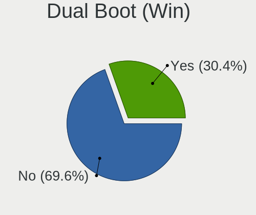

| Dual boot | Computers | Percent |
|-----------|-----------|---------|
| No        | 1248      | 67.24%  |
| Yes       | 608       | 32.76%  |

Board
-----

Vendor
------

Motherboard manufacturer

| Name                    | Computers | Percent |
|-------------------------|-----------|---------|
| Hewlett-Packard         | 376       | 20.63%  |
| Lenovo                  | 258       | 14.15%  |
| Dell                    | 241       | 13.22%  |
| ASUSTek Computer        | 193       | 10.59%  |
| Gigabyte Technology     | 134       | 7.35%   |
| Acer                    | 104       | 5.7%    |
| Toshiba                 | 60        | 3.29%   |
| Apple                   | 48        | 2.63%   |
| MSI                     | 39        | 2.14%   |
| Sony                    | 36        | 1.97%   |
| HUAWEI                  | 36        | 1.97%   |
| Intel                   | 31        | 1.7%    |
| ECS                     | 29        | 1.59%   |
| ASRock                  | 29        | 1.59%   |
| Biostar                 | 21        | 1.15%   |
| Samsung Electronics     | 18        | 0.99%   |
| Gateway                 | 17        | 0.93%   |
| Pegatron                | 14        | 0.77%   |
| Lanix                   | 14        | 0.77%   |
| Alienware               | 13        | 0.71%   |
| Google                  | 11        | 0.6%    |
| Foxconn                 | 7         | 0.38%   |
| AMI                     | 7         | 0.38%   |
| Unknown                 | 7         | 0.38%   |
| Microsoft               | 6         | 0.33%   |
| Chuwi                   | 6         | 0.33%   |
| PCChips                 | 5         | 0.27%   |
| GHIA                    | 5         | 0.27%   |
| eMachines               | 5         | 0.27%   |
| System76                | 4         | 0.22%   |
| Raspberry Pi Foundation | 4         | 0.22%   |
| Timi                    | 3         | 0.16%   |
| Supermicro              | 3         | 0.16%   |
| EVOO                    | 3         | 0.16%   |
| Wistron                 | 2         | 0.11%   |
| TPV-INVENTA             | 2         | 0.11%   |
| Panasonic               | 2         | 0.11%   |
| Insyde                  | 2         | 0.11%   |
| IBM                     | 2         | 0.11%   |
| Corporativo Lanix       | 2         | 0.11%   |

Model
-----

Motherboard model

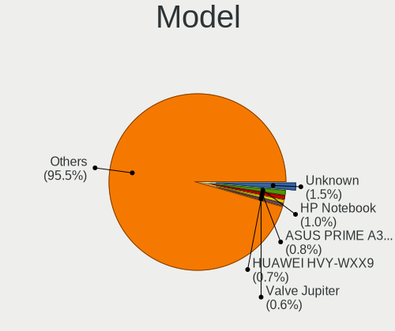

| Name                                  | Computers | Percent |
|---------------------------------------|-----------|---------|
| HP Notebook                           | 26        | 1.43%   |
| Unknown                               | 19        | 1.04%   |
| HP Pavilion Laptop 15-cw0xxx          | 16        | 0.88%   |
| ASUS PRIME A320M-K                    | 15        | 0.82%   |
| HP Pavilion g4                        | 12        | 0.66%   |
| HUAWEI HVY-WXX9                       | 10        | 0.55%   |
| HP Pavilion Notebook                  | 10        | 0.55%   |
| HP Laptop 15-da0xxx                   | 9         | 0.49%   |
| Lenovo IdeaPad 330-14AST 81D5         | 8         | 0.44%   |
| Gigabyte B450M DS3H                   | 8         | 0.44%   |
| HP Laptop 15-bw0xx                    | 7         | 0.38%   |
| HP EliteBook 8460p                    | 7         | 0.38%   |
| ECS A320AM4-M3D                       | 7         | 0.38%   |
| Dell Latitude E6430                   | 7         | 0.38%   |
| HP Pavilion Laptop 15-cw1xxx          | 6         | 0.33%   |
| HP Pavilion dv4                       | 6         | 0.33%   |
| Dell Inspiron 5559                    | 6         | 0.33%   |
| Dell Inspiron 3421                    | 6         | 0.33%   |
| ASUS PRIME B450M-A II                 | 6         | 0.33%   |
| ASUS All Series                       | 6         | 0.33%   |
| HP Pavilion x360 Convertible 14-ba0xx | 5         | 0.27%   |
| HP Pavilion dv5                       | 5         | 0.27%   |
| HP Compaq 6200 Pro SFF PC             | 5         | 0.27%   |
| Gigabyte GA-880GM-USB3                | 5         | 0.27%   |
| Gigabyte A320M-S2H                    | 5         | 0.27%   |
| Dell OptiPlex 9020                    | 5         | 0.27%   |
| Dell OptiPlex 755                     | 5         | 0.27%   |
| Dell OptiPlex 7010                    | 5         | 0.27%   |
| ASUS ROG STRIX B450-F GAMING          | 5         | 0.27%   |
| Apple MacBookPro9,2                   | 5         | 0.27%   |
| Apple MacBookPro8,1                   | 5         | 0.27%   |
| Acer Aspire E5-573                    | 5         | 0.27%   |
| Acer Aspire E3-112M                   | 5         | 0.27%   |
| Toshiba Satellite L855                | 4         | 0.22%   |
| Lenovo G50-30 80G0                    | 4         | 0.22%   |
| Lenovo G40-45 80E1                    | 4         | 0.22%   |
| HP Pavilion 14                        | 4         | 0.22%   |
| HP Laptop 15-bs0xx                    | 4         | 0.22%   |
| HP Laptop 14-cm0xxx                   | 4         | 0.22%   |
| HP G42                                | 4         | 0.22%   |

Model Family
------------

Motherboard model prefix

| Name               | Computers | Percent |
|--------------------|-----------|---------|
| HP Pavilion        | 100       | 5.49%   |
| Lenovo ThinkPad    | 90        | 4.94%   |
| Dell Inspiron      | 81        | 4.44%   |
| Lenovo IdeaPad     | 80        | 4.39%   |
| Acer Aspire        | 74        | 4.06%   |
| Dell Latitude      | 66        | 3.62%   |
| Toshiba Satellite  | 55        | 3.02%   |
| HP Laptop          | 47        | 2.58%   |
| ASUS PRIME         | 42        | 2.3%    |
| Dell OptiPlex      | 40        | 2.19%   |
| HP Compaq          | 36        | 1.97%   |
| HP Notebook        | 26        | 1.43%   |
| HP EliteBook       | 22        | 1.21%   |
| HP ProBook         | 21        | 1.15%   |
| Unknown            | 19        | 1.04%   |
| ASUS ROG           | 17        | 0.93%   |
| ASUS VivoBook      | 15        | 0.82%   |
| Lenovo ThinkCentre | 13        | 0.71%   |
| HP ENVY            | 12        | 0.66%   |
| Lenovo Yoga        | 10        | 0.55%   |
| HUAWEI HVY-WXX9    | 10        | 0.55%   |
| Gigabyte B450M     | 10        | 0.55%   |
| Dell Vostro        | 10        | 0.55%   |
| HP 240             | 9         | 0.49%   |
| Gigabyte A320M-S2H | 9         | 0.49%   |
| Dell XPS           | 9         | 0.49%   |
| Dell Precision     | 9         | 0.49%   |
| Dell Studio        | 8         | 0.44%   |
| ASUS TUF           | 8         | 0.44%   |
| Lenovo Legion      | 7         | 0.38%   |
| HP ProDesk         | 7         | 0.38%   |
| Gigabyte B450      | 7         | 0.38%   |
| ECS A320AM4-M3D    | 7         | 0.38%   |
| ASUS M5A97         | 7         | 0.38%   |
| Microsoft Surface  | 6         | 0.33%   |
| HP ZBook           | 6         | 0.33%   |
| HP OMEN            | 6         | 0.33%   |
| Gigabyte X570      | 6         | 0.33%   |
| ASUS All           | 6         | 0.33%   |
| Apple MacBookPro9  | 6         | 0.33%   |

MFG Year
--------

Motherboard manufacture year

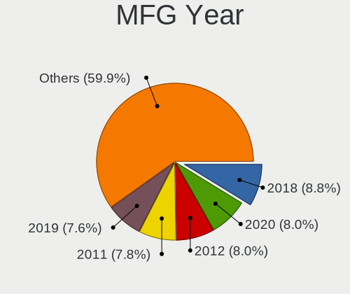

| Year    | Computers | Percent |
|---------|-----------|---------|
| 2018    | 189       | 10.37%  |
| 2011    | 168       | 9.22%   |
| 2017    | 151       | 8.28%   |
| 2012    | 147       | 8.06%   |
| 2019    | 145       | 7.95%   |
| 2014    | 127       | 6.97%   |
| 2015    | 126       | 6.91%   |
| 2020    | 118       | 6.47%   |
| 2013    | 115       | 6.31%   |
| 2010    | 111       | 6.09%   |
| 2016    | 90        | 4.94%   |
| 2008    | 85        | 4.66%   |
| 2009    | 79        | 4.33%   |
| 2021    | 71        | 3.89%   |
| 2007    | 48        | 2.63%   |
| 2006    | 22        | 1.21%   |
| 2022    | 12        | 0.66%   |
| 2005    | 11        | 0.6%    |
| Unknown | 5         | 0.27%   |
| 2004    | 2         | 0.11%   |
| 2003    | 1         | 0.05%   |

Form Factor
-----------

Physical design of the computer

| Name           | Computers | Percent |
|----------------|-----------|---------|
| Notebook       | 1127      | 61.82%  |
| Desktop        | 568       | 31.16%  |
| All in one     | 40        | 2.19%   |
| Convertible    | 32        | 1.76%   |
| Tablet         | 21        | 1.15%   |
| Mini pc        | 18        | 0.99%   |
| Server         | 13        | 0.71%   |
| System on chip | 4         | 0.22%   |

Secure Boot
-----------

Enabled or disabled

| State    | Computers | Percent |
|----------|-----------|---------|
| Disabled | 1671      | 90.82%  |
| Enabled  | 169       | 9.18%   |

Coreboot
--------

Have coreboot on board

| Used | Computers | Percent |
|------|-----------|---------|
| No   | 1811      | 99.34%  |
| Yes  | 12        | 0.66%   |

RAM Size
--------

Total RAM memory

| Size in GB      | Computers | Percent |
|-----------------|-----------|---------|
| 4.01-8.0        | 494       | 26.76%  |
| 3.01-4.0        | 447       | 24.21%  |
| 8.01-16.0       | 350       | 18.96%  |
| 16.01-24.0      | 220       | 11.92%  |
| 1.01-2.0        | 135       | 7.31%   |
| 32.01-64.0      | 86        | 4.66%   |
| 2.01-3.0        | 37        | 2%      |
| 24.01-32.0      | 27        | 1.46%   |
| 64.01-256.0     | 24        | 1.3%    |
| 0.51-1.0        | 22        | 1.19%   |
| More than 256.0 | 3         | 0.16%   |
| 0.01-0.5        | 1         | 0.05%   |

RAM Used
--------

Used RAM memory

| Used GB     | Computers | Percent |
|-------------|-----------|---------|
| 1.01-2.0    | 788       | 39.56%  |
| 2.01-3.0    | 515       | 25.85%  |
| 3.01-4.0    | 232       | 11.65%  |
| 4.01-8.0    | 214       | 10.74%  |
| 0.51-1.0    | 151       | 7.58%   |
| 8.01-16.0   | 59        | 2.96%   |
| 0.01-0.5    | 19        | 0.95%   |
| 16.01-24.0  | 9         | 0.45%   |
| 24.01-32.0  | 2         | 0.1%    |
| 32.01-64.0  | 1         | 0.05%   |
| 64.01-256.0 | 1         | 0.05%   |
| Unknown     | 1         | 0.05%   |

Total Drives
------------

Number of drives on board

| Drives  | Computers | Percent |
|---------|-----------|---------|
| 1       | 1253      | 66.93%  |
| 2       | 429       | 22.92%  |
| 3       | 96        | 5.13%   |
| 4       | 41        | 2.19%   |
| 0       | 26        | 1.39%   |
| 5       | 12        | 0.64%   |
| 6       | 8         | 0.43%   |
| 7       | 3         | 0.16%   |
| 37      | 1         | 0.05%   |
| 18      | 1         | 0.05%   |
| 8       | 1         | 0.05%   |
| Unknown | 1         | 0.05%   |

Has CD-ROM
----------

Has CD-ROM on board

| Presented | Computers | Percent |
|-----------|-----------|---------|
| No        | 1092      | 59.48%  |
| Yes       | 744       | 40.52%  |

Has Ethernet
------------

Has Ethernet on board

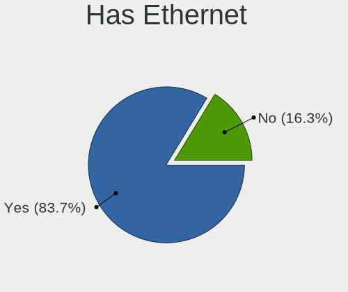

| Presented | Computers | Percent |
|-----------|-----------|---------|
| Yes       | 1598      | 87.61%  |
| No        | 226       | 12.39%  |

Has WiFi
--------

Has WiFi module

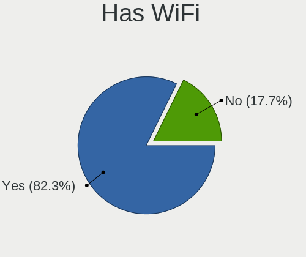

| Presented | Computers | Percent |
|-----------|-----------|---------|
| Yes       | 1476      | 80.83%  |
| No        | 350       | 19.17%  |

Has Bluetooth
-------------

Has Bluetooth module

| Presented | Computers | Percent |
|-----------|-----------|---------|
| Yes       | 1061      | 57.29%  |
| No        | 791       | 42.71%  |

Location
--------

Country
-------

Geographic location (country)

| Country | Computers | Percent |
|---------|-----------|---------|
| Mexico  | 1823      | 100%    |

City
----

Geographic location (city)

| City                  | Computers | Percent |
|-----------------------|-----------|---------|
| Mexico City           | 394       | 20.44%  |
| Guadalajara           | 104       | 5.39%   |
| Monterrey             | 64        | 3.32%   |
| Zapopan               | 51        | 2.65%   |
| Queretaro             | 51        | 2.65%   |
| Tijuana               | 49        | 2.54%   |
| Puebla City           | 40        | 2.07%   |
| Mrida               | 38        | 1.97%   |
| Cancn               | 31        | 1.61%   |
| Ciudad Jurez        | 28        | 1.45%   |
| Toluca                | 27        | 1.4%    |
| Hermosillo            | 27        | 1.4%    |
| Morelia               | 24        | 1.24%   |
| Ciudad Lopez Mateos   | 24        | 1.24%   |
| Naucalpan             | 23        | 1.19%   |
| Mexico                | 23        | 1.19%   |
| Len                 | 22        | 1.14%   |
| Apodaca               | 22        | 1.14%   |
| Tlalnepantla          | 21        | 1.09%   |
| Chihuahua City        | 21        | 1.09%   |
| Ecatepec              | 20        | 1.04%   |
| Oaxaca City           | 19        | 0.99%   |
| Mexicali              | 19        | 0.99%   |
| Ciudad Nezahualcoyotl | 17        | 0.88%   |
| Xalapa                | 16        | 0.83%   |
| Villahermosa          | 16        | 0.83%   |
| Ensenada              | 16        | 0.83%   |
| Culiacn             | 16        | 0.83%   |
| Veracruz              | 15        | 0.78%   |
| San Luis Potos City | 15        | 0.78%   |
| Cuernavaca            | 15        | 0.78%   |
| Zacatecas City        | 14        | 0.73%   |
| Iztapalapa            | 14        | 0.73%   |
| Celaya                | 14        | 0.73%   |
| Guadalupe             | 13        | 0.67%   |
| Puerto Vallarta       | 12        | 0.62%   |
| Saltillo              | 11        | 0.57%   |
| Metepec               | 11        | 0.57%   |
| Durango               | 11        | 0.57%   |
| Azcapotzalco          | 11        | 0.57%   |

Drives
------

Drive Vendor
------------

Hard drive vendors

| Vendor                  | Computers | Drives | Percent |
|-------------------------|-----------|--------|---------|
| Seagate                 | 471       | 689    | 19.27%  |
| WDC                     | 418       | 546    | 17.1%   |
| Toshiba                 | 234       | 280    | 9.57%   |
| Kingston                | 229       | 280    | 9.37%   |
| A-DATA Technology       | 164       | 201    | 6.71%   |
| Samsung Electronics     | 153       | 188    | 6.26%   |
| Hitachi                 | 134       | 170    | 5.48%   |
| Unknown                 | 113       | 142    | 4.62%   |
| HGST                    | 76        | 86     | 3.11%   |
| SanDisk                 | 64        | 83     | 2.62%   |
| Intel                   | 34        | 55     | 1.39%   |
| SK hynix                | 33        | 40     | 1.35%   |
| Crucial                 | 32        | 39     | 1.31%   |
| Apple                   | 24        | 30     | 0.98%   |
| XPG                     | 23        | 33     | 0.94%   |
| Fujitsu                 | 21        | 23     | 0.86%   |
| Realtek Semiconductor   | 17        | 22     | 0.7%    |
| Micron Technology       | 16        | 19     | 0.65%   |
| PNY                     | 15        | 18     | 0.61%   |
| Phison                  | 11        | 12     | 0.45%   |
| LITEON                  | 11        | 16     | 0.45%   |
| Maxtor                  | 8         | 10     | 0.33%   |
| Unknown                 | 8         | 8      | 0.33%   |
| YMTC                    | 7         | 8      | 0.29%   |
| JMicron Technology      | 7         | 7      | 0.29%   |
| Netac                   | 6         | 7      | 0.25%   |
| KIOXIA                  | 6         | 8      | 0.25%   |
| Gigabyte Technology     | 6         | 7      | 0.25%   |
| Silicon Motion          | 5         | 6      | 0.2%    |
| Hewlett-Packard         | 5         | 5      | 0.2%    |
| China                   | 5         | 5      | 0.2%    |
| ADATA Technology        | 4         | 4      | 0.16%   |
| Yeyian                  | 3         | 4      | 0.12%   |
| Union Memory (Shenzhen) | 3         | 3      | 0.12%   |
| Transcend               | 3         | 3      | 0.12%   |
| SPCC                    | 3         | 3      | 0.12%   |
| SABRENT                 | 3         | 3      | 0.12%   |
| Phison Electronics      | 3         | 3      | 0.12%   |
| Patriot                 | 3         | 5      | 0.12%   |
| AS201                   | 3         | 3      | 0.12%   |

Drive Model
-----------

Hard drive models

| Model                              | Computers | Percent |
|------------------------------------|-----------|---------|
| Kingston SA400S37240G 240GB SSD    | 60        | 2.29%   |
| Seagate ST1000LM035-1RK172 1TB     | 54        | 2.06%   |
| Kingston SA400S37480G 480GB SSD    | 39        | 1.49%   |
| Toshiba MQ04ABF100 1TB             | 37        | 1.41%   |
| A-DATA SU650 120GB SSD             | 36        | 1.38%   |
| Toshiba MQ01ABD100 1TB             | 35        | 1.34%   |
| Seagate ST1000LM024 HN-M101MBB 1TB | 30        | 1.15%   |
| Seagate ST500DM002-1BD142 500GB    | 26        | 0.99%   |
| Kingston SA400S37120G 120GB SSD    | 25        | 0.96%   |
| Seagate ST500LT012-1DG142 500GB    | 24        | 0.92%   |
| Toshiba MQ01ABF050 500GB           | 23        | 0.88%   |
| A-DATA SU630 240GB SSD             | 22        | 0.84%   |
| Unknown MMC Card  32GB             | 20        | 0.76%   |
| Seagate ST1000DM010-2EP102 1TB     | 17        | 0.65%   |
| A-DATA SU650 240GB SSD             | 17        | 0.65%   |
| HGST HTS541010A9E680 1TB           | 15        | 0.57%   |
| Unknown SD/MMC/MS PRO 1TB          | 13        | 0.5%    |
| Toshiba DT01ACA050 500GB           | 13        | 0.5%    |
| Seagate ST3500418AS 500GB          | 13        | 0.5%    |
| Samsung NVMe SSD Drive 512GB       | 13        | 0.5%    |
| XPG GAMMIX S11 Pro 1TB             | 12        | 0.46%   |
| WDC WDS240G2G0A-00JH30 240GB SSD   | 12        | 0.46%   |
| Unknown MMC Card  64GB             | 12        | 0.46%   |
| Unknown MMC Card  16GB             | 12        | 0.46%   |
| HGST HTS725050A7E630 500GB         | 12        | 0.46%   |
| WDC WD5000LPCX-60VHAT0 500GB       | 11        | 0.42%   |
| Toshiba DT01ACA200 2TB             | 11        | 0.42%   |
| Seagate ST9500325AS 500GB          | 11        | 0.42%   |
| Seagate ST500LM021-1KJ152 500GB    | 11        | 0.42%   |
| Kingston SV300S37A120G 120GB SSD   | 11        | 0.42%   |
| Kingston SA400S37960G 960GB SSD    | 11        | 0.42%   |
| WDC WD5000LPCX-24VHAT0 500GB       | 10        | 0.38%   |
| Seagate ST2000LM007-1R8174 2TB     | 10        | 0.38%   |
| Hitachi HTS547550A9E384 500GB      | 10        | 0.38%   |
| Seagate ST1000DM003-1SB102 1TB     | 9         | 0.34%   |
| Seagate ST1000DM003-1CH162 1TB     | 9         | 0.34%   |
| Seagate Expansion 2TB              | 9         | 0.34%   |
| HGST HTS721010A9E630 1TB           | 9         | 0.34%   |
| HGST HTS545050A7E680 500GB         | 9         | 0.34%   |
| HGST HTS541075A9E680 752GB         | 9         | 0.34%   |

HDD Vendor
----------

Hard disk drive vendors

| Vendor              | Computers | Drives | Percent |
|---------------------|-----------|--------|---------|
| Seagate             | 469       | 685    | 35%     |
| WDC                 | 362       | 461    | 27.01%  |
| Toshiba             | 209       | 251    | 15.6%   |
| Hitachi             | 134       | 170    | 10%     |
| HGST                | 76        | 86     | 5.67%   |
| Samsung Electronics | 28        | 32     | 2.09%   |
| Fujitsu             | 21        | 23     | 1.57%   |
| Unknown             | 13        | 14     | 0.97%   |
| Maxtor              | 8         | 10     | 0.6%    |
| Apple               | 7         | 8      | 0.52%   |
| Hewlett-Packard     | 3         | 3      | 0.22%   |
| USB3.0              | 1         | 1      | 0.07%   |
| SAGE                | 1         | 1      | 0.07%   |
| SABRENT             | 1         | 1      | 0.07%   |
| Quantum             | 1         | 1      | 0.07%   |
| MaxDigital          | 1         | 4      | 0.07%   |
| LaCie               | 1         | 2      | 0.07%   |
| IBM/Hitachi         | 1         | 1      | 0.07%   |
| HPE                 | 1         | 1      | 0.07%   |
| DELLBOSS            | 1         | 1      | 0.07%   |
| ASMedia             | 1         | 1      | 0.07%   |

SSD Vendor
----------

Solid state drive vendors

| Vendor              | Computers | Drives | Percent |
|---------------------|-----------|--------|---------|
| Kingston            | 211       | 254    | 31.59%  |
| A-DATA Technology   | 157       | 193    | 23.5%   |
| Samsung Electronics | 51        | 59     | 7.63%   |
| WDC                 | 45        | 60     | 6.74%   |
| SanDisk             | 32        | 38     | 4.79%   |
| Crucial             | 28        | 30     | 4.19%   |
| PNY                 | 15        | 18     | 2.25%   |
| Apple               | 13        | 14     | 1.95%   |
| Intel               | 12        | 16     | 1.8%    |
| LITEON              | 11        | 16     | 1.65%   |
| SK hynix            | 10        | 11     | 1.5%    |
| Micron Technology   | 10        | 13     | 1.5%    |
| Netac               | 6         | 7      | 0.9%    |
| Gigabyte Technology | 5         | 6      | 0.75%   |
| China               | 5         | 5      | 0.75%   |
| Toshiba             | 4         | 4      | 0.6%    |
| Yeyian              | 3         | 4      | 0.45%   |
| Unknown             | 3         | 3      | 0.45%   |
| Transcend           | 3         | 3      | 0.45%   |
| SPCC                | 3         | 3      | 0.45%   |
| Patriot             | 3         | 5      | 0.45%   |
| AS201               | 3         | 3      | 0.45%   |
| Unknown             | 3         | 3      | 0.45%   |
| Team                | 2         | 2      | 0.3%    |
| Pioneer             | 2         | 3      | 0.3%    |
| OCZ                 | 2         | 4      | 0.3%    |
| LITEONIT            | 2         | 2      | 0.3%    |
| KingSpec            | 2         | 3      | 0.3%    |
| BHT                 | 2         | 2      | 0.3%    |
| Acer                | 2         | 2      | 0.3%    |
| ZTC                 | 1         | 1      | 0.15%   |
| Zheino              | 1         | 1      | 0.15%   |
| WDC WDS4            | 1         | 1      | 0.15%   |
| VALK                | 1         | 1      | 0.15%   |
| StoreJet            | 1         | 1      | 0.15%   |
| ShanDianZhe         | 1         | 2      | 0.15%   |
| Morebeck-N100       | 1         | 1      | 0.15%   |
| Londisk             | 1         | 1      | 0.15%   |
| Lite-On             | 1         | 3      | 0.15%   |
| Lexar               | 1         | 1      | 0.15%   |

Drive Kind
----------

HDD or SSD

| Kind    | Computers | Drives | Percent |
|---------|-----------|--------|---------|
| HDD     | 1187      | 1757   | 53.16%  |
| SSD     | 611       | 810    | 27.36%  |
| NVMe    | 315       | 431    | 14.11%  |
| MMC     | 98        | 126    | 4.39%   |
| Unknown | 22        | 27     | 0.99%   |

Drive Connector
---------------

SATA, SAS, NVMe, etc.

| Type | Computers | Drives | Percent |
|------|-----------|--------|---------|
| SATA | 1556      | 2507   | 76.27%  |
| NVMe | 310       | 426    | 15.2%   |
| MMC  | 98        | 126    | 4.8%    |
| SAS  | 76        | 92     | 3.73%   |

Drive Size
----------

Size of hard drive

| Size in TB | Computers | Drives | Percent |
|------------|-----------|--------|---------|
| 0.01-0.5   | 1126      | 1577   | 61.3%   |
| 0.51-1.0   | 539       | 705    | 29.34%  |
| 1.01-2.0   | 119       | 163    | 6.48%   |
| 3.01-4.0   | 25        | 48     | 1.36%   |
| 2.01-3.0   | 20        | 27     | 1.09%   |
| 4.01-10.0  | 6         | 27     | 0.33%   |
| 10.01-20.0 | 2         | 20     | 0.11%   |

Space Total
-----------

Amount of disk space available on the file system

| Size in GB     | Computers | Percent |
|----------------|-----------|---------|
| 101-250        | 487       | 25.48%  |
| 251-500        | 430       | 22.5%   |
| 501-1000       | 299       | 15.65%  |
| 1-20           | 174       | 9.11%   |
| 51-100         | 157       | 8.22%   |
| 1001-2000      | 129       | 6.75%   |
| 21-50          | 103       | 5.39%   |
| More than 3000 | 55        | 2.88%   |
| 2001-3000      | 39        | 2.04%   |
| Unknown        | 38        | 1.99%   |

Space Used
----------

Amount of used disk space

| Used GB        | Computers | Percent |
|----------------|-----------|---------|
| 1-20           | 853       | 43.1%   |
| 21-50          | 373       | 18.85%  |
| 101-250        | 221       | 11.17%  |
| 51-100         | 209       | 10.56%  |
| 251-500        | 121       | 6.11%   |
| 501-1000       | 86        | 4.35%   |
| 1001-2000      | 49        | 2.48%   |
| Unknown        | 38        | 1.92%   |
| More than 3000 | 19        | 0.96%   |
| 2001-3000      | 10        | 0.51%   |

Malfunc. Drives
---------------

Drive models with a malfunction

| Model                               | Computers | Drives | Percent |
|-------------------------------------|-----------|--------|---------|
| Toshiba MQ01ABD100 1TB              | 6         | 7      | 3.08%   |
| Seagate ST500LT012-1DG142 500GB     | 5         | 5      | 2.56%   |
| HGST HTS541010A9E680 1TB            | 5         | 5      | 2.56%   |
| Hitachi HTS545050B9A300 500GB       | 4         | 4      | 2.05%   |
| HGST HTS541075A9E680 752GB          | 4         | 4      | 2.05%   |
| Toshiba MQ01ABF050 500GB            | 3         | 3      | 1.54%   |
| Seagate ST9500420AS 500GB           | 3         | 3      | 1.54%   |
| Seagate ST3160815AS 160GB           | 3         | 3      | 1.54%   |
| Seagate ST2000DL003-9VT166 2TB      | 3         | 3      | 1.54%   |
| Seagate ST1000LM024 HN-M101MBB 1TB  | 3         | 3      | 1.54%   |
| LITEON CV8-8E128-HP 128GB SSD       | 3         | 3      | 1.54%   |
| HGST HTS541010A7E630 1TB            | 3         | 3      | 1.54%   |
| WDC WD2500BEVS-60UST0 250GB         | 2         | 2      | 1.03%   |
| Toshiba MQ04ABF100 1TB              | 2         | 2      | 1.03%   |
| Seagate ST500LM021-1KJ152 500GB     | 2         | 2      | 1.03%   |
| Seagate ST3500418AS 500GB           | 2         | 2      | 1.03%   |
| Seagate ST31000524AS 1TB            | 2         | 4      | 1.03%   |
| Seagate ST1000LM035-1RK172 1TB      | 2         | 2      | 1.03%   |
| SanDisk SD9SN8W-128G-1006 128GB SSD | 2         | 2      | 1.03%   |
| Maxtor 6Y080M0 81GB                 | 2         | 2      | 1.03%   |
| Kingston SUV400S37480G 480GB SSD    | 2         | 2      | 1.03%   |
| Kingston SA400S37240G 240GB SSD     | 2         | 2      | 1.03%   |
| Hitachi HTS723232A7A364 320GB       | 2         | 2      | 1.03%   |
| Hitachi HTS545016B9A300 160GB       | 2         | 2      | 1.03%   |
| HGST HTS545050A7E380 500GB          | 2         | 2      | 1.03%   |
| WDC WD800JD-00MSA1 80GB             | 1         | 1      | 0.51%   |
| WDC WD6400BEVT-60A0RT0 640GB        | 1         | 1      | 0.51%   |
| WDC WD5000LPVX-22V0TT0 500GB        | 1         | 1      | 0.51%   |
| WDC WD5000LPCX-60VHAT0 500GB        | 1         | 1      | 0.51%   |
| WDC WD5000BPVT-22HXZT1 500GB        | 1         | 2      | 0.51%   |
| WDC WD5000AAKX-75U6AA0 500GB        | 1         | 1      | 0.51%   |
| WDC WD5000AAKX-753CA1 500GB         | 1         | 1      | 0.51%   |
| WDC WD5000AAKX-603CA0 500GB         | 1         | 1      | 0.51%   |
| WDC WD5000AAKX-08U6AA0 500GB        | 1         | 1      | 0.51%   |
| WDC WD5000AAKS-402AA0 500GB         | 1         | 1      | 0.51%   |
| WDC WD5000AADS-56S9B1 500GB         | 1         | 1      | 0.51%   |
| WDC WD5000AACS-61M6B2 500GB         | 1         | 1      | 0.51%   |
| WDC WD50 00BEVT-11ZAT0 500GB        | 1         | 1      | 0.51%   |
| WDC WD3200KS-75PFB0 320GB           | 1         | 1      | 0.51%   |
| WDC WD3200BEVT-22A23T0 320GB        | 1         | 1      | 0.51%   |

Malfunc. Drive Vendor
---------------------

Vendors of faulty drives

| Vendor              | Computers | Drives | Percent |
|---------------------|-----------|--------|---------|
| Seagate             | 57        | 78     | 30.16%  |
| WDC                 | 34        | 38     | 17.99%  |
| Hitachi             | 26        | 28     | 13.76%  |
| Toshiba             | 25        | 35     | 13.23%  |
| HGST                | 16        | 16     | 8.47%   |
| Kingston            | 9         | 9      | 4.76%   |
| Samsung Electronics | 5         | 5      | 2.65%   |
| SanDisk             | 4         | 4      | 2.12%   |
| LITEON              | 3         | 3      | 1.59%   |
| Fujitsu             | 3         | 3      | 1.59%   |
| Maxtor              | 2         | 2      | 1.06%   |
| A-DATA Technology   | 2         | 2      | 1.06%   |
| Micron Technology   | 1         | 1      | 0.53%   |
| Crucial             | 1         | 1      | 0.53%   |
| China               | 1         | 1      | 0.53%   |

Malfunc. HDD Vendor
-------------------

Vendors of faulty HDD drives

| Vendor              | Computers | Drives | Percent |
|---------------------|-----------|--------|---------|
| Seagate             | 57        | 78     | 34.13%  |
| WDC                 | 34        | 38     | 20.36%  |
| Hitachi             | 26        | 28     | 15.57%  |
| Toshiba             | 25        | 35     | 14.97%  |
| HGST                | 16        | 16     | 9.58%   |
| Samsung Electronics | 4         | 4      | 2.4%    |
| Fujitsu             | 3         | 3      | 1.8%    |
| Maxtor              | 2         | 2      | 1.2%    |

Malfunc. Drive Kind
-------------------

Kinds of faulty drives

| Kind | Computers | Drives | Percent |
|------|-----------|--------|---------|
| HDD  | 159       | 204    | 87.85%  |
| SSD  | 19        | 19     | 10.5%   |
| NVMe | 3         | 3      | 1.66%   |

Failed Drives
-------------

Failed drive models

| Model                        | Computers | Drives | Percent |
|------------------------------|-----------|--------|---------|
| WDC WD1600BEVT-75A23T0 160GB | 1         | 1      | 33.33%  |
| Seagate ST3500410AS 500GB    | 1         | 1      | 33.33%  |
| Seagate ST31500341AS 1TB     | 1         | 1      | 33.33%  |

Failed Drive Vendor
-------------------

Failed drive vendors

| Vendor  | Computers | Drives | Percent |
|---------|-----------|--------|---------|
| WDC     | 1         | 1      | 50%     |
| Seagate | 1         | 2      | 50%     |

Drive Status
------------

Number of failed and malfunc. drives

| Status   | Computers | Drives | Percent |
|----------|-----------|--------|---------|
| Detected | 1216      | 2040   | 63.01%  |
| Works    | 534       | 882    | 27.67%  |
| Malfunc  | 178       | 226    | 9.22%   |
| Failed   | 2         | 3      | 0.1%    |

Storage controller
------------------

Storage Vendor
--------------

Storage controller vendors

| Vendor                           | Computers | Percent |
|----------------------------------|-----------|---------|
| Intel                            | 1158      | 56.76%  |
| AMD                              | 463       | 22.7%   |
| Samsung Electronics              | 79        | 3.87%   |
| Nvidia                           | 55        | 2.7%    |
| SanDisk                          | 48        | 2.35%   |
| Realtek Semiconductor            | 26        | 1.27%   |
| ADATA Technology                 | 26        | 1.27%   |
| SK hynix                         | 23        | 1.13%   |
| Toshiba America Info Systems     | 21        | 1.03%   |
| Marvell Technology Group         | 20        | 0.98%   |
| Kingston Technology Company      | 20        | 0.98%   |
| Phison Electronics               | 15        | 0.74%   |
| Yangtze Memory Technologies      | 8         | 0.39%   |
| KIOXIA                           | 8         | 0.39%   |
| Union Memory (Shenzhen)          | 7         | 0.34%   |
| Micron/Crucial Technology        | 7         | 0.34%   |
| JMicron Technology               | 7         | 0.34%   |
| Micron Technology                | 6         | 0.29%   |
| LSI Logic / Symbios Logic        | 6         | 0.29%   |
| ASMedia Technology               | 6         | 0.29%   |
| Silicon Motion                   | 5         | 0.25%   |
| VIA Technologies                 | 4         | 0.2%    |
| Apple                            | 4         | 0.2%    |
| Silicon Image                    | 3         | 0.15%   |
| Hewlett-Packard                  | 3         | 0.15%   |
| Broadcom / LSI                   | 2         | 0.1%    |
| Unknown                          | 1         | 0.05%   |
| Solid State Storage Technology   | 1         | 0.05%   |
| Silicon Integrated Systems [SiS] | 1         | 0.05%   |
| Seagate Technology               | 1         | 0.05%   |
| Lite-On Technology               | 1         | 0.05%   |
| Lenovo                           | 1         | 0.05%   |
| Broadcom                         | 1         | 0.05%   |
| Biwin Storage Technology         | 1         | 0.05%   |
| Adaptec                          | 1         | 0.05%   |
| Unknown                          | 1         | 0.05%   |

Storage Model
-------------

Storage controller models

| Model                                                                                   | Computers | Percent |
|-----------------------------------------------------------------------------------------|-----------|---------|
| AMD FCH SATA Controller [AHCI mode]                                                     | 329       | 13.51%  |
| Intel 7 Series Chipset Family 6-port SATA Controller [AHCI mode]                        | 96        | 3.94%   |
| Intel 82801 Mobile SATA Controller [RAID mode]                                          | 86        | 3.53%   |
| Intel Sunrise Point-LP SATA Controller [AHCI mode]                                      | 83        | 3.41%   |
| Intel 6 Series/C200 Series Chipset Family 6 port Mobile SATA AHCI Controller            | 69        | 2.83%   |
| AMD SB7x0/SB8x0/SB9x0 SATA Controller [AHCI mode]                                       | 59        | 2.42%   |
| Intel 8 Series/C220 Series Chipset Family 6-port SATA Controller 1 [AHCI mode]          | 46        | 1.89%   |
| Intel 8 Series SATA Controller 1 [AHCI mode]                                            | 46        | 1.89%   |
| AMD 400 Series Chipset SATA Controller                                                  | 45        | 1.85%   |
| Samsung NVMe SSD Controller SM981/PM981/PM983                                           | 43        | 1.77%   |
| Intel NM10/ICH7 Family SATA Controller [IDE mode]                                       | 42        | 1.72%   |
| Intel Atom/Celeron/Pentium Processor x5-E8000/J3xxx/N3xxx Series SATA Controller        | 40        | 1.64%   |
| AMD SB7x0/SB8x0/SB9x0 IDE Controller                                                    | 40        | 1.64%   |
| Intel 82801IBM/IEM (ICH9M/ICH9M-E) 4 port SATA Controller [AHCI mode]                   | 39        | 1.6%    |
| Intel SATA Controller [RAID mode]                                                       | 37        | 1.52%   |
| Intel 6 Series/C200 Series Chipset Family 6 port Desktop SATA AHCI Controller           | 37        | 1.52%   |
| Intel Wildcat Point-LP SATA Controller [AHCI Mode]                                      | 36        | 1.48%   |
| Intel Atom Processor E3800 Series SATA AHCI Controller                                  | 34        | 1.4%    |
| Intel 82801G (ICH7 Family) IDE Controller                                               | 34        | 1.4%    |
| AMD FCH SATA Controller D                                                               | 32        | 1.31%   |
| Intel Q170/Q150/B150/H170/H110/Z170/CM236 Chipset SATA Controller [AHCI Mode]           | 31        | 1.27%   |
| Intel 5 Series/3400 Series Chipset 4 port SATA AHCI Controller                          | 26        | 1.07%   |
| AMD SB7x0/SB8x0/SB9x0 SATA Controller [IDE mode]                                        | 26        | 1.07%   |
| Intel 82801HM/HEM (ICH8M/ICH8M-E) IDE Controller                                        | 25        | 1.03%   |
| Intel HM170/QM170 Chipset SATA Controller [AHCI Mode]                                   | 24        | 0.99%   |
| Intel Celeron/Pentium Silver Processor SATA Controller                                  | 24        | 0.99%   |
| Nvidia MCP61 SATA Controller                                                            | 23        | 0.94%   |
| Intel 82801HM/HEM (ICH8M/ICH8M-E) SATA Controller [AHCI mode]                           | 23        | 0.94%   |
| ADATA XPG SX8200 Pro PCIe Gen3x4 M.2 2280 Solid State Drive                             | 23        | 0.94%   |
| Intel 6 Series/C200 Series Chipset Family Desktop SATA Controller (IDE mode, ports 4-5) | 22        | 0.9%    |
| Intel 6 Series/C200 Series Chipset Family Desktop SATA Controller (IDE mode, ports 0-3) | 22        | 0.9%    |
| Intel NM10/ICH7 Family SATA Controller [AHCI mode]                                      | 21        | 0.86%   |
| Intel Celeron N3350/Pentium N4200/Atom E3900 Series SATA AHCI Controller                | 20        | 0.82%   |
| Intel Cannon Lake Mobile PCH SATA AHCI Controller                                       | 19        | 0.78%   |
| Intel 5 Series/3400 Series Chipset 6 port SATA AHCI Controller                          | 18        | 0.74%   |
| Samsung NVMe SSD Controller 980                                                         | 17        | 0.7%    |
| Nvidia MCP61 IDE                                                                        | 17        | 0.7%    |
| AMD FCH SATA Controller [IDE mode]                                                      | 17        | 0.7%    |
| Realtek Realtek Non-Volatile memory controller                                          | 16        | 0.66%   |
| Intel 200 Series PCH SATA controller [AHCI mode]                                        | 16        | 0.66%   |

Storage Kind
------------

Kind of storage controller (IDE, SATA, NVMe, SAS, ...)

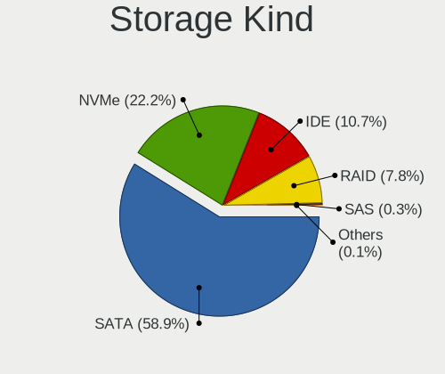

| Kind | Computers | Percent |
|------|-----------|---------|
| SATA | 1358      | 63.37%  |
| NVMe | 312       | 14.56%  |
| IDE  | 301       | 14.05%  |
| RAID | 161       | 7.51%   |
| SAS  | 10        | 0.47%   |
| SCSI | 1         | 0.05%   |

Processor
---------

CPU Vendor
----------

Processor vendors

| Vendor | Computers | Percent |
|--------|-----------|---------|
| Intel  | 1280      | 70.21%  |
| AMD    | 539       | 29.57%  |
| ARM    | 4         | 0.22%   |

CPU Model
---------

Processor models

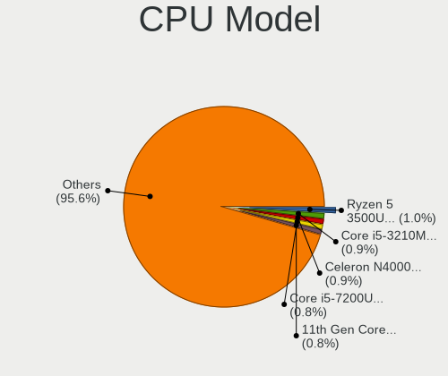

| Model                                         | Computers | Percent |
|-----------------------------------------------|-----------|---------|
| Intel Celeron CPU N2840 @ 2.16GHz             | 21        | 1.15%   |
| Intel Core i5-7200U CPU @ 2.50GHz             | 18        | 0.99%   |
| AMD Ryzen 5 3500U with Radeon Vega Mobile Gfx | 18        | 0.99%   |
| Intel Celeron CPU N3050 @ 1.60GHz             | 16        | 0.88%   |
| Intel Core i7-8750H CPU @ 2.20GHz             | 15        | 0.82%   |
| Intel Core i7-6700HQ CPU @ 2.60GHz            | 15        | 0.82%   |
| Intel Core i5-8265U CPU @ 1.60GHz             | 15        | 0.82%   |
| Intel Core i5-8250U CPU @ 1.60GHz             | 15        | 0.82%   |
| Intel Core i5-3210M CPU @ 2.50GHz             | 15        | 0.82%   |
| Intel Celeron CPU N3350 @ 1.10GHz             | 14        | 0.77%   |
| Intel Celeron CPU N3060 @ 1.60GHz             | 14        | 0.77%   |
| Intel Core i5-5200U CPU @ 2.20GHz             | 13        | 0.71%   |
| AMD Ryzen 5 4600H with Radeon Graphics        | 13        | 0.71%   |
| Intel Core i7-8565U CPU @ 1.80GHz             | 12        | 0.66%   |
| Intel Celeron N4000 CPU @ 1.10GHz             | 12        | 0.66%   |
| Intel Core i7-8550U CPU @ 1.80GHz             | 11        | 0.6%    |
| Intel Core i7-6500U CPU @ 2.50GHz             | 11        | 0.6%    |
| AMD Ryzen 3 2300U with Radeon Vega Mobile Gfx | 11        | 0.6%    |
| AMD Ryzen 3 2200G with Radeon Vega Graphics   | 11        | 0.6%    |
| Intel Core i5-4200U CPU @ 1.60GHz             | 10        | 0.55%   |
| Intel Core 2 Duo CPU E8400 @ 3.00GHz          | 10        | 0.55%   |
| Intel 11th Gen Core i5-1135G7 @ 2.40GHz       | 10        | 0.55%   |
| AMD Ryzen 5 2600 Six-Core Processor           | 10        | 0.55%   |
| AMD Ryzen 5 2500U with Radeon Vega Mobile Gfx | 10        | 0.55%   |
| AMD A8-9600 RADEON R7, 10 COMPUTE CORES 4C+6G | 10        | 0.55%   |
| AMD A4-9125 RADEON R3, 4 COMPUTE CORES 2C+2G  | 10        | 0.55%   |
| Intel Core i7-9750H CPU @ 2.60GHz             | 9         | 0.49%   |
| Intel Core i7-7500U CPU @ 2.70GHz             | 9         | 0.49%   |
| Intel Core i7-4790 CPU @ 3.60GHz              | 9         | 0.49%   |
| Intel Core i5-3320M CPU @ 2.60GHz             | 9         | 0.49%   |
| Intel Core i5-2450M CPU @ 2.50GHz             | 9         | 0.49%   |
| Intel Core i3-7020U CPU @ 2.30GHz             | 9         | 0.49%   |
| Intel Core i3-5005U CPU @ 2.00GHz             | 9         | 0.49%   |
| AMD Ryzen 7 2700X Eight-Core Processor        | 9         | 0.49%   |
| AMD Athlon 3000G with Radeon Vega Graphics    | 9         | 0.49%   |
| Intel Core i7-2670QM CPU @ 2.20GHz            | 8         | 0.44%   |
| Intel Core i7-10510U CPU @ 1.80GHz            | 8         | 0.44%   |
| Intel Core i5-6200U CPU @ 2.30GHz             | 8         | 0.44%   |
| Intel Core i5-2520M CPU @ 2.50GHz             | 8         | 0.44%   |
| Intel Core i5-2400 CPU @ 3.10GHz              | 8         | 0.44%   |

CPU Model Family
----------------

Processor model prefix

| Model                   | Computers | Percent |
|-------------------------|-----------|---------|
| Intel Core i5           | 327       | 17.94%  |
| Intel Core i7           | 275       | 15.09%  |
| Intel Celeron           | 164       | 9%      |
| Intel Core i3           | 153       | 8.39%   |
| AMD Ryzen 5             | 97        | 5.32%   |
| Intel Core 2 Duo        | 84        | 4.61%   |
| Other                   | 59        | 3.24%   |
| Intel Atom              | 55        | 3.02%   |
| AMD Ryzen 7             | 46        | 2.52%   |
| AMD A6                  | 44        | 2.41%   |
| Intel Pentium           | 41        | 2.25%   |
| Intel Xeon              | 37        | 2.03%   |
| AMD A8                  | 37        | 2.03%   |
| AMD Ryzen 3             | 36        | 1.97%   |
| AMD A4                  | 29        | 1.59%   |
| AMD FX                  | 25        | 1.37%   |
| AMD A10                 | 25        | 1.37%   |
| AMD Athlon              | 22        | 1.21%   |
| Intel Pentium Dual      | 21        | 1.15%   |
| AMD E                   | 20        | 1.1%    |
| Intel Pentium Dual-Core | 18        | 0.99%   |
| AMD Athlon II X2        | 16        | 0.88%   |
| AMD E1                  | 12        | 0.66%   |
| AMD Athlon 64 X2        | 12        | 0.66%   |
| Intel Pentium 4         | 10        | 0.55%   |
| Intel Core 2 Quad       | 10        | 0.55%   |
| Intel Core 2            | 10        | 0.55%   |
| AMD Sempron             | 10        | 0.55%   |
| AMD Ryzen 9             | 10        | 0.55%   |
| Intel Genuine           | 9         | 0.49%   |
| AMD Turion 64 X2 Mobile | 8         | 0.44%   |
| AMD Athlon II           | 8         | 0.44%   |
| AMD Ryzen 5 PRO         | 7         | 0.38%   |
| AMD Phenom II X4        | 7         | 0.38%   |
| AMD E2                  | 6         | 0.33%   |
| Intel Core i9           | 5         | 0.27%   |
| AMD Ryzen 3 PRO         | 4         | 0.22%   |
| AMD A12                 | 4         | 0.22%   |
| Intel Pentium Silver    | 3         | 0.16%   |
| Intel Core m3           | 3         | 0.16%   |

CPU Cores
---------

Number of processor cores

| Number  | Computers | Percent |
|---------|-----------|---------|
| 2       | 959       | 52.58%  |
| 4       | 540       | 29.61%  |
| 6       | 127       | 6.96%   |
| 1       | 106       | 5.81%   |
| 8       | 61        | 3.34%   |
| 3       | 10        | 0.55%   |
| 12      | 7         | 0.38%   |
| 16      | 6         | 0.33%   |
| 28      | 3         | 0.16%   |
| 10      | 2         | 0.11%   |
| 56      | 1         | 0.05%   |
| 32      | 1         | 0.05%   |
| Unknown | 1         | 0.05%   |

CPU Sockets
-----------

Number of sockets

| Number | Computers | Percent |
|--------|-----------|---------|
| 1      | 1809      | 99.23%  |
| 2      | 14        | 0.77%   |

CPU Threads
-----------

Threads per core (Hyper-Threading)

| Number  | Computers | Percent |
|---------|-----------|---------|
| 2       | 1063      | 58.28%  |
| 1       | 760       | 41.67%  |
| Unknown | 1         | 0.05%   |

CPU Op-Modes
------------

CPU Operation Modes (32-bit, 64-bit)

| Op mode        | Computers | Percent |
|----------------|-----------|---------|
| 32-bit, 64-bit | 1763      | 96.5%   |
| Unknown        | 33        | 1.81%   |
| 32-bit         | 20        | 1.09%   |
| 64-bit         | 11        | 0.6%    |

CPU Microcode
-------------

Microcode number

| Number     | Computers | Percent |
|------------|-----------|---------|
| Unknown    | 354       | 18.8%   |
| 0x206a7    | 127       | 6.74%   |
| 0x306a9    | 94        | 4.99%   |
| 0x1067a    | 61        | 3.24%   |
| 0x306c3    | 50        | 2.66%   |
| 0x40651    | 49        | 2.6%    |
| 0x806e9    | 42        | 2.23%   |
| 0x30678    | 42        | 2.23%   |
| 0x806ec    | 39        | 2.07%   |
| 0x306d4    | 34        | 1.81%   |
| 0x906ea    | 33        | 1.75%   |
| 0x806ea    | 33        | 1.75%   |
| 0x506e3    | 32        | 1.7%    |
| 0x08108109 | 32        | 1.7%    |
| 0x010000c8 | 31        | 1.65%   |
| 0x6fd      | 30        | 1.59%   |
| 0x406e3    | 29        | 1.54%   |
| 0x406c4    | 28        | 1.49%   |
| 0x20655    | 27        | 1.43%   |
| 0x06006705 | 27        | 1.43%   |
| 0x06001119 | 27        | 1.43%   |
| 0x906e9    | 25        | 1.33%   |
| 0x0810100b | 24        | 1.27%   |
| 0x806c1    | 22        | 1.17%   |
| 0x406c3    | 22        | 1.17%   |
| 0x10676    | 22        | 1.17%   |
| 0x07030105 | 22        | 1.17%   |
| 0x106ca    | 21        | 1.12%   |
| 0x20652    | 18        | 0.96%   |
| 0x08101016 | 18        | 0.96%   |
| 0x0800820d | 18        | 0.96%   |
| 0x08108102 | 17        | 0.9%    |
| 0x0600611a | 17        | 0.9%    |
| 0x706a1    | 16        | 0.85%   |
| 0x506c9    | 16        | 0.85%   |
| 0x08600106 | 16        | 0.85%   |
| 0x05000119 | 16        | 0.85%   |
| 0x6fb      | 15        | 0.8%    |
| 0x706e5    | 13        | 0.69%   |
| 0x106c2    | 12        | 0.64%   |

CPU Microarch
-------------

Microarchitecture

| Name             | Computers | Percent |
|------------------|-----------|---------|
| KabyLake         | 226       | 12.4%   |
| SandyBridge      | 157       | 8.61%   |
| Haswell          | 125       | 6.86%   |
| IvyBridge        | 121       | 6.64%   |
| Silvermont       | 104       | 5.7%    |
| Penryn           | 96        | 5.27%   |
| Skylake          | 82        | 4.5%    |
| Zen+             | 81        | 4.44%   |
| Excavator        | 76        | 4.17%   |
| Core             | 66        | 3.62%   |
| Zen              | 57        | 3.13%   |
| K10              | 53        | 2.91%   |
| Zen 2            | 50        | 2.74%   |
| Westmere         | 50        | 2.74%   |
| Broadwell        | 48        | 2.63%   |
| Piledriver       | 45        | 2.47%   |
| K8 Hammer        | 36        | 1.97%   |
| Bonnell          | 36        | 1.97%   |
| Bobcat           | 30        | 1.65%   |
| Puma             | 29        | 1.59%   |
| TigerLake        | 28        | 1.54%   |
| Goldmont plus    | 28        | 1.54%   |
| CometLake        | 26        | 1.43%   |
| IceLake          | 20        | 1.1%    |
| Goldmont         | 20        | 1.1%    |
| Unknown          | 20        | 1.1%    |
| Zen 3            | 19        | 1.04%   |
| Steamroller      | 14        | 0.77%   |
| Nehalem          | 14        | 0.77%   |
| Jaguar           | 14        | 0.77%   |
| NetBurst         | 13        | 0.71%   |
| K10 Llano        | 10        | 0.55%   |
| P6               | 9         | 0.49%   |
| K8 & K10 hybrid  | 9         | 0.49%   |
| Bulldozer        | 8         | 0.44%   |
| Alderlake Hybrid | 2         | 0.11%   |
| Tremont          | 1         | 0.05%   |

Graphics
--------

GPU Vendor
----------

Vendors of graphics cards

| Vendor                           | Computers | Percent |
|----------------------------------|-----------|---------|
| Intel                            | 1081      | 52.89%  |
| AMD                              | 567       | 27.74%  |
| Nvidia                           | 378       | 18.49%  |
| Matrox Electronics Systems       | 10        | 0.49%   |
| ASPEED Technology                | 3         | 0.15%   |
| VIA Technologies                 | 2         | 0.1%    |
| ATI Technologies                 | 2         | 0.1%    |
| Silicon Integrated Systems [SiS] | 1         | 0.05%   |

GPU Model
---------

Graphics card models

| Model                                                                                    | Computers | Percent |
|------------------------------------------------------------------------------------------|-----------|---------|
| Intel 2nd Generation Core Processor Family Integrated Graphics Controller                | 130       | 6.11%   |
| Intel 3rd Gen Core processor Graphics Controller                                         | 74        | 3.48%   |
| Intel Haswell-ULT Integrated Graphics Controller                                         | 58        | 2.73%   |
| AMD Picasso/Raven 2 [Radeon Vega Series / Radeon Vega Mobile Series]                     | 55        | 2.59%   |
| Intel Atom/Celeron/Pentium Processor x5-E8000/J3xxx/N3xxx Integrated Graphics Controller | 52        | 2.44%   |
| Intel Atom Processor Z36xxx/Z37xxx Series Graphics & Display                             | 52        | 2.44%   |
| AMD Raven Ridge [Radeon Vega Series / Radeon Vega Mobile Series]                         | 46        | 2.16%   |
| Intel HD Graphics 5500                                                                   | 41        | 1.93%   |
| Intel HD Graphics 620                                                                    | 40        | 1.88%   |
| Intel Core Processor Integrated Graphics Controller                                      | 39        | 1.83%   |
| AMD Stoney [Radeon R2/R3/R4/R5 Graphics]                                                 | 39        | 1.83%   |
| Intel Mobile 4 Series Chipset Integrated Graphics Controller                             | 37        | 1.74%   |
| Intel UHD Graphics 620                                                                   | 36        | 1.69%   |
| AMD Wani [Radeon R5/R6/R7 Graphics]                                                      | 35        | 1.65%   |
| Intel WhiskeyLake-U GT2 [UHD Graphics 620]                                               | 32        | 1.5%    |
| Intel CoffeeLake-H GT2 [UHD Graphics 630]                                                | 32        | 1.5%    |
| Intel Skylake GT2 [HD Graphics 520]                                                      | 31        | 1.46%   |
| Intel Xeon E3-1200 v3/4th Gen Core Processor Integrated Graphics Controller              | 29        | 1.36%   |
| Intel HD Graphics 530                                                                    | 29        | 1.36%   |
| AMD Renoir                                                                               | 28        | 1.32%   |
| Intel GeminiLake [UHD Graphics 600]                                                      | 25        | 1.18%   |
| Intel TigerLake-LP GT2 [Iris Xe Graphics]                                                | 24        | 1.13%   |
| Intel Mobile GM965/GL960 Integrated Graphics Controller (secondary)                      | 24        | 1.13%   |
| Intel Mobile GM965/GL960 Integrated Graphics Controller (primary)                        | 24        | 1.13%   |
| Intel Xeon E3-1200 v2/3rd Gen Core processor Graphics Controller                         | 22        | 1.03%   |
| Intel HD Graphics 630                                                                    | 22        | 1.03%   |
| Intel Atom Processor D4xx/D5xx/N4xx/N5xx Integrated Graphics Controller                  | 22        | 1.03%   |
| Intel 4 Series Chipset Integrated Graphics Controller                                    | 20        | 0.94%   |
| Intel 4th Gen Core Processor Integrated Graphics Controller                              | 19        | 0.89%   |
| AMD Mullins [Radeon R4/R5 Graphics]                                                      | 19        | 0.89%   |
| Intel CometLake-U GT2 [UHD Graphics]                                                     | 18        | 0.85%   |
| AMD Ellesmere [Radeon RX 470/480/570/570X/580/580X/590]                                  | 18        | 0.85%   |
| Intel HD Graphics 500                                                                    | 17        | 0.8%    |
| AMD Sun XT [Radeon HD 8670A/8670M/8690M / R5 M330 / M430 / Radeon 520 Mobile]            | 16        | 0.75%   |
| AMD RS880M [Mobility Radeon HD 4225/4250]                                                | 16        | 0.75%   |
| Intel Mobile 945GM/GMS/GME, 943/940GML Express Integrated Graphics Controller            | 15        | 0.71%   |
| Intel CometLake-H GT2 [UHD Graphics]                                                     | 15        | 0.71%   |
| AMD Cedar [Radeon HD 5000/6000/7350/8350 Series]                                         | 14        | 0.66%   |
| AMD Wrestler [Radeon HD 6310]                                                            | 13        | 0.61%   |
| Nvidia GM107M [GeForce GTX 960M]                                                         | 12        | 0.56%   |

GPU Combo
---------

Combinations of graphics cards

| Name            | Computers | Percent |
|-----------------|-----------|---------|
| 1 x Intel       | 882       | 48.12%  |
| 1 x AMD         | 477       | 26.02%  |
| 1 x Nvidia      | 208       | 11.35%  |
| Intel + Nvidia  | 143       | 7.8%    |
| Intel + AMD     | 38        | 2.07%   |
| 2 x AMD         | 37        | 2.02%   |
| AMD + Nvidia    | 17        | 0.93%   |
| 1 x Matrox      | 9         | 0.49%   |
| Other           | 7         | 0.38%   |
| 2 x Nvidia      | 6         | 0.33%   |
| 1 x ASPEED      | 3         | 0.16%   |
| 3 x AMD         | 1         | 0.05%   |
| 2 x Intel       | 1         | 0.05%   |
| 1 x VIA         | 1         | 0.05%   |
| 1 x SiS         | 1         | 0.05%   |
| Nvidia + VIA    | 1         | 0.05%   |
| Nvidia + Matrox | 1         | 0.05%   |

GPU Driver
----------

Free vs proprietary

| Driver      | Computers | Percent |
|-------------|-----------|---------|
| Free        | 1612      | 87.56%  |
| Proprietary | 185       | 10.05%  |
| Unknown     | 44        | 2.39%   |

GPU Memory
----------

Total video memory

| Size in GB | Computers | Percent |
|------------|-----------|---------|
| Unknown    | 1044      | 56.1%   |
| 0.01-0.5   | 297       | 15.96%  |
| 1.01-2.0   | 196       | 10.53%  |
| 0.51-1.0   | 168       | 9.03%   |
| 3.01-4.0   | 63        | 3.39%   |
| 7.01-8.0   | 44        | 2.36%   |
| 5.01-6.0   | 32        | 1.72%   |
| 2.01-3.0   | 12        | 0.64%   |
| 8.01-16.0  | 3         | 0.16%   |
| 16.01-24.0 | 2         | 0.11%   |

Monitor
-------

Monitor Vendor
--------------

Monitor vendors

| Vendor                  | Computers | Percent |
|-------------------------|-----------|---------|
| AU Optronics            | 238       | 12.09%  |
| Samsung Electronics     | 233       | 11.83%  |
| BOE                     | 200       | 10.16%  |
| LG Display              | 194       | 9.85%   |
| Chimei Innolux          | 192       | 9.75%   |
| Hewlett-Packard         | 151       | 7.67%   |
| Dell                    | 106       | 5.38%   |
| Goldstar                | 65        | 3.3%    |
| Acer                    | 57        | 2.89%   |
| BenQ                    | 52        | 2.64%   |
| Apple                   | 49        | 2.49%   |
| Chi Mei Optoelectronics | 35        | 1.78%   |
| AOC                     | 34        | 1.73%   |
| Lenovo                  | 32        | 1.63%   |
| Unknown                 | 30        | 1.52%   |
| Gateway                 | 18        | 0.91%   |
| ViewSonic               | 17        | 0.86%   |
| Sharp                   | 17        | 0.86%   |
| LG Philips              | 17        | 0.86%   |
| Ancor Communications    | 17        | 0.86%   |
| Sony                    | 15        | 0.76%   |
| ASUSTek Computer        | 14        | 0.71%   |
| PANDA                   | 9         | 0.46%   |
| HannStar                | 9         | 0.46%   |
| VOR                     | 8         | 0.41%   |
| InfoVision              | 8         | 0.41%   |
| ___                     | 6         | 0.3%    |
| SAC                     | 6         | 0.3%    |
| Toshiba                 | 5         | 0.25%   |
| Philips                 | 5         | 0.25%   |
| Panasonic               | 5         | 0.25%   |
| NEC Computers           | 5         | 0.25%   |
| Insignia                | 5         | 0.25%   |
| InnoLux Display         | 5         | 0.25%   |
| FOX                     | 5         | 0.25%   |
| RTK                     | 4         | 0.2%    |
| Plain Tree Systems      | 4         | 0.2%    |
| LG Electronics          | 4         | 0.2%    |
| JDI                     | 4         | 0.2%    |
| eMachines               | 4         | 0.2%    |

Monitor Model
-------------

Monitor models

| Model                                                                    | Computers | Percent |
|--------------------------------------------------------------------------|-----------|---------|
| BOE LCD Monitor BOE06A4 1366x768 344x194mm 15.5-inch                     | 17        | 0.85%   |
| Samsung Electronics C24F390 SAM0D2C 1920x1080 520x290mm 23.4-inch        | 13        | 0.65%   |
| BOE LCD Monitor BOE076F 1366x768 344x194mm 15.5-inch                     | 13        | 0.65%   |
| Chimei Innolux LCD Monitor CMN14D6 1366x768 309x173mm 13.9-inch          | 12        | 0.6%    |
| Chimei Innolux LCD Monitor CMN14C3 1366x768 309x173mm 13.9-inch          | 12        | 0.6%    |
| AU Optronics LCD Monitor AUO2E3C 1366x768 309x173mm 13.9-inch            | 11        | 0.55%   |
| AU Optronics LCD Monitor AUO183C 1366x768 309x173mm 13.9-inch            | 11        | 0.55%   |
| LG Display LCD Monitor LGD0456 1366x768 344x194mm 15.5-inch              | 10        | 0.5%    |
| Hewlett-Packard w1907 HWP26A2 1440x900 408x255mm 18.9-inch               | 10        | 0.5%    |
| Chimei Innolux LCD Monitor CMN15DC 1366x768 344x193mm 15.5-inch          | 10        | 0.5%    |
| BOE LCD Monitor BOE0878 1920x1080 355x200mm 16.0-inch                    | 10        | 0.5%    |
| BOE LCD Monitor BOE0696 1366x768 309x173mm 13.9-inch                     | 10        | 0.5%    |
| AU Optronics LCD Monitor AUO70EC 1366x768 344x193mm 15.5-inch            | 10        | 0.5%    |
| AU Optronics LCD Monitor AUO235C 1366x768 256x144mm 11.6-inch            | 10        | 0.5%    |
| Samsung Electronics LCD Monitor SEC5441 1366x768 344x194mm 15.5-inch     | 9         | 0.45%   |
| LG Display LCD Monitor LGD02E9 1366x768 309x174mm 14.0-inch              | 9         | 0.45%   |
| Chimei Innolux LCD Monitor CMN14C4 1366x768 309x173mm 13.9-inch          | 9         | 0.45%   |
| HannStar LCD Monitor HSD03E9 1024x600 220x129mm 10.0-inch                | 8         | 0.4%    |
| Chimei Innolux LCD Monitor CMN15E6 1366x768 344x193mm 15.5-inch          | 8         | 0.4%    |
| Chimei Innolux LCD Monitor CMN1487 1366x768 309x173mm 13.9-inch          | 8         | 0.4%    |
| Chimei Innolux LCD Monitor CMN1476 1366x768 309x174mm 14.0-inch          | 8         | 0.4%    |
| BenQ GW2480 BNQ78E7 1920x1080 527x296mm 23.8-inch                        | 8         | 0.4%    |
| AU Optronics LCD Monitor AUO61ED 1920x1080 344x194mm 15.5-inch           | 8         | 0.4%    |
| AU Optronics LCD Monitor AUO21ED 1920x1080 344x193mm 15.5-inch           | 8         | 0.4%    |
| LG Display LCD Monitor LGD04A7 1920x1080 344x194mm 15.5-inch             | 7         | 0.35%   |
| Chimei Innolux LCD Monitor CMN1472 1366x768 309x174mm 14.0-inch          | 7         | 0.35%   |
| BenQ GW2270 BNQ78DB 1920x1080 480x270mm 21.7-inch                        | 7         | 0.35%   |
| Samsung Electronics LCD Monitor SAM0C3C 1360x768 609x347mm 27.6-inch     | 6         | 0.3%    |
| LG Display LCD Monitor LGD05E5 1920x1080 344x194mm 15.5-inch             | 6         | 0.3%    |
| LG Display LCD Monitor LGD045E 1366x768 309x174mm 14.0-inch              | 6         | 0.3%    |
| LG Display LCD Monitor LGD033A 1366x768 344x194mm 15.5-inch              | 6         | 0.3%    |
| Goldstar FULL HD GSM5B55 1920x1080 480x270mm 21.7-inch                   | 6         | 0.3%    |
| Chimei Innolux LCD Monitor CMN15FD 1366x768 344x193mm 15.5-inch          | 6         | 0.3%    |
| Chimei Innolux LCD Monitor CMN1490 1366x768 309x173mm 13.9-inch          | 6         | 0.3%    |
| Chi Mei Optoelectronics LCD Monitor CMO1113 1366x768 256x144mm 11.6-inch | 6         | 0.3%    |
| BOE LCD Monitor BOE06BD 1366x768 309x173mm 13.9-inch                     | 6         | 0.3%    |
| AU Optronics LCD Monitor AUO61D2 1024x600 222x125mm 10.0-inch            | 6         | 0.3%    |
| AU Optronics LCD Monitor AUO22EC 1366x768 344x193mm 15.5-inch            | 6         | 0.3%    |
| Ancor Communications ASUS VP228 ACI22C3 1920x1080 476x268mm 21.5-inch    | 6         | 0.3%    |
| Unknown SMART TV 0563 1920x1080 1209x680mm 54.6-inch                     | 5         | 0.25%   |

Monitor Resolution
------------------

Monitor screen resolution

| Resolution         | Computers | Percent |
|--------------------|-----------|---------|
| 1366x768 (WXGA)    | 713       | 37.63%  |
| 1920x1080 (FHD)    | 594       | 31.35%  |
| 1600x900 (HD+)     | 87        | 4.59%   |
| 1440x900 (WXGA+)   | 75        | 3.96%   |
| 1280x800 (WXGA)    | 70        | 3.69%   |
| 1280x1024 (SXGA)   | 58        | 3.06%   |
| 3840x2160 (4K)     | 46        | 2.43%   |
| 1360x768           | 29        | 1.53%   |
| 1680x1050 (WSXGA+) | 26        | 1.37%   |
| 1024x600           | 25        | 1.32%   |
| 1024x768 (XGA)     | 22        | 1.16%   |
| 2560x1440 (QHD)    | 20        | 1.06%   |
| Unknown            | 18        | 0.95%   |
| 2560x1080          | 15        | 0.79%   |
| 3440x1440          | 12        | 0.63%   |
| 2160x1440          | 11        | 0.58%   |
| 3840x1080          | 8         | 0.42%   |
| 1920x1200 (WUXGA)  | 7         | 0.37%   |
| 3000x2000          | 5         | 0.26%   |
| 2880x1800          | 5         | 0.26%   |
| 2560x1600          | 5         | 0.26%   |
| 2288x1287          | 5         | 0.26%   |
| 1600x1200          | 5         | 0.26%   |
| 3200x1800 (QHD+)   | 4         | 0.21%   |
| 2736x1824          | 3         | 0.16%   |
| 3360x1080          | 2         | 0.11%   |
| 2520x1680          | 2         | 0.11%   |
| 1920x540           | 2         | 0.11%   |
| 1400x1050          | 2         | 0.11%   |
| 1280x960           | 2         | 0.11%   |
| 1280x768           | 2         | 0.11%   |
| 1152x864           | 2         | 0.11%   |
| 6720x1440          | 1         | 0.05%   |
| 4721x1050          | 1         | 0.05%   |
| 4310x1080          | 1         | 0.05%   |
| 3840x2400          | 1         | 0.05%   |
| 3600x1080          | 1         | 0.05%   |
| 3286x1080          | 1         | 0.05%   |
| 3280x1200          | 1         | 0.05%   |
| 3280x1080          | 1         | 0.05%   |

Monitor Diagonal
----------------

Diagonal size in inches

| Inches  | Computers | Percent |
|---------|-----------|---------|
| 15      | 501       | 25.64%  |
| 13      | 266       | 13.61%  |
| 14      | 220       | 11.26%  |
| 21      | 116       | 5.94%   |
| 23      | 97        | 4.96%   |
| 18      | 80        | 4.09%   |
| 19      | 79        | 4.04%   |
| 17      | 75        | 3.84%   |
| Unknown | 70        | 3.58%   |
| 24      | 63        | 3.22%   |
| 27      | 58        | 2.97%   |
| 11      | 51        | 2.61%   |
| 20      | 50        | 2.56%   |
| 12      | 32        | 1.64%   |
| 31      | 30        | 1.54%   |
| 10      | 25        | 1.28%   |
| 34      | 22        | 1.13%   |
| 22      | 20        | 1.02%   |
| 72      | 13        | 0.67%   |
| 16      | 13        | 0.67%   |
| 84      | 10        | 0.51%   |
| 54      | 9         | 0.46%   |
| 32      | 7         | 0.36%   |
| 40      | 6         | 0.31%   |
| 46      | 5         | 0.26%   |
| 29      | 5         | 0.26%   |
| 26      | 4         | 0.2%    |
| 142     | 3         | 0.15%   |
| 39      | 3         | 0.15%   |
| 25      | 3         | 0.15%   |
| 52      | 2         | 0.1%    |
| 49      | 2         | 0.1%    |
| 48      | 2         | 0.1%    |
| 47      | 2         | 0.1%    |
| 37      | 2         | 0.1%    |
| 8       | 2         | 0.1%    |
| 74      | 1         | 0.05%   |
| 55      | 1         | 0.05%   |
| 50      | 1         | 0.05%   |
| 42      | 1         | 0.05%   |

Monitor Width
-------------

Physical width

| Width in mm    | Computers | Percent |
|----------------|-----------|---------|
| 301-350        | 913       | 47.33%  |
| 401-500        | 319       | 16.54%  |
| 501-600        | 212       | 10.99%  |
| 201-300        | 197       | 10.21%  |
| 351-400        | 83        | 4.3%    |
| Unknown        | 70        | 3.63%   |
| 601-700        | 39        | 2.02%   |
| 701-800        | 30        | 1.56%   |
| 1501-2000      | 24        | 1.24%   |
| 1001-1500      | 24        | 1.24%   |
| 801-900        | 12        | 0.62%   |
| More than 2000 | 3         | 0.16%   |
| 101-200        | 2         | 0.1%    |
| 901-1000       | 1         | 0.05%   |

Aspect Ratio
------------

Proportional relationship between the width and the height

| Ratio   | Computers | Percent |
|---------|-----------|---------|
| 16/9    | 1388      | 78.11%  |
| 16/10   | 186       | 10.47%  |
| Unknown | 58        | 3.26%   |
| 5/4     | 52        | 2.93%   |
| 4/3     | 37        | 2.08%   |
| 3/2     | 25        | 1.41%   |
| 21/9    | 24        | 1.35%   |
| 1.00    | 4         | 0.23%   |
| 32/9    | 3         | 0.17%   |

Monitor Area
------------

Area in inch

| Area in inch | Computers | Percent |
|----------------|-----------|---------|
| 101-110        | 507       | 26.19%  |
| 81-90          | 430       | 22.21%  |
| 201-250        | 242       | 12.5%   |
| 151-200        | 167       | 8.63%   |
| 141-150        | 104       | 5.37%   |
| Unknown        | 70        | 3.62%   |
| 301-350        | 61        | 3.15%   |
| 71-80          | 59        | 3.05%   |
| 351-500        | 59        | 3.05%   |
| 51-60          | 51        | 2.63%   |
| More than 1000 | 42        | 2.17%   |
| 121-130        | 29        | 1.5%    |
| 61-70          | 26        | 1.34%   |
| 41-50          | 25        | 1.29%   |
| 501-1000       | 22        | 1.14%   |
| 251-300        | 16        | 0.83%   |
| 131-140        | 12        | 0.62%   |
| 111-120        | 8         | 0.41%   |
| 91-100         | 4         | 0.21%   |
| 1-40           | 2         | 0.1%    |

Pixel Density
-------------

Pixels per inch

| Density       | Computers | Percent |
|---------------|-----------|---------|
| 101-120       | 768       | 40.55%  |
| 51-100        | 558       | 29.46%  |
| 121-160       | 355       | 18.74%  |
| Unknown       | 70        | 3.7%    |
| 1-50          | 64        | 3.38%   |
| 161-240       | 54        | 2.85%   |
| More than 240 | 25        | 1.32%   |

Multiple Monitors
-----------------

Total monitors connected

| Total | Computers | Percent |
|-------|-----------|---------|
| 1     | 1516      | 81.24%  |
| 2     | 269       | 14.42%  |
| 0     | 53        | 2.84%   |
| 3     | 27        | 1.45%   |
| 4     | 1         | 0.05%   |

Network
-------

Net Controller Vendor
---------------------

Controller vendors

| Vendor                                 | Computers | Percent |
|----------------------------------------|-----------|---------|
| Realtek Semiconductor                  | 1086      | 39.4%   |
| Intel                                  | 653       | 23.69%  |
| Qualcomm Atheros                       | 374       | 13.57%  |
| Broadcom                               | 207       | 7.51%   |
| Ralink Technology                      | 56        | 2.03%   |
| Ralink                                 | 53        | 1.92%   |
| Broadcom Limited                       | 50        | 1.81%   |
| Nvidia                                 | 46        | 1.67%   |
| Marvell Technology Group               | 38        | 1.38%   |
| TP-Link                                | 34        | 1.23%   |
| Qualcomm Atheros Communications        | 20        | 0.73%   |
| Huawei Technologies                    | 16        | 0.58%   |
| Motorola PCS                           | 11        | 0.4%    |
| MediaTek                               | 10        | 0.36%   |
| ASIX Electronics                       | 8         | 0.29%   |
| Xiaomi                                 | 7         | 0.25%   |
| Samsung Electronics                    | 7         | 0.25%   |
| DisplayLink                            | 7         | 0.25%   |
| Mercucys                               | 6         | 0.22%   |
| VIA Technologies                       | 4         | 0.15%   |
| Linksys                                | 4         | 0.15%   |
| Dell                                   | 4         | 0.15%   |
| D-Link System                          | 4         | 0.15%   |
| D-Link                                 | 4         | 0.15%   |
| Qualcomm                               | 3         | 0.11%   |
| NetGear                                | 3         | 0.11%   |
| Microchip Technology                   | 3         | 0.11%   |
| Lenovo                                 | 3         | 0.11%   |
| ICS Advent                             | 3         | 0.11%   |
| IBM                                    | 3         | 0.11%   |
| 802.11g Adapter [Linksys WUSB54GC v3]  | 3         | 0.11%   |
| Wacom                                  | 2         | 0.07%   |
| Spreadtrum Communications              | 2         | 0.07%   |
| JMicron Technology                     | 2         | 0.07%   |
| ZTE WCDMA Technologies MSM             | 1         | 0.04%   |
| Tenda                                  | 1         | 0.04%   |
| T & A Mobile Phones                    | 1         | 0.04%   |
| Sony Ericsson Mobile Communications AB | 1         | 0.04%   |
| Silicon Integrated Systems [SiS]       | 1         | 0.04%   |
| Sangoma Technologies                   | 1         | 0.04%   |

Net Controller Model
--------------------

Controller models

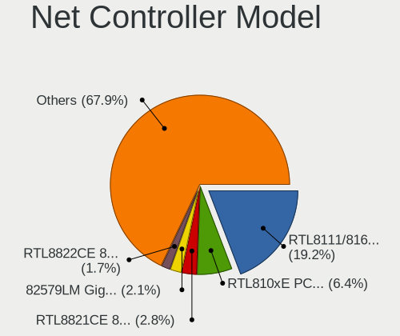

| Model                                                             | Computers | Percent |
|-------------------------------------------------------------------|-----------|---------|
| Realtek RTL8111/8168/8411 PCI Express Gigabit Ethernet Controller | 651       | 19.7%   |
| Realtek RTL810xE PCI Express Fast Ethernet controller             | 260       | 7.87%   |
| Intel 82579LM Gigabit Network Connection (Lewisville)             | 77        | 2.33%   |
| Realtek RTL8821CE 802.11ac PCIe Wireless Network Adapter          | 75        | 2.27%   |
| Qualcomm Atheros QCA9565 / AR9565 Wireless Network Adapter        | 57        | 1.73%   |
| Qualcomm Atheros AR9285 Wireless Network Adapter (PCI-Express)    | 54        | 1.63%   |
| Intel Wi-Fi 6 AX200                                               | 53        | 1.6%    |
| Qualcomm Atheros AR9485 Wireless Network Adapter                  | 49        | 1.48%   |
| Realtek RTL8723BE PCIe Wireless Network Adapter                   | 48        | 1.45%   |
| Realtek RTL8723DE Wireless Network Adapter                        | 45        | 1.36%   |
| Qualcomm Atheros QCA9377 802.11ac Wireless Network Adapter        | 45        | 1.36%   |
| Broadcom BCM43142 802.11b/g/n                                     | 39        | 1.18%   |
| Realtek RTL8188EUS 802.11n Wireless Network Adapter               | 30        | 0.91%   |
| Intel Wireless 7265                                               | 30        | 0.91%   |
| Intel Wireless 7260                                               | 29        | 0.88%   |
| Intel Wireless 8265 / 8275                                        | 28        | 0.85%   |
| Realtek RTL8188EE Wireless Network Adapter                        | 27        | 0.82%   |
| Realtek RTL8822CE 802.11ac PCIe Wireless Network Adapter          | 26        | 0.79%   |
| Intel Centrino Advanced-N 6205 [Taylor Peak]                      | 26        | 0.79%   |
| Realtek RTL8153 Gigabit Ethernet Adapter                          | 25        | 0.76%   |
| Qualcomm Atheros QCA6174 802.11ac Wireless Network Adapter        | 25        | 0.76%   |
| Intel Cannon Lake PCH CNVi WiFi                                   | 25        | 0.76%   |
| Broadcom BCM4313 802.11bgn Wireless Network Adapter               | 25        | 0.76%   |
| Ralink RT2870/RT3070 Wireless Adapter                             | 24        | 0.73%   |
| Ralink MT7601U Wireless Adapter                                   | 24        | 0.73%   |
| Intel Wireless 8260                                               | 24        | 0.73%   |
| Intel I211 Gigabit Network Connection                             | 24        | 0.73%   |
| Intel Wireless 3165                                               | 23        | 0.7%    |
| Intel Ethernet Connection I217-LM                                 | 23        | 0.7%    |
| Intel Wi-Fi 6 AX201                                               | 22        | 0.67%   |
| Qualcomm Atheros AR8151 v2.0 Gigabit Ethernet                     | 20        | 0.61%   |
| Nvidia MCP61 Ethernet                                             | 18        | 0.54%   |
| Intel Wireless 3160                                               | 18        | 0.54%   |
| Realtek RTL8188CE 802.11b/g/n WiFi Adapter                        | 17        | 0.51%   |
| Ralink RT3090 Wireless 802.11n 1T/1R PCIe                         | 17        | 0.51%   |
| Qualcomm Atheros AR9271 802.11n                                   | 17        | 0.51%   |
| Intel Cannon Point-LP CNVi [Wireless-AC]                          | 17        | 0.51%   |
| Intel PRO/Wireless 3945ABG [Golan] Network Connection             | 16        | 0.48%   |
| Intel Comet Lake PCH-LP CNVi WiFi                                 | 16        | 0.48%   |
| Broadcom Limited BCM4312 802.11b/g LP-PHY                         | 16        | 0.48%   |

Wireless Vendor
---------------

Wireless vendors

| Vendor                                | Computers | Percent |
|---------------------------------------|-----------|---------|
| Intel                                 | 477       | 30.52%  |
| Realtek Semiconductor                 | 387       | 24.76%  |
| Qualcomm Atheros                      | 310       | 19.83%  |
| Broadcom                              | 150       | 9.6%    |
| Ralink Technology                     | 56        | 3.58%   |
| Ralink                                | 53        | 3.39%   |
| Broadcom Limited                      | 35        | 2.24%   |
| TP-Link                               | 32        | 2.05%   |
| Qualcomm Atheros Communications       | 20        | 1.28%   |
| Mercucys                              | 6         | 0.38%   |
| MediaTek                              | 6         | 0.38%   |
| Marvell Technology Group              | 6         | 0.38%   |
| D-Link                                | 4         | 0.26%   |
| NetGear                               | 3         | 0.19%   |
| Linksys                               | 3         | 0.19%   |
| Dell                                  | 3         | 0.19%   |
| D-Link System                         | 3         | 0.19%   |
| 802.11g Adapter [Linksys WUSB54GC v3] | 3         | 0.19%   |
| Wacom                                 | 2         | 0.13%   |
| Tenda                                 | 1         | 0.06%   |
| Qualcomm                              | 1         | 0.06%   |
| Micro Star International              | 1         | 0.06%   |
| Gemtek                                | 1         | 0.06%   |

Wireless Model
--------------

Wireless models

| Model                                                                   | Computers | Percent |
|-------------------------------------------------------------------------|-----------|---------|
| Realtek RTL8821CE 802.11ac PCIe Wireless Network Adapter                | 75        | 4.73%   |
| Qualcomm Atheros QCA9565 / AR9565 Wireless Network Adapter              | 57        | 3.59%   |
| Qualcomm Atheros AR9285 Wireless Network Adapter (PCI-Express)          | 54        | 3.4%    |
| Intel Wi-Fi 6 AX200                                                     | 53        | 3.34%   |
| Qualcomm Atheros AR9485 Wireless Network Adapter                        | 49        | 3.09%   |
| Realtek RTL8723BE PCIe Wireless Network Adapter                         | 48        | 3.03%   |
| Realtek RTL8723DE Wireless Network Adapter                              | 45        | 2.84%   |
| Qualcomm Atheros QCA9377 802.11ac Wireless Network Adapter              | 45        | 2.84%   |
| Broadcom BCM43142 802.11b/g/n                                           | 39        | 2.46%   |
| Realtek RTL8188EUS 802.11n Wireless Network Adapter                     | 30        | 1.89%   |
| Intel Wireless 7265                                                     | 30        | 1.89%   |
| Intel Wireless 7260                                                     | 29        | 1.83%   |
| Intel Wireless 8265 / 8275                                              | 28        | 1.77%   |
| Realtek RTL8188EE Wireless Network Adapter                              | 27        | 1.7%    |
| Realtek RTL8822CE 802.11ac PCIe Wireless Network Adapter                | 26        | 1.64%   |
| Intel Centrino Advanced-N 6205 [Taylor Peak]                            | 26        | 1.64%   |
| Qualcomm Atheros QCA6174 802.11ac Wireless Network Adapter              | 25        | 1.58%   |
| Intel Cannon Lake PCH CNVi WiFi                                         | 25        | 1.58%   |
| Broadcom BCM4313 802.11bgn Wireless Network Adapter                     | 25        | 1.58%   |
| Ralink RT2870/RT3070 Wireless Adapter                                   | 24        | 1.51%   |
| Ralink MT7601U Wireless Adapter                                         | 24        | 1.51%   |
| Intel Wireless 8260                                                     | 24        | 1.51%   |
| Intel Wireless 3165                                                     | 23        | 1.45%   |
| Intel Wi-Fi 6 AX201                                                     | 22        | 1.39%   |
| Intel Wireless 3160                                                     | 18        | 1.13%   |
| Realtek RTL8188CE 802.11b/g/n WiFi Adapter                              | 17        | 1.07%   |
| Ralink RT3090 Wireless 802.11n 1T/1R PCIe                               | 17        | 1.07%   |
| Qualcomm Atheros AR9271 802.11n                                         | 17        | 1.07%   |
| Intel Cannon Point-LP CNVi [Wireless-AC]                                | 17        | 1.07%   |
| Intel PRO/Wireless 3945ABG [Golan] Network Connection                   | 16        | 1.01%   |
| Intel Comet Lake PCH-LP CNVi WiFi                                       | 16        | 1.01%   |
| Broadcom Limited BCM4312 802.11b/g LP-PHY                               | 16        | 1.01%   |
| Realtek RTL8822BE 802.11a/b/g/n/ac WiFi adapter                         | 15        | 0.95%   |
| Ralink RT3290 Wireless 802.11n 1T/1R PCIe                               | 15        | 0.95%   |
| Intel Comet Lake PCH CNVi WiFi                                          | 15        | 0.95%   |
| Qualcomm Atheros AR242x / AR542x Wireless Network Adapter (PCI-Express) | 14        | 0.88%   |
| Broadcom BCM4312 802.11b/g LP-PHY                                       | 14        | 0.88%   |
| Qualcomm Atheros AR9462 Wireless Network Adapter                        | 13        | 0.82%   |
| Qualcomm Atheros AR928X Wireless Network Adapter (PCI-Express)          | 13        | 0.82%   |
| Qualcomm Atheros AR9287 Wireless Network Adapter (PCI-Express)          | 13        | 0.82%   |

Ethernet Vendor
---------------

Ethernet vendors

| Vendor                                 | Computers | Percent |
|----------------------------------------|-----------|---------|
| Realtek Semiconductor                  | 954       | 56.89%  |
| Intel                                  | 343       | 20.45%  |
| Qualcomm Atheros                       | 112       | 6.68%   |
| Broadcom                               | 82        | 4.89%   |
| Nvidia                                 | 46        | 2.74%   |
| Marvell Technology Group               | 32        | 1.91%   |
| Huawei Technologies                    | 15        | 0.89%   |
| Broadcom Limited                       | 15        | 0.89%   |
| ASIX Electronics                       | 8         | 0.48%   |
| Xiaomi                                 | 7         | 0.42%   |
| Samsung Electronics                    | 7         | 0.42%   |
| Motorola PCS                           | 7         | 0.42%   |
| DisplayLink                            | 7         | 0.42%   |
| VIA Technologies                       | 4         | 0.24%   |
| MediaTek                               | 4         | 0.24%   |
| ICS Advent                             | 3         | 0.18%   |
| IBM                                    | 3         | 0.18%   |
| TP-Link                                | 2         | 0.12%   |
| Spreadtrum Communications              | 2         | 0.12%   |
| Qualcomm                               | 2         | 0.12%   |
| Microchip Technology                   | 2         | 0.12%   |
| Lenovo                                 | 2         | 0.12%   |
| JMicron Technology                     | 2         | 0.12%   |
| ZTE WCDMA Technologies MSM             | 1         | 0.06%   |
| T & A Mobile Phones                    | 1         | 0.06%   |
| Sony Ericsson Mobile Communications AB | 1         | 0.06%   |
| Silicon Integrated Systems [SiS]       | 1         | 0.06%   |
| Microsoft                              | 1         | 0.06%   |
| Linksys                                | 1         | 0.06%   |
| LG Electronics                         | 1         | 0.06%   |
| Lab126                                 | 1         | 0.06%   |
| Insyde Software                        | 1         | 0.06%   |
| Hisense                                | 1         | 0.06%   |
| Google                                 | 1         | 0.06%   |
| Foxconn / Hon Hai                      | 1         | 0.06%   |
| D-Link System                          | 1         | 0.06%   |
| ADMtek                                 | 1         | 0.06%   |
| Accton Technology                      | 1         | 0.06%   |
| 3Com                                   | 1         | 0.06%   |

Ethernet Model
--------------

Ethernet models

| Model                                                             | Computers | Percent |
|-------------------------------------------------------------------|-----------|---------|
| Realtek RTL8111/8168/8411 PCI Express Gigabit Ethernet Controller | 651       | 38.27%  |
| Realtek RTL810xE PCI Express Fast Ethernet controller             | 260       | 15.29%  |
| Intel 82579LM Gigabit Network Connection (Lewisville)             | 77        | 4.53%   |
| Realtek RTL8153 Gigabit Ethernet Adapter                          | 25        | 1.47%   |
| Intel I211 Gigabit Network Connection                             | 24        | 1.41%   |
| Intel Ethernet Connection I217-LM                                 | 23        | 1.35%   |
| Qualcomm Atheros AR8151 v2.0 Gigabit Ethernet                     | 20        | 1.18%   |
| Nvidia MCP61 Ethernet                                             | 18        | 1.06%   |
| Qualcomm Atheros AR8152 v2.0 Fast Ethernet                        | 14        | 0.82%   |
| Intel Ethernet Connection I218-LM                                 | 14        | 0.82%   |
| Intel Ethernet Connection (2) I219-V                              | 14        | 0.82%   |
| Broadcom NetXtreme BCM57765 Gigabit Ethernet PCIe                 | 14        | 0.82%   |
| Qualcomm Atheros AR8131 Gigabit Ethernet                          | 13        | 0.76%   |
| Huawei LYA-L09                                                    | 13        | 0.76%   |
| Intel 82577LM Gigabit Network Connection                          | 12        | 0.71%   |
| Intel Ethernet Connection (3) I218-LM                             | 11        | 0.65%   |
| Realtek RTL8125 2.5GbE Controller                                 | 10        | 0.59%   |
| Qualcomm Atheros AR8162 Fast Ethernet                             | 10        | 0.59%   |
| Nvidia MCP79 Ethernet                                             | 10        | 0.59%   |
| Broadcom NetLink BCM57785 Gigabit Ethernet PCIe                   | 10        | 0.59%   |
| Qualcomm Atheros QCA8171 Gigabit Ethernet                         | 9         | 0.53%   |
| Qualcomm Atheros AR8161 Gigabit Ethernet                          | 9         | 0.53%   |
| Qualcomm Atheros AR8132 Fast Ethernet                             | 9         | 0.53%   |
| Intel Ethernet Connection (7) I219-V                              | 9         | 0.53%   |
| Intel 82579V Gigabit Network Connection                           | 9         | 0.53%   |
| Intel 82574L Gigabit Network Connection                           | 9         | 0.53%   |
| Intel 82567LM Gigabit Network Connection                          | 9         | 0.53%   |
| Nvidia MCP67 Ethernet                                             | 8         | 0.47%   |
| Marvell Group 88E8040 PCI-E Fast Ethernet Controller              | 8         | 0.47%   |
| Intel Ethernet Connection I217-V                                  | 8         | 0.47%   |
| Intel Ethernet Connection (6) I219-V                              | 8         | 0.47%   |
| Intel Ethernet Connection (4) I219-LM                             | 8         | 0.47%   |
| Intel Ethernet Connection (2) I219-LM                             | 8         | 0.47%   |
| Intel 82566DM-2 Gigabit Network Connection                        | 8         | 0.47%   |
| Xiaomi Mi/Redmi series (RNDIS)                                    | 7         | 0.41%   |
| Realtek RTL-8100/8101L/8139 PCI Fast Ethernet Adapter             | 7         | 0.41%   |
| Qualcomm Atheros Killer E2500 Gigabit Ethernet Controller         | 7         | 0.41%   |
| Qualcomm Atheros Killer E2400 Gigabit Ethernet Controller         | 7         | 0.41%   |
| Motorola PCS moto g(6) plus                                       | 7         | 0.41%   |
| Intel 82567LM-3 Gigabit Network Connection                        | 7         | 0.41%   |

Net Controller Kind
-------------------

Ethernet, WiFi or modem

| Kind     | Computers | Percent |
|----------|-----------|---------|
| Ethernet | 1596      | 51.67%  |
| WiFi     | 1476      | 47.78%  |
| Modem    | 9         | 0.29%   |
| Unknown  | 8         | 0.26%   |

Used Controller
---------------

Currently used network controller

| Kind     | Computers | Percent |
|----------|-----------|---------|
| WiFi     | 1160      | 60.73%  |
| Ethernet | 748       | 39.16%  |
| Unknown  | 2         | 0.1%    |

NICs
----

Total network controllers on board

| Total | Computers | Percent |
|-------|-----------|---------|
| 2     | 1098      | 60.16%  |
| 1     | 672       | 36.82%  |
| 0     | 31        | 1.7%    |
| 3     | 15        | 0.82%   |
| 4     | 5         | 0.27%   |
| 8     | 3         | 0.16%   |
| 6     | 1         | 0.05%   |

IPv6
----

IPv6 vs IPv4

| Used | Computers | Percent |
|------|-----------|---------|
| No   | 1411      | 75.58%  |
| Yes  | 456       | 24.42%  |

Bluetooth
---------

Bluetooth Vendor
----------------

Controller vendors

| Vendor                          | Computers | Percent |
|---------------------------------|-----------|---------|
| Intel                           | 353       | 33.02%  |
| Realtek Semiconductor           | 198       | 18.52%  |
| Qualcomm Atheros Communications | 97        | 9.07%   |
| Cambridge Silicon Radio         | 82        | 7.67%   |
| Broadcom                        | 77        | 7.2%    |
| Apple                           | 43        | 4.02%   |
| Lite-On Technology              | 41        | 3.84%   |
| Foxconn / Hon Hai               | 31        | 2.9%    |
| IMC Networks                    | 26        | 2.43%   |
| Dell                            | 25        | 2.34%   |
| Hewlett-Packard                 | 17        | 1.59%   |
| Toshiba                         | 16        | 1.5%    |
| Ralink                          | 15        | 1.4%    |
| Realtek                         | 11        | 1.03%   |
| ASUSTek Computer                | 10        | 0.94%   |
| Ralink Technology               | 6         | 0.56%   |
| Marvell Semiconductor           | 6         | 0.56%   |
| Alps Electric                   | 4         | 0.37%   |
| Foxconn International           | 3         | 0.28%   |
| TP-Link                         | 2         | 0.19%   |
| Roper                           | 1         | 0.09%   |
| Micro Star International        | 1         | 0.09%   |
| MediaTek                        | 1         | 0.09%   |
| Integrated System Solution      | 1         | 0.09%   |
| Dynex                           | 1         | 0.09%   |
| Chicony Electronics             | 1         | 0.09%   |

Bluetooth Model
---------------

Controller models

| Model                                                                               | Computers | Percent |
|-------------------------------------------------------------------------------------|-----------|---------|
| Intel Bluetooth wireless interface                                                  | 150       | 14.02%  |
| Realtek  Bluetooth 4.2 Adapter                                                      | 86        | 8.04%   |
| Realtek Bluetooth Radio                                                             | 82        | 7.66%   |
| Cambridge Silicon Radio Bluetooth Dongle (HCI mode)                                 | 82        | 7.66%   |
| Intel Bluetooth 9460/9560 Jefferson Peak (JfP)                                      | 65        | 6.07%   |
| Intel AX200 Bluetooth                                                               | 52        | 4.86%   |
| Qualcomm Atheros  Bluetooth Device                                                  | 48        | 4.49%   |
| Intel AX201 Bluetooth                                                               | 44        | 4.11%   |
| Broadcom BCM43142A0 Bluetooth 4.0                                                   | 23        | 2.15%   |
| Qualcomm Atheros AR3012 Bluetooth 4.0                                               | 16        | 1.5%    |
| Apple Bluetooth USB Host Controller                                                 | 16        | 1.5%    |
| Ralink RT3290 Bluetooth                                                             | 15        | 1.4%    |
| Intel Centrino Advanced-N 6230 Bluetooth adapter                                    | 14        | 1.31%   |
| Foxconn / Hon Hai Bluetooth Device                                                  | 14        | 1.31%   |
| Realtek RTL8723B Bluetooth                                                          | 13        | 1.21%   |
| Lite-On Qualcomm Atheros QCA9377 Bluetooth                                          | 13        | 1.21%   |
| Intel Centrino Bluetooth Wireless Transceiver                                       | 13        | 1.21%   |
| Lite-On Bluetooth Device                                                            | 12        | 1.12%   |
| Lite-On Atheros AR3012 Bluetooth                                                    | 12        | 1.12%   |
| Apple Bluetooth Host Controller                                                     | 12        | 1.12%   |
| Realtek Bluetooth Radio                                                             | 11        | 1.03%   |
| Qualcomm Atheros QCA61x4 Bluetooth 4.0                                              | 11        | 1.03%   |
| Qualcomm Atheros AR3011 Bluetooth                                                   | 11        | 1.03%   |
| HP Broadcom 2070 Bluetooth Combo                                                    | 11        | 1.03%   |
| Realtek RTL8821A Bluetooth                                                          | 10        | 0.93%   |
| IMC Networks Bluetooth Radio                                                        | 10        | 0.93%   |
| Broadcom BCM2045B (BDC-2.1)                                                         | 10        | 0.93%   |
| Apple Built-in Bluetooth 2.0+EDR HCI                                                | 10        | 0.93%   |
| Qualcomm Atheros AR9462 Bluetooth                                                   | 8         | 0.75%   |
| Intel Wireless-AC 9260 Bluetooth Adapter                                            | 8         | 0.75%   |
| Foxconn / Hon Hai Foxconn T77H114 BCM2070 [Single-Chip Bluetooth 2.1 + EDR Adapter] | 8         | 0.75%   |
| Dell Wireless 370 Bluetooth Mini-card                                               | 8         | 0.75%   |
| Broadcom BCM20702 Bluetooth 4.0 [ThinkPad]                                          | 8         | 0.75%   |
| IMC Networks Bluetooth Device                                                       | 6         | 0.56%   |
| HP Bluetooth 2.0 Interface [Broadcom BCM2045]                                       | 6         | 0.56%   |
| Marvell Bluetooth and Wireless LAN Composite                                        | 5         | 0.47%   |
| Intel Wireless-AC 3168 Bluetooth                                                    | 5         | 0.47%   |
| Dell Wireless 355 Bluetooth                                                         | 5         | 0.47%   |
| Dell BCM20702A0 Bluetooth Module                                                    | 5         | 0.47%   |
| Broadcom HP Portable Bumble Bee                                                     | 5         | 0.47%   |

Sound
-----

Sound Vendor
------------

Sound card vendors

| Vendor                                          | Computers | Percent |
|-------------------------------------------------|-----------|---------|
| Intel                                           | 1222      | 55.37%  |
| AMD                                             | 566       | 25.65%  |
| Nvidia                                          | 281       | 12.73%  |
| C-Media Electronics                             | 21        | 0.95%   |
| Logitech                                        | 14        | 0.63%   |
| Texas Instruments                               | 13        | 0.59%   |
| Generalplus Technology                          | 9         | 0.41%   |
| Creative Labs                                   | 6         | 0.27%   |
| VIA Technologies                                | 5         | 0.23%   |
| Realtek Semiconductor                           | 5         | 0.23%   |
| Plantronics                                     | 5         | 0.23%   |
| Tenx Technology                                 | 4         | 0.18%   |
| Syntek                                          | 4         | 0.18%   |
| Razer USA                                       | 4         | 0.18%   |
| Kingston Technology                             | 4         | 0.18%   |
| GN Netcom                                       | 4         | 0.18%   |
| Creative Technology                             | 4         | 0.18%   |
| Corsair                                         | 4         | 0.18%   |
| Lenovo                                          | 3         | 0.14%   |
| Samson Technologies                             | 2         | 0.09%   |
| M-Audio                                         | 2         | 0.09%   |
| Focusrite-Novation                              | 2         | 0.09%   |
| ATI Technologies                                | 2         | 0.09%   |
| Synaptics                                       | 1         | 0.05%   |
| Silicon Integrated Systems [SiS]                | 1         | 0.05%   |
| Shure                                           | 1         | 0.05%   |
| Sennheiser Communications                       | 1         | 0.05%   |
| SAVITECH                                        | 1         | 0.05%   |
| Microsoft                                       | 1         | 0.05%   |
| Licensed by Sony Computer Entertainment America | 1         | 0.05%   |
| JMTek                                           | 1         | 0.05%   |
| Jieli Technology                                | 1         | 0.05%   |
| GS3                                             | 1         | 0.05%   |
| Giga-Byte Technology                            | 1         | 0.05%   |
| FiiO Electronics Technology                     | 1         | 0.05%   |
| DisplayLink                                     | 1         | 0.05%   |
| Dell                                            | 1         | 0.05%   |
| Conexant Systems                                | 1         | 0.05%   |
| Cirrus Logic                                    | 1         | 0.05%   |
| Cambridge Audio                                 | 1         | 0.05%   |

Sound Model
-----------

Sound card models

| Model                                                                                             | Computers | Percent |
|---------------------------------------------------------------------------------------------------|-----------|---------|
| AMD Family 17h/19h HD Audio Controller                                                            | 137       | 4.95%   |
| Intel 6 Series/C200 Series Chipset Family High Definition Audio Controller                        | 135       | 4.88%   |
| Intel 7 Series/C216 Chipset Family High Definition Audio Controller                               | 129       | 4.66%   |
| Intel Sunrise Point-LP HD Audio                                                                   | 122       | 4.41%   |
| AMD FCH Azalia Controller                                                                         | 112       | 4.04%   |
| AMD Raven/Raven2/Fenghuang HDMI/DP Audio Controller                                               | 99        | 3.58%   |
| AMD SBx00 Azalia (Intel HDA)                                                                      | 91        | 3.29%   |
| Intel NM10/ICH7 Family High Definition Audio Controller                                           | 77        | 2.78%   |
| AMD Kabini HDMI/DP Audio                                                                          | 76        | 2.74%   |
| AMD Family 15h (Models 60h-6fh) Audio Controller                                                  | 75        | 2.71%   |
| Intel 82801I (ICH9 Family) HD Audio Controller                                                    | 61        | 2.2%    |
| Intel 8 Series/C220 Series Chipset High Definition Audio Controller                               | 60        | 2.17%   |
| Intel Haswell-ULT HD Audio Controller                                                             | 58        | 2.09%   |
| Intel 8 Series HD Audio Controller                                                                | 58        | 2.09%   |
| Intel 5 Series/3400 Series Chipset High Definition Audio                                          | 51        | 1.84%   |
| Intel Xeon E3-1200 v3/4th Gen Core Processor HD Audio Controller                                  | 49        | 1.77%   |
| Intel Cannon Lake PCH cAVS                                                                        | 48        | 1.73%   |
| Intel 100 Series/C230 Series Chipset Family HD Audio Controller                                   | 46        | 1.66%   |
| Intel Broadwell-U Audio Controller                                                                | 45        | 1.63%   |
| Intel Wildcat Point-LP High Definition Audio Controller                                           | 43        | 1.55%   |
| Intel Atom Processor Z36xxx/Z37xxx Series High Definition Audio Controller                        | 43        | 1.55%   |
| Intel Atom/Celeron/Pentium Processor x5-E8000/J3xxx/N3xxx Series High Definition Audio Controller | 42        | 1.52%   |
| AMD Renoir Radeon High Definition Audio Controller                                                | 41        | 1.48%   |
| AMD High Definition Audio Controller                                                              | 39        | 1.41%   |
| Intel 82801H (ICH8 Family) HD Audio Controller                                                    | 37        | 1.34%   |
| AMD Family 17h (Models 00h-0fh) HD Audio Controller                                               | 35        | 1.26%   |
| Intel Cannon Point-LP High Definition Audio Controller                                            | 34        | 1.23%   |
| AMD Trinity HDMI Audio Controller                                                                 | 31        | 1.12%   |
| AMD Starship/Matisse HD Audio Controller                                                          | 29        | 1.05%   |
| Intel Tiger Lake-LP Smart Sound Technology Audio Controller                                       | 28        | 1.01%   |
| Intel Celeron/Pentium Silver Processor High Definition Audio                                      | 28        | 1.01%   |
| Nvidia GP107GL High Definition Audio Controller                                                   | 26        | 0.94%   |
| Nvidia MCP61 High Definition Audio                                                                | 23        | 0.83%   |
| Intel Comet Lake PCH-LP cAVS                                                                      | 22        | 0.79%   |
| AMD RS880 HDMI Audio [Radeon HD 4200 Series]                                                      | 22        | 0.79%   |
| Nvidia GF108 High Definition Audio Controller                                                     | 20        | 0.72%   |
| Intel Comet Lake PCH cAVS                                                                         | 20        | 0.72%   |
| Intel Celeron N3350/Pentium N4200/Atom E3900 Series Audio Cluster                                 | 20        | 0.72%   |
| Intel 200 Series PCH HD Audio                                                                     | 19        | 0.69%   |
| AMD Ellesmere HDMI Audio [Radeon RX 470/480 / 570/580/590]                                        | 19        | 0.69%   |

Memory
------

Memory Vendor
-------------

Memory module vendors

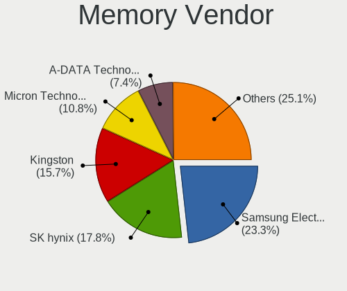

| Vendor                         | Computers | Percent |
|--------------------------------|-----------|---------|
| Samsung Electronics            | 234       | 23.01%  |
| SK hynix                       | 175       | 17.21%  |
| Kingston                       | 171       | 16.81%  |
| Micron Technology              | 110       | 10.82%  |
| Unknown                        | 88        | 8.65%   |
| A-DATA Technology              | 76        | 7.47%   |
| Corsair                        | 29        | 2.85%   |
| Ramaxel Technology             | 23        | 2.26%   |
| Elpida                         | 16        | 1.57%   |
| Nanya Technology               | 15        | 1.47%   |
| Crucial                        | 13        | 1.28%   |
| Unknown (ABCD)                 | 11        | 1.08%   |
| Patriot                        | 9         | 0.88%   |
| Team                           | 7         | 0.69%   |
| Qimonda                        | 6         | 0.59%   |
| PNY                            | 4         | 0.39%   |
| Transcend                      | 3         | 0.29%   |
| G.Skill                        | 3         | 0.29%   |
| Timetec                        | 2         | 0.2%    |
| Hewlett-Packard                | 2         | 0.2%    |
| ChangXin Memory                | 2         | 0.2%    |
| Avant                          | 2         | 0.2%    |
| Unknown                        | 2         | 0.2%    |
| Unknown (0x29E)                | 1         | 0.1%    |
| Silicon Power                  | 1         | 0.1%    |
| SHARETRONIC                    | 1         | 0.1%    |
| SGS/Thomson                    | 1         | 0.1%    |
| S                              | 1         | 0.1%    |
| Patriot Memory                 | 1         | 0.1%    |
| MKF_SMBIOS_TYPE17_MANUFACTURER | 1         | 0.1%    |
| Goldkey                        | 1         | 0.1%    |
| Gigabyte Technology            | 1         | 0.1%    |
| CSX                            | 1         | 0.1%    |
| Apacer                         | 1         | 0.1%    |
| Aeneon                         | 1         | 0.1%    |
| 3235CB0010E4                   | 1         | 0.1%    |
| 0161000080AD                   | 1         | 0.1%    |

Memory Model
------------

Memory module models

| Model                                                            | Computers | Percent |
|------------------------------------------------------------------|-----------|---------|
| Samsung RAM M471A5244CB0-CTD 4GB SODIMM DDR4 3266MT/s            | 22        | 1.98%   |
| Samsung RAM M471A1K43DB1-CTD 8GB SODIMM DDR4 2667MT/s            | 11        | 0.99%   |
| Unknown (ABCD) RAM 123456789012345678 2GB SODIMM LPDDR4 2400MT/s | 10        | 0.9%    |
| Samsung RAM M471B5273DH0-CH9 4GB SODIMM DDR3 1334MT/s            | 10        | 0.9%    |
| SK hynix RAM HMT451S6BFR8A-PB 4GB SODIMM DDR3 1600MT/s           | 9         | 0.81%   |
| SK hynix RAM HMT41GS6BFR8A-PB 8GB SODIMM DDR3 1600MT/s           | 9         | 0.81%   |
| SK hynix RAM HMA81GS6AFR8N-UH 8GB SODIMM DDR4 2667MT/s           | 9         | 0.81%   |
| Micron RAM 4ATF51264HZ-2G6E1 4GB SODIMM DDR4 2667MT/s            | 9         | 0.81%   |
| Micron RAM 4ATF1G64HZ-3G2E1 8GB Row Of Chips DDR4 3200MT/s       | 9         | 0.81%   |
| A-DATA RAM DDR4 3200 16GB DIMM DDR4 3400MT/s                     | 8         | 0.72%   |
| SK hynix RAM HMT351S6CFR8C-PB 4GB SODIMM DDR3 1600MT/s           | 7         | 0.63%   |
| Samsung RAM M471B5173DB0-YK0 4GB SODIMM DDR3 1600MT/s            | 7         | 0.63%   |
| Samsung RAM M471B1G73DB0-YK0 8GB SODIMM DDR3 1600MT/s            | 7         | 0.63%   |
| Samsung RAM M471A1K43CB1-CTD 8GB SODIMM DDR4 2667MT/s            | 7         | 0.63%   |
| Micron RAM 8KTF51264HZ-1G6E1 4GB SODIMM DDR3 1600MT/s            | 7         | 0.63%   |
| SK hynix RAM HMT451S6BFR8A-PB 4096MB SODIMM DDR3 1600MT/s        | 6         | 0.54%   |
| SK hynix RAM HMA81GS6JJR8N-VK 8GB SODIMM DDR4 2667MT/s           | 6         | 0.54%   |
| Samsung RAM M471B5173QH0-YK0 4GB SODIMM DDR3 1600MT/s            | 6         | 0.54%   |
| Samsung RAM M471B5173EB0-YK0 4GB SODIMM DDR3 1600MT/s            | 6         | 0.54%   |
| Samsung RAM M471B1G73QH0-YK0 8GB SODIMM DDR3 1600MT/s            | 6         | 0.54%   |
| Samsung RAM M471B1G73EB0-YK0 8GB SODIMM DDR3 1600MT/s            | 6         | 0.54%   |
| Samsung RAM M471A1K43BB0-CPB 8GB SODIMM DDR4 2133MT/s            | 6         | 0.54%   |
| Kingston RAM KHX2666C16/8G 8GB DIMM DDR4 3466MT/s                | 6         | 0.54%   |
| Kingston RAM KF3200C16D4/8GX 8GB DIMM DDR4 3600MT/s              | 6         | 0.54%   |
| Kingston RAM 99U5428-018.A00LF 8192MB SODIMM DDR3 1600MT/s       | 6         | 0.54%   |
| Unknown RAM Module 4GB DIMM 1333MT/s                             | 5         | 0.45%   |
| Unknown RAM Module 2GB SODIMM DDR2 667MT/s                       | 5         | 0.45%   |
| SK hynix RAM HMA851S6AFR6N-UH 4GB SODIMM DDR4 2400MT/s           | 5         | 0.45%   |
| SK hynix RAM HMA81GS6CJR8N-VK 8GB SODIMM DDR4 2667MT/s           | 5         | 0.45%   |
| Samsung RAM M471B5273DH0-CK0 4GB SODIMM DDR3 1600MT/s            | 5         | 0.45%   |
| Samsung RAM M471B5273CH0-CH9 4GB SODIMM DDR3 1334MT/s            | 5         | 0.45%   |
| Samsung RAM M471A1K43CB1-CRC 8GB SODIMM DDR4 2667MT/s            | 5         | 0.45%   |
| Micron RAM 8ATF1G64HZ-2G6E1 8GB SODIMM DDR4 2667MT/s             | 5         | 0.45%   |
| Micron RAM 8ATF1G64HZ-2G3B1 8GB SODIMM DDR4 2400MT/s             | 5         | 0.45%   |
| Kingston RAM KHX1600C9S3L/8G 8GB SODIMM DDR3 1600MT/s            | 5         | 0.45%   |
| A-DATA RAM DDR4 2666 8GB DIMM DDR4 2666MT/s                      | 5         | 0.45%   |
| Unknown RAM Module 4GB SODIMM DDR3 1600MT/s                      | 4         | 0.36%   |
| Unknown RAM Module 2GB SODIMM DDR3                               | 4         | 0.36%   |
| Team RAM TEAMGROUP-UD4-2666 8GB DIMM DDR4 2667MT/s               | 4         | 0.36%   |
| SK hynix RAM HYMP125S64CP8-S6 2GB SODIMM DDR2 800MT/s            | 4         | 0.36%   |

Memory Kind
-----------

Memory module kinds

| Kind    | Computers | Percent |
|---------|-----------|---------|
| DDR3    | 346       | 40.75%  |
| DDR4    | 341       | 40.16%  |
| DDR2    | 58        | 6.83%   |
| LPDDR4  | 25        | 2.94%   |
| SDRAM   | 24        | 2.83%   |
| LPDDR3  | 23        | 2.71%   |
| Unknown | 23        | 2.71%   |
| DDR     | 8         | 0.94%   |
| RAM     | 1         | 0.12%   |

Memory Form Factor
------------------

Physical design of the memory module

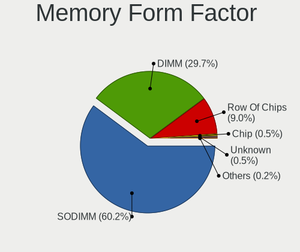

| Name         | Computers | Percent |
|--------------|-----------|---------|
| SODIMM       | 525       | 62.43%  |
| DIMM         | 252       | 29.96%  |
| Row Of Chips | 57        | 6.78%   |
| Chip         | 4         | 0.48%   |
| Unknown      | 2         | 0.24%   |
| RIMM         | 1         | 0.12%   |

Memory Size
-----------

Memory module size

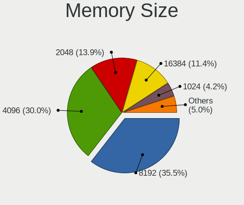

| Size  | Computers | Percent |
|-------|-----------|---------|
| 4096  | 329       | 33.88%  |
| 8192  | 327       | 33.68%  |
| 2048  | 159       | 16.37%  |
| 16384 | 74        | 7.62%   |
| 1024  | 48        | 4.94%   |
| 32768 | 22        | 2.27%   |
| 512   | 7         | 0.72%   |
| 256   | 2         | 0.21%   |
| 65536 | 1         | 0.1%    |
| 32767 | 1         | 0.1%    |
| 128   | 1         | 0.1%    |

Memory Speed
------------

Memory module speed

| Speed   | Computers | Percent |
|---------|-----------|---------|
| 1600    | 230       | 24.52%  |
| 2667    | 137       | 14.61%  |
| 1333    | 77        | 8.21%   |
| 3200    | 74        | 7.89%   |
| 2400    | 64        | 6.82%   |
| 2133    | 51        | 5.44%   |
| 1334    | 37        | 3.94%   |
| 667     | 35        | 3.73%   |
| 800     | 25        | 2.67%   |
| 3266    | 24        | 2.56%   |
| Unknown | 24        | 2.56%   |
| 3600    | 15        | 1.6%    |
| 1867    | 13        | 1.39%   |
| 1067    | 13        | 1.39%   |
| 3400    | 12        | 1.28%   |
| 1066    | 11        | 1.17%   |
| 4267    | 9         | 0.96%   |
| 2666    | 8         | 0.85%   |
| 533     | 8         | 0.85%   |
| 3466    | 7         | 0.75%   |
| 3000    | 7         | 0.75%   |
| 2800    | 6         | 0.64%   |
| 2048    | 6         | 0.64%   |
| 1866    | 6         | 0.64%   |
| 975     | 6         | 0.64%   |
| 49926   | 3         | 0.32%   |
| 4199    | 3         | 0.32%   |
| 3733    | 3         | 0.32%   |
| 2933    | 3         | 0.32%   |
| 8400    | 2         | 0.21%   |
| 3800    | 2         | 0.21%   |
| 1332    | 2         | 0.21%   |
| 400     | 2         | 0.21%   |
| 333     | 2         | 0.21%   |
| 266     | 2         | 0.21%   |
| 4000    | 1         | 0.11%   |
| 3334    | 1         | 0.11%   |
| 3333    | 1         | 0.11%   |
| 2187    | 1         | 0.11%   |
| 2134    | 1         | 0.11%   |

Printers & scanners
-------------------

Printer Vendor
--------------

Printer device vendors

| Vendor                 | Computers | Percent |
|------------------------|-----------|---------|
| Seiko Epson            | 14        | 30.43%  |
| Hewlett-Packard        | 11        | 23.91%  |
| Brother Industries     | 10        | 21.74%  |
| Canon                  | 5         | 10.87%  |
| Samsung Electronics    | 3         | 6.52%   |
| TSC Auto ID Technology | 1         | 2.17%   |
| Kyocera                | 1         | 2.17%   |
| BIXOLON                | 1         | 2.17%   |

Printer Model
-------------

Printer device models

| Model                                   | Computers | Percent |
|-----------------------------------------|-----------|---------|
| Seiko Epson L120 Series                 | 6         | 12.77%  |
| HP DeskJet 1110 series                  | 3         | 6.38%   |
| HP LaserJet Professional P 1102w        | 2         | 4.26%   |
| Canon G3000 series                      | 2         | 4.26%   |
| Brother MFC-J470DW                      | 2         | 4.26%   |
| Brother HL-1110 series                  | 2         | 4.26%   |
| TSC Auto ID Printer                     | 1         | 2.13%   |
| Seiko Epson XP-230 Series               | 1         | 2.13%   |
| Seiko Epson Printer                     | 1         | 2.13%   |
| Seiko Epson L555 Series                 | 1         | 2.13%   |
| Seiko Epson L4150 Series                | 1         | 2.13%   |
| Seiko Epson L300 Series                 | 1         | 2.13%   |
| Seiko Epson L210 Series                 | 1         | 2.13%   |
| Seiko Epson L200 Series                 | 1         | 2.13%   |
| Seiko Epson L1300 Series                | 1         | 2.13%   |
| Seiko Epson ET-3750 Series              | 1         | 2.13%   |
| Samsung Xerox Phaser 3117 Laser Printer | 1         | 2.13%   |
| Samsung ML-1660 Series                  | 1         | 2.13%   |
| Samsung M283x Series                    | 1         | 2.13%   |
| Kyocera FS-1030D printer                | 1         | 2.13%   |
| HP OfficeJet Pro 7740 series            | 1         | 2.13%   |
| HP DeskJet F4200 series                 | 1         | 2.13%   |
| HP DeskJet 4720 series                  | 1         | 2.13%   |
| HP DeskJet 2620 All-in-One Printer      | 1         | 2.13%   |
| HP Deskjet 2540 series                  | 1         | 2.13%   |
| HP DeskJet 2300 series                  | 1         | 2.13%   |
| Canon PIXMA MG3500 Series               | 1         | 2.13%   |
| Canon PIXMA iP3000x Printer             | 1         | 2.13%   |
| Canon iP2600 series                     | 1         | 2.13%   |
| Brother MFC-T910DW                      | 1         | 2.13%   |
| Brother MFC-L3770CDW series             | 1         | 2.13%   |
| Brother DCP-T710W                       | 1         | 2.13%   |
| Brother DCP-L2540DW                     | 1         | 2.13%   |
| Brother DCP-1510                        | 1         | 2.13%   |
| Brother Composite Device                | 1         | 2.13%   |
| BIXOLON SRP-350plusIII                  | 1         | 2.13%   |

Scanner Vendor
--------------

Scanner device vendors

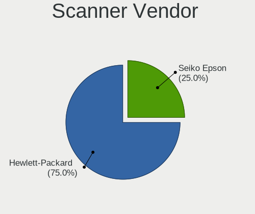

| Vendor          | Computers | Percent |
|-----------------|-----------|---------|
| Hewlett-Packard | 5         | 83.33%  |
| Seiko Epson     | 1         | 16.67%  |

Scanner Model
-------------

Scanner device models

| Model                                              | Computers | Percent |
|----------------------------------------------------|-----------|---------|
| HP ScanJet 5590                                    | 2         | 33.33%  |
| HP ScanJet 4500C/5550C                             | 2         | 33.33%  |
| Seiko Epson GT-8400UF [Perfection 1670/1670 PHOTO] | 1         | 16.67%  |
| HP ScanJet 3300c                                   | 1         | 16.67%  |

Camera
------

Camera Vendor
-------------

Camera device vendors

| Vendor                                 | Computers | Percent |
|----------------------------------------|-----------|---------|
| Chicony Electronics                    | 276       | 22.28%  |
| Microdia                               | 109       | 8.8%    |
| IMC Networks                           | 101       | 8.15%   |
| Realtek Semiconductor                  | 89        | 7.18%   |
| Cheng Uei Precision Industry (Foxlink) | 72        | 5.81%   |
| Acer                                   | 69        | 5.57%   |
| Suyin                                  | 60        | 4.84%   |
| Sunplus Innovation Technology          | 59        | 4.76%   |
| Logitech                               | 46        | 3.71%   |
| Quanta                                 | 45        | 3.63%   |
| Apple                                  | 41        | 3.31%   |
| Syntek                                 | 40        | 3.23%   |
| Lite-On Technology                     | 33        | 2.66%   |
| Silicon Motion                         | 19        | 1.53%   |
| Ricoh                                  | 19        | 1.53%   |
| Generalplus Technology                 | 18        | 1.45%   |
| Importek                               | 15        | 1.21%   |
| Alcor Micro                            | 14        | 1.13%   |
| Microsoft                              | 9         | 0.73%   |
| GEMBIRD                                | 8         | 0.65%   |
| Jieli Technology                       | 7         | 0.56%   |
| ALi                                    | 7         | 0.56%   |
| Samsung Electronics                    | 6         | 0.48%   |
| OmniVision Technologies                | 6         | 0.48%   |
| Genesys Logic                          | 6         | 0.48%   |
| Z-Star Microelectronics                | 5         | 0.4%    |
| Y Media                                | 4         | 0.32%   |
| Primax Electronics                     | 4         | 0.32%   |
| MacroSilicon                           | 4         | 0.32%   |
| KYE Systems (Mouse Systems)            | 4         | 0.32%   |
| Sunplus Technology                     | 3         | 0.24%   |
| LG Electronics                         | 3         | 0.24%   |
| Lenovo                                 | 3         | 0.24%   |
| Cubeternet                             | 3         | 0.24%   |
| Tobii Technology AB                    | 2         | 0.16%   |
| Luxvisions Innotech Limited            | 2         | 0.16%   |
| Hewlett-Packard                        | 2         | 0.16%   |
| DigiTech                               | 2         | 0.16%   |
| YGTek                                  | 1         | 0.08%   |
| Xiongmai                               | 1         | 0.08%   |

Camera Model
------------

Camera device models

| Model                                                           | Computers | Percent |
|-----------------------------------------------------------------|-----------|---------|
| Chicony Integrated Camera                                       | 39        | 3.12%   |
| Microdia Integrated_Webcam_HD                                   | 33        | 2.64%   |
| Chicony HD WebCam                                               | 27        | 2.16%   |
| Acer Integrated Camera                                          | 27        | 2.16%   |
| IMC Networks Integrated Camera                                  | 22        | 1.76%   |
| Chicony HP Webcam                                               | 20        | 1.6%    |
| Realtek Integrated_Webcam_HD                                    | 19        | 1.52%   |
| Logitech HD Pro Webcam C920                                     | 17        | 1.36%   |
| Sunplus Integrated_Webcam_HD                                    | 15        | 1.2%    |
| IMC Networks USB2.0 VGA UVC WebCam                              | 15        | 1.2%    |
| Generalplus GENERAL WEBCAM                                      | 15        | 1.2%    |
| Quanta HP Webcam                                                | 14        | 1.12%   |
| IMC Networks HD Camera                                          | 14        | 1.12%   |
| Syntek Integrated Camera                                        | 13        | 1.04%   |
| Chicony HP TrueVision HD Camera                                 | 13        | 1.04%   |
| Chicony HP TrueVision HD                                        | 13        | 1.04%   |
| Sunplus HD WebCam                                               | 12        | 0.96%   |
| Lite-On HP Wide Vision HD Camera                                | 12        | 0.96%   |
| IMC Networks EasyCamera                                         | 12        | 0.96%   |
| Chicony USB 2.0 Camera                                          | 12        | 0.96%   |
| Syntek Lenovo EasyCamera                                        | 11        | 0.88%   |
| Apple FaceTime HD Camera                                        | 11        | 0.88%   |
| Microdia Integrated Webcam                                      | 10        | 0.8%    |
| IMC Networks USB2.0 HD UVC WebCam                               | 10        | 0.8%    |
| Chicony HP Wide Vision HD Camera                                | 10        | 0.8%    |
| Cheng Uei Precision Industry (Foxlink) HP TrueVision HD Camera  | 10        | 0.8%    |
| Cheng Uei Precision Industry (Foxlink) HD Camera                | 10        | 0.8%    |
| Suyin HP Truevision HD                                          | 9         | 0.72%   |
| Logitech Webcam C270                                            | 9         | 0.72%   |
| Chicony HP HD Camera                                            | 9         | 0.72%   |
| Cheng Uei Precision Industry (Foxlink) HP Truevision HD         | 9         | 0.72%   |
| Acer Lenovo EasyCamera                                          | 9         | 0.72%   |
| Acer EasyCamera                                                 | 9         | 0.72%   |
| Microdia Sonix USB 2.0 Camera                                   | 8         | 0.64%   |
| Microdia Laptop_Integrated_Webcam_HD                            | 8         | 0.64%   |
| Cheng Uei Precision Industry (Foxlink) HP Wide Vision HD Camera | 8         | 0.64%   |
| Cheng Uei Precision Industry (Foxlink) HP Webcam                | 8         | 0.64%   |
| Apple iPhone 5/5C/5S/6/SE                                       | 8         | 0.64%   |
| Apple Built-in iSight                                           | 8         | 0.64%   |
| Syntek EasyCamera                                               | 7         | 0.56%   |

Security
--------

Fingerprint Vendor
------------------

Fingerprint sensor vendors

| Vendor                     | Computers | Percent |
|----------------------------|-----------|---------|
| Validity Sensors           | 71        | 37.77%  |
| Shenzhen Goodix Technology | 38        | 20.21%  |
| Synaptics                  | 32        | 17.02%  |
| AuthenTec                  | 15        | 7.98%   |
| Upek                       | 14        | 7.45%   |
| Elan Microelectronics      | 6         | 3.19%   |
| STMicroelectronics         | 5         | 2.66%   |
| LighTuning Technology      | 3         | 1.6%    |
| Focal-systems.Corp         | 2         | 1.06%   |
| Suprema                    | 1         | 0.53%   |
| Samsung Electronics        | 1         | 0.53%   |

Fingerprint Model
-----------------

Fingerprint sensor models

| Model                                                                      | Computers | Percent |
|----------------------------------------------------------------------------|-----------|---------|
| Shenzhen Goodix  FingerPrint Device                                        | 30        | 15.96%  |
| Validity Sensors VFS495 Fingerprint Reader                                 | 16        | 8.51%   |
| Upek Biometric Touchchip/Touchstrip Fingerprint Sensor                     | 12        | 6.38%   |
| Synaptics Prometheus MIS Touch Fingerprint Reader                          | 12        | 6.38%   |
| Validity Sensors VFS 5011 fingerprint sensor                               | 9         | 4.79%   |
| Validity Sensors VFS5011 Fingerprint Reader                                | 8         | 4.26%   |
| Validity Sensors VFS471 Fingerprint Reader                                 | 8         | 4.26%   |
| Synaptics Metallica MIS Touch Fingerprint Reader                           | 8         | 4.26%   |
| AuthenTec AES2501 Fingerprint Sensor                                       | 8         | 4.26%   |
| Shenzhen Goodix Fingerprint Reader                                         | 7         | 3.72%   |
| Unknown                                                                    | 7         | 3.72%   |
| Validity Sensors VFS451 Fingerprint Reader                                 | 5         | 2.66%   |
| Validity Sensors VFS101 Fingerprint Reader                                 | 5         | 2.66%   |
| STMicroelectronics Fingerprint Reader                                      | 5         | 2.66%   |
| AuthenTec AES2810                                                          | 5         | 2.66%   |
| Validity Sensors VFS7500 Touch Fingerprint Sensor                          | 4         | 2.13%   |
| Validity Sensors VFS491                                                    | 4         | 2.13%   |
| Elan ELAN:Fingerprint                                                      | 4         | 2.13%   |
| Validity Sensors Synaptics VFS7552 Touch Fingerprint Sensor with PurePrint | 3         | 1.6%    |
| Synaptics  VFS7552 Touch Fingerprint Sensor with PurePrint                 | 3         | 1.6%    |
| LighTuning EgisTec Touch Fingerprint Sensor                                | 3         | 1.6%    |
| Validity Sensors VFS Fingerprint sensor                                    | 2         | 1.06%   |
| Validity Sensors Swipe Fingerprint Sensor                                  | 2         | 1.06%   |
| Validity Sensors Fingerprint scanner                                       | 2         | 1.06%   |
| Upek TCS5B Fingerprint sensor                                              | 2         | 1.06%   |
| Focal-systems.Corp FT9201Fingerprint.                                      | 2         | 1.06%   |
| Elan ELAN:ARM-M4                                                           | 2         | 1.06%   |
| Validity Sensors VFS7552 Touch Fingerprint Sensor                          | 1         | 0.53%   |
| Validity Sensors VFS301 Fingerprint Reader                                 | 1         | 0.53%   |
| Validity Sensors Synaptics WBDI                                            | 1         | 0.53%   |
| Synaptics  FS7604 Touch Fingerprint Sensor with PurePrint                  | 1         | 0.53%   |
| Synaptics Metallica MOH Touch Fingerprint Reader                           | 1         | 0.53%   |
| Suprema SUP-SFR400(A) BioMini Fingerprint Reader                           | 1         | 0.53%   |
| Shenzhen Goodix FingerPrint                                                | 1         | 0.53%   |
| Samsung Fingerprint Device                                                 | 1         | 0.53%   |
| AuthenTec Fingerprint Sensor                                               | 1         | 0.53%   |
| AuthenTec AES1600                                                          | 1         | 0.53%   |

Chipcard Vendor
---------------

Chipcard module vendors

| Vendor                | Computers | Percent |
|-----------------------|-----------|---------|
| Broadcom              | 31        | 55.36%  |
| Alcor Micro           | 12        | 21.43%  |
| Upek                  | 7         | 12.5%   |
| Lenovo                | 5         | 8.93%   |
| Gemalto (was Gemplus) | 1         | 1.79%   |

Chipcard Model
--------------

Chipcard module models

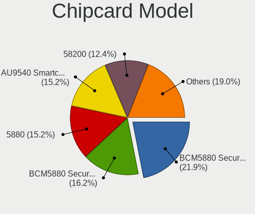

| Model                                                                        | Computers | Percent |
|------------------------------------------------------------------------------|-----------|---------|
| Broadcom BCM5880 Secure Applications Processor                               | 13        | 23.21%  |
| Alcor Micro AU9540 Smartcard Reader                                          | 12        | 21.43%  |
| Broadcom BCM5880 Secure Applications Processor with fingerprint swipe sensor | 11        | 19.64%  |
| Upek TouchChip Fingerprint Coprocessor (WBF advanced mode)                   | 7         | 12.5%   |
| Lenovo Integrated Smart Card Reader                                          | 5         | 8.93%   |
| Broadcom 58200                                                               | 5         | 8.93%   |
| Broadcom 5880                                                                | 2         | 3.57%   |
| Gemalto (was Gemplus) Compact Smart Card Reader Writer                       | 1         | 1.79%   |

Unsupported
-----------

Unsupported Devices
-------------------

Total unsupported devices on board

| Total | Computers | Percent |
|-------|-----------|---------|
| 0     | 1308      | 70.4%   |
| 1     | 461       | 24.81%  |
| 2     | 74        | 3.98%   |
| 3     | 12        | 0.65%   |
| 7     | 1         | 0.05%   |
| 6     | 1         | 0.05%   |
| 5     | 1         | 0.05%   |

Unsupported Device Types
------------------------

Types of unsupported devices

| Type                     | Computers | Percent |
|--------------------------|-----------|---------|
| Fingerprint reader       | 186       | 28.93%  |
| Graphics card            | 116       | 18.04%  |
| Net/wireless             | 113       | 17.57%  |
| Chipcard                 | 54        | 8.4%    |
| Multimedia controller    | 41        | 6.38%   |
| Communication controller | 35        | 5.44%   |
| Bluetooth                | 21        | 3.27%   |
| Camera                   | 14        | 2.18%   |
| Unassigned class         | 12        | 1.87%   |
| Storage                  | 10        | 1.56%   |
| Net/ethernet             | 9         | 1.4%    |
| Sound                    | 8         | 1.24%   |
| Modem                    | 6         | 0.93%   |
| Network                  | 5         | 0.78%   |
| Card reader              | 5         | 0.78%   |
| Storage/raid             | 3         | 0.47%   |
| Storage/ide              | 2         | 0.31%   |
| Video                    | 1         | 0.16%   |
| Firewire controller      | 1         | 0.16%   |
| Dvb card                 | 1         | 0.16%   |

