Linux in Moldova - Tested Hardware & Statistics
-----------------------------------------------

A project to collect tested hardware configurations for Linux in Moldova.

Anyone can contribute to this report by the [hw-probe](https://github.com/linuxhw/hw-probe) tool:

    sudo -E hw-probe -all -upload

Please contribute! Especially if your hardware is rare.

This is a report for all computer types. See also reports for [desktops](/Location/Moldova/Desktop/README.md) and [notebooks](/Location/Moldova/Notebook/README.md).

Contents
--------

* [ Test Cases ](#test-cases)

* [ System ](#system)
  - [ OS                       ](#os)
  - [ OS Family                ](#os-family)
  - [ Kernel                   ](#kernel)
  - [ Kernel Family            ](#kernel-family)
  - [ Kernel Major Ver.        ](#kernel-major-ver)
  - [ Arch                     ](#arch)
  - [ DE                       ](#de)
  - [ Display Server           ](#display-server)
  - [ Display Manager          ](#display-manager)
  - [ OS Lang                  ](#os-lang)
  - [ Boot Mode                ](#boot-mode)
  - [ Filesystem               ](#filesystem)
  - [ Part. scheme             ](#part-scheme)
  - [ Dual Boot with Linux/BSD ](#dual-boot-with-linuxbsd)
  - [ Dual Boot (Win)          ](#dual-boot-win)

* [ Board ](#board)
  - [ Vendor                   ](#vendor)
  - [ Model                    ](#model)
  - [ Model Family             ](#model-family)
  - [ MFG Year                 ](#mfg-year)
  - [ Form Factor              ](#form-factor)
  - [ Secure Boot              ](#secure-boot)
  - [ Coreboot                 ](#coreboot)
  - [ RAM Size                 ](#ram-size)
  - [ RAM Used                 ](#ram-used)
  - [ Total Drives             ](#total-drives)
  - [ Has CD-ROM               ](#has-cd-rom)
  - [ Has Ethernet             ](#has-ethernet)
  - [ Has WiFi                 ](#has-wifi)
  - [ Has Bluetooth            ](#has-bluetooth)

* [ Location ](#location)
  - [ Country                  ](#country)
  - [ City                     ](#city)

* [ Drives ](#drives)
  - [ Drive Vendor             ](#drive-vendor)
  - [ Drive Model              ](#drive-model)
  - [ HDD Vendor               ](#hdd-vendor)
  - [ SSD Vendor               ](#ssd-vendor)
  - [ Drive Kind               ](#drive-kind)
  - [ Drive Connector          ](#drive-connector)
  - [ Drive Size               ](#drive-size)
  - [ Space Total              ](#space-total)
  - [ Space Used               ](#space-used)
  - [ Malfunc. Drives          ](#malfunc-drives)
  - [ Malfunc. Drive Vendor    ](#malfunc-drive-vendor)
  - [ Malfunc. HDD Vendor      ](#malfunc-hdd-vendor)
  - [ Malfunc. Drive Kind      ](#malfunc-drive-kind)
  - [ Failed Drives            ](#failed-drives)
  - [ Failed Drive Vendor      ](#failed-drive-vendor)
  - [ Drive Status             ](#drive-status)

* [ Storage controller ](#storage-controller)
  - [ Storage Vendor           ](#storage-vendor)
  - [ Storage Model            ](#storage-model)
  - [ Storage Kind             ](#storage-kind)

* [ Processor ](#processor)
  - [ CPU Vendor               ](#cpu-vendor)
  - [ CPU Model                ](#cpu-model)
  - [ CPU Model Family         ](#cpu-model-family)
  - [ CPU Cores                ](#cpu-cores)
  - [ CPU Sockets              ](#cpu-sockets)
  - [ CPU Threads              ](#cpu-threads)
  - [ CPU Op-Modes             ](#cpu-op-modes)
  - [ CPU Microcode            ](#cpu-microcode)
  - [ CPU Microarch            ](#cpu-microarch)

* [ Graphics ](#graphics)
  - [ GPU Vendor               ](#gpu-vendor)
  - [ GPU Model                ](#gpu-model)
  - [ GPU Combo                ](#gpu-combo)
  - [ GPU Driver               ](#gpu-driver)
  - [ GPU Memory               ](#gpu-memory)

* [ Monitor ](#monitor)
  - [ Monitor Vendor           ](#monitor-vendor)
  - [ Monitor Model            ](#monitor-model)
  - [ Monitor Resolution       ](#monitor-resolution)
  - [ Monitor Diagonal         ](#monitor-diagonal)
  - [ Monitor Width            ](#monitor-width)
  - [ Aspect Ratio             ](#aspect-ratio)
  - [ Monitor Area             ](#monitor-area)
  - [ Pixel Density            ](#pixel-density)
  - [ Multiple Monitors        ](#multiple-monitors)

* [ Network ](#network)
  - [ Net Controller Vendor    ](#net-controller-vendor)
  - [ Net Controller Model     ](#net-controller-model)
  - [ Wireless Vendor          ](#wireless-vendor)
  - [ Wireless Model           ](#wireless-model)
  - [ Ethernet Vendor          ](#ethernet-vendor)
  - [ Ethernet Model           ](#ethernet-model)
  - [ Net Controller Kind      ](#net-controller-kind)
  - [ Used Controller          ](#used-controller)
  - [ NICs                     ](#nics)
  - [ IPv6                     ](#ipv6)

* [ Bluetooth ](#bluetooth)
  - [ Bluetooth Vendor         ](#bluetooth-vendor)
  - [ Bluetooth Model          ](#bluetooth-model)

* [ Sound ](#sound)
  - [ Sound Vendor             ](#sound-vendor)
  - [ Sound Model              ](#sound-model)

* [ Memory ](#memory)
  - [ Memory Vendor            ](#memory-vendor)
  - [ Memory Model             ](#memory-model)
  - [ Memory Kind              ](#memory-kind)
  - [ Memory Form Factor       ](#memory-form-factor)
  - [ Memory Size              ](#memory-size)
  - [ Memory Speed             ](#memory-speed)

* [ Printers & scanners ](#printers--scanners)
  - [ Printer Vendor           ](#printer-vendor)
  - [ Printer Model            ](#printer-model)
  - [ Scanner Vendor           ](#scanner-vendor)
  - [ Scanner Model            ](#scanner-model)

* [ Camera ](#camera)
  - [ Camera Vendor            ](#camera-vendor)
  - [ Camera Model             ](#camera-model)

* [ Security ](#security)
  - [ Fingerprint Vendor       ](#fingerprint-vendor)
  - [ Fingerprint Model        ](#fingerprint-model)
  - [ Chipcard Vendor          ](#chipcard-vendor)
  - [ Chipcard Model           ](#chipcard-model)

* [ Unsupported ](#unsupported)
  - [ Unsupported Devices      ](#unsupported-devices)
  - [ Unsupported Device Types ](#unsupported-device-types)

Test Cases
----------

Total: 435

| Vendor     | Model                       | Form-Factor | Probe                                                      | Date         |
|------------|-----------------------------|-------------|------------------------------------------------------------|--------------|
| HP         | Pavilion Laptop 15-eh3xx... | Notebook    | [48a2a9416d](https://linux-hardware.org/?probe=48a2a9416d) | Dec 23, 2025 |
| ASUSTek    | K52JU                       | Notebook    | [c8d6430be3](https://linux-hardware.org/?probe=c8d6430be3) | Dec 22, 2025 |
| Lenovo     | IdeaPad 3 15IIL05 81WE      | Notebook    | [b6198affc8](https://linux-hardware.org/?probe=b6198affc8) | Dec 22, 2025 |
| ASUSTek    | ASUS EXPERTBOOK B2502FBA... | Convertible | [a3c5e6f3b9](https://linux-hardware.org/?probe=a3c5e6f3b9) | Dec 14, 2025 |
| ASUSTek    | ASUS EXPERTBOOK B2502FBA... | Convertible | [74d5f81b81](https://linux-hardware.org/?probe=74d5f81b81) | Dec 14, 2025 |
| Intel      | B75                         | Desktop     | [a4c357d5ab](https://linux-hardware.org/?probe=a4c357d5ab) | Dec 12, 2025 |
| ASUSTek    | Z97-PRO                     | Desktop     | [f0c7d89443](https://linux-hardware.org/?probe=f0c7d89443) | Dec 01, 2025 |
| ASUSTek    | Z97-PRO                     | Desktop     | [c20f900e04](https://linux-hardware.org/?probe=c20f900e04) | Dec 01, 2025 |
| ASUSTek    | P5G41T-M LX                 | Desktop     | [5f36a68f84](https://linux-hardware.org/?probe=5f36a68f84) | Nov 30, 2025 |
| Lenovo     | IdeaPad Slim 5 16ABR8 82... | Notebook    | [ea0654048d](https://linux-hardware.org/?probe=ea0654048d) | Nov 30, 2025 |
| MSI        | MPG X570 GAMING PLUS        | Desktop     | [d2a7d90c1e](https://linux-hardware.org/?probe=d2a7d90c1e) | Nov 26, 2025 |
| Lenovo     | ThinkPad T16 Gen 2 21HH0... | Notebook    | [82cdefdaa1](https://linux-hardware.org/?probe=82cdefdaa1) | Nov 25, 2025 |
| Lenovo     | IdeaPad 5 Pro 16ACH6 82L... | Notebook    | [f2f3a89e5e](https://linux-hardware.org/?probe=f2f3a89e5e) | Nov 22, 2025 |
| ASUSTek    | PRIME B760M-K               | Desktop     | [ea30874aff](https://linux-hardware.org/?probe=ea30874aff) | Nov 09, 2025 |
| ASUSTek    | ROG STRIX Z690-I GAMING ... | Desktop     | [d395f61ffa](https://linux-hardware.org/?probe=d395f61ffa) | Nov 04, 2025 |
| Lenovo     | IdeaPad 5 15ARE05 81YQ      | Notebook    | [db25ec21cd](https://linux-hardware.org/?probe=db25ec21cd) | Oct 30, 2025 |
| Biostar    | GF8200C M2+                 | Desktop     | [4c59825077](https://linux-hardware.org/?probe=4c59825077) | Oct 30, 2025 |
| Acer       | Aspire A515-47              | Notebook    | [2ae4ca72e8](https://linux-hardware.org/?probe=2ae4ca72e8) | Oct 22, 2025 |
| HP         | EliteBook 855 G8 Noteboo... | Notebook    | [bb0f7a4588](https://linux-hardware.org/?probe=bb0f7a4588) | Oct 12, 2025 |
| MSI        | 2A9C                        | Desktop     | [7f2f193bc3](https://linux-hardware.org/?probe=7f2f193bc3) | Oct 06, 2025 |
| ASUSTek    | ASUS TUF Gaming A15 FA50... | Notebook    | [1999801ddb](https://linux-hardware.org/?probe=1999801ddb) | Oct 06, 2025 |
| Lenovo     | ThinkPad E16 Gen 2 21M50... | Notebook    | [efe586e84f](https://linux-hardware.org/?probe=efe586e84f) | Sep 27, 2025 |
| Lenovo     | ThinkPad T60 200757U        | Notebook    | [9f86bc2772](https://linux-hardware.org/?probe=9f86bc2772) | Sep 03, 2025 |
| Lenovo     | Legion 5 15IMH6 82NL        | Notebook    | [b9b5f822b5](https://linux-hardware.org/?probe=b9b5f822b5) | Sep 02, 2025 |
| ASUSTek    | PRIME H510M-A R2.0          | Desktop     | [7bacc1dd99](https://linux-hardware.org/?probe=7bacc1dd99) | Aug 21, 2025 |
| Lenovo     | Legion Go S 8ARP1 83L3      | Tablet      | [9762e5f632](https://linux-hardware.org/?probe=9762e5f632) | Aug 21, 2025 |
| Lenovo     | ThinkPad T60 200757U        | Notebook    | [8b50dcd8eb](https://linux-hardware.org/?probe=8b50dcd8eb) | Aug 18, 2025 |
| ASUSTek    | X540NA                      | Notebook    | [a13048b57a](https://linux-hardware.org/?probe=a13048b57a) | Aug 12, 2025 |
| HP         | Laptop 15s-eq0xxx           | Notebook    | [fb1d1e0705](https://linux-hardware.org/?probe=fb1d1e0705) | Aug 11, 2025 |
| MSI        | PRO Z690-A WIFI             | Desktop     | [450874ea68](https://linux-hardware.org/?probe=450874ea68) | Aug 07, 2025 |
| ASUSTek    | X540NA                      | Notebook    | [a865aa6c24](https://linux-hardware.org/?probe=a865aa6c24) | Aug 03, 2025 |
| MSI        | PRO Z690-A WIFI             | Desktop     | [4fbfa929e9](https://linux-hardware.org/?probe=4fbfa929e9) | Jul 28, 2025 |
| Lenovo     | ThinkPad T14s Gen 1 20UH... | Notebook    | [9a9bce6a4c](https://linux-hardware.org/?probe=9a9bce6a4c) | Jul 14, 2025 |
| MSI        | H87-G41 PC Mate             | Desktop     | [de9913e596](https://linux-hardware.org/?probe=de9913e596) | Jun 30, 2025 |
| ASUSTek    | VivoBook_ASUSLaptop E510... | Notebook    | [99b401e450](https://linux-hardware.org/?probe=99b401e450) | Jun 12, 2025 |
| ASUSTek    | K52F                        | Notebook    | [fec6b00e98](https://linux-hardware.org/?probe=fec6b00e98) | May 28, 2025 |
| Lenovo     | ThinkPad T16 Gen 2 21HH0... | Notebook    | [e4a5285f99](https://linux-hardware.org/?probe=e4a5285f99) | May 25, 2025 |
| Acer       | Aspire A515-51G             | Notebook    | [9b70f780d8](https://linux-hardware.org/?probe=9b70f780d8) | Apr 21, 2025 |
| MSI        | MPG X570 GAMING PLUS        | Desktop     | [99254361d9](https://linux-hardware.org/?probe=99254361d9) | Apr 19, 2025 |
| ASUSTek    | TUF Gaming B650-PLUS        | Desktop     | [a687689fa3](https://linux-hardware.org/?probe=a687689fa3) | Apr 17, 2025 |
| ASUSTek    | PRIME H770-PLUS             | Desktop     | [ce1b3c4fac](https://linux-hardware.org/?probe=ce1b3c4fac) | Apr 14, 2025 |
| ASRock     | Z690 Taichi                 | Desktop     | [7b102262b7](https://linux-hardware.org/?probe=7b102262b7) | Apr 10, 2025 |
| MSI        | G41M-E43                    | Desktop     | [4c93bca35f](https://linux-hardware.org/?probe=4c93bca35f) | Apr 08, 2025 |
| Lenovo     | IdeaPad 330-15IKB 81DE      | Notebook    | [82d1963fe3](https://linux-hardware.org/?probe=82d1963fe3) | Apr 06, 2025 |
| ASUSTek    | VivoBook_ASUSLaptop M650... | Notebook    | [3a287866bf](https://linux-hardware.org/?probe=3a287866bf) | Mar 18, 2025 |
| Lenovo     | IdeaPad 100-15IBD 80QQ      | Notebook    | [63bb1edec6](https://linux-hardware.org/?probe=63bb1edec6) | Mar 13, 2025 |
| Valve      | Galileo                     | Notebook    | [48126511b0](https://linux-hardware.org/?probe=48126511b0) | Feb 22, 2025 |
| Valve      | Galileo                     | Notebook    | [b783170749](https://linux-hardware.org/?probe=b783170749) | Feb 22, 2025 |
| ASUSTek    | ASUS Vivobook S 16 S5606... | Notebook    | [66b929637d](https://linux-hardware.org/?probe=66b929637d) | Jan 31, 2025 |
| Medion     | E15301                      | Notebook    | [6ed372ce0c](https://linux-hardware.org/?probe=6ed372ce0c) | Jan 29, 2025 |
| Samsung    | 300V3A/300V4A/300V5A/200... | Notebook    | [ffa58b22a6](https://linux-hardware.org/?probe=ffa58b22a6) | Dec 29, 2024 |
| Samsung    | 300V3A/300V4A/300V5A/200... | Notebook    | [c76825324c](https://linux-hardware.org/?probe=c76825324c) | Dec 28, 2024 |
| ASUSTek    | ASUS Vivobook S 16 M5606... | Notebook    | [87a62f7ab4](https://linux-hardware.org/?probe=87a62f7ab4) | Dec 12, 2024 |
| Lenovo     | Legion 5 15IMH05 82AU       | Notebook    | [79ab3bbc9e](https://linux-hardware.org/?probe=79ab3bbc9e) | Dec 06, 2024 |
| Lenovo     | IdeaPad 3 15ADA05 81W1      | Notebook    | [f9ad338bc2](https://linux-hardware.org/?probe=f9ad338bc2) | Nov 26, 2024 |
| ASUSTek    | X550CC                      | Notebook    | [9c9f50e48d](https://linux-hardware.org/?probe=9c9f50e48d) | Nov 11, 2024 |
| ASUSTek    | X550CC                      | Notebook    | [62c26e414e](https://linux-hardware.org/?probe=62c26e414e) | Nov 11, 2024 |
| ASUSTek    | ASUS Vivobook S 16 S5606... | Notebook    | [f375294d93](https://linux-hardware.org/?probe=f375294d93) | Oct 24, 2024 |
| Gigabyte   | G41MT-S2                    | Desktop     | [7705d36266](https://linux-hardware.org/?probe=7705d36266) | Oct 23, 2024 |
| ASUSTek    | ASUS Vivobook S 16 S5606... | Notebook    | [d137ac3a49](https://linux-hardware.org/?probe=d137ac3a49) | Oct 18, 2024 |
| HP         | ProBook 455 G1              | Notebook    | [fcc4357e92](https://linux-hardware.org/?probe=fcc4357e92) | Oct 17, 2024 |
| HP         | ProBook 455 G1              | Notebook    | [149a4ff02a](https://linux-hardware.org/?probe=149a4ff02a) | Oct 17, 2024 |
| Biostar    | A960G+                      | Desktop     | [ffbdc04a2d](https://linux-hardware.org/?probe=ffbdc04a2d) | Oct 13, 2024 |
| Gigabyte   | H67M-D2-B3                  | Desktop     | [c06d37811f](https://linux-hardware.org/?probe=c06d37811f) | Sep 26, 2024 |
| Gigabyte   | H67M-D2-B3                  | Desktop     | [b026a73cfc](https://linux-hardware.org/?probe=b026a73cfc) | Sep 26, 2024 |
| HP         | EliteBook 8470w             | Notebook    | [a4891795bf](https://linux-hardware.org/?probe=a4891795bf) | Sep 12, 2024 |
| Acer       | Extensa 215-55              | Notebook    | [0ccc3d6915](https://linux-hardware.org/?probe=0ccc3d6915) | Aug 30, 2024 |
| Acer       | Extensa 215-55              | Notebook    | [a4a6cf7e93](https://linux-hardware.org/?probe=a4a6cf7e93) | Aug 30, 2024 |
| Gigabyte   | GA-880GM-USB3               | Desktop     | [9c8e40a0ae](https://linux-hardware.org/?probe=9c8e40a0ae) | Aug 28, 2024 |
| HP         | EliteBook 8470w             | Notebook    | [41ca7ce107](https://linux-hardware.org/?probe=41ca7ce107) | Aug 22, 2024 |
| HP         | EliteBook 8470w             | Notebook    | [42a6e42a14](https://linux-hardware.org/?probe=42a6e42a14) | Aug 22, 2024 |
| Timi       | A35S                        | Notebook    | [3f66d5ebac](https://linux-hardware.org/?probe=3f66d5ebac) | Aug 20, 2024 |
| XIAOMI     | Redmi Book Pro 15 2023      | Notebook    | [6bb19c46ab](https://linux-hardware.org/?probe=6bb19c46ab) | Aug 08, 2024 |
| XIAOMI     | Redmi Book Pro 15 2023      | Notebook    | [bac0c976f4](https://linux-hardware.org/?probe=bac0c976f4) | Aug 08, 2024 |
| ASUSTek    | PRIME H610M-K               | Desktop     | [2deaed8934](https://linux-hardware.org/?probe=2deaed8934) | Aug 05, 2024 |
| MSI        | B350 KRAIT GAMING           | Desktop     | [0ffaa166a9](https://linux-hardware.org/?probe=0ffaa166a9) | Aug 05, 2024 |
| ASUSTek    | ASUS EXPERTBOOK B7402FEA... | Convertible | [222f98dc52](https://linux-hardware.org/?probe=222f98dc52) | Jul 25, 2024 |
| Acer       | Aspire A315-23              | Notebook    | [d5fd4c88f2](https://linux-hardware.org/?probe=d5fd4c88f2) | Jul 20, 2024 |
| ASUSTek    | Vivobook Go E1404FA_E140... | Notebook    | [0aa3213f68](https://linux-hardware.org/?probe=0aa3213f68) | Jul 17, 2024 |
| ASUSTek    | VivoBook_ASUSLaptop M160... | Notebook    | [26b93db645](https://linux-hardware.org/?probe=26b93db645) | Jul 17, 2024 |
| Lenovo     | Legion 5 Pro 16ACH6H 82J... | Notebook    | [6de6fcd1fa](https://linux-hardware.org/?probe=6de6fcd1fa) | Jul 16, 2024 |
| Gigabyte   | GA-78LMT-USB3 R2 sex        | Desktop     | [d12ed859af](https://linux-hardware.org/?probe=d12ed859af) | Jul 15, 2024 |
| Gigabyte   | AB350-Gaming-CF             | Desktop     | [a72308c7e1](https://linux-hardware.org/?probe=a72308c7e1) | Jul 01, 2024 |
| MSI        | GE60 2PE                    | Notebook    | [b7a466ecc5](https://linux-hardware.org/?probe=b7a466ecc5) | Jun 29, 2024 |
| ASUSTek    | P7P55D-E DELUXE             | Desktop     | [fa2fcb8943](https://linux-hardware.org/?probe=fa2fcb8943) | Jun 07, 2024 |
| HP         | 250 15.6 inch G10 Notebo... | Notebook    | [0006f4096d](https://linux-hardware.org/?probe=0006f4096d) | Jun 03, 2024 |
| Lenovo     | IdeaPad 110-15IBR 80T7      | Notebook    | [f8379977a9](https://linux-hardware.org/?probe=f8379977a9) | May 27, 2024 |
| MACHINIST  | X79 V2.82H                  | Desktop     | [baf6d1ffb8](https://linux-hardware.org/?probe=baf6d1ffb8) | May 26, 2024 |
| ASUSTek    | K50IJ                       | Notebook    | [6e78332749](https://linux-hardware.org/?probe=6e78332749) | May 20, 2024 |
| ASUSTek    | K50IJ                       | Notebook    | [ae43a3e7b5](https://linux-hardware.org/?probe=ae43a3e7b5) | May 20, 2024 |
| Dell       | Vostro 7620                 | Notebook    | [cf9fa662a8](https://linux-hardware.org/?probe=cf9fa662a8) | May 20, 2024 |
| Supermicro | X9SCL-II/X9SCM-II           | Desktop     | [a0c9c93180](https://linux-hardware.org/?probe=a0c9c93180) | May 20, 2024 |
| Supermicro | X9SCL-II/X9SCM-II           | Desktop     | [8373a09f6d](https://linux-hardware.org/?probe=8373a09f6d) | May 20, 2024 |
| MSI        | PRO B650-P WIFI             | Desktop     | [ea23208e0f](https://linux-hardware.org/?probe=ea23208e0f) | May 19, 2024 |
| Acer       | Extensa 215-55              | Notebook    | [491f2c8f23](https://linux-hardware.org/?probe=491f2c8f23) | May 15, 2024 |
| ASUSTek    | ROG Zephyrus G14 GA401IH... | Notebook    | [e19fea8a49](https://linux-hardware.org/?probe=e19fea8a49) | May 06, 2024 |
| HP         | 250 G4                      | Notebook    | [6c2d10b0b4](https://linux-hardware.org/?probe=6c2d10b0b4) | May 05, 2024 |
| Sony       | SVF1521C5E                  | Notebook    | [9a899f2e80](https://linux-hardware.org/?probe=9a899f2e80) | Apr 28, 2024 |
| Lenovo     | Yoga Pro 7 14APH8 82Y8      | Notebook    | [e36ba9916d](https://linux-hardware.org/?probe=e36ba9916d) | Apr 22, 2024 |
| Dell       | Inspiron 3593               | Notebook    | [e1b99394fb](https://linux-hardware.org/?probe=e1b99394fb) | Apr 13, 2024 |
| Olimex     | A20-OLinuXino-LIME2-eMMC    | Soc         | [37be09f11b](https://linux-hardware.org/?probe=37be09f11b) | Apr 11, 2024 |
| ASUSTek    | VivoBook_ASUSLaptop X150... | Notebook    | [92dd6dd367](https://linux-hardware.org/?probe=92dd6dd367) | Mar 31, 2024 |
| Gigabyte   | B550M K                     | Desktop     | [bfc7e96b9c](https://linux-hardware.org/?probe=bfc7e96b9c) | Mar 24, 2024 |
| Lenovo     | 0B98401 PRO                 | Desktop     | [5059aeedf0](https://linux-hardware.org/?probe=5059aeedf0) | Mar 23, 2024 |
| Lenovo     | 0B98401 PRO                 | Desktop     | [8b49c50089](https://linux-hardware.org/?probe=8b49c50089) | Mar 21, 2024 |
| ASUSTek    | VivoBook_ASUSLaptop X415... | Notebook    | [cd86953989](https://linux-hardware.org/?probe=cd86953989) | Feb 18, 2024 |
| ASRock     | X570 Phantom Gaming 4S      | Desktop     | [56e7d1d3ea](https://linux-hardware.org/?probe=56e7d1d3ea) | Feb 18, 2024 |
| ASRock     | X570 Phantom Gaming 4S      | Desktop     | [01e9c9ed92](https://linux-hardware.org/?probe=01e9c9ed92) | Feb 13, 2024 |
| HP         | EliteBook 840 G5            | Notebook    | [bdd9d20df9](https://linux-hardware.org/?probe=bdd9d20df9) | Feb 04, 2024 |
| ASUSTek    | ROG Strix G713RW_G713RW     | Notebook    | [20827e6f82](https://linux-hardware.org/?probe=20827e6f82) | Jan 26, 2024 |
| Gigabyte   | H61M-S1                     | Desktop     | [b0ac9a9edd](https://linux-hardware.org/?probe=b0ac9a9edd) | Jan 24, 2024 |
| HP         | 83DD                        | Mini pc     | [3a9b84ded5](https://linux-hardware.org/?probe=3a9b84ded5) | Jan 21, 2024 |
| ASUSTek    | VivoBook_ASUSLaptop X415... | Notebook    | [1427f84afd](https://linux-hardware.org/?probe=1427f84afd) | Jan 18, 2024 |
| Lenovo     | IdeaPad 5 Pro 14ACN6 82L... | Notebook    | [123bf2b824](https://linux-hardware.org/?probe=123bf2b824) | Jan 17, 2024 |
| Lenovo     | IdeaPad 310-15ISK 80SM      | Notebook    | [8494044b32](https://linux-hardware.org/?probe=8494044b32) | Jan 11, 2024 |
| Lenovo     | LOQ 15IRH8 82XV             | Notebook    | [494b496889](https://linux-hardware.org/?probe=494b496889) | Jan 01, 2024 |
| ASUSTek    | UX32VD                      | Notebook    | [e073ccab15](https://linux-hardware.org/?probe=e073ccab15) | Dec 13, 2023 |
| Lenovo     | Z51-70 80K6                 | Notebook    | [2894d2f78d](https://linux-hardware.org/?probe=2894d2f78d) | Dec 06, 2023 |
| Gigabyte   | G41MT-S2                    | Desktop     | [06a0da716b](https://linux-hardware.org/?probe=06a0da716b) | Dec 05, 2023 |
| Apple      | MacBookPro9,2               | Notebook    | [c120b25f0f](https://linux-hardware.org/?probe=c120b25f0f) | Nov 17, 2023 |
| HP         | 250 G8 Notebook PC          | Notebook    | [a6d12193c7](https://linux-hardware.org/?probe=a6d12193c7) | Nov 17, 2023 |
| HP         | ProBook 4320s               | Notebook    | [0da6b1026b](https://linux-hardware.org/?probe=0da6b1026b) | Nov 15, 2023 |
| ASUSTek    | ROG Strix G712LU_G712LU     | Notebook    | [50087ec971](https://linux-hardware.org/?probe=50087ec971) | Oct 08, 2023 |
| ASUSTek    | ROG Strix G712LU_G712LU     | Notebook    | [6f7b1474d0](https://linux-hardware.org/?probe=6f7b1474d0) | Oct 06, 2023 |
| Lenovo     | ThinkBook 15-IML 20RW       | Notebook    | [a8c067b868](https://linux-hardware.org/?probe=a8c067b868) | Sep 22, 2023 |
| Lenovo     | ThinkBook 15 G4 IAP 21DJ    | Notebook    | [367454b6bc](https://linux-hardware.org/?probe=367454b6bc) | Sep 16, 2023 |
| Dell       | Latitude 7490               | Notebook    | [c03e42edee](https://linux-hardware.org/?probe=c03e42edee) | Sep 05, 2023 |
| ASUSTek    | VivoBook 15_ASUS Laptop ... | Notebook    | [ded378b5da](https://linux-hardware.org/?probe=ded378b5da) | Aug 30, 2023 |
| Timi       | A34R                        | Notebook    | [f2998bab84](https://linux-hardware.org/?probe=f2998bab84) | Aug 25, 2023 |
| Dell       | Latitude 7490               | Notebook    | [90685f1b4d](https://linux-hardware.org/?probe=90685f1b4d) | Aug 21, 2023 |
| Dell       | Inspiron 15 7000 Gaming     | Notebook    | [7da49ac1c3](https://linux-hardware.org/?probe=7da49ac1c3) | Aug 17, 2023 |
| Dell       | Latitude 7490               | Notebook    | [efb4abea09](https://linux-hardware.org/?probe=efb4abea09) | Aug 16, 2023 |
| ASUSTek    | ROG Strix G713RW_G713RW     | Notebook    | [91887235b2](https://linux-hardware.org/?probe=91887235b2) | Jul 31, 2023 |
| ASUSTek    | TUF B450-PRO GAMING         | Desktop     | [0c0067ae1b](https://linux-hardware.org/?probe=0c0067ae1b) | Jul 30, 2023 |
| Gigabyte   | G41MT-S2                    | Desktop     | [d625267663](https://linux-hardware.org/?probe=d625267663) | Jul 17, 2023 |
| HP         | Spectre x360 2-in-1 Lapt... | Convertible | [c7a5d0ef6c](https://linux-hardware.org/?probe=c7a5d0ef6c) | Jun 29, 2023 |
| HP         | EliteBook 850 G1            | Notebook    | [3e08f1644a](https://linux-hardware.org/?probe=3e08f1644a) | Jun 24, 2023 |
| HP         | EliteBook 850 G1            | Notebook    | [574653afac](https://linux-hardware.org/?probe=574653afac) | Jun 24, 2023 |
| HP         | EliteBook 850 G1            | Notebook    | [fa6b09cc1d](https://linux-hardware.org/?probe=fa6b09cc1d) | Jun 23, 2023 |
| Dell       | Vostro 3525                 | Notebook    | [308ee62292](https://linux-hardware.org/?probe=308ee62292) | Jun 21, 2023 |
| Acer       | AOD257                      | Notebook    | [d3510be962](https://linux-hardware.org/?probe=d3510be962) | Jun 18, 2023 |
| Lenovo     | 375A No DPK                 | All in one  | [c7bf49d8e9](https://linux-hardware.org/?probe=c7bf49d8e9) | Jun 15, 2023 |
| Dell       | Vostro 3525                 | Notebook    | [fb399aebb6](https://linux-hardware.org/?probe=fb399aebb6) | Jun 11, 2023 |
| ASUSTek    | PRIME B350M-A               | Desktop     | [ba4bfc1fe1](https://linux-hardware.org/?probe=ba4bfc1fe1) | Jun 08, 2023 |
| Dell       | Vostro 3525                 | Notebook    | [e4b62aaf28](https://linux-hardware.org/?probe=e4b62aaf28) | Jun 05, 2023 |
| Apple      | Mac-942B5BF58194151B        | All in one  | [bdad1d1d9e](https://linux-hardware.org/?probe=bdad1d1d9e) | Jun 02, 2023 |
| Acer       | Aspire A515-54G             | Notebook    | [a6c2011fb0](https://linux-hardware.org/?probe=a6c2011fb0) | May 25, 2023 |
| Acer       | Aspire A515-54G             | Notebook    | [e58d4b4aee](https://linux-hardware.org/?probe=e58d4b4aee) | May 25, 2023 |
| Sony       | VPCF13WFX                   | Notebook    | [6500c354c7](https://linux-hardware.org/?probe=6500c354c7) | May 01, 2023 |
| Lenovo     | B50-30 80ES                 | Notebook    | [d84727b8e4](https://linux-hardware.org/?probe=d84727b8e4) | Apr 29, 2023 |
| Toshiba    | Satellite S50-B             | Notebook    | [e9d26a9e89](https://linux-hardware.org/?probe=e9d26a9e89) | Apr 12, 2023 |
| ASUSTek    | ZenBook UX425IA_UM425IA     | Notebook    | [3ac0a9cc94](https://linux-hardware.org/?probe=3ac0a9cc94) | Mar 31, 2023 |
| ASUSTek    | ROG Strix G533QM_G533QM     | Notebook    | [14f30effbe](https://linux-hardware.org/?probe=14f30effbe) | Mar 17, 2023 |
| ASRock     | B250M Pro4                  | Desktop     | [98382222cd](https://linux-hardware.org/?probe=98382222cd) | Mar 14, 2023 |
| ASUSTek    | X541NC                      | Notebook    | [d7e16d4472](https://linux-hardware.org/?probe=d7e16d4472) | Mar 11, 2023 |
| Apple      | MacBookPro8,1               | Notebook    | [60ab083fe9](https://linux-hardware.org/?probe=60ab083fe9) | Feb 25, 2023 |
| ASUSTek    | PN41                        | Mini pc     | [2e3da97146](https://linux-hardware.org/?probe=2e3da97146) | Feb 19, 2023 |
| HP         | Pavilion Gaming Laptop 1... | Notebook    | [138e1ff0a8](https://linux-hardware.org/?probe=138e1ff0a8) | Feb 15, 2023 |
| ASUSTek    | K55A                        | Notebook    | [3faca30fb5](https://linux-hardware.org/?probe=3faca30fb5) | Feb 07, 2023 |
| Timi       | TM1701                      | Notebook    | [a474c92380](https://linux-hardware.org/?probe=a474c92380) | Jan 31, 2023 |
| Unknown    | Unknown                     | Desktop     | [7e53e3c6e8](https://linux-hardware.org/?probe=7e53e3c6e8) | Jan 31, 2023 |
| Lenovo     | 3111 SDK0J40697 WIN 3305... | Mini pc     | [bb70858194](https://linux-hardware.org/?probe=bb70858194) | Jan 19, 2023 |
| Gigabyte   | H81M-S2PV                   | Desktop     | [72e7e2e1cf](https://linux-hardware.org/?probe=72e7e2e1cf) | Jan 11, 2023 |
| ASUSTek    | VivoBook 15_ASUS Laptop ... | Notebook    | [93fd2967ab](https://linux-hardware.org/?probe=93fd2967ab) | Jan 07, 2023 |
| Gigabyte   | Z690 AORUS ULTRA            | Desktop     | [55627fc077](https://linux-hardware.org/?probe=55627fc077) | Jan 03, 2023 |
| Gigabyte   | Z490M GAMING X              | Desktop     | [9012a42d6e](https://linux-hardware.org/?probe=9012a42d6e) | Jan 03, 2023 |
| Apple      | Mac-942B5BF58194151B        | All in one  | [6d047b6620](https://linux-hardware.org/?probe=6d047b6620) | Dec 30, 2022 |
| Apple      | Mac-942B5BF58194151B        | All in one  | [26e56628ec](https://linux-hardware.org/?probe=26e56628ec) | Dec 30, 2022 |
| Lenovo     | IdeaPad Gaming 3 15ACH6 ... | Notebook    | [0760eec7e2](https://linux-hardware.org/?probe=0760eec7e2) | Dec 28, 2022 |
| ASRock     | 970DE3/U3S3                 | Desktop     | [1505706e04](https://linux-hardware.org/?probe=1505706e04) | Dec 25, 2022 |
| ASRock     | 970DE3/U3S3                 | Desktop     | [1c996d8122](https://linux-hardware.org/?probe=1c996d8122) | Dec 25, 2022 |
| Biostar    | GF8200C M2+                 | Desktop     | [e42ae4deef](https://linux-hardware.org/?probe=e42ae4deef) | Dec 08, 2022 |
| Valve      | Jupiter                     | Notebook    | [d008ed40fe](https://linux-hardware.org/?probe=d008ed40fe) | Nov 17, 2022 |
| Lenovo     | ThinkPad W520 4282BA9       | Notebook    | [4666660667](https://linux-hardware.org/?probe=4666660667) | Nov 12, 2022 |
| Biostar    | N68S3+                      | Desktop     | [a37667f835](https://linux-hardware.org/?probe=a37667f835) | Nov 11, 2022 |
| Unknown    | Unknown                     | Notebook    | [9247927a69](https://linux-hardware.org/?probe=9247927a69) | Nov 08, 2022 |
| Lenovo     | IdeaPad 330S-15ARR 81FB     | Notebook    | [8979e951e5](https://linux-hardware.org/?probe=8979e951e5) | Nov 07, 2022 |
| Google     | Droid                       | Notebook    | [c8e4007ce4](https://linux-hardware.org/?probe=c8e4007ce4) | Oct 26, 2022 |
| Lenovo     | IdeaPad 5 Pro 16ACH6 82L... | Notebook    | [71f188e90c](https://linux-hardware.org/?probe=71f188e90c) | Oct 19, 2022 |
| Intel      | NUC5i3RYB H41000-503        | Mini pc     | [52764efed5](https://linux-hardware.org/?probe=52764efed5) | Oct 12, 2022 |
| Biostar    | TB250-BTC PRO               | Desktop     | [09be95ac2c](https://linux-hardware.org/?probe=09be95ac2c) | Oct 10, 2022 |
| Acer       | Extensa 215-32              | Notebook    | [3e6ce67bb5](https://linux-hardware.org/?probe=3e6ce67bb5) | Oct 08, 2022 |
| Acer       | Extensa 215-32              | Notebook    | [366f0e7930](https://linux-hardware.org/?probe=366f0e7930) | Oct 08, 2022 |
| ASUSTek    | P8H61-M LX2 R2.0            | Desktop     | [0f690e6e12](https://linux-hardware.org/?probe=0f690e6e12) | Oct 08, 2022 |
| ASUSTek    | P8H61-M LX2 R2.0            | Desktop     | [e9bc8b1f10](https://linux-hardware.org/?probe=e9bc8b1f10) | Sep 26, 2022 |
| Acer       | Aspire A315-56              | Notebook    | [644bb082f4](https://linux-hardware.org/?probe=644bb082f4) | Sep 18, 2022 |
| ASUSTek    | VivoBook_ASUSLaptop X509... | Notebook    | [3c214d75b2](https://linux-hardware.org/?probe=3c214d75b2) | Sep 10, 2022 |
| HP         | ProBook 450 G7              | Notebook    | [5fa4bf5fc8](https://linux-hardware.org/?probe=5fa4bf5fc8) | Aug 29, 2022 |
| Lenovo     | Legion 5 Pro 16ITH6H 82J... | Notebook    | [681486095a](https://linux-hardware.org/?probe=681486095a) | Aug 27, 2022 |
| Gigabyte   | B550 AORUS ELITE            | Desktop     | [08e3444b3c](https://linux-hardware.org/?probe=08e3444b3c) | Aug 15, 2022 |
| Foxconn    | nT-330i                     | Desktop     | [64504a98ed](https://linux-hardware.org/?probe=64504a98ed) | Aug 04, 2022 |
| Timi       | TM1701                      | Notebook    | [5b62dea22f](https://linux-hardware.org/?probe=5b62dea22f) | Aug 03, 2022 |
| Timi       | TM1701                      | Notebook    | [cddc7cb825](https://linux-hardware.org/?probe=cddc7cb825) | Aug 03, 2022 |
| Lenovo     | ThinkPad X1 Carbon 5th 2... | Notebook    | [d77ac14ae9](https://linux-hardware.org/?probe=d77ac14ae9) | Aug 01, 2022 |
| HP         | EliteBook 820 G3            | Notebook    | [a96c616d62](https://linux-hardware.org/?probe=a96c616d62) | Jul 28, 2022 |
| Dell       | Latitude 5480               | Notebook    | [151c4b8c85](https://linux-hardware.org/?probe=151c4b8c85) | Jul 21, 2022 |
| HP         | ProBook 450 G7              | Notebook    | [e011908e80](https://linux-hardware.org/?probe=e011908e80) | Jul 18, 2022 |
| HP         | ENVY 15                     | Notebook    | [9c0990eedf](https://linux-hardware.org/?probe=9c0990eedf) | Jul 18, 2022 |
| HP         | ProBook 450 G7              | Notebook    | [5d41d810e8](https://linux-hardware.org/?probe=5d41d810e8) | Jul 18, 2022 |
| ASUSTek    | TUF Gaming FX705DT_FX705... | Notebook    | [1d5a0f6177](https://linux-hardware.org/?probe=1d5a0f6177) | Jul 12, 2022 |
| Dell       | 0782GW A01                  | Desktop     | [20cb4c3e27](https://linux-hardware.org/?probe=20cb4c3e27) | Jul 11, 2022 |
| Lenovo     | IdeaPad Gaming 3 15ARH05... | Notebook    | [567077c28d](https://linux-hardware.org/?probe=567077c28d) | Jul 08, 2022 |
| Gigabyte   | B450M S2H V2                | Desktop     | [e0e21604de](https://linux-hardware.org/?probe=e0e21604de) | Jun 24, 2022 |
| Lenovo     | IdeaPad L340-15API 81LW     | Notebook    | [dda5fb9c20](https://linux-hardware.org/?probe=dda5fb9c20) | Jun 21, 2022 |
| ASUSTek    | X555LD                      | Notebook    | [d5d6eeb639](https://linux-hardware.org/?probe=d5d6eeb639) | Jun 11, 2022 |
| Lenovo     | Legion 5 15IMH05 82AU       | Notebook    | [cd7bc92bcd](https://linux-hardware.org/?probe=cd7bc92bcd) | Jun 06, 2022 |
| ASUSTek    | PRIME A520M-K               | Desktop     | [72dd09a86a](https://linux-hardware.org/?probe=72dd09a86a) | Jun 05, 2022 |
| Lenovo     | IdeaPad 100-15IBY 80MJ      | Notebook    | [db944454c8](https://linux-hardware.org/?probe=db944454c8) | May 23, 2022 |
| Lenovo     | Legion Y530-15ICH 81FV      | Notebook    | [428509b262](https://linux-hardware.org/?probe=428509b262) | May 01, 2022 |
| ASUSTek    | X541NC                      | Notebook    | [d1dc342eb9](https://linux-hardware.org/?probe=d1dc342eb9) | Apr 17, 2022 |
| ASUSTek    | M4A785-M                    | Desktop     | [25526ee77d](https://linux-hardware.org/?probe=25526ee77d) | Apr 17, 2022 |
| ASUSTek    | PRIME B550-PLUS             | Desktop     | [8c88f1c50a](https://linux-hardware.org/?probe=8c88f1c50a) | Apr 12, 2022 |
| Lenovo     | ThinkPad X240 20AL0067RT    | Notebook    | [f246d643b4](https://linux-hardware.org/?probe=f246d643b4) | Feb 26, 2022 |
| Gigabyte   | Z690 UD DDR4                | Desktop     | [6c4ff21b02](https://linux-hardware.org/?probe=6c4ff21b02) | Feb 21, 2022 |
| Sony       | VPCEB1J8E                   | Notebook    | [b00a6a15b2](https://linux-hardware.org/?probe=b00a6a15b2) | Feb 20, 2022 |
| ASUSTek    | U32U                        | Notebook    | [f7b7d4d2db](https://linux-hardware.org/?probe=f7b7d4d2db) | Feb 20, 2022 |
| ASUSTek    | U32U                        | Notebook    | [1cb943e596](https://linux-hardware.org/?probe=1cb943e596) | Feb 20, 2022 |
| Acer       | Swift SF314-57              | Notebook    | [de92ca9fec](https://linux-hardware.org/?probe=de92ca9fec) | Feb 05, 2022 |
| Lenovo     | ThinkPad E15 Gen 2 20TD0... | Notebook    | [4c95ae549f](https://linux-hardware.org/?probe=4c95ae549f) | Jan 21, 2022 |
| HP         | 21F5                        | Desktop     | [ce8e06508d](https://linux-hardware.org/?probe=ce8e06508d) | Jan 16, 2022 |
| HP         | Unknown                     | Notebook    | [1fbb31af8d](https://linux-hardware.org/?probe=1fbb31af8d) | Jan 05, 2022 |
| Jumper     | EZbook                      | Notebook    | [6e9ee100f8](https://linux-hardware.org/?probe=6e9ee100f8) | Dec 22, 2021 |
| HP         | Pavilion Laptop 15-eh1xx... | Notebook    | [ab93ce9eb8](https://linux-hardware.org/?probe=ab93ce9eb8) | Dec 21, 2021 |
| Jumper     | EZbook                      | Notebook    | [992b2479e4](https://linux-hardware.org/?probe=992b2479e4) | Dec 21, 2021 |
| HP         | EliteBook 8470p             | Notebook    | [8ab831bf5f](https://linux-hardware.org/?probe=8ab831bf5f) | Dec 21, 2021 |
| Biostar    | N68S3+                      | Desktop     | [8812de783f](https://linux-hardware.org/?probe=8812de783f) | Dec 16, 2021 |
| ASUSTek    | A_F_K20CE                   | Desktop     | [926db6c655](https://linux-hardware.org/?probe=926db6c655) | Dec 15, 2021 |
| ASUSTek    | Z97I-PLUS                   | Desktop     | [a379cfa431](https://linux-hardware.org/?probe=a379cfa431) | Dec 12, 2021 |
| Chuwi      | GemiBook Pro                | Notebook    | [493d55cb16](https://linux-hardware.org/?probe=493d55cb16) | Dec 11, 2021 |
| Dell       | Latitude 3520               | Notebook    | [8fb7494494](https://linux-hardware.org/?probe=8fb7494494) | Dec 06, 2021 |
| Gigabyte   | H61M-S2-B3                  | Desktop     | [960d7d5035](https://linux-hardware.org/?probe=960d7d5035) | Dec 05, 2021 |
| ASRock     | M3A770DE                    | Desktop     | [b6ee8bc974](https://linux-hardware.org/?probe=b6ee8bc974) | Dec 01, 2021 |
| Gigabyte   | H81M-HD3                    | Desktop     | [953c3f9284](https://linux-hardware.org/?probe=953c3f9284) | Nov 13, 2021 |
| Acer       | Aspire 5253G                | Notebook    | [f7c885dedd](https://linux-hardware.org/?probe=f7c885dedd) | Nov 08, 2021 |
| MSI        | MS-7309                     | Desktop     | [0a4d7fb95d](https://linux-hardware.org/?probe=0a4d7fb95d) | Oct 30, 2021 |
| MSI        | A75A-G35                    | Desktop     | [7223bfa184](https://linux-hardware.org/?probe=7223bfa184) | Oct 22, 2021 |
| Toshiba    | Satellite Pro S300L         | Notebook    | [93c5def444](https://linux-hardware.org/?probe=93c5def444) | Oct 06, 2021 |
| ASUSTek    | VivoBook S15 X510UF         | Notebook    | [336bbdae35](https://linux-hardware.org/?probe=336bbdae35) | Oct 02, 2021 |
| Lenovo     | ThinkPad E15 Gen 2 20TD0... | Notebook    | [7820254b55](https://linux-hardware.org/?probe=7820254b55) | Sep 23, 2021 |
| Dell       | Latitude 5591               | Notebook    | [0235ac49c6](https://linux-hardware.org/?probe=0235ac49c6) | Sep 15, 2021 |
| Lenovo     | ThinkPad E15 Gen 3 20YG0... | Notebook    | [02666996c0](https://linux-hardware.org/?probe=02666996c0) | Sep 12, 2021 |
| Lenovo     | ThinkPad E15 Gen 3 20YG0... | Notebook    | [97b45da8a7](https://linux-hardware.org/?probe=97b45da8a7) | Sep 12, 2021 |
| HP         | Laptop 15-da1xxx            | Notebook    | [c6f3848c20](https://linux-hardware.org/?probe=c6f3848c20) | Sep 12, 2021 |
| HP         | Laptop 15-da1xxx            | Notebook    | [b73b5ecab7](https://linux-hardware.org/?probe=b73b5ecab7) | Sep 11, 2021 |
| Lenovo     | Yoga 730-15IKB 81CU         | Convertible | [f0da92a413](https://linux-hardware.org/?probe=f0da92a413) | Aug 25, 2021 |
| Lenovo     | Yoga 730-15IKB 81CU         | Convertible | [c7b0b8b25a](https://linux-hardware.org/?probe=c7b0b8b25a) | Aug 21, 2021 |
| HP         | ProBook 450 G6              | Notebook    | [227d87ab66](https://linux-hardware.org/?probe=227d87ab66) | Aug 20, 2021 |
| Biostar    | N68S3+                      | Desktop     | [1eae78eec0](https://linux-hardware.org/?probe=1eae78eec0) | Aug 04, 2021 |
| Gigabyte   | B460M DS3H V2               | Desktop     | [6177f24834](https://linux-hardware.org/?probe=6177f24834) | Aug 02, 2021 |
| Gigabyte   | B460M DS3H V2               | Desktop     | [7fa66f2f95](https://linux-hardware.org/?probe=7fa66f2f95) | Aug 02, 2021 |
| Toshiba    | TECRA Z40-B                 | Notebook    | [d353412a4f](https://linux-hardware.org/?probe=d353412a4f) | Jul 29, 2021 |
| Lenovo     | IdeaPad 5 15ARE05 81YQ      | Notebook    | [8430084f74](https://linux-hardware.org/?probe=8430084f74) | Jul 15, 2021 |
| System76   | Adder WS                    | Notebook    | [d128c1d16b](https://linux-hardware.org/?probe=d128c1d16b) | Jul 08, 2021 |
| HP         | ProLiant DL360 G5           | Server      | [e1ec1d09c1](https://linux-hardware.org/?probe=e1ec1d09c1) | Jul 07, 2021 |
| Lenovo     | ThinkPad T440 20B7S1N809    | Notebook    | [b9ab49e917](https://linux-hardware.org/?probe=b9ab49e917) | Jul 07, 2021 |
| Gigabyte   | EP43-UD3L                   | Desktop     | [3b6839e225](https://linux-hardware.org/?probe=3b6839e225) | Jul 01, 2021 |
| Dell       | Vostro 5590                 | Notebook    | [1cc0df9bfd](https://linux-hardware.org/?probe=1cc0df9bfd) | Jun 28, 2021 |
| Dell       | Vostro 5590                 | Notebook    | [0caade1304](https://linux-hardware.org/?probe=0caade1304) | Jun 28, 2021 |
| ASUSTek    | X555LJ                      | Notebook    | [aab7280bd9](https://linux-hardware.org/?probe=aab7280bd9) | Jun 20, 2021 |
| Timi       | A35S                        | Notebook    | [226823eb5b](https://linux-hardware.org/?probe=226823eb5b) | Jun 19, 2021 |
| ASUSTek    | VivoBook_ASUSLaptop X521... | Notebook    | [79e70ff708](https://linux-hardware.org/?probe=79e70ff708) | Jun 17, 2021 |
| ASUSTek    | TUF Gaming FX705DT_FX705... | Notebook    | [447e508593](https://linux-hardware.org/?probe=447e508593) | Jun 14, 2021 |
| ASUSTek    | VivoBook_ASUSLaptop X521... | Notebook    | [47d894d771](https://linux-hardware.org/?probe=47d894d771) | Jun 12, 2021 |
| ASUSTek    | VivoBook_ASUSLaptop X521... | Notebook    | [5c14296bc9](https://linux-hardware.org/?probe=5c14296bc9) | Jun 12, 2021 |
| ASUSTek    | VivoBook_ASUSLaptop X521... | Notebook    | [73e1185f6e](https://linux-hardware.org/?probe=73e1185f6e) | Jun 12, 2021 |
| ASUSTek    | F1A75-M LE                  | Desktop     | [b453e98364](https://linux-hardware.org/?probe=b453e98364) | May 21, 2021 |
| ASUSTek    | TUF Gaming FX705DT_FX705... | Notebook    | [666ddeb09c](https://linux-hardware.org/?probe=666ddeb09c) | May 19, 2021 |
| Dell       | Inspiron 3541               | Notebook    | [88d0f731fd](https://linux-hardware.org/?probe=88d0f731fd) | Apr 29, 2021 |
| Dell       | Inspiron 3541               | Notebook    | [4267385ad8](https://linux-hardware.org/?probe=4267385ad8) | Apr 29, 2021 |
| Dell       | Inspiron 3593               | Notebook    | [5facbef10b](https://linux-hardware.org/?probe=5facbef10b) | Apr 24, 2021 |
| Biostar    | A58MD                       | Desktop     | [3effc9a4ed](https://linux-hardware.org/?probe=3effc9a4ed) | Apr 18, 2021 |
| Dell       | Latitude E7440              | Notebook    | [c59d5358b3](https://linux-hardware.org/?probe=c59d5358b3) | Apr 04, 2021 |
| Biostar    | H110MHC                     | Desktop     | [acc13c8156](https://linux-hardware.org/?probe=acc13c8156) | Mar 24, 2021 |
| HP         | Pavilion dv7                | Notebook    | [b7756075fd](https://linux-hardware.org/?probe=b7756075fd) | Mar 15, 2021 |
| Lenovo     | Legion Y530-15ICH 81FV      | Notebook    | [bd5d97f7e7](https://linux-hardware.org/?probe=bd5d97f7e7) | Mar 07, 2021 |
| HP         | ZBook Fury 15 G7 Mobile ... | Notebook    | [c2435842e1](https://linux-hardware.org/?probe=c2435842e1) | Mar 04, 2021 |
| HP         | ZBook Fury 15 G7 Mobile ... | Notebook    | [5cc3d3f3ed](https://linux-hardware.org/?probe=5cc3d3f3ed) | Mar 04, 2021 |
| Lenovo     | IdeaPad 330-15IKB 81DE      | Notebook    | [16d0cd0b17](https://linux-hardware.org/?probe=16d0cd0b17) | Mar 04, 2021 |
| Lenovo     | IdeaPad 330-15IKB 81DE      | Notebook    | [7a3239606c](https://linux-hardware.org/?probe=7a3239606c) | Mar 04, 2021 |
| ASUSTek    | P8Z77-V PRO                 | Desktop     | [a3d54dee1b](https://linux-hardware.org/?probe=a3d54dee1b) | Feb 22, 2021 |
| ASUSTek    | P8Z77-V PRO                 | Desktop     | [7f75cd3e14](https://linux-hardware.org/?probe=7f75cd3e14) | Feb 22, 2021 |
| Lenovo     | Legion Y530-15ICH 81FV      | Notebook    | [88bab7f6e7](https://linux-hardware.org/?probe=88bab7f6e7) | Feb 22, 2021 |
| ASUSTek    | PRIME B350-PLUS             | Desktop     | [23ddb098d4](https://linux-hardware.org/?probe=23ddb098d4) | Feb 18, 2021 |
| ASRock     | Z87 Extreme4                | Desktop     | [2fc1d961c0](https://linux-hardware.org/?probe=2fc1d961c0) | Feb 14, 2021 |
| ASUSTek    | ZenBook UX333FA_UX333FA     | Notebook    | [454ea43e4a](https://linux-hardware.org/?probe=454ea43e4a) | Feb 11, 2021 |
| HP         | ProBook 650 G2              | Notebook    | [043b7f867b](https://linux-hardware.org/?probe=043b7f867b) | Jan 23, 2021 |
| HP         | Laptop 15-dw0xxx            | Notebook    | [a69f5fa59f](https://linux-hardware.org/?probe=a69f5fa59f) | Jan 17, 2021 |
| Gateway    | NV55S                       | Notebook    | [8ed7215a68](https://linux-hardware.org/?probe=8ed7215a68) | Jan 17, 2021 |
| ASUSTek    | B85M-E                      | Desktop     | [024b12b22d](https://linux-hardware.org/?probe=024b12b22d) | Jan 17, 2021 |
| ASUSTek    | ZenBook UX333FA_UX333FA     | Notebook    | [a2da0e78db](https://linux-hardware.org/?probe=a2da0e78db) | Jan 14, 2021 |
| ASUSTek    | ZenBook UX333FA_UX333FA     | Notebook    | [84f50057c5](https://linux-hardware.org/?probe=84f50057c5) | Jan 14, 2021 |
| ASUSTek    | ZenBook UX333FA_UX333FA     | Notebook    | [c3b5acb8ff](https://linux-hardware.org/?probe=c3b5acb8ff) | Jan 14, 2021 |
| Gateway    | NV55S                       | Notebook    | [149e658abf](https://linux-hardware.org/?probe=149e658abf) | Jan 10, 2021 |
| HP         | EliteBook 855 G7 Noteboo... | Notebook    | [9f70a6e397](https://linux-hardware.org/?probe=9f70a6e397) | Jan 06, 2021 |
| HP         | Pavilion 17                 | Notebook    | [ac1360247b](https://linux-hardware.org/?probe=ac1360247b) | Dec 22, 2020 |
| HP         | EliteBook 855 G7 Noteboo... | Notebook    | [049fa926a1](https://linux-hardware.org/?probe=049fa926a1) | Dec 21, 2020 |
| Gigabyte   | GA-970A-DS3                 | Desktop     | [f333aed432](https://linux-hardware.org/?probe=f333aed432) | Dec 04, 2020 |
| Gigabyte   | X570 AORUS ULTRA            | Desktop     | [bdc9ccf5d5](https://linux-hardware.org/?probe=bdc9ccf5d5) | Nov 23, 2020 |
| HP         | EliteBook 855 G7 Noteboo... | Notebook    | [69e21f1387](https://linux-hardware.org/?probe=69e21f1387) | Nov 09, 2020 |
| Lenovo     | ThinkPad Yoga 11e 3rd Ge... | Notebook    | [bc1158d1d3](https://linux-hardware.org/?probe=bc1158d1d3) | Nov 09, 2020 |
| HP         | EliteBook 855 G7 Noteboo... | Notebook    | [8725886c61](https://linux-hardware.org/?probe=8725886c61) | Nov 06, 2020 |
| Dell       | Inspiron N5110              | Notebook    | [ee5fa15c46](https://linux-hardware.org/?probe=ee5fa15c46) | Nov 06, 2020 |
| ASUSTek    | Strix 17 GL703GE            | Notebook    | [6e4daa0a3c](https://linux-hardware.org/?probe=6e4daa0a3c) | Nov 05, 2020 |
| ASUSTek    | Strix 17 GL703GE            | Notebook    | [3a9f43c320](https://linux-hardware.org/?probe=3a9f43c320) | Nov 04, 2020 |
| HUAWEI     | NBLK-WAX9X                  | Notebook    | [4088a13026](https://linux-hardware.org/?probe=4088a13026) | Oct 09, 2020 |
| Biostar    | A960D+V3                    | Desktop     | [86864a3f9a](https://linux-hardware.org/?probe=86864a3f9a) | Oct 01, 2020 |
| Biostar    | A960D+V3                    | Desktop     | [781ac4ebab](https://linux-hardware.org/?probe=781ac4ebab) | Sep 30, 2020 |
| Gigabyte   | P41-ES3G                    | Desktop     | [30feb0323e](https://linux-hardware.org/?probe=30feb0323e) | Sep 29, 2020 |
| Gigabyte   | P41-ES3G                    | Desktop     | [395e492e72](https://linux-hardware.org/?probe=395e492e72) | Sep 29, 2020 |
| ASUSTek    | X200MA                      | Notebook    | [794220eee6](https://linux-hardware.org/?probe=794220eee6) | Sep 26, 2020 |
| Lenovo     | G710 20252                  | Notebook    | [c166b56839](https://linux-hardware.org/?probe=c166b56839) | Aug 26, 2020 |
| ASUSTek    | P8H61-MX                    | Desktop     | [46cff277d4](https://linux-hardware.org/?probe=46cff277d4) | Aug 16, 2020 |
| ASUSTek    | M2N-SLI DELUXE              | Desktop     | [02ab999339](https://linux-hardware.org/?probe=02ab999339) | Aug 04, 2020 |
| ASUSTek    | X541NA                      | Notebook    | [3f4978f463](https://linux-hardware.org/?probe=3f4978f463) | Aug 03, 2020 |
| HP         | ProBook 6465b               | Notebook    | [378cd77f66](https://linux-hardware.org/?probe=378cd77f66) | Jul 26, 2020 |
| ASRock     | A320M-HDV R4.0              | Desktop     | [0320a45205](https://linux-hardware.org/?probe=0320a45205) | Jul 25, 2020 |
| ASUSTek    | VivoBook S15 X510UF         | Notebook    | [66a180cdab](https://linux-hardware.org/?probe=66a180cdab) | Jul 24, 2020 |
| ASUSTek    | VivoBook S15 X510UF         | Notebook    | [ed25557a01](https://linux-hardware.org/?probe=ed25557a01) | Jul 20, 2020 |
| HP         | Compaq Presario CQ60        | Notebook    | [8d24316f6b](https://linux-hardware.org/?probe=8d24316f6b) | Jul 15, 2020 |
| HP         | ProBook 450 G7              | Notebook    | [3638848f89](https://linux-hardware.org/?probe=3638848f89) | Jun 24, 2020 |
| Dell       | XPS 15 9570                 | Notebook    | [c14028664d](https://linux-hardware.org/?probe=c14028664d) | Jun 23, 2020 |
| ASUSTek    | X541NA                      | Notebook    | [6d3495ee91](https://linux-hardware.org/?probe=6d3495ee91) | Jun 14, 2020 |
| HP         | ProBook 470 G2              | Notebook    | [bce3965ebb](https://linux-hardware.org/?probe=bce3965ebb) | Jun 13, 2020 |
| ASUSTek    | M4A785TD-V EVO              | Desktop     | [734d413d2f](https://linux-hardware.org/?probe=734d413d2f) | May 25, 2020 |
| ASUSTek    | M4A785TD-V EVO              | Desktop     | [a5f24237a6](https://linux-hardware.org/?probe=a5f24237a6) | May 22, 2020 |
| ASUSTek    | P8B75-M LE                  | Desktop     | [3051982d33](https://linux-hardware.org/?probe=3051982d33) | Apr 28, 2020 |
| ASUSTek    | P8B75-M LE                  | Desktop     | [6e3a1017c8](https://linux-hardware.org/?probe=6e3a1017c8) | Apr 28, 2020 |
| Lenovo     | IdeaPad 130-15IKB 81H7      | Notebook    | [54b25b6a82](https://linux-hardware.org/?probe=54b25b6a82) | Apr 18, 2020 |
| HP         | EliteBook 850 G6            | Notebook    | [92d96a7e87](https://linux-hardware.org/?probe=92d96a7e87) | Apr 11, 2020 |
| Acer       | Aspire C22-820              | All in one  | [3075b9fbfc](https://linux-hardware.org/?probe=3075b9fbfc) | Apr 07, 2020 |
| ASUSTek    | H110M-K                     | Desktop     | [d65e7d1bb6](https://linux-hardware.org/?probe=d65e7d1bb6) | Mar 28, 2020 |
| ASUSTek    | F1A75-M LE                  | Desktop     | [3cee091303](https://linux-hardware.org/?probe=3cee091303) | Mar 25, 2020 |
| Acer       | Aspire C22-820              | All in one  | [cfac371a18](https://linux-hardware.org/?probe=cfac371a18) | Mar 24, 2020 |
| Acer       | Aspire C22-820              | All in one  | [b283f093f1](https://linux-hardware.org/?probe=b283f093f1) | Mar 24, 2020 |
| ASUSTek    | H110M-K                     | Desktop     | [c0aa963f37](https://linux-hardware.org/?probe=c0aa963f37) | Mar 21, 2020 |
| MSI        | 2A9C                        | Desktop     | [cb1789ae00](https://linux-hardware.org/?probe=cb1789ae00) | Mar 18, 2020 |
| Samsung    | RV413/RV513                 | Notebook    | [996451817e](https://linux-hardware.org/?probe=996451817e) | Mar 12, 2020 |
| Lenovo     | IdeaPad 330-15IGM 81D1      | Notebook    | [c0c091dee5](https://linux-hardware.org/?probe=c0c091dee5) | Feb 22, 2020 |
| Lenovo     | IdeaPad 330-15IGM 81D1      | Notebook    | [f1e8d4fb95](https://linux-hardware.org/?probe=f1e8d4fb95) | Feb 22, 2020 |
| ASUSTek    | X541NA                      | Notebook    | [3df0912982](https://linux-hardware.org/?probe=3df0912982) | Feb 15, 2020 |
| Lenovo     | G710 20252                  | Notebook    | [7df7fd3c10](https://linux-hardware.org/?probe=7df7fd3c10) | Feb 15, 2020 |
| Toshiba    | Satellite C55D-A            | Notebook    | [19713fa1aa](https://linux-hardware.org/?probe=19713fa1aa) | Feb 05, 2020 |
| Dell       | Inspiron 3582               | Notebook    | [6916c1087b](https://linux-hardware.org/?probe=6916c1087b) | Jan 21, 2020 |
| Dell       | Inspiron 3582               | Notebook    | [b873ab0117](https://linux-hardware.org/?probe=b873ab0117) | Jan 16, 2020 |
| Dell       | Inspiron 3582               | Notebook    | [cf3745ead4](https://linux-hardware.org/?probe=cf3745ead4) | Jan 16, 2020 |
| ASUSTek    | K54C                        | Notebook    | [42b284e62d](https://linux-hardware.org/?probe=42b284e62d) | Dec 17, 2019 |
| ASUSTek    | X542UR                      | Notebook    | [8c29a78852](https://linux-hardware.org/?probe=8c29a78852) | Dec 15, 2019 |
| ASUSTek    | M5A78L-M LX                 | Desktop     | [90f55c011b](https://linux-hardware.org/?probe=90f55c011b) | Dec 04, 2019 |
| ASUSTek    | X542UR                      | Notebook    | [106dcde5e2](https://linux-hardware.org/?probe=106dcde5e2) | Oct 24, 2019 |
| ASUSTek    | P5QL/EPU                    | Desktop     | [8f31c009af](https://linux-hardware.org/?probe=8f31c009af) | Oct 20, 2019 |
| ASUSTek    | X542UR                      | Notebook    | [d5d9fe7ed0](https://linux-hardware.org/?probe=d5d9fe7ed0) | Oct 15, 2019 |
| ASUSTek    | X542UR                      | Notebook    | [f0e44b13bf](https://linux-hardware.org/?probe=f0e44b13bf) | Sep 15, 2019 |
| ASUSTek    | X541SA                      | Notebook    | [f4ec1608f1](https://linux-hardware.org/?probe=f4ec1608f1) | Aug 19, 2019 |
| Samsung    | RV413/RV513                 | Notebook    | [a569d1638b](https://linux-hardware.org/?probe=a569d1638b) | Aug 16, 2019 |
| ASUSTek    | F1A75-M LE                  | Desktop     | [bdb727808f](https://linux-hardware.org/?probe=bdb727808f) | Jul 26, 2019 |
| ASUSTek    | F1A75-M LE                  | Desktop     | [961de73328](https://linux-hardware.org/?probe=961de73328) | Jul 26, 2019 |
| HP         | Compaq 6910p                | Notebook    | [2b9b5142af](https://linux-hardware.org/?probe=2b9b5142af) | Jul 02, 2019 |
| Dell       | Inspiron 3521               | Notebook    | [5129fbc2b3](https://linux-hardware.org/?probe=5129fbc2b3) | Jun 13, 2019 |
| Dell       | Inspiron 3521               | Notebook    | [de72a9023b](https://linux-hardware.org/?probe=de72a9023b) | Jun 12, 2019 |
| Acer       | Aspire C24-865              | All in one  | [2288828f06](https://linux-hardware.org/?probe=2288828f06) | Jun 11, 2019 |
| Timi       | TM1701                      | Notebook    | [b2b217c7ba](https://linux-hardware.org/?probe=b2b217c7ba) | Jun 04, 2019 |
| Lenovo     | IdeaPad 330S-14IKB 81F4     | Notebook    | [1df14b9671](https://linux-hardware.org/?probe=1df14b9671) | May 31, 2019 |
| Acer       | Aspire E1-572G              | Notebook    | [d7c9cc59b9](https://linux-hardware.org/?probe=d7c9cc59b9) | May 17, 2019 |
| ASUSTek    | X550JX                      | Notebook    | [a268d267b1](https://linux-hardware.org/?probe=a268d267b1) | May 14, 2019 |
| Toshiba    | Satellite A210              | Notebook    | [b08d78a7fe](https://linux-hardware.org/?probe=b08d78a7fe) | May 12, 2019 |
| ASUSTek    | VivoBook 15_ASUS Laptop ... | Notebook    | [adff6b4ec1](https://linux-hardware.org/?probe=adff6b4ec1) | May 08, 2019 |
| ASUSTek    | VivoBook 15_ASUS Laptop ... | Notebook    | [1427bdb593](https://linux-hardware.org/?probe=1427bdb593) | May 08, 2019 |
| Biostar    | GF8100 M2+ SE               | Desktop     | [52b394c153](https://linux-hardware.org/?probe=52b394c153) | May 05, 2019 |
| ASUSTek    | P5P43TD                     | Desktop     | [bbfc5c83ed](https://linux-hardware.org/?probe=bbfc5c83ed) | Apr 23, 2019 |
| ASUSTek    | P5P43TD                     | Desktop     | [a1df618ae9](https://linux-hardware.org/?probe=a1df618ae9) | Apr 18, 2019 |
| Gigabyte   | G41M-ES2L                   | Desktop     | [62f911ea35](https://linux-hardware.org/?probe=62f911ea35) | Apr 09, 2019 |
| HP         | Compaq Presario CQ60        | Notebook    | [c4ee62ecc8](https://linux-hardware.org/?probe=c4ee62ecc8) | Mar 21, 2019 |
| HP         | 82A1                        | Desktop     | [f04f3b1720](https://linux-hardware.org/?probe=f04f3b1720) | Mar 18, 2019 |
| Acer       | Aspire A515-51G             | Notebook    | [bc2c6a0308](https://linux-hardware.org/?probe=bc2c6a0308) | Jan 21, 2019 |
| Acer       | Aspire A515-51G             | Notebook    | [a4fa6be429](https://linux-hardware.org/?probe=a4fa6be429) | Jan 21, 2019 |
| Samsung    | 300E4C/300E5C/300E7C        | Notebook    | [761e996b51](https://linux-hardware.org/?probe=761e996b51) | Jan 13, 2019 |
| HP         | 635                         | Notebook    | [26ac239a00](https://linux-hardware.org/?probe=26ac239a00) | Jan 13, 2019 |
| HP         | 635                         | Notebook    | [88b6088e86](https://linux-hardware.org/?probe=88b6088e86) | Jan 13, 2019 |
| Dell       | Latitude E5420              | Notebook    | [58a37ca1d7](https://linux-hardware.org/?probe=58a37ca1d7) | Jan 08, 2019 |
| ASRock     | B250M Pro4                  | Desktop     | [05dfa7d080](https://linux-hardware.org/?probe=05dfa7d080) | Jan 07, 2019 |
| ASRock     | B250M Pro4                  | Desktop     | [4ca432ffe1](https://linux-hardware.org/?probe=4ca432ffe1) | Jan 03, 2019 |
| HP         | Compaq CQ58                 | Notebook    | [f930811937](https://linux-hardware.org/?probe=f930811937) | Dec 25, 2018 |
| HP         | Compaq CQ58                 | Notebook    | [092addb321](https://linux-hardware.org/?probe=092addb321) | Dec 25, 2018 |
| Samsung    | R517/R717                   | Notebook    | [cf1386553c](https://linux-hardware.org/?probe=cf1386553c) | Dec 11, 2018 |
| HP         | ENVY m6                     | Notebook    | [a2443c2500](https://linux-hardware.org/?probe=a2443c2500) | Nov 28, 2018 |
| Biostar    | NF61D-A2                    | Desktop     | [8920fb5da2](https://linux-hardware.org/?probe=8920fb5da2) | Nov 24, 2018 |
| Lenovo     | ThinkPad X131e 33711T0      | Notebook    | [d765880811](https://linux-hardware.org/?probe=d765880811) | Nov 20, 2018 |
| Gigabyte   | H61M-S1                     | Desktop     | [f035a927b4](https://linux-hardware.org/?probe=f035a927b4) | Oct 16, 2018 |
| Gigabyte   | H61M-S1                     | Desktop     | [0cb176039a](https://linux-hardware.org/?probe=0cb176039a) | Oct 16, 2018 |
| ASUSTek    | K56CM                       | Notebook    | [9801230a74](https://linux-hardware.org/?probe=9801230a74) | Oct 11, 2018 |
| ASUSTek    | H110M-R                     | Desktop     | [e8cf4914df](https://linux-hardware.org/?probe=e8cf4914df) | Oct 11, 2018 |
| Lenovo     | G710 20252                  | Notebook    | [67b5fc31a6](https://linux-hardware.org/?probe=67b5fc31a6) | Sep 03, 2018 |
| ASUSTek    | TUF X299 MARK 1             | Desktop     | [4ff6f8b306](https://linux-hardware.org/?probe=4ff6f8b306) | Aug 28, 2018 |
| ASUSTek    | H110M-R                     | Desktop     | [856815508e](https://linux-hardware.org/?probe=856815508e) | Jul 20, 2018 |
| ASUSTek    | H110M-R                     | Desktop     | [2c6e982e0a](https://linux-hardware.org/?probe=2c6e982e0a) | Jul 20, 2018 |
| ASUSTek    | K50AB                       | Notebook    | [5309fc98bb](https://linux-hardware.org/?probe=5309fc98bb) | Jun 21, 2018 |
| Lenovo     | Y520-15IKBN 80WK            | Notebook    | [9c2fa220c0](https://linux-hardware.org/?probe=9c2fa220c0) | Jun 07, 2018 |
| Lenovo     | Y520-15IKBN 80WK            | Notebook    | [23cd9fcd79](https://linux-hardware.org/?probe=23cd9fcd79) | Jun 07, 2018 |
| ASRock     | H110M-DGS                   | Desktop     | [2bf308c36a](https://linux-hardware.org/?probe=2bf308c36a) | Apr 22, 2018 |
| Gigabyte   | H81M-S2PV                   | Desktop     | [d73e7cdaf7](https://linux-hardware.org/?probe=d73e7cdaf7) | Apr 10, 2018 |
| ASUSTek    | M5A78L LE                   | Desktop     | [324ea287af](https://linux-hardware.org/?probe=324ea287af) | Mar 25, 2018 |
| ASUSTek    | M5A78L LE                   | Desktop     | [c4796ca0ba](https://linux-hardware.org/?probe=c4796ca0ba) | Mar 25, 2018 |
| MSI        | G31M3-L V2                  | Desktop     | [a010b34c1d](https://linux-hardware.org/?probe=a010b34c1d) | Mar 14, 2018 |
| ASUSTek    | K52N                        | Notebook    | [9b6027f7f9](https://linux-hardware.org/?probe=9b6027f7f9) | Mar 04, 2018 |
| Gigabyte   | GA-880GM-USB3               | Desktop     | [488c7af7b3](https://linux-hardware.org/?probe=488c7af7b3) | Feb 13, 2018 |
| ASUSTek    | K52N                        | Notebook    | [a31f696968](https://linux-hardware.org/?probe=a31f696968) | Jan 27, 2018 |
| Biostar    | H61MGV3                     | Desktop     | [601f3981af](https://linux-hardware.org/?probe=601f3981af) | Jan 25, 2018 |
| MSI        | G31M3-L V2                  | Desktop     | [cb825d670e](https://linux-hardware.org/?probe=cb825d670e) | Jan 23, 2018 |
| Biostar    | A960G+                      | Desktop     | [1ed969e51e](https://linux-hardware.org/?probe=1ed969e51e) | Jan 02, 2018 |
| ASUSTek    | E502SA                      | Notebook    | [f82780c45f](https://linux-hardware.org/?probe=f82780c45f) | Dec 22, 2017 |
| Samsung    | R517/R717                   | Notebook    | [88501ec4d2](https://linux-hardware.org/?probe=88501ec4d2) | Nov 23, 2017 |
| Acer       | Aspire E5-575               | Notebook    | [d7a774808d](https://linux-hardware.org/?probe=d7a774808d) | Nov 07, 2017 |
| Gigabyte   | H81M-S2PV                   | Desktop     | [b4b5168bf0](https://linux-hardware.org/?probe=b4b5168bf0) | Oct 22, 2017 |
| Biostar    | TA790GX 128M                | Desktop     | [13dafc619e](https://linux-hardware.org/?probe=13dafc619e) | Sep 07, 2017 |
| Lenovo     | V580 20147                  | Notebook    | [7b4ec145fd](https://linux-hardware.org/?probe=7b4ec145fd) | Sep 05, 2017 |
| ASUSTek    | E502SA                      | Notebook    | [f80e3a3361](https://linux-hardware.org/?probe=f80e3a3361) | Jul 02, 2017 |
| Acer       | AO756                       | Notebook    | [750d61ea27](https://linux-hardware.org/?probe=750d61ea27) | Jun 28, 2017 |
| ASUSTek    | E502SA                      | Notebook    | [e638970390](https://linux-hardware.org/?probe=e638970390) | Jun 27, 2017 |
| Samsung    | R517/R717                   | Notebook    | [a037b05f1c](https://linux-hardware.org/?probe=a037b05f1c) | Jun 07, 2017 |
| Lenovo     | V580 20147                  | Notebook    | [e4a66b20cf](https://linux-hardware.org/?probe=e4a66b20cf) | May 09, 2017 |
| ASUSTek    | P7P55D-E                    | Desktop     | [7ead295d4f](https://linux-hardware.org/?probe=7ead295d4f) | May 04, 2017 |
| ASUSTek    | P5GPL                       | Desktop     | [dc412a96d7](https://linux-hardware.org/?probe=dc412a96d7) | Mar 11, 2017 |
| ASUSTek    | P5GPL                       | Desktop     | [704d76d7f0](https://linux-hardware.org/?probe=704d76d7f0) | Mar 11, 2017 |
| HP         | 550                         | Notebook    | [21d69ed69f](https://linux-hardware.org/?probe=21d69ed69f) | Feb 14, 2017 |
| ECS        | GeForce7050M-M              | Desktop     | [dffec0e1ef](https://linux-hardware.org/?probe=dffec0e1ef) | Jan 26, 2017 |
| MSI        | G41M-P26                    | Desktop     | [3a93859874](https://linux-hardware.org/?probe=3a93859874) | Jan 21, 2017 |
| Dell       | 0HJ054                      | Desktop     | [3a64a2e7cc](https://linux-hardware.org/?probe=3a64a2e7cc) | Jan 14, 2017 |
| ASUSTek    | M5A78L-M LX3                | Desktop     | [de5986b48c](https://linux-hardware.org/?probe=de5986b48c) | Dec 27, 2016 |
| Acer       | Aspire E1-531G              | Notebook    | [0481735487](https://linux-hardware.org/?probe=0481735487) | Dec 19, 2016 |
| ASUSTek    | P8H61-M LX3                 | Desktop     | [51108b9a7b](https://linux-hardware.org/?probe=51108b9a7b) | Nov 26, 2016 |
| ASUSTek    | A88X-PLUS                   | Desktop     | [e5165dfe31](https://linux-hardware.org/?probe=e5165dfe31) | Nov 25, 2016 |
| ASUSTek    | A88X-PLUS                   | Desktop     | [53f70342b5](https://linux-hardware.org/?probe=53f70342b5) | Nov 23, 2016 |
| MSI        | CR610                       | Notebook    | [fa269a3f05](https://linux-hardware.org/?probe=fa269a3f05) | Nov 20, 2016 |
| ASUSTek    | P5KPL-AM IN/ROEM/SI         | Desktop     | [c140d93dd9](https://linux-hardware.org/?probe=c140d93dd9) | Nov 08, 2016 |
| ECS        | GeForce7050M-M              | Desktop     | [3f276c748c](https://linux-hardware.org/?probe=3f276c748c) | Nov 04, 2016 |

System
------

OS
--

Installed operating systems

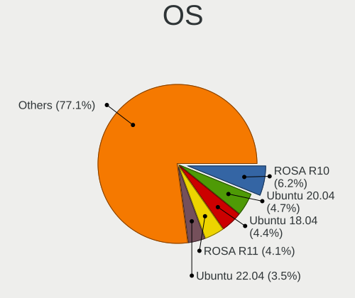

| Name                | Computers | Percent |
|---------------------|-----------|---------|
| ROSA R10            | 21        | 6.16%   |
| Ubuntu 20.04        | 16        | 4.69%   |
| Ubuntu 18.04        | 15        | 4.4%    |
| ROSA R11            | 14        | 4.11%   |
| Ubuntu 22.04        | 12        | 3.52%   |
| Ubuntu 24.04        | 11        | 3.23%   |
| Arch Rolling        | 11        | 3.23%   |
| ROSA R8             | 10        | 2.93%   |
| ROSA R11.1          | 10        | 2.93%   |
| ROSA R8.1           | 8         | 2.35%   |
| OpenMandriva 4.2    | 7         | 2.05%   |
| Fedora 39           | 6         | 1.76%   |
| OpenMandriva 4.3    | 5         | 1.47%   |
| Linux Mint 21.1     | 5         | 1.47%   |
| Linux Mint 20.1     | 5         | 1.47%   |
| KDE neon 20.04      | 5         | 1.47%   |
| Zorin 17            | 4         | 1.17%   |
| ROSA R9             | 4         | 1.17%   |
| ROSA 12.2           | 4         | 1.17%   |
| Manjaro             | 4         | 1.17%   |
| Linux Mint 21.3     | 4         | 1.17%   |
| KDE neon 22.04      | 4         | 1.17%   |
| EndeavourOS Rolling | 4         | 1.17%   |
| Debian 12           | 4         | 1.17%   |
| Arch                | 4         | 1.17%   |
| Ubuntu 22.10        | 3         | 0.88%   |
| ROSA 13.0           | 3         | 0.88%   |
| ROSA 12.5.1         | 3         | 0.88%   |
| ROSA 12.3           | 3         | 0.88%   |
| Pop!_OS 22.04       | 3         | 0.88%   |
| OpenMandriva 23.08  | 3         | 0.88%   |
| Linux Mint 19.1     | 3         | 0.88%   |
| Fedora 42           | 3         | 0.88%   |
| Fedora 40           | 3         | 0.88%   |
| Fedora 36           | 3         | 0.88%   |
| Fedora 34           | 3         | 0.88%   |
| Debian 11           | 3         | 0.88%   |
| ArcoLinux Rolling   | 3         | 0.88%   |
| Zorin 18            | 2         | 0.59%   |
| Zorin 16            | 2         | 0.59%   |

OS Family
---------

OS without a version

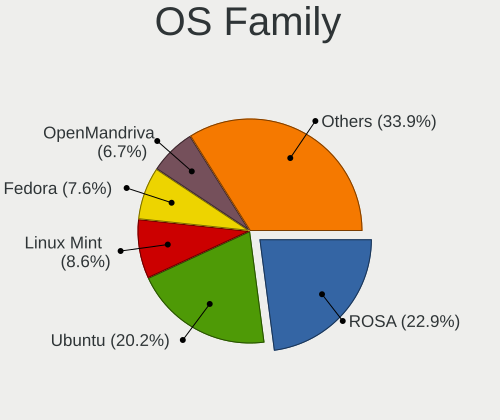

| Name          | Computers | Percent |
|---------------|-----------|---------|
| ROSA          | 75        | 22.94%  |
| Ubuntu        | 66        | 20.18%  |
| Linux Mint    | 28        | 8.56%   |
| Fedora        | 25        | 7.65%   |
| OpenMandriva  | 22        | 6.73%   |
| Arch          | 15        | 4.59%   |
| Manjaro       | 12        | 3.67%   |
| Debian        | 10        | 3.06%   |
| Pop!_OS       | 9         | 2.75%   |
| KDE neon      | 9         | 2.75%   |
| Zorin         | 8         | 2.45%   |
| Kali          | 8         | 2.45%   |
| SteamOS       | 4         | 1.22%   |
| Endless       | 4         | 1.22%   |
| EndeavourOS   | 4         | 1.22%   |
| Kubuntu       | 3         | 0.92%   |
| ArcoLinux     | 3         | 0.92%   |
| Oracle Linux  | 2         | 0.61%   |
| Gentoo        | 2         | 0.61%   |
| BuildRoot     | 2         | 0.61%   |
| BlackPanther  | 2         | 0.61%   |
| Ubuntu MATE   | 1         | 0.31%   |
| Ubuntu Budgie | 1         | 0.31%   |
| TUXEDO OS     | 1         | 0.31%   |
| Solus         | 1         | 0.31%   |
| openSUSE      | 1         | 0.31%   |
| Nobara        | 1         | 0.31%   |
| Lubuntu       | 1         | 0.31%   |
| Elementary    | 1         | 0.31%   |
| Dts-distro    | 1         | 0.31%   |
| Ctlos         | 1         | 0.31%   |
| Clear Linux   | 1         | 0.31%   |
| CachyOS       | 1         | 0.31%   |
| Bazzite       | 1         | 0.31%   |
| ALT Linux     | 1         | 0.31%   |

Kernel
------

Version of the Linux kernel

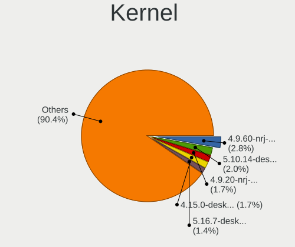

| Version                             | Computers | Percent |
|-------------------------------------|-----------|---------|
| 4.9.60-nrj-desktop-1rosa-x86_64     | 10        | 2.81%   |
| 5.10.14-desktop-1omv4002            | 7         | 1.97%   |
| 4.9.20-nrj-desktop-1rosa-x86_64     | 6         | 1.69%   |
| 4.15.0-desktop-45.1rosa-x86_64      | 6         | 1.69%   |
| 5.16.7-desktop-1omv4003             | 5         | 1.4%    |
| 5.10.74-generic-2rosa2021.1-x86_64  | 5         | 1.4%    |
| 4.1.34-nrj-desktop-2rosa-x86_64     | 5         | 1.4%    |
| 6.5.0-35-generic                    | 4         | 1.12%   |
| 5.15.0-41-generic                   | 4         | 1.12%   |
| 4.9.60-nrj-desktop-1rosa-i586       | 4         | 1.12%   |
| 4.9.155-nrj-desktop-1rosa-x86_64    | 4         | 1.12%   |
| 4.15.0-desktop-68.5rosa-x86_64      | 4         | 1.12%   |
| 6.14.2-desktop-3omv2590             | 3         | 0.84%   |
| 5.8.0-33-generic                    | 3         | 0.84%   |
| 6.9.3-76060903-generic              | 2         | 0.56%   |
| 6.8.0-41-generic                    | 2         | 0.56%   |
| 6.8.0-31-generic                    | 2         | 0.56%   |
| 6.6.94-generic-1rosa2021.1-x86_64   | 2         | 0.56%   |
| 6.6.8-arch1-1                       | 2         | 0.56%   |
| 6.4.11-desktop-1omv2390             | 2         | 0.56%   |
| 6.13.9-desktop-3omv2590             | 2         | 0.56%   |
| 5.4.32-generic-2rosa-x86_64         | 2         | 0.56%   |
| 5.4.0-48-generic                    | 2         | 0.56%   |
| 5.4.0-37-generic                    | 2         | 0.56%   |
| 5.17.11-generic-2rosa2021.1-x86_64  | 2         | 0.56%   |
| 5.15.79-generic-1rosa2021.1-x86_64  | 2         | 0.56%   |
| 5.15.0-91-generic                   | 2         | 0.56%   |
| 5.15.0-88-generic                   | 2         | 0.56%   |
| 5.15.0-67-generic                   | 2         | 0.56%   |
| 5.15.0-58-generic                   | 2         | 0.56%   |
| 5.11.0-7614-generic                 | 2         | 0.56%   |
| 5.11.0-41-generic                   | 2         | 0.56%   |
| 5.11.0-34-generic                   | 2         | 0.56%   |
| 5.11.0-25-generic                   | 2         | 0.56%   |
| 5.10.2-2-MANJARO                    | 2         | 0.56%   |
| 4.9.95-nrj-desktop-2rosa-x86_64     | 2         | 0.56%   |
| 4.9.41-nrj-desktop-1rosa-x86_64     | 2         | 0.56%   |
| 4.9.124-nrj-desktop-1rosa-x86_64    | 2         | 0.56%   |
| 4.15.0-desktop-47.2rosa-x86_64      | 2         | 0.56%   |
| 4.15.0-desktop-122.124.1rosa-x86_64 | 2         | 0.56%   |

Kernel Family
-------------

Linux kernel without a distro release

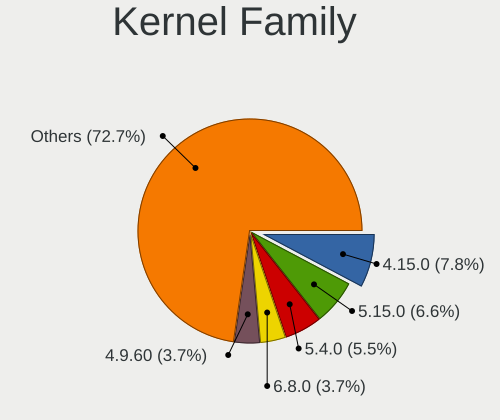

| Version | Computers | Percent |
|---------|-----------|---------|
| 4.15.0  | 27        | 7.76%   |
| 5.15.0  | 23        | 6.61%   |
| 5.4.0   | 19        | 5.46%   |
| 6.8.0   | 13        | 3.74%   |
| 4.9.60  | 13        | 3.74%   |
| 5.11.0  | 12        | 3.45%   |
| 6.5.0   | 8         | 2.3%    |
| 5.8.0   | 7         | 2.01%   |
| 5.10.14 | 7         | 2.01%   |
| 4.1.34  | 7         | 2.01%   |
| 4.9.20  | 6         | 1.72%   |
| 6.14.0  | 5         | 1.44%   |
| 5.3.0   | 5         | 1.44%   |
| 5.19.0  | 5         | 1.44%   |
| 5.16.7  | 5         | 1.44%   |
| 5.13.0  | 5         | 1.44%   |
| 5.10.74 | 5         | 1.44%   |
| 6.1.0   | 4         | 1.15%   |
| 5.0.0   | 4         | 1.15%   |
| 4.9.155 | 4         | 1.15%   |
| 4.18.0  | 4         | 1.15%   |
| 6.2.0   | 3         | 0.86%   |
| 6.14.2  | 3         | 0.86%   |
| 6.13.9  | 3         | 0.86%   |
| 6.11.0  | 3         | 0.86%   |
| 5.4.32  | 3         | 0.86%   |
| 4.9.124 | 3         | 0.86%   |
| 4.1.38  | 3         | 0.86%   |
| 6.9.3   | 2         | 0.57%   |
| 6.8.1   | 2         | 0.57%   |
| 6.6.94  | 2         | 0.57%   |
| 6.6.8   | 2         | 0.57%   |
| 6.6.21  | 2         | 0.57%   |
| 6.4.11  | 2         | 0.57%   |
| 6.1.1   | 2         | 0.57%   |
| 5.9.3   | 2         | 0.57%   |
| 5.8.18  | 2         | 0.57%   |
| 5.18.1  | 2         | 0.57%   |
| 5.17.11 | 2         | 0.57%   |
| 5.15.79 | 2         | 0.57%   |

Kernel Major Ver.
-----------------

Linux kernel major version

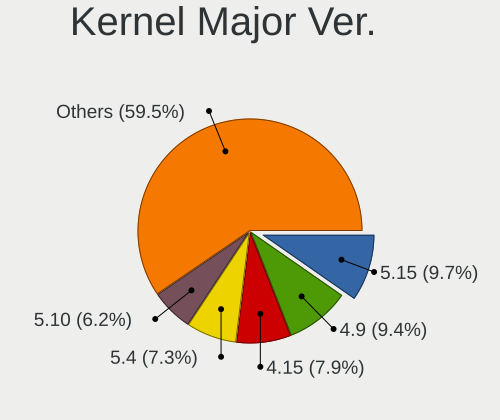

| Version | Computers | Percent |
|---------|-----------|---------|
| 5.15    | 33        | 9.68%   |
| 4.9     | 32        | 9.38%   |
| 4.15    | 27        | 7.92%   |
| 5.4     | 25        | 7.33%   |
| 5.10    | 21        | 6.16%   |
| 6.8     | 19        | 5.57%   |
| 5.11    | 13        | 3.81%   |
| 4.1     | 12        | 3.52%   |
| 6.6     | 10        | 2.93%   |
| 6.5     | 9         | 2.64%   |
| 5.8     | 9         | 2.64%   |
| 6.14    | 8         | 2.35%   |
| 6.12    | 8         | 2.35%   |
| 6.1     | 8         | 2.35%   |
| 6.11    | 7         | 2.05%   |
| 5.19    | 7         | 2.05%   |
| 5.18    | 7         | 2.05%   |
| 5.16    | 7         | 2.05%   |
| 6.2     | 6         | 1.76%   |
| 5.17    | 6         | 1.76%   |
| 5.13    | 6         | 1.76%   |
| 6.9     | 5         | 1.47%   |
| 6.4     | 5         | 1.47%   |
| 6.16    | 5         | 1.47%   |
| 5.3     | 5         | 1.47%   |
| 5.0     | 5         | 1.47%   |
| 6.17    | 4         | 1.17%   |
| 4.18    | 4         | 1.17%   |
| 6.7     | 3         | 0.88%   |
| 6.13    | 3         | 0.88%   |
| 6.10    | 3         | 0.88%   |
| 6.3     | 2         | 0.59%   |
| 5.9     | 2         | 0.59%   |
| 5.14    | 2         | 0.59%   |
| 5.12    | 2         | 0.59%   |
| 4.10    | 2         | 0.59%   |
| 6.15    | 1         | 0.29%   |
| 6.0     | 1         | 0.29%   |
| 5.6     | 1         | 0.29%   |
| 5.5     | 1         | 0.29%   |

Arch
----

OS architecture (x86_64, i586, etc.)

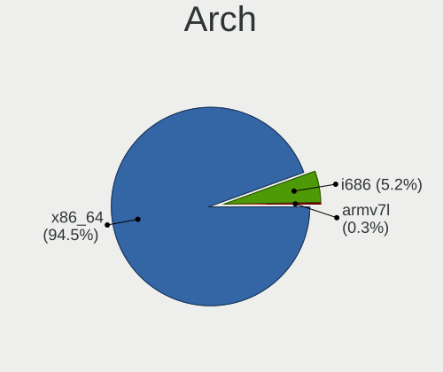

| Name   | Computers | Percent |
|--------|-----------|---------|
| x86_64 | 307       | 94.46%  |
| i686   | 17        | 5.23%   |
| armv7l | 1         | 0.31%   |

DE
--

Desktop Environment

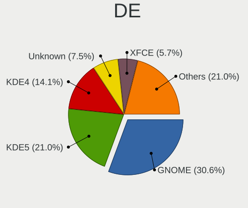

| Name            | Computers | Percent |
|-----------------|-----------|---------|
| GNOME           | 102       | 30.63%  |
| KDE5            | 70        | 21.02%  |
| KDE4            | 47        | 14.11%  |
| Unknown         | 25        | 7.51%   |
| XFCE            | 19        | 5.71%   |
| X-Cinnamon      | 19        | 5.71%   |
| KDE6            | 19        | 5.71%   |
| MATE            | 7         | 2.1%    |
| LXQt            | 5         | 1.5%    |
| Cinnamon        | 4         | 1.2%    |
| KDE             | 3         | 0.9%    |
| sway            | 2         | 0.6%    |
| GNOME Flashback | 2         | 0.6%    |
| Budgie          | 2         | 0.6%    |
| xinitrc         | 1         | 0.3%    |
| Pantheon        | 1         | 0.3%    |
| LXDE            | 1         | 0.3%    |
| i3              | 1         | 0.3%    |
| Hyprland        | 1         | 0.3%    |
| Deepin          | 1         | 0.3%    |
| bspwm           | 1         | 0.3%    |

Display Server
--------------

X11 or Wayland

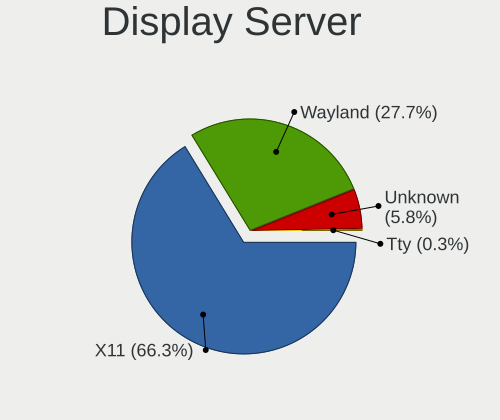

| Name    | Computers | Percent |
|---------|-----------|---------|
| X11     | 218       | 66.26%  |
| Wayland | 91        | 27.66%  |
| Unknown | 19        | 5.78%   |
| Tty     | 1         | 0.3%    |

Display Manager
---------------

SDDM, LightDM, etc.

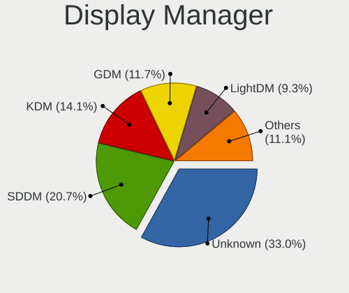

| Name    | Computers | Percent |
|---------|-----------|---------|
| Unknown | 110       | 33.03%  |
| SDDM    | 69        | 20.72%  |
| KDM     | 47        | 14.11%  |
| GDM     | 39        | 11.71%  |
| LightDM | 31        | 9.31%   |
| GDM3    | 29        | 8.71%   |
| TDM     | 8         | 2.4%    |

OS Lang
-------

Language

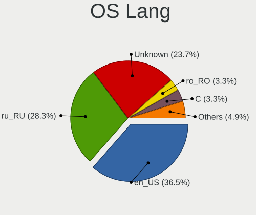

| Lang    | Computers | Percent |
|---------|-----------|---------|
| en_US   | 120       | 36.47%  |
| ru_RU   | 93        | 28.27%  |
| Unknown | 78        | 23.71%  |
| ro_RO   | 11        | 3.34%   |
| C       | 11        | 3.34%   |
| en_GB   | 6         | 1.82%   |
| ru_UA   | 4         | 1.22%   |
| uk_UA   | 1         | 0.3%    |
| nl_NL   | 1         | 0.3%    |
| it_IT   | 1         | 0.3%    |
| en_150  | 1         | 0.3%    |
| de_DE   | 1         | 0.3%    |
| C.UTF8  | 1         | 0.3%    |

Boot Mode
---------

EFI or BIOS

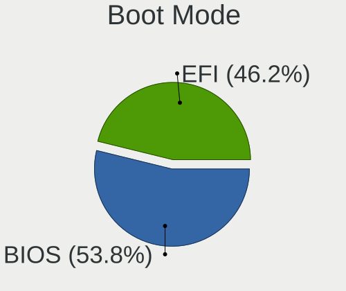

| Mode | Computers | Percent |
|------|-----------|---------|
| BIOS | 176       | 53.82%  |
| EFI  | 151       | 46.18%  |

Filesystem
----------

Type of filesystem

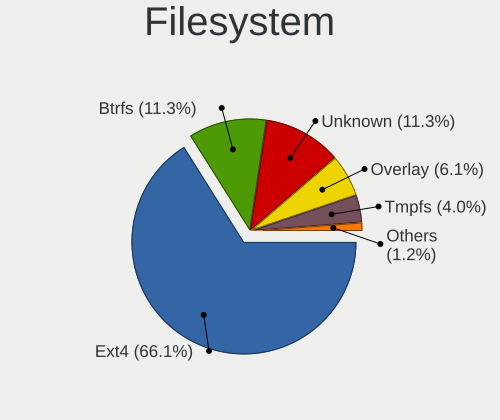

| Type    | Computers | Percent |
|---------|-----------|---------|
| Ext4    | 216       | 66.06%  |
| Btrfs   | 37        | 11.31%  |
| Unknown | 37        | 11.31%  |
| Overlay | 20        | 6.12%   |
| Tmpfs   | 13        | 3.98%   |
| Xfs     | 2         | 0.61%   |
| F2fs    | 1         | 0.31%   |
| Ext2    | 1         | 0.31%   |

Part. scheme
------------

Scheme of partitioning

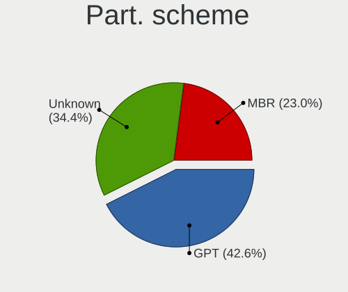

| Type    | Computers | Percent |
|---------|-----------|---------|
| GPT     | 141       | 42.6%   |
| Unknown | 114       | 34.44%  |
| MBR     | 76        | 22.96%  |

Dual Boot with Linux/BSD
------------------------

Hosting more than one Linux/BSD

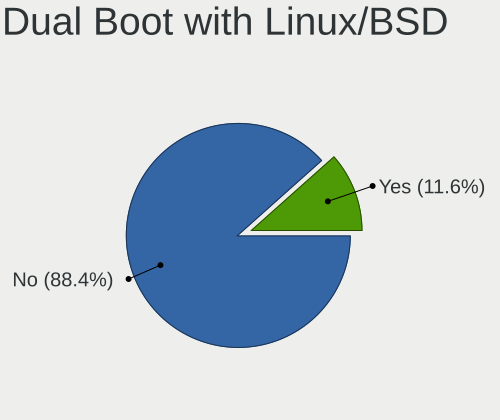

| Dual boot | Computers | Percent |
|-----------|-----------|---------|
| No        | 290       | 88.41%  |
| Yes       | 38        | 11.59%  |

Dual Boot (Win)
---------------

Hosting Linux and Windows

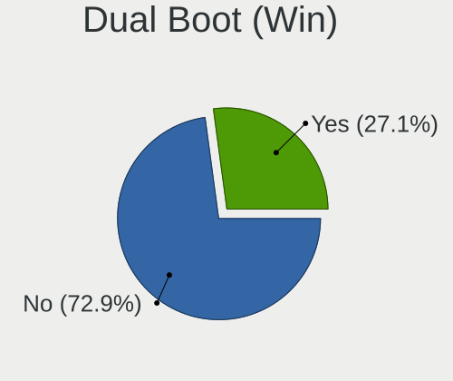

| Dual boot | Computers | Percent |
|-----------|-----------|---------|
| No        | 239       | 72.87%  |
| Yes       | 89        | 27.13%  |

Board
-----

Vendor
------

Motherboard manufacturer

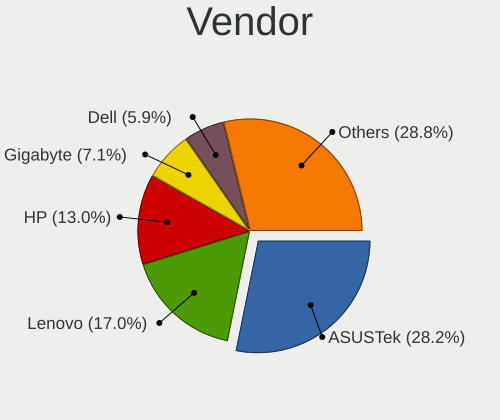

| Name                | Computers | Percent |
|---------------------|-----------|---------|
| ASUSTek Computer    | 91        | 28.17%  |
| Lenovo              | 55        | 17.03%  |
| Hewlett-Packard     | 42        | 13%     |
| Gigabyte Technology | 23        | 7.12%   |
| Dell                | 19        | 5.88%   |
| Acer                | 17        | 5.26%   |
| MSI                 | 13        | 4.02%   |
| Biostar             | 13        | 4.02%   |
| ASRock              | 8         | 2.48%   |
| Timi                | 6         | 1.86%   |
| Toshiba             | 5         | 1.55%   |
| Samsung Electronics | 5         | 1.55%   |
| Sony                | 3         | 0.93%   |
| Apple               | 3         | 0.93%   |
| Valve               | 2         | 0.62%   |
| Supermicro          | 2         | 0.62%   |
| Intel               | 2         | 0.62%   |
| Unknown             | 2         | 0.62%   |
| XIAOMI              | 1         | 0.31%   |
| System76            | 1         | 0.31%   |
| Olimex              | 1         | 0.31%   |
| Medion              | 1         | 0.31%   |
| MACHINIST           | 1         | 0.31%   |
| Jumper              | 1         | 0.31%   |
| HUAWEI              | 1         | 0.31%   |
| Google              | 1         | 0.31%   |
| Gateway             | 1         | 0.31%   |
| Foxconn             | 1         | 0.31%   |
| ECS                 | 1         | 0.31%   |
| Chuwi               | 1         | 0.31%   |

Model
-----

Motherboard model

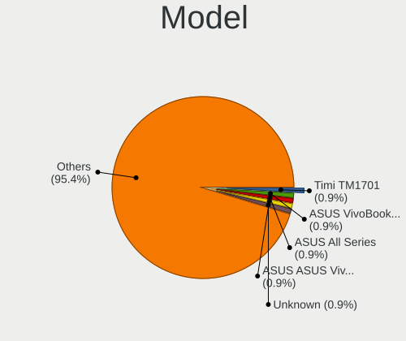

| Name                                       | Computers | Percent |
|--------------------------------------------|-----------|---------|
| Timi TM1701                                | 3         | 0.93%   |
| ASUS VivoBook_ASUSLaptop X521IA_D533IA     | 3         | 0.93%   |
| ASUS ASUS Vivobook S 16 S5606MA_S5606MA    | 3         | 0.93%   |
| ASUS All Series                            | 3         | 0.93%   |
| Unknown                                    | 3         | 0.93%   |
| Timi A35S                                  | 2         | 0.62%   |
| Supermicro X9SCL-II/X9SCM-II               | 2         | 0.62%   |
| Samsung RV413/RV513                        | 2         | 0.62%   |
| MSI MS-7592                                | 2         | 0.62%   |
| Lenovo Legion Y530-15ICH 81FV              | 2         | 0.62%   |
| Lenovo Legion 5 15IMH05 82AU               | 2         | 0.62%   |
| Lenovo IdeaPad 5 Pro 16ACH6 82L5           | 2         | 0.62%   |
| Lenovo IdeaPad 5 15ARE05 81YQ              | 2         | 0.62%   |
| Lenovo IdeaPad 330-15IKB 81DE              | 2         | 0.62%   |
| HP ProBook 450 G7                          | 2         | 0.62%   |
| HP Compaq Presario CQ60                    | 2         | 0.62%   |
| Gigabyte H81M-S2PV                         | 2         | 0.62%   |
| Gigabyte H61M-S1                           | 2         | 0.62%   |
| Dell Inspiron 3593                         | 2         | 0.62%   |
| Biostar GF8200C M2+                        | 2         | 0.62%   |
| Biostar A960G+                             | 2         | 0.62%   |
| ASUS VivoBook S15 X510UF                   | 2         | 0.62%   |
| ASUS H110M-R                               | 2         | 0.62%   |
| Acer Aspire A515-51G                       | 2         | 0.62%   |
| XIAOMI Redmi Book Pro 15 2023              | 1         | 0.31%   |
| Valve Jupiter                              | 1         | 0.31%   |
| Valve Galileo                              | 1         | 0.31%   |
| Toshiba TECRA Z40-B                        | 1         | 0.31%   |
| Toshiba Satellite S50-B                    | 1         | 0.31%   |
| Toshiba Satellite Pro S300L                | 1         | 0.31%   |
| Toshiba Satellite C55D-A                   | 1         | 0.31%   |
| Toshiba Satellite A210                     | 1         | 0.31%   |
| Timi A34R                                  | 1         | 0.31%   |
| System76 Adder WS                          | 1         | 0.31%   |
| Sony VPCF13WFX                             | 1         | 0.31%   |
| Sony VPCEB1J8E                             | 1         | 0.31%   |
| Sony SVF1521C5E                            | 1         | 0.31%   |
| Samsung R517/R717                          | 1         | 0.31%   |
| Samsung 300V3A/300V4A/300V5A/200A4B/200A5B | 1         | 0.31%   |
| Samsung 300E4C/300E5C/300E7C               | 1         | 0.31%   |

Model Family
------------

Motherboard model prefix

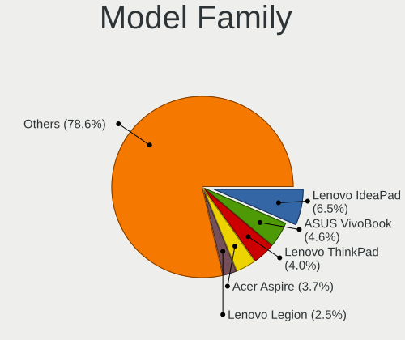

| Name                | Computers | Percent |
|---------------------|-----------|---------|
| Lenovo IdeaPad      | 21        | 6.5%    |
| ASUS VivoBook       | 15        | 4.64%   |
| Lenovo ThinkPad     | 13        | 4.02%   |
| Acer Aspire         | 12        | 3.72%   |
| Lenovo Legion       | 8         | 2.48%   |
| HP ProBook          | 8         | 2.48%   |
| HP EliteBook        | 8         | 2.48%   |
| ASUS PRIME          | 8         | 2.48%   |
| Dell Inspiron       | 7         | 2.17%   |
| ASUS ASUS           | 7         | 2.17%   |
| Dell Latitude       | 6         | 1.86%   |
| HP Pavilion         | 5         | 1.55%   |
| ASUS ROG            | 5         | 1.55%   |
| Toshiba Satellite   | 4         | 1.24%   |
| HP Compaq           | 4         | 1.24%   |
| ASUS TUF            | 4         | 1.24%   |
| Timi TM1701         | 3         | 0.93%   |
| HP Laptop           | 3         | 0.93%   |
| HP 250              | 3         | 0.93%   |
| Dell Vostro         | 3         | 0.93%   |
| ASUS All            | 3         | 0.93%   |
| Unknown             | 3         | 0.93%   |
| Timi A35S           | 2         | 0.62%   |
| Supermicro X9SCL-II | 2         | 0.62%   |
| Samsung RV413       | 2         | 0.62%   |
| MSI MS-7592         | 2         | 0.62%   |
| Lenovo Yoga         | 2         | 0.62%   |
| Lenovo ThinkBook    | 2         | 0.62%   |
| HP ProDesk          | 2         | 0.62%   |
| HP ENVY             | 2         | 0.62%   |
| Gigabyte Z690       | 2         | 0.62%   |
| Gigabyte H81M-S2PV  | 2         | 0.62%   |
| Gigabyte H61M-S1    | 2         | 0.62%   |
| Biostar GF8200C     | 2         | 0.62%   |
| Biostar A960G+      | 2         | 0.62%   |
| ASUS ZenBook        | 2         | 0.62%   |
| ASUS P8H61-M        | 2         | 0.62%   |
| ASUS P7P55D-E       | 2         | 0.62%   |
| ASUS M5A78L-M       | 2         | 0.62%   |
| ASUS H110M-R        | 2         | 0.62%   |

MFG Year
--------

Motherboard manufacture year

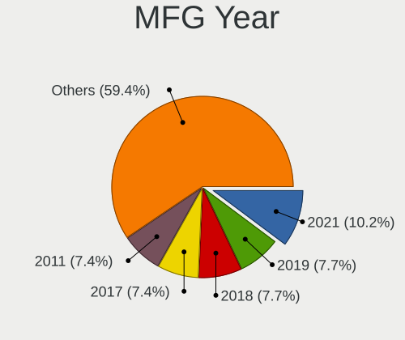

| Year    | Computers | Percent |
|---------|-----------|---------|
| 2021    | 33        | 10.22%  |
| 2019    | 25        | 7.74%   |
| 2018    | 25        | 7.74%   |
| 2017    | 24        | 7.43%   |
| 2011    | 24        | 7.43%   |
| 2020    | 23        | 7.12%   |
| 2012    | 23        | 7.12%   |
| 2013    | 22        | 6.81%   |
| 2009    | 21        | 6.5%    |
| 2022    | 17        | 5.26%   |
| 2023    | 14        | 4.33%   |
| 2015    | 14        | 4.33%   |
| 2010    | 14        | 4.33%   |
| 2016    | 11        | 3.41%   |
| 2014    | 11        | 3.41%   |
| 2024    | 6         | 1.86%   |
| 2008    | 5         | 1.55%   |
| 2007    | 4         | 1.24%   |
| 2006    | 4         | 1.24%   |
| 2025    | 1         | 0.31%   |
| 2005    | 1         | 0.31%   |
| Unknown | 1         | 0.31%   |

Form Factor
-----------

Physical design of the computer

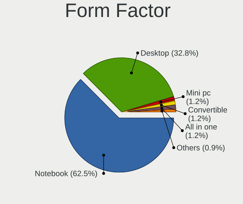

| Name           | Computers | Percent |
|----------------|-----------|---------|
| Notebook       | 202       | 62.54%  |
| Desktop        | 106       | 32.82%  |
| Convertible    | 4         | 1.24%   |
| Mini pc        | 4         | 1.24%   |
| All in one     | 4         | 1.24%   |
| System on chip | 1         | 0.31%   |
| Tablet         | 1         | 0.31%   |
| Server         | 1         | 0.31%   |

Secure Boot
-----------

Enabled or disabled

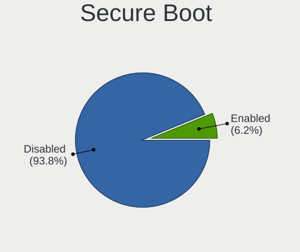

| State    | Computers | Percent |
|----------|-----------|---------|
| Disabled | 303       | 93.81%  |
| Enabled  | 20        | 6.19%   |

Coreboot
--------

Have coreboot on board

| Used | Computers | Percent |
|------|-----------|---------|
| No   | 322       | 99.69%  |
| Yes  | 1         | 0.31%   |

RAM Size
--------

Total RAM memory

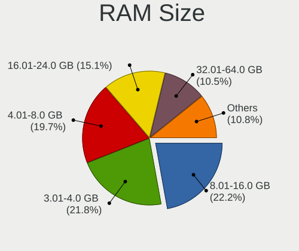

| Size in GB  | Computers | Percent |
|-------------|-----------|---------|
| 8.01-16.0   | 72        | 22.15%  |
| 3.01-4.0    | 71        | 21.85%  |
| 4.01-8.0    | 64        | 19.69%  |
| 16.01-24.0  | 49        | 15.08%  |
| 32.01-64.0  | 34        | 10.46%  |
| 1.01-2.0    | 13        | 4%      |
| 2.01-3.0    | 9         | 2.77%   |
| 24.01-32.0  | 7         | 2.15%   |
| 64.01-256.0 | 4         | 1.23%   |
| 0.51-1.0    | 2         | 0.62%   |

RAM Used
--------

Used RAM memory

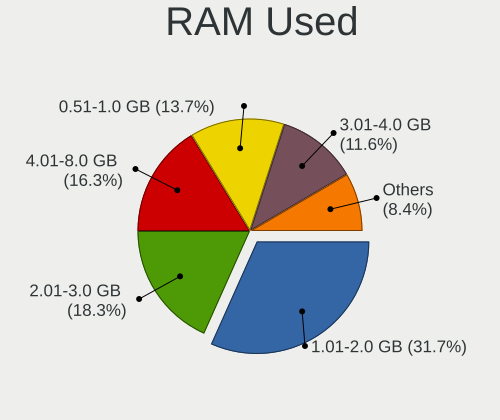

| Used GB    | Computers | Percent |
|------------|-----------|---------|
| 1.01-2.0   | 109       | 31.69%  |
| 2.01-3.0   | 63        | 18.31%  |
| 4.01-8.0   | 56        | 16.28%  |
| 0.51-1.0   | 47        | 13.66%  |
| 3.01-4.0   | 40        | 11.63%  |
| 8.01-16.0  | 16        | 4.65%   |
| 16.01-24.0 | 5         | 1.45%   |
| 0.01-0.5   | 5         | 1.45%   |
| 24.01-32.0 | 2         | 0.58%   |
| Unknown    | 1         | 0.29%   |

Total Drives
------------

Number of drives on board

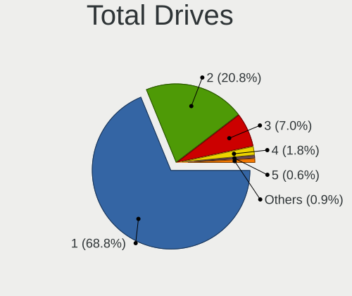

| Drives | Computers | Percent |
|--------|-----------|---------|
| 1      | 225       | 68.81%  |
| 2      | 68        | 20.8%   |
| 3      | 23        | 7.03%   |
| 4      | 6         | 1.83%   |
| 5      | 2         | 0.61%   |
| 0      | 2         | 0.61%   |
| 25     | 1         | 0.31%   |

Has CD-ROM
----------

Has CD-ROM on board

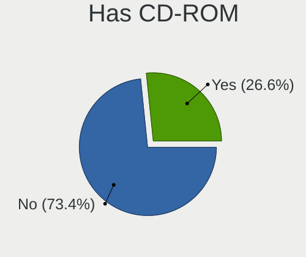

| Presented | Computers | Percent |
|-----------|-----------|---------|
| No        | 237       | 73.37%  |
| Yes       | 86        | 26.63%  |

Has Ethernet
------------

Has Ethernet on board

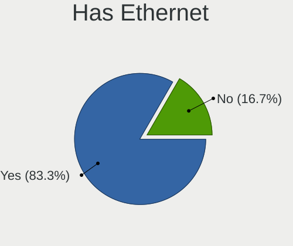

| Presented | Computers | Percent |
|-----------|-----------|---------|
| Yes       | 270       | 83.33%  |
| No        | 54        | 16.67%  |

Has WiFi
--------

Has WiFi module

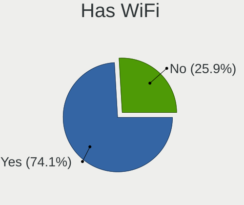

| Presented | Computers | Percent |
|-----------|-----------|---------|
| Yes       | 240       | 74.07%  |
| No        | 84        | 25.93%  |

Has Bluetooth
-------------

Has Bluetooth module

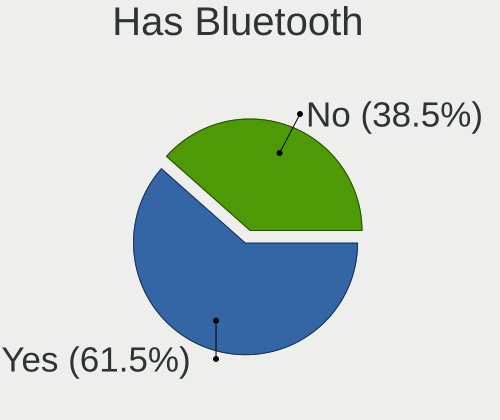

| Presented | Computers | Percent |
|-----------|-----------|---------|
| Yes       | 200       | 61.54%  |
| No        | 125       | 38.46%  |

Location
--------

Country
-------

Geographic location (country)

| Country | Computers | Percent |
|---------|-----------|---------|
| Moldova | 323       | 100%    |

City
----

Geographic location (city)

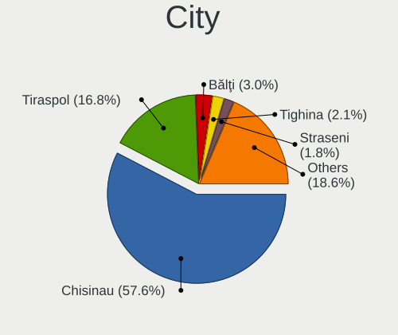

| City           | Computers | Percent |
|----------------|-----------|---------|
| Chisinau       | 189       | 57.62%  |
| Tiraspol       | 55        | 16.77%  |
| Bălţi        | 10        | 3.05%   |
| Tighina        | 7         | 2.13%   |
| Straseni       | 6         | 1.83%   |
| Hincesti       | 4         | 1.22%   |
| Orhei          | 3         | 0.91%   |
| Floresti       | 3         | 0.91%   |
| Cahul          | 3         | 0.91%   |
| Varniţa       | 2         | 0.61%   |
| Tintareni      | 2         | 0.61%   |
| Soroca         | 2         | 0.61%   |
| Ialoveni       | 2         | 0.61%   |
| Congaz         | 2         | 0.61%   |
| Ceadir-Lunga   | 2         | 0.61%   |
| Căușeni      | 2         | 0.61%   |
| Zaicana        | 1         | 0.3%    |
| Vişniovca     | 1         | 0.3%    |
| Ungheni        | 1         | 0.3%    |
| Tvardița      | 1         | 0.3%    |
| Soldanesti     | 1         | 0.3%    |
| Sofia          | 1         | 0.3%    |
| Singera        | 1         | 0.3%    |
| Sarata-Galbena | 1         | 0.3%    |
| Rîbniţa      | 1         | 0.3%    |
| Rezina         | 1         | 0.3%    |
| Rautel         | 1         | 0.3%    |
| Prajila        | 1         | 0.3%    |
| Pociumbeni     | 1         | 0.3%    |
| Nisporeni      | 1         | 0.3%    |
| Mascauti       | 1         | 0.3%    |
| Leova          | 1         | 0.3%    |
| Lapusna        | 1         | 0.3%    |
| Ilenuta        | 1         | 0.3%    |
| Gangura        | 1         | 0.3%    |
| Floreni        | 1         | 0.3%    |
| Edineţ        | 1         | 0.3%    |
| Durlesti       | 1         | 0.3%    |
| Drochia        | 1         | 0.3%    |
| Donduseni      | 1         | 0.3%    |

Drives
------

Drive Vendor
------------

Hard drive vendors

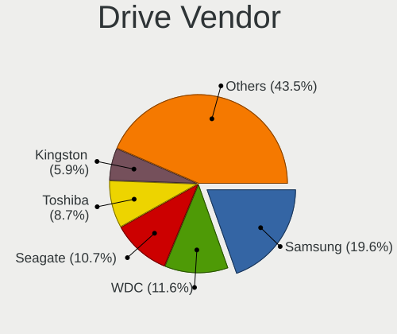

| Vendor                      | Computers | Drives | Percent |
|-----------------------------|-----------|--------|---------|
| Samsung Electronics         | 86        | 101    | 19.59%  |
| WDC                         | 51        | 58     | 11.62%  |
| Seagate                     | 47        | 79     | 10.71%  |
| Toshiba                     | 38        | 44     | 8.66%   |
| Kingston                    | 26        | 32     | 5.92%   |
| SanDisk                     | 25        | 28     | 5.69%   |
| Hitachi                     | 21        | 24     | 4.78%   |
| Micron Technology           | 17        | 21     | 3.87%   |
| SK hynix                    | 12        | 12     | 2.73%   |
| Transcend                   | 10        | 11     | 2.28%   |
| Apacer                      | 9         | 11     | 2.05%   |
| SPCC                        | 8         | 10     | 1.82%   |
| Unknown                     | 7         | 7      | 1.59%   |
| KIOXIA                      | 6         | 7      | 1.37%   |
| Intel                       | 6         | 8      | 1.37%   |
| Patriot                     | 4         | 5      | 0.91%   |
| HGST                        | 4         | 4      | 0.91%   |
| GOODRAM                     | 4         | 4      | 0.91%   |
| Crucial                     | 4         | 5      | 0.91%   |
| PNY                         | 3         | 3      | 0.68%   |
| Phison                      | 3         | 4      | 0.68%   |
| Netac                       | 3         | 3      | 0.68%   |
| Micron/Crucial Technology   | 3         | 3      | 0.68%   |
| Maxtor                      | 3         | 4      | 0.68%   |
| Kingston Technology Company | 3         | 3      | 0.68%   |
| A-DATA Technology           | 3         | 3      | 0.68%   |
| UMIS                        | 2         | 2      | 0.46%   |
| OCZ                         | 2         | 2      | 0.46%   |
| Intenso                     | 2         | 2      | 0.46%   |
| Fujitsu                     | 2         | 2      | 0.46%   |
| China                       | 2         | 2      | 0.46%   |
| ZOTAC                       | 1         | 3      | 0.23%   |
| XPG                         | 1         | 1      | 0.23%   |
| Team                        | 1         | 1      | 0.23%   |
| StoreJet                    | 1         | 1      | 0.23%   |
| Solid State Storage         | 1         | 1      | 0.23%   |
| Realtek Semiconductor       | 1         | 1      | 0.23%   |
| Phison Electronics          | 1         | 1      | 0.23%   |
| O2 Micro                    | 1         | 1      | 0.23%   |
| LITEONIT                    | 1         | 1      | 0.23%   |

Drive Model
-----------

Hard drive models

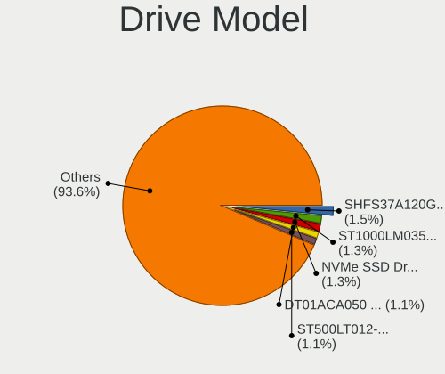

| Model                                             | Computers | Percent |
|---------------------------------------------------|-----------|---------|
| Kingston SHFS37A120G 120GB SSD                    | 7         | 1.55%   |
| Seagate ST1000LM035-1RK172 1TB                    | 6         | 1.32%   |
| Samsung NVMe SSD Drive 512GB                      | 6         | 1.32%   |
| Toshiba DT01ACA050 500GB                          | 5         | 1.1%    |
| Seagate ST500LT012-9WS142 500GB                   | 5         | 1.1%    |
| Samsung SSD 980 500GB                             | 5         | 1.1%    |
| Samsung SSD 860 EVO 500GB                         | 5         | 1.1%    |
| Samsung NVMe SSD Controller SM981/PM981/PM983 1TB | 5         | 1.1%    |
| Kingston SA400S37240G 240GB SSD                   | 5         | 1.1%    |
| Toshiba MQ04ABF100 1TB                            | 4         | 0.88%   |
| Toshiba MQ01ABD100 1TB                            | 4         | 0.88%   |
| Toshiba DT01ACA100 1TB                            | 4         | 0.88%   |
| Seagate ST2000DM008-2FR102 2TB                    | 4         | 0.88%   |
| Micron 1100_MTFDDAV256TBN 256GB SSD               | 4         | 0.88%   |
| Toshiba HDWD110 1TB                               | 3         | 0.66%   |
| SPCC Solid State Disk 128GB                       | 3         | 0.66%   |
| Sandisk WD Blue SN550 NVMe SSD 1024GB             | 3         | 0.66%   |
| SanDisk NVMe SSD Drive 512GB                      | 3         | 0.66%   |
| SanDisk NVMe SSD Drive 1TB                        | 3         | 0.66%   |
| Samsung MZVLW256HEHP-00000 256GB                  | 3         | 0.66%   |
| Samsung HD502HJ 500GB                             | 3         | 0.66%   |
| Micron 2450_MTFDKBA1T0TFK 1TB                     | 3         | 0.66%   |
| Hitachi HTS543232A7A384 320GB                     | 3         | 0.66%   |
| Apacer AS340 240GB SSD                            | 3         | 0.66%   |
| WDC WD5000AZRX-00A8LB0 500GB                      | 2         | 0.44%   |
| WDC WD20EZBX-00AYRA0 2TB                          | 2         | 0.44%   |
| WDC WD10SPZX-24Z10T0 1TB                          | 2         | 0.44%   |
| WDC WD10SPZX-22Z10T1 1TB                          | 2         | 0.44%   |
| Unknown MMC Card  64GB                            | 2         | 0.44%   |
| Unknown MMC Card  128GB                           | 2         | 0.44%   |
| Transcend TS64GSSD370S 64GB                       | 2         | 0.44%   |
| Transcend TS120GMTS420S 120GB SSD                 | 2         | 0.44%   |
| Toshiba MQ01ACF032 320GB                          | 2         | 0.44%   |
| Toshiba MQ01ABF050 500GB                          | 2         | 0.44%   |
| Toshiba DT01ACA200 2TB                            | 2         | 0.44%   |
| SK hynix NVMe SSD Drive 256GB                     | 2         | 0.44%   |
| Seagate ST9500325AS 500GB                         | 2         | 0.44%   |
| Seagate ST500LT012-1DG142 500GB                   | 2         | 0.44%   |
| Seagate ST500DM002-1BD142 500GB                   | 2         | 0.44%   |
| Seagate ST4000VM000-2AF166 4TB                    | 2         | 0.44%   |

HDD Vendor
----------

Hard disk drive vendors

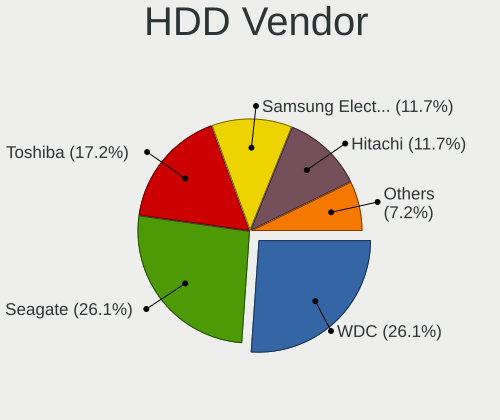

| Vendor              | Computers | Drives | Percent |
|---------------------|-----------|--------|---------|
| WDC                 | 47        | 53     | 26.11%  |
| Seagate             | 47        | 79     | 26.11%  |
| Toshiba             | 31        | 37     | 17.22%  |
| Samsung Electronics | 21        | 24     | 11.67%  |
| Hitachi             | 21        | 24     | 11.67%  |
| HGST                | 4         | 4      | 2.22%   |
| Maxtor              | 3         | 4      | 1.67%   |
| Fujitsu             | 2         | 2      | 1.11%   |
| Unknown             | 1         | 1      | 0.56%   |
| StoreJet            | 1         | 1      | 0.56%   |
| Hewlett-Packard     | 1         | 1      | 0.56%   |
| ASMT                | 1         | 1      | 0.56%   |

SSD Vendor
----------

Solid state drive vendors

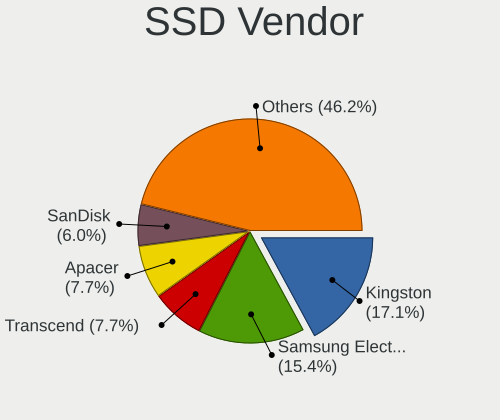

| Vendor              | Computers | Drives | Percent |
|---------------------|-----------|--------|---------|
| Kingston            | 20        | 25     | 17.09%  |
| Samsung Electronics | 18        | 21     | 15.38%  |
| Transcend           | 9         | 10     | 7.69%   |
| Apacer              | 9         | 11     | 7.69%   |
| SPCC                | 7         | 9      | 5.98%   |
| SanDisk             | 7         | 8      | 5.98%   |
| Patriot             | 4         | 5      | 3.42%   |
| Micron Technology   | 4         | 4      | 3.42%   |
| GOODRAM             | 4         | 4      | 3.42%   |
| Crucial             | 4         | 5      | 3.42%   |
| WDC                 | 3         | 4      | 2.56%   |
| Toshiba             | 3         | 3      | 2.56%   |
| PNY                 | 2         | 2      | 1.71%   |
| OCZ                 | 2         | 2      | 1.71%   |
| Netac               | 2         | 2      | 1.71%   |
| Intenso             | 2         | 2      | 1.71%   |
| China               | 2         | 2      | 1.71%   |
| ZOTAC               | 1         | 3      | 0.85%   |
| Team                | 1         | 1      | 0.85%   |
| Phison              | 1         | 1      | 0.85%   |
| LITEONIT            | 1         | 1      | 0.85%   |
| Leven               | 1         | 1      | 0.85%   |
| KIOXIA-EXCERIA      | 1         | 1      | 0.85%   |
| KingFast            | 1         | 1      | 0.85%   |
| KingDian            | 1         | 1      | 0.85%   |
| Intel               | 1         | 1      | 0.85%   |
| Goldkey             | 1         | 1      | 0.85%   |
| Gigabyte Technology | 1         | 2      | 0.85%   |
| CHN25SATAS1         | 1         | 1      | 0.85%   |
| AMD                 | 1         | 1      | 0.85%   |
| ACOS                | 1         | 1      | 0.85%   |
| A-DATA Technology   | 1         | 1      | 0.85%   |

Drive Kind
----------

HDD or SSD

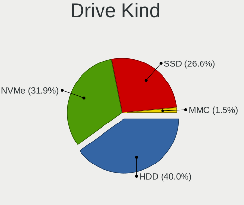

| Kind | Computers | Drives | Percent |
|------|-----------|--------|---------|
| HDD  | 158       | 231    | 40%     |
| NVMe | 126       | 158    | 31.9%   |
| SSD  | 105       | 137    | 26.58%  |
| MMC  | 6         | 6      | 1.52%   |

Drive Connector
---------------

SATA, SAS, NVMe, etc.

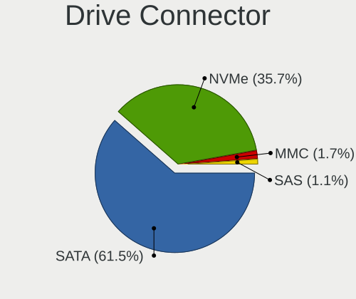

| Type | Computers | Drives | Percent |
|------|-----------|--------|---------|
| SATA | 217       | 364    | 61.47%  |
| NVMe | 126       | 158    | 35.69%  |
| MMC  | 6         | 6      | 1.7%    |
| SAS  | 4         | 4      | 1.13%   |

Drive Size
----------

Size of hard drive

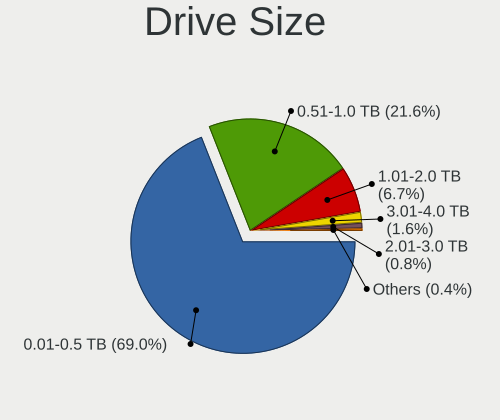

| Size in TB | Computers | Drives | Percent |
|------------|-----------|--------|---------|
| 0.01-0.5   | 176       | 254    | 69.02%  |
| 0.51-1.0   | 55        | 90     | 21.57%  |
| 1.01-2.0   | 17        | 17     | 6.67%   |
| 3.01-4.0   | 4         | 4      | 1.57%   |
| 2.01-3.0   | 2         | 2      | 0.78%   |
| 4.01-10.0  | 1         | 1      | 0.39%   |

Space Total
-----------

Amount of disk space available on the file system

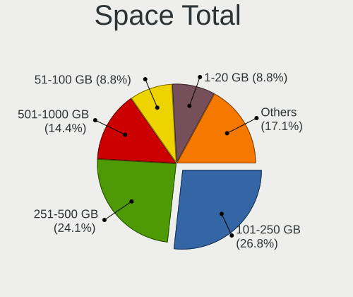

| Size in GB     | Computers | Percent |
|----------------|-----------|---------|
| 101-250        | 91        | 26.76%  |
| 251-500        | 82        | 24.12%  |
| 501-1000       | 49        | 14.41%  |
| 1-20           | 30        | 8.82%   |
| 51-100         | 30        | 8.82%   |
| 1001-2000      | 19        | 5.59%   |
| Unknown        | 12        | 3.53%   |
| 21-50          | 11        | 3.24%   |
| More than 3000 | 10        | 2.94%   |
| 2001-3000      | 6         | 1.76%   |

Space Used
----------

Amount of used disk space

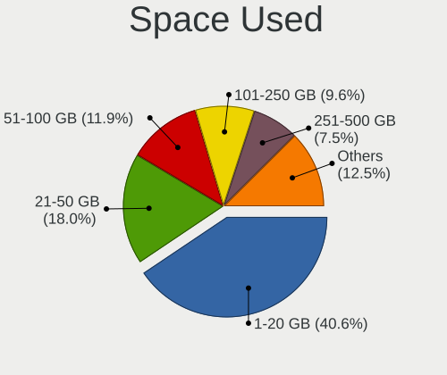

| Used GB        | Computers | Percent |
|----------------|-----------|---------|
| 1-20           | 140       | 40.58%  |
| 21-50          | 62        | 17.97%  |
| 51-100         | 41        | 11.88%  |
| 101-250        | 33        | 9.57%   |
| 251-500        | 26        | 7.54%   |
| 501-1000       | 17        | 4.93%   |
| Unknown        | 12        | 3.48%   |
| 1001-2000      | 9         | 2.61%   |
| More than 3000 | 4         | 1.16%   |
| 2001-3000      | 1         | 0.29%   |

Malfunc. Drives
---------------

Drive models with a malfunction

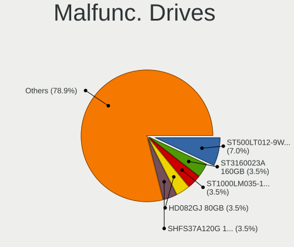

| Model                             | Computers | Drives | Percent |
|-----------------------------------|-----------|--------|---------|
| Seagate ST500LT012-9WS142 500GB   | 4         | 4      | 7.02%   |
| Seagate ST3160023A 160GB          | 2         | 2      | 3.51%   |
| Seagate ST1000LM035-1RK172 1TB    | 2         | 2      | 3.51%   |
| Samsung Electronics HD082GJ 80GB  | 2         | 2      | 3.51%   |
| Kingston SHFS37A120G 120GB SSD    | 2         | 4      | 3.51%   |
| Hitachi HTS547575A9E384 752GB     | 2         | 2      | 3.51%   |
| WDC WDS120G2G0A-00JH30 120GB SSD  | 1         | 1      | 1.75%   |
| WDC WD800JD-22LSA0 80GB           | 1         | 1      | 1.75%   |
| WDC WD5000AAKX-08ERMA0 500GB      | 1         | 1      | 1.75%   |
| WDC WD5000AAKS-75V0A0 500GB       | 1         | 1      | 1.75%   |
| WDC WD5000AAKS-00WWPA0 500GB      | 1         | 1      | 1.75%   |
| WDC WD5000AADS-56S9B1 499GB       | 1         | 1      | 1.75%   |
| WDC WD3200BEVT-22A23T0 320GB      | 1         | 1      | 1.75%   |
| WDC WD2500AAKX-00U6AA0 250GB      | 1         | 1      | 1.75%   |
| WDC WD1600BEVS-60RST0 160GB       | 1         | 1      | 1.75%   |
| WDC WD1600BEVS-07RST0 160GB       | 1         | 1      | 1.75%   |
| WDC WD10JPCX-24UE4T0 1TB          | 1         | 1      | 1.75%   |
| Transcend TS512GSSD370S 512GB     | 1         | 1      | 1.75%   |
| Toshiba MQ01ABD050 500GB          | 1         | 1      | 1.75%   |
| Toshiba MQ01ABD032 320GB          | 1         | 1      | 1.75%   |
| Toshiba DT01ACA200 2TB            | 1         | 1      | 1.75%   |
| Toshiba DT01ACA050 500GB          | 1         | 1      | 1.75%   |
| Team L5 LITE SSD 240GB            | 1         | 1      | 1.75%   |
| SPCC SSD162 120GB                 | 1         | 1      | 1.75%   |
| SPCC Solid State Disk 56GB        | 1         | 2      | 1.75%   |
| Seagate ST9500325AS 500GB         | 1         | 1      | 1.75%   |
| Seagate ST9320325AS 320GB         | 1         | 1      | 1.75%   |
| Seagate ST500LM030-1RK17D 500GB   | 1         | 1      | 1.75%   |
| Seagate ST3500418AS 500GB         | 1         | 1      | 1.75%   |
| Seagate ST320DM001 HD322GJ 320GB  | 1         | 1      | 1.75%   |
| Seagate ST31000340NS 1TB          | 1         | 1      | 1.75%   |
| Seagate ST2000DM008-2FR102 2TB    | 1         | 1      | 1.75%   |
| Seagate ST1000DL002-9TT153 1TB    | 1         | 1      | 1.75%   |
| SanDisk SD7UB3Q256G1001 256GB SSD | 1         | 1      | 1.75%   |
| Samsung Electronics HD753LJ 752GB | 1         | 1      | 1.75%   |
| Samsung Electronics HD322HJ 320GB | 1         | 1      | 1.75%   |
| Samsung Electronics HD103UJ 1TB   | 1         | 1      | 1.75%   |
| Samsung Electronics HD080HJ/ 80GB | 1         | 1      | 1.75%   |
| Maxtor STM380215AS 80GB           | 1         | 1      | 1.75%   |
| Maxtor STM3160811AS 160GB         | 1         | 1      | 1.75%   |

Malfunc. Drive Vendor
---------------------

Vendors of faulty drives

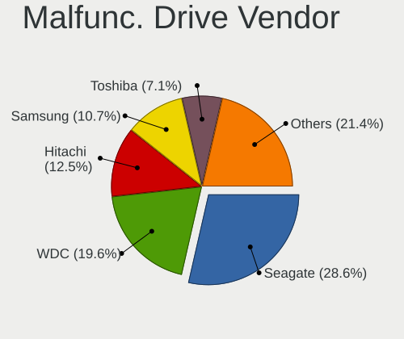

| Vendor              | Computers | Drives | Percent |
|---------------------|-----------|--------|---------|
| Seagate             | 16        | 16     | 28.57%  |
| WDC                 | 11        | 11     | 19.64%  |
| Hitachi             | 7         | 9      | 12.5%   |
| Samsung Electronics | 6         | 6      | 10.71%  |
| Toshiba             | 4         | 4      | 7.14%   |
| Maxtor              | 3         | 4      | 5.36%   |
| SPCC                | 2         | 3      | 3.57%   |
| Kingston            | 2         | 4      | 3.57%   |
| Transcend           | 1         | 1      | 1.79%   |
| Team                | 1         | 1      | 1.79%   |
| SanDisk             | 1         | 1      | 1.79%   |
| Fujitsu             | 1         | 1      | 1.79%   |
| A-DATA Technology   | 1         | 1      | 1.79%   |

Malfunc. HDD Vendor
-------------------

Vendors of faulty HDD drives

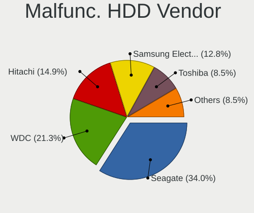

| Vendor              | Computers | Drives | Percent |
|---------------------|-----------|--------|---------|
| Seagate             | 16        | 16     | 34.04%  |
| WDC                 | 10        | 10     | 21.28%  |
| Hitachi             | 7         | 9      | 14.89%  |
| Samsung Electronics | 6         | 6      | 12.77%  |
| Toshiba             | 4         | 4      | 8.51%   |
| Maxtor              | 3         | 4      | 6.38%   |
| Fujitsu             | 1         | 1      | 2.13%   |

Malfunc. Drive Kind
-------------------

Kinds of faulty drives

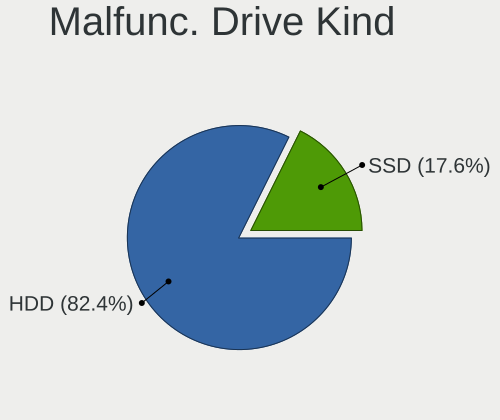

| Kind | Computers | Drives | Percent |
|------|-----------|--------|---------|
| HDD  | 42        | 50     | 82.35%  |
| SSD  | 9         | 12     | 17.65%  |

Failed Drives
-------------

Failed drive models

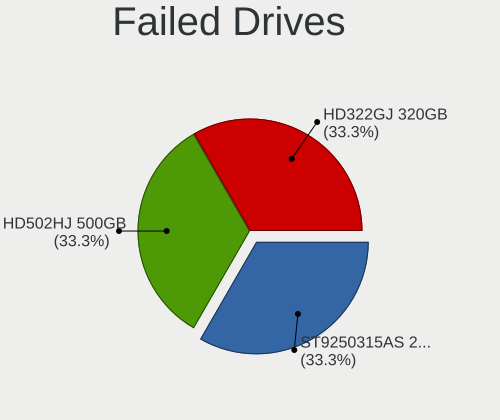

| Model                             | Computers | Drives | Percent |
|-----------------------------------|-----------|--------|---------|
| WDC WD3200BPVT-24ZEST0 320GB      | 1         | 1      | 25%     |
| Seagate ST9250315AS 250GB         | 1         | 1      | 25%     |
| Samsung Electronics HD502HJ 500GB | 1         | 1      | 25%     |
| Samsung Electronics HD322GJ 320GB | 1         | 2      | 25%     |

Failed Drive Vendor
-------------------

Failed drive vendors

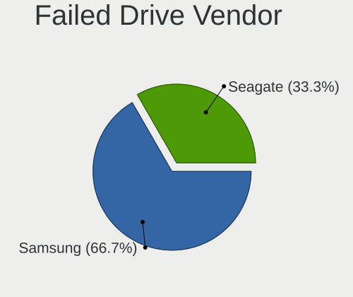

| Vendor              | Computers | Drives | Percent |
|---------------------|-----------|--------|---------|
| Samsung Electronics | 2         | 3      | 50%     |
| WDC                 | 1         | 1      | 25%     |
| Seagate             | 1         | 1      | 25%     |

Drive Status
------------

Number of failed and malfunc. drives

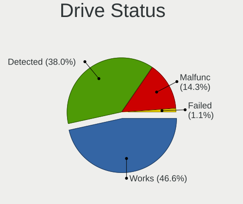

| Status   | Computers | Drives | Percent |
|----------|-----------|--------|---------|
| Works    | 163       | 268    | 46.57%  |
| Detected | 133       | 197    | 38%     |
| Malfunc  | 50        | 62     | 14.29%  |
| Failed   | 4         | 5      | 1.14%   |

Storage controller
------------------

Storage Vendor
--------------

Storage controller vendors

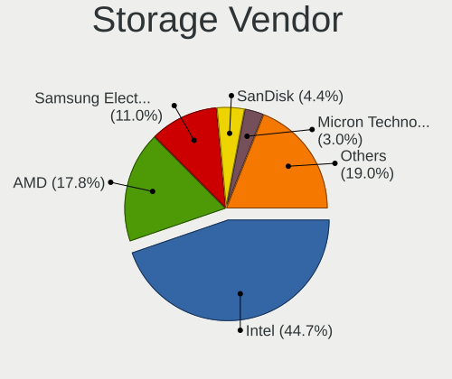

| Vendor                         | Computers | Percent |
|--------------------------------|-----------|---------|
| Intel                          | 191       | 44.73%  |
| AMD                            | 76        | 17.8%   |
| Samsung Electronics            | 47        | 11.01%  |
| SanDisk                        | 19        | 4.45%   |
| Micron Technology              | 13        | 3.04%   |
| SK hynix                       | 12        | 2.81%   |
| Nvidia                         | 11        | 2.58%   |
| Kingston Technology Company    | 9         | 2.11%   |
| ASMedia Technology             | 7         | 1.64%   |
| KIOXIA                         | 6         | 1.41%   |
| JMicron Technology             | 6         | 1.41%   |
| Toshiba America Info Systems   | 4         | 0.94%   |
| Phison Electronics             | 4         | 0.94%   |
| Micron/Crucial Technology      | 3         | 0.7%    |
| ADATA Technology               | 3         | 0.7%    |
| Union Memory (Shenzhen)        | 2         | 0.47%   |
| Silicon Motion                 | 2         | 0.47%   |
| Realtek Semiconductor          | 2         | 0.47%   |
| Marvell Technology Group       | 2         | 0.47%   |
| Broadcom / LSI                 | 2         | 0.47%   |
| Solid State Storage Technology | 1         | 0.23%   |
| O2 Micro                       | 1         | 0.23%   |
| Netac Technology               | 1         | 0.23%   |
| Lite-On Technology             | 1         | 0.23%   |
| Lenovo                         | 1         | 0.23%   |
| Hewlett-Packard                | 1         | 0.23%   |

Storage Model
-------------

Storage controller models

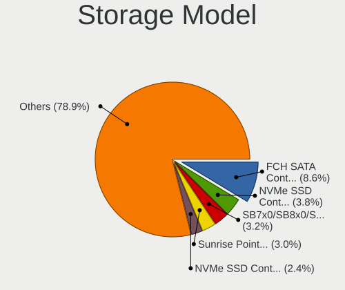

| Model                                                                                   | Computers | Percent |
|-----------------------------------------------------------------------------------------|-----------|---------|
| AMD FCH SATA Controller [AHCI mode]                                                     | 43        | 8.63%   |
| Samsung NVMe SSD Controller 980 (DRAM-less)                                             | 19        | 3.82%   |
| AMD SB7x0/SB8x0/SB9x0 IDE Controller                                                    | 16        | 3.21%   |
| Intel Sunrise Point-LP SATA Controller [AHCI mode]                                      | 15        | 3.01%   |
| Samsung NVMe SSD Controller SM981/PM981/PM983                                           | 12        | 2.41%   |
| Intel 7 Series Chipset Family 6-port SATA Controller [AHCI mode]                        | 12        | 2.41%   |
| AMD SB7x0/SB8x0/SB9x0 SATA Controller [IDE mode]                                        | 12        | 2.41%   |
| Intel Volume Management Device NVMe RAID Controller                                     | 10        | 2.01%   |
| AMD SB7x0/SB8x0/SB9x0 SATA Controller [AHCI mode]                                       | 10        | 2.01%   |
| Intel 8 Series/C220 Series Chipset Family 6-port SATA Controller 1 [AHCI mode]          | 9         | 1.81%   |
| Intel NM10/ICH7 Family SATA Controller [IDE mode]                                       | 8         | 1.61%   |
| Intel Celeron/Pentium Silver Processor SATA Controller                                  | 8         | 1.61%   |
| Intel 82801 Mobile SATA Controller [RAID mode]                                          | 8         | 1.61%   |
| Micron 2450 NVMe SSD [HendrixV] (DRAM-less)                                             | 7         | 1.41%   |
| Intel Wildcat Point-LP SATA Controller [AHCI Mode]                                      | 7         | 1.41%   |
| Intel Comet Lake SATA AHCI Controller                                                   | 7         | 1.41%   |
| Intel 82801G (ICH7 Family) IDE Controller                                               | 7         | 1.41%   |
| Intel 6 Series/C200 Series Chipset Family 6 port Mobile SATA AHCI Controller            | 7         | 1.41%   |
| Samsung NVMe SSD Controller SM961/PM961/SM963                                           | 6         | 1.2%    |
| Intel Cannon Lake Mobile PCH SATA AHCI Controller                                       | 6         | 1.2%    |
| Intel Atom/Celeron/Pentium Processor x5-E8000/J3xxx/N3xxx Series SATA Controller        | 6         | 1.2%    |
| Intel Alder Lake-S PCH SATA Controller [AHCI Mode]                                      | 6         | 1.2%    |
| Intel 6 Series/C200 Series Chipset Family 6 port Desktop SATA AHCI Controller           | 6         | 1.2%    |
| ASMedia ASM1061/ASM1062 Serial ATA Controller                                           | 6         | 1.2%    |
| Nvidia MCP78S [GeForce 8200] SATA Controller (non-AHCI mode)                            | 5         | 1%      |
| Nvidia MCP78S [GeForce 8200] IDE                                                        | 5         | 1%      |
| Intel Q170/Q150/B150/H170/H110/Z170/CM236 Chipset SATA Controller [AHCI Mode]           | 5         | 1%      |
| Intel 8 Series SATA Controller 1 [AHCI mode]                                            | 5         | 1%      |
| Intel 6 Series/C200 Series Chipset Family Desktop SATA Controller (IDE mode, ports 4-5) | 5         | 1%      |
| Intel 6 Series/C200 Series Chipset Family Desktop SATA Controller (IDE mode, ports 0-3) | 5         | 1%      |
| Intel 200 Series PCH SATA controller [AHCI mode]                                        | 5         | 1%      |
| SK hynix BC501 NVMe Solid State Drive                                                   | 4         | 0.8%    |
| SanDisk Ultra 3D / WD PC SN530, IX SN530, Blue SN550 NVMe SSD (DRAM-less)               | 4         | 0.8%    |
| Intel Ice Lake-LP SATA Controller [AHCI mode]                                           | 4         | 0.8%    |
| Intel Celeron N3350/Pentium N4200/Atom E3900 Series SATA AHCI Controller                | 4         | 0.8%    |
| Intel 5 Series/3400 Series Chipset 6 port SATA AHCI Controller                          | 4         | 0.8%    |
| Intel 400 Series Chipset Family SATA AHCI Controller                                    | 4         | 0.8%    |
| AMD 500 Series Chipset SATA Controller                                                  | 4         | 0.8%    |
| AMD 300 Series Chipset SATA Controller                                                  | 4         | 0.8%    |
| Toshiba America Info Systems XG6 NVMe SSD Controller                                    | 3         | 0.6%    |

Storage Kind
------------

Kind of storage controller (IDE, SATA, NVMe, SAS, ...)

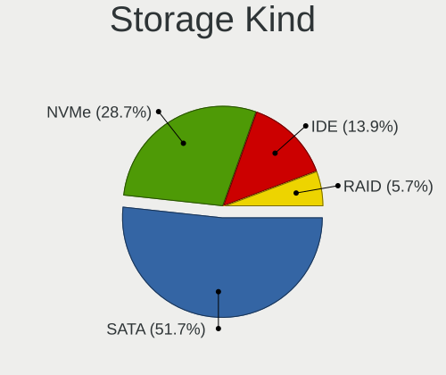

| Kind | Computers | Percent |
|------|-----------|---------|
| SATA | 227       | 51.71%  |
| NVMe | 126       | 28.7%   |
| IDE  | 61        | 13.9%   |
| RAID | 25        | 5.69%   |

Processor
---------

CPU Vendor
----------

Processor vendors

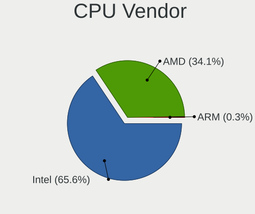

| Vendor | Computers | Percent |
|--------|-----------|---------|
| Intel  | 212       | 65.63%  |
| AMD    | 110       | 34.06%  |
| ARM    | 1         | 0.31%   |

CPU Model
---------

Processor models

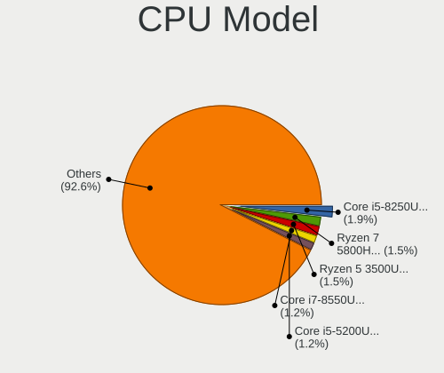

| Model                                         | Computers | Percent |
|-----------------------------------------------|-----------|---------|
| Intel Core i5-8250U CPU @ 1.60GHz             | 6         | 1.86%   |
| AMD Ryzen 7 5800H with Radeon Graphics        | 5         | 1.55%   |
| AMD Ryzen 5 3500U with Radeon Vega Mobile Gfx | 5         | 1.55%   |
| Intel Core i7-8550U CPU @ 1.80GHz             | 4         | 1.24%   |
| Intel Core i5-5200U CPU @ 2.20GHz             | 4         | 1.24%   |
| Intel Core i5-1035G1 CPU @ 1.00GHz            | 4         | 1.24%   |
| Intel Core i5-10210U CPU @ 1.60GHz            | 4         | 1.24%   |
| Intel Core Ultra 9 185H                       | 3         | 0.93%   |
| Intel Core i7-8750H CPU @ 2.20GHz             | 3         | 0.93%   |
| Intel Core i7-8565U CPU @ 1.80GHz             | 3         | 0.93%   |
| Intel Core i7-10750H CPU @ 2.60GHz            | 3         | 0.93%   |
| Intel Core i3-8130U CPU @ 2.20GHz             | 3         | 0.93%   |
| Intel Celeron CPU N2840 @ 2.16GHz             | 3         | 0.93%   |
| AMD Ryzen 5 4500U with Radeon Graphics        | 3         | 0.93%   |
| AMD E1-1200 APU with Radeon HD Graphics       | 3         | 0.93%   |
| AMD E-450 APU with Radeon HD Graphics         | 3         | 0.93%   |
| Intel Xeon CPU E3-1230 V2 @ 3.30GHz           | 2         | 0.62%   |
| Intel Pentium Silver N5030 CPU @ 1.10GHz      | 2         | 0.62%   |
| Intel Pentium CPU G4400 @ 3.30GHz             | 2         | 0.62%   |
| Intel Pentium CPU B960 @ 2.20GHz              | 2         | 0.62%   |
| Intel Core i5-8265U CPU @ 1.60GHz             | 2         | 0.62%   |
| Intel Core i5-6200U CPU @ 2.30GHz             | 2         | 0.62%   |
| Intel Core i5-4670K CPU @ 3.40GHz             | 2         | 0.62%   |
| Intel Core i5-3470 CPU @ 3.20GHz              | 2         | 0.62%   |
| Intel Core i5-2410M CPU @ 2.30GHz             | 2         | 0.62%   |
| Intel Core i3-5010U CPU @ 2.10GHz             | 2         | 0.62%   |
| Intel Core i3-1005G1 CPU @ 1.20GHz            | 2         | 0.62%   |
| Intel Core 2 Duo CPU E8400 @ 3.00GHz          | 2         | 0.62%   |
| Intel Celeron N4000 CPU @ 1.10GHz             | 2         | 0.62%   |
| Intel Celeron J4125 CPU @ 2.00GHz             | 2         | 0.62%   |
| Intel Celeron CPU N3450 @ 1.10GHz             | 2         | 0.62%   |
| Intel Celeron CPU N3050 @ 1.60GHz             | 2         | 0.62%   |
| Intel 12th Gen Core i7-12700KF                | 2         | 0.62%   |
| Intel 12th Gen Core i7-12700H                 | 2         | 0.62%   |
| Intel 12th Gen Core i5-12450H                 | 2         | 0.62%   |
| Intel 12th Gen Core i5-12400F                 | 2         | 0.62%   |
| Intel 12th Gen Core i5-1235U                  | 2         | 0.62%   |
| Intel 11th Gen Core i7-1165G7 @ 2.80GHz       | 2         | 0.62%   |
| AMD Ryzen 7 5700U with Radeon Graphics        | 2         | 0.62%   |
| AMD Ryzen 7 4700U with Radeon Graphics        | 2         | 0.62%   |

CPU Model Family
----------------

Processor model prefix

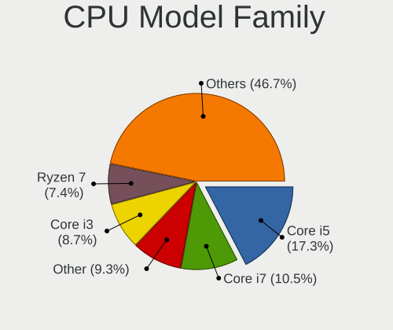

| Model                          | Computers | Percent |
|--------------------------------|-----------|---------|
| Intel Core i5                  | 56        | 17.34%  |
| Intel Core i7                  | 34        | 10.53%  |
| Other                          | 30        | 9.29%   |
| Intel Core i3                  | 28        | 8.67%   |
| AMD Ryzen 7                    | 24        | 7.43%   |
| AMD Ryzen 5                    | 24        | 7.43%   |
| Intel Celeron                  | 21        | 6.5%    |
| Intel Pentium                  | 14        | 4.33%   |
| AMD Athlon II X2               | 9         | 2.79%   |
| Intel Xeon                     | 5         | 1.55%   |
| Intel Core 2 Duo               | 5         | 1.55%   |
| AMD E                          | 5         | 1.55%   |
| AMD Athlon 64 X2               | 5         | 1.55%   |
| Intel Pentium Silver           | 4         | 1.24%   |
| Intel Pentium Dual-Core        | 4         | 1.24%   |
| AMD FX                         | 4         | 1.24%   |
| AMD Athlon                     | 4         | 1.24%   |
| AMD A4                         | 4         | 1.24%   |
| Intel Core 2 Quad              | 3         | 0.93%   |
| Intel Core                     | 3         | 0.93%   |
| AMD Ryzen 3                    | 3         | 0.93%   |
| AMD E1                         | 3         | 0.93%   |
| AMD A10                        | 3         | 0.93%   |
| Intel Pentium D                | 2         | 0.62%   |
| Intel Core i9                  | 2         | 0.62%   |
| Intel Atom                     | 2         | 0.62%   |
| AMD Sempron                    | 2         | 0.62%   |
| AMD Ryzen 9                    | 2         | 0.62%   |
| AMD Ryzen 5 PRO                | 2         | 0.62%   |
| AMD Phenom II X6               | 2         | 0.62%   |
| AMD Athlon II X4               | 2         | 0.62%   |
| AMD A8                         | 2         | 0.62%   |
| Intel Pentium Dual             | 1         | 0.31%   |
| Intel Pentium 4                | 1         | 0.31%   |
| Intel Core 2                   | 1         | 0.31%   |
| ARM Allwinner                  | 1         | 0.31%   |
| AMD V140                       | 1         | 0.31%   |
| AMD Turion X2 Dual-Core Mobile | 1         | 0.31%   |
| AMD Ryzen 7 PRO                | 1         | 0.31%   |
| AMD Ryzen 3 PRO                | 1         | 0.31%   |

CPU Cores
---------

Number of processor cores

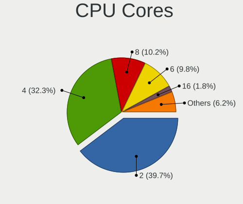

| Number  | Computers | Percent |
|---------|-----------|---------|
| 2       | 129       | 39.69%  |
| 4       | 105       | 32.31%  |
| 8       | 33        | 10.15%  |
| 6       | 32        | 9.85%   |
| 16      | 6         | 1.85%   |
| 10      | 5         | 1.54%   |
| 1       | 5         | 1.54%   |
| 12      | 4         | 1.23%   |
| Unknown | 4         | 1.23%   |
| 14      | 2         | 0.62%   |

CPU Sockets
-----------

Number of sockets

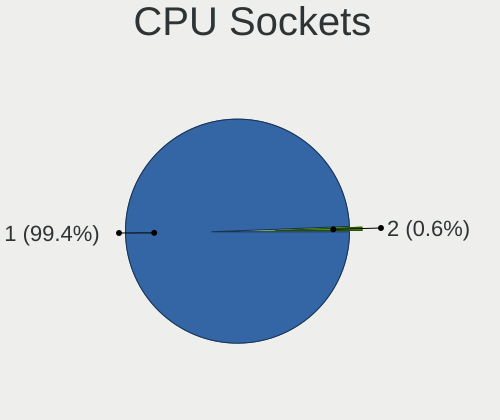

| Number | Computers | Percent |
|--------|-----------|---------|
| 1      | 321       | 99.38%  |
| 2      | 2         | 0.62%   |

CPU Threads
-----------

Threads per core (Hyper-Threading)

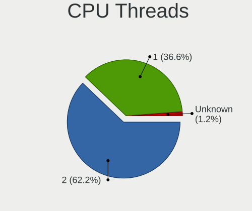

| Number  | Computers | Percent |
|---------|-----------|---------|
| 2       | 202       | 62.15%  |
| 1       | 119       | 36.62%  |
| Unknown | 4         | 1.23%   |

CPU Op-Modes
------------

CPU Operation Modes (32-bit, 64-bit)

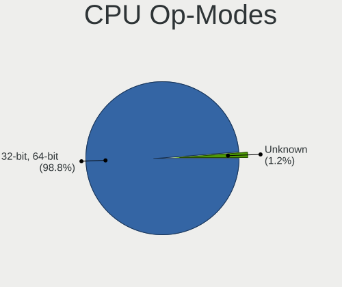

| Op mode        | Computers | Percent |
|----------------|-----------|---------|
| 32-bit, 64-bit | 319       | 98.76%  |
| Unknown        | 4         | 1.24%   |

CPU Microcode
-------------

Microcode number

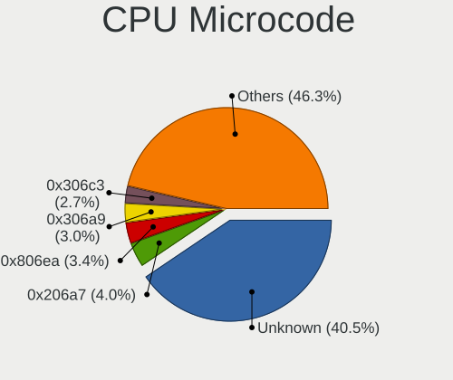

| Number     | Computers | Percent |
|------------|-----------|---------|
| Unknown    | 133       | 40.55%  |
| 0x206a7    | 13        | 3.96%   |
| 0x806ea    | 11        | 3.35%   |
| 0x306a9    | 10        | 3.05%   |
| 0x306c3    | 9         | 2.74%   |
| 0x05000119 | 8         | 2.44%   |
| 0x010000c8 | 8         | 2.44%   |
| 0x806ec    | 7         | 2.13%   |
| 0x906e9    | 6         | 1.83%   |
| 0x40651    | 5         | 1.52%   |
| 0x08600106 | 5         | 1.52%   |
| 0x906ea    | 4         | 1.22%   |
| 0x706a1    | 4         | 1.22%   |
| 0x506e3    | 4         | 1.22%   |
| 0x406e3    | 4         | 1.22%   |
| 0x306d4    | 4         | 1.22%   |
| 0x1067a    | 4         | 1.22%   |
| 0xa0652    | 3         | 0.91%   |
| 0x806e9    | 3         | 0.91%   |
| 0x6fd      | 3         | 0.91%   |
| 0x506c9    | 3         | 0.91%   |
| 0x406c4    | 3         | 0.91%   |
| 0x0a50000c | 3         | 0.91%   |
| 0x08108109 | 3         | 0.91%   |
| 0x06000852 | 3         | 0.91%   |
| 0x03000027 | 3         | 0.91%   |
| 0xf47      | 2         | 0.61%   |
| 0xa0655    | 2         | 0.61%   |
| 0x90672    | 2         | 0.61%   |
| 0x806c1    | 2         | 0.61%   |
| 0x706e5    | 2         | 0.61%   |
| 0x706a8    | 2         | 0.61%   |
| 0x406c3    | 2         | 0.61%   |
| 0x30678    | 2         | 0.61%   |
| 0x20655    | 2         | 0.61%   |
| 0x106e5    | 2         | 0.61%   |
| 0x10676    | 2         | 0.61%   |
| 0x08701021 | 2         | 0.61%   |
| 0x08608103 | 2         | 0.61%   |
| 0x08108102 | 2         | 0.61%   |

CPU Microarch
-------------

Microarchitecture

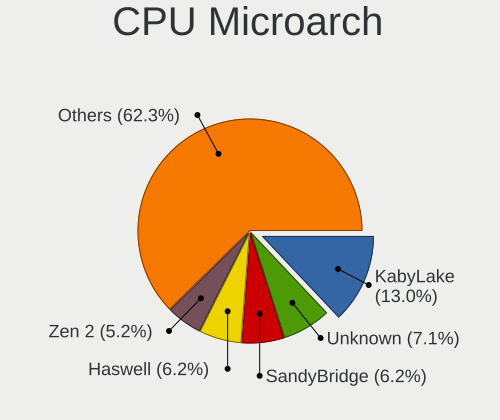

| Name              | Computers | Percent |
|-------------------|-----------|---------|
| KabyLake          | 42        | 12.96%  |
| Unknown           | 23        | 7.1%    |
| SandyBridge       | 20        | 6.17%   |
| Haswell           | 20        | 6.17%   |
| Zen 2             | 17        | 5.25%   |
| Zen 3             | 16        | 4.94%   |
| K10               | 16        | 4.94%   |
| IvyBridge         | 16        | 4.94%   |
| Alderlake Hybrid  | 13        | 4.01%   |
| Zen+              | 12        | 3.7%    |
| Skylake           | 11        | 3.4%    |
| Penryn            | 10        | 3.09%   |
| Silvermont        | 9         | 2.78%   |
| Goldmont plus     | 9         | 2.78%   |
| Bobcat            | 8         | 2.47%   |
| Piledriver        | 7         | 2.16%   |
| IceLake           | 7         | 2.16%   |
| CometLake         | 7         | 2.16%   |
| Broadwell         | 7         | 2.16%   |
| TigerLake         | 6         | 1.85%   |
| Core              | 6         | 1.85%   |
| Zen               | 5         | 1.54%   |
| Westmere          | 5         | 1.54%   |
| K8 Hammer         | 5         | 1.54%   |
| NetBurst          | 4         | 1.23%   |
| K10 Llano         | 4         | 1.23%   |
| Goldmont          | 4         | 1.23%   |
| Nehalem           | 3         | 0.93%   |
| Meteorlake Hybrid | 3         | 0.93%   |
| K8 & K10 hybrid   | 3         | 0.93%   |
| Bonnell           | 2         | 0.62%   |
| Tremont           | 1         | 0.31%   |
| Steamroller       | 1         | 0.31%   |
| Puma              | 1         | 0.31%   |
| Bulldozer         | 1         | 0.31%   |

Graphics
--------

GPU Vendor
----------

Vendors of graphics cards

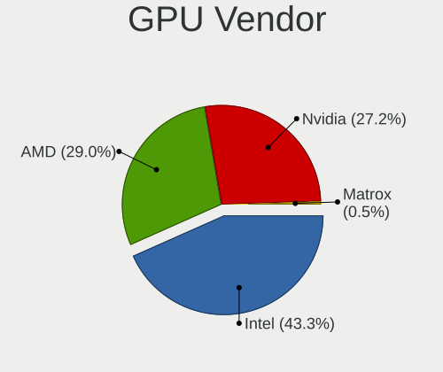

| Vendor                     | Computers | Percent |
|----------------------------|-----------|---------|
| Intel                      | 166       | 43.34%  |
| AMD                        | 111       | 28.98%  |
| Nvidia                     | 104       | 27.15%  |
| Matrox Electronics Systems | 2         | 0.52%   |

GPU Model
---------

Graphics card models

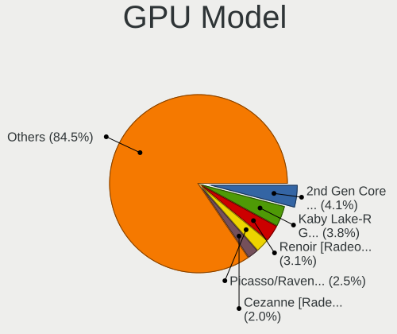

| Model                                                                                    | Computers | Percent |
|------------------------------------------------------------------------------------------|-----------|---------|
| Intel 2nd Generation Core Processor Family Integrated Graphics Controller                | 16        | 4.07%   |
| Intel Kaby Lake-R GT2 [UHD Graphics 620]                                                 | 15        | 3.82%   |
| AMD Renoir [Radeon Vega Series / Radeon Vega Mobile Series]                              | 12        | 3.05%   |
| AMD Picasso/Raven 2 [Radeon Vega Series / Radeon Vega Mobile Series]                     | 10        | 2.54%   |
| AMD Cezanne [Radeon Vega Series / Radeon Vega Mobile Series]                             | 8         | 2.04%   |
| Intel Broadwell-U GT2 [HD Graphics 5500]                                                 | 7         | 1.78%   |
| Intel 3rd Gen Core processor Graphics Controller                                         | 7         | 1.78%   |
| Intel Iris Plus Graphics G1 (Ice Lake)                                                   | 6         | 1.53%   |
| Intel Haswell-ULT Integrated Graphics Controller                                         | 6         | 1.53%   |
| Intel CoffeeLake-H GT2 [UHD Graphics 630]                                                | 6         | 1.53%   |
| Intel Atom/Celeron/Pentium Processor x5-E8000/J3xxx/N3xxx Integrated Graphics Controller | 6         | 1.53%   |
| Nvidia GP108M [GeForce MX150]                                                            | 5         | 1.27%   |
| Intel WhiskeyLake-U GT2 [UHD Graphics 620]                                               | 5         | 1.27%   |
| Intel TigerLake-LP GT2 [Iris Xe Graphics]                                                | 5         | 1.27%   |
| Intel Skylake-U GT2 [HD Graphics 520]                                                    | 5         | 1.27%   |
| Intel GeminiLake [UHD Graphics 600]                                                      | 5         | 1.27%   |
| Intel CometLake-U GT2 [UHD Graphics]                                                     | 5         | 1.27%   |
| Intel 4th Gen Core Processor Integrated Graphics Controller                              | 5         | 1.27%   |
| AMD Ellesmere [Radeon RX 470/480/570/570X/580/580X/590]                                  | 5         | 1.27%   |
| AMD Barcelo                                                                              | 5         | 1.27%   |
| Nvidia TU117M [GeForce GTX 1650 Mobile / Max-Q]                                          | 4         | 1.02%   |
| Nvidia GP106 [GeForce GTX 1060 6GB]                                                      | 4         | 1.02%   |
| Nvidia GF117M [GeForce 610M/710M/810M/820M / GT 620M/625M/630M/720M]                     | 4         | 1.02%   |
| Intel Kaby Lake-U GT2 [HD Graphics 620]                                                  | 4         | 1.02%   |
| Intel Kaby Lake-S GT2 [HD Graphics 630]                                                  | 4         | 1.02%   |
| Intel GeminiLake [UHD Graphics 605]                                                      | 4         | 1.02%   |
| Intel Core Processor Integrated Graphics Controller                                      | 4         | 1.02%   |
| AMD Phoenix1                                                                             | 4         | 1.02%   |
| Nvidia GP107M [GeForce GTX 1050 Ti Mobile]                                               | 3         | 0.76%   |
| Nvidia GP107M [GeForce GTX 1050 Mobile]                                                  | 3         | 0.76%   |
| Nvidia GF108 [GeForce GT 630]                                                            | 3         | 0.76%   |
| Nvidia GF108 [GeForce GT 440]                                                            | 3         | 0.76%   |
| Intel Mobile 4 Series Chipset Integrated Graphics Controller                             | 3         | 0.76%   |
| Intel Meteor Lake-P [Intel Arc Graphics]                                                 | 3         | 0.76%   |
| Intel CometLake-H GT2 [UHD Graphics]                                                     | 3         | 0.76%   |
| Intel Atom Processor Z36xxx/Z37xxx Series Graphics & Display                             | 3         | 0.76%   |
| Intel Apollo Lake GT1 [HD Graphics 500]                                                  | 3         | 0.76%   |
| Intel 4 Series Chipset Integrated Graphics Controller                                    | 3         | 0.76%   |
| AMD Wrestler [Radeon HD 7310]                                                            | 3         | 0.76%   |
| AMD Wrestler [Radeon HD 6320]                                                            | 3         | 0.76%   |

GPU Combo
---------

Combinations of graphics cards

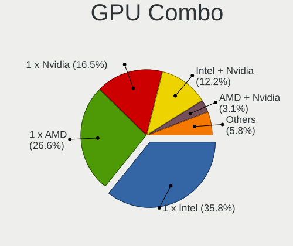

| Name           | Computers | Percent |
|----------------|-----------|---------|
| 1 x Intel      | 117       | 35.78%  |
| 1 x AMD        | 87        | 26.61%  |
| 1 x Nvidia     | 54        | 16.51%  |
| Intel + Nvidia | 40        | 12.23%  |
| AMD + Nvidia   | 10        | 3.06%   |
| 2 x AMD        | 9         | 2.75%   |
| Intel + AMD    | 5         | 1.53%   |
| Other          | 3         | 0.92%   |
| 1 x Matrox     | 2         | 0.61%   |

GPU Driver
----------

Free vs proprietary

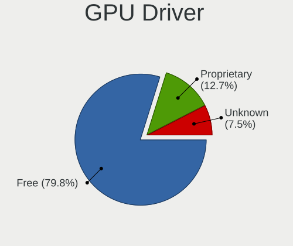

| Driver      | Computers | Percent |
|-------------|-----------|---------|
| Free        | 265       | 79.82%  |
| Proprietary | 42        | 12.65%  |
| Unknown     | 25        | 7.53%   |

GPU Memory
----------

Total video memory

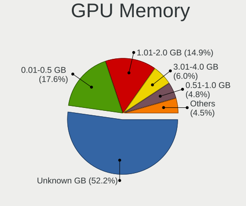

| Size in GB | Computers | Percent |
|------------|-----------|---------|
| Unknown    | 175       | 52.24%  |
| 0.01-0.5   | 59        | 17.61%  |
| 1.01-2.0   | 50        | 14.93%  |
| 3.01-4.0   | 20        | 5.97%   |
| 0.51-1.0   | 16        | 4.78%   |
| 7.01-8.0   | 8         | 2.39%   |
| 5.01-6.0   | 4         | 1.19%   |
| 2.01-3.0   | 1         | 0.3%    |
| 16.01-24.0 | 1         | 0.3%    |
| 8.01-16.0  | 1         | 0.3%    |

Monitor
-------

Monitor Vendor
--------------

Monitor vendors

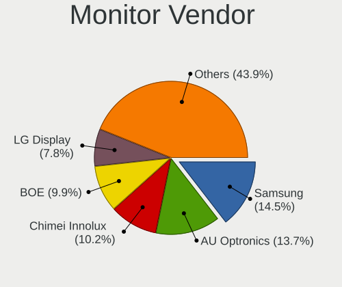

| Vendor                  | Computers | Percent |
|-------------------------|-----------|---------|
| Samsung Electronics     | 50        | 14.53%  |
| AU Optronics            | 47        | 13.66%  |
| Chimei Innolux          | 35        | 10.17%  |
| BOE                     | 34        | 9.88%   |
| LG Display              | 27        | 7.85%   |
| Goldstar                | 23        | 6.69%   |
| Philips                 | 21        | 6.1%    |
| Dell                    | 21        | 6.1%    |
| AOC                     | 10        | 2.91%   |
| Acer                    | 9         | 2.62%   |
| Lenovo                  | 7         | 2.03%   |
| PANDA                   | 6         | 1.74%   |
| Hewlett-Packard         | 6         | 1.74%   |
| Chi Mei Optoelectronics | 6         | 1.74%   |
| InfoVision              | 4         | 1.16%   |
| CSO                     | 4         | 1.16%   |
| Ancor Communications    | 4         | 1.16%   |
| Sharp                   | 3         | 0.87%   |
| BenQ                    | 3         | 0.87%   |
| Apple                   | 3         | 0.87%   |
| Valve                   | 2         | 0.58%   |
| TMX                     | 2         | 0.58%   |
| Sony                    | 2         | 0.58%   |
| ViewSonic               | 1         | 0.29%   |
| Toshiba                 | 1         | 0.29%   |
| SAC                     | 1         | 0.29%   |
| Plain Tree Systems      | 1         | 0.29%   |
| Mi                      | 1         | 0.29%   |
| Medion                  | 1         | 0.29%   |
| LG Electronics          | 1         | 0.29%   |
| KTC                     | 1         | 0.29%   |
| ITE                     | 1         | 0.29%   |
| Hitachi                 | 1         | 0.29%   |
| HannStar                | 1         | 0.29%   |
| GreenWood               | 1         | 0.29%   |
| CSOT                    | 1         | 0.29%   |
| CPT                     | 1         | 0.29%   |
| ASUSTek Computer        | 1         | 0.29%   |

Monitor Model
-------------

Monitor models

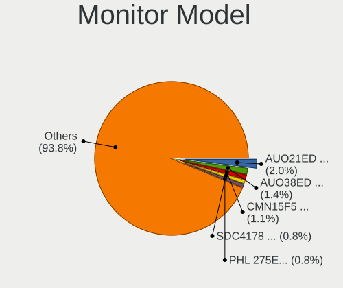

| Model                                                                 | Computers | Percent |
|-----------------------------------------------------------------------|-----------|---------|
| AU Optronics LCD Monitor AUO21ED 1920x1080 344x193mm 15.5-inch        | 7         | 1.98%   |
| AU Optronics LCD Monitor AUO38ED 1920x1080 344x193mm 15.5-inch        | 5         | 1.42%   |
| Chimei Innolux LCD Monitor CMN15F5 1920x1080 344x193mm 15.5-inch      | 4         | 1.13%   |
| Samsung Electronics LCD Monitor SDC4178 3200x2000 344x215mm 16.0-inch | 3         | 0.85%   |
| Philips PHL 275E2F PHLC23A 2560x1440 597x336mm 27.0-inch              | 3         | 0.85%   |
| Philips PHL 246E7 PHLC107 1920x1080 521x293mm 23.5-inch               | 3         | 0.85%   |
| LG Display LCD Monitor LGD0563 1920x1080 344x194mm 15.5-inch          | 3         | 0.85%   |
| Chimei Innolux LCD Monitor CMN15E7 1920x1080 344x193mm 15.5-inch      | 3         | 0.85%   |
| Chimei Innolux LCD Monitor CMN15AB 1366x768 344x193mm 15.5-inch       | 3         | 0.85%   |
| Chimei Innolux LCD Monitor CMN14D4 1920x1080 309x173mm 13.9-inch      | 3         | 0.85%   |
| BOE LCD Monitor BOE0747 1920x1080 344x194mm 15.5-inch                 | 3         | 0.85%   |
| AU Optronics LCD Monitor AUO46EC 1366x768 344x193mm 15.5-inch         | 3         | 0.85%   |
| AU Optronics LCD Monitor AUO26EC 1366x768 344x193mm 15.5-inch         | 3         | 0.85%   |
| AOC 27G2G4 AOC2702 1920x1080 598x336mm 27.0-inch                      | 3         | 0.85%   |
| Samsung Electronics SyncMaster SAM0214 1680x1050 408x306mm 20.1-inch  | 2         | 0.57%   |
| Samsung Electronics SyncMaster SAM01E1 1280x1024 376x301mm 19.0-inch  | 2         | 0.57%   |
| Samsung Electronics SyncMaster SAM0108 1600x1200 312x234mm 15.4-inch  | 2         | 0.57%   |
| Samsung Electronics LCD Monitor SDC4150 3456x2160 336x210mm 15.6-inch | 2         | 0.57%   |
| Philips PHL 243V5 PHLC0D1 1920x1080 521x293mm 23.5-inch               | 2         | 0.57%   |
| Philips PHL 234E5 PHLC0C7 1920x1080 509x286mm 23.0-inch               | 2         | 0.57%   |
| Philips 223E PHLC049 1920x1080 476x268mm 21.5-inch                    | 2         | 0.57%   |
| LG Display LCD Monitor LGD05E5 1920x1080 344x194mm 15.5-inch          | 2         | 0.57%   |
| InfoVision LCD Monitor IVO057D 1920x1080 309x174mm 14.0-inch          | 2         | 0.57%   |
| Hewlett-Packard E243 HPN3468 1920x1080 527x296mm 23.8-inch            | 2         | 0.57%   |
| Goldstar LG ULTRAWIDE GSM59F1 2560x1080 670x280mm 28.6-inch           | 2         | 0.57%   |
| Goldstar LG ULTRAGEAR GSM5C03 1920x1080 600x340mm 27.2-inch           | 2         | 0.57%   |
| Dell P2419H DELD0D9 1920x1080 527x296mm 23.8-inch                     | 2         | 0.57%   |
| Dell P2417H DELA0DC 1920x1080 527x296mm 23.8-inch                     | 2         | 0.57%   |
| BOE LCD Monitor BOE0900 1920x1080 344x194mm 15.5-inch                 | 2         | 0.57%   |
| BOE LCD Monitor BOE085E 1920x1080 344x194mm 15.5-inch                 | 2         | 0.57%   |
| BOE LCD Monitor BOE07F7 1920x1080 309x174mm 14.0-inch                 | 2         | 0.57%   |
| BOE LCD Monitor BOE06A5 1366x768 344x194mm 15.5-inch                  | 2         | 0.57%   |
| BOE LCD Monitor BOE0672 1366x768 344x194mm 15.5-inch                  | 2         | 0.57%   |
| AU Optronics LCD Monitor AUO71EC 1366x768 344x193mm 15.5-inch         | 2         | 0.57%   |
| AOC 2369M AOC2369 1920x1080 509x286mm 23.0-inch                       | 2         | 0.57%   |
| ViewSonic VA521 VSCF318 1024x768 304x228mm 15.0-inch                  | 1         | 0.28%   |
| Valve ANX7530 U VLV3003 800x1280 100x160mm 7.4-inch                   | 1         | 0.28%   |
| Valve ANX7530 U VLV3001 800x1280 100x150mm 7.1-inch                   | 1         | 0.28%   |
| Toshiba TV TSB0108 1920x1080 698x393mm 31.5-inch                      | 1         | 0.28%   |
| TMX TL156MDMP31-0 TMX2005 3200x2000 336x210mm 15.6-inch               | 1         | 0.28%   |

Monitor Resolution
------------------

Monitor screen resolution

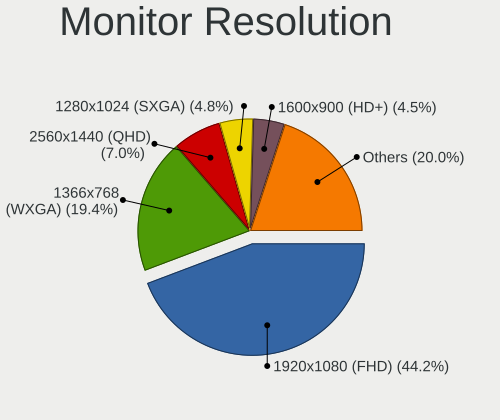

| Resolution         | Computers | Percent |
|--------------------|-----------|---------|
| 1920x1080 (FHD)    | 146       | 44.24%  |
| 1366x768 (WXGA)    | 64        | 19.39%  |
| 2560x1440 (QHD)    | 23        | 6.97%   |
| 1280x1024 (SXGA)   | 16        | 4.85%   |
| 1600x900 (HD+)     | 15        | 4.55%   |
| 3840x2160 (4K)     | 9         | 2.73%   |
| 2560x1600          | 7         | 2.12%   |
| 1920x1200 (WUXGA)  | 7         | 2.12%   |
| 1680x1050 (WSXGA+) | 7         | 2.12%   |
| 1440x900 (WXGA+)   | 7         | 2.12%   |
| 1280x800 (WXGA)    | 5         | 1.52%   |
| 3200x2000          | 4         | 1.21%   |
| 1024x768 (XGA)     | 3         | 0.91%   |
| 800x1280           | 2         | 0.61%   |
| 3456x2160          | 2         | 0.61%   |
| 2560x1080          | 2         | 0.61%   |
| 1600x1200          | 2         | 0.61%   |
| 3200x1080          | 1         | 0.3%    |
| 3072x1920          | 1         | 0.3%    |
| 2880x1800          | 1         | 0.3%    |
| 2880x1620          | 1         | 0.3%    |
| 2160x1440          | 1         | 0.3%    |
| 1920x540           | 1         | 0.3%    |
| 1360x768           | 1         | 0.3%    |
| 1024x600           | 1         | 0.3%    |
| Unknown            | 1         | 0.3%    |

Monitor Diagonal
----------------

Diagonal size in inches

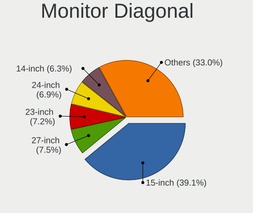

| Inches  | Computers | Percent |
|---------|-----------|---------|
| 15      | 136       | 39.08%  |
| 27      | 26        | 7.47%   |
| 23      | 25        | 7.18%   |
| 24      | 24        | 6.9%    |
| 14      | 22        | 6.32%   |
| 19      | 16        | 4.6%    |
| 21      | 15        | 4.31%   |
| 17      | 15        | 4.31%   |
| 16      | 13        | 3.74%   |
| 13      | 13        | 3.74%   |
| 20      | 10        | 2.87%   |
| 18      | 7         | 2.01%   |
| 31      | 5         | 1.44%   |
| 11      | 4         | 1.15%   |
| 84      | 2         | 0.57%   |
| 72      | 2         | 0.57%   |
| 34      | 2         | 0.57%   |
| 12      | 2         | 0.57%   |
| 7       | 2         | 0.57%   |
| 52      | 1         | 0.29%   |
| 32      | 1         | 0.29%   |
| 26      | 1         | 0.29%   |
| 22      | 1         | 0.29%   |
| 10      | 1         | 0.29%   |
| 8       | 1         | 0.29%   |
| Unknown | 1         | 0.29%   |

Monitor Width
-------------

Physical width

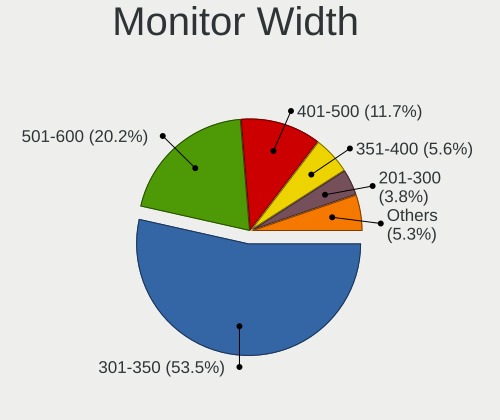

| Width in mm | Computers | Percent |
|-------------|-----------|---------|
| 301-350     | 183       | 53.51%  |
| 501-600     | 69        | 20.18%  |
| 401-500     | 40        | 11.7%   |
| 351-400     | 19        | 5.56%   |
| 201-300     | 13        | 3.8%    |
| 601-700     | 6         | 1.75%   |
| 1501-2000   | 4         | 1.17%   |
| 701-800     | 3         | 0.88%   |
| 1-100       | 2         | 0.58%   |
| 101-200     | 1         | 0.29%   |
| 1001-1500   | 1         | 0.29%   |
| Unknown     | 1         | 0.29%   |

Aspect Ratio
------------

Proportional relationship between the width and the height

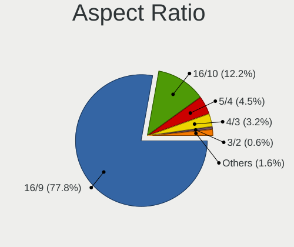

| Ratio   | Computers | Percent |
|---------|-----------|---------|
| 16/9    | 242       | 77.81%  |
| 16/10   | 38        | 12.22%  |
| 5/4     | 14        | 4.5%    |
| 4/3     | 10        | 3.22%   |
| 3/2     | 2         | 0.64%   |
| 21/9    | 2         | 0.64%   |
| 0.67    | 1         | 0.32%   |
| 0.62    | 1         | 0.32%   |
| Unknown | 1         | 0.32%   |

Monitor Area
------------

Area in inch²

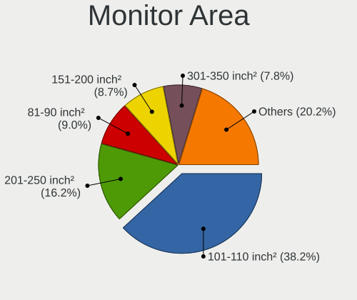

| Area in inch² | Computers | Percent |
|----------------|-----------|---------|
| 101-110        | 132       | 38.15%  |
| 201-250        | 56        | 16.18%  |
| 81-90          | 31        | 8.96%   |
| 151-200        | 30        | 8.67%   |
| 301-350        | 27        | 7.8%    |
| 111-120        | 17        | 4.91%   |
| 141-150        | 12        | 3.47%   |
| 351-500        | 8         | 2.31%   |
| 121-130        | 7         | 2.02%   |
| More than 1000 | 5         | 1.45%   |
| 51-60          | 4         | 1.16%   |
| 251-300        | 4         | 1.16%   |
| 71-80          | 3         | 0.87%   |
| 1-40           | 3         | 0.87%   |
| 61-70          | 2         | 0.58%   |
| 131-140        | 2         | 0.58%   |
| 41-50          | 1         | 0.29%   |
| 91-100         | 1         | 0.29%   |
| Unknown        | 1         | 0.29%   |

Pixel Density
-------------

Pixels per inch

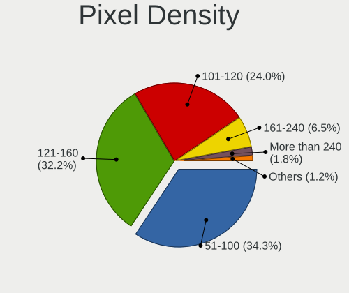

| Density       | Computers | Percent |
|---------------|-----------|---------|
| 51-100        | 116       | 34.32%  |
| 121-160       | 109       | 32.25%  |
| 101-120       | 81        | 23.96%  |
| 161-240       | 22        | 6.51%   |
| More than 240 | 6         | 1.78%   |
| 1-50          | 3         | 0.89%   |
| Unknown       | 1         | 0.3%    |

Multiple Monitors
-----------------

Total monitors connected

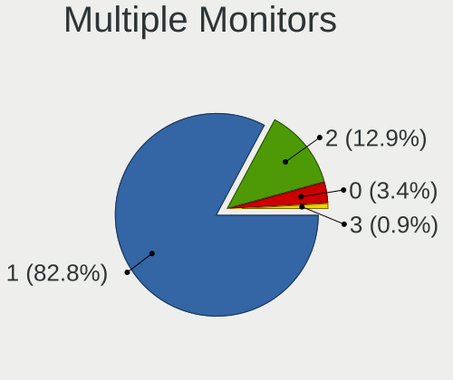

| Total | Computers | Percent |
|-------|-----------|---------|
| 1     | 270       | 82.82%  |
| 2     | 42        | 12.88%  |
| 0     | 11        | 3.37%   |
| 3     | 3         | 0.92%   |

Network
-------

Net Controller Vendor
---------------------

Controller vendors

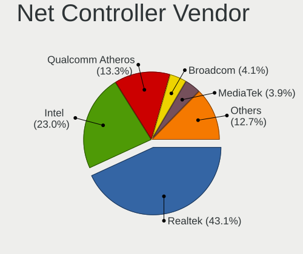

| Vendor                            | Computers | Percent |
|-----------------------------------|-----------|---------|
| Realtek Semiconductor             | 201       | 43.13%  |
| Intel                             | 107       | 22.96%  |
| Qualcomm Atheros                  | 62        | 13.3%   |
| Broadcom                          | 19        | 4.08%   |
| MediaTek                          | 18        | 3.86%   |
| Nvidia                            | 10        | 2.15%   |
| TP-Link                           | 6         | 1.29%   |
| Ralink                            | 6         | 1.29%   |
| ASIX Electronics                  | 5         | 1.07%   |
| Xiaomi                            | 4         | 0.86%   |
| Broadcom Limited                  | 4         | 0.86%   |
| Marvell Technology Group          | 3         | 0.64%   |
| JMicron Technology                | 3         | 0.64%   |
| Huawei Technologies               | 3         | 0.64%   |
| Ralink Technology                 | 2         | 0.43%   |
| Qualcomm                          | 2         | 0.43%   |
| Wacom                             | 1         | 0.21%   |
| Sierra Wireless                   | 1         | 0.21%   |
| Shenzhen Goodix Technology        | 1         | 0.21%   |
| OnePlus Technology (Shenzhen)     | 1         | 0.21%   |
| Mercucys                          | 1         | 0.21%   |
| ICS Advent                        | 1         | 0.21%   |
| Hewlett-Packard                   | 1         | 0.21%   |
| Ericsson Business Mobile Networks | 1         | 0.21%   |
| D-Link System                     | 1         | 0.21%   |
| D-Link                            | 1         | 0.21%   |
| Unknown                           | 1         | 0.21%   |

Net Controller Model
--------------------

Controller models

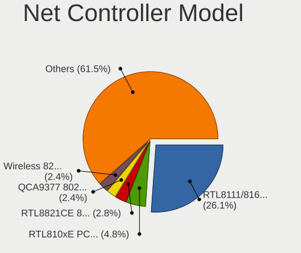

| Model                                                                   | Computers | Percent |
|-------------------------------------------------------------------------|-----------|---------|
| Realtek RTL8111/8168/8211/8411 PCI Express Gigabit Ethernet Controller  | 141       | 26.11%  |
| Realtek RTL810xE PCI Express Fast Ethernet controller                   | 26        | 4.81%   |
| Realtek RTL8821CE 802.11ac PCIe Wireless Network Adapter                | 15        | 2.78%   |
| Qualcomm Atheros QCA9377 802.11ac Wireless Network Adapter              | 13        | 2.41%   |
| Intel Wireless 8265 / 8275                                              | 13        | 2.41%   |
| Qualcomm Atheros QCA9565 / AR9565 Wireless Network Adapter              | 10        | 1.85%   |
| Qualcomm Atheros AR9285 Wireless Network Adapter (PCI-Express)          | 10        | 1.85%   |
| Intel Wi-Fi 6 AX200                                                     | 10        | 1.85%   |
| Realtek RTL8822CE 802.11ac PCIe Wireless Network Adapter                | 8         | 1.48%   |
| Realtek RTL8125 2.5GbE Controller                                       | 8         | 1.48%   |
| Qualcomm Atheros AR9485 Wireless Network Adapter                        | 7         | 1.3%    |
| MediaTek MT7922 802.11ax PCI Express Wireless Network Adapter           | 7         | 1.3%    |
| MediaTek MT7921 802.11ax PCIe Wireless Network Adapter [Filogic 330]    | 6         | 1.11%   |
| Realtek RTL8723BE PCIe Wireless Network Adapter                         | 5         | 0.93%   |
| Nvidia MCP77 Ethernet                                                   | 5         | 0.93%   |
| Intel Wi-Fi 6 AX201                                                     | 5         | 0.93%   |
| Intel Comet Lake PCH CNVi WiFi                                          | 5         | 0.93%   |
| Broadcom BCM4313 802.11bgn Wireless Network Adapter                     | 5         | 0.93%   |
| ASIX AX88179 Gigabit Ethernet                                           | 5         | 0.93%   |
| Xiaomi Mi/Redmi series (RNDIS)                                          | 4         | 0.74%   |
| Realtek RTL8852BE PCIe 802.11ax Wireless Network Controller             | 4         | 0.74%   |
| Realtek RTL8153 Gigabit Ethernet Adapter                                | 4         | 0.74%   |
| Qualcomm Atheros AR8151 v2.0 Gigabit Ethernet                           | 4         | 0.74%   |
| Intel Wireless 7260                                                     | 4         | 0.74%   |
| Intel Ethernet Controller I225-V                                        | 4         | 0.74%   |
| Intel Ethernet Connection I218-LM                                       | 4         | 0.74%   |
| Intel Dual Band Wireless-AC 3168NGW [Stone Peak]                        | 4         | 0.74%   |
| Intel Comet Lake PCH-LP CNVi WiFi                                       | 4         | 0.74%   |
| Intel 82579LM Gigabit Network Connection (Lewisville)                   | 4         | 0.74%   |
| Realtek RTL8822BE 802.11a/b/g/n/ac WiFi adapter                         | 3         | 0.56%   |
| Realtek RTL8188EUS 802.11n Wireless Network Adapter                     | 3         | 0.56%   |
| Realtek RTL8188EE Wireless Network Adapter                              | 3         | 0.56%   |
| Qualcomm Atheros QCA6174 802.11ac Wireless Network Adapter              | 3         | 0.56%   |
| Qualcomm Atheros AR242x / AR542x Wireless Network Adapter (PCI-Express) | 3         | 0.56%   |
| Nvidia MCP61 Ethernet                                                   | 3         | 0.56%   |
| MediaTek MT7902 802.11ax PCIe Wireless Network Adapter [Filogic 310]    | 3         | 0.56%   |
| JMicron JMC250 PCI Express Gigabit Ethernet Controller                  | 3         | 0.56%   |
| Intel Wireless 3165                                                     | 3         | 0.56%   |
| Intel Wireless 3160                                                     | 3         | 0.56%   |
| Intel Meteor Lake PCH CNVi WiFi                                         | 3         | 0.56%   |

Wireless Vendor
---------------

Wireless vendors

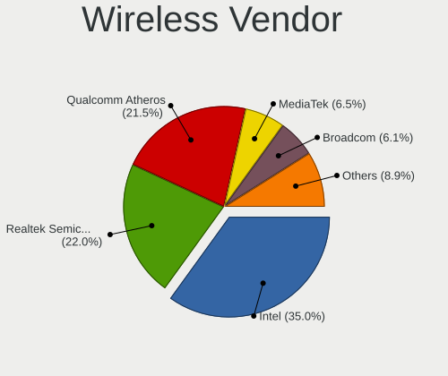

| Vendor                | Computers | Percent |
|-----------------------|-----------|---------|
| Intel                 | 86        | 34.96%  |
| Realtek Semiconductor | 54        | 21.95%  |
| Qualcomm Atheros      | 53        | 21.54%  |
| MediaTek              | 16        | 6.5%    |
| Broadcom              | 15        | 6.1%    |
| TP-Link               | 6         | 2.44%   |
| Ralink                | 6         | 2.44%   |
| Ralink Technology     | 2         | 0.81%   |
| Wacom                 | 1         | 0.41%   |
| Sierra Wireless       | 1         | 0.41%   |
| Qualcomm              | 1         | 0.41%   |
| Mercucys              | 1         | 0.41%   |
| D-Link System         | 1         | 0.41%   |
| D-Link                | 1         | 0.41%   |
| Broadcom Limited      | 1         | 0.41%   |
| Unknown               | 1         | 0.41%   |

Wireless Model
--------------

Wireless models

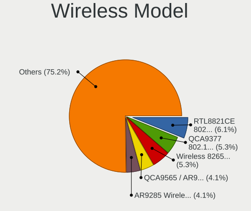

| Model                                                                   | Computers | Percent |
|-------------------------------------------------------------------------|-----------|---------|
| Realtek RTL8821CE 802.11ac PCIe Wireless Network Adapter                | 15        | 6.1%    |
| Qualcomm Atheros QCA9377 802.11ac Wireless Network Adapter              | 13        | 5.28%   |
| Intel Wireless 8265 / 8275                                              | 13        | 5.28%   |
| Qualcomm Atheros QCA9565 / AR9565 Wireless Network Adapter              | 10        | 4.07%   |
| Qualcomm Atheros AR9285 Wireless Network Adapter (PCI-Express)          | 10        | 4.07%   |
| Intel Wi-Fi 6 AX200                                                     | 10        | 4.07%   |
| Realtek RTL8822CE 802.11ac PCIe Wireless Network Adapter                | 8         | 3.25%   |
| Qualcomm Atheros AR9485 Wireless Network Adapter                        | 7         | 2.85%   |
| MediaTek MT7922 802.11ax PCI Express Wireless Network Adapter           | 7         | 2.85%   |
| MediaTek MT7921 802.11ax PCIe Wireless Network Adapter [Filogic 330]    | 6         | 2.44%   |
| Realtek RTL8723BE PCIe Wireless Network Adapter                         | 5         | 2.03%   |
| Intel Wi-Fi 6 AX201                                                     | 5         | 2.03%   |
| Intel Comet Lake PCH CNVi WiFi                                          | 5         | 2.03%   |
| Broadcom BCM4313 802.11bgn Wireless Network Adapter                     | 5         | 2.03%   |
| Realtek RTL8852BE PCIe 802.11ax Wireless Network Controller             | 4         | 1.63%   |
| Intel Wireless 7260                                                     | 4         | 1.63%   |
| Intel Dual Band Wireless-AC 3168NGW [Stone Peak]                        | 4         | 1.63%   |
| Intel Comet Lake PCH-LP CNVi WiFi                                       | 4         | 1.63%   |
| Realtek RTL8822BE 802.11a/b/g/n/ac WiFi adapter                         | 3         | 1.22%   |
| Realtek RTL8188EUS 802.11n Wireless Network Adapter                     | 3         | 1.22%   |
| Realtek RTL8188EE Wireless Network Adapter                              | 3         | 1.22%   |
| Qualcomm Atheros QCA6174 802.11ac Wireless Network Adapter              | 3         | 1.22%   |
| Qualcomm Atheros AR242x / AR542x Wireless Network Adapter (PCI-Express) | 3         | 1.22%   |
| MediaTek MT7902 802.11ax PCIe Wireless Network Adapter [Filogic 310]    | 3         | 1.22%   |
| Intel Wireless 3165                                                     | 3         | 1.22%   |
| Intel Wireless 3160                                                     | 3         | 1.22%   |
| Intel Meteor Lake PCH CNVi WiFi                                         | 3         | 1.22%   |
| Intel Cannon Lake PCH CNVi WiFi                                         | 3         | 1.22%   |
| TP-Link TL-WN821N v5/v6 [RTL8192EU]                                     | 2         | 0.81%   |
| TP-Link TL-WN722N v2/v3 [Realtek RTL8188EUS]                            | 2         | 0.81%   |
| Realtek RTL8852AE 802.11ax PCIe Wireless Network Adapter                | 2         | 0.81%   |
| Realtek RTL8821AE 802.11ac PCIe Wireless Network Adapter                | 2         | 0.81%   |
| Realtek RTL8188CE 802.11b/g/n WiFi Adapter                              | 2         | 0.81%   |
| Realtek 802.11ac NIC                                                    | 2         | 0.81%   |
| Ralink RT3090 Wireless 802.11n 1T/1R PCIe                               | 2         | 0.81%   |
| Qualcomm Atheros AR9287 Wireless Network Adapter (PCI-Express)          | 2         | 0.81%   |
| Intel Wireless 8260                                                     | 2         | 0.81%   |
| Intel Wireless 7265                                                     | 2         | 0.81%   |
| Intel Wi-Fi 6E(802.11ax) AX210/AX1675* 2x2 [Typhoon Peak]               | 2         | 0.81%   |
| Intel PRO/Wireless 4965 AG or AGN [Kedron] Network Connection           | 2         | 0.81%   |

Ethernet Vendor
---------------

Ethernet vendors

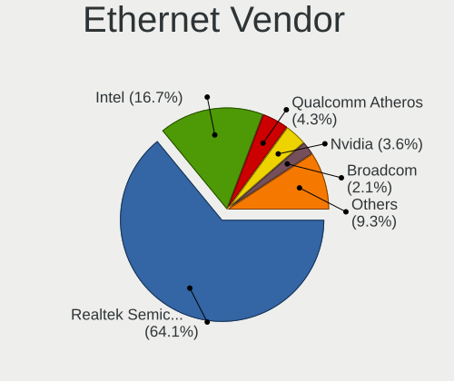

| Vendor                   | Computers | Percent |
|--------------------------|-----------|---------|
| Realtek Semiconductor    | 180       | 64.06%  |
| Intel                    | 47        | 16.73%  |
| Qualcomm Atheros         | 12        | 4.27%   |
| Nvidia                   | 10        | 3.56%   |
| Broadcom                 | 6         | 2.14%   |
| ASIX Electronics         | 5         | 1.78%   |
| Xiaomi                   | 4         | 1.42%   |
| Marvell Technology Group | 3         | 1.07%   |
| JMicron Technology       | 3         | 1.07%   |
| Huawei Technologies      | 3         | 1.07%   |
| Broadcom Limited         | 3         | 1.07%   |
| MediaTek                 | 2         | 0.71%   |
| Qualcomm                 | 1         | 0.36%   |
| ICS Advent               | 1         | 0.36%   |
| Hewlett-Packard          | 1         | 0.36%   |

Ethernet Model
--------------

Ethernet models

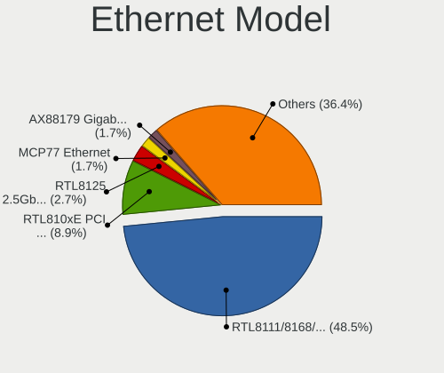

| Model                                                                  | Computers | Percent |
|------------------------------------------------------------------------|-----------|---------|
| Realtek RTL8111/8168/8211/8411 PCI Express Gigabit Ethernet Controller | 141       | 48.45%  |
| Realtek RTL810xE PCI Express Fast Ethernet controller                  | 26        | 8.93%   |
| Realtek RTL8125 2.5GbE Controller                                      | 8         | 2.75%   |
| Nvidia MCP77 Ethernet                                                  | 5         | 1.72%   |
| ASIX AX88179 Gigabit Ethernet                                          | 5         | 1.72%   |
| Xiaomi Mi/Redmi series (RNDIS)                                         | 4         | 1.37%   |
| Realtek RTL8153 Gigabit Ethernet Adapter                               | 4         | 1.37%   |
| Qualcomm Atheros AR8151 v2.0 Gigabit Ethernet                          | 4         | 1.37%   |
| Intel Ethernet Controller I225-V                                       | 4         | 1.37%   |
| Intel Ethernet Connection I218-LM                                      | 4         | 1.37%   |
| Intel 82579LM Gigabit Network Connection (Lewisville)                  | 4         | 1.37%   |
| Nvidia MCP61 Ethernet                                                  | 3         | 1.03%   |
| JMicron JMC250 PCI Express Gigabit Ethernet Controller                 | 3         | 1.03%   |
| Intel I211 Gigabit Network Connection                                  | 3         | 1.03%   |
| Intel Ethernet Connection (4) I219-LM                                  | 3         | 1.03%   |
| Intel Ethernet Connection (2) I219-V                                   | 3         | 1.03%   |
| Huawei E353/E3131                                                      | 3         | 1.03%   |
| Broadcom NetXtreme BCM57765 Gigabit Ethernet PCIe                      | 3         | 1.03%   |
| Realtek RTL8152 Fast Ethernet Adapter                                  | 2         | 0.69%   |
| Qualcomm Atheros AR8121/AR8113/AR8114 Gigabit or Fast Ethernet         | 2         | 0.69%   |
| MediaTek Infinix HOT 50i                                               | 2         | 0.69%   |
| Intel I350 Gigabit Network Connection                                  | 2         | 0.69%   |
| Intel Ethernet Connection I217-V                                       | 2         | 0.69%   |
| Intel Ethernet Connection (3) I218-V                                   | 2         | 0.69%   |
| Intel Ethernet Connection (2) I218-V                                   | 2         | 0.69%   |
| Intel Ethernet Connection (16) I219-V                                  | 2         | 0.69%   |
| Intel Ethernet Connection (11) I219-V                                  | 2         | 0.69%   |
| Intel Alder Lake-S PCH CNVi WiFi                                       | 2         | 0.69%   |
| Intel 82574L Gigabit Network Connection                                | 2         | 0.69%   |
| Broadcom NetLink BCM57785 Gigabit Ethernet PCIe                        | 2         | 0.69%   |
| Realtek RTL8852CE PCIe 802.11ax Wireless Network Controller            | 1         | 0.34%   |
| Realtek RTL8169 PCI Gigabit Ethernet Controller                        | 1         | 0.34%   |
| Realtek Killer E3000 2.5GbE Controller                                 | 1         | 0.34%   |
| Qualcomm YUPIK-QRD _SN:AC1D5909                                        | 1         | 0.34%   |
| Qualcomm Atheros QCA8172 Fast Ethernet                                 | 1         | 0.34%   |
| Qualcomm Atheros Killer E220x Gigabit Ethernet Controller              | 1         | 0.34%   |
| Qualcomm Atheros AR8161 Gigabit Ethernet                               | 1         | 0.34%   |
| Qualcomm Atheros AR8151 v1.0 Gigabit Ethernet                          | 1         | 0.34%   |
| Qualcomm Atheros AR8132 Fast Ethernet                                  | 1         | 0.34%   |
| Qualcomm Atheros AR8131 Gigabit Ethernet                               | 1         | 0.34%   |

Net Controller Kind
-------------------

Ethernet, WiFi or modem

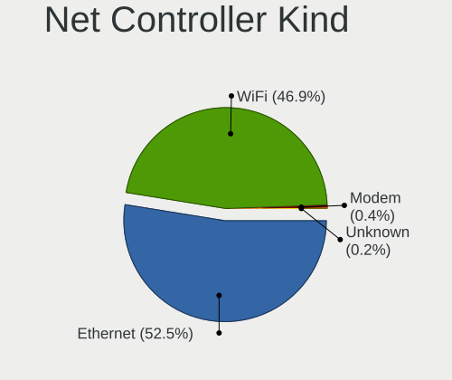

| Kind     | Computers | Percent |
|----------|-----------|---------|
| Ethernet | 269       | 52.54%  |
| WiFi     | 240       | 46.88%  |
| Modem    | 2         | 0.39%   |
| Unknown  | 1         | 0.2%    |

Used Controller
---------------

Currently used network controller

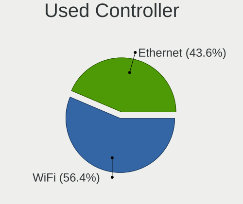

| Kind     | Computers | Percent |
|----------|-----------|---------|
| WiFi     | 185       | 56.4%   |
| Ethernet | 143       | 43.6%   |

NICs
----

Total network controllers on board

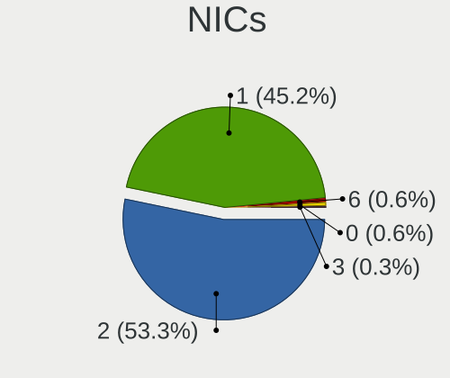

| Total | Computers | Percent |
|-------|-----------|---------|
| 2     | 172       | 53.25%  |
| 1     | 146       | 45.2%   |
| 6     | 2         | 0.62%   |
| 0     | 2         | 0.62%   |
| 3     | 1         | 0.31%   |

IPv6
----

IPv6 vs IPv4

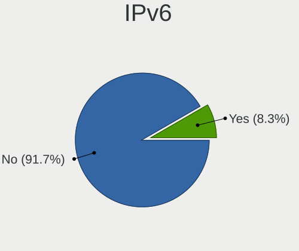

| Used | Computers | Percent |
|------|-----------|---------|
| No   | 297       | 91.67%  |
| Yes  | 27        | 8.33%   |

Bluetooth
---------

Bluetooth Vendor
----------------

Controller vendors

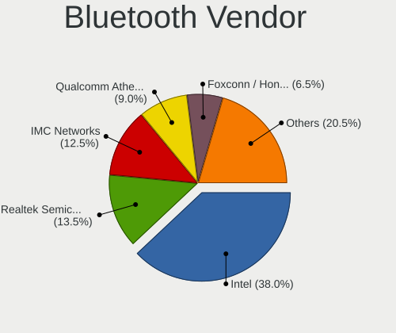

| Vendor                          | Computers | Percent |
|---------------------------------|-----------|---------|
| Intel                           | 76        | 38%     |
| Realtek Semiconductor           | 27        | 13.5%   |
| IMC Networks                    | 25        | 12.5%   |
| Qualcomm Atheros Communications | 18        | 9%      |
| Foxconn / Hon Hai               | 13        | 6.5%    |
| Cambridge Silicon Radio         | 8         | 4%      |
| Lite-On Technology              | 7         | 3.5%    |
| Broadcom                        | 7         | 3.5%    |
| ASUSTek Computer                | 4         | 2%      |
| Apple                           | 3         | 1.5%    |
| Ralink Technology               | 2         | 1%      |
| MediaTek                        | 2         | 1%      |
| TP-Link                         | 1         | 0.5%    |
| Toshiba                         | 1         | 0.5%    |
| SiW                             | 1         | 0.5%    |
| Realtek                         | 1         | 0.5%    |
| Ralink                          | 1         | 0.5%    |
| Integrated System Solution      | 1         | 0.5%    |
| Hewlett-Packard                 | 1         | 0.5%    |
| Dell                            | 1         | 0.5%    |

Bluetooth Model
---------------

Controller models

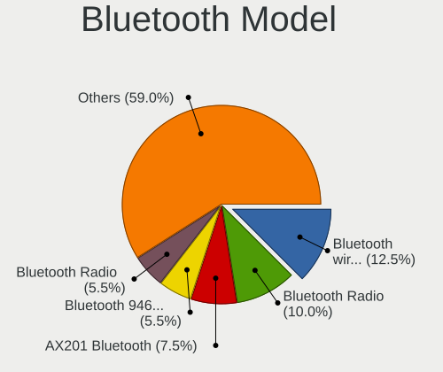

| Model                                               | Computers | Percent |
|-----------------------------------------------------|-----------|---------|
| Intel Bluetooth wireless interface                  | 25        | 12.5%   |
| Realtek Bluetooth Radio                             | 20        | 10%     |
| Intel AX201 Bluetooth                               | 15        | 7.5%    |
| Intel Bluetooth 9460/9560 Jefferson Peak (JfP)      | 11        | 5.5%    |
| IMC Networks Bluetooth Radio                        | 11        | 5.5%    |
| Intel AX200 Bluetooth                               | 10        | 5%      |
| Qualcomm Atheros  Bluetooth Device                  | 9         | 4.5%    |
| Intel Bluetooth Device                              | 8         | 4%      |
| Cambridge Silicon Radio Bluetooth Dongle (HCI mode) | 8         | 4%      |
| Foxconn / Hon Hai Wireless_Device                   | 6         | 3%      |
| IMC Networks Wireless_Device                        | 5         | 2.5%    |
| IMC Networks Bluetooth Device                       | 5         | 2.5%    |
| Lite-On Qualcomm Atheros QCA9377 Bluetooth          | 4         | 2%      |
| Intel Wireless-AC 3168 Bluetooth                    | 4         | 2%      |
| Foxconn / Hon Hai MediaTek Bluetooth Adapter        | 4         | 2%      |
| Qualcomm Atheros QCA61x4 Bluetooth 4.0              | 3         | 1.5%    |
| IMC Networks Atheros AR3012 Bluetooth 4.0 Adapter   | 3         | 1.5%    |
| Realtek RTL8822BE Bluetooth 4.2 Adapter             | 2         | 1%      |
| Realtek RTL8723B Bluetooth                          | 2         | 1%      |
| Realtek  Bluetooth 4.2 Adapter                      | 2         | 1%      |
| Qualcomm Atheros AR3012 Bluetooth 4.0               | 2         | 1%      |
| Qualcomm Atheros AR3011 Bluetooth                   | 2         | 1%      |
| MediaTek Wireless_Device                            | 2         | 1%      |
| Broadcom HP Portable SoftSailing                    | 2         | 1%      |
| Broadcom BCM20702A0                                 | 2         | 1%      |
| ASUS BT-270 Bluetooth Adapter                       | 2         | 1%      |
| ASUS BCM20702A0                                     | 2         | 1%      |
| TP-Link TP-T@- UB500 Adapter                        | 1         | 0.5%    |
| Toshiba Integrated Bluetooth HCI                    | 1         | 0.5%    |
| SiW SiW                                             | 1         | 0.5%    |
| Realtek RTL8821A Bluetooth                          | 1         | 0.5%    |
| Realtek Bluetooth Radio                             | 1         | 0.5%    |
| Ralink Motorola BC4 Bluetooth 3.0+HS Adapter        | 1         | 0.5%    |
| Ralink CSR BS8510                                   | 1         | 0.5%    |
| Ralink RT3290 Bluetooth                             | 1         | 0.5%    |
| Qualcomm Atheros AR9462 Bluetooth                   | 1         | 0.5%    |
| Qualcomm Atheros AR3012 Bluetooth                   | 1         | 0.5%    |
| Lite-On Bluetooth Radio                             | 1         | 0.5%    |
| Lite-On Bluetooth Device                            | 1         | 0.5%    |
| Lite-On Atheros AR3012 Bluetooth                    | 1         | 0.5%    |

Sound
-----

Sound Vendor
------------

Sound card vendors

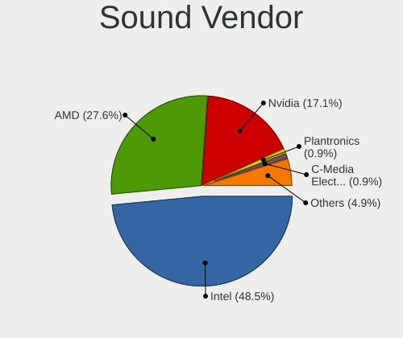

| Vendor                    | Computers | Percent |
|---------------------------|-----------|---------|
| Intel                     | 207       | 48.48%  |
| AMD                       | 118       | 27.63%  |
| Nvidia                    | 73        | 17.1%   |
| Plantronics               | 4         | 0.94%   |
| C-Media Electronics       | 4         | 0.94%   |
| Logitech                  | 3         | 0.7%    |
| DSEA A/S                  | 2         | 0.47%   |
| Creative Labs             | 2         | 0.47%   |
| ASUSTek Computer          | 2         | 0.47%   |
| Texas Instruments         | 1         | 0.23%   |
| SteelSeries ApS           | 1         | 0.23%   |
| Sony                      | 1         | 0.23%   |
| Shenzhen Rapoo Technology | 1         | 0.23%   |
| Nektar                    | 1         | 0.23%   |
| Kingston Technology       | 1         | 0.23%   |
| GN Netcom                 | 1         | 0.23%   |
| Giga-Byte Technology      | 1         | 0.23%   |
| Focusrite-Novation        | 1         | 0.23%   |
| Fifine Microphones        | 1         | 0.23%   |
| Creative Technology       | 1         | 0.23%   |
| BEHRINGER International   | 1         | 0.23%   |

Sound Model
-----------

Sound card models

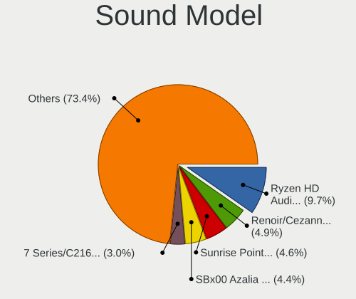

| Model                                                                                             | Computers | Percent |
|---------------------------------------------------------------------------------------------------|-----------|---------|
| AMD Ryzen HD Audio Controller                                                                     | 51        | 9.7%    |
| AMD Renoir/Cezanne HDMI/DP Audio Controller                                                       | 26        | 4.94%   |
| Intel Sunrise Point-LP HD Audio                                                                   | 24        | 4.56%   |
| AMD SBx00 Azalia (Intel HDA)                                                                      | 23        | 4.37%   |
| Intel 7 Series/C216 Chipset Family High Definition Audio Controller                               | 16        | 3.04%   |
| Intel 6 Series/C200 Series Chipset Family High Definition Audio Controller                        | 16        | 3.04%   |
| AMD FCH Azalia Controller                                                                         | 13        | 2.47%   |
| Intel NM10/ICH7 Family High Definition Audio Controller                                           | 11        | 2.09%   |
| Intel 8 Series/C220 Series Chipset High Definition Audio Controller                               | 11        | 2.09%   |
| AMD Raven/Raven2/Fenghuang HDMI/DP Audio Controller                                               | 11        | 2.09%   |
| AMD Radeon High Definition Audio Controller                                                       | 11        | 2.09%   |
| Nvidia GF108 High Definition Audio Controller                                                     | 10        | 1.9%    |
| Intel Celeron/Pentium Silver Processor High Definition Audio                                      | 9         | 1.71%   |
| Intel Xeon E3-1200 v3/4th Gen Core Processor HD Audio Controller                                  | 8         | 1.52%   |
| Intel Alder Lake PCH-P High Definition Audio Controller                                           | 8         | 1.52%   |
| Intel 5 Series/3400 Series Chipset High Definition Audio                                          | 8         | 1.52%   |
| AMD Wrestler HDMI Audio                                                                           | 8         | 1.52%   |
| Intel Wildcat Point-LP High Definition Audio Controller                                           | 7         | 1.33%   |
| Intel Comet Lake PCH cAVS                                                                         | 7         | 1.33%   |
| Intel Broadwell-U Audio Controller                                                                | 7         | 1.33%   |
| AMD Starship/Matisse HD Audio Controller                                                          | 7         | 1.33%   |
| Nvidia TU107 GeForce GTX 1650 High Definition Audio Controller                                    | 6         | 1.14%   |
| Nvidia GP107GL High Definition Audio Controller                                                   | 6         | 1.14%   |
| Intel Tiger Lake-LP Smart Sound Technology Audio Controller                                       | 6         | 1.14%   |
| Intel Ice Lake-LP Smart Sound Technology Audio Controller                                         | 6         | 1.14%   |
| Intel Haswell-ULT HD Audio Controller                                                             | 6         | 1.14%   |
| Intel Cannon Lake PCH cAVS                                                                        | 6         | 1.14%   |
| Intel Atom/Celeron/Pentium Processor x5-E8000/J3xxx/N3xxx Series High Definition Audio Controller | 6         | 1.14%   |
| Intel Alder Lake-S HD Audio Controller                                                            | 6         | 1.14%   |
| Intel 8 Series HD Audio Controller                                                                | 6         | 1.14%   |
| Nvidia MCP72XE/MCP72P/MCP78U/MCP78S High Definition Audio                                         | 5         | 0.95%   |
| Nvidia GP106 High Definition Audio Controller                                                     | 5         | 0.95%   |
| Nvidia GA104 High Definition Audio Controller                                                     | 5         | 0.95%   |
| Intel Comet Lake PCH-LP cAVS                                                                      | 5         | 0.95%   |
| Intel Cannon Point-LP High Definition Audio Controller                                            | 5         | 0.95%   |
| Intel 200 Series PCH HD Audio                                                                     | 5         | 0.95%   |
| Intel 100 Series/C230 Series Chipset Family HD Audio Controller                                   | 5         | 0.95%   |
| AMD Ellesmere HDMI Audio [Radeon RX 470/480 / 570/580/590]                                        | 5         | 0.95%   |
| Nvidia GM204 High Definition Audio Controller                                                     | 4         | 0.76%   |
| Nvidia GK208 HDMI/DP Audio Controller                                                             | 4         | 0.76%   |

Memory
------

Memory Vendor
-------------

Memory module vendors

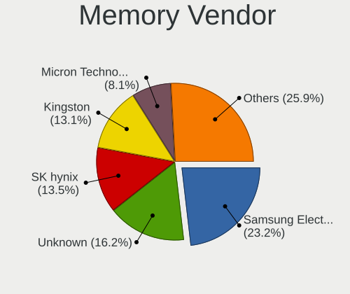

| Vendor                | Computers | Percent |
|-----------------------|-----------|---------|
| Samsung Electronics   | 60        | 23.17%  |
| Unknown               | 42        | 16.22%  |
| SK hynix              | 35        | 13.51%  |
| Kingston              | 34        | 13.13%  |
| Micron Technology     | 21        | 8.11%   |
| Goodram               | 9         | 3.47%   |
| Transcend             | 8         | 3.09%   |
| G.Skill               | 4         | 1.54%   |
| Crucial               | 4         | 1.54%   |
| Unknown               | 4         | 1.54%   |
| Unknown (ABCD)        | 3         | 1.16%   |
| Ramaxel Technology    | 3         | 1.16%   |
| Elpida                | 3         | 1.16%   |
| Corsair               | 3         | 1.16%   |
| Apacer                | 3         | 1.16%   |
| A-DATA Technology     | 3         | 1.16%   |
| Team                  | 2         | 0.77%   |
| Patriot               | 2         | 0.77%   |
| Nanya Technology      | 2         | 0.77%   |
| ASint Technology      | 2         | 0.77%   |
| Wilk                  | 1         | 0.39%   |
| Unifosa               | 1         | 0.39%   |
| Silicon Power         | 1         | 0.39%   |
| SGS/Thomson           | 1         | 0.39%   |
| Kingmax Semiconductor | 1         | 0.39%   |
| Hexon                 | 1         | 0.39%   |
| Goldkey               | 1         | 0.39%   |
| GeIL                  | 1         | 0.39%   |
| Axiom                 | 1         | 0.39%   |
| AVEXIR                | 1         | 0.39%   |
| Avant                 | 1         | 0.39%   |
| Asgard                | 1         | 0.39%   |

Memory Model
------------

Memory module models

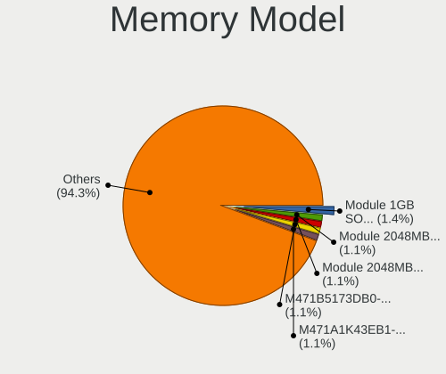

| Model                                                            | Computers | Percent |
|------------------------------------------------------------------|-----------|---------|
| Unknown                                                          | 4         | 1.42%   |
| Unknown RAM Module 2048MB DIMM DDR2 333MT/s                      | 3         | 1.06%   |
| Unknown RAM Module 2048MB DIMM 1333MT/s                          | 3         | 1.06%   |
| SK hynix RAM HMT351S6CFR8C-PB 4GB SODIMM DDR3 1600MT/s           | 3         | 1.06%   |
| Samsung RAM M471B5173DB0-YK0 4GB SODIMM DDR3 1600MT/s            | 3         | 1.06%   |
| Samsung RAM M471A1K43EB1-CWE 8GB SODIMM DDR4 3200MT/s            | 3         | 1.06%   |
| Samsung RAM M471A1K43BB1-CRC 8GB SODIMM DDR4 2667MT/s            | 3         | 1.06%   |
| Samsung RAM M471A1G44AB0-CWE 8GB Row Of Chips DDR4 3200MT/s      | 3         | 1.06%   |
| Samsung RAM K3KL8L80CM-MGCT 2GB Row Of Chips LPDDR5 7500MT/s     | 3         | 1.06%   |
| Unknown RAM Module 4096MB DIMM 1600MT/s                          | 2         | 0.71%   |
| Unknown RAM Module 4096MB DIMM 1333MT/s                          | 2         | 0.71%   |
| Unknown RAM Module 2GB SODIMM DDR3                               | 2         | 0.71%   |
| Unknown RAM Module 2048MB SODIMM DRAM 667MT/s                    | 2         | 0.71%   |
| Unknown RAM Module 2048MB DIMM DDR3 1333MT/s                     | 2         | 0.71%   |
| Unknown RAM Module 2048MB DIMM 800MT/s                           | 2         | 0.71%   |
| Unknown RAM Module 1024MB SODIMM DRAM 667MT/s                    | 2         | 0.71%   |
| Unknown RAM Module 1024MB DIMM DDR2 333MT/s                      | 2         | 0.71%   |
| Unknown (ABCD) RAM 123456789012345678 2GB SODIMM LPDDR4 2400MT/s | 2         | 0.71%   |
| SK hynix RAM HMT351S6EFR8A-PB 4GB SODIMM DDR3 1600MT/s           | 2         | 0.71%   |
| SK hynix RAM HMT325S6CFR8C-PB 2GB SODIMM DDR3 1600MT/s           | 2         | 0.71%   |
| SK hynix RAM HMAA2GS6CJR8N-XN 16GB SODIMM DDR4 3200MT/s          | 2         | 0.71%   |
| SK hynix RAM HMA851S6AFR6N-UH 4GB SODIMM DDR4 2667MT/s           | 2         | 0.71%   |
| Samsung RAM M471B5273DH0-CK0 4GB SODIMM DDR3 2400MT/s            | 2         | 0.71%   |
| Samsung RAM M471B5273CH0-CK0 4GB SODIMM DDR3 1600MT/s            | 2         | 0.71%   |
| Samsung RAM M471B2873FHS-CF8 1GB SODIMM 1067MT/s                 | 2         | 0.71%   |
| Samsung RAM M471B1G73QH0-YK0 8GB SODIMM DDR3 1600MT/s            | 2         | 0.71%   |
| Samsung RAM M471A5244CB0-CWE 4GB Row Of Chips DDR4 3200MT/s      | 2         | 0.71%   |
| Samsung RAM M471A5244CB0-CTD 4GB SODIMM DDR4 3266MT/s            | 2         | 0.71%   |
| Samsung RAM M471A5244CB0-CRC 4GB SODIMM DDR4 2667MT/s            | 2         | 0.71%   |
| Samsung RAM M471A1G44BB0-CWE 8GB SODIMM DDR4 3200MT/s            | 2         | 0.71%   |
| Kingston RAM KHX1866C10D3/8G 8GB DIMM DDR3 1867MT/s              | 2         | 0.71%   |
| GOODRAM RAM GR2666S464L19/16G 16GB SODIMM DDR4 2667MT/s          | 2         | 0.71%   |
| Wilk RAM GR2666S464L19/16G 16GB SODIMM DDR4 2667MT/s             | 1         | 0.35%   |
| Unknown RAM Module 8GB SODIMM DDR3                               | 1         | 0.35%   |
| Unknown RAM Module 8GB DIMM 1333MT/s                             | 1         | 0.35%   |
| Unknown RAM Module 8GB DIMM                                      | 1         | 0.35%   |
| Unknown RAM Module 8192MB DIMM 1333MT/s                          | 1         | 0.35%   |
| Unknown RAM Module 512MB DIMM SDRAM                              | 1         | 0.35%   |
| Unknown RAM Module 4GB SODIMM DDR3                               | 1         | 0.35%   |
| Unknown RAM Module 4GB DIMM SDRAM                                | 1         | 0.35%   |

Memory Kind
-----------

Memory module kinds

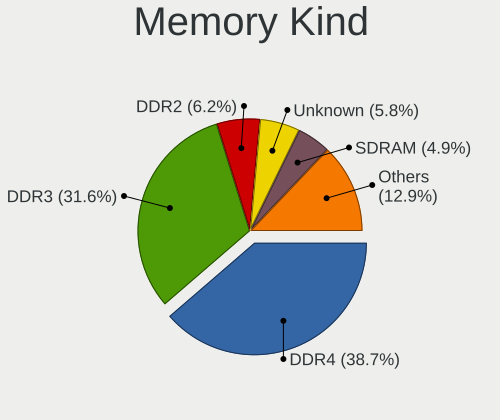

| Kind    | Computers | Percent |
|---------|-----------|---------|
| DDR4    | 87        | 38.67%  |
| DDR3    | 71        | 31.56%  |
| DDR2    | 14        | 6.22%   |
| Unknown | 13        | 5.78%   |
| SDRAM   | 11        | 4.89%   |
| DDR5    | 9         | 4%      |
| LPDDR4  | 7         | 3.11%   |
| LPDDR5  | 6         | 2.67%   |
| DDR     | 3         | 1.33%   |
| LPDDR3  | 2         | 0.89%   |
| DRAM    | 2         | 0.89%   |

Memory Form Factor
------------------

Physical design of the memory module

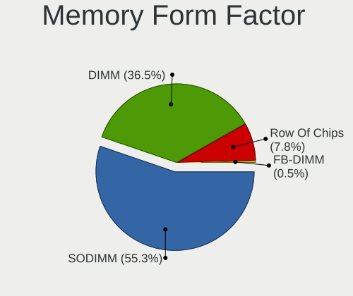

| Name         | Computers | Percent |
|--------------|-----------|---------|
| SODIMM       | 121       | 55.25%  |
| DIMM         | 80        | 36.53%  |
| Row Of Chips | 17        | 7.76%   |
| FB-DIMM      | 1         | 0.46%   |

Memory Size
-----------

Memory module size

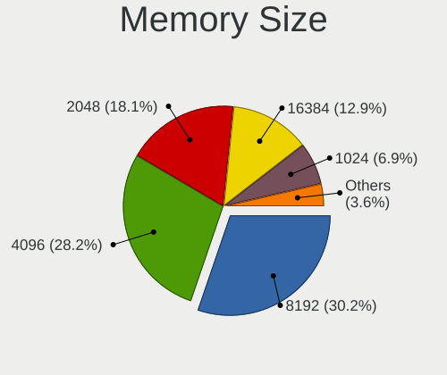

| Size  | Computers | Percent |
|-------|-----------|---------|
| 8192  | 75        | 30.24%  |
| 4096  | 70        | 28.23%  |
| 2048  | 45        | 18.15%  |
| 16384 | 32        | 12.9%   |
| 1024  | 17        | 6.85%   |
| 32768 | 8         | 3.23%   |
| 512   | 1         | 0.4%    |

Memory Speed
------------

Memory module speed

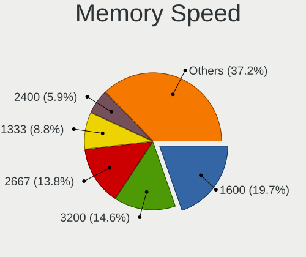

| Speed   | Computers | Percent |
|---------|-----------|---------|
| 1600    | 47        | 19.67%  |
| 3200    | 35        | 14.64%  |
| 2667    | 33        | 13.81%  |
| 1333    | 21        | 8.79%   |
| 2400    | 14        | 5.86%   |
| Unknown | 11        | 4.6%    |
| 2133    | 7         | 2.93%   |
| 800     | 7         | 2.93%   |
| 667     | 7         | 2.93%   |
| 1334    | 5         | 2.09%   |
| 7500    | 4         | 1.67%   |
| 4800    | 4         | 1.67%   |
| 3600    | 4         | 1.67%   |
| 400     | 4         | 1.67%   |
| 2048    | 3         | 1.26%   |
| 333     | 3         | 1.26%   |
| 6400    | 2         | 0.84%   |
| 6000    | 2         | 0.84%   |
| 4199    | 2         | 0.84%   |
| 3266    | 2         | 0.84%   |
| 3000    | 2         | 0.84%   |
| 2933    | 2         | 0.84%   |
| 1866    | 2         | 0.84%   |
| 1067    | 2         | 0.84%   |
| 12800   | 1         | 0.42%   |
| 8400    | 1         | 0.42%   |
| 6800    | 1         | 0.42%   |
| 5600    | 1         | 0.42%   |
| 5400    | 1         | 0.42%   |
| 4000    | 1         | 0.42%   |
| 3500    | 1         | 0.42%   |
| 2800    | 1         | 0.42%   |
| 2666    | 1         | 0.42%   |
| 1867    | 1         | 0.42%   |
| 1632    | 1         | 0.42%   |
| 1400    | 1         | 0.42%   |
| 975     | 1         | 0.42%   |
| 533     | 1         | 0.42%   |

Printers & scanners
-------------------

Printer Vendor
--------------

Printer device vendors

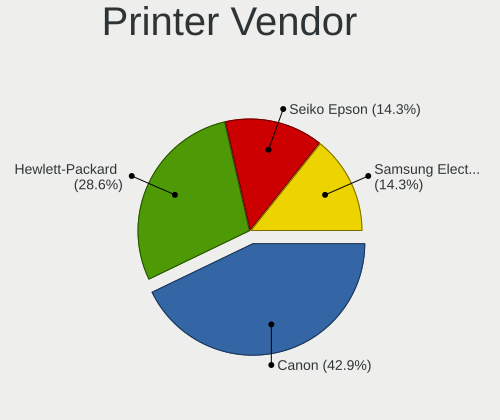

| Vendor              | Computers | Percent |
|---------------------|-----------|---------|
| Canon               | 3         | 42.86%  |
| Hewlett-Packard     | 2         | 28.57%  |
| Seiko Epson         | 1         | 14.29%  |
| Samsung Electronics | 1         | 14.29%  |

Printer Model
-------------

Printer device models

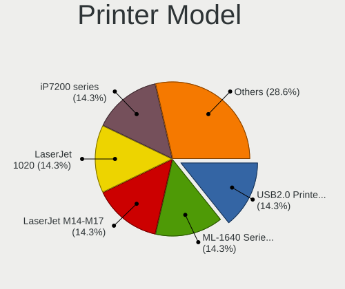

| Model                                 | Computers | Percent |
|---------------------------------------|-----------|---------|
| Seiko Epson USB2.0 Printer (Hi-speed) | 1         | 14.29%  |
| Samsung ML-1640 Series Laser Printer  | 1         | 14.29%  |
| HP LaserJet M14-M17                   | 1         | 14.29%  |
| HP LaserJet 1020                      | 1         | 14.29%  |
| Canon PIXMA MP280                     | 1         | 14.29%  |
| Canon LaserShot LBP-1120 Printer      | 1         | 14.29%  |
| Canon iP7200 series                   | 1         | 14.29%  |

Scanner Vendor
--------------

Scanner device vendors

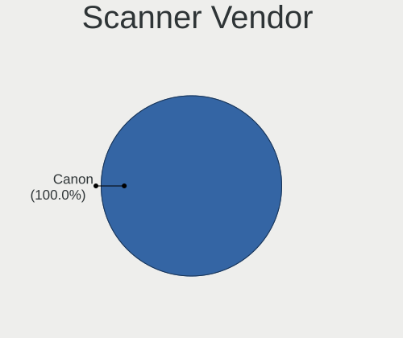

| Vendor | Computers | Percent |
|--------|-----------|---------|
| Canon  | 1         | 100%    |

Scanner Model
-------------

Scanner device models

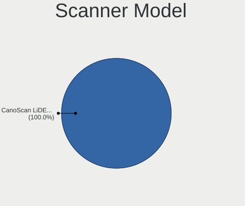

| Model                    | Computers | Percent |
|--------------------------|-----------|---------|
| Canon CanoScan LiDE 700F | 1         | 100%    |

Camera
------

Camera Vendor
-------------

Camera device vendors

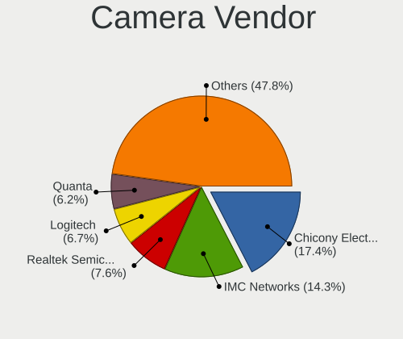

| Vendor                                 | Computers | Percent |
|----------------------------------------|-----------|---------|
| Chicony Electronics                    | 39        | 17.41%  |
| IMC Networks                           | 32        | 14.29%  |
| Realtek Semiconductor                  | 17        | 7.59%   |
| Logitech                               | 15        | 6.7%    |
| Quanta                                 | 14        | 6.25%   |
| Microdia                               | 13        | 5.8%    |
| Syntek                                 | 10        | 4.46%   |
| Bison Electronics                      | 10        | 4.46%   |
| Shinetech                              | 7         | 3.13%   |
| Cheng Uei Precision Industry (Foxlink) | 7         | 3.13%   |
| Sonix Technology                       | 5         | 2.23%   |
| Lite-On Technology                     | 5         | 2.23%   |
| Z-Star Microelectronics                | 4         | 1.79%   |
| Sunplus Innovation Technology          | 4         | 1.79%   |
| Silicon Motion                         | 4         | 1.79%   |
| Luxvisions Innotech Limited            | 4         | 1.79%   |
| Apple                                  | 4         | 1.79%   |
| Suyin                                  | 3         | 1.34%   |
| Samsung Electronics                    | 3         | 1.34%   |
| KYE Systems (Mouse Systems)            | 3         | 1.34%   |
| YGTek                                  | 2         | 0.89%   |
| SunplusIT                              | 2         | 0.89%   |
| Alcor Micro                            | 2         | 0.89%   |
| Y Media                                | 1         | 0.45%   |
| Trust                                  | 1         | 0.45%   |
| Ricoh                                  | 1         | 0.45%   |
| Primax Electronics                     | 1         | 0.45%   |
| Pixart Imaging                         | 1         | 0.45%   |
| Microsoft                              | 1         | 0.45%   |
| MacroSilicon                           | 1         | 0.45%   |
| Importek                               | 1         | 0.45%   |
| Hewlett-Packard                        | 1         | 0.45%   |
| Genesys Logic                          | 1         | 0.45%   |
| GEMBIRD                                | 1         | 0.45%   |
| ezcap                                  | 1         | 0.45%   |
| Cubeternet                             | 1         | 0.45%   |
| Aveo Technology                        | 1         | 0.45%   |
| ALi                                    | 1         | 0.45%   |

Camera Model
------------

Camera device models

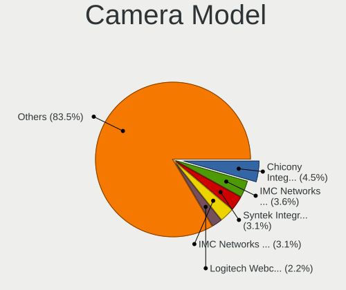

| Model                                                        | Computers | Percent |
|--------------------------------------------------------------|-----------|---------|
| Chicony Integrated Camera                                    | 10        | 4.46%   |
| IMC Networks USB2.0 HD UVC WebCam                            | 8         | 3.57%   |
| Syntek Integrated Camera                                     | 7         | 3.13%   |
| IMC Networks USB2.0 VGA UVC WebCam                           | 7         | 3.13%   |
| Logitech Webcam C270                                         | 5         | 2.23%   |
| IMC Networks Integrated Camera                               | 5         | 2.23%   |
| Sonix USB2.0 HD UVC WebCam                                   | 4         | 1.79%   |
| Shinetech USB2.0 FHD UVC WebCam                              | 4         | 1.79%   |
| Realtek Integrated_Webcam_HD                                 | 4         | 1.79%   |
| Quanta HP TrueVision HD Camera                               | 4         | 1.79%   |
| Quanta HP HD Camera                                          | 4         | 1.79%   |
| Microdia Integrated_Webcam_HD                                | 4         | 1.79%   |
| Syntek Lenovo EasyCamera                                     | 3         | 1.34%   |
| ShineTech USB2.0 HD UVC WebCam                               | 3         | 1.34%   |
| Microdia Camera                                              | 3         | 1.34%   |
| Lite-On HP HD Webcam                                         | 3         | 1.34%   |
| IMC Networks Integrated Webcam                               | 3         | 1.34%   |
| Chicony HD WebCam                                            | 3         | 1.34%   |
| Chicony EasyCamera                                           | 3         | 1.34%   |
| Cheng Uei Precision Industry (Foxlink) XiaoMi USB 2.0 Webcam | 3         | 1.34%   |
| Bison Integrated Camera                                      | 3         | 1.34%   |
| Z-Star Venus USB2.0 Camera                                   | 2         | 0.89%   |
| YGTek Webcam                                                 | 2         | 0.89%   |
| Silicon Motion WebCam SC-0311139N                            | 2         | 0.89%   |
| Samsung Galaxy series, misc. (MTP mode)                      | 2         | 0.89%   |
| Realtek USB Camera                                           | 2         | 0.89%   |
| Realtek EasyCamera                                           | 2         | 0.89%   |
| Quanta HD Webcam                                             | 2         | 0.89%   |
| Microdia Laptop_Integrated_Webcam_HD                         | 2         | 0.89%   |
| Logitech Webcam C170                                         | 2         | 0.89%   |
| Logitech HD Webcam C525                                      | 2         | 0.89%   |
| Lite-On HP HD Camera                                         | 2         | 0.89%   |
| IMC Networks XiaoMi Webcam                                   | 2         | 0.89%   |
| IMC Networks VGA UVC WebCam                                  | 2         | 0.89%   |
| Chicony VGA WebCam                                           | 2         | 0.89%   |
| Chicony USB2.0 VGA UVC WebCam                                | 2         | 0.89%   |
| Chicony Integrated Camera (1280x720@30)                      | 2         | 0.89%   |
| Bison SunplusIT Integrated Camera                            | 2         | 0.89%   |
| Apple FaceTime HD Camera                                     | 2         | 0.89%   |
| Z-Star WebCam SCB-0320N                                      | 1         | 0.45%   |

Security
--------

Fingerprint Vendor
------------------

Fingerprint sensor vendors

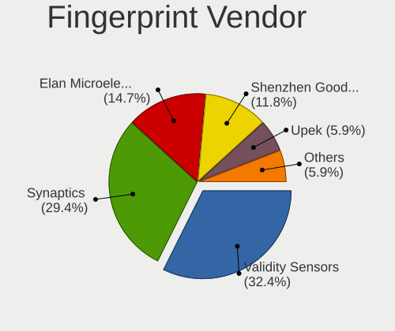

| Vendor                     | Computers | Percent |
|----------------------------|-----------|---------|
| Validity Sensors           | 11        | 32.35%  |
| Synaptics                  | 10        | 29.41%  |
| Elan Microelectronics      | 5         | 14.71%  |
| Shenzhen Goodix Technology | 4         | 11.76%  |
| Upek                       | 2         | 5.88%   |
| LighTuning Technology      | 1         | 2.94%   |
| AuthenTec                  | 1         | 2.94%   |

Fingerprint Model
-----------------

Fingerprint sensor models

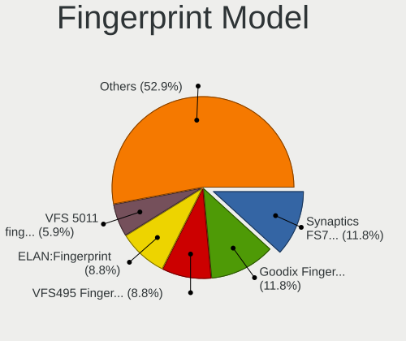

| Model                                                     | Computers | Percent |
|-----------------------------------------------------------|-----------|---------|
| Synaptics  FS7604 Touch Fingerprint Sensor with PurePrint | 4         | 11.76%  |
| Shenzhen Goodix  FingerPrint Device                       | 4         | 11.76%  |
| Validity Sensors VFS495 Fingerprint Reader                | 3         | 8.82%   |
| Elan ELAN:Fingerprint                                     | 3         | 8.82%   |
| Validity Sensors VFS 5011 fingerprint sensor              | 2         | 5.88%   |
| Validity Sensors Fingerprint scanner                      | 2         | 5.88%   |
| Upek Biometric Touchchip/Touchstrip Fingerprint Sensor    | 2         | 5.88%   |
| Synaptics Fingerprint reader [HP G6]                      | 2         | 5.88%   |
| Elan ELAN:ARM-M4                                          | 2         | 5.88%   |
| Validity Sensors VFS491                                   | 1         | 2.94%   |
| Validity Sensors VFS Fingerprint sensor                   | 1         | 2.94%   |
| Validity Sensors Synaptics WBDI                           | 1         | 2.94%   |
| Validity Sensors Swipe Fingerprint Sensor                 | 1         | 2.94%   |
| Synaptics UWP WBDI Device                                 | 1         | 2.94%   |
| Synaptics TouchPad                                        | 1         | 2.94%   |
| Synaptics  WBDI                                           | 1         | 2.94%   |
| Synaptics Prometheus MIS Touch Fingerprint Reader         | 1         | 2.94%   |
| LighTuning EgisTec Touch Fingerprint Sensor               | 1         | 2.94%   |
| AuthenTec AES2501 Fingerprint Sensor                      | 1         | 2.94%   |

Chipcard Vendor
---------------

Chipcard module vendors

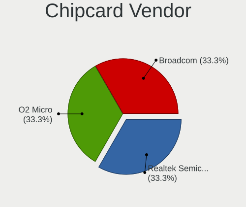

| Vendor                | Computers | Percent |
|-----------------------|-----------|---------|
| Realtek Semiconductor | 1         | 25%     |
| O2 Micro              | 1         | 25%     |
| Broadcom              | 1         | 25%     |
| Alcor Micro           | 1         | 25%     |

Chipcard Model
--------------

Chipcard module models

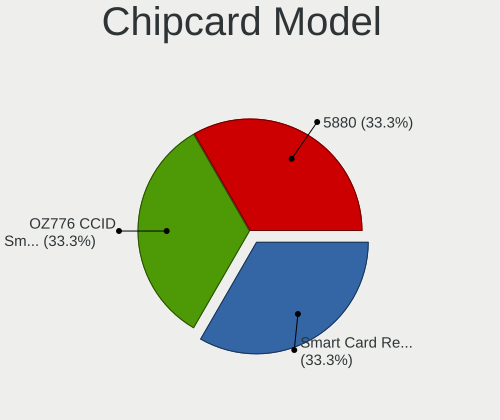

| Model                                             | Computers | Percent |
|---------------------------------------------------|-----------|---------|
| Realtek Semiconductor Smart Card Reader Interface | 1         | 25%     |
| O2 Micro OZ776 CCID Smartcard Reader              | 1         | 25%     |
| Broadcom 5880                                     | 1         | 25%     |
| Alcor Micro AU9540 Smartcard Reader               | 1         | 25%     |

Unsupported
-----------

Unsupported Devices
-------------------

Total unsupported devices on board

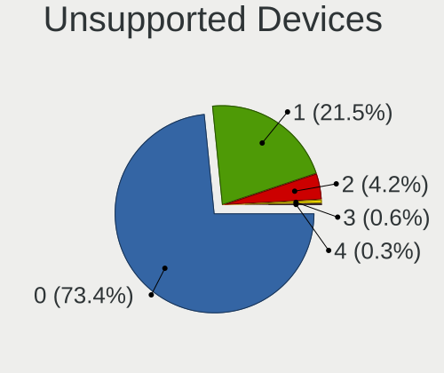

| Total | Computers | Percent |
|-------|-----------|---------|
| 0     | 243       | 73.41%  |
| 1     | 71        | 21.45%  |
| 2     | 14        | 4.23%   |
| 3     | 2         | 0.6%    |
| 4     | 1         | 0.3%    |

Unsupported Device Types
------------------------

Types of unsupported devices

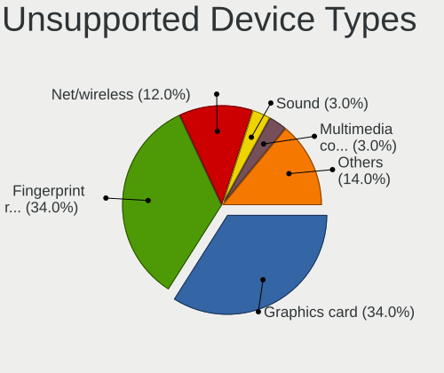

| Type                     | Computers | Percent |
|--------------------------|-----------|---------|
| Graphics card            | 34        | 34%     |
| Fingerprint reader       | 34        | 34%     |
| Net/wireless             | 12        | 12%     |
| Sound                    | 3         | 3%      |
| Multimedia controller    | 3         | 3%      |
| Chipcard                 | 3         | 3%      |
| Camera                   | 3         | 3%      |
| Communication controller | 2         | 2%      |
| Bluetooth                | 2         | 2%      |
| Storage/ide              | 1         | 1%      |
| Storage                  | 1         | 1%      |
| Net/ethernet             | 1         | 1%      |
| Card reader              | 1         | 1%      |

