Linux in Moldova - Tested Hardware & Statistics
-----------------------------------------------

A project to collect tested hardware configurations for Linux in Moldova.

Anyone can contribute to this report by the [hw-probe](https://github.com/linuxhw/hw-probe) tool:

    sudo -E hw-probe -all -upload

Please contribute! Especially if your hardware is rare.

This is a report for all computer types. See also reports for [desktops](/Location/Moldova/Desktop/README.md) and [notebooks](/Location/Moldova/Notebook/README.md).

Contents
--------

* [ Test Cases ](#test-cases)

* [ System ](#system)
  - [ OS                       ](#os)
  - [ OS Family                ](#os-family)
  - [ Kernel                   ](#kernel)
  - [ Kernel Family            ](#kernel-family)
  - [ Kernel Major Ver.        ](#kernel-major-ver)
  - [ Arch                     ](#arch)
  - [ DE                       ](#de)
  - [ Display Server           ](#display-server)
  - [ Display Manager          ](#display-manager)
  - [ OS Lang                  ](#os-lang)
  - [ Boot Mode                ](#boot-mode)
  - [ Filesystem               ](#filesystem)
  - [ Part. scheme             ](#part-scheme)
  - [ Dual Boot with Linux/BSD ](#dual-boot-with-linuxbsd)
  - [ Dual Boot (Win)          ](#dual-boot-win)

* [ Board ](#board)
  - [ Vendor                   ](#vendor)
  - [ Model                    ](#model)
  - [ Model Family             ](#model-family)
  - [ MFG Year                 ](#mfg-year)
  - [ Form Factor              ](#form-factor)
  - [ Secure Boot              ](#secure-boot)
  - [ Coreboot                 ](#coreboot)
  - [ RAM Size                 ](#ram-size)
  - [ RAM Used                 ](#ram-used)
  - [ Total Drives             ](#total-drives)
  - [ Has CD-ROM               ](#has-cd-rom)
  - [ Has Ethernet             ](#has-ethernet)
  - [ Has WiFi                 ](#has-wifi)
  - [ Has Bluetooth            ](#has-bluetooth)

* [ Location ](#location)
  - [ Country                  ](#country)
  - [ City                     ](#city)

* [ Drives ](#drives)
  - [ Drive Vendor             ](#drive-vendor)
  - [ Drive Model              ](#drive-model)
  - [ HDD Vendor               ](#hdd-vendor)
  - [ SSD Vendor               ](#ssd-vendor)
  - [ Drive Kind               ](#drive-kind)
  - [ Drive Connector          ](#drive-connector)
  - [ Drive Size               ](#drive-size)
  - [ Space Total              ](#space-total)
  - [ Space Used               ](#space-used)
  - [ Malfunc. Drives          ](#malfunc-drives)
  - [ Malfunc. Drive Vendor    ](#malfunc-drive-vendor)
  - [ Malfunc. HDD Vendor      ](#malfunc-hdd-vendor)
  - [ Malfunc. Drive Kind      ](#malfunc-drive-kind)
  - [ Failed Drives            ](#failed-drives)
  - [ Failed Drive Vendor      ](#failed-drive-vendor)
  - [ Drive Status             ](#drive-status)

* [ Storage controller ](#storage-controller)
  - [ Storage Vendor           ](#storage-vendor)
  - [ Storage Model            ](#storage-model)
  - [ Storage Kind             ](#storage-kind)

* [ Processor ](#processor)
  - [ CPU Vendor               ](#cpu-vendor)
  - [ CPU Model                ](#cpu-model)
  - [ CPU Model Family         ](#cpu-model-family)
  - [ CPU Cores                ](#cpu-cores)
  - [ CPU Sockets              ](#cpu-sockets)
  - [ CPU Threads              ](#cpu-threads)
  - [ CPU Op-Modes             ](#cpu-op-modes)
  - [ CPU Microcode            ](#cpu-microcode)
  - [ CPU Microarch            ](#cpu-microarch)

* [ Graphics ](#graphics)
  - [ GPU Vendor               ](#gpu-vendor)
  - [ GPU Model                ](#gpu-model)
  - [ GPU Combo                ](#gpu-combo)
  - [ GPU Driver               ](#gpu-driver)
  - [ GPU Memory               ](#gpu-memory)

* [ Monitor ](#monitor)
  - [ Monitor Vendor           ](#monitor-vendor)
  - [ Monitor Model            ](#monitor-model)
  - [ Monitor Resolution       ](#monitor-resolution)
  - [ Monitor Diagonal         ](#monitor-diagonal)
  - [ Monitor Width            ](#monitor-width)
  - [ Aspect Ratio             ](#aspect-ratio)
  - [ Monitor Area             ](#monitor-area)
  - [ Pixel Density            ](#pixel-density)
  - [ Multiple Monitors        ](#multiple-monitors)

* [ Network ](#network)
  - [ Net Controller Vendor    ](#net-controller-vendor)
  - [ Net Controller Model     ](#net-controller-model)
  - [ Wireless Vendor          ](#wireless-vendor)
  - [ Wireless Model           ](#wireless-model)
  - [ Ethernet Vendor          ](#ethernet-vendor)
  - [ Ethernet Model           ](#ethernet-model)
  - [ Net Controller Kind      ](#net-controller-kind)
  - [ Used Controller          ](#used-controller)
  - [ NICs                     ](#nics)
  - [ IPv6                     ](#ipv6)

* [ Bluetooth ](#bluetooth)
  - [ Bluetooth Vendor         ](#bluetooth-vendor)
  - [ Bluetooth Model          ](#bluetooth-model)

* [ Sound ](#sound)
  - [ Sound Vendor             ](#sound-vendor)
  - [ Sound Model              ](#sound-model)

* [ Memory ](#memory)
  - [ Memory Vendor            ](#memory-vendor)
  - [ Memory Model             ](#memory-model)
  - [ Memory Kind              ](#memory-kind)
  - [ Memory Form Factor       ](#memory-form-factor)
  - [ Memory Size              ](#memory-size)
  - [ Memory Speed             ](#memory-speed)

* [ Printers & scanners ](#printers--scanners)
  - [ Printer Vendor           ](#printer-vendor)
  - [ Printer Model            ](#printer-model)
  - [ Scanner Vendor           ](#scanner-vendor)
  - [ Scanner Model            ](#scanner-model)

* [ Camera ](#camera)
  - [ Camera Vendor            ](#camera-vendor)
  - [ Camera Model             ](#camera-model)

* [ Security ](#security)
  - [ Fingerprint Vendor       ](#fingerprint-vendor)
  - [ Fingerprint Model        ](#fingerprint-model)
  - [ Chipcard Vendor          ](#chipcard-vendor)
  - [ Chipcard Model           ](#chipcard-model)

* [ Unsupported ](#unsupported)
  - [ Unsupported Devices      ](#unsupported-devices)
  - [ Unsupported Device Types ](#unsupported-device-types)

Test Cases
----------

Total: 263

| Vendor   | Model                       | Form-Factor | Probe                                                      | Date         |
|----------|-----------------------------|-------------|------------------------------------------------------------|--------------|
| Valve    | Jupiter                     | Notebook    | [d008ed40fe](https://linux-hardware.org/?probe=d008ed40fe) | Nov 17, 2022 |
| Lenovo   | ThinkPad W520 4282BA9       | Notebook    | [4666660667](https://linux-hardware.org/?probe=4666660667) | Nov 12, 2022 |
| Biostar  | N68S3+                      | Desktop     | [a37667f835](https://linux-hardware.org/?probe=a37667f835) | Nov 11, 2022 |
| Unknown  | Unknown                     | Notebook    | [9247927a69](https://linux-hardware.org/?probe=9247927a69) | Nov 08, 2022 |
| Lenovo   | IdeaPad 330S-15ARR 81FB     | Notebook    | [8979e951e5](https://linux-hardware.org/?probe=8979e951e5) | Nov 07, 2022 |
| Google   | Droid                       | Notebook    | [c8e4007ce4](https://linux-hardware.org/?probe=c8e4007ce4) | Oct 26, 2022 |
| Lenovo   | IdeaPad 5 Pro 16ACH6 82L... | Notebook    | [71f188e90c](https://linux-hardware.org/?probe=71f188e90c) | Oct 19, 2022 |
| Intel    | NUC5i3RYB H41000-503        | Mini pc     | [52764efed5](https://linux-hardware.org/?probe=52764efed5) | Oct 12, 2022 |
| Biostar  | TB250-BTC PRO               | Desktop     | [09be95ac2c](https://linux-hardware.org/?probe=09be95ac2c) | Oct 10, 2022 |
| Acer     | Extensa 215-32              | Notebook    | [3e6ce67bb5](https://linux-hardware.org/?probe=3e6ce67bb5) | Oct 08, 2022 |
| Acer     | Extensa 215-32              | Notebook    | [366f0e7930](https://linux-hardware.org/?probe=366f0e7930) | Oct 08, 2022 |
| ASUSTek  | P8H61-M LX2 R2.0            | Desktop     | [0f690e6e12](https://linux-hardware.org/?probe=0f690e6e12) | Oct 08, 2022 |
| ASUSTek  | P8H61-M LX2 R2.0            | Desktop     | [e9bc8b1f10](https://linux-hardware.org/?probe=e9bc8b1f10) | Sep 26, 2022 |
| Acer     | Aspire A315-56              | Notebook    | [644bb082f4](https://linux-hardware.org/?probe=644bb082f4) | Sep 18, 2022 |
| ASUSTek  | VivoBook_ASUSLaptop X509... | Notebook    | [3c214d75b2](https://linux-hardware.org/?probe=3c214d75b2) | Sep 10, 2022 |
| HP       | ProBook 450 G7              | Notebook    | [5fa4bf5fc8](https://linux-hardware.org/?probe=5fa4bf5fc8) | Aug 29, 2022 |
| Lenovo   | Legion 5 Pro 16ITH6H 82J... | Notebook    | [681486095a](https://linux-hardware.org/?probe=681486095a) | Aug 27, 2022 |
| Gigabyte | B550 AORUS ELITE            | Desktop     | [08e3444b3c](https://linux-hardware.org/?probe=08e3444b3c) | Aug 15, 2022 |
| Foxconn  | nT-330i                     | Desktop     | [64504a98ed](https://linux-hardware.org/?probe=64504a98ed) | Aug 04, 2022 |
| Timi     | TM1701                      | Notebook    | [5b62dea22f](https://linux-hardware.org/?probe=5b62dea22f) | Aug 03, 2022 |
| Timi     | TM1701                      | Notebook    | [cddc7cb825](https://linux-hardware.org/?probe=cddc7cb825) | Aug 03, 2022 |
| Lenovo   | ThinkPad X1 Carbon 5th 2... | Notebook    | [d77ac14ae9](https://linux-hardware.org/?probe=d77ac14ae9) | Aug 01, 2022 |
| HP       | EliteBook 820 G3            | Notebook    | [a96c616d62](https://linux-hardware.org/?probe=a96c616d62) | Jul 28, 2022 |
| Dell     | Latitude 5480               | Notebook    | [151c4b8c85](https://linux-hardware.org/?probe=151c4b8c85) | Jul 21, 2022 |
| HP       | ProBook 450 G7              | Notebook    | [e011908e80](https://linux-hardware.org/?probe=e011908e80) | Jul 18, 2022 |
| HP       | ENVY 15                     | Notebook    | [9c0990eedf](https://linux-hardware.org/?probe=9c0990eedf) | Jul 18, 2022 |
| HP       | ProBook 450 G7              | Notebook    | [5d41d810e8](https://linux-hardware.org/?probe=5d41d810e8) | Jul 18, 2022 |
| ASUSTek  | TUF Gaming FX705DT_FX705... | Notebook    | [1d5a0f6177](https://linux-hardware.org/?probe=1d5a0f6177) | Jul 12, 2022 |
| Dell     | 0782GW A01                  | Desktop     | [20cb4c3e27](https://linux-hardware.org/?probe=20cb4c3e27) | Jul 11, 2022 |
| Lenovo   | IdeaPad Gaming 3 15ARH05... | Notebook    | [567077c28d](https://linux-hardware.org/?probe=567077c28d) | Jul 08, 2022 |
| Gigabyte | B450M S2H V2                | Desktop     | [e0e21604de](https://linux-hardware.org/?probe=e0e21604de) | Jun 24, 2022 |
| Lenovo   | IdeaPad L340-15API 81LW     | Notebook    | [dda5fb9c20](https://linux-hardware.org/?probe=dda5fb9c20) | Jun 21, 2022 |
| ASUSTek  | X555LD                      | Notebook    | [d5d6eeb639](https://linux-hardware.org/?probe=d5d6eeb639) | Jun 11, 2022 |
| Lenovo   | Legion 5 15IMH05 82AU       | Notebook    | [cd7bc92bcd](https://linux-hardware.org/?probe=cd7bc92bcd) | Jun 06, 2022 |
| ASUSTek  | PRIME A520M-K               | Desktop     | [72dd09a86a](https://linux-hardware.org/?probe=72dd09a86a) | Jun 05, 2022 |
| Lenovo   | IdeaPad 100-15IBY 80MJ      | Notebook    | [db944454c8](https://linux-hardware.org/?probe=db944454c8) | May 23, 2022 |
| Lenovo   | Legion Y530-15ICH 81FV      | Notebook    | [428509b262](https://linux-hardware.org/?probe=428509b262) | May 01, 2022 |
| ASUSTek  | X541NC                      | Notebook    | [d1dc342eb9](https://linux-hardware.org/?probe=d1dc342eb9) | Apr 17, 2022 |
| ASUSTek  | M4A785-M                    | Desktop     | [25526ee77d](https://linux-hardware.org/?probe=25526ee77d) | Apr 17, 2022 |
| ASUSTek  | PRIME B550-PLUS             | Desktop     | [8c88f1c50a](https://linux-hardware.org/?probe=8c88f1c50a) | Apr 12, 2022 |
| Lenovo   | ThinkPad X240 20AL0067RT    | Notebook    | [f246d643b4](https://linux-hardware.org/?probe=f246d643b4) | Feb 26, 2022 |
| Gigabyte | Z690 UD DDR4                | Desktop     | [6c4ff21b02](https://linux-hardware.org/?probe=6c4ff21b02) | Feb 21, 2022 |
| Sony     | VPCEB1J8E                   | Notebook    | [b00a6a15b2](https://linux-hardware.org/?probe=b00a6a15b2) | Feb 20, 2022 |
| ASUSTek  | U32U                        | Notebook    | [f7b7d4d2db](https://linux-hardware.org/?probe=f7b7d4d2db) | Feb 20, 2022 |
| ASUSTek  | U32U                        | Notebook    | [1cb943e596](https://linux-hardware.org/?probe=1cb943e596) | Feb 20, 2022 |
| Acer     | Swift SF314-57              | Notebook    | [de92ca9fec](https://linux-hardware.org/?probe=de92ca9fec) | Feb 05, 2022 |
| Lenovo   | ThinkPad E15 Gen 2 20TD0... | Notebook    | [4c95ae549f](https://linux-hardware.org/?probe=4c95ae549f) | Jan 21, 2022 |
| HP       | 21F5                        | Desktop     | [ce8e06508d](https://linux-hardware.org/?probe=ce8e06508d) | Jan 16, 2022 |
| HP       | Unknown                     | Notebook    | [1fbb31af8d](https://linux-hardware.org/?probe=1fbb31af8d) | Jan 05, 2022 |
| Jumper   | EZbook                      | Notebook    | [6e9ee100f8](https://linux-hardware.org/?probe=6e9ee100f8) | Dec 22, 2021 |
| HP       | Pavilion Laptop 15-eh1xx... | Notebook    | [ab93ce9eb8](https://linux-hardware.org/?probe=ab93ce9eb8) | Dec 21, 2021 |
| Jumper   | EZbook                      | Notebook    | [992b2479e4](https://linux-hardware.org/?probe=992b2479e4) | Dec 21, 2021 |
| HP       | EliteBook 8470p             | Notebook    | [8ab831bf5f](https://linux-hardware.org/?probe=8ab831bf5f) | Dec 21, 2021 |
| Biostar  | N68S3+                      | Desktop     | [8812de783f](https://linux-hardware.org/?probe=8812de783f) | Dec 16, 2021 |
| ASUSTek  | A_F_K20CE                   | Desktop     | [926db6c655](https://linux-hardware.org/?probe=926db6c655) | Dec 15, 2021 |
| ASUSTek  | Z97I-PLUS                   | Desktop     | [a379cfa431](https://linux-hardware.org/?probe=a379cfa431) | Dec 12, 2021 |
| Chuwi    | GemiBook Pro                | Notebook    | [493d55cb16](https://linux-hardware.org/?probe=493d55cb16) | Dec 11, 2021 |
| Dell     | Latitude 3520               | Notebook    | [8fb7494494](https://linux-hardware.org/?probe=8fb7494494) | Dec 06, 2021 |
| Gigabyte | H61M-S2-B3                  | Desktop     | [960d7d5035](https://linux-hardware.org/?probe=960d7d5035) | Dec 05, 2021 |
| ASRock   | M3A770DE                    | Desktop     | [b6ee8bc974](https://linux-hardware.org/?probe=b6ee8bc974) | Dec 01, 2021 |
| Gigabyte | H81M-HD3                    | Desktop     | [953c3f9284](https://linux-hardware.org/?probe=953c3f9284) | Nov 13, 2021 |
| Acer     | Aspire 5253G                | Notebook    | [f7c885dedd](https://linux-hardware.org/?probe=f7c885dedd) | Nov 08, 2021 |
| MSI      | MS-7309                     | Desktop     | [0a4d7fb95d](https://linux-hardware.org/?probe=0a4d7fb95d) | Oct 30, 2021 |
| MSI      | A75A-G35                    | Desktop     | [7223bfa184](https://linux-hardware.org/?probe=7223bfa184) | Oct 22, 2021 |
| Toshiba  | Satellite Pro S300L         | Notebook    | [93c5def444](https://linux-hardware.org/?probe=93c5def444) | Oct 06, 2021 |
| ASUSTek  | VivoBook S15 X510UF         | Notebook    | [336bbdae35](https://linux-hardware.org/?probe=336bbdae35) | Oct 02, 2021 |
| Lenovo   | ThinkPad E15 Gen 2 20TD0... | Notebook    | [7820254b55](https://linux-hardware.org/?probe=7820254b55) | Sep 23, 2021 |
| Dell     | Latitude 5591               | Notebook    | [0235ac49c6](https://linux-hardware.org/?probe=0235ac49c6) | Sep 15, 2021 |
| Lenovo   | ThinkPad E15 Gen 3 20YG0... | Notebook    | [02666996c0](https://linux-hardware.org/?probe=02666996c0) | Sep 12, 2021 |
| Lenovo   | ThinkPad E15 Gen 3 20YG0... | Notebook    | [97b45da8a7](https://linux-hardware.org/?probe=97b45da8a7) | Sep 12, 2021 |
| HP       | Laptop 15-da1xxx            | Notebook    | [c6f3848c20](https://linux-hardware.org/?probe=c6f3848c20) | Sep 12, 2021 |
| HP       | Laptop 15-da1xxx            | Notebook    | [b73b5ecab7](https://linux-hardware.org/?probe=b73b5ecab7) | Sep 11, 2021 |
| Lenovo   | Yoga 730-15IKB 81CU         | Convertible | [f0da92a413](https://linux-hardware.org/?probe=f0da92a413) | Aug 25, 2021 |
| Lenovo   | Yoga 730-15IKB 81CU         | Convertible | [c7b0b8b25a](https://linux-hardware.org/?probe=c7b0b8b25a) | Aug 21, 2021 |
| HP       | ProBook 450 G6              | Notebook    | [227d87ab66](https://linux-hardware.org/?probe=227d87ab66) | Aug 20, 2021 |
| Biostar  | N68S3+                      | Desktop     | [1eae78eec0](https://linux-hardware.org/?probe=1eae78eec0) | Aug 04, 2021 |
| Gigabyte | B460M DS3H V2               | Desktop     | [6177f24834](https://linux-hardware.org/?probe=6177f24834) | Aug 02, 2021 |
| Gigabyte | B460M DS3H V2               | Desktop     | [7fa66f2f95](https://linux-hardware.org/?probe=7fa66f2f95) | Aug 02, 2021 |
| Toshiba  | TECRA Z40-B                 | Notebook    | [d353412a4f](https://linux-hardware.org/?probe=d353412a4f) | Jul 29, 2021 |
| Lenovo   | IdeaPad 5 15ARE05 81YQ      | Notebook    | [8430084f74](https://linux-hardware.org/?probe=8430084f74) | Jul 15, 2021 |
| System76 | Adder WS                    | Notebook    | [d128c1d16b](https://linux-hardware.org/?probe=d128c1d16b) | Jul 08, 2021 |
| HP       | ProLiant DL360 G5           | Server      | [e1ec1d09c1](https://linux-hardware.org/?probe=e1ec1d09c1) | Jul 07, 2021 |
| Lenovo   | ThinkPad T440 20B7S1N809    | Notebook    | [b9ab49e917](https://linux-hardware.org/?probe=b9ab49e917) | Jul 07, 2021 |
| Gigabyte | EP43-UD3L                   | Desktop     | [3b6839e225](https://linux-hardware.org/?probe=3b6839e225) | Jul 01, 2021 |
| Dell     | Vostro 5590                 | Notebook    | [1cc0df9bfd](https://linux-hardware.org/?probe=1cc0df9bfd) | Jun 28, 2021 |
| Dell     | Vostro 5590                 | Notebook    | [0caade1304](https://linux-hardware.org/?probe=0caade1304) | Jun 28, 2021 |
| ASUSTek  | X555LJ                      | Notebook    | [aab7280bd9](https://linux-hardware.org/?probe=aab7280bd9) | Jun 20, 2021 |
| Timi     | A35S                        | Notebook    | [226823eb5b](https://linux-hardware.org/?probe=226823eb5b) | Jun 19, 2021 |
| ASUSTek  | VivoBook_ASUSLaptop X521... | Notebook    | [79e70ff708](https://linux-hardware.org/?probe=79e70ff708) | Jun 17, 2021 |
| ASUSTek  | TUF Gaming FX705DT_FX705... | Notebook    | [447e508593](https://linux-hardware.org/?probe=447e508593) | Jun 14, 2021 |
| ASUSTek  | VivoBook_ASUSLaptop X521... | Notebook    | [47d894d771](https://linux-hardware.org/?probe=47d894d771) | Jun 12, 2021 |
| ASUSTek  | VivoBook_ASUSLaptop X521... | Notebook    | [5c14296bc9](https://linux-hardware.org/?probe=5c14296bc9) | Jun 12, 2021 |
| ASUSTek  | VivoBook_ASUSLaptop X521... | Notebook    | [73e1185f6e](https://linux-hardware.org/?probe=73e1185f6e) | Jun 12, 2021 |
| ASUSTek  | F1A75-M LE                  | Desktop     | [b453e98364](https://linux-hardware.org/?probe=b453e98364) | May 21, 2021 |
| ASUSTek  | TUF Gaming FX705DT_FX705... | Notebook    | [666ddeb09c](https://linux-hardware.org/?probe=666ddeb09c) | May 19, 2021 |
| Dell     | Inspiron 3541               | Notebook    | [88d0f731fd](https://linux-hardware.org/?probe=88d0f731fd) | Apr 29, 2021 |
| Dell     | Inspiron 3541               | Notebook    | [4267385ad8](https://linux-hardware.org/?probe=4267385ad8) | Apr 29, 2021 |
| Dell     | Inspiron 3593               | Notebook    | [5facbef10b](https://linux-hardware.org/?probe=5facbef10b) | Apr 24, 2021 |
| Biostar  | A58MD                       | Desktop     | [3effc9a4ed](https://linux-hardware.org/?probe=3effc9a4ed) | Apr 18, 2021 |
| Dell     | Latitude E7440              | Notebook    | [c59d5358b3](https://linux-hardware.org/?probe=c59d5358b3) | Apr 04, 2021 |
| Biostar  | H110MHC                     | Desktop     | [acc13c8156](https://linux-hardware.org/?probe=acc13c8156) | Mar 24, 2021 |
| HP       | Pavilion dv7                | Notebook    | [b7756075fd](https://linux-hardware.org/?probe=b7756075fd) | Mar 15, 2021 |
| Lenovo   | Legion Y530-15ICH 81FV      | Notebook    | [bd5d97f7e7](https://linux-hardware.org/?probe=bd5d97f7e7) | Mar 07, 2021 |
| HP       | ZBook Fury 15 G7 Mobile ... | Notebook    | [c2435842e1](https://linux-hardware.org/?probe=c2435842e1) | Mar 04, 2021 |
| HP       | ZBook Fury 15 G7 Mobile ... | Notebook    | [5cc3d3f3ed](https://linux-hardware.org/?probe=5cc3d3f3ed) | Mar 04, 2021 |
| Lenovo   | IdeaPad 330-15IKB 81DE      | Notebook    | [16d0cd0b17](https://linux-hardware.org/?probe=16d0cd0b17) | Mar 04, 2021 |
| Lenovo   | IdeaPad 330-15IKB 81DE      | Notebook    | [7a3239606c](https://linux-hardware.org/?probe=7a3239606c) | Mar 04, 2021 |
| ASUSTek  | P8Z77-V PRO                 | Desktop     | [a3d54dee1b](https://linux-hardware.org/?probe=a3d54dee1b) | Feb 22, 2021 |
| ASUSTek  | P8Z77-V PRO                 | Desktop     | [7f75cd3e14](https://linux-hardware.org/?probe=7f75cd3e14) | Feb 22, 2021 |
| Lenovo   | Legion Y530-15ICH 81FV      | Notebook    | [88bab7f6e7](https://linux-hardware.org/?probe=88bab7f6e7) | Feb 22, 2021 |
| ASUSTek  | PRIME B350-PLUS             | Desktop     | [23ddb098d4](https://linux-hardware.org/?probe=23ddb098d4) | Feb 18, 2021 |
| ASRock   | Z87 Extreme4                | Desktop     | [2fc1d961c0](https://linux-hardware.org/?probe=2fc1d961c0) | Feb 14, 2021 |
| ASUSTek  | ZenBook UX333FA_UX333FA     | Notebook    | [454ea43e4a](https://linux-hardware.org/?probe=454ea43e4a) | Feb 11, 2021 |
| HP       | ProBook 650 G2              | Notebook    | [043b7f867b](https://linux-hardware.org/?probe=043b7f867b) | Jan 23, 2021 |
| HP       | Laptop 15-dw0xxx            | Notebook    | [a69f5fa59f](https://linux-hardware.org/?probe=a69f5fa59f) | Jan 17, 2021 |
| Gateway  | NV55S                       | Notebook    | [8ed7215a68](https://linux-hardware.org/?probe=8ed7215a68) | Jan 17, 2021 |
| ASUSTek  | B85M-E                      | Desktop     | [024b12b22d](https://linux-hardware.org/?probe=024b12b22d) | Jan 17, 2021 |
| ASUSTek  | ZenBook UX333FA_UX333FA     | Notebook    | [a2da0e78db](https://linux-hardware.org/?probe=a2da0e78db) | Jan 14, 2021 |
| ASUSTek  | ZenBook UX333FA_UX333FA     | Notebook    | [84f50057c5](https://linux-hardware.org/?probe=84f50057c5) | Jan 14, 2021 |
| ASUSTek  | ZenBook UX333FA_UX333FA     | Notebook    | [c3b5acb8ff](https://linux-hardware.org/?probe=c3b5acb8ff) | Jan 14, 2021 |
| Gateway  | NV55S                       | Notebook    | [149e658abf](https://linux-hardware.org/?probe=149e658abf) | Jan 10, 2021 |
| HP       | EliteBook 855 G7 Noteboo... | Notebook    | [9f70a6e397](https://linux-hardware.org/?probe=9f70a6e397) | Jan 06, 2021 |
| HP       | Pavilion 17                 | Notebook    | [ac1360247b](https://linux-hardware.org/?probe=ac1360247b) | Dec 22, 2020 |
| HP       | EliteBook 855 G7 Noteboo... | Notebook    | [049fa926a1](https://linux-hardware.org/?probe=049fa926a1) | Dec 21, 2020 |
| Gigabyte | GA-970A-DS3                 | Desktop     | [f333aed432](https://linux-hardware.org/?probe=f333aed432) | Dec 04, 2020 |
| Gigabyte | X570 AORUS ULTRA            | Desktop     | [bdc9ccf5d5](https://linux-hardware.org/?probe=bdc9ccf5d5) | Nov 23, 2020 |
| HP       | EliteBook 855 G7 Noteboo... | Notebook    | [69e21f1387](https://linux-hardware.org/?probe=69e21f1387) | Nov 09, 2020 |
| Lenovo   | ThinkPad Yoga 11e 3rd Ge... | Notebook    | [bc1158d1d3](https://linux-hardware.org/?probe=bc1158d1d3) | Nov 09, 2020 |
| HP       | EliteBook 855 G7 Noteboo... | Notebook    | [8725886c61](https://linux-hardware.org/?probe=8725886c61) | Nov 06, 2020 |
| Dell     | Inspiron N5110              | Notebook    | [ee5fa15c46](https://linux-hardware.org/?probe=ee5fa15c46) | Nov 06, 2020 |
| ASUSTek  | Strix 17 GL703GE            | Notebook    | [6e4daa0a3c](https://linux-hardware.org/?probe=6e4daa0a3c) | Nov 05, 2020 |
| ASUSTek  | Strix 17 GL703GE            | Notebook    | [3a9f43c320](https://linux-hardware.org/?probe=3a9f43c320) | Nov 04, 2020 |
| HUAWEI   | NBLK-WAX9X                  | Notebook    | [4088a13026](https://linux-hardware.org/?probe=4088a13026) | Oct 09, 2020 |
| Biostar  | A960D+V3                    | Desktop     | [86864a3f9a](https://linux-hardware.org/?probe=86864a3f9a) | Oct 01, 2020 |
| Biostar  | A960D+V3                    | Desktop     | [781ac4ebab](https://linux-hardware.org/?probe=781ac4ebab) | Sep 30, 2020 |
| Gigabyte | P41-ES3G                    | Desktop     | [30feb0323e](https://linux-hardware.org/?probe=30feb0323e) | Sep 29, 2020 |
| Gigabyte | P41-ES3G                    | Desktop     | [395e492e72](https://linux-hardware.org/?probe=395e492e72) | Sep 29, 2020 |
| ASUSTek  | X200MA                      | Notebook    | [794220eee6](https://linux-hardware.org/?probe=794220eee6) | Sep 26, 2020 |
| Lenovo   | G710 20252                  | Notebook    | [c166b56839](https://linux-hardware.org/?probe=c166b56839) | Aug 26, 2020 |
| ASUSTek  | P8H61-MX                    | Desktop     | [46cff277d4](https://linux-hardware.org/?probe=46cff277d4) | Aug 16, 2020 |
| ASUSTek  | M2N-SLI DELUXE              | Desktop     | [02ab999339](https://linux-hardware.org/?probe=02ab999339) | Aug 04, 2020 |
| ASUSTek  | X541NA                      | Notebook    | [3f4978f463](https://linux-hardware.org/?probe=3f4978f463) | Aug 03, 2020 |
| HP       | ProBook 6465b               | Notebook    | [378cd77f66](https://linux-hardware.org/?probe=378cd77f66) | Jul 26, 2020 |
| ASRock   | A320M-HDV R4.0              | Desktop     | [0320a45205](https://linux-hardware.org/?probe=0320a45205) | Jul 25, 2020 |
| ASUSTek  | VivoBook S15 X510UF         | Notebook    | [66a180cdab](https://linux-hardware.org/?probe=66a180cdab) | Jul 24, 2020 |
| ASUSTek  | VivoBook S15 X510UF         | Notebook    | [ed25557a01](https://linux-hardware.org/?probe=ed25557a01) | Jul 20, 2020 |
| HP       | Compaq Presario CQ60        | Notebook    | [8d24316f6b](https://linux-hardware.org/?probe=8d24316f6b) | Jul 15, 2020 |
| HP       | ProBook 450 G7              | Notebook    | [3638848f89](https://linux-hardware.org/?probe=3638848f89) | Jun 24, 2020 |
| Dell     | XPS 15 9570                 | Notebook    | [c14028664d](https://linux-hardware.org/?probe=c14028664d) | Jun 23, 2020 |
| ASUSTek  | X541NA                      | Notebook    | [6d3495ee91](https://linux-hardware.org/?probe=6d3495ee91) | Jun 14, 2020 |
| HP       | ProBook 470 G2              | Notebook    | [bce3965ebb](https://linux-hardware.org/?probe=bce3965ebb) | Jun 13, 2020 |
| ASUSTek  | M4A785TD-V EVO              | Desktop     | [734d413d2f](https://linux-hardware.org/?probe=734d413d2f) | May 25, 2020 |
| ASUSTek  | M4A785TD-V EVO              | Desktop     | [a5f24237a6](https://linux-hardware.org/?probe=a5f24237a6) | May 22, 2020 |
| ASUSTek  | P8B75-M LE                  | Desktop     | [3051982d33](https://linux-hardware.org/?probe=3051982d33) | Apr 28, 2020 |
| ASUSTek  | P8B75-M LE                  | Desktop     | [6e3a1017c8](https://linux-hardware.org/?probe=6e3a1017c8) | Apr 28, 2020 |
| Lenovo   | IdeaPad 130-15IKB 81H7      | Notebook    | [54b25b6a82](https://linux-hardware.org/?probe=54b25b6a82) | Apr 18, 2020 |
| HP       | EliteBook 850 G6            | Notebook    | [92d96a7e87](https://linux-hardware.org/?probe=92d96a7e87) | Apr 11, 2020 |
| Acer     | Aspire C22-820              | All in one  | [3075b9fbfc](https://linux-hardware.org/?probe=3075b9fbfc) | Apr 07, 2020 |
| ASUSTek  | H110M-K                     | Desktop     | [d65e7d1bb6](https://linux-hardware.org/?probe=d65e7d1bb6) | Mar 28, 2020 |
| ASUSTek  | F1A75-M LE                  | Desktop     | [3cee091303](https://linux-hardware.org/?probe=3cee091303) | Mar 25, 2020 |
| Acer     | Aspire C22-820              | All in one  | [cfac371a18](https://linux-hardware.org/?probe=cfac371a18) | Mar 24, 2020 |
| Acer     | Aspire C22-820              | All in one  | [b283f093f1](https://linux-hardware.org/?probe=b283f093f1) | Mar 24, 2020 |
| ASUSTek  | H110M-K                     | Desktop     | [c0aa963f37](https://linux-hardware.org/?probe=c0aa963f37) | Mar 21, 2020 |
| MSI      | 2A9C                        | Desktop     | [cb1789ae00](https://linux-hardware.org/?probe=cb1789ae00) | Mar 18, 2020 |
| Samsung  | RV413/RV513                 | Notebook    | [996451817e](https://linux-hardware.org/?probe=996451817e) | Mar 12, 2020 |
| Lenovo   | IdeaPad 330-15IGM 81D1      | Notebook    | [c0c091dee5](https://linux-hardware.org/?probe=c0c091dee5) | Feb 22, 2020 |
| Lenovo   | IdeaPad 330-15IGM 81D1      | Notebook    | [f1e8d4fb95](https://linux-hardware.org/?probe=f1e8d4fb95) | Feb 22, 2020 |
| ASUSTek  | X541NA                      | Notebook    | [3df0912982](https://linux-hardware.org/?probe=3df0912982) | Feb 15, 2020 |
| Lenovo   | G710 20252                  | Notebook    | [7df7fd3c10](https://linux-hardware.org/?probe=7df7fd3c10) | Feb 15, 2020 |
| Toshiba  | Satellite C55D-A            | Notebook    | [19713fa1aa](https://linux-hardware.org/?probe=19713fa1aa) | Feb 05, 2020 |
| Dell     | Inspiron 3582               | Notebook    | [6916c1087b](https://linux-hardware.org/?probe=6916c1087b) | Jan 21, 2020 |
| Dell     | Inspiron 3582               | Notebook    | [b873ab0117](https://linux-hardware.org/?probe=b873ab0117) | Jan 16, 2020 |
| Dell     | Inspiron 3582               | Notebook    | [cf3745ead4](https://linux-hardware.org/?probe=cf3745ead4) | Jan 16, 2020 |
| ASUSTek  | K54C                        | Notebook    | [42b284e62d](https://linux-hardware.org/?probe=42b284e62d) | Dec 17, 2019 |
| ASUSTek  | X542UR                      | Notebook    | [8c29a78852](https://linux-hardware.org/?probe=8c29a78852) | Dec 15, 2019 |
| ASUSTek  | M5A78L-M LX                 | Desktop     | [90f55c011b](https://linux-hardware.org/?probe=90f55c011b) | Dec 04, 2019 |
| ASUSTek  | X542UR                      | Notebook    | [106dcde5e2](https://linux-hardware.org/?probe=106dcde5e2) | Oct 24, 2019 |
| ASUSTek  | P5QL/EPU                    | Desktop     | [8f31c009af](https://linux-hardware.org/?probe=8f31c009af) | Oct 20, 2019 |
| ASUSTek  | X542UR                      | Notebook    | [d5d9fe7ed0](https://linux-hardware.org/?probe=d5d9fe7ed0) | Oct 15, 2019 |
| ASUSTek  | X542UR                      | Notebook    | [f0e44b13bf](https://linux-hardware.org/?probe=f0e44b13bf) | Sep 15, 2019 |
| ASUSTek  | X541SA                      | Notebook    | [f4ec1608f1](https://linux-hardware.org/?probe=f4ec1608f1) | Aug 19, 2019 |
| Samsung  | RV413/RV513                 | Notebook    | [a569d1638b](https://linux-hardware.org/?probe=a569d1638b) | Aug 16, 2019 |
| ASUSTek  | F1A75-M LE                  | Desktop     | [bdb727808f](https://linux-hardware.org/?probe=bdb727808f) | Jul 26, 2019 |
| ASUSTek  | F1A75-M LE                  | Desktop     | [961de73328](https://linux-hardware.org/?probe=961de73328) | Jul 26, 2019 |
| HP       | Compaq 6910p                | Notebook    | [2b9b5142af](https://linux-hardware.org/?probe=2b9b5142af) | Jul 02, 2019 |
| Dell     | Inspiron 3521               | Notebook    | [5129fbc2b3](https://linux-hardware.org/?probe=5129fbc2b3) | Jun 13, 2019 |
| Dell     | Inspiron 3521               | Notebook    | [de72a9023b](https://linux-hardware.org/?probe=de72a9023b) | Jun 12, 2019 |
| Acer     | Aspire C24-865              | All in one  | [2288828f06](https://linux-hardware.org/?probe=2288828f06) | Jun 11, 2019 |
| Timi     | TM1701                      | Notebook    | [b2b217c7ba](https://linux-hardware.org/?probe=b2b217c7ba) | Jun 04, 2019 |
| Lenovo   | IdeaPad 330S-14IKB 81F4     | Notebook    | [1df14b9671](https://linux-hardware.org/?probe=1df14b9671) | May 31, 2019 |
| Acer     | Aspire E1-572G              | Notebook    | [d7c9cc59b9](https://linux-hardware.org/?probe=d7c9cc59b9) | May 17, 2019 |
| ASUSTek  | X550JX                      | Notebook    | [a268d267b1](https://linux-hardware.org/?probe=a268d267b1) | May 14, 2019 |
| Toshiba  | Satellite A210              | Notebook    | [b08d78a7fe](https://linux-hardware.org/?probe=b08d78a7fe) | May 12, 2019 |
| ASUSTek  | VivoBook 15_ASUS Laptop ... | Notebook    | [adff6b4ec1](https://linux-hardware.org/?probe=adff6b4ec1) | May 08, 2019 |
| ASUSTek  | VivoBook 15_ASUS Laptop ... | Notebook    | [1427bdb593](https://linux-hardware.org/?probe=1427bdb593) | May 08, 2019 |
| Biostar  | GF8100 M2+ SE               | Desktop     | [52b394c153](https://linux-hardware.org/?probe=52b394c153) | May 05, 2019 |
| ASUSTek  | P5P43TD                     | Desktop     | [bbfc5c83ed](https://linux-hardware.org/?probe=bbfc5c83ed) | Apr 23, 2019 |
| ASUSTek  | P5P43TD                     | Desktop     | [a1df618ae9](https://linux-hardware.org/?probe=a1df618ae9) | Apr 18, 2019 |
| Gigabyte | G41M-ES2L                   | Desktop     | [62f911ea35](https://linux-hardware.org/?probe=62f911ea35) | Apr 09, 2019 |
| HP       | Compaq Presario CQ60        | Notebook    | [c4ee62ecc8](https://linux-hardware.org/?probe=c4ee62ecc8) | Mar 21, 2019 |
| HP       | 82A1                        | Desktop     | [f04f3b1720](https://linux-hardware.org/?probe=f04f3b1720) | Mar 18, 2019 |
| Acer     | Aspire A515-51G             | Notebook    | [bc2c6a0308](https://linux-hardware.org/?probe=bc2c6a0308) | Jan 21, 2019 |
| Acer     | Aspire A515-51G             | Notebook    | [a4fa6be429](https://linux-hardware.org/?probe=a4fa6be429) | Jan 21, 2019 |
| Samsung  | 300E4C/300E5C/300E7C        | Notebook    | [761e996b51](https://linux-hardware.org/?probe=761e996b51) | Jan 13, 2019 |
| HP       | 635                         | Notebook    | [26ac239a00](https://linux-hardware.org/?probe=26ac239a00) | Jan 13, 2019 |
| HP       | 635                         | Notebook    | [88b6088e86](https://linux-hardware.org/?probe=88b6088e86) | Jan 13, 2019 |
| Dell     | Latitude E5420              | Notebook    | [58a37ca1d7](https://linux-hardware.org/?probe=58a37ca1d7) | Jan 08, 2019 |
| ASRock   | B250M Pro4                  | Desktop     | [05dfa7d080](https://linux-hardware.org/?probe=05dfa7d080) | Jan 07, 2019 |
| ASRock   | B250M Pro4                  | Desktop     | [4ca432ffe1](https://linux-hardware.org/?probe=4ca432ffe1) | Jan 03, 2019 |
| HP       | Compaq CQ58                 | Notebook    | [f930811937](https://linux-hardware.org/?probe=f930811937) | Dec 25, 2018 |
| HP       | Compaq CQ58                 | Notebook    | [092addb321](https://linux-hardware.org/?probe=092addb321) | Dec 25, 2018 |
| Samsung  | R517/R717                   | Notebook    | [cf1386553c](https://linux-hardware.org/?probe=cf1386553c) | Dec 11, 2018 |
| HP       | ENVY m6                     | Notebook    | [a2443c2500](https://linux-hardware.org/?probe=a2443c2500) | Nov 28, 2018 |
| Biostar  | NF61D-A2                    | Desktop     | [8920fb5da2](https://linux-hardware.org/?probe=8920fb5da2) | Nov 24, 2018 |
| Lenovo   | ThinkPad X131e 33711T0      | Notebook    | [d765880811](https://linux-hardware.org/?probe=d765880811) | Nov 20, 2018 |
| Gigabyte | H61M-S1                     | Desktop     | [f035a927b4](https://linux-hardware.org/?probe=f035a927b4) | Oct 16, 2018 |
| Gigabyte | H61M-S1                     | Desktop     | [0cb176039a](https://linux-hardware.org/?probe=0cb176039a) | Oct 16, 2018 |
| ASUSTek  | K56CM                       | Notebook    | [9801230a74](https://linux-hardware.org/?probe=9801230a74) | Oct 11, 2018 |
| ASUSTek  | H110M-R                     | Desktop     | [e8cf4914df](https://linux-hardware.org/?probe=e8cf4914df) | Oct 11, 2018 |
| Lenovo   | G710 20252                  | Notebook    | [67b5fc31a6](https://linux-hardware.org/?probe=67b5fc31a6) | Sep 03, 2018 |
| ASUSTek  | TUF X299 MARK 1             | Desktop     | [4ff6f8b306](https://linux-hardware.org/?probe=4ff6f8b306) | Aug 28, 2018 |
| ASUSTek  | H110M-R                     | Desktop     | [856815508e](https://linux-hardware.org/?probe=856815508e) | Jul 20, 2018 |
| ASUSTek  | H110M-R                     | Desktop     | [2c6e982e0a](https://linux-hardware.org/?probe=2c6e982e0a) | Jul 20, 2018 |
| ASUSTek  | K50AB                       | Notebook    | [5309fc98bb](https://linux-hardware.org/?probe=5309fc98bb) | Jun 21, 2018 |
| Lenovo   | Y520-15IKBN 80WK            | Notebook    | [9c2fa220c0](https://linux-hardware.org/?probe=9c2fa220c0) | Jun 07, 2018 |
| Lenovo   | Y520-15IKBN 80WK            | Notebook    | [23cd9fcd79](https://linux-hardware.org/?probe=23cd9fcd79) | Jun 07, 2018 |
| ASRock   | H110M-DGS                   | Desktop     | [2bf308c36a](https://linux-hardware.org/?probe=2bf308c36a) | Apr 22, 2018 |
| Gigabyte | H81M-S2PV                   | Desktop     | [d73e7cdaf7](https://linux-hardware.org/?probe=d73e7cdaf7) | Apr 10, 2018 |
| ASUSTek  | M5A78L LE                   | Desktop     | [324ea287af](https://linux-hardware.org/?probe=324ea287af) | Mar 25, 2018 |
| ASUSTek  | M5A78L LE                   | Desktop     | [c4796ca0ba](https://linux-hardware.org/?probe=c4796ca0ba) | Mar 25, 2018 |
| MSI      | G31M3-L V2                  | Desktop     | [a010b34c1d](https://linux-hardware.org/?probe=a010b34c1d) | Mar 14, 2018 |
| ASUSTek  | K52N                        | Notebook    | [9b6027f7f9](https://linux-hardware.org/?probe=9b6027f7f9) | Mar 04, 2018 |
| Gigabyte | GA-880GM-USB3               | Desktop     | [488c7af7b3](https://linux-hardware.org/?probe=488c7af7b3) | Feb 13, 2018 |
| ASUSTek  | K52N                        | Notebook    | [a31f696968](https://linux-hardware.org/?probe=a31f696968) | Jan 27, 2018 |
| Biostar  | H61MGV3                     | Desktop     | [601f3981af](https://linux-hardware.org/?probe=601f3981af) | Jan 25, 2018 |
| MSI      | G31M3-L V2                  | Desktop     | [cb825d670e](https://linux-hardware.org/?probe=cb825d670e) | Jan 23, 2018 |
| Biostar  | A960G+                      | Desktop     | [1ed969e51e](https://linux-hardware.org/?probe=1ed969e51e) | Jan 02, 2018 |
| ASUSTek  | E502SA                      | Notebook    | [f82780c45f](https://linux-hardware.org/?probe=f82780c45f) | Dec 22, 2017 |
| Samsung  | R517/R717                   | Notebook    | [88501ec4d2](https://linux-hardware.org/?probe=88501ec4d2) | Nov 23, 2017 |
| Acer     | Aspire E5-575               | Notebook    | [d7a774808d](https://linux-hardware.org/?probe=d7a774808d) | Nov 07, 2017 |
| Gigabyte | H81M-S2PV                   | Desktop     | [b4b5168bf0](https://linux-hardware.org/?probe=b4b5168bf0) | Oct 22, 2017 |
| Biostar  | TA790GX 128M                | Desktop     | [13dafc619e](https://linux-hardware.org/?probe=13dafc619e) | Sep 07, 2017 |
| Lenovo   | V580 20147                  | Notebook    | [7b4ec145fd](https://linux-hardware.org/?probe=7b4ec145fd) | Sep 05, 2017 |
| ASUSTek  | E502SA                      | Notebook    | [f80e3a3361](https://linux-hardware.org/?probe=f80e3a3361) | Jul 02, 2017 |
| Acer     | AO756                       | Notebook    | [750d61ea27](https://linux-hardware.org/?probe=750d61ea27) | Jun 28, 2017 |
| ASUSTek  | E502SA                      | Notebook    | [e638970390](https://linux-hardware.org/?probe=e638970390) | Jun 27, 2017 |
| Samsung  | R517/R717                   | Notebook    | [a037b05f1c](https://linux-hardware.org/?probe=a037b05f1c) | Jun 07, 2017 |
| Lenovo   | V580 20147                  | Notebook    | [e4a66b20cf](https://linux-hardware.org/?probe=e4a66b20cf) | May 09, 2017 |
| ASUSTek  | P7P55D-E                    | Desktop     | [7ead295d4f](https://linux-hardware.org/?probe=7ead295d4f) | May 04, 2017 |
| ASUSTek  | P5GPL                       | Desktop     | [dc412a96d7](https://linux-hardware.org/?probe=dc412a96d7) | Mar 11, 2017 |
| ASUSTek  | P5GPL                       | Desktop     | [704d76d7f0](https://linux-hardware.org/?probe=704d76d7f0) | Mar 11, 2017 |
| HP       | 550                         | Notebook    | [21d69ed69f](https://linux-hardware.org/?probe=21d69ed69f) | Feb 14, 2017 |
| ECS      | GeForce7050M-M              | Desktop     | [dffec0e1ef](https://linux-hardware.org/?probe=dffec0e1ef) | Jan 26, 2017 |
| MSI      | G41M-P26                    | Desktop     | [3a93859874](https://linux-hardware.org/?probe=3a93859874) | Jan 21, 2017 |
| Dell     | 0HJ054                      | Desktop     | [3a64a2e7cc](https://linux-hardware.org/?probe=3a64a2e7cc) | Jan 14, 2017 |
| ASUSTek  | M5A78L-M LX3                | Desktop     | [de5986b48c](https://linux-hardware.org/?probe=de5986b48c) | Dec 27, 2016 |
| Acer     | Aspire E1-531G              | Notebook    | [0481735487](https://linux-hardware.org/?probe=0481735487) | Dec 19, 2016 |
| ASUSTek  | P8H61-M LX3                 | Desktop     | [51108b9a7b](https://linux-hardware.org/?probe=51108b9a7b) | Nov 26, 2016 |
| ASUSTek  | A88X-PLUS                   | Desktop     | [e5165dfe31](https://linux-hardware.org/?probe=e5165dfe31) | Nov 25, 2016 |
| ASUSTek  | A88X-PLUS                   | Desktop     | [53f70342b5](https://linux-hardware.org/?probe=53f70342b5) | Nov 23, 2016 |
| MSI      | CR610                       | Notebook    | [fa269a3f05](https://linux-hardware.org/?probe=fa269a3f05) | Nov 20, 2016 |
| ASUSTek  | P5KPL-AM IN/ROEM/SI         | Desktop     | [c140d93dd9](https://linux-hardware.org/?probe=c140d93dd9) | Nov 08, 2016 |
| ECS      | GeForce7050M-M              | Desktop     | [3f276c748c](https://linux-hardware.org/?probe=3f276c748c) | Nov 04, 2016 |

System
------

OS
--

Installed operating systems

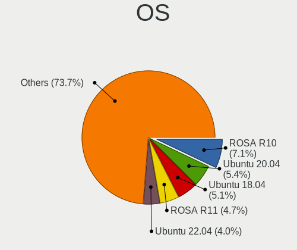

| Name              | Computers | Percent |
|-------------------|-----------|---------|
| ROSA R10          | 21        | 10.55%  |
| Ubuntu 20.04      | 15        | 7.54%   |
| Ubuntu 18.04      | 15        | 7.54%   |
| ROSA R11          | 14        | 7.04%   |
| ROSA R8           | 10        | 5.03%   |
| ROSA R11.1        | 9         | 4.52%   |
| ROSA R8.1         | 8         | 4.02%   |
| OpenMandriva 4.2  | 6         | 3.02%   |
| Ubuntu 22.04      | 5         | 2.51%   |
| Linux Mint 20.1   | 5         | 2.51%   |
| KDE neon 20.04    | 5         | 2.51%   |
| ROSA R9           | 4         | 2.01%   |
| ROSA 12.2         | 4         | 2.01%   |
| Manjaro           | 4         | 2.01%   |
| Arch              | 4         | 2.01%   |
| OpenMandriva 4.3  | 3         | 1.51%   |
| Linux Mint 19.1   | 3         | 1.51%   |
| Fedora 36         | 3         | 1.51%   |
| Fedora 34         | 3         | 1.51%   |
| Zorin 16          | 2         | 1.01%   |
| Ubuntu 22.10      | 2         | 1.01%   |
| Ubuntu 19.10      | 2         | 1.01%   |
| Ubuntu 16.04      | 2         | 1.01%   |
| ROSA 12.1         | 2         | 1.01%   |
| Pop!_OS 21.04     | 2         | 1.01%   |
| Pop!_OS 20.10     | 2         | 1.01%   |
| Linux Mint 20.2   | 2         | 1.01%   |
| Linux Mint 20     | 2         | 1.01%   |
| Linux Mint 19.3   | 2         | 1.01%   |
| BlackPanther 18.1 | 2         | 1.01%   |
| Arch Rolling      | 2         | 1.01%   |
| Ubuntu 21.10      | 1         | 0.5%    |
| Ubuntu 21.04      | 1         | 0.5%    |
| Ubuntu 19.04      | 1         | 0.5%    |
| SteamOS 3.3.2     | 1         | 0.5%    |
| SteamOS 3.3       | 1         | 0.5%    |
| Pop!_OS 21.10     | 1         | 0.5%    |
| Pop!_OS 20.04     | 1         | 0.5%    |
| OpenMandriva 4.50 | 1         | 0.5%    |
| Manjaro 22.0.0    | 1         | 0.5%    |

OS Family
---------

OS without a version

| Name         | Computers | Percent |
|--------------|-----------|---------|
| ROSA         | 66        | 34.55%  |
| Ubuntu       | 44        | 23.04%  |
| Linux Mint   | 15        | 7.85%   |
| OpenMandriva | 10        | 5.24%   |
| Manjaro      | 10        | 5.24%   |
| Fedora       | 10        | 5.24%   |
| Pop!_OS      | 6         | 3.14%   |
| Arch         | 6         | 3.14%   |
| KDE neon     | 5         | 2.62%   |
| Endless      | 4         | 2.09%   |
| Kali         | 3         | 1.57%   |
| Zorin        | 2         | 1.05%   |
| SteamOS      | 2         | 1.05%   |
| Kubuntu      | 2         | 1.05%   |
| Debian       | 2         | 1.05%   |
| BlackPanther | 2         | 1.05%   |
| Ctlos        | 1         | 0.52%   |
| BuildRoot    | 1         | 0.52%   |

Kernel
------

Version of the Linux kernel

| Version                            | Computers | Percent |
|------------------------------------|-----------|---------|
| 4.9.60-nrj-desktop-1rosa-x86_64    | 10        | 4.78%   |
| 5.10.14-desktop-1omv4002           | 6         | 2.87%   |
| 4.9.20-nrj-desktop-1rosa-x86_64    | 6         | 2.87%   |
| 4.15.0-desktop-45.1rosa-x86_64     | 6         | 2.87%   |
| 5.10.74-generic-2rosa2021.1-x86_64 | 5         | 2.39%   |
| 4.1.34-nrj-desktop-2rosa-x86_64    | 5         | 2.39%   |
| 5.15.0-41-generic                  | 4         | 1.91%   |
| 4.9.60-nrj-desktop-1rosa-i586      | 4         | 1.91%   |
| 4.9.155-nrj-desktop-1rosa-x86_64   | 4         | 1.91%   |
| 4.15.0-desktop-68.5rosa-x86_64     | 4         | 1.91%   |
| 5.8.0-33-generic                   | 3         | 1.44%   |
| 5.16.7-desktop-1omv4003            | 3         | 1.44%   |
| 5.4.32-generic-2rosa-x86_64        | 2         | 0.96%   |
| 5.4.0-48-generic                   | 2         | 0.96%   |
| 5.4.0-37-generic                   | 2         | 0.96%   |
| 5.17.11-generic-2rosa2021.1-x86_64 | 2         | 0.96%   |
| 5.11.0-7614-generic                | 2         | 0.96%   |
| 5.11.0-41-generic                  | 2         | 0.96%   |
| 5.11.0-34-generic                  | 2         | 0.96%   |
| 5.11.0-25-generic                  | 2         | 0.96%   |
| 5.10.2-2-MANJARO                   | 2         | 0.96%   |
| 4.9.95-nrj-desktop-2rosa-x86_64    | 2         | 0.96%   |
| 4.9.41-nrj-desktop-1rosa-x86_64    | 2         | 0.96%   |
| 4.9.124-nrj-desktop-1rosa-x86_64   | 2         | 0.96%   |
| 4.15.0-desktop-47.2rosa-x86_64     | 2         | 0.96%   |
| 4.1.34-nrj-desktop-2rosa-i586      | 2         | 0.96%   |
| 4.1.25-nrj-desktop-1rosa-i586      | 2         | 0.96%   |
| 5.9.3-1-MANJARO                    | 1         | 0.48%   |
| 5.9.3-050903-generic               | 1         | 0.48%   |
| 5.8.18-100.fc31.x86_64             | 1         | 0.48%   |
| 5.8.18-1-MANJARO                   | 1         | 0.48%   |
| 5.8.0-7642-generic                 | 1         | 0.48%   |
| 5.8.0-38-generic                   | 1         | 0.48%   |
| 5.8.0-36-generic                   | 1         | 0.48%   |
| 5.8.0-25-lowlatency                | 1         | 0.48%   |
| 5.6.14-desktop-2bP                 | 1         | 0.48%   |
| 5.5.9-zen1-2-zen                   | 1         | 0.48%   |
| 5.4.83-generic-2rosa-x86_64        | 1         | 0.48%   |
| 5.4.49-nrj-desktop-1rosa-x86_64    | 1         | 0.48%   |
| 5.4.32-generic-2rosa-i586          | 1         | 0.48%   |

Kernel Family
-------------

Linux kernel without a distro release

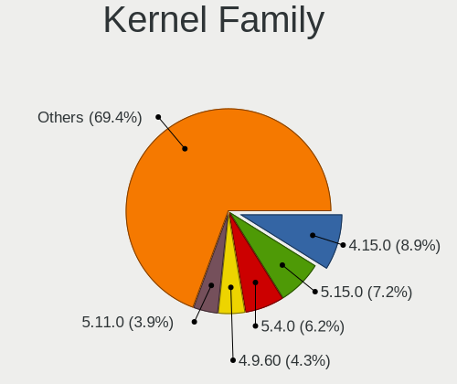

| Version | Computers | Percent |
|---------|-----------|---------|
| 4.15.0  | 26        | 12.75%  |
| 5.4.0   | 17        | 8.33%   |
| 4.9.60  | 13        | 6.37%   |
| 5.11.0  | 12        | 5.88%   |
| 5.15.0  | 8         | 3.92%   |
| 5.8.0   | 7         | 3.43%   |
| 4.1.34  | 7         | 3.43%   |
| 5.10.14 | 6         | 2.94%   |
| 4.9.20  | 6         | 2.94%   |
| 5.3.0   | 5         | 2.45%   |
| 5.13.0  | 5         | 2.45%   |
| 5.10.74 | 5         | 2.45%   |
| 5.0.0   | 4         | 1.96%   |
| 4.9.155 | 4         | 1.96%   |
| 4.18.0  | 4         | 1.96%   |
| 5.4.32  | 3         | 1.47%   |
| 5.16.7  | 3         | 1.47%   |
| 4.9.124 | 3         | 1.47%   |
| 4.1.38  | 3         | 1.47%   |
| 5.9.3   | 2         | 0.98%   |
| 5.8.18  | 2         | 0.98%   |
| 5.19.0  | 2         | 0.98%   |
| 5.18.1  | 2         | 0.98%   |
| 5.17.11 | 2         | 0.98%   |
| 5.10.2  | 2         | 0.98%   |
| 5.10.0  | 2         | 0.98%   |
| 4.9.95  | 2         | 0.98%   |
| 4.9.9   | 2         | 0.98%   |
| 4.9.76  | 2         | 0.98%   |
| 4.9.41  | 2         | 0.98%   |
| 4.10.0  | 2         | 0.98%   |
| 4.1.25  | 2         | 0.98%   |
| 5.6.14  | 1         | 0.49%   |
| 5.5.9   | 1         | 0.49%   |
| 5.4.83  | 1         | 0.49%   |
| 5.4.49  | 1         | 0.49%   |
| 5.2.0   | 1         | 0.49%   |
| 5.19.7  | 1         | 0.49%   |
| 5.19.4  | 1         | 0.49%   |
| 5.18.5  | 1         | 0.49%   |

Kernel Major Ver.
-----------------

Linux kernel major version

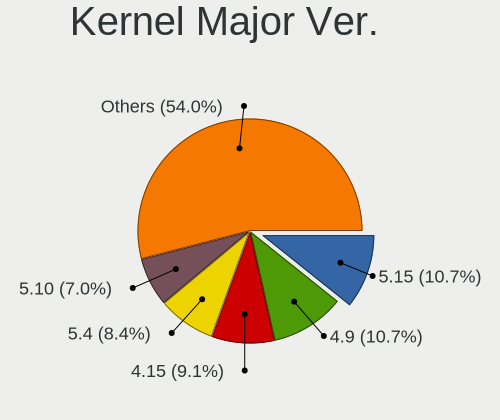

| Version | Computers | Percent |
|---------|-----------|---------|
| 4.9     | 32        | 16.08%  |
| 4.15    | 26        | 13.07%  |
| 5.4     | 22        | 11.06%  |
| 5.10    | 19        | 9.55%   |
| 5.15    | 13        | 6.53%   |
| 5.11    | 13        | 6.53%   |
| 4.1     | 12        | 6.03%   |
| 5.8     | 9         | 4.52%   |
| 5.18    | 6         | 3.02%   |
| 5.13    | 6         | 3.02%   |
| 5.3     | 5         | 2.51%   |
| 5.16    | 5         | 2.51%   |
| 5.0     | 5         | 2.51%   |
| 5.19    | 4         | 2.01%   |
| 5.17    | 4         | 2.01%   |
| 4.18    | 4         | 2.01%   |
| 5.9     | 2         | 1.01%   |
| 5.14    | 2         | 1.01%   |
| 5.12    | 2         | 1.01%   |
| 4.10    | 2         | 1.01%   |
| 5.6     | 1         | 0.5%    |
| 5.5     | 1         | 0.5%    |
| 5.2     | 1         | 0.5%    |
| 5.1     | 1         | 0.5%    |
| 4.19    | 1         | 0.5%    |
| 4.16    | 1         | 0.5%    |

Arch
----

OS architecture (x86_64, i586, etc.)

| Name   | Computers | Percent |
|--------|-----------|---------|
| x86_64 | 176       | 91.67%  |
| i686   | 16        | 8.33%   |

DE
--

Desktop Environment

| Name            | Computers | Percent |
|-----------------|-----------|---------|
| GNOME           | 49        | 25.13%  |
| KDE5            | 47        | 24.1%   |
| KDE4            | 46        | 23.59%  |
| Unknown         | 17        | 8.72%   |
| X-Cinnamon      | 11        | 5.64%   |
| XFCE            | 8         | 4.1%    |
| MATE            | 3         | 1.54%   |
| LXQt            | 3         | 1.54%   |
| KDE             | 3         | 1.54%   |
| sway            | 2         | 1.03%   |
| GNOME Flashback | 2         | 1.03%   |
| Cinnamon        | 2         | 1.03%   |
| xinitrc         | 1         | 0.51%   |
| i3              | 1         | 0.51%   |

Display Server
--------------

X11 or Wayland

| Name    | Computers | Percent |
|---------|-----------|---------|
| X11     | 156       | 80.83%  |
| Wayland | 24        | 12.44%  |
| Unknown | 13        | 6.74%   |

Display Manager
---------------

SDDM, LightDM, etc.

| Name    | Computers | Percent |
|---------|-----------|---------|
| Unknown | 63        | 32.14%  |
| KDM     | 46        | 23.47%  |
| SDDM    | 43        | 21.94%  |
| GDM     | 21        | 10.71%  |
| TDM     | 8         | 4.08%   |
| GDM3    | 8         | 4.08%   |
| LightDM | 7         | 3.57%   |

OS Lang
-------

Language

| Lang    | Computers | Percent |
|---------|-----------|---------|
| Unknown | 74        | 38.34%  |
| en_US   | 55        | 28.5%   |
| ru_RU   | 42        | 21.76%  |
| ro_RO   | 9         | 4.66%   |
| en_GB   | 4         | 2.07%   |
| C       | 4         | 2.07%   |
| ru_UA   | 2         | 1.04%   |
| nl_NL   | 1         | 0.52%   |
| en_150  | 1         | 0.52%   |
| de_DE   | 1         | 0.52%   |

Boot Mode
---------

EFI or BIOS

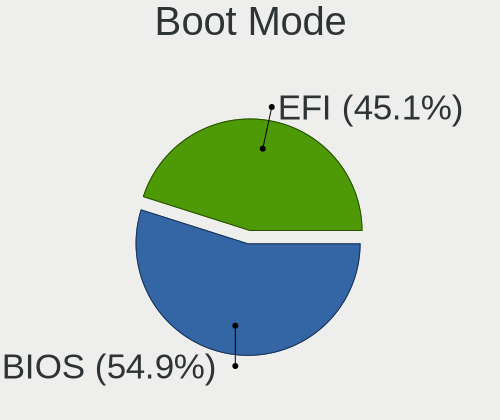

| Mode | Computers | Percent |
|------|-----------|---------|
| BIOS | 114       | 59.38%  |
| EFI  | 78        | 40.63%  |

Filesystem
----------

Type of filesystem

| Type    | Computers | Percent |
|---------|-----------|---------|
| Ext4    | 128       | 66.67%  |
| Unknown | 37        | 19.27%  |
| Overlay | 13        | 6.77%   |
| Btrfs   | 11        | 5.73%   |
| Xfs     | 2         | 1.04%   |
| Ext2    | 1         | 0.52%   |

Part. scheme
------------

Scheme of partitioning

| Type    | Computers | Percent |
|---------|-----------|---------|
| Unknown | 74        | 37.95%  |
| MBR     | 64        | 32.82%  |
| GPT     | 57        | 29.23%  |

Dual Boot with Linux/BSD
------------------------

Hosting more than one Linux/BSD

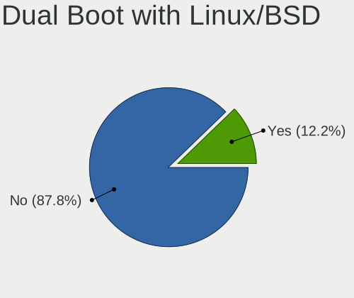

| Dual boot | Computers | Percent |
|-----------|-----------|---------|
| No        | 169       | 87.56%  |
| Yes       | 24        | 12.44%  |

Dual Boot (Win)
---------------

Hosting Linux and Windows

| Dual boot | Computers | Percent |
|-----------|-----------|---------|
| No        | 137       | 70.98%  |
| Yes       | 56        | 29.02%  |

Board
-----

Vendor
------

Motherboard manufacturer

| Name                | Computers | Percent |
|---------------------|-----------|---------|
| ASUSTek Computer    | 52        | 27.37%  |
| Hewlett-Packard     | 28        | 14.74%  |
| Lenovo              | 27        | 14.21%  |
| Gigabyte Technology | 14        | 7.37%   |
| Dell                | 14        | 7.37%   |
| Acer                | 11        | 5.79%   |
| Biostar             | 10        | 5.26%   |
| MSI                 | 6         | 3.16%   |
| ASRock              | 5         | 2.63%   |
| Toshiba             | 4         | 2.11%   |
| Samsung Electronics | 4         | 2.11%   |
| Timi                | 3         | 1.58%   |
| Valve               | 1         | 0.53%   |
| System76            | 1         | 0.53%   |
| Sony                | 1         | 0.53%   |
| Jumper              | 1         | 0.53%   |
| Intel               | 1         | 0.53%   |
| HUAWEI              | 1         | 0.53%   |
| Google              | 1         | 0.53%   |
| Gateway             | 1         | 0.53%   |
| Foxconn             | 1         | 0.53%   |
| ECS                 | 1         | 0.53%   |
| Chuwi               | 1         | 0.53%   |
| Unknown             | 1         | 0.53%   |

Model
-----

Motherboard model

| Name                                        | Computers | Percent |
|---------------------------------------------|-----------|---------|
| ASUS VivoBook_ASUSLaptop X521IA_D533IA      | 3         | 1.58%   |
| Timi TM1701                                 | 2         | 1.05%   |
| Samsung RV413/RV513                         | 2         | 1.05%   |
| Lenovo Legion Y530-15ICH 81FV               | 2         | 1.05%   |
| HP ProBook 450 G7                           | 2         | 1.05%   |
| HP Compaq Presario CQ60                     | 2         | 1.05%   |
| ASUS VivoBook S15 X510UF                    | 2         | 1.05%   |
| ASUS H110M-R                                | 2         | 1.05%   |
| ASUS All Series                             | 2         | 1.05%   |
| Unknown                                     | 2         | 1.05%   |
| Valve Jupiter                               | 1         | 0.53%   |
| Toshiba TECRA Z40-B                         | 1         | 0.53%   |
| Toshiba Satellite Pro S300L                 | 1         | 0.53%   |
| Toshiba Satellite C55D-A                    | 1         | 0.53%   |
| Toshiba Satellite A210                      | 1         | 0.53%   |
| Timi A35S                                   | 1         | 0.53%   |
| System76 Adder WS                           | 1         | 0.53%   |
| Sony VPCEB1J8E                              | 1         | 0.53%   |
| Samsung R517/R717                           | 1         | 0.53%   |
| Samsung 300E4C/300E5C/300E7C                | 1         | 0.53%   |
| MSI Pro 3130 Microtower PC                  | 1         | 0.53%   |
| MSI MS-7695                                 | 1         | 0.53%   |
| MSI MS-7592                                 | 1         | 0.53%   |
| MSI MS-7529                                 | 1         | 0.53%   |
| MSI MS-7309                                 | 1         | 0.53%   |
| MSI CR610                                   | 1         | 0.53%   |
| Lenovo Yoga 730-15IKB 81CU                  | 1         | 0.53%   |
| Lenovo Y520-15IKBN 80WK                     | 1         | 0.53%   |
| Lenovo V580 20147                           | 1         | 0.53%   |
| Lenovo ThinkPad Yoga 11e 3rd Gen 20G8S0MG00 | 1         | 0.53%   |
| Lenovo ThinkPad X240 20AL0067RT             | 1         | 0.53%   |
| Lenovo ThinkPad X131e 33711T0               | 1         | 0.53%   |
| Lenovo ThinkPad X1 Carbon 5th 20HR002MMX    | 1         | 0.53%   |
| Lenovo ThinkPad W520 4282BA9                | 1         | 0.53%   |
| Lenovo ThinkPad T440 20B7S1N809             | 1         | 0.53%   |
| Lenovo ThinkPad E15 Gen 3 20YG004BRT        | 1         | 0.53%   |
| Lenovo ThinkPad E15 Gen 2 20TD003TRT        | 1         | 0.53%   |
| Lenovo ThinkPad E15 Gen 2 20TD002NRA        | 1         | 0.53%   |
| Lenovo Legion 5 Pro 16ITH6H 82JD            | 1         | 0.53%   |
| Lenovo Legion 5 15IMH05 82AU                | 1         | 0.53%   |

Model Family
------------

Motherboard model prefix

| Name               | Computers | Percent |
|--------------------|-----------|---------|
| Lenovo IdeaPad     | 10        | 5.26%   |
| Lenovo ThinkPad    | 9         | 4.74%   |
| Acer Aspire        | 8         | 4.21%   |
| ASUS VivoBook      | 7         | 3.68%   |
| HP ProBook         | 6         | 3.16%   |
| Dell Latitude      | 5         | 2.63%   |
| Dell Inspiron      | 5         | 2.63%   |
| Lenovo Legion      | 4         | 2.11%   |
| HP EliteBook       | 4         | 2.11%   |
| HP Compaq          | 4         | 2.11%   |
| Toshiba Satellite  | 3         | 1.58%   |
| HP Pavilion        | 3         | 1.58%   |
| ASUS PRIME         | 3         | 1.58%   |
| Timi TM1701        | 2         | 1.05%   |
| Samsung RV413      | 2         | 1.05%   |
| HP ProDesk         | 2         | 1.05%   |
| HP Laptop          | 2         | 1.05%   |
| HP ENVY            | 2         | 1.05%   |
| ASUS TUF           | 2         | 1.05%   |
| ASUS P8H61-M       | 2         | 1.05%   |
| ASUS M5A78L-M      | 2         | 1.05%   |
| ASUS H110M-R       | 2         | 1.05%   |
| ASUS All           | 2         | 1.05%   |
| Unknown            | 2         | 1.05%   |
| Valve Jupiter      | 1         | 0.53%   |
| Toshiba TECRA      | 1         | 0.53%   |
| Timi A35S          | 1         | 0.53%   |
| System76 Adder     | 1         | 0.53%   |
| Sony VPCEB1J8E     | 1         | 0.53%   |
| Samsung R517       | 1         | 0.53%   |
| Samsung 300E4C     | 1         | 0.53%   |
| MSI Pro            | 1         | 0.53%   |
| MSI MS-7695        | 1         | 0.53%   |
| MSI MS-7592        | 1         | 0.53%   |
| MSI MS-7529        | 1         | 0.53%   |
| MSI MS-7309        | 1         | 0.53%   |
| MSI CR610          | 1         | 0.53%   |
| Lenovo Yoga        | 1         | 0.53%   |
| Lenovo Y520-15IKBN | 1         | 0.53%   |
| Lenovo V580        | 1         | 0.53%   |

MFG Year
--------

Motherboard manufacture year

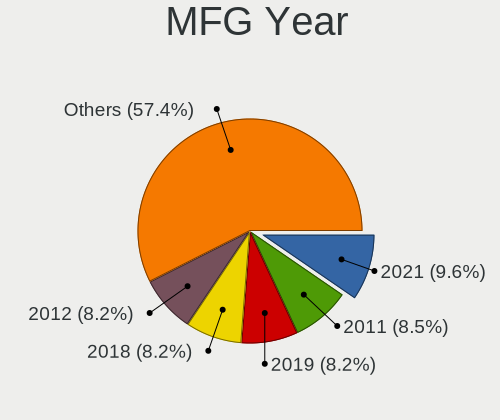

| Year | Computers | Percent |
|------|-----------|---------|
| 2018 | 19        | 10%     |
| 2011 | 19        | 10%     |
| 2017 | 17        | 8.95%   |
| 2012 | 17        | 8.95%   |
| 2019 | 16        | 8.42%   |
| 2009 | 15        | 7.89%   |
| 2021 | 13        | 6.84%   |
| 2013 | 13        | 6.84%   |
| 2020 | 12        | 6.32%   |
| 2016 | 12        | 6.32%   |
| 2010 | 9         | 4.74%   |
| 2015 | 7         | 3.68%   |
| 2014 | 5         | 2.63%   |
| 2008 | 5         | 2.63%   |
| 2007 | 4         | 2.11%   |
| 2022 | 3         | 1.58%   |
| 2006 | 3         | 1.58%   |
| 2005 | 1         | 0.53%   |

Form Factor
-----------

Physical design of the computer

| Name        | Computers | Percent |
|-------------|-----------|---------|
| Notebook    | 117       | 61.58%  |
| Desktop     | 68        | 35.79%  |
| All in one  | 2         | 1.05%   |
| Convertible | 1         | 0.53%   |
| Mini pc     | 1         | 0.53%   |
| Server      | 1         | 0.53%   |

Secure Boot
-----------

Enabled or disabled

| State    | Computers | Percent |
|----------|-----------|---------|
| Disabled | 180       | 94.74%  |
| Enabled  | 10        | 5.26%   |

Coreboot
--------

Have coreboot on board

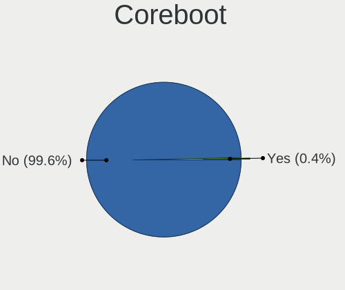

| Used | Computers | Percent |
|------|-----------|---------|
| No   | 189       | 99.47%  |
| Yes  | 1         | 0.53%   |

RAM Size
--------

Total RAM memory

| Size in GB  | Computers | Percent |
|-------------|-----------|---------|
| 3.01-4.0    | 57        | 29.84%  |
| 4.01-8.0    | 40        | 20.94%  |
| 8.01-16.0   | 37        | 19.37%  |
| 16.01-24.0  | 25        | 13.09%  |
| 32.01-64.0  | 12        | 6.28%   |
| 1.01-2.0    | 10        | 5.24%   |
| 2.01-3.0    | 8         | 4.19%   |
| 64.01-256.0 | 1         | 0.52%   |
| 0.51-1.0    | 1         | 0.52%   |

RAM Used
--------

Used RAM memory

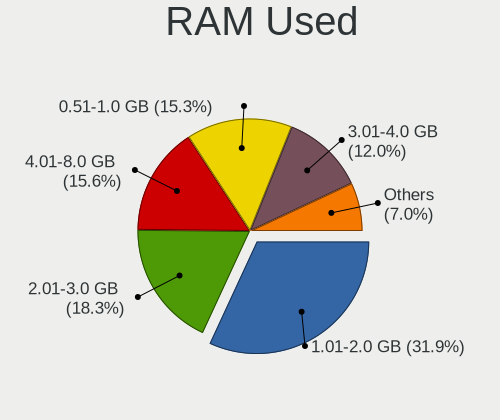

| Used GB    | Computers | Percent |
|------------|-----------|---------|
| 1.01-2.0   | 74        | 36.27%  |
| 0.51-1.0   | 42        | 20.59%  |
| 2.01-3.0   | 35        | 17.16%  |
| 4.01-8.0   | 25        | 12.25%  |
| 3.01-4.0   | 17        | 8.33%   |
| 8.01-16.0  | 5         | 2.45%   |
| 0.01-0.5   | 3         | 1.47%   |
| 16.01-24.0 | 2         | 0.98%   |
| 24.01-32.0 | 1         | 0.49%   |

Total Drives
------------

Number of drives on board

| Drives | Computers | Percent |
|--------|-----------|---------|
| 1      | 132       | 69.11%  |
| 2      | 39        | 20.42%  |
| 3      | 14        | 7.33%   |
| 4      | 4         | 2.09%   |
| 0      | 2         | 1.05%   |

Has CD-ROM
----------

Has CD-ROM on board

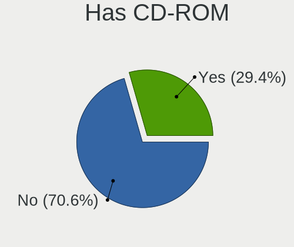

| Presented | Computers | Percent |
|-----------|-----------|---------|
| No        | 123       | 64.74%  |
| Yes       | 67        | 35.26%  |

Has Ethernet
------------

Has Ethernet on board

| Presented | Computers | Percent |
|-----------|-----------|---------|
| Yes       | 169       | 88.48%  |
| No        | 22        | 11.52%  |

Has WiFi
--------

Has WiFi module

| Presented | Computers | Percent |
|-----------|-----------|---------|
| Yes       | 136       | 71.58%  |
| No        | 54        | 28.42%  |

Has Bluetooth
-------------

Has Bluetooth module

| Presented | Computers | Percent |
|-----------|-----------|---------|
| Yes       | 99        | 51.83%  |
| No        | 92        | 48.17%  |

Location
--------

Country
-------

Geographic location (country)

| Country | Computers | Percent |
|---------|-----------|---------|
| Moldova | 190       | 100%    |

City
----

Geographic location (city)

| City            | Computers | Percent |
|-----------------|-----------|---------|
| Chisinau        | 107       | 55.44%  |
| Tiraspol        | 38        | 19.69%  |
| Bli         | 6         | 3.11%   |
| Straseni        | 5         | 2.59%   |
| Tighina         | 4         | 2.07%   |
| Hincesti        | 3         | 1.55%   |
| Soroca          | 2         | 1.04%   |
| Ialoveni        | 2         | 1.04%   |
| Cueni       | 2         | 1.04%   |
| Zaicana         | 1         | 0.52%   |
| Tvardia       | 1         | 0.52%   |
| Tintareni       | 1         | 0.52%   |
| Soldanesti      | 1         | 0.52%   |
| Sofia           | 1         | 0.52%   |
| Singera         | 1         | 0.52%   |
| Rbnia       | 1         | 0.52%   |
| Rezina          | 1         | 0.52%   |
| Rautel          | 1         | 0.52%   |
| Prajila         | 1         | 0.52%   |
| Pociumbeni      | 1         | 0.52%   |
| Lapusna         | 1         | 0.52%   |
| Gangura         | 1         | 0.52%   |
| Floresti        | 1         | 0.52%   |
| Floreni         | 1         | 0.52%   |
| Edine         | 1         | 0.52%   |
| Drochia         | 1         | 0.52%   |
| Donduseni       | 1         | 0.52%   |
| Criuleni        | 1         | 0.52%   |
| Crasnoarmeiscoe | 1         | 0.52%   |
| Cojusna         | 1         | 0.52%   |
| Cenac           | 1         | 0.52%   |
| Cazanesti       | 1         | 0.52%   |
| Cahul           | 1         | 0.52%   |

Drives
------

Drive Vendor
------------

Hard drive vendors

| Vendor              | Computers | Drives | Percent |
|---------------------|-----------|--------|---------|
| Samsung Electronics | 53        | 64     | 20.54%  |
| WDC                 | 35        | 37     | 13.57%  |
| Seagate             | 34        | 39     | 13.18%  |
| Toshiba             | 27        | 32     | 10.47%  |
| Hitachi             | 17        | 20     | 6.59%   |
| Kingston            | 13        | 16     | 5.04%   |
| SanDisk             | 9         | 9      | 3.49%   |
| SK hynix            | 6         | 6      | 2.33%   |
| Unknown             | 5         | 5      | 1.94%   |
| Transcend           | 5         | 5      | 1.94%   |
| SPCC                | 5         | 7      | 1.94%   |
| Micron Technology   | 5         | 7      | 1.94%   |
| HGST                | 4         | 4      | 1.55%   |
| Apacer              | 4         | 4      | 1.55%   |
| Maxtor              | 3         | 4      | 1.16%   |
| Intel               | 3         | 5      | 1.16%   |
| Phison              | 2         | 3      | 0.78%   |
| Netac               | 2         | 2      | 0.78%   |
| GOODRAM             | 2         | 2      | 0.78%   |
| Fujitsu             | 2         | 2      | 0.78%   |
| Crucial             | 2         | 3      | 0.78%   |
| A-DATA Technology   | 2         | 2      | 0.78%   |
| ZOTAC               | 1         | 3      | 0.39%   |
| XPG                 | 1         | 1      | 0.39%   |
| Team                | 1         | 1      | 0.39%   |
| Solid State Storage | 1         | 1      | 0.39%   |
| PNY                 | 1         | 1      | 0.39%   |
| Patriot             | 1         | 1      | 0.39%   |
| OCZ                 | 1         | 1      | 0.39%   |
| O2 Micro            | 1         | 1      | 0.39%   |
| LITEONIT            | 1         | 1      | 0.39%   |
| Leven               | 1         | 1      | 0.39%   |
| Lenovo              | 1         | 1      | 0.39%   |
| KIOXIA              | 1         | 1      | 0.39%   |
| Intenso             | 1         | 1      | 0.39%   |
| Goldkey             | 1         | 1      | 0.39%   |
| Gigabyte Technology | 1         | 2      | 0.39%   |
| CHN25SATAS1         | 1         | 1      | 0.39%   |
| China               | 1         | 1      | 0.39%   |
| ASMT                | 1         | 1      | 0.39%   |

Drive Model
-----------

Hard drive models

| Model                                  | Computers | Percent |
|----------------------------------------|-----------|---------|
| Kingston SHFS37A120G 120GB SSD         | 7         | 2.63%   |
| Samsung NVMe SSD Drive 512GB           | 6         | 2.26%   |
| Toshiba MQ01ABD100 1TB                 | 4         | 1.5%    |
| Toshiba DT01ACA050 500GB               | 4         | 1.5%    |
| Seagate ST500LT012-9WS142 500GB        | 4         | 1.5%    |
| Seagate ST1000LM035-1RK172 1TB         | 4         | 1.5%    |
| Samsung SSD 860 EVO 500GB              | 4         | 1.5%    |
| Toshiba MQ04ABF100 1TB                 | 3         | 1.13%   |
| Toshiba DT01ACA100 1TB                 | 3         | 1.13%   |
| SanDisk NVMe SSD Drive 512GB           | 3         | 1.13%   |
| Samsung HD502HJ 500GB                  | 3         | 1.13%   |
| Micron 1100_MTFDDAV256TBN 256GB SSD    | 3         | 1.13%   |
| Hitachi HTS543232A7A384 320GB          | 3         | 1.13%   |
| WDC WD5000AZRX-00A8LB0 500GB           | 2         | 0.75%   |
| WDC WD10SPZX-24Z10T0 1TB               | 2         | 0.75%   |
| WDC WD10SPZX-22Z10T1 1TB               | 2         | 0.75%   |
| Unknown MMC Card  64GB                 | 2         | 0.75%   |
| Transcend TS64GSSD370S 64GB            | 2         | 0.75%   |
| Toshiba MQ01ACF032 320GB               | 2         | 0.75%   |
| Toshiba MQ01ABF050 500GB               | 2         | 0.75%   |
| Toshiba HDWD110 1TB                    | 2         | 0.75%   |
| SPCC Solid State Disk 128GB            | 2         | 0.75%   |
| SK hynix NVMe SSD Drive 256GB          | 2         | 0.75%   |
| Seagate ST9500325AS 500GB              | 2         | 0.75%   |
| Seagate ST500DM002-1BD142 500GB        | 2         | 0.75%   |
| Seagate ST4000VM000-2AF166 4TB         | 2         | 0.75%   |
| Seagate ST2000DM008-2FR102 2TB         | 2         | 0.75%   |
| Seagate ST1000DL002-9TT153 1TB         | 2         | 0.75%   |
| SanDisk SD7UB3Q256G1001 256GB SSD      | 2         | 0.75%   |
| Samsung SM963 2.5" NVMe PCIe SSD 256GB | 2         | 0.75%   |
| Samsung MZVLW256HEHP-00000 256GB       | 2         | 0.75%   |
| Samsung HD251HJ 249GB                  | 2         | 0.75%   |
| Samsung HD082GJ 80GB                   | 2         | 0.75%   |
| Netac SSD 256GB                        | 2         | 0.75%   |
| Intel NVMe SSD Drive 512GB             | 2         | 0.75%   |
| Hitachi HTS547575A9E384 752GB          | 2         | 0.75%   |
| Hitachi HTS542525K9SA00 250GB          | 2         | 0.75%   |
| Apacer AS340 240GB SSD                 | 2         | 0.75%   |
| ZOTAC ZTSSD-S11-240G-P 240GB           | 1         | 0.38%   |
| XPG NVMe SSD Drive 512GB               | 1         | 0.38%   |

HDD Vendor
----------

Hard disk drive vendors

| Vendor              | Computers | Drives | Percent |
|---------------------|-----------|--------|---------|
| WDC                 | 34        | 36     | 24.82%  |
| Seagate             | 34        | 39     | 24.82%  |
| Toshiba             | 23        | 28     | 16.79%  |
| Samsung Electronics | 18        | 21     | 13.14%  |
| Hitachi             | 17        | 20     | 12.41%  |
| HGST                | 4         | 4      | 2.92%   |
| Maxtor              | 3         | 4      | 2.19%   |
| Fujitsu             | 2         | 2      | 1.46%   |
| Unknown             | 1         | 1      | 0.73%   |
| ASMT                | 1         | 1      | 0.73%   |

SSD Vendor
----------

Solid state drive vendors

| Vendor              | Computers | Drives | Percent |
|---------------------|-----------|--------|---------|
| Samsung Electronics | 12        | 15     | 18.46%  |
| Kingston            | 12        | 15     | 18.46%  |
| Transcend           | 5         | 5      | 7.69%   |
| SPCC                | 5         | 7      | 7.69%   |
| SanDisk             | 4         | 4      | 6.15%   |
| Apacer              | 4         | 4      | 6.15%   |
| Micron Technology   | 3         | 3      | 4.62%   |
| Netac               | 2         | 2      | 3.08%   |
| GOODRAM             | 2         | 2      | 3.08%   |
| Crucial             | 2         | 3      | 3.08%   |
| ZOTAC               | 1         | 3      | 1.54%   |
| Toshiba             | 1         | 1      | 1.54%   |
| Team                | 1         | 1      | 1.54%   |
| PNY                 | 1         | 1      | 1.54%   |
| Patriot             | 1         | 1      | 1.54%   |
| OCZ                 | 1         | 1      | 1.54%   |
| LITEONIT            | 1         | 1      | 1.54%   |
| Leven               | 1         | 1      | 1.54%   |
| Intenso             | 1         | 1      | 1.54%   |
| Goldkey             | 1         | 1      | 1.54%   |
| Gigabyte Technology | 1         | 2      | 1.54%   |
| CHN25SATAS1         | 1         | 1      | 1.54%   |
| China               | 1         | 1      | 1.54%   |
| A-DATA Technology   | 1         | 1      | 1.54%   |

Drive Kind
----------

HDD or SSD

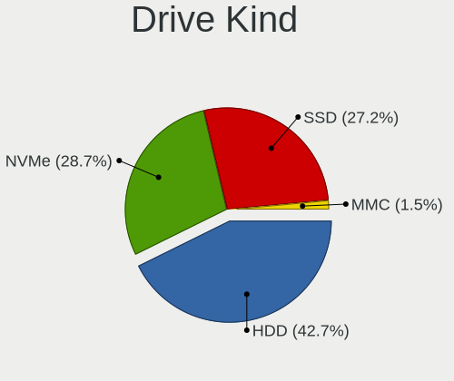

| Kind | Computers | Drives | Percent |
|------|-----------|--------|---------|
| HDD  | 117       | 156    | 50.65%  |
| SSD  | 61        | 77     | 26.41%  |
| NVMe | 49        | 62     | 21.21%  |
| MMC  | 4         | 4      | 1.73%   |

Drive Connector
---------------

SATA, SAS, NVMe, etc.

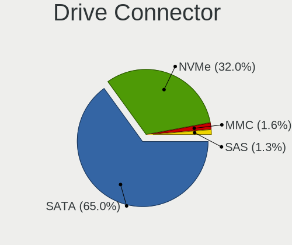

| Type | Computers | Drives | Percent |
|------|-----------|--------|---------|
| SATA | 150       | 231    | 73.17%  |
| NVMe | 49        | 62     | 23.9%   |
| MMC  | 4         | 4      | 1.95%   |
| SAS  | 2         | 2      | 0.98%   |

Drive Size
----------

Size of hard drive

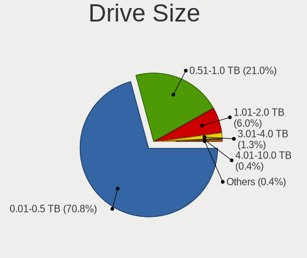

| Size in TB | Computers | Drives | Percent |
|------------|-----------|--------|---------|
| 0.01-0.5   | 123       | 175    | 71.93%  |
| 0.51-1.0   | 37        | 47     | 21.64%  |
| 1.01-2.0   | 7         | 7      | 4.09%   |
| 3.01-4.0   | 3         | 3      | 1.75%   |
| 4.01-10.0  | 1         | 1      | 0.58%   |

Space Total
-----------

Amount of disk space available on the file system

| Size in GB     | Computers | Percent |
|----------------|-----------|---------|
| 251-500        | 55        | 27.64%  |
| 101-250        | 54        | 27.14%  |
| 51-100         | 24        | 12.06%  |
| 501-1000       | 23        | 11.56%  |
| 1-20           | 19        | 9.55%   |
| 21-50          | 8         | 4.02%   |
| 1001-2000      | 6         | 3.02%   |
| Unknown        | 6         | 3.02%   |
| More than 3000 | 2         | 1.01%   |
| 2001-3000      | 2         | 1.01%   |

Space Used
----------

Amount of used disk space

| Used GB        | Computers | Percent |
|----------------|-----------|---------|
| 1-20           | 98        | 48.28%  |
| 21-50          | 33        | 16.26%  |
| 51-100         | 25        | 12.32%  |
| 101-250        | 18        | 8.87%   |
| 251-500        | 13        | 6.4%    |
| 501-1000       | 7         | 3.45%   |
| Unknown        | 6         | 2.96%   |
| 1001-2000      | 2         | 0.99%   |
| More than 3000 | 1         | 0.49%   |

Malfunc. Drives
---------------

Drive models with a malfunction

| Model                             | Computers | Drives | Percent |
|-----------------------------------|-----------|--------|---------|
| Seagate ST500LT012-9WS142 500GB   | 3         | 3      | 6.52%   |
| Samsung Electronics HD082GJ 80GB  | 2         | 2      | 4.35%   |
| Kingston SHFS37A120G 120GB SSD    | 2         | 4      | 4.35%   |
| Hitachi HTS547575A9E384 752GB     | 2         | 2      | 4.35%   |
| WDC WD800JD-22LSA0 80GB           | 1         | 1      | 2.17%   |
| WDC WD5000AAKX-08ERMA0 500GB      | 1         | 1      | 2.17%   |
| WDC WD5000AAKS-75V0A0 500GB       | 1         | 1      | 2.17%   |
| WDC WD5000AAKS-00WWPA0 500GB      | 1         | 1      | 2.17%   |
| WDC WD5000AADS-56S9B1 500GB       | 1         | 1      | 2.17%   |
| WDC WD3200BEVT-22A23T0 320GB      | 1         | 1      | 2.17%   |
| WDC WD2500AAKX-00U6AA0 250GB      | 1         | 1      | 2.17%   |
| WDC WD1600BEVS-60RST0 160GB       | 1         | 1      | 2.17%   |
| WDC WD1600BEVS-07RST0 160GB       | 1         | 1      | 2.17%   |
| Toshiba MQ01ABD050 500GB          | 1         | 1      | 2.17%   |
| Toshiba MQ01ABD032 320GB          | 1         | 1      | 2.17%   |
| Toshiba DT01ACA050 500GB          | 1         | 1      | 2.17%   |
| Team L5 LITE SSD 240GB            | 1         | 1      | 2.17%   |
| SPCC SSD162 120GB                 | 1         | 1      | 2.17%   |
| SPCC Solid State Disk 56GB        | 1         | 2      | 2.17%   |
| Seagate ST9500325AS 500GB         | 1         | 1      | 2.17%   |
| Seagate ST3500418AS 500GB         | 1         | 1      | 2.17%   |
| Seagate ST320DM001 HD322GJ 320GB  | 1         | 1      | 2.17%   |
| Seagate ST3160023A 160GB          | 1         | 1      | 2.17%   |
| Seagate ST31000340NS 1TB          | 1         | 1      | 2.17%   |
| Seagate ST1000LM035-1RK172 1TB    | 1         | 1      | 2.17%   |
| Seagate ST1000DL002-9TT153 1TB    | 1         | 1      | 2.17%   |
| SanDisk SD7UB3Q256G1001 256GB SSD | 1         | 1      | 2.17%   |
| Samsung Electronics HD753LJ 752GB | 1         | 1      | 2.17%   |
| Samsung Electronics HD103UJ 1TB   | 1         | 1      | 2.17%   |
| Samsung Electronics HD080HJ/ 80GB | 1         | 1      | 2.17%   |
| Maxtor STM380215AS 80GB           | 1         | 1      | 2.17%   |
| Maxtor STM3160811AS 160GB         | 1         | 1      | 2.17%   |
| Maxtor STM3160211AS 160GB         | 1         | 1      | 2.17%   |
| Maxtor 4R120L0 128GB              | 1         | 1      | 2.17%   |
| Hitachi HTS545050B9A300 500GB     | 1         | 1      | 2.17%   |
| Hitachi HTS545025B9A300 250GB     | 1         | 1      | 2.17%   |
| Hitachi HDT721010SLA360 1TB       | 1         | 2      | 2.17%   |
| Hitachi HDP725050GLA360 500GB     | 1         | 1      | 2.17%   |
| Hitachi HDP725025GLA380 250GB     | 1         | 2      | 2.17%   |
| Fujitsu MHW2080BH PL 80GB         | 1         | 1      | 2.17%   |

Malfunc. Drive Vendor
---------------------

Vendors of faulty drives

| Vendor              | Computers | Drives | Percent |
|---------------------|-----------|--------|---------|
| Seagate             | 10        | 10     | 22.22%  |
| WDC                 | 9         | 9      | 20%     |
| Hitachi             | 7         | 9      | 15.56%  |
| Samsung Electronics | 5         | 5      | 11.11%  |
| Toshiba             | 3         | 3      | 6.67%   |
| Maxtor              | 3         | 4      | 6.67%   |
| SPCC                | 2         | 3      | 4.44%   |
| Kingston            | 2         | 4      | 4.44%   |
| Team                | 1         | 1      | 2.22%   |
| SanDisk             | 1         | 1      | 2.22%   |
| Fujitsu             | 1         | 1      | 2.22%   |
| A-DATA Technology   | 1         | 1      | 2.22%   |

Malfunc. HDD Vendor
-------------------

Vendors of faulty HDD drives

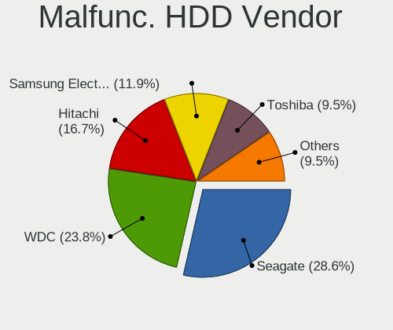

| Vendor              | Computers | Drives | Percent |
|---------------------|-----------|--------|---------|
| Seagate             | 10        | 10     | 26.32%  |
| WDC                 | 9         | 9      | 23.68%  |
| Hitachi             | 7         | 9      | 18.42%  |
| Samsung Electronics | 5         | 5      | 13.16%  |
| Toshiba             | 3         | 3      | 7.89%   |
| Maxtor              | 3         | 4      | 7.89%   |
| Fujitsu             | 1         | 1      | 2.63%   |

Malfunc. Drive Kind
-------------------

Kinds of faulty drives

| Kind | Computers | Drives | Percent |
|------|-----------|--------|---------|
| HDD  | 34        | 41     | 82.93%  |
| SSD  | 7         | 10     | 17.07%  |

Failed Drives
-------------

Failed drive models

| Model                             | Computers | Drives | Percent |
|-----------------------------------|-----------|--------|---------|
| WDC WD3200BPVT-24ZEST0 320GB      | 1         | 1      | 25%     |
| Seagate ST9250315AS 250GB         | 1         | 1      | 25%     |
| Samsung Electronics HD502HJ 500GB | 1         | 1      | 25%     |
| Samsung Electronics HD322GJ 320GB | 1         | 2      | 25%     |

Failed Drive Vendor
-------------------

Failed drive vendors

| Vendor              | Computers | Drives | Percent |
|---------------------|-----------|--------|---------|
| Samsung Electronics | 2         | 3      | 50%     |
| WDC                 | 1         | 1      | 25%     |
| Seagate             | 1         | 1      | 25%     |

Drive Status
------------

Number of failed and malfunc. drives

| Status   | Computers | Drives | Percent |
|----------|-----------|--------|---------|
| Works    | 94        | 140    | 44.98%  |
| Detected | 70        | 103    | 33.49%  |
| Malfunc  | 41        | 51     | 19.62%  |
| Failed   | 4         | 5      | 1.91%   |

Storage controller
------------------

Storage Vendor
--------------

Storage controller vendors

| Vendor                         | Computers | Percent |
|--------------------------------|-----------|---------|
| Intel                          | 117       | 49.79%  |
| AMD                            | 51        | 21.7%   |
| Samsung Electronics            | 23        | 9.79%   |
| Nvidia                         | 9         | 3.83%   |
| SK hynix                       | 6         | 2.55%   |
| SanDisk                        | 6         | 2.55%   |
| JMicron Technology             | 5         | 2.13%   |
| Toshiba America Info Systems   | 3         | 1.28%   |
| Phison Electronics             | 2         | 0.85%   |
| Micron Technology              | 2         | 0.85%   |
| ASMedia Technology             | 2         | 0.85%   |
| ADATA Technology               | 2         | 0.85%   |
| Solid State Storage Technology | 1         | 0.43%   |
| O2 Micro                       | 1         | 0.43%   |
| Marvell Technology Group       | 1         | 0.43%   |
| Lenovo                         | 1         | 0.43%   |
| KIOXIA                         | 1         | 0.43%   |
| Kingston Technology Company    | 1         | 0.43%   |
| Hewlett-Packard                | 1         | 0.43%   |

Storage Model
-------------

Storage controller models

| Model                                                                                   | Computers | Percent |
|-----------------------------------------------------------------------------------------|-----------|---------|
| AMD FCH SATA Controller [AHCI mode]                                                     | 25        | 8.8%    |
| AMD SB7x0/SB8x0/SB9x0 IDE Controller                                                    | 13        | 4.58%   |
| Intel Sunrise Point-LP SATA Controller [AHCI mode]                                      | 12        | 4.23%   |
| Samsung NVMe SSD Controller 980                                                         | 11        | 3.87%   |
| AMD SB7x0/SB8x0/SB9x0 SATA Controller [IDE mode]                                        | 11        | 3.87%   |
| AMD SB7x0/SB8x0/SB9x0 SATA Controller [AHCI mode]                                       | 8         | 2.82%   |
| Intel 8 Series/C220 Series Chipset Family 6-port SATA Controller 1 [AHCI mode]          | 7         | 2.46%   |
| Intel 7 Series Chipset Family 6-port SATA Controller [AHCI mode]                        | 7         | 2.46%   |
| Samsung NVMe SSD Controller SM981/PM981/PM983                                           | 6         | 2.11%   |
| Intel Cannon Lake Mobile PCH SATA AHCI Controller                                       | 6         | 2.11%   |
| Intel 82801 Mobile SATA Controller [RAID mode]                                          | 6         | 2.11%   |
| Samsung NVMe SSD Controller SM961/PM961/SM963                                           | 5         | 1.76%   |
| Intel Q170/Q150/B150/H170/H110/Z170/CM236 Chipset SATA Controller [AHCI Mode]           | 5         | 1.76%   |
| Intel NM10/ICH7 Family SATA Controller [IDE mode]                                       | 5         | 1.76%   |
| Intel 6 Series/C200 Series Chipset Family Desktop SATA Controller (IDE mode, ports 4-5) | 5         | 1.76%   |
| Intel 6 Series/C200 Series Chipset Family Desktop SATA Controller (IDE mode, ports 0-3) | 5         | 1.76%   |
| Intel 6 Series/C200 Series Chipset Family 6 port Mobile SATA AHCI Controller            | 5         | 1.76%   |
| Intel Wildcat Point-LP SATA Controller [AHCI Mode]                                      | 4         | 1.41%   |
| Intel Comet Lake SATA AHCI Controller                                                   | 4         | 1.41%   |
| Intel Celeron/Pentium Silver Processor SATA Controller                                  | 4         | 1.41%   |
| Intel Atom/Celeron/Pentium Processor x5-E8000/J3xxx/N3xxx Series SATA Controller        | 4         | 1.41%   |
| Intel 82801G (ICH7 Family) IDE Controller                                               | 4         | 1.41%   |
| Intel 8 Series SATA Controller 1 [AHCI mode]                                            | 4         | 1.41%   |
| Intel 200 Series PCH SATA controller [AHCI mode]                                        | 4         | 1.41%   |
| Nvidia MCP78S [GeForce 8200] SATA Controller (non-AHCI mode)                            | 3         | 1.06%   |
| Nvidia MCP78S [GeForce 8200] IDE                                                        | 3         | 1.06%   |
| Nvidia MCP61 SATA Controller                                                            | 3         | 1.06%   |
| Nvidia MCP61 IDE                                                                        | 3         | 1.06%   |
| JMicron JMB368 IDE controller                                                           | 3         | 1.06%   |
| Intel Celeron N3350/Pentium N4200/Atom E3900 Series SATA AHCI Controller                | 3         | 1.06%   |
| AMD FCH SATA Controller [IDE mode]                                                      | 3         | 1.06%   |
| AMD FCH IDE Controller                                                                  | 3         | 1.06%   |
| AMD 500 Series Chipset SATA Controller                                                  | 3         | 1.06%   |
| Toshiba America Info Systems XG6 NVMe SSD Controller                                    | 2         | 0.7%    |
| SK hynix Gold P31/PC711 NVMe Solid State Drive                                          | 2         | 0.7%    |
| SK hynix BC501 NVMe Solid State Drive                                                   | 2         | 0.7%    |
| SanDisk WD Blue SN500 / PC SN520 NVMe SSD                                               | 2         | 0.7%    |
| Micron Non-Volatile memory controller                                                   | 2         | 0.7%    |
| JMicron JMB363 SATA/IDE Controller                                                      | 2         | 0.7%    |
| Intel SSD 660P Series                                                                   | 2         | 0.7%    |

Storage Kind
------------

Kind of storage controller (IDE, SATA, NVMe, SAS, ...)

| Kind | Computers | Percent |
|------|-----------|---------|
| SATA | 142       | 57.03%  |
| NVMe | 49        | 19.68%  |
| IDE  | 48        | 19.28%  |
| RAID | 10        | 4.02%   |

Processor
---------

CPU Vendor
----------

Processor vendors

| Vendor | Computers | Percent |
|--------|-----------|---------|
| Intel  | 127       | 66.84%  |
| AMD    | 63        | 33.16%  |

CPU Model
---------

Processor models

| Model                                         | Computers | Percent |
|-----------------------------------------------|-----------|---------|
| Intel Core i5-8250U CPU @ 1.60GHz             | 5         | 2.63%   |
| Intel Core i7-8750H CPU @ 2.20GHz             | 3         | 1.58%   |
| Intel Core i7-8565U CPU @ 1.80GHz             | 3         | 1.58%   |
| Intel Core i7-8550U CPU @ 1.80GHz             | 3         | 1.58%   |
| AMD Ryzen 5 4500U with Radeon Graphics        | 3         | 1.58%   |
| AMD Ryzen 5 3500U with Radeon Vega Mobile Gfx | 3         | 1.58%   |
| AMD E1-1200 APU with Radeon HD Graphics       | 3         | 1.58%   |
| AMD E-450 APU with Radeon HD Graphics         | 3         | 1.58%   |
| Intel Pentium CPU G4400 @ 3.30GHz             | 2         | 1.05%   |
| Intel Pentium CPU B960 @ 2.20GHz              | 2         | 1.05%   |
| Intel Core i5-8265U CPU @ 1.60GHz             | 2         | 1.05%   |
| Intel Core i5-6200U CPU @ 2.30GHz             | 2         | 1.05%   |
| Intel Core i5-5200U CPU @ 2.20GHz             | 2         | 1.05%   |
| Intel Core i5-4670K CPU @ 3.40GHz             | 2         | 1.05%   |
| Intel Core i5-2410M CPU @ 2.30GHz             | 2         | 1.05%   |
| Intel Core i5-1035G1 CPU @ 1.00GHz            | 2         | 1.05%   |
| Intel Core i5-10210U CPU @ 1.60GHz            | 2         | 1.05%   |
| Intel Core i3-8130U CPU @ 2.20GHz             | 2         | 1.05%   |
| Intel Core i3-5010U CPU @ 2.10GHz             | 2         | 1.05%   |
| Intel Core 2 Duo CPU E8400 @ 3.00GHz          | 2         | 1.05%   |
| Intel Celeron CPU N3450 @ 1.10GHz             | 2         | 1.05%   |
| Intel Celeron CPU N2840 @ 2.16GHz             | 2         | 1.05%   |
| Intel 11th Gen Core i7-1165G7 @ 2.80GHz       | 2         | 1.05%   |
| AMD Ryzen 7 5800H with Radeon Graphics        | 2         | 1.05%   |
| AMD Ryzen 7 5700U with Radeon Graphics        | 2         | 1.05%   |
| AMD Ryzen 7 3700X 8-Core Processor            | 2         | 1.05%   |
| AMD Phenom II X6 1055T Processor              | 2         | 1.05%   |
| AMD E-300 APU with Radeon HD Graphics         | 2         | 1.05%   |
| AMD Athlon II X2 280 Processor                | 2         | 1.05%   |
| Intel Xeon CPU E5405 @ 2.00GHz                | 1         | 0.53%   |
| Intel Pentium Silver N5030 CPU @ 1.10GHz      | 1         | 0.53%   |
| Intel Pentium Silver N5000 CPU @ 1.10GHz      | 1         | 0.53%   |
| Intel Pentium Silver J5005 CPU @ 1.50GHz      | 1         | 0.53%   |
| Intel Pentium Dual-Core CPU T4300 @ 2.10GHz   | 1         | 0.53%   |
| Intel Pentium Dual-Core CPU E5400 @ 2.70GHz   | 1         | 0.53%   |
| Intel Pentium Dual CPU E2160 @ 1.80GHz        | 1         | 0.53%   |
| Intel Pentium D CPU 2.80GHz                   | 1         | 0.53%   |
| Intel Pentium D CPU 2.66GHz                   | 1         | 0.53%   |
| Intel Pentium CPU N4200 @ 1.10GHz             | 1         | 0.53%   |
| Intel Pentium CPU N3710 @ 1.60GHz             | 1         | 0.53%   |

CPU Model Family
----------------

Processor model prefix

| Model                          | Computers | Percent |
|--------------------------------|-----------|---------|
| Intel Core i5                  | 39        | 20.53%  |
| Intel Core i7                  | 21        | 11.05%  |
| Intel Core i3                  | 19        | 10%     |
| Intel Celeron                  | 13        | 6.84%   |
| Intel Pentium                  | 12        | 6.32%   |
| AMD Ryzen 5                    | 10        | 5.26%   |
| AMD Ryzen 7                    | 7         | 3.68%   |
| Other                          | 6         | 3.16%   |
| AMD Athlon II X2               | 6         | 3.16%   |
| Intel Core 2 Duo               | 5         | 2.63%   |
| AMD E                          | 5         | 2.63%   |
| AMD Athlon 64 X2               | 5         | 2.63%   |
| AMD A4                         | 4         | 2.11%   |
| Intel Pentium Silver           | 3         | 1.58%   |
| AMD Ryzen 3                    | 3         | 1.58%   |
| AMD E1                         | 3         | 1.58%   |
| AMD A10                        | 3         | 1.58%   |
| Intel Pentium Dual-Core        | 2         | 1.05%   |
| Intel Pentium D                | 2         | 1.05%   |
| AMD Sempron                    | 2         | 1.05%   |
| AMD Phenom II X6               | 2         | 1.05%   |
| AMD FX                         | 2         | 1.05%   |
| AMD Athlon II X4               | 2         | 1.05%   |
| AMD Athlon                     | 2         | 1.05%   |
| Intel Xeon                     | 1         | 0.53%   |
| Intel Pentium Dual             | 1         | 0.53%   |
| Intel Pentium 4                | 1         | 0.53%   |
| Intel Core i9                  | 1         | 0.53%   |
| Intel Core 2 Quad              | 1         | 0.53%   |
| Intel Atom                     | 1         | 0.53%   |
| AMD V140                       | 1         | 0.53%   |
| AMD Turion X2 Dual-Core Mobile | 1         | 0.53%   |
| AMD Ryzen 5 PRO                | 1         | 0.53%   |
| AMD Phenom II X4               | 1         | 0.53%   |
| AMD A8                         | 1         | 0.53%   |
| AMD A6                         | 1         | 0.53%   |

CPU Cores
---------

Number of processor cores

| Number  | Computers | Percent |
|---------|-----------|---------|
| 2       | 91        | 47.64%  |
| 4       | 66        | 34.55%  |
| 6       | 14        | 7.33%   |
| 8       | 10        | 5.24%   |
| 1       | 5         | 2.62%   |
| Unknown | 4         | 2.09%   |
| 10      | 1         | 0.52%   |

CPU Sockets
-----------

Number of sockets

| Number | Computers | Percent |
|--------|-----------|---------|
| 1      | 189       | 99.47%  |
| 2      | 1         | 0.53%   |

CPU Threads
-----------

Threads per core (Hyper-Threading)

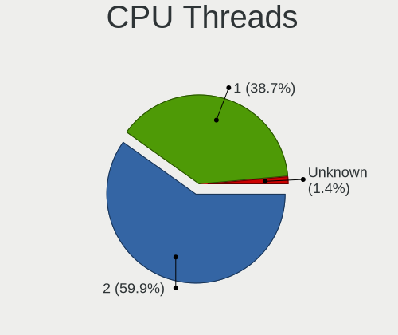

| Number  | Computers | Percent |
|---------|-----------|---------|
| 2       | 101       | 52.88%  |
| 1       | 86        | 45.03%  |
| Unknown | 4         | 2.09%   |

CPU Op-Modes
------------

CPU Operation Modes (32-bit, 64-bit)

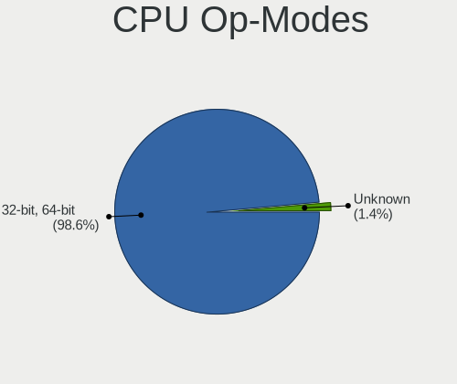

| Op mode        | Computers | Percent |
|----------------|-----------|---------|
| 32-bit, 64-bit | 187       | 98.42%  |
| Unknown        | 3         | 1.58%   |

CPU Microcode
-------------

Microcode number

| Number     | Computers | Percent |
|------------|-----------|---------|
| Unknown    | 29        | 15.18%  |
| 0x206a7    | 12        | 6.28%   |
| 0x806ea    | 10        | 5.24%   |
| 0x306c3    | 8         | 4.19%   |
| 0x05000119 | 8         | 4.19%   |
| 0x306a9    | 7         | 3.66%   |
| 0x010000c8 | 7         | 3.66%   |
| 0x806ec    | 6         | 3.14%   |
| 0x906e9    | 5         | 2.62%   |
| 0x08600106 | 5         | 2.62%   |
| 0x906ea    | 4         | 2.09%   |
| 0x506e3    | 4         | 2.09%   |
| 0x406e3    | 4         | 2.09%   |
| 0x40651    | 4         | 2.09%   |
| 0x306d4    | 4         | 2.09%   |
| 0x1067a    | 4         | 2.09%   |
| 0x806e9    | 3         | 1.57%   |
| 0x706a1    | 3         | 1.57%   |
| 0x6fd      | 3         | 1.57%   |
| 0x506c9    | 3         | 1.57%   |
| 0x03000027 | 3         | 1.57%   |
| 0xf47      | 2         | 1.05%   |
| 0xa0652    | 2         | 1.05%   |
| 0x806c1    | 2         | 1.05%   |
| 0x706e5    | 2         | 1.05%   |
| 0x406c4    | 2         | 1.05%   |
| 0x406c3    | 2         | 1.05%   |
| 0x30678    | 2         | 1.05%   |
| 0x10676    | 2         | 1.05%   |
| 0x0a50000c | 2         | 1.05%   |
| 0x08701021 | 2         | 1.05%   |
| 0x08608103 | 2         | 1.05%   |
| 0x08108109 | 2         | 1.05%   |
| 0x08108102 | 2         | 1.05%   |
| 0x06001119 | 2         | 1.05%   |
| 0x02000057 | 2         | 1.05%   |
| 0x010000dc | 2         | 1.05%   |
| 0xf49      | 1         | 0.52%   |
| 0xf41      | 1         | 0.52%   |
| 0xa0655    | 1         | 0.52%   |

CPU Microarch
-------------

Microarchitecture

| Name             | Computers | Percent |
|------------------|-----------|---------|
| KabyLake         | 33        | 17.37%  |
| Haswell          | 15        | 7.89%   |
| SandyBridge      | 13        | 6.84%   |
| K10              | 13        | 6.84%   |
| Zen 2            | 10        | 5.26%   |
| Skylake          | 10        | 5.26%   |
| Bobcat           | 8         | 4.21%   |
| IvyBridge        | 7         | 3.68%   |
| Silvermont       | 6         | 3.16%   |
| Penryn           | 6         | 3.16%   |
| Zen+             | 5         | 2.63%   |
| K8 Hammer        | 5         | 2.63%   |
| Goldmont plus    | 5         | 2.63%   |
| Core             | 5         | 2.63%   |
| Piledriver       | 4         | 2.11%   |
| NetBurst         | 4         | 2.11%   |
| K10 Llano        | 4         | 2.11%   |
| IceLake          | 4         | 2.11%   |
| Broadwell        | 4         | 2.11%   |
| Unknown          | 4         | 2.11%   |
| Zen              | 3         | 1.58%   |
| TigerLake        | 3         | 1.58%   |
| K8 & K10 hybrid  | 3         | 1.58%   |
| Goldmont         | 3         | 1.58%   |
| CometLake        | 3         | 1.58%   |
| Zen 3            | 2         | 1.05%   |
| Westmere         | 2         | 1.05%   |
| Steamroller      | 1         | 0.53%   |
| Puma             | 1         | 0.53%   |
| Nehalem          | 1         | 0.53%   |
| Bulldozer        | 1         | 0.53%   |
| Bonnell          | 1         | 0.53%   |
| Alderlake Hybrid | 1         | 0.53%   |

Graphics
--------

GPU Vendor
----------

Vendors of graphics cards

| Vendor | Computers | Percent |
|--------|-----------|---------|
| Intel  | 101       | 45.7%   |
| Nvidia | 60        | 27.15%  |
| AMD    | 60        | 27.15%  |

GPU Model
---------

Graphics card models

| Model                                                                                    | Computers | Percent |
|------------------------------------------------------------------------------------------|-----------|---------|
| Intel 2nd Generation Core Processor Family Integrated Graphics Controller                | 12        | 5.26%   |
| Intel UHD Graphics 620                                                                   | 10        | 4.39%   |
| AMD Renoir                                                                               | 7         | 3.07%   |
| Intel CoffeeLake-H GT2 [UHD Graphics 630]                                                | 6         | 2.63%   |
| Intel WhiskeyLake-U GT2 [UHD Graphics 620]                                               | 5         | 2.19%   |
| Intel Haswell-ULT Integrated Graphics Controller                                         | 5         | 2.19%   |
| AMD Picasso/Raven 2 [Radeon Vega Series / Radeon Vega Mobile Series]                     | 5         | 2.19%   |
| Intel Skylake GT2 [HD Graphics 520]                                                      | 4         | 1.75%   |
| Intel HD Graphics 620                                                                    | 4         | 1.75%   |
| Intel HD Graphics 5500                                                                   | 4         | 1.75%   |
| Intel Atom/Celeron/Pentium Processor x5-E8000/J3xxx/N3xxx Integrated Graphics Controller | 4         | 1.75%   |
| Intel 4th Gen Core Processor Integrated Graphics Controller                              | 4         | 1.75%   |
| Nvidia GP108M [GeForce MX150]                                                            | 3         | 1.32%   |
| Nvidia GP107M [GeForce GTX 1050 Ti Mobile]                                               | 3         | 1.32%   |
| Nvidia GF117M [GeForce 610M/710M/810M/820M / GT 620M/625M/630M/720M]                     | 3         | 1.32%   |
| Nvidia GF108 [GeForce GT 630]                                                            | 3         | 1.32%   |
| Intel TigerLake-LP GT2 [Iris Xe Graphics]                                                | 3         | 1.32%   |
| Intel Iris Plus Graphics G1 (Ice Lake)                                                   | 3         | 1.32%   |
| Intel HD Graphics 630                                                                    | 3         | 1.32%   |
| Intel GeminiLake [UHD Graphics 605]                                                      | 3         | 1.32%   |
| Intel CometLake-U GT2 [UHD Graphics]                                                     | 3         | 1.32%   |
| Intel 3rd Gen Core processor Graphics Controller                                         | 3         | 1.32%   |
| AMD Wrestler [Radeon HD 7310]                                                            | 3         | 1.32%   |
| AMD Wrestler [Radeon HD 6320]                                                            | 3         | 1.32%   |
| AMD Ellesmere [Radeon RX 470/480/570/570X/580/580X/590]                                  | 3         | 1.32%   |
| Nvidia TU117M                                                                            | 2         | 0.88%   |
| Nvidia GP107M [GeForce GTX 1050 Mobile]                                                  | 2         | 0.88%   |
| Nvidia GP106 [GeForce GTX 1060 6GB]                                                      | 2         | 0.88%   |
| Nvidia GM204 [GeForce GTX 970]                                                           | 2         | 0.88%   |
| Nvidia GM108M [GeForce MX130]                                                            | 2         | 0.88%   |
| Nvidia GF108 [GeForce GT 730]                                                            | 2         | 0.88%   |
| Nvidia GF108 [GeForce GT 440]                                                            | 2         | 0.88%   |
| Nvidia C77 [GeForce 8200M G]                                                             | 2         | 0.88%   |
| Intel Mobile 4 Series Chipset Integrated Graphics Controller                             | 2         | 0.88%   |
| Intel HD Graphics 530                                                                    | 2         | 0.88%   |
| Intel HD Graphics 500                                                                    | 2         | 0.88%   |
| Intel GeminiLake [UHD Graphics 600]                                                      | 2         | 0.88%   |
| Intel Core Processor Integrated Graphics Controller                                      | 2         | 0.88%   |
| Intel Atom Processor Z36xxx/Z37xxx Series Graphics & Display                             | 2         | 0.88%   |
| Intel 4 Series Chipset Integrated Graphics Controller                                    | 2         | 0.88%   |

GPU Combo
---------

Combinations of graphics cards

| Name           | Computers | Percent |
|----------------|-----------|---------|
| 1 x Intel      | 73        | 38.02%  |
| 1 x AMD        | 49        | 25.52%  |
| 1 x Nvidia     | 34        | 17.71%  |
| Intel + Nvidia | 24        | 12.5%   |
| 2 x AMD        | 6         | 3.13%   |
| Intel + AMD    | 3         | 1.56%   |
| AMD + Nvidia   | 2         | 1.04%   |
| Other          | 1         | 0.52%   |

GPU Driver
----------

Free vs proprietary

| Driver      | Computers | Percent |
|-------------|-----------|---------|
| Free        | 159       | 80.71%  |
| Proprietary | 26        | 13.2%   |
| Unknown     | 12        | 6.09%   |

GPU Memory
----------

Total video memory

| Size in GB | Computers | Percent |
|------------|-----------|---------|
| Unknown    | 88        | 44.22%  |
| 0.01-0.5   | 42        | 21.11%  |
| 1.01-2.0   | 38        | 19.1%   |
| 3.01-4.0   | 15        | 7.54%   |
| 0.51-1.0   | 11        | 5.53%   |
| 7.01-8.0   | 2         | 1.01%   |
| 5.01-6.0   | 2         | 1.01%   |
| 2.01-3.0   | 1         | 0.5%    |

Monitor
-------

Monitor Vendor
--------------

Monitor vendors

| Vendor                  | Computers | Percent |
|-------------------------|-----------|---------|
| AU Optronics            | 32        | 15.84%  |
| Samsung Electronics     | 30        | 14.85%  |
| LG Display              | 20        | 9.9%    |
| Chimei Innolux          | 20        | 9.9%    |
| Goldstar                | 16        | 7.92%   |
| Philips                 | 15        | 7.43%   |
| BOE                     | 12        | 5.94%   |
| Dell                    | 9         | 4.46%   |
| Acer                    | 8         | 3.96%   |
| AOC                     | 6         | 2.97%   |
| Chi Mei Optoelectronics | 5         | 2.48%   |
| InfoVision              | 4         | 1.98%   |
| Hewlett-Packard         | 4         | 1.98%   |
| Sharp                   | 3         | 1.49%   |
| Lenovo                  | 3         | 1.49%   |
| CSO                     | 2         | 0.99%   |
| BenQ                    | 2         | 0.99%   |
| ViewSonic               | 1         | 0.5%    |
| Valve                   | 1         | 0.5%    |
| Toshiba                 | 1         | 0.5%    |
| Plain Tree Systems      | 1         | 0.5%    |
| PANDA                   | 1         | 0.5%    |
| Medion                  | 1         | 0.5%    |
| KTC                     | 1         | 0.5%    |
| Hitachi                 | 1         | 0.5%    |
| HannStar                | 1         | 0.5%    |
| ASUSTek Computer        | 1         | 0.5%    |
| Ancor Communications    | 1         | 0.5%    |

Monitor Model
-------------

Monitor models

| Model                                                                  | Computers | Percent |
|------------------------------------------------------------------------|-----------|---------|
| AU Optronics LCD Monitor AUO21ED 1920x1080 344x193mm 15.5-inch         | 4         | 1.95%   |
| LG Display LCD Monitor LGD0563 1920x1080 344x194mm 15.5-inch           | 3         | 1.46%   |
| Chimei Innolux LCD Monitor CMN15F5 1920x1080 344x193mm 15.5-inch       | 3         | 1.46%   |
| AU Optronics LCD Monitor AUO46EC 1366x768 344x193mm 15.5-inch          | 3         | 1.46%   |
| AU Optronics LCD Monitor AUO38ED 1920x1080 344x193mm 15.5-inch         | 3         | 1.46%   |
| Samsung Electronics SyncMaster SAM0108 1280x1024 312x234mm 15.4-inch   | 2         | 0.98%   |
| Philips 223E PHLC049 1920x1080 476x268mm 21.5-inch                     | 2         | 0.98%   |
| InfoVision LCD Monitor IVO057D 1920x1080 309x174mm 14.0-inch           | 2         | 0.98%   |
| Hewlett-Packard E243 HPN3468 1920x1080 530x300mm 24.0-inch             | 2         | 0.98%   |
| Goldstar LG ULTRAWIDE GSM59F1 2560x1080 670x280mm 28.6-inch            | 2         | 0.98%   |
| Chimei Innolux LCD Monitor CMN15E7 1920x1080 344x193mm 15.5-inch       | 2         | 0.98%   |
| Chimei Innolux LCD Monitor CMN15AB 1366x768 344x194mm 15.5-inch        | 2         | 0.98%   |
| BOE LCD Monitor BOE085E 1920x1080 344x194mm 15.5-inch                  | 2         | 0.98%   |
| BOE LCD Monitor BOE0747 1920x1080 344x194mm 15.5-inch                  | 2         | 0.98%   |
| AU Optronics LCD Monitor AUO26EC 1366x768 344x193mm 15.5-inch          | 2         | 0.98%   |
| AOC 2369M AOC2369 1920x1080 509x286mm 23.0-inch                        | 2         | 0.98%   |
| ViewSonic VA521-1 VSCF318 1024x768 304x228mm 15.0-inch                 | 1         | 0.49%   |
| Valve ANX7530 U VLV3001 800x1280 100x150mm 7.1-inch                    | 1         | 0.49%   |
| Toshiba TV TSB0108 1360x768 580x320mm 26.1-inch                        | 1         | 0.49%   |
| Sharp LQ156M1JW01 SHP14C3 1920x1080 344x194mm 15.5-inch                | 1         | 0.49%   |
| Sharp LCD Monitor SHP149A 1920x1080 344x194mm 15.5-inch                | 1         | 0.49%   |
| Sharp LCD Monitor SHP13CF 1280x800 331x207mm 15.4-inch                 | 1         | 0.49%   |
| Samsung Electronics U28H75x SAM0DFE 3840x2160 608x345mm 27.5-inch      | 1         | 0.49%   |
| Samsung Electronics SyncMaster SAM03D1 1680x1050 433x271mm 20.1-inch   | 1         | 0.49%   |
| Samsung Electronics SyncMaster SAM036F 1440x900 428x255mm 19.6-inch    | 1         | 0.49%   |
| Samsung Electronics SyncMaster SAM036E 1280x1024 380x300mm 19.1-inch   | 1         | 0.49%   |
| Samsung Electronics SyncMaster SAM02AD 1440x900 410x257mm 19.1-inch    | 1         | 0.49%   |
| Samsung Electronics SyncMaster SAM0285 1440x900 410x257mm 19.1-inch    | 1         | 0.49%   |
| Samsung Electronics SyncMaster SAM022B 1280x1024 340x270mm 17.1-inch   | 1         | 0.49%   |
| Samsung Electronics SyncMaster SAM0213 1680x1050 408x306mm 20.1-inch   | 1         | 0.49%   |
| Samsung Electronics SyncMaster SAM01E1 1280x1024 380x300mm 19.1-inch   | 1         | 0.49%   |
| Samsung Electronics SyncMaster SAM0088 1024x768 304x228mm 15.0-inch    | 1         | 0.49%   |
| Samsung Electronics SMB2440 SAM06AF 1920x1080 531x299mm 24.0-inch      | 1         | 0.49%   |
| Samsung Electronics SMB2030 SAM063D 1600x900 443x249mm 20.0-inch       | 1         | 0.49%   |
| Samsung Electronics S27F358 SAM0D73 1920x1080 598x336mm 27.0-inch      | 1         | 0.49%   |
| Samsung Electronics S22E391 SAM0C0D 1920x1080 477x268mm 21.5-inch      | 1         | 0.49%   |
| Samsung Electronics S22D300 SAM0B3F 1920x1080 477x268mm 21.5-inch      | 1         | 0.49%   |
| Samsung Electronics S19D300 SAM0B34 1366x768 410x230mm 18.5-inch       | 1         | 0.49%   |
| Samsung Electronics S/T 77E/76E STN0005 1280x1024 312x234mm 15.4-inch  | 1         | 0.49%   |
| Samsung Electronics S/T 77/76BDF STN0007 1280x1024 312x234mm 15.4-inch | 1         | 0.49%   |

Monitor Resolution
------------------

Monitor screen resolution

| Resolution         | Computers | Percent |
|--------------------|-----------|---------|
| 1920x1080 (FHD)    | 81        | 42.19%  |
| 1366x768 (WXGA)    | 48        | 25%     |
| 1600x900 (HD+)     | 13        | 6.77%   |
| 1280x1024 (SXGA)   | 12        | 6.25%   |
| 2560x1440 (QHD)    | 8         | 4.17%   |
| 1680x1050 (WSXGA+) | 5         | 2.6%    |
| 1440x900 (WXGA+)   | 5         | 2.6%    |
| 3840x2160 (4K)     | 4         | 2.08%   |
| 1280x800 (WXGA)    | 3         | 1.56%   |
| 2560x1600          | 2         | 1.04%   |
| 2560x1080          | 2         | 1.04%   |
| 1600x1200          | 2         | 1.04%   |
| 1024x768 (XGA)     | 2         | 1.04%   |
| 800x1280           | 1         | 0.52%   |
| 3456x2160          | 1         | 0.52%   |
| 2160x1440          | 1         | 0.52%   |
| 1920x540           | 1         | 0.52%   |
| 1360x768           | 1         | 0.52%   |

Monitor Diagonal
----------------

Diagonal size in inches

| Inches | Computers | Percent |
|--------|-----------|---------|
| 15     | 87        | 42.65%  |
| 23     | 14        | 6.86%   |
| 24     | 13        | 6.37%   |
| 27     | 11        | 5.39%   |
| 21     | 11        | 5.39%   |
| 19     | 11        | 5.39%   |
| 17     | 11        | 5.39%   |
| 14     | 10        | 4.9%    |
| 20     | 8         | 3.92%   |
| 18     | 6         | 2.94%   |
| 13     | 6         | 2.94%   |
| 11     | 4         | 1.96%   |
| 34     | 2         | 0.98%   |
| 16     | 2         | 0.98%   |
| 12     | 2         | 0.98%   |
| 84     | 1         | 0.49%   |
| 72     | 1         | 0.49%   |
| 32     | 1         | 0.49%   |
| 31     | 1         | 0.49%   |
| 22     | 1         | 0.49%   |
| 7      | 1         | 0.49%   |

Monitor Width
-------------

Physical width

| Width in mm | Computers | Percent |
|-------------|-----------|---------|
| 301-350     | 106       | 52.48%  |
| 501-600     | 35        | 17.33%  |
| 401-500     | 31        | 15.35%  |
| 351-400     | 13        | 6.44%   |
| 201-300     | 9         | 4.46%   |
| 701-800     | 3         | 1.49%   |
| 601-700     | 2         | 0.99%   |
| 1501-2000   | 2         | 0.99%   |
| 1-100       | 1         | 0.5%    |

Aspect Ratio
------------

Proportional relationship between the width and the height

| Ratio | Computers | Percent |
|-------|-----------|---------|
| 16/9  | 146       | 80.22%  |
| 16/10 | 14        | 7.69%   |
| 5/4   | 10        | 5.49%   |
| 4/3   | 7         | 3.85%   |
| 3/2   | 2         | 1.1%    |
| 21/9  | 2         | 1.1%    |
| 0.67  | 1         | 0.55%   |

Monitor Area
------------

Area in inch

| Area in inch | Computers | Percent |
|----------------|-----------|---------|
| 101-110        | 83        | 40.89%  |
| 201-250        | 35        | 17.24%  |
| 151-200        | 23        | 11.33%  |
| 81-90          | 14        | 6.9%    |
| 301-350        | 11        | 5.42%   |
| 141-150        | 10        | 4.93%   |
| 111-120        | 6         | 2.96%   |
| 51-60          | 4         | 1.97%   |
| 351-500        | 4         | 1.97%   |
| 121-130        | 4         | 1.97%   |
| More than 1000 | 2         | 0.99%   |
| 71-80          | 2         | 0.99%   |
| 61-70          | 2         | 0.99%   |
| 131-140        | 2         | 0.99%   |
| 1-40           | 1         | 0.49%   |

Pixel Density
-------------

Pixels per inch

| Density       | Computers | Percent |
|---------------|-----------|---------|
| 51-100        | 71        | 35.68%  |
| 121-160       | 61        | 30.65%  |
| 101-120       | 58        | 29.15%  |
| 161-240       | 6         | 3.02%   |
| More than 240 | 2         | 1.01%   |
| 1-50          | 1         | 0.5%    |

Multiple Monitors
-----------------

Total monitors connected

| Total | Computers | Percent |
|-------|-----------|---------|
| 1     | 165       | 85.94%  |
| 2     | 23        | 11.98%  |
| 0     | 4         | 2.08%   |

Network
-------

Net Controller Vendor
---------------------

Controller vendors

| Vendor                            | Computers | Percent |
|-----------------------------------|-----------|---------|
| Realtek Semiconductor             | 124       | 44.93%  |
| Intel                             | 59        | 21.38%  |
| Qualcomm Atheros                  | 44        | 15.94%  |
| Broadcom                          | 12        | 4.35%   |
| Nvidia                            | 8         | 2.9%    |
| Xiaomi                            | 4         | 1.45%   |
| Ralink                            | 4         | 1.45%   |
| Broadcom Limited                  | 4         | 1.45%   |
| TP-Link                           | 2         | 0.72%   |
| MediaTek                          | 2         | 0.72%   |
| Marvell Technology Group          | 2         | 0.72%   |
| Sierra Wireless                   | 1         | 0.36%   |
| OnePlus Technology (Shenzhen)     | 1         | 0.36%   |
| Mercucys                          | 1         | 0.36%   |
| JMicron Technology                | 1         | 0.36%   |
| ICS Advent                        | 1         | 0.36%   |
| Huawei Technologies               | 1         | 0.36%   |
| Hewlett-Packard                   | 1         | 0.36%   |
| Ericsson Business Mobile Networks | 1         | 0.36%   |
| D-Link System                     | 1         | 0.36%   |
| D-Link                            | 1         | 0.36%   |
| ASIX Electronics                  | 1         | 0.36%   |

Net Controller Model
--------------------

Controller models

| Model                                                                   | Computers | Percent |
|-------------------------------------------------------------------------|-----------|---------|
| Realtek RTL8111/8168/8411 PCI Express Gigabit Ethernet Controller       | 89        | 28.08%  |
| Realtek RTL810xE PCI Express Fast Ethernet controller                   | 21        | 6.62%   |
| Qualcomm Atheros QCA9565 / AR9565 Wireless Network Adapter              | 9         | 2.84%   |
| Qualcomm Atheros QCA9377 802.11ac Wireless Network Adapter              | 9         | 2.84%   |
| Realtek RTL8821CE 802.11ac PCIe Wireless Network Adapter                | 8         | 2.52%   |
| Qualcomm Atheros AR9285 Wireless Network Adapter (PCI-Express)          | 8         | 2.52%   |
| Intel Wireless 8265 / 8275                                              | 8         | 2.52%   |
| Realtek RTL8822CE 802.11ac PCIe Wireless Network Adapter                | 5         | 1.58%   |
| Qualcomm Atheros AR9485 Wireless Network Adapter                        | 5         | 1.58%   |
| Intel Wi-Fi 6 AX200                                                     | 5         | 1.58%   |
| Xiaomi Mi/Redmi series (RNDIS)                                          | 4         | 1.26%   |
| Broadcom BCM4313 802.11bgn Wireless Network Adapter                     | 4         | 1.26%   |
| Realtek RTL8723BE PCIe Wireless Network Adapter                         | 3         | 0.95%   |
| Realtek RTL8188EE Wireless Network Adapter                              | 3         | 0.95%   |
| Qualcomm Atheros AR8151 v2.0 Gigabit Ethernet                           | 3         | 0.95%   |
| Nvidia MCP77 Ethernet                                                   | 3         | 0.95%   |
| Nvidia MCP61 Ethernet                                                   | 3         | 0.95%   |
| Intel Wireless 7260                                                     | 3         | 0.95%   |
| Intel Wi-Fi 6 AX201                                                     | 3         | 0.95%   |
| Intel Ethernet Connection I218-LM                                       | 3         | 0.95%   |
| Intel Dual Band Wireless-AC 3168NGW [Stone Peak]                        | 3         | 0.95%   |
| Intel Comet Lake PCH-LP CNVi WiFi                                       | 3         | 0.95%   |
| Intel Cannon Lake PCH CNVi WiFi                                         | 3         | 0.95%   |
| TP-Link TL-WN722N v2/v3 [Realtek RTL8188EUS]                            | 2         | 0.63%   |
| Realtek RTL8822BE 802.11a/b/g/n/ac WiFi adapter                         | 2         | 0.63%   |
| Realtek RTL8188CE 802.11b/g/n WiFi Adapter                              | 2         | 0.63%   |
| Realtek RTL8125 2.5GbE Controller                                       | 2         | 0.63%   |
| Qualcomm Atheros AR242x / AR542x Wireless Network Adapter (PCI-Express) | 2         | 0.63%   |
| Intel Wireless 8260                                                     | 2         | 0.63%   |
| Intel Wireless 7265                                                     | 2         | 0.63%   |
| Intel PRO/Wireless 4965 AG or AGN [Kedron] Network Connection           | 2         | 0.63%   |
| Intel I211 Gigabit Network Connection                                   | 2         | 0.63%   |
| Intel Ethernet Connection I217-V                                        | 2         | 0.63%   |
| Intel Ethernet Connection (3) I218-V                                    | 2         | 0.63%   |
| Intel Ethernet Connection (2) I219-V                                    | 2         | 0.63%   |
| Intel Dual Band Wireless-AC 3165 Plus Bluetooth                         | 2         | 0.63%   |
| Intel Comet Lake PCH CNVi WiFi                                          | 2         | 0.63%   |
| Intel Cannon Point-LP CNVi [Wireless-AC]                                | 2         | 0.63%   |
| Intel 82579LM Gigabit Network Connection (Lewisville)                   | 2         | 0.63%   |
| Broadcom NetLink BCM57785 Gigabit Ethernet PCIe                         | 2         | 0.63%   |

Wireless Vendor
---------------

Wireless vendors

| Vendor                | Computers | Percent |
|-----------------------|-----------|---------|
| Intel                 | 49        | 35%     |
| Qualcomm Atheros      | 38        | 27.14%  |
| Realtek Semiconductor | 31        | 22.14%  |
| Broadcom              | 9         | 6.43%   |
| Ralink                | 4         | 2.86%   |
| TP-Link               | 2         | 1.43%   |
| Sierra Wireless       | 1         | 0.71%   |
| Mercucys              | 1         | 0.71%   |
| MediaTek              | 1         | 0.71%   |
| Hewlett-Packard       | 1         | 0.71%   |
| D-Link System         | 1         | 0.71%   |
| D-Link                | 1         | 0.71%   |
| Broadcom Limited      | 1         | 0.71%   |

Wireless Model
--------------

Wireless models

| Model                                                                   | Computers | Percent |
|-------------------------------------------------------------------------|-----------|---------|
| Qualcomm Atheros QCA9565 / AR9565 Wireless Network Adapter              | 9         | 6.43%   |
| Qualcomm Atheros QCA9377 802.11ac Wireless Network Adapter              | 9         | 6.43%   |
| Realtek RTL8821CE 802.11ac PCIe Wireless Network Adapter                | 8         | 5.71%   |
| Qualcomm Atheros AR9285 Wireless Network Adapter (PCI-Express)          | 8         | 5.71%   |
| Intel Wireless 8265 / 8275                                              | 8         | 5.71%   |
| Realtek RTL8822CE 802.11ac PCIe Wireless Network Adapter                | 5         | 3.57%   |
| Qualcomm Atheros AR9485 Wireless Network Adapter                        | 5         | 3.57%   |
| Intel Wi-Fi 6 AX200                                                     | 5         | 3.57%   |
| Broadcom BCM4313 802.11bgn Wireless Network Adapter                     | 4         | 2.86%   |
| Realtek RTL8723BE PCIe Wireless Network Adapter                         | 3         | 2.14%   |
| Realtek RTL8188EE Wireless Network Adapter                              | 3         | 2.14%   |
| Intel Wireless 7260                                                     | 3         | 2.14%   |
| Intel Wi-Fi 6 AX201                                                     | 3         | 2.14%   |
| Intel Dual Band Wireless-AC 3168NGW [Stone Peak]                        | 3         | 2.14%   |
| Intel Comet Lake PCH-LP CNVi WiFi                                       | 3         | 2.14%   |
| Intel Cannon Lake PCH CNVi WiFi                                         | 3         | 2.14%   |
| TP-Link TL-WN722N v2/v3 [Realtek RTL8188EUS]                            | 2         | 1.43%   |
| Realtek RTL8822BE 802.11a/b/g/n/ac WiFi adapter                         | 2         | 1.43%   |
| Realtek RTL8188CE 802.11b/g/n WiFi Adapter                              | 2         | 1.43%   |
| Qualcomm Atheros AR242x / AR542x Wireless Network Adapter (PCI-Express) | 2         | 1.43%   |
| Intel Wireless 8260                                                     | 2         | 1.43%   |
| Intel Wireless 7265                                                     | 2         | 1.43%   |
| Intel PRO/Wireless 4965 AG or AGN [Kedron] Network Connection           | 2         | 1.43%   |
| Intel Dual Band Wireless-AC 3165 Plus Bluetooth                         | 2         | 1.43%   |
| Intel Comet Lake PCH CNVi WiFi                                          | 2         | 1.43%   |
| Intel Cannon Point-LP CNVi [Wireless-AC]                                | 2         | 1.43%   |
| Broadcom BCM43228 802.11a/b/g/n                                         | 2         | 1.43%   |
| Sierra Wireless EM7455                                                  | 1         | 0.71%   |
| Realtek RTL8852AE 802.11ax PCIe Wireless Network Adapter                | 1         | 0.71%   |
| Realtek RTL8821AE 802.11ac PCIe Wireless Network Adapter                | 1         | 0.71%   |
| Realtek RTL8812AE 802.11ac PCIe Wireless Network Adapter                | 1         | 0.71%   |
| Realtek RTL8723DE Wireless Network Adapter                              | 1         | 0.71%   |
| Realtek RTL8192CU 802.11n WLAN Adapter                                  | 1         | 0.71%   |
| Realtek RTL8188EUS 802.11n Wireless Network Adapter                     | 1         | 0.71%   |
| Realtek RTL8187B Wireless Adapter                                       | 1         | 0.71%   |
| Realtek 802.11ac NIC                                                    | 1         | 0.71%   |
| Ralink RT5390 [802.11 b/g/n 1T1R G-band PCI Express Single Chip]        | 1         | 0.71%   |
| Ralink RT5390 Wireless 802.11n 1T/1R PCIe                               | 1         | 0.71%   |
| Ralink RT3090 Wireless 802.11n 1T/1R PCIe                               | 1         | 0.71%   |
| Ralink RT3060 Wireless 802.11n 1T/1R                                    | 1         | 0.71%   |

Ethernet Vendor
---------------

Ethernet vendors

| Vendor                   | Computers | Percent |
|--------------------------|-----------|---------|
| Realtek Semiconductor    | 114       | 65.9%   |
| Intel                    | 26        | 15.03%  |
| Qualcomm Atheros         | 8         | 4.62%   |
| Nvidia                   | 8         | 4.62%   |
| Xiaomi                   | 4         | 2.31%   |
| Broadcom Limited         | 3         | 1.73%   |
| Broadcom                 | 3         | 1.73%   |
| Marvell Technology Group | 2         | 1.16%   |
| MediaTek                 | 1         | 0.58%   |
| JMicron Technology       | 1         | 0.58%   |
| ICS Advent               | 1         | 0.58%   |
| Huawei Technologies      | 1         | 0.58%   |
| ASIX Electronics         | 1         | 0.58%   |

Ethernet Model
--------------

Ethernet models

| Model                                                                          | Computers | Percent |
|--------------------------------------------------------------------------------|-----------|---------|
| Realtek RTL8111/8168/8411 PCI Express Gigabit Ethernet Controller              | 89        | 50.86%  |
| Realtek RTL810xE PCI Express Fast Ethernet controller                          | 21        | 12%     |
| Xiaomi Mi/Redmi series (RNDIS)                                                 | 4         | 2.29%   |
| Qualcomm Atheros AR8151 v2.0 Gigabit Ethernet                                  | 3         | 1.71%   |
| Nvidia MCP77 Ethernet                                                          | 3         | 1.71%   |
| Nvidia MCP61 Ethernet                                                          | 3         | 1.71%   |
| Intel Ethernet Connection I218-LM                                              | 3         | 1.71%   |
| Realtek RTL8125 2.5GbE Controller                                              | 2         | 1.14%   |
| Intel I211 Gigabit Network Connection                                          | 2         | 1.14%   |
| Intel Ethernet Connection I217-V                                               | 2         | 1.14%   |
| Intel Ethernet Connection (3) I218-V                                           | 2         | 1.14%   |
| Intel Ethernet Connection (2) I219-V                                           | 2         | 1.14%   |
| Intel 82579LM Gigabit Network Connection (Lewisville)                          | 2         | 1.14%   |
| Broadcom NetLink BCM57785 Gigabit Ethernet PCIe                                | 2         | 1.14%   |
| Realtek RTL8169 PCI Gigabit Ethernet Controller                                | 1         | 0.57%   |
| Realtek RTL8153 Gigabit Ethernet Adapter                                       | 1         | 0.57%   |
| Realtek RTL8152 Fast Ethernet Adapter                                          | 1         | 0.57%   |
| Qualcomm Atheros QCA8172 Fast Ethernet                                         | 1         | 0.57%   |
| Qualcomm Atheros AR8161 Gigabit Ethernet                                       | 1         | 0.57%   |
| Qualcomm Atheros AR8132 Fast Ethernet                                          | 1         | 0.57%   |
| Qualcomm Atheros AR8131 Gigabit Ethernet                                       | 1         | 0.57%   |
| Qualcomm Atheros AR8121/AR8113/AR8114 Gigabit or Fast Ethernet                 | 1         | 0.57%   |
| Nvidia MCP67 Ethernet                                                          | 1         | 0.57%   |
| Nvidia MCP55 Ethernet                                                          | 1         | 0.57%   |
| MediaTek N152DL                                                                | 1         | 0.57%   |
| Marvell Group Yukon Optima 88E8059 [PCIe Gigabit Ethernet Controller with AVB] | 1         | 0.57%   |
| Marvell Group 88E8053 PCI-E Gigabit Ethernet Controller                        | 1         | 0.57%   |
| JMicron JMC250 PCI Express Gigabit Ethernet Controller                         | 1         | 0.57%   |
| Intel NM10/ICH7 Family LAN Controller                                          | 1         | 0.57%   |
| Intel Ethernet Connection I219-V                                               | 1         | 0.57%   |
| Intel Ethernet Connection I219-LM                                              | 1         | 0.57%   |
| Intel Ethernet Connection (7) I219-LM                                          | 1         | 0.57%   |
| Intel Ethernet Connection (6) I219-V                                           | 1         | 0.57%   |
| Intel Ethernet Connection (5) I219-V                                           | 1         | 0.57%   |
| Intel Ethernet Connection (4) I219-V                                           | 1         | 0.57%   |
| Intel Ethernet Connection (4) I219-LM                                          | 1         | 0.57%   |
| Intel Ethernet Connection (2) I218-V                                           | 1         | 0.57%   |
| Intel Ethernet Connection (11) I219-V                                          | 1         | 0.57%   |
| Intel Ethernet Connection (10) I219-LM                                         | 1         | 0.57%   |
| Intel 82579V Gigabit Network Connection                                        | 1         | 0.57%   |

Net Controller Kind
-------------------

Ethernet, WiFi or modem

| Kind     | Computers | Percent |
|----------|-----------|---------|
| Ethernet | 169       | 55.05%  |
| WiFi     | 136       | 44.3%   |
| Modem    | 1         | 0.33%   |
| Unknown  | 1         | 0.33%   |

Used Controller
---------------

Currently used network controller

| Kind     | Computers | Percent |
|----------|-----------|---------|
| WiFi     | 101       | 52.33%  |
| Ethernet | 92        | 47.67%  |

NICs
----

Total network controllers on board

| Total | Computers | Percent |
|-------|-----------|---------|
| 2     | 106       | 55.79%  |
| 1     | 84        | 44.21%  |

IPv6
----

IPv6 vs IPv4

| Used | Computers | Percent |
|------|-----------|---------|
| No   | 183       | 96.32%  |
| Yes  | 7         | 3.68%   |

Bluetooth
---------

Bluetooth Vendor
----------------

Controller vendors

| Vendor                          | Computers | Percent |
|---------------------------------|-----------|---------|
| Intel                           | 40        | 40.4%   |
| IMC Networks                    | 13        | 13.13%  |
| Qualcomm Atheros Communications | 12        | 12.12%  |
| Realtek Semiconductor           | 11        | 11.11%  |
| Broadcom                        | 6         | 6.06%   |
| Lite-On Technology              | 5         | 5.05%   |
| Foxconn / Hon Hai               | 3         | 3.03%   |
| Cambridge Silicon Radio         | 2         | 2.02%   |
| Toshiba                         | 1         | 1.01%   |
| Realtek                         | 1         | 1.01%   |
| Ralink Technology               | 1         | 1.01%   |
| Integrated System Solution      | 1         | 1.01%   |
| Hewlett-Packard                 | 1         | 1.01%   |
| Dell                            | 1         | 1.01%   |
| ASUSTek Computer                | 1         | 1.01%   |

Bluetooth Model
---------------

Controller models

| Model                                                                               | Computers | Percent |
|-------------------------------------------------------------------------------------|-----------|---------|
| Intel Bluetooth wireless interface                                                  | 16        | 16.16%  |
| Realtek Bluetooth Radio                                                             | 11        | 11.11%  |
| Intel Bluetooth 9460/9560 Jefferson Peak (JfP)                                      | 8         | 8.08%   |
| Intel AX201 Bluetooth                                                               | 8         | 8.08%   |
| IMC Networks Bluetooth Radio                                                        | 7         | 7.07%   |
| Qualcomm Atheros  Bluetooth Device                                                  | 5         | 5.05%   |
| Intel AX200 Bluetooth                                                               | 5         | 5.05%   |
| IMC Networks Bluetooth Device                                                       | 4         | 4.04%   |
| Lite-On Qualcomm Atheros QCA9377 Bluetooth                                          | 3         | 3.03%   |
| Intel Wireless-AC 3168 Bluetooth                                                    | 3         | 3.03%   |
| Qualcomm Atheros AR3012 Bluetooth 4.0                                               | 2         | 2.02%   |
| Qualcomm Atheros AR3011 Bluetooth                                                   | 2         | 2.02%   |
| Cambridge Silicon Radio Bluetooth Dongle (HCI mode)                                 | 2         | 2.02%   |
| Broadcom BCM20702A0                                                                 | 2         | 2.02%   |
| Toshiba Integrated Bluetooth HCI                                                    | 1         | 1.01%   |
| Realtek Bluetooth Radio                                                             | 1         | 1.01%   |
| Ralink CSR BS8510                                                                   | 1         | 1.01%   |
| Qualcomm Atheros QCA61x4 Bluetooth 4.0                                              | 1         | 1.01%   |
| Qualcomm Atheros AR9462 Bluetooth                                                   | 1         | 1.01%   |
| Qualcomm Atheros AR3012 Bluetooth                                                   | 1         | 1.01%   |
| Lite-On Bluetooth Device                                                            | 1         | 1.01%   |
| Lite-On Atheros AR3012 Bluetooth                                                    | 1         | 1.01%   |
| Integrated System Solution Bluetooth Device                                         | 1         | 1.01%   |
| IMC Networks Bluetooth Module                                                       | 1         | 1.01%   |
| IMC Networks Atheros AR3012 Bluetooth 4.0 Adapter                                   | 1         | 1.01%   |
| HP Broadcom 2070 Bluetooth Combo                                                    | 1         | 1.01%   |
| Foxconn / Hon Hai Wireless_Device                                                   | 1         | 1.01%   |
| Foxconn / Hon Hai Foxconn T77H114 BCM2070 [Single-Chip Bluetooth 2.1 + EDR Adapter] | 1         | 1.01%   |
| Foxconn / Hon Hai Bluetooth Device                                                  | 1         | 1.01%   |
| Dell DW375 Bluetooth Module                                                         | 1         | 1.01%   |
| Broadcom HP Portable SoftSailing                                                    | 1         | 1.01%   |
| Broadcom HP Portable Bumble Bee                                                     | 1         | 1.01%   |
| Broadcom BCM92045B3 ROM                                                             | 1         | 1.01%   |
| Broadcom BCM2070 Bluetooth Device                                                   | 1         | 1.01%   |
| ASUS BCM20702A0                                                                     | 1         | 1.01%   |

Sound
-----

Sound Vendor
------------

Sound card vendors

| Vendor                    | Computers | Percent |
|---------------------------|-----------|---------|
| Intel                     | 124       | 51.45%  |
| AMD                       | 63        | 26.14%  |
| Nvidia                    | 41        | 17.01%  |
| Plantronics               | 2         | 0.83%   |
| Logitech                  | 2         | 0.83%   |
| Creative Labs             | 2         | 0.83%   |
| Texas Instruments         | 1         | 0.41%   |
| SteelSeries ApS           | 1         | 0.41%   |
| Shenzhen Rapoo Technology | 1         | 0.41%   |
| Sennheiser Communications | 1         | 0.41%   |
| Kingston Technology       | 1         | 0.41%   |
| GN Netcom                 | 1         | 0.41%   |
| C-Media Electronics       | 1         | 0.41%   |

Sound Model
-----------

Sound card models

| Model                                                                                             | Computers | Percent |
|---------------------------------------------------------------------------------------------------|-----------|---------|
| AMD SBx00 Azalia (Intel HDA)                                                                      | 20        | 6.76%   |
| Intel Sunrise Point-LP HD Audio                                                                   | 18        | 6.08%   |
| AMD Family 17h/19h HD Audio Controller                                                            | 18        | 6.08%   |
| AMD FCH Azalia Controller                                                                         | 12        | 4.05%   |
| Intel 6 Series/C200 Series Chipset Family High Definition Audio Controller                        | 11        | 3.72%   |
| AMD Renoir Radeon High Definition Audio Controller                                                | 10        | 3.38%   |
| Intel 7 Series/C216 Chipset Family High Definition Audio Controller                               | 9         | 3.04%   |
| Nvidia GF108 High Definition Audio Controller                                                     | 8         | 2.7%    |
| Intel 8 Series/C220 Series Chipset High Definition Audio Controller                               | 8         | 2.7%    |
| AMD Wrestler HDMI Audio                                                                           | 8         | 2.7%    |
| Intel NM10/ICH7 Family High Definition Audio Controller                                           | 6         | 2.03%   |
| Intel Cannon Lake PCH cAVS                                                                        | 6         | 2.03%   |
| AMD Raven/Raven2/Fenghuang HDMI/DP Audio Controller                                               | 6         | 2.03%   |
| Intel Xeon E3-1200 v3/4th Gen Core Processor HD Audio Controller                                  | 5         | 1.69%   |
| Intel Haswell-ULT HD Audio Controller                                                             | 5         | 1.69%   |
| Intel Celeron/Pentium Silver Processor High Definition Audio                                      | 5         | 1.69%   |
| Intel Cannon Point-LP High Definition Audio Controller                                            | 5         | 1.69%   |
| Intel 8 Series HD Audio Controller                                                                | 5         | 1.69%   |
| Intel 100 Series/C230 Series Chipset Family HD Audio Controller                                   | 5         | 1.69%   |
| Nvidia TU107 GeForce GTX 1650 High Definition Audio Controller                                    | 4         | 1.35%   |
| Nvidia GP107GL High Definition Audio Controller                                                   | 4         | 1.35%   |
| Intel Wildcat Point-LP High Definition Audio Controller                                           | 4         | 1.35%   |
| Intel Broadwell-U Audio Controller                                                                | 4         | 1.35%   |
| Intel Atom/Celeron/Pentium Processor x5-E8000/J3xxx/N3xxx Series High Definition Audio Controller | 4         | 1.35%   |
| Intel 200 Series PCH HD Audio                                                                     | 4         | 1.35%   |
| Nvidia MCP72XE/MCP72P/MCP78U/MCP78S High Definition Audio                                         | 3         | 1.01%   |
| Nvidia MCP61 High Definition Audio                                                                | 3         | 1.01%   |
| Nvidia GP106 High Definition Audio Controller                                                     | 3         | 1.01%   |
| Nvidia GM204 High Definition Audio Controller                                                     | 3         | 1.01%   |
| Nvidia GK208 HDMI/DP Audio Controller                                                             | 3         | 1.01%   |
| Intel Tiger Lake-LP Smart Sound Technology Audio Controller                                       | 3         | 1.01%   |
| Intel Ice Lake-LP Smart Sound Technology Audio Controller                                         | 3         | 1.01%   |
| Intel Comet Lake PCH-LP cAVS                                                                      | 3         | 1.01%   |
| Intel Comet Lake PCH cAVS                                                                         | 3         | 1.01%   |
| Intel Celeron N3350/Pentium N4200/Atom E3900 Series Audio Cluster                                 | 3         | 1.01%   |
| Intel 82801JI (ICH10 Family) HD Audio Controller                                                  | 3         | 1.01%   |
| Intel 5 Series/3400 Series Chipset High Definition Audio                                          | 3         | 1.01%   |
| AMD Trinity HDMI Audio Controller                                                                 | 3         | 1.01%   |
| AMD Starship/Matisse HD Audio Controller                                                          | 3         | 1.01%   |
| AMD Ellesmere HDMI Audio [Radeon RX 470/480 / 570/580/590]                                        | 3         | 1.01%   |

Memory
------

Memory Vendor
-------------

Memory module vendors

| Vendor              | Computers | Percent |
|---------------------|-----------|---------|
| Unknown             | 34        | 22.67%  |
| Samsung Electronics | 31        | 20.67%  |
| SK hynix            | 19        | 12.67%  |
| Kingston            | 18        | 12%     |
| Micron Technology   | 8         | 5.33%   |
| GOODRAM             | 6         | 4%      |
| Transcend           | 3         | 2%      |
| Elpida              | 3         | 2%      |
| Unknown (ABCD)      | 2         | 1.33%   |
| Ramaxel Technology  | 2         | 1.33%   |
| Patriot             | 2         | 1.33%   |
| Nanya Technology    | 2         | 1.33%   |
| G.Skill             | 2         | 1.33%   |
| Crucial             | 2         | 1.33%   |
| Corsair             | 2         | 1.33%   |
| Apacer              | 2         | 1.33%   |
| A-DATA Technology   | 2         | 1.33%   |
| Unifosa             | 1         | 0.67%   |
| Team                | 1         | 0.67%   |
| Silicon Power       | 1         | 0.67%   |
| SGS/Thomson         | 1         | 0.67%   |
| Hexon               | 1         | 0.67%   |
| Goldkey             | 1         | 0.67%   |
| Axiom               | 1         | 0.67%   |
| AVEXIR              | 1         | 0.67%   |
| ASint Technology    | 1         | 0.67%   |
| Unknown             | 1         | 0.67%   |

Memory Model
------------

Memory module models

| Model                                                            | Computers | Percent |
|------------------------------------------------------------------|-----------|---------|
| Unknown RAM Module 2048MB DIMM DDR2 333MT/s                      | 3         | 1.8%    |
| Unknown RAM Module 2048MB DIMM 1333MT/s                          | 3         | 1.8%    |
| SK hynix RAM HMT351S6CFR8C-PB 4GB SODIMM DDR3 1600MT/s           | 3         | 1.8%    |
| Unknown RAM Module 4096MB DIMM 1600MT/s                          | 2         | 1.2%    |
| Unknown RAM Module 4096MB DIMM 1333MT/s                          | 2         | 1.2%    |
| Unknown RAM Module 2048MB SODIMM DRAM 667MT/s                    | 2         | 1.2%    |
| Unknown RAM Module 2048MB DIMM DDR3 1333MT/s                     | 2         | 1.2%    |
| Unknown RAM Module 2048MB DIMM 800MT/s                           | 2         | 1.2%    |
| Unknown RAM Module 1024MB SODIMM DRAM 667MT/s                    | 2         | 1.2%    |
| Unknown RAM Module 1024MB DIMM DDR2 333MT/s                      | 2         | 1.2%    |
| Unknown (ABCD) RAM 123456789012345678 2GB SODIMM LPDDR4 2400MT/s | 2         | 1.2%    |
| Samsung RAM M471B5273CH0-CK0 4GB SODIMM DDR3 1600MT/s            | 2         | 1.2%    |
| Samsung RAM M471B5173DB0-YK0 4096MB SODIMM DDR3 1600MT/s         | 2         | 1.2%    |
| Samsung RAM M471B2873FHS-CF8 1GB SODIMM 1067MT/s                 | 2         | 1.2%    |
| Samsung RAM M471A5244CB0-CTD 4GB SODIMM DDR4 3266MT/s            | 2         | 1.2%    |
| Samsung RAM M471A1K43BB1-CRC 8GB SODIMM DDR4 2667MT/s            | 2         | 1.2%    |
| Samsung RAM M471A1G44AB0-CWE 8GB Row Of Chips DDR4 3200MT/s      | 2         | 1.2%    |
| Kingston RAM KHX1866C10D3/8G 8GB DIMM DDR3 2133MT/s              | 2         | 1.2%    |
| Unknown RAM Module 8192MB DIMM 1333MT/s                          | 1         | 0.6%    |
| Unknown RAM Module 512MB DIMM SDRAM                              | 1         | 0.6%    |
| Unknown RAM Module 4GB DIMM DDR3 1333MT/s                        | 1         | 0.6%    |
| Unknown RAM Module 4GB DIMM 667MT/s                              | 1         | 0.6%    |
| Unknown RAM Module 4GB DIMM 1333MT/s                             | 1         | 0.6%    |
| Unknown RAM Module 4096MB SODIMM DDR3 1600MT/s                   | 1         | 0.6%    |
| Unknown RAM Module 4096MB FB-DIMM DDR2 667MT/s                   | 1         | 0.6%    |
| Unknown RAM Module 4096MB DIMM DDR3 1600MT/s                     | 1         | 0.6%    |
| Unknown RAM Module 2GB SODIMM DDR3                               | 1         | 0.6%    |
| Unknown RAM Module 2GB DIMM DDR2 800MT/s                         | 1         | 0.6%    |
| Unknown RAM Module 2GB DIMM 667MT/s                              | 1         | 0.6%    |
| Unknown RAM Module 2048MB SODIMM DDR2 400MT/s                    | 1         | 0.6%    |
| Unknown RAM Module 2048MB DIMM SDRAM 800MT/s                     | 1         | 0.6%    |
| Unknown RAM Module 2048MB DIMM SDRAM                             | 1         | 0.6%    |
| Unknown RAM Module 2048MB DIMM DDR2 800MT/s                      | 1         | 0.6%    |
| Unknown RAM Module 2048MB DIMM DDR 667MT/s                       | 1         | 0.6%    |
| Unknown RAM Module 2048MB DIMM DDR 1333MT/s                      | 1         | 0.6%    |
| Unknown RAM Module 2048MB DIMM                                   | 1         | 0.6%    |
| Unknown RAM Module 1024MB DIMM SDRAM                             | 1         | 0.6%    |
| Unknown RAM Module 1024MB DIMM DDR2 667MT/s                      | 1         | 0.6%    |
| Unknown RAM Module 1024MB DIMM DDR 667MT/s                       | 1         | 0.6%    |
| Unknown RAM CL17-17-17 D4-2400 16384MB DIMM DDR4 2400MT/s        | 1         | 0.6%    |

Memory Kind
-----------

Memory module kinds

| Kind    | Computers | Percent |
|---------|-----------|---------|
| DDR3    | 48        | 35.29%  |
| DDR4    | 44        | 32.35%  |
| DDR2    | 12        | 8.82%   |
| Unknown | 11        | 8.09%   |
| SDRAM   | 10        | 7.35%   |
| LPDDR4  | 4         | 2.94%   |
| DDR     | 3         | 2.21%   |
| LPDDR3  | 2         | 1.47%   |
| DRAM    | 2         | 1.47%   |

Memory Form Factor
------------------

Physical design of the memory module

| Name         | Computers | Percent |
|--------------|-----------|---------|
| SODIMM       | 66        | 50.38%  |
| DIMM         | 57        | 43.51%  |
| Row Of Chips | 7         | 5.34%   |
| FB-DIMM      | 1         | 0.76%   |

Memory Size
-----------

Memory module size

| Size  | Computers | Percent |
|-------|-----------|---------|
| 4096  | 51        | 33.55%  |
| 2048  | 37        | 24.34%  |
| 8192  | 33        | 21.71%  |
| 16384 | 13        | 8.55%   |
| 1024  | 13        | 8.55%   |
| 32768 | 3         | 1.97%   |
| 512   | 2         | 1.32%   |

Memory Speed
------------

Memory module speed

| Speed   | Computers | Percent |
|---------|-----------|---------|
| 1600    | 35        | 24.14%  |
| 2667    | 22        | 15.17%  |
| 1333    | 17        | 11.72%  |
| 3200    | 8         | 5.52%   |
| 2133    | 7         | 4.83%   |
| 800     | 7         | 4.83%   |
| 667     | 6         | 4.14%   |
| 2400    | 5         | 3.45%   |
| 1334    | 5         | 3.45%   |
| Unknown | 4         | 2.76%   |
| 2048    | 3         | 2.07%   |
| 400     | 3         | 2.07%   |
| 333     | 3         | 2.07%   |
| 4199    | 2         | 1.38%   |
| 3600    | 2         | 1.38%   |
| 3266    | 2         | 1.38%   |
| 3000    | 2         | 1.38%   |
| 2933    | 2         | 1.38%   |
| 1067    | 2         | 1.38%   |
| 4800    | 1         | 0.69%   |
| 3500    | 1         | 0.69%   |
| 2800    | 1         | 0.69%   |
| 2666    | 1         | 0.69%   |
| 1867    | 1         | 0.69%   |
| 1400    | 1         | 0.69%   |
| 975     | 1         | 0.69%   |
| 533     | 1         | 0.69%   |

Printers & scanners
-------------------

Printer Vendor
--------------

Printer device vendors

| Vendor          | Computers | Percent |
|-----------------|-----------|---------|
| Hewlett-Packard | 2         | 40%     |
| Canon           | 2         | 40%     |
| Seiko Epson     | 1         | 20%     |

Printer Model
-------------

Printer device models

| Model                                 | Computers | Percent |
|---------------------------------------|-----------|---------|
| Seiko Epson USB2.0 Printer (Hi-speed) | 1         | 20%     |
| HP LaserJet M14-M17                   | 1         | 20%     |
| HP LaserJet 1020                      | 1         | 20%     |
| Canon LaserShot LBP-1120 Printer      | 1         | 20%     |
| Canon iP7200 series                   | 1         | 20%     |

Scanner Vendor
--------------

Scanner device vendors

| Vendor | Computers | Percent |
|--------|-----------|---------|
| Canon  | 1         | 100%    |

Scanner Model
-------------

Scanner device models

| Model                    | Computers | Percent |
|--------------------------|-----------|---------|
| Canon CanoScan LiDE 700F | 1         | 100%    |

Camera
------

Camera Vendor
-------------

Camera device vendors

| Vendor                                 | Computers | Percent |
|----------------------------------------|-----------|---------|
| Chicony Electronics                    | 27        | 21.43%  |
| IMC Networks                           | 22        | 17.46%  |
| Realtek Semiconductor                  | 12        | 9.52%   |
| Microdia                               | 10        | 7.94%   |
| Acer                                   | 7         | 5.56%   |
| Quanta                                 | 5         | 3.97%   |
| Cheng Uei Precision Industry (Foxlink) | 5         | 3.97%   |
| Logitech                               | 4         | 3.17%   |
| Z-Star Microelectronics                | 3         | 2.38%   |
| Syntek                                 | 3         | 2.38%   |
| Sunplus Innovation Technology          | 3         | 2.38%   |
| Silicon Motion                         | 3         | 2.38%   |
| Lite-On Technology                     | 3         | 2.38%   |
| Suyin                                  | 2         | 1.59%   |
| Samsung Electronics                    | 2         | 1.59%   |
| KYE Systems (Mouse Systems)            | 2         | 1.59%   |
| Alcor Micro                            | 2         | 1.59%   |
| YGTek                                  | 1         | 0.79%   |
| Trust                                  | 1         | 0.79%   |
| Pixart Imaging                         | 1         | 0.79%   |
| Microsoft                              | 1         | 0.79%   |
| Luxvisions Innotech Limited            | 1         | 0.79%   |
| Importek                               | 1         | 0.79%   |
| Genesys Logic                          | 1         | 0.79%   |
| GEMBIRD                                | 1         | 0.79%   |
| DJKANA19IDX53W                         | 1         | 0.79%   |
| Cubeternet                             | 1         | 0.79%   |
| Aveo Technology                        | 1         | 0.79%   |

Camera Model
------------

Camera device models

| Model                                                        | Computers | Percent |
|--------------------------------------------------------------|-----------|---------|
| Chicony Integrated Camera                                    | 6         | 4.76%   |
| IMC Networks USB2.0 VGA UVC WebCam                           | 5         | 3.97%   |
| IMC Networks USB2.0 HD UVC WebCam                            | 5         | 3.97%   |
| IMC Networks Integrated Camera                               | 4         | 3.17%   |
| Realtek Integrated_Webcam_HD                                 | 3         | 2.38%   |
| Quanta HP HD Camera                                          | 3         | 2.38%   |
| Microdia Camera                                              | 3         | 2.38%   |
| Chicony HD WebCam                                            | 3         | 2.38%   |
| Z-Star Venus USB2.0 Camera                                   | 2         | 1.59%   |
| Syntek Lenovo EasyCamera                                     | 2         | 1.59%   |
| Silicon Motion WebCam SC-0311139N                            | 2         | 1.59%   |
| Realtek USB Camera                                           | 2         | 1.59%   |
| Microdia Laptop_Integrated_Webcam_HD                         | 2         | 1.59%   |
| Microdia Integrated_Webcam_HD                                | 2         | 1.59%   |
| Logitech Webcam C270                                         | 2         | 1.59%   |
| Lite-On HP HD Webcam                                         | 2         | 1.59%   |
| IMC Networks VGA UVC WebCam                                  | 2         | 1.59%   |
| Chicony USB2.0 VGA UVC WebCam                                | 2         | 1.59%   |
| Chicony Integrated Camera (1280x720@30)                      | 2         | 1.59%   |
| Chicony EasyCamera                                           | 2         | 1.59%   |
| Cheng Uei Precision Industry (Foxlink) XiaoMi USB 2.0 Webcam | 2         | 1.59%   |
| Acer Integrated Camera                                       | 2         | 1.59%   |
| Z-Star WebCam SCB-0320N                                      | 1         | 0.79%   |
| YGTek Webcam                                                 | 1         | 0.79%   |
| Trust Full HD Webcam                                         | 1         | 0.79%   |
| Syntek Integrated Camera                                     | 1         | 0.79%   |
| Suyin HP Truevision HD                                       | 1         | 0.79%   |
| Suyin HD WebCam                                              | 1         | 0.79%   |
| Sunplus Laptop_Integrated_Webcam_FHD                         | 1         | 0.79%   |
| Sunplus Integrated_Webcam_HD                                 | 1         | 0.79%   |
| Sunplus HD WebCam                                            | 1         | 0.79%   |
| Silicon Motion WebCam SC-13HDL11939N                         | 1         | 0.79%   |
| Samsung Galaxy series, misc. (MTP mode)                      | 1         | 0.79%   |
| Samsung Galaxy (PTP mode)                                    | 1         | 0.79%   |
| Realtek USB2.0 VGA UVC WebCam                                | 1         | 0.79%   |
| Realtek TOSHIBA Web Camera                                   | 1         | 0.79%   |
| Realtek Integrated Webcam_HD                                 | 1         | 0.79%   |
| Realtek Integrated Webcam HD                                 | 1         | 0.79%   |
| Realtek HP Truevision HD                                     | 1         | 0.79%   |
| Realtek HP "Truevision HD" laptop camera                     | 1         | 0.79%   |

Security
--------

Fingerprint Vendor
------------------

Fingerprint sensor vendors

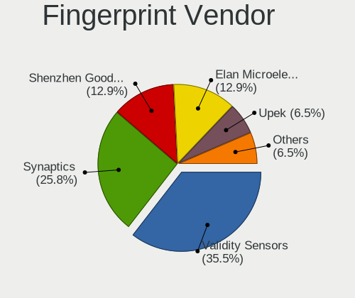

| Vendor                     | Computers | Percent |
|----------------------------|-----------|---------|
| Validity Sensors           | 9         | 33.33%  |
| Synaptics                  | 8         | 29.63%  |
| Shenzhen Goodix Technology | 3         | 11.11%  |
| Elan Microelectronics      | 3         | 11.11%  |
| Upek                       | 2         | 7.41%   |
| LighTuning Technology      | 1         | 3.7%    |
| AuthenTec                  | 1         | 3.7%    |

Fingerprint Model
-----------------

Fingerprint sensor models

| Model                                                      | Computers | Percent |
|------------------------------------------------------------|-----------|---------|
| Synaptics  FS7604 Touch Fingerprint Sensor with PurePrint  | 4         | 14.81%  |
| Shenzhen Goodix  FingerPrint Device                        | 3         | 11.11%  |
| Validity Sensors VFS495 Fingerprint Reader                 | 2         | 7.41%   |
| Validity Sensors VFS 5011 fingerprint sensor               | 2         | 7.41%   |
| Validity Sensors Fingerprint scanner                       | 2         | 7.41%   |
| Upek Biometric Touchchip/Touchstrip Fingerprint Sensor     | 2         | 7.41%   |
| Synaptics  VFS7552 Touch Fingerprint Sensor with PurePrint | 2         | 7.41%   |
| Elan ELAN:Fingerprint                                      | 2         | 7.41%   |
| Validity Sensors VFS Fingerprint sensor                    | 1         | 3.7%    |
| Validity Sensors Synaptics WBDI                            | 1         | 3.7%    |
| Validity Sensors Swipe Fingerprint Sensor                  | 1         | 3.7%    |
| Synaptics  WBDI                                            | 1         | 3.7%    |
| LighTuning EgisTec Touch Fingerprint Sensor                | 1         | 3.7%    |
| Elan ELAN:ARM-M4                                           | 1         | 3.7%    |
| AuthenTec AES2501 Fingerprint Sensor                       | 1         | 3.7%    |
| Unknown                                                    | 1         | 3.7%    |

Chipcard Vendor
---------------

Chipcard module vendors

| Vendor                | Computers | Percent |
|-----------------------|-----------|---------|
| Realtek Semiconductor | 1         | 50%     |
| O2 Micro              | 1         | 50%     |

Chipcard Model
--------------

Chipcard module models

| Model                                             | Computers | Percent |
|---------------------------------------------------|-----------|---------|
| Realtek Semiconductor Smart Card Reader Interface | 1         | 50%     |
| O2 Micro OZ776 CCID Smartcard Reader              | 1         | 50%     |

Unsupported
-----------

Unsupported Devices
-------------------

Total unsupported devices on board

| Total | Computers | Percent |
|-------|-----------|---------|
| 0     | 142       | 72.08%  |
| 1     | 46        | 23.35%  |
| 2     | 8         | 4.06%   |
| 3     | 1         | 0.51%   |

Unsupported Device Types
------------------------

Types of unsupported devices

| Type                  | Computers | Percent |
|-----------------------|-----------|---------|
| Fingerprint reader    | 27        | 44.26%  |
| Graphics card         | 21        | 34.43%  |
| Net/wireless          | 5         | 8.2%    |
| Multimedia controller | 2         | 3.28%   |
| Chipcard              | 2         | 3.28%   |
| Camera                | 2         | 3.28%   |
| Storage               | 1         | 1.64%   |
| Sound                 | 1         | 1.64%   |

