Linux in Moldova - Tested Hardware & Statistics (Desktops)
----------------------------------------------------------

A project to collect tested hardware configurations for Linux in Moldova.

Anyone can contribute to this report by the [hw-probe](https://github.com/linuxhw/hw-probe) tool:

    sudo -E hw-probe -all -upload

Please contribute! Especially if your hardware is rare.

Contents
--------

* [ Test Cases ](#test-cases)

* [ System ](#system)
  - [ OS                       ](#os)
  - [ OS Family                ](#os-family)
  - [ Kernel                   ](#kernel)
  - [ Kernel Family            ](#kernel-family)
  - [ Kernel Major Ver.        ](#kernel-major-ver)
  - [ Arch                     ](#arch)
  - [ DE                       ](#de)
  - [ Display Server           ](#display-server)
  - [ Display Manager          ](#display-manager)
  - [ OS Lang                  ](#os-lang)
  - [ Boot Mode                ](#boot-mode)
  - [ Filesystem               ](#filesystem)
  - [ Part. scheme             ](#part-scheme)
  - [ Dual Boot with Linux/BSD ](#dual-boot-with-linuxbsd)
  - [ Dual Boot (Win)          ](#dual-boot-win)

* [ Board ](#board)
  - [ Vendor                   ](#vendor)
  - [ Model                    ](#model)
  - [ Model Family             ](#model-family)
  - [ MFG Year                 ](#mfg-year)
  - [ Form Factor              ](#form-factor)
  - [ Secure Boot              ](#secure-boot)
  - [ Coreboot                 ](#coreboot)
  - [ RAM Size                 ](#ram-size)
  - [ RAM Used                 ](#ram-used)
  - [ Total Drives             ](#total-drives)
  - [ Has CD-ROM               ](#has-cd-rom)
  - [ Has Ethernet             ](#has-ethernet)
  - [ Has WiFi                 ](#has-wifi)
  - [ Has Bluetooth            ](#has-bluetooth)

* [ Location ](#location)
  - [ Country                  ](#country)
  - [ City                     ](#city)

* [ Drives ](#drives)
  - [ Drive Vendor             ](#drive-vendor)
  - [ Drive Model              ](#drive-model)
  - [ HDD Vendor               ](#hdd-vendor)
  - [ SSD Vendor               ](#ssd-vendor)
  - [ Drive Kind               ](#drive-kind)
  - [ Drive Connector          ](#drive-connector)
  - [ Drive Size               ](#drive-size)
  - [ Space Total              ](#space-total)
  - [ Space Used               ](#space-used)
  - [ Malfunc. Drives          ](#malfunc-drives)
  - [ Malfunc. Drive Vendor    ](#malfunc-drive-vendor)
  - [ Malfunc. HDD Vendor      ](#malfunc-hdd-vendor)
  - [ Malfunc. Drive Kind      ](#malfunc-drive-kind)
  - [ Failed Drives            ](#failed-drives)
  - [ Failed Drive Vendor      ](#failed-drive-vendor)
  - [ Drive Status             ](#drive-status)

* [ Storage controller ](#storage-controller)
  - [ Storage Vendor           ](#storage-vendor)
  - [ Storage Model            ](#storage-model)
  - [ Storage Kind             ](#storage-kind)

* [ Processor ](#processor)
  - [ CPU Vendor               ](#cpu-vendor)
  - [ CPU Model                ](#cpu-model)
  - [ CPU Model Family         ](#cpu-model-family)
  - [ CPU Cores                ](#cpu-cores)
  - [ CPU Sockets              ](#cpu-sockets)
  - [ CPU Threads              ](#cpu-threads)
  - [ CPU Op-Modes             ](#cpu-op-modes)
  - [ CPU Microcode            ](#cpu-microcode)
  - [ CPU Microarch            ](#cpu-microarch)

* [ Graphics ](#graphics)
  - [ GPU Vendor               ](#gpu-vendor)
  - [ GPU Model                ](#gpu-model)
  - [ GPU Combo                ](#gpu-combo)
  - [ GPU Driver               ](#gpu-driver)
  - [ GPU Memory               ](#gpu-memory)

* [ Monitor ](#monitor)
  - [ Monitor Vendor           ](#monitor-vendor)
  - [ Monitor Model            ](#monitor-model)
  - [ Monitor Resolution       ](#monitor-resolution)
  - [ Monitor Diagonal         ](#monitor-diagonal)
  - [ Monitor Width            ](#monitor-width)
  - [ Aspect Ratio             ](#aspect-ratio)
  - [ Monitor Area             ](#monitor-area)
  - [ Pixel Density            ](#pixel-density)
  - [ Multiple Monitors        ](#multiple-monitors)

* [ Network ](#network)
  - [ Net Controller Vendor    ](#net-controller-vendor)
  - [ Net Controller Model     ](#net-controller-model)
  - [ Wireless Vendor          ](#wireless-vendor)
  - [ Wireless Model           ](#wireless-model)
  - [ Ethernet Vendor          ](#ethernet-vendor)
  - [ Ethernet Model           ](#ethernet-model)
  - [ Net Controller Kind      ](#net-controller-kind)
  - [ Used Controller          ](#used-controller)
  - [ NICs                     ](#nics)
  - [ IPv6                     ](#ipv6)

* [ Bluetooth ](#bluetooth)
  - [ Bluetooth Vendor         ](#bluetooth-vendor)
  - [ Bluetooth Model          ](#bluetooth-model)

* [ Sound ](#sound)
  - [ Sound Vendor             ](#sound-vendor)
  - [ Sound Model              ](#sound-model)

* [ Memory ](#memory)
  - [ Memory Vendor            ](#memory-vendor)
  - [ Memory Model             ](#memory-model)
  - [ Memory Kind              ](#memory-kind)
  - [ Memory Form Factor       ](#memory-form-factor)
  - [ Memory Size              ](#memory-size)
  - [ Memory Speed             ](#memory-speed)

* [ Printers & scanners ](#printers--scanners)
  - [ Printer Vendor           ](#printer-vendor)
  - [ Printer Model            ](#printer-model)
  - [ Scanner Vendor           ](#scanner-vendor)
  - [ Scanner Model            ](#scanner-model)

* [ Camera ](#camera)
  - [ Camera Vendor            ](#camera-vendor)
  - [ Camera Model             ](#camera-model)

* [ Security ](#security)
  - [ Fingerprint Vendor       ](#fingerprint-vendor)
  - [ Fingerprint Model        ](#fingerprint-model)
  - [ Chipcard Vendor          ](#chipcard-vendor)
  - [ Chipcard Model           ](#chipcard-model)

* [ Unsupported ](#unsupported)
  - [ Unsupported Devices      ](#unsupported-devices)
  - [ Unsupported Device Types ](#unsupported-device-types)

Test Cases
----------

Total: 141

| Vendor     | Model                       | Probe                                                      | Date         |
|------------|-----------------------------|------------------------------------------------------------|--------------|
| Intel      | B75                         | [a4c357d5ab](https://linux-hardware.org/?probe=a4c357d5ab) | Dec 12, 2025 |
| ASUSTek    | Z97-PRO                     | [f0c7d89443](https://linux-hardware.org/?probe=f0c7d89443) | Dec 01, 2025 |
| ASUSTek    | Z97-PRO                     | [c20f900e04](https://linux-hardware.org/?probe=c20f900e04) | Dec 01, 2025 |
| ASUSTek    | P5G41T-M LX                 | [5f36a68f84](https://linux-hardware.org/?probe=5f36a68f84) | Nov 30, 2025 |
| MSI        | MPG X570 GAMING PLUS        | [d2a7d90c1e](https://linux-hardware.org/?probe=d2a7d90c1e) | Nov 26, 2025 |
| ASUSTek    | PRIME B760M-K               | [ea30874aff](https://linux-hardware.org/?probe=ea30874aff) | Nov 09, 2025 |
| ASUSTek    | ROG STRIX Z690-I GAMING ... | [d395f61ffa](https://linux-hardware.org/?probe=d395f61ffa) | Nov 04, 2025 |
| Biostar    | GF8200C M2+                 | [4c59825077](https://linux-hardware.org/?probe=4c59825077) | Oct 30, 2025 |
| MSI        | 2A9C                        | [7f2f193bc3](https://linux-hardware.org/?probe=7f2f193bc3) | Oct 06, 2025 |
| ASUSTek    | PRIME H510M-A R2.0          | [7bacc1dd99](https://linux-hardware.org/?probe=7bacc1dd99) | Aug 21, 2025 |
| MSI        | PRO Z690-A WIFI             | [450874ea68](https://linux-hardware.org/?probe=450874ea68) | Aug 07, 2025 |
| MSI        | PRO Z690-A WIFI             | [4fbfa929e9](https://linux-hardware.org/?probe=4fbfa929e9) | Jul 28, 2025 |
| MSI        | H87-G41 PC Mate             | [de9913e596](https://linux-hardware.org/?probe=de9913e596) | Jun 30, 2025 |
| MSI        | MPG X570 GAMING PLUS        | [99254361d9](https://linux-hardware.org/?probe=99254361d9) | Apr 19, 2025 |
| ASUSTek    | TUF Gaming B650-PLUS        | [a687689fa3](https://linux-hardware.org/?probe=a687689fa3) | Apr 17, 2025 |
| ASUSTek    | PRIME H770-PLUS             | [ce1b3c4fac](https://linux-hardware.org/?probe=ce1b3c4fac) | Apr 14, 2025 |
| ASRock     | Z690 Taichi                 | [7b102262b7](https://linux-hardware.org/?probe=7b102262b7) | Apr 10, 2025 |
| MSI        | G41M-E43                    | [4c93bca35f](https://linux-hardware.org/?probe=4c93bca35f) | Apr 08, 2025 |
| Gigabyte   | G41MT-S2                    | [7705d36266](https://linux-hardware.org/?probe=7705d36266) | Oct 23, 2024 |
| Biostar    | A960G+                      | [ffbdc04a2d](https://linux-hardware.org/?probe=ffbdc04a2d) | Oct 13, 2024 |
| Gigabyte   | H67M-D2-B3                  | [c06d37811f](https://linux-hardware.org/?probe=c06d37811f) | Sep 26, 2024 |
| Gigabyte   | H67M-D2-B3                  | [b026a73cfc](https://linux-hardware.org/?probe=b026a73cfc) | Sep 26, 2024 |
| Gigabyte   | GA-880GM-USB3               | [9c8e40a0ae](https://linux-hardware.org/?probe=9c8e40a0ae) | Aug 28, 2024 |
| ASUSTek    | PRIME H610M-K               | [2deaed8934](https://linux-hardware.org/?probe=2deaed8934) | Aug 05, 2024 |
| MSI        | B350 KRAIT GAMING           | [0ffaa166a9](https://linux-hardware.org/?probe=0ffaa166a9) | Aug 05, 2024 |
| Gigabyte   | GA-78LMT-USB3 R2 sex        | [d12ed859af](https://linux-hardware.org/?probe=d12ed859af) | Jul 15, 2024 |
| Gigabyte   | AB350-Gaming-CF             | [a72308c7e1](https://linux-hardware.org/?probe=a72308c7e1) | Jul 01, 2024 |
| ASUSTek    | P7P55D-E DELUXE             | [fa2fcb8943](https://linux-hardware.org/?probe=fa2fcb8943) | Jun 07, 2024 |
| MACHINIST  | X79 V2.82H                  | [baf6d1ffb8](https://linux-hardware.org/?probe=baf6d1ffb8) | May 26, 2024 |
| Supermicro | X9SCL-II/X9SCM-II           | [a0c9c93180](https://linux-hardware.org/?probe=a0c9c93180) | May 20, 2024 |
| Supermicro | X9SCL-II/X9SCM-II           | [8373a09f6d](https://linux-hardware.org/?probe=8373a09f6d) | May 20, 2024 |
| MSI        | PRO B650-P WIFI             | [ea23208e0f](https://linux-hardware.org/?probe=ea23208e0f) | May 19, 2024 |
| Gigabyte   | B550M K                     | [bfc7e96b9c](https://linux-hardware.org/?probe=bfc7e96b9c) | Mar 24, 2024 |
| Lenovo     | 0B98401 PRO                 | [5059aeedf0](https://linux-hardware.org/?probe=5059aeedf0) | Mar 23, 2024 |
| Lenovo     | 0B98401 PRO                 | [8b49c50089](https://linux-hardware.org/?probe=8b49c50089) | Mar 21, 2024 |
| ASRock     | X570 Phantom Gaming 4S      | [56e7d1d3ea](https://linux-hardware.org/?probe=56e7d1d3ea) | Feb 18, 2024 |
| ASRock     | X570 Phantom Gaming 4S      | [01e9c9ed92](https://linux-hardware.org/?probe=01e9c9ed92) | Feb 13, 2024 |
| Gigabyte   | H61M-S1                     | [b0ac9a9edd](https://linux-hardware.org/?probe=b0ac9a9edd) | Jan 24, 2024 |
| Gigabyte   | G41MT-S2                    | [06a0da716b](https://linux-hardware.org/?probe=06a0da716b) | Dec 05, 2023 |
| ASUSTek    | TUF B450-PRO GAMING         | [0c0067ae1b](https://linux-hardware.org/?probe=0c0067ae1b) | Jul 30, 2023 |
| Gigabyte   | G41MT-S2                    | [d625267663](https://linux-hardware.org/?probe=d625267663) | Jul 17, 2023 |
| ASUSTek    | PRIME B350M-A               | [ba4bfc1fe1](https://linux-hardware.org/?probe=ba4bfc1fe1) | Jun 08, 2023 |
| ASRock     | B250M Pro4                  | [98382222cd](https://linux-hardware.org/?probe=98382222cd) | Mar 14, 2023 |
| Unknown    | Unknown                     | [7e53e3c6e8](https://linux-hardware.org/?probe=7e53e3c6e8) | Jan 31, 2023 |
| Gigabyte   | H81M-S2PV                   | [72e7e2e1cf](https://linux-hardware.org/?probe=72e7e2e1cf) | Jan 11, 2023 |
| Gigabyte   | Z690 AORUS ULTRA            | [55627fc077](https://linux-hardware.org/?probe=55627fc077) | Jan 03, 2023 |
| Gigabyte   | Z490M GAMING X              | [9012a42d6e](https://linux-hardware.org/?probe=9012a42d6e) | Jan 03, 2023 |
| ASRock     | 970DE3/U3S3                 | [1505706e04](https://linux-hardware.org/?probe=1505706e04) | Dec 25, 2022 |
| ASRock     | 970DE3/U3S3                 | [1c996d8122](https://linux-hardware.org/?probe=1c996d8122) | Dec 25, 2022 |
| Biostar    | GF8200C M2+                 | [e42ae4deef](https://linux-hardware.org/?probe=e42ae4deef) | Dec 08, 2022 |
| Biostar    | N68S3+                      | [a37667f835](https://linux-hardware.org/?probe=a37667f835) | Nov 11, 2022 |
| Biostar    | TB250-BTC PRO               | [09be95ac2c](https://linux-hardware.org/?probe=09be95ac2c) | Oct 10, 2022 |
| ASUSTek    | P8H61-M LX2 R2.0            | [0f690e6e12](https://linux-hardware.org/?probe=0f690e6e12) | Oct 08, 2022 |
| ASUSTek    | P8H61-M LX2 R2.0            | [e9bc8b1f10](https://linux-hardware.org/?probe=e9bc8b1f10) | Sep 26, 2022 |
| Gigabyte   | B550 AORUS ELITE            | [08e3444b3c](https://linux-hardware.org/?probe=08e3444b3c) | Aug 15, 2022 |
| Foxconn    | nT-330i                     | [64504a98ed](https://linux-hardware.org/?probe=64504a98ed) | Aug 04, 2022 |
| Dell       | 0782GW A01                  | [20cb4c3e27](https://linux-hardware.org/?probe=20cb4c3e27) | Jul 11, 2022 |
| Gigabyte   | B450M S2H V2                | [e0e21604de](https://linux-hardware.org/?probe=e0e21604de) | Jun 24, 2022 |
| ASUSTek    | PRIME A520M-K               | [72dd09a86a](https://linux-hardware.org/?probe=72dd09a86a) | Jun 05, 2022 |
| ASUSTek    | M4A785-M                    | [25526ee77d](https://linux-hardware.org/?probe=25526ee77d) | Apr 17, 2022 |
| ASUSTek    | PRIME B550-PLUS             | [8c88f1c50a](https://linux-hardware.org/?probe=8c88f1c50a) | Apr 12, 2022 |
| Gigabyte   | Z690 UD DDR4                | [6c4ff21b02](https://linux-hardware.org/?probe=6c4ff21b02) | Feb 21, 2022 |
| HP         | 21F5                        | [ce8e06508d](https://linux-hardware.org/?probe=ce8e06508d) | Jan 16, 2022 |
| Biostar    | N68S3+                      | [8812de783f](https://linux-hardware.org/?probe=8812de783f) | Dec 16, 2021 |
| ASUSTek    | A_F_K20CE                   | [926db6c655](https://linux-hardware.org/?probe=926db6c655) | Dec 15, 2021 |
| ASUSTek    | Z97I-PLUS                   | [a379cfa431](https://linux-hardware.org/?probe=a379cfa431) | Dec 12, 2021 |
| Gigabyte   | H61M-S2-B3                  | [960d7d5035](https://linux-hardware.org/?probe=960d7d5035) | Dec 05, 2021 |
| ASRock     | M3A770DE                    | [b6ee8bc974](https://linux-hardware.org/?probe=b6ee8bc974) | Dec 01, 2021 |
| Gigabyte   | H81M-HD3                    | [953c3f9284](https://linux-hardware.org/?probe=953c3f9284) | Nov 13, 2021 |
| MSI        | MS-7309                     | [0a4d7fb95d](https://linux-hardware.org/?probe=0a4d7fb95d) | Oct 30, 2021 |
| MSI        | A75A-G35                    | [7223bfa184](https://linux-hardware.org/?probe=7223bfa184) | Oct 22, 2021 |
| Biostar    | N68S3+                      | [1eae78eec0](https://linux-hardware.org/?probe=1eae78eec0) | Aug 04, 2021 |
| Gigabyte   | B460M DS3H V2               | [6177f24834](https://linux-hardware.org/?probe=6177f24834) | Aug 02, 2021 |
| Gigabyte   | B460M DS3H V2               | [7fa66f2f95](https://linux-hardware.org/?probe=7fa66f2f95) | Aug 02, 2021 |
| Gigabyte   | EP43-UD3L                   | [3b6839e225](https://linux-hardware.org/?probe=3b6839e225) | Jul 01, 2021 |
| ASUSTek    | F1A75-M LE                  | [b453e98364](https://linux-hardware.org/?probe=b453e98364) | May 21, 2021 |
| Biostar    | A58MD                       | [3effc9a4ed](https://linux-hardware.org/?probe=3effc9a4ed) | Apr 18, 2021 |
| Biostar    | H110MHC                     | [acc13c8156](https://linux-hardware.org/?probe=acc13c8156) | Mar 24, 2021 |
| ASUSTek    | P8Z77-V PRO                 | [a3d54dee1b](https://linux-hardware.org/?probe=a3d54dee1b) | Feb 22, 2021 |
| ASUSTek    | P8Z77-V PRO                 | [7f75cd3e14](https://linux-hardware.org/?probe=7f75cd3e14) | Feb 22, 2021 |
| ASUSTek    | PRIME B350-PLUS             | [23ddb098d4](https://linux-hardware.org/?probe=23ddb098d4) | Feb 18, 2021 |
| ASRock     | Z87 Extreme4                | [2fc1d961c0](https://linux-hardware.org/?probe=2fc1d961c0) | Feb 14, 2021 |
| ASUSTek    | B85M-E                      | [024b12b22d](https://linux-hardware.org/?probe=024b12b22d) | Jan 17, 2021 |
| Gigabyte   | GA-970A-DS3                 | [f333aed432](https://linux-hardware.org/?probe=f333aed432) | Dec 04, 2020 |
| Gigabyte   | X570 AORUS ULTRA            | [bdc9ccf5d5](https://linux-hardware.org/?probe=bdc9ccf5d5) | Nov 23, 2020 |
| Biostar    | A960D+V3                    | [86864a3f9a](https://linux-hardware.org/?probe=86864a3f9a) | Oct 01, 2020 |
| Biostar    | A960D+V3                    | [781ac4ebab](https://linux-hardware.org/?probe=781ac4ebab) | Sep 30, 2020 |
| Gigabyte   | P41-ES3G                    | [30feb0323e](https://linux-hardware.org/?probe=30feb0323e) | Sep 29, 2020 |
| Gigabyte   | P41-ES3G                    | [395e492e72](https://linux-hardware.org/?probe=395e492e72) | Sep 29, 2020 |
| ASUSTek    | P8H61-MX                    | [46cff277d4](https://linux-hardware.org/?probe=46cff277d4) | Aug 16, 2020 |
| ASUSTek    | M2N-SLI DELUXE              | [02ab999339](https://linux-hardware.org/?probe=02ab999339) | Aug 04, 2020 |
| ASRock     | A320M-HDV R4.0              | [0320a45205](https://linux-hardware.org/?probe=0320a45205) | Jul 25, 2020 |
| ASUSTek    | M4A785TD-V EVO              | [734d413d2f](https://linux-hardware.org/?probe=734d413d2f) | May 25, 2020 |
| ASUSTek    | M4A785TD-V EVO              | [a5f24237a6](https://linux-hardware.org/?probe=a5f24237a6) | May 22, 2020 |
| ASUSTek    | P8B75-M LE                  | [3051982d33](https://linux-hardware.org/?probe=3051982d33) | Apr 28, 2020 |
| ASUSTek    | P8B75-M LE                  | [6e3a1017c8](https://linux-hardware.org/?probe=6e3a1017c8) | Apr 28, 2020 |
| ASUSTek    | H110M-K                     | [d65e7d1bb6](https://linux-hardware.org/?probe=d65e7d1bb6) | Mar 28, 2020 |
| ASUSTek    | F1A75-M LE                  | [3cee091303](https://linux-hardware.org/?probe=3cee091303) | Mar 25, 2020 |
| ASUSTek    | H110M-K                     | [c0aa963f37](https://linux-hardware.org/?probe=c0aa963f37) | Mar 21, 2020 |
| MSI        | 2A9C                        | [cb1789ae00](https://linux-hardware.org/?probe=cb1789ae00) | Mar 18, 2020 |
| ASUSTek    | M5A78L-M LX                 | [90f55c011b](https://linux-hardware.org/?probe=90f55c011b) | Dec 04, 2019 |
| ASUSTek    | P5QL/EPU                    | [8f31c009af](https://linux-hardware.org/?probe=8f31c009af) | Oct 20, 2019 |
| ASUSTek    | F1A75-M LE                  | [bdb727808f](https://linux-hardware.org/?probe=bdb727808f) | Jul 26, 2019 |
| ASUSTek    | F1A75-M LE                  | [961de73328](https://linux-hardware.org/?probe=961de73328) | Jul 26, 2019 |
| Biostar    | GF8100 M2+ SE               | [52b394c153](https://linux-hardware.org/?probe=52b394c153) | May 05, 2019 |
| ASUSTek    | P5P43TD                     | [bbfc5c83ed](https://linux-hardware.org/?probe=bbfc5c83ed) | Apr 23, 2019 |
| ASUSTek    | P5P43TD                     | [a1df618ae9](https://linux-hardware.org/?probe=a1df618ae9) | Apr 18, 2019 |
| Gigabyte   | G41M-ES2L                   | [62f911ea35](https://linux-hardware.org/?probe=62f911ea35) | Apr 09, 2019 |
| HP         | 82A1                        | [f04f3b1720](https://linux-hardware.org/?probe=f04f3b1720) | Mar 18, 2019 |
| ASRock     | B250M Pro4                  | [05dfa7d080](https://linux-hardware.org/?probe=05dfa7d080) | Jan 07, 2019 |
| ASRock     | B250M Pro4                  | [4ca432ffe1](https://linux-hardware.org/?probe=4ca432ffe1) | Jan 03, 2019 |
| Biostar    | NF61D-A2                    | [8920fb5da2](https://linux-hardware.org/?probe=8920fb5da2) | Nov 24, 2018 |
| Gigabyte   | H61M-S1                     | [f035a927b4](https://linux-hardware.org/?probe=f035a927b4) | Oct 16, 2018 |
| Gigabyte   | H61M-S1                     | [0cb176039a](https://linux-hardware.org/?probe=0cb176039a) | Oct 16, 2018 |
| ASUSTek    | H110M-R                     | [e8cf4914df](https://linux-hardware.org/?probe=e8cf4914df) | Oct 11, 2018 |
| ASUSTek    | TUF X299 MARK 1             | [4ff6f8b306](https://linux-hardware.org/?probe=4ff6f8b306) | Aug 28, 2018 |
| ASUSTek    | H110M-R                     | [856815508e](https://linux-hardware.org/?probe=856815508e) | Jul 20, 2018 |
| ASUSTek    | H110M-R                     | [2c6e982e0a](https://linux-hardware.org/?probe=2c6e982e0a) | Jul 20, 2018 |
| ASRock     | H110M-DGS                   | [2bf308c36a](https://linux-hardware.org/?probe=2bf308c36a) | Apr 22, 2018 |
| Gigabyte   | H81M-S2PV                   | [d73e7cdaf7](https://linux-hardware.org/?probe=d73e7cdaf7) | Apr 10, 2018 |
| ASUSTek    | M5A78L LE                   | [324ea287af](https://linux-hardware.org/?probe=324ea287af) | Mar 25, 2018 |
| ASUSTek    | M5A78L LE                   | [c4796ca0ba](https://linux-hardware.org/?probe=c4796ca0ba) | Mar 25, 2018 |
| MSI        | G31M3-L V2                  | [a010b34c1d](https://linux-hardware.org/?probe=a010b34c1d) | Mar 14, 2018 |
| Gigabyte   | GA-880GM-USB3               | [488c7af7b3](https://linux-hardware.org/?probe=488c7af7b3) | Feb 13, 2018 |
| Biostar    | H61MGV3                     | [601f3981af](https://linux-hardware.org/?probe=601f3981af) | Jan 25, 2018 |
| MSI        | G31M3-L V2                  | [cb825d670e](https://linux-hardware.org/?probe=cb825d670e) | Jan 23, 2018 |
| Biostar    | A960G+                      | [1ed969e51e](https://linux-hardware.org/?probe=1ed969e51e) | Jan 02, 2018 |
| Gigabyte   | H81M-S2PV                   | [b4b5168bf0](https://linux-hardware.org/?probe=b4b5168bf0) | Oct 22, 2017 |
| Biostar    | TA790GX 128M                | [13dafc619e](https://linux-hardware.org/?probe=13dafc619e) | Sep 07, 2017 |
| ASUSTek    | P7P55D-E                    | [7ead295d4f](https://linux-hardware.org/?probe=7ead295d4f) | May 04, 2017 |
| ASUSTek    | P5GPL                       | [dc412a96d7](https://linux-hardware.org/?probe=dc412a96d7) | Mar 11, 2017 |
| ASUSTek    | P5GPL                       | [704d76d7f0](https://linux-hardware.org/?probe=704d76d7f0) | Mar 11, 2017 |
| ECS        | GeForce7050M-M              | [dffec0e1ef](https://linux-hardware.org/?probe=dffec0e1ef) | Jan 26, 2017 |
| MSI        | G41M-P26                    | [3a93859874](https://linux-hardware.org/?probe=3a93859874) | Jan 21, 2017 |
| Dell       | 0HJ054                      | [3a64a2e7cc](https://linux-hardware.org/?probe=3a64a2e7cc) | Jan 14, 2017 |
| ASUSTek    | M5A78L-M LX3                | [de5986b48c](https://linux-hardware.org/?probe=de5986b48c) | Dec 27, 2016 |
| ASUSTek    | P8H61-M LX3                 | [51108b9a7b](https://linux-hardware.org/?probe=51108b9a7b) | Nov 26, 2016 |
| ASUSTek    | A88X-PLUS                   | [e5165dfe31](https://linux-hardware.org/?probe=e5165dfe31) | Nov 25, 2016 |
| ASUSTek    | A88X-PLUS                   | [53f70342b5](https://linux-hardware.org/?probe=53f70342b5) | Nov 23, 2016 |
| ASUSTek    | P5KPL-AM IN/ROEM/SI         | [c140d93dd9](https://linux-hardware.org/?probe=c140d93dd9) | Nov 08, 2016 |
| ECS        | GeForce7050M-M              | [3f276c748c](https://linux-hardware.org/?probe=3f276c748c) | Nov 04, 2016 |

System
------

OS
--

Installed operating systems

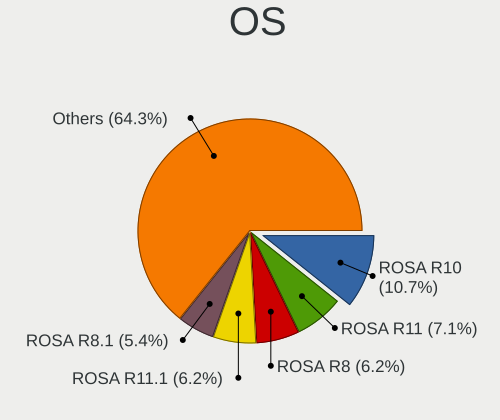

| Name                         | Desktops | Percent |
|------------------------------|----------|---------|
| ROSA R10                     | 12       | 10.71%  |
| ROSA R11                     | 8        | 7.14%   |
| ROSA R8                      | 7        | 6.25%   |
| ROSA R11.1                   | 7        | 6.25%   |
| ROSA R8.1                    | 6        | 5.36%   |
| OpenMandriva 4.2             | 6        | 5.36%   |
| Arch Rolling                 | 6        | 5.36%   |
| Ubuntu 20.04                 | 3        | 2.68%   |
| Ubuntu 18.04                 | 3        | 2.68%   |
| OpenMandriva 4.3             | 3        | 2.68%   |
| Debian 12                    | 3        | 2.68%   |
| Zorin 18                     | 2        | 1.79%   |
| ROSA 12.3                    | 2        | 1.79%   |
| ROSA 12.2                    | 2        | 1.79%   |
| OpenMandriva 6.0             | 2        | 1.79%   |
| Manjaro                      | 2        | 1.79%   |
| Linux Mint 21.3              | 2        | 1.79%   |
| KDE neon 22.04               | 2        | 1.79%   |
| Fedora 39                    | 2        | 1.79%   |
| ArcoLinux Rolling            | 2        | 1.79%   |
| Ubuntu MATE 22.04            | 1        | 0.89%   |
| Ubuntu 24.04                 | 1        | 0.89%   |
| Ubuntu 21.10                 | 1        | 0.89%   |
| Ubuntu 16.04                 | 1        | 0.89%   |
| TUXEDO OS 24.04              | 1        | 0.89%   |
| ROSA R9                      | 1        | 0.89%   |
| ROSA 13.0                    | 1        | 0.89%   |
| ROSA 12.1                    | 1        | 0.89%   |
| Pop!_OS 21.10                | 1        | 0.89%   |
| Pop!_OS 20.10                | 1        | 0.89%   |
| Pop!_OS 20.04                | 1        | 0.89%   |
| Oracle Linux 8.9             | 1        | 0.89%   |
| Oracle Linux 6.10            | 1        | 0.89%   |
| openSUSE Tumbleweed-XXXXXXXX | 1        | 0.89%   |
| OpenMandriva 25.04           | 1        | 0.89%   |
| OpenMandriva 23.08           | 1        | 0.89%   |
| Manjaro 21.3.0               | 1        | 0.89%   |
| Lubuntu 18.04                | 1        | 0.89%   |
| Linux Mint 20                | 1        | 0.89%   |
| Linux Mint 19.3              | 1        | 0.89%   |

OS Family
---------

OS without a version

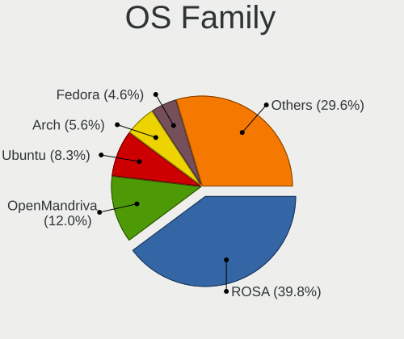

| Name         | Desktops | Percent |
|--------------|----------|---------|
| ROSA         | 43       | 39.81%  |
| OpenMandriva | 13       | 12.04%  |
| Ubuntu       | 9        | 8.33%   |
| Arch         | 6        | 5.56%   |
| Fedora       | 5        | 4.63%   |
| Linux Mint   | 4        | 3.7%    |
| Pop!_OS      | 3        | 2.78%   |
| Manjaro      | 3        | 2.78%   |
| KDE neon     | 3        | 2.78%   |
| Debian       | 3        | 2.78%   |
| Zorin        | 2        | 1.85%   |
| Oracle Linux | 2        | 1.85%   |
| Kali         | 2        | 1.85%   |
| ArcoLinux    | 2        | 1.85%   |
| Ubuntu MATE  | 1        | 0.93%   |
| TUXEDO OS    | 1        | 0.93%   |
| openSUSE     | 1        | 0.93%   |
| Lubuntu      | 1        | 0.93%   |
| EndeavourOS  | 1        | 0.93%   |
| Dts-distro   | 1        | 0.93%   |
| Ctlos        | 1        | 0.93%   |
| Bazzite      | 1        | 0.93%   |

Kernel
------

Version of the Linux kernel

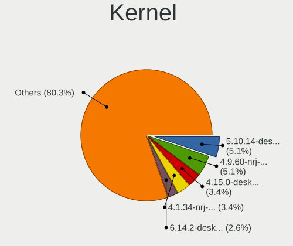

| Version                             | Desktops | Percent |
|-------------------------------------|----------|---------|
| 5.10.14-desktop-1omv4002            | 6        | 5.13%   |
| 4.9.60-nrj-desktop-1rosa-x86_64     | 6        | 5.13%   |
| 4.15.0-desktop-45.1rosa-x86_64      | 4        | 3.42%   |
| 4.1.34-nrj-desktop-2rosa-x86_64     | 4        | 3.42%   |
| 6.14.2-desktop-3omv2590             | 3        | 2.56%   |
| 5.16.7-desktop-1omv4003             | 3        | 2.56%   |
| 5.10.74-generic-2rosa2021.1-x86_64  | 3        | 2.56%   |
| 5.15.79-generic-1rosa2021.1-x86_64  | 2        | 1.71%   |
| 4.9.20-nrj-desktop-1rosa-x86_64     | 2        | 1.71%   |
| 4.9.155-nrj-desktop-1rosa-x86_64    | 2        | 1.71%   |
| 4.15.0-desktop-68.5rosa-x86_64      | 2        | 1.71%   |
| 4.15.0-desktop-47.2rosa-x86_64      | 2        | 1.71%   |
| 4.15.0-desktop-122.124.1rosa-x86_64 | 2        | 1.71%   |
| 4.1.34-nrj-desktop-2rosa-i586       | 2        | 1.71%   |
| 6.9.7-arch1-1                       | 1        | 0.85%   |
| 6.9.4-arch1-1                       | 1        | 0.85%   |
| 6.8.1-arch1-1                       | 1        | 0.85%   |
| 6.8.0-31-generic                    | 1        | 0.85%   |
| 6.7.9-204.fsync.fc39.x86_64         | 1        | 0.85%   |
| 6.7.4-200.fc39.x86_64               | 1        | 0.85%   |
| 6.6.21-yocto-standard               | 1        | 0.85%   |
| 6.5.0-35-generic                    | 1        | 0.85%   |
| 6.4.11-desktop-1omv2390             | 1        | 0.85%   |
| 6.17.7-ba01.fc43.x86_64             | 1        | 0.85%   |
| 6.16.10-zen1-1-zen                  | 1        | 0.85%   |
| 6.16.1-arch1-1                      | 1        | 0.85%   |
| 6.14.2-desktop-2omv2590             | 1        | 0.85%   |
| 6.14.0-36-generic                   | 1        | 0.85%   |
| 6.14.0-34-generic                   | 1        | 0.85%   |
| 6.13.9-200.fc41.x86_64              | 1        | 0.85%   |
| 6.12.20-amd64                       | 1        | 0.85%   |
| 6.12.13-generic-4rosa13-x86_64      | 1        | 0.85%   |
| 6.11.0-109019-tuxedo                | 1        | 0.85%   |
| 6.10.5-1-default                    | 1        | 0.85%   |
| 6.10.11-200.fc40.x86_64             | 1        | 0.85%   |
| 6.1.1-arch1-1                       | 1        | 0.85%   |
| 6.1.0-23-amd64                      | 1        | 0.85%   |
| 6.1.0-22-amd64                      | 1        | 0.85%   |
| 6.1.0-17-amd64                      | 1        | 0.85%   |
| 5.9.3-050903-generic                | 1        | 0.85%   |

Kernel Family
-------------

Linux kernel without a distro release

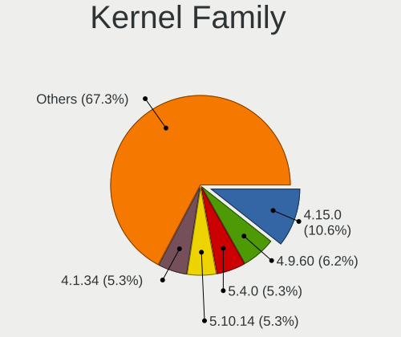

| Version | Desktops | Percent |
|---------|----------|---------|
| 4.15.0  | 12       | 10.62%  |
| 4.9.60  | 7        | 6.19%   |
| 5.4.0   | 6        | 5.31%   |
| 5.10.14 | 6        | 5.31%   |
| 4.1.34  | 6        | 5.31%   |
| 6.14.2  | 3        | 2.65%   |
| 6.1.0   | 3        | 2.65%   |
| 5.16.7  | 3        | 2.65%   |
| 5.15.0  | 3        | 2.65%   |
| 5.10.74 | 3        | 2.65%   |
| 6.14.0  | 2        | 1.77%   |
| 5.8.0   | 2        | 1.77%   |
| 5.4.32  | 2        | 1.77%   |
| 5.15.79 | 2        | 1.77%   |
| 5.13.0  | 2        | 1.77%   |
| 4.9.9   | 2        | 1.77%   |
| 4.9.76  | 2        | 1.77%   |
| 4.9.20  | 2        | 1.77%   |
| 4.9.155 | 2        | 1.77%   |
| 4.9.124 | 2        | 1.77%   |
| 4.1.38  | 2        | 1.77%   |
| 6.9.7   | 1        | 0.88%   |
| 6.9.4   | 1        | 0.88%   |
| 6.8.1   | 1        | 0.88%   |
| 6.8.0   | 1        | 0.88%   |
| 6.7.9   | 1        | 0.88%   |
| 6.7.4   | 1        | 0.88%   |
| 6.6.21  | 1        | 0.88%   |
| 6.5.0   | 1        | 0.88%   |
| 6.4.11  | 1        | 0.88%   |
| 6.17.7  | 1        | 0.88%   |
| 6.16.10 | 1        | 0.88%   |
| 6.16.1  | 1        | 0.88%   |
| 6.13.9  | 1        | 0.88%   |
| 6.12.20 | 1        | 0.88%   |
| 6.12.13 | 1        | 0.88%   |
| 6.11.0  | 1        | 0.88%   |
| 6.10.5  | 1        | 0.88%   |
| 6.10.11 | 1        | 0.88%   |
| 6.1.1   | 1        | 0.88%   |

Kernel Major Ver.
-----------------

Linux kernel major version

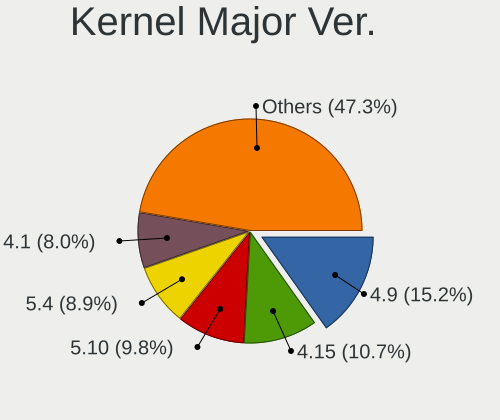

| Version | Desktops | Percent |
|---------|----------|---------|
| 4.9     | 17       | 15.18%  |
| 4.15    | 12       | 10.71%  |
| 5.10    | 11       | 9.82%   |
| 5.4     | 10       | 8.93%   |
| 4.1     | 9        | 8.04%   |
| 5.15    | 7        | 6.25%   |
| 6.14    | 5        | 4.46%   |
| 6.1     | 4        | 3.57%   |
| 5.16    | 4        | 3.57%   |
| 5.17    | 3        | 2.68%   |
| 6.9     | 2        | 1.79%   |
| 6.8     | 2        | 1.79%   |
| 6.7     | 2        | 1.79%   |
| 6.16    | 2        | 1.79%   |
| 6.12    | 2        | 1.79%   |
| 6.10    | 2        | 1.79%   |
| 5.8     | 2        | 1.79%   |
| 5.13    | 2        | 1.79%   |
| 6.6     | 1        | 0.89%   |
| 6.5     | 1        | 0.89%   |
| 6.4     | 1        | 0.89%   |
| 6.17    | 1        | 0.89%   |
| 6.13    | 1        | 0.89%   |
| 6.11    | 1        | 0.89%   |
| 5.9     | 1        | 0.89%   |
| 5.5     | 1        | 0.89%   |
| 5.2     | 1        | 0.89%   |
| 5.19    | 1        | 0.89%   |
| 5.14    | 1        | 0.89%   |
| 4.18    | 1        | 0.89%   |
| 4.10    | 1        | 0.89%   |
| 3.8     | 1        | 0.89%   |

Arch
----

OS architecture (x86_64, i586, etc.)

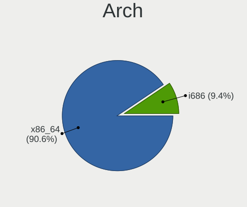

| Name   | Desktops | Percent |
|--------|----------|---------|
| x86_64 | 96       | 90.57%  |
| i686   | 10       | 9.43%   |

DE
--

Desktop Environment

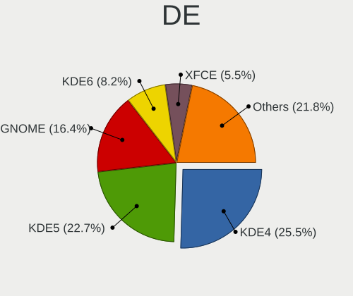

| Name            | Desktops | Percent |
|-----------------|----------|---------|
| KDE4            | 28       | 25.45%  |
| KDE5            | 25       | 22.73%  |
| GNOME           | 18       | 16.36%  |
| KDE6            | 9        | 8.18%   |
| XFCE            | 6        | 5.45%   |
| MATE            | 5        | 4.55%   |
| Unknown         | 5        | 4.55%   |
| X-Cinnamon      | 2        | 1.82%   |
| LXQt            | 2        | 1.82%   |
| KDE             | 2        | 1.82%   |
| xinitrc         | 1        | 0.91%   |
| sway            | 1        | 0.91%   |
| LXDE            | 1        | 0.91%   |
| GNOME Flashback | 1        | 0.91%   |
| Deepin          | 1        | 0.91%   |
| Cinnamon        | 1        | 0.91%   |
| Budgie          | 1        | 0.91%   |
| bspwm           | 1        | 0.91%   |

Display Server
--------------

X11 or Wayland

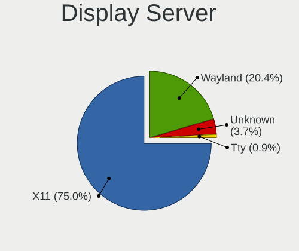

| Name    | Desktops | Percent |
|---------|----------|---------|
| X11     | 81       | 75%     |
| Wayland | 22       | 20.37%  |
| Unknown | 4        | 3.7%    |
| Tty     | 1        | 0.93%   |

Display Manager
---------------

SDDM, LightDM, etc.

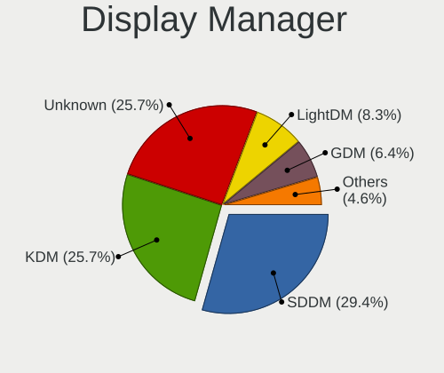

| Name    | Desktops | Percent |
|---------|----------|---------|
| SDDM    | 32       | 29.36%  |
| KDM     | 28       | 25.69%  |
| Unknown | 28       | 25.69%  |
| LightDM | 9        | 8.26%   |
| GDM     | 7        | 6.42%   |
| GDM3    | 3        | 2.75%   |
| TDM     | 2        | 1.83%   |

OS Lang
-------

Language

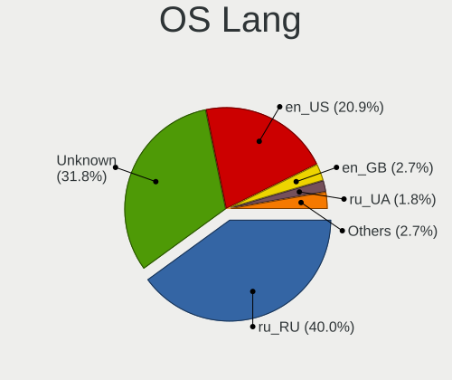

| Lang    | Desktops | Percent |
|---------|----------|---------|
| ru_RU   | 44       | 40%     |
| Unknown | 35       | 31.82%  |
| en_US   | 23       | 20.91%  |
| en_GB   | 3        | 2.73%   |
| ru_UA   | 2        | 1.82%   |
| ro_RO   | 2        | 1.82%   |
| C       | 1        | 0.91%   |

Boot Mode
---------

EFI or BIOS

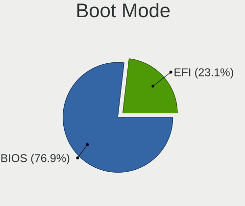

| Mode | Desktops | Percent |
|------|----------|---------|
| BIOS | 83       | 76.85%  |
| EFI  | 25       | 23.15%  |

Filesystem
----------

Type of filesystem

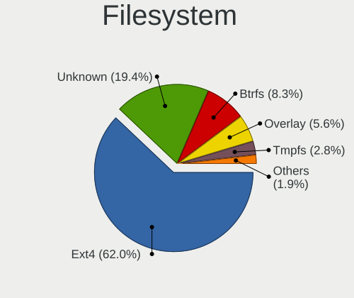

| Type    | Desktops | Percent |
|---------|----------|---------|
| Ext4    | 67       | 62.04%  |
| Unknown | 21       | 19.44%  |
| Btrfs   | 9        | 8.33%   |
| Overlay | 6        | 5.56%   |
| Tmpfs   | 3        | 2.78%   |
| F2fs    | 1        | 0.93%   |
| Ext2    | 1        | 0.93%   |

Part. scheme
------------

Scheme of partitioning

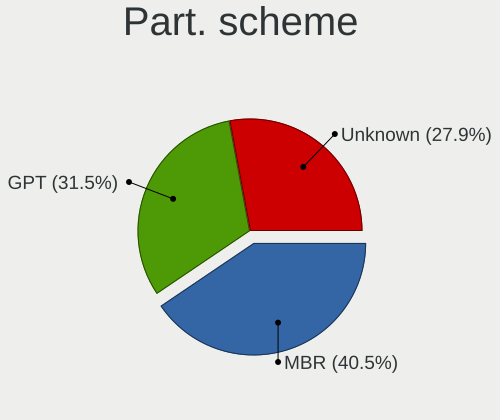

| Type    | Desktops | Percent |
|---------|----------|---------|
| MBR     | 45       | 40.54%  |
| GPT     | 35       | 31.53%  |
| Unknown | 31       | 27.93%  |

Dual Boot with Linux/BSD
------------------------

Hosting more than one Linux/BSD

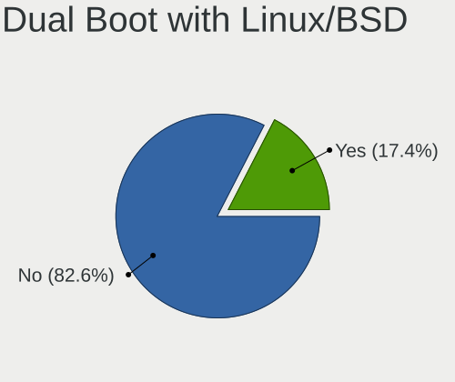

| Dual boot | Desktops | Percent |
|-----------|----------|---------|
| No        | 90       | 82.57%  |
| Yes       | 19       | 17.43%  |

Dual Boot (Win)
---------------

Hosting Linux and Windows

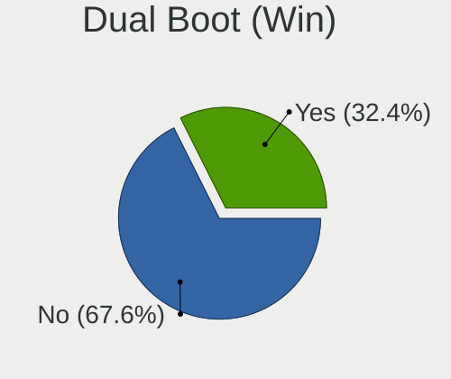

| Dual boot | Desktops | Percent |
|-----------|----------|---------|
| No        | 73       | 67.59%  |
| Yes       | 35       | 32.41%  |

Board
-----

Vendor
------

Motherboard manufacturer

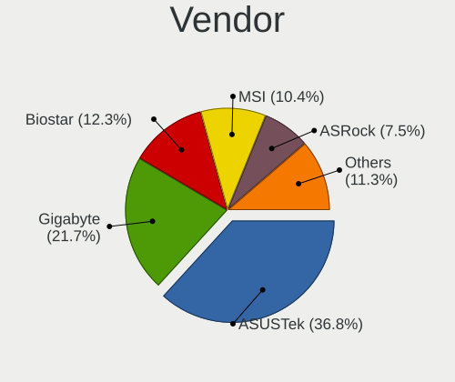

| Name                | Desktops | Percent |
|---------------------|----------|---------|
| ASUSTek Computer    | 39       | 36.79%  |
| Gigabyte Technology | 23       | 21.7%   |
| Biostar             | 13       | 12.26%  |
| MSI                 | 11       | 10.38%  |
| ASRock              | 8        | 7.55%   |
| Supermicro          | 2        | 1.89%   |
| Hewlett-Packard     | 2        | 1.89%   |
| Dell                | 2        | 1.89%   |
| MACHINIST           | 1        | 0.94%   |
| Lenovo              | 1        | 0.94%   |
| Intel               | 1        | 0.94%   |
| Foxconn             | 1        | 0.94%   |
| ECS                 | 1        | 0.94%   |
| Unknown             | 1        | 0.94%   |

Model
-----

Motherboard model

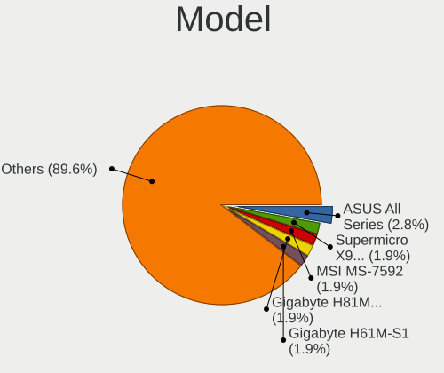

| Name                            | Desktops | Percent |
|---------------------------------|----------|---------|
| ASUS All Series                 | 3        | 2.83%   |
| Supermicro X9SCL-II/X9SCM-II    | 2        | 1.89%   |
| MSI MS-7592                     | 2        | 1.89%   |
| Gigabyte H81M-S2PV              | 2        | 1.89%   |
| Gigabyte H61M-S1                | 2        | 1.89%   |
| Biostar GF8200C M2+             | 2        | 1.89%   |
| Biostar A960G+                  | 2        | 1.89%   |
| ASUS H110M-R                    | 2        | 1.89%   |
| MSI Pro 3130 Microtower PC      | 1        | 0.94%   |
| MSI MS-7D78                     | 1        | 0.94%   |
| MSI MS-7D25                     | 1        | 0.94%   |
| MSI MS-7C37                     | 1        | 0.94%   |
| MSI MS-7B08                     | 1        | 0.94%   |
| MSI MS-7850                     | 1        | 0.94%   |
| MSI MS-7695                     | 1        | 0.94%   |
| MSI MS-7529                     | 1        | 0.94%   |
| MSI MS-7309                     | 1        | 0.94%   |
| MACHINIST X79 V2.82H            | 1        | 0.94%   |
| Lenovo ThinkStation C30 113787G | 1        | 0.94%   |
| Intel B75                       | 1        | 0.94%   |
| HP ProDesk 490 G2 MT            | 1        | 0.94%   |
| HP ProDesk 400 G4 MT            | 1        | 0.94%   |
| Gigabyte Z690 UD DDR4           | 1        | 0.94%   |
| Gigabyte Z690 AORUS ULTRA       | 1        | 0.94%   |
| Gigabyte Z490M GAMING X         | 1        | 0.94%   |
| Gigabyte X570 AORUS ULTRA       | 1        | 0.94%   |
| Gigabyte P41-ES3G               | 1        | 0.94%   |
| Gigabyte H81M-HD3               | 1        | 0.94%   |
| Gigabyte H67M-D2-B3             | 1        | 0.94%   |
| Gigabyte H61M-S2-B3             | 1        | 0.94%   |
| Gigabyte GA-970A-DS3            | 1        | 0.94%   |
| Gigabyte GA-880GM-USB3          | 1        | 0.94%   |
| Gigabyte GA-78LMT-USB3 R2       | 1        | 0.94%   |
| Gigabyte G41MT-S2               | 1        | 0.94%   |
| Gigabyte G41M-ES2L              | 1        | 0.94%   |
| Gigabyte EP43-UD3L              | 1        | 0.94%   |
| Gigabyte B550M K                | 1        | 0.94%   |
| Gigabyte B550 AORUS ELITE       | 1        | 0.94%   |
| Gigabyte B460MDS3HV2            | 1        | 0.94%   |
| Gigabyte B450M S2H V2           | 1        | 0.94%   |

Model Family
------------

Motherboard model prefix

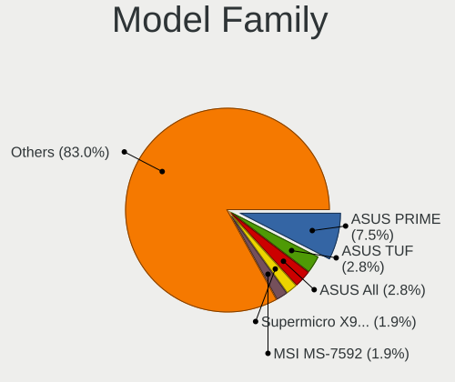

| Name                   | Desktops | Percent |
|------------------------|----------|---------|
| ASUS PRIME             | 8        | 7.55%   |
| ASUS TUF               | 3        | 2.83%   |
| ASUS All               | 3        | 2.83%   |
| Supermicro X9SCL-II    | 2        | 1.89%   |
| MSI MS-7592            | 2        | 1.89%   |
| HP ProDesk             | 2        | 1.89%   |
| Gigabyte Z690          | 2        | 1.89%   |
| Gigabyte H81M-S2PV     | 2        | 1.89%   |
| Gigabyte H61M-S1       | 2        | 1.89%   |
| Biostar GF8200C        | 2        | 1.89%   |
| Biostar A960G+         | 2        | 1.89%   |
| ASUS P8H61-M           | 2        | 1.89%   |
| ASUS P7P55D-E          | 2        | 1.89%   |
| ASUS M5A78L-M          | 2        | 1.89%   |
| ASUS H110M-R           | 2        | 1.89%   |
| MSI Pro                | 1        | 0.94%   |
| MSI MS-7D78            | 1        | 0.94%   |
| MSI MS-7D25            | 1        | 0.94%   |
| MSI MS-7C37            | 1        | 0.94%   |
| MSI MS-7B08            | 1        | 0.94%   |
| MSI MS-7850            | 1        | 0.94%   |
| MSI MS-7695            | 1        | 0.94%   |
| MSI MS-7529            | 1        | 0.94%   |
| MSI MS-7309            | 1        | 0.94%   |
| MACHINIST X79          | 1        | 0.94%   |
| Lenovo ThinkStation    | 1        | 0.94%   |
| Intel B75              | 1        | 0.94%   |
| Gigabyte Z490M         | 1        | 0.94%   |
| Gigabyte X570          | 1        | 0.94%   |
| Gigabyte P41-ES3G      | 1        | 0.94%   |
| Gigabyte H81M-HD3      | 1        | 0.94%   |
| Gigabyte H67M-D2-B3    | 1        | 0.94%   |
| Gigabyte H61M-S2-B3    | 1        | 0.94%   |
| Gigabyte GA-970A-DS3   | 1        | 0.94%   |
| Gigabyte GA-880GM-USB3 | 1        | 0.94%   |
| Gigabyte GA-78LMT-USB3 | 1        | 0.94%   |
| Gigabyte G41MT-S2      | 1        | 0.94%   |
| Gigabyte G41M-ES2L     | 1        | 0.94%   |
| Gigabyte EP43-UD3L     | 1        | 0.94%   |
| Gigabyte B550M         | 1        | 0.94%   |

MFG Year
--------

Motherboard manufacture year

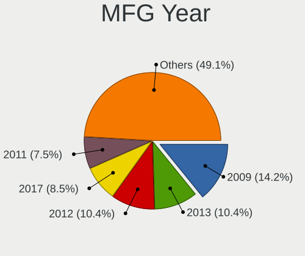

| Year | Desktops | Percent |
|------|----------|---------|
| 2009 | 15       | 14.15%  |
| 2013 | 11       | 10.38%  |
| 2012 | 11       | 10.38%  |
| 2017 | 9        | 8.49%   |
| 2011 | 8        | 7.55%   |
| 2010 | 8        | 7.55%   |
| 2021 | 6        | 5.66%   |
| 2020 | 6        | 5.66%   |
| 2023 | 5        | 4.72%   |
| 2022 | 4        | 3.77%   |
| 2018 | 4        | 3.77%   |
| 2015 | 4        | 3.77%   |
| 2019 | 3        | 2.83%   |
| 2016 | 3        | 2.83%   |
| 2014 | 3        | 2.83%   |
| 2006 | 3        | 2.83%   |
| 2007 | 2        | 1.89%   |
| 2005 | 1        | 0.94%   |

Form Factor
-----------

Physical design of the computer

| Name    | Desktops | Percent |
|---------|----------|---------|
| Desktop | 106      | 100%    |

Secure Boot
-----------

Enabled or disabled

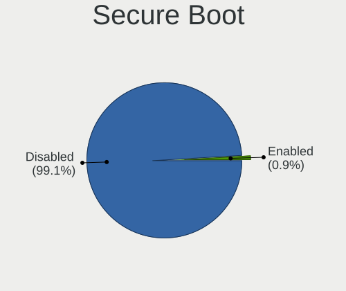

| State    | Desktops | Percent |
|----------|----------|---------|
| Disabled | 105      | 99.06%  |
| Enabled  | 1        | 0.94%   |

Coreboot
--------

Have coreboot on board

| Used | Desktops | Percent |
|------|----------|---------|
| No   | 106      | 100%    |

RAM Size
--------

Total RAM memory

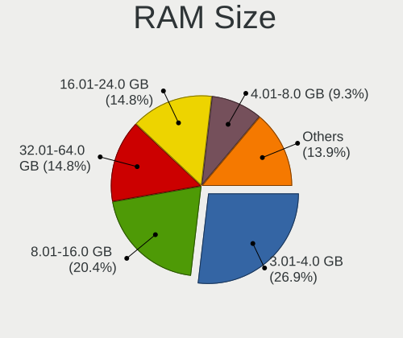

| Size in GB  | Desktops | Percent |
|-------------|----------|---------|
| 3.01-4.0    | 29       | 26.85%  |
| 8.01-16.0   | 22       | 20.37%  |
| 32.01-64.0  | 16       | 14.81%  |
| 16.01-24.0  | 16       | 14.81%  |
| 4.01-8.0    | 10       | 9.26%   |
| 1.01-2.0    | 6        | 5.56%   |
| 2.01-3.0    | 4        | 3.7%    |
| 24.01-32.0  | 2        | 1.85%   |
| 64.01-256.0 | 2        | 1.85%   |
| 0.51-1.0    | 1        | 0.93%   |

RAM Used
--------

Used RAM memory

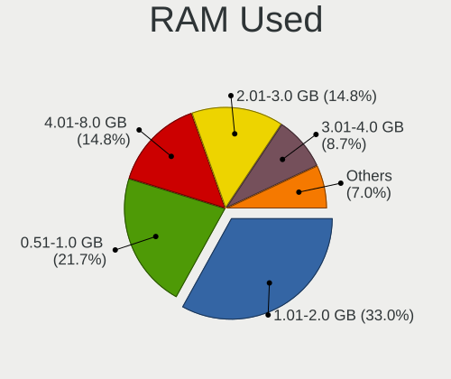

| Used GB    | Desktops | Percent |
|------------|----------|---------|
| 1.01-2.0   | 38       | 33.04%  |
| 0.51-1.0   | 25       | 21.74%  |
| 4.01-8.0   | 17       | 14.78%  |
| 2.01-3.0   | 17       | 14.78%  |
| 3.01-4.0   | 10       | 8.7%    |
| 0.01-0.5   | 4        | 3.48%   |
| 8.01-16.0  | 2        | 1.74%   |
| 24.01-32.0 | 1        | 0.87%   |
| Unknown    | 1        | 0.87%   |

Total Drives
------------

Number of drives on board

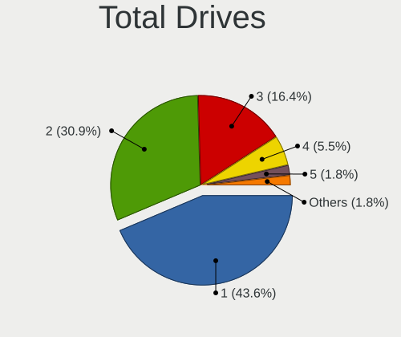

| Drives | Desktops | Percent |
|--------|----------|---------|
| 1      | 48       | 43.64%  |
| 2      | 34       | 30.91%  |
| 3      | 18       | 16.36%  |
| 4      | 6        | 5.45%   |
| 5      | 2        | 1.82%   |
| 25     | 1        | 0.91%   |
| 0      | 1        | 0.91%   |

Has CD-ROM
----------

Has CD-ROM on board

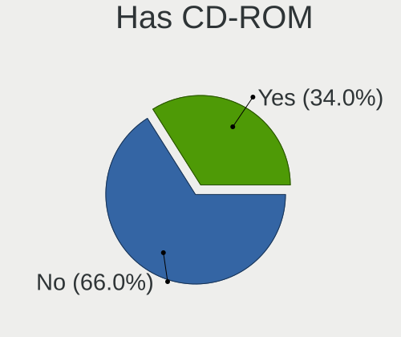

| Presented | Desktops | Percent |
|-----------|----------|---------|
| No        | 70       | 66.04%  |
| Yes       | 36       | 33.96%  |

Has Ethernet
------------

Has Ethernet on board

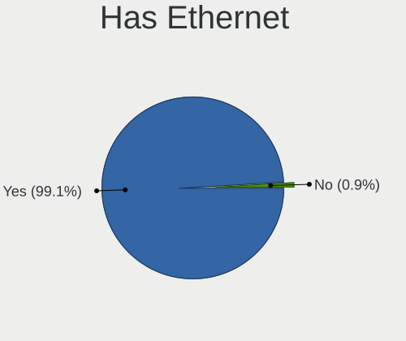

| Presented | Desktops | Percent |
|-----------|----------|---------|
| Yes       | 105      | 99.06%  |
| No        | 1        | 0.94%   |

Has WiFi
--------

Has WiFi module

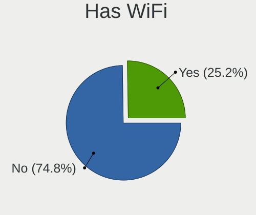

| Presented | Desktops | Percent |
|-----------|----------|---------|
| No        | 80       | 74.77%  |
| Yes       | 27       | 25.23%  |

Has Bluetooth
-------------

Has Bluetooth module

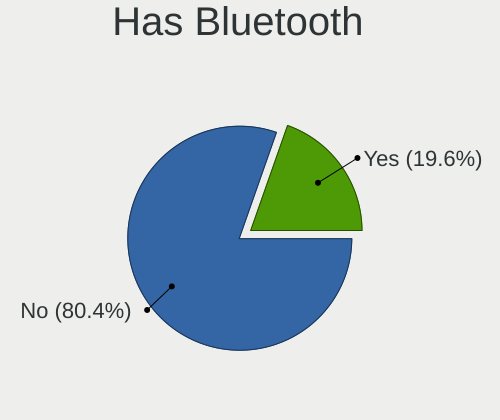

| Presented | Desktops | Percent |
|-----------|----------|---------|
| No        | 86       | 80.37%  |
| Yes       | 21       | 19.63%  |

Location
--------

Country
-------

Geographic location (country)

| Country | Desktops | Percent |
|---------|----------|---------|
| Moldova | 106      | 100%    |

City
----

Geographic location (city)

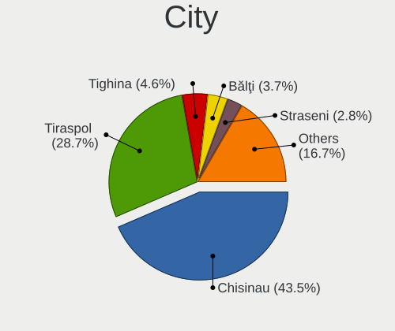

| City       | Desktops | Percent |
|------------|----------|---------|
| Chisinau   | 47       | 43.52%  |
| Tiraspol   | 31       | 28.7%   |
| Tighina    | 5        | 4.63%   |
| Bălţi    | 4        | 3.7%    |
| Straseni   | 3        | 2.78%   |
| Varniţa   | 2        | 1.85%   |
| Hînceşti | 2        | 1.85%   |
| Cahul      | 2        | 1.85%   |
| Tintareni  | 1        | 0.93%   |
| Singera    | 1        | 0.93%   |
| Rîbniţa  | 1        | 0.93%   |
| Rezina     | 1        | 0.93%   |
| Orhei      | 1        | 0.93%   |
| Lapusna    | 1        | 0.93%   |
| Ialoveni   | 1        | 0.93%   |
| Edineţ    | 1        | 0.93%   |
| Drochia    | 1        | 0.93%   |
| Cazanesti  | 1        | 0.93%   |
| Căușeni  | 1        | 0.93%   |
| Calarasi   | 1        | 0.93%   |

Drives
------

Drive Vendor
------------

Hard drive vendors

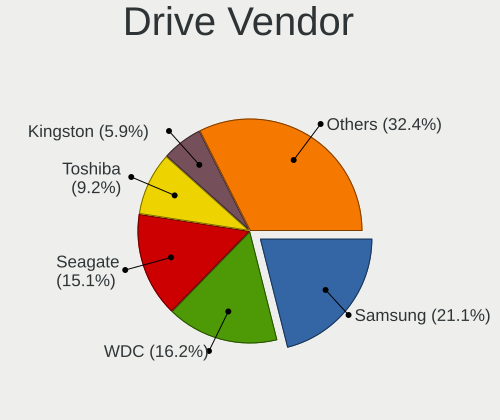

| Vendor                    | Desktops | Drives | Percent |
|---------------------------|----------|--------|---------|
| Samsung Electronics       | 39       | 45     | 21.08%  |
| WDC                       | 30       | 35     | 16.22%  |
| Seagate                   | 28       | 56     | 15.14%  |
| Toshiba                   | 17       | 19     | 9.19%   |
| Kingston                  | 11       | 13     | 5.95%   |
| Hitachi                   | 7        | 9      | 3.78%   |
| Transcend                 | 6        | 6      | 3.24%   |
| SPCC                      | 6        | 8      | 3.24%   |
| Apacer                    | 5        | 7      | 2.7%    |
| SK hynix                  | 3        | 3      | 1.62%   |
| Maxtor                    | 3        | 4      | 1.62%   |
| SanDisk                   | 2        | 3      | 1.08%   |
| Patriot                   | 2        | 2      | 1.08%   |
| Micron/Crucial Technology | 2        | 2      | 1.08%   |
| Intel                     | 2        | 2      | 1.08%   |
| GOODRAM                   | 2        | 2      | 1.08%   |
| Crucial                   | 2        | 3      | 1.08%   |
| XPG                       | 1        | 1      | 0.54%   |
| Team                      | 1        | 1      | 0.54%   |
| Realtek Semiconductor     | 1        | 1      | 0.54%   |
| PNY                       | 1        | 1      | 0.54%   |
| Phison Electronics        | 1        | 1      | 0.54%   |
| Phison                    | 1        | 1      | 0.54%   |
| OCZ                       | 1        | 1      | 0.54%   |
| Netac                     | 1        | 1      | 0.54%   |
| Leven                     | 1        | 1      | 0.54%   |
| KIOXIA-EXCERIA            | 1        | 1      | 0.54%   |
| KingFast                  | 1        | 1      | 0.54%   |
| HGST                      | 1        | 1      | 0.54%   |
| Goldkey                   | 1        | 1      | 0.54%   |
| Gigabyte Technology       | 1        | 2      | 0.54%   |
| CHN25SATAS1               | 1        | 1      | 0.54%   |
| China                     | 1        | 1      | 0.54%   |
| ADATA Technology          | 1        | 3      | 0.54%   |
| ACOS                      | 1        | 1      | 0.54%   |

Drive Model
-----------

Hard drive models

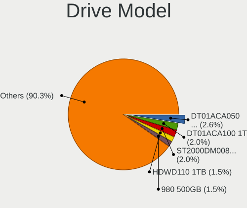

| Model                                             | Desktops | Percent |
|---------------------------------------------------|----------|---------|
| Toshiba DT01ACA050 500GB                          | 5        | 2.55%   |
| Toshiba DT01ACA100 1TB                            | 4        | 2.04%   |
| Seagate ST2000DM008-2FR102 2TB                    | 4        | 2.04%   |
| Toshiba HDWD110 1TB                               | 3        | 1.53%   |
| Samsung SSD 980 500GB                             | 3        | 1.53%   |
| Samsung SSD 860 EVO 500GB                         | 3        | 1.53%   |
| Samsung HD502HJ 500GB                             | 3        | 1.53%   |
| Kingston SHFS37A120G 120GB SSD                    | 3        | 1.53%   |
| Kingston SA400S37240G 240GB SSD                   | 3        | 1.53%   |
| WDC WD5000AZRX-00A8LB0 500GB                      | 2        | 1.02%   |
| WDC WD20EZBX-00AYRA0 2TB                          | 2        | 1.02%   |
| Transcend TS64GSSD370S 64GB                       | 2        | 1.02%   |
| Toshiba DT01ACA200 2TB                            | 2        | 1.02%   |
| SPCC Solid State Disk 128GB                       | 2        | 1.02%   |
| Seagate ST500LT012-9WS142 500GB                   | 2        | 1.02%   |
| Seagate ST500DM002-1BD142 500GB                   | 2        | 1.02%   |
| Seagate ST4000VM000-2AF166 4TB                    | 2        | 1.02%   |
| Seagate ST3160023A 160GB                          | 2        | 1.02%   |
| Seagate ST1000DL002-9TT153 1TB                    | 2        | 1.02%   |
| Samsung NVMe SSD Controller SM981/PM981/PM983 1TB | 2        | 1.02%   |
| Samsung HD251HJ 250GB                             | 2        | 1.02%   |
| Samsung HD082GJ 80GB                              | 2        | 1.02%   |
| Micron/Crucial P2 NVMe PCIe SSD 2TB               | 2        | 1.02%   |
| Kingston SNV2S500G 500GB                          | 2        | 1.02%   |
| Crucial CT500MX500SSD1 500GB                      | 2        | 1.02%   |
| Apacer AS350 128GB SSD                            | 2        | 1.02%   |
| XPG NVMe SSD Drive 512GB                          | 1        | 0.51%   |
| WDC WDS500G2B0A-00SM50 500GB                      | 1        | 0.51%   |
| WDC WDS240G2G0A-00JH30 240GB SSD                  | 1        | 0.51%   |
| WDC WD800JD-22LSA0 80GB                           | 1        | 0.51%   |
| WDC WD62PURZ-85B3AY0 6TB                          | 1        | 0.51%   |
| WDC WD5000AZRZ-00HTKB0 500GB                      | 1        | 0.51%   |
| WDC WD5000AURX-63UY4Y0 500GB                      | 1        | 0.51%   |
| WDC WD5000AUDX-63WNHY0 500GB                      | 1        | 0.51%   |
| WDC WD5000AAKX-08ERMA0 500GB                      | 1        | 0.51%   |
| WDC WD5000AAKX-00ERMA0 500GB                      | 1        | 0.51%   |
| WDC WD5000AAKS-75V0A0 500GB                       | 1        | 0.51%   |
| WDC WD5000AAKS-00WWPA0 500GB                      | 1        | 0.51%   |
| WDC WD5000AAJS-00A8B0 500GB                       | 1        | 0.51%   |
| WDC WD5000AADS-56S9B1 499GB                       | 1        | 0.51%   |

HDD Vendor
----------

Hard disk drive vendors

| Vendor              | Desktops | Drives | Percent |
|---------------------|----------|--------|---------|
| WDC                 | 28       | 32     | 27.45%  |
| Seagate             | 28       | 56     | 27.45%  |
| Samsung Electronics | 20       | 23     | 19.61%  |
| Toshiba             | 15       | 17     | 14.71%  |
| Hitachi             | 7        | 9      | 6.86%   |
| Maxtor              | 3        | 4      | 2.94%   |
| HGST                | 1        | 1      | 0.98%   |

SSD Vendor
----------

Solid state drive vendors

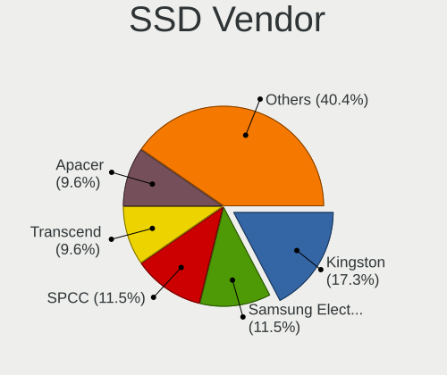

| Vendor              | Desktops | Drives | Percent |
|---------------------|----------|--------|---------|
| Kingston            | 9        | 10     | 17.31%  |
| SPCC                | 6        | 8      | 11.54%  |
| Samsung Electronics | 6        | 6      | 11.54%  |
| Transcend           | 5        | 5      | 9.62%   |
| Apacer              | 5        | 7      | 9.62%   |
| WDC                 | 2        | 3      | 3.85%   |
| Patriot             | 2        | 2      | 3.85%   |
| GOODRAM             | 2        | 2      | 3.85%   |
| Crucial             | 2        | 3      | 3.85%   |
| Toshiba             | 1        | 1      | 1.92%   |
| Team                | 1        | 1      | 1.92%   |
| SanDisk             | 1        | 1      | 1.92%   |
| PNY                 | 1        | 1      | 1.92%   |
| OCZ                 | 1        | 1      | 1.92%   |
| Leven               | 1        | 1      | 1.92%   |
| KIOXIA-EXCERIA      | 1        | 1      | 1.92%   |
| KingFast            | 1        | 1      | 1.92%   |
| Goldkey             | 1        | 1      | 1.92%   |
| Gigabyte Technology | 1        | 2      | 1.92%   |
| CHN25SATAS1         | 1        | 1      | 1.92%   |
| China               | 1        | 1      | 1.92%   |
| ACOS                | 1        | 1      | 1.92%   |

Drive Kind
----------

HDD or SSD

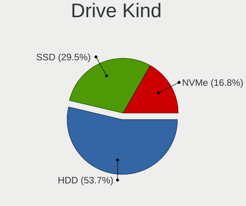

| Kind | Desktops | Drives | Percent |
|------|----------|--------|---------|
| HDD  | 80       | 142    | 53.69%  |
| SSD  | 44       | 60     | 29.53%  |
| NVMe | 25       | 38     | 16.78%  |

Drive Connector
---------------

SATA, SAS, NVMe, etc.

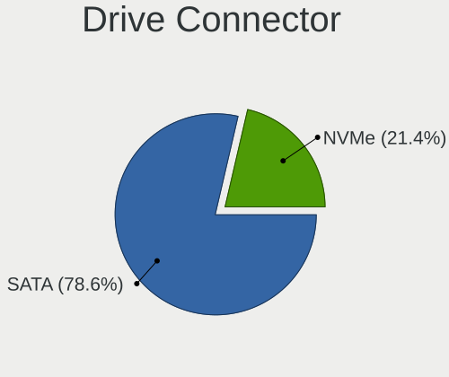

| Type | Desktops | Drives | Percent |
|------|----------|--------|---------|
| SATA | 92       | 202    | 78.63%  |
| NVMe | 25       | 38     | 21.37%  |

Drive Size
----------

Size of hard drive

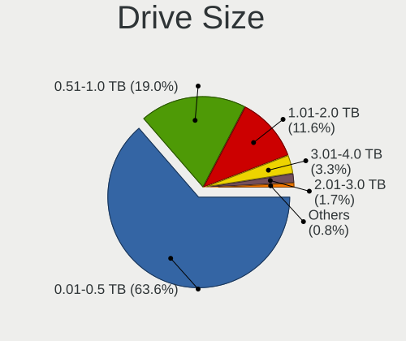

| Size in TB | Desktops | Drives | Percent |
|------------|----------|--------|---------|
| 0.01-0.5   | 77       | 128    | 63.64%  |
| 0.51-1.0   | 23       | 53     | 19.01%  |
| 1.01-2.0   | 14       | 14     | 11.57%  |
| 3.01-4.0   | 4        | 4      | 3.31%   |
| 2.01-3.0   | 2        | 2      | 1.65%   |
| 4.01-10.0  | 1        | 1      | 0.83%   |

Space Total
-----------

Amount of disk space available on the file system

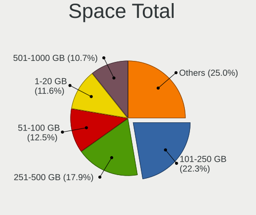

| Size in GB     | Desktops | Percent |
|----------------|----------|---------|
| 101-250        | 25       | 22.32%  |
| 251-500        | 20       | 17.86%  |
| 51-100         | 14       | 12.5%   |
| 1-20           | 13       | 11.61%  |
| 501-1000       | 12       | 10.71%  |
| 1001-2000      | 8        | 7.14%   |
| More than 3000 | 7        | 6.25%   |
| 2001-3000      | 6        | 5.36%   |
| 21-50          | 5        | 4.46%   |
| Unknown        | 2        | 1.79%   |

Space Used
----------

Amount of used disk space

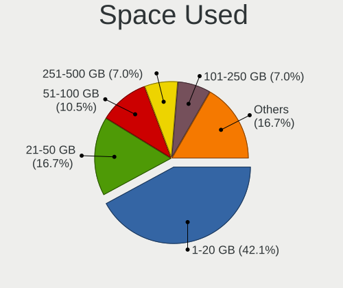

| Used GB        | Desktops | Percent |
|----------------|----------|---------|
| 1-20           | 48       | 42.11%  |
| 21-50          | 19       | 16.67%  |
| 51-100         | 12       | 10.53%  |
| 251-500        | 8        | 7.02%   |
| 101-250        | 8        | 7.02%   |
| 1001-2000      | 7        | 6.14%   |
| 501-1000       | 5        | 4.39%   |
| More than 3000 | 4        | 3.51%   |
| Unknown        | 2        | 1.75%   |
| 2001-3000      | 1        | 0.88%   |

Malfunc. Drives
---------------

Drive models with a malfunction

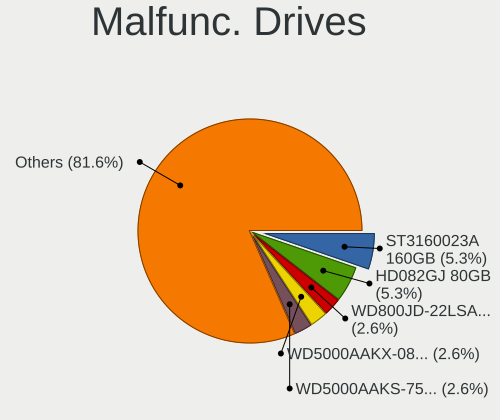

| Model                             | Desktops | Drives | Percent |
|-----------------------------------|----------|--------|---------|
| Seagate ST3160023A 160GB          | 2        | 2      | 5.26%   |
| Samsung Electronics HD082GJ 80GB  | 2        | 2      | 5.26%   |
| WDC WD800JD-22LSA0 80GB           | 1        | 1      | 2.63%   |
| WDC WD5000AAKX-08ERMA0 500GB      | 1        | 1      | 2.63%   |
| WDC WD5000AAKS-75V0A0 500GB       | 1        | 1      | 2.63%   |
| WDC WD5000AAKS-00WWPA0 500GB      | 1        | 1      | 2.63%   |
| WDC WD5000AADS-56S9B1 499GB       | 1        | 1      | 2.63%   |
| WDC WD2500AAKX-00U6AA0 250GB      | 1        | 1      | 2.63%   |
| WDC WD1600BEVS-60RST0 160GB       | 1        | 1      | 2.63%   |
| Transcend TS512GSSD370S 512GB     | 1        | 1      | 2.63%   |
| Toshiba MQ01ABD032 320GB          | 1        | 1      | 2.63%   |
| Toshiba DT01ACA200 2TB            | 1        | 1      | 2.63%   |
| Toshiba DT01ACA050 500GB          | 1        | 1      | 2.63%   |
| Team L5 LITE SSD 240GB            | 1        | 1      | 2.63%   |
| SPCC SSD162 120GB                 | 1        | 1      | 2.63%   |
| SPCC Solid State Disk 56GB        | 1        | 2      | 2.63%   |
| Seagate ST500LT012-9WS142 500GB   | 1        | 1      | 2.63%   |
| Seagate ST3500418AS 500GB         | 1        | 1      | 2.63%   |
| Seagate ST320DM001 HD322GJ 320GB  | 1        | 1      | 2.63%   |
| Seagate ST31000340NS 1TB          | 1        | 1      | 2.63%   |
| Seagate ST2000DM008-2FR102 2TB    | 1        | 1      | 2.63%   |
| Seagate ST1000LM035-1RK172 1TB    | 1        | 1      | 2.63%   |
| Seagate ST1000DL002-9TT153 1TB    | 1        | 1      | 2.63%   |
| Samsung Electronics HD753LJ 752GB | 1        | 1      | 2.63%   |
| Samsung Electronics HD322HJ 320GB | 1        | 1      | 2.63%   |
| Samsung Electronics HD103UJ 1TB   | 1        | 1      | 2.63%   |
| Samsung Electronics HD080HJ/ 80GB | 1        | 1      | 2.63%   |
| Maxtor STM380215AS 80GB           | 1        | 1      | 2.63%   |
| Maxtor STM3160811AS 160GB         | 1        | 1      | 2.63%   |
| Maxtor STM3160211AS 160GB         | 1        | 1      | 2.63%   |
| Maxtor 4R120L0 128GB              | 1        | 1      | 2.63%   |
| Kingston SHFS37A120G 120GB SSD    | 1        | 1      | 2.63%   |
| Hitachi HTS545025B9A300 250GB     | 1        | 1      | 2.63%   |
| Hitachi HDT721010SLA360 1TB       | 1        | 2      | 2.63%   |
| Hitachi HDP725050GLA360 500GB     | 1        | 1      | 2.63%   |
| Hitachi HDP725025GLA380 250GB     | 1        | 2      | 2.63%   |

Malfunc. Drive Vendor
---------------------

Vendors of faulty drives

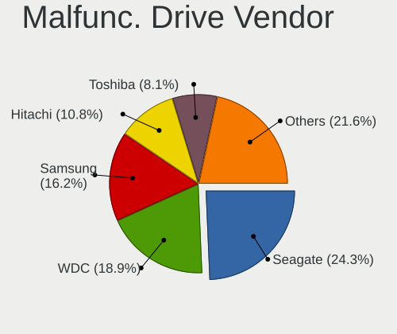

| Vendor              | Desktops | Drives | Percent |
|---------------------|----------|--------|---------|
| Seagate             | 9        | 9      | 24.32%  |
| WDC                 | 7        | 7      | 18.92%  |
| Samsung Electronics | 6        | 6      | 16.22%  |
| Hitachi             | 4        | 6      | 10.81%  |
| Toshiba             | 3        | 3      | 8.11%   |
| Maxtor              | 3        | 4      | 8.11%   |
| SPCC                | 2        | 3      | 5.41%   |
| Transcend           | 1        | 1      | 2.7%    |
| Team                | 1        | 1      | 2.7%    |
| Kingston            | 1        | 1      | 2.7%    |

Malfunc. HDD Vendor
-------------------

Vendors of faulty HDD drives

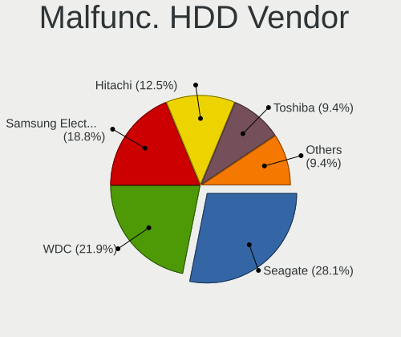

| Vendor              | Desktops | Drives | Percent |
|---------------------|----------|--------|---------|
| Seagate             | 9        | 9      | 28.13%  |
| WDC                 | 7        | 7      | 21.88%  |
| Samsung Electronics | 6        | 6      | 18.75%  |
| Hitachi             | 4        | 6      | 12.5%   |
| Toshiba             | 3        | 3      | 9.38%   |
| Maxtor              | 3        | 4      | 9.38%   |

Malfunc. Drive Kind
-------------------

Kinds of faulty drives

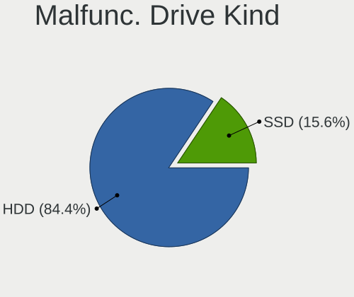

| Kind | Desktops | Drives | Percent |
|------|----------|--------|---------|
| HDD  | 27       | 35     | 84.38%  |
| SSD  | 5        | 6      | 15.63%  |

Failed Drives
-------------

Failed drive models

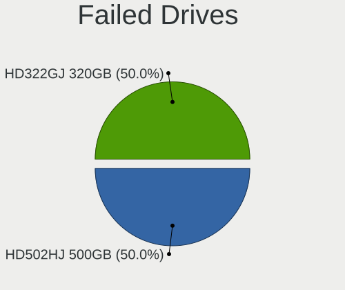

| Model                             | Desktops | Drives | Percent |
|-----------------------------------|----------|--------|---------|
| WDC WD3200BPVT-24ZEST0 320GB      | 1        | 1      | 33.33%  |
| Samsung Electronics HD502HJ 500GB | 1        | 1      | 33.33%  |
| Samsung Electronics HD322GJ 320GB | 1        | 2      | 33.33%  |

Failed Drive Vendor
-------------------

Failed drive vendors

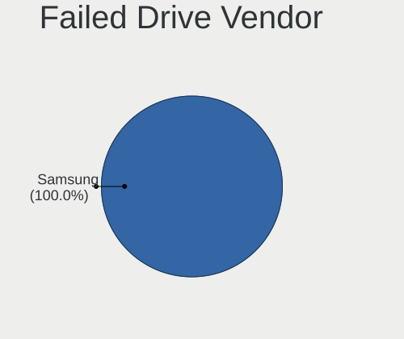

| Vendor              | Desktops | Drives | Percent |
|---------------------|----------|--------|---------|
| Samsung Electronics | 2        | 3      | 66.67%  |
| WDC                 | 1        | 1      | 33.33%  |

Drive Status
------------

Number of failed and malfunc. drives

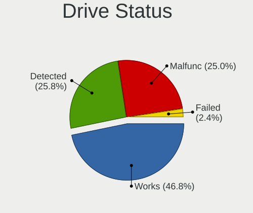

| Status   | Desktops | Drives | Percent |
|----------|----------|--------|---------|
| Works    | 58       | 125    | 46.77%  |
| Detected | 32       | 70     | 25.81%  |
| Malfunc  | 31       | 41     | 25%     |
| Failed   | 3        | 4      | 2.42%   |

Storage controller
------------------

Storage Vendor
--------------

Storage controller vendors

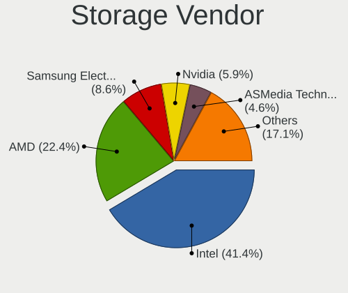

| Vendor                       | Desktops | Percent |
|------------------------------|----------|---------|
| Intel                        | 63       | 41.45%  |
| AMD                          | 34       | 22.37%  |
| Samsung Electronics          | 13       | 8.55%   |
| Nvidia                       | 9        | 5.92%   |
| ASMedia Technology           | 7        | 4.61%   |
| JMicron Technology           | 6        | 3.95%   |
| SK hynix                     | 3        | 1.97%   |
| Phison Electronics           | 2        | 1.32%   |
| Micron/Crucial Technology    | 2        | 1.32%   |
| Marvell Technology Group     | 2        | 1.32%   |
| Kingston Technology Company  | 2        | 1.32%   |
| Broadcom / LSI               | 2        | 1.32%   |
| ADATA Technology             | 2        | 1.32%   |
| Toshiba America Info Systems | 1        | 0.66%   |
| Silicon Motion               | 1        | 0.66%   |
| SanDisk                      | 1        | 0.66%   |
| Realtek Semiconductor        | 1        | 0.66%   |
| Netac Technology             | 1        | 0.66%   |

Storage Model
-------------

Storage controller models

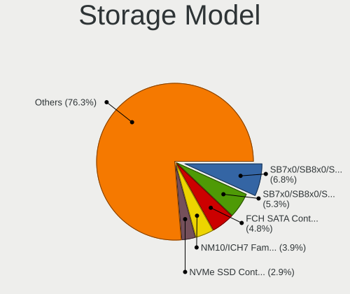

| Model                                                                                   | Desktops | Percent |
|-----------------------------------------------------------------------------------------|----------|---------|
| AMD SB7x0/SB8x0/SB9x0 IDE Controller                                                    | 14       | 6.76%   |
| AMD SB7x0/SB8x0/SB9x0 SATA Controller [IDE mode]                                        | 11       | 5.31%   |
| AMD FCH SATA Controller [AHCI mode]                                                     | 10       | 4.83%   |
| Intel NM10/ICH7 Family SATA Controller [IDE mode]                                       | 8        | 3.86%   |
| Samsung NVMe SSD Controller SM981/PM981/PM983                                           | 6        | 2.9%    |
| Intel Alder Lake-S PCH SATA Controller [AHCI Mode]                                      | 6        | 2.9%    |
| Intel 82801G (ICH7 Family) IDE Controller                                               | 6        | 2.9%    |
| ASMedia ASM1061/ASM1062 Serial ATA Controller                                           | 6        | 2.9%    |
| Intel Q170/Q150/B150/H170/H110/Z170/CM236 Chipset SATA Controller [AHCI Mode]           | 5        | 2.42%   |
| Intel 8 Series/C220 Series Chipset Family 6-port SATA Controller 1 [AHCI mode]          | 5        | 2.42%   |
| Intel 6 Series/C200 Series Chipset Family Desktop SATA Controller (IDE mode, ports 4-5) | 5        | 2.42%   |
| Intel 6 Series/C200 Series Chipset Family Desktop SATA Controller (IDE mode, ports 0-3) | 5        | 2.42%   |
| Intel 6 Series/C200 Series Chipset Family 6 port Desktop SATA AHCI Controller           | 5        | 2.42%   |
| Intel 200 Series PCH SATA controller [AHCI mode]                                        | 4        | 1.93%   |
| AMD 500 Series Chipset SATA Controller                                                  | 4        | 1.93%   |
| AMD 300 Series Chipset SATA Controller                                                  | 4        | 1.93%   |
| Samsung NVMe SSD Controller 980 (DRAM-less)                                             | 3        | 1.45%   |
| Nvidia MCP78S [GeForce 8200] SATA Controller (non-AHCI mode)                            | 3        | 1.45%   |
| Nvidia MCP78S [GeForce 8200] IDE                                                        | 3        | 1.45%   |
| Nvidia MCP61 SATA Controller                                                            | 3        | 1.45%   |
| Nvidia MCP61 IDE                                                                        | 3        | 1.45%   |
| JMicron JMB368 IDE controller                                                           | 3        | 1.45%   |
| JMicron JMB363 SATA/IDE Controller                                                      | 3        | 1.45%   |
| Intel Volume Management Device NVMe RAID Controller                                     | 3        | 1.45%   |
| Intel 9 Series Chipset Family SATA Controller [AHCI Mode]                               | 3        | 1.45%   |
| AMD SB7x0/SB8x0/SB9x0 SATA Controller [AHCI mode]                                       | 3        | 1.45%   |
| AMD FCH SATA Controller [IDE mode]                                                      | 3        | 1.45%   |
| SK hynix BC501 NVMe Solid State Drive                                                   | 2        | 0.97%   |
| Micron/Crucial P2 [Nick P2] / P3 / P3 Plus NVMe PCIe SSD (DRAM-less)                    | 2        | 0.97%   |
| Marvell Group 88SE914D SATA-600 Controller                                              | 2        | 0.97%   |
| Intel SATA Controller [RAID Mode]                                                       | 2        | 0.97%   |
| Intel Raptor Lake SATA AHCI Controller                                                  | 2        | 0.97%   |
| Intel Comet Lake SATA AHCI Controller                                                   | 2        | 0.97%   |
| Intel 82801JI (ICH10 Family) 4 port SATA IDE Controller #1                              | 2        | 0.97%   |
| Intel 82801JI (ICH10 Family) 2 port SATA IDE Controller #2                              | 2        | 0.97%   |
| Intel 8 Series/C220 Series Chipset Family 4-port SATA Controller 1 [IDE mode]           | 2        | 0.97%   |
| Intel 7 Series/C210 Series Chipset Family 6-port SATA Controller [AHCI mode]            | 2        | 0.97%   |
| Intel 5 Series/3400 Series Chipset 6 port SATA AHCI Controller                          | 2        | 0.97%   |
| Broadcom / LSI MegaRAID SAS 2108 [Liberator]                                            | 2        | 0.97%   |
| AMD FCH IDE Controller                                                                  | 2        | 0.97%   |

Storage Kind
------------

Kind of storage controller (IDE, SATA, NVMe, SAS, ...)

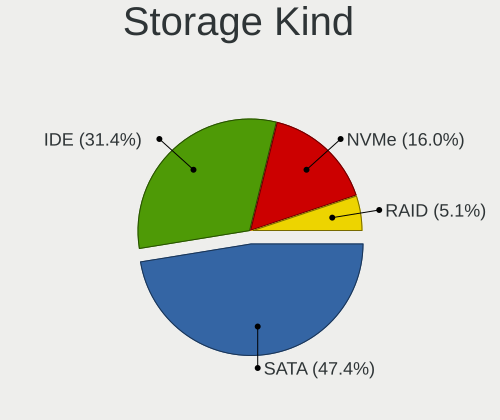

| Kind | Desktops | Percent |
|------|----------|---------|
| SATA | 74       | 47.44%  |
| IDE  | 49       | 31.41%  |
| NVMe | 25       | 16.03%  |
| RAID | 8        | 5.13%   |

Processor
---------

CPU Vendor
----------

Processor vendors

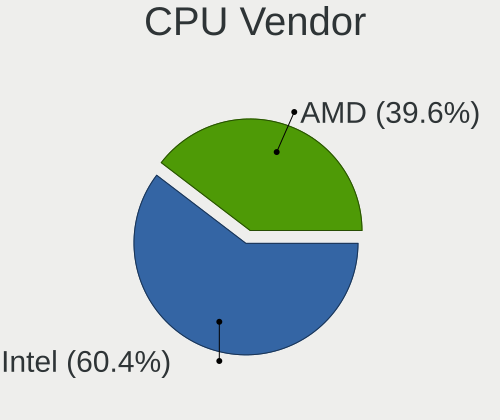

| Vendor | Desktops | Percent |
|--------|----------|---------|
| Intel  | 64       | 60.38%  |
| AMD    | 42       | 39.62%  |

CPU Model
---------

Processor models

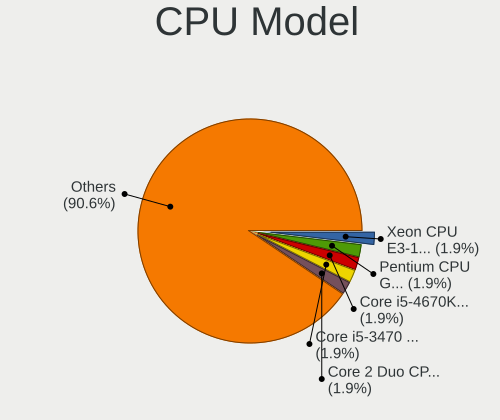

| Model                                       | Desktops | Percent |
|---------------------------------------------|----------|---------|
| Intel Xeon CPU E3-1230 V2 @ 3.30GHz         | 2        | 1.89%   |
| Intel Pentium CPU G4400 @ 3.30GHz           | 2        | 1.89%   |
| Intel Core i5-4670K CPU @ 3.40GHz           | 2        | 1.89%   |
| Intel Core i5-3470 CPU @ 3.20GHz            | 2        | 1.89%   |
| Intel Core 2 Duo CPU E8400 @ 3.00GHz        | 2        | 1.89%   |
| Intel 12th Gen Core i7-12700KF              | 2        | 1.89%   |
| Intel 12th Gen Core i5-12400F               | 2        | 1.89%   |
| AMD Ryzen 7 3700X 8-Core Processor          | 2        | 1.89%   |
| AMD Ryzen 5 3600X 6-Core Processor          | 2        | 1.89%   |
| AMD Phenom II X6 1055T Processor            | 2        | 1.89%   |
| AMD Athlon II X2 280 Processor              | 2        | 1.89%   |
| AMD Athlon II X2 240 Processor              | 2        | 1.89%   |
| AMD Athlon II X2 215 Processor              | 2        | 1.89%   |
| Intel Xeon CPU E5-2660 0 @ 2.20GHz          | 1        | 0.94%   |
| Intel Xeon CPU E5-2620 0 @ 2.00GHz          | 1        | 0.94%   |
| Intel Pentium Dual-Core CPU E6700 @ 3.20GHz | 1        | 0.94%   |
| Intel Pentium Dual-Core CPU E5400 @ 2.70GHz | 1        | 0.94%   |
| Intel Pentium Dual CPU E2160 @ 1.80GHz      | 1        | 0.94%   |
| Intel Pentium D CPU 2.80GHz                 | 1        | 0.94%   |
| Intel Pentium D CPU 2.66GHz                 | 1        | 0.94%   |
| Intel Pentium CPU N3700 @ 1.60GHz           | 1        | 0.94%   |
| Intel Pentium CPU G640 @ 2.80GHz            | 1        | 0.94%   |
| Intel Pentium CPU G4620 @ 3.70GHz           | 1        | 0.94%   |
| Intel Pentium CPU G4560 @ 3.50GHz           | 1        | 0.94%   |
| Intel Pentium CPU G3240 @ 3.10GHz           | 1        | 0.94%   |
| Intel Pentium 4 CPU 2.66GHz                 | 1        | 0.94%   |
| Intel Core i9-10900 CPU @ 2.80GHz           | 1        | 0.94%   |
| Intel Core i7-7820X CPU @ 3.60GHz           | 1        | 0.94%   |
| Intel Core i7-6700T CPU @ 2.80GHz           | 1        | 0.94%   |
| Intel Core i7-4770K CPU @ 3.50GHz           | 1        | 0.94%   |
| Intel Core i7-3770K CPU @ 3.50GHz           | 1        | 0.94%   |
| Intel Core i7-2700K CPU @ 3.50GHz           | 1        | 0.94%   |
| Intel Core i7-2600 CPU @ 3.40GHz            | 1        | 0.94%   |
| Intel Core i7 CPU 860 @ 2.80GHz             | 1        | 0.94%   |
| Intel Core i5-7500 CPU @ 3.40GHz            | 1        | 0.94%   |
| Intel Core i5-6500 CPU @ 3.20GHz            | 1        | 0.94%   |
| Intel Core i5-4690 CPU @ 3.50GHz            | 1        | 0.94%   |
| Intel Core i5-4570 CPU @ 3.20GHz            | 1        | 0.94%   |
| Intel Core i5-4460 CPU @ 3.20GHz            | 1        | 0.94%   |
| Intel Core i5-10600K CPU @ 4.10GHz          | 1        | 0.94%   |

CPU Model Family
----------------

Processor model prefix

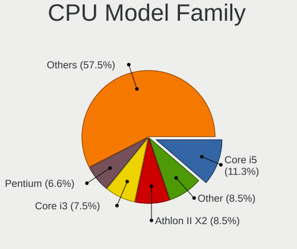

| Model                   | Desktops | Percent |
|-------------------------|----------|---------|
| Intel Core i5           | 12       | 11.32%  |
| Other                   | 9        | 8.49%   |
| AMD Athlon II X2        | 9        | 8.49%   |
| Intel Core i3           | 8        | 7.55%   |
| Intel Pentium           | 7        | 6.6%    |
| Intel Core i7           | 7        | 6.6%    |
| AMD Ryzen 5             | 7        | 6.6%    |
| AMD Ryzen 7             | 6        | 5.66%   |
| Intel Xeon              | 4        | 3.77%   |
| Intel Celeron           | 4        | 3.77%   |
| AMD FX                  | 4        | 3.77%   |
| AMD Athlon 64 X2        | 4        | 3.77%   |
| Intel Core 2 Quad       | 3        | 2.83%   |
| Intel Pentium Dual-Core | 2        | 1.89%   |
| Intel Pentium D         | 2        | 1.89%   |
| Intel Core 2 Duo        | 2        | 1.89%   |
| AMD Ryzen 3             | 2        | 1.89%   |
| AMD Phenom II X6        | 2        | 1.89%   |
| AMD Athlon II X4        | 2        | 1.89%   |
| AMD A4                  | 2        | 1.89%   |
| Intel Pentium Dual      | 1        | 0.94%   |
| Intel Pentium 4         | 1        | 0.94%   |
| Intel Core i9           | 1        | 0.94%   |
| Intel Atom              | 1        | 0.94%   |
| AMD Phenom II X4        | 1        | 0.94%   |
| AMD Athlon              | 1        | 0.94%   |
| AMD A8                  | 1        | 0.94%   |
| AMD A10                 | 1        | 0.94%   |

CPU Cores
---------

Number of processor cores

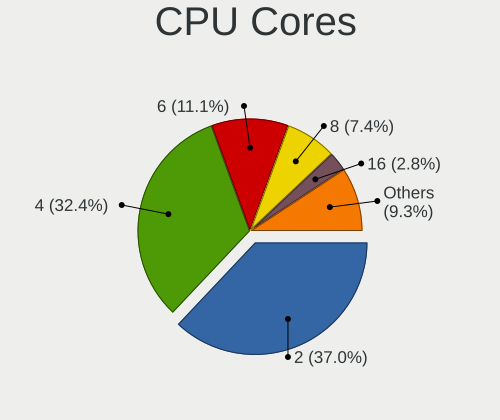

| Number  | Desktops | Percent |
|---------|----------|---------|
| 2       | 40       | 37.04%  |
| 4       | 35       | 32.41%  |
| 6       | 12       | 11.11%  |
| 8       | 8        | 7.41%   |
| 16      | 3        | 2.78%   |
| 1       | 3        | 2.78%   |
| Unknown | 3        | 2.78%   |
| 12      | 2        | 1.85%   |
| 10      | 2        | 1.85%   |

CPU Sockets
-----------

Number of sockets

| Number | Desktops | Percent |
|--------|----------|---------|
| 1      | 105      | 99.06%  |
| 2      | 1        | 0.94%   |

CPU Threads
-----------

Threads per core (Hyper-Threading)

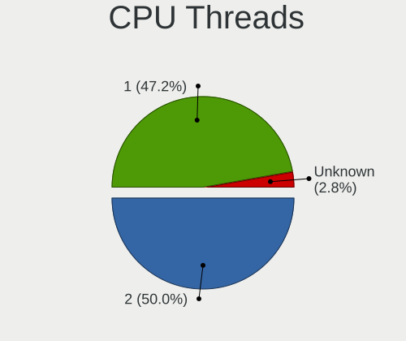

| Number  | Desktops | Percent |
|---------|----------|---------|
| 2       | 54       | 50%     |
| 1       | 51       | 47.22%  |
| Unknown | 3        | 2.78%   |

CPU Op-Modes
------------

CPU Operation Modes (32-bit, 64-bit)

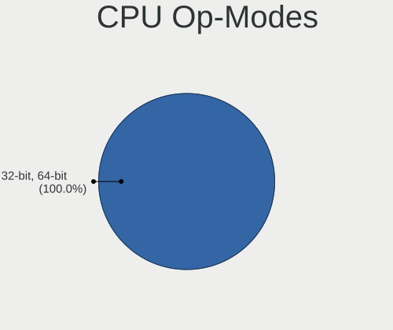

| Op mode        | Desktops | Percent |
|----------------|----------|---------|
| 32-bit, 64-bit | 106      | 100%    |

CPU Microcode
-------------

Microcode number

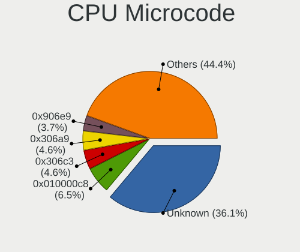

| Number     | Desktops | Percent |
|------------|----------|---------|
| Unknown    | 39       | 36.11%  |
| 0x010000c8 | 7        | 6.48%   |
| 0x306c3    | 5        | 4.63%   |
| 0x306a9    | 5        | 4.63%   |
| 0x906e9    | 4        | 3.7%    |
| 0x506e3    | 4        | 3.7%    |
| 0x206a7    | 4        | 3.7%    |
| 0x1067a    | 3        | 2.78%   |
| 0x06000852 | 3        | 2.78%   |
| 0xf47      | 2        | 1.85%   |
| 0xa0655    | 2        | 1.85%   |
| 0x90672    | 2        | 1.85%   |
| 0x6fd      | 2        | 1.85%   |
| 0x08701021 | 2        | 1.85%   |
| 0x010000dc | 2        | 1.85%   |
| 0xf49      | 1        | 0.93%   |
| 0xf41      | 1        | 0.93%   |
| 0x90675    | 1        | 0.93%   |
| 0x706a8    | 1        | 0.93%   |
| 0x50654    | 1        | 0.93%   |
| 0x406c3    | 1        | 0.93%   |
| 0x206d7    | 1        | 0.93%   |
| 0x20655    | 1        | 0.93%   |
| 0x106e5    | 1        | 0.93%   |
| 0x106c2    | 1        | 0.93%   |
| 0x10676    | 1        | 0.93%   |
| 0x0a201016 | 1        | 0.93%   |
| 0x08600106 | 1        | 0.93%   |
| 0x08108109 | 1        | 0.93%   |
| 0x08101102 | 1        | 0.93%   |
| 0x08001138 | 1        | 0.93%   |
| 0x06003106 | 1        | 0.93%   |
| 0x0600063e | 1        | 0.93%   |
| 0x03000027 | 1        | 0.93%   |
| 0x03000025 | 1        | 0.93%   |
| 0x010000db | 1        | 0.93%   |
| 0x010000b6 | 1        | 0.93%   |

CPU Microarch
-------------

Microarchitecture

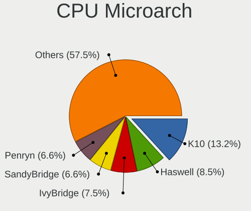

| Name             | Desktops | Percent |
|------------------|----------|---------|
| K10              | 14       | 13.21%  |
| Haswell          | 9        | 8.49%   |
| IvyBridge        | 8        | 7.55%   |
| SandyBridge      | 7        | 6.6%    |
| Penryn           | 7        | 6.6%    |
| Zen 2            | 6        | 5.66%   |
| Skylake          | 6        | 5.66%   |
| Alderlake Hybrid | 6        | 5.66%   |
| Unknown          | 5        | 4.72%   |
| Piledriver       | 4        | 3.77%   |
| NetBurst         | 4        | 3.77%   |
| KabyLake         | 4        | 3.77%   |
| K8 Hammer        | 4        | 3.77%   |
| Zen+             | 3        | 2.83%   |
| Zen              | 3        | 2.83%   |
| Zen 3            | 2        | 1.89%   |
| Nehalem          | 2        | 1.89%   |
| K10 Llano        | 2        | 1.89%   |
| Core             | 2        | 1.89%   |
| CometLake        | 2        | 1.89%   |
| Westmere         | 1        | 0.94%   |
| Steamroller      | 1        | 0.94%   |
| Silvermont       | 1        | 0.94%   |
| Goldmont plus    | 1        | 0.94%   |
| Bulldozer        | 1        | 0.94%   |
| Bonnell          | 1        | 0.94%   |

Graphics
--------

GPU Vendor
----------

Vendors of graphics cards

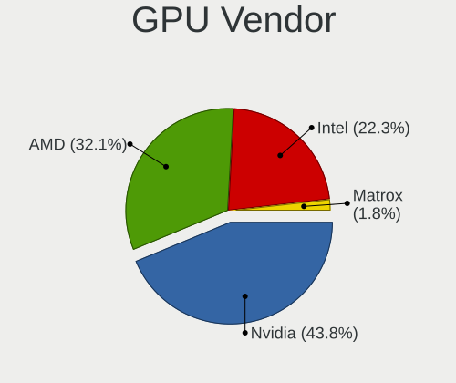

| Vendor                     | Desktops | Percent |
|----------------------------|----------|---------|
| Nvidia                     | 49       | 43.75%  |
| AMD                        | 36       | 32.14%  |
| Intel                      | 25       | 22.32%  |
| Matrox Electronics Systems | 2        | 1.79%   |

GPU Model
---------

Graphics card models

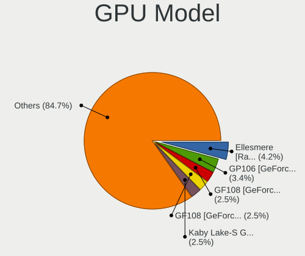

| Model                                                                     | Desktops | Percent |
|---------------------------------------------------------------------------|----------|---------|
| AMD Ellesmere [Radeon RX 470/480/570/570X/580/580X/590]                   | 5        | 4.24%   |
| Nvidia GP106 [GeForce GTX 1060 6GB]                                       | 4        | 3.39%   |
| Nvidia GF108 [GeForce GT 630]                                             | 3        | 2.54%   |
| Nvidia GF108 [GeForce GT 440]                                             | 3        | 2.54%   |
| Intel Kaby Lake-S GT2 [HD Graphics 630]                                   | 3        | 2.54%   |
| Intel 4 Series Chipset Integrated Graphics Controller                     | 3        | 2.54%   |
| Intel 2nd Generation Core Processor Family Integrated Graphics Controller | 3        | 2.54%   |
| AMD Navi 10 [Radeon RX 5600 OEM/5600 XT / 5700/5700 XT]                   | 3        | 2.54%   |
| Nvidia TU116 [GeForce GTX 1660 SUPER]                                     | 2        | 1.69%   |
| Nvidia GP104 [GeForce GTX 1070]                                           | 2        | 1.69%   |
| Nvidia GM204 [GeForce GTX 970]                                            | 2        | 1.69%   |
| Nvidia GM107 [GeForce GTX 750 Ti]                                         | 2        | 1.69%   |
| Nvidia GF108 [GeForce GT 730]                                             | 2        | 1.69%   |
| Nvidia GA104 [GeForce RTX 3070]                                           | 2        | 1.69%   |
| Nvidia C77 [GeForce 8200]                                                 | 2        | 1.69%   |
| Matrox Electronics Systems MGA G200eW WPCM450                             | 2        | 1.69%   |
| Intel Xeon E3-1200 v2/3rd Gen Core processor Graphics Controller          | 2        | 1.69%   |
| Intel Skylake-S GT2 [HD Graphics 530]                                     | 2        | 1.69%   |
| Intel CometLake-S GT2 [UHD Graphics 630]                                  | 2        | 1.69%   |
| Intel 4th Generation Core Processor Family Integrated Graphics Controller | 2        | 1.69%   |
| AMD RS780L [Radeon 3000]                                                  | 2        | 1.69%   |
| AMD Navi 23 [Radeon RX 6600/6600 XT/6600M]                                | 2        | 1.69%   |
| AMD Lexa PRO [Radeon 540/540X/550/550X / RX 540X/550/550X]                | 2        | 1.69%   |
| AMD Cedar [Radeon HD 5000/6000/7350/8350 Series]                          | 2        | 1.69%   |
| AMD Caicos [Radeon HD 6450/7450/8450 / R5 230 OEM]                        | 2        | 1.69%   |
| Nvidia TU117 [GeForce GTX 1650]                                           | 1        | 0.85%   |
| Nvidia TU104 [GeForce RTX 2070 SUPER]                                     | 1        | 0.85%   |
| Nvidia GT218 [GeForce 210]                                                | 1        | 0.85%   |
| Nvidia GT216 [GeForce GT 220]                                             | 1        | 0.85%   |
| Nvidia GT200b [GeForce GTX 285]                                           | 1        | 0.85%   |
| Nvidia GP107 [GeForce GTX 1050]                                           | 1        | 0.85%   |
| Nvidia GP107 [GeForce GTX 1050 Ti]                                        | 1        | 0.85%   |
| Nvidia GP106 [GeForce GTX 1060 3GB]                                       | 1        | 0.85%   |
| Nvidia GP104 [GeForce GTX 1080]                                           | 1        | 0.85%   |
| Nvidia GM204GL [Quadro M4000]                                             | 1        | 0.85%   |
| Nvidia GM204 [GeForce GTX 980]                                            | 1        | 0.85%   |
| Nvidia GK208B [GeForce GT 730]                                            | 1        | 0.85%   |
| Nvidia GK208B [GeForce GT 710]                                            | 1        | 0.85%   |
| Nvidia GK107 [GeForce GTX 650]                                            | 1        | 0.85%   |
| Nvidia GK104 [GeForce GTX 760]                                            | 1        | 0.85%   |

GPU Combo
---------

Combinations of graphics cards

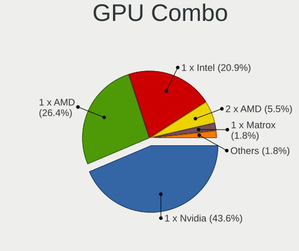

| Name         | Desktops | Percent |
|--------------|----------|---------|
| 1 x Nvidia   | 48       | 43.64%  |
| 1 x AMD      | 29       | 26.36%  |
| 1 x Intel    | 23       | 20.91%  |
| 2 x AMD      | 6        | 5.45%   |
| 1 x Matrox   | 2        | 1.82%   |
| Other        | 1        | 0.91%   |
| AMD + Nvidia | 1        | 0.91%   |

GPU Driver
----------

Free vs proprietary

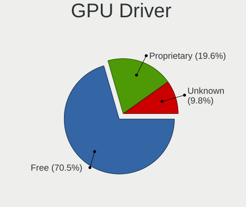

| Driver      | Desktops | Percent |
|-------------|----------|---------|
| Free        | 79       | 70.54%  |
| Proprietary | 22       | 19.64%  |
| Unknown     | 11       | 9.82%   |

GPU Memory
----------

Total video memory

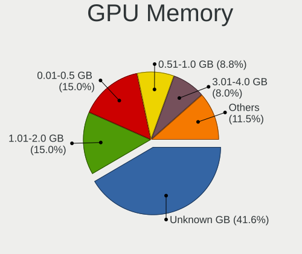

| Size in GB | Desktops | Percent |
|------------|----------|---------|
| Unknown    | 47       | 41.59%  |
| 1.01-2.0   | 17       | 15.04%  |
| 0.01-0.5   | 17       | 15.04%  |
| 0.51-1.0   | 10       | 8.85%   |
| 3.01-4.0   | 9        | 7.96%   |
| 7.01-8.0   | 7        | 6.19%   |
| 5.01-6.0   | 3        | 2.65%   |
| 2.01-3.0   | 1        | 0.88%   |
| 16.01-24.0 | 1        | 0.88%   |
| 8.01-16.0  | 1        | 0.88%   |

Monitor
-------

Monitor Vendor
--------------

Monitor vendors

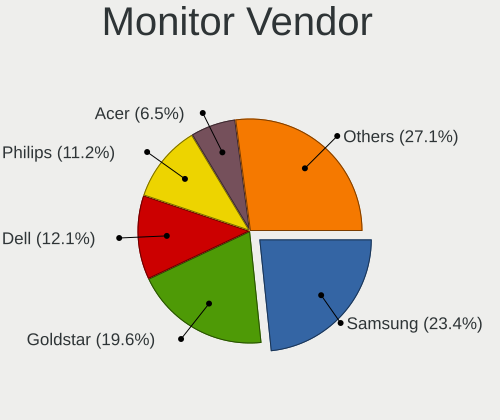

| Vendor               | Desktops | Percent |
|----------------------|----------|---------|
| Samsung Electronics  | 25       | 23.36%  |
| Goldstar             | 21       | 19.63%  |
| Dell                 | 13       | 12.15%  |
| Philips              | 12       | 11.21%  |
| AOC                  | 7        | 6.54%   |
| Acer                 | 7        | 6.54%   |
| Hewlett-Packard      | 6        | 5.61%   |
| Ancor Communications | 4        | 3.74%   |
| BenQ                 | 2        | 1.87%   |
| ViewSonic            | 1        | 0.93%   |
| Toshiba              | 1        | 0.93%   |
| Sony                 | 1        | 0.93%   |
| SAC                  | 1        | 0.93%   |
| Plain Tree Systems   | 1        | 0.93%   |
| Medion               | 1        | 0.93%   |
| LG Electronics       | 1        | 0.93%   |
| KTC                  | 1        | 0.93%   |
| HannStar             | 1        | 0.93%   |
| ASUSTek Computer     | 1        | 0.93%   |

Monitor Model
-------------

Monitor models

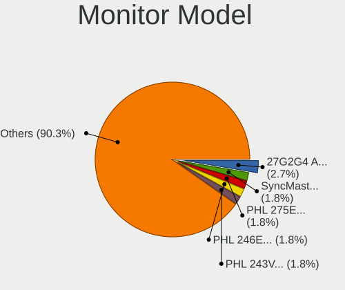

| Model                                                                  | Desktops | Percent |
|------------------------------------------------------------------------|----------|---------|
| AOC 27G2G4 AOC2702 1920x1080 598x336mm 27.0-inch                       | 3        | 2.65%   |
| Samsung Electronics SyncMaster SAM0108 1600x1200 312x234mm 15.4-inch   | 2        | 1.77%   |
| Philips PHL 275E2F PHLC23A 2560x1440 597x336mm 27.0-inch               | 2        | 1.77%   |
| Philips PHL 246E7 PHLC107 1920x1080 521x293mm 23.5-inch                | 2        | 1.77%   |
| Philips PHL 243V5 PHLC0D1 1920x1080 521x293mm 23.5-inch                | 2        | 1.77%   |
| Hewlett-Packard E243 HPN3468 1920x1080 527x296mm 23.8-inch             | 2        | 1.77%   |
| Goldstar LG ULTRAWIDE GSM59F1 2560x1080 670x280mm 28.6-inch            | 2        | 1.77%   |
| Goldstar LG ULTRAGEAR GSM5C03 1920x1080 600x340mm 27.2-inch            | 2        | 1.77%   |
| Dell P2419H DELD0D9 1920x1080 527x296mm 23.8-inch                      | 2        | 1.77%   |
| ViewSonic VA521 VSCF318 1024x768 304x228mm 15.0-inch                   | 1        | 0.88%   |
| Toshiba TV TSB0108 1920x1080 698x393mm 31.5-inch                       | 1        | 0.88%   |
| Sony SDM-HX95 SNY5400 1280x1024 376x301mm 19.0-inch                    | 1        | 0.88%   |
| Samsung Electronics SyncMaster SAM03D1 1680x1050 433x271mm 20.1-inch   | 1        | 0.88%   |
| Samsung Electronics SyncMaster SAM036F 1440x900 428x255mm 19.6-inch    | 1        | 0.88%   |
| Samsung Electronics SyncMaster SAM036E 1280x1024 376x301mm 19.0-inch   | 1        | 0.88%   |
| Samsung Electronics SyncMaster SAM02AD 1440x900 410x257mm 19.1-inch    | 1        | 0.88%   |
| Samsung Electronics SyncMaster SAM0285 1440x900 410x257mm 19.1-inch    | 1        | 0.88%   |
| Samsung Electronics SyncMaster SAM022B 1280x1024 338x270mm 17.0-inch   | 1        | 0.88%   |
| Samsung Electronics SyncMaster SAM0214 1680x1050 408x306mm 20.1-inch   | 1        | 0.88%   |
| Samsung Electronics SyncMaster SAM0213 1680x1050 408x306mm 20.1-inch   | 1        | 0.88%   |
| Samsung Electronics SyncMaster SAM01E1 1280x1024 376x301mm 19.0-inch   | 1        | 0.88%   |
| Samsung Electronics SyncMaster SAM0088 1024x768 300x230mm 14.9-inch    | 1        | 0.88%   |
| Samsung Electronics SMB2440 SAM06AF 1920x1080 531x299mm 24.0-inch      | 1        | 0.88%   |
| Samsung Electronics SMB2030 SAM063D 1600x900 443x249mm 20.0-inch       | 1        | 0.88%   |
| Samsung Electronics S27F358 SAM0D73 1920x1080 598x336mm 27.0-inch      | 1        | 0.88%   |
| Samsung Electronics S27C31x SAM7312 1920x1080 597x336mm 27.0-inch      | 1        | 0.88%   |
| Samsung Electronics S24E390 SAM0C1A 1920x1080 521x293mm 23.5-inch      | 1        | 0.88%   |
| Samsung Electronics S23B300 SAM08AD 1920x1080 510x290mm 23.1-inch      | 1        | 0.88%   |
| Samsung Electronics S22E391 SAM0C0D 1920x1080 477x268mm 21.5-inch      | 1        | 0.88%   |
| Samsung Electronics S22D300 SAM0B3F 1920x1080 477x268mm 21.5-inch      | 1        | 0.88%   |
| Samsung Electronics S19D300 SAM0B34 1366x768 410x230mm 18.5-inch       | 1        | 0.88%   |
| Samsung Electronics S19C150 SAM0AE6 1366x768 410x230mm 18.5-inch       | 1        | 0.88%   |
| Samsung Electronics S/T 77E/76E STN0005 1280x1024 312x234mm 15.4-inch  | 1        | 0.88%   |
| Samsung Electronics S/T 77/76BDF STN0007 1792x1344 312x234mm 15.4-inch | 1        | 0.88%   |
| Samsung Electronics C27R50x SAM0F9D 1920x1080 598x336mm 27.0-inch      | 1        | 0.88%   |
| SAC LED MONITOR SAC309A 1920x1080 443x249mm 20.0-inch                  | 1        | 0.88%   |
| Plain Tree Systems XAP-192i PTS03D5 1280x1024 376x301mm 19.0-inch      | 1        | 0.88%   |
| Philips PHL 241E2F PHLC25D 1920x1080 527x296mm 23.8-inch               | 1        | 0.88%   |
| Philips PHL 240V5A PHLC10C 1920x1080 527x296mm 23.8-inch               | 1        | 0.88%   |
| Philips PHL 240V5 PHLC10A 1920x1080 527x296mm 23.8-inch                | 1        | 0.88%   |

Monitor Resolution
------------------

Monitor screen resolution

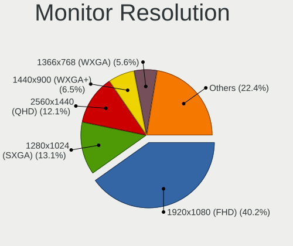

| Resolution         | Desktops | Percent |
|--------------------|----------|---------|
| 1920x1080 (FHD)    | 43       | 40.19%  |
| 1280x1024 (SXGA)   | 14       | 13.08%  |
| 2560x1440 (QHD)    | 13       | 12.15%  |
| 1440x900 (WXGA+)   | 7        | 6.54%   |
| 1366x768 (WXGA)    | 6        | 5.61%   |
| 1680x1050 (WSXGA+) | 5        | 4.67%   |
| 1600x900 (HD+)     | 5        | 4.67%   |
| 3840x2160 (4K)     | 4        | 3.74%   |
| 2560x1080          | 2        | 1.87%   |
| 1600x1200          | 2        | 1.87%   |
| 1024x768 (XGA)     | 2        | 1.87%   |
| 3200x1080          | 1        | 0.93%   |
| 1920x540           | 1        | 0.93%   |
| 1360x768           | 1        | 0.93%   |
| Unknown            | 1        | 0.93%   |

Monitor Diagonal
----------------

Diagonal size in inches

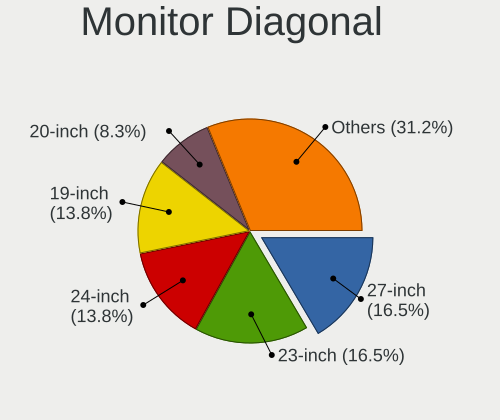

| Inches  | Desktops | Percent |
|---------|----------|---------|
| 27      | 18       | 16.51%  |
| 23      | 18       | 16.51%  |
| 24      | 15       | 13.76%  |
| 19      | 15       | 13.76%  |
| 20      | 9        | 8.26%   |
| 21      | 8        | 7.34%   |
| 18      | 7        | 6.42%   |
| 15      | 6        | 5.5%    |
| 17      | 5        | 4.59%   |
| 31      | 3        | 2.75%   |
| 34      | 2        | 1.83%   |
| 72      | 1        | 0.92%   |
| 32      | 1        | 0.92%   |
| Unknown | 1        | 0.92%   |

Monitor Width
-------------

Physical width

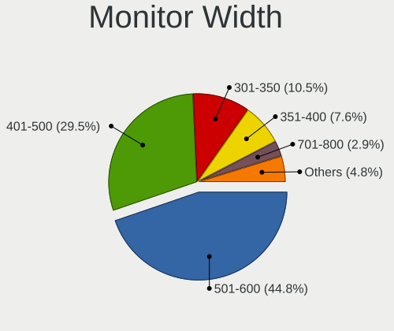

| Width in mm | Desktops | Percent |
|-------------|----------|---------|
| 501-600     | 47       | 44.76%  |
| 401-500     | 31       | 29.52%  |
| 301-350     | 11       | 10.48%  |
| 351-400     | 8        | 7.62%   |
| 701-800     | 3        | 2.86%   |
| 601-700     | 3        | 2.86%   |
| 1501-2000   | 1        | 0.95%   |
| Unknown     | 1        | 0.95%   |

Aspect Ratio
------------

Proportional relationship between the width and the height

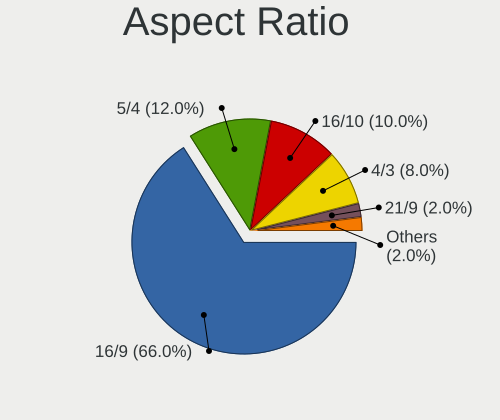

| Ratio   | Desktops | Percent |
|---------|----------|---------|
| 16/9    | 66       | 66%     |
| 5/4     | 12       | 12%     |
| 16/10   | 10       | 10%     |
| 4/3     | 8        | 8%      |
| 21/9    | 2        | 2%      |
| 3/2     | 1        | 1%      |
| Unknown | 1        | 1%      |

Monitor Area
------------

Area in inch²

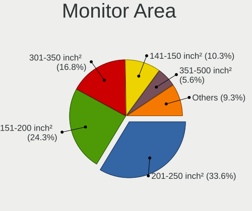

| Area in inch² | Desktops | Percent |
|----------------|----------|---------|
| 201-250        | 36       | 33.64%  |
| 151-200        | 26       | 24.3%   |
| 301-350        | 18       | 16.82%  |
| 141-150        | 11       | 10.28%  |
| 351-500        | 6        | 5.61%   |
| 111-120        | 4        | 3.74%   |
| 251-300        | 2        | 1.87%   |
| 101-110        | 2        | 1.87%   |
| More than 1000 | 1        | 0.93%   |
| Unknown        | 1        | 0.93%   |

Pixel Density
-------------

Pixels per inch

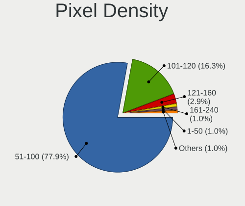

| Density | Desktops | Percent |
|---------|----------|---------|
| 51-100  | 81       | 77.88%  |
| 101-120 | 17       | 16.35%  |
| 121-160 | 3        | 2.88%   |
| 1-50    | 1        | 0.96%   |
| 161-240 | 1        | 0.96%   |
| Unknown | 1        | 0.96%   |

Multiple Monitors
-----------------

Total monitors connected

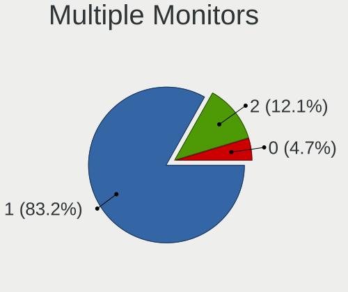

| Total | Desktops | Percent |
|-------|----------|---------|
| 1     | 89       | 83.18%  |
| 2     | 13       | 12.15%  |
| 0     | 5        | 4.67%   |

Network
-------

Net Controller Vendor
---------------------

Controller vendors

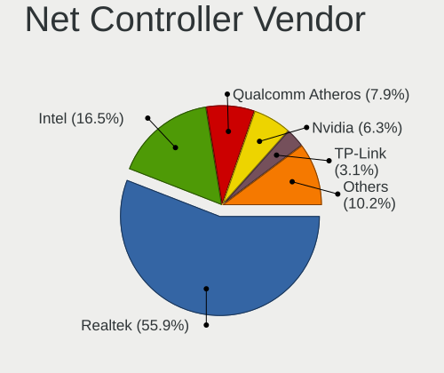

| Vendor                   | Desktops | Percent |
|--------------------------|----------|---------|
| Realtek Semiconductor    | 71       | 55.91%  |
| Intel                    | 21       | 16.54%  |
| Qualcomm Atheros         | 10       | 7.87%   |
| Nvidia                   | 8        | 6.3%    |
| TP-Link                  | 4        | 3.15%   |
| MediaTek                 | 2        | 1.57%   |
| Broadcom                 | 2        | 1.57%   |
| Xiaomi                   | 1        | 0.79%   |
| Ralink Technology        | 1        | 0.79%   |
| Ralink                   | 1        | 0.79%   |
| Qualcomm                 | 1        | 0.79%   |
| Mercucys                 | 1        | 0.79%   |
| Marvell Technology Group | 1        | 0.79%   |
| D-Link System            | 1        | 0.79%   |
| D-Link                   | 1        | 0.79%   |
| ASIX Electronics         | 1        | 0.79%   |

Net Controller Model
--------------------

Controller models

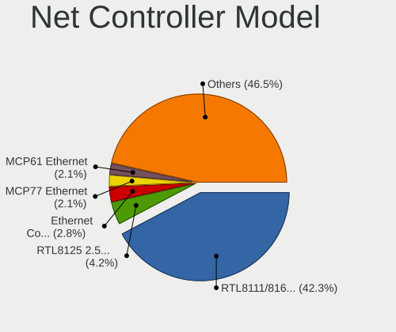

| Model                                                                  | Desktops | Percent |
|------------------------------------------------------------------------|----------|---------|
| Realtek RTL8111/8168/8211/8411 PCI Express Gigabit Ethernet Controller | 60       | 42.25%  |
| Realtek RTL8125 2.5GbE Controller                                      | 6        | 4.23%   |
| Intel Ethernet Controller I225-V                                       | 4        | 2.82%   |
| Nvidia MCP77 Ethernet                                                  | 3        | 2.11%   |
| Nvidia MCP61 Ethernet                                                  | 3        | 2.11%   |
| Intel Wi-Fi 6 AX200                                                    | 3        | 2.11%   |
| Intel I211 Gigabit Network Connection                                  | 3        | 2.11%   |
| Realtek RTL8188EUS 802.11n Wireless Network Adapter                    | 2        | 1.41%   |
| Realtek RTL810xE PCI Express Fast Ethernet controller                  | 2        | 1.41%   |
| Realtek 802.11ac NIC                                                   | 2        | 1.41%   |
| Qualcomm Atheros AR8151 v2.0 Gigabit Ethernet                          | 2        | 1.41%   |
| Intel I350 Gigabit Network Connection                                  | 2        | 1.41%   |
| Intel Ethernet Connection (2) I219-V                                   | 2        | 1.41%   |
| Intel Ethernet Connection (2) I218-V                                   | 2        | 1.41%   |
| Intel Ethernet Connection (11) I219-V                                  | 2        | 1.41%   |
| Intel Alder Lake-S PCH CNVi WiFi                                       | 2        | 1.41%   |
| Intel 82574L Gigabit Network Connection                                | 2        | 1.41%   |
| Broadcom BCM4352 802.11ac Dual Band Wireless Network Adapter           | 2        | 1.41%   |
| Xiaomi Mi/Redmi series (RNDIS)                                         | 1        | 0.7%    |
| TP-Link TL-WN821N v5/v6 [RTL8192EU]                                    | 1        | 0.7%    |
| TP-Link TL-WN722N v2/v3 [Realtek RTL8188EUS]                           | 1        | 0.7%    |
| TP-Link Archer T4U ver.3                                               | 1        | 0.7%    |
| TP-Link Archer T4U v2 [Realtek RTL8812AU]                              | 1        | 0.7%    |
| Realtek RTL8821CE 802.11ac PCIe Wireless Network Adapter               | 1        | 0.7%    |
| Realtek RTL8821AE 802.11ac PCIe Wireless Network Adapter               | 1        | 0.7%    |
| Realtek RTL8812AE 802.11ac PCIe Wireless Network Adapter               | 1        | 0.7%    |
| Realtek RTL8169 PCI Gigabit Ethernet Controller                        | 1        | 0.7%    |
| Realtek Killer E3000 2.5GbE Controller                                 | 1        | 0.7%    |
| Ralink RT2870/RT3070 Wireless Adapter                                  | 1        | 0.7%    |
| Ralink RT3060 Wireless 802.11n 1T/1R                                   | 1        | 0.7%    |
| Qualcomm YUPIK-QRD _SN:AC1D5909                                        | 1        | 0.7%    |
| Qualcomm Atheros AR9485 Wireless Network Adapter                       | 1        | 0.7%    |
| Qualcomm Atheros AR9285 Wireless Network Adapter (PCI-Express)         | 1        | 0.7%    |
| Qualcomm Atheros AR9227 Wireless Network Adapter                       | 1        | 0.7%    |
| Qualcomm Atheros AR8161 Gigabit Ethernet                               | 1        | 0.7%    |
| Qualcomm Atheros AR8151 v1.0 Gigabit Ethernet                          | 1        | 0.7%    |
| Qualcomm Atheros AR8132 Fast Ethernet                                  | 1        | 0.7%    |
| Qualcomm Atheros AR8131 Gigabit Ethernet                               | 1        | 0.7%    |
| Qualcomm Atheros AR8121/AR8113/AR8114 Gigabit or Fast Ethernet         | 1        | 0.7%    |
| Qualcomm Atheros AR5416 Wireless Network Adapter [AR5008 802.11(a)bgn] | 1        | 0.7%    |

Wireless Vendor
---------------

Wireless vendors

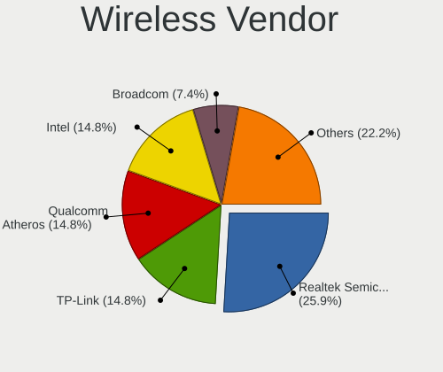

| Vendor                | Desktops | Percent |
|-----------------------|----------|---------|
| Realtek Semiconductor | 7        | 25.93%  |
| TP-Link               | 4        | 14.81%  |
| Qualcomm Atheros      | 4        | 14.81%  |
| Intel                 | 4        | 14.81%  |
| Broadcom              | 2        | 7.41%   |
| Ralink Technology     | 1        | 3.7%    |
| Ralink                | 1        | 3.7%    |
| Mercucys              | 1        | 3.7%    |
| MediaTek              | 1        | 3.7%    |
| D-Link System         | 1        | 3.7%    |
| D-Link                | 1        | 3.7%    |

Wireless Model
--------------

Wireless models

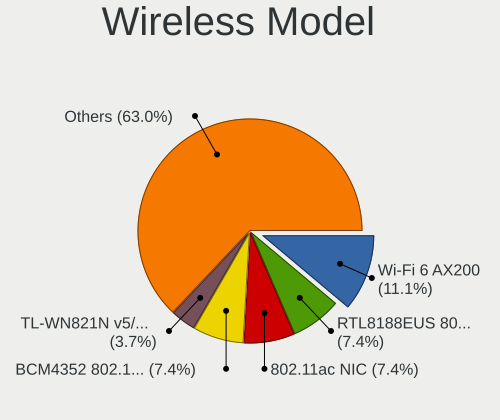

| Model                                                                  | Desktops | Percent |
|------------------------------------------------------------------------|----------|---------|
| Intel Wi-Fi 6 AX200                                                    | 3        | 11.11%  |
| Realtek RTL8188EUS 802.11n Wireless Network Adapter                    | 2        | 7.41%   |
| Realtek 802.11ac NIC                                                   | 2        | 7.41%   |
| Broadcom BCM4352 802.11ac Dual Band Wireless Network Adapter           | 2        | 7.41%   |
| TP-Link TL-WN821N v5/v6 [RTL8192EU]                                    | 1        | 3.7%    |
| TP-Link TL-WN722N v2/v3 [Realtek RTL8188EUS]                           | 1        | 3.7%    |
| TP-Link Archer T4U ver.3                                               | 1        | 3.7%    |
| TP-Link Archer T4U v2 [Realtek RTL8812AU]                              | 1        | 3.7%    |
| Realtek RTL8821CE 802.11ac PCIe Wireless Network Adapter               | 1        | 3.7%    |
| Realtek RTL8821AE 802.11ac PCIe Wireless Network Adapter               | 1        | 3.7%    |
| Realtek RTL8812AE 802.11ac PCIe Wireless Network Adapter               | 1        | 3.7%    |
| Ralink RT2870/RT3070 Wireless Adapter                                  | 1        | 3.7%    |
| Ralink RT3060 Wireless 802.11n 1T/1R                                   | 1        | 3.7%    |
| Qualcomm Atheros AR9485 Wireless Network Adapter                       | 1        | 3.7%    |
| Qualcomm Atheros AR9285 Wireless Network Adapter (PCI-Express)         | 1        | 3.7%    |
| Qualcomm Atheros AR9227 Wireless Network Adapter                       | 1        | 3.7%    |
| Qualcomm Atheros AR5416 Wireless Network Adapter [AR5008 802.11(a)bgn] | 1        | 3.7%    |
| Mercucys 802.11n NIC                                                   | 1        | 3.7%    |
| MediaTek MT7922 802.11ax PCI Express Wireless Network Adapter          | 1        | 3.7%    |
| Intel Wi-Fi 6E(802.11ax) AX210/AX1675* 2x2 [Typhoon Peak]              | 1        | 3.7%    |
| D-Link System DWA-125 Wireless N 150 Adapter(rev.A2) [Ralink RT3070]   | 1        | 3.7%    |
| D-Link DWA-137 Wireless N High-Gain Adapter [Ralink RT5372]            | 1        | 3.7%    |

Ethernet Vendor
---------------

Ethernet vendors

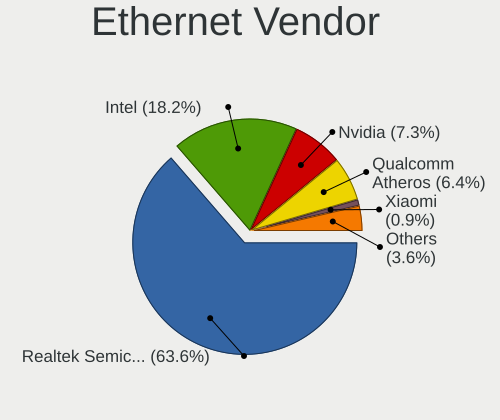

| Vendor                   | Desktops | Percent |
|--------------------------|----------|---------|
| Realtek Semiconductor    | 70       | 63.64%  |
| Intel                    | 20       | 18.18%  |
| Nvidia                   | 8        | 7.27%   |
| Qualcomm Atheros         | 7        | 6.36%   |
| Xiaomi                   | 1        | 0.91%   |
| Qualcomm                 | 1        | 0.91%   |
| MediaTek                 | 1        | 0.91%   |
| Marvell Technology Group | 1        | 0.91%   |
| ASIX Electronics         | 1        | 0.91%   |

Ethernet Model
--------------

Ethernet models

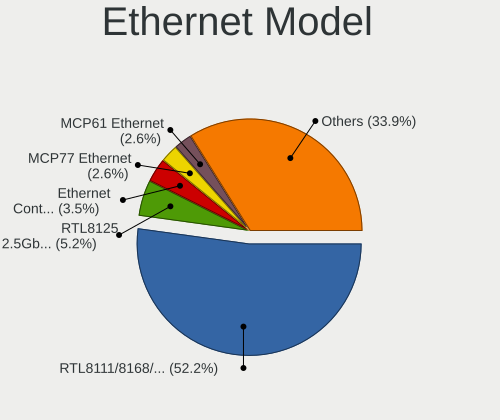

| Model                                                                  | Desktops | Percent |
|------------------------------------------------------------------------|----------|---------|
| Realtek RTL8111/8168/8211/8411 PCI Express Gigabit Ethernet Controller | 60       | 52.17%  |
| Realtek RTL8125 2.5GbE Controller                                      | 6        | 5.22%   |
| Intel Ethernet Controller I225-V                                       | 4        | 3.48%   |
| Nvidia MCP77 Ethernet                                                  | 3        | 2.61%   |
| Nvidia MCP61 Ethernet                                                  | 3        | 2.61%   |
| Intel I211 Gigabit Network Connection                                  | 3        | 2.61%   |
| Realtek RTL810xE PCI Express Fast Ethernet controller                  | 2        | 1.74%   |
| Qualcomm Atheros AR8151 v2.0 Gigabit Ethernet                          | 2        | 1.74%   |
| Intel I350 Gigabit Network Connection                                  | 2        | 1.74%   |
| Intel Ethernet Connection (2) I219-V                                   | 2        | 1.74%   |
| Intel Ethernet Connection (2) I218-V                                   | 2        | 1.74%   |
| Intel Ethernet Connection (11) I219-V                                  | 2        | 1.74%   |
| Intel Alder Lake-S PCH CNVi WiFi                                       | 2        | 1.74%   |
| Intel 82574L Gigabit Network Connection                                | 2        | 1.74%   |
| Xiaomi Mi/Redmi series (RNDIS)                                         | 1        | 0.87%   |
| Realtek RTL8169 PCI Gigabit Ethernet Controller                        | 1        | 0.87%   |
| Realtek Killer E3000 2.5GbE Controller                                 | 1        | 0.87%   |
| Qualcomm YUPIK-QRD _SN:AC1D5909                                        | 1        | 0.87%   |
| Qualcomm Atheros AR8161 Gigabit Ethernet                               | 1        | 0.87%   |
| Qualcomm Atheros AR8151 v1.0 Gigabit Ethernet                          | 1        | 0.87%   |
| Qualcomm Atheros AR8132 Fast Ethernet                                  | 1        | 0.87%   |
| Qualcomm Atheros AR8131 Gigabit Ethernet                               | 1        | 0.87%   |
| Qualcomm Atheros AR8121/AR8113/AR8114 Gigabit or Fast Ethernet         | 1        | 0.87%   |
| Nvidia MCP67 Ethernet                                                  | 1        | 0.87%   |
| Nvidia MCP55 Ethernet                                                  | 1        | 0.87%   |
| MediaTek Infinix HOT 50i                                               | 1        | 0.87%   |
| Marvell Group 88E8053 PCI-E Gigabit Ethernet Controller                | 1        | 0.87%   |
| Intel NM10/ICH7 Family LAN Controller                                  | 1        | 0.87%   |
| Intel Ethernet Connection I217-V                                       | 1        | 0.87%   |
| Intel Ethernet Connection (5) I219-V                                   | 1        | 0.87%   |
| Intel Ethernet Connection (17) I219-V                                  | 1        | 0.87%   |
| Intel 82579V Gigabit Network Connection                                | 1        | 0.87%   |
| Intel 82579LM Gigabit Network Connection (Lewisville)                  | 1        | 0.87%   |
| ASIX AX88179 Gigabit Ethernet                                          | 1        | 0.87%   |

Net Controller Kind
-------------------

Ethernet, WiFi or modem

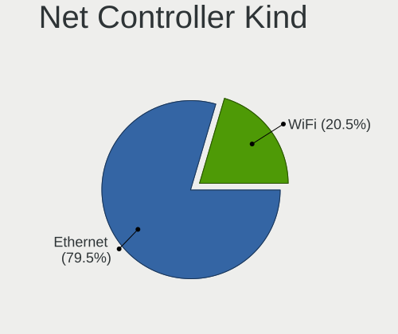

| Kind     | Desktops | Percent |
|----------|----------|---------|
| Ethernet | 105      | 79.55%  |
| WiFi     | 27       | 20.45%  |

Used Controller
---------------

Currently used network controller

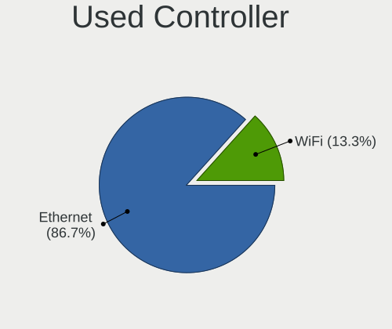

| Kind     | Desktops | Percent |
|----------|----------|---------|
| Ethernet | 91       | 86.67%  |
| WiFi     | 14       | 13.33%  |

NICs
----

Total network controllers on board

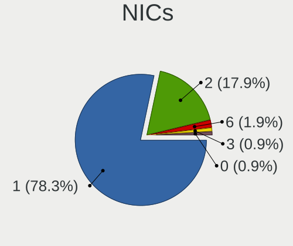

| Total | Desktops | Percent |
|-------|----------|---------|
| 1     | 83       | 78.3%   |
| 2     | 19       | 17.92%  |
| 6     | 2        | 1.89%   |
| 3     | 1        | 0.94%   |
| 0     | 1        | 0.94%   |

IPv6
----

IPv6 vs IPv4

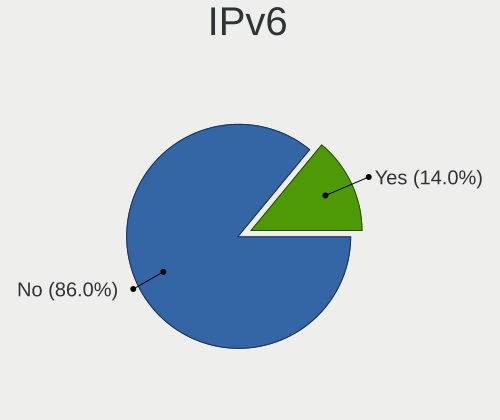

| Used | Desktops | Percent |
|------|----------|---------|
| No   | 92       | 85.98%  |
| Yes  | 15       | 14.02%  |

Bluetooth
---------

Bluetooth Vendor
----------------

Controller vendors

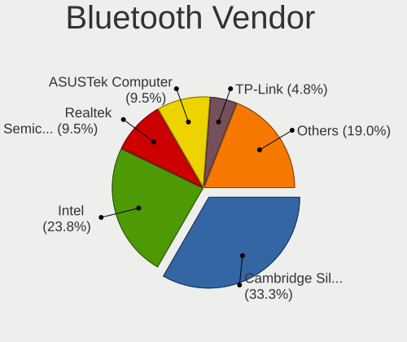

| Vendor                     | Desktops | Percent |
|----------------------------|----------|---------|
| Cambridge Silicon Radio    | 7        | 33.33%  |
| Intel                      | 5        | 23.81%  |
| Realtek Semiconductor      | 2        | 9.52%   |
| ASUSTek Computer           | 2        | 9.52%   |
| TP-Link                    | 1        | 4.76%   |
| SiW                        | 1        | 4.76%   |
| MediaTek                   | 1        | 4.76%   |
| Integrated System Solution | 1        | 4.76%   |
| IMC Networks               | 1        | 4.76%   |

Bluetooth Model
---------------

Controller models

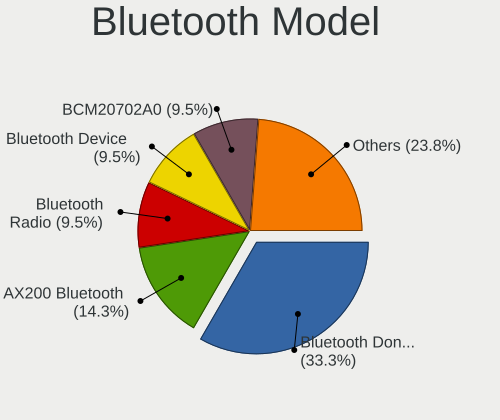

| Model                                               | Desktops | Percent |
|-----------------------------------------------------|----------|---------|
| Cambridge Silicon Radio Bluetooth Dongle (HCI mode) | 7        | 33.33%  |
| Intel AX200 Bluetooth                               | 3        | 14.29%  |
| Realtek Bluetooth Radio                             | 2        | 9.52%   |
| Intel Bluetooth Device                              | 2        | 9.52%   |
| ASUS BCM20702A0                                     | 2        | 9.52%   |
| TP-Link TP-T@- UB500 Adapter                        | 1        | 4.76%   |
| SiW SiW                                             | 1        | 4.76%   |
| MediaTek Wireless_Device                            | 1        | 4.76%   |
| Integrated System Solution Bluetooth Device         | 1        | 4.76%   |
| IMC Networks Bluetooth Radio                        | 1        | 4.76%   |

Sound
-----

Sound Vendor
------------

Sound card vendors

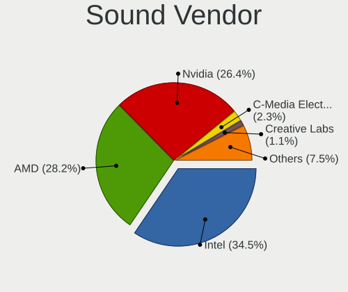

| Vendor                    | Desktops | Percent |
|---------------------------|----------|---------|
| Intel                     | 60       | 34.48%  |
| AMD                       | 49       | 28.16%  |
| Nvidia                    | 46       | 26.44%  |
| C-Media Electronics       | 4        | 2.3%    |
| Creative Labs             | 2        | 1.15%   |
| Texas Instruments         | 1        | 0.57%   |
| SteelSeries ApS           | 1        | 0.57%   |
| Shenzhen Rapoo Technology | 1        | 0.57%   |
| Plantronics               | 1        | 0.57%   |
| Nektar                    | 1        | 0.57%   |
| Logitech                  | 1        | 0.57%   |
| Kingston Technology       | 1        | 0.57%   |
| GN Netcom                 | 1        | 0.57%   |
| Giga-Byte Technology      | 1        | 0.57%   |
| Focusrite-Novation        | 1        | 0.57%   |
| Fifine Microphones        | 1        | 0.57%   |
| DSEA A/S                  | 1        | 0.57%   |
| ASUSTek Computer          | 1        | 0.57%   |

Sound Model
-----------

Sound card models

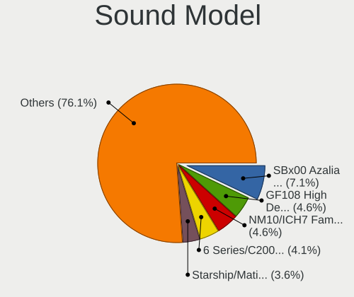

| Model                                                                      | Desktops | Percent |
|----------------------------------------------------------------------------|----------|---------|
| AMD SBx00 Azalia (Intel HDA)                                               | 14       | 7.11%   |
| Nvidia GF108 High Definition Audio Controller                              | 9        | 4.57%   |
| Intel NM10/ICH7 Family High Definition Audio Controller                    | 9        | 4.57%   |
| Intel 6 Series/C200 Series Chipset Family High Definition Audio Controller | 8        | 4.06%   |
| AMD Starship/Matisse HD Audio Controller                                   | 7        | 3.55%   |
| Intel Alder Lake-S HD Audio Controller                                     | 6        | 3.05%   |
| Intel 8 Series/C220 Series Chipset High Definition Audio Controller        | 6        | 3.05%   |
| Nvidia GP106 High Definition Audio Controller                              | 5        | 2.54%   |
| Intel 100 Series/C230 Series Chipset Family HD Audio Controller            | 5        | 2.54%   |
| AMD Ryzen HD Audio Controller                                              | 5        | 2.54%   |
| AMD Ellesmere HDMI Audio [Radeon RX 470/480 / 570/580/590]                 | 5        | 2.54%   |
| Nvidia GM204 High Definition Audio Controller                              | 4        | 2.03%   |
| Intel 200 Series PCH HD Audio                                              | 4        | 2.03%   |
| AMD FCH Azalia Controller                                                  | 4        | 2.03%   |
| AMD Family 17h (Models 00h-0fh) HD Audio Controller                        | 4        | 2.03%   |
| Nvidia MCP72XE/MCP72P/MCP78U/MCP78S High Definition Audio                  | 3        | 1.52%   |
| Nvidia MCP61 High Definition Audio                                         | 3        | 1.52%   |
| Nvidia GP104 High Definition Audio Controller                              | 3        | 1.52%   |
| Intel Xeon E3-1200 v3/4th Gen Core Processor HD Audio Controller           | 3        | 1.52%   |
| Intel 9 Series Chipset Family HD Audio Controller                          | 3        | 1.52%   |
| Intel 82801JI (ICH10 Family) HD Audio Controller                           | 3        | 1.52%   |
| Intel 7 Series/C216 Chipset Family High Definition Audio Controller        | 3        | 1.52%   |
| Intel 5 Series/3400 Series Chipset High Definition Audio                   | 3        | 1.52%   |
| AMD Navi 10 HDMI Audio                                                     | 3        | 1.52%   |
| AMD Baffin HDMI/DP Audio [Radeon RX 550 640SP / RX 560/560X]               | 3        | 1.52%   |
| Nvidia TU116 High Definition Audio Controller                              | 2        | 1.02%   |
| Nvidia GP107GL High Definition Audio Controller                            | 2        | 1.02%   |
| Nvidia GM107 High Definition Audio Controller [GeForce 940MX]              | 2        | 1.02%   |
| Nvidia GK208 HDMI/DP Audio Controller                                      | 2        | 1.02%   |
| Nvidia GA104 High Definition Audio Controller                              | 2        | 1.02%   |
| Intel Raptor Lake High Definition Audio Controller                         | 2        | 1.02%   |
| Intel Comet Lake PCH cAVS                                                  | 2        | 1.02%   |
| Intel C600/X79 series chipset High Definition Audio Controller             | 2        | 1.02%   |
| C-Media Electronics Audio Adapter (Unitek Y-247A)                          | 2        | 1.02%   |
| AMD RV710/730 HDMI Audio [Radeon HD 4000 series]                           | 2        | 1.02%   |
| AMD Raven/Raven2/Fenghuang HDMI/DP Audio Controller                        | 2        | 1.02%   |
| AMD Radeon High Definition Audio Controller                                | 2        | 1.02%   |
| AMD Oland/Hainan/Cape Verde/Pitcairn HDMI Audio [Radeon HD 7000 Series]    | 2        | 1.02%   |
| AMD Navi 21/23 HDMI/DP Audio Controller                                    | 2        | 1.02%   |
| AMD Cedar HDMI Audio [Radeon HD 5400/6300/7300 Series]                     | 2        | 1.02%   |

Memory
------

Memory Vendor
-------------

Memory module vendors

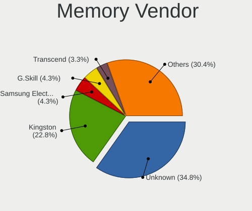

| Vendor              | Desktops | Percent |
|---------------------|----------|---------|
| Unknown             | 32       | 34.78%  |
| Kingston            | 21       | 22.83%  |
| Samsung Electronics | 4        | 4.35%   |
| G.Skill             | 4        | 4.35%   |
| Transcend           | 3        | 3.26%   |
| Micron Technology   | 3        | 3.26%   |
| GOODRAM             | 3        | 3.26%   |
| Team                | 2        | 2.17%   |
| SK hynix            | 2        | 2.17%   |
| Patriot             | 2        | 2.17%   |
| Crucial             | 2        | 2.17%   |
| Unknown (ABCD)      | 1        | 1.09%   |
| Silicon Power       | 1        | 1.09%   |
| SGS/Thomson         | 1        | 1.09%   |
| Nanya Technology    | 1        | 1.09%   |
| Hexon               | 1        | 1.09%   |
| Goldkey             | 1        | 1.09%   |
| GeIL                | 1        | 1.09%   |
| Elpida              | 1        | 1.09%   |
| Corsair             | 1        | 1.09%   |
| AVEXIR              | 1        | 1.09%   |
| Asgard              | 1        | 1.09%   |
| Apacer              | 1        | 1.09%   |
| A-DATA Technology   | 1        | 1.09%   |
| Unknown             | 1        | 1.09%   |

Memory Model
------------

Memory module models

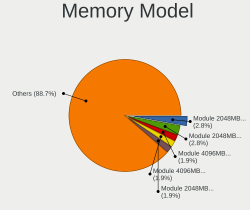

| Model                                                          | Desktops | Percent |
|----------------------------------------------------------------|----------|---------|
| Unknown RAM Module 2048MB DIMM DDR2 333MT/s                    | 3        | 2.83%   |
| Unknown RAM Module 2048MB DIMM 1333MT/s                        | 3        | 2.83%   |
| Unknown RAM Module 4096MB DIMM 1600MT/s                        | 2        | 1.89%   |
| Unknown RAM Module 4096MB DIMM 1333MT/s                        | 2        | 1.89%   |
| Unknown RAM Module 2048MB DIMM DDR3 1333MT/s                   | 2        | 1.89%   |
| Unknown RAM Module 2048MB DIMM 800MT/s                         | 2        | 1.89%   |
| Unknown RAM Module 1024MB DIMM DDR2 333MT/s                    | 2        | 1.89%   |
| Kingston RAM KHX1866C10D3/8G 8GB DIMM DDR3 1867MT/s            | 2        | 1.89%   |
| Unknown RAM Module 8GB DIMM 1333MT/s                           | 1        | 0.94%   |
| Unknown RAM Module 8GB DIMM                                    | 1        | 0.94%   |
| Unknown RAM Module 8192MB DIMM 1333MT/s                        | 1        | 0.94%   |
| Unknown RAM Module 512MB DIMM SDRAM                            | 1        | 0.94%   |
| Unknown RAM Module 4GB DIMM SDRAM                              | 1        | 0.94%   |
| Unknown RAM Module 4GB DIMM DDR3 1333MT/s                      | 1        | 0.94%   |
| Unknown RAM Module 4GB DIMM 667MT/s                            | 1        | 0.94%   |
| Unknown RAM Module 4GB DIMM 1333MT/s                           | 1        | 0.94%   |
| Unknown RAM Module 4GB DIMM                                    | 1        | 0.94%   |
| Unknown RAM Module 4096MB DIMM DDR3 1600MT/s                   | 1        | 0.94%   |
| Unknown RAM Module 2GB DIMM DDR2 800MT/s                       | 1        | 0.94%   |
| Unknown RAM Module 2GB DIMM 667MT/s                            | 1        | 0.94%   |
| Unknown RAM Module 2GB DIMM 1333MT/s                           | 1        | 0.94%   |
| Unknown RAM Module 2048MB DIMM SDRAM 800MT/s                   | 1        | 0.94%   |
| Unknown RAM Module 2048MB DIMM SDRAM                           | 1        | 0.94%   |
| Unknown RAM Module 2048MB DIMM DDR2 800MT/s                    | 1        | 0.94%   |
| Unknown RAM Module 2048MB DIMM DDR 667MT/s                     | 1        | 0.94%   |
| Unknown RAM Module 2048MB DIMM DDR 1333MT/s                    | 1        | 0.94%   |
| Unknown RAM Module 2048MB DIMM                                 | 1        | 0.94%   |
| Unknown RAM Module 1024MB DIMM SDRAM                           | 1        | 0.94%   |
| Unknown RAM Module 1024MB DIMM DDR2 667MT/s                    | 1        | 0.94%   |
| Unknown RAM Module 1024MB DIMM DDR2 400MT/s                    | 1        | 0.94%   |
| Unknown RAM Module 1024MB DIMM DDR 667MT/s                     | 1        | 0.94%   |
| Unknown RAM CL17-17-17 D4-2400 16384MB DIMM DDR4 2400MT/s      | 1        | 0.94%   |
| Unknown RAM ..E-D3U1600M/4G 4096MB DIMM DDR3 800MT/s           | 1        | 0.94%   |
| Unknown (ABCD) RAM 123456789012345678 2GB DIMM LPDDR4 2133MT/s | 1        | 0.94%   |
| Transcend RAM TS1GLK64V6H 8GB DIMM DDR3 1600MT/s               | 1        | 0.94%   |
| Transcend RAM JM1600KLH-8G 8GB DIMM DDR3 1600MT/s              | 1        | 0.94%   |
| Transcend RAM JM1333KLH-4G 4GB DIMM DDR3 1333MT/s              | 1        | 0.94%   |
| Team RAM UD5-5600 16GB DIMM DDR5 12800MT/s                     | 1        | 0.94%   |
| Team RAM Elite-1333 8GB DIMM DDR3 1333MT/s                     | 1        | 0.94%   |
| SK hynix RAM HYMP125U64CP8-S6 2GB DIMM DDR2 400MT/s            | 1        | 0.94%   |

Memory Kind
-----------

Memory module kinds

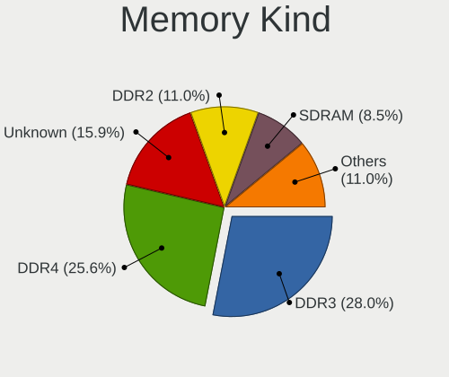

| Kind    | Desktops | Percent |
|---------|----------|---------|
| DDR3    | 23       | 28.05%  |
| DDR4    | 21       | 25.61%  |
| Unknown | 13       | 15.85%  |
| DDR2    | 9        | 10.98%  |
| SDRAM   | 7        | 8.54%   |
| DDR5    | 5        | 6.1%    |
| DDR     | 3        | 3.66%   |
| LPDDR4  | 1        | 1.22%   |

Memory Form Factor
------------------

Physical design of the memory module

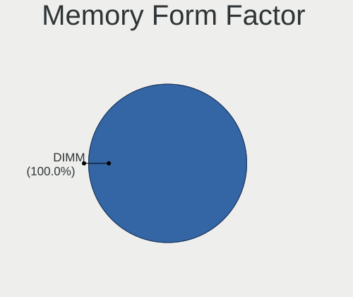

| Name | Desktops | Percent |
|------|----------|---------|
| DIMM | 80       | 100%    |

Memory Size
-----------

Memory module size

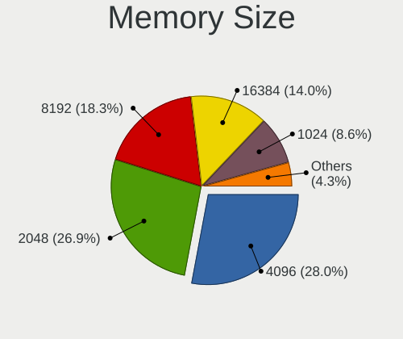

| Size  | Desktops | Percent |
|-------|----------|---------|
| 4096  | 26       | 27.96%  |
| 2048  | 25       | 26.88%  |
| 8192  | 17       | 18.28%  |
| 16384 | 13       | 13.98%  |
| 1024  | 8        | 8.6%    |
| 32768 | 3        | 3.23%   |
| 512   | 1        | 1.08%   |

Memory Speed
------------

Memory module speed

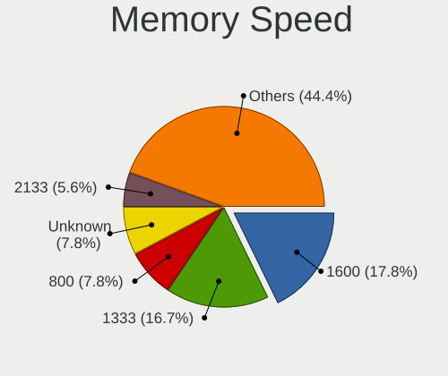

| Speed   | Desktops | Percent |
|---------|----------|---------|
| 1600    | 16       | 17.78%  |
| 1333    | 15       | 16.67%  |
| 800     | 7        | 7.78%   |
| Unknown | 7        | 7.78%   |
| 2133    | 5        | 5.56%   |
| 3600    | 4        | 4.44%   |
| 2667    | 4        | 4.44%   |
| 3200    | 3        | 3.33%   |
| 2400    | 3        | 3.33%   |
| 667     | 3        | 3.33%   |
| 333     | 3        | 3.33%   |
| 6000    | 2        | 2.22%   |
| 3000    | 2        | 2.22%   |
| 2933    | 2        | 2.22%   |
| 400     | 2        | 2.22%   |
| 12800   | 1        | 1.11%   |
| 6800    | 1        | 1.11%   |
| 5400    | 1        | 1.11%   |
| 4000    | 1        | 1.11%   |
| 3500    | 1        | 1.11%   |
| 2800    | 1        | 1.11%   |
| 2666    | 1        | 1.11%   |
| 2048    | 1        | 1.11%   |
| 1866    | 1        | 1.11%   |
| 1632    | 1        | 1.11%   |
| 1400    | 1        | 1.11%   |
| 533     | 1        | 1.11%   |

Printers & scanners
-------------------

Printer Vendor
--------------

Printer device vendors

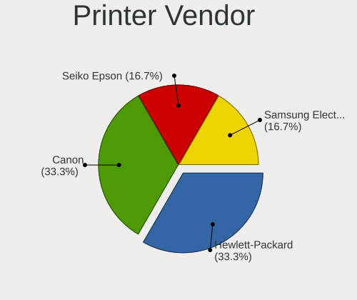

| Vendor              | Desktops | Percent |
|---------------------|----------|---------|
| Hewlett-Packard     | 2        | 33.33%  |
| Canon               | 2        | 33.33%  |
| Seiko Epson         | 1        | 16.67%  |
| Samsung Electronics | 1        | 16.67%  |

Printer Model
-------------

Printer device models

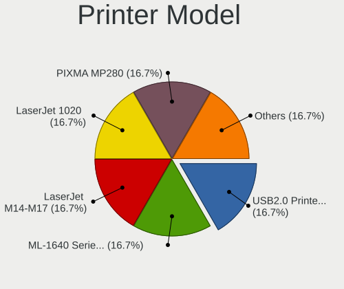

| Model                                 | Desktops | Percent |
|---------------------------------------|----------|---------|
| Seiko Epson USB2.0 Printer (Hi-speed) | 1        | 16.67%  |
| Samsung ML-1640 Series Laser Printer  | 1        | 16.67%  |
| HP LaserJet M14-M17                   | 1        | 16.67%  |
| HP LaserJet 1020                      | 1        | 16.67%  |
| Canon PIXMA MP280                     | 1        | 16.67%  |
| Canon LaserShot LBP-1120 Printer      | 1        | 16.67%  |

Scanner Vendor
--------------

Scanner device vendors

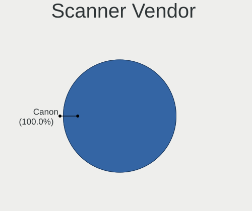

| Vendor | Desktops | Percent |
|--------|----------|---------|
| Canon  | 1        | 100%    |

Scanner Model
-------------

Scanner device models

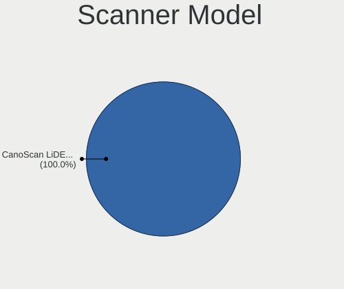

| Model                    | Desktops | Percent |
|--------------------------|----------|---------|
| Canon CanoScan LiDE 700F | 1        | 100%    |

Camera
------

Camera Vendor
-------------

Camera device vendors

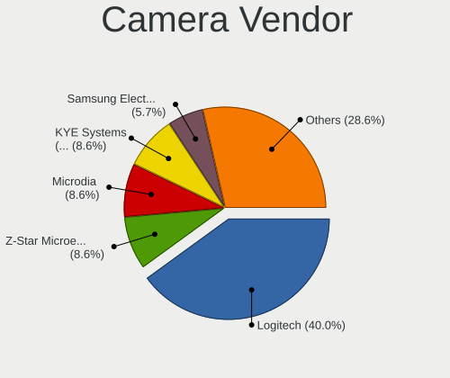

| Vendor                      | Desktops | Percent |
|-----------------------------|----------|---------|
| Logitech                    | 14       | 40%     |
| Z-Star Microelectronics     | 3        | 8.57%   |
| Microdia                    | 3        | 8.57%   |
| KYE Systems (Mouse Systems) | 3        | 8.57%   |
| Samsung Electronics         | 2        | 5.71%   |
| YGTek                       | 1        | 2.86%   |
| Trust                       | 1        | 2.86%   |
| Pixart Imaging              | 1        | 2.86%   |
| Microsoft                   | 1        | 2.86%   |
| MacroSilicon                | 1        | 2.86%   |
| Hewlett-Packard             | 1        | 2.86%   |
| Genesys Logic               | 1        | 2.86%   |
| GEMBIRD                     | 1        | 2.86%   |
| Cubeternet                  | 1        | 2.86%   |
| Aveo Technology             | 1        | 2.86%   |

Camera Model
------------

Camera device models

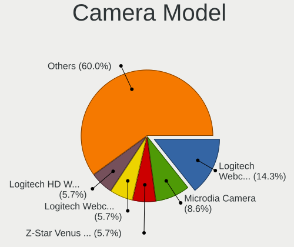

| Model                                          | Desktops | Percent |
|------------------------------------------------|----------|---------|
| Logitech Webcam C270                           | 5        | 14.29%  |
| Microdia Camera                                | 3        | 8.57%   |
| Z-Star Venus USB2.0 Camera                     | 2        | 5.71%   |
| Logitech Webcam C170                           | 2        | 5.71%   |
| Logitech HD Webcam C525                        | 2        | 5.71%   |
| Z-Star A4 TECH USB 2.0 Camera J                | 1        | 2.86%   |
| YGTek Webcam                                   | 1        | 2.86%   |
| Trust Full HD Webcam                           | 1        | 2.86%   |
| Samsung Galaxy series, misc. (MTP mode)        | 1        | 2.86%   |
| Samsung Galaxy (PTP mode)                      | 1        | 2.86%   |
| Pixart Imaging GE 1.3 MP MiniCam Pro           | 1        | 2.86%   |
| Microsoft LifeCam VX-700                       | 1        | 2.86%   |
| MacroSilicon USB3. 0 capture                   | 1        | 2.86%   |
| Logitech Webcam C250                           | 1        | 2.86%   |
| Logitech Webcam C110                           | 1        | 2.86%   |
| Logitech QuickCam E 3500                       | 1        | 2.86%   |
| Logitech Logitech Webcam C925e                 | 1        | 2.86%   |
| Logitech Brio 500                              | 1        | 2.86%   |
| KYE Systems (Mouse Systems) Genius FaceCam 320 | 1        | 2.86%   |
| KYE Systems (Mouse Systems) FaceCam 1000X      | 1        | 2.86%   |
| KYE Systems (Mouse Systems) eFace 2025         | 1        | 2.86%   |
| HP HP Webcam 3100                              | 1        | 2.86%   |
| Genesys Logic U2 EE Cam                        | 1        | 2.86%   |
| GEMBIRD USB2.0 PC CAMERA                       | 1        | 2.86%   |
| Cubeternet USB2.0 Camera                       | 1        | 2.86%   |
| Aveo Camera                                    | 1        | 2.86%   |

Security
--------

Fingerprint Vendor
------------------

Fingerprint sensor vendors

Zero info for selected period =(

Fingerprint Model
-----------------

Fingerprint sensor models

Zero info for selected period =(

Chipcard Vendor
---------------

Chipcard module vendors

Zero info for selected period =(

Chipcard Model
--------------

Chipcard module models

Zero info for selected period =(

Unsupported
-----------

Unsupported Devices
-------------------

Total unsupported devices on board

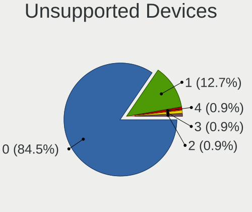

| Total | Desktops | Percent |
|-------|----------|---------|
| 0     | 93       | 84.55%  |
| 1     | 14       | 12.73%  |
| 4     | 1        | 0.91%   |
| 3     | 1        | 0.91%   |
| 2     | 1        | 0.91%   |

Unsupported Device Types
------------------------

Types of unsupported devices

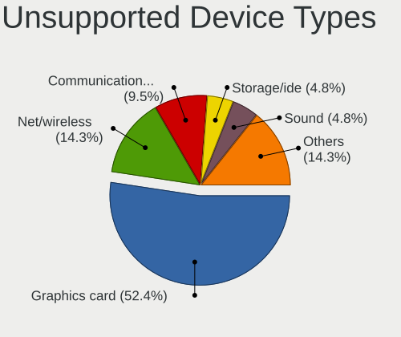

| Type                     | Desktops | Percent |
|--------------------------|----------|---------|
| Graphics card            | 11       | 52.38%  |
| Net/wireless             | 3        | 14.29%  |
| Communication controller | 2        | 9.52%   |
| Storage/ide              | 1        | 4.76%   |
| Sound                    | 1        | 4.76%   |
| Net/ethernet             | 1        | 4.76%   |
| Camera                   | 1        | 4.76%   |
| Bluetooth                | 1        | 4.76%   |

