Linux in Moldova - Tested Hardware & Statistics (Desktops)
----------------------------------------------------------

A project to collect tested hardware configurations for Linux in Moldova.

Anyone can contribute to this report by the [hw-probe](https://github.com/linuxhw/hw-probe) tool:

    sudo -E hw-probe -all -upload

Please contribute! Especially if your hardware is rare.

Contents
--------

* [ Test Cases ](#test-cases)

* [ System ](#system)
  - [ OS                       ](#os)
  - [ OS Family                ](#os-family)
  - [ Kernel                   ](#kernel)
  - [ Kernel Family            ](#kernel-family)
  - [ Kernel Major Ver.        ](#kernel-major-ver)
  - [ Arch                     ](#arch)
  - [ DE                       ](#de)
  - [ Display Server           ](#display-server)
  - [ Display Manager          ](#display-manager)
  - [ OS Lang                  ](#os-lang)
  - [ Boot Mode                ](#boot-mode)
  - [ Filesystem               ](#filesystem)
  - [ Part. scheme             ](#part-scheme)
  - [ Dual Boot with Linux/BSD ](#dual-boot-with-linuxbsd)
  - [ Dual Boot (Win)          ](#dual-boot-win)

* [ Board ](#board)
  - [ Vendor                   ](#vendor)
  - [ Model                    ](#model)
  - [ Model Family             ](#model-family)
  - [ MFG Year                 ](#mfg-year)
  - [ Form Factor              ](#form-factor)
  - [ Secure Boot              ](#secure-boot)
  - [ Coreboot                 ](#coreboot)
  - [ RAM Size                 ](#ram-size)
  - [ RAM Used                 ](#ram-used)
  - [ Total Drives             ](#total-drives)
  - [ Has CD-ROM               ](#has-cd-rom)
  - [ Has Ethernet             ](#has-ethernet)
  - [ Has WiFi                 ](#has-wifi)
  - [ Has Bluetooth            ](#has-bluetooth)

* [ Location ](#location)
  - [ Country                  ](#country)
  - [ City                     ](#city)

* [ Drives ](#drives)
  - [ Drive Vendor             ](#drive-vendor)
  - [ Drive Model              ](#drive-model)
  - [ HDD Vendor               ](#hdd-vendor)
  - [ SSD Vendor               ](#ssd-vendor)
  - [ Drive Kind               ](#drive-kind)
  - [ Drive Connector          ](#drive-connector)
  - [ Drive Size               ](#drive-size)
  - [ Space Total              ](#space-total)
  - [ Space Used               ](#space-used)
  - [ Malfunc. Drives          ](#malfunc-drives)
  - [ Malfunc. Drive Vendor    ](#malfunc-drive-vendor)
  - [ Malfunc. HDD Vendor      ](#malfunc-hdd-vendor)
  - [ Malfunc. Drive Kind      ](#malfunc-drive-kind)
  - [ Failed Drives            ](#failed-drives)
  - [ Failed Drive Vendor      ](#failed-drive-vendor)
  - [ Drive Status             ](#drive-status)

* [ Storage controller ](#storage-controller)
  - [ Storage Vendor           ](#storage-vendor)
  - [ Storage Model            ](#storage-model)
  - [ Storage Kind             ](#storage-kind)

* [ Processor ](#processor)
  - [ CPU Vendor               ](#cpu-vendor)
  - [ CPU Model                ](#cpu-model)
  - [ CPU Model Family         ](#cpu-model-family)
  - [ CPU Cores                ](#cpu-cores)
  - [ CPU Sockets              ](#cpu-sockets)
  - [ CPU Threads              ](#cpu-threads)
  - [ CPU Op-Modes             ](#cpu-op-modes)
  - [ CPU Microcode            ](#cpu-microcode)
  - [ CPU Microarch            ](#cpu-microarch)

* [ Graphics ](#graphics)
  - [ GPU Vendor               ](#gpu-vendor)
  - [ GPU Model                ](#gpu-model)
  - [ GPU Combo                ](#gpu-combo)
  - [ GPU Driver               ](#gpu-driver)
  - [ GPU Memory               ](#gpu-memory)

* [ Monitor ](#monitor)
  - [ Monitor Vendor           ](#monitor-vendor)
  - [ Monitor Model            ](#monitor-model)
  - [ Monitor Resolution       ](#monitor-resolution)
  - [ Monitor Diagonal         ](#monitor-diagonal)
  - [ Monitor Width            ](#monitor-width)
  - [ Aspect Ratio             ](#aspect-ratio)
  - [ Monitor Area             ](#monitor-area)
  - [ Pixel Density            ](#pixel-density)
  - [ Multiple Monitors        ](#multiple-monitors)

* [ Network ](#network)
  - [ Net Controller Vendor    ](#net-controller-vendor)
  - [ Net Controller Model     ](#net-controller-model)
  - [ Wireless Vendor          ](#wireless-vendor)
  - [ Wireless Model           ](#wireless-model)
  - [ Ethernet Vendor          ](#ethernet-vendor)
  - [ Ethernet Model           ](#ethernet-model)
  - [ Net Controller Kind      ](#net-controller-kind)
  - [ Used Controller          ](#used-controller)
  - [ NICs                     ](#nics)
  - [ IPv6                     ](#ipv6)

* [ Bluetooth ](#bluetooth)
  - [ Bluetooth Vendor         ](#bluetooth-vendor)
  - [ Bluetooth Model          ](#bluetooth-model)

* [ Sound ](#sound)
  - [ Sound Vendor             ](#sound-vendor)
  - [ Sound Model              ](#sound-model)

* [ Memory ](#memory)
  - [ Memory Vendor            ](#memory-vendor)
  - [ Memory Model             ](#memory-model)
  - [ Memory Kind              ](#memory-kind)
  - [ Memory Form Factor       ](#memory-form-factor)
  - [ Memory Size              ](#memory-size)
  - [ Memory Speed             ](#memory-speed)

* [ Printers & scanners ](#printers--scanners)
  - [ Printer Vendor           ](#printer-vendor)
  - [ Printer Model            ](#printer-model)
  - [ Scanner Vendor           ](#scanner-vendor)
  - [ Scanner Model            ](#scanner-model)

* [ Camera ](#camera)
  - [ Camera Vendor            ](#camera-vendor)
  - [ Camera Model             ](#camera-model)

* [ Security ](#security)
  - [ Fingerprint Vendor       ](#fingerprint-vendor)
  - [ Fingerprint Model        ](#fingerprint-model)
  - [ Chipcard Vendor          ](#chipcard-vendor)
  - [ Chipcard Model           ](#chipcard-model)

* [ Unsupported ](#unsupported)
  - [ Unsupported Devices      ](#unsupported-devices)
  - [ Unsupported Device Types ](#unsupported-device-types)

Test Cases
----------

Total: 88

| Vendor   | Model               | Probe                                                      | Date         |
|----------|---------------------|------------------------------------------------------------|--------------|
| ASUSTek  | P8H61-M LX2 R2.0    | [e9bc8b1f10](https://linux-hardware.org/?probe=e9bc8b1f10) | Sep 26, 2022 |
| Gigabyte | B550 AORUS ELITE    | [08e3444b3c](https://linux-hardware.org/?probe=08e3444b3c) | Aug 15, 2022 |
| Foxconn  | nT-330i             | [64504a98ed](https://linux-hardware.org/?probe=64504a98ed) | Aug 04, 2022 |
| Dell     | 0782GW A01          | [20cb4c3e27](https://linux-hardware.org/?probe=20cb4c3e27) | Jul 11, 2022 |
| Gigabyte | B450M S2H V2        | [e0e21604de](https://linux-hardware.org/?probe=e0e21604de) | Jun 24, 2022 |
| ASUSTek  | PRIME A520M-K       | [72dd09a86a](https://linux-hardware.org/?probe=72dd09a86a) | Jun 05, 2022 |
| ASUSTek  | M4A785-M            | [25526ee77d](https://linux-hardware.org/?probe=25526ee77d) | Apr 17, 2022 |
| ASUSTek  | PRIME B550-PLUS     | [8c88f1c50a](https://linux-hardware.org/?probe=8c88f1c50a) | Apr 12, 2022 |
| Gigabyte | Z690 UD DDR4        | [6c4ff21b02](https://linux-hardware.org/?probe=6c4ff21b02) | Feb 21, 2022 |
| HP       | 21F5                | [ce8e06508d](https://linux-hardware.org/?probe=ce8e06508d) | Jan 16, 2022 |
| Biostar  | N68S3+              | [8812de783f](https://linux-hardware.org/?probe=8812de783f) | Dec 16, 2021 |
| ASUSTek  | A_F_K20CE           | [926db6c655](https://linux-hardware.org/?probe=926db6c655) | Dec 15, 2021 |
| ASUSTek  | Z97I-PLUS           | [a379cfa431](https://linux-hardware.org/?probe=a379cfa431) | Dec 12, 2021 |
| Gigabyte | H61M-S2-B3          | [960d7d5035](https://linux-hardware.org/?probe=960d7d5035) | Dec 05, 2021 |
| ASRock   | M3A770DE            | [b6ee8bc974](https://linux-hardware.org/?probe=b6ee8bc974) | Dec 01, 2021 |
| Gigabyte | H81M-HD3            | [953c3f9284](https://linux-hardware.org/?probe=953c3f9284) | Nov 13, 2021 |
| MSI      | MS-7309             | [0a4d7fb95d](https://linux-hardware.org/?probe=0a4d7fb95d) | Oct 30, 2021 |
| MSI      | A75A-G35            | [7223bfa184](https://linux-hardware.org/?probe=7223bfa184) | Oct 22, 2021 |
| Biostar  | N68S3+              | [1eae78eec0](https://linux-hardware.org/?probe=1eae78eec0) | Aug 04, 2021 |
| Gigabyte | B460M DS3H V2       | [6177f24834](https://linux-hardware.org/?probe=6177f24834) | Aug 02, 2021 |
| Gigabyte | B460M DS3H V2       | [7fa66f2f95](https://linux-hardware.org/?probe=7fa66f2f95) | Aug 02, 2021 |
| Gigabyte | EP43-UD3L           | [3b6839e225](https://linux-hardware.org/?probe=3b6839e225) | Jul 01, 2021 |
| ASUSTek  | F1A75-M LE          | [b453e98364](https://linux-hardware.org/?probe=b453e98364) | May 21, 2021 |
| Biostar  | A58MD               | [3effc9a4ed](https://linux-hardware.org/?probe=3effc9a4ed) | Apr 18, 2021 |
| Biostar  | H110MHC             | [acc13c8156](https://linux-hardware.org/?probe=acc13c8156) | Mar 24, 2021 |
| ASUSTek  | P8Z77-V PRO         | [a3d54dee1b](https://linux-hardware.org/?probe=a3d54dee1b) | Feb 22, 2021 |
| ASUSTek  | P8Z77-V PRO         | [7f75cd3e14](https://linux-hardware.org/?probe=7f75cd3e14) | Feb 22, 2021 |
| ASUSTek  | PRIME B350-PLUS     | [23ddb098d4](https://linux-hardware.org/?probe=23ddb098d4) | Feb 18, 2021 |
| ASRock   | Z87 Extreme4        | [2fc1d961c0](https://linux-hardware.org/?probe=2fc1d961c0) | Feb 14, 2021 |
| ASUSTek  | B85M-E              | [024b12b22d](https://linux-hardware.org/?probe=024b12b22d) | Jan 17, 2021 |
| Gigabyte | GA-970A-DS3         | [f333aed432](https://linux-hardware.org/?probe=f333aed432) | Dec 04, 2020 |
| Gigabyte | X570 AORUS ULTRA    | [bdc9ccf5d5](https://linux-hardware.org/?probe=bdc9ccf5d5) | Nov 23, 2020 |
| Biostar  | A960D+V3            | [86864a3f9a](https://linux-hardware.org/?probe=86864a3f9a) | Oct 01, 2020 |
| Biostar  | A960D+V3            | [781ac4ebab](https://linux-hardware.org/?probe=781ac4ebab) | Sep 30, 2020 |
| Gigabyte | P41-ES3G            | [30feb0323e](https://linux-hardware.org/?probe=30feb0323e) | Sep 29, 2020 |
| Gigabyte | P41-ES3G            | [395e492e72](https://linux-hardware.org/?probe=395e492e72) | Sep 29, 2020 |
| ASUSTek  | P8H61-MX            | [46cff277d4](https://linux-hardware.org/?probe=46cff277d4) | Aug 16, 2020 |
| ASUSTek  | M2N-SLI DELUXE      | [02ab999339](https://linux-hardware.org/?probe=02ab999339) | Aug 04, 2020 |
| ASRock   | A320M-HDV R4.0      | [0320a45205](https://linux-hardware.org/?probe=0320a45205) | Jul 25, 2020 |
| ASUSTek  | M4A785TD-V EVO      | [734d413d2f](https://linux-hardware.org/?probe=734d413d2f) | May 25, 2020 |
| ASUSTek  | M4A785TD-V EVO      | [a5f24237a6](https://linux-hardware.org/?probe=a5f24237a6) | May 22, 2020 |
| ASUSTek  | P8B75-M LE          | [3051982d33](https://linux-hardware.org/?probe=3051982d33) | Apr 28, 2020 |
| ASUSTek  | P8B75-M LE          | [6e3a1017c8](https://linux-hardware.org/?probe=6e3a1017c8) | Apr 28, 2020 |
| ASUSTek  | H110M-K             | [d65e7d1bb6](https://linux-hardware.org/?probe=d65e7d1bb6) | Mar 28, 2020 |
| ASUSTek  | F1A75-M LE          | [3cee091303](https://linux-hardware.org/?probe=3cee091303) | Mar 25, 2020 |
| ASUSTek  | H110M-K             | [c0aa963f37](https://linux-hardware.org/?probe=c0aa963f37) | Mar 21, 2020 |
| MSI      | 2A9C                | [cb1789ae00](https://linux-hardware.org/?probe=cb1789ae00) | Mar 18, 2020 |
| ASUSTek  | M5A78L-M LX         | [90f55c011b](https://linux-hardware.org/?probe=90f55c011b) | Dec 04, 2019 |
| ASUSTek  | P5QL/EPU            | [8f31c009af](https://linux-hardware.org/?probe=8f31c009af) | Oct 20, 2019 |
| ASUSTek  | F1A75-M LE          | [bdb727808f](https://linux-hardware.org/?probe=bdb727808f) | Jul 26, 2019 |
| ASUSTek  | F1A75-M LE          | [961de73328](https://linux-hardware.org/?probe=961de73328) | Jul 26, 2019 |
| Biostar  | GF8100 M2+ SE       | [52b394c153](https://linux-hardware.org/?probe=52b394c153) | May 05, 2019 |
| ASUSTek  | P5P43TD             | [bbfc5c83ed](https://linux-hardware.org/?probe=bbfc5c83ed) | Apr 23, 2019 |
| ASUSTek  | P5P43TD             | [a1df618ae9](https://linux-hardware.org/?probe=a1df618ae9) | Apr 18, 2019 |
| Gigabyte | G41M-ES2L           | [62f911ea35](https://linux-hardware.org/?probe=62f911ea35) | Apr 09, 2019 |
| HP       | 82A1                | [f04f3b1720](https://linux-hardware.org/?probe=f04f3b1720) | Mar 18, 2019 |
| ASRock   | B250M Pro4          | [05dfa7d080](https://linux-hardware.org/?probe=05dfa7d080) | Jan 07, 2019 |
| ASRock   | B250M Pro4          | [4ca432ffe1](https://linux-hardware.org/?probe=4ca432ffe1) | Jan 03, 2019 |
| Biostar  | NF61D-A2            | [8920fb5da2](https://linux-hardware.org/?probe=8920fb5da2) | Nov 24, 2018 |
| Gigabyte | H61M-S1             | [f035a927b4](https://linux-hardware.org/?probe=f035a927b4) | Oct 16, 2018 |
| Gigabyte | H61M-S1             | [0cb176039a](https://linux-hardware.org/?probe=0cb176039a) | Oct 16, 2018 |
| ASUSTek  | H110M-R             | [e8cf4914df](https://linux-hardware.org/?probe=e8cf4914df) | Oct 11, 2018 |
| ASUSTek  | TUF X299 MARK 1     | [4ff6f8b306](https://linux-hardware.org/?probe=4ff6f8b306) | Aug 28, 2018 |
| ASUSTek  | H110M-R             | [856815508e](https://linux-hardware.org/?probe=856815508e) | Jul 20, 2018 |
| ASUSTek  | H110M-R             | [2c6e982e0a](https://linux-hardware.org/?probe=2c6e982e0a) | Jul 20, 2018 |
| ASRock   | H110M-DGS           | [2bf308c36a](https://linux-hardware.org/?probe=2bf308c36a) | Apr 22, 2018 |
| Gigabyte | H81M-S2PV           | [d73e7cdaf7](https://linux-hardware.org/?probe=d73e7cdaf7) | Apr 10, 2018 |
| ASUSTek  | M5A78L LE           | [324ea287af](https://linux-hardware.org/?probe=324ea287af) | Mar 25, 2018 |
| ASUSTek  | M5A78L LE           | [c4796ca0ba](https://linux-hardware.org/?probe=c4796ca0ba) | Mar 25, 2018 |
| MSI      | G31M3-L V2          | [a010b34c1d](https://linux-hardware.org/?probe=a010b34c1d) | Mar 14, 2018 |
| Gigabyte | GA-880GM-USB3       | [488c7af7b3](https://linux-hardware.org/?probe=488c7af7b3) | Feb 13, 2018 |
| Biostar  | H61MGV3             | [601f3981af](https://linux-hardware.org/?probe=601f3981af) | Jan 25, 2018 |
| MSI      | G31M3-L V2          | [cb825d670e](https://linux-hardware.org/?probe=cb825d670e) | Jan 23, 2018 |
| Biostar  | A960G+              | [1ed969e51e](https://linux-hardware.org/?probe=1ed969e51e) | Jan 02, 2018 |
| Gigabyte | H81M-S2PV           | [b4b5168bf0](https://linux-hardware.org/?probe=b4b5168bf0) | Oct 22, 2017 |
| Biostar  | TA790GX 128M        | [13dafc619e](https://linux-hardware.org/?probe=13dafc619e) | Sep 07, 2017 |
| ASUSTek  | P7P55D-E            | [7ead295d4f](https://linux-hardware.org/?probe=7ead295d4f) | May 04, 2017 |
| ASUSTek  | P5GPL               | [dc412a96d7](https://linux-hardware.org/?probe=dc412a96d7) | Mar 11, 2017 |
| ASUSTek  | P5GPL               | [704d76d7f0](https://linux-hardware.org/?probe=704d76d7f0) | Mar 11, 2017 |
| ECS      | GeForce7050M-M      | [dffec0e1ef](https://linux-hardware.org/?probe=dffec0e1ef) | Jan 26, 2017 |
| MSI      | G41M-P26            | [3a93859874](https://linux-hardware.org/?probe=3a93859874) | Jan 21, 2017 |
| Dell     | 0HJ054              | [3a64a2e7cc](https://linux-hardware.org/?probe=3a64a2e7cc) | Jan 14, 2017 |
| ASUSTek  | M5A78L-M LX3        | [de5986b48c](https://linux-hardware.org/?probe=de5986b48c) | Dec 27, 2016 |
| ASUSTek  | P8H61-M LX3         | [51108b9a7b](https://linux-hardware.org/?probe=51108b9a7b) | Nov 26, 2016 |
| ASUSTek  | A88X-PLUS           | [e5165dfe31](https://linux-hardware.org/?probe=e5165dfe31) | Nov 25, 2016 |
| ASUSTek  | A88X-PLUS           | [53f70342b5](https://linux-hardware.org/?probe=53f70342b5) | Nov 23, 2016 |
| ASUSTek  | P5KPL-AM IN/ROEM/SI | [c140d93dd9](https://linux-hardware.org/?probe=c140d93dd9) | Nov 08, 2016 |
| ECS      | GeForce7050M-M      | [3f276c748c](https://linux-hardware.org/?probe=3f276c748c) | Nov 04, 2016 |

System
------

OS
--

Installed operating systems

| Name             | Desktops | Percent |
|------------------|----------|---------|
| ROSA R10         | 12       | 17.39%  |
| ROSA R11         | 8        | 11.59%  |
| ROSA R8          | 7        | 10.14%  |
| ROSA R8.1        | 6        | 8.7%    |
| ROSA R11.1       | 6        | 8.7%    |
| OpenMandriva 4.2 | 6        | 8.7%    |
| Ubuntu 20.04     | 2        | 2.9%    |
| Ubuntu 18.04     | 2        | 2.9%    |
| ROSA 12.2        | 2        | 2.9%    |
| Manjaro          | 2        | 2.9%    |
| Arch Rolling     | 2        | 2.9%    |
| Ubuntu 21.10     | 1        | 1.45%   |
| Ubuntu 16.04     | 1        | 1.45%   |
| ROSA R9          | 1        | 1.45%   |
| Pop!_OS 21.10    | 1        | 1.45%   |
| Pop!_OS 20.10    | 1        | 1.45%   |
| Pop!_OS 20.04    | 1        | 1.45%   |
| OpenMandriva 4.3 | 1        | 1.45%   |
| Manjaro 21.3.0   | 1        | 1.45%   |
| Linux Mint 20    | 1        | 1.45%   |
| Linux Mint 19.3  | 1        | 1.45%   |
| KDE neon 20.04   | 1        | 1.45%   |
| Kali 2019.3      | 1        | 1.45%   |
| Fedora 35        | 1        | 1.45%   |
| Ctlos 1.4.0      | 1        | 1.45%   |

OS Family
---------

OS without a version

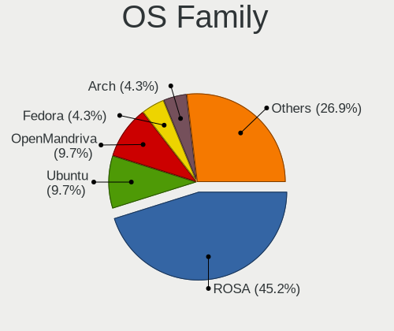

| Name         | Desktops | Percent |
|--------------|----------|---------|
| ROSA         | 40       | 59.7%   |
| OpenMandriva | 7        | 10.45%  |
| Ubuntu       | 6        | 8.96%   |
| Pop!_OS      | 3        | 4.48%   |
| Manjaro      | 3        | 4.48%   |
| Linux Mint   | 2        | 2.99%   |
| Arch         | 2        | 2.99%   |
| KDE neon     | 1        | 1.49%   |
| Kali         | 1        | 1.49%   |
| Fedora       | 1        | 1.49%   |
| Ctlos        | 1        | 1.49%   |

Kernel
------

Version of the Linux kernel

| Version                            | Desktops | Percent |
|------------------------------------|----------|---------|
| 5.10.14-desktop-1omv4002           | 6        | 8.57%   |
| 4.9.60-nrj-desktop-1rosa-x86_64    | 6        | 8.57%   |
| 4.15.0-desktop-45.1rosa-x86_64     | 4        | 5.71%   |
| 4.1.34-nrj-desktop-2rosa-x86_64    | 4        | 5.71%   |
| 5.10.74-generic-2rosa2021.1-x86_64 | 2        | 2.86%   |
| 4.9.20-nrj-desktop-1rosa-x86_64    | 2        | 2.86%   |
| 4.9.155-nrj-desktop-1rosa-x86_64   | 2        | 2.86%   |
| 4.15.0-desktop-68.5rosa-x86_64     | 2        | 2.86%   |
| 4.15.0-desktop-47.2rosa-x86_64     | 2        | 2.86%   |
| 4.1.34-nrj-desktop-2rosa-i586      | 2        | 2.86%   |
| 5.9.3-050903-generic               | 1        | 1.43%   |
| 5.8.0-7642-generic                 | 1        | 1.43%   |
| 5.8.0-38-generic                   | 1        | 1.43%   |
| 5.5.9-zen1-2-zen                   | 1        | 1.43%   |
| 5.4.83-generic-2rosa-x86_64        | 1        | 1.43%   |
| 5.4.32-generic-2rosa-x86_64        | 1        | 1.43%   |
| 5.4.32-generic-2rosa-i586          | 1        | 1.43%   |
| 5.4.0-90-generic                   | 1        | 1.43%   |
| 5.4.0-7634-generic                 | 1        | 1.43%   |
| 5.4.0-56-generic                   | 1        | 1.43%   |
| 5.4.0-48-generic                   | 1        | 1.43%   |
| 5.2.0-kali2-amd64                  | 1        | 1.43%   |
| 5.17.9-arch1-1                     | 1        | 1.43%   |
| 5.16.9-200.fc35.x86_64             | 1        | 1.43%   |
| 5.16.7-desktop-1omv4003            | 1        | 1.43%   |
| 5.15.48-1-MANJARO                  | 1        | 1.43%   |
| 5.15.11-76051511-generic           | 1        | 1.43%   |
| 5.14.14-arch1-1                    | 1        | 1.43%   |
| 5.13.0-52-generic                  | 1        | 1.43%   |
| 5.13.0-39-generic                  | 1        | 1.43%   |
| 5.10.53-1-MANJARO                  | 1        | 1.43%   |
| 5.10.26-1-MANJARO                  | 1        | 1.43%   |
| 4.9.9-nrj-desktop-1rosa-x86_64     | 1        | 1.43%   |
| 4.9.9-nrj-desktop-1rosa-i586       | 1        | 1.43%   |
| 4.9.87-nrj-desktop-2rosa-x86_64    | 1        | 1.43%   |
| 4.9.76-nrj-desktop-1rosa-x86_64    | 1        | 1.43%   |
| 4.9.76-nrj-desktop-1rosa-i586      | 1        | 1.43%   |
| 4.9.60-nrj-desktop-1rosa-i586      | 1        | 1.43%   |
| 4.9.124-nrj-desktop-1rosa-x86_64   | 1        | 1.43%   |
| 4.9.124-nrj-desktop-1rosa-i586     | 1        | 1.43%   |

Kernel Family
-------------

Linux kernel without a distro release

| Version | Desktops | Percent |
|---------|----------|---------|
| 4.15.0  | 10       | 14.49%  |
| 4.9.60  | 7        | 10.14%  |
| 5.10.14 | 6        | 8.7%    |
| 4.1.34  | 6        | 8.7%    |
| 5.4.0   | 4        | 5.8%    |
| 5.8.0   | 2        | 2.9%    |
| 5.4.32  | 2        | 2.9%    |
| 5.13.0  | 2        | 2.9%    |
| 5.10.74 | 2        | 2.9%    |
| 4.9.9   | 2        | 2.9%    |
| 4.9.76  | 2        | 2.9%    |
| 4.9.20  | 2        | 2.9%    |
| 4.9.155 | 2        | 2.9%    |
| 4.9.124 | 2        | 2.9%    |
| 4.1.38  | 2        | 2.9%    |
| 5.9.3   | 1        | 1.45%   |
| 5.5.9   | 1        | 1.45%   |
| 5.4.83  | 1        | 1.45%   |
| 5.2.0   | 1        | 1.45%   |
| 5.17.9  | 1        | 1.45%   |
| 5.16.9  | 1        | 1.45%   |
| 5.16.7  | 1        | 1.45%   |
| 5.15.48 | 1        | 1.45%   |
| 5.15.11 | 1        | 1.45%   |
| 5.14.14 | 1        | 1.45%   |
| 5.10.53 | 1        | 1.45%   |
| 5.10.26 | 1        | 1.45%   |
| 4.9.87  | 1        | 1.45%   |
| 4.18.0  | 1        | 1.45%   |
| 4.10.0  | 1        | 1.45%   |
| 4.1.25  | 1        | 1.45%   |

Kernel Major Ver.
-----------------

Linux kernel major version

| Version | Desktops | Percent |
|---------|----------|---------|
| 4.9     | 17       | 25%     |
| 5.10    | 10       | 14.71%  |
| 4.15    | 10       | 14.71%  |
| 4.1     | 9        | 13.24%  |
| 5.4     | 7        | 10.29%  |
| 5.8     | 2        | 2.94%   |
| 5.16    | 2        | 2.94%   |
| 5.15    | 2        | 2.94%   |
| 5.13    | 2        | 2.94%   |
| 5.9     | 1        | 1.47%   |
| 5.5     | 1        | 1.47%   |
| 5.2     | 1        | 1.47%   |
| 5.17    | 1        | 1.47%   |
| 5.14    | 1        | 1.47%   |
| 4.18    | 1        | 1.47%   |
| 4.10    | 1        | 1.47%   |

Arch
----

OS architecture (x86_64, i586, etc.)

| Name   | Desktops | Percent |
|--------|----------|---------|
| x86_64 | 57       | 85.07%  |
| i686   | 10       | 14.93%  |

DE
--

Desktop Environment

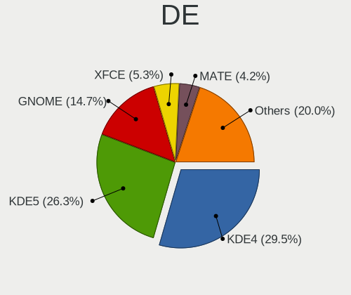

| Name            | Desktops | Percent |
|-----------------|----------|---------|
| KDE4            | 27       | 39.71%  |
| KDE5            | 18       | 26.47%  |
| GNOME           | 9        | 13.24%  |
| XFCE            | 3        | 4.41%   |
| X-Cinnamon      | 2        | 2.94%   |
| LXQt            | 2        | 2.94%   |
| KDE             | 2        | 2.94%   |
| xinitrc         | 1        | 1.47%   |
| sway            | 1        | 1.47%   |
| MATE            | 1        | 1.47%   |
| GNOME Flashback | 1        | 1.47%   |
| Unknown         | 1        | 1.47%   |

Display Server
--------------

X11 or Wayland

| Name    | Desktops | Percent |
|---------|----------|---------|
| X11     | 61       | 91.04%  |
| Wayland | 5        | 7.46%   |
| Unknown | 1        | 1.49%   |

Display Manager
---------------

SDDM, LightDM, etc.

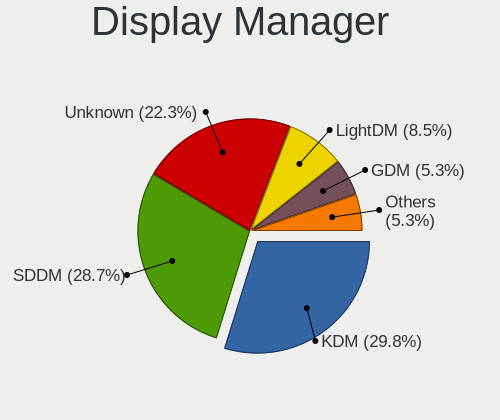

| Name    | Desktops | Percent |
|---------|----------|---------|
| KDM     | 27       | 39.71%  |
| SDDM    | 22       | 32.35%  |
| Unknown | 13       | 19.12%  |
| TDM     | 2        | 2.94%   |
| GDM     | 2        | 2.94%   |
| LightDM | 1        | 1.47%   |
| GDM3    | 1        | 1.47%   |

OS Lang
-------

Language

| Lang    | Desktops | Percent |
|---------|----------|---------|
| Unknown | 34       | 49.28%  |
| ru_RU   | 19       | 27.54%  |
| en_US   | 11       | 15.94%  |
| ro_RO   | 2        | 2.9%    |
| en_GB   | 2        | 2.9%    |
| ru_UA   | 1        | 1.45%   |

Boot Mode
---------

EFI or BIOS

| Mode | Desktops | Percent |
|------|----------|---------|
| BIOS | 56       | 82.35%  |
| EFI  | 12       | 17.65%  |

Filesystem
----------

Type of filesystem

| Type    | Desktops | Percent |
|---------|----------|---------|
| Ext4    | 39       | 58.21%  |
| Unknown | 21       | 31.34%  |
| Overlay | 5        | 7.46%   |
| Btrfs   | 2        | 2.99%   |

Part. scheme
------------

Scheme of partitioning

| Type    | Desktops | Percent |
|---------|----------|---------|
| MBR     | 39       | 56.52%  |
| Unknown | 19       | 27.54%  |
| GPT     | 11       | 15.94%  |

Dual Boot with Linux/BSD
------------------------

Hosting more than one Linux/BSD

| Dual boot | Desktops | Percent |
|-----------|----------|---------|
| No        | 55       | 82.09%  |
| Yes       | 12       | 17.91%  |

Dual Boot (Win)
---------------

Hosting Linux and Windows

| Dual boot | Desktops | Percent |
|-----------|----------|---------|
| No        | 44       | 64.71%  |
| Yes       | 24       | 35.29%  |

Board
-----

Vendor
------

Motherboard manufacturer

| Name                | Desktops | Percent |
|---------------------|----------|---------|
| ASUSTek Computer    | 28       | 41.79%  |
| Gigabyte Technology | 14       | 20.9%   |
| Biostar             | 9        | 13.43%  |
| MSI                 | 5        | 7.46%   |
| ASRock              | 5        | 7.46%   |
| Hewlett-Packard     | 2        | 2.99%   |
| Dell                | 2        | 2.99%   |
| Foxconn             | 1        | 1.49%   |
| ECS                 | 1        | 1.49%   |

Model
-----

Motherboard model

| Name                       | Desktops | Percent |
|----------------------------|----------|---------|
| ASUS H110M-R               | 2        | 2.99%   |
| ASUS All Series            | 2        | 2.99%   |
| MSI Pro 3130 Microtower PC | 1        | 1.49%   |
| MSI MS-7695                | 1        | 1.49%   |
| MSI MS-7592                | 1        | 1.49%   |
| MSI MS-7529                | 1        | 1.49%   |
| MSI MS-7309                | 1        | 1.49%   |
| HP ProDesk 490 G2 MT       | 1        | 1.49%   |
| HP ProDesk 400 G4 MT       | 1        | 1.49%   |
| Gigabyte Z690 UD DDR4      | 1        | 1.49%   |
| Gigabyte X570 AORUS ULTRA  | 1        | 1.49%   |
| Gigabyte P41-ES3G          | 1        | 1.49%   |
| Gigabyte H81M-S2PV         | 1        | 1.49%   |
| Gigabyte H81M-HD3          | 1        | 1.49%   |
| Gigabyte H61M-S2-B3        | 1        | 1.49%   |
| Gigabyte H61M-S1           | 1        | 1.49%   |
| Gigabyte GA-970A-DS3       | 1        | 1.49%   |
| Gigabyte GA-880GM-USB3     | 1        | 1.49%   |
| Gigabyte G41M-ES2L         | 1        | 1.49%   |
| Gigabyte EP43-UD3L         | 1        | 1.49%   |
| Gigabyte B550 AORUS ELITE  | 1        | 1.49%   |
| Gigabyte B460MDS3HV2       | 1        | 1.49%   |
| Gigabyte B450M S2H V2      | 1        | 1.49%   |
| Foxconn nT-330i            | 1        | 1.49%   |
| ECS GeForce7050M-M         | 1        | 1.49%   |
| Dell OptiPlex 5050         | 1        | 1.49%   |
| Dell DM051                 | 1        | 1.49%   |
| Biostar TA790GX 128M       | 1        | 1.49%   |
| Biostar NF61D-A2           | 1        | 1.49%   |
| Biostar N68S3+             | 1        | 1.49%   |
| Biostar H61MGV3            | 1        | 1.49%   |
| Biostar H110MHC            | 1        | 1.49%   |
| Biostar GF8100 M2+ SE      | 1        | 1.49%   |
| Biostar A960G+             | 1        | 1.49%   |
| Biostar A960D+V3           | 1        | 1.49%   |
| Biostar A58MD              | 1        | 1.49%   |
| ASUS TUF X299 MARK 1       | 1        | 1.49%   |
| ASUS PRIME B550-PLUS       | 1        | 1.49%   |
| ASUS PRIME B350-PLUS       | 1        | 1.49%   |
| ASUS PRIME A520M-K         | 1        | 1.49%   |

Model Family
------------

Motherboard model prefix

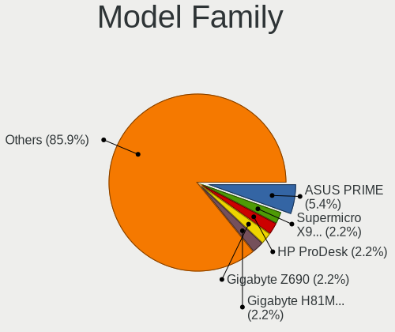

| Name                   | Desktops | Percent |
|------------------------|----------|---------|
| ASUS PRIME             | 3        | 4.48%   |
| HP ProDesk             | 2        | 2.99%   |
| ASUS P8H61-M           | 2        | 2.99%   |
| ASUS M5A78L-M          | 2        | 2.99%   |
| ASUS H110M-R           | 2        | 2.99%   |
| ASUS All               | 2        | 2.99%   |
| MSI Pro                | 1        | 1.49%   |
| MSI MS-7695            | 1        | 1.49%   |
| MSI MS-7592            | 1        | 1.49%   |
| MSI MS-7529            | 1        | 1.49%   |
| MSI MS-7309            | 1        | 1.49%   |
| Gigabyte Z690          | 1        | 1.49%   |
| Gigabyte X570          | 1        | 1.49%   |
| Gigabyte P41-ES3G      | 1        | 1.49%   |
| Gigabyte H81M-S2PV     | 1        | 1.49%   |
| Gigabyte H81M-HD3      | 1        | 1.49%   |
| Gigabyte H61M-S2-B3    | 1        | 1.49%   |
| Gigabyte H61M-S1       | 1        | 1.49%   |
| Gigabyte GA-970A-DS3   | 1        | 1.49%   |
| Gigabyte GA-880GM-USB3 | 1        | 1.49%   |
| Gigabyte G41M-ES2L     | 1        | 1.49%   |
| Gigabyte EP43-UD3L     | 1        | 1.49%   |
| Gigabyte B550          | 1        | 1.49%   |
| Gigabyte B460MDS3HV2   | 1        | 1.49%   |
| Gigabyte B450M         | 1        | 1.49%   |
| Foxconn nT-330i        | 1        | 1.49%   |
| ECS GeForce7050M-M     | 1        | 1.49%   |
| Dell OptiPlex          | 1        | 1.49%   |
| Dell DM051             | 1        | 1.49%   |
| Biostar TA790GX        | 1        | 1.49%   |
| Biostar NF61D-A2       | 1        | 1.49%   |
| Biostar N68S3+         | 1        | 1.49%   |
| Biostar H61MGV3        | 1        | 1.49%   |
| Biostar H110MHC        | 1        | 1.49%   |
| Biostar GF8100         | 1        | 1.49%   |
| Biostar A960G+         | 1        | 1.49%   |
| Biostar A960D+V3       | 1        | 1.49%   |
| Biostar A58MD          | 1        | 1.49%   |
| ASUS TUF               | 1        | 1.49%   |
| ASUS P8Z77-V           | 1        | 1.49%   |

MFG Year
--------

Motherboard manufacture year

| Year | Desktops | Percent |
|------|----------|---------|
| 2009 | 11       | 16.42%  |
| 2012 | 9        | 13.43%  |
| 2013 | 6        | 8.96%   |
| 2011 | 6        | 8.96%   |
| 2010 | 6        | 8.96%   |
| 2020 | 5        | 7.46%   |
| 2016 | 5        | 7.46%   |
| 2017 | 4        | 5.97%   |
| 2018 | 3        | 4.48%   |
| 2007 | 3        | 4.48%   |
| 2015 | 2        | 2.99%   |
| 2006 | 2        | 2.99%   |
| 2022 | 1        | 1.49%   |
| 2021 | 1        | 1.49%   |
| 2019 | 1        | 1.49%   |
| 2014 | 1        | 1.49%   |
| 2005 | 1        | 1.49%   |

Form Factor
-----------

Physical design of the computer

| Name    | Desktops | Percent |
|---------|----------|---------|
| Desktop | 67       | 100%    |

Secure Boot
-----------

Enabled or disabled

| State    | Desktops | Percent |
|----------|----------|---------|
| Disabled | 66       | 98.51%  |
| Enabled  | 1        | 1.49%   |

Coreboot
--------

Have coreboot on board

| Used | Desktops | Percent |
|------|----------|---------|
| No   | 67       | 100%    |

RAM Size
--------

Total RAM memory

| Size in GB | Desktops | Percent |
|------------|----------|---------|
| 3.01-4.0   | 24       | 35.29%  |
| 8.01-16.0  | 15       | 22.06%  |
| 16.01-24.0 | 9        | 13.24%  |
| 4.01-8.0   | 7        | 10.29%  |
| 1.01-2.0   | 5        | 7.35%   |
| 2.01-3.0   | 4        | 5.88%   |
| 32.01-64.0 | 3        | 4.41%   |
| 0.51-1.0   | 1        | 1.47%   |

RAM Used
--------

Used RAM memory

| Used GB   | Desktops | Percent |
|-----------|----------|---------|
| 1.01-2.0  | 28       | 38.36%  |
| 0.51-1.0  | 23       | 31.51%  |
| 2.01-3.0  | 8        | 10.96%  |
| 4.01-8.0  | 6        | 8.22%   |
| 3.01-4.0  | 4        | 5.48%   |
| 0.01-0.5  | 3        | 4.11%   |
| 8.01-16.0 | 1        | 1.37%   |

Total Drives
------------

Number of drives on board

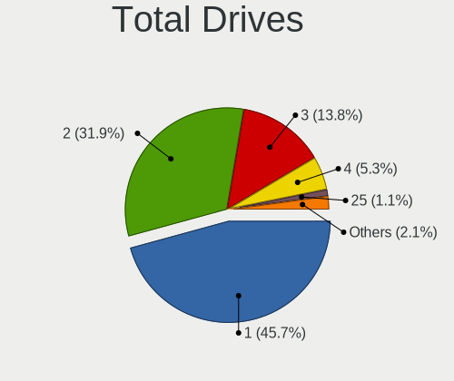

| Drives | Desktops | Percent |
|--------|----------|---------|
| 1      | 34       | 50%     |
| 2      | 19       | 27.94%  |
| 3      | 10       | 14.71%  |
| 4      | 4        | 5.88%   |
| 0      | 1        | 1.47%   |

Has CD-ROM
----------

Has CD-ROM on board

| Presented | Desktops | Percent |
|-----------|----------|---------|
| No        | 35       | 52.24%  |
| Yes       | 32       | 47.76%  |

Has Ethernet
------------

Has Ethernet on board

| Presented | Desktops | Percent |
|-----------|----------|---------|
| Yes       | 67       | 100%    |

Has WiFi
--------

Has WiFi module

| Presented | Desktops | Percent |
|-----------|----------|---------|
| No        | 51       | 76.12%  |
| Yes       | 16       | 23.88%  |

Has Bluetooth
-------------

Has Bluetooth module

| Presented | Desktops | Percent |
|-----------|----------|---------|
| No        | 59       | 88.06%  |
| Yes       | 8        | 11.94%  |

Location
--------

Country
-------

Geographic location (country)

| Country | Desktops | Percent |
|---------|----------|---------|
| Moldova | 67       | 100%    |

City
----

Geographic location (city)

| City      | Desktops | Percent |
|-----------|----------|---------|
| Chisinau  | 27       | 40.3%   |
| Tiraspol  | 23       | 34.33%  |
| Tighina   | 2        | 2.99%   |
| Straseni  | 2        | 2.99%   |
| Bălţi   | 2        | 2.99%   |
| Tintareni | 1        | 1.49%   |
| Singera   | 1        | 1.49%   |
| Rîbniţa | 1        | 1.49%   |
| Rezina    | 1        | 1.49%   |
| Lapusna   | 1        | 1.49%   |
| Ialoveni  | 1        | 1.49%   |
| Hincesti  | 1        | 1.49%   |
| Edineţ   | 1        | 1.49%   |
| Drochia   | 1        | 1.49%   |
| Cazanesti | 1        | 1.49%   |
| Căușeni | 1        | 1.49%   |

Drives
------

Drive Vendor
------------

Hard drive vendors

| Vendor              | Desktops | Drives | Percent |
|---------------------|----------|--------|---------|
| Samsung Electronics | 24       | 28     | 21.43%  |
| Seagate             | 20       | 22     | 17.86%  |
| WDC                 | 19       | 20     | 16.96%  |
| Toshiba             | 10       | 11     | 8.93%   |
| Hitachi             | 6        | 7      | 5.36%   |
| SPCC                | 5        | 6      | 4.46%   |
| Transcend           | 4        | 4      | 3.57%   |
| Kingston            | 4        | 4      | 3.57%   |
| Maxtor              | 3        | 4      | 2.68%   |
| Apacer              | 3        | 3      | 2.68%   |
| XPG                 | 1        | 1      | 0.89%   |
| Team                | 1        | 1      | 0.89%   |
| SK hynix            | 1        | 1      | 0.89%   |
| SanDisk             | 1        | 1      | 0.89%   |
| Phison              | 1        | 1      | 0.89%   |
| Patriot             | 1        | 1      | 0.89%   |
| Leven               | 1        | 1      | 0.89%   |
| Intel               | 1        | 1      | 0.89%   |
| HGST                | 1        | 1      | 0.89%   |
| GOODRAM             | 1        | 1      | 0.89%   |
| Goldkey             | 1        | 1      | 0.89%   |
| Gigabyte Technology | 1        | 1      | 0.89%   |
| Crucial             | 1        | 2      | 0.89%   |
| CHN25SATAS1         | 1        | 1      | 0.89%   |

Drive Model
-----------

Hard drive models

| Model                            | Desktops | Percent |
|----------------------------------|----------|---------|
| Toshiba DT01ACA050 500GB         | 4        | 3.39%   |
| Toshiba DT01ACA100 1TB           | 3        | 2.54%   |
| Samsung HD502HJ 500GB            | 3        | 2.54%   |
| Kingston SHFS37A120G 120GB SSD   | 3        | 2.54%   |
| WDC WD5000AZRX-00A8LB0 500GB     | 2        | 1.69%   |
| Transcend TS64GSSD370S 64GB      | 2        | 1.69%   |
| Toshiba HDWD110 1TB              | 2        | 1.69%   |
| SPCC Solid State Disk 128GB      | 2        | 1.69%   |
| Seagate ST500DM002-1BD142 500GB  | 2        | 1.69%   |
| Seagate ST4000VM000-2AF166 4TB   | 2        | 1.69%   |
| Seagate ST2000DM008-2FR102 2TB   | 2        | 1.69%   |
| Seagate ST1000DL002-9TT153 1TB   | 2        | 1.69%   |
| Samsung SSD 860 EVO 500GB        | 2        | 1.69%   |
| Samsung HD251HJ 249GB            | 2        | 1.69%   |
| Samsung HD082GJ 80GB             | 2        | 1.69%   |
| XPG NVMe SSD Drive 512GB         | 1        | 0.85%   |
| WDC WD800JD-22LSA0 80GB          | 1        | 0.85%   |
| WDC WD62PURZ-85B3AY0 6TB         | 1        | 0.85%   |
| WDC WD5000AZRZ-00HTKB0 500GB     | 1        | 0.85%   |
| WDC WD5000AUDX-63WNHY0 500GB     | 1        | 0.85%   |
| WDC WD5000AAKX-08ERMA0 500GB     | 1        | 0.85%   |
| WDC WD5000AAKS-75V0A0 500GB      | 1        | 0.85%   |
| WDC WD5000AAKS-00WWPA0 500GB     | 1        | 0.85%   |
| WDC WD5000AAJS-00A8B0 500GB      | 1        | 0.85%   |
| WDC WD5000AADS-56S9B1 500GB      | 1        | 0.85%   |
| WDC WD3200BPVT-24ZEST0 320GB     | 1        | 0.85%   |
| WDC WD3200AVJS-63B6A0 320GB      | 1        | 0.85%   |
| WDC WD2500AAKX-00U6AA0 250GB     | 1        | 0.85%   |
| WDC WD20EZAZ-00GGJB0 2TB         | 1        | 0.85%   |
| WDC WD200EB-00CPF0 20GB          | 1        | 0.85%   |
| WDC WD1600BEVS-60RST0 160GB      | 1        | 0.85%   |
| WDC WD10SPZX-22Z10T1 1TB         | 1        | 0.85%   |
| WDC WD10EZEX-00WN4A0 1TB         | 1        | 0.85%   |
| WDC WD1001FALS-00J7B0 1TB        | 1        | 0.85%   |
| Transcend TS256GSSD370S 256GB    | 1        | 0.85%   |
| Transcend TS128GSSD230S 128GB    | 1        | 0.85%   |
| Toshiba THNSN5256GPUK NVMe 256GB | 1        | 0.85%   |
| Team L5 LITE SSD 240GB           | 1        | 0.85%   |
| SPCC SSD162 56GB                 | 1        | 0.85%   |
| SPCC SSD162 120GB                | 1        | 0.85%   |

HDD Vendor
----------

Hard disk drive vendors

| Vendor              | Desktops | Drives | Percent |
|---------------------|----------|--------|---------|
| Seagate             | 20       | 22     | 26.67%  |
| WDC                 | 19       | 20     | 25.33%  |
| Samsung Electronics | 17       | 20     | 22.67%  |
| Toshiba             | 9        | 10     | 12%     |
| Hitachi             | 6        | 7      | 8%      |
| Maxtor              | 3        | 4      | 4%      |
| HGST                | 1        | 1      | 1.33%   |

SSD Vendor
----------

Solid state drive vendors

| Vendor              | Desktops | Drives | Percent |
|---------------------|----------|--------|---------|
| SPCC                | 5        | 6      | 17.86%  |
| Transcend           | 4        | 4      | 14.29%  |
| Kingston            | 4        | 4      | 14.29%  |
| Samsung Electronics | 3        | 3      | 10.71%  |
| Apacer              | 3        | 3      | 10.71%  |
| Team                | 1        | 1      | 3.57%   |
| SanDisk             | 1        | 1      | 3.57%   |
| Patriot             | 1        | 1      | 3.57%   |
| Leven               | 1        | 1      | 3.57%   |
| GOODRAM             | 1        | 1      | 3.57%   |
| Goldkey             | 1        | 1      | 3.57%   |
| Gigabyte Technology | 1        | 1      | 3.57%   |
| Crucial             | 1        | 2      | 3.57%   |
| CHN25SATAS1         | 1        | 1      | 3.57%   |

Drive Kind
----------

HDD or SSD

| Kind | Desktops | Drives | Percent |
|------|----------|--------|---------|
| HDD  | 56       | 84     | 62.92%  |
| SSD  | 26       | 30     | 29.21%  |
| NVMe | 7        | 10     | 7.87%   |

Drive Connector
---------------

SATA, SAS, NVMe, etc.

| Type | Desktops | Drives | Percent |
|------|----------|--------|---------|
| SATA | 63       | 114    | 90%     |
| NVMe | 7        | 10     | 10%     |

Drive Size
----------

Size of hard drive

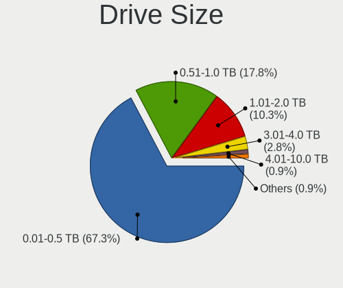

| Size in TB | Desktops | Drives | Percent |
|------------|----------|--------|---------|
| 0.01-0.5   | 56       | 87     | 70.89%  |
| 0.51-1.0   | 13       | 17     | 16.46%  |
| 1.01-2.0   | 6        | 6      | 7.59%   |
| 3.01-4.0   | 3        | 3      | 3.8%    |
| 4.01-10.0  | 1        | 1      | 1.27%   |

Space Total
-----------

Amount of disk space available on the file system

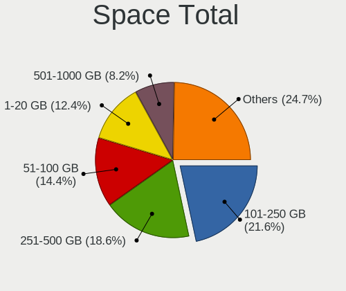

| Size in GB     | Desktops | Percent |
|----------------|----------|---------|
| 251-500        | 14       | 20.29%  |
| 101-250        | 13       | 18.84%  |
| 51-100         | 13       | 18.84%  |
| 1-20           | 11       | 15.94%  |
| 501-1000       | 6        | 8.7%    |
| 21-50          | 5        | 7.25%   |
| More than 3000 | 2        | 2.9%    |
| 2001-3000      | 2        | 2.9%    |
| 1001-2000      | 2        | 2.9%    |
| Unknown        | 1        | 1.45%   |

Space Used
----------

Amount of used disk space

| Used GB        | Desktops | Percent |
|----------------|----------|---------|
| 1-20           | 37       | 53.62%  |
| 21-50          | 10       | 14.49%  |
| 51-100         | 8        | 11.59%  |
| 101-250        | 4        | 5.8%    |
| 251-500        | 3        | 4.35%   |
| 501-1000       | 3        | 4.35%   |
| 1001-2000      | 2        | 2.9%    |
| More than 3000 | 1        | 1.45%   |
| Unknown        | 1        | 1.45%   |

Malfunc. Drives
---------------

Drive models with a malfunction

| Model                             | Desktops | Drives | Percent |
|-----------------------------------|----------|--------|---------|
| Samsung Electronics HD082GJ 80GB  | 2        | 2      | 6.9%    |
| WDC WD800JD-22LSA0 80GB           | 1        | 1      | 3.45%   |
| WDC WD5000AAKX-08ERMA0 500GB      | 1        | 1      | 3.45%   |
| WDC WD5000AAKS-75V0A0 500GB       | 1        | 1      | 3.45%   |
| WDC WD5000AAKS-00WWPA0 500GB      | 1        | 1      | 3.45%   |
| WDC WD5000AADS-56S9B1 500GB       | 1        | 1      | 3.45%   |
| WDC WD2500AAKX-00U6AA0 250GB      | 1        | 1      | 3.45%   |
| WDC WD1600BEVS-60RST0 160GB       | 1        | 1      | 3.45%   |
| Toshiba DT01ACA050 500GB          | 1        | 1      | 3.45%   |
| Team L5 LITE SSD 240GB            | 1        | 1      | 3.45%   |
| SPCC SSD162 120GB                 | 1        | 1      | 3.45%   |
| SPCC Solid State Disk 56GB        | 1        | 2      | 3.45%   |
| Seagate ST3500418AS 500GB         | 1        | 1      | 3.45%   |
| Seagate ST320DM001 HD322GJ 320GB  | 1        | 1      | 3.45%   |
| Seagate ST3160023A 160GB          | 1        | 1      | 3.45%   |
| Seagate ST31000340NS 1TB          | 1        | 1      | 3.45%   |
| Seagate ST1000DL002-9TT153 1TB    | 1        | 1      | 3.45%   |
| Samsung Electronics HD753LJ 752GB | 1        | 1      | 3.45%   |
| Samsung Electronics HD080HJ/ 80GB | 1        | 1      | 3.45%   |
| Maxtor STM380215AS 80GB           | 1        | 1      | 3.45%   |
| Maxtor STM3160811AS 160GB         | 1        | 1      | 3.45%   |
| Maxtor STM3160211AS 160GB         | 1        | 1      | 3.45%   |
| Maxtor 4R120L0 128GB              | 1        | 1      | 3.45%   |
| Kingston SHFS37A120G 120GB SSD    | 1        | 1      | 3.45%   |
| Hitachi HTS545025B9A300 250GB     | 1        | 1      | 3.45%   |
| Hitachi HDT721010SLA360 1TB       | 1        | 1      | 3.45%   |
| Hitachi HDP725050GLA360 500GB     | 1        | 1      | 3.45%   |
| Hitachi HDP725025GLA380 250GB     | 1        | 2      | 3.45%   |

Malfunc. Drive Vendor
---------------------

Vendors of faulty drives

| Vendor              | Desktops | Drives | Percent |
|---------------------|----------|--------|---------|
| WDC                 | 7        | 7      | 25%     |
| Seagate             | 5        | 5      | 17.86%  |
| Samsung Electronics | 4        | 4      | 14.29%  |
| Hitachi             | 4        | 5      | 14.29%  |
| Maxtor              | 3        | 4      | 10.71%  |
| SPCC                | 2        | 3      | 7.14%   |
| Toshiba             | 1        | 1      | 3.57%   |
| Team                | 1        | 1      | 3.57%   |
| Kingston            | 1        | 1      | 3.57%   |

Malfunc. HDD Vendor
-------------------

Vendors of faulty HDD drives

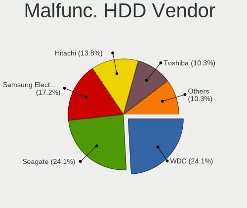

| Vendor              | Desktops | Drives | Percent |
|---------------------|----------|--------|---------|
| WDC                 | 7        | 7      | 29.17%  |
| Seagate             | 5        | 5      | 20.83%  |
| Samsung Electronics | 4        | 4      | 16.67%  |
| Hitachi             | 4        | 5      | 16.67%  |
| Maxtor              | 3        | 4      | 12.5%   |
| Toshiba             | 1        | 1      | 4.17%   |

Malfunc. Drive Kind
-------------------

Kinds of faulty drives

| Kind | Desktops | Drives | Percent |
|------|----------|--------|---------|
| HDD  | 21       | 26     | 84%     |
| SSD  | 4        | 5      | 16%     |

Failed Drives
-------------

Failed drive models

| Model                             | Desktops | Drives | Percent |
|-----------------------------------|----------|--------|---------|
| WDC WD3200BPVT-24ZEST0 320GB      | 1        | 1      | 33.33%  |
| Samsung Electronics HD502HJ 500GB | 1        | 1      | 33.33%  |
| Samsung Electronics HD322GJ 320GB | 1        | 2      | 33.33%  |

Failed Drive Vendor
-------------------

Failed drive vendors

| Vendor              | Desktops | Drives | Percent |
|---------------------|----------|--------|---------|
| Samsung Electronics | 2        | 3      | 66.67%  |
| WDC                 | 1        | 1      | 33.33%  |

Drive Status
------------

Number of failed and malfunc. drives

| Status   | Desktops | Drives | Percent |
|----------|----------|--------|---------|
| Works    | 37       | 59     | 45.68%  |
| Malfunc  | 25       | 31     | 30.86%  |
| Detected | 16       | 30     | 19.75%  |
| Failed   | 3        | 4      | 3.7%    |

Storage controller
------------------

Storage Vendor
--------------

Storage controller vendors

| Vendor                       | Desktops | Percent |
|------------------------------|----------|---------|
| Intel                        | 38       | 45.78%  |
| AMD                          | 22       | 26.51%  |
| Nvidia                       | 7        | 8.43%   |
| JMicron Technology           | 5        | 6.02%   |
| Samsung Electronics          | 4        | 4.82%   |
| ASMedia Technology           | 2        | 2.41%   |
| Toshiba America Info Systems | 1        | 1.2%    |
| SK hynix                     | 1        | 1.2%    |
| Phison Electronics           | 1        | 1.2%    |
| Marvell Technology Group     | 1        | 1.2%    |
| ADATA Technology             | 1        | 1.2%    |

Storage Model
-------------

Storage controller models

| Model                                                                                   | Desktops | Percent |
|-----------------------------------------------------------------------------------------|----------|---------|
| AMD SB7x0/SB8x0/SB9x0 IDE Controller                                                    | 11       | 9.02%   |
| AMD SB7x0/SB8x0/SB9x0 SATA Controller [IDE mode]                                        | 10       | 8.2%    |
| Intel Q170/Q150/B150/H170/H110/Z170/CM236 Chipset SATA Controller [AHCI Mode]           | 5        | 4.1%    |
| Intel NM10/ICH7 Family SATA Controller [IDE mode]                                       | 5        | 4.1%    |
| Intel 6 Series/C200 Series Chipset Family Desktop SATA Controller (IDE mode, ports 4-5) | 5        | 4.1%    |
| Intel 6 Series/C200 Series Chipset Family Desktop SATA Controller (IDE mode, ports 0-3) | 5        | 4.1%    |
| AMD FCH SATA Controller [AHCI mode]                                                     | 5        | 4.1%    |
| Intel 82801G (ICH7 Family) IDE Controller                                               | 4        | 3.28%   |
| Intel 8 Series/C220 Series Chipset Family 6-port SATA Controller 1 [AHCI mode]          | 4        | 3.28%   |
| Samsung NVMe SSD Controller SM981/PM981/PM983                                           | 3        | 2.46%   |
| Nvidia MCP61 SATA Controller                                                            | 3        | 2.46%   |
| Nvidia MCP61 IDE                                                                        | 3        | 2.46%   |
| JMicron JMB368 IDE controller                                                           | 3        | 2.46%   |
| Intel 200 Series PCH SATA controller [AHCI mode]                                        | 3        | 2.46%   |
| AMD FCH SATA Controller [IDE mode]                                                      | 3        | 2.46%   |
| AMD 500 Series Chipset SATA Controller                                                  | 3        | 2.46%   |
| JMicron JMB363 SATA/IDE Controller                                                      | 2        | 1.64%   |
| Intel 9 Series Chipset Family SATA Controller [AHCI Mode]                               | 2        | 1.64%   |
| Intel 82801JI (ICH10 Family) 4 port SATA IDE Controller #1                              | 2        | 1.64%   |
| Intel 82801JI (ICH10 Family) 2 port SATA IDE Controller #2                              | 2        | 1.64%   |
| ASMedia ASM1062 Serial ATA Controller                                                   | 2        | 1.64%   |
| AMD FCH IDE Controller                                                                  | 2        | 1.64%   |
| Toshiba America Info Systems XG4 NVMe SSD Controller                                    | 1        | 0.82%   |
| SK hynix BC501 NVMe Solid State Drive                                                   | 1        | 0.82%   |
| Samsung NVMe SSD Controller SM961/PM961/SM963                                           | 1        | 0.82%   |
| Phison PS5013 E13 NVMe Controller                                                       | 1        | 0.82%   |
| Nvidia MCP79 SATA Controller                                                            | 1        | 0.82%   |
| Nvidia MCP78S [GeForce 8200] SATA Controller (non-AHCI mode)                            | 1        | 0.82%   |
| Nvidia MCP78S [GeForce 8200] IDE                                                        | 1        | 0.82%   |
| Nvidia MCP67 IDE Controller                                                             | 1        | 0.82%   |
| Nvidia MCP67 AHCI Controller                                                            | 1        | 0.82%   |
| Nvidia MCP55 SATA Controller                                                            | 1        | 0.82%   |
| Nvidia MCP55 IDE                                                                        | 1        | 0.82%   |
| Marvell Group 88SE914D SATA-600 Controller                                              | 1        | 0.82%   |
| Intel SSD 600P Series                                                                   | 1        | 0.82%   |
| Intel SATA Controller [RAID mode]                                                       | 1        | 0.82%   |
| Intel Comet Lake SATA AHCI Controller                                                   | 1        | 0.82%   |
| Intel Atom/Celeron/Pentium Processor x5-E8000/J3xxx/N3xxx Series SATA Controller        | 1        | 0.82%   |
| Intel Alder Lake-S PCH SATA Controller [AHCI Mode]                                      | 1        | 0.82%   |
| Intel 82801JI (ICH10 Family) SATA AHCI Controller                                       | 1        | 0.82%   |

Storage Kind
------------

Kind of storage controller (IDE, SATA, NVMe, SAS, ...)

| Kind | Desktops | Percent |
|------|----------|---------|
| SATA | 43       | 47.78%  |
| IDE  | 38       | 42.22%  |
| NVMe | 7        | 7.78%   |
| RAID | 2        | 2.22%   |

Processor
---------

CPU Vendor
----------

Processor vendors

| Vendor | Desktops | Percent |
|--------|----------|---------|
| Intel  | 39       | 58.21%  |
| AMD    | 28       | 41.79%  |

CPU Model
---------

Processor models

| Model                                       | Desktops | Percent |
|---------------------------------------------|----------|---------|
| Intel Pentium CPU G4400 @ 3.30GHz           | 2        | 2.99%   |
| Intel Core i5-4670K CPU @ 3.40GHz           | 2        | 2.99%   |
| Intel Core 2 Duo CPU E8400 @ 3.00GHz        | 2        | 2.99%   |
| AMD Ryzen 7 3700X 8-Core Processor          | 2        | 2.99%   |
| AMD Phenom II X6 1055T Processor            | 2        | 2.99%   |
| AMD Athlon II X2 280 Processor              | 2        | 2.99%   |
| Intel Pentium Dual-Core CPU E5400 @ 2.70GHz | 1        | 1.49%   |
| Intel Pentium Dual CPU E2160 @ 1.80GHz      | 1        | 1.49%   |
| Intel Pentium D CPU 2.80GHz                 | 1        | 1.49%   |
| Intel Pentium D CPU 2.66GHz                 | 1        | 1.49%   |
| Intel Pentium CPU N3700 @ 1.60GHz           | 1        | 1.49%   |
| Intel Pentium CPU G640 @ 2.80GHz            | 1        | 1.49%   |
| Intel Pentium CPU G4620 @ 3.70GHz           | 1        | 1.49%   |
| Intel Pentium CPU G4560 @ 3.50GHz           | 1        | 1.49%   |
| Intel Pentium CPU G3240 @ 3.10GHz           | 1        | 1.49%   |
| Intel Pentium 4 CPU 2.66GHz                 | 1        | 1.49%   |
| Intel Core i7-7820X CPU @ 3.60GHz           | 1        | 1.49%   |
| Intel Core i7-6700T CPU @ 2.80GHz           | 1        | 1.49%   |
| Intel Core i7-3770K CPU @ 3.50GHz           | 1        | 1.49%   |
| Intel Core i7-2700K CPU @ 3.50GHz           | 1        | 1.49%   |
| Intel Core i5-7500 CPU @ 3.40GHz            | 1        | 1.49%   |
| Intel Core i5-4690 CPU @ 3.50GHz            | 1        | 1.49%   |
| Intel Core i5-4570 CPU @ 3.20GHz            | 1        | 1.49%   |
| Intel Core i5-4460 CPU @ 3.20GHz            | 1        | 1.49%   |
| Intel Core i5-3470 CPU @ 3.20GHz            | 1        | 1.49%   |
| Intel Core i5-10600K CPU @ 4.10GHz          | 1        | 1.49%   |
| Intel Core i5 CPU 750 @ 2.67GHz             | 1        | 1.49%   |
| Intel Core i5 CPU 650 @ 3.20GHz             | 1        | 1.49%   |
| Intel Core i3-7100 CPU @ 3.90GHz            | 1        | 1.49%   |
| Intel Core i3-6100 CPU @ 3.70GHz            | 1        | 1.49%   |
| Intel Core i3-3240 CPU @ 3.40GHz            | 1        | 1.49%   |
| Intel Core i3-2120 CPU @ 3.30GHz            | 1        | 1.49%   |
| Intel Core i3-2100 CPU @ 3.10GHz            | 1        | 1.49%   |
| Intel Core 2 Quad CPU Q8300 @ 2.50GHz       | 1        | 1.49%   |
| Intel Celeron CPU G1630 @ 2.80GHz           | 1        | 1.49%   |
| Intel Celeron CPU E1200 @ 1.60GHz           | 1        | 1.49%   |
| Intel Celeron CPU 2.53GHz                   | 1        | 1.49%   |
| Intel Atom CPU 330 @ 1.60GHz                | 1        | 1.49%   |
| Intel 12th Gen Core i5-12600K               | 1        | 1.49%   |
| AMD Ryzen 5 3600 6-Core Processor           | 1        | 1.49%   |

CPU Model Family
----------------

Processor model prefix

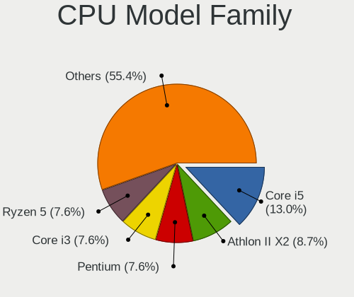

| Model                   | Desktops | Percent |
|-------------------------|----------|---------|
| Intel Core i5           | 10       | 14.93%  |
| Intel Pentium           | 7        | 10.45%  |
| AMD Athlon II X2        | 6        | 8.96%   |
| Intel Core i3           | 5        | 7.46%   |
| Intel Core i7           | 4        | 5.97%   |
| AMD Athlon 64 X2        | 4        | 5.97%   |
| Intel Celeron           | 3        | 4.48%   |
| Intel Pentium D         | 2        | 2.99%   |
| Intel Core 2 Duo        | 2        | 2.99%   |
| AMD Ryzen 7             | 2        | 2.99%   |
| AMD Ryzen 5             | 2        | 2.99%   |
| AMD Ryzen 3             | 2        | 2.99%   |
| AMD Phenom II X6        | 2        | 2.99%   |
| AMD FX                  | 2        | 2.99%   |
| AMD Athlon II X4        | 2        | 2.99%   |
| AMD A4                  | 2        | 2.99%   |
| Other                   | 1        | 1.49%   |
| Intel Pentium Dual-Core | 1        | 1.49%   |
| Intel Pentium Dual      | 1        | 1.49%   |
| Intel Pentium 4         | 1        | 1.49%   |
| Intel Core 2 Quad       | 1        | 1.49%   |
| Intel Atom              | 1        | 1.49%   |
| AMD Phenom II X4        | 1        | 1.49%   |
| AMD Athlon              | 1        | 1.49%   |
| AMD A8                  | 1        | 1.49%   |
| AMD A10                 | 1        | 1.49%   |

CPU Cores
---------

Number of processor cores

| Number  | Desktops | Percent |
|---------|----------|---------|
| 2       | 33       | 48.53%  |
| 4       | 21       | 30.88%  |
| 6       | 4        | 5.88%   |
| 8       | 3        | 4.41%   |
| 1       | 3        | 4.41%   |
| Unknown | 3        | 4.41%   |
| 10      | 1        | 1.47%   |

CPU Sockets
-----------

Number of sockets

| Number | Desktops | Percent |
|--------|----------|---------|
| 1      | 67       | 100%    |

CPU Threads
-----------

Threads per core (Hyper-Threading)

| Number  | Desktops | Percent |
|---------|----------|---------|
| 1       | 41       | 60.29%  |
| 2       | 24       | 35.29%  |
| Unknown | 3        | 4.41%   |

CPU Op-Modes
------------

CPU Operation Modes (32-bit, 64-bit)

| Op mode        | Desktops | Percent |
|----------------|----------|---------|
| 32-bit, 64-bit | 67       | 100%    |

CPU Microcode
-------------

Microcode number

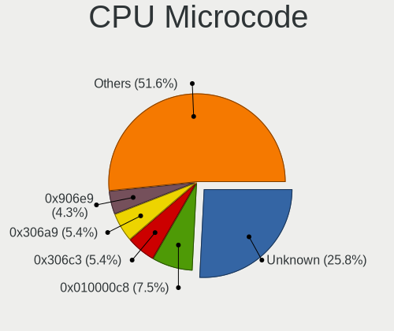

| Number     | Desktops | Percent |
|------------|----------|---------|
| Unknown    | 10       | 14.93%  |
| 0x010000c8 | 6        | 8.96%   |
| 0x906e9    | 4        | 5.97%   |
| 0x306c3    | 4        | 5.97%   |
| 0x306a9    | 4        | 5.97%   |
| 0x206a7    | 4        | 5.97%   |
| 0x506e3    | 3        | 4.48%   |
| 0x1067a    | 3        | 4.48%   |
| 0xf47      | 2        | 2.99%   |
| 0x6fd      | 2        | 2.99%   |
| 0x08701021 | 2        | 2.99%   |
| 0x010000dc | 2        | 2.99%   |
| 0xf49      | 1        | 1.49%   |
| 0xf41      | 1        | 1.49%   |
| 0xa0655    | 1        | 1.49%   |
| 0x90672    | 1        | 1.49%   |
| 0x50654    | 1        | 1.49%   |
| 0x406c3    | 1        | 1.49%   |
| 0x20655    | 1        | 1.49%   |
| 0x106e5    | 1        | 1.49%   |
| 0x106c2    | 1        | 1.49%   |
| 0x10676    | 1        | 1.49%   |
| 0x08600106 | 1        | 1.49%   |
| 0x08108109 | 1        | 1.49%   |
| 0x08101102 | 1        | 1.49%   |
| 0x08001138 | 1        | 1.49%   |
| 0x06003106 | 1        | 1.49%   |
| 0x06000852 | 1        | 1.49%   |
| 0x0600063e | 1        | 1.49%   |
| 0x03000027 | 1        | 1.49%   |
| 0x03000025 | 1        | 1.49%   |
| 0x010000db | 1        | 1.49%   |
| 0x010000b6 | 1        | 1.49%   |

CPU Microarch
-------------

Microarchitecture

| Name             | Desktops | Percent |
|------------------|----------|---------|
| K10              | 11       | 16.42%  |
| Haswell          | 6        | 8.96%   |
| Skylake          | 5        | 7.46%   |
| Zen 2            | 4        | 5.97%   |
| SandyBridge      | 4        | 5.97%   |
| Penryn           | 4        | 5.97%   |
| NetBurst         | 4        | 5.97%   |
| KabyLake         | 4        | 5.97%   |
| K8 Hammer        | 4        | 5.97%   |
| IvyBridge        | 4        | 5.97%   |
| Zen              | 2        | 2.99%   |
| Piledriver       | 2        | 2.99%   |
| K10 Llano        | 2        | 2.99%   |
| Core             | 2        | 2.99%   |
| Zen+             | 1        | 1.49%   |
| Westmere         | 1        | 1.49%   |
| Steamroller      | 1        | 1.49%   |
| Silvermont       | 1        | 1.49%   |
| Nehalem          | 1        | 1.49%   |
| CometLake        | 1        | 1.49%   |
| Bulldozer        | 1        | 1.49%   |
| Bonnell          | 1        | 1.49%   |
| Alderlake Hybrid | 1        | 1.49%   |

Graphics
--------

GPU Vendor
----------

Vendors of graphics cards

| Vendor | Desktops | Percent |
|--------|----------|---------|
| Nvidia | 30       | 43.48%  |
| AMD    | 22       | 31.88%  |
| Intel  | 17       | 24.64%  |

GPU Model
---------

Graphics card models

| Model                                                                                    | Desktops | Percent |
|------------------------------------------------------------------------------------------|----------|---------|
| Nvidia GF108 [GeForce GT 630]                                                            | 3        | 4.11%   |
| Intel 2nd Generation Core Processor Family Integrated Graphics Controller                | 3        | 4.11%   |
| Nvidia GP106 [GeForce GTX 1060 6GB]                                                      | 2        | 2.74%   |
| Nvidia GM204 [GeForce GTX 970]                                                           | 2        | 2.74%   |
| Nvidia GF108 [GeForce GT 730]                                                            | 2        | 2.74%   |
| Nvidia GF108 [GeForce GT 440]                                                            | 2        | 2.74%   |
| Intel HD Graphics 630                                                                    | 2        | 2.74%   |
| Intel HD Graphics 530                                                                    | 2        | 2.74%   |
| Intel 4 Series Chipset Integrated Graphics Controller                                    | 2        | 2.74%   |
| AMD Ellesmere [Radeon RX 470/480/570/570X/580/580X/590]                                  | 2        | 2.74%   |
| AMD Caicos [Radeon HD 6450/7450/8450 / R5 230 OEM]                                       | 2        | 2.74%   |
| Nvidia GT218 [GeForce 210]                                                               | 1        | 1.37%   |
| Nvidia GT216 [GeForce GT 220]                                                            | 1        | 1.37%   |
| Nvidia GT200b [GeForce GTX 285]                                                          | 1        | 1.37%   |
| Nvidia GP107 [GeForce GTX 1050]                                                          | 1        | 1.37%   |
| Nvidia GP107 [GeForce GTX 1050 Ti]                                                       | 1        | 1.37%   |
| Nvidia GP106 [GeForce GTX 1060 3GB]                                                      | 1        | 1.37%   |
| Nvidia GM204 [GeForce GTX 980]                                                           | 1        | 1.37%   |
| Nvidia GM107 [GeForce GTX 750 Ti]                                                        | 1        | 1.37%   |
| Nvidia GK208B [GeForce GT 730]                                                           | 1        | 1.37%   |
| Nvidia GK208B [GeForce GT 710]                                                           | 1        | 1.37%   |
| Nvidia GK107 [GeForce GTX 650]                                                           | 1        | 1.37%   |
| Nvidia GK104 [GeForce GTX 760]                                                           | 1        | 1.37%   |
| Nvidia GF108 [GeForce GT 430]                                                            | 1        | 1.37%   |
| Nvidia G96C [GeForce 9500 GT]                                                            | 1        | 1.37%   |
| Nvidia G73 [GeForce 7600 GS]                                                             | 1        | 1.37%   |
| Nvidia C79 [ION]                                                                         | 1        | 1.37%   |
| Nvidia C77 [GeForce 8100 / nForce 720a]                                                  | 1        | 1.37%   |
| Nvidia C61 [GeForce 7025 / nForce 630a]                                                  | 1        | 1.37%   |
| Nvidia C61 [GeForce 6150SE nForce 430]                                                   | 1        | 1.37%   |
| Intel Xeon E3-1200 v3/4th Gen Core Processor Integrated Graphics Controller              | 1        | 1.37%   |
| Intel Xeon E3-1200 v2/3rd Gen Core processor Graphics Controller                         | 1        | 1.37%   |
| Intel HD Graphics 510                                                                    | 1        | 1.37%   |
| Intel Core Processor Integrated Graphics Controller                                      | 1        | 1.37%   |
| Intel CometLake-S GT2 [UHD Graphics 630]                                                 | 1        | 1.37%   |
| Intel Atom/Celeron/Pentium Processor x5-E8000/J3xxx/N3xxx Integrated Graphics Controller | 1        | 1.37%   |
| Intel AlderLake-S GT1                                                                    | 1        | 1.37%   |
| Intel 82945G/GZ Integrated Graphics Controller                                           | 1        | 1.37%   |
| AMD Turks XT [Radeon HD 6670/7670]                                                       | 1        | 1.37%   |
| AMD Trinity 2 [Radeon HD 7480D]                                                          | 1        | 1.37%   |

GPU Combo
---------

Combinations of graphics cards

| Name       | Desktops | Percent |
|------------|----------|---------|
| 1 x Nvidia | 30       | 43.48%  |
| 1 x AMD    | 18       | 26.09%  |
| 1 x Intel  | 17       | 24.64%  |
| 2 x AMD    | 4        | 5.8%    |

GPU Driver
----------

Free vs proprietary

| Driver      | Desktops | Percent |
|-------------|----------|---------|
| Free        | 52       | 73.24%  |
| Proprietary | 12       | 16.9%   |
| Unknown     | 7        | 9.86%   |

GPU Memory
----------

Total video memory

| Size in GB | Desktops | Percent |
|------------|----------|---------|
| Unknown    | 21       | 29.17%  |
| 1.01-2.0   | 15       | 20.83%  |
| 0.01-0.5   | 15       | 20.83%  |
| 0.51-1.0   | 10       | 13.89%  |
| 3.01-4.0   | 8        | 11.11%  |
| 5.01-6.0   | 2        | 2.78%   |
| 2.01-3.0   | 1        | 1.39%   |

Monitor
-------

Monitor Vendor
--------------

Monitor vendors

| Vendor               | Desktops | Percent |
|----------------------|----------|---------|
| Samsung Electronics  | 18       | 27.27%  |
| Goldstar             | 14       | 21.21%  |
| Philips              | 8        | 12.12%  |
| Acer                 | 7        | 10.61%  |
| Hewlett-Packard      | 4        | 6.06%   |
| Dell                 | 4        | 6.06%   |
| AOC                  | 3        | 4.55%   |
| ViewSonic            | 1        | 1.52%   |
| Toshiba              | 1        | 1.52%   |
| Plain Tree Systems   | 1        | 1.52%   |
| Medion               | 1        | 1.52%   |
| KTC                  | 1        | 1.52%   |
| HannStar             | 1        | 1.52%   |
| BenQ                 | 1        | 1.52%   |
| Ancor Communications | 1        | 1.52%   |

Monitor Model
-------------

Monitor models

| Model                                                                  | Desktops | Percent |
|------------------------------------------------------------------------|----------|---------|
| Samsung Electronics SyncMaster SAM0108 1280x1024 312x234mm 15.4-inch   | 2        | 2.99%   |
| Hewlett-Packard E243 HPN3468 1920x1080 527x296mm 23.8-inch             | 2        | 2.99%   |
| Goldstar ULTRAWIDE GSM59F1 2560x1080 673x284mm 28.8-inch               | 2        | 2.99%   |
| ViewSonic VA521-1 VSCF318 1024x768 304x228mm 15.0-inch                 | 1        | 1.49%   |
| Toshiba TV TSB0108 1920x1080 708x398mm 32.0-inch                       | 1        | 1.49%   |
| Samsung Electronics SyncMaster SAM03D1 1680x1050 433x271mm 20.1-inch   | 1        | 1.49%   |
| Samsung Electronics SyncMaster SAM036F 1440x900 428x255mm 19.6-inch    | 1        | 1.49%   |
| Samsung Electronics SyncMaster SAM036E 1280x1024 380x300mm 19.1-inch   | 1        | 1.49%   |
| Samsung Electronics SyncMaster SAM02AD 1440x900 410x257mm 19.1-inch    | 1        | 1.49%   |
| Samsung Electronics SyncMaster SAM0285 1440x900 410x257mm 19.1-inch    | 1        | 1.49%   |
| Samsung Electronics SyncMaster SAM022B 1280x1024 340x270mm 17.1-inch   | 1        | 1.49%   |
| Samsung Electronics SyncMaster SAM0213 1680x1050 408x306mm 20.1-inch   | 1        | 1.49%   |
| Samsung Electronics SyncMaster SAM0088 1024x768 304x228mm 15.0-inch    | 1        | 1.49%   |
| Samsung Electronics SMB2440 SAM06AF 1920x1080 531x299mm 24.0-inch      | 1        | 1.49%   |
| Samsung Electronics SMB2030 SAM063D 1600x900 443x249mm 20.0-inch       | 1        | 1.49%   |
| Samsung Electronics S27F358 SAM0D73 1920x1080 598x336mm 27.0-inch      | 1        | 1.49%   |
| Samsung Electronics S22E391 SAM0C0D 1920x1080 477x268mm 21.5-inch      | 1        | 1.49%   |
| Samsung Electronics S22D300 SAM0B3F 1920x1080 477x268mm 21.5-inch      | 1        | 1.49%   |
| Samsung Electronics S19D300 SAM0B34 1366x768 410x230mm 18.5-inch       | 1        | 1.49%   |
| Samsung Electronics S/T 77E/76E STN0005 1280x1024 312x234mm 15.4-inch  | 1        | 1.49%   |
| Samsung Electronics S/T 77/76BDF STN0007 1280x1024 312x234mm 15.4-inch | 1        | 1.49%   |
| Plain Tree Systems XAP-192i PTS03D5 1280x1024 376x301mm 19.0-inch      | 1        | 1.49%   |
| Philips PHL 275E2F PHLC23A 2560x1440 597x336mm 27.0-inch               | 1        | 1.49%   |
| Philips PHL 246E7 PHLC107 1920x1080 521x293mm 23.5-inch                | 1        | 1.49%   |
| Philips PHL 243V5 PHLC0D1 1920x1080 521x293mm 23.5-inch                | 1        | 1.49%   |
| Philips PHL 240V5A PHLC10C 1920x1080 527x296mm 23.8-inch               | 1        | 1.49%   |
| Philips PHL 240V5 PHLC10A 1920x1080 530x300mm 24.0-inch                | 1        | 1.49%   |
| Philips PHL 234E5 PHLC0C7 1920x1080 509x286mm 23.0-inch                | 1        | 1.49%   |
| Philips PHL 223V5 PHLC0CF 1920x1080 477x268mm 21.5-inch                | 1        | 1.49%   |
| Philips 201E PHLC033 1600x900 443x249mm 20.0-inch                      | 1        | 1.49%   |
| Philips 196VL PHLC07F 1366x768 409x230mm 18.5-inch                     | 1        | 1.49%   |
| Medion MD32119PR MED89C1 1280x1024 376x301mm 19.0-inch                 | 1        | 1.49%   |
| KTC 32T72-H-AN KTC3200 1360x768 698x392mm 31.5-inch                    | 1        | 1.49%   |
| Hewlett-Packard LE1901w HWP2842 1440x900 410x256mm 19.0-inch           | 1        | 1.49%   |
| Hewlett-Packard 24x HPN3635 1920x1080 527x297mm 23.8-inch              | 1        | 1.49%   |
| HannStar HW223 HSD5B10 1680x1050 433x271mm 20.1-inch                   | 1        | 1.49%   |
| Goldstar W2343 GSM5700 1920x1080 474x296mm 22.0-inch                   | 1        | 1.49%   |
| Goldstar W2043 GSM4E9D 1600x900 443x249mm 20.0-inch                    | 1        | 1.49%   |
| Goldstar W2042 GSM4E7E 1680x1050 434x270mm 20.1-inch                   | 1        | 1.49%   |
| Goldstar MP59G GSM5B34 1920x1080 480x270mm 21.7-inch                   | 1        | 1.49%   |

Monitor Resolution
------------------

Monitor screen resolution

| Resolution         | Desktops | Percent |
|--------------------|----------|---------|
| 1920x1080 (FHD)    | 24       | 36.36%  |
| 1280x1024 (SXGA)   | 11       | 16.67%  |
| 1600x900 (HD+)     | 5        | 7.58%   |
| 1440x900 (WXGA+)   | 5        | 7.58%   |
| 1366x768 (WXGA)    | 5        | 7.58%   |
| 2560x1440 (QHD)    | 4        | 6.06%   |
| 1680x1050 (WSXGA+) | 4        | 6.06%   |
| 2560x1080          | 2        | 3.03%   |
| 1600x1200          | 2        | 3.03%   |
| 1024x768 (XGA)     | 2        | 3.03%   |
| 1920x540           | 1        | 1.52%   |
| 1360x768           | 1        | 1.52%   |

Monitor Diagonal
----------------

Diagonal size in inches

| Inches | Desktops | Percent |
|--------|----------|---------|
| 19     | 10       | 14.93%  |
| 23     | 9        | 13.43%  |
| 24     | 8        | 11.94%  |
| 20     | 8        | 11.94%  |
| 21     | 6        | 8.96%   |
| 18     | 6        | 8.96%   |
| 15     | 6        | 8.96%   |
| 27     | 5        | 7.46%   |
| 17     | 5        | 7.46%   |
| 34     | 2        | 2.99%   |
| 72     | 1        | 1.49%   |
| 32     | 1        | 1.49%   |

Monitor Width
-------------

Physical width

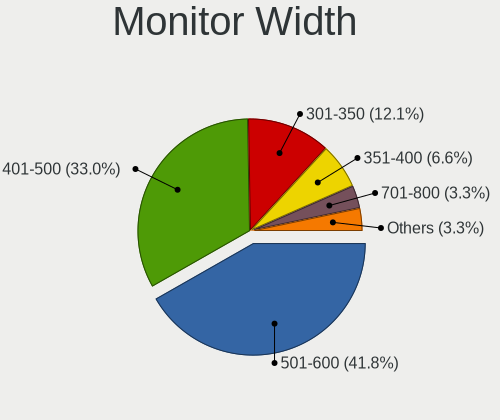

| Width in mm | Desktops | Percent |
|-------------|----------|---------|
| 401-500     | 25       | 37.88%  |
| 501-600     | 21       | 31.82%  |
| 301-350     | 11       | 16.67%  |
| 351-400     | 5        | 7.58%   |
| 701-800     | 3        | 4.55%   |
| 1501-2000   | 1        | 1.52%   |

Aspect Ratio
------------

Proportional relationship between the width and the height

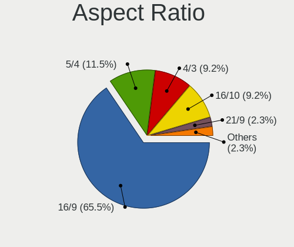

| Ratio | Desktops | Percent |
|-------|----------|---------|
| 16/9  | 38       | 59.38%  |
| 5/4   | 9        | 14.06%  |
| 4/3   | 7        | 10.94%  |
| 16/10 | 7        | 10.94%  |
| 21/9  | 2        | 3.13%   |
| 3/2   | 1        | 1.56%   |

Monitor Area
------------

Area in inch²

| Area in inch² | Desktops | Percent |
|----------------|----------|---------|
| 201-250        | 22       | 32.84%  |
| 151-200        | 20       | 29.85%  |
| 141-150        | 10       | 14.93%  |
| 301-350        | 5        | 7.46%   |
| 111-120        | 4        | 5.97%   |
| 351-500        | 3        | 4.48%   |
| 101-110        | 2        | 2.99%   |
| More than 1000 | 1        | 1.49%   |

Pixel Density
-------------

Pixels per inch

| Density | Desktops | Percent |
|---------|----------|---------|
| 51-100  | 51       | 77.27%  |
| 101-120 | 13       | 19.7%   |
| 1-50    | 1        | 1.52%   |
| 121-160 | 1        | 1.52%   |

Multiple Monitors
-----------------

Total monitors connected

| Total | Desktops | Percent |
|-------|----------|---------|
| 1     | 63       | 94.03%  |
| 2     | 3        | 4.48%   |
| 0     | 1        | 1.49%   |

Network
-------

Net Controller Vendor
---------------------

Controller vendors

| Vendor                   | Desktops | Percent |
|--------------------------|----------|---------|
| Realtek Semiconductor    | 46       | 57.5%   |
| Intel                    | 10       | 12.5%   |
| Qualcomm Atheros         | 8        | 10%     |
| Nvidia                   | 6        | 7.5%    |
| Xiaomi                   | 1        | 1.25%   |
| TP-Link                  | 1        | 1.25%   |
| Ralink                   | 1        | 1.25%   |
| Mercucys                 | 1        | 1.25%   |
| MediaTek                 | 1        | 1.25%   |
| Marvell Technology Group | 1        | 1.25%   |
| D-Link System            | 1        | 1.25%   |
| D-Link                   | 1        | 1.25%   |
| Broadcom                 | 1        | 1.25%   |
| ASIX Electronics         | 1        | 1.25%   |

Net Controller Model
--------------------

Controller models

| Model                                                                  | Desktops | Percent |
|------------------------------------------------------------------------|----------|---------|
| Realtek RTL8111/8168/8411 PCI Express Gigabit Ethernet Controller      | 41       | 47.13%  |
| Nvidia MCP61 Ethernet                                                  | 3        | 3.45%   |
| Realtek RTL8125 2.5GbE Controller                                      | 2        | 2.3%    |
| Realtek RTL810xE PCI Express Fast Ethernet controller                  | 2        | 2.3%    |
| Intel Wi-Fi 6 AX200                                                    | 2        | 2.3%    |
| Intel I211 Gigabit Network Connection                                  | 2        | 2.3%    |
| Intel Ethernet Connection (2) I219-V                                   | 2        | 2.3%    |
| Xiaomi Mi/Redmi series (RNDIS)                                         | 1        | 1.15%   |
| TP-Link TL-WN722N v2/v3 [Realtek RTL8188EUS]                           | 1        | 1.15%   |
| Realtek RTL8821AE 802.11ac PCIe Wireless Network Adapter               | 1        | 1.15%   |
| Realtek RTL8812AE 802.11ac PCIe Wireless Network Adapter               | 1        | 1.15%   |
| Realtek RTL8188EUS 802.11n Wireless Network Adapter                    | 1        | 1.15%   |
| Realtek RTL8169 PCI Gigabit Ethernet Controller                        | 1        | 1.15%   |
| Realtek 802.11ac NIC                                                   | 1        | 1.15%   |
| Ralink RT3060 Wireless 802.11n 1T/1R                                   | 1        | 1.15%   |
| Qualcomm Atheros AR9485 Wireless Network Adapter                       | 1        | 1.15%   |
| Qualcomm Atheros AR9285 Wireless Network Adapter (PCI-Express)         | 1        | 1.15%   |
| Qualcomm Atheros AR9227 Wireless Network Adapter                       | 1        | 1.15%   |
| Qualcomm Atheros AR8161 Gigabit Ethernet                               | 1        | 1.15%   |
| Qualcomm Atheros AR8151 v2.0 Gigabit Ethernet                          | 1        | 1.15%   |
| Qualcomm Atheros AR8132 Fast Ethernet                                  | 1        | 1.15%   |
| Qualcomm Atheros AR8131 Gigabit Ethernet                               | 1        | 1.15%   |
| Qualcomm Atheros AR8121/AR8113/AR8114 Gigabit or Fast Ethernet         | 1        | 1.15%   |
| Qualcomm Atheros AR5416 Wireless Network Adapter [AR5008 802.11(a)bgn] | 1        | 1.15%   |
| Nvidia MCP77 Ethernet                                                  | 1        | 1.15%   |
| Nvidia MCP67 Ethernet                                                  | 1        | 1.15%   |
| Nvidia MCP55 Ethernet                                                  | 1        | 1.15%   |
| Mercucys 802.11n NIC                                                   | 1        | 1.15%   |
| MediaTek Nokia 5.1 Plus                                                | 1        | 1.15%   |
| Marvell Group 88E8053 PCI-E Gigabit Ethernet Controller                | 1        | 1.15%   |
| Intel NM10/ICH7 Family LAN Controller                                  | 1        | 1.15%   |
| Intel Ethernet Connection I217-V                                       | 1        | 1.15%   |
| Intel Ethernet Connection (5) I219-V                                   | 1        | 1.15%   |
| Intel Ethernet Connection (2) I218-V                                   | 1        | 1.15%   |
| Intel Ethernet Connection (11) I219-V                                  | 1        | 1.15%   |
| Intel 82579V Gigabit Network Connection                                | 1        | 1.15%   |
| D-Link System DWA-125 Wireless N 150 Adapter(rev.A2) [Ralink RT3070]   | 1        | 1.15%   |
| D-Link DWA-137 Wireless N High-Gain Adapter [Ralink RT5372]            | 1        | 1.15%   |
| Broadcom BCM4352 802.11ac Wireless Network Adapter                     | 1        | 1.15%   |
| ASIX AX88179 Gigabit Ethernet                                          | 1        | 1.15%   |

Wireless Vendor
---------------

Wireless vendors

| Vendor                | Desktops | Percent |
|-----------------------|----------|---------|
| Realtek Semiconductor | 4        | 25%     |
| Qualcomm Atheros      | 4        | 25%     |
| Intel                 | 2        | 12.5%   |
| TP-Link               | 1        | 6.25%   |
| Ralink                | 1        | 6.25%   |
| Mercucys              | 1        | 6.25%   |
| D-Link System         | 1        | 6.25%   |
| D-Link                | 1        | 6.25%   |
| Broadcom              | 1        | 6.25%   |

Wireless Model
--------------

Wireless models

| Model                                                                  | Desktops | Percent |
|------------------------------------------------------------------------|----------|---------|
| Intel Wi-Fi 6 AX200                                                    | 2        | 12.5%   |
| TP-Link TL-WN722N v2/v3 [Realtek RTL8188EUS]                           | 1        | 6.25%   |
| Realtek RTL8821AE 802.11ac PCIe Wireless Network Adapter               | 1        | 6.25%   |
| Realtek RTL8812AE 802.11ac PCIe Wireless Network Adapter               | 1        | 6.25%   |
| Realtek RTL8188EUS 802.11n Wireless Network Adapter                    | 1        | 6.25%   |
| Realtek 802.11ac NIC                                                   | 1        | 6.25%   |
| Ralink RT3060 Wireless 802.11n 1T/1R                                   | 1        | 6.25%   |
| Qualcomm Atheros AR9485 Wireless Network Adapter                       | 1        | 6.25%   |
| Qualcomm Atheros AR9285 Wireless Network Adapter (PCI-Express)         | 1        | 6.25%   |
| Qualcomm Atheros AR9227 Wireless Network Adapter                       | 1        | 6.25%   |
| Qualcomm Atheros AR5416 Wireless Network Adapter [AR5008 802.11(a)bgn] | 1        | 6.25%   |
| Mercucys 802.11n NIC                                                   | 1        | 6.25%   |
| D-Link System DWA-125 Wireless N 150 Adapter(rev.A2) [Ralink RT3070]   | 1        | 6.25%   |
| D-Link DWA-137 Wireless N High-Gain Adapter [Ralink RT5372]            | 1        | 6.25%   |
| Broadcom BCM4352 802.11ac Wireless Network Adapter                     | 1        | 6.25%   |

Ethernet Vendor
---------------

Ethernet vendors

| Vendor                   | Desktops | Percent |
|--------------------------|----------|---------|
| Realtek Semiconductor    | 46       | 65.71%  |
| Intel                    | 9        | 12.86%  |
| Nvidia                   | 6        | 8.57%   |
| Qualcomm Atheros         | 5        | 7.14%   |
| Xiaomi                   | 1        | 1.43%   |
| MediaTek                 | 1        | 1.43%   |
| Marvell Technology Group | 1        | 1.43%   |
| ASIX Electronics         | 1        | 1.43%   |

Ethernet Model
--------------

Ethernet models

| Model                                                             | Desktops | Percent |
|-------------------------------------------------------------------|----------|---------|
| Realtek RTL8111/8168/8411 PCI Express Gigabit Ethernet Controller | 41       | 57.75%  |
| Nvidia MCP61 Ethernet                                             | 3        | 4.23%   |
| Realtek RTL8125 2.5GbE Controller                                 | 2        | 2.82%   |
| Realtek RTL810xE PCI Express Fast Ethernet controller             | 2        | 2.82%   |
| Intel I211 Gigabit Network Connection                             | 2        | 2.82%   |
| Intel Ethernet Connection (2) I219-V                              | 2        | 2.82%   |
| Xiaomi Mi/Redmi series (RNDIS)                                    | 1        | 1.41%   |
| Realtek RTL8169 PCI Gigabit Ethernet Controller                   | 1        | 1.41%   |
| Qualcomm Atheros AR8161 Gigabit Ethernet                          | 1        | 1.41%   |
| Qualcomm Atheros AR8151 v2.0 Gigabit Ethernet                     | 1        | 1.41%   |
| Qualcomm Atheros AR8132 Fast Ethernet                             | 1        | 1.41%   |
| Qualcomm Atheros AR8131 Gigabit Ethernet                          | 1        | 1.41%   |
| Qualcomm Atheros AR8121/AR8113/AR8114 Gigabit or Fast Ethernet    | 1        | 1.41%   |
| Nvidia MCP77 Ethernet                                             | 1        | 1.41%   |
| Nvidia MCP67 Ethernet                                             | 1        | 1.41%   |
| Nvidia MCP55 Ethernet                                             | 1        | 1.41%   |
| MediaTek Nokia 5.1 Plus                                           | 1        | 1.41%   |
| Marvell Group 88E8053 PCI-E Gigabit Ethernet Controller           | 1        | 1.41%   |
| Intel NM10/ICH7 Family LAN Controller                             | 1        | 1.41%   |
| Intel Ethernet Connection I217-V                                  | 1        | 1.41%   |
| Intel Ethernet Connection (5) I219-V                              | 1        | 1.41%   |
| Intel Ethernet Connection (2) I218-V                              | 1        | 1.41%   |
| Intel Ethernet Connection (11) I219-V                             | 1        | 1.41%   |
| Intel 82579V Gigabit Network Connection                           | 1        | 1.41%   |
| ASIX AX88179 Gigabit Ethernet                                     | 1        | 1.41%   |

Net Controller Kind
-------------------

Ethernet, WiFi or modem

| Kind     | Desktops | Percent |
|----------|----------|---------|
| Ethernet | 67       | 80.72%  |
| WiFi     | 16       | 19.28%  |

Used Controller
---------------

Currently used network controller

| Kind     | Desktops | Percent |
|----------|----------|---------|
| Ethernet | 59       | 89.39%  |
| WiFi     | 7        | 10.61%  |

NICs
----

Total network controllers on board

| Total | Desktops | Percent |
|-------|----------|---------|
| 1     | 55       | 82.09%  |
| 2     | 12       | 17.91%  |

IPv6
----

IPv6 vs IPv4

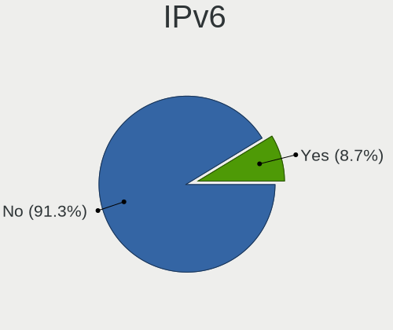

| Used | Desktops | Percent |
|------|----------|---------|
| No   | 65       | 97.01%  |
| Yes  | 2        | 2.99%   |

Bluetooth
---------

Bluetooth Vendor
----------------

Controller vendors

| Vendor                     | Desktops | Percent |
|----------------------------|----------|---------|
| Intel                      | 2        | 25%     |
| Cambridge Silicon Radio    | 2        | 25%     |
| Integrated System Solution | 1        | 12.5%   |
| IMC Networks               | 1        | 12.5%   |
| Broadcom                   | 1        | 12.5%   |
| ASUSTek Computer           | 1        | 12.5%   |

Bluetooth Model
---------------

Controller models

| Model                                               | Desktops | Percent |
|-----------------------------------------------------|----------|---------|
| Intel AX200 Bluetooth                               | 2        | 25%     |
| Cambridge Silicon Radio Bluetooth Dongle (HCI mode) | 2        | 25%     |
| Integrated System Solution Bluetooth Device         | 1        | 12.5%   |
| IMC Networks Bluetooth Radio                        | 1        | 12.5%   |
| Broadcom BCM92045B3 ROM                             | 1        | 12.5%   |
| ASUS BCM20702A0                                     | 1        | 12.5%   |

Sound
-----

Sound Vendor
------------

Sound card vendors

| Vendor                    | Desktops | Percent |
|---------------------------|----------|---------|
| Intel                     | 38       | 36.19%  |
| AMD                       | 29       | 27.62%  |
| Nvidia                    | 28       | 26.67%  |
| Creative Labs             | 2        | 1.9%    |
| Texas Instruments         | 1        | 0.95%   |
| SteelSeries ApS           | 1        | 0.95%   |
| Shenzhen Rapoo Technology | 1        | 0.95%   |
| Sennheiser Communications | 1        | 0.95%   |
| Plantronics               | 1        | 0.95%   |
| Kingston Technology       | 1        | 0.95%   |
| GN Netcom                 | 1        | 0.95%   |
| C-Media Electronics       | 1        | 0.95%   |

Sound Model
-----------

Sound card models

| Model                                                                             | Desktops | Percent |
|-----------------------------------------------------------------------------------|----------|---------|
| AMD SBx00 Azalia (Intel HDA)                                                      | 11       | 9.24%   |
| Nvidia GF108 High Definition Audio Controller                                     | 8        | 6.72%   |
| Intel NM10/ICH7 Family High Definition Audio Controller                           | 6        | 5.04%   |
| Intel 6 Series/C200 Series Chipset Family High Definition Audio Controller        | 6        | 5.04%   |
| Intel 100 Series/C230 Series Chipset Family HD Audio Controller                   | 5        | 4.2%    |
| Intel 8 Series/C220 Series Chipset High Definition Audio Controller               | 4        | 3.36%   |
| Intel 200 Series PCH HD Audio                                                     | 4        | 3.36%   |
| AMD FCH Azalia Controller                                                         | 4        | 3.36%   |
| Nvidia MCP61 High Definition Audio                                                | 3        | 2.52%   |
| Nvidia GP106 High Definition Audio Controller                                     | 3        | 2.52%   |
| Nvidia GM204 High Definition Audio Controller                                     | 3        | 2.52%   |
| Intel 82801JI (ICH10 Family) HD Audio Controller                                  | 3        | 2.52%   |
| AMD Starship/Matisse HD Audio Controller                                          | 3        | 2.52%   |
| AMD Family 17h/19h HD Audio Controller                                            | 3        | 2.52%   |
| Nvidia GP107GL High Definition Audio Controller                                   | 2        | 1.68%   |
| Nvidia GK208 HDMI/DP Audio Controller                                             | 2        | 1.68%   |
| Intel 9 Series Chipset Family HD Audio Controller                                 | 2        | 1.68%   |
| Intel 7 Series/C216 Chipset Family High Definition Audio Controller               | 2        | 1.68%   |
| Intel 5 Series/3400 Series Chipset High Definition Audio                          | 2        | 1.68%   |
| AMD RV710/730 HDMI Audio [Radeon HD 4000 series]                                  | 2        | 1.68%   |
| AMD Raven/Raven2/Fenghuang HDMI/DP Audio Controller                               | 2        | 1.68%   |
| AMD Ellesmere HDMI Audio [Radeon RX 470/480 / 570/580/590]                        | 2        | 1.68%   |
| AMD Caicos HDMI Audio [Radeon HD 6450 / 7450/8450/8490 OEM / R5 230/235/235X OEM] | 2        | 1.68%   |
| AMD Baffin HDMI/DP Audio [Radeon RX 550 640SP / RX 560/560X]                      | 2        | 1.68%   |
| Texas Instruments PCM2902 Audio Codec                                             | 1        | 0.84%   |
| SteelSeries ApS SteelSeries Arctis 7                                              | 1        | 0.84%   |
| Shenzhen Rapoo Technology Wireless Audio                                          | 1        | 0.84%   |
| Sennheiser Communications SC60 for Lync                                           | 1        | 0.84%   |
| Plantronics Audio 628 USB                                                         | 1        | 0.84%   |
| Nvidia MCP79 High Definition Audio                                                | 1        | 0.84%   |
| Nvidia MCP72XE/MCP72P/MCP78U/MCP78S High Definition Audio                         | 1        | 0.84%   |
| Nvidia MCP67 High Definition Audio                                                | 1        | 0.84%   |
| Nvidia MCP55 High Definition Audio                                                | 1        | 0.84%   |
| Nvidia GT216 HDMI Audio Controller                                                | 1        | 0.84%   |
| Nvidia GM107 High Definition Audio Controller [GeForce 940MX]                     | 1        | 0.84%   |
| Nvidia GK107 HDMI Audio Controller                                                | 1        | 0.84%   |
| Nvidia GK104 HDMI Audio Controller                                                | 1        | 0.84%   |
| Kingston Technology HyperX 7.1 Audio                                              | 1        | 0.84%   |
| Intel Xeon E3-1200 v3/4th Gen Core Processor HD Audio Controller                  | 1        | 0.84%   |
| Intel Comet Lake PCH cAVS                                                         | 1        | 0.84%   |

Memory
------

Memory Vendor
-------------

Memory module vendors

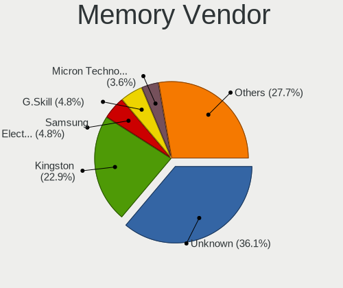

| Vendor              | Desktops | Percent |
|---------------------|----------|---------|
| Unknown             | 28       | 45.16%  |
| Kingston            | 10       | 16.13%  |
| SK hynix            | 2        | 3.23%   |
| Samsung Electronics | 2        | 3.23%   |
| Micron Technology   | 2        | 3.23%   |
| G.Skill             | 2        | 3.23%   |
| Transcend           | 1        | 1.61%   |
| Team                | 1        | 1.61%   |
| Silicon Power       | 1        | 1.61%   |
| SGS/Thomson         | 1        | 1.61%   |
| Patriot             | 1        | 1.61%   |
| Nanya Technology    | 1        | 1.61%   |
| Hexon               | 1        | 1.61%   |
| Goodram             | 1        | 1.61%   |
| Goldkey             | 1        | 1.61%   |
| Elpida              | 1        | 1.61%   |
| Crucial             | 1        | 1.61%   |
| Corsair             | 1        | 1.61%   |
| AVEXIR              | 1        | 1.61%   |
| Apacer              | 1        | 1.61%   |
| A-DATA Technology   | 1        | 1.61%   |
| Unknown             | 1        | 1.61%   |

Memory Model
------------

Memory module models

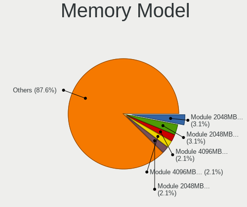

| Model                                                     | Desktops | Percent |
|-----------------------------------------------------------|----------|---------|
| Unknown RAM Module 2048MB DIMM DDR2 333MT/s               | 3        | 4.11%   |
| Unknown RAM Module 2048MB DIMM 1333MT/s                   | 3        | 4.11%   |
| Unknown RAM Module 4096MB DIMM 1600MT/s                   | 2        | 2.74%   |
| Unknown RAM Module 4096MB DIMM 1333MT/s                   | 2        | 2.74%   |
| Unknown RAM Module 2048MB DIMM DDR3 1333MT/s              | 2        | 2.74%   |
| Unknown RAM Module 2048MB DIMM 800MT/s                    | 2        | 2.74%   |
| Unknown RAM Module 1024MB DIMM DDR2 333MT/s               | 2        | 2.74%   |
| Kingston RAM KHX1866C10D3/8G 8GB DIMM DDR3 2133MT/s       | 2        | 2.74%   |
| Unknown RAM Module 8192MB DIMM 1333MT/s                   | 1        | 1.37%   |
| Unknown RAM Module 512MB DIMM SDRAM                       | 1        | 1.37%   |
| Unknown RAM Module 4GB DIMM DDR3 1333MT/s                 | 1        | 1.37%   |
| Unknown RAM Module 4GB DIMM 667MT/s                       | 1        | 1.37%   |
| Unknown RAM Module 4GB DIMM 1333MT/s                      | 1        | 1.37%   |
| Unknown RAM Module 4096MB DIMM DDR3 1600MT/s              | 1        | 1.37%   |
| Unknown RAM Module 2GB DIMM DDR2 800MT/s                  | 1        | 1.37%   |
| Unknown RAM Module 2GB DIMM 667MT/s                       | 1        | 1.37%   |
| Unknown RAM Module 2048MB DIMM SDRAM 800MT/s              | 1        | 1.37%   |
| Unknown RAM Module 2048MB DIMM SDRAM                      | 1        | 1.37%   |
| Unknown RAM Module 2048MB DIMM DDR2 800MT/s               | 1        | 1.37%   |
| Unknown RAM Module 2048MB DIMM DDR 667MT/s                | 1        | 1.37%   |
| Unknown RAM Module 2048MB DIMM DDR 1333MT/s               | 1        | 1.37%   |
| Unknown RAM Module 2048MB DIMM                            | 1        | 1.37%   |
| Unknown RAM Module 1024MB DIMM SDRAM                      | 1        | 1.37%   |
| Unknown RAM Module 1024MB DIMM DDR2 667MT/s               | 1        | 1.37%   |
| Unknown RAM Module 1024MB DIMM DDR 667MT/s                | 1        | 1.37%   |
| Unknown RAM CL17-17-17 D4-2400 16384MB DIMM DDR4 2400MT/s | 1        | 1.37%   |
| Unknown RAM ..E-D3U1600M/4G 4096MB DIMM DDR3 800MT/s      | 1        | 1.37%   |
| Transcend RAM JM1333KLH-4G 4GB DIMM DDR3 1333MT/s         | 1        | 1.37%   |
| Team RAM Elite-1333 4GB DIMM DDR3 1333MT/s                | 1        | 1.37%   |
| SK hynix RAM HYMP125U64CP8-S6 2GB DIMM DDR2 400MT/s       | 1        | 1.37%   |
| SK hynix RAM HYMP112U64CP8-S6 1GB DIMM DDR 800MT/s        | 1        | 1.37%   |
| SK hynix RAM HYMP112U64CP8-S6 1024MB DIMM DDR2 400MT/s    | 1        | 1.37%   |
| Silicon Power RAM DCLT2GN568S 2048MB DIMM DDR3 1600MT/s   | 1        | 1.37%   |
| SGS/Thomson RAM GR800S264L5/2G 2048MB DIMM SDRAM 2048MT/s | 1        | 1.37%   |
| Samsung RAM M378A1K43CB2-CRC 8GB DIMM DDR4 3500MT/s       | 1        | 1.37%   |
| Samsung RAM M3 78T6553CZ3-CD5 512MB DIMM DDR 533MT/s      | 1        | 1.37%   |
| Patriot RAM PSD34G160081 4GB DIMM DDR3 1600MT/s           | 1        | 1.37%   |
| Nanya RAM M2F2G64CB88B7N-CG 2048MB DIMM 1333MT/s          | 1        | 1.37%   |
| Micron RAM Module 4GB DIMM DDR3 1600MT/s                  | 1        | 1.37%   |
| Micron RAM 8JTF51264AZ-1G6E1 4GB DIMM DDR3 1600MT/s       | 1        | 1.37%   |

Memory Kind
-----------

Memory module kinds

| Kind    | Desktops | Percent |
|---------|----------|---------|
| DDR4    | 15       | 25.86%  |
| DDR3    | 15       | 25.86%  |
| Unknown | 11       | 18.97%  |
| DDR2    | 8        | 13.79%  |
| SDRAM   | 6        | 10.34%  |
| DDR     | 3        | 5.17%   |

Memory Form Factor
------------------

Physical design of the memory module

| Name | Desktops | Percent |
|------|----------|---------|
| DIMM | 56       | 100%    |

Memory Size
-----------

Memory module size

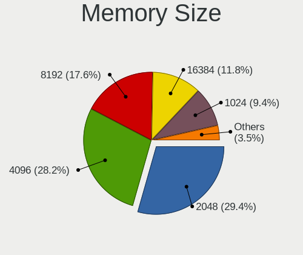

| Size  | Desktops | Percent |
|-------|----------|---------|
| 2048  | 24       | 35.82%  |
| 4096  | 20       | 29.85%  |
| 8192  | 10       | 14.93%  |
| 1024  | 7        | 10.45%  |
| 16384 | 4        | 5.97%   |
| 512   | 2        | 2.99%   |

Memory Speed
------------

Memory module speed

| Speed   | Desktops | Percent |
|---------|----------|---------|
| 1333    | 13       | 20.97%  |
| 1600    | 11       | 17.74%  |
| 800     | 7        | 11.29%  |
| 2133    | 6        | 9.68%   |
| 667     | 3        | 4.84%   |
| 333     | 3        | 4.84%   |
| Unknown | 3        | 4.84%   |
| 3600    | 2        | 3.23%   |
| 3000    | 2        | 3.23%   |
| 2667    | 2        | 3.23%   |
| 3500    | 1        | 1.61%   |
| 3200    | 1        | 1.61%   |
| 2933    | 1        | 1.61%   |
| 2800    | 1        | 1.61%   |
| 2666    | 1        | 1.61%   |
| 2400    | 1        | 1.61%   |
| 2048    | 1        | 1.61%   |
| 1400    | 1        | 1.61%   |
| 533     | 1        | 1.61%   |
| 400     | 1        | 1.61%   |

Printers & scanners
-------------------

Printer Vendor
--------------

Printer device vendors

| Vendor          | Desktops | Percent |
|-----------------|----------|---------|
| Hewlett-Packard | 2        | 50%     |
| Seiko Epson     | 1        | 25%     |
| Canon           | 1        | 25%     |

Printer Model
-------------

Printer device models

| Model                                 | Desktops | Percent |
|---------------------------------------|----------|---------|
| Seiko Epson USB2.0 Printer (Hi-speed) | 1        | 25%     |
| HP LaserJet M14-M17                   | 1        | 25%     |
| HP LaserJet 1020                      | 1        | 25%     |
| Canon LaserShot LBP-1120 Printer      | 1        | 25%     |

Scanner Vendor
--------------

Scanner device vendors

| Vendor | Desktops | Percent |
|--------|----------|---------|
| Canon  | 1        | 100%    |

Scanner Model
-------------

Scanner device models

| Model                    | Desktops | Percent |
|--------------------------|----------|---------|
| Canon CanoScan LiDE 700F | 1        | 100%    |

Camera
------

Camera Vendor
-------------

Camera device vendors

| Vendor                      | Desktops | Percent |
|-----------------------------|----------|---------|
| Logitech                    | 4        | 20%     |
| Microdia                    | 3        | 15%     |
| Z-Star Microelectronics     | 2        | 10%     |
| KYE Systems (Mouse Systems) | 2        | 10%     |
| YGTek                       | 1        | 5%      |
| Trust                       | 1        | 5%      |
| Samsung Electronics         | 1        | 5%      |
| Pixart Imaging              | 1        | 5%      |
| Microsoft                   | 1        | 5%      |
| Genesys Logic               | 1        | 5%      |
| GEMBIRD                     | 1        | 5%      |
| Cubeternet                  | 1        | 5%      |
| Aveo Technology             | 1        | 5%      |

Camera Model
------------

Camera device models

| Model                                     | Desktops | Percent |
|-------------------------------------------|----------|---------|
| Microdia Camera                           | 3        | 15%     |
| Z-Star Venus USB2.0 Camera                | 2        | 10%     |
| Logitech Webcam C270                      | 2        | 10%     |
| YGTek Webcam                              | 1        | 5%      |
| Trust Full HD Webcam                      | 1        | 5%      |
| Samsung Galaxy (PTP mode)                 | 1        | 5%      |
| Pixart Imaging GE 1.3 MP MiniCam Pro      | 1        | 5%      |
| Microsoft LifeCam VX-700                  | 1        | 5%      |
| Logitech Webcam C170                      | 1        | 5%      |
| Logitech Webcam C110                      | 1        | 5%      |
| KYE Systems (Mouse Systems) FaceCam 1000X | 1        | 5%      |
| KYE Systems (Mouse Systems) eFace 2025    | 1        | 5%      |
| Genesys Logic U2 EE Cam                   | 1        | 5%      |
| GEMBIRD USB2.0 PC CAMERA                  | 1        | 5%      |
| Cubeternet USB2.0 Camera                  | 1        | 5%      |
| Aveo Camera                               | 1        | 5%      |

Security
--------

Fingerprint Vendor
------------------

Fingerprint sensor vendors

Zero info for selected period =(

Fingerprint Model
-----------------

Fingerprint sensor models

Zero info for selected period =(

Chipcard Vendor
---------------

Chipcard module vendors

Zero info for selected period =(

Chipcard Model
--------------

Chipcard module models

Zero info for selected period =(

Unsupported
-----------

Unsupported Devices
-------------------

Total unsupported devices on board

| Total | Desktops | Percent |
|-------|----------|---------|
| 0     | 61       | 88.41%  |
| 1     | 8        | 11.59%  |

Unsupported Device Types
------------------------

Types of unsupported devices

| Type          | Desktops | Percent |
|---------------|----------|---------|
| Graphics card | 7        | 87.5%   |
| Camera        | 1        | 12.5%   |

