Linux in Moldova - Tested Hardware & Statistics (Notebooks)
-----------------------------------------------------------

A project to collect tested hardware configurations for Linux in Moldova.

Anyone can contribute to this report by the [hw-probe](https://github.com/linuxhw/hw-probe) tool:

    sudo -E hw-probe -all -upload

Please contribute! Especially if your hardware is rare.

Contents
--------

* [ Test Cases ](#test-cases)

* [ System ](#system)
  - [ OS                       ](#os)
  - [ OS Family                ](#os-family)
  - [ Kernel                   ](#kernel)
  - [ Kernel Family            ](#kernel-family)
  - [ Kernel Major Ver.        ](#kernel-major-ver)
  - [ Arch                     ](#arch)
  - [ DE                       ](#de)
  - [ Display Server           ](#display-server)
  - [ Display Manager          ](#display-manager)
  - [ OS Lang                  ](#os-lang)
  - [ Boot Mode                ](#boot-mode)
  - [ Filesystem               ](#filesystem)
  - [ Part. scheme             ](#part-scheme)
  - [ Dual Boot with Linux/BSD ](#dual-boot-with-linuxbsd)
  - [ Dual Boot (Win)          ](#dual-boot-win)

* [ Board ](#board)
  - [ Vendor                   ](#vendor)
  - [ Model                    ](#model)
  - [ Model Family             ](#model-family)
  - [ MFG Year                 ](#mfg-year)
  - [ Form Factor              ](#form-factor)
  - [ Secure Boot              ](#secure-boot)
  - [ Coreboot                 ](#coreboot)
  - [ RAM Size                 ](#ram-size)
  - [ RAM Used                 ](#ram-used)
  - [ Total Drives             ](#total-drives)
  - [ Has CD-ROM               ](#has-cd-rom)
  - [ Has Ethernet             ](#has-ethernet)
  - [ Has WiFi                 ](#has-wifi)
  - [ Has Bluetooth            ](#has-bluetooth)

* [ Location ](#location)
  - [ Country                  ](#country)
  - [ City                     ](#city)

* [ Drives ](#drives)
  - [ Drive Vendor             ](#drive-vendor)
  - [ Drive Model              ](#drive-model)
  - [ HDD Vendor               ](#hdd-vendor)
  - [ SSD Vendor               ](#ssd-vendor)
  - [ Drive Kind               ](#drive-kind)
  - [ Drive Connector          ](#drive-connector)
  - [ Drive Size               ](#drive-size)
  - [ Space Total              ](#space-total)
  - [ Space Used               ](#space-used)
  - [ Malfunc. Drives          ](#malfunc-drives)
  - [ Malfunc. Drive Vendor    ](#malfunc-drive-vendor)
  - [ Malfunc. HDD Vendor      ](#malfunc-hdd-vendor)
  - [ Malfunc. Drive Kind      ](#malfunc-drive-kind)
  - [ Failed Drives            ](#failed-drives)
  - [ Failed Drive Vendor      ](#failed-drive-vendor)
  - [ Drive Status             ](#drive-status)

* [ Storage controller ](#storage-controller)
  - [ Storage Vendor           ](#storage-vendor)
  - [ Storage Model            ](#storage-model)
  - [ Storage Kind             ](#storage-kind)

* [ Processor ](#processor)
  - [ CPU Vendor               ](#cpu-vendor)
  - [ CPU Model                ](#cpu-model)
  - [ CPU Model Family         ](#cpu-model-family)
  - [ CPU Cores                ](#cpu-cores)
  - [ CPU Sockets              ](#cpu-sockets)
  - [ CPU Threads              ](#cpu-threads)
  - [ CPU Op-Modes             ](#cpu-op-modes)
  - [ CPU Microcode            ](#cpu-microcode)
  - [ CPU Microarch            ](#cpu-microarch)

* [ Graphics ](#graphics)
  - [ GPU Vendor               ](#gpu-vendor)
  - [ GPU Model                ](#gpu-model)
  - [ GPU Combo                ](#gpu-combo)
  - [ GPU Driver               ](#gpu-driver)
  - [ GPU Memory               ](#gpu-memory)

* [ Monitor ](#monitor)
  - [ Monitor Vendor           ](#monitor-vendor)
  - [ Monitor Model            ](#monitor-model)
  - [ Monitor Resolution       ](#monitor-resolution)
  - [ Monitor Diagonal         ](#monitor-diagonal)
  - [ Monitor Width            ](#monitor-width)
  - [ Aspect Ratio             ](#aspect-ratio)
  - [ Monitor Area             ](#monitor-area)
  - [ Pixel Density            ](#pixel-density)
  - [ Multiple Monitors        ](#multiple-monitors)

* [ Network ](#network)
  - [ Net Controller Vendor    ](#net-controller-vendor)
  - [ Net Controller Model     ](#net-controller-model)
  - [ Wireless Vendor          ](#wireless-vendor)
  - [ Wireless Model           ](#wireless-model)
  - [ Ethernet Vendor          ](#ethernet-vendor)
  - [ Ethernet Model           ](#ethernet-model)
  - [ Net Controller Kind      ](#net-controller-kind)
  - [ Used Controller          ](#used-controller)
  - [ NICs                     ](#nics)
  - [ IPv6                     ](#ipv6)

* [ Bluetooth ](#bluetooth)
  - [ Bluetooth Vendor         ](#bluetooth-vendor)
  - [ Bluetooth Model          ](#bluetooth-model)

* [ Sound ](#sound)
  - [ Sound Vendor             ](#sound-vendor)
  - [ Sound Model              ](#sound-model)

* [ Memory ](#memory)
  - [ Memory Vendor            ](#memory-vendor)
  - [ Memory Model             ](#memory-model)
  - [ Memory Kind              ](#memory-kind)
  - [ Memory Form Factor       ](#memory-form-factor)
  - [ Memory Size              ](#memory-size)
  - [ Memory Speed             ](#memory-speed)

* [ Printers & scanners ](#printers--scanners)
  - [ Printer Vendor           ](#printer-vendor)
  - [ Printer Model            ](#printer-model)
  - [ Scanner Vendor           ](#scanner-vendor)
  - [ Scanner Model            ](#scanner-model)

* [ Camera ](#camera)
  - [ Camera Vendor            ](#camera-vendor)
  - [ Camera Model             ](#camera-model)

* [ Security ](#security)
  - [ Fingerprint Vendor       ](#fingerprint-vendor)
  - [ Fingerprint Model        ](#fingerprint-model)
  - [ Chipcard Vendor          ](#chipcard-vendor)
  - [ Chipcard Model           ](#chipcard-model)

* [ Unsupported ](#unsupported)
  - [ Unsupported Devices      ](#unsupported-devices)
  - [ Unsupported Device Types ](#unsupported-device-types)

Test Cases
----------

Total: 244

| Vendor   | Model                       | Probe                                                      | Date         |
|----------|-----------------------------|------------------------------------------------------------|--------------|
| Samsung  | 300V3A/300V4A/300V5A/200... | [ffa58b22a6](https://linux-hardware.org/?probe=ffa58b22a6) | Dec 29, 2024 |
| Samsung  | 300V3A/300V4A/300V5A/200... | [c76825324c](https://linux-hardware.org/?probe=c76825324c) | Dec 28, 2024 |
| ASUSTek  | ASUS Vivobook S 16 M5606... | [87a62f7ab4](https://linux-hardware.org/?probe=87a62f7ab4) | Dec 12, 2024 |
| Lenovo   | Legion 5 15IMH05 82AU       | [79ab3bbc9e](https://linux-hardware.org/?probe=79ab3bbc9e) | Dec 06, 2024 |
| Lenovo   | IdeaPad 3 15ADA05 81W1      | [f9ad338bc2](https://linux-hardware.org/?probe=f9ad338bc2) | Nov 26, 2024 |
| ASUSTek  | X550CC                      | [9c9f50e48d](https://linux-hardware.org/?probe=9c9f50e48d) | Nov 11, 2024 |
| ASUSTek  | X550CC                      | [62c26e414e](https://linux-hardware.org/?probe=62c26e414e) | Nov 11, 2024 |
| ASUSTek  | ASUS Vivobook S 16 S5606... | [f375294d93](https://linux-hardware.org/?probe=f375294d93) | Oct 24, 2024 |
| ASUSTek  | ASUS Vivobook S 16 S5606... | [d137ac3a49](https://linux-hardware.org/?probe=d137ac3a49) | Oct 18, 2024 |
| HP       | ProBook 455 G1              | [fcc4357e92](https://linux-hardware.org/?probe=fcc4357e92) | Oct 17, 2024 |
| HP       | ProBook 455 G1              | [149a4ff02a](https://linux-hardware.org/?probe=149a4ff02a) | Oct 17, 2024 |
| HP       | EliteBook 8470w             | [a4891795bf](https://linux-hardware.org/?probe=a4891795bf) | Sep 12, 2024 |
| Acer     | Extensa 215-55              | [0ccc3d6915](https://linux-hardware.org/?probe=0ccc3d6915) | Aug 30, 2024 |
| Acer     | Extensa 215-55              | [a4a6cf7e93](https://linux-hardware.org/?probe=a4a6cf7e93) | Aug 30, 2024 |
| HP       | EliteBook 8470w             | [41ca7ce107](https://linux-hardware.org/?probe=41ca7ce107) | Aug 22, 2024 |
| HP       | EliteBook 8470w             | [42a6e42a14](https://linux-hardware.org/?probe=42a6e42a14) | Aug 22, 2024 |
| Timi     | A35S                        | [3f66d5ebac](https://linux-hardware.org/?probe=3f66d5ebac) | Aug 20, 2024 |
| XIAOMI   | Redmi Book Pro 15 2023      | [6bb19c46ab](https://linux-hardware.org/?probe=6bb19c46ab) | Aug 08, 2024 |
| XIAOMI   | Redmi Book Pro 15 2023      | [bac0c976f4](https://linux-hardware.org/?probe=bac0c976f4) | Aug 08, 2024 |
| Acer     | Aspire A315-23              | [d5fd4c88f2](https://linux-hardware.org/?probe=d5fd4c88f2) | Jul 20, 2024 |
| ASUSTek  | Vivobook Go E1404FA_E140... | [0aa3213f68](https://linux-hardware.org/?probe=0aa3213f68) | Jul 17, 2024 |
| ASUSTek  | VivoBook_ASUSLaptop M160... | [26b93db645](https://linux-hardware.org/?probe=26b93db645) | Jul 17, 2024 |
| Lenovo   | Legion 5 Pro 16ACH6H 82J... | [6de6fcd1fa](https://linux-hardware.org/?probe=6de6fcd1fa) | Jul 16, 2024 |
| MSI      | GE60 2PE                    | [b7a466ecc5](https://linux-hardware.org/?probe=b7a466ecc5) | Jun 29, 2024 |
| HP       | 250 15.6 inch G10 Notebo... | [0006f4096d](https://linux-hardware.org/?probe=0006f4096d) | Jun 03, 2024 |
| Lenovo   | IdeaPad 110-15IBR 80T7      | [f8379977a9](https://linux-hardware.org/?probe=f8379977a9) | May 27, 2024 |
| ASUSTek  | K50IJ                       | [6e78332749](https://linux-hardware.org/?probe=6e78332749) | May 20, 2024 |
| ASUSTek  | K50IJ                       | [ae43a3e7b5](https://linux-hardware.org/?probe=ae43a3e7b5) | May 20, 2024 |
| Dell     | Vostro 7620                 | [cf9fa662a8](https://linux-hardware.org/?probe=cf9fa662a8) | May 20, 2024 |
| Acer     | Extensa 215-55              | [491f2c8f23](https://linux-hardware.org/?probe=491f2c8f23) | May 15, 2024 |
| ASUSTek  | ROG Zephyrus G14 GA401IH... | [e19fea8a49](https://linux-hardware.org/?probe=e19fea8a49) | May 06, 2024 |
| HP       | 250 G4                      | [6c2d10b0b4](https://linux-hardware.org/?probe=6c2d10b0b4) | May 05, 2024 |
| Sony     | SVF1521C5E                  | [9a899f2e80](https://linux-hardware.org/?probe=9a899f2e80) | Apr 28, 2024 |
| Lenovo   | Yoga Pro 7 14APH8 82Y8      | [e36ba9916d](https://linux-hardware.org/?probe=e36ba9916d) | Apr 22, 2024 |
| Dell     | Inspiron 3593               | [e1b99394fb](https://linux-hardware.org/?probe=e1b99394fb) | Apr 13, 2024 |
| ASUSTek  | VivoBook_ASUSLaptop X150... | [92dd6dd367](https://linux-hardware.org/?probe=92dd6dd367) | Mar 31, 2024 |
| ASUSTek  | VivoBook_ASUSLaptop X415... | [cd86953989](https://linux-hardware.org/?probe=cd86953989) | Feb 18, 2024 |
| HP       | EliteBook 840 G5            | [bdd9d20df9](https://linux-hardware.org/?probe=bdd9d20df9) | Feb 04, 2024 |
| ASUSTek  | ROG Strix G713RW_G713RW     | [20827e6f82](https://linux-hardware.org/?probe=20827e6f82) | Jan 26, 2024 |
| ASUSTek  | VivoBook_ASUSLaptop X415... | [1427f84afd](https://linux-hardware.org/?probe=1427f84afd) | Jan 18, 2024 |
| Lenovo   | IdeaPad 5 Pro 14ACN6 82L... | [123bf2b824](https://linux-hardware.org/?probe=123bf2b824) | Jan 17, 2024 |
| Lenovo   | IdeaPad 310-15ISK 80SM      | [8494044b32](https://linux-hardware.org/?probe=8494044b32) | Jan 11, 2024 |
| Lenovo   | LOQ 15IRH8 82XV             | [494b496889](https://linux-hardware.org/?probe=494b496889) | Jan 01, 2024 |
| ASUSTek  | UX32VD                      | [e073ccab15](https://linux-hardware.org/?probe=e073ccab15) | Dec 13, 2023 |
| Lenovo   | Z51-70 80K6                 | [2894d2f78d](https://linux-hardware.org/?probe=2894d2f78d) | Dec 06, 2023 |
| Apple    | MacBookPro9,2               | [c120b25f0f](https://linux-hardware.org/?probe=c120b25f0f) | Nov 17, 2023 |
| HP       | 250 G8 Notebook PC          | [a6d12193c7](https://linux-hardware.org/?probe=a6d12193c7) | Nov 17, 2023 |
| HP       | ProBook 4320s               | [0da6b1026b](https://linux-hardware.org/?probe=0da6b1026b) | Nov 15, 2023 |
| ASUSTek  | ROG Strix G712LU_G712LU     | [50087ec971](https://linux-hardware.org/?probe=50087ec971) | Oct 08, 2023 |
| ASUSTek  | ROG Strix G712LU_G712LU     | [6f7b1474d0](https://linux-hardware.org/?probe=6f7b1474d0) | Oct 06, 2023 |
| Lenovo   | ThinkBook 15-IML 20RW       | [a8c067b868](https://linux-hardware.org/?probe=a8c067b868) | Sep 22, 2023 |
| Lenovo   | ThinkBook 15 G4 IAP 21DJ    | [367454b6bc](https://linux-hardware.org/?probe=367454b6bc) | Sep 16, 2023 |
| Dell     | Latitude 7490               | [c03e42edee](https://linux-hardware.org/?probe=c03e42edee) | Sep 05, 2023 |
| ASUSTek  | VivoBook 15_ASUS Laptop ... | [ded378b5da](https://linux-hardware.org/?probe=ded378b5da) | Aug 30, 2023 |
| Timi     | A34R                        | [f2998bab84](https://linux-hardware.org/?probe=f2998bab84) | Aug 25, 2023 |
| Dell     | Latitude 7490               | [90685f1b4d](https://linux-hardware.org/?probe=90685f1b4d) | Aug 21, 2023 |
| Dell     | Inspiron 15 7000 Gaming     | [7da49ac1c3](https://linux-hardware.org/?probe=7da49ac1c3) | Aug 17, 2023 |
| Dell     | Latitude 7490               | [efb4abea09](https://linux-hardware.org/?probe=efb4abea09) | Aug 16, 2023 |
| ASUSTek  | ROG Strix G713RW_G713RW     | [91887235b2](https://linux-hardware.org/?probe=91887235b2) | Jul 31, 2023 |
| HP       | EliteBook 850 G1            | [3e08f1644a](https://linux-hardware.org/?probe=3e08f1644a) | Jun 24, 2023 |
| HP       | EliteBook 850 G1            | [574653afac](https://linux-hardware.org/?probe=574653afac) | Jun 24, 2023 |
| HP       | EliteBook 850 G1            | [fa6b09cc1d](https://linux-hardware.org/?probe=fa6b09cc1d) | Jun 23, 2023 |
| Dell     | Vostro 3525                 | [308ee62292](https://linux-hardware.org/?probe=308ee62292) | Jun 21, 2023 |
| Acer     | AOD257                      | [d3510be962](https://linux-hardware.org/?probe=d3510be962) | Jun 18, 2023 |
| Dell     | Vostro 3525                 | [fb399aebb6](https://linux-hardware.org/?probe=fb399aebb6) | Jun 11, 2023 |
| Dell     | Vostro 3525                 | [e4b62aaf28](https://linux-hardware.org/?probe=e4b62aaf28) | Jun 05, 2023 |
| Acer     | Aspire A515-54G             | [a6c2011fb0](https://linux-hardware.org/?probe=a6c2011fb0) | May 25, 2023 |
| Acer     | Aspire A515-54G             | [e58d4b4aee](https://linux-hardware.org/?probe=e58d4b4aee) | May 25, 2023 |
| Sony     | VPCF13WFX                   | [6500c354c7](https://linux-hardware.org/?probe=6500c354c7) | May 01, 2023 |
| Lenovo   | B50-30 80ES                 | [d84727b8e4](https://linux-hardware.org/?probe=d84727b8e4) | Apr 29, 2023 |
| Toshiba  | Satellite S50-B             | [e9d26a9e89](https://linux-hardware.org/?probe=e9d26a9e89) | Apr 12, 2023 |
| ASUSTek  | ZenBook UX425IA_UM425IA     | [3ac0a9cc94](https://linux-hardware.org/?probe=3ac0a9cc94) | Mar 31, 2023 |
| ASUSTek  | ROG Strix G533QM_G533QM     | [14f30effbe](https://linux-hardware.org/?probe=14f30effbe) | Mar 17, 2023 |
| ASUSTek  | X541NC                      | [d7e16d4472](https://linux-hardware.org/?probe=d7e16d4472) | Mar 11, 2023 |
| Apple    | MacBookPro8,1               | [60ab083fe9](https://linux-hardware.org/?probe=60ab083fe9) | Feb 25, 2023 |
| HP       | Pavilion Gaming Laptop 1... | [138e1ff0a8](https://linux-hardware.org/?probe=138e1ff0a8) | Feb 15, 2023 |
| ASUSTek  | K55A                        | [3faca30fb5](https://linux-hardware.org/?probe=3faca30fb5) | Feb 07, 2023 |
| Timi     | TM1701                      | [a474c92380](https://linux-hardware.org/?probe=a474c92380) | Jan 31, 2023 |
| ASUSTek  | VivoBook 15_ASUS Laptop ... | [93fd2967ab](https://linux-hardware.org/?probe=93fd2967ab) | Jan 07, 2023 |
| Lenovo   | IdeaPad Gaming 3 15ACH6 ... | [0760eec7e2](https://linux-hardware.org/?probe=0760eec7e2) | Dec 28, 2022 |
| Valve    | Jupiter                     | [d008ed40fe](https://linux-hardware.org/?probe=d008ed40fe) | Nov 17, 2022 |
| Lenovo   | ThinkPad W520 4282BA9       | [4666660667](https://linux-hardware.org/?probe=4666660667) | Nov 12, 2022 |
| Unknown  | Unknown                     | [9247927a69](https://linux-hardware.org/?probe=9247927a69) | Nov 08, 2022 |
| Lenovo   | IdeaPad 330S-15ARR 81FB     | [8979e951e5](https://linux-hardware.org/?probe=8979e951e5) | Nov 07, 2022 |
| Google   | Droid                       | [c8e4007ce4](https://linux-hardware.org/?probe=c8e4007ce4) | Oct 26, 2022 |
| Lenovo   | IdeaPad 5 Pro 16ACH6 82L... | [71f188e90c](https://linux-hardware.org/?probe=71f188e90c) | Oct 19, 2022 |
| Acer     | Extensa 215-32              | [3e6ce67bb5](https://linux-hardware.org/?probe=3e6ce67bb5) | Oct 08, 2022 |
| Acer     | Extensa 215-32              | [366f0e7930](https://linux-hardware.org/?probe=366f0e7930) | Oct 08, 2022 |
| Acer     | Aspire A315-56              | [644bb082f4](https://linux-hardware.org/?probe=644bb082f4) | Sep 18, 2022 |
| ASUSTek  | VivoBook_ASUSLaptop X509... | [3c214d75b2](https://linux-hardware.org/?probe=3c214d75b2) | Sep 10, 2022 |
| HP       | ProBook 450 G7              | [5fa4bf5fc8](https://linux-hardware.org/?probe=5fa4bf5fc8) | Aug 29, 2022 |
| Lenovo   | Legion 5 Pro 16ITH6H 82J... | [681486095a](https://linux-hardware.org/?probe=681486095a) | Aug 27, 2022 |
| Timi     | TM1701                      | [5b62dea22f](https://linux-hardware.org/?probe=5b62dea22f) | Aug 03, 2022 |
| Timi     | TM1701                      | [cddc7cb825](https://linux-hardware.org/?probe=cddc7cb825) | Aug 03, 2022 |
| Lenovo   | ThinkPad X1 Carbon 5th 2... | [d77ac14ae9](https://linux-hardware.org/?probe=d77ac14ae9) | Aug 01, 2022 |
| HP       | EliteBook 820 G3            | [a96c616d62](https://linux-hardware.org/?probe=a96c616d62) | Jul 28, 2022 |
| Dell     | Latitude 5480               | [151c4b8c85](https://linux-hardware.org/?probe=151c4b8c85) | Jul 21, 2022 |
| HP       | ProBook 450 G7              | [e011908e80](https://linux-hardware.org/?probe=e011908e80) | Jul 18, 2022 |
| HP       | ENVY 15                     | [9c0990eedf](https://linux-hardware.org/?probe=9c0990eedf) | Jul 18, 2022 |
| HP       | ProBook 450 G7              | [5d41d810e8](https://linux-hardware.org/?probe=5d41d810e8) | Jul 18, 2022 |
| ASUSTek  | TUF Gaming FX705DT_FX705... | [1d5a0f6177](https://linux-hardware.org/?probe=1d5a0f6177) | Jul 12, 2022 |
| Lenovo   | IdeaPad Gaming 3 15ARH05... | [567077c28d](https://linux-hardware.org/?probe=567077c28d) | Jul 08, 2022 |
| Lenovo   | IdeaPad L340-15API 81LW     | [dda5fb9c20](https://linux-hardware.org/?probe=dda5fb9c20) | Jun 21, 2022 |
| ASUSTek  | X555LD                      | [d5d6eeb639](https://linux-hardware.org/?probe=d5d6eeb639) | Jun 11, 2022 |
| Lenovo   | Legion 5 15IMH05 82AU       | [cd7bc92bcd](https://linux-hardware.org/?probe=cd7bc92bcd) | Jun 06, 2022 |
| Lenovo   | IdeaPad 100-15IBY 80MJ      | [db944454c8](https://linux-hardware.org/?probe=db944454c8) | May 23, 2022 |
| Lenovo   | Legion Y530-15ICH 81FV      | [428509b262](https://linux-hardware.org/?probe=428509b262) | May 01, 2022 |
| ASUSTek  | X541NC                      | [d1dc342eb9](https://linux-hardware.org/?probe=d1dc342eb9) | Apr 17, 2022 |
| Lenovo   | ThinkPad X240 20AL0067RT    | [f246d643b4](https://linux-hardware.org/?probe=f246d643b4) | Feb 26, 2022 |
| Sony     | VPCEB1J8E                   | [b00a6a15b2](https://linux-hardware.org/?probe=b00a6a15b2) | Feb 20, 2022 |
| ASUSTek  | U32U                        | [f7b7d4d2db](https://linux-hardware.org/?probe=f7b7d4d2db) | Feb 20, 2022 |
| ASUSTek  | U32U                        | [1cb943e596](https://linux-hardware.org/?probe=1cb943e596) | Feb 20, 2022 |
| Acer     | Swift SF314-57              | [de92ca9fec](https://linux-hardware.org/?probe=de92ca9fec) | Feb 05, 2022 |
| Lenovo   | ThinkPad E15 Gen 2 20TD0... | [4c95ae549f](https://linux-hardware.org/?probe=4c95ae549f) | Jan 21, 2022 |
| HP       | Unknown                     | [1fbb31af8d](https://linux-hardware.org/?probe=1fbb31af8d) | Jan 05, 2022 |
| Jumper   | EZbook                      | [6e9ee100f8](https://linux-hardware.org/?probe=6e9ee100f8) | Dec 22, 2021 |
| HP       | Pavilion Laptop 15-eh1xx... | [ab93ce9eb8](https://linux-hardware.org/?probe=ab93ce9eb8) | Dec 21, 2021 |
| Jumper   | EZbook                      | [992b2479e4](https://linux-hardware.org/?probe=992b2479e4) | Dec 21, 2021 |
| HP       | EliteBook 8470p             | [8ab831bf5f](https://linux-hardware.org/?probe=8ab831bf5f) | Dec 21, 2021 |
| Chuwi    | GemiBook Pro                | [493d55cb16](https://linux-hardware.org/?probe=493d55cb16) | Dec 11, 2021 |
| Dell     | Latitude 3520               | [8fb7494494](https://linux-hardware.org/?probe=8fb7494494) | Dec 06, 2021 |
| Acer     | Aspire 5253G                | [f7c885dedd](https://linux-hardware.org/?probe=f7c885dedd) | Nov 08, 2021 |
| Toshiba  | Satellite Pro S300L         | [93c5def444](https://linux-hardware.org/?probe=93c5def444) | Oct 06, 2021 |
| ASUSTek  | VivoBook S15 X510UF         | [336bbdae35](https://linux-hardware.org/?probe=336bbdae35) | Oct 02, 2021 |
| Lenovo   | ThinkPad E15 Gen 2 20TD0... | [7820254b55](https://linux-hardware.org/?probe=7820254b55) | Sep 23, 2021 |
| Dell     | Latitude 5591               | [0235ac49c6](https://linux-hardware.org/?probe=0235ac49c6) | Sep 15, 2021 |
| Lenovo   | ThinkPad E15 Gen 3 20YG0... | [02666996c0](https://linux-hardware.org/?probe=02666996c0) | Sep 12, 2021 |
| Lenovo   | ThinkPad E15 Gen 3 20YG0... | [97b45da8a7](https://linux-hardware.org/?probe=97b45da8a7) | Sep 12, 2021 |
| HP       | Laptop 15-da1xxx            | [c6f3848c20](https://linux-hardware.org/?probe=c6f3848c20) | Sep 12, 2021 |
| HP       | Laptop 15-da1xxx            | [b73b5ecab7](https://linux-hardware.org/?probe=b73b5ecab7) | Sep 11, 2021 |
| HP       | ProBook 450 G6              | [227d87ab66](https://linux-hardware.org/?probe=227d87ab66) | Aug 20, 2021 |
| Toshiba  | TECRA Z40-B                 | [d353412a4f](https://linux-hardware.org/?probe=d353412a4f) | Jul 29, 2021 |
| Lenovo   | IdeaPad 5 15ARE05 81YQ      | [8430084f74](https://linux-hardware.org/?probe=8430084f74) | Jul 15, 2021 |
| System76 | Adder WS                    | [d128c1d16b](https://linux-hardware.org/?probe=d128c1d16b) | Jul 08, 2021 |
| Lenovo   | ThinkPad T440 20B7S1N809    | [b9ab49e917](https://linux-hardware.org/?probe=b9ab49e917) | Jul 07, 2021 |
| Dell     | Vostro 5590                 | [1cc0df9bfd](https://linux-hardware.org/?probe=1cc0df9bfd) | Jun 28, 2021 |
| Dell     | Vostro 5590                 | [0caade1304](https://linux-hardware.org/?probe=0caade1304) | Jun 28, 2021 |
| ASUSTek  | X555LJ                      | [aab7280bd9](https://linux-hardware.org/?probe=aab7280bd9) | Jun 20, 2021 |
| Timi     | A35S                        | [226823eb5b](https://linux-hardware.org/?probe=226823eb5b) | Jun 19, 2021 |
| ASUSTek  | VivoBook_ASUSLaptop X521... | [79e70ff708](https://linux-hardware.org/?probe=79e70ff708) | Jun 17, 2021 |
| ASUSTek  | TUF Gaming FX705DT_FX705... | [447e508593](https://linux-hardware.org/?probe=447e508593) | Jun 14, 2021 |
| ASUSTek  | VivoBook_ASUSLaptop X521... | [47d894d771](https://linux-hardware.org/?probe=47d894d771) | Jun 12, 2021 |
| ASUSTek  | VivoBook_ASUSLaptop X521... | [5c14296bc9](https://linux-hardware.org/?probe=5c14296bc9) | Jun 12, 2021 |
| ASUSTek  | VivoBook_ASUSLaptop X521... | [73e1185f6e](https://linux-hardware.org/?probe=73e1185f6e) | Jun 12, 2021 |
| ASUSTek  | TUF Gaming FX705DT_FX705... | [666ddeb09c](https://linux-hardware.org/?probe=666ddeb09c) | May 19, 2021 |
| Dell     | Inspiron 3541               | [88d0f731fd](https://linux-hardware.org/?probe=88d0f731fd) | Apr 29, 2021 |
| Dell     | Inspiron 3541               | [4267385ad8](https://linux-hardware.org/?probe=4267385ad8) | Apr 29, 2021 |
| Dell     | Inspiron 3593               | [5facbef10b](https://linux-hardware.org/?probe=5facbef10b) | Apr 24, 2021 |
| Dell     | Latitude E7440              | [c59d5358b3](https://linux-hardware.org/?probe=c59d5358b3) | Apr 04, 2021 |
| HP       | Pavilion dv7                | [b7756075fd](https://linux-hardware.org/?probe=b7756075fd) | Mar 15, 2021 |
| Lenovo   | Legion Y530-15ICH 81FV      | [bd5d97f7e7](https://linux-hardware.org/?probe=bd5d97f7e7) | Mar 07, 2021 |
| HP       | ZBook Fury 15 G7 Mobile ... | [c2435842e1](https://linux-hardware.org/?probe=c2435842e1) | Mar 04, 2021 |
| HP       | ZBook Fury 15 G7 Mobile ... | [5cc3d3f3ed](https://linux-hardware.org/?probe=5cc3d3f3ed) | Mar 04, 2021 |
| Lenovo   | IdeaPad 330-15IKB 81DE      | [16d0cd0b17](https://linux-hardware.org/?probe=16d0cd0b17) | Mar 04, 2021 |
| Lenovo   | IdeaPad 330-15IKB 81DE      | [7a3239606c](https://linux-hardware.org/?probe=7a3239606c) | Mar 04, 2021 |
| Lenovo   | Legion Y530-15ICH 81FV      | [88bab7f6e7](https://linux-hardware.org/?probe=88bab7f6e7) | Feb 22, 2021 |
| ASUSTek  | ZenBook UX333FA_UX333FA     | [454ea43e4a](https://linux-hardware.org/?probe=454ea43e4a) | Feb 11, 2021 |
| HP       | ProBook 650 G2              | [043b7f867b](https://linux-hardware.org/?probe=043b7f867b) | Jan 23, 2021 |
| HP       | Laptop 15-dw0xxx            | [a69f5fa59f](https://linux-hardware.org/?probe=a69f5fa59f) | Jan 17, 2021 |
| Gateway  | NV55S                       | [8ed7215a68](https://linux-hardware.org/?probe=8ed7215a68) | Jan 17, 2021 |
| ASUSTek  | ZenBook UX333FA_UX333FA     | [a2da0e78db](https://linux-hardware.org/?probe=a2da0e78db) | Jan 14, 2021 |
| ASUSTek  | ZenBook UX333FA_UX333FA     | [84f50057c5](https://linux-hardware.org/?probe=84f50057c5) | Jan 14, 2021 |
| ASUSTek  | ZenBook UX333FA_UX333FA     | [c3b5acb8ff](https://linux-hardware.org/?probe=c3b5acb8ff) | Jan 14, 2021 |
| Gateway  | NV55S                       | [149e658abf](https://linux-hardware.org/?probe=149e658abf) | Jan 10, 2021 |
| HP       | EliteBook 855 G7 Noteboo... | [9f70a6e397](https://linux-hardware.org/?probe=9f70a6e397) | Jan 06, 2021 |
| HP       | Pavilion 17                 | [ac1360247b](https://linux-hardware.org/?probe=ac1360247b) | Dec 22, 2020 |
| HP       | EliteBook 855 G7 Noteboo... | [049fa926a1](https://linux-hardware.org/?probe=049fa926a1) | Dec 21, 2020 |
| HP       | EliteBook 855 G7 Noteboo... | [69e21f1387](https://linux-hardware.org/?probe=69e21f1387) | Nov 09, 2020 |
| Lenovo   | ThinkPad Yoga 11e 3rd Ge... | [bc1158d1d3](https://linux-hardware.org/?probe=bc1158d1d3) | Nov 09, 2020 |
| HP       | EliteBook 855 G7 Noteboo... | [8725886c61](https://linux-hardware.org/?probe=8725886c61) | Nov 06, 2020 |
| Dell     | Inspiron N5110              | [ee5fa15c46](https://linux-hardware.org/?probe=ee5fa15c46) | Nov 06, 2020 |
| ASUSTek  | Strix 17 GL703GE            | [6e4daa0a3c](https://linux-hardware.org/?probe=6e4daa0a3c) | Nov 05, 2020 |
| ASUSTek  | Strix 17 GL703GE            | [3a9f43c320](https://linux-hardware.org/?probe=3a9f43c320) | Nov 04, 2020 |
| HUAWEI   | NBLK-WAX9X                  | [4088a13026](https://linux-hardware.org/?probe=4088a13026) | Oct 09, 2020 |
| ASUSTek  | X200MA                      | [794220eee6](https://linux-hardware.org/?probe=794220eee6) | Sep 26, 2020 |
| Lenovo   | G710 20252                  | [c166b56839](https://linux-hardware.org/?probe=c166b56839) | Aug 26, 2020 |
| ASUSTek  | X541NA                      | [3f4978f463](https://linux-hardware.org/?probe=3f4978f463) | Aug 03, 2020 |
| HP       | ProBook 6465b               | [378cd77f66](https://linux-hardware.org/?probe=378cd77f66) | Jul 26, 2020 |
| ASUSTek  | VivoBook S15 X510UF         | [66a180cdab](https://linux-hardware.org/?probe=66a180cdab) | Jul 24, 2020 |
| ASUSTek  | VivoBook S15 X510UF         | [ed25557a01](https://linux-hardware.org/?probe=ed25557a01) | Jul 20, 2020 |
| HP       | Compaq Presario CQ60        | [8d24316f6b](https://linux-hardware.org/?probe=8d24316f6b) | Jul 15, 2020 |
| HP       | ProBook 450 G7              | [3638848f89](https://linux-hardware.org/?probe=3638848f89) | Jun 24, 2020 |
| Dell     | XPS 15 9570                 | [c14028664d](https://linux-hardware.org/?probe=c14028664d) | Jun 23, 2020 |
| ASUSTek  | X541NA                      | [6d3495ee91](https://linux-hardware.org/?probe=6d3495ee91) | Jun 14, 2020 |
| HP       | ProBook 470 G2              | [bce3965ebb](https://linux-hardware.org/?probe=bce3965ebb) | Jun 13, 2020 |
| Lenovo   | IdeaPad 130-15IKB 81H7      | [54b25b6a82](https://linux-hardware.org/?probe=54b25b6a82) | Apr 18, 2020 |
| HP       | EliteBook 850 G6            | [92d96a7e87](https://linux-hardware.org/?probe=92d96a7e87) | Apr 11, 2020 |
| Samsung  | RV413/RV513                 | [996451817e](https://linux-hardware.org/?probe=996451817e) | Mar 12, 2020 |
| Lenovo   | IdeaPad 330-15IGM 81D1      | [c0c091dee5](https://linux-hardware.org/?probe=c0c091dee5) | Feb 22, 2020 |
| Lenovo   | IdeaPad 330-15IGM 81D1      | [f1e8d4fb95](https://linux-hardware.org/?probe=f1e8d4fb95) | Feb 22, 2020 |
| ASUSTek  | X541NA                      | [3df0912982](https://linux-hardware.org/?probe=3df0912982) | Feb 15, 2020 |
| Lenovo   | G710 20252                  | [7df7fd3c10](https://linux-hardware.org/?probe=7df7fd3c10) | Feb 15, 2020 |
| Toshiba  | Satellite C55D-A            | [19713fa1aa](https://linux-hardware.org/?probe=19713fa1aa) | Feb 05, 2020 |
| Dell     | Inspiron 3582               | [6916c1087b](https://linux-hardware.org/?probe=6916c1087b) | Jan 21, 2020 |
| Dell     | Inspiron 3582               | [b873ab0117](https://linux-hardware.org/?probe=b873ab0117) | Jan 16, 2020 |
| Dell     | Inspiron 3582               | [cf3745ead4](https://linux-hardware.org/?probe=cf3745ead4) | Jan 16, 2020 |
| ASUSTek  | K54C                        | [42b284e62d](https://linux-hardware.org/?probe=42b284e62d) | Dec 17, 2019 |
| ASUSTek  | X542UR                      | [8c29a78852](https://linux-hardware.org/?probe=8c29a78852) | Dec 15, 2019 |
| ASUSTek  | X542UR                      | [106dcde5e2](https://linux-hardware.org/?probe=106dcde5e2) | Oct 24, 2019 |
| ASUSTek  | X542UR                      | [d5d9fe7ed0](https://linux-hardware.org/?probe=d5d9fe7ed0) | Oct 15, 2019 |
| ASUSTek  | X542UR                      | [f0e44b13bf](https://linux-hardware.org/?probe=f0e44b13bf) | Sep 15, 2019 |
| ASUSTek  | X541SA                      | [f4ec1608f1](https://linux-hardware.org/?probe=f4ec1608f1) | Aug 19, 2019 |
| Samsung  | RV413/RV513                 | [a569d1638b](https://linux-hardware.org/?probe=a569d1638b) | Aug 16, 2019 |
| HP       | Compaq 6910p                | [2b9b5142af](https://linux-hardware.org/?probe=2b9b5142af) | Jul 02, 2019 |
| Dell     | Inspiron 3521               | [5129fbc2b3](https://linux-hardware.org/?probe=5129fbc2b3) | Jun 13, 2019 |
| Dell     | Inspiron 3521               | [de72a9023b](https://linux-hardware.org/?probe=de72a9023b) | Jun 12, 2019 |
| Timi     | TM1701                      | [b2b217c7ba](https://linux-hardware.org/?probe=b2b217c7ba) | Jun 04, 2019 |
| Lenovo   | IdeaPad 330S-14IKB 81F4     | [1df14b9671](https://linux-hardware.org/?probe=1df14b9671) | May 31, 2019 |
| Acer     | Aspire E1-572G              | [d7c9cc59b9](https://linux-hardware.org/?probe=d7c9cc59b9) | May 17, 2019 |
| ASUSTek  | X550JX                      | [a268d267b1](https://linux-hardware.org/?probe=a268d267b1) | May 14, 2019 |
| Toshiba  | Satellite A210              | [b08d78a7fe](https://linux-hardware.org/?probe=b08d78a7fe) | May 12, 2019 |
| ASUSTek  | VivoBook 15_ASUS Laptop ... | [adff6b4ec1](https://linux-hardware.org/?probe=adff6b4ec1) | May 08, 2019 |
| ASUSTek  | VivoBook 15_ASUS Laptop ... | [1427bdb593](https://linux-hardware.org/?probe=1427bdb593) | May 08, 2019 |
| HP       | Compaq Presario CQ60        | [c4ee62ecc8](https://linux-hardware.org/?probe=c4ee62ecc8) | Mar 21, 2019 |
| Acer     | Aspire A515-51G             | [bc2c6a0308](https://linux-hardware.org/?probe=bc2c6a0308) | Jan 21, 2019 |
| Acer     | Aspire A515-51G             | [a4fa6be429](https://linux-hardware.org/?probe=a4fa6be429) | Jan 21, 2019 |
| Samsung  | 300E4C/300E5C/300E7C        | [761e996b51](https://linux-hardware.org/?probe=761e996b51) | Jan 13, 2019 |
| HP       | 635                         | [26ac239a00](https://linux-hardware.org/?probe=26ac239a00) | Jan 13, 2019 |
| HP       | 635                         | [88b6088e86](https://linux-hardware.org/?probe=88b6088e86) | Jan 13, 2019 |
| Dell     | Latitude E5420              | [58a37ca1d7](https://linux-hardware.org/?probe=58a37ca1d7) | Jan 08, 2019 |
| HP       | Compaq CQ58                 | [f930811937](https://linux-hardware.org/?probe=f930811937) | Dec 25, 2018 |
| HP       | Compaq CQ58                 | [092addb321](https://linux-hardware.org/?probe=092addb321) | Dec 25, 2018 |
| Samsung  | R517/R717                   | [cf1386553c](https://linux-hardware.org/?probe=cf1386553c) | Dec 11, 2018 |
| HP       | ENVY m6                     | [a2443c2500](https://linux-hardware.org/?probe=a2443c2500) | Nov 28, 2018 |
| Lenovo   | ThinkPad X131e 33711T0      | [d765880811](https://linux-hardware.org/?probe=d765880811) | Nov 20, 2018 |
| ASUSTek  | K56CM                       | [9801230a74](https://linux-hardware.org/?probe=9801230a74) | Oct 11, 2018 |
| Lenovo   | G710 20252                  | [67b5fc31a6](https://linux-hardware.org/?probe=67b5fc31a6) | Sep 03, 2018 |
| ASUSTek  | K50AB                       | [5309fc98bb](https://linux-hardware.org/?probe=5309fc98bb) | Jun 21, 2018 |
| Lenovo   | Y520-15IKBN 80WK            | [9c2fa220c0](https://linux-hardware.org/?probe=9c2fa220c0) | Jun 07, 2018 |
| Lenovo   | Y520-15IKBN 80WK            | [23cd9fcd79](https://linux-hardware.org/?probe=23cd9fcd79) | Jun 07, 2018 |
| ASUSTek  | K52N                        | [9b6027f7f9](https://linux-hardware.org/?probe=9b6027f7f9) | Mar 04, 2018 |
| ASUSTek  | K52N                        | [a31f696968](https://linux-hardware.org/?probe=a31f696968) | Jan 27, 2018 |
| ASUSTek  | E502SA                      | [f82780c45f](https://linux-hardware.org/?probe=f82780c45f) | Dec 22, 2017 |
| Samsung  | R517/R717                   | [88501ec4d2](https://linux-hardware.org/?probe=88501ec4d2) | Nov 23, 2017 |
| Acer     | Aspire E5-575               | [d7a774808d](https://linux-hardware.org/?probe=d7a774808d) | Nov 07, 2017 |
| Lenovo   | V580 20147                  | [7b4ec145fd](https://linux-hardware.org/?probe=7b4ec145fd) | Sep 05, 2017 |
| ASUSTek  | E502SA                      | [f80e3a3361](https://linux-hardware.org/?probe=f80e3a3361) | Jul 02, 2017 |
| Acer     | AO756                       | [750d61ea27](https://linux-hardware.org/?probe=750d61ea27) | Jun 28, 2017 |
| ASUSTek  | E502SA                      | [e638970390](https://linux-hardware.org/?probe=e638970390) | Jun 27, 2017 |
| Samsung  | R517/R717                   | [a037b05f1c](https://linux-hardware.org/?probe=a037b05f1c) | Jun 07, 2017 |
| Lenovo   | V580 20147                  | [e4a66b20cf](https://linux-hardware.org/?probe=e4a66b20cf) | May 09, 2017 |
| HP       | 550                         | [21d69ed69f](https://linux-hardware.org/?probe=21d69ed69f) | Feb 14, 2017 |
| Acer     | Aspire E1-531G              | [0481735487](https://linux-hardware.org/?probe=0481735487) | Dec 19, 2016 |
| MSI      | CR610                       | [fa269a3f05](https://linux-hardware.org/?probe=fa269a3f05) | Nov 20, 2016 |

System
------

OS
--

Installed operating systems

| Name                | Notebooks | Percent |
|---------------------|-----------|---------|
| Ubuntu 18.04        | 12        | 6.45%   |
| Ubuntu 22.04        | 11        | 5.91%   |
| Ubuntu 20.04        | 11        | 5.91%   |
| ROSA R10            | 9         | 4.84%   |
| Ubuntu 24.04        | 6         | 3.23%   |
| ROSA R11            | 6         | 3.23%   |
| Linux Mint 20.1     | 5         | 2.69%   |
| Linux Mint 21.1     | 4         | 2.15%   |
| KDE neon 20.04      | 4         | 2.15%   |
| Arch Rolling        | 4         | 2.15%   |
| Arch                | 4         | 2.15%   |
| ROSA R9             | 3         | 1.61%   |
| ROSA R8             | 3         | 1.61%   |
| ROSA R11.1          | 3         | 1.61%   |
| Pop!_OS 22.04       | 3         | 1.61%   |
| Linux Mint 19.1     | 3         | 1.61%   |
| Fedora 39           | 3         | 1.61%   |
| Fedora 36           | 3         | 1.61%   |
| Fedora 34           | 3         | 1.61%   |
| Zorin 16            | 2         | 1.08%   |
| Ubuntu 22.10        | 2         | 1.08%   |
| Ubuntu 19.10        | 2         | 1.08%   |
| ROSA R8.1           | 2         | 1.08%   |
| ROSA 12.2           | 2         | 1.08%   |
| Pop!_OS 21.04       | 2         | 1.08%   |
| OpenMandriva 4.3    | 2         | 1.08%   |
| OpenMandriva 23.08  | 2         | 1.08%   |
| Manjaro             | 2         | 1.08%   |
| Linux Mint 21.3     | 2         | 1.08%   |
| Linux Mint 21.2     | 2         | 1.08%   |
| Linux Mint 20.2     | 2         | 1.08%   |
| KDE neon 22.04      | 2         | 1.08%   |
| Fedora 40           | 2         | 1.08%   |
| EndeavourOS Rolling | 2         | 1.08%   |
| BlackPanther 18.1   | 2         | 1.08%   |
| Zorin 17            | 1         | 0.54%   |
| Ubuntu Budgie 23.04 | 1         | 0.54%   |
| Ubuntu 23.10        | 1         | 0.54%   |
| Ubuntu 23.04        | 1         | 0.54%   |
| Ubuntu 21.04        | 1         | 0.54%   |

OS Family
---------

OS without a version

| Name          | Notebooks | Percent |
|---------------|-----------|---------|
| Ubuntu        | 47        | 26.4%   |
| ROSA          | 28        | 15.73%  |
| Linux Mint    | 22        | 12.36%  |
| Fedora        | 16        | 8.99%   |
| Manjaro       | 9         | 5.06%   |
| Arch          | 8         | 4.49%   |
| OpenMandriva  | 7         | 3.93%   |
| Pop!_OS       | 6         | 3.37%   |
| KDE neon      | 6         | 3.37%   |
| Kali          | 5         | 2.81%   |
| Zorin         | 3         | 1.69%   |
| Kubuntu       | 3         | 1.69%   |
| Endless       | 3         | 1.69%   |
| Debian        | 3         | 1.69%   |
| SteamOS       | 2         | 1.12%   |
| EndeavourOS   | 2         | 1.12%   |
| BlackPanther  | 2         | 1.12%   |
| Ubuntu Budgie | 1         | 0.56%   |
| Clear Linux   | 1         | 0.56%   |
| CachyOS       | 1         | 0.56%   |
| BuildRoot     | 1         | 0.56%   |
| ArcoLinux     | 1         | 0.56%   |
| ALT Linux     | 1         | 0.56%   |

Kernel
------

Version of the Linux kernel

| Version                            | Notebooks | Percent |
|------------------------------------|-----------|---------|
| 5.15.0-41-generic                  | 4         | 2.04%   |
| 4.9.60-nrj-desktop-1rosa-x86_64    | 4         | 2.04%   |
| 4.9.20-nrj-desktop-1rosa-x86_64    | 4         | 2.04%   |
| 6.5.0-35-generic                   | 3         | 1.53%   |
| 5.8.0-33-generic                   | 3         | 1.53%   |
| 4.9.60-nrj-desktop-1rosa-i586      | 3         | 1.53%   |
| 6.9.3-76060903-generic             | 2         | 1.02%   |
| 6.8.0-41-generic                   | 2         | 1.02%   |
| 6.6.8-arch1-1                      | 2         | 1.02%   |
| 5.4.0-37-generic                   | 2         | 1.02%   |
| 5.16.7-desktop-1omv4003            | 2         | 1.02%   |
| 5.15.0-88-generic                  | 2         | 1.02%   |
| 5.15.0-58-generic                  | 2         | 1.02%   |
| 5.11.0-7614-generic                | 2         | 1.02%   |
| 5.11.0-41-generic                  | 2         | 1.02%   |
| 5.11.0-34-generic                  | 2         | 1.02%   |
| 5.10.74-generic-2rosa2021.1-x86_64 | 2         | 1.02%   |
| 5.10.2-2-MANJARO                   | 2         | 1.02%   |
| 4.9.95-nrj-desktop-2rosa-x86_64    | 2         | 1.02%   |
| 4.9.41-nrj-desktop-1rosa-x86_64    | 2         | 1.02%   |
| 4.9.155-nrj-desktop-1rosa-x86_64   | 2         | 1.02%   |
| 4.15.0-desktop-68.5rosa-x86_64     | 2         | 1.02%   |
| 4.15.0-desktop-45.1rosa-x86_64     | 2         | 1.02%   |
| 6.9.8-200.fc40.x86_64              | 1         | 0.51%   |
| 6.8.9-200.fc39.x86_64              | 1         | 0.51%   |
| 6.8.6-200.fc39.x86_64              | 1         | 0.51%   |
| 6.8.4-arch1-1                      | 1         | 0.51%   |
| 6.8.1-060801-generic               | 1         | 0.51%   |
| 6.8.0-48-generic                   | 1         | 0.51%   |
| 6.8.0-47-generic                   | 1         | 0.51%   |
| 6.8.0-39-generic                   | 1         | 0.51%   |
| 6.8.0-38-generic                   | 1         | 0.51%   |
| 6.8.0-31-generic                   | 1         | 0.51%   |
| 6.7.0-arch3-1-g14                  | 1         | 0.51%   |
| 6.6.27-generic-3rosa2021.1-x86_64  | 1         | 0.51%   |
| 6.6.2-desktop-1omv2390             | 1         | 0.51%   |
| 6.6.14-200.fc39.x86_64             | 1         | 0.51%   |
| 6.6.10-zen1-1-zen                  | 1         | 0.51%   |
| 6.5.13-7-MANJARO                   | 1         | 0.51%   |
| 6.5.0-kali3-amd64                  | 1         | 0.51%   |

Kernel Family
-------------

Linux kernel without a distro release

| Version | Notebooks | Percent |
|---------|-----------|---------|
| 5.15.0  | 19        | 9.9%    |
| 4.15.0  | 15        | 7.81%   |
| 5.4.0   | 12        | 6.25%   |
| 5.11.0  | 11        | 5.73%   |
| 6.8.0   | 7         | 3.65%   |
| 6.5.0   | 6         | 3.13%   |
| 4.9.60  | 6         | 3.13%   |
| 5.8.0   | 5         | 2.6%    |
| 5.3.0   | 4         | 2.08%   |
| 4.9.20  | 4         | 2.08%   |
| 6.2.0   | 3         | 1.56%   |
| 5.13.0  | 3         | 1.56%   |
| 5.0.0   | 3         | 1.56%   |
| 4.18.0  | 3         | 1.56%   |
| 6.9.3   | 2         | 1.04%   |
| 6.6.8   | 2         | 1.04%   |
| 5.8.18  | 2         | 1.04%   |
| 5.19.0  | 2         | 1.04%   |
| 5.18.1  | 2         | 1.04%   |
| 5.16.7  | 2         | 1.04%   |
| 5.10.74 | 2         | 1.04%   |
| 5.10.2  | 2         | 1.04%   |
| 5.10.0  | 2         | 1.04%   |
| 4.9.95  | 2         | 1.04%   |
| 4.9.41  | 2         | 1.04%   |
| 4.9.155 | 2         | 1.04%   |
| 6.9.8   | 1         | 0.52%   |
| 6.8.9   | 1         | 0.52%   |
| 6.8.6   | 1         | 0.52%   |
| 6.8.4   | 1         | 0.52%   |
| 6.8.1   | 1         | 0.52%   |
| 6.7.0   | 1         | 0.52%   |
| 6.6.27  | 1         | 0.52%   |
| 6.6.2   | 1         | 0.52%   |
| 6.6.14  | 1         | 0.52%   |
| 6.6.10  | 1         | 0.52%   |
| 6.5.13  | 1         | 0.52%   |
| 6.4.8   | 1         | 0.52%   |
| 6.4.6   | 1         | 0.52%   |
| 6.4.13  | 1         | 0.52%   |

Kernel Major Ver.
-----------------

Linux kernel major version

| Version | Notebooks | Percent |
|---------|-----------|---------|
| 5.15    | 25        | 13.37%  |
| 4.9     | 15        | 8.02%   |
| 4.15    | 15        | 8.02%   |
| 5.4     | 14        | 7.49%   |
| 5.11    | 12        | 6.42%   |
| 6.8     | 11        | 5.88%   |
| 5.10    | 9         | 4.81%   |
| 6.5     | 7         | 3.74%   |
| 5.8     | 7         | 3.74%   |
| 6.6     | 6         | 3.21%   |
| 6.2     | 6         | 3.21%   |
| 5.18    | 6         | 3.21%   |
| 6.4     | 4         | 2.14%   |
| 5.3     | 4         | 2.14%   |
| 5.19    | 4         | 2.14%   |
| 5.13    | 4         | 2.14%   |
| 5.0     | 4         | 2.14%   |
| 6.9     | 3         | 1.6%    |
| 6.11    | 3         | 1.6%    |
| 6.1     | 3         | 1.6%    |
| 5.17    | 3         | 1.6%    |
| 5.16    | 3         | 1.6%    |
| 4.18    | 3         | 1.6%    |
| 4.1     | 3         | 1.6%    |
| 5.12    | 2         | 1.07%   |
| 6.7     | 1         | 0.53%   |
| 6.3     | 1         | 0.53%   |
| 6.12    | 1         | 0.53%   |
| 6.10    | 1         | 0.53%   |
| 5.9     | 1         | 0.53%   |
| 5.6     | 1         | 0.53%   |
| 5.14    | 1         | 0.53%   |
| 5.1     | 1         | 0.53%   |
| 4.19    | 1         | 0.53%   |
| 4.16    | 1         | 0.53%   |
| 4.10    | 1         | 0.53%   |

Arch
----

OS architecture (x86_64, i586, etc.)

| Name   | Notebooks | Percent |
|--------|-----------|---------|
| x86_64 | 172       | 96.09%  |
| i686   | 7         | 3.91%   |

DE
--

Desktop Environment

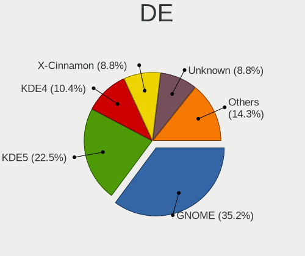

| Name            | Notebooks | Percent |
|-----------------|-----------|---------|
| GNOME           | 64        | 35.16%  |
| KDE5            | 41        | 22.53%  |
| KDE4            | 19        | 10.44%  |
| X-Cinnamon      | 16        | 8.79%   |
| Unknown         | 16        | 8.79%   |
| XFCE            | 11        | 6.04%   |
| Cinnamon        | 3         | 1.65%   |
| MATE            | 2         | 1.1%    |
| LXQt            | 2         | 1.1%    |
| KDE6            | 2         | 1.1%    |
| sway            | 1         | 0.55%   |
| KDE             | 1         | 0.55%   |
| i3              | 1         | 0.55%   |
| Hyprland        | 1         | 0.55%   |
| GNOME Flashback | 1         | 0.55%   |
| Budgie          | 1         | 0.55%   |

Display Server
--------------

X11 or Wayland

| Name    | Notebooks | Percent |
|---------|-----------|---------|
| X11     | 123       | 67.96%  |
| Wayland | 45        | 24.86%  |
| Unknown | 13        | 7.18%   |

Display Manager
---------------

SDDM, LightDM, etc.

| Name    | Notebooks | Percent |
|---------|-----------|---------|
| Unknown | 64        | 34.97%  |
| SDDM    | 31        | 16.94%  |
| GDM     | 25        | 13.66%  |
| GDM3    | 20        | 10.93%  |
| KDM     | 19        | 10.38%  |
| LightDM | 18        | 9.84%   |
| TDM     | 6         | 3.28%   |

OS Lang
-------

Language

| Lang    | Notebooks | Percent |
|---------|-----------|---------|
| en_US   | 79        | 44.13%  |
| Unknown | 41        | 22.91%  |
| ru_RU   | 36        | 20.11%  |
| C       | 8         | 4.47%   |
| ro_RO   | 7         | 3.91%   |
| en_GB   | 2         | 1.12%   |
| uk_UA   | 1         | 0.56%   |
| ru_UA   | 1         | 0.56%   |
| nl_NL   | 1         | 0.56%   |
| it_IT   | 1         | 0.56%   |
| en_150  | 1         | 0.56%   |
| de_DE   | 1         | 0.56%   |

Boot Mode
---------

EFI or BIOS

| Mode | Notebooks | Percent |
|------|-----------|---------|
| EFI  | 101       | 56.42%  |
| BIOS | 78        | 43.58%  |

Filesystem
----------

Type of filesystem

| Type    | Notebooks | Percent |
|---------|-----------|---------|
| Ext4    | 120       | 67.04%  |
| Btrfs   | 21        | 11.73%  |
| Unknown | 16        | 8.94%   |
| Overlay | 12        | 6.7%    |
| Tmpfs   | 8         | 4.47%   |
| Xfs     | 2         | 1.12%   |

Part. scheme
------------

Scheme of partitioning

| Type    | Notebooks | Percent |
|---------|-----------|---------|
| GPT     | 84        | 46.93%  |
| Unknown | 67        | 37.43%  |
| MBR     | 28        | 15.64%  |

Dual Boot with Linux/BSD
------------------------

Hosting more than one Linux/BSD

| Dual boot | Notebooks | Percent |
|-----------|-----------|---------|
| No        | 162       | 90.5%   |
| Yes       | 17        | 9.5%    |

Dual Boot (Win)
---------------

Hosting Linux and Windows

| Dual boot | Notebooks | Percent |
|-----------|-----------|---------|
| No        | 131       | 72.78%  |
| Yes       | 49        | 27.22%  |

Board
-----

Vendor
------

Motherboard manufacturer

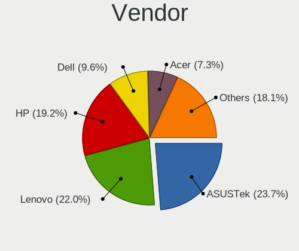

| Name                | Notebooks | Percent |
|---------------------|-----------|---------|
| ASUSTek Computer    | 42        | 23.73%  |
| Lenovo              | 39        | 22.03%  |
| Hewlett-Packard     | 34        | 19.21%  |
| Dell                | 17        | 9.6%    |
| Acer                | 13        | 7.34%   |
| Timi                | 6         | 3.39%   |
| Toshiba             | 5         | 2.82%   |
| Samsung Electronics | 5         | 2.82%   |
| Sony                | 3         | 1.69%   |
| MSI                 | 2         | 1.13%   |
| Apple               | 2         | 1.13%   |
| XIAOMI              | 1         | 0.56%   |
| Valve               | 1         | 0.56%   |
| System76            | 1         | 0.56%   |
| Jumper              | 1         | 0.56%   |
| HUAWEI              | 1         | 0.56%   |
| Google              | 1         | 0.56%   |
| Gateway             | 1         | 0.56%   |
| Chuwi               | 1         | 0.56%   |
| Unknown             | 1         | 0.56%   |

Model
-----

Motherboard model

| Name                                        | Notebooks | Percent |
|---------------------------------------------|-----------|---------|
| Timi TM1701                                 | 3         | 1.69%   |
| ASUS VivoBook_ASUSLaptop X521IA_D533IA      | 3         | 1.69%   |
| Timi A35S                                   | 2         | 1.13%   |
| Samsung RV413/RV513                         | 2         | 1.13%   |
| Lenovo Legion Y530-15ICH 81FV               | 2         | 1.13%   |
| Lenovo Legion 5 15IMH05 82AU                | 2         | 1.13%   |
| HP ProBook 450 G7                           | 2         | 1.13%   |
| HP Compaq Presario CQ60                     | 2         | 1.13%   |
| Dell Inspiron 3593                          | 2         | 1.13%   |
| ASUS VivoBook S15 X510UF                    | 2         | 1.13%   |
| ASUS ASUS Vivobook S 16 S5606MA_S5606MA     | 2         | 1.13%   |
| Unknown                                     | 2         | 1.13%   |
| XIAOMI Redmi Book Pro 15 2023               | 1         | 0.56%   |
| Valve Jupiter                               | 1         | 0.56%   |
| Toshiba TECRA Z40-B                         | 1         | 0.56%   |
| Toshiba Satellite S50-B                     | 1         | 0.56%   |
| Toshiba Satellite Pro S300L                 | 1         | 0.56%   |
| Toshiba Satellite C55D-A                    | 1         | 0.56%   |
| Toshiba Satellite A210                      | 1         | 0.56%   |
| Timi A34R                                   | 1         | 0.56%   |
| System76 Adder WS                           | 1         | 0.56%   |
| Sony VPCF13WFX                              | 1         | 0.56%   |
| Sony VPCEB1J8E                              | 1         | 0.56%   |
| Sony SVF1521C5E                             | 1         | 0.56%   |
| Samsung R517/R717                           | 1         | 0.56%   |
| Samsung 300V3A/300V4A/300V5A/200A4B/200A5B  | 1         | 0.56%   |
| Samsung 300E4C/300E5C/300E7C                | 1         | 0.56%   |
| MSI GE60 2PE                                | 1         | 0.56%   |
| MSI CR610                                   | 1         | 0.56%   |
| Lenovo Z51-70 80K6                          | 1         | 0.56%   |
| Lenovo Yoga Pro 7 14APH8 82Y8               | 1         | 0.56%   |
| Lenovo Y520-15IKBN 80WK                     | 1         | 0.56%   |
| Lenovo V580 20147                           | 1         | 0.56%   |
| Lenovo ThinkPad Yoga 11e 3rd Gen 20G8S0MG00 | 1         | 0.56%   |
| Lenovo ThinkPad X240 20AL0067RT             | 1         | 0.56%   |
| Lenovo ThinkPad X131e 33711T0               | 1         | 0.56%   |
| Lenovo ThinkPad X1 Carbon 5th 20HR002MMX    | 1         | 0.56%   |
| Lenovo ThinkPad W520 4282BA9                | 1         | 0.56%   |
| Lenovo ThinkPad T440 20B7S1N809             | 1         | 0.56%   |
| Lenovo ThinkPad E15 Gen 3 20YG004BRT        | 1         | 0.56%   |

Model Family
------------

Motherboard model prefix

| Name              | Notebooks | Percent |
|-------------------|-----------|---------|
| Lenovo IdeaPad    | 15        | 8.47%   |
| ASUS VivoBook     | 13        | 7.34%   |
| Lenovo ThinkPad   | 9         | 5.08%   |
| HP ProBook        | 8         | 4.52%   |
| Acer Aspire       | 8         | 4.52%   |
| HP EliteBook      | 7         | 3.95%   |
| Dell Inspiron     | 7         | 3.95%   |
| Lenovo Legion     | 6         | 3.39%   |
| Dell Latitude     | 6         | 3.39%   |
| Toshiba Satellite | 4         | 2.26%   |
| HP Pavilion       | 4         | 2.26%   |
| HP Compaq         | 4         | 2.26%   |
| ASUS ROG          | 4         | 2.26%   |
| Timi TM1701       | 3         | 1.69%   |
| HP 250            | 3         | 1.69%   |
| Dell Vostro       | 3         | 1.69%   |
| ASUS ASUS         | 3         | 1.69%   |
| Timi A35S         | 2         | 1.13%   |
| Samsung RV413     | 2         | 1.13%   |
| Lenovo ThinkBook  | 2         | 1.13%   |
| HP Laptop         | 2         | 1.13%   |
| HP ENVY           | 2         | 1.13%   |
| ASUS ZenBook      | 2         | 1.13%   |
| Acer Extensa      | 2         | 1.13%   |
| Unknown           | 2         | 1.13%   |
| XIAOMI Redmi      | 1         | 0.56%   |
| Valve Jupiter     | 1         | 0.56%   |
| Toshiba TECRA     | 1         | 0.56%   |
| Timi A34R         | 1         | 0.56%   |
| System76 Adder    | 1         | 0.56%   |
| Sony VPCF13WFX    | 1         | 0.56%   |
| Sony VPCEB1J8E    | 1         | 0.56%   |
| Sony SVF1521C5E   | 1         | 0.56%   |
| Samsung R517      | 1         | 0.56%   |
| Samsung 300V3A    | 1         | 0.56%   |
| Samsung 300E4C    | 1         | 0.56%   |
| MSI GE60          | 1         | 0.56%   |
| MSI CR610         | 1         | 0.56%   |
| Lenovo Z51-70     | 1         | 0.56%   |
| Lenovo Yoga       | 1         | 0.56%   |

MFG Year
--------

Motherboard manufacture year

| Year | Notebooks | Percent |
|------|-----------|---------|
| 2021 | 20        | 11.3%   |
| 2019 | 20        | 11.3%   |
| 2018 | 16        | 9.04%   |
| 2011 | 15        | 8.47%   |
| 2020 | 13        | 7.34%   |
| 2017 | 13        | 7.34%   |
| 2012 | 12        | 6.78%   |
| 2013 | 10        | 5.65%   |
| 2014 | 9         | 5.08%   |
| 2022 | 8         | 4.52%   |
| 2016 | 8         | 4.52%   |
| 2015 | 8         | 4.52%   |
| 2023 | 6         | 3.39%   |
| 2010 | 5         | 2.82%   |
| 2009 | 5         | 2.82%   |
| 2008 | 4         | 2.26%   |
| 2024 | 3         | 1.69%   |
| 2007 | 2         | 1.13%   |

Form Factor
-----------

Physical design of the computer

| Name     | Notebooks | Percent |
|----------|-----------|---------|
| Notebook | 177       | 100%    |

Secure Boot
-----------

Enabled or disabled

| State    | Notebooks | Percent |
|----------|-----------|---------|
| Disabled | 163       | 92.09%  |
| Enabled  | 14        | 7.91%   |

Coreboot
--------

Have coreboot on board

| Used | Notebooks | Percent |
|------|-----------|---------|
| No   | 176       | 99.44%  |
| Yes  | 1         | 0.56%   |

RAM Size
--------

Total RAM memory

| Size in GB  | Notebooks | Percent |
|-------------|-----------|---------|
| 4.01-8.0    | 47        | 26.55%  |
| 3.01-4.0    | 39        | 22.03%  |
| 8.01-16.0   | 35        | 19.77%  |
| 16.01-24.0  | 26        | 14.69%  |
| 32.01-64.0  | 13        | 7.34%   |
| 1.01-2.0    | 7         | 3.95%   |
| 24.01-32.0  | 4         | 2.26%   |
| 2.01-3.0    | 4         | 2.26%   |
| 64.01-256.0 | 2         | 1.13%   |

RAM Used
--------

Used RAM memory

| Used GB    | Notebooks | Percent |
|------------|-----------|---------|
| 1.01-2.0   | 60        | 32.43%  |
| 2.01-3.0   | 36        | 19.46%  |
| 4.01-8.0   | 30        | 16.22%  |
| 3.01-4.0   | 26        | 14.05%  |
| 0.51-1.0   | 19        | 10.27%  |
| 8.01-16.0  | 9         | 4.86%   |
| 16.01-24.0 | 4         | 2.16%   |
| 24.01-32.0 | 1         | 0.54%   |

Total Drives
------------

Number of drives on board

| Drives | Notebooks | Percent |
|--------|-----------|---------|
| 1      | 142       | 80.23%  |
| 2      | 30        | 16.95%  |
| 3      | 4         | 2.26%   |
| 0      | 1         | 0.56%   |

Has CD-ROM
----------

Has CD-ROM on board

| Presented | Notebooks | Percent |
|-----------|-----------|---------|
| No        | 131       | 74.01%  |
| Yes       | 46        | 25.99%  |

Has Ethernet
------------

Has Ethernet on board

| Presented | Notebooks | Percent |
|-----------|-----------|---------|
| Yes       | 143       | 80.34%  |
| No        | 35        | 19.66%  |

Has WiFi
--------

Has WiFi module

| Presented | Notebooks | Percent |
|-----------|-----------|---------|
| Yes       | 172       | 97.18%  |
| No        | 5         | 2.82%   |

Has Bluetooth
-------------

Has Bluetooth module

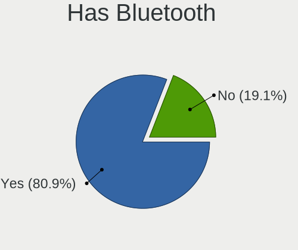

| Presented | Notebooks | Percent |
|-----------|-----------|---------|
| Yes       | 144       | 80.9%   |
| No        | 34        | 19.1%   |

Location
--------

Country
-------

Geographic location (country)

| Country | Notebooks | Percent |
|---------|-----------|---------|
| Moldova | 177       | 100%    |

City
----

Geographic location (city)

| City            | Notebooks | Percent |
|-----------------|-----------|---------|
| Chisinau        | 116       | 64.44%  |
| Tiraspol        | 20        | 11.11%  |
| Bli         | 6         | 3.33%   |
| Straseni        | 3         | 1.67%   |
| Tighina         | 2         | 1.11%   |
| Soroca          | 2         | 1.11%   |
| Hincesti        | 2         | 1.11%   |
| Floresti        | 2         | 1.11%   |
| Congaz          | 2         | 1.11%   |
| Zaicana         | 1         | 0.56%   |
| Tvardia       | 1         | 0.56%   |
| Soldanesti      | 1         | 0.56%   |
| Sofia           | 1         | 0.56%   |
| Sarata-Galbena  | 1         | 0.56%   |
| Rautel          | 1         | 0.56%   |
| Prajila         | 1         | 0.56%   |
| Pociumbeni      | 1         | 0.56%   |
| Orhei           | 1         | 0.56%   |
| Nisporeni       | 1         | 0.56%   |
| Mascauti        | 1         | 0.56%   |
| Ilenuta         | 1         | 0.56%   |
| Ialoveni        | 1         | 0.56%   |
| Gangura         | 1         | 0.56%   |
| Floreni         | 1         | 0.56%   |
| Donduseni       | 1         | 0.56%   |
| Criuleni        | 1         | 0.56%   |
| Cricova         | 1         | 0.56%   |
| Crasnoarmeiscoe | 1         | 0.56%   |
| Cosauti         | 1         | 0.56%   |
| Cenac           | 1         | 0.56%   |
| Ceadir-Lunga    | 1         | 0.56%   |
| Cueni       | 1         | 0.56%   |
| Cantemir        | 1         | 0.56%   |
| Cahul           | 1         | 0.56%   |

Drives
------

Drive Vendor
------------

Hard drive vendors

| Vendor                      | Notebooks | Drives | Percent |
|-----------------------------|-----------|--------|---------|
| Samsung Electronics         | 41        | 50     | 19.62%  |
| WDC                         | 20        | 21     | 9.57%   |
| Toshiba                     | 20        | 24     | 9.57%   |
| Seagate                     | 16        | 20     | 7.66%   |
| SanDisk                     | 15        | 15     | 7.18%   |
| Hitachi                     | 14        | 15     | 6.7%    |
| Kingston                    | 12        | 15     | 5.74%   |
| Micron Technology           | 10        | 14     | 4.78%   |
| SK hynix                    | 8         | 8      | 3.83%   |
| Unknown                     | 5         | 5      | 2.39%   |
| Transcend                   | 4         | 5      | 1.91%   |
| Intel                       | 4         | 6      | 1.91%   |
| KIOXIA                      | 3         | 3      | 1.44%   |
| Kingston Technology Company | 3         | 3      | 1.44%   |
| HGST                        | 3         | 3      | 1.44%   |
| A-DATA Technology           | 3         | 3      | 1.44%   |
| UMIS                        | 2         | 2      | 0.96%   |
| PNY                         | 2         | 2      | 0.96%   |
| Netac                       | 2         | 2      | 0.96%   |
| Intenso                     | 2         | 2      | 0.96%   |
| GOODRAM                     | 2         | 2      | 0.96%   |
| Fujitsu                     | 2         | 2      | 0.96%   |
| Apacer                      | 2         | 2      | 0.96%   |
| ZOTAC                       | 1         | 3      | 0.48%   |
| StoreJet                    | 1         | 1      | 0.48%   |
| Solid State Storage         | 1         | 1      | 0.48%   |
| Phison                      | 1         | 2      | 0.48%   |
| Patriot                     | 1         | 1      | 0.48%   |
| OCZ                         | 1         | 1      | 0.48%   |
| O2 Micro                    | 1         | 1      | 0.48%   |
| Micron/Crucial Technology   | 1         | 1      | 0.48%   |
| LITEONIT                    | 1         | 1      | 0.48%   |
| Lenovo                      | 1         | 1      | 0.48%   |
| Crucial                     | 1         | 1      | 0.48%   |
| China                       | 1         | 1      | 0.48%   |
| ASMT                        | 1         | 1      | 0.48%   |
| AMD                         | 1         | 1      | 0.48%   |

Drive Model
-----------

Hard drive models

| Model                                               | Notebooks | Percent |
|-----------------------------------------------------|-----------|---------|
| Samsung NVMe SSD Drive 512GB                        | 6         | 2.84%   |
| Seagate ST1000LM035-1RK172 1TB                      | 5         | 2.37%   |
| Toshiba MQ04ABF100 1TB                              | 4         | 1.9%    |
| Toshiba MQ01ABD100 1TB                              | 4         | 1.9%    |
| Kingston SHFS37A120G 120GB SSD                      | 4         | 1.9%    |
| Seagate ST500LT012-9WS142 500GB                     | 3         | 1.42%   |
| SanDisk NVMe SSD Drive 512GB                        | 3         | 1.42%   |
| Samsung MZVLW256HEHP-00000 256GB                    | 3         | 1.42%   |
| Hitachi HTS543232A7A384 320GB                       | 3         | 1.42%   |
| WDC WD10SPZX-24Z10T0 1TB                            | 2         | 0.95%   |
| Unknown MMC Card  64GB                              | 2         | 0.95%   |
| Transcend TS120GMTS420S 120GB SSD                   | 2         | 0.95%   |
| Toshiba MQ01ACF032 320GB                            | 2         | 0.95%   |
| Toshiba MQ01ABF050 500GB                            | 2         | 0.95%   |
| SK hynix NVMe SSD Drive 256GB                       | 2         | 0.95%   |
| Seagate ST9500325AS 500GB                           | 2         | 0.95%   |
| SanDisk NVMe SSD Drive 1TB                          | 2         | 0.95%   |
| Samsung SSD 980 500GB                               | 2         | 0.95%   |
| Samsung SSD 860 EVO 500GB                           | 2         | 0.95%   |
| Samsung NVMe SSD Controller SM981/PM981/PM983 512GB | 2         | 0.95%   |
| Samsung MZVL4512HBLU-00BTW 512GB                    | 2         | 0.95%   |
| Netac SSD 256GB                                     | 2         | 0.95%   |
| Micron 2450_MTFDKBA1T0TFK 1TB                       | 2         | 0.95%   |
| Micron 1100_MTFDDAV256TBN 256GB SSD                 | 2         | 0.95%   |
| KIOXIA KBG40ZNV512G 512GB                           | 2         | 0.95%   |
| Kingston Company OM3PDP3 NVMe SSD 512GB             | 2         | 0.95%   |
| Kingston SA400S37240G 240GB SSD                     | 2         | 0.95%   |
| Hitachi HTS547575A9E384 752GB                       | 2         | 0.95%   |
| Hitachi HTS547550A9E384 500GB                       | 2         | 0.95%   |
| ZOTAC ZTSSD-S11-240G-P 240GB                        | 1         | 0.47%   |
| WDC WDS512G1X0C-00ENX0 512GB                        | 1         | 0.47%   |
| WDC WDS120G2G0A-00JH30 120GB SSD                    | 1         | 0.47%   |
| WDC WD5000LPVX-80V0TT0 500GB                        | 1         | 0.47%   |
| WDC WD5000LPVX-75V0TT0 500GB                        | 1         | 0.47%   |
| WDC WD5000LPCX-75VHAT1 500GB                        | 1         | 0.47%   |
| WDC WD5000BPVT-08HXZT3 500GB                        | 1         | 0.47%   |
| WDC WD5000BEVT-22A0RT0 500GB                        | 1         | 0.47%   |
| WDC WD3200BPVT-80JJ5T0 320GB                        | 1         | 0.47%   |
| WDC WD3200BEVT-63ZCT0 320GB                         | 1         | 0.47%   |
| WDC WD3200BEVT-22A23T0 320GB                        | 1         | 0.47%   |

HDD Vendor
----------

Hard disk drive vendors

| Vendor              | Notebooks | Drives | Percent |
|---------------------|-----------|--------|---------|
| WDC                 | 18        | 19     | 25%     |
| Toshiba             | 16        | 20     | 22.22%  |
| Seagate             | 16        | 20     | 22.22%  |
| Hitachi             | 14        | 15     | 19.44%  |
| HGST                | 3         | 3      | 4.17%   |
| Fujitsu             | 2         | 2      | 2.78%   |
| Unknown             | 1         | 1      | 1.39%   |
| StoreJet            | 1         | 1      | 1.39%   |
| Samsung Electronics | 1         | 1      | 1.39%   |

SSD Vendor
----------

Solid state drive vendors

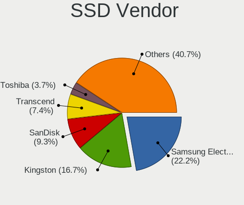

| Vendor              | Notebooks | Drives | Percent |
|---------------------|-----------|--------|---------|
| Samsung Electronics | 12        | 15     | 22.22%  |
| Kingston            | 9         | 12     | 16.67%  |
| SanDisk             | 5         | 5      | 9.26%   |
| Transcend           | 4         | 5      | 7.41%   |
| Toshiba             | 2         | 2      | 3.7%    |
| Netac               | 2         | 2      | 3.7%    |
| Micron Technology   | 2         | 2      | 3.7%    |
| Intenso             | 2         | 2      | 3.7%    |
| GOODRAM             | 2         | 2      | 3.7%    |
| Apacer              | 2         | 2      | 3.7%    |
| ZOTAC               | 1         | 3      | 1.85%   |
| WDC                 | 1         | 1      | 1.85%   |
| PNY                 | 1         | 1      | 1.85%   |
| Patriot             | 1         | 1      | 1.85%   |
| OCZ                 | 1         | 1      | 1.85%   |
| LITEONIT            | 1         | 1      | 1.85%   |
| Intel               | 1         | 1      | 1.85%   |
| Crucial             | 1         | 1      | 1.85%   |
| China               | 1         | 1      | 1.85%   |
| ASMT                | 1         | 1      | 1.85%   |
| AMD                 | 1         | 1      | 1.85%   |
| A-DATA Technology   | 1         | 1      | 1.85%   |

Drive Kind
----------

HDD or SSD

| Kind | Notebooks | Drives | Percent |
|------|-----------|--------|---------|
| NVMe | 75        | 92     | 37.5%   |
| HDD  | 72        | 82     | 36%     |
| SSD  | 49        | 63     | 24.5%   |
| MMC  | 4         | 4      | 2%      |

Drive Connector
---------------

SATA, SAS, NVMe, etc.

| Type | Notebooks | Drives | Percent |
|------|-----------|--------|---------|
| SATA | 111       | 142    | 57.51%  |
| NVMe | 75        | 92     | 38.86%  |
| MMC  | 4         | 4      | 2.07%   |
| SAS  | 3         | 3      | 1.55%   |

Drive Size
----------

Size of hard drive

| Size in TB | Notebooks | Drives | Percent |
|------------|-----------|--------|---------|
| 0.01-0.5   | 86        | 107    | 72.27%  |
| 0.51-1.0   | 30        | 35     | 25.21%  |
| 1.01-2.0   | 3         | 3      | 2.52%   |

Space Total
-----------

Amount of disk space available on the file system

| Size in GB     | Notebooks | Percent |
|----------------|-----------|---------|
| 101-250        | 54        | 28.88%  |
| 251-500        | 53        | 28.34%  |
| 501-1000       | 29        | 15.51%  |
| 51-100         | 14        | 7.49%   |
| 1-20           | 13        | 6.95%   |
| 1001-2000      | 9         | 4.81%   |
| Unknown        | 9         | 4.81%   |
| 21-50          | 4         | 2.14%   |
| More than 3000 | 2         | 1.07%   |

Space Used
----------

Amount of used disk space

| Used GB   | Notebooks | Percent |
|-----------|-----------|---------|
| 1-20      | 78        | 41.05%  |
| 21-50     | 35        | 18.42%  |
| 51-100    | 24        | 12.63%  |
| 101-250   | 20        | 10.53%  |
| 251-500   | 15        | 7.89%   |
| Unknown   | 9         | 4.74%   |
| 501-1000  | 7         | 3.68%   |
| 1001-2000 | 2         | 1.05%   |

Malfunc. Drives
---------------

Drive models with a malfunction

| Model                             | Notebooks | Drives | Percent |
|-----------------------------------|-----------|--------|---------|
| Seagate ST500LT012-9WS142 500GB   | 3         | 3      | 17.65%  |
| Hitachi HTS547575A9E384 752GB     | 2         | 2      | 11.76%  |
| WDC WDS120G2G0A-00JH30 120GB SSD  | 1         | 1      | 5.88%   |
| WDC WD3200BEVT-22A23T0 320GB      | 1         | 1      | 5.88%   |
| WDC WD1600BEVS-07RST0 160GB       | 1         | 1      | 5.88%   |
| WDC WD10JPCX-24UE4T0 1TB          | 1         | 1      | 5.88%   |
| Toshiba MQ01ABD050 500GB          | 1         | 1      | 5.88%   |
| Seagate ST9500325AS 500GB         | 1         | 1      | 5.88%   |
| Seagate ST1000LM035-1RK172 1TB    | 1         | 1      | 5.88%   |
| SanDisk SD7UB3Q256G1001 256GB SSD | 1         | 1      | 5.88%   |
| Kingston SHFS37A120G 120GB SSD    | 1         | 3      | 5.88%   |
| Hitachi HTS545050B9A300 500GB     | 1         | 1      | 5.88%   |
| Fujitsu MHW2080BH PL 80GB         | 1         | 1      | 5.88%   |
| A-DATA Technology SX900 256GB SSD | 1         | 1      | 5.88%   |

Malfunc. Drive Vendor
---------------------

Vendors of faulty drives

| Vendor            | Notebooks | Drives | Percent |
|-------------------|-----------|--------|---------|
| Seagate           | 5         | 5      | 29.41%  |
| WDC               | 4         | 4      | 23.53%  |
| Hitachi           | 3         | 3      | 17.65%  |
| Toshiba           | 1         | 1      | 5.88%   |
| SanDisk           | 1         | 1      | 5.88%   |
| Kingston          | 1         | 3      | 5.88%   |
| Fujitsu           | 1         | 1      | 5.88%   |
| A-DATA Technology | 1         | 1      | 5.88%   |

Malfunc. HDD Vendor
-------------------

Vendors of faulty HDD drives

| Vendor  | Notebooks | Drives | Percent |
|---------|-----------|--------|---------|
| Seagate | 5         | 5      | 38.46%  |
| WDC     | 3         | 3      | 23.08%  |
| Hitachi | 3         | 3      | 23.08%  |
| Toshiba | 1         | 1      | 7.69%   |
| Fujitsu | 1         | 1      | 7.69%   |

Malfunc. Drive Kind
-------------------

Kinds of faulty drives

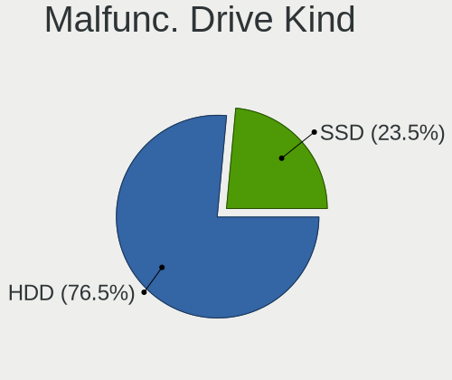

| Kind | Notebooks | Drives | Percent |
|------|-----------|--------|---------|
| HDD  | 13        | 13     | 76.47%  |
| SSD  | 4         | 6      | 23.53%  |

Failed Drives
-------------

Failed drive models

| Model                     | Notebooks | Drives | Percent |
|---------------------------|-----------|--------|---------|
| Seagate ST9250315AS 250GB | 1         | 1      | 100%    |

Failed Drive Vendor
-------------------

Failed drive vendors

| Vendor  | Notebooks | Drives | Percent |
|---------|-----------|--------|---------|
| Seagate | 1         | 1      | 100%    |

Drive Status
------------

Number of failed and malfunc. drives

| Status   | Notebooks | Drives | Percent |
|----------|-----------|--------|---------|
| Works    | 86        | 119    | 46.99%  |
| Detected | 79        | 102    | 43.17%  |
| Malfunc  | 17        | 19     | 9.29%   |
| Failed   | 1         | 1      | 0.55%   |

Storage controller
------------------

Storage Vendor
--------------

Storage controller vendors

| Vendor                         | Notebooks | Percent |
|--------------------------------|-----------|---------|
| Intel                          | 107       | 48.42%  |
| AMD                            | 36        | 16.29%  |
| Samsung Electronics            | 28        | 12.67%  |
| SanDisk                        | 11        | 4.98%   |
| SK hynix                       | 8         | 3.62%   |
| Micron Technology              | 8         | 3.62%   |
| Kingston Technology Company    | 6         | 2.71%   |
| KIOXIA                         | 3         | 1.36%   |
| Union Memory (Shenzhen)        | 2         | 0.9%    |
| Toshiba America Info Systems   | 2         | 0.9%    |
| Phison Electronics             | 2         | 0.9%    |
| Nvidia                         | 2         | 0.9%    |
| Solid State Storage Technology | 1         | 0.45%   |
| Realtek Semiconductor          | 1         | 0.45%   |
| O2 Micro                       | 1         | 0.45%   |
| Micron/Crucial Technology      | 1         | 0.45%   |
| Lenovo                         | 1         | 0.45%   |
| ADATA Technology               | 1         | 0.45%   |

Storage Model
-------------

Storage controller models

| Model                                                                            | Notebooks | Percent |
|----------------------------------------------------------------------------------|-----------|---------|
| AMD FCH SATA Controller [AHCI mode]                                              | 27        | 11.54%  |
| Samsung NVMe SSD Controller 980 (DRAM-less)                                      | 14        | 5.98%   |
| Intel Sunrise Point-LP SATA Controller [AHCI mode]                               | 12        | 5.13%   |
| Intel 7 Series Chipset Family 6-port SATA Controller [AHCI mode]                 | 12        | 5.13%   |
| Intel 82801 Mobile SATA Controller [RAID mode]                                   | 8         | 3.42%   |
| Intel 6 Series/C200 Series Chipset Family 6 port Mobile SATA AHCI Controller     | 7         | 2.99%   |
| AMD SB7x0/SB8x0/SB9x0 SATA Controller [AHCI mode]                                | 7         | 2.99%   |
| Intel Cannon Lake Mobile PCH SATA AHCI Controller                                | 6         | 2.56%   |
| Samsung NVMe SSD Controller SM981/PM981/PM983                                    | 5         | 2.14%   |
| Intel Wildcat Point-LP SATA Controller [AHCI Mode]                               | 5         | 2.14%   |
| Intel Volume Management Device NVMe RAID Controller                              | 5         | 2.14%   |
| Intel Comet Lake SATA AHCI Controller                                            | 5         | 2.14%   |
| Intel Celeron/Pentium Silver Processor SATA Controller                           | 5         | 2.14%   |
| Intel Atom/Celeron/Pentium Processor x5-E8000/J3xxx/N3xxx Series SATA Controller | 5         | 2.14%   |
| Intel 8 Series SATA Controller 1 [AHCI mode]                                     | 5         | 2.14%   |
| Samsung NVMe SSD Controller SM961/PM961/SM963                                    | 4         | 1.71%   |
| Micron 2450 NVMe SSD [HendrixV] (DRAM-less)                                      | 4         | 1.71%   |
| Intel 8 Series/C220 Series Chipset Family 6-port SATA Controller 1 [AHCI mode]   | 4         | 1.71%   |
| Samsung NVMe SSD Controller PM9B1 (DRAM-less)                                    | 3         | 1.28%   |
| Intel Ice Lake-LP SATA Controller [AHCI mode]                                    | 3         | 1.28%   |
| Intel Celeron N3350/Pentium N4200/Atom E3900 Series SATA AHCI Controller         | 3         | 1.28%   |
| Intel Atom Processor E3800 Series SATA AHCI Controller                           | 3         | 1.28%   |
| Intel 400 Series Chipset Family SATA AHCI Controller                             | 3         | 1.28%   |
| Toshiba America Info Systems XG6 NVMe SSD Controller                             | 2         | 0.85%   |
| SK hynix Gold P31/BC711/PC711 NVMe Solid State Drive                             | 2         | 0.85%   |
| SK hynix BC501 NVMe Solid State Drive                                            | 2         | 0.85%   |
| SanDisk WD Blue SN500 / PC SN520 x2 M.2 2280 NVMe SSD                            | 2         | 0.85%   |
| SanDisk WD Black SN770 / PC SN740 256GB / PC SN560 (DRAM-less) NVMe SSD          | 2         | 0.85%   |
| SanDisk Ultra 3D / WD PC SN530, IX SN530, Blue SN550 NVMe SSD (DRAM-less)        | 2         | 0.85%   |
| Phison E12 NVMe Controller                                                       | 2         | 0.85%   |
| Nvidia MCP78S [GeForce 8200] SATA Controller (non-AHCI mode)                     | 2         | 0.85%   |
| Nvidia MCP78S [GeForce 8200] IDE                                                 | 2         | 0.85%   |
| Micron 2210 NVMe SSD [Cobain]                                                    | 2         | 0.85%   |
| KIOXIA NVMe SSD Controller BG4 (DRAM-less)                                       | 2         | 0.85%   |
| Kingston Company OM3PDP3 NVMe SSD                                                | 2         | 0.85%   |
| Intel Tiger Lake-LP SATA Controller                                              | 2         | 0.85%   |
| Intel SSD 660P Series                                                            | 2         | 0.85%   |
| Intel 82801IBM/IEM (ICH9M/ICH9M-E) 4 port SATA Controller [AHCI mode]            | 2         | 0.85%   |
| Intel 82801HM/HEM (ICH8M/ICH8M-E) SATA Controller [AHCI mode]                    | 2         | 0.85%   |
| Intel 82801HM/HEM (ICH8M/ICH8M-E) IDE Controller                                 | 2         | 0.85%   |

Storage Kind
------------

Kind of storage controller (IDE, SATA, NVMe, SAS, ...)

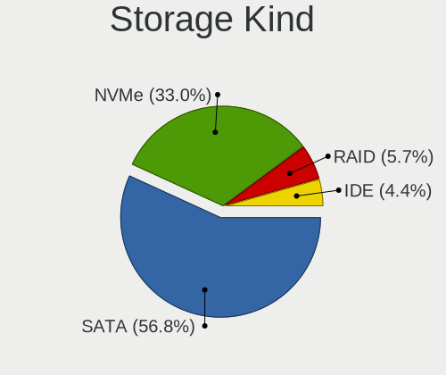

| Kind | Notebooks | Percent |
|------|-----------|---------|
| SATA | 129       | 56.83%  |
| NVMe | 75        | 33.04%  |
| RAID | 13        | 5.73%   |
| IDE  | 10        | 4.41%   |

Processor
---------

CPU Vendor
----------

Processor vendors

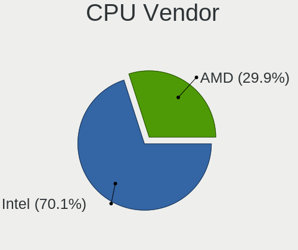

| Vendor | Notebooks | Percent |
|--------|-----------|---------|
| Intel  | 124       | 70.06%  |
| AMD    | 53        | 29.94%  |

CPU Model
---------

Processor models

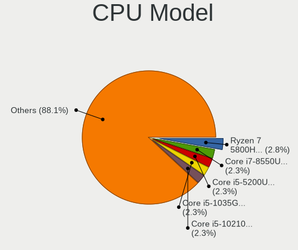

| Model                                         | Notebooks | Percent |
|-----------------------------------------------|-----------|---------|
| AMD Ryzen 7 5800H with Radeon Graphics        | 5         | 2.82%   |
| Intel Core i7-8550U CPU @ 1.80GHz             | 4         | 2.26%   |
| Intel Core i5-5200U CPU @ 2.20GHz             | 4         | 2.26%   |
| Intel Core i5-1035G1 CPU @ 1.00GHz            | 4         | 2.26%   |
| Intel Core i5-10210U CPU @ 1.60GHz            | 4         | 2.26%   |
| Intel Core i7-8750H CPU @ 2.20GHz             | 3         | 1.69%   |
| Intel Core i7-8565U CPU @ 1.80GHz             | 3         | 1.69%   |
| Intel Core i7-10750H CPU @ 2.60GHz            | 3         | 1.69%   |
| Intel Core i5-8250U CPU @ 1.60GHz             | 3         | 1.69%   |
| Intel Celeron CPU N2840 @ 2.16GHz             | 3         | 1.69%   |
| AMD Ryzen 5 4500U with Radeon Graphics        | 3         | 1.69%   |
| AMD Ryzen 5 3500U with Radeon Vega Mobile Gfx | 3         | 1.69%   |
| AMD E1-1200 APU with Radeon HD Graphics       | 3         | 1.69%   |
| AMD E-450 APU with Radeon HD Graphics         | 3         | 1.69%   |
| Intel Pentium Silver N5030 CPU @ 1.10GHz      | 2         | 1.13%   |
| Intel Pentium CPU B960 @ 2.20GHz              | 2         | 1.13%   |
| Intel Core Ultra 9 185H                       | 2         | 1.13%   |
| Intel Core i5-8265U CPU @ 1.60GHz             | 2         | 1.13%   |
| Intel Core i5-6200U CPU @ 2.30GHz             | 2         | 1.13%   |
| Intel Core i5-2410M CPU @ 2.30GHz             | 2         | 1.13%   |
| Intel Core i3-8130U CPU @ 2.20GHz             | 2         | 1.13%   |
| Intel Celeron N4000 CPU @ 1.10GHz             | 2         | 1.13%   |
| Intel Celeron CPU N3450 @ 1.10GHz             | 2         | 1.13%   |
| Intel Celeron CPU N3050 @ 1.60GHz             | 2         | 1.13%   |
| Intel 12th Gen Core i5-1235U                  | 2         | 1.13%   |
| Intel 11th Gen Core i7-1165G7 @ 2.80GHz       | 2         | 1.13%   |
| AMD Ryzen 7 5700U with Radeon Graphics        | 2         | 1.13%   |
| AMD E-300 APU with Radeon HD Graphics         | 2         | 1.13%   |
| Intel Pentium Silver N5000 CPU @ 1.10GHz      | 1         | 0.56%   |
| Intel Pentium Dual-Core CPU T4500 @ 2.30GHz   | 1         | 0.56%   |
| Intel Pentium Dual-Core CPU T4300 @ 2.10GHz   | 1         | 0.56%   |
| Intel Pentium CPU N4200 @ 1.10GHz             | 1         | 0.56%   |
| Intel Pentium CPU N3710 @ 1.60GHz             | 1         | 0.56%   |
| Intel Pentium CPU B980 @ 2.40GHz              | 1         | 0.56%   |
| Intel Pentium CPU 987 @ 1.50GHz               | 1         | 0.56%   |
| Intel N100                                    | 1         | 0.56%   |
| Intel Core i9-9980HK CPU @ 2.40GHz            | 1         | 0.56%   |
| Intel Core i7-8650U CPU @ 1.90GHz             | 1         | 0.56%   |
| Intel Core i7-7700HQ CPU @ 2.80GHz            | 1         | 0.56%   |
| Intel Core i7-7500U CPU @ 2.70GHz             | 1         | 0.56%   |

CPU Model Family
----------------

Processor model prefix

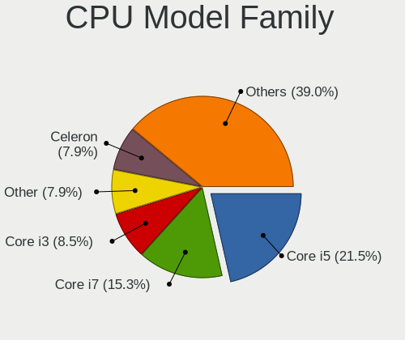

| Model                          | Notebooks | Percent |
|--------------------------------|-----------|---------|
| Intel Core i5                  | 38        | 21.47%  |
| Intel Core i7                  | 27        | 15.25%  |
| Intel Core i3                  | 15        | 8.47%   |
| Other                          | 14        | 7.91%   |
| Intel Celeron                  | 14        | 7.91%   |
| AMD Ryzen 7                    | 13        | 7.34%   |
| AMD Ryzen 5                    | 13        | 7.34%   |
| Intel Pentium                  | 6         | 3.39%   |
| AMD E                          | 5         | 2.82%   |
| Intel Pentium Silver           | 3         | 1.69%   |
| Intel Core 2 Duo               | 3         | 1.69%   |
| AMD E1                         | 3         | 1.69%   |
| AMD Athlon                     | 3         | 1.69%   |
| Intel Pentium Dual-Core        | 2         | 1.13%   |
| Intel Core                     | 2         | 1.13%   |
| AMD Sempron                    | 2         | 1.13%   |
| AMD A4                         | 2         | 1.13%   |
| AMD A10                        | 2         | 1.13%   |
| Intel Core i9                  | 1         | 0.56%   |
| Intel Atom                     | 1         | 0.56%   |
| AMD V140                       | 1         | 0.56%   |
| AMD Turion X2 Dual-Core Mobile | 1         | 0.56%   |
| AMD Ryzen 9                    | 1         | 0.56%   |
| AMD Ryzen 5 PRO                | 1         | 0.56%   |
| AMD Ryzen 3                    | 1         | 0.56%   |
| AMD Athlon 64 X2               | 1         | 0.56%   |
| AMD A8                         | 1         | 0.56%   |
| AMD A6                         | 1         | 0.56%   |

CPU Cores
---------

Number of processor cores

| Number  | Notebooks | Percent |
|---------|-----------|---------|
| 2       | 79        | 44.63%  |
| 4       | 57        | 32.2%   |
| 8       | 16        | 9.04%   |
| 6       | 16        | 9.04%   |
| 16      | 2         | 1.13%   |
| 10      | 2         | 1.13%   |
| 1       | 2         | 1.13%   |
| 14      | 1         | 0.56%   |
| 12      | 1         | 0.56%   |
| Unknown | 1         | 0.56%   |

CPU Sockets
-----------

Number of sockets

| Number | Notebooks | Percent |
|--------|-----------|---------|
| 1      | 177       | 100%    |

CPU Threads
-----------

Threads per core (Hyper-Threading)

| Number  | Notebooks | Percent |
|---------|-----------|---------|
| 2       | 122       | 68.93%  |
| 1       | 54        | 30.51%  |
| Unknown | 1         | 0.56%   |

CPU Op-Modes
------------

CPU Operation Modes (32-bit, 64-bit)

| Op mode        | Notebooks | Percent |
|----------------|-----------|---------|
| 32-bit, 64-bit | 174       | 98.31%  |
| Unknown        | 3         | 1.69%   |

CPU Microcode
-------------

Microcode number

| Number     | Notebooks | Percent |
|------------|-----------|---------|
| Unknown    | 63        | 35%     |
| 0x806ea    | 9         | 5%      |
| 0x206a7    | 8         | 4.44%   |
| 0x05000119 | 8         | 4.44%   |
| 0x806ec    | 7         | 3.89%   |
| 0x40651    | 5         | 2.78%   |
| 0x306a9    | 5         | 2.78%   |
| 0x906ea    | 4         | 2.22%   |
| 0x406e3    | 4         | 2.22%   |
| 0x306c3    | 4         | 2.22%   |
| 0x08600106 | 4         | 2.22%   |
| 0xa0652    | 3         | 1.67%   |
| 0x806e9    | 3         | 1.67%   |
| 0x706a1    | 3         | 1.67%   |
| 0x506c9    | 3         | 1.67%   |
| 0x406c4    | 3         | 1.67%   |
| 0x306d4    | 3         | 1.67%   |
| 0x0a50000c | 3         | 1.67%   |
| 0x806c1    | 2         | 1.11%   |
| 0x706e5    | 2         | 1.11%   |
| 0x30678    | 2         | 1.11%   |
| 0x08608103 | 2         | 1.11%   |
| 0x08108109 | 2         | 1.11%   |
| 0x08108102 | 2         | 1.11%   |
| 0x06001119 | 2         | 1.11%   |
| 0x03000027 | 2         | 1.11%   |
| 0x02000057 | 2         | 1.11%   |
| 0x906e9    | 1         | 0.56%   |
| 0x906a4    | 1         | 0.56%   |
| 0x806d1    | 1         | 0.56%   |
| 0x706a8    | 1         | 0.56%   |
| 0x6fd      | 1         | 0.56%   |
| 0x6fb      | 1         | 0.56%   |
| 0x406c3    | 1         | 0.56%   |
| 0x20655    | 1         | 0.56%   |
| 0x20652    | 1         | 0.56%   |
| 0x106e5    | 1         | 0.56%   |
| 0x106ca    | 1         | 0.56%   |
| 0x1067a    | 1         | 0.56%   |
| 0x0a50000d | 1         | 0.56%   |

CPU Microarch
-------------

Microarchitecture

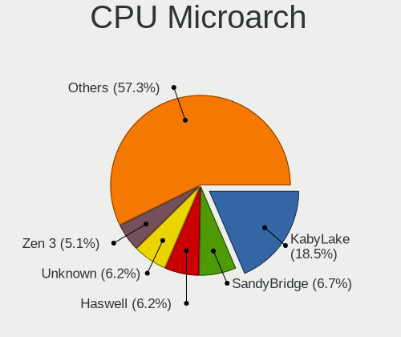

| Name              | Notebooks | Percent |
|-------------------|-----------|---------|
| KabyLake          | 33        | 18.54%  |
| SandyBridge       | 12        | 6.74%   |
| Haswell           | 11        | 6.18%   |
| Unknown           | 11        | 6.18%   |
| Zen 3             | 9         | 5.06%   |
| Zen 2             | 8         | 4.49%   |
| Silvermont        | 8         | 4.49%   |
| IvyBridge         | 8         | 4.49%   |
| Bobcat            | 8         | 4.49%   |
| Zen+              | 7         | 3.93%   |
| Icelake           | 6         | 3.37%   |
| Goldmont plus     | 6         | 3.37%   |
| TigerLake         | 5         | 2.81%   |
| Skylake           | 5         | 2.81%   |
| Broadwell         | 5         | 2.81%   |
| Alderlake Hybrid  | 5         | 2.81%   |
| CometLake         | 4         | 2.25%   |
| Piledriver        | 3         | 1.69%   |
| K8 & K10 hybrid   | 3         | 1.69%   |
| Goldmont          | 3         | 1.69%   |
| Core              | 3         | 1.69%   |
| Westmere          | 2         | 1.12%   |
| Penryn            | 2         | 1.12%   |
| Meteorlake Hybrid | 2         | 1.12%   |
| K10 Llano         | 2         | 1.12%   |
| K10               | 2         | 1.12%   |
| Zen               | 1         | 0.56%   |
| Puma              | 1         | 0.56%   |
| Nehalem           | 1         | 0.56%   |
| K8 Hammer         | 1         | 0.56%   |
| Bonnell           | 1         | 0.56%   |

Graphics
--------

GPU Vendor
----------

Vendors of graphics cards

| Vendor | Notebooks | Percent |
|--------|-----------|---------|
| Intel  | 120       | 53.1%   |
| AMD    | 56        | 24.78%  |
| Nvidia | 50        | 22.12%  |

GPU Model
---------

Graphics card models

| Model                                                                                    | Notebooks | Percent |
|------------------------------------------------------------------------------------------|-----------|---------|
| Intel 2nd Generation Core Processor Family Integrated Graphics Controller                | 12        | 5.24%   |
| Intel UHD Graphics 620                                                                   | 11        | 4.8%    |
| AMD Renoir [Radeon Vega Series / Radeon Vega Mobile Series]                              | 8         | 3.49%   |
| Intel 3rd Gen Core processor Graphics Controller                                         | 7         | 3.06%   |
| AMD Picasso/Raven 2 [Radeon Vega Series / Radeon Vega Mobile Series]                     | 7         | 3.06%   |
| Intel Haswell-ULT Integrated Graphics Controller                                         | 6         | 2.62%   |
| Intel CoffeeLake-H GT2 [UHD Graphics 630]                                                | 6         | 2.62%   |
| AMD Cezanne [Radeon Vega Series / Radeon Vega Mobile Series]                             | 6         | 2.62%   |
| Intel WhiskeyLake-U GT2 [UHD Graphics 620]                                               | 5         | 2.18%   |
| Intel Skylake GT2 [HD Graphics 520]                                                      | 5         | 2.18%   |
| Intel Iris Plus Graphics G1 (Ice Lake)                                                   | 5         | 2.18%   |
| Intel HD Graphics 5500                                                                   | 5         | 2.18%   |
| Intel CometLake-U GT2 [UHD Graphics]                                                     | 5         | 2.18%   |
| Intel Atom/Celeron/Pentium Processor x5-E8000/J3xxx/N3xxx Integrated Graphics Controller | 5         | 2.18%   |
| Intel 4th Gen Core Processor Integrated Graphics Controller                              | 5         | 2.18%   |
| Nvidia TU117M [GeForce GTX 1650 Mobile / Max-Q]                                          | 4         | 1.75%   |
| Nvidia GP108M [GeForce MX150]                                                            | 4         | 1.75%   |
| Nvidia GF117M [GeForce 610M/710M/810M/820M / GT 620M/625M/630M/720M]                     | 4         | 1.75%   |
| Intel TigerLake-LP GT2 [Iris Xe Graphics]                                                | 4         | 1.75%   |
| Intel HD Graphics 620                                                                    | 4         | 1.75%   |
| Nvidia GP107M [GeForce GTX 1050 Ti Mobile]                                               | 3         | 1.31%   |
| Nvidia GP107M [GeForce GTX 1050 Mobile]                                                  | 3         | 1.31%   |
| Intel Mobile 4 Series Chipset Integrated Graphics Controller                             | 3         | 1.31%   |
| Intel GeminiLake [UHD Graphics 605]                                                      | 3         | 1.31%   |
| Intel GeminiLake [UHD Graphics 600]                                                      | 3         | 1.31%   |
| Intel Atom Processor Z36xxx/Z37xxx Series Graphics & Display                             | 3         | 1.31%   |
| AMD Wrestler [Radeon HD 7310]                                                            | 3         | 1.31%   |
| AMD Wrestler [Radeon HD 6320]                                                            | 3         | 1.31%   |
| Nvidia GM108M [GeForce MX130]                                                            | 2         | 0.87%   |
| Nvidia GA104M [GeForce RTX 3070 Mobile / Max-Q]                                          | 2         | 0.87%   |
| Nvidia C77 [GeForce 8200M G]                                                             | 2         | 0.87%   |
| Intel Meteor Lake-P [Intel Arc Graphics]                                                 | 2         | 0.87%   |
| Intel HD Graphics 630                                                                    | 2         | 0.87%   |
| Intel HD Graphics 500                                                                    | 2         | 0.87%   |
| Intel Core Processor Integrated Graphics Controller                                      | 2         | 0.87%   |
| Intel CometLake-H GT2 [UHD Graphics]                                                     | 2         | 0.87%   |
| Intel Alder Lake-UP3 GT2 [Iris Xe Graphics]                                              | 2         | 0.87%   |
| AMD Wrestler [Radeon HD 6310]                                                            | 2         | 0.87%   |
| AMD Topaz XT [Radeon R7 M260/M265 / M340/M360 / M440/M445 / 530/535 / 620/625 Mobile]    | 2         | 0.87%   |
| AMD Seymour [Radeon HD 6400M/7400M Series]                                               | 2         | 0.87%   |

GPU Combo
---------

Combinations of graphics cards

| Name           | Notebooks | Percent |
|----------------|-----------|---------|
| 1 x Intel      | 77        | 43.5%   |
| 1 x AMD        | 42        | 23.73%  |
| Intel + Nvidia | 37        | 20.9%   |
| AMD + Nvidia   | 7         | 3.95%   |
| 1 x Nvidia     | 6         | 3.39%   |
| Intel + AMD    | 5         | 2.82%   |
| 2 x AMD        | 2         | 1.13%   |
| Other          | 1         | 0.56%   |

GPU Driver
----------

Free vs proprietary

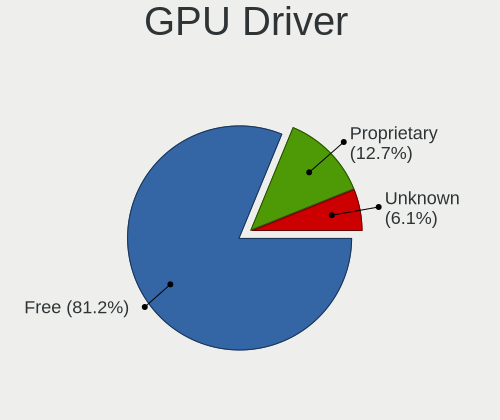

| Driver      | Notebooks | Percent |
|-------------|-----------|---------|
| Free        | 147       | 81.22%  |
| Proprietary | 23        | 12.71%  |
| Unknown     | 11        | 6.08%   |

GPU Memory
----------

Total video memory

| Size in GB | Notebooks | Percent |
|------------|-----------|---------|
| Unknown    | 102       | 56.04%  |
| 0.01-0.5   | 33        | 18.13%  |
| 1.01-2.0   | 30        | 16.48%  |
| 3.01-4.0   | 11        | 6.04%   |
| 0.51-1.0   | 4         | 2.2%    |
| 7.01-8.0   | 1         | 0.55%   |
| 5.01-6.0   | 1         | 0.55%   |

Monitor
-------

Monitor Vendor
--------------

Monitor vendors

| Vendor                  | Notebooks | Percent |
|-------------------------|-----------|---------|
| AU Optronics            | 42        | 21.21%  |
| Chimei Innolux          | 30        | 15.15%  |
| BOE                     | 26        | 13.13%  |
| LG Display              | 25        | 12.63%  |
| Samsung Electronics     | 19        | 9.6%    |
| Philips                 | 9         | 4.55%   |
| Dell                    | 7         | 3.54%   |
| Chi Mei Optoelectronics | 6         | 3.03%   |
| PANDA                   | 4         | 2.02%   |
| InfoVision              | 4         | 2.02%   |
| CSO                     | 4         | 2.02%   |
| Sharp                   | 3         | 1.52%   |
| Lenovo                  | 3         | 1.52%   |
| AOC                     | 3         | 1.52%   |
| TMX                     | 2         | 1.01%   |
| Goldstar                | 2         | 1.01%   |
| Apple                   | 2         | 1.01%   |
| Valve                   | 1         | 0.51%   |
| Sony                    | 1         | 0.51%   |
| ITE                     | 1         | 0.51%   |
| GreenWood               | 1         | 0.51%   |
| CPT                     | 1         | 0.51%   |
| BenQ                    | 1         | 0.51%   |
| Acer                    | 1         | 0.51%   |

Monitor Model
-------------

Monitor models

| Model                                                                 | Notebooks | Percent |
|-----------------------------------------------------------------------|-----------|---------|
| AU Optronics LCD Monitor AUO21ED 1920x1080 344x193mm 15.5-inch        | 6         | 2.99%   |
| AU Optronics LCD Monitor AUO38ED 1920x1080 344x193mm 15.5-inch        | 5         | 2.49%   |
| Chimei Innolux LCD Monitor CMN15F5 1920x1080 344x193mm 15.5-inch      | 4         | 1.99%   |
| LG Display LCD Monitor LGD0563 1920x1080 344x194mm 15.5-inch          | 3         | 1.49%   |
| Chimei Innolux LCD Monitor CMN15AB 1366x768 344x193mm 15.5-inch       | 3         | 1.49%   |
| Chimei Innolux LCD Monitor CMN14D4 1920x1080 309x173mm 13.9-inch      | 3         | 1.49%   |
| BOE LCD Monitor BOE0747 1920x1080 344x194mm 15.5-inch                 | 3         | 1.49%   |
| AU Optronics LCD Monitor AUO46EC 1366x768 344x193mm 15.5-inch         | 3         | 1.49%   |
| AU Optronics LCD Monitor AUO26EC 1366x768 344x193mm 15.5-inch         | 3         | 1.49%   |
| Samsung Electronics LCD Monitor SDC4178 3200x2000 344x215mm 16.0-inch | 2         | 1%      |
| Samsung Electronics LCD Monitor SDC4150 3456x2160 336x210mm 15.6-inch | 2         | 1%      |
| Philips 223E PHLC049 1920x1080 476x268mm 21.5-inch                    | 2         | 1%      |
| InfoVision LCD Monitor IVO057D 1920x1080 309x174mm 14.0-inch          | 2         | 1%      |
| Dell P2417H DELA0DC 1920x1080 527x296mm 23.8-inch                     | 2         | 1%      |
| Chimei Innolux LCD Monitor CMN15E7 1920x1080 344x193mm 15.5-inch      | 2         | 1%      |
| BOE LCD Monitor BOE0900 1920x1080 344x194mm 15.5-inch                 | 2         | 1%      |
| BOE LCD Monitor BOE085E 1920x1080 344x194mm 15.5-inch                 | 2         | 1%      |
| BOE LCD Monitor BOE07F7 1920x1080 309x174mm 14.0-inch                 | 2         | 1%      |
| BOE LCD Monitor BOE06A5 1366x768 344x194mm 15.5-inch                  | 2         | 1%      |
| BOE LCD Monitor BOE0672 1366x768 344x194mm 15.5-inch                  | 2         | 1%      |
| Valve ANX7530 U VLV3001 800x1280 100x150mm 7.1-inch                   | 1         | 0.5%    |
| TMX TL156MDMP31-0 TMX2005 3200x2000 336x210mm 15.6-inch               | 1         | 0.5%    |
| TMX TL140BDXP01-0 TMX1400 2560x1440 310x174mm 14.0-inch               | 1         | 0.5%    |
| Sony LCD Monitor SNY06FA 1600x900 380x210mm 17.1-inch                 | 1         | 0.5%    |
| Sharp LQ156M1JW01 SHP14C3 1920x1080 344x194mm 15.5-inch               | 1         | 0.5%    |
| Sharp LCD Monitor SHP149A 1920x1080 344x194mm 15.5-inch               | 1         | 0.5%    |
| Sharp LCD Monitor SHP13CF 1280x800 331x207mm 15.4-inch                | 1         | 0.5%    |
| Samsung Electronics U28H75x SAM0DFE 3840x2160 608x345mm 27.5-inch     | 1         | 0.5%    |
| Samsung Electronics SyncMaster SAM01E1 1280x1024 376x301mm 19.0-inch  | 1         | 0.5%    |
| Samsung Electronics S24F350 SAM0D20 1920x1080 521x293mm 23.5-inch     | 1         | 0.5%    |
| Samsung Electronics LF24T450F SAM7095 1920x1080 527x296mm 23.8-inch   | 1         | 0.5%    |
| Samsung Electronics LCD Monitor SEC5842 1366x768 309x174mm 14.0-inch  | 1         | 0.5%    |
| Samsung Electronics LCD Monitor SEC5441 1280x800 286x179mm 13.3-inch  | 1         | 0.5%    |
| Samsung Electronics LCD Monitor SEC4E45 1280x800 331x207mm 15.4-inch  | 1         | 0.5%    |
| Samsung Electronics LCD Monitor SEC4351 1366x768 344x194mm 15.5-inch  | 1         | 0.5%    |
| Samsung Electronics LCD Monitor SEC364A 1366x768 344x194mm 15.5-inch  | 1         | 0.5%    |
| Samsung Electronics LCD Monitor SEC3649 1366x768 309x174mm 14.0-inch  | 1         | 0.5%    |
| Samsung Electronics LCD Monitor SEC3551 1366x768 344x194mm 15.5-inch  | 1         | 0.5%    |
| Samsung Electronics LCD Monitor SEC3355 1366x768 293x165mm 13.2-inch  | 1         | 0.5%    |
| Samsung Electronics LCD Monitor SEC3245 1366x768 344x194mm 15.5-inch  | 1         | 0.5%    |

Monitor Resolution
------------------

Monitor screen resolution

| Resolution         | Notebooks | Percent |
|--------------------|-----------|---------|
| 1920x1080 (FHD)    | 85        | 45.95%  |
| 1366x768 (WXGA)    | 54        | 29.19%  |
| 1600x900 (HD+)     | 10        | 5.41%   |
| 2560x1440 (QHD)    | 9         | 4.86%   |
| 2560x1600          | 5         | 2.7%    |
| 1280x800 (WXGA)    | 5         | 2.7%    |
| 3840x2160 (4K)     | 3         | 1.62%   |
| 3200x2000          | 3         | 1.62%   |
| 1920x1200 (WUXGA)  | 3         | 1.62%   |
| 3456x2160          | 2         | 1.08%   |
| 800x1280           | 1         | 0.54%   |
| 2880x1800          | 1         | 0.54%   |
| 2160x1440          | 1         | 0.54%   |
| 1680x1050 (WSXGA+) | 1         | 0.54%   |
| 1280x1024 (SXGA)   | 1         | 0.54%   |
| 1024x600           | 1         | 0.54%   |

Monitor Diagonal
----------------

Diagonal size in inches

| Inches | Notebooks | Percent |
|--------|-----------|---------|
| 15     | 114       | 57%     |
| 14     | 20        | 10%     |
| 13     | 11        | 5.5%    |
| 17     | 9         | 4.5%    |
| 23     | 8         | 4%      |
| 16     | 8         | 4%      |
| 24     | 7         | 3.5%    |
| 27     | 6         | 3%      |
| 21     | 4         | 2%      |
| 11     | 4         | 2%      |
| 31     | 2         | 1%      |
| 12     | 2         | 1%      |
| 72     | 1         | 0.5%    |
| 22     | 1         | 0.5%    |
| 19     | 1         | 0.5%    |
| 10     | 1         | 0.5%    |
| 7      | 1         | 0.5%    |

Monitor Width
-------------

Physical width

| Width in mm | Notebooks | Percent |
|-------------|-----------|---------|
| 301-350     | 145       | 73.6%   |
| 501-600     | 18        | 9.14%   |
| 201-300     | 13        | 6.6%    |
| 351-400     | 11        | 5.58%   |
| 401-500     | 5         | 2.54%   |
| 601-700     | 3         | 1.52%   |
| 1501-2000   | 1         | 0.51%   |
| 1-100       | 1         | 0.51%   |

Aspect Ratio
------------

Proportional relationship between the width and the height

| Ratio | Notebooks | Percent |
|-------|-----------|---------|
| 16/9  | 151       | 86.78%  |
| 16/10 | 20        | 11.49%  |
| 5/4   | 1         | 0.57%   |
| 3/2   | 1         | 0.57%   |
| 0.67  | 1         | 0.57%   |

Monitor Area
------------

Area in inch

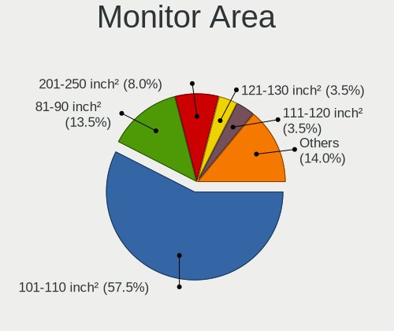

| Area in inch | Notebooks | Percent |
|----------------|-----------|---------|
| 101-110        | 115       | 57.5%   |
| 81-90          | 27        | 13.5%   |
| 201-250        | 16        | 8%      |
| 121-130        | 7         | 3.5%    |
| 111-120        | 7         | 3.5%    |
| 301-350        | 6         | 3%      |
| 51-60          | 4         | 2%      |
| 71-80          | 3         | 1.5%    |
| 151-200        | 3         | 1.5%    |
| 61-70          | 2         | 1%      |
| 351-500        | 2         | 1%      |
| 251-300        | 2         | 1%      |
| 131-140        | 2         | 1%      |
| More than 1000 | 1         | 0.5%    |
| 41-50          | 1         | 0.5%    |
| 1-40           | 1         | 0.5%    |
| 91-100         | 1         | 0.5%    |

Pixel Density
-------------

Pixels per inch

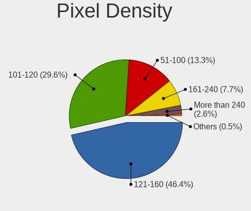

| Density       | Notebooks | Percent |
|---------------|-----------|---------|
| 121-160       | 91        | 46.43%  |
| 101-120       | 58        | 29.59%  |
| 51-100        | 26        | 13.27%  |
| 161-240       | 15        | 7.65%   |
| More than 240 | 5         | 2.55%   |
| 1-50          | 1         | 0.51%   |

Multiple Monitors
-----------------

Total monitors connected

| Total | Notebooks | Percent |
|-------|-----------|---------|
| 1     | 148       | 82.68%  |
| 2     | 27        | 15.08%  |
| 3     | 2         | 1.12%   |
| 0     | 2         | 1.12%   |

Network
-------

Net Controller Vendor
---------------------

Controller vendors

| Vendor                            | Notebooks | Percent |
|-----------------------------------|-----------|---------|
| Realtek Semiconductor             | 111       | 39.36%  |
| Intel                             | 67        | 23.76%  |
| Qualcomm Atheros                  | 46        | 16.31%  |
| Broadcom                          | 16        | 5.67%   |
| MediaTek                          | 12        | 4.26%   |
| Ralink                            | 5         | 1.77%   |
| Xiaomi                            | 3         | 1.06%   |
| Huawei Technologies               | 3         | 1.06%   |
| Broadcom Limited                  | 3         | 1.06%   |
| TP-Link                           | 2         | 0.71%   |
| Nvidia                            | 2         | 0.71%   |
| Marvell Technology Group          | 2         | 0.71%   |
| ASIX Electronics                  | 2         | 0.71%   |
| Sierra Wireless                   | 1         | 0.35%   |
| Ralink Technology                 | 1         | 0.35%   |
| OnePlus Technology (Shenzhen)     | 1         | 0.35%   |
| JMicron Technology                | 1         | 0.35%   |
| ICS Advent                        | 1         | 0.35%   |
| Hewlett-Packard                   | 1         | 0.35%   |
| Ericsson Business Mobile Networks | 1         | 0.35%   |
| Unknown                           | 1         | 0.35%   |

Net Controller Model
--------------------

Controller models

| Model                                                                   | Notebooks | Percent |
|-------------------------------------------------------------------------|-----------|---------|
| Realtek RTL8111/8168/8211/8411 PCI Express Gigabit Ethernet Controller  | 70        | 21.21%  |
| Realtek RTL810xE PCI Express Fast Ethernet controller                   | 23        | 6.97%   |
| Realtek RTL8821CE 802.11ac PCIe Wireless Network Adapter                | 13        | 3.94%   |
| Qualcomm Atheros QCA9377 802.11ac Wireless Network Adapter              | 11        | 3.33%   |
| Intel Wireless 8265 / 8275                                              | 10        | 3.03%   |
| Qualcomm Atheros QCA9565 / AR9565 Wireless Network Adapter              | 9         | 2.73%   |
| Qualcomm Atheros AR9285 Wireless Network Adapter (PCI-Express)          | 8         | 2.42%   |
| Realtek RTL8822CE 802.11ac PCIe Wireless Network Adapter                | 6         | 1.82%   |
| Qualcomm Atheros AR9485 Wireless Network Adapter                        | 6         | 1.82%   |
| MediaTek MT7921 802.11ax PCI Express Wireless Network Adapter           | 5         | 1.52%   |
| Intel Wi-Fi 6 AX200                                                     | 5         | 1.52%   |
| Broadcom BCM4313 802.11bgn Wireless Network Adapter                     | 5         | 1.52%   |
| Realtek RTL8723BE PCIe Wireless Network Adapter                         | 4         | 1.21%   |
| Intel Wireless 7260                                                     | 4         | 1.21%   |
| Intel Wi-Fi 6 AX201                                                     | 4         | 1.21%   |
| Intel Ethernet Connection I218-LM                                       | 4         | 1.21%   |
| Intel Comet Lake PCH-LP CNVi WiFi                                       | 4         | 1.21%   |
| Intel Comet Lake PCH CNVi WiFi                                          | 4         | 1.21%   |
| Xiaomi Mi/Redmi series (RNDIS)                                          | 3         | 0.91%   |
| Realtek RTL8822BE 802.11a/b/g/n/ac WiFi adapter                         | 3         | 0.91%   |
| Realtek RTL8188EE Wireless Network Adapter                              | 3         | 0.91%   |
| Realtek RTL8153 Gigabit Ethernet Adapter                                | 3         | 0.91%   |
| Qualcomm Atheros QCA6174 802.11ac Wireless Network Adapter              | 3         | 0.91%   |
| MediaTek Wi-Fi 6E MT7902 Wireless Network Adapter                       | 3         | 0.91%   |
| MediaTek MT7922 802.11ax PCI Express Wireless Network Adapter           | 3         | 0.91%   |
| Intel Wireless 3160                                                     | 3         | 0.91%   |
| Intel Ethernet Connection (4) I219-LM                                   | 3         | 0.91%   |
| Intel Cannon Lake PCH CNVi WiFi                                         | 3         | 0.91%   |
| Intel 82579LM Gigabit Network Connection (Lewisville)                   | 3         | 0.91%   |
| Huawei E353/E3131                                                       | 3         | 0.91%   |
| Realtek RTL8852BE PCIe 802.11ax Wireless Network Controller             | 2         | 0.61%   |
| Realtek RTL8188CE 802.11b/g/n WiFi Adapter                              | 2         | 0.61%   |
| Ralink RT3090 Wireless 802.11n 1T/1R PCIe                               | 2         | 0.61%   |
| Qualcomm Atheros AR9287 Wireless Network Adapter (PCI-Express)          | 2         | 0.61%   |
| Qualcomm Atheros AR8151 v2.0 Gigabit Ethernet                           | 2         | 0.61%   |
| Qualcomm Atheros AR242x / AR542x Wireless Network Adapter (PCI-Express) | 2         | 0.61%   |
| Nvidia MCP77 Ethernet                                                   | 2         | 0.61%   |
| Intel Wireless 8260                                                     | 2         | 0.61%   |
| Intel Wireless 3165                                                     | 2         | 0.61%   |
| Intel PRO/Wireless 4965 AG or AGN [Kedron] Network Connection           | 2         | 0.61%   |

Wireless Vendor
---------------

Wireless vendors

| Vendor                | Notebooks | Percent |
|-----------------------|-----------|---------|
| Intel                 | 64        | 36.16%  |
| Qualcomm Atheros      | 43        | 24.29%  |
| Realtek Semiconductor | 38        | 21.47%  |
| Broadcom              | 13        | 7.34%   |
| MediaTek              | 9         | 5.08%   |
| Ralink                | 5         | 2.82%   |
| TP-Link               | 2         | 1.13%   |
| Sierra Wireless       | 1         | 0.56%   |
| Ralink Technology     | 1         | 0.56%   |
| Broadcom Limited      | 1         | 0.56%   |

Wireless Model
--------------

Wireless models

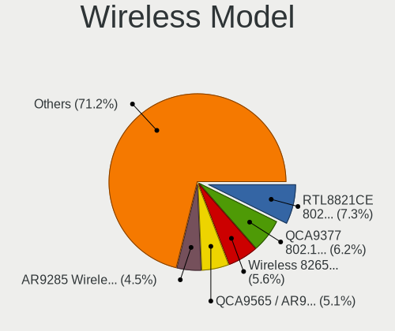

| Model                                                                   | Notebooks | Percent |
|-------------------------------------------------------------------------|-----------|---------|
| Realtek RTL8821CE 802.11ac PCIe Wireless Network Adapter                | 13        | 7.34%   |
| Qualcomm Atheros QCA9377 802.11ac Wireless Network Adapter              | 11        | 6.21%   |
| Intel Wireless 8265 / 8275                                              | 10        | 5.65%   |
| Qualcomm Atheros QCA9565 / AR9565 Wireless Network Adapter              | 9         | 5.08%   |
| Qualcomm Atheros AR9285 Wireless Network Adapter (PCI-Express)          | 8         | 4.52%   |
| Realtek RTL8822CE 802.11ac PCIe Wireless Network Adapter                | 6         | 3.39%   |
| Qualcomm Atheros AR9485 Wireless Network Adapter                        | 6         | 3.39%   |
| MediaTek MT7921 802.11ax PCI Express Wireless Network Adapter           | 5         | 2.82%   |
| Intel Wi-Fi 6 AX200                                                     | 5         | 2.82%   |
| Broadcom BCM4313 802.11bgn Wireless Network Adapter                     | 5         | 2.82%   |
| Realtek RTL8723BE PCIe Wireless Network Adapter                         | 4         | 2.26%   |
| Intel Wireless 7260                                                     | 4         | 2.26%   |
| Intel Wi-Fi 6 AX201                                                     | 4         | 2.26%   |
| Intel Comet Lake PCH-LP CNVi WiFi                                       | 4         | 2.26%   |
| Intel Comet Lake PCH CNVi WiFi                                          | 4         | 2.26%   |
| Realtek RTL8822BE 802.11a/b/g/n/ac WiFi adapter                         | 3         | 1.69%   |
| Realtek RTL8188EE Wireless Network Adapter                              | 3         | 1.69%   |
| Qualcomm Atheros QCA6174 802.11ac Wireless Network Adapter              | 3         | 1.69%   |
| MediaTek Wi-Fi 6E MT7902 Wireless Network Adapter                       | 3         | 1.69%   |
| Intel Wireless 3160                                                     | 3         | 1.69%   |
| Intel Cannon Lake PCH CNVi WiFi                                         | 3         | 1.69%   |
| Realtek RTL8852BE PCIe 802.11ax Wireless Network Controller             | 2         | 1.13%   |
| Realtek RTL8188CE 802.11b/g/n WiFi Adapter                              | 2         | 1.13%   |
| Ralink RT3090 Wireless 802.11n 1T/1R PCIe                               | 2         | 1.13%   |
| Qualcomm Atheros AR9287 Wireless Network Adapter (PCI-Express)          | 2         | 1.13%   |
| Qualcomm Atheros AR242x / AR542x Wireless Network Adapter (PCI-Express) | 2         | 1.13%   |
| Intel Wireless 8260                                                     | 2         | 1.13%   |
| Intel Wireless 3165                                                     | 2         | 1.13%   |
| Intel PRO/Wireless 4965 AG or AGN [Kedron] Network Connection           | 2         | 1.13%   |
| Intel Meteor Lake PCH CNVi WiFi                                         | 2         | 1.13%   |
| Intel Dual Band Wireless-AC 3168NGW [Stone Peak]                        | 2         | 1.13%   |
| Intel Dual Band Wireless-AC 3165 Plus Bluetooth                         | 2         | 1.13%   |
| Intel Centrino Ultimate-N 6300                                          | 2         | 1.13%   |
| Intel Cannon Point-LP CNVi [Wireless-AC]                                | 2         | 1.13%   |
| Broadcom BCM4331 802.11a/b/g/n                                          | 2         | 1.13%   |
| Broadcom BCM43228 802.11a/b/g/n                                         | 2         | 1.13%   |
| Broadcom BCM43142 802.11b/g/n                                           | 2         | 1.13%   |
| TP-Link TL-WN821N v5/v6 [RTL8192EU]                                     | 1         | 0.56%   |
| TP-Link TL-WN722N v2/v3 [Realtek RTL8188EUS]                            | 1         | 0.56%   |
| Sierra Wireless EM7455                                                  | 1         | 0.56%   |

Ethernet Vendor
---------------

Ethernet vendors

| Vendor                   | Notebooks | Percent |
|--------------------------|-----------|---------|
| Realtek Semiconductor    | 97        | 65.1%   |
| Intel                    | 21        | 14.09%  |
| Qualcomm Atheros         | 5         | 3.36%   |
| Broadcom                 | 5         | 3.36%   |
| Xiaomi                   | 3         | 2.01%   |
| MediaTek                 | 3         | 2.01%   |
| Huawei Technologies      | 3         | 2.01%   |
| Nvidia                   | 2         | 1.34%   |
| Marvell Technology Group | 2         | 1.34%   |
| Broadcom Limited         | 2         | 1.34%   |
| ASIX Electronics         | 2         | 1.34%   |
| JMicron Technology       | 1         | 0.67%   |
| ICS Advent               | 1         | 0.67%   |
| Hewlett-Packard          | 1         | 0.67%   |
| Unknown                  | 1         | 0.67%   |

Ethernet Model
--------------

Ethernet models

| Model                                                                          | Notebooks | Percent |
|--------------------------------------------------------------------------------|-----------|---------|
| Realtek RTL8111/8168/8211/8411 PCI Express Gigabit Ethernet Controller         | 70        | 46.36%  |
| Realtek RTL810xE PCI Express Fast Ethernet controller                          | 23        | 15.23%  |
| Intel Ethernet Connection I218-LM                                              | 4         | 2.65%   |
| Xiaomi Mi/Redmi series (RNDIS)                                                 | 3         | 1.99%   |
| Realtek RTL8153 Gigabit Ethernet Adapter                                       | 3         | 1.99%   |
| Intel Ethernet Connection (4) I219-LM                                          | 3         | 1.99%   |
| Intel 82579LM Gigabit Network Connection (Lewisville)                          | 3         | 1.99%   |
| Huawei E353/E3131                                                              | 3         | 1.99%   |
| Qualcomm Atheros AR8151 v2.0 Gigabit Ethernet                                  | 2         | 1.32%   |
| Nvidia MCP77 Ethernet                                                          | 2         | 1.32%   |
| MediaTek MT7922 802.11ax PCI Express Wireless Network Adapter                  | 2         | 1.32%   |
| Broadcom NetXtreme BCM57765 Gigabit Ethernet PCIe                              | 2         | 1.32%   |
| Broadcom NetLink BCM57785 Gigabit Ethernet PCIe                                | 2         | 1.32%   |
| ASIX AX88179 Gigabit Ethernet                                                  | 2         | 1.32%   |
| Realtek RTL8852BE PCIe 802.11ax Wireless Network Controller [1T1R]             | 1         | 0.66%   |
| Realtek RTL8152 Fast Ethernet Adapter                                          | 1         | 0.66%   |
| Realtek RTL8125 2.5GbE Controller                                              | 1         | 0.66%   |
| Qualcomm Atheros QCA8172 Fast Ethernet                                         | 1         | 0.66%   |
| Qualcomm Atheros Killer E220x Gigabit Ethernet Controller                      | 1         | 0.66%   |
| Qualcomm Atheros AR8121/AR8113/AR8114 Gigabit or Fast Ethernet                 | 1         | 0.66%   |
| MediaTek Infinix SMART 5                                                       | 1         | 0.66%   |
| Marvell Group Yukon Optima 88E8059 [PCIe Gigabit Ethernet Controller with AVB] | 1         | 0.66%   |
| Marvell Group 88E8057 PCI-E Gigabit Ethernet Controller                        | 1         | 0.66%   |
| JMicron JMC250 PCI Express Gigabit Ethernet Controller                         | 1         | 0.66%   |
| Intel Ethernet Connection I219-V                                               | 1         | 0.66%   |
| Intel Ethernet Connection I219-LM                                              | 1         | 0.66%   |
| Intel Ethernet Connection I217-V                                               | 1         | 0.66%   |
| Intel Ethernet Connection (7) I219-LM                                          | 1         | 0.66%   |
| Intel Ethernet Connection (6) I219-V                                           | 1         | 0.66%   |
| Intel Ethernet Connection (4) I219-V                                           | 1         | 0.66%   |
| Intel Ethernet Connection (3) I218-V                                           | 1         | 0.66%   |
| Intel Ethernet Connection (16) I219-V                                          | 1         | 0.66%   |
| Intel Ethernet Connection (10) I219-LM                                         | 1         | 0.66%   |
| Intel 82566MM Gigabit Network Connection                                       | 1         | 0.66%   |
| Intel 82562GT 10/100 Network Connection                                        | 1         | 0.66%   |
| ICS Advent DM9601 Fast Ethernet Adapter                                        | 1         | 0.66%   |
| HP HP lt4120 Snapdragon X5 LTE                                                 | 1         | 0.66%   |
| Broadcom NetXtreme BCM57786 Gigabit Ethernet PCIe                              | 1         | 0.66%   |
| Broadcom Limited NetXtreme BCM5761 Gigabit Ethernet PCIe                       | 1         | 0.66%   |
| Broadcom Limited NetLink BCM57785 Gigabit Ethernet PCIe                        | 1         | 0.66%   |

Net Controller Kind
-------------------

Ethernet, WiFi or modem

| Kind     | Notebooks | Percent |
|----------|-----------|---------|
| WiFi     | 172       | 54.43%  |
| Ethernet | 142       | 44.94%  |
| Modem    | 1         | 0.32%   |
| Unknown  | 1         | 0.32%   |

Used Controller
---------------

Currently used network controller

| Kind     | Notebooks | Percent |
|----------|-----------|---------|
| WiFi     | 136       | 74.32%  |
| Ethernet | 47        | 25.68%  |

NICs
----

Total network controllers on board

| Total | Notebooks | Percent |
|-------|-----------|---------|
| 2     | 130       | 73.45%  |
| 1     | 47        | 26.55%  |

IPv6
----

IPv6 vs IPv4

| Used | Notebooks | Percent |
|------|-----------|---------|
| No   | 169       | 95.48%  |
| Yes  | 8         | 4.52%   |

Bluetooth
---------

Bluetooth Vendor
----------------

Controller vendors

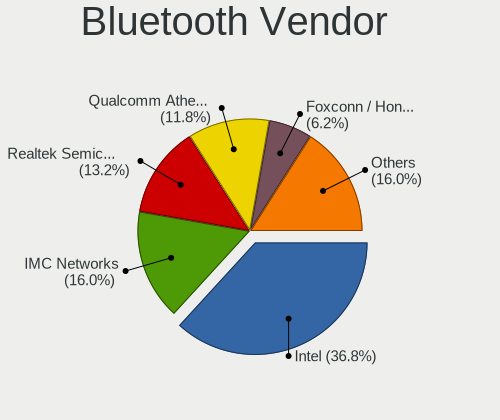

| Vendor                          | Notebooks | Percent |
|---------------------------------|-----------|---------|
| Intel                           | 53        | 36.81%  |
| IMC Networks                    | 23        | 15.97%  |
| Realtek Semiconductor           | 19        | 13.19%  |
| Qualcomm Atheros Communications | 17        | 11.81%  |
| Foxconn / Hon Hai               | 9         | 6.25%   |
| Broadcom                        | 7         | 4.86%   |
| Lite-On Technology              | 5         | 3.47%   |
| Ralink Technology               | 2         | 1.39%   |
| Apple                           | 2         | 1.39%   |
| Toshiba                         | 1         | 0.69%   |
| Realtek                         | 1         | 0.69%   |
| Ralink                          | 1         | 0.69%   |
| MediaTek                        | 1         | 0.69%   |
| Hewlett-Packard                 | 1         | 0.69%   |
| Dell                            | 1         | 0.69%   |
| Cambridge Silicon Radio         | 1         | 0.69%   |

Bluetooth Model
---------------

Controller models

| Model                                             | Notebooks | Percent |
|---------------------------------------------------|-----------|---------|
| Intel Bluetooth wireless interface                | 20        | 13.89%  |
| Intel AX201 Bluetooth                             | 12        | 8.33%   |
| Realtek Bluetooth Radio                           | 11        | 7.64%   |
| IMC Networks Bluetooth Radio                      | 10        | 6.94%   |
| Qualcomm Atheros  Bluetooth Device                | 8         | 5.56%   |
| Intel Bluetooth 9460/9560 Jefferson Peak (JfP)    | 8         | 5.56%   |
| Intel AX200 Bluetooth                             | 5         | 3.47%   |
| IMC Networks Wireless_Device                      | 5         | 3.47%   |
| IMC Networks Bluetooth Device                     | 4         | 2.78%   |
| Realtek 802.11ac WLAN Adapter                     | 3         | 2.08%   |
| Qualcomm Atheros QCA61x4 Bluetooth 4.0            | 3         | 2.08%   |
| Lite-On Qualcomm Atheros QCA9377 Bluetooth        | 3         | 2.08%   |
| Intel AX211 Bluetooth                             | 3         | 2.08%   |
| IMC Networks Atheros AR3012 Bluetooth 4.0 Adapter | 3         | 2.08%   |
| Foxconn / Hon Hai Wireless_Device                 | 3         | 2.08%   |
| Foxconn / Hon Hai MediaTek Bluetooth Adapter      | 3         | 2.08%   |
| Realtek RTL8822BE Bluetooth 4.2 Adapter           | 2         | 1.39%   |
| Qualcomm Atheros AR3012 Bluetooth 4.0             | 2         | 1.39%   |
| Qualcomm Atheros AR3011 Bluetooth                 | 2         | 1.39%   |
| Intel Wireless-AC 3168 Bluetooth                  | 2         | 1.39%   |
| Broadcom HP Portable SoftSailing                  | 2         | 1.39%   |
| Broadcom BCM20702A0                               | 2         | 1.39%   |
| Toshiba Integrated Bluetooth HCI                  | 1         | 0.69%   |
| Realtek RTL8821A Bluetooth                        | 1         | 0.69%   |
| Realtek RTL8723B Bluetooth                        | 1         | 0.69%   |
| Realtek  Bluetooth 4.2 Adapter                    | 1         | 0.69%   |
| Realtek Bluetooth Radio                           | 1         | 0.69%   |
| Ralink Motorola BC4 Bluetooth 3.0+HS Adapter      | 1         | 0.69%   |
| Ralink CSR BS8510                                 | 1         | 0.69%   |
| Ralink RT3290 Bluetooth                           | 1         | 0.69%   |
| Qualcomm Atheros AR9462 Bluetooth                 | 1         | 0.69%   |
| Qualcomm Atheros AR3012 Bluetooth                 | 1         | 0.69%   |
| MediaTek Wireless_Device                          | 1         | 0.69%   |
| Lite-On Bluetooth Device                          | 1         | 0.69%   |
| Lite-On Atheros AR3012 Bluetooth                  | 1         | 0.69%   |
| Intel Centrino Bluetooth Wireless Transceiver     | 1         | 0.69%   |
| Intel Centrino Advanced-N 6230 Bluetooth adapter  | 1         | 0.69%   |
| Intel AX210 Bluetooth                             | 1         | 0.69%   |
| IMC Networks Bluetooth Module                     | 1         | 0.69%   |
| HP Broadcom 2070 Bluetooth Combo                  | 1         | 0.69%   |

Sound
-----

Sound Vendor
------------

Sound card vendors

| Vendor      | Notebooks | Percent |
|-------------|-----------|---------|
| Intel       | 124       | 60.49%  |
| AMD         | 52        | 25.37%  |
| Nvidia      | 24        | 11.71%  |
| Plantronics | 2         | 0.98%   |
| Logitech    | 2         | 0.98%   |
| Sony        | 1         | 0.49%   |

Sound Model
-----------

Sound card models

| Model                                                                                             | Notebooks | Percent |
|---------------------------------------------------------------------------------------------------|-----------|---------|
| AMD Family 17h/19h/1ah HD Audio Controller                                                        | 32        | 12.12%  |
| Intel Sunrise Point-LP HD Audio                                                                   | 20        | 7.58%   |
| AMD Renoir Radeon High Definition Audio Controller                                                | 17        | 6.44%   |
| Intel 7 Series/C216 Chipset Family High Definition Audio Controller                               | 13        | 4.92%   |
| AMD SBx00 Azalia (Intel HDA)                                                                      | 9         | 3.41%   |
| AMD FCH Azalia Controller                                                                         | 9         | 3.41%   |
| AMD Wrestler HDMI Audio                                                                           | 8         | 3.03%   |
| Intel 6 Series/C200 Series Chipset Family High Definition Audio Controller                        | 7         | 2.65%   |
| Nvidia TU107 GeForce GTX 1650 High Definition Audio Controller                                    | 6         | 2.27%   |
| Intel Haswell-ULT HD Audio Controller                                                             | 6         | 2.27%   |
| Intel Celeron/Pentium Silver Processor High Definition Audio                                      | 6         | 2.27%   |
| Intel Cannon Lake PCH cAVS                                                                        | 6         | 2.27%   |
| Intel 8 Series HD Audio Controller                                                                | 6         | 2.27%   |
| AMD Raven/Raven2/Fenghuang HDMI/DP Audio Controller                                               | 6         | 2.27%   |
| Intel Xeon E3-1200 v3/4th Gen Core Processor HD Audio Controller                                  | 5         | 1.89%   |
| Intel Wildcat Point-LP High Definition Audio Controller                                           | 5         | 1.89%   |
| Intel Tiger Lake-LP Smart Sound Technology Audio Controller                                       | 5         | 1.89%   |
| Intel Ice Lake-LP Smart Sound Technology Audio Controller                                         | 5         | 1.89%   |
| Intel Comet Lake PCH-LP cAVS                                                                      | 5         | 1.89%   |
| Intel Cannon Point-LP High Definition Audio Controller                                            | 5         | 1.89%   |
| Intel Broadwell-U Audio Controller                                                                | 5         | 1.89%   |
| Intel Atom/Celeron/Pentium Processor x5-E8000/J3xxx/N3xxx Series High Definition Audio Controller | 5         | 1.89%   |
| Intel Alder Lake PCH-P High Definition Audio Controller                                           | 5         | 1.89%   |
| Intel 8 Series/C220 Series Chipset High Definition Audio Controller                               | 5         | 1.89%   |
| AMD Rembrandt Radeon High Definition Audio Controller                                             | 5         | 1.89%   |
| Nvidia GP107GL High Definition Audio Controller                                                   | 4         | 1.52%   |
| Intel Comet Lake PCH cAVS                                                                         | 4         | 1.52%   |
| Nvidia GA104 High Definition Audio Controller                                                     | 3         | 1.14%   |
| Intel Celeron N3350/Pentium N4200/Atom E3900 Series Audio Cluster                                 | 3         | 1.14%   |
| Intel Atom Processor Z36xxx/Z37xxx Series High Definition Audio Controller                        | 3         | 1.14%   |
| Intel 82801I (ICH9 Family) HD Audio Controller                                                    | 3         | 1.14%   |
| Intel 5 Series/3400 Series Chipset High Definition Audio                                          | 3         | 1.14%   |
| AMD Trinity HDMI Audio Controller                                                                 | 3         | 1.14%   |
| Nvidia MCP72XE/MCP72P/MCP78U/MCP78S High Definition Audio                                         | 2         | 0.76%   |
| Nvidia GK208 HDMI/DP Audio Controller                                                             | 2         | 0.76%   |
| Logitech H600 [Wireless Headset]                                                                  | 2         | 0.76%   |
| Intel Meteor Lake-P HD Audio Controller                                                           | 2         | 0.76%   |
| Intel CM238 HD Audio Controller                                                                   | 2         | 0.76%   |
| Intel 82801H (ICH8 Family) HD Audio Controller                                                    | 2         | 0.76%   |
| AMD RS880 HDMI Audio [Radeon HD 4200 Series]                                                      | 2         | 0.76%   |

Memory
------

Memory Vendor
-------------

Memory module vendors

| Vendor              | Notebooks | Percent |
|---------------------|-----------|---------|
| Samsung Electronics | 46        | 33.58%  |
| SK hynix            | 29        | 21.17%  |
| Micron Technology   | 12        | 8.76%   |
| Kingston            | 12        | 8.76%   |
| Unknown             | 8         | 5.84%   |
| Goodram             | 6         | 4.38%   |
| Transcend           | 4         | 2.92%   |
| Unknown (ABCD)      | 2         | 1.46%   |
| Ramaxel Technology  | 2         | 1.46%   |
| Elpida              | 2         | 1.46%   |
| Crucial             | 2         | 1.46%   |
| Apacer              | 2         | 1.46%   |
| Unknown             | 2         | 1.46%   |
| Wilk                | 1         | 0.73%   |
| Unifosa             | 1         | 0.73%   |
| Nanya Technology    | 1         | 0.73%   |
| Corsair             | 1         | 0.73%   |
| Axiom               | 1         | 0.73%   |
| Avant               | 1         | 0.73%   |
| ASint Technology    | 1         | 0.73%   |
| A-DATA Technology   | 1         | 0.73%   |

Memory Model
------------

Memory module models

| Model                                                            | Notebooks | Percent |
|------------------------------------------------------------------|-----------|---------|
| SK hynix RAM HMT351S6CFR8C-PB 4GB SODIMM DDR3 1600MT/s           | 3         | 2.08%   |
| Samsung RAM M471B5173DB0-YK0 4GB SODIMM DDR3 1600MT/s            | 3         | 2.08%   |
| Samsung RAM M471A1K43EB1-CWE 8GB SODIMM DDR4 3200MT/s            | 3         | 2.08%   |
| Samsung RAM M471A1K43BB1-CRC 8GB SODIMM DDR4 2667MT/s            | 3         | 2.08%   |
| Samsung RAM M471A1G44AB0-CWE 8GB Row Of Chips DDR4 3200MT/s      | 3         | 2.08%   |
| Unknown RAM Module 2GB SODIMM DDR3                               | 2         | 1.39%   |
| Unknown RAM Module 2048MB SODIMM DRAM 667MT/s                    | 2         | 1.39%   |
| Unknown RAM Module 1024MB SODIMM DRAM 667MT/s                    | 2         | 1.39%   |
| Unknown (ABCD) RAM 123456789012345678 2GB SODIMM LPDDR3 2400MT/s | 2         | 1.39%   |
| SK hynix RAM HMT351S6EFR8A-PB 4GB SODIMM DDR3 1600MT/s           | 2         | 1.39%   |
| SK hynix RAM HMT325S6CFR8C-PB 2GB SODIMM DDR3 1600MT/s           | 2         | 1.39%   |
| SK hynix RAM HMAA2GS6CJR8N-XN 16GB SODIMM DDR4 3200MT/s          | 2         | 1.39%   |
| Samsung RAM M471B5273CH0-CK0 4GB SODIMM DDR3 1600MT/s            | 2         | 1.39%   |
| Samsung RAM M471B2873FHS-CF8 1GB SODIMM DDR3 1067MT/s            | 2         | 1.39%   |
| Samsung RAM M471B1G73QH0-YK0 8GB SODIMM DDR3 1600MT/s            | 2         | 1.39%   |
| Samsung RAM M471A5244CB0-CWE 4096MB Row Of Chips DDR4 3200MT/s   | 2         | 1.39%   |
| Samsung RAM M471A5244CB0-CTD 4GB SODIMM DDR4 3266MT/s            | 2         | 1.39%   |
| Samsung RAM M471A1G44BB0-CWE 8GB SODIMM DDR4 3200MT/s            | 2         | 1.39%   |
| Samsung RAM K3KL8L80CM-MGCT 2GB Row Of Chips LPDDR5 7500MT/s     | 2         | 1.39%   |
| GOODRAM RAM GR2666S464L19/16G 16GB SODIMM DDR4 2667MT/s          | 2         | 1.39%   |
| Unknown                                                          | 2         | 1.39%   |
| Wilk RAM GR2666S464L19/16G 16GB SODIMM DDR4 2667MT/s             | 1         | 0.69%   |
| Unknown RAM Module 8GB SODIMM DDR3                               | 1         | 0.69%   |
| Unknown RAM Module 4GB SODIMM DDR3                               | 1         | 0.69%   |
| Unknown RAM Module 4096MB SODIMM DDR3 1600MT/s                   | 1         | 0.69%   |
| Unknown RAM Module 2048MB SODIMM DDR2 400MT/s                    | 1         | 0.69%   |
| Unknown RAM Module 1GB SODIMM LPDDR4 2400MT/s                    | 1         | 0.69%   |
| Unifosa RAM GU672203EP0200 1GB SODIMM DDR3 1333MT/s              | 1         | 0.69%   |
| Transcend RAM TS1GSK64W6H 8GB SODIMM DDR3 1600MT/s               | 1         | 0.69%   |
| Transcend RAM Module 8192MB SODIMM DDR4 2133MT/s                 | 1         | 0.69%   |
| Transcend RAM JM3200HSE-32G 32GB SODIMM DDR4 3200MT/s            | 1         | 0.69%   |
| Transcend RAM JM1333KSN-4G 4GB SODIMM DDR3 1334MT/s              | 1         | 0.69%   |
| SK hynix RAM Module 32GB SODIMM DDR4 2667MT/s                    | 1         | 0.69%   |
| SK hynix RAM HYMP125S64CP8-S6 2GB SODIMM DDR2 667MT/s            | 1         | 0.69%   |
| SK hynix RAM HMT451S6MFR8C-PB 4GB SODIMM DDR3 1600MT/s           | 1         | 0.69%   |
| SK hynix RAM HMT451S6BFR8A-PB 4096MB SODIMM DDR3 1600MT/s        | 1         | 0.69%   |
| SK hynix RAM HMT351S6CFR8A-PB 4GB SODIMM DDR3 1600MT/s           | 1         | 0.69%   |
| SK hynix RAM HMT325S6CFR8C-H9 2GB SODIMM DDR3 1333MT/s           | 1         | 0.69%   |
| SK hynix RAM HMT125S6TFR8C-H9 2048MB SODIMM DDR3 4199MT/s        | 1         | 0.69%   |
| SK hynix RAM HMCG66AGBSA092N 8GB SODIMM DDR5 5600MT/s            | 1         | 0.69%   |

Memory Kind
-----------

Memory module kinds

| Kind   | Notebooks | Percent |
|--------|-----------|---------|
| DDR4   | 52        | 44.07%  |
| DDR3   | 42        | 35.59%  |
| LPDDR5 | 5         | 4.24%   |
| LPDDR4 | 5         | 4.24%   |
| SDRAM  | 4         | 3.39%   |
| DDR5   | 3         | 2.54%   |
| DDR2   | 3         | 2.54%   |
| LPDDR3 | 2         | 1.69%   |
| DRAM   | 2         | 1.69%   |

Memory Form Factor
------------------

Physical design of the memory module

| Name         | Notebooks | Percent |
|--------------|-----------|---------|
| SODIMM       | 103       | 88.79%  |
| Row Of Chips | 13        | 11.21%  |

Memory Size
-----------

Memory module size

| Size  | Notebooks | Percent |
|-------|-----------|---------|
| 8192  | 46        | 35.66%  |
| 4096  | 38        | 29.46%  |
| 2048  | 17        | 13.18%  |
| 16384 | 16        | 12.4%   |
| 1024  | 7         | 5.43%   |
| 32768 | 5         | 3.88%   |

Memory Speed
------------

Memory module speed

| Speed   | Notebooks | Percent |
|---------|-----------|---------|
| 1600    | 29        | 23.2%   |
| 2667    | 28        | 22.4%   |
| 3200    | 21        | 16.8%   |
| 2400    | 9         | 7.2%    |
| 1334    | 5         | 4%      |
| 1333    | 4         | 3.2%    |
| 7500    | 3         | 2.4%    |
| 4800    | 3         | 2.4%    |
| 667     | 3         | 2.4%    |
| Unknown | 3         | 2.4%    |
| 6400    | 2         | 1.6%    |
| 4199    | 2         | 1.6%    |
| 3266    | 2         | 1.6%    |
| 2133    | 2         | 1.6%    |
| 2048    | 2         | 1.6%    |
| 1067    | 2         | 1.6%    |
| 400     | 2         | 1.6%    |
| 5600    | 1         | 0.8%    |
| 1867    | 1         | 0.8%    |
| 975     | 1         | 0.8%    |

Printers & scanners
-------------------

Printer Vendor
--------------

Printer device vendors

| Vendor | Notebooks | Percent |
|--------|-----------|---------|
| Canon  | 1         | 100%    |

Printer Model
-------------

Printer device models

| Model               | Notebooks | Percent |
|---------------------|-----------|---------|
| Canon iP7200 series | 1         | 100%    |

Scanner Vendor
--------------

Scanner device vendors

Zero info for selected period =(

Scanner Model
-------------

Scanner device models

Zero info for selected period =(

Camera
------

Camera Vendor
-------------

Camera device vendors

| Vendor                                 | Notebooks | Percent |
|----------------------------------------|-----------|---------|
| Chicony Electronics                    | 34        | 21.52%  |
| IMC Networks                           | 26        | 16.46%  |
| Realtek Semiconductor                  | 15        | 9.49%   |
| Microdia                               | 10        | 6.33%   |
| Quanta                                 | 9         | 5.7%    |
| Bison Electronics                      | 8         | 5.06%   |
| Cheng Uei Precision Industry (Foxlink) | 7         | 4.43%   |
| Syntek                                 | 6         | 3.8%    |
| Shinetech                              | 6         | 3.8%    |
| Lite-On Technology                     | 5         | 3.16%   |
| Sunplus Innovation Technology          | 4         | 2.53%   |
| Silicon Motion                         | 4         | 2.53%   |
| Luxvisions Innotech Limited            | 4         | 2.53%   |
| Suyin                                  | 3         | 1.9%    |
| Apple                                  | 3         | 1.9%    |
| Sonix Technology                       | 2         | 1.27%   |
| Alcor Micro                            | 2         | 1.27%   |
| Acer                                   | 2         | 1.27%   |
| Z-Star Microelectronics                | 1         | 0.63%   |
| SunplusIT                              | 1         | 0.63%   |
| Samsung Electronics                    | 1         | 0.63%   |
| Ricoh                                  | 1         | 0.63%   |
| Primax Electronics                     | 1         | 0.63%   |
| Importek                               | 1         | 0.63%   |
| ezcap                                  | 1         | 0.63%   |
| ALi                                    | 1         | 0.63%   |

Camera Model
------------

Camera device models

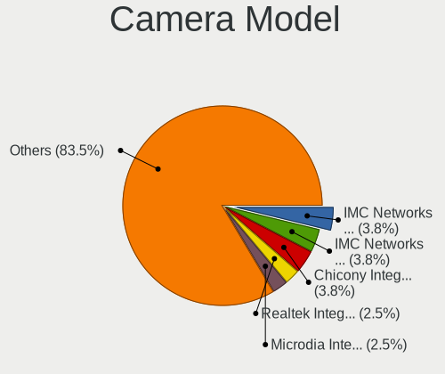

| Model                                                        | Notebooks | Percent |
|--------------------------------------------------------------|-----------|---------|
| IMC Networks USB2.0 VGA UVC WebCam                           | 6         | 3.8%    |
| IMC Networks USB2.0 HD UVC WebCam                            | 6         | 3.8%    |
| Chicony Integrated Camera                                    | 6         | 3.8%    |
| Realtek Integrated_Webcam_HD                                 | 4         | 2.53%   |
| Microdia Integrated_Webcam_HD                                | 4         | 2.53%   |
| IMC Networks Integrated Camera                               | 4         | 2.53%   |
| Syntek Lenovo EasyCamera                                     | 3         | 1.9%    |
| Syntek Integrated Camera                                     | 3         | 1.9%    |
| ShineTech USB2.0 HD UVC WebCam                               | 3         | 1.9%    |
| Shinetech USB2.0 FHD UVC WebCam                              | 3         | 1.9%    |
| Quanta HP TrueVision HD Camera                               | 3         | 1.9%    |
| Quanta HP HD Camera                                          | 3         | 1.9%    |
| Lite-On HP HD Webcam                                         | 3         | 1.9%    |
| Chicony EasyCamera                                           | 3         | 1.9%    |
| Cheng Uei Precision Industry (Foxlink) XiaoMi USB 2.0 Webcam | 3         | 1.9%    |
| Sonix USB2.0 HD UVC WebCam                                   | 2         | 1.27%   |
| Silicon Motion WebCam SC-0311139N                            | 2         | 1.27%   |
| Realtek USB Camera                                           | 2         | 1.27%   |
| Realtek EasyCamera                                           | 2         | 1.27%   |
| Microdia Laptop_Integrated_Webcam_HD                         | 2         | 1.27%   |
| Lite-On HP HD Camera                                         | 2         | 1.27%   |
| IMC Networks XiaoMi Webcam                                   | 2         | 1.27%   |
| IMC Networks VGA UVC WebCam                                  | 2         | 1.27%   |
| Chicony VGA WebCam                                           | 2         | 1.27%   |
| Chicony USB2.0 VGA UVC WebCam                                | 2         | 1.27%   |
| Chicony Integrated Camera (1280x720@30)                      | 2         | 1.27%   |
| Chicony HD WebCam                                            | 2         | 1.27%   |
| Bison SunplusIT Integrated Camera                            | 2         | 1.27%   |
| Bison Integrated Camera                                      | 2         | 1.27%   |
| Apple FaceTime HD Camera                                     | 2         | 1.27%   |
| Z-Star WebCam SCB-0320N                                      | 1         | 0.63%   |
| Suyin HP Webcam                                              | 1         | 0.63%   |
| Suyin HP Truevision HD                                       | 1         | 0.63%   |
| Suyin HD WebCam                                              | 1         | 0.63%   |
| SunplusIT XiaoMi USB 2.0 Webcam                              | 1         | 0.63%   |
| Sunplus Laptop_Integrated_Webcam_FHD                         | 1         | 0.63%   |
| Sunplus Integrated_Webcam_HD                                 | 1         | 0.63%   |
| Sunplus HD WebCam                                            | 1         | 0.63%   |
| Sunplus Asus Webcam                                          | 1         | 0.63%   |
| Silicon Motion WebCam SCB-1100N                              | 1         | 0.63%   |

Security
--------

Fingerprint Vendor
------------------

Fingerprint sensor vendors

| Vendor                     | Notebooks | Percent |
|----------------------------|-----------|---------|
| Validity Sensors           | 11        | 36.67%  |
| Synaptics                  | 7         | 23.33%  |
| Shenzhen Goodix Technology | 4         | 13.33%  |
| Elan Microelectronics      | 4         | 13.33%  |
| Upek                       | 2         | 6.67%   |
| LighTuning Technology      | 1         | 3.33%   |
| AuthenTec                  | 1         | 3.33%   |

Fingerprint Model
-----------------

Fingerprint sensor models

| Model                                                     | Notebooks | Percent |
|-----------------------------------------------------------|-----------|---------|
| Synaptics  FS7604 Touch Fingerprint Sensor with PurePrint | 4         | 13.33%  |
| Shenzhen Goodix  FingerPrint Device                       | 4         | 13.33%  |
| Validity Sensors VFS495 Fingerprint Reader                | 3         | 10%     |
| Elan ELAN:Fingerprint                                     | 3         | 10%     |
| Validity Sensors VFS 5011 fingerprint sensor              | 2         | 6.67%   |
| Validity Sensors Fingerprint scanner                      | 2         | 6.67%   |
| Upek Biometric Touchchip/Touchstrip Fingerprint Sensor    | 2         | 6.67%   |
| Synaptics Fingerprint reader [HP G6]                      | 2         | 6.67%   |
| Validity Sensors VFS491                                   | 1         | 3.33%   |
| Validity Sensors VFS Fingerprint sensor                   | 1         | 3.33%   |
| Validity Sensors Synaptics WBDI                           | 1         | 3.33%   |
| Validity Sensors Swipe Fingerprint Sensor                 | 1         | 3.33%   |
| Synaptics TouchPad                                        | 1         | 3.33%   |
| LighTuning EgisTec Touch Fingerprint Sensor               | 1         | 3.33%   |
| Elan ELAN:ARM-M4                                          | 1         | 3.33%   |
| AuthenTec AES2501 Fingerprint Sensor                      | 1         | 3.33%   |

Chipcard Vendor
---------------

Chipcard module vendors

| Vendor                | Notebooks | Percent |
|-----------------------|-----------|---------|
| Realtek Semiconductor | 1         | 33.33%  |
| O2 Micro              | 1         | 33.33%  |
| Broadcom              | 1         | 33.33%  |

Chipcard Model
--------------

Chipcard module models

| Model                                             | Notebooks | Percent |
|---------------------------------------------------|-----------|---------|
| Realtek Semiconductor Smart Card Reader Interface | 1         | 33.33%  |
| O2 Micro OZ776 CCID Smartcard Reader              | 1         | 33.33%  |
| Broadcom 5880                                     | 1         | 33.33%  |

Unsupported
-----------

Unsupported Devices
-------------------

Total unsupported devices on board

| Total | Notebooks | Percent |
|-------|-----------|---------|
| 0     | 121       | 66.85%  |
| 1     | 48        | 26.52%  |
| 2     | 11        | 6.08%   |
| 3     | 1         | 0.55%   |

Unsupported Device Types
------------------------

Types of unsupported devices

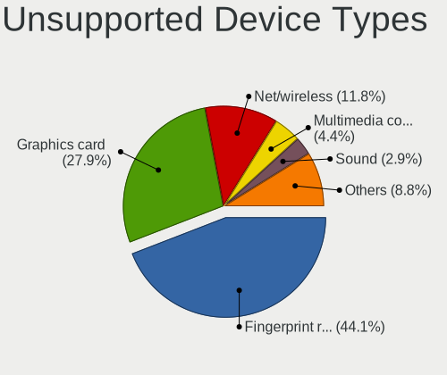

| Type                  | Notebooks | Percent |
|-----------------------|-----------|---------|
| Fingerprint reader    | 30        | 44.12%  |
| Graphics card         | 19        | 27.94%  |
| Net/wireless          | 8         | 11.76%  |
| Multimedia controller | 3         | 4.41%   |
| Sound                 | 2         | 2.94%   |
| Chipcard              | 2         | 2.94%   |
| Camera                | 2         | 2.94%   |
| Storage               | 1         | 1.47%   |
| Bluetooth             | 1         | 1.47%   |

