Linux in Moldova - Tested Hardware & Statistics (Notebooks)
-----------------------------------------------------------

A project to collect tested hardware configurations for Linux in Moldova.

Anyone can contribute to this report by the [hw-probe](https://github.com/linuxhw/hw-probe) tool:

    sudo -E hw-probe -all -upload

Please contribute! Especially if your hardware is rare.

Contents
--------

* [ Test Cases ](#test-cases)

* [ System ](#system)
  - [ OS                       ](#os)
  - [ OS Family                ](#os-family)
  - [ Kernel                   ](#kernel)
  - [ Kernel Family            ](#kernel-family)
  - [ Kernel Major Ver.        ](#kernel-major-ver)
  - [ Arch                     ](#arch)
  - [ DE                       ](#de)
  - [ Display Server           ](#display-server)
  - [ Display Manager          ](#display-manager)
  - [ OS Lang                  ](#os-lang)
  - [ Boot Mode                ](#boot-mode)
  - [ Filesystem               ](#filesystem)
  - [ Part. scheme             ](#part-scheme)
  - [ Dual Boot with Linux/BSD ](#dual-boot-with-linuxbsd)
  - [ Dual Boot (Win)          ](#dual-boot-win)

* [ Board ](#board)
  - [ Vendor                   ](#vendor)
  - [ Model                    ](#model)
  - [ Model Family             ](#model-family)
  - [ MFG Year                 ](#mfg-year)
  - [ Form Factor              ](#form-factor)
  - [ Secure Boot              ](#secure-boot)
  - [ Coreboot                 ](#coreboot)
  - [ RAM Size                 ](#ram-size)
  - [ RAM Used                 ](#ram-used)
  - [ Total Drives             ](#total-drives)
  - [ Has CD-ROM               ](#has-cd-rom)
  - [ Has Ethernet             ](#has-ethernet)
  - [ Has WiFi                 ](#has-wifi)
  - [ Has Bluetooth            ](#has-bluetooth)

* [ Location ](#location)
  - [ Country                  ](#country)
  - [ City                     ](#city)

* [ Drives ](#drives)
  - [ Drive Vendor             ](#drive-vendor)
  - [ Drive Model              ](#drive-model)
  - [ HDD Vendor               ](#hdd-vendor)
  - [ SSD Vendor               ](#ssd-vendor)
  - [ Drive Kind               ](#drive-kind)
  - [ Drive Connector          ](#drive-connector)
  - [ Drive Size               ](#drive-size)
  - [ Space Total              ](#space-total)
  - [ Space Used               ](#space-used)
  - [ Malfunc. Drives          ](#malfunc-drives)
  - [ Malfunc. Drive Vendor    ](#malfunc-drive-vendor)
  - [ Malfunc. HDD Vendor      ](#malfunc-hdd-vendor)
  - [ Malfunc. Drive Kind      ](#malfunc-drive-kind)
  - [ Failed Drives            ](#failed-drives)
  - [ Failed Drive Vendor      ](#failed-drive-vendor)
  - [ Drive Status             ](#drive-status)

* [ Storage controller ](#storage-controller)
  - [ Storage Vendor           ](#storage-vendor)
  - [ Storage Model            ](#storage-model)
  - [ Storage Kind             ](#storage-kind)

* [ Processor ](#processor)
  - [ CPU Vendor               ](#cpu-vendor)
  - [ CPU Model                ](#cpu-model)
  - [ CPU Model Family         ](#cpu-model-family)
  - [ CPU Cores                ](#cpu-cores)
  - [ CPU Sockets              ](#cpu-sockets)
  - [ CPU Threads              ](#cpu-threads)
  - [ CPU Op-Modes             ](#cpu-op-modes)
  - [ CPU Microcode            ](#cpu-microcode)
  - [ CPU Microarch            ](#cpu-microarch)

* [ Graphics ](#graphics)
  - [ GPU Vendor               ](#gpu-vendor)
  - [ GPU Model                ](#gpu-model)
  - [ GPU Combo                ](#gpu-combo)
  - [ GPU Driver               ](#gpu-driver)
  - [ GPU Memory               ](#gpu-memory)

* [ Monitor ](#monitor)
  - [ Monitor Vendor           ](#monitor-vendor)
  - [ Monitor Model            ](#monitor-model)
  - [ Monitor Resolution       ](#monitor-resolution)
  - [ Monitor Diagonal         ](#monitor-diagonal)
  - [ Monitor Width            ](#monitor-width)
  - [ Aspect Ratio             ](#aspect-ratio)
  - [ Monitor Area             ](#monitor-area)
  - [ Pixel Density            ](#pixel-density)
  - [ Multiple Monitors        ](#multiple-monitors)

* [ Network ](#network)
  - [ Net Controller Vendor    ](#net-controller-vendor)
  - [ Net Controller Model     ](#net-controller-model)
  - [ Wireless Vendor          ](#wireless-vendor)
  - [ Wireless Model           ](#wireless-model)
  - [ Ethernet Vendor          ](#ethernet-vendor)
  - [ Ethernet Model           ](#ethernet-model)
  - [ Net Controller Kind      ](#net-controller-kind)
  - [ Used Controller          ](#used-controller)
  - [ NICs                     ](#nics)
  - [ IPv6                     ](#ipv6)

* [ Bluetooth ](#bluetooth)
  - [ Bluetooth Vendor         ](#bluetooth-vendor)
  - [ Bluetooth Model          ](#bluetooth-model)

* [ Sound ](#sound)
  - [ Sound Vendor             ](#sound-vendor)
  - [ Sound Model              ](#sound-model)

* [ Memory ](#memory)
  - [ Memory Vendor            ](#memory-vendor)
  - [ Memory Model             ](#memory-model)
  - [ Memory Kind              ](#memory-kind)
  - [ Memory Form Factor       ](#memory-form-factor)
  - [ Memory Size              ](#memory-size)
  - [ Memory Speed             ](#memory-speed)

* [ Printers & scanners ](#printers--scanners)
  - [ Printer Vendor           ](#printer-vendor)
  - [ Printer Model            ](#printer-model)
  - [ Scanner Vendor           ](#scanner-vendor)
  - [ Scanner Model            ](#scanner-model)

* [ Camera ](#camera)
  - [ Camera Vendor            ](#camera-vendor)
  - [ Camera Model             ](#camera-model)

* [ Security ](#security)
  - [ Fingerprint Vendor       ](#fingerprint-vendor)
  - [ Fingerprint Model        ](#fingerprint-model)
  - [ Chipcard Vendor          ](#chipcard-vendor)
  - [ Chipcard Model           ](#chipcard-model)

* [ Unsupported ](#unsupported)
  - [ Unsupported Devices      ](#unsupported-devices)
  - [ Unsupported Device Types ](#unsupported-device-types)

Test Cases
----------

Total: 139

| Vendor   | Model                       | Probe                                                      | Date         |
|----------|-----------------------------|------------------------------------------------------------|--------------|
| Lenovo   | IdeaPad 100-15IBY 80MJ      | [db944454c8](https://linux-hardware.org/?probe=db944454c8) | May 23, 2022 |
| Lenovo   | Legion Y530-15ICH 81FV      | [428509b262](https://linux-hardware.org/?probe=428509b262) | May 01, 2022 |
| ASUSTek  | X541NC                      | [d1dc342eb9](https://linux-hardware.org/?probe=d1dc342eb9) | Apr 17, 2022 |
| Lenovo   | ThinkPad X240 20AL0067RT    | [f246d643b4](https://linux-hardware.org/?probe=f246d643b4) | Feb 26, 2022 |
| Sony     | VPCEB1J8E                   | [b00a6a15b2](https://linux-hardware.org/?probe=b00a6a15b2) | Feb 20, 2022 |
| ASUSTek  | U32U                        | [f7b7d4d2db](https://linux-hardware.org/?probe=f7b7d4d2db) | Feb 20, 2022 |
| ASUSTek  | U32U                        | [1cb943e596](https://linux-hardware.org/?probe=1cb943e596) | Feb 20, 2022 |
| Acer     | Swift SF314-57              | [de92ca9fec](https://linux-hardware.org/?probe=de92ca9fec) | Feb 05, 2022 |
| Lenovo   | ThinkPad E15 Gen 2 20TD0... | [4c95ae549f](https://linux-hardware.org/?probe=4c95ae549f) | Jan 21, 2022 |
| HP       | Unknown                     | [1fbb31af8d](https://linux-hardware.org/?probe=1fbb31af8d) | Jan 05, 2022 |
| Jumper   | EZbook                      | [6e9ee100f8](https://linux-hardware.org/?probe=6e9ee100f8) | Dec 22, 2021 |
| HP       | Pavilion Laptop 15-eh1xx... | [ab93ce9eb8](https://linux-hardware.org/?probe=ab93ce9eb8) | Dec 21, 2021 |
| Jumper   | EZbook                      | [992b2479e4](https://linux-hardware.org/?probe=992b2479e4) | Dec 21, 2021 |
| HP       | EliteBook 8470p             | [8ab831bf5f](https://linux-hardware.org/?probe=8ab831bf5f) | Dec 21, 2021 |
| Chuwi    | GemiBook Pro                | [493d55cb16](https://linux-hardware.org/?probe=493d55cb16) | Dec 11, 2021 |
| Dell     | Latitude 3520               | [8fb7494494](https://linux-hardware.org/?probe=8fb7494494) | Dec 06, 2021 |
| Acer     | Aspire 5253G                | [f7c885dedd](https://linux-hardware.org/?probe=f7c885dedd) | Nov 08, 2021 |
| Toshiba  | Satellite Pro S300L         | [93c5def444](https://linux-hardware.org/?probe=93c5def444) | Oct 06, 2021 |
| ASUSTek  | VivoBook S15 X510UF         | [336bbdae35](https://linux-hardware.org/?probe=336bbdae35) | Oct 02, 2021 |
| Lenovo   | ThinkPad E15 Gen 2 20TD0... | [7820254b55](https://linux-hardware.org/?probe=7820254b55) | Sep 23, 2021 |
| Dell     | Latitude 5591               | [0235ac49c6](https://linux-hardware.org/?probe=0235ac49c6) | Sep 15, 2021 |
| Lenovo   | ThinkPad E15 Gen 3 20YG0... | [02666996c0](https://linux-hardware.org/?probe=02666996c0) | Sep 12, 2021 |
| Lenovo   | ThinkPad E15 Gen 3 20YG0... | [97b45da8a7](https://linux-hardware.org/?probe=97b45da8a7) | Sep 12, 2021 |
| HP       | Laptop 15-da1xxx            | [c6f3848c20](https://linux-hardware.org/?probe=c6f3848c20) | Sep 12, 2021 |
| HP       | Laptop 15-da1xxx            | [b73b5ecab7](https://linux-hardware.org/?probe=b73b5ecab7) | Sep 11, 2021 |
| HP       | ProBook 450 G6              | [227d87ab66](https://linux-hardware.org/?probe=227d87ab66) | Aug 20, 2021 |
| Toshiba  | TECRA Z40-B                 | [d353412a4f](https://linux-hardware.org/?probe=d353412a4f) | Jul 29, 2021 |
| Lenovo   | IdeaPad 5 15ARE05 81YQ      | [8430084f74](https://linux-hardware.org/?probe=8430084f74) | Jul 15, 2021 |
| System76 | Adder WS                    | [d128c1d16b](https://linux-hardware.org/?probe=d128c1d16b) | Jul 08, 2021 |
| Lenovo   | ThinkPad T440 20B7S1N809    | [b9ab49e917](https://linux-hardware.org/?probe=b9ab49e917) | Jul 07, 2021 |
| Dell     | Vostro 5590                 | [1cc0df9bfd](https://linux-hardware.org/?probe=1cc0df9bfd) | Jun 28, 2021 |
| Dell     | Vostro 5590                 | [0caade1304](https://linux-hardware.org/?probe=0caade1304) | Jun 28, 2021 |
| ASUSTek  | X555LJ                      | [aab7280bd9](https://linux-hardware.org/?probe=aab7280bd9) | Jun 20, 2021 |
| Timi     | A35S                        | [226823eb5b](https://linux-hardware.org/?probe=226823eb5b) | Jun 19, 2021 |
| ASUSTek  | VivoBook_ASUSLaptop X521... | [79e70ff708](https://linux-hardware.org/?probe=79e70ff708) | Jun 17, 2021 |
| ASUSTek  | TUF Gaming FX705DT_FX705... | [447e508593](https://linux-hardware.org/?probe=447e508593) | Jun 14, 2021 |
| ASUSTek  | VivoBook_ASUSLaptop X521... | [47d894d771](https://linux-hardware.org/?probe=47d894d771) | Jun 12, 2021 |
| ASUSTek  | VivoBook_ASUSLaptop X521... | [5c14296bc9](https://linux-hardware.org/?probe=5c14296bc9) | Jun 12, 2021 |
| ASUSTek  | VivoBook_ASUSLaptop X521... | [73e1185f6e](https://linux-hardware.org/?probe=73e1185f6e) | Jun 12, 2021 |
| ASUSTek  | TUF Gaming FX705DT_FX705... | [666ddeb09c](https://linux-hardware.org/?probe=666ddeb09c) | May 19, 2021 |
| Dell     | Inspiron 3541               | [88d0f731fd](https://linux-hardware.org/?probe=88d0f731fd) | Apr 29, 2021 |
| Dell     | Inspiron 3541               | [4267385ad8](https://linux-hardware.org/?probe=4267385ad8) | Apr 29, 2021 |
| Dell     | Inspiron 3593               | [5facbef10b](https://linux-hardware.org/?probe=5facbef10b) | Apr 24, 2021 |
| Dell     | Latitude E7440              | [c59d5358b3](https://linux-hardware.org/?probe=c59d5358b3) | Apr 04, 2021 |
| HP       | Pavilion dv7                | [b7756075fd](https://linux-hardware.org/?probe=b7756075fd) | Mar 15, 2021 |
| Lenovo   | Legion Y530-15ICH 81FV      | [bd5d97f7e7](https://linux-hardware.org/?probe=bd5d97f7e7) | Mar 07, 2021 |
| HP       | ZBook Fury 15 G7 Mobile ... | [c2435842e1](https://linux-hardware.org/?probe=c2435842e1) | Mar 04, 2021 |
| HP       | ZBook Fury 15 G7 Mobile ... | [5cc3d3f3ed](https://linux-hardware.org/?probe=5cc3d3f3ed) | Mar 04, 2021 |
| Lenovo   | IdeaPad 330-15IKB 81DE      | [16d0cd0b17](https://linux-hardware.org/?probe=16d0cd0b17) | Mar 04, 2021 |
| Lenovo   | IdeaPad 330-15IKB 81DE      | [7a3239606c](https://linux-hardware.org/?probe=7a3239606c) | Mar 04, 2021 |
| Lenovo   | Legion Y530-15ICH 81FV      | [88bab7f6e7](https://linux-hardware.org/?probe=88bab7f6e7) | Feb 22, 2021 |
| ASUSTek  | ZenBook UX333FA_UX333FA     | [454ea43e4a](https://linux-hardware.org/?probe=454ea43e4a) | Feb 11, 2021 |
| HP       | ProBook 650 G2              | [043b7f867b](https://linux-hardware.org/?probe=043b7f867b) | Jan 23, 2021 |
| HP       | Laptop 15-dw0xxx            | [a69f5fa59f](https://linux-hardware.org/?probe=a69f5fa59f) | Jan 17, 2021 |
| Gateway  | NV55S                       | [8ed7215a68](https://linux-hardware.org/?probe=8ed7215a68) | Jan 17, 2021 |
| ASUSTek  | ZenBook UX333FA_UX333FA     | [a2da0e78db](https://linux-hardware.org/?probe=a2da0e78db) | Jan 14, 2021 |
| ASUSTek  | ZenBook UX333FA_UX333FA     | [84f50057c5](https://linux-hardware.org/?probe=84f50057c5) | Jan 14, 2021 |
| ASUSTek  | ZenBook UX333FA_UX333FA     | [c3b5acb8ff](https://linux-hardware.org/?probe=c3b5acb8ff) | Jan 14, 2021 |
| Gateway  | NV55S                       | [149e658abf](https://linux-hardware.org/?probe=149e658abf) | Jan 10, 2021 |
| HP       | EliteBook 855 G7 Noteboo... | [9f70a6e397](https://linux-hardware.org/?probe=9f70a6e397) | Jan 06, 2021 |
| HP       | Pavilion 17                 | [ac1360247b](https://linux-hardware.org/?probe=ac1360247b) | Dec 22, 2020 |
| HP       | EliteBook 855 G7 Noteboo... | [049fa926a1](https://linux-hardware.org/?probe=049fa926a1) | Dec 21, 2020 |
| HP       | EliteBook 855 G7 Noteboo... | [69e21f1387](https://linux-hardware.org/?probe=69e21f1387) | Nov 09, 2020 |
| Lenovo   | ThinkPad Yoga 11e 3rd Ge... | [bc1158d1d3](https://linux-hardware.org/?probe=bc1158d1d3) | Nov 09, 2020 |
| HP       | EliteBook 855 G7 Noteboo... | [8725886c61](https://linux-hardware.org/?probe=8725886c61) | Nov 06, 2020 |
| Dell     | Inspiron N5110              | [ee5fa15c46](https://linux-hardware.org/?probe=ee5fa15c46) | Nov 06, 2020 |
| ASUSTek  | Strix 17 GL703GE            | [6e4daa0a3c](https://linux-hardware.org/?probe=6e4daa0a3c) | Nov 05, 2020 |
| ASUSTek  | Strix 17 GL703GE            | [3a9f43c320](https://linux-hardware.org/?probe=3a9f43c320) | Nov 04, 2020 |
| HUAWEI   | NBLK-WAX9X                  | [4088a13026](https://linux-hardware.org/?probe=4088a13026) | Oct 09, 2020 |
| ASUSTek  | X200MA                      | [794220eee6](https://linux-hardware.org/?probe=794220eee6) | Sep 26, 2020 |
| Lenovo   | G710 20252                  | [c166b56839](https://linux-hardware.org/?probe=c166b56839) | Aug 26, 2020 |
| ASUSTek  | X541NA                      | [3f4978f463](https://linux-hardware.org/?probe=3f4978f463) | Aug 03, 2020 |
| HP       | ProBook 6465b               | [378cd77f66](https://linux-hardware.org/?probe=378cd77f66) | Jul 26, 2020 |
| ASUSTek  | VivoBook S15 X510UF         | [66a180cdab](https://linux-hardware.org/?probe=66a180cdab) | Jul 24, 2020 |
| ASUSTek  | VivoBook S15 X510UF         | [ed25557a01](https://linux-hardware.org/?probe=ed25557a01) | Jul 20, 2020 |
| HP       | Compaq Presario CQ60        | [8d24316f6b](https://linux-hardware.org/?probe=8d24316f6b) | Jul 15, 2020 |
| HP       | ProBook 450 G7              | [3638848f89](https://linux-hardware.org/?probe=3638848f89) | Jun 24, 2020 |
| Dell     | XPS 15 9570                 | [c14028664d](https://linux-hardware.org/?probe=c14028664d) | Jun 23, 2020 |
| ASUSTek  | X541NA                      | [6d3495ee91](https://linux-hardware.org/?probe=6d3495ee91) | Jun 14, 2020 |
| HP       | ProBook 470 G2              | [bce3965ebb](https://linux-hardware.org/?probe=bce3965ebb) | Jun 13, 2020 |
| Lenovo   | IdeaPad 130-15IKB 81H7      | [54b25b6a82](https://linux-hardware.org/?probe=54b25b6a82) | Apr 18, 2020 |
| HP       | EliteBook 850 G6            | [92d96a7e87](https://linux-hardware.org/?probe=92d96a7e87) | Apr 11, 2020 |
| Samsung  | RV413/RV513                 | [996451817e](https://linux-hardware.org/?probe=996451817e) | Mar 12, 2020 |
| Lenovo   | IdeaPad 330-15IGM 81D1      | [c0c091dee5](https://linux-hardware.org/?probe=c0c091dee5) | Feb 22, 2020 |
| Lenovo   | IdeaPad 330-15IGM 81D1      | [f1e8d4fb95](https://linux-hardware.org/?probe=f1e8d4fb95) | Feb 22, 2020 |
| ASUSTek  | X541NA                      | [3df0912982](https://linux-hardware.org/?probe=3df0912982) | Feb 15, 2020 |
| Lenovo   | G710 20252                  | [7df7fd3c10](https://linux-hardware.org/?probe=7df7fd3c10) | Feb 15, 2020 |
| Toshiba  | Satellite C55D-A            | [19713fa1aa](https://linux-hardware.org/?probe=19713fa1aa) | Feb 05, 2020 |
| Dell     | Inspiron 3582               | [6916c1087b](https://linux-hardware.org/?probe=6916c1087b) | Jan 21, 2020 |
| Dell     | Inspiron 3582               | [b873ab0117](https://linux-hardware.org/?probe=b873ab0117) | Jan 16, 2020 |
| Dell     | Inspiron 3582               | [cf3745ead4](https://linux-hardware.org/?probe=cf3745ead4) | Jan 16, 2020 |
| ASUSTek  | K54C                        | [42b284e62d](https://linux-hardware.org/?probe=42b284e62d) | Dec 17, 2019 |
| ASUSTek  | X542UR                      | [8c29a78852](https://linux-hardware.org/?probe=8c29a78852) | Dec 15, 2019 |
| ASUSTek  | X542UR                      | [106dcde5e2](https://linux-hardware.org/?probe=106dcde5e2) | Oct 24, 2019 |
| ASUSTek  | X542UR                      | [d5d9fe7ed0](https://linux-hardware.org/?probe=d5d9fe7ed0) | Oct 15, 2019 |
| ASUSTek  | X542UR                      | [f0e44b13bf](https://linux-hardware.org/?probe=f0e44b13bf) | Sep 15, 2019 |
| ASUSTek  | X541SA                      | [f4ec1608f1](https://linux-hardware.org/?probe=f4ec1608f1) | Aug 19, 2019 |
| Samsung  | RV413/RV513                 | [a569d1638b](https://linux-hardware.org/?probe=a569d1638b) | Aug 16, 2019 |
| HP       | Compaq 6910p                | [2b9b5142af](https://linux-hardware.org/?probe=2b9b5142af) | Jul 02, 2019 |
| Dell     | Inspiron 3521               | [5129fbc2b3](https://linux-hardware.org/?probe=5129fbc2b3) | Jun 13, 2019 |
| Dell     | Inspiron 3521               | [de72a9023b](https://linux-hardware.org/?probe=de72a9023b) | Jun 12, 2019 |
| Timi     | TM1701                      | [b2b217c7ba](https://linux-hardware.org/?probe=b2b217c7ba) | Jun 04, 2019 |
| Lenovo   | IdeaPad 330S-14IKB 81F4     | [1df14b9671](https://linux-hardware.org/?probe=1df14b9671) | May 31, 2019 |
| Acer     | Aspire E1-572G              | [d7c9cc59b9](https://linux-hardware.org/?probe=d7c9cc59b9) | May 17, 2019 |
| ASUSTek  | X550JX                      | [a268d267b1](https://linux-hardware.org/?probe=a268d267b1) | May 14, 2019 |
| Toshiba  | Satellite A210              | [b08d78a7fe](https://linux-hardware.org/?probe=b08d78a7fe) | May 12, 2019 |
| ASUSTek  | VivoBook 15_ASUS Laptop ... | [adff6b4ec1](https://linux-hardware.org/?probe=adff6b4ec1) | May 08, 2019 |
| ASUSTek  | VivoBook 15_ASUS Laptop ... | [1427bdb593](https://linux-hardware.org/?probe=1427bdb593) | May 08, 2019 |
| HP       | Compaq Presario CQ60        | [c4ee62ecc8](https://linux-hardware.org/?probe=c4ee62ecc8) | Mar 21, 2019 |
| Acer     | Aspire A515-51G             | [bc2c6a0308](https://linux-hardware.org/?probe=bc2c6a0308) | Jan 21, 2019 |
| Acer     | Aspire A515-51G             | [a4fa6be429](https://linux-hardware.org/?probe=a4fa6be429) | Jan 21, 2019 |
| Samsung  | 300E4C/300E5C/300E7C        | [761e996b51](https://linux-hardware.org/?probe=761e996b51) | Jan 13, 2019 |
| HP       | 635                         | [26ac239a00](https://linux-hardware.org/?probe=26ac239a00) | Jan 13, 2019 |
| HP       | 635                         | [88b6088e86](https://linux-hardware.org/?probe=88b6088e86) | Jan 13, 2019 |
| Dell     | Latitude E5420              | [58a37ca1d7](https://linux-hardware.org/?probe=58a37ca1d7) | Jan 08, 2019 |
| HP       | Compaq CQ58                 | [f930811937](https://linux-hardware.org/?probe=f930811937) | Dec 25, 2018 |
| HP       | Compaq CQ58                 | [092addb321](https://linux-hardware.org/?probe=092addb321) | Dec 25, 2018 |
| Samsung  | R517/R717                   | [cf1386553c](https://linux-hardware.org/?probe=cf1386553c) | Dec 11, 2018 |
| HP       | ENVY m6                     | [a2443c2500](https://linux-hardware.org/?probe=a2443c2500) | Nov 28, 2018 |
| Lenovo   | ThinkPad X131e 33711T0      | [d765880811](https://linux-hardware.org/?probe=d765880811) | Nov 20, 2018 |
| ASUSTek  | K56CM                       | [9801230a74](https://linux-hardware.org/?probe=9801230a74) | Oct 11, 2018 |
| Lenovo   | G710 20252                  | [67b5fc31a6](https://linux-hardware.org/?probe=67b5fc31a6) | Sep 03, 2018 |
| ASUSTek  | K50AB                       | [5309fc98bb](https://linux-hardware.org/?probe=5309fc98bb) | Jun 21, 2018 |
| Lenovo   | Y520-15IKBN 80WK            | [9c2fa220c0](https://linux-hardware.org/?probe=9c2fa220c0) | Jun 07, 2018 |
| Lenovo   | Y520-15IKBN 80WK            | [23cd9fcd79](https://linux-hardware.org/?probe=23cd9fcd79) | Jun 07, 2018 |
| ASUSTek  | K52N                        | [9b6027f7f9](https://linux-hardware.org/?probe=9b6027f7f9) | Mar 04, 2018 |
| ASUSTek  | K52N                        | [a31f696968](https://linux-hardware.org/?probe=a31f696968) | Jan 27, 2018 |
| ASUSTek  | E502SA                      | [f82780c45f](https://linux-hardware.org/?probe=f82780c45f) | Dec 22, 2017 |
| Samsung  | R517/R717                   | [88501ec4d2](https://linux-hardware.org/?probe=88501ec4d2) | Nov 23, 2017 |
| Acer     | Aspire E5-575               | [d7a774808d](https://linux-hardware.org/?probe=d7a774808d) | Nov 07, 2017 |
| Lenovo   | V580 20147                  | [7b4ec145fd](https://linux-hardware.org/?probe=7b4ec145fd) | Sep 05, 2017 |
| ASUSTek  | E502SA                      | [f80e3a3361](https://linux-hardware.org/?probe=f80e3a3361) | Jul 02, 2017 |
| Acer     | AO756                       | [750d61ea27](https://linux-hardware.org/?probe=750d61ea27) | Jun 28, 2017 |
| ASUSTek  | E502SA                      | [e638970390](https://linux-hardware.org/?probe=e638970390) | Jun 27, 2017 |
| Samsung  | R517/R717                   | [a037b05f1c](https://linux-hardware.org/?probe=a037b05f1c) | Jun 07, 2017 |
| Lenovo   | V580 20147                  | [e4a66b20cf](https://linux-hardware.org/?probe=e4a66b20cf) | May 09, 2017 |
| HP       | 550                         | [21d69ed69f](https://linux-hardware.org/?probe=21d69ed69f) | Feb 14, 2017 |
| Acer     | Aspire E1-531G              | [0481735487](https://linux-hardware.org/?probe=0481735487) | Dec 19, 2016 |
| MSI      | CR610                       | [fa269a3f05](https://linux-hardware.org/?probe=fa269a3f05) | Nov 20, 2016 |

System
------

OS
--

Installed operating systems

| Name                   | Notebooks | Percent |
|------------------------|-----------|---------|
| Ubuntu 18.04           | 12        | 11.76%  |
| Ubuntu 20.04           | 11        | 10.78%  |
| ROSA R10               | 9         | 8.82%   |
| ROSA R11               | 6         | 5.88%   |
| Linux Mint 20.1        | 5         | 4.9%    |
| ROSA R9                | 3         | 2.94%   |
| ROSA R8                | 3         | 2.94%   |
| ROSA R11.1             | 3         | 2.94%   |
| Linux Mint 19.1        | 3         | 2.94%   |
| Fedora 34              | 3         | 2.94%   |
| Zorin 16               | 2         | 1.96%   |
| Ubuntu 19.10           | 2         | 1.96%   |
| ROSA R8.1              | 2         | 1.96%   |
| Pop!_OS 21.04          | 2         | 1.96%   |
| OpenMandriva 4.3       | 2         | 1.96%   |
| Linux Mint 20.2        | 2         | 1.96%   |
| BlackPanther 18.1      | 2         | 1.96%   |
| Ubuntu 21.04           | 1         | 0.98%   |
| Ubuntu 16.04           | 1         | 0.98%   |
| ROSA 12.2              | 1         | 0.98%   |
| ROSA 12.1              | 1         | 0.98%   |
| Pop!_OS 20.10          | 1         | 0.98%   |
| OpenMandriva 4.50      | 1         | 0.98%   |
| Manjaro 20.2.1         | 1         | 0.98%   |
| Manjaro 20.2           | 1         | 0.98%   |
| Manjaro 19.0.2         | 1         | 0.98%   |
| Manjaro 18.0.4         | 1         | 0.98%   |
| Manjaro                | 1         | 0.98%   |
| Linux Mint 20.3        | 1         | 0.98%   |
| Linux Mint 20          | 1         | 0.98%   |
| Linux Mint 19.3        | 1         | 0.98%   |
| Kubuntu 20.10          | 1         | 0.98%   |
| Kubuntu 20.04          | 1         | 0.98%   |
| KDE neon 20.04         | 1         | 0.98%   |
| Kali 2021.3            | 1         | 0.98%   |
| Fedora 36              | 1         | 0.98%   |
| Fedora 33              | 1         | 0.98%   |
| Fedora 31              | 1         | 0.98%   |
| Endless 3.7.5          | 1         | 0.98%   |
| Endless 3.6.4          | 1         | 0.98%   |
| Endless 3.6.3          | 1         | 0.98%   |
| Endless 3.4.3-nexthw1  | 1         | 0.98%   |
| Endless 3.3.16-nexthw1 | 1         | 0.98%   |
| Debian Unstable        | 1         | 0.98%   |
| Debian 11              | 1         | 0.98%   |
| BuildRoot 2021.08.2    | 1         | 0.98%   |
| Arch                   | 1         | 0.98%   |

OS Family
---------

OS without a version

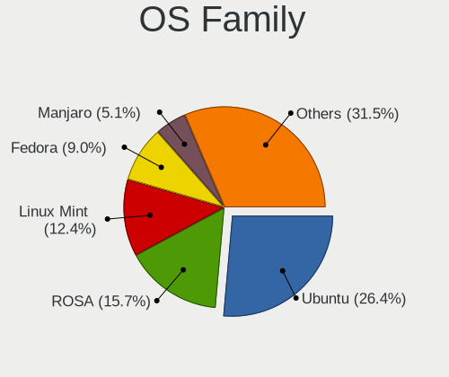

| Name         | Notebooks | Percent |
|--------------|-----------|---------|
| Ubuntu       | 27        | 27.84%  |
| ROSA         | 25        | 25.77%  |
| Linux Mint   | 13        | 13.4%   |
| Fedora       | 6         | 6.19%   |
| Manjaro      | 5         | 5.15%   |
| Pop!_OS      | 3         | 3.09%   |
| OpenMandriva | 3         | 3.09%   |
| Endless      | 3         | 3.09%   |
| Zorin        | 2         | 2.06%   |
| Kubuntu      | 2         | 2.06%   |
| Debian       | 2         | 2.06%   |
| BlackPanther | 2         | 2.06%   |
| KDE neon     | 1         | 1.03%   |
| Kali         | 1         | 1.03%   |
| BuildRoot    | 1         | 1.03%   |
| Arch         | 1         | 1.03%   |

Kernel
------

Version of the Linux kernel

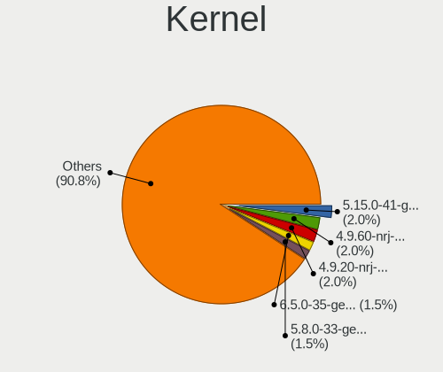

| Version                            | Notebooks | Percent |
|------------------------------------|-----------|---------|
| 4.9.60-nrj-desktop-1rosa-x86_64    | 4         | 3.67%   |
| 4.9.20-nrj-desktop-1rosa-x86_64    | 4         | 3.67%   |
| 5.8.0-33-generic                   | 3         | 2.75%   |
| 4.9.60-nrj-desktop-1rosa-i586      | 3         | 2.75%   |
| 5.4.0-37-generic                   | 2         | 1.83%   |
| 5.16.7-desktop-1omv4003            | 2         | 1.83%   |
| 5.11.0-7614-generic                | 2         | 1.83%   |
| 5.11.0-41-generic                  | 2         | 1.83%   |
| 5.11.0-34-generic                  | 2         | 1.83%   |
| 5.10.74-generic-2rosa2021.1-x86_64 | 2         | 1.83%   |
| 5.10.2-2-MANJARO                   | 2         | 1.83%   |
| 4.9.95-nrj-desktop-2rosa-x86_64    | 2         | 1.83%   |
| 4.9.41-nrj-desktop-1rosa-x86_64    | 2         | 1.83%   |
| 4.9.155-nrj-desktop-1rosa-x86_64   | 2         | 1.83%   |
| 4.15.0-desktop-68.5rosa-x86_64     | 2         | 1.83%   |
| 4.15.0-desktop-45.1rosa-x86_64     | 2         | 1.83%   |
| 5.9.3-1-MANJARO                    | 1         | 0.92%   |
| 5.8.18-100.fc31.x86_64             | 1         | 0.92%   |
| 5.8.18-1-MANJARO                   | 1         | 0.92%   |
| 5.8.0-36-generic                   | 1         | 0.92%   |
| 5.8.0-25-lowlatency                | 1         | 0.92%   |
| 5.6.14-desktop-2bP                 | 1         | 0.92%   |
| 5.4.49-nrj-desktop-1rosa-x86_64    | 1         | 0.92%   |
| 5.4.32-generic-2rosa-x86_64        | 1         | 0.92%   |
| 5.4.0-86-generic                   | 1         | 0.92%   |
| 5.4.0-84-generic                   | 1         | 0.92%   |
| 5.4.0-72-generic                   | 1         | 0.92%   |
| 5.4.0-70-generic                   | 1         | 0.92%   |
| 5.4.0-67-generic                   | 1         | 0.92%   |
| 5.4.0-58-generic                   | 1         | 0.92%   |
| 5.4.0-52-generic                   | 1         | 0.92%   |
| 5.4.0-48-generic                   | 1         | 0.92%   |
| 5.4.0-42-generic                   | 1         | 0.92%   |
| 5.4.0-40-generic                   | 1         | 0.92%   |
| 5.3.0-59-generic                   | 1         | 0.92%   |
| 5.3.0-42-generic                   | 1         | 0.92%   |
| 5.3.0-40-generic                   | 1         | 0.92%   |
| 5.3.0-23-generic                   | 1         | 0.92%   |
| 5.17.3-302.fc36.x86_64             | 1         | 0.92%   |
| 5.16.0-trunk-amd64                 | 1         | 0.92%   |
| 5.15.2                             | 1         | 0.92%   |
| 5.14.7-desktop-1omv4050            | 1         | 0.92%   |
| 5.13.10-200.fc34.x86_64            | 1         | 0.92%   |
| 5.13.0-30-generic                  | 1         | 0.92%   |
| 5.13.0-27-generic                  | 1         | 0.92%   |
| 5.12.9-300.fc34.x86_64             | 1         | 0.92%   |
| 5.12.12-300.fc34.x86_64            | 1         | 0.92%   |
| 5.11.12-300.fc34.x86_64            | 1         | 0.92%   |
| 5.11.0-7620-generic                | 1         | 0.92%   |
| 5.11.0-43-generic                  | 1         | 0.92%   |
| 5.11.0-38-generic                  | 1         | 0.92%   |
| 5.11.0-37-generic                  | 1         | 0.92%   |
| 5.11.0-25-generic                  | 1         | 0.92%   |
| 5.10.47-1-lts                      | 1         | 0.92%   |
| 5.10.19-200.fc33.x86_64            | 1         | 0.92%   |
| 5.10.13-2-MANJARO                  | 1         | 0.92%   |
| 5.10.0-kali9-amd64                 | 1         | 0.92%   |
| 5.10.0-4-amd64                     | 1         | 0.92%   |
| 5.10.0-3-amd64                     | 1         | 0.92%   |
| 5.1.15-desktop-1bP                 | 1         | 0.92%   |

Kernel Family
-------------

Linux kernel without a distro release

| Version  | Notebooks | Percent |
|----------|-----------|---------|
| 4.15.0   | 15        | 14.15%  |
| 5.4.0    | 12        | 11.32%  |
| 5.11.0   | 11        | 10.38%  |
| 4.9.60   | 6         | 5.66%   |
| 5.8.0    | 5         | 4.72%   |
| 5.3.0    | 4         | 3.77%   |
| 4.9.20   | 4         | 3.77%   |
| 5.0.0    | 3         | 2.83%   |
| 4.18.0   | 3         | 2.83%   |
| 5.8.18   | 2         | 1.89%   |
| 5.16.7   | 2         | 1.89%   |
| 5.13.0   | 2         | 1.89%   |
| 5.10.74  | 2         | 1.89%   |
| 5.10.2   | 2         | 1.89%   |
| 5.10.0   | 2         | 1.89%   |
| 4.9.95   | 2         | 1.89%   |
| 4.9.41   | 2         | 1.89%   |
| 4.9.155  | 2         | 1.89%   |
| 5.9.3    | 1         | 0.94%   |
| 5.6.14   | 1         | 0.94%   |
| 5.4.49   | 1         | 0.94%   |
| 5.4.32   | 1         | 0.94%   |
| 5.17.3   | 1         | 0.94%   |
| 5.16.0   | 1         | 0.94%   |
| 5.15.2   | 1         | 0.94%   |
| 5.14.7   | 1         | 0.94%   |
| 5.13.10  | 1         | 0.94%   |
| 5.12.9   | 1         | 0.94%   |
| 5.12.12  | 1         | 0.94%   |
| 5.11.12  | 1         | 0.94%   |
| 5.10.47  | 1         | 0.94%   |
| 5.10.19  | 1         | 0.94%   |
| 5.10.13  | 1         | 0.94%   |
| 5.1.15   | 1         | 0.94%   |
| 5.0.18   | 1         | 0.94%   |
| 4.9.124  | 1         | 0.94%   |
| 4.9.111  | 1         | 0.94%   |
| 4.19.114 | 1         | 0.94%   |
| 4.16.0   | 1         | 0.94%   |
| 4.10.0   | 1         | 0.94%   |
| 4.1.38   | 1         | 0.94%   |
| 4.1.34   | 1         | 0.94%   |
| 4.1.25   | 1         | 0.94%   |

Kernel Major Ver.
-----------------

Linux kernel major version

| Version | Notebooks | Percent |
|---------|-----------|---------|
| 4.9     | 15        | 14.71%  |
| 4.15    | 15        | 14.71%  |
| 5.4     | 14        | 13.73%  |
| 5.11    | 12        | 11.76%  |
| 5.10    | 8         | 7.84%   |
| 5.8     | 7         | 6.86%   |
| 5.3     | 4         | 3.92%   |
| 5.0     | 4         | 3.92%   |
| 5.16    | 3         | 2.94%   |
| 5.13    | 3         | 2.94%   |
| 4.18    | 3         | 2.94%   |
| 4.1     | 3         | 2.94%   |
| 5.12    | 2         | 1.96%   |
| 5.9     | 1         | 0.98%   |
| 5.6     | 1         | 0.98%   |
| 5.17    | 1         | 0.98%   |
| 5.15    | 1         | 0.98%   |
| 5.14    | 1         | 0.98%   |
| 5.1     | 1         | 0.98%   |
| 4.19    | 1         | 0.98%   |
| 4.16    | 1         | 0.98%   |
| 4.10    | 1         | 0.98%   |

Arch
----

OS architecture (x86_64, i586, etc.)

| Name   | Notebooks | Percent |
|--------|-----------|---------|
| x86_64 | 93        | 93.94%  |
| i686   | 6         | 6.06%   |

DE
--

Desktop Environment

| Name            | Notebooks | Percent |
|-----------------|-----------|---------|
| GNOME           | 28        | 28%     |
| KDE4            | 19        | 19%     |
| KDE5            | 18        | 18%     |
| Unknown         | 14        | 14%     |
| X-Cinnamon      | 9         | 9%      |
| XFCE            | 4         | 4%      |
| MATE            | 2         | 2%      |
| Cinnamon        | 2         | 2%      |
| sway            | 1         | 1%      |
| LXQt            | 1         | 1%      |
| KDE             | 1         | 1%      |
| GNOME Flashback | 1         | 1%      |

Display Server
--------------

X11 or Wayland

| Name    | Notebooks | Percent |
|---------|-----------|---------|
| X11     | 79        | 81.44%  |
| Unknown | 10        | 10.31%  |
| Wayland | 8         | 8.25%   |

Display Manager
---------------

SDDM, LightDM, etc.

| Name    | Notebooks | Percent |
|---------|-----------|---------|
| Unknown | 35        | 35%     |
| KDM     | 19        | 19%     |
| SDDM    | 17        | 17%     |
| GDM     | 17        | 17%     |
| TDM     | 6         | 6%      |
| LightDM | 5         | 5%      |
| GDM3    | 1         | 1%      |

OS Lang
-------

Language

| Lang    | Notebooks | Percent |
|---------|-----------|---------|
| Unknown | 39        | 39.8%   |
| en_US   | 30        | 30.61%  |
| ru_RU   | 16        | 16.33%  |
| ro_RO   | 5         | 5.1%    |
| C       | 3         | 3.06%   |
| en_GB   | 2         | 2.04%   |
| ru_UA   | 1         | 1.02%   |
| nl_NL   | 1         | 1.02%   |
| de_DE   | 1         | 1.02%   |

Boot Mode
---------

EFI or BIOS

| Mode | Notebooks | Percent |
|------|-----------|---------|
| EFI  | 50        | 51.02%  |
| BIOS | 48        | 48.98%  |

Filesystem
----------

Type of filesystem

| Type    | Notebooks | Percent |
|---------|-----------|---------|
| Ext4    | 71        | 72.45%  |
| Unknown | 16        | 16.33%  |
| Overlay | 6         | 6.12%   |
| Btrfs   | 3         | 3.06%   |
| Xfs     | 2         | 2.04%   |

Part. scheme
------------

Scheme of partitioning

| Type    | Notebooks | Percent |
|---------|-----------|---------|
| Unknown | 41        | 41.41%  |
| GPT     | 35        | 35.35%  |
| MBR     | 23        | 23.23%  |

Dual Boot with Linux/BSD
------------------------

Hosting more than one Linux/BSD

| Dual boot | Notebooks | Percent |
|-----------|-----------|---------|
| No        | 90        | 91.84%  |
| Yes       | 8         | 8.16%   |

Dual Boot (Win)
---------------

Hosting Linux and Windows

| Dual boot | Notebooks | Percent |
|-----------|-----------|---------|
| No        | 72        | 73.47%  |
| Yes       | 26        | 26.53%  |

Board
-----

Vendor
------

Motherboard manufacturer

| Name                | Notebooks | Percent |
|---------------------|-----------|---------|
| Hewlett-Packard     | 22        | 22.68%  |
| ASUSTek Computer    | 22        | 22.68%  |
| Lenovo              | 18        | 18.56%  |
| Dell                | 11        | 11.34%  |
| Acer                | 7         | 7.22%   |
| Toshiba             | 4         | 4.12%   |
| Samsung Electronics | 4         | 4.12%   |
| Timi                | 2         | 2.06%   |
| System76            | 1         | 1.03%   |
| Sony                | 1         | 1.03%   |
| MSI                 | 1         | 1.03%   |
| Jumper              | 1         | 1.03%   |
| HUAWEI              | 1         | 1.03%   |
| Gateway             | 1         | 1.03%   |
| Chuwi               | 1         | 1.03%   |

Model
-----

Motherboard model

| Name                                        | Notebooks | Percent |
|---------------------------------------------|-----------|---------|
| ASUS VivoBook_ASUSLaptop X521IA_D533IA      | 3         | 3.09%   |
| Samsung RV413/RV513                         | 2         | 2.06%   |
| Lenovo Legion Y530-15ICH 81FV               | 2         | 2.06%   |
| HP Compaq Presario CQ60                     | 2         | 2.06%   |
| ASUS VivoBook S15 X510UF                    | 2         | 2.06%   |
| Toshiba TECRA Z40-B                         | 1         | 1.03%   |
| Toshiba Satellite Pro S300L                 | 1         | 1.03%   |
| Toshiba Satellite C55D-A                    | 1         | 1.03%   |
| Toshiba Satellite A210                      | 1         | 1.03%   |
| Timi TM1701                                 | 1         | 1.03%   |
| Timi A35S                                   | 1         | 1.03%   |
| System76 Adder WS                           | 1         | 1.03%   |
| Sony VPCEB1J8E                              | 1         | 1.03%   |
| Samsung R517/R717                           | 1         | 1.03%   |
| Samsung 300E4C/300E5C/300E7C                | 1         | 1.03%   |
| MSI CR610                                   | 1         | 1.03%   |
| Lenovo Y520-15IKBN 80WK                     | 1         | 1.03%   |
| Lenovo V580 20147                           | 1         | 1.03%   |
| Lenovo ThinkPad Yoga 11e 3rd Gen 20G8S0MG00 | 1         | 1.03%   |
| Lenovo ThinkPad X240 20AL0067RT             | 1         | 1.03%   |
| Lenovo ThinkPad X131e 33711T0               | 1         | 1.03%   |
| Lenovo ThinkPad T440 20B7S1N809             | 1         | 1.03%   |
| Lenovo ThinkPad E15 Gen 3 20YG004BRT        | 1         | 1.03%   |
| Lenovo ThinkPad E15 Gen 2 20TD003TRT        | 1         | 1.03%   |
| Lenovo ThinkPad E15 Gen 2 20TD002NRA        | 1         | 1.03%   |
| Lenovo IdeaPad 5 15ARE05 81YQ               | 1         | 1.03%   |
| Lenovo IdeaPad 330S-14IKB 81F4              | 1         | 1.03%   |
| Lenovo IdeaPad 330-15IKB 81DE               | 1         | 1.03%   |
| Lenovo IdeaPad 330-15IGM 81D1               | 1         | 1.03%   |
| Lenovo IdeaPad 130-15IKB 81H7               | 1         | 1.03%   |
| Lenovo IdeaPad 100-15IBY 80MJ               | 1         | 1.03%   |
| Lenovo G710 20252                           | 1         | 1.03%   |
| Jumper EZbook                               | 1         | 1.03%   |
| HUAWEI NBLK-WAX9X                           | 1         | 1.03%   |
| HP ZBook Fury 15 G7 Mobile Workstation      | 1         | 1.03%   |
| HP ProBook 650 G2                           | 1         | 1.03%   |
| HP ProBook 6465b                            | 1         | 1.03%   |
| HP ProBook 470 G2                           | 1         | 1.03%   |
| HP ProBook 450 G7                           | 1         | 1.03%   |
| HP ProBook 450 G6                           | 1         | 1.03%   |
| HP Pavilion Laptop 15-eh1xxx                | 1         | 1.03%   |
| HP Pavilion dv7                             | 1         | 1.03%   |
| HP Pavilion 17                              | 1         | 1.03%   |
| HP Laptop 15-dw0xxx                         | 1         | 1.03%   |
| HP Laptop 15-da1xxx                         | 1         | 1.03%   |
| HP ENVY m6                                  | 1         | 1.03%   |
| HP EliteBook 855 G7 Notebook PC             | 1         | 1.03%   |
| HP EliteBook 850 G6                         | 1         | 1.03%   |
| HP EliteBook 8470p                          | 1         | 1.03%   |
| HP Compaq CQ58                              | 1         | 1.03%   |
| HP Compaq 6910p                             | 1         | 1.03%   |
| HP 635                                      | 1         | 1.03%   |
| HP 550                                      | 1         | 1.03%   |
| Gateway NV55S                               | 1         | 1.03%   |
| Dell XPS 15 9570                            | 1         | 1.03%   |
| Dell Vostro 5590                            | 1         | 1.03%   |
| Dell Latitude E7440                         | 1         | 1.03%   |
| Dell Latitude E5420                         | 1         | 1.03%   |
| Dell Latitude 5591                          | 1         | 1.03%   |
| Dell Latitude 3520                          | 1         | 1.03%   |

Model Family
------------

Motherboard model prefix

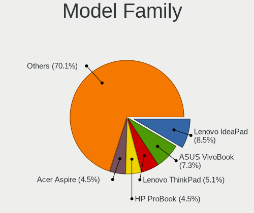

| Name               | Notebooks | Percent |
|--------------------|-----------|---------|
| Lenovo ThinkPad    | 7         | 7.22%   |
| Lenovo IdeaPad     | 6         | 6.19%   |
| ASUS VivoBook      | 6         | 6.19%   |
| HP ProBook         | 5         | 5.15%   |
| Dell Inspiron      | 5         | 5.15%   |
| Acer Aspire        | 5         | 5.15%   |
| HP Compaq          | 4         | 4.12%   |
| Dell Latitude      | 4         | 4.12%   |
| Toshiba Satellite  | 3         | 3.09%   |
| HP Pavilion        | 3         | 3.09%   |
| HP EliteBook       | 3         | 3.09%   |
| Samsung RV413      | 2         | 2.06%   |
| Lenovo Legion      | 2         | 2.06%   |
| HP Laptop          | 2         | 2.06%   |
| Toshiba TECRA      | 1         | 1.03%   |
| Timi TM1701        | 1         | 1.03%   |
| Timi A35S          | 1         | 1.03%   |
| System76 Adder     | 1         | 1.03%   |
| Sony VPCEB1J8E     | 1         | 1.03%   |
| Samsung R517       | 1         | 1.03%   |
| Samsung 300E4C     | 1         | 1.03%   |
| MSI CR610          | 1         | 1.03%   |
| Lenovo Y520-15IKBN | 1         | 1.03%   |
| Lenovo V580        | 1         | 1.03%   |
| Lenovo G710        | 1         | 1.03%   |
| Jumper EZbook      | 1         | 1.03%   |
| HUAWEI NBLK-WAX9X  | 1         | 1.03%   |
| HP ZBook           | 1         | 1.03%   |
| HP ENVY            | 1         | 1.03%   |
| HP 635             | 1         | 1.03%   |
| HP 550             | 1         | 1.03%   |
| Gateway NV55S      | 1         | 1.03%   |
| Dell XPS           | 1         | 1.03%   |
| Dell Vostro        | 1         | 1.03%   |
| Chuwi GemiBook     | 1         | 1.03%   |
| ASUS ZenBook       | 1         | 1.03%   |
| ASUS X555LJ        | 1         | 1.03%   |
| ASUS X550JX        | 1         | 1.03%   |
| ASUS X542UR        | 1         | 1.03%   |
| ASUS X541SA        | 1         | 1.03%   |
| ASUS X541NC        | 1         | 1.03%   |
| ASUS X541NA        | 1         | 1.03%   |
| ASUS X200MA        | 1         | 1.03%   |
| ASUS U32U          | 1         | 1.03%   |
| ASUS TUF           | 1         | 1.03%   |
| ASUS Strix         | 1         | 1.03%   |
| ASUS K56CM         | 1         | 1.03%   |
| ASUS K54C          | 1         | 1.03%   |
| ASUS K52N          | 1         | 1.03%   |
| ASUS K50AB         | 1         | 1.03%   |
| ASUS E502SA        | 1         | 1.03%   |
| Acer Swift         | 1         | 1.03%   |
| Acer AO756         | 1         | 1.03%   |
| Unknown            | 1         | 1.03%   |

MFG Year
--------

Motherboard manufacture year

| Year | Notebooks | Percent |
|------|-----------|---------|
| 2019 | 12        | 12.37%  |
| 2018 | 12        | 12.37%  |
| 2011 | 11        | 11.34%  |
| 2021 | 9         | 9.28%   |
| 2012 | 9         | 9.28%   |
| 2017 | 8         | 8.25%   |
| 2013 | 6         | 6.19%   |
| 2016 | 5         | 5.15%   |
| 2015 | 5         | 5.15%   |
| 2020 | 4         | 4.12%   |
| 2014 | 4         | 4.12%   |
| 2009 | 4         | 4.12%   |
| 2008 | 4         | 4.12%   |
| 2010 | 2         | 2.06%   |
| 2007 | 2         | 2.06%   |

Form Factor
-----------

Physical design of the computer

| Name     | Notebooks | Percent |
|----------|-----------|---------|
| Notebook | 97        | 100%    |

Secure Boot
-----------

Enabled or disabled

| State    | Notebooks | Percent |
|----------|-----------|---------|
| Disabled | 93        | 95.88%  |
| Enabled  | 4         | 4.12%   |

Coreboot
--------

Have coreboot on board

| Used | Notebooks | Percent |
|------|-----------|---------|
| No   | 97        | 100%    |

RAM Size
--------

Total RAM memory

| Size in GB  | Notebooks | Percent |
|-------------|-----------|---------|
| 3.01-4.0    | 30        | 30.93%  |
| 4.01-8.0    | 28        | 28.87%  |
| 8.01-16.0   | 15        | 15.46%  |
| 16.01-24.0  | 10        | 10.31%  |
| 1.01-2.0    | 5         | 5.15%   |
| 32.01-64.0  | 4         | 4.12%   |
| 2.01-3.0    | 4         | 4.12%   |
| 64.01-256.0 | 1         | 1.03%   |

RAM Used
--------

Used RAM memory

| Used GB    | Notebooks | Percent |
|------------|-----------|---------|
| 1.01-2.0   | 42        | 40.78%  |
| 2.01-3.0   | 18        | 17.48%  |
| 0.51-1.0   | 17        | 16.5%   |
| 4.01-8.0   | 12        | 11.65%  |
| 3.01-4.0   | 8         | 7.77%   |
| 8.01-16.0  | 4         | 3.88%   |
| 24.01-32.0 | 1         | 0.97%   |
| 16.01-24.0 | 1         | 0.97%   |

Total Drives
------------

Number of drives on board

| Drives | Notebooks | Percent |
|--------|-----------|---------|
| 1      | 80        | 82.47%  |
| 2      | 15        | 15.46%  |
| 3      | 2         | 2.06%   |

Has CD-ROM
----------

Has CD-ROM on board

| Presented | Notebooks | Percent |
|-----------|-----------|---------|
| No        | 63        | 64.95%  |
| Yes       | 34        | 35.05%  |

Has Ethernet
------------

Has Ethernet on board

| Presented | Notebooks | Percent |
|-----------|-----------|---------|
| Yes       | 83        | 84.69%  |
| No        | 15        | 15.31%  |

Has WiFi
--------

Has WiFi module

| Presented | Notebooks | Percent |
|-----------|-----------|---------|
| Yes       | 96        | 98.97%  |
| No        | 1         | 1.03%   |

Has Bluetooth
-------------

Has Bluetooth module

| Presented | Notebooks | Percent |
|-----------|-----------|---------|
| Yes       | 70        | 71.43%  |
| No        | 28        | 28.57%  |

Location
--------

Country
-------

Geographic location (country)

| Country | Notebooks | Percent |
|---------|-----------|---------|
| Moldova | 97        | 100%    |

City
----

Geographic location (city)

| City            | Notebooks | Percent |
|-----------------|-----------|---------|
| Chisinau        | 66        | 66%     |
| Tiraspol        | 11        | 11%     |
| Straseni        | 3         | 3%      |
| Bălţi         | 3         | 3%      |
| Tighina         | 2         | 2%      |
| Hincesti        | 2         | 2%      |
| Soroca          | 1         | 1%      |
| Soldanesti      | 1         | 1%      |
| Sofia           | 1         | 1%      |
| Rautel          | 1         | 1%      |
| Prajila         | 1         | 1%      |
| Pociumbeni      | 1         | 1%      |
| Ialoveni        | 1         | 1%      |
| Gangura         | 1         | 1%      |
| Floreni         | 1         | 1%      |
| Criuleni        | 1         | 1%      |
| Crasnoarmeiscoe | 1         | 1%      |
| Cenac           | 1         | 1%      |
| Cahul           | 1         | 1%      |

Drives
------

Drive Vendor
------------

Hard drive vendors

| Vendor              | Notebooks | Drives | Percent |
|---------------------|-----------|--------|---------|
| Samsung Electronics | 20        | 25     | 17.7%   |
| WDC                 | 15        | 16     | 13.27%  |
| Toshiba             | 15        | 19     | 13.27%  |
| Seagate             | 12        | 14     | 10.62%  |
| Hitachi             | 10        | 11     | 8.85%   |
| Kingston            | 7         | 9      | 6.19%   |
| SanDisk             | 6         | 6      | 5.31%   |
| Micron Technology   | 4         | 5      | 3.54%   |
| Unknown             | 3         | 3      | 2.65%   |
| SK Hynix            | 2         | 2      | 1.77%   |
| Intel               | 2         | 4      | 1.77%   |
| HGST                | 2         | 2      | 1.77%   |
| Fujitsu             | 2         | 2      | 1.77%   |
| A-DATA Technology   | 2         | 2      | 1.77%   |
| ZOTAC               | 1         | 3      | 0.88%   |
| Transcend           | 1         | 1      | 0.88%   |
| Solid State Storage | 1         | 1      | 0.88%   |
| Phison              | 1         | 2      | 0.88%   |
| OCZ                 | 1         | 1      | 0.88%   |
| Netac               | 1         | 1      | 0.88%   |
| LITEONIT            | 1         | 1      | 0.88%   |
| KIOXIA              | 1         | 1      | 0.88%   |
| Intenso             | 1         | 1      | 0.88%   |
| China               | 1         | 1      | 0.88%   |
| Apacer              | 1         | 1      | 0.88%   |

Drive Model
-----------

Hard drive models

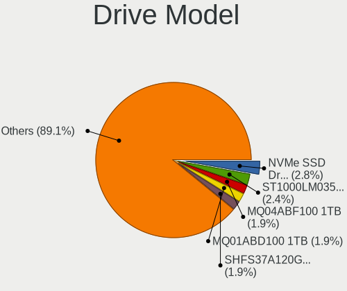

| Model                                     | Notebooks | Percent |
|-------------------------------------------|-----------|---------|
| Samsung NVMe SSD Drive 512GB              | 5         | 4.39%   |
| Toshiba MQ01ABD100 1TB                    | 4         | 3.51%   |
| Seagate ST1000LM035-1RK172 1TB            | 4         | 3.51%   |
| Kingston SHFS37A120G 120GB SSD            | 4         | 3.51%   |
| Seagate ST500LT012-9WS142 500GB           | 3         | 2.63%   |
| Sandisk NVMe SSD Drive 512GB              | 3         | 2.63%   |
| Hitachi HTS543232A7A384 320GB             | 3         | 2.63%   |
| WDC WD10SPZX-24Z10T0 1TB                  | 2         | 1.75%   |
| Toshiba MQ04ABF100 1TB                    | 2         | 1.75%   |
| Toshiba MQ01ACF032 320GB                  | 2         | 1.75%   |
| Toshiba MQ01ABF050 500GB                  | 2         | 1.75%   |
| Samsung SSD 860 EVO 500GB                 | 2         | 1.75%   |
| Micron 1100_MTFDDAV256TBN 256GB SSD       | 2         | 1.75%   |
| Hitachi HTS547575A9E384 752GB             | 2         | 1.75%   |
| ZOTAC ZTSSD-S11-240G-P 240GB              | 1         | 0.88%   |
| WDC WDS512G1X0C-00ENX0 512GB              | 1         | 0.88%   |
| WDC WD5000LPVX-80V0TT0 500GB              | 1         | 0.88%   |
| WDC WD5000LPVX-75V0TT0 500GB              | 1         | 0.88%   |
| WDC WD5000LPCX-75VHAT1 500GB              | 1         | 0.88%   |
| WDC WD5000BPVT-08HXZT3 500GB              | 1         | 0.88%   |
| WDC WD5000BEVT-22A0RT0 500GB              | 1         | 0.88%   |
| WDC WD3200BPVT-80JJ5T0 320GB              | 1         | 0.88%   |
| WDC WD3200BEVT-63ZCT0 320GB               | 1         | 0.88%   |
| WDC WD3200BEVT-22A23T0 320GB              | 1         | 0.88%   |
| WDC WD3200BEVT-00ZCT0 320GB               | 1         | 0.88%   |
| WDC WD1600BEVS-07RST0 160GB               | 1         | 0.88%   |
| WDC WD10SPZX-22Z10T1 1TB                  | 1         | 0.88%   |
| WDC WD10SPSX-60A6WT0 1TB                  | 1         | 0.88%   |
| Unknown TO  64GB                          | 1         | 0.88%   |
| Unknown SD/MMC/MS PRO 999GB               | 1         | 0.88%   |
| Unknown MMC Card  64GB                    | 1         | 0.88%   |
| Transcend TS120GMTS420S 120GB SSD         | 1         | 0.88%   |
| Toshiba THNSNJ128GMCU 128GB SSD           | 1         | 0.88%   |
| Toshiba MQ01ABD050 500GB                  | 1         | 0.88%   |
| Toshiba MK1252GSX 120GB                   | 1         | 0.88%   |
| Toshiba KXG60ZNV512G NVMe 512GB           | 1         | 0.88%   |
| Toshiba KXG60ZNV1T02 KIOXIA 1TB           | 1         | 0.88%   |
| Solid State Storage SSSTC CL1-4D256 256GB | 1         | 0.88%   |
| SK Hynix BC711 NVMe 512GB                 | 1         | 0.88%   |
| SK Hynix BC501 HFM512GDJTNG-8310A 512GB   | 1         | 0.88%   |
| Seagate ST9500325AS 500GB                 | 1         | 0.88%   |
| Seagate ST9250315AS 250GB                 | 1         | 0.88%   |
| Seagate ST320LM000 HM321HI 320GB          | 1         | 0.88%   |
| Seagate ST1000LM049-2GH172 1TB            | 1         | 0.88%   |
| Seagate ST1000LM024 HN-M101MBB 1TB        | 1         | 0.88%   |
| SanDisk SD8SN8U128G1001 128GB SSD         | 1         | 0.88%   |
| SanDisk SD8SN8U-256G-1006 256GB SSD       | 1         | 0.88%   |
| SanDisk SD7UB3Q256G1001 256GB SSD         | 1         | 0.88%   |
| Samsung SSD PM871b M.2 2280 256GB         | 1         | 0.88%   |
| Samsung SSD 980 500GB                     | 1         | 0.88%   |
| Samsung SSD 860 EVO M.2 250GB             | 1         | 0.88%   |
| Samsung SSD 850 EVO 250GB                 | 1         | 0.88%   |
| Samsung SSD 750 EVO 250GB                 | 1         | 0.88%   |
| Samsung NVMe SSD Drive 256GB              | 1         | 0.88%   |
| Samsung MZVLW256HEHP-000L2 256GB          | 1         | 0.88%   |
| Samsung MZVLW256HEHP-00000 256GB          | 1         | 0.88%   |
| Samsung MZVLQ256HAJD-000H1 256GB          | 1         | 0.88%   |
| Samsung MZVLB256HBHQ-00000 256GB          | 1         | 0.88%   |
| Samsung MZNLN128HAHQ-000H1 128GB SSD      | 1         | 0.88%   |
| Samsung MZALQ512HALU-000L1 512GB          | 1         | 0.88%   |

HDD Vendor
----------

Hard disk drive vendors

| Vendor  | Notebooks | Drives | Percent |
|---------|-----------|--------|---------|
| WDC     | 14        | 15     | 26.42%  |
| Toshiba | 12        | 16     | 22.64%  |
| Seagate | 12        | 14     | 22.64%  |
| Hitachi | 10        | 11     | 18.87%  |
| HGST    | 2         | 2      | 3.77%   |
| Fujitsu | 2         | 2      | 3.77%   |
| Unknown | 1         | 1      | 1.89%   |

SSD Vendor
----------

Solid state drive vendors

| Vendor              | Notebooks | Drives | Percent |
|---------------------|-----------|--------|---------|
| Samsung Electronics | 7         | 9      | 25%     |
| Kingston            | 6         | 8      | 21.43%  |
| SanDisk             | 3         | 3      | 10.71%  |
| Micron Technology   | 2         | 2      | 7.14%   |
| ZOTAC               | 1         | 3      | 3.57%   |
| Transcend           | 1         | 1      | 3.57%   |
| Toshiba             | 1         | 1      | 3.57%   |
| OCZ                 | 1         | 1      | 3.57%   |
| Netac               | 1         | 1      | 3.57%   |
| LITEONIT            | 1         | 1      | 3.57%   |
| Intenso             | 1         | 1      | 3.57%   |
| China               | 1         | 1      | 3.57%   |
| Apacer              | 1         | 1      | 3.57%   |
| A-DATA Technology   | 1         | 1      | 3.57%   |

Drive Kind
----------

HDD or SSD

| Kind | Notebooks | Drives | Percent |
|------|-----------|--------|---------|
| HDD  | 53        | 61     | 48.18%  |
| NVMe | 29        | 37     | 26.36%  |
| SSD  | 26        | 34     | 23.64%  |
| MMC  | 2         | 2      | 1.82%   |

Drive Connector
---------------

SATA, SAS, NVMe, etc.

| Type | Notebooks | Drives | Percent |
|------|-----------|--------|---------|
| SATA | 73        | 94     | 69.52%  |
| NVMe | 29        | 37     | 27.62%  |
| MMC  | 2         | 2      | 1.9%    |
| SAS  | 1         | 1      | 0.95%   |

Drive Size
----------

Size of hard drive

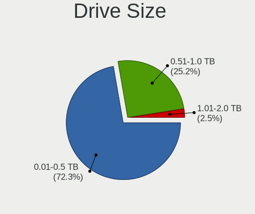

| Size in TB | Notebooks | Drives | Percent |
|------------|-----------|--------|---------|
| 0.01-0.5   | 57        | 71     | 74.03%  |
| 0.51-1.0   | 20        | 24     | 25.97%  |

Space Total
-----------

Amount of disk space available on the file system

| Size in GB | Notebooks | Percent |
|------------|-----------|---------|
| 251-500    | 34        | 33.66%  |
| 101-250    | 32        | 31.68%  |
| 501-1000   | 14        | 13.86%  |
| 51-100     | 7         | 6.93%   |
| 1-20       | 5         | 4.95%   |
| Unknown    | 5         | 4.95%   |
| 21-50      | 2         | 1.98%   |
| 1001-2000  | 2         | 1.98%   |

Space Used
----------

Amount of used disk space

| Used GB  | Notebooks | Percent |
|----------|-----------|---------|
| 1-20     | 44        | 41.9%   |
| 21-50    | 18        | 17.14%  |
| 51-100   | 14        | 13.33%  |
| 101-250  | 12        | 11.43%  |
| 251-500  | 8         | 7.62%   |
| Unknown  | 5         | 4.76%   |
| 501-1000 | 4         | 3.81%   |

Malfunc. Drives
---------------

Drive models with a malfunction

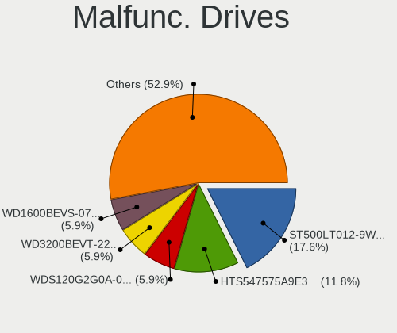

| Model                             | Notebooks | Drives | Percent |
|-----------------------------------|-----------|--------|---------|
| Seagate ST500LT012-9WS142 500GB   | 3         | 3      | 20%     |
| Hitachi HTS547575A9E384 752GB     | 2         | 2      | 13.33%  |
| WDC WD3200BEVT-22A23T0 320GB      | 1         | 1      | 6.67%   |
| WDC WD1600BEVS-07RST0 160GB       | 1         | 1      | 6.67%   |
| Toshiba MQ01ABD050 500GB          | 1         | 1      | 6.67%   |
| Seagate ST9500325AS 500GB         | 1         | 1      | 6.67%   |
| Seagate ST1000LM035-1RK172 1TB    | 1         | 1      | 6.67%   |
| SanDisk SD7UB3Q256G1001 256GB SSD | 1         | 1      | 6.67%   |
| Kingston SHFS37A120G 120GB SSD    | 1         | 3      | 6.67%   |
| Hitachi HTS545050B9A300 500GB     | 1         | 1      | 6.67%   |
| Fujitsu MHW2080BH PL 80GB         | 1         | 1      | 6.67%   |
| A-DATA Technology SX900 256GB SSD | 1         | 1      | 6.67%   |

Malfunc. Drive Vendor
---------------------

Vendors of faulty drives

| Vendor            | Notebooks | Drives | Percent |
|-------------------|-----------|--------|---------|
| Seagate           | 5         | 5      | 33.33%  |
| Hitachi           | 3         | 3      | 20%     |
| WDC               | 2         | 2      | 13.33%  |
| Toshiba           | 1         | 1      | 6.67%   |
| SanDisk           | 1         | 1      | 6.67%   |
| Kingston          | 1         | 3      | 6.67%   |
| Fujitsu           | 1         | 1      | 6.67%   |
| A-DATA Technology | 1         | 1      | 6.67%   |

Malfunc. HDD Vendor
-------------------

Vendors of faulty HDD drives

| Vendor  | Notebooks | Drives | Percent |
|---------|-----------|--------|---------|
| Seagate | 5         | 5      | 41.67%  |
| Hitachi | 3         | 3      | 25%     |
| WDC     | 2         | 2      | 16.67%  |
| Toshiba | 1         | 1      | 8.33%   |
| Fujitsu | 1         | 1      | 8.33%   |

Malfunc. Drive Kind
-------------------

Kinds of faulty drives

| Kind | Notebooks | Drives | Percent |
|------|-----------|--------|---------|
| HDD  | 12        | 12     | 80%     |
| SSD  | 3         | 5      | 20%     |

Failed Drives
-------------

Failed drive models

| Model                     | Notebooks | Drives | Percent |
|---------------------------|-----------|--------|---------|
| Seagate ST9250315AS 250GB | 1         | 1      | 100%    |

Failed Drive Vendor
-------------------

Failed drive vendors

| Vendor  | Notebooks | Drives | Percent |
|---------|-----------|--------|---------|
| Seagate | 1         | 1      | 100%    |

Drive Status
------------

Number of failed and malfunc. drives

| Status   | Notebooks | Drives | Percent |
|----------|-----------|--------|---------|
| Works    | 50        | 71     | 48.54%  |
| Detected | 37        | 45     | 35.92%  |
| Malfunc  | 15        | 17     | 14.56%  |
| Failed   | 1         | 1      | 0.97%   |

Storage controller
------------------

Storage Vendor
--------------

Storage controller vendors

| Vendor                         | Notebooks | Percent |
|--------------------------------|-----------|---------|
| Intel                          | 63        | 53.85%  |
| AMD                            | 24        | 20.51%  |
| Samsung Electronics            | 13        | 11.11%  |
| Sandisk                        | 4         | 3.42%   |
| Toshiba America Info Systems   | 2         | 1.71%   |
| SK Hynix                       | 2         | 1.71%   |
| Nvidia                         | 2         | 1.71%   |
| Micron Technology              | 2         | 1.71%   |
| Solid State Storage Technology | 1         | 0.85%   |
| Phison Electronics             | 1         | 0.85%   |
| KIOXIA                         | 1         | 0.85%   |
| Kingston Technology Company    | 1         | 0.85%   |
| ADATA Technology               | 1         | 0.85%   |

Storage Model
-------------

Storage controller models

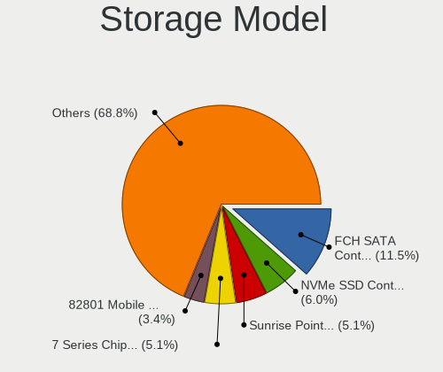

| Model                                                                            | Notebooks | Percent |
|----------------------------------------------------------------------------------|-----------|---------|
| AMD FCH SATA Controller [AHCI mode]                                              | 15        | 11.81%  |
| Intel Sunrise Point-LP SATA Controller [AHCI mode]                               | 9         | 7.09%   |
| Samsung NVMe SSD Controller 980                                                  | 8         | 6.3%    |
| Intel 7 Series Chipset Family 6-port SATA Controller [AHCI mode]                 | 7         | 5.51%   |
| AMD SB7x0/SB8x0/SB9x0 SATA Controller [AHCI mode]                                | 7         | 5.51%   |
| Intel Cannon Lake Mobile PCH SATA AHCI Controller                                | 6         | 4.72%   |
| Intel 82801 Mobile SATA Controller [RAID mode]                                   | 4         | 3.15%   |
| Intel 6 Series/C200 Series Chipset Family 6 port Mobile SATA AHCI Controller     | 4         | 3.15%   |
| Samsung NVMe SSD Controller SM981/PM981/PM983                                    | 3         | 2.36%   |
| Intel Wildcat Point-LP SATA Controller [AHCI Mode]                               | 3         | 2.36%   |
| Intel Celeron/Pentium Silver Processor SATA Controller                           | 3         | 2.36%   |
| Intel Celeron N3350/Pentium N4200/Atom E3900 Series SATA AHCI Controller         | 3         | 2.36%   |
| Intel Atom/Celeron/Pentium Processor x5-E8000/J3xxx/N3xxx Series SATA Controller | 3         | 2.36%   |
| Intel 8 Series/C220 Series Chipset Family 6-port SATA Controller 1 [AHCI mode]   | 3         | 2.36%   |
| Intel 8 Series SATA Controller 1 [AHCI mode]                                     | 3         | 2.36%   |
| Toshiba America Info Systems XG6 NVMe SSD Controller                             | 2         | 1.57%   |
| Samsung NVMe SSD Controller SM961/PM961/SM963                                    | 2         | 1.57%   |
| Nvidia MCP78S [GeForce 8200] SATA Controller (non-AHCI mode)                     | 2         | 1.57%   |
| Nvidia MCP78S [GeForce 8200] IDE                                                 | 2         | 1.57%   |
| Micron Non-Volatile memory controller                                            | 2         | 1.57%   |
| Intel SSD 660P Series                                                            | 2         | 1.57%   |
| Intel Comet Lake SATA AHCI Controller                                            | 2         | 1.57%   |
| Intel Atom Processor E3800 Series SATA AHCI Controller                           | 2         | 1.57%   |
| Intel 82801HM/HEM (ICH8M/ICH8M-E) SATA Controller [AHCI mode]                    | 2         | 1.57%   |
| Intel 82801HM/HEM (ICH8M/ICH8M-E) IDE Controller                                 | 2         | 1.57%   |
| AMD SB7x0/SB8x0/SB9x0 IDE Controller                                             | 2         | 1.57%   |
| Solid State Storage Non-Volatile memory controller                               | 1         | 0.79%   |
| SK Hynix Gold P31 SSD                                                            | 1         | 0.79%   |
| SK Hynix BC501 NVMe Solid State Drive                                            | 1         | 0.79%   |
| Sandisk WD Blue SN500 / PC SN520 NVMe SSD                                        | 1         | 0.79%   |
| Sandisk WD Black NVMe SSD                                                        | 1         | 0.79%   |
| Sandisk PC SN520 NVMe SSD                                                        | 1         | 0.79%   |
| Sandisk Non-Volatile memory controller                                           | 1         | 0.79%   |
| Phison E12 NVMe Controller                                                       | 1         | 0.79%   |
| KIOXIA Non-Volatile memory controller                                            | 1         | 0.79%   |
| Kingston Company U-SNS8154P3 NVMe SSD                                            | 1         | 0.79%   |
| Intel Volume Management Device NVMe RAID Controller                              | 1         | 0.79%   |
| Intel Tiger Lake-LP SATA Controller [AHCI mode]                                  | 1         | 0.79%   |
| Intel Ice Lake-LP SATA Controller [AHCI mode]                                    | 1         | 0.79%   |
| Intel HM170/QM170 Chipset SATA Controller [AHCI Mode]                            | 1         | 0.79%   |
| Intel Cannon Point-LP SATA Controller [AHCI Mode]                                | 1         | 0.79%   |
| Intel 82801IBM/IEM (ICH9M/ICH9M-E) 4 port SATA Controller [AHCI mode]            | 1         | 0.79%   |
| Intel 82801IBM/IEM (ICH9M/ICH9M-E) 2 port SATA Controller [IDE mode]             | 1         | 0.79%   |
| Intel 5 Series/3400 Series Chipset 4 port SATA AHCI Controller                   | 1         | 0.79%   |
| Intel 400 Series Chipset Family SATA AHCI Controller                             | 1         | 0.79%   |
| AMD SB7x0/SB8x0/SB9x0 SATA Controller [IDE mode]                                 | 1         | 0.79%   |
| AMD SB600 Non-Raid-5 SATA                                                        | 1         | 0.79%   |
| AMD SB600 IDE                                                                    | 1         | 0.79%   |
| AMD FCH IDE Controller                                                           | 1         | 0.79%   |
| ADATA Non-Volatile memory controller                                             | 1         | 0.79%   |

Storage Kind
------------

Kind of storage controller (IDE, SATA, NVMe, SAS, ...)

| Kind | Notebooks | Percent |
|------|-----------|---------|
| SATA | 81        | 65.32%  |
| NVMe | 29        | 23.39%  |
| IDE  | 9         | 7.26%   |
| RAID | 5         | 4.03%   |

Processor
---------

CPU Vendor
----------

Processor vendors

| Vendor | Notebooks | Percent |
|--------|-----------|---------|
| Intel  | 68        | 70.1%   |
| AMD    | 29        | 29.9%   |

CPU Model
---------

Processor models

| Model                                       | Notebooks | Percent |
|---------------------------------------------|-----------|---------|
| Intel Core i7-8750H CPU @ 2.20GHz           | 3         | 3.09%   |
| Intel Core i7-8565U CPU @ 1.80GHz           | 3         | 3.09%   |
| Intel Core i5-8250U CPU @ 1.60GHz           | 3         | 3.09%   |
| AMD Ryzen 5 4500U with Radeon Graphics      | 3         | 3.09%   |
| AMD E1-1200 APU with Radeon HD Graphics     | 3         | 3.09%   |
| AMD E-450 APU with Radeon HD Graphics       | 3         | 3.09%   |
| Intel Pentium CPU B960 @ 2.20GHz            | 2         | 2.06%   |
| Intel Core i7-8550U CPU @ 1.80GHz           | 2         | 2.06%   |
| Intel Core i5-8265U CPU @ 1.60GHz           | 2         | 2.06%   |
| Intel Core i5-5200U CPU @ 2.20GHz           | 2         | 2.06%   |
| Intel Core i5-2410M CPU @ 2.30GHz           | 2         | 2.06%   |
| Intel Core i5-1035G1 CPU @ 1.00GHz          | 2         | 2.06%   |
| Intel Core i5-10210U CPU @ 1.60GHz          | 2         | 2.06%   |
| Intel Core i3-8130U CPU @ 2.20GHz           | 2         | 2.06%   |
| Intel Celeron CPU N3450 @ 1.10GHz           | 2         | 2.06%   |
| Intel Celeron CPU N2840 @ 2.16GHz           | 2         | 2.06%   |
| Intel 11th Gen Core i7-1165G7 @ 2.80GHz     | 2         | 2.06%   |
| AMD Ryzen 7 5700U with Radeon Graphics      | 2         | 2.06%   |
| AMD E-300 APU with Radeon HD Graphics       | 2         | 2.06%   |
| Intel Pentium Silver N5000 CPU @ 1.10GHz    | 1         | 1.03%   |
| Intel Pentium Dual-Core CPU T4300 @ 2.10GHz | 1         | 1.03%   |
| Intel Pentium CPU N4200 @ 1.10GHz           | 1         | 1.03%   |
| Intel Pentium CPU N3710 @ 1.60GHz           | 1         | 1.03%   |
| Intel Pentium CPU 987 @ 1.50GHz             | 1         | 1.03%   |
| Intel Core i9-9980HK CPU @ 2.40GHz          | 1         | 1.03%   |
| Intel Core i7-7700HQ CPU @ 2.80GHz          | 1         | 1.03%   |
| Intel Core i7-10850H CPU @ 2.70GHz          | 1         | 1.03%   |
| Intel Core i5-8400H CPU @ 2.50GHz           | 1         | 1.03%   |
| Intel Core i5-8300H CPU @ 2.30GHz           | 1         | 1.03%   |
| Intel Core i5-7200U CPU @ 2.50GHz           | 1         | 1.03%   |
| Intel Core i5-6200U CPU @ 2.30GHz           | 1         | 1.03%   |
| Intel Core i5-4310U CPU @ 2.00GHz           | 1         | 1.03%   |
| Intel Core i5-4300U CPU @ 1.90GHz           | 1         | 1.03%   |
| Intel Core i5-4210M CPU @ 2.60GHz           | 1         | 1.03%   |
| Intel Core i5-4200U CPU @ 1.60GHz           | 1         | 1.03%   |
| Intel Core i5-4200M CPU @ 2.50GHz           | 1         | 1.03%   |
| Intel Core i5-4200H CPU @ 2.80GHz           | 1         | 1.03%   |
| Intel Core i5-3340M CPU @ 2.70GHz           | 1         | 1.03%   |
| Intel Core i5-2430M CPU @ 2.40GHz           | 1         | 1.03%   |
| Intel Core i3-7100U CPU @ 2.40GHz           | 1         | 1.03%   |
| Intel Core i3-7020U CPU @ 2.30GHz           | 1         | 1.03%   |
| Intel Core i3-5010U CPU @ 2.10GHz           | 1         | 1.03%   |
| Intel Core i3-4010U CPU @ 1.70GHz           | 1         | 1.03%   |
| Intel Core i3-3217U CPU @ 1.80GHz           | 1         | 1.03%   |
| Intel Core i3-2370M CPU @ 2.40GHz           | 1         | 1.03%   |
| Intel Core i3-2310M CPU @ 2.10GHz           | 1         | 1.03%   |
| Intel Core i3 CPU M 330 @ 2.13GHz           | 1         | 1.03%   |
| Intel Core 2 Duo CPU T7300 @ 2.00GHz        | 1         | 1.03%   |
| Intel Core 2 Duo CPU T5870 @ 2.00GHz        | 1         | 1.03%   |
| Intel Core 2 Duo CPU T5270 @ 1.40GHz        | 1         | 1.03%   |
| Intel Celeron N4000 CPU @ 1.10GHz           | 1         | 1.03%   |
| Intel Celeron J4125 CPU @ 2.00GHz           | 1         | 1.03%   |
| Intel Celeron CPU N3160 @ 1.60GHz           | 1         | 1.03%   |
| Intel Celeron CPU N3050 @ 1.60GHz           | 1         | 1.03%   |
| Intel Celeron CPU 1007U @ 1.50GHz           | 1         | 1.03%   |
| Intel 11th Gen Core i5-1135G7 @ 2.40GHz     | 1         | 1.03%   |
| AMD V140 Processor                          | 1         | 1.03%   |
| AMD Turion X2 Dual-Core Mobile RM-75        | 1         | 1.03%   |
| AMD Sempron SI-42                           | 1         | 1.03%   |
| AMD Sempron M120                            | 1         | 1.03%   |

CPU Model Family
----------------

Processor model prefix

| Model                          | Notebooks | Percent |
|--------------------------------|-----------|---------|
| Intel Core i5                  | 25        | 25.77%  |
| Intel Core i7                  | 10        | 10.31%  |
| Intel Core i3                  | 10        | 10.31%  |
| Intel Celeron                  | 9         | 9.28%   |
| Intel Pentium                  | 5         | 5.15%   |
| AMD E                          | 5         | 5.15%   |
| AMD Ryzen 7                    | 4         | 4.12%   |
| AMD Ryzen 5                    | 4         | 4.12%   |
| Other                          | 3         | 3.09%   |
| Intel Core 2 Duo               | 3         | 3.09%   |
| AMD E1                         | 3         | 3.09%   |
| AMD Sempron                    | 2         | 2.06%   |
| AMD A4                         | 2         | 2.06%   |
| AMD A10                        | 2         | 2.06%   |
| Intel Pentium Silver           | 1         | 1.03%   |
| Intel Pentium Dual-Core        | 1         | 1.03%   |
| Intel Core i9                  | 1         | 1.03%   |
| AMD V140                       | 1         | 1.03%   |
| AMD Turion X2 Dual-Core Mobile | 1         | 1.03%   |
| AMD Ryzen 5 PRO                | 1         | 1.03%   |
| AMD Ryzen 3                    | 1         | 1.03%   |
| AMD Athlon 64 X2               | 1         | 1.03%   |
| AMD Athlon                     | 1         | 1.03%   |
| AMD A6                         | 1         | 1.03%   |

CPU Cores
---------

Number of processor cores

| Number  | Notebooks | Percent |
|---------|-----------|---------|
| 2       | 50        | 51.55%  |
| 4       | 32        | 32.99%  |
| 6       | 8         | 8.25%   |
| 8       | 4         | 4.12%   |
| 1       | 2         | 2.06%   |
| Unknown | 1         | 1.03%   |

CPU Sockets
-----------

Number of sockets

| Number | Notebooks | Percent |
|--------|-----------|---------|
| 1      | 97        | 100%    |

CPU Threads
-----------

Threads per core (Hyper-Threading)

| Number  | Notebooks | Percent |
|---------|-----------|---------|
| 2       | 56        | 57.73%  |
| 1       | 40        | 41.24%  |
| Unknown | 1         | 1.03%   |

CPU Op-Modes
------------

CPU Operation Modes (32-bit, 64-bit)

| Op mode        | Notebooks | Percent |
|----------------|-----------|---------|
| 32-bit, 64-bit | 94        | 96.91%  |
| Unknown        | 3         | 3.09%   |

CPU Microcode
-------------

Microcode number

| Number     | Notebooks | Percent |
|------------|-----------|---------|
| Unknown    | 12        | 12.24%  |
| 0x206a7    | 8         | 8.16%   |
| 0x05000119 | 8         | 8.16%   |
| 0x806ea    | 7         | 7.14%   |
| 0x806ec    | 5         | 5.1%    |
| 0x906ea    | 4         | 4.08%   |
| 0x08600106 | 4         | 4.08%   |
| 0x506c9    | 3         | 3.06%   |
| 0x40651    | 3         | 3.06%   |
| 0x306d4    | 3         | 3.06%   |
| 0x306c3    | 3         | 3.06%   |
| 0x306a9    | 3         | 3.06%   |
| 0x806e9    | 2         | 2.04%   |
| 0x806c1    | 2         | 2.04%   |
| 0x706e5    | 2         | 2.04%   |
| 0x706a1    | 2         | 2.04%   |
| 0x406c4    | 2         | 2.04%   |
| 0x30678    | 2         | 2.04%   |
| 0x08608103 | 2         | 2.04%   |
| 0x06001119 | 2         | 2.04%   |
| 0x03000027 | 2         | 2.04%   |
| 0x02000057 | 2         | 2.04%   |
| 0xa0652    | 1         | 1.02%   |
| 0x906e9    | 1         | 1.02%   |
| 0x706a8    | 1         | 1.02%   |
| 0x6fd      | 1         | 1.02%   |
| 0x6fb      | 1         | 1.02%   |
| 0x406e3    | 1         | 1.02%   |
| 0x406c3    | 1         | 1.02%   |
| 0x20652    | 1         | 1.02%   |
| 0x1067a    | 1         | 1.02%   |
| 0x0a50000c | 1         | 1.02%   |
| 0x08108109 | 1         | 1.02%   |
| 0x08108102 | 1         | 1.02%   |
| 0x02000032 | 1         | 1.02%   |
| 0x010000c8 | 1         | 1.02%   |
| 0x0100009f | 1         | 1.02%   |

CPU Microarch
-------------

Microarchitecture

| Name            | Notebooks | Percent |
|-----------------|-----------|---------|
| KabyLake        | 24        | 24.74%  |
| SandyBridge     | 8         | 8.25%   |
| Bobcat          | 8         | 8.25%   |
| Haswell         | 7         | 7.22%   |
| Zen 2           | 5         | 5.15%   |
| Silvermont      | 5         | 5.15%   |
| TigerLake       | 3         | 3.09%   |
| K8 & K10 hybrid | 3         | 3.09%   |
| IvyBridge       | 3         | 3.09%   |
| Goldmont plus   | 3         | 3.09%   |
| Goldmont        | 3         | 3.09%   |
| Core            | 3         | 3.09%   |
| Broadwell       | 3         | 3.09%   |
| Zen+            | 2         | 2.06%   |
| Piledriver      | 2         | 2.06%   |
| K10 Llano       | 2         | 2.06%   |
| K10             | 2         | 2.06%   |
| IceLake         | 2         | 2.06%   |
| Unknown         | 2         | 2.06%   |
| Zen 3           | 1         | 1.03%   |
| Westmere        | 1         | 1.03%   |
| Skylake         | 1         | 1.03%   |
| Puma            | 1         | 1.03%   |
| Penryn          | 1         | 1.03%   |
| K8 Hammer       | 1         | 1.03%   |
| CometLake       | 1         | 1.03%   |

Graphics
--------

GPU Vendor
----------

Vendors of graphics cards

| Vendor | Notebooks | Percent |
|--------|-----------|---------|
| Intel  | 67        | 55.83%  |
| AMD    | 30        | 25%     |
| Nvidia | 23        | 19.17%  |

GPU Model
---------

Graphics card models

| Model                                                                                    | Notebooks | Percent |
|------------------------------------------------------------------------------------------|-----------|---------|
| Intel 2nd Generation Core Processor Family Integrated Graphics Controller                | 8         | 6.5%    |
| Intel UHD Graphics 620                                                                   | 7         | 5.69%   |
| Intel CoffeeLake-H GT2 [UHD Graphics 630]                                                | 6         | 4.88%   |
| Intel WhiskeyLake-U GT2 [UHD Graphics 620]                                               | 5         | 4.07%   |
| AMD Renoir                                                                               | 5         | 4.07%   |
| Intel Haswell-ULT Integrated Graphics Controller                                         | 4         | 3.25%   |
| Nvidia GP107M [GeForce GTX 1050 Ti Mobile]                                               | 3         | 2.44%   |
| Intel TigerLake-LP GT2 [Iris Xe Graphics]                                                | 3         | 2.44%   |
| Intel HD Graphics 620                                                                    | 3         | 2.44%   |
| Intel HD Graphics 5500                                                                   | 3         | 2.44%   |
| Intel Atom/Celeron/Pentium Processor x5-E8000/J3xxx/N3xxx Integrated Graphics Controller | 3         | 2.44%   |
| Intel 4th Gen Core Processor Integrated Graphics Controller                              | 3         | 2.44%   |
| Intel 3rd Gen Core processor Graphics Controller                                         | 3         | 2.44%   |
| AMD Wrestler [Radeon HD 7310]                                                            | 3         | 2.44%   |
| AMD Wrestler [Radeon HD 6320]                                                            | 3         | 2.44%   |
| Nvidia GP108M [GeForce MX150]                                                            | 2         | 1.63%   |
| Nvidia GP107M [GeForce GTX 1050 Mobile]                                                  | 2         | 1.63%   |
| Nvidia GM108M [GeForce MX130]                                                            | 2         | 1.63%   |
| Nvidia GF117M [GeForce 610M/710M/810M/820M / GT 620M/625M/630M/720M]                     | 2         | 1.63%   |
| Nvidia C77 [GeForce 8200M G]                                                             | 2         | 1.63%   |
| Intel Mobile 4 Series Chipset Integrated Graphics Controller                             | 2         | 1.63%   |
| Intel Iris Plus Graphics G1 (Ice Lake)                                                   | 2         | 1.63%   |
| Intel HD Graphics 500                                                                    | 2         | 1.63%   |
| Intel GeminiLake [UHD Graphics 600]                                                      | 2         | 1.63%   |
| Intel CometLake-U GT2 [UHD Graphics]                                                     | 2         | 1.63%   |
| Intel Atom Processor Z36xxx/Z37xxx Series Graphics & Display                             | 2         | 1.63%   |
| AMD Wrestler [Radeon HD 6310]                                                            | 2         | 1.63%   |
| AMD Seymour [Radeon HD 6400M/7400M Series]                                               | 2         | 1.63%   |
| AMD RS880M [Mobility Radeon HD 4225/4250]                                                | 2         | 1.63%   |
| AMD Picasso/Raven 2 [Radeon Vega Series / Radeon Vega Mobile Series]                     | 2         | 1.63%   |
| AMD Lucienne                                                                             | 2         | 1.63%   |
| Nvidia TU117M [GeForce GTX 1650 Mobile / Max-Q]                                          | 1         | 0.81%   |
| Nvidia TU117GLM [Quadro T2000 Mobile / Max-Q]                                            | 1         | 0.81%   |
| Nvidia TU106M [GeForce RTX 2070 Mobile]                                                  | 1         | 0.81%   |
| Nvidia GM108M [GeForce MX110]                                                            | 1         | 0.81%   |
| Nvidia GM108M [GeForce 930MX]                                                            | 1         | 0.81%   |
| Nvidia GM107M [GeForce GTX 950M]                                                         | 1         | 0.81%   |
| Nvidia GK208BM [GeForce 920M]                                                            | 1         | 0.81%   |
| Nvidia GK107M [GeForce GT 640M]                                                          | 1         | 0.81%   |
| Nvidia GK107M [GeForce 810M]                                                             | 1         | 0.81%   |
| Nvidia GF108M [GeForce GT 635M]                                                          | 1         | 0.81%   |
| Intel Skylake GT2 [HD Graphics 520]                                                      | 1         | 0.81%   |
| Intel Mobile GME965/GLE960 Integrated Graphics Controller                                | 1         | 0.81%   |
| Intel Mobile GM965/GL960 Integrated Graphics Controller (secondary)                      | 1         | 0.81%   |
| Intel Mobile GM965/GL960 Integrated Graphics Controller (primary)                        | 1         | 0.81%   |
| Intel HD Graphics 630                                                                    | 1         | 0.81%   |
| Intel GeminiLake [UHD Graphics 605]                                                      | 1         | 0.81%   |
| Intel Core Processor Integrated Graphics Controller                                      | 1         | 0.81%   |
| Intel Celeron N3350/Pentium N4200/Atom E3900 Series Integrated Graphics Controller       | 1         | 0.81%   |
| AMD Trinity [Radeon HD 7660G]                                                            | 1         | 0.81%   |
| AMD Topaz PRO [Radeon R5 M255]                                                           | 1         | 0.81%   |
| AMD Thames [Radeon HD 7500M/7600M Series]                                                | 1         | 0.81%   |
| AMD Sun XT [Radeon HD 8670A/8670M/8690M / R5 M330 / M430 / Radeon 520 Mobile]            | 1         | 0.81%   |
| AMD Sumo [Radeon HD 6520G]                                                               | 1         | 0.81%   |
| AMD Sumo [Radeon HD 6480G]                                                               | 1         | 0.81%   |
| AMD RV710/M92 [Mobility Radeon HD 4530/4570/545v]                                        | 1         | 0.81%   |
| AMD RS690M [Radeon Xpress 1200/1250/1270]                                                | 1         | 0.81%   |
| AMD Richland [Radeon HD 8610G]                                                           | 1         | 0.81%   |
| AMD Mullins [Radeon R3 Graphics]                                                         | 1         | 0.81%   |
| AMD Cezanne                                                                              | 1         | 0.81%   |

GPU Combo
---------

Combinations of graphics cards

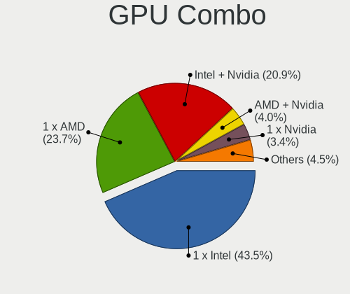

| Name           | Notebooks | Percent |
|----------------|-----------|---------|
| 1 x Intel      | 45        | 46.39%  |
| 1 x AMD        | 24        | 24.74%  |
| Intel + Nvidia | 19        | 19.59%  |
| 1 x Nvidia     | 3         | 3.09%   |
| Intel + AMD    | 3         | 3.09%   |
| 2 x AMD        | 2         | 2.06%   |
| AMD + Nvidia   | 1         | 1.03%   |

GPU Driver
----------

Free vs proprietary

| Driver      | Notebooks | Percent |
|-------------|-----------|---------|
| Free        | 83        | 83%     |
| Proprietary | 12        | 12%     |
| Unknown     | 5         | 5%      |

GPU Memory
----------

Total video memory

| Size in GB | Notebooks | Percent |
|------------|-----------|---------|
| Unknown    | 50        | 49.5%   |
| 0.01-0.5   | 24        | 23.76%  |
| 1.01-2.0   | 19        | 18.81%  |
| 3.01-4.0   | 6         | 5.94%   |
| 7.01-8.0   | 1         | 0.99%   |
| 0.51-1.0   | 1         | 0.99%   |

Monitor
-------

Monitor Vendor
--------------

Monitor vendors

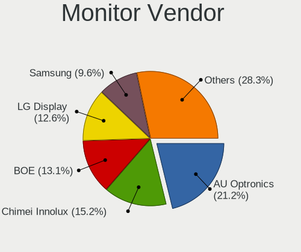

| Vendor                  | Notebooks | Percent |
|-------------------------|-----------|---------|
| AU Optronics            | 29        | 26.36%  |
| LG Display              | 20        | 18.18%  |
| Chimei Innolux          | 14        | 12.73%  |
| Samsung Electronics     | 11        | 10%     |
| BOE                     | 8         | 7.27%   |
| Philips                 | 7         | 6.36%   |
| Chi Mei Optoelectronics | 5         | 4.55%   |
| Dell                    | 4         | 3.64%   |
| AOC                     | 3         | 2.73%   |
| Sharp                   | 2         | 1.82%   |
| InfoVision              | 2         | 1.82%   |
| Goldstar                | 2         | 1.82%   |
| PANDA                   | 1         | 0.91%   |
| Lenovo                  | 1         | 0.91%   |
| BenQ                    | 1         | 0.91%   |

Monitor Model
-------------

Monitor models

| Model                                                                 | Notebooks | Percent |
|-----------------------------------------------------------------------|-----------|---------|
| AU Optronics LCD Monitor AUO21ED 1920x1080 344x194mm 15.5-inch        | 4         | 3.6%    |
| LG Display LCD Monitor LGD0563 1920x1080 344x194mm 15.5-inch          | 3         | 2.7%    |
| AU Optronics LCD Monitor AUO46EC 1366x768 344x193mm 15.5-inch         | 3         | 2.7%    |
| AU Optronics LCD Monitor AUO38ED 1920x1080 344x193mm 15.5-inch        | 3         | 2.7%    |
| Philips 223E PHLC049 1920x1080 476x268mm 21.5-inch                    | 2         | 1.8%    |
| BOE LCD Monitor BOE085E 1920x1080 344x194mm 15.5-inch                 | 2         | 1.8%    |
| AU Optronics LCD Monitor AUO26EC 1366x768 344x193mm 15.5-inch         | 2         | 1.8%    |
| Sharp LCD Monitor SHP149A 1920x1080 344x194mm 15.5-inch               | 1         | 0.9%    |
| Sharp LCD Monitor SHP13CF 1280x800 331x207mm 15.4-inch                | 1         | 0.9%    |
| Samsung Electronics SyncMaster SAM01E1 1280x1024 376x301mm 19.0-inch  | 1         | 0.9%    |
| Samsung Electronics LF24T450F SAM7095 1920x1080 527x296mm 23.8-inch   | 1         | 0.9%    |
| Samsung Electronics LCD Monitor SEC5842 1366x768 309x174mm 14.0-inch  | 1         | 0.9%    |
| Samsung Electronics LCD Monitor SEC5441 1366x768 309x174mm 14.0-inch  | 1         | 0.9%    |
| Samsung Electronics LCD Monitor SEC4E45 1280x800 331x207mm 15.4-inch  | 1         | 0.9%    |
| Samsung Electronics LCD Monitor SEC4351 1366x768 344x194mm 15.5-inch  | 1         | 0.9%    |
| Samsung Electronics LCD Monitor SEC364A 1366x768 344x194mm 15.5-inch  | 1         | 0.9%    |
| Samsung Electronics LCD Monitor SEC3551 1366x768 344x194mm 15.5-inch  | 1         | 0.9%    |
| Samsung Electronics LCD Monitor SEC3245 1280x800 331x207mm 15.4-inch  | 1         | 0.9%    |
| Samsung Electronics LCD Monitor SDCA029 3840x2160 344x194mm 15.5-inch | 1         | 0.9%    |
| Samsung Electronics LCD Monitor SDC4347 1366x768 344x193mm 15.5-inch  | 1         | 0.9%    |
| Samsung Electronics LCD Monitor SDC4150 3456x2160 336x210mm 15.6-inch | 1         | 0.9%    |
| Philips PHL 246E9Q PHLC17C 1920x1080 527x296mm 23.8-inch              | 1         | 0.9%    |
| Philips PHL 243S7 PHL090F 1920x1080 527x296mm 23.8-inch               | 1         | 0.9%    |
| Philips PHL 223V7 PHLC154 1920x1080 476x268mm 21.5-inch               | 1         | 0.9%    |
| Philips 247ELH PHLC085 1920x1080 521x293mm 23.5-inch                  | 1         | 0.9%    |
| Philips 227E4LH PHLC0AC 1920x1080 477x268mm 21.5-inch                 | 1         | 0.9%    |
| PANDA LM156LF1L03 NCP001C 1920x1080 344x194mm 15.5-inch               | 1         | 0.9%    |
| LG Display LP156WH1-TLA3 LGD01C2 1366x768 344x194mm 15.5-inch         | 1         | 0.9%    |
| LG Display LCD Monitor LGD06E0 1920x1080 344x194mm 15.5-inch          | 1         | 0.9%    |
| LG Display LCD Monitor LGD05F2 1920x1080 344x194mm 15.5-inch          | 1         | 0.9%    |
| LG Display LCD Monitor LGD05E5 1920x1080 344x194mm 15.5-inch          | 1         | 0.9%    |
| LG Display LCD Monitor LGD05CE 1920x1080 344x194mm 15.5-inch          | 1         | 0.9%    |
| LG Display LCD Monitor LGD0590 1920x1080 344x194mm 15.5-inch          | 1         | 0.9%    |
| LG Display LCD Monitor LGD0573 1920x1080 344x194mm 15.5-inch          | 1         | 0.9%    |
| LG Display LCD Monitor LGD04E8 1920x1080 382x215mm 17.3-inch          | 1         | 0.9%    |
| LG Display LCD Monitor LGD0468 1366x768 344x194mm 15.5-inch           | 1         | 0.9%    |
| LG Display LCD Monitor LGD0465 1366x768 344x194mm 15.5-inch           | 1         | 0.9%    |
| LG Display LCD Monitor LGD03FC 1600x900 309x174mm 14.0-inch           | 1         | 0.9%    |
| LG Display LCD Monitor LGD03ED 1366x768 277x156mm 12.5-inch           | 1         | 0.9%    |
| LG Display LCD Monitor LGD03E0 1366x768 345x194mm 15.6-inch           | 1         | 0.9%    |
| LG Display LCD Monitor LGD038E 1366x768 344x194mm 15.5-inch           | 1         | 0.9%    |
| LG Display LCD Monitor LGD0384 1366x768 344x194mm 15.5-inch           | 1         | 0.9%    |
| LG Display LCD Monitor LGD033B 1366x768 344x194mm 15.5-inch           | 1         | 0.9%    |
| LG Display LCD Monitor LGD01E8 1366x768 344x194mm 15.5-inch           | 1         | 0.9%    |
| Lenovo LCD Monitor LEN40D1 1366x768 256x144mm 11.6-inch               | 1         | 0.9%    |
| InfoVision LCD Monitor IVO057D 1920x1080 309x174mm 14.0-inch          | 1         | 0.9%    |
| InfoVision LCD Monitor IVO0489 1366x768 256x144mm 11.6-inch           | 1         | 0.9%    |
| Goldstar W2234 GSM56B8 1680x1050 474x296mm 22.0-inch                  | 1         | 0.9%    |
| Goldstar FULL HD GSM5B55 1920x1080 480x270mm 21.7-inch                | 1         | 0.9%    |
| Dell U2715H DELD067 2560x1440 597x336mm 27.0-inch                     | 1         | 0.9%    |
| Dell SE2419H DELF109 1920x1080 527x296mm 23.8-inch                    | 1         | 0.9%    |
| Dell P2419HC DELA11C 1920x1080 527x296mm 23.8-inch                    | 1         | 0.9%    |
| Dell P2417H DELA0DC 1920x1080 527x296mm 23.8-inch                     | 1         | 0.9%    |
| Chimei Innolux P140ZKA-BZ1 CMN8C03 2160x1440 296x197mm 14.0-inch      | 1         | 0.9%    |
| Chimei Innolux LCD Monitor CMN1728 1600x900 382x215mm 17.3-inch       | 1         | 0.9%    |
| Chimei Innolux LCD Monitor CMN15F5 1920x1080 344x193mm 15.5-inch      | 1         | 0.9%    |
| Chimei Innolux LCD Monitor CMN15E8 1920x1080 344x193mm 15.5-inch      | 1         | 0.9%    |
| Chimei Innolux LCD Monitor CMN15D5 1920x1080 344x193mm 15.5-inch      | 1         | 0.9%    |
| Chimei Innolux LCD Monitor CMN15CA 1366x768 344x193mm 15.5-inch       | 1         | 0.9%    |
| Chimei Innolux LCD Monitor CMN15C4 1920x1080 344x193mm 15.5-inch      | 1         | 0.9%    |

Monitor Resolution
------------------

Monitor screen resolution

| Resolution         | Notebooks | Percent |
|--------------------|-----------|---------|
| 1920x1080 (FHD)    | 41        | 41%     |
| 1366x768 (WXGA)    | 40        | 40%     |
| 1600x900 (HD+)     | 8         | 8%      |
| 1280x800 (WXGA)    | 3         | 3%      |
| 3840x2160 (4K)     | 2         | 2%      |
| 2560x1440 (QHD)    | 2         | 2%      |
| 3456x2160          | 1         | 1%      |
| 2160x1440          | 1         | 1%      |
| 1680x1050 (WSXGA+) | 1         | 1%      |
| 1280x1024 (SXGA)   | 1         | 1%      |

Monitor Diagonal
----------------

Diagonal size in inches

| Inches | Notebooks | Percent |
|--------|-----------|---------|
| 15     | 67        | 60.91%  |
| 14     | 7         | 6.36%   |
| 17     | 6         | 5.45%   |
| 13     | 6         | 5.45%   |
| 24     | 5         | 4.55%   |
| 21     | 5         | 4.55%   |
| 23     | 4         | 3.64%   |
| 11     | 4         | 3.64%   |
| 27     | 2         | 1.82%   |
| 31     | 1         | 0.91%   |
| 22     | 1         | 0.91%   |
| 19     | 1         | 0.91%   |
| 12     | 1         | 0.91%   |

Monitor Width
-------------

Physical width

| Width in mm | Notebooks | Percent |
|-------------|-----------|---------|
| 301-350     | 76        | 69.72%  |
| 501-600     | 10        | 9.17%   |
| 351-400     | 8         | 7.34%   |
| 201-300     | 8         | 7.34%   |
| 401-500     | 6         | 5.5%    |
| 601-700     | 1         | 0.92%   |

Aspect Ratio
------------

Proportional relationship between the width and the height

| Ratio | Notebooks | Percent |
|-------|-----------|---------|
| 16/9  | 87        | 92.55%  |
| 16/10 | 5         | 5.32%   |
| 5/4   | 1         | 1.06%   |
| 3/2   | 1         | 1.06%   |

Monitor Area
------------

Area in inch²

| Area in inch² | Notebooks | Percent |
|----------------|-----------|---------|
| 101-110        | 67        | 61.47%  |
| 201-250        | 12        | 11.01%  |
| 81-90          | 11        | 10.09%  |
| 51-60          | 4         | 3.67%   |
| 121-130        | 4         | 3.67%   |
| 151-200        | 3         | 2.75%   |
| 71-80          | 2         | 1.83%   |
| 301-350        | 2         | 1.83%   |
| 131-140        | 2         | 1.83%   |
| 61-70          | 1         | 0.92%   |
| 351-500        | 1         | 0.92%   |

Pixel Density
-------------

Pixels per inch

| Density       | Notebooks | Percent |
|---------------|-----------|---------|
| 121-160       | 45        | 42.45%  |
| 101-120       | 41        | 38.68%  |
| 51-100        | 16        | 15.09%  |
| More than 240 | 2         | 1.89%   |
| 161-240       | 2         | 1.89%   |

Multiple Monitors
-----------------

Total monitors connected

| Total | Notebooks | Percent |
|-------|-----------|---------|
| 1     | 79        | 80.61%  |
| 2     | 18        | 18.37%  |
| 0     | 1         | 1.02%   |

Network
-------

Net Controller Vendor
---------------------

Controller vendors

| Vendor                            | Notebooks | Percent |
|-----------------------------------|-----------|---------|
| Realtek Semiconductor             | 63        | 40.13%  |
| Qualcomm Atheros                  | 34        | 21.66%  |
| Intel                             | 34        | 21.66%  |
| Broadcom                          | 10        | 6.37%   |
| Xiaomi                            | 3         | 1.91%   |
| Ralink                            | 3         | 1.91%   |
| Nvidia                            | 2         | 1.27%   |
| Broadcom Limited                  | 2         | 1.27%   |
| TP-Link                           | 1         | 0.64%   |
| Marvell Technology Group          | 1         | 0.64%   |
| JMicron Technology                | 1         | 0.64%   |
| ICS Advent                        | 1         | 0.64%   |
| Huawei Technologies               | 1         | 0.64%   |
| Ericsson Business Mobile Networks | 1         | 0.64%   |

Net Controller Model
--------------------

Controller models

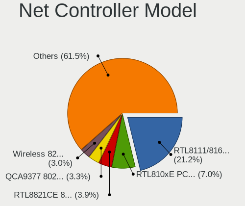

| Model                                                                          | Notebooks | Percent |
|--------------------------------------------------------------------------------|-----------|---------|
| Realtek RTL8111/8168/8411 PCI Express Gigabit Ethernet Controller              | 35        | 19.02%  |
| Realtek RTL810xE PCI Express Fast Ethernet controller                          | 19        | 10.33%  |
| Qualcomm Atheros QCA9565 / AR9565 Wireless Network Adapter                     | 9         | 4.89%   |
| Qualcomm Atheros QCA9377 802.11ac Wireless Network Adapter                     | 8         | 4.35%   |
| Qualcomm Atheros AR9285 Wireless Network Adapter (PCI-Express)                 | 7         | 3.8%    |
| Realtek RTL8821CE 802.11ac PCIe Wireless Network Adapter                       | 6         | 3.26%   |
| Intel Wireless 8265 / 8275                                                     | 4         | 2.17%   |
| Broadcom BCM4313 802.11bgn Wireless Network Adapter                            | 4         | 2.17%   |
| Xiaomi Mi/Redmi series (RNDIS)                                                 | 3         | 1.63%   |
| Realtek RTL8822CE 802.11ac PCIe Wireless Network Adapter                       | 3         | 1.63%   |
| Realtek RTL8723BE PCIe Wireless Network Adapter                                | 3         | 1.63%   |
| Realtek RTL8188EE Wireless Network Adapter                                     | 3         | 1.63%   |
| Qualcomm Atheros AR9485 Wireless Network Adapter                               | 3         | 1.63%   |
| Intel Wireless 7260                                                            | 3         | 1.63%   |
| Intel Wi-Fi 6 AX201                                                            | 3         | 1.63%   |
| Intel Wi-Fi 6 AX200                                                            | 3         | 1.63%   |
| Intel Ethernet Connection I218-LM                                              | 3         | 1.63%   |
| Intel Cannon Lake PCH CNVi WiFi                                                | 3         | 1.63%   |
| Realtek RTL8822BE 802.11a/b/g/n/ac WiFi adapter                                | 2         | 1.09%   |
| Realtek RTL8188CE 802.11b/g/n WiFi Adapter                                     | 2         | 1.09%   |
| Qualcomm Atheros AR8151 v2.0 Gigabit Ethernet                                  | 2         | 1.09%   |
| Qualcomm Atheros AR242x / AR542x Wireless Network Adapter (PCI-Express)        | 2         | 1.09%   |
| Nvidia MCP77 Ethernet                                                          | 2         | 1.09%   |
| Intel PRO/Wireless 4965 AG or AGN [Kedron] Network Connection                  | 2         | 1.09%   |
| Intel Dual Band Wireless-AC 3165 Plus Bluetooth                                | 2         | 1.09%   |
| Intel Comet Lake PCH-LP CNVi WiFi                                              | 2         | 1.09%   |
| Intel Cannon Point-LP CNVi [Wireless-AC]                                       | 2         | 1.09%   |
| Broadcom NetLink BCM57785 Gigabit Ethernet PCIe                                | 2         | 1.09%   |
| Broadcom BCM43228 802.11a/b/g/n                                                | 2         | 1.09%   |
| TP-Link TL-WN722N v2/v3 [Realtek RTL8188EUS]                                   | 1         | 0.54%   |
| Realtek RTL8852AE 802.11ax PCIe Wireless Network Adapter                       | 1         | 0.54%   |
| Realtek RTL8723DE Wireless Network Adapter                                     | 1         | 0.54%   |
| Realtek RTL8192CU 802.11n WLAN Adapter                                         | 1         | 0.54%   |
| Realtek RTL8187B Wireless Adapter                                              | 1         | 0.54%   |
| Realtek RTL8153 Gigabit Ethernet Adapter                                       | 1         | 0.54%   |
| Realtek RTL8152 Fast Ethernet Adapter                                          | 1         | 0.54%   |
| Ralink RT5390 [802.11 b/g/n 1T1R G-band PCI Express Single Chip]               | 1         | 0.54%   |
| Ralink RT5390 Wireless 802.11n 1T/1R PCIe                                      | 1         | 0.54%   |
| Ralink RT3090 Wireless 802.11n 1T/1R PCIe                                      | 1         | 0.54%   |
| Qualcomm Atheros QCA8172 Fast Ethernet                                         | 1         | 0.54%   |
| Qualcomm Atheros QCA6174 802.11ac Wireless Network Adapter                     | 1         | 0.54%   |
| Qualcomm Atheros AR9462 Wireless Network Adapter                               | 1         | 0.54%   |
| Qualcomm Atheros AR9287 Wireless Network Adapter (PCI-Express)                 | 1         | 0.54%   |
| Marvell Group Yukon Optima 88E8059 [PCIe Gigabit Ethernet Controller with AVB] | 1         | 0.54%   |
| JMicron JMC250 PCI Express Gigabit Ethernet Controller                         | 1         | 0.54%   |
| Intel Wireless 8260                                                            | 1         | 0.54%   |
| Intel Wireless 7265                                                            | 1         | 0.54%   |
| Intel Wireless 3165                                                            | 1         | 0.54%   |
| Intel Wireless 3160                                                            | 1         | 0.54%   |
| Intel Ice Lake-LP PCH CNVi WiFi                                                | 1         | 0.54%   |
| Intel Ethernet Connection I219-V                                               | 1         | 0.54%   |
| Intel Ethernet Connection I217-V                                               | 1         | 0.54%   |
| Intel Ethernet Connection (7) I219-LM                                          | 1         | 0.54%   |
| Intel Ethernet Connection (6) I219-V                                           | 1         | 0.54%   |
| Intel Ethernet Connection (3) I218-V                                           | 1         | 0.54%   |
| Intel Ethernet Connection (10) I219-LM                                         | 1         | 0.54%   |
| Intel Comet Lake PCH CNVi WiFi                                                 | 1         | 0.54%   |
| Intel Centrino Wireless-N 105                                                  | 1         | 0.54%   |
| Intel Centrino Ultimate-N 6300                                                 | 1         | 0.54%   |
| Intel 82579LM Gigabit Network Connection (Lewisville)                          | 1         | 0.54%   |

Wireless Vendor
---------------

Wireless vendors

| Vendor                | Notebooks | Percent |
|-----------------------|-----------|---------|
| Qualcomm Atheros      | 32        | 32.65%  |
| Intel                 | 32        | 32.65%  |
| Realtek Semiconductor | 23        | 23.47%  |
| Broadcom              | 7         | 7.14%   |
| Ralink                | 3         | 3.06%   |
| TP-Link               | 1         | 1.02%   |

Wireless Model
--------------

Wireless models

| Model                                                                   | Notebooks | Percent |
|-------------------------------------------------------------------------|-----------|---------|
| Qualcomm Atheros QCA9565 / AR9565 Wireless Network Adapter              | 9         | 9.18%   |
| Qualcomm Atheros QCA9377 802.11ac Wireless Network Adapter              | 8         | 8.16%   |
| Qualcomm Atheros AR9285 Wireless Network Adapter (PCI-Express)          | 7         | 7.14%   |
| Realtek RTL8821CE 802.11ac PCIe Wireless Network Adapter                | 6         | 6.12%   |
| Intel Wireless 8265 / 8275                                              | 4         | 4.08%   |
| Broadcom BCM4313 802.11bgn Wireless Network Adapter                     | 4         | 4.08%   |
| Realtek RTL8822CE 802.11ac PCIe Wireless Network Adapter                | 3         | 3.06%   |
| Realtek RTL8723BE PCIe Wireless Network Adapter                         | 3         | 3.06%   |
| Realtek RTL8188EE Wireless Network Adapter                              | 3         | 3.06%   |
| Qualcomm Atheros AR9485 Wireless Network Adapter                        | 3         | 3.06%   |
| Intel Wireless 7260                                                     | 3         | 3.06%   |
| Intel Wi-Fi 6 AX201                                                     | 3         | 3.06%   |
| Intel Wi-Fi 6 AX200                                                     | 3         | 3.06%   |
| Intel Cannon Lake PCH CNVi WiFi                                         | 3         | 3.06%   |
| Realtek RTL8822BE 802.11a/b/g/n/ac WiFi adapter                         | 2         | 2.04%   |
| Realtek RTL8188CE 802.11b/g/n WiFi Adapter                              | 2         | 2.04%   |
| Qualcomm Atheros AR242x / AR542x Wireless Network Adapter (PCI-Express) | 2         | 2.04%   |
| Intel PRO/Wireless 4965 AG or AGN [Kedron] Network Connection           | 2         | 2.04%   |
| Intel Dual Band Wireless-AC 3165 Plus Bluetooth                         | 2         | 2.04%   |
| Intel Comet Lake PCH-LP CNVi WiFi                                       | 2         | 2.04%   |
| Intel Cannon Point-LP CNVi [Wireless-AC]                                | 2         | 2.04%   |
| Broadcom BCM43228 802.11a/b/g/n                                         | 2         | 2.04%   |
| TP-Link TL-WN722N v2/v3 [Realtek RTL8188EUS]                            | 1         | 1.02%   |
| Realtek RTL8852AE 802.11ax PCIe Wireless Network Adapter                | 1         | 1.02%   |
| Realtek RTL8723DE Wireless Network Adapter                              | 1         | 1.02%   |
| Realtek RTL8192CU 802.11n WLAN Adapter                                  | 1         | 1.02%   |
| Realtek RTL8187B Wireless Adapter                                       | 1         | 1.02%   |
| Ralink RT5390 [802.11 b/g/n 1T1R G-band PCI Express Single Chip]        | 1         | 1.02%   |
| Ralink RT5390 Wireless 802.11n 1T/1R PCIe                               | 1         | 1.02%   |
| Ralink RT3090 Wireless 802.11n 1T/1R PCIe                               | 1         | 1.02%   |
| Qualcomm Atheros QCA6174 802.11ac Wireless Network Adapter              | 1         | 1.02%   |
| Qualcomm Atheros AR9462 Wireless Network Adapter                        | 1         | 1.02%   |
| Qualcomm Atheros AR9287 Wireless Network Adapter (PCI-Express)          | 1         | 1.02%   |
| Intel Wireless 8260                                                     | 1         | 1.02%   |
| Intel Wireless 7265                                                     | 1         | 1.02%   |
| Intel Wireless 3165                                                     | 1         | 1.02%   |
| Intel Wireless 3160                                                     | 1         | 1.02%   |
| Intel Ice Lake-LP PCH CNVi WiFi                                         | 1         | 1.02%   |
| Intel Comet Lake PCH CNVi WiFi                                          | 1         | 1.02%   |
| Intel Centrino Wireless-N 105                                           | 1         | 1.02%   |
| Intel Centrino Ultimate-N 6300                                          | 1         | 1.02%   |
| Broadcom BCM43227 802.11b/g/n                                           | 1         | 1.02%   |

Ethernet Vendor
---------------

Ethernet vendors

| Vendor                   | Notebooks | Percent |
|--------------------------|-----------|---------|
| Realtek Semiconductor    | 55        | 65.48%  |
| Intel                    | 12        | 14.29%  |
| Xiaomi                   | 3         | 3.57%   |
| Qualcomm Atheros         | 3         | 3.57%   |
| Broadcom                 | 3         | 3.57%   |
| Nvidia                   | 2         | 2.38%   |
| Broadcom Limited         | 2         | 2.38%   |
| Marvell Technology Group | 1         | 1.19%   |
| JMicron Technology       | 1         | 1.19%   |
| ICS Advent               | 1         | 1.19%   |
| Huawei Technologies      | 1         | 1.19%   |

Ethernet Model
--------------

Ethernet models

| Model                                                                          | Notebooks | Percent |
|--------------------------------------------------------------------------------|-----------|---------|
| Realtek RTL8111/8168/8411 PCI Express Gigabit Ethernet Controller              | 35        | 41.18%  |
| Realtek RTL810xE PCI Express Fast Ethernet controller                          | 19        | 22.35%  |
| Xiaomi Mi/Redmi series (RNDIS)                                                 | 3         | 3.53%   |
| Intel Ethernet Connection I218-LM                                              | 3         | 3.53%   |
| Qualcomm Atheros AR8151 v2.0 Gigabit Ethernet                                  | 2         | 2.35%   |
| Nvidia MCP77 Ethernet                                                          | 2         | 2.35%   |
| Broadcom NetLink BCM57785 Gigabit Ethernet PCIe                                | 2         | 2.35%   |
| Realtek RTL8153 Gigabit Ethernet Adapter                                       | 1         | 1.18%   |
| Realtek RTL8152 Fast Ethernet Adapter                                          | 1         | 1.18%   |
| Qualcomm Atheros QCA8172 Fast Ethernet                                         | 1         | 1.18%   |
| Marvell Group Yukon Optima 88E8059 [PCIe Gigabit Ethernet Controller with AVB] | 1         | 1.18%   |
| JMicron JMC250 PCI Express Gigabit Ethernet Controller                         | 1         | 1.18%   |
| Intel Ethernet Connection I219-V                                               | 1         | 1.18%   |
| Intel Ethernet Connection I217-V                                               | 1         | 1.18%   |
| Intel Ethernet Connection (7) I219-LM                                          | 1         | 1.18%   |
| Intel Ethernet Connection (6) I219-V                                           | 1         | 1.18%   |
| Intel Ethernet Connection (3) I218-V                                           | 1         | 1.18%   |
| Intel Ethernet Connection (10) I219-LM                                         | 1         | 1.18%   |
| Intel 82579LM Gigabit Network Connection (Lewisville)                          | 1         | 1.18%   |
| Intel 82566MM Gigabit Network Connection                                       | 1         | 1.18%   |
| Intel 82562GT 10/100 Network Connection                                        | 1         | 1.18%   |
| ICS Advent DM9601 Fast Ethernet Adapter                                        | 1         | 1.18%   |
| Huawei E353/E3131                                                              | 1         | 1.18%   |
| Broadcom NetXtreme BCM57786 Gigabit Ethernet PCIe                              | 1         | 1.18%   |
| Broadcom Limited NetXtreme BCM5761 Gigabit Ethernet PCIe                       | 1         | 1.18%   |
| Broadcom Limited NetLink BCM57785 Gigabit Ethernet PCIe                        | 1         | 1.18%   |

Net Controller Kind
-------------------

Ethernet, WiFi or modem

| Kind     | Notebooks | Percent |
|----------|-----------|---------|
| WiFi     | 96        | 53.33%  |
| Ethernet | 83        | 46.11%  |
| Modem    | 1         | 0.56%   |

Used Controller
---------------

Currently used network controller

| Kind     | Notebooks | Percent |
|----------|-----------|---------|
| WiFi     | 74        | 73.27%  |
| Ethernet | 27        | 26.73%  |

NICs
----

Total network controllers on board

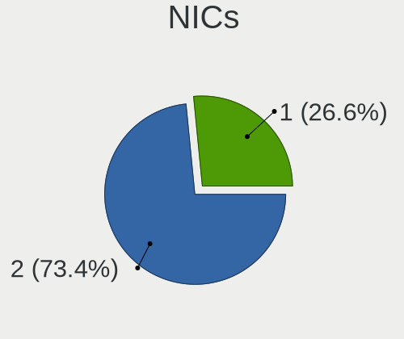

| Total | Notebooks | Percent |
|-------|-----------|---------|
| 2     | 76        | 78.35%  |
| 1     | 21        | 21.65%  |

IPv6
----

IPv6 vs IPv4

| Used | Notebooks | Percent |
|------|-----------|---------|
| No   | 94        | 96.91%  |
| Yes  | 3         | 3.09%   |

Bluetooth
---------

Bluetooth Vendor
----------------

Controller vendors

| Vendor                          | Notebooks | Percent |
|---------------------------------|-----------|---------|
| Intel                           | 25        | 35.71%  |
| Qualcomm Atheros Communications | 12        | 17.14%  |
| Realtek Semiconductor           | 9         | 12.86%  |
| IMC Networks                    | 9         | 12.86%  |
| Lite-On Technology              | 4         | 5.71%   |
| Broadcom                        | 4         | 5.71%   |
| Foxconn / Hon Hai               | 2         | 2.86%   |
| Toshiba                         | 1         | 1.43%   |
| Realtek                         | 1         | 1.43%   |
| Ralink Technology               | 1         | 1.43%   |
| Hewlett-Packard                 | 1         | 1.43%   |
| Dell                            | 1         | 1.43%   |

Bluetooth Model
---------------

Controller models

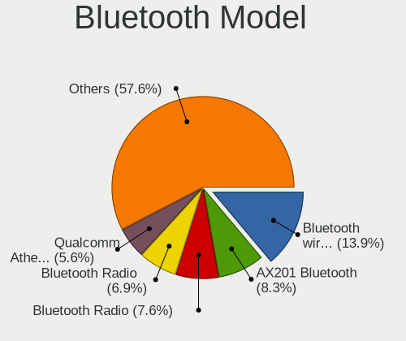

| Model                                                                               | Notebooks | Percent |
|-------------------------------------------------------------------------------------|-----------|---------|
| Intel Bluetooth wireless interface                                                  | 11        | 15.71%  |
| Realtek Bluetooth Radio                                                             | 6         | 8.57%   |
| Qualcomm Atheros  Bluetooth Device                                                  | 6         | 8.57%   |
| Intel Bluetooth 9460/9560 Jefferson Peak (JfP)                                      | 6         | 8.57%   |
| Intel AX201 Bluetooth                                                               | 5         | 7.14%   |
| IMC Networks Bluetooth Radio                                                        | 4         | 5.71%   |
| IMC Networks Bluetooth Device                                                       | 4         | 5.71%   |
| Intel AX200 Bluetooth                                                               | 3         | 4.29%   |
| Realtek RTL8822BE Bluetooth 4.2 Adapter                                             | 2         | 2.86%   |
| Qualcomm Atheros AR3012 Bluetooth 4.0                                               | 2         | 2.86%   |
| Qualcomm Atheros AR3011 Bluetooth                                                   | 2         | 2.86%   |
| Lite-On Qualcomm Atheros QCA9377 Bluetooth                                          | 2         | 2.86%   |
| Toshiba Integrated Bluetooth HCI                                                    | 1         | 1.43%   |
| Realtek 802.11ac WLAN Adapter                                                       | 1         | 1.43%   |
| Realtek Bluetooth Radio                                                             | 1         | 1.43%   |
| Ralink CSR BS8510                                                                   | 1         | 1.43%   |
| Qualcomm Atheros QCA61x4 Bluetooth 4.0                                              | 1         | 1.43%   |
| Qualcomm Atheros AR3012 Bluetooth                                                   | 1         | 1.43%   |
| Lite-On Bluetooth Device                                                            | 1         | 1.43%   |
| Lite-On Atheros AR3012 Bluetooth                                                    | 1         | 1.43%   |
| IMC Networks Atheros AR3012 Bluetooth 4.0 Adapter                                   | 1         | 1.43%   |
| HP Broadcom 2070 Bluetooth Combo                                                    | 1         | 1.43%   |
| Foxconn / Hon Hai Foxconn T77H114 BCM2070 [Single-Chip Bluetooth 2.1 + EDR Adapter] | 1         | 1.43%   |
| Foxconn / Hon Hai Bluetooth Device                                                  | 1         | 1.43%   |
| Dell DW375 Bluetooth Module                                                         | 1         | 1.43%   |
| Broadcom HP Portable SoftSailing                                                    | 1         | 1.43%   |
| Broadcom HP Portable Bumble Bee                                                     | 1         | 1.43%   |
| Broadcom BCM20702A0                                                                 | 1         | 1.43%   |
| Broadcom BCM2070 Bluetooth Device                                                   | 1         | 1.43%   |

Sound
-----

Sound Vendor
------------

Sound card vendors

| Vendor      | Notebooks | Percent |
|-------------|-----------|---------|
| Intel       | 68        | 63.55%  |
| AMD         | 27        | 25.23%  |
| Nvidia      | 9         | 8.41%   |
| Logitech    | 2         | 1.87%   |
| Plantronics | 1         | 0.93%   |

Sound Model
-----------

Sound card models

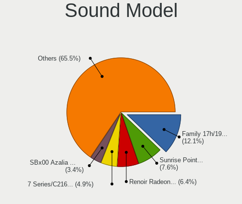

| Model                                                                                             | Notebooks | Percent |
|---------------------------------------------------------------------------------------------------|-----------|---------|
| Intel Sunrise Point-LP HD Audio                                                                   | 11        | 7.8%    |
| AMD Family 17h/19h HD Audio Controller                                                            | 10        | 7.09%   |
| AMD SBx00 Azalia (Intel HDA)                                                                      | 9         | 6.38%   |
| AMD Wrestler HDMI Audio                                                                           | 8         | 5.67%   |
| AMD Renoir Radeon High Definition Audio Controller                                                | 8         | 5.67%   |
| AMD FCH Azalia Controller                                                                         | 8         | 5.67%   |
| Intel 7 Series/C216 Chipset Family High Definition Audio Controller                               | 7         | 4.96%   |
| Intel Cannon Lake PCH cAVS                                                                        | 6         | 4.26%   |
| Intel Cannon Point-LP High Definition Audio Controller                                            | 5         | 3.55%   |
| Intel Haswell-ULT HD Audio Controller                                                             | 4         | 2.84%   |
| Intel 8 Series HD Audio Controller                                                                | 4         | 2.84%   |
| Intel 6 Series/C200 Series Chipset Family High Definition Audio Controller                        | 4         | 2.84%   |
| Intel Xeon E3-1200 v3/4th Gen Core Processor HD Audio Controller                                  | 3         | 2.13%   |
| Intel Wildcat Point-LP High Definition Audio Controller                                           | 3         | 2.13%   |
| Intel Tiger Lake-LP Smart Sound Technology Audio Controller                                       | 3         | 2.13%   |
| Intel Celeron/Pentium Silver Processor High Definition Audio                                      | 3         | 2.13%   |
| Intel Celeron N3350/Pentium N4200/Atom E3900 Series Audio Cluster                                 | 3         | 2.13%   |
| Intel Broadwell-U Audio Controller                                                                | 3         | 2.13%   |
| Intel Atom/Celeron/Pentium Processor x5-E8000/J3xxx/N3xxx Series High Definition Audio Controller | 3         | 2.13%   |
| Intel 8 Series/C220 Series Chipset High Definition Audio Controller                               | 3         | 2.13%   |
| Nvidia TU107 GeForce GTX 1650 High Definition Audio Controller                                    | 2         | 1.42%   |
| Nvidia MCP72XE/MCP72P/MCP78U/MCP78S High Definition Audio                                         | 2         | 1.42%   |
| Nvidia GP107GL High Definition Audio Controller                                                   | 2         | 1.42%   |
| Logitech H600 [Wireless Headset]                                                                  | 2         | 1.42%   |
| Intel Ice Lake-LP Smart Sound Technology Audio Controller                                         | 2         | 1.42%   |
| Intel Comet Lake PCH-LP cAVS                                                                      | 2         | 1.42%   |
| Intel Atom Processor Z36xxx/Z37xxx Series High Definition Audio Controller                        | 2         | 1.42%   |
| Intel 82801I (ICH9 Family) HD Audio Controller                                                    | 2         | 1.42%   |
| Intel 82801H (ICH8 Family) HD Audio Controller                                                    | 2         | 1.42%   |
| AMD Trinity HDMI Audio Controller                                                                 | 2         | 1.42%   |
| AMD RS880 HDMI Audio [Radeon HD 4200 Series]                                                      | 2         | 1.42%   |
| AMD BeaverCreek HDMI Audio [Radeon HD 6500D and 6400G-6600G series]                               | 2         | 1.42%   |
| Plantronics Audio 622 USB                                                                         | 1         | 0.71%   |
| Nvidia TU106 High Definition Audio Controller                                                     | 1         | 0.71%   |
| Nvidia GK208 HDMI/DP Audio Controller                                                             | 1         | 0.71%   |
| Nvidia GK107 HDMI Audio Controller                                                                | 1         | 0.71%   |
| Intel Comet Lake PCH cAVS                                                                         | 1         | 0.71%   |
| Intel CM238 HD Audio Controller                                                                   | 1         | 0.71%   |
| Intel 5 Series/3400 Series Chipset High Definition Audio                                          | 1         | 0.71%   |
| AMD Raven/Raven2/Fenghuang HDMI/DP Audio Controller                                               | 1         | 0.71%   |
| AMD Kabini HDMI/DP Audio                                                                          | 1         | 0.71%   |

Memory
------

Memory Vendor
-------------

Memory module vendors

| Vendor              | Notebooks | Percent |
|---------------------|-----------|---------|
| Samsung Electronics | 23        | 29.87%  |
| SK Hynix            | 17        | 22.08%  |
| Kingston            | 7         | 9.09%   |
| Micron Technology   | 6         | 7.79%   |
| Unknown             | 5         | 6.49%   |
| GOODRAM             | 4         | 5.19%   |
| Unknown (ABCD)      | 2         | 2.6%    |
| Transcend           | 2         | 2.6%    |
| Ramaxel Technology  | 2         | 2.6%    |
| Elpida              | 2         | 2.6%    |
| Unifosa             | 1         | 1.3%    |
| Nanya Technology    | 1         | 1.3%    |
| Crucial             | 1         | 1.3%    |
| AXIOM               | 1         | 1.3%    |
| ASint Technology    | 1         | 1.3%    |
| Apacer              | 1         | 1.3%    |
| A-DATA Technology   | 1         | 1.3%    |

Memory Model
------------

Memory module models

| Model                                                            | Notebooks | Percent |
|------------------------------------------------------------------|-----------|---------|
| SK Hynix RAM HMT351S6CFR8C-PB 4GB SODIMM DDR3 1600MT/s           | 3         | 3.66%   |
| Unknown RAM Module 2048MB SODIMM DRAM 667MT/s                    | 2         | 2.44%   |
| Unknown RAM Module 1024MB SODIMM DRAM 667MT/s                    | 2         | 2.44%   |
| Unknown (ABCD) RAM 123456789012345678 2GB SODIMM DDR4 2400MT/s   | 2         | 2.44%   |
| Samsung RAM M471B5273CH0-CK0 4GB SODIMM DDR3 1600MT/s            | 2         | 2.44%   |
| Samsung RAM M471B2873FHS-CF8 1024MB SODIMM DDR3 1067MT/s         | 2         | 2.44%   |
| Unknown RAM Module 4096MB SODIMM DDR3 1600MT/s                   | 1         | 1.22%   |
| Unknown RAM Module 2GB SODIMM DDR3                               | 1         | 1.22%   |
| Unknown RAM Module 2048MB SODIMM DDR2 400MT/s                    | 1         | 1.22%   |
| Unifosa RAM GU672203EP0200 1GB SODIMM DDR3 1333MT/s              | 1         | 1.22%   |
| Transcend RAM Module 8192MB SODIMM DDR4 2133MT/s                 | 1         | 1.22%   |
| Transcend RAM JM1333KSN-4G 4096MB SODIMM DDR3 1334MT/s           | 1         | 1.22%   |
| SK Hynix RAM Module 32GB SODIMM DDR4 2667MT/s                    | 1         | 1.22%   |
| SK Hynix RAM HYMP125S64CP8-S6 2GB SODIMM SDRAM 2048MT/s          | 1         | 1.22%   |
| SK Hynix RAM HMT451S6MFR8C-PB 4GB SODIMM DDR3 1600MT/s           | 1         | 1.22%   |
| SK Hynix RAM HMT351S6EFR8A-PB 4096MB SODIMM DDR3 1600MT/s        | 1         | 1.22%   |
| SK Hynix RAM HMT351S6CFR8A-PB 4096MB SODIMM DDR3 1600MT/s        | 1         | 1.22%   |
| SK Hynix RAM HMT325S6CFR8C-PB 2GB SODIMM DDR3 1600MT/s           | 1         | 1.22%   |
| SK Hynix RAM HMT325S6CFR8C-H9 2048MB SODIMM DDR3 1333MT/s        | 1         | 1.22%   |
| SK Hynix RAM HMT125S6TFR8C-H9 2048MB SODIMM DDR3 4199MT/s        | 1         | 1.22%   |
| SK Hynix RAM HMAA4GS6AJR8N-XN 32GB SODIMM DDR4 3200MT/s          | 1         | 1.22%   |
| SK Hynix RAM HMAA2GS6CJR8N-XN 16384MB SODIMM DDR4 3200MT/s       | 1         | 1.22%   |
| SK Hynix RAM HMA851S6JJR6N-VK 4GB SODIMM DDR4 2667MT/s           | 1         | 1.22%   |
| SK Hynix RAM HMA851S6AFR6N-UH 4GB SODIMM DDR4 2667MT/s           | 1         | 1.22%   |
| SK Hynix RAM HMA82GS6CJR8N-VK 16GB SODIMM DDR4 2667MT/s          | 1         | 1.22%   |
| SK Hynix RAM HMA81GS6JJR8N-VK 8GB SODIMM DDR4 2667MT/s           | 1         | 1.22%   |
| SK Hynix RAM HMA81GS6CJR8N-VK 8192MB SODIMM DDR4 2667MT/s        | 1         | 1.22%   |
| SK Hynix RAM H9HCNNNCPMALHR-NEE 8GB Row Of Chips LPDDR4 4800MT/s | 1         | 1.22%   |
| Samsung RAM Module 4096MB SODIMM DDR3 1600MT/s                   | 1         | 1.22%   |
| Samsung RAM Module 16GB SODIMM DDR4 2667MT/s                     | 1         | 1.22%   |
| Samsung RAM M471B5773CHS-CH9 2GB SODIMM DDR3 4199MT/s            | 1         | 1.22%   |
| Samsung RAM M471B5273DH0-YK0 4GB SODIMM DDR3 1600MT/s            | 1         | 1.22%   |
| Samsung RAM M471B5273DH0-CK0 4096MB SODIMM DDR3 1600MT/s         | 1         | 1.22%   |
| Samsung RAM M471B5173DB0-YK0 4GB SODIMM DDR3 1600MT/s            | 1         | 1.22%   |
| Samsung RAM M471B5173CB0-YK0 4096MB SODIMM DDR3 1600MT/s         | 1         | 1.22%   |
| Samsung RAM M471B5173BH0-CH9 4GB SODIMM DDR3 1334MT/s            | 1         | 1.22%   |
| Samsung RAM M471B1G73QH0-YK0 8192MB SODIMM DDR3 1600MT/s         | 1         | 1.22%   |
| Samsung RAM M471A5244CB0-CWE 4GB Row Of Chips DDR4 3200MT/s      | 1         | 1.22%   |
| Samsung RAM M471A5244CB0-CTD 4GB SODIMM DDR4 3266MT/s            | 1         | 1.22%   |
| Samsung RAM M471A5244CB0-CTD 4GB Row Of Chips DDR4 2667MT/s      | 1         | 1.22%   |
| Samsung RAM M471A5244CB0-CRC 4GB SODIMM DDR4 2667MT/s            | 1         | 1.22%   |
| Samsung RAM M471A2K43DB1-CTD 16GB SODIMM DDR4 2667MT/s           | 1         | 1.22%   |
| Samsung RAM M471A1K43EB1-CWE 8GB SODIMM DDR4 3200MT/s            | 1         | 1.22%   |
| Samsung RAM M471A1K43CB1-CRC 8GB SODIMM DDR4 2667MT/s            | 1         | 1.22%   |
| Samsung RAM M471A1K43BB1-CTD 8GB SODIMM DDR4 2667MT/s            | 1         | 1.22%   |
| Samsung RAM M471A1K43BB1-CRC 8GB SODIMM DDR4 2667MT/s            | 1         | 1.22%   |
| Samsung RAM M471A1G44AB0-CWE 8GB Row Of Chips DDR4 3200MT/s      | 1         | 1.22%   |
| Samsung RAM M4 70T2864EH3-CF7 1GB SODIMM DDR 2048MT/s            | 1         | 1.22%   |
| Ramaxel RAM RMT3170ME68F9F1600 4GB SODIMM DDR3 1600MT/s          | 1         | 1.22%   |
| Ramaxel RAM RMSA3260MH78HAF-2666 8192MB SODIMM DDR4 2667MT/s     | 1         | 1.22%   |
| Nanya RAM NT4GC64B8HG0NS-CG 4GB SODIMM DDR3 1334MT/s             | 1         | 1.22%   |
| Micron RAM MT52L1G32D4PG-093 8GB Row Of Chips LPDDR3 2133MT/s    | 1         | 1.22%   |
| Micron RAM 8KTF51264HDZ-1G6E1 4GB SODIMM DDR3 1600MT/s           | 1         | 1.22%   |
| Micron RAM 8ATF1G64HZ-2G6E1 8GB SODIMM DDR4 2667MT/s             | 1         | 1.22%   |
| Micron RAM 4ATF51264HZ-2G3B1 4GB SODIMM DDR4 2400MT/s            | 1         | 1.22%   |
| Micron RAM 16KTF1G64HZ-1G6E1 8192MB SODIMM DDR3 1600MT/s         | 1         | 1.22%   |
| Micron RAM 16JSF51264HZ-1G4D1 4GB SODIMM DDR3 1334MT/s           | 1         | 1.22%   |
| Kingston RAM Module 4GB SODIMM DDR3 1600MT/s                     | 1         | 1.22%   |
| Kingston RAM Module 2048MB SODIMM DDR2 400MT/s                   | 1         | 1.22%   |
| Kingston RAM KF073F-ELD 2GB SODIMM DDR3 1333MT/s                 | 1         | 1.22%   |

Memory Kind
-----------

Memory module kinds

| Kind   | Notebooks | Percent |
|--------|-----------|---------|
| DDR3   | 30        | 44.12%  |
| DDR4   | 24        | 35.29%  |
| SDRAM  | 4         | 5.88%   |
| LPDDR4 | 4         | 5.88%   |
| DDR2   | 3         | 4.41%   |
| DRAM   | 2         | 2.94%   |
| LPDDR3 | 1         | 1.47%   |

Memory Form Factor
------------------

Physical design of the memory module

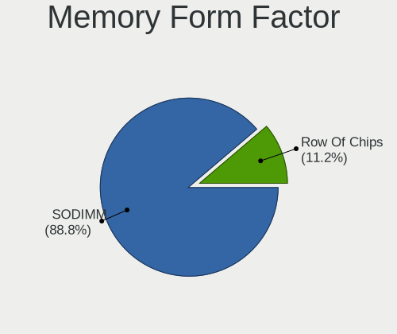

| Name         | Notebooks | Percent |
|--------------|-----------|---------|
| SODIMM       | 60        | 92.31%  |
| Row Of Chips | 5         | 7.69%   |

Memory Size
-----------

Memory module size

| Size  | Notebooks | Percent |
|-------|-----------|---------|
| 4096  | 30        | 40.54%  |
| 8192  | 18        | 24.32%  |
| 2048  | 13        | 17.57%  |
| 1024  | 6         | 8.11%   |
| 16384 | 5         | 6.76%   |
| 32768 | 2         | 2.7%    |

Memory Speed
------------

Memory module speed

| Speed   | Notebooks | Percent |
|---------|-----------|---------|
| 1600    | 21        | 29.17%  |
| 2667    | 17        | 23.61%  |
| 3200    | 5         | 6.94%   |
| 1334    | 5         | 6.94%   |
| 2400    | 4         | 5.56%   |
| 1333    | 4         | 5.56%   |
| 4199    | 2         | 2.78%   |
| 2133    | 2         | 2.78%   |
| 2048    | 2         | 2.78%   |
| 1067    | 2         | 2.78%   |
| 667     | 2         | 2.78%   |
| 400     | 2         | 2.78%   |
| 4800    | 1         | 1.39%   |
| 3266    | 1         | 1.39%   |
| 975     | 1         | 1.39%   |
| Unknown | 1         | 1.39%   |

Printers & scanners
-------------------

Printer Vendor
--------------

Printer device vendors

| Vendor | Notebooks | Percent |
|--------|-----------|---------|
| Canon  | 1         | 100%    |

Printer Model
-------------

Printer device models

| Model               | Notebooks | Percent |
|---------------------|-----------|---------|
| Canon iP7200 series | 1         | 100%    |

Scanner Vendor
--------------

Scanner device vendors

Zero info for selected period =(

Scanner Model
-------------

Scanner device models

Zero info for selected period =(

Camera
------

Camera Vendor
-------------

Camera device vendors

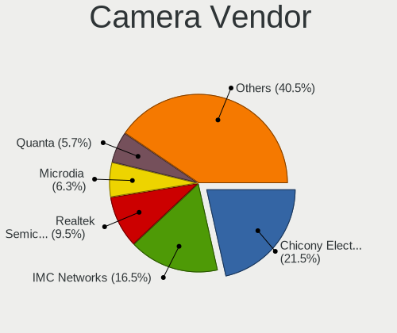

| Vendor                                 | Notebooks | Percent |
|----------------------------------------|-----------|---------|
| IMC Networks                           | 20        | 22.73%  |
| Chicony Electronics                    | 19        | 21.59%  |
| Realtek Semiconductor                  | 9         | 10.23%  |
| Microdia                               | 7         | 7.95%   |
| Acer                                   | 6         | 6.82%   |
| Quanta                                 | 4         | 4.55%   |
| Cheng Uei Precision Industry (Foxlink) | 4         | 4.55%   |
| Sunplus Innovation Technology          | 3         | 3.41%   |
| Silicon Motion                         | 3         | 3.41%   |
| Syntek                                 | 2         | 2.27%   |
| Suyin                                  | 2         | 2.27%   |
| Luxvisions Innotech Limited            | 2         | 2.27%   |
| Lite-On Technology                     | 2         | 2.27%   |
| Alcor Micro                            | 2         | 2.27%   |
| Z-Star Microelectronics                | 1         | 1.14%   |
| Samsung Electronics                    | 1         | 1.14%   |
| Importek                               | 1         | 1.14%   |

Camera Model
------------

Camera device models

| Model                                                                      | Notebooks | Percent |
|----------------------------------------------------------------------------|-----------|---------|
| IMC Networks USB2.0 HD UVC WebCam                                          | 5         | 5.68%   |
| IMC Networks USB2.0 VGA UVC WebCam                                         | 4         | 4.55%   |
| Realtek Integrated_Webcam_HD                                               | 3         | 3.41%   |
| Quanta HP HD Camera                                                        | 3         | 3.41%   |
| IMC Networks Integrated Camera                                             | 3         | 3.41%   |
| Chicony Integrated Camera                                                  | 3         | 3.41%   |
| Chicony HD WebCam                                                          | 3         | 3.41%   |
| Syntek Lenovo EasyCamera                                                   | 2         | 2.27%   |
| Silicon Motion WebCam SC-0311139N                                          | 2         | 2.27%   |
| Microdia Laptop_Integrated_Webcam_HD                                       | 2         | 2.27%   |
| Microdia Integrated_Webcam_HD                                              | 2         | 2.27%   |
| IMC Networks VGA UVC WebCam                                                | 2         | 2.27%   |
| Chicony USB2.0 VGA UVC WebCam                                              | 2         | 2.27%   |
| Chicony EasyCamera                                                         | 2         | 2.27%   |
| Z-Star WebCam SCB-0320N                                                    | 1         | 1.14%   |
| Suyin HP Truevision HD                                                     | 1         | 1.14%   |
| Suyin HD WebCam                                                            | 1         | 1.14%   |
| Sunplus Laptop_Integrated_Webcam_FHD                                       | 1         | 1.14%   |
| Sunplus Integrated_Webcam_HD                                               | 1         | 1.14%   |
| Sunplus HD WebCam                                                          | 1         | 1.14%   |
| Silicon Motion WebCam SC-13HDL11939N                                       | 1         | 1.14%   |
| Samsung Galaxy A5 (MTP)                                                    | 1         | 1.14%   |
| Realtek USB2.0 VGA UVC WebCam                                              | 1         | 1.14%   |
| Realtek USB Camera                                                         | 1         | 1.14%   |
| Realtek Integrated Webcam_HD                                               | 1         | 1.14%   |
| Realtek HP "Truevision HD" laptop camera                                   | 1         | 1.14%   |
| Realtek HD WebCam                                                          | 1         | 1.14%   |
| Realtek EasyCamera                                                         | 1         | 1.14%   |
| Quanta HP TrueVision HD Camera                                             | 1         | 1.14%   |
| Microdia Webcam Vitade AF                                                  | 1         | 1.14%   |
| Microdia Webcam                                                            | 1         | 1.14%   |
| Microdia Integrated Webcam                                                 | 1         | 1.14%   |
| Luxvisions Innotech Limited HP Wide Vision HD Camera                       | 1         | 1.14%   |
| Luxvisions Innotech Limited HP HD Camera                                   | 1         | 1.14%   |
| Lite-On HP HD Webcam                                                       | 1         | 1.14%   |
| Lite-On HP HD Camera                                                       | 1         | 1.14%   |
| Importek TOSHIBA Web Camera - HD                                           | 1         | 1.14%   |
| IMC Networks XiaoMi Webcam                                                 | 1         | 1.14%   |
| IMC Networks UVC VGA Webcam                                                | 1         | 1.14%   |
| IMC Networks USB2.0 HD IR UVC WebCam                                       | 1         | 1.14%   |
| IMC Networks USB Camera                                                    | 1         | 1.14%   |
| IMC Networks ov9734_azurewave_camera                                       | 1         | 1.14%   |
| IMC Networks Integrated Webcam                                             | 1         | 1.14%   |
| Chicony USB2.0 HD UVC WebCam                                               | 1         | 1.14%   |
| Chicony USB2.0 0.3M UVC WebCam                                             | 1         | 1.14%   |
| Chicony USB 2.0 Camera                                                     | 1         | 1.14%   |
| Chicony TOSHIBA Web Camera - FHD                                           | 1         | 1.14%   |
| Chicony Integrated Camera (1280x720@30)                                    | 1         | 1.14%   |
| Chicony HP Webcam                                                          | 1         | 1.14%   |
| Chicony HP HD Webcam [Fixed]                                               | 1         | 1.14%   |
| Chicony HP HD Webcam                                                       | 1         | 1.14%   |
| Chicony 1.3M Webcam                                                        | 1         | 1.14%   |
| Cheng Uei Precision Industry (Foxlink) XiaoMi USB 2.0 Webcam               | 1         | 1.14%   |
| Cheng Uei Precision Industry (Foxlink) HP Wide Vision HD Integrated Webcam | 1         | 1.14%   |
| Cheng Uei Precision Industry (Foxlink) HP Webcam-101                       | 1         | 1.14%   |
| Cheng Uei Precision Industry (Foxlink) HP Truevision HD                    | 1         | 1.14%   |
| Alcor Micro SHUNCCM2MP                                                     | 1         | 1.14%   |
| Alcor Micro Acer Integrated Webcam                                         | 1         | 1.14%   |
| Acer SunplusIT Integrated Camera                                           | 1         | 1.14%   |
| Acer SunplusIT INC. Integrated Camera                                      | 1         | 1.14%   |

Security
--------

Fingerprint Vendor
------------------

Fingerprint sensor vendors

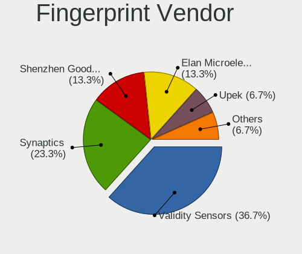

| Vendor                     | Notebooks | Percent |
|----------------------------|-----------|---------|
| Validity Sensors           | 7         | 33.33%  |
| Synaptics                  | 6         | 28.57%  |
| Shenzhen Goodix Technology | 3         | 14.29%  |
| Elan Microelectronics      | 2         | 9.52%   |
| Upek                       | 1         | 4.76%   |
| LighTuning Technology      | 1         | 4.76%   |
| AuthenTec                  | 1         | 4.76%   |

Fingerprint Model
-----------------

Fingerprint sensor models

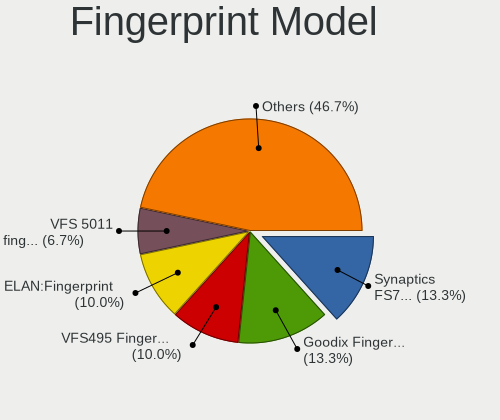

| Model                                                      | Notebooks | Percent |
|------------------------------------------------------------|-----------|---------|
| Synaptics  FS7604 Touch Fingerprint Sensor with PurePrint  | 3         | 14.29%  |
| Shenzhen Goodix  FingerPrint Device                        | 3         | 14.29%  |
| Validity Sensors VFS495 Fingerprint Reader                 | 2         | 9.52%   |
| Validity Sensors VFS 5011 fingerprint sensor               | 2         | 9.52%   |
| Validity Sensors Fingerprint scanner                       | 2         | 9.52%   |
| Synaptics  VFS7552 Touch Fingerprint Sensor with PurePrint | 2         | 9.52%   |
| Validity Sensors VFS Fingerprint sensor                    | 1         | 4.76%   |
| Upek Biometric Touchchip/Touchstrip Fingerprint Sensor     | 1         | 4.76%   |
| LighTuning EgisTec Touch Fingerprint Sensor                | 1         | 4.76%   |
| Elan ELAN:Fingerprint                                      | 1         | 4.76%   |
| Elan ELAN:ARM-M4                                           | 1         | 4.76%   |
| AuthenTec AES2501 Fingerprint Sensor                       | 1         | 4.76%   |
| Unknown                                                    | 1         | 4.76%   |

Chipcard Vendor
---------------

Chipcard module vendors

| Vendor                | Notebooks | Percent |
|-----------------------|-----------|---------|
| Realtek Semiconductor | 1         | 50%     |
| O2 Micro              | 1         | 50%     |

Chipcard Model
--------------

Chipcard module models

| Model                                             | Notebooks | Percent |
|---------------------------------------------------|-----------|---------|
| Realtek Semiconductor Smart Card Reader Interface | 1         | 50%     |
| O2 Micro OZ776 CCID Smartcard Reader              | 1         | 50%     |

Unsupported
-----------

Unsupported Devices
-------------------

Total unsupported devices on board

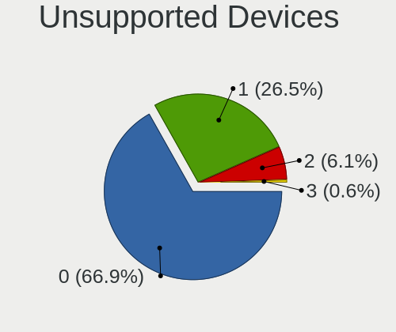

| Total | Notebooks | Percent |
|-------|-----------|---------|
| 0     | 64        | 63.37%  |
| 1     | 29        | 28.71%  |
| 2     | 7         | 6.93%   |
| 3     | 1         | 0.99%   |

Unsupported Device Types
------------------------

Types of unsupported devices

| Type                  | Notebooks | Percent |
|-----------------------|-----------|---------|
| Fingerprint reader    | 21        | 50%     |
| Graphics card         | 11        | 26.19%  |
| Net/wireless          | 4         | 9.52%   |
| Chipcard              | 2         | 4.76%   |
| Storage               | 1         | 2.38%   |
| Sound                 | 1         | 2.38%   |
| Multimedia controller | 1         | 2.38%   |
| Camera                | 1         | 2.38%   |

