Linux in Morocco - Tested Hardware & Statistics
-----------------------------------------------

A project to collect tested hardware configurations for Linux in Morocco.

Anyone can contribute to this report by the [hw-probe](https://github.com/linuxhw/hw-probe) tool:

    sudo -E hw-probe -all -upload

Please contribute! Especially if your hardware is rare.

This is a report for all computer types. See also reports for [desktops](/Location/Morocco/Desktop/README.md) and [notebooks](/Location/Morocco/Notebook/README.md).

Contents
--------

* [ Test Cases ](#test-cases)

* [ System ](#system)
  - [ OS                       ](#os)
  - [ OS Family                ](#os-family)
  - [ Kernel                   ](#kernel)
  - [ Kernel Family            ](#kernel-family)
  - [ Kernel Major Ver.        ](#kernel-major-ver)
  - [ Arch                     ](#arch)
  - [ DE                       ](#de)
  - [ Display Server           ](#display-server)
  - [ Display Manager          ](#display-manager)
  - [ OS Lang                  ](#os-lang)
  - [ Boot Mode                ](#boot-mode)
  - [ Filesystem               ](#filesystem)
  - [ Part. scheme             ](#part-scheme)
  - [ Dual Boot with Linux/BSD ](#dual-boot-with-linuxbsd)
  - [ Dual Boot (Win)          ](#dual-boot-win)

* [ Board ](#board)
  - [ Vendor                   ](#vendor)
  - [ Model                    ](#model)
  - [ Model Family             ](#model-family)
  - [ MFG Year                 ](#mfg-year)
  - [ Form Factor              ](#form-factor)
  - [ Secure Boot              ](#secure-boot)
  - [ Coreboot                 ](#coreboot)
  - [ RAM Size                 ](#ram-size)
  - [ RAM Used                 ](#ram-used)
  - [ Total Drives             ](#total-drives)
  - [ Has CD-ROM               ](#has-cd-rom)
  - [ Has Ethernet             ](#has-ethernet)
  - [ Has WiFi                 ](#has-wifi)
  - [ Has Bluetooth            ](#has-bluetooth)

* [ Location ](#location)
  - [ Country                  ](#country)
  - [ City                     ](#city)

* [ Drives ](#drives)
  - [ Drive Vendor             ](#drive-vendor)
  - [ Drive Model              ](#drive-model)
  - [ HDD Vendor               ](#hdd-vendor)
  - [ SSD Vendor               ](#ssd-vendor)
  - [ Drive Kind               ](#drive-kind)
  - [ Drive Connector          ](#drive-connector)
  - [ Drive Size               ](#drive-size)
  - [ Space Total              ](#space-total)
  - [ Space Used               ](#space-used)
  - [ Malfunc. Drives          ](#malfunc-drives)
  - [ Malfunc. Drive Vendor    ](#malfunc-drive-vendor)
  - [ Malfunc. HDD Vendor      ](#malfunc-hdd-vendor)
  - [ Malfunc. Drive Kind      ](#malfunc-drive-kind)
  - [ Failed Drives            ](#failed-drives)
  - [ Failed Drive Vendor      ](#failed-drive-vendor)
  - [ Drive Status             ](#drive-status)

* [ Storage controller ](#storage-controller)
  - [ Storage Vendor           ](#storage-vendor)
  - [ Storage Model            ](#storage-model)
  - [ Storage Kind             ](#storage-kind)

* [ Processor ](#processor)
  - [ CPU Vendor               ](#cpu-vendor)
  - [ CPU Model                ](#cpu-model)
  - [ CPU Model Family         ](#cpu-model-family)
  - [ CPU Cores                ](#cpu-cores)
  - [ CPU Sockets              ](#cpu-sockets)
  - [ CPU Threads              ](#cpu-threads)
  - [ CPU Op-Modes             ](#cpu-op-modes)
  - [ CPU Microcode            ](#cpu-microcode)
  - [ CPU Microarch            ](#cpu-microarch)

* [ Graphics ](#graphics)
  - [ GPU Vendor               ](#gpu-vendor)
  - [ GPU Model                ](#gpu-model)
  - [ GPU Combo                ](#gpu-combo)
  - [ GPU Driver               ](#gpu-driver)
  - [ GPU Memory               ](#gpu-memory)

* [ Monitor ](#monitor)
  - [ Monitor Vendor           ](#monitor-vendor)
  - [ Monitor Model            ](#monitor-model)
  - [ Monitor Resolution       ](#monitor-resolution)
  - [ Monitor Diagonal         ](#monitor-diagonal)
  - [ Monitor Width            ](#monitor-width)
  - [ Aspect Ratio             ](#aspect-ratio)
  - [ Monitor Area             ](#monitor-area)
  - [ Pixel Density            ](#pixel-density)
  - [ Multiple Monitors        ](#multiple-monitors)

* [ Network ](#network)
  - [ Net Controller Vendor    ](#net-controller-vendor)
  - [ Net Controller Model     ](#net-controller-model)
  - [ Wireless Vendor          ](#wireless-vendor)
  - [ Wireless Model           ](#wireless-model)
  - [ Ethernet Vendor          ](#ethernet-vendor)
  - [ Ethernet Model           ](#ethernet-model)
  - [ Net Controller Kind      ](#net-controller-kind)
  - [ Used Controller          ](#used-controller)
  - [ NICs                     ](#nics)
  - [ IPv6                     ](#ipv6)

* [ Bluetooth ](#bluetooth)
  - [ Bluetooth Vendor         ](#bluetooth-vendor)
  - [ Bluetooth Model          ](#bluetooth-model)

* [ Sound ](#sound)
  - [ Sound Vendor             ](#sound-vendor)
  - [ Sound Model              ](#sound-model)

* [ Memory ](#memory)
  - [ Memory Vendor            ](#memory-vendor)
  - [ Memory Model             ](#memory-model)
  - [ Memory Kind              ](#memory-kind)
  - [ Memory Form Factor       ](#memory-form-factor)
  - [ Memory Size              ](#memory-size)
  - [ Memory Speed             ](#memory-speed)

* [ Printers & scanners ](#printers--scanners)
  - [ Printer Vendor           ](#printer-vendor)
  - [ Printer Model            ](#printer-model)
  - [ Scanner Vendor           ](#scanner-vendor)
  - [ Scanner Model            ](#scanner-model)

* [ Camera ](#camera)
  - [ Camera Vendor            ](#camera-vendor)
  - [ Camera Model             ](#camera-model)

* [ Security ](#security)
  - [ Fingerprint Vendor       ](#fingerprint-vendor)
  - [ Fingerprint Model        ](#fingerprint-model)
  - [ Chipcard Vendor          ](#chipcard-vendor)
  - [ Chipcard Model           ](#chipcard-model)

* [ Unsupported ](#unsupported)
  - [ Unsupported Devices      ](#unsupported-devices)
  - [ Unsupported Device Types ](#unsupported-device-types)

Test Cases
----------

Total: 280

| Vendor        | Model                       | Form-Factor | Probe                                                      | Date         |
|---------------|-----------------------------|-------------|------------------------------------------------------------|--------------|
| Acer          | Aspire ES1-523              | Notebook    | [d14f053671](https://linux-hardware.org/?probe=d14f053671) | Aug 01, 2022 |
| Lenovo        | S21e-20 80M4                | Notebook    | [bec71c2353](https://linux-hardware.org/?probe=bec71c2353) | Jul 27, 2022 |
| Lenovo        | ThinkPad P52 20M9CTO1WW     | Notebook    | [02dd3c2357](https://linux-hardware.org/?probe=02dd3c2357) | Jul 21, 2022 |
| ASUSTek       | WS X299 SAGE                | Desktop     | [acb31e0818](https://linux-hardware.org/?probe=acb31e0818) | Jul 18, 2022 |
| HP            | EliteBook x360 1030 G2      | Convertible | [789f614370](https://linux-hardware.org/?probe=789f614370) | Jul 14, 2022 |
| Dell          | Latitude D620               | Notebook    | [70be0d553e](https://linux-hardware.org/?probe=70be0d553e) | Jul 08, 2022 |
| HP            | Laptop 15-dw3xxx            | Notebook    | [44b541373b](https://linux-hardware.org/?probe=44b541373b) | Jul 08, 2022 |
| Dell          | Latitude E6420              | Notebook    | [ede3298bf4](https://linux-hardware.org/?probe=ede3298bf4) | Jul 02, 2022 |
| HP            | ZBook 15 G3                 | Notebook    | [8c6f371222](https://linux-hardware.org/?probe=8c6f371222) | Jun 19, 2022 |
| HP            | Laptop 15-ra0xx             | Notebook    | [947ca74beb](https://linux-hardware.org/?probe=947ca74beb) | Jun 16, 2022 |
| HP            | Laptop 15-ra0xx             | Notebook    | [70ed4ebad8](https://linux-hardware.org/?probe=70ed4ebad8) | Jun 16, 2022 |
| Dell          | 0KJCC5 A00                  | Desktop     | [334e57a8b2](https://linux-hardware.org/?probe=334e57a8b2) | Jun 14, 2022 |
| HP            | EliteBook x360 1030 G2      | Convertible | [ed68bc8e1d](https://linux-hardware.org/?probe=ed68bc8e1d) | May 31, 2022 |
| Lenovo        | ThinkPad T430 2349BS7       | Notebook    | [2369e183ec](https://linux-hardware.org/?probe=2369e183ec) | May 30, 2022 |
| eMachines     | eM350                       | Notebook    | [2573854a09](https://linux-hardware.org/?probe=2573854a09) | May 29, 2022 |
| Lenovo        | ThinkPad X1 Carbon 6th 2... | Notebook    | [ae7670331c](https://linux-hardware.org/?probe=ae7670331c) | May 22, 2022 |
| Gigabyte      | AERO 15 KC                  | Notebook    | [5ebc19bd4c](https://linux-hardware.org/?probe=5ebc19bd4c) | May 18, 2022 |
| HP            | Laptop 17-cn0xxx            | Notebook    | [39bb2b41e5](https://linux-hardware.org/?probe=39bb2b41e5) | May 18, 2022 |
| HP            | Laptop 15s-eq2xxx           | Notebook    | [427af3e3a0](https://linux-hardware.org/?probe=427af3e3a0) | May 09, 2022 |
| HP            | Laptop 15-dw3xxx            | Notebook    | [7d4d1cb642](https://linux-hardware.org/?probe=7d4d1cb642) | May 06, 2022 |
| Dell          | Latitude E5440              | Notebook    | [556fccb6d3](https://linux-hardware.org/?probe=556fccb6d3) | May 06, 2022 |
| Packard Be... | EasyNote TS44HR             | Notebook    | [2eff4001dc](https://linux-hardware.org/?probe=2eff4001dc) | May 06, 2022 |
| HP            | Laptop 15-dw3xxx            | Notebook    | [889f1cba36](https://linux-hardware.org/?probe=889f1cba36) | Apr 30, 2022 |
| Toshiba       | Satellite C660              | Notebook    | [f4403056c8](https://linux-hardware.org/?probe=f4403056c8) | Apr 30, 2022 |
| HP            | Pavilion g6                 | Notebook    | [b79730a7af](https://linux-hardware.org/?probe=b79730a7af) | Apr 27, 2022 |
| Lenovo        | ThinkPad T460 20FN002SUS    | Notebook    | [0fad5f6cd2](https://linux-hardware.org/?probe=0fad5f6cd2) | Apr 21, 2022 |
| Raspberry ... | Raspberry Pi 4 Model B R... | Soc         | [45ad38e728](https://linux-hardware.org/?probe=45ad38e728) | Apr 14, 2022 |
| Raspberry ... | Raspberry Pi 4 Model B R... | Soc         | [d809b304eb](https://linux-hardware.org/?probe=d809b304eb) | Apr 14, 2022 |
| HP            | Presario C500 (GF852EA#A... | Notebook    | [b14e9c5694](https://linux-hardware.org/?probe=b14e9c5694) | Apr 08, 2022 |
| TrekStor      | Surfbook W2                 | Notebook    | [52eb1e4ce9](https://linux-hardware.org/?probe=52eb1e4ce9) | Apr 06, 2022 |
| Medion        | S4401 MD61533               | Convertible | [0017875c99](https://linux-hardware.org/?probe=0017875c99) | Mar 30, 2022 |
| HP            | Notebook                    | Notebook    | [313ca81d16](https://linux-hardware.org/?probe=313ca81d16) | Mar 27, 2022 |
| ECS           | Nettle2                     | Desktop     | [4939d60e6d](https://linux-hardware.org/?probe=4939d60e6d) | Mar 27, 2022 |
| HP            | 250 G5 Notebook PC          | Notebook    | [24664b0486](https://linux-hardware.org/?probe=24664b0486) | Mar 25, 2022 |
| HP            | 250 G5 Notebook PC          | Notebook    | [1cb13706a4](https://linux-hardware.org/?probe=1cb13706a4) | Mar 25, 2022 |
| Dell          | Vostro 1015                 | Notebook    | [5eac01f806](https://linux-hardware.org/?probe=5eac01f806) | Mar 25, 2022 |
| Dell          | Vostro 1015                 | Notebook    | [ce0fa4ee36](https://linux-hardware.org/?probe=ce0fa4ee36) | Mar 25, 2022 |
| Dell          | Latitude E5440              | Notebook    | [6b871a160e](https://linux-hardware.org/?probe=6b871a160e) | Mar 22, 2022 |
| Dell          | Latitude E5440              | Notebook    | [bd5621d6e2](https://linux-hardware.org/?probe=bd5621d6e2) | Mar 21, 2022 |
| HP            | ProBook 440 G5              | Notebook    | [39d48e6d79](https://linux-hardware.org/?probe=39d48e6d79) | Feb 28, 2022 |
| HP            | 18E4                        | Desktop     | [e7d597600e](https://linux-hardware.org/?probe=e7d597600e) | Feb 25, 2022 |
| Lenovo        | ThinkBook 15 G2 ITL 20VE    | Notebook    | [fc6097a447](https://linux-hardware.org/?probe=fc6097a447) | Feb 23, 2022 |
| Dell          | Inspiron 5558               | Notebook    | [6888384b59](https://linux-hardware.org/?probe=6888384b59) | Feb 21, 2022 |
| ASUSTek       | X751LD                      | Notebook    | [074c993361](https://linux-hardware.org/?probe=074c993361) | Feb 19, 2022 |
| Dell          | Latitude E6520              | Notebook    | [f921803f50](https://linux-hardware.org/?probe=f921803f50) | Feb 16, 2022 |
| HP            | EliteBook 8440p             | Notebook    | [ae8afcd09f](https://linux-hardware.org/?probe=ae8afcd09f) | Feb 13, 2022 |
| HP            | ProBook 440 G5              | Notebook    | [4769ae7351](https://linux-hardware.org/?probe=4769ae7351) | Feb 12, 2022 |
| Dell          | Precision M4800             | Notebook    | [8f91ff2d57](https://linux-hardware.org/?probe=8f91ff2d57) | Jan 29, 2022 |
| Dell          | Latitude E6520              | Notebook    | [ee96960cec](https://linux-hardware.org/?probe=ee96960cec) | Jan 25, 2022 |
| ASUSTek       | X540LA                      | Notebook    | [a24d99bf3b](https://linux-hardware.org/?probe=a24d99bf3b) | Jan 24, 2022 |
| Clevo         | W24/250CU                   | Notebook    | [64c6f06849](https://linux-hardware.org/?probe=64c6f06849) | Jan 22, 2022 |
| Google        | Banon                       | Notebook    | [3e792337e2](https://linux-hardware.org/?probe=3e792337e2) | Jan 21, 2022 |
| Google        | Banon                       | Notebook    | [c4cfb244b1](https://linux-hardware.org/?probe=c4cfb244b1) | Jan 21, 2022 |
| HP            | 3396                        | Desktop     | [e9486b13b8](https://linux-hardware.org/?probe=e9486b13b8) | Jan 20, 2022 |
| HP            | Pavilion g6                 | Notebook    | [099231b0b3](https://linux-hardware.org/?probe=099231b0b3) | Jan 19, 2022 |
| HP            | EliteBook 840 G1            | Notebook    | [8e4f80059d](https://linux-hardware.org/?probe=8e4f80059d) | Jan 14, 2022 |
| HP            | 1589                        | Desktop     | [402f1722ab](https://linux-hardware.org/?probe=402f1722ab) | Jan 09, 2022 |
| Lenovo        | ThinkPad P50 20EQS6J100     | Notebook    | [f366de3acf](https://linux-hardware.org/?probe=f366de3acf) | Jan 03, 2022 |
| Dell          | Precision 5560              | Notebook    | [04cb5954e9](https://linux-hardware.org/?probe=04cb5954e9) | Dec 31, 2021 |
| HP            | 8054                        | Desktop     | [13d18f87fe](https://linux-hardware.org/?probe=13d18f87fe) | Dec 30, 2021 |
| HP            | 8054                        | Desktop     | [fcf6deb221](https://linux-hardware.org/?probe=fcf6deb221) | Dec 30, 2021 |
| Timi          | TM1701                      | Notebook    | [ce3374e321](https://linux-hardware.org/?probe=ce3374e321) | Dec 23, 2021 |
| HP            | 1998                        | Desktop     | [f8e644ed15](https://linux-hardware.org/?probe=f8e644ed15) | Dec 23, 2021 |
| HP            | 090Ch                       | Desktop     | [bf92e3c728](https://linux-hardware.org/?probe=bf92e3c728) | Dec 22, 2021 |
| Acer          | Aspire One 522              | Notebook    | [7f495fc85b](https://linux-hardware.org/?probe=7f495fc85b) | Dec 21, 2021 |
| Lenovo        | IdeaPad L340-15IRH Gamin... | Notebook    | [331d419175](https://linux-hardware.org/?probe=331d419175) | Dec 06, 2021 |
| HP            | EliteBook 8460p             | Notebook    | [97aec623b3](https://linux-hardware.org/?probe=97aec623b3) | Dec 04, 2021 |
| Dell          | XPS 13 7390 2-in-1          | Convertible | [8a415c9db8](https://linux-hardware.org/?probe=8a415c9db8) | Dec 04, 2021 |
| Dell          | XPS 13 7390 2-in-1          | Convertible | [3027f5288e](https://linux-hardware.org/?probe=3027f5288e) | Dec 04, 2021 |
| HP            | 1998                        | Desktop     | [ffa6c0b239](https://linux-hardware.org/?probe=ffa6c0b239) | Dec 01, 2021 |
| ASUSTek       | K72Jr                       | Notebook    | [518ee0b884](https://linux-hardware.org/?probe=518ee0b884) | Nov 30, 2021 |
| ASUSTek       | K72Jr                       | Notebook    | [405b87f8bf](https://linux-hardware.org/?probe=405b87f8bf) | Nov 29, 2021 |
| Lenovo        | ThinkPad T440p 20AWS3DD1... | Notebook    | [816aaebc79](https://linux-hardware.org/?probe=816aaebc79) | Nov 27, 2021 |
| Lenovo        | ThinkPad T440p 20AWS3DD1... | Notebook    | [162c76040f](https://linux-hardware.org/?probe=162c76040f) | Nov 27, 2021 |
| Lenovo        | ThinkPad X13 Gen 2i 20WK... | Notebook    | [7b9f86430d](https://linux-hardware.org/?probe=7b9f86430d) | Nov 25, 2021 |
| Lenovo        | ThinkPad X13 Gen 2i 20WK... | Notebook    | [c5aa70cf8a](https://linux-hardware.org/?probe=c5aa70cf8a) | Nov 25, 2021 |
| Lenovo        | ThinkPad P14s Gen 2a 21A... | Notebook    | [73b27d5257](https://linux-hardware.org/?probe=73b27d5257) | Nov 25, 2021 |
| Lenovo        | ThinkPad P14s Gen 2a 21A... | Notebook    | [915ddf82b5](https://linux-hardware.org/?probe=915ddf82b5) | Nov 23, 2021 |
| HP            | EliteBook 8530w             | Notebook    | [e3a38e431e](https://linux-hardware.org/?probe=e3a38e431e) | Nov 23, 2021 |
| HP            | ZBook 15                    | Notebook    | [6aca3076ac](https://linux-hardware.org/?probe=6aca3076ac) | Nov 22, 2021 |
| HP            | 15                          | Notebook    | [e82411639f](https://linux-hardware.org/?probe=e82411639f) | Nov 20, 2021 |
| Toshiba       | Satellite L50-A-1EL         | Notebook    | [40fff0be70](https://linux-hardware.org/?probe=40fff0be70) | Nov 19, 2021 |
| Dell          | 0MWYPT A01                  | Desktop     | [63385716b2](https://linux-hardware.org/?probe=63385716b2) | Nov 19, 2021 |
| ASUSTek       | ROG STRIX B450-F GAMING     | Desktop     | [f8670ddd99](https://linux-hardware.org/?probe=f8670ddd99) | Nov 18, 2021 |
| ASUSTek       | ROG STRIX B450-F GAMING     | Desktop     | [b4fb9ffc24](https://linux-hardware.org/?probe=b4fb9ffc24) | Nov 18, 2021 |
| ASUSTek       | Acacia                      | Desktop     | [acb0ed7655](https://linux-hardware.org/?probe=acb0ed7655) | Nov 16, 2021 |
| HP            | EliteBook x360 1030 G2      | Convertible | [b4ebd974c1](https://linux-hardware.org/?probe=b4ebd974c1) | Nov 15, 2021 |
| Apple         | MacBookPro13,3              | Notebook    | [e80b600640](https://linux-hardware.org/?probe=e80b600640) | Nov 12, 2021 |
| HP            | 1589                        | Desktop     | [789cbfc3fa](https://linux-hardware.org/?probe=789cbfc3fa) | Nov 10, 2021 |
| HP            | Laptop 15-dw3xxx            | Notebook    | [966b61331a](https://linux-hardware.org/?probe=966b61331a) | Nov 05, 2021 |
| HP            | Laptop 15-dw3xxx            | Notebook    | [e1c9be9f1d](https://linux-hardware.org/?probe=e1c9be9f1d) | Nov 05, 2021 |
| Pegatron      | 2AD5                        | Desktop     | [70ae8e4cdf](https://linux-hardware.org/?probe=70ae8e4cdf) | Oct 30, 2021 |
| HP            | Pavilion Power Laptop 15... | Notebook    | [c1f75f6249](https://linux-hardware.org/?probe=c1f75f6249) | Oct 27, 2021 |
| ASUSTek       | X540LA                      | Notebook    | [c947e5b1ea](https://linux-hardware.org/?probe=c947e5b1ea) | Oct 26, 2021 |
| HP            | Laptop 15-da0xxx            | Notebook    | [2de5c74bc0](https://linux-hardware.org/?probe=2de5c74bc0) | Oct 23, 2021 |
| HP            | 18E7                        | Desktop     | [94c750ba4b](https://linux-hardware.org/?probe=94c750ba4b) | Oct 23, 2021 |
| HP            | 250 I3-5005U 15.6           | Notebook    | [94c7602d80](https://linux-hardware.org/?probe=94c7602d80) | Oct 20, 2021 |
| American M... | K7S41GX                     | Desktop     | [b5f8d33cc4](https://linux-hardware.org/?probe=b5f8d33cc4) | Oct 20, 2021 |
| American M... | K7S41GX                     | Desktop     | [920a47f107](https://linux-hardware.org/?probe=920a47f107) | Oct 20, 2021 |
| Sony          | VPCEH1L8E                   | Notebook    | [11ef4d4baf](https://linux-hardware.org/?probe=11ef4d4baf) | Oct 19, 2021 |
| HP            | 3032h                       | Desktop     | [6914386d3d](https://linux-hardware.org/?probe=6914386d3d) | Oct 19, 2021 |
| Sony          | SVE14122CAW                 | Notebook    | [7e20d79b1d](https://linux-hardware.org/?probe=7e20d79b1d) | Oct 16, 2021 |
| HP            | 1589                        | Desktop     | [bb8d8d60cf](https://linux-hardware.org/?probe=bb8d8d60cf) | Oct 10, 2021 |
| Dell          | 0J3C2F A00                  | Desktop     | [565fbea977](https://linux-hardware.org/?probe=565fbea977) | Oct 10, 2021 |
| Razer         | Blade Pro 17 (2019)         | Notebook    | [c0fc32d290](https://linux-hardware.org/?probe=c0fc32d290) | Oct 09, 2021 |
| Foxconn       | 2ABF                        | Desktop     | [92bc4bf86c](https://linux-hardware.org/?probe=92bc4bf86c) | Oct 04, 2021 |
| Dell          | Latitude E5570              | Notebook    | [bfc3702626](https://linux-hardware.org/?probe=bfc3702626) | Oct 04, 2021 |
| HP            | Pavilion Laptop 15-cc1xx    | Notebook    | [c5f4555ed5](https://linux-hardware.org/?probe=c5f4555ed5) | Sep 29, 2021 |
| Dell          | Latitude E5570              | Notebook    | [b4f22d5062](https://linux-hardware.org/?probe=b4f22d5062) | Sep 27, 2021 |
| Dell          | Latitude E5570              | Notebook    | [42c88d1bb8](https://linux-hardware.org/?probe=42c88d1bb8) | Sep 27, 2021 |
| HP            | EliteBook 8530w             | Notebook    | [37a7444281](https://linux-hardware.org/?probe=37a7444281) | Sep 25, 2021 |
| HP            | EliteBook 8530w             | Notebook    | [326645a221](https://linux-hardware.org/?probe=326645a221) | Sep 25, 2021 |
| Dell          | XPS 13 9350                 | Notebook    | [b01438543e](https://linux-hardware.org/?probe=b01438543e) | Sep 20, 2021 |
| HP            | 18E7                        | Desktop     | [e1aa6d3e49](https://linux-hardware.org/?probe=e1aa6d3e49) | Sep 19, 2021 |
| Lenovo        | IdeaPad S145-15IIL 81W8     | Notebook    | [554c02e687](https://linux-hardware.org/?probe=554c02e687) | Sep 14, 2021 |
| Lenovo        | IdeaPad S145-15IIL 81W8     | Notebook    | [e2202296c9](https://linux-hardware.org/?probe=e2202296c9) | Sep 13, 2021 |
| Lenovo        | ThinkPad X380 Yoga 20LJS... | Convertible | [99c878cd5e](https://linux-hardware.org/?probe=99c878cd5e) | Sep 04, 2021 |
| HP            | Pavilion Power Laptop 15... | Notebook    | [d63a5c07e1](https://linux-hardware.org/?probe=d63a5c07e1) | Aug 28, 2021 |
| HP            | Pavilion Power Laptop 15... | Notebook    | [78316d40ea](https://linux-hardware.org/?probe=78316d40ea) | Aug 28, 2021 |
| HP            | ENVY x360 Convertible 15... | Convertible | [cece1a32de](https://linux-hardware.org/?probe=cece1a32de) | Aug 21, 2021 |
| HP            | 0AACh                       | Desktop     | [588b35da24](https://linux-hardware.org/?probe=588b35da24) | Aug 21, 2021 |
| HP            | EliteBook x360 1030 G2      | Convertible | [49eb3e8236](https://linux-hardware.org/?probe=49eb3e8236) | Aug 18, 2021 |
| HP            | EliteBook x360 1030 G2      | Convertible | [3e73238fc6](https://linux-hardware.org/?probe=3e73238fc6) | Aug 13, 2021 |
| Lenovo        | ThinkPad X250 20CLS4WV08    | Notebook    | [2c09cdd5bd](https://linux-hardware.org/?probe=2c09cdd5bd) | Aug 12, 2021 |
| Lenovo        | SHARKBAY NOK                | Desktop     | [f0faf00d2f](https://linux-hardware.org/?probe=f0faf00d2f) | Aug 09, 2021 |
| Dell          | 0NX0PH A01                  | Desktop     | [8416267437](https://linux-hardware.org/?probe=8416267437) | Aug 09, 2021 |
| HP            | 15                          | Notebook    | [80ce139934](https://linux-hardware.org/?probe=80ce139934) | Aug 06, 2021 |
| HP            | 15                          | Notebook    | [24c674140c](https://linux-hardware.org/?probe=24c674140c) | Aug 05, 2021 |
| HP            | Laptop 15-dw3xxx            | Notebook    | [ea05f5d624](https://linux-hardware.org/?probe=ea05f5d624) | Jul 21, 2021 |
| HP            | 339A                        | Desktop     | [7ea04a15cb](https://linux-hardware.org/?probe=7ea04a15cb) | Jul 18, 2021 |
| HP            | 339A                        | Desktop     | [31018180f8](https://linux-hardware.org/?probe=31018180f8) | Jul 16, 2021 |
| Unknown       | 1.0                         | Notebook    | [d049c76d58](https://linux-hardware.org/?probe=d049c76d58) | Jul 08, 2021 |
| Unknown       | 1.0                         | Notebook    | [deb4346da8](https://linux-hardware.org/?probe=deb4346da8) | Jul 08, 2021 |
| Foxconn       | 2ABF                        | Desktop     | [77e63e8902](https://linux-hardware.org/?probe=77e63e8902) | Jul 06, 2021 |
| HP            | 3396                        | Desktop     | [28e2f6399c](https://linux-hardware.org/?probe=28e2f6399c) | Jul 05, 2021 |
| Unknown       | 1.0                         | Notebook    | [967654bdb6](https://linux-hardware.org/?probe=967654bdb6) | Jul 04, 2021 |
| Unknown       | 1.0                         | Notebook    | [36977bacbe](https://linux-hardware.org/?probe=36977bacbe) | Jul 03, 2021 |
| HP            | Pavilion Power Laptop 15... | Notebook    | [19666df61f](https://linux-hardware.org/?probe=19666df61f) | Jun 26, 2021 |
| HP            | Pavilion Power Laptop 15... | Notebook    | [df836c85c5](https://linux-hardware.org/?probe=df836c85c5) | Jun 26, 2021 |
| HP            | EliteBook 840 G3            | Notebook    | [dd3d9ede87](https://linux-hardware.org/?probe=dd3d9ede87) | Jun 20, 2021 |
| Unknown       | Unknown                     | Notebook    | [80c0612f78](https://linux-hardware.org/?probe=80c0612f78) | Jun 04, 2021 |
| Unknown       | Unknown                     | Notebook    | [9bac89aecf](https://linux-hardware.org/?probe=9bac89aecf) | Jun 04, 2021 |
| Dell          | 0KC9NP A01                  | Desktop     | [513f79e441](https://linux-hardware.org/?probe=513f79e441) | May 26, 2021 |
| HP            | 0AACh                       | Desktop     | [92920ff59a](https://linux-hardware.org/?probe=92920ff59a) | May 26, 2021 |
| Lenovo        | IdeaPad L3 15IML05 81Y3     | Notebook    | [3890d7877d](https://linux-hardware.org/?probe=3890d7877d) | May 06, 2021 |
| Lenovo        | IdeaPad L3 15IML05 81Y3     | Notebook    | [44810c2cc1](https://linux-hardware.org/?probe=44810c2cc1) | May 06, 2021 |
| MSI           | 2A9C                        | Desktop     | [db1be00449](https://linux-hardware.org/?probe=db1be00449) | May 02, 2021 |
| Lenovo        | ThinkPad X220 4291V5K       | Notebook    | [c0b9d7bd52](https://linux-hardware.org/?probe=c0b9d7bd52) | Apr 26, 2021 |
| Lenovo        | ThinkPad X220 4291V5K       | Notebook    | [4ec1325f12](https://linux-hardware.org/?probe=4ec1325f12) | Apr 26, 2021 |
| HP            | EliteBook 8460p             | Notebook    | [cf8b627aa4](https://linux-hardware.org/?probe=cf8b627aa4) | Apr 11, 2021 |
| HP            | EliteBook 8460p             | Notebook    | [bd04b1367f](https://linux-hardware.org/?probe=bd04b1367f) | Apr 11, 2021 |
| HP            | EliteBook 840 G2            | Notebook    | [522eb62b1a](https://linux-hardware.org/?probe=522eb62b1a) | Apr 03, 2021 |
| HP            | EliteBook 840 G2            | Notebook    | [e9df8836cf](https://linux-hardware.org/?probe=e9df8836cf) | Apr 03, 2021 |
| HP            | EliteBook 2540p             | Notebook    | [46c15e3b14](https://linux-hardware.org/?probe=46c15e3b14) | Apr 01, 2021 |
| HP            | EliteBook 840 G2            | Notebook    | [e1023ad432](https://linux-hardware.org/?probe=e1023ad432) | Mar 31, 2021 |
| HP            | EliteBook 840 G2            | Notebook    | [5c9803ca79](https://linux-hardware.org/?probe=5c9803ca79) | Mar 31, 2021 |
| Foxconn       | 2ACA                        | Desktop     | [04556ec49b](https://linux-hardware.org/?probe=04556ec49b) | Mar 26, 2021 |
| HP            | Pavilion Laptop 15-ck0xx    | Notebook    | [f973f0f31c](https://linux-hardware.org/?probe=f973f0f31c) | Mar 23, 2021 |
| Dell          | Latitude 5580               | Notebook    | [9fd0e8f6b5](https://linux-hardware.org/?probe=9fd0e8f6b5) | Mar 22, 2021 |
| Lenovo        | ThinkPad X220 4291B66       | Notebook    | [411fb65be7](https://linux-hardware.org/?probe=411fb65be7) | Mar 21, 2021 |
| Gigabyte      | X570 AORUS MASTER           | Desktop     | [7a6947637a](https://linux-hardware.org/?probe=7a6947637a) | Mar 16, 2021 |
| Gigabyte      | X570 AORUS MASTER           | Desktop     | [635fc4a0a2](https://linux-hardware.org/?probe=635fc4a0a2) | Mar 16, 2021 |
| Gigabyte      | X570 AORUS MASTER           | Desktop     | [6bccb5f740](https://linux-hardware.org/?probe=6bccb5f740) | Mar 15, 2021 |
| Dell          | 0MWYPT A01                  | Desktop     | [1c76380527](https://linux-hardware.org/?probe=1c76380527) | Mar 06, 2021 |
| HP            | 1495                        | Desktop     | [ca9664aff0](https://linux-hardware.org/?probe=ca9664aff0) | Mar 05, 2021 |
| HP            | Notebook                    | Notebook    | [fbc522f5e7](https://linux-hardware.org/?probe=fbc522f5e7) | Feb 24, 2021 |
| Lenovo        | 3106 SDK0J40697 WIN 3305... | Desktop     | [ab67b7aab9](https://linux-hardware.org/?probe=ab67b7aab9) | Feb 22, 2021 |
| HP            | Pavilion Sleekbook 15       | Notebook    | [aeb3111a93](https://linux-hardware.org/?probe=aeb3111a93) | Feb 20, 2021 |
| HP            | EliteBook 840 G2            | Notebook    | [1ffab0446e](https://linux-hardware.org/?probe=1ffab0446e) | Feb 17, 2021 |
| Lenovo        | ThinkPad T460 20FN002SUS    | Notebook    | [2ba0a379e8](https://linux-hardware.org/?probe=2ba0a379e8) | Feb 16, 2021 |
| Dell          | Latitude 3480               | Notebook    | [533356cb56](https://linux-hardware.org/?probe=533356cb56) | Feb 15, 2021 |
| HP            | Pavilion dv7                | Notebook    | [17dcac4931](https://linux-hardware.org/?probe=17dcac4931) | Feb 10, 2021 |
| GPD           | MicroPC                     | Notebook    | [ed2233e6ce](https://linux-hardware.org/?probe=ed2233e6ce) | Feb 08, 2021 |
| Dell          | 0M863N A01                  | Desktop     | [c10de13cf0](https://linux-hardware.org/?probe=c10de13cf0) | Feb 05, 2021 |
| Acer          | AO722                       | Notebook    | [24cb20b715](https://linux-hardware.org/?probe=24cb20b715) | Feb 04, 2021 |
| HP            | EliteBook 840 G2            | Notebook    | [8da09ed292](https://linux-hardware.org/?probe=8da09ed292) | Feb 04, 2021 |
| ASUSTek       | ROG CROSSHAIR VIII IMPAC... | Desktop     | [7861f8622e](https://linux-hardware.org/?probe=7861f8622e) | Feb 01, 2021 |
| Lenovo        | ThinkPad E590 20NB002AMB    | Notebook    | [e45b210ee6](https://linux-hardware.org/?probe=e45b210ee6) | Feb 01, 2021 |
| Lenovo        | ThinkPad T460 20FN002SUS    | Notebook    | [6c9654a854](https://linux-hardware.org/?probe=6c9654a854) | Jan 25, 2021 |
| Apple         | MacBook5,2                  | Notebook    | [512f5b5bdc](https://linux-hardware.org/?probe=512f5b5bdc) | Jan 18, 2021 |
| ASUSTek       | Crosshair IV Formula        | Desktop     | [3475dcd9b6](https://linux-hardware.org/?probe=3475dcd9b6) | Jan 17, 2021 |
| ASUSTek       | ROG CROSSHAIR VIII IMPAC... | Desktop     | [8d7a3472b3](https://linux-hardware.org/?probe=8d7a3472b3) | Jan 16, 2021 |
| HP            | Pavilion dv7                | Notebook    | [bc33dda5d6](https://linux-hardware.org/?probe=bc33dda5d6) | Jan 09, 2021 |
| HP            | 650                         | Notebook    | [65c5445c17](https://linux-hardware.org/?probe=65c5445c17) | Jan 08, 2021 |
| Sony          | VGN-FW11L                   | Notebook    | [e99fe042af](https://linux-hardware.org/?probe=e99fe042af) | Jan 06, 2021 |
| HP            | 255 G7 Notebook PC          | Notebook    | [493c807f09](https://linux-hardware.org/?probe=493c807f09) | Jan 06, 2021 |
| Lenovo        | ThinkPad E570 20H50078IX    | Notebook    | [9162d07863](https://linux-hardware.org/?probe=9162d07863) | Dec 31, 2020 |
| Lenovo        | ThinkPad E570 20H50078IX    | Notebook    | [f1f07aecd0](https://linux-hardware.org/?probe=f1f07aecd0) | Dec 31, 2020 |
| HP            | 158A                        | Desktop     | [afd1e7439b](https://linux-hardware.org/?probe=afd1e7439b) | Dec 28, 2020 |
| Dell          | Latitude E6440              | Notebook    | [cec6c1fd51](https://linux-hardware.org/?probe=cec6c1fd51) | Dec 25, 2020 |
| ASUSTek       | Crosshair IV Formula        | Desktop     | [4a4ce9f5d2](https://linux-hardware.org/?probe=4a4ce9f5d2) | Dec 25, 2020 |
| HP            | 650                         | Notebook    | [ff87d07205](https://linux-hardware.org/?probe=ff87d07205) | Dec 21, 2020 |
| Packard Be... | EasyNote TS11HR             | Notebook    | [9c31cf187f](https://linux-hardware.org/?probe=9c31cf187f) | Dec 17, 2020 |
| Timi          | TM1701                      | Notebook    | [bc63393a91](https://linux-hardware.org/?probe=bc63393a91) | Dec 13, 2020 |
| Lenovo        | ThinkPad T480s 20L8S3P30... | Notebook    | [1a37278a5b](https://linux-hardware.org/?probe=1a37278a5b) | Dec 13, 2020 |
| HP            | EliteBook 8560w             | Notebook    | [d546d8c598](https://linux-hardware.org/?probe=d546d8c598) | Nov 25, 2020 |
| HP            | EliteBook 8560w             | Notebook    | [9bb315e3ac](https://linux-hardware.org/?probe=9bb315e3ac) | Nov 25, 2020 |
| HP            | 304Ah                       | Desktop     | [d5f7af2482](https://linux-hardware.org/?probe=d5f7af2482) | Nov 23, 2020 |
| Dell          | Latitude E6440              | Notebook    | [6739c087eb](https://linux-hardware.org/?probe=6739c087eb) | Nov 20, 2020 |
| TUXEDO        | N13xWU                      | Notebook    | [b72558f93c](https://linux-hardware.org/?probe=b72558f93c) | Nov 19, 2020 |
| ASUSTek       | Z170 PRO GAMING             | Desktop     | [193c57b056](https://linux-hardware.org/?probe=193c57b056) | Nov 10, 2020 |
| TUXEDO        | N13xWU                      | Notebook    | [e6a667e32c](https://linux-hardware.org/?probe=e6a667e32c) | Nov 08, 2020 |
| TUXEDO        | N13xWU                      | Notebook    | [b4cd820410](https://linux-hardware.org/?probe=b4cd820410) | Nov 08, 2020 |
| Lenovo        | ThinkPad X280 20KF001KFR    | Notebook    | [bb66d36c3e](https://linux-hardware.org/?probe=bb66d36c3e) | Oct 23, 2020 |
| ASUSTek       | X555LAB                     | Notebook    | [d4755cc80a](https://linux-hardware.org/?probe=d4755cc80a) | Oct 18, 2020 |
| Dell          | 0MWYPT A01                  | Desktop     | [3134def56f](https://linux-hardware.org/?probe=3134def56f) | Oct 11, 2020 |
| ASUSTek       | VivoBook_ASUSLaptop X512... | Notebook    | [ef4b4ee1be](https://linux-hardware.org/?probe=ef4b4ee1be) | Oct 10, 2020 |
| ASUSTek       | VivoBook_ASUSLaptop X512... | Notebook    | [c1d3bd539a](https://linux-hardware.org/?probe=c1d3bd539a) | Oct 09, 2020 |
| HP            | ProBook 450 G0              | Notebook    | [a12e9900c0](https://linux-hardware.org/?probe=a12e9900c0) | Oct 07, 2020 |
| HP            | ProBook 450 G0              | Notebook    | [822c9a0ece](https://linux-hardware.org/?probe=822c9a0ece) | Oct 07, 2020 |
| HP            | Compaq nc6220 (PL814AV)     | Notebook    | [7f042faa64](https://linux-hardware.org/?probe=7f042faa64) | Oct 04, 2020 |
| HP            | EliteBook 8440p             | Notebook    | [a5438c06dc](https://linux-hardware.org/?probe=a5438c06dc) | Oct 02, 2020 |
| HP            | ProBook 6470b               | Notebook    | [0c6e7c5d06](https://linux-hardware.org/?probe=0c6e7c5d06) | Sep 30, 2020 |
| HP            | ProBook 6470b               | Notebook    | [3ab44ecc2c](https://linux-hardware.org/?probe=3ab44ecc2c) | Sep 20, 2020 |
| Lenovo        | IdeaPad L3 15IML05 81Y3     | Notebook    | [e36d2e46a2](https://linux-hardware.org/?probe=e36d2e46a2) | Sep 16, 2020 |
| Lenovo        | ThinkPad X280 20KF001KFR    | Notebook    | [09ba7a078c](https://linux-hardware.org/?probe=09ba7a078c) | Sep 06, 2020 |
| Toshiba       | Satellite L750              | Notebook    | [1c9467e7ff](https://linux-hardware.org/?probe=1c9467e7ff) | Aug 31, 2020 |
| HP            | 3398                        | Desktop     | [6b7ea8d306](https://linux-hardware.org/?probe=6b7ea8d306) | Aug 27, 2020 |
| Dell          | Latitude E5270              | Notebook    | [b9e93e40f1](https://linux-hardware.org/?probe=b9e93e40f1) | Aug 26, 2020 |
| Toshiba       | Satellite C855-2CF          | Notebook    | [00048c3fd7](https://linux-hardware.org/?probe=00048c3fd7) | Aug 26, 2020 |
| HP            | ProBook 650 G1              | Notebook    | [134ae0f98f](https://linux-hardware.org/?probe=134ae0f98f) | Aug 24, 2020 |
| Lenovo        | ThinkPad X280 20KF001KFR    | Notebook    | [47a6af7e14](https://linux-hardware.org/?probe=47a6af7e14) | Aug 23, 2020 |
| HP            | Laptop 15-da0xxx            | Notebook    | [b51e82eb8b](https://linux-hardware.org/?probe=b51e82eb8b) | Aug 08, 2020 |
| HP            | ProBook 440 G7              | Notebook    | [b2d1e5272e](https://linux-hardware.org/?probe=b2d1e5272e) | Aug 07, 2020 |
| Lenovo        | Z70-80 80FG                 | Notebook    | [8f0c5d78da](https://linux-hardware.org/?probe=8f0c5d78da) | Jul 29, 2020 |
| HP            | 3397                        | Desktop     | [de9945e027](https://linux-hardware.org/?probe=de9945e027) | Jun 30, 2020 |
| Mediacom      | WinPad 11,6 FullHD- WPU1... | Notebook    | [c4b91061bd](https://linux-hardware.org/?probe=c4b91061bd) | Jun 24, 2020 |
| Mediacom      | WinPad 11,6 FullHD- WPU1... | Notebook    | [1d9441c4cb](https://linux-hardware.org/?probe=1d9441c4cb) | Jun 24, 2020 |
| HP            | EliteBook 840 G2            | Notebook    | [8f31cacb03](https://linux-hardware.org/?probe=8f31cacb03) | Jun 15, 2020 |
| Dell          | Latitude E6410              | Notebook    | [63006c892d](https://linux-hardware.org/?probe=63006c892d) | Jun 12, 2020 |
| Dell          | Latitude E6540              | Notebook    | [0820a41e4a](https://linux-hardware.org/?probe=0820a41e4a) | Jun 03, 2020 |
| Samsung       | 300E4A/300E5A/300E7A/343... | Notebook    | [d4a0f7593f](https://linux-hardware.org/?probe=d4a0f7593f) | May 30, 2020 |
| Packard Be... | EasyNote TK85               | Notebook    | [1ef7f1dccf](https://linux-hardware.org/?probe=1ef7f1dccf) | May 24, 2020 |
| HP            | Unknown                     | Notebook    | [83216ab6f8](https://linux-hardware.org/?probe=83216ab6f8) | May 23, 2020 |
| Dell          | Latitude E5270              | Notebook    | [79c2208ee5](https://linux-hardware.org/?probe=79c2208ee5) | May 16, 2020 |
| HP            | Laptop 15-da0xxx            | Notebook    | [4d933966bb](https://linux-hardware.org/?probe=4d933966bb) | May 16, 2020 |
| HP            | ZBook 15                    | Notebook    | [7fdf5ffeb8](https://linux-hardware.org/?probe=7fdf5ffeb8) | May 10, 2020 |
| HP            | 0A04h                       | Desktop     | [c0b180275b](https://linux-hardware.org/?probe=c0b180275b) | May 05, 2020 |
| HP            | 0A04h                       | Desktop     | [bb34c7e807](https://linux-hardware.org/?probe=bb34c7e807) | May 05, 2020 |
| Lenovo        | G50-70 20351                | Notebook    | [fea9f24d5a](https://linux-hardware.org/?probe=fea9f24d5a) | Apr 27, 2020 |
| Lenovo        | G50-70 20351                | Notebook    | [f6609c3613](https://linux-hardware.org/?probe=f6609c3613) | Apr 27, 2020 |
| ASUSTek       | UX31A                       | Notebook    | [2ce7c49619](https://linux-hardware.org/?probe=2ce7c49619) | Apr 16, 2020 |
| ASUSTek       | X542UAR                     | Notebook    | [1597291755](https://linux-hardware.org/?probe=1597291755) | Apr 03, 2020 |
| HP            | 3397                        | Desktop     | [37ddb2349c](https://linux-hardware.org/?probe=37ddb2349c) | Mar 20, 2020 |
| HP            | 250 G3                      | Notebook    | [e92714c5e6](https://linux-hardware.org/?probe=e92714c5e6) | Mar 18, 2020 |
| Dell          | Latitude E6510              | Notebook    | [bc7b29779f](https://linux-hardware.org/?probe=bc7b29779f) | Mar 08, 2020 |
| Packard Be... | EasyNote TK85               | Notebook    | [bf3776568a](https://linux-hardware.org/?probe=bf3776568a) | Feb 23, 2020 |
| HP            | EliteBook 8440p             | Notebook    | [2bc65b9511](https://linux-hardware.org/?probe=2bc65b9511) | Feb 22, 2020 |
| HP            | EliteBook 8440p             | Notebook    | [4ef298fd63](https://linux-hardware.org/?probe=4ef298fd63) | Feb 22, 2020 |
| HP            | Pavilion Laptop 15-cs2xx... | Notebook    | [98c2d41201](https://linux-hardware.org/?probe=98c2d41201) | Feb 21, 2020 |
| HP            | Pavilion Laptop 15-cs2xx... | Notebook    | [6b512c0e61](https://linux-hardware.org/?probe=6b512c0e61) | Feb 21, 2020 |
| Dell          | Latitude E5520              | Notebook    | [2994cbb1d2](https://linux-hardware.org/?probe=2994cbb1d2) | Feb 21, 2020 |
| Unknown       | Unknown                     | Phone       | [4ff689998e](https://linux-hardware.org/?probe=4ff689998e) | Feb 11, 2020 |
| Dell          | Inspiron 3521               | Notebook    | [35973fcba8](https://linux-hardware.org/?probe=35973fcba8) | Jan 01, 2020 |
| Medion        | P7615                       | Notebook    | [1402e4bf25](https://linux-hardware.org/?probe=1402e4bf25) | Dec 29, 2019 |
| Toshiba       | Satellite Pro C650          | Notebook    | [984a530b85](https://linux-hardware.org/?probe=984a530b85) | Dec 19, 2019 |
| Medion        | P7615                       | Notebook    | [56fdcbb995](https://linux-hardware.org/?probe=56fdcbb995) | Nov 25, 2019 |
| Medion        | P7615                       | Notebook    | [150034113d](https://linux-hardware.org/?probe=150034113d) | Nov 25, 2019 |
| Acer          | Aspire 7736                 | Notebook    | [64727a44db](https://linux-hardware.org/?probe=64727a44db) | Nov 24, 2019 |
| Acer          | Aspire 7736                 | Notebook    | [3415167cef](https://linux-hardware.org/?probe=3415167cef) | Nov 23, 2019 |
| HP            | 1494                        | Desktop     | [af749848e8](https://linux-hardware.org/?probe=af749848e8) | Nov 23, 2019 |
| Acer          | Aspire ES1-523              | Notebook    | [74c8472d6f](https://linux-hardware.org/?probe=74c8472d6f) | Nov 12, 2019 |
| ASUSTek       | X200MA                      | Notebook    | [860c71f889](https://linux-hardware.org/?probe=860c71f889) | Nov 10, 2019 |
| Acer          | Calpella                    | Notebook    | [6ff918b898](https://linux-hardware.org/?probe=6ff918b898) | Oct 29, 2019 |
| Dell          | Latitude 3590               | Notebook    | [8e1927b00a](https://linux-hardware.org/?probe=8e1927b00a) | Sep 22, 2019 |
| Lenovo        | ThinkPad T440 20B7S2MF01    | Notebook    | [4dc662ddb5](https://linux-hardware.org/?probe=4dc662ddb5) | Sep 04, 2019 |
| HP            | Laptop 15-bs0xx             | Notebook    | [73e92501d3](https://linux-hardware.org/?probe=73e92501d3) | Aug 29, 2019 |
| Dell          | 0D28YY A03                  | Desktop     | [0be7a39100](https://linux-hardware.org/?probe=0be7a39100) | Jul 14, 2019 |
| Samsung       | 355V4C/356V4C/3445VC/354... | Notebook    | [d9903b4749](https://linux-hardware.org/?probe=d9903b4749) | May 14, 2019 |
| Toshiba       | Satellite L50-A-1DG         | Notebook    | [b0e44b3093](https://linux-hardware.org/?probe=b0e44b3093) | Apr 13, 2019 |
| Toshiba       | Satellite L50-A-1DG         | Notebook    | [1103235a87](https://linux-hardware.org/?probe=1103235a87) | Apr 13, 2019 |
| Acer          | Aspire E5-575               | Notebook    | [e7e29b676f](https://linux-hardware.org/?probe=e7e29b676f) | Mar 16, 2019 |
| Acer          | Aspire E5-575               | Notebook    | [4d2d0aa109](https://linux-hardware.org/?probe=4d2d0aa109) | Feb 20, 2019 |
| ASUSTek       | F5VL                        | Notebook    | [8c665a5eb1](https://linux-hardware.org/?probe=8c665a5eb1) | Feb 07, 2019 |
| Lenovo        | MAHOBAY NO DPK              | Desktop     | [730a048dd9](https://linux-hardware.org/?probe=730a048dd9) | Dec 20, 2018 |
| Lenovo        | MAHOBAY NO DPK              | Desktop     | [36a6a5ce8c](https://linux-hardware.org/?probe=36a6a5ce8c) | Dec 20, 2018 |
| ASUSTek       | F5VL                        | Notebook    | [d54a4a5d26](https://linux-hardware.org/?probe=d54a4a5d26) | Dec 12, 2018 |
| Lenovo        | ThinkPad X240 20AMA09VFR    | Notebook    | [8e1e3b46c5](https://linux-hardware.org/?probe=8e1e3b46c5) | Nov 26, 2018 |
| Lenovo        | ThinkPad X240 20AMA09VFR    | Notebook    | [b14f27a474](https://linux-hardware.org/?probe=b14f27a474) | Nov 26, 2018 |
| Dell          | 0DR845                      | Desktop     | [3e45e16507](https://linux-hardware.org/?probe=3e45e16507) | Sep 23, 2017 |

System
------

OS
--

Installed operating systems

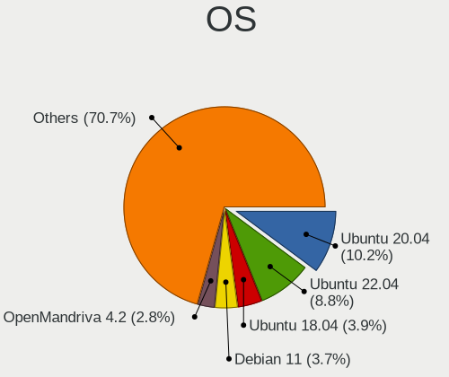

| Name               | Computers | Percent |
|--------------------|-----------|---------|
| Ubuntu 20.04       | 42        | 20.29%  |
| Ubuntu 18.04       | 16        | 7.73%   |
| OpenMandriva 4.2   | 12        | 5.8%    |
| KDE neon 20.04     | 9         | 4.35%   |
| Debian 11          | 8         | 3.86%   |
| Linux Mint 20.2    | 7         | 3.38%   |
| OpenMandriva 4.3   | 6         | 2.9%    |
| Ubuntu 20.10       | 5         | 2.42%   |
| Ubuntu 16.04       | 5         | 2.42%   |
| Linux Mint 20.3    | 5         | 2.42%   |
| Fedora 33          | 5         | 2.42%   |
| Zorin 16           | 4         | 1.93%   |
| Ubuntu 22.04       | 4         | 1.93%   |
| Ubuntu 19.10       | 4         | 1.93%   |
| OpenMandriva 4.50  | 4         | 1.93%   |
| ArcoLinux Rolling  | 4         | 1.93%   |
| Pop!_OS 22.04      | 3         | 1.45%   |
| Linux Mint 19.3    | 3         | 1.45%   |
| Arch               | 3         | 1.45%   |
| Zorin 15           | 2         | 0.97%   |
| Ubuntu 21.10       | 2         | 0.97%   |
| Ubuntu 21.04       | 2         | 0.97%   |
| Pop!_OS 21.10      | 2         | 0.97%   |
| Pop!_OS 20.10      | 2         | 0.97%   |
| Parrot 5.0         | 2         | 0.97%   |
| Manjaro            | 2         | 0.97%   |
| Kali 2019.4        | 2         | 0.97%   |
| Debian 10          | 2         | 0.97%   |
| Xubuntu 20.04      | 1         | 0.48%   |
| Xubuntu 18.04      | 1         | 0.48%   |
| Xero Rolling       | 1         | 0.48%   |
| Ubuntu MATE 20.04  | 1         | 0.48%   |
| Ubuntu 19.04       | 1         | 0.48%   |
| Ubuntu             | 1         | 0.48%   |
| ROSA R8.1          | 1         | 0.48%   |
| RHEL 8             | 1         | 0.48%   |
| Raspbian 10        | 1         | 0.48%   |
| Pop!_OS 21.04      | 1         | 0.48%   |
| Pear OS 21.04      | 1         | 0.48%   |
| openSUSE Leap-15.2 | 1         | 0.48%   |
| Manjaro 21.1.6     | 1         | 0.48%   |
| Manjaro 21.0.7     | 1         | 0.48%   |
| Manjaro 20.1       | 1         | 0.48%   |
| Lubuntu 18.04      | 1         | 0.48%   |
| Linux Mint 20      | 1         | 0.48%   |
| Linux Mint 19.2    | 1         | 0.48%   |
| Kubuntu 22.04      | 1         | 0.48%   |
| Kubuntu 21.04      | 1         | 0.48%   |
| Kali Rolling       | 1         | 0.48%   |
| Kali 2021.4        | 1         | 0.48%   |
| Kali 2021.3        | 1         | 0.48%   |
| Kali 2019.1        | 1         | 0.48%   |
| Fedora 35          | 1         | 0.48%   |
| Fedora 34          | 1         | 0.48%   |
| Fedora 32          | 1         | 0.48%   |
| Endless 3.9.5      | 1         | 0.48%   |
| Endless 3.5.1      | 1         | 0.48%   |
| Endless 3.3.20     | 1         | 0.48%   |
| EndeavourOS        | 1         | 0.48%   |
| Elementary 6       | 1         | 0.48%   |

OS Family
---------

OS without a version

| Name         | Computers | Percent |
|--------------|-----------|---------|
| Ubuntu       | 76        | 38.38%  |
| OpenMandriva | 22        | 11.11%  |
| Linux Mint   | 17        | 8.59%   |
| Debian       | 10        | 5.05%   |
| KDE neon     | 9         | 4.55%   |
| Pop!_OS      | 8         | 4.04%   |
| Fedora       | 8         | 4.04%   |
| Zorin        | 6         | 3.03%   |
| Kali         | 6         | 3.03%   |
| Manjaro      | 5         | 2.53%   |
| ArcoLinux    | 4         | 2.02%   |
| Arch         | 4         | 2.02%   |
| Endless      | 3         | 1.52%   |
| Xubuntu      | 2         | 1.01%   |
| Parrot       | 2         | 1.01%   |
| Elementary   | 2         | 1.01%   |
| Xero         | 1         | 0.51%   |
| Ubuntu MATE  | 1         | 0.51%   |
| ROSA         | 1         | 0.51%   |
| RHEL         | 1         | 0.51%   |
| Raspbian     | 1         | 0.51%   |
| Pear OS      | 1         | 0.51%   |
| openSUSE     | 1         | 0.51%   |
| Lubuntu      | 1         | 0.51%   |
| Kubuntu      | 1         | 0.51%   |
| EndeavourOS  | 1         | 0.51%   |
| CentOS       | 1         | 0.51%   |
| BunsenLabs   | 1         | 0.51%   |
| BlackPanther | 1         | 0.51%   |
| Android      | 1         | 0.51%   |

Kernel
------

Version of the Linux kernel

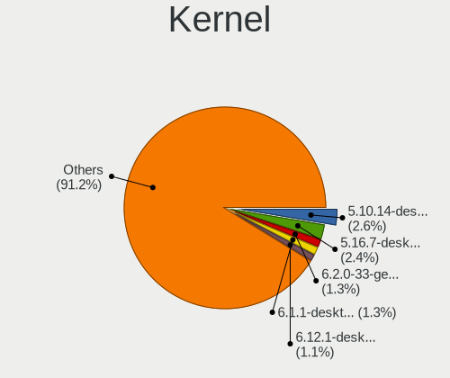

| Version                      | Computers | Percent |
|------------------------------|-----------|---------|
| 5.10.14-desktop-1omv4002     | 12        | 5.36%   |
| 5.16.7-desktop-1omv4003      | 6         | 2.68%   |
| 5.4.0-58-generic             | 5         | 2.23%   |
| 5.4.0-48-generic             | 5         | 2.23%   |
| 5.13.0-40-generic            | 5         | 2.23%   |
| 5.8.0-43-generic             | 4         | 1.79%   |
| 5.4.0-42-generic             | 4         | 1.79%   |
| 5.12.4-desktop-1omv4050      | 4         | 1.79%   |
| 5.11.0-37-generic            | 4         | 1.79%   |
| 5.8.0-38-generic             | 3         | 1.34%   |
| 5.3.0-40-generic             | 3         | 1.34%   |
| 5.17.5-76051705-generic      | 3         | 1.34%   |
| 5.8.0-48-generic             | 2         | 0.89%   |
| 5.8.0-33-generic             | 2         | 0.89%   |
| 5.4.0-96-generic             | 2         | 0.89%   |
| 5.4.0-90-generic             | 2         | 0.89%   |
| 5.4.0-88-generic             | 2         | 0.89%   |
| 5.4.0-74-generic             | 2         | 0.89%   |
| 5.4.0-65-generic             | 2         | 0.89%   |
| 5.4.0-59-generic             | 2         | 0.89%   |
| 5.4.0-37-generic             | 2         | 0.89%   |
| 5.4.0-33-generic             | 2         | 0.89%   |
| 5.4.0-29-generic             | 2         | 0.89%   |
| 5.3.0-kali2-686-pae          | 2         | 0.89%   |
| 5.3.0-51-generic             | 2         | 0.89%   |
| 5.3.0-28-generic             | 2         | 0.89%   |
| 5.15.0-41-generic            | 2         | 0.89%   |
| 5.14.14-arch1-1              | 2         | 0.89%   |
| 5.13.0-27-generic            | 2         | 0.89%   |
| 5.13.0-19-generic            | 2         | 0.89%   |
| 5.11.0-46-generic            | 2         | 0.89%   |
| 5.11.0-36-generic            | 2         | 0.89%   |
| 5.10.0-9-amd64               | 2         | 0.89%   |
| 5.0.0-23-generic             | 2         | 0.89%   |
| 4.15.0-29-generic            | 2         | 0.89%   |
| 5.8.18-300.fc33.x86_64       | 1         | 0.45%   |
| 5.8.15-201.fc32.x86_64       | 1         | 0.45%   |
| 5.8.1-050801-generic         | 1         | 0.45%   |
| 5.8.0-rc6-3.g007dcf0-default | 1         | 0.45%   |
| 5.8.0-7642-generic           | 1         | 0.45%   |
| 5.8.0-63-generic             | 1         | 0.45%   |
| 5.8.0-59-generic             | 1         | 0.45%   |
| 5.8.0-55-generic             | 1         | 0.45%   |
| 5.8.0-41-generic             | 1         | 0.45%   |
| 5.8.0-36-generic             | 1         | 0.45%   |
| 5.8.0-34-generic             | 1         | 0.45%   |
| 5.8.0-29-generic             | 1         | 0.45%   |
| 5.8.0-14-generic             | 1         | 0.45%   |
| 5.7.15-1-MANJARO             | 1         | 0.45%   |
| 5.6.14-desktop-2bP           | 1         | 0.45%   |
| 5.4.0-84-generic             | 1         | 0.45%   |
| 5.4.0-80-generic             | 1         | 0.45%   |
| 5.4.0-70-generic             | 1         | 0.45%   |
| 5.4.0-64-generic             | 1         | 0.45%   |
| 5.4.0-60-generic             | 1         | 0.45%   |
| 5.4.0-56-generic             | 1         | 0.45%   |
| 5.4.0-54-generic             | 1         | 0.45%   |
| 5.4.0-52-generic             | 1         | 0.45%   |
| 5.4.0-47-generic             | 1         | 0.45%   |
| 5.4.0-39-generic             | 1         | 0.45%   |

Kernel Family
-------------

Linux kernel without a distro release

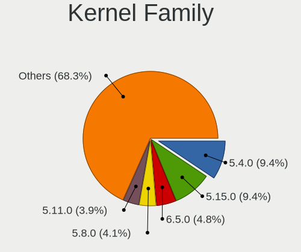

| Version  | Computers | Percent |
|----------|-----------|---------|
| 5.4.0    | 41        | 19.71%  |
| 5.8.0    | 18        | 8.65%   |
| 5.11.0   | 16        | 7.69%   |
| 4.15.0   | 14        | 6.73%   |
| 5.3.0    | 12        | 5.77%   |
| 5.10.14  | 12        | 5.77%   |
| 5.13.0   | 11        | 5.29%   |
| 5.10.0   | 10        | 4.81%   |
| 5.15.0   | 8         | 3.85%   |
| 5.16.7   | 6         | 2.88%   |
| 5.0.0    | 6         | 2.88%   |
| 5.12.4   | 4         | 1.92%   |
| 4.18.0   | 4         | 1.92%   |
| 5.17.5   | 3         | 1.44%   |
| 5.14.0   | 3         | 1.44%   |
| 4.19.0   | 3         | 1.44%   |
| 5.16.0   | 2         | 0.96%   |
| 5.14.14  | 2         | 0.96%   |
| 5.8.18   | 1         | 0.48%   |
| 5.8.15   | 1         | 0.48%   |
| 5.8.1    | 1         | 0.48%   |
| 5.7.15   | 1         | 0.48%   |
| 5.6.14   | 1         | 0.48%   |
| 5.18.12  | 1         | 0.48%   |
| 5.18.1   | 1         | 0.48%   |
| 5.17.9   | 1         | 0.48%   |
| 5.17.15  | 1         | 0.48%   |
| 5.17.1   | 1         | 0.48%   |
| 5.16.2   | 1         | 0.48%   |
| 5.15.4   | 1         | 0.48%   |
| 5.15.23  | 1         | 0.48%   |
| 5.15.21  | 1         | 0.48%   |
| 5.15.15  | 1         | 0.48%   |
| 5.15.12  | 1         | 0.48%   |
| 5.14.16  | 1         | 0.48%   |
| 5.13.19  | 1         | 0.48%   |
| 5.13.10  | 1         | 0.48%   |
| 5.11.8   | 1         | 0.48%   |
| 5.11.7   | 1         | 0.48%   |
| 5.11.14  | 1         | 0.48%   |
| 5.10.88  | 1         | 0.48%   |
| 5.10.87  | 1         | 0.48%   |
| 5.10.7   | 1         | 0.48%   |
| 5.10.42  | 1         | 0.48%   |
| 5.10.15  | 1         | 0.48%   |
| 5.10.11  | 1         | 0.48%   |
| 5.10.103 | 1         | 0.48%   |
| 4.9.41   | 1         | 0.48%   |
| 4.4.0    | 1         | 0.48%   |
| 4.13.0   | 1         | 0.48%   |
| 3.18.35  | 1         | 0.48%   |

Kernel Major Ver.
-----------------

Linux kernel major version

| Version | Computers | Percent |
|---------|-----------|---------|
| 5.4     | 41        | 19.81%  |
| 5.10    | 28        | 13.53%  |
| 5.8     | 21        | 10.14%  |
| 5.11    | 19        | 9.18%   |
| 4.15    | 14        | 6.76%   |
| 5.15    | 13        | 6.28%   |
| 5.13    | 13        | 6.28%   |
| 5.3     | 12        | 5.8%    |
| 5.16    | 9         | 4.35%   |
| 5.17    | 6         | 2.9%    |
| 5.14    | 6         | 2.9%    |
| 5.0     | 6         | 2.9%    |
| 5.12    | 4         | 1.93%   |
| 4.18    | 4         | 1.93%   |
| 4.19    | 3         | 1.45%   |
| 5.18    | 2         | 0.97%   |
| 5.7     | 1         | 0.48%   |
| 5.6     | 1         | 0.48%   |
| 4.9     | 1         | 0.48%   |
| 4.4     | 1         | 0.48%   |
| 4.13    | 1         | 0.48%   |
| 3.18    | 1         | 0.48%   |

Arch
----

OS architecture (x86_64, i586, etc.)

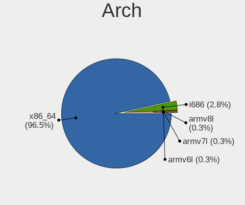

| Name   | Computers | Percent |
|--------|-----------|---------|
| x86_64 | 184       | 94.36%  |
| i686   | 9         | 4.62%   |
| armv8l | 1         | 0.51%   |
| armv7l | 1         | 0.51%   |

DE
--

Desktop Environment

| Name            | Computers | Percent |
|-----------------|-----------|---------|
| GNOME           | 95        | 47.5%   |
| KDE5            | 37        | 18.5%   |
| Unknown         | 16        | 8%      |
| XFCE            | 11        | 5.5%    |
| X-Cinnamon      | 11        | 5.5%    |
| KDE             | 8         | 4%      |
| Unity           | 4         | 2%      |
| MATE            | 4         | 2%      |
| LXDE            | 3         | 1.5%    |
| Cinnamon        | 3         | 1.5%    |
| Pantheon        | 2         | 1%      |
| xmonad          | 1         | 0.5%    |
| qtile           | 1         | 0.5%    |
| KDE4            | 1         | 0.5%    |
| i3              | 1         | 0.5%    |
| GNOME Flashback | 1         | 0.5%    |
| Budgie          | 1         | 0.5%    |

Display Server
--------------

X11 or Wayland

| Name    | Computers | Percent |
|---------|-----------|---------|
| X11     | 167       | 83.5%   |
| Wayland | 21        | 10.5%   |
| Unknown | 9         | 4.5%    |
| Tty     | 3         | 1.5%    |

Display Manager
---------------

SDDM, LightDM, etc.

| Name    | Computers | Percent |
|---------|-----------|---------|
| Unknown | 99        | 48.77%  |
| SDDM    | 37        | 18.23%  |
| GDM     | 28        | 13.79%  |
| LightDM | 22        | 10.84%  |
| GDM3    | 12        | 5.91%   |
| TDM     | 4         | 1.97%   |
| KDM     | 1         | 0.49%   |

OS Lang
-------

Language

| Lang    | Computers | Percent |
|---------|-----------|---------|
| en_US   | 104       | 52.53%  |
| fr_FR   | 55        | 27.78%  |
| Unknown | 18        | 9.09%   |
| en_GB   | 9         | 4.55%   |
| de_DE   | 3         | 1.52%   |
| C       | 2         | 1.01%   |
| ar_MA   | 2         | 1.01%   |
| fr_MA   | 1         | 0.51%   |
| fr_CH   | 1         | 0.51%   |
| fr_BE   | 1         | 0.51%   |
| es_ES   | 1         | 0.51%   |
| ar_EG   | 1         | 0.51%   |

Boot Mode
---------

EFI or BIOS

| Mode | Computers | Percent |
|------|-----------|---------|
| BIOS | 119       | 60.71%  |
| EFI  | 77        | 39.29%  |

Filesystem
----------

Type of filesystem

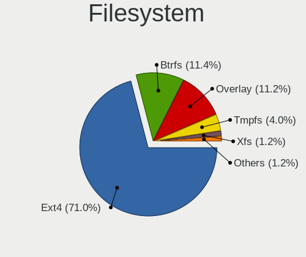

| Type    | Computers | Percent |
|---------|-----------|---------|
| Ext4    | 154       | 78.57%  |
| Overlay | 24        | 12.24%  |
| Btrfs   | 11        | 5.61%   |
| Unknown | 5         | 2.55%   |
| Xfs     | 2         | 1.02%   |

Part. scheme
------------

Scheme of partitioning

| Type    | Computers | Percent |
|---------|-----------|---------|
| Unknown | 107       | 54.59%  |
| GPT     | 60        | 30.61%  |
| MBR     | 29        | 14.8%   |

Dual Boot with Linux/BSD
------------------------

Hosting more than one Linux/BSD

| Dual boot | Computers | Percent |
|-----------|-----------|---------|
| No        | 167       | 85.2%   |
| Yes       | 29        | 14.8%   |

Dual Boot (Win)
---------------

Hosting Linux and Windows

| Dual boot | Computers | Percent |
|-----------|-----------|---------|
| No        | 117       | 59.69%  |
| Yes       | 79        | 40.31%  |

Board
-----

Vendor
------

Motherboard manufacturer

| Name                    | Computers | Percent |
|-------------------------|-----------|---------|
| Hewlett-Packard         | 72        | 36.92%  |
| Dell                    | 30        | 15.38%  |
| Lenovo                  | 29        | 14.87%  |
| ASUSTek Computer        | 16        | 8.21%   |
| Acer                    | 7         | 3.59%   |
| Toshiba                 | 6         | 3.08%   |
| Sony                    | 3         | 1.54%   |
| Packard Bell            | 3         | 1.54%   |
| Foxconn                 | 3         | 1.54%   |
| Unknown                 | 3         | 1.54%   |
| Timi                    | 2         | 1.03%   |
| Samsung Electronics     | 2         | 1.03%   |
| Medion                  | 2         | 1.03%   |
| Gigabyte Technology     | 2         | 1.03%   |
| Apple                   | 2         | 1.03%   |
| TUXEDO                  | 1         | 0.51%   |
| TrekStor                | 1         | 0.51%   |
| Razer                   | 1         | 0.51%   |
| Raspberry Pi Foundation | 1         | 0.51%   |
| Pegatron                | 1         | 0.51%   |
| MSI                     | 1         | 0.51%   |
| Mediacom                | 1         | 0.51%   |
| GPD                     | 1         | 0.51%   |
| Google                  | 1         | 0.51%   |
| eMachines               | 1         | 0.51%   |
| ECS                     | 1         | 0.51%   |
| Clevo                   | 1         | 0.51%   |
| American Megatrends     | 1         | 0.51%   |

Model
-----

Motherboard model

| Name                                       | Computers | Percent |
|--------------------------------------------|-----------|---------|
| Unknown                                    | 4         | 2.05%   |
| HP Laptop 15-dw3xxx                        | 3         | 1.54%   |
| HP EliteBook 8440p                         | 3         | 1.54%   |
| HP EliteBook 840 G2                        | 3         | 1.54%   |
| Timi TM1701                                | 2         | 1.03%   |
| Lenovo IdeaPad L3 15IML05 81Y3             | 2         | 1.03%   |
| HP ZBook 15                                | 2         | 1.03%   |
| HP ProDesk 600 G1 TWR                      | 2         | 1.03%   |
| HP ProBook 6470b                           | 2         | 1.03%   |
| HP Notebook                                | 2         | 1.03%   |
| HP EliteDesk 800 G1 SFF                    | 2         | 1.03%   |
| HP EliteBook 8460p                         | 2         | 1.03%   |
| HP Compaq Elite 8300 SFF                   | 2         | 1.03%   |
| HP Compaq Elite 8300 CMT                   | 2         | 1.03%   |
| HP Compaq dc7800 Convertible Minitower     | 2         | 1.03%   |
| Dell OptiPlex 790                          | 2         | 1.03%   |
| Dell Latitude E6520                        | 2         | 1.03%   |
| ASUS X540LA                                | 2         | 1.03%   |
| Acer Aspire ES1-523                        | 2         | 1.03%   |
| TUXEDO N13xWU                              | 1         | 0.51%   |
| TrekStor Surfbook W2                       | 1         | 0.51%   |
| Toshiba Satellite Pro C650                 | 1         | 0.51%   |
| Toshiba Satellite L750                     | 1         | 0.51%   |
| Toshiba Satellite L50-A-1EL                | 1         | 0.51%   |
| Toshiba Satellite L50-A-1DG                | 1         | 0.51%   |
| Toshiba Satellite C855-2CF                 | 1         | 0.51%   |
| Toshiba Satellite C660                     | 1         | 0.51%   |
| Sony VPCEH1L8E                             | 1         | 0.51%   |
| Sony VGN-FW11L                             | 1         | 0.51%   |
| Sony SVE14122CAW                           | 1         | 0.51%   |
| Samsung 355V4C/356V4C/3445VC/3545VC        | 1         | 0.51%   |
| Samsung 300E4A/300E5A/300E7A/3430EA/3530EA | 1         | 0.51%   |
| Razer Blade Pro 17 (2019)                  | 1         | 0.51%   |
| RPi Raspberry Pi 4 Model B Rev 1.1         | 1         | 0.51%   |
| Pegatron h8-1507ef                         | 1         | 0.51%   |
| Packard Bell EasyNote TS44HR               | 1         | 0.51%   |
| Packard Bell EasyNote TS11HR               | 1         | 0.51%   |
| Packard Bell EasyNote TK85                 | 1         | 0.51%   |
| MSI PPPPP-CCC#MMMMMMMM                     | 1         | 0.51%   |
| Medion S4401 MD61533                       | 1         | 0.51%   |
| Medion P7615                               | 1         | 0.51%   |
| Mediacom WinPad 11,6 FullHD- WPU11         | 1         | 0.51%   |
| Lenovo Z70-80 80FG                         | 1         | 0.51%   |
| Lenovo ThinkPad X380 Yoga 20LJS3JB00       | 1         | 0.51%   |
| Lenovo ThinkPad X280 20KF001KFR            | 1         | 0.51%   |
| Lenovo ThinkPad X250 20CLS4WV08            | 1         | 0.51%   |
| Lenovo ThinkPad X240 20AMA09VFR            | 1         | 0.51%   |
| Lenovo ThinkPad X220 4291V5K               | 1         | 0.51%   |
| Lenovo ThinkPad X220 4291B66               | 1         | 0.51%   |
| Lenovo ThinkPad X13 Gen 2i 20WK00AJGE      | 1         | 0.51%   |
| Lenovo ThinkPad X1 Carbon 6th 20KH006JGE   | 1         | 0.51%   |
| Lenovo ThinkPad T480s 20L8S3P300           | 1         | 0.51%   |
| Lenovo ThinkPad T460 20FN002SUS            | 1         | 0.51%   |
| Lenovo ThinkPad T440p 20AWS3DD1Z           | 1         | 0.51%   |
| Lenovo ThinkPad T440 20B7S2MF01            | 1         | 0.51%   |
| Lenovo ThinkPad T430 2349BS7               | 1         | 0.51%   |
| Lenovo ThinkPad P52 20M9CTO1WW             | 1         | 0.51%   |
| Lenovo ThinkPad P50 20EQS6J100             | 1         | 0.51%   |
| Lenovo ThinkPad P14s Gen 2a 21A1S00F00     | 1         | 0.51%   |
| Lenovo ThinkPad E590 20NB002AMB            | 1         | 0.51%   |

Model Family
------------

Motherboard model prefix

| Name                   | Computers | Percent |
|------------------------|-----------|---------|
| Lenovo ThinkPad        | 18        | 9.23%   |
| Dell Latitude          | 15        | 7.69%   |
| HP EliteBook           | 14        | 7.18%   |
| HP Compaq              | 13        | 6.67%   |
| HP Laptop              | 8         | 4.1%    |
| HP Pavilion            | 7         | 3.59%   |
| Toshiba Satellite      | 6         | 3.08%   |
| HP ProBook             | 6         | 3.08%   |
| Dell OptiPlex          | 5         | 2.56%   |
| Acer Aspire            | 5         | 2.56%   |
| Lenovo IdeaPad         | 4         | 2.05%   |
| HP EliteDesk           | 4         | 2.05%   |
| Dell Precision         | 4         | 2.05%   |
| Unknown                | 4         | 2.05%   |
| Packard Bell EasyNote  | 3         | 1.54%   |
| Lenovo ThinkCentre     | 3         | 1.54%   |
| HP ZBook               | 3         | 1.54%   |
| HP 250                 | 3         | 1.54%   |
| Timi TM1701            | 2         | 1.03%   |
| HP ProDesk             | 2         | 1.03%   |
| HP Notebook            | 2         | 1.03%   |
| Dell XPS               | 2         | 1.03%   |
| Dell Vostro            | 2         | 1.03%   |
| Dell Inspiron          | 2         | 1.03%   |
| ASUS X540LA            | 2         | 1.03%   |
| ASUS ROG               | 2         | 1.03%   |
| TUXEDO N13xWU          | 1         | 0.51%   |
| TrekStor Surfbook      | 1         | 0.51%   |
| Sony VPCEH1L8E         | 1         | 0.51%   |
| Sony VGN-FW11L         | 1         | 0.51%   |
| Sony SVE14122CAW       | 1         | 0.51%   |
| Samsung 355V4C         | 1         | 0.51%   |
| Samsung 300E4A         | 1         | 0.51%   |
| Razer Blade            | 1         | 0.51%   |
| RPi Raspberry          | 1         | 0.51%   |
| Pegatron h8-1507ef     | 1         | 0.51%   |
| MSI PPPPP-CCC#MMMMMMMM | 1         | 0.51%   |
| Medion S4401           | 1         | 0.51%   |
| Medion P7615           | 1         | 0.51%   |
| Mediacom WinPad        | 1         | 0.51%   |
| Lenovo Z70-80          | 1         | 0.51%   |
| Lenovo ThinkBook       | 1         | 0.51%   |
| Lenovo S21e-20         | 1         | 0.51%   |
| Lenovo G50-70          | 1         | 0.51%   |
| HP Z620                | 1         | 0.51%   |
| HP Z420                | 1         | 0.51%   |
| HP xw6400              | 1         | 0.51%   |
| HP Presario            | 1         | 0.51%   |
| HP ENVY                | 1         | 0.51%   |
| HP dc5000              | 1         | 0.51%   |
| HP 650                 | 1         | 0.51%   |
| HP 255                 | 1         | 0.51%   |
| HP 15                  | 1         | 0.51%   |
| GPD MicroPC            | 1         | 0.51%   |
| Google Banon           | 1         | 0.51%   |
| Gigabyte X570          | 1         | 0.51%   |
| Gigabyte AERO          | 1         | 0.51%   |
| Foxconn Pro3500        | 1         | 0.51%   |
| Foxconn p6-2002es      | 1         | 0.51%   |
| Foxconn CQ1140FRm      | 1         | 0.51%   |

MFG Year
--------

Motherboard manufacture year

| Year    | Computers | Percent |
|---------|-----------|---------|
| 2013    | 25        | 12.82%  |
| 2011    | 23        | 11.79%  |
| 2012    | 19        | 9.74%   |
| 2018    | 16        | 8.21%   |
| 2016    | 15        | 7.69%   |
| 2015    | 15        | 7.69%   |
| 2010    | 13        | 6.67%   |
| 2017    | 12        | 6.15%   |
| 2019    | 10        | 5.13%   |
| 2021    | 8         | 4.1%    |
| 2020    | 8         | 4.1%    |
| 2007    | 8         | 4.1%    |
| 2014    | 7         | 3.59%   |
| 2009    | 7         | 3.59%   |
| 2008    | 3         | 1.54%   |
| 2004    | 2         | 1.03%   |
| Unknown | 2         | 1.03%   |
| 2006    | 1         | 0.51%   |
| 2005    | 1         | 0.51%   |

Form Factor
-----------

Physical design of the computer

| Name           | Computers | Percent |
|----------------|-----------|---------|
| Notebook       | 141       | 72.31%  |
| Desktop        | 47        | 24.1%   |
| Convertible    | 5         | 2.56%   |
| Phone          | 1         | 0.51%   |
| System on chip | 1         | 0.51%   |

Secure Boot
-----------

Enabled or disabled

| State    | Computers | Percent |
|----------|-----------|---------|
| Disabled | 186       | 93.47%  |
| Enabled  | 13        | 6.53%   |

Coreboot
--------

Have coreboot on board

| Used | Computers | Percent |
|------|-----------|---------|
| No   | 194       | 99.49%  |
| Yes  | 1         | 0.51%   |

RAM Size
--------

Total RAM memory

| Size in GB  | Computers | Percent |
|-------------|-----------|---------|
| 4.01-8.0    | 65        | 33.33%  |
| 3.01-4.0    | 50        | 25.64%  |
| 16.01-24.0  | 25        | 12.82%  |
| 8.01-16.0   | 20        | 10.26%  |
| 1.01-2.0    | 16        | 8.21%   |
| 24.01-32.0  | 5         | 2.56%   |
| 32.01-64.0  | 4         | 2.05%   |
| 2.01-3.0    | 4         | 2.05%   |
| 64.01-256.0 | 4         | 2.05%   |
| 0.51-1.0    | 2         | 1.03%   |

RAM Used
--------

Used RAM memory

| Used GB   | Computers | Percent |
|-----------|-----------|---------|
| 1.01-2.0  | 88        | 41.71%  |
| 2.01-3.0  | 63        | 29.86%  |
| 3.01-4.0  | 23        | 10.9%   |
| 4.01-8.0  | 22        | 10.43%  |
| 0.51-1.0  | 13        | 6.16%   |
| 8.01-16.0 | 1         | 0.47%   |
| 0.01-0.5  | 1         | 0.47%   |

Total Drives
------------

Number of drives on board

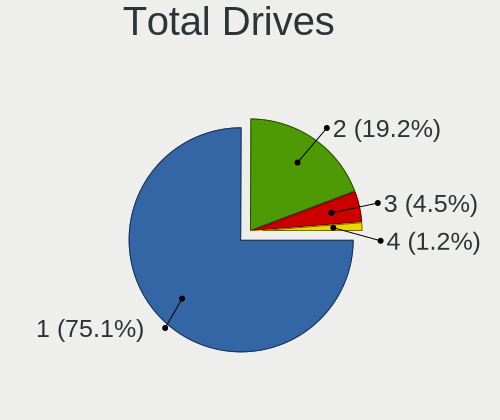

| Drives | Computers | Percent |
|--------|-----------|---------|
| 1      | 151       | 76.65%  |
| 2      | 34        | 17.26%  |
| 3      | 10        | 5.08%   |
| 4      | 2         | 1.02%   |

Has CD-ROM
----------

Has CD-ROM on board

| Presented | Computers | Percent |
|-----------|-----------|---------|
| No        | 98        | 50.26%  |
| Yes       | 97        | 49.74%  |

Has Ethernet
------------

Has Ethernet on board

| Presented | Computers | Percent |
|-----------|-----------|---------|
| Yes       | 173       | 88.72%  |
| No        | 22        | 11.28%  |

Has WiFi
--------

Has WiFi module

| Presented | Computers | Percent |
|-----------|-----------|---------|
| Yes       | 172       | 87.76%  |
| No        | 24        | 12.24%  |

Has Bluetooth
-------------

Has Bluetooth module

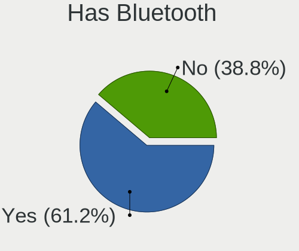

| Presented | Computers | Percent |
|-----------|-----------|---------|
| Yes       | 116       | 58.88%  |
| No        | 81        | 41.12%  |

Location
--------

Country
-------

Geographic location (country)

| Country | Computers | Percent |
|---------|-----------|---------|
| Morocco | 195       | 100%    |

City
----

Geographic location (city)

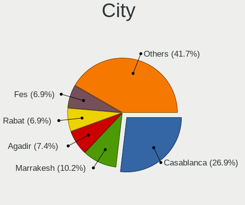

| City             | Computers | Percent |
|------------------|-----------|---------|
| Casablanca       | 54        | 26.09%  |
| Marrakesh        | 21        | 10.14%  |
| Rabat            | 18        | 8.7%    |
| Agadir           | 18        | 8.7%    |
| Fes              | 15        | 7.25%   |
| Tangier          | 8         | 3.86%   |
| Sal            | 8         | 3.86%   |
| Oujda            | 7         | 3.38%   |
| Kenitra          | 6         | 2.9%    |
| Meknes           | 5         | 2.42%   |
| Khouribga        | 5         | 2.42%   |
| Tiznit           | 4         | 1.93%   |
| Nador            | 4         | 1.93%   |
| Temara           | 3         | 1.45%   |
| Taza             | 3         | 1.45%   |
| Beni Mellal      | 3         | 1.45%   |
| Youssoufia       | 2         | 0.97%   |
| Ttouan         | 2         | 0.97%   |
| Skhirate         | 2         | 0.97%   |
| Safi             | 2         | 0.97%   |
| Mohammedia       | 2         | 0.97%   |
| Taourirt         | 1         | 0.48%   |
| Taounate         | 1         | 0.48%   |
| Sidi Lmokhtar    | 1         | 0.48%   |
| Sidi Kacem       | 1         | 0.48%   |
| Ouirgane         | 1         | 0.48%   |
| Midelt           | 1         | 0.48%   |
| Ksar El Kebir    | 1         | 0.48%   |
| Karia Ba Mohamed | 1         | 0.48%   |
| Guelmim          | 1         | 0.48%   |
| Douar Kalaa      | 1         | 0.48%   |
| Berrechid        | 1         | 0.48%   |
| Berkane          | 1         | 0.48%   |
| Al Aaroui        | 1         | 0.48%   |
| Agdz             | 1         | 0.48%   |
| Agdal            | 1         | 0.48%   |

Drives
------

Drive Vendor
------------

Hard drive vendors

| Vendor                | Computers | Drives | Percent |
|-----------------------|-----------|--------|---------|
| Seagate               | 44        | 59     | 18.57%  |
| WDC                   | 33        | 38     | 13.92%  |
| Samsung Electronics   | 33        | 45     | 13.92%  |
| Toshiba               | 29        | 44     | 12.24%  |
| Hitachi               | 13        | 15     | 5.49%   |
| Unknown               | 10        | 13     | 4.22%   |
| HGST                  | 8         | 8      | 3.38%   |
| Intel                 | 7         | 8      | 2.95%   |
| SanDisk               | 6         | 6      | 2.53%   |
| Kingston              | 5         | 6      | 2.11%   |
| SK hynix              | 4         | 4      | 1.69%   |
| Fujitsu               | 4         | 4      | 1.69%   |
| Crucial               | 4         | 5      | 1.69%   |
| PNY                   | 3         | 4      | 1.27%   |
| Phison                | 3         | 4      | 1.27%   |
| LITEON                | 3         | 3      | 1.27%   |
| KIOXIA                | 3         | 3      | 1.27%   |
| Apple                 | 3         | 3      | 1.27%   |
| Micron Technology     | 2         | 3      | 0.84%   |
| KingDian              | 2         | 3      | 0.84%   |
| China                 | 2         | 3      | 0.84%   |
| TwinMOS               | 1         | 1      | 0.42%   |
| Realtek Semiconductor | 1         | 1      | 0.42%   |
| RCESSD                | 1         | 1      | 0.42%   |
| Magnetic Data         | 1         | 1      | 0.42%   |
| LITEONIT              | 1         | 1      | 0.42%   |
| KingSpec              | 1         | 1      | 0.42%   |
| KingFast              | 1         | 2      | 0.42%   |
| Indilinx              | 1         | 1      | 0.42%   |
| IBM/Hitachi           | 1         | 1      | 0.42%   |
| HS-SSD-E100           | 1         | 1      | 0.42%   |
| Hewlett-Packard       | 1         | 1      | 0.42%   |
| GOODRAM               | 1         | 1      | 0.42%   |
| BIWIN                 | 1         | 1      | 0.42%   |
| Apacer                | 1         | 1      | 0.42%   |
| 2.5"                  | 1         | 1      | 0.42%   |
| Unknown               | 1         | 1      | 0.42%   |

Drive Model
-----------

Hard drive models

| Model                              | Computers | Percent |
|------------------------------------|-----------|---------|
| Seagate ST1000LM035-1RK172 1TB     | 5         | 2.01%   |
| Seagate ST1000LM024 HN-M101MBB 1TB | 5         | 2.01%   |
| Seagate ST500LT012-1DG142 500GB    | 4         | 1.61%   |
| Samsung NVMe SSD Drive 512GB       | 4         | 1.61%   |
| Toshiba MQ01ACF050 500GB           | 3         | 1.2%    |
| Toshiba MQ01ABF050 500GB           | 3         | 1.2%    |
| Seagate ST500DM002-1BD142 500GB    | 3         | 1.2%    |
| Seagate ST3250312AS 250GB          | 3         | 1.2%    |
| Samsung NVMe SSD Drive 256GB       | 3         | 1.2%    |
| Intel SSDSC2BF180A4H 180GB         | 3         | 1.2%    |
| WDC WD800JD-00LSA0 80GB            | 2         | 0.8%    |
| WDC WD5000LPCX-80VHAT1 500GB       | 2         | 0.8%    |
| WDC WD5000LPCX-60VHAT0 500GB       | 2         | 0.8%    |
| WDC WD1600BEVT-22ZCT0 160GB        | 2         | 0.8%    |
| Unknown MMC Card  32GB             | 2         | 0.8%    |
| Unknown MMC Card  16GB             | 2         | 0.8%    |
| Toshiba MQ04ABF100 1TB             | 2         | 0.8%    |
| Toshiba MQ01ABD100 1TB             | 2         | 0.8%    |
| Toshiba MQ01ABD050V -63 500GB      | 2         | 0.8%    |
| Seagate ST9500325AS 500GB          | 2         | 0.8%    |
| Seagate ST500VT000-1DK142 500GB    | 2         | 0.8%    |
| Seagate ST500LM021-1KJ152 500GB    | 2         | 0.8%    |
| Seagate ST500LM000-1EJ162 500GB    | 2         | 0.8%    |
| Samsung MZVLW256HEHP-000L7 256GB   | 2         | 0.8%    |
| Samsung MZVLB512HAJQ-000L7 512GB   | 2         | 0.8%    |
| Samsung MZVLB1T0HALR-00000 1TB     | 2         | 0.8%    |
| PNY CS900 120GB SSD                | 2         | 0.8%    |
| LITEON IT LCS-128L9S-HP 128GB SSD  | 2         | 0.8%    |
| Hitachi HTS723232A7A364 320GB      | 2         | 0.8%    |
| Hitachi HDS721680PLA380 80GB       | 2         | 0.8%    |
| HGST HTS725050A7E630 500GB         | 2         | 0.8%    |
| HGST HTS545050A7E680 500GB         | 2         | 0.8%    |
| Crucial CT500MX500SSD1 500GB       | 2         | 0.8%    |
| WDC WDS256G1X0C-00ENX0 256GB       | 1         | 0.4%    |
| WDC WDS120G2G0A-00JH30 120GB SSD   | 1         | 0.4%    |
| WDC WD800JD-75MSA3 80GB            | 1         | 0.4%    |
| WDC WD5000LPCX-60VHAT1 500GB       | 1         | 0.4%    |
| WDC WD5000BPVT-22HXZT1 500GB       | 1         | 0.4%    |
| WDC WD5000BEKT-75KA9T0 500GB       | 1         | 0.4%    |
| WDC WD5000AAKX-60U6AA0 500GB       | 1         | 0.4%    |
| WDC WD400BB-60DGA0 40GB            | 1         | 0.4%    |
| WDC WD3200BUCT-63TWBY0 320GB       | 1         | 0.4%    |
| WDC WD3200BPVT-22ZEST0 320GB       | 1         | 0.4%    |
| WDC WD3200BEVT-60ZCT1 320GB        | 1         | 0.4%    |
| WDC WD3200BEKT-60F3T1 320GB        | 1         | 0.4%    |
| WDC WD3200AAJS-65RYA0 320GB        | 1         | 0.4%    |
| WDC WD2500BPVT-22ZEST0 250GB       | 1         | 0.4%    |
| WDC WD2500BEVT-22A23T0 250GB       | 1         | 0.4%    |
| WDC WD2500BEKT-60V5T1 250GB        | 1         | 0.4%    |
| WDC WD2500AAKX-603CA0 250GB        | 1         | 0.4%    |
| WDC WD2500AAJS-60Z0A0 250GB        | 1         | 0.4%    |
| WDC WD1600JS-55NCB1 160GB          | 1         | 0.4%    |
| WDC WD1600BEVT-80A23T0 160GB       | 1         | 0.4%    |
| WDC WD1600AAJS-75M0A0 160GB        | 1         | 0.4%    |
| WDC WD1600AAJS-60M0A0 160GB        | 1         | 0.4%    |
| WDC WD10SPZX-60Z10T0 1TB           | 1         | 0.4%    |
| WDC WD10SPZX-08Z10 1TB             | 1         | 0.4%    |
| WDC WD10JUCT-63CYNY0 1TB           | 1         | 0.4%    |
| WDC WD10JPVX-60JC3T0 1TB           | 1         | 0.4%    |
| Unknown SB32G  32GB                | 1         | 0.4%    |

HDD Vendor
----------

Hard disk drive vendors

| Vendor              | Computers | Drives | Percent |
|---------------------|-----------|--------|---------|
| Seagate             | 44        | 59     | 32.84%  |
| WDC                 | 31        | 36     | 23.13%  |
| Toshiba             | 25        | 33     | 18.66%  |
| Hitachi             | 13        | 15     | 9.7%    |
| HGST                | 8         | 8      | 5.97%   |
| Samsung Electronics | 6         | 9      | 4.48%   |
| Fujitsu             | 4         | 4      | 2.99%   |
| Magnetic Data       | 1         | 1      | 0.75%   |
| IBM/Hitachi         | 1         | 1      | 0.75%   |
| Apple               | 1         | 1      | 0.75%   |

SSD Vendor
----------

Solid state drive vendors

| Vendor              | Computers | Drives | Percent |
|---------------------|-----------|--------|---------|
| Samsung Electronics | 8         | 13     | 14.29%  |
| SanDisk             | 6         | 6      | 10.71%  |
| Kingston            | 4         | 5      | 7.14%   |
| Intel               | 4         | 5      | 7.14%   |
| Crucial             | 4         | 5      | 7.14%   |
| PNY                 | 3         | 4      | 5.36%   |
| LITEON              | 3         | 3      | 5.36%   |
| SK hynix            | 2         | 2      | 3.57%   |
| Micron Technology   | 2         | 3      | 3.57%   |
| KingDian            | 2         | 3      | 3.57%   |
| China               | 2         | 3      | 3.57%   |
| WDC                 | 1         | 1      | 1.79%   |
| TwinMOS             | 1         | 1      | 1.79%   |
| Toshiba             | 1         | 1      | 1.79%   |
| RCESSD              | 1         | 1      | 1.79%   |
| LITEONIT            | 1         | 1      | 1.79%   |
| KingSpec            | 1         | 1      | 1.79%   |
| KingFast            | 1         | 1      | 1.79%   |
| Indilinx            | 1         | 1      | 1.79%   |
| HS-SSD-E100         | 1         | 1      | 1.79%   |
| Hewlett-Packard     | 1         | 1      | 1.79%   |
| GOODRAM             | 1         | 1      | 1.79%   |
| BIWIN               | 1         | 1      | 1.79%   |
| Apple               | 1         | 1      | 1.79%   |
| Apacer              | 1         | 1      | 1.79%   |
| 2.5"                | 1         | 1      | 1.79%   |
| Unknown             | 1         | 1      | 1.79%   |

Drive Kind
----------

HDD or SSD

| Kind    | Computers | Drives | Percent |
|---------|-----------|--------|---------|
| HDD     | 124       | 167    | 55.86%  |
| SSD     | 52        | 68     | 23.42%  |
| NVMe    | 35        | 49     | 15.77%  |
| MMC     | 10        | 13     | 4.5%    |
| Unknown | 1         | 1      | 0.45%   |

Drive Connector
---------------

SATA, SAS, NVMe, etc.

| Type | Computers | Drives | Percent |
|------|-----------|--------|---------|
| SATA | 161       | 234    | 77.78%  |
| NVMe | 35        | 49     | 16.91%  |
| MMC  | 10        | 13     | 4.83%   |
| SAS  | 1         | 2      | 0.48%   |

Drive Size
----------

Size of hard drive

| Size in TB | Computers | Drives | Percent |
|------------|-----------|--------|---------|
| 0.01-0.5   | 131       | 173    | 75.72%  |
| 0.51-1.0   | 38        | 57     | 21.97%  |
| 1.01-2.0   | 2         | 2      | 1.16%   |
| 3.01-4.0   | 1         | 1      | 0.58%   |
| 2.01-3.0   | 1         | 2      | 0.58%   |

Space Total
-----------

Amount of disk space available on the file system

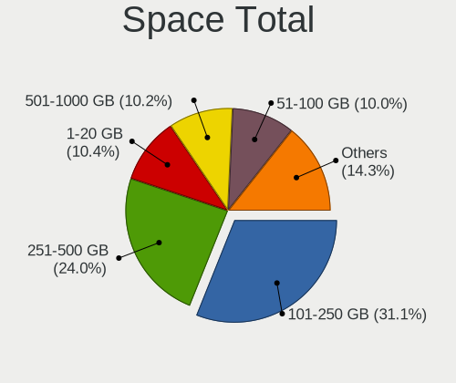

| Size in GB     | Computers | Percent |
|----------------|-----------|---------|
| 101-250        | 58        | 28.86%  |
| 251-500        | 51        | 25.37%  |
| 501-1000       | 21        | 10.45%  |
| 1-20           | 20        | 9.95%   |
| 21-50          | 19        | 9.45%   |
| 51-100         | 19        | 9.45%   |
| 1001-2000      | 5         | 2.49%   |
| Unknown        | 5         | 2.49%   |
| More than 3000 | 2         | 1%      |
| 2001-3000      | 1         | 0.5%    |

Space Used
----------

Amount of used disk space

| Used GB        | Computers | Percent |
|----------------|-----------|---------|
| 1-20           | 96        | 44.86%  |
| 21-50          | 44        | 20.56%  |
| 101-250        | 27        | 12.62%  |
| 51-100         | 26        | 12.15%  |
| 251-500        | 10        | 4.67%   |
| Unknown        | 5         | 2.34%   |
| 1001-2000      | 2         | 0.93%   |
| 501-1000       | 2         | 0.93%   |
| More than 3000 | 1         | 0.47%   |
| 2001-3000      | 1         | 0.47%   |

Malfunc. Drives
---------------

Drive models with a malfunction

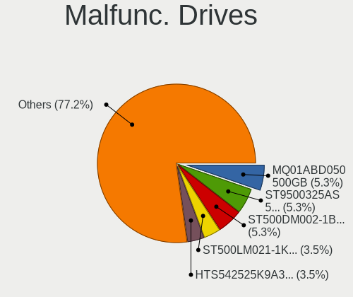

| Model                                            | Computers | Drives | Percent |
|--------------------------------------------------|-----------|--------|---------|
| Seagate ST500DM002-1BD142 500GB                  | 3         | 3      | 11.11%  |
| Seagate ST9500325AS 500GB                        | 2         | 2      | 7.41%   |
| Seagate ST500LM021-1KJ152 500GB                  | 2         | 2      | 7.41%   |
| Hitachi HDS721680PLA380 80GB                     | 2         | 2      | 7.41%   |
| WDC WD5000BPVT-22HXZT1 500GB                     | 1         | 1      | 3.7%    |
| WDC WD2500AAJS-60Z0A0 250GB                      | 1         | 1      | 3.7%    |
| WDC WD10JPVX-60JC3T0 1TB                         | 1         | 2      | 3.7%    |
| Toshiba MQ01ACF050 500GB                         | 1         | 1      | 3.7%    |
| Toshiba MQ01ABD050 500GB                         | 1         | 1      | 3.7%    |
| Toshiba MQ01ABD032 320GB                         | 1         | 1      | 3.7%    |
| Toshiba MK2565GSXN 250GB                         | 1         | 1      | 3.7%    |
| Toshiba MK1237GSX 120GB                          | 1         | 1      | 3.7%    |
| Seagate ST500LT012-1DG142 500GB                  | 1         | 1      | 3.7%    |
| Seagate ST340016A 40GB                           | 1         | 1      | 3.7%    |
| Seagate ST3250312AS 250GB                        | 1         | 1      | 3.7%    |
| SanDisk SD7UB3Q256G1001 256GB SSD                | 1         | 1      | 3.7%    |
| Samsung Electronics MZNLH128HBHQ-000H1 128GB SSD | 1         | 1      | 3.7%    |
| Samsung Electronics HD080HJ/ 80GB                | 1         | 1      | 3.7%    |
| Hitachi HTS723232A7A364 320GB                    | 1         | 1      | 3.7%    |
| Hitachi HTS545050A7E380 500GB                    | 1         | 2      | 3.7%    |
| Fujitsu MHX2300BT 304GB                          | 1         | 1      | 3.7%    |
| Fujitsu MHW2120BH 120GB                          | 1         | 1      | 3.7%    |

Malfunc. Drive Vendor
---------------------

Vendors of faulty drives

| Vendor              | Computers | Drives | Percent |
|---------------------|-----------|--------|---------|
| Seagate             | 10        | 10     | 37.04%  |
| Toshiba             | 5         | 5      | 18.52%  |
| Hitachi             | 4         | 5      | 14.81%  |
| WDC                 | 3         | 4      | 11.11%  |
| Samsung Electronics | 2         | 2      | 7.41%   |
| Fujitsu             | 2         | 2      | 7.41%   |
| SanDisk             | 1         | 1      | 3.7%    |

Malfunc. HDD Vendor
-------------------

Vendors of faulty HDD drives

| Vendor              | Computers | Drives | Percent |
|---------------------|-----------|--------|---------|
| Seagate             | 10        | 10     | 40%     |
| Toshiba             | 5         | 5      | 20%     |
| Hitachi             | 4         | 5      | 16%     |
| WDC                 | 3         | 4      | 12%     |
| Fujitsu             | 2         | 2      | 8%      |
| Samsung Electronics | 1         | 1      | 4%      |

Malfunc. Drive Kind
-------------------

Kinds of faulty drives

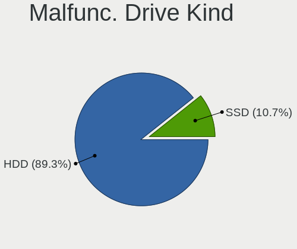

| Kind | Computers | Drives | Percent |
|------|-----------|--------|---------|
| HDD  | 25        | 27     | 92.59%  |
| SSD  | 2         | 2      | 7.41%   |

Failed Drives
-------------

Failed drive models

| Model                                      | Computers | Drives | Percent |
|--------------------------------------------|-----------|--------|---------|
| WDC WD800JD-00LSA0 80GB                    | 2         | 2      | 50%     |
| WDC WD2500BEVT-22A23T0 250GB               | 1         | 2      | 25%     |
| Samsung Electronics MZVLB1T0HALR-00000 1TB | 1         | 1      | 25%     |

Failed Drive Vendor
-------------------

Failed drive vendors

| Vendor              | Computers | Drives | Percent |
|---------------------|-----------|--------|---------|
| WDC                 | 3         | 4      | 75%     |
| Samsung Electronics | 1         | 1      | 25%     |

Drive Status
------------

Number of failed and malfunc. drives

| Status   | Computers | Drives | Percent |
|----------|-----------|--------|---------|
| Detected | 114       | 168    | 53.52%  |
| Works    | 68        | 96     | 31.92%  |
| Malfunc  | 27        | 29     | 12.68%  |
| Failed   | 4         | 5      | 1.88%   |

Storage controller
------------------

Storage Vendor
--------------

Storage controller vendors

| Vendor                           | Computers | Percent |
|----------------------------------|-----------|---------|
| Intel                            | 156       | 74.29%  |
| Samsung Electronics              | 20        | 9.52%   |
| AMD                              | 13        | 6.19%   |
| Toshiba America Info Systems     | 3         | 1.43%   |
| Phison Electronics               | 3         | 1.43%   |
| Nvidia                           | 3         | 1.43%   |
| KIOXIA                           | 3         | 1.43%   |
| SK hynix                         | 2         | 0.95%   |
| Silicon Integrated Systems [SiS] | 2         | 0.95%   |
| SanDisk                          | 1         | 0.48%   |
| Realtek Semiconductor            | 1         | 0.48%   |
| Kingston Technology Company      | 1         | 0.48%   |
| JMicron Technology               | 1         | 0.48%   |
| Broadcom / LSI                   | 1         | 0.48%   |

Storage Model
-------------

Storage controller models

| Model                                                                                   | Computers | Percent |
|-----------------------------------------------------------------------------------------|-----------|---------|
| Intel Sunrise Point-LP SATA Controller [AHCI mode]                                      | 15        | 6.3%    |
| Intel 8 Series/C220 Series Chipset Family 6-port SATA Controller 1 [AHCI mode]          | 14        | 5.88%   |
| Samsung NVMe SSD Controller SM981/PM981/PM983                                           | 12        | 5.04%   |
| Intel 82801 Mobile SATA Controller [RAID mode]                                          | 12        | 5.04%   |
| Intel 6 Series/C200 Series Chipset Family 6 port Mobile SATA AHCI Controller            | 12        | 5.04%   |
| Intel Wildcat Point-LP SATA Controller [AHCI Mode]                                      | 10        | 4.2%    |
| Intel 7 Series Chipset Family 6-port SATA Controller [AHCI mode]                        | 10        | 4.2%    |
| Intel 8 Series SATA Controller 1 [AHCI mode]                                            | 8         | 3.36%   |
| AMD FCH SATA Controller [AHCI mode]                                                     | 8         | 3.36%   |
| Samsung NVMe SSD Controller SM961/PM961/SM963                                           | 7         | 2.94%   |
| Intel 82801IBM/IEM (ICH9M/ICH9M-E) 4 port SATA Controller [AHCI mode]                   | 6         | 2.52%   |
| Intel 7 Series/C210 Series Chipset Family 6-port SATA Controller [AHCI mode]            | 6         | 2.52%   |
| Intel Volume Management Device NVMe RAID Controller                                     | 5         | 2.1%    |
| Intel Tiger Lake-LP SATA Controller                                                     | 5         | 2.1%    |
| Intel SATA Controller [RAID mode]                                                       | 5         | 2.1%    |
| Intel Q170/Q150/B150/H170/H110/Z170/CM236 Chipset SATA Controller [AHCI Mode]           | 5         | 2.1%    |
| Intel 6 Series/C200 Series Chipset Family 6 port Desktop SATA AHCI Controller           | 5         | 2.1%    |
| Intel 5 Series/3400 Series Chipset 6 port SATA AHCI Controller                          | 4         | 1.68%   |
| Intel 5 Series/3400 Series Chipset 4 port SATA AHCI Controller                          | 4         | 1.68%   |
| KIOXIA NVMe SSD Controller BG4                                                          | 3         | 1.26%   |
| Intel Comet Lake SATA AHCI Controller                                                   | 3         | 1.26%   |
| Intel Cannon Lake Mobile PCH SATA AHCI Controller                                       | 3         | 1.26%   |
| AMD SB7x0/SB8x0/SB9x0 SATA Controller [AHCI mode]                                       | 3         | 1.26%   |
| Toshiba America Info Systems Toshiba America Info Non-Volatile memory controller        | 2         | 0.84%   |
| Silicon Integrated Systems [SiS] 5513 IDE Controller                                    | 2         | 0.84%   |
| Samsung NVMe SSD Controller 980                                                         | 2         | 0.84%   |
| Phison E12 NVMe Controller                                                              | 2         | 0.84%   |
| Nvidia MCP61 SATA Controller                                                            | 2         | 0.84%   |
| Nvidia MCP61 IDE                                                                        | 2         | 0.84%   |
| Intel SSD 660P Series                                                                   | 2         | 0.84%   |
| Intel NM10/ICH7 Family SATA Controller [AHCI mode]                                      | 2         | 0.84%   |
| Intel C602 chipset 4-Port SATA Storage Control Unit                                     | 2         | 0.84%   |
| Intel C600/X79 series chipset IDE-r Controller                                          | 2         | 0.84%   |
| Intel Atom Processor E3800 Series SATA AHCI Controller                                  | 2         | 0.84%   |
| Intel 82Q35 Express PT IDER Controller                                                  | 2         | 0.84%   |
| Intel 82801JD/DO (ICH10 Family) SATA AHCI Controller                                    | 2         | 0.84%   |
| Intel 82801IR/IO/IH (ICH9R/DO/DH) 6 port SATA Controller [AHCI mode]                    | 2         | 0.84%   |
| Intel 6 Series/C200 Series Chipset Family Desktop SATA Controller (IDE mode, ports 4-5) | 2         | 0.84%   |
| Intel 6 Series/C200 Series Chipset Family Desktop SATA Controller (IDE mode, ports 0-3) | 2         | 0.84%   |
| Intel 4 Series Chipset PT IDER Controller                                               | 2         | 0.84%   |
| Toshiba America Info Systems XG6 NVMe SSD Controller                                    | 1         | 0.42%   |
| SK hynix Non-Volatile memory controller                                                 | 1         | 0.42%   |
| SK hynix BC501 NVMe Solid State Drive                                                   | 1         | 0.42%   |
| Silicon Integrated Systems [SiS] SATA Controller / IDE mode                             | 1         | 0.42%   |
| SanDisk WD Black NVMe SSD                                                               | 1         | 0.42%   |
| Samsung NVMe SSD Controller SM951/PM951                                                 | 1         | 0.42%   |
| Realtek Realtek Non-Volatile memory controller                                          | 1         | 0.42%   |
| Phison E16 PCIe4 NVMe Controller                                                        | 1         | 0.42%   |
| Nvidia MCP79 AHCI Controller                                                            | 1         | 0.42%   |
| Kingston Company Company Non-Volatile memory controller                                 | 1         | 0.42%   |
| JMicron JMB363 SATA/IDE Controller                                                      | 1         | 0.42%   |
| Intel SSD 600P Series                                                                   | 1         | 0.42%   |
| Intel Ice Lake-LP SATA Controller [AHCI mode]                                           | 1         | 0.42%   |
| Intel HM170/QM170 Chipset SATA Controller [AHCI Mode]                                   | 1         | 0.42%   |
| Intel Celeron/Pentium Silver Processor SATA Controller                                  | 1         | 0.42%   |
| Intel Cannon Point-LP SATA Controller [AHCI Mode]                                       | 1         | 0.42%   |
| Intel C610/X99 series chipset IDE-r Controller                                          | 1         | 0.42%   |
| Intel C600/X79 series chipset SATA RAID Controller                                      | 1         | 0.42%   |
| Intel C600/X79 series chipset 6-Port SATA AHCI Controller                               | 1         | 0.42%   |
| Intel Atom/Celeron/Pentium Processor x5-E8000/J3xxx/N3xxx Series SATA Controller        | 1         | 0.42%   |

Storage Kind
------------

Kind of storage controller (IDE, SATA, NVMe, SAS, ...)

| Kind | Computers | Percent |
|------|-----------|---------|
| SATA | 140       | 62.78%  |
| NVMe | 35        | 15.7%   |
| RAID | 23        | 10.31%  |
| IDE  | 23        | 10.31%  |
| SAS  | 2         | 0.9%    |

Processor
---------

CPU Vendor
----------

Processor vendors

| Vendor | Computers | Percent |
|--------|-----------|---------|
| Intel  | 174       | 89.23%  |
| AMD    | 19        | 9.74%   |
| ARM    | 2         | 1.03%   |

CPU Model
---------

Processor models

| Model                                       | Computers | Percent |
|---------------------------------------------|-----------|---------|
| Intel Core i7-8550U CPU @ 1.80GHz           | 6         | 3.08%   |
| Intel Core i5-3470 CPU @ 3.20GHz            | 5         | 2.56%   |
| Intel Core i5-2520M CPU @ 2.50GHz           | 5         | 2.56%   |
| Intel Core i3-5005U CPU @ 2.00GHz           | 5         | 2.56%   |
| Intel Core i7-6820HQ CPU @ 2.70GHz          | 4         | 2.05%   |
| Intel Core i5-8250U CPU @ 1.60GHz           | 4         | 2.05%   |
| Intel Core i5-3230M CPU @ 2.60GHz           | 4         | 2.05%   |
| Intel Core i5 CPU M 520 @ 2.40GHz           | 4         | 2.05%   |
| Intel Core i5-6200U CPU @ 2.30GHz           | 3         | 1.54%   |
| Intel Core i5-5300U CPU @ 2.30GHz           | 3         | 1.54%   |
| Intel Core i5-4300U CPU @ 1.90GHz           | 3         | 1.54%   |
| Intel Core i5-2410M CPU @ 2.30GHz           | 3         | 1.54%   |
| Intel Core i3-4005U CPU @ 1.70GHz           | 3         | 1.54%   |
| Intel 11th Gen Core i5-1135G7 @ 2.40GHz     | 3         | 1.54%   |
| Intel Pentium Dual-Core CPU T4500 @ 2.30GHz | 2         | 1.03%   |
| Intel Core i7-7600U CPU @ 2.80GHz           | 2         | 1.03%   |
| Intel Core i7-4700MQ CPU @ 2.40GHz          | 2         | 1.03%   |
| Intel Core i5-7200U CPU @ 2.50GHz           | 2         | 1.03%   |
| Intel Core i5-6300U CPU @ 2.40GHz           | 2         | 1.03%   |
| Intel Core i5-5200U CPU @ 2.20GHz           | 2         | 1.03%   |
| Intel Core i5-4590 CPU @ 3.30GHz            | 2         | 1.03%   |
| Intel Core i5-4300M CPU @ 2.60GHz           | 2         | 1.03%   |
| Intel Core i5-3570 CPU @ 3.40GHz            | 2         | 1.03%   |
| Intel Core i5-2450M CPU @ 2.50GHz           | 2         | 1.03%   |
| Intel Core i5-2400 CPU @ 3.10GHz            | 2         | 1.03%   |
| Intel Core i5-10210U CPU @ 1.60GHz          | 2         | 1.03%   |
| Intel Core i5 CPU M 450 @ 2.40GHz           | 2         | 1.03%   |
| Intel Core i3-6006U CPU @ 2.00GHz           | 2         | 1.03%   |
| Intel Core i3-2310M CPU @ 2.10GHz           | 2         | 1.03%   |
| Intel Core 2 Duo CPU P7450 @ 2.13GHz        | 2         | 1.03%   |
| Intel Celeron CPU N3060 @ 1.60GHz           | 2         | 1.03%   |
| Intel Celeron CPU N2840 @ 2.16GHz           | 2         | 1.03%   |
| Intel Atom x5-Z8300 CPU @ 1.44GHz           | 2         | 1.03%   |
| Intel 11th Gen Core i7-1165G7 @ 2.80GHz     | 2         | 1.03%   |
| AMD Ryzen 5 5500U with Radeon Graphics      | 2         | 1.03%   |
| AMD C-60 APU with Radeon HD Graphics        | 2         | 1.03%   |
| Intel Xeon CPU E5-2630 v3 @ 2.40GHz         | 1         | 0.51%   |
| Intel Xeon CPU E5-2620 0 @ 2.00GHz          | 1         | 0.51%   |
| Intel Xeon CPU E5-1620 0 @ 3.60GHz          | 1         | 0.51%   |
| Intel Xeon CPU E3-1240 v6 @ 3.70GHz         | 1         | 0.51%   |
| Intel Xeon CPU 5140 @ 2.33GHz               | 1         | 0.51%   |
| Intel Pentium M processor 1.73GHz           | 1         | 0.51%   |
| Intel Pentium Gold 7505 @ 2.00GHz           | 1         | 0.51%   |
| Intel Pentium Dual-Core CPU E5300 @ 2.60GHz | 1         | 0.51%   |
| Intel Pentium Dual CPU E2160 @ 1.80GHz      | 1         | 0.51%   |
| Intel Pentium CPU G3220T @ 2.60GHz          | 1         | 0.51%   |
| Intel Pentium 4 CPU 2.80GHz                 | 1         | 0.51%   |
| Intel Genuine CPU T2300 @ 1.66GHz           | 1         | 0.51%   |
| Intel Core i9-9920X CPU @ 3.50GHz           | 1         | 0.51%   |
| Intel Core i7-9750H CPU @ 2.60GHz           | 1         | 0.51%   |
| Intel Core i7-8850H CPU @ 2.60GHz           | 1         | 0.51%   |
| Intel Core i7-8650U CPU @ 1.90GHz           | 1         | 0.51%   |
| Intel Core i7-8565U CPU @ 1.80GHz           | 1         | 0.51%   |
| Intel Core i7-7700 CPU @ 3.60GHz            | 1         | 0.51%   |
| Intel Core i7-6700K CPU @ 4.00GHz           | 1         | 0.51%   |
| Intel Core i7-6700 CPU @ 3.40GHz            | 1         | 0.51%   |
| Intel Core i7-4910MQ CPU @ 2.90GHz          | 1         | 0.51%   |
| Intel Core i7-4800MQ CPU @ 2.70GHz          | 1         | 0.51%   |
| Intel Core i7-4771 CPU @ 3.50GHz            | 1         | 0.51%   |
| Intel Core i7-4600U CPU @ 2.10GHz           | 1         | 0.51%   |

CPU Model Family
----------------

Processor model prefix

| Model                   | Computers | Percent |
|-------------------------|-----------|---------|
| Intel Core i5           | 73        | 37.44%  |
| Intel Core i7           | 34        | 17.44%  |
| Intel Core i3           | 24        | 12.31%  |
| Intel Core 2 Duo        | 9         | 4.62%   |
| Other                   | 6         | 3.08%   |
| Intel Celeron           | 6         | 3.08%   |
| Intel Xeon              | 5         | 2.56%   |
| Intel Atom              | 5         | 2.56%   |
| AMD Ryzen 5             | 4         | 2.05%   |
| Intel Pentium Dual-Core | 3         | 1.54%   |
| AMD E1                  | 2         | 1.03%   |
| AMD C-60                | 2         | 1.03%   |
| AMD Athlon 64 X2        | 2         | 1.03%   |
| Intel Pentium M         | 1         | 0.51%   |
| Intel Pentium Gold      | 1         | 0.51%   |
| Intel Pentium Dual      | 1         | 0.51%   |
| Intel Pentium 4         | 1         | 0.51%   |
| Intel Pentium           | 1         | 0.51%   |
| Intel Genuine           | 1         | 0.51%   |
| Intel Core i9           | 1         | 0.51%   |
| Intel Core 2 Quad       | 1         | 0.51%   |
| Intel Celeron M         | 1         | 0.51%   |
| ARM BCM                 | 1         | 0.51%   |
| ARM AArch64             | 1         | 0.51%   |
| AMD Ryzen 9             | 1         | 0.51%   |
| AMD Ryzen 7 PRO         | 1         | 0.51%   |
| AMD Ryzen 7             | 1         | 0.51%   |
| AMD Phenom II X6        | 1         | 0.51%   |
| AMD E                   | 1         | 0.51%   |
| AMD Athlon XP           | 1         | 0.51%   |
| AMD A8                  | 1         | 0.51%   |
| AMD A6                  | 1         | 0.51%   |
| AMD A4                  | 1         | 0.51%   |

CPU Cores
---------

Number of processor cores

| Number | Computers | Percent |
|--------|-----------|---------|
| 2      | 108       | 55.38%  |
| 4      | 67        | 34.36%  |
| 6      | 6         | 3.08%   |
| 1      | 6         | 3.08%   |
| 8      | 4         | 2.05%   |
| 16     | 2         | 1.03%   |
| 12     | 2         | 1.03%   |

CPU Sockets
-----------

Number of sockets

| Number | Computers | Percent |
|--------|-----------|---------|
| 1      | 193       | 98.97%  |
| 2      | 2         | 1.03%   |

CPU Threads
-----------

Threads per core (Hyper-Threading)

| Number | Computers | Percent |
|--------|-----------|---------|
| 2      | 131       | 67.18%  |
| 1      | 64        | 32.82%  |

CPU Op-Modes
------------

CPU Operation Modes (32-bit, 64-bit)

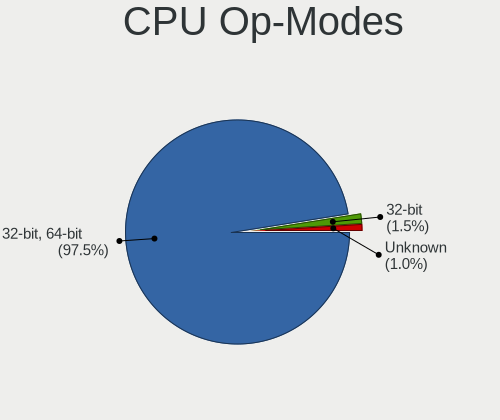

| Op mode        | Computers | Percent |
|----------------|-----------|---------|
| 32-bit, 64-bit | 187       | 95.9%   |
| 32-bit         | 5         | 2.56%   |
| Unknown        | 3         | 1.54%   |

CPU Microcode
-------------

Microcode number

| Number     | Computers | Percent |
|------------|-----------|---------|
| Unknown    | 27        | 13.64%  |
| 0x206a7    | 21        | 10.61%  |
| 0x306c3    | 16        | 8.08%   |
| 0x306a9    | 16        | 8.08%   |
| 0x806ea    | 10        | 5.05%   |
| 0x306d4    | 10        | 5.05%   |
| 0x40651    | 7         | 3.54%   |
| 0x806e9    | 6         | 3.03%   |
| 0x506e3    | 6         | 3.03%   |
| 0x406e3    | 6         | 3.03%   |
| 0x20655    | 6         | 3.03%   |
| 0x806c1    | 5         | 2.53%   |
| 0x1067a    | 5         | 2.53%   |
| 0x806ec    | 4         | 2.02%   |
| 0x20652    | 4         | 2.02%   |
| 0x906e9    | 3         | 1.52%   |
| 0x6fb      | 3         | 1.52%   |
| 0x30678    | 3         | 1.52%   |
| 0x10676    | 3         | 1.52%   |
| 0x08701021 | 3         | 1.52%   |
| 0x906ea    | 2         | 1.01%   |
| 0x706e5    | 2         | 1.01%   |
| 0x6fd      | 2         | 1.01%   |
| 0x406c4    | 2         | 1.01%   |
| 0x406c3    | 2         | 1.01%   |
| 0x206d7    | 2         | 1.01%   |
| 0x07030105 | 2         | 1.01%   |
| 0x05000119 | 2         | 1.01%   |
| 0xf29      | 1         | 0.51%   |
| 0x806eb    | 1         | 0.51%   |
| 0x706a1    | 1         | 0.51%   |
| 0x6ec      | 1         | 0.51%   |
| 0x6e8      | 1         | 0.51%   |
| 0x6d8      | 1         | 0.51%   |
| 0x50654    | 1         | 0.51%   |
| 0x306f2    | 1         | 0.51%   |
| 0x30673    | 1         | 0.51%   |
| 0x30661    | 1         | 0.51%   |
| 0x106e5    | 1         | 0.51%   |
| 0x0a50000c | 1         | 0.51%   |
| 0x08608103 | 1         | 0.51%   |
| 0x08108102 | 1         | 0.51%   |
| 0x06006705 | 1         | 0.51%   |
| 0x05000101 | 1         | 0.51%   |
| 0x03000027 | 1         | 0.51%   |
| 0x010000dc | 1         | 0.51%   |

CPU Microarch
-------------

Microarchitecture

| Name          | Computers | Percent |
|---------------|-----------|---------|
| KabyLake      | 29        | 14.87%  |
| Haswell       | 26        | 13.33%  |
| SandyBridge   | 25        | 12.82%  |
| IvyBridge     | 17        | 8.72%   |
| Skylake       | 15        | 7.69%   |
| Westmere      | 11        | 5.64%   |
| Penryn        | 10        | 5.13%   |
| Broadwell     | 10        | 5.13%   |
| Silvermont    | 8         | 4.1%    |
| TigerLake     | 6         | 3.08%   |
| Core          | 5         | 2.56%   |
| Unknown       | 5         | 2.56%   |
| Bobcat        | 4         | 2.05%   |
| Zen 2         | 3         | 1.54%   |
| P6            | 3         | 1.54%   |
| Puma          | 2         | 1.03%   |
| K8 Hammer     | 2         | 1.03%   |
| IceLake       | 2         | 1.03%   |
| Bonnell       | 2         | 1.03%   |
| Zen+          | 1         | 0.51%   |
| Zen 3         | 1         | 0.51%   |
| NetBurst      | 1         | 0.51%   |
| Nehalem       | 1         | 0.51%   |
| K6            | 1         | 0.51%   |
| K10 Llano     | 1         | 0.51%   |
| K10           | 1         | 0.51%   |
| Goldmont plus | 1         | 0.51%   |
| Excavator     | 1         | 0.51%   |
| CometLake     | 1         | 0.51%   |

Graphics
--------

GPU Vendor
----------

Vendors of graphics cards

| Vendor                           | Computers | Percent |
|----------------------------------|-----------|---------|
| Intel                            | 149       | 66.52%  |
| Nvidia                           | 45        | 20.09%  |
| AMD                              | 29        | 12.95%  |
| Silicon Integrated Systems [SiS] | 1         | 0.45%   |

GPU Model
---------

Graphics card models

| Model                                                                                      | Computers | Percent |
|--------------------------------------------------------------------------------------------|-----------|---------|
| Intel 2nd Generation Core Processor Family Integrated Graphics Controller                  | 21        | 9.21%   |
| Intel UHD Graphics 620                                                                     | 11        | 4.82%   |
| Intel HD Graphics 5500                                                                     | 10        | 4.39%   |
| Intel Core Processor Integrated Graphics Controller                                        | 10        | 4.39%   |
| Intel Haswell-ULT Integrated Graphics Controller                                           | 9         | 3.95%   |
| Intel 3rd Gen Core processor Graphics Controller                                           | 8         | 3.51%   |
| Intel Xeon E3-1200 v3/4th Gen Core Processor Integrated Graphics Controller                | 7         | 3.07%   |
| Intel Skylake GT2 [HD Graphics 520]                                                        | 7         | 3.07%   |
| Intel HD Graphics 620                                                                      | 7         | 3.07%   |
| Intel 4th Gen Core Processor Integrated Graphics Controller                                | 7         | 3.07%   |
| Intel HD Graphics 530                                                                      | 6         | 2.63%   |
| Intel Xeon E3-1200 v2/3rd Gen Core processor Graphics Controller                           | 5         | 2.19%   |
| Intel TigerLake-LP GT2 [Iris Xe Graphics]                                                  | 5         | 2.19%   |
| Intel Atom/Celeron/Pentium Processor x5-E8000/J3xxx/N3xxx Integrated Graphics Controller   | 4         | 1.75%   |
| Intel Atom Processor Z36xxx/Z37xxx Series Graphics & Display                               | 4         | 1.75%   |
| Nvidia GT218 [GeForce 210]                                                                 | 3         | 1.32%   |
| Nvidia GK106GLM [Quadro K2100M]                                                            | 3         | 1.32%   |
| Nvidia GF117M [GeForce 610M/710M/810M/820M / GT 620M/625M/630M/720M]                       | 3         | 1.32%   |
| Intel Mobile 4 Series Chipset Integrated Graphics Controller                               | 3         | 1.32%   |
| Intel CometLake-U GT2 [UHD Graphics]                                                       | 3         | 1.32%   |
| Intel CoffeeLake-H GT2 [UHD Graphics 630]                                                  | 3         | 1.32%   |
| Nvidia TU117M [GeForce MX450]                                                              | 2         | 0.88%   |
| Nvidia GP108M [GeForce MX150]                                                              | 2         | 0.88%   |
| Nvidia GM108M [GeForce 940MX]                                                              | 2         | 0.88%   |
| Nvidia GK208M [GeForce GT 740M]                                                            | 2         | 0.88%   |
| Nvidia GK208B [GeForce GT 710]                                                             | 2         | 0.88%   |
| Nvidia GF119M [NVS 4200M]                                                                  | 2         | 0.88%   |
| Nvidia GF119M [GeForce GT 520M]                                                            | 2         | 0.88%   |
| Nvidia GF119 [GeForce GT 610]                                                              | 2         | 0.88%   |
| Intel WhiskeyLake-U GT2 [UHD Graphics 620]                                                 | 2         | 0.88%   |
| Intel Mobile 945GM/GMS/GME, 943/940GML Express Integrated Graphics Controller              | 2         | 0.88%   |
| Intel Mobile 945GM/GMS, 943/940GML Express Integrated Graphics Controller                  | 2         | 0.88%   |
| Intel HD Graphics 630                                                                      | 2         | 0.88%   |
| Intel 4 Series Chipset Integrated Graphics Controller                                      | 2         | 0.88%   |
| AMD Wrestler [Radeon HD 6290]                                                              | 2         | 0.88%   |
| AMD Sun XT [Radeon HD 8670A/8670M/8690M / R5 M330 / M430 / Radeon 520 Mobile]              | 2         | 0.88%   |
| AMD Lucienne                                                                               | 2         | 0.88%   |
| Silicon Integrated Systems [SiS] 661/741/760 PCI/AGP or 662/761Gx PCIE VGA Display Adapter | 1         | 0.44%   |
| Nvidia TU117GLM [T1200 Laptop GPU]                                                         | 1         | 0.44%   |
| Nvidia TU116 [GeForce GTX 1650 SUPER]                                                      | 1         | 0.44%   |
| Nvidia TU104M [GeForce RTX 2080 Mobile]                                                    | 1         | 0.44%   |
| Nvidia GT218M [GeForce G210M]                                                              | 1         | 0.44%   |
| Nvidia GT216M [GeForce GT 330M]                                                            | 1         | 0.44%   |
| Nvidia GP107M [GeForce MX350]                                                              | 1         | 0.44%   |
| Nvidia GP107M [GeForce GTX 1050 Mobile]                                                    | 1         | 0.44%   |
| Nvidia GP107M [GeForce GTX 1050 3 GB Max-Q]                                                | 1         | 0.44%   |
| Nvidia GP107GLM [Quadro P1000 Mobile]                                                      | 1         | 0.44%   |
| Nvidia GP107 [GeForce GTX 1050 Ti]                                                         | 1         | 0.44%   |
| Nvidia GM204GL [Quadro M4000]                                                              | 1         | 0.44%   |
| Nvidia GM107GLM [Quadro M2000M]                                                            | 1         | 0.44%   |
| Nvidia GM107GLM [Quadro M1000M]                                                            | 1         | 0.44%   |
| Nvidia GK107GL [Quadro K420]                                                               | 1         | 0.44%   |
| Nvidia GF106GLM [Quadro 2000M]                                                             | 1         | 0.44%   |
| Nvidia GA106M [GeForce RTX 3060 Mobile / Max-Q]                                            | 1         | 0.44%   |
| Nvidia GA104 [GeForce RTX 3070 Lite Hash Rate]                                             | 1         | 0.44%   |
| Nvidia G96GLM [Quadro FX 770M]                                                             | 1         | 0.44%   |
| Nvidia G72 [GeForce 7500 LE]                                                               | 1         | 0.44%   |
| Nvidia C79 [GeForce 9400M G]                                                               | 1         | 0.44%   |
| Nvidia C61 [GeForce 6150SE nForce 430]                                                     | 1         | 0.44%   |
| Intel TigerLake-H GT1 [UHD Graphics]                                                       | 1         | 0.44%   |

GPU Combo
---------

Combinations of graphics cards

| Name           | Computers | Percent |
|----------------|-----------|---------|
| 1 x Intel      | 118       | 60.51%  |
| Intel + Nvidia | 26        | 13.33%  |
| 1 x AMD        | 24        | 12.31%  |
| 1 x Nvidia     | 18        | 9.23%   |
| Intel + AMD    | 4         | 2.05%   |
| Other          | 2         | 1.03%   |
| 2 x Nvidia     | 1         | 0.51%   |
| 2 x AMD        | 1         | 0.51%   |
| 1 x SiS        | 1         | 0.51%   |

GPU Driver
----------

Free vs proprietary

| Driver      | Computers | Percent |
|-------------|-----------|---------|
| Free        | 168       | 84.42%  |
| Proprietary | 22        | 11.06%  |
| Unknown     | 9         | 4.52%   |

GPU Memory
----------

Total video memory

| Size in GB | Computers | Percent |
|------------|-----------|---------|
| Unknown    | 132       | 66.33%  |
| 1.01-2.0   | 23        | 11.56%  |
| 0.01-0.5   | 23        | 11.56%  |
| 0.51-1.0   | 9         | 4.52%   |
| 3.01-4.0   | 8         | 4.02%   |
| 7.01-8.0   | 3         | 1.51%   |
| 2.01-3.0   | 1         | 0.5%    |

Monitor
-------

Monitor Vendor
--------------

Monitor vendors

| Vendor                  | Computers | Percent |
|-------------------------|-----------|---------|
| AU Optronics            | 32        | 17.11%  |
| Samsung Electronics     | 29        | 15.51%  |
| LG Display              | 27        | 14.44%  |
| Chimei Innolux          | 21        | 11.23%  |
| BOE                     | 20        | 10.7%   |
| Dell                    | 15        | 8.02%   |
| Hewlett-Packard         | 9         | 4.81%   |
| InfoVision              | 5         | 2.67%   |
| Lenovo                  | 4         | 2.14%   |
| Sharp                   | 3         | 1.6%    |
| LG Philips              | 3         | 1.6%    |
| Goldstar                | 3         | 1.6%    |
| Chi Mei Optoelectronics | 3         | 1.6%    |
| Acer                    | 3         | 1.6%    |
| Iiyama                  | 2         | 1.07%   |
| BenQ                    | 2         | 1.07%   |
| Apple                   | 2         | 1.07%   |
| Philips                 | 1         | 0.53%   |
| MiTAC                   | 1         | 0.53%   |
| LGD                     | 1         | 0.53%   |
| Ancor Communications    | 1         | 0.53%   |

Monitor Model
-------------

Monitor models

| Model                                                                   | Computers | Percent |
|-------------------------------------------------------------------------|-----------|---------|
| Dell E2414H DEL4090 1920x1080 531x299mm 24.0-inch                       | 3         | 1.6%    |
| Chimei Innolux LCD Monitor CMN15DC 1366x768 344x193mm 15.5-inch         | 3         | 1.6%    |
| BOE LCD Monitor BOE06A4 1366x768 344x194mm 15.5-inch                    | 3         | 1.6%    |
| Samsung Electronics LCD Monitor SEC5441 1366x768 344x194mm 15.5-inch    | 2         | 1.06%   |
| Samsung Electronics LCD Monitor SEC3642 1366x768 309x174mm 14.0-inch    | 2         | 1.06%   |
| Samsung Electronics LCD Monitor SDC4D42 1366x768 309x174mm 14.0-inch    | 2         | 1.06%   |
| LG Display LCD Monitor LGD03D9 1366x768 345x194mm 15.6-inch             | 2         | 1.06%   |
| Lenovo LCD Monitor LEN1144 1920x1200 518x324mm 24.1-inch                | 2         | 1.06%   |
| Dell 2208WFP DEL403B 1680x1050 473x296mm 22.0-inch                      | 2         | 1.06%   |
| BOE LCD Monitor BOE0747 1920x1080 344x194mm 15.5-inch                   | 2         | 1.06%   |
| AU Optronics LCD Monitor AUO61ED 1920x1080 344x193mm 15.5-inch          | 2         | 1.06%   |
| AU Optronics LCD Monitor AUO3791 1920x1080 344x194mm 15.5-inch          | 2         | 1.06%   |
| AU Optronics LCD Monitor AUO22EC 1366x768 344x193mm 15.5-inch           | 2         | 1.06%   |
| AU Optronics LCD Monitor AUO106C 1366x768 277x156mm 12.5-inch           | 2         | 1.06%   |
| Sharp LCD Monitor SHP1516 3840x2400 336x210mm 15.6-inch                 | 1         | 0.53%   |
| Sharp LCD Monitor SHP14A8 3840x2400 288x180mm 13.4-inch                 | 1         | 0.53%   |
| Sharp LCD Monitor SHP1449 1920x1080 294x165mm 13.3-inch                 | 1         | 0.53%   |
| Samsung Electronics SyncMaster SAM0372 1680x1050 459x296mm 21.5-inch    | 1         | 0.53%   |
| Samsung Electronics SyncMaster SAM027E 1680x1050 470x300mm 22.0-inch    | 1         | 0.53%   |
| Samsung Electronics SyncMaster SAM01B7 1280x1024 338x270mm 17.0-inch    | 1         | 0.53%   |
| Samsung Electronics SyncMaster SAM0161 1280x1024 338x270mm 17.0-inch    | 1         | 0.53%   |
| Samsung Electronics SMBX2440 SAM068A 1920x1080 531x299mm 24.0-inch      | 1         | 0.53%   |
| Samsung Electronics SMB1930N SAM0632 1366x768 410x230mm 18.5-inch       | 1         | 0.53%   |
| Samsung Electronics S23B550 SAM0919 1920x1080 510x287mm 23.0-inch       | 1         | 0.53%   |
| Samsung Electronics LCD Monitor SEC5541 1366x768 344x193mm 15.5-inch    | 1         | 0.53%   |
| Samsung Electronics LCD Monitor SEC434E 1600x900 310x174mm 14.0-inch    | 1         | 0.53%   |
| Samsung Electronics LCD Monitor SEC4143 1400x1050 286x214mm 14.1-inch   | 1         | 0.53%   |
| Samsung Electronics LCD Monitor SEC3959 1366x768 344x194mm 15.5-inch    | 1         | 0.53%   |
| Samsung Electronics LCD Monitor SEC3846 1680x1050 331x207mm 15.4-inch   | 1         | 0.53%   |
| Samsung Electronics LCD Monitor SEC3541 1366x768 309x174mm 14.0-inch    | 1         | 0.53%   |
| Samsung Electronics LCD Monitor SEC325A 1366x768 344x194mm 15.5-inch    | 1         | 0.53%   |
| Samsung Electronics LCD Monitor SEC3150 1366x768 344x193mm 15.5-inch    | 1         | 0.53%   |
| Samsung Electronics LCD Monitor SEC3051 1366x768 344x194mm 15.5-inch    | 1         | 0.53%   |
| Samsung Electronics LCD Monitor SDC5441 1366x768 344x193mm 15.5-inch    | 1         | 0.53%   |
| Samsung Electronics LCD Monitor SDC5344 1920x1080 344x194mm 15.5-inch   | 1         | 0.53%   |
| Samsung Electronics LCD Monitor SDC4143 3840x2160 344x194mm 15.5-inch   | 1         | 0.53%   |
| Samsung Electronics LCD Monitor SAM0FF0 3840x2160 1872x1053mm 84.6-inch | 1         | 0.53%   |
| Samsung Electronics LCD Monitor SAM0F39 1920x1080 1210x680mm 54.6-inch  | 1         | 0.53%   |
| Samsung Electronics LCD Monitor SAM0B7C 1920x1080 480x270mm 21.7-inch   | 1         | 0.53%   |
| Samsung Electronics LCD Monitor SAM0B2A 1280x720 949x543mm 43.0-inch    | 1         | 0.53%   |
| Philips 170S PHL081E 1280x1024 338x270mm 17.0-inch                      | 1         | 0.53%   |
| MiTAC Mystery TV MTC9527 1920x1080 1150x650mm 52.0-inch                 | 1         | 0.53%   |
| LGD LCD Monitor 1920x1080                                               | 1         | 0.53%   |
| LG Philips LCD Monitor LPLE300 1280x800 331x207mm 15.4-inch             | 1         | 0.53%   |
| LG Philips LCD Monitor LPLBC00 1280x800 331x207mm 15.4-inch             | 1         | 0.53%   |
| LG Philips LCD Monitor LPL8D00 1280x800 304x190mm 14.1-inch             | 1         | 0.53%   |
| LG Display LCD Monitor LGDD801 1366x768 344x194mm 15.5-inch             | 1         | 0.53%   |
| LG Display LCD Monitor LGD05E5 1920x1080 344x194mm 15.5-inch            | 1         | 0.53%   |
| LG Display LCD Monitor LGD059A 1920x1080 344x194mm 15.5-inch            | 1         | 0.53%   |
| LG Display LCD Monitor LGD0532 1920x1080 344x194mm 15.5-inch            | 1         | 0.53%   |
| LG Display LCD Monitor LGD0504 1366x768 344x194mm 15.5-inch             | 1         | 0.53%   |
| LG Display LCD Monitor LGD04E1 1366x768 344x194mm 15.5-inch             | 1         | 0.53%   |
| LG Display LCD Monitor LGD04A2 1920x1080 276x156mm 12.5-inch            | 1         | 0.53%   |
| LG Display LCD Monitor LGD049B 1920x1080 344x194mm 15.5-inch            | 1         | 0.53%   |
| LG Display LCD Monitor LGD046F 1920x1080 345x194mm 15.6-inch            | 1         | 0.53%   |
| LG Display LCD Monitor LGD0469 1920x1080 382x215mm 17.3-inch            | 1         | 0.53%   |
| LG Display LCD Monitor LGD045E 1366x768 309x174mm 14.0-inch             | 1         | 0.53%   |
| LG Display LCD Monitor LGD045C 1366x768 345x194mm 15.6-inch             | 1         | 0.53%   |
| LG Display LCD Monitor LGD03E0 1366x768 345x194mm 15.6-inch             | 1         | 0.53%   |
| LG Display LCD Monitor LGD03CD 1366x768 277x156mm 12.5-inch             | 1         | 0.53%   |

Monitor Resolution
------------------

Monitor screen resolution

| Resolution         | Computers | Percent |
|--------------------|-----------|---------|
| 1366x768 (WXGA)    | 70        | 38.46%  |
| 1920x1080 (FHD)    | 61        | 33.52%  |
| 1600x900 (HD+)     | 13        | 7.14%   |
| 1280x1024 (SXGA)   | 7         | 3.85%   |
| 1680x1050 (WSXGA+) | 6         | 3.3%    |
| 3840x2160 (4K)     | 5         | 2.75%   |
| 1280x800 (WXGA)    | 5         | 2.75%   |
| 1440x900 (WXGA+)   | 4         | 2.2%    |
| 1024x600           | 3         | 1.65%   |
| 3840x2400          | 2         | 1.1%    |
| 2880x1800          | 1         | 0.55%   |
| 1920x1200 (WUXGA)  | 1         | 0.55%   |
| 1400x1050          | 1         | 0.55%   |
| 1280x720 (HD)      | 1         | 0.55%   |
| 1152x864           | 1         | 0.55%   |
| 1024x768 (XGA)     | 1         | 0.55%   |

Monitor Diagonal
----------------

Diagonal size in inches

| Inches  | Computers | Percent |
|---------|-----------|---------|
| 15      | 83        | 44.15%  |
| 14      | 20        | 10.64%  |
| 13      | 16        | 8.51%   |
| 24      | 13        | 6.91%   |
| 17      | 10        | 5.32%   |
| 12      | 8         | 4.26%   |
| 19      | 6         | 3.19%   |
| 27      | 4         | 2.13%   |
| 23      | 4         | 2.13%   |
| 22      | 4         | 2.13%   |
| 18      | 3         | 1.6%    |
| 11      | 3         | 1.6%    |
| Unknown | 3         | 1.6%    |
| 21      | 2         | 1.06%   |
| 20      | 2         | 1.06%   |
| 10      | 2         | 1.06%   |
| 84      | 1         | 0.53%   |
| 54      | 1         | 0.53%   |
| 52      | 1         | 0.53%   |
| 43      | 1         | 0.53%   |
| 40      | 1         | 0.53%   |

Monitor Width
-------------

Physical width

| Width in mm | Computers | Percent |
|-------------|-----------|---------|
| 301-350     | 113       | 60.11%  |
| 201-300     | 22        | 11.7%   |
| 501-600     | 20        | 10.64%  |
| 401-500     | 14        | 7.45%   |
| 351-400     | 10        | 5.32%   |
| Unknown     | 3         | 1.6%    |
| 1001-1500   | 2         | 1.06%   |
| 801-900     | 1         | 0.53%   |
| 601-700     | 1         | 0.53%   |
| 1501-2000   | 1         | 0.53%   |
| 901-1000    | 1         | 0.53%   |

Aspect Ratio
------------

Proportional relationship between the width and the height

| Ratio   | Computers | Percent |
|---------|-----------|---------|
| 16/9    | 149       | 81.87%  |
| 16/10   | 20        | 10.99%  |
| 5/4     | 7         | 3.85%   |
| 4/3     | 3         | 1.65%   |
| Unknown | 3         | 1.65%   |

Monitor Area
------------

Area in inch

| Area in inch | Computers | Percent |
|----------------|-----------|---------|
| 101-110        | 84        | 44.68%  |
| 81-90          | 28        | 14.89%  |
| 201-250        | 20        | 10.64%  |
| 151-200        | 9         | 4.79%   |
| 61-70          | 8         | 4.26%   |
| 141-150        | 7         | 3.72%   |
| 71-80          | 6         | 3.19%   |
| 301-350        | 4         | 2.13%   |
| 121-130        | 4         | 2.13%   |
| More than 1000 | 3         | 1.6%    |
| 51-60          | 3         | 1.6%    |
| 251-300        | 3         | 1.6%    |
| Unknown        | 3         | 1.6%    |
| 41-50          | 2         | 1.06%   |
| 501-1000       | 2         | 1.06%   |
| 131-140        | 1         | 0.53%   |
| 91-100         | 1         | 0.53%   |

Pixel Density
-------------

Pixels per inch

| Density       | Computers | Percent |
|---------------|-----------|---------|
| 101-120       | 68        | 36.36%  |
| 121-160       | 52        | 27.81%  |
| 51-100        | 48        | 25.67%  |
| 161-240       | 10        | 5.35%   |
| More than 240 | 3         | 1.6%    |
| 1-50          | 3         | 1.6%    |
| Unknown       | 3         | 1.6%    |

Multiple Monitors
-----------------

Total monitors connected

| Total | Computers | Percent |
|-------|-----------|---------|
| 1     | 181       | 91.88%  |
| 2     | 10        | 5.08%   |
| 0     | 6         | 3.05%   |

Network
-------

Net Controller Vendor
---------------------

Controller vendors

| Vendor                           | Computers | Percent |
|----------------------------------|-----------|---------|
| Intel                            | 111       | 37.12%  |
| Realtek Semiconductor            | 80        | 26.76%  |
| Qualcomm Atheros                 | 38        | 12.71%  |
| Broadcom                         | 27        | 9.03%   |
| Ralink Technology                | 11        | 3.68%   |
| Ralink                           | 7         | 2.34%   |
| TP-Link                          | 4         | 1.34%   |
| Nvidia                           | 3         | 1%      |
| Marvell Technology Group         | 2         | 0.67%   |
| Lenovo                           | 2         | 0.67%   |
| D-Link System                    | 2         | 0.67%   |
| Broadcom Limited                 | 2         | 0.67%   |
| Xiaomi                           | 1         | 0.33%   |
| Silicon Integrated Systems [SiS] | 1         | 0.33%   |
| Samsung Electronics              | 1         | 0.33%   |
| Qualcomm Atheros Communications  | 1         | 0.33%   |
| Qualcomm                         | 1         | 0.33%   |
| JMicron Technology               | 1         | 0.33%   |
| Gemtek                           | 1         | 0.33%   |
| Fibocom                          | 1         | 0.33%   |
| Dell                             | 1         | 0.33%   |
| Arduino SA                       | 1         | 0.33%   |

Net Controller Model
--------------------

Controller models

| Model                                                             | Computers | Percent |
|-------------------------------------------------------------------|-----------|---------|
| Realtek RTL8111/8168/8411 PCI Express Gigabit Ethernet Controller | 48        | 13.04%  |
| Intel 82579LM Gigabit Network Connection (Lewisville)             | 22        | 5.98%   |
| Intel Ethernet Connection I217-LM                                 | 14        | 3.8%    |
| Realtek RTL810xE PCI Express Fast Ethernet controller             | 13        | 3.53%   |
| Intel Wireless 8265 / 8275                                        | 10        | 2.72%   |
| Intel Centrino Advanced-N 6205 [Taylor Peak]                      | 9         | 2.45%   |
| Realtek RTL8821CE 802.11ac PCIe Wireless Network Adapter          | 8         | 2.17%   |
| Ralink RT5370 Wireless Adapter                                    | 7         | 1.9%    |
| Qualcomm Atheros AR9285 Wireless Network Adapter (PCI-Express)    | 7         | 1.9%    |
| Intel Wireless 8260                                               | 7         | 1.9%    |
| Intel Wireless 7265                                               | 7         | 1.9%    |
| Intel Ethernet Connection (2) I219-LM                             | 7         | 1.9%    |
| Qualcomm Atheros QCA9565 / AR9565 Wireless Network Adapter        | 6         | 1.63%   |
| Qualcomm Atheros QCA9377 802.11ac Wireless Network Adapter        | 6         | 1.63%   |
| Intel 82577LM Gigabit Network Connection                          | 6         | 1.63%   |
| Broadcom BCM4313 802.11bgn Wireless Network Adapter               | 6         | 1.63%   |
| Qualcomm Atheros AR9485 Wireless Network Adapter                  | 5         | 1.36%   |
| Intel Wi-Fi 6 AX200                                               | 5         | 1.36%   |
| Intel Centrino Advanced-N 6235                                    | 5         | 1.36%   |
| Intel Centrino Advanced-N 6200                                    | 5         | 1.36%   |
| Broadcom BCM43142 802.11b/g/n                                     | 5         | 1.36%   |
| TP-Link TL-WN722N v2/v3 [Realtek RTL8188EUS]                      | 4         | 1.09%   |
| Realtek RTL8723BE PCIe Wireless Network Adapter                   | 4         | 1.09%   |
| Ralink MT7601U Wireless Adapter                                   | 4         | 1.09%   |
| Qualcomm Atheros AR9287 Wireless Network Adapter (PCI-Express)    | 4         | 1.09%   |
| Intel Wireless 7260                                               | 4         | 1.09%   |
| Intel Ethernet Connection I218-LM                                 | 4         | 1.09%   |
| Intel Ethernet Connection (3) I218-LM                             | 4         | 1.09%   |
| Realtek RTL8125 2.5GbE Controller                                 | 3         | 0.82%   |
| Realtek RTL-8100/8101L/8139 PCI Fast Ethernet Adapter             | 3         | 0.82%   |
| Ralink RT3290 Wireless 802.11n 1T/1R PCIe                         | 3         | 0.82%   |
| Qualcomm Atheros QCA6174 802.11ac Wireless Network Adapter        | 3         | 0.82%   |
| Qualcomm Atheros AR8152 v2.0 Fast Ethernet                        | 3         | 0.82%   |
| Intel I211 Gigabit Network Connection                             | 3         | 0.82%   |
| Intel Ethernet Connection (4) I219-LM                             | 3         | 0.82%   |
| Intel Dual Band Wireless-AC 3168NGW [Stone Peak]                  | 3         | 0.82%   |
| Intel Comet Lake PCH-LP CNVi WiFi                                 | 3         | 0.82%   |
| Intel 82566DM-2 Gigabit Network Connection                        | 3         | 0.82%   |
| Broadcom BCM43228 802.11a/b/g/n                                   | 3         | 0.82%   |
| Realtek RTL8822CE 802.11ac PCIe Wireless Network Adapter          | 2         | 0.54%   |
| Realtek RTL8153 Gigabit Ethernet Adapter                          | 2         | 0.54%   |
| Ralink RT3090 Wireless 802.11n 1T/1R PCIe                         | 2         | 0.54%   |
| Qualcomm Atheros QCA8171 Gigabit Ethernet                         | 2         | 0.54%   |
| Qualcomm Atheros AR8131 Gigabit Ethernet                          | 2         | 0.54%   |
| Nvidia MCP61 Ethernet                                             | 2         | 0.54%   |
| Lenovo ThinkPad TBT 3 Dock                                        | 2         | 0.54%   |
| Intel Wireless 3165                                               | 2         | 0.54%   |
| Intel WiFi Link 5100                                              | 2         | 0.54%   |
| Intel Wi-Fi 6 AX201                                               | 2         | 0.54%   |
| Intel Ethernet Connection I219-LM                                 | 2         | 0.54%   |
| Intel Ethernet Connection (4) I219-V                              | 2         | 0.54%   |
| Intel 82567LM-3 Gigabit Network Connection                        | 2         | 0.54%   |
| Broadcom NetXtreme BCM5752 Gigabit Ethernet PCI Express           | 2         | 0.54%   |
| Broadcom NetLink BCM57785 Gigabit Ethernet PCIe                   | 2         | 0.54%   |
| Broadcom NetLink BCM57780 Gigabit Ethernet PCIe                   | 2         | 0.54%   |
| Broadcom BCM43225 802.11b/g/n                                     | 2         | 0.54%   |
| Xiaomi Mi/Redmi series (RNDIS)                                    | 1         | 0.27%   |
| Silicon Integrated Systems [SiS] SiS900 PCI Fast Ethernet         | 1         | 0.27%   |
| Samsung Galaxy series, misc. (tethering mode)                     | 1         | 0.27%   |
| Realtek RTL88x2bu [AC1200 Techkey]                                | 1         | 0.27%   |

Wireless Vendor
---------------

Wireless vendors

| Vendor                          | Computers | Percent |
|---------------------------------|-----------|---------|
| Intel                           | 75        | 41.9%   |
| Qualcomm Atheros                | 33        | 18.44%  |
| Realtek Semiconductor           | 25        | 13.97%  |
| Broadcom                        | 19        | 10.61%  |
| Ralink Technology               | 11        | 6.15%   |
| Ralink                          | 7         | 3.91%   |
| TP-Link                         | 4         | 2.23%   |
| Qualcomm Atheros Communications | 1         | 0.56%   |
| Gemtek                          | 1         | 0.56%   |
| Fibocom                         | 1         | 0.56%   |
| D-Link System                   | 1         | 0.56%   |
| Broadcom Limited                | 1         | 0.56%   |

Wireless Model
--------------

Wireless models

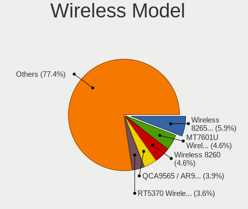

| Model                                                                   | Computers | Percent |
|-------------------------------------------------------------------------|-----------|---------|
| Intel Wireless 8265 / 8275                                              | 10        | 5.52%   |
| Intel Centrino Advanced-N 6205 [Taylor Peak]                            | 9         | 4.97%   |
| Realtek RTL8821CE 802.11ac PCIe Wireless Network Adapter                | 8         | 4.42%   |
| Ralink RT5370 Wireless Adapter                                          | 7         | 3.87%   |
| Qualcomm Atheros AR9285 Wireless Network Adapter (PCI-Express)          | 7         | 3.87%   |
| Intel Wireless 8260                                                     | 7         | 3.87%   |
| Intel Wireless 7265                                                     | 7         | 3.87%   |
| Qualcomm Atheros QCA9565 / AR9565 Wireless Network Adapter              | 6         | 3.31%   |
| Qualcomm Atheros QCA9377 802.11ac Wireless Network Adapter              | 6         | 3.31%   |
| Broadcom BCM4313 802.11bgn Wireless Network Adapter                     | 6         | 3.31%   |
| Qualcomm Atheros AR9485 Wireless Network Adapter                        | 5         | 2.76%   |
| Intel Wi-Fi 6 AX200                                                     | 5         | 2.76%   |
| Intel Centrino Advanced-N 6235                                          | 5         | 2.76%   |
| Intel Centrino Advanced-N 6200                                          | 5         | 2.76%   |
| Broadcom BCM43142 802.11b/g/n                                           | 5         | 2.76%   |
| TP-Link TL-WN722N v2/v3 [Realtek RTL8188EUS]                            | 4         | 2.21%   |
| Realtek RTL8723BE PCIe Wireless Network Adapter                         | 4         | 2.21%   |
| Ralink MT7601U Wireless Adapter                                         | 4         | 2.21%   |
| Qualcomm Atheros AR9287 Wireless Network Adapter (PCI-Express)          | 4         | 2.21%   |
| Intel Wireless 7260                                                     | 4         | 2.21%   |
| Ralink RT3290 Wireless 802.11n 1T/1R PCIe                               | 3         | 1.66%   |
| Qualcomm Atheros QCA6174 802.11ac Wireless Network Adapter              | 3         | 1.66%   |
| Intel Dual Band Wireless-AC 3168NGW [Stone Peak]                        | 3         | 1.66%   |
| Intel Comet Lake PCH-LP CNVi WiFi                                       | 3         | 1.66%   |
| Broadcom BCM43228 802.11a/b/g/n                                         | 3         | 1.66%   |
| Realtek RTL8822CE 802.11ac PCIe Wireless Network Adapter                | 2         | 1.1%    |
| Ralink RT3090 Wireless 802.11n 1T/1R PCIe                               | 2         | 1.1%    |
| Intel Wireless 3165                                                     | 2         | 1.1%    |
| Intel WiFi Link 5100                                                    | 2         | 1.1%    |
| Intel Wi-Fi 6 AX201                                                     | 2         | 1.1%    |
| Broadcom BCM43225 802.11b/g/n                                           | 2         | 1.1%    |
| Realtek RTL88x2bu [AC1200 Techkey]                                      | 1         | 0.55%   |
| Realtek RTL8814AU 802.11a/b/g/n/ac Wireless Adapter                     | 1         | 0.55%   |
| Realtek RTL8723DE Wireless Network Adapter                              | 1         | 0.55%   |
| Realtek RTL8723AE PCIe Wireless Network Adapter                         | 1         | 0.55%   |
| Realtek RTL8192EE PCIe Wireless Network Adapter                         | 1         | 0.55%   |
| Realtek RTL8192CU 802.11n WLAN Adapter                                  | 1         | 0.55%   |
| Realtek RTL8188FTV 802.11b/g/n 1T1R 2.4G WLAN Adapter                   | 1         | 0.55%   |
| Realtek RTL8188EUS 802.11n Wireless Network Adapter                     | 1         | 0.55%   |
| Realtek RTL8188EE Wireless Network Adapter                              | 1         | 0.55%   |
| Realtek RTL8188CE 802.11b/g/n WiFi Adapter                              | 1         | 0.55%   |
| Realtek RTL8187 Wireless Adapter                                        | 1         | 0.55%   |
| Realtek 802.11ac NIC                                                    | 1         | 0.55%   |
| Ralink RT2870/RT3070 Wireless Adapter                                   | 1         | 0.55%   |
| Ralink RT5390R 802.11bgn PCIe Wireless Network Adapter                  | 1         | 0.55%   |
| Ralink RT5360 Wireless 802.11n 1T/1R                                    | 1         | 0.55%   |
| Qualcomm Atheros AR9271 802.11n                                         | 1         | 0.55%   |
| Qualcomm Atheros AR9462 Wireless Network Adapter                        | 1         | 0.55%   |
| Qualcomm Atheros AR242x / AR542x Wireless Network Adapter (PCI-Express) | 1         | 0.55%   |
| Intel Wireless-AC 9260                                                  | 1         | 0.55%   |
| Intel Wi-Fi 6 AX210/AX211/AX411 160MHz                                  | 1         | 0.55%   |
| Intel Ultimate N WiFi Link 5300                                         | 1         | 0.55%   |
| Intel Tiger Lake PCH CNVi WiFi                                          | 1         | 0.55%   |
| Intel PRO/Wireless 3945ABG [Golan] Network Connection                   | 1         | 0.55%   |
| Intel PRO/Wireless 2200BG [Calexico2] Network Connection                | 1         | 0.55%   |
| Intel Ice Lake-LP PCH CNVi WiFi                                         | 1         | 0.55%   |
| Intel Centrino Wireless-N 130                                           | 1         | 0.55%   |
| Intel Centrino Wireless-N 1000 [Condor Peak]                            | 1         | 0.55%   |
| Intel Centrino Ultimate-N 6300                                          | 1         | 0.55%   |
| Intel Cannon Lake PCH CNVi WiFi                                         | 1         | 0.55%   |

Ethernet Vendor
---------------

Ethernet vendors

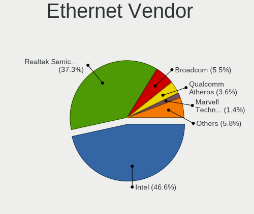

| Vendor                           | Computers | Percent |
|----------------------------------|-----------|---------|
| Intel                            | 80        | 43.96%  |
| Realtek Semiconductor            | 69        | 37.91%  |
| Qualcomm Atheros                 | 10        | 5.49%   |
| Broadcom                         | 9         | 4.95%   |
| Nvidia                           | 3         | 1.65%   |
| Marvell Technology Group         | 2         | 1.1%    |
| Lenovo                           | 2         | 1.1%    |
| Xiaomi                           | 1         | 0.55%   |
| Silicon Integrated Systems [SiS] | 1         | 0.55%   |
| Samsung Electronics              | 1         | 0.55%   |
| Qualcomm                         | 1         | 0.55%   |
| JMicron Technology               | 1         | 0.55%   |
| D-Link System                    | 1         | 0.55%   |
| Broadcom Limited                 | 1         | 0.55%   |

Ethernet Model
--------------

Ethernet models

| Model                                                                          | Computers | Percent |
|--------------------------------------------------------------------------------|-----------|---------|
| Realtek RTL8111/8168/8411 PCI Express Gigabit Ethernet Controller              | 48        | 26.09%  |
| Intel 82579LM Gigabit Network Connection (Lewisville)                          | 22        | 11.96%  |
| Intel Ethernet Connection I217-LM                                              | 14        | 7.61%   |
| Realtek RTL810xE PCI Express Fast Ethernet controller                          | 13        | 7.07%   |
| Intel Ethernet Connection (2) I219-LM                                          | 7         | 3.8%    |
| Intel 82577LM Gigabit Network Connection                                       | 6         | 3.26%   |
| Intel Ethernet Connection I218-LM                                              | 4         | 2.17%   |
| Intel Ethernet Connection (3) I218-LM                                          | 4         | 2.17%   |
| Realtek RTL8125 2.5GbE Controller                                              | 3         | 1.63%   |
| Realtek RTL-8100/8101L/8139 PCI Fast Ethernet Adapter                          | 3         | 1.63%   |
| Qualcomm Atheros AR8152 v2.0 Fast Ethernet                                     | 3         | 1.63%   |
| Intel I211 Gigabit Network Connection                                          | 3         | 1.63%   |
| Intel Ethernet Connection (4) I219-LM                                          | 3         | 1.63%   |
| Intel 82566DM-2 Gigabit Network Connection                                     | 3         | 1.63%   |
| Realtek RTL8153 Gigabit Ethernet Adapter                                       | 2         | 1.09%   |
| Qualcomm Atheros QCA8171 Gigabit Ethernet                                      | 2         | 1.09%   |
| Qualcomm Atheros AR8131 Gigabit Ethernet                                       | 2         | 1.09%   |
| Nvidia MCP61 Ethernet                                                          | 2         | 1.09%   |
| Lenovo ThinkPad TBT 3 Dock                                                     | 2         | 1.09%   |
| Intel Ethernet Connection I219-LM                                              | 2         | 1.09%   |
| Intel Ethernet Connection (4) I219-V                                           | 2         | 1.09%   |
| Intel 82567LM-3 Gigabit Network Connection                                     | 2         | 1.09%   |
| Broadcom NetXtreme BCM5752 Gigabit Ethernet PCI Express                        | 2         | 1.09%   |
| Broadcom NetLink BCM57785 Gigabit Ethernet PCIe                                | 2         | 1.09%   |
| Broadcom NetLink BCM57780 Gigabit Ethernet PCIe                                | 2         | 1.09%   |
| Xiaomi Mi/Redmi series (RNDIS)                                                 | 1         | 0.54%   |
| Silicon Integrated Systems [SiS] SiS900 PCI Fast Ethernet                      | 1         | 0.54%   |
| Samsung Galaxy series, misc. (tethering mode)                                  | 1         | 0.54%   |
| Qualcomm BENGAL-QRD _SN:C5464635                                               | 1         | 0.54%   |
| Qualcomm Atheros AR8161 Gigabit Ethernet                                       | 1         | 0.54%   |
| Qualcomm Atheros AR8152 v1.1 Fast Ethernet                                     | 1         | 0.54%   |
| Qualcomm Atheros AR8132 Fast Ethernet                                          | 1         | 0.54%   |
| Nvidia MCP79 Ethernet                                                          | 1         | 0.54%   |
| Marvell Group Yukon Optima 88E8059 [PCIe Gigabit Ethernet Controller with AVB] | 1         | 0.54%   |
| Marvell Group 88E8055 PCI-E Gigabit Ethernet Controller                        | 1         | 0.54%   |
| JMicron JMC260 PCI Express Fast Ethernet Controller                            | 1         | 0.54%   |
| Intel I210 Gigabit Network Connection                                          | 1         | 0.54%   |
| Intel Ethernet Connection I219-V                                               | 1         | 0.54%   |
| Intel Ethernet Connection I217-V                                               | 1         | 0.54%   |
| Intel Ethernet Connection (7) I219-LM                                          | 1         | 0.54%   |
| Intel Ethernet Connection (2) I219-V                                           | 1         | 0.54%   |
| Intel Ethernet Connection (13) I219-V                                          | 1         | 0.54%   |
| Intel 82579V Gigabit Network Connection                                        | 1         | 0.54%   |
| Intel 82578DM Gigabit Network Connection                                       | 1         | 0.54%   |
| Intel 82574L Gigabit Network Connection                                        | 1         | 0.54%   |
| Intel 82567LM Gigabit Network Connection                                       | 1         | 0.54%   |
| D-Link System DGE-528T Gigabit Ethernet Adapter                                | 1         | 0.54%   |
| Broadcom NetXtreme BCM5761 Gigabit Ethernet PCIe                               | 1         | 0.54%   |
| Broadcom NetXtreme BCM5751M Gigabit Ethernet PCI Express                       | 1         | 0.54%   |
| Broadcom NetLink BCM5784M Gigabit Ethernet PCIe                                | 1         | 0.54%   |
| Broadcom Limited NetXtreme BCM5782 Gigabit Ethernet                            | 1         | 0.54%   |

Net Controller Kind
-------------------

Ethernet, WiFi or modem

| Kind     | Computers | Percent |
|----------|-----------|---------|
| Ethernet | 173       | 49.71%  |
| WiFi     | 172       | 49.43%  |
| Modem    | 3         | 0.86%   |

Used Controller
---------------

Currently used network controller

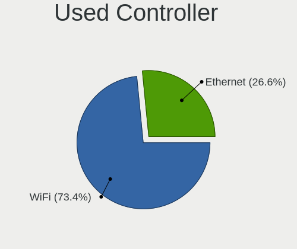

| Kind     | Computers | Percent |
|----------|-----------|---------|
| WiFi     | 142       | 72.45%  |
| Ethernet | 54        | 27.55%  |

NICs
----

Total network controllers on board

| Total | Computers | Percent |
|-------|-----------|---------|
| 2     | 134       | 68.37%  |
| 1     | 53        | 27.04%  |
| 0     | 5         | 2.55%   |
| 3     | 4         | 2.04%   |

IPv6
----

IPv6 vs IPv4

| Used | Computers | Percent |
|------|-----------|---------|
| No   | 195       | 100%    |

Bluetooth
---------

Bluetooth Vendor
----------------

Controller vendors

| Vendor                          | Computers | Percent |
|---------------------------------|-----------|---------|
| Intel                           | 50        | 43.1%   |
| Realtek Semiconductor           | 16        | 13.79%  |
| Qualcomm Atheros Communications | 13        | 11.21%  |
| Broadcom                        | 9         | 7.76%   |
| Dell                            | 6         | 5.17%   |
| Lite-On Technology              | 4         | 3.45%   |
| Ralink                          | 3         | 2.59%   |
| IMC Networks                    | 3         | 2.59%   |
| Hewlett-Packard                 | 3         | 2.59%   |
| Toshiba                         | 2         | 1.72%   |
| ASUSTek Computer                | 2         | 1.72%   |
| Foxconn International           | 1         | 0.86%   |
| Foxconn / Hon Hai               | 1         | 0.86%   |
| Cambridge Silicon Radio         | 1         | 0.86%   |
| Apple                           | 1         | 0.86%   |
| Alps Electric                   | 1         | 0.86%   |

Bluetooth Model
---------------

Controller models

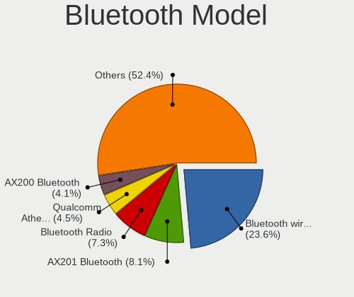

| Model                                               | Computers | Percent |
|-----------------------------------------------------|-----------|---------|
| Intel Bluetooth wireless interface                  | 28        | 24.14%  |
| Realtek Bluetooth Radio                             | 11        | 9.48%   |
| Qualcomm Atheros  Bluetooth Device                  | 6         | 5.17%   |
| Qualcomm Atheros AR3011 Bluetooth                   | 5         | 4.31%   |
| Intel Centrino Bluetooth Wireless Transceiver       | 5         | 4.31%   |
| Intel AX201 Bluetooth                               | 5         | 4.31%   |
| Intel AX200 Bluetooth                               | 5         | 4.31%   |
| Realtek  Bluetooth 4.2 Adapter                      | 4         | 3.45%   |
| Dell DW375 Bluetooth Module                         | 4         | 3.45%   |
| Ralink RT3290 Bluetooth                             | 3         | 2.59%   |
| Lite-On Qualcomm Atheros QCA9377 Bluetooth          | 3         | 2.59%   |
| Intel Wireless-AC 3168 Bluetooth                    | 3         | 2.59%   |
| IMC Networks Bluetooth Device                       | 3         | 2.59%   |
| Qualcomm Atheros AR3012 Bluetooth 4.0               | 2         | 1.72%   |
| Intel Bluetooth Device                              | 2         | 1.72%   |
| Intel Bluetooth 9460/9560 Jefferson Peak (JfP)      | 2         | 1.72%   |
| HP Broadcom 2070 Bluetooth Combo                    | 2         | 1.72%   |
| Broadcom BCM43142A0 Bluetooth 4.0                   | 2         | 1.72%   |
| Broadcom BCM20702 Bluetooth 4.0 [ThinkPad]          | 2         | 1.72%   |
| Toshiba Bluetooth Device                            | 1         | 0.86%   |
| Toshiba Atheros AR3012 Bluetooth                    | 1         | 0.86%   |
| Realtek RTL8723B Bluetooth                          | 1         | 0.86%   |
| Lite-On Broadcom BCM43142A0 Bluetooth Device        | 1         | 0.86%   |
| HP Bluetooth 1.2 Interface [Broadcom BCM2035]       | 1         | 0.86%   |
| Foxconn International BCM43142A0 Bluetooth module   | 1         | 0.86%   |
| Foxconn / Hon Hai Bluetooth USB Host Controller     | 1         | 0.86%   |
| Dell Wireless 360 Bluetooth                         | 1         | 0.86%   |
| Dell Wireless 350 Bluetooth                         | 1         | 0.86%   |
| Cambridge Silicon Radio Bluetooth Dongle (HCI mode) | 1         | 0.86%   |
| Broadcom HP Portable Valentine                      | 1         | 0.86%   |
| Broadcom HP Portable SoftSailing                    | 1         | 0.86%   |
| Broadcom HP Portable Bumble Bee                     | 1         | 0.86%   |
| Broadcom BCM43142 Bluetooth 4.0                     | 1         | 0.86%   |
| Broadcom BCM20702A0 Bluetooth 4.0                   | 1         | 0.86%   |
| ASUS BT-270 Bluetooth Adapter                       | 1         | 0.86%   |
| ASUS 2045 Bluetooth 2.0 Device with trace filter    | 1         | 0.86%   |
| Apple Built-in Bluetooth 2.0+EDR HCI                | 1         | 0.86%   |
| Alps Electric BCM2046 Bluetooth Device              | 1         | 0.86%   |

Sound
-----

Sound Vendor
------------

Sound card vendors

| Vendor                           | Computers | Percent |
|----------------------------------|-----------|---------|
| Intel                            | 170       | 72.96%  |
| Nvidia                           | 31        | 13.3%   |
| AMD                              | 23        | 9.87%   |
| Silicon Integrated Systems [SiS] | 2         | 0.86%   |
| Lenovo                           | 2         | 0.86%   |
| Logitech                         | 1         | 0.43%   |
| Hewlett-Packard                  | 1         | 0.43%   |
| GN Netcom                        | 1         | 0.43%   |
| GEMBIRD                          | 1         | 0.43%   |
| C-Media Electronics              | 1         | 0.43%   |

Sound Model
-----------

Sound card models

| Model                                                                                             | Computers | Percent |
|---------------------------------------------------------------------------------------------------|-----------|---------|
| Intel Sunrise Point-LP HD Audio                                                                   | 25        | 8.96%   |
| Intel 6 Series/C200 Series Chipset Family High Definition Audio Controller                        | 22        | 7.89%   |
| Intel 7 Series/C216 Chipset Family High Definition Audio Controller                               | 18        | 6.45%   |
| Intel 8 Series/C220 Series Chipset High Definition Audio Controller                               | 16        | 5.73%   |
| Intel Xeon E3-1200 v3/4th Gen Core Processor HD Audio Controller                                  | 13        | 4.66%   |
| Intel 5 Series/3400 Series Chipset High Definition Audio                                          | 12        | 4.3%    |
| Intel Wildcat Point-LP High Definition Audio Controller                                           | 10        | 3.58%   |
| Intel Broadwell-U Audio Controller                                                                | 10        | 3.58%   |
| Intel 82801I (ICH9 Family) HD Audio Controller                                                    | 10        | 3.58%   |
| Intel Haswell-ULT HD Audio Controller                                                             | 9         | 3.23%   |
| Intel 8 Series HD Audio Controller                                                                | 9         | 3.23%   |
| Intel 100 Series/C230 Series Chipset Family HD Audio Controller                                   | 8         | 2.87%   |
| Nvidia GF119 HDMI Audio Controller                                                                | 6         | 2.15%   |
| Intel Tiger Lake-LP Smart Sound Technology Audio Controller                                       | 6         | 2.15%   |
| Nvidia High Definition Audio Controller                                                           | 4         | 1.43%   |
| Nvidia GP107GL High Definition Audio Controller                                                   | 4         | 1.43%   |
| Intel NM10/ICH7 Family High Definition Audio Controller                                           | 4         | 1.43%   |
| AMD SBx00 Azalia (Intel HDA)                                                                      | 4         | 1.43%   |
| AMD Family 17h/19h HD Audio Controller                                                            | 4         | 1.43%   |
| Nvidia GK106 HDMI Audio Controller                                                                | 3         | 1.08%   |
| Intel Comet Lake PCH-LP cAVS                                                                      | 3         | 1.08%   |
| Intel Cannon Lake PCH cAVS                                                                        | 3         | 1.08%   |
| Intel Atom Processor Z36xxx/Z37xxx Series High Definition Audio Controller                        | 3         | 1.08%   |
| AMD Wrestler HDMI Audio                                                                           | 3         | 1.08%   |
| AMD Starship/Matisse HD Audio Controller                                                          | 3         | 1.08%   |
| AMD Renoir Radeon High Definition Audio Controller                                                | 3         | 1.08%   |
| AMD FCH Azalia Controller                                                                         | 3         | 1.08%   |
| Nvidia MCP61 High Definition Audio                                                                | 2         | 0.72%   |
| Nvidia GM107 High Definition Audio Controller [GeForce 940MX]                                     | 2         | 0.72%   |
| Nvidia GK208 HDMI/DP Audio Controller                                                             | 2         | 0.72%   |
| Lenovo ThinkPad Thunderbolt 3 Dock USB Audio                                                      | 2         | 0.72%   |
| Intel Ice Lake-LP Smart Sound Technology Audio Controller                                         | 2         | 0.72%   |
| Intel Cannon Point-LP High Definition Audio Controller                                            | 2         | 0.72%   |
| Intel C600/X79 series chipset High Definition Audio Controller                                    | 2         | 0.72%   |
| Intel Atom/Celeron/Pentium Processor x5-E8000/J3xxx/N3xxx Series High Definition Audio Controller | 2         | 0.72%   |
| Intel 82801JD/DO (ICH10 Family) HD Audio Controller                                               | 2         | 0.72%   |
| Intel 200 Series PCH HD Audio                                                                     | 2         | 0.72%   |
| AMD Kabini HDMI/DP Audio                                                                          | 2         | 0.72%   |
| Silicon Integrated Systems [SiS] SiS7012 AC'97 Sound Controller                                   | 1         | 0.36%   |
| Silicon Integrated Systems [SiS] Azalia Audio Controller                                          | 1         | 0.36%   |
| Nvidia TU116 High Definition Audio Controller                                                     | 1         | 0.36%   |
| Nvidia TU104 HD Audio Controller                                                                  | 1         | 0.36%   |
| Nvidia MCP79 High Definition Audio                                                                | 1         | 0.36%   |
| Nvidia GT216 HDMI Audio Controller                                                                | 1         | 0.36%   |
| Nvidia GM204 High Definition Audio Controller                                                     | 1         | 0.36%   |
| Nvidia GK107 HDMI Audio Controller                                                                | 1         | 0.36%   |
| Nvidia GF106 High Definition Audio Controller                                                     | 1         | 0.36%   |
| Nvidia GA106 High Definition Audio Controller                                                     | 1         | 0.36%   |
| Nvidia GA104 High Definition Audio Controller                                                     | 1         | 0.36%   |
| Logitech Headset H390                                                                             | 1         | 0.36%   |
| Intel Tiger Lake-H HD Audio Controller                                                            | 1         | 0.36%   |
| Intel Comet Lake PCH cAVS                                                                         | 1         | 0.36%   |
| Intel CM238 HD Audio Controller                                                                   | 1         | 0.36%   |
| Intel Celeron/Pentium Silver Processor High Definition Audio                                      | 1         | 0.36%   |
| Intel C610/X99 series chipset HD Audio Controller                                                 | 1         | 0.36%   |
| Intel Atom Processor Z36xxx/Z37xxx Series LPE Audio Controller                                    | 1         | 0.36%   |
| Intel 82801FB/FBM/FR/FW/FRW (ICH6 Family) AC'97 Audio Controller                                  | 1         | 0.36%   |
| Intel 82801EB/ER (ICH5/ICH5R) AC'97 Audio Controller                                              | 1         | 0.36%   |
| Intel 631xESB/632xESB High Definition Audio Controller                                            | 1         | 0.36%   |
| Hewlett-Packard Digital Stereo Headset                                                            | 1         | 0.36%   |

Memory
------

Memory Vendor
-------------

Memory module vendors

| Vendor              | Computers | Percent |
|---------------------|-----------|---------|
| SK hynix            | 40        | 28.57%  |
| Samsung Electronics | 38        | 27.14%  |
| Micron Technology   | 18        | 12.86%  |
| Kingston            | 14        | 10%     |
| Unknown             | 5         | 3.57%   |
| Crucial             | 4         | 2.86%   |
| Corsair             | 4         | 2.86%   |
| Elpida              | 3         | 2.14%   |
| Ramaxel Technology  | 2         | 1.43%   |
| Nanya Technology    | 2         | 1.43%   |
| A-DATA Technology   | 2         | 1.43%   |
| Transcend           | 1         | 0.71%   |
| Toshiba             | 1         | 0.71%   |
| TakeMS              | 1         | 0.71%   |
| Sesame              | 1         | 0.71%   |
| Qimonda             | 1         | 0.71%   |
| ASint Technology    | 1         | 0.71%   |
| Apacer              | 1         | 0.71%   |
| Unknown             | 1         | 0.71%   |

Memory Model
------------

Memory module models

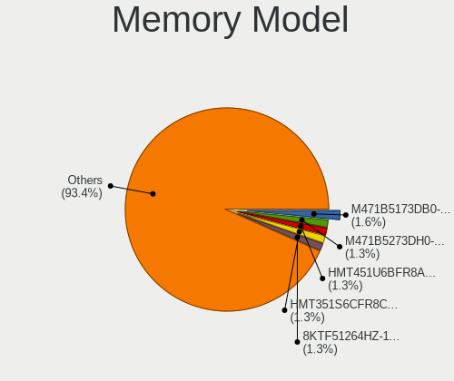

| Model                                                             | Computers | Percent |
|-------------------------------------------------------------------|-----------|---------|
| SK hynix RAM HMT451U6BFR8A-PB 4GB DIMM DDR3 1600MT/s              | 4         | 2.65%   |
| SK hynix RAM HMT351S6CFR8C-PB 4GB SODIMM DDR3 1600MT/s            | 4         | 2.65%   |
| Samsung RAM M471B5173DB0-YK0 4GB SODIMM DDR3 1600MT/s             | 3         | 1.99%   |
| Samsung RAM M378B5173EB0-YK0 4GB DIMM DDR3 1600MT/s               | 3         | 1.99%   |
| Micron RAM 8KTF51264HZ-1G6E1 4GB SODIMM DDR3 1600MT/s             | 3         | 1.99%   |
| Micron RAM 8JTF51264AZ-1G6E1 4096MB DIMM DDR3 1600MT/s            | 3         | 1.99%   |
| SK hynix RAM HMA851S6AFR6N-UH 4GB SODIMM DDR4 2667MT/s            | 2         | 1.32%   |
| SK hynix RAM HMA81GS6DJR8N-XN 8GB SODIMM DDR4 3200MT/s            | 2         | 1.32%   |
| Samsung RAM M471B5273DH0-CH9 4GB SODIMM DDR3 1334MT/s             | 2         | 1.32%   |
| Samsung RAM M471A5244CB0-CRC 4GB SODIMM DDR4 2667MT/s             | 2         | 1.32%   |
| Micron RAM 8ATF1G64HZ-2G6E1 8GB SODIMM DDR4 2667MT/s              | 2         | 1.32%   |
| Kingston RAM HP16D3LS1KFG/4G 4GB SODIMM DDR3 1600MT/s             | 2         | 1.32%   |
| Unknown RAM Module 4GB SODIMM DDR3                                | 1         | 0.66%   |
| Unknown RAM Module 4096MB SODIMM DDR3 1066MT/s                    | 1         | 0.66%   |
| Unknown RAM Module 2GB DIMM                                       | 1         | 0.66%   |
| Unknown RAM Module 2048MB SODIMM DDR2                             | 1         | 0.66%   |
| Unknown RAM Module 2048MB DIMM DDR3 1333MT/s                      | 1         | 0.66%   |
| Transcend RAM JM1333KSN-4G 4096MB SODIMM DDR3 1334MT/s            | 1         | 0.66%   |
| Toshiba RAM 64T128020EDL2.5C2 2GB SODIMM 1066MT/s                 | 1         | 0.66%   |
| TakeMS RAM TMS2GB264C081-665U 2048MB DIMM DDR2 667MT/s            | 1         | 0.66%   |
| SK hynix RAM Module 8192MB SODIMM DDR4 2667MT/s                   | 1         | 0.66%   |
| SK hynix RAM Module 8192MB SODIMM DDR4 2133MT/s                   | 1         | 0.66%   |
| SK hynix RAM HYMP512U64CP8-Y5 1GB DIMM                            | 1         | 0.66%   |
| SK hynix RAM HYMP125S64CP8-S6 2GB SODIMM DDR 800MT/s              | 1         | 0.66%   |
| SK hynix RAM HMT451U6BFR8C-PB 4096MB DIMM DDR3 1600MT/s           | 1         | 0.66%   |
| SK hynix RAM HMT451U6AFR8A-PB 4GB DIMM DDR3 1600MT/s              | 1         | 0.66%   |
| SK hynix RAM HMT451S6BFR8A-PB 4GB SODIMM DDR3 1600MT/s            | 1         | 0.66%   |
| SK hynix RAM HMT451S6AFR8A-PB 4GB SODIMM DDR3 1600MT/s            | 1         | 0.66%   |
| SK hynix RAM HMT451S6AFR8A-PB 4096MB SODIMM DDR3 1600MT/s         | 1         | 0.66%   |
| SK hynix RAM HMT425U6AFR6C-PB 2GB DIMM DDR3 1600MT/s              | 1         | 0.66%   |
| SK hynix RAM HMT41GU6MFR8C-PB 8GB DIMM DDR3 1600MT/s              | 1         | 0.66%   |
| SK hynix RAM HMT41GS6BFR8A-PB 8GB SODIMM DDR3 1600MT/s            | 1         | 0.66%   |
| SK hynix RAM HMT41GS6AFR8A-PB 8GB SODIMM DDR3 1600MT/s            | 1         | 0.66%   |
| SK hynix RAM HMT41GR7BFR4A-PB 8192MB DIMM DDR3 1600MT/s           | 1         | 0.66%   |
| SK hynix RAM HMT351U6BFR8C-H9 4GB DIMM DDR3 1333MT/s              | 1         | 0.66%   |
| SK hynix RAM HMT351S6EFR8A-PB 4GB SODIMM DDR3 1600MT/s            | 1         | 0.66%   |
| SK hynix RAM HMT351S6CFR8C-H9 4GB SODIMM DDR3 1600MT/s            | 1         | 0.66%   |
| SK hynix RAM HMT351S6CFR8C-H9 4GB SODIMM DDR3 1333MT/s            | 1         | 0.66%   |
| SK hynix RAM HMT351S6CFR8C-H9 4096MB SODIMM DDR3 1334MT/s         | 1         | 0.66%   |
| SK hynix RAM HMT351S6BFR8C-H9 4GB SODIMM DDR3 1334MT/s            | 1         | 0.66%   |
| SK hynix RAM HMT351S6BFR8C-H9 4GB SODIMM DDR3 1333MT/s            | 1         | 0.66%   |
| SK hynix RAM HMT325S6EFR8A-PB 2GB SODIMM DDR3 1600MT/s            | 1         | 0.66%   |
| SK hynix RAM HMT325S6BFR8C-H9 2GB SODIMM DDR3 1334MT/s            | 1         | 0.66%   |
| SK hynix RAM HMT125U6BFR8C-G7 2GB DIMM DDR3 1067MT/s              | 1         | 0.66%   |
| SK hynix RAM HMT112U6TFR8C-H9 1024MB DIMM DDR3 1333MT/s           | 1         | 0.66%   |
| SK hynix RAM HMAB2GS6AMR6N-XN 16GB SODIMM DDR4 3200MT/s           | 1         | 0.66%   |
| SK hynix RAM HMAA51S6AMR6N-UH 8GB SODIMM DDR4 2400MT/s            | 1         | 0.66%   |
| SK hynix RAM HMA851U6AFR6N-UH 4GB DIMM DDR4 2400MT/s              | 1         | 0.66%   |
| SK hynix RAM HMA851S6CJR6N-XN 4GB SODIMM DDR4 3200MT/s            | 1         | 0.66%   |
| SK hynix RAM HMA81GS6CJR8N-XN 8192MB SODIMM DDR4 3200MT/s         | 1         | 0.66%   |
| SK hynix RAM HMA81GS6AFR8N-UH 8GB SODIMM DDR4 2667MT/s            | 1         | 0.66%   |
| SK hynix RAM H9HCNNNFAMALTR-NEE 16GB Row Of Chips LPDDR4 3733MT/s | 1         | 0.66%   |
| SK hynix RAM H9CCNNN8GTALAR-NUD 2048MB LPDDR3 1600MT/s            | 1         | 0.66%   |
| Sesame RAM S939A2SGS-ITR 8192MB SODIMM DDR3 1600MT/s              | 1         | 0.66%   |
| Samsung RAM Module 8192MB DIMM DDR4 2133MT/s                      | 1         | 0.66%   |
| Samsung RAM Module 4GB DIMM DDR3 1333MT/s                         | 1         | 0.66%   |
| Samsung RAM M471B5773EB0-CK0 2GB SODIMM DDR3 1600MT/s             | 1         | 0.66%   |
| Samsung RAM M471B5674QH0-YK0 2GB SODIMM DDR3 1600MT/s             | 1         | 0.66%   |
| Samsung RAM M471B5673FH0-CF8 2GB SODIMM DDR3 1067MT/s             | 1         | 0.66%   |
| Samsung RAM M471B5273CH0-CH9 4GB SODIMM DDR3 1334MT/s             | 1         | 0.66%   |

Memory Kind
-----------

Memory module kinds

| Kind    | Computers | Percent |
|---------|-----------|---------|
| DDR3    | 53        | 49.53%  |
| DDR4    | 31        | 28.97%  |
| SDRAM   | 7         | 6.54%   |
| DDR2    | 7         | 6.54%   |
| LPDDR4  | 4         | 3.74%   |
| LPDDR3  | 3         | 2.8%    |
| DDR     | 1         | 0.93%   |
| Unknown | 1         | 0.93%   |

Memory Form Factor
------------------

Physical design of the memory module

| Name         | Computers | Percent |
|--------------|-----------|---------|
| SODIMM       | 68        | 68.69%  |
| DIMM         | 26        | 26.26%  |
| Row Of Chips | 3         | 3.03%   |
| RIMM         | 1         | 1.01%   |
| Unknown      | 1         | 1.01%   |

Memory Size
-----------

Memory module size

| Size  | Computers | Percent |
|-------|-----------|---------|
| 4096  | 51        | 44.35%  |
| 8192  | 33        | 28.7%   |
| 2048  | 15        | 13.04%  |
| 1024  | 6         | 5.22%   |
| 16384 | 5         | 4.35%   |
| 32768 | 2         | 1.74%   |
| 512   | 1         | 0.87%   |
| 256   | 1         | 0.87%   |
| 128   | 1         | 0.87%   |

Memory Speed
------------

Memory module speed

| Speed   | Computers | Percent |
|---------|-----------|---------|
| 1600    | 40        | 34.19%  |
| 2667    | 14        | 11.97%  |
| 1333    | 9         | 7.69%   |
| 1334    | 8         | 6.84%   |
| 3200    | 7         | 5.98%   |
| 2400    | 6         | 5.13%   |
| 2133    | 6         | 5.13%   |
| 667     | 4         | 3.42%   |
| Unknown | 3         | 2.56%   |
| 3600    | 2         | 1.71%   |
| 1867    | 2         | 1.71%   |
| 1067    | 2         | 1.71%   |
| 1066    | 2         | 1.71%   |
| 975     | 2         | 1.71%   |
| 4267    | 1         | 0.85%   |
| 4199    | 1         | 0.85%   |
| 3733    | 1         | 0.85%   |
| 3266    | 1         | 0.85%   |
| 1866    | 1         | 0.85%   |
| 1639    | 1         | 0.85%   |
| 800     | 1         | 0.85%   |
| 400     | 1         | 0.85%   |
| 333     | 1         | 0.85%   |
| 266     | 1         | 0.85%   |

Printers & scanners
-------------------

Printer Vendor
--------------

Printer device vendors

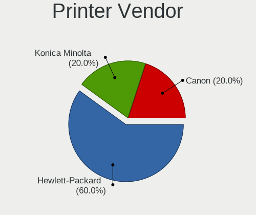

| Vendor          | Computers | Percent |
|-----------------|-----------|---------|
| Hewlett-Packard | 1         | 50%     |
| Canon           | 1         | 50%     |

Printer Model
-------------

Printer device models

| Model                  | Computers | Percent |
|------------------------|-----------|---------|
| HP Deskjet 3510 series | 1         | 50%     |
| Canon MB2000 series    | 1         | 50%     |

Scanner Vendor
--------------

Scanner device vendors

Zero info for selected period =(

Scanner Model
-------------

Scanner device models

Zero info for selected period =(

Camera
------

Camera Vendor
-------------

Camera device vendors

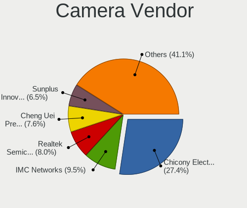

| Vendor                                 | Computers | Percent |
|----------------------------------------|-----------|---------|
| Chicony Electronics                    | 37        | 29.84%  |
| IMC Networks                           | 15        | 12.1%   |
| Cheng Uei Precision Industry (Foxlink) | 12        | 9.68%   |
| Realtek Semiconductor                  | 10        | 8.06%   |
| Suyin                                  | 8         | 6.45%   |
| Sunplus Innovation Technology          | 8         | 6.45%   |
| Lite-On Technology                     | 7         | 5.65%   |
| Microdia                               | 6         | 4.84%   |
| Ricoh                                  | 4         | 3.23%   |
| Quanta                                 | 3         | 2.42%   |
| Acer                                   | 3         | 2.42%   |
| Luxvisions Innotech Limited            | 2         | 1.61%   |
| Logitech                               | 2         | 1.61%   |
| Alcor Micro                            | 2         | 1.61%   |
| Syntek                                 | 1         | 0.81%   |
| Sunplus Technology                     | 1         | 0.81%   |
| Silicon Motion                         | 1         | 0.81%   |
| Apple                                  | 1         | 0.81%   |
| ALi                                    | 1         | 0.81%   |

Camera Model
------------

Camera device models

| Model                                                       | Computers | Percent |
|-------------------------------------------------------------|-----------|---------|
| Chicony Integrated Camera                                   | 6         | 4.8%    |
| IMC Networks Integrated Camera                              | 5         | 4%      |
| Chicony HP Webcam [2 MP Macro]                              | 4         | 3.2%    |
| Sunplus Laptop_Integrated_Webcam_FHD                        | 3         | 2.4%    |
| Microdia Integrated Webcam                                  | 3         | 2.4%    |
| IMC Networks USB2.0 VGA UVC WebCam                          | 3         | 2.4%    |
| Chicony HP Webcam                                           | 3         | 2.4%    |
| Chicony HP HD Webcam                                        | 3         | 2.4%    |
| Cheng Uei Precision Industry (Foxlink) HP HD Camera         | 3         | 2.4%    |
| Suyin 1.3M WebCam (notebook emachines E730, Acer sub-brand) | 2         | 1.6%    |
| Sunplus HP Universal Camera                                 | 2         | 1.6%    |
| Ricoh Laptop_Integrated_Webcam_FHD                          | 2         | 1.6%    |
| Realtek Integrated_Webcam_HD                                | 2         | 1.6%    |
| Lite-On TOSHIBA Web Camera - HD                             | 2         | 1.6%    |
| Lite-On HP HD Webcam                                        | 2         | 1.6%    |
| IMC Networks USB2.0 HD UVC WebCam                           | 2         | 1.6%    |
| IMC Networks Lenovo EasyCamera                              | 2         | 1.6%    |
| IMC Networks HP TrueVision HD Camera                        | 2         | 1.6%    |
| Chicony Lenovo Integrated Camera (0.3MP)                    | 2         | 1.6%    |
| Chicony Integrated Camera (1280x720@30)                     | 2         | 1.6%    |
| Chicony HP Wide Vision HD Camera                            | 2         | 1.6%    |
| Chicony HP HD Webcam [Fixed]                                | 2         | 1.6%    |
| Cheng Uei Precision Industry (Foxlink) HP TrueVision HD     | 2         | 1.6%    |
| Cheng Uei Precision Industry (Foxlink) HP HD Webcam         | 2         | 1.6%    |
| Syntek Lenovo EasyCamera                                    | 1         | 0.8%    |
| Suyin WebCam                                                | 1         | 0.8%    |
| Suyin USB2.0 RGBIR Camera                                   | 1         | 0.8%    |
| Suyin Sony Visual Communication Camera                      | 1         | 0.8%    |
| Suyin Integrated_Webcam_HD                                  | 1         | 0.8%    |
| Suyin Integrated_Webcam_2M                                  | 1         | 0.8%    |
| Suyin HP Webcam-50                                          | 1         | 0.8%    |
| Sunplus 1.3M WebCam                                         | 1         | 0.8%    |
| Sunplus Integrated_Webcam_HD                                | 1         | 0.8%    |
| Sunplus HP Truevision HD                                    | 1         | 0.8%    |
| Sunplus Dell E5570 integrated webcam                        | 1         | 0.8%    |
| Silicon Motion WebCam SC-0311139N                           | 1         | 0.8%    |
| Ricoh Sony Vaio Integrated Webcam                           | 1         | 0.8%    |
| Ricoh Laptop_Integrated_Webcam_3M                           | 1         | 0.8%    |
| Realtek USB2.0 HD UVC WebCam                                | 1         | 0.8%    |
| Realtek USB Camera                                          | 1         | 0.8%    |
| Realtek Integrated Webcam                                   | 1         | 0.8%    |
| Realtek Integrated Camera                                   | 1         | 0.8%    |
| Realtek HP Webcam-101                                       | 1         | 0.8%    |
| Realtek HP Webcam                                           | 1         | 0.8%    |
| Realtek HP Truevision HD integrated webcam                  | 1         | 0.8%    |
| Realtek Acer 640 x 480 laptop camera                        | 1         | 0.8%    |
| Quanta HP Wide Vision HD Camera                             | 1         | 0.8%    |
| Quanta HP Webcam                                            | 1         | 0.8%    |
| Quanta HD WebCam                                            | 1         | 0.8%    |
| Microdia WebCam SC-13HDL12639P                              | 1         | 0.8%    |
| Microdia Integrated Webcam HD                               | 1         | 0.8%    |
| Microdia Dell Laptop Integrated Webcam HD                   | 1         | 0.8%    |
| Luxvisions Innotech Limited Integrated Camera               | 1         | 0.8%    |
| Luxvisions Innotech Limited HP TrueVision HD Camera         | 1         | 0.8%    |
| Logitech Webcam C270                                        | 1         | 0.8%    |
| Logitech Logi 4K Stream Edition                             | 1         | 0.8%    |
| Lite-On HP Webcam                                           | 1         | 0.8%    |
| Lite-On HP HD Camera                                        | 1         | 0.8%    |
| Lite-On EasyCamera 5M                                       | 1         | 0.8%    |
| IMC Networks Integrated Webcam                              | 1         | 0.8%    |

Security
--------

Fingerprint Vendor
------------------

Fingerprint sensor vendors

| Vendor                | Computers | Percent |
|-----------------------|-----------|---------|
| Validity Sensors      | 22        | 68.75%  |
| Synaptics             | 5         | 15.63%  |
| Elan Microelectronics | 4         | 12.5%   |
| Upek                  | 1         | 3.13%   |

Fingerprint Model
-----------------

Fingerprint sensor models

| Model                                                       | Computers | Percent |
|-------------------------------------------------------------|-----------|---------|
| Validity Sensors VFS495 Fingerprint Reader                  | 8         | 25%     |
| Validity Sensors VFS451 Fingerprint Reader                  | 3         | 9.38%   |
| Validity Sensors VFS 5011 fingerprint sensor                | 3         | 9.38%   |
| Synaptics Metallica MIS Touch Fingerprint Reader            | 3         | 9.38%   |
| Validity Sensors VFS491                                     | 2         | 6.25%   |
| Validity Sensors VFS471 Fingerprint Reader                  | 2         | 6.25%   |
| Elan ELAN:Fingerprint                                       | 2         | 6.25%   |
| Elan ELAN:ARM-M4                                            | 2         | 6.25%   |
| Validity Sensors VFS7500 Touch Fingerprint Sensor           | 1         | 3.13%   |
| Validity Sensors VFS5011 Fingerprint Reader                 | 1         | 3.13%   |
| Validity Sensors Synaptics WBDI                             | 1         | 3.13%   |
| Validity Sensors Synaptics VFS7552 Touch Fingerprint Sensor | 1         | 3.13%   |
| Upek Biometric Touchchip/Touchstrip Fingerprint Sensor      | 1         | 3.13%   |
| Synaptics Prometheus MIS Touch Fingerprint Reader           | 1         | 3.13%   |
| Synaptics Metallica MOH Touch Fingerprint Reader            | 1         | 3.13%   |

Chipcard Vendor
---------------

Chipcard module vendors

| Vendor      | Computers | Percent |
|-------------|-----------|---------|
| Broadcom    | 10        | 58.82%  |
| Alcor Micro | 5         | 29.41%  |
| O2 Micro    | 2         | 11.76%  |

Chipcard Model
--------------

Chipcard module models

| Model                                                                        | Computers | Percent |
|------------------------------------------------------------------------------|-----------|---------|
| Broadcom BCM5880 Secure Applications Processor                               | 6         | 35.29%  |
| Alcor Micro AU9540 Smartcard Reader                                          | 5         | 29.41%  |
| Broadcom BCM5880 Secure Applications Processor with fingerprint swipe sensor | 2         | 11.76%  |
| Broadcom 5880                                                                | 2         | 11.76%  |
| O2 Micro Oz776 SmartCard Reader                                              | 1         | 5.88%   |
| O2 Micro OZ776 CCID Smartcard Reader                                         | 1         | 5.88%   |

Unsupported
-----------

Unsupported Devices
-------------------

Total unsupported devices on board

| Total | Computers | Percent |
|-------|-----------|---------|
| 0     | 128       | 63.68%  |
| 1     | 57        | 28.36%  |
| 2     | 15        | 7.46%   |
| 3     | 1         | 0.5%    |

Unsupported Device Types
------------------------

Types of unsupported devices

| Type                     | Computers | Percent |
|--------------------------|-----------|---------|
| Fingerprint reader       | 32        | 36.36%  |
| Chipcard                 | 17        | 19.32%  |
| Graphics card            | 14        | 15.91%  |
| Net/wireless             | 7         | 7.95%   |
| Storage                  | 5         | 5.68%   |
| Communication controller | 3         | 3.41%   |
| Bluetooth                | 3         | 3.41%   |
| Unassigned class         | 2         | 2.27%   |
| Sound                    | 1         | 1.14%   |
| Net/ethernet             | 1         | 1.14%   |
| Multimedia controller    | 1         | 1.14%   |
| Modem                    | 1         | 1.14%   |
| Camera                   | 1         | 1.14%   |

