Linux in Morocco - Tested Hardware & Statistics (Desktops)
----------------------------------------------------------

A project to collect tested hardware configurations for Linux in Morocco.

Anyone can contribute to this report by the [hw-probe](https://github.com/linuxhw/hw-probe) tool:

    sudo -E hw-probe -all -upload

Please contribute! Especially if your hardware is rare.

Contents
--------

* [ Test Cases ](#test-cases)

* [ System ](#system)
  - [ OS                       ](#os)
  - [ OS Family                ](#os-family)
  - [ Kernel                   ](#kernel)
  - [ Kernel Family            ](#kernel-family)
  - [ Kernel Major Ver.        ](#kernel-major-ver)
  - [ Arch                     ](#arch)
  - [ DE                       ](#de)
  - [ Display Server           ](#display-server)
  - [ Display Manager          ](#display-manager)
  - [ OS Lang                  ](#os-lang)
  - [ Boot Mode                ](#boot-mode)
  - [ Filesystem               ](#filesystem)
  - [ Part. scheme             ](#part-scheme)
  - [ Dual Boot with Linux/BSD ](#dual-boot-with-linuxbsd)
  - [ Dual Boot (Win)          ](#dual-boot-win)

* [ Board ](#board)
  - [ Vendor                   ](#vendor)
  - [ Model                    ](#model)
  - [ Model Family             ](#model-family)
  - [ MFG Year                 ](#mfg-year)
  - [ Form Factor              ](#form-factor)
  - [ Secure Boot              ](#secure-boot)
  - [ Coreboot                 ](#coreboot)
  - [ RAM Size                 ](#ram-size)
  - [ RAM Used                 ](#ram-used)
  - [ Total Drives             ](#total-drives)
  - [ Has CD-ROM               ](#has-cd-rom)
  - [ Has Ethernet             ](#has-ethernet)
  - [ Has WiFi                 ](#has-wifi)
  - [ Has Bluetooth            ](#has-bluetooth)

* [ Location ](#location)
  - [ Country                  ](#country)
  - [ City                     ](#city)

* [ Drives ](#drives)
  - [ Drive Vendor             ](#drive-vendor)
  - [ Drive Model              ](#drive-model)
  - [ HDD Vendor               ](#hdd-vendor)
  - [ SSD Vendor               ](#ssd-vendor)
  - [ Drive Kind               ](#drive-kind)
  - [ Drive Connector          ](#drive-connector)
  - [ Drive Size               ](#drive-size)
  - [ Space Total              ](#space-total)
  - [ Space Used               ](#space-used)
  - [ Malfunc. Drives          ](#malfunc-drives)
  - [ Malfunc. Drive Vendor    ](#malfunc-drive-vendor)
  - [ Malfunc. HDD Vendor      ](#malfunc-hdd-vendor)
  - [ Malfunc. Drive Kind      ](#malfunc-drive-kind)
  - [ Failed Drives            ](#failed-drives)
  - [ Failed Drive Vendor      ](#failed-drive-vendor)
  - [ Drive Status             ](#drive-status)

* [ Storage controller ](#storage-controller)
  - [ Storage Vendor           ](#storage-vendor)
  - [ Storage Model            ](#storage-model)
  - [ Storage Kind             ](#storage-kind)

* [ Processor ](#processor)
  - [ CPU Vendor               ](#cpu-vendor)
  - [ CPU Model                ](#cpu-model)
  - [ CPU Model Family         ](#cpu-model-family)
  - [ CPU Cores                ](#cpu-cores)
  - [ CPU Sockets              ](#cpu-sockets)
  - [ CPU Threads              ](#cpu-threads)
  - [ CPU Op-Modes             ](#cpu-op-modes)
  - [ CPU Microcode            ](#cpu-microcode)
  - [ CPU Microarch            ](#cpu-microarch)

* [ Graphics ](#graphics)
  - [ GPU Vendor               ](#gpu-vendor)
  - [ GPU Model                ](#gpu-model)
  - [ GPU Combo                ](#gpu-combo)
  - [ GPU Driver               ](#gpu-driver)
  - [ GPU Memory               ](#gpu-memory)

* [ Monitor ](#monitor)
  - [ Monitor Vendor           ](#monitor-vendor)
  - [ Monitor Model            ](#monitor-model)
  - [ Monitor Resolution       ](#monitor-resolution)
  - [ Monitor Diagonal         ](#monitor-diagonal)
  - [ Monitor Width            ](#monitor-width)
  - [ Aspect Ratio             ](#aspect-ratio)
  - [ Monitor Area             ](#monitor-area)
  - [ Pixel Density            ](#pixel-density)
  - [ Multiple Monitors        ](#multiple-monitors)

* [ Network ](#network)
  - [ Net Controller Vendor    ](#net-controller-vendor)
  - [ Net Controller Model     ](#net-controller-model)
  - [ Wireless Vendor          ](#wireless-vendor)
  - [ Wireless Model           ](#wireless-model)
  - [ Ethernet Vendor          ](#ethernet-vendor)
  - [ Ethernet Model           ](#ethernet-model)
  - [ Net Controller Kind      ](#net-controller-kind)
  - [ Used Controller          ](#used-controller)
  - [ NICs                     ](#nics)
  - [ IPv6                     ](#ipv6)

* [ Bluetooth ](#bluetooth)
  - [ Bluetooth Vendor         ](#bluetooth-vendor)
  - [ Bluetooth Model          ](#bluetooth-model)

* [ Sound ](#sound)
  - [ Sound Vendor             ](#sound-vendor)
  - [ Sound Model              ](#sound-model)

* [ Memory ](#memory)
  - [ Memory Vendor            ](#memory-vendor)
  - [ Memory Model             ](#memory-model)
  - [ Memory Kind              ](#memory-kind)
  - [ Memory Form Factor       ](#memory-form-factor)
  - [ Memory Size              ](#memory-size)
  - [ Memory Speed             ](#memory-speed)

* [ Printers & scanners ](#printers--scanners)
  - [ Printer Vendor           ](#printer-vendor)
  - [ Printer Model            ](#printer-model)
  - [ Scanner Vendor           ](#scanner-vendor)
  - [ Scanner Model            ](#scanner-model)

* [ Camera ](#camera)
  - [ Camera Vendor            ](#camera-vendor)
  - [ Camera Model             ](#camera-model)

* [ Security ](#security)
  - [ Fingerprint Vendor       ](#fingerprint-vendor)
  - [ Fingerprint Model        ](#fingerprint-model)
  - [ Chipcard Vendor          ](#chipcard-vendor)
  - [ Chipcard Model           ](#chipcard-model)

* [ Unsupported ](#unsupported)
  - [ Unsupported Devices      ](#unsupported-devices)
  - [ Unsupported Device Types ](#unsupported-device-types)

Test Cases
----------

Total: 164

| Vendor        | Model                       | Probe                                                      | Date         |
|---------------|-----------------------------|------------------------------------------------------------|--------------|
| HP            | 1494                        | [e32d33455b](https://linux-hardware.org/?probe=e32d33455b) | Dec 22, 2025 |
| HP            | 3397                        | [7deb053b0b](https://linux-hardware.org/?probe=7deb053b0b) | Dec 16, 2025 |
| Dell          | 0WR7PY A03                  | [64001fab76](https://linux-hardware.org/?probe=64001fab76) | Dec 15, 2025 |
| HP            | 09F0h                       | [610ddb1849](https://linux-hardware.org/?probe=610ddb1849) | Nov 29, 2025 |
| HP            | 1589                        | [5f25d9db26](https://linux-hardware.org/?probe=5f25d9db26) | Nov 06, 2025 |
| HP            | 1589                        | [e2cb47a304](https://linux-hardware.org/?probe=e2cb47a304) | Nov 06, 2025 |
| HP            | 8299                        | [7d241d83ab](https://linux-hardware.org/?probe=7d241d83ab) | Oct 23, 2025 |
| Lenovo        | 3102 SDK0J40697 WIN 3305... | [2f6599e33e](https://linux-hardware.org/?probe=2f6599e33e) | Oct 19, 2025 |
| Lenovo        | 3102 SDK0J40697 WIN 3305... | [f32cd477b8](https://linux-hardware.org/?probe=f32cd477b8) | Oct 19, 2025 |
| Pegatron      | 2AD5                        | [076872dfa1](https://linux-hardware.org/?probe=076872dfa1) | Oct 16, 2025 |
| HP            | 304Ah                       | [b0c4041aaa](https://linux-hardware.org/?probe=b0c4041aaa) | Oct 03, 2025 |
| HP            | 0AACh                       | [95233ca98a](https://linux-hardware.org/?probe=95233ca98a) | Sep 29, 2025 |
| Dell          | 04YP6J A02                  | [eea42cabee](https://linux-hardware.org/?probe=eea42cabee) | Sep 17, 2025 |
| MSI           | PRO A620M-E                 | [b3c97fa479](https://linux-hardware.org/?probe=b3c97fa479) | Sep 10, 2025 |
| MSI           | PRO A620M-E                 | [1a9efed61f](https://linux-hardware.org/?probe=1a9efed61f) | Sep 09, 2025 |
| Pegatron      | 2AD5                        | [911a5acdf2](https://linux-hardware.org/?probe=911a5acdf2) | Aug 26, 2025 |
| MSI           | B450M-A PRO MAX II          | [356282aab4](https://linux-hardware.org/?probe=356282aab4) | Aug 15, 2025 |
| Dell          | 0KC9NP A01                  | [480c11206c](https://linux-hardware.org/?probe=480c11206c) | Aug 14, 2025 |
| Pegatron      | 2AD5                        | [1b6084fb84](https://linux-hardware.org/?probe=1b6084fb84) | Aug 01, 2025 |
| Gigabyte      | B760 DS3H AX DDR4           | [2461a88a30](https://linux-hardware.org/?probe=2461a88a30) | Jul 13, 2025 |
| Foxconn       | 2ADA                        | [3c89640d98](https://linux-hardware.org/?probe=3c89640d98) | Jul 05, 2025 |
| Pegatron      | 2A73h                       | [b2f513c983](https://linux-hardware.org/?probe=b2f513c983) | Jun 22, 2025 |
| Acer          | Veriton M2640G V:1.0        | [1afb0d8968](https://linux-hardware.org/?probe=1afb0d8968) | Jun 11, 2025 |
| HP            | 212B                        | [905bb62926](https://linux-hardware.org/?probe=905bb62926) | May 24, 2025 |
| HP            | 18E7                        | [81b687a9f8](https://linux-hardware.org/?probe=81b687a9f8) | May 16, 2025 |
| Dell          | 0Y5DDC A00                  | [023a9d827b](https://linux-hardware.org/?probe=023a9d827b) | May 10, 2025 |
| Dell          | 0MN1TX A01                  | [74ae783308](https://linux-hardware.org/?probe=74ae783308) | Apr 30, 2025 |
| MSI           | B450M-A PRO MAX II          | [6874de2afa](https://linux-hardware.org/?probe=6874de2afa) | Apr 27, 2025 |
| Dell          | 05YDCW A01                  | [fc545c965a](https://linux-hardware.org/?probe=fc545c965a) | Apr 20, 2025 |
| Dell          | 05YDCW A01                  | [9dc75fa0db](https://linux-hardware.org/?probe=9dc75fa0db) | Apr 20, 2025 |
| Dell          | 0KC9NP A01                  | [397773ae54](https://linux-hardware.org/?probe=397773ae54) | Apr 06, 2025 |
| Gateway       | DT71                        | [cacb1c4c18](https://linux-hardware.org/?probe=cacb1c4c18) | Feb 21, 2025 |
| Gateway       | DT71                        | [c1ffdc7907](https://linux-hardware.org/?probe=c1ffdc7907) | Feb 21, 2025 |
| Dell          | OptiPlex 745                | [578cc6d8f1](https://linux-hardware.org/?probe=578cc6d8f1) | Jan 06, 2025 |
| ASUSTek       | ROG STRIX Z590-E GAMING ... | [91cdbe5df9](https://linux-hardware.org/?probe=91cdbe5df9) | Dec 25, 2024 |
| ASUSTek       | ROG STRIX Z590-E GAMING ... | [32e2211a4c](https://linux-hardware.org/?probe=32e2211a4c) | Dec 25, 2024 |
| HP            | 8054                        | [3196c09967](https://linux-hardware.org/?probe=3196c09967) | Dec 16, 2024 |
| HP            | 8055                        | [25559cfc60](https://linux-hardware.org/?probe=25559cfc60) | Nov 20, 2024 |
| Gigabyte      | H310M H x.x                 | [7e072971d7](https://linux-hardware.org/?probe=7e072971d7) | Nov 04, 2024 |
| HP            | 18E4                        | [9b22068827](https://linux-hardware.org/?probe=9b22068827) | Oct 04, 2024 |
| Dell          | 02YYK5 A00                  | [d75576c2f8](https://linux-hardware.org/?probe=d75576c2f8) | Sep 09, 2024 |
| Unknown       | Unknown                     | [0f53ca6134](https://linux-hardware.org/?probe=0f53ca6134) | Aug 26, 2024 |
| Fujitsu       | D3430-U1 S26361-D3430-U1    | [073d286abd](https://linux-hardware.org/?probe=073d286abd) | Aug 14, 2024 |
| HP            | 0B40h                       | [4e504e2f3a](https://linux-hardware.org/?probe=4e504e2f3a) | Aug 05, 2024 |
| HP            | 18E7                        | [a91cb43a38](https://linux-hardware.org/?probe=a91cb43a38) | Jul 30, 2024 |
| HP            | 18E7                        | [b426107c33](https://linux-hardware.org/?probe=b426107c33) | Jul 29, 2024 |
| HP            | 18E7                        | [5d7f84157a](https://linux-hardware.org/?probe=5d7f84157a) | Jul 27, 2024 |
| HP            | 18E7                        | [f1679be146](https://linux-hardware.org/?probe=f1679be146) | Jul 27, 2024 |
| Dell          | 0MN1TX A01                  | [99e899cbb0](https://linux-hardware.org/?probe=99e899cbb0) | Jul 22, 2024 |
| HP            | 0AA8h                       | [bb1f36cf41](https://linux-hardware.org/?probe=bb1f36cf41) | Jun 17, 2024 |
| Dell          | 0V8F20 A01                  | [5b99cd208d](https://linux-hardware.org/?probe=5b99cd208d) | Apr 17, 2024 |
| Lenovo        | 32E6 NOK                    | [b560c0d5fe](https://linux-hardware.org/?probe=b560c0d5fe) | Apr 09, 2024 |
| Lenovo        | 3740 NOK                    | [355c32d663](https://linux-hardware.org/?probe=355c32d663) | Apr 09, 2024 |
| Gigabyte      | B450M S2H                   | [979a30bf92](https://linux-hardware.org/?probe=979a30bf92) | Mar 09, 2024 |
| Gigabyte      | B450M S2H                   | [66558a86e4](https://linux-hardware.org/?probe=66558a86e4) | Mar 09, 2024 |
| HP            | 212B                        | [781ec8e8f8](https://linux-hardware.org/?probe=781ec8e8f8) | Mar 07, 2024 |
| Fujitsu       | D3430-U1 S26361-D3430-U1    | [87afd5cfa6](https://linux-hardware.org/?probe=87afd5cfa6) | Mar 02, 2024 |
| Fujitsu       | D3430-U1 S26361-D3430-U1    | [949f1cd85d](https://linux-hardware.org/?probe=949f1cd85d) | Feb 23, 2024 |
| Lenovo        | 32CB SDK0T76530 WIN 3556... | [c71cf6708c](https://linux-hardware.org/?probe=c71cf6708c) | Feb 19, 2024 |
| Fujitsu       | D3430-U1 S26361-D3430-U1    | [2df79d1eff](https://linux-hardware.org/?probe=2df79d1eff) | Feb 17, 2024 |
| Lenovo        | 312A NOK                    | [366174cd75](https://linux-hardware.org/?probe=366174cd75) | Feb 02, 2024 |
| Dell          | 02K9CR A01                  | [72df486f35](https://linux-hardware.org/?probe=72df486f35) | Jan 31, 2024 |
| Lenovo        | 312A NOK                    | [4cb29324fc](https://linux-hardware.org/?probe=4cb29324fc) | Jan 30, 2024 |
| Lenovo        | 312A NOK                    | [dea06ca305](https://linux-hardware.org/?probe=dea06ca305) | Jan 30, 2024 |
| Lenovo        | 312A NOK                    | [83eec08588](https://linux-hardware.org/?probe=83eec08588) | Jan 30, 2024 |
| HP            | 18E7                        | [f5115e035f](https://linux-hardware.org/?probe=f5115e035f) | Dec 30, 2023 |
| HP            | 090Ch                       | [06e9f893bc](https://linux-hardware.org/?probe=06e9f893bc) | Dec 25, 2023 |
| Foxconn       | 2ABF                        | [3441aa81e6](https://linux-hardware.org/?probe=3441aa81e6) | Dec 23, 2023 |
| HP            | 18E7                        | [dad5884f78](https://linux-hardware.org/?probe=dad5884f78) | Dec 10, 2023 |
| HP            | 3031h                       | [06a9e0c346](https://linux-hardware.org/?probe=06a9e0c346) | Dec 04, 2023 |
| Dell          | OptiPlex 745                | [1abbad3f94](https://linux-hardware.org/?probe=1abbad3f94) | Nov 23, 2023 |
| Dell          | 0XPDFK A01                  | [8b3abafe9b](https://linux-hardware.org/?probe=8b3abafe9b) | Nov 19, 2023 |
| HP            | 1998                        | [d37c482ca8](https://linux-hardware.org/?probe=d37c482ca8) | Oct 19, 2023 |
| HP            | 18E4                        | [6707337e0c](https://linux-hardware.org/?probe=6707337e0c) | Oct 03, 2023 |
| Dell          | 077RRV A00                  | [5ebc4171ff](https://linux-hardware.org/?probe=5ebc4171ff) | Sep 08, 2023 |
| Lenovo        | 1030 SDK0J40697 WIN 3305... | [e180d8d91b](https://linux-hardware.org/?probe=e180d8d91b) | Aug 31, 2023 |
| HP            | 3031h                       | [4ce70764b2](https://linux-hardware.org/?probe=4ce70764b2) | Aug 16, 2023 |
| ASUSTek       | PRIME B550M-A               | [74a73b0208](https://linux-hardware.org/?probe=74a73b0208) | Aug 13, 2023 |
| Fujitsu       | D3430-U1 S26361-D3430-U1    | [5dc4c594ea](https://linux-hardware.org/?probe=5dc4c594ea) | Aug 05, 2023 |
| Fujitsu       | D3430-U1 S26361-D3430-U1    | [e8249dc6d6](https://linux-hardware.org/?probe=e8249dc6d6) | Jul 21, 2023 |
| Fujitsu       | D3430-U1 S26361-D3430-U1    | [37132be6bd](https://linux-hardware.org/?probe=37132be6bd) | Jul 21, 2023 |
| HP            | 158A                        | [4d915b56e7](https://linux-hardware.org/?probe=4d915b56e7) | Jul 08, 2023 |
| HP            | 0AECh D                     | [bd8035963a](https://linux-hardware.org/?probe=bd8035963a) | Jul 03, 2023 |
| Lenovo        | SHARKBAY SDK0E50510 PRO     | [6c1829f43d](https://linux-hardware.org/?probe=6c1829f43d) | Jul 01, 2023 |
| HP            | 21F5 0A                     | [dd990a6e99](https://linux-hardware.org/?probe=dd990a6e99) | Jun 26, 2023 |
| HP            | 1589                        | [be15d33d32](https://linux-hardware.org/?probe=be15d33d32) | May 07, 2023 |
| ASUSTek       | PRIME B450M-K               | [3592ce514a](https://linux-hardware.org/?probe=3592ce514a) | Apr 29, 2023 |
| HP            | 0AECh D                     | [f6c67d337e](https://linux-hardware.org/?probe=f6c67d337e) | Apr 17, 2023 |
| HP            | 1494                        | [9c5dc1a221](https://linux-hardware.org/?probe=9c5dc1a221) | Apr 13, 2023 |
| HP            | 89B4 A                      | [cb8136a176](https://linux-hardware.org/?probe=cb8136a176) | Mar 28, 2023 |
| Foxconn       | 2ABF                        | [41f9974254](https://linux-hardware.org/?probe=41f9974254) | Feb 16, 2023 |
| HP            | 18E7                        | [db4ef3e5f4](https://linux-hardware.org/?probe=db4ef3e5f4) | Jan 30, 2023 |
| Dell          | 0MN1TX A02                  | [e0099da561](https://linux-hardware.org/?probe=e0099da561) | Jan 11, 2023 |
| HP            | 2AA2                        | [36f40353c8](https://linux-hardware.org/?probe=36f40353c8) | Oct 25, 2022 |
| HP            | 1497                        | [17a2f79f3f](https://linux-hardware.org/?probe=17a2f79f3f) | Oct 04, 2022 |
| HP            | 1497                        | [fab365512a](https://linux-hardware.org/?probe=fab365512a) | Oct 04, 2022 |
| HP            | 1497                        | [86ab60b437](https://linux-hardware.org/?probe=86ab60b437) | Sep 30, 2022 |
| ASUSTek       | ROG CROSSHAIR VIII FORMU... | [805d4161a8](https://linux-hardware.org/?probe=805d4161a8) | Sep 15, 2022 |
| Lenovo        | SHARKBAY 0C48431 WIN        | [4598920e84](https://linux-hardware.org/?probe=4598920e84) | Sep 13, 2022 |
| HP            | 18E4                        | [2c113164fd](https://linux-hardware.org/?probe=2c113164fd) | Sep 05, 2022 |
| ASRock        | A320M-HDV R4.0              | [3cca56dc74](https://linux-hardware.org/?probe=3cca56dc74) | Aug 22, 2022 |
| HP            | 198E                        | [4327be921d](https://linux-hardware.org/?probe=4327be921d) | Aug 06, 2022 |
| HP            | 198E                        | [284e29b3ea](https://linux-hardware.org/?probe=284e29b3ea) | Aug 06, 2022 |
| ASUSTek       | WS X299 SAGE                | [acb31e0818](https://linux-hardware.org/?probe=acb31e0818) | Jul 18, 2022 |
| Dell          | 0KJCC5 A00                  | [334e57a8b2](https://linux-hardware.org/?probe=334e57a8b2) | Jun 14, 2022 |
| ECS           | Nettle2                     | [4939d60e6d](https://linux-hardware.org/?probe=4939d60e6d) | Mar 27, 2022 |
| HP            | 18E4                        | [e7d597600e](https://linux-hardware.org/?probe=e7d597600e) | Feb 25, 2022 |
| HP            | 3396                        | [e9486b13b8](https://linux-hardware.org/?probe=e9486b13b8) | Jan 20, 2022 |
| HP            | 1589                        | [402f1722ab](https://linux-hardware.org/?probe=402f1722ab) | Jan 09, 2022 |
| HP            | 8054                        | [13d18f87fe](https://linux-hardware.org/?probe=13d18f87fe) | Dec 30, 2021 |
| HP            | 8054                        | [fcf6deb221](https://linux-hardware.org/?probe=fcf6deb221) | Dec 30, 2021 |
| HP            | 1998                        | [f8e644ed15](https://linux-hardware.org/?probe=f8e644ed15) | Dec 23, 2021 |
| HP            | 090Ch                       | [bf92e3c728](https://linux-hardware.org/?probe=bf92e3c728) | Dec 22, 2021 |
| HP            | 1998                        | [ffa6c0b239](https://linux-hardware.org/?probe=ffa6c0b239) | Dec 01, 2021 |
| Dell          | 0MWYPT A01                  | [63385716b2](https://linux-hardware.org/?probe=63385716b2) | Nov 19, 2021 |
| ASUSTek       | ROG STRIX B450-F GAMING     | [f8670ddd99](https://linux-hardware.org/?probe=f8670ddd99) | Nov 18, 2021 |
| ASUSTek       | ROG STRIX B450-F GAMING     | [b4fb9ffc24](https://linux-hardware.org/?probe=b4fb9ffc24) | Nov 18, 2021 |
| ASUSTek       | Acacia                      | [acb0ed7655](https://linux-hardware.org/?probe=acb0ed7655) | Nov 16, 2021 |
| HP            | 1589                        | [789cbfc3fa](https://linux-hardware.org/?probe=789cbfc3fa) | Nov 10, 2021 |
| Pegatron      | 2AD5                        | [70ae8e4cdf](https://linux-hardware.org/?probe=70ae8e4cdf) | Oct 30, 2021 |
| HP            | 18E7                        | [94c750ba4b](https://linux-hardware.org/?probe=94c750ba4b) | Oct 23, 2021 |
| American M... | K7S41GX                     | [b5f8d33cc4](https://linux-hardware.org/?probe=b5f8d33cc4) | Oct 20, 2021 |
| American M... | K7S41GX                     | [920a47f107](https://linux-hardware.org/?probe=920a47f107) | Oct 20, 2021 |
| HP            | 3032h                       | [6914386d3d](https://linux-hardware.org/?probe=6914386d3d) | Oct 19, 2021 |
| HP            | 1589                        | [bb8d8d60cf](https://linux-hardware.org/?probe=bb8d8d60cf) | Oct 10, 2021 |
| Dell          | 0J3C2F A00                  | [565fbea977](https://linux-hardware.org/?probe=565fbea977) | Oct 10, 2021 |
| Foxconn       | 2ABF                        | [92bc4bf86c](https://linux-hardware.org/?probe=92bc4bf86c) | Oct 04, 2021 |
| HP            | 18E7                        | [e1aa6d3e49](https://linux-hardware.org/?probe=e1aa6d3e49) | Sep 19, 2021 |
| HP            | 0AACh                       | [588b35da24](https://linux-hardware.org/?probe=588b35da24) | Aug 21, 2021 |
| Lenovo        | SHARKBAY NOK                | [f0faf00d2f](https://linux-hardware.org/?probe=f0faf00d2f) | Aug 09, 2021 |
| Dell          | 0NX0PH A01                  | [8416267437](https://linux-hardware.org/?probe=8416267437) | Aug 09, 2021 |
| HP            | 339A                        | [7ea04a15cb](https://linux-hardware.org/?probe=7ea04a15cb) | Jul 18, 2021 |
| HP            | 339A                        | [31018180f8](https://linux-hardware.org/?probe=31018180f8) | Jul 16, 2021 |
| Foxconn       | 2ABF                        | [77e63e8902](https://linux-hardware.org/?probe=77e63e8902) | Jul 06, 2021 |
| HP            | 3396                        | [28e2f6399c](https://linux-hardware.org/?probe=28e2f6399c) | Jul 05, 2021 |
| Dell          | 0KC9NP A01                  | [513f79e441](https://linux-hardware.org/?probe=513f79e441) | May 26, 2021 |
| HP            | 0AACh                       | [92920ff59a](https://linux-hardware.org/?probe=92920ff59a) | May 26, 2021 |
| MSI           | 2A9C                        | [db1be00449](https://linux-hardware.org/?probe=db1be00449) | May 02, 2021 |
| Foxconn       | 2ACA                        | [04556ec49b](https://linux-hardware.org/?probe=04556ec49b) | Mar 26, 2021 |
| Gigabyte      | X570 AORUS MASTER           | [7a6947637a](https://linux-hardware.org/?probe=7a6947637a) | Mar 16, 2021 |
| Gigabyte      | X570 AORUS MASTER           | [635fc4a0a2](https://linux-hardware.org/?probe=635fc4a0a2) | Mar 16, 2021 |
| Gigabyte      | X570 AORUS MASTER           | [6bccb5f740](https://linux-hardware.org/?probe=6bccb5f740) | Mar 15, 2021 |
| Dell          | 0MWYPT A01                  | [1c76380527](https://linux-hardware.org/?probe=1c76380527) | Mar 06, 2021 |
| HP            | 1495                        | [ca9664aff0](https://linux-hardware.org/?probe=ca9664aff0) | Mar 05, 2021 |
| Lenovo        | 3106 SDK0J40697 WIN 3305... | [ab67b7aab9](https://linux-hardware.org/?probe=ab67b7aab9) | Feb 22, 2021 |
| Dell          | 0M863N A01                  | [c10de13cf0](https://linux-hardware.org/?probe=c10de13cf0) | Feb 05, 2021 |
| ASUSTek       | ROG CROSSHAIR VIII IMPAC... | [7861f8622e](https://linux-hardware.org/?probe=7861f8622e) | Feb 01, 2021 |
| ASUSTek       | Crosshair IV Formula        | [3475dcd9b6](https://linux-hardware.org/?probe=3475dcd9b6) | Jan 17, 2021 |
| ASUSTek       | ROG CROSSHAIR VIII IMPAC... | [8d7a3472b3](https://linux-hardware.org/?probe=8d7a3472b3) | Jan 16, 2021 |
| HP            | 158A                        | [afd1e7439b](https://linux-hardware.org/?probe=afd1e7439b) | Dec 28, 2020 |
| ASUSTek       | Crosshair IV Formula        | [4a4ce9f5d2](https://linux-hardware.org/?probe=4a4ce9f5d2) | Dec 25, 2020 |
| HP            | 304Ah                       | [d5f7af2482](https://linux-hardware.org/?probe=d5f7af2482) | Nov 23, 2020 |
| ASUSTek       | Z170 PRO GAMING             | [193c57b056](https://linux-hardware.org/?probe=193c57b056) | Nov 10, 2020 |
| Dell          | 0MWYPT A01                  | [3134def56f](https://linux-hardware.org/?probe=3134def56f) | Oct 11, 2020 |
| HP            | 3398                        | [6b7ea8d306](https://linux-hardware.org/?probe=6b7ea8d306) | Aug 27, 2020 |
| HP            | 3397                        | [de9945e027](https://linux-hardware.org/?probe=de9945e027) | Jun 30, 2020 |
| HP            | 0A04h                       | [c0b180275b](https://linux-hardware.org/?probe=c0b180275b) | May 05, 2020 |
| HP            | 0A04h                       | [bb34c7e807](https://linux-hardware.org/?probe=bb34c7e807) | May 05, 2020 |
| HP            | 3397                        | [37ddb2349c](https://linux-hardware.org/?probe=37ddb2349c) | Mar 20, 2020 |
| HP            | 1494                        | [af749848e8](https://linux-hardware.org/?probe=af749848e8) | Nov 23, 2019 |
| Dell          | 0D28YY A03                  | [0be7a39100](https://linux-hardware.org/?probe=0be7a39100) | Jul 14, 2019 |
| Lenovo        | MAHOBAY NO DPK              | [730a048dd9](https://linux-hardware.org/?probe=730a048dd9) | Dec 20, 2018 |
| Lenovo        | MAHOBAY NO DPK              | [36a6a5ce8c](https://linux-hardware.org/?probe=36a6a5ce8c) | Dec 20, 2018 |
| Dell          | 0DR845                      | [3e45e16507](https://linux-hardware.org/?probe=3e45e16507) | Sep 23, 2017 |

System
------

OS
--

Installed operating systems

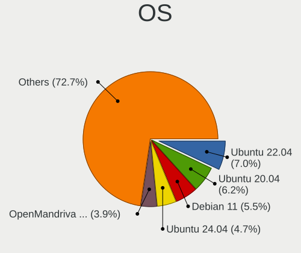

| Name               | Desktops | Percent |
|--------------------|----------|---------|
| Ubuntu 22.04       | 9        | 7.03%   |
| Ubuntu 20.04       | 8        | 6.25%   |
| Debian 11          | 7        | 5.47%   |
| Ubuntu 24.04       | 6        | 4.69%   |
| OpenMandriva 4.50  | 5        | 3.91%   |
| OpenMandriva 4.2   | 5        | 3.91%   |
| Arch Rolling       | 5        | 3.91%   |
| Ubuntu 18.04       | 4        | 3.13%   |
| Fedora 33          | 4        | 3.13%   |
| Linux Mint 22.1    | 3        | 2.34%   |
| ArcoLinux Rolling  | 3        | 2.34%   |
| Zorin 16           | 2        | 1.56%   |
| OpenMandriva 5.0   | 2        | 1.56%   |
| OpenMandriva 25.06 | 2        | 1.56%   |
| OpenMandriva 24.12 | 2        | 1.56%   |
| OpenMandriva 24.07 | 2        | 1.56%   |
| OpenMandriva 23.90 | 2        | 1.56%   |
| Linux Mint 21      | 2        | 1.56%   |
| Fedora 42          | 2        | 1.56%   |
| Fedora 40          | 2        | 1.56%   |
| Fedora 39          | 2        | 1.56%   |
| Fedora 38          | 2        | 1.56%   |
| Debian 12          | 2        | 1.56%   |
| BlackPanther 18.1  | 2        | 1.56%   |
| Zorin 17           | 1        | 0.78%   |
| Zorin 15           | 1        | 0.78%   |
| Xubuntu 18.04      | 1        | 0.78%   |
| Ubuntu Unity 16.04 | 1        | 0.78%   |
| Ubuntu MATE 22.04  | 1        | 0.78%   |
| Ubuntu 23.10       | 1        | 0.78%   |
| Ubuntu 20.10       | 1        | 0.78%   |
| Ubuntu 16.04       | 1        | 0.78%   |
| Ubuntu 1.3.1       | 1        | 0.78%   |
| ROSA R8.1          | 1        | 0.78%   |
| Pop!_OS 21.04      | 1        | 0.78%   |
| Pop!_OS 20.10      | 1        | 0.78%   |
| Pear OS 21.04      | 1        | 0.78%   |
| Parrot 5.0         | 1        | 0.78%   |
| OpenMandriva 6.0   | 1        | 0.78%   |
| OpenMandriva 4.3   | 1        | 0.78%   |

OS Family
---------

OS without a version

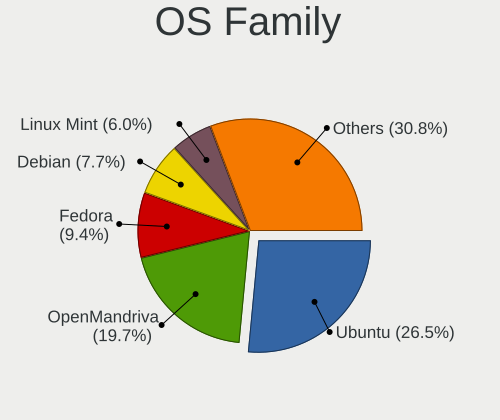

| Name         | Desktops | Percent |
|--------------|----------|---------|
| Ubuntu       | 31       | 26.5%   |
| OpenMandriva | 23       | 19.66%  |
| Fedora       | 11       | 9.4%    |
| Debian       | 9        | 7.69%   |
| Linux Mint   | 7        | 5.98%   |
| Arch         | 5        | 4.27%   |
| Zorin        | 4        | 3.42%   |
| Manjaro      | 3        | 2.56%   |
| Kali         | 3        | 2.56%   |
| ArcoLinux    | 3        | 2.56%   |
| Pop!_OS      | 2        | 1.71%   |
| Lubuntu      | 2        | 1.71%   |
| BlackPanther | 2        | 1.71%   |
| Xubuntu      | 1        | 0.85%   |
| Ubuntu Unity | 1        | 0.85%   |
| Ubuntu MATE  | 1        | 0.85%   |
| ROSA         | 1        | 0.85%   |
| Pear OS      | 1        | 0.85%   |
| Parrot       | 1        | 0.85%   |
| LMDE         | 1        | 0.85%   |
| KDE neon     | 1        | 0.85%   |
| Elementary   | 1        | 0.85%   |
| Deepin       | 1        | 0.85%   |
| CentOS       | 1        | 0.85%   |
| Bazzite      | 1        | 0.85%   |

Kernel
------

Version of the Linux kernel

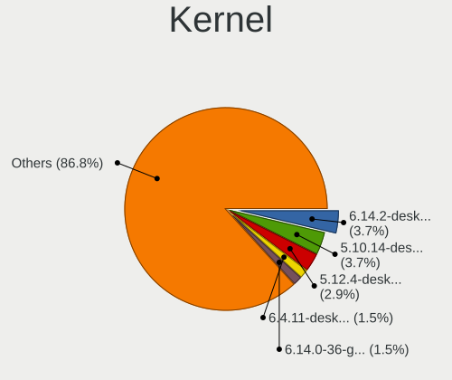

| Version                        | Desktops | Percent |
|--------------------------------|----------|---------|
| 6.14.2-desktop-3omv2590        | 5        | 3.68%   |
| 5.10.14-desktop-1omv4002       | 5        | 3.68%   |
| 5.12.4-desktop-1omv4050        | 4        | 2.94%   |
| 6.4.11-desktop-1omv2390        | 2        | 1.47%   |
| 6.14.0-36-generic              | 2        | 1.47%   |
| 6.12.1-desktop-1omv2490        | 2        | 1.47%   |
| 6.10.0-desktop-1omv2490        | 2        | 1.47%   |
| 5.16.7-desktop-1omv4003        | 2        | 1.47%   |
| 5.15.0-41-generic              | 2        | 1.47%   |
| 5.10.0-28-amd64                | 2        | 1.47%   |
| 6.9.6-amd64-desktop-rolling    | 1        | 0.74%   |
| 6.8.5-301.fc40.x86_64          | 1        | 0.74%   |
| 6.8.0-63-generic               | 1        | 0.74%   |
| 6.8.0-58-generic               | 1        | 0.74%   |
| 6.8.0-45-generic               | 1        | 0.74%   |
| 6.8.0-39-generic               | 1        | 0.74%   |
| 6.7.9-arch1-1                  | 1        | 0.74%   |
| 6.6.8-arch1-1                  | 1        | 0.74%   |
| 6.6.4-200.fc39.x86_64          | 1        | 0.74%   |
| 6.6.2-desktop-1omv2390         | 1        | 0.74%   |
| 6.6.14-200.fc39.x86_64         | 1        | 0.74%   |
| 6.6.103-3-MANJARO              | 1        | 0.74%   |
| 6.6.1-desktop-1omv2390         | 1        | 0.74%   |
| 6.5.5-desktop-1omv2390         | 1        | 0.74%   |
| 6.5.0-kali2-amd64              | 1        | 0.74%   |
| 6.5.0-5-amd64                  | 1        | 0.74%   |
| 6.5.0-25-generic               | 1        | 0.74%   |
| 6.5.0-21-generic               | 1        | 0.74%   |
| 6.5.0-15-generic               | 1        | 0.74%   |
| 6.4.6-200.fc38.x86_64          | 1        | 0.74%   |
| 6.4.10-arch1-1                 | 1        | 0.74%   |
| 6.3.12-200.fc38.x86_64         | 1        | 0.74%   |
| 6.2.9-300.fc38.x86_64          | 1        | 0.74%   |
| 6.2.0-33-generic               | 1        | 0.74%   |
| 6.2.0-32-generic               | 1        | 0.74%   |
| 6.17.0-1005-oem                | 1        | 0.74%   |
| 6.16.4-108.bazzite.fc42.x86_64 | 1        | 0.74%   |
| 6.16.11-200.fc42.x86_64        | 1        | 0.74%   |
| 6.15.8-arch1-1                 | 1        | 0.74%   |
| 6.15.7-200.fc42.x86_64         | 1        | 0.74%   |

Kernel Family
-------------

Linux kernel without a distro release

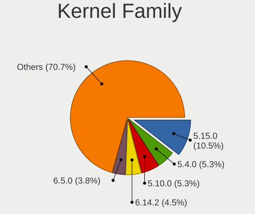

| Version | Desktops | Percent |
|---------|----------|---------|
| 5.15.0  | 14       | 10.53%  |
| 5.4.0   | 7        | 5.26%   |
| 5.10.0  | 7        | 5.26%   |
| 6.14.2  | 6        | 4.51%   |
| 6.5.0   | 5        | 3.76%   |
| 5.10.14 | 5        | 3.76%   |
| 4.15.0  | 5        | 3.76%   |
| 6.8.0   | 4        | 3.01%   |
| 6.14.0  | 4        | 3.01%   |
| 6.1.0   | 4        | 3.01%   |
| 5.8.0   | 4        | 3.01%   |
| 5.12.4  | 4        | 3.01%   |
| 6.11.0  | 3        | 2.26%   |
| 5.11.0  | 3        | 2.26%   |
| 6.4.11  | 2        | 1.5%    |
| 6.2.0   | 2        | 1.5%    |
| 6.12.1  | 2        | 1.5%    |
| 6.10.0  | 2        | 1.5%    |
| 5.3.0   | 2        | 1.5%    |
| 5.19.0  | 2        | 1.5%    |
| 5.16.7  | 2        | 1.5%    |
| 5.14.0  | 2        | 1.5%    |
| 4.18.0  | 2        | 1.5%    |
| 6.9.6   | 1        | 0.75%   |
| 6.8.5   | 1        | 0.75%   |
| 6.7.9   | 1        | 0.75%   |
| 6.6.8   | 1        | 0.75%   |
| 6.6.4   | 1        | 0.75%   |
| 6.6.2   | 1        | 0.75%   |
| 6.6.14  | 1        | 0.75%   |
| 6.6.103 | 1        | 0.75%   |
| 6.6.1   | 1        | 0.75%   |
| 6.5.5   | 1        | 0.75%   |
| 6.4.6   | 1        | 0.75%   |
| 6.4.10  | 1        | 0.75%   |
| 6.3.12  | 1        | 0.75%   |
| 6.2.9   | 1        | 0.75%   |
| 6.17.0  | 1        | 0.75%   |
| 6.16.4  | 1        | 0.75%   |
| 6.16.11 | 1        | 0.75%   |

Kernel Major Ver.
-----------------

Linux kernel major version

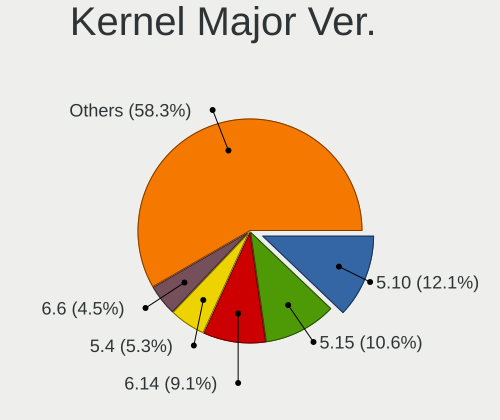

| Version | Desktops | Percent |
|---------|----------|---------|
| 5.10    | 16       | 12.12%  |
| 5.15    | 14       | 10.61%  |
| 6.14    | 12       | 9.09%   |
| 5.4     | 7        | 5.3%    |
| 6.6     | 6        | 4.55%   |
| 6.5     | 6        | 4.55%   |
| 6.8     | 5        | 3.79%   |
| 6.1     | 5        | 3.79%   |
| 5.8     | 5        | 3.79%   |
| 4.15    | 5        | 3.79%   |
| 6.4     | 4        | 3.03%   |
| 6.11    | 4        | 3.03%   |
| 6.10    | 4        | 3.03%   |
| 5.12    | 4        | 3.03%   |
| 5.11    | 4        | 3.03%   |
| 6.2     | 3        | 2.27%   |
| 6.12    | 3        | 2.27%   |
| 5.19    | 3        | 2.27%   |
| 4.18    | 3        | 2.27%   |
| 6.16    | 2        | 1.52%   |
| 6.15    | 2        | 1.52%   |
| 5.3     | 2        | 1.52%   |
| 5.16    | 2        | 1.52%   |
| 5.14    | 2        | 1.52%   |
| 6.9     | 1        | 0.76%   |
| 6.7     | 1        | 0.76%   |
| 6.3     | 1        | 0.76%   |
| 6.17    | 1        | 0.76%   |
| 6.0     | 1        | 0.76%   |
| 5.6     | 1        | 0.76%   |
| 5.13    | 1        | 0.76%   |
| 4.9     | 1        | 0.76%   |
| 4.19    | 1        | 0.76%   |

Arch
----

OS architecture (x86_64, i586, etc.)

| Name   | Desktops | Percent |
|--------|----------|---------|
| x86_64 | 113      | 96.58%  |
| i686   | 4        | 3.42%   |

DE
--

Desktop Environment

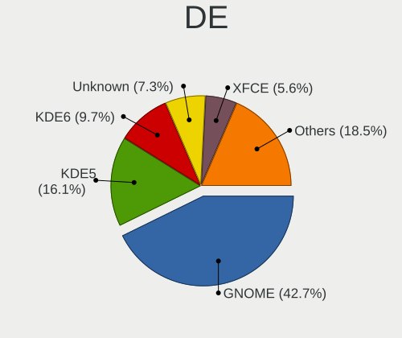

| Name       | Desktops | Percent |
|------------|----------|---------|
| GNOME      | 53       | 42.74%  |
| KDE5       | 20       | 16.13%  |
| KDE6       | 12       | 9.68%   |
| Unknown    | 9        | 7.26%   |
| XFCE       | 7        | 5.65%   |
| X-Cinnamon | 6        | 4.84%   |
| MATE       | 4        | 3.23%   |
| LXQt       | 2        | 1.61%   |
| LXDE       | 2        | 1.61%   |
| KDE        | 2        | 1.61%   |
| Unity      | 1        | 0.81%   |
| qtile      | 1        | 0.81%   |
| Pantheon   | 1        | 0.81%   |
| KDE4       | 1        | 0.81%   |
| DDE        | 1        | 0.81%   |
| Cinnamon   | 1        | 0.81%   |
| bspwm      | 1        | 0.81%   |

Display Server
--------------

X11 or Wayland

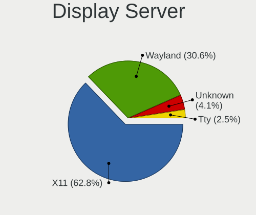

| Name    | Desktops | Percent |
|---------|----------|---------|
| X11     | 76       | 62.81%  |
| Wayland | 37       | 30.58%  |
| Unknown | 5        | 4.13%   |
| Tty     | 3        | 2.48%   |

Display Manager
---------------

SDDM, LightDM, etc.

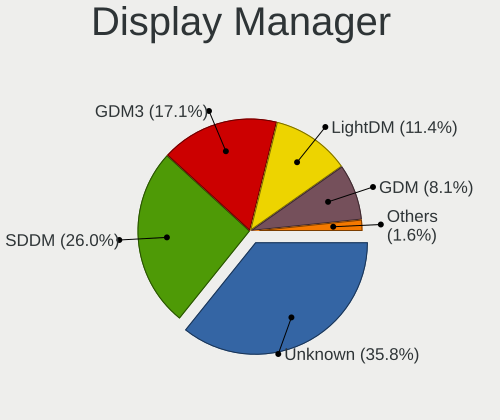

| Name    | Desktops | Percent |
|---------|----------|---------|
| Unknown | 44       | 35.77%  |
| SDDM    | 32       | 26.02%  |
| GDM3    | 21       | 17.07%  |
| LightDM | 14       | 11.38%  |
| GDM     | 10       | 8.13%   |
| TDM     | 1        | 0.81%   |
| KDM     | 1        | 0.81%   |

OS Lang
-------

Language

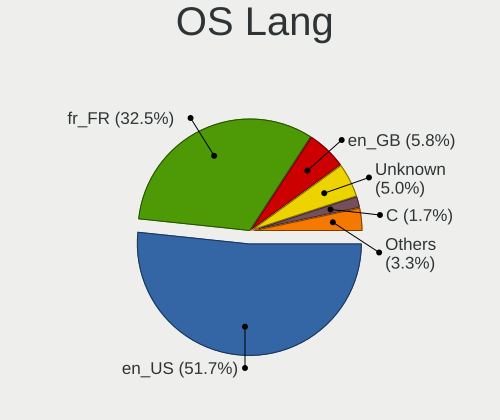

| Lang    | Desktops | Percent |
|---------|----------|---------|
| en_US   | 62       | 51.67%  |
| fr_FR   | 39       | 32.5%   |
| en_GB   | 7        | 5.83%   |
| Unknown | 6        | 5%      |
| C       | 2        | 1.67%   |
| it_IT   | 1        | 0.83%   |
| fr_CH   | 1        | 0.83%   |
| ar_MA   | 1        | 0.83%   |
| ar_DZ   | 1        | 0.83%   |

Boot Mode
---------

EFI or BIOS

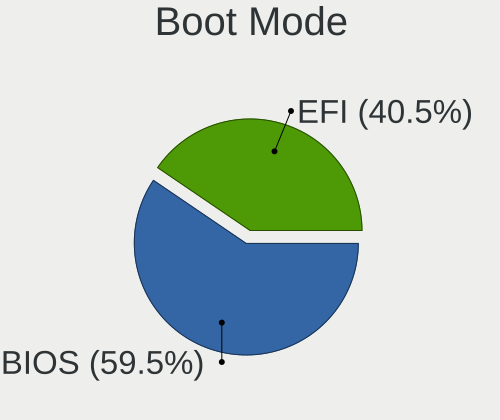

| Mode | Desktops | Percent |
|------|----------|---------|
| BIOS | 72       | 59.5%   |
| EFI  | 49       | 40.5%   |

Filesystem
----------

Type of filesystem

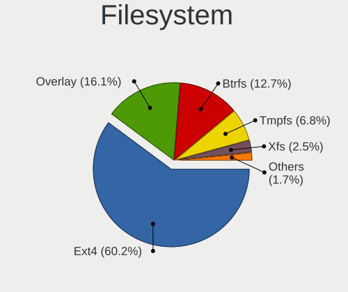

| Type    | Desktops | Percent |
|---------|----------|---------|
| Ext4    | 71       | 60.17%  |
| Overlay | 19       | 16.1%   |
| Btrfs   | 15       | 12.71%  |
| Tmpfs   | 8        | 6.78%   |
| Xfs     | 3        | 2.54%   |
| Unknown | 2        | 1.69%   |

Part. scheme
------------

Scheme of partitioning

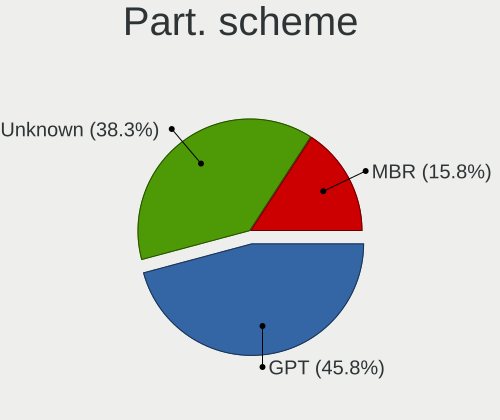

| Type    | Desktops | Percent |
|---------|----------|---------|
| GPT     | 55       | 45.83%  |
| Unknown | 46       | 38.33%  |
| MBR     | 19       | 15.83%  |

Dual Boot with Linux/BSD
------------------------

Hosting more than one Linux/BSD

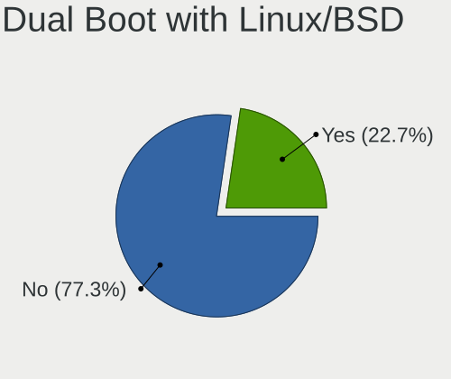

| Dual boot | Desktops | Percent |
|-----------|----------|---------|
| No        | 92       | 77.31%  |
| Yes       | 27       | 22.69%  |

Dual Boot (Win)
---------------

Hosting Linux and Windows

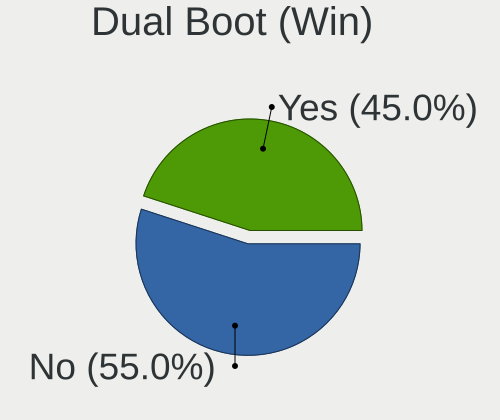

| Dual boot | Desktops | Percent |
|-----------|----------|---------|
| No        | 66       | 55%     |
| Yes       | 54       | 45%     |

Board
-----

Vendor
------

Motherboard manufacturer

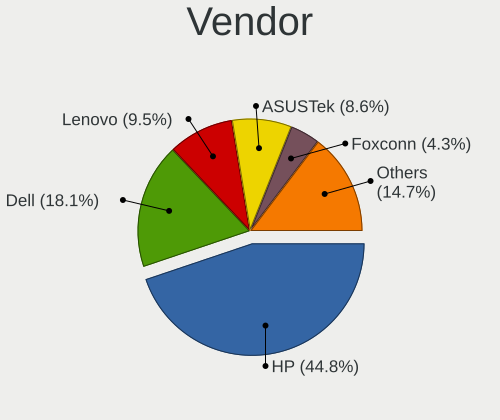

| Name                | Desktops | Percent |
|---------------------|----------|---------|
| Hewlett-Packard     | 52       | 44.83%  |
| Dell                | 21       | 18.1%   |
| Lenovo              | 11       | 9.48%   |
| ASUSTek Computer    | 10       | 8.62%   |
| Foxconn             | 5        | 4.31%   |
| Gigabyte Technology | 4        | 3.45%   |
| Pegatron            | 3        | 2.59%   |
| MSI                 | 3        | 2.59%   |
| Gateway             | 1        | 0.86%   |
| Fujitsu             | 1        | 0.86%   |
| ECS                 | 1        | 0.86%   |
| ASRock              | 1        | 0.86%   |
| American Megatrends | 1        | 0.86%   |
| Acer                | 1        | 0.86%   |
| Unknown             | 1        | 0.86%   |

Model
-----

Motherboard model

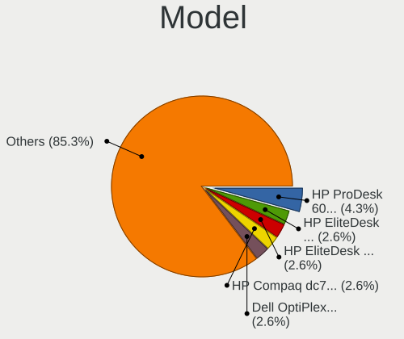

| Name                                        | Desktops | Percent |
|---------------------------------------------|----------|---------|
| HP ProDesk 600 G1 TWR                       | 5        | 4.31%   |
| HP EliteDesk 800 G1 TWR                     | 3        | 2.59%   |
| HP EliteDesk 800 G1 SFF                     | 3        | 2.59%   |
| HP Compaq dc7800 Convertible Minitower      | 3        | 2.59%   |
| Dell OptiPlex 7010                          | 3        | 2.59%   |
| HP Z620 Workstation                         | 2        | 1.72%   |
| HP Z420 Workstation                         | 2        | 1.72%   |
| HP ProDesk 600 G1 SFF                       | 2        | 1.72%   |
| HP EliteDesk 800 G2 SFF                     | 2        | 1.72%   |
| HP Compaq Elite 8300 SFF                    | 2        | 1.72%   |
| HP Compaq Elite 8300 CMT                    | 2        | 1.72%   |
| HP Compaq dc7900 Small Form Factor          | 2        | 1.72%   |
| HP Compaq 8200 Elite CMT PC                 | 2        | 1.72%   |
| HP Compaq 8100 Elite SFF PC                 | 2        | 1.72%   |
| Dell OptiPlex 9020                          | 2        | 1.72%   |
| Dell OptiPlex 790                           | 2        | 1.72%   |
| Pegatron h8-1507ef                          | 1        | 0.86%   |
| Pegatron h8-1340ef                          | 1        | 0.86%   |
| Pegatron 2A73h                              | 1        | 0.86%   |
| MSI PPPPP-CCC#MMMMMMMM                      | 1        | 0.86%   |
| MSI MS-7E28                                 | 1        | 0.86%   |
| MSI MS-7C52                                 | 1        | 0.86%   |
| Lenovo V520S-08IKL 10NM0042SP               | 1        | 0.86%   |
| Lenovo ThinkStation P700 30A8S26000         | 1        | 0.86%   |
| Lenovo ThinkStation P300 30AGS0FY06         | 1        | 0.86%   |
| Lenovo ThinkCentre neo 50t Gen 3 11SE00QFFM | 1        | 0.86%   |
| Lenovo ThinkCentre neo 50s Gen 3 11T0008DFM | 1        | 0.86%   |
| Lenovo ThinkCentre M93p 10AAS0R301          | 1        | 0.86%   |
| Lenovo ThinkCentre M910t 10MNS04E4X         | 1        | 0.86%   |
| Lenovo ThinkCentre M72e 3261A85             | 1        | 0.86%   |
| Lenovo ThinkCentre M720t 10SRS7A900         | 1        | 0.86%   |
| Lenovo ThinkCentre M70s Gen 3 11T7S4E400    | 1        | 0.86%   |
| Lenovo SHARKBAY 0C48431 WIN                 | 1        | 0.86%   |
| HP Z800 Workstation                         | 1        | 0.86%   |
| HP Z440 Workstation                         | 1        | 0.86%   |
| HP Z200 Workstation                         | 1        | 0.86%   |
| HP xw6400 Workstation                       | 1        | 0.86%   |
| HP ProDesk 490 G2 MT                        | 1        | 0.86%   |
| HP ProDesk 400 G2 MT                        | 1        | 0.86%   |
| HP Pro Tower 290 G9 Desktop PC              | 1        | 0.86%   |

Model Family
------------

Motherboard model prefix

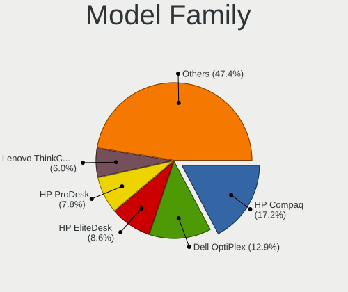

| Name                   | Desktops | Percent |
|------------------------|----------|---------|
| HP Compaq              | 20       | 17.24%  |
| Dell OptiPlex          | 15       | 12.93%  |
| HP EliteDesk           | 10       | 8.62%   |
| HP ProDesk             | 9        | 7.76%   |
| Lenovo ThinkCentre     | 7        | 6.03%   |
| Dell Precision         | 4        | 3.45%   |
| ASUS ROG               | 4        | 3.45%   |
| Lenovo ThinkStation    | 2        | 1.72%   |
| HP Z620                | 2        | 1.72%   |
| HP Z420                | 2        | 1.72%   |
| HP dc5000              | 2        | 1.72%   |
| Dell Vostro            | 2        | 1.72%   |
| ASUS PRIME             | 2        | 1.72%   |
| Pegatron h8-1507ef     | 1        | 0.86%   |
| Pegatron h8-1340ef     | 1        | 0.86%   |
| Pegatron 2A73h         | 1        | 0.86%   |
| MSI PPPPP-CCC#MMMMMMMM | 1        | 0.86%   |
| MSI MS-7E28            | 1        | 0.86%   |
| MSI MS-7C52            | 1        | 0.86%   |
| Lenovo V520S-08IKL     | 1        | 0.86%   |
| Lenovo SHARKBAY        | 1        | 0.86%   |
| HP Z800                | 1        | 0.86%   |
| HP Z440                | 1        | 0.86%   |
| HP Z200                | 1        | 0.86%   |
| HP xw6400              | 1        | 0.86%   |
| HP Pro                 | 1        | 0.86%   |
| HP 200-5111es          | 1        | 0.86%   |
| HP 1494                | 1        | 0.86%   |
| Gigabyte X570          | 1        | 0.86%   |
| Gigabyte H310M         | 1        | 0.86%   |
| Gigabyte B760          | 1        | 0.86%   |
| Gigabyte B450M         | 1        | 0.86%   |
| Gateway DT71           | 1        | 0.86%   |
| Fujitsu ESPRIMO        | 1        | 0.86%   |
| Foxconn Pro3500        | 1        | 0.86%   |
| Foxconn Pro            | 1        | 0.86%   |
| Foxconn p6-2460ekm     | 1        | 0.86%   |
| Foxconn p6-2002es      | 1        | 0.86%   |
| Foxconn CQ1140FRm      | 1        | 0.86%   |
| ECS GV460AA-ABA        | 1        | 0.86%   |

MFG Year
--------

Motherboard manufacture year

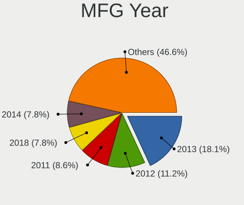

| Year | Desktops | Percent |
|------|----------|---------|
| 2013 | 21       | 18.1%   |
| 2012 | 13       | 11.21%  |
| 2011 | 10       | 8.62%   |
| 2018 | 9        | 7.76%   |
| 2014 | 9        | 7.76%   |
| 2007 | 8        | 6.9%    |
| 2021 | 6        | 5.17%   |
| 2015 | 6        | 5.17%   |
| 2009 | 5        | 4.31%   |
| 2022 | 4        | 3.45%   |
| 2017 | 4        | 3.45%   |
| 2010 | 4        | 3.45%   |
| 2023 | 3        | 2.59%   |
| 2008 | 3        | 2.59%   |
| 2004 | 3        | 2.59%   |
| 2020 | 2        | 1.72%   |
| 2019 | 2        | 1.72%   |
| 2024 | 1        | 0.86%   |
| 2016 | 1        | 0.86%   |
| 2006 | 1        | 0.86%   |
| 2005 | 1        | 0.86%   |

Form Factor
-----------

Physical design of the computer

| Name    | Desktops | Percent |
|---------|----------|---------|
| Desktop | 116      | 100%    |

Secure Boot
-----------

Enabled or disabled

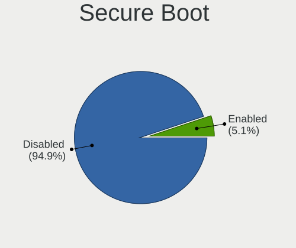

| State    | Desktops | Percent |
|----------|----------|---------|
| Disabled | 111      | 94.87%  |
| Enabled  | 6        | 5.13%   |

Coreboot
--------

Have coreboot on board

| Used | Desktops | Percent |
|------|----------|---------|
| No   | 116      | 100%    |

RAM Size
--------

Total RAM memory

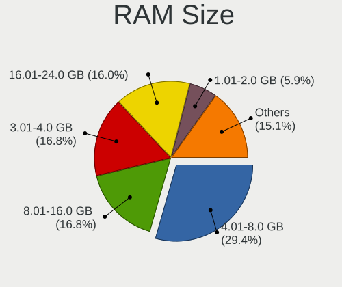

| Size in GB  | Desktops | Percent |
|-------------|----------|---------|
| 4.01-8.0    | 35       | 29.41%  |
| 3.01-4.0    | 20       | 16.81%  |
| 8.01-16.0   | 20       | 16.81%  |
| 16.01-24.0  | 19       | 15.97%  |
| 1.01-2.0    | 7        | 5.88%   |
| 64.01-256.0 | 6        | 5.04%   |
| 32.01-64.0  | 5        | 4.2%    |
| 24.01-32.0  | 4        | 3.36%   |
| 2.01-3.0    | 3        | 2.52%   |

RAM Used
--------

Used RAM memory

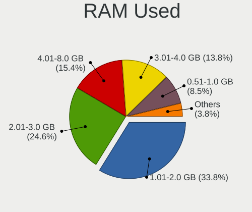

| Used GB   | Desktops | Percent |
|-----------|----------|---------|
| 1.01-2.0  | 44       | 33.85%  |
| 2.01-3.0  | 32       | 24.62%  |
| 4.01-8.0  | 20       | 15.38%  |
| 3.01-4.0  | 18       | 13.85%  |
| 0.51-1.0  | 11       | 8.46%   |
| 8.01-16.0 | 3        | 2.31%   |
| 0.01-0.5  | 2        | 1.54%   |

Total Drives
------------

Number of drives on board

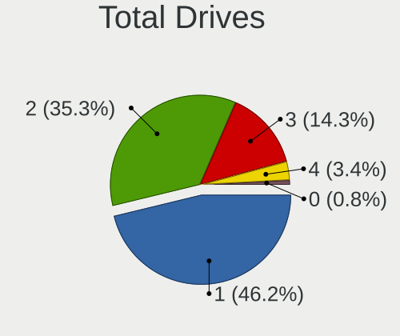

| Drives | Desktops | Percent |
|--------|----------|---------|
| 1      | 55       | 46.22%  |
| 2      | 42       | 35.29%  |
| 3      | 17       | 14.29%  |
| 4      | 4        | 3.36%   |
| 0      | 1        | 0.84%   |

Has CD-ROM
----------

Has CD-ROM on board

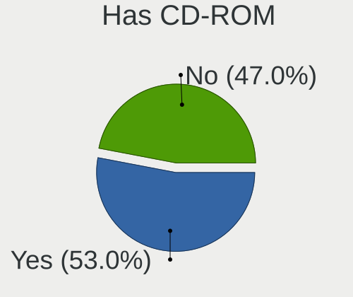

| Presented | Desktops | Percent |
|-----------|----------|---------|
| Yes       | 62       | 52.99%  |
| No        | 55       | 47.01%  |

Has Ethernet
------------

Has Ethernet on board

| Presented | Desktops | Percent |
|-----------|----------|---------|
| Yes       | 116      | 100%    |

Has WiFi
--------

Has WiFi module

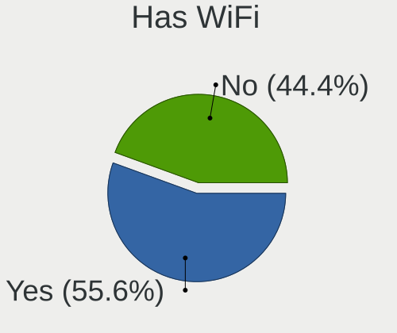

| Presented | Desktops | Percent |
|-----------|----------|---------|
| Yes       | 70       | 58.82%  |
| No        | 49       | 41.18%  |

Has Bluetooth
-------------

Has Bluetooth module

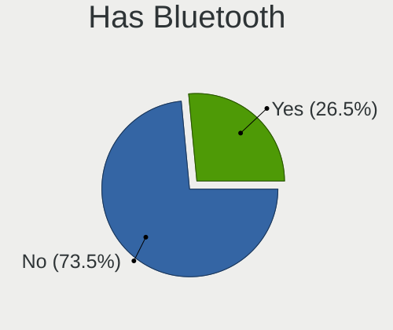

| Presented | Desktops | Percent |
|-----------|----------|---------|
| No        | 86       | 73.5%   |
| Yes       | 31       | 26.5%   |

Location
--------

Country
-------

Geographic location (country)

| Country | Desktops | Percent |
|---------|----------|---------|
| Morocco | 116      | 100%    |

City
----

Geographic location (city)

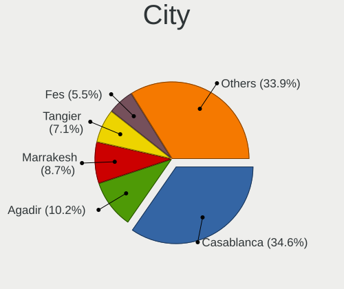

| City                    | Desktops | Percent |
|-------------------------|----------|---------|
| Casablanca              | 44       | 34.65%  |
| Agadir                  | 13       | 10.24%  |
| Marrakesh               | 11       | 8.66%   |
| Tangier                 | 9        | 7.09%   |
| Fes                     | 7        | 5.51%   |
| Salé                   | 6        | 4.72%   |
| Meknes                  | 4        | 3.15%   |
| Rabat                   | 3        | 2.36%   |
| Tétouan                | 2        | 1.57%   |
| Sidi Ifni               | 2        | 1.57%   |
| El Jadida               | 2        | 1.57%   |
| Youssoufia              | 1        | 0.79%   |
| Tiznit                  | 1        | 0.79%   |
| Temara                  | 1        | 0.79%   |
| Taza                    | 1        | 0.79%   |
| Targuist                | 1        | 0.79%   |
| Taounate                | 1        | 0.79%   |
| Tan-Tan                 | 1        | 0.79%   |
| Skhirate                | 1        | 0.79%   |
| Sidi Lmokhtar           | 1        | 0.79%   |
| Settat                  | 1        | 0.79%   |
| Safi                    | 1        | 0.79%   |
| Oulmes                  | 1        | 0.79%   |
| Oujda                   | 1        | 0.79%   |
| Ouirgane                | 1        | 0.79%   |
| Mohammedia              | 1        | 0.79%   |
| Méchouar de Casablanca | 1        | 0.79%   |
| Kenitra                 | 1        | 0.79%   |
| Douar Kalaa             | 1        | 0.79%   |
| Dar Bouazza             | 1        | 0.79%   |
| Chefchaouen             | 1        | 0.79%   |
| Berrechid               | 1        | 0.79%   |
| Berkane                 | 1        | 0.79%   |
| Beni Mellal             | 1        | 0.79%   |
| Azamor                  | 1        | 0.79%   |

Drives
------

Drive Vendor
------------

Hard drive vendors

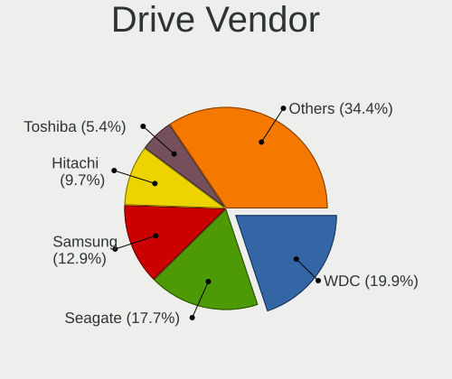

| Vendor                       | Desktops | Drives | Percent |
|------------------------------|----------|--------|---------|
| WDC                          | 37       | 51     | 19.89%  |
| Seagate                      | 33       | 44     | 17.74%  |
| Samsung Electronics          | 24       | 30     | 12.9%   |
| Hitachi                      | 18       | 24     | 9.68%   |
| Toshiba                      | 10       | 16     | 5.38%   |
| HGST                         | 6        | 7      | 3.23%   |
| Sandisk                      | 5        | 5      | 2.69%   |
| SK hynix                     | 4        | 4      | 2.15%   |
| Kingston                     | 4        | 9      | 2.15%   |
| Intel                        | 3        | 3      | 1.61%   |
| China                        | 3        | 3      | 1.61%   |
| Unknown                      | 3        | 3      | 1.61%   |
| SPCC                         | 2        | 4      | 1.08%   |
| PNY                          | 2        | 2      | 1.08%   |
| Micron Technology            | 2        | 3      | 1.08%   |
| LITEON                       | 2        | 2      | 1.08%   |
| Lexar                        | 2        | 2      | 1.08%   |
| KingFast                     | 2        | 2      | 1.08%   |
| Fujitsu                      | 2        | 2      | 1.08%   |
| Crucial                      | 2        | 3      | 1.08%   |
| X12                          | 1        | 1      | 0.54%   |
| TwinMOS                      | 1        | 1      | 0.54%   |
| Supersonic                   | 1        | 5      | 0.54%   |
| Shenzhen Longsys Electronics | 1        | 1      | 0.54%   |
| Realtek Semiconductor        | 1        | 1      | 0.54%   |
| Phison                       | 1        | 2      | 0.54%   |
| Mushkin                      | 1        | 1      | 0.54%   |
| MSI                          | 1        | 1      | 0.54%   |
| Min Yi U                     | 1        | 1      | 0.54%   |
| Maxtor                       | 1        | 1      | 0.54%   |
| MAXIO Technology (Hangzhou)  | 1        | 2      | 0.54%   |
| Magnetic Data                | 1        | 1      | 0.54%   |
| KODAK                        | 1        | 1      | 0.54%   |
| HS-SSD-E100                  | 1        | 1      | 0.54%   |
| HPE                          | 1        | 2      | 0.54%   |
| Gigabyte Technology          | 1        | 1      | 0.54%   |
| ESSENCORE                    | 1        | 1      | 0.54%   |
| Corsair                      | 1        | 1      | 0.54%   |
| AFOX                         | 1        | 1      | 0.54%   |
| ADATA Technology             | 1        | 1      | 0.54%   |

Drive Model
-----------

Hard drive models

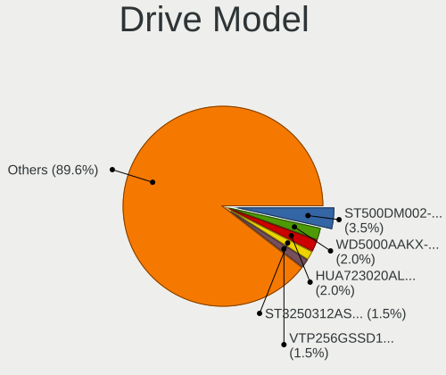

| Model                                             | Desktops | Percent |
|---------------------------------------------------|----------|---------|
| Seagate ST500DM002-1BD142 500GB                   | 7        | 3.48%   |
| WDC WD5000AAKX-60U6AA0 500GB                      | 4        | 1.99%   |
| Hitachi HUA723020ALA641 2TB                       | 4        | 1.99%   |
| Seagate ST3250312AS 250GB                         | 3        | 1.49%   |
| Unknown                                           | 3        | 1.49%   |
| WDC WD800JD-00LSA0 80GB                           | 2        | 1%      |
| WDC WD5000AZLX-60K2TA0 500GB                      | 2        | 1%      |
| Toshiba DT01ACA100 LENOVO 1TB                     | 2        | 1%      |
| Toshiba DT01ACA050 500GB                          | 2        | 1%      |
| Seagate ST250DM000-1BD141 250GB                   | 2        | 1%      |
| Seagate ST1000DM010-2EP102 1TB                    | 2        | 1%      |
| Seagate ST1000DM003-1SB102 1TB                    | 2        | 1%      |
| Samsung SSD 860 QVO 1TB                           | 2        | 1%      |
| Samsung NVMe SSD Controller SM981/PM981/PM983 1TB | 2        | 1%      |
| Samsung MZ7LN128HCHP-000H1 128GB SSD              | 2        | 1%      |
| Samsung HD161GJ 160GB                             | 2        | 1%      |
| PNY CS900 120GB SSD                               | 2        | 1%      |
| LITEON IT LCS-128L9S-HP 128GB SSD                 | 2        | 1%      |
| Kingston SA400S37480G 480GB SSD                   | 2        | 1%      |
| Intel SSDSC2BF180A4H 180GB                        | 2        | 1%      |
| Hitachi HUS724030ALE641 3TB                       | 2        | 1%      |
| Hitachi HDS721680PLA380 80GB                      | 2        | 1%      |
| HGST HTS725050A7E630 500GB                        | 2        | 1%      |
| X12 SSD 512GB                                     | 1        | 0.5%    |
| WDC WDS120G2G0A-00JH30 120GB SSD                  | 1        | 0.5%    |
| WDC WD800JD-75MSA3 80GB                           | 1        | 0.5%    |
| WDC WD800JD-60LSA0 80GB                           | 1        | 0.5%    |
| WDC WD800AAJS-60WAA0 80GB                         | 1        | 0.5%    |
| WDC WD7500BPKX-80HPJT0 752GB                      | 1        | 0.5%    |
| WDC WD5000LPLX-75ZNTT0 500GB                      | 1        | 0.5%    |
| WDC WD5000BEKT-75KA9T0 500GB                      | 1        | 0.5%    |
| WDC WD5000AAKX-08U6AA0 500GB                      | 1        | 0.5%    |
| WDC WD5000AAKS-65V0A0 500GB                       | 1        | 0.5%    |
| WDC WD400BD-60LTA0 40GB                           | 1        | 0.5%    |
| WDC WD400BB-60DGA0 40GB                           | 1        | 0.5%    |
| WDC WD3200BEKT-75PVMT1 320GB                      | 1        | 0.5%    |
| WDC WD3200BEKT-60F3T1 320GB                       | 1        | 0.5%    |
| WDC WD3200AAJS-65RYA0 320GB                       | 1        | 0.5%    |
| WDC WD2500BPVT-00JJ5T0 250GB                      | 1        | 0.5%    |
| WDC WD2500AAKX-603CA0 250GB                       | 1        | 0.5%    |

HDD Vendor
----------

Hard disk drive vendors

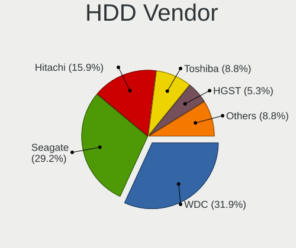

| Vendor              | Desktops | Drives | Percent |
|---------------------|----------|--------|---------|
| WDC                 | 36       | 50     | 31.86%  |
| Seagate             | 33       | 44     | 29.2%   |
| Hitachi             | 18       | 24     | 15.93%  |
| Toshiba             | 10       | 16     | 8.85%   |
| HGST                | 6        | 7      | 5.31%   |
| Samsung Electronics | 5        | 8      | 4.42%   |
| Fujitsu             | 2        | 2      | 1.77%   |
| Maxtor              | 1        | 1      | 0.88%   |
| Magnetic Data       | 1        | 1      | 0.88%   |
| HPE                 | 1        | 2      | 0.88%   |

SSD Vendor
----------

Solid state drive vendors

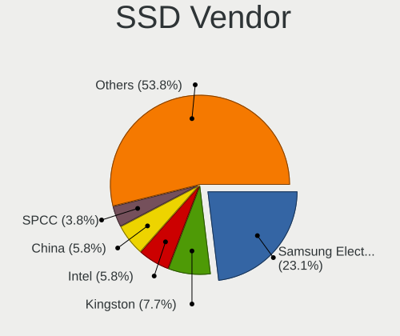

| Vendor              | Desktops | Drives | Percent |
|---------------------|----------|--------|---------|
| Samsung Electronics | 12       | 14     | 23.08%  |
| Kingston            | 4        | 9      | 7.69%   |
| Intel               | 3        | 3      | 5.77%   |
| China               | 3        | 3      | 5.77%   |
| SPCC                | 2        | 4      | 3.85%   |
| PNY                 | 2        | 2      | 3.85%   |
| Micron Technology   | 2        | 3      | 3.85%   |
| LITEON              | 2        | 2      | 3.85%   |
| Lexar               | 2        | 2      | 3.85%   |
| KingFast            | 2        | 2      | 3.85%   |
| Crucial             | 2        | 3      | 3.85%   |
| Unknown             | 2        | 2      | 3.85%   |
| X12                 | 1        | 1      | 1.92%   |
| WDC                 | 1        | 1      | 1.92%   |
| TwinMOS             | 1        | 1      | 1.92%   |
| Supersonic          | 1        | 2      | 1.92%   |
| SK hynix            | 1        | 1      | 1.92%   |
| Mushkin             | 1        | 1      | 1.92%   |
| MSI                 | 1        | 1      | 1.92%   |
| Min Yi U            | 1        | 1      | 1.92%   |
| KODAK               | 1        | 1      | 1.92%   |
| HS-SSD-E100         | 1        | 1      | 1.92%   |
| Gigabyte Technology | 1        | 1      | 1.92%   |
| ESSENCORE           | 1        | 1      | 1.92%   |
| Corsair             | 1        | 1      | 1.92%   |
| AFOX                | 1        | 1      | 1.92%   |

Drive Kind
----------

HDD or SSD

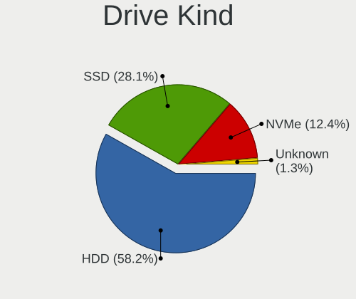

| Kind    | Desktops | Drives | Percent |
|---------|----------|--------|---------|
| HDD     | 89       | 155    | 58.17%  |
| SSD     | 43       | 64     | 28.1%   |
| NVMe    | 19       | 23     | 12.42%  |
| Unknown | 2        | 4      | 1.31%   |

Drive Connector
---------------

SATA, SAS, NVMe, etc.

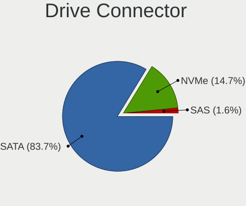

| Type | Desktops | Drives | Percent |
|------|----------|--------|---------|
| SATA | 108      | 220    | 83.72%  |
| NVMe | 19       | 23     | 14.73%  |
| SAS  | 2        | 3      | 1.55%   |

Drive Size
----------

Size of hard drive

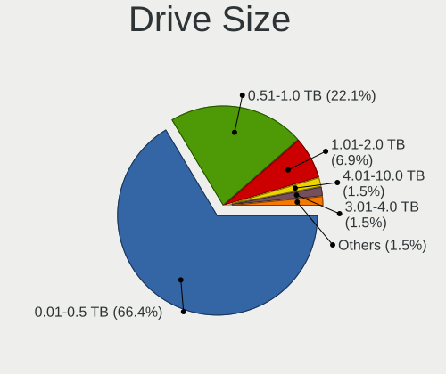

| Size in TB | Desktops | Drives | Percent |
|------------|----------|--------|---------|
| 0.01-0.5   | 87       | 146    | 66.41%  |
| 0.51-1.0   | 29       | 49     | 22.14%  |
| 1.01-2.0   | 9        | 15     | 6.87%   |
| 3.01-4.0   | 2        | 3      | 1.53%   |
| 2.01-3.0   | 2        | 3      | 1.53%   |
| 4.01-10.0  | 2        | 3      | 1.53%   |

Space Total
-----------

Amount of disk space available on the file system

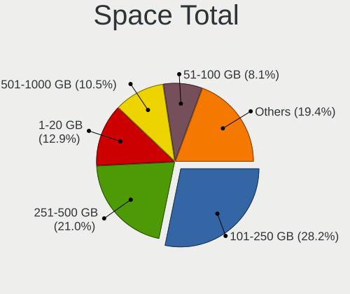

| Size in GB     | Desktops | Percent |
|----------------|----------|---------|
| 101-250        | 35       | 28.23%  |
| 251-500        | 26       | 20.97%  |
| 1-20           | 16       | 12.9%   |
| 501-1000       | 13       | 10.48%  |
| 51-100         | 10       | 8.06%   |
| 1001-2000      | 8        | 6.45%   |
| 21-50          | 6        | 4.84%   |
| More than 3000 | 4        | 3.23%   |
| Unknown        | 4        | 3.23%   |
| 2001-3000      | 2        | 1.61%   |

Space Used
----------

Amount of used disk space

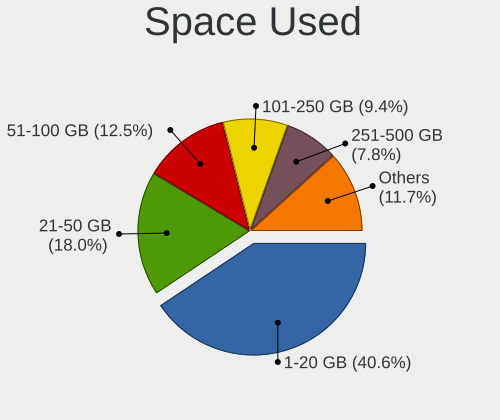

| Used GB        | Desktops | Percent |
|----------------|----------|---------|
| 1-20           | 52       | 40.63%  |
| 21-50          | 23       | 17.97%  |
| 51-100         | 16       | 12.5%   |
| 101-250        | 12       | 9.38%   |
| 251-500        | 10       | 7.81%   |
| 1001-2000      | 4        | 3.13%   |
| 501-1000       | 4        | 3.13%   |
| Unknown        | 4        | 3.13%   |
| More than 3000 | 2        | 1.56%   |
| 2001-3000      | 1        | 0.78%   |

Malfunc. Drives
---------------

Drive models with a malfunction

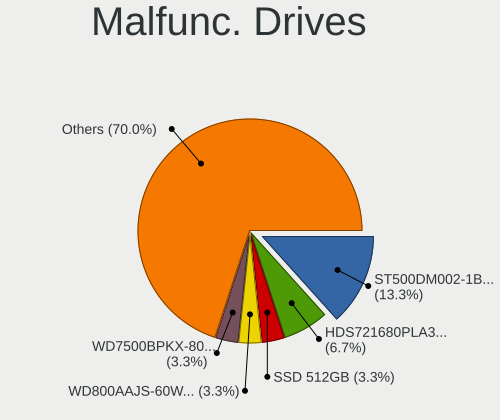

| Model                             | Desktops | Drives | Percent |
|-----------------------------------|----------|--------|---------|
| Seagate ST500DM002-1BD142 500GB   | 4        | 4      | 13.33%  |
| Hitachi HDS721680PLA380 80GB      | 2        | 3      | 6.67%   |
| X12 SSD 512GB                     | 1        | 1      | 3.33%   |
| WDC WD800AAJS-60WAA0 80GB         | 1        | 1      | 3.33%   |
| WDC WD7500BPKX-80HPJT0 752GB      | 1        | 1      | 3.33%   |
| WDC WD2500BPVT-00JJ5T0 250GB      | 1        | 1      | 3.33%   |
| WDC WD2500AAJS-60Z0A0 250GB       | 1        | 1      | 3.33%   |
| WDC WD1602ABJS-43P5A0 160GB       | 1        | 1      | 3.33%   |
| WDC WD1200BEVS-60UST0 120GB       | 1        | 2      | 3.33%   |
| Seagate ST500LM021-1KJ152 500GB   | 1        | 1      | 3.33%   |
| Seagate ST340016A 40GB            | 1        | 1      | 3.33%   |
| Seagate ST340014AS 40GB           | 1        | 1      | 3.33%   |
| Seagate ST3250318AS 250GB         | 1        | 1      | 3.33%   |
| Seagate ST3250312AS 250GB         | 1        | 1      | 3.33%   |
| Seagate ST3160318AS 160GB         | 1        | 1      | 3.33%   |
| Seagate ST1000DM010-2EP102 1TB    | 1        | 1      | 3.33%   |
| Samsung Electronics HD080HJ/ 80GB | 1        | 1      | 3.33%   |
| Maxtor 6E040L0 41GB               | 1        | 1      | 3.33%   |
| Kingston SA400S37480G 480GB SSD   | 1        | 2      | 3.33%   |
| HPE MM1000GBKAL 1TB               | 1        | 2      | 3.33%   |
| Hitachi HUA723020ALA641 2TB       | 1        | 1      | 3.33%   |
| Hitachi HTS547550A9E384 500GB     | 1        | 1      | 3.33%   |
| Hitachi HDS723020BLA642 2TB       | 1        | 1      | 3.33%   |
| HGST HTS545032A7E660 320GB        | 1        | 1      | 3.33%   |
| Fujitsu MHX2300BT 304GB           | 1        | 1      | 3.33%   |
| Corsair CSSD-F60GB2 64GB          | 1        | 1      | 3.33%   |

Malfunc. Drive Vendor
---------------------

Vendors of faulty drives

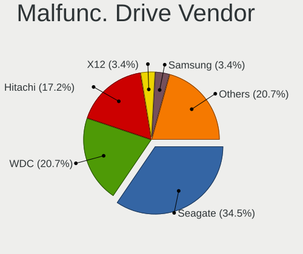

| Vendor              | Desktops | Drives | Percent |
|---------------------|----------|--------|---------|
| Seagate             | 10       | 11     | 34.48%  |
| WDC                 | 6        | 7      | 20.69%  |
| Hitachi             | 5        | 6      | 17.24%  |
| X12                 | 1        | 1      | 3.45%   |
| Samsung Electronics | 1        | 1      | 3.45%   |
| Maxtor              | 1        | 1      | 3.45%   |
| Kingston            | 1        | 2      | 3.45%   |
| HPE                 | 1        | 2      | 3.45%   |
| HGST                | 1        | 1      | 3.45%   |
| Fujitsu             | 1        | 1      | 3.45%   |
| Corsair             | 1        | 1      | 3.45%   |

Malfunc. HDD Vendor
-------------------

Vendors of faulty HDD drives

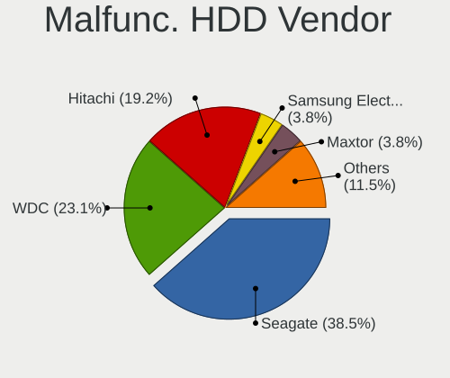

| Vendor              | Desktops | Drives | Percent |
|---------------------|----------|--------|---------|
| Seagate             | 10       | 11     | 38.46%  |
| WDC                 | 6        | 7      | 23.08%  |
| Hitachi             | 5        | 6      | 19.23%  |
| Samsung Electronics | 1        | 1      | 3.85%   |
| Maxtor              | 1        | 1      | 3.85%   |
| HPE                 | 1        | 2      | 3.85%   |
| HGST                | 1        | 1      | 3.85%   |
| Fujitsu             | 1        | 1      | 3.85%   |

Malfunc. Drive Kind
-------------------

Kinds of faulty drives

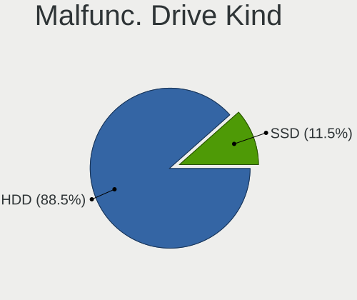

| Kind | Desktops | Drives | Percent |
|------|----------|--------|---------|
| HDD  | 23       | 30     | 88.46%  |
| SSD  | 3        | 4      | 11.54%  |

Failed Drives
-------------

Failed drive models

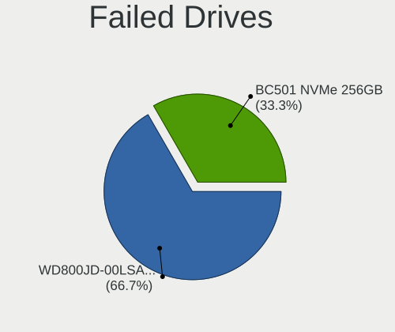

| Model                     | Desktops | Drives | Percent |
|---------------------------|----------|--------|---------|
| WDC WD800JD-00LSA0 80GB   | 2        | 3      | 66.67%  |
| SK hynix BC501 NVMe 256GB | 1        | 1      | 33.33%  |

Failed Drive Vendor
-------------------

Failed drive vendors

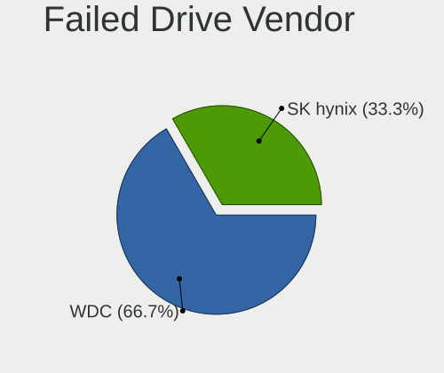

| Vendor   | Desktops | Drives | Percent |
|----------|----------|--------|---------|
| WDC      | 2        | 3      | 66.67%  |
| SK hynix | 1        | 1      | 33.33%  |

Drive Status
------------

Number of failed and malfunc. drives

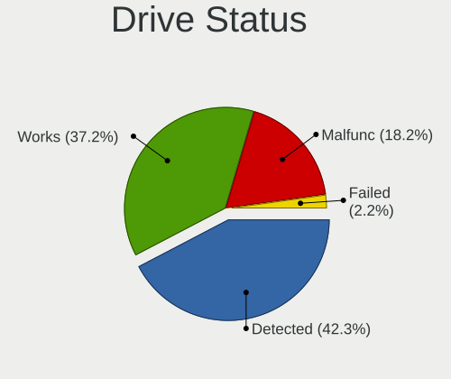

| Status   | Desktops | Drives | Percent |
|----------|----------|--------|---------|
| Detected | 58       | 122    | 42.34%  |
| Works    | 51       | 86     | 37.23%  |
| Malfunc  | 25       | 34     | 18.25%  |
| Failed   | 3        | 4      | 2.19%   |

Storage controller
------------------

Storage Vendor
--------------

Storage controller vendors

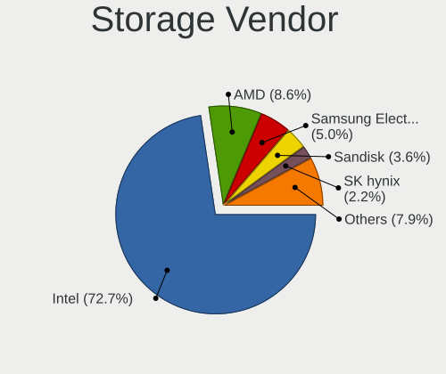

| Vendor                           | Desktops | Percent |
|----------------------------------|----------|---------|
| Intel                            | 101      | 72.66%  |
| AMD                              | 12       | 8.63%   |
| Samsung Electronics              | 7        | 5.04%   |
| Sandisk                          | 5        | 3.6%    |
| SK hynix                         | 3        | 2.16%   |
| Nvidia                           | 2        | 1.44%   |
| Silicon Integrated Systems [SiS] | 1        | 0.72%   |
| Shenzhen Longsys Electronics     | 1        | 0.72%   |
| Realtek Semiconductor            | 1        | 0.72%   |
| Phison Electronics               | 1        | 0.72%   |
| MAXIO Technology (Hangzhou)      | 1        | 0.72%   |
| LSI Logic / Symbios Logic        | 1        | 0.72%   |
| JMicron Technology               | 1        | 0.72%   |
| Broadcom / LSI                   | 1        | 0.72%   |
| ADATA Technology                 | 1        | 0.72%   |

Storage Model
-------------

Storage controller models

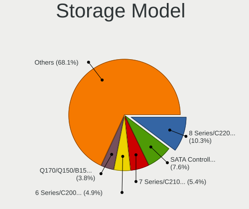

| Model                                                                                   | Desktops | Percent |
|-----------------------------------------------------------------------------------------|----------|---------|
| Intel 8 Series/C220 Series Chipset Family 6-port SATA Controller 1 [AHCI mode]          | 19       | 10.27%  |
| Intel SATA Controller [RAID mode]                                                       | 14       | 7.57%   |
| Intel 7 Series/C210 Series Chipset Family 6-port SATA Controller [AHCI mode]            | 10       | 5.41%   |
| Intel 6 Series/C200 Series Chipset Family 6 port Desktop SATA AHCI Controller           | 9        | 4.86%   |
| Intel Q170/Q150/B150/H170/H110/Z170/CM236 Chipset SATA Controller [AHCI Mode]           | 7        | 3.78%   |
| AMD FCH SATA Controller [AHCI mode]                                                     | 6        | 3.24%   |
| Samsung NVMe SSD Controller SM981/PM981/PM983                                           | 5        | 2.7%    |
| Intel C602 chipset 4-Port SATA Storage Control Unit                                     | 4        | 2.16%   |
| Intel C600/X79 series chipset IDE-r Controller                                          | 4        | 2.16%   |
| Intel Alder Lake-S PCH SATA Controller [AHCI Mode]                                      | 4        | 2.16%   |
| Intel 82Q35 Express PT IDER Controller                                                  | 4        | 2.16%   |
| Intel 82801IR/IO/IH (ICH9R/DO/DH) 4 port SATA Controller [IDE mode]                     | 4        | 2.16%   |
| Intel 82801I (ICH9 Family) 2 port SATA Controller [IDE mode]                            | 4        | 2.16%   |
| Intel 6 Series/C200 Series Chipset Family Desktop SATA Controller (IDE mode, ports 4-5) | 4        | 2.16%   |
| Intel 6 Series/C200 Series Chipset Family Desktop SATA Controller (IDE mode, ports 0-3) | 4        | 2.16%   |
| Intel 4 Series Chipset PT IDER Controller                                               | 4        | 2.16%   |
| Intel 200 Series PCH SATA controller [AHCI mode]                                        | 4        | 2.16%   |
| AMD 400 Series Chipset SATA Controller                                                  | 4        | 2.16%   |
| Samsung NVMe SSD Controller SM961/PM961/SM963                                           | 3        | 1.62%   |
| Intel Cannon Lake PCH SATA AHCI Controller                                              | 3        | 1.62%   |
| Intel 82801JD/DO (ICH10 Family) SATA AHCI Controller                                    | 3        | 1.62%   |
| Intel 6 Series/C200 Series Chipset Family IDE-r Controller                              | 3        | 1.62%   |
| SK hynix BC501 NVMe Solid State Drive                                                   | 2        | 1.08%   |
| Nvidia MCP61 SATA Controller                                                            | 2        | 1.08%   |
| Nvidia MCP61 IDE                                                                        | 2        | 1.08%   |
| Intel C610/X99 series chipset IDE-r Controller                                          | 2        | 1.08%   |
| Intel C600/X79 series chipset 6-Port SATA AHCI Controller                               | 2        | 1.08%   |
| Intel 82801IR/IO/IH (ICH9R/DO/DH) 6 port SATA Controller [AHCI mode]                    | 2        | 1.08%   |
| Intel 82801EB/ER (ICH5/ICH5R) IDE Controller                                            | 2        | 1.08%   |
| SK hynix BC901 NVMe Solid State Drive (DRAM-less)                                       | 1        | 0.54%   |
| Silicon Integrated Systems [SiS] 5513 IDE Controller                                    | 1        | 0.54%   |
| Shenzhen Longsys Lexar NM610 PRO NVME SSD (DRAM-less)                                   | 1        | 0.54%   |
| SanDisk WD SN560/SN740/SN770/SN5000 NVMe SSD                                            | 1        | 0.54%   |
| Sandisk WD PC SN5000S M.2 2280 NVMe SSD (DRAM-less)                                     | 1        | 0.54%   |
| SanDisk Ultra 3D / WD Blue SN570 NVMe SSD (DRAM-less)                                   | 1        | 0.54%   |
| SanDisk Extreme Pro / WD Black SN750 / PC SN730 / Red SN700 NVMe SSD                    | 1        | 0.54%   |
| SanDisk Extreme Pro / WD Black 2018/SN750/PC SN720 NVMe SSD                             | 1        | 0.54%   |
| Samsung NVMe SSD Controller 980 (DRAM-less)                                             | 1        | 0.54%   |
| Realtek RTS5763DL NVMe SSD Controller (DRAM-less)                                       | 1        | 0.54%   |
| Phison E16 PCIe4 NVMe Controller                                                        | 1        | 0.54%   |

Storage Kind
------------

Kind of storage controller (IDE, SATA, NVMe, SAS, ...)

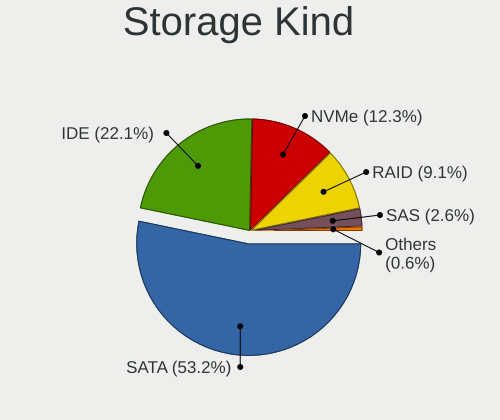

| Kind | Desktops | Percent |
|------|----------|---------|
| SATA | 82       | 53.25%  |
| IDE  | 34       | 22.08%  |
| NVMe | 19       | 12.34%  |
| RAID | 14       | 9.09%   |
| SAS  | 4        | 2.6%    |
| SCSI | 1        | 0.65%   |

Processor
---------

CPU Vendor
----------

Processor vendors

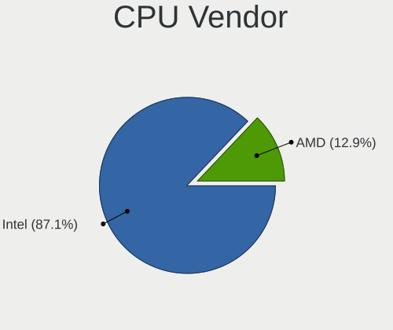

| Vendor | Desktops | Percent |
|--------|----------|---------|
| Intel  | 101      | 87.07%  |
| AMD    | 15       | 12.93%  |

CPU Model
---------

Processor models

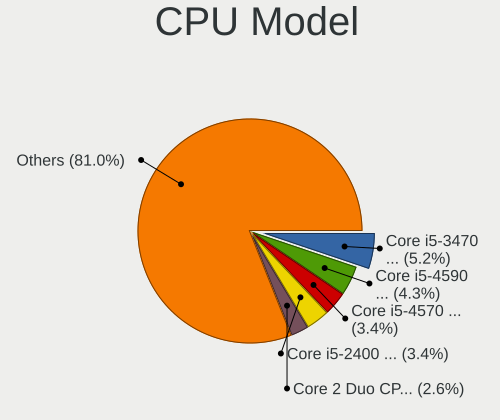

| Model                                       | Desktops | Percent |
|---------------------------------------------|----------|---------|
| Intel Core i5-3470 CPU @ 3.20GHz            | 6        | 5.17%   |
| Intel Core i5-4590 CPU @ 3.30GHz            | 5        | 4.31%   |
| Intel Core i5-4570 CPU @ 3.20GHz            | 4        | 3.45%   |
| Intel Core i5-2400 CPU @ 3.10GHz            | 4        | 3.45%   |
| Intel Core 2 Duo CPU E8400 @ 3.00GHz        | 3        | 2.59%   |
| Intel Xeon CPU E5-2630 v3 @ 2.40GHz         | 2        | 1.72%   |
| Intel Xeon CPU E5-2620 0 @ 2.00GHz          | 2        | 1.72%   |
| Intel Pentium 4 CPU 2.80GHz                 | 2        | 1.72%   |
| Intel Core i7-7700 CPU @ 3.60GHz            | 2        | 1.72%   |
| Intel Core i7-4790 CPU @ 3.60GHz            | 2        | 1.72%   |
| Intel Core i7-3770 CPU @ 3.40GHz            | 2        | 1.72%   |
| Intel Core i5-6500 CPU @ 3.20GHz            | 2        | 1.72%   |
| Intel Core i5-3570 CPU @ 3.40GHz            | 2        | 1.72%   |
| Intel Core i3-6100 CPU @ 3.70GHz            | 2        | 1.72%   |
| Intel Core i3-4150 CPU @ 3.50GHz            | 2        | 1.72%   |
| Intel Core i3-2120 CPU @ 3.30GHz            | 2        | 1.72%   |
| Intel Core i3 CPU 540 @ 3.07GHz             | 2        | 1.72%   |
| Intel 12th Gen Core i3-12100                | 2        | 1.72%   |
| AMD Ryzen 5 5500                            | 2        | 1.72%   |
| AMD Ryzen 5 3600 6-Core Processor           | 2        | 1.72%   |
| Intel Xeon CPU W3540 @ 2.93GHz              | 1        | 0.86%   |
| Intel Xeon CPU E5640 @ 2.67GHz              | 1        | 0.86%   |
| Intel Xeon CPU E5-1650 v2 @ 3.50GHz         | 1        | 0.86%   |
| Intel Xeon CPU E5-1620 0 @ 3.60GHz          | 1        | 0.86%   |
| Intel Xeon CPU E5-1607 v3 @ 3.10GHz         | 1        | 0.86%   |
| Intel Xeon CPU E3-1240 v6 @ 3.70GHz         | 1        | 0.86%   |
| Intel Xeon CPU E3-1220 v3 @ 3.10GHz         | 1        | 0.86%   |
| Intel Xeon CPU 5140 @ 2.33GHz               | 1        | 0.86%   |
| Intel Pentium Dual-Core CPU E5400 @ 2.70GHz | 1        | 0.86%   |
| Intel Pentium Dual-Core CPU E5300 @ 2.60GHz | 1        | 0.86%   |
| Intel Pentium Dual CPU E2160 @ 1.80GHz      | 1        | 0.86%   |
| Intel Pentium CPU G3440 @ 3.30GHz           | 1        | 0.86%   |
| Intel Pentium CPU G3220T @ 2.60GHz          | 1        | 0.86%   |
| Intel Pentium 4 CPU 3.00GHz                 | 1        | 0.86%   |
| Intel N95                                   | 1        | 0.86%   |
| Intel Core i9-9920X CPU @ 3.50GHz           | 1        | 0.86%   |
| Intel Core i7-8700 CPU @ 3.20GHz            | 1        | 0.86%   |
| Intel Core i7-6700K CPU @ 4.00GHz           | 1        | 0.86%   |
| Intel Core i7-6700 CPU @ 3.40GHz            | 1        | 0.86%   |
| Intel Core i7-4771 CPU @ 3.50GHz            | 1        | 0.86%   |

CPU Model Family
----------------

Processor model prefix

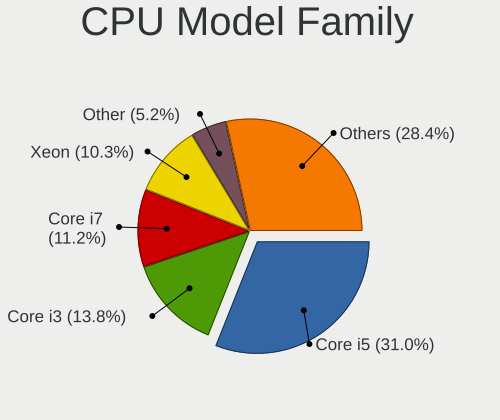

| Model                   | Desktops | Percent |
|-------------------------|----------|---------|
| Intel Core i5           | 36       | 31.03%  |
| Intel Core i3           | 16       | 13.79%  |
| Intel Core i7           | 13       | 11.21%  |
| Intel Xeon              | 12       | 10.34%  |
| Other                   | 6        | 5.17%   |
| Intel Core 2 Duo        | 6        | 5.17%   |
| AMD Ryzen 5             | 6        | 5.17%   |
| Intel Pentium 4         | 3        | 2.59%   |
| Intel Pentium Dual-Core | 2        | 1.72%   |
| Intel Pentium           | 2        | 1.72%   |
| Intel Core 2 Quad       | 2        | 1.72%   |
| AMD Ryzen 9             | 2        | 1.72%   |
| AMD Athlon 64 X2        | 2        | 1.72%   |
| Intel Pentium Dual      | 1        | 0.86%   |
| Intel Core i9           | 1        | 0.86%   |
| Intel Core 2            | 1        | 0.86%   |
| AMD Ryzen 7             | 1        | 0.86%   |
| AMD Ryzen 3             | 1        | 0.86%   |
| AMD Phenom II X6        | 1        | 0.86%   |
| AMD E                   | 1        | 0.86%   |
| AMD Athlon XP           | 1        | 0.86%   |

CPU Cores
---------

Number of processor cores

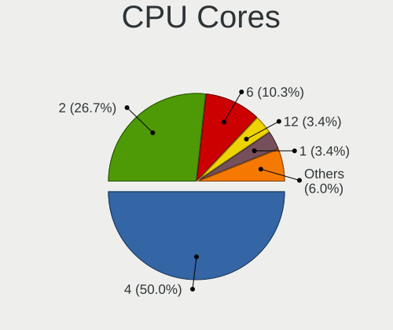

| Number | Desktops | Percent |
|--------|----------|---------|
| 4      | 58       | 50%     |
| 2      | 31       | 26.72%  |
| 6      | 12       | 10.34%  |
| 12     | 4        | 3.45%   |
| 1      | 4        | 3.45%   |
| 16     | 3        | 2.59%   |
| 8      | 3        | 2.59%   |
| 10     | 1        | 0.86%   |

CPU Sockets
-----------

Number of sockets

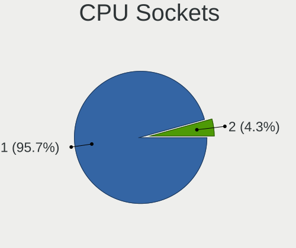

| Number | Desktops | Percent |
|--------|----------|---------|
| 1      | 111      | 95.69%  |
| 2      | 5        | 4.31%   |

CPU Threads
-----------

Threads per core (Hyper-Threading)

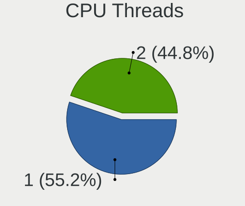

| Number | Desktops | Percent |
|--------|----------|---------|
| 1      | 64       | 55.17%  |
| 2      | 52       | 44.83%  |

CPU Op-Modes
------------

CPU Operation Modes (32-bit, 64-bit)

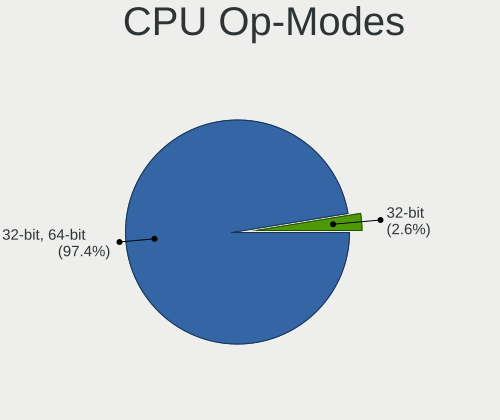

| Op mode        | Desktops | Percent |
|----------------|----------|---------|
| 32-bit, 64-bit | 113      | 97.41%  |
| 32-bit         | 3        | 2.59%   |

CPU Microcode
-------------

Microcode number

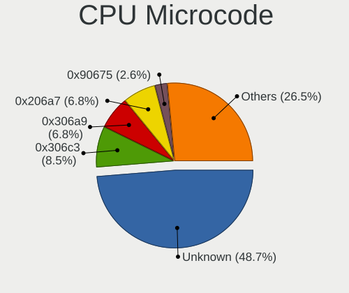

| Number     | Desktops | Percent |
|------------|----------|---------|
| Unknown    | 57       | 48.72%  |
| 0x306c3    | 10       | 8.55%   |
| 0x306a9    | 8        | 6.84%   |
| 0x206a7    | 8        | 6.84%   |
| 0x90675    | 3        | 2.56%   |
| 0x6fb      | 3        | 2.56%   |
| 0x506e3    | 3        | 2.56%   |
| 0x206d7    | 3        | 2.56%   |
| 0x1067a    | 3        | 2.56%   |
| 0x08701021 | 3        | 2.56%   |
| 0x906e9    | 2        | 1.71%   |
| 0x10676    | 2        | 1.71%   |
| 0xf41      | 1        | 0.85%   |
| 0xf29      | 1        | 0.85%   |
| 0x6fd      | 1        | 0.85%   |
| 0x50654    | 1        | 0.85%   |
| 0x306f2    | 1        | 0.85%   |
| 0x106e5    | 1        | 0.85%   |
| 0x0a50000f | 1        | 0.85%   |
| 0x0a201016 | 1        | 0.85%   |
| 0x08701030 | 1        | 0.85%   |
| 0x08108102 | 1        | 0.85%   |
| 0x05000119 | 1        | 0.85%   |
| 0x010000dc | 1        | 0.85%   |

CPU Microarch
-------------

Microarchitecture

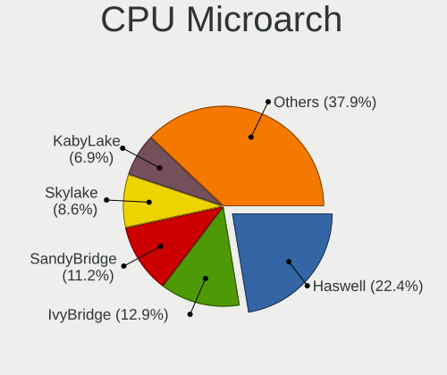

| Name             | Desktops | Percent |
|------------------|----------|---------|
| Haswell          | 26       | 22.41%  |
| IvyBridge        | 15       | 12.93%  |
| SandyBridge      | 13       | 11.21%  |
| Skylake          | 10       | 8.62%   |
| KabyLake         | 8        | 6.9%    |
| Penryn           | 7        | 6.03%   |
| Core             | 6        | 5.17%   |
| Zen 3            | 4        | 3.45%   |
| Zen 2            | 4        | 3.45%   |
| Westmere         | 4        | 3.45%   |
| NetBurst         | 3        | 2.59%   |
| Alderlake Hybrid | 3        | 2.59%   |
| Unknown          | 3        | 2.59%   |
| Nehalem          | 2        | 1.72%   |
| K8 Hammer        | 2        | 1.72%   |
| Zen+             | 1        | 0.86%   |
| K6               | 1        | 0.86%   |
| K10              | 1        | 0.86%   |
| Gracemont        | 1        | 0.86%   |
| CometLake        | 1        | 0.86%   |
| Bobcat           | 1        | 0.86%   |

Graphics
--------

GPU Vendor
----------

Vendors of graphics cards

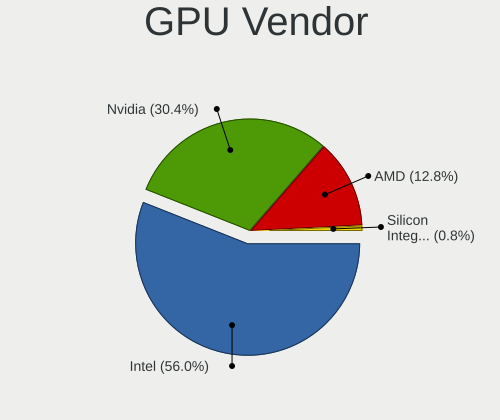

| Vendor                           | Desktops | Percent |
|----------------------------------|----------|---------|
| Intel                            | 70       | 56%     |
| Nvidia                           | 38       | 30.4%   |
| AMD                              | 16       | 12.8%   |
| Silicon Integrated Systems [SiS] | 1        | 0.8%    |

GPU Model
---------

Graphics card models

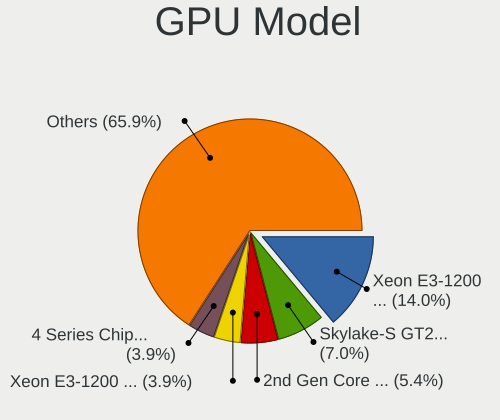

| Model                                                                                      | Desktops | Percent |
|--------------------------------------------------------------------------------------------|----------|---------|
| Intel Xeon E3-1200 v3/4th Gen Core Processor Integrated Graphics Controller                | 18       | 13.95%  |
| Intel Skylake-S GT2 [HD Graphics 530]                                                      | 9        | 6.98%   |
| Intel 2nd Generation Core Processor Family Integrated Graphics Controller                  | 7        | 5.43%   |
| Intel Xeon E3-1200 v2/3rd Gen Core processor Graphics Controller                           | 5        | 3.88%   |
| Intel 4 Series Chipset Integrated Graphics Controller                                      | 5        | 3.88%   |
| Nvidia GM107GL [Quadro K2200]                                                              | 4        | 3.1%    |
| Nvidia GT218 [GeForce 210]                                                                 | 3        | 2.33%   |
| Nvidia GP107 [GeForce GTX 1050 Ti]                                                         | 3        | 2.33%   |
| Nvidia GM204GL [Quadro M4000]                                                              | 3        | 2.33%   |
| Nvidia GK208B [GeForce GT 710]                                                             | 3        | 2.33%   |
| Intel Kaby Lake-S GT2 [HD Graphics 630]                                                    | 3        | 2.33%   |
| Intel CoffeeLake-S GT2 [UHD Graphics 630]                                                  | 3        | 2.33%   |
| Intel Alder Lake-S GT1 [UHD Graphics 730]                                                  | 3        | 2.33%   |
| Intel 82Q35 Express Integrated Graphics Controller                                         | 3        | 2.33%   |
| Intel 4th Generation Core Processor Family Integrated Graphics Controller                  | 3        | 2.33%   |
| Nvidia TU116 [GeForce GTX 1650 SUPER]                                                      | 2        | 1.55%   |
| Nvidia GK107GL [Quadro K600]                                                               | 2        | 1.55%   |
| Nvidia GK107GL [Quadro K2000]                                                              | 2        | 1.55%   |
| Nvidia GF119 [GeForce GT 610]                                                              | 2        | 1.55%   |
| Intel IvyBridge GT2 [HD Graphics 4000]                                                     | 2        | 1.55%   |
| Intel Core Processor Integrated Graphics Controller                                        | 2        | 1.55%   |
| Intel 82865G Integrated Graphics Controller                                                | 2        | 1.55%   |
| Silicon Integrated Systems [SiS] 661/741/760 PCI/AGP or 662/761Gx PCIE VGA Display Adapter | 1        | 0.78%   |
| Nvidia TU116 [GeForce GTX 1660 Ti]                                                         | 1        | 0.78%   |
| Nvidia GP108 [GeForce GT 1030]                                                             | 1        | 0.78%   |
| Nvidia GP107 [GeForce GTX 1050]                                                            | 1        | 0.78%   |
| Nvidia GP106 [GeForce GTX 1060 6GB]                                                        | 1        | 0.78%   |
| Nvidia GP104 [GeForce GTX 1070]                                                            | 1        | 0.78%   |
| Nvidia GK107GL [Quadro K420]                                                               | 1        | 0.78%   |
| Nvidia GK107GL [Quadro 410]                                                                | 1        | 0.78%   |
| Nvidia GF119 [NVS 310]                                                                     | 1        | 0.78%   |
| Nvidia GF108 [GeForce GT 530]                                                              | 1        | 0.78%   |
| Nvidia GA104 [GeForce RTX 3070]                                                            | 1        | 0.78%   |
| Nvidia GA104 [GeForce RTX 3070 Lite Hash Rate]                                             | 1        | 0.78%   |
| Nvidia GA104 [GeForce RTX 3060]                                                            | 1        | 0.78%   |
| Nvidia G94GL [Quadro FX 1800]                                                              | 1        | 0.78%   |
| Nvidia G72 [GeForce 7500 LE]                                                               | 1        | 0.78%   |
| Nvidia C61 [GeForce 6150SE nForce 430]                                                     | 1        | 0.78%   |
| Intel CometLake-S GT2 [UHD Graphics 630]                                                   | 1        | 0.78%   |
| Intel Alder Lake-S GT1 [UHD Graphics 770]                                                  | 1        | 0.78%   |

GPU Combo
---------

Combinations of graphics cards

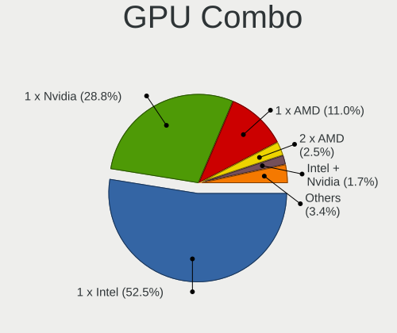

| Name           | Desktops | Percent |
|----------------|----------|---------|
| 1 x Intel      | 62       | 52.54%  |
| 1 x Nvidia     | 34       | 28.81%  |
| 1 x AMD        | 13       | 11.02%  |
| 2 x AMD        | 3        | 2.54%   |
| Intel + Nvidia | 2        | 1.69%   |
| 2 x Nvidia     | 1        | 0.85%   |
| 2 x Intel      | 1        | 0.85%   |
| 1 x SiS        | 1        | 0.85%   |
| Intel + AMD    | 1        | 0.85%   |

GPU Driver
----------

Free vs proprietary

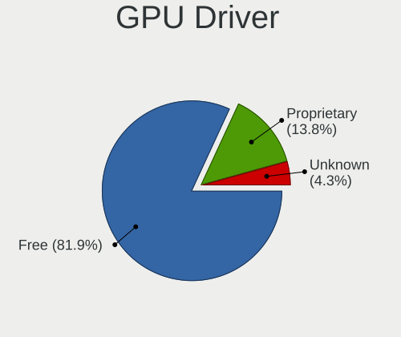

| Driver      | Desktops | Percent |
|-------------|----------|---------|
| Free        | 95       | 81.9%   |
| Proprietary | 16       | 13.79%  |
| Unknown     | 5        | 4.31%   |

GPU Memory
----------

Total video memory

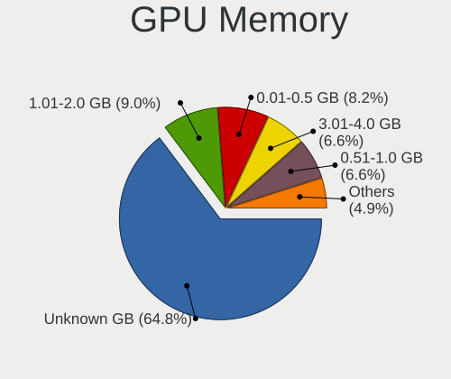

| Size in GB | Desktops | Percent |
|------------|----------|---------|
| Unknown    | 79       | 64.75%  |
| 1.01-2.0   | 11       | 9.02%   |
| 0.01-0.5   | 10       | 8.2%    |
| 3.01-4.0   | 8        | 6.56%   |
| 0.51-1.0   | 8        | 6.56%   |
| 7.01-8.0   | 4        | 3.28%   |
| 5.01-6.0   | 1        | 0.82%   |
| 8.01-16.0  | 1        | 0.82%   |

Monitor
-------

Monitor Vendor
--------------

Monitor vendors

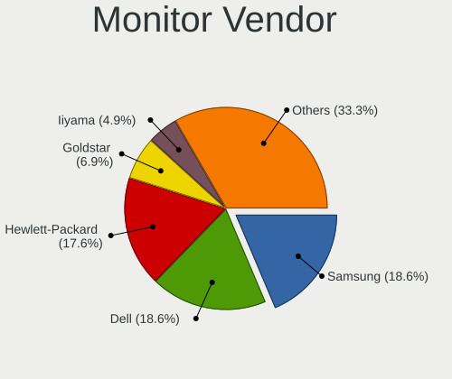

| Vendor               | Desktops | Percent |
|----------------------|----------|---------|
| Samsung Electronics  | 19       | 18.63%  |
| Dell                 | 19       | 18.63%  |
| Hewlett-Packard      | 18       | 17.65%  |
| Goldstar             | 7        | 6.86%   |
| Iiyama               | 5        | 4.9%    |
| Acer                 | 5        | 4.9%    |
| Lenovo               | 4        | 3.92%   |
| Fujitsu Siemens      | 3        | 2.94%   |
| BenQ                 | 3        | 2.94%   |
| Philips              | 2        | 1.96%   |
| MSI                  | 2        | 1.96%   |
| Ancor Communications | 2        | 1.96%   |
| ULP                  | 1        | 0.98%   |
| Sony                 | 1        | 0.98%   |
| SAC                  | 1        | 0.98%   |
| RTK                  | 1        | 0.98%   |
| NEC Computers        | 1        | 0.98%   |
| MiTAC                | 1        | 0.98%   |
| Medion               | 1        | 0.98%   |
| Hitachi              | 1        | 0.98%   |
| Compaq Computer      | 1        | 0.98%   |
| Chimei Innolux       | 1        | 0.98%   |
| ASUSTek Computer     | 1        | 0.98%   |
| AOC                  | 1        | 0.98%   |
| Unknown              | 1        | 0.98%   |

Monitor Model
-------------

Monitor models

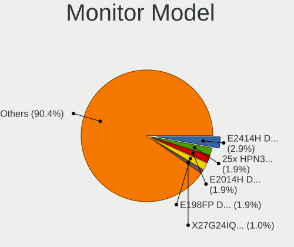

| Model                                                                   | Desktops | Percent |
|-------------------------------------------------------------------------|----------|---------|
| Dell E2414H DEL4090 1920x1080 531x299mm 24.0-inch                       | 3        | 2.88%   |
| Hewlett-Packard 25x HPN357E 1920x1080 544x303mm 24.5-inch               | 2        | 1.92%   |
| Dell E2014H DELD03B 1600x900 432x240mm 19.5-inch                        | 2        | 1.92%   |
| Dell E198FP DELA028 1280x1024 380x305mm 19.2-inch                       | 2        | 1.92%   |
| ULP X27G24IQF ULP2713 2560x1440 597x336mm 27.0-inch                     | 1        | 0.96%   |
| Sony TV SNYD301 1360x768                                                | 1        | 0.96%   |
| Samsung Electronics SyncMaster SAM0497 1600x900 443x249mm 20.0-inch     | 1        | 0.96%   |
| Samsung Electronics SyncMaster SAM0372 1680x1050 459x296mm 21.5-inch    | 1        | 0.96%   |
| Samsung Electronics SyncMaster SAM027E 1680x1050 474x296mm 22.0-inch    | 1        | 0.96%   |
| Samsung Electronics SyncMaster SAM01B7 1280x1024 340x270mm 17.1-inch    | 1        | 0.96%   |
| Samsung Electronics SyncMaster SAM0161 1280x1024 338x270mm 17.0-inch    | 1        | 0.96%   |
| Samsung Electronics SMS24A450/460 SAM0838 1920x1080 531x299mm 24.0-inch | 1        | 0.96%   |
| Samsung Electronics SMBX2440 SAM068A 1920x1080 531x299mm 24.0-inch      | 1        | 0.96%   |
| Samsung Electronics SMBX2250 SAM071B 1920x1080 480x270mm 21.7-inch      | 1        | 0.96%   |
| Samsung Electronics S24C350 SAM0A3A 1920x1080 531x299mm 24.0-inch       | 1        | 0.96%   |
| Samsung Electronics S23B550 SAM0919 1920x1080 510x287mm 23.0-inch       | 1        | 0.96%   |
| Samsung Electronics S22F350 SAM0D1B 1920x1080 477x268mm 21.5-inch       | 1        | 0.96%   |
| Samsung Electronics S19C450 SAM09C1 1440x900 408x255mm 18.9-inch        | 1        | 0.96%   |
| Samsung Electronics S19C450 SAM09C0 1440x900 408x255mm 18.9-inch        | 1        | 0.96%   |
| Samsung Electronics LCD Monitor SAM71B5 3840x2160 950x540mm 43.0-inch   | 1        | 0.96%   |
| Samsung Electronics LCD Monitor SAM0F39 1920x1080 1210x680mm 54.6-inch  | 1        | 0.96%   |
| Samsung Electronics LCD Monitor SAM0B7C 1920x1080 886x498mm 40.0-inch   | 1        | 0.96%   |
| Samsung Electronics LCD Monitor SAM0B2A 1280x720 949x543mm 43.0-inch    | 1        | 0.96%   |
| Samsung Electronics LCD Monitor SAM0A7C 1366x768 698x393mm 31.5-inch    | 1        | 0.96%   |
| Samsung Electronics C27F591 SAM0D36 1920x1080 598x336mm 27.0-inch       | 1        | 0.96%   |
| SAC LED MONITOR SAC309A 1920x1080 443x249mm 20.0-inch                   | 1        | 0.96%   |
| RTK TV RTK0001 3840x2160                                                | 1        | 0.96%   |
| Philips PHL 243V5 PHLC0D1 1920x1080 521x293mm 23.5-inch                 | 1        | 0.96%   |
| Philips 170S PHL081E 1280x1024 338x270mm 17.0-inch                      | 1        | 0.96%   |
| NEC Computers LCD224WM NEC6733 1680x1050 474x296mm 22.0-inch            | 1        | 0.96%   |
| MSI MAG 244F MSI3BC4 1920x1080 527x296mm 23.8-inch                      | 1        | 0.96%   |
| MSI G24C6 MSI3BA0 1920x1080 521x293mm 23.5-inch                         | 1        | 0.96%   |
| MiTAC TV MTC9527 1920x1080 1150x650mm 52.0-inch                         | 1        | 0.96%   |
| Medion MD 20172 MED3628 1680x1050 474x296mm 22.0-inch                   | 1        | 0.96%   |
| Lenovo T24m-29 LEN63A5 1920x1080 527x296mm 23.8-inch                    | 1        | 0.96%   |
| Lenovo T24i-10 LEN61A6 1920x1080 527x296mm 23.8-inch                    | 1        | 0.96%   |
| Lenovo LEN T2324pA LEN60C7 1920x1080 509x286mm 23.0-inch                | 1        | 0.96%   |
| Lenovo E22-20 LEN62A4 1920x1080 476x267mm 21.5-inch                     | 1        | 0.96%   |
| Iiyama PLX2283H IVM5638 1920x1080 477x268mm 21.5-inch                   | 1        | 0.96%   |
| Iiyama PLE2483H IVM6113 1920x1080 531x299mm 24.0-inch                   | 1        | 0.96%   |

Monitor Resolution
------------------

Monitor screen resolution

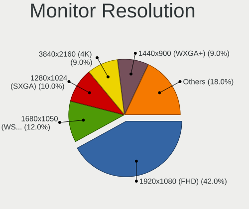

| Resolution         | Desktops | Percent |
|--------------------|----------|---------|
| 1920x1080 (FHD)    | 42       | 42%     |
| 1680x1050 (WSXGA+) | 12       | 12%     |
| 1280x1024 (SXGA)   | 10       | 10%     |
| 3840x2160 (4K)     | 9        | 9%      |
| 1440x900 (WXGA+)   | 9        | 9%      |
| 1600x900 (HD+)     | 6        | 6%      |
| 1366x768 (WXGA)    | 4        | 4%      |
| 2560x1440 (QHD)    | 2        | 2%      |
| 1920x1200 (WUXGA)  | 2        | 2%      |
| 1360x768           | 1        | 1%      |
| 1280x720 (HD)      | 1        | 1%      |
| 1152x864           | 1        | 1%      |
| 1024x768 (XGA)     | 1        | 1%      |

Monitor Diagonal
----------------

Diagonal size in inches

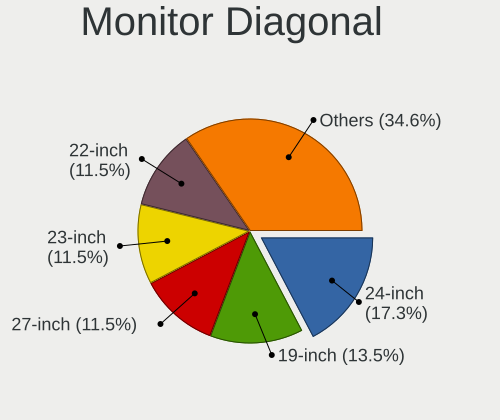

| Inches  | Desktops | Percent |
|---------|----------|---------|
| 24      | 18       | 17.31%  |
| 19      | 14       | 13.46%  |
| 27      | 12       | 11.54%  |
| 23      | 12       | 11.54%  |
| 22      | 12       | 11.54%  |
| 21      | 6        | 5.77%   |
| 17      | 6        | 5.77%   |
| 20      | 4        | 3.85%   |
| Unknown | 4        | 3.85%   |
| 18      | 3        | 2.88%   |
| 72      | 2        | 1.92%   |
| 13      | 2        | 1.92%   |
| 84      | 1        | 0.96%   |
| 74      | 1        | 0.96%   |
| 58      | 1        | 0.96%   |
| 54      | 1        | 0.96%   |
| 52      | 1        | 0.96%   |
| 43      | 1        | 0.96%   |
| 31      | 1        | 0.96%   |
| 15      | 1        | 0.96%   |
| 14      | 1        | 0.96%   |

Monitor Width
-------------

Physical width

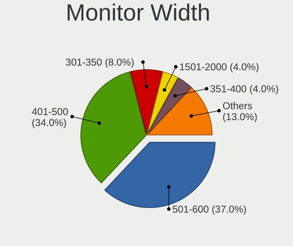

| Width in mm | Desktops | Percent |
|-------------|----------|---------|
| 501-600     | 37       | 37%     |
| 401-500     | 34       | 34%     |
| 301-350     | 8        | 8%      |
| 351-400     | 4        | 4%      |
| 1501-2000   | 4        | 4%      |
| Unknown     | 4        | 4%      |
| 601-700     | 3        | 3%      |
| 1001-1500   | 3        | 3%      |
| 201-300     | 2        | 2%      |
| 901-1000    | 1        | 1%      |

Aspect Ratio
------------

Proportional relationship between the width and the height

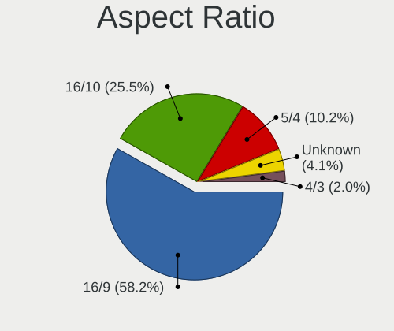

| Ratio   | Desktops | Percent |
|---------|----------|---------|
| 16/9    | 57       | 58.16%  |
| 16/10   | 25       | 25.51%  |
| 5/4     | 10       | 10.2%   |
| Unknown | 4        | 4.08%   |
| 4/3     | 2        | 2.04%   |

Monitor Area
------------

Area in inch²

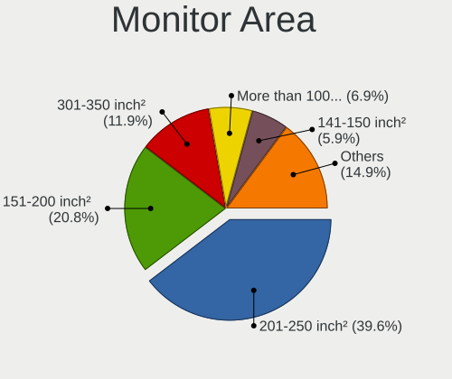

| Area in inch² | Desktops | Percent |
|----------------|----------|---------|
| 201-250        | 40       | 39.6%   |
| 151-200        | 21       | 20.79%  |
| 301-350        | 12       | 11.88%  |
| More than 1000 | 7        | 6.93%   |
| 141-150        | 6        | 5.94%   |
| 251-300        | 5        | 4.95%   |
| Unknown        | 4        | 3.96%   |
| 81-90          | 2        | 1.98%   |
| 101-110        | 2        | 1.98%   |
| 351-500        | 1        | 0.99%   |
| 501-1000       | 1        | 0.99%   |

Pixel Density
-------------

Pixels per inch

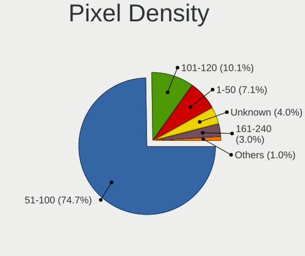

| Density | Desktops | Percent |
|---------|----------|---------|
| 51-100  | 74       | 74.75%  |
| 101-120 | 10       | 10.1%   |
| 1-50    | 7        | 7.07%   |
| Unknown | 4        | 4.04%   |
| 161-240 | 3        | 3.03%   |
| 121-160 | 1        | 1.01%   |

Multiple Monitors
-----------------

Total monitors connected

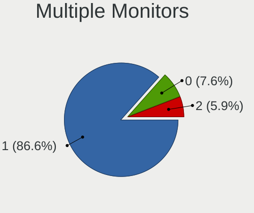

| Total | Desktops | Percent |
|-------|----------|---------|
| 1     | 103      | 86.55%  |
| 0     | 9        | 7.56%   |
| 2     | 7        | 5.88%   |

Network
-------

Net Controller Vendor
---------------------

Controller vendors

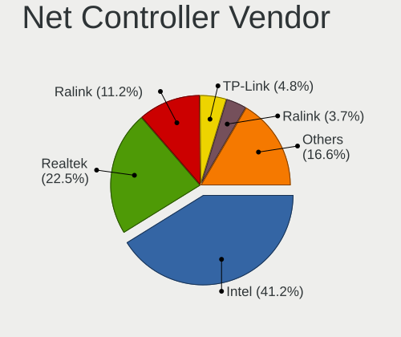

| Vendor                           | Desktops | Percent |
|----------------------------------|----------|---------|
| Intel                            | 77       | 41.18%  |
| Realtek Semiconductor            | 42       | 22.46%  |
| Ralink Technology                | 21       | 11.23%  |
| TP-Link                          | 9        | 4.81%   |
| Ralink                           | 7        | 3.74%   |
| Qualcomm Atheros                 | 7        | 3.74%   |
| Broadcom                         | 5        | 2.67%   |
| Broadcom Limited                 | 4        | 2.14%   |
| Samsung Electronics              | 3        | 1.6%    |
| Nvidia                           | 2        | 1.07%   |
| D-Link System                    | 2        | 1.07%   |
| Silicon Integrated Systems [SiS] | 1        | 0.53%   |
| Qualcomm Atheros Communications  | 1        | 0.53%   |
| NetGear                          | 1        | 0.53%   |
| Marvell Technology Group         | 1        | 0.53%   |
| Huawei Technologies              | 1        | 0.53%   |
| Gemtek                           | 1        | 0.53%   |
| D-Link                           | 1        | 0.53%   |
| Aquantia                         | 1        | 0.53%   |

Net Controller Model
--------------------

Controller models

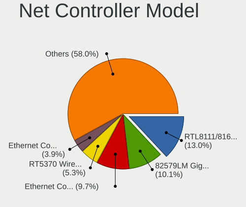

| Model                                                                  | Desktops | Percent |
|------------------------------------------------------------------------|----------|---------|
| Realtek RTL8111/8168/8211/8411 PCI Express Gigabit Ethernet Controller | 27       | 13.04%  |
| Intel 82579LM Gigabit Network Connection (Lewisville)                  | 21       | 10.14%  |
| Intel Ethernet Connection I217-LM                                      | 20       | 9.66%   |
| Ralink RT5370 Wireless Adapter                                         | 11       | 5.31%   |
| Intel Ethernet Connection (2) I219-LM                                  | 8        | 3.86%   |
| TP-Link TL-WN722N v2/v3 [Realtek RTL8188EUS]                           | 7        | 3.38%   |
| Ralink MT7601U Wireless Adapter                                        | 6        | 2.9%    |
| Intel 82566DM-2 Gigabit Network Connection                             | 5        | 2.42%   |
| Ralink RT2870/RT3070 Wireless Adapter                                  | 4        | 1.93%   |
| Intel Wi-Fi 6 AX200                                                    | 4        | 1.93%   |
| Intel I211 Gigabit Network Connection                                  | 4        | 1.93%   |
| Intel 82567LM-3 Gigabit Network Connection                             | 4        | 1.93%   |
| Ralink RT3090 Wireless 802.11n 1T/1R PCIe                              | 3        | 1.45%   |
| Intel 82578DM Gigabit Network Connection                               | 3        | 1.45%   |
| Intel 82574L Gigabit Network Connection                                | 3        | 1.45%   |
| Samsung Galaxy series, misc. (tethering mode)                          | 2        | 0.97%   |
| Realtek RTL8723BU 802.11b/g/n WLAN Adapter                             | 2        | 0.97%   |
| Realtek RTL8192EU 802.11b/g/n WLAN Adapter                             | 2        | 0.97%   |
| Realtek RTL8188FTV 802.11b/g/n 1T1R 2.4G WLAN Adapter                  | 2        | 0.97%   |
| Realtek RTL8187 Wireless Adapter                                       | 2        | 0.97%   |
| Realtek RTL8125 2.5GbE Controller                                      | 2        | 0.97%   |
| Realtek 802.11ac NIC                                                   | 2        | 0.97%   |
| Qualcomm Atheros QCA9565 / AR9565 Wireless Network Adapter             | 2        | 0.97%   |
| Qualcomm Atheros AR8161 Gigabit Ethernet                               | 2        | 0.97%   |
| Nvidia MCP61 Ethernet                                                  | 2        | 0.97%   |
| Intel I210 Gigabit Network Connection                                  | 2        | 0.97%   |
| Intel Ethernet Connection (2) I218-LM                                  | 2        | 0.97%   |
| Broadcom Limited NetXtreme BCM5782 Gigabit Ethernet                    | 2        | 0.97%   |
| TP-Link RTL8812AU Archer T4U 802.11ac                                  | 1        | 0.48%   |
| TP-Link Archer T4U ver.3                                               | 1        | 0.48%   |
| Silicon Integrated Systems [SiS] SiS900 PCI Fast Ethernet              | 1        | 0.48%   |
| Samsung GT-I9070 (network tethering, USB debugging enabled)            | 1        | 0.48%   |
| Realtek RTL88x2bu [AC1200 Techkey]                                     | 1        | 0.48%   |
| Realtek RTL8822CE 802.11ac PCIe Wireless Network Adapter               | 1        | 0.48%   |
| Realtek RTL8821CE 802.11ac PCIe Wireless Network Adapter               | 1        | 0.48%   |
| Realtek RTL8814AU 802.11a/b/g/n/ac Wireless Adapter                    | 1        | 0.48%   |
| Realtek RTL8811AU 802.11a/b/g/n/ac WLAN Adapter                        | 1        | 0.48%   |
| Realtek RTL8192CU 802.11n WLAN Adapter                                 | 1        | 0.48%   |
| Realtek RTL8188EUS 802.11n Wireless Network Adapter                    | 1        | 0.48%   |
| Realtek RTL8188ETV Wireless LAN 802.11n Network Adapter                | 1        | 0.48%   |

Wireless Vendor
---------------

Wireless vendors

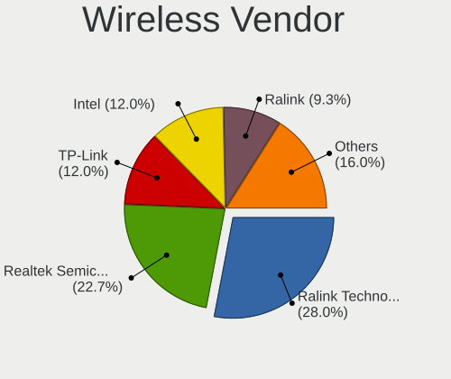

| Vendor                          | Desktops | Percent |
|---------------------------------|----------|---------|
| Ralink Technology               | 21       | 28%     |
| Realtek Semiconductor           | 17       | 22.67%  |
| TP-Link                         | 9        | 12%     |
| Intel                           | 9        | 12%     |
| Ralink                          | 7        | 9.33%   |
| Qualcomm Atheros                | 5        | 6.67%   |
| Qualcomm Atheros Communications | 1        | 1.33%   |
| NetGear                         | 1        | 1.33%   |
| Gemtek                          | 1        | 1.33%   |
| D-Link System                   | 1        | 1.33%   |
| D-Link                          | 1        | 1.33%   |
| Broadcom Limited                | 1        | 1.33%   |
| Broadcom                        | 1        | 1.33%   |

Wireless Model
--------------

Wireless models

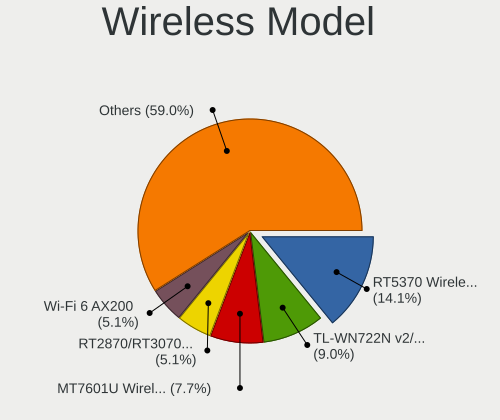

| Model                                                                | Desktops | Percent |
|----------------------------------------------------------------------|----------|---------|
| Ralink RT5370 Wireless Adapter                                       | 11       | 14.1%   |
| TP-Link TL-WN722N v2/v3 [Realtek RTL8188EUS]                         | 7        | 8.97%   |
| Ralink MT7601U Wireless Adapter                                      | 6        | 7.69%   |
| Ralink RT2870/RT3070 Wireless Adapter                                | 4        | 5.13%   |
| Intel Wi-Fi 6 AX200                                                  | 4        | 5.13%   |
| Ralink RT3090 Wireless 802.11n 1T/1R PCIe                            | 3        | 3.85%   |
| Realtek RTL8723BU 802.11b/g/n WLAN Adapter                           | 2        | 2.56%   |
| Realtek RTL8192EU 802.11b/g/n WLAN Adapter                           | 2        | 2.56%   |
| Realtek RTL8188FTV 802.11b/g/n 1T1R 2.4G WLAN Adapter                | 2        | 2.56%   |
| Realtek RTL8187 Wireless Adapter                                     | 2        | 2.56%   |
| Realtek 802.11ac NIC                                                 | 2        | 2.56%   |
| Qualcomm Atheros QCA9565 / AR9565 Wireless Network Adapter           | 2        | 2.56%   |
| TP-Link RTL8812AU Archer T4U 802.11ac                                | 1        | 1.28%   |
| TP-Link Archer T4U ver.3                                             | 1        | 1.28%   |
| Realtek RTL88x2bu [AC1200 Techkey]                                   | 1        | 1.28%   |
| Realtek RTL8822CE 802.11ac PCIe Wireless Network Adapter             | 1        | 1.28%   |
| Realtek RTL8821CE 802.11ac PCIe Wireless Network Adapter             | 1        | 1.28%   |
| Realtek RTL8814AU 802.11a/b/g/n/ac Wireless Adapter                  | 1        | 1.28%   |
| Realtek RTL8811AU 802.11a/b/g/n/ac WLAN Adapter                      | 1        | 1.28%   |
| Realtek RTL8192CU 802.11n WLAN Adapter                               | 1        | 1.28%   |
| Realtek RTL8188EUS 802.11n Wireless Network Adapter                  | 1        | 1.28%   |
| Realtek RTL8188ETV Wireless LAN 802.11n Network Adapter              | 1        | 1.28%   |
| Realtek RTL8188EE Wireless Network Adapter                           | 1        | 1.28%   |
| Ralink RT2501/RT2573 Wireless Adapter                                | 1        | 1.28%   |
| Ralink RT5390R 802.11bgn PCIe Wireless Network Adapter               | 1        | 1.28%   |
| Ralink RT5360 Wireless 802.11n 1T/1R                                 | 1        | 1.28%   |
| Ralink RT3060 Wireless 802.11n 1T/1R                                 | 1        | 1.28%   |
| Ralink RT2500 Wireless 802.11bg                                      | 1        | 1.28%   |
| Qualcomm Atheros QCA9377 802.11ac Wireless Network Adapter           | 1        | 1.28%   |
| Qualcomm Atheros AR9271 802.11n                                      | 1        | 1.28%   |
| Qualcomm Atheros AR9485 Wireless Network Adapter                     | 1        | 1.28%   |
| Qualcomm Atheros AR9462 Wireless Network Adapter                     | 1        | 1.28%   |
| NetGear WNA3100(v1) Wireless-N 300 [Broadcom BCM43231]               | 1        | 1.28%   |
| Intel Wireless 8260                                                  | 1        | 1.28%   |
| Intel Wi-Fi 6E(802.11ax) AX210/AX1675* 2x2 [Typhoon Peak]            | 1        | 1.28%   |
| Intel Dual Band Wireless-AC 3165 Plus Bluetooth                      | 1        | 1.28%   |
| Intel Alder Lake-S PCH CNVi WiFi                                     | 1        | 1.28%   |
| Intel 700 Series Chipset CNVi WiFi                                   | 1        | 1.28%   |
| Gemtek WUBR-177G [Ralink RT2571W]                                    | 1        | 1.28%   |
| D-Link System DWA-140 RangeBooster N Adapter(rev.B1) [Ralink RT2870] | 1        | 1.28%   |

Ethernet Vendor
---------------

Ethernet vendors

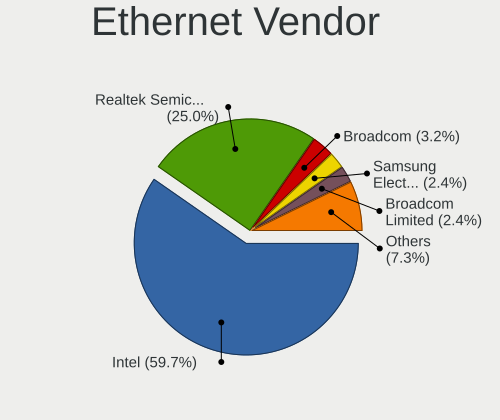

| Vendor                           | Desktops | Percent |
|----------------------------------|----------|---------|
| Intel                            | 74       | 59.68%  |
| Realtek Semiconductor            | 31       | 25%     |
| Broadcom                         | 4        | 3.23%   |
| Samsung Electronics              | 3        | 2.42%   |
| Broadcom Limited                 | 3        | 2.42%   |
| Qualcomm Atheros                 | 2        | 1.61%   |
| Nvidia                           | 2        | 1.61%   |
| Silicon Integrated Systems [SiS] | 1        | 0.81%   |
| Marvell Technology Group         | 1        | 0.81%   |
| Huawei Technologies              | 1        | 0.81%   |
| D-Link System                    | 1        | 0.81%   |
| Aquantia                         | 1        | 0.81%   |

Ethernet Model
--------------

Ethernet models

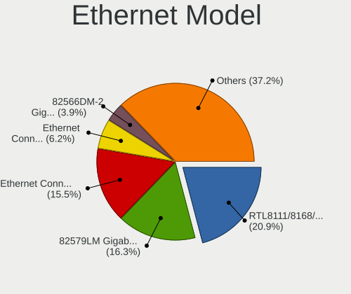

| Model                                                                          | Desktops | Percent |
|--------------------------------------------------------------------------------|----------|---------|
| Realtek RTL8111/8168/8211/8411 PCI Express Gigabit Ethernet Controller         | 27       | 20.93%  |
| Intel 82579LM Gigabit Network Connection (Lewisville)                          | 21       | 16.28%  |
| Intel Ethernet Connection I217-LM                                              | 20       | 15.5%   |
| Intel Ethernet Connection (2) I219-LM                                          | 8        | 6.2%    |
| Intel 82566DM-2 Gigabit Network Connection                                     | 5        | 3.88%   |
| Intel I211 Gigabit Network Connection                                          | 4        | 3.1%    |
| Intel 82567LM-3 Gigabit Network Connection                                     | 4        | 3.1%    |
| Intel 82578DM Gigabit Network Connection                                       | 3        | 2.33%   |
| Intel 82574L Gigabit Network Connection                                        | 3        | 2.33%   |
| Samsung Galaxy series, misc. (tethering mode)                                  | 2        | 1.55%   |
| Realtek RTL8125 2.5GbE Controller                                              | 2        | 1.55%   |
| Qualcomm Atheros AR8161 Gigabit Ethernet                                       | 2        | 1.55%   |
| Nvidia MCP61 Ethernet                                                          | 2        | 1.55%   |
| Intel I210 Gigabit Network Connection                                          | 2        | 1.55%   |
| Intel Ethernet Connection (2) I218-LM                                          | 2        | 1.55%   |
| Broadcom Limited NetXtreme BCM5782 Gigabit Ethernet                            | 2        | 1.55%   |
| Silicon Integrated Systems [SiS] SiS900 PCI Fast Ethernet                      | 1        | 0.78%   |
| Samsung GT-I9070 (network tethering, USB debugging enabled)                    | 1        | 0.78%   |
| Realtek RTL810xE PCI Express Fast Ethernet controller                          | 1        | 0.78%   |
| Realtek RTL-8100/8101L/8139 PCI Fast Ethernet Adapter                          | 1        | 0.78%   |
| Marvell Group Yukon Optima 88E8059 [PCIe Gigabit Ethernet Controller with AVB] | 1        | 0.78%   |
| Intel Ethernet Controller I225-V                                               | 1        | 0.78%   |
| Intel Ethernet Connection I217-V                                               | 1        | 0.78%   |
| Intel Ethernet Connection (7) I219-V                                           | 1        | 0.78%   |
| Intel Ethernet Connection (5) I219-LM                                          | 1        | 0.78%   |
| Intel Ethernet Connection (2) I219-V                                           | 1        | 0.78%   |
| Intel Ethernet Connection (17) I219-V                                          | 1        | 0.78%   |
| Intel Ethernet Connection (17) I219-LM                                         | 1        | 0.78%   |
| Huawei FOA-LX9                                                                 | 1        | 0.78%   |
| D-Link System DGE-528T Gigabit Ethernet Adapter                                | 1        | 0.78%   |
| Broadcom NetXtreme BCM5764M Gigabit Ethernet PCIe                              | 1        | 0.78%   |
| Broadcom NetXtreme BCM5761 Gigabit Ethernet PCIe                               | 1        | 0.78%   |
| Broadcom NetXtreme BCM5754 Gigabit Ethernet PCI Express                        | 1        | 0.78%   |
| Broadcom NetXtreme BCM5752 Gigabit Ethernet PCI Express                        | 1        | 0.78%   |
| Broadcom Limited NetXtreme BCM5752 Gigabit Ethernet PCI Express                | 1        | 0.78%   |
| Aquantia AQC111 NBase-T/IEEE 802.3bz Ethernet Controller [AQtion]              | 1        | 0.78%   |

Net Controller Kind
-------------------

Ethernet, WiFi or modem

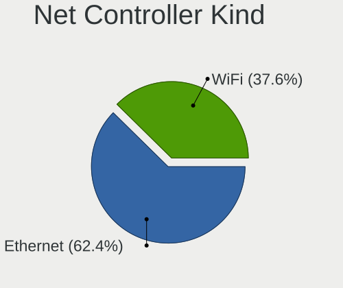

| Kind     | Desktops | Percent |
|----------|----------|---------|
| Ethernet | 116      | 62.37%  |
| WiFi     | 70       | 37.63%  |

Used Controller
---------------

Currently used network controller

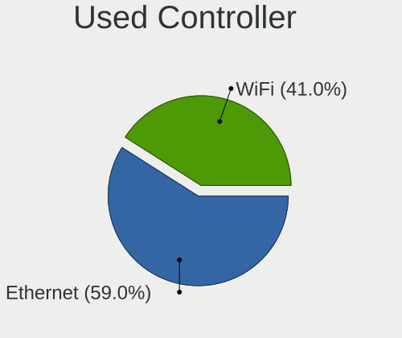

| Kind     | Desktops | Percent |
|----------|----------|---------|
| Ethernet | 72       | 59.02%  |
| WiFi     | 50       | 40.98%  |

NICs
----

Total network controllers on board

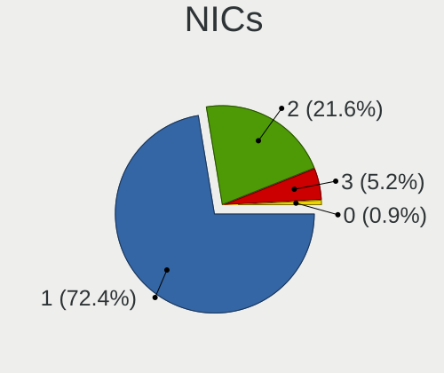

| Total | Desktops | Percent |
|-------|----------|---------|
| 1     | 84       | 72.41%  |
| 2     | 25       | 21.55%  |
| 3     | 6        | 5.17%   |
| 0     | 1        | 0.86%   |

IPv6
----

IPv6 vs IPv4

| Used | Desktops | Percent |
|------|----------|---------|
| No   | 116      | 100%    |

Bluetooth
---------

Bluetooth Vendor
----------------

Controller vendors

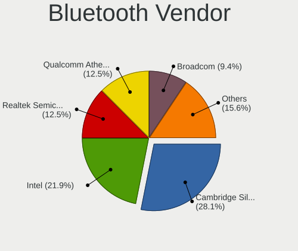

| Vendor                          | Desktops | Percent |
|---------------------------------|----------|---------|
| Cambridge Silicon Radio         | 9        | 28.13%  |
| Intel                           | 7        | 21.88%  |
| Realtek Semiconductor           | 4        | 12.5%   |
| Qualcomm Atheros Communications | 4        | 12.5%   |
| Broadcom                        | 3        | 9.38%   |
| TP-Link                         | 2        | 6.25%   |
| Toshiba                         | 1        | 3.13%   |
| ASUSTek Computer                | 1        | 3.13%   |
| Apple                           | 1        | 3.13%   |

Bluetooth Model
---------------

Controller models

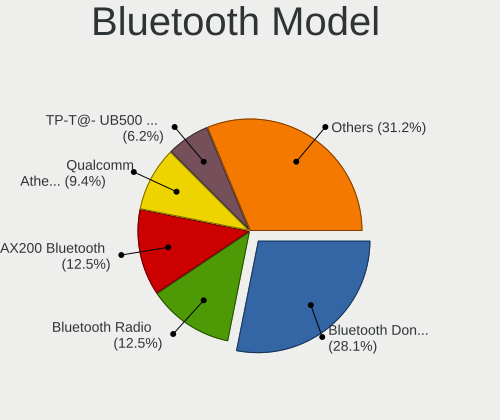

| Model                                               | Desktops | Percent |
|-----------------------------------------------------|----------|---------|
| Cambridge Silicon Radio Bluetooth Dongle (HCI mode) | 9        | 28.13%  |
| Realtek Bluetooth Radio                             | 4        | 12.5%   |
| Intel AX200 Bluetooth                               | 4        | 12.5%   |
| Qualcomm Atheros  Bluetooth Device                  | 3        | 9.38%   |
| TP-Link TP-T@- UB500 Adapter                        | 2        | 6.25%   |
| Intel Bluetooth wireless interface                  | 2        | 6.25%   |
| Broadcom BCM20702A0 Bluetooth 4.0                   | 2        | 6.25%   |
| Toshiba Atheros AR3012 Bluetooth                    | 1        | 3.13%   |
| Qualcomm Atheros AR3011 Bluetooth                   | 1        | 3.13%   |
| Intel Bluetooth Device                              | 1        | 3.13%   |
| Broadcom HP Portable Valentine                      | 1        | 3.13%   |
| ASUS 2045 Bluetooth 2.0 Device with trace filter    | 1        | 3.13%   |
| Apple Bluetooth Host Controller                     | 1        | 3.13%   |

Sound
-----

Sound Vendor
------------

Sound card vendors

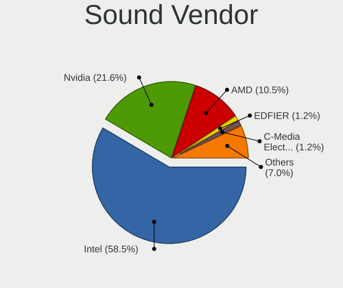

| Vendor                                       | Desktops | Percent |
|----------------------------------------------|----------|---------|
| Intel                                        | 100      | 58.48%  |
| Nvidia                                       | 37       | 21.64%  |
| AMD                                          | 18       | 10.53%  |
| EDFIER                                       | 2        | 1.17%   |
| C-Media Electronics                          | 2        | 1.17%   |
| Zoran Co. Personal Media Division (Nogatech) | 1        | 0.58%   |
| Trust                                        | 1        | 0.58%   |
| Silicon Integrated Systems [SiS]             | 1        | 0.58%   |
| Medeli Electronics                           | 1        | 0.58%   |
| Logitech                                     | 1        | 0.58%   |
| Kingston Technology                          | 1        | 0.58%   |
| JMTek                                        | 1        | 0.58%   |
| Hewlett-Packard                              | 1        | 0.58%   |
| GN Netcom                                    | 1        | 0.58%   |
| GEMBIRD                                      | 1        | 0.58%   |
| Creative Labs                                | 1        | 0.58%   |
| ASUSTek Computer                             | 1        | 0.58%   |

Sound Model
-----------

Sound card models

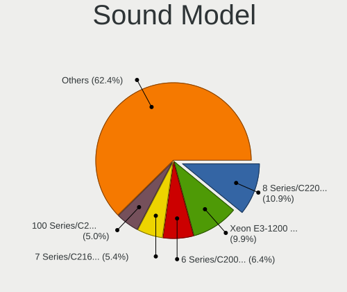

| Model                                                                      | Desktops | Percent |
|----------------------------------------------------------------------------|----------|---------|
| Intel 8 Series/C220 Series Chipset High Definition Audio Controller        | 22       | 10.89%  |
| Intel Xeon E3-1200 v3/4th Gen Core Processor HD Audio Controller           | 20       | 9.9%    |
| Intel 6 Series/C200 Series Chipset Family High Definition Audio Controller | 13       | 6.44%   |
| Intel 7 Series/C216 Chipset Family High Definition Audio Controller        | 11       | 5.45%   |
| Intel 100 Series/C230 Series Chipset Family HD Audio Controller            | 10       | 4.95%   |
| Nvidia GK107 HDMI Audio Controller                                         | 6        | 2.97%   |
| Intel 82801I (ICH9 Family) HD Audio Controller                             | 6        | 2.97%   |
| Intel 200 Series PCH HD Audio                                              | 5        | 2.48%   |
| AMD Starship/Matisse HD Audio Controller                                   | 5        | 2.48%   |
| AMD Ryzen HD Audio Controller                                              | 5        | 2.48%   |
| Nvidia GP107GL High Definition Audio Controller                            | 4        | 1.98%   |
| Nvidia GM107 High Definition Audio Controller [GeForce 940MX]              | 4        | 1.98%   |
| Intel C600/X79 series chipset High Definition Audio Controller             | 4        | 1.98%   |
| Intel Alder Lake-S HD Audio Controller                                     | 4        | 1.98%   |
| Intel 82801JD/DO (ICH10 Family) HD Audio Controller                        | 4        | 1.98%   |
| Intel 5 Series/3400 Series Chipset High Definition Audio                   | 4        | 1.98%   |
| Nvidia TU116 High Definition Audio Controller                              | 3        | 1.49%   |
| Nvidia High Definition Audio Controller                                    | 3        | 1.49%   |
| Nvidia GM204 High Definition Audio Controller                              | 3        | 1.49%   |
| Nvidia GK208 HDMI/DP Audio Controller                                      | 3        | 1.49%   |
| Nvidia GF119 HDMI Audio Controller                                         | 3        | 1.49%   |
| Nvidia GA104 High Definition Audio Controller                              | 3        | 1.49%   |
| Intel Cannon Lake PCH cAVS                                                 | 3        | 1.49%   |
| Intel C610/X99 series chipset HD Audio Controller                          | 3        | 1.49%   |
| Intel 82801JI (ICH10 Family) HD Audio Controller                           | 3        | 1.49%   |
| AMD Renoir/Cezanne HDMI/DP Audio Controller                                | 3        | 1.49%   |
| Nvidia MCP61 High Definition Audio                                         | 2        | 0.99%   |
| Intel 82801EB/ER (ICH5/ICH5R) AC'97 Audio Controller                       | 2        | 0.99%   |
| EDFIER EDIFIER W820NB                                                      | 2        | 0.99%   |
| AMD SBx00 Azalia (Intel HDA)                                               | 2        | 0.99%   |
| AMD Redwood HDMI Audio [Radeon HD 5000 Series]                             | 2        | 0.99%   |
| AMD Oland/Hainan/Cape Verde/Pitcairn HDMI Audio [Radeon HD 7000 Series]    | 2        | 0.99%   |
| Zoran Co. Personal Media Division (Nogatech) USB Audio and HID             | 1        | 0.5%    |
| Trust Trust On-ear USB PC Headset                                          | 1        | 0.5%    |
| Silicon Integrated Systems [SiS] SiS7012 AC'97 Sound Controller            | 1        | 0.5%    |
| Nvidia GP108 High Definition Audio Controller                              | 1        | 0.5%    |
| Nvidia GP106 High Definition Audio Controller                              | 1        | 0.5%    |
| Nvidia GP104 High Definition Audio Controller                              | 1        | 0.5%    |
| Nvidia GF108 High Definition Audio Controller                              | 1        | 0.5%    |
| Medeli Electronics USB Audio Device                                        | 1        | 0.5%    |

Memory
------

Memory Vendor
-------------

Memory module vendors

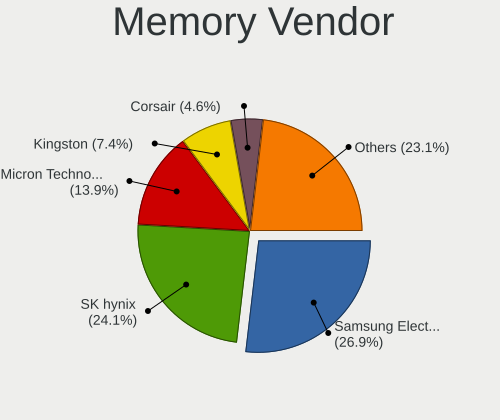

| Vendor                                  | Desktops | Percent |
|-----------------------------------------|----------|---------|
| Samsung Electronics                     | 29       | 26.85%  |
| SK hynix                                | 26       | 24.07%  |
| Micron Technology                       | 15       | 13.89%  |
| Kingston                                | 8        | 7.41%   |
| Corsair                                 | 5        | 4.63%   |
| Nanya Technology                        | 4        | 3.7%    |
| Unknown                                 | 3        | 2.78%   |
| Ramaxel Technology                      | 3        | 2.78%   |
| Unknown                                 | 2        | 1.85%   |
| Wilk                                    | 1        | 0.93%   |
| Team                                    | 1        | 0.93%   |
| TakeMS                                  | 1        | 0.93%   |
| Silicon Power Computer & Communications | 1        | 0.93%   |
| Silicon Power                           | 1        | 0.93%   |
| Sesame                                  | 1        | 0.93%   |
| Qimonda                                 | 1        | 0.93%   |
| G.Skill                                 | 1        | 0.93%   |
| Elpida                                  | 1        | 0.93%   |
| Crucial                                 | 1        | 0.93%   |
| Avant                                   | 1        | 0.93%   |
| Apacer                                  | 1        | 0.93%   |
| A-DATA Technology                       | 1        | 0.93%   |

Memory Model
------------

Memory module models

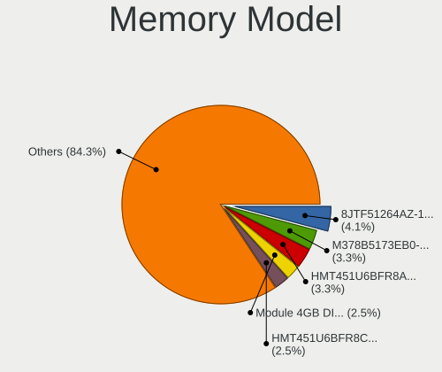

| Model                                                     | Desktops | Percent |
|-----------------------------------------------------------|----------|---------|
| Micron RAM 8JTF51264AZ-1G6E1 4GB DIMM DDR3 1600MT/s       | 5        | 4.13%   |
| SK hynix RAM HMT451U6BFR8A-PB 4GB DIMM DDR3 1600MT/s      | 4        | 3.31%   |
| Samsung RAM M378B5173EB0-YK0 4GB DIMM DDR3 1600MT/s       | 4        | 3.31%   |
| SK hynix RAM HMT451U6BFR8C-PB 4GB DIMM DDR3 1600MT/s      | 3        | 2.48%   |
| Samsung RAM Module 4GB DIMM DDR3 1333MT/s                 | 3        | 2.48%   |
| SK hynix RAM HMT451U6AFR8A-PB 4GB DIMM DDR3 1600MT/s      | 2        | 1.65%   |
| Samsung RAM M3 78T5663QZ3-CF7 2GB DIMM DDR2 800MT/s       | 2        | 1.65%   |
| Kingston RAM LV32D4U2S8SD-8 8GB DIMM DDR4 3200MT/s        | 2        | 1.65%   |
| Unknown                                                   | 2        | 1.65%   |
| Wilk RAM Module 16GB DIMM DDR4 2667MT/s                   | 1        | 0.83%   |
| Unknown RAM Module 4GB SODIMM DDR4 2400MT/s               | 1        | 0.83%   |
| Unknown RAM Module 4GB DIMM DDR3 1600MT/s                 | 1        | 0.83%   |
| Unknown RAM Module 2GB DIMM                               | 1        | 0.83%   |
| Team RAM TEAMGROUP-UD4-3000 8GB DIMM DDR4 3200MT/s        | 1        | 0.83%   |
| TakeMS RAM TMS2GB264C081-665U 2048MB DIMM DDR2 667MT/s    | 1        | 0.83%   |
| SK hynix RAM Module 8GB DIMM DDR4 2133MT/s                | 1        | 0.83%   |
| SK hynix RAM Module 4GB DIMM DDR4 2133MT/s                | 1        | 0.83%   |
| SK hynix RAM Module 2GB DIMM DDR3 1333MT/s                | 1        | 0.83%   |
| SK hynix RAM HYMP512U64CP8-Y5 1GB DIMM                    | 1        | 0.83%   |
| SK hynix RAM HYMP164U64CP6-Y5 512MB DIMM DDR2 667MT/s     | 1        | 0.83%   |
| SK hynix RAM HYMP125U64CP8-S6 2GB DIMM DDR2 49926MT/s     | 1        | 0.83%   |
| SK hynix RAM HMT451U6AFR8C-PB 4GB DIMM DDR3 1600MT/s      | 1        | 0.83%   |
| SK hynix RAM HMT425U6AFR6C-PB 2GB DIMM DDR3 1600MT/s      | 1        | 0.83%   |
| SK hynix RAM HMT41GU7MFR8A-H9 8GB DIMM DDR3 1333MT/s      | 1        | 0.83%   |
| SK hynix RAM HMT41GU7AFR8A-PB 8GB DIMM DDR3 1600MT/s      | 1        | 0.83%   |
| SK hynix RAM HMT41GU6MFR8C-PB 8GB DIMM DDR3 1600MT/s      | 1        | 0.83%   |
| SK hynix RAM HMT41GR7BFR4A-PB 8GB DIMM DDR3 1600MT/s      | 1        | 0.83%   |
| SK hynix RAM HMT351U6EFR8C-PB 4GB DIMM DDR3 1600MT/s      | 1        | 0.83%   |
| SK hynix RAM HMT351U6CFR8C-PB 4GB DIMM DDR3 1800MT/s      | 1        | 0.83%   |
| SK hynix RAM HMT351U6BFR8C-H9 4GB DIMM DDR3 1333MT/s      | 1        | 0.83%   |
| SK hynix RAM HMT325U6EFR8C-PB 2GB DIMM DDR3 1600MT/s      | 1        | 0.83%   |
| SK hynix RAM HMT31GR7CFR4C-PB 8GB DIMM DDR3 1600MT/s      | 1        | 0.83%   |
| SK hynix RAM HMT125U6BFR8C-G7 2GB DIMM DDR3 1067MT/s      | 1        | 0.83%   |
| SK hynix RAM HMT112U6TFR8C-H9 1GB DIMM DDR3 1333MT/s      | 1        | 0.83%   |
| SK hynix RAM HMA851U6AFR6N-UH 4GB DIMM DDR4 2400MT/s      | 1        | 0.83%   |
| SK hynix RAM HMA81GU6AFR8N-UH 8GB DIMM DDR4 2400MT/s      | 1        | 0.83%   |
| SK hynix RAM HMA42GR7AFR4N-TF 16GB DIMM DDR4 2400MT/s     | 1        | 0.83%   |
| Silicon Power RAM SP004GBLFU266N02 4GB DIMM DDR4 2666MT/s | 1        | 0.83%   |
| Silicon Power & RAM Module 4GB DIMM DDR4 2667MT/s         | 1        | 0.83%   |
| Sesame RAM S949A4UUH-ITR 16GB DIMM DDR4 2400MT/s          | 1        | 0.83%   |

Memory Kind
-----------

Memory module kinds

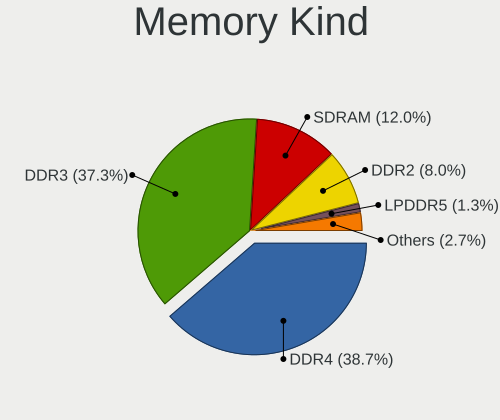

| Kind    | Desktops | Percent |
|---------|----------|---------|
| DDR4    | 29       | 38.67%  |
| DDR3    | 28       | 37.33%  |
| SDRAM   | 9        | 12%     |
| DDR2    | 6        | 8%      |
| LPDDR5  | 1        | 1.33%   |
| DDR     | 1        | 1.33%   |
| Unknown | 1        | 1.33%   |

Memory Form Factor
------------------

Physical design of the memory module

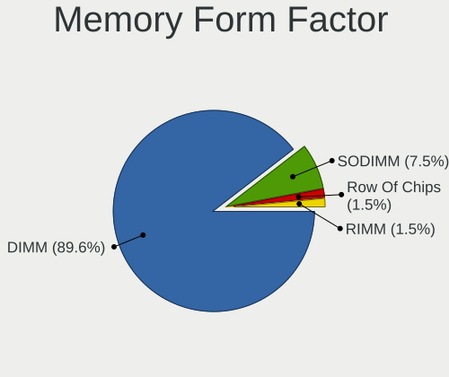

| Name         | Desktops | Percent |
|--------------|----------|---------|
| DIMM         | 60       | 89.55%  |
| SODIMM       | 5        | 7.46%   |
| Row Of Chips | 1        | 1.49%   |
| RIMM         | 1        | 1.49%   |

Memory Size
-----------

Memory module size

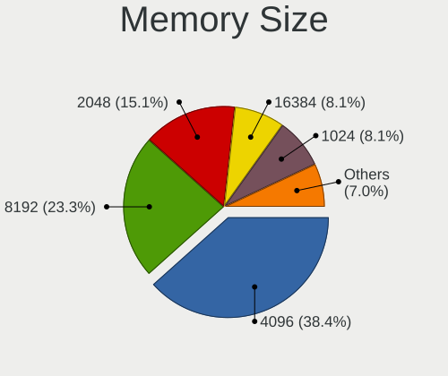

| Size  | Desktops | Percent |
|-------|----------|---------|
| 4096  | 33       | 38.37%  |
| 8192  | 20       | 23.26%  |
| 2048  | 13       | 15.12%  |
| 16384 | 7        | 8.14%   |
| 1024  | 7        | 8.14%   |
| 32768 | 2        | 2.33%   |
| 512   | 2        | 2.33%   |
| 256   | 1        | 1.16%   |
| 128   | 1        | 1.16%   |

Memory Speed
------------

Memory module speed

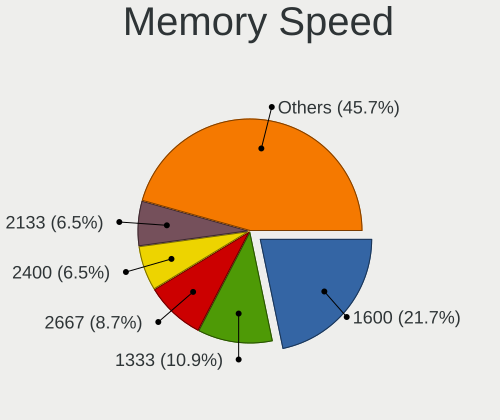

| Speed   | Desktops | Percent |
|---------|----------|---------|
| 1600    | 20       | 21.74%  |
| 1333    | 10       | 10.87%  |
| 2667    | 8        | 8.7%    |
| 2400    | 6        | 6.52%   |
| 2133    | 6        | 6.52%   |
| 667     | 5        | 5.43%   |
| 3600    | 4        | 4.35%   |
| 3200    | 4        | 4.35%   |
| 1648    | 4        | 4.35%   |
| 1800    | 2        | 2.17%   |
| 1639    | 2        | 2.17%   |
| 1067    | 2        | 2.17%   |
| 800     | 2        | 2.17%   |
| 49926   | 1        | 1.09%   |
| 6400    | 1        | 1.09%   |
| 4000    | 1        | 1.09%   |
| 3467    | 1        | 1.09%   |
| 3266    | 1        | 1.09%   |
| 2666    | 1        | 1.09%   |
| 2048    | 1        | 1.09%   |
| 2000    | 1        | 1.09%   |
| 1867    | 1        | 1.09%   |
| 1866    | 1        | 1.09%   |
| 1334    | 1        | 1.09%   |
| 1331    | 1        | 1.09%   |
| 1066    | 1        | 1.09%   |
| 400     | 1        | 1.09%   |
| 333     | 1        | 1.09%   |
| 266     | 1        | 1.09%   |
| Unknown | 1        | 1.09%   |

Printers & scanners
-------------------

Printer Vendor
--------------

Printer device vendors

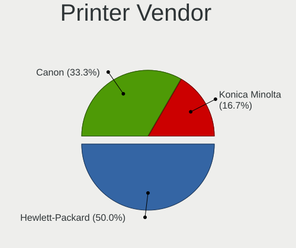

| Vendor          | Desktops | Percent |
|-----------------|----------|---------|
| Hewlett-Packard | 3        | 50%     |
| Canon           | 2        | 33.33%  |
| Konica Minolta  | 1        | 16.67%  |

Printer Model
-------------

Printer device models

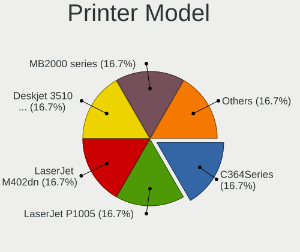

| Model                     | Desktops | Percent |
|---------------------------|----------|---------|
| Konica Minolta C364Series | 1        | 16.67%  |
| HP LaserJet P1005         | 1        | 16.67%  |
| HP LaserJet M402dn        | 1        | 16.67%  |
| HP Deskjet 3510 series    | 1        | 16.67%  |
| Canon MB2000 series       | 1        | 16.67%  |
| Canon LBP6030/6030B/6018L | 1        | 16.67%  |

Scanner Vendor
--------------

Scanner device vendors

Zero info for selected period =(

Scanner Model
-------------

Scanner device models

Zero info for selected period =(

Camera
------

Camera Vendor
-------------

Camera device vendors

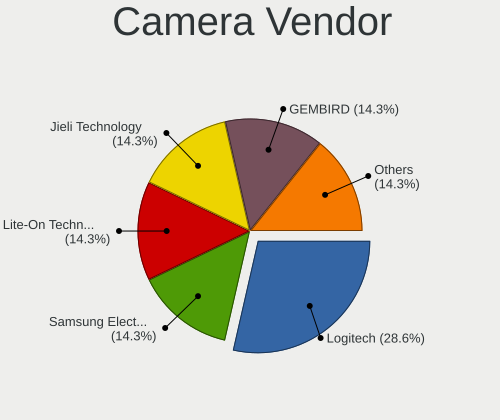

| Vendor              | Desktops | Percent |
|---------------------|----------|---------|
| Logitech            | 2        | 28.57%  |
| Samsung Electronics | 1        | 14.29%  |
| Lite-On Technology  | 1        | 14.29%  |
| Jieli Technology    | 1        | 14.29%  |
| GEMBIRD             | 1        | 14.29%  |
| Chicony Electronics | 1        | 14.29%  |

Camera Model
------------

Camera device models

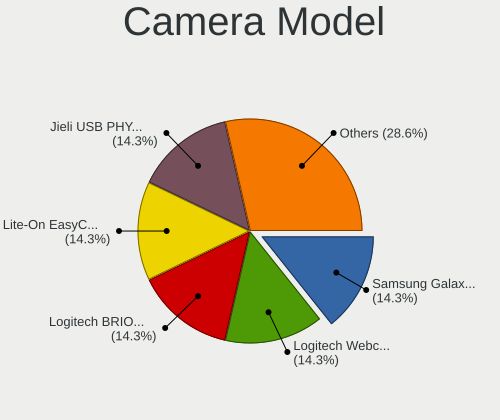

| Model                                             | Desktops | Percent |
|---------------------------------------------------|----------|---------|
| Samsung Galaxy series, misc. (MTP mode)           | 1        | 14.29%  |
| Logitech Webcam C270                              | 1        | 14.29%  |
| Logitech BRIO 4K Stream Edition                   | 1        | 14.29%  |
| Lite-On EasyCamera 5M                             | 1        | 14.29%  |
| Jieli USB PHY 2.0                                 | 1        | 14.29%  |
| GEMBIRD Generic UVC 1.00 camera [AppoTech AX2311] | 1        | 14.29%  |
| Chicony HP Webcam                                 | 1        | 14.29%  |

Security
--------

Fingerprint Vendor
------------------

Fingerprint sensor vendors

Zero info for selected period =(

Fingerprint Model
-----------------

Fingerprint sensor models

Zero info for selected period =(

Chipcard Vendor
---------------

Chipcard module vendors

Zero info for selected period =(

Chipcard Model
--------------

Chipcard module models

Zero info for selected period =(

Unsupported
-----------

Unsupported Devices
-------------------

Total unsupported devices on board

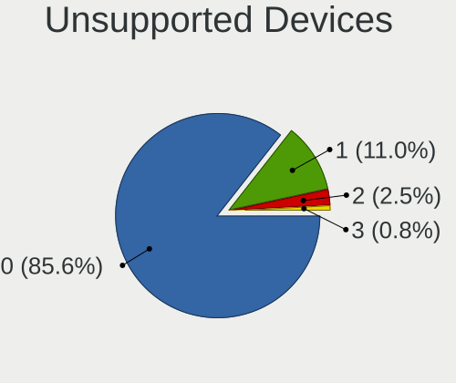

| Total | Desktops | Percent |
|-------|----------|---------|
| 0     | 101      | 85.59%  |
| 1     | 13       | 11.02%  |
| 2     | 3        | 2.54%   |
| 3     | 1        | 0.85%   |

Unsupported Device Types
------------------------

Types of unsupported devices

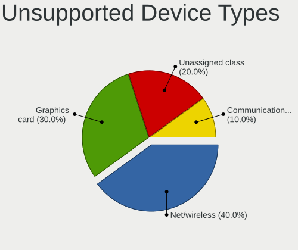

| Type                     | Desktops | Percent |
|--------------------------|----------|---------|
| Graphics card            | 8        | 40%     |
| Net/wireless             | 6        | 30%     |
| Unassigned class         | 3        | 15%     |
| Communication controller | 3        | 15%     |

