Linux in Morocco - Tested Hardware & Statistics (Desktops)
----------------------------------------------------------

A project to collect tested hardware configurations for Linux in Morocco.

Anyone can contribute to this report by the [hw-probe](https://github.com/linuxhw/hw-probe) tool:

    sudo -E hw-probe -all -upload

Please contribute! Especially if your hardware is rare.

Contents
--------

* [ Test Cases ](#test-cases)

* [ System ](#system)
  - [ OS                       ](#os)
  - [ OS Family                ](#os-family)
  - [ Kernel                   ](#kernel)
  - [ Kernel Family            ](#kernel-family)
  - [ Kernel Major Ver.        ](#kernel-major-ver)
  - [ Arch                     ](#arch)
  - [ DE                       ](#de)
  - [ Display Server           ](#display-server)
  - [ Display Manager          ](#display-manager)
  - [ OS Lang                  ](#os-lang)
  - [ Boot Mode                ](#boot-mode)
  - [ Filesystem               ](#filesystem)
  - [ Part. scheme             ](#part-scheme)
  - [ Dual Boot with Linux/BSD ](#dual-boot-with-linuxbsd)
  - [ Dual Boot (Win)          ](#dual-boot-win)

* [ Board ](#board)
  - [ Vendor                   ](#vendor)
  - [ Model                    ](#model)
  - [ Model Family             ](#model-family)
  - [ MFG Year                 ](#mfg-year)
  - [ Form Factor              ](#form-factor)
  - [ Secure Boot              ](#secure-boot)
  - [ Coreboot                 ](#coreboot)
  - [ RAM Size                 ](#ram-size)
  - [ RAM Used                 ](#ram-used)
  - [ Total Drives             ](#total-drives)
  - [ Has CD-ROM               ](#has-cd-rom)
  - [ Has Ethernet             ](#has-ethernet)
  - [ Has WiFi                 ](#has-wifi)
  - [ Has Bluetooth            ](#has-bluetooth)

* [ Location ](#location)
  - [ Country                  ](#country)
  - [ City                     ](#city)

* [ Drives ](#drives)
  - [ Drive Vendor             ](#drive-vendor)
  - [ Drive Model              ](#drive-model)
  - [ HDD Vendor               ](#hdd-vendor)
  - [ SSD Vendor               ](#ssd-vendor)
  - [ Drive Kind               ](#drive-kind)
  - [ Drive Connector          ](#drive-connector)
  - [ Drive Size               ](#drive-size)
  - [ Space Total              ](#space-total)
  - [ Space Used               ](#space-used)
  - [ Malfunc. Drives          ](#malfunc-drives)
  - [ Malfunc. Drive Vendor    ](#malfunc-drive-vendor)
  - [ Malfunc. HDD Vendor      ](#malfunc-hdd-vendor)
  - [ Malfunc. Drive Kind      ](#malfunc-drive-kind)
  - [ Failed Drives            ](#failed-drives)
  - [ Failed Drive Vendor      ](#failed-drive-vendor)
  - [ Drive Status             ](#drive-status)

* [ Storage controller ](#storage-controller)
  - [ Storage Vendor           ](#storage-vendor)
  - [ Storage Model            ](#storage-model)
  - [ Storage Kind             ](#storage-kind)

* [ Processor ](#processor)
  - [ CPU Vendor               ](#cpu-vendor)
  - [ CPU Model                ](#cpu-model)
  - [ CPU Model Family         ](#cpu-model-family)
  - [ CPU Cores                ](#cpu-cores)
  - [ CPU Sockets              ](#cpu-sockets)
  - [ CPU Threads              ](#cpu-threads)
  - [ CPU Op-Modes             ](#cpu-op-modes)
  - [ CPU Microcode            ](#cpu-microcode)
  - [ CPU Microarch            ](#cpu-microarch)

* [ Graphics ](#graphics)
  - [ GPU Vendor               ](#gpu-vendor)
  - [ GPU Model                ](#gpu-model)
  - [ GPU Combo                ](#gpu-combo)
  - [ GPU Driver               ](#gpu-driver)
  - [ GPU Memory               ](#gpu-memory)

* [ Monitor ](#monitor)
  - [ Monitor Vendor           ](#monitor-vendor)
  - [ Monitor Model            ](#monitor-model)
  - [ Monitor Resolution       ](#monitor-resolution)
  - [ Monitor Diagonal         ](#monitor-diagonal)
  - [ Monitor Width            ](#monitor-width)
  - [ Aspect Ratio             ](#aspect-ratio)
  - [ Monitor Area             ](#monitor-area)
  - [ Pixel Density            ](#pixel-density)
  - [ Multiple Monitors        ](#multiple-monitors)

* [ Network ](#network)
  - [ Net Controller Vendor    ](#net-controller-vendor)
  - [ Net Controller Model     ](#net-controller-model)
  - [ Wireless Vendor          ](#wireless-vendor)
  - [ Wireless Model           ](#wireless-model)
  - [ Ethernet Vendor          ](#ethernet-vendor)
  - [ Ethernet Model           ](#ethernet-model)
  - [ Net Controller Kind      ](#net-controller-kind)
  - [ Used Controller          ](#used-controller)
  - [ NICs                     ](#nics)
  - [ IPv6                     ](#ipv6)

* [ Bluetooth ](#bluetooth)
  - [ Bluetooth Vendor         ](#bluetooth-vendor)
  - [ Bluetooth Model          ](#bluetooth-model)

* [ Sound ](#sound)
  - [ Sound Vendor             ](#sound-vendor)
  - [ Sound Model              ](#sound-model)

* [ Memory ](#memory)
  - [ Memory Vendor            ](#memory-vendor)
  - [ Memory Model             ](#memory-model)
  - [ Memory Kind              ](#memory-kind)
  - [ Memory Form Factor       ](#memory-form-factor)
  - [ Memory Size              ](#memory-size)
  - [ Memory Speed             ](#memory-speed)

* [ Printers & scanners ](#printers--scanners)
  - [ Printer Vendor           ](#printer-vendor)
  - [ Printer Model            ](#printer-model)
  - [ Scanner Vendor           ](#scanner-vendor)
  - [ Scanner Model            ](#scanner-model)

* [ Camera ](#camera)
  - [ Camera Vendor            ](#camera-vendor)
  - [ Camera Model             ](#camera-model)

* [ Security ](#security)
  - [ Fingerprint Vendor       ](#fingerprint-vendor)
  - [ Fingerprint Model        ](#fingerprint-model)
  - [ Chipcard Vendor          ](#chipcard-vendor)
  - [ Chipcard Model           ](#chipcard-model)

* [ Unsupported ](#unsupported)
  - [ Unsupported Devices      ](#unsupported-devices)
  - [ Unsupported Device Types ](#unsupported-device-types)

Test Cases
----------

Total: 71

| Vendor        | Model                       | Probe                                                      | Date         |
|---------------|-----------------------------|------------------------------------------------------------|--------------|
| HP            | 2AA2                        | [36f40353c8](https://linux-hardware.org/?probe=36f40353c8) | Oct 25, 2022 |
| HP            | 1497                        | [17a2f79f3f](https://linux-hardware.org/?probe=17a2f79f3f) | Oct 04, 2022 |
| HP            | 1497                        | [fab365512a](https://linux-hardware.org/?probe=fab365512a) | Oct 04, 2022 |
| HP            | 1497                        | [86ab60b437](https://linux-hardware.org/?probe=86ab60b437) | Sep 30, 2022 |
| ASUSTek       | ROG CROSSHAIR VIII FORMU... | [805d4161a8](https://linux-hardware.org/?probe=805d4161a8) | Sep 15, 2022 |
| Lenovo        | SHARKBAY 0C48431 WIN        | [4598920e84](https://linux-hardware.org/?probe=4598920e84) | Sep 13, 2022 |
| HP            | 18E4                        | [2c113164fd](https://linux-hardware.org/?probe=2c113164fd) | Sep 05, 2022 |
| ASRock        | A320M-HDV R4.0              | [3cca56dc74](https://linux-hardware.org/?probe=3cca56dc74) | Aug 22, 2022 |
| HP            | 198E                        | [4327be921d](https://linux-hardware.org/?probe=4327be921d) | Aug 06, 2022 |
| HP            | 198E                        | [284e29b3ea](https://linux-hardware.org/?probe=284e29b3ea) | Aug 06, 2022 |
| ASUSTek       | WS X299 SAGE                | [acb31e0818](https://linux-hardware.org/?probe=acb31e0818) | Jul 18, 2022 |
| Dell          | 0KJCC5 A00                  | [334e57a8b2](https://linux-hardware.org/?probe=334e57a8b2) | Jun 14, 2022 |
| ECS           | Nettle2                     | [4939d60e6d](https://linux-hardware.org/?probe=4939d60e6d) | Mar 27, 2022 |
| HP            | 18E4                        | [e7d597600e](https://linux-hardware.org/?probe=e7d597600e) | Feb 25, 2022 |
| HP            | 3396                        | [e9486b13b8](https://linux-hardware.org/?probe=e9486b13b8) | Jan 20, 2022 |
| HP            | 1589                        | [402f1722ab](https://linux-hardware.org/?probe=402f1722ab) | Jan 09, 2022 |
| HP            | 8054                        | [13d18f87fe](https://linux-hardware.org/?probe=13d18f87fe) | Dec 30, 2021 |
| HP            | 8054                        | [fcf6deb221](https://linux-hardware.org/?probe=fcf6deb221) | Dec 30, 2021 |
| HP            | 1998                        | [f8e644ed15](https://linux-hardware.org/?probe=f8e644ed15) | Dec 23, 2021 |
| HP            | 090Ch                       | [bf92e3c728](https://linux-hardware.org/?probe=bf92e3c728) | Dec 22, 2021 |
| HP            | 1998                        | [ffa6c0b239](https://linux-hardware.org/?probe=ffa6c0b239) | Dec 01, 2021 |
| Dell          | 0MWYPT A01                  | [63385716b2](https://linux-hardware.org/?probe=63385716b2) | Nov 19, 2021 |
| ASUSTek       | ROG STRIX B450-F GAMING     | [f8670ddd99](https://linux-hardware.org/?probe=f8670ddd99) | Nov 18, 2021 |
| ASUSTek       | ROG STRIX B450-F GAMING     | [b4fb9ffc24](https://linux-hardware.org/?probe=b4fb9ffc24) | Nov 18, 2021 |
| ASUSTek       | Acacia                      | [acb0ed7655](https://linux-hardware.org/?probe=acb0ed7655) | Nov 16, 2021 |
| HP            | 1589                        | [789cbfc3fa](https://linux-hardware.org/?probe=789cbfc3fa) | Nov 10, 2021 |
| Pegatron      | 2AD5                        | [70ae8e4cdf](https://linux-hardware.org/?probe=70ae8e4cdf) | Oct 30, 2021 |
| HP            | 18E7                        | [94c750ba4b](https://linux-hardware.org/?probe=94c750ba4b) | Oct 23, 2021 |
| American M... | K7S41GX                     | [b5f8d33cc4](https://linux-hardware.org/?probe=b5f8d33cc4) | Oct 20, 2021 |
| American M... | K7S41GX                     | [920a47f107](https://linux-hardware.org/?probe=920a47f107) | Oct 20, 2021 |
| HP            | 3032h                       | [6914386d3d](https://linux-hardware.org/?probe=6914386d3d) | Oct 19, 2021 |
| HP            | 1589                        | [bb8d8d60cf](https://linux-hardware.org/?probe=bb8d8d60cf) | Oct 10, 2021 |
| Dell          | 0J3C2F A00                  | [565fbea977](https://linux-hardware.org/?probe=565fbea977) | Oct 10, 2021 |
| Foxconn       | 2ABF                        | [92bc4bf86c](https://linux-hardware.org/?probe=92bc4bf86c) | Oct 04, 2021 |
| HP            | 18E7                        | [e1aa6d3e49](https://linux-hardware.org/?probe=e1aa6d3e49) | Sep 19, 2021 |
| HP            | 0AACh                       | [588b35da24](https://linux-hardware.org/?probe=588b35da24) | Aug 21, 2021 |
| Lenovo        | SHARKBAY NOK                | [f0faf00d2f](https://linux-hardware.org/?probe=f0faf00d2f) | Aug 09, 2021 |
| Dell          | 0NX0PH A01                  | [8416267437](https://linux-hardware.org/?probe=8416267437) | Aug 09, 2021 |
| HP            | 339A                        | [7ea04a15cb](https://linux-hardware.org/?probe=7ea04a15cb) | Jul 18, 2021 |
| HP            | 339A                        | [31018180f8](https://linux-hardware.org/?probe=31018180f8) | Jul 16, 2021 |
| Foxconn       | 2ABF                        | [77e63e8902](https://linux-hardware.org/?probe=77e63e8902) | Jul 06, 2021 |
| HP            | 3396                        | [28e2f6399c](https://linux-hardware.org/?probe=28e2f6399c) | Jul 05, 2021 |
| Dell          | 0KC9NP A01                  | [513f79e441](https://linux-hardware.org/?probe=513f79e441) | May 26, 2021 |
| HP            | 0AACh                       | [92920ff59a](https://linux-hardware.org/?probe=92920ff59a) | May 26, 2021 |
| MSI           | 2A9C                        | [db1be00449](https://linux-hardware.org/?probe=db1be00449) | May 02, 2021 |
| Foxconn       | 2ACA                        | [04556ec49b](https://linux-hardware.org/?probe=04556ec49b) | Mar 26, 2021 |
| Gigabyte      | X570 AORUS MASTER           | [7a6947637a](https://linux-hardware.org/?probe=7a6947637a) | Mar 16, 2021 |
| Gigabyte      | X570 AORUS MASTER           | [635fc4a0a2](https://linux-hardware.org/?probe=635fc4a0a2) | Mar 16, 2021 |
| Gigabyte      | X570 AORUS MASTER           | [6bccb5f740](https://linux-hardware.org/?probe=6bccb5f740) | Mar 15, 2021 |
| Dell          | 0MWYPT A01                  | [1c76380527](https://linux-hardware.org/?probe=1c76380527) | Mar 06, 2021 |
| HP            | 1495                        | [ca9664aff0](https://linux-hardware.org/?probe=ca9664aff0) | Mar 05, 2021 |
| Lenovo        | 3106 SDK0J40697 WIN 3305... | [ab67b7aab9](https://linux-hardware.org/?probe=ab67b7aab9) | Feb 22, 2021 |
| Dell          | 0M863N A01                  | [c10de13cf0](https://linux-hardware.org/?probe=c10de13cf0) | Feb 05, 2021 |
| ASUSTek       | ROG CROSSHAIR VIII IMPAC... | [7861f8622e](https://linux-hardware.org/?probe=7861f8622e) | Feb 01, 2021 |
| ASUSTek       | Crosshair IV Formula        | [3475dcd9b6](https://linux-hardware.org/?probe=3475dcd9b6) | Jan 17, 2021 |
| ASUSTek       | ROG CROSSHAIR VIII IMPAC... | [8d7a3472b3](https://linux-hardware.org/?probe=8d7a3472b3) | Jan 16, 2021 |
| HP            | 158A                        | [afd1e7439b](https://linux-hardware.org/?probe=afd1e7439b) | Dec 28, 2020 |
| ASUSTek       | Crosshair IV Formula        | [4a4ce9f5d2](https://linux-hardware.org/?probe=4a4ce9f5d2) | Dec 25, 2020 |
| HP            | 304Ah                       | [d5f7af2482](https://linux-hardware.org/?probe=d5f7af2482) | Nov 23, 2020 |
| ASUSTek       | Z170 PRO GAMING             | [193c57b056](https://linux-hardware.org/?probe=193c57b056) | Nov 10, 2020 |
| Dell          | 0MWYPT A01                  | [3134def56f](https://linux-hardware.org/?probe=3134def56f) | Oct 11, 2020 |
| HP            | 3398                        | [6b7ea8d306](https://linux-hardware.org/?probe=6b7ea8d306) | Aug 27, 2020 |
| HP            | 3397                        | [de9945e027](https://linux-hardware.org/?probe=de9945e027) | Jun 30, 2020 |
| HP            | 0A04h                       | [c0b180275b](https://linux-hardware.org/?probe=c0b180275b) | May 05, 2020 |
| HP            | 0A04h                       | [bb34c7e807](https://linux-hardware.org/?probe=bb34c7e807) | May 05, 2020 |
| HP            | 3397                        | [37ddb2349c](https://linux-hardware.org/?probe=37ddb2349c) | Mar 20, 2020 |
| HP            | 1494                        | [af749848e8](https://linux-hardware.org/?probe=af749848e8) | Nov 23, 2019 |
| Dell          | 0D28YY A03                  | [0be7a39100](https://linux-hardware.org/?probe=0be7a39100) | Jul 14, 2019 |
| Lenovo        | MAHOBAY NO DPK              | [730a048dd9](https://linux-hardware.org/?probe=730a048dd9) | Dec 20, 2018 |
| Lenovo        | MAHOBAY NO DPK              | [36a6a5ce8c](https://linux-hardware.org/?probe=36a6a5ce8c) | Dec 20, 2018 |
| Dell          | 0DR845                      | [3e45e16507](https://linux-hardware.org/?probe=3e45e16507) | Sep 23, 2017 |

System
------

OS
--

Installed operating systems

| Name               | Desktops | Percent |
|--------------------|----------|---------|
| Ubuntu 20.04       | 8        | 14.04%  |
| OpenMandriva 4.50  | 5        | 8.77%   |
| OpenMandriva 4.2   | 5        | 8.77%   |
| Ubuntu 18.04       | 4        | 7.02%   |
| Fedora 33          | 4        | 7.02%   |
| Ubuntu 22.04       | 3        | 5.26%   |
| Debian 11          | 3        | 5.26%   |
| Linux Mint 21      | 2        | 3.51%   |
| Zorin 15           | 1        | 1.75%   |
| Xubuntu 18.04      | 1        | 1.75%   |
| Ubuntu Unity 16.04 | 1        | 1.75%   |
| Ubuntu 20.10       | 1        | 1.75%   |
| Ubuntu 16.04       | 1        | 1.75%   |
| ROSA R8.1          | 1        | 1.75%   |
| Pop!_OS 21.04      | 1        | 1.75%   |
| Pop!_OS 20.10      | 1        | 1.75%   |
| Pear OS 21.04      | 1        | 1.75%   |
| Parrot 5.0         | 1        | 1.75%   |
| OpenMandriva 4.3   | 1        | 1.75%   |
| Manjaro 21.0.7     | 1        | 1.75%   |
| Lubuntu 18.04      | 1        | 1.75%   |
| Linux Mint 20.3    | 1        | 1.75%   |
| Linux Mint 20.2    | 1        | 1.75%   |
| Linux Mint 19.3    | 1        | 1.75%   |
| KDE neon 20.04     | 1        | 1.75%   |
| Kali 2021.4        | 1        | 1.75%   |
| Debian Unstable    | 1        | 1.75%   |
| Debian Testing     | 1        | 1.75%   |
| Debian 10          | 1        | 1.75%   |
| BlackPanther 18.1  | 1        | 1.75%   |
| ArcoLinux Rolling  | 1        | 1.75%   |

OS Family
---------

OS without a version

| Name         | Desktops | Percent |
|--------------|----------|---------|
| Ubuntu       | 17       | 30.91%  |
| OpenMandriva | 11       | 20%     |
| Linux Mint   | 5        | 9.09%   |
| Fedora       | 4        | 7.27%   |
| Debian       | 4        | 7.27%   |
| Pop!_OS      | 2        | 3.64%   |
| Zorin        | 1        | 1.82%   |
| Xubuntu      | 1        | 1.82%   |
| Ubuntu Unity | 1        | 1.82%   |
| ROSA         | 1        | 1.82%   |
| Pear OS      | 1        | 1.82%   |
| Parrot       | 1        | 1.82%   |
| Manjaro      | 1        | 1.82%   |
| Lubuntu      | 1        | 1.82%   |
| KDE neon     | 1        | 1.82%   |
| Kali         | 1        | 1.82%   |
| BlackPanther | 1        | 1.82%   |
| ArcoLinux    | 1        | 1.82%   |

Kernel
------

Version of the Linux kernel

| Version                  | Desktops | Percent |
|--------------------------|----------|---------|
| 5.10.14-desktop-1omv4002 | 5        | 8.2%    |
| 5.12.4-desktop-1omv4050  | 4        | 6.56%   |
| 5.15.0-41-generic        | 2        | 3.28%   |
| 5.8.18-300.fc33.x86_64   | 1        | 1.64%   |
| 5.8.0-7642-generic       | 1        | 1.64%   |
| 5.8.0-59-generic         | 1        | 1.64%   |
| 5.8.0-38-generic         | 1        | 1.64%   |
| 5.8.0-29-generic         | 1        | 1.64%   |
| 5.6.14-desktop-2bP       | 1        | 1.64%   |
| 5.4.0-90-generic         | 1        | 1.64%   |
| 5.4.0-74-generic         | 1        | 1.64%   |
| 5.4.0-70-generic         | 1        | 1.64%   |
| 5.4.0-60-generic         | 1        | 1.64%   |
| 5.4.0-59-generic         | 1        | 1.64%   |
| 5.4.0-58-generic         | 1        | 1.64%   |
| 5.4.0-48-generic         | 1        | 1.64%   |
| 5.4.0-42-generic         | 1        | 1.64%   |
| 5.4.0-39-generic         | 1        | 1.64%   |
| 5.3.0-46-generic         | 1        | 1.64%   |
| 5.3.0-42-generic         | 1        | 1.64%   |
| 5.19.5-desktop-1omv4090  | 1        | 1.64%   |
| 5.16.7-desktop-1omv4003  | 1        | 1.64%   |
| 5.15.0-kali2-amd64       | 1        | 1.64%   |
| 5.15.0-52-generic        | 1        | 1.64%   |
| 5.15.0-48-generic        | 1        | 1.64%   |
| 5.15.0-47-generic        | 1        | 1.64%   |
| 5.15.0-46-generic        | 1        | 1.64%   |
| 5.15.0-33-generic        | 1        | 1.64%   |
| 5.15.0-2-amd64           | 1        | 1.64%   |
| 5.14.0-9parrot1-amd64    | 1        | 1.64%   |
| 5.14.0-2-amd64           | 1        | 1.64%   |
| 5.13.0-7620-generic      | 1        | 1.64%   |
| 5.11.8-200.fc33.x86_64   | 1        | 1.64%   |
| 5.11.0-43-generic        | 1        | 1.64%   |
| 5.11.0-37-generic        | 1        | 1.64%   |
| 5.11.0-25-generic        | 1        | 1.64%   |
| 5.10.88-2-lts            | 1        | 1.64%   |
| 5.10.7-200.fc33.x86_64   | 1        | 1.64%   |
| 5.10.42-1-MANJARO        | 1        | 1.64%   |
| 5.10.15-200.fc33.x86_64  | 1        | 1.64%   |

Kernel Family
-------------

Linux kernel without a distro release

| Version | Desktops | Percent |
|---------|----------|---------|
| 5.15.0  | 9        | 15.25%  |
| 5.4.0   | 7        | 11.86%  |
| 5.10.14 | 5        | 8.47%   |
| 4.15.0  | 5        | 8.47%   |
| 5.8.0   | 4        | 6.78%   |
| 5.12.4  | 4        | 6.78%   |
| 5.10.0  | 4        | 6.78%   |
| 5.11.0  | 3        | 5.08%   |
| 5.3.0   | 2        | 3.39%   |
| 5.14.0  | 2        | 3.39%   |
| 5.8.18  | 1        | 1.69%   |
| 5.6.14  | 1        | 1.69%   |
| 5.19.5  | 1        | 1.69%   |
| 5.16.7  | 1        | 1.69%   |
| 5.13.0  | 1        | 1.69%   |
| 5.11.8  | 1        | 1.69%   |
| 5.10.88 | 1        | 1.69%   |
| 5.10.7  | 1        | 1.69%   |
| 5.10.42 | 1        | 1.69%   |
| 5.10.15 | 1        | 1.69%   |
| 5.10.11 | 1        | 1.69%   |
| 4.9.41  | 1        | 1.69%   |
| 4.19.0  | 1        | 1.69%   |
| 4.18.0  | 1        | 1.69%   |

Kernel Major Ver.
-----------------

Linux kernel major version

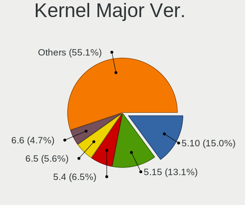

| Version | Desktops | Percent |
|---------|----------|---------|
| 5.10    | 13       | 22.41%  |
| 5.15    | 9        | 15.52%  |
| 5.4     | 7        | 12.07%  |
| 5.8     | 5        | 8.62%   |
| 4.15    | 5        | 8.62%   |
| 5.12    | 4        | 6.9%    |
| 5.11    | 4        | 6.9%    |
| 5.3     | 2        | 3.45%   |
| 5.14    | 2        | 3.45%   |
| 5.6     | 1        | 1.72%   |
| 5.19    | 1        | 1.72%   |
| 5.16    | 1        | 1.72%   |
| 5.13    | 1        | 1.72%   |
| 4.9     | 1        | 1.72%   |
| 4.19    | 1        | 1.72%   |
| 4.18    | 1        | 1.72%   |

Arch
----

OS architecture (x86_64, i586, etc.)

| Name   | Desktops | Percent |
|--------|----------|---------|
| x86_64 | 52       | 94.55%  |
| i686   | 3        | 5.45%   |

DE
--

Desktop Environment

| Name       | Desktops | Percent |
|------------|----------|---------|
| GNOME      | 24       | 42.11%  |
| KDE5       | 14       | 24.56%  |
| XFCE       | 3        | 5.26%   |
| X-Cinnamon | 3        | 5.26%   |
| Unknown    | 3        | 5.26%   |
| MATE       | 2        | 3.51%   |
| LXDE       | 2        | 3.51%   |
| KDE        | 2        | 3.51%   |
| Unity      | 1        | 1.75%   |
| qtile      | 1        | 1.75%   |
| KDE4       | 1        | 1.75%   |
| Cinnamon   | 1        | 1.75%   |

Display Server
--------------

X11 or Wayland

| Name    | Desktops | Percent |
|---------|----------|---------|
| X11     | 46       | 83.64%  |
| Wayland | 6        | 10.91%  |
| Tty     | 2        | 3.64%   |
| Unknown | 1        | 1.82%   |

Display Manager
---------------

SDDM, LightDM, etc.

| Name    | Desktops | Percent |
|---------|----------|---------|
| Unknown | 20       | 35.09%  |
| SDDM    | 14       | 24.56%  |
| LightDM | 10       | 17.54%  |
| GDM3    | 6        | 10.53%  |
| GDM     | 5        | 8.77%   |
| TDM     | 1        | 1.75%   |
| KDM     | 1        | 1.75%   |

OS Lang
-------

Language

| Lang    | Desktops | Percent |
|---------|----------|---------|
| en_US   | 26       | 47.27%  |
| fr_FR   | 18       | 32.73%  |
| Unknown | 5        | 9.09%   |
| en_GB   | 2        | 3.64%   |
| C       | 2        | 3.64%   |
| fr_CH   | 1        | 1.82%   |
| ar_MA   | 1        | 1.82%   |

Boot Mode
---------

EFI or BIOS

| Mode | Desktops | Percent |
|------|----------|---------|
| BIOS | 32       | 58.18%  |
| EFI  | 23       | 41.82%  |

Filesystem
----------

Type of filesystem

| Type    | Desktops | Percent |
|---------|----------|---------|
| Ext4    | 36       | 66.67%  |
| Overlay | 12       | 22.22%  |
| Btrfs   | 4        | 7.41%   |
| Unknown | 2        | 3.7%    |

Part. scheme
------------

Scheme of partitioning

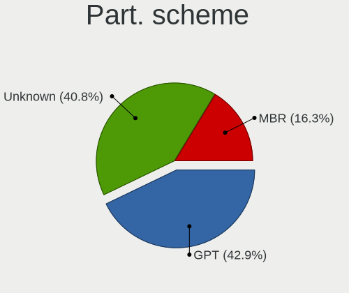

| Type    | Desktops | Percent |
|---------|----------|---------|
| Unknown | 25       | 46.3%   |
| GPT     | 18       | 33.33%  |
| MBR     | 11       | 20.37%  |

Dual Boot with Linux/BSD
------------------------

Hosting more than one Linux/BSD

| Dual boot | Desktops | Percent |
|-----------|----------|---------|
| No        | 43       | 78.18%  |
| Yes       | 12       | 21.82%  |

Dual Boot (Win)
---------------

Hosting Linux and Windows

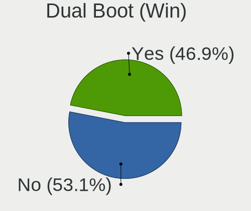

| Dual boot | Desktops | Percent |
|-----------|----------|---------|
| Yes       | 32       | 58.18%  |
| No        | 23       | 41.82%  |

Board
-----

Vendor
------

Motherboard manufacturer

| Name                | Desktops | Percent |
|---------------------|----------|---------|
| Hewlett-Packard     | 26       | 48.15%  |
| Dell                | 8        | 14.81%  |
| ASUSTek Computer    | 7        | 12.96%  |
| Lenovo              | 4        | 7.41%   |
| Foxconn             | 3        | 5.56%   |
| Pegatron            | 1        | 1.85%   |
| MSI                 | 1        | 1.85%   |
| Gigabyte Technology | 1        | 1.85%   |
| ECS                 | 1        | 1.85%   |
| ASRock              | 1        | 1.85%   |
| American Megatrends | 1        | 1.85%   |

Model
-----

Motherboard model

| Name                                   | Desktops | Percent |
|----------------------------------------|----------|---------|
| HP ProDesk 600 G1 TWR                  | 2        | 3.7%    |
| HP EliteDesk 800 G1 TWR                | 2        | 3.7%    |
| HP EliteDesk 800 G1 SFF                | 2        | 3.7%    |
| HP Compaq Elite 8300 SFF               | 2        | 3.7%    |
| HP Compaq Elite 8300 CMT               | 2        | 3.7%    |
| HP Compaq dc7800 Convertible Minitower | 2        | 3.7%    |
| Dell OptiPlex 790                      | 2        | 3.7%    |
| Pegatron h8-1507ef                     | 1        | 1.85%   |
| MSI PPPPP-CCC#MMMMMMMM                 | 1        | 1.85%   |
| Lenovo ThinkCentre M93p 10AAS0R301     | 1        | 1.85%   |
| Lenovo ThinkCentre M910t 10MNS04E4X    | 1        | 1.85%   |
| Lenovo ThinkCentre M72e 3261A85        | 1        | 1.85%   |
| Lenovo SHARKBAY 0C48431 WIN            | 1        | 1.85%   |
| HP Z620 Workstation                    | 1        | 1.85%   |
| HP Z420 Workstation                    | 1        | 1.85%   |
| HP xw6400 Workstation                  | 1        | 1.85%   |
| HP ProDesk 400 G2 MT                   | 1        | 1.85%   |
| HP EliteDesk 800 G2 SFF                | 1        | 1.85%   |
| HP dc5000 SFF(PP682US)                 | 1        | 1.85%   |
| HP Compaq Pro 6300 SFF                 | 1        | 1.85%   |
| HP Compaq Elite 8300 USDT              | 1        | 1.85%   |
| HP Compaq dc7900 Convertible Minitower | 1        | 1.85%   |
| HP Compaq 8200 Elite SFF PC            | 1        | 1.85%   |
| HP Compaq 8200 Elite CMT PC            | 1        | 1.85%   |
| HP Compaq 8100 Elite SFF PC            | 1        | 1.85%   |
| HP Compaq 6200 Pro MT PC               | 1        | 1.85%   |
| HP 200-5111es                          | 1        | 1.85%   |
| Gigabyte X570 AORUS MASTER             | 1        | 1.85%   |
| Foxconn Pro3500 Series                 | 1        | 1.85%   |
| Foxconn p6-2002es                      | 1        | 1.85%   |
| Foxconn CQ1140FRm                      | 1        | 1.85%   |
| ECS GV460AA-ABA a6217c                 | 1        | 1.85%   |
| Dell Vostro 3667                       | 1        | 1.85%   |
| Dell Precision Tower 7810              | 1        | 1.85%   |
| Dell Precision Tower 3620              | 1        | 1.85%   |
| Dell OptiPlex 9020                     | 1        | 1.85%   |
| Dell OptiPlex 760                      | 1        | 1.85%   |
| Dell OptiPlex 755                      | 1        | 1.85%   |
| ASUS Z170 PRO GAMING                   | 1        | 1.85%   |
| ASUS WS X299 SAGE                      | 1        | 1.85%   |

Model Family
------------

Motherboard model prefix

| Name                        | Desktops | Percent |
|-----------------------------|----------|---------|
| HP Compaq                   | 13       | 24.07%  |
| HP EliteDesk                | 5        | 9.26%   |
| Dell OptiPlex               | 5        | 9.26%   |
| Lenovo ThinkCentre          | 3        | 5.56%   |
| HP ProDesk                  | 3        | 5.56%   |
| ASUS ROG                    | 3        | 5.56%   |
| Dell Precision              | 2        | 3.7%    |
| Pegatron h8-1507ef          | 1        | 1.85%   |
| MSI PPPPP-CCC#MMMMMMMM      | 1        | 1.85%   |
| Lenovo SHARKBAY             | 1        | 1.85%   |
| HP Z620                     | 1        | 1.85%   |
| HP Z420                     | 1        | 1.85%   |
| HP xw6400                   | 1        | 1.85%   |
| HP dc5000                   | 1        | 1.85%   |
| HP 200-5111es               | 1        | 1.85%   |
| Gigabyte X570               | 1        | 1.85%   |
| Foxconn Pro3500             | 1        | 1.85%   |
| Foxconn p6-2002es           | 1        | 1.85%   |
| Foxconn CQ1140FRm           | 1        | 1.85%   |
| ECS GV460AA-ABA             | 1        | 1.85%   |
| Dell Vostro                 | 1        | 1.85%   |
| ASUS Z170                   | 1        | 1.85%   |
| ASUS WS                     | 1        | 1.85%   |
| ASUS GV454AA-ABU            | 1        | 1.85%   |
| ASUS Crosshair              | 1        | 1.85%   |
| ASRock A320M-HDV            | 1        | 1.85%   |
| American Megatrends K7S41GX | 1        | 1.85%   |

MFG Year
--------

Motherboard manufacture year

| Year | Desktops | Percent |
|------|----------|---------|
| 2013 | 9        | 16.67%  |
| 2012 | 9        | 16.67%  |
| 2011 | 7        | 12.96%  |
| 2007 | 6        | 11.11%  |
| 2018 | 4        | 7.41%   |
| 2021 | 3        | 5.56%   |
| 2015 | 3        | 5.56%   |
| 2017 | 2        | 3.7%    |
| 2014 | 2        | 3.7%    |
| 2010 | 2        | 3.7%    |
| 2009 | 2        | 3.7%    |
| 2004 | 2        | 3.7%    |
| 2019 | 1        | 1.85%   |
| 2016 | 1        | 1.85%   |
| 2008 | 1        | 1.85%   |

Form Factor
-----------

Physical design of the computer

| Name    | Desktops | Percent |
|---------|----------|---------|
| Desktop | 54       | 100%    |

Secure Boot
-----------

Enabled or disabled

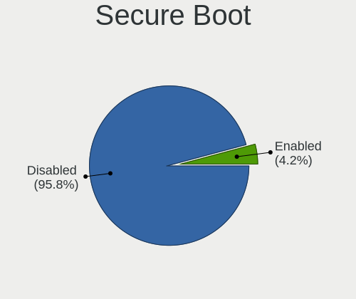

| State    | Desktops | Percent |
|----------|----------|---------|
| Disabled | 52       | 94.55%  |
| Enabled  | 3        | 5.45%   |

Coreboot
--------

Have coreboot on board

| Used | Desktops | Percent |
|------|----------|---------|
| No   | 54       | 100%    |

RAM Size
--------

Total RAM memory

| Size in GB  | Desktops | Percent |
|-------------|----------|---------|
| 4.01-8.0    | 13       | 24.07%  |
| 3.01-4.0    | 13       | 24.07%  |
| 16.01-24.0  | 8        | 14.81%  |
| 8.01-16.0   | 7        | 12.96%  |
| 64.01-256.0 | 5        | 9.26%   |
| 1.01-2.0    | 4        | 7.41%   |
| 24.01-32.0  | 2        | 3.7%    |
| 2.01-3.0    | 2        | 3.7%    |

RAM Used
--------

Used RAM memory

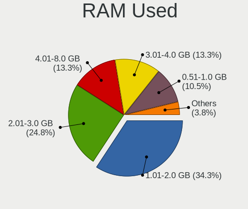

| Used GB  | Desktops | Percent |
|----------|----------|---------|
| 1.01-2.0 | 26       | 44.83%  |
| 2.01-3.0 | 12       | 20.69%  |
| 3.01-4.0 | 7        | 12.07%  |
| 4.01-8.0 | 6        | 10.34%  |
| 0.51-1.0 | 6        | 10.34%  |
| 0.01-0.5 | 1        | 1.72%   |

Total Drives
------------

Number of drives on board

| Drives | Desktops | Percent |
|--------|----------|---------|
| 1      | 32       | 58.18%  |
| 2      | 14       | 25.45%  |
| 3      | 7        | 12.73%  |
| 4      | 2        | 3.64%   |

Has CD-ROM
----------

Has CD-ROM on board

| Presented | Desktops | Percent |
|-----------|----------|---------|
| Yes       | 30       | 55.56%  |
| No        | 24       | 44.44%  |

Has Ethernet
------------

Has Ethernet on board

| Presented | Desktops | Percent |
|-----------|----------|---------|
| Yes       | 54       | 100%    |

Has WiFi
--------

Has WiFi module

| Presented | Desktops | Percent |
|-----------|----------|---------|
| Yes       | 32       | 59.26%  |
| No        | 22       | 40.74%  |

Has Bluetooth
-------------

Has Bluetooth module

| Presented | Desktops | Percent |
|-----------|----------|---------|
| No        | 42       | 77.78%  |
| Yes       | 12       | 22.22%  |

Location
--------

Country
-------

Geographic location (country)

| Country | Desktops | Percent |
|---------|----------|---------|
| Morocco | 54       | 100%    |

City
----

Geographic location (city)

| City          | Desktops | Percent |
|---------------|----------|---------|
| Casablanca    | 18       | 32.14%  |
| Agadir        | 7        | 12.5%   |
| Marrakesh     | 4        | 7.14%   |
| Fes           | 4        | 7.14%   |
| Tangier       | 3        | 5.36%   |
| Salé         | 2        | 3.57%   |
| Meknes        | 2        | 3.57%   |
| Youssoufia    | 1        | 1.79%   |
| Tiznit        | 1        | 1.79%   |
| Tétouan      | 1        | 1.79%   |
| Temara        | 1        | 1.79%   |
| Taza          | 1        | 1.79%   |
| Taounate      | 1        | 1.79%   |
| Skhirate      | 1        | 1.79%   |
| Sidi Lmokhtar | 1        | 1.79%   |
| Safi          | 1        | 1.79%   |
| Rabat         | 1        | 1.79%   |
| Oujda         | 1        | 1.79%   |
| Ouirgane      | 1        | 1.79%   |
| Mohammedia    | 1        | 1.79%   |
| El Jadida     | 1        | 1.79%   |
| Douar Kalaa   | 1        | 1.79%   |
| Berrechid     | 1        | 1.79%   |

Drives
------

Drive Vendor
------------

Hard drive vendors

| Vendor                | Desktops | Drives | Percent |
|-----------------------|----------|--------|---------|
| WDC                   | 16       | 17     | 20.78%  |
| Seagate               | 16       | 23     | 20.78%  |
| Samsung Electronics   | 10       | 16     | 12.99%  |
| Hitachi               | 8        | 10     | 10.39%  |
| Toshiba               | 5        | 9      | 6.49%   |
| Intel                 | 3        | 3      | 3.9%    |
| HGST                  | 3        | 3      | 3.9%    |
| Micron Technology     | 2        | 3      | 2.6%    |
| Fujitsu               | 2        | 2      | 2.6%    |
| Crucial               | 2        | 3      | 2.6%    |
| Realtek Semiconductor | 1        | 1      | 1.3%    |
| PNY                   | 1        | 1      | 1.3%    |
| Phison                | 1        | 2      | 1.3%    |
| Mushkin               | 1        | 1      | 1.3%    |
| Magnetic Data         | 1        | 1      | 1.3%    |
| LITEON                | 1        | 1      | 1.3%    |
| HS-SSD-E100           | 1        | 1      | 1.3%    |
| HPE                   | 1        | 1      | 1.3%    |
| China                 | 1        | 1      | 1.3%    |
| Unknown               | 1        | 1      | 1.3%    |

Drive Model
-----------

Hard drive models

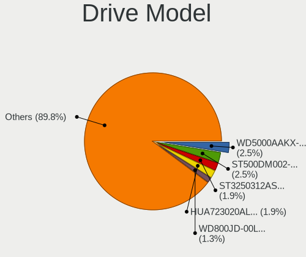

| Model                            | Desktops | Percent |
|----------------------------------|----------|---------|
| Seagate ST500DM002-1BD142 500GB  | 3        | 3.61%   |
| Seagate ST3250312AS 250GB        | 3        | 3.61%   |
| WDC WD800JD-00LSA0 80GB          | 2        | 2.41%   |
| WDC WD5000AAKX-60U6AA0 500GB     | 2        | 2.41%   |
| Intel SSDSC2BF180A4H 180GB       | 2        | 2.41%   |
| Hitachi HDS721680PLA380 80GB     | 2        | 2.41%   |
| WDC WDS120G2G0A-00JH30 120GB SSD | 1        | 1.2%    |
| WDC WD800JD-75MSA3 80GB          | 1        | 1.2%    |
| WDC WD5000BEKT-75KA9T0 500GB     | 1        | 1.2%    |
| WDC WD5000AAKS-65V0A0 500GB      | 1        | 1.2%    |
| WDC WD400BB-60DGA0 40GB          | 1        | 1.2%    |
| WDC WD3200BEKT-60F3T1 320GB      | 1        | 1.2%    |
| WDC WD3200AAJS-65RYA0 320GB      | 1        | 1.2%    |
| WDC WD2500AAKX-603CA0 250GB      | 1        | 1.2%    |
| WDC WD2500AAJS-60Z0A0 250GB      | 1        | 1.2%    |
| WDC WD1600JS-55NCB1 160GB        | 1        | 1.2%    |
| WDC WD1600BEVT-80A23T0 160GB     | 1        | 1.2%    |
| WDC WD1600AAJS-75M0A0 160GB      | 1        | 1.2%    |
| WDC WD1600AAJS-60M0A0 160GB      | 1        | 1.2%    |
| Toshiba MQ02ABF050H 500GB        | 1        | 1.2%    |
| Toshiba MQ01ABD050V -63 500GB    | 1        | 1.2%    |
| Toshiba DT01ACA200 2TB           | 1        | 1.2%    |
| Toshiba DT01ACA100 LENOVO 1TB    | 1        | 1.2%    |
| Toshiba DT01ACA100 1TB           | 1        | 1.2%    |
| Seagate ST9320325AS 320GB        | 1        | 1.2%    |
| Seagate ST500LT012-1DG142 500GB  | 1        | 1.2%    |
| Seagate ST500LM021-1KJ152 500GB  | 1        | 1.2%    |
| Seagate ST500LM000-1EJ162 500GB  | 1        | 1.2%    |
| Seagate ST4000VN008-2DR166 4TB   | 1        | 1.2%    |
| Seagate ST380011A 80GB           | 1        | 1.2%    |
| Seagate ST3500820AS 500GB        | 1        | 1.2%    |
| Seagate ST3500312CS 500GB        | 1        | 1.2%    |
| Seagate ST340016A 40GB           | 1        | 1.2%    |
| Seagate ST3160023AS 160GB        | 1        | 1.2%    |
| Seagate ST250DM000-1BD141 250GB  | 1        | 1.2%    |
| Seagate ST1000DM003-1ER162 1TB   | 1        | 1.2%    |
| Seagate ST1000DM003-1CH162 1TB   | 1        | 1.2%    |
| Samsung SSD 980 1TB              | 1        | 1.2%    |
| Samsung SSD 970 PRO 1TB          | 1        | 1.2%    |
| Samsung SSD 970 EVO Plus 1TB     | 1        | 1.2%    |

HDD Vendor
----------

Hard disk drive vendors

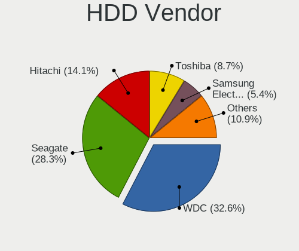

| Vendor              | Desktops | Drives | Percent |
|---------------------|----------|--------|---------|
| Seagate             | 16       | 23     | 29.09%  |
| WDC                 | 15       | 16     | 27.27%  |
| Hitachi             | 8        | 10     | 14.55%  |
| Toshiba             | 5        | 9      | 9.09%   |
| Samsung Electronics | 4        | 7      | 7.27%   |
| HGST                | 3        | 3      | 5.45%   |
| Fujitsu             | 2        | 2      | 3.64%   |
| Magnetic Data       | 1        | 1      | 1.82%   |
| HPE                 | 1        | 1      | 1.82%   |

SSD Vendor
----------

Solid state drive vendors

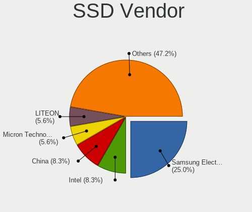

| Vendor              | Desktops | Drives | Percent |
|---------------------|----------|--------|---------|
| Intel               | 3        | 3      | 18.75%  |
| Samsung Electronics | 2        | 4      | 12.5%   |
| Micron Technology   | 2        | 3      | 12.5%   |
| Crucial             | 2        | 3      | 12.5%   |
| WDC                 | 1        | 1      | 6.25%   |
| PNY                 | 1        | 1      | 6.25%   |
| Mushkin             | 1        | 1      | 6.25%   |
| LITEON              | 1        | 1      | 6.25%   |
| HS-SSD-E100         | 1        | 1      | 6.25%   |
| China               | 1        | 1      | 6.25%   |
| Unknown             | 1        | 1      | 6.25%   |

Drive Kind
----------

HDD or SSD

| Kind | Desktops | Drives | Percent |
|------|----------|--------|---------|
| HDD  | 45       | 72     | 70.31%  |
| SSD  | 13       | 20     | 20.31%  |
| NVMe | 6        | 8      | 9.38%   |

Drive Connector
---------------

SATA, SAS, NVMe, etc.

| Type | Desktops | Drives | Percent |
|------|----------|--------|---------|
| SATA | 52       | 90     | 88.14%  |
| NVMe | 6        | 8      | 10.17%  |
| SAS  | 1        | 2      | 1.69%   |

Drive Size
----------

Size of hard drive

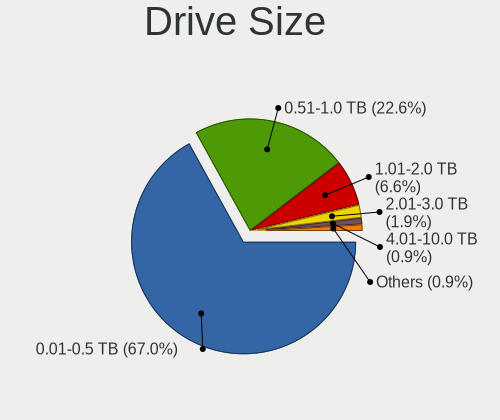

| Size in TB | Desktops | Drives | Percent |
|------------|----------|--------|---------|
| 0.01-0.5   | 44       | 68     | 73.33%  |
| 0.51-1.0   | 11       | 18     | 18.33%  |
| 1.01-2.0   | 3        | 3      | 5%      |
| 3.01-4.0   | 1        | 1      | 1.67%   |
| 2.01-3.0   | 1        | 2      | 1.67%   |

Space Total
-----------

Amount of disk space available on the file system

| Size in GB     | Desktops | Percent |
|----------------|----------|---------|
| 101-250        | 14       | 25%     |
| 251-500        | 11       | 19.64%  |
| 1-20           | 10       | 17.86%  |
| 51-100         | 6        | 10.71%  |
| 21-50          | 4        | 7.14%   |
| 501-1000       | 4        | 7.14%   |
| More than 3000 | 2        | 3.57%   |
| 1001-2000      | 2        | 3.57%   |
| Unknown        | 2        | 3.57%   |
| 2001-3000      | 1        | 1.79%   |

Space Used
----------

Amount of used disk space

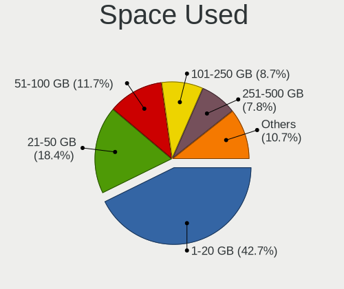

| Used GB        | Desktops | Percent |
|----------------|----------|---------|
| 1-20           | 29       | 49.15%  |
| 51-100         | 8        | 13.56%  |
| 21-50          | 7        | 11.86%  |
| 251-500        | 4        | 6.78%   |
| 101-250        | 4        | 6.78%   |
| 1001-2000      | 2        | 3.39%   |
| Unknown        | 2        | 3.39%   |
| More than 3000 | 1        | 1.69%   |
| 2001-3000      | 1        | 1.69%   |
| 501-1000       | 1        | 1.69%   |

Malfunc. Drives
---------------

Drive models with a malfunction

| Model                             | Desktops | Drives | Percent |
|-----------------------------------|----------|--------|---------|
| Seagate ST500DM002-1BD142 500GB   | 3        | 3      | 25%     |
| Hitachi HDS721680PLA380 80GB      | 2        | 2      | 16.67%  |
| WDC WD2500AAJS-60Z0A0 250GB       | 1        | 1      | 8.33%   |
| Seagate ST500LM021-1KJ152 500GB   | 1        | 1      | 8.33%   |
| Seagate ST340016A 40GB            | 1        | 1      | 8.33%   |
| Seagate ST3250312AS 250GB         | 1        | 1      | 8.33%   |
| Samsung Electronics HD080HJ/ 80GB | 1        | 1      | 8.33%   |
| HPE MM1000GBKAL 1TB               | 1        | 1      | 8.33%   |
| Fujitsu MHX2300BT 304GB           | 1        | 1      | 8.33%   |

Malfunc. Drive Vendor
---------------------

Vendors of faulty drives

| Vendor              | Desktops | Drives | Percent |
|---------------------|----------|--------|---------|
| Seagate             | 6        | 6      | 50%     |
| Hitachi             | 2        | 2      | 16.67%  |
| WDC                 | 1        | 1      | 8.33%   |
| Samsung Electronics | 1        | 1      | 8.33%   |
| HPE                 | 1        | 1      | 8.33%   |
| Fujitsu             | 1        | 1      | 8.33%   |

Malfunc. HDD Vendor
-------------------

Vendors of faulty HDD drives

| Vendor              | Desktops | Drives | Percent |
|---------------------|----------|--------|---------|
| Seagate             | 6        | 6      | 50%     |
| Hitachi             | 2        | 2      | 16.67%  |
| WDC                 | 1        | 1      | 8.33%   |
| Samsung Electronics | 1        | 1      | 8.33%   |
| HPE                 | 1        | 1      | 8.33%   |
| Fujitsu             | 1        | 1      | 8.33%   |

Malfunc. Drive Kind
-------------------

Kinds of faulty drives

| Kind | Desktops | Drives | Percent |
|------|----------|--------|---------|
| HDD  | 12       | 12     | 100%    |

Failed Drives
-------------

Failed drive models

| Model                   | Desktops | Drives | Percent |
|-------------------------|----------|--------|---------|
| WDC WD800JD-00LSA0 80GB | 2        | 2      | 100%    |

Failed Drive Vendor
-------------------

Failed drive vendors

| Vendor | Desktops | Drives | Percent |
|--------|----------|--------|---------|
| WDC    | 2        | 2      | 100%    |

Drive Status
------------

Number of failed and malfunc. drives

| Status   | Desktops | Drives | Percent |
|----------|----------|--------|---------|
| Detected | 26       | 47     | 41.94%  |
| Works    | 22       | 39     | 35.48%  |
| Malfunc  | 12       | 12     | 19.35%  |
| Failed   | 2        | 2      | 3.23%   |

Storage controller
------------------

Storage Vendor
--------------

Storage controller vendors

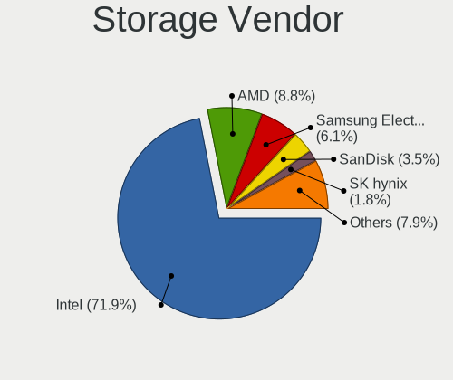

| Vendor                           | Desktops | Percent |
|----------------------------------|----------|---------|
| Intel                            | 44       | 70.97%  |
| AMD                              | 7        | 11.29%  |
| Samsung Electronics              | 4        | 6.45%   |
| Nvidia                           | 2        | 3.23%   |
| Silicon Integrated Systems [SiS] | 1        | 1.61%   |
| Realtek Semiconductor            | 1        | 1.61%   |
| Phison Electronics               | 1        | 1.61%   |
| JMicron Technology               | 1        | 1.61%   |
| Broadcom / LSI                   | 1        | 1.61%   |

Storage Model
-------------

Storage controller models

| Model                                                                                   | Desktops | Percent |
|-----------------------------------------------------------------------------------------|----------|---------|
| Intel 8 Series/C220 Series Chipset Family 6-port SATA Controller 1 [AHCI mode]          | 9        | 10.71%  |
| Intel 7 Series/C210 Series Chipset Family 6-port SATA Controller [AHCI mode]            | 6        | 7.14%   |
| Intel 6 Series/C200 Series Chipset Family 6 port Desktop SATA AHCI Controller           | 5        | 5.95%   |
| Intel SATA Controller [RAID mode]                                                       | 4        | 4.76%   |
| AMD FCH SATA Controller [AHCI mode]                                                     | 4        | 4.76%   |
| Samsung NVMe SSD Controller SM981/PM981/PM983                                           | 3        | 3.57%   |
| Intel Q170/Q150/B150/H170/H110/Z170/CM236 Chipset SATA Controller [AHCI Mode]           | 3        | 3.57%   |
| Intel 6 Series/C200 Series Chipset Family Desktop SATA Controller (IDE mode, ports 4-5) | 3        | 3.57%   |
| Intel 6 Series/C200 Series Chipset Family Desktop SATA Controller (IDE mode, ports 0-3) | 3        | 3.57%   |
| Samsung NVMe SSD Controller SM961/PM961/SM963                                           | 2        | 2.38%   |
| Nvidia MCP61 SATA Controller                                                            | 2        | 2.38%   |
| Nvidia MCP61 IDE                                                                        | 2        | 2.38%   |
| Intel C602 chipset 4-Port SATA Storage Control Unit                                     | 2        | 2.38%   |
| Intel C600/X79 series chipset IDE-r Controller                                          | 2        | 2.38%   |
| Intel 82Q35 Express PT IDER Controller                                                  | 2        | 2.38%   |
| Intel 82801JD/DO (ICH10 Family) SATA AHCI Controller                                    | 2        | 2.38%   |
| Intel 82801IR/IO/IH (ICH9R/DO/DH) 6 port SATA Controller [AHCI mode]                    | 2        | 2.38%   |
| Intel 4 Series Chipset PT IDER Controller                                               | 2        | 2.38%   |
| Silicon Integrated Systems [SiS] 5513 IDE Controller                                    | 1        | 1.19%   |
| Samsung NVMe SSD Controller 980                                                         | 1        | 1.19%   |
| Realtek Realtek Non-Volatile memory controller                                          | 1        | 1.19%   |
| Phison E16 PCIe4 NVMe Controller                                                        | 1        | 1.19%   |
| JMicron JMB363 SATA/IDE Controller                                                      | 1        | 1.19%   |
| Intel C610/X99 series chipset IDE-r Controller                                          | 1        | 1.19%   |
| Intel C600/X79 series chipset SATA RAID Controller                                      | 1        | 1.19%   |
| Intel C600/X79 series chipset 6-Port SATA AHCI Controller                               | 1        | 1.19%   |
| Intel 82801JI (ICH10 Family) SATA AHCI Controller                                       | 1        | 1.19%   |
| Intel 82801IR/IO/IH (ICH9R/DO/DH) 4 port SATA Controller [IDE mode]                     | 1        | 1.19%   |
| Intel 82801I (ICH9 Family) 2 port SATA Controller [IDE mode]                            | 1        | 1.19%   |
| Intel 82801EB/ER (ICH5/ICH5R) IDE Controller                                            | 1        | 1.19%   |
| Intel 7 Series/C210 Series Chipset Family 4-port SATA Controller [IDE mode]             | 1        | 1.19%   |
| Intel 7 Series/C210 Series Chipset Family 2-port SATA Controller [IDE mode]             | 1        | 1.19%   |
| Intel 631xESB/632xESB/3100 Chipset SATA IDE Controller                                  | 1        | 1.19%   |
| Intel 631xESB/632xESB IDE Controller                                                    | 1        | 1.19%   |
| Intel 6 Series/C200 Series Chipset Family IDE-r Controller                              | 1        | 1.19%   |
| Intel 5 Series/3400 Series Chipset 4 port SATA IDE Controller                           | 1        | 1.19%   |
| Intel 5 Series/3400 Series Chipset 2 port SATA IDE Controller                           | 1        | 1.19%   |
| Intel 200 Series PCH SATA controller [AHCI mode]                                        | 1        | 1.19%   |
| Broadcom / LSI SAS2008 PCI-Express Fusion-MPT SAS-2 [Falcon]                            | 1        | 1.19%   |
| AMD SB7x0/SB8x0/SB9x0 SATA Controller [IDE mode]                                        | 1        | 1.19%   |

Storage Kind
------------

Kind of storage controller (IDE, SATA, NVMe, SAS, ...)

| Kind | Desktops | Percent |
|------|----------|---------|
| SATA | 37       | 53.62%  |
| IDE  | 19       | 27.54%  |
| NVMe | 6        | 8.7%    |
| RAID | 5        | 7.25%   |
| SAS  | 2        | 2.9%    |

Processor
---------

CPU Vendor
----------

Processor vendors

| Vendor | Desktops | Percent |
|--------|----------|---------|
| Intel  | 44       | 81.48%  |
| AMD    | 10       | 18.52%  |

CPU Model
---------

Processor models

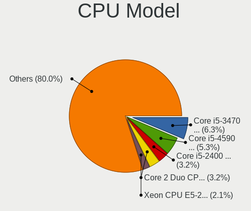

| Model                                       | Desktops | Percent |
|---------------------------------------------|----------|---------|
| Intel Core i5-3470 CPU @ 3.20GHz            | 5        | 9.26%   |
| Intel Core i5-4590 CPU @ 3.30GHz            | 3        | 5.56%   |
| Intel Core i5-3570 CPU @ 3.40GHz            | 2        | 3.7%    |
| Intel Core i5-2400 CPU @ 3.10GHz            | 2        | 3.7%    |
| Intel Xeon CPU E5-2630 v3 @ 2.40GHz         | 1        | 1.85%   |
| Intel Xeon CPU E5-2620 0 @ 2.00GHz          | 1        | 1.85%   |
| Intel Xeon CPU E5-1620 0 @ 3.60GHz          | 1        | 1.85%   |
| Intel Xeon CPU E3-1240 v6 @ 3.70GHz         | 1        | 1.85%   |
| Intel Xeon CPU 5140 @ 2.33GHz               | 1        | 1.85%   |
| Intel Pentium Dual-Core CPU E5400 @ 2.70GHz | 1        | 1.85%   |
| Intel Pentium Dual-Core CPU E5300 @ 2.60GHz | 1        | 1.85%   |
| Intel Pentium Dual CPU E2160 @ 1.80GHz      | 1        | 1.85%   |
| Intel Pentium CPU G3220T @ 2.60GHz          | 1        | 1.85%   |
| Intel Pentium 4 CPU 2.80GHz                 | 1        | 1.85%   |
| Intel Core i9-9920X CPU @ 3.50GHz           | 1        | 1.85%   |
| Intel Core i7-7700 CPU @ 3.60GHz            | 1        | 1.85%   |
| Intel Core i7-6700K CPU @ 4.00GHz           | 1        | 1.85%   |
| Intel Core i7-6700 CPU @ 3.40GHz            | 1        | 1.85%   |
| Intel Core i7-4771 CPU @ 3.50GHz            | 1        | 1.85%   |
| Intel Core i5-4670 CPU @ 3.40GHz            | 1        | 1.85%   |
| Intel Core i5-4590S CPU @ 3.00GHz           | 1        | 1.85%   |
| Intel Core i5-4570 CPU @ 3.20GHz            | 1        | 1.85%   |
| Intel Core i5-3470S CPU @ 2.90GHz           | 1        | 1.85%   |
| Intel Core i5-2500 CPU @ 3.30GHz            | 1        | 1.85%   |
| Intel Core i5-2400S CPU @ 2.50GHz           | 1        | 1.85%   |
| Intel Core i5 CPU 750 @ 2.67GHz             | 1        | 1.85%   |
| Intel Core i5 CPU 650 @ 3.20GHz             | 1        | 1.85%   |
| Intel Core i3-6100 CPU @ 3.70GHz            | 1        | 1.85%   |
| Intel Core i3-4150 CPU @ 3.50GHz            | 1        | 1.85%   |
| Intel Core i3-4130T CPU @ 2.90GHz           | 1        | 1.85%   |
| Intel Core i3-3220 CPU @ 3.30GHz            | 1        | 1.85%   |
| Intel Core i3-2120 CPU @ 3.30GHz            | 1        | 1.85%   |
| Intel Core i3-2100 CPU @ 3.10GHz            | 1        | 1.85%   |
| Intel Core 2 Quad CPU Q6600 @ 2.40GHz       | 1        | 1.85%   |
| Intel Core 2 Duo CPU E7300 @ 2.66GHz        | 1        | 1.85%   |
| Intel Core 2 Duo CPU E6550 @ 2.33GHz        | 1        | 1.85%   |
| AMD Ryzen 9 5900X 12-Core Processor         | 1        | 1.85%   |
| AMD Ryzen 9 3950X 16-Core Processor         | 1        | 1.85%   |
| AMD Ryzen 7 3800X 8-Core Processor          | 1        | 1.85%   |
| AMD Ryzen 5 3600 6-Core Processor           | 1        | 1.85%   |

CPU Model Family
----------------

Processor model prefix

| Model                   | Desktops | Percent |
|-------------------------|----------|---------|
| Intel Core i5           | 20       | 37.04%  |
| Intel Core i3           | 6        | 11.11%  |
| Intel Xeon              | 5        | 9.26%   |
| Intel Core i7           | 4        | 7.41%   |
| Intel Pentium Dual-Core | 2        | 3.7%    |
| Intel Core 2 Duo        | 2        | 3.7%    |
| AMD Ryzen 9             | 2        | 3.7%    |
| AMD Athlon 64 X2        | 2        | 3.7%    |
| Intel Pentium Dual      | 1        | 1.85%   |
| Intel Pentium 4         | 1        | 1.85%   |
| Intel Pentium           | 1        | 1.85%   |
| Intel Core i9           | 1        | 1.85%   |
| Intel Core 2 Quad       | 1        | 1.85%   |
| AMD Ryzen 7             | 1        | 1.85%   |
| AMD Ryzen 5             | 1        | 1.85%   |
| AMD Ryzen 3             | 1        | 1.85%   |
| AMD Phenom II X6        | 1        | 1.85%   |
| AMD E                   | 1        | 1.85%   |
| AMD Athlon XP           | 1        | 1.85%   |

CPU Cores
---------

Number of processor cores

| Number | Desktops | Percent |
|--------|----------|---------|
| 4      | 27       | 50%     |
| 2      | 17       | 31.48%  |
| 12     | 3        | 5.56%   |
| 16     | 2        | 3.7%    |
| 6      | 2        | 3.7%    |
| 1      | 2        | 3.7%    |
| 8      | 1        | 1.85%   |

CPU Sockets
-----------

Number of sockets

| Number | Desktops | Percent |
|--------|----------|---------|
| 1      | 52       | 96.3%   |
| 2      | 2        | 3.7%    |

CPU Threads
-----------

Threads per core (Hyper-Threading)

| Number | Desktops | Percent |
|--------|----------|---------|
| 1      | 34       | 62.96%  |
| 2      | 20       | 37.04%  |

CPU Op-Modes
------------

CPU Operation Modes (32-bit, 64-bit)

| Op mode        | Desktops | Percent |
|----------------|----------|---------|
| 32-bit, 64-bit | 52       | 96.3%   |
| 32-bit         | 2        | 3.7%    |

CPU Microcode
-------------

Microcode number

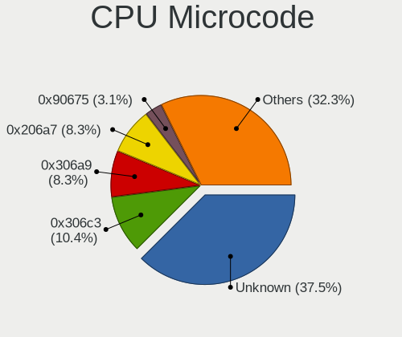

| Number     | Desktops | Percent |
|------------|----------|---------|
| 0x306c3    | 10       | 18.52%  |
| 0x306a9    | 8        | 14.81%  |
| 0x206a7    | 6        | 11.11%  |
| Unknown    | 6        | 11.11%  |
| 0x6fb      | 3        | 5.56%   |
| 0x506e3    | 3        | 5.56%   |
| 0x08701021 | 3        | 5.56%   |
| 0x906e9    | 2        | 3.7%    |
| 0x206d7    | 2        | 3.7%    |
| 0xf29      | 1        | 1.85%   |
| 0x6fd      | 1        | 1.85%   |
| 0x50654    | 1        | 1.85%   |
| 0x306f2    | 1        | 1.85%   |
| 0x106e5    | 1        | 1.85%   |
| 0x1067a    | 1        | 1.85%   |
| 0x10676    | 1        | 1.85%   |
| 0x0a201016 | 1        | 1.85%   |
| 0x08108102 | 1        | 1.85%   |
| 0x05000119 | 1        | 1.85%   |
| 0x010000dc | 1        | 1.85%   |

CPU Microarch
-------------

Microarchitecture

| Name        | Desktops | Percent |
|-------------|----------|---------|
| Haswell     | 11       | 20.37%  |
| IvyBridge   | 9        | 16.67%  |
| SandyBridge | 8        | 14.81%  |
| Skylake     | 4        | 7.41%   |
| Core        | 4        | 7.41%   |
| Zen 2       | 3        | 5.56%   |
| Penryn      | 3        | 5.56%   |
| KabyLake    | 2        | 3.7%    |
| K8 Hammer   | 2        | 3.7%    |
| Zen+        | 1        | 1.85%   |
| Zen 3       | 1        | 1.85%   |
| Westmere    | 1        | 1.85%   |
| NetBurst    | 1        | 1.85%   |
| Nehalem     | 1        | 1.85%   |
| K6          | 1        | 1.85%   |
| K10         | 1        | 1.85%   |
| Bobcat      | 1        | 1.85%   |

Graphics
--------

GPU Vendor
----------

Vendors of graphics cards

| Vendor                           | Desktops | Percent |
|----------------------------------|----------|---------|
| Intel                            | 30       | 54.55%  |
| Nvidia                           | 14       | 25.45%  |
| AMD                              | 10       | 18.18%  |
| Silicon Integrated Systems [SiS] | 1        | 1.82%   |

GPU Model
---------

Graphics card models

| Model                                                                                      | Desktops | Percent |
|--------------------------------------------------------------------------------------------|----------|---------|
| Intel Xeon E3-1200 v3/4th Gen Core Processor Integrated Graphics Controller                | 8        | 14.04%  |
| Intel Xeon E3-1200 v2/3rd Gen Core processor Graphics Controller                           | 5        | 8.77%   |
| Intel 2nd Generation Core Processor Family Integrated Graphics Controller                  | 5        | 8.77%   |
| Nvidia GT218 [GeForce 210]                                                                 | 3        | 5.26%   |
| Intel HD Graphics 530                                                                      | 3        | 5.26%   |
| Intel 4 Series Chipset Integrated Graphics Controller                                      | 3        | 5.26%   |
| Nvidia GM204GL [Quadro M4000]                                                              | 2        | 3.51%   |
| Nvidia GK208B [GeForce GT 710]                                                             | 2        | 3.51%   |
| Nvidia GF119 [GeForce GT 610]                                                              | 2        | 3.51%   |
| Intel 4th Generation Core Processor Family Integrated Graphics Controller                  | 2        | 3.51%   |
| Silicon Integrated Systems [SiS] 661/741/760 PCI/AGP or 662/761Gx PCIE VGA Display Adapter | 1        | 1.75%   |
| Nvidia TU116 [GeForce GTX 1650 SUPER]                                                      | 1        | 1.75%   |
| Nvidia GP107 [GeForce GTX 1050 Ti]                                                         | 1        | 1.75%   |
| Nvidia GK107GL [Quadro K420]                                                               | 1        | 1.75%   |
| Nvidia GA104 [GeForce RTX 3070 Lite Hash Rate]                                             | 1        | 1.75%   |
| Nvidia G72 [GeForce 7500 LE]                                                               | 1        | 1.75%   |
| Nvidia C61 [GeForce 6150SE nForce 430]                                                     | 1        | 1.75%   |
| Intel HD Graphics 630                                                                      | 1        | 1.75%   |
| Intel Core Processor Integrated Graphics Controller                                        | 1        | 1.75%   |
| Intel 82Q35 Express Integrated Graphics Controller                                         | 1        | 1.75%   |
| Intel 82865G Integrated Graphics Controller                                                | 1        | 1.75%   |
| AMD Wrestler [Radeon HD 6320]                                                              | 1        | 1.75%   |
| AMD RV610 [Radeon HD 2400 PRO]                                                             | 1        | 1.75%   |
| AMD RV610 [Radeon HD 2350]                                                                 | 1        | 1.75%   |
| AMD RV380 [Radeon X300/X550/X1050 Series] (Secondary)                                      | 1        | 1.75%   |
| AMD RV370 [Radeon X600/X600 SE]                                                            | 1        | 1.75%   |
| AMD Redwood PRO [Radeon HD 5550/5570/5630/6510/6610/7570]                                  | 1        | 1.75%   |
| AMD Picasso/Raven 2 [Radeon Vega Series / Radeon Vega Mobile Series]                       | 1        | 1.75%   |
| AMD Oland [Radeon HD 8570 / R5 430 OEM / R7 240/340 / Radeon 520 OEM]                      | 1        | 1.75%   |
| AMD Navi 10 [Radeon RX 5600 OEM/5600 XT / 5700/5700 XT]                                    | 1        | 1.75%   |
| AMD Hawaii XT / Grenada XT [Radeon R9 290X/390X]                                           | 1        | 1.75%   |
| AMD Barts XT [Radeon HD 6870]                                                              | 1        | 1.75%   |

GPU Combo
---------

Combinations of graphics cards

| Name       | Desktops | Percent |
|------------|----------|---------|
| 1 x Intel  | 29       | 53.7%   |
| 1 x Nvidia | 13       | 24.07%  |
| 1 x AMD    | 9        | 16.67%  |
| 2 x Nvidia | 1        | 1.85%   |
| 2 x AMD    | 1        | 1.85%   |
| 1 x SiS    | 1        | 1.85%   |

GPU Driver
----------

Free vs proprietary

| Driver      | Desktops | Percent |
|-------------|----------|---------|
| Free        | 46       | 85.19%  |
| Proprietary | 7        | 12.96%  |
| Unknown     | 1        | 1.85%   |

GPU Memory
----------

Total video memory

| Size in GB | Desktops | Percent |
|------------|----------|---------|
| Unknown    | 28       | 50%     |
| 1.01-2.0   | 8        | 14.29%  |
| 0.01-0.5   | 8        | 14.29%  |
| 0.51-1.0   | 6        | 10.71%  |
| 7.01-8.0   | 3        | 5.36%   |
| 3.01-4.0   | 3        | 5.36%   |

Monitor
-------

Monitor Vendor
--------------

Monitor vendors

| Vendor               | Desktops | Percent |
|----------------------|----------|---------|
| Samsung Electronics  | 11       | 23.4%   |
| Dell                 | 11       | 23.4%   |
| Hewlett-Packard      | 8        | 17.02%  |
| Goldstar             | 3        | 6.38%   |
| Acer                 | 3        | 6.38%   |
| Philips              | 2        | 4.26%   |
| Iiyama               | 2        | 4.26%   |
| BenQ                 | 2        | 4.26%   |
| MiTAC                | 1        | 2.13%   |
| Medion               | 1        | 2.13%   |
| Lenovo               | 1        | 2.13%   |
| Fujitsu Siemens      | 1        | 2.13%   |
| Ancor Communications | 1        | 2.13%   |

Monitor Model
-------------

Monitor models

| Model                                                                  | Desktops | Percent |
|------------------------------------------------------------------------|----------|---------|
| Dell E2414H DEL4090 1920x1080 531x299mm 24.0-inch                      | 3        | 6.25%   |
| Samsung Electronics SyncMaster SAM0372 1680x1050 440x300mm 21.0-inch   | 1        | 2.08%   |
| Samsung Electronics SyncMaster SAM027E 1680x1050 474x296mm 22.0-inch   | 1        | 2.08%   |
| Samsung Electronics SyncMaster SAM01B7 1280x1024 338x270mm 17.0-inch   | 1        | 2.08%   |
| Samsung Electronics SyncMaster SAM0161 1280x1024 340x270mm 17.1-inch   | 1        | 2.08%   |
| Samsung Electronics SMBX2440 SAM068A 1920x1080 531x299mm 24.0-inch     | 1        | 2.08%   |
| Samsung Electronics S24C350 SAM0A3A 1920x1080 530x300mm 24.0-inch      | 1        | 2.08%   |
| Samsung Electronics S23B550 SAM0919 1920x1080 510x290mm 23.1-inch      | 1        | 2.08%   |
| Samsung Electronics S22F350 SAM0D1B 1920x1080 477x268mm 21.5-inch      | 1        | 2.08%   |
| Samsung Electronics LCD Monitor SAM0F39 1920x1080 1210x680mm 54.6-inch | 1        | 2.08%   |
| Samsung Electronics LCD Monitor SAM0B7C 1920x1080 890x500mm 40.2-inch  | 1        | 2.08%   |
| Samsung Electronics LCD Monitor SAM0B2A 1280x720 949x543mm 43.0-inch   | 1        | 2.08%   |
| Philips PHL 243V5 PHLC0D1 1920x1080 521x293mm 23.5-inch                | 1        | 2.08%   |
| Philips 170S PHL081E 1280x1024 338x270mm 17.0-inch                     | 1        | 2.08%   |
| MiTAC Mystery TV MTC9527 1920x1080 1150x650mm 52.0-inch                | 1        | 2.08%   |
| Medion MD 20172 MED3628 1680x1050 474x296mm 22.0-inch                  | 1        | 2.08%   |
| Lenovo T24i-10 LEN61A6 1920x1080 527x296mm 23.8-inch                   | 1        | 2.08%   |
| Iiyama PLE2483H IVM6113 1920x1080 530x300mm 24.0-inch                  | 1        | 2.08%   |
| Iiyama PLB2712HDS IVM6602 1920x1080 598x336mm 27.0-inch                | 1        | 2.08%   |
| Hewlett-Packard ZR22w HWP2867 1920x1080 475x267mm 21.5-inch            | 1        | 2.08%   |
| Hewlett-Packard W2072a HWP3000 1600x900 443x249mm 20.0-inch            | 1        | 2.08%   |
| Hewlett-Packard V213a HPN335B 1920x1080 458x258mm 20.7-inch            | 1        | 2.08%   |
| Hewlett-Packard LE1901w HWP2842 1440x900 410x256mm 19.0-inch           | 1        | 2.08%   |
| Hewlett-Packard LCD Monitor HWP4101 1920x1080 470x270mm 21.3-inch      | 1        | 2.08%   |
| Hewlett-Packard LCD Monitor E232 1920x1080                             | 1        | 2.08%   |
| Hewlett-Packard LA2006 HWP2943 1600x900 443x249mm 20.0-inch            | 1        | 2.08%   |
| Hewlett-Packard 25x HPN357E 1920x1080 544x303mm 24.5-inch              | 1        | 2.08%   |
| Goldstar W1942 GSM4B70 1440x900 408x255mm 18.9-inch                    | 1        | 2.08%   |
| Goldstar M2394D GSM56C4 1920x1080 509x286mm 23.0-inch                  | 1        | 2.08%   |
| Goldstar HDR 4K GSM7706 3840x2160 600x340mm 27.2-inch                  | 1        | 2.08%   |
| Fujitsu Siemens B23T-7 LED FUS0857 1920x1080 509x286mm 23.0-inch       | 1        | 2.08%   |
| Dell P2417H DELA0DB 1920x1080 527x296mm 23.8-inch                      | 1        | 2.08%   |
| Dell P2214H DELA097 1920x1080 477x268mm 21.5-inch                      | 1        | 2.08%   |
| Dell LCD Monitor P2417H 1920x1080                                      | 1        | 2.08%   |
| Dell E772p DEL7005 1152x864 300x225mm 14.8-inch                        | 1        | 2.08%   |
| Dell E2014H DELD03B 1600x900 432x240mm 19.5-inch                       | 1        | 2.08%   |
| Dell E198FP DELA028 1280x1024 380x300mm 19.1-inch                      | 1        | 2.08%   |
| Dell E177FP DELA023 1280x1024 338x270mm 17.0-inch                      | 1        | 2.08%   |
| Dell 1908WFP DELF007 1440x900 408x255mm 18.9-inch                      | 1        | 2.08%   |
| Dell 1708FP DEL4024 1280x1024 338x270mm 17.0-inch                      | 1        | 2.08%   |

Monitor Resolution
------------------

Monitor screen resolution

| Resolution         | Desktops | Percent |
|--------------------|----------|---------|
| 1920x1080 (FHD)    | 23       | 50%     |
| 1280x1024 (SXGA)   | 6        | 13.04%  |
| 1680x1050 (WSXGA+) | 4        | 8.7%    |
| 1440x900 (WXGA+)   | 4        | 8.7%    |
| 3840x2160 (4K)     | 3        | 6.52%   |
| 1600x900 (HD+)     | 3        | 6.52%   |
| 1366x768 (WXGA)    | 1        | 2.17%   |
| 1280x720 (HD)      | 1        | 2.17%   |
| 1152x864           | 1        | 2.17%   |

Monitor Diagonal
----------------

Diagonal size in inches

| Inches  | Desktops | Percent |
|---------|----------|---------|
| 24      | 11       | 22.92%  |
| 19      | 5        | 10.42%  |
| 17      | 5        | 10.42%  |
| 27      | 4        | 8.33%   |
| 23      | 4        | 8.33%   |
| 21      | 4        | 8.33%   |
| 22      | 3        | 6.25%   |
| 20      | 3        | 6.25%   |
| Unknown | 2        | 4.17%   |
| 58      | 1        | 2.08%   |
| 54      | 1        | 2.08%   |
| 52      | 1        | 2.08%   |
| 43      | 1        | 2.08%   |
| 18      | 1        | 2.08%   |
| 15      | 1        | 2.08%   |
| 14      | 1        | 2.08%   |

Monitor Width
-------------

Physical width

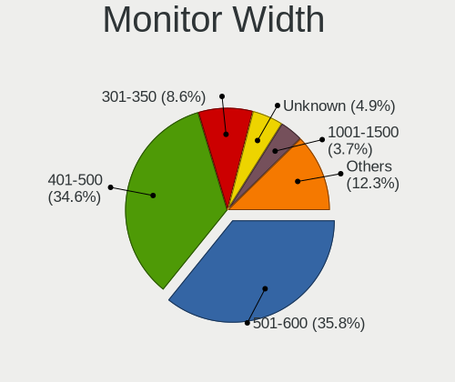

| Width in mm | Desktops | Percent |
|-------------|----------|---------|
| 501-600     | 17       | 36.17%  |
| 401-500     | 15       | 31.91%  |
| 301-350     | 6        | 12.77%  |
| 1001-1500   | 3        | 6.38%   |
| Unknown     | 2        | 4.26%   |
| 601-700     | 1        | 2.13%   |
| 351-400     | 1        | 2.13%   |
| 201-300     | 1        | 2.13%   |
| 901-1000    | 1        | 2.13%   |

Aspect Ratio
------------

Proportional relationship between the width and the height

| Ratio   | Desktops | Percent |
|---------|----------|---------|
| 16/9    | 29       | 63.04%  |
| 16/10   | 8        | 17.39%  |
| 5/4     | 6        | 13.04%  |
| Unknown | 2        | 4.35%   |
| 4/3     | 1        | 2.17%   |

Monitor Area
------------

Area in inch²

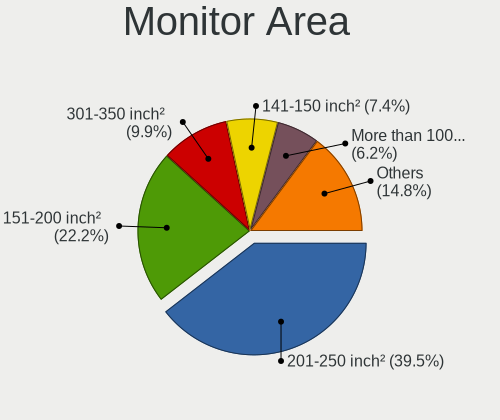

| Area in inch² | Desktops | Percent |
|----------------|----------|---------|
| 201-250        | 19       | 40.43%  |
| 151-200        | 10       | 21.28%  |
| 141-150        | 5        | 10.64%  |
| 301-350        | 4        | 8.51%   |
| More than 1000 | 3        | 6.38%   |
| 101-110        | 2        | 4.26%   |
| Unknown        | 2        | 4.26%   |
| 251-300        | 1        | 2.13%   |
| 501-1000       | 1        | 2.13%   |

Pixel Density
-------------

Pixels per inch

| Density | Desktops | Percent |
|---------|----------|---------|
| 51-100  | 33       | 70.21%  |
| 101-120 | 5        | 10.64%  |
| 1-50    | 4        | 8.51%   |
| 161-240 | 2        | 4.26%   |
| Unknown | 2        | 4.26%   |
| 121-160 | 1        | 2.13%   |

Multiple Monitors
-----------------

Total monitors connected

| Total | Desktops | Percent |
|-------|----------|---------|
| 1     | 51       | 92.73%  |
| 2     | 2        | 3.64%   |
| 0     | 2        | 3.64%   |

Network
-------

Net Controller Vendor
---------------------

Controller vendors

| Vendor                           | Desktops | Percent |
|----------------------------------|----------|---------|
| Intel                            | 38       | 43.18%  |
| Realtek Semiconductor            | 16       | 18.18%  |
| Ralink Technology                | 10       | 11.36%  |
| Ralink                           | 5        | 5.68%   |
| Qualcomm Atheros                 | 4        | 4.55%   |
| TP-Link                          | 3        | 3.41%   |
| Nvidia                           | 2        | 2.27%   |
| D-Link System                    | 2        | 2.27%   |
| Broadcom                         | 2        | 2.27%   |
| Silicon Integrated Systems [SiS] | 1        | 1.14%   |
| Qualcomm Atheros Communications  | 1        | 1.14%   |
| Marvell Technology Group         | 1        | 1.14%   |
| Gemtek                           | 1        | 1.14%   |
| Broadcom Limited                 | 1        | 1.14%   |
| Aquantia                         | 1        | 1.14%   |

Net Controller Model
--------------------

Controller models

| Model                                                                          | Desktops | Percent |
|--------------------------------------------------------------------------------|----------|---------|
| Intel 82579LM Gigabit Network Connection (Lewisville)                          | 13       | 13.54%  |
| Intel Ethernet Connection I217-LM                                              | 9        | 9.38%   |
| Realtek RTL8111/8168/8411 PCI Express Gigabit Ethernet Controller              | 8        | 8.33%   |
| Ralink RT5370 Wireless Adapter                                                 | 7        | 7.29%   |
| Intel I211 Gigabit Network Connection                                          | 4        | 4.17%   |
| Intel Ethernet Connection (2) I219-LM                                          | 4        | 4.17%   |
| Ralink MT7601U Wireless Adapter                                                | 3        | 3.13%   |
| Ralink RT3090 Wireless 802.11n 1T/1R PCIe                                      | 3        | 3.13%   |
| Intel Wi-Fi 6 AX200                                                            | 3        | 3.13%   |
| Intel 82566DM-2 Gigabit Network Connection                                     | 3        | 3.13%   |
| TP-Link TL-WN722N v2/v3 [Realtek RTL8188EUS]                                   | 2        | 2.08%   |
| Nvidia MCP61 Ethernet                                                          | 2        | 2.08%   |
| Intel 82567LM-3 Gigabit Network Connection                                     | 2        | 2.08%   |
| TP-Link Archer T4U ver.3                                                       | 1        | 1.04%   |
| Silicon Integrated Systems [SiS] SiS900 PCI Fast Ethernet                      | 1        | 1.04%   |
| Realtek RTL88x2bu [AC1200 Techkey]                                             | 1        | 1.04%   |
| Realtek RTL8814AU 802.11a/b/g/n/ac Wireless Adapter                            | 1        | 1.04%   |
| Realtek RTL8192CU 802.11n WLAN Adapter                                         | 1        | 1.04%   |
| Realtek RTL8188FTV 802.11b/g/n 1T1R 2.4G WLAN Adapter                          | 1        | 1.04%   |
| Realtek RTL8188EUS 802.11n Wireless Network Adapter                            | 1        | 1.04%   |
| Realtek RTL8187 Wireless Adapter                                               | 1        | 1.04%   |
| Realtek RTL8125 2.5GbE Controller                                              | 1        | 1.04%   |
| Realtek RTL810xE PCI Express Fast Ethernet controller                          | 1        | 1.04%   |
| Realtek RTL-8100/8101L/8139 PCI Fast Ethernet Adapter                          | 1        | 1.04%   |
| Ralink RT2870/RT3070 Wireless Adapter                                          | 1        | 1.04%   |
| Ralink RT5390R 802.11bgn PCIe Wireless Network Adapter                         | 1        | 1.04%   |
| Ralink RT5360 Wireless 802.11n 1T/1R                                           | 1        | 1.04%   |
| Qualcomm Atheros QCA9565 / AR9565 Wireless Network Adapter                     | 1        | 1.04%   |
| Qualcomm Atheros AR9271 802.11n                                                | 1        | 1.04%   |
| Qualcomm Atheros AR9485 Wireless Network Adapter                               | 1        | 1.04%   |
| Qualcomm Atheros AR9462 Wireless Network Adapter                               | 1        | 1.04%   |
| Qualcomm Atheros AR8161 Gigabit Ethernet                                       | 1        | 1.04%   |
| Marvell Group Yukon Optima 88E8059 [PCIe Gigabit Ethernet Controller with AVB] | 1        | 1.04%   |
| Intel Wi-Fi 6 AX210/AX211/AX411 160MHz                                         | 1        | 1.04%   |
| Intel I210 Gigabit Network Connection                                          | 1        | 1.04%   |
| Intel Ethernet Connection I217-V                                               | 1        | 1.04%   |
| Intel Ethernet Connection (2) I219-V                                           | 1        | 1.04%   |
| Intel 82578DM Gigabit Network Connection                                       | 1        | 1.04%   |
| Intel 82574L Gigabit Network Connection                                        | 1        | 1.04%   |
| Gemtek WUBR-177G [Ralink RT2571W]                                              | 1        | 1.04%   |

Wireless Vendor
---------------

Wireless vendors

| Vendor                          | Desktops | Percent |
|---------------------------------|----------|---------|
| Ralink Technology               | 10       | 29.41%  |
| Realtek Semiconductor           | 5        | 14.71%  |
| Ralink                          | 5        | 14.71%  |
| Intel                           | 4        | 11.76%  |
| TP-Link                         | 3        | 8.82%   |
| Qualcomm Atheros                | 3        | 8.82%   |
| Qualcomm Atheros Communications | 1        | 2.94%   |
| Gemtek                          | 1        | 2.94%   |
| D-Link System                   | 1        | 2.94%   |
| Broadcom                        | 1        | 2.94%   |

Wireless Model
--------------

Wireless models

| Model                                                                | Desktops | Percent |
|----------------------------------------------------------------------|----------|---------|
| Ralink RT5370 Wireless Adapter                                       | 7        | 19.44%  |
| Ralink MT7601U Wireless Adapter                                      | 3        | 8.33%   |
| Ralink RT3090 Wireless 802.11n 1T/1R PCIe                            | 3        | 8.33%   |
| Intel Wi-Fi 6 AX200                                                  | 3        | 8.33%   |
| TP-Link TL-WN722N v2/v3 [Realtek RTL8188EUS]                         | 2        | 5.56%   |
| TP-Link Archer T4U ver.3                                             | 1        | 2.78%   |
| Realtek RTL88x2bu [AC1200 Techkey]                                   | 1        | 2.78%   |
| Realtek RTL8814AU 802.11a/b/g/n/ac Wireless Adapter                  | 1        | 2.78%   |
| Realtek RTL8192CU 802.11n WLAN Adapter                               | 1        | 2.78%   |
| Realtek RTL8188FTV 802.11b/g/n 1T1R 2.4G WLAN Adapter                | 1        | 2.78%   |
| Realtek RTL8188EUS 802.11n Wireless Network Adapter                  | 1        | 2.78%   |
| Realtek RTL8187 Wireless Adapter                                     | 1        | 2.78%   |
| Ralink RT2870/RT3070 Wireless Adapter                                | 1        | 2.78%   |
| Ralink RT5390R 802.11bgn PCIe Wireless Network Adapter               | 1        | 2.78%   |
| Ralink RT5360 Wireless 802.11n 1T/1R                                 | 1        | 2.78%   |
| Qualcomm Atheros QCA9565 / AR9565 Wireless Network Adapter           | 1        | 2.78%   |
| Qualcomm Atheros AR9271 802.11n                                      | 1        | 2.78%   |
| Qualcomm Atheros AR9485 Wireless Network Adapter                     | 1        | 2.78%   |
| Qualcomm Atheros AR9462 Wireless Network Adapter                     | 1        | 2.78%   |
| Intel Wi-Fi 6 AX210/AX211/AX411 160MHz                               | 1        | 2.78%   |
| Gemtek WUBR-177G [Ralink RT2571W]                                    | 1        | 2.78%   |
| D-Link System DWA-140 RangeBooster N Adapter(rev.B1) [Ralink RT2870] | 1        | 2.78%   |
| Broadcom BCM4313 802.11bgn Wireless Network Adapter                  | 1        | 2.78%   |

Ethernet Vendor
---------------

Ethernet vendors

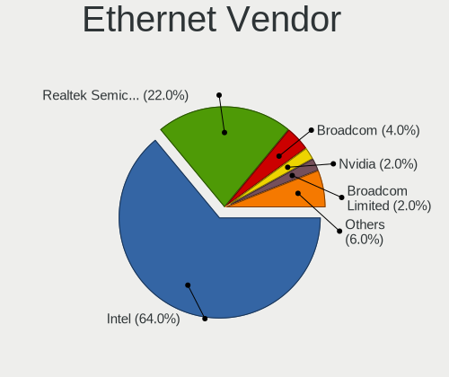

| Vendor                           | Desktops | Percent |
|----------------------------------|----------|---------|
| Intel                            | 38       | 65.52%  |
| Realtek Semiconductor            | 11       | 18.97%  |
| Nvidia                           | 2        | 3.45%   |
| Silicon Integrated Systems [SiS] | 1        | 1.72%   |
| Qualcomm Atheros                 | 1        | 1.72%   |
| Marvell Technology Group         | 1        | 1.72%   |
| D-Link System                    | 1        | 1.72%   |
| Broadcom Limited                 | 1        | 1.72%   |
| Broadcom                         | 1        | 1.72%   |
| Aquantia                         | 1        | 1.72%   |

Ethernet Model
--------------

Ethernet models

| Model                                                                          | Desktops | Percent |
|--------------------------------------------------------------------------------|----------|---------|
| Intel 82579LM Gigabit Network Connection (Lewisville)                          | 13       | 21.67%  |
| Intel Ethernet Connection I217-LM                                              | 9        | 15%     |
| Realtek RTL8111/8168/8411 PCI Express Gigabit Ethernet Controller              | 8        | 13.33%  |
| Intel I211 Gigabit Network Connection                                          | 4        | 6.67%   |
| Intel Ethernet Connection (2) I219-LM                                          | 4        | 6.67%   |
| Intel 82566DM-2 Gigabit Network Connection                                     | 3        | 5%      |
| Nvidia MCP61 Ethernet                                                          | 2        | 3.33%   |
| Intel 82567LM-3 Gigabit Network Connection                                     | 2        | 3.33%   |
| Silicon Integrated Systems [SiS] SiS900 PCI Fast Ethernet                      | 1        | 1.67%   |
| Realtek RTL8125 2.5GbE Controller                                              | 1        | 1.67%   |
| Realtek RTL810xE PCI Express Fast Ethernet controller                          | 1        | 1.67%   |
| Realtek RTL-8100/8101L/8139 PCI Fast Ethernet Adapter                          | 1        | 1.67%   |
| Qualcomm Atheros AR8161 Gigabit Ethernet                                       | 1        | 1.67%   |
| Marvell Group Yukon Optima 88E8059 [PCIe Gigabit Ethernet Controller with AVB] | 1        | 1.67%   |
| Intel I210 Gigabit Network Connection                                          | 1        | 1.67%   |
| Intel Ethernet Connection I217-V                                               | 1        | 1.67%   |
| Intel Ethernet Connection (2) I219-V                                           | 1        | 1.67%   |
| Intel 82578DM Gigabit Network Connection                                       | 1        | 1.67%   |
| Intel 82574L Gigabit Network Connection                                        | 1        | 1.67%   |
| D-Link System DGE-528T Gigabit Ethernet Adapter                                | 1        | 1.67%   |
| Broadcom NetXtreme BCM5752 Gigabit Ethernet PCI Express                        | 1        | 1.67%   |
| Broadcom Limited NetXtreme BCM5782 Gigabit Ethernet                            | 1        | 1.67%   |
| Aquantia AQC111 NBase-T/IEEE 802.3bz Ethernet Controller [AQtion]              | 1        | 1.67%   |

Net Controller Kind
-------------------

Ethernet, WiFi or modem

| Kind     | Desktops | Percent |
|----------|----------|---------|
| Ethernet | 54       | 62.79%  |
| WiFi     | 32       | 37.21%  |

Used Controller
---------------

Currently used network controller

| Kind     | Desktops | Percent |
|----------|----------|---------|
| Ethernet | 34       | 61.82%  |
| WiFi     | 21       | 38.18%  |

NICs
----

Total network controllers on board

| Total | Desktops | Percent |
|-------|----------|---------|
| 1     | 39       | 72.22%  |
| 2     | 11       | 20.37%  |
| 3     | 4        | 7.41%   |

IPv6
----

IPv6 vs IPv4

| Used | Desktops | Percent |
|------|----------|---------|
| No   | 54       | 100%    |

Bluetooth
---------

Bluetooth Vendor
----------------

Controller vendors

| Vendor                          | Desktops | Percent |
|---------------------------------|----------|---------|
| Intel                           | 3        | 25%     |
| Qualcomm Atheros Communications | 2        | 16.67%  |
| Cambridge Silicon Radio         | 2        | 16.67%  |
| Broadcom                        | 2        | 16.67%  |
| Toshiba                         | 1        | 8.33%   |
| Realtek Semiconductor           | 1        | 8.33%   |
| ASUSTek Computer                | 1        | 8.33%   |

Bluetooth Model
---------------

Controller models

| Model                                               | Desktops | Percent |
|-----------------------------------------------------|----------|---------|
| Intel AX200 Bluetooth                               | 3        | 25%     |
| Cambridge Silicon Radio Bluetooth Dongle (HCI mode) | 2        | 16.67%  |
| Toshiba Atheros AR3012 Bluetooth                    | 1        | 8.33%   |
| Realtek Bluetooth Radio                             | 1        | 8.33%   |
| Qualcomm Atheros  Bluetooth Device                  | 1        | 8.33%   |
| Qualcomm Atheros AR3011 Bluetooth                   | 1        | 8.33%   |
| Broadcom HP Portable Valentine                      | 1        | 8.33%   |
| Broadcom BCM20702A0 Bluetooth 4.0                   | 1        | 8.33%   |
| ASUS 2045 Bluetooth 2.0 Device with trace filter    | 1        | 8.33%   |

Sound
-----

Sound Vendor
------------

Sound card vendors

| Vendor                           | Desktops | Percent |
|----------------------------------|----------|---------|
| Intel                            | 44       | 61.11%  |
| Nvidia                           | 14       | 19.44%  |
| AMD                              | 10       | 13.89%  |
| Silicon Integrated Systems [SiS] | 1        | 1.39%   |
| Hewlett-Packard                  | 1        | 1.39%   |
| GEMBIRD                          | 1        | 1.39%   |
| C-Media Electronics              | 1        | 1.39%   |

Sound Model
-----------

Sound card models

| Model                                                                      | Desktops | Percent |
|----------------------------------------------------------------------------|----------|---------|
| Intel 8 Series/C220 Series Chipset High Definition Audio Controller        | 10       | 11.63%  |
| Intel Xeon E3-1200 v3/4th Gen Core Processor HD Audio Controller           | 9        | 10.47%  |
| Intel 6 Series/C200 Series Chipset Family High Definition Audio Controller | 8        | 9.3%    |
| Intel 7 Series/C216 Chipset Family High Definition Audio Controller        | 7        | 8.14%   |
| Intel 100 Series/C230 Series Chipset Family HD Audio Controller            | 4        | 4.65%   |
| AMD Starship/Matisse HD Audio Controller                                   | 4        | 4.65%   |
| Nvidia High Definition Audio Controller                                    | 3        | 3.49%   |
| Intel 82801I (ICH9 Family) HD Audio Controller                             | 3        | 3.49%   |
| Nvidia MCP61 High Definition Audio                                         | 2        | 2.33%   |
| Nvidia GM204 High Definition Audio Controller                              | 2        | 2.33%   |
| Nvidia GK208 HDMI/DP Audio Controller                                      | 2        | 2.33%   |
| Nvidia GF119 HDMI Audio Controller                                         | 2        | 2.33%   |
| Intel C600/X79 series chipset High Definition Audio Controller             | 2        | 2.33%   |
| Intel 82801JD/DO (ICH10 Family) HD Audio Controller                        | 2        | 2.33%   |
| Intel 5 Series/3400 Series Chipset High Definition Audio                   | 2        | 2.33%   |
| Intel 200 Series PCH HD Audio                                              | 2        | 2.33%   |
| AMD SBx00 Azalia (Intel HDA)                                               | 2        | 2.33%   |
| Silicon Integrated Systems [SiS] SiS7012 AC'97 Sound Controller            | 1        | 1.16%   |
| Nvidia TU116 High Definition Audio Controller                              | 1        | 1.16%   |
| Nvidia GP107GL High Definition Audio Controller                            | 1        | 1.16%   |
| Nvidia GK107 HDMI Audio Controller                                         | 1        | 1.16%   |
| Nvidia GA104 High Definition Audio Controller                              | 1        | 1.16%   |
| Intel C610/X99 series chipset HD Audio Controller                          | 1        | 1.16%   |
| Intel 82801JI (ICH10 Family) HD Audio Controller                           | 1        | 1.16%   |
| Intel 82801EB/ER (ICH5/ICH5R) AC'97 Audio Controller                       | 1        | 1.16%   |
| Intel 631xESB/632xESB High Definition Audio Controller                     | 1        | 1.16%   |
| Hewlett-Packard Digital Stereo Headset                                     | 1        | 1.16%   |
| GEMBIRD USB SkypePhone                                                     | 1        | 1.16%   |
| C-Media Electronics CMI8738/CMI8768 PCI Audio                              | 1        | 1.16%   |
| AMD RV610 HDMI Audio [Radeon HD 2350 PRO / 2400 PRO/XT / HD 3410]          | 1        | 1.16%   |
| AMD Redwood HDMI Audio [Radeon HD 5000 Series]                             | 1        | 1.16%   |
| AMD Raven/Raven2/Fenghuang HDMI/DP Audio Controller                        | 1        | 1.16%   |
| AMD Oland/Hainan/Cape Verde/Pitcairn HDMI Audio [Radeon HD 7000 Series]    | 1        | 1.16%   |
| AMD Navi 10 HDMI Audio                                                     | 1        | 1.16%   |
| AMD Hawaii HDMI Audio [Radeon R9 290/290X / 390/390X]                      | 1        | 1.16%   |
| AMD Family 17h/19h HD Audio Controller                                     | 1        | 1.16%   |
| AMD Barts HDMI Audio [Radeon HD 6790/6850/6870 / 7720 OEM]                 | 1        | 1.16%   |

Memory
------

Memory Vendor
-------------

Memory module vendors

| Vendor              | Desktops | Percent |
|---------------------|----------|---------|
| Samsung Electronics | 15       | 28.85%  |
| SK hynix            | 14       | 26.92%  |
| Micron Technology   | 7        | 13.46%  |
| Corsair             | 4        | 7.69%   |
| Kingston            | 3        | 5.77%   |
| Unknown             | 1        | 1.92%   |
| TakeMS              | 1        | 1.92%   |
| Qimonda             | 1        | 1.92%   |
| Nanya Technology    | 1        | 1.92%   |
| G.Skill             | 1        | 1.92%   |
| Crucial             | 1        | 1.92%   |
| Avant               | 1        | 1.92%   |
| Apacer              | 1        | 1.92%   |
| Unknown             | 1        | 1.92%   |

Memory Model
------------

Memory module models

| Model                                                   | Desktops | Percent |
|---------------------------------------------------------|----------|---------|
| SK hynix RAM HMT451U6BFR8A-PB 4GB DIMM DDR3 1648MT/s    | 4        | 7.14%   |
| Samsung RAM M378B5173EB0-YK0 4GB DIMM DDR3 1600MT/s     | 3        | 5.36%   |
| Micron RAM 8JTF51264AZ-1G6E1 4GB DIMM DDR3 1600MT/s     | 3        | 5.36%   |
| Unknown RAM Module 2GB DIMM                             | 1        | 1.79%   |
| TakeMS RAM TMS2GB264C081-665U 2048MB DIMM DDR2 667MT/s  | 1        | 1.79%   |
| SK hynix RAM HYMP512U64CP8-Y5 1GB DIMM                  | 1        | 1.79%   |
| SK hynix RAM HMT451U6BFR8C-PB 4GB DIMM DDR3 1600MT/s    | 1        | 1.79%   |
| SK hynix RAM HMT451U6AFR8A-PB 4GB DIMM DDR3 1600MT/s    | 1        | 1.79%   |
| SK hynix RAM HMT425U6AFR6C-PB 2GB DIMM DDR3 1600MT/s    | 1        | 1.79%   |
| SK hynix RAM HMT41GU7MFR8A-H9 8GB DIMM DDR3 1333MT/s    | 1        | 1.79%   |
| SK hynix RAM HMT41GU6MFR8C-PB 8GB DIMM DDR3 1600MT/s    | 1        | 1.79%   |
| SK hynix RAM HMT41GR7BFR4A-PB 8192MB DIMM DDR3 1600MT/s | 1        | 1.79%   |
| SK hynix RAM HMT351U6BFR8C-H9 4096MB DIMM DDR3 1333MT/s | 1        | 1.79%   |
| SK hynix RAM HMT125U6BFR8C-G7 2GB DIMM DDR3 1067MT/s    | 1        | 1.79%   |
| SK hynix RAM HMT112U6TFR8C-H9 1GB DIMM DDR3 1333MT/s    | 1        | 1.79%   |
| SK hynix RAM HMA851U6AFR6N-UH 4GB DIMM DDR4 2400MT/s    | 1        | 1.79%   |
| Samsung RAM Module 8192MB DIMM DDR4 2133MT/s            | 1        | 1.79%   |
| Samsung RAM Module 4GB DIMM DDR3 1333MT/s               | 1        | 1.79%   |
| Samsung RAM M471B5273CH0-CH9 4GB SODIMM DDR3 1334MT/s   | 1        | 1.79%   |
| Samsung RAM M471B5173QH0-YK0 4GB SODIMM DDR3 1600MT/s   | 1        | 1.79%   |
| Samsung RAM M393A4K40BB1-CRC 32GB RIMM DDR4 2400MT/s    | 1        | 1.79%   |
| Samsung RAM M378B5773DH0-CK0 2GB DIMM DDR3 1600MT/s     | 1        | 1.79%   |
| Samsung RAM M378B5773CH0-CH9 2GB DIMM DDR3 1867MT/s     | 1        | 1.79%   |
| Samsung RAM M378B5673FH0-CH9 2GB DIMM DDR3 1600MT/s     | 1        | 1.79%   |
| Samsung RAM M378B5173QH0-CK0 4GB DIMM DDR3 1600MT/s     | 1        | 1.79%   |
| Samsung RAM M378B5173DB0-CK0 4GB DIMM DDR3 1600MT/s     | 1        | 1.79%   |
| Samsung RAM M378B2873FH0-CH9 1GB DIMM DDR3 1333MT/s     | 1        | 1.79%   |
| Samsung RAM M3 78T5663QZ3-CF7 2GB DIMM DDR2 667MT/s     | 1        | 1.79%   |
| Samsung RAM M3 78T2953EZ3-CE6 1GB DIMM DDR2 667MT/s     | 1        | 1.79%   |
| Samsung RAM M3 78T2863DZS-CE6 1024MB DIMM DDR2 667MT/s  | 1        | 1.79%   |
| Samsung RAM M3 68L3223FTN-CB3 256MB DIMM DDR 333MT/s    | 1        | 1.79%   |
| Qimonda RAM 64T128020EU3SB2 1GB DIMM DDR2 667MT/s       | 1        | 1.79%   |
| Nanya RAM NT128D64SH4B1G-75B 128MB DIMM DDR 266MT/s     | 1        | 1.79%   |
| Micron RAM 8KTF51264HZ-1G6E1 4GB SODIMM DDR3 1600MT/s   | 1        | 1.79%   |
| Micron RAM 8HTF12864AY-800J1 1GB DIMM DDR2 800MT/s      | 1        | 1.79%   |
| Micron RAM 4JTF25664AZ-1G6E1 2GB DIMM DDR3 1600MT/s     | 1        | 1.79%   |
| Micron RAM 16JTF1G64AZ-1G6E1 8GB DIMM DDR3 1600MT/s     | 1        | 1.79%   |
| Kingston RAM KTC1G-UDIMM 1024MB DIMM DDR 1639MT/s       | 1        | 1.79%   |
| Kingston RAM 99U5471-020.A00LF 4GB DIMM DDR3 1600MT/s   | 1        | 1.79%   |
| Kingston RAM 9905429-002.A00LF 1GB DIMM DDR2 667MT/s    | 1        | 1.79%   |

Memory Kind
-----------

Memory module kinds

| Kind    | Desktops | Percent |
|---------|----------|---------|
| DDR3    | 17       | 45.95%  |
| DDR4    | 9        | 24.32%  |
| SDRAM   | 6        | 16.22%  |
| DDR2    | 3        | 8.11%   |
| DDR     | 1        | 2.7%    |
| Unknown | 1        | 2.7%    |

Memory Form Factor
------------------

Physical design of the memory module

| Name   | Desktops | Percent |
|--------|----------|---------|
| DIMM   | 28       | 90.32%  |
| SODIMM | 2        | 6.45%   |
| RIMM   | 1        | 3.23%   |

Memory Size
-----------

Memory module size

| Size  | Desktops | Percent |
|-------|----------|---------|
| 4096  | 14       | 35.9%   |
| 8192  | 7        | 17.95%  |
| 2048  | 6        | 15.38%  |
| 1024  | 5        | 12.82%  |
| 32768 | 2        | 5.13%   |
| 16384 | 2        | 5.13%   |
| 512   | 1        | 2.56%   |
| 256   | 1        | 2.56%   |
| 128   | 1        | 2.56%   |

Memory Speed
------------

Memory module speed

| Speed   | Desktops | Percent |
|---------|----------|---------|
| 1600    | 13       | 28.89%  |
| 1333    | 6        | 13.33%  |
| 1648    | 4        | 8.89%   |
| 667     | 3        | 6.67%   |
| 3600    | 2        | 4.44%   |
| 2667    | 2        | 4.44%   |
| 2400    | 2        | 4.44%   |
| 3200    | 1        | 2.22%   |
| 2666    | 1        | 2.22%   |
| 2133    | 1        | 2.22%   |
| 1867    | 1        | 2.22%   |
| 1866    | 1        | 2.22%   |
| 1639    | 1        | 2.22%   |
| 1334    | 1        | 2.22%   |
| 1067    | 1        | 2.22%   |
| 800     | 1        | 2.22%   |
| 400     | 1        | 2.22%   |
| 333     | 1        | 2.22%   |
| 266     | 1        | 2.22%   |
| Unknown | 1        | 2.22%   |

Printers & scanners
-------------------

Printer Vendor
--------------

Printer device vendors

| Vendor          | Desktops | Percent |
|-----------------|----------|---------|
| Hewlett-Packard | 1        | 50%     |
| Canon           | 1        | 50%     |

Printer Model
-------------

Printer device models

| Model                  | Desktops | Percent |
|------------------------|----------|---------|
| HP Deskjet 3510 series | 1        | 50%     |
| Canon MB2000 series    | 1        | 50%     |

Scanner Vendor
--------------

Scanner device vendors

Zero info for selected period =(

Scanner Model
-------------

Scanner device models

Zero info for selected period =(

Camera
------

Camera Vendor
-------------

Camera device vendors

| Vendor              | Desktops | Percent |
|---------------------|----------|---------|
| Logitech            | 2        | 50%     |
| Lite-On Technology  | 1        | 25%     |
| Chicony Electronics | 1        | 25%     |

Camera Model
------------

Camera device models

| Model                           | Desktops | Percent |
|---------------------------------|----------|---------|
| Logitech Webcam C270            | 1        | 25%     |
| Logitech Logi 4K Stream Edition | 1        | 25%     |
| Lite-On EasyCamera 5M           | 1        | 25%     |
| Chicony HP Webcam               | 1        | 25%     |

Security
--------

Fingerprint Vendor
------------------

Fingerprint sensor vendors

Zero info for selected period =(

Fingerprint Model
-----------------

Fingerprint sensor models

Zero info for selected period =(

Chipcard Vendor
---------------

Chipcard module vendors

Zero info for selected period =(

Chipcard Model
--------------

Chipcard module models

Zero info for selected period =(

Unsupported
-----------

Unsupported Devices
-------------------

Total unsupported devices on board

| Total | Desktops | Percent |
|-------|----------|---------|
| 0     | 50       | 90.91%  |
| 1     | 4        | 7.27%   |
| 2     | 1        | 1.82%   |

Unsupported Device Types
------------------------

Types of unsupported devices

| Type                     | Desktops | Percent |
|--------------------------|----------|---------|
| Net/wireless             | 2        | 40%     |
| Unassigned class         | 1        | 20%     |
| Graphics card            | 1        | 20%     |
| Communication controller | 1        | 20%     |

