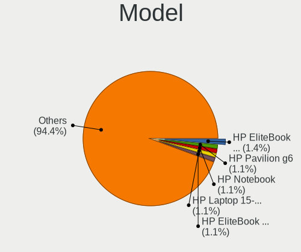
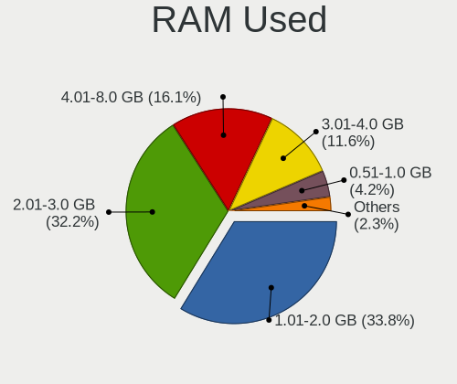
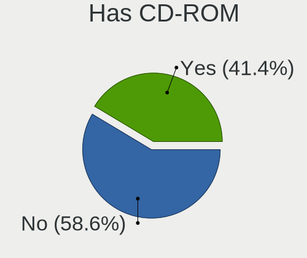
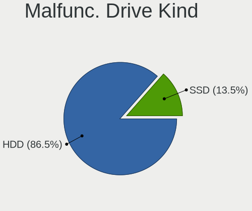
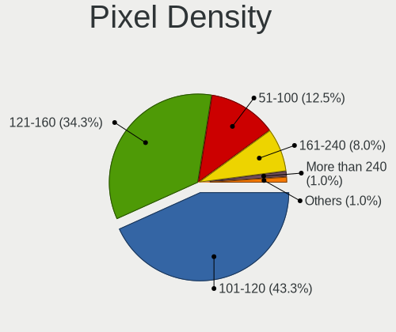
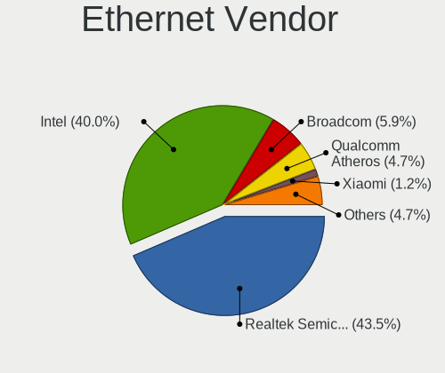
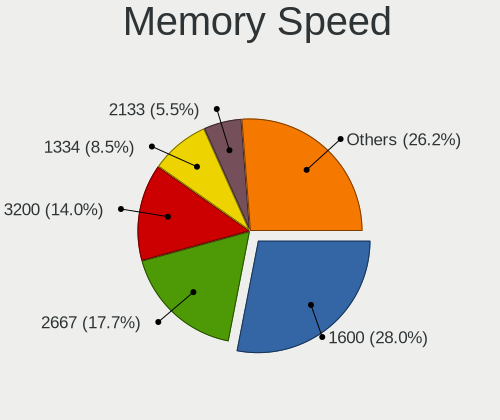

Linux in Morocco - Tested Hardware & Statistics (Notebooks)
-----------------------------------------------------------

A project to collect tested hardware configurations for Linux in Morocco.

Anyone can contribute to this report by the [hw-probe](https://github.com/linuxhw/hw-probe) tool:

    sudo -E hw-probe -all -upload

Please contribute! Especially if your hardware is rare.

Contents
--------

* [ Test Cases ](#test-cases)

* [ System ](#system)
  - [ OS                       ](#os)
  - [ OS Family                ](#os-family)
  - [ Kernel                   ](#kernel)
  - [ Kernel Family            ](#kernel-family)
  - [ Kernel Major Ver.        ](#kernel-major-ver)
  - [ Arch                     ](#arch)
  - [ DE                       ](#de)
  - [ Display Server           ](#display-server)
  - [ Display Manager          ](#display-manager)
  - [ OS Lang                  ](#os-lang)
  - [ Boot Mode                ](#boot-mode)
  - [ Filesystem               ](#filesystem)
  - [ Part. scheme             ](#part-scheme)
  - [ Dual Boot with Linux/BSD ](#dual-boot-with-linuxbsd)
  - [ Dual Boot (Win)          ](#dual-boot-win)

* [ Board ](#board)
  - [ Vendor                   ](#vendor)
  - [ Model                    ](#model)
  - [ Model Family             ](#model-family)
  - [ MFG Year                 ](#mfg-year)
  - [ Form Factor              ](#form-factor)
  - [ Secure Boot              ](#secure-boot)
  - [ Coreboot                 ](#coreboot)
  - [ RAM Size                 ](#ram-size)
  - [ RAM Used                 ](#ram-used)
  - [ Total Drives             ](#total-drives)
  - [ Has CD-ROM               ](#has-cd-rom)
  - [ Has Ethernet             ](#has-ethernet)
  - [ Has WiFi                 ](#has-wifi)
  - [ Has Bluetooth            ](#has-bluetooth)

* [ Location ](#location)
  - [ Country                  ](#country)
  - [ City                     ](#city)

* [ Drives ](#drives)
  - [ Drive Vendor             ](#drive-vendor)
  - [ Drive Model              ](#drive-model)
  - [ HDD Vendor               ](#hdd-vendor)
  - [ SSD Vendor               ](#ssd-vendor)
  - [ Drive Kind               ](#drive-kind)
  - [ Drive Connector          ](#drive-connector)
  - [ Drive Size               ](#drive-size)
  - [ Space Total              ](#space-total)
  - [ Space Used               ](#space-used)
  - [ Malfunc. Drives          ](#malfunc-drives)
  - [ Malfunc. Drive Vendor    ](#malfunc-drive-vendor)
  - [ Malfunc. HDD Vendor      ](#malfunc-hdd-vendor)
  - [ Malfunc. Drive Kind      ](#malfunc-drive-kind)
  - [ Failed Drives            ](#failed-drives)
  - [ Failed Drive Vendor      ](#failed-drive-vendor)
  - [ Drive Status             ](#drive-status)

* [ Storage controller ](#storage-controller)
  - [ Storage Vendor           ](#storage-vendor)
  - [ Storage Model            ](#storage-model)
  - [ Storage Kind             ](#storage-kind)

* [ Processor ](#processor)
  - [ CPU Vendor               ](#cpu-vendor)
  - [ CPU Model                ](#cpu-model)
  - [ CPU Model Family         ](#cpu-model-family)
  - [ CPU Cores                ](#cpu-cores)
  - [ CPU Sockets              ](#cpu-sockets)
  - [ CPU Threads              ](#cpu-threads)
  - [ CPU Op-Modes             ](#cpu-op-modes)
  - [ CPU Microcode            ](#cpu-microcode)
  - [ CPU Microarch            ](#cpu-microarch)

* [ Graphics ](#graphics)
  - [ GPU Vendor               ](#gpu-vendor)
  - [ GPU Model                ](#gpu-model)
  - [ GPU Combo                ](#gpu-combo)
  - [ GPU Driver               ](#gpu-driver)
  - [ GPU Memory               ](#gpu-memory)

* [ Monitor ](#monitor)
  - [ Monitor Vendor           ](#monitor-vendor)
  - [ Monitor Model            ](#monitor-model)
  - [ Monitor Resolution       ](#monitor-resolution)
  - [ Monitor Diagonal         ](#monitor-diagonal)
  - [ Monitor Width            ](#monitor-width)
  - [ Aspect Ratio             ](#aspect-ratio)
  - [ Monitor Area             ](#monitor-area)
  - [ Pixel Density            ](#pixel-density)
  - [ Multiple Monitors        ](#multiple-monitors)

* [ Network ](#network)
  - [ Net Controller Vendor    ](#net-controller-vendor)
  - [ Net Controller Model     ](#net-controller-model)
  - [ Wireless Vendor          ](#wireless-vendor)
  - [ Wireless Model           ](#wireless-model)
  - [ Ethernet Vendor          ](#ethernet-vendor)
  - [ Ethernet Model           ](#ethernet-model)
  - [ Net Controller Kind      ](#net-controller-kind)
  - [ Used Controller          ](#used-controller)
  - [ NICs                     ](#nics)
  - [ IPv6                     ](#ipv6)

* [ Bluetooth ](#bluetooth)
  - [ Bluetooth Vendor         ](#bluetooth-vendor)
  - [ Bluetooth Model          ](#bluetooth-model)

* [ Sound ](#sound)
  - [ Sound Vendor             ](#sound-vendor)
  - [ Sound Model              ](#sound-model)

* [ Memory ](#memory)
  - [ Memory Vendor            ](#memory-vendor)
  - [ Memory Model             ](#memory-model)
  - [ Memory Kind              ](#memory-kind)
  - [ Memory Form Factor       ](#memory-form-factor)
  - [ Memory Size              ](#memory-size)
  - [ Memory Speed             ](#memory-speed)

* [ Printers & scanners ](#printers--scanners)
  - [ Printer Vendor           ](#printer-vendor)
  - [ Printer Model            ](#printer-model)
  - [ Scanner Vendor           ](#scanner-vendor)
  - [ Scanner Model            ](#scanner-model)

* [ Camera ](#camera)
  - [ Camera Vendor            ](#camera-vendor)
  - [ Camera Model             ](#camera-model)

* [ Security ](#security)
  - [ Fingerprint Vendor       ](#fingerprint-vendor)
  - [ Fingerprint Model        ](#fingerprint-model)
  - [ Chipcard Vendor          ](#chipcard-vendor)
  - [ Chipcard Model           ](#chipcard-model)

* [ Unsupported ](#unsupported)
  - [ Unsupported Devices      ](#unsupported-devices)
  - [ Unsupported Device Types ](#unsupported-device-types)

Test Cases
----------

Total: 241

| Vendor        | Model                       | Probe                                                      | Date         |
|---------------|-----------------------------|------------------------------------------------------------|--------------|
| Dell          | Latitude 5510               | [68e4810231](https://linux-hardware.org/?probe=68e4810231) | Dec 24, 2022 |
| SINTRONES     | AMB-5000G1                  | [3f9a3badb0](https://linux-hardware.org/?probe=3f9a3badb0) | Dec 17, 2022 |
| SINTRONES     | AMB-5000G1                  | [b1738a6528](https://linux-hardware.org/?probe=b1738a6528) | Dec 17, 2022 |
| Dell          | Latitude D820               | [29df917188](https://linux-hardware.org/?probe=29df917188) | Dec 16, 2022 |
| Dell          | Latitude D820               | [27f19eafce](https://linux-hardware.org/?probe=27f19eafce) | Dec 16, 2022 |
| Dell          | Latitude E7250              | [3e40466ae4](https://linux-hardware.org/?probe=3e40466ae4) | Dec 13, 2022 |
| HP            | Pavilion 15                 | [5d88eed564](https://linux-hardware.org/?probe=5d88eed564) | Dec 13, 2022 |
| Toshiba       | Satellite L50-B             | [5bbe558b2f](https://linux-hardware.org/?probe=5bbe558b2f) | Dec 05, 2022 |
| Lenovo        | ThinkPad T560 20FJS3YN00    | [636921b46c](https://linux-hardware.org/?probe=636921b46c) | Nov 24, 2022 |
| HP            | 15                          | [51711b792f](https://linux-hardware.org/?probe=51711b792f) | Nov 20, 2022 |
| HP            | EliteBook 8540w             | [4da059da1b](https://linux-hardware.org/?probe=4da059da1b) | Nov 14, 2022 |
| Lenovo        | B50-30 20382                | [c4e67c5f10](https://linux-hardware.org/?probe=c4e67c5f10) | Nov 13, 2022 |
| HP            | 250 G5 Notebook PC          | [d710968897](https://linux-hardware.org/?probe=d710968897) | Nov 11, 2022 |
| Lenovo        | ThinkBook 15 G2 ITL 20VE    | [451acdb910](https://linux-hardware.org/?probe=451acdb910) | Oct 31, 2022 |
| HP            | 15                          | [c356a2b0cd](https://linux-hardware.org/?probe=c356a2b0cd) | Oct 30, 2022 |
| HP            | 15                          | [34e1ac4cbe](https://linux-hardware.org/?probe=34e1ac4cbe) | Oct 30, 2022 |
| HP            | EliteBook Folio 1040 G1     | [81df2d786a](https://linux-hardware.org/?probe=81df2d786a) | Oct 15, 2022 |
| Dell          | Latitude E4310              | [318726cca9](https://linux-hardware.org/?probe=318726cca9) | Oct 14, 2022 |
| Casper        | EXCALIBUR G770              | [7961a3ca3e](https://linux-hardware.org/?probe=7961a3ca3e) | Oct 14, 2022 |
| eMachines     | eME528                      | [502802d50d](https://linux-hardware.org/?probe=502802d50d) | Oct 13, 2022 |
| Apple         | MacBookPro10,2              | [379590d053](https://linux-hardware.org/?probe=379590d053) | Oct 09, 2022 |
| HP            | ProBook 650 G1              | [e31d2052e5](https://linux-hardware.org/?probe=e31d2052e5) | Oct 06, 2022 |
| HP            | ProBook 650 G1              | [1bcfb0642f](https://linux-hardware.org/?probe=1bcfb0642f) | Oct 06, 2022 |
| Unknown       | 1.0                         | [f5b0e6a742](https://linux-hardware.org/?probe=f5b0e6a742) | Sep 24, 2022 |
| ASUSTek       | X555LD                      | [08793f9065](https://linux-hardware.org/?probe=08793f9065) | Sep 24, 2022 |
| HP            | EliteBook 840 G5            | [eb488dae73](https://linux-hardware.org/?probe=eb488dae73) | Sep 17, 2022 |
| HP            | EliteBook 840 G5            | [eb406c0e81](https://linux-hardware.org/?probe=eb406c0e81) | Sep 15, 2022 |
| HP            | EliteBook 840 G5            | [6b6e4efdfc](https://linux-hardware.org/?probe=6b6e4efdfc) | Sep 13, 2022 |
| HP            | EliteBook 840 G5            | [4083f9d2c9](https://linux-hardware.org/?probe=4083f9d2c9) | Sep 11, 2022 |
| HP            | EliteBook 840 G5            | [bd15d55792](https://linux-hardware.org/?probe=bd15d55792) | Sep 07, 2022 |
| Dell          | Latitude 5490               | [a3f76e546f](https://linux-hardware.org/?probe=a3f76e546f) | Sep 01, 2022 |
| ASUSTek       | K72Jk                       | [d456f7083c](https://linux-hardware.org/?probe=d456f7083c) | Aug 26, 2022 |
| HP            | Compaq 15                   | [c2bdac6148](https://linux-hardware.org/?probe=c2bdac6148) | Aug 21, 2022 |
| HP            | ProBook 450 G7              | [c636c0401e](https://linux-hardware.org/?probe=c636c0401e) | Aug 18, 2022 |
| Dell          | Latitude E5500              | [5d04270674](https://linux-hardware.org/?probe=5d04270674) | Aug 08, 2022 |
| Acer          | Aspire ES1-523              | [d14f053671](https://linux-hardware.org/?probe=d14f053671) | Aug 01, 2022 |
| Lenovo        | S21e-20 80M4                | [bec71c2353](https://linux-hardware.org/?probe=bec71c2353) | Jul 27, 2022 |
| Lenovo        | ThinkPad P52 20M9CTO1WW     | [02dd3c2357](https://linux-hardware.org/?probe=02dd3c2357) | Jul 21, 2022 |
| Dell          | Latitude D620               | [70be0d553e](https://linux-hardware.org/?probe=70be0d553e) | Jul 08, 2022 |
| HP            | Laptop 15-dw3xxx            | [44b541373b](https://linux-hardware.org/?probe=44b541373b) | Jul 08, 2022 |
| Dell          | Latitude E6420              | [ede3298bf4](https://linux-hardware.org/?probe=ede3298bf4) | Jul 02, 2022 |
| HP            | ZBook 15 G3                 | [8c6f371222](https://linux-hardware.org/?probe=8c6f371222) | Jun 19, 2022 |
| HP            | Laptop 15-ra0xx             | [947ca74beb](https://linux-hardware.org/?probe=947ca74beb) | Jun 16, 2022 |
| HP            | Laptop 15-ra0xx             | [70ed4ebad8](https://linux-hardware.org/?probe=70ed4ebad8) | Jun 16, 2022 |
| Lenovo        | ThinkPad T430 2349BS7       | [2369e183ec](https://linux-hardware.org/?probe=2369e183ec) | May 30, 2022 |
| eMachines     | eM350                       | [2573854a09](https://linux-hardware.org/?probe=2573854a09) | May 29, 2022 |
| Lenovo        | ThinkPad X1 Carbon 6th 2... | [ae7670331c](https://linux-hardware.org/?probe=ae7670331c) | May 22, 2022 |
| Gigabyte      | AERO 15 KC                  | [5ebc19bd4c](https://linux-hardware.org/?probe=5ebc19bd4c) | May 18, 2022 |
| HP            | Laptop 17-cn0xxx            | [39bb2b41e5](https://linux-hardware.org/?probe=39bb2b41e5) | May 18, 2022 |
| HP            | Laptop 15s-eq2xxx           | [427af3e3a0](https://linux-hardware.org/?probe=427af3e3a0) | May 09, 2022 |
| HP            | Laptop 15-dw3xxx            | [7d4d1cb642](https://linux-hardware.org/?probe=7d4d1cb642) | May 06, 2022 |
| Dell          | Latitude E5440              | [556fccb6d3](https://linux-hardware.org/?probe=556fccb6d3) | May 06, 2022 |
| Packard Be... | EasyNote TS44HR             | [2eff4001dc](https://linux-hardware.org/?probe=2eff4001dc) | May 06, 2022 |
| HP            | Laptop 15-dw3xxx            | [889f1cba36](https://linux-hardware.org/?probe=889f1cba36) | Apr 30, 2022 |
| Toshiba       | Satellite C660              | [f4403056c8](https://linux-hardware.org/?probe=f4403056c8) | Apr 30, 2022 |
| HP            | Pavilion g6                 | [b79730a7af](https://linux-hardware.org/?probe=b79730a7af) | Apr 27, 2022 |
| Lenovo        | ThinkPad T460 20FN002SUS    | [0fad5f6cd2](https://linux-hardware.org/?probe=0fad5f6cd2) | Apr 21, 2022 |
| HP            | Presario C500 (GF852EA#A... | [b14e9c5694](https://linux-hardware.org/?probe=b14e9c5694) | Apr 08, 2022 |
| TrekStor      | Surfbook W2                 | [52eb1e4ce9](https://linux-hardware.org/?probe=52eb1e4ce9) | Apr 06, 2022 |
| HP            | Notebook                    | [313ca81d16](https://linux-hardware.org/?probe=313ca81d16) | Mar 27, 2022 |
| HP            | 250 G5 Notebook PC          | [24664b0486](https://linux-hardware.org/?probe=24664b0486) | Mar 25, 2022 |
| HP            | 250 G5 Notebook PC          | [1cb13706a4](https://linux-hardware.org/?probe=1cb13706a4) | Mar 25, 2022 |
| Dell          | Vostro 1015                 | [5eac01f806](https://linux-hardware.org/?probe=5eac01f806) | Mar 25, 2022 |
| Dell          | Vostro 1015                 | [ce0fa4ee36](https://linux-hardware.org/?probe=ce0fa4ee36) | Mar 25, 2022 |
| Dell          | Latitude E5440              | [6b871a160e](https://linux-hardware.org/?probe=6b871a160e) | Mar 22, 2022 |
| Dell          | Latitude E5440              | [bd5621d6e2](https://linux-hardware.org/?probe=bd5621d6e2) | Mar 21, 2022 |
| HP            | ProBook 440 G5              | [39d48e6d79](https://linux-hardware.org/?probe=39d48e6d79) | Feb 28, 2022 |
| Lenovo        | ThinkBook 15 G2 ITL 20VE    | [fc6097a447](https://linux-hardware.org/?probe=fc6097a447) | Feb 23, 2022 |
| Dell          | Inspiron 5558               | [6888384b59](https://linux-hardware.org/?probe=6888384b59) | Feb 21, 2022 |
| ASUSTek       | X751LD                      | [074c993361](https://linux-hardware.org/?probe=074c993361) | Feb 19, 2022 |
| Dell          | Latitude E6520              | [f921803f50](https://linux-hardware.org/?probe=f921803f50) | Feb 16, 2022 |
| HP            | EliteBook 8440p             | [ae8afcd09f](https://linux-hardware.org/?probe=ae8afcd09f) | Feb 13, 2022 |
| HP            | ProBook 440 G5              | [4769ae7351](https://linux-hardware.org/?probe=4769ae7351) | Feb 12, 2022 |
| Dell          | Precision M4800             | [8f91ff2d57](https://linux-hardware.org/?probe=8f91ff2d57) | Jan 29, 2022 |
| Dell          | Latitude E6520              | [ee96960cec](https://linux-hardware.org/?probe=ee96960cec) | Jan 25, 2022 |
| ASUSTek       | X540LA                      | [a24d99bf3b](https://linux-hardware.org/?probe=a24d99bf3b) | Jan 24, 2022 |
| Clevo         | W24/250CU                   | [64c6f06849](https://linux-hardware.org/?probe=64c6f06849) | Jan 22, 2022 |
| Google        | Banon                       | [3e792337e2](https://linux-hardware.org/?probe=3e792337e2) | Jan 21, 2022 |
| Google        | Banon                       | [c4cfb244b1](https://linux-hardware.org/?probe=c4cfb244b1) | Jan 21, 2022 |
| HP            | Pavilion g6                 | [099231b0b3](https://linux-hardware.org/?probe=099231b0b3) | Jan 19, 2022 |
| HP            | EliteBook 840 G1            | [8e4f80059d](https://linux-hardware.org/?probe=8e4f80059d) | Jan 14, 2022 |
| Lenovo        | ThinkPad P50 20EQS6J100     | [f366de3acf](https://linux-hardware.org/?probe=f366de3acf) | Jan 03, 2022 |
| Dell          | Precision 5560              | [04cb5954e9](https://linux-hardware.org/?probe=04cb5954e9) | Dec 31, 2021 |
| Timi          | TM1701                      | [ce3374e321](https://linux-hardware.org/?probe=ce3374e321) | Dec 23, 2021 |
| Acer          | Aspire One 522              | [7f495fc85b](https://linux-hardware.org/?probe=7f495fc85b) | Dec 21, 2021 |
| Lenovo        | IdeaPad L340-15IRH Gamin... | [331d419175](https://linux-hardware.org/?probe=331d419175) | Dec 06, 2021 |
| HP            | EliteBook 8460p             | [97aec623b3](https://linux-hardware.org/?probe=97aec623b3) | Dec 04, 2021 |
| ASUSTek       | K72Jr                       | [518ee0b884](https://linux-hardware.org/?probe=518ee0b884) | Nov 30, 2021 |
| ASUSTek       | K72Jr                       | [405b87f8bf](https://linux-hardware.org/?probe=405b87f8bf) | Nov 29, 2021 |
| Lenovo        | ThinkPad T440p 20AWS3DD1... | [816aaebc79](https://linux-hardware.org/?probe=816aaebc79) | Nov 27, 2021 |
| Lenovo        | ThinkPad T440p 20AWS3DD1... | [162c76040f](https://linux-hardware.org/?probe=162c76040f) | Nov 27, 2021 |
| Lenovo        | ThinkPad X13 Gen 2i 20WK... | [7b9f86430d](https://linux-hardware.org/?probe=7b9f86430d) | Nov 25, 2021 |
| Lenovo        | ThinkPad X13 Gen 2i 20WK... | [c5aa70cf8a](https://linux-hardware.org/?probe=c5aa70cf8a) | Nov 25, 2021 |
| Lenovo        | ThinkPad P14s Gen 2a 21A... | [73b27d5257](https://linux-hardware.org/?probe=73b27d5257) | Nov 25, 2021 |
| Lenovo        | ThinkPad P14s Gen 2a 21A... | [915ddf82b5](https://linux-hardware.org/?probe=915ddf82b5) | Nov 23, 2021 |
| HP            | EliteBook 8530w             | [e3a38e431e](https://linux-hardware.org/?probe=e3a38e431e) | Nov 23, 2021 |
| HP            | ZBook 15                    | [6aca3076ac](https://linux-hardware.org/?probe=6aca3076ac) | Nov 22, 2021 |
| HP            | 15                          | [e82411639f](https://linux-hardware.org/?probe=e82411639f) | Nov 20, 2021 |
| Toshiba       | Satellite L50-A-1EL         | [40fff0be70](https://linux-hardware.org/?probe=40fff0be70) | Nov 19, 2021 |
| Apple         | MacBookPro13,3              | [e80b600640](https://linux-hardware.org/?probe=e80b600640) | Nov 12, 2021 |
| HP            | Laptop 15-dw3xxx            | [966b61331a](https://linux-hardware.org/?probe=966b61331a) | Nov 05, 2021 |
| HP            | Laptop 15-dw3xxx            | [e1c9be9f1d](https://linux-hardware.org/?probe=e1c9be9f1d) | Nov 05, 2021 |
| HP            | Pavilion Power Laptop 15... | [c1f75f6249](https://linux-hardware.org/?probe=c1f75f6249) | Oct 27, 2021 |
| ASUSTek       | X540LA                      | [c947e5b1ea](https://linux-hardware.org/?probe=c947e5b1ea) | Oct 26, 2021 |
| HP            | Laptop 15-da0xxx            | [2de5c74bc0](https://linux-hardware.org/?probe=2de5c74bc0) | Oct 23, 2021 |
| HP            | 250 I3-5005U 15.6           | [94c7602d80](https://linux-hardware.org/?probe=94c7602d80) | Oct 20, 2021 |
| Sony          | VPCEH1L8E                   | [11ef4d4baf](https://linux-hardware.org/?probe=11ef4d4baf) | Oct 19, 2021 |
| Sony          | SVE14122CAW                 | [7e20d79b1d](https://linux-hardware.org/?probe=7e20d79b1d) | Oct 16, 2021 |
| Razer         | Blade Pro 17 (2019)         | [c0fc32d290](https://linux-hardware.org/?probe=c0fc32d290) | Oct 09, 2021 |
| Dell          | Latitude E5570              | [bfc3702626](https://linux-hardware.org/?probe=bfc3702626) | Oct 04, 2021 |
| HP            | Pavilion Laptop 15-cc1xx    | [c5f4555ed5](https://linux-hardware.org/?probe=c5f4555ed5) | Sep 29, 2021 |
| Dell          | Latitude E5570              | [b4f22d5062](https://linux-hardware.org/?probe=b4f22d5062) | Sep 27, 2021 |
| Dell          | Latitude E5570              | [42c88d1bb8](https://linux-hardware.org/?probe=42c88d1bb8) | Sep 27, 2021 |
| HP            | EliteBook 8530w             | [37a7444281](https://linux-hardware.org/?probe=37a7444281) | Sep 25, 2021 |
| HP            | EliteBook 8530w             | [326645a221](https://linux-hardware.org/?probe=326645a221) | Sep 25, 2021 |
| Dell          | XPS 13 9350                 | [b01438543e](https://linux-hardware.org/?probe=b01438543e) | Sep 20, 2021 |
| Lenovo        | IdeaPad S145-15IIL 81W8     | [554c02e687](https://linux-hardware.org/?probe=554c02e687) | Sep 14, 2021 |
| Lenovo        | IdeaPad S145-15IIL 81W8     | [e2202296c9](https://linux-hardware.org/?probe=e2202296c9) | Sep 13, 2021 |
| HP            | Pavilion Power Laptop 15... | [d63a5c07e1](https://linux-hardware.org/?probe=d63a5c07e1) | Aug 28, 2021 |
| HP            | Pavilion Power Laptop 15... | [78316d40ea](https://linux-hardware.org/?probe=78316d40ea) | Aug 28, 2021 |
| Lenovo        | ThinkPad X250 20CLS4WV08    | [2c09cdd5bd](https://linux-hardware.org/?probe=2c09cdd5bd) | Aug 12, 2021 |
| HP            | 15                          | [80ce139934](https://linux-hardware.org/?probe=80ce139934) | Aug 06, 2021 |
| HP            | 15                          | [24c674140c](https://linux-hardware.org/?probe=24c674140c) | Aug 05, 2021 |
| HP            | Laptop 15-dw3xxx            | [ea05f5d624](https://linux-hardware.org/?probe=ea05f5d624) | Jul 21, 2021 |
| Unknown       | 1.0                         | [d049c76d58](https://linux-hardware.org/?probe=d049c76d58) | Jul 08, 2021 |
| Unknown       | 1.0                         | [deb4346da8](https://linux-hardware.org/?probe=deb4346da8) | Jul 08, 2021 |
| Unknown       | 1.0                         | [967654bdb6](https://linux-hardware.org/?probe=967654bdb6) | Jul 04, 2021 |
| Unknown       | 1.0                         | [36977bacbe](https://linux-hardware.org/?probe=36977bacbe) | Jul 03, 2021 |
| HP            | Pavilion Power Laptop 15... | [19666df61f](https://linux-hardware.org/?probe=19666df61f) | Jun 26, 2021 |
| HP            | Pavilion Power Laptop 15... | [df836c85c5](https://linux-hardware.org/?probe=df836c85c5) | Jun 26, 2021 |
| HP            | EliteBook 840 G3            | [dd3d9ede87](https://linux-hardware.org/?probe=dd3d9ede87) | Jun 20, 2021 |
| Unknown       | Unknown                     | [80c0612f78](https://linux-hardware.org/?probe=80c0612f78) | Jun 04, 2021 |
| Unknown       | Unknown                     | [9bac89aecf](https://linux-hardware.org/?probe=9bac89aecf) | Jun 04, 2021 |
| Lenovo        | IdeaPad L3 15IML05 81Y3     | [3890d7877d](https://linux-hardware.org/?probe=3890d7877d) | May 06, 2021 |
| Lenovo        | IdeaPad L3 15IML05 81Y3     | [44810c2cc1](https://linux-hardware.org/?probe=44810c2cc1) | May 06, 2021 |
| Lenovo        | ThinkPad X220 4291V5K       | [c0b9d7bd52](https://linux-hardware.org/?probe=c0b9d7bd52) | Apr 26, 2021 |
| Lenovo        | ThinkPad X220 4291V5K       | [4ec1325f12](https://linux-hardware.org/?probe=4ec1325f12) | Apr 26, 2021 |
| HP            | EliteBook 8460p             | [cf8b627aa4](https://linux-hardware.org/?probe=cf8b627aa4) | Apr 11, 2021 |
| HP            | EliteBook 8460p             | [bd04b1367f](https://linux-hardware.org/?probe=bd04b1367f) | Apr 11, 2021 |
| HP            | EliteBook 840 G2            | [522eb62b1a](https://linux-hardware.org/?probe=522eb62b1a) | Apr 03, 2021 |
| HP            | EliteBook 840 G2            | [e9df8836cf](https://linux-hardware.org/?probe=e9df8836cf) | Apr 03, 2021 |
| HP            | EliteBook 2540p             | [46c15e3b14](https://linux-hardware.org/?probe=46c15e3b14) | Apr 01, 2021 |
| HP            | EliteBook 840 G2            | [e1023ad432](https://linux-hardware.org/?probe=e1023ad432) | Mar 31, 2021 |
| HP            | EliteBook 840 G2            | [5c9803ca79](https://linux-hardware.org/?probe=5c9803ca79) | Mar 31, 2021 |
| HP            | Pavilion Laptop 15-ck0xx    | [f973f0f31c](https://linux-hardware.org/?probe=f973f0f31c) | Mar 23, 2021 |
| Dell          | Latitude 5580               | [9fd0e8f6b5](https://linux-hardware.org/?probe=9fd0e8f6b5) | Mar 22, 2021 |
| Lenovo        | ThinkPad X220 4291B66       | [411fb65be7](https://linux-hardware.org/?probe=411fb65be7) | Mar 21, 2021 |
| HP            | Notebook                    | [fbc522f5e7](https://linux-hardware.org/?probe=fbc522f5e7) | Feb 24, 2021 |
| HP            | Pavilion Sleekbook 15       | [aeb3111a93](https://linux-hardware.org/?probe=aeb3111a93) | Feb 20, 2021 |
| HP            | EliteBook 840 G2            | [1ffab0446e](https://linux-hardware.org/?probe=1ffab0446e) | Feb 17, 2021 |
| Lenovo        | ThinkPad T460 20FN002SUS    | [2ba0a379e8](https://linux-hardware.org/?probe=2ba0a379e8) | Feb 16, 2021 |
| Dell          | Latitude 3480               | [533356cb56](https://linux-hardware.org/?probe=533356cb56) | Feb 15, 2021 |
| HP            | Pavilion dv7                | [17dcac4931](https://linux-hardware.org/?probe=17dcac4931) | Feb 10, 2021 |
| GPD           | MicroPC                     | [ed2233e6ce](https://linux-hardware.org/?probe=ed2233e6ce) | Feb 08, 2021 |
| Acer          | AO722                       | [24cb20b715](https://linux-hardware.org/?probe=24cb20b715) | Feb 04, 2021 |
| HP            | EliteBook 840 G2            | [8da09ed292](https://linux-hardware.org/?probe=8da09ed292) | Feb 04, 2021 |
| Lenovo        | ThinkPad E590 20NB002AMB    | [e45b210ee6](https://linux-hardware.org/?probe=e45b210ee6) | Feb 01, 2021 |
| Lenovo        | ThinkPad T460 20FN002SUS    | [6c9654a854](https://linux-hardware.org/?probe=6c9654a854) | Jan 25, 2021 |
| Apple         | MacBook5,2                  | [512f5b5bdc](https://linux-hardware.org/?probe=512f5b5bdc) | Jan 18, 2021 |
| HP            | Pavilion dv7                | [bc33dda5d6](https://linux-hardware.org/?probe=bc33dda5d6) | Jan 09, 2021 |
| HP            | 650                         | [65c5445c17](https://linux-hardware.org/?probe=65c5445c17) | Jan 08, 2021 |
| Sony          | VGN-FW11L                   | [e99fe042af](https://linux-hardware.org/?probe=e99fe042af) | Jan 06, 2021 |
| HP            | 255 G7 Notebook PC          | [493c807f09](https://linux-hardware.org/?probe=493c807f09) | Jan 06, 2021 |
| Lenovo        | ThinkPad E570 20H50078IX    | [9162d07863](https://linux-hardware.org/?probe=9162d07863) | Dec 31, 2020 |
| Lenovo        | ThinkPad E570 20H50078IX    | [f1f07aecd0](https://linux-hardware.org/?probe=f1f07aecd0) | Dec 31, 2020 |
| Dell          | Latitude E6440              | [cec6c1fd51](https://linux-hardware.org/?probe=cec6c1fd51) | Dec 25, 2020 |
| HP            | 650                         | [ff87d07205](https://linux-hardware.org/?probe=ff87d07205) | Dec 21, 2020 |
| Packard Be... | EasyNote TS11HR             | [9c31cf187f](https://linux-hardware.org/?probe=9c31cf187f) | Dec 17, 2020 |
| Timi          | TM1701                      | [bc63393a91](https://linux-hardware.org/?probe=bc63393a91) | Dec 13, 2020 |
| Lenovo        | ThinkPad T480s 20L8S3P30... | [1a37278a5b](https://linux-hardware.org/?probe=1a37278a5b) | Dec 13, 2020 |
| HP            | EliteBook 8560w             | [d546d8c598](https://linux-hardware.org/?probe=d546d8c598) | Nov 25, 2020 |
| HP            | EliteBook 8560w             | [9bb315e3ac](https://linux-hardware.org/?probe=9bb315e3ac) | Nov 25, 2020 |
| Dell          | Latitude E6440              | [6739c087eb](https://linux-hardware.org/?probe=6739c087eb) | Nov 20, 2020 |
| TUXEDO        | N13xWU                      | [b72558f93c](https://linux-hardware.org/?probe=b72558f93c) | Nov 19, 2020 |
| TUXEDO        | N13xWU                      | [e6a667e32c](https://linux-hardware.org/?probe=e6a667e32c) | Nov 08, 2020 |
| TUXEDO        | N13xWU                      | [b4cd820410](https://linux-hardware.org/?probe=b4cd820410) | Nov 08, 2020 |
| Lenovo        | ThinkPad X280 20KF001KFR    | [bb66d36c3e](https://linux-hardware.org/?probe=bb66d36c3e) | Oct 23, 2020 |
| ASUSTek       | X555LAB                     | [d4755cc80a](https://linux-hardware.org/?probe=d4755cc80a) | Oct 18, 2020 |
| ASUSTek       | VivoBook_ASUSLaptop X512... | [ef4b4ee1be](https://linux-hardware.org/?probe=ef4b4ee1be) | Oct 10, 2020 |
| ASUSTek       | VivoBook_ASUSLaptop X512... | [c1d3bd539a](https://linux-hardware.org/?probe=c1d3bd539a) | Oct 09, 2020 |
| HP            | ProBook 450 G0              | [a12e9900c0](https://linux-hardware.org/?probe=a12e9900c0) | Oct 07, 2020 |
| HP            | ProBook 450 G0              | [822c9a0ece](https://linux-hardware.org/?probe=822c9a0ece) | Oct 07, 2020 |
| HP            | Compaq nc6220 (PL814AV)     | [7f042faa64](https://linux-hardware.org/?probe=7f042faa64) | Oct 04, 2020 |
| HP            | EliteBook 8440p             | [a5438c06dc](https://linux-hardware.org/?probe=a5438c06dc) | Oct 02, 2020 |
| HP            | ProBook 6470b               | [0c6e7c5d06](https://linux-hardware.org/?probe=0c6e7c5d06) | Sep 30, 2020 |
| HP            | ProBook 6470b               | [3ab44ecc2c](https://linux-hardware.org/?probe=3ab44ecc2c) | Sep 20, 2020 |
| Lenovo        | IdeaPad L3 15IML05 81Y3     | [e36d2e46a2](https://linux-hardware.org/?probe=e36d2e46a2) | Sep 16, 2020 |
| Lenovo        | ThinkPad X280 20KF001KFR    | [09ba7a078c](https://linux-hardware.org/?probe=09ba7a078c) | Sep 06, 2020 |
| Toshiba       | Satellite L750              | [1c9467e7ff](https://linux-hardware.org/?probe=1c9467e7ff) | Aug 31, 2020 |
| Dell          | Latitude E5270              | [b9e93e40f1](https://linux-hardware.org/?probe=b9e93e40f1) | Aug 26, 2020 |
| Toshiba       | Satellite C855-2CF          | [00048c3fd7](https://linux-hardware.org/?probe=00048c3fd7) | Aug 26, 2020 |
| HP            | ProBook 650 G1              | [134ae0f98f](https://linux-hardware.org/?probe=134ae0f98f) | Aug 24, 2020 |
| Lenovo        | ThinkPad X280 20KF001KFR    | [47a6af7e14](https://linux-hardware.org/?probe=47a6af7e14) | Aug 23, 2020 |
| HP            | Laptop 15-da0xxx            | [b51e82eb8b](https://linux-hardware.org/?probe=b51e82eb8b) | Aug 08, 2020 |
| HP            | ProBook 440 G7              | [b2d1e5272e](https://linux-hardware.org/?probe=b2d1e5272e) | Aug 07, 2020 |
| Lenovo        | Z70-80 80FG                 | [8f0c5d78da](https://linux-hardware.org/?probe=8f0c5d78da) | Jul 29, 2020 |
| Mediacom      | WinPad 11,6 FullHD- WPU1... | [c4b91061bd](https://linux-hardware.org/?probe=c4b91061bd) | Jun 24, 2020 |
| Mediacom      | WinPad 11,6 FullHD- WPU1... | [1d9441c4cb](https://linux-hardware.org/?probe=1d9441c4cb) | Jun 24, 2020 |
| HP            | EliteBook 840 G2            | [8f31cacb03](https://linux-hardware.org/?probe=8f31cacb03) | Jun 15, 2020 |
| Dell          | Latitude E6410              | [63006c892d](https://linux-hardware.org/?probe=63006c892d) | Jun 12, 2020 |
| Dell          | Latitude E6540              | [0820a41e4a](https://linux-hardware.org/?probe=0820a41e4a) | Jun 03, 2020 |
| Samsung       | 300E4A/300E5A/300E7A/343... | [d4a0f7593f](https://linux-hardware.org/?probe=d4a0f7593f) | May 30, 2020 |
| Packard Be... | EasyNote TK85               | [1ef7f1dccf](https://linux-hardware.org/?probe=1ef7f1dccf) | May 24, 2020 |
| HP            | Unknown                     | [83216ab6f8](https://linux-hardware.org/?probe=83216ab6f8) | May 23, 2020 |
| Dell          | Latitude E5270              | [79c2208ee5](https://linux-hardware.org/?probe=79c2208ee5) | May 16, 2020 |
| HP            | Laptop 15-da0xxx            | [4d933966bb](https://linux-hardware.org/?probe=4d933966bb) | May 16, 2020 |
| HP            | ZBook 15                    | [7fdf5ffeb8](https://linux-hardware.org/?probe=7fdf5ffeb8) | May 10, 2020 |
| Lenovo        | G50-70 20351                | [fea9f24d5a](https://linux-hardware.org/?probe=fea9f24d5a) | Apr 27, 2020 |
| Lenovo        | G50-70 20351                | [f6609c3613](https://linux-hardware.org/?probe=f6609c3613) | Apr 27, 2020 |
| ASUSTek       | UX31A                       | [2ce7c49619](https://linux-hardware.org/?probe=2ce7c49619) | Apr 16, 2020 |
| ASUSTek       | X542UAR                     | [1597291755](https://linux-hardware.org/?probe=1597291755) | Apr 03, 2020 |
| HP            | 250 G3                      | [e92714c5e6](https://linux-hardware.org/?probe=e92714c5e6) | Mar 18, 2020 |
| Dell          | Latitude E6510              | [bc7b29779f](https://linux-hardware.org/?probe=bc7b29779f) | Mar 08, 2020 |
| Packard Be... | EasyNote TK85               | [bf3776568a](https://linux-hardware.org/?probe=bf3776568a) | Feb 23, 2020 |
| HP            | EliteBook 8440p             | [2bc65b9511](https://linux-hardware.org/?probe=2bc65b9511) | Feb 22, 2020 |
| HP            | EliteBook 8440p             | [4ef298fd63](https://linux-hardware.org/?probe=4ef298fd63) | Feb 22, 2020 |
| HP            | Pavilion Laptop 15-cs2xx... | [98c2d41201](https://linux-hardware.org/?probe=98c2d41201) | Feb 21, 2020 |
| HP            | Pavilion Laptop 15-cs2xx... | [6b512c0e61](https://linux-hardware.org/?probe=6b512c0e61) | Feb 21, 2020 |
| Dell          | Latitude E5520              | [2994cbb1d2](https://linux-hardware.org/?probe=2994cbb1d2) | Feb 21, 2020 |
| Dell          | Inspiron 3521               | [35973fcba8](https://linux-hardware.org/?probe=35973fcba8) | Jan 01, 2020 |
| Medion        | P7615                       | [1402e4bf25](https://linux-hardware.org/?probe=1402e4bf25) | Dec 29, 2019 |
| Toshiba       | Satellite Pro C650          | [984a530b85](https://linux-hardware.org/?probe=984a530b85) | Dec 19, 2019 |
| Medion        | P7615                       | [56fdcbb995](https://linux-hardware.org/?probe=56fdcbb995) | Nov 25, 2019 |
| Medion        | P7615                       | [150034113d](https://linux-hardware.org/?probe=150034113d) | Nov 25, 2019 |
| Acer          | Aspire 7736                 | [64727a44db](https://linux-hardware.org/?probe=64727a44db) | Nov 24, 2019 |
| Acer          | Aspire 7736                 | [3415167cef](https://linux-hardware.org/?probe=3415167cef) | Nov 23, 2019 |
| Acer          | Aspire ES1-523              | [74c8472d6f](https://linux-hardware.org/?probe=74c8472d6f) | Nov 12, 2019 |
| ASUSTek       | X200MA                      | [860c71f889](https://linux-hardware.org/?probe=860c71f889) | Nov 10, 2019 |
| Acer          | Calpella                    | [6ff918b898](https://linux-hardware.org/?probe=6ff918b898) | Oct 29, 2019 |
| Dell          | Latitude 3590               | [8e1927b00a](https://linux-hardware.org/?probe=8e1927b00a) | Sep 22, 2019 |
| Lenovo        | ThinkPad T440 20B7S2MF01    | [4dc662ddb5](https://linux-hardware.org/?probe=4dc662ddb5) | Sep 04, 2019 |
| HP            | Laptop 15-bs0xx             | [73e92501d3](https://linux-hardware.org/?probe=73e92501d3) | Aug 29, 2019 |
| Samsung       | 355V4C/356V4C/3445VC/354... | [d9903b4749](https://linux-hardware.org/?probe=d9903b4749) | May 14, 2019 |
| Toshiba       | Satellite L50-A-1DG         | [b0e44b3093](https://linux-hardware.org/?probe=b0e44b3093) | Apr 13, 2019 |
| Toshiba       | Satellite L50-A-1DG         | [1103235a87](https://linux-hardware.org/?probe=1103235a87) | Apr 13, 2019 |
| Acer          | Aspire E5-575               | [e7e29b676f](https://linux-hardware.org/?probe=e7e29b676f) | Mar 16, 2019 |
| Acer          | Aspire E5-575               | [4d2d0aa109](https://linux-hardware.org/?probe=4d2d0aa109) | Feb 20, 2019 |
| ASUSTek       | F5VL                        | [8c665a5eb1](https://linux-hardware.org/?probe=8c665a5eb1) | Feb 07, 2019 |
| ASUSTek       | F5VL                        | [d54a4a5d26](https://linux-hardware.org/?probe=d54a4a5d26) | Dec 12, 2018 |
| Lenovo        | ThinkPad X240 20AMA09VFR    | [8e1e3b46c5](https://linux-hardware.org/?probe=8e1e3b46c5) | Nov 26, 2018 |
| Lenovo        | ThinkPad X240 20AMA09VFR    | [b14f27a474](https://linux-hardware.org/?probe=b14f27a474) | Nov 26, 2018 |

System
------

OS
--

Installed operating systems

| Name               | Notebooks | Percent |
|--------------------|-----------|---------|
| Ubuntu 20.04       | 34        | 19.43%  |
| Ubuntu 18.04       | 13        | 7.43%   |
| KDE neon 20.04     | 10        | 5.71%   |
| OpenMandriva 4.3   | 8         | 4.57%   |
| Ubuntu 22.04       | 7         | 4%      |
| Debian 11          | 7         | 4%      |
| OpenMandriva 4.2   | 6         | 3.43%   |
| Linux Mint 20.2    | 6         | 3.43%   |
| Zorin 16           | 4         | 2.29%   |
| Ubuntu Unity 16.04 | 4         | 2.29%   |
| Ubuntu 20.10       | 4         | 2.29%   |
| Ubuntu 19.10       | 4         | 2.29%   |
| Linux Mint 20.3    | 4         | 2.29%   |
| Arch               | 4         | 2.29%   |
| Pop!_OS 22.04      | 3         | 1.71%   |
| Manjaro            | 3         | 1.71%   |
| ArcoLinux Rolling  | 3         | 1.71%   |
| Xubuntu 20.04      | 2         | 1.14%   |
| Void Linux         | 2         | 1.14%   |
| Ubuntu 21.10       | 2         | 1.14%   |
| Ubuntu 21.04       | 2         | 1.14%   |
| Pop!_OS 21.10      | 2         | 1.14%   |
| Linux Mint 21      | 2         | 1.14%   |
| Linux Mint 19.3    | 2         | 1.14%   |
| Kali 2019.4        | 2         | 1.14%   |
| Fedora 36          | 2         | 1.14%   |
| Zorin 15           | 1         | 0.57%   |
| Xero Rolling       | 1         | 0.57%   |
| Ubuntu Unity 20.04 | 1         | 0.57%   |
| Ubuntu MATE 22.10  | 1         | 0.57%   |
| Ubuntu MATE 20.04  | 1         | 0.57%   |
| Ubuntu 19.04       | 1         | 0.57%   |
| Ubuntu 16.04       | 1         | 0.57%   |
| Ubuntu             | 1         | 0.57%   |
| RHEL 8             | 1         | 0.57%   |
| Pop!_OS 20.10      | 1         | 0.57%   |
| Parrot 5.0         | 1         | 0.57%   |
| openSUSE Leap-15.2 | 1         | 0.57%   |
| Nobara 36          | 1         | 0.57%   |
| Manjaro 21.3.7     | 1         | 0.57%   |

OS Family
---------

OS without a version

| Name         | Notebooks | Percent |
|--------------|-----------|---------|
| Ubuntu       | 63        | 37.5%   |
| Linux Mint   | 15        | 8.93%   |
| OpenMandriva | 14        | 8.33%   |
| KDE neon     | 10        | 5.95%   |
| Debian       | 8         | 4.76%   |
| Pop!_OS      | 6         | 3.57%   |
| Manjaro      | 6         | 3.57%   |
| Zorin        | 5         | 2.98%   |
| Ubuntu Unity | 5         | 2.98%   |
| Kali         | 5         | 2.98%   |
| Fedora       | 5         | 2.98%   |
| Arch         | 4         | 2.38%   |
| Endless      | 3         | 1.79%   |
| ArcoLinux    | 3         | 1.79%   |
| Xubuntu      | 2         | 1.19%   |
| Void Linux   | 2         | 1.19%   |
| Ubuntu MATE  | 2         | 1.19%   |
| Elementary   | 2         | 1.19%   |
| Xero         | 1         | 0.6%    |
| RHEL         | 1         | 0.6%    |
| Parrot       | 1         | 0.6%    |
| openSUSE     | 1         | 0.6%    |
| Nobara       | 1         | 0.6%    |
| EndeavourOS  | 1         | 0.6%    |
| CentOS       | 1         | 0.6%    |
| BunsenLabs   | 1         | 0.6%    |

Kernel
------

Version of the Linux kernel

| Version                      | Notebooks | Percent |
|------------------------------|-----------|---------|
| 5.16.7-desktop-1omv4003      | 8         | 4.26%   |
| 5.10.14-desktop-1omv4002     | 6         | 3.19%   |
| 5.13.0-40-generic            | 5         | 2.66%   |
| 5.8.0-43-generic             | 4         | 2.13%   |
| 5.4.0-58-generic             | 4         | 2.13%   |
| 5.4.0-48-generic             | 4         | 2.13%   |
| 5.4.0-42-generic             | 3         | 1.6%    |
| 5.3.0-40-generic             | 3         | 1.6%    |
| 5.17.5-76051705-generic      | 3         | 1.6%    |
| 5.13.0-27-generic            | 3         | 1.6%    |
| 5.11.0-37-generic            | 3         | 1.6%    |
| 5.8.0-48-generic             | 2         | 1.06%   |
| 5.8.0-38-generic             | 2         | 1.06%   |
| 5.8.0-33-generic             | 2         | 1.06%   |
| 5.4.0-96-generic             | 2         | 1.06%   |
| 5.4.0-88-generic             | 2         | 1.06%   |
| 5.4.0-65-generic             | 2         | 1.06%   |
| 5.4.0-37-generic             | 2         | 1.06%   |
| 5.4.0-33-generic             | 2         | 1.06%   |
| 5.4.0-29-generic             | 2         | 1.06%   |
| 5.3.0-kali2-686-pae          | 2         | 1.06%   |
| 5.3.0-51-generic             | 2         | 1.06%   |
| 5.3.0-28-generic             | 2         | 1.06%   |
| 5.18.19_1                    | 2         | 1.06%   |
| 5.15.0-53-generic            | 2         | 1.06%   |
| 5.15.0-50-generic            | 2         | 1.06%   |
| 5.15.0-46-generic            | 2         | 1.06%   |
| 5.14.14-arch1-1              | 2         | 1.06%   |
| 5.13.0-19-generic            | 2         | 1.06%   |
| 5.11.0-46-generic            | 2         | 1.06%   |
| 5.11.0-36-generic            | 2         | 1.06%   |
| 5.0.0-23-generic             | 2         | 1.06%   |
| 4.15.0-112-generic           | 2         | 1.06%   |
| 6.0.14-300.fc37.x86_64       | 1         | 0.53%   |
| 5.8.15-201.fc32.x86_64       | 1         | 0.53%   |
| 5.8.1-050801-generic         | 1         | 0.53%   |
| 5.8.0-rc6-3.g007dcf0-default | 1         | 0.53%   |
| 5.8.0-63-generic             | 1         | 0.53%   |
| 5.8.0-55-generic             | 1         | 0.53%   |
| 5.8.0-41-generic             | 1         | 0.53%   |

Kernel Family
-------------

Linux kernel without a distro release

| Version | Notebooks | Percent |
|---------|-----------|---------|
| 5.4.0   | 34        | 19.54%  |
| 5.8.0   | 14        | 8.05%   |
| 5.15.0  | 12        | 6.9%    |
| 4.15.0  | 12        | 6.9%    |
| 5.13.0  | 11        | 6.32%   |
| 5.11.0  | 11        | 6.32%   |
| 5.3.0   | 10        | 5.75%   |
| 5.16.7  | 8         | 4.6%    |
| 5.10.0  | 8         | 4.6%    |
| 5.10.14 | 6         | 3.45%   |
| 5.0.0   | 6         | 3.45%   |
| 5.17.5  | 3         | 1.72%   |
| 4.18.0  | 3         | 1.72%   |
| 5.19.0  | 2         | 1.15%   |
| 5.18.19 | 2         | 1.15%   |
| 5.16.0  | 2         | 1.15%   |
| 5.14.14 | 2         | 1.15%   |
| 4.19.0  | 2         | 1.15%   |
| 6.0.14  | 1         | 0.57%   |
| 5.8.15  | 1         | 0.57%   |
| 5.8.1   | 1         | 0.57%   |
| 5.7.15  | 1         | 0.57%   |
| 5.19.9  | 1         | 0.57%   |
| 5.19.16 | 1         | 0.57%   |
| 5.19.14 | 1         | 0.57%   |
| 5.18.18 | 1         | 0.57%   |
| 5.18.12 | 1         | 0.57%   |
| 5.17.9  | 1         | 0.57%   |
| 5.17.15 | 1         | 0.57%   |
| 5.17.1  | 1         | 0.57%   |
| 5.16.2  | 1         | 0.57%   |
| 5.15.60 | 1         | 0.57%   |
| 5.15.4  | 1         | 0.57%   |
| 5.15.23 | 1         | 0.57%   |
| 5.15.21 | 1         | 0.57%   |
| 5.15.15 | 1         | 0.57%   |
| 5.15.12 | 1         | 0.57%   |
| 5.14.0  | 1         | 0.57%   |
| 5.13.19 | 1         | 0.57%   |
| 5.11.7  | 1         | 0.57%   |

Kernel Major Ver.
-----------------

Linux kernel major version

| Version | Notebooks | Percent |
|---------|-----------|---------|
| 5.4     | 34        | 19.54%  |
| 5.15    | 18        | 10.34%  |
| 5.8     | 16        | 9.2%    |
| 5.10    | 15        | 8.62%   |
| 5.11    | 13        | 7.47%   |
| 5.13    | 12        | 6.9%    |
| 4.15    | 12        | 6.9%    |
| 5.16    | 11        | 6.32%   |
| 5.3     | 10        | 5.75%   |
| 5.17    | 6         | 3.45%   |
| 5.0     | 6         | 3.45%   |
| 5.19    | 5         | 2.87%   |
| 5.18    | 4         | 2.3%    |
| 5.14    | 3         | 1.72%   |
| 4.18    | 3         | 1.72%   |
| 4.19    | 2         | 1.15%   |
| 6.0     | 1         | 0.57%   |
| 5.7     | 1         | 0.57%   |
| 4.4     | 1         | 0.57%   |
| 4.13    | 1         | 0.57%   |

Arch
----

OS architecture (x86_64, i586, etc.)

| Name   | Notebooks | Percent |
|--------|-----------|---------|
| x86_64 | 158       | 95.76%  |
| i686   | 7         | 4.24%   |

DE
--

Desktop Environment

| Name            | Notebooks | Percent |
|-----------------|-----------|---------|
| GNOME           | 83        | 49.11%  |
| KDE5            | 29        | 17.16%  |
| Unknown         | 14        | 8.28%   |
| X-Cinnamon      | 11        | 6.51%   |
| XFCE            | 10        | 5.92%   |
| KDE             | 6         | 3.55%   |
| Unity           | 5         | 2.96%   |
| MATE            | 3         | 1.78%   |
| Pantheon        | 2         | 1.18%   |
| Cinnamon        | 2         | 1.18%   |
| xmonad          | 1         | 0.59%   |
| i3              | 1         | 0.59%   |
| GNOME Flashback | 1         | 0.59%   |
| Budgie          | 1         | 0.59%   |

Display Server
--------------

X11 or Wayland

| Name    | Notebooks | Percent |
|---------|-----------|---------|
| X11     | 137       | 81.07%  |
| Wayland | 24        | 14.2%   |
| Unknown | 7         | 4.14%   |
| Tty     | 1         | 0.59%   |

Display Manager
---------------

SDDM, LightDM, etc.

| Name    | Notebooks | Percent |
|---------|-----------|---------|
| Unknown | 86        | 50%     |
| SDDM    | 27        | 15.7%   |
| GDM     | 26        | 15.12%  |
| LightDM | 17        | 9.88%   |
| GDM3    | 13        | 7.56%   |
| TDM     | 3         | 1.74%   |

OS Lang
-------

Language

| Lang    | Notebooks | Percent |
|---------|-----------|---------|
| en_US   | 91        | 54.82%  |
| fr_FR   | 46        | 27.71%  |
| Unknown | 12        | 7.23%   |
| en_GB   | 7         | 4.22%   |
| de_DE   | 3         | 1.81%   |
| fr_MA   | 1         | 0.6%    |
| fr_BE   | 1         | 0.6%    |
| es_ES   | 1         | 0.6%    |
| en_AG   | 1         | 0.6%    |
| C       | 1         | 0.6%    |
| ar_MA   | 1         | 0.6%    |
| ar_EG   | 1         | 0.6%    |

Boot Mode
---------

EFI or BIOS

| Mode | Notebooks | Percent |
|------|-----------|---------|
| BIOS | 101       | 60.84%  |
| EFI  | 65        | 39.16%  |

Filesystem
----------

Type of filesystem

| Type    | Notebooks | Percent |
|---------|-----------|---------|
| Ext4    | 136       | 82.42%  |
| Overlay | 16        | 9.7%    |
| Btrfs   | 9         | 5.45%   |
| Xfs     | 2         | 1.21%   |
| Unknown | 2         | 1.21%   |

Part. scheme
------------

Scheme of partitioning

| Type    | Notebooks | Percent |
|---------|-----------|---------|
| Unknown | 87        | 52.41%  |
| GPT     | 49        | 29.52%  |
| MBR     | 30        | 18.07%  |

Dual Boot with Linux/BSD
------------------------

Hosting more than one Linux/BSD

| Dual boot | Notebooks | Percent |
|-----------|-----------|---------|
| No        | 147       | 89.09%  |
| Yes       | 18        | 10.91%  |

Dual Boot (Win)
---------------

Hosting Linux and Windows

| Dual boot | Notebooks | Percent |
|-----------|-----------|---------|
| No        | 108       | 65.06%  |
| Yes       | 58        | 34.94%  |

Board
-----

Vendor
------

Motherboard manufacturer

| Name                | Notebooks | Percent |
|---------------------|-----------|---------|
| Hewlett-Packard     | 56        | 33.94%  |
| Lenovo              | 28        | 16.97%  |
| Dell                | 27        | 16.36%  |
| ASUSTek Computer    | 12        | 7.27%   |
| Toshiba             | 7         | 4.24%   |
| Acer                | 7         | 4.24%   |
| Sony                | 3         | 1.82%   |
| Packard Bell        | 3         | 1.82%   |
| Apple               | 3         | 1.82%   |
| Timi                | 2         | 1.21%   |
| Samsung Electronics | 2         | 1.21%   |
| eMachines           | 2         | 1.21%   |
| Unknown             | 2         | 1.21%   |
| TUXEDO              | 1         | 0.61%   |
| TrekStor            | 1         | 0.61%   |
| SINTRONES           | 1         | 0.61%   |
| Razer               | 1         | 0.61%   |
| Medion              | 1         | 0.61%   |
| Mediacom            | 1         | 0.61%   |
| GPD                 | 1         | 0.61%   |
| Google              | 1         | 0.61%   |
| Gigabyte Technology | 1         | 0.61%   |
| Clevo               | 1         | 0.61%   |
| Casper              | 1         | 0.61%   |

Model
-----

Motherboard model

| Name                                       | Notebooks | Percent |
|--------------------------------------------|-----------|---------|
| HP Laptop 15-dw3xxx                        | 3         | 1.82%   |
| HP EliteBook 8440p                         | 3         | 1.82%   |
| HP EliteBook 840 G2                        | 3         | 1.82%   |
| Unknown                                    | 3         | 1.82%   |
| Timi TM1701                                | 2         | 1.21%   |
| Lenovo ThinkBook 15 G2 ITL 20VE            | 2         | 1.21%   |
| Lenovo IdeaPad L3 15IML05 81Y3             | 2         | 1.21%   |
| HP ZBook 15                                | 2         | 1.21%   |
| HP ProBook 650 G1                          | 2         | 1.21%   |
| HP ProBook 6470b                           | 2         | 1.21%   |
| HP Notebook                                | 2         | 1.21%   |
| HP EliteBook 8460p                         | 2         | 1.21%   |
| HP 250 G5 Notebook PC                      | 2         | 1.21%   |
| Dell Latitude E6520                        | 2         | 1.21%   |
| ASUS X540LA                                | 2         | 1.21%   |
| Acer Aspire ES1-523                        | 2         | 1.21%   |
| TUXEDO N13xWU                              | 1         | 0.61%   |
| TrekStor Surfbook W2                       | 1         | 0.61%   |
| Toshiba Satellite Pro C650                 | 1         | 0.61%   |
| Toshiba Satellite L750                     | 1         | 0.61%   |
| Toshiba Satellite L50-B                    | 1         | 0.61%   |
| Toshiba Satellite L50-A-1EL                | 1         | 0.61%   |
| Toshiba Satellite L50-A-1DG                | 1         | 0.61%   |
| Toshiba Satellite C855-2CF                 | 1         | 0.61%   |
| Toshiba Satellite C660                     | 1         | 0.61%   |
| Sony VPCEH1L8E                             | 1         | 0.61%   |
| Sony VGN-FW11L                             | 1         | 0.61%   |
| Sony SVE14122CAW                           | 1         | 0.61%   |
| SINTRONES AMB-5000G1                       | 1         | 0.61%   |
| Samsung 355V4C/356V4C/3445VC/3545VC        | 1         | 0.61%   |
| Samsung 300E4A/300E5A/300E7A/3430EA/3530EA | 1         | 0.61%   |
| Razer Blade Pro 17 (2019)                  | 1         | 0.61%   |
| Packard Bell EasyNote TS44HR               | 1         | 0.61%   |
| Packard Bell EasyNote TS11HR               | 1         | 0.61%   |
| Packard Bell EasyNote TK85                 | 1         | 0.61%   |
| Medion P7615                               | 1         | 0.61%   |
| Mediacom WinPad 11,6 FullHD- WPU11         | 1         | 0.61%   |
| Lenovo Z70-80 80FG                         | 1         | 0.61%   |
| Lenovo ThinkPad X280 20KF001KFR            | 1         | 0.61%   |
| Lenovo ThinkPad X250 20CLS4WV08            | 1         | 0.61%   |

Model Family
------------

Motherboard model prefix

| Name                  | Notebooks | Percent |
|-----------------------|-----------|---------|
| Dell Latitude         | 21        | 12.73%  |
| Lenovo ThinkPad       | 18        | 10.91%  |
| HP EliteBook          | 16        | 9.7%    |
| HP ProBook            | 8         | 4.85%   |
| HP Pavilion           | 8         | 4.85%   |
| HP Laptop             | 8         | 4.85%   |
| Toshiba Satellite     | 7         | 4.24%   |
| Acer Aspire           | 5         | 3.03%   |
| Lenovo IdeaPad        | 4         | 2.42%   |
| HP 250                | 4         | 2.42%   |
| Packard Bell EasyNote | 3         | 1.82%   |
| HP ZBook              | 3         | 1.82%   |
| Unknown               | 3         | 1.82%   |
| Timi TM1701           | 2         | 1.21%   |
| Lenovo ThinkBook      | 2         | 1.21%   |
| HP Notebook           | 2         | 1.21%   |
| HP Compaq             | 2         | 1.21%   |
| Dell Precision        | 2         | 1.21%   |
| Dell Inspiron         | 2         | 1.21%   |
| ASUS X540LA           | 2         | 1.21%   |
| TUXEDO N13xWU         | 1         | 0.61%   |
| TrekStor Surfbook     | 1         | 0.61%   |
| Sony VPCEH1L8E        | 1         | 0.61%   |
| Sony VGN-FW11L        | 1         | 0.61%   |
| Sony SVE14122CAW      | 1         | 0.61%   |
| SINTRONES AMB-5000G1  | 1         | 0.61%   |
| Samsung 355V4C        | 1         | 0.61%   |
| Samsung 300E4A        | 1         | 0.61%   |
| Razer Blade           | 1         | 0.61%   |
| Medion P7615          | 1         | 0.61%   |
| Mediacom WinPad       | 1         | 0.61%   |
| Lenovo Z70-80         | 1         | 0.61%   |
| Lenovo S21e-20        | 1         | 0.61%   |
| Lenovo G50-70         | 1         | 0.61%   |
| Lenovo B50-30         | 1         | 0.61%   |
| HP Presario           | 1         | 0.61%   |
| HP 650                | 1         | 0.61%   |
| HP 255                | 1         | 0.61%   |
| HP 15                 | 1         | 0.61%   |
| GPD MicroPC           | 1         | 0.61%   |

MFG Year
--------

Motherboard manufacture year

| Year | Notebooks | Percent |
|------|-----------|---------|
| 2013 | 19        | 11.52%  |
| 2011 | 18        | 10.91%  |
| 2016 | 16        | 9.7%    |
| 2018 | 15        | 9.09%   |
| 2010 | 15        | 9.09%   |
| 2015 | 14        | 8.48%   |
| 2020 | 11        | 6.67%   |
| 2014 | 11        | 6.67%   |
| 2012 | 10        | 6.06%   |
| 2017 | 9         | 5.45%   |
| 2019 | 8         | 4.85%   |
| 2021 | 6         | 3.64%   |
| 2009 | 5         | 3.03%   |
| 2008 | 3         | 1.82%   |
| 2007 | 2         | 1.21%   |
| 2006 | 2         | 1.21%   |
| 2005 | 1         | 0.61%   |

Form Factor
-----------

Physical design of the computer

| Name     | Notebooks | Percent |
|----------|-----------|---------|
| Notebook | 165       | 100%    |

Secure Boot
-----------

Enabled or disabled

| State    | Notebooks | Percent |
|----------|-----------|---------|
| Disabled | 158       | 94.05%  |
| Enabled  | 10        | 5.95%   |

Coreboot
--------

Have coreboot on board

| Used | Notebooks | Percent |
|------|-----------|---------|
| No   | 164       | 99.39%  |
| Yes  | 1         | 0.61%   |

RAM Size
--------

Total RAM memory

| Size in GB | Notebooks | Percent |
|------------|-----------|---------|
| 4.01-8.0   | 60        | 36.36%  |
| 3.01-4.0   | 46        | 27.88%  |
| 8.01-16.0  | 20        | 12.12%  |
| 16.01-24.0 | 17        | 10.3%   |
| 1.01-2.0   | 12        | 7.27%   |
| 32.01-64.0 | 3         | 1.82%   |
| 24.01-32.0 | 3         | 1.82%   |
| 2.01-3.0   | 2         | 1.21%   |
| 0.51-1.0   | 2         | 1.21%   |

RAM Used
--------

Used RAM memory

| Used GB   | Notebooks | Percent |
|-----------|-----------|---------|
| 1.01-2.0  | 73        | 41.01%  |
| 2.01-3.0  | 57        | 32.02%  |
| 4.01-8.0  | 21        | 11.8%   |
| 3.01-4.0  | 19        | 10.67%  |
| 0.51-1.0  | 7         | 3.93%   |
| 8.01-16.0 | 1         | 0.56%   |

Total Drives
------------

Number of drives on board

| Drives | Notebooks | Percent |
|--------|-----------|---------|
| 1      | 140       | 83.83%  |
| 2      | 23        | 13.77%  |
| 3      | 4         | 2.4%    |

Has CD-ROM
----------

Has CD-ROM on board

| Presented | Notebooks | Percent |
|-----------|-----------|---------|
| No        | 83        | 50.3%   |
| Yes       | 82        | 49.7%   |

Has Ethernet
------------

Has Ethernet on board

| Presented | Notebooks | Percent |
|-----------|-----------|---------|
| Yes       | 149       | 90.3%   |
| No        | 16        | 9.7%    |

Has WiFi
--------

Has WiFi module

| Presented | Notebooks | Percent |
|-----------|-----------|---------|
| Yes       | 163       | 98.19%  |
| No        | 3         | 1.81%   |

Has Bluetooth
-------------

Has Bluetooth module

| Presented | Notebooks | Percent |
|-----------|-----------|---------|
| Yes       | 118       | 70.66%  |
| No        | 49        | 29.34%  |

Location
--------

Country
-------

Geographic location (country)

| Country | Notebooks | Percent |
|---------|-----------|---------|
| Morocco | 165       | 100%    |

City
----

Geographic location (city)

| City             | Notebooks | Percent |
|------------------|-----------|---------|
| Casablanca       | 40        | 23.12%  |
| Rabat            | 18        | 10.4%   |
| Marrakesh        | 18        | 10.4%   |
| Agadir           | 13        | 7.51%   |
| Fes              | 11        | 6.36%   |
| Kenitra          | 10        | 5.78%   |
| Sal            | 8         | 4.62%   |
| Oujda            | 7         | 4.05%   |
| Khouribga        | 7         | 4.05%   |
| Tangier          | 6         | 3.47%   |
| Nador            | 4         | 2.31%   |
| Meknes           | 4         | 2.31%   |
| Tiznit           | 3         | 1.73%   |
| Beni Mellal      | 3         | 1.73%   |
| Temara           | 2         | 1.16%   |
| Taza             | 2         | 1.16%   |
| Guelmim          | 2         | 1.16%   |
| Youssoufia       | 1         | 0.58%   |
| Ttouan         | 1         | 0.58%   |
| Targuist         | 1         | 0.58%   |
| Taourirt         | 1         | 0.58%   |
| Skhirate         | 1         | 0.58%   |
| Sidi Kacem       | 1         | 0.58%   |
| Safi             | 1         | 0.58%   |
| Mohammedia       | 1         | 0.58%   |
| Midelt           | 1         | 0.58%   |
| Ksar El Kebir    | 1         | 0.58%   |
| Karia Ba Mohamed | 1         | 0.58%   |
| Berkane          | 1         | 0.58%   |
| Al Aaroui        | 1         | 0.58%   |
| Agdz             | 1         | 0.58%   |
| Agdal            | 1         | 0.58%   |

Drives
------

Drive Vendor
------------

Hard drive vendors

| Vendor              | Notebooks | Drives | Percent |
|---------------------|-----------|--------|---------|
| Seagate             | 34        | 42     | 18.28%  |
| Toshiba             | 24        | 32     | 12.9%   |
| Samsung Electronics | 24        | 31     | 12.9%   |
| WDC                 | 23        | 29     | 12.37%  |
| Unknown             | 10        | 14     | 5.38%   |
| SanDisk             | 7         | 7      | 3.76%   |
| Hitachi             | 7         | 8      | 3.76%   |
| HGST                | 7         | 7      | 3.76%   |
| SK hynix            | 5         | 5      | 2.69%   |
| Kingston            | 5         | 6      | 2.69%   |
| Intel               | 5         | 6      | 2.69%   |
| Apple               | 5         | 5      | 2.69%   |
| KIOXIA              | 3         | 3      | 1.61%   |
| PNY                 | 2         | 3      | 1.08%   |
| LITEON              | 2         | 2      | 1.08%   |
| KingDian            | 2         | 5      | 1.08%   |
| Fujitsu             | 2         | 2      | 1.08%   |
| Crucial             | 2         | 2      | 1.08%   |
| China               | 2         | 3      | 1.08%   |
| TwinMOS             | 1         | 1      | 0.54%   |
| RCESSD              | 1         | 1      | 0.54%   |
| Phison              | 1         | 1      | 0.54%   |
| LITEONIT            | 1         | 1      | 0.54%   |
| KingSpec            | 1         | 1      | 0.54%   |
| KingFast            | 1         | 2      | 0.54%   |
| Indilinx            | 1         | 1      | 0.54%   |
| IBM/Hitachi         | 1         | 1      | 0.54%   |
| Hewlett-Packard     | 1         | 1      | 0.54%   |
| GOODRAM             | 1         | 1      | 0.54%   |
| BIWIN               | 1         | 1      | 0.54%   |
| Apacer              | 1         | 1      | 0.54%   |
| A-DATA Technology   | 1         | 1      | 0.54%   |
| 2.5"                | 1         | 1      | 0.54%   |
| Unknown             | 1         | 1      | 0.54%   |

Drive Model
-----------

Hard drive models

| Model                                  | Notebooks | Percent |
|----------------------------------------|-----------|---------|
| Seagate ST1000LM035-1RK172 1TB         | 5         | 2.58%   |
| Seagate ST1000LM024 HN-M101MBB 1TB     | 5         | 2.58%   |
| Seagate ST500LT012-1DG142 500GB        | 4         | 2.06%   |
| Samsung NVMe SSD Drive 512GB           | 4         | 2.06%   |
| Toshiba MQ01ACF050 500GB               | 3         | 1.55%   |
| Toshiba MQ01ABF050 500GB               | 3         | 1.55%   |
| Samsung SM963 2.5" NVMe PCIe SSD 256GB | 3         | 1.55%   |
| HGST HTS545050A7E680 500GB             | 3         | 1.55%   |
| WDC WD5000LPCX-80VHAT1 500GB           | 2         | 1.03%   |
| WDC WD5000LPCX-60VHAT0 500GB           | 2         | 1.03%   |
| WDC WD1600BEVT-22ZCT0 160GB            | 2         | 1.03%   |
| Unknown MMC Card  32GB                 | 2         | 1.03%   |
| Unknown MMC Card  16GB                 | 2         | 1.03%   |
| Toshiba MQ04ABF100 1TB                 | 2         | 1.03%   |
| Toshiba MQ01ABD100 1TB                 | 2         | 1.03%   |
| Seagate ST9500325AS 500GB              | 2         | 1.03%   |
| Seagate ST500VT000-1DK142 500GB        | 2         | 1.03%   |
| Seagate ST500LM012 HN-M500MBB 500GB    | 2         | 1.03%   |
| Seagate ST500LM000-1EJ162 500GB        | 2         | 1.03%   |
| Samsung MZVLW256HEHP-000L7 256GB       | 2         | 1.03%   |
| Hitachi HTS723232A7A364 320GB          | 2         | 1.03%   |
| HGST HTS725050A7E630 500GB             | 2         | 1.03%   |
| WDC WDS256G1X0C-00ENX0 256GB           | 1         | 0.52%   |
| WDC WD5000LPCX-60VHAT1 500GB           | 1         | 0.52%   |
| WDC WD5000BPVT-22HXZT1 500GB           | 1         | 0.52%   |
| WDC WD3200BUCT-63TWBY0 320GB           | 1         | 0.52%   |
| WDC WD3200BPVT-22ZEST0 320GB           | 1         | 0.52%   |
| WDC WD3200BEVT-60ZCT1 320GB            | 1         | 0.52%   |
| WDC WD2500BPVT-22ZEST0 250GB           | 1         | 0.52%   |
| WDC WD2500BEVT-22A23T0 250GB           | 1         | 0.52%   |
| WDC WD2500BEKT-60V5T1 250GB            | 1         | 0.52%   |
| WDC WD2500BEKT-60A25T1 250GB           | 1         | 0.52%   |
| WDC WD1600BEVS-60VAT0 160GB            | 1         | 0.52%   |
| WDC WD10SPZX-60Z10T0 1TB               | 1         | 0.52%   |
| WDC WD10SPZX-08Z10 1TB                 | 1         | 0.52%   |
| WDC WD10JUCT-63CYNY0 1TB               | 1         | 0.52%   |
| WDC WD10JPVX-60JC3T0 1TB               | 1         | 0.52%   |
| WDC PC SN530 SDBPMPZ-256G-1101 256GB   | 1         | 0.52%   |
| WDC PC SN530 NVMe 512GB                | 1         | 0.52%   |
| Unknown SD32G  32GB                    | 1         | 0.52%   |

HDD Vendor
----------

Hard disk drive vendors

| Vendor              | Notebooks | Drives | Percent |
|---------------------|-----------|--------|---------|
| Seagate             | 34        | 42     | 35.79%  |
| WDC                 | 20        | 26     | 21.05%  |
| Toshiba             | 20        | 24     | 21.05%  |
| Hitachi             | 7         | 8      | 7.37%   |
| HGST                | 7         | 7      | 7.37%   |
| Samsung Electronics | 2         | 2      | 2.11%   |
| Fujitsu             | 2         | 2      | 2.11%   |
| Apple               | 2         | 2      | 2.11%   |
| IBM/Hitachi         | 1         | 1      | 1.05%   |

SSD Vendor
----------

Solid state drive vendors

| Vendor              | Notebooks | Drives | Percent |
|---------------------|-----------|--------|---------|
| SanDisk             | 7         | 7      | 14.29%  |
| Samsung Electronics | 7         | 10     | 14.29%  |
| Kingston            | 4         | 5      | 8.16%   |
| SK hynix            | 3         | 3      | 6.12%   |
| PNY                 | 2         | 3      | 4.08%   |
| LITEON              | 2         | 2      | 4.08%   |
| KingDian            | 2         | 5      | 4.08%   |
| Intel               | 2         | 3      | 4.08%   |
| Crucial             | 2         | 2      | 4.08%   |
| China               | 2         | 3      | 4.08%   |
| Apple               | 2         | 2      | 4.08%   |
| TwinMOS             | 1         | 1      | 2.04%   |
| Toshiba             | 1         | 1      | 2.04%   |
| RCESSD              | 1         | 1      | 2.04%   |
| LITEONIT            | 1         | 1      | 2.04%   |
| KingSpec            | 1         | 1      | 2.04%   |
| KingFast            | 1         | 1      | 2.04%   |
| Indilinx            | 1         | 1      | 2.04%   |
| Hewlett-Packard     | 1         | 1      | 2.04%   |
| GOODRAM             | 1         | 1      | 2.04%   |
| BIWIN               | 1         | 1      | 2.04%   |
| Apacer              | 1         | 1      | 2.04%   |
| A-DATA Technology   | 1         | 1      | 2.04%   |
| 2.5"                | 1         | 1      | 2.04%   |
| Unknown             | 1         | 1      | 2.04%   |

Drive Kind
----------

HDD or SSD

| Kind    | Notebooks | Drives | Percent |
|---------|-----------|--------|---------|
| HDD     | 94        | 114    | 51.37%  |
| SSD     | 48        | 59     | 26.23%  |
| NVMe    | 30        | 40     | 16.39%  |
| MMC     | 10        | 14     | 5.46%   |
| Unknown | 1         | 1      | 0.55%   |

Drive Connector
---------------

SATA, SAS, NVMe, etc.

| Type | Notebooks | Drives | Percent |
|------|-----------|--------|---------|
| SATA | 133       | 174    | 76.88%  |
| NVMe | 30        | 40     | 17.34%  |
| MMC  | 10        | 14     | 5.78%   |

Drive Size
----------

Size of hard drive

| Size in TB | Notebooks | Drives | Percent |
|------------|-----------|--------|---------|
| 0.01-0.5   | 106       | 128    | 76.26%  |
| 0.51-1.0   | 31        | 43     | 22.3%   |
| 1.01-2.0   | 2         | 2      | 1.44%   |

Space Total
-----------

Amount of disk space available on the file system

| Size in GB     | Notebooks | Percent |
|----------------|-----------|---------|
| 101-250        | 50        | 29.76%  |
| 251-500        | 46        | 27.38%  |
| 501-1000       | 17        | 10.12%  |
| 51-100         | 17        | 10.12%  |
| 21-50          | 15        | 8.93%   |
| 1-20           | 14        | 8.33%   |
| 1001-2000      | 5         | 2.98%   |
| Unknown        | 3         | 1.79%   |
| More than 3000 | 1         | 0.6%    |

Space Used
----------

Amount of used disk space

| Used GB        | Notebooks | Percent |
|----------------|-----------|---------|
| 1-20           | 79        | 44.38%  |
| 21-50          | 40        | 22.47%  |
| 101-250        | 25        | 14.04%  |
| 51-100         | 22        | 12.36%  |
| 251-500        | 6         | 3.37%   |
| Unknown        | 3         | 1.69%   |
| 501-1000       | 2         | 1.12%   |
| More than 3000 | 1         | 0.56%   |

Malfunc. Drives
---------------

Drive models with a malfunction

| Model                                            | Notebooks | Drives | Percent |
|--------------------------------------------------|-----------|--------|---------|
| Seagate ST9500325AS 500GB                        | 2         | 2      | 9.09%   |
| WDC WD5000BPVT-22HXZT1 500GB                     | 1         | 1      | 4.55%   |
| WDC WD2500BEKT-60A25T1 250GB                     | 1         | 1      | 4.55%   |
| WDC WD10JPVX-60JC3T0 1TB                         | 1         | 4      | 4.55%   |
| Toshiba MQ01ACF050 500GB                         | 1         | 1      | 4.55%   |
| Toshiba MQ01ABD050 500GB                         | 1         | 1      | 4.55%   |
| Toshiba MQ01ABD032 320GB                         | 1         | 1      | 4.55%   |
| Toshiba MK2565GSXN 250GB                         | 1         | 1      | 4.55%   |
| Toshiba MK1237GSX 120GB                          | 1         | 1      | 4.55%   |
| Seagate ST500LT012-1DG142 500GB                  | 1         | 1      | 4.55%   |
| Seagate ST500LM021-1KJ152 500GB                  | 1         | 1      | 4.55%   |
| Seagate ST500LM012 HN-M500MBB 500GB              | 1         | 1      | 4.55%   |
| Seagate ST500LM000-1EJ162 500GB                  | 1         | 1      | 4.55%   |
| SanDisk SD7UB3Q256G1001 256GB SSD                | 1         | 1      | 4.55%   |
| Samsung Electronics MZNLH128HBHQ-000H1 128GB SSD | 1         | 1      | 4.55%   |
| Hitachi HTS723232A7A364 320GB                    | 1         | 1      | 4.55%   |
| Hitachi HTS545050A7E380 500GB                    | 1         | 2      | 4.55%   |
| Hitachi HTS542525K9A300 250GB                    | 1         | 1      | 4.55%   |
| HGST HTS545050A7E680 500GB                       | 1         | 1      | 4.55%   |
| Fujitsu MHW2120BH 120GB                          | 1         | 1      | 4.55%   |
| Apple HDD HTS541010A9E662 1TB                    | 1         | 1      | 4.55%   |

Malfunc. Drive Vendor
---------------------

Vendors of faulty drives

| Vendor              | Notebooks | Drives | Percent |
|---------------------|-----------|--------|---------|
| Seagate             | 6         | 6      | 27.27%  |
| Toshiba             | 5         | 5      | 22.73%  |
| WDC                 | 3         | 6      | 13.64%  |
| Hitachi             | 3         | 4      | 13.64%  |
| SanDisk             | 1         | 1      | 4.55%   |
| Samsung Electronics | 1         | 1      | 4.55%   |
| HGST                | 1         | 1      | 4.55%   |
| Fujitsu             | 1         | 1      | 4.55%   |
| Apple               | 1         | 1      | 4.55%   |

Malfunc. HDD Vendor
-------------------

Vendors of faulty HDD drives

| Vendor  | Notebooks | Drives | Percent |
|---------|-----------|--------|---------|
| Seagate | 6         | 6      | 30%     |
| Toshiba | 5         | 5      | 25%     |
| WDC     | 3         | 6      | 15%     |
| Hitachi | 3         | 4      | 15%     |
| HGST    | 1         | 1      | 5%      |
| Fujitsu | 1         | 1      | 5%      |
| Apple   | 1         | 1      | 5%      |

Malfunc. Drive Kind
-------------------

Kinds of faulty drives

| Kind | Notebooks | Drives | Percent |
|------|-----------|--------|---------|
| HDD  | 20        | 24     | 90.91%  |
| SSD  | 2         | 2      | 9.09%   |

Failed Drives
-------------

Failed drive models

| Model                                      | Notebooks | Drives | Percent |
|--------------------------------------------|-----------|--------|---------|
| WDC WD2500BEVT-22A23T0 250GB               | 1         | 2      | 50%     |
| Samsung Electronics MZVLB1T0HALR-00000 1TB | 1         | 1      | 50%     |

Failed Drive Vendor
-------------------

Failed drive vendors

| Vendor              | Notebooks | Drives | Percent |
|---------------------|-----------|--------|---------|
| WDC                 | 1         | 2      | 50%     |
| Samsung Electronics | 1         | 1      | 50%     |

Drive Status
------------

Number of failed and malfunc. drives

| Status   | Notebooks | Drives | Percent |
|----------|-----------|--------|---------|
| Detected | 101       | 136    | 57.06%  |
| Works    | 52        | 63     | 29.38%  |
| Malfunc  | 22        | 26     | 12.43%  |
| Failed   | 2         | 3      | 1.13%   |

Storage controller
------------------

Storage Vendor
--------------

Storage controller vendors

| Vendor                           | Notebooks | Percent |
|----------------------------------|-----------|---------|
| Intel                            | 137       | 77.4%   |
| Samsung Electronics              | 16        | 9.04%   |
| AMD                              | 9         | 5.08%   |
| Toshiba America Info Systems     | 3         | 1.69%   |
| SanDisk                          | 3         | 1.69%   |
| KIOXIA                           | 3         | 1.69%   |
| SK hynix                         | 2         | 1.13%   |
| Silicon Integrated Systems [SiS] | 1         | 0.56%   |
| Phison Electronics               | 1         | 0.56%   |
| Nvidia                           | 1         | 0.56%   |
| Kingston Technology Company      | 1         | 0.56%   |

Storage Model
-------------

Storage controller models

| Model                                                                          | Notebooks | Percent |
|--------------------------------------------------------------------------------|-----------|---------|
| Intel 82801 Mobile SATA Controller [RAID mode]                                 | 16        | 8.47%   |
| Intel Sunrise Point-LP SATA Controller [AHCI mode]                             | 15        | 7.94%   |
| Intel 8 Series SATA Controller 1 [AHCI mode]                                   | 12        | 6.35%   |
| Intel 6 Series/C200 Series Chipset Family 6 port Mobile SATA AHCI Controller   | 12        | 6.35%   |
| Intel Wildcat Point-LP SATA Controller [AHCI Mode]                             | 11        | 5.82%   |
| Intel 7 Series Chipset Family 6-port SATA Controller [AHCI mode]               | 11        | 5.82%   |
| Samsung NVMe SSD Controller SM981/PM981/PM983                                  | 9         | 4.76%   |
| Intel 8 Series/C220 Series Chipset Family 6-port SATA Controller 1 [AHCI mode] | 9         | 4.76%   |
| Intel 82801IBM/IEM (ICH9M/ICH9M-E) 4 port SATA Controller [AHCI mode]          | 8         | 4.23%   |
| AMD FCH SATA Controller [AHCI mode]                                            | 7         | 3.7%    |
| Intel Volume Management Device NVMe RAID Controller                            | 6         | 3.17%   |
| Intel Tiger Lake-LP SATA Controller                                            | 6         | 3.17%   |
| Samsung NVMe SSD Controller SM961/PM961/SM963                                  | 5         | 2.65%   |
| Intel Comet Lake SATA AHCI Controller                                          | 5         | 2.65%   |
| Intel 5 Series/3400 Series Chipset 6 port SATA AHCI Controller                 | 5         | 2.65%   |
| Intel 5 Series/3400 Series Chipset 4 port SATA AHCI Controller                 | 5         | 2.65%   |
| Intel Q170/Q150/B150/H170/H110/Z170/CM236 Chipset SATA Controller [AHCI Mode]  | 3         | 1.59%   |
| Intel Cannon Lake Mobile PCH SATA AHCI Controller                              | 3         | 1.59%   |
| Intel Atom Processor E3800 Series SATA AHCI Controller                         | 3         | 1.59%   |
| SanDisk Non-Volatile memory controller                                         | 2         | 1.06%   |
| Samsung NVMe SSD Controller 980                                                | 2         | 1.06%   |
| KIOXIA NVMe SSD Controller BG4                                                 | 2         | 1.06%   |
| Intel SSD 660P Series                                                          | 2         | 1.06%   |
| Intel NM10/ICH7 Family SATA Controller [AHCI mode]                             | 2         | 1.06%   |
| Intel 82801GBM/GHM (ICH7-M Family) SATA Controller [IDE mode]                  | 2         | 1.06%   |
| AMD SB7x0/SB8x0/SB9x0 SATA Controller [AHCI mode]                              | 2         | 1.06%   |
| Toshiba America Info Systems XG6 NVMe SSD Controller                           | 1         | 0.53%   |
| Toshiba America Info Systems XG5 NVMe SSD Controller                           | 1         | 0.53%   |
| Toshiba America Info Systems BG3 NVMe SSD Controller                           | 1         | 0.53%   |
| SK hynix Non-Volatile memory controller                                        | 1         | 0.53%   |
| SK hynix BC501 NVMe Solid State Drive                                          | 1         | 0.53%   |
| Silicon Integrated Systems [SiS] SATA Controller / IDE mode                    | 1         | 0.53%   |
| Silicon Integrated Systems [SiS] 5513 IDE Controller                           | 1         | 0.53%   |
| SanDisk WD Black NVMe SSD                                                      | 1         | 0.53%   |
| Samsung NVMe SSD Controller SM951/PM951                                        | 1         | 0.53%   |
| Phison E12 NVMe Controller                                                     | 1         | 0.53%   |
| Nvidia MCP79 AHCI Controller                                                   | 1         | 0.53%   |
| KIOXIA NVMe SSD                                                                | 1         | 0.53%   |
| Kingston Company Company Non-Volatile memory controller                        | 1         | 0.53%   |
| Intel SSD 600P Series                                                          | 1         | 0.53%   |

Storage Kind
------------

Kind of storage controller (IDE, SATA, NVMe, SAS, ...)

| Kind | Notebooks | Percent |
|------|-----------|---------|
| SATA | 126       | 68.11%  |
| NVMe | 30        | 16.22%  |
| RAID | 23        | 12.43%  |
| IDE  | 6         | 3.24%   |

Processor
---------

CPU Vendor
----------

Processor vendors

| Vendor | Notebooks | Percent |
|--------|-----------|---------|
| Intel  | 154       | 93.33%  |
| AMD    | 11        | 6.67%   |

CPU Model
---------

Processor models

| Model                                       | Notebooks | Percent |
|---------------------------------------------|-----------|---------|
| Intel Core i7-8550U CPU @ 1.80GHz           | 6         | 3.64%   |
| Intel Core i3-5005U CPU @ 2.00GHz           | 6         | 3.64%   |
| Intel Core i5-2520M CPU @ 2.50GHz           | 5         | 3.03%   |
| Intel Core i5 CPU M 520 @ 2.40GHz           | 5         | 3.03%   |
| Intel Core i7-6820HQ CPU @ 2.70GHz          | 4         | 2.42%   |
| Intel Core i5-8250U CPU @ 1.60GHz           | 4         | 2.42%   |
| Intel Core i5-3230M CPU @ 2.60GHz           | 4         | 2.42%   |
| Intel 11th Gen Core i5-1135G7 @ 2.40GHz     | 4         | 2.42%   |
| Intel Core i5-6300U CPU @ 2.40GHz           | 3         | 1.82%   |
| Intel Core i5-6200U CPU @ 2.30GHz           | 3         | 1.82%   |
| Intel Core i5-5300U CPU @ 2.30GHz           | 3         | 1.82%   |
| Intel Core i5-4300U CPU @ 1.90GHz           | 3         | 1.82%   |
| Intel Core i5-2410M CPU @ 2.30GHz           | 3         | 1.82%   |
| Intel Core i5-10210U CPU @ 1.60GHz          | 3         | 1.82%   |
| Intel Core i3-4005U CPU @ 1.70GHz           | 3         | 1.82%   |
| Intel Celeron CPU N2840 @ 2.16GHz           | 3         | 1.82%   |
| Intel Pentium Dual-Core CPU T4500 @ 2.30GHz | 2         | 1.21%   |
| Intel Core i7-4700MQ CPU @ 2.40GHz          | 2         | 1.21%   |
| Intel Core i7-3520M CPU @ 2.90GHz           | 2         | 1.21%   |
| Intel Core i5-7200U CPU @ 2.50GHz           | 2         | 1.21%   |
| Intel Core i5-5200U CPU @ 2.20GHz           | 2         | 1.21%   |
| Intel Core i5-4300M CPU @ 2.60GHz           | 2         | 1.21%   |
| Intel Core i5-4200U CPU @ 1.60GHz           | 2         | 1.21%   |
| Intel Core i5-2450M CPU @ 2.50GHz           | 2         | 1.21%   |
| Intel Core i5 CPU M 450 @ 2.40GHz           | 2         | 1.21%   |
| Intel Core i3-6006U CPU @ 2.00GHz           | 2         | 1.21%   |
| Intel Core i3-4030U CPU @ 1.90GHz           | 2         | 1.21%   |
| Intel Core i3-2310M CPU @ 2.10GHz           | 2         | 1.21%   |
| Intel Core 2 Duo CPU P7450 @ 2.13GHz        | 2         | 1.21%   |
| Intel Celeron CPU N3060 @ 1.60GHz           | 2         | 1.21%   |
| Intel Atom x5-Z8300 CPU @ 1.44GHz           | 2         | 1.21%   |
| Intel 11th Gen Core i7-1165G7 @ 2.80GHz     | 2         | 1.21%   |
| AMD C-60 APU with Radeon HD Graphics        | 2         | 1.21%   |
| Intel Pentium M processor 1.73GHz           | 1         | 0.61%   |
| Intel Pentium Gold 7505 @ 2.00GHz           | 1         | 0.61%   |
| Intel Genuine CPU T2300 @ 1.66GHz           | 1         | 0.61%   |
| Intel Core i7-9750H CPU @ 2.60GHz           | 1         | 0.61%   |
| Intel Core i7-8850H CPU @ 2.60GHz           | 1         | 0.61%   |
| Intel Core i7-8565U CPU @ 1.80GHz           | 1         | 0.61%   |
| Intel Core i7-7600U CPU @ 2.80GHz           | 1         | 0.61%   |

CPU Model Family
----------------

Processor model prefix

| Model                   | Notebooks | Percent |
|-------------------------|-----------|---------|
| Intel Core i5           | 63        | 38.18%  |
| Intel Core i7           | 31        | 18.79%  |
| Intel Core i3           | 24        | 14.55%  |
| Other                   | 8         | 4.85%   |
| Intel Core 2 Duo        | 8         | 4.85%   |
| Intel Celeron           | 8         | 4.85%   |
| Intel Atom              | 5         | 3.03%   |
| AMD E1                  | 3         | 1.82%   |
| Intel Pentium Dual-Core | 2         | 1.21%   |
| AMD Ryzen 5             | 2         | 1.21%   |
| AMD C-60                | 2         | 1.21%   |
| Intel Pentium M         | 1         | 0.61%   |
| Intel Pentium Gold      | 1         | 0.61%   |
| Intel Genuine           | 1         | 0.61%   |
| Intel Core 2            | 1         | 0.61%   |
| Intel Celeron M         | 1         | 0.61%   |
| AMD Ryzen 7 PRO         | 1         | 0.61%   |
| AMD A8                  | 1         | 0.61%   |
| AMD A6                  | 1         | 0.61%   |
| AMD A4                  | 1         | 0.61%   |

CPU Cores
---------

Number of processor cores

| Number | Notebooks | Percent |
|--------|-----------|---------|
| 2      | 109       | 66.06%  |
| 4      | 44        | 26.67%  |
| 1      | 5         | 3.03%   |
| 6      | 4         | 2.42%   |
| 8      | 3         | 1.82%   |

CPU Sockets
-----------

Number of sockets

| Number | Notebooks | Percent |
|--------|-----------|---------|
| 1      | 165       | 100%    |

CPU Threads
-----------

Threads per core (Hyper-Threading)

| Number | Notebooks | Percent |
|--------|-----------|---------|
| 2      | 129       | 78.18%  |
| 1      | 36        | 21.82%  |

CPU Op-Modes
------------

CPU Operation Modes (32-bit, 64-bit)

| Op mode        | Notebooks | Percent |
|----------------|-----------|---------|
| 32-bit, 64-bit | 160       | 96.97%  |
| 32-bit         | 3         | 1.82%   |
| Unknown        | 2         | 1.21%   |

CPU Microcode
-------------

Microcode number

| Number     | Notebooks | Percent |
|------------|-----------|---------|
| Unknown    | 25        | 14.88%  |
| 0x206a7    | 16        | 9.52%   |
| 0x306d4    | 12        | 7.14%   |
| 0x806ea    | 10        | 5.95%   |
| 0x40651    | 10        | 5.95%   |
| 0x306c3    | 9         | 5.36%   |
| 0x306a9    | 8         | 4.76%   |
| 0x20655    | 7         | 4.17%   |
| 0x806ec    | 6         | 3.57%   |
| 0x806c1    | 6         | 3.57%   |
| 0x406e3    | 6         | 3.57%   |
| 0x1067a    | 6         | 3.57%   |
| 0x806e9    | 5         | 2.98%   |
| 0x20652    | 5         | 2.98%   |
| 0x506e3    | 4         | 2.38%   |
| 0x30678    | 4         | 2.38%   |
| 0x906ea    | 2         | 1.19%   |
| 0x6fd      | 2         | 1.19%   |
| 0x406c4    | 2         | 1.19%   |
| 0x406c3    | 2         | 1.19%   |
| 0x10676    | 2         | 1.19%   |
| 0x07030105 | 2         | 1.19%   |
| 0x906e9    | 1         | 0.6%    |
| 0x806eb    | 1         | 0.6%    |
| 0x806d1    | 1         | 0.6%    |
| 0x706e5    | 1         | 0.6%    |
| 0x706a1    | 1         | 0.6%    |
| 0x6ec      | 1         | 0.6%    |
| 0x6e8      | 1         | 0.6%    |
| 0x6d8      | 1         | 0.6%    |
| 0x30673    | 1         | 0.6%    |
| 0x30661    | 1         | 0.6%    |
| 0x0a50000c | 1         | 0.6%    |
| 0x08108102 | 1         | 0.6%    |
| 0x0700010f | 1         | 0.6%    |
| 0x06006705 | 1         | 0.6%    |
| 0x05000119 | 1         | 0.6%    |
| 0x05000101 | 1         | 0.6%    |
| 0x03000027 | 1         | 0.6%    |

CPU Microarch
-------------

Microarchitecture

| Name          | Notebooks | Percent |
|---------------|-----------|---------|
| KabyLake      | 28        | 16.97%  |
| Haswell       | 23        | 13.94%  |
| SandyBridge   | 18        | 10.91%  |
| Westmere      | 13        | 7.88%   |
| Skylake       | 13        | 7.88%   |
| Broadwell     | 12        | 7.27%   |
| Silvermont    | 9         | 5.45%   |
| Penryn        | 9         | 5.45%   |
| IvyBridge     | 9         | 5.45%   |
| TigerLake     | 7         | 4.24%   |
| P6            | 3         | 1.82%   |
| Core          | 3         | 1.82%   |
| Bobcat        | 3         | 1.82%   |
| Puma          | 2         | 1.21%   |
| Icelake       | 2         | 1.21%   |
| Bonnell       | 2         | 1.21%   |
| Unknown       | 2         | 1.21%   |
| Zen+          | 1         | 0.61%   |
| Zen 3         | 1         | 0.61%   |
| K10 Llano     | 1         | 0.61%   |
| Jaguar        | 1         | 0.61%   |
| Goldmont plus | 1         | 0.61%   |
| Excavator     | 1         | 0.61%   |
| CometLake     | 1         | 0.61%   |

Graphics
--------

GPU Vendor
----------

Vendors of graphics cards

| Vendor | Notebooks | Percent |
|--------|-----------|---------|
| Intel  | 140       | 68.97%  |
| Nvidia | 39        | 19.21%  |
| AMD    | 24        | 11.82%  |

GPU Model
---------

Graphics card models

| Model                                                                                    | Notebooks | Percent |
|------------------------------------------------------------------------------------------|-----------|---------|
| Intel 2nd Generation Core Processor Family Integrated Graphics Controller                | 17        | 8.29%   |
| Intel Haswell-ULT Integrated Graphics Controller                                         | 13        | 6.34%   |
| Intel HD Graphics 5500                                                                   | 12        | 5.85%   |
| Intel UHD Graphics 620                                                                   | 11        | 5.37%   |
| Intel Core Processor Integrated Graphics Controller                                      | 10        | 4.88%   |
| Intel 3rd Gen Core processor Graphics Controller                                         | 9         | 4.39%   |
| Intel Skylake GT2 [HD Graphics 520]                                                      | 8         | 3.9%    |
| Intel 4th Gen Core Processor Integrated Graphics Controller                              | 8         | 3.9%    |
| Intel TigerLake-LP GT2 [Iris Xe Graphics]                                                | 6         | 2.93%   |
| Intel HD Graphics 620                                                                    | 6         | 2.93%   |
| Intel Mobile 4 Series Chipset Integrated Graphics Controller                             | 5         | 2.44%   |
| Intel CometLake-U GT2 [UHD Graphics]                                                     | 5         | 2.44%   |
| Intel Atom Processor Z36xxx/Z37xxx Series Graphics & Display                             | 5         | 2.44%   |
| Nvidia GF117M [GeForce 610M/710M/810M/820M / GT 620M/625M/630M/720M]                     | 4         | 1.95%   |
| Intel HD Graphics 530                                                                    | 4         | 1.95%   |
| Intel Atom/Celeron/Pentium Processor x5-E8000/J3xxx/N3xxx Integrated Graphics Controller | 4         | 1.95%   |
| Nvidia GM108M [GeForce 940MX]                                                            | 3         | 1.46%   |
| Nvidia GK106GLM [Quadro K2100M]                                                          | 3         | 1.46%   |
| Intel CoffeeLake-H GT2 [UHD Graphics 630]                                                | 3         | 1.46%   |
| AMD Sun XT [Radeon HD 8670A/8670M/8690M / R5 M330 / M430 / Radeon 520 Mobile]            | 3         | 1.46%   |
| Nvidia TU117M [GeForce MX450]                                                            | 2         | 0.98%   |
| Nvidia GP108M [GeForce MX150]                                                            | 2         | 0.98%   |
| Nvidia GK208M [GeForce GT 740M]                                                          | 2         | 0.98%   |
| Nvidia GF119M [NVS 4200M]                                                                | 2         | 0.98%   |
| Nvidia GF119M [GeForce GT 520M]                                                          | 2         | 0.98%   |
| Intel WhiskeyLake-U GT2 [UHD Graphics 620]                                               | 2         | 0.98%   |
| Intel TigerLake-H GT1 [UHD Graphics]                                                     | 2         | 0.98%   |
| Intel Mobile 945GM/GMS/GME, 943/940GML Express Integrated Graphics Controller            | 2         | 0.98%   |
| Intel Mobile 945GM/GMS, 943/940GML Express Integrated Graphics Controller                | 2         | 0.98%   |
| AMD Wrestler [Radeon HD 6290]                                                            | 2         | 0.98%   |
| AMD RV710/M92 [Mobility Radeon HD 4530/4570/545v]                                        | 2         | 0.98%   |
| Nvidia TU117GLM [T1200 Laptop GPU]                                                       | 1         | 0.49%   |
| Nvidia TU104M [GeForce RTX 2080 Mobile]                                                  | 1         | 0.49%   |
| Nvidia GT218M [GeForce G210M]                                                            | 1         | 0.49%   |
| Nvidia GT216M [GeForce GT 330M]                                                          | 1         | 0.49%   |
| Nvidia GT216GLM [Quadro FX 880M]                                                         | 1         | 0.49%   |
| Nvidia GP107M [GeForce MX350]                                                            | 1         | 0.49%   |
| Nvidia GP107M [GeForce GTX 1050 Ti Mobile]                                               | 1         | 0.49%   |
| Nvidia GP107M [GeForce GTX 1050 Mobile]                                                  | 1         | 0.49%   |
| Nvidia GP107M [GeForce GTX 1050 3 GB Max-Q]                                              | 1         | 0.49%   |

GPU Combo
---------

Combinations of graphics cards

| Name           | Notebooks | Percent |
|----------------|-----------|---------|
| 1 x Intel      | 102       | 61.82%  |
| Intel + Nvidia | 31        | 18.79%  |
| 1 x AMD        | 17        | 10.3%   |
| 1 x Nvidia     | 8         | 4.85%   |
| Intel + AMD    | 7         | 4.24%   |

GPU Driver
----------

Free vs proprietary

| Driver      | Notebooks | Percent |
|-------------|-----------|---------|
| Free        | 139       | 82.25%  |
| Proprietary | 21        | 12.43%  |
| Unknown     | 9         | 5.33%   |

GPU Memory
----------

Total video memory

| Size in GB | Notebooks | Percent |
|------------|-----------|---------|
| Unknown    | 121       | 71.6%   |
| 1.01-2.0   | 21        | 12.43%  |
| 0.01-0.5   | 15        | 8.88%   |
| 3.01-4.0   | 6         | 3.55%   |
| 0.51-1.0   | 5         | 2.96%   |
| 2.01-3.0   | 1         | 0.59%   |

Monitor
-------

Monitor Vendor
--------------

Monitor vendors

| Vendor                  | Notebooks | Percent |
|-------------------------|-----------|---------|
| AU Optronics            | 34        | 20.99%  |
| LG Display              | 33        | 20.37%  |
| Chimei Innolux          | 24        | 14.81%  |
| Samsung Electronics     | 23        | 14.2%   |
| BOE                     | 21        | 12.96%  |
| InfoVision              | 4         | 2.47%   |
| Hewlett-Packard         | 4         | 2.47%   |
| LG Philips              | 3         | 1.85%   |
| Lenovo                  | 3         | 1.85%   |
| Dell                    | 3         | 1.85%   |
| Chi Mei Optoelectronics | 3         | 1.85%   |
| Apple                   | 3         | 1.85%   |
| Sharp                   | 2         | 1.23%   |
| PANDA                   | 1         | 0.62%   |
| LGD                     | 1         | 0.62%   |

Monitor Model
-------------

Monitor models

| Model                                                                 | Notebooks | Percent |
|-----------------------------------------------------------------------|-----------|---------|
| Samsung Electronics LCD Monitor SEC5441 1366x768 344x194mm 15.5-inch  | 3         | 1.85%   |
| Chimei Innolux LCD Monitor CMN15DC 1366x768 344x193mm 15.5-inch       | 3         | 1.85%   |
| BOE LCD Monitor BOE06A4 1366x768 344x194mm 15.5-inch                  | 3         | 1.85%   |
| Samsung Electronics LCD Monitor SEC3642 1366x768 344x194mm 15.5-inch  | 2         | 1.23%   |
| Samsung Electronics LCD Monitor SDC4D42 1366x768 309x174mm 14.0-inch  | 2         | 1.23%   |
| LG Display LCD Monitor LGD05E5 1920x1080 340x190mm 15.3-inch          | 2         | 1.23%   |
| LG Display LCD Monitor LGD0504 1366x768 344x194mm 15.5-inch           | 2         | 1.23%   |
| LG Display LCD Monitor LGD03D9 1366x768 345x194mm 15.6-inch           | 2         | 1.23%   |
| Lenovo LEN LT2452pwC LEN1144 1920x1200 518x324mm 24.1-inch            | 2         | 1.23%   |
| Dell 2208WFP DEL403B 1680x1050 473x296mm 22.0-inch                    | 2         | 1.23%   |
| Chimei Innolux LCD Monitor CMN15B7 1366x768 344x193mm 15.5-inch       | 2         | 1.23%   |
| BOE LCD Monitor BOE0747 1920x1080 344x194mm 15.5-inch                 | 2         | 1.23%   |
| AU Optronics LCD Monitor AUO61ED 1920x1080 344x194mm 15.5-inch        | 2         | 1.23%   |
| AU Optronics LCD Monitor AUO45EC 1366x768 344x193mm 15.5-inch         | 2         | 1.23%   |
| AU Optronics LCD Monitor AUO3791 1920x1080 344x194mm 15.5-inch        | 2         | 1.23%   |
| AU Optronics LCD Monitor AUO303E 1600x900 309x174mm 14.0-inch         | 2         | 1.23%   |
| AU Optronics LCD Monitor AUO22EC 1366x768 344x193mm 15.5-inch         | 2         | 1.23%   |
| AU Optronics LCD Monitor AUO106C 1366x768 276x155mm 12.5-inch         | 2         | 1.23%   |
| Sharp LCD Monitor SHP1516 3840x2400 336x210mm 15.6-inch               | 1         | 0.62%   |
| Sharp LCD Monitor SHP1449 1920x1080 294x165mm 13.3-inch               | 1         | 0.62%   |
| Samsung Electronics SMB1930N SAM0632 1366x768 410x230mm 18.5-inch     | 1         | 0.62%   |
| Samsung Electronics LCD Monitor SEC5541 1366x768 344x193mm 15.5-inch  | 1         | 0.62%   |
| Samsung Electronics LCD Monitor SEC434E 1600x900 310x174mm 14.0-inch  | 1         | 0.62%   |
| Samsung Electronics LCD Monitor SEC4143 1400x1050 286x214mm 14.1-inch | 1         | 0.62%   |
| Samsung Electronics LCD Monitor SEC3959 1366x768 344x194mm 15.5-inch  | 1         | 0.62%   |
| Samsung Electronics LCD Monitor SEC3846 1680x1050 331x207mm 15.4-inch | 1         | 0.62%   |
| Samsung Electronics LCD Monitor SEC3541 1366x768 309x174mm 14.0-inch  | 1         | 0.62%   |
| Samsung Electronics LCD Monitor SEC325A 1366x768 344x194mm 15.5-inch  | 1         | 0.62%   |
| Samsung Electronics LCD Monitor SEC3150 1366x768 344x193mm 15.5-inch  | 1         | 0.62%   |
| Samsung Electronics LCD Monitor SEC3051 1600x900 390x230mm 17.8-inch  | 1         | 0.62%   |
| Samsung Electronics LCD Monitor SDC5441 1366x768 309x174mm 14.0-inch  | 1         | 0.62%   |
| Samsung Electronics LCD Monitor SDC5344 1920x1080 344x194mm 15.5-inch | 1         | 0.62%   |
| Samsung Electronics LCD Monitor SDC4146 1366x768 344x194mm 15.5-inch  | 1         | 0.62%   |
| Samsung Electronics LCD Monitor SDC4143 3840x2160 344x194mm 15.5-inch | 1         | 0.62%   |
| Samsung Electronics LCD Monitor SAM0FF0 3840x2160 950x540mm 43.0-inch | 1         | 0.62%   |
| Samsung Electronics LCD Monitor SAM07D0 1360x768 700x390mm 31.5-inch  | 1         | 0.62%   |
| PANDA LCD Monitor NCP004D 1920x1080 344x194mm 15.5-inch               | 1         | 0.62%   |
| LGD LCD Monitor 1920x1080                                             | 1         | 0.62%   |
| LG Philips LCD Monitor LPLE300 1280x800 331x207mm 15.4-inch           | 1         | 0.62%   |
| LG Philips LCD Monitor LPLBC00 1280x800 331x207mm 15.4-inch           | 1         | 0.62%   |

Monitor Resolution
------------------

Monitor screen resolution

| Resolution         | Notebooks | Percent |
|--------------------|-----------|---------|
| 1366x768 (WXGA)    | 79        | 50.32%  |
| 1920x1080 (FHD)    | 45        | 28.66%  |
| 1600x900 (HD+)     | 12        | 7.64%   |
| 1280x800 (WXGA)    | 6         | 3.82%   |
| 1680x1050 (WSXGA+) | 3         | 1.91%   |
| 1024x600           | 3         | 1.91%   |
| 3840x2160 (4K)     | 2         | 1.27%   |
| 3840x2400          | 1         | 0.64%   |
| 2880x1800          | 1         | 0.64%   |
| 2560x1600          | 1         | 0.64%   |
| 1920x1200 (WUXGA)  | 1         | 0.64%   |
| 1400x1050          | 1         | 0.64%   |
| 1360x768           | 1         | 0.64%   |
| 1024x768 (XGA)     | 1         | 0.64%   |

Monitor Diagonal
----------------

Diagonal size in inches

| Inches  | Notebooks | Percent |
|---------|-----------|---------|
| 15      | 95        | 58.64%  |
| 14      | 22        | 13.58%  |
| 13      | 13        | 8.02%   |
| 12      | 9         | 5.56%   |
| 17      | 5         | 3.09%   |
| 24      | 3         | 1.85%   |
| 18      | 3         | 1.85%   |
| 11      | 3         | 1.85%   |
| 23      | 2         | 1.23%   |
| 22      | 2         | 1.23%   |
| 10      | 2         | 1.23%   |
| 84      | 1         | 0.62%   |
| 31      | 1         | 0.62%   |
| Unknown | 1         | 0.62%   |

Monitor Width
-------------

Physical width

| Width in mm | Notebooks | Percent |
|-------------|-----------|---------|
| 301-350     | 121       | 74.69%  |
| 201-300     | 20        | 12.35%  |
| 351-400     | 9         | 5.56%   |
| 501-600     | 5         | 3.09%   |
| 401-500     | 4         | 2.47%   |
| 601-700     | 1         | 0.62%   |
| 1501-2000   | 1         | 0.62%   |
| Unknown     | 1         | 0.62%   |

Aspect Ratio
------------

Proportional relationship between the width and the height

| Ratio   | Notebooks | Percent |
|---------|-----------|---------|
| 16/9    | 140       | 89.17%  |
| 16/10   | 14        | 8.92%   |
| 4/3     | 2         | 1.27%   |
| Unknown | 1         | 0.64%   |

Monitor Area
------------

Area in inch

| Area in inch | Notebooks | Percent |
|----------------|-----------|---------|
| 101-110        | 94        | 58.02%  |
| 81-90          | 30        | 18.52%  |
| 61-70          | 9         | 5.56%   |
| 201-250        | 5         | 3.09%   |
| 71-80          | 4         | 2.47%   |
| 121-130        | 4         | 2.47%   |
| 51-60          | 3         | 1.85%   |
| 141-150        | 3         | 1.85%   |
| 41-50          | 2         | 1.23%   |
| 251-300        | 2         | 1.23%   |
| More than 1000 | 1         | 0.62%   |
| 351-500        | 1         | 0.62%   |
| 131-140        | 1         | 0.62%   |
| 111-120        | 1         | 0.62%   |
| 91-100         | 1         | 0.62%   |
| Unknown        | 1         | 0.62%   |

Pixel Density
-------------

Pixels per inch

| Density       | Notebooks | Percent |
|---------------|-----------|---------|
| 101-120       | 72        | 44.72%  |
| 121-160       | 56        | 34.78%  |
| 51-100        | 21        | 13.04%  |
| 161-240       | 8         | 4.97%   |
| More than 240 | 2         | 1.24%   |
| 1-50          | 1         | 0.62%   |
| Unknown       | 1         | 0.62%   |

Multiple Monitors
-----------------

Total monitors connected

| Total | Notebooks | Percent |
|-------|-----------|---------|
| 1     | 152       | 91.57%  |
| 2     | 9         | 5.42%   |
| 0     | 5         | 3.01%   |

Network
-------

Net Controller Vendor
---------------------

Controller vendors

| Vendor                   | Notebooks | Percent |
|--------------------------|-----------|---------|
| Intel                    | 88        | 34.24%  |
| Realtek Semiconductor    | 76        | 29.57%  |
| Qualcomm Atheros         | 38        | 14.79%  |
| Broadcom                 | 29        | 11.28%  |
| Ralink Technology        | 5         | 1.95%   |
| Ralink                   | 4         | 1.56%   |
| Xiaomi                   | 3         | 1.17%   |
| Broadcom Limited         | 3         | 1.17%   |
| Lenovo                   | 2         | 0.78%   |
| TP-Link                  | 1         | 0.39%   |
| Sierra Wireless          | 1         | 0.39%   |
| Samsung Electronics      | 1         | 0.39%   |
| Qualcomm                 | 1         | 0.39%   |
| Nvidia                   | 1         | 0.39%   |
| Marvell Technology Group | 1         | 0.39%   |
| JMicron Technology       | 1         | 0.39%   |
| Dell                     | 1         | 0.39%   |
| Arduino SA               | 1         | 0.39%   |

Net Controller Model
--------------------

Controller models

| Model                                                             | Notebooks | Percent |
|-------------------------------------------------------------------|-----------|---------|
| Realtek RTL8111/8168/8411 PCI Express Gigabit Ethernet Controller | 49        | 14.89%  |
| Realtek RTL810xE PCI Express Fast Ethernet controller             | 15        | 4.56%   |
| Intel 82579LM Gigabit Network Connection (Lewisville)             | 10        | 3.04%   |
| Intel Wireless 8265 / 8275                                        | 9         | 2.74%   |
| Intel Centrino Advanced-N 6205 [Taylor Peak]                      | 9         | 2.74%   |
| Realtek RTL8821CE 802.11ac PCIe Wireless Network Adapter          | 8         | 2.43%   |
| Intel Wireless 8260                                               | 8         | 2.43%   |
| Intel Wireless 7265                                               | 8         | 2.43%   |
| Intel 82577LM Gigabit Network Connection                          | 8         | 2.43%   |
| Qualcomm Atheros AR9285 Wireless Network Adapter (PCI-Express)    | 7         | 2.13%   |
| Qualcomm Atheros QCA9377 802.11ac Wireless Network Adapter        | 6         | 1.82%   |
| Intel Ethernet Connection I217-LM                                 | 6         | 1.82%   |
| Intel Centrino Advanced-N 6200                                    | 6         | 1.82%   |
| Realtek RTL8723BE PCIe Wireless Network Adapter                   | 5         | 1.52%   |
| Qualcomm Atheros QCA9565 / AR9565 Wireless Network Adapter        | 5         | 1.52%   |
| Qualcomm Atheros QCA6174 802.11ac Wireless Network Adapter        | 5         | 1.52%   |
| Qualcomm Atheros AR9287 Wireless Network Adapter (PCI-Express)    | 5         | 1.52%   |
| Intel Wireless 7260                                               | 5         | 1.52%   |
| Intel Ethernet Connection I218-LM                                 | 5         | 1.52%   |
| Intel Ethernet Connection (3) I218-LM                             | 5         | 1.52%   |
| Intel Comet Lake PCH-LP CNVi WiFi                                 | 5         | 1.52%   |
| Intel Centrino Advanced-N 6235                                    | 5         | 1.52%   |
| Broadcom BCM43142 802.11b/g/n                                     | 5         | 1.52%   |
| Broadcom BCM4313 802.11bgn Wireless Network Adapter               | 5         | 1.52%   |
| Ralink MT7601U Wireless Adapter                                   | 4         | 1.22%   |
| Ralink RT3290 Wireless 802.11n 1T/1R PCIe                         | 4         | 1.22%   |
| Qualcomm Atheros AR9485 Wireless Network Adapter                  | 4         | 1.22%   |
| Qualcomm Atheros AR8131 Gigabit Ethernet                          | 4         | 1.22%   |
| Intel Ethernet Connection (4) I219-LM                             | 4         | 1.22%   |
| Intel Ethernet Connection (2) I219-LM                             | 4         | 1.22%   |
| Broadcom BCM43228 802.11a/b/g/n                                   | 4         | 1.22%   |
| Xiaomi Mi/Redmi series (RNDIS)                                    | 3         | 0.91%   |
| Qualcomm Atheros AR8152 v2.0 Fast Ethernet                        | 3         | 0.91%   |
| Intel Wi-Fi 6 AX201                                               | 3         | 0.91%   |
| Intel Ethernet Connection I219-LM                                 | 3         | 0.91%   |
| Intel Dual Band Wireless-AC 3168NGW [Stone Peak]                  | 3         | 0.91%   |
| Realtek RTL8822CE 802.11ac PCIe Wireless Network Adapter          | 2         | 0.61%   |
| Realtek RTL8153 Gigabit Ethernet Adapter                          | 2         | 0.61%   |
| Realtek RTL8125 2.5GbE Controller                                 | 2         | 0.61%   |
| Realtek RTL-8100/8101L/8139 PCI Fast Ethernet Adapter             | 2         | 0.61%   |

Wireless Vendor
---------------

Wireless vendors

| Vendor                | Notebooks | Percent |
|-----------------------|-----------|---------|
| Intel                 | 80        | 47.62%  |
| Qualcomm Atheros      | 33        | 19.64%  |
| Realtek Semiconductor | 21        | 12.5%   |
| Broadcom              | 20        | 11.9%   |
| Ralink Technology     | 5         | 2.98%   |
| Ralink                | 4         | 2.38%   |
| Broadcom Limited      | 3         | 1.79%   |
| TP-Link               | 1         | 0.6%    |
| Sierra Wireless       | 1         | 0.6%    |

Wireless Model
--------------

Wireless models

| Model                                                          | Notebooks | Percent |
|----------------------------------------------------------------|-----------|---------|
| Intel Wireless 8265 / 8275                                     | 9         | 5.36%   |
| Intel Centrino Advanced-N 6205 [Taylor Peak]                   | 9         | 5.36%   |
| Realtek RTL8821CE 802.11ac PCIe Wireless Network Adapter       | 8         | 4.76%   |
| Intel Wireless 8260                                            | 8         | 4.76%   |
| Intel Wireless 7265                                            | 8         | 4.76%   |
| Qualcomm Atheros AR9285 Wireless Network Adapter (PCI-Express) | 7         | 4.17%   |
| Qualcomm Atheros QCA9377 802.11ac Wireless Network Adapter     | 6         | 3.57%   |
| Intel Centrino Advanced-N 6200                                 | 6         | 3.57%   |
| Realtek RTL8723BE PCIe Wireless Network Adapter                | 5         | 2.98%   |
| Qualcomm Atheros QCA9565 / AR9565 Wireless Network Adapter     | 5         | 2.98%   |
| Qualcomm Atheros QCA6174 802.11ac Wireless Network Adapter     | 5         | 2.98%   |
| Qualcomm Atheros AR9287 Wireless Network Adapter (PCI-Express) | 5         | 2.98%   |
| Intel Wireless 7260                                            | 5         | 2.98%   |
| Intel Comet Lake PCH-LP CNVi WiFi                              | 5         | 2.98%   |
| Intel Centrino Advanced-N 6235                                 | 5         | 2.98%   |
| Broadcom BCM43142 802.11b/g/n                                  | 5         | 2.98%   |
| Broadcom BCM4313 802.11bgn Wireless Network Adapter            | 5         | 2.98%   |
| Ralink MT7601U Wireless Adapter                                | 4         | 2.38%   |
| Ralink RT3290 Wireless 802.11n 1T/1R PCIe                      | 4         | 2.38%   |
| Qualcomm Atheros AR9485 Wireless Network Adapter               | 4         | 2.38%   |
| Broadcom BCM43228 802.11a/b/g/n                                | 4         | 2.38%   |
| Intel Wi-Fi 6 AX201                                            | 3         | 1.79%   |
| Intel Dual Band Wireless-AC 3168NGW [Stone Peak]               | 3         | 1.79%   |
| Realtek RTL8822CE 802.11ac PCIe Wireless Network Adapter       | 2         | 1.19%   |
| Intel Wireless 3165                                            | 2         | 1.19%   |
| Intel WiFi Link 5100                                           | 2         | 1.19%   |
| Intel Wi-Fi 6 AX200                                            | 2         | 1.19%   |
| Intel Tiger Lake PCH CNVi WiFi                                 | 2         | 1.19%   |
| Intel PRO/Wireless 3945ABG [Golan] Network Connection          | 2         | 1.19%   |
| Intel Centrino Ultimate-N 6300                                 | 2         | 1.19%   |
| Broadcom Limited BCM4312 802.11b/g LP-PHY                      | 2         | 1.19%   |
| Broadcom BCM43225 802.11b/g/n                                  | 2         | 1.19%   |
| TP-Link TL-WN722N v2/v3 [Realtek RTL8188EUS]                   | 1         | 0.6%    |
| Sierra Wireless EM7455                                         | 1         | 0.6%    |
| Realtek RTL8723DE Wireless Network Adapter                     | 1         | 0.6%    |
| Realtek RTL8723AE PCIe Wireless Network Adapter                | 1         | 0.6%    |
| Realtek RTL8192EE PCIe Wireless Network Adapter                | 1         | 0.6%    |
| Realtek RTL8188EE Wireless Network Adapter                     | 1         | 0.6%    |
| Realtek RTL8188CE 802.11b/g/n WiFi Adapter                     | 1         | 0.6%    |
| Realtek 802.11ac NIC                                           | 1         | 0.6%    |

Ethernet Vendor
---------------

Ethernet vendors

| Vendor                   | Notebooks | Percent |
|--------------------------|-----------|---------|
| Realtek Semiconductor    | 70        | 44.59%  |
| Intel                    | 55        | 35.03%  |
| Qualcomm Atheros         | 11        | 7.01%   |
| Broadcom                 | 11        | 7.01%   |
| Xiaomi                   | 3         | 1.91%   |
| Lenovo                   | 2         | 1.27%   |
| Samsung Electronics      | 1         | 0.64%   |
| Qualcomm                 | 1         | 0.64%   |
| Nvidia                   | 1         | 0.64%   |
| Marvell Technology Group | 1         | 0.64%   |
| JMicron Technology       | 1         | 0.64%   |

Ethernet Model
--------------

Ethernet models

| Model                                                             | Notebooks | Percent |
|-------------------------------------------------------------------|-----------|---------|
| Realtek RTL8111/8168/8411 PCI Express Gigabit Ethernet Controller | 49        | 31.01%  |
| Realtek RTL810xE PCI Express Fast Ethernet controller             | 15        | 9.49%   |
| Intel 82579LM Gigabit Network Connection (Lewisville)             | 10        | 6.33%   |
| Intel 82577LM Gigabit Network Connection                          | 8         | 5.06%   |
| Intel Ethernet Connection I217-LM                                 | 6         | 3.8%    |
| Intel Ethernet Connection I218-LM                                 | 5         | 3.16%   |
| Intel Ethernet Connection (3) I218-LM                             | 5         | 3.16%   |
| Qualcomm Atheros AR8131 Gigabit Ethernet                          | 4         | 2.53%   |
| Intel Ethernet Connection (4) I219-LM                             | 4         | 2.53%   |
| Intel Ethernet Connection (2) I219-LM                             | 4         | 2.53%   |
| Xiaomi Mi/Redmi series (RNDIS)                                    | 3         | 1.9%    |
| Qualcomm Atheros AR8152 v2.0 Fast Ethernet                        | 3         | 1.9%    |
| Intel Ethernet Connection I219-LM                                 | 3         | 1.9%    |
| Realtek RTL8153 Gigabit Ethernet Adapter                          | 2         | 1.27%   |
| Realtek RTL8125 2.5GbE Controller                                 | 2         | 1.27%   |
| Realtek RTL-8100/8101L/8139 PCI Fast Ethernet Adapter             | 2         | 1.27%   |
| Qualcomm Atheros QCA8171 Gigabit Ethernet                         | 2         | 1.27%   |
| Lenovo ThinkPad TBT 3 Dock                                        | 2         | 1.27%   |
| Intel Ethernet Connection I217-V                                  | 2         | 1.27%   |
| Intel Ethernet Connection (4) I219-V                              | 2         | 1.27%   |
| Broadcom NetXtreme BCM5752 Gigabit Ethernet PCI Express           | 2         | 1.27%   |
| Broadcom NetLink BCM57785 Gigabit Ethernet PCIe                   | 2         | 1.27%   |
| Broadcom NetLink BCM57780 Gigabit Ethernet PCIe                   | 2         | 1.27%   |
| Samsung Galaxy series, misc. (tethering mode)                     | 1         | 0.63%   |
| Qualcomm MegaFon M150-4                                           | 1         | 0.63%   |
| Qualcomm Atheros AR8152 v1.1 Fast Ethernet                        | 1         | 0.63%   |
| Qualcomm Atheros AR8132 Fast Ethernet                             | 1         | 0.63%   |
| Nvidia MCP79 Ethernet                                             | 1         | 0.63%   |
| Marvell Group 88E8055 PCI-E Gigabit Ethernet Controller           | 1         | 0.63%   |
| JMicron JMC260 PCI Express Fast Ethernet Controller               | 1         | 0.63%   |
| Intel I210 Gigabit Network Connection                             | 1         | 0.63%   |
| Intel Ethernet Connection I219-V                                  | 1         | 0.63%   |
| Intel Ethernet Connection (7) I219-LM                             | 1         | 0.63%   |
| Intel Ethernet Connection (13) I219-V                             | 1         | 0.63%   |
| Intel Ethernet Connection (10) I219-LM                            | 1         | 0.63%   |
| Intel 82579V Gigabit Network Connection                           | 1         | 0.63%   |
| Intel 82567LM Gigabit Network Connection                          | 1         | 0.63%   |
| Broadcom NetXtreme BCM57786 Gigabit Ethernet PCIe                 | 1         | 0.63%   |
| Broadcom NetXtreme BCM5761e Gigabit Ethernet PCIe                 | 1         | 0.63%   |
| Broadcom NetXtreme BCM5761 Gigabit Ethernet PCIe                  | 1         | 0.63%   |

Net Controller Kind
-------------------

Ethernet, WiFi or modem

| Kind     | Notebooks | Percent |
|----------|-----------|---------|
| WiFi     | 163       | 51.75%  |
| Ethernet | 149       | 47.3%   |
| Modem    | 3         | 0.95%   |

Used Controller
---------------

Currently used network controller

| Kind     | Notebooks | Percent |
|----------|-----------|---------|
| WiFi     | 138       | 82.14%  |
| Ethernet | 30        | 17.86%  |

NICs
----

Total network controllers on board

| Total | Notebooks | Percent |
|-------|-----------|---------|
| 2     | 144       | 86.75%  |
| 1     | 17        | 10.24%  |
| 0     | 3         | 1.81%   |
| 7     | 1         | 0.6%    |
| 3     | 1         | 0.6%    |

IPv6
----

IPv6 vs IPv4

| Used | Notebooks | Percent |
|------|-----------|---------|
| No   | 165       | 100%    |

Bluetooth
---------

Bluetooth Vendor
----------------

Controller vendors

| Vendor                          | Notebooks | Percent |
|---------------------------------|-----------|---------|
| Intel                           | 52        | 44.07%  |
| Realtek Semiconductor           | 16        | 13.56%  |
| Qualcomm Atheros Communications | 13        | 11.02%  |
| Broadcom                        | 8         | 6.78%   |
| Dell                            | 6         | 5.08%   |
| Lite-On Technology              | 5         | 4.24%   |
| Ralink                          | 4         | 3.39%   |
| Hewlett-Packard                 | 4         | 3.39%   |
| IMC Networks                    | 3         | 2.54%   |
| Apple                           | 2         | 1.69%   |
| Toshiba                         | 1         | 0.85%   |
| Foxconn International           | 1         | 0.85%   |
| Foxconn / Hon Hai               | 1         | 0.85%   |
| ASUSTek Computer                | 1         | 0.85%   |
| Alps Electric                   | 1         | 0.85%   |

Bluetooth Model
---------------

Controller models

| Model                                             | Notebooks | Percent |
|---------------------------------------------------|-----------|---------|
| Intel Bluetooth wireless interface                | 30        | 25.42%  |
| Realtek Bluetooth Radio                           | 10        | 8.47%   |
| Intel AX201 Bluetooth                             | 8         | 6.78%   |
| Qualcomm Atheros  Bluetooth Device                | 5         | 4.24%   |
| Intel Centrino Bluetooth Wireless Transceiver     | 5         | 4.24%   |
| Realtek  Bluetooth 4.2 Adapter                    | 4         | 3.39%   |
| Ralink RT3290 Bluetooth                           | 4         | 3.39%   |
| Qualcomm Atheros AR3011 Bluetooth                 | 4         | 3.39%   |
| Dell DW375 Bluetooth Module                       | 4         | 3.39%   |
| Lite-On Qualcomm Atheros QCA9377 Bluetooth        | 3         | 2.54%   |
| Intel Wireless-AC 3168 Bluetooth                  | 3         | 2.54%   |
| IMC Networks Bluetooth Device                     | 3         | 2.54%   |
| HP Broadcom 2070 Bluetooth Combo                  | 3         | 2.54%   |
| Realtek RTL8723B Bluetooth                        | 2         | 1.69%   |
| Qualcomm Atheros QCA61x4 Bluetooth 4.0            | 2         | 1.69%   |
| Qualcomm Atheros AR3012 Bluetooth 4.0             | 2         | 1.69%   |
| Lite-On Broadcom BCM43142A0 Bluetooth Device      | 2         | 1.69%   |
| Intel Bluetooth 9460/9560 Jefferson Peak (JfP)    | 2         | 1.69%   |
| Intel AX200 Bluetooth                             | 2         | 1.69%   |
| Broadcom HP Portable Bumble Bee                   | 2         | 1.69%   |
| Broadcom BCM43142A0 Bluetooth 4.0                 | 2         | 1.69%   |
| Broadcom BCM20702 Bluetooth 4.0 [ThinkPad]        | 2         | 1.69%   |
| Toshiba Bluetooth Device                          | 1         | 0.85%   |
| Intel Wireless-AC 9260 Bluetooth Adapter          | 1         | 0.85%   |
| Intel Centrino Advanced-N 6230 Bluetooth adapter  | 1         | 0.85%   |
| HP Bluetooth 1.2 Interface [Broadcom BCM2035]     | 1         | 0.85%   |
| Foxconn International BCM43142A0 Bluetooth module | 1         | 0.85%   |
| Foxconn / Hon Hai Bluetooth USB Host Controller   | 1         | 0.85%   |
| Dell Wireless 360 Bluetooth                       | 1         | 0.85%   |
| Dell Wireless 350 Bluetooth                       | 1         | 0.85%   |
| Broadcom HP Portable SoftSailing                  | 1         | 0.85%   |
| Broadcom BCM43142 Bluetooth 4.0                   | 1         | 0.85%   |
| ASUS BT-270 Bluetooth Adapter                     | 1         | 0.85%   |
| Apple Built-in Bluetooth 2.0+EDR HCI              | 1         | 0.85%   |
| Apple Bluetooth Host Controller                   | 1         | 0.85%   |
| Alps Electric BCM2046 Bluetooth Device            | 1         | 0.85%   |

Sound
-----

Sound Vendor
------------

Sound card vendors

| Vendor                           | Notebooks | Percent |
|----------------------------------|-----------|---------|
| Intel                            | 150       | 78.13%  |
| Nvidia                           | 21        | 10.94%  |
| AMD                              | 16        | 8.33%   |
| Lenovo                           | 2         | 1.04%   |
| Silicon Integrated Systems [SiS] | 1         | 0.52%   |
| Logitech                         | 1         | 0.52%   |
| GN Netcom                        | 1         | 0.52%   |

Sound Model
-----------

Sound card models

| Model                                                                                             | Notebooks | Percent |
|---------------------------------------------------------------------------------------------------|-----------|---------|
| Intel Sunrise Point-LP HD Audio                                                                   | 25        | 10.68%  |
| Intel 6 Series/C200 Series Chipset Family High Definition Audio Controller                        | 15        | 6.41%   |
| Intel Haswell-ULT HD Audio Controller                                                             | 13        | 5.56%   |
| Intel 8 Series HD Audio Controller                                                                | 13        | 5.56%   |
| Intel 5 Series/3400 Series Chipset High Definition Audio                                          | 13        | 5.56%   |
| Intel Wildcat Point-LP High Definition Audio Controller                                           | 12        | 5.13%   |
| Intel Broadwell-U Audio Controller                                                                | 12        | 5.13%   |
| Intel 7 Series/C216 Chipset Family High Definition Audio Controller                               | 12        | 5.13%   |
| Intel 8 Series/C220 Series Chipset High Definition Audio Controller                               | 10        | 4.27%   |
| Intel 82801I (ICH9 Family) HD Audio Controller                                                    | 9         | 3.85%   |
| Intel Xeon E3-1200 v3/4th Gen Core Processor HD Audio Controller                                  | 7         | 2.99%   |
| Intel Tiger Lake-LP Smart Sound Technology Audio Controller                                       | 7         | 2.99%   |
| Intel NM10/ICH7 Family High Definition Audio Controller                                           | 5         | 2.14%   |
| Intel Comet Lake PCH-LP cAVS                                                                      | 5         | 2.14%   |
| Intel 100 Series/C230 Series Chipset Family HD Audio Controller                                   | 5         | 2.14%   |
| Nvidia GP107GL High Definition Audio Controller                                                   | 4         | 1.71%   |
| Nvidia GF119 HDMI Audio Controller                                                                | 4         | 1.71%   |
| Intel Atom Processor Z36xxx/Z37xxx Series High Definition Audio Controller                        | 4         | 1.71%   |
| AMD FCH Azalia Controller                                                                         | 4         | 1.71%   |
| Nvidia GK106 HDMI Audio Controller                                                                | 3         | 1.28%   |
| Intel Cannon Lake PCH cAVS                                                                        | 3         | 1.28%   |
| AMD Wrestler HDMI Audio                                                                           | 3         | 1.28%   |
| AMD Kabini HDMI/DP Audio                                                                          | 3         | 1.28%   |
| AMD Family 17h/19h HD Audio Controller                                                            | 3         | 1.28%   |
| Nvidia GT216 HDMI Audio Controller                                                                | 2         | 0.85%   |
| Nvidia GM107 High Definition Audio Controller [GeForce 940MX]                                     | 2         | 0.85%   |
| Lenovo ThinkPad Thunderbolt 3 Dock USB Audio                                                      | 2         | 0.85%   |
| Intel Tiger Lake-H HD Audio Controller                                                            | 2         | 0.85%   |
| Intel Cannon Point-LP High Definition Audio Controller                                            | 2         | 0.85%   |
| Intel Atom/Celeron/Pentium Processor x5-E8000/J3xxx/N3xxx Series High Definition Audio Controller | 2         | 0.85%   |
| AMD SBx00 Azalia (Intel HDA)                                                                      | 2         | 0.85%   |
| AMD RV710/730 HDMI Audio [Radeon HD 4000 series]                                                  | 2         | 0.85%   |
| AMD Renoir Radeon High Definition Audio Controller                                                | 2         | 0.85%   |
| Silicon Integrated Systems [SiS] Azalia Audio Controller                                          | 1         | 0.43%   |
| Nvidia TU104 HD Audio Controller                                                                  | 1         | 0.43%   |
| Nvidia MCP79 High Definition Audio                                                                | 1         | 0.43%   |
| Nvidia High Definition Audio Controller                                                           | 1         | 0.43%   |
| Nvidia GF106 High Definition Audio Controller                                                     | 1         | 0.43%   |
| Nvidia GA106 High Definition Audio Controller                                                     | 1         | 0.43%   |
| Nvidia Audio device                                                                               | 1         | 0.43%   |

Memory
------

Memory Vendor
-------------

Memory module vendors

| Vendor              | Notebooks | Percent |
|---------------------|-----------|---------|
| Samsung Electronics | 31        | 28.97%  |
| SK hynix            | 25        | 23.36%  |
| Micron Technology   | 15        | 14.02%  |
| Kingston            | 15        | 14.02%  |
| Unknown             | 5         | 4.67%   |
| Elpida              | 3         | 2.8%    |
| Crucial             | 3         | 2.8%    |
| A-DATA Technology   | 3         | 2.8%    |
| Ramaxel Technology  | 2         | 1.87%   |
| Transcend           | 1         | 0.93%   |
| Toshiba             | 1         | 0.93%   |
| Sesame              | 1         | 0.93%   |
| Nanya Technology    | 1         | 0.93%   |
| ASint Technology    | 1         | 0.93%   |

Memory Model
------------

Memory module models

| Model                                                    | Notebooks | Percent |
|----------------------------------------------------------|-----------|---------|
| SK hynix RAM HMT351S6CFR8C-PB 4GB SODIMM DDR3 1600MT/s   | 4         | 3.48%   |
| Samsung RAM M471B5173DB0-YK0 4GB SODIMM DDR3 1600MT/s    | 4         | 3.48%   |
| SK hynix RAM HMA81GS6DJR8N-XN 8GB SODIMM DDR4 3200MT/s   | 3         | 2.61%   |
| Samsung RAM M471B5273DH0-CH9 4096MB SODIMM DDR3 1334MT/s | 3         | 2.61%   |
| SK hynix RAM HMT451S6AFR8A-PB 4GB SODIMM DDR3 1600MT/s   | 2         | 1.74%   |
| SK hynix RAM HMA851S6AFR6N-UH 2GB SODIMM LPDDR4 2667MT/s | 2         | 1.74%   |
| Samsung RAM M471B5173EB0-YK0 4GB SODIMM DDR3 1600MT/s    | 2         | 1.74%   |
| Samsung RAM M471B1G73EB0-YK0 8GB SODIMM DDR3 1600MT/s    | 2         | 1.74%   |
| Samsung RAM M471A5244CB0-CRC 4GB SODIMM DDR4 2667MT/s    | 2         | 1.74%   |
| Micron RAM 8KTF51264HZ-1G6E1 4GB SODIMM DDR3 1600MT/s    | 2         | 1.74%   |
| Micron RAM 8ATF1G64HZ-2G6E1 8GB SODIMM DDR4 2667MT/s     | 2         | 1.74%   |
| Kingston RAM HP687515-H66-MCN 4GB SODIMM DDR3 1600MT/s   | 2         | 1.74%   |
| Kingston RAM HP16D3LS1KFG/4G 4GB SODIMM DDR3 1600MT/s    | 2         | 1.74%   |
| Unknown RAM Module 4GB SODIMM DDR3                       | 1         | 0.87%   |
| Unknown RAM Module 4096MB SODIMM DDR3 1066MT/s           | 1         | 0.87%   |
| Unknown RAM Module 2GB DIMM DDR3 1333MT/s                | 1         | 0.87%   |
| Unknown RAM Module 2048MB SODIMM DDR2                    | 1         | 0.87%   |
| Unknown RAM Module 2048MB SODIMM 800MT/s                 | 1         | 0.87%   |
| Unknown RAM Module 2048MB DIMM DDR3 1333MT/s             | 1         | 0.87%   |
| Transcend RAM JM1333KSN-4G 4096MB SODIMM DDR3 1334MT/s   | 1         | 0.87%   |
| Toshiba RAM 64T128020EDL2.5C2 2GB SODIMM DDR2 1066MT/s   | 1         | 0.87%   |
| SK hynix RAM Module 8192MB SODIMM DDR4 2667MT/s          | 1         | 0.87%   |
| SK hynix RAM Module 8192MB SODIMM DDR4 2133MT/s          | 1         | 0.87%   |
| SK hynix RAM HYMP125S64CP8-S6 2GB SODIMM DDR2 800MT/s    | 1         | 0.87%   |
| SK hynix RAM HMT451S6BFR8A-PB 4GB SODIMM DDR3 1600MT/s   | 1         | 0.87%   |
| SK hynix RAM HMT41GS6BFR8A-PB 8GB SODIMM DDR3 1600MT/s   | 1         | 0.87%   |
| SK hynix RAM HMT41GS6AFR8A-PB 8GB SODIMM DDR3 1600MT/s   | 1         | 0.87%   |
| SK hynix RAM HMT351S6EFR8A-PB 4GB SODIMM DDR3 1600MT/s   | 1         | 0.87%   |
| SK hynix RAM HMT351S6CFR8C-H9 4GB SODIMM DDR3 1600MT/s   | 1         | 0.87%   |
| SK hynix RAM HMT351S6CFR8C-H9 4GB SODIMM DDR3 1334MT/s   | 1         | 0.87%   |
| SK hynix RAM HMT351S6CFR8C-H9 4GB SODIMM DDR3 1333MT/s   | 1         | 0.87%   |
| SK hynix RAM HMT351S6BFR8C-H9 4GB SODIMM DDR3 1334MT/s   | 1         | 0.87%   |
| SK hynix RAM HMT351S6BFR8C-H9 4GB SODIMM DDR3 1333MT/s   | 1         | 0.87%   |
| SK hynix RAM HMT325S6EFR8A-PB 2GB SODIMM DDR3 1600MT/s   | 1         | 0.87%   |
| SK hynix RAM HMT325S6BFR8C-H9 2GB SODIMM DDR3 1334MT/s   | 1         | 0.87%   |
| SK hynix RAM HMAB2GS6AMR6N-XN 16GB SODIMM DDR4 3200MT/s  | 1         | 0.87%   |
| SK hynix RAM HMA81GS6CJR8N-XN 8GB SODIMM DDR4 3200MT/s   | 1         | 0.87%   |
| SK hynix RAM HMA81GS6AFR8N-UH 8GB SODIMM DDR4 2667MT/s   | 1         | 0.87%   |
| SK hynix RAM H9CCNNN8GTALAR-NUD 2GB LPDDR3 1600MT/s      | 1         | 0.87%   |
| Sesame RAM S939A2SGS-ITR 8GB SODIMM DDR3 2667MT/s        | 1         | 0.87%   |

Memory Kind
-----------

Memory module kinds

| Kind    | Notebooks | Percent |
|---------|-----------|---------|
| DDR3    | 46        | 55.42%  |
| DDR4    | 25        | 30.12%  |
| DDR2    | 4         | 4.82%   |
| LPDDR4  | 3         | 3.61%   |
| LPDDR3  | 3         | 3.61%   |
| SDRAM   | 1         | 1.2%    |
| Unknown | 1         | 1.2%    |

Memory Form Factor
------------------

Physical design of the memory module

| Name         | Notebooks | Percent |
|--------------|-----------|---------|
| SODIMM       | 77        | 93.9%   |
| Row Of Chips | 3         | 3.66%   |
| DIMM         | 1         | 1.22%   |
| Unknown      | 1         | 1.22%   |

Memory Size
-----------

Memory module size

| Size  | Notebooks | Percent |
|-------|-----------|---------|
| 4096  | 41        | 46.07%  |
| 8192  | 31        | 34.83%  |
| 2048  | 11        | 12.36%  |
| 16384 | 5         | 5.62%   |
| 1024  | 1         | 1.12%   |

Memory Speed
------------

Memory module speed

| Speed   | Notebooks | Percent |
|---------|-----------|---------|
| 1600    | 33        | 36.26%  |
| 2667    | 15        | 16.48%  |
| 1334    | 11        | 12.09%  |
| 3200    | 8         | 8.79%   |
| 2133    | 4         | 4.4%    |
| 1333    | 4         | 4.4%    |
| 2400    | 3         | 3.3%    |
| 1066    | 2         | 2.2%    |
| 975     | 2         | 2.2%    |
| Unknown | 2         | 2.2%    |
| 4267    | 1         | 1.1%    |
| 4199    | 1         | 1.1%    |
| 3266    | 1         | 1.1%    |
| 1867    | 1         | 1.1%    |
| 1067    | 1         | 1.1%    |
| 800     | 1         | 1.1%    |
| 667     | 1         | 1.1%    |

Printers & scanners
-------------------

Printer Vendor
--------------

Printer device vendors

Zero info for selected period =(

Printer Model
-------------

Printer device models

Zero info for selected period =(

Scanner Vendor
--------------

Scanner device vendors

Zero info for selected period =(

Scanner Model
-------------

Scanner device models

Zero info for selected period =(

Camera
------

Camera Vendor
-------------

Camera device vendors

| Vendor                                 | Notebooks | Percent |
|----------------------------------------|-----------|---------|
| Chicony Electronics                    | 42        | 30.43%  |
| IMC Networks                           | 17        | 12.32%  |
| Cheng Uei Precision Industry (Foxlink) | 14        | 10.14%  |
| Realtek Semiconductor                  | 13        | 9.42%   |
| Suyin                                  | 8         | 5.8%    |
| Sunplus Innovation Technology          | 8         | 5.8%    |
| Lite-On Technology                     | 8         | 5.8%    |
| Microdia                               | 7         | 5.07%   |
| Ricoh                                  | 4         | 2.9%    |
| Quanta                                 | 4         | 2.9%    |
| Acer                                   | 3         | 2.17%   |
| Luxvisions Innotech Limited            | 2         | 1.45%   |
| Apple                                  | 2         | 1.45%   |
| Z-Star Microelectronics                | 1         | 0.72%   |
| Syntek                                 | 1         | 0.72%   |
| Sunplus Technology                     | 1         | 0.72%   |
| Silicon Motion                         | 1         | 0.72%   |
| ALi                                    | 1         | 0.72%   |
| Alcor Micro                            | 1         | 0.72%   |

Camera Model
------------

Camera device models

| Model                                                       | Notebooks | Percent |
|-------------------------------------------------------------|-----------|---------|
| Chicony Integrated Camera                                   | 6         | 4.35%   |
| IMC Networks Integrated Camera                              | 5         | 3.62%   |
| Chicony HP Webcam [2 MP Macro]                              | 5         | 3.62%   |
| Realtek Integrated_Webcam_HD                                | 4         | 2.9%    |
| Chicony HP Webcam                                           | 4         | 2.9%    |
| Cheng Uei Precision Industry (Foxlink) HP HD Webcam         | 4         | 2.9%    |
| Sunplus Laptop_Integrated_Webcam_FHD                        | 3         | 2.17%   |
| Realtek USB Camera                                          | 3         | 2.17%   |
| Microdia Integrated Webcam                                  | 3         | 2.17%   |
| IMC Networks USB2.0 VGA UVC WebCam                          | 3         | 2.17%   |
| IMC Networks Lenovo EasyCamera                              | 3         | 2.17%   |
| Chicony HP HD Webcam                                        | 3         | 2.17%   |
| Cheng Uei Precision Industry (Foxlink) HP HD Camera         | 3         | 2.17%   |
| Suyin 1.3M WebCam (notebook emachines E730, Acer sub-brand) | 2         | 1.45%   |
| Sunplus HP Universal Camera                                 | 2         | 1.45%   |
| Ricoh Laptop_Integrated_Webcam_FHD                          | 2         | 1.45%   |
| Lite-On TOSHIBA Web Camera - HD                             | 2         | 1.45%   |
| Lite-On HP HD Webcam                                        | 2         | 1.45%   |
| Lite-On HP HD Camera                                        | 2         | 1.45%   |
| IMC Networks USB2.0 HD UVC WebCam                           | 2         | 1.45%   |
| IMC Networks Integrated Webcam                              | 2         | 1.45%   |
| IMC Networks HP TrueVision HD Camera                        | 2         | 1.45%   |
| Chicony Lenovo Integrated Camera (0.3MP)                    | 2         | 1.45%   |
| Chicony Integrated Camera (1280x720@30)                     | 2         | 1.45%   |
| Chicony HP Wide Vision HD Camera                            | 2         | 1.45%   |
| Chicony HP Truevision HD                                    | 2         | 1.45%   |
| Chicony HP HD Webcam [Fixed]                                | 2         | 1.45%   |
| Cheng Uei Precision Industry (Foxlink) HP TrueVision HD     | 2         | 1.45%   |
| Z-Star Vimicro USB2.0 Camera                                | 1         | 0.72%   |
| Syntek Lenovo EasyCamera                                    | 1         | 0.72%   |
| Suyin WebCam                                                | 1         | 0.72%   |
| Suyin Sony Visual Communication Camera                      | 1         | 0.72%   |
| Suyin RGBIR Camera                                          | 1         | 0.72%   |
| Suyin Integrated_Webcam_HD                                  | 1         | 0.72%   |
| Suyin Integrated_Webcam_2M                                  | 1         | 0.72%   |
| Suyin HP Webcam-50                                          | 1         | 0.72%   |
| Sunplus 1.3M WebCam                                         | 1         | 0.72%   |
| Sunplus Integrated_Webcam_HD                                | 1         | 0.72%   |
| Sunplus HP Truevision HD                                    | 1         | 0.72%   |
| Sunplus Dell E5570 integrated webcam                        | 1         | 0.72%   |

Security
--------

Fingerprint Vendor
------------------

Fingerprint sensor vendors

| Vendor                     | Notebooks | Percent |
|----------------------------|-----------|---------|
| Validity Sensors           | 25        | 69.44%  |
| Synaptics                  | 5         | 13.89%  |
| Elan Microelectronics      | 4         | 11.11%  |
| Upek                       | 1         | 2.78%   |
| Shenzhen Goodix Technology | 1         | 2.78%   |

Fingerprint Model
-----------------

Fingerprint sensor models

| Model                                                                      | Notebooks | Percent |
|----------------------------------------------------------------------------|-----------|---------|
| Validity Sensors VFS495 Fingerprint Reader                                 | 10        | 27.78%  |
| Validity Sensors VFS451 Fingerprint Reader                                 | 4         | 11.11%  |
| Validity Sensors VFS 5011 fingerprint sensor                               | 4         | 11.11%  |
| Synaptics Metallica MIS Touch Fingerprint Reader                           | 3         | 8.33%   |
| Validity Sensors VFS491                                                    | 2         | 5.56%   |
| Validity Sensors VFS471 Fingerprint Reader                                 | 2         | 5.56%   |
| Elan ELAN:Fingerprint                                                      | 2         | 5.56%   |
| Elan ELAN:ARM-M4                                                           | 2         | 5.56%   |
| Validity Sensors VFS7500 Touch Fingerprint Sensor                          | 1         | 2.78%   |
| Validity Sensors VFS5011 Fingerprint Reader                                | 1         | 2.78%   |
| Validity Sensors Synaptics VFS7552 Touch Fingerprint Sensor with PurePrint | 1         | 2.78%   |
| Upek Biometric Touchchip/Touchstrip Fingerprint Sensor                     | 1         | 2.78%   |
| Synaptics Prometheus MIS Touch Fingerprint Reader                          | 1         | 2.78%   |
| Synaptics Metallica MOH Touch Fingerprint Reader                           | 1         | 2.78%   |
| Shenzhen Goodix  FingerPrint Device                                        | 1         | 2.78%   |

Chipcard Vendor
---------------

Chipcard module vendors

| Vendor      | Notebooks | Percent |
|-------------|-----------|---------|
| Broadcom    | 14        | 63.64%  |
| Alcor Micro | 5         | 22.73%  |
| O2 Micro    | 3         | 13.64%  |

Chipcard Model
--------------

Chipcard module models

| Model                                                                        | Notebooks | Percent |
|------------------------------------------------------------------------------|-----------|---------|
| Broadcom BCM5880 Secure Applications Processor                               | 8         | 36.36%  |
| Alcor Micro AU9540 Smartcard Reader                                          | 5         | 22.73%  |
| Broadcom 5880                                                                | 3         | 13.64%  |
| O2 Micro Oz776 SmartCard Reader                                              | 2         | 9.09%   |
| Broadcom BCM5880 Secure Applications Processor with fingerprint swipe sensor | 2         | 9.09%   |
| O2 Micro OZ776 CCID Smartcard Reader                                         | 1         | 4.55%   |
| Broadcom 58200                                                               | 1         | 4.55%   |

Unsupported
-----------

Unsupported Devices
-------------------

Total unsupported devices on board

| Total | Notebooks | Percent |
|-------|-----------|---------|
| 0     | 92        | 54.12%  |
| 1     | 59        | 34.71%  |
| 2     | 17        | 10%     |
| 5     | 1         | 0.59%   |
| 3     | 1         | 0.59%   |

Unsupported Device Types
------------------------

Types of unsupported devices

| Type                     | Notebooks | Percent |
|--------------------------|-----------|---------|
| Fingerprint reader       | 36        | 36%     |
| Chipcard                 | 21        | 21%     |
| Graphics card            | 17        | 17%     |
| Net/wireless             | 6         | 6%      |
| Storage                  | 5         | 5%      |
| Bluetooth                | 5         | 5%      |
| Sound                    | 2         | 2%      |
| Net/ethernet             | 2         | 2%      |
| Communication controller | 2         | 2%      |
| Camera                   | 2         | 2%      |
| Unassigned class         | 1         | 1%      |
| Modem                    | 1         | 1%      |

