Linux in Netherlands - Tested Hardware & Statistics
---------------------------------------------------

A project to collect tested hardware configurations for Linux in Netherlands.

Anyone can contribute to this report by the [hw-probe](https://github.com/linuxhw/hw-probe) tool:

    sudo -E hw-probe -all -upload

Please contribute! Especially if your hardware is rare.

This is a report for all computer types. See also reports for [desktops](/Location/Netherlands/Desktop/README.md) and [notebooks](/Location/Netherlands/Notebook/README.md).

Contents
--------

* [ Test Cases ](#test-cases)

* [ System ](#system)
  - [ OS                       ](#os)
  - [ OS Family                ](#os-family)
  - [ Kernel                   ](#kernel)
  - [ Kernel Family            ](#kernel-family)
  - [ Kernel Major Ver.        ](#kernel-major-ver)
  - [ Arch                     ](#arch)
  - [ DE                       ](#de)
  - [ Display Server           ](#display-server)
  - [ Display Manager          ](#display-manager)
  - [ OS Lang                  ](#os-lang)
  - [ Boot Mode                ](#boot-mode)
  - [ Filesystem               ](#filesystem)
  - [ Part. scheme             ](#part-scheme)
  - [ Dual Boot with Linux/BSD ](#dual-boot-with-linuxbsd)
  - [ Dual Boot (Win)          ](#dual-boot-win)

* [ Board ](#board)
  - [ Vendor                   ](#vendor)
  - [ Model                    ](#model)
  - [ Model Family             ](#model-family)
  - [ MFG Year                 ](#mfg-year)
  - [ Form Factor              ](#form-factor)
  - [ Secure Boot              ](#secure-boot)
  - [ Coreboot                 ](#coreboot)
  - [ RAM Size                 ](#ram-size)
  - [ RAM Used                 ](#ram-used)
  - [ Total Drives             ](#total-drives)
  - [ Has CD-ROM               ](#has-cd-rom)
  - [ Has Ethernet             ](#has-ethernet)
  - [ Has WiFi                 ](#has-wifi)
  - [ Has Bluetooth            ](#has-bluetooth)

* [ Location ](#location)
  - [ Country                  ](#country)
  - [ City                     ](#city)

* [ Drives ](#drives)
  - [ Drive Vendor             ](#drive-vendor)
  - [ Drive Model              ](#drive-model)
  - [ HDD Vendor               ](#hdd-vendor)
  - [ SSD Vendor               ](#ssd-vendor)
  - [ Drive Kind               ](#drive-kind)
  - [ Drive Connector          ](#drive-connector)
  - [ Drive Size               ](#drive-size)
  - [ Space Total              ](#space-total)
  - [ Space Used               ](#space-used)
  - [ Malfunc. Drives          ](#malfunc-drives)
  - [ Malfunc. Drive Vendor    ](#malfunc-drive-vendor)
  - [ Malfunc. HDD Vendor      ](#malfunc-hdd-vendor)
  - [ Malfunc. Drive Kind      ](#malfunc-drive-kind)
  - [ Failed Drives            ](#failed-drives)
  - [ Failed Drive Vendor      ](#failed-drive-vendor)
  - [ Drive Status             ](#drive-status)

* [ Storage controller ](#storage-controller)
  - [ Storage Vendor           ](#storage-vendor)
  - [ Storage Model            ](#storage-model)
  - [ Storage Kind             ](#storage-kind)

* [ Processor ](#processor)
  - [ CPU Vendor               ](#cpu-vendor)
  - [ CPU Model                ](#cpu-model)
  - [ CPU Model Family         ](#cpu-model-family)
  - [ CPU Cores                ](#cpu-cores)
  - [ CPU Sockets              ](#cpu-sockets)
  - [ CPU Threads              ](#cpu-threads)
  - [ CPU Op-Modes             ](#cpu-op-modes)
  - [ CPU Microcode            ](#cpu-microcode)
  - [ CPU Microarch            ](#cpu-microarch)

* [ Graphics ](#graphics)
  - [ GPU Vendor               ](#gpu-vendor)
  - [ GPU Model                ](#gpu-model)
  - [ GPU Combo                ](#gpu-combo)
  - [ GPU Driver               ](#gpu-driver)
  - [ GPU Memory               ](#gpu-memory)

* [ Monitor ](#monitor)
  - [ Monitor Vendor           ](#monitor-vendor)
  - [ Monitor Model            ](#monitor-model)
  - [ Monitor Resolution       ](#monitor-resolution)
  - [ Monitor Diagonal         ](#monitor-diagonal)
  - [ Monitor Width            ](#monitor-width)
  - [ Aspect Ratio             ](#aspect-ratio)
  - [ Monitor Area             ](#monitor-area)
  - [ Pixel Density            ](#pixel-density)
  - [ Multiple Monitors        ](#multiple-monitors)

* [ Network ](#network)
  - [ Net Controller Vendor    ](#net-controller-vendor)
  - [ Net Controller Model     ](#net-controller-model)
  - [ Wireless Vendor          ](#wireless-vendor)
  - [ Wireless Model           ](#wireless-model)
  - [ Ethernet Vendor          ](#ethernet-vendor)
  - [ Ethernet Model           ](#ethernet-model)
  - [ Net Controller Kind      ](#net-controller-kind)
  - [ Used Controller          ](#used-controller)
  - [ NICs                     ](#nics)
  - [ IPv6                     ](#ipv6)

* [ Bluetooth ](#bluetooth)
  - [ Bluetooth Vendor         ](#bluetooth-vendor)
  - [ Bluetooth Model          ](#bluetooth-model)

* [ Sound ](#sound)
  - [ Sound Vendor             ](#sound-vendor)
  - [ Sound Model              ](#sound-model)

* [ Memory ](#memory)
  - [ Memory Vendor            ](#memory-vendor)
  - [ Memory Model             ](#memory-model)
  - [ Memory Kind              ](#memory-kind)
  - [ Memory Form Factor       ](#memory-form-factor)
  - [ Memory Size              ](#memory-size)
  - [ Memory Speed             ](#memory-speed)

* [ Printers & scanners ](#printers--scanners)
  - [ Printer Vendor           ](#printer-vendor)
  - [ Printer Model            ](#printer-model)
  - [ Scanner Vendor           ](#scanner-vendor)
  - [ Scanner Model            ](#scanner-model)

* [ Camera ](#camera)
  - [ Camera Vendor            ](#camera-vendor)
  - [ Camera Model             ](#camera-model)

* [ Security ](#security)
  - [ Fingerprint Vendor       ](#fingerprint-vendor)
  - [ Fingerprint Model        ](#fingerprint-model)
  - [ Chipcard Vendor          ](#chipcard-vendor)
  - [ Chipcard Model           ](#chipcard-model)

* [ Unsupported ](#unsupported)
  - [ Unsupported Devices      ](#unsupported-devices)
  - [ Unsupported Device Types ](#unsupported-device-types)

Test Cases
----------

Total: 9437

| Vendor        | Model                       | Form-Factor     | Probe                                                      | Date         |
|---------------|-----------------------------|-----------------|------------------------------------------------------------|--------------|
| ASRock        | P67 Pro3                    | Desktop         | [046f4b4b67](https://linux-hardware.org/?probe=046f4b4b67) | Jan 03, 2026 |
| Lenovo        | Legion Go 8APU1 83E1        | Tablet          | [6c2c4c9e9d](https://linux-hardware.org/?probe=6c2c4c9e9d) | Jan 03, 2026 |
| ASUSTek       | PRIME B550M-A WIFI II       | Desktop         | [91662ecf8c](https://linux-hardware.org/?probe=91662ecf8c) | Jan 02, 2026 |
| Lenovo        | G50-30 80G0                 | Notebook        | [a1e7cd6d47](https://linux-hardware.org/?probe=a1e7cd6d47) | Jan 02, 2026 |
| MSI           | Z77A-GD65                   | Desktop         | [46c97e75a3](https://linux-hardware.org/?probe=46c97e75a3) | Jan 02, 2026 |
| ASUSTek       | Z97-K                       | Desktop         | [11fdb57821](https://linux-hardware.org/?probe=11fdb57821) | Jan 02, 2026 |
| ASUSTek       | Z97-K                       | Desktop         | [56dfc5d390](https://linux-hardware.org/?probe=56dfc5d390) | Jan 02, 2026 |
| ASUSTek       | UX360UAK                    | Convertible     | [111505bf88](https://linux-hardware.org/?probe=111505bf88) | Jan 02, 2026 |
| Lenovo        | IdeaPad 3 15IML05 81WB      | Notebook        | [1ea64280f4](https://linux-hardware.org/?probe=1ea64280f4) | Jan 02, 2026 |
| MSI           | MAG B550 TOMAHAWK           | Desktop         | [23939c8b2e](https://linux-hardware.org/?probe=23939c8b2e) | Dec 31, 2025 |
| ASUSTek       | Z97-K                       | Desktop         | [978c878097](https://linux-hardware.org/?probe=978c878097) | Dec 31, 2025 |
| Gigabyte      | GB-BSi5-1135G7              | Desktop         | [6ae53887a0](https://linux-hardware.org/?probe=6ae53887a0) | Dec 31, 2025 |
| ASUSTek       | ASUS EXPERTBOOK P1503CVA    | Notebook        | [486d613881](https://linux-hardware.org/?probe=486d613881) | Dec 31, 2025 |
| HP            | Pavilion Notebook           | Notebook        | [e96b506893](https://linux-hardware.org/?probe=e96b506893) | Dec 31, 2025 |
| HP            | Pavilion Notebook           | Notebook        | [1b2c7dfcbb](https://linux-hardware.org/?probe=1b2c7dfcbb) | Dec 31, 2025 |
| ASUSTek       | Z170M-PLUS                  | Desktop         | [b37890fb7f](https://linux-hardware.org/?probe=b37890fb7f) | Dec 31, 2025 |
| ASUSTek       | K14PA-U24-T Series 60SB0... | Server          | [ddedd042b2](https://linux-hardware.org/?probe=ddedd042b2) | Dec 31, 2025 |
| MSI           | H410M PRO                   | Desktop         | [8e0b33c304](https://linux-hardware.org/?probe=8e0b33c304) | Dec 30, 2025 |
| ASUSTek       | Z97-K                       | Desktop         | [e8580f42cb](https://linux-hardware.org/?probe=e8580f42cb) | Dec 30, 2025 |
| Medion        | MS-7616                     | Desktop         | [5311226d26](https://linux-hardware.org/?probe=5311226d26) | Dec 30, 2025 |
| Medion        | MS-7616                     | Desktop         | [75eef37c9d](https://linux-hardware.org/?probe=75eef37c9d) | Dec 30, 2025 |
| Dell          | Latitude 7490               | Notebook        | [768e27927b](https://linux-hardware.org/?probe=768e27927b) | Dec 30, 2025 |
| Medion        | E3216 MD60900               | Convertible     | [7c5f9eedce](https://linux-hardware.org/?probe=7c5f9eedce) | Dec 30, 2025 |
| Gigabyte      | X870E AORUS ELITE WIFI7     | Desktop         | [b76dbe7d7f](https://linux-hardware.org/?probe=b76dbe7d7f) | Dec 30, 2025 |
| Lenovo        | IdeaPad Pro 5 16AHP9 83D... | Notebook        | [5b20ad7e39](https://linux-hardware.org/?probe=5b20ad7e39) | Dec 30, 2025 |
| ASUSTek       | UX360UAK                    | Convertible     | [f9181c92fc](https://linux-hardware.org/?probe=f9181c92fc) | Dec 29, 2025 |
| PC Engines    | APU3                        | Desktop         | [19f77dd489](https://linux-hardware.org/?probe=19f77dd489) | Dec 29, 2025 |
| ASRock        | B365M Pro4                  | Desktop         | [0dd45d5721](https://linux-hardware.org/?probe=0dd45d5721) | Dec 29, 2025 |
| ASUSTek       | TUF Gaming B550-PLUS WIF... | Desktop         | [dd920e4c8b](https://linux-hardware.org/?probe=dd920e4c8b) | Dec 29, 2025 |
| ASRock        | H81M-DGS                    | Desktop         | [249213ea6d](https://linux-hardware.org/?probe=249213ea6d) | Dec 28, 2025 |
| WeiBu         | ADL-N Prod                  | Desktop         | [5e9e0d019f](https://linux-hardware.org/?probe=5e9e0d019f) | Dec 28, 2025 |
| ASUSTek       | VivoBook_ASUSLaptop X150... | Notebook        | [cd39d9f87b](https://linux-hardware.org/?probe=cd39d9f87b) | Dec 28, 2025 |
| Dell          | Latitude E6520              | Notebook        | [8b403704ef](https://linux-hardware.org/?probe=8b403704ef) | Dec 28, 2025 |
| Gigabyte      | X870E AORUS ELITE WIFI7     | Desktop         | [b4b1625257](https://linux-hardware.org/?probe=b4b1625257) | Dec 28, 2025 |
| HP            | 82F2                        | Desktop         | [f4f77bcf19](https://linux-hardware.org/?probe=f4f77bcf19) | Dec 27, 2025 |
| Shenzhen D... | MP100                       | Desktop         | [c779624a7c](https://linux-hardware.org/?probe=c779624a7c) | Dec 27, 2025 |
| Framework     | Laptop                      | Notebook        | [f68799061a](https://linux-hardware.org/?probe=f68799061a) | Dec 27, 2025 |
| Lenovo        | ThinkPad T470 W10DG 20JN... | Notebook        | [15ca769ef5](https://linux-hardware.org/?probe=15ca769ef5) | Dec 26, 2025 |
| Lenovo        | ThinkPad T470 W10DG 20JN... | Notebook        | [6184d9fdda](https://linux-hardware.org/?probe=6184d9fdda) | Dec 26, 2025 |
| ASRock        | H610M-HDV/M.2               | Desktop         | [162a6b58e1](https://linux-hardware.org/?probe=162a6b58e1) | Dec 26, 2025 |
| ASUSTek       | ASUS TUF Gaming F15 FX50... | Notebook        | [2be1598ded](https://linux-hardware.org/?probe=2be1598ded) | Dec 25, 2025 |
| SKIKK         | Niflheim 17 II              | Notebook        | [617ed00aba](https://linux-hardware.org/?probe=617ed00aba) | Dec 25, 2025 |
| Acer          | Swift SFG14-63              | Notebook        | [5600bd5a2d](https://linux-hardware.org/?probe=5600bd5a2d) | Dec 25, 2025 |
| Framework     | Laptop 13 (AMD Ryzen 704... | Notebook        | [0702844c45](https://linux-hardware.org/?probe=0702844c45) | Dec 24, 2025 |
| HP            | 83EC                        | Desktop         | [018d6a9dbe](https://linux-hardware.org/?probe=018d6a9dbe) | Dec 24, 2025 |
| ASRock        | B550M PG Riptide            | Desktop         | [ec0cb6636f](https://linux-hardware.org/?probe=ec0cb6636f) | Dec 23, 2025 |
| ASUSTek       | VivoBook_ASUSLaptop X513... | Notebook        | [79a1b660ac](https://linux-hardware.org/?probe=79a1b660ac) | Dec 23, 2025 |
| ASUSTek       | VivoBook_ASUSLaptop X513... | Notebook        | [39b9f3c80f](https://linux-hardware.org/?probe=39b9f3c80f) | Dec 23, 2025 |
| ASRock        | N3050-NUC                   | Desktop         | [396ff4ac18](https://linux-hardware.org/?probe=396ff4ac18) | Dec 23, 2025 |
| Gigabyte      | B760M GAMING X DDR4         | Desktop         | [9a26ca5754](https://linux-hardware.org/?probe=9a26ca5754) | Dec 23, 2025 |
| Lenovo        | IdeaPad 320-15IKB 80YE      | Notebook        | [f84d70cd95](https://linux-hardware.org/?probe=f84d70cd95) | Dec 23, 2025 |
| Apple         | Mac-BE088AF8C5EB4FA2 iMa... | All in one      | [1a7e2f7faa](https://linux-hardware.org/?probe=1a7e2f7faa) | Dec 22, 2025 |
| ASRock        | B550M PG Riptide            | Desktop         | [0023cd5f96](https://linux-hardware.org/?probe=0023cd5f96) | Dec 22, 2025 |
| ASUSTek       | ASUS Zenbook 14 UX3405MA... | Notebook        | [95fdc6aafe](https://linux-hardware.org/?probe=95fdc6aafe) | Dec 22, 2025 |
| Lenovo        | ThinkPad P1 Gen 2 20QUS0... | Notebook        | [5617f99277](https://linux-hardware.org/?probe=5617f99277) | Dec 21, 2025 |
| ASUSTek       | PRIME B850M-A WIFI          | Desktop         | [32972c5aa5](https://linux-hardware.org/?probe=32972c5aa5) | Dec 21, 2025 |
| ASRock        | B650M Pro RS WiFi           | Desktop         | [dfcae1db19](https://linux-hardware.org/?probe=dfcae1db19) | Dec 21, 2025 |
| WeiBu         | ADL-N Prod                  | Desktop         | [95d20d23ee](https://linux-hardware.org/?probe=95d20d23ee) | Dec 21, 2025 |
| MSI           | MAG X570S TORPEDO MAX       | Desktop         | [6c4b3f9034](https://linux-hardware.org/?probe=6c4b3f9034) | Dec 21, 2025 |
| Lenovo        | ThinkPad T580 20L9CTO1WW    | Notebook        | [d4b3104c88](https://linux-hardware.org/?probe=d4b3104c88) | Dec 20, 2025 |
| Micro Comp... | Venus series                | Notebook        | [842ddabda9](https://linux-hardware.org/?probe=842ddabda9) | Dec 20, 2025 |
| WeiBu         | ADL-N Prod                  | Desktop         | [d5ce906d92](https://linux-hardware.org/?probe=d5ce906d92) | Dec 20, 2025 |
| ASUSTek       | ROG STRIX X670E-F GAMING... | Desktop         | [3e310cb356](https://linux-hardware.org/?probe=3e310cb356) | Dec 19, 2025 |
| Alienware     | 0VDT73 A00                  | Desktop         | [90c2d8a5b4](https://linux-hardware.org/?probe=90c2d8a5b4) | Dec 19, 2025 |
| MSI           | P43T-C51                    | Desktop         | [0cd76adb57](https://linux-hardware.org/?probe=0cd76adb57) | Dec 19, 2025 |
| MSI           | B450M MORTAR MAX            | Desktop         | [4f88301f4f](https://linux-hardware.org/?probe=4f88301f4f) | Dec 19, 2025 |
| Lenovo        | ThinkPad P15v Gen 3 21D9... | Notebook        | [e35e69883f](https://linux-hardware.org/?probe=e35e69883f) | Dec 19, 2025 |
| Lenovo        | ThinkPad X13 Gen 6 21RLS... | Notebook        | [9800401e9c](https://linux-hardware.org/?probe=9800401e9c) | Dec 19, 2025 |
| ASUSTek       | SABERTOOTH 990FX R2.0       | Desktop         | [b03877e6ed](https://linux-hardware.org/?probe=b03877e6ed) | Dec 19, 2025 |
| Apple         | MacBookPro11,1              | Notebook        | [7e5e3dfc96](https://linux-hardware.org/?probe=7e5e3dfc96) | Dec 18, 2025 |
| Raspberry ... | Raspberry Pi 5 Model B R... | Soc             | [6cc360a24b](https://linux-hardware.org/?probe=6cc360a24b) | Dec 18, 2025 |
| CompuLab      | Intense-PC                  | Mini pc         | [ee540c6a97](https://linux-hardware.org/?probe=ee540c6a97) | Dec 18, 2025 |
| CompuLab      | Intense-PC                  | Mini pc         | [e1100e43aa](https://linux-hardware.org/?probe=e1100e43aa) | Dec 17, 2025 |
| HP            | Pavilion Gaming Laptop 1... | Notebook        | [24d307e0e0](https://linux-hardware.org/?probe=24d307e0e0) | Dec 17, 2025 |
| TianBei       | WTR PRO                     | Desktop         | [023010f1bf](https://linux-hardware.org/?probe=023010f1bf) | Dec 15, 2025 |
| HP            | EliteBook 8530w             | Notebook        | [63130fbd89](https://linux-hardware.org/?probe=63130fbd89) | Dec 15, 2025 |
| Apple         | MacBookPro8,2               | Notebook        | [97a87ca735](https://linux-hardware.org/?probe=97a87ca735) | Dec 15, 2025 |
| Dell          | 0VHWTR A01                  | Desktop         | [5a1952a0bd](https://linux-hardware.org/?probe=5a1952a0bd) | Dec 15, 2025 |
| HP            | EliteBook 840 G6            | Notebook        | [f010d73e85](https://linux-hardware.org/?probe=f010d73e85) | Dec 14, 2025 |
| Dell          | 0YNX56 A02                  | Server          | [7565fd883c](https://linux-hardware.org/?probe=7565fd883c) | Dec 14, 2025 |
| ASUSTek       | ROG STRIX X670E-F GAMING... | Desktop         | [a200499cab](https://linux-hardware.org/?probe=a200499cab) | Dec 14, 2025 |
| Dell          | 0D8XDK A01                  | Desktop         | [7c947e9858](https://linux-hardware.org/?probe=7c947e9858) | Dec 14, 2025 |
| Dell          | Pro Max 18 Plus MB18250     | Notebook        | [1d8fee6090](https://linux-hardware.org/?probe=1d8fee6090) | Dec 14, 2025 |
| MSI           | MAG Z890 TOMAHAWK WIFI      | Desktop         | [81271061d1](https://linux-hardware.org/?probe=81271061d1) | Dec 13, 2025 |
| MSI           | MAG Z890 TOMAHAWK WIFI      | Desktop         | [3f1ac52bfd](https://linux-hardware.org/?probe=3f1ac52bfd) | Dec 13, 2025 |
| Lenovo        | Legion 5 15IMH05H 81Y6      | Notebook        | [3adbf91144](https://linux-hardware.org/?probe=3adbf91144) | Dec 13, 2025 |
| HP            | OMEN by Laptop 16-b1xxx     | Notebook        | [e2927026a0](https://linux-hardware.org/?probe=e2927026a0) | Dec 13, 2025 |
| ASUSTek       | Rampage II Extreme          | Desktop         | [46989a6ed3](https://linux-hardware.org/?probe=46989a6ed3) | Dec 12, 2025 |
| ASRock        | H610M-HDV/M.2               | Desktop         | [123a120dbd](https://linux-hardware.org/?probe=123a120dbd) | Dec 12, 2025 |
| HP            | EliteBook 1030 G1           | Notebook        | [4ad7cdb52d](https://linux-hardware.org/?probe=4ad7cdb52d) | Dec 12, 2025 |
| Gigabyte      | Z77X-D3H                    | Desktop         | [445e38a0af](https://linux-hardware.org/?probe=445e38a0af) | Dec 12, 2025 |
| Dell          | Latitude 5540               | Notebook        | [b6931814c2](https://linux-hardware.org/?probe=b6931814c2) | Dec 12, 2025 |
| ASUSTek       | Zenbook UM3402YA_UM3402Y... | Notebook        | [d2b61db0d3](https://linux-hardware.org/?probe=d2b61db0d3) | Dec 12, 2025 |
| Lenovo        | ThinkPad S1 Yoga 20CD003... | Notebook        | [98c12c9846](https://linux-hardware.org/?probe=98c12c9846) | Dec 11, 2025 |
| HP            | Pavilion Notebook           | Notebook        | [f604f08ce1](https://linux-hardware.org/?probe=f604f08ce1) | Dec 11, 2025 |
| HP            | Pavilion Notebook           | Notebook        | [0839e431e5](https://linux-hardware.org/?probe=0839e431e5) | Dec 11, 2025 |
| Lenovo        | ThinkPad SL510 28477LG      | Notebook        | [b68c309562](https://linux-hardware.org/?probe=b68c309562) | Dec 11, 2025 |
| Dell          | Inspiron 3781               | Notebook        | [0ab0da5924](https://linux-hardware.org/?probe=0ab0da5924) | Dec 11, 2025 |
| HP            | 83F2                        | Desktop         | [b7c67af69b](https://linux-hardware.org/?probe=b7c67af69b) | Dec 11, 2025 |
| Intel         | NUC7i5BNB J31144-304        | Mini pc         | [652b7c2298](https://linux-hardware.org/?probe=652b7c2298) | Dec 10, 2025 |
| Medion        | E2228T MD61900              | Convertible     | [00073ded33](https://linux-hardware.org/?probe=00073ded33) | Dec 10, 2025 |
| MSI           | PRO H610M-G DDR4            | Desktop         | [b38acc8d36](https://linux-hardware.org/?probe=b38acc8d36) | Dec 10, 2025 |
| Lenovo        | Legion Pro 7 16AFR10H 83... | Notebook        | [6750ba8f7d](https://linux-hardware.org/?probe=6750ba8f7d) | Dec 10, 2025 |
| Packard Be... | FIH57                       | Desktop         | [bd22fdc365](https://linux-hardware.org/?probe=bd22fdc365) | Dec 10, 2025 |
| Lenovo        | ThinkPad T530 24295XG       | Notebook        | [71ea72d150](https://linux-hardware.org/?probe=71ea72d150) | Dec 10, 2025 |
| Samsung       | 960XGL                      | Notebook        | [d902c9702a](https://linux-hardware.org/?probe=d902c9702a) | Dec 09, 2025 |
| MSI           | MAG Z790 TOMAHAWK WIFI      | Desktop         | [631f6b82c2](https://linux-hardware.org/?probe=631f6b82c2) | Dec 09, 2025 |
| Dell          | Precision M2800             | Notebook        | [34a39ab273](https://linux-hardware.org/?probe=34a39ab273) | Dec 09, 2025 |
| Lenovo        | Legion 5 17IMH05H 81Y8      | Notebook        | [f383fde38c](https://linux-hardware.org/?probe=f383fde38c) | Dec 09, 2025 |
| Acer          | Aspire A515-45G             | Notebook        | [60b96ac3ab](https://linux-hardware.org/?probe=60b96ac3ab) | Dec 09, 2025 |
| Framework     | Laptop 16 (AMD Ryzen 704... | Notebook        | [b0050f29bf](https://linux-hardware.org/?probe=b0050f29bf) | Dec 09, 2025 |
| Gigabyte      | Z790 AORUS PRO X            | Desktop         | [50fe543f66](https://linux-hardware.org/?probe=50fe543f66) | Dec 09, 2025 |
| Lenovo        | ThinkPad X1 Carbon 7th 2... | Notebook        | [d39d6098ad](https://linux-hardware.org/?probe=d39d6098ad) | Dec 09, 2025 |
| Gigabyte      | P55-UD3                     | Desktop         | [f89fa17517](https://linux-hardware.org/?probe=f89fa17517) | Dec 09, 2025 |
| Apple         | MacBookPro11,3              | Notebook        | [48821f1833](https://linux-hardware.org/?probe=48821f1833) | Dec 09, 2025 |
| HP            | ProBook 430 G7              | Notebook        | [a33f50978b](https://linux-hardware.org/?probe=a33f50978b) | Dec 09, 2025 |
| Lenovo        | ThinkPad X1 Carbon 7th 2... | Notebook        | [ac1bdd6c34](https://linux-hardware.org/?probe=ac1bdd6c34) | Dec 09, 2025 |
| Lenovo        | IdeaPad 5 14ALC05 82LM      | Notebook        | [62e7349cef](https://linux-hardware.org/?probe=62e7349cef) | Dec 08, 2025 |
| Dell          | 0D441T A04                  | Desktop         | [3dbd96278d](https://linux-hardware.org/?probe=3dbd96278d) | Dec 08, 2025 |
| Gigabyte      | Z390 GAMING SLI-CF          | Desktop         | [ce0d048003](https://linux-hardware.org/?probe=ce0d048003) | Dec 08, 2025 |
| Gigabyte      | Z390 GAMING SLI-CF          | Desktop         | [40cdbd71e9](https://linux-hardware.org/?probe=40cdbd71e9) | Dec 08, 2025 |
| Gigabyte      | B650M D3HP AX               | Desktop         | [daa5ecc8e9](https://linux-hardware.org/?probe=daa5ecc8e9) | Dec 07, 2025 |
| ASUSTek       | N550JK                      | Notebook        | [f4230ae772](https://linux-hardware.org/?probe=f4230ae772) | Dec 07, 2025 |
| Dell          | 0D441T A04                  | Desktop         | [c7b55c6d2d](https://linux-hardware.org/?probe=c7b55c6d2d) | Dec 07, 2025 |
| ASUSTek       | P8H77-I                     | Desktop         | [3a193e56ca](https://linux-hardware.org/?probe=3a193e56ca) | Dec 07, 2025 |
| ASUSTek       | X550LD                      | Notebook        | [59ac8c5f5d](https://linux-hardware.org/?probe=59ac8c5f5d) | Dec 07, 2025 |
| Gigabyte      | H270-Gaming 3               | Desktop         | [ea8abb3b89](https://linux-hardware.org/?probe=ea8abb3b89) | Dec 07, 2025 |
| ASRock        | B650M-HDV/M.2               | Desktop         | [7aace85a62](https://linux-hardware.org/?probe=7aace85a62) | Dec 07, 2025 |
| ASUSTek       | N71Vg                       | Notebook        | [1969d1445a](https://linux-hardware.org/?probe=1969d1445a) | Dec 07, 2025 |
| Lenovo        | ThinkPad SL510 28477LG      | Notebook        | [7282bcca7c](https://linux-hardware.org/?probe=7282bcca7c) | Dec 07, 2025 |
| Apple         | Mac-F2268DC8                | All in one      | [f98631d199](https://linux-hardware.org/?probe=f98631d199) | Dec 07, 2025 |
| ASUSTek       | ASUS Zenbook 14 UM3406HA... | Notebook        | [3ae5ce1fa2](https://linux-hardware.org/?probe=3ae5ce1fa2) | Dec 07, 2025 |
| AZW           | MINI S 10                   | Desktop         | [3b25335cca](https://linux-hardware.org/?probe=3b25335cca) | Dec 07, 2025 |
| Gigabyte      | B450M DS3H-CF               | Desktop         | [6f150b390d](https://linux-hardware.org/?probe=6f150b390d) | Dec 07, 2025 |
| Gigabyte      | B450M DS3H-CF               | Desktop         | [237033841d](https://linux-hardware.org/?probe=237033841d) | Dec 07, 2025 |
| Unknown       | Unknown                     | Soc             | [f418150e7f](https://linux-hardware.org/?probe=f418150e7f) | Dec 07, 2025 |
| ASRock        | B650I Lightning WiFi        | Desktop         | [11bd2beaf1](https://linux-hardware.org/?probe=11bd2beaf1) | Dec 07, 2025 |
| Dell          | Latitude 5401               | Notebook        | [3168d7525f](https://linux-hardware.org/?probe=3168d7525f) | Dec 06, 2025 |
| HP            | OMEN by Gaming Laptop 16... | Notebook        | [377e5eb19e](https://linux-hardware.org/?probe=377e5eb19e) | Dec 06, 2025 |
| ASUSTek       | ROG Strix G513RM_G513RM     | Notebook        | [77e8390db9](https://linux-hardware.org/?probe=77e8390db9) | Dec 06, 2025 |
| Intel         | NUC10i3FNB K61362-303       | Mini pc         | [c900cc80c5](https://linux-hardware.org/?probe=c900cc80c5) | Dec 06, 2025 |
| ASUSTek       | X550LD                      | Notebook        | [7ea11dae32](https://linux-hardware.org/?probe=7ea11dae32) | Dec 06, 2025 |
| Acidanther... | MacBookPro16,4              | Notebook        | [5a1455b5fe](https://linux-hardware.org/?probe=5a1455b5fe) | Dec 06, 2025 |
| MSI           | MPG X570 GAMING PLUS        | Desktop         | [2ced00e86f](https://linux-hardware.org/?probe=2ced00e86f) | Dec 06, 2025 |
| Dell          | 0YNX56 A02                  | Server          | [f26b11fecc](https://linux-hardware.org/?probe=f26b11fecc) | Dec 05, 2025 |
| Gigabyte      | X670E AORUS MASTER          | Desktop         | [90f69ea3c3](https://linux-hardware.org/?probe=90f69ea3c3) | Dec 04, 2025 |
| Lenovo        | ThinkPad T580 20L9CTO1WW    | Notebook        | [78367b63d2](https://linux-hardware.org/?probe=78367b63d2) | Dec 04, 2025 |
| Gigabyte      | X870E AORUS ELITE WIFI7     | Desktop         | [3ccffc84ad](https://linux-hardware.org/?probe=3ccffc84ad) | Dec 04, 2025 |
| Dell          | Latitude 7390               | Notebook        | [559ad12fa3](https://linux-hardware.org/?probe=559ad12fa3) | Dec 04, 2025 |
| MSI           | B450 TOMAHAWK               | Desktop         | [9d2adfa4cd](https://linux-hardware.org/?probe=9d2adfa4cd) | Dec 03, 2025 |
| HP            | Presario CQ57               | Notebook        | [3ff61fadbd](https://linux-hardware.org/?probe=3ff61fadbd) | Dec 03, 2025 |
| ASUSTek       | X540SA                      | Notebook        | [bbeba478ec](https://linux-hardware.org/?probe=bbeba478ec) | Dec 03, 2025 |
| HP            | Pavilion Gaming Laptop 1... | Notebook        | [f4624fe374](https://linux-hardware.org/?probe=f4624fe374) | Dec 03, 2025 |
| ASUSTek       | X540SA                      | Notebook        | [385842ed88](https://linux-hardware.org/?probe=385842ed88) | Dec 02, 2025 |
| Acer          | Aspire V3-771               | Notebook        | [56faf4a015](https://linux-hardware.org/?probe=56faf4a015) | Dec 02, 2025 |
| Supermicro    | X10SLM+-LN4F                | Server          | [b9d6dbb461](https://linux-hardware.org/?probe=b9d6dbb461) | Dec 02, 2025 |
| MSI           | GE72 6QD                    | Notebook        | [7d101ae80a](https://linux-hardware.org/?probe=7d101ae80a) | Dec 02, 2025 |
| MSI           | Z270 SLI PLUS               | Desktop         | [630cb4afc8](https://linux-hardware.org/?probe=630cb4afc8) | Dec 02, 2025 |
| MSI           | B450 TOMAHAWK               | Desktop         | [c256b164b1](https://linux-hardware.org/?probe=c256b164b1) | Dec 02, 2025 |
| ASRock        | B650M Pro RS                | Desktop         | [831af22721](https://linux-hardware.org/?probe=831af22721) | Dec 01, 2025 |
| ASUSTek       | B150I PRO GAMING/WIFI/AU... | Desktop         | [17092b0c7c](https://linux-hardware.org/?probe=17092b0c7c) | Nov 30, 2025 |
| ASUSTek       | Z97-K                       | Desktop         | [6f9487e9e8](https://linux-hardware.org/?probe=6f9487e9e8) | Nov 30, 2025 |
| Gigabyte      | A520 AORUS ELITE            | Desktop         | [efa1e5093a](https://linux-hardware.org/?probe=efa1e5093a) | Nov 30, 2025 |
| Dell          | Inspiron 5555               | Notebook        | [d75767cecd](https://linux-hardware.org/?probe=d75767cecd) | Nov 30, 2025 |
| Medion        | Scout E20                   | Notebook        | [eca9e1f444](https://linux-hardware.org/?probe=eca9e1f444) | Nov 30, 2025 |
| Acer          | Aspire V3-771               | Notebook        | [7e6fdc8613](https://linux-hardware.org/?probe=7e6fdc8613) | Nov 29, 2025 |
| Acer          | Aspire A315-44P             | Notebook        | [2160fdd19c](https://linux-hardware.org/?probe=2160fdd19c) | Nov 29, 2025 |
| Google        | Volet                       | Notebook        | [dba215a8ea](https://linux-hardware.org/?probe=dba215a8ea) | Nov 29, 2025 |
| Dell          | 0XCR8D A01                  | Desktop         | [e075cb6a94](https://linux-hardware.org/?probe=e075cb6a94) | Nov 28, 2025 |
| Dell          | 0YNX56 A02                  | Server          | [93a1cb2a0c](https://linux-hardware.org/?probe=93a1cb2a0c) | Nov 28, 2025 |
| Apple         | Mac-942B5BF58194151B        | All in one      | [4633873a01](https://linux-hardware.org/?probe=4633873a01) | Nov 28, 2025 |
| ASUSTek       | Z97-K                       | Desktop         | [1df397543d](https://linux-hardware.org/?probe=1df397543d) | Nov 28, 2025 |
| Apple         | Mac-942B5BF58194151B        | All in one      | [3ee1094d67](https://linux-hardware.org/?probe=3ee1094d67) | Nov 27, 2025 |
| ASUSTek       | VivoBook_ASUSLaptop X513... | Notebook        | [d235da21cc](https://linux-hardware.org/?probe=d235da21cc) | Nov 27, 2025 |
| Samsung       | RV420/RV520/RV720/E3530/... | Notebook        | [e6a25e20bc](https://linux-hardware.org/?probe=e6a25e20bc) | Nov 27, 2025 |
| Medion        | MS-7658                     | Desktop         | [9db658a2ad](https://linux-hardware.org/?probe=9db658a2ad) | Nov 27, 2025 |
| Medion        | MS-7658                     | Desktop         | [96ab3f55cf](https://linux-hardware.org/?probe=96ab3f55cf) | Nov 27, 2025 |
| ASUSTek       | Z170 PRO GAMING             | Desktop         | [b05d71efda](https://linux-hardware.org/?probe=b05d71efda) | Nov 27, 2025 |
| ASUSTek       | VivoBook_ASUSLaptop X170... | Notebook        | [93655390ef](https://linux-hardware.org/?probe=93655390ef) | Nov 27, 2025 |
| Apple         | Mac-F22C86C8                | Mini pc         | [d3661f8d26](https://linux-hardware.org/?probe=d3661f8d26) | Nov 27, 2025 |
| Shenzhen D... | H30                         | Desktop         | [248ab1f06d](https://linux-hardware.org/?probe=248ab1f06d) | Nov 27, 2025 |
| SLIMBOOK      | PROX-AMD5                   | Notebook        | [51f7c2102c](https://linux-hardware.org/?probe=51f7c2102c) | Nov 27, 2025 |
| Apple         | Mac-942B59F58194171B iMa... | All in one      | [8fa82868b8](https://linux-hardware.org/?probe=8fa82868b8) | Nov 27, 2025 |
| Dell          | 0XCR8D A01                  | Desktop         | [459ef4db6f](https://linux-hardware.org/?probe=459ef4db6f) | Nov 26, 2025 |
| Lenovo        | IdeaPad Gaming 3 15ARH05... | Notebook        | [9b6723f901](https://linux-hardware.org/?probe=9b6723f901) | Nov 26, 2025 |
| Lenovo        | Yoga Slim 6 14IAP8 82WU     | Notebook        | [c039d191e9](https://linux-hardware.org/?probe=c039d191e9) | Nov 26, 2025 |
| ASUSTek       | ZenBook Pro Duo UX581GV_... | Notebook        | [515a16df69](https://linux-hardware.org/?probe=515a16df69) | Nov 26, 2025 |
| HP            | 8594                        | Desktop         | [627149481e](https://linux-hardware.org/?probe=627149481e) | Nov 26, 2025 |
| Apple         | Mac-F2238BAE iMac11,3       | All in one      | [0e2e2f8126](https://linux-hardware.org/?probe=0e2e2f8126) | Nov 26, 2025 |
| Apple         | Mac-F2208EC8                | Mini pc         | [e0c3787469](https://linux-hardware.org/?probe=e0c3787469) | Nov 26, 2025 |
| Apple         | Mac-F2208EC8                | Mini pc         | [b5114610a6](https://linux-hardware.org/?probe=b5114610a6) | Nov 26, 2025 |
| ASUSTek       | ROG CROSSHAIR X870E HERO    | Desktop         | [34c9402b9f](https://linux-hardware.org/?probe=34c9402b9f) | Nov 25, 2025 |
| ASRock        | B450M-HDV R4.0              | Desktop         | [69b1afb330](https://linux-hardware.org/?probe=69b1afb330) | Nov 25, 2025 |
| ASUSTek       | VivoBook_ASUSLaptop K360... | Notebook        | [d809071b45](https://linux-hardware.org/?probe=d809071b45) | Nov 24, 2025 |
| Microsoft     | Surface Laptop              | Tablet          | [85db8c0c6d](https://linux-hardware.org/?probe=85db8c0c6d) | Nov 23, 2025 |
| Google        | Droid                       | Notebook        | [cd7eea13c7](https://linux-hardware.org/?probe=cd7eea13c7) | Nov 23, 2025 |
| Unknown       | P43R1600Twins-WiFi          | Desktop         | [e63fa40f93](https://linux-hardware.org/?probe=e63fa40f93) | Nov 22, 2025 |
| MSI           | GS75 Stealth 9SF            | Notebook        | [44c3724c1d](https://linux-hardware.org/?probe=44c3724c1d) | Nov 22, 2025 |
| Lenovo        | ThinkPad W540 20BHS0CY02    | Notebook        | [a4f2bccc07](https://linux-hardware.org/?probe=a4f2bccc07) | Nov 21, 2025 |
| Lenovo        | ThinkPad W540 20BHS0CY02    | Notebook        | [e2c9629656](https://linux-hardware.org/?probe=e2c9629656) | Nov 21, 2025 |
| Lenovo        | IdeaPad 700-15ISK 80RU      | Notebook        | [85270a62f9](https://linux-hardware.org/?probe=85270a62f9) | Nov 21, 2025 |
| Dell          | 0JP3NX A01                  | Desktop         | [0a4bbe5ce9](https://linux-hardware.org/?probe=0a4bbe5ce9) | Nov 21, 2025 |
| Toshiba       | Satellite L650              | Notebook        | [905764f760](https://linux-hardware.org/?probe=905764f760) | Nov 21, 2025 |
| Toshiba       | Satellite L650              | Notebook        | [af3d25736a](https://linux-hardware.org/?probe=af3d25736a) | Nov 21, 2025 |
| Acer          | Aspire A514-54              | Notebook        | [2d2234a1ca](https://linux-hardware.org/?probe=2d2234a1ca) | Nov 20, 2025 |
| TongFang      | GX5HRXL                     | Notebook        | [7c06bea045](https://linux-hardware.org/?probe=7c06bea045) | Nov 20, 2025 |
| Dell          | Latitude E6420              | Notebook        | [37800569d4](https://linux-hardware.org/?probe=37800569d4) | Nov 20, 2025 |
| HP            | ZBook Ultra G1a 14 inch ... | Notebook        | [ca36f346ec](https://linux-hardware.org/?probe=ca36f346ec) | Nov 20, 2025 |
| Lenovo        | Yoga 7 2-in-1 14ILL10 83... | Convertible     | [58020cbf20](https://linux-hardware.org/?probe=58020cbf20) | Nov 20, 2025 |
| MSI           | Z270 GAMING PRO CARBON      | Desktop         | [a4616e5270](https://linux-hardware.org/?probe=a4616e5270) | Nov 19, 2025 |
| MSI           | Z270 GAMING PRO CARBON      | Desktop         | [32122df931](https://linux-hardware.org/?probe=32122df931) | Nov 19, 2025 |
| Apple         | Mac-42FD25EABCABB274 iMa... | All in one      | [11dbb80ff9](https://linux-hardware.org/?probe=11dbb80ff9) | Nov 19, 2025 |
| MSI           | Z97 GAMING 3                | Desktop         | [3fb2a93ff9](https://linux-hardware.org/?probe=3fb2a93ff9) | Nov 19, 2025 |
| Apple         | MacBookPro11,1              | Notebook        | [2d973af797](https://linux-hardware.org/?probe=2d973af797) | Nov 19, 2025 |
| HP            | ProBook 430 G7              | Notebook        | [2ccf6d2e9c](https://linux-hardware.org/?probe=2ccf6d2e9c) | Nov 19, 2025 |
| Lenovo        | IdeaPad 700-15ISK 80RU      | Notebook        | [8f692dba8e](https://linux-hardware.org/?probe=8f692dba8e) | Nov 19, 2025 |
| Supermicro    | X10SLM+-LN4F                | Server          | [f1c2c66d44](https://linux-hardware.org/?probe=f1c2c66d44) | Nov 18, 2025 |
| Lenovo        | IdeaPad 520S-14IKB 81BL     | Notebook        | [9c4263ac67](https://linux-hardware.org/?probe=9c4263ac67) | Nov 18, 2025 |
| Lenovo        | IdeaPad 520S-14IKB 81BL     | Notebook        | [1d6ba78216](https://linux-hardware.org/?probe=1d6ba78216) | Nov 18, 2025 |
| Gigabyte      | B550 AORUS ELITE V2         | Desktop         | [4037255d1f](https://linux-hardware.org/?probe=4037255d1f) | Nov 18, 2025 |
| HP            | Laptop 15-fc0xxx            | Notebook        | [32ef98c225](https://linux-hardware.org/?probe=32ef98c225) | Nov 18, 2025 |
| Gigabyte      | B650 GAMING X               | Desktop         | [93382f8594](https://linux-hardware.org/?probe=93382f8594) | Nov 18, 2025 |
| Acer          | TravelMate Spin B118-G2-... | Convertible     | [4340ebb600](https://linux-hardware.org/?probe=4340ebb600) | Nov 17, 2025 |
| Star Labs     | Byte                        | Mini pc         | [5348174adb](https://linux-hardware.org/?probe=5348174adb) | Nov 17, 2025 |
| MSI           | B560M-A PRO                 | Desktop         | [4a90045325](https://linux-hardware.org/?probe=4a90045325) | Nov 17, 2025 |
| HP            | Spectre x360 Convertible... | Convertible     | [9fc04ce270](https://linux-hardware.org/?probe=9fc04ce270) | Nov 17, 2025 |
| Acer          | TravelMate Spin B118-G2-... | Convertible     | [2a754f1d62](https://linux-hardware.org/?probe=2a754f1d62) | Nov 17, 2025 |
| HP            | EliteBook 840 G5            | Notebook        | [9cf24da0e9](https://linux-hardware.org/?probe=9cf24da0e9) | Nov 16, 2025 |
| SZQFTX        | MI2-SC                      | Desktop         | [0cfd60f82b](https://linux-hardware.org/?probe=0cfd60f82b) | Nov 16, 2025 |
| ASUSTek       | P8H61-M LE/USB3             | Desktop         | [b25f612579](https://linux-hardware.org/?probe=b25f612579) | Nov 16, 2025 |
| Dell          | Latitude 7390 2-in-1        | Notebook        | [9b2c2eb86d](https://linux-hardware.org/?probe=9b2c2eb86d) | Nov 16, 2025 |
| SZQFTX        | MI2-SC                      | Desktop         | [6cde1b6385](https://linux-hardware.org/?probe=6cde1b6385) | Nov 15, 2025 |
| HP            | Pavilion Laptop 15-cs1xx... | Notebook        | [26010af06f](https://linux-hardware.org/?probe=26010af06f) | Nov 15, 2025 |
| ASUSTek       | PRIME X470-PRO              | Desktop         | [6a88a5511a](https://linux-hardware.org/?probe=6a88a5511a) | Nov 15, 2025 |
| ASUSTek       | ROG Strix G512LW_G512LW     | Notebook        | [127b2444ec](https://linux-hardware.org/?probe=127b2444ec) | Nov 15, 2025 |
| GMKtec        | NucBox K11                  | Desktop         | [729887b588](https://linux-hardware.org/?probe=729887b588) | Nov 15, 2025 |
| Lenovo        | 367D 31900058 STD           | Desktop         | [149529ce81](https://linux-hardware.org/?probe=149529ce81) | Nov 15, 2025 |
| Packard Be... | FIH57                       | Desktop         | [8a3b8cdc8f](https://linux-hardware.org/?probe=8a3b8cdc8f) | Nov 15, 2025 |
| Lenovo        | Legion Pro 5 16ADR10 83L... | Notebook        | [08eb43f88a](https://linux-hardware.org/?probe=08eb43f88a) | Nov 15, 2025 |
| Apple         | MacBookPro13,3              | Notebook        | [0e2b32448c](https://linux-hardware.org/?probe=0e2b32448c) | Nov 14, 2025 |
| Dell          | 0JP3NX A01                  | Desktop         | [dde31b7e95](https://linux-hardware.org/?probe=dde31b7e95) | Nov 14, 2025 |
| ASUSTek       | K54HR                       | Notebook        | [4421ab23d3](https://linux-hardware.org/?probe=4421ab23d3) | Nov 13, 2025 |
| Acer          | Aspire X3470                | Desktop         | [988f7ae359](https://linux-hardware.org/?probe=988f7ae359) | Nov 12, 2025 |
| HP            | Laptop 15s-fq2xxx           | Notebook        | [dd10681e5c](https://linux-hardware.org/?probe=dd10681e5c) | Nov 12, 2025 |
| Dell          | Latitude 3590               | Notebook        | [5a0f399c70](https://linux-hardware.org/?probe=5a0f399c70) | Nov 12, 2025 |
| BESSTAR Te... | UM350                       | Desktop         | [9b35fbd6aa](https://linux-hardware.org/?probe=9b35fbd6aa) | Nov 12, 2025 |
| Lenovo        | ThinkPad T480 20L6SA5Q00    | Notebook        | [0819beaffe](https://linux-hardware.org/?probe=0819beaffe) | Nov 11, 2025 |
| HP            | ENVY x360 Convertible 15... | Convertible     | [442365e076](https://linux-hardware.org/?probe=442365e076) | Nov 11, 2025 |
| ASRock        | B450M Pro4 R2.0             | Desktop         | [1eabe8f912](https://linux-hardware.org/?probe=1eabe8f912) | Nov 11, 2025 |
| Lenovo        | ThinkPad T580 20LAS0WX00    | Notebook        | [de3e445791](https://linux-hardware.org/?probe=de3e445791) | Nov 09, 2025 |
| HP            | OMEN by Gaming Laptop 16... | Notebook        | [f1d8998f04](https://linux-hardware.org/?probe=f1d8998f04) | Nov 09, 2025 |
| ASUSTek       | PRIME X870-P WIFI           | Desktop         | [02fa7f9e15](https://linux-hardware.org/?probe=02fa7f9e15) | Nov 09, 2025 |
| HP            | Laptop 15-db1xxx            | Notebook        | [b494afa7ad](https://linux-hardware.org/?probe=b494afa7ad) | Nov 09, 2025 |
| Lenovo        | IdeaPad 1 15ALC7 82R4       | Notebook        | [295d199a16](https://linux-hardware.org/?probe=295d199a16) | Nov 08, 2025 |
| Dell          | XPS 15 9570                 | Notebook        | [a755d659a2](https://linux-hardware.org/?probe=a755d659a2) | Nov 08, 2025 |
| ASUSTek       | VivoBook_ASUSLaptop M140... | Notebook        | [1b0fd6dccc](https://linux-hardware.org/?probe=1b0fd6dccc) | Nov 08, 2025 |
| Acer          | Aspire A315-44P             | Notebook        | [e24eb74fb1](https://linux-hardware.org/?probe=e24eb74fb1) | Nov 08, 2025 |
| ASUSTek       | PRIME B560M-A               | Desktop         | [448ec8ab68](https://linux-hardware.org/?probe=448ec8ab68) | Nov 07, 2025 |
| HP            | Laptop 15-da0xxx            | Notebook        | [b8288c20e6](https://linux-hardware.org/?probe=b8288c20e6) | Nov 07, 2025 |
| HP            | EliteBook 840 G3            | Notebook        | [68914347a0](https://linux-hardware.org/?probe=68914347a0) | Nov 07, 2025 |
| Acer          | Aspire V3-772G              | Notebook        | [8af1112172](https://linux-hardware.org/?probe=8af1112172) | Nov 07, 2025 |
| Fujitsu       | LIFEBOOK U748               | Notebook        | [d69958bf0a](https://linux-hardware.org/?probe=d69958bf0a) | Nov 07, 2025 |
| Supermicro    | X10SLM+-LN4F                | Server          | [b5966636de](https://linux-hardware.org/?probe=b5966636de) | Nov 07, 2025 |
| HP            | 8949 11                     | Desktop         | [2fcef0cdd5](https://linux-hardware.org/?probe=2fcef0cdd5) | Nov 07, 2025 |
| Dell          | XPS 15 9570                 | Notebook        | [5a34471f10](https://linux-hardware.org/?probe=5a34471f10) | Nov 06, 2025 |
| HP            | ZBook Fury 16 G11 Mobile... | Notebook        | [4d56915c36](https://linux-hardware.org/?probe=4d56915c36) | Nov 06, 2025 |
| Acer          | Aspire V3-771               | Notebook        | [4155d3d184](https://linux-hardware.org/?probe=4155d3d184) | Nov 06, 2025 |
| ASUSTek       | ROG STRIX X870-I GAMING ... | Desktop         | [8102758edd](https://linux-hardware.org/?probe=8102758edd) | Nov 06, 2025 |
| Lenovo        | ThinkPad T480s 20L8S67V0... | Notebook        | [587afe2498](https://linux-hardware.org/?probe=587afe2498) | Nov 06, 2025 |
| Dell          | XPS 15 9570                 | Notebook        | [45335b5277](https://linux-hardware.org/?probe=45335b5277) | Nov 06, 2025 |
| Lenovo        | ThinkPad E14 Gen 6 21M3C... | Notebook        | [f1a649e68b](https://linux-hardware.org/?probe=f1a649e68b) | Nov 05, 2025 |
| HP            | EliteBook 840 G8 Noteboo... | Notebook        | [146658e741](https://linux-hardware.org/?probe=146658e741) | Nov 05, 2025 |
| Lenovo        | ThinkPad X395 20NMS0YF00    | Notebook        | [abd881e5b4](https://linux-hardware.org/?probe=abd881e5b4) | Nov 05, 2025 |
| Foxconn       | G41MX/G41MX-K 2.0 1.0       | Desktop         | [a140788444](https://linux-hardware.org/?probe=a140788444) | Nov 05, 2025 |
| Alienware     | m15 R6                      | Notebook        | [84566e407f](https://linux-hardware.org/?probe=84566e407f) | Nov 05, 2025 |
| Dell          | Inspiron 16 5645            | Notebook        | [7f29a20d7d](https://linux-hardware.org/?probe=7f29a20d7d) | Nov 05, 2025 |
| HP            | Laptop 15-db1xxx            | Notebook        | [675998e2d7](https://linux-hardware.org/?probe=675998e2d7) | Nov 04, 2025 |
| ASUSTek       | Z97-K                       | Desktop         | [a91bf8c330](https://linux-hardware.org/?probe=a91bf8c330) | Nov 04, 2025 |
| Acer          | Aspire M3970                | Desktop         | [a3757da4b8](https://linux-hardware.org/?probe=a3757da4b8) | Nov 04, 2025 |
| Dell          | Inspiron 5555               | Notebook        | [ce5d331003](https://linux-hardware.org/?probe=ce5d331003) | Nov 04, 2025 |
| ASUSTek       | ROG STRIX Z490-I GAMING     | Desktop         | [90c07e5402](https://linux-hardware.org/?probe=90c07e5402) | Nov 03, 2025 |
| ASUSTek       | ROG CROSSHAIR VIII HERO     | Desktop         | [d25022c40f](https://linux-hardware.org/?probe=d25022c40f) | Nov 03, 2025 |
| Dell          | 0J3C2F A00                  | Desktop         | [d9e8f6bcf2](https://linux-hardware.org/?probe=d9e8f6bcf2) | Nov 03, 2025 |
| ASUSTek       | Z97-K                       | Desktop         | [24d4886d11](https://linux-hardware.org/?probe=24d4886d11) | Nov 03, 2025 |
| Lenovo        | ThinkPad T460 20FMS43J2D    | Notebook        | [e84aa5cf58](https://linux-hardware.org/?probe=e84aa5cf58) | Nov 03, 2025 |
| Dell          | 0JP3NX A01                  | Desktop         | [1b7a746e44](https://linux-hardware.org/?probe=1b7a746e44) | Nov 03, 2025 |
| ASUSTek       | PRIME B360M-A               | Desktop         | [3995244bde](https://linux-hardware.org/?probe=3995244bde) | Nov 03, 2025 |
| ASUSTek       | P8H61-I LX R2.0             | Desktop         | [22e8eae2ff](https://linux-hardware.org/?probe=22e8eae2ff) | Nov 03, 2025 |
| ASUSTek       | PRIME A320M-K               | Desktop         | [c8daf9da85](https://linux-hardware.org/?probe=c8daf9da85) | Nov 02, 2025 |
| ASUSTek       | PRIME A320M-K               | Desktop         | [4aed74daeb](https://linux-hardware.org/?probe=4aed74daeb) | Nov 02, 2025 |
| HP            | Laptop 15-db1xxx            | Notebook        | [4e62083a10](https://linux-hardware.org/?probe=4e62083a10) | Nov 02, 2025 |
| ASUSTek       | ROG CROSSHAIR VIII HERO     | Desktop         | [4aa3d846bb](https://linux-hardware.org/?probe=4aa3d846bb) | Nov 02, 2025 |
| ASUSTek       | ROG CROSSHAIR VIII HERO     | Desktop         | [5fd2c0b860](https://linux-hardware.org/?probe=5fd2c0b860) | Nov 02, 2025 |
| ASUSTek       | TUF Gaming B550-PLUS WIF... | Desktop         | [a4d3938f5c](https://linux-hardware.org/?probe=a4d3938f5c) | Nov 01, 2025 |
| Samsung       | 340XAA/350XAA/550XAA        | Notebook        | [01a9ac72b2](https://linux-hardware.org/?probe=01a9ac72b2) | Nov 01, 2025 |
| Gigabyte      | AB350-Gaming 3-CF           | Desktop         | [2ead4011c2](https://linux-hardware.org/?probe=2ead4011c2) | Nov 01, 2025 |
| ASUSTek       | TUF Gaming B550-PLUS WIF... | Desktop         | [f24af2596b](https://linux-hardware.org/?probe=f24af2596b) | Nov 01, 2025 |
| Google        | Teemo                       | Mini pc         | [d026e7cd8a](https://linux-hardware.org/?probe=d026e7cd8a) | Nov 01, 2025 |
| HP            | Pavilion Notebook           | Notebook        | [f574cbe172](https://linux-hardware.org/?probe=f574cbe172) | Oct 31, 2025 |
| Lenovo        | IdeaPad Y510P 20217         | Notebook        | [2c59a80ef4](https://linux-hardware.org/?probe=2c59a80ef4) | Oct 31, 2025 |
| HP            | EliteBook 840 G1            | Notebook        | [ada04a9805](https://linux-hardware.org/?probe=ada04a9805) | Oct 31, 2025 |
| Lenovo        | IdeaPad 300-15ISK 80Q7      | Notebook        | [d775bf2af4](https://linux-hardware.org/?probe=d775bf2af4) | Oct 31, 2025 |
| Acer          | Aspire 7736                 | Notebook        | [b662baa55a](https://linux-hardware.org/?probe=b662baa55a) | Oct 31, 2025 |
| Lenovo        | ThinkPad P52 20MAS4T100     | Notebook        | [80dfd7fcad](https://linux-hardware.org/?probe=80dfd7fcad) | Oct 31, 2025 |
| Lenovo        | ThinkPad T480s 20L8S3HD0... | Notebook        | [e5f9e2eb15](https://linux-hardware.org/?probe=e5f9e2eb15) | Oct 31, 2025 |
| Toshiba       | Satellite L350              | Notebook        | [39aa06a498](https://linux-hardware.org/?probe=39aa06a498) | Oct 30, 2025 |
| MSI           | Venture 14 AI A2HMG         | Notebook        | [5f47ec5bcf](https://linux-hardware.org/?probe=5f47ec5bcf) | Oct 30, 2025 |
| HP            | ProBook 6550b               | Notebook        | [40f98f4658](https://linux-hardware.org/?probe=40f98f4658) | Oct 29, 2025 |
| ASUSTek       | TP510UA                     | Convertible     | [1083e44c9d](https://linux-hardware.org/?probe=1083e44c9d) | Oct 29, 2025 |
| Gigabyte      | X570 AORUS MASTER           | Desktop         | [d5a4575c0e](https://linux-hardware.org/?probe=d5a4575c0e) | Oct 29, 2025 |
| Dell          | Latitude E6420              | Notebook        | [b452b6f4ce](https://linux-hardware.org/?probe=b452b6f4ce) | Oct 29, 2025 |
| Lenovo        | Yoga 520-14IKB 81C8         | Convertible     | [d60dad6354](https://linux-hardware.org/?probe=d60dad6354) | Oct 29, 2025 |
| Supermicro    | H11DSU-iN                   | Desktop         | [723c2d40c6](https://linux-hardware.org/?probe=723c2d40c6) | Oct 29, 2025 |
| ASUSTek       | PRIME A320M-K               | Desktop         | [33a8fe694d](https://linux-hardware.org/?probe=33a8fe694d) | Oct 29, 2025 |
| ASRock        | B450M Pro4-F                | Desktop         | [adde969299](https://linux-hardware.org/?probe=adde969299) | Oct 28, 2025 |
| Acer          | Switch SA5-271P             | Tablet          | [05d01679d0](https://linux-hardware.org/?probe=05d01679d0) | Oct 28, 2025 |
| Apple         | Mac-27ADBB7B4CEE8E61 iMa... | All in one      | [93eccef843](https://linux-hardware.org/?probe=93eccef843) | Oct 28, 2025 |
| MSI           | Venture 14 AI A2HMG         | Notebook        | [e59b75da46](https://linux-hardware.org/?probe=e59b75da46) | Oct 28, 2025 |
| Acer          | Veriton N4620G              | Desktop         | [4ad4b974d4](https://linux-hardware.org/?probe=4ad4b974d4) | Oct 27, 2025 |
| Acer          | Aspire AL15-41P             | Notebook        | [0193097dc1](https://linux-hardware.org/?probe=0193097dc1) | Oct 27, 2025 |
| Lenovo        | IdeaPad L340-17IRH Gamin... | Notebook        | [905260da82](https://linux-hardware.org/?probe=905260da82) | Oct 27, 2025 |
| Gigabyte      | B550 AORUS ELITE V2         | Desktop         | [e75481277d](https://linux-hardware.org/?probe=e75481277d) | Oct 26, 2025 |
| Lenovo        | ThinkPad T540p 20BE00B2M... | Notebook        | [88e29f841c](https://linux-hardware.org/?probe=88e29f841c) | Oct 26, 2025 |
| Dell          | 0NV0M7 A02                  | Desktop         | [208dcedf62](https://linux-hardware.org/?probe=208dcedf62) | Oct 26, 2025 |
| HP            | 806A                        | Desktop         | [3082a7dc03](https://linux-hardware.org/?probe=3082a7dc03) | Oct 26, 2025 |
| HP            | 806A                        | Desktop         | [9b908d02e0](https://linux-hardware.org/?probe=9b908d02e0) | Oct 26, 2025 |
| Notebook      | V5xxKU                      | Notebook        | [c82da91e3a](https://linux-hardware.org/?probe=c82da91e3a) | Oct 25, 2025 |
| HP            | ZBook 17 G2                 | Notebook        | [a5cbe606a9](https://linux-hardware.org/?probe=a5cbe606a9) | Oct 25, 2025 |
| Dell          | XPS 15 9560                 | Notebook        | [baae1485f8](https://linux-hardware.org/?probe=baae1485f8) | Oct 25, 2025 |
| HP            | ProBook 450 G1              | Notebook        | [4d2562ab1b](https://linux-hardware.org/?probe=4d2562ab1b) | Oct 25, 2025 |
| HP            | Victus by Laptop 16-d0xx... | Notebook        | [9a701184f8](https://linux-hardware.org/?probe=9a701184f8) | Oct 25, 2025 |
| Timi          | Mi Laptop Pro 15            | Notebook        | [bd95569a02](https://linux-hardware.org/?probe=bd95569a02) | Oct 23, 2025 |
| ASUSTek       | VivoBook_ASUSLaptop TP41... | Convertible     | [b70995eb78](https://linux-hardware.org/?probe=b70995eb78) | Oct 23, 2025 |
| ASUSTek       | ROG STRIX B650E-F GAMING... | Desktop         | [098981874d](https://linux-hardware.org/?probe=098981874d) | Oct 22, 2025 |
| AZW           | SER V1                      | Mini pc         | [e1647a4888](https://linux-hardware.org/?probe=e1647a4888) | Oct 21, 2025 |
| Dell          | 0YNX56 A02                  | Server          | [3f8b9950b7](https://linux-hardware.org/?probe=3f8b9950b7) | Oct 21, 2025 |
| Dell          | XPS 15 9570                 | Notebook        | [e90104aa30](https://linux-hardware.org/?probe=e90104aa30) | Oct 21, 2025 |
| Microsoft     | Surface Laptop 2            | Tablet          | [71012c24fc](https://linux-hardware.org/?probe=71012c24fc) | Oct 21, 2025 |
| Dell          | 0NV0M7 A02                  | Desktop         | [1790d0caa5](https://linux-hardware.org/?probe=1790d0caa5) | Oct 21, 2025 |
| ASUSTek       | ROG Strix G733ZM_G733ZM     | Notebook        | [a8388e3691](https://linux-hardware.org/?probe=a8388e3691) | Oct 21, 2025 |
| Microsoft     | Surface Pro 4               | Tablet          | [6d669763c6](https://linux-hardware.org/?probe=6d669763c6) | Oct 21, 2025 |
| Microsoft     | Surface Pro 4               | Tablet          | [606505f29a](https://linux-hardware.org/?probe=606505f29a) | Oct 21, 2025 |
| Lenovo        | ThinkPad X1 Carbon Gen 9... | Notebook        | [7737feaa50](https://linux-hardware.org/?probe=7737feaa50) | Oct 20, 2025 |
| Notebook      | N8xxEZ                      | Notebook        | [87b5603ff4](https://linux-hardware.org/?probe=87b5603ff4) | Oct 20, 2025 |
| PEAQ          | PNB series                  | Notebook        | [bd17cb2c44](https://linux-hardware.org/?probe=bd17cb2c44) | Oct 20, 2025 |
| Lenovo        | Z710 20250                  | Notebook        | [98e3b48016](https://linux-hardware.org/?probe=98e3b48016) | Oct 20, 2025 |
| HP            | EliteBook 840 G3            | Notebook        | [00a7982f3e](https://linux-hardware.org/?probe=00a7982f3e) | Oct 20, 2025 |
| Lenovo        | ThinkPad T440p 20AW0045M... | Notebook        | [16541763cd](https://linux-hardware.org/?probe=16541763cd) | Oct 20, 2025 |
| Acer          | Aspire A315-44P             | Notebook        | [32279a4232](https://linux-hardware.org/?probe=32279a4232) | Oct 20, 2025 |
| Acer          | Aspire M3970                | Desktop         | [118b931eac](https://linux-hardware.org/?probe=118b931eac) | Oct 19, 2025 |
| Microsoft     | Surface Book 3              | Tablet          | [b61f64f865](https://linux-hardware.org/?probe=b61f64f865) | Oct 19, 2025 |
| Medion        | MD1315U-V4-D4-#A            | Desktop         | [496963d930](https://linux-hardware.org/?probe=496963d930) | Oct 18, 2025 |
| Microsoft     | Surface Laptop Go 2         | Tablet          | [dfca4879bd](https://linux-hardware.org/?probe=dfca4879bd) | Oct 18, 2025 |
| Lenovo        | ThinkPad L480 20LTS81B00    | Notebook        | [2f48bb6faa](https://linux-hardware.org/?probe=2f48bb6faa) | Oct 18, 2025 |
| Lenovo        | ThinkPad T14 Gen 1 20S00... | Notebook        | [881f585681](https://linux-hardware.org/?probe=881f585681) | Oct 18, 2025 |
| Unknown       | Unknown                     | Desktop         | [e064b16157](https://linux-hardware.org/?probe=e064b16157) | Oct 18, 2025 |
| Apple         | MacBookPro11,3              | Notebook        | [2b87958e6d](https://linux-hardware.org/?probe=2b87958e6d) | Oct 18, 2025 |
| MSI           | MPG Z690 EDGE WIFI DDR4     | Desktop         | [c96f5d356f](https://linux-hardware.org/?probe=c96f5d356f) | Oct 18, 2025 |
| MSI           | MAG X870 TOMAHAWK WIFI      | Desktop         | [7dc5ad3985](https://linux-hardware.org/?probe=7dc5ad3985) | Oct 17, 2025 |
| ASUSTek       | K72F                        | Notebook        | [fe493fb847](https://linux-hardware.org/?probe=fe493fb847) | Oct 17, 2025 |
| MSI           | MPG Z690 EDGE WIFI DDR4     | Desktop         | [1daa4e7576](https://linux-hardware.org/?probe=1daa4e7576) | Oct 17, 2025 |
| Dell          | XPS 15 9570                 | Notebook        | [873f1297b2](https://linux-hardware.org/?probe=873f1297b2) | Oct 17, 2025 |
| MSI           | X470 GAMING PLUS            | Desktop         | [a6c524a163](https://linux-hardware.org/?probe=a6c524a163) | Oct 17, 2025 |
| Lenovo        | IdeaPad 320-17IKB 80XM      | Notebook        | [73ee350c72](https://linux-hardware.org/?probe=73ee350c72) | Oct 17, 2025 |
| Apple         | MacBook7,1                  | Notebook        | [5a793158a9](https://linux-hardware.org/?probe=5a793158a9) | Oct 17, 2025 |
| Fujitsu       | LIFEBOOK E5510              | Notebook        | [6ab9283ad9](https://linux-hardware.org/?probe=6ab9283ad9) | Oct 17, 2025 |
| Acer          | Aspire V3-772G              | Notebook        | [d45ce7ec53](https://linux-hardware.org/?probe=d45ce7ec53) | Oct 16, 2025 |
| Toshiba       | Satellite Pro C50-A-1J1     | Notebook        | [07256b201a](https://linux-hardware.org/?probe=07256b201a) | Oct 16, 2025 |
| ASUSTek       | P8H61-I LX R2.0             | Desktop         | [d4821e76b0](https://linux-hardware.org/?probe=d4821e76b0) | Oct 16, 2025 |
| Acer          | Aspire A315-59              | Notebook        | [14cac72145](https://linux-hardware.org/?probe=14cac72145) | Oct 16, 2025 |
| Dell          | Latitude E6540              | Notebook        | [4f627054d3](https://linux-hardware.org/?probe=4f627054d3) | Oct 15, 2025 |
| ASUSTek       | GL552VX                     | Notebook        | [f57fa6bf75](https://linux-hardware.org/?probe=f57fa6bf75) | Oct 15, 2025 |
| Acer          | Aspire M3970                | Desktop         | [2deb8bb943](https://linux-hardware.org/?probe=2deb8bb943) | Oct 15, 2025 |
| Notebook      | V5xxKU                      | Notebook        | [bf9f02a732](https://linux-hardware.org/?probe=bf9f02a732) | Oct 15, 2025 |
| ASUSTek       | Z97-K                       | Desktop         | [7fbd62bff9](https://linux-hardware.org/?probe=7fbd62bff9) | Oct 14, 2025 |
| Dell          | Inspiron 5555               | Notebook        | [b250a43cc6](https://linux-hardware.org/?probe=b250a43cc6) | Oct 14, 2025 |
| Acer          | Aspire A315-57G             | Notebook        | [74e5304138](https://linux-hardware.org/?probe=74e5304138) | Oct 14, 2025 |
| ASUSTek       | ROG Ally X RC72LA_RC72LA    | Tablet          | [cf98262b5b](https://linux-hardware.org/?probe=cf98262b5b) | Oct 12, 2025 |
| HP            | ProBook 4740s               | Notebook        | [e8ec882fc2](https://linux-hardware.org/?probe=e8ec882fc2) | Oct 12, 2025 |
| Acer          | Aspire A315-57G             | Notebook        | [658e4326d8](https://linux-hardware.org/?probe=658e4326d8) | Oct 11, 2025 |
| HP            | ProBook 4740s               | Notebook        | [1f48402e28](https://linux-hardware.org/?probe=1f48402e28) | Oct 11, 2025 |
| Toshiba       | Satellite P70-A             | Notebook        | [5667c19a1b](https://linux-hardware.org/?probe=5667c19a1b) | Oct 11, 2025 |
| ASUSTek       | Z97-K                       | Desktop         | [39739f8e3c](https://linux-hardware.org/?probe=39739f8e3c) | Oct 11, 2025 |
| HP            | EliteBook 840 G3            | Notebook        | [9187736d25](https://linux-hardware.org/?probe=9187736d25) | Oct 11, 2025 |
| HP            | Laptop 17-by0xxx            | Notebook        | [81de05d5d6](https://linux-hardware.org/?probe=81de05d5d6) | Oct 11, 2025 |
| HP            | Laptop 17-by0xxx            | Notebook        | [624f744c8b](https://linux-hardware.org/?probe=624f744c8b) | Oct 11, 2025 |
| Timi          | Redmi Book Pro 14 2022      | Notebook        | [c8bcf447a9](https://linux-hardware.org/?probe=c8bcf447a9) | Oct 11, 2025 |
| Medion        | MS-7616                     | Desktop         | [7de1ac3856](https://linux-hardware.org/?probe=7de1ac3856) | Oct 10, 2025 |
| ASUSTek       | E200HA                      | Notebook        | [a22687c5d0](https://linux-hardware.org/?probe=a22687c5d0) | Oct 10, 2025 |
| HP            | Pavilion Gaming Laptop 1... | Notebook        | [b31cdbe0e5](https://linux-hardware.org/?probe=b31cdbe0e5) | Oct 10, 2025 |
| Medion        | E6436 MD61100               | Notebook        | [4b21a5787f](https://linux-hardware.org/?probe=4b21a5787f) | Oct 10, 2025 |
| Dell          | XPS 15 9570                 | Notebook        | [c481e5f842](https://linux-hardware.org/?probe=c481e5f842) | Oct 10, 2025 |
| Sony          | VPCEJ2Z1E                   | Notebook        | [dd2413bbaf](https://linux-hardware.org/?probe=dd2413bbaf) | Oct 09, 2025 |
| Dell          | XPS 15 9570                 | Notebook        | [2d4c055b5e](https://linux-hardware.org/?probe=2d4c055b5e) | Oct 09, 2025 |
| HP            | EliteBook 820 G3            | Notebook        | [10ab332bd3](https://linux-hardware.org/?probe=10ab332bd3) | Oct 09, 2025 |
| HP            | 18E5                        | Desktop         | [7a2b0b7dc4](https://linux-hardware.org/?probe=7a2b0b7dc4) | Oct 09, 2025 |
| Lenovo        | ThinkPad X13 Yoga Gen 2 ... | Convertible     | [872668bc5d](https://linux-hardware.org/?probe=872668bc5d) | Oct 08, 2025 |
| HP            | Victus by Laptop 16-e1xx... | Notebook        | [e3fa1f2d19](https://linux-hardware.org/?probe=e3fa1f2d19) | Oct 08, 2025 |
| Dell          | XPS 14 9440                 | Notebook        | [035c5b4026](https://linux-hardware.org/?probe=035c5b4026) | Oct 08, 2025 |
| Lenovo        | IdeaPad 320-15ISK 80XH      | Notebook        | [6fbe14f2c5](https://linux-hardware.org/?probe=6fbe14f2c5) | Oct 07, 2025 |
| Gigabyte      | B550I AORUS PRO AX          | Desktop         | [d40e0188ee](https://linux-hardware.org/?probe=d40e0188ee) | Oct 07, 2025 |
| Lenovo        | ThinkPad T430 2349H86       | Notebook        | [4e51bbec19](https://linux-hardware.org/?probe=4e51bbec19) | Oct 07, 2025 |
| ASUSTek       | VivoBook_ASUSLaptop X515... | Notebook        | [a0082050a4](https://linux-hardware.org/?probe=a0082050a4) | Oct 07, 2025 |
| MSI           | MAG X870 TOMAHAWK WIFI      | Desktop         | [ea468bc5c9](https://linux-hardware.org/?probe=ea468bc5c9) | Oct 07, 2025 |
| HP            | EliteBook 840 G2            | Notebook        | [890007667b](https://linux-hardware.org/?probe=890007667b) | Oct 06, 2025 |
| Gigabyte      | B550M K                     | Desktop         | [69a1eeb2dc](https://linux-hardware.org/?probe=69a1eeb2dc) | Oct 06, 2025 |
| Acer          | Aspire 7735                 | Notebook        | [f67f3c848b](https://linux-hardware.org/?probe=f67f3c848b) | Oct 06, 2025 |
| HP            | ProBook 4540s               | Notebook        | [4adde3a721](https://linux-hardware.org/?probe=4adde3a721) | Oct 06, 2025 |
| ASUSTek       | ROG STRIX Z590-F GAMING ... | Desktop         | [f586da447b](https://linux-hardware.org/?probe=f586da447b) | Oct 06, 2025 |
| Dell          | Latitude E7250              | Notebook        | [99a593e614](https://linux-hardware.org/?probe=99a593e614) | Oct 06, 2025 |
| Lenovo        | 30BC SDK0J40697 WIN 3305... | Desktop         | [347848cac1](https://linux-hardware.org/?probe=347848cac1) | Oct 05, 2025 |
| HP            | ProBook 4540s               | Notebook        | [bfe9f7d4d6](https://linux-hardware.org/?probe=bfe9f7d4d6) | Oct 05, 2025 |
| Gigabyte      | H97M-HD3                    | Desktop         | [c2f8185265](https://linux-hardware.org/?probe=c2f8185265) | Oct 05, 2025 |
| Lenovo        | 30BC SDK0J40697 WIN 3305... | Desktop         | [4c65de19c3](https://linux-hardware.org/?probe=4c65de19c3) | Oct 05, 2025 |
| Gigabyte      | F2A78M-DS2                  | Desktop         | [f4aa352d7e](https://linux-hardware.org/?probe=f4aa352d7e) | Oct 04, 2025 |
| MSI           | B450 TOMAHAWK MAX           | Desktop         | [dea36ca19a](https://linux-hardware.org/?probe=dea36ca19a) | Oct 04, 2025 |
| ASUSTek       | ROG STRIX B550-F GAMING     | Desktop         | [f0f0c715d4](https://linux-hardware.org/?probe=f0f0c715d4) | Oct 03, 2025 |
| Lenovo        | IdeaPad 5 14ITL05 82FE      | Notebook        | [1cd0eea63a](https://linux-hardware.org/?probe=1cd0eea63a) | Oct 03, 2025 |
| Acer          | Aspire E1-771               | Notebook        | [dd2f36b591](https://linux-hardware.org/?probe=dd2f36b591) | Oct 03, 2025 |
| ASUSTek       | PRIME B250M-PLUS            | Desktop         | [2750044610](https://linux-hardware.org/?probe=2750044610) | Oct 03, 2025 |
| Biostar       | A320MH                      | Desktop         | [03a925dd9a](https://linux-hardware.org/?probe=03a925dd9a) | Oct 02, 2025 |
| Lenovo        | ThinkPad T580 20L9CTO1WW    | Notebook        | [b162c12f9b](https://linux-hardware.org/?probe=b162c12f9b) | Oct 02, 2025 |
| ASUSTek       | TUF Gaming B650-PLUS WIF... | Desktop         | [5986ff65fd](https://linux-hardware.org/?probe=5986ff65fd) | Oct 01, 2025 |
| HP            | ZBook Firefly 15 G7 Mobi... | Notebook        | [46d4febe01](https://linux-hardware.org/?probe=46d4febe01) | Sep 30, 2025 |
| Apple         | MacBook6,1                  | Notebook        | [03117f8976](https://linux-hardware.org/?probe=03117f8976) | Sep 30, 2025 |
| Dell          | XPS 9315                    | Notebook        | [96ea627345](https://linux-hardware.org/?probe=96ea627345) | Sep 30, 2025 |
| Lenovo        | 3129 SDK0J40700 WIN 3258... | Desktop         | [1e7ad781af](https://linux-hardware.org/?probe=1e7ad781af) | Sep 30, 2025 |
| Raspberry ... | Raspberry Pi 3 Model B P... | Soc             | [2d72919367](https://linux-hardware.org/?probe=2d72919367) | Sep 29, 2025 |
| Raspberry ... | Raspberry Pi 4 Model B R... | Soc             | [22bce11bb0](https://linux-hardware.org/?probe=22bce11bb0) | Sep 29, 2025 |
| Gigabyte      | B850 GAMING X WIFI6E        | Desktop         | [e0bd9d5ab0](https://linux-hardware.org/?probe=e0bd9d5ab0) | Sep 29, 2025 |
| MSI           | MAG X570 TOMAHAWK WIFI      | Desktop         | [a0d53e2529](https://linux-hardware.org/?probe=a0d53e2529) | Sep 28, 2025 |
| Apple         | MacBookPro12,1              | Notebook        | [6b7bc44e5a](https://linux-hardware.org/?probe=6b7bc44e5a) | Sep 28, 2025 |
| Gigabyte      | GA-78LMT-USB3 R2 sex        | Desktop         | [2982747704](https://linux-hardware.org/?probe=2982747704) | Sep 28, 2025 |
| Dell          | 0JP3NX A01                  | Desktop         | [9f8942b4b0](https://linux-hardware.org/?probe=9f8942b4b0) | Sep 28, 2025 |
| Notebook      | P65_P67RGRERA               | Notebook        | [0c90889bf0](https://linux-hardware.org/?probe=0c90889bf0) | Sep 27, 2025 |
| Sony          | VPCF23C5E                   | Notebook        | [07579672f2](https://linux-hardware.org/?probe=07579672f2) | Sep 27, 2025 |
| ASRock        | B550M Pro4                  | Desktop         | [fa97e06ad3](https://linux-hardware.org/?probe=fa97e06ad3) | Sep 27, 2025 |
| Lenovo        | ThinkPad X1 Extreme 2nd ... | Notebook        | [864873ffc5](https://linux-hardware.org/?probe=864873ffc5) | Sep 27, 2025 |
| Medion        | H110H4-CM2                  | Desktop         | [5252b4e642](https://linux-hardware.org/?probe=5252b4e642) | Sep 27, 2025 |
| Gigabyte      | X570 AORUS ELITE            | Desktop         | [7e21af7e71](https://linux-hardware.org/?probe=7e21af7e71) | Sep 27, 2025 |
| ASUSTek       | ROG STRIX X670E-F GAMING... | Desktop         | [b467039838](https://linux-hardware.org/?probe=b467039838) | Sep 27, 2025 |
| ASUSTek       | ROG Ally X RC72LA_RC72LA    | Tablet          | [8282c861d4](https://linux-hardware.org/?probe=8282c861d4) | Sep 27, 2025 |
| Medion        | H110H4-CM2                  | Desktop         | [c247ebe9f3](https://linux-hardware.org/?probe=c247ebe9f3) | Sep 27, 2025 |
| ASUSTek       | K54HR                       | Notebook        | [07241f21b1](https://linux-hardware.org/?probe=07241f21b1) | Sep 27, 2025 |
| ASUSTek       | PRIME Z690-P D4             | Desktop         | [c42f538718](https://linux-hardware.org/?probe=c42f538718) | Sep 27, 2025 |
| Lenovo        | IdeaPad Slim 5 16ABR8 82... | Notebook        | [ee193f9300](https://linux-hardware.org/?probe=ee193f9300) | Sep 26, 2025 |
| ASUSTek       | ROG CROSSHAIR X870E HERO    | Desktop         | [9757702ae1](https://linux-hardware.org/?probe=9757702ae1) | Sep 26, 2025 |
| Lenovo        | ThinkPad T580 20L9CTO1WW    | Notebook        | [76808f5ee3](https://linux-hardware.org/?probe=76808f5ee3) | Sep 26, 2025 |
| ASUSTek       | Z97-K                       | Desktop         | [90e60e6191](https://linux-hardware.org/?probe=90e60e6191) | Sep 26, 2025 |
| Apple         | Mac-FFE5EF870D7BA81A iMa... | All in one      | [e0aa56a089](https://linux-hardware.org/?probe=e0aa56a089) | Sep 26, 2025 |
| ASUSTek       | K72Jr                       | Notebook        | [bf57b34758](https://linux-hardware.org/?probe=bf57b34758) | Sep 26, 2025 |
| HP            | ENVY x360 Convertible 13... | Convertible     | [1ab463407f](https://linux-hardware.org/?probe=1ab463407f) | Sep 26, 2025 |
| Dell          | Latitude E5430 non-vPro     | Notebook        | [8ddce627e5](https://linux-hardware.org/?probe=8ddce627e5) | Sep 25, 2025 |
| HP            | 829E                        | Mini pc         | [ea9c30f8da](https://linux-hardware.org/?probe=ea9c30f8da) | Sep 25, 2025 |
| HP            | 82F2                        | Desktop         | [2f2bcb950d](https://linux-hardware.org/?probe=2f2bcb950d) | Sep 24, 2025 |
| ASUSTek       | M2N68-AM Plus               | Desktop         | [70f0e3659f](https://linux-hardware.org/?probe=70f0e3659f) | Sep 24, 2025 |
| ASUSTek       | PRIME A520M-K               | Desktop         | [91e9bf2baa](https://linux-hardware.org/?probe=91e9bf2baa) | Sep 24, 2025 |
| HP            | Notebook                    | Notebook        | [2774f6edd6](https://linux-hardware.org/?probe=2774f6edd6) | Sep 24, 2025 |
| ASRock        | X300-ITX                    | Desktop         | [dd16eb8170](https://linux-hardware.org/?probe=dd16eb8170) | Sep 24, 2025 |
| Lenovo        | 332D SDK0T76530 WIN 3556... | Mini pc         | [fc55d08818](https://linux-hardware.org/?probe=fc55d08818) | Sep 23, 2025 |
| Chuwi         | HeroBook Pro                | Notebook        | [f239de25ca](https://linux-hardware.org/?probe=f239de25ca) | Sep 23, 2025 |
| ASUSTek       | X75VD                       | Notebook        | [883f0c08cd](https://linux-hardware.org/?probe=883f0c08cd) | Sep 21, 2025 |
| Acer          | Aspire V3-771               | Notebook        | [6f14ee7072](https://linux-hardware.org/?probe=6f14ee7072) | Sep 21, 2025 |
| Acer          | Aspire 4820T                | Notebook        | [81ba6d3942](https://linux-hardware.org/?probe=81ba6d3942) | Sep 21, 2025 |
| GEEKOM        | Mini IT12                   | Server          | [eadbb86f81](https://linux-hardware.org/?probe=eadbb86f81) | Sep 21, 2025 |
| GEEKOM        | Mini IT12                   | Server          | [520ffa9760](https://linux-hardware.org/?probe=520ffa9760) | Sep 21, 2025 |
| Apple         | MacBookPro8,2               | Notebook        | [37a62185a9](https://linux-hardware.org/?probe=37a62185a9) | Sep 21, 2025 |
| HP            | ProBook 440 G7              | Notebook        | [792c15eeb7](https://linux-hardware.org/?probe=792c15eeb7) | Sep 20, 2025 |
| Dell          | 06D7TR A01                  | Desktop         | [5def3fb6a6](https://linux-hardware.org/?probe=5def3fb6a6) | Sep 19, 2025 |
| Lenovo        | ThinkPad P1 Gen 5 21DC00... | Notebook        | [25c0e60042](https://linux-hardware.org/?probe=25c0e60042) | Sep 19, 2025 |
| MSI           | MAG B650 TOMAHAWK WIFI      | Desktop         | [3b2e6aefc8](https://linux-hardware.org/?probe=3b2e6aefc8) | Sep 18, 2025 |
| HP            | EliteBook Folio 1040 G2     | Notebook        | [63b5e638ed](https://linux-hardware.org/?probe=63b5e638ed) | Sep 17, 2025 |
| Acer          | Nitro AN17-42               | Notebook        | [327497e785](https://linux-hardware.org/?probe=327497e785) | Sep 17, 2025 |
| HP            | ZBook 15u G2                | Notebook        | [ac0e9be286](https://linux-hardware.org/?probe=ac0e9be286) | Sep 16, 2025 |
| Apple         | Mac-FFE5EF870D7BA81A iMa... | All in one      | [38259f6936](https://linux-hardware.org/?probe=38259f6936) | Sep 16, 2025 |
| Raspberry ... | Raspberry Pi 3 Model B R... | Soc             | [b3e13214b7](https://linux-hardware.org/?probe=b3e13214b7) | Sep 16, 2025 |
| HP            | 1589                        | Desktop         | [6dc706c0a9](https://linux-hardware.org/?probe=6dc706c0a9) | Sep 16, 2025 |
| ASUSTek       | PRIME A320M-C R2.0          | Desktop         | [4442a6e0de](https://linux-hardware.org/?probe=4442a6e0de) | Sep 16, 2025 |
| HP            | ZBook 15u G2                | Notebook        | [7d82099edc](https://linux-hardware.org/?probe=7d82099edc) | Sep 16, 2025 |
| Biostar       | GF8200C M2+                 | Desktop         | [2be08877f3](https://linux-hardware.org/?probe=2be08877f3) | Sep 15, 2025 |
| ASUSTek       | ProArt X670E-CREATOR WIF... | Desktop         | [eee14227ed](https://linux-hardware.org/?probe=eee14227ed) | Sep 15, 2025 |
| Dell          | Inspiron 16 5645            | Notebook        | [4a93f8b0d1](https://linux-hardware.org/?probe=4a93f8b0d1) | Sep 15, 2025 |
| Gigabyte      | B650M GAMING X AX           | Desktop         | [3afd723720](https://linux-hardware.org/?probe=3afd723720) | Sep 15, 2025 |
| Dell          | OptiPlex 980                | Desktop         | [00d314321e](https://linux-hardware.org/?probe=00d314321e) | Sep 15, 2025 |
| MSI           | Thin GF63 12UCX             | Notebook        | [e5eed06261](https://linux-hardware.org/?probe=e5eed06261) | Sep 15, 2025 |
| Dell          | XPS 13 9370                 | Notebook        | [c0eb321026](https://linux-hardware.org/?probe=c0eb321026) | Sep 14, 2025 |
| Framework     | Laptop                      | Notebook        | [aa9d79982f](https://linux-hardware.org/?probe=aa9d79982f) | Sep 14, 2025 |
| Unknown       | Unknown                     | Desktop         | [4ec8b6cd30](https://linux-hardware.org/?probe=4ec8b6cd30) | Sep 14, 2025 |
| HP            | ZBook X G1i 16 inch Mobi... | Notebook        | [ce766a392d](https://linux-hardware.org/?probe=ce766a392d) | Sep 14, 2025 |
| ASRock        | B550 Phantom Gaming-ITX/... | Notebook        | [ffba151d8e](https://linux-hardware.org/?probe=ffba151d8e) | Sep 14, 2025 |
| ASUSTek       | ROG Zephyrus G16 GA605WV... | Notebook        | [d7d0a95eb8](https://linux-hardware.org/?probe=d7d0a95eb8) | Sep 14, 2025 |
| Dell          | 0X8DXD A00                  | Desktop         | [4822808f6f](https://linux-hardware.org/?probe=4822808f6f) | Sep 13, 2025 |
| Lenovo        | IdeaPad Slim 5 15ARP10 8... | Notebook        | [c4c2826886](https://linux-hardware.org/?probe=c4c2826886) | Sep 13, 2025 |
| GMKtec        | NucBoxG5                    | Other           | [f969378408](https://linux-hardware.org/?probe=f969378408) | Sep 13, 2025 |
| ASUSTek       | UX360UAK                    | Convertible     | [3fe0423fc4](https://linux-hardware.org/?probe=3fe0423fc4) | Sep 13, 2025 |
| Lenovo        | SHARKBAY 0B98401 WIN        | Desktop         | [8742eba55b](https://linux-hardware.org/?probe=8742eba55b) | Sep 13, 2025 |
| Lenovo        | ThinkPad X270 20HN0016MH    | Notebook        | [31902f7630](https://linux-hardware.org/?probe=31902f7630) | Sep 12, 2025 |
| Dell          | Inspiron 16 5645            | Notebook        | [abcdd54c4d](https://linux-hardware.org/?probe=abcdd54c4d) | Sep 12, 2025 |
| HP            | 8767 A                      | Desktop         | [39b3c7fd4c](https://linux-hardware.org/?probe=39b3c7fd4c) | Sep 12, 2025 |
| Samsung       | RV420/RV520/RV720/E3530/... | Notebook        | [3d45d82b29](https://linux-hardware.org/?probe=3d45d82b29) | Sep 12, 2025 |
| ASUSTek       | ASUS TUF Gaming F15 FX50... | Notebook        | [640ae98c6f](https://linux-hardware.org/?probe=640ae98c6f) | Sep 12, 2025 |
| Medion        | E4251                       | Notebook        | [d39c0bd029](https://linux-hardware.org/?probe=d39c0bd029) | Sep 11, 2025 |
| Unknown       | Unknown                     | Desktop         | [226f78ba91](https://linux-hardware.org/?probe=226f78ba91) | Sep 11, 2025 |
| AiStone       | X6FR558Y                    | Notebook        | [bba8133ae8](https://linux-hardware.org/?probe=bba8133ae8) | Sep 11, 2025 |
| AiStone       | X6FR558Y                    | Notebook        | [069914813e](https://linux-hardware.org/?probe=069914813e) | Sep 11, 2025 |
| Dell          | Latitude 5414               | Notebook        | [e260b8efff](https://linux-hardware.org/?probe=e260b8efff) | Sep 11, 2025 |
| Unknown       | Unknown                     | Desktop         | [a0072b8e08](https://linux-hardware.org/?probe=a0072b8e08) | Sep 11, 2025 |
| Notebook      | P65_67RSRP                  | Notebook        | [817326c13f](https://linux-hardware.org/?probe=817326c13f) | Sep 11, 2025 |
| Lenovo        | ThinkBook 15p 20V3          | Notebook        | [95f69b5e52](https://linux-hardware.org/?probe=95f69b5e52) | Sep 10, 2025 |
| ASUSTek       | K54HR                       | Notebook        | [c8ab999ad0](https://linux-hardware.org/?probe=c8ab999ad0) | Sep 09, 2025 |
| ASUSTek       | Z97-K                       | Desktop         | [40f7ea3f9a](https://linux-hardware.org/?probe=40f7ea3f9a) | Sep 09, 2025 |
| MSI           | Prestige 16 AI Evo B1MG     | Notebook        | [c8472464e9](https://linux-hardware.org/?probe=c8472464e9) | Sep 09, 2025 |
| MSI           | Prestige 16 AI Evo B1MG     | Notebook        | [c857cbd6ce](https://linux-hardware.org/?probe=c857cbd6ce) | Sep 09, 2025 |
| HP            | 83DD                        | Mini pc         | [64985a1939](https://linux-hardware.org/?probe=64985a1939) | Sep 09, 2025 |
| Dell          | Latitude 3440               | Notebook        | [d15945f741](https://linux-hardware.org/?probe=d15945f741) | Sep 07, 2025 |
| Apple         | MacBookPro12,1              | Notebook        | [e3d8342efd](https://linux-hardware.org/?probe=e3d8342efd) | Sep 07, 2025 |
| Lenovo        | IdeaPad 520-15IKB 81BF      | Notebook        | [8a9ee740fc](https://linux-hardware.org/?probe=8a9ee740fc) | Sep 06, 2025 |
| ASUSTek       | ROG CROSSHAIR X870E HERO    | Desktop         | [0c35e516ca](https://linux-hardware.org/?probe=0c35e516ca) | Sep 06, 2025 |
| ASUSTek       | ROG Ally X RC72LA_RC72LA    | Tablet          | [d93ca0f52a](https://linux-hardware.org/?probe=d93ca0f52a) | Sep 06, 2025 |
| ASUSTek       | ZenBook Pro 15 UX550GD_U... | Notebook        | [488eacbc93](https://linux-hardware.org/?probe=488eacbc93) | Sep 06, 2025 |
| ASUSTek       | Z97-K                       | Desktop         | [3f776fda79](https://linux-hardware.org/?probe=3f776fda79) | Sep 06, 2025 |
| MSI           | X470 GAMING PLUS MAX        | Desktop         | [d65e2bc1e2](https://linux-hardware.org/?probe=d65e2bc1e2) | Sep 06, 2025 |
| ASUSTek       | VivoBook_ASUSLaptop X150... | Notebook        | [f78915546f](https://linux-hardware.org/?probe=f78915546f) | Sep 06, 2025 |
| Dell          | System XPS L502X            | Notebook        | [41d92adc98](https://linux-hardware.org/?probe=41d92adc98) | Sep 06, 2025 |
| MSI           | Katana GF76 11UC            | Notebook        | [ce16f3ee24](https://linux-hardware.org/?probe=ce16f3ee24) | Sep 06, 2025 |
| Microsoft     | Windows Subsystem for Li... | Virtual machine | [1ca58f2710](https://linux-hardware.org/?probe=1ca58f2710) | Sep 04, 2025 |
| Acer          | Aspire 5733Z                | Notebook        | [828aa7afd4](https://linux-hardware.org/?probe=828aa7afd4) | Sep 04, 2025 |
| Lenovo        | ThinkBook 14-IIL 20SL       | Notebook        | [e07bf31ecf](https://linux-hardware.org/?probe=e07bf31ecf) | Sep 03, 2025 |
| PC Special... | N24_25JU                    | Notebook        | [8ba0df9a07](https://linux-hardware.org/?probe=8ba0df9a07) | Sep 02, 2025 |
| HP            | EliteBook X G1a 14 AI       | Notebook        | [bb195d1528](https://linux-hardware.org/?probe=bb195d1528) | Sep 02, 2025 |
| HP            | Compaq Presario CQ71        | Notebook        | [c1b7b3273e](https://linux-hardware.org/?probe=c1b7b3273e) | Sep 02, 2025 |
| HP            | EliteBook X G1a 14 AI       | Notebook        | [34281018a7](https://linux-hardware.org/?probe=34281018a7) | Sep 02, 2025 |
| Dell          | 0YJMC0 A02                  | Desktop         | [e9f6bbf8b4](https://linux-hardware.org/?probe=e9f6bbf8b4) | Sep 01, 2025 |
| MSI           | H310M PRO-M2                | Desktop         | [5bfa32bfba](https://linux-hardware.org/?probe=5bfa32bfba) | Sep 01, 2025 |
| Lenovo        | YB1-X91F                    | Convertible     | [98ae55bc42](https://linux-hardware.org/?probe=98ae55bc42) | Aug 31, 2025 |
| Lenovo        | IdeaPad 1 14ALC7 82R3       | Notebook        | [99b64c67e7](https://linux-hardware.org/?probe=99b64c67e7) | Aug 31, 2025 |
| HP            | ProBook 440 G8 Notebook ... | Notebook        | [9fffa49f08](https://linux-hardware.org/?probe=9fffa49f08) | Aug 31, 2025 |
| Fujitsu       | LIFEBOOK E782               | Notebook        | [190e825158](https://linux-hardware.org/?probe=190e825158) | Aug 31, 2025 |
| HP            | ProBook 650 G1              | Notebook        | [3567db3d27](https://linux-hardware.org/?probe=3567db3d27) | Aug 31, 2025 |
| HP            | ProBook 650 G1              | Notebook        | [b28903de9d](https://linux-hardware.org/?probe=b28903de9d) | Aug 31, 2025 |
| Lenovo        | ThinkPad Edge E540 20C60... | Notebook        | [d49c267276](https://linux-hardware.org/?probe=d49c267276) | Aug 31, 2025 |
| PC Special... | GK5NPFO                     | Notebook        | [db9e81d86c](https://linux-hardware.org/?probe=db9e81d86c) | Aug 31, 2025 |
| ASRock        | B450M Pro4-F                | Desktop         | [541035dcb7](https://linux-hardware.org/?probe=541035dcb7) | Aug 31, 2025 |
| Lenovo        | G70-70 80HW005UUK           | Notebook        | [a2e9a603ff](https://linux-hardware.org/?probe=a2e9a603ff) | Aug 30, 2025 |
| Gigabyte      | X470 AORUS ULTRA GAMING-... | Desktop         | [a798eedd49](https://linux-hardware.org/?probe=a798eedd49) | Aug 30, 2025 |
| HP            | 84FD                        | Desktop         | [1c60f1848d](https://linux-hardware.org/?probe=1c60f1848d) | Aug 30, 2025 |
| Lenovo        | IdeaPad 710S-13ISK 80SW     | Notebook        | [80e83bee7f](https://linux-hardware.org/?probe=80e83bee7f) | Aug 29, 2025 |
| Timi          | Redmi Book Pro 15 2022      | Notebook        | [f1b0dd29c7](https://linux-hardware.org/?probe=f1b0dd29c7) | Aug 29, 2025 |
| Gigabyte      | B650M GAMING X AX           | Desktop         | [312af76ffb](https://linux-hardware.org/?probe=312af76ffb) | Aug 29, 2025 |
| Lenovo        | ThinkPad X270 W10DG 20K5... | Notebook        | [83794f0456](https://linux-hardware.org/?probe=83794f0456) | Aug 28, 2025 |
| Gigabyte      | Z87X-UD4H-CF                | Desktop         | [c2d1dccfe3](https://linux-hardware.org/?probe=c2d1dccfe3) | Aug 28, 2025 |
| HP            | 198E                        | Desktop         | [0b464a5008](https://linux-hardware.org/?probe=0b464a5008) | Aug 28, 2025 |
| MSI           | MPG X870E CARBON WIFI       | Desktop         | [f35e1e500e](https://linux-hardware.org/?probe=f35e1e500e) | Aug 27, 2025 |
| Gigabyte      | H510M S2H                   | Desktop         | [2bfed16051](https://linux-hardware.org/?probe=2bfed16051) | Aug 27, 2025 |
| Lenovo        | IdeaPad Slim 5 14ARP10 8... | Notebook        | [48764e64e7](https://linux-hardware.org/?probe=48764e64e7) | Aug 27, 2025 |
| Lenovo        | IdeaPad Slim 5 14ARP10 8... | Notebook        | [0859ef9c36](https://linux-hardware.org/?probe=0859ef9c36) | Aug 27, 2025 |
| Lenovo        | IdeaPadFlex 5 14ALC05 82... | Convertible     | [31a7bb42f1](https://linux-hardware.org/?probe=31a7bb42f1) | Aug 27, 2025 |
| HP            | EliteBook x360 1030 G2      | Convertible     | [0b154e8041](https://linux-hardware.org/?probe=0b154e8041) | Aug 27, 2025 |
| Toshiba       | TECRA Z40-A                 | Notebook        | [ddc93bf153](https://linux-hardware.org/?probe=ddc93bf153) | Aug 26, 2025 |
| Lenovo        | IdeaPad 1 15ALC7 82R4       | Notebook        | [00778e75fd](https://linux-hardware.org/?probe=00778e75fd) | Aug 26, 2025 |
| Dell          | XPS 15 9500                 | Notebook        | [ac1e8a2dc9](https://linux-hardware.org/?probe=ac1e8a2dc9) | Aug 25, 2025 |
| Dell          | Latitude 7430               | Notebook        | [6eeaea467a](https://linux-hardware.org/?probe=6eeaea467a) | Aug 25, 2025 |
| ASUSTek       | ROG Ally X RC72LA_RC72LA    | Tablet          | [dfe982db1d](https://linux-hardware.org/?probe=dfe982db1d) | Aug 25, 2025 |
| ASUSTek       | P8B75-V                     | Desktop         | [a280920e07](https://linux-hardware.org/?probe=a280920e07) | Aug 25, 2025 |
| MSI           | MPG Z790 EDGE WIFI DDR4     | Desktop         | [0327affeff](https://linux-hardware.org/?probe=0327affeff) | Aug 25, 2025 |
| MSI           | MAG X870 TOMAHAWK WIFI      | Desktop         | [dad90bf953](https://linux-hardware.org/?probe=dad90bf953) | Aug 24, 2025 |
| ASUSTek       | P8B75-V                     | Desktop         | [bd62a98e0a](https://linux-hardware.org/?probe=bd62a98e0a) | Aug 24, 2025 |
| Raspberry ... | Raspberry Pi 4 Model B      | Soc             | [bac9b36f2a](https://linux-hardware.org/?probe=bac9b36f2a) | Aug 24, 2025 |
| Gigabyte      | H110M-S2H-CF                | Desktop         | [437f8b8232](https://linux-hardware.org/?probe=437f8b8232) | Aug 24, 2025 |
| GMKtec        | NucBox M6                   | Desktop         | [4a75b8ceeb](https://linux-hardware.org/?probe=4a75b8ceeb) | Aug 24, 2025 |
| ASUSTek       | PRIME X570-P                | Desktop         | [6a51e2f62a](https://linux-hardware.org/?probe=6a51e2f62a) | Aug 23, 2025 |
| AZW           | EQ                          | Mini pc         | [0c0e41e244](https://linux-hardware.org/?probe=0c0e41e244) | Aug 23, 2025 |
| Lenovo        | ThinkPad T14 Gen 2i 20W0... | Notebook        | [07b807861b](https://linux-hardware.org/?probe=07b807861b) | Aug 22, 2025 |
| Acer          | Aspire ES1-533              | Notebook        | [124b4313d4](https://linux-hardware.org/?probe=124b4313d4) | Aug 22, 2025 |
| ASUSTek       | Z87-K                       | Desktop         | [08bbcb0370](https://linux-hardware.org/?probe=08bbcb0370) | Aug 22, 2025 |
| Lenovo        | ThinkPad T580 20L9CTO1WW    | Notebook        | [c54fe13da6](https://linux-hardware.org/?probe=c54fe13da6) | Aug 22, 2025 |
| ASUSTek       | V-P8H67E                    | Desktop         | [e7f8238b79](https://linux-hardware.org/?probe=e7f8238b79) | Aug 22, 2025 |
| HP            | ProBook 450 15.6 inch G1... | Notebook        | [a74b84ec65](https://linux-hardware.org/?probe=a74b84ec65) | Aug 22, 2025 |
| PC Special... | Lafite Pro 15 AMD           | Notebook        | [8335776c4d](https://linux-hardware.org/?probe=8335776c4d) | Aug 21, 2025 |
| HP            | Presario C700 (GR582EA#A... | Notebook        | [4edf58541e](https://linux-hardware.org/?probe=4edf58541e) | Aug 21, 2025 |
| HP            | Presario C700 (GR582EA#A... | Notebook        | [4dfccf9cce](https://linux-hardware.org/?probe=4dfccf9cce) | Aug 21, 2025 |
| Medion        | E7425 MD61172               | Notebook        | [f7d363f777](https://linux-hardware.org/?probe=f7d363f777) | Aug 20, 2025 |
| Google        | Swanky                      | Notebook        | [db99f8824f](https://linux-hardware.org/?probe=db99f8824f) | Aug 20, 2025 |
| ASUSTek       | M2N68-AM Plus               | Desktop         | [7ab3f2e19f](https://linux-hardware.org/?probe=7ab3f2e19f) | Aug 20, 2025 |
| Apple         | Mac-A369DDC4E67F1C45 iMa... | All in one      | [4591e51c57](https://linux-hardware.org/?probe=4591e51c57) | Aug 19, 2025 |
| MSI           | MAG X870 TOMAHAWK WIFI      | Desktop         | [4d9db1822a](https://linux-hardware.org/?probe=4d9db1822a) | Aug 19, 2025 |
| Gigabyte      | B650M AORUS ELITE AX        | Desktop         | [719dbc6d84](https://linux-hardware.org/?probe=719dbc6d84) | Aug 19, 2025 |
| ASUSTek       | Z97-A                       | Desktop         | [4c3cfa140a](https://linux-hardware.org/?probe=4c3cfa140a) | Aug 19, 2025 |
| Gigabyte      | H510M H                     | Desktop         | [e0eb39afbe](https://linux-hardware.org/?probe=e0eb39afbe) | Aug 18, 2025 |
| ASRock        | A520M Pro4                  | Desktop         | [5c28388260](https://linux-hardware.org/?probe=5c28388260) | Aug 18, 2025 |
| Lenovo        | ThinkPad P16s Gen 2 21K9... | Notebook        | [bf9017d67a](https://linux-hardware.org/?probe=bf9017d67a) | Aug 18, 2025 |
| Dell          | 0CRWCR A01                  | All in one      | [b5c49ac337](https://linux-hardware.org/?probe=b5c49ac337) | Aug 18, 2025 |
| Gigabyte      | MMLP3AP-00                  | Notebook        | [f120ef8eba](https://linux-hardware.org/?probe=f120ef8eba) | Aug 18, 2025 |
| HP            | EliteBook 1040 14 inch G... | Notebook        | [9c75a2237d](https://linux-hardware.org/?probe=9c75a2237d) | Aug 16, 2025 |
| Lenovo        | ThinkBook 14 G7 ARP 21MV    | Notebook        | [7d2e1f6ae0](https://linux-hardware.org/?probe=7d2e1f6ae0) | Aug 15, 2025 |
| ASUSTek       | ProArt X870E-CREATOR WIF... | Desktop         | [091df2f81b](https://linux-hardware.org/?probe=091df2f81b) | Aug 15, 2025 |
| HUAWEI        | BOHB-WAX9                   | Notebook        | [09868d5e3f](https://linux-hardware.org/?probe=09868d5e3f) | Aug 15, 2025 |
| Acer          | TravelMate X3410-M          | Notebook        | [6477f885d2](https://linux-hardware.org/?probe=6477f885d2) | Aug 14, 2025 |
| ASUSTek       | ROG STRIX B550-F GAMING     | Desktop         | [08437f4f15](https://linux-hardware.org/?probe=08437f4f15) | Aug 14, 2025 |
| Microsoft     | Surface Pro 7               | Tablet          | [b0cc74f26e](https://linux-hardware.org/?probe=b0cc74f26e) | Aug 14, 2025 |
| Notebook      | W330AU                      | Notebook        | [b9f494448a](https://linux-hardware.org/?probe=b9f494448a) | Aug 14, 2025 |
| ASUSTek       | ROG STRIX B660-I GAMING ... | Desktop         | [1d6c76836f](https://linux-hardware.org/?probe=1d6c76836f) | Aug 13, 2025 |
| Lenovo        | ThinkPad P15v Gen 3 21D9... | Notebook        | [0c4e63739a](https://linux-hardware.org/?probe=0c4e63739a) | Aug 13, 2025 |
| Gigabyte      | B850 AORUS ELITE WIFI7 I... | Desktop         | [66b3deb7ce](https://linux-hardware.org/?probe=66b3deb7ce) | Aug 13, 2025 |
| Gigabyte      | Z77X-D3H                    | Desktop         | [ac0fcdba36](https://linux-hardware.org/?probe=ac0fcdba36) | Aug 13, 2025 |
| Lenovo        | ThinkBook 15 G2 ITL 20VE    | Notebook        | [d6652ad4bd](https://linux-hardware.org/?probe=d6652ad4bd) | Aug 12, 2025 |
| MSI           | B550-A PRO                  | Desktop         | [4176b1ad84](https://linux-hardware.org/?probe=4176b1ad84) | Aug 12, 2025 |
| Gigabyte      | 970A-DS3P                   | Desktop         | [da31b8242d](https://linux-hardware.org/?probe=da31b8242d) | Aug 12, 2025 |
| MSI           | B450M PRO-VDH MAX           | Desktop         | [453cae6be0](https://linux-hardware.org/?probe=453cae6be0) | Aug 12, 2025 |
| Lenovo        | ThinkPad P14s Gen 5 21G3... | Notebook        | [64a5904571](https://linux-hardware.org/?probe=64a5904571) | Aug 12, 2025 |
| ASUSTek       | ROG STRIX X670E-F GAMING... | Desktop         | [e800b1b00d](https://linux-hardware.org/?probe=e800b1b00d) | Aug 11, 2025 |
| Intel         | X99-P4 V8.2                 | Desktop         | [de15ccb19e](https://linux-hardware.org/?probe=de15ccb19e) | Aug 11, 2025 |
| Dell          | Latitude E6320              | Notebook        | [724cbbacb6](https://linux-hardware.org/?probe=724cbbacb6) | Aug 10, 2025 |
| ASUSTek       | ROG STRIX X670E-F GAMING... | Desktop         | [e6a614f976](https://linux-hardware.org/?probe=e6a614f976) | Aug 09, 2025 |
| ASUSTek       | H87M-E                      | Desktop         | [0ae1a3d073](https://linux-hardware.org/?probe=0ae1a3d073) | Aug 09, 2025 |
| HP            | 8436                        | Desktop         | [0533aa0469](https://linux-hardware.org/?probe=0533aa0469) | Aug 08, 2025 |
| MSI           | A520M PRO                   | Desktop         | [c09fc9fb9d](https://linux-hardware.org/?probe=c09fc9fb9d) | Aug 07, 2025 |
| MSI           | A520M PRO                   | Desktop         | [dd517889c5](https://linux-hardware.org/?probe=dd517889c5) | Aug 07, 2025 |
| Lenovo        | ThinkPad P16s Gen 4 AMD ... | Notebook        | [831cf53825](https://linux-hardware.org/?probe=831cf53825) | Aug 07, 2025 |
| ASUSTek       | TUF Gaming B850-BTF WIFI... | Desktop         | [d1eafaf49b](https://linux-hardware.org/?probe=d1eafaf49b) | Aug 06, 2025 |
| ASUSTek       | TUF Gaming B850-BTF WIFI... | Desktop         | [2578e8015b](https://linux-hardware.org/?probe=2578e8015b) | Aug 06, 2025 |
| Gigabyte      | X870 GAMING X WIFI7         | Desktop         | [58d9c46c49](https://linux-hardware.org/?probe=58d9c46c49) | Aug 05, 2025 |
| HP            | OMEN Gaming Laptop 16-am... | Notebook        | [313a7157c6](https://linux-hardware.org/?probe=313a7157c6) | Aug 05, 2025 |
| HP            | 8436                        | Desktop         | [4b9f9a7b9f](https://linux-hardware.org/?probe=4b9f9a7b9f) | Aug 04, 2025 |
| HP            | 83E1                        | Desktop         | [b12bc39ec0](https://linux-hardware.org/?probe=b12bc39ec0) | Aug 04, 2025 |
| Lenovo        | Z710 20250                  | Notebook        | [6d051148b8](https://linux-hardware.org/?probe=6d051148b8) | Aug 04, 2025 |
| TongFang      | GX5HRXL                     | Notebook        | [0dfdeb8e46](https://linux-hardware.org/?probe=0dfdeb8e46) | Aug 03, 2025 |
| Dell          | 0RY206                      | Desktop         | [95bde3730d](https://linux-hardware.org/?probe=95bde3730d) | Aug 03, 2025 |
| Apple         | MacBookPro5,2               | Notebook        | [06952df370](https://linux-hardware.org/?probe=06952df370) | Aug 02, 2025 |
| ASUSTek       | VivoBook_ASUSLaptop X760... | Notebook        | [26d2c8f15c](https://linux-hardware.org/?probe=26d2c8f15c) | Aug 02, 2025 |
| Gigabyte      | B650I AX                    | Desktop         | [b0f0c65f68](https://linux-hardware.org/?probe=b0f0c65f68) | Aug 02, 2025 |
| HP            | EliteBook X G1a 14 AI       | Notebook        | [fe9d77b1ca](https://linux-hardware.org/?probe=fe9d77b1ca) | Aug 01, 2025 |
| ASUSTek       | P7H55-M/USB3                | Desktop         | [7e4930287b](https://linux-hardware.org/?probe=7e4930287b) | Aug 01, 2025 |
| Foxconn       | 2ABF                        | Desktop         | [4047f547af](https://linux-hardware.org/?probe=4047f547af) | Jul 31, 2025 |
| MSI           | Z170A TOMAHAWK              | Desktop         | [85a3ac528d](https://linux-hardware.org/?probe=85a3ac528d) | Jul 31, 2025 |
| Foxconn       | 2ABF                        | Desktop         | [40c9a45fac](https://linux-hardware.org/?probe=40c9a45fac) | Jul 31, 2025 |
| Gigabyte      | X870 GAMING X WIFI7         | Desktop         | [c724f29034](https://linux-hardware.org/?probe=c724f29034) | Jul 30, 2025 |
| Dell          | Latitude 7390 2-in-1        | Notebook        | [e405daa3e6](https://linux-hardware.org/?probe=e405daa3e6) | Jul 30, 2025 |
| Dell          | 0MGK50 A02                  | Desktop         | [a70662075f](https://linux-hardware.org/?probe=a70662075f) | Jul 30, 2025 |
| Lenovo        | ThinkPad T580 20L9CTO1WW    | Notebook        | [3ebd7d23d0](https://linux-hardware.org/?probe=3ebd7d23d0) | Jul 30, 2025 |
| ASUSTek       | K53SJ                       | Notebook        | [8cdcda2a02](https://linux-hardware.org/?probe=8cdcda2a02) | Jul 29, 2025 |
| ASUSTek       | PRIME B450M-A               | Desktop         | [b2c4cc8edb](https://linux-hardware.org/?probe=b2c4cc8edb) | Jul 29, 2025 |
| ASUSTek       | PRIME B450M-A               | Desktop         | [5466048061](https://linux-hardware.org/?probe=5466048061) | Jul 29, 2025 |
| ASUSTek       | M5A78L-M/USB3               | Desktop         | [6d22655017](https://linux-hardware.org/?probe=6d22655017) | Jul 29, 2025 |
| ASUSTek       | VivoBook_ASUSLaptop TP41... | Convertible     | [e642acb7ab](https://linux-hardware.org/?probe=e642acb7ab) | Jul 29, 2025 |
| ASUSTek       | K53SJ                       | Notebook        | [03bb41b14e](https://linux-hardware.org/?probe=03bb41b14e) | Jul 28, 2025 |
| Lenovo        | ThinkPad T550 20CJS0MW00    | Notebook        | [afdf4fbcb1](https://linux-hardware.org/?probe=afdf4fbcb1) | Jul 28, 2025 |
| Alienware     | 17                          | Notebook        | [d0187237ca](https://linux-hardware.org/?probe=d0187237ca) | Jul 27, 2025 |
| Framework     | Laptop                      | Notebook        | [ebaf6ceeeb](https://linux-hardware.org/?probe=ebaf6ceeeb) | Jul 26, 2025 |
| Lenovo        | IdeaPad 1 15ALC7 82R4       | Notebook        | [66ca985354](https://linux-hardware.org/?probe=66ca985354) | Jul 26, 2025 |
| ASUSTek       | M2N68-AM Plus               | Desktop         | [3b97d778a1](https://linux-hardware.org/?probe=3b97d778a1) | Jul 25, 2025 |
| Infinix       | INBOOK X1 NEO               | Notebook        | [2ea87d203f](https://linux-hardware.org/?probe=2ea87d203f) | Jul 23, 2025 |
| Lenovo        | ThinkPad T14p Gen 3 21RU... | Notebook        | [cb3f4974ef](https://linux-hardware.org/?probe=cb3f4974ef) | Jul 23, 2025 |
| Lenovo        | ThinkBook 15 G2 ARE 20VG    | Notebook        | [24d90556be](https://linux-hardware.org/?probe=24d90556be) | Jul 22, 2025 |
| GEEKOM        | GT1 Mega                    | Notebook        | [f653a33cf3](https://linux-hardware.org/?probe=f653a33cf3) | Jul 22, 2025 |
| HP            | 18E5                        | Desktop         | [39bb223426](https://linux-hardware.org/?probe=39bb223426) | Jul 22, 2025 |
| Gigabyte      | Z97X-UD3H-CF                | Desktop         | [f0c0d22f2b](https://linux-hardware.org/?probe=f0c0d22f2b) | Jul 21, 2025 |
| Dell          | XPS 13 9340                 | Notebook        | [e1335d94a9](https://linux-hardware.org/?probe=e1335d94a9) | Jul 21, 2025 |
| ASUSTek       | K53SV                       | Notebook        | [20f7beab4b](https://linux-hardware.org/?probe=20f7beab4b) | Jul 21, 2025 |
| ASRock        | B850M-X                     | Desktop         | [5c67d72548](https://linux-hardware.org/?probe=5c67d72548) | Jul 21, 2025 |
| ASRock        | B550M Pro4                  | Desktop         | [d07d85521e](https://linux-hardware.org/?probe=d07d85521e) | Jul 21, 2025 |
| Dell          | XPS 13 9340                 | Notebook        | [b167ad2ff6](https://linux-hardware.org/?probe=b167ad2ff6) | Jul 20, 2025 |
| ASUSTek       | H170I-PLUS D3               | Desktop         | [00516a1740](https://linux-hardware.org/?probe=00516a1740) | Jul 20, 2025 |
| HP            | ProBook 430 G7              | Notebook        | [12142a39d9](https://linux-hardware.org/?probe=12142a39d9) | Jul 18, 2025 |
| Medion        | Cattle24 1M                 | Desktop         | [92b7e1852f](https://linux-hardware.org/?probe=92b7e1852f) | Jul 18, 2025 |
| Dell          | 0JP3NX A01                  | Desktop         | [8646e4e7b2](https://linux-hardware.org/?probe=8646e4e7b2) | Jul 18, 2025 |
| HP            | Stream Laptop 14-ax0XX      | Notebook        | [afceeb02b4](https://linux-hardware.org/?probe=afceeb02b4) | Jul 18, 2025 |
| HP            | Laptop 14-bp0xx             | Notebook        | [0887c4b8fc](https://linux-hardware.org/?probe=0887c4b8fc) | Jul 17, 2025 |
| Lenovo        | ThinkCentre M58p 7479AD4    | Desktop         | [9bc70b7efe](https://linux-hardware.org/?probe=9bc70b7efe) | Jul 17, 2025 |
| Lenovo        | ThinkCentre Edge71 1578D... | Desktop         | [925feb962f](https://linux-hardware.org/?probe=925feb962f) | Jul 17, 2025 |
| ASUSTek       | ROG Zephyrus G14 GA401QM... | Notebook        | [2bf4a2f775](https://linux-hardware.org/?probe=2bf4a2f775) | Jul 16, 2025 |
| Samsung       | 950QED                      | Convertible     | [14f4bc1bff](https://linux-hardware.org/?probe=14f4bc1bff) | Jul 16, 2025 |
| Acer          | Aspire A515-45              | Notebook        | [bf2ee68a39](https://linux-hardware.org/?probe=bf2ee68a39) | Jul 15, 2025 |
| MSI           | A520M-A PRO                 | Desktop         | [c9d077ef5c](https://linux-hardware.org/?probe=c9d077ef5c) | Jul 15, 2025 |
| ASUSTek       | Z97-K                       | Desktop         | [3a875931e5](https://linux-hardware.org/?probe=3a875931e5) | Jul 15, 2025 |
| Unknown       | P43R1600Twins-WiFi          | Desktop         | [e731131209](https://linux-hardware.org/?probe=e731131209) | Jul 15, 2025 |
| HP            | 8062                        | Desktop         | [4d1ab6c7d8](https://linux-hardware.org/?probe=4d1ab6c7d8) | Jul 15, 2025 |
| Intel         | NUC11TNBi5 M11904-404       | Mini pc         | [20970a3507](https://linux-hardware.org/?probe=20970a3507) | Jul 14, 2025 |
| Intel         | NUC11TNBi5 M11904-404       | Mini pc         | [6c2376c543](https://linux-hardware.org/?probe=6c2376c543) | Jul 14, 2025 |
| Intel         | NUC12WSBi7 M46422-303       | Mini pc         | [cbbefab4c4](https://linux-hardware.org/?probe=cbbefab4c4) | Jul 14, 2025 |
| ASUSTek       | PRIME X570-PRO              | Desktop         | [adf717d77e](https://linux-hardware.org/?probe=adf717d77e) | Jul 14, 2025 |
| Dell          | Latitude E6220              | Notebook        | [918bbc2ae8](https://linux-hardware.org/?probe=918bbc2ae8) | Jul 14, 2025 |
| Gigabyte      | Z690 AORUS MASTER           | Desktop         | [59cc7c4ebb](https://linux-hardware.org/?probe=59cc7c4ebb) | Jul 13, 2025 |
| Intel         | NUC11TNBi3 M11908-404       | Mini pc         | [7998bb8c64](https://linux-hardware.org/?probe=7998bb8c64) | Jul 13, 2025 |
| ASUSTek       | P9X79                       | Desktop         | [38e8940a49](https://linux-hardware.org/?probe=38e8940a49) | Jul 13, 2025 |
| MSI           | MAG X670E TOMAHAWK WIFI     | Desktop         | [734a2190e2](https://linux-hardware.org/?probe=734a2190e2) | Jul 12, 2025 |
| Dell          | Latitude E6520              | Notebook        | [28216be3b6](https://linux-hardware.org/?probe=28216be3b6) | Jul 12, 2025 |
| Gigabyte      | X570 I AORUS PRO WIFI       | Desktop         | [24c6f4dc4b](https://linux-hardware.org/?probe=24c6f4dc4b) | Jul 12, 2025 |
| Dell          | Latitude 5410               | Notebook        | [3297fb34e5](https://linux-hardware.org/?probe=3297fb34e5) | Jul 12, 2025 |
| Acer          | Aspire V3-772G              | Notebook        | [f6fa5ee885](https://linux-hardware.org/?probe=f6fa5ee885) | Jul 12, 2025 |
| Gigabyte      | B550M K                     | Desktop         | [cdab7da3f7](https://linux-hardware.org/?probe=cdab7da3f7) | Jul 12, 2025 |
| Lenovo        | ThinkPad T480 20L5S1S000    | Notebook        | [6c6ed9c2aa](https://linux-hardware.org/?probe=6c6ed9c2aa) | Jul 12, 2025 |
| Gigabyte      | X870E AORUS ELITE WIFI7     | Desktop         | [77d4e568c3](https://linux-hardware.org/?probe=77d4e568c3) | Jul 12, 2025 |
| Huanan        | H12D-8D V1.0                | Server          | [04ff793b4d](https://linux-hardware.org/?probe=04ff793b4d) | Jul 12, 2025 |
| TongFang      | GX5HRXL                     | Notebook        | [77ef355fa6](https://linux-hardware.org/?probe=77ef355fa6) | Jul 12, 2025 |
| TongFang      | GX5HRXL                     | Notebook        | [6cf011839a](https://linux-hardware.org/?probe=6cf011839a) | Jul 12, 2025 |
| ASUSTek       | ROG STRIX B550-F GAMING     | Desktop         | [bb97610722](https://linux-hardware.org/?probe=bb97610722) | Jul 12, 2025 |
| Samsung       | R425D/R525D                 | Notebook        | [262a9ee8a6](https://linux-hardware.org/?probe=262a9ee8a6) | Jul 12, 2025 |
| ASUSTek       | Z97-K                       | Desktop         | [3d1a5776b3](https://linux-hardware.org/?probe=3d1a5776b3) | Jul 11, 2025 |
| Lenovo        | ThinkBook 16 G6 IRL 21KH    | Notebook        | [3948c830f2](https://linux-hardware.org/?probe=3948c830f2) | Jul 11, 2025 |
| MSI           | B250M PRO-VDH               | Desktop         | [4687dd0b7c](https://linux-hardware.org/?probe=4687dd0b7c) | Jul 11, 2025 |
| Apple         | MacBookPro11,1              | Notebook        | [3c3b7cd125](https://linux-hardware.org/?probe=3c3b7cd125) | Jul 10, 2025 |
| TongFang      | GX4HRXL                     | Notebook        | [a7a624a970](https://linux-hardware.org/?probe=a7a624a970) | Jul 10, 2025 |
| ASUSTek       | PRIME X670E-PRO WIFI        | Desktop         | [9fa564b51c](https://linux-hardware.org/?probe=9fa564b51c) | Jul 10, 2025 |
| Lenovo        | ThinkPad T440p              | Notebook        | [512d56828e](https://linux-hardware.org/?probe=512d56828e) | Jul 10, 2025 |
| HP            | ZBook Power G7 Mobile Wo... | Notebook        | [368ce446b5](https://linux-hardware.org/?probe=368ce446b5) | Jul 10, 2025 |
| HP            | Pavilion g6                 | Notebook        | [c1a17bfe9f](https://linux-hardware.org/?probe=c1a17bfe9f) | Jul 10, 2025 |
| HP            | Victus by Gaming Laptop ... | Notebook        | [d748d68740](https://linux-hardware.org/?probe=d748d68740) | Jul 09, 2025 |
| Apple         | MacBookPro10,2              | Notebook        | [4e2b70c984](https://linux-hardware.org/?probe=4e2b70c984) | Jul 09, 2025 |
| ASUSTek       | PRIME H510M-A               | Desktop         | [790cd00faa](https://linux-hardware.org/?probe=790cd00faa) | Jul 08, 2025 |
| HP            | ZBook 15                    | Notebook        | [cb23d5b90b](https://linux-hardware.org/?probe=cb23d5b90b) | Jul 08, 2025 |
| HP            | ZBook 15                    | Notebook        | [5b3d83a8eb](https://linux-hardware.org/?probe=5b3d83a8eb) | Jul 08, 2025 |
| ASUSTek       | P9X79                       | Desktop         | [dd19cc16fe](https://linux-hardware.org/?probe=dd19cc16fe) | Jul 07, 2025 |
| AZW           | GTi                         | Desktop         | [4c81296a36](https://linux-hardware.org/?probe=4c81296a36) | Jul 07, 2025 |
| Lenovo        | Legion 7 16IRX9 83FD        | Notebook        | [63705d3856](https://linux-hardware.org/?probe=63705d3856) | Jul 06, 2025 |
| TongFang      | GX4HRXL                     | Notebook        | [7072f75de6](https://linux-hardware.org/?probe=7072f75de6) | Jul 06, 2025 |
| Apple         | Mac-FFE5EF870D7BA81A iMa... | All in one      | [c4c70a0460](https://linux-hardware.org/?probe=c4c70a0460) | Jul 05, 2025 |
| AZW           | EQ                          | Mini pc         | [2c89d4df08](https://linux-hardware.org/?probe=2c89d4df08) | Jul 05, 2025 |
| Valve         | Jupiter                     | Notebook        | [eb1cc26a3f](https://linux-hardware.org/?probe=eb1cc26a3f) | Jul 04, 2025 |
| ASUSTek       | GL552VX                     | Notebook        | [6c6bba2b66](https://linux-hardware.org/?probe=6c6bba2b66) | Jul 04, 2025 |
| AZW           | MINI S                      | Mini pc         | [90579d6b89](https://linux-hardware.org/?probe=90579d6b89) | Jul 04, 2025 |
| MSI           | H110M PRO-VH                | Desktop         | [b84ab0db46](https://linux-hardware.org/?probe=b84ab0db46) | Jul 04, 2025 |
| MSI           | Z270 GAMING PRO CARBON      | Desktop         | [514a61c237](https://linux-hardware.org/?probe=514a61c237) | Jul 04, 2025 |
| ASUSTek       | Vivobook Go E1504FA_E150... | Notebook        | [e9e73349fe](https://linux-hardware.org/?probe=e9e73349fe) | Jul 04, 2025 |
| ASUSTek       | M5A78L-M/USB3               | Desktop         | [cb4c0a4408](https://linux-hardware.org/?probe=cb4c0a4408) | Jul 03, 2025 |
| Dell          | 0YNX56 A02                  | Server          | [5f1924948d](https://linux-hardware.org/?probe=5f1924948d) | Jul 03, 2025 |
| HP            | Notebook                    | Notebook        | [46a23759f1](https://linux-hardware.org/?probe=46a23759f1) | Jul 03, 2025 |
| AZW           | GTi                         | Desktop         | [9afa88f223](https://linux-hardware.org/?probe=9afa88f223) | Jul 03, 2025 |
| HP            | Pavilion Laptop 15-cd0xx    | Notebook        | [16bd0fbadd](https://linux-hardware.org/?probe=16bd0fbadd) | Jul 03, 2025 |
| ASUSTek       | Z97-PRO GAMER               | Desktop         | [39aa414728](https://linux-hardware.org/?probe=39aa414728) | Jul 02, 2025 |
| HP            | ProBook 450 G2              | Notebook        | [0db640a83e](https://linux-hardware.org/?probe=0db640a83e) | Jul 02, 2025 |
| Microsoft     | Surface Laptop 2            | Tablet          | [44d3d22673](https://linux-hardware.org/?probe=44d3d22673) | Jul 01, 2025 |
| HP            | EliteBook 830 G5            | Notebook        | [d0d3bd39fd](https://linux-hardware.org/?probe=d0d3bd39fd) | Jul 01, 2025 |
| ASUSTek       | Maximus VIII RANGER         | Desktop         | [58f0276ab1](https://linux-hardware.org/?probe=58f0276ab1) | Jun 30, 2025 |
| Medion        | ERAZER P15811 MD61641       | Notebook        | [b2d7706d1f](https://linux-hardware.org/?probe=b2d7706d1f) | Jun 30, 2025 |
| Dell          | 0JP3NX A01                  | Desktop         | [0658925f43](https://linux-hardware.org/?probe=0658925f43) | Jun 30, 2025 |
| BOSGAME       | ACB20                       | Mini pc         | [9aa4414b7f](https://linux-hardware.org/?probe=9aa4414b7f) | Jun 30, 2025 |
| Lenovo        | 500w Yoga Gen 4 82VQ        | Convertible     | [343313eadc](https://linux-hardware.org/?probe=343313eadc) | Jun 30, 2025 |
| ASUSTek       | Maximus VII RANGER          | Desktop         | [4c3c9aed8f](https://linux-hardware.org/?probe=4c3c9aed8f) | Jun 29, 2025 |
| Lenovo        | 330B SDK0T76530 WIN 3556... | Mini pc         | [de32b4e443](https://linux-hardware.org/?probe=de32b4e443) | Jun 29, 2025 |
| BOSGAME       | ACB20                       | Mini pc         | [d9a4b05046](https://linux-hardware.org/?probe=d9a4b05046) | Jun 29, 2025 |
| Medion        | Cattle24 1M                 | Desktop         | [1755bd9834](https://linux-hardware.org/?probe=1755bd9834) | Jun 29, 2025 |
| Intel         | DG41RQ AAE54511-205         | Desktop         | [5ece9cfb5d](https://linux-hardware.org/?probe=5ece9cfb5d) | Jun 29, 2025 |
| Fujitsu       | LIFEBOOK E5510              | Notebook        | [c9c1bc7079](https://linux-hardware.org/?probe=c9c1bc7079) | Jun 29, 2025 |
| Google        | Wormdingler rev1+ BOE pa... | Soc             | [e7528f71d0](https://linux-hardware.org/?probe=e7528f71d0) | Jun 29, 2025 |
| Google        | Wormdingler rev1+ BOE pa... | Soc             | [4ca42544c3](https://linux-hardware.org/?probe=4ca42544c3) | Jun 29, 2025 |
| Apple         | Mac-8ED6AF5B48C039E1 Mac... | Mini pc         | [5855cc4ef4](https://linux-hardware.org/?probe=5855cc4ef4) | Jun 27, 2025 |
| Acer          | Aspire XC-886 V:2.0         | Desktop         | [1cdddc956d](https://linux-hardware.org/?probe=1cdddc956d) | Jun 27, 2025 |
| Raspberry ... | Raspberry Pi 4 Model B R... | Soc             | [1c4d999d39](https://linux-hardware.org/?probe=1c4d999d39) | Jun 27, 2025 |
| HC Technol... | HCAR5000-MI                 | Desktop         | [6b50b0bad1](https://linux-hardware.org/?probe=6b50b0bad1) | Jun 25, 2025 |
| ASUSTek       | VivoBook_ASUSLaptop M150... | Notebook        | [ec061ad626](https://linux-hardware.org/?probe=ec061ad626) | Jun 24, 2025 |
| Gigabyte      | B650 GAMING X AX V2         | Desktop         | [bebf279b68](https://linux-hardware.org/?probe=bebf279b68) | Jun 24, 2025 |
| Raspberry ... | Raspberry Pi 4 Model B R... | Soc             | [32d08a446e](https://linux-hardware.org/?probe=32d08a446e) | Jun 24, 2025 |
| Acer          | Aspire XC-886 V:2.0         | Desktop         | [b13b2429e9](https://linux-hardware.org/?probe=b13b2429e9) | Jun 24, 2025 |
| Lenovo        | G50-80 80L0                 | Notebook        | [822be85b5f](https://linux-hardware.org/?probe=822be85b5f) | Jun 23, 2025 |
| Valve         | Jupiter                     | Notebook        | [f18b5c0c6f](https://linux-hardware.org/?probe=f18b5c0c6f) | Jun 22, 2025 |
| ASUSTek       | VivoBook_ASUSLaptop M150... | Notebook        | [22c0341efe](https://linux-hardware.org/?probe=22c0341efe) | Jun 22, 2025 |
| Lenovo        | IdeaPad Y700-15ISK 80NV     | Notebook        | [97a1534d77](https://linux-hardware.org/?probe=97a1534d77) | Jun 22, 2025 |
| Unknown       | Unknown                     | Mini pc         | [dd01473106](https://linux-hardware.org/?probe=dd01473106) | Jun 22, 2025 |
| Gigabyte      | Z390 AORUS MASTER-CF        | Desktop         | [bb5d2dca1a](https://linux-hardware.org/?probe=bb5d2dca1a) | Jun 22, 2025 |
| Supermicro    | X10SRH-CFA                  | Server          | [fefc16f444](https://linux-hardware.org/?probe=fefc16f444) | Jun 21, 2025 |
| Acer          | Aspire A315-41G             | Notebook        | [a9b86e00c4](https://linux-hardware.org/?probe=a9b86e00c4) | Jun 21, 2025 |
| Acer          | Aspire A315-41G             | Notebook        | [89e44ec862](https://linux-hardware.org/?probe=89e44ec862) | Jun 21, 2025 |
| Apple         | Mac-F42C88C8 Proto1         | Desktop         | [58f944e6a6](https://linux-hardware.org/?probe=58f944e6a6) | Jun 21, 2025 |
| ASRock        | Z97 Extreme4                | Desktop         | [f2e1d51aab](https://linux-hardware.org/?probe=f2e1d51aab) | Jun 21, 2025 |
| ASRock        | Z97 Extreme4                | Desktop         | [37f88156f2](https://linux-hardware.org/?probe=37f88156f2) | Jun 21, 2025 |
| Gigabyte      | B650M AORUS ELITE AX        | Desktop         | [f8d41e015f](https://linux-hardware.org/?probe=f8d41e015f) | Jun 19, 2025 |
| HP            | Pavilion Gaming Laptop 1... | Notebook        | [aecb54c73a](https://linux-hardware.org/?probe=aecb54c73a) | Jun 18, 2025 |
| MSI           | MAG X670E TOMAHAWK WIFI     | Desktop         | [67bbb57ac4](https://linux-hardware.org/?probe=67bbb57ac4) | Jun 18, 2025 |
| Dell          | 0MGK50 A02                  | Desktop         | [5f154ba5b2](https://linux-hardware.org/?probe=5f154ba5b2) | Jun 18, 2025 |
| HP            | 21F5                        | Desktop         | [031674a295](https://linux-hardware.org/?probe=031674a295) | Jun 18, 2025 |
| Acer          | Aspire V3-771               | Notebook        | [a6f9a2d791](https://linux-hardware.org/?probe=a6f9a2d791) | Jun 17, 2025 |
| Gigabyte      | B850 AORUS ELITE WIFI7 I... | Desktop         | [5bf68abef3](https://linux-hardware.org/?probe=5bf68abef3) | Jun 17, 2025 |
| MSI           | MAG B550M MORTAR            | Desktop         | [c5fabea340](https://linux-hardware.org/?probe=c5fabea340) | Jun 16, 2025 |
| Apple         | Mac-42FD25EABCABB274 iMa... | All in one      | [d3e88a1268](https://linux-hardware.org/?probe=d3e88a1268) | Jun 16, 2025 |
| HP            | Pavilion Gaming Laptop 1... | Notebook        | [4e4ba4bc81](https://linux-hardware.org/?probe=4e4ba4bc81) | Jun 16, 2025 |
| ASUSTek       | ROG CROSSHAIR X870E EXTR... | Desktop         | [06705129a8](https://linux-hardware.org/?probe=06705129a8) | Jun 16, 2025 |
| Apple         | Mac-42FD25EABCABB274 iMa... | All in one      | [3ff11c677e](https://linux-hardware.org/?probe=3ff11c677e) | Jun 16, 2025 |
| Microsoft     | Surface Pro 7               | Tablet          | [de2ab46b5a](https://linux-hardware.org/?probe=de2ab46b5a) | Jun 16, 2025 |
| HP            | ProBook 440 G4              | Notebook        | [64ab630b9c](https://linux-hardware.org/?probe=64ab630b9c) | Jun 15, 2025 |
| HP            | ZBook Power 15.6 inch G9... | Notebook        | [71fb0686e8](https://linux-hardware.org/?probe=71fb0686e8) | Jun 15, 2025 |
| Lenovo        | ThinkBook 15 G2 ITL 20VE    | Notebook        | [8bef5ab75c](https://linux-hardware.org/?probe=8bef5ab75c) | Jun 15, 2025 |
| Google        | Ezkinil                     | Notebook        | [38b5f6c018](https://linux-hardware.org/?probe=38b5f6c018) | Jun 14, 2025 |
| Acer          | Aspire V3-772G              | Notebook        | [d7798cc3ed](https://linux-hardware.org/?probe=d7798cc3ed) | Jun 14, 2025 |
| HP            | 18E9                        | Desktop         | [0eb467fbd4](https://linux-hardware.org/?probe=0eb467fbd4) | Jun 14, 2025 |
| ASUSTek       | M3A32-MVP DELUXE            | Desktop         | [783498eac3](https://linux-hardware.org/?probe=783498eac3) | Jun 13, 2025 |
| Gigabyte      | B450M S2H V2                | Desktop         | [6a331a492d](https://linux-hardware.org/?probe=6a331a492d) | Jun 13, 2025 |
| ASUSTek       | Z170 PRO GAMING             | Desktop         | [788b95720b](https://linux-hardware.org/?probe=788b95720b) | Jun 13, 2025 |
| Unknown       | Unknown                     | Desktop         | [df6e791244](https://linux-hardware.org/?probe=df6e791244) | Jun 12, 2025 |
| HP            | EliteBook 840 14 inch G1... | Notebook        | [01092d6667](https://linux-hardware.org/?probe=01092d6667) | Jun 12, 2025 |
| Lenovo        | IdeaPad 5 14ARE05 81YM      | Notebook        | [a562514b48](https://linux-hardware.org/?probe=a562514b48) | Jun 12, 2025 |
| Apple         | Mac-7BA5B2DFE22DDD8C Mac... | Mini pc         | [425d0d8ee5](https://linux-hardware.org/?probe=425d0d8ee5) | Jun 12, 2025 |
| Lenovo        | ThinkPad L14 Gen 1 20U6S... | Notebook        | [1752a9fe93](https://linux-hardware.org/?probe=1752a9fe93) | Jun 11, 2025 |
| Gigabyte      | H81M-H                      | Desktop         | [9f66b2d2cb](https://linux-hardware.org/?probe=9f66b2d2cb) | Jun 11, 2025 |
| HP            | EliteBook 840 G2            | Notebook        | [a838b9a130](https://linux-hardware.org/?probe=a838b9a130) | Jun 10, 2025 |
| MSI           | MPG B550 GAMING PLUS        | Desktop         | [4a89545636](https://linux-hardware.org/?probe=4a89545636) | Jun 10, 2025 |
| Lenovo        | ThinkPad L14 Gen 1 20U6S... | Notebook        | [057ea6a2cd](https://linux-hardware.org/?probe=057ea6a2cd) | Jun 10, 2025 |
| Medion        | P8610                       | Notebook        | [56e869e73b](https://linux-hardware.org/?probe=56e869e73b) | Jun 10, 2025 |
| Lenovo        | ThinkPad T580 20L9CTO1WW    | Notebook        | [21d77047f8](https://linux-hardware.org/?probe=21d77047f8) | Jun 09, 2025 |
| Acer          | Aspire A517-53              | Notebook        | [f114c35a70](https://linux-hardware.org/?probe=f114c35a70) | Jun 09, 2025 |
| Lenovo        | LOQ 15AHP9 83DX             | Notebook        | [3b799ab6bf](https://linux-hardware.org/?probe=3b799ab6bf) | Jun 09, 2025 |
| Dell          | Latitude 3520               | Notebook        | [8038b74836](https://linux-hardware.org/?probe=8038b74836) | Jun 08, 2025 |
| Acer          | Aspire XC600 v1.0           | Desktop         | [da407f4741](https://linux-hardware.org/?probe=da407f4741) | Jun 08, 2025 |
| Lenovo        | ThinkPad T450s 20BWS38V0... | Notebook        | [19541ddfff](https://linux-hardware.org/?probe=19541ddfff) | Jun 07, 2025 |
| Acer          | Predator PHN16-72           | Notebook        | [f215640dea](https://linux-hardware.org/?probe=f215640dea) | Jun 07, 2025 |
| Lenovo        | ThinkPad T580 20L9CTO1WW    | Notebook        | [93129aa44b](https://linux-hardware.org/?probe=93129aa44b) | Jun 06, 2025 |
| Dell          | Latitude 5490               | Notebook        | [006d364f1f](https://linux-hardware.org/?probe=006d364f1f) | Jun 06, 2025 |
| Dell          | XPS 13 9350                 | Notebook        | [db5b7a26f6](https://linux-hardware.org/?probe=db5b7a26f6) | Jun 06, 2025 |
| Fujitsu       | LIFEBOOK E5510              | Notebook        | [f8225ee660](https://linux-hardware.org/?probe=f8225ee660) | Jun 06, 2025 |
| HP            | EliteBook 640 14 inch G1... | Notebook        | [0a7e0a0060](https://linux-hardware.org/?probe=0a7e0a0060) | Jun 06, 2025 |
| Nvidia        | Jetson Orin Nano Enginee... | Soc             | [95ea601321](https://linux-hardware.org/?probe=95ea601321) | Jun 05, 2025 |
| Google        | Dratini                     | Notebook        | [ae30a4e5c6](https://linux-hardware.org/?probe=ae30a4e5c6) | Jun 05, 2025 |
| Gigabyte      | B650 EAGLE AX               | Desktop         | [765cf68312](https://linux-hardware.org/?probe=765cf68312) | Jun 04, 2025 |
| ASUSTek       | Z97-K                       | Desktop         | [be8aec559d](https://linux-hardware.org/?probe=be8aec559d) | Jun 04, 2025 |
| Gigabyte      | H510M H V2                  | Desktop         | [acc268f166](https://linux-hardware.org/?probe=acc268f166) | Jun 04, 2025 |
| Dell          | Latitude 5401               | Notebook        | [63bcc6b194](https://linux-hardware.org/?probe=63bcc6b194) | Jun 03, 2025 |
| Acer          | Swift SFG14-63              | Notebook        | [e7232b9d32](https://linux-hardware.org/?probe=e7232b9d32) | Jun 03, 2025 |
| HP            | ZBook Fury 15.6 inch G8 ... | Notebook        | [2317bbf0b6](https://linux-hardware.org/?probe=2317bbf0b6) | Jun 03, 2025 |
| ASRock        | Z87 Extreme4                | Desktop         | [74992676c2](https://linux-hardware.org/?probe=74992676c2) | Jun 02, 2025 |
| HP            | EliteBook 840 G3            | Notebook        | [879a59b95c](https://linux-hardware.org/?probe=879a59b95c) | Jun 02, 2025 |
| ASRock        | B650E PG-ITX WiFi           | Desktop         | [a7688a36cb](https://linux-hardware.org/?probe=a7688a36cb) | Jun 02, 2025 |
| Lenovo        | IdeaPad 5 15ALC05 82LN      | Notebook        | [9706045e6f](https://linux-hardware.org/?probe=9706045e6f) | Jun 02, 2025 |
| HP            | 8298                        | Desktop         | [798257ba89](https://linux-hardware.org/?probe=798257ba89) | Jun 01, 2025 |
| ASUSTek       | H110M-A D3                  | Desktop         | [35e32ed2cb](https://linux-hardware.org/?probe=35e32ed2cb) | Jun 01, 2025 |
| ASUSTek       | Z97-K                       | Desktop         | [14dcba6692](https://linux-hardware.org/?probe=14dcba6692) | Jun 01, 2025 |
| Gigabyte      | B550M DS3H                  | Desktop         | [1811535c1c](https://linux-hardware.org/?probe=1811535c1c) | Jun 01, 2025 |
| MSI           | B450M PRO-M2 MAX            | Desktop         | [2b29702211](https://linux-hardware.org/?probe=2b29702211) | Jun 01, 2025 |
| Valve         | Galileo                     | Notebook        | [770c1cb2d5](https://linux-hardware.org/?probe=770c1cb2d5) | May 31, 2025 |
| Intel         | NUC7i5DNB J57626-514        | Mini pc         | [0bfa2beb64](https://linux-hardware.org/?probe=0bfa2beb64) | May 31, 2025 |
| ASUSTek       | TUF Gaming B550-PLUS WIF... | Desktop         | [b0b8323b45](https://linux-hardware.org/?probe=b0b8323b45) | May 31, 2025 |
| ASUSTek       | VivoBook_ASUSLaptop K360... | Notebook        | [259084bb48](https://linux-hardware.org/?probe=259084bb48) | May 31, 2025 |
| Lenovo        | ThinkPad L390 Yoga 20NTS... | Convertible     | [1ecab3fd34](https://linux-hardware.org/?probe=1ecab3fd34) | May 31, 2025 |
| Dell          | Latitude E7450              | Notebook        | [d6d70b82f0](https://linux-hardware.org/?probe=d6d70b82f0) | May 30, 2025 |
| Gigabyte      | B650E AORUS STEALTH ICE     | Desktop         | [765ea57543](https://linux-hardware.org/?probe=765ea57543) | May 30, 2025 |
| Acer          | Aspire E5-774               | Notebook        | [24e627fb9c](https://linux-hardware.org/?probe=24e627fb9c) | May 29, 2025 |
| Medion        | H81H3-EM2 H81EM2W08.308     | Desktop         | [7a96e5b95b](https://linux-hardware.org/?probe=7a96e5b95b) | May 29, 2025 |
| Lenovo        | ThinkPad L13 Gen 4 21FNC... | Notebook        | [bbaaa78f66](https://linux-hardware.org/?probe=bbaaa78f66) | May 29, 2025 |
| ASRock        | B460 Steel Legend           | Desktop         | [7b1e20a379](https://linux-hardware.org/?probe=7b1e20a379) | May 29, 2025 |
| Dell          | 0MGK50 A02                  | Desktop         | [3a5f3483e9](https://linux-hardware.org/?probe=3a5f3483e9) | May 28, 2025 |
| HP            | Pavilion Laptop 15-cw1xx... | Notebook        | [7f1edd5b3f](https://linux-hardware.org/?probe=7f1edd5b3f) | May 27, 2025 |
| Medion        | H81H3-EM2 H81EM2W08.308     | Desktop         | [7e80a85145](https://linux-hardware.org/?probe=7e80a85145) | May 27, 2025 |
| Medion        | MS-7857                     | Desktop         | [f03e754177](https://linux-hardware.org/?probe=f03e754177) | May 27, 2025 |
| Gigabyte      | H510M S2H V3                | Desktop         | [a0f4fb4b30](https://linux-hardware.org/?probe=a0f4fb4b30) | May 27, 2025 |
| ASUSTek       | N550JV                      | Notebook        | [0655bd536a](https://linux-hardware.org/?probe=0655bd536a) | May 26, 2025 |
| ASUSTek       | N550JV                      | Notebook        | [87ec1003c1](https://linux-hardware.org/?probe=87ec1003c1) | May 26, 2025 |
| Apple         | Mac-FC02E91DDD3FA6A4 iMa... | All in one      | [421ddfba75](https://linux-hardware.org/?probe=421ddfba75) | May 26, 2025 |
| Notebook      | V54x_6x_TU                  | Notebook        | [7d715db56f](https://linux-hardware.org/?probe=7d715db56f) | May 26, 2025 |
| Gigabyte      | B450 AORUS ELITE            | Desktop         | [f8de531b09](https://linux-hardware.org/?probe=f8de531b09) | May 25, 2025 |
| Unknown       | Unknown                     | Desktop         | [8d706d610e](https://linux-hardware.org/?probe=8d706d610e) | May 25, 2025 |
| Gigabyte      | B450 AORUS ELITE            | Desktop         | [d10f24db70](https://linux-hardware.org/?probe=d10f24db70) | May 25, 2025 |
| ASUSTek       | M5A97 LE R2.0               | Desktop         | [fc7be5a650](https://linux-hardware.org/?probe=fc7be5a650) | May 24, 2025 |
| HP            | Pavilion Gaming Laptop 1... | Notebook        | [5d0794c30f](https://linux-hardware.org/?probe=5d0794c30f) | May 23, 2025 |
| Gigabyte      | H270-Gaming 3               | Desktop         | [e6657147fd](https://linux-hardware.org/?probe=e6657147fd) | May 23, 2025 |
| Dell          | XPS 13 9360                 | Notebook        | [d30e8bb1e5](https://linux-hardware.org/?probe=d30e8bb1e5) | May 23, 2025 |
| ASUSTek       | X205TA                      | Notebook        | [afce45b4fa](https://linux-hardware.org/?probe=afce45b4fa) | May 23, 2025 |
| HP            | OMEN by Laptop 17-an0xx     | Notebook        | [fd326304a1](https://linux-hardware.org/?probe=fd326304a1) | May 23, 2025 |
| MSI           | PRO Z690-A DDR4             | Desktop         | [976223f600](https://linux-hardware.org/?probe=976223f600) | May 22, 2025 |
| Apple         | Mac-031B6874CF7F642A iMa... | All in one      | [53f01aed4a](https://linux-hardware.org/?probe=53f01aed4a) | May 22, 2025 |
| PC Special... | GM5HG5A                     | Notebook        | [a362d140f5](https://linux-hardware.org/?probe=a362d140f5) | May 22, 2025 |
| Gigabyte      | B85M-HD3                    | Desktop         | [8c70d0dd05](https://linux-hardware.org/?probe=8c70d0dd05) | May 22, 2025 |
| ASUSTek       | PRIME B550M-A               | Desktop         | [96bbce6853](https://linux-hardware.org/?probe=96bbce6853) | May 22, 2025 |
| Apple         | MacBookPro14,1              | Notebook        | [870e3b32a5](https://linux-hardware.org/?probe=870e3b32a5) | May 22, 2025 |
| DEXP          | Atlas M15-I5W303            | Notebook        | [d32b07907f](https://linux-hardware.org/?probe=d32b07907f) | May 22, 2025 |
| Acer          | Aspire 5736Z                | Notebook        | [fdb087fb74](https://linux-hardware.org/?probe=fdb087fb74) | May 21, 2025 |
| HP            | Victus by Gaming Laptop ... | Notebook        | [d85d090611](https://linux-hardware.org/?probe=d85d090611) | May 21, 2025 |
| Gigabyte      | B650E AORUS STEALTH ICE     | Desktop         | [995b4713a7](https://linux-hardware.org/?probe=995b4713a7) | May 20, 2025 |
| ASUSTek       | S550CM                      | Notebook        | [791fc6b8fd](https://linux-hardware.org/?probe=791fc6b8fd) | May 20, 2025 |
| MSI           | MPG B550 GAMING PLUS        | Desktop         | [f5f47c2cd2](https://linux-hardware.org/?probe=f5f47c2cd2) | May 20, 2025 |
| Lenovo        | LOQ 15ARP9 83JC             | Notebook        | [1e252140e5](https://linux-hardware.org/?probe=1e252140e5) | May 19, 2025 |
| ASUSTek       | P3-P5G43 R1.04G             | Desktop         | [a45581f49b](https://linux-hardware.org/?probe=a45581f49b) | May 19, 2025 |
| Dell          | 0JP3NX A01                  | Desktop         | [1072e03dcc](https://linux-hardware.org/?probe=1072e03dcc) | May 19, 2025 |
| Supermicro    | X11SSH-LN4F                 | Server          | [4f0d7be9b6](https://linux-hardware.org/?probe=4f0d7be9b6) | May 18, 2025 |
| HP            | EliteBook 840 G7 Noteboo... | Notebook        | [837d073d71](https://linux-hardware.org/?probe=837d073d71) | May 18, 2025 |
| Intel         | DG33FB AAD81072-306         | Desktop         | [964f04e240](https://linux-hardware.org/?probe=964f04e240) | May 18, 2025 |
| ASRock        | H410M-ITX/ac                | Desktop         | [cef8f6e6b7](https://linux-hardware.org/?probe=cef8f6e6b7) | May 18, 2025 |
| ASRock        | J3455-ITX                   | Desktop         | [c8629c1dd7](https://linux-hardware.org/?probe=c8629c1dd7) | May 18, 2025 |
| Gigabyte      | B850 AORUS ELITE WIFI7      | Desktop         | [654db1cd61](https://linux-hardware.org/?probe=654db1cd61) | May 17, 2025 |
| Gigabyte      | H55M-UD2H                   | Desktop         | [fa6e4eaac4](https://linux-hardware.org/?probe=fa6e4eaac4) | May 17, 2025 |
| Dell          | 0YNX56 A02                  | Server          | [42e9a18d6f](https://linux-hardware.org/?probe=42e9a18d6f) | May 17, 2025 |
| ASUSTek       | ROG Maximus Z790 HERO       | Desktop         | [f8caf12522](https://linux-hardware.org/?probe=f8caf12522) | May 17, 2025 |
| HP            | Pavilion Gaming Laptop 1... | Notebook        | [cb7c549859](https://linux-hardware.org/?probe=cb7c549859) | May 17, 2025 |
| Raspberry ... | Raspberry Pi 4 Model B R... | Soc             | [c9397f2d25](https://linux-hardware.org/?probe=c9397f2d25) | May 16, 2025 |
| Acer          | Aspire A315-41G             | Notebook        | [6e950254be](https://linux-hardware.org/?probe=6e950254be) | May 16, 2025 |
| MSI           | Raider GE76 12UH            | Notebook        | [274c3a5628](https://linux-hardware.org/?probe=274c3a5628) | May 16, 2025 |
| ASUSTek       | ASUS Zenbook 14 UX3405MA... | Notebook        | [26830b7e18](https://linux-hardware.org/?probe=26830b7e18) | May 16, 2025 |
| Unknown       | P43R1600Twins-WiFi          | Desktop         | [0a71197b71](https://linux-hardware.org/?probe=0a71197b71) | May 16, 2025 |
| Dell          | Latitude 7480               | Notebook        | [49d4d6e611](https://linux-hardware.org/?probe=49d4d6e611) | May 16, 2025 |
| MSI           | MAG X570 TOMAHAWK WIFI      | Desktop         | [e4db41e7c2](https://linux-hardware.org/?probe=e4db41e7c2) | May 16, 2025 |
| Lenovo        | Legion 5 15ARH05 82B5       | Notebook        | [384e6ae9d3](https://linux-hardware.org/?probe=384e6ae9d3) | May 16, 2025 |
| Lenovo        | ThinkPad T580 20L9CTO1WW    | Notebook        | [3d27df6c79](https://linux-hardware.org/?probe=3d27df6c79) | May 15, 2025 |
| ASUSTek       | ROG STRIX X570-E GAMING     | Desktop         | [7f918c8269](https://linux-hardware.org/?probe=7f918c8269) | May 14, 2025 |
| ASUSTek       | H87M-E                      | Desktop         | [fa17049212](https://linux-hardware.org/?probe=fa17049212) | May 14, 2025 |
| Intel         | NUC13ANBi7 M89645-203       | Mini pc         | [0b88c86dae](https://linux-hardware.org/?probe=0b88c86dae) | May 13, 2025 |
| MSI           | H81M-P33                    | Desktop         | [d671bf24ed](https://linux-hardware.org/?probe=d671bf24ed) | May 13, 2025 |
| Lenovo        | Legion 5 15IMH05H 81Y6      | Notebook        | [e176903c0a](https://linux-hardware.org/?probe=e176903c0a) | May 13, 2025 |
| Lenovo        | Legion Slim 5 16AHP9 83D... | Notebook        | [a62025ce3c](https://linux-hardware.org/?probe=a62025ce3c) | May 12, 2025 |
| Lenovo        | ThinkPad X1 Carbon Gen 1... | Notebook        | [41fdd83009](https://linux-hardware.org/?probe=41fdd83009) | May 12, 2025 |
| ASRock        | P67 Pro3 SE                 | Desktop         | [02e4af91ad](https://linux-hardware.org/?probe=02e4af91ad) | May 12, 2025 |
| Dell          | 0JP3NX A01                  | Desktop         | [fd4c44e4fc](https://linux-hardware.org/?probe=fd4c44e4fc) | May 12, 2025 |
| ASUSTek       | H87M-E                      | Desktop         | [362090aa42](https://linux-hardware.org/?probe=362090aa42) | May 11, 2025 |
| ASRock        | X870E Taichi                | Desktop         | [e8ac340ece](https://linux-hardware.org/?probe=e8ac340ece) | May 10, 2025 |
| ASUSTek       | ROG STRIX X370-F GAMING     | Desktop         | [2fb46473a7](https://linux-hardware.org/?probe=2fb46473a7) | May 10, 2025 |
| ASUSTek       | ProArt B650-CREATOR         | Desktop         | [cc406b80ab](https://linux-hardware.org/?probe=cc406b80ab) | May 10, 2025 |
| Unknown       | Unknown                     | Notebook        | [6f70d40443](https://linux-hardware.org/?probe=6f70d40443) | May 10, 2025 |
| Dell          | XPS 13 7390 2-in-1          | Convertible     | [57792b0770](https://linux-hardware.org/?probe=57792b0770) | May 09, 2025 |
| ASRock        | H410M-ITX/ac                | Desktop         | [dc42615563](https://linux-hardware.org/?probe=dc42615563) | May 09, 2025 |
| Lenovo        | 3345 SDK0T76530 WIN 3556... | All in one      | [227983f6d3](https://linux-hardware.org/?probe=227983f6d3) | May 09, 2025 |
| MSI           | MAG B560 TOMAHAWK WIFI      | Desktop         | [ec17f74bb0](https://linux-hardware.org/?probe=ec17f74bb0) | May 07, 2025 |
| TUXEDO        | Sirius 16 Gen1              | Notebook        | [c77ecf0ac5](https://linux-hardware.org/?probe=c77ecf0ac5) | May 07, 2025 |
| Apple         | MacBookPro14,1              | Notebook        | [9c4c4f653c](https://linux-hardware.org/?probe=9c4c4f653c) | May 07, 2025 |
| HP            | OMEN by Gaming Laptop 16... | Notebook        | [09cc1e8f5f](https://linux-hardware.org/?probe=09cc1e8f5f) | May 07, 2025 |
| ASUSTek       | ASUS TUF Gaming A15 FA50... | Notebook        | [72cb249371](https://linux-hardware.org/?probe=72cb249371) | May 06, 2025 |
| Dell          | Latitude E7470              | Notebook        | [2a7e20cac1](https://linux-hardware.org/?probe=2a7e20cac1) | May 06, 2025 |
| Lenovo        | IdeaPad Gaming 3 15IMH05... | Notebook        | [4a0a73cd35](https://linux-hardware.org/?probe=4a0a73cd35) | May 06, 2025 |
| Lenovo        | IdeaPad Gaming 3 15IMH05... | Notebook        | [123fb2ee2b](https://linux-hardware.org/?probe=123fb2ee2b) | May 06, 2025 |
| ASRock        | X570 Phantom Gaming 4       | Desktop         | [d40625e528](https://linux-hardware.org/?probe=d40625e528) | May 05, 2025 |
| Lenovo        | ThinkBook 13s-IWL 20R9      | Notebook        | [e6f3af04af](https://linux-hardware.org/?probe=e6f3af04af) | May 05, 2025 |
| HP            | ENVY x360 2-in-1 Laptop ... | Convertible     | [7bbb4bcd64](https://linux-hardware.org/?probe=7bbb4bcd64) | May 05, 2025 |
| BOSGAME       | ACB20                       | Mini pc         | [b30e0fe375](https://linux-hardware.org/?probe=b30e0fe375) | May 04, 2025 |
| Apple         | Mac-63001698E7A34814 iMa... | All in one      | [deea968034](https://linux-hardware.org/?probe=deea968034) | May 04, 2025 |
| HP            | 18E7                        | Desktop         | [4bad05f9eb](https://linux-hardware.org/?probe=4bad05f9eb) | May 04, 2025 |
| ASUSTek       | Rampage II Extreme          | Desktop         | [9d286055af](https://linux-hardware.org/?probe=9d286055af) | May 04, 2025 |
| MSI           | Z270 SLI PLUS               | Desktop         | [e259fae678](https://linux-hardware.org/?probe=e259fae678) | May 04, 2025 |
| ASUSTek       | Z97-K                       | Desktop         | [5107502fe9](https://linux-hardware.org/?probe=5107502fe9) | May 03, 2025 |
| Dell          | 0HHV7N A00                  | Desktop         | [67ca27ad67](https://linux-hardware.org/?probe=67ca27ad67) | May 03, 2025 |
| Dell          | 0HHV7N A00                  | Desktop         | [e7b3ed3811](https://linux-hardware.org/?probe=e7b3ed3811) | May 03, 2025 |
| HP            | 250 G5 Notebook PC          | Notebook        | [ccb5aad119](https://linux-hardware.org/?probe=ccb5aad119) | May 03, 2025 |
| Dell          | Inspiron 5555               | Notebook        | [e04905528c](https://linux-hardware.org/?probe=e04905528c) | May 03, 2025 |
| Medion        | Deputy P25                  | Notebook        | [8bba7bd9ad](https://linux-hardware.org/?probe=8bba7bd9ad) | May 02, 2025 |
| Medion        | Deputy P25                  | Notebook        | [816748a75c](https://linux-hardware.org/?probe=816748a75c) | May 02, 2025 |
| Lenovo        | IdeaPad 5 Pro 16ARH7 82S... | Notebook        | [55c3da9314](https://linux-hardware.org/?probe=55c3da9314) | May 02, 2025 |
| Gigabyte      | H87M-D3H                    | Desktop         | [e4d635cc1b](https://linux-hardware.org/?probe=e4d635cc1b) | May 01, 2025 |
| Gigabyte      | H87M-D3H                    | Desktop         | [f075057eb2](https://linux-hardware.org/?probe=f075057eb2) | May 01, 2025 |
| Acer          | Aspire XC-603               | Desktop         | [ea61c2236a](https://linux-hardware.org/?probe=ea61c2236a) | May 01, 2025 |
| Google        | Candy                       | Notebook        | [2357aea3ed](https://linux-hardware.org/?probe=2357aea3ed) | May 01, 2025 |
| Samsung       | SBB-DA                      | Notebook        | [227f005e60](https://linux-hardware.org/?probe=227f005e60) | May 01, 2025 |
| Gigabyte      | A320M-S2H-CF                | Desktop         | [194286f25d](https://linux-hardware.org/?probe=194286f25d) | May 01, 2025 |
| ASUSTek       | Rampage II Extreme          | Desktop         | [80cfccc09f](https://linux-hardware.org/?probe=80cfccc09f) | Apr 30, 2025 |
| Dell          | 0KC9NP A01                  | Desktop         | [0a8708f0d6](https://linux-hardware.org/?probe=0a8708f0d6) | Apr 30, 2025 |
| ASUSTek       | Z97-K                       | Desktop         | [08223990ea](https://linux-hardware.org/?probe=08223990ea) | Apr 30, 2025 |
| Samsung       | SBB-DA                      | Notebook        | [0f6e59728c](https://linux-hardware.org/?probe=0f6e59728c) | Apr 30, 2025 |
| Lenovo        | Legion Pro 5 16ARX8 82WM    | Notebook        | [956ec863bf](https://linux-hardware.org/?probe=956ec863bf) | Apr 30, 2025 |
| MSI           | B75MA-E31                   | Desktop         | [bd9cd5135c](https://linux-hardware.org/?probe=bd9cd5135c) | Apr 30, 2025 |
| MSI           | B75MA-E31                   | Desktop         | [08cea1e8c1](https://linux-hardware.org/?probe=08cea1e8c1) | Apr 30, 2025 |
| Dell          | Inspiron 5555               | Notebook        | [73cb3bf87c](https://linux-hardware.org/?probe=73cb3bf87c) | Apr 30, 2025 |
| SU            | ARB19D                      | Mini pc         | [66bcc85648](https://linux-hardware.org/?probe=66bcc85648) | Apr 29, 2025 |
| Microsoft     | Surface Pro                 | Tablet          | [d625e6d3d1](https://linux-hardware.org/?probe=d625e6d3d1) | Apr 29, 2025 |
| Lenovo        | ThinkPad T440p 20AWS19P0... | Notebook        | [708018032d](https://linux-hardware.org/?probe=708018032d) | Apr 29, 2025 |
| Microsoft     | Surface Pro                 | Tablet          | [231b4af90b](https://linux-hardware.org/?probe=231b4af90b) | Apr 29, 2025 |
| ASUSTek       | P8H77-I                     | Desktop         | [e00a17c621](https://linux-hardware.org/?probe=e00a17c621) | Apr 29, 2025 |
| Lenovo        | ThinkPad W540 20BHS1Y200    | Notebook        | [7a60efbcee](https://linux-hardware.org/?probe=7a60efbcee) | Apr 28, 2025 |
| HP            | ENVY x360 Convertible 15... | Convertible     | [9f6b12575e](https://linux-hardware.org/?probe=9f6b12575e) | Apr 28, 2025 |
| Biostar       | A520MS                      | Desktop         | [7068bba573](https://linux-hardware.org/?probe=7068bba573) | Apr 28, 2025 |
| Lenovo        | IdeaPad Gaming 3 15ARH7 ... | Notebook        | [2d9663aab0](https://linux-hardware.org/?probe=2d9663aab0) | Apr 28, 2025 |
| Medion        | Akoya P7818                 | Notebook        | [cf5b744e6a](https://linux-hardware.org/?probe=cf5b744e6a) | Apr 28, 2025 |
| HP            | Pavilion Laptop 15-eh1xx... | Notebook        | [2627b909f7](https://linux-hardware.org/?probe=2627b909f7) | Apr 28, 2025 |
| Lenovo        | ThinkPad X1 Carbon 7th 2... | Notebook        | [5c794e6ddb](https://linux-hardware.org/?probe=5c794e6ddb) | Apr 27, 2025 |
| ASUSTek       | PN50                        | Mini pc         | [2276d4372a](https://linux-hardware.org/?probe=2276d4372a) | Apr 27, 2025 |
| Lenovo        | Yoga Pro 7 14AKP10 83KG     | Notebook        | [a3090cf164](https://linux-hardware.org/?probe=a3090cf164) | Apr 26, 2025 |
| Gigabyte      | B550M AORUS ELITE           | Desktop         | [11114a2612](https://linux-hardware.org/?probe=11114a2612) | Apr 26, 2025 |
| Lenovo        | IdeaPad3-14ADA05 81W0       | Notebook        | [57757aa15b](https://linux-hardware.org/?probe=57757aa15b) | Apr 26, 2025 |
| ASUSTek       | ROG STRIX Z370-F GAMING     | Desktop         | [48a9b6ddad](https://linux-hardware.org/?probe=48a9b6ddad) | Apr 26, 2025 |
| HP            | Presario CQ56               | Notebook        | [e6b7fdbf6c](https://linux-hardware.org/?probe=e6b7fdbf6c) | Apr 26, 2025 |
| HP            | Pavilion 11 x360 PC         | Notebook        | [da5de4fdeb](https://linux-hardware.org/?probe=da5de4fdeb) | Apr 26, 2025 |
| HP            | Pavilion 11 x360 PC         | Notebook        | [9c3954b0e3](https://linux-hardware.org/?probe=9c3954b0e3) | Apr 25, 2025 |
| ASUSTek       | TUF Gaming FX505DT_FX505... | Notebook        | [a4fe906f28](https://linux-hardware.org/?probe=a4fe906f28) | Apr 25, 2025 |
| Google        | Candy                       | Notebook        | [bd0e92777b](https://linux-hardware.org/?probe=bd0e92777b) | Apr 25, 2025 |
| Dell          | 08PFGW A00                  | Desktop         | [2e82438d89](https://linux-hardware.org/?probe=2e82438d89) | Apr 25, 2025 |
| ASUSTek       | N750JK                      | Notebook        | [689efd69b7](https://linux-hardware.org/?probe=689efd69b7) | Apr 25, 2025 |
| Lenovo        | ThinkPad X1 Yoga Gen 8 2... | Convertible     | [1c01530c63](https://linux-hardware.org/?probe=1c01530c63) | Apr 25, 2025 |
| HP            | 83EF                        | Desktop         | [0ac34403a0](https://linux-hardware.org/?probe=0ac34403a0) | Apr 24, 2025 |
| Lenovo        | ThinkPad X230 23252R0       | Notebook        | [ebb1f88303](https://linux-hardware.org/?probe=ebb1f88303) | Apr 24, 2025 |
| ASUSTek       | N750JK                      | Notebook        | [212845c965](https://linux-hardware.org/?probe=212845c965) | Apr 24, 2025 |
| ASUSTek       | ROG STRIX Z370-F GAMING     | Desktop         | [a94e0d68cb](https://linux-hardware.org/?probe=a94e0d68cb) | Apr 24, 2025 |
| HP            | Convertible x360 11-ab0X... | Convertible     | [ef90e7e6b5](https://linux-hardware.org/?probe=ef90e7e6b5) | Apr 24, 2025 |
| Gigabyte      | B650M GAMING X AX           | Desktop         | [f863322fc6](https://linux-hardware.org/?probe=f863322fc6) | Apr 24, 2025 |
| HP            | Elite x2 1012 G2            | Tablet          | [1839cea657](https://linux-hardware.org/?probe=1839cea657) | Apr 24, 2025 |
| Gigabyte      | Z490 GAMING X               | Desktop         | [48e613d9ff](https://linux-hardware.org/?probe=48e613d9ff) | Apr 24, 2025 |
| MSI           | Z370 KRAIT GAMING           | Desktop         | [d4146f990f](https://linux-hardware.org/?probe=d4146f990f) | Apr 23, 2025 |
| ASUSTek       | VivoBook_ASUSLaptop X160... | Notebook        | [f51a584082](https://linux-hardware.org/?probe=f51a584082) | Apr 23, 2025 |
| Dell          | Latitude E5270              | Notebook        | [95bfe61a85](https://linux-hardware.org/?probe=95bfe61a85) | Apr 23, 2025 |
| Apple         | MacBookAir7,2               | Notebook        | [f250173893](https://linux-hardware.org/?probe=f250173893) | Apr 23, 2025 |
| Gigabyte      | B650M GAMING X AX           | Desktop         | [b3e74f535b](https://linux-hardware.org/?probe=b3e74f535b) | Apr 23, 2025 |
| ASUSTek       | ROG STRIX X570-E GAMING ... | Desktop         | [635fbeec45](https://linux-hardware.org/?probe=635fbeec45) | Apr 23, 2025 |
| Lenovo        | 30D9 SDK0J40697 WIN 3305... | Desktop         | [b9fe0fc150](https://linux-hardware.org/?probe=b9fe0fc150) | Apr 23, 2025 |
| HP            | Pavilion Laptop 15-eh1xx... | Notebook        | [dacb781221](https://linux-hardware.org/?probe=dacb781221) | Apr 22, 2025 |
| ASUSTek       | Z97-K                       | Desktop         | [b772e143b4](https://linux-hardware.org/?probe=b772e143b4) | Apr 22, 2025 |
| Gigabyte      | B550M K                     | Desktop         | [8c7a8d1911](https://linux-hardware.org/?probe=8c7a8d1911) | Apr 22, 2025 |
| Acer          | Aspire V3-771               | Notebook        | [2dd93825a5](https://linux-hardware.org/?probe=2dd93825a5) | Apr 22, 2025 |
| Dell          | Latitude E5440              | Notebook        | [f8a3e52144](https://linux-hardware.org/?probe=f8a3e52144) | Apr 21, 2025 |
| ASUSTek       | VivoBook_ASUSLaptop X150... | Notebook        | [5000185366](https://linux-hardware.org/?probe=5000185366) | Apr 21, 2025 |
| HP            | 18E6                        | Desktop         | [e08b2f51fe](https://linux-hardware.org/?probe=e08b2f51fe) | Apr 21, 2025 |
| ASUSTek       | Maximus VIII HERO           | Desktop         | [3b58c3ca72](https://linux-hardware.org/?probe=3b58c3ca72) | Apr 21, 2025 |
| Gigabyte      | Z87X-UD4H-CF                | Desktop         | [b6cdff06e5](https://linux-hardware.org/?probe=b6cdff06e5) | Apr 21, 2025 |
| HP            | Compaq nc4400 (EN004AV)     | Notebook        | [0202468cd4](https://linux-hardware.org/?probe=0202468cd4) | Apr 20, 2025 |
| Acer          | Veriton X2611G V1.0         | Desktop         | [a97b9b8233](https://linux-hardware.org/?probe=a97b9b8233) | Apr 20, 2025 |
| Unknown       | Unknown                     | Desktop         | [80ae5550b4](https://linux-hardware.org/?probe=80ae5550b4) | Apr 20, 2025 |
| ASUSTek       | Rampage II Extreme          | Desktop         | [6b9cf0cb8b](https://linux-hardware.org/?probe=6b9cf0cb8b) | Apr 20, 2025 |
| ASUSTek       | Rampage II Extreme          | Desktop         | [1aa9a91fa5](https://linux-hardware.org/?probe=1aa9a91fa5) | Apr 19, 2025 |
| Apple         | Mac-4BC72D62AD45599E Mac... | Mini pc         | [5f136d1672](https://linux-hardware.org/?probe=5f136d1672) | Apr 19, 2025 |
| Raspberry ... | Raspberry Pi Compute Mod... | Soc             | [63e0e5613f](https://linux-hardware.org/?probe=63e0e5613f) | Apr 19, 2025 |

...

See full list of test cases in the file [Test_Cases.md](</Location/Netherlands/All/Test_Cases.md>).

System
------

OS
--

Installed operating systems

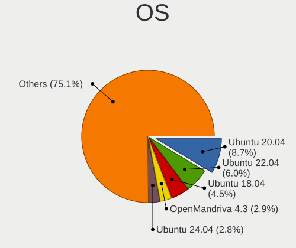

| Name                         | Computers | Percent |
|------------------------------|-----------|---------|
| Ubuntu 20.04                 | 597       | 8.67%   |
| Ubuntu 22.04                 | 413       | 6%      |
| Ubuntu 18.04                 | 309       | 4.49%   |
| OpenMandriva 4.3             | 200       | 2.91%   |
| Ubuntu 24.04                 | 192       | 2.79%   |
| Arch Rolling                 | 173       | 2.51%   |
| Debian 12                    | 145       | 2.11%   |
| Pop!_OS 22.04                | 138       | 2.01%   |
| Zorin 16                     | 121       | 1.76%   |
| Debian 11                    | 119       | 1.73%   |
| Zorin 17                     | 112       | 1.63%   |
| Linux Mint 22.1              | 98        | 1.42%   |
| openSUSE Tumbleweed-XXXXXXXX | 83        | 1.21%   |
| Linux Mint 20.3              | 82        | 1.19%   |
| Fedora 38                    | 77        | 1.12%   |
| Manjaro                      | 73        | 1.06%   |
| Linux Mint 22.2              | 71        | 1.03%   |
| Fedora 40                    | 71        | 1.03%   |
| Linux Mint 21.1              | 69        | 1%      |
| Ubuntu 20.10                 | 66        | 0.96%   |
| Arch                         | 66        | 0.96%   |
| Linux Mint 21.2              | 64        | 0.93%   |
| ArcoLinux Rolling            | 63        | 0.92%   |
| Fedora 39                    | 60        | 0.87%   |
| Xubuntu 20.04                | 57        | 0.83%   |
| OpenMandriva 24.12           | 56        | 0.81%   |
| OpenMandriva 4.2             | 55        | 0.8%    |
| KDE neon 20.04               | 54        | 0.78%   |
| Linux Mint 20.2              | 53        | 0.77%   |
| Fedora 36                    | 53        | 0.77%   |
| Fedora 34                    | 53        | 0.77%   |
| EndeavourOS Rolling          | 53        | 0.77%   |
| Fedora 37                    | 52        | 0.76%   |
| Ubuntu 21.10                 | 51        | 0.74%   |
| Linux Mint 19.3              | 50        | 0.73%   |
| Fedora 41                    | 50        | 0.73%   |
| Ubuntu 21.04                 | 47        | 0.68%   |
| Linux Mint 20.1              | 47        | 0.68%   |
| Fedora 42                    | 46        | 0.67%   |
| KDE neon 22.04               | 44        | 0.64%   |

OS Family
---------

OS without a version

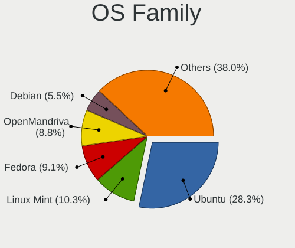

| Name          | Computers | Percent |
|---------------|-----------|---------|
| Ubuntu        | 1832      | 28.27%  |
| Linux Mint    | 670       | 10.34%  |
| Fedora        | 587       | 9.06%   |
| OpenMandriva  | 571       | 8.81%   |
| Debian        | 358       | 5.52%   |
| Zorin         | 301       | 4.65%   |
| Pop!_OS       | 296       | 4.57%   |
| Arch          | 239       | 3.69%   |
| Manjaro       | 189       | 2.92%   |
| Kubuntu       | 140       | 2.16%   |
| KDE neon      | 114       | 1.76%   |
| Xubuntu       | 112       | 1.73%   |
| openSUSE      | 112       | 1.73%   |
| ArcoLinux     | 67        | 1.03%   |
| Elementary    | 59        | 0.91%   |
| EndeavourOS   | 57        | 0.88%   |
| Kali          | 51        | 0.79%   |
| Gentoo        | 45        | 0.69%   |
| SteamOS       | 44        | 0.68%   |
| Bazzite       | 43        | 0.66%   |
| NixOS         | 36        | 0.56%   |
| Lubuntu       | 36        | 0.56%   |
| LMDE          | 34        | 0.52%   |
| ROSA          | 33        | 0.51%   |
| Ubuntu Unity  | 25        | 0.39%   |
| Ubuntu MATE   | 25        | 0.39%   |
| MX            | 24        | 0.37%   |
| Nobara        | 23        | 0.35%   |
| Parrot        | 21        | 0.32%   |
| Garuda Linux  | 21        | 0.32%   |
| Clear Linux   | 21        | 0.32%   |
| Ubuntu Budgie | 19        | 0.29%   |
| Endless       | 19        | 0.29%   |
| Raspbian      | 15        | 0.23%   |
| TUXEDO OS     | 11        | 0.17%   |
| Peppermint    | 11        | 0.17%   |
| Solus         | 10        | 0.15%   |
| Rocky Linux   | 10        | 0.15%   |
| CachyOS       | 10        | 0.15%   |
| Artix         | 10        | 0.15%   |

Kernel
------

Version of the Linux kernel

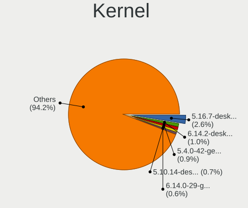

| Version                  | Computers | Percent |
|--------------------------|-----------|---------|
| 5.16.7-desktop-1omv4003  | 197       | 2.58%   |
| 6.14.2-desktop-3omv2590  | 79        | 1.03%   |
| 5.4.0-42-generic         | 69        | 0.9%    |
| 5.10.14-desktop-1omv4002 | 54        | 0.71%   |
| 6.14.0-29-generic        | 47        | 0.62%   |
| 6.8.0-51-generic         | 45        | 0.59%   |
| 6.12.1-desktop-1omv2490  | 45        | 0.59%   |
| 5.4.0-58-generic         | 43        | 0.56%   |
| 5.8.0-50-generic         | 42        | 0.55%   |
| 5.15.0-56-generic        | 39        | 0.51%   |
| 5.15.0-58-generic        | 37        | 0.48%   |
| 5.4.0-52-generic         | 36        | 0.47%   |
| 5.4.0-48-generic         | 35        | 0.46%   |
| 5.11.0-38-generic        | 34        | 0.45%   |
| 6.8.0-52-generic         | 33        | 0.43%   |
| 6.8.0-40-generic         | 31        | 0.41%   |
| 6.2.6-desktop-1omv2390   | 31        | 0.41%   |
| 5.15.0-46-generic        | 31        | 0.41%   |
| 5.15.0-91-generic        | 29        | 0.38%   |
| 6.9.3-76060903-generic   | 28        | 0.37%   |
| 6.4.11-desktop-1omv2390  | 28        | 0.37%   |
| 6.1.1-desktop-1omv2290   | 28        | 0.37%   |
| 6.8.0-45-generic         | 27        | 0.35%   |
| 5.13.0-28-generic        | 27        | 0.35%   |
| 5.11.0-27-generic        | 27        | 0.35%   |
| 5.8.0-43-generic         | 26        | 0.34%   |
| 5.4.0-26-generic         | 26        | 0.34%   |
| 6.8.0-49-generic         | 25        | 0.33%   |
| 6.6.2-desktop-1omv2390   | 25        | 0.33%   |
| 6.5.0-26-generic         | 25        | 0.33%   |
| 5.4.0-77-generic         | 25        | 0.33%   |
| 5.15.0-76-generic        | 25        | 0.33%   |
| 5.15.0-52-generic        | 25        | 0.33%   |
| 5.4.0-40-generic         | 24        | 0.31%   |
| 5.19.0-35-generic        | 24        | 0.31%   |
| 5.15.0-43-generic        | 24        | 0.31%   |
| 6.8.0-60-generic         | 23        | 0.3%    |
| 6.14.0-33-generic        | 23        | 0.3%    |
| 5.15.0-67-generic        | 23        | 0.3%    |
| 6.5.0-14-generic         | 22        | 0.29%   |

Kernel Family
-------------

Linux kernel without a distro release

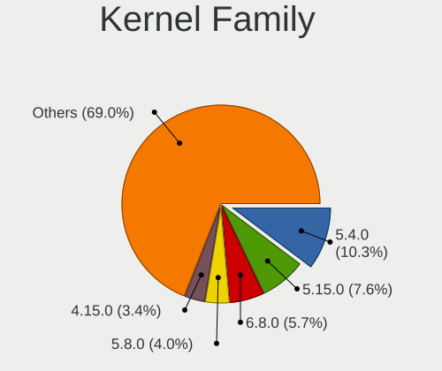

| Version | Computers | Percent |
|---------|-----------|---------|
| 5.4.0   | 739       | 10.29%  |
| 5.15.0  | 547       | 7.61%   |
| 6.8.0   | 410       | 5.71%   |
| 5.8.0   | 287       | 3.99%   |
| 4.15.0  | 244       | 3.4%    |
| 5.11.0  | 236       | 3.29%   |
| 6.5.0   | 209       | 2.91%   |
| 5.13.0  | 206       | 2.87%   |
| 5.16.7  | 200       | 2.78%   |
| 6.14.0  | 180       | 2.51%   |
| 5.19.0  | 161       | 2.24%   |
| 6.2.0   | 156       | 2.17%   |
| 6.1.0   | 154       | 2.14%   |
| 5.3.0   | 141       | 1.96%   |
| 5.10.0  | 137       | 1.91%   |
| 5.0.0   | 108       | 1.5%    |
| 6.11.0  | 99        | 1.38%   |
| 6.14.2  | 85        | 1.18%   |
| 4.18.0  | 74        | 1.03%   |
| 5.10.14 | 57        | 0.79%   |
| 6.12.1  | 50        | 0.7%    |
| 6.2.6   | 47        | 0.65%   |
| 6.9.3   | 38        | 0.53%   |
| 4.19.0  | 37        | 0.52%   |
| 5.14.0  | 34        | 0.47%   |
| 6.1.1   | 33        | 0.46%   |
| 6.4.11  | 32        | 0.45%   |
| 6.12.10 | 29        | 0.4%    |
| 6.17.7  | 28        | 0.39%   |
| 6.6.2   | 27        | 0.38%   |
| 6.12.9  | 20        | 0.28%   |
| 4.4.0   | 18        | 0.25%   |
| 6.17.9  | 16        | 0.22%   |
| 5.6.0   | 16        | 0.22%   |
| 5.16.11 | 16        | 0.22%   |
| 6.5.6   | 15        | 0.21%   |
| 6.4.6   | 15        | 0.21%   |
| 6.3.0   | 15        | 0.21%   |
| 5.17.5  | 15        | 0.21%   |
| 6.9.7   | 14        | 0.19%   |

Kernel Major Ver.
-----------------

Linux kernel major version

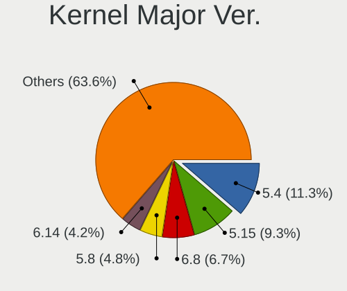

| Version | Computers | Percent |
|---------|-----------|---------|
| 5.4     | 803       | 11.32%  |
| 5.15    | 662       | 9.34%   |
| 6.8     | 474       | 6.68%   |
| 5.8     | 338       | 4.77%   |
| 6.14    | 301       | 4.24%   |
| 6.1     | 293       | 4.13%   |
| 5.11    | 283       | 3.99%   |
| 6.5     | 274       | 3.86%   |
| 5.16    | 269       | 3.79%   |
| 6.2     | 264       | 3.72%   |
| 5.10    | 262       | 3.69%   |
| 5.13    | 249       | 3.51%   |
| 4.15    | 245       | 3.46%   |
| 6.12    | 215       | 3.03%   |
| 5.19    | 199       | 2.81%   |
| 5.3     | 173       | 2.44%   |
| 6.11    | 170       | 2.4%    |
| 6.6     | 140       | 1.97%   |
| 5.0     | 112       | 1.58%   |
| 6.4     | 97        | 1.37%   |
| 4.18    | 90        | 1.27%   |
| 6.9     | 88        | 1.24%   |
| 6.17    | 88        | 1.24%   |
| 6.0     | 86        | 1.21%   |
| 5.14    | 78        | 1.1%    |
| 6.3     | 76        | 1.07%   |
| 6.10    | 76        | 1.07%   |
| 5.17    | 69        | 0.97%   |
| 6.7     | 61        | 0.86%   |
| 6.15    | 61        | 0.86%   |
| 5.18    | 61        | 0.86%   |
| 5.9     | 56        | 0.79%   |
| 5.6     | 51        | 0.72%   |
| 4.19    | 51        | 0.72%   |
| 6.13    | 42        | 0.59%   |
| 5.12    | 35        | 0.49%   |
| 6.16    | 34        | 0.48%   |
| 5.7     | 32        | 0.45%   |
| 5.5     | 28        | 0.39%   |
| 4.9     | 27        | 0.38%   |

Arch
----

OS architecture (x86_64, i586, etc.)

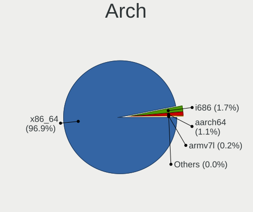

| Name    | Computers | Percent |
|---------|-----------|---------|
| x86_64  | 6055      | 96.86%  |
| i686    | 109       | 1.74%   |
| aarch64 | 71        | 1.14%   |
| armv7l  | 10        | 0.16%   |
| riscv64 | 3         | 0.05%   |
| armv6l  | 2         | 0.03%   |
| armv8l  | 1         | 0.02%   |

DE
--

Desktop Environment

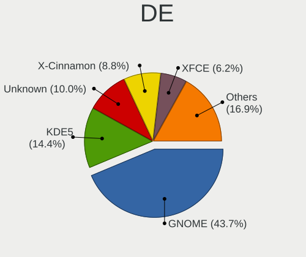

| Name             | Computers | Percent |
|------------------|-----------|---------|
| GNOME            | 2859      | 43.7%   |
| KDE5             | 940       | 14.37%  |
| Unknown          | 653       | 9.98%   |
| X-Cinnamon       | 575       | 8.79%   |
| XFCE             | 408       | 6.24%   |
| KDE6             | 399       | 6.1%    |
| MATE             | 138       | 2.11%   |
| KDE              | 109       | 1.67%   |
| LXQt             | 63        | 0.96%   |
| Pantheon         | 59        | 0.9%    |
| Cinnamon         | 41        | 0.63%   |
| LXDE             | 37        | 0.57%   |
| i3               | 32        | 0.49%   |
| Budgie           | 32        | 0.49%   |
| Hyprland         | 29        | 0.44%   |
| Unity            | 24        | 0.37%   |
| KDE4             | 20        | 0.31%   |
| GNOME Flashback  | 15        | 0.23%   |
| sway             | 14        | 0.21%   |
| COSMIC           | 13        | 0.2%    |
| Openbox          | 10        | 0.15%   |
| Deepin           | 9         | 0.14%   |
| icewm            | 7         | 0.11%   |
| Enlightenment    | 6         | 0.09%   |
| awesome          | 6         | 0.09%   |
| none+i3          | 5         | 0.08%   |
| GNOME Classic    | 5         | 0.08%   |
| qtile            | 4         | 0.06%   |
| niri             | 3         | 0.05%   |
| lightdm-xsession | 3         | 0.05%   |
| Endless:GNOME    | 3         | 0.05%   |
| Trinity          | 2         | 0.03%   |
| dusk             | 2         | 0.03%   |
| chadwm           | 2         | 0.03%   |
| bspwm            | 2         | 0.03%   |
| Xsession         | 1         | 0.02%   |
| xmonad           | 1         | 0.02%   |
| Unicorn:XFCE     | 1         | 0.02%   |
| sway:wlroots     | 1         | 0.02%   |
| LXDE-pi-wayfire  | 1         | 0.02%   |

Display Server
--------------

X11 or Wayland

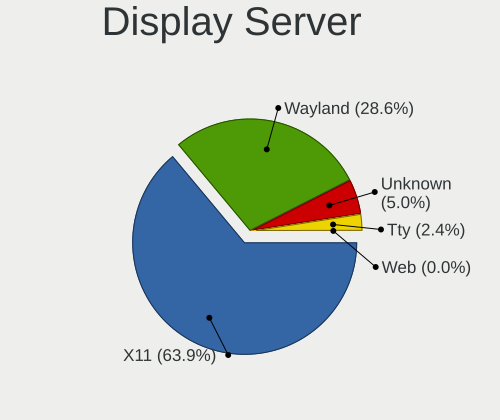

| Name    | Computers | Percent |
|---------|-----------|---------|
| X11     | 4143      | 63.94%  |
| Wayland | 1852      | 28.58%  |
| Unknown | 326       | 5.03%   |
| Tty     | 157       | 2.42%   |
| Web     | 2         | 0.03%   |

Display Manager
---------------

SDDM, LightDM, etc.

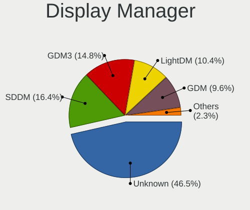

| Name           | Computers | Percent |
|----------------|-----------|---------|
| Unknown        | 3017      | 46.47%  |
| SDDM           | 1067      | 16.44%  |
| GDM3           | 961       | 14.8%   |
| LightDM        | 673       | 10.37%  |
| GDM            | 622       | 9.58%   |
| TDM            | 94        | 1.45%   |
| KDM            | 16        | 0.25%   |
| GREETD         | 10        | 0.15%   |
| XDM            | 9         | 0.14%   |
| SLiM           | 5         | 0.08%   |
| LY-DM          | 5         | 0.08%   |
| Ly             | 4         | 0.06%   |
| LXDM           | 2         | 0.03%   |
| COSMIC-GREETER | 2         | 0.03%   |
| SLIMSKI        | 1         | 0.02%   |
| NODM           | 1         | 0.02%   |
| MDM            | 1         | 0.02%   |
| LEMURS         | 1         | 0.02%   |
| FLY-DM         | 1         | 0.02%   |

OS Lang
-------

Language

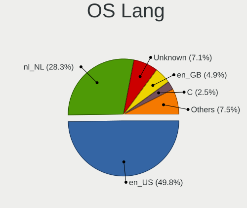

| Lang        | Computers | Percent |
|-------------|-----------|---------|
| en_US       | 3187      | 49.77%  |
| nl_NL       | 1810      | 28.27%  |
| Unknown     | 457       | 7.14%   |
| en_GB       | 311       | 4.86%   |
| C           | 157       | 2.45%   |
| de_DE       | 79        | 1.23%   |
| pl_PL       | 56        | 0.87%   |
| ru_RU       | 53        | 0.83%   |
| nl_BE       | 29        | 0.45%   |
| fr_FR       | 24        | 0.37%   |
| en_IE       | 20        | 0.31%   |
| it_IT       | 17        | 0.27%   |
| en_NL       | 16        | 0.25%   |
| es_ES       | 15        | 0.23%   |
| POSIX       | 14        | 0.22%   |
| C.UTF8      | 11        | 0.17%   |
| en_IN       | 9         | 0.14%   |
| en_CA       | 9         | 0.14%   |
| en_DK       | 8         | 0.12%   |
| hu_HU       | 7         | 0.11%   |
| sv_SE       | 6         | 0.09%   |
| sk_SK       | 6         | 0.09%   |
| ru_UA       | 6         | 0.09%   |
| pt_BR       | 6         | 0.09%   |
| en_AG       | 6         | 0.09%   |
| cs_CZ       | 6         | 0.09%   |
| tr_TR       | 5         | 0.08%   |
| pt_PT       | 5         | 0.08%   |
| fr_BE       | 5         | 0.08%   |
| zh_CN       | 4         | 0.06%   |
| es_MX       | 4         | 0.06%   |
| en_AU       | 4         | 0.06%   |
| de_AT       | 4         | 0.06%   |
| uk_UA       | 3         | 0.05%   |
| ro_RO       | 3         | 0.05%   |
| nb_NO       | 3         | 0.05%   |
| en_ZA       | 3         | 0.05%   |
| en_US.utf-8 | 3         | 0.05%   |
| nl_AW       | 2         | 0.03%   |
| lt_LT       | 2         | 0.03%   |

Boot Mode
---------

EFI or BIOS

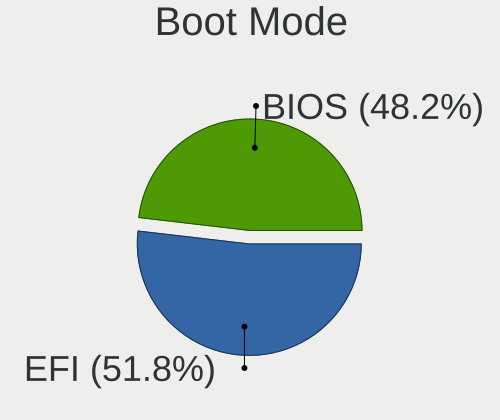

| Mode | Computers | Percent |
|------|-----------|---------|
| EFI  | 3314      | 51.85%  |
| BIOS | 3078      | 48.15%  |

Filesystem
----------

Type of filesystem

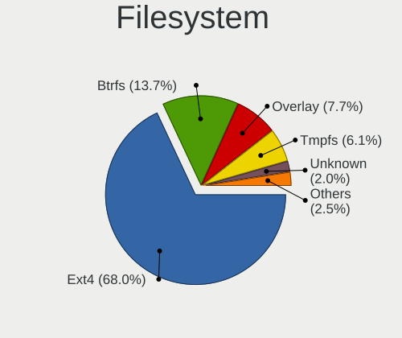

| Type    | Computers | Percent |
|---------|-----------|---------|
| Ext4    | 4390      | 68.02%  |
| Btrfs   | 887       | 13.74%  |
| Overlay | 498       | 7.72%   |
| Tmpfs   | 391       | 6.06%   |
| Unknown | 126       | 1.95%   |
| Xfs     | 76        | 1.18%   |
| Zfs     | 51        | 0.79%   |
| F2fs    | 14        | 0.22%   |
| Ext2    | 10        | 0.15%   |
| Ext3    | 6         | 0.09%   |
| Aufs    | 3         | 0.05%   |
| Rootfs  | 1         | 0.02%   |
| Jfs     | 1         | 0.02%   |

Part. scheme
------------

Scheme of partitioning

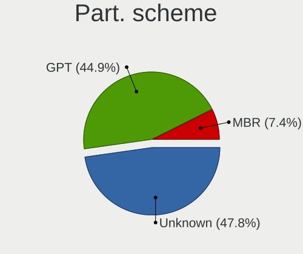

| Type    | Computers | Percent |
|---------|-----------|---------|
| Unknown | 3062      | 47.77%  |
| GPT     | 2875      | 44.85%  |
| MBR     | 473       | 7.38%   |

Dual Boot with Linux/BSD
------------------------

Hosting more than one Linux/BSD

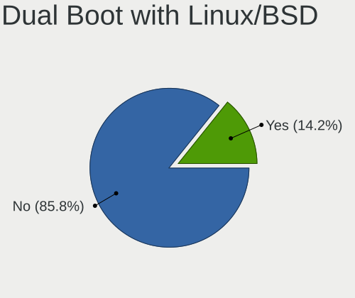

| Dual boot | Computers | Percent |
|-----------|-----------|---------|
| No        | 5456      | 85.76%  |
| Yes       | 906       | 14.24%  |

Dual Boot (Win)
---------------

Hosting Linux and Windows

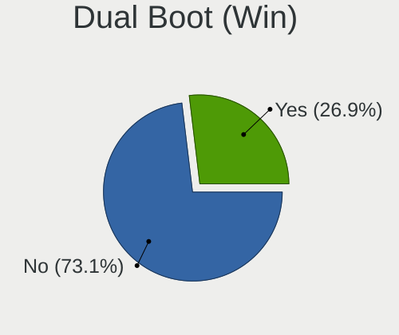

| Dual boot | Computers | Percent |
|-----------|-----------|---------|
| No        | 4641      | 73.1%   |
| Yes       | 1708      | 26.9%   |

Board
-----

Vendor
------

Motherboard manufacturer

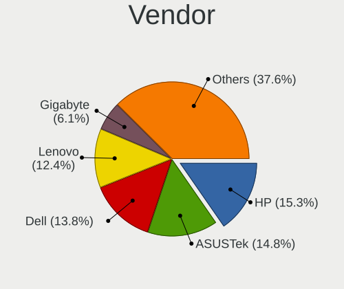

| Name                    | Computers | Percent |
|-------------------------|-----------|---------|
| Hewlett-Packard         | 958       | 15.35%  |
| ASUSTek Computer        | 922       | 14.77%  |
| Dell                    | 864       | 13.84%  |
| Lenovo                  | 775       | 12.42%  |
| Gigabyte Technology     | 378       | 6.06%   |
| MSI                     | 360       | 5.77%   |
| Acer                    | 333       | 5.33%   |
| ASRock                  | 236       | 3.78%   |
| Apple                   | 227       | 3.64%   |
| Intel                   | 123       | 1.97%   |
| Medion                  | 97        | 1.55%   |
| Notebook                | 76        | 1.22%   |
| Toshiba                 | 70        | 1.12%   |
| Unknown                 | 65        | 1.04%   |
| Raspberry Pi Foundation | 60        | 0.96%   |
| Google                  | 47        | 0.75%   |
| Samsung Electronics     | 44        | 0.7%    |
| Fujitsu                 | 41        | 0.66%   |
| Microsoft               | 39        | 0.62%   |
| Packard Bell            | 36        | 0.58%   |
| Valve                   | 35        | 0.56%   |
| Sony                    | 27        | 0.43%   |
| Foxconn                 | 18        | 0.29%   |
| Alienware               | 18        | 0.29%   |
| HUAWEI                  | 17        | 0.27%   |
| Supermicro              | 16        | 0.26%   |
| Pegatron                | 16        | 0.26%   |
| Framework               | 15        | 0.24%   |
| Fujitsu Siemens         | 13        | 0.21%   |
| AZW                     | 13        | 0.21%   |
| TUXEDO                  | 12        | 0.19%   |
| Biostar                 | 11        | 0.18%   |
| Timi                    | 10        | 0.16%   |
| Chuwi                   | 10        | 0.16%   |
| BESSTAR Tech            | 10        | 0.16%   |
| PC Specialist           | 9         | 0.14%   |
| AMI                     | 9         | 0.14%   |
| Shuttle                 | 8         | 0.13%   |
| Insyde                  | 8         | 0.13%   |
| SLIMBOOK                | 7         | 0.11%   |

Model
-----

Motherboard model

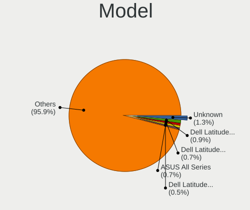

| Name                               | Computers | Percent |
|------------------------------------|-----------|---------|
| Unknown                            | 81        | 1.3%    |
| Dell Latitude 3120                 | 57        | 0.91%   |
| Dell Latitude 3190 2-in-1          | 42        | 0.67%   |
| ASUS All Series                    | 41        | 0.66%   |
| Dell Latitude 3310                 | 33        | 0.53%   |
| Valve Jupiter                      | 30        | 0.48%   |
| HP Notebook                        | 18        | 0.29%   |
| RPi Raspberry Pi                   | 17        | 0.27%   |
| Dell XPS 15 7590                   | 16        | 0.26%   |
| Dell OptiPlex 7010                 | 16        | 0.26%   |
| MSI MS-7C02                        | 13        | 0.21%   |
| Dell XPS 15 9560                   | 13        | 0.21%   |
| MSI MS-7C37                        | 12        | 0.19%   |
| Dell XPS 15 9500                   | 12        | 0.19%   |
| Apple MacBookAir7,2                | 12        | 0.19%   |
| RPi Raspberry Pi 4 Model B Rev 1.4 | 11        | 0.18%   |
| HP Pavilion g6                     | 11        | 0.18%   |
| HP Pavilion dv7                    | 11        | 0.18%   |
| Gigabyte B550 AORUS ELITE V2       | 11        | 0.18%   |
| ASUS ROG STRIX B550-F GAMING       | 11        | 0.18%   |
| Apple MacBookPro9,2                | 11        | 0.18%   |
| Apple MacBookPro12,1               | 11        | 0.18%   |
| MSI MS-7B86                        | 10        | 0.16%   |
| HP ZBook Studio G5                 | 10        | 0.16%   |
| HP ProBook 6570b                   | 10        | 0.16%   |
| Dell Latitude E6410                | 10        | 0.16%   |
| Apple MacBookPro8,1                | 10        | 0.16%   |
| Apple iMac12,1                     | 10        | 0.16%   |
| MSI MS-7C56                        | 9         | 0.14%   |
| MSI MS-7817                        | 9         | 0.14%   |
| HP Pavilion g7                     | 9         | 0.14%   |
| HP EliteBook 840 G3                | 9         | 0.14%   |
| Dell OptiPlex 3020                 | 9         | 0.14%   |
| Dell Latitude 3189                 | 9         | 0.14%   |
| ASUS Z170 PRO GAMING               | 9         | 0.14%   |
| ASUS PRIME A320M-K                 | 9         | 0.14%   |
| ASRock B450M Pro4                  | 9         | 0.14%   |
| MSI MS-7C91                        | 8         | 0.13%   |
| MSI MS-7721                        | 8         | 0.13%   |
| Lenovo ThinkBook 15 G2 ITL 20VE    | 8         | 0.13%   |

Model Family
------------

Motherboard model prefix

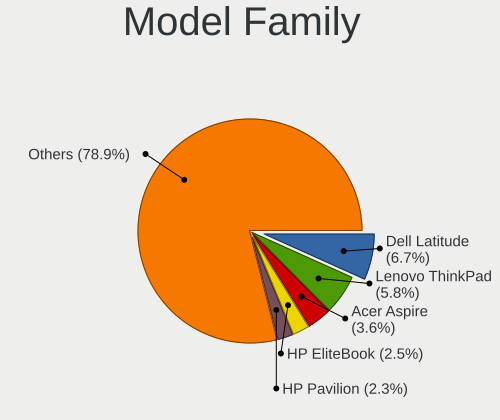

| Name                  | Computers | Percent |
|-----------------------|-----------|---------|
| Dell Latitude         | 420       | 6.73%   |
| Lenovo ThinkPad       | 364       | 5.83%   |
| Acer Aspire           | 227       | 3.64%   |
| HP EliteBook          | 158       | 2.53%   |
| HP Pavilion           | 145       | 2.32%   |
| Lenovo IdeaPad        | 139       | 2.23%   |
| Dell XPS              | 139       | 2.23%   |
| HP Compaq             | 124       | 1.99%   |
| HP ProBook            | 119       | 1.91%   |
| ASUS ROG              | 119       | 1.91%   |
| ASUS PRIME            | 111       | 1.78%   |
| Dell OptiPlex         | 99        | 1.59%   |
| Unknown               | 81        | 1.3%    |
| Dell Inspiron         | 76        | 1.22%   |
| Toshiba Satellite     | 61        | 0.98%   |
| HP ZBook              | 61        | 0.98%   |
| RPi Raspberry         | 60        | 0.96%   |
| ASUS VivoBook         | 59        | 0.95%   |
| Lenovo Legion         | 58        | 0.93%   |
| Dell Precision        | 57        | 0.91%   |
| Lenovo Yoga           | 50        | 0.8%    |
| HP ENVY               | 41        | 0.66%   |
| ASUS TUF              | 41        | 0.66%   |
| ASUS All              | 41        | 0.66%   |
| Microsoft Surface     | 38        | 0.61%   |
| HP Laptop             | 38        | 0.61%   |
| HP ProDesk            | 37        | 0.59%   |
| Lenovo ThinkBook      | 35        | 0.56%   |
| HP EliteDesk          | 34        | 0.54%   |
| Lenovo ThinkCentre    | 33        | 0.53%   |
| Gigabyte X570         | 32        | 0.51%   |
| ASUS ASUS             | 31        | 0.5%    |
| Valve Jupiter         | 30        | 0.48%   |
| HP OMEN               | 25        | 0.4%    |
| Packard Bell EasyNote | 24        | 0.38%   |
| Fujitsu LIFEBOOK      | 24        | 0.38%   |
| ASUS ZenBook          | 24        | 0.38%   |
| HP Spectre            | 23        | 0.37%   |
| Gigabyte B550M        | 22        | 0.35%   |
| Gigabyte B550         | 21        | 0.34%   |

MFG Year
--------

Motherboard manufacture year

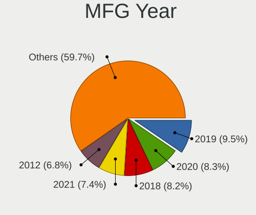

| Year    | Computers | Percent |
|---------|-----------|---------|
| 2019    | 595       | 9.53%   |
| 2020    | 521       | 8.35%   |
| 2018    | 510       | 8.17%   |
| 2021    | 464       | 7.43%   |
| 2012    | 426       | 6.82%   |
| 2013    | 402       | 6.44%   |
| 2017    | 363       | 5.82%   |
| 2011    | 362       | 5.8%    |
| 2014    | 316       | 5.06%   |
| 2022    | 307       | 4.92%   |
| 2015    | 300       | 4.81%   |
| 2016    | 282       | 4.52%   |
| 2010    | 267       | 4.28%   |
| 2009    | 222       | 3.56%   |
| 2023    | 220       | 3.52%   |
| 2008    | 202       | 3.24%   |
| 2024    | 147       | 2.36%   |
| 2007    | 133       | 2.13%   |
| 2006    | 69        | 1.11%   |
| Unknown | 69        | 1.11%   |
| 2025    | 37        | 0.59%   |
| 2005    | 16        | 0.26%   |
| 2004    | 7         | 0.11%   |
| 2003    | 3         | 0.05%   |
| 2002    | 1         | 0.02%   |
| 2001    | 1         | 0.02%   |

Form Factor
-----------

Physical design of the computer

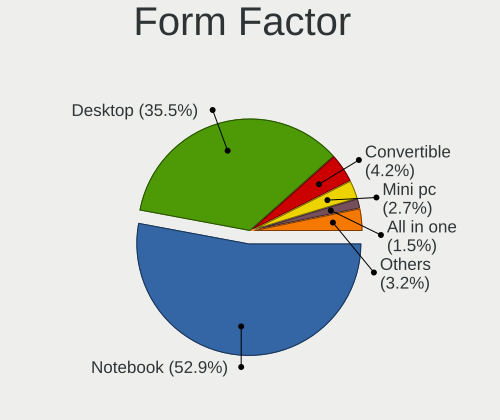

| Name            | Computers | Percent |
|-----------------|-----------|---------|
| Notebook        | 3304      | 52.93%  |
| Desktop         | 2215      | 35.49%  |
| Convertible     | 262       | 4.2%    |
| Mini pc         | 168       | 2.69%   |
| All in one      | 91        | 1.46%   |
| Tablet          | 80        | 1.28%   |
| System on chip  | 79        | 1.27%   |
| Server          | 39        | 0.62%   |
| Phone           | 2         | 0.03%   |
| Other           | 1         | 0.02%   |
| Virtual machine | 1         | 0.02%   |

Secure Boot
-----------

Enabled or disabled

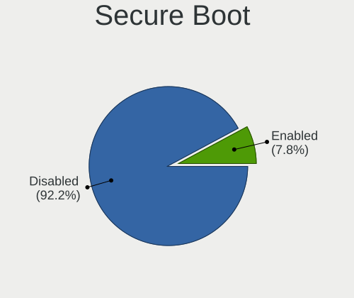

| State    | Computers | Percent |
|----------|-----------|---------|
| Disabled | 5797      | 92.18%  |
| Enabled  | 492       | 7.82%   |

Coreboot
--------

Have coreboot on board

| Used | Computers | Percent |
|------|-----------|---------|
| No   | 6183      | 99.05%  |
| Yes  | 59        | 0.95%   |

RAM Size
--------

Total RAM memory

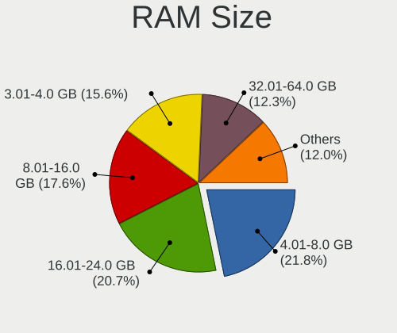

| Size in GB      | Computers | Percent |
|-----------------|-----------|---------|
| 4.01-8.0        | 1385      | 21.79%  |
| 16.01-24.0      | 1316      | 20.7%   |
| 8.01-16.0       | 1120      | 17.62%  |
| 3.01-4.0        | 991       | 15.59%  |
| 32.01-64.0      | 780       | 12.27%  |
| 64.01-256.0     | 251       | 3.95%   |
| 24.01-32.0      | 193       | 3.04%   |
| 1.01-2.0        | 176       | 2.77%   |
| 2.01-3.0        | 94        | 1.48%   |
| 0.51-1.0        | 42        | 0.66%   |
| More than 256.0 | 5         | 0.08%   |
| 0.01-0.5        | 4         | 0.06%   |

RAM Used
--------

Used RAM memory

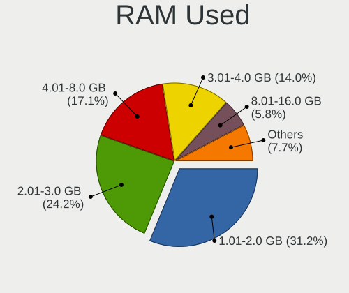

| Used GB     | Computers | Percent |
|-------------|-----------|---------|
| 1.01-2.0    | 2171      | 31.23%  |
| 2.01-3.0    | 1680      | 24.17%  |
| 4.01-8.0    | 1191      | 17.13%  |
| 3.01-4.0    | 973       | 14%     |
| 8.01-16.0   | 405       | 5.83%   |
| 0.51-1.0    | 350       | 5.03%   |
| 0.01-0.5    | 72        | 1.04%   |
| 16.01-24.0  | 71        | 1.02%   |
| 24.01-32.0  | 20        | 0.29%   |
| 32.01-64.0  | 16        | 0.23%   |
| 64.01-256.0 | 2         | 0.03%   |
| Unknown     | 1         | 0.01%   |

Total Drives
------------

Number of drives on board

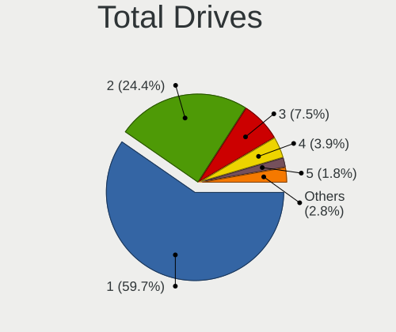

| Drives  | Computers | Percent |
|---------|-----------|---------|
| 1       | 3834      | 59.65%  |
| 2       | 1569      | 24.41%  |
| 3       | 479       | 7.45%   |
| 4       | 252       | 3.92%   |
| 5       | 115       | 1.79%   |
| 0       | 60        | 0.93%   |
| 6       | 57        | 0.89%   |
| 7       | 33        | 0.51%   |
| 8       | 8         | 0.12%   |
| 9       | 6         | 0.09%   |
| 10      | 5         | 0.08%   |
| Unknown | 4         | 0.06%   |
| 30      | 1         | 0.02%   |
| 28      | 1         | 0.02%   |
| 27      | 1         | 0.02%   |
| 17      | 1         | 0.02%   |
| 12      | 1         | 0.02%   |

Has CD-ROM
----------

Has CD-ROM on board

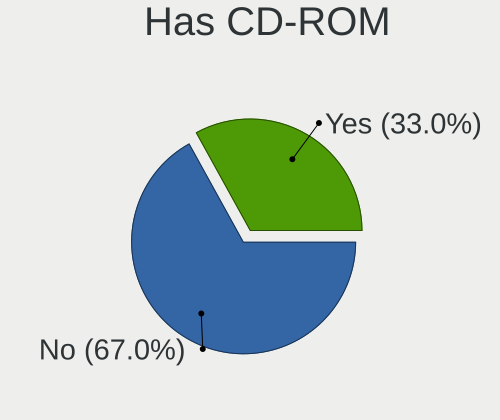

| Presented | Computers | Percent |
|-----------|-----------|---------|
| No        | 4218      | 66.97%  |
| Yes       | 2080      | 33.03%  |

Has Ethernet
------------

Has Ethernet on board

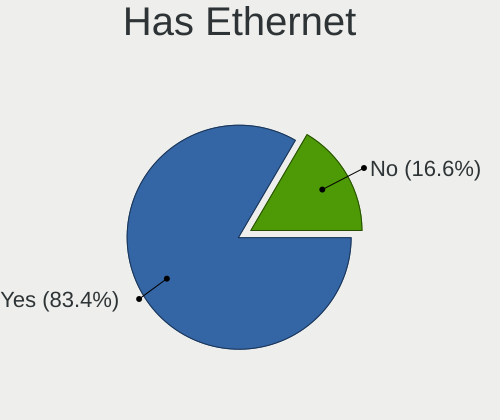

| Presented | Computers | Percent |
|-----------|-----------|---------|
| Yes       | 5228      | 83.43%  |
| No        | 1038      | 16.57%  |

Has WiFi
--------

Has WiFi module

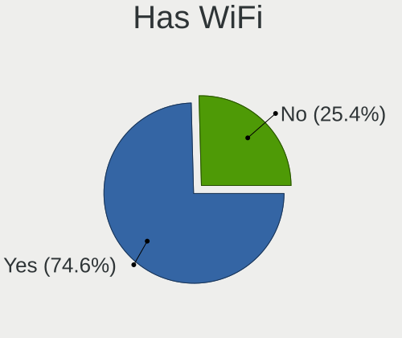

| Presented | Computers | Percent |
|-----------|-----------|---------|
| Yes       | 4674      | 74.58%  |
| No        | 1593      | 25.42%  |

Has Bluetooth
-------------

Has Bluetooth module

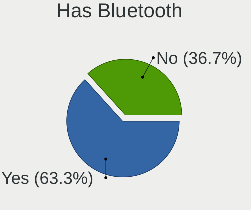

| Presented | Computers | Percent |
|-----------|-----------|---------|
| Yes       | 4017      | 63.28%  |
| No        | 2331      | 36.72%  |

Location
--------

Country
-------

Geographic location (country)

| Country     | Computers | Percent |
|-------------|-----------|---------|
| Netherlands | 6242      | 100%    |

City
----

Geographic location (city)

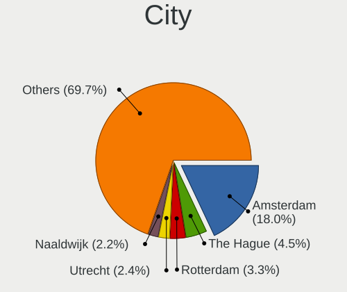

| City                   | Computers | Percent |
|------------------------|-----------|---------|
| Amsterdam              | 1198      | 17.97%  |
| The Hague              | 299       | 4.49%   |
| Rotterdam              | 221       | 3.32%   |
| Utrecht                | 158       | 2.37%   |
| Naaldwijk              | 144       | 2.16%   |
| Schagen                | 143       | 2.15%   |
| Haarlem                | 131       | 1.97%   |
| Groningen              | 127       | 1.91%   |
| Delft                  | 116       | 1.74%   |
| Almere Stad            | 104       | 1.56%   |
| Eindhoven              | 103       | 1.55%   |
| Enschede               | 80        | 1.2%    |
| Tilburg                | 73        | 1.1%    |
| Amersfoort             | 69        | 1.04%   |
| Leiden                 | 62        | 0.93%   |
| Nijmegen               | 57        | 0.86%   |
| Apeldoorn              | 53        | 0.8%    |
| Arnhem                 | 48        | 0.72%   |
| Breda                  | 47        | 0.71%   |
| Zoetermeer             | 43        | 0.65%   |
| Almelo                 | 43        | 0.65%   |
| Zwolle                 | 41        | 0.62%   |
| Roosendaal             | 41        | 0.62%   |
| Gouda                  | 41        | 0.62%   |
| Amstelveen             | 41        | 0.62%   |
| Maastricht             | 40        | 0.6%    |
| Hilversum              | 40        | 0.6%    |
| Hengelo                | 40        | 0.6%    |
| Leeuwarden             | 37        | 0.56%   |
| Hoofddorp              | 37        | 0.56%   |
| Zeist                  | 35        | 0.53%   |
| Dordrecht              | 35        | 0.53%   |
| Lelystad               | 33        | 0.5%    |
| Capelle aan den IJssel | 31        | 0.47%   |
| Heerlen                | 30        | 0.45%   |
| Meppel                 | 29        | 0.44%   |
| Heemskerk              | 29        | 0.44%   |
| 's-Hertogenbosch       | 29        | 0.44%   |
| Purmerend              | 28        | 0.42%   |
| Alkmaar                | 27        | 0.41%   |

Drives
------

Drive Vendor
------------

Hard drive vendors

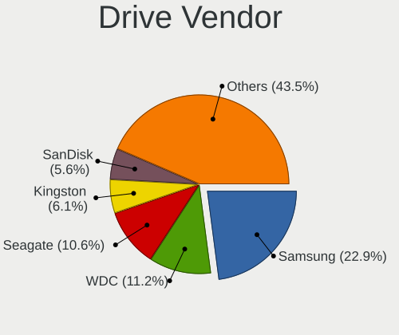

| Vendor                       | Computers | Drives | Percent |
|------------------------------|-----------|--------|---------|
| Samsung Electronics          | 2078      | 3409   | 22.94%  |
| WDC                          | 1019      | 1595   | 11.25%  |
| Seagate                      | 958       | 1515   | 10.57%  |
| Kingston                     | 554       | 727    | 6.11%   |
| SanDisk                      | 508       | 654    | 5.61%   |
| Toshiba                      | 461       | 664    | 5.09%   |
| Unknown                      | 407       | 534    | 4.49%   |
| Crucial                      | 377       | 516    | 4.16%   |
| SK hynix                     | 332       | 403    | 3.66%   |
| Intel                        | 265       | 356    | 2.92%   |
| Hitachi                      | 224       | 293    | 2.47%   |
| Micron Technology            | 162       | 196    | 1.79%   |
| HGST                         | 125       | 170    | 1.38%   |
| KIOXIA                       | 102       | 125    | 1.13%   |
| Apple                        | 94        | 131    | 1.04%   |
| A-DATA Technology            | 94        | 108    | 1.04%   |
| Kingston Technology Company  | 70        | 104    | 0.77%   |
| Micron/Crucial Technology    | 55        | 66     | 0.61%   |
| China                        | 55        | 77     | 0.61%   |
| LITEON                       | 53        | 65     | 0.58%   |
| Phison Electronics           | 51        | 72     | 0.56%   |
| PNY                          | 44        | 56     | 0.49%   |
| OCZ                          | 42        | 52     | 0.46%   |
| Intenso                      | 42        | 52     | 0.46%   |
| Phison                       | 38        | 60     | 0.42%   |
| Maxtor                       | 38        | 53     | 0.42%   |
| LITEONIT                     | 35        | 38     | 0.39%   |
| Transcend                    | 33        | 41     | 0.36%   |
| Corsair                      | 33        | 44     | 0.36%   |
| Unknown                      | 33        | 40     | 0.36%   |
| MAXIO Technology (Hangzhou)  | 32        | 38     | 0.35%   |
| Patriot                      | 31        | 39     | 0.34%   |
| Shenzhen Longsys Electronics | 30        | 41     | 0.33%   |
| Gigabyte Technology          | 29        | 35     | 0.32%   |
| JMicron Technology           | 27        | 36     | 0.3%    |
| GOODRAM                      | 27        | 31     | 0.3%    |
| Fujitsu                      | 27        | 31     | 0.3%    |
| SSSTC                        | 23        | 28     | 0.25%   |
| SPCC                         | 23        | 29     | 0.25%   |
| Silicon Motion               | 21        | 24     | 0.23%   |

Drive Model
-----------

Hard drive models

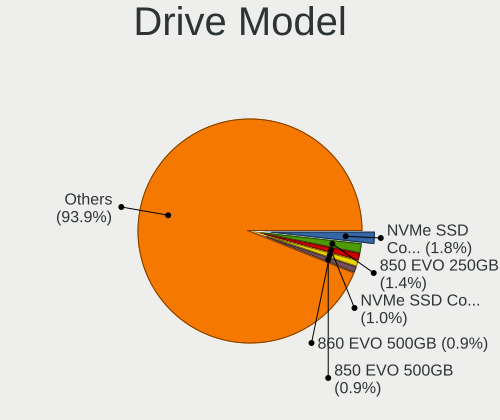

| Model                                                | Computers | Percent |
|------------------------------------------------------|-----------|---------|
| Samsung NVMe SSD Controller SM981/PM981/PM983 1TB    | 179       | 1.76%   |
| Samsung SSD 850 EVO 250GB                            | 144       | 1.41%   |
| Samsung NVMe SSD Controller PM9A1/PM9A3/980PRO 1TB   | 106       | 1.04%   |
| Samsung SSD 860 EVO 500GB                            | 95        | 0.93%   |
| Samsung SSD 850 EVO 500GB                            | 93        | 0.91%   |
| Kingston SA400S37240G 240GB SSD                      | 90        | 0.88%   |
| Unknown MMC Card  32GB                               | 65        | 0.64%   |
| Unknown MMC Card  64GB                               | 64        | 0.63%   |
| Samsung SSD 980 1TB                                  | 62        | 0.61%   |
| Crucial CT500MX500SSD1 500GB                         | 59        | 0.58%   |
| Samsung SSD 860 EVO 1TB                              | 58        | 0.57%   |
| Samsung SSD 840 EVO 250GB                            | 56        | 0.55%   |
| Kingston SA400S37120G 120GB SSD                      | 56        | 0.55%   |
| Kingston SV300S37A120G 120GB SSD                     | 52        | 0.51%   |
| Samsung NVMe SSD Drive 500GB                         | 47        | 0.46%   |
| Samsung NVMe SSD Drive 1TB                           | 46        | 0.45%   |
| Seagate ST2000DM008-2FR102 2TB                       | 44        | 0.43%   |
| Samsung SSD 840 EVO 120GB                            | 43        | 0.42%   |
| Kingston SA400S37480G 480GB SSD                      | 43        | 0.42%   |
| Seagate ST500DM002-1BD142 500GB                      | 41        | 0.4%    |
| Crucial CT1000MX500SSD1 1TB                          | 41        | 0.4%    |
| Seagate Expansion 2TB                                | 40        | 0.39%   |
| Samsung NVMe SSD Controller SM961/PM961/SM963 1024GB | 40        | 0.39%   |
| Crucial CT240BX500SSD1 240GB                         | 40        | 0.39%   |
| HGST HTS721010A9E630 1TB                             | 38        | 0.37%   |
| Samsung SSD 970 EVO 1TB                              | 36        | 0.35%   |
| Toshiba DT01ACA100 1TB                               | 35        | 0.34%   |
| Samsung SSD 870 EVO 500GB                            | 34        | 0.33%   |
| Seagate ST1000LM035-1RK172 1TB                       | 33        | 0.32%   |
| Samsung SSD 860 EVO 250GB                            | 33        | 0.32%   |
| Unknown                                              | 33        | 0.32%   |
| Samsung SSD 870 QVO 1TB                              | 32        | 0.31%   |
| Samsung SSD 860 QVO 1TB                              | 32        | 0.31%   |
| Samsung SSD 870 EVO 1TB                              | 31        | 0.3%    |
| Toshiba MQ01ABD100 1TB                               | 30        | 0.29%   |
| Seagate ST9500325AS 500GB                            | 29        | 0.28%   |
| Toshiba MQ01ABF050 500GB                             | 28        | 0.28%   |
| Samsung NVMe SSD Drive 256GB                         | 28        | 0.28%   |
| MAXIO (Hangzhou) NVMe SSD Controller MAP1202 2TB     | 28        | 0.28%   |
| Unknown MMC Card  128GB                              | 27        | 0.27%   |

HDD Vendor
----------

Hard disk drive vendors

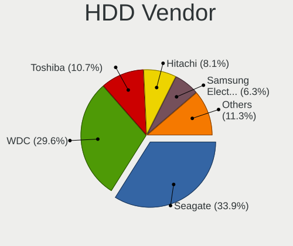

| Vendor              | Computers | Drives | Percent |
|---------------------|-----------|--------|---------|
| Seagate             | 935       | 1476   | 33.94%  |
| WDC                 | 816       | 1285   | 29.62%  |
| Toshiba             | 295       | 439    | 10.71%  |
| Hitachi             | 224       | 293    | 8.13%   |
| Samsung Electronics | 174       | 272    | 6.32%   |
| HGST                | 125       | 170    | 4.54%   |
| Maxtor              | 38        | 53     | 1.38%   |
| Fujitsu             | 27        | 31     | 0.98%   |
| Unknown             | 26        | 42     | 0.94%   |
| Apple               | 19        | 25     | 0.69%   |
| JMicron Technology  | 17        | 21     | 0.62%   |
| Hewlett-Packard     | 8         | 13     | 0.29%   |
| ASMT                | 8         | 12     | 0.29%   |
| Intenso             | 5         | 5      | 0.18%   |
| External            | 4         | 6      | 0.15%   |
| ASMedia             | 4         | 4      | 0.15%   |
| IBM/Hitachi         | 3         | 3      | 0.11%   |
| HGST HTS            | 3         | 4      | 0.11%   |
| SAGE                | 2         | 2      | 0.07%   |
| ExcelStor           | 2         | 2      | 0.07%   |
| WD MediaMax         | 1         | 1      | 0.04%   |
| USB3.0              | 1         | 1      | 0.04%   |
| TO Exter            | 1         | 1      | 0.04%   |
| TDAS                | 1         | 5      | 0.04%   |
| Synology            | 1         | 1      | 0.04%   |
| StoreJet            | 1         | 1      | 0.04%   |
| SSK                 | 1         | 1      | 0.04%   |
| Shenzhen            | 1         | 1      | 0.04%   |
| SABRENT             | 1         | 2      | 0.04%   |
| QNAP                | 1         | 1      | 0.04%   |
| NAS                 | 1         | 10     | 0.04%   |
| Maxtor 6            | 1         | 2      | 0.04%   |
| Magnetic Data       | 1         | 1      | 0.04%   |
| LIO-ORG             | 1         | 4      | 0.04%   |
| LaCie               | 1         | 1      | 0.04%   |
| KESU                | 1         | 1      | 0.04%   |
| JetFlash            | 1         | 1      | 0.04%   |
| Inateck             | 1         | 1      | 0.04%   |
| IET                 | 1         | 4      | 0.04%   |
| IB-377U3            | 1         | 1      | 0.04%   |

SSD Vendor
----------

Solid state drive vendors

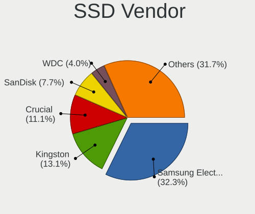

| Vendor              | Computers | Drives | Percent |
|---------------------|-----------|--------|---------|
| Samsung Electronics | 1037      | 1577   | 32.3%   |
| Kingston            | 421       | 535    | 13.11%  |
| Crucial             | 357       | 493    | 11.12%  |
| SanDisk             | 247       | 301    | 7.69%   |
| WDC                 | 130       | 190    | 4.05%   |
| Intel               | 98        | 124    | 3.05%   |
| SK hynix            | 78        | 105    | 2.43%   |
| A-DATA Technology   | 77        | 91     | 2.4%    |
| Micron Technology   | 58        | 77     | 1.81%   |
| Apple               | 58        | 71     | 1.81%   |
| China               | 55        | 77     | 1.71%   |
| Toshiba             | 47        | 61     | 1.46%   |
| LITEON              | 45        | 57     | 1.4%    |
| PNY                 | 44        | 56     | 1.37%   |
| OCZ                 | 42        | 52     | 1.31%   |
| LITEONIT            | 35        | 38     | 1.09%   |
| Intenso             | 30        | 35     | 0.93%   |
| Transcend           | 28        | 35     | 0.87%   |
| Patriot             | 27        | 34     | 0.84%   |
| GOODRAM             | 26        | 29     | 0.81%   |
| Corsair             | 23        | 32     | 0.72%   |
| SPCC                | 22        | 28     | 0.69%   |
| Gigabyte Technology | 13        | 17     | 0.4%    |
| ASMT                | 12        | 12     | 0.37%   |
| Unknown             | 12        | 18     | 0.37%   |
| KingSpec            | 11        | 15     | 0.34%   |
| Netac               | 9         | 9      | 0.28%   |
| Verbatim            | 7         | 10     | 0.22%   |
| KingDian            | 7         | 8      | 0.22%   |
| Lexar               | 6         | 6      | 0.19%   |
| KingFast            | 6         | 8      | 0.19%   |
| Apacer              | 6         | 6      | 0.19%   |
| Unknown             | 5         | 5      | 0.16%   |
| SABRENT             | 5         | 6      | 0.16%   |
| Phison              | 5         | 15     | 0.16%   |
| Mushkin             | 5         | 7      | 0.16%   |
| Leven               | 5         | 5      | 0.16%   |
| FORESEE             | 5         | 5      | 0.16%   |
| Team                | 4         | 6      | 0.12%   |
| Seagate             | 4         | 4      | 0.12%   |

Drive Kind
----------

HDD or SSD

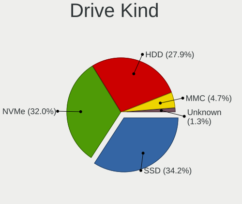

| Kind    | Computers | Drives | Percent |
|---------|-----------|--------|---------|
| SSD     | 2786      | 4372   | 34.21%  |
| NVMe    | 2604      | 3862   | 31.98%  |
| HDD     | 2268      | 4199   | 27.85%  |
| MMC     | 380       | 465    | 4.67%   |
| Unknown | 105       | 152    | 1.29%   |

Drive Connector
---------------

SATA, SAS, NVMe, etc.

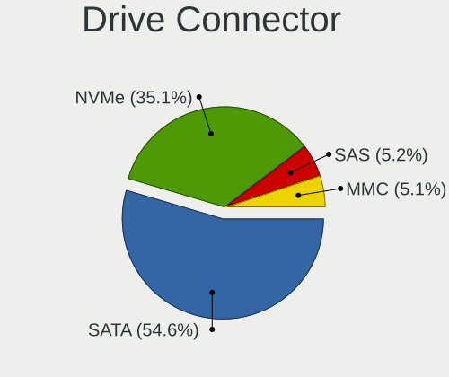

| Type | Computers | Drives | Percent |
|------|-----------|--------|---------|
| SATA | 4040      | 8131   | 54.58%  |
| NVMe | 2596      | 3821   | 35.07%  |
| SAS  | 386       | 633    | 5.21%   |
| MMC  | 380       | 465    | 5.13%   |

Drive Size
----------

Size of hard drive

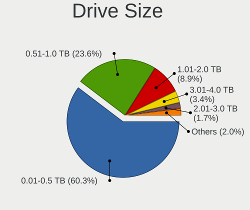

| Size in TB | Computers | Drives | Percent |
|------------|-----------|--------|---------|
| 0.01-0.5   | 3219      | 5131   | 60.34%  |
| 0.51-1.0   | 1261      | 1924   | 23.64%  |
| 1.01-2.0   | 473       | 764    | 8.87%   |
| 3.01-4.0   | 182       | 359    | 3.41%   |
| 2.01-3.0   | 91        | 147    | 1.71%   |
| 4.01-10.0  | 90        | 208    | 1.69%   |
| 10.01-20.0 | 18        | 37     | 0.34%   |
| 20.01-50.0 | 1         | 1      | 0.02%   |

Space Total
-----------

Amount of disk space available on the file system

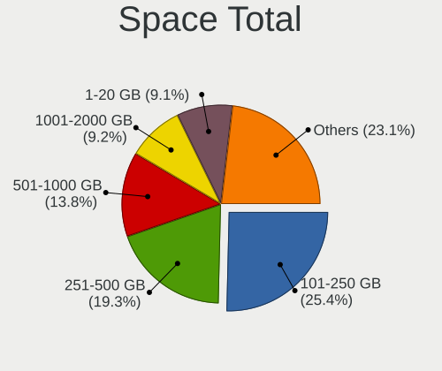

| Size in GB     | Computers | Percent |
|----------------|-----------|---------|
| 101-250        | 1685      | 25.37%  |
| 251-500        | 1284      | 19.33%  |
| 501-1000       | 917       | 13.81%  |
| 1001-2000      | 614       | 9.25%   |
| 1-20           | 604       | 9.1%    |
| More than 3000 | 452       | 6.81%   |
| 51-100         | 397       | 5.98%   |
| 21-50          | 251       | 3.78%   |
| 2001-3000      | 220       | 3.31%   |
| Unknown        | 217       | 3.27%   |

Space Used
----------

Amount of used disk space

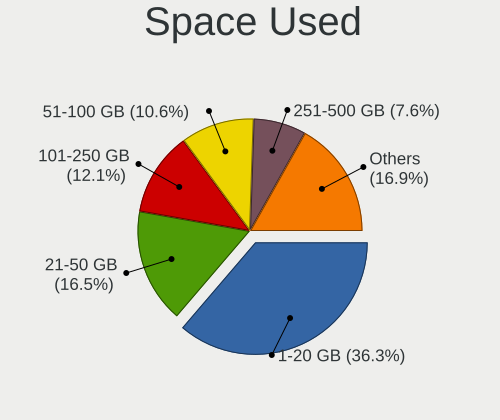

| Used GB        | Computers | Percent |
|----------------|-----------|---------|
| 1-20           | 2503      | 36.27%  |
| 21-50          | 1141      | 16.53%  |
| 101-250        | 836       | 12.11%  |
| 51-100         | 732       | 10.61%  |
| 251-500        | 525       | 7.61%   |
| 501-1000       | 429       | 6.22%   |
| 1001-2000      | 245       | 3.55%   |
| Unknown        | 217       | 3.14%   |
| More than 3000 | 165       | 2.39%   |
| 2001-3000      | 94        | 1.36%   |
| 0              | 14        | 0.2%    |

Malfunc. Drives
---------------

Drive models with a malfunction

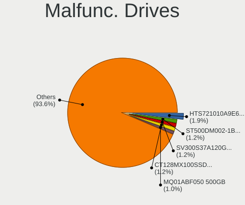

| Model                                                         | Computers | Drives | Percent |
|---------------------------------------------------------------|-----------|--------|---------|
| HGST HTS721010A9E630 1TB                                      | 8         | 10     | 1.9%    |
| Seagate ST500DM002-1BD142 500GB                               | 5         | 5      | 1.19%   |
| Kingston SV300S37A120G 120GB SSD                              | 5         | 6      | 1.19%   |
| Crucial CT128MX100SSD1 128GB                                  | 5         | 6      | 1.19%   |
| Toshiba MQ01ABF050 500GB                                      | 4         | 4      | 0.95%   |
| Seagate ST3500418AS 500GB                                     | 4         | 4      | 0.95%   |
| Seagate ST1000DM003-1ER162 1TB                                | 4         | 4      | 0.95%   |
| SanDisk SD6SF1M128G1022I 128GB SSD                            | 4         | 4      | 0.95%   |
| Samsung Electronics NVMe SSD Controller SM981/PM981/PM983 1TB | 4         | 7      | 0.95%   |
| Kingston SA400S37120G 120GB SSD                               | 4         | 5      | 0.95%   |
| HGST HTS725050A7E630 500GB                                    | 4         | 4      | 0.95%   |
| WDC WDS240G2G0A-00JH30 240GB SSD                              | 3         | 3      | 0.71%   |
| WDC WD60EFRX-68MYMN1 6TB                                      | 3         | 4      | 0.71%   |
| WDC WD10EADS-22M2B0 1TB                                       | 3         | 3      | 0.71%   |
| Toshiba MQ01ABD050 500GB                                      | 3         | 5      | 0.71%   |
| Toshiba DT01ACA100 1TB                                        | 3         | 3      | 0.71%   |
| SK hynix SC401 SATA 512GB SSD                                 | 3         | 3      | 0.71%   |
| SK hynix HFS128G39TND-N210A 128GB SSD                         | 3         | 3      | 0.71%   |
| Seagate ST9500325AS 500GB                                     | 3         | 3      | 0.71%   |
| Seagate ST9320325AS 320GB                                     | 3         | 3      | 0.71%   |
| Seagate ST9250410AS 250GB                                     | 3         | 3      | 0.71%   |
| Seagate ST2000DM001-1CH164 2TB                                | 3         | 3      | 0.71%   |
| Samsung Electronics SSD 870 EVO 500GB                         | 3         | 3      | 0.71%   |
| Samsung Electronics SSD 870 EVO 1TB                           | 3         | 4      | 0.71%   |
| Samsung Electronics HD154UI 1TB                               | 3         | 4      | 0.71%   |
| LITEON CV8-8E128-HP 128GB SSD                                 | 3         | 6      | 0.71%   |
| Intel SSDSC2BW120A4 120GB                                     | 3         | 4      | 0.71%   |
| Intel SSDSA2M080G2GC 80GB                                     | 3         | 4      | 0.71%   |
| Hitachi HTS545050A7E380 500GB                                 | 3         | 4      | 0.71%   |
| WDC WD60EFRX-68L0BN1 6TB                                      | 2         | 2      | 0.48%   |
| WDC WD20EZRZ-00Z5HB0 2TB                                      | 2         | 2      | 0.48%   |
| WDC WD20EFRX-68EUZN0 2TB                                      | 2         | 7      | 0.48%   |
| WDC WD20EARX-00PASB0 2TB                                      | 2         | 2      | 0.48%   |
| WDC WD10SPZX-60Z10T0 1TB                                      | 2         | 2      | 0.48%   |
| WDC WD1002FAEX-00Z3A0 1TB                                     | 2         | 4      | 0.48%   |
| WDC WD1002FAEX-00Y9A0 1TB                                     | 2         | 2      | 0.48%   |
| Toshiba RC500 500GB                                           | 2         | 12     | 0.48%   |
| Toshiba MQ01ABD100 1TB                                        | 2         | 2      | 0.48%   |
| Toshiba DT01ACA300 3TB                                        | 2         | 6      | 0.48%   |
| SK hynix BC711 HFM512GD3JX013N 512GB                          | 2         | 2      | 0.48%   |

Malfunc. Drive Vendor
---------------------

Vendors of faulty drives

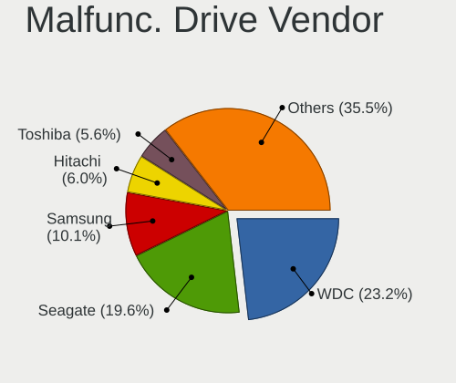

| Vendor                      | Computers | Drives | Percent |
|-----------------------------|-----------|--------|---------|
| WDC                         | 96        | 120    | 23.19%  |
| Seagate                     | 81        | 103    | 19.57%  |
| Samsung Electronics         | 42        | 51     | 10.14%  |
| Hitachi                     | 25        | 27     | 6.04%   |
| Toshiba                     | 23        | 40     | 5.56%   |
| Intel                       | 23        | 29     | 5.56%   |
| Kingston                    | 20        | 22     | 4.83%   |
| HGST                        | 17        | 22     | 4.11%   |
| Crucial                     | 16        | 26     | 3.86%   |
| SK hynix                    | 14        | 14     | 3.38%   |
| SanDisk                     | 12        | 12     | 2.9%    |
| LITEON                      | 6         | 9      | 1.45%   |
| Maxtor                      | 5         | 8      | 1.21%   |
| Micron Technology           | 4         | 4      | 0.97%   |
| Fujitsu                     | 4         | 4      | 0.97%   |
| A-DATA Technology           | 3         | 3      | 0.72%   |
| OCZ                         | 2         | 2      | 0.48%   |
| LITEONIT                    | 2         | 2      | 0.48%   |
| Corsair                     | 2         | 4      | 0.48%   |
| Apple                       | 2         | 2      | 0.48%   |
| Transcend                   | 1         | 1      | 0.24%   |
| Realtek                     | 1         | 1      | 0.24%   |
| PNY                         | 1         | 1      | 0.24%   |
| Patriot                     | 1         | 1      | 0.24%   |
| Micron/Crucial Technology   | 1         | 1      | 0.24%   |
| Leven                       | 1         | 1      | 0.24%   |
| Kingston Technology Company | 1         | 1      | 0.24%   |
| Intenso                     | 1         | 1      | 0.24%   |
| IBM/Hitachi                 | 1         | 1      | 0.24%   |
| GOODRAM                     | 1         | 1      | 0.24%   |
| EK46XL85C49                 | 1         | 1      | 0.24%   |
| China                       | 1         | 3      | 0.24%   |
| C-Series                    | 1         | 1      | 0.24%   |
| Apacer                      | 1         | 1      | 0.24%   |
| Anobit                      | 1         | 1      | 0.24%   |

Malfunc. HDD Vendor
-------------------

Vendors of faulty HDD drives

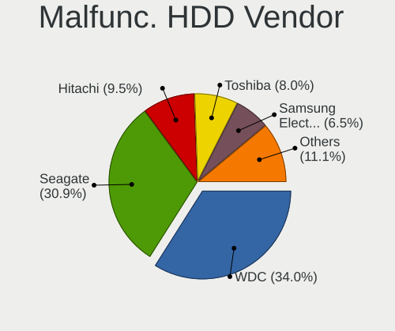

| Vendor              | Computers | Drives | Percent |
|---------------------|-----------|--------|---------|
| WDC                 | 89        | 112    | 33.97%  |
| Seagate             | 81        | 103    | 30.92%  |
| Hitachi             | 25        | 27     | 9.54%   |
| Toshiba             | 21        | 27     | 8.02%   |
| Samsung Electronics | 17        | 18     | 6.49%   |
| HGST                | 17        | 22     | 6.49%   |
| Maxtor              | 5         | 8      | 1.91%   |
| Fujitsu             | 4         | 4      | 1.53%   |
| Apple               | 2         | 2      | 0.76%   |
| IBM/Hitachi         | 1         | 1      | 0.38%   |

Malfunc. Drive Kind
-------------------

Kinds of faulty drives

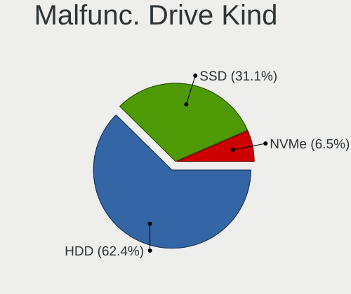

| Kind | Computers | Drives | Percent |
|------|-----------|--------|---------|
| HDD  | 249       | 324    | 62.41%  |
| SSD  | 124       | 152    | 31.08%  |
| NVMe | 26        | 45     | 6.52%   |

Failed Drives
-------------

Failed drive models

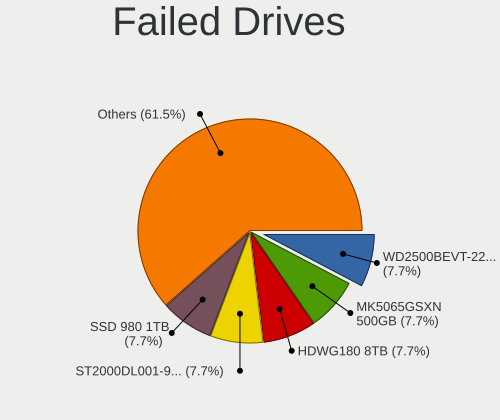

| Model                                   | Computers | Drives | Percent |
|-----------------------------------------|-----------|--------|---------|
| WDC WD2500BEVT-22ZCT0 250GB             | 1         | 1      | 7.69%   |
| Toshiba MK5065GSXN 500GB                | 1         | 1      | 7.69%   |
| Toshiba HDWG180 8TB                     | 1         | 4      | 7.69%   |
| SK hynix BC501 HFM256GDJTNG-8310A 256GB | 1         | 1      | 7.69%   |
| Seagate ST2000DL001-9VT156 2TB          | 1         | 1      | 7.69%   |
| Samsung Electronics SSD 980 1TB         | 1         | 1      | 7.69%   |
| Samsung Electronics HD502HJ 500GB       | 1         | 1      | 7.69%   |
| Samsung Electronics HD161HJ 160GB       | 1         | 1      | 7.69%   |
| Crucial M4-CT256M4SSD3 256GB            | 1         | 1      | 7.69%   |
| Apple SSD TS256C 256GB                  | 1         | 2      | 7.69%   |
| Apple SSD SM0256F 256GB                 | 1         | 1      | 7.69%   |
| Apple HDD HTS541010A9E662 1TB           | 1         | 1      | 7.69%   |
| A-DATA Technology SX8200PNP 512GB       | 1         | 1      | 7.69%   |

Failed Drive Vendor
-------------------

Failed drive vendors

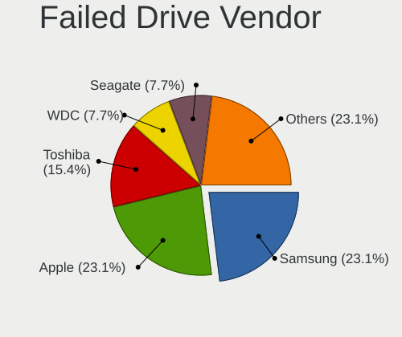

| Vendor              | Computers | Drives | Percent |
|---------------------|-----------|--------|---------|
| Samsung Electronics | 3         | 3      | 23.08%  |
| Apple               | 3         | 4      | 23.08%  |
| Toshiba             | 2         | 5      | 15.38%  |
| WDC                 | 1         | 1      | 7.69%   |
| SK hynix            | 1         | 1      | 7.69%   |
| Seagate             | 1         | 1      | 7.69%   |
| Crucial             | 1         | 1      | 7.69%   |
| A-DATA Technology   | 1         | 1      | 7.69%   |

Drive Status
------------

Number of failed and malfunc. drives

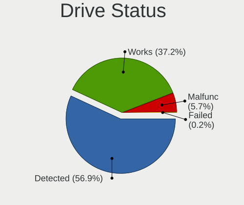

| Status   | Computers | Drives | Percent |
|----------|-----------|--------|---------|
| Detected | 3823      | 8136   | 56.9%   |
| Works    | 2499      | 4376   | 37.19%  |
| Malfunc  | 384       | 521    | 5.72%   |
| Failed   | 13        | 17     | 0.19%   |

Storage controller
------------------

Storage Vendor
--------------

Storage controller vendors

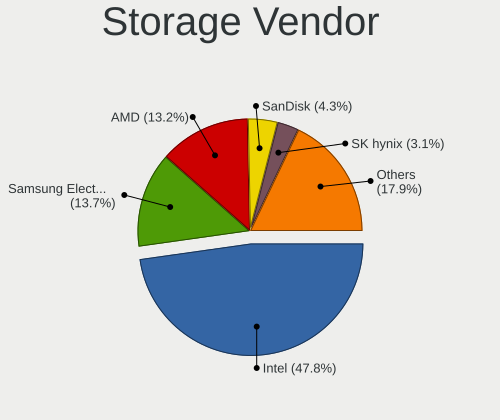

| Vendor                                  | Computers | Percent |
|-----------------------------------------|-----------|---------|
| Intel                                   | 3867      | 47.77%  |
| Samsung Electronics                     | 1113      | 13.75%  |
| AMD                                     | 1066      | 13.17%  |
| SanDisk                                 | 347       | 4.29%   |
| SK hynix                                | 252       | 3.11%   |
| Kingston Technology Company             | 203       | 2.51%   |
| Toshiba America Info Systems            | 128       | 1.58%   |
| ASMedia Technology                      | 123       | 1.52%   |
| Phison Electronics                      | 109       | 1.35%   |
| Micron Technology                       | 108       | 1.33%   |
| KIOXIA                                  | 105       | 1.3%    |
| Nvidia                                  | 87        | 1.07%   |
| JMicron Technology                      | 79        | 0.98%   |
| Marvell Technology Group                | 74        | 0.91%   |
| Micron/Crucial Technology               | 69        | 0.85%   |
| MAXIO Technology (Hangzhou)             | 38        | 0.47%   |
| Shenzhen Longsys Electronics            | 37        | 0.46%   |
| Silicon Motion                          | 31        | 0.38%   |
| ADATA Technology                        | 28        | 0.35%   |
| Solid State Storage Technology          | 26        | 0.32%   |
| Apple                                   | 18        | 0.22%   |
| VIA Technologies                        | 17        | 0.21%   |
| Seagate Technology                      | 17        | 0.21%   |
| Silicon Integrated Systems [SiS]        | 16        | 0.2%    |
| Broadcom / LSI                          | 16        | 0.2%    |
| Union Memory (Shenzhen)                 | 12        | 0.15%   |
| Realtek Semiconductor                   | 12        | 0.15%   |
| LSI Logic / Symbios Logic               | 12        | 0.15%   |
| Lite-On Technology                      | 12        | 0.15%   |
| Silicon Image                           | 11        | 0.14%   |
| INNOGRIT                                | 8         | 0.1%    |
| O2 Micro                                | 7         | 0.09%   |
| Hosin Global Electronics                | 5         | 0.06%   |
| Hewlett-Packard                         | 5         | 0.06%   |
| Adaptec                                 | 5         | 0.06%   |
| Yangtze Memory Technologies             | 4         | 0.05%   |
| Transcend                               | 3         | 0.04%   |
| Solidigm                                | 3         | 0.04%   |
| Shenzhen Unionmemory Information System | 3         | 0.04%   |
| Integrated Technology Express           | 3         | 0.04%   |

Storage Model
-------------

Storage controller models

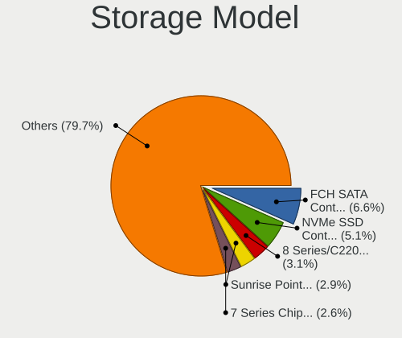

| Model                                                                          | Computers | Percent |
|--------------------------------------------------------------------------------|-----------|---------|
| AMD FCH SATA Controller [AHCI mode]                                            | 607       | 6.62%   |
| Samsung NVMe SSD Controller SM981/PM981/PM983                                  | 467       | 5.09%   |
| Intel 8 Series/C220 Series Chipset Family 6-port SATA Controller 1 [AHCI mode] | 286       | 3.12%   |
| Intel Sunrise Point-LP SATA Controller [AHCI mode]                             | 263       | 2.87%   |
| Intel 7 Series Chipset Family 6-port SATA Controller [AHCI mode]               | 239       | 2.61%   |
| Samsung NVMe SSD Controller 980 (DRAM-less)                                    | 235       | 2.56%   |
| Intel 82801 Mobile SATA Controller [RAID mode]                                 | 212       | 2.31%   |
| Samsung NVMe SSD Controller PM9A1/PM9A3/980PRO                                 | 180       | 1.96%   |
| Intel 6 Series/C200 Series Chipset Family 6 port Mobile SATA AHCI Controller   | 161       | 1.76%   |
| AMD 400 Series Chipset SATA Controller                                         | 148       | 1.61%   |
| Intel Volume Management Device NVMe RAID Controller                            | 145       | 1.58%   |
| AMD 500 Series Chipset SATA Controller                                         | 143       | 1.56%   |
| Intel Q170/Q150/B150/H170/H110/Z170/CM236 Chipset SATA Controller [AHCI Mode]  | 142       | 1.55%   |
| Intel Cannon Lake Mobile PCH SATA AHCI Controller                              | 121       | 1.32%   |
| Samsung NVMe SSD Controller SM961/PM961/SM963                                  | 113       | 1.23%   |
| Intel 6 Series/C200 Series Chipset Family 6 port Desktop SATA AHCI Controller  | 111       | 1.21%   |
| ASMedia ASM1061/ASM1062 Serial ATA Controller                                  | 109       | 1.19%   |
| Intel 8 Series SATA Controller 1 [AHCI mode]                                   | 108       | 1.18%   |
| Intel SATA Controller [RAID mode]                                              | 106       | 1.16%   |
| Intel 82801IBM/IEM (ICH9M/ICH9M-E) 4 port SATA Controller [AHCI mode]          | 106       | 1.16%   |
| Intel 200 Series PCH SATA controller [AHCI mode]                               | 103       | 1.12%   |
| AMD 600 Series Chipset SATA Controller                                         | 98        | 1.07%   |
| Intel Celeron/Pentium Silver Processor SATA Controller                         | 91        | 0.99%   |
| Intel 7 Series/C210 Series Chipset Family 6-port SATA Controller [AHCI mode]   | 91        | 0.99%   |
| Intel Wildcat Point-LP SATA Controller [AHCI Mode]                             | 90        | 0.98%   |
| AMD SB7x0/SB8x0/SB9x0 IDE Controller                                           | 90        | 0.98%   |
| Intel 5 Series/3400 Series Chipset 6 port SATA AHCI Controller                 | 89        | 0.97%   |
| AMD SB7x0/SB8x0/SB9x0 SATA Controller [AHCI mode]                              | 87        | 0.95%   |
| SK hynix Gold P31/BC711/PC711 NVMe Solid State Drive                           | 85        | 0.93%   |
| Intel HM170/QM170 Chipset SATA Controller [AHCI Mode]                          | 85        | 0.93%   |
| Intel Cannon Lake PCH SATA AHCI Controller                                     | 76        | 0.83%   |
| Intel 5 Series/3400 Series Chipset 4 port SATA AHCI Controller                 | 76        | 0.83%   |
| Intel SSD 660P Series                                                          | 71        | 0.77%   |
| Intel Comet Lake SATA AHCI Controller                                          | 71        | 0.77%   |
| Samsung NVMe SSD Controller S4LV008[Pascal]                                    | 68        | 0.74%   |
| Kingston Company A2000 NVMe SSD [SM2263EN]                                     | 67        | 0.73%   |
| Intel 82801HM/HEM (ICH8M/ICH8M-E) IDE Controller                               | 67        | 0.73%   |
| KIOXIA NVMe SSD Controller BG4 (DRAM-less)                                     | 66        | 0.72%   |
| Intel 82801G (ICH7 Family) IDE Controller                                      | 66        | 0.72%   |
| Intel NM10/ICH7 Family SATA Controller [IDE mode]                              | 60        | 0.65%   |

Storage Kind
------------

Kind of storage controller (IDE, SATA, NVMe, SAS, ...)

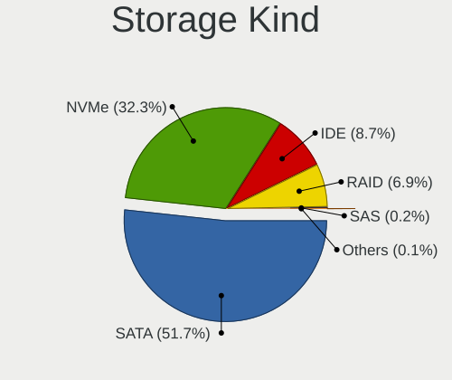

| Kind | Computers | Percent |
|------|-----------|---------|
| SATA | 4173      | 51.72%  |
| NVMe | 2606      | 32.3%   |
| IDE  | 705       | 8.74%   |
| RAID | 558       | 6.92%   |
| SAS  | 18        | 0.22%   |
| SCSI | 9         | 0.11%   |

Processor
---------

CPU Vendor
----------

Processor vendors

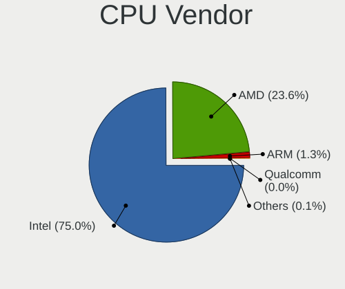

| Vendor        | Computers | Percent |
|---------------|-----------|---------|
| Intel         | 4679      | 74.96%  |
| AMD           | 1472      | 23.58%  |
| ARM           | 80        | 1.28%   |
| Qualcomm      | 3         | 0.05%   |
| CentaurHauls  | 3         | 0.05%   |
| Unknown       | 3         | 0.05%   |
| sifive,u74-mc | 2         | 0.03%   |

CPU Model
---------

Processor models

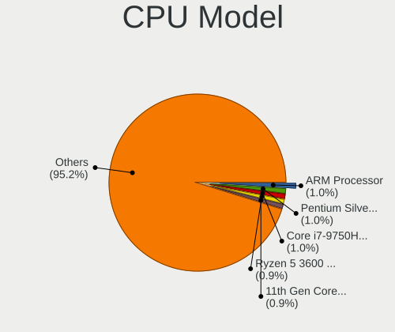

| Model                                         | Computers | Percent |
|-----------------------------------------------|-----------|---------|
| ARM Processor                                 | 64        | 1.02%   |
| Intel Pentium Silver N6000 @ 1.10GHz          | 62        | 0.99%   |
| Intel Core i7-9750H CPU @ 2.60GHz             | 61        | 0.98%   |
| AMD Ryzen 5 3600 6-Core Processor             | 57        | 0.91%   |
| Intel 11th Gen Core i7-1165G7 @ 2.80GHz       | 55        | 0.88%   |
| Intel 11th Gen Core i5-1135G7 @ 2.40GHz       | 54        | 0.86%   |
| Intel Core i5-8265U CPU @ 1.60GHz             | 52        | 0.83%   |
| Intel Core i5-8250U CPU @ 1.60GHz             | 50        | 0.8%    |
| Intel Core i7-7700HQ CPU @ 2.80GHz            | 47        | 0.75%   |
| Intel Core i7-8550U CPU @ 1.80GHz             | 44        | 0.7%    |
| Intel Core i7-8750H CPU @ 2.20GHz             | 42        | 0.67%   |
| Intel Core i7-6700HQ CPU @ 2.60GHz            | 41        | 0.66%   |
| Intel Core i7-8565U CPU @ 1.80GHz             | 40        | 0.64%   |
| Intel Core i5-10210U CPU @ 1.60GHz            | 40        | 0.64%   |
| Intel Core i5-6300U CPU @ 2.40GHz             | 38        | 0.61%   |
| Intel Core i5-3210M CPU @ 2.50GHz             | 38        | 0.61%   |
| Intel Core i5-6200U CPU @ 2.30GHz             | 37        | 0.59%   |
| AMD Ryzen 7 3700X 8-Core Processor            | 37        | 0.59%   |
| AMD Ryzen 7 5800H with Radeon Graphics        | 36        | 0.58%   |
| Intel Pentium Silver N5030 CPU @ 1.10GHz      | 33        | 0.53%   |
| Intel Core i7-10510U CPU @ 1.80GHz            | 33        | 0.53%   |
| Intel Core i5-7200U CPU @ 2.50GHz             | 33        | 0.53%   |
| Intel Core i5-2520M CPU @ 2.50GHz             | 33        | 0.53%   |
| Intel Core i7-2600 CPU @ 3.40GHz              | 31        | 0.5%    |
| AMD Custom APU 0405                           | 30        | 0.48%   |
| Intel Core i7-10750H CPU @ 2.60GHz            | 29        | 0.46%   |
| Intel Atom x5-Z8350 CPU @ 1.44GHz             | 29        | 0.46%   |
| Intel Core i5-5200U CPU @ 2.20GHz             | 28        | 0.45%   |
| AMD Ryzen 5 2600 Six-Core Processor           | 28        | 0.45%   |
| Intel Core i5-8350U CPU @ 1.70GHz             | 27        | 0.43%   |
| Intel 11th Gen Core i7-1185G7 @ 3.00GHz       | 27        | 0.43%   |
| AMD Ryzen 7 5800X 8-Core Processor            | 27        | 0.43%   |
| AMD Ryzen 7 5700U with Radeon Graphics        | 27        | 0.43%   |
| Intel Core i5-4460 CPU @ 3.20GHz              | 26        | 0.42%   |
| Intel Core i5-3320M CPU @ 2.60GHz             | 26        | 0.42%   |
| Intel Core 2 Duo CPU E8400 @ 3.00GHz          | 26        | 0.42%   |
| AMD Ryzen 9 3900X 12-Core Processor           | 26        | 0.42%   |
| AMD Ryzen 5 5600X 6-Core Processor            | 26        | 0.42%   |
| AMD Ryzen 5 3500U with Radeon Vega Mobile Gfx | 26        | 0.42%   |
| Intel Core i7-3770 CPU @ 3.40GHz              | 25        | 0.4%    |

CPU Model Family
----------------

Processor model prefix

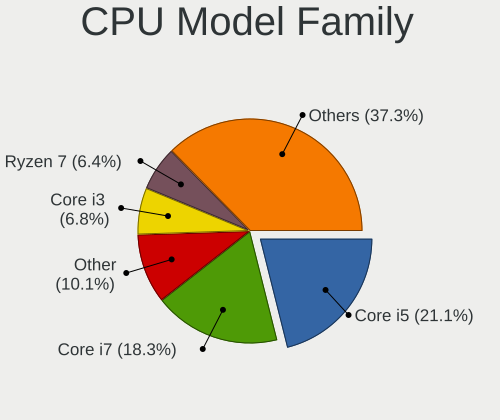

| Model                   | Computers | Percent |
|-------------------------|-----------|---------|
| Intel Core i5           | 1318      | 21.09%  |
| Intel Core i7           | 1146      | 18.34%  |
| Other                   | 629       | 10.07%  |
| Intel Core i3           | 422       | 6.75%   |
| AMD Ryzen 7             | 400       | 6.4%    |
| AMD Ryzen 5             | 348       | 5.57%   |
| Intel Core 2 Duo        | 233       | 3.73%   |
| Intel Celeron           | 210       | 3.36%   |
| AMD Ryzen 9             | 156       | 2.5%    |
| Intel Pentium           | 121       | 1.94%   |
| Intel Xeon              | 119       | 1.9%    |
| Intel Pentium Silver    | 118       | 1.89%   |
| Intel Atom              | 115       | 1.84%   |
| Intel Pentium Dual-Core | 74        | 1.18%   |
| Intel Core i9           | 66        | 1.06%   |
| Intel Core 2 Quad       | 53        | 0.85%   |
| AMD FX                  | 52        | 0.83%   |
| AMD Ryzen 7 PRO         | 43        | 0.69%   |
| AMD A6                  | 40        | 0.64%   |
| AMD Ryzen 3             | 37        | 0.59%   |
| Intel Core              | 36        | 0.58%   |
| AMD A8                  | 33        | 0.53%   |
| Intel Core 2            | 32        | 0.51%   |
| AMD Ryzen 5 PRO         | 31        | 0.5%    |
| Intel Pentium Dual      | 30        | 0.48%   |
| AMD Athlon 64 X2        | 26        | 0.42%   |
| AMD A10                 | 25        | 0.4%    |
| Intel Genuine           | 24        | 0.38%   |
| AMD Phenom II X4        | 22        | 0.35%   |
| AMD A4                  | 22        | 0.35%   |
| AMD E1                  | 17        | 0.27%   |
| Intel Pentium 4         | 16        | 0.26%   |
| AMD E                   | 16        | 0.26%   |
| AMD Athlon II X2        | 16        | 0.26%   |
| ARM BCM                 | 15        | 0.24%   |
| Intel Core m3           | 14        | 0.22%   |
| Intel Pentium D         | 13        | 0.21%   |
| AMD Athlon              | 13        | 0.21%   |
| AMD Ryzen Threadripper  | 12        | 0.19%   |
| AMD Phenom II X6        | 9         | 0.14%   |

CPU Cores
---------

Number of processor cores

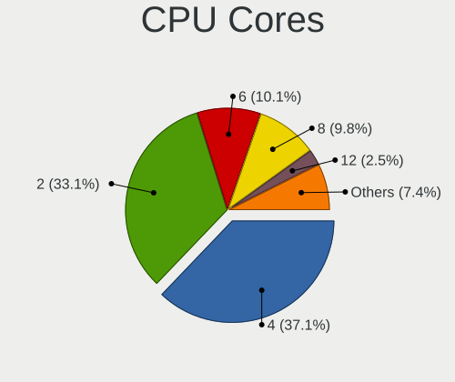

| Number  | Computers | Percent |
|---------|-----------|---------|
| 4       | 2323      | 37.14%  |
| 2       | 2067      | 33.05%  |
| 6       | 631       | 10.09%  |
| 8       | 612       | 9.79%   |
| 12      | 158       | 2.53%   |
| 1       | 110       | 1.76%   |
| 16      | 103       | 1.65%   |
| 10      | 95        | 1.52%   |
| 14      | 61        | 0.98%   |
| 24      | 33        | 0.53%   |
| Unknown | 26        | 0.42%   |
| 3       | 15        | 0.24%   |
| 20      | 9         | 0.14%   |
| 32      | 5         | 0.08%   |
| 18      | 2         | 0.03%   |
| 64      | 1         | 0.02%   |
| 48      | 1         | 0.02%   |
| 28      | 1         | 0.02%   |
| 5       | 1         | 0.02%   |

CPU Sockets
-----------

Number of sockets

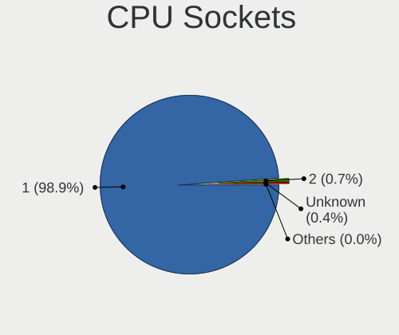

| Number  | Computers | Percent |
|---------|-----------|---------|
| 1       | 6173      | 98.89%  |
| 2       | 41        | 0.66%   |
| Unknown | 23        | 0.37%   |
| 3       | 2         | 0.03%   |
| 8       | 1         | 0.02%   |
| 4       | 1         | 0.02%   |
| 0       | 1         | 0.02%   |

CPU Threads
-----------

Threads per core (Hyper-Threading)

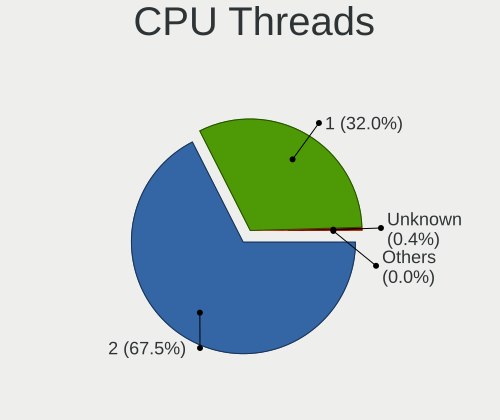

| Number  | Computers | Percent |
|---------|-----------|---------|
| 2       | 4222      | 67.53%  |
| 1       | 2001      | 32.01%  |
| Unknown | 26        | 0.42%   |
| 16      | 1         | 0.02%   |
| 8       | 1         | 0.02%   |
| 4       | 1         | 0.02%   |

CPU Op-Modes
------------

CPU Operation Modes (32-bit, 64-bit)

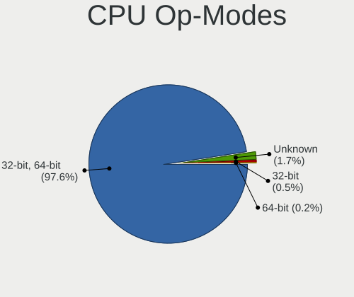

| Op mode        | Computers | Percent |
|----------------|-----------|---------|
| 32-bit, 64-bit | 6101      | 97.57%  |
| Unknown        | 106       | 1.7%    |
| 32-bit         | 33        | 0.53%   |
| 64-bit         | 13        | 0.21%   |

CPU Microcode
-------------

Microcode number

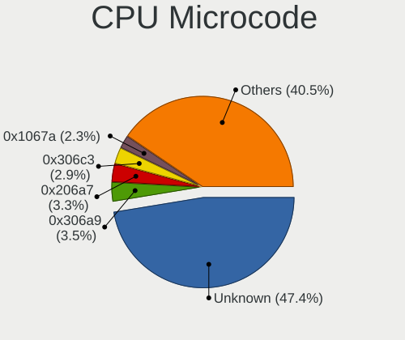

| Number     | Computers | Percent |
|------------|-----------|---------|
| Unknown    | 3081      | 47.41%  |
| 0x306a9    | 226       | 3.48%   |
| 0x206a7    | 215       | 3.31%   |
| 0x306c3    | 191       | 2.94%   |
| 0x1067a    | 152       | 2.34%   |
| 0x806ec    | 128       | 1.97%   |
| 0x906ea    | 119       | 1.83%   |
| 0x806c1    | 85        | 1.31%   |
| 0x806ea    | 84        | 1.29%   |
| 0x506e3    | 84        | 1.29%   |
| 0x406e3    | 80        | 1.23%   |
| 0x20655    | 79        | 1.22%   |
| 0x40651    | 78        | 1.2%    |
| 0x806e9    | 71        | 1.09%   |
| 0x906e9    | 68        | 1.05%   |
| 0x906c0    | 64        | 0.98%   |
| 0x6fd      | 61        | 0.94%   |
| 0x08701021 | 61        | 0.94%   |
| 0x306d4    | 60        | 0.92%   |
| 0x0a50000c | 48        | 0.74%   |
| 0x08600106 | 48        | 0.74%   |
| 0x706a8    | 44        | 0.68%   |
| 0x30678    | 43        | 0.66%   |
| 0x6fb      | 36        | 0.55%   |
| 0x08701013 | 36        | 0.55%   |
| 0x010000c8 | 35        | 0.54%   |
| 0x806eb    | 34        | 0.52%   |
| 0x10676    | 32        | 0.49%   |
| 0x506c9    | 29        | 0.45%   |
| 0x406c4    | 29        | 0.45%   |
| 0x106e5    | 29        | 0.45%   |
| 0xa0652    | 28        | 0.43%   |
| 0x0800820d | 28        | 0.43%   |
| 0x906ed    | 27        | 0.42%   |
| 0x706e5    | 27        | 0.42%   |
| 0x706a1    | 27        | 0.42%   |
| 0x20652    | 27        | 0.42%   |
| 0x08108109 | 27        | 0.42%   |
| 0x06001119 | 27        | 0.42%   |
| 0x08108102 | 26        | 0.4%    |

CPU Microarch
-------------

Microarchitecture

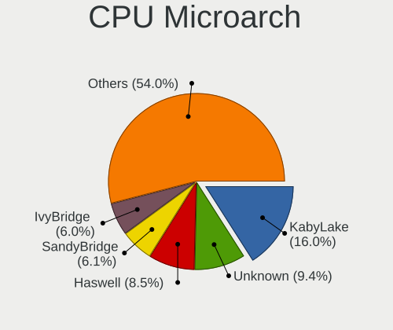

| Name              | Computers | Percent |
|-------------------|-----------|---------|
| KabyLake          | 1000      | 15.96%  |
| Unknown           | 590       | 9.42%   |
| Haswell           | 533       | 8.51%   |
| SandyBridge       | 380       | 6.06%   |
| IvyBridge         | 378       | 6.03%   |
| Skylake           | 336       | 5.36%   |
| Penryn            | 289       | 4.61%   |
| Zen 2             | 279       | 4.45%   |
| Zen 3             | 269       | 4.29%   |
| Westmere          | 176       | 2.81%   |
| Core              | 175       | 2.79%   |
| TigerLake         | 174       | 2.78%   |
| Alderlake Hybrid  | 172       | 2.74%   |
| Silvermont        | 171       | 2.73%   |
| Zen+              | 143       | 2.28%   |
| Broadwell         | 135       | 2.15%   |
| CometLake         | 129       | 2.06%   |
| Goldmont plus     | 100       | 1.6%    |
| Nehalem           | 86        | 1.37%   |
| Piledriver        | 85        | 1.36%   |
| Zen               | 81        | 1.29%   |
| Icelake           | 81        | 1.29%   |
| K10               | 77        | 1.23%   |
| Tremont           | 58        | 0.93%   |
| Goldmont          | 45        | 0.72%   |
| K8 Hammer         | 44        | 0.7%    |
| Excavator         | 43        | 0.69%   |
| NetBurst          | 33        | 0.53%   |
| Bobcat            | 26        | 0.41%   |
| K10 Llano         | 25        | 0.4%    |
| Bonnell           | 25        | 0.4%    |
| Jaguar            | 24        | 0.38%   |
| Puma              | 22        | 0.35%   |
| P6                | 18        | 0.29%   |
| Steamroller       | 15        | 0.24%   |
| Gracemont         | 15        | 0.24%   |
| Meteorlake Hybrid | 10        | 0.16%   |
| K8 & K10 hybrid   | 9         | 0.14%   |
| Bulldozer         | 8         | 0.13%   |
| Lunarlake Hybrid  | 6         | 0.1%    |

Graphics
--------

GPU Vendor
----------

Vendors of graphics cards

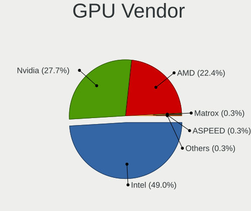

| Vendor                           | Computers | Percent |
|----------------------------------|-----------|---------|
| Intel                            | 3575      | 49.04%  |
| Nvidia                           | 2020      | 27.71%  |
| AMD                              | 1634      | 22.41%  |
| Matrox Electronics Systems       | 21        | 0.29%   |
| ASPEED Technology                | 21        | 0.29%   |
| VIA Technologies                 | 8         | 0.11%   |
| Silicon Integrated Systems [SiS] | 8         | 0.11%   |
| Red Hat                          | 1         | 0.01%   |
| Microsoft                        | 1         | 0.01%   |
| ATI Technologies                 | 1         | 0.01%   |

GPU Model
---------

Graphics card models

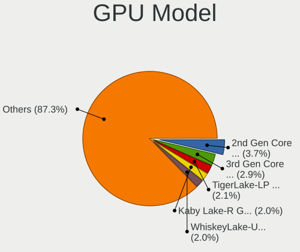

| Model                                                                                    | Computers | Percent |
|------------------------------------------------------------------------------------------|-----------|---------|
| Intel 2nd Generation Core Processor Family Integrated Graphics Controller                | 277       | 3.69%   |
| Intel 3rd Gen Core processor Graphics Controller                                         | 216       | 2.88%   |
| Intel TigerLake-LP GT2 [Iris Xe Graphics]                                                | 159       | 2.12%   |
| Intel Kaby Lake-R GT2 [UHD Graphics 620]                                                 | 152       | 2.02%   |
| Intel WhiskeyLake-U GT2 [UHD Graphics 620]                                               | 149       | 1.98%   |
| Intel CoffeeLake-H GT2 [UHD Graphics 630]                                                | 144       | 1.92%   |
| Intel Skylake-U GT2 [HD Graphics 520]                                                    | 126       | 1.68%   |
| Intel Haswell-ULT Integrated Graphics Controller                                         | 125       | 1.66%   |
| Intel Xeon E3-1200 v3/4th Gen Core Processor Integrated Graphics Controller              | 114       | 1.52%   |
| Intel 4th Gen Core Processor Integrated Graphics Controller                              | 112       | 1.49%   |
| AMD Renoir [Radeon Vega Series / Radeon Vega Mobile Series]                              | 109       | 1.45%   |
| AMD Cezanne [Radeon Vega Series / Radeon Vega Mobile Series]                             | 103       | 1.37%   |
| Intel Kaby Lake-U GT2 [HD Graphics 620]                                                  | 99        | 1.32%   |
| Intel CometLake-U GT2 [UHD Graphics]                                                     | 95        | 1.27%   |
| AMD Ellesmere [Radeon RX 470/480/570/570X/580/580X/590]                                  | 94        | 1.25%   |
| Intel Core Processor Integrated Graphics Controller                                      | 93        | 1.24%   |
| Intel Atom/Celeron/Pentium Processor x5-E8000/J3xxx/N3xxx Integrated Graphics Controller | 86        | 1.15%   |
| AMD Picasso/Raven 2 [Radeon Vega Series / Radeon Vega Mobile Series]                     | 84        | 1.12%   |
| Intel Atom Processor Z36xxx/Z37xxx Series Graphics & Display                             | 83        | 1.11%   |
| Intel Mobile 4 Series Chipset Integrated Graphics Controller                             | 79        | 1.05%   |
| Intel Broadwell-U GT2 [HD Graphics 5500]                                                 | 77        | 1.03%   |
| Intel JasperLake [UHD Graphics]                                                          | 75        | 1%      |
| Intel CometLake-H GT2 [UHD Graphics]                                                     | 69        | 0.92%   |
| AMD Raphael                                                                              | 68        | 0.91%   |
| Nvidia TU117M [GeForce GTX 1650 Mobile / Max-Q]                                          | 65        | 0.87%   |
| Intel Kaby Lake-H GT2 [HD Graphics 630]                                                  | 61        | 0.81%   |
| Nvidia GK208B [GeForce GT 710]                                                           | 59        | 0.79%   |
| Intel CoffeeLake-S GT2 [UHD Graphics 630]                                                | 56        | 0.75%   |
| Intel GeminiLake [UHD Graphics 605]                                                      | 55        | 0.73%   |
| Nvidia GP107 [GeForce GTX 1050 Ti]                                                       | 54        | 0.72%   |
| Intel Skylake-S GT2 [HD Graphics 530]                                                    | 54        | 0.72%   |
| Intel Alder Lake-P GT2 [Iris Xe Graphics]                                                | 51        | 0.68%   |
| Nvidia GP107M [GeForce GTX 1050 Mobile]                                                  | 50        | 0.67%   |
| Intel Xeon E3-1200 v2/3rd Gen Core processor Graphics Controller                         | 50        | 0.67%   |
| AMD Lucienne                                                                             | 49        | 0.65%   |
| Intel Skylake-H GT2 [HD Graphics 530]                                                    | 48        | 0.64%   |
| AMD Phoenix1                                                                             | 47        | 0.63%   |
| Intel Raptor Lake-P [Iris Xe Graphics]                                                   | 44        | 0.59%   |
| Intel GeminiLake [UHD Graphics 600]                                                      | 44        | 0.59%   |
| AMD Rembrandt [Radeon 680M]                                                              | 44        | 0.59%   |

GPU Combo
---------

Combinations of graphics cards

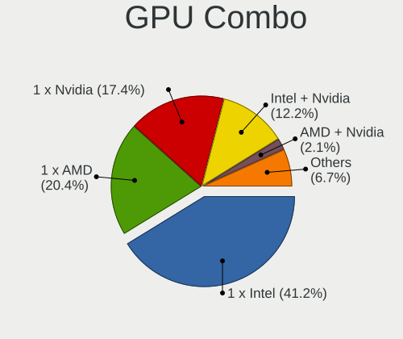

| Name                     | Computers | Percent |
|--------------------------|-----------|---------|
| 1 x Intel                | 2597      | 41.24%  |
| 1 x AMD                  | 1283      | 20.37%  |
| 1 x Nvidia               | 1094      | 17.37%  |
| Intel + Nvidia           | 769       | 12.21%  |
| AMD + Nvidia             | 131       | 2.08%   |
| Intel + AMD              | 111       | 1.76%   |
| 2 x AMD                  | 106       | 1.68%   |
| Other                    | 95        | 1.51%   |
| 2 x Intel                | 27        | 0.43%   |
| 2 x Nvidia               | 17        | 0.27%   |
| 1 x Matrox               | 16        | 0.25%   |
| 1 x ASPEED               | 10        | 0.16%   |
| 1 x VIA                  | 8         | 0.13%   |
| 1 x SiS                  | 8         | 0.13%   |
| Nvidia + ASPEED          | 8         | 0.13%   |
| Nvidia + Matrox          | 5         | 0.08%   |
| AMD + ASPEED             | 3         | 0.05%   |
| Intel + AMD + 1 x Nvidia | 2         | 0.03%   |
| 2 x Nvidia + 1 x Matrox  | 1         | 0.02%   |
| 2 x Nvidia + 1 x ASPEED  | 1         | 0.02%   |
| 1 x Red Hat              | 1         | 0.02%   |
| 1 x Microsoft            | 1         | 0.02%   |
| Intel + 2 x AMD          | 1         | 0.02%   |
| AMD + 2 x Nvidia         | 1         | 0.02%   |
| AMD + Matrox             | 1         | 0.02%   |

GPU Driver
----------

Free vs proprietary

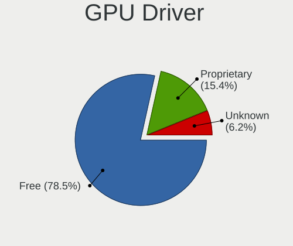

| Driver      | Computers | Percent |
|-------------|-----------|---------|
| Free        | 5003      | 78.48%  |
| Proprietary | 979       | 15.36%  |
| Unknown     | 393       | 6.16%   |

GPU Memory
----------

Total video memory

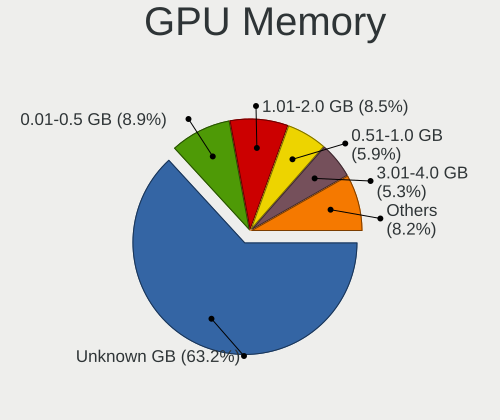

| Size in GB | Computers | Percent |
|------------|-----------|---------|
| Unknown    | 4055      | 63.17%  |
| 0.01-0.5   | 572       | 8.91%   |
| 1.01-2.0   | 543       | 8.46%   |
| 0.51-1.0   | 381       | 5.94%   |
| 3.01-4.0   | 340       | 5.3%    |
| 7.01-8.0   | 258       | 4.02%   |
| 5.01-6.0   | 110       | 1.71%   |
| 8.01-16.0  | 99        | 1.54%   |
| 2.01-3.0   | 35        | 0.55%   |
| 16.01-24.0 | 24        | 0.37%   |
| 24.01-32.0 | 2         | 0.03%   |

Monitor
-------

Monitor Vendor
--------------

Monitor vendors

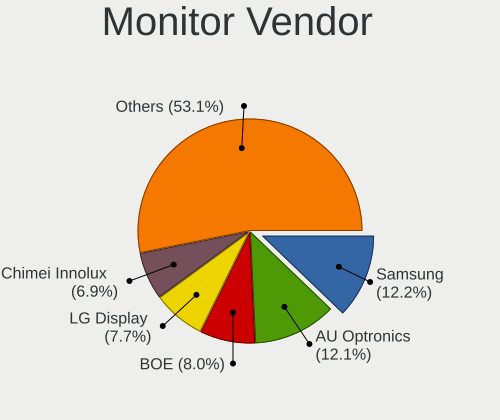

| Vendor                  | Computers | Percent |
|-------------------------|-----------|---------|
| Samsung Electronics     | 839       | 12.18%  |
| AU Optronics            | 833       | 12.09%  |
| BOE                     | 552       | 8.01%   |
| LG Display              | 528       | 7.66%   |
| Chimei Innolux          | 476       | 6.91%   |
| Dell                    | 382       | 5.54%   |
| Goldstar                | 352       | 5.11%   |
| Iiyama                  | 312       | 4.53%   |
| Philips                 | 303       | 4.4%    |
| Hewlett-Packard         | 220       | 3.19%   |
| Apple                   | 198       | 2.87%   |
| Acer                    | 195       | 2.83%   |
| AOC                     | 170       | 2.47%   |
| Sharp                   | 138       | 2%      |
| BenQ                    | 119       | 1.73%   |
| Lenovo                  | 100       | 1.45%   |
| Chi Mei Optoelectronics | 83        | 1.2%    |
| Ancor Communications    | 83        | 1.2%    |
| ASUSTek Computer        | 55        | 0.8%    |
| MSI                     | 54        | 0.78%   |
| Sony                    | 48        | 0.7%    |
| Medion                  | 44        | 0.64%   |
| InfoVision              | 44        | 0.64%   |
| PANDA                   | 42        | 0.61%   |
| LG Philips              | 40        | 0.58%   |
| Eizo                    | 40        | 0.58%   |
| CSO                     | 35        | 0.51%   |
| Idek Iiyama             | 32        | 0.46%   |
| Valve                   | 31        | 0.45%   |
| Panasonic               | 27        | 0.39%   |
| Unknown                 | 25        | 0.36%   |
| LG Electronics          | 25        | 0.36%   |
| Gigabyte Technology     | 24        | 0.35%   |
| Toshiba                 | 20        | 0.29%   |
| Fujitsu Siemens         | 19        | 0.28%   |
| ViewSonic               | 17        | 0.25%   |
| NEC Computers           | 15        | 0.22%   |
| Packard Bell            | 13        | 0.19%   |
| HannStar                | 13        | 0.19%   |
| Vestel Elektronik       | 12        | 0.17%   |

Monitor Model
-------------

Monitor models

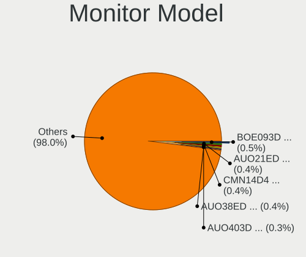

| Model                                                                     | Computers | Percent |
|---------------------------------------------------------------------------|-----------|---------|
| BOE LCD Monitor BOE093D 1366x768 256x144mm 11.6-inch                      | 33        | 0.46%   |
| AU Optronics LCD Monitor AUO21ED 1920x1080 344x193mm 15.5-inch            | 32        | 0.45%   |
| Chimei Innolux LCD Monitor CMN14D4 1920x1080 309x173mm 13.9-inch          | 28        | 0.39%   |
| AU Optronics LCD Monitor AUO38ED 1920x1080 344x193mm 15.5-inch            | 27        | 0.38%   |
| AU Optronics LCD Monitor AUO403D 1920x1080 309x174mm 14.0-inch            | 25        | 0.35%   |
| Samsung Electronics LCD Monitor SEC5441 1280x800 331x207mm 15.4-inch      | 24        | 0.33%   |
| AU Optronics LCD Monitor AUO202D 1920x1080 293x165mm 13.2-inch            | 24        | 0.33%   |
| Valve ANX7530 U VLV3001 800x1280 100x150mm 7.1-inch                       | 23        | 0.32%   |
| Goldstar LG ULTRAWIDE GSM59F1 2560x1080 670x280mm 28.6-inch               | 23        | 0.32%   |
| Chimei Innolux LCD Monitor CMN15E7 1920x1080 344x193mm 15.5-inch          | 22        | 0.31%   |
| AU Optronics LCD Monitor AUO405C 1366x768 256x144mm 11.6-inch             | 20        | 0.28%   |
| Goldstar Ultra HD GSM5B09 3840x2160 600x340mm 27.2-inch                   | 19        | 0.26%   |
| AU Optronics LCD Monitor AUO573D 1920x1080 309x174mm 14.0-inch            | 18        | 0.25%   |
| AOC 27G2G4 AOC2702 1920x1080 598x336mm 27.0-inch                          | 18        | 0.25%   |
| Samsung Electronics LCD Monitor SDCA029 3840x2160 344x194mm 15.5-inch     | 17        | 0.24%   |
| Chimei Innolux LCD Monitor CMN15E8 1920x1080 344x193mm 15.5-inch          | 17        | 0.24%   |
| LG Display LCD Monitor LGD046F 1920x1080 344x194mm 15.5-inch              | 16        | 0.22%   |
| Goldstar HDR 4K GSM7706 3840x2160 600x340mm 27.2-inch                     | 16        | 0.22%   |
| Dell U2412M DELA07A 1920x1200 518x324mm 24.1-inch                         | 16        | 0.22%   |
| Panasonic VVX11F009G00 MEI96A2 1920x1080 344x193mm 15.5-inch              | 15        | 0.21%   |
| LG Display LCD Monitor LGD05E5 1920x1080 344x194mm 15.5-inch              | 14        | 0.2%    |
| LG Display LCD Monitor LGD0555 2736x1824 260x173mm 12.3-inch              | 14        | 0.2%    |
| Chimei Innolux LCD Monitor CMN14C9 1920x1080 309x173mm 13.9-inch          | 14        | 0.2%    |
| AU Optronics LCD Monitor AUO133D 1920x1080 309x173mm 13.9-inch            | 14        | 0.2%    |
| Chimei Innolux LCD Monitor CMN1735 1920x1080 381x214mm 17.2-inch          | 13        | 0.18%   |
| Chi Mei Optoelectronics LCD Monitor CMO1720 1920x1080 382x215mm 17.3-inch | 13        | 0.18%   |
| BOE LCD Monitor BOE0744 1366x768 256x144mm 11.6-inch                      | 13        | 0.18%   |
| AU Optronics LCD Monitor AUO106C 1366x768 276x155mm 12.5-inch             | 13        | 0.18%   |
| Vestel Elektronik 40UHD_LCD_TV VES3700 3840x2160 880x500mm 39.8-inch      | 12        | 0.17%   |
| Samsung Electronics LCD Monitor SEC544B 1600x900 382x214mm 17.2-inch      | 12        | 0.17%   |
| Philips PHL 243V5 PHLC0D1 1920x1080 521x293mm 23.5-inch                   | 12        | 0.17%   |
| AU Optronics LCD Monitor AUO7E91 1366x768 256x144mm 11.6-inch             | 12        | 0.17%   |
| AU Optronics LCD Monitor AUO26EC 1366x768 344x193mm 15.5-inch             | 12        | 0.17%   |
| AOC Q3279WG5B AOC3279 2560x1440 725x428mm 33.1-inch                       | 12        | 0.17%   |
| AOC 27G1G4 AOC2701 1920x1080 598x336mm 27.0-inch                          | 12        | 0.17%   |
| Philips PHL 243V7 PHLC155 1920x1080 527x296mm 23.8-inch                   | 11        | 0.15%   |
| Iiyama PL2492H IVM612F 1920x1080 527x296mm 23.8-inch                      | 11        | 0.15%   |
| Goldstar ULTRAGEAR GSM5BD3 2560x1440 697x392mm 31.5-inch                  | 11        | 0.15%   |
| BOE LCD Monitor BOE0700 1920x1080 344x194mm 15.5-inch                     | 11        | 0.15%   |
| AU Optronics LCD Monitor AUO243D 1920x1080 309x173mm 13.9-inch            | 11        | 0.15%   |

Monitor Resolution
------------------

Monitor screen resolution

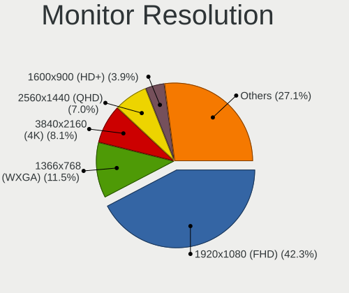

| Resolution         | Computers | Percent |
|--------------------|-----------|---------|
| 1920x1080 (FHD)    | 2815      | 42.34%  |
| 1366x768 (WXGA)    | 767       | 11.54%  |
| 3840x2160 (4K)     | 538       | 8.09%   |
| 2560x1440 (QHD)    | 467       | 7.02%   |
| 1600x900 (HD+)     | 261       | 3.93%   |
| 1920x1200 (WUXGA)  | 235       | 3.53%   |
| 1680x1050 (WSXGA+) | 197       | 2.96%   |
| 1280x1024 (SXGA)   | 188       | 2.83%   |
| 1280x800 (WXGA)    | 146       | 2.2%    |
| 1440x900 (WXGA+)   | 144       | 2.17%   |
| 3440x1440          | 127       | 1.91%   |
| 2560x1600          | 124       | 1.87%   |
| Unknown            | 72        | 1.08%   |
| 2560x1080          | 68        | 1.02%   |
| 2880x1800          | 67        | 1.01%   |
| 3840x1080          | 45        | 0.68%   |
| 3840x2400          | 42        | 0.63%   |
| 1360x768           | 41        | 0.62%   |
| 800x1280           | 31        | 0.47%   |
| 2880x1920          | 20        | 0.3%    |
| 1024x768 (XGA)     | 20        | 0.3%    |
| 1920x540           | 16        | 0.24%   |
| 2256x1504          | 14        | 0.21%   |
| 3840x1600          | 12        | 0.18%   |
| 2160x1440          | 12        | 0.18%   |
| 1280x720 (HD)      | 12        | 0.18%   |
| 1600x1200          | 11        | 0.17%   |
| 3200x1800 (QHD+)   | 9         | 0.14%   |
| 2736x1824          | 8         | 0.12%   |
| 2288x1287          | 8         | 0.12%   |
| 1400x1050          | 8         | 0.12%   |
| 3456x2160          | 7         | 0.11%   |
| 3200x2000          | 7         | 0.11%   |
| 1024x600           | 7         | 0.11%   |
| 3840x1200          | 6         | 0.09%   |
| 3072x1920          | 6         | 0.09%   |
| 3600x1080          | 5         | 0.08%   |
| 3000x2000          | 5         | 0.08%   |
| 2048x1152          | 5         | 0.08%   |
| 1920x1280          | 5         | 0.08%   |

Monitor Diagonal
----------------

Diagonal size in inches

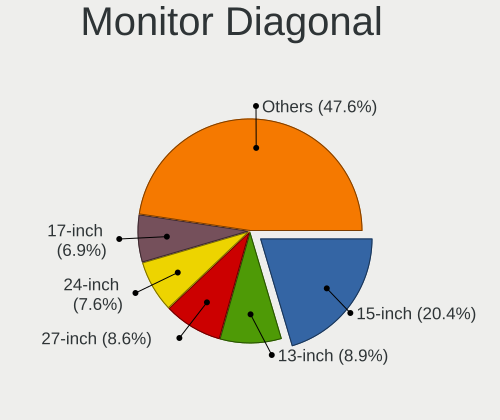

| Inches  | Computers | Percent |
|---------|-----------|---------|
| 15      | 1409      | 20.42%  |
| 13      | 617       | 8.94%   |
| 27      | 590       | 8.55%   |
| 24      | 521       | 7.55%   |
| 17      | 476       | 6.9%    |
| 14      | 454       | 6.58%   |
| 23      | 415       | 6.02%   |
| 21      | 320       | 4.64%   |
| Unknown | 306       | 4.44%   |
| 31      | 199       | 2.88%   |
| 11      | 178       | 2.58%   |
| 34      | 159       | 2.3%    |
| 19      | 151       | 2.19%   |
| 16      | 137       | 1.99%   |
| 22      | 131       | 1.9%    |
| 12      | 128       | 1.86%   |
| 20      | 76        | 1.1%    |
| 18      | 70        | 1.01%   |
| 84      | 62        | 0.9%    |
| 72      | 49        | 0.71%   |
| 25      | 49        | 0.71%   |
| 40      | 39        | 0.57%   |
| 7       | 34        | 0.49%   |
| 32      | 27        | 0.39%   |
| 65      | 23        | 0.33%   |
| 54      | 23        | 0.33%   |
| 28      | 23        | 0.33%   |
| 26      | 21        | 0.3%    |
| 10      | 21        | 0.3%    |
| 33      | 17        | 0.25%   |
| 37      | 14        | 0.2%    |
| 29      | 14        | 0.2%    |
| 63      | 12        | 0.17%   |
| 48      | 12        | 0.17%   |
| 52      | 11        | 0.16%   |
| 49      | 10        | 0.14%   |
| 42      | 9         | 0.13%   |
| 46      | 8         | 0.12%   |
| 36      | 8         | 0.12%   |
| 35      | 8         | 0.12%   |

Monitor Width
-------------

Physical width

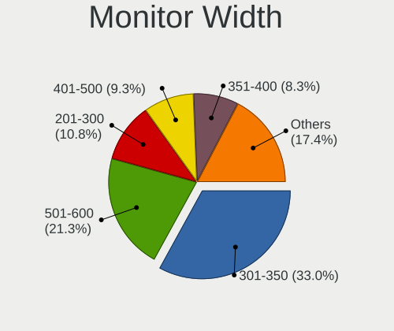

| Width in mm    | Computers | Percent |
|----------------|-----------|---------|
| 301-350        | 2229      | 33%     |
| 501-600        | 1439      | 21.3%   |
| 201-300        | 730       | 10.81%  |
| 401-500        | 625       | 9.25%   |
| 351-400        | 560       | 8.29%   |
| Unknown        | 306       | 4.53%   |
| 601-700        | 280       | 4.15%   |
| 701-800        | 208       | 3.08%   |
| 1001-1500      | 122       | 1.81%   |
| 1501-2000      | 119       | 1.76%   |
| 801-900        | 70        | 1.04%   |
| 1-100          | 31        | 0.46%   |
| 901-1000       | 20        | 0.3%    |
| 101-200        | 9         | 0.13%   |
| More than 2000 | 7         | 0.1%    |

Aspect Ratio
------------

Proportional relationship between the width and the height

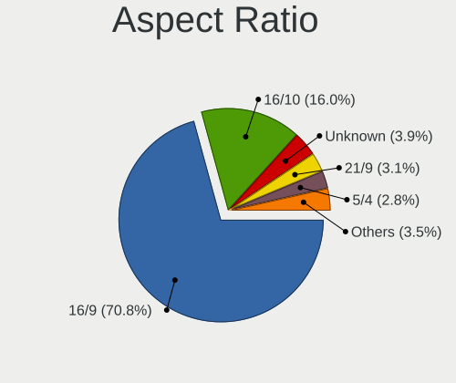

| Ratio   | Computers | Percent |
|---------|-----------|---------|
| 16/9    | 4419      | 70.76%  |
| 16/10   | 998       | 15.98%  |
| Unknown | 241       | 3.86%   |
| 21/9    | 193       | 3.09%   |
| 5/4     | 174       | 2.79%   |
| 3/2     | 82        | 1.31%   |
| 4/3     | 50        | 0.8%    |
| 32/9    | 27        | 0.43%   |
| 0.67    | 23        | 0.37%   |
| 6/5     | 14        | 0.22%   |
| 1.00    | 7         | 0.11%   |
| 0.62    | 6         | 0.1%    |
| 0.56    | 3         | 0.05%   |
| 3.73    | 1         | 0.02%   |
| 3.40    | 1         | 0.02%   |
| 3.33    | 1         | 0.02%   |
| 0.89    | 1         | 0.02%   |
| 0.80    | 1         | 0.02%   |
| 0.63    | 1         | 0.02%   |
| 0.45    | 1         | 0.02%   |
| 0.25    | 1         | 0.02%   |

Monitor Area
------------

Area in inch²

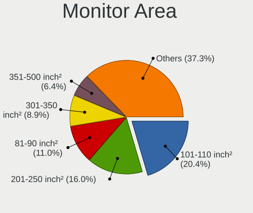

| Area in inch² | Computers | Percent |
|----------------|-----------|---------|
| 101-110        | 1397      | 20.43%  |
| 201-250        | 1093      | 15.98%  |
| 81-90          | 753       | 11.01%  |
| 301-350        | 607       | 8.88%   |
| 351-500        | 440       | 6.43%   |
| 121-130        | 332       | 4.85%   |
| 151-200        | 321       | 4.69%   |
| 71-80          | 316       | 4.62%   |
| Unknown        | 306       | 4.47%   |
| 251-300        | 234       | 3.42%   |
| More than 1000 | 215       | 3.14%   |
| 51-60          | 181       | 2.65%   |
| 111-120        | 138       | 2.02%   |
| 141-150        | 130       | 1.9%    |
| 501-1000       | 117       | 1.71%   |
| 61-70          | 116       | 1.7%    |
| 131-140        | 65        | 0.95%   |
| 1-40           | 40        | 0.58%   |
| 41-50          | 19        | 0.28%   |
| 91-100         | 19        | 0.28%   |

Pixel Density
-------------

Pixels per inch

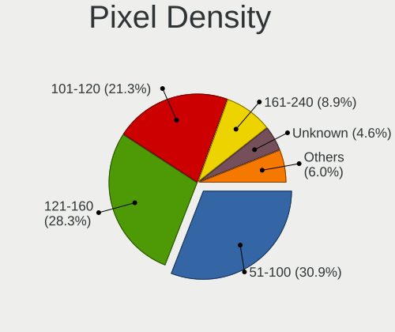

| Density       | Computers | Percent |
|---------------|-----------|---------|
| 51-100        | 2057      | 30.91%  |
| 121-160       | 1881      | 28.27%  |
| 101-120       | 1419      | 21.33%  |
| 161-240       | 590       | 8.87%   |
| Unknown       | 306       | 4.6%    |
| More than 240 | 241       | 3.62%   |
| 1-50          | 160       | 2.4%    |

Multiple Monitors
-----------------

Total monitors connected

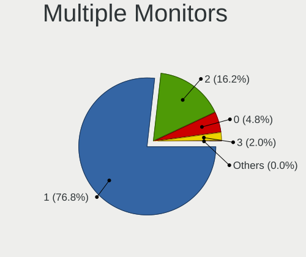

| Total | Computers | Percent |
|-------|-----------|---------|
| 1     | 4916      | 76.79%  |
| 2     | 1039      | 16.23%  |
| 0     | 310       | 4.84%   |
| 3     | 125       | 1.95%   |
| 4     | 11        | 0.17%   |
| 5     | 1         | 0.02%   |

Network
-------

Net Controller Vendor
---------------------

Controller vendors

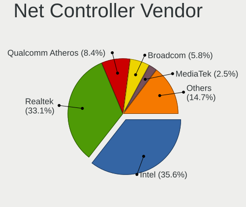

| Vendor                                 | Computers | Percent |
|----------------------------------------|-----------|---------|
| Intel                                  | 3293      | 35.57%  |
| Realtek Semiconductor                  | 3066      | 33.11%  |
| Qualcomm Atheros                       | 777       | 8.39%   |
| Broadcom                               | 538       | 5.81%   |
| MediaTek                               | 227       | 2.45%   |
| Broadcom Limited                       | 126       | 1.36%   |
| TP-Link                                | 117       | 1.26%   |
| Marvell Technology Group               | 105       | 1.13%   |
| Ralink Technology                      | 96        | 1.04%   |
| Ralink                                 | 81        | 0.87%   |
| ASIX Electronics                       | 71        | 0.77%   |
| Nvidia                                 | 69        | 0.75%   |
| DisplayLink                            | 54        | 0.58%   |
| Dell                                   | 43        | 0.46%   |
| Shenzhen Goodix Technology             | 38        | 0.41%   |
| Microsoft                              | 34        | 0.37%   |
| Hewlett-Packard                        | 32        | 0.35%   |
| Qualcomm                               | 31        | 0.33%   |
| Samsung Electronics                    | 27        | 0.29%   |
| Sierra Wireless                        | 25        | 0.27%   |
| Lenovo                                 | 22        | 0.24%   |
| NetGear                                | 21        | 0.23%   |
| Aquantia                               | 21        | 0.23%   |
| Sitecom Europe                         | 19        | 0.21%   |
| JMicron Technology                     | 16        | 0.17%   |
| IMC Networks                           | 16        | 0.17%   |
| Ericsson Business Mobile Networks      | 16        | 0.17%   |
| ASUSTek Computer                       | 16        | 0.17%   |
| Silicon Integrated Systems [SiS]       | 13        | 0.14%   |
| Huawei Technologies                    | 13        | 0.14%   |
| Microchip Technology                   | 12        | 0.13%   |
| Xiaomi                                 | 11        | 0.12%   |
| Qualcomm Atheros Communications        | 9         | 0.1%    |
| Mellanox Technologies                  | 9         | 0.1%    |
| Edimax Technology                      | 8         | 0.09%   |
| Suzhou Motorcomm Electronic Technology | 7         | 0.08%   |
| Gemtek                                 | 7         | 0.08%   |
| VIA Technologies                       | 6         | 0.06%   |
| Linksys                                | 6         | 0.06%   |
| D-Link                                 | 6         | 0.06%   |

Net Controller Model
--------------------

Controller models

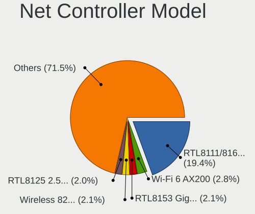

| Model                                                                  | Computers | Percent |
|------------------------------------------------------------------------|-----------|---------|
| Realtek RTL8111/8168/8211/8411 PCI Express Gigabit Ethernet Controller | 2116      | 19.43%  |
| Intel Wi-Fi 6 AX200                                                    | 308       | 2.83%   |
| Realtek RTL8153 Gigabit Ethernet Adapter                               | 234       | 2.15%   |
| Intel Wireless 8265 / 8275                                             | 231       | 2.12%   |
| Realtek RTL8125 2.5GbE Controller                                      | 219       | 2.01%   |
| Realtek RTL810xE PCI Express Fast Ethernet controller                  | 219       | 2.01%   |
| Intel 82579LM Gigabit Network Connection (Lewisville)                  | 216       | 1.98%   |
| Intel Wireless 7265                                                    | 163       | 1.5%    |
| Intel Cannon Point-LP CNVi [Wireless-AC]                               | 138       | 1.27%   |
| Intel I211 Gigabit Network Connection                                  | 136       | 1.25%   |
| Intel Wi-Fi 6 AX201                                                    | 134       | 1.23%   |
| Intel Wireless 7260                                                    | 127       | 1.17%   |
| Intel Wireless 8260                                                    | 106       | 0.97%   |
| Qualcomm Atheros QCA6174 802.11ac Wireless Network Adapter             | 103       | 0.95%   |
| Intel Alder Lake-P PCH CNVi WiFi                                       | 102       | 0.94%   |
| Intel Ethernet Connection (2) I219-V                                   | 100       | 0.92%   |
| Intel Wi-Fi 6E(802.11ax) AX210/AX1675* 2x2 [Typhoon Peak]              | 99        | 0.91%   |
| MediaTek MT7922 802.11ax PCI Express Wireless Network Adapter          | 94        | 0.86%   |
| Intel Ethernet Connection I217-LM                                      | 94        | 0.86%   |
| Realtek RTL8821CE 802.11ac PCIe Wireless Network Adapter               | 93        | 0.85%   |
| Intel Ethernet Controller I225-V                                       | 92        | 0.84%   |
| Qualcomm Atheros AR9485 Wireless Network Adapter                       | 87        | 0.8%    |
| Qualcomm Atheros AR9285 Wireless Network Adapter (PCI-Express)         | 86        | 0.79%   |
| Intel Cannon Lake PCH CNVi WiFi                                        | 86        | 0.79%   |
| Realtek RTL8822CE 802.11ac PCIe Wireless Network Adapter               | 82        | 0.75%   |
| Intel Centrino Advanced-N 6205 [Taylor Peak]                           | 81        | 0.74%   |
| Intel Comet Lake PCH-LP CNVi WiFi                                      | 80        | 0.73%   |
| Qualcomm Atheros QCA9377 802.11ac Wireless Network Adapter             | 79        | 0.73%   |
| MediaTek MT7921 802.11ax PCIe Wireless Network Adapter [Filogic 330]   | 72        | 0.66%   |
| Intel Wireless 3165                                                    | 69        | 0.63%   |
| Intel Jasper Lake PCH CNVi WiFi                                        | 66        | 0.61%   |
| ASIX AX88179 Gigabit Ethernet                                          | 63        | 0.58%   |
| Intel Dual Band Wireless-AC 3168NGW [Stone Peak]                       | 61        | 0.56%   |
| Intel Ethernet Connection (4) I219-LM                                  | 60        | 0.55%   |
| Intel 82579V Gigabit Network Connection                                | 60        | 0.55%   |
| Qualcomm Atheros QCA9565 / AR9565 Wireless Network Adapter             | 59        | 0.54%   |
| Intel Comet Lake PCH CNVi WiFi                                         | 58        | 0.53%   |
| Intel Wi-Fi 5(802.11ac) Wireless-AC 9x6x [Thunder Peak]                | 57        | 0.52%   |
| Qualcomm Atheros AR9462 Wireless Network Adapter                       | 56        | 0.51%   |
| Intel Ethernet Connection I219-LM                                      | 56        | 0.51%   |

Wireless Vendor
---------------

Wireless vendors

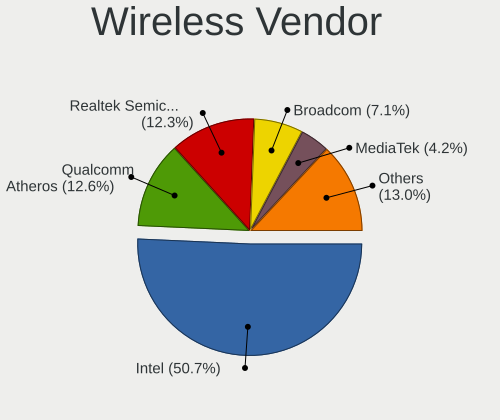

| Vendor                                | Computers | Percent |
|---------------------------------------|-----------|---------|
| Intel                                 | 2499      | 50.71%  |
| Qualcomm Atheros                      | 620       | 12.58%  |
| Realtek Semiconductor                 | 607       | 12.32%  |
| Broadcom                              | 350       | 7.1%    |
| MediaTek                              | 209       | 4.24%   |
| TP-Link                               | 107       | 2.17%   |
| Ralink Technology                     | 96        | 1.95%   |
| Ralink                                | 81        | 1.64%   |
| Broadcom Limited                      | 71        | 1.44%   |
| Microsoft                             | 29        | 0.59%   |
| Qualcomm                              | 26        | 0.53%   |
| Marvell Technology Group              | 26        | 0.53%   |
| Sierra Wireless                       | 25        | 0.51%   |
| NetGear                               | 21        | 0.43%   |
| Dell                                  | 21        | 0.43%   |
| Sitecom Europe                        | 19        | 0.39%   |
| IMC Networks                          | 16        | 0.32%   |
| ASUSTek Computer                      | 16        | 0.32%   |
| Qualcomm Atheros Communications       | 9         | 0.18%   |
| Hewlett-Packard                       | 9         | 0.18%   |
| Edimax Technology                     | 8         | 0.16%   |
| Gemtek                                | 7         | 0.14%   |
| Linksys                               | 6         | 0.12%   |
| D-Link                                | 6         | 0.12%   |
| Belkin Components                     | 6         | 0.12%   |
| 802.11g Adapter [Linksys WUSB54GC v3] | 6         | 0.12%   |
| Fibocom                               | 5         | 0.1%    |
| D-Link System                         | 3         | 0.06%   |
| AVM                                   | 3         | 0.06%   |
| ZyXEL Communications                  | 2         | 0.04%   |
| Wilocity                              | 2         | 0.04%   |
| Senao                                 | 2         | 0.04%   |
| Sagem                                 | 2         | 0.04%   |
| CyberTAN Technology                   | 2         | 0.04%   |
| Tenda                                 | 1         | 0.02%   |
| Silicon Integrated Systems [SiS]      | 1         | 0.02%   |
| Samsung Electronics                   | 1         | 0.02%   |
| Realtek                               | 1         | 0.02%   |
| Quectel Wireless Solutions            | 1         | 0.02%   |
| Qualcomm Technologies                 | 1         | 0.02%   |

Wireless Model
--------------

Wireless models

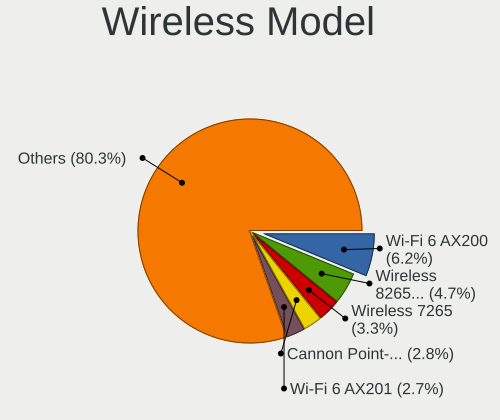

| Model                                                                | Computers | Percent |
|----------------------------------------------------------------------|-----------|---------|
| Intel Wi-Fi 6 AX200                                                  | 308       | 6.22%   |
| Intel Wireless 8265 / 8275                                           | 231       | 4.66%   |
| Intel Wireless 7265                                                  | 163       | 3.29%   |
| Intel Cannon Point-LP CNVi [Wireless-AC]                             | 138       | 2.79%   |
| Intel Wi-Fi 6 AX201                                                  | 134       | 2.7%    |
| Intel Wireless 7260                                                  | 127       | 2.56%   |
| Intel Wireless 8260                                                  | 106       | 2.14%   |
| Qualcomm Atheros QCA6174 802.11ac Wireless Network Adapter           | 103       | 2.08%   |
| Intel Wi-Fi 6E(802.11ax) AX210/AX1675* 2x2 [Typhoon Peak]            | 99        | 2%      |
| Realtek RTL8821CE 802.11ac PCIe Wireless Network Adapter             | 93        | 1.88%   |
| MediaTek MT7922 802.11ax PCI Express Wireless Network Adapter        | 88        | 1.78%   |
| Qualcomm Atheros AR9485 Wireless Network Adapter                     | 87        | 1.76%   |
| Qualcomm Atheros AR9285 Wireless Network Adapter (PCI-Express)       | 86        | 1.74%   |
| Intel Cannon Lake PCH CNVi WiFi                                      | 86        | 1.74%   |
| Realtek RTL8822CE 802.11ac PCIe Wireless Network Adapter             | 82        | 1.65%   |
| Intel Centrino Advanced-N 6205 [Taylor Peak]                         | 81        | 1.63%   |
| Intel Comet Lake PCH-LP CNVi WiFi                                    | 80        | 1.61%   |
| Qualcomm Atheros QCA9377 802.11ac Wireless Network Adapter           | 79        | 1.59%   |
| Intel Alder Lake-P PCH CNVi WiFi                                     | 77        | 1.55%   |
| MediaTek MT7921 802.11ax PCIe Wireless Network Adapter [Filogic 330] | 72        | 1.45%   |
| Intel Wireless 3165                                                  | 69        | 1.39%   |
| Intel Jasper Lake PCH CNVi WiFi                                      | 66        | 1.33%   |
| Intel Dual Band Wireless-AC 3168NGW [Stone Peak]                     | 61        | 1.23%   |
| Qualcomm Atheros QCA9565 / AR9565 Wireless Network Adapter           | 59        | 1.19%   |
| Intel Comet Lake PCH CNVi WiFi                                       | 58        | 1.17%   |
| Intel Wi-Fi 5(802.11ac) Wireless-AC 9x6x [Thunder Peak]              | 57        | 1.15%   |
| Qualcomm Atheros AR9462 Wireless Network Adapter                     | 56        | 1.13%   |
| Intel Wireless 3160                                                  | 52        | 1.05%   |
| Realtek RTL8822BE 802.11a/b/g/n/ac WiFi adapter                      | 48        | 0.97%   |
| Intel Centrino Ultimate-N 6300                                       | 47        | 0.95%   |
| Intel PRO/Wireless 3945ABG [Golan] Network Connection                | 43        | 0.87%   |
| Broadcom BCM4313 802.11bgn Wireless Network Adapter                  | 41        | 0.83%   |
| Realtek RTL8723BE PCIe Wireless Network Adapter                      | 40        | 0.81%   |
| Broadcom BCM4360 802.11ac Dual Band Wireless Network Adapter         | 40        | 0.81%   |
| Broadcom BCM4331 802.11a/b/g/n                                       | 40        | 0.81%   |
| Intel Centrino Advanced-N 6200                                       | 39        | 0.79%   |
| Intel Raptor Lake PCH CNVi WiFi                                      | 37        | 0.75%   |
| Broadcom BCM43142 802.11b/g/n                                        | 37        | 0.75%   |
| Qualcomm Atheros AR928X Wireless Network Adapter (PCI-Express)       | 36        | 0.73%   |
| Intel Ice Lake-LP PCH CNVi WiFi                                      | 36        | 0.73%   |

Ethernet Vendor
---------------

Ethernet vendors

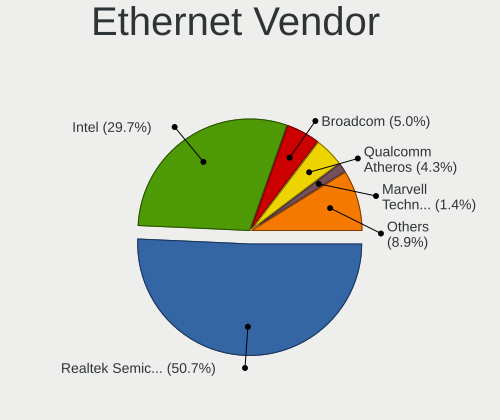

| Vendor                                 | Computers | Percent |
|----------------------------------------|-----------|---------|
| Realtek Semiconductor                  | 2833      | 50.71%  |
| Intel                                  | 1660      | 29.71%  |
| Broadcom                               | 277       | 4.96%   |
| Qualcomm Atheros                       | 243       | 4.35%   |
| Marvell Technology Group               | 79        | 1.41%   |
| ASIX Electronics                       | 71        | 1.27%   |
| Nvidia                                 | 68        | 1.22%   |
| Broadcom Limited                       | 55        | 0.98%   |
| DisplayLink                            | 54        | 0.97%   |
| Samsung Electronics                    | 24        | 0.43%   |
| Lenovo                                 | 22        | 0.39%   |
| Aquantia                               | 21        | 0.38%   |
| JMicron Technology                     | 16        | 0.29%   |
| Silicon Integrated Systems [SiS]       | 12        | 0.21%   |
| Xiaomi                                 | 11        | 0.2%    |
| MediaTek                               | 11        | 0.2%    |
| TP-Link                                | 10        | 0.18%   |
| Microchip Technology                   | 10        | 0.18%   |
| Hewlett-Packard                        | 10        | 0.18%   |
| Huawei Technologies                    | 9         | 0.16%   |
| Mellanox Technologies                  | 8         | 0.14%   |
| Suzhou Motorcomm Electronic Technology | 7         | 0.13%   |
| VIA Technologies                       | 6         | 0.11%   |
| Qualcomm                               | 5         | 0.09%   |
| Microsoft                              | 5         | 0.09%   |
| ICS Advent                             | 5         | 0.09%   |
| Google                                 | 5         | 0.09%   |
| Apple                                  | 4         | 0.07%   |
| American Megatrends                    | 4         | 0.07%   |
| ZTE WCDMA Technologies MSM             | 3         | 0.05%   |
| Qualcomm Technologies                  | 3         | 0.05%   |
| OPPO Electronics                       | 3         | 0.05%   |
| Motorola PCS                           | 3         | 0.05%   |
| 3Com                                   | 3         | 0.05%   |
| ULi Electronics                        | 2         | 0.04%   |
| Sundance Technology Inc / IC Plus      | 2         | 0.04%   |
| Sony Ericsson Mobile Communications AB | 2         | 0.04%   |
| Raspberry Pi                           | 2         | 0.04%   |
| MosChip Semiconductor                  | 2         | 0.04%   |
| Emulex                                 | 2         | 0.04%   |

Ethernet Model
--------------

Ethernet models

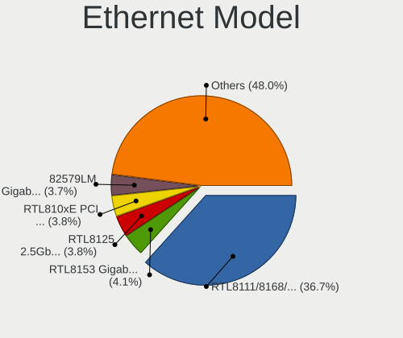

| Model                                                                  | Computers | Percent |
|------------------------------------------------------------------------|-----------|---------|
| Realtek RTL8111/8168/8211/8411 PCI Express Gigabit Ethernet Controller | 2116      | 36.65%  |
| Realtek RTL8153 Gigabit Ethernet Adapter                               | 234       | 4.05%   |
| Realtek RTL8125 2.5GbE Controller                                      | 219       | 3.79%   |
| Realtek RTL810xE PCI Express Fast Ethernet controller                  | 219       | 3.79%   |
| Intel 82579LM Gigabit Network Connection (Lewisville)                  | 216       | 3.74%   |
| Intel I211 Gigabit Network Connection                                  | 136       | 2.36%   |
| Intel Ethernet Connection (2) I219-V                                   | 100       | 1.73%   |
| Intel Ethernet Connection I217-LM                                      | 94        | 1.63%   |
| Intel Ethernet Controller I225-V                                       | 92        | 1.59%   |
| ASIX AX88179 Gigabit Ethernet                                          | 63        | 1.09%   |
| Intel Ethernet Connection (4) I219-LM                                  | 60        | 1.04%   |
| Intel 82579V Gigabit Network Connection                                | 60        | 1.04%   |
| Intel Ethernet Connection I219-LM                                      | 56        | 0.97%   |
| Broadcom NetXtreme BCM57765 Gigabit Ethernet PCIe                      | 53        | 0.92%   |
| Qualcomm Atheros AR8151 v2.0 Gigabit Ethernet                          | 48        | 0.83%   |
| Intel Ethernet Connection I217-V                                       | 42        | 0.73%   |
| Intel 82577LM Gigabit Network Connection                               | 42        | 0.73%   |
| Intel Ethernet Connection (7) I219-V                                   | 41        | 0.71%   |
| Intel Ethernet Connection (6) I219-V                                   | 41        | 0.71%   |
| Intel Ethernet Connection I218-LM                                      | 40        | 0.69%   |
| Realtek RTL-8100/8101L/8139 PCI Fast Ethernet Adapter                  | 38        | 0.66%   |
| Intel Ethernet Connection (4) I219-V                                   | 36        | 0.62%   |
| Qualcomm Atheros Killer E220x Gigabit Ethernet Controller              | 35        | 0.61%   |
| Intel Ethernet Connection (3) I218-LM                                  | 35        | 0.61%   |
| Intel Ethernet Connection (2) I219-LM                                  | 34        | 0.59%   |
| Intel 82567LM-3 Gigabit Network Connection                             | 33        | 0.57%   |
| Nvidia MCP79 Ethernet                                                  | 30        | 0.52%   |
| Intel Ethernet Connection (7) I219-LM                                  | 29        | 0.5%    |
| Broadcom NetLink BCM57780 Gigabit Ethernet PCIe                        | 29        | 0.5%    |
| Intel I210 Gigabit Network Connection                                  | 28        | 0.49%   |
| Broadcom NetXtreme BCM57766 Gigabit Ethernet PCIe                      | 28        | 0.49%   |
| Qualcomm Atheros AR8161 Gigabit Ethernet                               | 27        | 0.47%   |
| Intel Ethernet Connection (5) I219-LM                                  | 27        | 0.47%   |
| Intel Ethernet Controller I226-V                                       | 25        | 0.43%   |
| Intel Alder Lake-P PCH CNVi WiFi                                       | 25        | 0.43%   |
| Broadcom NetXtreme BCM5764M Gigabit Ethernet PCIe                      | 24        | 0.42%   |
| Intel Ethernet Connection (6) I219-LM                                  | 23        | 0.4%    |
| Intel 82574L Gigabit Network Connection                                | 22        | 0.38%   |
| Realtek RTL8152 Fast Ethernet Adapter                                  | 21        | 0.36%   |
| Qualcomm Atheros AR8121/AR8113/AR8114 Gigabit or Fast Ethernet         | 20        | 0.35%   |

Net Controller Kind
-------------------

Ethernet, WiFi or modem

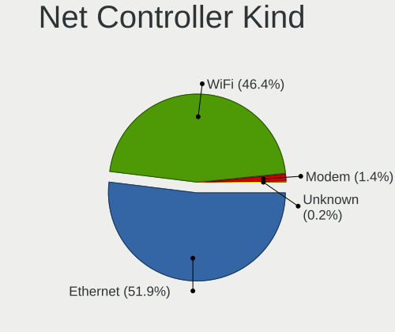

| Kind     | Computers | Percent |
|----------|-----------|---------|
| Ethernet | 5223      | 51.94%  |
| WiFi     | 4670      | 46.44%  |
| Modem    | 143       | 1.42%   |
| Unknown  | 19        | 0.19%   |

Used Controller
---------------

Currently used network controller

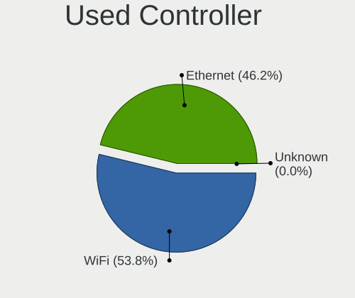

| Kind     | Computers | Percent |
|----------|-----------|---------|
| WiFi     | 3516      | 53.79%  |
| Ethernet | 3019      | 46.19%  |
| Unknown  | 1         | 0.02%   |

NICs
----

Total network controllers on board

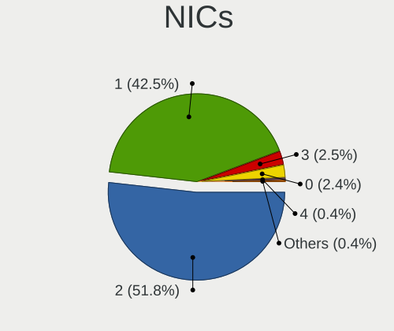

| Total | Computers | Percent |
|-------|-----------|---------|
| 2     | 3243      | 51.77%  |
| 1     | 2664      | 42.53%  |
| 3     | 158       | 2.52%   |
| 0     | 149       | 2.38%   |
| 4     | 28        | 0.45%   |
| 5     | 9         | 0.14%   |
| 6     | 5         | 0.08%   |
| 7     | 4         | 0.06%   |
| 8     | 3         | 0.05%   |
| 11    | 1         | 0.02%   |

IPv6
----

IPv6 vs IPv4

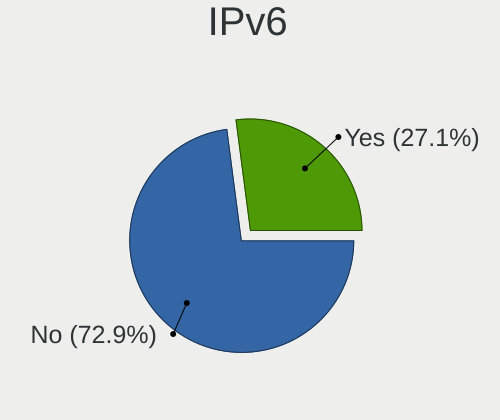

| Used | Computers | Percent |
|------|-----------|---------|
| No   | 4673      | 72.94%  |
| Yes  | 1734      | 27.06%  |

Bluetooth
---------

Bluetooth Vendor
----------------

Controller vendors

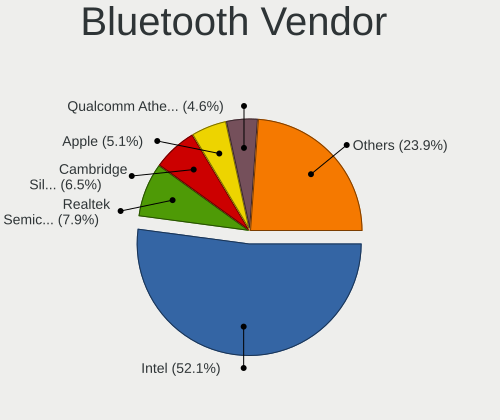

| Vendor                          | Computers | Percent |
|---------------------------------|-----------|---------|
| Intel                           | 2115      | 52.11%  |
| Realtek Semiconductor           | 319       | 7.86%   |
| Cambridge Silicon Radio         | 262       | 6.45%   |
| Apple                           | 209       | 5.15%   |
| Qualcomm Atheros Communications | 185       | 4.56%   |
| IMC Networks                    | 172       | 4.24%   |
| Foxconn / Hon Hai               | 170       | 4.19%   |
| Broadcom                        | 139       | 3.42%   |
| Lite-On Technology              | 96        | 2.37%   |
| ASUSTek Computer                | 64        | 1.58%   |
| MediaTek                        | 58        | 1.43%   |
| Hewlett-Packard                 | 56        | 1.38%   |
| Dell                            | 46        | 1.13%   |
| TP-Link                         | 29        | 0.71%   |
| Marvell Semiconductor           | 26        | 0.64%   |
| Toshiba                         | 24        | 0.59%   |
| Ralink                          | 13        | 0.32%   |
| USI                             | 12        | 0.3%    |
| Realtek                         | 10        | 0.25%   |
| Unknown                         | 9         | 0.22%   |
| Actions                         | 8         | 0.2%    |
| Integrated System Solution      | 7         | 0.17%   |
| Foxconn International           | 7         | 0.17%   |
| Alps Electric                   | 4         | 0.1%    |
| Ralink Technology               | 3         | 0.07%   |
| Edimax Technology               | 3         | 0.07%   |
| Sitecom Europe                  | 2         | 0.05%   |
| Opticis                         | 2         | 0.05%   |
| Micro Star International        | 2         | 0.05%   |
| Chicony Electronics             | 2         | 0.05%   |
| Roper                           | 1         | 0.02%   |
| Logitech                        | 1         | 0.02%   |
| Conwise Technology              | 1         | 0.02%   |
| Belkin Components               | 1         | 0.02%   |
| Askey Computer                  | 1         | 0.02%   |

Bluetooth Model
---------------

Controller models

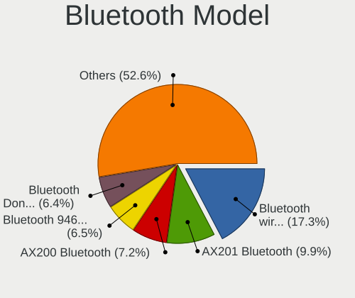

| Model                                               | Computers | Percent |
|-----------------------------------------------------|-----------|---------|
| Intel Bluetooth wireless interface                  | 704       | 17.31%  |
| Intel AX201 Bluetooth                               | 402       | 9.88%   |
| Intel AX200 Bluetooth                               | 293       | 7.2%    |
| Intel Bluetooth 9460/9560 Jefferson Peak (JfP)      | 265       | 6.52%   |
| Cambridge Silicon Radio Bluetooth Dongle (HCI mode) | 262       | 6.44%   |
| Realtek Bluetooth Radio                             | 218       | 5.36%   |
| Intel Bluetooth Device                              | 184       | 4.52%   |
| Intel AX210 Bluetooth                               | 95        | 2.34%   |
| Apple Bluetooth Host Controller                     | 90        | 2.21%   |
| Foxconn / Hon Hai Wireless_Device                   | 74        | 1.82%   |
| Qualcomm Atheros  Bluetooth Device                  | 72        | 1.77%   |
| IMC Networks Bluetooth Radio                        | 68        | 1.67%   |
| Realtek  Bluetooth 4.2 Adapter                      | 63        | 1.55%   |
| Intel Wireless-AC 3168 Bluetooth                    | 61        | 1.5%    |
| Apple Bluetooth USB Host Controller                 | 57        | 1.4%    |
| MediaTek Wireless_Device                            | 56        | 1.38%   |
| Intel Wireless-AC 9260 Bluetooth Adapter            | 55        | 1.35%   |
| IMC Networks Wireless_Device                        | 45        | 1.11%   |
| Intel Centrino Bluetooth Wireless Transceiver       | 44        | 1.08%   |
| Apple Built-in Bluetooth 2.0+EDR HCI                | 43        | 1.06%   |
| Qualcomm Atheros QCA61x4 Bluetooth 4.0              | 37        | 0.91%   |
| Lite-On Bluetooth Device                            | 37        | 0.91%   |
| Foxconn / Hon Hai Bluetooth Device                  | 36        | 0.89%   |
| Qualcomm Atheros AR3012 Bluetooth 4.0               | 35        | 0.86%   |
| Foxconn / Hon Hai MediaTek Bluetooth Adapter        | 32        | 0.79%   |
| IMC Networks Bluetooth Device                       | 30        | 0.74%   |
| HP Broadcom 2070 Bluetooth Combo                    | 30        | 0.74%   |
| TP-Link TP-T@- UB500 Adapter                        | 29        | 0.71%   |
| Qualcomm Atheros AR3011 Bluetooth                   | 27        | 0.66%   |
| Lite-On Qualcomm Atheros QCA9377 Bluetooth          | 27        | 0.66%   |
| Dell DW375 Bluetooth Module                         | 26        | 0.64%   |
| HP Bluetooth 2.0 Interface [Broadcom BCM2045]       | 25        | 0.61%   |
| Broadcom HP Portable SoftSailing                    | 22        | 0.54%   |
| Marvell Bluetooth and Wireless LAN Composite        | 20        | 0.49%   |
| Broadcom BCM2045B (BDC-2.1)                         | 20        | 0.49%   |
| ASUS Broadcom BCM20702A0 Bluetooth                  | 19        | 0.47%   |
| Intel Centrino Advanced-N 6230 Bluetooth adapter    | 17        | 0.42%   |
| Broadcom BCM20702 Bluetooth 4.0 [ThinkPad]          | 17        | 0.42%   |
| Apple Bluetooth HCI                                 | 17        | 0.42%   |
| ASUS ASUS USB-BT500                                 | 16        | 0.39%   |

Sound
-----

Sound Vendor
------------

Sound card vendors

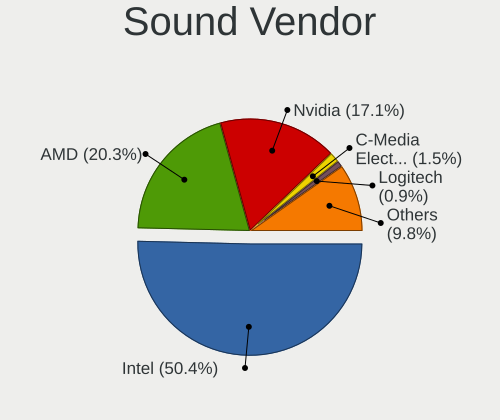

| Vendor                                       | Computers | Percent |
|----------------------------------------------|-----------|---------|
| Intel                                        | 4425      | 50.39%  |
| AMD                                          | 1786      | 20.34%  |
| Nvidia                                       | 1505      | 17.14%  |
| C-Media Electronics                          | 130       | 1.48%   |
| Logitech                                     | 77        | 0.88%   |
| GN Netcom                                    | 48        | 0.55%   |
| Realtek Semiconductor                        | 47        | 0.54%   |
| Texas Instruments                            | 43        | 0.49%   |
| Creative Labs                                | 43        | 0.49%   |
| SteelSeries ApS                              | 38        | 0.43%   |
| Focusrite-Novation                           | 36        | 0.41%   |
| ASUSTek Computer                             | 31        | 0.35%   |
| Hewlett-Packard                              | 29        | 0.33%   |
| JMTek                                        | 25        | 0.28%   |
| Lenovo                                       | 24        | 0.27%   |
| Micro Star International                     | 21        | 0.24%   |
| Creative Technology                          | 21        | 0.24%   |
| Kingston Technology                          | 20        | 0.23%   |
| BEHRINGER International                      | 19        | 0.22%   |
| Plantronics                                  | 17        | 0.19%   |
| Generalplus Technology                       | 16        | 0.18%   |
| DSEA A/S                                     | 16        | 0.18%   |
| Silicon Integrated Systems [SiS]             | 15        | 0.17%   |
| Corsair                                      | 15        | 0.17%   |
| Sony                                         | 14        | 0.16%   |
| Razer USA                                    | 13        | 0.15%   |
| GYROCOM C&C                                  | 13        | 0.15%   |
| Zoran Co. Personal Media Division (Nogatech) | 12        | 0.14%   |
| VIA Technologies                             | 12        | 0.14%   |
| RODE Microphones                             | 12        | 0.14%   |
| Apple                                        | 11        | 0.13%   |
| XMOS                                         | 9         | 0.1%    |
| Samson Technologies                          | 9         | 0.1%    |
| Jieli Technology                             | 8         | 0.09%   |
| KTMicro                                      | 7         | 0.08%   |
| Cambridge Silicon Radio                      | 7         | 0.08%   |
| Walmart                                      | 6         | 0.07%   |
| Trust                                        | 6         | 0.07%   |
| Schiit Audio                                 | 6         | 0.07%   |
| Blue Microphones                             | 6         | 0.07%   |

Sound Model
-----------

Sound card models

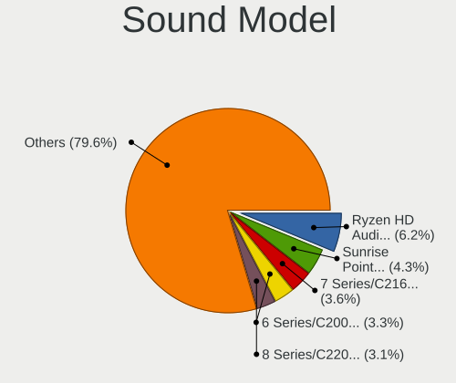

| Model                                                                      | Computers | Percent |
|----------------------------------------------------------------------------|-----------|---------|
| AMD Ryzen HD Audio Controller                                              | 649       | 6.21%   |
| Intel Sunrise Point-LP HD Audio                                            | 447       | 4.28%   |
| Intel 7 Series/C216 Chipset Family High Definition Audio Controller        | 373       | 3.57%   |
| Intel 6 Series/C200 Series Chipset Family High Definition Audio Controller | 342       | 3.27%   |
| Intel 8 Series/C220 Series Chipset High Definition Audio Controller        | 322       | 3.08%   |
| AMD Starship/Matisse HD Audio Controller                                   | 280       | 2.68%   |
| AMD Renoir/Cezanne HDMI/DP Audio Controller                                | 270       | 2.59%   |
| Intel Cannon Lake PCH cAVS                                                 | 242       | 2.32%   |
| AMD Radeon High Definition Audio Controller                                | 236       | 2.26%   |
| Intel Xeon E3-1200 v3/4th Gen Core Processor HD Audio Controller           | 229       | 2.19%   |
| Intel 5 Series/3400 Series Chipset High Definition Audio                   | 210       | 2.01%   |
| Intel 100 Series/C230 Series Chipset Family HD Audio Controller            | 174       | 1.67%   |
| Intel Tiger Lake-LP Smart Sound Technology Audio Controller                | 173       | 1.66%   |
| Intel Cannon Point-LP High Definition Audio Controller                     | 169       | 1.62%   |
| Intel 82801I (ICH9 Family) HD Audio Controller                             | 165       | 1.58%   |
| AMD SBx00 Azalia (Intel HDA)                                               | 150       | 1.44%   |
| AMD FCH Azalia Controller                                                  | 132       | 1.26%   |
| Intel Haswell-ULT HD Audio Controller                                      | 129       | 1.24%   |
| Intel 8 Series HD Audio Controller                                         | 129       | 1.24%   |
| Intel Broadwell-U Audio Controller                                         | 125       | 1.2%    |
| Nvidia GP107GL High Definition Audio Controller                            | 123       | 1.18%   |
| Intel Wildcat Point-LP High Definition Audio Controller                    | 119       | 1.14%   |
| Intel Alder Lake PCH-P High Definition Audio Controller                    | 115       | 1.1%    |
| AMD Raven/Raven2/Fenghuang HDMI/DP Audio Controller                        | 114       | 1.09%   |
| Intel NM10/ICH7 Family High Definition Audio Controller                    | 112       | 1.07%   |
| Intel 200 Series PCH HD Audio                                              | 111       | 1.06%   |
| Intel Comet Lake PCH-LP cAVS                                               | 101       | 0.97%   |
| Intel Celeron/Pentium Silver Processor High Definition Audio               | 98        | 0.94%   |
| AMD Ellesmere HDMI Audio [Radeon RX 470/480 / 570/580/590]                 | 98        | 0.94%   |
| Nvidia GK208 HDMI/DP Audio Controller                                      | 96        | 0.92%   |
| Intel Comet Lake PCH cAVS                                                  | 95        | 0.91%   |
| AMD Family 17h (Models 00h-0fh) HD Audio Controller                        | 94        | 0.9%    |
| Intel 82801H (ICH8 Family) HD Audio Controller                             | 92        | 0.88%   |
| Nvidia High Definition Audio Controller                                    | 86        | 0.82%   |
| AMD Navi 21/23 HDMI/DP Audio Controller                                    | 82        | 0.79%   |
| Nvidia TU106 High Definition Audio Controller                              | 80        | 0.77%   |
| Nvidia GA104 High Definition Audio Controller                              | 80        | 0.77%   |
| Nvidia TU107 GeForce GTX 1650 High Definition Audio Controller             | 77        | 0.74%   |
| Intel Jasper Lake HD Audio                                                 | 74        | 0.71%   |
| Nvidia GP106 High Definition Audio Controller                              | 72        | 0.69%   |

Memory
------

Memory Vendor
-------------

Memory module vendors

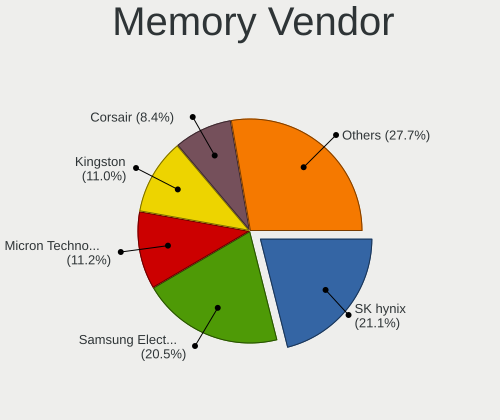

| Vendor              | Computers | Percent |
|---------------------|-----------|---------|
| SK hynix            | 776       | 21.08%  |
| Samsung Electronics | 754       | 20.48%  |
| Micron Technology   | 414       | 11.25%  |
| Kingston            | 405       | 11%     |
| Corsair             | 311       | 8.45%   |
| Crucial             | 240       | 6.52%   |
| Unknown             | 223       | 6.06%   |
| G.Skill             | 141       | 3.83%   |
| Unknown             | 52        | 1.41%   |
| Ramaxel Technology  | 49        | 1.33%   |
| Nanya Technology    | 49        | 1.33%   |
| A-DATA Technology   | 45        | 1.22%   |
| Elpida              | 40        | 1.09%   |
| Unknown (ABCD)      | 18        | 0.49%   |
| Transcend           | 16        | 0.43%   |
| Team                | 13        | 0.35%   |
| GOODRAM             | 12        | 0.33%   |
| ASint Technology    | 9         | 0.24%   |
| Qimonda             | 8         | 0.22%   |
| Avant               | 6         | 0.16%   |
| Patriot             | 5         | 0.14%   |
| 48spaces            | 5         | 0.14%   |
| Toshiba             | 4         | 0.11%   |
| A Force             | 4         | 0.11%   |
| Wilk                | 3         | 0.08%   |
| TakeMS              | 3         | 0.08%   |
| Lexar Co Limited    | 3         | 0.08%   |
| GeIL                | 3         | 0.08%   |
| ff                  | 3         | 0.08%   |
| Axiom               | 3         | 0.08%   |
| AMD                 | 3         | 0.08%   |
| A-DA                | 3         | 0.08%   |
| 4ea5                | 3         | 0.08%   |
| Unknown (0x0B92)    | 2         | 0.05%   |
| Unknown (0x0702)    | 2         | 0.05%   |
| Timetec             | 2         | 0.05%   |
| Sesame              | 2         | 0.05%   |
| PNY                 | 2         | 0.05%   |
| Lexar               | 2         | 0.05%   |
| Hewlett-Packard     | 2         | 0.05%   |

Memory Model
------------

Memory module models

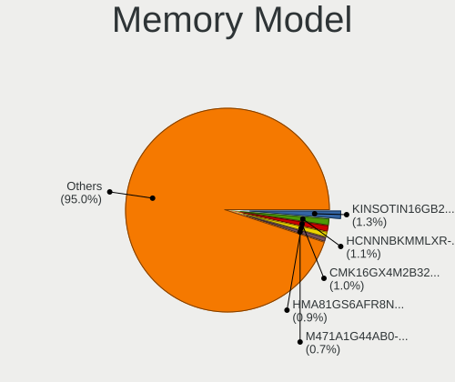

| Model                                                            | Computers | Percent |
|------------------------------------------------------------------|-----------|---------|
| Unknown                                                          | 52        | 1.32%   |
| SK hynix RAM HCNNNBKMMLXR-NEE 1GB Row Of Chips LPDDR4 4267MT/s   | 43        | 1.09%   |
| Corsair RAM CMK16GX4M2B3200C16 8GB DIMM DDR4 3600MT/s            | 39        | 0.99%   |
| SK hynix RAM HMA81GS6AFR8N-UH 8GB SODIMM DDR4 2667MT/s           | 35        | 0.89%   |
| Samsung RAM M471A1G44AB0-CWE 8GiB SODIMM DDR4 3200MT/s           | 29        | 0.74%   |
| SK hynix RAM HMAA1GS6CJR6N-XN 8GB SODIMM DDR4 3200MT/s           | 27        | 0.69%   |
| SK hynix RAM HMT451S6BFR8A-PB 4GB SODIMM DDR3 1600MT/s           | 25        | 0.64%   |
| Samsung RAM M471B5173QH0-YK0 4GB SODIMM DDR3 1600MT/s            | 24        | 0.61%   |
| Samsung RAM M471A1K43DB1-CWE 8GB SODIMM DDR4 3200MT/s            | 23        | 0.58%   |
| Samsung RAM M471A1K43EB1-CWE 8GB SODIMM DDR4 3200MT/s            | 22        | 0.56%   |
| SK hynix RAM HMA81GS6CJR8N-VK 8GB SODIMM DDR4 2667MT/s           | 21        | 0.53%   |
| SK hynix RAM HMT451S6AFR8A-PB 4GB SODIMM DDR3 1600MT/s           | 20        | 0.51%   |
| SK hynix RAM HMA81GS6JJR8N-VK 8GB SODIMM DDR4 2667MT/s           | 20        | 0.51%   |
| Samsung RAM M471B5173EB0-YK0 4GB SODIMM DDR3 1600MT/s            | 20        | 0.51%   |
| Samsung RAM M471A5244CB0-CTD 4GB SODIMM DDR4 3266MT/s            | 19        | 0.48%   |
| Micron RAM 0000000000-00000 8GB SODIMM DDR4 2400MT/s             | 19        | 0.48%   |
| SK hynix RAM HMA81GS6DJR8N-XN 8GB SODIMM DDR4 3200MT/s           | 18        | 0.46%   |
| SK hynix RAM HMT351S6CFR8C-PB 4GB SODIMM DDR3 1600MT/s           | 17        | 0.43%   |
| SK hynix RAM 0000000000-00000 4GB SODIMM DDR4 2400MT/s           | 17        | 0.43%   |
| Micron RAM 4ATF1G64HZ-3G2E2 8GB SODIMM DDR4 3200MT/s             | 16        | 0.41%   |
| Samsung RAM M471A1K43CB1-CTD 8GB SODIMM DDR4 3200MT/s            | 15        | 0.38%   |
| Corsair RAM CMK32GX4M2D3600C18 16GB DIMM DDR4 3800MT/s           | 15        | 0.38%   |
| Corsair RAM CMK16GX4M2B3000C15 8GB DIMM DDR4 3600MT/s            | 15        | 0.38%   |
| SK hynix RAM Module 4GB SODIMM DDR3 1600MT/s                     | 14        | 0.36%   |
| Samsung RAM M471B1G73DB0-YK0 8GB SODIMM DDR3 1600MT/s            | 14        | 0.36%   |
| Samsung RAM M471A5244CB0-CRC 4GB SODIMM DDR4 2667MT/s            | 14        | 0.36%   |
| Samsung RAM M471B5273CH0-CH9 4GB SODIMM DDR3 1334MT/s            | 13        | 0.33%   |
| Samsung RAM M471A1K43DB1-CTD 8GB SODIMM DDR4 2667MT/s            | 13        | 0.33%   |
| Samsung RAM M471A1G44AB0-CWE 8GB Row Of Chips DDR4 3200MT/s      | 13        | 0.33%   |
| Micron RAM 8ATF1G64HZ-3G2J1 8GB SODIMM DDR4 3200MT/s             | 13        | 0.33%   |
| SK hynix RAM HMA82GS6JJR8N-VK 16GB SODIMM DDR4 2667MT/s          | 12        | 0.31%   |
| Samsung RAM M471A5244CB0-CWE 4GB SODIMM DDR4 3200MT/s            | 12        | 0.31%   |
| Samsung RAM M471A4G43MB1-CTD 32GB SODIMM DDR4 2667MT/s           | 12        | 0.31%   |
| Micron RAM 8KTF51264HZ-1G6E1 4GB SODIMM DDR3 1600MT/s            | 12        | 0.31%   |
| SK hynix RAM HMT41GS6BFR8A-PB 8GB SODIMM DDR3 2667MT/s           | 11        | 0.28%   |
| SK hynix RAM HMT351S6BFR8C-H9 4GB SODIMM DDR3 1333MT/s           | 11        | 0.28%   |
| Samsung RAM M471A1K43BB1-CRC 8GB SODIMM DDR4 2667MT/s            | 11        | 0.28%   |
| Micron RAM 8JTF51264AZ-1G6E1 4GB DIMM DDR3 1600MT/s              | 11        | 0.28%   |
| Micron RAM 4ATF1G64HZ-3G2E1 8GB Row Of Chips DDR4 3200MT/s       | 11        | 0.28%   |
| Unknown (ABCD) RAM 123456789012345678 2GB SODIMM LPDDR4 2400MT/s | 10        | 0.25%   |

Memory Kind
-----------

Memory module kinds

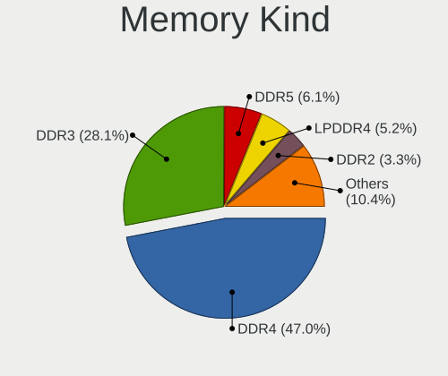

| Kind    | Computers | Percent |
|---------|-----------|---------|
| DDR4    | 1518      | 46.97%  |
| DDR3    | 908       | 28.09%  |
| DDR5    | 196       | 6.06%   |
| LPDDR4  | 167       | 5.17%   |
| DDR2    | 106       | 3.28%   |
| LPDDR5  | 92        | 2.85%   |
| LPDDR3  | 89        | 2.75%   |
| SDRAM   | 88        | 2.72%   |
| Unknown | 42        | 1.3%    |
| DDR     | 16        | 0.5%    |
| DRAM    | 7         | 0.22%   |
| EEPROM  | 2         | 0.06%   |
| RAM     | 1         | 0.03%   |

Memory Form Factor
------------------

Physical design of the memory module

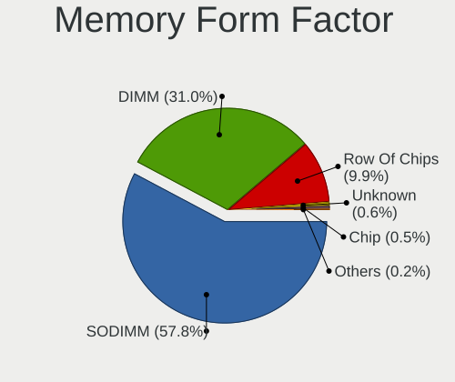

| Name            | Computers | Percent |
|-----------------|-----------|---------|
| SODIMM          | 1860      | 57.76%  |
| DIMM            | 999       | 31.02%  |
| Row Of Chips    | 319       | 9.91%   |
| Unknown         | 19        | 0.59%   |
| Chip            | 16        | 0.5%    |
| RIMM            | 2         | 0.06%   |
| FB-DIMM         | 2         | 0.06%   |
| DIP             | 2         | 0.06%   |
| Proprietary Car | 1         | 0.03%   |

Memory Size
-----------

Memory module size

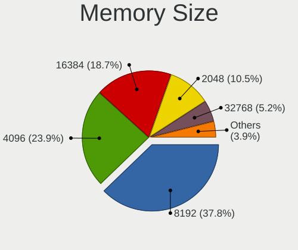

| Size  | Computers | Percent |
|-------|-----------|---------|
| 8192  | 1317      | 37.79%  |
| 4096  | 834       | 23.93%  |
| 16384 | 650       | 18.65%  |
| 2048  | 366       | 10.5%   |
| 32768 | 181       | 5.19%   |
| 1024  | 100       | 2.87%   |
| 512   | 13        | 0.37%   |
| 6144  | 7         | 0.2%    |
| 49152 | 6         | 0.17%   |
| 3072  | 3         | 0.09%   |
| 256   | 3         | 0.09%   |
| 1     | 2         | 0.06%   |
| 24576 | 1         | 0.03%   |
| 12288 | 1         | 0.03%   |
| 64    | 1         | 0.03%   |

Memory Speed
------------

Memory module speed

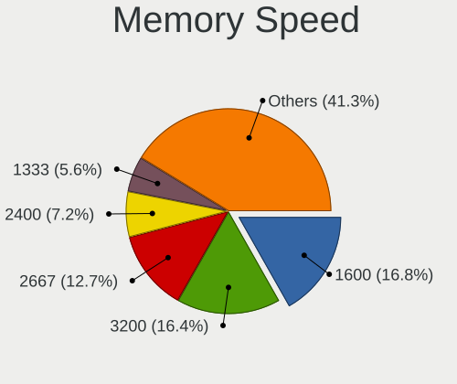

| Speed   | Computers | Percent |
|---------|-----------|---------|
| 1600    | 582       | 16.79%  |
| 3200    | 569       | 16.42%  |
| 2667    | 441       | 12.72%  |
| 2400    | 249       | 7.18%   |
| 1333    | 194       | 5.6%    |
| 2133    | 157       | 4.53%   |
| 3600    | 117       | 3.38%   |
| 4267    | 107       | 3.09%   |
| 1867    | 73        | 2.11%   |
| 1334    | 71        | 2.05%   |
| 5600    | 67        | 1.93%   |
| 4800    | 67        | 1.93%   |
| 800     | 59        | 1.7%    |
| 667     | 55        | 1.59%   |
| 6400    | 53        | 1.53%   |
| Unknown | 47        | 1.36%   |
| 6000    | 35        | 1.01%   |
| 3800    | 35        | 1.01%   |
| 1066    | 31        | 0.89%   |
| 7500    | 28        | 0.81%   |
| 1067    | 26        | 0.75%   |
| 8400    | 23        | 0.66%   |
| 1866    | 23        | 0.66%   |
| 3466    | 22        | 0.63%   |
| 3266    | 22        | 0.63%   |
| 2933    | 22        | 0.63%   |
| 3733    | 21        | 0.61%   |
| 3400    | 20        | 0.58%   |
| 3000    | 20        | 0.58%   |
| 1800    | 19        | 0.55%   |
| 4199    | 15        | 0.43%   |
| 2666    | 14        | 0.4%    |
| 4266    | 12        | 0.35%   |
| 1639    | 12        | 0.35%   |
| 6200    | 11        | 0.32%   |
| 3866    | 11        | 0.32%   |
| 2048    | 11        | 0.32%   |
| 4000    | 10        | 0.29%   |
| 400     | 10        | 0.29%   |
| 533     | 8         | 0.23%   |

Printers & scanners
-------------------

Printer Vendor
--------------

Printer device vendors

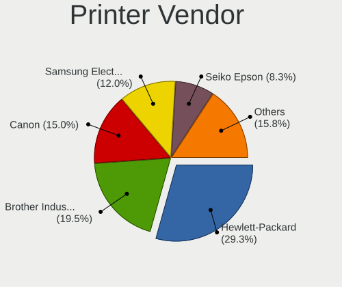

| Vendor                | Computers | Percent |
|-----------------------|-----------|---------|
| Hewlett-Packard       | 39        | 29.32%  |
| Brother Industries    | 26        | 19.55%  |
| Canon                 | 20        | 15.04%  |
| Samsung Electronics   | 16        | 12.03%  |
| Seiko Epson           | 11        | 8.27%   |
| Dymo-CoStar           | 10        | 7.52%   |
| Citizen               | 4         | 3.01%   |
| Zebra                 | 2         | 1.5%    |
| STMicroelectronics    | 1         | 0.75%   |
| Ricoh                 | 1         | 0.75%   |
| Prolific Technology   | 1         | 0.75%   |
| Lexmark International | 1         | 0.75%   |
| Apple                 | 1         | 0.75%   |

Printer Model
-------------

Printer device models

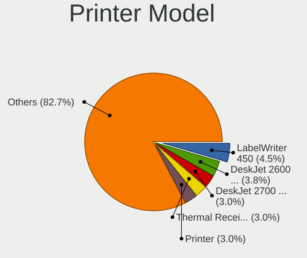

| Model                                                     | Computers | Percent |
|-----------------------------------------------------------|-----------|---------|
| Dymo-CoStar LabelWriter 450                               | 6         | 4.51%   |
| HP DeskJet 2600 series                                    | 5         | 3.76%   |
| HP DeskJet 2700 series                                    | 4         | 3.01%   |
| Citizen Thermal Receipt Printer [CT-E351]                 | 4         | 3.01%   |
| Brother Printer                                           | 4         | 3.01%   |
| HP ENVY 5000 series                                       | 3         | 2.26%   |
| HP Deskjet 2540 series                                    | 3         | 2.26%   |
| Seiko Epson Printer                                       | 2         | 1.5%    |
| Seiko Epson ET-2820 Series                                | 2         | 1.5%    |
| Samsung SCX-4600 Series                                   | 2         | 1.5%    |
| Samsung SCX-3400 Series                                   | 2         | 1.5%    |
| Samsung ML-216x Series Laser Printer                      | 2         | 1.5%    |
| Samsung ML-1640 Series Laser Printer                      | 2         | 1.5%    |
| Samsung C43x Series                                       | 2         | 1.5%    |
| HP LaserJet P2015 series                                  | 2         | 1.5%    |
| Canon TS3100 series                                       | 2         | 1.5%    |
| Canon PIXMA MX920 Series                                  | 2         | 1.5%    |
| Canon PIXMA MG5600 Series                                 | 2         | 1.5%    |
| Canon PIXMA MG2500 Series                                 | 2         | 1.5%    |
| Brother HL-2030 Laser Printer                             | 2         | 1.5%    |
| Brother DCP-1610W                                         | 2         | 1.5%    |
| Zebra Thrmal 2844                                         | 1         | 0.75%   |
| Zebra GK420t Label Printer                                | 1         | 0.75%   |
| STMicroelectronics LED badge -- mini LED display -- 11x44 | 1         | 0.75%   |
| Seiko Epson XP-4200 Series                                | 1         | 0.75%   |
| Seiko Epson XP-3200 Series                                | 1         | 0.75%   |
| Seiko Epson XP-240 Series                                 | 1         | 0.75%   |
| Seiko Epson Thermal Receipt Printer [TM-T20]              | 1         | 0.75%   |
| Seiko Epson ET-2870 Series                                | 1         | 0.75%   |
| Seiko Epson ET-2720 Series                                | 1         | 0.75%   |
| Seiko Epson EPSON XP-205 207 Series                       | 1         | 0.75%   |
| Samsung SCX-4300 Series                                   | 1         | 0.75%   |
| Samsung ML-2240 Series                                    | 1         | 0.75%   |
| Samsung M2070 Series                                      | 1         | 0.75%   |
| Samsung CLX-6260 Series                                   | 1         | 0.75%   |
| Samsung CLX-3180 Series                                   | 1         | 0.75%   |
| Samsung C48x Series                                       | 1         | 0.75%   |
| Ricoh Aficio SP 3510DN                                    | 1         | 0.75%   |
| Prolific PL2305 Parallel Port                             | 1         | 0.75%   |
| Lexmark International MC3326adwe                          | 1         | 0.75%   |

Scanner Vendor
--------------

Scanner device vendors

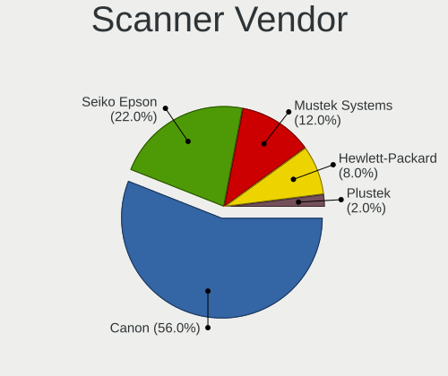

| Vendor          | Computers | Percent |
|-----------------|-----------|---------|
| Canon           | 28        | 56%     |
| Seiko Epson     | 11        | 22%     |
| Mustek Systems  | 6         | 12%     |
| Hewlett-Packard | 4         | 8%      |
| Plustek         | 1         | 2%      |

Scanner Model
-------------

Scanner device models

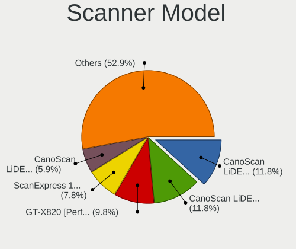

| Model                                         | Computers | Percent |
|-----------------------------------------------|-----------|---------|
| Canon CanoScan LiDE 220                       | 6         | 11.76%  |
| Canon CanoScan LiDE 210                       | 6         | 11.76%  |
| Seiko Epson GT-X820 [Perfection V600 Photo]   | 5         | 9.8%    |
| Mustek Systems ScanExpress 1200 UB            | 4         | 7.84%   |
| Canon CanoScan LiDE 120                       | 3         | 5.88%   |
| Seiko Epson Scanner                           | 2         | 3.92%   |
| Seiko Epson GT-X770 [Perfection V500]         | 2         | 3.92%   |
| Canon CanoScan N670U/N676U/LiDE 20            | 2         | 3.92%   |
| Canon CanoScan N650U/N656U                    | 2         | 3.92%   |
| Canon CanoScan LiDE 200                       | 2         | 3.92%   |
| Canon CanoScan LiDE 110                       | 2         | 3.92%   |
| Seiko Epson GT-9300UF [Perfection 2400 PHOTO] | 1         | 1.96%   |
| Seiko Epson GT-7700U [Perfection 1240U]       | 1         | 1.96%   |
| Seiko Epson GT-6600U [Perfection 610]         | 1         | 1.96%   |
| Plustek 600dpi USB Scanner                    | 1         | 1.96%   |
| Mustek Systems SNAPSCAN e22                   | 1         | 1.96%   |
| Mustek Systems BearPaw 2400 CU Plus           | 1         | 1.96%   |
| HP Scanjet N6350                              | 1         | 1.96%   |
| HP ScanJet 5590                               | 1         | 1.96%   |
| HP ScanJet 5300c/5370c                        | 1         | 1.96%   |
| HP ScanJet 3300c                              | 1         | 1.96%   |
| Canon CanoScan N1240U/LiDE 30                 | 1         | 1.96%   |
| Canon CanoScan LiDE 60                        | 1         | 1.96%   |
| Canon CanoScan FB630U                         | 1         | 1.96%   |
| Canon CanoScan 9000F Mark II                  | 1         | 1.96%   |
| Canon CanoScan 5600F                          | 1         | 1.96%   |

Camera
------

Camera Vendor
-------------

Camera device vendors

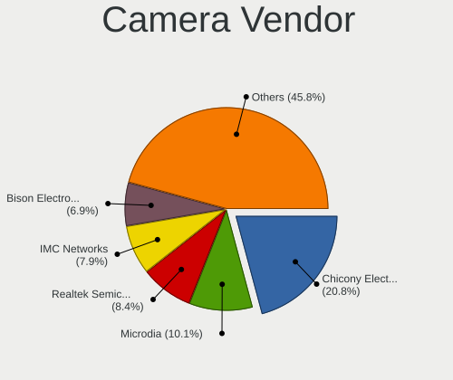

| Vendor                                 | Computers | Percent |
|----------------------------------------|-----------|---------|
| Chicony Electronics                    | 778       | 20.84%  |
| Microdia                               | 379       | 10.15%  |
| Realtek Semiconductor                  | 314       | 8.41%   |
| IMC Networks                           | 295       | 7.9%    |
| Bison Electronics                      | 259       | 6.94%   |
| Logitech                               | 246       | 6.59%   |
| Sunplus Innovation Technology          | 219       | 5.87%   |
| Apple                                  | 162       | 4.34%   |
| Cheng Uei Precision Industry (Foxlink) | 155       | 4.15%   |
| Quanta                                 | 147       | 3.94%   |
| Suyin                                  | 98        | 2.62%   |
| Lite-On Technology                     | 75        | 2.01%   |
| Luxvisions Innotech Limited            | 67        | 1.79%   |
| Syntek                                 | 63        | 1.69%   |
| Samsung Electronics                    | 34        | 0.91%   |
| Microsoft                              | 33        | 0.88%   |
| Silicon Motion                         | 30        | 0.8%    |
| Ricoh                                  | 27        | 0.72%   |
| Sonix Technology                       | 25        | 0.67%   |
| Lenovo                                 | 22        | 0.59%   |
| Alcor Micro                            | 22        | 0.59%   |
| Trust                                  | 18        | 0.48%   |
| Shinetech                              | 17        | 0.46%   |
| Generalplus Technology                 | 16        | 0.43%   |
| Primax Electronics                     | 14        | 0.37%   |
| SunplusIT                              | 13        | 0.35%   |
| MacroSilicon                           | 11        | 0.29%   |
| Jieli Technology                       | 11        | 0.29%   |
| Importek                               | 11        | 0.29%   |
| kingcome                               | 10        | 0.27%   |
| ARC International                      | 9         | 0.24%   |
| Z-Star Microelectronics                | 8         | 0.21%   |
| ALi                                    | 8         | 0.21%   |
| Acer                                   | 8         | 0.21%   |
| Creative Technology                    | 6         | 0.16%   |
| OmniVision Technologies                | 5         | 0.13%   |
| Tobii Technology AB                    | 4         | 0.11%   |
| Sweex                                  | 4         | 0.11%   |
| Genesys Logic                          | 4         | 0.11%   |
| YGTek                                  | 3         | 0.08%   |

Camera Model
------------

Camera device models

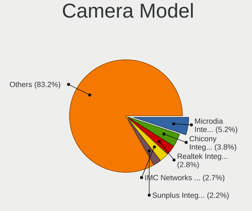

| Model                                                                      | Computers | Percent |
|----------------------------------------------------------------------------|-----------|---------|
| Microdia Integrated_Webcam_HD                                              | 196       | 5.16%   |
| Chicony Integrated Camera                                                  | 146       | 3.84%   |
| Realtek Integrated_Webcam_HD                                               | 107       | 2.82%   |
| IMC Networks Integrated Camera                                             | 104       | 2.74%   |
| Sunplus Integrated_Webcam_HD                                               | 85        | 2.24%   |
| IMC Networks USB2.0 HD UVC WebCam                                          | 80        | 2.11%   |
| Chicony HD WebCam                                                          | 80        | 2.11%   |
| Bison Integrated Camera                                                    | 79        | 2.08%   |
| Realtek Integrated_Webcam_5M                                               | 69        | 1.82%   |
| Chicony HP HD Camera                                                       | 60        | 1.58%   |
| Apple Built-in iSight                                                      | 51        | 1.34%   |
| Logitech Webcam C270                                                       | 46        | 1.21%   |
| Syntek Integrated Camera                                                   | 44        | 1.16%   |
| Apple FaceTime HD Camera (Built-in)                                        | 41        | 1.08%   |
| Samsung Galaxy series, misc. (MTP mode)                                    | 34        | 0.89%   |
| Logitech HD Pro Webcam C920                                                | 32        | 0.84%   |
| Apple iPhone 5/5C/5S/6/SE/7/8/X                                            | 31        | 0.82%   |
| Apple FaceTime HD Camera                                                   | 31        | 0.82%   |
| Chicony HP Wide Vision HD Camera                                           | 29        | 0.76%   |
| Bison BisonCam,NB Pro                                                      | 29        | 0.76%   |
| Microdia Integrated Webcam                                                 | 26        | 0.68%   |
| Quanta HP HD Camera                                                        | 25        | 0.66%   |
| Chicony Chicony USB2.0 Camera                                              | 25        | 0.66%   |
| Logitech C922 Pro Stream Webcam                                            | 24        | 0.63%   |
| Cheng Uei Precision Industry (Foxlink) HP HD Camera                        | 24        | 0.63%   |
| Sunplus HD WebCam                                                          | 23        | 0.61%   |
| Realtek USB Camera                                                         | 23        | 0.61%   |
| Quanta HD User Facing                                                      | 23        | 0.61%   |
| Chicony TOSHIBA Web Camera - HD                                            | 23        | 0.61%   |
| Lite-On Integrated Camera                                                  | 22        | 0.58%   |
| Lite-On HP HD Camera                                                       | 22        | 0.58%   |
| Quanta HP Wide Vision HD Camera                                            | 21        | 0.55%   |
| Microdia Integrated_Webcam_5M                                              | 21        | 0.55%   |
| Chicony FJ Camera                                                          | 21        | 0.55%   |
| Cheng Uei Precision Industry (Foxlink) HP Wide Vision HD Integrated Webcam | 20        | 0.53%   |
| Bison SunplusIT Integrated Camera                                          | 20        | 0.53%   |
| Bison Lenovo EasyCamera                                                    | 20        | 0.53%   |
| Logitech Webcam C310                                                       | 19        | 0.5%    |
| Chicony USB 2.0 Camera                                                     | 19        | 0.5%    |
| Chicony Integrated HP HD Webcam                                            | 19        | 0.5%    |

Security
--------

Fingerprint Vendor
------------------

Fingerprint sensor vendors

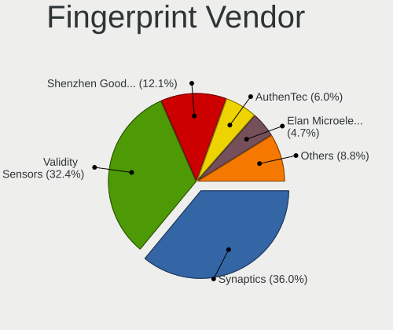

| Vendor                             | Computers | Percent |
|------------------------------------|-----------|---------|
| Synaptics                          | 253       | 35.99%  |
| Validity Sensors                   | 228       | 32.43%  |
| Shenzhen Goodix Technology         | 85        | 12.09%  |
| AuthenTec                          | 42        | 5.97%   |
| Elan Microelectronics              | 33        | 4.69%   |
| LighTuning Technology              | 30        | 4.27%   |
| Upek                               | 24        | 3.41%   |
| STMicroelectronics                 | 3         | 0.43%   |
| Realtek USB2.0 Finger Print Bridge | 2         | 0.28%   |
| Samsung Electronics                | 1         | 0.14%   |
| HOLTEK                             | 1         | 0.14%   |
| DigitalPersona                     | 1         | 0.14%   |

Fingerprint Model
-----------------

Fingerprint sensor models

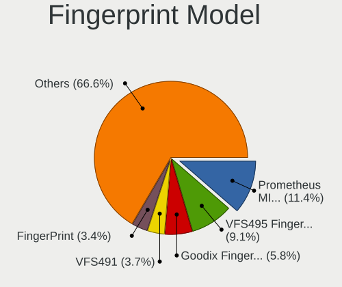

| Model                                                                      | Computers | Percent |
|----------------------------------------------------------------------------|-----------|---------|
| Synaptics Prometheus MIS Touch Fingerprint Reader                          | 80        | 11.38%  |
| Validity Sensors VFS495 Fingerprint Reader                                 | 64        | 9.1%    |
| Shenzhen Goodix  FingerPrint Device                                        | 41        | 5.83%   |
| Validity Sensors VFS491                                                    | 26        | 3.7%    |
| Shenzhen Goodix FingerPrint                                                | 24        | 3.41%   |
| Upek Biometric Touchchip/Touchstrip Fingerprint Sensor                     | 23        | 3.27%   |
| Validity Sensors Synaptics VFS7552 Touch Fingerprint Sensor with PurePrint | 22        | 3.13%   |
| Synaptics Metallica MIS Touch Fingerprint Reader                           | 22        | 3.13%   |
| Synaptics UWP WBDI                                                         | 21        | 2.99%   |
| Shenzhen Goodix Fingerprint Reader                                         | 20        | 2.84%   |
| Validity Sensors VFS 5011 fingerprint sensor                               | 19        | 2.7%    |
| Validity Sensors VFS451 Fingerprint Reader                                 | 17        | 2.42%   |
| Synaptics  WBDI                                                            | 17        | 2.42%   |
| Synaptics FS7604 Touch Fingerprint Sensor with PurePrint                   | 17        | 2.42%   |
| Synaptics Fingerprint reader [HP G6]                                       | 17        | 2.42%   |
| LighTuning EgisTec Touch Fingerprint Sensor                                | 17        | 2.42%   |
| Elan ELAN:ARM-M4                                                           | 17        | 2.42%   |
| Elan ELAN:Fingerprint                                                      | 16        | 2.28%   |
| Validity Sensors VFS471 Fingerprint Reader                                 | 15        | 2.13%   |
| AuthenTec AES2501 Fingerprint Sensor                                       | 15        | 2.13%   |
| Validity Sensors VFS5011 Fingerprint Reader                                | 14        | 1.99%   |
| Synaptics Prometheus Fingerprint Reader                                    | 13        | 1.85%   |
| Validity Sensors Synaptics WBDI                                            | 12        | 1.71%   |
| AuthenTec AES2810                                                          | 12        | 1.71%   |
| Synaptics WBDI                                                             | 11        | 1.56%   |
| Synaptics  FS7604 Touch Fingerprint Sensor with PurePrint                  | 11        | 1.56%   |
| Synaptics UWP WBDI Device                                                  | 10        | 1.42%   |
| LighTuning ES603 Swipe Fingerprint Sensor                                  | 8         | 1.14%   |
| Validity Sensors VFS7500 Touch Fingerprint Sensor                          | 7         | 1%      |
| Synaptics WBDI Fingerprint Reader USB 086                                  | 7         | 1%      |
| Synaptics TouchPad                                                         | 7         | 1%      |
| Synaptics Metallica MOH Touch Fingerprint Reader                           | 7         | 1%      |
| AuthenTec AES1600                                                          | 7         | 1%      |
| Unknown                                                                    | 7         | 1%      |
| Validity Sensors Fingerprint scanner                                       | 6         | 0.85%   |
| Validity Sensors VFS101 Fingerprint Reader                                 | 5         | 0.71%   |
| Validity Sensors Swipe Fingerprint Sensor                                  | 5         | 0.71%   |
| AuthenTec Fingerprint Sensor                                               | 5         | 0.71%   |
| Validity Sensors VFS7552 Touch Fingerprint Sensor                          | 4         | 0.57%   |
| Validity Sensors VFS Fingerprint sensor                                    | 4         | 0.57%   |

Chipcard Vendor
---------------

Chipcard module vendors

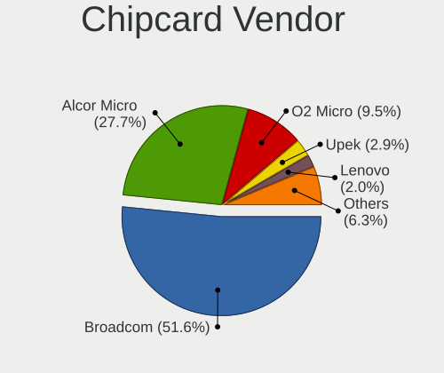

| Vendor                            | Computers | Percent |
|-----------------------------------|-----------|---------|
| Broadcom                          | 179       | 51.59%  |
| Alcor Micro                       | 96        | 27.67%  |
| O2 Micro                          | 33        | 9.51%   |
| Upek                              | 10        | 2.88%   |
| Lenovo                            | 7         | 2.02%   |
| Yubico.com                        | 5         | 1.44%   |
| SCM Microsystems                  | 3         | 0.86%   |
| Advanced Card Systems             | 3         | 0.86%   |
| OmniKey                           | 2         | 0.58%   |
| Gemalto (was Gemplus)             | 2         | 0.58%   |
| Fujitsu Siemens Computers         | 2         | 0.58%   |
| Clay Logic                        | 2         | 0.58%   |
| Chicony Electronics               | 2         | 0.58%   |
| VASCO Data Security International | 1         | 0.29%   |

Chipcard Model
--------------

Chipcard module models

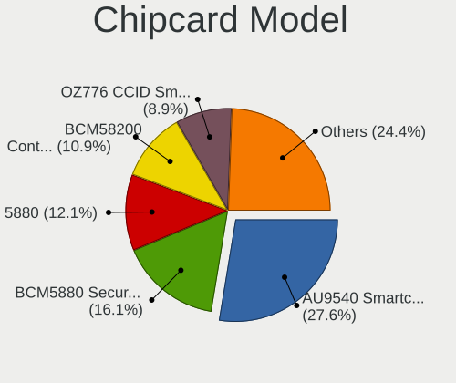

| Model                                                                        | Computers | Percent |
|------------------------------------------------------------------------------|-----------|---------|
| Alcor Micro AU9540 Smartcard Reader                                          | 96        | 27.59%  |
| Broadcom BCM5880 Secure Applications Processor                               | 56        | 16.09%  |
| Broadcom 5880                                                                | 42        | 12.07%  |
| Broadcom BCM58200 ControlVault 3 (FingerPrint sensor + Contacted SmartCard)  | 38        | 10.92%  |
| O2 Micro OZ776 CCID Smartcard Reader                                         | 31        | 8.91%   |
| Broadcom BCM5880 Secure Applications Processor with fingerprint swipe sensor | 30        | 8.62%   |
| Broadcom 58200                                                               | 13        | 3.74%   |
| Upek TouchChip Fingerprint Coprocessor (WBF advanced mode)                   | 10        | 2.87%   |
| Lenovo Integrated Smart Card Reader                                          | 7         | 2.01%   |
| Yubico.com Yubikey 4/5 U2F+CCID                                              | 5         | 1.44%   |
| SCM Microsystems SCR3340 - ExpressCard54 Smart Card Reader                   | 2         | 0.57%   |
| O2 Micro Oz776 SmartCard Reader                                              | 2         | 0.57%   |
| Chicony Electronics HP Skylab USB Smartcard Keyboard                         | 2         | 0.57%   |
| Advanced Card Systems ACR122U                                                | 2         | 0.57%   |
| VASCO Data Security International Digipass 905 SmartCard Reader              | 1         | 0.29%   |
| SCM Microsystems SCR35xx Smart Card Reader                                   | 1         | 0.29%   |
| OmniKey 5422 Smartcard Reader                                                | 1         | 0.29%   |
| OmniKey 3x21 Smart Card Reader                                               | 1         | 0.29%   |
| Gemalto (was Gemplus) GemPC Twin SmartCard Reader                            | 1         | 0.29%   |
| Gemalto (was Gemplus) Compact Smart Card Reader Writer                       | 1         | 0.29%   |
| Fujitsu Siemens Computers SmartCard Reader 2A                                | 1         | 0.29%   |
| Fujitsu Siemens Computers Keyboard KB SCR                                    | 1         | 0.29%   |
| Clay Logic Nitrokey Pro                                                      | 1         | 0.29%   |
| Clay Logic Nitrokey HSM                                                      | 1         | 0.29%   |
| Broadcom BCM5880 Secure Applications Processor with fingerprint touch sensor | 1         | 0.29%   |
| Advanced Card Systems ACR39U                                                 | 1         | 0.29%   |

Unsupported
-----------

Unsupported Devices
-------------------

Total unsupported devices on board

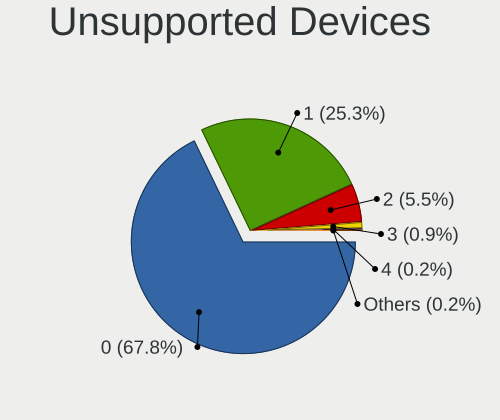

| Total | Computers | Percent |
|-------|-----------|---------|
| 0     | 4357      | 67.84%  |
| 1     | 1627      | 25.33%  |
| 2     | 355       | 5.53%   |
| 3     | 57        | 0.89%   |
| 4     | 14        | 0.22%   |
| 5     | 6         | 0.09%   |
| 6     | 4         | 0.06%   |
| 9     | 1         | 0.02%   |
| 8     | 1         | 0.02%   |

Unsupported Device Types
------------------------

Types of unsupported devices

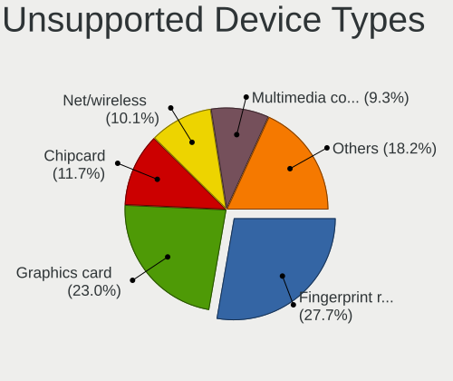

| Type                     | Computers | Percent |
|--------------------------|-----------|---------|
| Fingerprint reader       | 698       | 27.72%  |
| Graphics card            | 579       | 22.99%  |
| Chipcard                 | 294       | 11.68%  |
| Net/wireless             | 255       | 10.13%  |
| Multimedia controller    | 234       | 9.29%   |
| Communication controller | 99        | 3.93%   |
| Camera                   | 77        | 3.06%   |
| Bluetooth                | 51        | 2.03%   |
| Sound                    | 39        | 1.55%   |
| Unassigned class         | 37        | 1.47%   |
| Net/ethernet             | 33        | 1.31%   |
| Storage                  | 31        | 1.23%   |
| Card reader              | 26        | 1.03%   |
| Network                  | 25        | 0.99%   |
| Flash memory             | 8         | 0.32%   |
| Storage/raid             | 7         | 0.28%   |
| Modem                    | 7         | 0.28%   |
| Storage/ide              | 5         | 0.2%    |
| Storage/ata              | 5         | 0.2%    |
| Tv card                  | 3         | 0.12%   |
| Storage/nvme             | 2         | 0.08%   |
| Dvb card                 | 2         | 0.08%   |
| Firewire controller      | 1         | 0.04%   |

