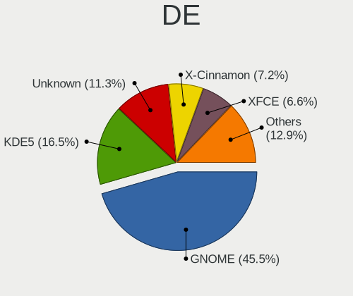
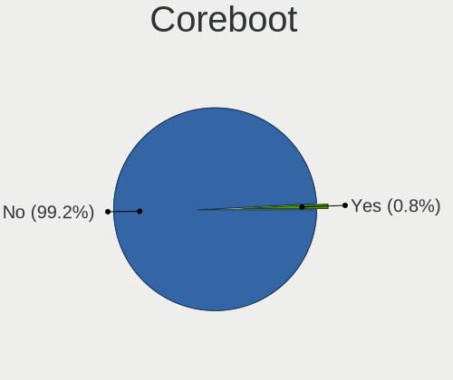
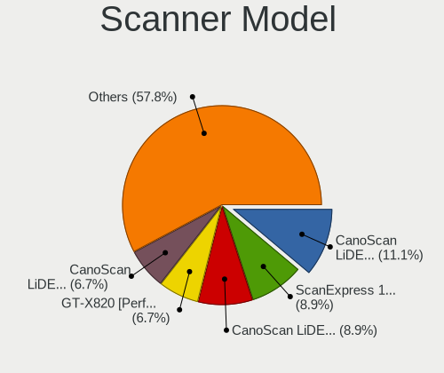
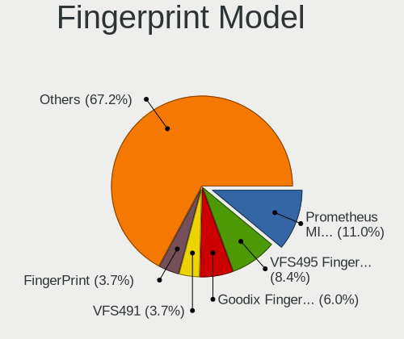
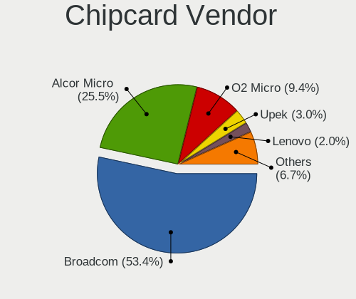

Linux in Netherlands - Tested Hardware & Statistics
---------------------------------------------------

A project to collect tested hardware configurations for Linux in Netherlands.

Anyone can contribute to this report by the [hw-probe](https://github.com/linuxhw/hw-probe) tool:

    sudo -E hw-probe -all -upload

Please contribute! Especially if your hardware is rare.

This is a report for all computer types. See also reports for [desktops](/Location/Netherlands/Desktop/README.md) and [notebooks](/Location/Netherlands/Notebook/README.md).

Contents
--------

* [ Test Cases ](#test-cases)

* [ System ](#system)
  - [ OS                       ](#os)
  - [ OS Family                ](#os-family)
  - [ Kernel                   ](#kernel)
  - [ Kernel Family            ](#kernel-family)
  - [ Kernel Major Ver.        ](#kernel-major-ver)
  - [ Arch                     ](#arch)
  - [ DE                       ](#de)
  - [ Display Server           ](#display-server)
  - [ Display Manager          ](#display-manager)
  - [ OS Lang                  ](#os-lang)
  - [ Boot Mode                ](#boot-mode)
  - [ Filesystem               ](#filesystem)
  - [ Part. scheme             ](#part-scheme)
  - [ Dual Boot with Linux/BSD ](#dual-boot-with-linuxbsd)
  - [ Dual Boot (Win)          ](#dual-boot-win)

* [ Board ](#board)
  - [ Vendor                   ](#vendor)
  - [ Model                    ](#model)
  - [ Model Family             ](#model-family)
  - [ MFG Year                 ](#mfg-year)
  - [ Form Factor              ](#form-factor)
  - [ Secure Boot              ](#secure-boot)
  - [ Coreboot                 ](#coreboot)
  - [ RAM Size                 ](#ram-size)
  - [ RAM Used                 ](#ram-used)
  - [ Total Drives             ](#total-drives)
  - [ Has CD-ROM               ](#has-cd-rom)
  - [ Has Ethernet             ](#has-ethernet)
  - [ Has WiFi                 ](#has-wifi)
  - [ Has Bluetooth            ](#has-bluetooth)

* [ Location ](#location)
  - [ Country                  ](#country)
  - [ City                     ](#city)

* [ Drives ](#drives)
  - [ Drive Vendor             ](#drive-vendor)
  - [ Drive Model              ](#drive-model)
  - [ HDD Vendor               ](#hdd-vendor)
  - [ SSD Vendor               ](#ssd-vendor)
  - [ Drive Kind               ](#drive-kind)
  - [ Drive Connector          ](#drive-connector)
  - [ Drive Size               ](#drive-size)
  - [ Space Total              ](#space-total)
  - [ Space Used               ](#space-used)
  - [ Malfunc. Drives          ](#malfunc-drives)
  - [ Malfunc. Drive Vendor    ](#malfunc-drive-vendor)
  - [ Malfunc. HDD Vendor      ](#malfunc-hdd-vendor)
  - [ Malfunc. Drive Kind      ](#malfunc-drive-kind)
  - [ Failed Drives            ](#failed-drives)
  - [ Failed Drive Vendor      ](#failed-drive-vendor)
  - [ Drive Status             ](#drive-status)

* [ Storage controller ](#storage-controller)
  - [ Storage Vendor           ](#storage-vendor)
  - [ Storage Model            ](#storage-model)
  - [ Storage Kind             ](#storage-kind)

* [ Processor ](#processor)
  - [ CPU Vendor               ](#cpu-vendor)
  - [ CPU Model                ](#cpu-model)
  - [ CPU Model Family         ](#cpu-model-family)
  - [ CPU Cores                ](#cpu-cores)
  - [ CPU Sockets              ](#cpu-sockets)
  - [ CPU Threads              ](#cpu-threads)
  - [ CPU Op-Modes             ](#cpu-op-modes)
  - [ CPU Microcode            ](#cpu-microcode)
  - [ CPU Microarch            ](#cpu-microarch)

* [ Graphics ](#graphics)
  - [ GPU Vendor               ](#gpu-vendor)
  - [ GPU Model                ](#gpu-model)
  - [ GPU Combo                ](#gpu-combo)
  - [ GPU Driver               ](#gpu-driver)
  - [ GPU Memory               ](#gpu-memory)

* [ Monitor ](#monitor)
  - [ Monitor Vendor           ](#monitor-vendor)
  - [ Monitor Model            ](#monitor-model)
  - [ Monitor Resolution       ](#monitor-resolution)
  - [ Monitor Diagonal         ](#monitor-diagonal)
  - [ Monitor Width            ](#monitor-width)
  - [ Aspect Ratio             ](#aspect-ratio)
  - [ Monitor Area             ](#monitor-area)
  - [ Pixel Density            ](#pixel-density)
  - [ Multiple Monitors        ](#multiple-monitors)

* [ Network ](#network)
  - [ Net Controller Vendor    ](#net-controller-vendor)
  - [ Net Controller Model     ](#net-controller-model)
  - [ Wireless Vendor          ](#wireless-vendor)
  - [ Wireless Model           ](#wireless-model)
  - [ Ethernet Vendor          ](#ethernet-vendor)
  - [ Ethernet Model           ](#ethernet-model)
  - [ Net Controller Kind      ](#net-controller-kind)
  - [ Used Controller          ](#used-controller)
  - [ NICs                     ](#nics)
  - [ IPv6                     ](#ipv6)

* [ Bluetooth ](#bluetooth)
  - [ Bluetooth Vendor         ](#bluetooth-vendor)
  - [ Bluetooth Model          ](#bluetooth-model)

* [ Sound ](#sound)
  - [ Sound Vendor             ](#sound-vendor)
  - [ Sound Model              ](#sound-model)

* [ Memory ](#memory)
  - [ Memory Vendor            ](#memory-vendor)
  - [ Memory Model             ](#memory-model)
  - [ Memory Kind              ](#memory-kind)
  - [ Memory Form Factor       ](#memory-form-factor)
  - [ Memory Size              ](#memory-size)
  - [ Memory Speed             ](#memory-speed)

* [ Printers & scanners ](#printers--scanners)
  - [ Printer Vendor           ](#printer-vendor)
  - [ Printer Model            ](#printer-model)
  - [ Scanner Vendor           ](#scanner-vendor)
  - [ Scanner Model            ](#scanner-model)

* [ Camera ](#camera)
  - [ Camera Vendor            ](#camera-vendor)
  - [ Camera Model             ](#camera-model)

* [ Security ](#security)
  - [ Fingerprint Vendor       ](#fingerprint-vendor)
  - [ Fingerprint Model        ](#fingerprint-model)
  - [ Chipcard Vendor          ](#chipcard-vendor)
  - [ Chipcard Model           ](#chipcard-model)

* [ Unsupported ](#unsupported)
  - [ Unsupported Devices      ](#unsupported-devices)
  - [ Unsupported Device Types ](#unsupported-device-types)

Test Cases
----------

Total: 7979

| Vendor        | Model                       | Form-Factor | Probe                                                      | Date         |
|---------------|-----------------------------|-------------|------------------------------------------------------------|--------------|
| Lenovo        | ThinkPad Z13 Gen 1 21D2C... | Notebook    | [a8fdf278ff](https://linux-hardware.org/?probe=a8fdf278ff) | Jan 06, 2025 |
| Acer          | Aspire A515-52G             | Notebook    | [572616a1d9](https://linux-hardware.org/?probe=572616a1d9) | Jan 06, 2025 |
| Lenovo        | SHARKBAY 31900058 STD       | Desktop     | [e1ab989081](https://linux-hardware.org/?probe=e1ab989081) | Jan 06, 2025 |
| HP            | Pavilion Power Laptop 15... | Notebook    | [83a930718f](https://linux-hardware.org/?probe=83a930718f) | Jan 06, 2025 |
| MSI           | MS-B0A41                    | Desktop     | [72d4614eaf](https://linux-hardware.org/?probe=72d4614eaf) | Jan 05, 2025 |
| Lenovo        | ThinkPad X1 Carbon 6th 2... | Notebook    | [34234d8404](https://linux-hardware.org/?probe=34234d8404) | Jan 05, 2025 |
| ASUSTek       | ASUS Zenbook S 14 UX5406... | Notebook    | [689364573c](https://linux-hardware.org/?probe=689364573c) | Jan 05, 2025 |
| ASRock        | B650M-HDV/M.2               | Desktop     | [7db2107e2a](https://linux-hardware.org/?probe=7db2107e2a) | Jan 05, 2025 |
| ASUSTek       | Z97-K                       | Desktop     | [ba47136806](https://linux-hardware.org/?probe=ba47136806) | Jan 05, 2025 |
| ASRock        | B650M-HDV/M.2               | Desktop     | [483e929c10](https://linux-hardware.org/?probe=483e929c10) | Jan 05, 2025 |
| ASUSTek       | ASUS Zenbook S 14 UX5406... | Notebook    | [3497123a57](https://linux-hardware.org/?probe=3497123a57) | Jan 04, 2025 |
| MSI           | A55M-E33                    | Desktop     | [491adf615a](https://linux-hardware.org/?probe=491adf615a) | Jan 04, 2025 |
| Valve         | Jupiter                     | Notebook    | [7d460209df](https://linux-hardware.org/?probe=7d460209df) | Jan 03, 2025 |
| Acer          | Aspire XC-105               | Desktop     | [997c408078](https://linux-hardware.org/?probe=997c408078) | Jan 03, 2025 |
| Lenovo        | ThinkPad T540p 20BE00B2M... | Notebook    | [d3fdfbc445](https://linux-hardware.org/?probe=d3fdfbc445) | Jan 03, 2025 |
| HP            | EliteBook 840 G2            | Notebook    | [54ab368174](https://linux-hardware.org/?probe=54ab368174) | Jan 03, 2025 |
| Lenovo        | 3728 SDK0J40709 WIN 3259... | Desktop     | [04c0c560d4](https://linux-hardware.org/?probe=04c0c560d4) | Jan 03, 2025 |
| Google        | Chell                       | Notebook    | [165f302be9](https://linux-hardware.org/?probe=165f302be9) | Jan 03, 2025 |
| Lenovo        | ThinkPad X250 20CLS45J00    | Notebook    | [23c3a522f9](https://linux-hardware.org/?probe=23c3a522f9) | Jan 02, 2025 |
| Lenovo        | ThinkPad P14s Gen 4 21K5... | Notebook    | [419e7b4071](https://linux-hardware.org/?probe=419e7b4071) | Jan 02, 2025 |
| Notebook      | PD5x_7xSNC_SND_SNE          | Notebook    | [5765389ba6](https://linux-hardware.org/?probe=5765389ba6) | Jan 01, 2025 |
| Toshiba       | Satellite Pro S500          | Notebook    | [62a9b2c381](https://linux-hardware.org/?probe=62a9b2c381) | Jan 01, 2025 |
| Apple         | MacBookPro8,1               | Notebook    | [97406c849c](https://linux-hardware.org/?probe=97406c849c) | Jan 01, 2025 |
| Apple         | MacBookPro8,1               | Notebook    | [4c8c9d26c5](https://linux-hardware.org/?probe=4c8c9d26c5) | Jan 01, 2025 |
| Apple         | Mac-F2238BAE iMac11,3       | All in one  | [5e464458db](https://linux-hardware.org/?probe=5e464458db) | Jan 01, 2025 |
| Lenovo        | V155-15API 81V5             | Notebook    | [145938b91b](https://linux-hardware.org/?probe=145938b91b) | Dec 31, 2024 |
| ASUSTek       | Z97-K                       | Desktop     | [ead5b54010](https://linux-hardware.org/?probe=ead5b54010) | Dec 31, 2024 |
| Dell          | Latitude E6220              | Notebook    | [b93b3b88d1](https://linux-hardware.org/?probe=b93b3b88d1) | Dec 31, 2024 |
| ASUSTek       | X71SL                       | Notebook    | [e9857b1f50](https://linux-hardware.org/?probe=e9857b1f50) | Dec 30, 2024 |
| Lenovo        | ThinkPad T470s W10DG 20J... | Notebook    | [0d96f203f5](https://linux-hardware.org/?probe=0d96f203f5) | Dec 30, 2024 |
| Apple         | MacBookAir2,1               | Notebook    | [3a01cb6d48](https://linux-hardware.org/?probe=3a01cb6d48) | Dec 29, 2024 |
| Medion        | MS-7800                     | Desktop     | [4d798c6151](https://linux-hardware.org/?probe=4d798c6151) | Dec 28, 2024 |
| Dell          | Latitude E4300              | Notebook    | [0c340c7391](https://linux-hardware.org/?probe=0c340c7391) | Dec 28, 2024 |
| Dell          | Latitude E4300              | Notebook    | [e00b4f8165](https://linux-hardware.org/?probe=e00b4f8165) | Dec 27, 2024 |
| Gigabyte      | B550M S2H                   | Desktop     | [18287a9af1](https://linux-hardware.org/?probe=18287a9af1) | Dec 27, 2024 |
| Dell          | Latitude 5290 2-in-1        | Tablet      | [6f84dea3dc](https://linux-hardware.org/?probe=6f84dea3dc) | Dec 27, 2024 |
| ASUSTek       | PRIME B550M-A               | Desktop     | [119767b103](https://linux-hardware.org/?probe=119767b103) | Dec 27, 2024 |
| ASUSTek       | H170-PRO                    | Desktop     | [04f9098e0d](https://linux-hardware.org/?probe=04f9098e0d) | Dec 26, 2024 |
| MSI           | P45 Neo3                    | Desktop     | [4952d3011f](https://linux-hardware.org/?probe=4952d3011f) | Dec 26, 2024 |
| ASUSTek       | N53SV                       | Notebook    | [af2f1ee4b9](https://linux-hardware.org/?probe=af2f1ee4b9) | Dec 26, 2024 |
| Gigabyte      | B550M S2H                   | Desktop     | [0076231d40](https://linux-hardware.org/?probe=0076231d40) | Dec 26, 2024 |
| Lenovo        | Yoga Pro 7 14APH8 82Y8      | Notebook    | [26b3de30ce](https://linux-hardware.org/?probe=26b3de30ce) | Dec 26, 2024 |
| MSI           | PRO X670-P WIFI             | Desktop     | [603c73537a](https://linux-hardware.org/?probe=603c73537a) | Dec 25, 2024 |
| MSI           | PRO X670-P WIFI             | Desktop     | [9713f44b0a](https://linux-hardware.org/?probe=9713f44b0a) | Dec 24, 2024 |
| HP            | Elite x360 830 13 inch G... | Convertible | [759b2993d7](https://linux-hardware.org/?probe=759b2993d7) | Dec 24, 2024 |
| ASUSTek       | Z97-K                       | Desktop     | [9c28b6bdee](https://linux-hardware.org/?probe=9c28b6bdee) | Dec 24, 2024 |
| HP            | Elite x360 830 13 inch G... | Convertible | [cf06638d11](https://linux-hardware.org/?probe=cf06638d11) | Dec 24, 2024 |
| ASUSTek       | ROG STRIX B650E-F GAMING... | Desktop     | [ad40c6b991](https://linux-hardware.org/?probe=ad40c6b991) | Dec 23, 2024 |
| HP            | Pavilion dv7                | Notebook    | [c4f13a383d](https://linux-hardware.org/?probe=c4f13a383d) | Dec 23, 2024 |
| HP            | 3396                        | Desktop     | [6e2c93c063](https://linux-hardware.org/?probe=6e2c93c063) | Dec 23, 2024 |
| HP            | 3396                        | Desktop     | [a237d63fa3](https://linux-hardware.org/?probe=a237d63fa3) | Dec 23, 2024 |
| Notebook      | W65_W67RB                   | Notebook    | [0475d664f0](https://linux-hardware.org/?probe=0475d664f0) | Dec 22, 2024 |
| ASUSTek       | PRIME Z370-A                | Desktop     | [17aedd4d99](https://linux-hardware.org/?probe=17aedd4d99) | Dec 22, 2024 |
| ASUSTek       | ROG Maximus XI GENE         | Desktop     | [e773c2d04f](https://linux-hardware.org/?probe=e773c2d04f) | Dec 22, 2024 |
| HP            | Notebook                    | Notebook    | [b72d574e31](https://linux-hardware.org/?probe=b72d574e31) | Dec 22, 2024 |
| Dell          | 09KPNV A00                  | Desktop     | [3f5640444f](https://linux-hardware.org/?probe=3f5640444f) | Dec 21, 2024 |
| Lenovo        | ThinkPad P1 Gen 2 20QUS0... | Notebook    | [8eaf87896d](https://linux-hardware.org/?probe=8eaf87896d) | Dec 21, 2024 |
| Dell          | Latitude 14 Rugged (5404... | Notebook    | [0613277441](https://linux-hardware.org/?probe=0613277441) | Dec 21, 2024 |
| HP            | ProBook 445R G6             | Notebook    | [6a6dd0b802](https://linux-hardware.org/?probe=6a6dd0b802) | Dec 21, 2024 |
| Lenovo        | ThinkPad X220 Tablet 429... | Notebook    | [df6f512e3a](https://linux-hardware.org/?probe=df6f512e3a) | Dec 21, 2024 |
| Lenovo        | ThinkPad X220 Tablet 429... | Notebook    | [7c430caf94](https://linux-hardware.org/?probe=7c430caf94) | Dec 21, 2024 |
| Lenovo        | ThinkPad X1 Carbon Gen 1... | Notebook    | [d8ec348d56](https://linux-hardware.org/?probe=d8ec348d56) | Dec 20, 2024 |
| AZW           | U59                         | Desktop     | [b20a2719ec](https://linux-hardware.org/?probe=b20a2719ec) | Dec 20, 2024 |
| Dell          | Inspiron 7773               | Notebook    | [d3a47ddb07](https://linux-hardware.org/?probe=d3a47ddb07) | Dec 19, 2024 |
| HP            | ENVY x360 2-in-1 Laptop ... | Convertible | [22428153ea](https://linux-hardware.org/?probe=22428153ea) | Dec 19, 2024 |
| Dell          | Inspiron 7773               | Notebook    | [a6993bc0ed](https://linux-hardware.org/?probe=a6993bc0ed) | Dec 19, 2024 |
| AZW           | SER V1.0                    | Mini pc     | [b591aff2f1](https://linux-hardware.org/?probe=b591aff2f1) | Dec 19, 2024 |
| ASUSTek       | NUC13ANB-M 60AS0040-MB0A... | Mini pc     | [b9a32b1575](https://linux-hardware.org/?probe=b9a32b1575) | Dec 18, 2024 |
| Dell          | Precision M4800             | Notebook    | [8973087d8d](https://linux-hardware.org/?probe=8973087d8d) | Dec 17, 2024 |
| HP            | EliteBook 655 15.6 inch ... | Notebook    | [0c453f6750](https://linux-hardware.org/?probe=0c453f6750) | Dec 17, 2024 |
| ASUSTek       | Vivobook Go E1504FA_E150... | Notebook    | [357c54b699](https://linux-hardware.org/?probe=357c54b699) | Dec 17, 2024 |
| ASUSTek       | PRIME H510M-A               | Desktop     | [0b3d28fe51](https://linux-hardware.org/?probe=0b3d28fe51) | Dec 17, 2024 |
| MSI           | PRO Z690-A DDR4             | Desktop     | [63f734b1e5](https://linux-hardware.org/?probe=63f734b1e5) | Dec 17, 2024 |
| ASRock        | H510M-HDV/M.2 SE            | Desktop     | [6592ca3f42](https://linux-hardware.org/?probe=6592ca3f42) | Dec 16, 2024 |
| HP            | Compaq Presario CQ71        | Notebook    | [beb3a237e8](https://linux-hardware.org/?probe=beb3a237e8) | Dec 16, 2024 |
| ASUSTek       | N551JQ                      | Notebook    | [2a60939d27](https://linux-hardware.org/?probe=2a60939d27) | Dec 16, 2024 |
| HP            | ProBook 450 G6              | Notebook    | [74781357e5](https://linux-hardware.org/?probe=74781357e5) | Dec 16, 2024 |
| Medion        | H110H4-EM                   | Desktop     | [7e95fae863](https://linux-hardware.org/?probe=7e95fae863) | Dec 16, 2024 |
| Lenovo        | 330B SDK0T76530 WIN 3556... | Mini pc     | [634639adbc](https://linux-hardware.org/?probe=634639adbc) | Dec 15, 2024 |
| Dell          | Latitude 7280               | Notebook    | [8ed58033ee](https://linux-hardware.org/?probe=8ed58033ee) | Dec 14, 2024 |
| HP            | 339A                        | Desktop     | [51ac462459](https://linux-hardware.org/?probe=51ac462459) | Dec 14, 2024 |
| HP            | 0A08h                       | Desktop     | [4b76eeac51](https://linux-hardware.org/?probe=4b76eeac51) | Dec 14, 2024 |
| Gigabyte      | X570 GAMING X               | Desktop     | [329e4898cd](https://linux-hardware.org/?probe=329e4898cd) | Dec 13, 2024 |
| ASUSTek       | PRIME X570-P                | Desktop     | [05e5753958](https://linux-hardware.org/?probe=05e5753958) | Dec 13, 2024 |
| Intel         | DH61ZE AAG43004-200         | Desktop     | [6e9ec5fdc8](https://linux-hardware.org/?probe=6e9ec5fdc8) | Dec 13, 2024 |
| HP            | Pavilion dm1                | Notebook    | [338b8c9095](https://linux-hardware.org/?probe=338b8c9095) | Dec 12, 2024 |
| HP            | 829A                        | Mini pc     | [3dd0a36034](https://linux-hardware.org/?probe=3dd0a36034) | Dec 12, 2024 |
| Gigabyte      | X570 AORUS MASTER           | Desktop     | [9e851507fc](https://linux-hardware.org/?probe=9e851507fc) | Dec 12, 2024 |
| Lenovo        | 312D SDK0J40697 WIN 3305... | Mini pc     | [fa9b8f266e](https://linux-hardware.org/?probe=fa9b8f266e) | Dec 12, 2024 |
| Apple         | Mac-F2268DC8                | All in one  | [ad8b7d1b8f](https://linux-hardware.org/?probe=ad8b7d1b8f) | Dec 12, 2024 |
| Apple         | Mac-F2268DC8                | All in one  | [6b05e8feb0](https://linux-hardware.org/?probe=6b05e8feb0) | Dec 12, 2024 |
| Lenovo        | ThinkPad T14 Gen 4 21K3C... | Notebook    | [e0b3f9eb93](https://linux-hardware.org/?probe=e0b3f9eb93) | Dec 11, 2024 |
| Acer          | Aspire X3960                | Desktop     | [7bc5a0a910](https://linux-hardware.org/?probe=7bc5a0a910) | Dec 11, 2024 |
| Acer          | Aspire A515-52G             | Notebook    | [d68404edcc](https://linux-hardware.org/?probe=d68404edcc) | Dec 11, 2024 |
| Gigabyte      | X670 GAMING X AX V2         | Desktop     | [95159b5753](https://linux-hardware.org/?probe=95159b5753) | Dec 10, 2024 |
| HP            | ProBook 450 G8 Notebook ... | Notebook    | [ee2af3d283](https://linux-hardware.org/?probe=ee2af3d283) | Dec 10, 2024 |
| Medion        | H110H4-EM                   | Desktop     | [c13551963f](https://linux-hardware.org/?probe=c13551963f) | Dec 10, 2024 |
| Dell          | XPS 9315                    | Notebook    | [4c96378b88](https://linux-hardware.org/?probe=4c96378b88) | Dec 09, 2024 |
| ASUSTek       | UX305CA                     | Notebook    | [826fafd993](https://linux-hardware.org/?probe=826fafd993) | Dec 09, 2024 |
| Gigabyte      | X670 GAMING X AX V2         | Desktop     | [51d1c2d99a](https://linux-hardware.org/?probe=51d1c2d99a) | Dec 09, 2024 |
| Dell          | 0C4Y3R A02                  | Server      | [d63adbc5dd](https://linux-hardware.org/?probe=d63adbc5dd) | Dec 09, 2024 |
| Valve         | Jupiter                     | Notebook    | [adf22162c5](https://linux-hardware.org/?probe=adf22162c5) | Dec 08, 2024 |
| HP            | 829A                        | Mini pc     | [03c96d7a62](https://linux-hardware.org/?probe=03c96d7a62) | Dec 08, 2024 |
| Gigabyte      | B760M GAMING DDR4           | Desktop     | [ee69c81b6c](https://linux-hardware.org/?probe=ee69c81b6c) | Dec 07, 2024 |
| MSI           | MPG B650I EDGE WIFI         | Desktop     | [15ceab731a](https://linux-hardware.org/?probe=15ceab731a) | Dec 07, 2024 |
| HP            | ProBook 650 G1              | Notebook    | [62f3ba4cc6](https://linux-hardware.org/?probe=62f3ba4cc6) | Dec 07, 2024 |
| ASUSTek       | N551JQ                      | Notebook    | [75779b5443](https://linux-hardware.org/?probe=75779b5443) | Dec 07, 2024 |
| Gigabyte      | B450 AORUS ELITE            | Desktop     | [4503233bdb](https://linux-hardware.org/?probe=4503233bdb) | Dec 07, 2024 |
| Google        | Delbin                      | Notebook    | [e761f97d94](https://linux-hardware.org/?probe=e761f97d94) | Dec 06, 2024 |
| Acer          | Spin SP513-54N              | Convertible | [3c0060f1b7](https://linux-hardware.org/?probe=3c0060f1b7) | Dec 06, 2024 |
| TUXEDO        | InfinityBook Pro AMD Gen... | Notebook    | [cda9658f32](https://linux-hardware.org/?probe=cda9658f32) | Dec 06, 2024 |
| HP            | EliteBook 845 G8 Noteboo... | Notebook    | [a81500a8d6](https://linux-hardware.org/?probe=a81500a8d6) | Dec 06, 2024 |
| ASUSTek       | N71Jv                       | Notebook    | [4089840eaa](https://linux-hardware.org/?probe=4089840eaa) | Dec 05, 2024 |
| ASRock        | B360M Pro4                  | Desktop     | [110b5c92b3](https://linux-hardware.org/?probe=110b5c92b3) | Dec 05, 2024 |
| ASRock        | B360M Pro4                  | Desktop     | [51ed30ad3f](https://linux-hardware.org/?probe=51ed30ad3f) | Dec 05, 2024 |
| Acer          | Aspire 5736Z                | Notebook    | [0ad38979a9](https://linux-hardware.org/?probe=0ad38979a9) | Dec 04, 2024 |
| MSI           | MPG B650I EDGE WIFI         | Desktop     | [b1cf6cfea9](https://linux-hardware.org/?probe=b1cf6cfea9) | Dec 04, 2024 |
| ASUSTek       | GL552VW                     | Notebook    | [d0611dd371](https://linux-hardware.org/?probe=d0611dd371) | Dec 04, 2024 |
| Lenovo        | Legion Y540-17IRH 81Q4      | Notebook    | [7f5a0eea32](https://linux-hardware.org/?probe=7f5a0eea32) | Dec 03, 2024 |
| Dell          | 0C4Y3R A02                  | Server      | [0ad2232f2e](https://linux-hardware.org/?probe=0ad2232f2e) | Dec 03, 2024 |
| ASUSTek       | GL552VW                     | Notebook    | [4d38c63e3d](https://linux-hardware.org/?probe=4d38c63e3d) | Dec 02, 2024 |
| ASUSTek       | ASUS TUF Gaming A16 FA60... | Notebook    | [ad86291778](https://linux-hardware.org/?probe=ad86291778) | Dec 02, 2024 |
| ASUSTek       | ASUS TUF Gaming A16 FA60... | Notebook    | [d36311286b](https://linux-hardware.org/?probe=d36311286b) | Dec 02, 2024 |
| Razer         | Blade 17 (2022) - RZ09-0... | Notebook    | [84343acca8](https://linux-hardware.org/?probe=84343acca8) | Dec 02, 2024 |
| Google        | Delbin                      | Notebook    | [0b18a9a18c](https://linux-hardware.org/?probe=0b18a9a18c) | Dec 01, 2024 |
| Unknown       | YEPBOOK PRO                 | Notebook    | [a3393a26e8](https://linux-hardware.org/?probe=a3393a26e8) | Dec 01, 2024 |
| Framework     | Laptop                      | Notebook    | [dd1492ec61](https://linux-hardware.org/?probe=dd1492ec61) | Dec 01, 2024 |
| ASUSTek       | TUF Gaming B650M-PLUS WI... | Desktop     | [2587e5c7d0](https://linux-hardware.org/?probe=2587e5c7d0) | Dec 01, 2024 |
| Lenovo        | G50-70 20351                | Notebook    | [a00b1c7b63](https://linux-hardware.org/?probe=a00b1c7b63) | Dec 01, 2024 |
| Dell          | Latitude 5520               | Notebook    | [4a8883bf6a](https://linux-hardware.org/?probe=4a8883bf6a) | Dec 01, 2024 |
| Dell          | XPS 15 7590                 | Notebook    | [8d0614c20c](https://linux-hardware.org/?probe=8d0614c20c) | Dec 01, 2024 |
| Dell          | Inspiron 5759               | Notebook    | [0b81892652](https://linux-hardware.org/?probe=0b81892652) | Nov 30, 2024 |
| HP            | Spectre x360 Convertible... | Convertible | [4ffb4a2a39](https://linux-hardware.org/?probe=4ffb4a2a39) | Nov 30, 2024 |
| Gigabyte      | B550M AORUS PRO-P           | Desktop     | [d47f4ffd1e](https://linux-hardware.org/?probe=d47f4ffd1e) | Nov 30, 2024 |
| Gigabyte      | B650 EAGLE AX               | Desktop     | [cb30ab3228](https://linux-hardware.org/?probe=cb30ab3228) | Nov 30, 2024 |
| Lenovo        | ThinkPad R500 2718W3V       | Notebook    | [3804c95f6f](https://linux-hardware.org/?probe=3804c95f6f) | Nov 29, 2024 |
| ASUSTek       | K50IE                       | Notebook    | [2b124f3ff4](https://linux-hardware.org/?probe=2b124f3ff4) | Nov 28, 2024 |
| ASUSTek       | G75VW                       | Notebook    | [b17bd0994c](https://linux-hardware.org/?probe=b17bd0994c) | Nov 28, 2024 |
| Dell          | Precision 5560              | Notebook    | [1699989ef7](https://linux-hardware.org/?probe=1699989ef7) | Nov 28, 2024 |
| HP            | Presario CQ57               | Notebook    | [bf744465ef](https://linux-hardware.org/?probe=bf744465ef) | Nov 27, 2024 |
| Apple         | MacBookPro12,1              | Notebook    | [fbf43a5c4b](https://linux-hardware.org/?probe=fbf43a5c4b) | Nov 27, 2024 |
| HP            | ZBook Firefly 15 G7 Mobi... | Notebook    | [8c0ecd4b30](https://linux-hardware.org/?probe=8c0ecd4b30) | Nov 26, 2024 |
| Dell          | XPS 16 9640                 | Notebook    | [7e6be4729e](https://linux-hardware.org/?probe=7e6be4729e) | Nov 26, 2024 |
| HP            | 0B4Ch D                     | Desktop     | [8ce4158fcc](https://linux-hardware.org/?probe=8ce4158fcc) | Nov 26, 2024 |
| HP            | 0B4Ch D                     | Desktop     | [5565676cca](https://linux-hardware.org/?probe=5565676cca) | Nov 26, 2024 |
| ASUSTek       | Maximus VIII HERO           | Desktop     | [f0eddec4ed](https://linux-hardware.org/?probe=f0eddec4ed) | Nov 26, 2024 |
| ASUSTek       | Z97-K                       | Desktop     | [b4503a8969](https://linux-hardware.org/?probe=b4503a8969) | Nov 25, 2024 |
| ASUSTek       | Maximus VIII HERO           | Desktop     | [64d558663e](https://linux-hardware.org/?probe=64d558663e) | Nov 25, 2024 |
| Acer          | Aspire A315-51              | Notebook    | [6489d208d6](https://linux-hardware.org/?probe=6489d208d6) | Nov 25, 2024 |
| Notebook      | NLxxPUx                     | Notebook    | [1f935fe7fc](https://linux-hardware.org/?probe=1f935fe7fc) | Nov 25, 2024 |
| Toshiba       | Satellite C870-1FZ          | Notebook    | [c562c674ef](https://linux-hardware.org/?probe=c562c674ef) | Nov 24, 2024 |
| MSI           | MAG X570 TOMAHAWK WIFI      | Desktop     | [41d8012fc9](https://linux-hardware.org/?probe=41d8012fc9) | Nov 24, 2024 |
| MSI           | MAG X570 TOMAHAWK WIFI      | Desktop     | [8d5b062bbb](https://linux-hardware.org/?probe=8d5b062bbb) | Nov 24, 2024 |
| HP            | 8298                        | Desktop     | [4e3b0dc017](https://linux-hardware.org/?probe=4e3b0dc017) | Nov 24, 2024 |
| Samsung       | RV420/RV520/RV720/E3530/... | Notebook    | [50c436b911](https://linux-hardware.org/?probe=50c436b911) | Nov 24, 2024 |
| MSI           | MAG X570 TOMAHAWK WIFI      | Desktop     | [3f588402aa](https://linux-hardware.org/?probe=3f588402aa) | Nov 23, 2024 |
| Apple         | MacBookPro12,1              | Notebook    | [e6abfbffff](https://linux-hardware.org/?probe=e6abfbffff) | Nov 23, 2024 |
| MSI           | MAG X570 TOMAHAWK WIFI      | Desktop     | [770555fffb](https://linux-hardware.org/?probe=770555fffb) | Nov 23, 2024 |
| HP            | 625                         | Notebook    | [b34c64fa81](https://linux-hardware.org/?probe=b34c64fa81) | Nov 23, 2024 |
| ASUSTek       | PRIME H610M-A D4            | Desktop     | [54f6f19483](https://linux-hardware.org/?probe=54f6f19483) | Nov 23, 2024 |
| Unknown       | Unknown                     | Desktop     | [877f62c03d](https://linux-hardware.org/?probe=877f62c03d) | Nov 23, 2024 |
| Acer          | Veriton X270                | Desktop     | [052d11375b](https://linux-hardware.org/?probe=052d11375b) | Nov 22, 2024 |
| MSI           | CR70 2M/CX70 2OC/CX70 2O... | Notebook    | [28c28f679e](https://linux-hardware.org/?probe=28c28f679e) | Nov 21, 2024 |
| ASUSTek       | Z97-K                       | Desktop     | [bf009388b3](https://linux-hardware.org/?probe=bf009388b3) | Nov 21, 2024 |
| Lenovo        | ThinkPad T14 Gen 3 21CF0... | Notebook    | [c5a23e5058](https://linux-hardware.org/?probe=c5a23e5058) | Nov 21, 2024 |
| HP            | ProLiant MicroServer        | Desktop     | [9fea6827be](https://linux-hardware.org/?probe=9fea6827be) | Nov 21, 2024 |
| HP            | ZBook 15u G5                | Notebook    | [066acc45f9](https://linux-hardware.org/?probe=066acc45f9) | Nov 21, 2024 |
| BTO           | 15U1135                     | Notebook    | [cbb759b013](https://linux-hardware.org/?probe=cbb759b013) | Nov 21, 2024 |
| HP            | ZBook Firefly 15 G7 Mobi... | Notebook    | [99528ec5f3](https://linux-hardware.org/?probe=99528ec5f3) | Nov 20, 2024 |
| HP            | ZBook Firefly 15 G7 Mobi... | Notebook    | [53a79bee6b](https://linux-hardware.org/?probe=53a79bee6b) | Nov 20, 2024 |
| ASUSTek       | VivoBook_ASUSLaptop TP41... | Convertible | [d82e3a7f12](https://linux-hardware.org/?probe=d82e3a7f12) | Nov 20, 2024 |
| Gigabyte      | B650 AORUS ELITE AX V2      | Desktop     | [fdc2572f83](https://linux-hardware.org/?probe=fdc2572f83) | Nov 20, 2024 |
| ASUSTek       | N752VX                      | Notebook    | [b519a4ac5e](https://linux-hardware.org/?probe=b519a4ac5e) | Nov 19, 2024 |
| Unknown       | Orange Pi 5 Plus            | Soc         | [c8e7254c28](https://linux-hardware.org/?probe=c8e7254c28) | Nov 18, 2024 |
| Lenovo        | ThinkPad T14 Gen 1 20S1S... | Notebook    | [e6d1c043d2](https://linux-hardware.org/?probe=e6d1c043d2) | Nov 17, 2024 |
| HP            | Notebook                    | Notebook    | [a9643205fd](https://linux-hardware.org/?probe=a9643205fd) | Nov 17, 2024 |
| Lenovo        | G40-30 80FY                 | Notebook    | [9228ef946e](https://linux-hardware.org/?probe=9228ef946e) | Nov 17, 2024 |
| Dell          | Inspiron 7370               | Notebook    | [4ebb5ca686](https://linux-hardware.org/?probe=4ebb5ca686) | Nov 17, 2024 |
| ASUSTek       | Strix GL703GS_GL703GS       | Notebook    | [6ea29cc14a](https://linux-hardware.org/?probe=6ea29cc14a) | Nov 16, 2024 |
| HP            | ENVY x360 Convertible 13... | Convertible | [7886c1663d](https://linux-hardware.org/?probe=7886c1663d) | Nov 16, 2024 |
| HP            | 0B4Ch D                     | Desktop     | [b0e9a86d51](https://linux-hardware.org/?probe=b0e9a86d51) | Nov 16, 2024 |
| HP            | 0B4Ch D                     | Desktop     | [5936f4bfdd](https://linux-hardware.org/?probe=5936f4bfdd) | Nov 15, 2024 |
| Medion        | P8610                       | Notebook    | [6c3012e9ac](https://linux-hardware.org/?probe=6c3012e9ac) | Nov 15, 2024 |
| Medion        | P8610                       | Notebook    | [5a087d4ddf](https://linux-hardware.org/?probe=5a087d4ddf) | Nov 15, 2024 |
| ASUSTek       | ROG STRIX Z790-H GAMING ... | Desktop     | [7055ac7293](https://linux-hardware.org/?probe=7055ac7293) | Nov 15, 2024 |
| Lenovo        | ThinkPad T440s 20ARS2A50... | Notebook    | [9587bdd9f1](https://linux-hardware.org/?probe=9587bdd9f1) | Nov 15, 2024 |
| MSI           | PRO X670-P WIFI             | Desktop     | [4be0aebcd2](https://linux-hardware.org/?probe=4be0aebcd2) | Nov 15, 2024 |
| Tianbei       | GEM12                       | Desktop     | [ac5bac18eb](https://linux-hardware.org/?probe=ac5bac18eb) | Nov 14, 2024 |
| Unknown       | Unknown                     | Desktop     | [194b0a5e70](https://linux-hardware.org/?probe=194b0a5e70) | Nov 14, 2024 |
| Google        | Sasuke                      | Notebook    | [a2e298f62e](https://linux-hardware.org/?probe=a2e298f62e) | Nov 14, 2024 |
| HP            | ProLiant MicroServer        | Desktop     | [488ae6c514](https://linux-hardware.org/?probe=488ae6c514) | Nov 14, 2024 |
| Samsung       | 530U3BI/530U4BI/530U4BH     | Notebook    | [342d578a5c](https://linux-hardware.org/?probe=342d578a5c) | Nov 13, 2024 |
| Microsoft     | Surface Pro 7               | Tablet      | [a2bacc2314](https://linux-hardware.org/?probe=a2bacc2314) | Nov 13, 2024 |
| Dell          | 0427JK A00                  | Desktop     | [47c143822c](https://linux-hardware.org/?probe=47c143822c) | Nov 13, 2024 |
| MSI           | PRO Z690-A DDR4             | Desktop     | [7806627c9a](https://linux-hardware.org/?probe=7806627c9a) | Nov 13, 2024 |
| Raspberry ... | Raspberry Pi 4 Model B R... | Soc         | [334128435d](https://linux-hardware.org/?probe=334128435d) | Nov 13, 2024 |
| HP            | ProBook 450 G6              | Notebook    | [350609bc50](https://linux-hardware.org/?probe=350609bc50) | Nov 12, 2024 |
| MSI           | Vector GP78HX 13VH          | Notebook    | [486b461c64](https://linux-hardware.org/?probe=486b461c64) | Nov 12, 2024 |
| MSI           | PRO Z690-A DDR4             | Desktop     | [1b1cb41bb3](https://linux-hardware.org/?probe=1b1cb41bb3) | Nov 12, 2024 |
| Medion        | P7816                       | Notebook    | [58ec8f58ec](https://linux-hardware.org/?probe=58ec8f58ec) | Nov 12, 2024 |
| Lenovo        | Legion 5 Pro 16ACH6H 82J... | Notebook    | [6ee5a167b1](https://linux-hardware.org/?probe=6ee5a167b1) | Nov 12, 2024 |
| ASUSTek       | ASUS TUF Gaming F15 FX50... | Notebook    | [0cad793541](https://linux-hardware.org/?probe=0cad793541) | Nov 12, 2024 |
| ASUSTek       | ASUS TUF Gaming F15 FX50... | Notebook    | [c8797eb692](https://linux-hardware.org/?probe=c8797eb692) | Nov 12, 2024 |
| Lenovo        | V15 G2 ALC 82KD             | Notebook    | [d523323bd5](https://linux-hardware.org/?probe=d523323bd5) | Nov 12, 2024 |
| MSI           | MAG B550 TOMAHAWK           | Desktop     | [74020752b4](https://linux-hardware.org/?probe=74020752b4) | Nov 11, 2024 |
| Samsung       | R510/P510                   | Notebook    | [45941aa5d5](https://linux-hardware.org/?probe=45941aa5d5) | Nov 11, 2024 |
| Gigabyte      | X99-Gaming 5P               | Desktop     | [381edc9377](https://linux-hardware.org/?probe=381edc9377) | Nov 11, 2024 |
| XIAOMI        | Redmi Book Pro 15 2023      | Notebook    | [12e8344508](https://linux-hardware.org/?probe=12e8344508) | Nov 10, 2024 |
| HP            | OMEN by Laptop 15-ce0xx     | Notebook    | [386e8d6e8c](https://linux-hardware.org/?probe=386e8d6e8c) | Nov 10, 2024 |
| ASUSTek       | PRIME Z790-P WIFI           | Desktop     | [ab835c55ee](https://linux-hardware.org/?probe=ab835c55ee) | Nov 10, 2024 |
| HP            | ProBook 4720s               | Notebook    | [e65d783c0d](https://linux-hardware.org/?probe=e65d783c0d) | Nov 10, 2024 |
| HP            | ProBook 4720s               | Notebook    | [4e2933c1be](https://linux-hardware.org/?probe=4e2933c1be) | Nov 10, 2024 |
| ASUSTek       | PRIME Z790-P WIFI           | Desktop     | [483d600dd2](https://linux-hardware.org/?probe=483d600dd2) | Nov 10, 2024 |
| Dell          | Latitude 3390 2-in-1        | Convertible | [155af73dbd](https://linux-hardware.org/?probe=155af73dbd) | Nov 10, 2024 |
| Lenovo        | ThinkPad T480 20L5S05U00    | Notebook    | [cd6f4884f3](https://linux-hardware.org/?probe=cd6f4884f3) | Nov 09, 2024 |
| Apple         | Mac-63001698E7A34814 iMa... | All in one  | [aba226ae5b](https://linux-hardware.org/?probe=aba226ae5b) | Nov 08, 2024 |
| Dell          | Latitude 5290               | Notebook    | [abd67d3f59](https://linux-hardware.org/?probe=abd67d3f59) | Nov 08, 2024 |
| Dell          | Latitude 5290               | Notebook    | [a78422cebb](https://linux-hardware.org/?probe=a78422cebb) | Nov 07, 2024 |
| Lenovo        | 3333 SDK0T76528 WIN 3556... | Mini pc     | [484be48601](https://linux-hardware.org/?probe=484be48601) | Nov 07, 2024 |
| ASRock        | B650M-H/M.2+                | Desktop     | [2b900bec7d](https://linux-hardware.org/?probe=2b900bec7d) | Nov 07, 2024 |
| Gigabyte      | Z270P-D3-CF                 | Desktop     | [eb136f4faf](https://linux-hardware.org/?probe=eb136f4faf) | Nov 07, 2024 |
| HP            | ENVY x360 Convertible 15... | Convertible | [80cef5a2ae](https://linux-hardware.org/?probe=80cef5a2ae) | Nov 06, 2024 |
| TECNO         | MEGABOOK T1                 | Notebook    | [967f21c668](https://linux-hardware.org/?probe=967f21c668) | Nov 06, 2024 |
| Microsoft     | Surface with Windows 8 P... | Tablet      | [36f734b633](https://linux-hardware.org/?probe=36f734b633) | Nov 05, 2024 |
| Lenovo        | ThinkPad T16 Gen 2 21K7S... | Notebook    | [ea85ca803b](https://linux-hardware.org/?probe=ea85ca803b) | Nov 05, 2024 |
| Apple         | Mac-F22C86C8                | Mini pc     | [20fec0c721](https://linux-hardware.org/?probe=20fec0c721) | Nov 05, 2024 |
| Dell          | 0RCPW3 A03                  | Desktop     | [dff53af38f](https://linux-hardware.org/?probe=dff53af38f) | Nov 05, 2024 |
| HP            | ZBook Firefly 14 inch G1... | Notebook    | [2f6316685d](https://linux-hardware.org/?probe=2f6316685d) | Nov 04, 2024 |
| Microsoft     | Surface with Windows 8 P... | Tablet      | [ad77d3a4ca](https://linux-hardware.org/?probe=ad77d3a4ca) | Nov 04, 2024 |
| Acer          | Aspire SW5-012              | Notebook    | [aed9a62d9a](https://linux-hardware.org/?probe=aed9a62d9a) | Nov 04, 2024 |
| ASRock        | A620I Lightning WiFi        | Notebook    | [8d69129552](https://linux-hardware.org/?probe=8d69129552) | Nov 04, 2024 |
| Supermicro    | X10SLM+-LN4F                | Server      | [488874face](https://linux-hardware.org/?probe=488874face) | Nov 04, 2024 |
| Dell          | 06NWYK A00                  | Desktop     | [d3d8a8b29a](https://linux-hardware.org/?probe=d3d8a8b29a) | Nov 04, 2024 |
| Gigabyte      | Z390 GAMING SLI-CF          | Desktop     | [fe10e09e4d](https://linux-hardware.org/?probe=fe10e09e4d) | Nov 04, 2024 |
| ASRock        | B450M Pro4-F                | Desktop     | [62ad9febaa](https://linux-hardware.org/?probe=62ad9febaa) | Nov 04, 2024 |
| HP            | EliteBook 8540w             | Notebook    | [72ef3bdc40](https://linux-hardware.org/?probe=72ef3bdc40) | Nov 03, 2024 |
| Lenovo        | ThinkBook 14 G2 ITL 20VD    | Notebook    | [362643c5ee](https://linux-hardware.org/?probe=362643c5ee) | Nov 03, 2024 |
| Lenovo        | G40-30 80FY                 | Notebook    | [328a342a15](https://linux-hardware.org/?probe=328a342a15) | Nov 03, 2024 |
| HP            | 829A                        | Mini pc     | [49382f9a37](https://linux-hardware.org/?probe=49382f9a37) | Nov 03, 2024 |
| Apple         | MacBookAir7,2               | Notebook    | [260459f303](https://linux-hardware.org/?probe=260459f303) | Nov 02, 2024 |
| Lenovo        | ThinkPad T490 20N3S5DQ01    | Notebook    | [5eadce2817](https://linux-hardware.org/?probe=5eadce2817) | Nov 02, 2024 |
| Notebook      | NS5x_NS7xPU                 | Notebook    | [5ebdc15f60](https://linux-hardware.org/?probe=5ebdc15f60) | Nov 02, 2024 |
| Insyde        | GeminiLake                  | Notebook    | [df7e9af6a4](https://linux-hardware.org/?probe=df7e9af6a4) | Nov 02, 2024 |
| Dell          | Latitude E6520              | Notebook    | [029a9feb19](https://linux-hardware.org/?probe=029a9feb19) | Nov 01, 2024 |
| Dell          | 0D24M8 A01                  | Desktop     | [f76d75cd78](https://linux-hardware.org/?probe=f76d75cd78) | Nov 01, 2024 |
| Toshiba       | Satellite C850-19Z          | Notebook    | [31a049510a](https://linux-hardware.org/?probe=31a049510a) | Nov 01, 2024 |
| HP            | ProBook 645 G2              | Notebook    | [07452965ae](https://linux-hardware.org/?probe=07452965ae) | Nov 01, 2024 |
| MSI           | Thin GF63 12VE              | Notebook    | [4d4ed4c9e5](https://linux-hardware.org/?probe=4d4ed4c9e5) | Nov 01, 2024 |
| NEC Comput... | GA-8I915PM                  | Desktop     | [ea18d3e519](https://linux-hardware.org/?probe=ea18d3e519) | Oct 31, 2024 |
| Notebook      | NS5x_NS7xPU                 | Notebook    | [7c2dc0be38](https://linux-hardware.org/?probe=7c2dc0be38) | Oct 31, 2024 |
| HP            | 8619                        | Desktop     | [67252e0467](https://linux-hardware.org/?probe=67252e0467) | Oct 30, 2024 |
| Toshiba       | PORTEGE R30-A               | Notebook    | [4e01e0352a](https://linux-hardware.org/?probe=4e01e0352a) | Oct 30, 2024 |
| Gigabyte      | B550M S2H                   | Desktop     | [3809e7d626](https://linux-hardware.org/?probe=3809e7d626) | Oct 30, 2024 |
| Apple         | MacBookPro9,1               | Notebook    | [436bf59f00](https://linux-hardware.org/?probe=436bf59f00) | Oct 30, 2024 |
| Dell          | XPS 15 9510                 | Notebook    | [b8edc748d7](https://linux-hardware.org/?probe=b8edc748d7) | Oct 29, 2024 |
| Intel         | Unknown                     | Notebook    | [ae6815487a](https://linux-hardware.org/?probe=ae6815487a) | Oct 29, 2024 |
| HP            | 8437                        | Desktop     | [245b462c51](https://linux-hardware.org/?probe=245b462c51) | Oct 29, 2024 |
| Samsung       | RV420/RV520/RV720/E3530/... | Notebook    | [9af6dd6ef4](https://linux-hardware.org/?probe=9af6dd6ef4) | Oct 28, 2024 |
| Apple         | Mac-35C5E08120C7EEAF Mac... | Mini pc     | [5df76c9e8e](https://linux-hardware.org/?probe=5df76c9e8e) | Oct 27, 2024 |
| HP            | 829A                        | Mini pc     | [2d7cadc4c9](https://linux-hardware.org/?probe=2d7cadc4c9) | Oct 27, 2024 |
| HONOR         | FRI-FXX                     | Notebook    | [762796bb28](https://linux-hardware.org/?probe=762796bb28) | Oct 27, 2024 |
| HP            | ZBook Fury 16 G10 Mobile... | Notebook    | [e903944a84](https://linux-hardware.org/?probe=e903944a84) | Oct 26, 2024 |
| Gigabyte      | A320M-S2H-CF                | Desktop     | [acff3f4794](https://linux-hardware.org/?probe=acff3f4794) | Oct 26, 2024 |
| Pegatron      | 2A94                        | Desktop     | [964aed098f](https://linux-hardware.org/?probe=964aed098f) | Oct 25, 2024 |
| ASUSTek       | G75VW                       | Notebook    | [e106b29eab](https://linux-hardware.org/?probe=e106b29eab) | Oct 24, 2024 |
| Unknown       | YEPBOOK PRO                 | Notebook    | [0d3c07610a](https://linux-hardware.org/?probe=0d3c07610a) | Oct 24, 2024 |
| Fujitsu       | D3233-A1 S26361-D3233-A1    | Desktop     | [bd388dcc0d](https://linux-hardware.org/?probe=bd388dcc0d) | Oct 23, 2024 |
| HP            | EliteBook 8730w             | Notebook    | [4c87a2a54b](https://linux-hardware.org/?probe=4c87a2a54b) | Oct 22, 2024 |
| HP            | EliteBook 8730w             | Notebook    | [6f80a1800b](https://linux-hardware.org/?probe=6f80a1800b) | Oct 22, 2024 |
| HP            | Pavilion Plus Laptop 14-... | Notebook    | [27c3ff8bf4](https://linux-hardware.org/?probe=27c3ff8bf4) | Oct 22, 2024 |
| Lenovo        | ThinkPad X1 Carbon 7th 2... | Notebook    | [c9ee96dd2a](https://linux-hardware.org/?probe=c9ee96dd2a) | Oct 22, 2024 |
| Intel         | DH55HC AAE70933-506         | Desktop     | [084f3a6d08](https://linux-hardware.org/?probe=084f3a6d08) | Oct 21, 2024 |
| HP            | ProBook 4740s               | Notebook    | [b2dd7236f6](https://linux-hardware.org/?probe=b2dd7236f6) | Oct 20, 2024 |
| MSI           | MPG B550 GAMING PLUS        | Desktop     | [67ab248762](https://linux-hardware.org/?probe=67ab248762) | Oct 20, 2024 |
| MSI           | PRO B650-S WIFI             | Desktop     | [6584d41bcc](https://linux-hardware.org/?probe=6584d41bcc) | Oct 20, 2024 |
| ASUSTek       | PRIME X570-PRO              | Desktop     | [e6d3630bb4](https://linux-hardware.org/?probe=e6d3630bb4) | Oct 19, 2024 |
| HP            | ProBook 6570b               | Notebook    | [27c97b3e40](https://linux-hardware.org/?probe=27c97b3e40) | Oct 19, 2024 |
| HP            | 3031h                       | Desktop     | [4a1f4140dc](https://linux-hardware.org/?probe=4a1f4140dc) | Oct 19, 2024 |
| Intel         | NUC5i7RYB H73774-104        | Mini pc     | [6257b89dd9](https://linux-hardware.org/?probe=6257b89dd9) | Oct 19, 2024 |
| ASUSTek       | P5B-Premium                 | Desktop     | [0f88362ff4](https://linux-hardware.org/?probe=0f88362ff4) | Oct 19, 2024 |
| Acer          | Aspire E1-531               | Notebook    | [225705a8fb](https://linux-hardware.org/?probe=225705a8fb) | Oct 19, 2024 |
| ASUSTek       | ASUS Zenbook Duo UX8406M... | Tablet      | [eebc02b6f6](https://linux-hardware.org/?probe=eebc02b6f6) | Oct 18, 2024 |
| ASUSTek       | PRIME B460-PLUS             | Desktop     | [c16cede43b](https://linux-hardware.org/?probe=c16cede43b) | Oct 18, 2024 |
| Sony          | VPCEH1M9R                   | Notebook    | [78491a0382](https://linux-hardware.org/?probe=78491a0382) | Oct 18, 2024 |
| HP            | 339A                        | Desktop     | [f0f9699d37](https://linux-hardware.org/?probe=f0f9699d37) | Oct 16, 2024 |
| Toshiba       | TECRA R950                  | Notebook    | [4c64d6dc1c](https://linux-hardware.org/?probe=4c64d6dc1c) | Oct 16, 2024 |
| ASUSTek       | ROG STRIX X570-E GAMING ... | Desktop     | [76a70beb84](https://linux-hardware.org/?probe=76a70beb84) | Oct 16, 2024 |
| Lenovo        | IdeaPad 3 14ALC6 82KT       | Notebook    | [5a97215ee3](https://linux-hardware.org/?probe=5a97215ee3) | Oct 15, 2024 |
| Dell          | Latitude 3310               | Notebook    | [8cc7056a67](https://linux-hardware.org/?probe=8cc7056a67) | Oct 15, 2024 |
| Intel         | Unknown                     | Notebook    | [800aa4f46b](https://linux-hardware.org/?probe=800aa4f46b) | Oct 15, 2024 |
| ASUSTek       | P5B-Premium                 | Desktop     | [774b4c386e](https://linux-hardware.org/?probe=774b4c386e) | Oct 15, 2024 |
| ASRock        | X570 Taichi Razer Editio... | Desktop     | [4099cf92ee](https://linux-hardware.org/?probe=4099cf92ee) | Oct 15, 2024 |
| Dell          | Latitude 3310               | Notebook    | [bf9e23b622](https://linux-hardware.org/?probe=bf9e23b622) | Oct 15, 2024 |
| HP            | 339A                        | Desktop     | [f141003cda](https://linux-hardware.org/?probe=f141003cda) | Oct 15, 2024 |
| Lenovo        | IdeaPad Gaming 3 15ACH6 ... | Notebook    | [4dbeafbd5f](https://linux-hardware.org/?probe=4dbeafbd5f) | Oct 15, 2024 |
| Apple         | MacBookPro9,1               | Notebook    | [e4bf67d476](https://linux-hardware.org/?probe=e4bf67d476) | Oct 15, 2024 |
| Timi          | RedmiBook Pro 15S           | Notebook    | [fe6bcab341](https://linux-hardware.org/?probe=fe6bcab341) | Oct 15, 2024 |
| HP            | 8298                        | Desktop     | [6517d90f4c](https://linux-hardware.org/?probe=6517d90f4c) | Oct 14, 2024 |
| Dell          | Latitude E6410              | Notebook    | [d3476d39f8](https://linux-hardware.org/?probe=d3476d39f8) | Oct 14, 2024 |
| Intel         | NUC12WSBi3 M36953-304       | Mini pc     | [af52008bee](https://linux-hardware.org/?probe=af52008bee) | Oct 14, 2024 |
| Lenovo        | ThinkPad T470s W10DG 20J... | Notebook    | [bed669a5ae](https://linux-hardware.org/?probe=bed669a5ae) | Oct 14, 2024 |
| ASUSTek       | Z97-K                       | Desktop     | [5b7c9c652a](https://linux-hardware.org/?probe=5b7c9c652a) | Oct 13, 2024 |
| Apple         | Mac-F2268DC8                | All in one  | [a890277d39](https://linux-hardware.org/?probe=a890277d39) | Oct 13, 2024 |
| Acer          | TravelMate 8572             | Notebook    | [12985b02dc](https://linux-hardware.org/?probe=12985b02dc) | Oct 13, 2024 |
| Gigabyte      | B450M H                     | Desktop     | [f2674a42fb](https://linux-hardware.org/?probe=f2674a42fb) | Oct 13, 2024 |
| ASUSTek       | Z170 PRO GAMING             | Desktop     | [b59a4de42d](https://linux-hardware.org/?probe=b59a4de42d) | Oct 13, 2024 |
| HP            | mt41                        | Notebook    | [56a4716804](https://linux-hardware.org/?probe=56a4716804) | Oct 12, 2024 |
| ASRock        | B450M-HDV R4.0              | Desktop     | [0ca6315f8d](https://linux-hardware.org/?probe=0ca6315f8d) | Oct 12, 2024 |
| Dell          | 0GY6Y8 A01                  | Desktop     | [d9983b094d](https://linux-hardware.org/?probe=d9983b094d) | Oct 12, 2024 |
| HP            | EliteBook 845 G7 Noteboo... | Notebook    | [c331d0b34d](https://linux-hardware.org/?probe=c331d0b34d) | Oct 12, 2024 |
| HP            | 829E                        | Mini pc     | [ef4f5e2642](https://linux-hardware.org/?probe=ef4f5e2642) | Oct 11, 2024 |
| Acer          | Nitro AN17-41               | Notebook    | [ee140d90aa](https://linux-hardware.org/?probe=ee140d90aa) | Oct 11, 2024 |
| ASUSTek       | Z97-K                       | Desktop     | [1b4e6389b8](https://linux-hardware.org/?probe=1b4e6389b8) | Oct 11, 2024 |
| Gigabyte      | B550 GAMING X               | Desktop     | [689256be03](https://linux-hardware.org/?probe=689256be03) | Oct 11, 2024 |
| Lenovo        | ThinkBook 15p G2 ITH 21B... | Notebook    | [0da47f72b3](https://linux-hardware.org/?probe=0da47f72b3) | Oct 11, 2024 |
| Notebook      | W9x0LU                      | Notebook    | [3c86804ce3](https://linux-hardware.org/?probe=3c86804ce3) | Oct 11, 2024 |
| Lenovo        | IdeaPad 3 15IIL05 81WE      | Notebook    | [7476a679e5](https://linux-hardware.org/?probe=7476a679e5) | Oct 11, 2024 |
| HP            | 1825                        | Desktop     | [88172b3144](https://linux-hardware.org/?probe=88172b3144) | Oct 10, 2024 |
| ASUSTek       | Zenbook UM6702RA_RM6702R... | Notebook    | [f3ba7890e9](https://linux-hardware.org/?probe=f3ba7890e9) | Oct 10, 2024 |
| Lenovo        | IdeaPadFlex 3 11IGL05 82... | Convertible | [54b92e3341](https://linux-hardware.org/?probe=54b92e3341) | Oct 10, 2024 |
| Lenovo        | IdeaPadFlex 3 11IGL05 82... | Convertible | [8075b5f9cc](https://linux-hardware.org/?probe=8075b5f9cc) | Oct 10, 2024 |
| Dell          | 0WCJNT A01                  | Server      | [fee48ca172](https://linux-hardware.org/?probe=fee48ca172) | Oct 10, 2024 |
| Gigabyte      | A320M-S2H-CF                | Desktop     | [786357d8a3](https://linux-hardware.org/?probe=786357d8a3) | Oct 10, 2024 |
| Lenovo        | ThinkPad S5-S540 20B3A01... | Notebook    | [f69f8fa533](https://linux-hardware.org/?probe=f69f8fa533) | Oct 09, 2024 |
| ASUSTek       | M4A88TD-V EVO/USB3          | Desktop     | [191d6cb147](https://linux-hardware.org/?probe=191d6cb147) | Oct 09, 2024 |
| Acer          | Aspire A315-51              | Notebook    | [0ee7b06a54](https://linux-hardware.org/?probe=0ee7b06a54) | Oct 09, 2024 |
| ASUSTek       | K50IJ                       | Notebook    | [dde98aa24b](https://linux-hardware.org/?probe=dde98aa24b) | Oct 09, 2024 |
| Dell          | 0WCJNT A01                  | Server      | [80dec91584](https://linux-hardware.org/?probe=80dec91584) | Oct 09, 2024 |
| HP            | ZBook Firefly 14 inch G9... | Notebook    | [4fdb20cf2c](https://linux-hardware.org/?probe=4fdb20cf2c) | Oct 09, 2024 |
| Lenovo        | ThinkPad L380 20M50013MH    | Notebook    | [99c134d982](https://linux-hardware.org/?probe=99c134d982) | Oct 09, 2024 |
| Dell          | 0D02VH A01                  | Desktop     | [41a2c212be](https://linux-hardware.org/?probe=41a2c212be) | Oct 08, 2024 |
| ASUSTek       | ROG STRIX B650E-I GAMING... | Desktop     | [bd1a270fb7](https://linux-hardware.org/?probe=bd1a270fb7) | Oct 08, 2024 |
| Google        | Fleex                       | Notebook    | [f810d0e9a8](https://linux-hardware.org/?probe=f810d0e9a8) | Oct 08, 2024 |
| Dell          | 0KWVT8 A02                  | Desktop     | [0179ed32ae](https://linux-hardware.org/?probe=0179ed32ae) | Oct 08, 2024 |
| Apple         | MacBookAir7,2               | Notebook    | [d2f3a646e7](https://linux-hardware.org/?probe=d2f3a646e7) | Oct 08, 2024 |
| Apple         | MacBookAir7,2               | Notebook    | [d58d664863](https://linux-hardware.org/?probe=d58d664863) | Oct 08, 2024 |
| Acer          | Aspire A315-44P             | Notebook    | [05330a1c5b](https://linux-hardware.org/?probe=05330a1c5b) | Oct 08, 2024 |
| Acer          | Predator PH16-71            | Notebook    | [a8d449e92b](https://linux-hardware.org/?probe=a8d449e92b) | Oct 07, 2024 |
| Lenovo        | ThinkPad L14 Gen 4 21H6S... | Notebook    | [8ecd473a83](https://linux-hardware.org/?probe=8ecd473a83) | Oct 07, 2024 |
| Dell          | XPS 17 9730                 | Notebook    | [f898e9fae3](https://linux-hardware.org/?probe=f898e9fae3) | Oct 07, 2024 |
| Lenovo        | B50-30 80ES                 | Notebook    | [bd698857f2](https://linux-hardware.org/?probe=bd698857f2) | Oct 07, 2024 |
| Dell          | Inspiron 3521               | Notebook    | [046119d49c](https://linux-hardware.org/?probe=046119d49c) | Oct 07, 2024 |
| HONOR         | BBR-WAX9                    | Notebook    | [ca7c7ed0b0](https://linux-hardware.org/?probe=ca7c7ed0b0) | Oct 06, 2024 |
| Lenovo        | Legion Y540-17IRH 81Q4      | Notebook    | [467a5965cf](https://linux-hardware.org/?probe=467a5965cf) | Oct 06, 2024 |
| Apple         | MacBookPro8,3               | Notebook    | [6d79b159b0](https://linux-hardware.org/?probe=6d79b159b0) | Oct 06, 2024 |
| MSI           | MPG Z590 GAMING FORCE       | Desktop     | [224dee322a](https://linux-hardware.org/?probe=224dee322a) | Oct 06, 2024 |
| MSI           | MPG Z590 GAMING FORCE       | Desktop     | [e395202fd1](https://linux-hardware.org/?probe=e395202fd1) | Oct 05, 2024 |
| HP            | ProBook 470 G2              | Notebook    | [f288dea930](https://linux-hardware.org/?probe=f288dea930) | Oct 05, 2024 |
| Lenovo        | IdeaPad 5 14ALC05 82LM      | Notebook    | [5809fd4ac8](https://linux-hardware.org/?probe=5809fd4ac8) | Oct 05, 2024 |
| Lenovo        | ThinkBook 13x G2 IAP 21A... | Notebook    | [54c023b2f6](https://linux-hardware.org/?probe=54c023b2f6) | Oct 05, 2024 |
| ASUSTek       | P7H55-M/USB3                | Desktop     | [07d2b8a2ce](https://linux-hardware.org/?probe=07d2b8a2ce) | Oct 05, 2024 |
| HP            | EliteBook 850 G7 Noteboo... | Notebook    | [ecd87f632a](https://linux-hardware.org/?probe=ecd87f632a) | Oct 04, 2024 |
| Dell          | Latitude 7390               | Notebook    | [89ac346e1f](https://linux-hardware.org/?probe=89ac346e1f) | Oct 04, 2024 |
| AZW           | MINI S                      | Desktop     | [2476470ecb](https://linux-hardware.org/?probe=2476470ecb) | Oct 04, 2024 |
| Dell          | 0GY6Y8 A01                  | Desktop     | [2b32bd4957](https://linux-hardware.org/?probe=2b32bd4957) | Oct 03, 2024 |
| ASUSTek       | PRIME B550-PLUS             | Desktop     | [41921a1eeb](https://linux-hardware.org/?probe=41921a1eeb) | Oct 03, 2024 |
| AZW           | MINI S                      | Desktop     | [b08901d4d7](https://linux-hardware.org/?probe=b08901d4d7) | Oct 03, 2024 |
| Apple         | Mac-77F17D7DA9285301 iMa... | All in one  | [5f72a32d95](https://linux-hardware.org/?probe=5f72a32d95) | Oct 02, 2024 |
| HP            | ProBook 645 G2              | Notebook    | [07e2717694](https://linux-hardware.org/?probe=07e2717694) | Oct 02, 2024 |
| Lenovo        | Z50-75 80EC                 | Notebook    | [4417da4f82](https://linux-hardware.org/?probe=4417da4f82) | Oct 01, 2024 |
| Acer          | TravelMate P253             | Notebook    | [2eaa8a345c](https://linux-hardware.org/?probe=2eaa8a345c) | Sep 30, 2024 |
| Radxa         | ROCK 5B Plus                | Soc         | [e47afc9c97](https://linux-hardware.org/?probe=e47afc9c97) | Sep 30, 2024 |
| Microsoft     | Surface Pro 3               | Tablet      | [98a4b8db1c](https://linux-hardware.org/?probe=98a4b8db1c) | Sep 30, 2024 |
| Lenovo        | IdeaPad 5 15ALC05 82LN      | Notebook    | [8c29051bb8](https://linux-hardware.org/?probe=8c29051bb8) | Sep 30, 2024 |
| HP            | Spectre x360 Laptop         | Convertible | [55819f5b7b](https://linux-hardware.org/?probe=55819f5b7b) | Sep 30, 2024 |
| ASUSTek       | ASUS Zenbook S 16 UM5606... | Notebook    | [a28b21b5ab](https://linux-hardware.org/?probe=a28b21b5ab) | Sep 30, 2024 |
| Gigabyte      | H81M-D2                     | Desktop     | [b30f1d076a](https://linux-hardware.org/?probe=b30f1d076a) | Sep 30, 2024 |
| Dell          | Precision M4600             | Notebook    | [44a29a7f1d](https://linux-hardware.org/?probe=44a29a7f1d) | Sep 29, 2024 |
| Apple         | MacBookPro10,2              | Notebook    | [680a669b9e](https://linux-hardware.org/?probe=680a669b9e) | Sep 29, 2024 |
| ASRock        | AM1H-ITX                    | Desktop     | [266fc53771](https://linux-hardware.org/?probe=266fc53771) | Sep 29, 2024 |
| Lenovo        | ThinkPad T540p 20BE00B2M... | Notebook    | [e4db3b06ec](https://linux-hardware.org/?probe=e4db3b06ec) | Sep 28, 2024 |
| ASUSTek       | TUF Gaming X670E-PLUS WI... | Desktop     | [9e6105fdd5](https://linux-hardware.org/?probe=9e6105fdd5) | Sep 27, 2024 |
| Lenovo        | ThinkPad T540p 20BE00B2M... | Notebook    | [98e08946d2](https://linux-hardware.org/?probe=98e08946d2) | Sep 27, 2024 |
| ASUSTek       | ROG STRIX B450-I GAMING     | Desktop     | [dc0da7194e](https://linux-hardware.org/?probe=dc0da7194e) | Sep 27, 2024 |
| Microsoft     | Surface Pro 4               | Tablet      | [e2b213efc7](https://linux-hardware.org/?probe=e2b213efc7) | Sep 25, 2024 |
| Lenovo        | SDK0E50510 WIN 262507025... | Desktop     | [26d5a61655](https://linux-hardware.org/?probe=26d5a61655) | Sep 25, 2024 |
| Gigabyte      | H55M-UD2H                   | Desktop     | [b0cce906a3](https://linux-hardware.org/?probe=b0cce906a3) | Sep 25, 2024 |
| Unknown       | Unknown                     | Desktop     | [57257bd2a2](https://linux-hardware.org/?probe=57257bd2a2) | Sep 25, 2024 |
| Google        | Shyvana                     | Notebook    | [2c38317d9f](https://linux-hardware.org/?probe=2c38317d9f) | Sep 25, 2024 |
| HONOR         | FRI-FXX                     | Notebook    | [1ed83fb238](https://linux-hardware.org/?probe=1ed83fb238) | Sep 24, 2024 |
| ASUSTek       | PRIME B550-PLUS             | Desktop     | [c468746cd8](https://linux-hardware.org/?probe=c468746cd8) | Sep 24, 2024 |
| Apple         | MacBookPro11,1              | Notebook    | [05bb9f7907](https://linux-hardware.org/?probe=05bb9f7907) | Sep 24, 2024 |
| MSI           | P45-C51                     | Desktop     | [1e87c16a46](https://linux-hardware.org/?probe=1e87c16a46) | Sep 24, 2024 |
| Acidanther... | MacBookPro11,2              | Notebook    | [036522cecc](https://linux-hardware.org/?probe=036522cecc) | Sep 23, 2024 |
| Dell          | XPS 16 9640                 | Notebook    | [a61385f8ee](https://linux-hardware.org/?probe=a61385f8ee) | Sep 23, 2024 |
| HP            | mt41                        | Notebook    | [43ec5adfbb](https://linux-hardware.org/?probe=43ec5adfbb) | Sep 22, 2024 |
| Lenovo        | IdeaPad 3 15IIL05 81WE      | Notebook    | [6491d85b51](https://linux-hardware.org/?probe=6491d85b51) | Sep 22, 2024 |
| HP            | mt41                        | Notebook    | [e73acf9786](https://linux-hardware.org/?probe=e73acf9786) | Sep 22, 2024 |
| ASUSTek       | K50IJ                       | Notebook    | [7a909b7ecd](https://linux-hardware.org/?probe=7a909b7ecd) | Sep 21, 2024 |
| Gigabyte      | A320M-S2H-CF                | Desktop     | [879befd6a4](https://linux-hardware.org/?probe=879befd6a4) | Sep 21, 2024 |
| Dell          | 0D02VH A01                  | Desktop     | [d2be884226](https://linux-hardware.org/?probe=d2be884226) | Sep 21, 2024 |
| Alienware     | m18 R2                      | Notebook    | [9f13ae9091](https://linux-hardware.org/?probe=9f13ae9091) | Sep 21, 2024 |
| Dell          | Latitude 3301               | Notebook    | [f6a8ab5a34](https://linux-hardware.org/?probe=f6a8ab5a34) | Sep 20, 2024 |
| ASRockRack    | B650D4U                     | Server      | [7f5af9274d](https://linux-hardware.org/?probe=7f5af9274d) | Sep 20, 2024 |
| Dell          | Inspiron 3737               | Notebook    | [d232424c4e](https://linux-hardware.org/?probe=d232424c4e) | Sep 20, 2024 |
| ASUSTek       | ROG Zephyrus G16 GU605MZ... | Notebook    | [b8990e6727](https://linux-hardware.org/?probe=b8990e6727) | Sep 20, 2024 |
| HP            | EliteBook 840 14 inch G1... | Notebook    | [6ceca74333](https://linux-hardware.org/?probe=6ceca74333) | Sep 19, 2024 |
| Medion        | B460H6-EM                   | Desktop     | [608a1b94ba](https://linux-hardware.org/?probe=608a1b94ba) | Sep 19, 2024 |
| ASUSTek       | Q87M-E                      | Desktop     | [089f06d66c](https://linux-hardware.org/?probe=089f06d66c) | Sep 18, 2024 |
| ASUSTek       | Z97-A                       | Desktop     | [15116f089f](https://linux-hardware.org/?probe=15116f089f) | Sep 18, 2024 |
| Apple         | MacBookPro11,3              | Notebook    | [bfb19595bb](https://linux-hardware.org/?probe=bfb19595bb) | Sep 18, 2024 |
| ASUSTek       | N551JQ                      | Notebook    | [165fb630b5](https://linux-hardware.org/?probe=165fb630b5) | Sep 18, 2024 |
| Gigabyte      | B450M DS3H V2               | Desktop     | [b3d8346a8c](https://linux-hardware.org/?probe=b3d8346a8c) | Sep 17, 2024 |
| Dell          | XPS 13 7390 2-in-1          | Convertible | [410e99d219](https://linux-hardware.org/?probe=410e99d219) | Sep 17, 2024 |
| Medion        | AXxT                        | All in one  | [8c98f96505](https://linux-hardware.org/?probe=8c98f96505) | Sep 17, 2024 |
| Gigabyte      | H61M-S2PV                   | Desktop     | [acbc17cd93](https://linux-hardware.org/?probe=acbc17cd93) | Sep 17, 2024 |
| Gigabyte      | H61M-S2PV                   | Desktop     | [f9dc1de70f](https://linux-hardware.org/?probe=f9dc1de70f) | Sep 17, 2024 |
| Lenovo        | ThinkPad W541 20EFS01B09    | Notebook    | [41af2ccf13](https://linux-hardware.org/?probe=41af2ccf13) | Sep 17, 2024 |
| Acer          | Aspire 5742G                | Notebook    | [57b9c92152](https://linux-hardware.org/?probe=57b9c92152) | Sep 17, 2024 |
| Apple         | Mac-77F17D7DA9285301 iMa... | All in one  | [d8bf06a273](https://linux-hardware.org/?probe=d8bf06a273) | Sep 16, 2024 |
| Dell          | Latitude 5290 2-in-1        | Tablet      | [9e51d6626e](https://linux-hardware.org/?probe=9e51d6626e) | Sep 16, 2024 |
| HP            | Spectre x360 Laptop         | Convertible | [e04b4a2ebb](https://linux-hardware.org/?probe=e04b4a2ebb) | Sep 16, 2024 |
| Framework     | Laptop 13 (AMD Ryzen 704... | Notebook    | [7a23f7cc90](https://linux-hardware.org/?probe=7a23f7cc90) | Sep 16, 2024 |
| Lenovo        | ThinkPad T14 Gen 4 21K3C... | Notebook    | [8e2cbf4a4c](https://linux-hardware.org/?probe=8e2cbf4a4c) | Sep 15, 2024 |
| Lenovo        | ThinkPad T14 Gen 4 21K3C... | Notebook    | [ba58290a64](https://linux-hardware.org/?probe=ba58290a64) | Sep 15, 2024 |
| HP            | 83E8                        | Desktop     | [e2f0a2a950](https://linux-hardware.org/?probe=e2f0a2a950) | Sep 15, 2024 |
| AZW           | MINI S 10                   | Desktop     | [e97fe80bee](https://linux-hardware.org/?probe=e97fe80bee) | Sep 15, 2024 |
| Microsoft     | Surface Pro 3               | Tablet      | [cb87380418](https://linux-hardware.org/?probe=cb87380418) | Sep 14, 2024 |
| Lenovo        | ThinkPad T14s Gen 5 21LS... | Notebook    | [0d443adfb0](https://linux-hardware.org/?probe=0d443adfb0) | Sep 14, 2024 |
| HP            | Compaq Presario CQ61        | Notebook    | [6c5ff283a3](https://linux-hardware.org/?probe=6c5ff283a3) | Sep 14, 2024 |
| Lenovo        | ThinkPad T580 20L9CTO1WW    | Notebook    | [9e24a563c9](https://linux-hardware.org/?probe=9e24a563c9) | Sep 14, 2024 |
| ASUSTek       | ASUS BR1100FKA BR1100FKA... | Convertible | [206c8c94b9](https://linux-hardware.org/?probe=206c8c94b9) | Sep 13, 2024 |
| Apple         | Mac-FFE5EF870D7BA81A iMa... | All in one  | [8367955e9f](https://linux-hardware.org/?probe=8367955e9f) | Sep 13, 2024 |
| Apple         | Mac-FFE5EF870D7BA81A iMa... | All in one  | [f8559b33b3](https://linux-hardware.org/?probe=f8559b33b3) | Sep 13, 2024 |
| MSI           | MPG Z690 EDGE WIFI DDR4     | Desktop     | [d3014f1c81](https://linux-hardware.org/?probe=d3014f1c81) | Sep 13, 2024 |
| Lenovo        | ThinkPad E16 Gen 2 21M5S... | Notebook    | [a5df2c52de](https://linux-hardware.org/?probe=a5df2c52de) | Sep 13, 2024 |
| TECNO Mobi... | MEGABOOK T15DA              | Notebook    | [07a0fc1acc](https://linux-hardware.org/?probe=07a0fc1acc) | Sep 13, 2024 |
| Lenovo        | XiaoXinPro 14ACH 2021 82... | Notebook    | [9a91b7bb80](https://linux-hardware.org/?probe=9a91b7bb80) | Sep 12, 2024 |
| Lenovo        | ThinkPad T580 20L9CTO1WW    | Notebook    | [b8dd1fd916](https://linux-hardware.org/?probe=b8dd1fd916) | Sep 12, 2024 |
| Apple         | Mac-F2238AC8                | All in one  | [7b53ead63c](https://linux-hardware.org/?probe=7b53ead63c) | Sep 12, 2024 |
| Apple         | Mac-F2238AC8                | All in one  | [0b2b06fbf9](https://linux-hardware.org/?probe=0b2b06fbf9) | Sep 12, 2024 |
| Unknown       | Unknown                     | Desktop     | [e933cad02e](https://linux-hardware.org/?probe=e933cad02e) | Sep 12, 2024 |
| Unknown       | Unknown                     | Notebook    | [bc3b851bac](https://linux-hardware.org/?probe=bc3b851bac) | Sep 11, 2024 |
| Unknown       | Unknown                     | Soc         | [ab14dd9598](https://linux-hardware.org/?probe=ab14dd9598) | Sep 11, 2024 |
| Dell          | Latitude 5520               | Notebook    | [48e02de343](https://linux-hardware.org/?probe=48e02de343) | Sep 11, 2024 |
| ASUSTek       | N551JQ                      | Notebook    | [ee37f5abdd](https://linux-hardware.org/?probe=ee37f5abdd) | Sep 11, 2024 |
| Acer          | Aspire 5742G                | Notebook    | [e0f18c3b52](https://linux-hardware.org/?probe=e0f18c3b52) | Sep 10, 2024 |
| MSI           | MAG B560 TOMAHAWK WIFI      | Desktop     | [2b594fdd97](https://linux-hardware.org/?probe=2b594fdd97) | Sep 10, 2024 |
| Gigabyte      | Z270X-Gaming 7              | Desktop     | [f021b1027d](https://linux-hardware.org/?probe=f021b1027d) | Sep 09, 2024 |
| ASUSTek       | E200HA                      | Notebook    | [7713cb87dd](https://linux-hardware.org/?probe=7713cb87dd) | Sep 09, 2024 |
| ASUSTek       | UX31E                       | Notebook    | [bc0ba44f6e](https://linux-hardware.org/?probe=bc0ba44f6e) | Sep 09, 2024 |
| Lenovo        | ThinkPad X240 20AL00BRUK    | Notebook    | [98d613e99d](https://linux-hardware.org/?probe=98d613e99d) | Sep 09, 2024 |
| ASUSTek       | PRIME B550M-A               | Desktop     | [9c2117f5ed](https://linux-hardware.org/?probe=9c2117f5ed) | Sep 09, 2024 |
| AZW           | GK mini                     | Desktop     | [51bb1a46f8](https://linux-hardware.org/?probe=51bb1a46f8) | Sep 09, 2024 |
| ASUSTek       | T100TA                      | Notebook    | [46d4d907c1](https://linux-hardware.org/?probe=46d4d907c1) | Sep 09, 2024 |
| MSI           | Katana GF66 12UGSZOK        | Notebook    | [8e38f73372](https://linux-hardware.org/?probe=8e38f73372) | Sep 08, 2024 |
| HP            | ENVY Notebook               | Notebook    | [6b2db121eb](https://linux-hardware.org/?probe=6b2db121eb) | Sep 08, 2024 |
| Gigabyte      | B550M DS3H                  | Desktop     | [73a7de5ddb](https://linux-hardware.org/?probe=73a7de5ddb) | Sep 08, 2024 |
| ASUSTek       | Z97-K                       | Desktop     | [fc41b72f03](https://linux-hardware.org/?probe=fc41b72f03) | Sep 08, 2024 |
| MSI           | B550 GAMING GEN3            | Desktop     | [daf8fb27fc](https://linux-hardware.org/?probe=daf8fb27fc) | Sep 07, 2024 |
| ASUSTek       | SABERTOOTH Z170 MARK 1      | Desktop     | [a75adced7f](https://linux-hardware.org/?probe=a75adced7f) | Sep 07, 2024 |
| Shenzhen M... | F7BFD                       | Desktop     | [aa282c1959](https://linux-hardware.org/?probe=aa282c1959) | Sep 06, 2024 |
| Lenovo        | Yoga C930-13IKB 81C4        | Convertible | [79930b2884](https://linux-hardware.org/?probe=79930b2884) | Sep 06, 2024 |
| ASUSTek       | K75VM                       | Notebook    | [f9f69948b3](https://linux-hardware.org/?probe=f9f69948b3) | Sep 06, 2024 |
| Dell          | Latitude E7450              | Notebook    | [c8f4f19e88](https://linux-hardware.org/?probe=c8f4f19e88) | Sep 05, 2024 |
| ASUSTek       | Z97-K                       | Desktop     | [d547ab1621](https://linux-hardware.org/?probe=d547ab1621) | Sep 05, 2024 |
| HP            | Compaq Presario CQ61        | Notebook    | [2f40a35a45](https://linux-hardware.org/?probe=2f40a35a45) | Sep 05, 2024 |
| Apple         | Mac-942B59F58194171B iMa... | All in one  | [1c5f3e2df2](https://linux-hardware.org/?probe=1c5f3e2df2) | Sep 05, 2024 |
| SKIKK         | Freya 15 II                 | Notebook    | [dfa0e481b8](https://linux-hardware.org/?probe=dfa0e481b8) | Sep 04, 2024 |
| Lenovo        | ThinkPad P53 20QQS2R600     | Notebook    | [286a0fb0a7](https://linux-hardware.org/?probe=286a0fb0a7) | Sep 04, 2024 |
| Apple         | Mac-F221BEC8                | Desktop     | [fb0ee62324](https://linux-hardware.org/?probe=fb0ee62324) | Sep 04, 2024 |
| Samsung       | 750XED                      | Notebook    | [932ab0c420](https://linux-hardware.org/?probe=932ab0c420) | Sep 03, 2024 |
| Acer          | TravelMate 8572             | Notebook    | [9433520464](https://linux-hardware.org/?probe=9433520464) | Sep 03, 2024 |
| Lenovo        | Legion 5 Pro 16IAH7H 82R... | Notebook    | [17ec832f89](https://linux-hardware.org/?probe=17ec832f89) | Sep 02, 2024 |
| Apple         | Mac-942B59F58194171B iMa... | All in one  | [a77f4fcad2](https://linux-hardware.org/?probe=a77f4fcad2) | Sep 02, 2024 |
| MSI           | GP62 6QF                    | Notebook    | [5bdc4dc696](https://linux-hardware.org/?probe=5bdc4dc696) | Sep 02, 2024 |
| HP            | OMEN Laptop 15-en1xxx       | Notebook    | [c86f56860a](https://linux-hardware.org/?probe=c86f56860a) | Sep 02, 2024 |
| Acer          | Veriton M6660G V:1.0        | Desktop     | [b47231d100](https://linux-hardware.org/?probe=b47231d100) | Sep 02, 2024 |
| Acer          | Veriton M6660G V:1.0        | Desktop     | [cd646ccb52](https://linux-hardware.org/?probe=cd646ccb52) | Sep 02, 2024 |
| Lenovo        | SHARKBAY 0B98401 WIN        | Desktop     | [2cbca58895](https://linux-hardware.org/?probe=2cbca58895) | Sep 02, 2024 |
| Acer          | A515-55                     | Notebook    | [a5c9d772bf](https://linux-hardware.org/?probe=a5c9d772bf) | Sep 01, 2024 |
| ASUSTek       | PRIME B450M-A               | Desktop     | [03d654ff82](https://linux-hardware.org/?probe=03d654ff82) | Aug 31, 2024 |
| ASUSTek       | TUF Gaming X670E-PLUS WI... | Desktop     | [70ccf740dc](https://linux-hardware.org/?probe=70ccf740dc) | Aug 30, 2024 |
| HP            | ProBook 430 G8 Notebook ... | Notebook    | [1cbf7bead0](https://linux-hardware.org/?probe=1cbf7bead0) | Aug 30, 2024 |
| Lenovo        | Legion 5 15IMH05H 81Y6      | Notebook    | [b4854a24dd](https://linux-hardware.org/?probe=b4854a24dd) | Aug 30, 2024 |
| Apple         | MacBookPro9,2               | Notebook    | [4fd49bc93f](https://linux-hardware.org/?probe=4fd49bc93f) | Aug 30, 2024 |
| ASRock        | H370M-HDV                   | Desktop     | [57f9a9db2d](https://linux-hardware.org/?probe=57f9a9db2d) | Aug 30, 2024 |
| Panasonic     | CF-31-5                     | Notebook    | [15b61b0ba5](https://linux-hardware.org/?probe=15b61b0ba5) | Aug 30, 2024 |
| Lenovo        | Legion 5 15ACH6H 82JU       | Notebook    | [dd30c68d90](https://linux-hardware.org/?probe=dd30c68d90) | Aug 30, 2024 |
| ASUSTek       | CP6230                      | Desktop     | [5681bb153e](https://linux-hardware.org/?probe=5681bb153e) | Aug 29, 2024 |
| Apple         | MacBookPro5,5               | Notebook    | [135301e31b](https://linux-hardware.org/?probe=135301e31b) | Aug 29, 2024 |
| ASUSTek       | ROG CROSSHAIR VIII HERO     | Desktop     | [0196302d4c](https://linux-hardware.org/?probe=0196302d4c) | Aug 29, 2024 |
| Toshiba       | Satellite Pro C70-B         | Notebook    | [ba9002ae1c](https://linux-hardware.org/?probe=ba9002ae1c) | Aug 28, 2024 |
| HP            | 0B4Ch                       | Desktop     | [ed2b2ff97f](https://linux-hardware.org/?probe=ed2b2ff97f) | Aug 28, 2024 |
| HP            | 0B4Ch                       | Desktop     | [fa5922c455](https://linux-hardware.org/?probe=fa5922c455) | Aug 28, 2024 |
| Dell          | Latitude 7430               | Notebook    | [361d6e718b](https://linux-hardware.org/?probe=361d6e718b) | Aug 28, 2024 |
| HP            | EliteBook 850 G7 Noteboo... | Notebook    | [70f47a99a4](https://linux-hardware.org/?probe=70f47a99a4) | Aug 28, 2024 |
| ASUSTek       | K53SD                       | Notebook    | [b63474e9b4](https://linux-hardware.org/?probe=b63474e9b4) | Aug 27, 2024 |
| ASUSTek       | M5A97 R2.0                  | Desktop     | [273d4ce682](https://linux-hardware.org/?probe=273d4ce682) | Aug 27, 2024 |
| Google        | Kohaku                      | Notebook    | [cabed264bd](https://linux-hardware.org/?probe=cabed264bd) | Aug 27, 2024 |
| Google        | Kohaku                      | Notebook    | [293a3b3069](https://linux-hardware.org/?probe=293a3b3069) | Aug 27, 2024 |
| Lenovo        | IdeaPad 3 17ITL6 82H9       | Notebook    | [2aa427ea2b](https://linux-hardware.org/?probe=2aa427ea2b) | Aug 27, 2024 |
| ASUSTek       | ROG Zephyrus G14 GA401IU... | Notebook    | [3c99fdbd9c](https://linux-hardware.org/?probe=3c99fdbd9c) | Aug 26, 2024 |
| Apple         | MacBookPro11,2              | Notebook    | [f6892d7513](https://linux-hardware.org/?probe=f6892d7513) | Aug 26, 2024 |
| Framework     | Laptop 16 (AMD Ryzen 704... | Notebook    | [04b6aafa21](https://linux-hardware.org/?probe=04b6aafa21) | Aug 26, 2024 |
| HP            | EliteBook 830 G6            | Notebook    | [453f8f7b00](https://linux-hardware.org/?probe=453f8f7b00) | Aug 25, 2024 |
| HP            | EliteBook 830 G6            | Notebook    | [082baba5be](https://linux-hardware.org/?probe=082baba5be) | Aug 25, 2024 |
| ASRock        | B550M-ITX/ac                | Desktop     | [927cbc3138](https://linux-hardware.org/?probe=927cbc3138) | Aug 25, 2024 |
| HP            | 339B                        | Desktop     | [e86a0e8817](https://linux-hardware.org/?probe=e86a0e8817) | Aug 24, 2024 |
| Notebook      | PD5x_7xSNC_SND_SNE          | Notebook    | [e85a0673d6](https://linux-hardware.org/?probe=e85a0673d6) | Aug 23, 2024 |
| Intel         | NUC8BEB J72693-309          | Mini pc     | [1d9a71740f](https://linux-hardware.org/?probe=1d9a71740f) | Aug 23, 2024 |
| ASUSTek       | ASUS Zenbook Duo UX8406M... | Tablet      | [b9dd302d01](https://linux-hardware.org/?probe=b9dd302d01) | Aug 23, 2024 |
| Apple         | Mac-FFE5EF870D7BA81A iMa... | All in one  | [e93db27fa7](https://linux-hardware.org/?probe=e93db27fa7) | Aug 23, 2024 |
| HP            | 304Ah                       | Desktop     | [4d2c7bc8b2](https://linux-hardware.org/?probe=4d2c7bc8b2) | Aug 23, 2024 |
| Apple         | Mac-FFE5EF870D7BA81A iMa... | All in one  | [ecb6bbc906](https://linux-hardware.org/?probe=ecb6bbc906) | Aug 23, 2024 |
| Lenovo        | ThinkPad T580 20L9CTO1WW    | Notebook    | [7a3949e694](https://linux-hardware.org/?probe=7a3949e694) | Aug 22, 2024 |
| Dell          | Latitude 7490               | Notebook    | [6c34210dbc](https://linux-hardware.org/?probe=6c34210dbc) | Aug 22, 2024 |
| Apple         | MacBookPro8,1               | Notebook    | [a8f4d7f114](https://linux-hardware.org/?probe=a8f4d7f114) | Aug 22, 2024 |
| Apple         | MacBookPro8,1               | Notebook    | [de194919c2](https://linux-hardware.org/?probe=de194919c2) | Aug 21, 2024 |
| ASRock        | B450M-HDV                   | Desktop     | [934479027e](https://linux-hardware.org/?probe=934479027e) | Aug 21, 2024 |
| HP            | Pavilion dv5                | Notebook    | [788c26bc87](https://linux-hardware.org/?probe=788c26bc87) | Aug 21, 2024 |
| HP            | Pavilion dv5                | Notebook    | [bad59f7ed2](https://linux-hardware.org/?probe=bad59f7ed2) | Aug 21, 2024 |
| Unknown       | Unknown                     | Desktop     | [d73952383e](https://linux-hardware.org/?probe=d73952383e) | Aug 21, 2024 |
| Lenovo        | ThinkPad T470s W10DG 20J... | Notebook    | [bc3ec6c9e4](https://linux-hardware.org/?probe=bc3ec6c9e4) | Aug 20, 2024 |
| ASUSTek       | N551JQ                      | Notebook    | [4e3f130d46](https://linux-hardware.org/?probe=4e3f130d46) | Aug 19, 2024 |
| Unknown       | FH5251                      | Desktop     | [50afcad45f](https://linux-hardware.org/?probe=50afcad45f) | Aug 19, 2024 |
| HP            | ProBook 4540s               | Notebook    | [9e2a141d72](https://linux-hardware.org/?probe=9e2a141d72) | Aug 19, 2024 |
| ASUSTek       | M5A97 R2.0                  | Desktop     | [dae06bd004](https://linux-hardware.org/?probe=dae06bd004) | Aug 19, 2024 |
| Sony          | SVE1712C5E                  | Notebook    | [277bd30aed](https://linux-hardware.org/?probe=277bd30aed) | Aug 18, 2024 |
| Gigabyte      | Z390 GAMING SLI-CF          | Desktop     | [bdb6cc72db](https://linux-hardware.org/?probe=bdb6cc72db) | Aug 18, 2024 |
| ASUSTek       | N551JQ                      | Notebook    | [da17c5903f](https://linux-hardware.org/?probe=da17c5903f) | Aug 18, 2024 |
| Gigabyte      | X670E AORUS PRO X           | Desktop     | [1317cc5e2c](https://linux-hardware.org/?probe=1317cc5e2c) | Aug 18, 2024 |
| Dell          | Latitude E6430              | Notebook    | [448f188efd](https://linux-hardware.org/?probe=448f188efd) | Aug 17, 2024 |
| HONOR         | FRI-FXX                     | Notebook    | [80aa71ea9a](https://linux-hardware.org/?probe=80aa71ea9a) | Aug 17, 2024 |
| Gigabyte      | X670E AORUS PRO X           | Desktop     | [0182b82b41](https://linux-hardware.org/?probe=0182b82b41) | Aug 17, 2024 |
| Apple         | MacBookPro13,2              | Notebook    | [7c6ee7bb5a](https://linux-hardware.org/?probe=7c6ee7bb5a) | Aug 17, 2024 |
| Lenovo        | ThinkPad T490 20N2000BRT    | Notebook    | [ed2c883149](https://linux-hardware.org/?probe=ed2c883149) | Aug 17, 2024 |
| Dell          | XPS 13 9305                 | Notebook    | [e3bb39a459](https://linux-hardware.org/?probe=e3bb39a459) | Aug 16, 2024 |
| ASUSTek       | Z97-K                       | Desktop     | [957865f74c](https://linux-hardware.org/?probe=957865f74c) | Aug 15, 2024 |
| ASUSTek       | TUF Gaming X670E-PLUS       | Desktop     | [2d5e40f8fd](https://linux-hardware.org/?probe=2d5e40f8fd) | Aug 15, 2024 |
| Gigabyte      | B550 AORUS ELITE V2         | Desktop     | [5b1300f527](https://linux-hardware.org/?probe=5b1300f527) | Aug 15, 2024 |
| Gigabyte      | B550 AORUS ELITE V2         | Desktop     | [5ec30c0d8e](https://linux-hardware.org/?probe=5ec30c0d8e) | Aug 15, 2024 |
| MSI           | A75A-G35                    | Desktop     | [e7b9bd47ea](https://linux-hardware.org/?probe=e7b9bd47ea) | Aug 14, 2024 |
| Acer          | Aspire A114-33              | Notebook    | [2a74f324ac](https://linux-hardware.org/?probe=2a74f324ac) | Aug 14, 2024 |
| Medion        | Akoya P7818                 | Notebook    | [bbad241178](https://linux-hardware.org/?probe=bbad241178) | Aug 14, 2024 |
| Lenovo        | SHARKBAY 0B98401 WIN        | Desktop     | [4b7514c640](https://linux-hardware.org/?probe=4b7514c640) | Aug 14, 2024 |
| HP            | EliteBook 830 G5            | Notebook    | [a091b4e48d](https://linux-hardware.org/?probe=a091b4e48d) | Aug 14, 2024 |
| HP            | ProBook 4540s               | Notebook    | [005b166fb5](https://linux-hardware.org/?probe=005b166fb5) | Aug 14, 2024 |
| Gigabyte      | X570 AORUS MASTER           | Desktop     | [8550f2c150](https://linux-hardware.org/?probe=8550f2c150) | Aug 14, 2024 |
| ASUSTek       | ROG STRIX B550-F GAMING ... | Desktop     | [6a98f43bb8](https://linux-hardware.org/?probe=6a98f43bb8) | Aug 14, 2024 |
| HP            | Pavilion 17                 | Notebook    | [d6d4c99ccf](https://linux-hardware.org/?probe=d6d4c99ccf) | Aug 13, 2024 |
| Apple         | MacBookPro11,2              | Notebook    | [9ed010f1ad](https://linux-hardware.org/?probe=9ed010f1ad) | Aug 13, 2024 |
| HP            | Pavilion 17                 | Notebook    | [f6d5b9a228](https://linux-hardware.org/?probe=f6d5b9a228) | Aug 13, 2024 |
| Medion        | MS-7797                     | Desktop     | [a2f40141dc](https://linux-hardware.org/?probe=a2f40141dc) | Aug 12, 2024 |
| Acer          | Predator G3-710             | Desktop     | [4fe7b89bee](https://linux-hardware.org/?probe=4fe7b89bee) | Aug 12, 2024 |
| ASUSTek       | ROG Strix G512LV_G512LV     | Notebook    | [c458e7afeb](https://linux-hardware.org/?probe=c458e7afeb) | Aug 11, 2024 |
| HP            | ProBook 430 G5              | Notebook    | [f872b7c5ea](https://linux-hardware.org/?probe=f872b7c5ea) | Aug 11, 2024 |
| ASUSTek       | TUF Gaming B550-PLUS WIF... | Desktop     | [55ca6a17e4](https://linux-hardware.org/?probe=55ca6a17e4) | Aug 10, 2024 |
| Gigabyte      | H410M S2H V3                | Desktop     | [e7dbd4602c](https://linux-hardware.org/?probe=e7dbd4602c) | Aug 10, 2024 |
| ASUSTek       | TUF Gaming B550-PLUS WIF... | Desktop     | [eb52be1955](https://linux-hardware.org/?probe=eb52be1955) | Aug 10, 2024 |
| Acer          | Aspire A515-52G             | Notebook    | [653096cc0f](https://linux-hardware.org/?probe=653096cc0f) | Aug 09, 2024 |
| Lenovo        | ThinkPad T580 20L9CTO1WW    | Notebook    | [3db4f17184](https://linux-hardware.org/?probe=3db4f17184) | Aug 09, 2024 |
| ASRock        | B650 PG Lightning           | Desktop     | [24b9cbc4c3](https://linux-hardware.org/?probe=24b9cbc4c3) | Aug 08, 2024 |
| HP            | 18E5                        | Desktop     | [859cb9444d](https://linux-hardware.org/?probe=859cb9444d) | Aug 08, 2024 |
| ASUSTek       | ASUS Zenbook Duo UX8406M... | Tablet      | [c8d69e76e5](https://linux-hardware.org/?probe=c8d69e76e5) | Aug 08, 2024 |
| Microsoft     | Surface Pro 4               | Tablet      | [36eb66b720](https://linux-hardware.org/?probe=36eb66b720) | Aug 07, 2024 |
| MSI           | B650 GAMING PLUS WIFI       | Desktop     | [6188a36667](https://linux-hardware.org/?probe=6188a36667) | Aug 07, 2024 |
| Dell          | XPS 13 9365                 | Convertible | [5a46f96a43](https://linux-hardware.org/?probe=5a46f96a43) | Aug 07, 2024 |
| Lenovo        | ThinkPad P1 Gen 6 21FV00... | Notebook    | [9359d579a1](https://linux-hardware.org/?probe=9359d579a1) | Aug 07, 2024 |
| Unknown       | Unknown                     | Desktop     | [f99fe4cee7](https://linux-hardware.org/?probe=f99fe4cee7) | Aug 07, 2024 |
| Medion        | MS-7797                     | Desktop     | [bfff65fc32](https://linux-hardware.org/?probe=bfff65fc32) | Aug 07, 2024 |
| HP            | Compaq Presario CQ61        | Notebook    | [46c8b43148](https://linux-hardware.org/?probe=46c8b43148) | Aug 06, 2024 |
| Lenovo        | Flex 2-14 20404             | Notebook    | [e61443fbcd](https://linux-hardware.org/?probe=e61443fbcd) | Aug 06, 2024 |
| MSI           | GL72 6QC                    | Notebook    | [b76a6d9ef2](https://linux-hardware.org/?probe=b76a6d9ef2) | Aug 04, 2024 |
| ASRock        | B450 Pro4                   | Desktop     | [20f39c9571](https://linux-hardware.org/?probe=20f39c9571) | Aug 03, 2024 |
| Samsung       | 340XAA/350XAA/550XAA        | Notebook    | [045d87b349](https://linux-hardware.org/?probe=045d87b349) | Aug 03, 2024 |
| Samsung       | 340XAA/350XAA/550XAA        | Notebook    | [90084daa60](https://linux-hardware.org/?probe=90084daa60) | Aug 03, 2024 |
| Microsoft     | Surface Pro 4               | Tablet      | [f016db644c](https://linux-hardware.org/?probe=f016db644c) | Aug 03, 2024 |
| Gigabyte      | B650 GAMING X AX            | Desktop     | [e5c47e1119](https://linux-hardware.org/?probe=e5c47e1119) | Aug 02, 2024 |
| ASUSTek       | CM1735                      | Desktop     | [4422341690](https://linux-hardware.org/?probe=4422341690) | Aug 02, 2024 |
| Framework     | Laptop 16 (AMD Ryzen 704... | Notebook    | [acad03452f](https://linux-hardware.org/?probe=acad03452f) | Aug 01, 2024 |
| Gigabyte      | 970A-DS3P                   | Desktop     | [8329b62e74](https://linux-hardware.org/?probe=8329b62e74) | Aug 01, 2024 |
| ASUSTek       | ASUS EXPERTBOOK B5402FVA... | Convertible | [758ef81424](https://linux-hardware.org/?probe=758ef81424) | Aug 01, 2024 |
| ASUSTek       | Z97-K                       | Desktop     | [91fc3340f9](https://linux-hardware.org/?probe=91fc3340f9) | Jul 31, 2024 |
| XIAOMI        | Redmi Book Pro 14 2024      | Notebook    | [e9d8d65ea6](https://linux-hardware.org/?probe=e9d8d65ea6) | Jul 31, 2024 |
| ASUSTek       | ASUS TUF Gaming A17 FA70... | Notebook    | [f9b67d9f58](https://linux-hardware.org/?probe=f9b67d9f58) | Jul 30, 2024 |
| ASUSTek       | ASUS TUF Gaming A17 FA70... | Notebook    | [be68c4c337](https://linux-hardware.org/?probe=be68c4c337) | Jul 30, 2024 |
| MSI           | MS-7093                     | Desktop     | [ce4d1dc712](https://linux-hardware.org/?probe=ce4d1dc712) | Jul 29, 2024 |
| ASUSTek       | PRIME H510M-E               | Desktop     | [9c7a6479d0](https://linux-hardware.org/?probe=9c7a6479d0) | Jul 29, 2024 |
| ASUSTek       | K30BF_M32BF_A_F_K31BF       | Desktop     | [90b84331bc](https://linux-hardware.org/?probe=90b84331bc) | Jul 28, 2024 |
| Gigabyte      | B650 GAMING X AX V2         | Desktop     | [b44831d863](https://linux-hardware.org/?probe=b44831d863) | Jul 28, 2024 |
| Gigabyte      | B650 GAMING X AX V2         | Desktop     | [25d9d7ec21](https://linux-hardware.org/?probe=25d9d7ec21) | Jul 28, 2024 |
| HP            | Laptop 14s-fq1xxx           | Notebook    | [aaa0951afb](https://linux-hardware.org/?probe=aaa0951afb) | Jul 28, 2024 |
| Lenovo        | IdeaPad S410p 20296         | Notebook    | [442752ea3a](https://linux-hardware.org/?probe=442752ea3a) | Jul 28, 2024 |
| MSI           | B450M-A PRO MAX             | Desktop     | [456c72e5f8](https://linux-hardware.org/?probe=456c72e5f8) | Jul 27, 2024 |
| HP            | Pavilion x2 Detachable      | Notebook    | [f5fb19db6b](https://linux-hardware.org/?probe=f5fb19db6b) | Jul 27, 2024 |
| ASUSTek       | PRIME B360M-K               | Desktop     | [9ddafb5f4e](https://linux-hardware.org/?probe=9ddafb5f4e) | Jul 26, 2024 |
| HP            | Spectre x360 2-in-1 Lapt... | Convertible | [25e3376186](https://linux-hardware.org/?probe=25e3376186) | Jul 26, 2024 |
| Acer          | Aspire A515-52G             | Notebook    | [22b494f9ad](https://linux-hardware.org/?probe=22b494f9ad) | Jul 26, 2024 |
| ASUSTek       | VivoBook_ASUSLaptop M150... | Notebook    | [232cfa1bdb](https://linux-hardware.org/?probe=232cfa1bdb) | Jul 26, 2024 |
| HP            | Notebook                    | Notebook    | [d223891862](https://linux-hardware.org/?probe=d223891862) | Jul 26, 2024 |
| ASUSTek       | ROG STRIX Z370-E GAMING     | Desktop     | [62b6bba4c9](https://linux-hardware.org/?probe=62b6bba4c9) | Jul 25, 2024 |
| HP            | Pavilion x2 Detachable      | Notebook    | [8f6ba78b79](https://linux-hardware.org/?probe=8f6ba78b79) | Jul 25, 2024 |
| Gigabyte      | B450M S2H                   | Desktop     | [0a7d9da06c](https://linux-hardware.org/?probe=0a7d9da06c) | Jul 25, 2024 |
| Lenovo        | Yoga Pro 9 16IMH9 83DN      | Notebook    | [c149db7acc](https://linux-hardware.org/?probe=c149db7acc) | Jul 24, 2024 |
| HP            | Victus by Gaming Laptop ... | Notebook    | [2575a417d0](https://linux-hardware.org/?probe=2575a417d0) | Jul 24, 2024 |
| Lenovo        | ThinkPad T450s 20BWS2BC0... | Notebook    | [f4ac392dc5](https://linux-hardware.org/?probe=f4ac392dc5) | Jul 24, 2024 |
| ASRock        | Z790 PG Riptide             | Desktop     | [eb49da1154](https://linux-hardware.org/?probe=eb49da1154) | Jul 24, 2024 |
| ASUSTek       | Maximus VIII HERO           | Desktop     | [bb4dba4fee](https://linux-hardware.org/?probe=bb4dba4fee) | Jul 24, 2024 |
| Lenovo        | ThinkPad X1 Extreme Gen ... | Notebook    | [a0ab3c0a36](https://linux-hardware.org/?probe=a0ab3c0a36) | Jul 24, 2024 |
| Foxconn       | G41S/G41S-K                 | Desktop     | [23e38e3c70](https://linux-hardware.org/?probe=23e38e3c70) | Jul 24, 2024 |
| HP            | Victus by Laptop 16-e0xx... | Notebook    | [9b9fcadc13](https://linux-hardware.org/?probe=9b9fcadc13) | Jul 23, 2024 |
| Notebook      | NLx0MU                      | Notebook    | [40d2dd5516](https://linux-hardware.org/?probe=40d2dd5516) | Jul 23, 2024 |
| ASUSTek       | VivoBook_ASUSLaptop TP41... | Convertible | [2abb32b748](https://linux-hardware.org/?probe=2abb32b748) | Jul 23, 2024 |
| HP            | 859C                        | Desktop     | [4797f69707](https://linux-hardware.org/?probe=4797f69707) | Jul 23, 2024 |
| Notebook      | NLx0MU                      | Notebook    | [fd8bc2b3fc](https://linux-hardware.org/?probe=fd8bc2b3fc) | Jul 23, 2024 |
| ASUSTek       | ASUS TUF Gaming F15 FX50... | Notebook    | [4282c50ad4](https://linux-hardware.org/?probe=4282c50ad4) | Jul 23, 2024 |
| HP            | Laptop 15s-fq4xxx           | Notebook    | [c872b62918](https://linux-hardware.org/?probe=c872b62918) | Jul 22, 2024 |
| Dell          | Latitude 5290 2-in-1        | Tablet      | [3a578b3770](https://linux-hardware.org/?probe=3a578b3770) | Jul 22, 2024 |
| SLIMBOOK      | PROX-AMD5                   | Notebook    | [9ff30b3a99](https://linux-hardware.org/?probe=9ff30b3a99) | Jul 21, 2024 |
| ASUSTek       | TUF Gaming Z590-PLUS WIF... | Desktop     | [11a9fd17b0](https://linux-hardware.org/?probe=11a9fd17b0) | Jul 21, 2024 |
| Lenovo        | Legion 5 Pro 16ACH6H 82J... | Notebook    | [df439076a6](https://linux-hardware.org/?probe=df439076a6) | Jul 21, 2024 |
| ASUSTek       | ROG ZENITH EXTREME          | Desktop     | [8f514c2e5b](https://linux-hardware.org/?probe=8f514c2e5b) | Jul 21, 2024 |
| Apple         | MacBookAir7,2               | Notebook    | [cc1c062a07](https://linux-hardware.org/?probe=cc1c062a07) | Jul 21, 2024 |
| Lenovo        | IdeaPad Slim 5 14IAH8 83... | Notebook    | [1fd609b5ad](https://linux-hardware.org/?probe=1fd609b5ad) | Jul 20, 2024 |
| Lenovo        | IdeaPad Slim 5 14IAH8 83... | Notebook    | [07b0621ce0](https://linux-hardware.org/?probe=07b0621ce0) | Jul 20, 2024 |
| ASUSTek       | F1A75-M                     | Desktop     | [e6f4b32177](https://linux-hardware.org/?probe=e6f4b32177) | Jul 20, 2024 |
| Acer          | Predator G3-710             | Desktop     | [d6a9f27a47](https://linux-hardware.org/?probe=d6a9f27a47) | Jul 20, 2024 |
| Acer          | Predator G3-710             | Desktop     | [683759ab5c](https://linux-hardware.org/?probe=683759ab5c) | Jul 20, 2024 |
| Dell          | Vostro 15 3510              | Notebook    | [b48a6b3ff7](https://linux-hardware.org/?probe=b48a6b3ff7) | Jul 20, 2024 |
| Framework     | Laptop 16 (AMD Ryzen 704... | Notebook    | [20a86e9b93](https://linux-hardware.org/?probe=20a86e9b93) | Jul 20, 2024 |
| Dell          | 06NWYK A00                  | Desktop     | [694e65b0fd](https://linux-hardware.org/?probe=694e65b0fd) | Jul 20, 2024 |
| Notebook      | NS50_70MU                   | Notebook    | [18865a7e49](https://linux-hardware.org/?probe=18865a7e49) | Jul 19, 2024 |
| Notebook      | NS50_70MU                   | Notebook    | [9c09cf0084](https://linux-hardware.org/?probe=9c09cf0084) | Jul 19, 2024 |
| Lenovo        | ThinkPad X230 23245QG       | Notebook    | [81d5833377](https://linux-hardware.org/?probe=81d5833377) | Jul 19, 2024 |
| ASUSTek       | Vivobook Go E1504FA_E150... | Notebook    | [04e7a016c8](https://linux-hardware.org/?probe=04e7a016c8) | Jul 19, 2024 |
| Gigabyte      | B550M DS3H                  | Desktop     | [a3f16864aa](https://linux-hardware.org/?probe=a3f16864aa) | Jul 19, 2024 |
| HP            | 158A                        | Desktop     | [1d1922f258](https://linux-hardware.org/?probe=1d1922f258) | Jul 18, 2024 |
| Fujitsu       | D3313-A1 S26361-D3313-A1    | Desktop     | [77026eec6b](https://linux-hardware.org/?probe=77026eec6b) | Jul 18, 2024 |
| Fujitsu       | D3313-A1 S26361-D3313-A1    | Desktop     | [33ef38ca68](https://linux-hardware.org/?probe=33ef38ca68) | Jul 18, 2024 |
| Fujitsu       | D3313-E1 S26361-D3313-E1    | Desktop     | [9d4a0af1af](https://linux-hardware.org/?probe=9d4a0af1af) | Jul 18, 2024 |
| Fujitsu       | D3313-E1 S26361-D3313-E1    | Desktop     | [32c31b7e16](https://linux-hardware.org/?probe=32c31b7e16) | Jul 18, 2024 |
| Raspberry ... | Raspberry Pi 2 Model B R... | Soc         | [545544cd2e](https://linux-hardware.org/?probe=545544cd2e) | Jul 18, 2024 |
| Fujitsu       | D3313-E1 S26361-D3313-E1    | Desktop     | [7c8d295082](https://linux-hardware.org/?probe=7c8d295082) | Jul 18, 2024 |
| HP            | ZBook Studio G5             | Notebook    | [c6206c5900](https://linux-hardware.org/?probe=c6206c5900) | Jul 18, 2024 |
| Gigabyte      | B550 GAMING X V2            | Desktop     | [c147fa74f7](https://linux-hardware.org/?probe=c147fa74f7) | Jul 17, 2024 |
| Intel         | NUC5i7RYB H73774-102        | Mini pc     | [38bfffae19](https://linux-hardware.org/?probe=38bfffae19) | Jul 16, 2024 |
| ASRock        | N100DC-ITX                  | Desktop     | [c94f86230a](https://linux-hardware.org/?probe=c94f86230a) | Jul 16, 2024 |
| ASUSTek       | M80CJ                       | Desktop     | [a8f814f76f](https://linux-hardware.org/?probe=a8f814f76f) | Jul 16, 2024 |
| ASUSTek       | TUF B450-PLUS GAMING        | Desktop     | [18a357209c](https://linux-hardware.org/?probe=18a357209c) | Jul 16, 2024 |
| ASUSTek       | ROG STRIX B550-F GAMING     | Desktop     | [f2c0a826a4](https://linux-hardware.org/?probe=f2c0a826a4) | Jul 16, 2024 |
| Lenovo        | ThinkPad E15 Gen 2 20TD0... | Notebook    | [938a2e1b27](https://linux-hardware.org/?probe=938a2e1b27) | Jul 15, 2024 |
| ASUSTek       | P5B-MX                      | Desktop     | [94452c2d7c](https://linux-hardware.org/?probe=94452c2d7c) | Jul 15, 2024 |
| Dell          | Inspiron 17 7000 Series ... | Notebook    | [6f0f37e1a0](https://linux-hardware.org/?probe=6f0f37e1a0) | Jul 15, 2024 |
| MSI           | MS-B9221                    | Desktop     | [6def5391ec](https://linux-hardware.org/?probe=6def5391ec) | Jul 14, 2024 |
| Dell          | Latitude 3189               | Notebook    | [04a36106c7](https://linux-hardware.org/?probe=04a36106c7) | Jul 13, 2024 |
| Lenovo        | ThinkPad Z13 Gen 2 21JVC... | Notebook    | [6e5a778fd3](https://linux-hardware.org/?probe=6e5a778fd3) | Jul 13, 2024 |
| AMI           | Intel                       | Desktop     | [9587965ee8](https://linux-hardware.org/?probe=9587965ee8) | Jul 13, 2024 |
| ASUSTek       | Z97-K                       | Desktop     | [a97866adb5](https://linux-hardware.org/?probe=a97866adb5) | Jul 12, 2024 |
| AMI           | Unknown                     | Notebook    | [bbd263c78b](https://linux-hardware.org/?probe=bbd263c78b) | Jul 10, 2024 |
| Lenovo        | ThinkPad P1 Gen 6 21FV00... | Notebook    | [6cb42be3d8](https://linux-hardware.org/?probe=6cb42be3d8) | Jul 10, 2024 |
| Apple         | Mac-942B5BF58194151B        | All in one  | [05c079d282](https://linux-hardware.org/?probe=05c079d282) | Jul 09, 2024 |
| Medion        | P8610                       | Notebook    | [a39e7058a3](https://linux-hardware.org/?probe=a39e7058a3) | Jul 09, 2024 |
| Lenovo        | IdeaPad L340-15API 81LW     | Notebook    | [31855e120f](https://linux-hardware.org/?probe=31855e120f) | Jul 09, 2024 |
| Gigabyte      | X470 AORUS ULTRA GAMING-... | Desktop     | [58812e9b83](https://linux-hardware.org/?probe=58812e9b83) | Jul 09, 2024 |
| Dell          | Inspiron 15-3552            | Notebook    | [89d5f111d2](https://linux-hardware.org/?probe=89d5f111d2) | Jul 08, 2024 |
| Packard Be... | IMEDIA S2110A               | Desktop     | [6a2a57edc4](https://linux-hardware.org/?probe=6a2a57edc4) | Jul 08, 2024 |
| Packard Be... | IMEDIA S2110A               | Desktop     | [7576d5a85f](https://linux-hardware.org/?probe=7576d5a85f) | Jul 08, 2024 |
| HP            | Laptop 15-bs0xx             | Notebook    | [e7d34a0b87](https://linux-hardware.org/?probe=e7d34a0b87) | Jul 08, 2024 |
| ASRock        | B450M-HDV                   | Desktop     | [827ca50684](https://linux-hardware.org/?probe=827ca50684) | Jul 07, 2024 |
| ASUSTek       | ProArt X670E-CREATOR WIF... | Desktop     | [3214a3fb1c](https://linux-hardware.org/?probe=3214a3fb1c) | Jul 07, 2024 |
| ASUSTek       | Maximus VIII HERO           | Desktop     | [dac3a8c694](https://linux-hardware.org/?probe=dac3a8c694) | Jul 07, 2024 |
| ASUSTek       | ROG STRIX B660-I GAMING ... | Desktop     | [7a92877b6b](https://linux-hardware.org/?probe=7a92877b6b) | Jul 07, 2024 |
| AOpen         | nMCP7ALPx-DE R1.06 Oct.1... | Desktop     | [5796d289f1](https://linux-hardware.org/?probe=5796d289f1) | Jul 07, 2024 |
| Apple         | MacBookAir5,2               | Notebook    | [5730fa5e66](https://linux-hardware.org/?probe=5730fa5e66) | Jul 07, 2024 |
| Lenovo        | IdeaPad 330-17AST 81D7      | Notebook    | [84361faf02](https://linux-hardware.org/?probe=84361faf02) | Jul 07, 2024 |
| Dell          | Latitude E6540              | Notebook    | [433ba887b9](https://linux-hardware.org/?probe=433ba887b9) | Jul 07, 2024 |
| ASUSTek       | Maximus VIII HERO           | Desktop     | [d6fd5fc900](https://linux-hardware.org/?probe=d6fd5fc900) | Jul 07, 2024 |
| ASUSTek       | Maximus VIII HERO           | Desktop     | [ed373b0ad2](https://linux-hardware.org/?probe=ed373b0ad2) | Jul 07, 2024 |
| HP            | ZBook 15u G6                | Notebook    | [ddd6a6e4f8](https://linux-hardware.org/?probe=ddd6a6e4f8) | Jul 06, 2024 |
| Samsung       | N150P/N210P/N220P           | Notebook    | [71f46b1616](https://linux-hardware.org/?probe=71f46b1616) | Jul 06, 2024 |
| Google        | Cave                        | Notebook    | [54e5fefe66](https://linux-hardware.org/?probe=54e5fefe66) | Jul 06, 2024 |
| Lenovo        | ThinkPad T470s W10DG 20J... | Notebook    | [2f1f6fb1dd](https://linux-hardware.org/?probe=2f1f6fb1dd) | Jul 06, 2024 |
| HP            | EliteBook 8540p             | Notebook    | [eecfca3951](https://linux-hardware.org/?probe=eecfca3951) | Jul 06, 2024 |
| MSI           | PRO B650-S WIFI             | Desktop     | [bab4ce8163](https://linux-hardware.org/?probe=bab4ce8163) | Jul 06, 2024 |
| Lenovo        | ThinkPad T580 20L9CTO1WW    | Notebook    | [4b32331368](https://linux-hardware.org/?probe=4b32331368) | Jul 06, 2024 |
| Lenovo        | ThinkPad T580 20L9CTO1WW    | Notebook    | [97878dfcd0](https://linux-hardware.org/?probe=97878dfcd0) | Jul 05, 2024 |
| ASUSTek       | Z97-K                       | Desktop     | [76355c65dc](https://linux-hardware.org/?probe=76355c65dc) | Jul 05, 2024 |
| ASUSTek       | TUF Gaming B650-PLUS        | Desktop     | [61d934db3e](https://linux-hardware.org/?probe=61d934db3e) | Jul 05, 2024 |
| ASUSTek       | ASUS TUF Gaming F17 FX70... | Notebook    | [c1fd0de61a](https://linux-hardware.org/?probe=c1fd0de61a) | Jul 05, 2024 |
| Acer          | Aspire A515-57G             | Notebook    | [35e701f5d1](https://linux-hardware.org/?probe=35e701f5d1) | Jul 05, 2024 |
| HP            | 829A                        | Mini pc     | [927a9cbc79](https://linux-hardware.org/?probe=927a9cbc79) | Jul 04, 2024 |
| Gigabyte      | Z390 GAMING SLI-CF          | Desktop     | [67e5c12fc0](https://linux-hardware.org/?probe=67e5c12fc0) | Jul 04, 2024 |
| Dell          | 0NW6H5 A00                  | Desktop     | [00fdac5275](https://linux-hardware.org/?probe=00fdac5275) | Jul 04, 2024 |
| Dell          | Latitude 3189               | Notebook    | [7921cd7e5f](https://linux-hardware.org/?probe=7921cd7e5f) | Jul 03, 2024 |
| Lenovo        | ThinkPad T470s W10DG 20J... | Notebook    | [983ddcb6d8](https://linux-hardware.org/?probe=983ddcb6d8) | Jul 03, 2024 |
| HP            | Spectre x360 2-in-1 Lapt... | Convertible | [3ba815bd90](https://linux-hardware.org/?probe=3ba815bd90) | Jul 03, 2024 |
| Acer          | Aspire A515-57G             | Notebook    | [7f72c6bff0](https://linux-hardware.org/?probe=7f72c6bff0) | Jul 03, 2024 |
| Lenovo        | IdeaPad 330-17AST 81D7      | Notebook    | [c95cf41827](https://linux-hardware.org/?probe=c95cf41827) | Jul 03, 2024 |
| Gigabyte      | B650 GAMING X AX V2         | Desktop     | [cb086849b5](https://linux-hardware.org/?probe=cb086849b5) | Jul 01, 2024 |
| Gigabyte      | B650 GAMING X AX V2         | Desktop     | [cfd857fbd9](https://linux-hardware.org/?probe=cfd857fbd9) | Jul 01, 2024 |
| ASUSTek       | TUF B450-PLUS GAMING        | Desktop     | [4a0147f2ed](https://linux-hardware.org/?probe=4a0147f2ed) | Jun 30, 2024 |
| Lenovo        | ThinkPad T440p 20AN00C6G... | Notebook    | [7cbd2641a3](https://linux-hardware.org/?probe=7cbd2641a3) | Jun 29, 2024 |
| MSI           | GF75 Thin 9SC               | Notebook    | [75a84aad3a](https://linux-hardware.org/?probe=75a84aad3a) | Jun 29, 2024 |
| MSI           | MPG B650I EDGE WIFI         | Desktop     | [b2efb774ac](https://linux-hardware.org/?probe=b2efb774ac) | Jun 29, 2024 |
| Acer          | Aspire GX-781               | Desktop     | [137ae977af](https://linux-hardware.org/?probe=137ae977af) | Jun 27, 2024 |
| HP            | ZBook 15u G5                | Notebook    | [13113deb85](https://linux-hardware.org/?probe=13113deb85) | Jun 26, 2024 |
| Acer          | Aspire A715-75G             | Notebook    | [dead12bc6c](https://linux-hardware.org/?probe=dead12bc6c) | Jun 26, 2024 |
| Apple         | Mac-942B59F58194171B iMa... | All in one  | [99cb234139](https://linux-hardware.org/?probe=99cb234139) | Jun 26, 2024 |
| Lenovo        | ThinkPad X13s Gen 1 21BX... | Notebook    | [dfac5c9a0b](https://linux-hardware.org/?probe=dfac5c9a0b) | Jun 26, 2024 |
| ASUSTek       | ROG STRIX B450-F GAMING     | Desktop     | [b6b1d3c7cc](https://linux-hardware.org/?probe=b6b1d3c7cc) | Jun 25, 2024 |
| MSI           | MAG B550 TOMAHAWK           | Desktop     | [82f8e4c95a](https://linux-hardware.org/?probe=82f8e4c95a) | Jun 25, 2024 |
| Lenovo        | IdeaPadFlex 3 11IGL05 82... | Convertible | [8939e07fbc](https://linux-hardware.org/?probe=8939e07fbc) | Jun 25, 2024 |
| Lenovo        | ThinkPad X13 Gen 3 21BN0... | Notebook    | [601ca329a0](https://linux-hardware.org/?probe=601ca329a0) | Jun 25, 2024 |
| ASUSTek       | ROG STRIX X570-E GAMING     | Desktop     | [9545489533](https://linux-hardware.org/?probe=9545489533) | Jun 24, 2024 |
| HP            | ProBook 450 G8 Notebook ... | Notebook    | [b6bfb7b141](https://linux-hardware.org/?probe=b6bfb7b141) | Jun 24, 2024 |
| HP            | 198E                        | Desktop     | [30086bf89b](https://linux-hardware.org/?probe=30086bf89b) | Jun 24, 2024 |
| Lenovo        | ThinkPad X13 Gen 3 21BN0... | Notebook    | [2bf8a9fd85](https://linux-hardware.org/?probe=2bf8a9fd85) | Jun 24, 2024 |
| Lenovo        | 3706 NOK                    | Desktop     | [c281c31cf0](https://linux-hardware.org/?probe=c281c31cf0) | Jun 24, 2024 |
| MSI           | H110M PRO-VHL               | Desktop     | [bb88b120a2](https://linux-hardware.org/?probe=bb88b120a2) | Jun 24, 2024 |
| ASUSTek       | H81M-PLUS                   | Desktop     | [22c6635063](https://linux-hardware.org/?probe=22c6635063) | Jun 23, 2024 |
| Apple         | Mac-031AEE4D24BFF0B1 Mac... | Mini pc     | [0127b72cd1](https://linux-hardware.org/?probe=0127b72cd1) | Jun 23, 2024 |
| Red Hat       | RHEL RHEL-9.4.0 PC          | Desktop     | [e7eff9ae50](https://linux-hardware.org/?probe=e7eff9ae50) | Jun 22, 2024 |
| Dell          | Latitude 6430U              | Notebook    | [620f6dbbe5](https://linux-hardware.org/?probe=620f6dbbe5) | Jun 22, 2024 |
| ASUSTek       | ProArt X670E-CREATOR WIF... | Desktop     | [5920bffb0e](https://linux-hardware.org/?probe=5920bffb0e) | Jun 22, 2024 |
| Dell          | 048DY8 A01                  | Desktop     | [b044c0600b](https://linux-hardware.org/?probe=b044c0600b) | Jun 22, 2024 |
| Dell          | 048DY8 A01                  | Desktop     | [24b75bf751](https://linux-hardware.org/?probe=24b75bf751) | Jun 22, 2024 |
| Compaq        | Evo N600c                   | Notebook    | [1d46b43b7f](https://linux-hardware.org/?probe=1d46b43b7f) | Jun 21, 2024 |
| HP            | ProBook 6570b               | Notebook    | [32b9ae9577](https://linux-hardware.org/?probe=32b9ae9577) | Jun 21, 2024 |
| Lenovo        | 3706 NOK                    | Desktop     | [059d6e5256](https://linux-hardware.org/?probe=059d6e5256) | Jun 21, 2024 |
| Dell          | XPS 15 9570                 | Notebook    | [6ac4d96b85](https://linux-hardware.org/?probe=6ac4d96b85) | Jun 21, 2024 |
| Dell          | Latitude 6430U              | Notebook    | [77d85fb623](https://linux-hardware.org/?probe=77d85fb623) | Jun 21, 2024 |
| Dell          | Inspiron 3542               | Notebook    | [73fc9a264c](https://linux-hardware.org/?probe=73fc9a264c) | Jun 20, 2024 |
| Google        | Blipper                     | Notebook    | [2417254039](https://linux-hardware.org/?probe=2417254039) | Jun 20, 2024 |
| Lenovo        | Yoga C740-15IML 81TD        | Convertible | [7e1e64181d](https://linux-hardware.org/?probe=7e1e64181d) | Jun 19, 2024 |
| ASUSTek       | TUF B450-PLUS GAMING        | Desktop     | [bd60280ca3](https://linux-hardware.org/?probe=bd60280ca3) | Jun 19, 2024 |
| Gigabyte      | X470 AORUS ULTRA GAMING-... | Desktop     | [10803aa20c](https://linux-hardware.org/?probe=10803aa20c) | Jun 19, 2024 |
| Unknown       | Banana Pi BPI-R4            | Soc         | [0cb51a29d7](https://linux-hardware.org/?probe=0cb51a29d7) | Jun 19, 2024 |
| ASUSTek       | ROG STRIX B550-F GAMING ... | Desktop     | [20a1195724](https://linux-hardware.org/?probe=20a1195724) | Jun 18, 2024 |
| Sony          | VPCSB1B9E                   | Notebook    | [1c932c3887](https://linux-hardware.org/?probe=1c932c3887) | Jun 18, 2024 |
| Dell          | System XPS L502X            | Notebook    | [58023857ae](https://linux-hardware.org/?probe=58023857ae) | Jun 17, 2024 |
| Lenovo        | Legion 7 16ACHg6 82N6       | Notebook    | [d45604cddb](https://linux-hardware.org/?probe=d45604cddb) | Jun 17, 2024 |
| Unknown       | Unknown                     | Notebook    | [77d1ea732e](https://linux-hardware.org/?probe=77d1ea732e) | Jun 17, 2024 |
| Dell          | Latitude 9520               | Notebook    | [46fa7c1788](https://linux-hardware.org/?probe=46fa7c1788) | Jun 17, 2024 |
| MSI           | GS60 2QE                    | Notebook    | [f0a0c8adbb](https://linux-hardware.org/?probe=f0a0c8adbb) | Jun 17, 2024 |
| MSI           | MPG B650I EDGE WIFI         | Desktop     | [cb02396527](https://linux-hardware.org/?probe=cb02396527) | Jun 16, 2024 |
| HP            | ProBook 450 G7              | Notebook    | [0bb092dfa8](https://linux-hardware.org/?probe=0bb092dfa8) | Jun 16, 2024 |
| ASUSTek       | PRIME B450-PLUS             | Desktop     | [47bb7c0f58](https://linux-hardware.org/?probe=47bb7c0f58) | Jun 15, 2024 |
| Lenovo        | Legion Pro 5 16IRX8 82WK    | Notebook    | [626843773d](https://linux-hardware.org/?probe=626843773d) | Jun 15, 2024 |
| Dell          | Latitude E7240              | Notebook    | [3450e6417a](https://linux-hardware.org/?probe=3450e6417a) | Jun 15, 2024 |
| HP            | 17E2                        | Mini pc     | [a4e29c21a9](https://linux-hardware.org/?probe=a4e29c21a9) | Jun 15, 2024 |
| Lenovo        | ThinkPad X201 3626D15       | Notebook    | [f1b684852e](https://linux-hardware.org/?probe=f1b684852e) | Jun 15, 2024 |
| Acer          | Aspire XC-1780              | Desktop     | [8b2550f530](https://linux-hardware.org/?probe=8b2550f530) | Jun 13, 2024 |
| Google        | Cave                        | Notebook    | [1d1c3955c3](https://linux-hardware.org/?probe=1d1c3955c3) | Jun 13, 2024 |
| Dell          | Inspiron 15 3520            | Notebook    | [9e7407cc22](https://linux-hardware.org/?probe=9e7407cc22) | Jun 13, 2024 |
| HP            | Presario CQ56               | Notebook    | [636aa7c066](https://linux-hardware.org/?probe=636aa7c066) | Jun 12, 2024 |
| ASRock        | FM2A68M-HD+                 | Desktop     | [e343db49f3](https://linux-hardware.org/?probe=e343db49f3) | Jun 12, 2024 |
| HP            | x2 210 G2                   | Tablet      | [ad2161da87](https://linux-hardware.org/?probe=ad2161da87) | Jun 11, 2024 |
| Lenovo        | ThinkPad T14 Gen 1 20S1S... | Notebook    | [3f5fa783fc](https://linux-hardware.org/?probe=3f5fa783fc) | Jun 11, 2024 |
| MSI           | GF65 Thin 10UE              | Notebook    | [922f8adac6](https://linux-hardware.org/?probe=922f8adac6) | Jun 10, 2024 |
| Google        | Cave                        | Notebook    | [0dc8e92906](https://linux-hardware.org/?probe=0dc8e92906) | Jun 10, 2024 |
| HP            | ProBook 450 G8 Notebook ... | Notebook    | [9687674156](https://linux-hardware.org/?probe=9687674156) | Jun 10, 2024 |
| Intel         | NUC6CAYB J26842-405         | Mini pc     | [72cdaf6b97](https://linux-hardware.org/?probe=72cdaf6b97) | Jun 10, 2024 |
| Lenovo        | V330-14ARR 81B1             | Notebook    | [5d6d133661](https://linux-hardware.org/?probe=5d6d133661) | Jun 10, 2024 |
| Lenovo        | V330-14ARR 81B1             | Notebook    | [79158306f8](https://linux-hardware.org/?probe=79158306f8) | Jun 10, 2024 |
| Lenovo        | MAHOBAY NO DPK              | Desktop     | [e913365531](https://linux-hardware.org/?probe=e913365531) | Jun 10, 2024 |
| Intel         | NUC5i5RYB H40999-507        | Mini pc     | [4a88f929eb](https://linux-hardware.org/?probe=4a88f929eb) | Jun 10, 2024 |
| Intel         | NUC6CAYB J26842-405         | Mini pc     | [db6b6b270a](https://linux-hardware.org/?probe=db6b6b270a) | Jun 10, 2024 |
| Gigabyte      | Z390 DESIGNARE-CF           | Desktop     | [b6260ad0fc](https://linux-hardware.org/?probe=b6260ad0fc) | Jun 10, 2024 |
| Lenovo        | IdeaPad Gaming 3 15ARH7 ... | Notebook    | [73535f78d4](https://linux-hardware.org/?probe=73535f78d4) | Jun 09, 2024 |
| Acer          | NG-AN515-51-786L            | Notebook    | [a23388be21](https://linux-hardware.org/?probe=a23388be21) | Jun 08, 2024 |
| Gigabyte      | H55M-UD2H                   | Desktop     | [0e48d854e3](https://linux-hardware.org/?probe=0e48d854e3) | Jun 08, 2024 |
| ASUSTek       | ROG STRIX Z370-E GAMING     | Desktop     | [b7bfc39f26](https://linux-hardware.org/?probe=b7bfc39f26) | Jun 08, 2024 |
| HP            | EliteBook x360 1030 G3      | Convertible | [e988e12162](https://linux-hardware.org/?probe=e988e12162) | Jun 07, 2024 |
| Dell          | Latitude 3510               | Notebook    | [8669f5d0d7](https://linux-hardware.org/?probe=8669f5d0d7) | Jun 07, 2024 |
| Simply NUC    | NUC13OXv9B                  | Desktop     | [1b387b937c](https://linux-hardware.org/?probe=1b387b937c) | Jun 07, 2024 |
| Shenzhen M... | F7BFD                       | Desktop     | [57a3c6f23c](https://linux-hardware.org/?probe=57a3c6f23c) | Jun 07, 2024 |
| Simply NUC    | NUC13OXv9B                  | Desktop     | [63ec0d6774](https://linux-hardware.org/?probe=63ec0d6774) | Jun 07, 2024 |
| Samsung       | 940XFG                      | Notebook    | [c0f65aff8d](https://linux-hardware.org/?probe=c0f65aff8d) | Jun 06, 2024 |
| TUXEDO        | Sirius 16 Gen1              | Notebook    | [db7ab0f569](https://linux-hardware.org/?probe=db7ab0f569) | Jun 05, 2024 |
| Gigabyte      | Z390 DESIGNARE-CF           | Desktop     | [bea691795f](https://linux-hardware.org/?probe=bea691795f) | Jun 05, 2024 |
| SLIMBOOK      | EXCALIBUR-16-AMD7           | Notebook    | [1d449f93fb](https://linux-hardware.org/?probe=1d449f93fb) | Jun 05, 2024 |
| HP            | ENVY x360 Convertible 15... | Convertible | [097d1e8bde](https://linux-hardware.org/?probe=097d1e8bde) | Jun 05, 2024 |
| ASUSTek       | PRIME Z790-A WIFI           | Desktop     | [b2f29f5cb7](https://linux-hardware.org/?probe=b2f29f5cb7) | Jun 04, 2024 |
| ASUSTek       | PRIME Z690-P WIFI D4        | Desktop     | [4d35408269](https://linux-hardware.org/?probe=4d35408269) | Jun 04, 2024 |
| ASUSTek       | G750JX                      | Notebook    | [a5580ec212](https://linux-hardware.org/?probe=a5580ec212) | Jun 04, 2024 |
| ASUSTek       | ROG STRIX B650E-F GAMING... | Desktop     | [9f3168201c](https://linux-hardware.org/?probe=9f3168201c) | Jun 04, 2024 |
| Gigabyte      | H55M-UD2H                   | Desktop     | [247e40ca4a](https://linux-hardware.org/?probe=247e40ca4a) | Jun 04, 2024 |
| ASRock        | H87 Performance             | Desktop     | [5968bb803e](https://linux-hardware.org/?probe=5968bb803e) | Jun 04, 2024 |
| Gigabyte      | X670 AORUS ELITE AX         | Desktop     | [3ec8313514](https://linux-hardware.org/?probe=3ec8313514) | Jun 03, 2024 |
| ASUSTek       | ASUS TUF Gaming F15 FX50... | Notebook    | [978b8ab12f](https://linux-hardware.org/?probe=978b8ab12f) | Jun 03, 2024 |
| Lenovo        | Legion Y540-17IRH 81Q4      | Notebook    | [e92dbce7a4](https://linux-hardware.org/?probe=e92dbce7a4) | Jun 02, 2024 |
| HP            | 18E7                        | Desktop     | [b1e0cff114](https://linux-hardware.org/?probe=b1e0cff114) | Jun 02, 2024 |
| Dell          | Inspiron 15-3567            | Notebook    | [79d0be4a8b](https://linux-hardware.org/?probe=79d0be4a8b) | Jun 01, 2024 |
| ASUSTek       | PRIME H310M-K R2.0          | Desktop     | [72a9b30345](https://linux-hardware.org/?probe=72a9b30345) | Jun 01, 2024 |
| Dell          | 0NKW6Y A00                  | Desktop     | [11b9dc77a8](https://linux-hardware.org/?probe=11b9dc77a8) | Jun 01, 2024 |
| Dell          | 09WH54 A00                  | Desktop     | [7cc20d86bb](https://linux-hardware.org/?probe=7cc20d86bb) | Jun 01, 2024 |
| Lenovo        | ThinkPad L380 20M50013MH    | Notebook    | [1abc132fe6](https://linux-hardware.org/?probe=1abc132fe6) | Jun 01, 2024 |
| Lenovo        | IdeaPad MIIX 700-12ISK 8... | Notebook    | [58dbd5712e](https://linux-hardware.org/?probe=58dbd5712e) | May 31, 2024 |
| ASUSTek       | PRIME B450-PLUS             | Desktop     | [3e2c916c28](https://linux-hardware.org/?probe=3e2c916c28) | May 31, 2024 |
| Sony          | SVF13N1X2ES                 | Notebook    | [7d5fad74bb](https://linux-hardware.org/?probe=7d5fad74bb) | May 30, 2024 |
| Lenovo        | ThinkPad L14 Gen 1 20U50... | Notebook    | [4edc936b2e](https://linux-hardware.org/?probe=4edc936b2e) | May 30, 2024 |
| Apple         | MacBookPro5,5               | Notebook    | [cd7d53020b](https://linux-hardware.org/?probe=cd7d53020b) | May 29, 2024 |
| Lenovo        | ThinkPad T510 43145GG       | Notebook    | [800799fdcd](https://linux-hardware.org/?probe=800799fdcd) | May 29, 2024 |
| ASUSTek       | ROG STRIX B550-F GAMING     | Desktop     | [af3d9d57b2](https://linux-hardware.org/?probe=af3d9d57b2) | May 29, 2024 |
| HP            | 8955                        | Mini pc     | [a4f0979863](https://linux-hardware.org/?probe=a4f0979863) | May 29, 2024 |
| Alienware     | m16 R2                      | Notebook    | [c04f2740ce](https://linux-hardware.org/?probe=c04f2740ce) | May 29, 2024 |
| Apple         | MacBookPro11,1              | Notebook    | [97ad776dec](https://linux-hardware.org/?probe=97ad776dec) | May 27, 2024 |
| Fujitsu       | D3009-A1 S26361-D3009-A1    | Desktop     | [fe8fd21c09](https://linux-hardware.org/?probe=fe8fd21c09) | May 27, 2024 |
| Lenovo        | ThinkPad T520 4243W4K       | Notebook    | [816ce82223](https://linux-hardware.org/?probe=816ce82223) | May 27, 2024 |
| Dell          | Latitude 5480               | Notebook    | [d5e80a6051](https://linux-hardware.org/?probe=d5e80a6051) | May 26, 2024 |
| MSI           | MEG X570 UNIFY              | Desktop     | [07b1e8dd2a](https://linux-hardware.org/?probe=07b1e8dd2a) | May 26, 2024 |
| ASUSTek       | N551JX                      | Notebook    | [032fd5519d](https://linux-hardware.org/?probe=032fd5519d) | May 26, 2024 |
| Dell          | G3 3779                     | Notebook    | [26ce6cbc7d](https://linux-hardware.org/?probe=26ce6cbc7d) | May 25, 2024 |
| MSI           | CR61 3M                     | Notebook    | [5e3a5261e4](https://linux-hardware.org/?probe=5e3a5261e4) | May 25, 2024 |
| HP            | Pavilion g6                 | Notebook    | [e46eabbbde](https://linux-hardware.org/?probe=e46eabbbde) | May 25, 2024 |
| Lenovo        | ThinkPad E580 20KTS0TF00    | Notebook    | [bc5755fdb6](https://linux-hardware.org/?probe=bc5755fdb6) | May 24, 2024 |
| Lenovo        | ThinkPad X270 20K5S1A524    | Notebook    | [e819fe705a](https://linux-hardware.org/?probe=e819fe705a) | May 24, 2024 |
| ASUSTek       | K70IJ                       | Notebook    | [80e5106ded](https://linux-hardware.org/?probe=80e5106ded) | May 24, 2024 |
| Lenovo        | ThinkPad T510 43145GG       | Notebook    | [ba9b8f1480](https://linux-hardware.org/?probe=ba9b8f1480) | May 24, 2024 |
| Lenovo        | Legion 5 Pro 16ACH6H 82J... | Notebook    | [2c7a528a64](https://linux-hardware.org/?probe=2c7a528a64) | May 23, 2024 |
| ASUSTek       | Q87M-E                      | Desktop     | [0b122cc2b5](https://linux-hardware.org/?probe=0b122cc2b5) | May 23, 2024 |
| HP            | Spectre x360 Convertible... | Convertible | [add61dc6fc](https://linux-hardware.org/?probe=add61dc6fc) | May 23, 2024 |
| ASUSTek       | Z97-K                       | Desktop     | [bd8c375da0](https://linux-hardware.org/?probe=bd8c375da0) | May 22, 2024 |
| Dell          | XPS 15 7590                 | Notebook    | [1602a6a83f](https://linux-hardware.org/?probe=1602a6a83f) | May 22, 2024 |
| Apple         | Mac-F4238CC8 PVT            | All in one  | [4863863e32](https://linux-hardware.org/?probe=4863863e32) | May 22, 2024 |
| Apple         | Mac-F4238CC8 PVT            | All in one  | [523eac9330](https://linux-hardware.org/?probe=523eac9330) | May 22, 2024 |
| MSI           | B450 GAMING PRO CARBON A... | Desktop     | [fb438ab94d](https://linux-hardware.org/?probe=fb438ab94d) | May 22, 2024 |
| HP            | ENVY x360 Convertible 15... | Convertible | [388d8a3653](https://linux-hardware.org/?probe=388d8a3653) | May 21, 2024 |
| HP            | ENVY x360 Convertible 15... | Convertible | [6862e40a40](https://linux-hardware.org/?probe=6862e40a40) | May 21, 2024 |
| ASUSTek       | N53SV                       | Notebook    | [3800b67904](https://linux-hardware.org/?probe=3800b67904) | May 21, 2024 |
| Razer         | Blade 16 - RZ09-0510        | Notebook    | [965dc14fc2](https://linux-hardware.org/?probe=965dc14fc2) | May 20, 2024 |
| MSI           | Z97S SLI Krait Edition      | Desktop     | [ec353bcfac](https://linux-hardware.org/?probe=ec353bcfac) | May 20, 2024 |
| MSI           | MPG X570 GAMING PLUS        | Desktop     | [810351e380](https://linux-hardware.org/?probe=810351e380) | May 19, 2024 |
| MSI           | MPG X570 GAMING PLUS        | Desktop     | [adae220666](https://linux-hardware.org/?probe=adae220666) | May 19, 2024 |
| Apple         | MacBook5,1                  | Notebook    | [6898df688d](https://linux-hardware.org/?probe=6898df688d) | May 19, 2024 |
| Acer          | Aspire 7740                 | Notebook    | [2b336df08d](https://linux-hardware.org/?probe=2b336df08d) | May 18, 2024 |
| Acer          | Aspire 7740                 | Notebook    | [7e85cef5a7](https://linux-hardware.org/?probe=7e85cef5a7) | May 18, 2024 |
| HP            | EliteBook 8470p             | Notebook    | [68781bf67c](https://linux-hardware.org/?probe=68781bf67c) | May 18, 2024 |
| HP            | ProBook 6570b               | Notebook    | [4a36e6ae44](https://linux-hardware.org/?probe=4a36e6ae44) | May 18, 2024 |
| MSI           | H61MA-E35                   | Desktop     | [1b90949bca](https://linux-hardware.org/?probe=1b90949bca) | May 18, 2024 |
| Gigabyte      | Z390 GAMING SLI-CF          | Desktop     | [6af12119ce](https://linux-hardware.org/?probe=6af12119ce) | May 17, 2024 |
| Lenovo        | ThinkPad L14 Gen 1 20U50... | Notebook    | [e603f2835b](https://linux-hardware.org/?probe=e603f2835b) | May 17, 2024 |
| SKIKK         | Niflheim 17 II              | Notebook    | [a11df298c8](https://linux-hardware.org/?probe=a11df298c8) | May 17, 2024 |
| Dell          | XPS 15 9570                 | Notebook    | [701c76d5da](https://linux-hardware.org/?probe=701c76d5da) | May 17, 2024 |
| HP            | ProBook 640 G2              | Notebook    | [d9ac499682](https://linux-hardware.org/?probe=d9ac499682) | May 17, 2024 |
| HP            | ProBook 640 G2              | Notebook    | [b589f6c3e4](https://linux-hardware.org/?probe=b589f6c3e4) | May 17, 2024 |
| Dell          | 0RCPW3 A03                  | Desktop     | [fc65edcfa7](https://linux-hardware.org/?probe=fc65edcfa7) | May 17, 2024 |
| Lenovo        | ThinkPad X1 Carbon Gen 9... | Notebook    | [3482098c25](https://linux-hardware.org/?probe=3482098c25) | May 16, 2024 |
| HP            | 1497                        | Desktop     | [fad69f9d82](https://linux-hardware.org/?probe=fad69f9d82) | May 16, 2024 |
| Acer          | Aspire V5-531               | Notebook    | [bd657da364](https://linux-hardware.org/?probe=bd657da364) | May 16, 2024 |
| Google        | Lars                        | Notebook    | [f7851bbb32](https://linux-hardware.org/?probe=f7851bbb32) | May 16, 2024 |
| Google        | Lars                        | Notebook    | [300f6211bf](https://linux-hardware.org/?probe=300f6211bf) | May 16, 2024 |
| Apple         | Mac-F227BEC8 PVT            | All in one  | [476306fee7](https://linux-hardware.org/?probe=476306fee7) | May 15, 2024 |
| Fujitsu       | D3161-A1 S26361-D3161-A1    | Desktop     | [a3d788cabf](https://linux-hardware.org/?probe=a3d788cabf) | May 15, 2024 |
| Framework     | Laptop 16 (AMD Ryzen 704... | Notebook    | [be5fb65cd7](https://linux-hardware.org/?probe=be5fb65cd7) | May 15, 2024 |
| Gigabyte      | Z170X-UD5-CF                | Desktop     | [0968a1a781](https://linux-hardware.org/?probe=0968a1a781) | May 15, 2024 |
| Gigabyte      | Z170X-UD5-CF                | Desktop     | [a24ab173bc](https://linux-hardware.org/?probe=a24ab173bc) | May 15, 2024 |
| ASRockRack    | B650D4U-2L2T/BCM            | Server      | [45b7010258](https://linux-hardware.org/?probe=45b7010258) | May 15, 2024 |
| MSI           | Z97 GAMING 5                | Desktop     | [d6693e5959](https://linux-hardware.org/?probe=d6693e5959) | May 15, 2024 |
| MSI           | X58 Pro-E                   | Desktop     | [3702db3a4c](https://linux-hardware.org/?probe=3702db3a4c) | May 14, 2024 |
| Dell          | Vostro 15 3515              | Notebook    | [a936d845d9](https://linux-hardware.org/?probe=a936d845d9) | May 14, 2024 |
| Lenovo        | Legion Y540-17IRH 81Q4      | Notebook    | [773adf91ff](https://linux-hardware.org/?probe=773adf91ff) | May 13, 2024 |
| HP            | Pavilion g6                 | Notebook    | [a59c32828c](https://linux-hardware.org/?probe=a59c32828c) | May 13, 2024 |
| MSI           | CR61 3M                     | Notebook    | [5db576edfd](https://linux-hardware.org/?probe=5db576edfd) | May 12, 2024 |
| ASRock        | 970 Pro3 R2.0               | Desktop     | [297985d053](https://linux-hardware.org/?probe=297985d053) | May 12, 2024 |
| HP            | Spectre x360 Convertible... | Convertible | [06d9ebaf2d](https://linux-hardware.org/?probe=06d9ebaf2d) | May 11, 2024 |
| Dell          | Latitude 3190 2-in-1        | Convertible | [18868a7abe](https://linux-hardware.org/?probe=18868a7abe) | May 11, 2024 |
| ASUSTek       | ROG STRIX Z690-F GAMING ... | Desktop     | [eb580dc178](https://linux-hardware.org/?probe=eb580dc178) | May 11, 2024 |
| ASUSTek       | ROG STRIX Z690-F GAMING ... | Desktop     | [09b21a2c45](https://linux-hardware.org/?probe=09b21a2c45) | May 11, 2024 |
| MACHINIST     | X99-MR9A PRO MAX V5.1       | Desktop     | [a65c473d2b](https://linux-hardware.org/?probe=a65c473d2b) | May 10, 2024 |
| Hardkernel    | ODROID-H3                   | Desktop     | [6786ce0a20](https://linux-hardware.org/?probe=6786ce0a20) | May 10, 2024 |
| Raspberry ... | Raspberry Pi 4 Model B R... | Soc         | [a35a6dd960](https://linux-hardware.org/?probe=a35a6dd960) | May 10, 2024 |
| HP            | 1905                        | Desktop     | [97b596060e](https://linux-hardware.org/?probe=97b596060e) | May 09, 2024 |
| Notebook      | NS50_70MU                   | Notebook    | [8a74ddf2ab](https://linux-hardware.org/?probe=8a74ddf2ab) | May 09, 2024 |
| Gigabyte      | H410M H V2                  | Desktop     | [fdb662e09b](https://linux-hardware.org/?probe=fdb662e09b) | May 09, 2024 |
| ASRock        | B450 Gaming-ITX/ac          | Desktop     | [9b4c39c111](https://linux-hardware.org/?probe=9b4c39c111) | May 07, 2024 |
| Dell          | 0XHGV1 A00                  | Desktop     | [b56a1f70d1](https://linux-hardware.org/?probe=b56a1f70d1) | May 07, 2024 |
| Dell          | 0XHGV1 A00                  | Desktop     | [35681eda7f](https://linux-hardware.org/?probe=35681eda7f) | May 07, 2024 |
| Unknown       | Unknown                     | Desktop     | [857bd41fc3](https://linux-hardware.org/?probe=857bd41fc3) | May 07, 2024 |
| Intel         | SKYBAY                      | Desktop     | [7e692c7e40](https://linux-hardware.org/?probe=7e692c7e40) | May 07, 2024 |
| ASRock        | H310CM-HDV                  | Desktop     | [1312cfac28](https://linux-hardware.org/?probe=1312cfac28) | May 06, 2024 |
| Timi          | TM1701                      | Notebook    | [305b97ebea](https://linux-hardware.org/?probe=305b97ebea) | May 05, 2024 |
| ASUSTek       | TUF Gaming A520M-PLUS WI... | Desktop     | [e4b1fdc5b2](https://linux-hardware.org/?probe=e4b1fdc5b2) | May 05, 2024 |
| Gigabyte      | G1.Sniper B5-CF             | Desktop     | [ec489a912b](https://linux-hardware.org/?probe=ec489a912b) | May 05, 2024 |
| Lenovo        | IdeaPad 5 Pro 16ACH6 82L... | Notebook    | [94542ba081](https://linux-hardware.org/?probe=94542ba081) | May 05, 2024 |
| Shenzhen M... | F7BFD                       | Desktop     | [41da20c6a7](https://linux-hardware.org/?probe=41da20c6a7) | May 05, 2024 |
| ASUSTek       | M4A88T-I DELUXE             | Desktop     | [98c3cc204a](https://linux-hardware.org/?probe=98c3cc204a) | May 04, 2024 |
| Lenovo        | ThinkPad T440p 20AWS3D60... | Notebook    | [ee74f28516](https://linux-hardware.org/?probe=ee74f28516) | May 04, 2024 |
| Lenovo        | IdeaPad 5 15IIL05 81YK      | Notebook    | [1a042bfbb0](https://linux-hardware.org/?probe=1a042bfbb0) | May 04, 2024 |
| Lenovo        | ThinkPad T495 20NJCTO1WW    | Notebook    | [2dfceb527c](https://linux-hardware.org/?probe=2dfceb527c) | May 04, 2024 |
| Medion        | MS-7848                     | Desktop     | [44af6191bc](https://linux-hardware.org/?probe=44af6191bc) | May 04, 2024 |
| Medion        | MS-7848                     | Desktop     | [e10e1b6256](https://linux-hardware.org/?probe=e10e1b6256) | May 04, 2024 |
| ASUSTek       | P8H61-I R2.0                | Desktop     | [2085626941](https://linux-hardware.org/?probe=2085626941) | May 04, 2024 |
| MSI           | Raider GE68HX 13VG          | Notebook    | [b3f866a8e6](https://linux-hardware.org/?probe=b3f866a8e6) | May 04, 2024 |
| Framework     | Laptop 13 (AMD Ryzen 704... | Notebook    | [90520db800](https://linux-hardware.org/?probe=90520db800) | May 03, 2024 |
| Google        | Teemo                       | Desktop     | [7371576eab](https://linux-hardware.org/?probe=7371576eab) | May 02, 2024 |
| Dell          | XPS 15 9570                 | Notebook    | [e0133e5a64](https://linux-hardware.org/?probe=e0133e5a64) | May 01, 2024 |
| Lenovo        | V330-14ARR 81B1             | Notebook    | [edceb0e782](https://linux-hardware.org/?probe=edceb0e782) | May 01, 2024 |
| MSI           | B450-A PRO MAX              | Desktop     | [2f0452583f](https://linux-hardware.org/?probe=2f0452583f) | Apr 30, 2024 |
| SolidRun      | Bedrock R7000               | Soc         | [ab7e5c672f](https://linux-hardware.org/?probe=ab7e5c672f) | Apr 30, 2024 |
| Valve         | Jupiter                     | Notebook    | [5266501940](https://linux-hardware.org/?probe=5266501940) | Apr 30, 2024 |
| SolidRun      | Bedrock R7000               | Soc         | [a2c2713a29](https://linux-hardware.org/?probe=a2c2713a29) | Apr 29, 2024 |
| HP            | ZBook Studio G3             | Notebook    | [f22beb97bc](https://linux-hardware.org/?probe=f22beb97bc) | Apr 29, 2024 |
| Intel         | AB2L .A002                  | Mini pc     | [8ab1948087](https://linux-hardware.org/?probe=8ab1948087) | Apr 29, 2024 |
| ASUSTek       | ROG Zephyrus G14 GA403UI... | Notebook    | [c1bfbd0de5](https://linux-hardware.org/?probe=c1bfbd0de5) | Apr 28, 2024 |
| ASRock        | 970 Pro3 R2.0               | Desktop     | [7918dabd8f](https://linux-hardware.org/?probe=7918dabd8f) | Apr 28, 2024 |
| ASRock        | 970 Pro3 R2.0               | Desktop     | [0902f17c99](https://linux-hardware.org/?probe=0902f17c99) | Apr 27, 2024 |
| ASRock        | 970 Pro3 R2.0               | Desktop     | [91449c8a93](https://linux-hardware.org/?probe=91449c8a93) | Apr 27, 2024 |
| Lenovo        | Yoga Pro 7 14APH8 82Y8      | Notebook    | [0a2f393a3e](https://linux-hardware.org/?probe=0a2f393a3e) | Apr 27, 2024 |
| Dell          | Precision 5680              | Notebook    | [95bc853549](https://linux-hardware.org/?probe=95bc853549) | Apr 27, 2024 |
| Apple         | MacBookPro9,2               | Notebook    | [a066471974](https://linux-hardware.org/?probe=a066471974) | Apr 26, 2024 |
| ASUSTek       | VivoBook_ASUSLaptop M760... | Notebook    | [936e0bf88e](https://linux-hardware.org/?probe=936e0bf88e) | Apr 26, 2024 |
| ASUSTek       | V-P8H67E                    | Desktop     | [685214183e](https://linux-hardware.org/?probe=685214183e) | Apr 26, 2024 |
| ASUSTek       | M2R-FVM                     | Desktop     | [90232f8ff9](https://linux-hardware.org/?probe=90232f8ff9) | Apr 26, 2024 |
| Microsoft     | Surface Pro                 | Tablet      | [58f89df0a1](https://linux-hardware.org/?probe=58f89df0a1) | Apr 26, 2024 |
| Dell          | Latitude 5420               | Notebook    | [92305ad5a6](https://linux-hardware.org/?probe=92305ad5a6) | Apr 26, 2024 |
| ASUSTek       | M2R-FVM                     | Desktop     | [fc2624bc84](https://linux-hardware.org/?probe=fc2624bc84) | Apr 26, 2024 |
| MSI           | GS60 2QE                    | Notebook    | [f461221321](https://linux-hardware.org/?probe=f461221321) | Apr 25, 2024 |
| Valve         | Jupiter                     | Notebook    | [4cad19c61a](https://linux-hardware.org/?probe=4cad19c61a) | Apr 25, 2024 |
| ASUSTek       | P8H77-M PRO                 | Desktop     | [ee55351883](https://linux-hardware.org/?probe=ee55351883) | Apr 25, 2024 |
| Acidanther... | MacBookAir9,1               | Notebook    | [ba60edeb99](https://linux-hardware.org/?probe=ba60edeb99) | Apr 25, 2024 |
| SKIKK         | Freya                       | Notebook    | [c743ce4dbf](https://linux-hardware.org/?probe=c743ce4dbf) | Apr 24, 2024 |
| Supermicro    | X11SCH-F                    | Desktop     | [23f91828f4](https://linux-hardware.org/?probe=23f91828f4) | Apr 24, 2024 |
| HP            | ProBook 440 G2              | Notebook    | [e5a4a84406](https://linux-hardware.org/?probe=e5a4a84406) | Apr 23, 2024 |
| Lenovo        | ThinkPad P16s Gen 2 21K9... | Notebook    | [95453a6898](https://linux-hardware.org/?probe=95453a6898) | Apr 23, 2024 |
| HP            | EliteBook 840 G3            | Notebook    | [efcac49277](https://linux-hardware.org/?probe=efcac49277) | Apr 23, 2024 |
| HP            | EliteBook 840 G3            | Notebook    | [ae4c858581](https://linux-hardware.org/?probe=ae4c858581) | Apr 23, 2024 |
| Dell          | Latitude 7490               | Notebook    | [13f0f49982](https://linux-hardware.org/?probe=13f0f49982) | Apr 23, 2024 |
| Dell          | Latitude 7490               | Notebook    | [1f22d48915](https://linux-hardware.org/?probe=1f22d48915) | Apr 23, 2024 |
| Gigabyte      | B550 GAMING X V2            | Desktop     | [bf5d255cb3](https://linux-hardware.org/?probe=bf5d255cb3) | Apr 23, 2024 |
| Google        | Blipper                     | Notebook    | [9e3d9fd3bb](https://linux-hardware.org/?probe=9e3d9fd3bb) | Apr 23, 2024 |
| Dell          | XPS 15 9560                 | Notebook    | [b5992402c8](https://linux-hardware.org/?probe=b5992402c8) | Apr 23, 2024 |
| Unknown       | Unknown                     | Soc         | [3417db08f3](https://linux-hardware.org/?probe=3417db08f3) | Apr 22, 2024 |
| Valve         | Galileo                     | Notebook    | [3baa035f72](https://linux-hardware.org/?probe=3baa035f72) | Apr 21, 2024 |
| MSI           | Modern 15 B12M              | Notebook    | [dbf027e01f](https://linux-hardware.org/?probe=dbf027e01f) | Apr 21, 2024 |
| Gigabyte      | Z390 DESIGNARE-CF           | Desktop     | [8ca3407fb3](https://linux-hardware.org/?probe=8ca3407fb3) | Apr 20, 2024 |
| Notebook      | W330SU2                     | Notebook    | [7efde9ff70](https://linux-hardware.org/?probe=7efde9ff70) | Apr 20, 2024 |
| Dell          | Latitude E5520              | Notebook    | [1cc2969282](https://linux-hardware.org/?probe=1cc2969282) | Apr 20, 2024 |
| Apple         | MacBookPro9,2               | Notebook    | [7f328c0dca](https://linux-hardware.org/?probe=7f328c0dca) | Apr 19, 2024 |
| Gigabyte      | Z390 GAMING SLI-CF          | Desktop     | [95968f8653](https://linux-hardware.org/?probe=95968f8653) | Apr 19, 2024 |
| Lenovo        | ThinkPad Edge E145 20BCA... | Notebook    | [572cb1f325](https://linux-hardware.org/?probe=572cb1f325) | Apr 19, 2024 |
| HP            | Spectre x360 Convertible... | Convertible | [4af30719ae](https://linux-hardware.org/?probe=4af30719ae) | Apr 19, 2024 |
| HP            | OMEN by Latpop 16-c0100n... | Notebook    | [0ee401b99c](https://linux-hardware.org/?probe=0ee401b99c) | Apr 19, 2024 |
| Dell          | XPS 15 9570                 | Notebook    | [7c799f03c5](https://linux-hardware.org/?probe=7c799f03c5) | Apr 19, 2024 |
| Dell          | Latitude E5570              | Notebook    | [3a04ef9eff](https://linux-hardware.org/?probe=3a04ef9eff) | Apr 18, 2024 |
| Valve         | Jupiter                     | Notebook    | [541aacb1a1](https://linux-hardware.org/?probe=541aacb1a1) | Apr 17, 2024 |
| ASRock        | A520M-HDV                   | Desktop     | [9a415b8705](https://linux-hardware.org/?probe=9a415b8705) | Apr 17, 2024 |
| ASRock        | H97 Anniversary             | Desktop     | [03e08a5b5a](https://linux-hardware.org/?probe=03e08a5b5a) | Apr 17, 2024 |
| Gigabyte      | B550M DS3H                  | Desktop     | [1952388280](https://linux-hardware.org/?probe=1952388280) | Apr 17, 2024 |
| ASUSTek       | PRIME X370-PRO              | Desktop     | [bfa1eb7573](https://linux-hardware.org/?probe=bfa1eb7573) | Apr 17, 2024 |
| ASUSTek       | PRIME X370-PRO              | Desktop     | [2e7cde0526](https://linux-hardware.org/?probe=2e7cde0526) | Apr 17, 2024 |
| Acer          | Aspire ES1-731              | Notebook    | [cd5f5f6530](https://linux-hardware.org/?probe=cd5f5f6530) | Apr 17, 2024 |
| ASUSTek       | P7P55 LX                    | Desktop     | [96dbbe51b4](https://linux-hardware.org/?probe=96dbbe51b4) | Apr 16, 2024 |
| ASUSTek       | P7P55 LX                    | Desktop     | [70ce7a6cb4](https://linux-hardware.org/?probe=70ce7a6cb4) | Apr 16, 2024 |
| Gigabyte      | AORUS 16X ASG               | Notebook    | [58a22b5fcc](https://linux-hardware.org/?probe=58a22b5fcc) | Apr 16, 2024 |
| Lenovo        | ThinkBook 15 G2 ITL 20VE    | Notebook    | [080c39059e](https://linux-hardware.org/?probe=080c39059e) | Apr 16, 2024 |
| Gigabyte      | B650 GAMING X AX V2         | Desktop     | [bf309bc034](https://linux-hardware.org/?probe=bf309bc034) | Apr 16, 2024 |
| HP            | ProBook 450 G6              | Notebook    | [d1f51a03b0](https://linux-hardware.org/?probe=d1f51a03b0) | Apr 15, 2024 |
| ASUSTek       | H110M-A                     | Desktop     | [fcc681df4b](https://linux-hardware.org/?probe=fcc681df4b) | Apr 15, 2024 |
| Packard Be... | ENNS45HR                    | Notebook    | [668c3b801a](https://linux-hardware.org/?probe=668c3b801a) | Apr 15, 2024 |
| ASUSTek       | H110M-A                     | Desktop     | [d46d720322](https://linux-hardware.org/?probe=d46d720322) | Apr 15, 2024 |
| Pegatron      | 2A94h                       | Desktop     | [6f40582b45](https://linux-hardware.org/?probe=6f40582b45) | Apr 15, 2024 |
| Apple         | Mac-FFE5EF870D7BA81A iMa... | All in one  | [326bfaca84](https://linux-hardware.org/?probe=326bfaca84) | Apr 15, 2024 |
| Dell          | Latitude E6440              | Notebook    | [9a85d3d85f](https://linux-hardware.org/?probe=9a85d3d85f) | Apr 15, 2024 |
| Toshiba       | Satellite C70D-B            | Notebook    | [aec8c6b18e](https://linux-hardware.org/?probe=aec8c6b18e) | Apr 15, 2024 |
| HP            | ProBook 450 15.6 inch G9... | Notebook    | [d866d51612](https://linux-hardware.org/?probe=d866d51612) | Apr 14, 2024 |
| Unknown       | Unknown                     | Notebook    | [773a23ae2c](https://linux-hardware.org/?probe=773a23ae2c) | Apr 14, 2024 |
| Dell          | Latitude 5290 2-in-1        | Tablet      | [756e837ab6](https://linux-hardware.org/?probe=756e837ab6) | Apr 13, 2024 |
| HP            | EliteBook 840 G3            | Notebook    | [5b025453c2](https://linux-hardware.org/?probe=5b025453c2) | Apr 13, 2024 |
| Acer          | Spin SP513-55N              | Convertible | [7592d772c2](https://linux-hardware.org/?probe=7592d772c2) | Apr 13, 2024 |
| HP            | ProBook 6570b               | Notebook    | [d17831e754](https://linux-hardware.org/?probe=d17831e754) | Apr 12, 2024 |
| Lenovo        | MIIX 320-10ICR 80XF         | Tablet      | [5177e52394](https://linux-hardware.org/?probe=5177e52394) | Apr 12, 2024 |
| Samsung       | RV411/RV511/E3511/S3511/... | Notebook    | [86056cf6ca](https://linux-hardware.org/?probe=86056cf6ca) | Apr 11, 2024 |
| Lenovo        | MIIX 320-10ICR 80XF         | Tablet      | [ca00a8ab5f](https://linux-hardware.org/?probe=ca00a8ab5f) | Apr 11, 2024 |
| Lenovo        | Yoga Slim 7 Pro 14ACH5 8... | Notebook    | [2b93085de2](https://linux-hardware.org/?probe=2b93085de2) | Apr 11, 2024 |
| Apple         | Mac-FFE5EF870D7BA81A iMa... | All in one  | [7ee8e88f7e](https://linux-hardware.org/?probe=7ee8e88f7e) | Apr 11, 2024 |
| HP            | ENVY Pro 4-b000 Ultraboo... | Notebook    | [64bbd1ee8c](https://linux-hardware.org/?probe=64bbd1ee8c) | Apr 10, 2024 |
| HP            | ENVY Pro 4-b000 Ultraboo... | Notebook    | [55a4b4a105](https://linux-hardware.org/?probe=55a4b4a105) | Apr 10, 2024 |
| ASUSTek       | M2N-MX SE Plus              | Desktop     | [cd00417980](https://linux-hardware.org/?probe=cd00417980) | Apr 10, 2024 |
| Dell          | Precision 7670              | Notebook    | [d0d89414ce](https://linux-hardware.org/?probe=d0d89414ce) | Apr 10, 2024 |
| Dell          | Latitude E5510              | Notebook    | [923127ad28](https://linux-hardware.org/?probe=923127ad28) | Apr 09, 2024 |
| Foxconn       | H55MX-S Series              | Desktop     | [e659b4546f](https://linux-hardware.org/?probe=e659b4546f) | Apr 09, 2024 |
| Foxconn       | H55MX-S Series              | Desktop     | [93deba6ce5](https://linux-hardware.org/?probe=93deba6ce5) | Apr 09, 2024 |
| Dell          | 03NJH0 A01                  | Desktop     | [7c5c2e6bfb](https://linux-hardware.org/?probe=7c5c2e6bfb) | Apr 08, 2024 |
| MSI           | MPG B650I EDGE WIFI         | Desktop     | [295a425d96](https://linux-hardware.org/?probe=295a425d96) | Apr 08, 2024 |
| ASRock        | B650M Pro RS                | Desktop     | [8a6331a3b2](https://linux-hardware.org/?probe=8a6331a3b2) | Apr 08, 2024 |
| ASRock        | B650M Pro RS                | Desktop     | [9c421a9dbb](https://linux-hardware.org/?probe=9c421a9dbb) | Apr 08, 2024 |
| HP            | Compaq Presario A900        | Notebook    | [cafbe365ac](https://linux-hardware.org/?probe=cafbe365ac) | Apr 07, 2024 |
| SolidRun      | CEX7 Platform               | Desktop     | [921a652a7e](https://linux-hardware.org/?probe=921a652a7e) | Apr 07, 2024 |
| Lenovo        | IdeaPad 710S-13ISK 80SW     | Notebook    | [75363d665b](https://linux-hardware.org/?probe=75363d665b) | Apr 06, 2024 |
| HP            | Pavilion dv6                | Notebook    | [bc5b62eec9](https://linux-hardware.org/?probe=bc5b62eec9) | Apr 06, 2024 |
| Gigabyte      | Z390 DESIGNARE-CF           | Desktop     | [fc997cf3eb](https://linux-hardware.org/?probe=fc997cf3eb) | Apr 06, 2024 |
| Intel         | VALLEYVIEW C0 PLATFORM      | Tablet      | [8de81fb9d7](https://linux-hardware.org/?probe=8de81fb9d7) | Apr 06, 2024 |
| ASUSTek       | ROG Strix G713PI_G713PI     | Notebook    | [ed719f8ced](https://linux-hardware.org/?probe=ed719f8ced) | Apr 06, 2024 |
| Razer         | Blade 15 Base Model (Ear... | Notebook    | [9a21465a8e](https://linux-hardware.org/?probe=9a21465a8e) | Apr 06, 2024 |
| MSI           | MAG B550 TOMAHAWK           | Desktop     | [9207cd6c9a](https://linux-hardware.org/?probe=9207cd6c9a) | Apr 06, 2024 |
| Foxconn       | H55MX-S Series              | Desktop     | [57dab83b95](https://linux-hardware.org/?probe=57dab83b95) | Apr 06, 2024 |
| Foxconn       | H55MX-S Series              | Desktop     | [111eb94f46](https://linux-hardware.org/?probe=111eb94f46) | Apr 06, 2024 |
| ASUSTek       | TUF Gaming B650M-PLUS       | Desktop     | [836a40664c](https://linux-hardware.org/?probe=836a40664c) | Apr 05, 2024 |
| ASRock        | AB350M Pro4                 | Desktop     | [705e1fd7bf](https://linux-hardware.org/?probe=705e1fd7bf) | Apr 05, 2024 |
| Packard Be... | EasyNote LS11HR             | Notebook    | [3d77de9e9d](https://linux-hardware.org/?probe=3d77de9e9d) | Apr 05, 2024 |
| Dell          | Precision M6500             | Notebook    | [d7df43ff91](https://linux-hardware.org/?probe=d7df43ff91) | Apr 04, 2024 |
| Apple         | Mac-FFE5EF870D7BA81A iMa... | All in one  | [24b125fe5d](https://linux-hardware.org/?probe=24b125fe5d) | Apr 04, 2024 |
| Lenovo        | IdeaPad 5 Pro 16ACH6 82L... | Notebook    | [d461adfb56](https://linux-hardware.org/?probe=d461adfb56) | Apr 03, 2024 |
| HP            | ProBook 650 G2              | Notebook    | [ff7fdcd8cd](https://linux-hardware.org/?probe=ff7fdcd8cd) | Apr 03, 2024 |
| HP            | ZBook Studio G3             | Notebook    | [99e8b4ea7b](https://linux-hardware.org/?probe=99e8b4ea7b) | Apr 03, 2024 |
| Google        | Fizz                        | Desktop     | [55cd95ea52](https://linux-hardware.org/?probe=55cd95ea52) | Apr 03, 2024 |
| Lenovo        | 3709 SDK0J40700 WIN 3258... | Desktop     | [1e11e401a4](https://linux-hardware.org/?probe=1e11e401a4) | Apr 03, 2024 |
| ASUSTek       | M5A97 PLUS                  | Desktop     | [b45101bd55](https://linux-hardware.org/?probe=b45101bd55) | Apr 02, 2024 |
| Google        | Blipper                     | Notebook    | [630fe7bf83](https://linux-hardware.org/?probe=630fe7bf83) | Apr 02, 2024 |

...

See full list of test cases in the file [Test_Cases.md](</Location/Netherlands/All/Test_Cases.md>).

System
------

OS
--

Installed operating systems

| Name                         | Computers | Percent |
|------------------------------|-----------|---------|
| Ubuntu 20.04                 | 593       | 10.29%  |
| Ubuntu 22.04                 | 396       | 6.87%   |
| Ubuntu 18.04                 | 308       | 5.34%   |
| OpenMandriva 4.3             | 200       | 3.47%   |
| Arch Rolling                 | 132       | 2.29%   |
| Zorin 16                     | 120       | 2.08%   |
| Debian 11                    | 114       | 1.98%   |
| Pop!_OS 22.04                | 112       | 1.94%   |
| Ubuntu 24.04                 | 96        | 1.67%   |
| Debian 12                    | 95        | 1.65%   |
| Linux Mint 20.3              | 82        | 1.42%   |
| Fedora 38                    | 76        | 1.32%   |
| Manjaro                      | 72        | 1.25%   |
| Fedora 40                    | 71        | 1.23%   |
| openSUSE Tumbleweed-XXXXXXXX | 69        | 1.2%    |
| Linux Mint 21.1              | 68        | 1.18%   |
| Ubuntu 20.10                 | 66        | 1.15%   |
| Arch                         | 66        | 1.15%   |
| Zorin 17                     | 64        | 1.11%   |
| Linux Mint 21.2              | 61        | 1.06%   |
| ArcoLinux Rolling            | 61        | 1.06%   |
| Fedora 39                    | 59        | 1.02%   |
| Xubuntu 20.04                | 56        | 0.97%   |
| OpenMandriva 4.2             | 55        | 0.95%   |
| KDE neon 20.04               | 54        | 0.94%   |
| Linux Mint 20.2              | 53        | 0.92%   |
| Fedora 36                    | 53        | 0.92%   |
| Fedora 34                    | 53        | 0.92%   |
| Fedora 37                    | 52        | 0.9%    |
| Ubuntu 21.10                 | 51        | 0.88%   |
| Linux Mint 19.3              | 49        | 0.85%   |
| Ubuntu 21.04                 | 47        | 0.82%   |
| Linux Mint 20.1              | 47        | 0.82%   |
| KDE neon 22.04               | 44        | 0.76%   |
| Fedora 35                    | 44        | 0.76%   |
| Ubuntu 19.10                 | 43        | 0.75%   |
| EndeavourOS Rolling          | 43        | 0.75%   |
| Pop!_OS 20.10                | 42        | 0.73%   |
| Fedora 33                    | 41        | 0.71%   |
| Pop!_OS 20.04                | 40        | 0.69%   |

OS Family
---------

OS without a version

| Name             | Computers | Percent |
|------------------|-----------|---------|
| Ubuntu           | 1694      | 31.15%  |
| Fedora           | 494       | 9.08%   |
| Linux Mint       | 488       | 8.97%   |
| OpenMandriva     | 417       | 7.67%   |
| Debian           | 275       | 5.06%   |
| Pop!_OS          | 260       | 4.78%   |
| Zorin            | 229       | 4.21%   |
| Arch             | 198       | 3.64%   |
| Manjaro          | 182       | 3.35%   |
| Kubuntu          | 124       | 2.28%   |
| Xubuntu          | 106       | 1.95%   |
| KDE neon         | 104       | 1.91%   |
| openSUSE         | 97        | 1.78%   |
| ArcoLinux        | 65        | 1.2%    |
| EndeavourOS      | 47        | 0.86%   |
| Elementary       | 47        | 0.86%   |
| Kali             | 44        | 0.81%   |
| Gentoo           | 39        | 0.72%   |
| SteamOS          | 36        | 0.66%   |
| Lubuntu          | 32        | 0.59%   |
| ROSA             | 30        | 0.55%   |
| Ubuntu Unity     | 24        | 0.44%   |
| Ubuntu MATE      | 23        | 0.42%   |
| NixOS            | 21        | 0.39%   |
| LMDE             | 21        | 0.39%   |
| Parrot           | 20        | 0.37%   |
| Clear Linux      | 20        | 0.37%   |
| Nobara           | 19        | 0.35%   |
| Garuda Linux     | 18        | 0.33%   |
| Endless          | 18        | 0.33%   |
| Ubuntu Budgie    | 17        | 0.31%   |
| MX               | 17        | 0.31%   |
| Raspbian         | 14        | 0.26%   |
| Solus            | 10        | 0.18%   |
| Peppermint       | 10        | 0.18%   |
| Rocky Linux      | 9         | 0.17%   |
| CentOS           | 9         | 0.17%   |
| org.kde.Platform | 8         | 0.15%   |
| BlackPanther     | 8         | 0.15%   |
| Artix            | 8         | 0.15%   |

Kernel
------

Version of the Linux kernel

| Version                  | Computers | Percent |
|--------------------------|-----------|---------|
| 5.16.7-desktop-1omv4003  | 197       | 3.07%   |
| 5.4.0-42-generic         | 69        | 1.08%   |
| 5.10.14-desktop-1omv4002 | 54        | 0.84%   |
| 5.4.0-58-generic         | 43        | 0.67%   |
| 5.8.0-50-generic         | 42        | 0.66%   |
| 5.15.0-56-generic        | 39        | 0.61%   |
| 5.15.0-58-generic        | 37        | 0.58%   |
| 5.4.0-52-generic         | 36        | 0.56%   |
| 5.4.0-48-generic         | 35        | 0.55%   |
| 5.11.0-38-generic        | 34        | 0.53%   |
| 5.15.0-46-generic        | 31        | 0.48%   |
| 6.8.0-40-generic         | 30        | 0.47%   |
| 6.2.6-desktop-1omv2390   | 29        | 0.45%   |
| 5.15.0-91-generic        | 29        | 0.45%   |
| 6.4.11-desktop-1omv2390  | 28        | 0.44%   |
| 6.1.1-desktop-1omv2290   | 28        | 0.44%   |
| 5.13.0-28-generic        | 27        | 0.42%   |
| 5.11.0-27-generic        | 27        | 0.42%   |
| 6.8.0-45-generic         | 26        | 0.41%   |
| 5.8.0-43-generic         | 26        | 0.41%   |
| 5.4.0-26-generic         | 26        | 0.41%   |
| 6.5.0-26-generic         | 25        | 0.39%   |
| 5.4.0-77-generic         | 25        | 0.39%   |
| 5.15.0-76-generic        | 25        | 0.39%   |
| 5.15.0-52-generic        | 25        | 0.39%   |
| 6.8.0-49-generic         | 24        | 0.37%   |
| 5.4.0-40-generic         | 24        | 0.37%   |
| 5.19.0-35-generic        | 24        | 0.37%   |
| 5.15.0-43-generic        | 24        | 0.37%   |
| 6.5.0-14-generic         | 22        | 0.34%   |
| 6.2.0-26-generic         | 22        | 0.34%   |
| 5.4.0-37-generic         | 22        | 0.34%   |
| 5.15.0-67-generic        | 22        | 0.34%   |
| 5.15.0-48-generic        | 22        | 0.34%   |
| 6.9.3-76060903-generic   | 21        | 0.33%   |
| 6.6.2-desktop-1omv2390   | 21        | 0.33%   |
| 5.8.0-53-generic         | 21        | 0.33%   |
| 5.4.0-65-generic         | 21        | 0.33%   |
| 5.13.0-39-generic        | 21        | 0.33%   |
| 5.11.0-7620-generic      | 21        | 0.33%   |

Kernel Family
-------------

Linux kernel without a distro release

| Version | Computers | Percent |
|---------|-----------|---------|
| 5.4.0   | 735       | 12.19%  |
| 5.15.0  | 528       | 8.76%   |
| 5.8.0   | 287       | 4.76%   |
| 4.15.0  | 244       | 4.05%   |
| 5.11.0  | 236       | 3.92%   |
| 5.13.0  | 206       | 3.42%   |
| 6.5.0   | 202       | 3.35%   |
| 5.16.7  | 200       | 3.32%   |
| 6.8.0   | 198       | 3.28%   |
| 5.19.0  | 161       | 2.67%   |
| 6.2.0   | 155       | 2.57%   |
| 5.3.0   | 141       | 2.34%   |
| 5.10.0  | 132       | 2.19%   |
| 6.1.0   | 109       | 1.81%   |
| 5.0.0   | 108       | 1.79%   |
| 4.18.0  | 74        | 1.23%   |
| 5.10.14 | 57        | 0.95%   |
| 6.2.6   | 45        | 0.75%   |
| 4.19.0  | 37        | 0.61%   |
| 6.1.1   | 33        | 0.55%   |
| 6.4.11  | 32        | 0.53%   |
| 6.9.3   | 31        | 0.51%   |
| 5.14.0  | 31        | 0.51%   |
| 6.6.2   | 23        | 0.38%   |
| 6.11.0  | 22        | 0.36%   |
| 6.12.1  | 20        | 0.33%   |
| 4.4.0   | 18        | 0.3%    |
| 5.6.0   | 16        | 0.27%   |
| 5.16.11 | 16        | 0.27%   |
| 6.5.6   | 15        | 0.25%   |
| 6.4.6   | 15        | 0.25%   |
| 6.3.0   | 15        | 0.25%   |
| 5.17.5  | 15        | 0.25%   |
| 6.9.7   | 14        | 0.23%   |
| 6.8.5   | 14        | 0.23%   |
| 6.7.9   | 14        | 0.23%   |
| 6.7.4   | 14        | 0.23%   |
| 6.2.9   | 14        | 0.23%   |
| 6.10.0  | 14        | 0.23%   |
| 6.0.6   | 14        | 0.23%   |

Kernel Major Ver.
-----------------

Linux kernel major version

| Version | Computers | Percent |
|---------|-----------|---------|
| 5.4     | 799       | 13.43%  |
| 5.15    | 642       | 10.79%  |
| 5.8     | 338       | 5.68%   |
| 5.11    | 283       | 4.76%   |
| 5.16    | 269       | 4.52%   |
| 6.5     | 267       | 4.49%   |
| 6.2     | 261       | 4.39%   |
| 6.8     | 256       | 4.3%    |
| 5.10    | 256       | 4.3%    |
| 5.13    | 249       | 4.18%   |
| 6.1     | 248       | 4.17%   |
| 4.15    | 245       | 4.12%   |
| 5.19    | 199       | 3.34%   |
| 5.3     | 173       | 2.91%   |
| 6.6     | 122       | 2.05%   |
| 5.0     | 112       | 1.88%   |
| 6.4     | 96        | 1.61%   |
| 4.18    | 90        | 1.51%   |
| 6.0     | 86        | 1.45%   |
| 6.9     | 81        | 1.36%   |
| 6.3     | 76        | 1.28%   |
| 6.11    | 75        | 1.26%   |
| 6.10    | 75        | 1.26%   |
| 5.14    | 75        | 1.26%   |
| 5.17    | 69        | 1.16%   |
| 6.7     | 61        | 1.03%   |
| 5.18    | 61        | 1.03%   |
| 5.9     | 56        | 0.94%   |
| 5.6     | 51        | 0.86%   |
| 4.19    | 51        | 0.86%   |
| 6.12    | 41        | 0.69%   |
| 5.12    | 35        | 0.59%   |
| 5.7     | 32        | 0.54%   |
| 5.5     | 28        | 0.47%   |
| 4.9     | 27        | 0.45%   |
| 4.4     | 20        | 0.34%   |
| 5.2     | 9         | 0.15%   |
| 4.16    | 5         | 0.08%   |
| 4.10    | 5         | 0.08%   |
| 4.20    | 4         | 0.07%   |

Arch
----

OS architecture (x86_64, i586, etc.)

| Name    | Computers | Percent |
|---------|-----------|---------|
| x86_64  | 5074      | 96.57%  |
| i686    | 108       | 2.06%   |
| aarch64 | 59        | 1.12%   |
| armv7l  | 9         | 0.17%   |
| armv6l  | 2         | 0.04%   |
| riscv64 | 1         | 0.02%   |
| armv8l  | 1         | 0.02%   |

DE
--

Desktop Environment

| Name             | Computers | Percent |
|------------------|-----------|---------|
| GNOME            | 2501      | 45.53%  |
| KDE5             | 906       | 16.49%  |
| Unknown          | 622       | 11.32%  |
| X-Cinnamon       | 394       | 7.17%   |
| XFCE             | 364       | 6.63%   |
| MATE             | 120       | 2.18%   |
| KDE6             | 102       | 1.86%   |
| KDE              | 100       | 1.82%   |
| LXQt             | 51        | 0.93%   |
| Pantheon         | 47        | 0.86%   |
| Cinnamon         | 41        | 0.75%   |
| LXDE             | 32        | 0.58%   |
| i3               | 31        | 0.56%   |
| Budgie           | 30        | 0.55%   |
| Unity            | 24        | 0.44%   |
| KDE4             | 19        | 0.35%   |
| GNOME Flashback  | 15        | 0.27%   |
| Hyprland         | 14        | 0.25%   |
| sway             | 10        | 0.18%   |
| Openbox          | 9         | 0.16%   |
| Deepin           | 9         | 0.16%   |
| icewm            | 6         | 0.11%   |
| awesome          | 6         | 0.11%   |
| none+i3          | 5         | 0.09%   |
| enlightenment    | 5         | 0.09%   |
| qtile            | 4         | 0.07%   |
| lightdm-xsession | 3         | 0.05%   |
| Trinity          | 2         | 0.04%   |
| GNOME Classic    | 2         | 0.04%   |
| Endless:GNOME    | 2         | 0.04%   |
| dusk             | 2         | 0.04%   |
| Xsession         | 1         | 0.02%   |
| xmonad           | 1         | 0.02%   |
| Unicorn:XFCE     | 1         | 0.02%   |
| LXDE-pi-wayfire  | 1         | 0.02%   |
| LeftWM           | 1         | 0.02%   |
| jwm              | 1         | 0.02%   |
| herbstluftwm     | 1         | 0.02%   |
| gamescope        | 1         | 0.02%   |
| fluxbox          | 1         | 0.02%   |

Display Server
--------------

X11 or Wayland

| Name    | Computers | Percent |
|---------|-----------|---------|
| X11     | 3657      | 67.24%  |
| Wayland | 1357      | 24.95%  |
| Unknown | 292       | 5.37%   |
| Tty     | 131       | 2.41%   |
| Web     | 2         | 0.04%   |

Display Manager
---------------

SDDM, LightDM, etc.

| Name    | Computers | Percent |
|---------|-----------|---------|
| Unknown | 2581      | 47.31%  |
| SDDM    | 827       | 15.16%  |
| GDM3    | 797       | 14.61%  |
| GDM     | 566       | 10.37%  |
| LightDM | 545       | 9.99%   |
| TDM     | 94        | 1.72%   |
| KDM     | 16        | 0.29%   |
| XDM     | 9         | 0.16%   |
| SLiM    | 5         | 0.09%   |
| GREETD  | 5         | 0.09%   |
| Ly      | 4         | 0.07%   |
| LY-DM   | 3         | 0.05%   |
| LXDM    | 2         | 0.04%   |
| NODM    | 1         | 0.02%   |
| MDM     | 1         | 0.02%   |

OS Lang
-------

Language

| Lang        | Computers | Percent |
|-------------|-----------|---------|
| en_US       | 2669      | 49.61%  |
| nl_NL       | 1506      | 27.99%  |
| Unknown     | 450       | 8.36%   |
| en_GB       | 243       | 4.52%   |
| C           | 106       | 1.97%   |
| de_DE       | 66        | 1.23%   |
| pl_PL       | 50        | 0.93%   |
| ru_RU       | 43        | 0.8%    |
| fr_FR       | 22        | 0.41%   |
| en_IE       | 17        | 0.32%   |
| nl_BE       | 15        | 0.28%   |
| en_NL       | 15        | 0.28%   |
| POSIX       | 14        | 0.26%   |
| it_IT       | 14        | 0.26%   |
| es_ES       | 12        | 0.22%   |
| en_IN       | 8         | 0.15%   |
| en_CA       | 8         | 0.15%   |
| C.UTF8      | 8         | 0.15%   |
| en_DK       | 7         | 0.13%   |
| sv_SE       | 6         | 0.11%   |
| sk_SK       | 6         | 0.11%   |
| en_AG       | 6         | 0.11%   |
| cs_CZ       | 6         | 0.11%   |
| tr_TR       | 5         | 0.09%   |
| ru_UA       | 5         | 0.09%   |
| fr_BE       | 5         | 0.09%   |
| pt_PT       | 4         | 0.07%   |
| hu_HU       | 4         | 0.07%   |
| es_MX       | 4         | 0.07%   |
| de_AT       | 4         | 0.07%   |
| zh_CN       | 3         | 0.06%   |
| uk_UA       | 3         | 0.06%   |
| pt_BR       | 3         | 0.06%   |
| nb_NO       | 3         | 0.06%   |
| en_ZA       | 3         | 0.06%   |
| en_US.utf-8 | 3         | 0.06%   |
| en_AU       | 3         | 0.06%   |
| ro_RO       | 2         | 0.04%   |
| nl_AW       | 2         | 0.04%   |
| lt_LT       | 2         | 0.04%   |

Boot Mode
---------

EFI or BIOS

| Mode | Computers | Percent |
|------|-----------|---------|
| EFI  | 2762      | 51.41%  |
| BIOS | 2610      | 48.59%  |

Filesystem
----------

Type of filesystem

| Type    | Computers | Percent |
|---------|-----------|---------|
| Ext4    | 3767      | 69.46%  |
| Btrfs   | 670       | 12.35%  |
| Overlay | 422       | 7.78%   |
| Tmpfs   | 289       | 5.33%   |
| Unknown | 126       | 2.32%   |
| Xfs     | 67        | 1.24%   |
| Zfs     | 50        | 0.92%   |
| F2fs    | 11        | 0.2%    |
| Ext2    | 10        | 0.18%   |
| Ext3    | 6         | 0.11%   |
| Aufs    | 3         | 0.06%   |
| Rootfs  | 1         | 0.02%   |
| Jfs     | 1         | 0.02%   |

Part. scheme
------------

Scheme of partitioning

| Type    | Computers | Percent |
|---------|-----------|---------|
| Unknown | 2663      | 49.48%  |
| GPT     | 2297      | 42.68%  |
| MBR     | 422       | 7.84%   |

Dual Boot with Linux/BSD
------------------------

Hosting more than one Linux/BSD

| Dual boot | Computers | Percent |
|-----------|-----------|---------|
| No        | 4579      | 85.65%  |
| Yes       | 767       | 14.35%  |

Dual Boot (Win)
---------------

Hosting Linux and Windows

| Dual boot | Computers | Percent |
|-----------|-----------|---------|
| No        | 3856      | 72.29%  |
| Yes       | 1478      | 27.71%  |

Board
-----

Vendor
------

Motherboard manufacturer

| Name                    | Computers | Percent |
|-------------------------|-----------|---------|
| Hewlett-Packard         | 817       | 15.57%  |
| Dell                    | 772       | 14.72%  |
| ASUSTek Computer        | 765       | 14.58%  |
| Lenovo                  | 633       | 12.07%  |
| Gigabyte Technology     | 299       | 5.7%    |
| MSI                     | 294       | 5.6%    |
| Acer                    | 292       | 5.57%   |
| ASRock                  | 199       | 3.79%   |
| Apple                   | 185       | 3.53%   |
| Intel                   | 110       | 2.1%    |
| Medion                  | 79        | 1.51%   |
| Notebook                | 69        | 1.32%   |
| Toshiba                 | 65        | 1.24%   |
| Unknown                 | 52        | 0.99%   |
| Raspberry Pi Foundation | 50        | 0.95%   |
| Samsung Electronics     | 37        | 0.71%   |
| Google                  | 37        | 0.71%   |
| Packard Bell            | 35        | 0.67%   |
| Fujitsu                 | 33        | 0.63%   |
| Valve                   | 30        | 0.57%   |
| Microsoft               | 26        | 0.5%    |
| Sony                    | 21        | 0.4%    |
| HUAWEI                  | 16        | 0.3%    |
| Foxconn                 | 16        | 0.3%    |
| Pegatron                | 15        | 0.29%   |
| Alienware               | 14        | 0.27%   |
| Fujitsu Siemens         | 13        | 0.25%   |
| TUXEDO                  | 11        | 0.21%   |
| Supermicro              | 11        | 0.21%   |
| Framework               | 11        | 0.21%   |
| AMI                     | 9         | 0.17%   |
| Insyde                  | 8         | 0.15%   |
| Chuwi                   | 8         | 0.15%   |
| BESSTAR Tech            | 8         | 0.15%   |
| Timi                    | 7         | 0.13%   |
| Shuttle                 | 7         | 0.13%   |
| Biostar                 | 7         | 0.13%   |
| AZW                     | 7         | 0.13%   |
| SLIMBOOK                | 6         | 0.11%   |
| ZOTAC                   | 5         | 0.1%    |

Model
-----

Motherboard model

| Name                                | Computers | Percent |
|-------------------------------------|-----------|---------|
| Unknown                             | 67        | 1.28%   |
| Dell Latitude 3120                  | 57        | 1.09%   |
| Dell Latitude 3190 2-in-1           | 42        | 0.8%    |
| ASUS All Series                     | 35        | 0.67%   |
| Dell Latitude 3310                  | 33        | 0.63%   |
| Valve Jupiter                       | 28        | 0.53%   |
| RPi Raspberry Pi                    | 17        | 0.32%   |
| Dell XPS 15 7590                    | 16        | 0.3%    |
| HP Notebook                         | 15        | 0.29%   |
| Dell OptiPlex 7010                  | 15        | 0.29%   |
| RPi Raspberry Pi 4 Model B Rev 1.4  | 11        | 0.21%   |
| MSI MS-7C37                         | 11        | 0.21%   |
| MSI MS-7C02                         | 11        | 0.21%   |
| Dell XPS 15 9500                    | 11        | 0.21%   |
| Apple MacBookPro9,2                 | 11        | 0.21%   |
| HP ZBook Studio G5                  | 10        | 0.19%   |
| HP Pavilion g6                      | 10        | 0.19%   |
| HP Pavilion dv7                     | 10        | 0.19%   |
| Dell XPS 15 9560                    | 10        | 0.19%   |
| Dell Latitude E6410                 | 10        | 0.19%   |
| Apple MacBookAir7,2                 | 10        | 0.19%   |
| MSI MS-7B86                         | 9         | 0.17%   |
| HP ProBook 6570b                    | 9         | 0.17%   |
| Gigabyte B550 AORUS ELITE V2        | 9         | 0.17%   |
| Dell Latitude 3189                  | 9         | 0.17%   |
| ASRock B450M Pro4                   | 9         | 0.17%   |
| Apple MacBookPro8,1                 | 9         | 0.17%   |
| MSI MS-7817                         | 8         | 0.15%   |
| Lenovo ThinkBook 15 G2 ITL 20VE     | 8         | 0.15%   |
| Lenovo Legion 5 Pro 16ACH6H 82JQ    | 8         | 0.15%   |
| HP Pavilion Gaming Laptop 15-cx0xxx | 8         | 0.15%   |
| HP Pavilion g7                      | 8         | 0.15%   |
| HP Pavilion dv6                     | 8         | 0.15%   |
| Dell XPS 13 9310                    | 8         | 0.15%   |
| Dell OptiPlex 3020                  | 8         | 0.15%   |
| Dell Latitude 3300                  | 8         | 0.15%   |
| ASUS ROG STRIX B450-F GAMING        | 8         | 0.15%   |
| Apple MacBookPro12,1                | 8         | 0.15%   |
| Apple iMac8,1                       | 8         | 0.15%   |
| Apple iMac12,1                      | 8         | 0.15%   |

Model Family
------------

Motherboard model prefix

| Name                  | Computers | Percent |
|-----------------------|-----------|---------|
| Dell Latitude         | 386       | 7.36%   |
| Lenovo ThinkPad       | 300       | 5.72%   |
| Acer Aspire           | 197       | 3.76%   |
| HP EliteBook          | 138       | 2.63%   |
| Dell XPS              | 127       | 2.42%   |
| HP Pavilion           | 124       | 2.36%   |
| HP Compaq             | 123       | 2.34%   |
| Lenovo IdeaPad        | 109       | 2.08%   |
| HP ProBook            | 102       | 1.94%   |
| ASUS ROG              | 91        | 1.73%   |
| ASUS PRIME            | 90        | 1.72%   |
| Dell OptiPlex         | 77        | 1.47%   |
| Unknown               | 67        | 1.28%   |
| Dell Inspiron         | 65        | 1.24%   |
| Toshiba Satellite     | 57        | 1.09%   |
| RPi Raspberry         | 50        | 0.95%   |
| HP ZBook              | 50        | 0.95%   |
| Dell Precision        | 50        | 0.95%   |
| Lenovo Legion         | 48        | 0.91%   |
| Lenovo Yoga           | 44        | 0.84%   |
| ASUS VivoBook         | 42        | 0.8%    |
| HP ENVY               | 36        | 0.69%   |
| ASUS TUF              | 35        | 0.67%   |
| ASUS All              | 35        | 0.67%   |
| HP Laptop             | 29        | 0.55%   |
| Valve Jupiter         | 28        | 0.53%   |
| Gigabyte X570         | 28        | 0.53%   |
| Microsoft Surface     | 26        | 0.5%    |
| Lenovo ThinkBook      | 26        | 0.5%    |
| Packard Bell EasyNote | 24        | 0.46%   |
| HP ProDesk            | 24        | 0.46%   |
| Lenovo ThinkCentre    | 23        | 0.44%   |
| HP EliteDesk          | 23        | 0.44%   |
| HP Spectre            | 22        | 0.42%   |
| ASUS ZenBook          | 20        | 0.38%   |
| ASUS ASUS             | 19        | 0.36%   |
| Gigabyte B550         | 18        | 0.34%   |
| Acer TravelMate       | 18        | 0.34%   |
| HP OMEN               | 17        | 0.32%   |
| Gigabyte B550M        | 17        | 0.32%   |

MFG Year
--------

Motherboard manufacture year

| Year    | Computers | Percent |
|---------|-----------|---------|
| 2019    | 533       | 10.16%  |
| 2020    | 442       | 8.43%   |
| 2018    | 428       | 8.16%   |
| 2021    | 410       | 7.82%   |
| 2012    | 375       | 7.15%   |
| 2013    | 341       | 6.5%    |
| 2011    | 316       | 6.02%   |
| 2017    | 306       | 5.83%   |
| 2014    | 280       | 5.34%   |
| 2010    | 259       | 4.94%   |
| 2022    | 247       | 4.71%   |
| 2015    | 235       | 4.48%   |
| 2016    | 226       | 4.31%   |
| 2009    | 191       | 3.64%   |
| 2008    | 188       | 3.58%   |
| 2023    | 143       | 2.73%   |
| 2007    | 136       | 2.59%   |
| Unknown | 57        | 1.09%   |
| 2006    | 55        | 1.05%   |
| 2024    | 51        | 0.97%   |
| 2005    | 15        | 0.29%   |
| 2004    | 7         | 0.13%   |
| 2003    | 3         | 0.06%   |
| 2002    | 1         | 0.02%   |
| 2001    | 1         | 0.02%   |

Form Factor
-----------

Physical design of the computer

| Name           | Computers | Percent |
|----------------|-----------|---------|
| Notebook       | 2808      | 53.53%  |
| Desktop        | 1833      | 34.94%  |
| Convertible    | 238       | 4.54%   |
| Mini pc        | 132       | 2.52%   |
| All in one     | 76        | 1.45%   |
| System on chip | 66        | 1.26%   |
| Tablet         | 59        | 1.12%   |
| Server         | 32        | 0.61%   |
| Phone          | 2         | 0.04%   |

Secure Boot
-----------

Enabled or disabled

| State    | Computers | Percent |
|----------|-----------|---------|
| Disabled | 4862      | 91.98%  |
| Enabled  | 424       | 8.02%   |

Coreboot
--------

Have coreboot on board

| Used | Computers | Percent |
|------|-----------|---------|
| No   | 5202      | 99.16%  |
| Yes  | 44        | 0.84%   |

RAM Size
--------

Total RAM memory

| Size in GB      | Computers | Percent |
|-----------------|-----------|---------|
| 4.01-8.0        | 1187      | 22.22%  |
| 16.01-24.0      | 1109      | 20.76%  |
| 8.01-16.0       | 919       | 17.2%   |
| 3.01-4.0        | 898       | 16.81%  |
| 32.01-64.0      | 611       | 11.44%  |
| 64.01-256.0     | 181       | 3.39%   |
| 1.01-2.0        | 166       | 3.11%   |
| 24.01-32.0      | 140       | 2.62%   |
| 2.01-3.0        | 85        | 1.59%   |
| 0.51-1.0        | 39        | 0.73%   |
| More than 256.0 | 4         | 0.07%   |
| 0.01-0.5        | 3         | 0.06%   |

RAM Used
--------

Used RAM memory

| Used GB     | Computers | Percent |
|-------------|-----------|---------|
| 1.01-2.0    | 1912      | 32.72%  |
| 2.01-3.0    | 1407      | 24.08%  |
| 4.01-8.0    | 956       | 16.36%  |
| 3.01-4.0    | 776       | 13.28%  |
| 0.51-1.0    | 324       | 5.55%   |
| 8.01-16.0   | 319       | 5.46%   |
| 16.01-24.0  | 59        | 1.01%   |
| 0.01-0.5    | 59        | 1.01%   |
| 32.01-64.0  | 15        | 0.26%   |
| 24.01-32.0  | 13        | 0.22%   |
| 64.01-256.0 | 2         | 0.03%   |
| Unknown     | 1         | 0.02%   |

Total Drives
------------

Number of drives on board

| Drives  | Computers | Percent |
|---------|-----------|---------|
| 1       | 3214      | 59.56%  |
| 2       | 1319      | 24.44%  |
| 3       | 404       | 7.49%   |
| 4       | 200       | 3.71%   |
| 5       | 103       | 1.91%   |
| 0       | 59        | 1.09%   |
| 6       | 43        | 0.8%    |
| 7       | 30        | 0.56%   |
| 8       | 8         | 0.15%   |
| 9       | 6         | 0.11%   |
| Unknown | 4         | 0.07%   |
| 10      | 3         | 0.06%   |
| 28      | 1         | 0.02%   |
| 27      | 1         | 0.02%   |
| 17      | 1         | 0.02%   |

Has CD-ROM
----------

Has CD-ROM on board

| Presented | Computers | Percent |
|-----------|-----------|---------|
| No        | 3459      | 65.34%  |
| Yes       | 1835      | 34.66%  |

Has Ethernet
------------

Has Ethernet on board

| Presented | Computers | Percent |
|-----------|-----------|---------|
| Yes       | 4369      | 83%     |
| No        | 895       | 17%     |

Has WiFi
--------

Has WiFi module

| Presented | Computers | Percent |
|-----------|-----------|---------|
| Yes       | 3921      | 74.42%  |
| No        | 1348      | 25.58%  |

Has Bluetooth
-------------

Has Bluetooth module

| Presented | Computers | Percent |
|-----------|-----------|---------|
| Yes       | 3303      | 61.96%  |
| No        | 2028      | 38.04%  |

Location
--------

Country
-------

Geographic location (country)

| Country     | Computers | Percent |
|-------------|-----------|---------|
| Netherlands | 5246      | 100%    |

City
----

Geographic location (city)

| City                   | Computers | Percent |
|------------------------|-----------|---------|
| Amsterdam              | 1032      | 18.4%   |
| The Hague              | 258       | 4.6%    |
| Rotterdam              | 191       | 3.41%   |
| Schagen                | 142       | 2.53%   |
| Utrecht                | 135       | 2.41%   |
| Delft                  | 108       | 1.93%   |
| Naaldwijk              | 107       | 1.91%   |
| Haarlem                | 107       | 1.91%   |
| Groningen              | 87        | 1.55%   |
| Almere Stad            | 86        | 1.53%   |
| Eindhoven              | 80        | 1.43%   |
| Enschede               | 66        | 1.18%   |
| Amersfoort             | 59        | 1.05%   |
| Tilburg                | 55        | 0.98%   |
| Leiden                 | 53        | 0.95%   |
| Nijmegen               | 44        | 0.78%   |
| Arnhem                 | 44        | 0.78%   |
| Apeldoorn              | 40        | 0.71%   |
| Zoetermeer             | 39        | 0.7%    |
| Breda                  | 39        | 0.7%    |
| Roosendaal             | 38        | 0.68%   |
| Almelo                 | 35        | 0.62%   |
| Zwolle                 | 33        | 0.59%   |
| Hilversum              | 32        | 0.57%   |
| Amstelveen             | 32        | 0.57%   |
| Lelystad               | 31        | 0.55%   |
| Maastricht             | 30        | 0.53%   |
| Leeuwarden             | 30        | 0.53%   |
| Hengelo                | 30        | 0.53%   |
| Gouda                  | 30        | 0.53%   |
| Capelle aan den IJssel | 30        | 0.53%   |
| Zeist                  | 28        | 0.5%    |
| Dordrecht              | 28        | 0.5%    |
| Purmerend              | 26        | 0.46%   |
| Hoofddorp              | 26        | 0.46%   |
| Heerlen                | 25        | 0.45%   |
| Assen                  | 25        | 0.45%   |
| Meppel                 | 24        | 0.43%   |
| 's-Hertogenbosch       | 24        | 0.43%   |
| Alkmaar                | 23        | 0.41%   |

Drives
------

Drive Vendor
------------

Hard drive vendors

| Vendor                      | Computers | Drives | Percent |
|-----------------------------|-----------|--------|---------|
| Samsung Electronics         | 1735      | 2829   | 22.89%  |
| WDC                         | 906       | 1406   | 11.95%  |
| Seagate                     | 838       | 1319   | 11.06%  |
| Kingston                    | 465       | 614    | 6.14%   |
| Toshiba                     | 395       | 557    | 5.21%   |
| SanDisk                     | 392       | 506    | 5.17%   |
| Unknown                     | 339       | 449    | 4.47%   |
| Crucial                     | 312       | 429    | 4.12%   |
| SK hynix                    | 274       | 336    | 3.62%   |
| Intel                       | 225       | 298    | 2.97%   |
| Hitachi                     | 201       | 265    | 2.65%   |
| Micron Technology           | 121       | 147    | 1.6%    |
| HGST                        | 114       | 143    | 1.5%    |
| A-DATA Technology           | 85        | 95     | 1.12%   |
| KIOXIA                      | 80        | 100    | 1.06%   |
| Apple                       | 75        | 108    | 0.99%   |
| LITEON                      | 47        | 59     | 0.62%   |
| China                       | 45        | 65     | 0.59%   |
| Kingston Technology Company | 41        | 60     | 0.54%   |
| Phison Electronics          | 40        | 51     | 0.53%   |
| OCZ                         | 37        | 47     | 0.49%   |
| PNY                         | 36        | 47     | 0.47%   |
| Maxtor                      | 35        | 49     | 0.46%   |
| Phison                      | 33        | 52     | 0.44%   |
| Micron/Crucial Technology   | 31        | 38     | 0.41%   |
| LITEONIT                    | 31        | 34     | 0.41%   |
| Intenso                     | 31        | 34     | 0.41%   |
| Transcend                   | 29        | 35     | 0.38%   |
| Corsair                     | 29        | 40     | 0.38%   |
| Unknown                     | 28        | 35     | 0.37%   |
| Patriot                     | 25        | 31     | 0.33%   |
| Fujitsu                     | 25        | 28     | 0.33%   |
| Gigabyte Technology         | 24        | 30     | 0.32%   |
| JMicron Technology          | 23        | 32     | 0.3%    |
| SSSTC                       | 22        | 27     | 0.29%   |
| SPCC                        | 20        | 26     | 0.26%   |
| GOODRAM                     | 20        | 23     | 0.26%   |
| ASMT                        | 20        | 24     | 0.26%   |
| MAXIO Technology (Hangzhou) | 17        | 20     | 0.22%   |
| KingFast                    | 15        | 20     | 0.2%    |

Drive Model
-----------

Hard drive models

| Model                                                | Computers | Percent |
|------------------------------------------------------|-----------|---------|
| Samsung NVMe SSD Controller SM981/PM981/PM983 512GB  | 123       | 1.44%   |
| Samsung SSD 850 EVO 250GB                            | 122       | 1.43%   |
| Samsung SSD 860 EVO 500GB                            | 84        | 0.99%   |
| Samsung SSD 850 EVO 500GB                            | 84        | 0.99%   |
| Samsung NVMe SSD Controller PM9A1/PM9A3/980PRO 512GB | 79        | 0.93%   |
| Kingston SA400S37240G 240GB SSD                      | 70        | 0.82%   |
| Unknown MMC Card  64GB                               | 55        | 0.65%   |
| Unknown MMC Card  32GB                               | 55        | 0.65%   |
| Samsung SSD 980 1TB                                  | 53        | 0.62%   |
| Samsung SSD 840 EVO 250GB                            | 51        | 0.6%    |
| Kingston SA400S37120G 120GB SSD                      | 50        | 0.59%   |
| Samsung NVMe SSD Drive 500GB                         | 47        | 0.55%   |
| Samsung NVMe SSD Drive 1TB                           | 46        | 0.54%   |
| Kingston SV300S37A120G 120GB SSD                     | 44        | 0.52%   |
| Samsung SSD 860 EVO 1TB                              | 43        | 0.5%    |
| Crucial CT500MX500SSD1 500GB                         | 43        | 0.5%    |
| Samsung SSD 840 EVO 120GB                            | 38        | 0.45%   |
| Seagate Expansion 1TB                                | 37        | 0.43%   |
| Seagate ST2000DM008-2FR102 2TB                       | 36        | 0.42%   |
| Seagate ST500DM002-1BD142 500GB                      | 35        | 0.41%   |
| Kingston SA400S37480G 480GB SSD                      | 35        | 0.41%   |
| Samsung SSD 970 EVO 1TB                              | 34        | 0.4%    |
| HGST HTS721010A9E630 1TB                             | 33        | 0.39%   |
| Crucial CT1000MX500SSD1 1TB                          | 33        | 0.39%   |
| Seagate ST1000LM035-1RK172 1TB                       | 31        | 0.36%   |
| Crucial CT240BX500SSD1 240GB                         | 31        | 0.36%   |
| Toshiba DT01ACA100 1TB                               | 30        | 0.35%   |
| Toshiba MQ01ABD100 1TB                               | 28        | 0.33%   |
| Samsung SSD 870 EVO 500GB                            | 28        | 0.33%   |
| Samsung NVMe SSD Drive 256GB                         | 28        | 0.33%   |
| Samsung NVMe SSD Controller SM961/PM961/SM963 256GB  | 28        | 0.33%   |
| Unknown                                              | 28        | 0.33%   |
| Seagate ST9500325AS 500GB                            | 26        | 0.31%   |
| Samsung SSD 860 QVO 1TB                              | 26        | 0.31%   |
| Samsung SSD 860 EVO 250GB                            | 26        | 0.31%   |
| Samsung SSD 870 QVO 1TB                              | 25        | 0.29%   |
| Samsung NVMe SSD Drive 512GB                         | 25        | 0.29%   |
| Toshiba MQ01ABF050 500GB                             | 24        | 0.28%   |
| Samsung SSD 970 EVO Plus 1TB                         | 23        | 0.27%   |
| SK hynix BC711 NVMe 128GB                            | 22        | 0.26%   |

HDD Vendor
----------

Hard disk drive vendors

| Vendor              | Computers | Drives | Percent |
|---------------------|-----------|--------|---------|
| Seagate             | 817       | 1284   | 33.35%  |
| WDC                 | 728       | 1143   | 29.71%  |
| Toshiba             | 262       | 377    | 10.69%  |
| Hitachi             | 201       | 265    | 8.2%    |
| Samsung Electronics | 159       | 248    | 6.49%   |
| HGST                | 114       | 143    | 4.65%   |
| Maxtor              | 35        | 49     | 1.43%   |
| Fujitsu             | 25        | 28     | 1.02%   |
| Unknown             | 17        | 27     | 0.69%   |
| ASMT                | 16        | 20     | 0.65%   |
| JMicron Technology  | 15        | 20     | 0.61%   |
| Apple               | 15        | 21     | 0.61%   |
| Hewlett-Packard     | 8         | 13     | 0.33%   |
| Intenso             | 4         | 4      | 0.16%   |
| External            | 4         | 6      | 0.16%   |
| SABRENT             | 3         | 4      | 0.12%   |
| IBM/Hitachi         | 3         | 3      | 0.12%   |
| HGST HTS            | 3         | 4      | 0.12%   |
| ASMedia             | 3         | 3      | 0.12%   |
| SAGE                | 2         | 2      | 0.08%   |
| ExcelStor           | 2         | 2      | 0.08%   |
| TO Exter            | 1         | 1      | 0.04%   |
| TDAS                | 1         | 5      | 0.04%   |
| Synology            | 1         | 1      | 0.04%   |
| StoreJet            | 1         | 1      | 0.04%   |
| Shenzhen            | 1         | 1      | 0.04%   |
| QNAP                | 1         | 1      | 0.04%   |
| NAS                 | 1         | 10     | 0.04%   |
| Maxtor 6            | 1         | 2      | 0.04%   |
| Magnetic Data       | 1         | 1      | 0.04%   |
| LIO-ORG             | 1         | 4      | 0.04%   |
| LaCie               | 1         | 1      | 0.04%   |
| KESU                | 1         | 1      | 0.04%   |
| Inateck             | 1         | 1      | 0.04%   |
| IET                 | 1         | 4      | 0.04%   |

SSD Vendor
----------

Solid state drive vendors

| Vendor              | Computers | Drives | Percent |
|---------------------|-----------|--------|---------|
| Samsung Electronics | 884       | 1339   | 32.92%  |
| Kingston            | 349       | 449    | 13%     |
| Crucial             | 298       | 414    | 11.1%   |
| SanDisk             | 203       | 250    | 7.56%   |
| WDC                 | 108       | 152    | 4.02%   |
| Intel               | 85        | 103    | 3.17%   |
| SK hynix            | 69        | 94     | 2.57%   |
| A-DATA Technology   | 69        | 79     | 2.57%   |
| Micron Technology   | 50        | 65     | 1.86%   |
| Apple               | 46        | 59     | 1.71%   |
| China               | 45        | 65     | 1.68%   |
| LITEON              | 39        | 51     | 1.45%   |
| Toshiba             | 37        | 51     | 1.38%   |
| OCZ                 | 37        | 47     | 1.38%   |
| PNY                 | 36        | 47     | 1.34%   |
| LITEONIT            | 31        | 34     | 1.15%   |
| Transcend           | 25        | 31     | 0.93%   |
| Patriot             | 23        | 29     | 0.86%   |
| SPCC                | 20        | 26     | 0.74%   |
| Intenso             | 20        | 21     | 0.74%   |
| Corsair             | 20        | 29     | 0.74%   |
| GOODRAM             | 19        | 21     | 0.71%   |
| Gigabyte Technology | 11        | 15     | 0.41%   |
| Unknown             | 11        | 17     | 0.41%   |
| KingSpec            | 8         | 10     | 0.3%    |
| Unknown             | 6         | 9      | 0.22%   |
| KingDian            | 6         | 7      | 0.22%   |
| Phison              | 5         | 14     | 0.19%   |
| Netac               | 5         | 5      | 0.19%   |
| Mushkin             | 5         | 7      | 0.19%   |
| KingFast            | 5         | 7      | 0.19%   |
| Apacer              | 5         | 5      | 0.19%   |
| Verbatim            | 4         | 5      | 0.15%   |
| Seagate             | 4         | 4      | 0.15%   |
| Plextor             | 4         | 5      | 0.15%   |
| FORESEE             | 4         | 4      | 0.15%   |
| ACASIS              | 4         | 4      | 0.15%   |
| VICKTER             | 3         | 5      | 0.11%   |
| Team                | 3         | 5      | 0.11%   |
| SSSTC               | 3         | 3      | 0.11%   |

Drive Kind
----------

HDD or SSD

| Kind    | Computers | Drives | Percent |
|---------|-----------|--------|---------|
| SSD     | 2340      | 3671   | 34.22%  |
| NVMe    | 2064      | 2993   | 30.18%  |
| HDD     | 2018      | 3700   | 29.51%  |
| MMC     | 324       | 400    | 4.74%   |
| Unknown | 92        | 133    | 1.35%   |

Drive Connector
---------------

SATA, SAS, NVMe, etc.

| Type | Computers | Drives | Percent |
|------|-----------|--------|---------|
| SATA | 3483      | 6972   | 56.14%  |
| NVMe | 2060      | 2978   | 33.2%   |
| SAS  | 337       | 547    | 5.43%   |
| MMC  | 324       | 400    | 5.22%   |

Drive Size
----------

Size of hard drive

| Size in TB | Computers | Drives | Percent |
|------------|-----------|--------|---------|
| 0.01-0.5   | 2799      | 4475   | 60.89%  |
| 0.51-1.0   | 1126      | 1709   | 24.49%  |
| 1.01-2.0   | 363       | 590    | 7.9%    |
| 3.01-4.0   | 133       | 273    | 2.89%   |
| 4.01-10.0  | 84        | 183    | 1.83%   |
| 2.01-3.0   | 75        | 112    | 1.63%   |
| 10.01-20.0 | 17        | 29     | 0.37%   |

Space Total
-----------

Amount of disk space available on the file system

| Size in GB     | Computers | Percent |
|----------------|-----------|---------|
| 101-250        | 1427      | 25.59%  |
| 251-500        | 1081      | 19.38%  |
| 501-1000       | 754       | 13.52%  |
| 1-20           | 538       | 9.65%   |
| 1001-2000      | 507       | 9.09%   |
| More than 3000 | 361       | 6.47%   |
| 51-100         | 353       | 6.33%   |
| 21-50          | 221       | 3.96%   |
| 2001-3000      | 168       | 3.01%   |
| Unknown        | 167       | 2.99%   |

Space Used
----------

Amount of used disk space

| Used GB        | Computers | Percent |
|----------------|-----------|---------|
| 1-20           | 2173      | 37.53%  |
| 21-50          | 932       | 16.1%   |
| 101-250        | 701       | 12.11%  |
| 51-100         | 618       | 10.67%  |
| 251-500        | 430       | 7.43%   |
| 501-1000       | 358       | 6.18%   |
| 1001-2000      | 197       | 3.4%    |
| Unknown        | 167       | 2.88%   |
| More than 3000 | 135       | 2.33%   |
| 2001-3000      | 72        | 1.24%   |
| 0              | 7         | 0.12%   |

Malfunc. Drives
---------------

Drive models with a malfunction

| Model                                 | Computers | Drives | Percent |
|---------------------------------------|-----------|--------|---------|
| HGST HTS721010A9E630 1TB              | 6         | 8      | 1.7%    |
| Seagate ST500DM002-1BD142 500GB       | 5         | 5      | 1.42%   |
| Kingston SV300S37A120G 120GB SSD      | 5         | 6      | 1.42%   |
| Toshiba MQ01ABF050 500GB              | 4         | 4      | 1.13%   |
| SanDisk SD6SF1M128G1022I 128GB SSD    | 4         | 4      | 1.13%   |
| HGST HTS725050A7E630 500GB            | 4         | 4      | 1.13%   |
| Crucial CT128MX100SSD1 128GB          | 4         | 4      | 1.13%   |
| WDC WD10EADS-22M2B0 1TB               | 3         | 3      | 0.85%   |
| Toshiba DT01ACA100 1TB                | 3         | 3      | 0.85%   |
| SK hynix SC401 SATA 512GB SSD         | 3         | 3      | 0.85%   |
| Seagate ST9500325AS 500GB             | 3         | 3      | 0.85%   |
| Seagate ST9250410AS 250GB             | 3         | 3      | 0.85%   |
| Seagate ST3500418AS 500GB             | 3         | 3      | 0.85%   |
| Seagate ST2000DM001-1CH164 2TB        | 3         | 3      | 0.85%   |
| Seagate ST1000DM003-1ER162 1TB        | 3         | 3      | 0.85%   |
| Samsung Electronics SSD 870 EVO 500GB | 3         | 3      | 0.85%   |
| Kingston SA400S37120G 120GB SSD       | 3         | 4      | 0.85%   |
| Intel SSDSC2BW120A4 120GB             | 3         | 4      | 0.85%   |
| Intel SSDSA2M080G2GC 80GB             | 3         | 4      | 0.85%   |
| Hitachi HTS545050A7E380 500GB         | 3         | 4      | 0.85%   |
| WDC WDS240G2G0A-00JH30 240GB SSD      | 2         | 2      | 0.57%   |
| WDC WD60EFRX-68MYMN1 6TB              | 2         | 2      | 0.57%   |
| WDC WD60EFRX-68L0BN1 6TB              | 2         | 2      | 0.57%   |
| WDC WD20EZRZ-00Z5HB0 2TB              | 2         | 2      | 0.57%   |
| WDC WD20EARX-00PASB0 2TB              | 2         | 2      | 0.57%   |
| WDC WD10SPZX-60Z10T0 1TB              | 2         | 2      | 0.57%   |
| WDC WD1002FAEX-00Z3A0 1TB             | 2         | 3      | 0.57%   |
| WDC WD1002FAEX-00Y9A0 1TB             | 2         | 2      | 0.57%   |
| Toshiba MQ01ABD100 1TB                | 2         | 2      | 0.57%   |
| Toshiba MQ01ABD050 500GB              | 2         | 3      | 0.57%   |
| Toshiba DT01ACA300 3TB                | 2         | 6      | 0.57%   |
| SK hynix HFS128G39TND-N210A 128GB SSD | 2         | 2      | 0.57%   |
| Seagate ST9320325AS 320GB             | 2         | 2      | 0.57%   |
| Seagate ST500LT012-9WS142 500GB       | 2         | 2      | 0.57%   |
| Seagate ST380011A 80GB                | 2         | 2      | 0.57%   |
| Seagate ST31000524AS 1TB              | 2         | 2      | 0.57%   |
| Seagate ST2000DM008-2FR102 2TB        | 2         | 2      | 0.57%   |
| Seagate ST2000DM001-9YN164 2TB        | 2         | 2      | 0.57%   |
| Seagate ST1000LX015-1U7172 1TB        | 2         | 2      | 0.57%   |
| Seagate ST1000LM024 HN-M101MBB 1TB    | 2         | 2      | 0.57%   |

Malfunc. Drive Vendor
---------------------

Vendors of faulty drives

| Vendor                      | Computers | Drives | Percent |
|-----------------------------|-----------|--------|---------|
| WDC                         | 80        | 98     | 23.05%  |
| Seagate                     | 69        | 86     | 19.88%  |
| Samsung Electronics         | 31        | 37     | 8.93%   |
| Intel                       | 22        | 28     | 6.34%   |
| Hitachi                     | 22        | 24     | 6.34%   |
| Toshiba                     | 21        | 27     | 6.05%   |
| Kingston                    | 17        | 19     | 4.9%    |
| HGST                        | 15        | 20     | 4.32%   |
| Crucial                     | 13        | 22     | 3.75%   |
| SK hynix                    | 10        | 10     | 2.88%   |
| SanDisk                     | 8         | 8      | 2.31%   |
| Maxtor                      | 5         | 8      | 1.44%   |
| Micron Technology           | 4         | 4      | 1.15%   |
| Fujitsu                     | 4         | 4      | 1.15%   |
| LITEON                      | 3         | 6      | 0.86%   |
| A-DATA Technology           | 3         | 3      | 0.86%   |
| OCZ                         | 2         | 2      | 0.58%   |
| LITEONIT                    | 2         | 2      | 0.58%   |
| Corsair                     | 2         | 4      | 0.58%   |
| Transcend                   | 1         | 1      | 0.29%   |
| Realtek                     | 1         | 1      | 0.29%   |
| PNY                         | 1         | 1      | 0.29%   |
| Patriot                     | 1         | 1      | 0.29%   |
| Micron/Crucial Technology   | 1         | 1      | 0.29%   |
| Kingston Technology Company | 1         | 1      | 0.29%   |
| Intenso                     | 1         | 1      | 0.29%   |
| IBM/Hitachi                 | 1         | 1      | 0.29%   |
| GOODRAM                     | 1         | 1      | 0.29%   |
| EK46XL85C49                 | 1         | 1      | 0.29%   |
| China                       | 1         | 3      | 0.29%   |
| C-Series                    | 1         | 1      | 0.29%   |
| Apple                       | 1         | 1      | 0.29%   |
| Anobit                      | 1         | 1      | 0.29%   |

Malfunc. HDD Vendor
-------------------

Vendors of faulty HDD drives

| Vendor              | Computers | Drives | Percent |
|---------------------|-----------|--------|---------|
| WDC                 | 75        | 93     | 33.48%  |
| Seagate             | 69        | 86     | 30.8%   |
| Hitachi             | 22        | 24     | 9.82%   |
| Toshiba             | 19        | 24     | 8.48%   |
| HGST                | 15        | 20     | 6.7%    |
| Samsung Electronics | 13        | 13     | 5.8%    |
| Maxtor              | 5         | 8      | 2.23%   |
| Fujitsu             | 4         | 4      | 1.79%   |
| IBM/Hitachi         | 1         | 1      | 0.45%   |
| Apple               | 1         | 1      | 0.45%   |

Malfunc. Drive Kind
-------------------

Kinds of faulty drives

| Kind | Computers | Drives | Percent |
|------|-----------|--------|---------|
| HDD  | 213       | 274    | 63.96%  |
| SSD  | 101       | 125    | 30.33%  |
| NVMe | 19        | 29     | 5.71%   |

Failed Drives
-------------

Failed drive models

| Model                                   | Computers | Drives | Percent |
|-----------------------------------------|-----------|--------|---------|
| WDC WD2500BEVT-22ZCT0 250GB             | 1         | 1      | 8.33%   |
| Toshiba MK5065GSXN 500GB                | 1         | 1      | 8.33%   |
| Toshiba HDWG180 8TB                     | 1         | 4      | 8.33%   |
| SK hynix BC501 HFM256GDJTNG-8310A 256GB | 1         | 1      | 8.33%   |
| Seagate ST2000DL001-9VT156 2TB          | 1         | 1      | 8.33%   |
| Samsung Electronics SSD 980 1TB         | 1         | 1      | 8.33%   |
| Samsung Electronics HD502HJ 500GB       | 1         | 1      | 8.33%   |
| Samsung Electronics HD161HJ 160GB       | 1         | 1      | 8.33%   |
| Crucial M4-CT256M4SSD3 256GB            | 1         | 1      | 8.33%   |
| Apple SSD TS256C 256GB                  | 1         | 2      | 8.33%   |
| Apple SSD SM0256F 256GB                 | 1         | 1      | 8.33%   |
| Apple HDD HTS541010A9E662 1TB           | 1         | 1      | 8.33%   |

Failed Drive Vendor
-------------------

Failed drive vendors

| Vendor              | Computers | Drives | Percent |
|---------------------|-----------|--------|---------|
| Samsung Electronics | 3         | 3      | 25%     |
| Apple               | 3         | 4      | 25%     |
| Toshiba             | 2         | 5      | 16.67%  |
| WDC                 | 1         | 1      | 8.33%   |
| SK hynix            | 1         | 1      | 8.33%   |
| Seagate             | 1         | 1      | 8.33%   |
| Crucial             | 1         | 1      | 8.33%   |

Drive Status
------------

Number of failed and malfunc. drives

| Status   | Computers | Drives | Percent |
|----------|-----------|--------|---------|
| Detected | 3278      | 6919   | 58.19%  |
| Works    | 2024      | 3534   | 35.93%  |
| Malfunc  | 319       | 428    | 5.66%   |
| Failed   | 12        | 16     | 0.21%   |

Storage controller
------------------

Storage Vendor
--------------

Storage controller vendors

| Vendor                                  | Computers | Percent |
|-----------------------------------------|-----------|---------|
| Intel                                   | 3316      | 49.44%  |
| Samsung Electronics                     | 904       | 13.48%  |
| AMD                                     | 871       | 12.99%  |
| SanDisk                                 | 265       | 3.95%   |
| SK hynix                                | 203       | 3.03%   |
| Kingston Technology Company             | 157       | 2.34%   |
| Toshiba America Info Systems            | 106       | 1.58%   |
| ASMedia Technology                      | 102       | 1.52%   |
| Phison Electronics                      | 90        | 1.34%   |
| KIOXIA                                  | 81        | 1.21%   |
| Nvidia                                  | 79        | 1.18%   |
| JMicron Technology                      | 74        | 1.1%    |
| Micron Technology                       | 73        | 1.09%   |
| Marvell Technology Group                | 63        | 0.94%   |
| Micron/Crucial Technology               | 42        | 0.63%   |
| Solid State Storage Technology          | 24        | 0.36%   |
| ADATA Technology                        | 24        | 0.36%   |
| Silicon Motion                          | 22        | 0.33%   |
| MAXIO Technology (Hangzhou)             | 21        | 0.31%   |
| Shenzhen Longsys Electronics            | 19        | 0.28%   |
| VIA Technologies                        | 16        | 0.24%   |
| Silicon Integrated Systems [SiS]        | 16        | 0.24%   |
| Seagate Technology                      | 16        | 0.24%   |
| Apple                                   | 14        | 0.21%   |
| Broadcom / LSI                          | 13        | 0.19%   |
| Union Memory (Shenzhen)                 | 11        | 0.16%   |
| LSI Logic / Symbios Logic               | 11        | 0.16%   |
| Lite-On Technology                      | 11        | 0.16%   |
| Silicon Image                           | 10        | 0.15%   |
| Realtek Semiconductor                   | 9         | 0.13%   |
| O2 Micro                                | 7         | 0.1%    |
| Hewlett-Packard                         | 5         | 0.07%   |
| INNOGRIT                                | 4         | 0.06%   |
| Adaptec                                 | 4         | 0.06%   |
| Shenzhen Unionmemory Information System | 3         | 0.04%   |
| Integrated Technology Express           | 3         | 0.04%   |
| Hosin Global Electronics                | 3         | 0.04%   |
| ULi Electronics                         | 2         | 0.03%   |
| Transcend                               | 2         | 0.03%   |
| Promise Technology                      | 2         | 0.03%   |

Storage Model
-------------

Storage controller models

| Model                                                                          | Computers | Percent |
|--------------------------------------------------------------------------------|-----------|---------|
| AMD FCH SATA Controller [AHCI mode]                                            | 519       | 6.78%   |
| Samsung NVMe SSD Controller SM981/PM981/PM983                                  | 400       | 5.22%   |
| Intel 8 Series/C220 Series Chipset Family 6-port SATA Controller 1 [AHCI mode] | 234       | 3.06%   |
| Intel Sunrise Point-LP SATA Controller [AHCI mode]                             | 219       | 2.86%   |
| Intel 7 Series Chipset Family 6-port SATA Controller [AHCI mode]               | 218       | 2.85%   |
| Samsung NVMe SSD Controller 980 (DRAM-less)                                    | 204       | 2.66%   |
| Intel 82801 Mobile SATA Controller [RAID mode]                                 | 185       | 2.42%   |
| Intel 6 Series/C200 Series Chipset Family 6 port Mobile SATA AHCI Controller   | 142       | 1.85%   |
| Samsung NVMe SSD Controller PM9A1/PM9A3/980PRO                                 | 141       | 1.84%   |
| AMD 400 Series Chipset SATA Controller                                         | 129       | 1.68%   |
| Intel Volume Management Device NVMe RAID Controller                            | 121       | 1.58%   |
| Intel Q170/Q150/B150/H170/H110/Z170/CM236 Chipset SATA Controller [AHCI Mode]  | 116       | 1.51%   |
| Intel Cannon Lake Mobile PCH SATA AHCI Controller                              | 112       | 1.46%   |
| AMD 500 Series Chipset SATA Controller                                         | 103       | 1.34%   |
| Samsung NVMe SSD Controller SM961/PM961/SM963                                  | 97        | 1.27%   |
| Intel SATA Controller [RAID mode]                                              | 96        | 1.25%   |
| Intel 8 Series SATA Controller 1 [AHCI mode]                                   | 95        | 1.24%   |
| Intel 6 Series/C200 Series Chipset Family 6 port Desktop SATA AHCI Controller  | 95        | 1.24%   |
| Intel 82801IBM/IEM (ICH9M/ICH9M-E) 4 port SATA Controller [AHCI mode]          | 94        | 1.23%   |
| ASMedia ASM1061/ASM1062 Serial ATA Controller                                  | 92        | 1.2%    |
| AMD SB7x0/SB8x0/SB9x0 IDE Controller                                           | 86        | 1.12%   |
| Intel 200 Series PCH SATA controller [AHCI mode]                               | 83        | 1.08%   |
| Intel Celeron/Pentium Silver Processor SATA Controller                         | 82        | 1.07%   |
| Intel 5 Series/3400 Series Chipset 6 port SATA AHCI Controller                 | 82        | 1.07%   |
| AMD SB7x0/SB8x0/SB9x0 SATA Controller [AHCI mode]                              | 80        | 1.04%   |
| Intel 7 Series/C210 Series Chipset Family 6-port SATA Controller [AHCI mode]   | 79        | 1.03%   |
| SK hynix Gold P31/BC711/PC711 NVMe Solid State Drive                           | 77        | 1.01%   |
| Intel Wildcat Point-LP SATA Controller [AHCI Mode]                             | 75        | 0.98%   |
| Intel HM170/QM170 Chipset SATA Controller [AHCI Mode]                          | 75        | 0.98%   |
| Intel 5 Series/3400 Series Chipset 4 port SATA AHCI Controller                 | 71        | 0.93%   |
| Intel 82801HM/HEM (ICH8M/ICH8M-E) IDE Controller                               | 63        | 0.82%   |
| Intel 82801G (ICH7 Family) IDE Controller                                      | 61        | 0.8%    |
| Kingston Company A2000 NVMe SSD [SM2263EN]                                     | 59        | 0.77%   |
| Intel SSD 660P Series                                                          | 59        | 0.77%   |
| KIOXIA NVMe SSD Controller BG4 (DRAM-less)                                     | 58        | 0.76%   |
| Intel NM10/ICH7 Family SATA Controller [IDE mode]                              | 56        | 0.73%   |
| Intel Cannon Lake PCH SATA AHCI Controller                                     | 56        | 0.73%   |
| Intel Comet Lake SATA AHCI Controller                                          | 55        | 0.72%   |
| AMD SB7x0/SB8x0/SB9x0 SATA Controller [IDE mode]                               | 55        | 0.72%   |
| SanDisk Extreme Pro / WD Black SN750 / PC SN730 / Red SN700 NVMe SSD           | 54        | 0.71%   |

Storage Kind
------------

Kind of storage controller (IDE, SATA, NVMe, SAS, ...)

| Kind | Computers | Percent |
|------|-----------|---------|
| SATA | 3516      | 52.14%  |
| NVMe | 2071      | 30.71%  |
| IDE  | 652       | 9.67%   |
| RAID | 484       | 7.18%   |
| SAS  | 12        | 0.18%   |
| SCSI | 8         | 0.12%   |

Processor
---------

CPU Vendor
----------

Processor vendors

| Vendor       | Computers | Percent |
|--------------|-----------|---------|
| Intel        | 4005      | 76.34%  |
| AMD          | 1167      | 22.25%  |
| ARM          | 69        | 1.32%   |
| CentaurHauls | 2         | 0.04%   |
| Unknown      | 2         | 0.04%   |
| QUALCOMM     | 1         | 0.02%   |

CPU Model
---------

Processor models

| Model                                         | Computers | Percent |
|-----------------------------------------------|-----------|---------|
| Intel Pentium Silver N6000 @ 1.10GHz          | 62        | 1.18%   |
| Intel Core i7-9750H CPU @ 2.60GHz             | 56        | 1.07%   |
| ARM Processor                                 | 54        | 1.03%   |
| AMD Ryzen 5 3600 6-Core Processor             | 51        | 0.97%   |
| Intel Core i5-8265U CPU @ 1.60GHz             | 50        | 0.95%   |
| Intel 11th Gen Core i7-1165G7 @ 2.80GHz       | 49        | 0.93%   |
| Intel 11th Gen Core i5-1135G7 @ 2.40GHz       | 45        | 0.86%   |
| Intel Core i7-7700HQ CPU @ 2.80GHz            | 44        | 0.84%   |
| Intel Core i5-8250U CPU @ 1.60GHz             | 40        | 0.76%   |
| Intel Core i7-8750H CPU @ 2.20GHz             | 39        | 0.74%   |
| Intel Core i7-8565U CPU @ 1.80GHz             | 39        | 0.74%   |
| Intel Core i7-8550U CPU @ 1.80GHz             | 38        | 0.72%   |
| AMD Ryzen 7 5800H with Radeon Graphics        | 36        | 0.69%   |
| Intel Core i7-6700HQ CPU @ 2.60GHz            | 35        | 0.67%   |
| Intel Core i5-3210M CPU @ 2.50GHz             | 35        | 0.67%   |
| AMD Ryzen 7 3700X 8-Core Processor            | 35        | 0.67%   |
| Intel Pentium Silver N5030 CPU @ 1.10GHz      | 33        | 0.63%   |
| Intel Core i5-10210U CPU @ 1.60GHz            | 32        | 0.61%   |
| Intel Core i7-10510U CPU @ 1.80GHz            | 31        | 0.59%   |
| Intel Core i5-6300U CPU @ 2.40GHz             | 29        | 0.55%   |
| Intel Core i5-6200U CPU @ 2.30GHz             | 29        | 0.55%   |
| AMD Custom APU 0405                           | 28        | 0.53%   |
| Intel Core i5-2520M CPU @ 2.50GHz             | 27        | 0.51%   |
| Intel Atom x5-Z8350 CPU @ 1.44GHz             | 27        | 0.51%   |
| Intel 11th Gen Core i7-1185G7 @ 3.00GHz       | 26        | 0.49%   |
| AMD Ryzen 9 3900X 12-Core Processor           | 26        | 0.49%   |
| Intel Core i5-3320M CPU @ 2.60GHz             | 25        | 0.48%   |
| AMD Ryzen 5 2600 Six-Core Processor           | 25        | 0.48%   |
| Intel Core i7-3770 CPU @ 3.40GHz              | 24        | 0.46%   |
| Intel Core i7-2600 CPU @ 3.40GHz              | 24        | 0.46%   |
| Intel Core i5-7200U CPU @ 2.50GHz             | 24        | 0.46%   |
| Intel Core i5-5200U CPU @ 2.20GHz             | 23        | 0.44%   |
| Intel Core i5-4460 CPU @ 3.20GHz              | 23        | 0.44%   |
| AMD Ryzen 5 5600X 6-Core Processor            | 23        | 0.44%   |
| AMD Ryzen 5 3500U with Radeon Vega Mobile Gfx | 23        | 0.44%   |
| Intel Core 2 Duo CPU E8400 @ 3.00GHz          | 22        | 0.42%   |
| Intel Core i5 CPU M 520 @ 2.40GHz             | 21        | 0.4%    |
| Intel Core i3-8145U CPU @ 2.10GHz             | 21        | 0.4%    |
| Intel Core i7-8665U CPU @ 1.90GHz             | 20        | 0.38%   |
| Intel Core i7-3630QM CPU @ 2.40GHz            | 20        | 0.38%   |

CPU Model Family
----------------

Processor model prefix

| Model                   | Computers | Percent |
|-------------------------|-----------|---------|
| Intel Core i5           | 1108      | 21.1%   |
| Intel Core i7           | 994       | 18.93%  |
| Other                   | 483       | 9.2%    |
| Intel Core i3           | 358       | 6.82%   |
| AMD Ryzen 7             | 288       | 5.48%   |
| AMD Ryzen 5             | 284       | 5.41%   |
| Intel Core 2 Duo        | 208       | 3.96%   |
| Intel Celeron           | 185       | 3.52%   |
| Intel Pentium Silver    | 115       | 2.19%   |
| AMD Ryzen 9             | 112       | 2.13%   |
| Intel Xeon              | 108       | 2.06%   |
| Intel Atom              | 108       | 2.06%   |
| Intel Pentium           | 104       | 1.98%   |
| Intel Pentium Dual-Core | 66        | 1.26%   |
| Intel Core i9           | 53        | 1.01%   |
| Intel Core 2 Quad       | 50        | 0.95%   |
| AMD FX                  | 45        | 0.86%   |
| AMD Ryzen 7 PRO         | 40        | 0.76%   |
| AMD A6                  | 34        | 0.65%   |
| Intel Core 2            | 30        | 0.57%   |
| Intel Pentium Dual      | 29        | 0.55%   |
| AMD A8                  | 29        | 0.55%   |
| AMD Ryzen 3             | 28        | 0.53%   |
| AMD Ryzen 5 PRO         | 26        | 0.5%    |
| Intel Genuine           | 24        | 0.46%   |
| AMD Athlon 64 X2        | 23        | 0.44%   |
| AMD Phenom II X4        | 22        | 0.42%   |
| AMD A4                  | 21        | 0.4%    |
| AMD E1                  | 17        | 0.32%   |
| AMD A10                 | 17        | 0.32%   |
| Intel Pentium 4         | 16        | 0.3%    |
| AMD E                   | 16        | 0.3%    |
| ARM BCM                 | 14        | 0.27%   |
| AMD Athlon II X2        | 14        | 0.27%   |
| Intel Pentium D         | 13        | 0.25%   |
| Intel Core m3           | 13        | 0.25%   |
| Intel Core              | 13        | 0.25%   |
| AMD Ryzen Threadripper  | 10        | 0.19%   |
| AMD Athlon              | 10        | 0.19%   |
| AMD Athlon II X4        | 9         | 0.17%   |

CPU Cores
---------

Number of processor cores

| Number  | Computers | Percent |
|---------|-----------|---------|
| 4       | 1998      | 38.01%  |
| 2       | 1810      | 34.43%  |
| 6       | 524       | 9.97%   |
| 8       | 456       | 8.67%   |
| 12      | 126       | 2.4%    |
| 1       | 108       | 2.05%   |
| 10      | 64        | 1.22%   |
| 16      | 58        | 1.1%    |
| 14      | 46        | 0.88%   |
| 24      | 23        | 0.44%   |
| Unknown | 18        | 0.34%   |
| 3       | 15        | 0.29%   |
| 32      | 3         | 0.06%   |
| 20      | 3         | 0.06%   |
| 64      | 1         | 0.02%   |
| 48      | 1         | 0.02%   |
| 28      | 1         | 0.02%   |
| 18      | 1         | 0.02%   |
| 5       | 1         | 0.02%   |

CPU Sockets
-----------

Number of sockets

| Number  | Computers | Percent |
|---------|-----------|---------|
| 1       | 5192      | 98.97%  |
| 2       | 35        | 0.67%   |
| Unknown | 15        | 0.29%   |
| 3       | 2         | 0.04%   |
| 8       | 1         | 0.02%   |
| 4       | 1         | 0.02%   |

CPU Threads
-----------

Threads per core (Hyper-Threading)

| Number  | Computers | Percent |
|---------|-----------|---------|
| 2       | 3503      | 66.69%  |
| 1       | 1729      | 32.91%  |
| Unknown | 18        | 0.34%   |
| 16      | 1         | 0.02%   |
| 8       | 1         | 0.02%   |
| 4       | 1         | 0.02%   |

CPU Op-Modes
------------

CPU Operation Modes (32-bit, 64-bit)

| Op mode        | Computers | Percent |
|----------------|-----------|---------|
| 32-bit, 64-bit | 5112      | 97.26%  |
| Unknown        | 100       | 1.9%    |
| 32-bit         | 33        | 0.63%   |
| 64-bit         | 11        | 0.21%   |

CPU Microcode
-------------

Microcode number

| Number     | Computers | Percent |
|------------|-----------|---------|
| Unknown    | 2123      | 38.76%  |
| 0x306a9    | 222       | 4.05%   |
| 0x206a7    | 212       | 3.87%   |
| 0x306c3    | 187       | 3.41%   |
| 0x1067a    | 150       | 2.74%   |
| 0x806ec    | 128       | 2.34%   |
| 0x906ea    | 119       | 2.17%   |
| 0x806ea    | 83        | 1.52%   |
| 0x806c1    | 82        | 1.5%    |
| 0x506e3    | 80        | 1.46%   |
| 0x406e3    | 79        | 1.44%   |
| 0x20655    | 78        | 1.42%   |
| 0x40651    | 77        | 1.41%   |
| 0x806e9    | 69        | 1.26%   |
| 0x906e9    | 66        | 1.2%    |
| 0x906c0    | 64        | 1.17%   |
| 0x08701021 | 61        | 1.11%   |
| 0x6fd      | 60        | 1.1%    |
| 0x306d4    | 59        | 1.08%   |
| 0x0a50000c | 48        | 0.88%   |
| 0x08600106 | 48        | 0.88%   |
| 0x706a8    | 44        | 0.8%    |
| 0x30678    | 42        | 0.77%   |
| 0x08701013 | 36        | 0.66%   |
| 0x6fb      | 35        | 0.64%   |
| 0x010000c8 | 35        | 0.64%   |
| 0x806eb    | 33        | 0.6%    |
| 0x10676    | 32        | 0.58%   |
| 0xa0652    | 28        | 0.51%   |
| 0x406c4    | 28        | 0.51%   |
| 0x106e5    | 28        | 0.51%   |
| 0x0800820d | 28        | 0.51%   |
| 0x906ed    | 27        | 0.49%   |
| 0x706e5    | 27        | 0.49%   |
| 0x706a1    | 27        | 0.49%   |
| 0x506c9    | 27        | 0.49%   |
| 0x20652    | 27        | 0.49%   |
| 0x08108109 | 27        | 0.49%   |
| 0x06001119 | 27        | 0.49%   |
| 0x08108102 | 25        | 0.46%   |

CPU Microarch
-------------

Microarchitecture

| Name              | Computers | Percent |
|-------------------|-----------|---------|
| KabyLake          | 852       | 16.19%  |
| Haswell           | 443       | 8.42%   |
| Unknown           | 384       | 7.29%   |
| IvyBridge         | 340       | 6.46%   |
| SandyBridge       | 329       | 6.25%   |
| Skylake           | 276       | 5.24%   |
| Penryn            | 259       | 4.92%   |
| Zen 2             | 246       | 4.67%   |
| Zen 3             | 206       | 3.91%   |
| Westmere          | 169       | 3.21%   |
| Core              | 165       | 3.13%   |
| TigerLake         | 152       | 2.89%   |
| Silvermont        | 150       | 2.85%   |
| Alderlake Hybrid  | 127       | 2.41%   |
| Zen+              | 120       | 2.28%   |
| Broadwell         | 112       | 2.13%   |
| CometLake         | 100       | 1.9%    |
| Goldmont plus     | 90        | 1.71%   |
| Nehalem           | 78        | 1.48%   |
| Piledriver        | 75        | 1.42%   |
| IceLake           | 73        | 1.39%   |
| K10               | 72        | 1.37%   |
| Zen               | 68        | 1.29%   |
| Tremont           | 57        | 1.08%   |
| K8 Hammer         | 41        | 0.78%   |
| Goldmont          | 41        | 0.78%   |
| NetBurst          | 33        | 0.63%   |
| Excavator         | 30        | 0.57%   |
| Bobcat            | 26        | 0.49%   |
| Bonnell           | 25        | 0.47%   |
| K10 Llano         | 24        | 0.46%   |
| Jaguar            | 23        | 0.44%   |
| Puma              | 18        | 0.34%   |
| P6                | 18        | 0.34%   |
| Steamroller       | 13        | 0.25%   |
| K8 & K10 hybrid   | 9         | 0.17%   |
| Bulldozer         | 7         | 0.13%   |
| Gracemont         | 6         | 0.11%   |
| Meteorlake Hybrid | 5         | 0.09%   |
| Lunarlake Hybrid  | 1         | 0.02%   |

Graphics
--------

GPU Vendor
----------

Vendors of graphics cards

| Vendor                           | Computers | Percent |
|----------------------------------|-----------|---------|
| Intel                            | 3040      | 49.67%  |
| Nvidia                           | 1703      | 27.83%  |
| AMD                              | 1325      | 21.65%  |
| Matrox Electronics Systems       | 20        | 0.33%   |
| ASPEED Technology                | 15        | 0.25%   |
| Silicon Integrated Systems [SiS] | 8         | 0.13%   |
| VIA Technologies                 | 7         | 0.11%   |
| Red Hat                          | 1         | 0.02%   |
| ATI Technologies                 | 1         | 0.02%   |

GPU Model
---------

Graphics card models

| Model                                                                                    | Computers | Percent |
|------------------------------------------------------------------------------------------|-----------|---------|
| Intel 2nd Generation Core Processor Family Integrated Graphics Controller                | 242       | 3.84%   |
| Intel 3rd Gen Core processor Graphics Controller                                         | 198       | 3.15%   |
| Intel WhiskeyLake-U GT2 [UHD Graphics 620]                                               | 142       | 2.26%   |
| Intel TigerLake-LP GT2 [Iris Xe Graphics]                                                | 140       | 2.22%   |
| Intel CoffeeLake-H GT2 [UHD Graphics 630]                                                | 132       | 2.1%    |
| Intel UHD Graphics 620                                                                   | 121       | 1.92%   |
| Intel Haswell-ULT Integrated Graphics Controller                                         | 106       | 1.68%   |
| Intel Skylake GT2 [HD Graphics 520]                                                      | 100       | 1.59%   |
| AMD Renoir [Radeon Vega Series / Radeon Vega Mobile Series]                              | 95        | 1.51%   |
| Intel Xeon E3-1200 v3/4th Gen Core Processor Integrated Graphics Controller              | 91        | 1.45%   |
| Intel 4th Gen Core Processor Integrated Graphics Controller                              | 91        | 1.45%   |
| Intel Core Processor Integrated Graphics Controller                                      | 90        | 1.43%   |
| AMD Cezanne [Radeon Vega Series / Radeon Vega Mobile Series]                             | 89        | 1.41%   |
| Intel HD Graphics 620                                                                    | 87        | 1.38%   |
| AMD Ellesmere [Radeon RX 470/480/570/570X/580/580X/590]                                  | 86        | 1.37%   |
| Intel HD Graphics 630                                                                    | 83        | 1.32%   |
| Intel HD Graphics 530                                                                    | 79        | 1.25%   |
| Intel CometLake-U GT2 [UHD Graphics]                                                     | 78        | 1.24%   |
| Intel JasperLake [UHD Graphics]                                                          | 74        | 1.18%   |
| Intel Atom/Celeron/Pentium Processor x5-E8000/J3xxx/N3xxx Integrated Graphics Controller | 74        | 1.18%   |
| Intel Atom Processor Z36xxx/Z37xxx Series Graphics & Display                             | 74        | 1.18%   |
| Intel Mobile 4 Series Chipset Integrated Graphics Controller                             | 72        | 1.14%   |
| Intel HD Graphics 5500                                                                   | 65        | 1.03%   |
| AMD Picasso/Raven 2 [Radeon Vega Series / Radeon Vega Mobile Series]                     | 65        | 1.03%   |
| Nvidia TU117M [GeForce GTX 1650 Mobile / Max-Q]                                          | 56        | 0.89%   |
| Nvidia GK208B [GeForce GT 710]                                                           | 54        | 0.86%   |
| Intel CometLake-H GT2 [UHD Graphics]                                                     | 53        | 0.84%   |
| Intel GeminiLake [UHD Graphics 605]                                                      | 52        | 0.83%   |
| AMD Raphael                                                                              | 50        | 0.79%   |
| Nvidia GP107 [GeForce GTX 1050 Ti]                                                       | 48        | 0.76%   |
| Intel Xeon E3-1200 v2/3rd Gen Core processor Graphics Controller                         | 47        | 0.75%   |
| Nvidia GP107M [GeForce GTX 1050 Mobile]                                                  | 46        | 0.73%   |
| Intel CoffeeLake-S GT2 [UHD Graphics 630]                                                | 43        | 0.68%   |
| Intel Alder Lake-P GT2 [Iris Xe Graphics]                                                | 42        | 0.67%   |
| Intel GeminiLake [UHD Graphics 600]                                                      | 37        | 0.59%   |
| AMD Lucienne                                                                             | 36        | 0.57%   |
| Intel 4 Series Chipset Integrated Graphics Controller                                    | 35        | 0.56%   |
| Intel Mobile GM965/GL960 Integrated Graphics Controller (secondary)                      | 34        | 0.54%   |
| Intel Mobile GM965/GL960 Integrated Graphics Controller (primary)                        | 34        | 0.54%   |
| Nvidia GT218 [GeForce 210]                                                               | 33        | 0.52%   |

GPU Combo
---------

Combinations of graphics cards

| Name                     | Computers | Percent |
|--------------------------|-----------|---------|
| 1 x Intel                | 2205      | 41.67%  |
| 1 x AMD                  | 1061      | 20.05%  |
| 1 x Nvidia               | 937       | 17.71%  |
| Intel + Nvidia           | 658       | 12.43%  |
| Intel + AMD              | 93        | 1.76%   |
| AMD + Nvidia             | 90        | 1.7%    |
| Other                    | 80        | 1.51%   |
| 2 x AMD                  | 78        | 1.47%   |
| 2 x Intel                | 20        | 0.38%   |
| 2 x Nvidia               | 16        | 0.3%    |
| 1 x Matrox               | 15        | 0.28%   |
| 1 x SiS                  | 8         | 0.15%   |
| 1 x VIA                  | 7         | 0.13%   |
| 1 x ASPEED               | 7         | 0.13%   |
| Nvidia + ASPEED          | 5         | 0.09%   |
| Nvidia + Matrox          | 4         | 0.08%   |
| AMD + ASPEED             | 3         | 0.06%   |
| Intel + AMD + 1 x Nvidia | 2         | 0.04%   |
| 1 x Red Hat              | 1         | 0.02%   |
| Intel + 2 x AMD          | 1         | 0.02%   |
| AMD + Matrox             | 1         | 0.02%   |

GPU Driver
----------

Free vs proprietary

| Driver      | Computers | Percent |
|-------------|-----------|---------|
| Free        | 4167      | 77.86%  |
| Proprietary | 907       | 16.95%  |
| Unknown     | 278       | 5.19%   |

GPU Memory
----------

Total video memory

| Size in GB | Computers | Percent |
|------------|-----------|---------|
| Unknown    | 3312      | 61.37%  |
| 0.01-0.5   | 506       | 9.38%   |
| 1.01-2.0   | 494       | 9.15%   |
| 0.51-1.0   | 342       | 6.34%   |
| 3.01-4.0   | 310       | 5.74%   |
| 7.01-8.0   | 221       | 4.09%   |
| 5.01-6.0   | 99        | 1.83%   |
| 8.01-16.0  | 66        | 1.22%   |
| 2.01-3.0   | 31        | 0.57%   |
| 16.01-24.0 | 16        | 0.3%    |

Monitor
-------

Monitor Vendor
--------------

Monitor vendors

| Vendor                  | Computers | Percent |
|-------------------------|-----------|---------|
| AU Optronics            | 736       | 12.72%  |
| Samsung Electronics     | 708       | 12.24%  |
| BOE                     | 458       | 7.92%   |
| LG Display              | 448       | 7.74%   |
| Chimei Innolux          | 397       | 6.86%   |
| Dell                    | 314       | 5.43%   |
| Goldstar                | 284       | 4.91%   |
| Philips                 | 262       | 4.53%   |
| Iiyama                  | 259       | 4.48%   |
| Hewlett-Packard         | 193       | 3.34%   |
| Acer                    | 172       | 2.97%   |
| Apple                   | 163       | 2.82%   |
| AOC                     | 139       | 2.4%    |
| Sharp                   | 120       | 2.07%   |
| BenQ                    | 105       | 1.81%   |
| Chi Mei Optoelectronics | 77        | 1.33%   |
| Lenovo                  | 76        | 1.31%   |
| Ancor Communications    | 68        | 1.18%   |
| Sony                    | 43        | 0.74%   |
| ASUSTek Computer        | 41        | 0.71%   |
| InfoVision              | 40        | 0.69%   |
| LG Philips              | 38        | 0.66%   |
| Medion                  | 35        | 0.6%    |
| CSO                     | 35        | 0.6%    |
| MSI                     | 32        | 0.55%   |
| PANDA                   | 31        | 0.54%   |
| Idek Iiyama             | 31        | 0.54%   |
| Eizo                    | 29        | 0.5%    |
| Valve                   | 26        | 0.45%   |
| LG Electronics          | 23        | 0.4%    |
| Panasonic               | 21        | 0.36%   |
| Unknown                 | 20        | 0.35%   |
| Gigabyte Technology     | 18        | 0.31%   |
| Fujitsu Siemens         | 18        | 0.31%   |
| Toshiba                 | 16        | 0.28%   |
| ViewSonic               | 14        | 0.24%   |
| NEC Computers           | 13        | 0.22%   |
| Vestel Elektronik       | 12        | 0.21%   |
| Packard Bell            | 12        | 0.21%   |
| HannStar                | 11        | 0.19%   |

Monitor Model
-------------

Monitor models

| Model                                                                     | Computers | Percent |
|---------------------------------------------------------------------------|-----------|---------|
| BOE LCD Monitor BOE093D 1366x768 256x144mm 11.6-inch                      | 33        | 0.55%   |
| AU Optronics LCD Monitor AUO21ED 1920x1080 344x193mm 15.5-inch            | 29        | 0.48%   |
| Samsung Electronics LCD Monitor SEC5441 1280x800 286x179mm 13.3-inch      | 23        | 0.38%   |
| Chimei Innolux LCD Monitor CMN14D4 1920x1080 309x173mm 13.9-inch          | 23        | 0.38%   |
| AU Optronics LCD Monitor AUO202D 1920x1080 293x165mm 13.2-inch            | 23        | 0.38%   |
| AU Optronics LCD Monitor AUO38ED 1920x1080 344x193mm 15.5-inch            | 22        | 0.37%   |
| Valve ANX7530 U VLV3001 800x1280 100x150mm 7.1-inch                       | 21        | 0.35%   |
| Goldstar ULTRAWIDE GSM59F1 2560x1080 677x290mm 29.0-inch                  | 21        | 0.35%   |
| AU Optronics LCD Monitor AUO403D 1920x1080 309x174mm 14.0-inch            | 21        | 0.35%   |
| AU Optronics LCD Monitor AUO405C 1366x768 256x144mm 11.6-inch             | 19        | 0.32%   |
| Chimei Innolux LCD Monitor CMN15E7 1920x1080 344x193mm 15.5-inch          | 18        | 0.3%    |
| Samsung Electronics Color LCD SDCA029 2160x1440 252x168mm 11.9-inch       | 17        | 0.28%   |
| Chimei Innolux LCD Monitor CMN15E8 1920x1080 344x193mm 15.5-inch          | 16        | 0.27%   |
| Goldstar Ultra HD GSM5B09 3840x2160 600x340mm 27.2-inch                   | 15        | 0.25%   |
| AU Optronics LCD Monitor AUO573D 1920x1080 309x174mm 14.0-inch            | 15        | 0.25%   |
| LG Display LCD Monitor LGD046F 1920x1080 344x194mm 15.5-inch              | 14        | 0.23%   |
| Dell U2412M DELA07A 1920x1200 518x324mm 24.1-inch                         | 14        | 0.23%   |
| AOC Q27G2WG4 AOC2702 2560x1440 597x336mm 27.0-inch                        | 14        | 0.23%   |
| Goldstar HDR 4K GSM7706 3840x2160 600x340mm 27.2-inch                     | 13        | 0.22%   |
| BOE LCD Monitor BOE0744 1366x768 256x144mm 11.6-inch                      | 13        | 0.22%   |
| Vestel Elektronik 49FHD_LCD_TV VES3700 1920x1080 1280x720mm 57.8-inch     | 12        | 0.2%    |
| Samsung Electronics LCD Monitor SEC544B 1600x900 382x215mm 17.3-inch      | 12        | 0.2%    |
| Philips PHL 243V5 PHLC0D1 1920x1080 521x293mm 23.5-inch                   | 12        | 0.2%    |
| LG Display LCD Monitor LGD05E5 1920x1080 344x194mm 15.5-inch              | 12        | 0.2%    |
| Chimei Innolux LCD Monitor CMN14C9 1920x1080 309x173mm 13.9-inch          | 12        | 0.2%    |
| AU Optronics LCD Monitor AUO7E91 1366x768 256x144mm 11.6-inch             | 12        | 0.2%    |
| AU Optronics LCD Monitor AUO26EC 1366x768 344x193mm 15.5-inch             | 12        | 0.2%    |
| Chi Mei Optoelectronics LCD Monitor CMO1720 1920x1080 382x215mm 17.3-inch | 11        | 0.18%   |
| AU Optronics LCD Monitor AUO106C 1366x768 277x156mm 12.5-inch             | 11        | 0.18%   |
| Samsung Electronics C27F390 SAM0D32 1920x1080 600x340mm 27.2-inch         | 10        | 0.17%   |
| Philips PHL 276E8V PHLC18F 3840x2160 600x340mm 27.2-inch                  | 10        | 0.17%   |
| Panasonic LCD Monitor MEI96A2 2560x1440 309x173mm 13.9-inch               | 10        | 0.17%   |
| Chimei Innolux LCD Monitor CMN1735 1920x1080 382x215mm 17.3-inch          | 10        | 0.17%   |
| Chimei Innolux LCD Monitor CMN151E 1920x1080 344x193mm 15.5-inch          | 10        | 0.17%   |
| BOE LCD Monitor BOE0700 1920x1080 344x194mm 15.5-inch                     | 10        | 0.17%   |
| AU Optronics LCD Monitor AUO133D 1920x1080 309x173mm 13.9-inch            | 10        | 0.17%   |
| Apple Color LCD APP9CC7 1280x800 286x179mm 13.3-inch                      | 10        | 0.17%   |
| AOC 27G1G4 AOC2701 1920x1080 598x336mm 27.0-inch                          | 10        | 0.17%   |
| Philips PHL 243V7 PHLC155 1920x1080 527x296mm 23.8-inch                   | 9         | 0.15%   |
| Philips PHL 240V5A PHLC10C 1920x1080 530x300mm 24.0-inch                  | 9         | 0.15%   |

Monitor Resolution
------------------

Monitor screen resolution

| Resolution         | Computers | Percent |
|--------------------|-----------|---------|
| 1920x1080 (FHD)    | 2327      | 41.64%  |
| 1366x768 (WXGA)    | 703       | 12.58%  |
| 3840x2160 (4K)     | 425       | 7.61%   |
| 2560x1440 (QHD)    | 357       | 6.39%   |
| 1600x900 (HD+)     | 231       | 4.13%   |
| 1920x1200 (WUXGA)  | 183       | 3.27%   |
| 1680x1050 (WSXGA+) | 178       | 3.19%   |
| 1280x1024 (SXGA)   | 170       | 3.04%   |
| 1280x800 (WXGA)    | 139       | 2.49%   |
| 1440x900 (WXGA+)   | 131       | 2.34%   |
| 3440x1440          | 99        | 1.77%   |
| 2560x1600          | 90        | 1.61%   |
| Unknown            | 65        | 1.16%   |
| 2560x1080          | 63        | 1.13%   |
| 2880x1800          | 50        | 0.89%   |
| 3840x2400          | 41        | 0.73%   |
| 1360x768           | 40        | 0.72%   |
| 3840x1080          | 34        | 0.61%   |
| 800x1280           | 26        | 0.47%   |
| 1024x768 (XGA)     | 19        | 0.34%   |
| 1920x540           | 15        | 0.27%   |
| 3840x1600          | 11        | 0.2%    |
| 2880x1920          | 11        | 0.2%    |
| 2256x1504          | 11        | 0.2%    |
| 2160x1440          | 11        | 0.2%    |
| 1280x720 (HD)      | 11        | 0.2%    |
| 1600x1200          | 10        | 0.18%   |
| 1400x1050          | 8         | 0.14%   |
| 3456x2160          | 7         | 0.13%   |
| 3200x1800 (QHD+)   | 7         | 0.13%   |
| 1024x600           | 7         | 0.13%   |
| 3840x1200          | 6         | 0.11%   |
| 2736x1824          | 6         | 0.11%   |
| 2048x1152          | 6         | 0.11%   |
| 3600x1080          | 5         | 0.09%   |
| 3000x2000          | 5         | 0.09%   |
| 2288x1287          | 5         | 0.09%   |
| 1920x1280          | 5         | 0.09%   |
| 7680x2160          | 4         | 0.07%   |
| 5760x1080          | 4         | 0.07%   |

Monitor Diagonal
----------------

Diagonal size in inches

| Inches  | Computers | Percent |
|---------|-----------|---------|
| 15      | 1206      | 20.83%  |
| 13      | 514       | 8.88%   |
| 27      | 467       | 8.07%   |
| 24      | 438       | 7.56%   |
| 17      | 423       | 7.31%   |
| 14      | 378       | 6.53%   |
| 23      | 335       | 5.79%   |
| Unknown | 277       | 4.78%   |
| 21      | 267       | 4.61%   |
| 11      | 165       | 2.85%   |
| 31      | 152       | 2.63%   |
| 34      | 136       | 2.35%   |
| 19      | 135       | 2.33%   |
| 22      | 117       | 2.02%   |
| 12      | 112       | 1.93%   |
| 16      | 95        | 1.64%   |
| 20      | 69        | 1.19%   |
| 18      | 61        | 1.05%   |
| 84      | 45        | 0.78%   |
| 72      | 38        | 0.66%   |
| 25      | 38        | 0.66%   |
| 40      | 33        | 0.57%   |
| 7       | 24        | 0.41%   |
| 65      | 21        | 0.36%   |
| 28      | 21        | 0.36%   |
| 10      | 21        | 0.36%   |
| 32      | 20        | 0.35%   |
| 54      | 19        | 0.33%   |
| 26      | 14        | 0.24%   |
| 37      | 13        | 0.22%   |
| 33      | 13        | 0.22%   |
| 29      | 12        | 0.21%   |
| 52      | 10        | 0.17%   |
| 49      | 9         | 0.16%   |
| 48      | 9         | 0.16%   |
| 35      | 8         | 0.14%   |
| 46      | 7         | 0.12%   |
| 39      | 7         | 0.12%   |
| 36      | 7         | 0.12%   |
| 58      | 5         | 0.09%   |

Monitor Width
-------------

Physical width

| Width in mm    | Computers | Percent |
|----------------|-----------|---------|
| 301-350        | 1877      | 33.02%  |
| 501-600        | 1169      | 20.57%  |
| 201-300        | 641       | 11.28%  |
| 401-500        | 544       | 9.57%   |
| 351-400        | 483       | 8.5%    |
| Unknown        | 277       | 4.87%   |
| 601-700        | 225       | 3.96%   |
| 701-800        | 173       | 3.04%   |
| 1001-1500      | 97        | 1.71%   |
| 1501-2000      | 88        | 1.55%   |
| 801-900        | 63        | 1.11%   |
| 1-100          | 26        | 0.46%   |
| 901-1000       | 14        | 0.25%   |
| More than 2000 | 4         | 0.07%   |
| 101-200        | 3         | 0.05%   |

Aspect Ratio
------------

Proportional relationship between the width and the height

| Ratio   | Computers | Percent |
|---------|-----------|---------|
| 16/9    | 3684      | 70.2%   |
| 16/10   | 830       | 15.82%  |
| Unknown | 225       | 4.29%   |
| 21/9    | 168       | 3.2%    |
| 5/4     | 161       | 3.07%   |
| 3/2     | 66        | 1.26%   |
| 4/3     | 45        | 0.86%   |
| 0.67    | 21        | 0.4%    |
| 32/9    | 19        | 0.36%   |
| 6/5     | 12        | 0.23%   |
| 1.00    | 4         | 0.08%   |
| 0.62    | 3         | 0.06%   |
| 0.56    | 3         | 0.06%   |
| 3.73    | 1         | 0.02%   |
| 3.40    | 1         | 0.02%   |
| 3.33    | 1         | 0.02%   |
| 0.89    | 1         | 0.02%   |
| 0.80    | 1         | 0.02%   |
| 0.45    | 1         | 0.02%   |
| 0.25    | 1         | 0.02%   |

Monitor Area
------------

Area in inch

| Area in inch | Computers | Percent |
|----------------|-----------|---------|
| 101-110        | 1194      | 20.79%  |
| 201-250        | 916       | 15.95%  |
| 81-90          | 624       | 10.86%  |
| 301-350        | 480       | 8.36%   |
| 351-500        | 356       | 6.2%    |
| 121-130        | 288       | 5.01%   |
| 151-200        | 284       | 4.94%   |
| Unknown        | 277       | 4.82%   |
| 71-80          | 270       | 4.7%    |
| 251-300        | 188       | 3.27%   |
| 51-60          | 168       | 2.92%   |
| More than 1000 | 162       | 2.82%   |
| 141-150        | 121       | 2.11%   |
| 61-70          | 102       | 1.78%   |
| 111-120        | 99        | 1.72%   |
| 501-1000       | 97        | 1.69%   |
| 131-140        | 59        | 1.03%   |
| 1-40           | 29        | 0.5%    |
| 41-50          | 19        | 0.33%   |
| 91-100         | 11        | 0.19%   |

Pixel Density
-------------

Pixels per inch

| Density       | Computers | Percent |
|---------------|-----------|---------|
| 51-100        | 1747      | 31.25%  |
| 121-160       | 1568      | 28.05%  |
| 101-120       | 1204      | 21.54%  |
| 161-240       | 457       | 8.18%   |
| Unknown       | 277       | 4.96%   |
| More than 240 | 202       | 3.61%   |
| 1-50          | 135       | 2.42%   |

Multiple Monitors
-----------------

Total monitors connected

| Total | Computers | Percent |
|-------|-----------|---------|
| 1     | 4129      | 76.69%  |
| 2     | 880       | 16.34%  |
| 0     | 264       | 4.9%    |
| 3     | 101       | 1.88%   |
| 4     | 9         | 0.17%   |
| 5     | 1         | 0.02%   |

Network
-------

Net Controller Vendor
---------------------

Controller vendors

| Vendor                                | Computers | Percent |
|---------------------------------------|-----------|---------|
| Intel                                 | 2785      | 36%     |
| Realtek Semiconductor                 | 2558      | 33.06%  |
| Qualcomm Atheros                      | 683       | 8.83%   |
| Broadcom                              | 471       | 6.09%   |
| MediaTek                              | 142       | 1.84%   |
| Broadcom Limited                      | 109       | 1.41%   |
| TP-Link                               | 93        | 1.2%    |
| Marvell Technology Group              | 92        | 1.19%   |
| Ralink Technology                     | 85        | 1.1%    |
| Ralink                                | 71        | 0.92%   |
| Nvidia                                | 62        | 0.8%    |
| ASIX Electronics                      | 49        | 0.63%   |
| DisplayLink                           | 46        | 0.59%   |
| Dell                                  | 37        | 0.48%   |
| Hewlett-Packard                       | 31        | 0.4%    |
| Qualcomm                              | 25        | 0.32%   |
| Microsoft                             | 25        | 0.32%   |
| Samsung Electronics                   | 20        | 0.26%   |
| Sierra Wireless                       | 19        | 0.25%   |
| NetGear                               | 19        | 0.25%   |
| Sitecom Europe                        | 18        | 0.23%   |
| Lenovo                                | 16        | 0.21%   |
| JMicron Technology                    | 16        | 0.21%   |
| Aquantia                              | 16        | 0.21%   |
| IMC Networks                          | 14        | 0.18%   |
| Silicon Integrated Systems [SiS]      | 13        | 0.17%   |
| Huawei Technologies                   | 13        | 0.17%   |
| Ericsson Business Mobile Networks     | 13        | 0.17%   |
| ASUSTek Computer                      | 13        | 0.17%   |
| Microchip Technology                  | 9         | 0.12%   |
| Xiaomi                                | 8         | 0.1%    |
| Qualcomm Atheros Communications       | 7         | 0.09%   |
| Mellanox Technologies                 | 7         | 0.09%   |
| Edimax Technology                     | 7         | 0.09%   |
| VIA Technologies                      | 6         | 0.08%   |
| Gemtek                                | 6         | 0.08%   |
| D-Link                                | 6         | 0.08%   |
| Belkin Components                     | 6         | 0.08%   |
| 802.11g Adapter [Linksys WUSB54GC v3] | 6         | 0.08%   |
| U-Blox                                | 5         | 0.06%   |

Net Controller Model
--------------------

Controller models

| Model                                                                  | Computers | Percent |
|------------------------------------------------------------------------|-----------|---------|
| Realtek RTL8111/8168/8211/8411 PCI Express Gigabit Ethernet Controller | 1784      | 19.69%  |
| Intel Wi-Fi 6 AX200                                                    | 262       | 2.89%   |
| Intel Wireless 8265 / 8275                                             | 202       | 2.23%   |
| Realtek RTL8153 Gigabit Ethernet Adapter                               | 200       | 2.21%   |
| Intel 82579LM Gigabit Network Connection (Lewisville)                  | 196       | 2.16%   |
| Realtek RTL810xE PCI Express Fast Ethernet controller                  | 195       | 2.15%   |
| Realtek RTL8125 2.5GbE Controller                                      | 146       | 1.61%   |
| Intel Wireless 7265                                                    | 143       | 1.58%   |
| Intel Cannon Point-LP CNVi [Wireless-AC]                               | 133       | 1.47%   |
| Intel Wi-Fi 6 AX201                                                    | 121       | 1.34%   |
| Intel I211 Gigabit Network Connection                                  | 119       | 1.31%   |
| Intel Wireless 7260                                                    | 103       | 1.14%   |
| Qualcomm Atheros QCA6174 802.11ac Wireless Network Adapter             | 88        | 0.97%   |
| Intel Alder Lake-P PCH CNVi WiFi                                       | 83        | 0.92%   |
| Intel Wireless 8260                                                    | 80        | 0.88%   |
| Qualcomm Atheros AR9285 Wireless Network Adapter (PCI-Express)         | 79        | 0.87%   |
| Intel Cannon Lake PCH CNVi WiFi                                        | 78        | 0.86%   |
| Qualcomm Atheros AR9485 Wireless Network Adapter                       | 77        | 0.85%   |
| Intel Ethernet Connection (2) I219-V                                   | 77        | 0.85%   |
| Intel Ethernet Connection I217-LM                                      | 74        | 0.82%   |
| Intel Centrino Advanced-N 6205 [Taylor Peak]                           | 73        | 0.81%   |
| Realtek RTL8821CE 802.11ac PCIe Wireless Network Adapter               | 72        | 0.79%   |
| Intel Ethernet Controller I225-V                                       | 71        | 0.78%   |
| Realtek RTL8822CE 802.11ac PCIe Wireless Network Adapter               | 70        | 0.77%   |
| Qualcomm Atheros QCA9377 802.11ac Wireless Network Adapter             | 67        | 0.74%   |
| Intel Wi-Fi 6 AX201 160MHz                                             | 65        | 0.72%   |
| Intel Wi-Fi 6E(802.11ax) AX210/AX1675* 2x2 [Typhoon Peak]              | 64        | 0.71%   |
| Intel Comet Lake PCH-LP CNVi WiFi                                      | 63        | 0.7%    |
| Intel Wireless 3165                                                    | 60        | 0.66%   |
| MediaTek MT7922 802.11ax PCI Express Wireless Network Adapter          | 57        | 0.63%   |
| Intel 82579V Gigabit Network Connection                                | 55        | 0.61%   |
| Qualcomm Atheros QCA9565 / AR9565 Wireless Network Adapter             | 54        | 0.6%    |
| MediaTek MT7921 802.11ax PCI Express Wireless Network Adapter          | 54        | 0.6%    |
| Intel Dual Band Wireless-AC 3168NGW [Stone Peak]                       | 54        | 0.6%    |
| Intel Wi-Fi 5(802.11ac) Wireless-AC 9x6x [Thunder Peak]                | 53        | 0.58%   |
| Qualcomm Atheros AR9462 Wireless Network Adapter                       | 46        | 0.51%   |
| Intel Ethernet Connection (4) I219-LM                                  | 46        | 0.51%   |
| Broadcom NetXtreme BCM57765 Gigabit Ethernet PCIe                      | 45        | 0.5%    |
| Intel Centrino Ultimate-N 6300                                         | 44        | 0.49%   |
| Intel Ethernet Connection I219-LM                                      | 42        | 0.46%   |

Wireless Vendor
---------------

Wireless vendors

| Vendor                                | Computers | Percent |
|---------------------------------------|-----------|---------|
| Intel                                 | 2141      | 51.75%  |
| Qualcomm Atheros                      | 545       | 13.17%  |
| Realtek Semiconductor                 | 501       | 12.11%  |
| Broadcom                              | 302       | 7.3%    |
| MediaTek                              | 109       | 2.63%   |
| Ralink Technology                     | 85        | 2.05%   |
| TP-Link                               | 84        | 2.03%   |
| Ralink                                | 71        | 1.72%   |
| Broadcom Limited                      | 60        | 1.45%   |
| Qualcomm                              | 21        | 0.51%   |
| Microsoft                             | 21        | 0.51%   |
| Marvell Technology Group              | 20        | 0.48%   |
| Sierra Wireless                       | 19        | 0.46%   |
| NetGear                               | 19        | 0.46%   |
| Sitecom Europe                        | 18        | 0.44%   |
| Dell                                  | 18        | 0.44%   |
| IMC Networks                          | 14        | 0.34%   |
| ASUSTek Computer                      | 13        | 0.31%   |
| Hewlett-Packard                       | 9         | 0.22%   |
| Qualcomm Atheros Communications       | 7         | 0.17%   |
| Edimax Technology                     | 7         | 0.17%   |
| Gemtek                                | 6         | 0.15%   |
| D-Link                                | 6         | 0.15%   |
| Belkin Components                     | 6         | 0.15%   |
| 802.11g Adapter [Linksys WUSB54GC v3] | 6         | 0.15%   |
| Linksys                               | 5         | 0.12%   |
| Fibocom                               | 5         | 0.12%   |
| ZyXEL Communications                  | 2         | 0.05%   |
| Wilocity                              | 2         | 0.05%   |
| Senao                                 | 2         | 0.05%   |
| Sagem                                 | 2         | 0.05%   |
| D-Link System                         | 2         | 0.05%   |
| CyberTAN Technology                   | 2         | 0.05%   |
| AVM                                   | 2         | 0.05%   |
| Tenda                                 | 1         | 0.02%   |
| Silicon Integrated Systems [SiS]      | 1         | 0.02%   |
| Samsung Electronics                   | 1         | 0.02%   |
| Cinterion                             | 1         | 0.02%   |
| BUFFALO                               | 1         | 0.02%   |

Wireless Model
--------------

Wireless models

| Model                                                                   | Computers | Percent |
|-------------------------------------------------------------------------|-----------|---------|
| Intel Wi-Fi 6 AX200                                                     | 262       | 6.3%    |
| Intel Wireless 8265 / 8275                                              | 202       | 4.86%   |
| Intel Wireless 7265                                                     | 143       | 3.44%   |
| Intel Cannon Point-LP CNVi [Wireless-AC]                                | 133       | 3.2%    |
| Intel Wi-Fi 6 AX201                                                     | 121       | 2.91%   |
| Intel Wireless 7260                                                     | 103       | 2.48%   |
| Qualcomm Atheros QCA6174 802.11ac Wireless Network Adapter              | 88        | 2.12%   |
| Intel Alder Lake-P PCH CNVi WiFi                                        | 82        | 1.97%   |
| Intel Wireless 8260                                                     | 80        | 1.92%   |
| Qualcomm Atheros AR9285 Wireless Network Adapter (PCI-Express)          | 79        | 1.9%    |
| Intel Cannon Lake PCH CNVi WiFi                                         | 78        | 1.88%   |
| Qualcomm Atheros AR9485 Wireless Network Adapter                        | 77        | 1.85%   |
| Intel Centrino Advanced-N 6205 [Taylor Peak]                            | 73        | 1.76%   |
| Realtek RTL8821CE 802.11ac PCIe Wireless Network Adapter                | 72        | 1.73%   |
| Realtek RTL8822CE 802.11ac PCIe Wireless Network Adapter                | 70        | 1.68%   |
| Qualcomm Atheros QCA9377 802.11ac Wireless Network Adapter              | 67        | 1.61%   |
| Intel Wi-Fi 6 AX201 160MHz                                              | 65        | 1.56%   |
| Intel Wi-Fi 6E(802.11ax) AX210/AX1675* 2x2 [Typhoon Peak]               | 64        | 1.54%   |
| Intel Comet Lake PCH-LP CNVi WiFi                                       | 63        | 1.52%   |
| Intel Wireless 3165                                                     | 60        | 1.44%   |
| Qualcomm Atheros QCA9565 / AR9565 Wireless Network Adapter              | 54        | 1.3%    |
| MediaTek MT7921 802.11ax PCI Express Wireless Network Adapter           | 54        | 1.3%    |
| Intel Dual Band Wireless-AC 3168NGW [Stone Peak]                        | 54        | 1.3%    |
| Intel Wi-Fi 5(802.11ac) Wireless-AC 9x6x [Thunder Peak]                 | 53        | 1.27%   |
| Qualcomm Atheros AR9462 Wireless Network Adapter                        | 46        | 1.11%   |
| Intel Centrino Ultimate-N 6300                                          | 44        | 1.06%   |
| Intel Comet Lake PCH CNVi WiFi                                          | 42        | 1.01%   |
| Realtek RTL8822BE 802.11a/b/g/n/ac WiFi adapter                         | 41        | 0.99%   |
| Intel PRO/Wireless 3945ABG [Golan] Network Connection                   | 41        | 0.99%   |
| Intel Wireless 3160                                                     | 39        | 0.94%   |
| Broadcom BCM4313 802.11bgn Wireless Network Adapter                     | 39        | 0.94%   |
| Intel Centrino Advanced-N 6200                                          | 38        | 0.91%   |
| Broadcom BCM4331 802.11a/b/g/n                                          | 36        | 0.87%   |
| Realtek RTL8723BE PCIe Wireless Network Adapter                         | 34        | 0.82%   |
| Qualcomm Atheros AR242x / AR542x Wireless Network Adapter (PCI-Express) | 34        | 0.82%   |
| Qualcomm Atheros AR928X Wireless Network Adapter (PCI-Express)          | 32        | 0.77%   |
| Intel Ice Lake-LP PCH CNVi WiFi                                         | 32        | 0.77%   |
| Broadcom BCM43142 802.11b/g/n                                           | 32        | 0.77%   |
| Realtek RTL8852AE 802.11ax PCIe Wireless Network Adapter                | 30        | 0.72%   |
| Broadcom BCM4360 802.11ac Dual Band Wireless Network Adapter            | 30        | 0.72%   |

Ethernet Vendor
---------------

Ethernet vendors

| Vendor                                 | Computers | Percent |
|----------------------------------------|-----------|---------|
| Realtek Semiconductor                  | 2357      | 50.5%   |
| Intel                                  | 1363      | 29.21%  |
| Broadcom                               | 244       | 5.23%   |
| Qualcomm Atheros                       | 213       | 4.56%   |
| Marvell Technology Group               | 72        | 1.54%   |
| Nvidia                                 | 61        | 1.31%   |
| Broadcom Limited                       | 49        | 1.05%   |
| ASIX Electronics                       | 49        | 1.05%   |
| DisplayLink                            | 46        | 0.99%   |
| MediaTek                               | 30        | 0.64%   |
| Lenovo                                 | 16        | 0.34%   |
| JMicron Technology                     | 16        | 0.34%   |
| Aquantia                               | 16        | 0.34%   |
| Silicon Integrated Systems [SiS]       | 12        | 0.26%   |
| Samsung Electronics                    | 12        | 0.26%   |
| TP-Link                                | 9         | 0.19%   |
| Huawei Technologies                    | 9         | 0.19%   |
| Hewlett-Packard                        | 9         | 0.19%   |
| Xiaomi                                 | 8         | 0.17%   |
| Microchip Technology                   | 7         | 0.15%   |
| VIA Technologies                       | 6         | 0.13%   |
| Mellanox Technologies                  | 6         | 0.13%   |
| ICS Advent                             | 5         | 0.11%   |
| Qualcomm                               | 4         | 0.09%   |
| Microsoft                              | 4         | 0.09%   |
| Apple                                  | 4         | 0.09%   |
| ZTE WCDMA Technologies MSM             | 3         | 0.06%   |
| Motorola PCS                           | 3         | 0.06%   |
| Google                                 | 3         | 0.06%   |
| American Megatrends                    | 3         | 0.06%   |
| 3Com                                   | 3         | 0.06%   |
| ULi Electronics                        | 2         | 0.04%   |
| Suzhou Motorcomm Electronic Technology | 2         | 0.04%   |
| Sundance Technology Inc / IC Plus      | 2         | 0.04%   |
| OPPO Electronics                       | 2         | 0.04%   |
| MosChip Semiconductor                  | 2         | 0.04%   |
| Emulex                                 | 2         | 0.04%   |
| Accton Technology                      | 2         | 0.04%   |
| Unknown                                | 2         | 0.04%   |
| Spreadtrum Communications              | 1         | 0.02%   |

Ethernet Model
--------------

Ethernet models

| Model                                                                  | Computers | Percent |
|------------------------------------------------------------------------|-----------|---------|
| Realtek RTL8111/8168/8211/8411 PCI Express Gigabit Ethernet Controller | 1784      | 37.2%   |
| Realtek RTL8153 Gigabit Ethernet Adapter                               | 200       | 4.17%   |
| Intel 82579LM Gigabit Network Connection (Lewisville)                  | 196       | 4.09%   |
| Realtek RTL810xE PCI Express Fast Ethernet controller                  | 195       | 4.07%   |
| Realtek RTL8125 2.5GbE Controller                                      | 146       | 3.04%   |
| Intel I211 Gigabit Network Connection                                  | 119       | 2.48%   |
| Intel Ethernet Connection (2) I219-V                                   | 77        | 1.61%   |
| Intel Ethernet Connection I217-LM                                      | 74        | 1.54%   |
| Intel Ethernet Controller I225-V                                       | 71        | 1.48%   |
| Intel 82579V Gigabit Network Connection                                | 55        | 1.15%   |
| Intel Ethernet Connection (4) I219-LM                                  | 46        | 0.96%   |
| Broadcom NetXtreme BCM57765 Gigabit Ethernet PCIe                      | 45        | 0.94%   |
| Intel Ethernet Connection I219-LM                                      | 42        | 0.88%   |
| Intel 82577LM Gigabit Network Connection                               | 42        | 0.88%   |
| Qualcomm Atheros AR8151 v2.0 Gigabit Ethernet                          | 41        | 0.85%   |
| ASIX AX88179 Gigabit Ethernet                                          | 41        | 0.85%   |
| Intel Ethernet Connection (6) I219-V                                   | 40        | 0.83%   |
| Realtek RTL-8100/8101L/8139 PCI Fast Ethernet Adapter                  | 37        | 0.77%   |
| Intel Ethernet Connection I217-V                                       | 37        | 0.77%   |
| Intel Ethernet Connection I218-LM                                      | 36        | 0.75%   |
| Intel Ethernet Connection (7) I219-V                                   | 33        | 0.69%   |
| Qualcomm Atheros Killer E220x Gigabit Ethernet Controller              | 31        | 0.65%   |
| MediaTek MT7922 802.11ax PCI Express Wireless Network Adapter          | 29        | 0.6%    |
| Intel Ethernet Connection (4) I219-V                                   | 29        | 0.6%    |
| Intel Ethernet Connection (2) I219-LM                                  | 29        | 0.6%    |
| Intel Ethernet Connection (3) I218-LM                                  | 28        | 0.58%   |
| Intel 82567LM-3 Gigabit Network Connection                             | 28        | 0.58%   |
| Broadcom NetLink BCM57780 Gigabit Ethernet PCIe                        | 28        | 0.58%   |
| Nvidia MCP79 Ethernet                                                  | 27        | 0.56%   |
| Intel I210 Gigabit Network Connection                                  | 25        | 0.52%   |
| Intel Ethernet Connection (5) I219-LM                                  | 24        | 0.5%    |
| Broadcom NetXtreme BCM5764M Gigabit Ethernet PCIe                      | 23        | 0.48%   |
| Intel Ethernet Connection (6) I219-LM                                  | 22        | 0.46%   |
| Qualcomm Atheros AR8161 Gigabit Ethernet                               | 21        | 0.44%   |
| Intel 82574L Gigabit Network Connection                                | 21        | 0.44%   |
| Qualcomm Atheros AR8121/AR8113/AR8114 Gigabit or Fast Ethernet         | 20        | 0.42%   |
| Intel 82566DM-2 Gigabit Network Connection                             | 20        | 0.42%   |
| Intel Ethernet Connection (7) I219-LM                                  | 19        | 0.4%    |
| Broadcom NetXtreme BCM57766 Gigabit Ethernet PCIe                      | 18        | 0.38%   |
| Realtek RTL8152 Fast Ethernet Adapter                                  | 17        | 0.35%   |

Net Controller Kind
-------------------

Ethernet, WiFi or modem

| Kind     | Computers | Percent |
|----------|-----------|---------|
| Ethernet | 4365      | 52.06%  |
| WiFi     | 3916      | 46.7%   |
| Modem    | 92        | 1.1%    |
| Unknown  | 12        | 0.14%   |

Used Controller
---------------

Currently used network controller

| Kind     | Computers | Percent |
|----------|-----------|---------|
| WiFi     | 2977      | 54.15%  |
| Ethernet | 2520      | 45.83%  |
| Unknown  | 1         | 0.02%   |

NICs
----

Total network controllers on board

| Total | Computers | Percent |
|-------|-----------|---------|
| 2     | 2717      | 51.64%  |
| 1     | 2253      | 42.82%  |
| 0     | 134       | 2.55%   |
| 3     | 119       | 2.26%   |
| 4     | 23        | 0.44%   |
| 5     | 7         | 0.13%   |
| 7     | 3         | 0.06%   |
| 6     | 3         | 0.06%   |
| 8     | 2         | 0.04%   |

IPv6
----

IPv6 vs IPv4

| Used | Computers | Percent |
|------|-----------|---------|
| No   | 4060      | 75.46%  |
| Yes  | 1320      | 24.54%  |

Bluetooth
---------

Bluetooth Vendor
----------------

Controller vendors

| Vendor                          | Computers | Percent |
|---------------------------------|-----------|---------|
| Intel                           | 1769      | 52.96%  |
| Realtek Semiconductor           | 237       | 7.1%    |
| Cambridge Silicon Radio         | 237       | 7.1%    |
| Apple                           | 172       | 5.15%   |
| Qualcomm Atheros Communications | 157       | 4.7%    |
| IMC Networks                    | 131       | 3.92%   |
| Broadcom                        | 127       | 3.8%    |
| Foxconn / Hon Hai               | 115       | 3.44%   |
| Lite-On Technology              | 79        | 2.37%   |
| ASUSTek Computer                | 56        | 1.68%   |
| Hewlett-Packard                 | 52        | 1.56%   |
| Dell                            | 40        | 1.2%    |
| MediaTek                        | 38        | 1.14%   |
| Toshiba                         | 23        | 0.69%   |
| Marvell Semiconductor           | 21        | 0.63%   |
| TP-Link                         | 15        | 0.45%   |
| Ralink                          | 12        | 0.36%   |
| USI                             | 10        | 0.3%    |
| Realtek                         | 9         | 0.27%   |
| Foxconn International           | 6         | 0.18%   |
| Integrated System Solution      | 5         | 0.15%   |
| Unknown                         | 5         | 0.15%   |
| Alps Electric                   | 4         | 0.12%   |
| Ralink Technology               | 3         | 0.09%   |
| Actions                         | 3         | 0.09%   |
| Sitecom Europe                  | 2         | 0.06%   |
| Micro Star International        | 2         | 0.06%   |
| Edimax Technology               | 2         | 0.06%   |
| Chicony Electronics             | 2         | 0.06%   |
| Roper                           | 1         | 0.03%   |
| Opticis                         | 1         | 0.03%   |
| Logitech                        | 1         | 0.03%   |
| Conwise Technology              | 1         | 0.03%   |
| Belkin Components               | 1         | 0.03%   |
| Askey Computer                  | 1         | 0.03%   |

Bluetooth Model
---------------

Controller models

| Model                                               | Computers | Percent |
|-----------------------------------------------------|-----------|---------|
| Intel Bluetooth wireless interface                  | 590       | 17.64%  |
| Intel AX201 Bluetooth                               | 340       | 10.16%  |
| Intel AX200 Bluetooth                               | 249       | 7.44%   |
| Intel Bluetooth 9460/9560 Jefferson Peak (JfP)      | 241       | 7.2%    |
| Cambridge Silicon Radio Bluetooth Dongle (HCI mode) | 237       | 7.09%   |
| Realtek Bluetooth Radio                             | 148       | 4.42%   |
| Intel AX211 Bluetooth                               | 117       | 3.5%    |
| Apple Bluetooth Host Controller                     | 67        | 2%      |
| Intel AX210 Bluetooth                               | 63        | 1.88%   |
| Qualcomm Atheros  Bluetooth Device                  | 59        | 1.76%   |
| Intel Wireless-AC 3168 Bluetooth                    | 54        | 1.61%   |
| IMC Networks Bluetooth Radio                        | 52        | 1.55%   |
| Intel Wireless-AC 9260 Bluetooth Adapter            | 51        | 1.52%   |
| Apple Bluetooth USB Host Controller                 | 50        | 1.49%   |
| Realtek  Bluetooth 4.2 Adapter                      | 49        | 1.46%   |
| Intel Centrino Bluetooth Wireless Transceiver       | 39        | 1.17%   |
| Apple Built-in Bluetooth 2.0+EDR HCI                | 38        | 1.14%   |
| Foxconn / Hon Hai Wireless_Device                   | 37        | 1.11%   |
| MediaTek Wireless_Device                            | 36        | 1.08%   |
| Lite-On Bluetooth Device                            | 33        | 0.99%   |
| Qualcomm Atheros QCA61x4 Bluetooth 4.0              | 31        | 0.93%   |
| Qualcomm Atheros AR3012 Bluetooth 4.0               | 30        | 0.9%    |
| IMC Networks Wireless_Device                        | 30        | 0.9%    |
| HP Broadcom 2070 Bluetooth Combo                    | 28        | 0.84%   |
| Foxconn / Hon Hai Bluetooth Device                  | 28        | 0.84%   |
| IMC Networks Bluetooth Device                       | 26        | 0.78%   |
| Foxconn / Hon Hai MediaTek Bluetooth Adapter        | 26        | 0.78%   |
| Qualcomm Atheros AR3011 Bluetooth                   | 25        | 0.75%   |
| HP Bluetooth 2.0 Interface [Broadcom BCM2045]       | 23        | 0.69%   |
| Lite-On Qualcomm Atheros QCA9377 Bluetooth          | 22        | 0.66%   |
| Dell DW375 Bluetooth Module                         | 22        | 0.66%   |
| Broadcom HP Portable SoftSailing                    | 21        | 0.63%   |
| Broadcom BCM2045B (BDC-2.1)                         | 19        | 0.57%   |
| Intel Centrino Advanced-N 6230 Bluetooth adapter    | 17        | 0.51%   |
| ASUS Broadcom BCM20702A0 Bluetooth                  | 17        | 0.51%   |
| TP-Link TP-Link Bluetooth USB Adapter               | 15        | 0.45%   |
| Marvell Bluetooth and Wireless LAN Composite        | 15        | 0.45%   |
| Apple Bluetooth HCI                                 | 15        | 0.45%   |
| Broadcom BCM20702 Bluetooth 4.0 [ThinkPad]          | 14        | 0.42%   |
| Broadcom BCM2045 Bluetooth                          | 13        | 0.39%   |

Sound
-----

Sound Vendor
------------

Sound card vendors

| Vendor                                       | Computers | Percent |
|----------------------------------------------|-----------|---------|
| Intel                                        | 3768      | 51.6%   |
| AMD                                          | 1439      | 19.7%   |
| Nvidia                                       | 1248      | 17.09%  |
| C-Media Electronics                          | 107       | 1.47%   |
| Logitech                                     | 63        | 0.86%   |
| Realtek Semiconductor                        | 44        | 0.6%    |
| GN Netcom                                    | 41        | 0.56%   |
| Creative Labs                                | 37        | 0.51%   |
| Texas Instruments                            | 31        | 0.42%   |
| SteelSeries ApS                              | 25        | 0.34%   |
| Focusrite-Novation                           | 25        | 0.34%   |
| Hewlett-Packard                              | 24        | 0.33%   |
| JMTek                                        | 23        | 0.31%   |
| ASUSTek Computer                             | 23        | 0.31%   |
| Kingston Technology                          | 18        | 0.25%   |
| Creative Technology                          | 18        | 0.25%   |
| BEHRINGER International                      | 17        | 0.23%   |
| Lenovo                                       | 16        | 0.22%   |
| Silicon Integrated Systems [SiS]             | 15        | 0.21%   |
| Plantronics                                  | 14        | 0.19%   |
| Micro Star International                     | 13        | 0.18%   |
| Sony                                         | 12        | 0.16%   |
| Razer USA                                    | 12        | 0.16%   |
| VIA Technologies                             | 11        | 0.15%   |
| RODE Microphones                             | 11        | 0.15%   |
| GYROCOM C&C                                  | 11        | 0.15%   |
| Generalplus Technology                       | 11        | 0.15%   |
| Corsair                                      | 11        | 0.15%   |
| DSEA A/S                                     | 10        | 0.14%   |
| Apple                                        | 9         | 0.12%   |
| XMOS                                         | 6         | 0.08%   |
| Samson Technologies                          | 6         | 0.08%   |
| Cambridge Silicon Radio                      | 6         | 0.08%   |
| Blue Microphones                             | 6         | 0.08%   |
| AKAI Professional M.I.                       | 6         | 0.08%   |
| Zoran Co. Personal Media Division (Nogatech) | 5         | 0.07%   |
| Yamaha                                       | 5         | 0.07%   |
| Schiit Audio                                 | 5         | 0.07%   |
| Native Instruments                           | 5         | 0.07%   |
| Jieli Technology                             | 5         | 0.07%   |

Sound Model
-----------

Sound card models

| Model                                                                      | Computers | Percent |
|----------------------------------------------------------------------------|-----------|---------|
| AMD Family 17h/19h/1ah HD Audio Controller                                 | 460       | 5.34%   |
| Intel Sunrise Point-LP HD Audio                                            | 360       | 4.18%   |
| Intel 7 Series/C216 Chipset Family High Definition Audio Controller        | 336       | 3.9%    |
| Intel 6 Series/C200 Series Chipset Family High Definition Audio Controller | 296       | 3.43%   |
| Intel 8 Series/C220 Series Chipset High Definition Audio Controller        | 262       | 3.04%   |
| AMD Starship/Matisse HD Audio Controller                                   | 231       | 2.68%   |
| AMD Renoir Radeon High Definition Audio Controller                         | 220       | 2.55%   |
| Intel Cannon Lake PCH cAVS                                                 | 209       | 2.43%   |
| Intel 5 Series/3400 Series Chipset High Definition Audio                   | 195       | 2.26%   |
| Intel Xeon E3-1200 v3/4th Gen Core Processor HD Audio Controller           | 186       | 2.16%   |
| Intel Cannon Point-LP High Definition Audio Controller                     | 162       | 1.88%   |
| Intel Tiger Lake-LP Smart Sound Technology Audio Controller                | 151       | 1.75%   |
| Intel 82801I (ICH9 Family) HD Audio Controller                             | 148       | 1.72%   |
| Intel 100 Series/C230 Series Chipset Family HD Audio Controller            | 142       | 1.65%   |
| AMD SBx00 Azalia (Intel HDA)                                               | 138       | 1.6%    |
| AMD Rembrandt Radeon High Definition Audio Controller                      | 138       | 1.6%    |
| AMD FCH Azalia Controller                                                  | 121       | 1.4%    |
| Nvidia GP107GL High Definition Audio Controller                            | 114       | 1.32%   |
| Intel Haswell-ULT HD Audio Controller                                      | 110       | 1.28%   |
| Intel 8 Series HD Audio Controller                                         | 110       | 1.28%   |
| Intel NM10/ICH7 Family High Definition Audio Controller                    | 107       | 1.24%   |
| Intel Broadwell-U Audio Controller                                         | 104       | 1.21%   |
| Intel Wildcat Point-LP High Definition Audio Controller                    | 99        | 1.15%   |
| Intel 200 Series PCH HD Audio                                              | 90        | 1.04%   |
| AMD Raven/Raven2/Fenghuang HDMI/DP Audio Controller                        | 90        | 1.04%   |
| Intel Celeron/Pentium Silver Processor High Definition Audio               | 89        | 1.03%   |
| Intel Alder Lake PCH-P High Definition Audio Controller                    | 89        | 1.03%   |
| Intel 82801H (ICH8 Family) HD Audio Controller                             | 88        | 1.02%   |
| AMD Ellesmere HDMI Audio [Radeon RX 470/480 / 570/580/590]                 | 88        | 1.02%   |
| Nvidia GK208 HDMI/DP Audio Controller                                      | 86        | 1%      |
| AMD Family 17h (Models 00h-0fh) HD Audio Controller                        | 85        | 0.99%   |
| Intel Comet Lake PCH-LP cAVS                                               | 83        | 0.96%   |
| Nvidia High Definition Audio Controller                                    | 82        | 0.95%   |
| Intel Jasper Lake HD Audio                                                 | 73        | 0.85%   |
| Intel Comet Lake PCH cAVS                                                  | 73        | 0.85%   |
| Nvidia TU106 High Definition Audio Controller                              | 69        | 0.8%    |
| Nvidia GA104 High Definition Audio Controller                              | 67        | 0.78%   |
| Intel 82801JI (ICH10 Family) HD Audio Controller                           | 67        | 0.78%   |
| Intel CM238 HD Audio Controller                                            | 65        | 0.75%   |
| AMD Navi 21/23 HDMI/DP Audio Controller                                    | 64        | 0.74%   |

Memory
------

Memory Vendor
-------------

Memory module vendors

| Vendor              | Computers | Percent |
|---------------------|-----------|---------|
| SK hynix            | 654       | 21.41%  |
| Samsung Electronics | 623       | 20.4%   |
| Micron Technology   | 335       | 10.97%  |
| Kingston            | 335       | 10.97%  |
| Corsair             | 255       | 8.35%   |
| Unknown             | 203       | 6.65%   |
| Crucial             | 197       | 6.45%   |
| G.Skill             | 118       | 3.86%   |
| Nanya Technology    | 43        | 1.41%   |
| Ramaxel Technology  | 42        | 1.38%   |
| A-DATA Technology   | 36        | 1.18%   |
| Elpida              | 34        | 1.11%   |
| Unknown             | 32        | 1.05%   |
| Unknown (ABCD)      | 15        | 0.49%   |
| Transcend           | 14        | 0.46%   |
| Team                | 11        | 0.36%   |
| GOODRAM             | 10        | 0.33%   |
| Qimonda             | 8         | 0.26%   |
| ASint Technology    | 5         | 0.16%   |
| 48spaces            | 5         | 0.16%   |
| Patriot             | 4         | 0.13%   |
| A Force             | 4         | 0.13%   |
| Wilk                | 3         | 0.1%    |
| TakeMS              | 3         | 0.1%    |
| GeIL                | 3         | 0.1%    |
| Axiom               | 3         | 0.1%    |
| Avant               | 3         | 0.1%    |
| A-DA                | 3         | 0.1%    |
| Toshiba             | 2         | 0.07%   |
| Timetec             | 2         | 0.07%   |
| PNY                 | 2         | 0.07%   |
| Lexar               | 2         | 0.07%   |
| Hewlett-Packard     | 2         | 0.07%   |
| Goldkey             | 2         | 0.07%   |
| ff                  | 2         | 0.07%   |
| Atermiter           | 2         | 0.07%   |
| AMD                 | 2         | 0.07%   |
| 4ea5                | 2         | 0.07%   |
| ZIFEI               | 1         | 0.03%   |
| zApacer             | 1         | 0.03%   |

Memory Model
------------

Memory module models

| Model                                                            | Computers | Percent |
|------------------------------------------------------------------|-----------|---------|
| SK hynix RAM HCNNNBKMMLXR-NEE 1GB Row Of Chips LPDDR4 4267MT/s   | 43        | 1.32%   |
| Corsair RAM CMK16GX4M2B3200C16 8GB DIMM DDR4 3600MT/s            | 33        | 1.01%   |
| SK hynix RAM HMA81GS6AFR8N-UH 8GB SODIMM DDR4 2667MT/s           | 32        | 0.98%   |
| Unknown                                                          | 32        | 0.98%   |
| Samsung RAM M471A1G44AB0-CWE 8GB SODIMM DDR4 3200MT/s            | 29        | 0.89%   |
| SK hynix RAM HMAA1GS6CJR6N-XN 8GB SODIMM DDR4 3200MT/s           | 22        | 0.67%   |
| Micron RAM 0000000000-00000 8GB SODIMM DDR4 2400MT/s             | 19        | 0.58%   |
| Samsung RAM M471B5173QH0-YK0 4GB SODIMM DDR3 1600MT/s            | 18        | 0.55%   |
| SK hynix RAM HMT451S6BFR8A-PB 4096MB SODIMM DDR3 1600MT/s        | 17        | 0.52%   |
| SK hynix RAM HMA81GS6JJR8N-VK 8GB SODIMM DDR4 2667MT/s           | 17        | 0.52%   |
| SK hynix RAM HMA81GS6CJR8N-VK 8GB SODIMM DDR4 2667MT/s           | 17        | 0.52%   |
| SK hynix RAM 0000000000-00000 4GB SODIMM DDR4 2400MT/s           | 17        | 0.52%   |
| Samsung RAM M471A1K43EB1-CWE 8GB SODIMM DDR4 3200MT/s            | 17        | 0.52%   |
| Samsung RAM M471A1K43DB1-CWE 8GB SODIMM DDR4 3200MT/s            | 17        | 0.52%   |
| SK hynix RAM HMT351S6CFR8C-PB 4GB SODIMM DDR3 1600MT/s           | 16        | 0.49%   |
| SK hynix RAM HMT451S6AFR8A-PB 4GB SODIMM DDR3 1600MT/s           | 15        | 0.46%   |
| SK hynix RAM HMA81GS6DJR8N-XN 8GB SODIMM DDR4 3200MT/s           | 14        | 0.43%   |
| Samsung RAM M471A5244CB0-CTD 4GB SODIMM DDR4 3266MT/s            | 14        | 0.43%   |
| Samsung RAM M471A1K43CB1-CTD 8GB SODIMM DDR4 2667MT/s            | 14        | 0.43%   |
| Micron RAM 4ATF1G64HZ-3G2E2 8GB SODIMM DDR4 3200MT/s             | 14        | 0.43%   |
| Samsung RAM M471B5273CH0-CH9 4GB SODIMM DDR3 1334MT/s            | 13        | 0.4%    |
| SK hynix RAM Module 4GB SODIMM DDR3 1600MT/s                     | 12        | 0.37%   |
| Samsung RAM M471A4G43MB1-CTD 32GB SODIMM DDR4 2667MT/s           | 12        | 0.37%   |
| Samsung RAM M471A1K43DB1-CTD 8GB SODIMM DDR4 2667MT/s            | 12        | 0.37%   |
| Samsung RAM M471A1G44AB0-CWE 8GB Row Of Chips DDR4 3200MT/s      | 12        | 0.37%   |
| Micron RAM 8KTF51264HZ-1G6E1 4GB SODIMM DDR3 1600MT/s            | 12        | 0.37%   |
| Corsair RAM CMK16GX4M2B3000C15 8GB DIMM DDR4 3600MT/s            | 12        | 0.37%   |
| SK hynix RAM HMT41GS6BFR8A-PB 8GB SODIMM DDR3 1600MT/s           | 11        | 0.34%   |
| SK hynix RAM HMA82GS6JJR8N-VK 16GB SODIMM DDR4 2667MT/s          | 11        | 0.34%   |
| Samsung RAM M471B5173EB0-YK0 4GB SODIMM DDR3 1600MT/s            | 11        | 0.34%   |
| Samsung RAM M471A5244CB0-CRC 4GB SODIMM DDR4 2667MT/s            | 11        | 0.34%   |
| Micron RAM 8ATF1G64HZ-3G2J1 8GB SODIMM DDR4 3200MT/s             | 11        | 0.34%   |
| Corsair RAM CMK32GX4M2D3600C18 16GB DIMM DDR4 3800MT/s           | 11        | 0.34%   |
| Samsung RAM M471B5273DH0-CK0 4GB SODIMM DDR3 2400MT/s            | 10        | 0.31%   |
| Samsung RAM M471B5173DB0-YK0 4GB SODIMM DDR3 1600MT/s            | 10        | 0.31%   |
| Samsung RAM M471B1G73DB0-YK0 8GB SODIMM DDR3 1600MT/s            | 10        | 0.31%   |
| Micron RAM 4ATF51264HZ-2G6E1 4GB SODIMM DDR4 2667MT/s            | 10        | 0.31%   |
| Micron RAM 4ATF1G64HZ-3G2E1 8GB Row Of Chips DDR4 3200MT/s       | 10        | 0.31%   |
| Unknown (ABCD) RAM 123456789012345678 2GB SODIMM LPDDR3 2400MT/s | 9         | 0.28%   |
| SK hynix RAM HMT351S6BFR8C-H9 4GB SODIMM DDR3 1333MT/s           | 9         | 0.28%   |

Memory Kind
-----------

Memory module kinds

| Kind    | Computers | Percent |
|---------|-----------|---------|
| DDR4    | 1267      | 47.17%  |
| DDR3    | 785       | 29.23%  |
| LPDDR4  | 151       | 5.62%   |
| DDR5    | 117       | 4.36%   |
| DDR2    | 98        | 3.65%   |
| LPDDR3  | 79        | 2.94%   |
| SDRAM   | 71        | 2.64%   |
| LPDDR5  | 55        | 2.05%   |
| Unknown | 38        | 1.41%   |
| DDR     | 17        | 0.63%   |
| DRAM    | 6         | 0.22%   |
| RAM     | 1         | 0.04%   |
| EEPROM  | 1         | 0.04%   |

Memory Form Factor
------------------

Physical design of the memory module

| Name            | Computers | Percent |
|-----------------|-----------|---------|
| SODIMM          | 1540      | 57.44%  |
| DIMM            | 836       | 31.18%  |
| Row Of Chips    | 273       | 10.18%  |
| Unknown         | 16        | 0.6%    |
| Chip            | 10        | 0.37%   |
| FB-DIMM         | 2         | 0.07%   |
| DIP             | 2         | 0.07%   |
| RIMM            | 1         | 0.04%   |
| Proprietary Car | 1         | 0.04%   |

Memory Size
-----------

Memory module size

| Size  | Computers | Percent |
|-------|-----------|---------|
| 8192  | 1084      | 37.34%  |
| 4096  | 712       | 24.53%  |
| 16384 | 535       | 18.43%  |
| 2048  | 334       | 11.51%  |
| 32768 | 120       | 4.13%   |
| 1024  | 95        | 3.27%   |
| 512   | 13        | 0.45%   |
| 256   | 3         | 0.1%    |
| 49152 | 2         | 0.07%   |
| 12288 | 1         | 0.03%   |
| 6144  | 1         | 0.03%   |
| 3072  | 1         | 0.03%   |
| 64    | 1         | 0.03%   |
| 1     | 1         | 0.03%   |

Memory Speed
------------

Memory module speed

| Speed   | Computers | Percent |
|---------|-----------|---------|
| 1600    | 486       | 16.93%  |
| 3200    | 449       | 15.64%  |
| 2667    | 380       | 13.24%  |
| 2400    | 221       | 7.7%    |
| 1333    | 165       | 5.75%   |
| 2133    | 125       | 4.36%   |
| 4267    | 104       | 3.62%   |
| 3600    | 92        | 3.21%   |
| 1334    | 81        | 2.82%   |
| 1867    | 63        | 2.2%    |
| 4800    | 59        | 2.06%   |
| 800     | 56        | 1.95%   |
| 667     | 53        | 1.85%   |
| Unknown | 44        | 1.53%   |
| 6400    | 38        | 1.32%   |
| 1066    | 31        | 1.08%   |
| 5600    | 29        | 1.01%   |
| 3800    | 26        | 0.91%   |
| 2933    | 22        | 0.77%   |
| 1067    | 21        | 0.73%   |
| 3466    | 19        | 0.66%   |
| 1866    | 19        | 0.66%   |
| 6000    | 18        | 0.63%   |
| 3000    | 18        | 0.63%   |
| 1800    | 18        | 0.63%   |
| 3266    | 17        | 0.59%   |
| 3733    | 16        | 0.56%   |
| 7500    | 14        | 0.49%   |
| 8400    | 12        | 0.42%   |
| 2666    | 12        | 0.42%   |
| 1639    | 12        | 0.42%   |
| 4199    | 11        | 0.38%   |
| 3400    | 11        | 0.38%   |
| 4266    | 10        | 0.35%   |
| 3866    | 10        | 0.35%   |
| 2048    | 10        | 0.35%   |
| 400     | 9         | 0.31%   |
| 4000    | 8         | 0.28%   |
| 533     | 8         | 0.28%   |
| 5200    | 4         | 0.14%   |

Printers & scanners
-------------------

Printer Vendor
--------------

Printer device vendors

| Vendor                | Computers | Percent |
|-----------------------|-----------|---------|
| Hewlett-Packard       | 34        | 28.57%  |
| Brother Industries    | 24        | 20.17%  |
| Canon                 | 18        | 15.13%  |
| Samsung Electronics   | 14        | 11.76%  |
| Dymo-CoStar           | 10        | 8.4%    |
| Seiko Epson           | 8         | 6.72%   |
| Citizen               | 4         | 3.36%   |
| Zebra                 | 2         | 1.68%   |
| STMicroelectronics    | 1         | 0.84%   |
| Ricoh                 | 1         | 0.84%   |
| Prolific Technology   | 1         | 0.84%   |
| Lexmark International | 1         | 0.84%   |
| Apple                 | 1         | 0.84%   |

Printer Model
-------------

Printer device models

| Model                                                     | Computers | Percent |
|-----------------------------------------------------------|-----------|---------|
| Dymo-CoStar LabelWriter 450                               | 6         | 5.04%   |
| HP DeskJet 2620 All-in-One Printer                        | 5         | 4.2%    |
| Citizen Thermal Receipt Printer [CT-E351]                 | 4         | 3.36%   |
| HP ENVY 5000 series                                       | 3         | 2.52%   |
| HP Deskjet 2540 series                                    | 3         | 2.52%   |
| Brother Printer                                           | 3         | 2.52%   |
| Seiko Epson Printer                                       | 2         | 1.68%   |
| Seiko Epson ET-2820 Series                                | 2         | 1.68%   |
| Samsung SCX-4600 Series                                   | 2         | 1.68%   |
| Samsung SCX-3400 Series                                   | 2         | 1.68%   |
| Samsung ML-216x Series Laser Printer                      | 2         | 1.68%   |
| Samsung ML-1640 Series Laser Printer                      | 2         | 1.68%   |
| HP DeskJet 2700 series                                    | 2         | 1.68%   |
| Canon TS3100 series                                       | 2         | 1.68%   |
| Canon PIXMA MX920 Series                                  | 2         | 1.68%   |
| Canon PIXMA MG5600 Series                                 | 2         | 1.68%   |
| Canon PIXMA MG2500 Series                                 | 2         | 1.68%   |
| Brother HL-2030 Laser Printer                             | 2         | 1.68%   |
| Brother DCP-1610W                                         | 2         | 1.68%   |
| Zebra Thrmal 2844                                         | 1         | 0.84%   |
| Zebra GK420t Label Printer                                | 1         | 0.84%   |
| STMicroelectronics LED badge -- mini LED display -- 11x44 | 1         | 0.84%   |
| Seiko Epson XP-4200 Series                                | 1         | 0.84%   |
| Seiko Epson XP-205 207 Series                             | 1         | 0.84%   |
| Seiko Epson Thermal Receipt Printer [TM-T20]              | 1         | 0.84%   |
| Seiko Epson ET-2720 Series                                | 1         | 0.84%   |
| Samsung SCX-4300 Series                                   | 1         | 0.84%   |
| Samsung ML-2240 Series                                    | 1         | 0.84%   |
| Samsung CLX-6260 Series                                   | 1         | 0.84%   |
| Samsung CLX-3180 Series                                   | 1         | 0.84%   |
| Samsung C48x Series Color Laser Multifunction Printer     | 1         | 0.84%   |
| Samsung C43x Series                                       | 1         | 0.84%   |
| Ricoh Aficio SP 3510DN                                    | 1         | 0.84%   |
| Prolific PL2305 Parallel Port                             | 1         | 0.84%   |
| Lexmark International MC3326adwe                          | 1         | 0.84%   |
| HP Printing Support                                       | 1         | 0.84%   |
| HP OfficeJet Pro 8020 series                              | 1         | 0.84%   |
| HP OfficeJet 8010 series                                  | 1         | 0.84%   |
| HP OfficeJet 6950                                         | 1         | 0.84%   |
| HP OfficeJet 3830 series                                  | 1         | 0.84%   |

Scanner Vendor
--------------

Scanner device vendors

| Vendor          | Computers | Percent |
|-----------------|-----------|---------|
| Canon           | 25        | 56.82%  |
| Seiko Epson     | 8         | 18.18%  |
| Mustek Systems  | 6         | 13.64%  |
| Hewlett-Packard | 4         | 9.09%   |
| Plustek         | 1         | 2.27%   |

Scanner Model
-------------

Scanner device models

| Model                                         | Computers | Percent |
|-----------------------------------------------|-----------|---------|
| Canon CanoScan LiDE 210                       | 5         | 11.11%  |
| Mustek Systems ScanExpress 1200 UB            | 4         | 8.89%   |
| Canon CanoScan LiDE 220                       | 4         | 8.89%   |
| Seiko Epson GT-X820 [Perfection V600 Photo]   | 3         | 6.67%   |
| Canon CanoScan LiDE 120                       | 3         | 6.67%   |
| Seiko Epson Scanner                           | 2         | 4.44%   |
| Seiko Epson GT-X770 [Perfection V500]         | 2         | 4.44%   |
| Canon CanoScan N670U/N676U/LiDE 20            | 2         | 4.44%   |
| Canon CanoScan N650U/N656U                    | 2         | 4.44%   |
| Canon CanoScan LiDE 200                       | 2         | 4.44%   |
| Canon CanoScan LiDE 110                       | 2         | 4.44%   |
| Seiko Epson GT-9300UF [Perfection 2400 PHOTO] | 1         | 2.22%   |
| Seiko Epson GT-7700U [Perfection 1240U]       | 1         | 2.22%   |
| Plustek 600dpi USB Scanner                    | 1         | 2.22%   |
| Mustek Systems SNAPSCAN e22                   | 1         | 2.22%   |
| Mustek Systems BearPaw 2400 CU Plus           | 1         | 2.22%   |
| HP Scanjet N6350                              | 1         | 2.22%   |
| HP ScanJet 5590                               | 1         | 2.22%   |
| HP ScanJet 5300c/5370c                        | 1         | 2.22%   |
| HP ScanJet 3300c                              | 1         | 2.22%   |
| Canon CanoScan N1240U/LiDE 30                 | 1         | 2.22%   |
| Canon CanoScan LiDE 60                        | 1         | 2.22%   |
| Canon CanoScan FB630U                         | 1         | 2.22%   |
| Canon CanoScan 9000F Mark II                  | 1         | 2.22%   |
| Canon CanoScan 5600F                          | 1         | 2.22%   |

Camera
------

Camera Vendor
-------------

Camera device vendors

| Vendor                                 | Computers | Percent |
|----------------------------------------|-----------|---------|
| Chicony Electronics                    | 650       | 20.42%  |
| Microdia                               | 341       | 10.71%  |
| Realtek Semiconductor                  | 283       | 8.89%   |
| IMC Networks                           | 254       | 7.98%   |
| Logitech                               | 211       | 6.63%   |
| Sunplus Innovation Technology          | 196       | 6.16%   |
| Bison Electronics                      | 161       | 5.06%   |
| Apple                                  | 139       | 4.37%   |
| Cheng Uei Precision Industry (Foxlink) | 129       | 4.05%   |
| Quanta                                 | 114       | 3.58%   |
| Suyin                                  | 91        | 2.86%   |
| Acer                                   | 69        | 2.17%   |
| Lite-On Technology                     | 60        | 1.89%   |
| Luxvisions Innotech Limited            | 55        | 1.73%   |
| Syntek                                 | 48        | 1.51%   |
| Samsung Electronics                    | 31        | 0.97%   |
| Silicon Motion                         | 28        | 0.88%   |
| Microsoft                              | 26        | 0.82%   |
| Ricoh                                  | 22        | 0.69%   |
| Sonix Technology                       | 20        | 0.63%   |
| Lenovo                                 | 20        | 0.63%   |
| Alcor Micro                            | 20        | 0.63%   |
| Trust                                  | 15        | 0.47%   |
| Primax Electronics                     | 14        | 0.44%   |
| SunplusIT                              | 11        | 0.35%   |
| Generalplus Technology                 | 11        | 0.35%   |
| Jieli Technology                       | 9         | 0.28%   |
| Importek                               | 9         | 0.28%   |
| Z-Star Microelectronics                | 8         | 0.25%   |
| MacroSilicon                           | 8         | 0.25%   |
| Shinetech                              | 7         | 0.22%   |
| ARC International                      | 7         | 0.22%   |
| ALi                                    | 7         | 0.22%   |
| OmniVision Technologies                | 5         | 0.16%   |
| Creative Technology                    | 5         | 0.16%   |
| Sweex                                  | 4         | 0.13%   |
| Genesys Logic                          | 4         | 0.13%   |
| Y Media                                | 3         | 0.09%   |
| Valve Software                         | 3         | 0.09%   |
| Tobii Technology AB                    | 3         | 0.09%   |

Camera Model
------------

Camera device models

| Model                                                                      | Computers | Percent |
|----------------------------------------------------------------------------|-----------|---------|
| Microdia Integrated_Webcam_HD                                              | 193       | 5.95%   |
| Chicony Integrated Camera                                                  | 112       | 3.45%   |
| Realtek Integrated_Webcam_HD                                               | 99        | 3.05%   |
| IMC Networks Integrated Camera                                             | 88        | 2.71%   |
| Sunplus Integrated_Webcam_HD                                               | 77        | 2.37%   |
| Realtek Integrated_Webcam_5M                                               | 69        | 2.13%   |
| Chicony HD WebCam                                                          | 69        | 2.13%   |
| IMC Networks USB2.0 HD UVC WebCam                                          | 68        | 2.1%    |
| Bison Integrated Camera                                                    | 53        | 1.63%   |
| Chicony HP HD Camera                                                       | 48        | 1.48%   |
| Apple Built-in iSight                                                      | 47        | 1.45%   |
| Logitech Webcam C270                                                       | 41        | 1.26%   |
| Logitech HD Pro Webcam C920                                                | 39        | 1.2%    |
| Chicony USB2.0 Camera                                                      | 34        | 1.05%   |
| Syntek Integrated Camera                                                   | 32        | 0.99%   |
| Samsung Galaxy series, misc. (MTP mode)                                    | 31        | 0.96%   |
| Apple FaceTime HD Camera (Built-in)                                        | 29        | 0.89%   |
| Apple FaceTime HD Camera                                                   | 29        | 0.89%   |
| Apple iPhone 5/5C/5S/6/SE/7/8/X/XR                                         | 28        | 0.86%   |
| Chicony HP Wide Vision HD Camera                                           | 26        | 0.8%    |
| Acer BisonCam,NB Pro                                                       | 24        | 0.74%   |
| Quanta HP HD Camera                                                        | 21        | 0.65%   |
| Microdia Integrated_Webcam_5M                                              | 21        | 0.65%   |
| Microdia Integrated Webcam                                                 | 21        | 0.65%   |
| Chicony TOSHIBA Web Camera - HD                                            | 21        | 0.65%   |
| Cheng Uei Precision Industry (Foxlink) HP HD Camera                        | 21        | 0.65%   |
| Acer Integrated Camera                                                     | 21        | 0.65%   |
| Sunplus HD WebCam                                                          | 20        | 0.62%   |
| Logitech C922 Pro Stream Webcam                                            | 19        | 0.59%   |
| Chicony USB 2.0 Camera                                                     | 19        | 0.59%   |
| Cheng Uei Precision Industry (Foxlink) HP Wide Vision HD Integrated Webcam | 18        | 0.56%   |
| Bison SunplusIT Integrated Camera                                          | 18        | 0.56%   |
| Suyin Acer/HP Integrated Webcam [CN0314]                                   | 17        | 0.52%   |
| Quanta HD User Facing                                                      | 17        | 0.52%   |
| Lite-On Integrated Camera                                                  | 17        | 0.52%   |
| Lite-On HP HD Camera                                                       | 17        | 0.52%   |
| Chicony Integrated HP HD Webcam                                            | 17        | 0.52%   |
| Logitech Webcam C310                                                       | 16        | 0.49%   |
| Chicony USB2.0 HD UVC WebCam                                               | 16        | 0.49%   |
| Quanta HP Wide Vision HD Camera                                            | 15        | 0.46%   |

Security
--------

Fingerprint Vendor
------------------

Fingerprint sensor vendors

| Vendor                             | Computers | Percent |
|------------------------------------|-----------|---------|
| Synaptics                          | 215       | 34.79%  |
| Validity Sensors                   | 200       | 32.36%  |
| Shenzhen Goodix Technology         | 80        | 12.94%  |
| AuthenTec                          | 39        | 6.31%   |
| Elan Microelectronics              | 29        | 4.69%   |
| LighTuning Technology              | 25        | 4.05%   |
| Upek                               | 23        | 3.72%   |
| STMicroelectronics                 | 3         | 0.49%   |
| Realtek USB2.0 Finger Print Bridge | 2         | 0.32%   |
| Samsung Electronics                | 1         | 0.16%   |
| FocalTech                          | 1         | 0.16%   |

Fingerprint Model
-----------------

Fingerprint sensor models

| Model                                                                      | Computers | Percent |
|----------------------------------------------------------------------------|-----------|---------|
| Synaptics Prometheus MIS Touch Fingerprint Reader                          | 68        | 11%     |
| Validity Sensors VFS495 Fingerprint Reader                                 | 52        | 8.41%   |
| Shenzhen Goodix  FingerPrint Device                                        | 37        | 5.99%   |
| Validity Sensors VFS491                                                    | 23        | 3.72%   |
| Shenzhen Goodix FingerPrint                                                | 23        | 3.72%   |
| Upek Biometric Touchchip/Touchstrip Fingerprint Sensor                     | 22        | 3.56%   |
| Validity Sensors Synaptics VFS7552 Touch Fingerprint Sensor with PurePrint | 20        | 3.24%   |
| Shenzhen Goodix Fingerprint Reader                                         | 20        | 3.24%   |
| Synaptics UWP WBDI                                                         | 18        | 2.91%   |
| Synaptics Metallica MIS Touch Fingerprint Reader                           | 17        | 2.75%   |
| Synaptics Fingerprint reader [HP G6]                                       | 17        | 2.75%   |
| Validity Sensors VFS451 Fingerprint Reader                                 | 16        | 2.59%   |
| LighTuning EgisTec Touch Fingerprint Sensor                                | 16        | 2.59%   |
| Elan ELAN:ARM-M4                                                           | 16        | 2.59%   |
| Validity Sensors VFS471 Fingerprint Reader                                 | 15        | 2.43%   |
| Validity Sensors VFS 5011 fingerprint sensor                               | 15        | 2.43%   |
| Validity Sensors VFS5011 Fingerprint Reader                                | 14        | 2.27%   |
| Synaptics  WBDI                                                            | 14        | 2.27%   |
| AuthenTec AES2501 Fingerprint Sensor                                       | 13        | 2.1%    |
| Synaptics WBDI                                                             | 11        | 1.78%   |
| Synaptics FS7604 Touch Fingerprint Sensor with PurePrint                   | 11        | 1.78%   |
| AuthenTec AES2810                                                          | 11        | 1.78%   |
| Synaptics Prometheus Fingerprint Reader                                    | 10        | 1.62%   |
| Validity Sensors Synaptics WBDI                                            | 9         | 1.46%   |
| Synaptics  FS7604 Touch Fingerprint Sensor with PurePrint                  | 9         | 1.46%   |
| Elan ELAN:Fingerprint                                                      | 9         | 1.46%   |
| Validity Sensors VFS7500 Touch Fingerprint Sensor                          | 7         | 1.13%   |
| Synaptics WBDI Fingerprint Reader USB 086                                  | 7         | 1.13%   |
| Synaptics TouchPad                                                         | 7         | 1.13%   |
| Synaptics Metallica MOH Touch Fingerprint Reader                           | 7         | 1.13%   |
| AuthenTec AES1600                                                          | 7         | 1.13%   |
| Unknown                                                                    | 7         | 1.13%   |
| Validity Sensors Fingerprint scanner                                       | 6         | 0.97%   |
| Synaptics UWP WBDI Device                                                  | 6         | 0.97%   |
| LighTuning ES603 Swipe Fingerprint Sensor                                  | 6         | 0.97%   |
| Validity Sensors VFS101 Fingerprint Reader                                 | 5         | 0.81%   |
| AuthenTec Fingerprint Sensor                                               | 5         | 0.81%   |
| Validity Sensors Synaptics VFS7552 Touch Fingerprint Sensor                | 4         | 0.65%   |
| Validity Sensors Swipe Fingerprint Sensor                                  | 4         | 0.65%   |
| Synaptics WBDI Device                                                      | 4         | 0.65%   |

Chipcard Vendor
---------------

Chipcard module vendors

| Vendor                            | Computers | Percent |
|-----------------------------------|-----------|---------|
| Broadcom                          | 159       | 53.36%  |
| Alcor Micro                       | 76        | 25.5%   |
| O2 Micro                          | 28        | 9.4%    |
| Upek                              | 9         | 3.02%   |
| Lenovo                            | 6         | 2.01%   |
| Yubico.com                        | 5         | 1.68%   |
| SCM Microsystems                  | 3         | 1.01%   |
| OmniKey                           | 2         | 0.67%   |
| Gemalto (was Gemplus)             | 2         | 0.67%   |
| Fujitsu Siemens Computers         | 2         | 0.67%   |
| Chicony Electronics               | 2         | 0.67%   |
| Advanced Card Systems             | 2         | 0.67%   |
| VASCO Data Security International | 1         | 0.34%   |
| Clay Logic                        | 1         | 0.34%   |

Chipcard Model
--------------

Chipcard module models

| Model                                                                        | Computers | Percent |
|------------------------------------------------------------------------------|-----------|---------|
| Alcor Micro AU9540 Smartcard Reader                                          | 76        | 25.5%   |
| Broadcom BCM5880 Secure Applications Processor                               | 49        | 16.44%  |
| Broadcom 58200                                                               | 45        | 15.1%   |
| Broadcom 5880                                                                | 36        | 12.08%  |
| Broadcom BCM5880 Secure Applications Processor with fingerprint swipe sensor | 29        | 9.73%   |
| O2 Micro OZ776 CCID Smartcard Reader                                         | 26        | 8.72%   |
| Upek TouchChip Fingerprint Coprocessor (WBF advanced mode)                   | 9         | 3.02%   |
| Lenovo Integrated Smart Card Reader                                          | 6         | 2.01%   |
| Yubico.com Yubikey 4/5 U2F+CCID                                              | 5         | 1.68%   |
| SCM Microsystems SCR3340 - ExpressCard54 Smart Card Reader                   | 2         | 0.67%   |
| O2 Micro Oz776 SmartCard Reader                                              | 2         | 0.67%   |
| Chicony Electronics HP Skylab USB Smartcard Keyboard                         | 2         | 0.67%   |
| Advanced Card Systems ACR122U                                                | 2         | 0.67%   |
| VASCO Data Security International Digipass 905 SmartCard Reader              | 1         | 0.34%   |
| SCM Microsystems SCR35xx Smart Card Reader                                   | 1         | 0.34%   |
| OmniKey 5422 Smartcard Reader                                                | 1         | 0.34%   |
| OmniKey 3x21 Smart Card Reader                                               | 1         | 0.34%   |
| Gemalto (was Gemplus) GemPC Twin SmartCard Reader                            | 1         | 0.34%   |
| Gemalto (was Gemplus) Compact Smart Card Reader Writer                       | 1         | 0.34%   |
| Fujitsu Siemens Computers SmartCard Reader 2A                                | 1         | 0.34%   |
| Fujitsu Siemens Computers Keyboard KB SCR                                    | 1         | 0.34%   |
| Clay Logic Nitrokey HSM                                                      | 1         | 0.34%   |

Unsupported
-----------

Unsupported Devices
-------------------

Total unsupported devices on board

| Total | Computers | Percent |
|-------|-----------|---------|
| 0     | 3632      | 67.37%  |
| 1     | 1384      | 25.67%  |
| 2     | 302       | 5.6%    |
| 3     | 51        | 0.95%   |
| 4     | 12        | 0.22%   |
| 5     | 6         | 0.11%   |
| 6     | 2         | 0.04%   |
| 9     | 1         | 0.02%   |
| 8     | 1         | 0.02%   |

Unsupported Device Types
------------------------

Types of unsupported devices

| Type                     | Computers | Percent |
|--------------------------|-----------|---------|
| Fingerprint reader       | 613       | 28.51%  |
| Graphics card            | 481       | 22.37%  |
| Chipcard                 | 250       | 11.63%  |
| Net/wireless             | 211       | 9.81%   |
| Multimedia controller    | 206       | 9.58%   |
| Communication controller | 83        | 3.86%   |
| Camera                   | 70        | 3.26%   |
| Bluetooth                | 43        | 2%      |
| Unassigned class         | 34        | 1.58%   |
| Sound                    | 31        | 1.44%   |
| Storage                  | 27        | 1.26%   |
| Card reader              | 23        | 1.07%   |
| Net/ethernet             | 22        | 1.02%   |
| Network                  | 19        | 0.88%   |
| Flash memory             | 8         | 0.37%   |
| Storage/raid             | 7         | 0.33%   |
| Storage/ide              | 5         | 0.23%   |
| Storage/ata              | 5         | 0.23%   |
| Modem                    | 5         | 0.23%   |
| Tv card                  | 3         | 0.14%   |
| Storage/nvme             | 2         | 0.09%   |
| Firewire controller      | 1         | 0.05%   |
| Dvb card                 | 1         | 0.05%   |

