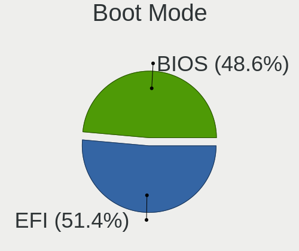
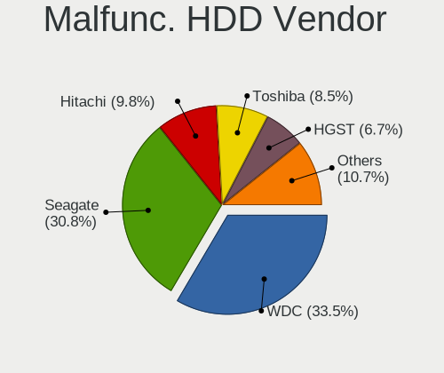
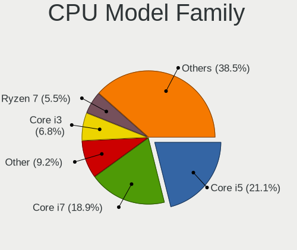
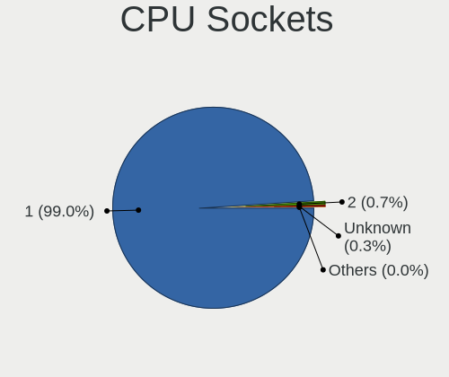
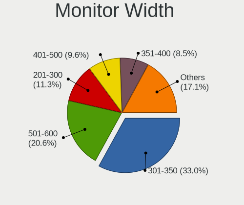
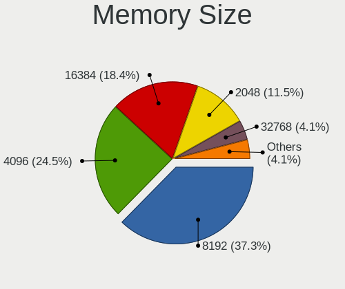
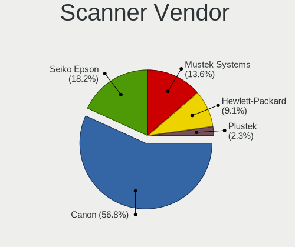

Linux in Netherlands - Tested Hardware & Statistics
---------------------------------------------------

A project to collect tested hardware configurations for Linux in Netherlands.

Anyone can contribute to this report by the [hw-probe](https://github.com/linuxhw/hw-probe) tool:

    sudo -E hw-probe -all -upload

Please contribute! Especially if your hardware is rare.

This is a report for all computer types. See also reports for [desktops](/Location/Netherlands/Desktop/README.md) and [notebooks](/Location/Netherlands/Notebook/README.md).

Contents
--------

* [ Test Cases ](#test-cases)

* [ System ](#system)
  - [ OS                       ](#os)
  - [ OS Family                ](#os-family)
  - [ Kernel                   ](#kernel)
  - [ Kernel Family            ](#kernel-family)
  - [ Kernel Major Ver.        ](#kernel-major-ver)
  - [ Arch                     ](#arch)
  - [ DE                       ](#de)
  - [ Display Server           ](#display-server)
  - [ Display Manager          ](#display-manager)
  - [ OS Lang                  ](#os-lang)
  - [ Boot Mode                ](#boot-mode)
  - [ Filesystem               ](#filesystem)
  - [ Part. scheme             ](#part-scheme)
  - [ Dual Boot with Linux/BSD ](#dual-boot-with-linuxbsd)
  - [ Dual Boot (Win)          ](#dual-boot-win)

* [ Board ](#board)
  - [ Vendor                   ](#vendor)
  - [ Model                    ](#model)
  - [ Model Family             ](#model-family)
  - [ MFG Year                 ](#mfg-year)
  - [ Form Factor              ](#form-factor)
  - [ Secure Boot              ](#secure-boot)
  - [ Coreboot                 ](#coreboot)
  - [ RAM Size                 ](#ram-size)
  - [ RAM Used                 ](#ram-used)
  - [ Total Drives             ](#total-drives)
  - [ Has CD-ROM               ](#has-cd-rom)
  - [ Has Ethernet             ](#has-ethernet)
  - [ Has WiFi                 ](#has-wifi)
  - [ Has Bluetooth            ](#has-bluetooth)

* [ Location ](#location)
  - [ Country                  ](#country)
  - [ City                     ](#city)

* [ Drives ](#drives)
  - [ Drive Vendor             ](#drive-vendor)
  - [ Drive Model              ](#drive-model)
  - [ HDD Vendor               ](#hdd-vendor)
  - [ SSD Vendor               ](#ssd-vendor)
  - [ Drive Kind               ](#drive-kind)
  - [ Drive Connector          ](#drive-connector)
  - [ Drive Size               ](#drive-size)
  - [ Space Total              ](#space-total)
  - [ Space Used               ](#space-used)
  - [ Malfunc. Drives          ](#malfunc-drives)
  - [ Malfunc. Drive Vendor    ](#malfunc-drive-vendor)
  - [ Malfunc. HDD Vendor      ](#malfunc-hdd-vendor)
  - [ Malfunc. Drive Kind      ](#malfunc-drive-kind)
  - [ Failed Drives            ](#failed-drives)
  - [ Failed Drive Vendor      ](#failed-drive-vendor)
  - [ Drive Status             ](#drive-status)

* [ Storage controller ](#storage-controller)
  - [ Storage Vendor           ](#storage-vendor)
  - [ Storage Model            ](#storage-model)
  - [ Storage Kind             ](#storage-kind)

* [ Processor ](#processor)
  - [ CPU Vendor               ](#cpu-vendor)
  - [ CPU Model                ](#cpu-model)
  - [ CPU Model Family         ](#cpu-model-family)
  - [ CPU Cores                ](#cpu-cores)
  - [ CPU Sockets              ](#cpu-sockets)
  - [ CPU Threads              ](#cpu-threads)
  - [ CPU Op-Modes             ](#cpu-op-modes)
  - [ CPU Microcode            ](#cpu-microcode)
  - [ CPU Microarch            ](#cpu-microarch)

* [ Graphics ](#graphics)
  - [ GPU Vendor               ](#gpu-vendor)
  - [ GPU Model                ](#gpu-model)
  - [ GPU Combo                ](#gpu-combo)
  - [ GPU Driver               ](#gpu-driver)
  - [ GPU Memory               ](#gpu-memory)

* [ Monitor ](#monitor)
  - [ Monitor Vendor           ](#monitor-vendor)
  - [ Monitor Model            ](#monitor-model)
  - [ Monitor Resolution       ](#monitor-resolution)
  - [ Monitor Diagonal         ](#monitor-diagonal)
  - [ Monitor Width            ](#monitor-width)
  - [ Aspect Ratio             ](#aspect-ratio)
  - [ Monitor Area             ](#monitor-area)
  - [ Pixel Density            ](#pixel-density)
  - [ Multiple Monitors        ](#multiple-monitors)

* [ Network ](#network)
  - [ Net Controller Vendor    ](#net-controller-vendor)
  - [ Net Controller Model     ](#net-controller-model)
  - [ Wireless Vendor          ](#wireless-vendor)
  - [ Wireless Model           ](#wireless-model)
  - [ Ethernet Vendor          ](#ethernet-vendor)
  - [ Ethernet Model           ](#ethernet-model)
  - [ Net Controller Kind      ](#net-controller-kind)
  - [ Used Controller          ](#used-controller)
  - [ NICs                     ](#nics)
  - [ IPv6                     ](#ipv6)

* [ Bluetooth ](#bluetooth)
  - [ Bluetooth Vendor         ](#bluetooth-vendor)
  - [ Bluetooth Model          ](#bluetooth-model)

* [ Sound ](#sound)
  - [ Sound Vendor             ](#sound-vendor)
  - [ Sound Model              ](#sound-model)

* [ Memory ](#memory)
  - [ Memory Vendor            ](#memory-vendor)
  - [ Memory Model             ](#memory-model)
  - [ Memory Kind              ](#memory-kind)
  - [ Memory Form Factor       ](#memory-form-factor)
  - [ Memory Size              ](#memory-size)
  - [ Memory Speed             ](#memory-speed)

* [ Printers & scanners ](#printers--scanners)
  - [ Printer Vendor           ](#printer-vendor)
  - [ Printer Model            ](#printer-model)
  - [ Scanner Vendor           ](#scanner-vendor)
  - [ Scanner Model            ](#scanner-model)

* [ Camera ](#camera)
  - [ Camera Vendor            ](#camera-vendor)
  - [ Camera Model             ](#camera-model)

* [ Security ](#security)
  - [ Fingerprint Vendor       ](#fingerprint-vendor)
  - [ Fingerprint Model        ](#fingerprint-model)
  - [ Chipcard Vendor          ](#chipcard-vendor)
  - [ Chipcard Model           ](#chipcard-model)

* [ Unsupported ](#unsupported)
  - [ Unsupported Devices      ](#unsupported-devices)
  - [ Unsupported Device Types ](#unsupported-device-types)

Test Cases
----------

Total: 5757

| Vendor        | Model                       | Form-Factor | Probe                                                      | Date         |
|---------------|-----------------------------|-------------|------------------------------------------------------------|--------------|
| ASUSTek       | P5B                         | Desktop     | [794635cbea](https://linux-hardware.org/?probe=794635cbea) | Jun 10, 2023 |
| Dell          | Latitude 9420               | Convertible | [354adf0653](https://linux-hardware.org/?probe=354adf0653) | Jun 10, 2023 |
| Samsung       | N150/N210/N220              | Notebook    | [977d645961](https://linux-hardware.org/?probe=977d645961) | Jun 10, 2023 |
| MP            | MS-7848                     | Desktop     | [cd63c98850](https://linux-hardware.org/?probe=cd63c98850) | Jun 10, 2023 |
| Apple         | MacBookPro9,2               | Notebook    | [f502f89e9d](https://linux-hardware.org/?probe=f502f89e9d) | Jun 10, 2023 |
| Dell          | 0PU052                      | Desktop     | [84db4b658c](https://linux-hardware.org/?probe=84db4b658c) | Jun 09, 2023 |
| Dell          | 0PU052                      | Desktop     | [145d296b59](https://linux-hardware.org/?probe=145d296b59) | Jun 09, 2023 |
| Dell          | Latitude 9420               | Convertible | [593403cb67](https://linux-hardware.org/?probe=593403cb67) | Jun 09, 2023 |
| Valve         | Jupiter                     | Notebook    | [7a36bdb92a](https://linux-hardware.org/?probe=7a36bdb92a) | Jun 09, 2023 |
| HUAWEI        | MACHC-WAX9                  | Notebook    | [6f26f51ef6](https://linux-hardware.org/?probe=6f26f51ef6) | Jun 09, 2023 |
| Lenovo        | Legion Y540-17IRH 81Q4      | Notebook    | [ab95a219f5](https://linux-hardware.org/?probe=ab95a219f5) | Jun 09, 2023 |
| Dell          | Precision 7540              | Notebook    | [41fe2f93ff](https://linux-hardware.org/?probe=41fe2f93ff) | Jun 09, 2023 |
| ASUSTek       | P5B                         | Desktop     | [32baec6c0f](https://linux-hardware.org/?probe=32baec6c0f) | Jun 08, 2023 |
| Gigabyte      | F2A88XM-D3H                 | Desktop     | [610c9c318f](https://linux-hardware.org/?probe=610c9c318f) | Jun 08, 2023 |
| ASUSTek       | X99-DELUXE II               | Desktop     | [aab84214f1](https://linux-hardware.org/?probe=aab84214f1) | Jun 06, 2023 |
| Lenovo        | ThinkPad T590 20N5000AMH    | Notebook    | [91c0d99427](https://linux-hardware.org/?probe=91c0d99427) | Jun 06, 2023 |
| Dell          | Latitude 7480               | Notebook    | [61c800a3b4](https://linux-hardware.org/?probe=61c800a3b4) | Jun 06, 2023 |
| Dell          | XPS 15 9560                 | Notebook    | [0d326774c9](https://linux-hardware.org/?probe=0d326774c9) | Jun 06, 2023 |
| Gigabyte      | B550M DS3H                  | Desktop     | [4895fe7746](https://linux-hardware.org/?probe=4895fe7746) | Jun 05, 2023 |
| Dell          | Precision 7540              | Notebook    | [a10ecca056](https://linux-hardware.org/?probe=a10ecca056) | Jun 04, 2023 |
| Toshiba       | Satellite Pro C70-B         | Notebook    | [d4bc6d6c8c](https://linux-hardware.org/?probe=d4bc6d6c8c) | Jun 04, 2023 |
| ASRock        | J5040-ITX                   | Desktop     | [5e1bb16065](https://linux-hardware.org/?probe=5e1bb16065) | Jun 04, 2023 |
| HP            | Laptop 17-cp0xxx            | Notebook    | [253c561829](https://linux-hardware.org/?probe=253c561829) | Jun 04, 2023 |
| AMI           | Intel                       | Notebook    | [cd2beb79d2](https://linux-hardware.org/?probe=cd2beb79d2) | Jun 04, 2023 |
| ASUSTek       | H170-PRO                    | Desktop     | [b9fd75507c](https://linux-hardware.org/?probe=b9fd75507c) | Jun 04, 2023 |
| Lenovo        | IdeaPad Gaming 3 16IAH7 ... | Notebook    | [6d8d7f6384](https://linux-hardware.org/?probe=6d8d7f6384) | Jun 04, 2023 |
| Gigabyte      | X570 AORUS PRO              | Desktop     | [309d09ae8c](https://linux-hardware.org/?probe=309d09ae8c) | Jun 03, 2023 |
| ASUSTek       | X553MA                      | Notebook    | [d07b3215b1](https://linux-hardware.org/?probe=d07b3215b1) | Jun 03, 2023 |
| Dell          | Latitude E6420              | Notebook    | [4d1ad8d52a](https://linux-hardware.org/?probe=4d1ad8d52a) | Jun 03, 2023 |
| ASRock        | FM2A68M-DG3+                | Desktop     | [3e7ad22b6b](https://linux-hardware.org/?probe=3e7ad22b6b) | Jun 03, 2023 |
| Gigabyte      | X79-UD3                     | Desktop     | [e459d2654f](https://linux-hardware.org/?probe=e459d2654f) | Jun 03, 2023 |
| Dell          | XPS 17 9720                 | Notebook    | [71c4a65aae](https://linux-hardware.org/?probe=71c4a65aae) | Jun 03, 2023 |
| Apple         | MacBookAir6,1               | Notebook    | [20a14caf03](https://linux-hardware.org/?probe=20a14caf03) | Jun 03, 2023 |
| ASUSTek       | P8Z77-V LK                  | Desktop     | [d50ca19dc3](https://linux-hardware.org/?probe=d50ca19dc3) | Jun 02, 2023 |
| Dell          | XPS 15 9530                 | Notebook    | [31400c0b8a](https://linux-hardware.org/?probe=31400c0b8a) | Jun 02, 2023 |
| HUAWEI        | MACHC-WAX9                  | Notebook    | [c87d784c98](https://linux-hardware.org/?probe=c87d784c98) | Jun 02, 2023 |
| Lenovo        | ThinkBook 15 G4 ABA 21DL    | Notebook    | [6b1168349b](https://linux-hardware.org/?probe=6b1168349b) | Jun 02, 2023 |
| Lenovo        | ThinkBook 15 G4 ABA 21DL    | Notebook    | [3da98cc9bb](https://linux-hardware.org/?probe=3da98cc9bb) | Jun 02, 2023 |
| Lenovo        | ThinkBook 15 G4 IAP 21DJ    | Notebook    | [98b0b355db](https://linux-hardware.org/?probe=98b0b355db) | Jun 01, 2023 |
| HP            | 1906                        | Desktop     | [ac98480bd2](https://linux-hardware.org/?probe=ac98480bd2) | Jun 01, 2023 |
| Dell          | Precision 7540              | Notebook    | [de2fc5bc92](https://linux-hardware.org/?probe=de2fc5bc92) | Jun 01, 2023 |
| Supermicro    | X11SCD-F                    | Desktop     | [80072f2519](https://linux-hardware.org/?probe=80072f2519) | Jun 01, 2023 |
| Valve         | Jupiter                     | Notebook    | [06000e9b0e](https://linux-hardware.org/?probe=06000e9b0e) | Jun 01, 2023 |
| ASUSTek       | X200LA                      | Notebook    | [ae3925153d](https://linux-hardware.org/?probe=ae3925153d) | May 31, 2023 |
| HP            | Laptop 15s-fq1xxx           | Notebook    | [743741a477](https://linux-hardware.org/?probe=743741a477) | May 31, 2023 |
| HP            | Laptop 15s-fq1xxx           | Notebook    | [4c7348e8b3](https://linux-hardware.org/?probe=4c7348e8b3) | May 31, 2023 |
| MSI           | PRO X670-P WIFI             | Desktop     | [10f4ef3e86](https://linux-hardware.org/?probe=10f4ef3e86) | May 31, 2023 |
| Lenovo        | Legion Y540-17IRH 81Q4      | Notebook    | [87d9c3f3a1](https://linux-hardware.org/?probe=87d9c3f3a1) | May 31, 2023 |
| Lenovo        | ThinkBook 15 G4 ABA 21DL    | Notebook    | [7210e5c07e](https://linux-hardware.org/?probe=7210e5c07e) | May 31, 2023 |
| Gigabyte      | B450 I AORUS PRO WIFI-CF    | Desktop     | [ad79be40f5](https://linux-hardware.org/?probe=ad79be40f5) | May 31, 2023 |
| Lenovo        | ThinkBook 15 G2 ITL 20VE    | Notebook    | [6d6d7c65a8](https://linux-hardware.org/?probe=6d6d7c65a8) | May 31, 2023 |
| Dell          | XPS 13 9310                 | Notebook    | [a3e4ffb4fd](https://linux-hardware.org/?probe=a3e4ffb4fd) | May 30, 2023 |
| Acer          | Aspire 5750                 | Notebook    | [fa8eeaabff](https://linux-hardware.org/?probe=fa8eeaabff) | May 30, 2023 |
| HP            | OMEN by Laptop 15-dc1xxx    | Notebook    | [541e16d421](https://linux-hardware.org/?probe=541e16d421) | May 29, 2023 |
| ASUSTek       | M4A87TD/USB3                | Desktop     | [bf0674c0f0](https://linux-hardware.org/?probe=bf0674c0f0) | May 28, 2023 |
| HP            | EliteBook 850 G8 Noteboo... | Notebook    | [9178413d40](https://linux-hardware.org/?probe=9178413d40) | May 28, 2023 |
| Lenovo        | ThinkBook 15 G4 ABA 21DL    | Notebook    | [cc9d03264f](https://linux-hardware.org/?probe=cc9d03264f) | May 27, 2023 |
| Toshiba       | Satellite Pro C70-B         | Notebook    | [3058a75499](https://linux-hardware.org/?probe=3058a75499) | May 26, 2023 |
| MSI           | CX700                       | Notebook    | [ecb1aaf9c1](https://linux-hardware.org/?probe=ecb1aaf9c1) | May 26, 2023 |
| Dell          | XPS 13 9310                 | Notebook    | [689eec8b51](https://linux-hardware.org/?probe=689eec8b51) | May 26, 2023 |
| Dell          | Latitude 5290               | Notebook    | [fb6cbb6a2f](https://linux-hardware.org/?probe=fb6cbb6a2f) | May 26, 2023 |
| AAEON         | UP-CHCR1 V0.4               | Desktop     | [b77201e825](https://linux-hardware.org/?probe=b77201e825) | May 26, 2023 |
| Dell          | Precision 7540              | Notebook    | [99c7b41c6b](https://linux-hardware.org/?probe=99c7b41c6b) | May 25, 2023 |
| Intel         | DN2820FYK H24582-204        | Desktop     | [1987af2458](https://linux-hardware.org/?probe=1987af2458) | May 25, 2023 |
| ASUSTek       | P8B75-V                     | Desktop     | [cbcfc55949](https://linux-hardware.org/?probe=cbcfc55949) | May 25, 2023 |
| Acer          | Aspire M3920                | Desktop     | [5e61c22a26](https://linux-hardware.org/?probe=5e61c22a26) | May 24, 2023 |
| ASUSTek       | Z87-DELUXE/DUAL             | Desktop     | [0f0c4f64ce](https://linux-hardware.org/?probe=0f0c4f64ce) | May 23, 2023 |
| Dell          | Inspiron 5759               | Notebook    | [52b95d45ca](https://linux-hardware.org/?probe=52b95d45ca) | May 23, 2023 |
| Apple         | MacBookPro9,1               | Notebook    | [b880d4f8c1](https://linux-hardware.org/?probe=b880d4f8c1) | May 23, 2023 |
| Acidanther... | Mac-77EB7D7DAF985301 iMa... | All in one  | [b021476220](https://linux-hardware.org/?probe=b021476220) | May 23, 2023 |
| HP            | ENVY x360 Convertible 15... | Convertible | [69f5bff4c0](https://linux-hardware.org/?probe=69f5bff4c0) | May 23, 2023 |
| Lenovo        | ThinkBook 15 G4 ABA 21DL    | Notebook    | [c77cb59a5c](https://linux-hardware.org/?probe=c77cb59a5c) | May 23, 2023 |
| Dell          | Precision 7540              | Notebook    | [95bbab11f1](https://linux-hardware.org/?probe=95bbab11f1) | May 23, 2023 |
| Packard Be... | EasyNote MH35               | Notebook    | [ea7710b373](https://linux-hardware.org/?probe=ea7710b373) | May 22, 2023 |
| ASUSTek       | X551MA                      | Notebook    | [7a302f637c](https://linux-hardware.org/?probe=7a302f637c) | May 22, 2023 |
| ASRock        | A520M Phantom Gaming 4      | Desktop     | [50b46e4d8c](https://linux-hardware.org/?probe=50b46e4d8c) | May 22, 2023 |
| ASUSTek       | X551MA                      | Notebook    | [d0466f101a](https://linux-hardware.org/?probe=d0466f101a) | May 22, 2023 |
| AMI           | Intel                       | Desktop     | [9ddb291be3](https://linux-hardware.org/?probe=9ddb291be3) | May 22, 2023 |
| Dell          | XPS 9315                    | Notebook    | [6c3fdbf590](https://linux-hardware.org/?probe=6c3fdbf590) | May 22, 2023 |
| HP            | ZBook 14u G5                | Notebook    | [a655c52b88](https://linux-hardware.org/?probe=a655c52b88) | May 22, 2023 |
| HUAWEI        | MACHC-WAX9                  | Notebook    | [536b91dce1](https://linux-hardware.org/?probe=536b91dce1) | May 21, 2023 |
| Fujitsu Si... | D2831-S1 S26361-D2831-S1    | Desktop     | [0d2426a070](https://linux-hardware.org/?probe=0d2426a070) | May 21, 2023 |
| MSI           | GF63 Thin 11UC              | Notebook    | [ca280c2e18](https://linux-hardware.org/?probe=ca280c2e18) | May 21, 2023 |
| Lenovo        | ThinkPad T410 2537V32       | Notebook    | [cece14e931](https://linux-hardware.org/?probe=cece14e931) | May 21, 2023 |
| HP            | 0A08h                       | Desktop     | [9d159d2637](https://linux-hardware.org/?probe=9d159d2637) | May 21, 2023 |
| AMI           | Intel                       | Desktop     | [13f87e64f1](https://linux-hardware.org/?probe=13f87e64f1) | May 21, 2023 |
| Gigabyte      | B450M DS3H-CF               | Desktop     | [b344b7ea03](https://linux-hardware.org/?probe=b344b7ea03) | May 21, 2023 |
| Toshiba       | Satellite C870-1FZ          | Notebook    | [1f2563578e](https://linux-hardware.org/?probe=1f2563578e) | May 20, 2023 |
| Dell          | Latitude 3120               | Convertible | [ac4bbe967d](https://linux-hardware.org/?probe=ac4bbe967d) | May 19, 2023 |
| Intel         | NUC5i5RYB H40999-503        | Mini pc     | [41342ea0f6](https://linux-hardware.org/?probe=41342ea0f6) | May 19, 2023 |
| HP            | ProBook 650 G3              | Notebook    | [ce80a21736](https://linux-hardware.org/?probe=ce80a21736) | May 19, 2023 |
| Sony          | SVF1521A6EW                 | Notebook    | [49a9f77ea9](https://linux-hardware.org/?probe=49a9f77ea9) | May 18, 2023 |
| ASUSTek       | PRIME B460-PLUS             | Desktop     | [97149ea35b](https://linux-hardware.org/?probe=97149ea35b) | May 18, 2023 |
| Dell          | Latitude 5500               | Notebook    | [f03dddbf42](https://linux-hardware.org/?probe=f03dddbf42) | May 18, 2023 |
| Acer          | Aspire A114-32              | Notebook    | [d17a909427](https://linux-hardware.org/?probe=d17a909427) | May 18, 2023 |
| Acer          | Aspire 7535                 | Notebook    | [32b02980a7](https://linux-hardware.org/?probe=32b02980a7) | May 18, 2023 |
| Lenovo        | V15 G2 ALC 82KD             | Notebook    | [6c83146909](https://linux-hardware.org/?probe=6c83146909) | May 18, 2023 |
| Gigabyte      | GB-BRR7H-4700               | Desktop     | [215d88c8b6](https://linux-hardware.org/?probe=215d88c8b6) | May 18, 2023 |
| Lenovo        | V15 G2 ALC 82KD             | Notebook    | [1ed7f81c69](https://linux-hardware.org/?probe=1ed7f81c69) | May 18, 2023 |
| Gigabyte      | GB-BRR7H-4700               | Desktop     | [d452669f4a](https://linux-hardware.org/?probe=d452669f4a) | May 18, 2023 |
| Gigabyte      | X670E AORUS MASTER          | Desktop     | [beacb75b2c](https://linux-hardware.org/?probe=beacb75b2c) | May 18, 2023 |
| HP            | EliteBook 840 14 inch G9... | Notebook    | [004f548439](https://linux-hardware.org/?probe=004f548439) | May 17, 2023 |
| Dell          | Latitude E5510              | Notebook    | [74ecc09f16](https://linux-hardware.org/?probe=74ecc09f16) | May 17, 2023 |
| Dell          | Inspiron 5759               | Notebook    | [228fa2798d](https://linux-hardware.org/?probe=228fa2798d) | May 16, 2023 |
| Dell          | Inspiron 5759               | Notebook    | [32d4567b37](https://linux-hardware.org/?probe=32d4567b37) | May 16, 2023 |
| Framework     | Laptop                      | Notebook    | [b8739c141d](https://linux-hardware.org/?probe=b8739c141d) | May 16, 2023 |
| ASUSTek       | TUF Gaming B550-PLUS        | Desktop     | [e31c83db5e](https://linux-hardware.org/?probe=e31c83db5e) | May 16, 2023 |
| Lenovo        | V14 G2 ALC 82KC             | Notebook    | [de2456eae8](https://linux-hardware.org/?probe=de2456eae8) | May 16, 2023 |
| Dell          | Latitude 5320               | Notebook    | [c33be8e25c](https://linux-hardware.org/?probe=c33be8e25c) | May 16, 2023 |
| Dell          | Latitude 5320               | Notebook    | [5e8463c682](https://linux-hardware.org/?probe=5e8463c682) | May 16, 2023 |
| Dell          | Latitude 5320               | Notebook    | [093e6a63c8](https://linux-hardware.org/?probe=093e6a63c8) | May 16, 2023 |
| Lenovo        | ThinkPad X390 Yoga 20NN0... | Convertible | [3ca79ab5f8](https://linux-hardware.org/?probe=3ca79ab5f8) | May 15, 2023 |
| Samsung       | N150/N210/N220              | Notebook    | [3f18889439](https://linux-hardware.org/?probe=3f18889439) | May 15, 2023 |
| HP            | 3398                        | Desktop     | [858590e655](https://linux-hardware.org/?probe=858590e655) | May 15, 2023 |
| Lenovo        | 30D9 SDK0J40697 WIN 3305... | Desktop     | [7332acbb0e](https://linux-hardware.org/?probe=7332acbb0e) | May 15, 2023 |
| Medion        | B360H4-EM V1.0              | Desktop     | [1efefa9214](https://linux-hardware.org/?probe=1efefa9214) | May 15, 2023 |
| HP            | Pavilion Gaming Laptop 1... | Notebook    | [7978974828](https://linux-hardware.org/?probe=7978974828) | May 14, 2023 |
| HP            | ZBook 15u G5                | Notebook    | [4f1f52ce64](https://linux-hardware.org/?probe=4f1f52ce64) | May 14, 2023 |
| HP            | 829D                        | Desktop     | [a9358c228a](https://linux-hardware.org/?probe=a9358c228a) | May 14, 2023 |
| Lenovo        | Legion 5 Pro 16ARH7H 82R... | Notebook    | [acc449dad2](https://linux-hardware.org/?probe=acc449dad2) | May 14, 2023 |
| SKIKK         | Niflheim 17 II              | Notebook    | [ce9c27f16f](https://linux-hardware.org/?probe=ce9c27f16f) | May 14, 2023 |
| Xiaomi        | Mipad2                      | Tablet      | [c3c41b0bae](https://linux-hardware.org/?probe=c3c41b0bae) | May 14, 2023 |
| Lenovo        | ThinkPad X1 Carbon Gen 1... | Notebook    | [58557ae6a2](https://linux-hardware.org/?probe=58557ae6a2) | May 12, 2023 |
| MSI           | Stealth GS77 12UH           | Notebook    | [08fdf9cb20](https://linux-hardware.org/?probe=08fdf9cb20) | May 12, 2023 |
| HP            | EliteBook 720 G2            | Notebook    | [d6a156003b](https://linux-hardware.org/?probe=d6a156003b) | May 12, 2023 |
| Dell          | Latitude E7450              | Notebook    | [9dbbae1356](https://linux-hardware.org/?probe=9dbbae1356) | May 12, 2023 |
| Lenovo        | ThinkCentre M58 7373A5G     | Desktop     | [4318c51164](https://linux-hardware.org/?probe=4318c51164) | May 12, 2023 |
| HP            | 255 G7 Notebook PC          | Notebook    | [341a5673f2](https://linux-hardware.org/?probe=341a5673f2) | May 12, 2023 |
| HP            | EliteBook 820 G4            | Notebook    | [34bd8e2402](https://linux-hardware.org/?probe=34bd8e2402) | May 12, 2023 |
| HP            | 829A                        | Mini pc     | [e51b2da826](https://linux-hardware.org/?probe=e51b2da826) | May 12, 2023 |
| Lenovo        | Legion 5 Pro 16ARH7H 82R... | Notebook    | [e855bafa57](https://linux-hardware.org/?probe=e855bafa57) | May 11, 2023 |
| Apple         | Mac-F2238BAE iMac11,3       | All in one  | [eefa55009a](https://linux-hardware.org/?probe=eefa55009a) | May 11, 2023 |
| Dell          | 0X8DXD A00                  | Desktop     | [1e8359a02c](https://linux-hardware.org/?probe=1e8359a02c) | May 11, 2023 |
| Notebook      | N14xWU                      | Notebook    | [0e4f386b46](https://linux-hardware.org/?probe=0e4f386b46) | May 11, 2023 |
| HP            | EliteBook 820 G4            | Notebook    | [a7327f2e2e](https://linux-hardware.org/?probe=a7327f2e2e) | May 11, 2023 |
| HP            | ProBook x360 440 G1         | Convertible | [63e082c879](https://linux-hardware.org/?probe=63e082c879) | May 10, 2023 |
| HP            | ProBook x360 440 G1         | Convertible | [c85cc0e79c](https://linux-hardware.org/?probe=c85cc0e79c) | May 10, 2023 |
| Intel         | NUC11PABi5 K90634-305       | Mini pc     | [99af0c1e17](https://linux-hardware.org/?probe=99af0c1e17) | May 10, 2023 |
| Gigabyte      | B360N WIFI-CF               | Desktop     | [e4b3bba2b5](https://linux-hardware.org/?probe=e4b3bba2b5) | May 10, 2023 |
| Acer          | TravelMate P653-M           | Notebook    | [a0f805c8ca](https://linux-hardware.org/?probe=a0f805c8ca) | May 10, 2023 |
| Dell          | XPS 9315                    | Notebook    | [291a190f04](https://linux-hardware.org/?probe=291a190f04) | May 10, 2023 |
| Dell          | XPS 15 9520                 | Notebook    | [86136dd98f](https://linux-hardware.org/?probe=86136dd98f) | May 09, 2023 |
| Toshiba       | Satellite L650              | Notebook    | [ba32d27df1](https://linux-hardware.org/?probe=ba32d27df1) | May 08, 2023 |
| HP            | 0AA8h                       | Desktop     | [05689fe634](https://linux-hardware.org/?probe=05689fe634) | May 08, 2023 |
| Acer          | Aspire M1930                | Desktop     | [712a246ce4](https://linux-hardware.org/?probe=712a246ce4) | May 08, 2023 |
| HP            | ProLiant MicroServer        | Desktop     | [8e4cbc4837](https://linux-hardware.org/?probe=8e4cbc4837) | May 08, 2023 |
| Acer          | Aspire 5732Z                | Notebook    | [ec45ea6206](https://linux-hardware.org/?probe=ec45ea6206) | May 08, 2023 |
| Acer          | Aspire M3920                | Desktop     | [aed14c1e20](https://linux-hardware.org/?probe=aed14c1e20) | May 07, 2023 |
| PC Special... | NP5x_NP6x_NP7xPNP           | Notebook    | [72d9dac16b](https://linux-hardware.org/?probe=72d9dac16b) | May 07, 2023 |
| Lenovo        | ThinkPad T420 4236WR1       | Notebook    | [148433c97e](https://linux-hardware.org/?probe=148433c97e) | May 07, 2023 |
| Timi          | TM1701                      | Notebook    | [c41d566374](https://linux-hardware.org/?probe=c41d566374) | May 07, 2023 |
| Lenovo        | IdeaPadFlex 5 14IIL05 81... | Convertible | [dce7e41a72](https://linux-hardware.org/?probe=dce7e41a72) | May 07, 2023 |
| Lenovo        | IdeaPadFlex 5 14IIL05 81... | Convertible | [64db3d70f1](https://linux-hardware.org/?probe=64db3d70f1) | May 07, 2023 |
| Lenovo        | ThinkPad T420 4236WR1       | Notebook    | [0d6a9b046a](https://linux-hardware.org/?probe=0d6a9b046a) | May 07, 2023 |
| SKIKK         | Niflheim 17 II              | Notebook    | [0304fddec7](https://linux-hardware.org/?probe=0304fddec7) | May 07, 2023 |
| SKIKK         | Niflheim 17 II              | Notebook    | [2a30823af1](https://linux-hardware.org/?probe=2a30823af1) | May 07, 2023 |
| Gigabyte      | X570S AORUS ELITE AX        | Desktop     | [bdafbe06aa](https://linux-hardware.org/?probe=bdafbe06aa) | May 07, 2023 |
| HP            | 829A                        | Mini pc     | [eba2b6ce4e](https://linux-hardware.org/?probe=eba2b6ce4e) | May 06, 2023 |
| ASUSTek       | Zenbook UP5401EA_UP5401E... | Convertible | [01e1d2ef02](https://linux-hardware.org/?probe=01e1d2ef02) | May 05, 2023 |
| Dell          | Latitude E5530 non-vPro     | Notebook    | [3bea2bcd99](https://linux-hardware.org/?probe=3bea2bcd99) | May 05, 2023 |
| Unknown       | Cherry Trail CR             | Notebook    | [9569a530e8](https://linux-hardware.org/?probe=9569a530e8) | May 05, 2023 |
| Dell          | Precision 7720              | Notebook    | [b6c3392263](https://linux-hardware.org/?probe=b6c3392263) | May 05, 2023 |
| Intel         | JSL MRD                     | Desktop     | [76ff5c3bd7](https://linux-hardware.org/?probe=76ff5c3bd7) | May 05, 2023 |
| Acer          | TravelMate P214-53          | Notebook    | [8e78c8d139](https://linux-hardware.org/?probe=8e78c8d139) | May 05, 2023 |
| ASUSTek       | P8B75-M LE                  | Desktop     | [f839b22217](https://linux-hardware.org/?probe=f839b22217) | May 05, 2023 |
| HP            | EliteBook 8470p             | Notebook    | [9684be9c3a](https://linux-hardware.org/?probe=9684be9c3a) | May 04, 2023 |
| Lenovo        | IdeaPad 5 Pro 16ACH6 82L... | Notebook    | [4aec6123b0](https://linux-hardware.org/?probe=4aec6123b0) | May 04, 2023 |
| Valve         | Jupiter                     | Notebook    | [0a6a9a6675](https://linux-hardware.org/?probe=0a6a9a6675) | May 03, 2023 |
| Dell          | Latitude 7420               | Notebook    | [7986f6779d](https://linux-hardware.org/?probe=7986f6779d) | May 03, 2023 |
| HP            | EliteBook Folio G1          | Notebook    | [a31ef5e00e](https://linux-hardware.org/?probe=a31ef5e00e) | May 02, 2023 |
| Toshiba       | Satellite C870-1FZ          | Notebook    | [dfbf38e06f](https://linux-hardware.org/?probe=dfbf38e06f) | May 01, 2023 |
| MSI           | MPG X570 GAMING PLUS        | Desktop     | [f3b0efc277](https://linux-hardware.org/?probe=f3b0efc277) | May 01, 2023 |
| Gigabyte      | P55A-UD3                    | Desktop     | [07324ae678](https://linux-hardware.org/?probe=07324ae678) | May 01, 2023 |
| ASRock        | B450M Pro4                  | Desktop     | [24363c23cf](https://linux-hardware.org/?probe=24363c23cf) | May 01, 2023 |
| Lenovo        | Legion 5 15ARH05 82B5       | Notebook    | [6c1969f77e](https://linux-hardware.org/?probe=6c1969f77e) | May 01, 2023 |
| Intel         | CHERRYVIEW D1 PLATFORM      | Notebook    | [6c58138c35](https://linux-hardware.org/?probe=6c58138c35) | May 01, 2023 |
| VIOS          | LTH17                       | Notebook    | [4d1a86ee61](https://linux-hardware.org/?probe=4d1a86ee61) | Apr 30, 2023 |
| HP            | Compaq Mini CQ10-500        | Notebook    | [9a1134210f](https://linux-hardware.org/?probe=9a1134210f) | Apr 30, 2023 |
| Lenovo        | YB1-X91F                    | Tablet      | [3316360d7a](https://linux-hardware.org/?probe=3316360d7a) | Apr 29, 2023 |
| Intel         | CHERRYVIEW D1 PLATFORM      | Notebook    | [edf1d60e46](https://linux-hardware.org/?probe=edf1d60e46) | Apr 29, 2023 |
| ASUSTek       | M5A78L-M PLUS/USB3          | Desktop     | [ef3f4d1ac1](https://linux-hardware.org/?probe=ef3f4d1ac1) | Apr 29, 2023 |
| Insyde        | M890BAP                     | Notebook    | [151efb0278](https://linux-hardware.org/?probe=151efb0278) | Apr 29, 2023 |
| Insyde        | CherryTrail                 | Notebook    | [a9f658c8af](https://linux-hardware.org/?probe=a9f658c8af) | Apr 29, 2023 |
| Lenovo        | ThinkPad P50 20EQS5C701     | Notebook    | [e84690f2d5](https://linux-hardware.org/?probe=e84690f2d5) | Apr 29, 2023 |
| Dell          | Latitude 3301               | Notebook    | [3a0aad0e75](https://linux-hardware.org/?probe=3a0aad0e75) | Apr 29, 2023 |
| HP            | Pavilion dv7                | Notebook    | [e3f05fe37f](https://linux-hardware.org/?probe=e3f05fe37f) | Apr 28, 2023 |
| Dell          | 0773VG A02                  | Desktop     | [bd3dba564e](https://linux-hardware.org/?probe=bd3dba564e) | Apr 28, 2023 |
| HP            | Pavilion dv7                | Notebook    | [da542ba626](https://linux-hardware.org/?probe=da542ba626) | Apr 28, 2023 |
| Dell          | 0773VG A02                  | Desktop     | [cab1aa59e0](https://linux-hardware.org/?probe=cab1aa59e0) | Apr 28, 2023 |
| ASRock        | Z790 Steel Legend WiFi      | Desktop     | [36175223a5](https://linux-hardware.org/?probe=36175223a5) | Apr 28, 2023 |
| Gigabyte      | A520M S2H                   | Desktop     | [fa82c3b6ba](https://linux-hardware.org/?probe=fa82c3b6ba) | Apr 28, 2023 |
| ASUSTek       | ROG CROSSHAIR X670E GENE    | Desktop     | [c416a3f44a](https://linux-hardware.org/?probe=c416a3f44a) | Apr 28, 2023 |
| Medion        | MS-7708                     | Desktop     | [af2020cd9c](https://linux-hardware.org/?probe=af2020cd9c) | Apr 28, 2023 |
| Medion        | MS-7708                     | Desktop     | [424c4ca2db](https://linux-hardware.org/?probe=424c4ca2db) | Apr 28, 2023 |
| Lenovo        | ThinkPad P14s Gen 2a 21A... | Notebook    | [b5a953a984](https://linux-hardware.org/?probe=b5a953a984) | Apr 28, 2023 |
| ASUSTek       | P8H67-M PRO                 | Desktop     | [589810ee4b](https://linux-hardware.org/?probe=589810ee4b) | Apr 28, 2023 |
| Dell          | Latitude 3301               | Notebook    | [855564b077](https://linux-hardware.org/?probe=855564b077) | Apr 28, 2023 |
| BESSTAR Te... | HM80                        | Desktop     | [476c573547](https://linux-hardware.org/?probe=476c573547) | Apr 28, 2023 |
| HUAWEI        | BOHB-WAX9                   | Notebook    | [858404838d](https://linux-hardware.org/?probe=858404838d) | Apr 27, 2023 |
| HUAWEI        | BOHB-WAX9                   | Notebook    | [0bf066e179](https://linux-hardware.org/?probe=0bf066e179) | Apr 27, 2023 |
| Gigabyte      | GA-770TA-UD3                | Desktop     | [6b17eb81f8](https://linux-hardware.org/?probe=6b17eb81f8) | Apr 26, 2023 |
| Medion        | E2215T MD60198              | Notebook    | [390ccbba6f](https://linux-hardware.org/?probe=390ccbba6f) | Apr 26, 2023 |
| AZW           | SER                         | Mini pc     | [74f148fb60](https://linux-hardware.org/?probe=74f148fb60) | Apr 26, 2023 |
| Acer          | Aspire X3995                | Desktop     | [877c9deb7a](https://linux-hardware.org/?probe=877c9deb7a) | Apr 25, 2023 |
| Acer          | Predator G3-605             | Desktop     | [37cd92a7f0](https://linux-hardware.org/?probe=37cd92a7f0) | Apr 25, 2023 |
| Acer          | Predator G3-605             | Desktop     | [0b966e7b88](https://linux-hardware.org/?probe=0b966e7b88) | Apr 25, 2023 |
| Acer          | Swift SF114-34              | Notebook    | [693f0cea98](https://linux-hardware.org/?probe=693f0cea98) | Apr 25, 2023 |
| Lenovo        | ThinkPad X1 Carbon Gen 9... | Notebook    | [5236dde38f](https://linux-hardware.org/?probe=5236dde38f) | Apr 25, 2023 |
| Gigabyte      | Z270X-UD3-CF                | Desktop     | [06fbe4d0b6](https://linux-hardware.org/?probe=06fbe4d0b6) | Apr 25, 2023 |
| HUAWEI        | BOHB-WAX9                   | Notebook    | [40df32580a](https://linux-hardware.org/?probe=40df32580a) | Apr 25, 2023 |
| Notebook      | P95_96_97Ex,Rx              | Notebook    | [297da8c979](https://linux-hardware.org/?probe=297da8c979) | Apr 24, 2023 |
| ASRock        | H97M Anniversary            | Desktop     | [fdcfb2bde7](https://linux-hardware.org/?probe=fdcfb2bde7) | Apr 24, 2023 |
| Gigabyte      | GA-770TA-UD3                | Desktop     | [2337ae230f](https://linux-hardware.org/?probe=2337ae230f) | Apr 24, 2023 |
| Apple         | MacBookPro15,2              | Notebook    | [09eb88ba6c](https://linux-hardware.org/?probe=09eb88ba6c) | Apr 24, 2023 |
| ASUSTek       | ROG Strix G733QS_G733QS     | Notebook    | [6cacf7a9f9](https://linux-hardware.org/?probe=6cacf7a9f9) | Apr 24, 2023 |
| Gigabyte      | GA-770TA-UD3                | Desktop     | [90db0063b0](https://linux-hardware.org/?probe=90db0063b0) | Apr 24, 2023 |
| BTO           | 17X1183                     | Notebook    | [134a6ead50](https://linux-hardware.org/?probe=134a6ead50) | Apr 23, 2023 |
| BTO           | 17X1183                     | Notebook    | [181163b5e8](https://linux-hardware.org/?probe=181163b5e8) | Apr 23, 2023 |
| Dell          | Latitude 9520               | Notebook    | [0ab9a83db6](https://linux-hardware.org/?probe=0ab9a83db6) | Apr 23, 2023 |
| HUAWEI        | BOHB-WAX9                   | Notebook    | [b906572f4b](https://linux-hardware.org/?probe=b906572f4b) | Apr 23, 2023 |
| Notebook      | NLxxPUx                     | Notebook    | [3648be5b0f](https://linux-hardware.org/?probe=3648be5b0f) | Apr 23, 2023 |
| Notebook      | W54_55_94_95_97AU,AUQ       | Notebook    | [f4e4c58948](https://linux-hardware.org/?probe=f4e4c58948) | Apr 23, 2023 |
| Apple         | MacBookPro12,1              | Notebook    | [65ba6571a2](https://linux-hardware.org/?probe=65ba6571a2) | Apr 23, 2023 |
| ASUSTek       | ROG Strix G733QS_G733QS     | Notebook    | [72088721ec](https://linux-hardware.org/?probe=72088721ec) | Apr 22, 2023 |
| Lenovo        | IdeaPad S540-15IWL GTX 8... | Notebook    | [112a18b586](https://linux-hardware.org/?probe=112a18b586) | Apr 22, 2023 |
| Dell          | Latitude E4300              | Notebook    | [f58f44d242](https://linux-hardware.org/?probe=f58f44d242) | Apr 22, 2023 |
| Medion        | E4251                       | Notebook    | [76820d982c](https://linux-hardware.org/?probe=76820d982c) | Apr 22, 2023 |
| ASUSTek       | P8Z77-M PRO                 | Desktop     | [2e828158e5](https://linux-hardware.org/?probe=2e828158e5) | Apr 22, 2023 |
| HP            | EliteBook 2570p             | Notebook    | [a26039eb50](https://linux-hardware.org/?probe=a26039eb50) | Apr 22, 2023 |
| HP            | EliteBook 2570p             | Notebook    | [7e7a982c3c](https://linux-hardware.org/?probe=7e7a982c3c) | Apr 22, 2023 |
| Lenovo        | IdeaPad 5 Pro 14ACN6 82L... | Notebook    | [1c76d0f5a4](https://linux-hardware.org/?probe=1c76d0f5a4) | Apr 22, 2023 |
| Acer          | TP-SW3-013-181M             | Notebook    | [d231dc8846](https://linux-hardware.org/?probe=d231dc8846) | Apr 22, 2023 |
| Notebook      | N13_N140ZU                  | Notebook    | [51ee77485d](https://linux-hardware.org/?probe=51ee77485d) | Apr 21, 2023 |
| ASUSTek       | ZenBook UX333FN_RX333FN     | Notebook    | [8027ff2b04](https://linux-hardware.org/?probe=8027ff2b04) | Apr 21, 2023 |
| EVERCOM NE... | Unknown                     | Desktop     | [d36803f05d](https://linux-hardware.org/?probe=d36803f05d) | Apr 21, 2023 |
| HP            | 1494                        | Desktop     | [625373a1de](https://linux-hardware.org/?probe=625373a1de) | Apr 21, 2023 |
| Apple         | MacBookAir7,2               | Notebook    | [8c9f6ec7ef](https://linux-hardware.org/?probe=8c9f6ec7ef) | Apr 20, 2023 |
| Chuwi         | HeroBook Pro                | Notebook    | [e8332849a1](https://linux-hardware.org/?probe=e8332849a1) | Apr 20, 2023 |
| Intel         | NUC10i3FNB M38070-307       | Mini pc     | [bca816c594](https://linux-hardware.org/?probe=bca816c594) | Apr 20, 2023 |
| Dell          | Latitude 5400               | Notebook    | [f0e05c9726](https://linux-hardware.org/?probe=f0e05c9726) | Apr 20, 2023 |
| ASUSTek       | PRIME Z370-A                | Desktop     | [4e45f9c51f](https://linux-hardware.org/?probe=4e45f9c51f) | Apr 20, 2023 |
| Lenovo        | Yoga 300-11IBR 80M1         | Notebook    | [9093d27c30](https://linux-hardware.org/?probe=9093d27c30) | Apr 19, 2023 |
| ASUSTek       | K501LX                      | Notebook    | [00676747c4](https://linux-hardware.org/?probe=00676747c4) | Apr 19, 2023 |
| Microsoft     | Surface Pro                 | Tablet      | [6a0eced5fc](https://linux-hardware.org/?probe=6a0eced5fc) | Apr 19, 2023 |
| Lenovo        | Yoga 300-11IBR 80M1         | Notebook    | [f691871296](https://linux-hardware.org/?probe=f691871296) | Apr 19, 2023 |
| Acer          | Swift SF314-57              | Notebook    | [5fc25cc033](https://linux-hardware.org/?probe=5fc25cc033) | Apr 19, 2023 |
| Dell          | XPS 15 7590                 | Notebook    | [abcb6ed7e8](https://linux-hardware.org/?probe=abcb6ed7e8) | Apr 19, 2023 |
| Intel         | NUC8BEB J72692-309          | Mini pc     | [213cd129cd](https://linux-hardware.org/?probe=213cd129cd) | Apr 18, 2023 |
| Lenovo        | 3714 SDK0J40709 WIN 3259... | Desktop     | [ae7ea68877](https://linux-hardware.org/?probe=ae7ea68877) | Apr 18, 2023 |
| Lenovo        | ThinkPad T440s 20AQ006HU... | Notebook    | [17b3242021](https://linux-hardware.org/?probe=17b3242021) | Apr 18, 2023 |
| Acer          | Iconia                      | Notebook    | [1ebc88d3ab](https://linux-hardware.org/?probe=1ebc88d3ab) | Apr 18, 2023 |
| Apple         | MacBookPro12,1              | Notebook    | [f045e3f800](https://linux-hardware.org/?probe=f045e3f800) | Apr 18, 2023 |
| Apple         | Mac-942B5BF58194151B        | All in one  | [a99920ebba](https://linux-hardware.org/?probe=a99920ebba) | Apr 17, 2023 |
| ASRock        | Z790 Taichi                 | Desktop     | [0d25cf28bc](https://linux-hardware.org/?probe=0d25cf28bc) | Apr 17, 2023 |
| Lenovo        | 3714 SDK0J40709 WIN 3259... | Desktop     | [6c08e40387](https://linux-hardware.org/?probe=6c08e40387) | Apr 17, 2023 |
| Apple         | MacBookPro9,2               | Notebook    | [9f2a7943c7](https://linux-hardware.org/?probe=9f2a7943c7) | Apr 17, 2023 |
| Intel         | NUC6i5SYB H81131-503        | Mini pc     | [c370821f44](https://linux-hardware.org/?probe=c370821f44) | Apr 17, 2023 |
| Dell          | Latitude 5500               | Notebook    | [f4ac637463](https://linux-hardware.org/?probe=f4ac637463) | Apr 16, 2023 |
| Intel         | DH61WW AAG23116-204         | Desktop     | [6c62f23970](https://linux-hardware.org/?probe=6c62f23970) | Apr 16, 2023 |
| HP            | 18E7                        | Desktop     | [6c2c248eec](https://linux-hardware.org/?probe=6c2c248eec) | Apr 16, 2023 |
| HP            | EliteBook 840 G1            | Notebook    | [5994a04ee0](https://linux-hardware.org/?probe=5994a04ee0) | Apr 16, 2023 |
| Raspberry ... | Raspberry Pi Compute Mod... | Soc         | [ca89b451bd](https://linux-hardware.org/?probe=ca89b451bd) | Apr 15, 2023 |
| Raspberry ... | Raspberry Pi Compute Mod... | Soc         | [df2e4c0c56](https://linux-hardware.org/?probe=df2e4c0c56) | Apr 15, 2023 |
| ASRock        | A320M-HDV R4.0              | Desktop     | [2c7e1238eb](https://linux-hardware.org/?probe=2c7e1238eb) | Apr 15, 2023 |
| HP            | ZBook 14u G5                | Notebook    | [fcf729207a](https://linux-hardware.org/?probe=fcf729207a) | Apr 15, 2023 |
| Gigabyte      | B550 AORUS ELITE AX V2      | Desktop     | [c30c14f9b0](https://linux-hardware.org/?probe=c30c14f9b0) | Apr 14, 2023 |
| Foxconn       | G31MVP FAB:1.0              | Desktop     | [41eac5ca2f](https://linux-hardware.org/?probe=41eac5ca2f) | Apr 14, 2023 |
| Medion        | MS-7857                     | Desktop     | [5d04997966](https://linux-hardware.org/?probe=5d04997966) | Apr 14, 2023 |
| ASUSTek       | P9X79                       | Desktop     | [7f4d0d2d91](https://linux-hardware.org/?probe=7f4d0d2d91) | Apr 14, 2023 |
| ASUSTek       | P9X79                       | Desktop     | [f3114cd0d7](https://linux-hardware.org/?probe=f3114cd0d7) | Apr 14, 2023 |
| HP            | EliteBook 830 G6            | Notebook    | [75ce029800](https://linux-hardware.org/?probe=75ce029800) | Apr 13, 2023 |
| ASUSTek       | GL502VM                     | Notebook    | [4d31e0eb90](https://linux-hardware.org/?probe=4d31e0eb90) | Apr 13, 2023 |
| HP            | ProBook 640 G8 Notebook ... | Notebook    | [6b481f17c2](https://linux-hardware.org/?probe=6b481f17c2) | Apr 13, 2023 |
| Wortmann      | TERRA_MOBILE_1160           | Notebook    | [d40eed27fd](https://linux-hardware.org/?probe=d40eed27fd) | Apr 13, 2023 |
| HP            | Compaq Presario C700        | Notebook    | [0519471935](https://linux-hardware.org/?probe=0519471935) | Apr 13, 2023 |
| HP            | OMEN Laptop 15-en1xxx       | Notebook    | [0a09da06be](https://linux-hardware.org/?probe=0a09da06be) | Apr 13, 2023 |
| HP            | ZBook 15 G3                 | Notebook    | [5411d789c3](https://linux-hardware.org/?probe=5411d789c3) | Apr 12, 2023 |
| SLIMBOOK      | PROX-AMD5                   | Notebook    | [dc40d51336](https://linux-hardware.org/?probe=dc40d51336) | Apr 12, 2023 |
| Dell          | 03V7GF A01                  | Desktop     | [c309233437](https://linux-hardware.org/?probe=c309233437) | Apr 12, 2023 |
| Gigabyte      | X79-UD3                     | Desktop     | [d2fbfe344c](https://linux-hardware.org/?probe=d2fbfe344c) | Apr 12, 2023 |
| MSI           | B450 GAMING PRO CARBON A... | Desktop     | [e8645a51dc](https://linux-hardware.org/?probe=e8645a51dc) | Apr 11, 2023 |
| Apple         | Mac-F65AE981FFA204ED Mac... | Mini pc     | [3d0ccace69](https://linux-hardware.org/?probe=3d0ccace69) | Apr 11, 2023 |
| Notebook      | NH55RGQ                     | Notebook    | [7fc1310fc2](https://linux-hardware.org/?probe=7fc1310fc2) | Apr 11, 2023 |
| Apple         | Mac-942B5BF58194151B        | All in one  | [a2aa745e5c](https://linux-hardware.org/?probe=a2aa745e5c) | Apr 10, 2023 |
| Apple         | MacBookAir7,2               | Notebook    | [94efe20a0f](https://linux-hardware.org/?probe=94efe20a0f) | Apr 10, 2023 |
| Apple         | MacBookPro8,1               | Notebook    | [5a903505c7](https://linux-hardware.org/?probe=5a903505c7) | Apr 10, 2023 |
| HP            | EliteBook 8570p             | Notebook    | [854ec28c71](https://linux-hardware.org/?probe=854ec28c71) | Apr 09, 2023 |
| ASUSTek       | Zenbook UX8402ZA_UX8402Z... | Notebook    | [02bbb66fe9](https://linux-hardware.org/?probe=02bbb66fe9) | Apr 09, 2023 |
| Lenovo        | IdeaPad 5 Pro 16ACH6 82L... | Notebook    | [ea22560713](https://linux-hardware.org/?probe=ea22560713) | Apr 09, 2023 |
| Gigabyte      | B550 AORUS PRO V2           | Desktop     | [3fe1220d26](https://linux-hardware.org/?probe=3fe1220d26) | Apr 08, 2023 |
| Gigabyte      | G1.Sniper B5-CF             | Desktop     | [e0913458ee](https://linux-hardware.org/?probe=e0913458ee) | Apr 07, 2023 |
| Lenovo        | ThinkBook 13s-IWL 20R9      | Notebook    | [76af734c86](https://linux-hardware.org/?probe=76af734c86) | Apr 07, 2023 |
| Notebook      | N141CU                      | Notebook    | [8648ddb323](https://linux-hardware.org/?probe=8648ddb323) | Apr 07, 2023 |
| Lenovo        | IdeaPad 5 Pro 16ACH6 82L... | Notebook    | [8d68ef79c3](https://linux-hardware.org/?probe=8d68ef79c3) | Apr 06, 2023 |
| Lenovo        | V15 G2 ALC 82KD             | Notebook    | [c2195f003d](https://linux-hardware.org/?probe=c2195f003d) | Apr 06, 2023 |
| Acer          | Aspire M1930                | Desktop     | [2bc158bf57](https://linux-hardware.org/?probe=2bc158bf57) | Apr 06, 2023 |
| MSI           | B450 TOMAHAWK MAX           | Desktop     | [7aec6da94d](https://linux-hardware.org/?probe=7aec6da94d) | Apr 05, 2023 |
| Acer          | Spin SP314-51               | Convertible | [4b3e9e100d](https://linux-hardware.org/?probe=4b3e9e100d) | Apr 05, 2023 |
| Lenovo        | Legion 5 Pro 16ACH6H 82J... | Notebook    | [405f73f1fd](https://linux-hardware.org/?probe=405f73f1fd) | Apr 05, 2023 |
| ASUSTek       | VivoBook_ASUSLaptop M650... | Notebook    | [0af2f7cc7f](https://linux-hardware.org/?probe=0af2f7cc7f) | Apr 05, 2023 |
| Lenovo        | Yoga Slim 7 13ACN5 82CY     | Notebook    | [10213d8aa1](https://linux-hardware.org/?probe=10213d8aa1) | Apr 05, 2023 |
| Gigabyte      | H610M S2H DDR4              | Desktop     | [b34f7e7ea6](https://linux-hardware.org/?probe=b34f7e7ea6) | Apr 05, 2023 |
| Valve         | Jupiter                     | Notebook    | [e8a69f8de9](https://linux-hardware.org/?probe=e8a69f8de9) | Apr 05, 2023 |
| Dell          | XPS 9320                    | Notebook    | [c78c87474d](https://linux-hardware.org/?probe=c78c87474d) | Apr 05, 2023 |
| HP            | EliteBook 2530p             | Notebook    | [519d2a4d5a](https://linux-hardware.org/?probe=519d2a4d5a) | Apr 04, 2023 |
| HP            | Pro x360 435 13.3 inch G... | Convertible | [f211babaa5](https://linux-hardware.org/?probe=f211babaa5) | Apr 04, 2023 |
| HP            | ProBook 6570b               | Notebook    | [d42564b34f](https://linux-hardware.org/?probe=d42564b34f) | Apr 04, 2023 |
| HP            | Pavilion x2 Detachable      | Tablet      | [ec3a161d36](https://linux-hardware.org/?probe=ec3a161d36) | Apr 04, 2023 |
| Lenovo        | Yoga 530-14IKB 81EK         | Convertible | [316e31eae5](https://linux-hardware.org/?probe=316e31eae5) | Apr 04, 2023 |
| Lenovo        | Yoga 530-14IKB 81EK         | Convertible | [088a09317e](https://linux-hardware.org/?probe=088a09317e) | Apr 04, 2023 |
| HP            | 3032h                       | Desktop     | [75792234b4](https://linux-hardware.org/?probe=75792234b4) | Apr 03, 2023 |
| HP            | EliteBook 850 G6            | Notebook    | [1af731cc92](https://linux-hardware.org/?probe=1af731cc92) | Apr 03, 2023 |
| Lenovo        | ThinkPad P14s Gen 2a 21A... | Notebook    | [3125aa5d21](https://linux-hardware.org/?probe=3125aa5d21) | Apr 03, 2023 |
| Dell          | 09KPNV A00                  | Desktop     | [2296872799](https://linux-hardware.org/?probe=2296872799) | Apr 03, 2023 |
| BESSTAR Te... | UM700                       | Desktop     | [2e820040bc](https://linux-hardware.org/?probe=2e820040bc) | Apr 02, 2023 |
| Toxic         | GM5MPHY                     | Notebook    | [9ce64fb49a](https://linux-hardware.org/?probe=9ce64fb49a) | Apr 02, 2023 |
| ilife         | S806                        | Notebook    | [d089301e66](https://linux-hardware.org/?probe=d089301e66) | Apr 02, 2023 |
| Apple         | MacBookPro11,2              | Notebook    | [f78d5a9d04](https://linux-hardware.org/?probe=f78d5a9d04) | Apr 02, 2023 |
| ASUSTek       | VivoBook_ASUSLaptop X509... | Notebook    | [ac5393930b](https://linux-hardware.org/?probe=ac5393930b) | Apr 02, 2023 |
| ilife         | S806                        | Notebook    | [3a3ccd7c55](https://linux-hardware.org/?probe=3a3ccd7c55) | Apr 02, 2023 |
| Intel         | VALLEYVIEW C0 PLATFORM      | Tablet      | [3dcf212c95](https://linux-hardware.org/?probe=3dcf212c95) | Apr 01, 2023 |
| HP            | ENVY x360 Convertible 13... | Convertible | [644ab9aa21](https://linux-hardware.org/?probe=644ab9aa21) | Apr 01, 2023 |
| HUAWEI        | MACHC-WAX9                  | Notebook    | [3494157f4b](https://linux-hardware.org/?probe=3494157f4b) | Apr 01, 2023 |
| Medion        | H61H2-LM3                   | Desktop     | [1fb4c6ac6a](https://linux-hardware.org/?probe=1fb4c6ac6a) | Apr 01, 2023 |
| ASUSTek       | TUF B450M-PLUS GAMING       | Desktop     | [5ef1391fb2](https://linux-hardware.org/?probe=5ef1391fb2) | Apr 01, 2023 |
| Medion        | H61H2-LM3                   | Desktop     | [80bb5bbf28](https://linux-hardware.org/?probe=80bb5bbf28) | Apr 01, 2023 |
| ASRock        | B450 Pro4 R2.0              | Desktop     | [046d59655e](https://linux-hardware.org/?probe=046d59655e) | Apr 01, 2023 |
| ASRock        | H470M-STX                   | Desktop     | [c1f349f579](https://linux-hardware.org/?probe=c1f349f579) | Apr 01, 2023 |
| Medion        | H61H2-LM3                   | Desktop     | [2e79b95cb4](https://linux-hardware.org/?probe=2e79b95cb4) | Apr 01, 2023 |
| Dell          | Latitude E7450              | Notebook    | [8bf693a890](https://linux-hardware.org/?probe=8bf693a890) | Apr 01, 2023 |
| HP            | Pavilion x2 Detachable      | Tablet      | [ca8ae50d80](https://linux-hardware.org/?probe=ca8ae50d80) | Mar 31, 2023 |
| HP            | Pavilion x2 Detachable      | Tablet      | [e18d9530c1](https://linux-hardware.org/?probe=e18d9530c1) | Mar 31, 2023 |
| Apple         | Mac-F227BEC8 PVT            | All in one  | [c3065ba2b6](https://linux-hardware.org/?probe=c3065ba2b6) | Mar 31, 2023 |
| Medion        | Iron238G                    | All in one  | [55cab5c7fa](https://linux-hardware.org/?probe=55cab5c7fa) | Mar 31, 2023 |
| Intel         | NUC11PHBi7 M26151-405       | Mini pc     | [96107a824d](https://linux-hardware.org/?probe=96107a824d) | Mar 31, 2023 |
| Acer          | Aspire 7741                 | Notebook    | [34bd6f42b1](https://linux-hardware.org/?probe=34bd6f42b1) | Mar 30, 2023 |
| HP            | 843F                        | Desktop     | [862f573134](https://linux-hardware.org/?probe=862f573134) | Mar 30, 2023 |
| Apple         | Mac-F65AE981FFA204ED Mac... | Mini pc     | [7edc7c9f47](https://linux-hardware.org/?probe=7edc7c9f47) | Mar 30, 2023 |
| Foxconn       | ETON                        | Desktop     | [52e92b5803](https://linux-hardware.org/?probe=52e92b5803) | Mar 30, 2023 |
| HUAWEI        | BOHB-WAX9                   | Notebook    | [6ade0ea04f](https://linux-hardware.org/?probe=6ade0ea04f) | Mar 30, 2023 |
| Apple         | MacBookPro11,3              | Notebook    | [0028f21c3e](https://linux-hardware.org/?probe=0028f21c3e) | Mar 30, 2023 |
| Lenovo        | ThinkPad T480 20L5CTO1WW    | Notebook    | [de3828d539](https://linux-hardware.org/?probe=de3828d539) | Mar 29, 2023 |
| Acer          | FIH57                       | All in one  | [7a6b0e67f0](https://linux-hardware.org/?probe=7a6b0e67f0) | Mar 29, 2023 |
| HP            | ZBook 15 G5                 | Notebook    | [059358e49b](https://linux-hardware.org/?probe=059358e49b) | Mar 29, 2023 |
| Notebook      | N85_N87,HJ,HJ1,HK1          | Notebook    | [61ede0b764](https://linux-hardware.org/?probe=61ede0b764) | Mar 29, 2023 |
| Dell          | XPS 13 9310 2-in-1          | Convertible | [39d6f86500](https://linux-hardware.org/?probe=39d6f86500) | Mar 29, 2023 |
| Acer          | Aspire E5-773G              | Notebook    | [3cb72ca21c](https://linux-hardware.org/?probe=3cb72ca21c) | Mar 29, 2023 |
| HP            | Pavilion g7                 | Notebook    | [5b1e547f92](https://linux-hardware.org/?probe=5b1e547f92) | Mar 29, 2023 |
| HP            | Pavilion g7                 | Notebook    | [ce74564fd9](https://linux-hardware.org/?probe=ce74564fd9) | Mar 28, 2023 |
| Apple         | MacBookPro11,2              | Notebook    | [422e4056ea](https://linux-hardware.org/?probe=422e4056ea) | Mar 28, 2023 |
| ASRock        | J5040-ITX                   | Desktop     | [799a14a5d5](https://linux-hardware.org/?probe=799a14a5d5) | Mar 28, 2023 |
| MSI           | H87-G41 PC Mate             | Desktop     | [0d1345af82](https://linux-hardware.org/?probe=0d1345af82) | Mar 28, 2023 |
| ZOTAC         | AMD M1                      | Desktop     | [2b2c8fd4fa](https://linux-hardware.org/?probe=2b2c8fd4fa) | Mar 28, 2023 |
| Valve         | Jupiter                     | Notebook    | [68175ccbea](https://linux-hardware.org/?probe=68175ccbea) | Mar 27, 2023 |
| ASRock        | B250M-HDV                   | Desktop     | [af90cee242](https://linux-hardware.org/?probe=af90cee242) | Mar 27, 2023 |
| Unknown       | Unknown                     | Notebook    | [1988691e71](https://linux-hardware.org/?probe=1988691e71) | Mar 27, 2023 |
| Unknown       | Unknown                     | Notebook    | [dd081eb573](https://linux-hardware.org/?probe=dd081eb573) | Mar 27, 2023 |
| ASUSTek       | N76VM                       | Notebook    | [0a05b4b5ce](https://linux-hardware.org/?probe=0a05b4b5ce) | Mar 26, 2023 |
| ASUSTek       | P8Z77-V LE                  | Desktop     | [b6a0d45508](https://linux-hardware.org/?probe=b6a0d45508) | Mar 26, 2023 |
| Dell          | XPS 13 9365                 | Convertible | [05ecadea38](https://linux-hardware.org/?probe=05ecadea38) | Mar 26, 2023 |
| Gigabyte      | Z77X-D3H                    | Desktop     | [5fff36a878](https://linux-hardware.org/?probe=5fff36a878) | Mar 25, 2023 |
| Lenovo        | ThinkPad E15 Gen 4 21EES... | Notebook    | [79c876bced](https://linux-hardware.org/?probe=79c876bced) | Mar 25, 2023 |
| MSI           | 2AE0                        | Desktop     | [43a4a75176](https://linux-hardware.org/?probe=43a4a75176) | Mar 25, 2023 |
| Haier         | S15                         | Notebook    | [497105206c](https://linux-hardware.org/?probe=497105206c) | Mar 25, 2023 |
| ASUSTek       | ROG Maximus XII FORMULA     | Desktop     | [c37a546614](https://linux-hardware.org/?probe=c37a546614) | Mar 25, 2023 |
| ASUSTek       | ROG Maximus XII FORMULA     | Desktop     | [444375922e](https://linux-hardware.org/?probe=444375922e) | Mar 25, 2023 |
| MSI           | Summit E16FlipEvo A11MT     | Notebook    | [62839dd4ac](https://linux-hardware.org/?probe=62839dd4ac) | Mar 24, 2023 |
| Acer          | Aspire 5733Z                | Notebook    | [8a7f87172d](https://linux-hardware.org/?probe=8a7f87172d) | Mar 24, 2023 |
| Framework     | Laptop                      | Notebook    | [4e1bd28ce3](https://linux-hardware.org/?probe=4e1bd28ce3) | Mar 24, 2023 |
| HP            | Pavilion x2 Detachable      | Tablet      | [55f0bb1013](https://linux-hardware.org/?probe=55f0bb1013) | Mar 24, 2023 |
| HP            | Pavilion x2 Detachable      | Tablet      | [1ee3769d23](https://linux-hardware.org/?probe=1ee3769d23) | Mar 24, 2023 |
| Acer          | FIH57                       | All in one  | [1f63978352](https://linux-hardware.org/?probe=1f63978352) | Mar 23, 2023 |
| Dell          | XPS 15 9520                 | Notebook    | [06d6af1db0](https://linux-hardware.org/?probe=06d6af1db0) | Mar 23, 2023 |
| Acer          | Aspire M1930                | Desktop     | [228747d646](https://linux-hardware.org/?probe=228747d646) | Mar 22, 2023 |
| Dell          | XPS 13 9310                 | Notebook    | [386f37d114](https://linux-hardware.org/?probe=386f37d114) | Mar 22, 2023 |
| Gigabyte      | X570 AORUS PRO              | Desktop     | [825332bfce](https://linux-hardware.org/?probe=825332bfce) | Mar 21, 2023 |
| HP            | EliteBook 725 G2            | Notebook    | [5112f86dde](https://linux-hardware.org/?probe=5112f86dde) | Mar 21, 2023 |
| HP            | 1494                        | Desktop     | [e682c9975e](https://linux-hardware.org/?probe=e682c9975e) | Mar 21, 2023 |
| HP            | ZBook 15 G5                 | Notebook    | [83ddb49a8a](https://linux-hardware.org/?probe=83ddb49a8a) | Mar 21, 2023 |
| Hampoo        | Cherry Trail CR Hampoo_r... | Notebook    | [e7eb855568](https://linux-hardware.org/?probe=e7eb855568) | Mar 20, 2023 |
| Dell          | Latitude E6520              | Notebook    | [82f97b14f4](https://linux-hardware.org/?probe=82f97b14f4) | Mar 20, 2023 |
| Valve         | Jupiter                     | Notebook    | [b73f7b46c4](https://linux-hardware.org/?probe=b73f7b46c4) | Mar 20, 2023 |
| Dell          | Latitude E6520              | Notebook    | [7f92514d4e](https://linux-hardware.org/?probe=7f92514d4e) | Mar 20, 2023 |
| Dell          | XPS 9315                    | Notebook    | [3a6814a18f](https://linux-hardware.org/?probe=3a6814a18f) | Mar 20, 2023 |
| Medion        | MS-7797                     | Desktop     | [180b0242e8](https://linux-hardware.org/?probe=180b0242e8) | Mar 20, 2023 |
| Dell          | XPS 9315                    | Notebook    | [a6054e6f0e](https://linux-hardware.org/?probe=a6054e6f0e) | Mar 20, 2023 |
| Lenovo        | [3633AC1] STC               | Server      | [aef7266e33](https://linux-hardware.org/?probe=aef7266e33) | Mar 20, 2023 |
| Gigabyte      | AB350-Gaming 3-CF           | Desktop     | [53a3d14aa0](https://linux-hardware.org/?probe=53a3d14aa0) | Mar 20, 2023 |
| Gigabyte      | GB-BRR7H-4700               | Desktop     | [9d7f6de46c](https://linux-hardware.org/?probe=9d7f6de46c) | Mar 19, 2023 |
| MSI           | PRO B660M-A DDR4            | Desktop     | [149e050820](https://linux-hardware.org/?probe=149e050820) | Mar 19, 2023 |
| Lenovo        | ThinkPad E15 Gen 2 20TD0... | Notebook    | [92ae74e13d](https://linux-hardware.org/?probe=92ae74e13d) | Mar 19, 2023 |
| HP            | 8056                        | Desktop     | [fa7f589aea](https://linux-hardware.org/?probe=fa7f589aea) | Mar 19, 2023 |
| ASUSTek       | Z170 PRO GAMING             | Desktop     | [add9634ad5](https://linux-hardware.org/?probe=add9634ad5) | Mar 19, 2023 |
| ASUSTek       | Z170 PRO GAMING             | Desktop     | [e2cfab15ef](https://linux-hardware.org/?probe=e2cfab15ef) | Mar 19, 2023 |
| ASUSTek       | TUF Gaming B560M-PLUS       | Desktop     | [75dd9244fb](https://linux-hardware.org/?probe=75dd9244fb) | Mar 18, 2023 |
| Dell          | Inspiron 15-3567            | Notebook    | [e90a87f6f2](https://linux-hardware.org/?probe=e90a87f6f2) | Mar 18, 2023 |
| Gigabyte      | MZBSWMP-00                  | Desktop     | [5356d2a0ef](https://linux-hardware.org/?probe=5356d2a0ef) | Mar 18, 2023 |
| HP            | 198E                        | Desktop     | [23e214216d](https://linux-hardware.org/?probe=23e214216d) | Mar 17, 2023 |
| HP            | 198E                        | Desktop     | [d5d5af66a8](https://linux-hardware.org/?probe=d5d5af66a8) | Mar 17, 2023 |
| Dell          | 0T10XW A00                  | Desktop     | [ba56245418](https://linux-hardware.org/?probe=ba56245418) | Mar 17, 2023 |
| ASUSTek       | ROG STRIX Z390-F GAMING     | Desktop     | [c6ef926aa6](https://linux-hardware.org/?probe=c6ef926aa6) | Mar 17, 2023 |
| Dell          | Latitude E7240              | Notebook    | [cbcae7df75](https://linux-hardware.org/?probe=cbcae7df75) | Mar 17, 2023 |
| HP            | Compaq 6730s                | Notebook    | [7e2310fcf0](https://linux-hardware.org/?probe=7e2310fcf0) | Mar 17, 2023 |
| MSI           | MAG B550 TOMAHAWK           | Desktop     | [e0fa4709db](https://linux-hardware.org/?probe=e0fa4709db) | Mar 17, 2023 |
| MSI           | MAG B550 TOMAHAWK           | Desktop     | [3e5167941c](https://linux-hardware.org/?probe=3e5167941c) | Mar 17, 2023 |
| Dell          | Latitude E7440              | Notebook    | [edf7e8521c](https://linux-hardware.org/?probe=edf7e8521c) | Mar 17, 2023 |
| Dell          | 072T6D A01                  | Server      | [ba5febe33b](https://linux-hardware.org/?probe=ba5febe33b) | Mar 16, 2023 |
| ASUSTek       | M4A88T-M                    | Desktop     | [372deb4bed](https://linux-hardware.org/?probe=372deb4bed) | Mar 16, 2023 |
| ASUSTek       | M4A88T-M                    | Desktop     | [d8e1601e65](https://linux-hardware.org/?probe=d8e1601e65) | Mar 16, 2023 |
| Acer          | Predator PO3-630            | Desktop     | [07ac5c2647](https://linux-hardware.org/?probe=07ac5c2647) | Mar 16, 2023 |
| Acer          | Aspire M3920                | Desktop     | [bb2e9ec8a1](https://linux-hardware.org/?probe=bb2e9ec8a1) | Mar 16, 2023 |
| HP            | 3397                        | Desktop     | [5f261fa554](https://linux-hardware.org/?probe=5f261fa554) | Mar 15, 2023 |
| Apple         | Mac-F65AE981FFA204ED Mac... | Mini pc     | [d73bb5ec34](https://linux-hardware.org/?probe=d73bb5ec34) | Mar 15, 2023 |
| Lenovo        | Yoga 300-11IBR 80M1         | Notebook    | [a78f938382](https://linux-hardware.org/?probe=a78f938382) | Mar 15, 2023 |
| HP            | EliteBook 2570p             | Notebook    | [1c6475f7da](https://linux-hardware.org/?probe=1c6475f7da) | Mar 15, 2023 |
| HUAWEI        | MACHC-WAX9                  | Notebook    | [fcb50f0e4f](https://linux-hardware.org/?probe=fcb50f0e4f) | Mar 14, 2023 |
| HUAWEI        | MACHC-WAX9                  | Notebook    | [fc7320db54](https://linux-hardware.org/?probe=fc7320db54) | Mar 14, 2023 |
| Lenovo        | IdeaPad 5 15ARE05 81YQ      | Notebook    | [b3e091147a](https://linux-hardware.org/?probe=b3e091147a) | Mar 14, 2023 |
| Lenovo        | ThinkPad L15 Gen 3 21C30... | Notebook    | [e6d2f2a3b4](https://linux-hardware.org/?probe=e6d2f2a3b4) | Mar 14, 2023 |
| Samsung       | 930QED                      | Convertible | [a3182e0455](https://linux-hardware.org/?probe=a3182e0455) | Mar 13, 2023 |
| Acer          | Aspire A715-74G             | Notebook    | [57000f8a86](https://linux-hardware.org/?probe=57000f8a86) | Mar 13, 2023 |
| Lenovo        | ThinkPad X1 Extreme 2nd ... | Notebook    | [a826b1cd32](https://linux-hardware.org/?probe=a826b1cd32) | Mar 13, 2023 |
| Dell          | 09N44V A05                  | Server      | [d1a141052c](https://linux-hardware.org/?probe=d1a141052c) | Mar 13, 2023 |
| Gigabyte      | F2A78M-DS2                  | Desktop     | [659e2861d9](https://linux-hardware.org/?probe=659e2861d9) | Mar 13, 2023 |
| HP            | ProLiant DL380 G7           | Server      | [9911027e53](https://linux-hardware.org/?probe=9911027e53) | Mar 12, 2023 |
| HP            | Pavilion dv7                | Notebook    | [66f70aa8f4](https://linux-hardware.org/?probe=66f70aa8f4) | Mar 12, 2023 |
| HP            | Compaq nc6120 (PY505EA#A... | Notebook    | [2b864d8f97](https://linux-hardware.org/?probe=2b864d8f97) | Mar 12, 2023 |
| Lenovo        | ThinkPad L15 Gen 3 21C30... | Notebook    | [eb987f6db2](https://linux-hardware.org/?probe=eb987f6db2) | Mar 12, 2023 |
| Medion        | E4251                       | Notebook    | [8b057f3a15](https://linux-hardware.org/?probe=8b057f3a15) | Mar 12, 2023 |
| Acer          | Aspire 8930                 | Notebook    | [7434247d21](https://linux-hardware.org/?probe=7434247d21) | Mar 12, 2023 |
| ASUSTek       | V-P7H55E                    | Desktop     | [53357f1807](https://linux-hardware.org/?probe=53357f1807) | Mar 11, 2023 |
| HP            | Pavilion Laptop 15-eh2xx... | Notebook    | [66094e937a](https://linux-hardware.org/?probe=66094e937a) | Mar 11, 2023 |
| HP            | Compaq nc6120 (PY505EA#A... | Notebook    | [c8d3cf3a4b](https://linux-hardware.org/?probe=c8d3cf3a4b) | Mar 11, 2023 |
| Lenovo        | ThinkPad T510 4384VJZ       | Notebook    | [d9c87b4795](https://linux-hardware.org/?probe=d9c87b4795) | Mar 11, 2023 |
| ASUSTek       | T100TAM                     | Notebook    | [1d647e564b](https://linux-hardware.org/?probe=1d647e564b) | Mar 10, 2023 |
| Acer          | Aspire A715-75G             | Notebook    | [3283454c2d](https://linux-hardware.org/?probe=3283454c2d) | Mar 10, 2023 |
| Intel         | NUC11TNBi3 M11908-404       | Mini pc     | [14bbc3a006](https://linux-hardware.org/?probe=14bbc3a006) | Mar 10, 2023 |
| HP            | ProBook 430 G2              | Notebook    | [21595cd5ed](https://linux-hardware.org/?probe=21595cd5ed) | Mar 09, 2023 |
| ASRock        | H87M Pro4                   | Desktop     | [49a012cecd](https://linux-hardware.org/?probe=49a012cecd) | Mar 09, 2023 |
| Lenovo        | ThinkPad X1 Carbon Gen 1... | Notebook    | [276ce8bd7c](https://linux-hardware.org/?probe=276ce8bd7c) | Mar 09, 2023 |
| Lenovo        | ThinkPad X1 Carbon Gen 1... | Notebook    | [3daf833362](https://linux-hardware.org/?probe=3daf833362) | Mar 09, 2023 |
| HP            | Laptop 15s-fq4xxx           | Notebook    | [e8e1e04dbd](https://linux-hardware.org/?probe=e8e1e04dbd) | Mar 08, 2023 |
| HP            | Laptop 15s-fq4xxx           | Notebook    | [2dd91e2cd2](https://linux-hardware.org/?probe=2dd91e2cd2) | Mar 08, 2023 |
| Gigabyte      | AB350M-Gaming 3-CF          | Desktop     | [f4dd257e1d](https://linux-hardware.org/?probe=f4dd257e1d) | Mar 07, 2023 |
| Lenovo        | ThinkPad X1 Extreme Gen ... | Notebook    | [8a6c736217](https://linux-hardware.org/?probe=8a6c736217) | Mar 07, 2023 |
| MSI           | B450M-A PRO MAX             | Desktop     | [c6119be13a](https://linux-hardware.org/?probe=c6119be13a) | Mar 07, 2023 |
| HP            | 3398                        | Desktop     | [024ce6b407](https://linux-hardware.org/?probe=024ce6b407) | Mar 06, 2023 |
| HP            | ZBook 15 G3                 | Notebook    | [b00f87c99b](https://linux-hardware.org/?probe=b00f87c99b) | Mar 06, 2023 |
| Fujitsu       | LIFEBOOK U9312              | Notebook    | [19a72f502b](https://linux-hardware.org/?probe=19a72f502b) | Mar 06, 2023 |
| Lenovo        | ThinkPad X1 Carbon 6th 2... | Notebook    | [98a2c9f264](https://linux-hardware.org/?probe=98a2c9f264) | Mar 06, 2023 |
| Google        | Rammus                      | Notebook    | [0d905c6981](https://linux-hardware.org/?probe=0d905c6981) | Mar 05, 2023 |
| MSI           | PRO Z790-A WIFI             | Desktop     | [439ec46914](https://linux-hardware.org/?probe=439ec46914) | Mar 05, 2023 |
| HUAWEI        | MACHC-WAX9                  | Notebook    | [53b112adac](https://linux-hardware.org/?probe=53b112adac) | Mar 05, 2023 |
| ASUSTek       | T200TA                      | Notebook    | [4d2a27cffa](https://linux-hardware.org/?probe=4d2a27cffa) | Mar 05, 2023 |
| MSI           | X58 Pro-E                   | Desktop     | [52169be881](https://linux-hardware.org/?probe=52169be881) | Mar 05, 2023 |
| MSI           | X58 Pro-E                   | Desktop     | [d841b24c32](https://linux-hardware.org/?probe=d841b24c32) | Mar 05, 2023 |
| Gigabyte      | GA-770TA-UD3                | Desktop     | [76243066c7](https://linux-hardware.org/?probe=76243066c7) | Mar 05, 2023 |
| Gigabyte      | GA-770TA-UD3                | Desktop     | [9667db85fc](https://linux-hardware.org/?probe=9667db85fc) | Mar 05, 2023 |
| HP            | 89B5 A                      | Desktop     | [b1f4e34d2d](https://linux-hardware.org/?probe=b1f4e34d2d) | Mar 04, 2023 |
| ASUSTek       | P5B-MX                      | Desktop     | [823575b2b0](https://linux-hardware.org/?probe=823575b2b0) | Mar 04, 2023 |
| Dell          | Studio XPS 1647             | Notebook    | [484c629656](https://linux-hardware.org/?probe=484c629656) | Mar 04, 2023 |
| ASUSTek       | P8B75-M LE                  | Desktop     | [b5b5f89ca1](https://linux-hardware.org/?probe=b5b5f89ca1) | Mar 04, 2023 |
| ASUSTek       | ROG Strix G733QS_G733QS     | Notebook    | [4a80c78c43](https://linux-hardware.org/?probe=4a80c78c43) | Mar 03, 2023 |
| HP            | 212B                        | Desktop     | [45dec8a39c](https://linux-hardware.org/?probe=45dec8a39c) | Mar 03, 2023 |
| Alienware     | m15                         | Notebook    | [180a0251f5](https://linux-hardware.org/?probe=180a0251f5) | Mar 02, 2023 |
| HP            | 3398                        | Desktop     | [6479dbaa0e](https://linux-hardware.org/?probe=6479dbaa0e) | Mar 02, 2023 |
| HP            | Notebook                    | Notebook    | [453811c44a](https://linux-hardware.org/?probe=453811c44a) | Mar 02, 2023 |
| Apple         | MacBookAir5,2               | Notebook    | [6b7925d129](https://linux-hardware.org/?probe=6b7925d129) | Mar 02, 2023 |
| Gigabyte      | GA-770TA-UD3                | Desktop     | [bbdc843fb2](https://linux-hardware.org/?probe=bbdc843fb2) | Mar 02, 2023 |
| HP            | Pavilion Plus Laptop 14-... | Notebook    | [5cb58db69b](https://linux-hardware.org/?probe=5cb58db69b) | Mar 02, 2023 |
| Gigabyte      | H310M H x.x                 | Desktop     | [f6b780ae7e](https://linux-hardware.org/?probe=f6b780ae7e) | Mar 01, 2023 |
| Gigabyte      | P55A-UD3                    | Desktop     | [80dca547fc](https://linux-hardware.org/?probe=80dca547fc) | Mar 01, 2023 |
| Gigabyte      | H310M H x.x                 | Desktop     | [25112e4f96](https://linux-hardware.org/?probe=25112e4f96) | Mar 01, 2023 |
| Intel         | D34010WYK H14771-303        | Desktop     | [5bc379ea65](https://linux-hardware.org/?probe=5bc379ea65) | Mar 01, 2023 |
| ASRock        | B450M Pro4                  | Desktop     | [89fb184b09](https://linux-hardware.org/?probe=89fb184b09) | Mar 01, 2023 |
| Sun Micros... | Ultra 24 50                 | Desktop     | [71b8cbeda5](https://linux-hardware.org/?probe=71b8cbeda5) | Feb 28, 2023 |
| ASUSTek       | N76VB                       | Notebook    | [0043164762](https://linux-hardware.org/?probe=0043164762) | Feb 28, 2023 |
| TECNO         | MEGABOOK T1                 | Notebook    | [3b70c27ca4](https://linux-hardware.org/?probe=3b70c27ca4) | Feb 28, 2023 |
| HP            | ProBook 6570b               | Notebook    | [3692011e3f](https://linux-hardware.org/?probe=3692011e3f) | Feb 28, 2023 |
| Sony          | VGN-FW11M                   | Notebook    | [06b355e1de](https://linux-hardware.org/?probe=06b355e1de) | Feb 28, 2023 |
| ASUSTek       | PRIME X370-A                | Desktop     | [6bf890e60c](https://linux-hardware.org/?probe=6bf890e60c) | Feb 27, 2023 |
| MSI           | Z390-A PRO                  | Desktop     | [979b4559fe](https://linux-hardware.org/?probe=979b4559fe) | Feb 27, 2023 |
| ASUSTek       | P8H67                       | Desktop     | [323a03f1c6](https://linux-hardware.org/?probe=323a03f1c6) | Feb 27, 2023 |
| Dell          | 0J584C A00                  | Desktop     | [c16b58c7ce](https://linux-hardware.org/?probe=c16b58c7ce) | Feb 26, 2023 |
| Dell          | 0J584C A00                  | Desktop     | [9d8016f80e](https://linux-hardware.org/?probe=9d8016f80e) | Feb 26, 2023 |
| ASUSTek       | M4A87TD/USB3                | Desktop     | [8184285a7d](https://linux-hardware.org/?probe=8184285a7d) | Feb 26, 2023 |
| Unknown       | Unknown                     | Notebook    | [1dfaaf5a59](https://linux-hardware.org/?probe=1dfaaf5a59) | Feb 25, 2023 |
| HP            | Pavilion Gaming Laptop 1... | Notebook    | [3aae5788cf](https://linux-hardware.org/?probe=3aae5788cf) | Feb 25, 2023 |
| HP            | Pavilion g7                 | Notebook    | [8f46d24897](https://linux-hardware.org/?probe=8f46d24897) | Feb 25, 2023 |
| HP            | Pavilion Gaming Laptop 1... | Notebook    | [b5f840e593](https://linux-hardware.org/?probe=b5f840e593) | Feb 25, 2023 |
| HUAWEI        | NBLK-WAX9X                  | Notebook    | [2978ec71b8](https://linux-hardware.org/?probe=2978ec71b8) | Feb 25, 2023 |
| HP            | Laptop 15s-fq1xxx           | Notebook    | [ca2ef50547](https://linux-hardware.org/?probe=ca2ef50547) | Feb 25, 2023 |
| Lenovo        | 851F 60072                  | Tablet      | [8466ce344b](https://linux-hardware.org/?probe=8466ce344b) | Feb 24, 2023 |
| HP            | Laptop 15s-fq1xxx           | Notebook    | [3899b2f13e](https://linux-hardware.org/?probe=3899b2f13e) | Feb 24, 2023 |
| ASRock        | B450 Pro4                   | Desktop     | [926fcff980](https://linux-hardware.org/?probe=926fcff980) | Feb 24, 2023 |
| ASUSTek       | VivoBook_ASUSLaptop X512... | Notebook    | [2bbce041f5](https://linux-hardware.org/?probe=2bbce041f5) | Feb 24, 2023 |
| HP            | ProLiant MicroServer        | Desktop     | [f91140d700](https://linux-hardware.org/?probe=f91140d700) | Feb 24, 2023 |
| MSI           | PRO B660M-A DDR4            | Desktop     | [66b104fc61](https://linux-hardware.org/?probe=66b104fc61) | Feb 24, 2023 |
| HP            | ProLiant MicroServer        | Desktop     | [7233b168b4](https://linux-hardware.org/?probe=7233b168b4) | Feb 24, 2023 |
| MSI           | PRO B660M-A DDR4            | Desktop     | [9398719812](https://linux-hardware.org/?probe=9398719812) | Feb 24, 2023 |
| Acer          | Aspire 5732Z                | Notebook    | [2cb9f58eae](https://linux-hardware.org/?probe=2cb9f58eae) | Feb 24, 2023 |
| ASUSTek       | PRIME Z270-P                | Desktop     | [fa08c93ecd](https://linux-hardware.org/?probe=fa08c93ecd) | Feb 24, 2023 |
| ASUSTek       | VivoBook_ASUSLaptop X340... | Notebook    | [a0bf98bcab](https://linux-hardware.org/?probe=a0bf98bcab) | Feb 23, 2023 |
| Intel         | SKYBAY                      | Desktop     | [a3d9851893](https://linux-hardware.org/?probe=a3d9851893) | Feb 23, 2023 |
| HUAWEI        | DRC-WXX                     | Tablet      | [f348e93361](https://linux-hardware.org/?probe=f348e93361) | Feb 23, 2023 |
| Dell          | 0YC03K A03                  | Desktop     | [0101ef8ce7](https://linux-hardware.org/?probe=0101ef8ce7) | Feb 23, 2023 |
| HP            | Laptop 14s-dq1xxx           | Notebook    | [1cca7fe830](https://linux-hardware.org/?probe=1cca7fe830) | Feb 22, 2023 |
| HP            | EliteBook 820 G4            | Notebook    | [de79cbb975](https://linux-hardware.org/?probe=de79cbb975) | Feb 22, 2023 |
| Valve         | Jupiter                     | Notebook    | [5e92cdeee7](https://linux-hardware.org/?probe=5e92cdeee7) | Feb 22, 2023 |
| MSI           | PRO B650M-A WIFI            | Desktop     | [cd66af8994](https://linux-hardware.org/?probe=cd66af8994) | Feb 21, 2023 |
| HP            | Pavilion dv7                | Notebook    | [1ecf49cbaf](https://linux-hardware.org/?probe=1ecf49cbaf) | Feb 21, 2023 |
| TUXEDO        | Pulse 15 Gen1               | Notebook    | [e1c694b371](https://linux-hardware.org/?probe=e1c694b371) | Feb 20, 2023 |
| Dell          | Latitude 7300               | Notebook    | [65690f7efc](https://linux-hardware.org/?probe=65690f7efc) | Feb 20, 2023 |
| Dell          | Latitude E6320              | Notebook    | [0b5bcfefc5](https://linux-hardware.org/?probe=0b5bcfefc5) | Feb 20, 2023 |
| Lenovo        | Legion 5 15ACH6A 82NW       | Notebook    | [8ca2b786db](https://linux-hardware.org/?probe=8ca2b786db) | Feb 19, 2023 |
| ASRock        | H87 Performance             | Desktop     | [a28df01cad](https://linux-hardware.org/?probe=a28df01cad) | Feb 19, 2023 |
| Acer          | Aspire XC-780               | Desktop     | [db95126414](https://linux-hardware.org/?probe=db95126414) | Feb 19, 2023 |
| Unknown       | Unknown                     | Notebook    | [f73ae7038f](https://linux-hardware.org/?probe=f73ae7038f) | Feb 19, 2023 |
| Dell          | Inspiron 15-3567            | Notebook    | [c2e0245ec5](https://linux-hardware.org/?probe=c2e0245ec5) | Feb 19, 2023 |
| Dell          | Latitude E6320              | Notebook    | [8110ff7717](https://linux-hardware.org/?probe=8110ff7717) | Feb 19, 2023 |
| ASUSTek       | PRIME B560M-A               | Desktop     | [0a015cdb94](https://linux-hardware.org/?probe=0a015cdb94) | Feb 18, 2023 |
| Lenovo        | ThinkPad T440p 20AWS08S0... | Notebook    | [2daf635e15](https://linux-hardware.org/?probe=2daf635e15) | Feb 18, 2023 |
| ASUSTek       | P5KC                        | Desktop     | [b2a9f21210](https://linux-hardware.org/?probe=b2a9f21210) | Feb 18, 2023 |
| MSI           | PRO B650M-A WIFI            | Desktop     | [5857177f10](https://linux-hardware.org/?probe=5857177f10) | Feb 18, 2023 |
| HP            | Pavilion Laptop 15-eg0xx... | Notebook    | [c4a1fe4a4f](https://linux-hardware.org/?probe=c4a1fe4a4f) | Feb 17, 2023 |
| Lenovo        | ThinkPad P15 Gen 1 20ST0... | Notebook    | [3886d9287f](https://linux-hardware.org/?probe=3886d9287f) | Feb 17, 2023 |
| Lenovo        | ThinkPad P15 Gen 1 20ST0... | Notebook    | [1b401aa3cf](https://linux-hardware.org/?probe=1b401aa3cf) | Feb 17, 2023 |
| Unknown       | Unknown                     | Notebook    | [c59694e05c](https://linux-hardware.org/?probe=c59694e05c) | Feb 17, 2023 |
| Unknown       | Unknown                     | Notebook    | [c614caec4a](https://linux-hardware.org/?probe=c614caec4a) | Feb 17, 2023 |
| ASUSTek       | ROG Maximus X HERO          | Desktop     | [7e8c7de460](https://linux-hardware.org/?probe=7e8c7de460) | Feb 17, 2023 |
| Alienware     | 15 R3                       | Notebook    | [c273319d9d](https://linux-hardware.org/?probe=c273319d9d) | Feb 17, 2023 |
| ASUSTek       | ROG Maximus X HERO          | Desktop     | [e01cd81ae1](https://linux-hardware.org/?probe=e01cd81ae1) | Feb 16, 2023 |
| HP            | EliteBook 2570p             | Notebook    | [4fe16ec4fe](https://linux-hardware.org/?probe=4fe16ec4fe) | Feb 16, 2023 |
| HP            | Notebook                    | Notebook    | [3de841fd56](https://linux-hardware.org/?probe=3de841fd56) | Feb 16, 2023 |
| HP            | Pavilion dv7                | Notebook    | [130fe12846](https://linux-hardware.org/?probe=130fe12846) | Feb 16, 2023 |
| HP            | Pavilion dv7                | Notebook    | [7ca9bf386b](https://linux-hardware.org/?probe=7ca9bf386b) | Feb 16, 2023 |
| Google        | Helios                      | Notebook    | [4505c27d12](https://linux-hardware.org/?probe=4505c27d12) | Feb 16, 2023 |
| HP            | Pavilion Laptop 15-eg0xx... | Notebook    | [ddc2c7ec7a](https://linux-hardware.org/?probe=ddc2c7ec7a) | Feb 16, 2023 |
| HP            | 3031h                       | Desktop     | [2b0cc2bd6e](https://linux-hardware.org/?probe=2b0cc2bd6e) | Feb 16, 2023 |
| Intel         | NUC8BEB J72692-309          | Mini pc     | [940563622b](https://linux-hardware.org/?probe=940563622b) | Feb 16, 2023 |
| MSI           | PRO B650M-A WIFI            | Desktop     | [38c3a4311b](https://linux-hardware.org/?probe=38c3a4311b) | Feb 16, 2023 |
| HP            | 870C                        | Desktop     | [76ae5c62cf](https://linux-hardware.org/?probe=76ae5c62cf) | Feb 15, 2023 |
| Medion        | MS-7616                     | Desktop     | [0655a4e58c](https://linux-hardware.org/?probe=0655a4e58c) | Feb 15, 2023 |
| Dell          | Latitude 3320               | Notebook    | [fecee449d4](https://linux-hardware.org/?probe=fecee449d4) | Feb 15, 2023 |
| Lenovo        | ThinkPad P15 Gen 1 20ST0... | Notebook    | [3039ccd4b0](https://linux-hardware.org/?probe=3039ccd4b0) | Feb 14, 2023 |
| Lenovo        | IdeaPadFlex 5 14ALC05 82... | Convertible | [d2754bf08f](https://linux-hardware.org/?probe=d2754bf08f) | Feb 14, 2023 |
| HP            | 3648h                       | Desktop     | [18eb122bc9](https://linux-hardware.org/?probe=18eb122bc9) | Feb 14, 2023 |
| HP            | EliteBook 8570w             | Notebook    | [0d16c9013f](https://linux-hardware.org/?probe=0d16c9013f) | Feb 14, 2023 |
| Toshiba       | Satellite P870              | Notebook    | [dcfa5b1fc5](https://linux-hardware.org/?probe=dcfa5b1fc5) | Feb 13, 2023 |
| Toshiba       | Satellite P870              | Notebook    | [3a4a4dedc3](https://linux-hardware.org/?probe=3a4a4dedc3) | Feb 13, 2023 |
| Dell          | Latitude E5570              | Notebook    | [16e090c63c](https://linux-hardware.org/?probe=16e090c63c) | Feb 13, 2023 |
| Acer          | TravelMate P215-53          | Notebook    | [7c1423b767](https://linux-hardware.org/?probe=7c1423b767) | Feb 13, 2023 |
| Acer          | Aspire M1930                | Desktop     | [3b78f6fb4e](https://linux-hardware.org/?probe=3b78f6fb4e) | Feb 13, 2023 |
| MSI           | X99A SLI PLUS               | Desktop     | [98447ce3dd](https://linux-hardware.org/?probe=98447ce3dd) | Feb 13, 2023 |
| Dell          | Precision 3571              | Notebook    | [8f7f52dcaa](https://linux-hardware.org/?probe=8f7f52dcaa) | Feb 13, 2023 |
| Gigabyte      | GA-770TA-UD3                | Desktop     | [ea169af948](https://linux-hardware.org/?probe=ea169af948) | Feb 13, 2023 |
| HP            | 843F                        | Desktop     | [3047a0ff5b](https://linux-hardware.org/?probe=3047a0ff5b) | Feb 13, 2023 |
| MSI           | PRO B650M-A WIFI            | Desktop     | [672b71db3e](https://linux-hardware.org/?probe=672b71db3e) | Feb 12, 2023 |
| ASUSTek       | M2N-SLI DELUXE              | Desktop     | [86026e4f54](https://linux-hardware.org/?probe=86026e4f54) | Feb 12, 2023 |
| Acer          | Predator PH315-52           | Notebook    | [480da10129](https://linux-hardware.org/?probe=480da10129) | Feb 12, 2023 |
| Valve         | Jupiter                     | Notebook    | [5629f3ed8c](https://linux-hardware.org/?probe=5629f3ed8c) | Feb 12, 2023 |
| ASRock        | X300M-STX                   | Desktop     | [4829b991be](https://linux-hardware.org/?probe=4829b991be) | Feb 12, 2023 |
| HP            | Compaq 6820s                | Notebook    | [6c67866714](https://linux-hardware.org/?probe=6c67866714) | Feb 12, 2023 |
| Sun Micros... | Ultra 24 50                 | Desktop     | [e1dc99210d](https://linux-hardware.org/?probe=e1dc99210d) | Feb 11, 2023 |
| Acer          | Aspire V3-772               | Notebook    | [95875d4afc](https://linux-hardware.org/?probe=95875d4afc) | Feb 11, 2023 |
| MSI           | PRO B650M-A WIFI            | Desktop     | [f5a8290d38](https://linux-hardware.org/?probe=f5a8290d38) | Feb 10, 2023 |
| ASUSTek       | ASUS TUF Gaming F15 FX50... | Notebook    | [e4340c10db](https://linux-hardware.org/?probe=e4340c10db) | Feb 10, 2023 |
| Gigabyte      | B660M GAMING X DDR4         | Desktop     | [845d2e4d52](https://linux-hardware.org/?probe=845d2e4d52) | Feb 10, 2023 |
| Dell          | Latitude 3120               | Convertible | [3bf2bfe867](https://linux-hardware.org/?probe=3bf2bfe867) | Feb 10, 2023 |
| ASUSTek       | N751JX                      | Notebook    | [fd591a3e67](https://linux-hardware.org/?probe=fd591a3e67) | Feb 10, 2023 |
| HP            | OMEN Laptop 15-en1xxx       | Notebook    | [7ac6f508b2](https://linux-hardware.org/?probe=7ac6f508b2) | Feb 10, 2023 |
| Dell          | Precision 3571              | Notebook    | [85985612ac](https://linux-hardware.org/?probe=85985612ac) | Feb 10, 2023 |
| Lenovo        | ThinkPad E14 Gen 2 20TA0... | Notebook    | [353bd3a5b2](https://linux-hardware.org/?probe=353bd3a5b2) | Feb 09, 2023 |
| Acer          | TravelMate P215-53          | Notebook    | [f3eb8a2592](https://linux-hardware.org/?probe=f3eb8a2592) | Feb 09, 2023 |
| ASUSTek       | ROG STRIX B550-A GAMING     | Desktop     | [eeafe897ae](https://linux-hardware.org/?probe=eeafe897ae) | Feb 09, 2023 |
| MSI           | PRO B650M-A WIFI            | Desktop     | [0779ef912a](https://linux-hardware.org/?probe=0779ef912a) | Feb 08, 2023 |
| HP            | EliteBook 850 G3            | Notebook    | [7091e6ba95](https://linux-hardware.org/?probe=7091e6ba95) | Feb 08, 2023 |
| Dell          | Latitude E7450              | Notebook    | [2513ec83c8](https://linux-hardware.org/?probe=2513ec83c8) | Feb 08, 2023 |
| MSI           | Z390-A PRO                  | Desktop     | [bb851866ac](https://linux-hardware.org/?probe=bb851866ac) | Feb 08, 2023 |
| Gigabyte      | B550 GAMING X               | Desktop     | [e92a6b0131](https://linux-hardware.org/?probe=e92a6b0131) | Feb 08, 2023 |
| HP            | ZBook 15 G2                 | Notebook    | [20d7058e4f](https://linux-hardware.org/?probe=20d7058e4f) | Feb 08, 2023 |
| Valve         | Jupiter                     | Notebook    | [b376c55e80](https://linux-hardware.org/?probe=b376c55e80) | Feb 07, 2023 |
| Apple         | Mac-F42386C8 PVT            | All in one  | [1e6a345b00](https://linux-hardware.org/?probe=1e6a345b00) | Feb 07, 2023 |
| Apple         | Mac-F22C86C8                | Mini pc     | [cdc1678cae](https://linux-hardware.org/?probe=cdc1678cae) | Feb 07, 2023 |
| Dell          | Latitude E6320              | Notebook    | [6d1fe4f041](https://linux-hardware.org/?probe=6d1fe4f041) | Feb 06, 2023 |
| Lenovo        | ThinkPad T510 4349AF5       | Notebook    | [5d737e59ae](https://linux-hardware.org/?probe=5d737e59ae) | Feb 06, 2023 |
| Apple         | MacBookPro8,2               | Notebook    | [ffc97bf3de](https://linux-hardware.org/?probe=ffc97bf3de) | Feb 06, 2023 |
| ASUSTek       | H81M-PLUS                   | Desktop     | [2e581dc622](https://linux-hardware.org/?probe=2e581dc622) | Feb 06, 2023 |
| ASUSTek       | H81M-PLUS                   | Desktop     | [3b4320a91a](https://linux-hardware.org/?probe=3b4320a91a) | Feb 06, 2023 |
| Intel         | NUC11PHBi7 M26151-405       | Mini pc     | [33639358ab](https://linux-hardware.org/?probe=33639358ab) | Feb 06, 2023 |
| Standard      | Unknown                     | Notebook    | [c983c471de](https://linux-hardware.org/?probe=c983c471de) | Feb 05, 2023 |
| HP            | OMEN by Laptop 16-c0xxx     | Notebook    | [b6333de3ab](https://linux-hardware.org/?probe=b6333de3ab) | Feb 05, 2023 |
| MSI           | MS-7376                     | Desktop     | [5f62748624](https://linux-hardware.org/?probe=5f62748624) | Feb 04, 2023 |
| MSI           | MS-7376                     | Desktop     | [33fa767f72](https://linux-hardware.org/?probe=33fa767f72) | Feb 04, 2023 |
| ASUSTek       | TUF Gaming B650-PLUS WIF... | Desktop     | [9f5df7e4e0](https://linux-hardware.org/?probe=9f5df7e4e0) | Feb 04, 2023 |
| Gigabyte      | B660M GAMING X DDR4         | Desktop     | [04c5cc4aec](https://linux-hardware.org/?probe=04c5cc4aec) | Feb 04, 2023 |
| Intel         | NUC11PHBi7 M26151-405       | Mini pc     | [82a573d8cd](https://linux-hardware.org/?probe=82a573d8cd) | Feb 04, 2023 |
| Valve         | Jupiter                     | Notebook    | [8dee1d9415](https://linux-hardware.org/?probe=8dee1d9415) | Feb 03, 2023 |
| HP            | Compaq Presario CQ60        | Notebook    | [c6d48c9847](https://linux-hardware.org/?probe=c6d48c9847) | Feb 03, 2023 |
| HP            | ZBook Power 15.6 inch G9... | Notebook    | [1e38d08821](https://linux-hardware.org/?probe=1e38d08821) | Feb 03, 2023 |
| Gigabyte      | EP45-DS3                    | Desktop     | [b9e4e36496](https://linux-hardware.org/?probe=b9e4e36496) | Feb 03, 2023 |
| Gigabyte      | EP45-DS3                    | Desktop     | [ac1f8787af](https://linux-hardware.org/?probe=ac1f8787af) | Feb 03, 2023 |
| MSI           | B450 TOMAHAWK MAX           | Desktop     | [a899b18189](https://linux-hardware.org/?probe=a899b18189) | Feb 02, 2023 |
| Toshiba       | Satellite C660              | Notebook    | [2a25e1c4d6](https://linux-hardware.org/?probe=2a25e1c4d6) | Feb 02, 2023 |
| Shenzhen M... | F7BFC                       | Desktop     | [ecf260f299](https://linux-hardware.org/?probe=ecf260f299) | Feb 01, 2023 |
| Lenovo        | Yoga Slim 7 Pro 14IAP7 8... | Notebook    | [b829e9afbd](https://linux-hardware.org/?probe=b829e9afbd) | Feb 01, 2023 |
| ASUSTek       | ROG Strix G713QE_G713QE     | Notebook    | [f05a20fe00](https://linux-hardware.org/?probe=f05a20fe00) | Feb 01, 2023 |
| Huanan        | X99-F8D PLUS V1.1           | Desktop     | [e68a009e8f](https://linux-hardware.org/?probe=e68a009e8f) | Feb 01, 2023 |
| ASRock        | H87 Pro4                    | Desktop     | [8a53501060](https://linux-hardware.org/?probe=8a53501060) | Jan 31, 2023 |
| Lenovo        | ThinkPad T14 Gen 2a 20XK... | Notebook    | [db8bdbd72b](https://linux-hardware.org/?probe=db8bdbd72b) | Jan 31, 2023 |
| Unknown       | Unknown                     | Desktop     | [66b96d9a0f](https://linux-hardware.org/?probe=66b96d9a0f) | Jan 31, 2023 |
| HP            | EliteBook 2560p             | Notebook    | [798466ab86](https://linux-hardware.org/?probe=798466ab86) | Jan 31, 2023 |
| Unknown       | Unknown                     | Desktop     | [4dbe55873b](https://linux-hardware.org/?probe=4dbe55873b) | Jan 31, 2023 |
| MSI           | PRO B650M-A WIFI            | Desktop     | [30a093116e](https://linux-hardware.org/?probe=30a093116e) | Jan 30, 2023 |
| MSI           | PRO Z690-P DDR4             | Desktop     | [a434328de5](https://linux-hardware.org/?probe=a434328de5) | Jan 30, 2023 |
| MSI           | MPG X570 GAMING PLUS        | Desktop     | [67262a8155](https://linux-hardware.org/?probe=67262a8155) | Jan 30, 2023 |
| ASUSTek       | ROG Maximus X HERO          | Desktop     | [070a09add8](https://linux-hardware.org/?probe=070a09add8) | Jan 30, 2023 |
| ASUSTek       | ROG Maximus X HERO          | Desktop     | [8cca3cb036](https://linux-hardware.org/?probe=8cca3cb036) | Jan 30, 2023 |
| Lenovo        | IdeaPad 310-15ABR 80ST      | Notebook    | [2469884587](https://linux-hardware.org/?probe=2469884587) | Jan 30, 2023 |
| Apple         | Mac-00BE6ED71E35EB86 iMa... | All in one  | [bdb3c91476](https://linux-hardware.org/?probe=bdb3c91476) | Jan 29, 2023 |
| Lenovo        | IdeaPad 510-15ISK 80SR      | Notebook    | [debdb8208f](https://linux-hardware.org/?probe=debdb8208f) | Jan 29, 2023 |
| HP            | Pavilion Sleekbook 15       | Notebook    | [d17dc00a8a](https://linux-hardware.org/?probe=d17dc00a8a) | Jan 29, 2023 |
| Lenovo        | G550 2958                   | Notebook    | [8bee986aca](https://linux-hardware.org/?probe=8bee986aca) | Jan 28, 2023 |
| ASUSTek       | P8H77-V LE                  | Desktop     | [fb0dcf8d7e](https://linux-hardware.org/?probe=fb0dcf8d7e) | Jan 28, 2023 |
| HP            | 17E2                        | Mini pc     | [41fdb27963](https://linux-hardware.org/?probe=41fdb27963) | Jan 28, 2023 |
| HP            | 0A08h                       | Desktop     | [f9b0168de1](https://linux-hardware.org/?probe=f9b0168de1) | Jan 28, 2023 |
| Dell          | 0599V5 A12                  | Server      | [14f503ae4a](https://linux-hardware.org/?probe=14f503ae4a) | Jan 28, 2023 |
| HP            | Compaq nc6320 (RH569ET#A... | Notebook    | [bf4432a140](https://linux-hardware.org/?probe=bf4432a140) | Jan 28, 2023 |
| Lenovo        | G550 2958                   | Notebook    | [a50b0e3645](https://linux-hardware.org/?probe=a50b0e3645) | Jan 28, 2023 |
| ASUSTek       | P8H67-M PRO                 | Desktop     | [97d1ab1b7d](https://linux-hardware.org/?probe=97d1ab1b7d) | Jan 28, 2023 |
| Acer          | Aspire E5-774               | Notebook    | [86e3285b31](https://linux-hardware.org/?probe=86e3285b31) | Jan 27, 2023 |
| Lenovo        | ThinkPad E560 20EVCTO1WW    | Notebook    | [d3adeb692c](https://linux-hardware.org/?probe=d3adeb692c) | Jan 27, 2023 |
| HP            | ZBook 15 G2                 | Notebook    | [b9793eca79](https://linux-hardware.org/?probe=b9793eca79) | Jan 27, 2023 |
| Lenovo        | ThinkPad E560 20EVCTO1WW    | Notebook    | [46b1227255](https://linux-hardware.org/?probe=46b1227255) | Jan 27, 2023 |
| HP            | Pavilion Laptop 15-eh2xx... | Notebook    | [ee769c62bf](https://linux-hardware.org/?probe=ee769c62bf) | Jan 27, 2023 |
| HP            | 8055                        | Desktop     | [81fa44d8fa](https://linux-hardware.org/?probe=81fa44d8fa) | Jan 27, 2023 |
| HP            | Pavilion x360 Convertibl... | Convertible | [1b1079b0bf](https://linux-hardware.org/?probe=1b1079b0bf) | Jan 27, 2023 |
| Dell          | XPS 13 9305                 | Notebook    | [c0468fe8fd](https://linux-hardware.org/?probe=c0468fe8fd) | Jan 27, 2023 |
| HP            | 3397                        | Desktop     | [ab38ecfb97](https://linux-hardware.org/?probe=ab38ecfb97) | Jan 26, 2023 |
| Lenovo        | ThinkPad T440 20B7S0JC0P    | Notebook    | [1a36af70e8](https://linux-hardware.org/?probe=1a36af70e8) | Jan 26, 2023 |
| ASRock        | H87 Pro4                    | Desktop     | [c1427c9b7b](https://linux-hardware.org/?probe=c1427c9b7b) | Jan 26, 2023 |
| Valve         | Jupiter                     | Notebook    | [cb8c4c9711](https://linux-hardware.org/?probe=cb8c4c9711) | Jan 26, 2023 |
| Valve         | Jupiter                     | Notebook    | [076783b777](https://linux-hardware.org/?probe=076783b777) | Jan 26, 2023 |
| Gigabyte      | GA-770TA-UD3                | Desktop     | [b5cb34ea4d](https://linux-hardware.org/?probe=b5cb34ea4d) | Jan 26, 2023 |
| Toshiba       | Satellite C870-12F          | Notebook    | [fc9a6d3a7e](https://linux-hardware.org/?probe=fc9a6d3a7e) | Jan 25, 2023 |
| Apple         | Mac-00BE6ED71E35EB86 iMa... | All in one  | [4efa4db490](https://linux-hardware.org/?probe=4efa4db490) | Jan 25, 2023 |
| HP            | Laptop 17-cp0xxx            | Notebook    | [70019cbdbf](https://linux-hardware.org/?probe=70019cbdbf) | Jan 25, 2023 |
| HP            | ZBook Power 15.6 inch G9... | Notebook    | [dd2f21ab84](https://linux-hardware.org/?probe=dd2f21ab84) | Jan 25, 2023 |
| ASUSTek       | K72Jr                       | Notebook    | [9b7c80b059](https://linux-hardware.org/?probe=9b7c80b059) | Jan 25, 2023 |
| MSI           | CX700ND/CX70 0NF/CX70 0N... | Notebook    | [dad68fd07f](https://linux-hardware.org/?probe=dad68fd07f) | Jan 24, 2023 |
| MSI           | CX700ND/CX70 0NF/CX70 0N... | Notebook    | [b61b0f981e](https://linux-hardware.org/?probe=b61b0f981e) | Jan 24, 2023 |
| HP            | ZBook 15 G3                 | Notebook    | [0bde1ca99a](https://linux-hardware.org/?probe=0bde1ca99a) | Jan 24, 2023 |
| ASUSTek       | ROG STRIX B660-I GAMING ... | Desktop     | [8ac6e901d5](https://linux-hardware.org/?probe=8ac6e901d5) | Jan 24, 2023 |
| Dell          | XPS 13 7390 2-in-1          | Convertible | [47ff2a2e42](https://linux-hardware.org/?probe=47ff2a2e42) | Jan 24, 2023 |
| Dell          | XPS 13 7390 2-in-1          | Convertible | [a3672f1d47](https://linux-hardware.org/?probe=a3672f1d47) | Jan 24, 2023 |
| MSI           | GE70 2QD                    | Notebook    | [3194fb8316](https://linux-hardware.org/?probe=3194fb8316) | Jan 24, 2023 |
| MSI           | GE70 2QD                    | Notebook    | [8e124bc501](https://linux-hardware.org/?probe=8e124bc501) | Jan 24, 2023 |
| Acer          | Aspire A715-51G             | Notebook    | [75362fb07d](https://linux-hardware.org/?probe=75362fb07d) | Jan 24, 2023 |
| Gigabyte      | GA-770TA-UD3                | Desktop     | [7630683952](https://linux-hardware.org/?probe=7630683952) | Jan 24, 2023 |
| Valve         | Jupiter                     | Notebook    | [8c427938e2](https://linux-hardware.org/?probe=8c427938e2) | Jan 24, 2023 |
| HP            | EliteBook 735 G6            | Notebook    | [bb321263f8](https://linux-hardware.org/?probe=bb321263f8) | Jan 24, 2023 |
| Valve         | Jupiter                     | Notebook    | [5ca72b0d88](https://linux-hardware.org/?probe=5ca72b0d88) | Jan 24, 2023 |
| Acer          | Aspire SW5-012              | Notebook    | [247455614c](https://linux-hardware.org/?probe=247455614c) | Jan 23, 2023 |
| HP            | ZBook 15 G2                 | Notebook    | [5e4253b22d](https://linux-hardware.org/?probe=5e4253b22d) | Jan 23, 2023 |
| realme        | CloudProXXXX                | Notebook    | [8ba70a4617](https://linux-hardware.org/?probe=8ba70a4617) | Jan 23, 2023 |
| Acer          | Aspire 5680                 | Notebook    | [b4b7ebe3f9](https://linux-hardware.org/?probe=b4b7ebe3f9) | Jan 23, 2023 |
| Lenovo        | Erazer Z500 20226           | Notebook    | [6e7a21c6d5](https://linux-hardware.org/?probe=6e7a21c6d5) | Jan 23, 2023 |
| Lenovo        | Erazer Z500 20226           | Notebook    | [7d6077c27c](https://linux-hardware.org/?probe=7d6077c27c) | Jan 23, 2023 |
| ASUSTek       | K72Jr                       | Notebook    | [54313c1c76](https://linux-hardware.org/?probe=54313c1c76) | Jan 23, 2023 |
| HP            | EliteBook 840 G4            | Notebook    | [459ab8ae3d](https://linux-hardware.org/?probe=459ab8ae3d) | Jan 23, 2023 |
| Gigabyte      | AB350M-Gaming 3-CF          | Desktop     | [aa16eaced0](https://linux-hardware.org/?probe=aa16eaced0) | Jan 23, 2023 |
| Medion        | E4251                       | Notebook    | [7c90da8c5f](https://linux-hardware.org/?probe=7c90da8c5f) | Jan 23, 2023 |
| Apple         | Mac-63001698E7A34814 iMa... | All in one  | [0a3f1269f7](https://linux-hardware.org/?probe=0a3f1269f7) | Jan 23, 2023 |
| Acer          | Aspire 5680                 | Notebook    | [b2792832c2](https://linux-hardware.org/?probe=b2792832c2) | Jan 22, 2023 |
| ASRock        | B450 Pro4                   | Desktop     | [9beaa4240c](https://linux-hardware.org/?probe=9beaa4240c) | Jan 22, 2023 |
| ASUSTek       | P5K SE                      | Desktop     | [ffc0fa7fb5](https://linux-hardware.org/?probe=ffc0fa7fb5) | Jan 22, 2023 |
| ASUSTek       | P5K SE                      | Desktop     | [7933a58a32](https://linux-hardware.org/?probe=7933a58a32) | Jan 22, 2023 |
| Gigabyte      | B450M DS3H-CF               | Desktop     | [733770beaf](https://linux-hardware.org/?probe=733770beaf) | Jan 22, 2023 |
| Dell          | Latitude 5520               | Notebook    | [a3541758f7](https://linux-hardware.org/?probe=a3541758f7) | Jan 22, 2023 |
| Gigabyte      | H510M H                     | Desktop     | [40cc1bf7d9](https://linux-hardware.org/?probe=40cc1bf7d9) | Jan 21, 2023 |
| MSI           | Z97 GAMING 3                | Desktop     | [325f9e8310](https://linux-hardware.org/?probe=325f9e8310) | Jan 21, 2023 |
| ASUSTek       | GL553VD                     | Notebook    | [eeea0542b8](https://linux-hardware.org/?probe=eeea0542b8) | Jan 21, 2023 |
| Dell          | XPS 13 9310                 | Notebook    | [5d606f2c60](https://linux-hardware.org/?probe=5d606f2c60) | Jan 21, 2023 |
| ASRock        | B250M-HDV                   | Desktop     | [acf0fd5893](https://linux-hardware.org/?probe=acf0fd5893) | Jan 20, 2023 |
| ASUSTek       | ROG STRIX Z370-F GAMING     | Desktop     | [2b7ce5b726](https://linux-hardware.org/?probe=2b7ce5b726) | Jan 20, 2023 |
| Lenovo        | ThinkPad T490 20N3S0E000    | Notebook    | [d324a863a5](https://linux-hardware.org/?probe=d324a863a5) | Jan 20, 2023 |
| BESSTAR Te... | UM350                       | Desktop     | [4a2292e809](https://linux-hardware.org/?probe=4a2292e809) | Jan 19, 2023 |
| Acer          | Predator G3-710             | Desktop     | [c7f97640a5](https://linux-hardware.org/?probe=c7f97640a5) | Jan 19, 2023 |
| ASUSTek       | P6T                         | Desktop     | [ac42d5a147](https://linux-hardware.org/?probe=ac42d5a147) | Jan 19, 2023 |
| HP            | ProBook 650 G1              | Notebook    | [9620f447dd](https://linux-hardware.org/?probe=9620f447dd) | Jan 19, 2023 |
| ASUSTek       | PRIME X399-A                | Desktop     | [1a61029965](https://linux-hardware.org/?probe=1a61029965) | Jan 19, 2023 |
| HP            | ProBook 650 G1              | Notebook    | [2135c30983](https://linux-hardware.org/?probe=2135c30983) | Jan 19, 2023 |
| HP            | Notebook                    | Notebook    | [63f0c0b90c](https://linux-hardware.org/?probe=63f0c0b90c) | Jan 19, 2023 |
| Lenovo        | Yoga Slim 7 13ACN5 82CY     | Notebook    | [da0d1f442a](https://linux-hardware.org/?probe=da0d1f442a) | Jan 19, 2023 |
| HP            | ProBook 430 G1              | Notebook    | [3591fb1d6c](https://linux-hardware.org/?probe=3591fb1d6c) | Jan 19, 2023 |
| Pegatron      | EVANS                       | Desktop     | [798a545fa8](https://linux-hardware.org/?probe=798a545fa8) | Jan 19, 2023 |
| Pegatron      | EVANS                       | Desktop     | [411db3ea66](https://linux-hardware.org/?probe=411db3ea66) | Jan 19, 2023 |
| Acer          | Aspire A715-75G             | Notebook    | [68d2fcbdcf](https://linux-hardware.org/?probe=68d2fcbdcf) | Jan 18, 2023 |
| Lenovo        | Yoga 710-14IKB 80V4         | Convertible | [f0ce1e8b3f](https://linux-hardware.org/?probe=f0ce1e8b3f) | Jan 18, 2023 |
| Dell          | Latitude E6540              | Notebook    | [440b0eec1c](https://linux-hardware.org/?probe=440b0eec1c) | Jan 18, 2023 |
| Dell          | Precision M6800             | Notebook    | [62d01a5b26](https://linux-hardware.org/?probe=62d01a5b26) | Jan 18, 2023 |
| Dell          | Precision M6800             | Notebook    | [09e31ee1c8](https://linux-hardware.org/?probe=09e31ee1c8) | Jan 18, 2023 |
| ASRock        | B550 Extreme4               | Desktop     | [e5599ac616](https://linux-hardware.org/?probe=e5599ac616) | Jan 18, 2023 |
| Lenovo        | 374F SDK0R32862 WIN 3258... | Desktop     | [d50f9357b4](https://linux-hardware.org/?probe=d50f9357b4) | Jan 18, 2023 |
| Dell          | Latitude 5530               | Notebook    | [f9325236bb](https://linux-hardware.org/?probe=f9325236bb) | Jan 17, 2023 |
| Dell          | Latitude 5530               | Notebook    | [fafa35ef88](https://linux-hardware.org/?probe=fafa35ef88) | Jan 17, 2023 |
| ASUSTek       | M4A87TD/USB3                | Desktop     | [2cc8923eb1](https://linux-hardware.org/?probe=2cc8923eb1) | Jan 17, 2023 |
| HP            | ProBook 4540s               | Notebook    | [3f9e3a1cbb](https://linux-hardware.org/?probe=3f9e3a1cbb) | Jan 17, 2023 |
| ASRock        | H87 Performance             | Desktop     | [a71c911bcf](https://linux-hardware.org/?probe=a71c911bcf) | Jan 17, 2023 |
| HP            | Pavilion Laptop 15-eh2xx... | Notebook    | [856324369f](https://linux-hardware.org/?probe=856324369f) | Jan 17, 2023 |
| HP            | Pavilion Gaming Laptop 1... | Notebook    | [d6b6c22af1](https://linux-hardware.org/?probe=d6b6c22af1) | Jan 17, 2023 |
| ASRock        | H87 Performance             | Desktop     | [9e2cd66ef5](https://linux-hardware.org/?probe=9e2cd66ef5) | Jan 16, 2023 |
| HP            | ProBook 4540s               | Notebook    | [7b9cd1b51c](https://linux-hardware.org/?probe=7b9cd1b51c) | Jan 16, 2023 |
| Dell          | XPS 15 9550                 | Notebook    | [4da81f73f5](https://linux-hardware.org/?probe=4da81f73f5) | Jan 16, 2023 |
| Google        | Banon                       | Notebook    | [6bb3ed04f9](https://linux-hardware.org/?probe=6bb3ed04f9) | Jan 16, 2023 |
| Lenovo        | ThinkPad T490s 20NX0076M... | Notebook    | [4c896e2c0e](https://linux-hardware.org/?probe=4c896e2c0e) | Jan 16, 2023 |
| Acer          | Aspire 5680                 | Notebook    | [dc5f6d7ac6](https://linux-hardware.org/?probe=dc5f6d7ac6) | Jan 16, 2023 |
| Raspberry ... | Raspberry Pi 4 Model B R... | Soc         | [976f23d99e](https://linux-hardware.org/?probe=976f23d99e) | Jan 16, 2023 |
| MSI           | A320M-A PRO                 | Desktop     | [01c0e96288](https://linux-hardware.org/?probe=01c0e96288) | Jan 16, 2023 |
| HP            | Pavilion 17                 | Notebook    | [895f75daf7](https://linux-hardware.org/?probe=895f75daf7) | Jan 16, 2023 |
| Dell          | Latitude E5430 non-vPro     | Notebook    | [57cd4eaca3](https://linux-hardware.org/?probe=57cd4eaca3) | Jan 15, 2023 |
| Acer          | Aspire 5736Z                | Notebook    | [bdfc087b4d](https://linux-hardware.org/?probe=bdfc087b4d) | Jan 15, 2023 |
| Acer          | Nitro AN515-43              | Notebook    | [4621c0d31b](https://linux-hardware.org/?probe=4621c0d31b) | Jan 15, 2023 |
| ASUSTek       | ROG STRIX B550-F GAMING     | Desktop     | [86039b3063](https://linux-hardware.org/?probe=86039b3063) | Jan 15, 2023 |
| Gigabyte      | X670 GAMING X AX            | Desktop     | [0277ea7e50](https://linux-hardware.org/?probe=0277ea7e50) | Jan 15, 2023 |
| Apple         | MacBookPro5,5               | Notebook    | [2f2fec82c8](https://linux-hardware.org/?probe=2f2fec82c8) | Jan 15, 2023 |
| HP            | Pavilion Laptop 14-ce0xx... | Notebook    | [dd0a234ebb](https://linux-hardware.org/?probe=dd0a234ebb) | Jan 14, 2023 |
| Dell          | Latitude E5410              | Notebook    | [909ca0fd93](https://linux-hardware.org/?probe=909ca0fd93) | Jan 14, 2023 |
| Lenovo        | Yoga Slim 7 13ACN5 82CY     | Notebook    | [116b26047d](https://linux-hardware.org/?probe=116b26047d) | Jan 14, 2023 |
| Supermicro    | A1SA2-2750F                 | Server      | [e134d7a317](https://linux-hardware.org/?probe=e134d7a317) | Jan 14, 2023 |
| Apple         | MacBookAir5,2               | Notebook    | [c4cfa1aa47](https://linux-hardware.org/?probe=c4cfa1aa47) | Jan 13, 2023 |
| HP            | ZBook Studio G4             | Notebook    | [67168cc8a9](https://linux-hardware.org/?probe=67168cc8a9) | Jan 13, 2023 |
| Hardkernel    | ODROID-H3                   | Desktop     | [85d6a0b721](https://linux-hardware.org/?probe=85d6a0b721) | Jan 13, 2023 |
| Lenovo        | ThinkPad X270 20K5S1A524    | Notebook    | [e4eaef80f8](https://linux-hardware.org/?probe=e4eaef80f8) | Jan 13, 2023 |
| realme        | CloudProXXXX                | Notebook    | [25d1a9b890](https://linux-hardware.org/?probe=25d1a9b890) | Jan 13, 2023 |
| ASUSTek       | TUF Gaming X570-PRO         | Desktop     | [178c6f90fa](https://linux-hardware.org/?probe=178c6f90fa) | Jan 13, 2023 |
| Dell          | Latitude 3350               | Notebook    | [065c4a4a95](https://linux-hardware.org/?probe=065c4a4a95) | Jan 12, 2023 |
| Lenovo        | G770 1037                   | Notebook    | [da21020be1](https://linux-hardware.org/?probe=da21020be1) | Jan 12, 2023 |
| HP            | 8648                        | Desktop     | [df76c90c20](https://linux-hardware.org/?probe=df76c90c20) | Jan 12, 2023 |
| Notebook      | NS50MU                      | Notebook    | [7d94a36b67](https://linux-hardware.org/?probe=7d94a36b67) | Jan 12, 2023 |
| Standard      | Unknown                     | Notebook    | [b6f4b12847](https://linux-hardware.org/?probe=b6f4b12847) | Jan 12, 2023 |
| MSI           | MPG Z690 FORCE WIFI         | Desktop     | [77c659307a](https://linux-hardware.org/?probe=77c659307a) | Jan 11, 2023 |
| HP            | Pavilion dv9500             | Notebook    | [0f8c99e8d7](https://linux-hardware.org/?probe=0f8c99e8d7) | Jan 11, 2023 |
| Lenovo        | ThinkCentre M58 7373A5G     | Desktop     | [07a6ffe405](https://linux-hardware.org/?probe=07a6ffe405) | Jan 11, 2023 |
| Unknown       | Unknown                     | Desktop     | [3696db52a7](https://linux-hardware.org/?probe=3696db52a7) | Jan 11, 2023 |
| Lenovo        | IdeaPadFlex 5 14ALC05 82... | Convertible | [379a5aa220](https://linux-hardware.org/?probe=379a5aa220) | Jan 11, 2023 |
| Sony          | VPCEB3L9E                   | Notebook    | [5a7ea474fd](https://linux-hardware.org/?probe=5a7ea474fd) | Jan 11, 2023 |
| Apple         | Mac-F65AE981FFA204ED Mac... | Mini pc     | [7588fecfe8](https://linux-hardware.org/?probe=7588fecfe8) | Jan 10, 2023 |
| HP            | 843B                        | Desktop     | [ac14cee88f](https://linux-hardware.org/?probe=ac14cee88f) | Jan 10, 2023 |
| Dell          | XPS 15 9500                 | Notebook    | [69b3403f94](https://linux-hardware.org/?probe=69b3403f94) | Jan 10, 2023 |
| Acer          | Aspire 5735                 | Notebook    | [27b63fd8b1](https://linux-hardware.org/?probe=27b63fd8b1) | Jan 10, 2023 |
| MSI           | A320M-A PRO                 | Desktop     | [16a4dc82f5](https://linux-hardware.org/?probe=16a4dc82f5) | Jan 10, 2023 |
| HP            | 843B                        | Desktop     | [e45a20a47f](https://linux-hardware.org/?probe=e45a20a47f) | Jan 10, 2023 |
| ASUSTek       | PRIME B450M-A               | Desktop     | [be24cf68d4](https://linux-hardware.org/?probe=be24cf68d4) | Jan 10, 2023 |
| MSI           | B450 GAMING PLUS MAX        | Desktop     | [1375baed6d](https://linux-hardware.org/?probe=1375baed6d) | Jan 09, 2023 |
| MSI           | FM2-A75MA-E35               | Desktop     | [4bbe8325bd](https://linux-hardware.org/?probe=4bbe8325bd) | Jan 09, 2023 |
| ASUSTek       | VivoBook_ASUSLaptop X712... | Notebook    | [5663965a51](https://linux-hardware.org/?probe=5663965a51) | Jan 09, 2023 |
| Gigabyte      | J1900N-D2H                  | Desktop     | [62be43a4a3](https://linux-hardware.org/?probe=62be43a4a3) | Jan 09, 2023 |
| Lenovo        | ThinkPad Edge E540 20C60... | Notebook    | [774902b83f](https://linux-hardware.org/?probe=774902b83f) | Jan 09, 2023 |
| Gigabyte      | AB350M-Gaming 3-CF          | Desktop     | [6fd945d3cd](https://linux-hardware.org/?probe=6fd945d3cd) | Jan 09, 2023 |
| ASUSTek       | P5QL PRO                    | Desktop     | [1f97553f11](https://linux-hardware.org/?probe=1f97553f11) | Jan 08, 2023 |
| Dell          | 0WG855                      | Desktop     | [0a2e7733bf](https://linux-hardware.org/?probe=0a2e7733bf) | Jan 08, 2023 |
| Acer          | Aspire One 721              | Notebook    | [4b9311cfed](https://linux-hardware.org/?probe=4b9311cfed) | Jan 08, 2023 |
| HP            | ZBook 15 G3                 | Notebook    | [648dcae4c6](https://linux-hardware.org/?probe=648dcae4c6) | Jan 08, 2023 |
| ASUSTek       | PRIME Z270-P                | Desktop     | [b39a58c2e6](https://linux-hardware.org/?probe=b39a58c2e6) | Jan 08, 2023 |
| Acer          | TravelMate P614-51-G2       | Notebook    | [0d0c035342](https://linux-hardware.org/?probe=0d0c035342) | Jan 08, 2023 |
| Lenovo        | ThinkPad Edge E145 20BC0... | Notebook    | [8ca4d7b38b](https://linux-hardware.org/?probe=8ca4d7b38b) | Jan 08, 2023 |
| ASRock        | B250M-HDV                   | Desktop     | [ebf4546adf](https://linux-hardware.org/?probe=ebf4546adf) | Jan 08, 2023 |
| Apple         | MacBookAir7,2               | Notebook    | [a4e777ea7d](https://linux-hardware.org/?probe=a4e777ea7d) | Jan 08, 2023 |
| Lenovo        | IdeaPad 3 15ADA05 81W1      | Notebook    | [782467ee8c](https://linux-hardware.org/?probe=782467ee8c) | Jan 07, 2023 |
| Standard      | X50-V2                      | Desktop     | [69b7593670](https://linux-hardware.org/?probe=69b7593670) | Jan 07, 2023 |
| ASRock        | Z77 Extreme4                | Desktop     | [67b5b9902a](https://linux-hardware.org/?probe=67b5b9902a) | Jan 06, 2023 |
| ASRock        | H77M-ITX                    | Desktop     | [fb6cbfce9a](https://linux-hardware.org/?probe=fb6cbfce9a) | Jan 06, 2023 |
| ASUSTek       | ROG STRIX X570-I GAMING     | Desktop     | [1ff445305d](https://linux-hardware.org/?probe=1ff445305d) | Jan 06, 2023 |
| Unknown       | HX90                        | Desktop     | [af144f98b6](https://linux-hardware.org/?probe=af144f98b6) | Jan 05, 2023 |
| Gigabyte      | X570 GAMING X               | Desktop     | [e3c76a5b82](https://linux-hardware.org/?probe=e3c76a5b82) | Jan 05, 2023 |
| HP            | 8648                        | Desktop     | [2345926399](https://linux-hardware.org/?probe=2345926399) | Jan 05, 2023 |
| Medion        | E4251 MD61435               | Notebook    | [7f3f24b812](https://linux-hardware.org/?probe=7f3f24b812) | Jan 05, 2023 |
| HP            | Pavilion 17                 | Notebook    | [fe325358d6](https://linux-hardware.org/?probe=fe325358d6) | Jan 04, 2023 |
| HP            | ENVY x360 Convertible 15... | Convertible | [4335d83dfc](https://linux-hardware.org/?probe=4335d83dfc) | Jan 04, 2023 |
| ASRock        | Z77 Extreme4                | Desktop     | [8027cc9eeb](https://linux-hardware.org/?probe=8027cc9eeb) | Jan 04, 2023 |
| Dell          | Latitude E6330              | Notebook    | [0341a89f2f](https://linux-hardware.org/?probe=0341a89f2f) | Jan 04, 2023 |
| Sony          | VPCEB3L1E                   | Notebook    | [e8ac8a5d95](https://linux-hardware.org/?probe=e8ac8a5d95) | Jan 04, 2023 |
| Apple         | MacBookAir7,2               | Notebook    | [2f148d690a](https://linux-hardware.org/?probe=2f148d690a) | Jan 03, 2023 |
| ASUSTek       | F1A55-V                     | Desktop     | [fec2a24044](https://linux-hardware.org/?probe=fec2a24044) | Jan 03, 2023 |
| Acer          | Aspire E5-774               | Notebook    | [96c68886cf](https://linux-hardware.org/?probe=96c68886cf) | Jan 03, 2023 |
| HP            | 240 G8 Notebook PC          | Notebook    | [a316608c78](https://linux-hardware.org/?probe=a316608c78) | Jan 03, 2023 |
| Acer          | Aspire V3-574G              | Notebook    | [a889bba557](https://linux-hardware.org/?probe=a889bba557) | Jan 02, 2023 |
| Lenovo        | 31A7 SDK0J40697 WIN 3305... | Mini pc     | [efa2748c95](https://linux-hardware.org/?probe=efa2748c95) | Jan 02, 2023 |
| HP            | 3048h                       | Desktop     | [dabc36c98f](https://linux-hardware.org/?probe=dabc36c98f) | Jan 02, 2023 |
| Intel         | NUC5PPYB H76558-108         | Mini pc     | [e93bf27a59](https://linux-hardware.org/?probe=e93bf27a59) | Jan 02, 2023 |
| Lenovo        | IdeaPad 100-15IBD 80QQ      | Notebook    | [08fb8de608](https://linux-hardware.org/?probe=08fb8de608) | Jan 02, 2023 |
| Lenovo        | IdeaPad 100-15IBD 80QQ      | Notebook    | [bca75efbe5](https://linux-hardware.org/?probe=bca75efbe5) | Jan 02, 2023 |
| Apple         | Mac-35C5E08120C7EEAF Mac... | Mini pc     | [f31ae01428](https://linux-hardware.org/?probe=f31ae01428) | Jan 02, 2023 |
| ASRock        | B250M-HDV                   | Desktop     | [0229b8166f](https://linux-hardware.org/?probe=0229b8166f) | Jan 02, 2023 |
| Gigabyte      | P55A-UD3                    | Desktop     | [6def847114](https://linux-hardware.org/?probe=6def847114) | Jan 01, 2023 |
| Lenovo        | ThinkPad T460s 20FAS1E70... | Notebook    | [e8b6dd6f1f](https://linux-hardware.org/?probe=e8b6dd6f1f) | Jan 01, 2023 |
| ASUSTek       | ROG STRIX Z490-H GAMING     | Desktop     | [12c1c0d9a0](https://linux-hardware.org/?probe=12c1c0d9a0) | Jan 01, 2023 |
| Gigabyte      | AB350-Gaming 3-CF           | Desktop     | [500ce7ae28](https://linux-hardware.org/?probe=500ce7ae28) | Dec 31, 2022 |
| Notebook      | PB50_70RF,RD,RC             | Notebook    | [d1f655b9b1](https://linux-hardware.org/?probe=d1f655b9b1) | Dec 31, 2022 |
| ASUSTek       | VivoBook_ASUSLaptop TP14... | Convertible | [195eb3e6eb](https://linux-hardware.org/?probe=195eb3e6eb) | Dec 31, 2022 |
| HP            | Pavilion 17                 | Notebook    | [c87d61d0cd](https://linux-hardware.org/?probe=c87d61d0cd) | Dec 31, 2022 |
| HP            | Pavilion 17                 | Notebook    | [bbf52af119](https://linux-hardware.org/?probe=bbf52af119) | Dec 31, 2022 |
| Lenovo        | IdeaPad 320-15ISK 80XH      | Notebook    | [fc108fb0d8](https://linux-hardware.org/?probe=fc108fb0d8) | Dec 31, 2022 |
| HP            | EliteBook 820 G4            | Notebook    | [9e794046d8](https://linux-hardware.org/?probe=9e794046d8) | Dec 30, 2022 |
| Acer          | Aspire 5680                 | Notebook    | [c14cfe5386](https://linux-hardware.org/?probe=c14cfe5386) | Dec 29, 2022 |
| Acer          | Aspire V3-772               | Notebook    | [9f431b484a](https://linux-hardware.org/?probe=9f431b484a) | Dec 29, 2022 |
| Pine Micro... | Pine64 PinePhone (1.2)      | Phone       | [b8cb61c70a](https://linux-hardware.org/?probe=b8cb61c70a) | Dec 29, 2022 |
| ASRock        | Z790 PG Riptide             | Desktop     | [19c8814aba](https://linux-hardware.org/?probe=19c8814aba) | Dec 29, 2022 |
| Alienware     | x17 R2                      | Notebook    | [5a7ea2683a](https://linux-hardware.org/?probe=5a7ea2683a) | Dec 28, 2022 |
| Gigabyte      | GB-BRR3H-4300               | Desktop     | [241d631981](https://linux-hardware.org/?probe=241d631981) | Dec 28, 2022 |
| Dell          | Latitude 2120               | Notebook    | [b52922b482](https://linux-hardware.org/?probe=b52922b482) | Dec 27, 2022 |
| Valve         | Jupiter                     | Notebook    | [488d26f3e8](https://linux-hardware.org/?probe=488d26f3e8) | Dec 27, 2022 |
| HP            | Pavilion Gaming Laptop 1... | Notebook    | [0763603d12](https://linux-hardware.org/?probe=0763603d12) | Dec 27, 2022 |
| LG Electro... | 17Z90Q-G.AA79G              | Notebook    | [59d7266746](https://linux-hardware.org/?probe=59d7266746) | Dec 26, 2022 |
| Gigabyte      | GB-BRR7H-4700               | Desktop     | [43c2d92e5f](https://linux-hardware.org/?probe=43c2d92e5f) | Dec 26, 2022 |
| Apple         | MacBookPro8,2               | Notebook    | [3d8320e362](https://linux-hardware.org/?probe=3d8320e362) | Dec 25, 2022 |
| ASUSTek       | ROG STRIX X670E-E GAMING... | Desktop     | [5d95c28ac6](https://linux-hardware.org/?probe=5d95c28ac6) | Dec 25, 2022 |
| ASUSTek       | ROG STRIX X670E-E GAMING... | Desktop     | [a98ca87f6a](https://linux-hardware.org/?probe=a98ca87f6a) | Dec 25, 2022 |
| ASUSTek       | ROG STRIX X670E-E GAMING... | Desktop     | [00af244895](https://linux-hardware.org/?probe=00af244895) | Dec 25, 2022 |
| Gigabyte      | B550 AORUS ELITE AX V2      | Desktop     | [5047d29893](https://linux-hardware.org/?probe=5047d29893) | Dec 24, 2022 |
| Dell          | 0M863N A00                  | Desktop     | [ce9fc7a224](https://linux-hardware.org/?probe=ce9fc7a224) | Dec 24, 2022 |
| Medion        | E4251 MD61435               | Notebook    | [0ef8f76193](https://linux-hardware.org/?probe=0ef8f76193) | Dec 23, 2022 |
| Lenovo        | ThinkPad T16 Gen 1 21CHC... | Notebook    | [0c1d9b9b28](https://linux-hardware.org/?probe=0c1d9b9b28) | Dec 23, 2022 |
| Lenovo        | ThinkPad T16 Gen 1 21CHC... | Notebook    | [000660b461](https://linux-hardware.org/?probe=000660b461) | Dec 23, 2022 |
| Toshiba       | Satellite C70D-B            | Notebook    | [82cc0b362d](https://linux-hardware.org/?probe=82cc0b362d) | Dec 23, 2022 |
| Intel         | X99                         | Desktop     | [191fefa053](https://linux-hardware.org/?probe=191fefa053) | Dec 23, 2022 |
| HP            | ENVY x360 Convertible 15... | Convertible | [313bf04928](https://linux-hardware.org/?probe=313bf04928) | Dec 22, 2022 |
| Lenovo        | IdeaPad 3 14IAU7 82RJ       | Notebook    | [b5c5aba33a](https://linux-hardware.org/?probe=b5c5aba33a) | Dec 22, 2022 |
| Lenovo        | ThinkPad T470s 20HF003QU... | Notebook    | [5145350f9a](https://linux-hardware.org/?probe=5145350f9a) | Dec 21, 2022 |
| Acer          | Aspire 5680                 | Notebook    | [9b188c358e](https://linux-hardware.org/?probe=9b188c358e) | Dec 21, 2022 |
| ASUSTek       | B85-PRO GAMER               | Desktop     | [6a6ba7eba1](https://linux-hardware.org/?probe=6a6ba7eba1) | Dec 21, 2022 |
| Valve         | Jupiter                     | Notebook    | [90331ea7da](https://linux-hardware.org/?probe=90331ea7da) | Dec 21, 2022 |
| Dell          | Latitude 5521               | Notebook    | [6fcbfd9271](https://linux-hardware.org/?probe=6fcbfd9271) | Dec 21, 2022 |
| Lenovo        | ThinkPad T16 Gen 1 21CHC... | Notebook    | [638667a90f](https://linux-hardware.org/?probe=638667a90f) | Dec 20, 2022 |
| ASUSTek       | P8H61-M LX3 PLUS R2.0       | Desktop     | [82687103ac](https://linux-hardware.org/?probe=82687103ac) | Dec 20, 2022 |
| ASUSTek       | P8H61-M LX3 PLUS R2.0       | Desktop     | [7f18d05353](https://linux-hardware.org/?probe=7f18d05353) | Dec 20, 2022 |
| HP            | 3048h                       | Desktop     | [4535cf0f5a](https://linux-hardware.org/?probe=4535cf0f5a) | Dec 20, 2022 |
| HP            | 3048h                       | Desktop     | [1d795fdd33](https://linux-hardware.org/?probe=1d795fdd33) | Dec 19, 2022 |
| Lenovo        | ThinkPad T490 20N2CTO1WW    | Notebook    | [2aeb8fd0cd](https://linux-hardware.org/?probe=2aeb8fd0cd) | Dec 19, 2022 |
| Fujitsu       | D3041-A1 S26361-D3041-A1    | Desktop     | [2fa8510855](https://linux-hardware.org/?probe=2fa8510855) | Dec 19, 2022 |
| ASUSTek       | N750JK                      | Notebook    | [8d876c21b0](https://linux-hardware.org/?probe=8d876c21b0) | Dec 18, 2022 |
| ASUSTek       | N750JK                      | Notebook    | [71575f3d8c](https://linux-hardware.org/?probe=71575f3d8c) | Dec 18, 2022 |
| HP            | ProLiant ML350 G6           | Desktop     | [3b242628e4](https://linux-hardware.org/?probe=3b242628e4) | Dec 18, 2022 |
| ASUSTek       | M5A97 R2.0                  | Desktop     | [06f90011b2](https://linux-hardware.org/?probe=06f90011b2) | Dec 18, 2022 |
| Acer          | Aspire 5680                 | Notebook    | [64f5eb2f4b](https://linux-hardware.org/?probe=64f5eb2f4b) | Dec 17, 2022 |
| ASUSTek       | K50IE                       | Notebook    | [5681babfa5](https://linux-hardware.org/?probe=5681babfa5) | Dec 17, 2022 |
| ASUSTek       | P8H61-M LX2                 | Desktop     | [db147cf534](https://linux-hardware.org/?probe=db147cf534) | Dec 17, 2022 |
| ASUSTek       | P8H61-M LX2                 | Desktop     | [fa2cc2d975](https://linux-hardware.org/?probe=fa2cc2d975) | Dec 17, 2022 |
| Acer          | Aspire XC-1660 V:1.1        | Desktop     | [88aa1f841a](https://linux-hardware.org/?probe=88aa1f841a) | Dec 17, 2022 |
| Lenovo        | ThinkPad X230 Tablet 343... | Notebook    | [30f6db8749](https://linux-hardware.org/?probe=30f6db8749) | Dec 17, 2022 |
| Acer          | Aspire E5-575               | Notebook    | [3fd939cef5](https://linux-hardware.org/?probe=3fd939cef5) | Dec 17, 2022 |
| Toshiba       | Satellite C70D-B            | Notebook    | [182e467ce6](https://linux-hardware.org/?probe=182e467ce6) | Dec 17, 2022 |
| Lenovo        | G50-70 20351                | Notebook    | [4d39c63e0a](https://linux-hardware.org/?probe=4d39c63e0a) | Dec 17, 2022 |
| Dell          | XPS 15 7590                 | Notebook    | [e070540587](https://linux-hardware.org/?probe=e070540587) | Dec 16, 2022 |
| ASUSTek       | X99-WS/IPMI                 | Desktop     | [41f02987e9](https://linux-hardware.org/?probe=41f02987e9) | Dec 16, 2022 |
| Gigabyte      | B550M DS3H                  | Desktop     | [7b3f9b5af0](https://linux-hardware.org/?probe=7b3f9b5af0) | Dec 16, 2022 |
| Dell          | Latitude 3120               | Notebook    | [e886df2722](https://linux-hardware.org/?probe=e886df2722) | Dec 16, 2022 |
| Acer          | Nitro AN517-54              | Notebook    | [cb963df304](https://linux-hardware.org/?probe=cb963df304) | Dec 16, 2022 |
| MSI           | GP75 Leopard 10SEK          | Notebook    | [9eda9896f3](https://linux-hardware.org/?probe=9eda9896f3) | Dec 15, 2022 |
| ASUSTek       | PRIME H370-A                | Desktop     | [eeb913fa7c](https://linux-hardware.org/?probe=eeb913fa7c) | Dec 15, 2022 |
| ASUSTek       | PRIME H370-A                | Desktop     | [7a72cfa484](https://linux-hardware.org/?probe=7a72cfa484) | Dec 15, 2022 |
| ASUSTek       | M5A97 R2.0                  | Desktop     | [bc8782be9a](https://linux-hardware.org/?probe=bc8782be9a) | Dec 15, 2022 |
| ASUSTek       | M5A97 R2.0                  | Desktop     | [d320b71c77](https://linux-hardware.org/?probe=d320b71c77) | Dec 15, 2022 |
| HP            | 3048h                       | Desktop     | [63f57e3458](https://linux-hardware.org/?probe=63f57e3458) | Dec 15, 2022 |
| ASUSTek       | TUF Gaming B650-PLUS WIF... | Desktop     | [72175490ae](https://linux-hardware.org/?probe=72175490ae) | Dec 15, 2022 |
| Gigabyte      | B550 AORUS ELITE AX V2      | Desktop     | [35ef32b165](https://linux-hardware.org/?probe=35ef32b165) | Dec 14, 2022 |
| ASRock        | A320M-HDV R4.0              | Desktop     | [b90d5cfed0](https://linux-hardware.org/?probe=b90d5cfed0) | Dec 14, 2022 |
| Lenovo        | ThinkPad T16 Gen 1 21CHC... | Notebook    | [de26ffa293](https://linux-hardware.org/?probe=de26ffa293) | Dec 14, 2022 |
| Microsoft     | Surface Pro 4               | Tablet      | [dd65da9c9b](https://linux-hardware.org/?probe=dd65da9c9b) | Dec 14, 2022 |
| Dell          | Inspiron 15-3567            | Notebook    | [e94792b948](https://linux-hardware.org/?probe=e94792b948) | Dec 13, 2022 |
| Gigabyte      | P35-DS4                     | Desktop     | [3f787740f8](https://linux-hardware.org/?probe=3f787740f8) | Dec 12, 2022 |
| Acer          | Aspire 5742G                | Notebook    | [ee22896cd2](https://linux-hardware.org/?probe=ee22896cd2) | Dec 12, 2022 |
| Intel         | NUC6CAYB J23203-410         | Mini pc     | [e9c5ef16cd](https://linux-hardware.org/?probe=e9c5ef16cd) | Dec 12, 2022 |
| MSI           | Summit E16Flip A12UCT       | Notebook    | [1db3976bb5](https://linux-hardware.org/?probe=1db3976bb5) | Dec 12, 2022 |
| HP            | 339A                        | Desktop     | [63c184fafd](https://linux-hardware.org/?probe=63c184fafd) | Dec 12, 2022 |
| Dell          | Inspiron 7306 2n1           | Convertible | [f1aa6058e3](https://linux-hardware.org/?probe=f1aa6058e3) | Dec 12, 2022 |
| Toshiba       | Satellite C70D-B            | Notebook    | [56adac1fcb](https://linux-hardware.org/?probe=56adac1fcb) | Dec 12, 2022 |
| ASUSTek       | PRIME B450M-A               | Desktop     | [2c52e941ea](https://linux-hardware.org/?probe=2c52e941ea) | Dec 11, 2022 |
| Medion        | E4251                       | Notebook    | [f7303bf4c9](https://linux-hardware.org/?probe=f7303bf4c9) | Dec 11, 2022 |
| Lenovo        | ThinkPad X201 Tablet 309... | Notebook    | [cd7399049b](https://linux-hardware.org/?probe=cd7399049b) | Dec 11, 2022 |
| Supermicro    | C7SIM-Q                     | Desktop     | [76cf2b62db](https://linux-hardware.org/?probe=76cf2b62db) | Dec 11, 2022 |
| Medion        | E4251                       | Notebook    | [a16b01515b](https://linux-hardware.org/?probe=a16b01515b) | Dec 10, 2022 |
| HP            | 3048h                       | Desktop     | [c2fd939c1f](https://linux-hardware.org/?probe=c2fd939c1f) | Dec 10, 2022 |
| Lenovo        | IdeaPad 5 15ARE05 81YQ      | Notebook    | [173f4b722f](https://linux-hardware.org/?probe=173f4b722f) | Dec 10, 2022 |
| Lenovo        | ThinkPad P14s Gen 2a 21A... | Notebook    | [25d5b5623b](https://linux-hardware.org/?probe=25d5b5623b) | Dec 10, 2022 |
| Acer          | Aspire 5742G                | Notebook    | [869e2a9671](https://linux-hardware.org/?probe=869e2a9671) | Dec 09, 2022 |
| HP            | Compaq Presario CQ71        | Notebook    | [503b61f120](https://linux-hardware.org/?probe=503b61f120) | Dec 09, 2022 |
| HP            | EliteBook 850 G8 Noteboo... | Notebook    | [95d47d14cb](https://linux-hardware.org/?probe=95d47d14cb) | Dec 09, 2022 |
| MSI           | Modern 15 A11MU             | Notebook    | [e5ba0c8749](https://linux-hardware.org/?probe=e5ba0c8749) | Dec 09, 2022 |
| Intel         | NUC8i7HVB J68196-504        | Mini pc     | [1a4bdc4874](https://linux-hardware.org/?probe=1a4bdc4874) | Dec 07, 2022 |
| MSI           | B450 GAMING PRO CARBON A... | Desktop     | [61a9d5f84c](https://linux-hardware.org/?probe=61a9d5f84c) | Dec 07, 2022 |
| ASUSTek       | ProArt Z690-CREATOR WIFI    | Desktop     | [611fd80398](https://linux-hardware.org/?probe=611fd80398) | Dec 07, 2022 |
| Apple         | MacBookPro9,2               | Notebook    | [27dc9420ed](https://linux-hardware.org/?probe=27dc9420ed) | Dec 07, 2022 |
| Apple         | MacBookPro9,2               | Notebook    | [9b7c1953a6](https://linux-hardware.org/?probe=9b7c1953a6) | Dec 07, 2022 |
| ASUSTek       | PRIME A320M-K               | Desktop     | [ce802653d4](https://linux-hardware.org/?probe=ce802653d4) | Dec 07, 2022 |
| Lenovo        | ThinkPad T510 4349AF5       | Notebook    | [a7d8d66fb7](https://linux-hardware.org/?probe=a7d8d66fb7) | Dec 07, 2022 |
| Dell          | XPS 9320                    | Notebook    | [34c3b0b6a0](https://linux-hardware.org/?probe=34c3b0b6a0) | Dec 06, 2022 |
| Medion        | E4251                       | Notebook    | [a515c5c071](https://linux-hardware.org/?probe=a515c5c071) | Dec 05, 2022 |
| Acer          | Aspire 5742G                | Notebook    | [da82fb083d](https://linux-hardware.org/?probe=da82fb083d) | Dec 05, 2022 |
| Samsung       | 300E4A/300E5A/300E7A/343... | Notebook    | [1798adf382](https://linux-hardware.org/?probe=1798adf382) | Dec 05, 2022 |
| ASUSTek       | X756UQK                     | Notebook    | [b473216b84](https://linux-hardware.org/?probe=b473216b84) | Dec 05, 2022 |
| Lenovo        | ThinkPad E15 Gen 2 20TD0... | Notebook    | [05f6a48b4a](https://linux-hardware.org/?probe=05f6a48b4a) | Dec 05, 2022 |
| Lenovo        | IdeaPad Gaming 3 15ACH6 ... | Notebook    | [c22a748043](https://linux-hardware.org/?probe=c22a748043) | Dec 05, 2022 |
| Apple         | Mac-942B5BF58194151B        | All in one  | [86e9e1e21e](https://linux-hardware.org/?probe=86e9e1e21e) | Dec 05, 2022 |
| Acer          | Aspire V3-772               | Notebook    | [942312fe9e](https://linux-hardware.org/?probe=942312fe9e) | Dec 05, 2022 |
| Lenovo        | ThinkBook 15 G2 ITL 20VE    | Notebook    | [344b0c3082](https://linux-hardware.org/?probe=344b0c3082) | Dec 05, 2022 |
| Medion        | E4251 MD61435               | Notebook    | [481a9c958a](https://linux-hardware.org/?probe=481a9c958a) | Dec 04, 2022 |
| ASRock        | X300-ITX                    | Desktop     | [77d8c41481](https://linux-hardware.org/?probe=77d8c41481) | Dec 04, 2022 |
| Intel         | Unknown                     | Desktop     | [d00187a52a](https://linux-hardware.org/?probe=d00187a52a) | Dec 04, 2022 |
| Acer          | Aspire ES1-732              | Notebook    | [7000f5ee26](https://linux-hardware.org/?probe=7000f5ee26) | Dec 04, 2022 |
| ASUSTek       | TUF B450M-PLUS GAMING       | Desktop     | [101ea9ca8e](https://linux-hardware.org/?probe=101ea9ca8e) | Dec 04, 2022 |
| Valve         | Jupiter                     | Notebook    | [d8890572a5](https://linux-hardware.org/?probe=d8890572a5) | Dec 03, 2022 |
| HP            | Pavilion Laptop 15-cw1xx... | Notebook    | [2cf560b162](https://linux-hardware.org/?probe=2cf560b162) | Dec 03, 2022 |
| Medion        | E4251 MD61435               | Notebook    | [c3f4fd226e](https://linux-hardware.org/?probe=c3f4fd226e) | Dec 03, 2022 |
| Medion        | E4251                       | Notebook    | [3167cbece1](https://linux-hardware.org/?probe=3167cbece1) | Dec 03, 2022 |
| ASRock        | Z87 Extreme4                | Desktop     | [422dde5ae5](https://linux-hardware.org/?probe=422dde5ae5) | Dec 03, 2022 |
| Raspberry ... | Raspberry Pi 4 Model B R... | Soc         | [c300b0a438](https://linux-hardware.org/?probe=c300b0a438) | Dec 03, 2022 |
| HP            | EliteBook 820 G4            | Notebook    | [b0437249b0](https://linux-hardware.org/?probe=b0437249b0) | Dec 03, 2022 |
| Dell          | 0GY6Y8 A01                  | Desktop     | [f86e02dee0](https://linux-hardware.org/?probe=f86e02dee0) | Dec 03, 2022 |
| Packard Be... | EasyNote TE11HC             | Notebook    | [5864876eff](https://linux-hardware.org/?probe=5864876eff) | Dec 02, 2022 |
| Acer          | Iconia W4-820               | Notebook    | [cf25eeba85](https://linux-hardware.org/?probe=cf25eeba85) | Dec 01, 2022 |
| MSI           | GL62M 7RE                   | Notebook    | [5fcb394edb](https://linux-hardware.org/?probe=5fcb394edb) | Dec 01, 2022 |
| MSI           | MEG X570 UNIFY              | Desktop     | [df74bf8e13](https://linux-hardware.org/?probe=df74bf8e13) | Dec 01, 2022 |
| ASUSTek       | H97-PLUS                    | Desktop     | [e8d75cbeed](https://linux-hardware.org/?probe=e8d75cbeed) | Dec 01, 2022 |
| ASUSTek       | P7H55-M                     | Desktop     | [b461d54421](https://linux-hardware.org/?probe=b461d54421) | Dec 01, 2022 |
| Lenovo        | ThinkPad L560 20F2S2UR02    | Notebook    | [29c5e0f7b1](https://linux-hardware.org/?probe=29c5e0f7b1) | Dec 01, 2022 |
| THUNDEROBO... | 911MT                       | Notebook    | [cdd03a3498](https://linux-hardware.org/?probe=cdd03a3498) | Dec 01, 2022 |
| Lenovo        | 3000 V100 076346G           | Notebook    | [bb04272723](https://linux-hardware.org/?probe=bb04272723) | Dec 01, 2022 |
| THUNDEROBO... | 911MT                       | Notebook    | [2731961e4c](https://linux-hardware.org/?probe=2731961e4c) | Nov 30, 2022 |
| Gigabyte      | GB-BRR7H-4700               | Desktop     | [8398d00a16](https://linux-hardware.org/?probe=8398d00a16) | Nov 30, 2022 |
| AMI           | Aptio CRB                   | Mini pc     | [d7025eb475](https://linux-hardware.org/?probe=d7025eb475) | Nov 30, 2022 |
| ASUSTek       | P7H55-M                     | Desktop     | [729bb4ef87](https://linux-hardware.org/?probe=729bb4ef87) | Nov 30, 2022 |
| Lenovo        | Yoga 530-14IKB 81EK         | Convertible | [e214cb1bb9](https://linux-hardware.org/?probe=e214cb1bb9) | Nov 30, 2022 |
| ASUSTek       | SABERTOOTH Z97 MARK S       | Desktop     | [2c5c1d6071](https://linux-hardware.org/?probe=2c5c1d6071) | Nov 30, 2022 |
| HP            | Victus by Laptop 16-d0xx... | Notebook    | [dae405ee81](https://linux-hardware.org/?probe=dae405ee81) | Nov 29, 2022 |
| Lenovo        | ThinkPad L14 Gen 1 20U50... | Notebook    | [9216162e85](https://linux-hardware.org/?probe=9216162e85) | Nov 29, 2022 |
| Lenovo        | IdeaPad 5 Pro 16ACH6 82L... | Notebook    | [39e771bd92](https://linux-hardware.org/?probe=39e771bd92) | Nov 28, 2022 |
| Lenovo        | ThinkPad T420 4236WR1       | Notebook    | [43fa54b5bc](https://linux-hardware.org/?probe=43fa54b5bc) | Nov 28, 2022 |
| ASRock        | B450M Pro4                  | Desktop     | [219a616346](https://linux-hardware.org/?probe=219a616346) | Nov 28, 2022 |
| Dell          | Latitude E6320              | Notebook    | [bcbdb4bf67](https://linux-hardware.org/?probe=bcbdb4bf67) | Nov 28, 2022 |
| Dell          | Latitude E6320              | Notebook    | [f77e444066](https://linux-hardware.org/?probe=f77e444066) | Nov 28, 2022 |
| HUAWEI        | BOHK-WAX9X                  | Notebook    | [4c6d3faf86](https://linux-hardware.org/?probe=4c6d3faf86) | Nov 28, 2022 |
| HUAWEI        | BOHK-WAX9X                  | Notebook    | [cd98ebccb9](https://linux-hardware.org/?probe=cd98ebccb9) | Nov 28, 2022 |
| Microsoft     | Surface Book 2              | Tablet      | [c4bbe90221](https://linux-hardware.org/?probe=c4bbe90221) | Nov 28, 2022 |
| Valve         | Jupiter                     | Notebook    | [81b0ea6c7a](https://linux-hardware.org/?probe=81b0ea6c7a) | Nov 27, 2022 |
| HP            | ProBook 5330m               | Notebook    | [3763f505a0](https://linux-hardware.org/?probe=3763f505a0) | Nov 27, 2022 |
| Valve         | Jupiter                     | Notebook    | [bee2852cb0](https://linux-hardware.org/?probe=bee2852cb0) | Nov 27, 2022 |
| HP            | EliteBook 830 G5            | Notebook    | [bda395e731](https://linux-hardware.org/?probe=bda395e731) | Nov 26, 2022 |
| HP            | EliteBook 830 G5            | Notebook    | [0138561b29](https://linux-hardware.org/?probe=0138561b29) | Nov 26, 2022 |
| MSI           | B450 TOMAHAWK MAX           | Desktop     | [521f5c20a9](https://linux-hardware.org/?probe=521f5c20a9) | Nov 26, 2022 |
| ASUSTek       | A6R                         | Notebook    | [68f38deab1](https://linux-hardware.org/?probe=68f38deab1) | Nov 26, 2022 |
| HP            | ProBook 450 G5              | Notebook    | [9a8373739a](https://linux-hardware.org/?probe=9a8373739a) | Nov 26, 2022 |
| Lenovo        | ThinkPad T16 Gen 1 21CHC... | Notebook    | [8de1db7f12](https://linux-hardware.org/?probe=8de1db7f12) | Nov 25, 2022 |
| Dell          | Latitude 3120               | Convertible | [bb40e36093](https://linux-hardware.org/?probe=bb40e36093) | Nov 24, 2022 |
| MSI           | B560M-A PRO                 | Desktop     | [e2a8d64086](https://linux-hardware.org/?probe=e2a8d64086) | Nov 24, 2022 |
| Lenovo        | Yoga Slim 7 Pro 14IAH7 8... | Notebook    | [fa4e2d1d61](https://linux-hardware.org/?probe=fa4e2d1d61) | Nov 23, 2022 |
| Schenker      | XMG FUSION 15 (XFU15L19)    | Notebook    | [eaab6a8319](https://linux-hardware.org/?probe=eaab6a8319) | Nov 23, 2022 |
| Valve         | Jupiter                     | Notebook    | [6049221fab](https://linux-hardware.org/?probe=6049221fab) | Nov 23, 2022 |
| ASUSTek       | X551MA                      | Notebook    | [4adc436e33](https://linux-hardware.org/?probe=4adc436e33) | Nov 23, 2022 |
| ASUSTek       | X551MA                      | Notebook    | [84a0005ad3](https://linux-hardware.org/?probe=84a0005ad3) | Nov 23, 2022 |
| Lenovo        | ThinkPad X1 Carbon 2nd 2... | Notebook    | [c799c028af](https://linux-hardware.org/?probe=c799c028af) | Nov 23, 2022 |
| HP            | 3397                        | Desktop     | [eb8968148c](https://linux-hardware.org/?probe=eb8968148c) | Nov 23, 2022 |
| Gigabyte      | A320M-S2H-CF                | Desktop     | [5d3424245f](https://linux-hardware.org/?probe=5d3424245f) | Nov 22, 2022 |
| Dell          | Latitude 5401               | Notebook    | [f964652e0c](https://linux-hardware.org/?probe=f964652e0c) | Nov 22, 2022 |
| Dell          | Latitude E6530              | Notebook    | [e40986d2fb](https://linux-hardware.org/?probe=e40986d2fb) | Nov 22, 2022 |
| Dell          | Latitude E6530              | Notebook    | [14debbe3e5](https://linux-hardware.org/?probe=14debbe3e5) | Nov 22, 2022 |
| Acer          | Aspire A715-74G             | Notebook    | [7e8b56ff73](https://linux-hardware.org/?probe=7e8b56ff73) | Nov 21, 2022 |
| Dell          | 0F3KHR A00                  | Desktop     | [72406b1647](https://linux-hardware.org/?probe=72406b1647) | Nov 21, 2022 |
| ASUSTek       | E200HA                      | Notebook    | [635e9fe863](https://linux-hardware.org/?probe=635e9fe863) | Nov 21, 2022 |
| Dell          | XPS 15 9510                 | Notebook    | [09e98d8c02](https://linux-hardware.org/?probe=09e98d8c02) | Nov 21, 2022 |
| Apple         | MacBookPro11,5              | Notebook    | [e80e97466d](https://linux-hardware.org/?probe=e80e97466d) | Nov 21, 2022 |
| Apple         | MacBookPro11,5              | Notebook    | [12799c9216](https://linux-hardware.org/?probe=12799c9216) | Nov 21, 2022 |
| Valve         | Jupiter                     | Notebook    | [1e7b9730a4](https://linux-hardware.org/?probe=1e7b9730a4) | Nov 21, 2022 |
| HP            | Unknown                     | Notebook    | [4530507592](https://linux-hardware.org/?probe=4530507592) | Nov 20, 2022 |
| HP            | Compaq Presario CQ71        | Notebook    | [52c86bac3f](https://linux-hardware.org/?probe=52c86bac3f) | Nov 20, 2022 |
| Apple         | MacBookPro11,2              | Notebook    | [03447c1967](https://linux-hardware.org/?probe=03447c1967) | Nov 20, 2022 |
| Acer          | Aspire 5742G                | Notebook    | [9c9af5a79e](https://linux-hardware.org/?probe=9c9af5a79e) | Nov 20, 2022 |
| Lenovo        | Yoga 530-14ARR 81H9         | Convertible | [acb3ae70b9](https://linux-hardware.org/?probe=acb3ae70b9) | Nov 20, 2022 |
| Unknown       | X99H                        | Desktop     | [1c931e307d](https://linux-hardware.org/?probe=1c931e307d) | Nov 20, 2022 |
| Unknown       | X99H                        | Desktop     | [06c69ccbcb](https://linux-hardware.org/?probe=06c69ccbcb) | Nov 20, 2022 |
| ASRock        | B550M Pro4                  | Desktop     | [7d1d0390ba](https://linux-hardware.org/?probe=7d1d0390ba) | Nov 20, 2022 |
| Apple         | MacBookPro11,5              | Notebook    | [3b5c35b319](https://linux-hardware.org/?probe=3b5c35b319) | Nov 19, 2022 |
| Lenovo        | Yoga 520-14IKB 80X8         | Convertible | [39a6819014](https://linux-hardware.org/?probe=39a6819014) | Nov 19, 2022 |
| Lenovo        | Yoga 530-14ARR 81H9         | Convertible | [3e2911ed20](https://linux-hardware.org/?probe=3e2911ed20) | Nov 19, 2022 |
| ASUSTek       | V-P7H55E                    | Desktop     | [3b08108f59](https://linux-hardware.org/?probe=3b08108f59) | Nov 19, 2022 |
| Intel         | X99                         | Desktop     | [c95c1d173b](https://linux-hardware.org/?probe=c95c1d173b) | Nov 18, 2022 |
| HP            | Notebook                    | Notebook    | [ded915d6cd](https://linux-hardware.org/?probe=ded915d6cd) | Nov 18, 2022 |
| Lenovo        | Yoga 520-14IKB 80X8         | Convertible | [a09398bb26](https://linux-hardware.org/?probe=a09398bb26) | Nov 18, 2022 |
| Apple         | MacBookAir7,2               | Notebook    | [f0fa194e20](https://linux-hardware.org/?probe=f0fa194e20) | Nov 18, 2022 |
| Lenovo        | ThinkPad L560 20F2S2UR02    | Notebook    | [5170b27e5c](https://linux-hardware.org/?probe=5170b27e5c) | Nov 17, 2022 |
| Acer          | Aspire 7741                 | Notebook    | [4197d5fccf](https://linux-hardware.org/?probe=4197d5fccf) | Nov 17, 2022 |
| Lenovo        | 3716 SDK0R32862 WIN 3258... | Desktop     | [cd01bd7dad](https://linux-hardware.org/?probe=cd01bd7dad) | Nov 16, 2022 |
| Apple         | MacBookPro11,5              | Notebook    | [62586ed7f9](https://linux-hardware.org/?probe=62586ed7f9) | Nov 16, 2022 |
| HP            | EliteBook 8570w             | Notebook    | [d5a16ba775](https://linux-hardware.org/?probe=d5a16ba775) | Nov 16, 2022 |
| HP            | Pavilion dv9500             | Notebook    | [65a473401c](https://linux-hardware.org/?probe=65a473401c) | Nov 16, 2022 |
| Acer          | Aspire X3470                | Desktop     | [ccaec6d2cb](https://linux-hardware.org/?probe=ccaec6d2cb) | Nov 15, 2022 |
| Acer          | Aspire 5742G                | Notebook    | [4a80ba0608](https://linux-hardware.org/?probe=4a80ba0608) | Nov 15, 2022 |
| Intel         | NUC5i7RYB H73774-102        | Mini pc     | [6f1cef8a17](https://linux-hardware.org/?probe=6f1cef8a17) | Nov 15, 2022 |
| Schenker      | XMG FUSION 15 (XFU15L19)    | Notebook    | [d2cf28fbb9](https://linux-hardware.org/?probe=d2cf28fbb9) | Nov 15, 2022 |
| Lenovo        | IdeaPad 5 14ITL05 82FE      | Notebook    | [e9182b2177](https://linux-hardware.org/?probe=e9182b2177) | Nov 15, 2022 |

...

See full list of test cases in the file [Test_Cases.md](</Location/Netherlands/All/Test_Cases.md>).

System
------

OS
--

Installed operating systems

| Name                         | Computers | Percent |
|------------------------------|-----------|---------|
| Ubuntu 20.04                 | 577       | 13.95%  |
| Ubuntu 18.04                 | 305       | 7.37%   |
| Ubuntu 22.04                 | 217       | 5.25%   |
| OpenMandriva 4.3             | 196       | 4.74%   |
| Debian 11                    | 100       | 2.42%   |
| Zorin 16                     | 89        | 2.15%   |
| Linux Mint 20.3              | 75        | 1.81%   |
| Ubuntu 20.10                 | 66        | 1.6%    |
| Arch                         | 66        | 1.6%    |
| Arch Rolling                 | 58        | 1.4%    |
| Manjaro                      | 57        | 1.38%   |
| Xubuntu 20.04                | 55        | 1.33%   |
| OpenMandriva 4.2             | 55        | 1.33%   |
| KDE neon 20.04               | 54        | 1.31%   |
| Fedora 36                    | 53        | 1.28%   |
| Fedora 34                    | 53        | 1.28%   |
| Linux Mint 20.2              | 52        | 1.26%   |
| Ubuntu 21.10                 | 51        | 1.23%   |
| Pop!_OS 22.04                | 51        | 1.23%   |
| openSUSE Tumbleweed-XXXXXXXX | 50        | 1.21%   |
| Linux Mint 21.1              | 50        | 1.21%   |
| Fedora 37                    | 47        | 1.14%   |
| Ubuntu 21.04                 | 46        | 1.11%   |
| Linux Mint 20.1              | 46        | 1.11%   |
| Linux Mint 19.3              | 46        | 1.11%   |
| Fedora 35                    | 44        | 1.06%   |
| Ubuntu 19.10                 | 43        | 1.04%   |
| Pop!_OS 20.10                | 41        | 0.99%   |
| Fedora 33                    | 41        | 0.99%   |
| Pop!_OS 21.04                | 39        | 0.94%   |
| Pop!_OS 20.04                | 39        | 0.94%   |
| Zorin 15                     | 38        | 0.92%   |
| Linux Mint 20                | 38        | 0.92%   |
| Kubuntu 20.04                | 38        | 0.92%   |
| Fedora 31                    | 38        | 0.92%   |
| Ubuntu 19.04                 | 35        | 0.85%   |
| Pop!_OS 21.10                | 35        | 0.85%   |
| ArcoLinux Rolling            | 35        | 0.85%   |
| Ubuntu 22.10                 | 34        | 0.82%   |
| OpenMandriva 23.01           | 33        | 0.8%    |

OS Family
---------

OS without a version

| Name          | Computers | Percent |
|---------------|-----------|---------|
| Ubuntu        | 1358      | 34.59%  |
| Linux Mint    | 351       | 8.94%   |
| OpenMandriva  | 319       | 8.13%   |
| Fedora        | 303       | 7.72%   |
| Pop!_OS       | 197       | 5.02%   |
| Debian        | 159       | 4.05%   |
| Manjaro       | 154       | 3.92%   |
| Zorin         | 136       | 3.46%   |
| Arch          | 125       | 3.18%   |
| Xubuntu       | 97        | 2.47%   |
| Kubuntu       | 87        | 2.22%   |
| KDE neon      | 74        | 1.88%   |
| openSUSE      | 65        | 1.66%   |
| ArcoLinux     | 38        | 0.97%   |
| Gentoo        | 30        | 0.76%   |
| Kali          | 29        | 0.74%   |
| EndeavourOS   | 29        | 0.74%   |
| Elementary    | 27        | 0.69%   |
| ROSA          | 26        | 0.66%   |
| Lubuntu       | 26        | 0.66%   |
| Ubuntu Unity  | 23        | 0.59%   |
| Ubuntu MATE   | 21        | 0.53%   |
| SteamOS       | 20        | 0.51%   |
| Clear Linux   | 20        | 0.51%   |
| Endless       | 16        | 0.41%   |
| Parrot        | 15        | 0.38%   |
| Ubuntu Budgie | 14        | 0.36%   |
| LMDE          | 13        | 0.33%   |
| MX            | 12        | 0.31%   |
| Peppermint    | 10        | 0.25%   |
| Garuda Linux  | 10        | 0.25%   |
| CentOS        | 10        | 0.25%   |
| Raspbian      | 9         | 0.23%   |
| Solus         | 8         | 0.2%    |
| Nobara        | 7         | 0.18%   |
| BlackPanther  | 6         | 0.15%   |
| RHEL          | 5         | 0.13%   |
| Reborn OS     | 5         | 0.13%   |
| NixOS         | 4         | 0.1%    |
| LinuxFX       | 4         | 0.1%    |

Kernel
------

Version of the Linux kernel

| Version                  | Computers | Percent |
|--------------------------|-----------|---------|
| 5.16.7-desktop-1omv4003  | 195       | 4.24%   |
| 5.4.0-42-generic         | 69        | 1.5%    |
| 5.10.14-desktop-1omv4002 | 54        | 1.17%   |
| 5.4.0-58-generic         | 43        | 0.93%   |
| 5.8.0-50-generic         | 42        | 0.91%   |
| 5.15.0-56-generic        | 38        | 0.83%   |
| 5.15.0-58-generic        | 37        | 0.8%    |
| 5.4.0-52-generic         | 36        | 0.78%   |
| 5.4.0-48-generic         | 35        | 0.76%   |
| 5.11.0-38-generic        | 33        | 0.72%   |
| 5.15.0-46-generic        | 30        | 0.65%   |
| 6.1.1-desktop-1omv2290   | 27        | 0.59%   |
| 5.8.0-43-generic         | 26        | 0.57%   |
| 5.4.0-26-generic         | 26        | 0.57%   |
| 5.13.0-28-generic        | 26        | 0.57%   |
| 5.11.0-27-generic        | 26        | 0.57%   |
| 5.4.0-77-generic         | 25        | 0.54%   |
| 5.15.0-52-generic        | 25        | 0.54%   |
| 6.2.6-desktop-1omv2390   | 24        | 0.52%   |
| 5.4.0-40-generic         | 24        | 0.52%   |
| 5.15.0-43-generic        | 24        | 0.52%   |
| 5.19.0-35-generic        | 23        | 0.5%    |
| 5.4.0-37-generic         | 22        | 0.48%   |
| 5.15.0-48-generic        | 22        | 0.48%   |
| 5.8.0-53-generic         | 21        | 0.46%   |
| 5.4.0-65-generic         | 21        | 0.46%   |
| 5.15.0-67-generic        | 21        | 0.46%   |
| 5.15.0-60-generic        | 21        | 0.46%   |
| 5.13.0-39-generic        | 21        | 0.46%   |
| 5.11.0-7620-generic      | 21        | 0.46%   |
| 5.8.0-7630-generic       | 20        | 0.43%   |
| 5.4.0-56-generic         | 20        | 0.43%   |
| 5.4.0-33-generic         | 20        | 0.43%   |
| 5.4.0-29-generic         | 20        | 0.43%   |
| 5.3.0-46-generic         | 19        | 0.41%   |
| 5.8.0-48-generic         | 18        | 0.39%   |
| 5.4.0-54-generic         | 18        | 0.39%   |
| 5.4.0-47-generic         | 18        | 0.39%   |
| 5.11.0-43-generic        | 18        | 0.39%   |
| 4.15.0-29-generic        | 18        | 0.39%   |

Kernel Family
-------------

Linux kernel without a distro release

| Version | Computers | Percent |
|---------|-----------|---------|
| 5.4.0   | 718       | 16.66%  |
| 5.15.0  | 370       | 8.59%   |
| 5.8.0   | 285       | 6.61%   |
| 4.15.0  | 240       | 5.57%   |
| 5.11.0  | 235       | 5.45%   |
| 5.13.0  | 201       | 4.66%   |
| 5.16.7  | 198       | 4.6%    |
| 5.3.0   | 141       | 3.27%   |
| 5.19.0  | 118       | 2.74%   |
| 5.10.0  | 117       | 2.72%   |
| 5.0.0   | 106       | 2.46%   |
| 4.18.0  | 72        | 1.67%   |
| 5.10.14 | 57        | 1.32%   |
| 4.19.0  | 37        | 0.86%   |
| 6.2.6   | 33        | 0.77%   |
| 6.1.1   | 31        | 0.72%   |
| 5.14.0  | 23        | 0.53%   |
| 6.2.0   | 19        | 0.44%   |
| 4.4.0   | 18        | 0.42%   |
| 6.1.0   | 17        | 0.39%   |
| 5.6.0   | 16        | 0.37%   |
| 5.16.11 | 16        | 0.37%   |
| 5.17.5  | 15        | 0.35%   |
| 6.0.6   | 14        | 0.32%   |
| 5.9.16  | 14        | 0.32%   |
| 6.3.0   | 12        | 0.28%   |
| 6.0.0   | 12        | 0.28%   |
| 5.3.18  | 11        | 0.26%   |
| 5.18.0  | 11        | 0.26%   |
| 5.17.1  | 11        | 0.26%   |
| 6.0.12  | 10        | 0.23%   |
| 5.17.0  | 10        | 0.23%   |
| 5.16.0  | 10        | 0.23%   |
| 6.2.8   | 9         | 0.21%   |
| 5.9.8   | 9         | 0.21%   |
| 5.9.0   | 9         | 0.21%   |
| 5.8.16  | 9         | 0.21%   |
| 5.16.19 | 9         | 0.21%   |
| 5.15.5  | 9         | 0.21%   |
| 5.15.12 | 9         | 0.21%   |

Kernel Major Ver.
-----------------

Linux kernel major version

| Version | Computers | Percent |
|---------|-----------|---------|
| 5.4     | 782       | 18.37%  |
| 5.15    | 483       | 11.35%  |
| 5.8     | 336       | 7.89%   |
| 5.11    | 281       | 6.6%    |
| 5.16    | 265       | 6.23%   |
| 5.13    | 242       | 5.68%   |
| 4.15    | 241       | 5.66%   |
| 5.10    | 240       | 5.64%   |
| 5.3     | 173       | 4.06%   |
| 5.19    | 156       | 3.66%   |
| 6.1     | 111       | 2.61%   |
| 5.0     | 110       | 2.58%   |
| 6.2     | 102       | 2.4%    |
| 4.18    | 86        | 2.02%   |
| 6.0     | 83        | 1.95%   |
| 5.17    | 69        | 1.62%   |
| 5.14    | 62        | 1.46%   |
| 5.18    | 61        | 1.43%   |
| 5.9     | 56        | 1.32%   |
| 5.6     | 51        | 1.2%    |
| 4.19    | 50        | 1.17%   |
| 5.12    | 36        | 0.85%   |
| 6.3     | 32        | 0.75%   |
| 5.7     | 32        | 0.75%   |
| 5.5     | 28        | 0.66%   |
| 4.9     | 26        | 0.61%   |
| 4.4     | 20        | 0.47%   |
| 5.2     | 9         | 0.21%   |
| 4.16    | 5         | 0.12%   |
| 4.10    | 5         | 0.12%   |
| 4.20    | 4         | 0.09%   |
| 4.14    | 4         | 0.09%   |
| 4.12    | 4         | 0.09%   |
| 3.10    | 3         | 0.07%   |
| 4.1     | 2         | 0.05%   |
| 3.16    | 2         | 0.05%   |
| 5.17.1  | 1         | 0.02%   |
| 5.1     | 1         | 0.02%   |
| 4.7     | 1         | 0.02%   |
| 4.17    | 1         | 0.02%   |

Arch
----

OS architecture (x86_64, i586, etc.)

| Name    | Computers | Percent |
|---------|-----------|---------|
| x86_64  | 3662      | 96.01%  |
| i686    | 102       | 2.67%   |
| aarch64 | 41        | 1.07%   |
| armv7l  | 7         | 0.18%   |
| armv8l  | 1         | 0.03%   |
| armv6l  | 1         | 0.03%   |

DE
--

Desktop Environment

| Name             | Computers | Percent |
|------------------|-----------|---------|
| GNOME            | 1761      | 44.42%  |
| KDE5             | 691       | 17.43%  |
| Unknown          | 532       | 13.42%  |
| XFCE             | 280       | 7.06%   |
| X-Cinnamon       | 266       | 6.71%   |
| KDE              | 93        | 2.35%   |
| MATE             | 85        | 2.14%   |
| Cinnamon         | 35        | 0.88%   |
| LXQt             | 28        | 0.71%   |
| Pantheon         | 27        | 0.68%   |
| LXDE             | 24        | 0.61%   |
| Unity            | 23        | 0.58%   |
| Budgie           | 23        | 0.58%   |
| i3               | 18        | 0.45%   |
| KDE4             | 15        | 0.38%   |
| GNOME Flashback  | 12        | 0.3%    |
| openbox          | 7         | 0.18%   |
| Deepin           | 6         | 0.15%   |
| sway             | 5         | 0.13%   |
| ICEWM            | 5         | 0.13%   |
| Enlightenment    | 5         | 0.13%   |
| qtile            | 4         | 0.1%    |
| awesome          | 4         | 0.1%    |
| trinity          | 2         | 0.05%   |
| lightdm-xsession | 2         | 0.05%   |
| GNOME Classic    | 2         | 0.05%   |
| xmonad           | 1         | 0.03%   |
| LeftWM           | 1         | 0.03%   |
| jwm              | 1         | 0.03%   |
| herbstluftwm     | 1         | 0.03%   |
| fluxbox          | 1         | 0.03%   |
| DWM              | 1         | 0.03%   |
| dusk             | 1         | 0.03%   |
| Core             | 1         | 0.03%   |
| bspwm            | 1         | 0.03%   |

Display Server
--------------

X11 or Wayland

| Name    | Computers | Percent |
|---------|-----------|---------|
| X11     | 2947      | 75.43%  |
| Wayland | 617       | 15.79%  |
| Unknown | 259       | 6.63%   |
| Tty     | 83        | 2.12%   |
| Web     | 1         | 0.03%   |

Display Manager
---------------

SDDM, LightDM, etc.

| Name    | Computers | Percent |
|---------|-----------|---------|
| Unknown | 2005      | 50.8%   |
| SDDM    | 581       | 14.72%  |
| GDM     | 465       | 11.78%  |
| GDM3    | 423       | 10.72%  |
| LightDM | 343       | 8.69%   |
| TDM     | 94        | 2.38%   |
| KDM     | 14        | 0.35%   |
| XDM     | 8         | 0.2%    |
| Ly      | 4         | 0.1%    |
| SLiM    | 3         | 0.08%   |
| GREETD  | 3         | 0.08%   |
| LXDM    | 2         | 0.05%   |
| NODM    | 1         | 0.03%   |
| MDM     | 1         | 0.03%   |

OS Lang
-------

Language

| Lang        | Computers | Percent |
|-------------|-----------|---------|
| en_US       | 1863      | 47.68%  |
| nl_NL       | 1125      | 28.79%  |
| Unknown     | 431       | 11.03%  |
| en_GB       | 161       | 4.12%   |
| C           | 63        | 1.61%   |
| de_DE       | 39        | 1%      |
| pl_PL       | 33        | 0.84%   |
| ru_RU       | 25        | 0.64%   |
| en_IE       | 13        | 0.33%   |
| POSIX       | 12        | 0.31%   |
| fr_FR       | 12        | 0.31%   |
| en_NL       | 12        | 0.31%   |
| it_IT       | 8         | 0.2%    |
| en_IN       | 7         | 0.18%   |
| en_CA       | 7         | 0.18%   |
| es_ES       | 6         | 0.15%   |
| fr_BE       | 5         | 0.13%   |
| en_DK       | 5         | 0.13%   |
| en_AG       | 5         | 0.13%   |
| C.UTF8      | 5         | 0.13%   |
| sv_SE       | 4         | 0.1%    |
| ru_UA       | 4         | 0.1%    |
| pt_PT       | 4         | 0.1%    |
| nl_BE       | 4         | 0.1%    |
| es_MX       | 4         | 0.1%    |
| de_AT       | 4         | 0.1%    |
| sk_SK       | 3         | 0.08%   |
| nb_NO       | 3         | 0.08%   |
| hu_HU       | 3         | 0.08%   |
| en_US.utf-8 | 3         | 0.08%   |
| en_AU       | 3         | 0.08%   |
| cs_CZ       | 3         | 0.08%   |
| zh_CN       | 2         | 0.05%   |
| uk_UA       | 2         | 0.05%   |
| pt_BR       | 2         | 0.05%   |
| nl_AW       | 2         | 0.05%   |
| en_ZA       | 2         | 0.05%   |
| en_SG       | 2         | 0.05%   |
| ar_KW       | 2         | 0.05%   |
| tr_TR       | 1         | 0.03%   |

Boot Mode
---------

EFI or BIOS

| Mode | Computers | Percent |
|------|-----------|---------|
| EFI  | 2006      | 51.63%  |
| BIOS | 1879      | 48.37%  |

Filesystem
----------

Type of filesystem

| Type    | Computers | Percent |
|---------|-----------|---------|
| Ext4    | 2933      | 75.32%  |
| Overlay | 357       | 9.17%   |
| Btrfs   | 332       | 8.53%   |
| Unknown | 125       | 3.21%   |
| Xfs     | 51        | 1.31%   |
| Zfs     | 40        | 1.03%   |
| Tmpfs   | 28        | 0.72%   |
| Ext2    | 10        | 0.26%   |
| F2fs    | 9         | 0.23%   |
| Ext3    | 5         | 0.13%   |
| Aufs    | 3         | 0.08%   |
| Jfs     | 1         | 0.03%   |

Part. scheme
------------

Scheme of partitioning

| Type    | Computers | Percent |
|---------|-----------|---------|
| Unknown | 2136      | 54.95%  |
| GPT     | 1415      | 36.4%   |
| MBR     | 336       | 8.64%   |

Dual Boot with Linux/BSD
------------------------

Hosting more than one Linux/BSD

| Dual boot | Computers | Percent |
|-----------|-----------|---------|
| No        | 3312      | 85.4%   |
| Yes       | 566       | 14.6%   |

Dual Boot (Win)
---------------

Hosting Linux and Windows

| Dual boot | Computers | Percent |
|-----------|-----------|---------|
| No        | 2721      | 70.44%  |
| Yes       | 1142      | 29.56%  |

Board
-----

Vendor
------

Motherboard manufacturer

| Name                    | Computers | Percent |
|-------------------------|-----------|---------|
| Dell                    | 616       | 16.18%  |
| Hewlett-Packard         | 601       | 15.79%  |
| ASUSTek Computer        | 534       | 14.03%  |
| Lenovo                  | 425       | 11.16%  |
| Acer                    | 234       | 6.15%   |
| Gigabyte Technology     | 214       | 5.62%   |
| MSI                     | 210       | 5.52%   |
| ASRock                  | 152       | 3.99%   |
| Apple                   | 118       | 3.1%    |
| Intel                   | 84        | 2.21%   |
| Medion                  | 61        | 1.6%    |
| Toshiba                 | 56        | 1.47%   |
| Notebook                | 51        | 1.34%   |
| Raspberry Pi Foundation | 43        | 1.13%   |
| Unknown                 | 28        | 0.74%   |
| Packard Bell            | 27        | 0.71%   |
| Samsung Electronics     | 25        | 0.66%   |
| Fujitsu                 | 21        | 0.55%   |
| Valve                   | 18        | 0.47%   |
| Google                  | 18        | 0.47%   |
| Sony                    | 16        | 0.42%   |
| Microsoft               | 16        | 0.42%   |
| HUAWEI                  | 14        | 0.37%   |
| Fujitsu Siemens         | 13        | 0.34%   |
| Foxconn                 | 12        | 0.32%   |
| Alienware               | 10        | 0.26%   |
| Supermicro              | 9         | 0.24%   |
| Pegatron                | 8         | 0.21%   |
| Biostar                 | 7         | 0.18%   |
| AMI                     | 7         | 0.18%   |
| TUXEDO                  | 6         | 0.16%   |
| Timi                    | 6         | 0.16%   |
| Shuttle                 | 6         | 0.16%   |
| Insyde                  | 6         | 0.16%   |
| BESSTAR Tech            | 6         | 0.16%   |
| ZOTAC                   | 5         | 0.13%   |
| PC Specialist           | 5         | 0.13%   |
| Chuwi                   | 5         | 0.13%   |
| System76                | 4         | 0.11%   |
| SLIMBOOK                | 4         | 0.11%   |

Model
-----

Motherboard model

| Name                                | Computers | Percent |
|-------------------------------------|-----------|---------|
| Dell Latitude 3120                  | 56        | 1.47%   |
| Dell Latitude 3190 2-in-1           | 41        | 1.08%   |
| Unknown                             | 40        | 1.05%   |
| Dell Latitude 3310                  | 31        | 0.81%   |
| ASUS All Series                     | 29        | 0.76%   |
| Valve Jupiter                       | 18        | 0.47%   |
| RPi Raspberry Pi                    | 17        | 0.45%   |
| Dell XPS 15 7590                    | 12        | 0.32%   |
| Dell OptiPlex 7010                  | 11        | 0.29%   |
| RPi Raspberry Pi 4 Model B Rev 1.4  | 10        | 0.26%   |
| MSI MS-7C02                         | 10        | 0.26%   |
| HP Notebook                         | 10        | 0.26%   |
| HP Pavilion dv7                     | 9         | 0.24%   |
| Dell XPS 15 9560                    | 9         | 0.24%   |
| Apple MacBookPro9,2                 | 9         | 0.24%   |
| MSI MS-7C37                         | 8         | 0.21%   |
| HP ZBook Studio G5                  | 8         | 0.21%   |
| HP Pavilion g7                      | 8         | 0.21%   |
| Dell OptiPlex 3020                  | 8         | 0.21%   |
| Dell Latitude 3300                  | 8         | 0.21%   |
| ASRock B450M Pro4                   | 8         | 0.21%   |
| MSI MS-7B86                         | 7         | 0.18%   |
| MSI MS-7817                         | 7         | 0.18%   |
| HP Pavilion Laptop 15-cw1xxx        | 7         | 0.18%   |
| HP Pavilion Gaming Laptop 15-cx0xxx | 7         | 0.18%   |
| HP Pavilion g6                      | 7         | 0.18%   |
| Dell XPS 13 9310                    | 7         | 0.18%   |
| Dell Latitude E6410                 | 7         | 0.18%   |
| MSI MS-7721                         | 6         | 0.16%   |
| Intel NUC8i3BEH                     | 6         | 0.16%   |
| HP ProBook 6570b                    | 6         | 0.16%   |
| HP Pavilion dv6                     | 6         | 0.16%   |
| HP EliteBook 8570w                  | 6         | 0.16%   |
| HP EliteBook 8460p                  | 6         | 0.16%   |
| HP Compaq Elite 8300 SFF            | 6         | 0.16%   |
| HP Compaq dc7900 Small Form Factor  | 6         | 0.16%   |
| Gigabyte X570 AORUS PRO             | 6         | 0.16%   |
| Gigabyte B450M DS3H                 | 6         | 0.16%   |
| Dell XPS 15 9570                    | 6         | 0.16%   |
| Dell XPS 15 9550                    | 6         | 0.16%   |

Model Family
------------

Motherboard model prefix

| Name                  | Computers | Percent |
|-----------------------|-----------|---------|
| Dell Latitude         | 313       | 8.22%   |
| Lenovo ThinkPad       | 214       | 5.62%   |
| Acer Aspire           | 158       | 4.15%   |
| HP Compaq             | 104       | 2.73%   |
| HP Pavilion           | 102       | 2.68%   |
| Dell XPS              | 101       | 2.65%   |
| HP EliteBook          | 100       | 2.63%   |
| Lenovo IdeaPad        | 69        | 1.81%   |
| HP ProBook            | 67        | 1.76%   |
| Dell OptiPlex         | 64        | 1.68%   |
| ASUS PRIME            | 59        | 1.55%   |
| Toshiba Satellite     | 51        | 1.34%   |
| ASUS ROG              | 49        | 1.29%   |
| Dell Inspiron         | 48        | 1.26%   |
| RPi Raspberry         | 43        | 1.13%   |
| Unknown               | 40        | 1.05%   |
| Dell Precision        | 36        | 0.95%   |
| HP ZBook              | 35        | 0.92%   |
| Lenovo Yoga           | 32        | 0.84%   |
| HP ENVY               | 29        | 0.76%   |
| ASUS All              | 29        | 0.76%   |
| Lenovo Legion         | 26        | 0.68%   |
| ASUS VivoBook         | 22        | 0.58%   |
| HP Laptop             | 21        | 0.55%   |
| Packard Bell EasyNote | 20        | 0.53%   |
| Gigabyte X570         | 20        | 0.53%   |
| ASUS TUF              | 20        | 0.53%   |
| Valve Jupiter         | 18        | 0.47%   |
| Microsoft Surface     | 16        | 0.42%   |
| Lenovo ThinkBook      | 16        | 0.42%   |
| Lenovo ThinkCentre    | 15        | 0.39%   |
| HP ProDesk            | 14        | 0.37%   |
| ASUS ZenBook          | 14        | 0.37%   |
| Acer TravelMate       | 14        | 0.37%   |
| Acer Swift            | 14        | 0.37%   |
| Fujitsu LIFEBOOK      | 13        | 0.34%   |
| HP Spectre            | 11        | 0.29%   |
| HP EliteDesk          | 11        | 0.29%   |
| Dell Studio           | 11        | 0.29%   |
| ASRock B450M          | 11        | 0.29%   |

MFG Year
--------

Motherboard manufacture year

| Year    | Computers | Percent |
|---------|-----------|---------|
| 2019    | 447       | 11.74%  |
| 2018    | 331       | 8.69%   |
| 2020    | 301       | 7.91%   |
| 2012    | 287       | 7.54%   |
| 2021    | 286       | 7.51%   |
| 2011    | 254       | 6.67%   |
| 2013    | 239       | 6.28%   |
| 2017    | 229       | 6.02%   |
| 2014    | 206       | 5.41%   |
| 2010    | 192       | 5.04%   |
| 2016    | 191       | 5.02%   |
| 2015    | 191       | 5.02%   |
| 2008    | 152       | 3.99%   |
| 2009    | 151       | 3.97%   |
| 2022    | 112       | 2.94%   |
| 2007    | 112       | 2.94%   |
| 2006    | 50        | 1.31%   |
| Unknown | 45        | 1.18%   |
| 2005    | 12        | 0.32%   |
| 2023    | 9         | 0.24%   |
| 2004    | 6         | 0.16%   |
| 2003    | 3         | 0.08%   |
| 2002    | 1         | 0.03%   |

Form Factor
-----------

Physical design of the computer

| Name           | Computers | Percent |
|----------------|-----------|---------|
| Notebook       | 2026      | 53.22%  |
| Desktop        | 1330      | 34.94%  |
| Convertible    | 198       | 5.2%    |
| Mini pc        | 89        | 2.34%   |
| All in one     | 48        | 1.26%   |
| System on chip | 47        | 1.23%   |
| Tablet         | 41        | 1.08%   |
| Server         | 26        | 0.68%   |
| Phone          | 2         | 0.05%   |

Secure Boot
-----------

Enabled or disabled

| State    | Computers | Percent |
|----------|-----------|---------|
| Disabled | 3517      | 91.76%  |
| Enabled  | 316       | 8.24%   |

Coreboot
--------

Have coreboot on board

| Used | Computers | Percent |
|------|-----------|---------|
| No   | 3783      | 99.37%  |
| Yes  | 24        | 0.63%   |

RAM Size
--------

Total RAM memory

| Size in GB      | Computers | Percent |
|-----------------|-----------|---------|
| 4.01-8.0        | 894       | 23.1%   |
| 16.01-24.0      | 802       | 20.72%  |
| 3.01-4.0        | 703       | 18.17%  |
| 8.01-16.0       | 652       | 16.85%  |
| 32.01-64.0      | 394       | 10.18%  |
| 1.01-2.0        | 148       | 3.82%   |
| 64.01-256.0     | 99        | 2.56%   |
| 24.01-32.0      | 71        | 1.83%   |
| 2.01-3.0        | 69        | 1.78%   |
| 0.51-1.0        | 36        | 0.93%   |
| More than 256.0 | 1         | 0.03%   |
| 0.01-0.5        | 1         | 0.03%   |

RAM Used
--------

Used RAM memory

| Used GB     | Computers | Percent |
|-------------|-----------|---------|
| 1.01-2.0    | 1544      | 36.82%  |
| 2.01-3.0    | 976       | 23.28%  |
| 4.01-8.0    | 574       | 13.69%  |
| 3.01-4.0    | 535       | 12.76%  |
| 0.51-1.0    | 272       | 6.49%   |
| 8.01-16.0   | 201       | 4.79%   |
| 0.01-0.5    | 40        | 0.95%   |
| 16.01-24.0  | 35        | 0.83%   |
| 32.01-64.0  | 12        | 0.29%   |
| 24.01-32.0  | 3         | 0.07%   |
| 64.01-256.0 | 1         | 0.02%   |

Total Drives
------------

Number of drives on board

| Drives  | Computers | Percent |
|---------|-----------|---------|
| 1       | 2299      | 58.9%   |
| 2       | 963       | 24.67%  |
| 3       | 300       | 7.69%   |
| 4       | 147       | 3.77%   |
| 5       | 75        | 1.92%   |
| 0       | 51        | 1.31%   |
| 6       | 31        | 0.79%   |
| 7       | 20        | 0.51%   |
| 8       | 6         | 0.15%   |
| 9       | 4         | 0.1%    |
| Unknown | 4         | 0.1%    |
| 28      | 1         | 0.03%   |
| 27      | 1         | 0.03%   |
| 10      | 1         | 0.03%   |

Has CD-ROM
----------

Has CD-ROM on board

| Presented | Computers | Percent |
|-----------|-----------|---------|
| No        | 2420      | 63%     |
| Yes       | 1421      | 37%     |

Has Ethernet
------------

Has Ethernet on board

| Presented | Computers | Percent |
|-----------|-----------|---------|
| Yes       | 3183      | 83.32%  |
| No        | 637       | 16.68%  |

Has WiFi
--------

Has WiFi module

| Presented | Computers | Percent |
|-----------|-----------|---------|
| Yes       | 2821      | 73.75%  |
| No        | 1004      | 26.25%  |

Has Bluetooth
-------------

Has Bluetooth module

| Presented | Computers | Percent |
|-----------|-----------|---------|
| Yes       | 2302      | 59.5%   |
| No        | 1567      | 40.5%   |

Location
--------

Country
-------

Geographic location (country)

| Country     | Computers | Percent |
|-------------|-----------|---------|
| Netherlands | 3807      | 100%    |

City
----

Geographic location (city)

| City                   | Computers | Percent |
|------------------------|-----------|---------|
| Amsterdam              | 717       | 17.66%  |
| The Hague              | 197       | 4.85%   |
| Schagen                | 142       | 3.5%    |
| Rotterdam              | 138       | 3.4%    |
| Utrecht                | 99        | 2.44%   |
| Delft                  | 90        | 2.22%   |
| Haarlem                | 79        | 1.95%   |
| Groningen              | 69        | 1.7%    |
| Almere Stad            | 61        | 1.5%    |
| Eindhoven              | 57        | 1.4%    |
| Naaldwijk              | 48        | 1.18%   |
| Tilburg                | 46        | 1.13%   |
| Amersfoort             | 46        | 1.13%   |
| Enschede               | 41        | 1.01%   |
| Leiden                 | 39        | 0.96%   |
| Zoetermeer             | 35        | 0.86%   |
| Nijmegen               | 33        | 0.81%   |
| Arnhem                 | 33        | 0.81%   |
| Apeldoorn              | 31        | 0.76%   |
| Breda                  | 30        | 0.74%   |
| Almelo                 | 29        | 0.71%   |
| Zwolle                 | 24        | 0.59%   |
| Hilversum              | 24        | 0.59%   |
| Zeist                  | 23        | 0.57%   |
| Capelle aan den IJssel | 23        | 0.57%   |
| Maastricht             | 22        | 0.54%   |
| Dordrecht              | 22        | 0.54%   |
| Assen                  | 22        | 0.54%   |
| Amstelveen             | 22        | 0.54%   |
| Roosendaal             | 20        | 0.49%   |
| Lelystad               | 20        | 0.49%   |
| Heerlen                | 20        | 0.49%   |
| Alkmaar                | 20        | 0.49%   |
| 's-Hertogenbosch       | 20        | 0.49%   |
| Purmerend              | 18        | 0.44%   |
| Gouda                  | 18        | 0.44%   |
| Schiedam               | 17        | 0.42%   |
| Leeuwarden             | 17        | 0.42%   |
| Hoofddorp              | 17        | 0.42%   |
| Meppel                 | 16        | 0.39%   |

Drives
------

Drive Vendor
------------

Hard drive vendors

| Vendor                      | Computers | Drives | Percent |
|-----------------------------|-----------|--------|---------|
| Samsung Electronics         | 1255      | 2034   | 22.96%  |
| WDC                         | 712       | 1096   | 13.03%  |
| Seagate                     | 666       | 1047   | 12.18%  |
| Kingston                    | 332       | 439    | 6.07%   |
| Toshiba                     | 301       | 411    | 5.51%   |
| SanDisk                     | 242       | 326    | 4.43%   |
| Crucial                     | 239       | 311    | 4.37%   |
| Unknown                     | 235       | 294    | 4.3%    |
| SK hynix                    | 193       | 225    | 3.53%   |
| Intel                       | 164       | 220    | 3%      |
| Hitachi                     | 164       | 212    | 3%      |
| HGST                        | 95        | 117    | 1.74%   |
| Micron Technology           | 68        | 82     | 1.24%   |
| A-DATA Technology           | 61        | 67     | 1.12%   |
| KIOXIA                      | 53        | 67     | 0.97%   |
| Apple                       | 51        | 71     | 0.93%   |
| LITEON                      | 42        | 53     | 0.77%   |
| OCZ                         | 31        | 39     | 0.57%   |
| Maxtor                      | 31        | 43     | 0.57%   |
| China                       | 29        | 40     | 0.53%   |
| Phison                      | 27        | 40     | 0.49%   |
| Corsair                     | 27        | 36     | 0.49%   |
| Transcend                   | 23        | 28     | 0.42%   |
| LITEONIT                    | 23        | 26     | 0.42%   |
| PNY                         | 22        | 27     | 0.4%    |
| Fujitsu                     | 21        | 23     | 0.38%   |
| SSSTC                       | 20        | 21     | 0.37%   |
| Kingston Technology Company | 19        | 22     | 0.35%   |
| Gigabyte Technology         | 15        | 20     | 0.27%   |
| ASMT                        | 15        | 17     | 0.27%   |
| Micron/Crucial Technology   | 14        | 18     | 0.26%   |
| Intenso                     | 14        | 14     | 0.26%   |
| Unknown                     | 14        | 17     | 0.26%   |
| Patriot                     | 13        | 16     | 0.24%   |
| KingFast                    | 13        | 17     | 0.24%   |
| GOODRAM                     | 13        | 14     | 0.24%   |
| SPCC                        | 12        | 13     | 0.22%   |
| JMicron Technology          | 12        | 19     | 0.22%   |
| Phison Electronics          | 11        | 15     | 0.2%    |
| Silicon Motion              | 9         | 10     | 0.16%   |

Drive Model
-----------

Hard drive models

| Model                                               | Computers | Percent |
|-----------------------------------------------------|-----------|---------|
| Samsung SSD 850 EVO 250GB                           | 95        | 1.54%   |
| Samsung SSD 860 EVO 500GB                           | 67        | 1.09%   |
| Samsung SSD 850 EVO 500GB                           | 61        | 0.99%   |
| Samsung NVMe SSD Controller SM981/PM981/PM983 256GB | 54        | 0.88%   |
| Samsung NVMe SSD Drive 500GB                        | 47        | 0.76%   |
| Samsung NVMe SSD Drive 1TB                          | 46        | 0.75%   |
| Kingston SA400S37240G 240GB SSD                     | 46        | 0.75%   |
| Unknown MMC Card  32GB                              | 44        | 0.72%   |
| Samsung SSD 840 EVO 250GB                           | 41        | 0.67%   |
| Kingston SA400S37120G 120GB SSD                     | 40        | 0.65%   |
| Crucial CT500MX500SSD1 500GB                        | 34        | 0.55%   |
| Seagate Expansion 1TB                               | 33        | 0.54%   |
| Samsung SSD 840 EVO 120GB                           | 33        | 0.54%   |
| Samsung SSD 860 EVO 1TB                             | 32        | 0.52%   |
| Kingston SV300S37A120G 120GB SSD                    | 31        | 0.5%    |
| Seagate ST500DM002-1BD142 500GB                     | 30        | 0.49%   |
| Samsung SSD 970 EVO 1TB                             | 30        | 0.49%   |
| Unknown MMC Card  64GB                              | 29        | 0.47%   |
| Seagate ST2000DM008-2FR102 2TB                      | 28        | 0.46%   |
| Samsung SSD 980 1TB                                 | 28        | 0.46%   |
| Samsung NVMe SSD Drive 256GB                        | 28        | 0.46%   |
| Seagate ST1000LM035-1RK172 1TB                      | 27        | 0.44%   |
| Samsung NVMe SSD Controller PM9A1/PM9A3/980PRO 1TB  | 27        | 0.44%   |
| HGST HTS721010A9E630 1TB                            | 26        | 0.42%   |
| Samsung NVMe SSD Drive 512GB                        | 25        | 0.41%   |
| Crucial CT1000MX500SSD1 1TB                         | 25        | 0.41%   |
| Toshiba DT01ACA100 1TB                              | 24        | 0.39%   |
| SK hynix BC711 NVMe 128GB                           | 22        | 0.36%   |
| Seagate ST9500325AS 500GB                           | 22        | 0.36%   |
| Samsung SSD 860 QVO 1TB                             | 22        | 0.36%   |
| Samsung NVMe SSD Drive 1024GB                       | 22        | 0.36%   |
| Crucial CT240BX500SSD1 240GB                        | 22        | 0.36%   |
| Toshiba MQ01ABF050 500GB                            | 21        | 0.34%   |
| Seagate ST1000DM010-2EP102 1TB                      | 20        | 0.33%   |
| Samsung SSD 970 EVO Plus 1TB                        | 20        | 0.33%   |
| Samsung SSD 870 QVO 1TB                             | 20        | 0.33%   |
| Toshiba MQ01ABD100 1TB                              | 19        | 0.31%   |
| SanDisk NVMe SSD Drive 512GB                        | 19        | 0.31%   |
| Samsung SSD 860 EVO 250GB                           | 19        | 0.31%   |
| Samsung SSD 850 EVO 120GB                           | 17        | 0.28%   |

HDD Vendor
----------

Hard disk drive vendors

| Vendor              | Computers | Drives | Percent |
|---------------------|-----------|--------|---------|
| Seagate             | 657       | 1030   | 34.04%  |
| WDC                 | 572       | 894    | 29.64%  |
| Toshiba             | 203       | 288    | 10.52%  |
| Hitachi             | 164       | 212    | 8.5%    |
| Samsung Electronics | 135       | 215    | 6.99%   |
| HGST                | 95        | 117    | 4.92%   |
| Maxtor              | 31        | 43     | 1.61%   |
| Fujitsu             | 21        | 23     | 1.09%   |
| Apple               | 11        | 15     | 0.57%   |
| Unknown             | 8         | 15     | 0.41%   |
| JMicron Technology  | 3         | 6      | 0.16%   |
| Intenso             | 3         | 3      | 0.16%   |
| HGST HTS            | 3         | 4      | 0.16%   |
| ASMT                | 3         | 5      | 0.16%   |
| SAGE                | 2         | 2      | 0.1%    |
| IBM/Hitachi         | 2         | 2      | 0.1%    |
| External            | 2         | 4      | 0.1%    |
| ExcelStor           | 2         | 2      | 0.1%    |
| ASMedia             | 2         | 4      | 0.1%    |
| Synology            | 1         | 1      | 0.05%   |
| SSK                 | 1         | 1      | 0.05%   |
| QNAP                | 1         | 1      | 0.05%   |
| NAS                 | 1         | 10     | 0.05%   |
| Maxtor 6            | 1         | 2      | 0.05%   |
| Magnetic Data       | 1         | 1      | 0.05%   |
| LIO-ORG             | 1         | 4      | 0.05%   |
| LaCie               | 1         | 1      | 0.05%   |
| KESU                | 1         | 1      | 0.05%   |
| Inateck             | 1         | 1      | 0.05%   |
| Hewlett-Packard     | 1         | 1      | 0.05%   |

SSD Vendor
----------

Solid state drive vendors

| Vendor              | Computers | Drives | Percent |
|---------------------|-----------|--------|---------|
| Samsung Electronics | 667       | 993    | 34.03%  |
| Kingston            | 247       | 316    | 12.6%   |
| Crucial             | 228       | 300    | 11.63%  |
| SanDisk             | 157       | 195    | 8.01%   |
| WDC                 | 76        | 105    | 3.88%   |
| Intel               | 68        | 85     | 3.47%   |
| A-DATA Technology   | 50        | 56     | 2.55%   |
| SK hynix            | 44        | 55     | 2.24%   |
| LITEON              | 34        | 45     | 1.73%   |
| Micron Technology   | 32        | 43     | 1.63%   |
| OCZ                 | 31        | 39     | 1.58%   |
| China               | 29        | 40     | 1.48%   |
| Apple               | 29        | 35     | 1.48%   |
| Toshiba             | 27        | 32     | 1.38%   |
| LITEONIT            | 23        | 26     | 1.17%   |
| PNY                 | 22        | 27     | 1.12%   |
| Corsair             | 20        | 28     | 1.02%   |
| Transcend           | 19        | 24     | 0.97%   |
| Patriot             | 13        | 16     | 0.66%   |
| GOODRAM             | 13        | 14     | 0.66%   |
| SPCC                | 12        | 13     | 0.61%   |
| ASMT                | 12        | 12     | 0.61%   |
| Intenso             | 9         | 9      | 0.46%   |
| Mushkin             | 5         | 7      | 0.26%   |
| KingSpec            | 5         | 6      | 0.26%   |
| KingFast            | 5         | 6      | 0.26%   |
| JMicron Technology  | 5         | 5      | 0.26%   |
| Gigabyte Technology | 5         | 9      | 0.26%   |
| Netac               | 4         | 4      | 0.2%    |
| Apacer              | 4         | 4      | 0.2%    |
| ACASIS              | 4         | 4      | 0.2%    |
| Unknown             | 4         | 7      | 0.2%    |
| Unknown             | 3         | 3      | 0.15%   |
| Team                | 3         | 5      | 0.15%   |
| SSSTC               | 3         | 3      | 0.15%   |
| Plextor             | 3         | 4      | 0.15%   |
| Leven               | 3         | 3      | 0.15%   |
| Vaseky              | 2         | 2      | 0.1%    |
| Seagate             | 2         | 2      | 0.1%    |
| SABRENT             | 2         | 2      | 0.1%    |

Drive Kind
----------

HDD or SSD

| Kind    | Computers | Drives | Percent |
|---------|-----------|--------|---------|
| SSD     | 1721      | 2629   | 34.77%  |
| HDD     | 1594      | 2908   | 32.2%   |
| NVMe    | 1347      | 1922   | 27.21%  |
| MMC     | 233       | 281    | 4.71%   |
| Unknown | 55        | 69     | 1.11%   |

Drive Connector
---------------

SATA, SAS, NVMe, etc.

| Type | Computers | Drives | Percent |
|------|-----------|--------|---------|
| SATA | 2648      | 5264   | 59.56%  |
| NVMe | 1346      | 1918   | 30.27%  |
| MMC  | 233       | 281    | 5.24%   |
| SAS  | 219       | 346    | 4.93%   |

Drive Size
----------

Size of hard drive

| Size in TB | Computers | Drives | Percent |
|------------|-----------|--------|---------|
| 0.01-0.5   | 2161      | 3387   | 61.97%  |
| 0.51-1.0   | 850       | 1289   | 24.38%  |
| 1.01-2.0   | 268       | 442    | 7.69%   |
| 3.01-4.0   | 86        | 179    | 2.47%   |
| 2.01-3.0   | 61        | 85     | 1.75%   |
| 4.01-10.0  | 56        | 138    | 1.61%   |
| 10.01-20.0 | 4         | 16     | 0.11%   |
| 20.01-50.0 | 1         | 1      | 0.03%   |

Space Total
-----------

Amount of disk space available on the file system

| Size in GB     | Computers | Percent |
|----------------|-----------|---------|
| 101-250        | 1060      | 26.29%  |
| 251-500        | 782       | 19.39%  |
| 501-1000       | 525       | 13.02%  |
| 1-20           | 423       | 10.49%  |
| 1001-2000      | 339       | 8.41%   |
| 51-100         | 266       | 6.6%    |
| More than 3000 | 227       | 5.63%   |
| 21-50          | 180       | 4.46%   |
| 2001-3000      | 121       | 3%      |
| Unknown        | 109       | 2.7%    |

Space Used
----------

Amount of used disk space

| Used GB        | Computers | Percent |
|----------------|-----------|---------|
| 1-20           | 1677      | 40.34%  |
| 21-50          | 613       | 14.75%  |
| 101-250        | 476       | 11.45%  |
| 51-100         | 441       | 10.61%  |
| 251-500        | 305       | 7.34%   |
| 501-1000       | 260       | 6.25%   |
| 1001-2000      | 128       | 3.08%   |
| Unknown        | 109       | 2.62%   |
| More than 3000 | 94        | 2.26%   |
| 2001-3000      | 52        | 1.25%   |
| 0              | 2         | 0.05%   |

Malfunc. Drives
---------------

Drive models with a malfunction

| Model                                 | Computers | Drives | Percent |
|---------------------------------------|-----------|--------|---------|
| Seagate ST500DM002-1BD142 500GB       | 4         | 4      | 1.65%   |
| SanDisk SD6SF1M128G1022I 128GB SSD    | 4         | 4      | 1.65%   |
| Kingston SV300S37A120G 120GB SSD      | 4         | 5      | 1.65%   |
| WDC WD10EADS-22M2B0 1TB               | 3         | 3      | 1.24%   |
| Toshiba MQ01ABF050 500GB              | 3         | 3      | 1.24%   |
| Seagate ST9250410AS 250GB             | 3         | 3      | 1.24%   |
| Intel SSDSC2BW120A4 120GB             | 3         | 4      | 1.24%   |
| HGST HTS725050A7E630 500GB            | 3         | 3      | 1.24%   |
| HGST HTS721010A9E630 1TB              | 3         | 4      | 1.24%   |
| Crucial CT128MX100SSD1 128GB          | 3         | 3      | 1.24%   |
| WDC WDS240G2G0A-00JH30 240GB SSD      | 2         | 2      | 0.83%   |
| WDC WD60EFRX-68MYMN1 6TB              | 2         | 2      | 0.83%   |
| WDC WD1002FAEX-00Z3A0 1TB             | 2         | 2      | 0.83%   |
| WDC WD1002FAEX-00Y9A0 1TB             | 2         | 2      | 0.83%   |
| Toshiba MQ01ABD050 500GB              | 2         | 3      | 0.83%   |
| SK hynix HFS128G39TND-N210A 128GB SSD | 2         | 2      | 0.83%   |
| Seagate ST9500325AS 500GB             | 2         | 2      | 0.83%   |
| Seagate ST500LT012-9WS142 500GB       | 2         | 2      | 0.83%   |
| Seagate ST380011A 80GB                | 2         | 2      | 0.83%   |
| Seagate ST3500418AS 500GB             | 2         | 2      | 0.83%   |
| Seagate ST31000524AS 1TB              | 2         | 2      | 0.83%   |
| Seagate ST2000DM001-1CH164 2TB        | 2         | 2      | 0.83%   |
| Samsung Electronics SSD 870 EVO 500GB | 2         | 2      | 0.83%   |
| Samsung Electronics HM500JI 500GB     | 2         | 2      | 0.83%   |
| Samsung Electronics HD753LJ 752GB     | 2         | 2      | 0.83%   |
| Samsung Electronics HD103UJ 1TB       | 2         | 2      | 0.83%   |
| Kingston SUV400S37240G 240GB SSD      | 2         | 2      | 0.83%   |
| Kingston SA400S37120G 120GB SSD       | 2         | 3      | 0.83%   |
| Intel SSDSC2CW120A3 120GB             | 2         | 2      | 0.83%   |
| Intel SSDSA2M080G2GC 80GB             | 2         | 3      | 0.83%   |
| Hitachi HTS725050A7E630 500GB         | 2         | 2      | 0.83%   |
| Hitachi HTS545050A7E380 500GB         | 2         | 3      | 0.83%   |
| Fujitsu MHZ2320BH G2 320GB            | 2         | 2      | 0.83%   |
| Crucial CT525MX300SSD1 528GB          | 2         | 2      | 0.83%   |
| WDC WD800JD-00HKA0 80GB               | 1         | 1      | 0.41%   |
| WDC WD7500BPVT-08HXZT3 752GB          | 1         | 1      | 0.41%   |
| WDC WD6400AACS-00G8B1 640GB           | 1         | 1      | 0.41%   |
| WDC WD60EFRX-68L0BN1 6TB              | 1         | 1      | 0.41%   |
| WDC WD600UE-22HCT0 64GB               | 1         | 1      | 0.41%   |
| WDC WD5000HHTZ-04N21V0 500GB          | 1         | 1      | 0.41%   |

Malfunc. Drive Vendor
---------------------

Vendors of faulty drives

| Vendor                      | Computers | Drives | Percent |
|-----------------------------|-----------|--------|---------|
| WDC                         | 58        | 70     | 24.37%  |
| Seagate                     | 44        | 59     | 18.49%  |
| Samsung Electronics         | 16        | 19     | 6.72%   |
| Kingston                    | 15        | 17     | 6.3%    |
| Hitachi                     | 15        | 16     | 6.3%    |
| Intel                       | 14        | 19     | 5.88%   |
| Toshiba                     | 12        | 13     | 5.04%   |
| Crucial                     | 12        | 20     | 5.04%   |
| HGST                        | 10        | 12     | 4.2%    |
| SanDisk                     | 8         | 8      | 3.36%   |
| SK hynix                    | 6         | 6      | 2.52%   |
| Fujitsu                     | 4         | 4      | 1.68%   |
| Micron Technology           | 3         | 3      | 1.26%   |
| Maxtor                      | 3         | 5      | 1.26%   |
| LITEON                      | 3         | 6      | 1.26%   |
| OCZ                         | 2         | 2      | 0.84%   |
| Corsair                     | 2         | 4      | 0.84%   |
| A-DATA Technology           | 2         | 2      | 0.84%   |
| Realtek                     | 1         | 1      | 0.42%   |
| Patriot                     | 1         | 1      | 0.42%   |
| LITEONIT                    | 1         | 1      | 0.42%   |
| Kingston Technology Company | 1         | 1      | 0.42%   |
| Intenso                     | 1         | 1      | 0.42%   |
| GOODRAM                     | 1         | 1      | 0.42%   |
| C-Series                    | 1         | 1      | 0.42%   |
| Apple                       | 1         | 1      | 0.42%   |
| Anobit                      | 1         | 1      | 0.42%   |

Malfunc. HDD Vendor
-------------------

Vendors of faulty HDD drives

| Vendor              | Computers | Drives | Percent |
|---------------------|-----------|--------|---------|
| WDC                 | 56        | 68     | 36.84%  |
| Seagate             | 44        | 59     | 28.95%  |
| Hitachi             | 15        | 16     | 9.87%   |
| Toshiba             | 11        | 12     | 7.24%   |
| HGST                | 10        | 12     | 6.58%   |
| Samsung Electronics | 8         | 8      | 5.26%   |
| Fujitsu             | 4         | 4      | 2.63%   |
| Maxtor              | 3         | 5      | 1.97%   |
| Apple               | 1         | 1      | 0.66%   |

Malfunc. Drive Kind
-------------------

Kinds of faulty drives

| Kind | Computers | Drives | Percent |
|------|-----------|--------|---------|
| HDD  | 142       | 185    | 62.28%  |
| SSD  | 76        | 93     | 33.33%  |
| NVMe | 10        | 16     | 4.39%   |

Failed Drives
-------------

Failed drive models

| Model                             | Computers | Drives | Percent |
|-----------------------------------|-----------|--------|---------|
| WDC WD2500BEVT-22ZCT0 250GB       | 1         | 1      | 12.5%   |
| Toshiba MK5065GSXN 500GB          | 1         | 1      | 12.5%   |
| Toshiba HDWG180 8TB               | 1         | 4      | 12.5%   |
| Seagate ST2000DL001-9VT156 2TB    | 1         | 1      | 12.5%   |
| Samsung Electronics HD502HJ 500GB | 1         | 1      | 12.5%   |
| Samsung Electronics HD161HJ 160GB | 1         | 1      | 12.5%   |
| Crucial M4-CT256M4SSD3 256GB      | 1         | 1      | 12.5%   |
| Apple HDD HTS541010A9E662 1TB     | 1         | 1      | 12.5%   |

Failed Drive Vendor
-------------------

Failed drive vendors

| Vendor              | Computers | Drives | Percent |
|---------------------|-----------|--------|---------|
| Toshiba             | 2         | 5      | 25%     |
| Samsung Electronics | 2         | 2      | 25%     |
| WDC                 | 1         | 1      | 12.5%   |
| Seagate             | 1         | 1      | 12.5%   |
| Crucial             | 1         | 1      | 12.5%   |
| Apple               | 1         | 1      | 12.5%   |

Drive Status
------------

Number of failed and malfunc. drives

| Status   | Computers | Drives | Percent |
|----------|-----------|--------|---------|
| Detected | 2438      | 5114   | 60.11%  |
| Works    | 1391      | 2390   | 34.29%  |
| Malfunc  | 219       | 294    | 5.4%    |
| Failed   | 8         | 11     | 0.2%    |

Storage controller
------------------

Storage Vendor
--------------

Storage controller vendors

| Vendor                           | Computers | Percent |
|----------------------------------|-----------|---------|
| Intel                            | 2486      | 52.23%  |
| Samsung Electronics              | 600       | 12.61%  |
| AMD                              | 592       | 12.44%  |
| SanDisk                          | 156       | 3.28%   |
| SK hynix                         | 147       | 3.09%   |
| Kingston Technology Company      | 103       | 2.16%   |
| Toshiba America Info Systems     | 84        | 1.76%   |
| ASMedia Technology               | 75        | 1.58%   |
| JMicron Technology               | 60        | 1.26%   |
| Nvidia                           | 57        | 1.2%    |
| Phison Electronics               | 53        | 1.11%   |
| Marvell Technology Group         | 52        | 1.09%   |
| KIOXIA                           | 52        | 1.09%   |
| Micron Technology                | 37        | 0.78%   |
| Micron/Crucial Technology        | 23        | 0.48%   |
| Solid State Storage Technology   | 18        | 0.38%   |
| VIA Technologies                 | 15        | 0.32%   |
| Silicon Motion                   | 15        | 0.32%   |
| Silicon Integrated Systems [SiS] | 15        | 0.32%   |
| ADATA Technology                 | 15        | 0.32%   |
| Apple                            | 12        | 0.25%   |
| Lite-On Technology               | 11        | 0.23%   |
| Broadcom / LSI                   | 11        | 0.23%   |
| Silicon Image                    | 8         | 0.17%   |
| Seagate Technology               | 8         | 0.17%   |
| Realtek Semiconductor            | 8         | 0.17%   |
| LSI Logic / Symbios Logic        | 8         | 0.17%   |
| Union Memory (Shenzhen)          | 7         | 0.15%   |
| O2 Micro                         | 6         | 0.13%   |
| Hewlett-Packard                  | 5         | 0.11%   |
| MAXIO Technology (Hangzhou)      | 3         | 0.06%   |
| Integrated Technology Express    | 3         | 0.06%   |
| Adaptec                          | 3         | 0.06%   |
| ULi Electronics                  | 2         | 0.04%   |
| Transcend                        | 2         | 0.04%   |
| Promise Technology               | 2         | 0.04%   |
| Shenzhen Longsys Electronics     | 1         | 0.02%   |
| Lite-On IT Corp. / Plextor       | 1         | 0.02%   |
| Lenovo                           | 1         | 0.02%   |
| INNOGRIT                         | 1         | 0.02%   |

Storage Model
-------------

Storage controller models

| Model                                                                          | Computers | Percent |
|--------------------------------------------------------------------------------|-----------|---------|
| AMD FCH SATA Controller [AHCI mode]                                            | 383       | 6.97%   |
| Samsung NVMe SSD Controller SM981/PM981/PM983                                  | 306       | 5.57%   |
| Intel 7 Series Chipset Family 6-port SATA Controller [AHCI mode]               | 174       | 3.17%   |
| Intel 8 Series/C220 Series Chipset Family 6-port SATA Controller 1 [AHCI mode] | 173       | 3.15%   |
| Intel Sunrise Point-LP SATA Controller [AHCI mode]                             | 165       | 3%      |
| Intel 82801 Mobile SATA Controller [RAID mode]                                 | 151       | 2.75%   |
| Samsung NVMe SSD Controller 980                                                | 133       | 2.42%   |
| Intel 6 Series/C200 Series Chipset Family 6 port Mobile SATA AHCI Controller   | 109       | 1.98%   |
| AMD 400 Series Chipset SATA Controller                                         | 96        | 1.75%   |
| Intel Q170/Q150/B150/H170/H110/Z170/CM236 Chipset SATA Controller [AHCI Mode]  | 88        | 1.6%    |
| Intel Cannon Lake Mobile PCH SATA AHCI Controller                              | 88        | 1.6%    |
| Intel 82801IBM/IEM (ICH9M/ICH9M-E) 4 port SATA Controller [AHCI mode]          | 73        | 1.33%   |
| Samsung NVMe SSD Controller SM961/PM961/SM963                                  | 72        | 1.31%   |
| AMD SB7x0/SB8x0/SB9x0 IDE Controller                                           | 72        | 1.31%   |
| Intel 8 Series SATA Controller 1 [AHCI mode]                                   | 71        | 1.29%   |
| ASMedia ASM1062 Serial ATA Controller                                          | 70        | 1.27%   |
| Intel 6 Series/C200 Series Chipset Family 6 port Desktop SATA AHCI Controller  | 68        | 1.24%   |
| Intel SATA Controller [RAID mode]                                              | 67        | 1.22%   |
| Intel Volume Management Device NVMe RAID Controller                            | 66        | 1.2%    |
| Intel Celeron/Pentium Silver Processor SATA Controller                         | 66        | 1.2%    |
| Intel 7 Series/C210 Series Chipset Family 6-port SATA Controller [AHCI mode]   | 64        | 1.16%   |
| Samsung NVMe SSD Controller PM9A1/PM9A3/980PRO                                 | 61        | 1.11%   |
| Intel 200 Series PCH SATA controller [AHCI mode]                               | 60        | 1.09%   |
| AMD SB7x0/SB8x0/SB9x0 SATA Controller [AHCI mode]                              | 60        | 1.09%   |
| Intel HM170/QM170 Chipset SATA Controller [AHCI Mode]                          | 58        | 1.06%   |
| Intel 82801G (ICH7 Family) IDE Controller                                      | 57        | 1.04%   |
| Intel 5 Series/3400 Series Chipset 6 port SATA AHCI Controller                 | 56        | 1.02%   |
| AMD 500 Series Chipset SATA Controller                                         | 56        | 1.02%   |
| Intel 5 Series/3400 Series Chipset 4 port SATA AHCI Controller                 | 55        | 1%      |
| SK hynix Gold P31/PC711 NVMe Solid State Drive                                 | 54        | 0.98%   |
| Intel Wildcat Point-LP SATA Controller [AHCI Mode]                             | 52        | 0.95%   |
| Intel 82801HM/HEM (ICH8M/ICH8M-E) IDE Controller                               | 52        | 0.95%   |
| Kingston Company A2000 NVMe SSD                                                | 50        | 0.91%   |
| Intel NM10/ICH7 Family SATA Controller [IDE mode]                              | 50        | 0.91%   |
| KIOXIA NVMe SSD Controller BG4                                                 | 47        | 0.86%   |
| AMD SB7x0/SB8x0/SB9x0 SATA Controller [IDE mode]                               | 47        | 0.86%   |
| Intel SSD 660P Series                                                          | 44        | 0.8%    |
| Intel Cannon Point-LP SATA Controller [AHCI Mode]                              | 44        | 0.8%    |
| Intel 82801HM/HEM (ICH8M/ICH8M-E) SATA Controller [AHCI mode]                  | 43        | 0.78%   |
| SanDisk WD Black SN750 / PC SN730 NVMe SSD                                     | 42        | 0.76%   |

Storage Kind
------------

Kind of storage controller (IDE, SATA, NVMe, SAS, ...)

| Kind | Computers | Percent |
|------|-----------|---------|
| SATA | 2553      | 52.97%  |
| NVMe | 1358      | 28.17%  |
| IDE  | 556       | 11.54%  |
| RAID | 338       | 7.01%   |
| SAS  | 8         | 0.17%   |
| SCSI | 7         | 0.15%   |

Processor
---------

CPU Vendor
----------

Processor vendors

| Vendor       | Computers | Percent |
|--------------|-----------|---------|
| Intel        | 2991      | 78.57%  |
| AMD          | 764       | 20.07%  |
| ARM          | 49        | 1.29%   |
| CentaurHauls | 2         | 0.05%   |
| QUALCOMM     | 1         | 0.03%   |

CPU Model
---------

Processor models

| Model                                         | Computers | Percent |
|-----------------------------------------------|-----------|---------|
| Intel Pentium Silver N6000 @ 1.10GHz          | 58        | 1.52%   |
| Intel Core i7-9750H CPU @ 2.60GHz             | 46        | 1.21%   |
| Intel Core i5-8265U CPU @ 1.60GHz             | 44        | 1.15%   |
| ARM Processor                                 | 39        | 1.02%   |
| AMD Ryzen 5 3600 6-Core Processor             | 39        | 1.02%   |
| Intel 11th Gen Core i7-1165G7 @ 2.80GHz       | 37        | 0.97%   |
| Intel Core i7-7700HQ CPU @ 2.80GHz            | 36        | 0.94%   |
| Intel Core i7-8750H CPU @ 2.20GHz             | 34        | 0.89%   |
| Intel Core i7-8565U CPU @ 1.80GHz             | 32        | 0.84%   |
| Intel Core i5-8250U CPU @ 1.60GHz             | 31        | 0.81%   |
| Intel Pentium Silver N5030 CPU @ 1.10GHz      | 29        | 0.76%   |
| AMD Ryzen 7 3700X 8-Core Processor            | 29        | 0.76%   |
| Intel Core i5-3210M CPU @ 2.50GHz             | 28        | 0.73%   |
| Intel Core i7-8550U CPU @ 1.80GHz             | 27        | 0.71%   |
| Intel Core i7-6700HQ CPU @ 2.60GHz            | 27        | 0.71%   |
| Intel 11th Gen Core i5-1135G7 @ 2.40GHz       | 27        | 0.71%   |
| Intel Core i7-10510U CPU @ 1.80GHz            | 26        | 0.68%   |
| Intel Core i5-10210U CPU @ 1.60GHz            | 24        | 0.63%   |
| Intel Core i5-2520M CPU @ 2.50GHz             | 23        | 0.6%    |
| Intel Atom x5-Z8350 CPU @ 1.44GHz             | 23        | 0.6%    |
| AMD Ryzen 7 5800H with Radeon Graphics        | 23        | 0.6%    |
| Intel Core i7-3770 CPU @ 3.40GHz              | 21        | 0.55%   |
| Intel Core i5-6300U CPU @ 2.40GHz             | 21        | 0.55%   |
| AMD Ryzen 5 2600 Six-Core Processor           | 21        | 0.55%   |
| Intel Core i3-8145U CPU @ 2.10GHz             | 20        | 0.52%   |
| Intel Core 2 Duo CPU E8400 @ 3.00GHz          | 20        | 0.52%   |
| Intel Core i7-2600 CPU @ 3.40GHz              | 19        | 0.5%    |
| Intel Core i5-7200U CPU @ 2.50GHz             | 19        | 0.5%    |
| Intel Core i5-6200U CPU @ 2.30GHz             | 19        | 0.5%    |
| Intel Core i5-4460 CPU @ 3.20GHz              | 19        | 0.5%    |
| Intel Core i5-3320M CPU @ 2.60GHz             | 19        | 0.5%    |
| AMD Ryzen 5 3500U with Radeon Vega Mobile Gfx | 19        | 0.5%    |
| AMD Ryzen 7 4700U with Radeon Graphics        | 18        | 0.47%   |
| AMD Custom APU 0405                           | 18        | 0.47%   |
| Intel 11th Gen Core i7-1185G7 @ 3.00GHz       | 17        | 0.45%   |
| AMD Ryzen 9 3900X 12-Core Processor           | 17        | 0.45%   |
| AMD Ryzen 5 4500U with Radeon Graphics        | 17        | 0.45%   |
| Intel Pentium Silver N5000 CPU @ 1.10GHz      | 16        | 0.42%   |
| Intel Core i7-3630QM CPU @ 2.40GHz            | 16        | 0.42%   |
| Intel Core i5-5200U CPU @ 2.20GHz             | 16        | 0.42%   |

CPU Model Family
----------------

Processor model prefix

| Model                   | Computers | Percent |
|-------------------------|-----------|---------|
| Intel Core i5           | 829       | 21.75%  |
| Intel Core i7           | 765       | 20.07%  |
| Intel Core i3           | 288       | 7.56%   |
| Other                   | 256       | 6.72%   |
| AMD Ryzen 5             | 184       | 4.83%   |
| AMD Ryzen 7             | 176       | 4.62%   |
| Intel Core 2 Duo        | 167       | 4.38%   |
| Intel Celeron           | 131       | 3.44%   |
| Intel Pentium Silver    | 106       | 2.78%   |
| Intel Atom              | 92        | 2.41%   |
| Intel Pentium           | 85        | 2.23%   |
| Intel Xeon              | 80        | 2.1%    |
| Intel Pentium Dual-Core | 54        | 1.42%   |
| AMD Ryzen 9             | 52        | 1.36%   |
| Intel Core 2 Quad       | 44        | 1.15%   |
| AMD FX                  | 33        | 0.87%   |
| Intel Core i9           | 32        | 0.84%   |
| Intel Core 2            | 29        | 0.76%   |
| Intel Pentium Dual      | 26        | 0.68%   |
| AMD A6                  | 26        | 0.68%   |
| AMD Ryzen 7 PRO         | 23        | 0.6%    |
| Intel Genuine           | 22        | 0.58%   |
| AMD A8                  | 22        | 0.58%   |
| AMD Ryzen 5 PRO         | 19        | 0.5%    |
| AMD Athlon 64 X2        | 19        | 0.5%    |
| AMD Ryzen 3             | 18        | 0.47%   |
| AMD Phenom II X4        | 16        | 0.42%   |
| AMD A4                  | 16        | 0.42%   |
| AMD A10                 | 15        | 0.39%   |
| Intel Pentium 4         | 14        | 0.37%   |
| Intel Pentium D         | 13        | 0.34%   |
| AMD E                   | 13        | 0.34%   |
| AMD Athlon II X2        | 13        | 0.34%   |
| AMD E1                  | 10        | 0.26%   |
| ARM BCM                 | 9         | 0.24%   |
| AMD Athlon II X4        | 8         | 0.21%   |
| AMD Athlon              | 8         | 0.21%   |
| AMD Ryzen Threadripper  | 7         | 0.18%   |
| Intel Core m3           | 6         | 0.16%   |
| AMD E2                  | 6         | 0.16%   |

CPU Cores
---------

Number of processor cores

| Number  | Computers | Percent |
|---------|-----------|---------|
| 4       | 1516      | 39.75%  |
| 2       | 1410      | 36.97%  |
| 6       | 370       | 9.7%    |
| 8       | 271       | 7.11%   |
| 1       | 90        | 2.36%   |
| 12      | 61        | 1.6%    |
| 10      | 30        | 0.79%   |
| 16      | 22        | 0.58%   |
| 14      | 16        | 0.42%   |
| 3       | 10        | 0.26%   |
| 24      | 7         | 0.18%   |
| Unknown | 7         | 0.18%   |
| 64      | 1         | 0.03%   |
| 48      | 1         | 0.03%   |
| 32      | 1         | 0.03%   |
| 5       | 1         | 0.03%   |

CPU Sockets
-----------

Number of sockets

| Number  | Computers | Percent |
|---------|-----------|---------|
| 1       | 3772      | 99.08%  |
| 2       | 28        | 0.74%   |
| Unknown | 5         | 0.13%   |
| 4       | 1         | 0.03%   |
| 3       | 1         | 0.03%   |

CPU Threads
-----------

Threads per core (Hyper-Threading)

| Number  | Computers | Percent |
|---------|-----------|---------|
| 2       | 2446      | 64.18%  |
| 1       | 1355      | 35.55%  |
| Unknown | 7         | 0.18%   |
| 16      | 1         | 0.03%   |
| 8       | 1         | 0.03%   |
| 4       | 1         | 0.03%   |

CPU Op-Modes
------------

CPU Operation Modes (32-bit, 64-bit)

| Op mode        | Computers | Percent |
|----------------|-----------|---------|
| 32-bit, 64-bit | 3693      | 96.75%  |
| Unknown        | 91        | 2.38%   |
| 32-bit         | 30        | 0.79%   |
| 64-bit         | 3         | 0.08%   |

CPU Microcode
-------------

Microcode number

| Number     | Computers | Percent |
|------------|-----------|---------|
| Unknown    | 989       | 25.09%  |
| 0x306a9    | 209       | 5.3%    |
| 0x206a7    | 195       | 4.95%   |
| 0x306c3    | 165       | 4.19%   |
| 0x1067a    | 139       | 3.53%   |
| 0x806ec    | 123       | 3.12%   |
| 0x906ea    | 108       | 2.74%   |
| 0x806c1    | 77        | 1.95%   |
| 0x806ea    | 75        | 1.9%    |
| 0x406e3    | 75        | 1.9%    |
| 0x506e3    | 73        | 1.85%   |
| 0x40651    | 71        | 1.8%    |
| 0x20655    | 66        | 1.67%   |
| 0x806e9    | 64        | 1.62%   |
| 0x906e9    | 61        | 1.55%   |
| 0x906c0    | 59        | 1.5%    |
| 0x6fd      | 59        | 1.5%    |
| 0x08701021 | 53        | 1.34%   |
| 0x306d4    | 47        | 1.19%   |
| 0x08600106 | 42        | 1.07%   |
| 0x30678    | 41        | 1.04%   |
| 0x706a8    | 40        | 1.01%   |
| 0x0a50000c | 38        | 0.96%   |
| 0x6fb      | 35        | 0.89%   |
| 0x010000c8 | 33        | 0.84%   |
| 0x08701013 | 32        | 0.81%   |
| 0x806eb    | 31        | 0.79%   |
| 0xa0652    | 28        | 0.71%   |
| 0x10676    | 28        | 0.71%   |
| 0x906ed    | 26        | 0.66%   |
| 0x706e5    | 26        | 0.66%   |
| 0x0800820d | 26        | 0.66%   |
| 0x406c4    | 25        | 0.63%   |
| 0x20652    | 25        | 0.63%   |
| 0x706a1    | 24        | 0.61%   |
| 0x106e5    | 24        | 0.61%   |
| 0x08108109 | 24        | 0.61%   |
| 0x08108102 | 23        | 0.58%   |
| 0x06001119 | 23        | 0.58%   |
| 0x506c9    | 22        | 0.56%   |

CPU Microarch
-------------

Microarchitecture

| Name             | Computers | Percent |
|------------------|-----------|---------|
| KabyLake         | 665       | 17.44%  |
| Haswell          | 330       | 8.66%   |
| IvyBridge        | 273       | 7.16%   |
| SandyBridge      | 255       | 6.69%   |
| Skylake          | 207       | 5.43%   |
| Penryn           | 205       | 5.38%   |
| Zen 2            | 187       | 4.91%   |
| Core             | 151       | 3.96%   |
| Unknown          | 148       | 3.88%   |
| Westmere         | 129       | 3.38%   |
| Silvermont       | 129       | 3.38%   |
| Zen 3            | 113       | 2.96%   |
| TigerLake        | 101       | 2.65%   |
| Zen+             | 98        | 2.57%   |
| Broadwell        | 75        | 1.97%   |
| Goldmont plus    | 68        | 1.78%   |
| CometLake        | 68        | 1.78%   |
| K10              | 56        | 1.47%   |
| Piledriver       | 55        | 1.44%   |
| Nehalem          | 55        | 1.44%   |
| Zen              | 52        | 1.36%   |
| Tremont          | 52        | 1.36%   |
| IceLake          | 48        | 1.26%   |
| Alderlake Hybrid | 44        | 1.15%   |
| K8 Hammer        | 35        | 0.92%   |
| NetBurst         | 31        | 0.81%   |
| Goldmont         | 29        | 0.76%   |
| Excavator        | 23        | 0.6%    |
| Bonnell          | 21        | 0.55%   |
| Bobcat           | 21        | 0.55%   |
| K10 Llano        | 17        | 0.45%   |
| P6               | 16        | 0.42%   |
| Jaguar           | 16        | 0.42%   |
| Steamroller      | 12        | 0.31%   |
| Puma             | 10        | 0.26%   |
| K8 & K10 hybrid  | 9         | 0.24%   |
| Bulldozer        | 7         | 0.18%   |
| CannonLake       | 1         | 0.03%   |

Graphics
--------

GPU Vendor
----------

Vendors of graphics cards

| Vendor                           | Computers | Percent |
|----------------------------------|-----------|---------|
| Intel                            | 2250      | 50.84%  |
| Nvidia                           | 1221      | 27.59%  |
| AMD                              | 914       | 20.65%  |
| Matrox Electronics Systems       | 15        | 0.34%   |
| ASPEED Technology                | 10        | 0.23%   |
| Silicon Integrated Systems [SiS] | 8         | 0.18%   |
| VIA Technologies                 | 7         | 0.16%   |
| ATI Technologies                 | 1         | 0.02%   |

GPU Model
---------

Graphics card models

| Model                                                                                    | Computers | Percent |
|------------------------------------------------------------------------------------------|-----------|---------|
| Intel 2nd Generation Core Processor Family Integrated Graphics Controller                | 187       | 4.12%   |
| Intel 3rd Gen Core processor Graphics Controller                                         | 160       | 3.52%   |
| Intel WhiskeyLake-U GT2 [UHD Graphics 620]                                               | 120       | 2.64%   |
| Intel CoffeeLake-H GT2 [UHD Graphics 630]                                                | 111       | 2.44%   |
| Intel TigerLake-LP GT2 [Iris Xe Graphics]                                                | 93        | 2.05%   |
| Intel UHD Graphics 620                                                                   | 85        | 1.87%   |
| Intel Haswell-ULT Integrated Graphics Controller                                         | 79        | 1.74%   |
| AMD Renoir                                                                               | 78        | 1.72%   |
| Intel Skylake GT2 [HD Graphics 520]                                                      | 75        | 1.65%   |
| Intel HD Graphics 620                                                                    | 72        | 1.59%   |
| Intel Xeon E3-1200 v3/4th Gen Core Processor Integrated Graphics Controller              | 70        | 1.54%   |
| Intel Core Processor Integrated Graphics Controller                                      | 69        | 1.52%   |
| Intel Atom Processor Z36xxx/Z37xxx Series Graphics & Display                             | 66        | 1.45%   |
| Intel JasperLake [UHD Graphics]                                                          | 63        | 1.39%   |
| Intel HD Graphics 630                                                                    | 63        | 1.39%   |
| AMD Ellesmere [Radeon RX 470/480/570/570X/580/580X/590]                                  | 63        | 1.39%   |
| Intel CometLake-U GT2 [UHD Graphics]                                                     | 61        | 1.34%   |
| Intel Atom/Celeron/Pentium Processor x5-E8000/J3xxx/N3xxx Integrated Graphics Controller | 61        | 1.34%   |
| Intel 4th Gen Core Processor Integrated Graphics Controller                              | 61        | 1.34%   |
| Intel Mobile 4 Series Chipset Integrated Graphics Controller                             | 59        | 1.3%    |
| Intel HD Graphics 530                                                                    | 58        | 1.28%   |
| AMD Cezanne [Radeon Vega Series / Radeon Vega Mobile Series]                             | 53        | 1.17%   |
| AMD Picasso/Raven 2 [Radeon Vega Series / Radeon Vega Mobile Series]                     | 51        | 1.12%   |
| Intel GeminiLake [UHD Graphics 605]                                                      | 48        | 1.06%   |
| Intel HD Graphics 5500                                                                   | 45        | 0.99%   |
| Nvidia GK208B [GeForce GT 710]                                                           | 42        | 0.93%   |
| Nvidia GP107M [GeForce GTX 1050 Mobile]                                                  | 41        | 0.9%    |
| Intel CometLake-H GT2 [UHD Graphics]                                                     | 35        | 0.77%   |
| Nvidia TU117M [GeForce GTX 1650 Mobile / Max-Q]                                          | 34        | 0.75%   |
| Intel Xeon E3-1200 v2/3rd Gen Core processor Graphics Controller                         | 34        | 0.75%   |
| Intel 4 Series Chipset Integrated Graphics Controller                                    | 32        | 0.7%    |
| Nvidia GP107 [GeForce GTX 1050 Ti]                                                       | 30        | 0.66%   |
| Intel Mobile GM965/GL960 Integrated Graphics Controller (secondary)                      | 30        | 0.66%   |
| Intel Mobile GM965/GL960 Integrated Graphics Controller (primary)                        | 30        | 0.66%   |
| Intel Alder Lake-P Integrated Graphics Controller                                        | 28        | 0.62%   |
| Nvidia GT218 [GeForce 210]                                                               | 27        | 0.59%   |
| Intel CoffeeLake-S GT2 [UHD Graphics 630]                                                | 27        | 0.59%   |
| Nvidia GP106 [GeForce GTX 1060 6GB]                                                      | 25        | 0.55%   |
| AMD Navi 10 [Radeon RX 5600 OEM/5600 XT / 5700/5700 XT]                                  | 23        | 0.51%   |
| Nvidia GP107M [GeForce GTX 1050 Ti Mobile]                                               | 22        | 0.48%   |

GPU Combo
---------

Combinations of graphics cards

| Name                     | Computers | Percent |
|--------------------------|-----------|---------|
| 1 x Intel                | 1647      | 42.92%  |
| 1 x AMD                  | 751       | 19.57%  |
| 1 x Nvidia               | 689       | 17.96%  |
| Intel + Nvidia           | 476       | 12.41%  |
| Intel + AMD              | 73        | 1.9%    |
| Other                    | 55        | 1.43%   |
| 2 x AMD                  | 44        | 1.15%   |
| AMD + Nvidia             | 44        | 1.15%   |
| 1 x Matrox               | 12        | 0.31%   |
| 2 x Nvidia               | 9         | 0.23%   |
| 1 x SiS                  | 8         | 0.21%   |
| 2 x Intel                | 7         | 0.18%   |
| 1 x VIA                  | 7         | 0.18%   |
| 1 x ASPEED               | 5         | 0.13%   |
| Nvidia + ASPEED          | 4         | 0.1%    |
| Nvidia + Matrox          | 2         | 0.05%   |
| Intel + AMD + 1 x Nvidia | 2         | 0.05%   |
| AMD + Matrox             | 1         | 0.03%   |
| AMD + ASPEED             | 1         | 0.03%   |

GPU Driver
----------

Free vs proprietary

| Driver      | Computers | Percent |
|-------------|-----------|---------|
| Free        | 3039      | 78.45%  |
| Proprietary | 652       | 16.83%  |
| Unknown     | 183       | 4.72%   |

GPU Memory
----------

Total video memory

| Size in GB | Computers | Percent |
|------------|-----------|---------|
| Unknown    | 2287      | 58.36%  |
| 1.01-2.0   | 415       | 10.59%  |
| 0.01-0.5   | 383       | 9.77%   |
| 0.51-1.0   | 282       | 7.2%    |
| 3.01-4.0   | 250       | 6.38%   |
| 7.01-8.0   | 164       | 4.18%   |
| 5.01-6.0   | 79        | 2.02%   |
| 8.01-16.0  | 32        | 0.82%   |
| 2.01-3.0   | 25        | 0.64%   |
| 16.01-24.0 | 2         | 0.05%   |

Monitor
-------

Monitor Vendor
--------------

Monitor vendors

| Vendor                  | Computers | Percent |
|-------------------------|-----------|---------|
| AU Optronics            | 547       | 13.11%  |
| Samsung Electronics     | 522       | 12.51%  |
| LG Display              | 347       | 8.32%   |
| BOE                     | 320       | 7.67%   |
| Chimei Innolux          | 278       | 6.66%   |
| Dell                    | 235       | 5.63%   |
| Philips                 | 184       | 4.41%   |
| Iiyama                  | 182       | 4.36%   |
| Goldstar                | 181       | 4.34%   |
| Hewlett-Packard         | 143       | 3.43%   |
| Acer                    | 130       | 3.12%   |
| Apple                   | 105       | 2.52%   |
| Sharp                   | 96        | 2.3%    |
| AOC                     | 88        | 2.11%   |
| BenQ                    | 82        | 1.97%   |
| Chi Mei Optoelectronics | 60        | 1.44%   |
| Ancor Communications    | 53        | 1.27%   |
| Lenovo                  | 49        | 1.17%   |
| LG Philips              | 34        | 0.81%   |
| Sony                    | 32        | 0.77%   |
| Medion                  | 31        | 0.74%   |
| Idek Iiyama             | 29        | 0.69%   |
| InfoVision              | 26        | 0.62%   |
| LG Electronics          | 22        | 0.53%   |
| Eizo                    | 19        | 0.46%   |
| CSO                     | 18        | 0.43%   |
| ASUSTek Computer        | 18        | 0.43%   |
| PANDA                   | 17        | 0.41%   |
| MSI                     | 17        | 0.41%   |
| Unknown                 | 15        | 0.36%   |
| Valve                   | 14        | 0.34%   |
| Panasonic               | 14        | 0.34%   |
| Fujitsu Siemens         | 12        | 0.29%   |
| ViewSonic               | 11        | 0.26%   |
| Packard Bell            | 11        | 0.26%   |
| NEC Computers           | 11        | 0.26%   |
| Vestel Elektronik       | 10        | 0.24%   |
| HannStar                | 10        | 0.24%   |
| Gigabyte Technology     | 10        | 0.24%   |
| Toshiba                 | 9         | 0.22%   |

Monitor Model
-------------

Monitor models

| Model                                                                     | Computers | Percent |
|---------------------------------------------------------------------------|-----------|---------|
| BOE LCD Monitor BOE093D 1366x768 256x144mm 11.6-inch                      | 33        | 0.76%   |
| AU Optronics LCD Monitor AUO21ED 1920x1080 344x194mm 15.5-inch            | 26        | 0.6%    |
| AU Optronics LCD Monitor AUO202D 1920x1080 293x165mm 13.2-inch            | 22        | 0.51%   |
| Samsung Electronics LCD Monitor SEC5441 1280x800 331x207mm 15.4-inch      | 18        | 0.42%   |
| AU Optronics LCD Monitor AUO405C 1366x768 256x144mm 11.6-inch             | 18        | 0.42%   |
| Chimei Innolux LCD Monitor CMN14D4 1920x1080 309x173mm 13.9-inch          | 17        | 0.39%   |
| AU Optronics LCD Monitor AUO403D 1920x1080 309x173mm 13.9-inch            | 16        | 0.37%   |
| AU Optronics LCD Monitor AUO38ED 1920x1080 344x193mm 15.5-inch            | 16        | 0.37%   |
| Samsung Electronics LCD Monitor SDCA029 3840x2160 344x194mm 15.5-inch     | 15        | 0.35%   |
| Goldstar ULTRAWIDE GSM59F1 2560x1080 673x284mm 28.8-inch                  | 14        | 0.32%   |
| BOE LCD Monitor BOE0744 1366x768 256x144mm 11.6-inch                      | 13        | 0.3%    |
| Chimei Innolux LCD Monitor CMN15E8 1920x1080 344x193mm 15.5-inch          | 12        | 0.28%   |
| AU Optronics LCD Monitor AUO7E91 1366x768 256x144mm 11.6-inch             | 12        | 0.28%   |
| AU Optronics LCD Monitor AUO573D 1920x1080 309x174mm 14.0-inch            | 12        | 0.28%   |
| Valve ANX7530 U VLV3001 800x1280 100x150mm 7.1-inch                       | 11        | 0.25%   |
| LG Display LCD Monitor LGD046F 1920x1080 345x194mm 15.6-inch              | 11        | 0.25%   |
| Chimei Innolux LCD Monitor CMN14C9 1920x1080 309x173mm 13.9-inch          | 11        | 0.25%   |
| Vestel Elektronik 43UHD_LCD_TV VES3700 3840x2160 950x540mm 43.0-inch      | 10        | 0.23%   |
| Samsung Electronics LCD Monitor SEC544B 1600x900 310x174mm 14.0-inch      | 10        | 0.23%   |
| Chimei Innolux LCD Monitor CMN15E7 1920x1080 344x193mm 15.5-inch          | 10        | 0.23%   |
| LG Display LCD Monitor LGD05E5 1920x1080 344x194mm 15.5-inch              | 9         | 0.21%   |
| LG Display LCD Monitor LGD02DC 1366x768 344x194mm 15.5-inch               | 9         | 0.21%   |
| Chi Mei Optoelectronics LCD Monitor CMO1720 1920x1080 382x215mm 17.3-inch | 9         | 0.21%   |
| AU Optronics LCD Monitor AUO26EC 1366x768 344x193mm 15.5-inch             | 9         | 0.21%   |
| Philips PHL 243V7 PHLC155 1920x1080 527x296mm 23.8-inch                   | 8         | 0.18%   |
| Philips PHL 223V5 PHLC0CF 1920x1080 477x268mm 21.5-inch                   | 8         | 0.18%   |
| LGD LCD Monitor 1920x1080                                                 | 8         | 0.18%   |
| Iiyama PL2492H IVM612F 1920x1080 530x300mm 24.0-inch                      | 8         | 0.18%   |
| Goldstar Ultra HD GSM5B09 3840x2160 600x340mm 27.2-inch                   | 8         | 0.18%   |
| Dell U2412M DELA07A 1920x1200 518x324mm 24.1-inch                         | 8         | 0.18%   |
| Chimei Innolux LCD Monitor CMN1735 1920x1080 382x215mm 17.3-inch          | 8         | 0.18%   |
| BOE LCD Monitor BOE097B 1366x768 256x144mm 11.6-inch                      | 8         | 0.18%   |
| BOE LCD Monitor BOE07B9 1920x1080 293x165mm 13.2-inch                     | 8         | 0.18%   |
| Samsung Electronics C27F390 SAM0D32 1920x1080 598x336mm 27.0-inch         | 7         | 0.16%   |
| Philips PHL 243V5 PHLC0D1 1920x1080 521x293mm 23.5-inch                   | 7         | 0.16%   |
| LG Philips LCD Monitor LPLA002 1440x900 367x230mm 17.1-inch               | 7         | 0.16%   |
| Iiyama PLT1931 IVM483F 1280x1024 376x301mm 19.0-inch                      | 7         | 0.16%   |
| Goldstar IPS FULLHD GSM5AB8 1920x1080 480x270mm 21.7-inch                 | 7         | 0.16%   |
| Goldstar HDR WFHD GSM7714 2560x1080 798x334mm 34.1-inch                   | 7         | 0.16%   |
| Chimei Innolux LCD Monitor CMN151E 1920x1080 344x193mm 15.5-inch          | 7         | 0.16%   |

Monitor Resolution
------------------

Monitor screen resolution

| Resolution         | Computers | Percent |
|--------------------|-----------|---------|
| 1920x1080 (FHD)    | 1685      | 41.82%  |
| 1366x768 (WXGA)    | 562       | 13.95%  |
| 3840x2160 (4K)     | 263       | 6.53%   |
| 2560x1440 (QHD)    | 239       | 5.93%   |
| 1600x900 (HD+)     | 176       | 4.37%   |
| 1280x1024 (SXGA)   | 145       | 3.6%    |
| 1680x1050 (WSXGA+) | 143       | 3.55%   |
| 1280x800 (WXGA)    | 112       | 2.78%   |
| 1920x1200 (WUXGA)  | 109       | 2.71%   |
| 1440x900 (WXGA+)   | 99        | 2.46%   |
| 3440x1440          | 64        | 1.59%   |
| Unknown            | 56        | 1.39%   |
| 2560x1080          | 43        | 1.07%   |
| 2560x1600          | 41        | 1.02%   |
| 1360x768           | 30        | 0.74%   |
| 2880x1800          | 29        | 0.72%   |
| 3840x2400          | 28        | 0.69%   |
| 3840x1080          | 19        | 0.47%   |
| 1024x768 (XGA)     | 18        | 0.45%   |
| 800x1280           | 14        | 0.35%   |
| 1920x540           | 13        | 0.32%   |
| 2736x1824          | 9         | 0.22%   |
| 1280x720 (HD)      | 9         | 0.22%   |
| 1600x1200          | 8         | 0.2%    |
| 2160x1440          | 7         | 0.17%   |
| 3840x1600          | 6         | 0.15%   |
| 3200x1800 (QHD+)   | 6         | 0.15%   |
| 3840x1200          | 5         | 0.12%   |
| 3600x1080          | 5         | 0.12%   |
| 3456x2160          | 5         | 0.12%   |
| 3000x2000          | 5         | 0.12%   |
| 2048x1152          | 5         | 0.12%   |
| 1400x1050          | 5         | 0.12%   |
| 1024x600           | 5         | 0.12%   |
| 7680x2160          | 4         | 0.1%    |
| 5760x1080          | 4         | 0.1%    |
| 2256x1504          | 4         | 0.1%    |
| 1280x960           | 4         | 0.1%    |
| 3072x1920          | 3         | 0.07%   |
| 1680x945           | 3         | 0.07%   |

Monitor Diagonal
----------------

Diagonal size in inches

| Inches  | Computers | Percent |
|---------|-----------|---------|
| 15      | 918       | 22%     |
| 13      | 363       | 8.7%    |
| 17      | 335       | 8.03%   |
| 24      | 302       | 7.24%   |
| 27      | 295       | 7.07%   |
| 23      | 253       | 6.06%   |
| 14      | 251       | 6.02%   |
| Unknown | 239       | 5.73%   |
| 21      | 197       | 4.72%   |
| 11      | 144       | 3.45%   |
| 19      | 110       | 2.64%   |
| 22      | 91        | 2.18%   |
| 12      | 90        | 2.16%   |
| 34      | 84        | 2.01%   |
| 31      | 72        | 1.73%   |
| 20      | 55        | 1.32%   |
| 18      | 41        | 0.98%   |
| 84      | 33        | 0.79%   |
| 25      | 33        | 0.79%   |
| 16      | 28        | 0.67%   |
| 72      | 24        | 0.58%   |
| 40      | 24        | 0.58%   |
| 10      | 16        | 0.38%   |
| 65      | 15        | 0.36%   |
| 54      | 15        | 0.36%   |
| 28      | 11        | 0.26%   |
| 7       | 11        | 0.26%   |
| 33      | 10        | 0.24%   |
| 32      | 10        | 0.24%   |
| 26      | 10        | 0.24%   |
| 29      | 9         | 0.22%   |
| 37      | 8         | 0.19%   |
| 35      | 7         | 0.17%   |
| 46      | 6         | 0.14%   |
| 36      | 6         | 0.14%   |
| 58      | 5         | 0.12%   |
| 52      | 5         | 0.12%   |
| 42      | 5         | 0.12%   |
| 57      | 4         | 0.1%    |
| 47      | 4         | 0.1%    |

Monitor Width
-------------

Physical width

| Width in mm    | Computers | Percent |
|----------------|-----------|---------|
| 301-350        | 1351      | 32.97%  |
| 501-600        | 812       | 19.81%  |
| 201-300        | 490       | 11.96%  |
| 401-500        | 409       | 9.98%   |
| 351-400        | 375       | 9.15%   |
| Unknown        | 239       | 5.83%   |
| 601-700        | 118       | 2.88%   |
| 701-800        | 106       | 2.59%   |
| 1001-1500      | 64        | 1.56%   |
| 1501-2000      | 59        | 1.44%   |
| 801-900        | 46        | 1.12%   |
| 1-100          | 14        | 0.34%   |
| 901-1000       | 12        | 0.29%   |
| 101-200        | 2         | 0.05%   |
| More than 2000 | 1         | 0.02%   |

Aspect Ratio
------------

Proportional relationship between the width and the height

| Ratio   | Computers | Percent |
|---------|-----------|---------|
| 16/9    | 2665      | 70.41%  |
| 16/10   | 561       | 14.82%  |
| Unknown | 198       | 5.23%   |
| 5/4     | 137       | 3.62%   |
| 21/9    | 105       | 2.77%   |
| 3/2     | 43        | 1.14%   |
| 4/3     | 41        | 1.08%   |
| 6/5     | 11        | 0.29%   |
| 0.67    | 11        | 0.29%   |
| 32/9    | 6         | 0.16%   |
| 3.40    | 1         | 0.03%   |
| 3.33    | 1         | 0.03%   |
| 1.00    | 1         | 0.03%   |
| 0.80    | 1         | 0.03%   |
| 0.62    | 1         | 0.03%   |
| 0.56    | 1         | 0.03%   |
| 0.45    | 1         | 0.03%   |

Monitor Area
------------

Area in inch

| Area in inch | Computers | Percent |
|----------------|-----------|---------|
| 101-110        | 904       | 21.84%  |
| 201-250        | 661       | 15.97%  |
| 81-90          | 417       | 10.07%  |
| 301-350        | 304       | 7.34%   |
| Unknown        | 239       | 5.77%   |
| 151-200        | 231       | 5.58%   |
| 121-130        | 217       | 5.24%   |
| 71-80          | 205       | 4.95%   |
| 351-500        | 203       | 4.9%    |
| 51-60          | 146       | 3.53%   |
| 251-300        | 141       | 3.41%   |
| More than 1000 | 111       | 2.68%   |
| 141-150        | 96        | 2.32%   |
| 61-70          | 77        | 1.86%   |
| 501-1000       | 65        | 1.57%   |
| 131-140        | 48        | 1.16%   |
| 111-120        | 38        | 0.92%   |
| 1-40           | 16        | 0.39%   |
| 41-50          | 15        | 0.36%   |
| 91-100         | 6         | 0.14%   |

Pixel Density
-------------

Pixels per inch

| Density       | Computers | Percent |
|---------------|-----------|---------|
| 51-100        | 1276      | 31.59%  |
| 121-160       | 1132      | 28.03%  |
| 101-120       | 876       | 21.69%  |
| 161-240       | 269       | 6.66%   |
| Unknown       | 239       | 5.92%   |
| More than 240 | 151       | 3.74%   |
| 1-50          | 96        | 2.38%   |

Multiple Monitors
-----------------

Total monitors connected

| Total | Computers | Percent |
|-------|-----------|---------|
| 1     | 3009      | 77.07%  |
| 2     | 630       | 16.14%  |
| 0     | 190       | 4.87%   |
| 3     | 69        | 1.77%   |
| 4     | 5         | 0.13%   |
| 5     | 1         | 0.03%   |

Network
-------

Net Controller Vendor
---------------------

Controller vendors

| Vendor                                | Computers | Percent |
|---------------------------------------|-----------|---------|
| Intel                                 | 2021      | 36.15%  |
| Realtek Semiconductor                 | 1836      | 32.84%  |
| Qualcomm Atheros                      | 535       | 9.57%   |
| Broadcom                              | 353       | 6.31%   |
| Broadcom Limited                      | 83        | 1.48%   |
| Marvell Technology Group              | 73        | 1.31%   |
| TP-Link                               | 72        | 1.29%   |
| Ralink Technology                     | 67        | 1.2%    |
| Ralink                                | 58        | 1.04%   |
| MediaTek                              | 50        | 0.89%   |
| Nvidia                                | 45        | 0.8%    |
| ASIX Electronics                      | 36        | 0.64%   |
| DisplayLink                           | 28        | 0.5%    |
| Dell                                  | 28        | 0.5%    |
| Hewlett-Packard                       | 24        | 0.43%   |
| Sitecom Europe                        | 15        | 0.27%   |
| Microsoft                             | 15        | 0.27%   |
| Huawei Technologies                   | 13        | 0.23%   |
| Silicon Integrated Systems [SiS]      | 12        | 0.21%   |
| NetGear                               | 12        | 0.21%   |
| JMicron Technology                    | 12        | 0.21%   |
| Ericsson Business Mobile Networks     | 12        | 0.21%   |
| Sierra Wireless                       | 11        | 0.2%    |
| Samsung Electronics                   | 11        | 0.2%    |
| IMC Networks                          | 11        | 0.2%    |
| ASUSTek Computer                      | 11        | 0.2%    |
| Lenovo                                | 9         | 0.16%   |
| Qualcomm                              | 8         | 0.14%   |
| Aquantia                              | 8         | 0.14%   |
| VIA Technologies                      | 6         | 0.11%   |
| Gemtek                                | 6         | 0.11%   |
| D-Link                                | 6         | 0.11%   |
| Mellanox Technologies                 | 5         | 0.09%   |
| 802.11g Adapter [Linksys WUSB54GC v3] | 5         | 0.09%   |
| Xiaomi                                | 4         | 0.07%   |
| U-Blox                                | 4         | 0.07%   |
| Microchip Technology                  | 4         | 0.07%   |
| Linksys                               | 4         | 0.07%   |
| Fibocom                               | 4         | 0.07%   |
| Edimax Technology                     | 4         | 0.07%   |

Net Controller Model
--------------------

Controller models

| Model                                                             | Computers | Percent |
|-------------------------------------------------------------------|-----------|---------|
| Realtek RTL8111/8168/8411 PCI Express Gigabit Ethernet Controller | 1314      | 20.09%  |
| Intel Wi-Fi 6 AX200                                               | 203       | 3.1%    |
| Intel Wireless 8265 / 8275                                        | 159       | 2.43%   |
| Intel 82579LM Gigabit Network Connection (Lewisville)             | 156       | 2.39%   |
| Realtek RTL810xE PCI Express Fast Ethernet controller             | 155       | 2.37%   |
| Realtek RTL8153 Gigabit Ethernet Adapter                          | 138       | 2.11%   |
| Intel Cannon Point-LP CNVi [Wireless-AC]                          | 116       | 1.77%   |
| Intel Wireless 7265                                               | 92        | 1.41%   |
| Intel I211 Gigabit Network Connection                             | 91        | 1.39%   |
| Intel Wi-Fi 6 AX201                                               | 79        | 1.21%   |
| Qualcomm Atheros QCA6174 802.11ac Wireless Network Adapter        | 75        | 1.15%   |
| Intel Wireless 7260                                               | 71        | 1.09%   |
| Realtek RTL8125 2.5GbE Controller                                 | 69        | 1.06%   |
| Intel Ethernet Connection (2) I219-V                              | 63        | 0.96%   |
| Intel Cannon Lake PCH CNVi WiFi                                   | 62        | 0.95%   |
| Qualcomm Atheros AR9285 Wireless Network Adapter (PCI-Express)    | 61        | 0.93%   |
| Qualcomm Atheros AR9485 Wireless Network Adapter                  | 59        | 0.9%    |
| Intel Wireless 8260                                               | 59        | 0.9%    |
| Intel Wi-Fi 6 AX201 160MHz                                        | 59        | 0.9%    |
| Intel Centrino Advanced-N 6205 [Taylor Peak]                      | 55        | 0.84%   |
| Realtek RTL8821CE 802.11ac PCIe Wireless Network Adapter          | 53        | 0.81%   |
| Qualcomm Atheros QCA9377 802.11ac Wireless Network Adapter        | 48        | 0.73%   |
| Realtek RTL8822CE 802.11ac PCIe Wireless Network Adapter          | 46        | 0.7%    |
| Intel Wireless 3165                                               | 46        | 0.7%    |
| Intel Wireless-AC 9260                                            | 45        | 0.69%   |
| Intel Comet Lake PCH-LP CNVi WiFi                                 | 45        | 0.69%   |
| Intel Ethernet Connection I217-LM                                 | 43        | 0.66%   |
| Qualcomm Atheros QCA9565 / AR9565 Wireless Network Adapter        | 42        | 0.64%   |
| Intel Dual Band Wireless-AC 3168NGW [Stone Peak]                  | 42        | 0.64%   |
| Intel 82579V Gigabit Network Connection                           | 42        | 0.64%   |
| Intel Alder Lake-P PCH CNVi WiFi                                  | 39        | 0.6%    |
| Intel PRO/Wireless 3945ABG [Golan] Network Connection             | 38        | 0.58%   |
| Qualcomm Atheros AR9462 Wireless Network Adapter                  | 36        | 0.55%   |
| Intel Ethernet Connection (6) I219-V                              | 36        | 0.55%   |
| Intel Centrino Ultimate-N 6300                                    | 36        | 0.55%   |
| Realtek RTL8822BE 802.11a/b/g/n/ac WiFi adapter                   | 35        | 0.54%   |
| Intel Wi-Fi 6 AX210/AX211/AX411 160MHz                            | 33        | 0.5%    |
| Intel Wireless 3160                                               | 32        | 0.49%   |
| Intel 82577LM Gigabit Network Connection                          | 32        | 0.49%   |
| Broadcom BCM4313 802.11bgn Wireless Network Adapter               | 32        | 0.49%   |

Wireless Vendor
---------------

Wireless vendors

| Vendor                                | Computers | Percent |
|---------------------------------------|-----------|---------|
| Intel                                 | 1551      | 52.2%   |
| Qualcomm Atheros                      | 424       | 14.27%  |
| Realtek Semiconductor                 | 348       | 11.71%  |
| Broadcom                              | 220       | 7.4%    |
| Ralink Technology                     | 67        | 2.26%   |
| TP-Link                               | 59        | 1.99%   |
| Ralink                                | 58        | 1.95%   |
| MediaTek                              | 48        | 1.62%   |
| Broadcom Limited                      | 42        | 1.41%   |
| Sitecom Europe                        | 15        | 0.5%    |
| Microsoft                             | 13        | 0.44%   |
| Marvell Technology Group              | 13        | 0.44%   |
| NetGear                               | 12        | 0.4%    |
| Sierra Wireless                       | 11        | 0.37%   |
| IMC Networks                          | 11        | 0.37%   |
| Dell                                  | 11        | 0.37%   |
| ASUSTek Computer                      | 11        | 0.37%   |
| Gemtek                                | 6         | 0.2%    |
| D-Link                                | 6         | 0.2%    |
| Qualcomm                              | 5         | 0.17%   |
| 802.11g Adapter [Linksys WUSB54GC v3] | 5         | 0.17%   |
| Linksys                               | 4         | 0.13%   |
| Hewlett-Packard                       | 4         | 0.13%   |
| Fibocom                               | 4         | 0.13%   |
| Edimax Technology                     | 4         | 0.13%   |
| Belkin Components                     | 4         | 0.13%   |
| Qualcomm Atheros Communications       | 3         | 0.1%    |
| Senao                                 | 2         | 0.07%   |
| Sagem                                 | 2         | 0.07%   |
| CyberTAN Technology                   | 2         | 0.07%   |
| Wilocity                              | 1         | 0.03%   |
| Silicon Integrated Systems [SiS]      | 1         | 0.03%   |
| Samsung Electronics                   | 1         | 0.03%   |
| Realtek                               | 1         | 0.03%   |
| Cinterion                             | 1         | 0.03%   |
| BUFFALO                               | 1         | 0.03%   |

Wireless Model
--------------

Wireless models

| Model                                                                   | Computers | Percent |
|-------------------------------------------------------------------------|-----------|---------|
| Intel Wi-Fi 6 AX200                                                     | 203       | 6.81%   |
| Intel Wireless 8265 / 8275                                              | 159       | 5.33%   |
| Intel Cannon Point-LP CNVi [Wireless-AC]                                | 116       | 3.89%   |
| Intel Wireless 7265                                                     | 92        | 3.08%   |
| Intel Wi-Fi 6 AX201                                                     | 79        | 2.65%   |
| Qualcomm Atheros QCA6174 802.11ac Wireless Network Adapter              | 75        | 2.51%   |
| Intel Wireless 7260                                                     | 71        | 2.38%   |
| Intel Cannon Lake PCH CNVi WiFi                                         | 62        | 2.08%   |
| Qualcomm Atheros AR9285 Wireless Network Adapter (PCI-Express)          | 61        | 2.04%   |
| Qualcomm Atheros AR9485 Wireless Network Adapter                        | 59        | 1.98%   |
| Intel Wireless 8260                                                     | 59        | 1.98%   |
| Intel Wi-Fi 6 AX201 160MHz                                              | 59        | 1.98%   |
| Intel Centrino Advanced-N 6205 [Taylor Peak]                            | 55        | 1.84%   |
| Realtek RTL8821CE 802.11ac PCIe Wireless Network Adapter                | 53        | 1.78%   |
| Qualcomm Atheros QCA9377 802.11ac Wireless Network Adapter              | 48        | 1.61%   |
| Realtek RTL8822CE 802.11ac PCIe Wireless Network Adapter                | 46        | 1.54%   |
| Intel Wireless 3165                                                     | 46        | 1.54%   |
| Intel Wireless-AC 9260                                                  | 45        | 1.51%   |
| Intel Comet Lake PCH-LP CNVi WiFi                                       | 45        | 1.51%   |
| Qualcomm Atheros QCA9565 / AR9565 Wireless Network Adapter              | 42        | 1.41%   |
| Intel Dual Band Wireless-AC 3168NGW [Stone Peak]                        | 42        | 1.41%   |
| Intel Alder Lake-P PCH CNVi WiFi                                        | 39        | 1.31%   |
| Intel PRO/Wireless 3945ABG [Golan] Network Connection                   | 38        | 1.27%   |
| Qualcomm Atheros AR9462 Wireless Network Adapter                        | 36        | 1.21%   |
| Intel Centrino Ultimate-N 6300                                          | 36        | 1.21%   |
| Realtek RTL8822BE 802.11a/b/g/n/ac WiFi adapter                         | 35        | 1.17%   |
| Intel Wi-Fi 6 AX210/AX211/AX411 160MHz                                  | 33        | 1.11%   |
| Intel Wireless 3160                                                     | 32        | 1.07%   |
| Broadcom BCM4313 802.11bgn Wireless Network Adapter                     | 32        | 1.07%   |
| MediaTek MT7921 802.11ax PCI Express Wireless Network Adapter           | 31        | 1.04%   |
| Qualcomm Atheros AR242x / AR542x Wireless Network Adapter (PCI-Express) | 29        | 0.97%   |
| Intel Comet Lake PCH CNVi WiFi                                          | 29        | 0.97%   |
| Intel Centrino Advanced-N 6200                                          | 29        | 0.97%   |
| Realtek RTL8723BE PCIe Wireless Network Adapter                         | 24        | 0.8%    |
| Broadcom BCM4331 802.11a/b/g/n                                          | 24        | 0.8%    |
| Broadcom BCM4360 802.11ac Wireless Network Adapter                      | 23        | 0.77%   |
| Qualcomm Atheros AR928X Wireless Network Adapter (PCI-Express)          | 22        | 0.74%   |
| Broadcom BCM43228 802.11a/b/g/n                                         | 22        | 0.74%   |
| Intel Ice Lake-LP PCH CNVi WiFi                                         | 21        | 0.7%    |
| Broadcom BCM43142 802.11b/g/n                                           | 21        | 0.7%    |

Ethernet Vendor
---------------

Ethernet vendors

| Vendor                                 | Computers | Percent |
|----------------------------------------|-----------|---------|
| Realtek Semiconductor                  | 1694      | 50.13%  |
| Intel                                  | 987       | 29.21%  |
| Broadcom                               | 188       | 5.56%   |
| Qualcomm Atheros                       | 174       | 5.15%   |
| Marvell Technology Group               | 60        | 1.78%   |
| Nvidia                                 | 44        | 1.3%    |
| Broadcom Limited                       | 41        | 1.21%   |
| ASIX Electronics                       | 36        | 1.07%   |
| DisplayLink                            | 28        | 0.83%   |
| TP-Link                                | 13        | 0.38%   |
| JMicron Technology                     | 12        | 0.36%   |
| Silicon Integrated Systems [SiS]       | 11        | 0.33%   |
| Lenovo                                 | 9         | 0.27%   |
| Huawei Technologies                    | 9         | 0.27%   |
| Aquantia                               | 8         | 0.24%   |
| Samsung Electronics                    | 7         | 0.21%   |
| VIA Technologies                       | 6         | 0.18%   |
| Hewlett-Packard                        | 6         | 0.18%   |
| Xiaomi                                 | 4         | 0.12%   |
| Mellanox Technologies                  | 4         | 0.12%   |
| Standard Microsystems                  | 3         | 0.09%   |
| Qualcomm                               | 3         | 0.09%   |
| 3Com                                   | 3         | 0.09%   |
| ZTE WCDMA Technologies MSM             | 2         | 0.06%   |
| ULi Electronics                        | 2         | 0.06%   |
| Sundance Technology Inc / IC Plus      | 2         | 0.06%   |
| Motorola PCS                           | 2         | 0.06%   |
| MosChip Semiconductor                  | 2         | 0.06%   |
| Microsoft                              | 2         | 0.06%   |
| Microchip Technology                   | 2         | 0.06%   |
| ICS Advent                             | 2         | 0.06%   |
| Accton Technology                      | 2         | 0.06%   |
| Spreadtrum Communications              | 1         | 0.03%   |
| Sony Ericsson Mobile Communications AB | 1         | 0.03%   |
| QLogic                                 | 1         | 0.03%   |
| OnePlus Technology (Shenzhen)          | 1         | 0.03%   |
| MediaTek                               | 1         | 0.03%   |
| Jolla Oy                               | 1         | 0.03%   |
| Google                                 | 1         | 0.03%   |
| Emulex                                 | 1         | 0.03%   |

Ethernet Model
--------------

Ethernet models

| Model                                                             | Computers | Percent |
|-------------------------------------------------------------------|-----------|---------|
| Realtek RTL8111/8168/8411 PCI Express Gigabit Ethernet Controller | 1314      | 37.87%  |
| Intel 82579LM Gigabit Network Connection (Lewisville)             | 156       | 4.5%    |
| Realtek RTL810xE PCI Express Fast Ethernet controller             | 155       | 4.47%   |
| Realtek RTL8153 Gigabit Ethernet Adapter                          | 138       | 3.98%   |
| Intel I211 Gigabit Network Connection                             | 91        | 2.62%   |
| Realtek RTL8125 2.5GbE Controller                                 | 69        | 1.99%   |
| Intel Ethernet Connection (2) I219-V                              | 63        | 1.82%   |
| Intel Ethernet Connection I217-LM                                 | 43        | 1.24%   |
| Intel 82579V Gigabit Network Connection                           | 42        | 1.21%   |
| Intel Ethernet Connection (6) I219-V                              | 36        | 1.04%   |
| Intel 82577LM Gigabit Network Connection                          | 32        | 0.92%   |
| Realtek RTL-8100/8101L/8139 PCI Fast Ethernet Adapter             | 31        | 0.89%   |
| Qualcomm Atheros AR8151 v2.0 Gigabit Ethernet                     | 31        | 0.89%   |
| ASIX AX88179 Gigabit Ethernet                                     | 31        | 0.89%   |
| Intel Ethernet Controller I225-V                                  | 30        | 0.86%   |
| Intel Ethernet Connection I219-LM                                 | 30        | 0.86%   |
| Intel Ethernet Connection I217-V                                  | 30        | 0.86%   |
| Intel Ethernet Connection (4) I219-LM                             | 29        | 0.84%   |
| Broadcom NetXtreme BCM57765 Gigabit Ethernet PCIe                 | 28        | 0.81%   |
| Qualcomm Atheros Killer E220x Gigabit Ethernet Controller         | 26        | 0.75%   |
| Intel 82567LM-3 Gigabit Network Connection                        | 26        | 0.75%   |
| Intel Ethernet Connection I218-LM                                 | 25        | 0.72%   |
| Intel Ethernet Connection (4) I219-V                              | 24        | 0.69%   |
| Intel Ethernet Connection (7) I219-V                              | 23        | 0.66%   |
| Intel Ethernet Connection (2) I219-LM                             | 23        | 0.66%   |
| Broadcom NetLink BCM57780 Gigabit Ethernet PCIe                   | 23        | 0.66%   |
| Intel 82566DM-2 Gigabit Network Connection                        | 19        | 0.55%   |
| Nvidia MCP79 Ethernet                                             | 18        | 0.52%   |
| Intel Ethernet Connection (3) I218-LM                             | 18        | 0.52%   |
| Intel I210 Gigabit Network Connection                             | 17        | 0.49%   |
| Intel Ethernet Connection (7) I219-LM                             | 17        | 0.49%   |
| Qualcomm Atheros AR8121/AR8113/AR8114 Gigabit or Fast Ethernet    | 16        | 0.46%   |
| Intel Ethernet Connection (6) I219-LM                             | 16        | 0.46%   |
| Intel 82574L Gigabit Network Connection                           | 16        | 0.46%   |
| Qualcomm Atheros Killer E2400 Gigabit Ethernet Controller         | 15        | 0.43%   |
| Qualcomm Atheros AR8161 Gigabit Ethernet                          | 15        | 0.43%   |
| Intel Ethernet Connection (2) I218-V                              | 15        | 0.43%   |
| Realtek RTL8152 Fast Ethernet Adapter                             | 14        | 0.4%    |
| Broadcom NetXtreme BCM5761 Gigabit Ethernet PCIe                  | 14        | 0.4%    |
| Qualcomm Atheros QCA8171 Gigabit Ethernet                         | 13        | 0.37%   |

Net Controller Kind
-------------------

Ethernet, WiFi or modem

| Kind     | Computers | Percent |
|----------|-----------|---------|
| Ethernet | 3183      | 52.31%  |
| WiFi     | 2819      | 46.33%  |
| Modem    | 75        | 1.23%   |
| Unknown  | 8         | 0.13%   |

Used Controller
---------------

Currently used network controller

| Kind     | Computers | Percent |
|----------|-----------|---------|
| WiFi     | 2148      | 53.83%  |
| Ethernet | 1841      | 46.14%  |
| Unknown  | 1         | 0.03%   |

NICs
----

Total network controllers on board

| Total | Computers | Percent |
|-------|-----------|---------|
| 2     | 1982      | 51.9%   |
| 1     | 1629      | 42.66%  |
| 0     | 105       | 2.75%   |
| 3     | 74        | 1.94%   |
| 4     | 18        | 0.47%   |
| 5     | 4         | 0.1%    |
| 7     | 3         | 0.08%   |
| 6     | 3         | 0.08%   |
| 8     | 1         | 0.03%   |

IPv6
----

IPv6 vs IPv4

| Used | Computers | Percent |
|------|-----------|---------|
| No   | 3095      | 79.4%   |
| Yes  | 803       | 20.6%   |

Bluetooth
---------

Bluetooth Vendor
----------------

Controller vendors

| Vendor                          | Computers | Percent |
|---------------------------------|-----------|---------|
| Intel                           | 1242      | 53.42%  |
| Cambridge Silicon Radio         | 186       | 8%      |
| Realtek Semiconductor           | 155       | 6.67%   |
| Qualcomm Atheros Communications | 123       | 5.29%   |
| Apple                           | 105       | 4.52%   |
| Broadcom                        | 102       | 4.39%   |
| IMC Networks                    | 82        | 3.53%   |
| Lite-On Technology              | 64        | 2.75%   |
| Foxconn / Hon Hai               | 59        | 2.54%   |
| Hewlett-Packard                 | 42        | 1.81%   |
| ASUSTek Computer                | 41        | 1.76%   |
| Dell                            | 37        | 1.59%   |
| Toshiba                         | 19        | 0.82%   |
| MediaTek                        | 13        | 0.56%   |
| Marvell Semiconductor           | 13        | 0.56%   |
| Ralink                          | 10        | 0.43%   |
| TP-Link                         | 6         | 0.26%   |
| Realtek                         | 5         | 0.22%   |
| Alps Electric                   | 4         | 0.17%   |
| Ralink Technology               | 3         | 0.13%   |
| Integrated System Solution      | 3         | 0.13%   |
| Sitecom Europe                  | 2         | 0.09%   |
| Micro Star International        | 2         | 0.09%   |
| Foxconn International           | 2         | 0.09%   |
| USI                             | 1         | 0.04%   |
| Roper                           | 1         | 0.04%   |
| Chicony Electronics             | 1         | 0.04%   |
| Belkin Components               | 1         | 0.04%   |
| Unknown                         | 1         | 0.04%   |

Bluetooth Model
---------------

Controller models

| Model                                               | Computers | Percent |
|-----------------------------------------------------|-----------|---------|
| Intel Bluetooth wireless interface                  | 436       | 18.74%  |
| Intel AX201 Bluetooth                               | 229       | 9.84%   |
| Intel AX200 Bluetooth                               | 195       | 8.38%   |
| Cambridge Silicon Radio Bluetooth Dongle (HCI mode) | 186       | 7.99%   |
| Intel Bluetooth 9460/9560 Jefferson Peak (JfP)      | 185       | 7.95%   |
| Realtek Bluetooth Radio                             | 93        | 4%      |
| Intel Bluetooth Device                              | 52        | 2.23%   |
| Realtek  Bluetooth 4.2 Adapter                      | 44        | 1.89%   |
| Apple Bluetooth Host Controller                     | 44        | 1.89%   |
| Qualcomm Atheros  Bluetooth Device                  | 43        | 1.85%   |
| Intel Wireless-AC 9260 Bluetooth Adapter            | 43        | 1.85%   |
| Intel Wireless-AC 3168 Bluetooth                    | 42        | 1.8%    |
| IMC Networks Bluetooth Radio                        | 34        | 1.46%   |
| Intel Centrino Bluetooth Wireless Transceiver       | 31        | 1.33%   |
| Intel AX210 Bluetooth                               | 30        | 1.29%   |
| Lite-On Bluetooth Device                            | 29        | 1.25%   |
| Apple Bluetooth USB Host Controller                 | 29        | 1.25%   |
| Qualcomm Atheros QCA61x4 Bluetooth 4.0              | 27        | 1.16%   |
| Foxconn / Hon Hai Bluetooth Device                  | 24        | 1.03%   |
| Qualcomm Atheros AR3012 Bluetooth 4.0               | 22        | 0.95%   |
| Qualcomm Atheros AR3011 Bluetooth                   | 21        | 0.9%    |
| HP Broadcom 2070 Bluetooth Combo                    | 21        | 0.9%    |
| Apple Built-in Bluetooth 2.0+EDR HCI                | 21        | 0.9%    |
| HP Bluetooth 2.0 Interface [Broadcom BCM2045]       | 20        | 0.86%   |
| Dell DW375 Bluetooth Module                         | 19        | 0.82%   |
| IMC Networks Bluetooth Device                       | 18        | 0.77%   |
| Broadcom BCM2045B (BDC-2.1)                         | 17        | 0.73%   |
| Broadcom HP Portable SoftSailing                    | 16        | 0.69%   |
| Lite-On Qualcomm Atheros QCA9377 Bluetooth          | 15        | 0.64%   |
| Foxconn / Hon Hai MediaTek Bluetooth Adapter        | 14        | 0.6%    |
| ASUS Broadcom BCM20702A0 Bluetooth                  | 14        | 0.6%    |
| IMC Networks Wireless_Device                        | 13        | 0.56%   |
| Broadcom BCM2045 Bluetooth                          | 13        | 0.56%   |
| MediaTek Wireless_Device                            | 12        | 0.52%   |
| Dell BCM20702A0 Bluetooth Module                    | 12        | 0.52%   |
| Broadcom BCM20702 Bluetooth 4.0 [ThinkPad]          | 12        | 0.52%   |
| Marvell Bluetooth and Wireless LAN Composite        | 11        | 0.47%   |
| Apple Bluetooth HCI                                 | 11        | 0.47%   |
| Ralink RT3290 Bluetooth                             | 10        | 0.43%   |
| IMC Networks Atheros AR3012 Bluetooth 4.0 Adapter   | 9         | 0.39%   |

Sound
-----

Sound Vendor
------------

Sound card vendors

| Vendor                           | Computers | Percent |
|----------------------------------|-----------|---------|
| Intel                            | 2799      | 53.57%  |
| AMD                              | 976       | 18.68%  |
| Nvidia                           | 870       | 16.65%  |
| C-Media Electronics              | 77        | 1.47%   |
| Logitech                         | 44        | 0.84%   |
| Realtek Semiconductor            | 38        | 0.73%   |
| Creative Labs                    | 32        | 0.61%   |
| GN Netcom                        | 31        | 0.59%   |
| Texas Instruments                | 25        | 0.48%   |
| Focusrite-Novation               | 20        | 0.38%   |
| Creative Technology              | 15        | 0.29%   |
| Silicon Integrated Systems [SiS] | 14        | 0.27%   |
| Hewlett-Packard                  | 13        | 0.25%   |
| Plantronics                      | 12        | 0.23%   |
| BEHRINGER International          | 12        | 0.23%   |
| VIA Technologies                 | 11        | 0.21%   |
| SteelSeries ApS                  | 11        | 0.21%   |
| Kingston Technology              | 11        | 0.21%   |
| JMTek                            | 11        | 0.21%   |
| Corsair                          | 10        | 0.19%   |
| Apple                            | 9         | 0.17%   |
| ASUSTek Computer                 | 8         | 0.15%   |
| Sony                             | 7         | 0.13%   |
| GYROCOM C&C                      | 7         | 0.13%   |
| Generalplus Technology           | 7         | 0.13%   |
| RODE Microphones                 | 6         | 0.11%   |
| Razer USA                        | 6         | 0.11%   |
| Lenovo                           | 6         | 0.11%   |
| DSEA A/S                         | 6         | 0.11%   |
| Yamaha                           | 5         | 0.1%    |
| Cambridge Silicon Radio          | 5         | 0.1%    |
| XMOS                             | 4         | 0.08%   |
| SAVITECH                         | 4         | 0.08%   |
| Samson Technologies              | 4         | 0.08%   |
| Native Instruments               | 4         | 0.08%   |
| Micro Star International         | 4         | 0.08%   |
| AKAI Professional M.I.           | 4         | 0.08%   |
| Valve Software                   | 3         | 0.06%   |
| Tenx Technology                  | 3         | 0.06%   |
| Sennheiser Communications        | 3         | 0.06%   |

Sound Model
-----------

Sound card models

| Model                                                                      | Computers | Percent |
|----------------------------------------------------------------------------|-----------|---------|
| Intel 7 Series/C216 Chipset Family High Definition Audio Controller        | 272       | 4.47%   |
| Intel Sunrise Point-LP HD Audio                                            | 271       | 4.46%   |
| AMD Family 17h/19h HD Audio Controller                                     | 258       | 4.24%   |
| Intel 6 Series/C200 Series Chipset Family High Definition Audio Controller | 229       | 3.77%   |
| Intel 8 Series/C220 Series Chipset High Definition Audio Controller        | 193       | 3.17%   |
| Intel Cannon Lake PCH cAVS                                                 | 162       | 2.66%   |
| AMD Starship/Matisse HD Audio Controller                                   | 149       | 2.45%   |
| Intel 5 Series/3400 Series Chipset High Definition Audio                   | 143       | 2.35%   |
| AMD Renoir Radeon High Definition Audio Controller                         | 143       | 2.35%   |
| Intel Cannon Point-LP High Definition Audio Controller                     | 139       | 2.29%   |
| Intel Xeon E3-1200 v3/4th Gen Core Processor HD Audio Controller           | 133       | 2.19%   |
| Intel 82801I (ICH9 Family) HD Audio Controller                             | 121       | 1.99%   |
| AMD SBx00 Azalia (Intel HDA)                                               | 111       | 1.83%   |
| Intel 100 Series/C230 Series Chipset Family HD Audio Controller            | 104       | 1.71%   |
| Intel Tiger Lake-LP Smart Sound Technology Audio Controller                | 101       | 1.66%   |
| Intel NM10/ICH7 Family High Definition Audio Controller                    | 97        | 1.59%   |
| AMD FCH Azalia Controller                                                  | 88        | 1.45%   |
| Nvidia GP107GL High Definition Audio Controller                            | 82        | 1.35%   |
| Intel Haswell-ULT HD Audio Controller                                      | 81        | 1.33%   |
| Intel 8 Series HD Audio Controller                                         | 81        | 1.33%   |
| Intel 82801H (ICH8 Family) HD Audio Controller                             | 74        | 1.22%   |
| AMD Raven/Raven2/Fenghuang HDMI/DP Audio Controller                        | 70        | 1.15%   |
| Nvidia GK208 HDMI/DP Audio Controller                                      | 69        | 1.13%   |
| Intel Celeron/Pentium Silver Processor High Definition Audio               | 68        | 1.12%   |
| Intel Broadwell-U Audio Controller                                         | 68        | 1.12%   |
| AMD Family 17h (Models 00h-0fh) HD Audio Controller                        | 68        | 1.12%   |
| Nvidia High Definition Audio Controller                                    | 65        | 1.07%   |
| Intel Wildcat Point-LP High Definition Audio Controller                    | 65        | 1.07%   |
| Intel Comet Lake PCH-LP cAVS                                               | 64        | 1.05%   |
| AMD Ellesmere HDMI Audio [Radeon RX 470/480 / 570/580/590]                 | 64        | 1.05%   |
| Intel Jasper Lake HD Audio                                                 | 63        | 1.04%   |
| Intel 200 Series PCH HD Audio                                              | 63        | 1.04%   |
| Nvidia TU106 High Definition Audio Controller                              | 55        | 0.9%    |
| Intel CM238 HD Audio Controller                                            | 53        | 0.87%   |
| Intel 82801JI (ICH10 Family) HD Audio Controller                           | 53        | 0.87%   |
| AMD Oland/Hainan/Cape Verde/Pitcairn HDMI Audio [Radeon HD 7000 Series]    | 52        | 0.85%   |
| Intel Comet Lake PCH cAVS                                                  | 51        | 0.84%   |
| Nvidia GF108 High Definition Audio Controller                              | 47        | 0.77%   |
| Nvidia GP106 High Definition Audio Controller                              | 46        | 0.76%   |
| Nvidia GK107 HDMI Audio Controller                                         | 44        | 0.72%   |

Memory
------

Memory Vendor
-------------

Memory module vendors

| Vendor              | Computers | Percent |
|---------------------|-----------|---------|
| SK hynix            | 479       | 22.18%  |
| Samsung Electronics | 423       | 19.58%  |
| Kingston            | 237       | 10.97%  |
| Micron Technology   | 226       | 10.46%  |
| Corsair             | 178       | 8.24%   |
| Unknown             | 164       | 7.59%   |
| Crucial             | 144       | 6.67%   |
| G.Skill             | 68        | 3.15%   |
| Nanya Technology    | 32        | 1.48%   |
| A-DATA Technology   | 32        | 1.48%   |
| Ramaxel Technology  | 31        | 1.44%   |
| Elpida              | 21        | 0.97%   |
| Unknown             | 14        | 0.65%   |
| Transcend           | 12        | 0.56%   |
| Unknown (ABCD)      | 9         | 0.42%   |
| Team                | 8         | 0.37%   |
| GOODRAM             | 8         | 0.37%   |
| Qimonda             | 7         | 0.32%   |
| ASint Technology    | 5         | 0.23%   |
| Patriot             | 4         | 0.19%   |
| 48spaces            | 4         | 0.19%   |
| Wilk                | 3         | 0.14%   |
| GeIL                | 3         | 0.14%   |
| Axiom               | 3         | 0.14%   |
| Toshiba             | 2         | 0.09%   |
| TakeMS              | 2         | 0.09%   |
| Lexar               | 2         | 0.09%   |
| Goldkey             | 2         | 0.09%   |
| Atermiter           | 2         | 0.09%   |
| AMD                 | 2         | 0.09%   |
| A-DA                | 2         | 0.09%   |
| A Force             | 2         | 0.09%   |
| ZIFEI               | 1         | 0.05%   |
| zApacer             | 1         | 0.05%   |
| Unknown (AD8A)      | 1         | 0.05%   |
| Unknown (768A)      | 1         | 0.05%   |
| Unknown (0x873E)    | 1         | 0.05%   |
| Unknown (08C8)      | 1         | 0.05%   |
| Timetec             | 1         | 0.05%   |
| tigo                | 1         | 0.05%   |

Memory Model
------------

Memory module models

| Model                                                          | Computers | Percent |
|----------------------------------------------------------------|-----------|---------|
| SK hynix RAM HCNNNBKMMLXR-NEE 4GB Row Of Chips LPDDR4 4267MT/s | 43        | 1.87%   |
| SK hynix RAM HMA81GS6AFR8N-UH 8GB SODIMM DDR4 2667MT/s         | 30        | 1.31%   |
| Corsair RAM CMK16GX4M2B3200C16 8GB DIMM DDR4 3600MT/s          | 25        | 1.09%   |
| Micron RAM 0000000000-00000 8GB SODIMM DDR4 2400MT/s           | 19        | 0.83%   |
| SK hynix RAM 0000000000-00000 8GB SODIMM DDR4 2400MT/s         | 17        | 0.74%   |
| Samsung RAM M471A1G44AB0-CWE 8GB SODIMM DDR4 3200MT/s          | 17        | 0.74%   |
| SK hynix RAM HMA81GS6JJR8N-VK 8GB SODIMM DDR4 2667MT/s         | 16        | 0.7%    |
| Unknown                                                        | 14        | 0.61%   |
| SK hynix RAM HMT451S6BFR8A-PB 4GB SODIMM DDR3 1600MT/s         | 13        | 0.57%   |
| Samsung RAM M471A1K43DB1-CWE 8GB SODIMM DDR4 3200MT/s          | 13        | 0.57%   |
| Micron RAM 4ATF1G64HZ-3G2E2 8GB SODIMM DDR4 3200MT/s           | 13        | 0.57%   |
| SK hynix RAM HMT451S6AFR8A-PB 4GB SODIMM DDR3 1600MT/s         | 12        | 0.52%   |
| SK hynix RAM HMA81GS6DJR8N-XN 8GB SODIMM DDR4 3200MT/s         | 12        | 0.52%   |
| SK hynix RAM HMA81GS6CJR8N-VK 8GB SODIMM DDR4 2667MT/s         | 12        | 0.52%   |
| Samsung RAM M471B5173QH0-YK0 4GB SODIMM DDR3 1600MT/s          | 12        | 0.52%   |
| Samsung RAM M471A5244CB0-CTD 4GB SODIMM DDR4 3266MT/s          | 12        | 0.52%   |
| Samsung RAM M471A4G43MB1-CTD 32GB SODIMM DDR4 2667MT/s         | 12        | 0.52%   |
| SK hynix RAM HMA82GS6JJR8N-VK 16GB SODIMM DDR4 2667MT/s        | 11        | 0.48%   |
| Samsung RAM M471A1K43DB1-CTD 8GB SODIMM DDR4 2667MT/s          | 11        | 0.48%   |
| Samsung RAM M471A1K43CB1-CTD 8GB SODIMM DDR4 2667MT/s          | 11        | 0.48%   |
| SK hynix RAM HMAA1GS6CJR6N-XN 8192MB SODIMM DDR4 3200MT/s      | 10        | 0.44%   |
| SK hynix RAM HMT351S6CFR8C-PB 4GB SODIMM DDR3 1600MT/s         | 9         | 0.39%   |
| Samsung RAM M471A5244CB0-CRC 4GB SODIMM DDR4 2667MT/s          | 9         | 0.39%   |
| Samsung RAM M471A1G44AB0-CWE 8GB Row Of Chips DDR4 3200MT/s    | 9         | 0.39%   |
| Corsair RAM CMK16GX4M2B3000C15 8GB DIMM DDR4 3533MT/s          | 9         | 0.39%   |
| SK hynix RAM Module 4GB SODIMM DDR3 1600MT/s                   | 8         | 0.35%   |
| SK hynix RAM HMT351S6BFR8C-H9 4GB SODIMM DDR3 1333MT/s         | 8         | 0.35%   |
| Samsung RAM M471B5273DH0-CH9 4GB SODIMM DDR3 1334MT/s          | 8         | 0.35%   |
| Samsung RAM M471B5273CH0-CH9 4GB SODIMM DDR3 1334MT/s          | 8         | 0.35%   |
| Samsung RAM M471B5173EB0-YK0 4GB SODIMM DDR3 1600MT/s          | 8         | 0.35%   |
| Samsung RAM M471B1G73DB0-YK0 8GB SODIMM DDR3 1600MT/s          | 8         | 0.35%   |
| Samsung RAM M471A1K43BB1-CRC 8GB SODIMM DDR4 2667MT/s          | 8         | 0.35%   |
| Micron RAM 8ATF1G64HZ-3G2J1 8GB SODIMM DDR4 3200MT/s           | 8         | 0.35%   |
| Micron RAM 4ATF51264HZ-2G6E1 4GB SODIMM DDR4 2667MT/s          | 8         | 0.35%   |
| Kingston RAM KHX1600C9D3/4GX 4GB DIMM DDR3 1600MT/s            | 8         | 0.35%   |
| Corsair RAM CMK32GX4M2B3200C16 16GB DIMM DDR4 3400MT/s         | 8         | 0.35%   |
| Unknown RAM Module 2GB Row Of Chips LPDDR4 4267MT/s            | 7         | 0.3%    |
| Unknown RAM Module 1GB SODIMM DDR3 1333MT/s                    | 7         | 0.3%    |
| SK hynix RAM HMT41GS6BFR8A-PB 8GB SODIMM DDR3 1600MT/s         | 7         | 0.3%    |
| SK hynix RAM HMA851S6CJR6N-VK 4GB SODIMM DDR4 2667MT/s         | 7         | 0.3%    |

Memory Kind
-----------

Memory module kinds

| Kind    | Computers | Percent |
|---------|-----------|---------|
| DDR4    | 916       | 48.13%  |
| DDR3    | 584       | 30.69%  |
| LPDDR4  | 121       | 6.36%   |
| DDR2    | 79        | 4.15%   |
| LPDDR3  | 63        | 3.31%   |
| SDRAM   | 55        | 2.89%   |
| Unknown | 28        | 1.47%   |
| DDR5    | 26        | 1.37%   |
| LPDDR5  | 15        | 0.79%   |
| DDR     | 12        | 0.63%   |
| DRAM    | 3         | 0.16%   |
| EEPROM  | 1         | 0.05%   |

Memory Form Factor
------------------

Physical design of the memory module

| Name         | Computers | Percent |
|--------------|-----------|---------|
| SODIMM       | 1096      | 57.59%  |
| DIMM         | 579       | 30.43%  |
| Row Of Chips | 206       | 10.83%  |
| Chip         | 9         | 0.47%   |
| Unknown      | 9         | 0.47%   |
| FB-DIMM      | 2         | 0.11%   |
| RIMM         | 1         | 0.05%   |
| DIP          | 1         | 0.05%   |

Memory Size
-----------

Memory module size

| Size  | Computers | Percent |
|-------|-----------|---------|
| 8192  | 800       | 38.93%  |
| 4096  | 527       | 25.64%  |
| 16384 | 321       | 15.62%  |
| 2048  | 261       | 12.7%   |
| 1024  | 76        | 3.7%    |
| 32768 | 57        | 2.77%   |
| 512   | 10        | 0.49%   |
| 256   | 1         | 0.05%   |
| 64    | 1         | 0.05%   |
| 1     | 1         | 0.05%   |

Memory Speed
------------

Memory module speed

| Speed   | Computers | Percent |
|---------|-----------|---------|
| 1600    | 351       | 17.31%  |
| 2667    | 301       | 14.84%  |
| 3200    | 297       | 14.64%  |
| 2400    | 159       | 7.84%   |
| 1333    | 130       | 6.41%   |
| 2133    | 106       | 5.23%   |
| 4267    | 90        | 4.44%   |
| 1334    | 60        | 2.96%   |
| 3600    | 59        | 2.91%   |
| 1867    | 50        | 2.47%   |
| 800     | 47        | 2.32%   |
| 667     | 44        | 2.17%   |
| Unknown | 32        | 1.58%   |
| 1066    | 21        | 1.04%   |
| 4800    | 18        | 0.89%   |
| 6400    | 16        | 0.79%   |
| 3400    | 15        | 0.74%   |
| 1067    | 15        | 0.74%   |
| 2933    | 14        | 0.69%   |
| 3266    | 13        | 0.64%   |
| 1866    | 13        | 0.64%   |
| 8400    | 12        | 0.59%   |
| 3000    | 11        | 0.54%   |
| 3533    | 10        | 0.49%   |
| 2048    | 10        | 0.49%   |
| 1800    | 10        | 0.49%   |
| 4199    | 9         | 0.44%   |
| 3866    | 9         | 0.44%   |
| 3800    | 8         | 0.39%   |
| 400     | 8         | 0.39%   |
| 4266    | 7         | 0.35%   |
| 1639    | 7         | 0.35%   |
| 3733    | 6         | 0.3%    |
| 3466    | 6         | 0.3%    |
| 2666    | 6         | 0.3%    |
| 533     | 6         | 0.3%    |
| 6000    | 5         | 0.25%   |
| 2800    | 5         | 0.25%   |
| 49926   | 3         | 0.15%   |
| 3500    | 3         | 0.15%   |

Printers & scanners
-------------------

Printer Vendor
--------------

Printer device vendors

| Vendor              | Computers | Percent |
|---------------------|-----------|---------|
| Hewlett-Packard     | 25        | 28.09%  |
| Brother Industries  | 18        | 20.22%  |
| Canon               | 16        | 17.98%  |
| Samsung Electronics | 9         | 10.11%  |
| Dymo-CoStar         | 7         | 7.87%   |
| Seiko Epson         | 6         | 6.74%   |
| Citizen             | 4         | 4.49%   |
| Zebra               | 1         | 1.12%   |
| STMicroelectronics  | 1         | 1.12%   |
| Ricoh               | 1         | 1.12%   |
| Prolific Technology | 1         | 1.12%   |

Printer Model
-------------

Printer device models

| Model                                                     | Computers | Percent |
|-----------------------------------------------------------|-----------|---------|
| HP DeskJet 2600 series                                    | 4         | 4.49%   |
| Dymo-CoStar LabelWriter 450                               | 4         | 4.49%   |
| Citizen Thermal Receipt Printer [CT-E351]                 | 4         | 4.49%   |
| HP Deskjet 2540 series                                    | 3         | 3.37%   |
| Samsung SCX-4600 Series                                   | 2         | 2.25%   |
| Samsung ML-1640 Series Laser Printer                      | 2         | 2.25%   |
| HP ENVY 5000 series                                       | 2         | 2.25%   |
| Canon TS3100 series                                       | 2         | 2.25%   |
| Canon PIXMA MX920 Series                                  | 2         | 2.25%   |
| Canon PIXMA MG2500 Series                                 | 2         | 2.25%   |
| Canon MG5600 series                                       | 2         | 2.25%   |
| Brother Printer                                           | 2         | 2.25%   |
| Brother HL-2030 Laser Printer                             | 2         | 2.25%   |
| Zebra Printer                                             | 1         | 1.12%   |
| STMicroelectronics LED badge -- mini LED display -- 11x44 | 1         | 1.12%   |
| Seiko Epson XP-4200 Series                                | 1         | 1.12%   |
| Seiko Epson XP-200 Series                                 | 1         | 1.12%   |
| Seiko Epson Thermal Receipt Printer [TM-T20]              | 1         | 1.12%   |
| Seiko Epson Printer                                       | 1         | 1.12%   |
| Seiko Epson ET-2820 Series                                | 1         | 1.12%   |
| Seiko Epson ET-2720 Series                                | 1         | 1.12%   |
| Samsung SCX-4300 Series                                   | 1         | 1.12%   |
| Samsung ML-2240 Series                                    | 1         | 1.12%   |
| Samsung ML-216x Series Laser Printer                      | 1         | 1.12%   |
| Samsung C48x Series                                       | 1         | 1.12%   |
| Samsung C43x Series                                       | 1         | 1.12%   |
| Ricoh Aficio SP 3510DN                                    | 1         | 1.12%   |
| Prolific PL2305 Parallel Port                             | 1         | 1.12%   |
| HP Printing Support                                       | 1         | 1.12%   |
| HP OfficeJet Pro 8020 series                              | 1         | 1.12%   |
| HP OfficeJet 6950                                         | 1         | 1.12%   |
| HP OfficeJet 3830 series                                  | 1         | 1.12%   |
| HP LaserJet Professional P1102w                           | 1         | 1.12%   |
| HP LaserJet P1005                                         | 1         | 1.12%   |
| HP LaserJet 1320                                          | 1         | 1.12%   |
| HP Laser 107a                                             | 1         | 1.12%   |
| HP DeskJet F2100 Printer series                           | 1         | 1.12%   |
| HP Deskjet D1500 series                                   | 1         | 1.12%   |
| HP DeskJet 916C                                           | 1         | 1.12%   |
| HP DeskJet 6940 series                                    | 1         | 1.12%   |

Scanner Vendor
--------------

Scanner device vendors

| Vendor          | Computers | Percent |
|-----------------|-----------|---------|
| Canon           | 23        | 62.16%  |
| Seiko Epson     | 7         | 18.92%  |
| Mustek Systems  | 4         | 10.81%  |
| Hewlett-Packard | 2         | 5.41%   |
| Plustek         | 1         | 2.7%    |

Scanner Model
-------------

Scanner device models

| Model                                         | Computers | Percent |
|-----------------------------------------------|-----------|---------|
| Canon CanoScan LiDE 220                       | 4         | 10.53%  |
| Canon CanoScan LiDE 210                       | 4         | 10.53%  |
| Mustek Systems ScanExpress 1200 UB            | 3         | 7.89%   |
| Seiko Epson Scanner                           | 2         | 5.26%   |
| Seiko Epson GT-X820 [Perfection V600 Photo]   | 2         | 5.26%   |
| Seiko Epson GT-X770 [Perfection V500]         | 2         | 5.26%   |
| Canon CanoScan N670U/N676U/LiDE 20            | 2         | 5.26%   |
| Canon CanoScan N650U/N656U                    | 2         | 5.26%   |
| Canon CanoScan LiDE 200                       | 2         | 5.26%   |
| Canon CanoScan LiDE 120                       | 2         | 5.26%   |
| Canon CanoScan LiDE 110                       | 2         | 5.26%   |
| Seiko Epson GT-9300UF [Perfection 2400 PHOTO] | 1         | 2.63%   |
| Seiko Epson GT-7700U [Perfection 1240U]       | 1         | 2.63%   |
| Plustek 600dpi USB Scanner                    | 1         | 2.63%   |
| Mustek Systems BearPaw 2400 CU Plus           | 1         | 2.63%   |
| HP ScanJet 5590                               | 1         | 2.63%   |
| HP ScanJet 3300c                              | 1         | 2.63%   |
| Canon CanoScan N1240U/LiDE 30                 | 1         | 2.63%   |
| Canon CanoScan LiDE 60                        | 1         | 2.63%   |
| Canon CanoScan FB630U                         | 1         | 2.63%   |
| Canon CanoScan 9000F Mark II                  | 1         | 2.63%   |
| Canon CanoScan 5600F                          | 1         | 2.63%   |

Camera
------

Camera Vendor
-------------

Camera device vendors

| Vendor                                 | Computers | Percent |
|----------------------------------------|-----------|---------|
| Chicony Electronics                    | 487       | 20.99%  |
| Microdia                               | 269       | 11.59%  |
| Realtek Semiconductor                  | 226       | 9.74%   |
| IMC Networks                           | 182       | 7.84%   |
| Sunplus Innovation Technology          | 159       | 6.85%   |
| Logitech                               | 149       | 6.42%   |
| Cheng Uei Precision Industry (Foxlink) | 101       | 4.35%   |
| Apple                                  | 92        | 3.97%   |
| Acer                                   | 84        | 3.62%   |
| Quanta                                 | 76        | 3.28%   |
| Suyin                                  | 72        | 3.1%    |
| Bison Electronics                      | 71        | 3.06%   |
| Lite-On Technology                     | 46        | 1.98%   |
| Syntek                                 | 30        | 1.29%   |
| Luxvisions Innotech Limited            | 26        | 1.12%   |
| Samsung Electronics                    | 23        | 0.99%   |
| Silicon Motion                         | 21        | 0.91%   |
| Ricoh                                  | 18        | 0.78%   |
| Microsoft                              | 16        | 0.69%   |
| Alcor Micro                            | 16        | 0.69%   |
| Lenovo                                 | 15        | 0.65%   |
| Primax Electronics                     | 13        | 0.56%   |
| Trust                                  | 10        | 0.43%   |
| Importek                               | 8         | 0.34%   |
| Sonix Technology                       | 7         | 0.3%    |
| MacroSilicon                           | 6         | 0.26%   |
| Jieli Technology                       | 6         | 0.26%   |
| Generalplus Technology                 | 6         | 0.26%   |
| Z-Star Microelectronics                | 4         | 0.17%   |
| Sweex                                  | 4         | 0.17%   |
| Creative Technology                    | 4         | 0.17%   |
| ARC International                      | 4         | 0.17%   |
| ALi                                    | 4         | 0.17%   |
| Y Media                                | 3         | 0.13%   |
| Valve Software                         | 3         | 0.13%   |
| SunplusIT                              | 3         | 0.13%   |
| Ruision                                | 3         | 0.13%   |
| LG Electronics                         | 3         | 0.13%   |
| Genesys Logic                          | 3         | 0.13%   |
| Tobii Technology AB                    | 2         | 0.09%   |

Camera Model
------------

Camera device models

| Model                                                           | Computers | Percent |
|-----------------------------------------------------------------|-----------|---------|
| Microdia Integrated_Webcam_HD                                   | 164       | 6.93%   |
| Realtek Integrated_Webcam_HD                                    | 86        | 3.63%   |
| Chicony Integrated Camera                                       | 78        | 3.29%   |
| Sunplus Integrated_Webcam_HD                                    | 68        | 2.87%   |
| Realtek Integrated_Webcam_5M                                    | 68        | 2.87%   |
| IMC Networks Integrated Camera                                  | 66        | 2.79%   |
| Chicony HD WebCam                                               | 61        | 2.58%   |
| IMC Networks USB2.0 HD UVC WebCam                               | 38        | 1.6%    |
| Chicony HP HD Camera                                            | 34        | 1.44%   |
| Logitech Webcam C270                                            | 30        | 1.27%   |
| Apple Built-in iSight                                           | 28        | 1.18%   |
| Chicony USB2.0 Camera                                           | 25        | 1.06%   |
| Logitech HD Pro Webcam C920                                     | 24        | 1.01%   |
| Samsung Galaxy series, misc. (MTP mode)                         | 23        | 0.97%   |
| Bison Integrated Camera                                         | 23        | 0.97%   |
| Apple iPhone 5/5C/5S/6/SE/7/8/X                                 | 23        | 0.97%   |
| Chicony HP Wide Vision HD Camera                                | 22        | 0.93%   |
| Acer Integrated Camera                                          | 22        | 0.93%   |
| Microdia Integrated_Webcam_5M                                   | 20        | 0.84%   |
| Chicony USB 2.0 Camera                                          | 19        | 0.8%    |
| Apple FaceTime HD Camera                                        | 19        | 0.8%    |
| Acer BisonCam,NB Pro                                            | 19        | 0.8%    |
| Syntek Integrated Camera                                        | 18        | 0.76%   |
| Apple FaceTime HD Camera (Built-in)                             | 18        | 0.76%   |
| Chicony TOSHIBA Web Camera - HD                                 | 17        | 0.72%   |
| Sunplus HD WebCam                                               | 16        | 0.68%   |
| Lite-On HP HD Camera                                            | 16        | 0.68%   |
| Cheng Uei Precision Industry (Foxlink) HP HD Camera             | 16        | 0.68%   |
| Suyin Acer/HP Integrated Webcam [CN0314]                        | 15        | 0.63%   |
| Logitech Webcam C310                                            | 15        | 0.63%   |
| Cheng Uei Precision Industry (Foxlink) HP Wide Vision HD Camera | 15        | 0.63%   |
| Realtek USB Camera                                              | 13        | 0.55%   |
| Quanta HD User Facing                                           | 13        | 0.55%   |
| Microdia Integrated Webcam                                      | 13        | 0.55%   |
| Quanta HP Wide Vision HD Camera                                 | 12        | 0.51%   |
| Logitech C922 Pro Stream Webcam                                 | 12        | 0.51%   |
| Lite-On Integrated Camera                                       | 12        | 0.51%   |
| IMC Networks Integrated Webcam                                  | 12        | 0.51%   |
| Chicony USB2.0 HD UVC WebCam                                    | 12        | 0.51%   |
| Chicony Integrated HP HD Webcam                                 | 12        | 0.51%   |

Security
--------

Fingerprint Vendor
------------------

Fingerprint sensor vendors

| Vendor                             | Computers | Percent |
|------------------------------------|-----------|---------|
| Validity Sensors                   | 152       | 32.97%  |
| Synaptics                          | 147       | 31.89%  |
| Shenzhen Goodix Technology         | 59        | 12.8%   |
| AuthenTec                          | 32        | 6.94%   |
| Elan Microelectronics              | 25        | 5.42%   |
| LighTuning Technology              | 22        | 4.77%   |
| Upek                               | 19        | 4.12%   |
| STMicroelectronics                 | 3         | 0.65%   |
| Samsung Electronics                | 1         | 0.22%   |
| Realtek USB2.0 Finger Print Bridge | 1         | 0.22%   |

Fingerprint Model
-----------------

Fingerprint sensor models

| Model                                                                      | Computers | Percent |
|----------------------------------------------------------------------------|-----------|---------|
| Synaptics Prometheus MIS Touch Fingerprint Reader                          | 51        | 11.06%  |
| Validity Sensors VFS495 Fingerprint Reader                                 | 40        | 8.68%   |
| Shenzhen Goodix  FingerPrint Device                                        | 25        | 5.42%   |
| Synaptics UWP WBDI                                                         | 20        | 4.34%   |
| Validity Sensors VFS491                                                    | 19        | 4.12%   |
| Upek Biometric Touchchip/Touchstrip Fingerprint Sensor                     | 19        | 4.12%   |
| Shenzhen Goodix FingerPrint                                                | 19        | 4.12%   |
| Shenzhen Goodix Fingerprint Reader                                         | 15        | 3.25%   |
| Validity Sensors VFS471 Fingerprint Reader                                 | 14        | 3.04%   |
| Validity Sensors Synaptics VFS7552 Touch Fingerprint Sensor with PurePrint | 14        | 3.04%   |
| LighTuning EgisTec Touch Fingerprint Sensor                                | 14        | 3.04%   |
| Elan ELAN:ARM-M4                                                           | 13        | 2.82%   |
| Validity Sensors VFS5011 Fingerprint Reader                                | 12        | 2.6%    |
| Validity Sensors VFS451 Fingerprint Reader                                 | 12        | 2.6%    |
| Synaptics  WBDI                                                            | 12        | 2.6%    |
| Elan ELAN:Fingerprint                                                      | 12        | 2.6%    |
| AuthenTec AES2501 Fingerprint Sensor                                       | 12        | 2.6%    |
| Synaptics WBDI                                                             | 11        | 2.39%   |
| Synaptics  VFS7552 Touch Fingerprint Sensor with PurePrint                 | 11        | 2.39%   |
| Synaptics Metallica MIS Touch Fingerprint Reader                           | 11        | 2.39%   |
| Validity Sensors VFS 5011 fingerprint sensor                               | 10        | 2.17%   |
| AuthenTec AES2810                                                          | 9         | 1.95%   |
| Unknown                                                                    | 7         | 1.52%   |
| Validity Sensors Synaptics WBDI                                            | 6         | 1.3%    |
| LighTuning ES603 Swipe Fingerprint Sensor                                  | 6         | 1.3%    |
| AuthenTec AES1600                                                          | 6         | 1.3%    |
| Validity Sensors VFS7500 Touch Fingerprint Sensor                          | 5         | 1.08%   |
| Validity Sensors Fingerprint scanner                                       | 5         | 1.08%   |
| Synaptics WBDI Fingerprint Reader USB 086                                  | 5         | 1.08%   |
| Synaptics Metallica MOH Touch Fingerprint Reader                           | 5         | 1.08%   |
| Validity Sensors VFS101 Fingerprint Reader                                 | 4         | 0.87%   |
| Synaptics WBDI Device                                                      | 4         | 0.87%   |
| Validity Sensors VFS7552 Touch Fingerprint Sensor                          | 3         | 0.65%   |
| Validity Sensors Synaptics VFS7552 Touch Fingerprint Sensor                | 3         | 0.65%   |
| Synaptics UWP WBDI Device                                                  | 3         | 0.65%   |
| Synaptics  FS7604 Touch Fingerprint Sensor with PurePrint                  | 3         | 0.65%   |
| Synaptics FS7604 Touch Fingerprint Sensor with PurePrint                   | 3         | 0.65%   |
| STMicroelectronics Fingerprint Reader                                      | 3         | 0.65%   |
| AuthenTec Fingerprint Sensor                                               | 3         | 0.65%   |
| Validity Sensors VFS301 Fingerprint Reader                                 | 2         | 0.43%   |

Chipcard Vendor
---------------

Chipcard module vendors

| Vendor                            | Computers | Percent |
|-----------------------------------|-----------|---------|
| Broadcom                          | 111       | 52.61%  |
| Alcor Micro                       | 55        | 26.07%  |
| O2 Micro                          | 23        | 10.9%   |
| Upek                              | 6         | 2.84%   |
| Lenovo                            | 6         | 2.84%   |
| Gemalto (was Gemplus)             | 2         | 0.95%   |
| Yubico.com                        | 1         | 0.47%   |
| VASCO Data Security International | 1         | 0.47%   |
| SCM Microsystems                  | 1         | 0.47%   |
| OmniKey                           | 1         | 0.47%   |
| Fujitsu Siemens Computers         | 1         | 0.47%   |
| Clay Logic                        | 1         | 0.47%   |
| Chicony Electronics               | 1         | 0.47%   |
| Advanced Card Systems             | 1         | 0.47%   |

Chipcard Model
--------------

Chipcard module models

| Model                                                                        | Computers | Percent |
|------------------------------------------------------------------------------|-----------|---------|
| Alcor Micro AU9540 Smartcard Reader                                          | 55        | 26.07%  |
| Broadcom BCM5880 Secure Applications Processor                               | 35        | 16.59%  |
| Broadcom 58200                                                               | 33        | 15.64%  |
| Broadcom 5880                                                                | 22        | 10.43%  |
| O2 Micro OZ776 CCID Smartcard Reader                                         | 21        | 9.95%   |
| Broadcom BCM5880 Secure Applications Processor with fingerprint swipe sensor | 21        | 9.95%   |
| Upek TouchChip Fingerprint Coprocessor (WBF advanced mode)                   | 6         | 2.84%   |
| Lenovo Integrated Smart Card Reader                                          | 6         | 2.84%   |
| O2 Micro Oz776 SmartCard Reader                                              | 2         | 0.95%   |
| Yubico.com Yubikey 4/5 U2F+CCID                                              | 1         | 0.47%   |
| VASCO Data Security International Digipass 905 SmartCard Reader              | 1         | 0.47%   |
| SCM Microsystems SCR3340 - ExpressCard54 Smart Card Reader                   | 1         | 0.47%   |
| OmniKey 5422 Smartcard Reader                                                | 1         | 0.47%   |
| Gemalto (was Gemplus) GemPC Twin SmartCard Reader                            | 1         | 0.47%   |
| Gemalto (was Gemplus) Compact Smart Card Reader Writer                       | 1         | 0.47%   |
| Fujitsu Siemens Computers Keyboard KB SCR                                    | 1         | 0.47%   |
| Clay Logic Nitrokey HSM                                                      | 1         | 0.47%   |
| Chicony Electronics HP Skylab USB Smartcard Keyboard                         | 1         | 0.47%   |
| Advanced Card Systems ACR122U                                                | 1         | 0.47%   |

Unsupported
-----------

Unsupported Devices
-------------------

Total unsupported devices on board

| Total | Computers | Percent |
|-------|-----------|---------|
| 0     | 2654      | 67.95%  |
| 1     | 980       | 25.09%  |
| 2     | 218       | 5.58%   |
| 3     | 36        | 0.92%   |
| 4     | 10        | 0.26%   |
| 5     | 4         | 0.1%    |
| 6     | 3         | 0.08%   |
| 8     | 1         | 0.03%   |

Unsupported Device Types
------------------------

Types of unsupported devices

| Type                     | Computers | Percent |
|--------------------------|-----------|---------|
| Fingerprint reader       | 456       | 29.69%  |
| Graphics card            | 310       | 20.18%  |
| Chipcard                 | 185       | 12.04%  |
| Net/wireless             | 151       | 9.83%   |
| Multimedia controller    | 151       | 9.83%   |
| Communication controller | 60        | 3.91%   |
| Camera                   | 49        | 3.19%   |
| Bluetooth                | 29        | 1.89%   |
| Unassigned class         | 27        | 1.76%   |
| Sound                    | 24        | 1.56%   |
| Storage                  | 20        | 1.3%    |
| Network                  | 16        | 1.04%   |
| Card reader              | 16        | 1.04%   |
| Net/ethernet             | 13        | 0.85%   |
| Flash memory             | 8         | 0.52%   |
| Storage/ide              | 5         | 0.33%   |
| Storage/ata              | 5         | 0.33%   |
| Modem                    | 3         | 0.2%    |
| Tv card                  | 2         | 0.13%   |
| Storage/raid             | 2         | 0.13%   |
| Storage/nvme             | 2         | 0.13%   |
| Firewire controller      | 1         | 0.07%   |
| Dvb card                 | 1         | 0.07%   |

