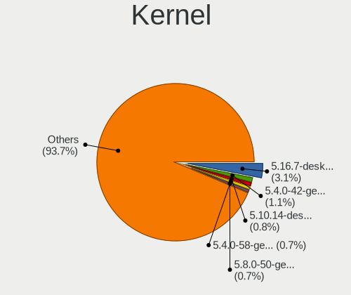
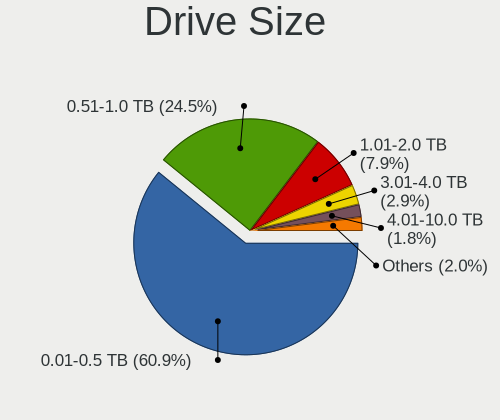
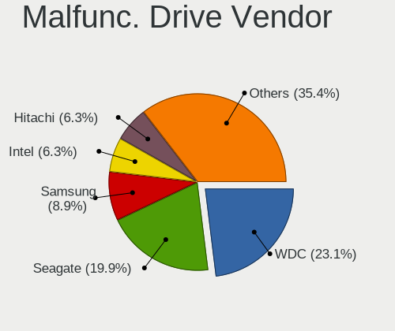
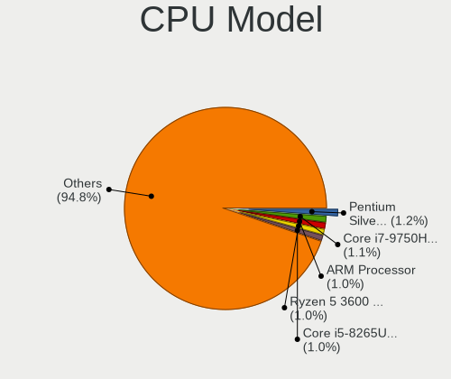
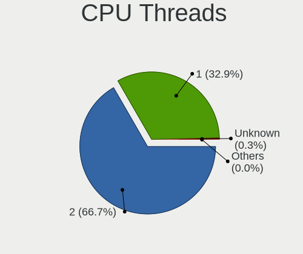
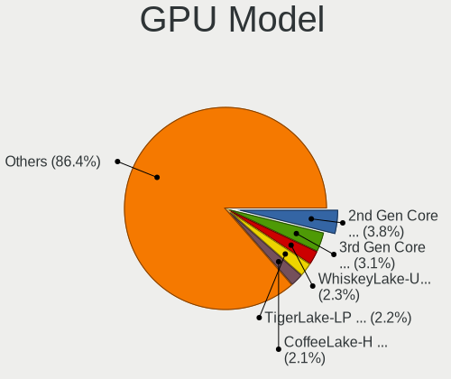

Linux in Netherlands - Tested Hardware & Statistics
---------------------------------------------------

A project to collect tested hardware configurations for Linux in Netherlands.

Anyone can contribute to this report by the [hw-probe](https://github.com/linuxhw/hw-probe) tool:

    sudo -E hw-probe -all -upload

Please contribute! Especially if your hardware is rare.

This is a report for all computer types. See also reports for [desktops](/Location/Netherlands/Desktop/README.md) and [notebooks](/Location/Netherlands/Notebook/README.md).

Contents
--------

* [ Test Cases ](#test-cases)

* [ System ](#system)
  - [ OS                       ](#os)
  - [ OS Family                ](#os-family)
  - [ Kernel                   ](#kernel)
  - [ Kernel Family            ](#kernel-family)
  - [ Kernel Major Ver.        ](#kernel-major-ver)
  - [ Arch                     ](#arch)
  - [ DE                       ](#de)
  - [ Display Server           ](#display-server)
  - [ Display Manager          ](#display-manager)
  - [ OS Lang                  ](#os-lang)
  - [ Boot Mode                ](#boot-mode)
  - [ Filesystem               ](#filesystem)
  - [ Part. scheme             ](#part-scheme)
  - [ Dual Boot with Linux/BSD ](#dual-boot-with-linuxbsd)
  - [ Dual Boot (Win)          ](#dual-boot-win)

* [ Board ](#board)
  - [ Vendor                   ](#vendor)
  - [ Model                    ](#model)
  - [ Model Family             ](#model-family)
  - [ MFG Year                 ](#mfg-year)
  - [ Form Factor              ](#form-factor)
  - [ Secure Boot              ](#secure-boot)
  - [ Coreboot                 ](#coreboot)
  - [ RAM Size                 ](#ram-size)
  - [ RAM Used                 ](#ram-used)
  - [ Total Drives             ](#total-drives)
  - [ Has CD-ROM               ](#has-cd-rom)
  - [ Has Ethernet             ](#has-ethernet)
  - [ Has WiFi                 ](#has-wifi)
  - [ Has Bluetooth            ](#has-bluetooth)

* [ Location ](#location)
  - [ Country                  ](#country)
  - [ City                     ](#city)

* [ Drives ](#drives)
  - [ Drive Vendor             ](#drive-vendor)
  - [ Drive Model              ](#drive-model)
  - [ HDD Vendor               ](#hdd-vendor)
  - [ SSD Vendor               ](#ssd-vendor)
  - [ Drive Kind               ](#drive-kind)
  - [ Drive Connector          ](#drive-connector)
  - [ Drive Size               ](#drive-size)
  - [ Space Total              ](#space-total)
  - [ Space Used               ](#space-used)
  - [ Malfunc. Drives          ](#malfunc-drives)
  - [ Malfunc. Drive Vendor    ](#malfunc-drive-vendor)
  - [ Malfunc. HDD Vendor      ](#malfunc-hdd-vendor)
  - [ Malfunc. Drive Kind      ](#malfunc-drive-kind)
  - [ Failed Drives            ](#failed-drives)
  - [ Failed Drive Vendor      ](#failed-drive-vendor)
  - [ Drive Status             ](#drive-status)

* [ Storage controller ](#storage-controller)
  - [ Storage Vendor           ](#storage-vendor)
  - [ Storage Model            ](#storage-model)
  - [ Storage Kind             ](#storage-kind)

* [ Processor ](#processor)
  - [ CPU Vendor               ](#cpu-vendor)
  - [ CPU Model                ](#cpu-model)
  - [ CPU Model Family         ](#cpu-model-family)
  - [ CPU Cores                ](#cpu-cores)
  - [ CPU Sockets              ](#cpu-sockets)
  - [ CPU Threads              ](#cpu-threads)
  - [ CPU Op-Modes             ](#cpu-op-modes)
  - [ CPU Microcode            ](#cpu-microcode)
  - [ CPU Microarch            ](#cpu-microarch)

* [ Graphics ](#graphics)
  - [ GPU Vendor               ](#gpu-vendor)
  - [ GPU Model                ](#gpu-model)
  - [ GPU Combo                ](#gpu-combo)
  - [ GPU Driver               ](#gpu-driver)
  - [ GPU Memory               ](#gpu-memory)

* [ Monitor ](#monitor)
  - [ Monitor Vendor           ](#monitor-vendor)
  - [ Monitor Model            ](#monitor-model)
  - [ Monitor Resolution       ](#monitor-resolution)
  - [ Monitor Diagonal         ](#monitor-diagonal)
  - [ Monitor Width            ](#monitor-width)
  - [ Aspect Ratio             ](#aspect-ratio)
  - [ Monitor Area             ](#monitor-area)
  - [ Pixel Density            ](#pixel-density)
  - [ Multiple Monitors        ](#multiple-monitors)

* [ Network ](#network)
  - [ Net Controller Vendor    ](#net-controller-vendor)
  - [ Net Controller Model     ](#net-controller-model)
  - [ Wireless Vendor          ](#wireless-vendor)
  - [ Wireless Model           ](#wireless-model)
  - [ Ethernet Vendor          ](#ethernet-vendor)
  - [ Ethernet Model           ](#ethernet-model)
  - [ Net Controller Kind      ](#net-controller-kind)
  - [ Used Controller          ](#used-controller)
  - [ NICs                     ](#nics)
  - [ IPv6                     ](#ipv6)

* [ Bluetooth ](#bluetooth)
  - [ Bluetooth Vendor         ](#bluetooth-vendor)
  - [ Bluetooth Model          ](#bluetooth-model)

* [ Sound ](#sound)
  - [ Sound Vendor             ](#sound-vendor)
  - [ Sound Model              ](#sound-model)

* [ Memory ](#memory)
  - [ Memory Vendor            ](#memory-vendor)
  - [ Memory Model             ](#memory-model)
  - [ Memory Kind              ](#memory-kind)
  - [ Memory Form Factor       ](#memory-form-factor)
  - [ Memory Size              ](#memory-size)
  - [ Memory Speed             ](#memory-speed)

* [ Printers & scanners ](#printers--scanners)
  - [ Printer Vendor           ](#printer-vendor)
  - [ Printer Model            ](#printer-model)
  - [ Scanner Vendor           ](#scanner-vendor)
  - [ Scanner Model            ](#scanner-model)

* [ Camera ](#camera)
  - [ Camera Vendor            ](#camera-vendor)
  - [ Camera Model             ](#camera-model)

* [ Security ](#security)
  - [ Fingerprint Vendor       ](#fingerprint-vendor)
  - [ Fingerprint Model        ](#fingerprint-model)
  - [ Chipcard Vendor          ](#chipcard-vendor)
  - [ Chipcard Model           ](#chipcard-model)

* [ Unsupported ](#unsupported)
  - [ Unsupported Devices      ](#unsupported-devices)
  - [ Unsupported Device Types ](#unsupported-device-types)

Test Cases
----------

Total: 4293

| Vendor        | Model                       | Form-Factor | Probe                                                      | Date         |
|---------------|-----------------------------|-------------|------------------------------------------------------------|--------------|
| MSI           | H81M-E34                    | Desktop     | [c0be356e96](https://linux-hardware.org/?probe=c0be356e96) | Aug 01, 2022 |
| HP            | 3646h                       | Desktop     | [7988eaa5e3](https://linux-hardware.org/?probe=7988eaa5e3) | Aug 01, 2022 |
| Apple         | MacBookPro5,5               | Notebook    | [4eeca116f8](https://linux-hardware.org/?probe=4eeca116f8) | Aug 01, 2022 |
| HP            | ZBook Fury 15 G7 Mobile ... | Notebook    | [16a3f81537](https://linux-hardware.org/?probe=16a3f81537) | Aug 01, 2022 |
| HP            | EliteBook 745 G6            | Notebook    | [2546e4a593](https://linux-hardware.org/?probe=2546e4a593) | Aug 01, 2022 |
| ASUSTek       | P8H67-M PRO                 | Desktop     | [3a3a7c1a8a](https://linux-hardware.org/?probe=3a3a7c1a8a) | Aug 01, 2022 |
| HP            | ProBook 6570b               | Notebook    | [333a24bdee](https://linux-hardware.org/?probe=333a24bdee) | Jul 31, 2022 |
| HP            | Notebook                    | Notebook    | [2268ecaee2](https://linux-hardware.org/?probe=2268ecaee2) | Jul 31, 2022 |
| ASRock        | X570 Steel Legend           | Desktop     | [f43e0c2c81](https://linux-hardware.org/?probe=f43e0c2c81) | Jul 31, 2022 |
| Dell          | 0D24M8 A00                  | Desktop     | [6367e245e6](https://linux-hardware.org/?probe=6367e245e6) | Jul 31, 2022 |
| Fujitsu       | LIFEBOOK S936               | Notebook    | [90a08a49a3](https://linux-hardware.org/?probe=90a08a49a3) | Jul 31, 2022 |
| Fujitsu       | LIFEBOOK S936               | Notebook    | [1af46d1c56](https://linux-hardware.org/?probe=1af46d1c56) | Jul 31, 2022 |
| HP            | 3646h                       | Desktop     | [443cfc9c15](https://linux-hardware.org/?probe=443cfc9c15) | Jul 31, 2022 |
| ASUSTek       | M4N68T-M-LE-V2              | Desktop     | [7cc8e19d03](https://linux-hardware.org/?probe=7cc8e19d03) | Jul 30, 2022 |
| Dell          | Latitude E7470              | Notebook    | [ca7878faab](https://linux-hardware.org/?probe=ca7878faab) | Jul 30, 2022 |
| HP            | Notebook                    | Notebook    | [ac46775f8b](https://linux-hardware.org/?probe=ac46775f8b) | Jul 30, 2022 |
| Dell          | 051FJ8 A00                  | Desktop     | [f2bdee0d64](https://linux-hardware.org/?probe=f2bdee0d64) | Jul 30, 2022 |
| Lenovo        | G700 20251                  | Notebook    | [24a9e92897](https://linux-hardware.org/?probe=24a9e92897) | Jul 29, 2022 |
| Lenovo        | ThinkPad T14 Gen 1 20UES... | Notebook    | [ef7aa9cb2e](https://linux-hardware.org/?probe=ef7aa9cb2e) | Jul 29, 2022 |
| ASUSTek       | PRIME A320M-K               | Desktop     | [9a97caa028](https://linux-hardware.org/?probe=9a97caa028) | Jul 28, 2022 |
| ASUSTek       | PRIME A320M-K               | Desktop     | [d00325cd68](https://linux-hardware.org/?probe=d00325cd68) | Jul 28, 2022 |
| ASUSTek       | N76VB                       | Notebook    | [15cea344b9](https://linux-hardware.org/?probe=15cea344b9) | Jul 27, 2022 |
| HP            | Pavilion g7                 | Notebook    | [75fa7f0ce4](https://linux-hardware.org/?probe=75fa7f0ce4) | Jul 27, 2022 |
| ASRock        | H310CM-ITX/ac               | Desktop     | [df9564b6b3](https://linux-hardware.org/?probe=df9564b6b3) | Jul 27, 2022 |
| Lenovo        | ThinkPad E550 20DF0040CA    | Notebook    | [f54dc4ee78](https://linux-hardware.org/?probe=f54dc4ee78) | Jul 26, 2022 |
| Dell          | Latitude 3300               | Notebook    | [64cf4b87d9](https://linux-hardware.org/?probe=64cf4b87d9) | Jul 26, 2022 |
| MSI           | MPG Z690 EDGE WIFI DDR4     | Desktop     | [60a2d97137](https://linux-hardware.org/?probe=60a2d97137) | Jul 25, 2022 |
| Lenovo        | ThinkCentre M58p 6137B28    | Desktop     | [5473e97fa6](https://linux-hardware.org/?probe=5473e97fa6) | Jul 25, 2022 |
| Dell          | Latitude 3310               | Notebook    | [0fe12d0d48](https://linux-hardware.org/?probe=0fe12d0d48) | Jul 25, 2022 |
| Lenovo        | ThinkPad E550 20DF0040CA    | Notebook    | [276e2a32dc](https://linux-hardware.org/?probe=276e2a32dc) | Jul 25, 2022 |
| MSI           | GP60 2PE                    | Notebook    | [0fa37c70f5](https://linux-hardware.org/?probe=0fa37c70f5) | Jul 24, 2022 |
| HP            | 3646h                       | Desktop     | [65d1da3eba](https://linux-hardware.org/?probe=65d1da3eba) | Jul 24, 2022 |
| ASUSTek       | X751MA                      | Notebook    | [4986a5eabc](https://linux-hardware.org/?probe=4986a5eabc) | Jul 24, 2022 |
| ASUSTek       | GL702VI                     | Notebook    | [7bb350de7e](https://linux-hardware.org/?probe=7bb350de7e) | Jul 24, 2022 |
| MSI           | MAG B550M BAZOOKA           | Desktop     | [76f5f39b78](https://linux-hardware.org/?probe=76f5f39b78) | Jul 24, 2022 |
| HP            | EliteBook 840 G4            | Notebook    | [d8d889ef85](https://linux-hardware.org/?probe=d8d889ef85) | Jul 23, 2022 |
| ASUSTek       | GL702VI                     | Notebook    | [ca8b9fbf8f](https://linux-hardware.org/?probe=ca8b9fbf8f) | Jul 22, 2022 |
| Shuttle       | NC01U V1.0                  | Desktop     | [827d6c81ae](https://linux-hardware.org/?probe=827d6c81ae) | Jul 22, 2022 |
| MP            | MS-7848                     | Desktop     | [f7696965e0](https://linux-hardware.org/?probe=f7696965e0) | Jul 22, 2022 |
| ASRock        | B550 Phantom Gaming 4/ac    | Desktop     | [b4454d2aa5](https://linux-hardware.org/?probe=b4454d2aa5) | Jul 22, 2022 |
| ASUSTek       | P8B75-M LE                  | Desktop     | [f5c169fed7](https://linux-hardware.org/?probe=f5c169fed7) | Jul 22, 2022 |
| ASUSTek       | PRIME Z390-A                | Desktop     | [83d47fc3dc](https://linux-hardware.org/?probe=83d47fc3dc) | Jul 22, 2022 |
| Shuttle       | NC01U V1.0                  | Desktop     | [1177e7dbe0](https://linux-hardware.org/?probe=1177e7dbe0) | Jul 21, 2022 |
| Gigabyte      | Z690 GAMING X DDR4          | Desktop     | [b3f65d7c35](https://linux-hardware.org/?probe=b3f65d7c35) | Jul 21, 2022 |
| Apple         | Mac-942B5BF58194151B        | All in one  | [56ce195301](https://linux-hardware.org/?probe=56ce195301) | Jul 21, 2022 |
| Dell          | Latitude 3310               | Notebook    | [bc6103f96b](https://linux-hardware.org/?probe=bc6103f96b) | Jul 21, 2022 |
| Shuttle       | NC01U V1.0                  | Desktop     | [fecfaf6008](https://linux-hardware.org/?probe=fecfaf6008) | Jul 21, 2022 |
| Dell          | Latitude 3310               | Notebook    | [abe159e82a](https://linux-hardware.org/?probe=abe159e82a) | Jul 21, 2022 |
| Dell          | Latitude 3310               | Notebook    | [d90f147df3](https://linux-hardware.org/?probe=d90f147df3) | Jul 21, 2022 |
| Dell          | Latitude 3310               | Notebook    | [324b95a49a](https://linux-hardware.org/?probe=324b95a49a) | Jul 21, 2022 |
| ASUSTek       | Z87M-PLUS                   | Desktop     | [da502f8dfd](https://linux-hardware.org/?probe=da502f8dfd) | Jul 20, 2022 |
| Dell          | Latitude 3190 2-in-1        | Convertible | [762e21d62f](https://linux-hardware.org/?probe=762e21d62f) | Jul 20, 2022 |
| Dell          | Latitude 3310               | Notebook    | [086f88be40](https://linux-hardware.org/?probe=086f88be40) | Jul 20, 2022 |
| Dell          | Latitude 3310               | Notebook    | [0cb2abc6bc](https://linux-hardware.org/?probe=0cb2abc6bc) | Jul 20, 2022 |
| Dell          | Latitude 3310               | Notebook    | [dbd9b101c2](https://linux-hardware.org/?probe=dbd9b101c2) | Jul 20, 2022 |
| eMachines     | EL1870                      | Desktop     | [58e76fb684](https://linux-hardware.org/?probe=58e76fb684) | Jul 19, 2022 |
| Acer          | Aspire 7560                 | Notebook    | [a0f1f7abee](https://linux-hardware.org/?probe=a0f1f7abee) | Jul 19, 2022 |
| Apple         | MacBookPro14,2              | Notebook    | [4f1ce227b5](https://linux-hardware.org/?probe=4f1ce227b5) | Jul 18, 2022 |
| Sony          | VPCEA1C5E                   | Notebook    | [4592d973d6](https://linux-hardware.org/?probe=4592d973d6) | Jul 18, 2022 |
| ASUSTek       | P8B75-M LE                  | Desktop     | [34f50b057e](https://linux-hardware.org/?probe=34f50b057e) | Jul 18, 2022 |
| HP            | Pavilion g7                 | Notebook    | [5129e33508](https://linux-hardware.org/?probe=5129e33508) | Jul 18, 2022 |
| Intel         | NUC11TNBi3 M11908-403       | Mini pc     | [97de1889a5](https://linux-hardware.org/?probe=97de1889a5) | Jul 18, 2022 |
| MSI           | B450 GAMING PRO CARBON A... | Desktop     | [03d7fde009](https://linux-hardware.org/?probe=03d7fde009) | Jul 18, 2022 |
| HP            | 8906 SMVB                   | Desktop     | [3b89e3e952](https://linux-hardware.org/?probe=3b89e3e952) | Jul 17, 2022 |
| Acer          | Aspire 7560                 | Notebook    | [5bf15dc370](https://linux-hardware.org/?probe=5bf15dc370) | Jul 17, 2022 |
| ASUSTek       | PRIME X570-PRO              | Desktop     | [b1633a8844](https://linux-hardware.org/?probe=b1633a8844) | Jul 17, 2022 |
| ASUSTek       | 1201N                       | Notebook    | [05eb1e3b1b](https://linux-hardware.org/?probe=05eb1e3b1b) | Jul 17, 2022 |
| HP            | Pavilion g7                 | Notebook    | [9230cd5f0e](https://linux-hardware.org/?probe=9230cd5f0e) | Jul 16, 2022 |
| Dell          | Latitude E6510              | Notebook    | [42fcd7f8c8](https://linux-hardware.org/?probe=42fcd7f8c8) | Jul 16, 2022 |
| Raspberry ... | Raspberry Pi 4 Model B R... | Soc         | [9b474187be](https://linux-hardware.org/?probe=9b474187be) | Jul 16, 2022 |
| Lenovo        | IdeaPadFlex 5 14ALC05 82... | Convertible | [c72b02d7d4](https://linux-hardware.org/?probe=c72b02d7d4) | Jul 16, 2022 |
| HP            | Laptop 17-cp0xxx            | Notebook    | [476ab880f4](https://linux-hardware.org/?probe=476ab880f4) | Jul 15, 2022 |
| Raspberry ... | Raspberry Pi 4 Model B R... | Soc         | [00dca5c97f](https://linux-hardware.org/?probe=00dca5c97f) | Jul 15, 2022 |
| Gigabyte      | X570S AORUS MASTER          | Desktop     | [14a754a395](https://linux-hardware.org/?probe=14a754a395) | Jul 14, 2022 |
| HP            | Pavilion Laptop 13-an0xx... | Notebook    | [6021e75347](https://linux-hardware.org/?probe=6021e75347) | Jul 13, 2022 |
| Apple         | MacBookPro11,2              | Notebook    | [11e98244ac](https://linux-hardware.org/?probe=11e98244ac) | Jul 12, 2022 |
| Jumper        | EZbook                      | Notebook    | [2515427610](https://linux-hardware.org/?probe=2515427610) | Jul 12, 2022 |
| Lenovo        | ThinkBook 14-IIL 20SL       | Notebook    | [9703351d30](https://linux-hardware.org/?probe=9703351d30) | Jul 12, 2022 |
| Gigabyte      | A320M-H-CF                  | Desktop     | [9b24417251](https://linux-hardware.org/?probe=9b24417251) | Jul 12, 2022 |
| Gigabyte      | GB-BRR7H-4800               | Desktop     | [a3c14e06c9](https://linux-hardware.org/?probe=a3c14e06c9) | Jul 11, 2022 |
| Notebook      | NL5xRU                      | Notebook    | [a4bc7e790c](https://linux-hardware.org/?probe=a4bc7e790c) | Jul 11, 2022 |
| Dell          | Latitude 3190 2-in-1        | Convertible | [d2b0adf1ae](https://linux-hardware.org/?probe=d2b0adf1ae) | Jul 11, 2022 |
| MSI           | Z77A-G45                    | Desktop     | [ff2bae4518](https://linux-hardware.org/?probe=ff2bae4518) | Jul 11, 2022 |
| Dell          | Latitude 3190 2-in-1        | Convertible | [9f8f272886](https://linux-hardware.org/?probe=9f8f272886) | Jul 11, 2022 |
| Dell          | Latitude 3120               | Convertible | [948677f521](https://linux-hardware.org/?probe=948677f521) | Jul 11, 2022 |
| Insyde        | Skylake                     | Notebook    | [3c3afd7b46](https://linux-hardware.org/?probe=3c3afd7b46) | Jul 10, 2022 |
| MSI           | Z77A-G45                    | Desktop     | [2d4a011972](https://linux-hardware.org/?probe=2d4a011972) | Jul 10, 2022 |
| Microsoft     | Surface Pro                 | Tablet      | [c696783c30](https://linux-hardware.org/?probe=c696783c30) | Jul 09, 2022 |
| Intel         | NUC8BEB J72693-305          | Mini pc     | [b73dab7637](https://linux-hardware.org/?probe=b73dab7637) | Jul 08, 2022 |
| Dell          | XPS 13 9333                 | Notebook    | [e464cd5823](https://linux-hardware.org/?probe=e464cd5823) | Jul 08, 2022 |
| Notebook      | NH55RGQ                     | Notebook    | [37de891a60](https://linux-hardware.org/?probe=37de891a60) | Jul 08, 2022 |
| HP            | ProBook 4540s               | Notebook    | [6b67ccac52](https://linux-hardware.org/?probe=6b67ccac52) | Jul 08, 2022 |
| HP            | ProBook 4540s               | Notebook    | [e209d1f716](https://linux-hardware.org/?probe=e209d1f716) | Jul 08, 2022 |
| Lenovo        | ThinkPad X200 7458FDG       | Notebook    | [435e7998bd](https://linux-hardware.org/?probe=435e7998bd) | Jul 08, 2022 |
| AZW           | T3 MRD                      | Notebook    | [7f8d8245e1](https://linux-hardware.org/?probe=7f8d8245e1) | Jul 08, 2022 |
| HP            | EliteBook 745 G4            | Notebook    | [cb445678be](https://linux-hardware.org/?probe=cb445678be) | Jul 08, 2022 |
| ASUSTek       | PRIME X570-PRO              | Desktop     | [55e633cda2](https://linux-hardware.org/?probe=55e633cda2) | Jul 07, 2022 |
| Acer          | Aspire V3-771               | Notebook    | [e8488fb0e2](https://linux-hardware.org/?probe=e8488fb0e2) | Jul 07, 2022 |
| Google        | Cave                        | Notebook    | [fd843b1768](https://linux-hardware.org/?probe=fd843b1768) | Jul 07, 2022 |
| Dell          | Inspiron 16 5625            | Notebook    | [dcbe63005c](https://linux-hardware.org/?probe=dcbe63005c) | Jul 06, 2022 |
| Alienware     | 13 R2                       | Notebook    | [ec877e9a2e](https://linux-hardware.org/?probe=ec877e9a2e) | Jul 06, 2022 |
| Alienware     | m15                         | Notebook    | [9578c619e6](https://linux-hardware.org/?probe=9578c619e6) | Jul 06, 2022 |
| Purism        | Librem 15 v3                | Notebook    | [1e39d0bba8](https://linux-hardware.org/?probe=1e39d0bba8) | Jul 06, 2022 |
| HONOR         | BOHK-WAX9X                  | Notebook    | [4070d60511](https://linux-hardware.org/?probe=4070d60511) | Jul 05, 2022 |
| HP            | 3646h                       | Desktop     | [36c53efdac](https://linux-hardware.org/?probe=36c53efdac) | Jul 05, 2022 |
| HP            | 3646h                       | Desktop     | [675a46eda3](https://linux-hardware.org/?probe=675a46eda3) | Jul 05, 2022 |
| Dell          | Latitude 5421               | Notebook    | [8a40be5ce5](https://linux-hardware.org/?probe=8a40be5ce5) | Jul 05, 2022 |
| Toshiba       | Satellite P50-A-12P         | Notebook    | [6fc4be2ae8](https://linux-hardware.org/?probe=6fc4be2ae8) | Jul 04, 2022 |
| Lenovo        | Legion 5 17ACH6 82K0        | Notebook    | [2afdf76afd](https://linux-hardware.org/?probe=2afdf76afd) | Jul 04, 2022 |
| Intel         | NUC5i5RYB H40999-508        | Mini pc     | [e5622d318c](https://linux-hardware.org/?probe=e5622d318c) | Jul 04, 2022 |
| Medion        | B250H4-EM                   | Desktop     | [2c42d7ef06](https://linux-hardware.org/?probe=2c42d7ef06) | Jul 04, 2022 |
| Apple         | MacBookPro11,2              | Notebook    | [fe19e0e611](https://linux-hardware.org/?probe=fe19e0e611) | Jul 03, 2022 |
| Lenovo        | Legion 5 15ACH6 82JW        | Notebook    | [763752db1c](https://linux-hardware.org/?probe=763752db1c) | Jul 03, 2022 |
| Lenovo        | Tablet 10 20L3000RUK        | Tablet      | [05a11b612c](https://linux-hardware.org/?probe=05a11b612c) | Jul 02, 2022 |
| Dell          | Latitude E7450              | Notebook    | [6dc8d46993](https://linux-hardware.org/?probe=6dc8d46993) | Jul 02, 2022 |
| Lenovo        | IdeaPad Gaming 3 15IHU6 ... | Notebook    | [e13cada6ae](https://linux-hardware.org/?probe=e13cada6ae) | Jul 02, 2022 |
| Medion        | E122X                       | Notebook    | [ccc1d37532](https://linux-hardware.org/?probe=ccc1d37532) | Jul 02, 2022 |
| MSI           | MPG X570 GAMING EDGE WIF... | Desktop     | [7da3547526](https://linux-hardware.org/?probe=7da3547526) | Jul 01, 2022 |
| Gigabyte      | P55A-UD3                    | Desktop     | [36dcdacdb1](https://linux-hardware.org/?probe=36dcdacdb1) | Jul 01, 2022 |
| HP            | ProBook 4540s               | Notebook    | [c47e971697](https://linux-hardware.org/?probe=c47e971697) | Jul 01, 2022 |
| Dell          | Latitude 3120               | Convertible | [42c26ea983](https://linux-hardware.org/?probe=42c26ea983) | Jul 01, 2022 |
| ASRock        | B450M Pro4                  | Desktop     | [5dd727cd5e](https://linux-hardware.org/?probe=5dd727cd5e) | Jul 01, 2022 |
| ASUSTek       | X756UQK                     | Notebook    | [62595fe324](https://linux-hardware.org/?probe=62595fe324) | Jul 01, 2022 |
| Dell          | 0HHV7N A00                  | Desktop     | [41255f7150](https://linux-hardware.org/?probe=41255f7150) | Jun 30, 2022 |
| Intel         | NUC11PABi5 K90634-305       | Mini pc     | [d409d12ee2](https://linux-hardware.org/?probe=d409d12ee2) | Jun 29, 2022 |
| Gigabyte      | X570S AORUS ELITE AX        | Desktop     | [ec8f2e717c](https://linux-hardware.org/?probe=ec8f2e717c) | Jun 29, 2022 |
| Gigabyte      | GB-BRR7H-4700               | Desktop     | [5ac6d883d6](https://linux-hardware.org/?probe=5ac6d883d6) | Jun 29, 2022 |
| ASUSTek       | PRIME Z270-A                | Desktop     | [da80c0d1cd](https://linux-hardware.org/?probe=da80c0d1cd) | Jun 29, 2022 |
| HP            | 212B                        | Desktop     | [72b9156d16](https://linux-hardware.org/?probe=72b9156d16) | Jun 29, 2022 |
| HP            | 212B                        | Desktop     | [687ca162d2](https://linux-hardware.org/?probe=687ca162d2) | Jun 27, 2022 |
| Intel         | NUC11PABi5 K90634-305       | Mini pc     | [30672ab543](https://linux-hardware.org/?probe=30672ab543) | Jun 27, 2022 |
| Fujitsu       | LIFEBOOK U938               | Notebook    | [c959653e4f](https://linux-hardware.org/?probe=c959653e4f) | Jun 27, 2022 |
| Fujitsu       | LIFEBOOK U938               | Notebook    | [be4fb4ad71](https://linux-hardware.org/?probe=be4fb4ad71) | Jun 27, 2022 |
| Apple         | MacBookPro14,2              | Notebook    | [7fe621e5a7](https://linux-hardware.org/?probe=7fe621e5a7) | Jun 27, 2022 |
| HP            | ENVY x360 Convertible 15... | Convertible | [f374c07d1d](https://linux-hardware.org/?probe=f374c07d1d) | Jun 26, 2022 |
| Raspberry ... | Raspberry Pi                | Soc         | [af50fdf3b9](https://linux-hardware.org/?probe=af50fdf3b9) | Jun 26, 2022 |
| ASUSTek       | ASUS EXPERTBOOK B1500CEA... | Notebook    | [f1b7197958](https://linux-hardware.org/?probe=f1b7197958) | Jun 25, 2022 |
| Lenovo        | ThinkPad T520 4243VE1       | Notebook    | [7fcfec26eb](https://linux-hardware.org/?probe=7fcfec26eb) | Jun 24, 2022 |
| Lenovo        | Legion 5 15ACH6H 82JU       | Notebook    | [b450b0c2dc](https://linux-hardware.org/?probe=b450b0c2dc) | Jun 24, 2022 |
| HP            | 17E2                        | Mini pc     | [af384322c4](https://linux-hardware.org/?probe=af384322c4) | Jun 24, 2022 |
| Dell          | Latitude 3420               | Notebook    | [027b943645](https://linux-hardware.org/?probe=027b943645) | Jun 24, 2022 |
| Gigabyte      | X570S AORUS MASTER          | Desktop     | [95d5b870bb](https://linux-hardware.org/?probe=95d5b870bb) | Jun 23, 2022 |
| HP            | Pavilion Laptop 15-cw1xx... | Notebook    | [223e43004a](https://linux-hardware.org/?probe=223e43004a) | Jun 23, 2022 |
| Dell          | 0GY6Y8 A01                  | Desktop     | [d97ba1924c](https://linux-hardware.org/?probe=d97ba1924c) | Jun 23, 2022 |
| Dell          | Latitude 3300               | Notebook    | [5275529516](https://linux-hardware.org/?probe=5275529516) | Jun 22, 2022 |
| MSI           | MPG X570 GAMING EDGE WIF... | Desktop     | [21d1dc43e6](https://linux-hardware.org/?probe=21d1dc43e6) | Jun 22, 2022 |
| HP            | EliteBook 830 G6            | Notebook    | [7c7d9af667](https://linux-hardware.org/?probe=7c7d9af667) | Jun 21, 2022 |
| Microsoft     | Surface Laptop              | Tablet      | [8c621a2c68](https://linux-hardware.org/?probe=8c621a2c68) | Jun 21, 2022 |
| Dell          | XPS 15 9570                 | Notebook    | [c6c4eda2cb](https://linux-hardware.org/?probe=c6c4eda2cb) | Jun 21, 2022 |
| Lenovo        | ThinkPad T470s 20HGS1D00... | Notebook    | [eacaed715b](https://linux-hardware.org/?probe=eacaed715b) | Jun 21, 2022 |
| Dell          | Latitude 3190               | Notebook    | [14521bc3eb](https://linux-hardware.org/?probe=14521bc3eb) | Jun 20, 2022 |
| Dell          | Latitude 3120               | Convertible | [fb8f95e22f](https://linux-hardware.org/?probe=fb8f95e22f) | Jun 20, 2022 |
| ASUSTek       | ROG Strix G713QE_G713QE     | Notebook    | [ff63b72fd2](https://linux-hardware.org/?probe=ff63b72fd2) | Jun 19, 2022 |
| Sony          | SVD1321Z9RW                 | Notebook    | [adc9da6fe8](https://linux-hardware.org/?probe=adc9da6fe8) | Jun 19, 2022 |
| Apple         | Mac-942B5BF58194151B        | All in one  | [0d3fa4ad21](https://linux-hardware.org/?probe=0d3fa4ad21) | Jun 19, 2022 |
| Lenovo        | ThinkPad X240 20AMS75900    | Notebook    | [47b7f42708](https://linux-hardware.org/?probe=47b7f42708) | Jun 18, 2022 |
| MSI           | MPG X570 GAMING EDGE WIF... | Desktop     | [6ba04b0f37](https://linux-hardware.org/?probe=6ba04b0f37) | Jun 18, 2022 |
| MSI           | Z270 GAMING PRO CARBON      | Desktop     | [63e3deaaf4](https://linux-hardware.org/?probe=63e3deaaf4) | Jun 17, 2022 |
| Dell          | Latitude 3380               | Notebook    | [0ccd773de6](https://linux-hardware.org/?probe=0ccd773de6) | Jun 17, 2022 |
| HP            | ENVY x360 Convertible 15... | Convertible | [617dc7c353](https://linux-hardware.org/?probe=617dc7c353) | Jun 17, 2022 |
| ASUSTek       | TUF Gaming X570-PLUS        | Desktop     | [fe7fa5fe7a](https://linux-hardware.org/?probe=fe7fa5fe7a) | Jun 17, 2022 |
| ASRock        | QC6000M                     | Desktop     | [176afb6dcc](https://linux-hardware.org/?probe=176afb6dcc) | Jun 17, 2022 |
| ASUSTek       | ROG Strix G713QE_G713QE     | Notebook    | [3ec9bac70f](https://linux-hardware.org/?probe=3ec9bac70f) | Jun 17, 2022 |
| Dell          | Latitude 3190 2-in-1        | Convertible | [27ed69d223](https://linux-hardware.org/?probe=27ed69d223) | Jun 17, 2022 |
| Dell          | Latitude 3420               | Notebook    | [178e3cbcba](https://linux-hardware.org/?probe=178e3cbcba) | Jun 17, 2022 |
| Dell          | Latitude 3300               | Notebook    | [ed133c13de](https://linux-hardware.org/?probe=ed133c13de) | Jun 17, 2022 |
| Dell          | Latitude 3310               | Notebook    | [4715235090](https://linux-hardware.org/?probe=4715235090) | Jun 17, 2022 |
| Dell          | Latitude 3120               | Convertible | [59aff9d5de](https://linux-hardware.org/?probe=59aff9d5de) | Jun 17, 2022 |
| Raspberry ... | Raspberry Pi                | Soc         | [14ddb3f22e](https://linux-hardware.org/?probe=14ddb3f22e) | Jun 17, 2022 |
| Dell          | Latitude E6420              | Notebook    | [5ed4263a65](https://linux-hardware.org/?probe=5ed4263a65) | Jun 17, 2022 |
| Lenovo        | G500 20236                  | Notebook    | [512450d910](https://linux-hardware.org/?probe=512450d910) | Jun 17, 2022 |
| Lenovo        | IdeaPad 5 14ALC05 82LM      | Notebook    | [e21faf995b](https://linux-hardware.org/?probe=e21faf995b) | Jun 16, 2022 |
| Dell          | Latitude 3120               | Convertible | [2206867528](https://linux-hardware.org/?probe=2206867528) | Jun 16, 2022 |
| Gigabyte      | A320M-S2H-CF                | Desktop     | [59fa9b4918](https://linux-hardware.org/?probe=59fa9b4918) | Jun 16, 2022 |
| Acer          | Aspire A515-44              | Notebook    | [5da40d4fd6](https://linux-hardware.org/?probe=5da40d4fd6) | Jun 16, 2022 |
| Dell          | Latitude 3120               | Convertible | [6497f52b7d](https://linux-hardware.org/?probe=6497f52b7d) | Jun 16, 2022 |
| Notebook      | PA70ES                      | Notebook    | [7024a9dc03](https://linux-hardware.org/?probe=7024a9dc03) | Jun 16, 2022 |
| Dell          | Latitude 3120               | Convertible | [ef26bd9916](https://linux-hardware.org/?probe=ef26bd9916) | Jun 16, 2022 |
| Dell          | Latitude 3310               | Notebook    | [549b7595b7](https://linux-hardware.org/?probe=549b7595b7) | Jun 16, 2022 |
| ASUSTek       | ROG Zephyrus G14 GA401QC... | Notebook    | [6fa09c2dd0](https://linux-hardware.org/?probe=6fa09c2dd0) | Jun 16, 2022 |
| Dell          | Inspiron 7500 2n1 Black     | Convertible | [d08495e5aa](https://linux-hardware.org/?probe=d08495e5aa) | Jun 16, 2022 |
| ASUSTek       | ROG Zephyrus G14 GA401QC... | Notebook    | [d3f9fd8f0c](https://linux-hardware.org/?probe=d3f9fd8f0c) | Jun 16, 2022 |
| Acer          | Spin SP313-51N              | Convertible | [91316a0904](https://linux-hardware.org/?probe=91316a0904) | Jun 15, 2022 |
| MSI           | B550-A PRO                  | Desktop     | [f7201ee1de](https://linux-hardware.org/?probe=f7201ee1de) | Jun 14, 2022 |
| HP            | Spectre x360 Convertible... | Convertible | [b1b05bb0eb](https://linux-hardware.org/?probe=b1b05bb0eb) | Jun 14, 2022 |
| Dell          | XPS 15 9510                 | Notebook    | [61104911ed](https://linux-hardware.org/?probe=61104911ed) | Jun 14, 2022 |
| Google        | Quawks                      | Notebook    | [c513bb8294](https://linux-hardware.org/?probe=c513bb8294) | Jun 14, 2022 |
| HP            | 212B                        | Desktop     | [2680c53ca7](https://linux-hardware.org/?probe=2680c53ca7) | Jun 13, 2022 |
| Lenovo        | G50-70 20351                | Notebook    | [b4b03244a8](https://linux-hardware.org/?probe=b4b03244a8) | Jun 12, 2022 |
| ASRock        | B460M Pro4                  | Desktop     | [603eff18a0](https://linux-hardware.org/?probe=603eff18a0) | Jun 12, 2022 |
| Lenovo        | ThinkPad L15 Gen 1 20U70... | Notebook    | [0da40dea6c](https://linux-hardware.org/?probe=0da40dea6c) | Jun 12, 2022 |
| HP            | Pavilion Laptop 15-cw1xx... | Notebook    | [dbe7d6b6bf](https://linux-hardware.org/?probe=dbe7d6b6bf) | Jun 12, 2022 |
| HP            | Pavilion Laptop 15-cw1xx... | Notebook    | [554002fe47](https://linux-hardware.org/?probe=554002fe47) | Jun 12, 2022 |
| Lenovo        | ThinkPad A485 20MUCTO1WW    | Notebook    | [283958f1a4](https://linux-hardware.org/?probe=283958f1a4) | Jun 12, 2022 |
| Gigabyte      | H370 AORUS GAMING 3 WIFI... | Desktop     | [14ed78a258](https://linux-hardware.org/?probe=14ed78a258) | Jun 11, 2022 |
| Unknown       | Intel X79                   | Desktop     | [e59708e6d6](https://linux-hardware.org/?probe=e59708e6d6) | Jun 11, 2022 |
| HP            | ProBook 4540s               | Notebook    | [6688afd4f5](https://linux-hardware.org/?probe=6688afd4f5) | Jun 11, 2022 |
| ASUSTek       | PRIME H570M-PLUS            | Desktop     | [a332c946a2](https://linux-hardware.org/?probe=a332c946a2) | Jun 11, 2022 |
| HP            | Pavilion dv7                | Notebook    | [7f7678265b](https://linux-hardware.org/?probe=7f7678265b) | Jun 11, 2022 |
| HP            | Laptop 17-bs1xx             | Notebook    | [aa23e1d53e](https://linux-hardware.org/?probe=aa23e1d53e) | Jun 11, 2022 |
| HP            | Pavilion dv7                | Notebook    | [c8d1e1be32](https://linux-hardware.org/?probe=c8d1e1be32) | Jun 10, 2022 |
| Lenovo        | ThinkPad X13 Gen 1 20UF0... | Notebook    | [1967d32245](https://linux-hardware.org/?probe=1967d32245) | Jun 10, 2022 |
| MSI           | X470 GAMING PLUS MAX        | Desktop     | [661f4f701b](https://linux-hardware.org/?probe=661f4f701b) | Jun 10, 2022 |
| Gigabyte      | A320M-S2H-CF                | Desktop     | [f65aaff4bd](https://linux-hardware.org/?probe=f65aaff4bd) | Jun 10, 2022 |
| Lenovo        | IdeaPad C340-15IML 81TL     | Convertible | [042c11425c](https://linux-hardware.org/?probe=042c11425c) | Jun 10, 2022 |
| Gigabyte      | X570 AORUS ELITE            | Desktop     | [1fef4f1cf3](https://linux-hardware.org/?probe=1fef4f1cf3) | Jun 10, 2022 |
| HP            | ProBook 4540s               | Notebook    | [d0a6dcaa92](https://linux-hardware.org/?probe=d0a6dcaa92) | Jun 09, 2022 |
| Dell          | Latitude 3190 2-in-1        | Convertible | [2d093d9205](https://linux-hardware.org/?probe=2d093d9205) | Jun 09, 2022 |
| HONOR         | BOHK-WAX9X                  | Notebook    | [30b6c5f641](https://linux-hardware.org/?probe=30b6c5f641) | Jun 09, 2022 |
| Gigabyte      | EP45-DS3P                   | Desktop     | [cbc045c8d5](https://linux-hardware.org/?probe=cbc045c8d5) | Jun 08, 2022 |
| Gigabyte      | Z77-D3H                     | Desktop     | [942421d880](https://linux-hardware.org/?probe=942421d880) | Jun 07, 2022 |
| Apple         | MacBookPro5,5               | Notebook    | [0970e891ee](https://linux-hardware.org/?probe=0970e891ee) | Jun 07, 2022 |
| Acer          | Aspire X3995                | Desktop     | [cfe006603b](https://linux-hardware.org/?probe=cfe006603b) | Jun 07, 2022 |
| Apple         | MacBookPro5,5               | Notebook    | [3b33a1b625](https://linux-hardware.org/?probe=3b33a1b625) | Jun 07, 2022 |
| Dell          | XPS 13 9310 2-in-1          | Convertible | [75d7cde897](https://linux-hardware.org/?probe=75d7cde897) | Jun 06, 2022 |
| Lenovo        | Legion 5 17ACH6H 82JY       | Notebook    | [56ab62d27b](https://linux-hardware.org/?probe=56ab62d27b) | Jun 06, 2022 |
| Gigabyte      | X570 AORUS MASTER           | Desktop     | [9998592ce0](https://linux-hardware.org/?probe=9998592ce0) | Jun 06, 2022 |
| Gigabyte      | GB-BRR7H-4700               | Desktop     | [4ca3d47b50](https://linux-hardware.org/?probe=4ca3d47b50) | Jun 06, 2022 |
| Gigabyte      | Z77-D3H                     | Desktop     | [4377bcad2a](https://linux-hardware.org/?probe=4377bcad2a) | Jun 06, 2022 |
| HP            | EliteBook 2560p             | Notebook    | [9cd1c3d383](https://linux-hardware.org/?probe=9cd1c3d383) | Jun 05, 2022 |
| Gigabyte      | B460M DS3H V2               | Desktop     | [afb7427d61](https://linux-hardware.org/?probe=afb7427d61) | Jun 05, 2022 |
| Intel         | NUC11PABi5 K90634-305       | Mini pc     | [475335a422](https://linux-hardware.org/?probe=475335a422) | Jun 05, 2022 |
| ASUSTek       | TUF Gaming B550-PLUS        | Desktop     | [c076ddaf30](https://linux-hardware.org/?probe=c076ddaf30) | Jun 05, 2022 |
| HP            | ProBook 450 G3              | Notebook    | [654b62a3bb](https://linux-hardware.org/?probe=654b62a3bb) | Jun 05, 2022 |
| HP            | ProBook 4540s               | Notebook    | [b74c4304e9](https://linux-hardware.org/?probe=b74c4304e9) | Jun 05, 2022 |
| HP            | EliteBook 845 G7 Noteboo... | Notebook    | [de4976b9dd](https://linux-hardware.org/?probe=de4976b9dd) | Jun 04, 2022 |
| Medion        | Z370H4-EM                   | Desktop     | [9f8f6c5f2d](https://linux-hardware.org/?probe=9f8f6c5f2d) | Jun 04, 2022 |
| HP            | 3397                        | Desktop     | [f2e8417afc](https://linux-hardware.org/?probe=f2e8417afc) | Jun 04, 2022 |
| ASUSTek       | ROG Strix G531GT_G531GT     | Notebook    | [7583c09b9d](https://linux-hardware.org/?probe=7583c09b9d) | Jun 04, 2022 |
| Schenker      | VIA_14_SVI14E20             | Notebook    | [3adb69bbf5](https://linux-hardware.org/?probe=3adb69bbf5) | Jun 03, 2022 |
| Gigabyte      | GB-BRR7H-4700               | Desktop     | [9737a9fa38](https://linux-hardware.org/?probe=9737a9fa38) | Jun 03, 2022 |
| HP            | Pavilion dm1                | Notebook    | [a808588581](https://linux-hardware.org/?probe=a808588581) | Jun 03, 2022 |
| HP            | 1998                        | Desktop     | [e1bd6ae3e1](https://linux-hardware.org/?probe=e1bd6ae3e1) | Jun 03, 2022 |
| Dell          | Latitude 3189               | Notebook    | [f1899ceede](https://linux-hardware.org/?probe=f1899ceede) | Jun 03, 2022 |
| MSI           | IONA                        | Desktop     | [0393c6e1b6](https://linux-hardware.org/?probe=0393c6e1b6) | Jun 02, 2022 |
| Raspberry ... | Raspberry Pi 4 Model B R... | Soc         | [9231dd5b13](https://linux-hardware.org/?probe=9231dd5b13) | Jun 02, 2022 |
| Dell          | XPS 15 9510                 | Notebook    | [5eff529610](https://linux-hardware.org/?probe=5eff529610) | Jun 02, 2022 |
| ASUSTek       | M5A78L-M/USB3               | Desktop     | [07a415d261](https://linux-hardware.org/?probe=07a415d261) | Jun 02, 2022 |
| HP            | ProBook 4540s               | Notebook    | [da53c77e1a](https://linux-hardware.org/?probe=da53c77e1a) | Jun 02, 2022 |
| ASUSTek       | P8Z68-V PRO GEN3            | Desktop     | [f0bd3f4809](https://linux-hardware.org/?probe=f0bd3f4809) | Jun 01, 2022 |
| ASUSTek       | P8B75-M LE                  | Desktop     | [8ee7ddfd56](https://linux-hardware.org/?probe=8ee7ddfd56) | Jun 01, 2022 |
| HP            | EliteBook 2560p             | Notebook    | [af6a91d3c7](https://linux-hardware.org/?probe=af6a91d3c7) | Jun 01, 2022 |
| Dell          | Inspiron 14 7420 2-in-1     | Notebook    | [131a117ca2](https://linux-hardware.org/?probe=131a117ca2) | May 31, 2022 |
| Acer          | Aspire XC-886 V:2.0         | Desktop     | [2fe8cdaf93](https://linux-hardware.org/?probe=2fe8cdaf93) | May 31, 2022 |
| Dell          | Inspiron 5491 2n1           | Convertible | [652f774655](https://linux-hardware.org/?probe=652f774655) | May 30, 2022 |
| MSI           | B450 TOMAHAWK               | Desktop     | [0020802901](https://linux-hardware.org/?probe=0020802901) | May 30, 2022 |
| HP            | 829A                        | Mini pc     | [534d46fcab](https://linux-hardware.org/?probe=534d46fcab) | May 30, 2022 |
| HONOR         | BOHK-WAX9X                  | Notebook    | [7941caaa08](https://linux-hardware.org/?probe=7941caaa08) | May 29, 2022 |
| ASUSTek       | F1A55-M LX                  | Desktop     | [eeeb2c5bfa](https://linux-hardware.org/?probe=eeeb2c5bfa) | May 29, 2022 |
| ASUSTek       | P7P55D DELUXE               | Desktop     | [ba2d55d308](https://linux-hardware.org/?probe=ba2d55d308) | May 29, 2022 |
| Medion        | X6816                       | Notebook    | [6d7996894c](https://linux-hardware.org/?probe=6d7996894c) | May 28, 2022 |
| Microsoft     | Surface Pro 4               | Tablet      | [4111506bc3](https://linux-hardware.org/?probe=4111506bc3) | May 28, 2022 |
| BESSTAR Te... | HM80                        | Desktop     | [f507d65c2e](https://linux-hardware.org/?probe=f507d65c2e) | May 28, 2022 |
| Raspberry ... | Raspberry Pi                | Soc         | [1bb179225c](https://linux-hardware.org/?probe=1bb179225c) | May 28, 2022 |
| Lenovo        | ThinkPad P14s Gen 2a 21A... | Notebook    | [61cbe48681](https://linux-hardware.org/?probe=61cbe48681) | May 28, 2022 |
| Unknown       | Unknown                     | Notebook    | [7ca69b6206](https://linux-hardware.org/?probe=7ca69b6206) | May 28, 2022 |
| HP            | Pavilion Power Laptop 15... | Notebook    | [4813c4e0b4](https://linux-hardware.org/?probe=4813c4e0b4) | May 28, 2022 |
| Medion        | P6812                       | Notebook    | [b5416af5fd](https://linux-hardware.org/?probe=b5416af5fd) | May 28, 2022 |
| Medion        | X6816                       | Notebook    | [69e3c742fe](https://linux-hardware.org/?probe=69e3c742fe) | May 27, 2022 |
| Alienware     | 17 R4                       | Notebook    | [0a7c1705c9](https://linux-hardware.org/?probe=0a7c1705c9) | May 27, 2022 |
| Dell          | XPS 15 9570                 | Notebook    | [93d1ebbb72](https://linux-hardware.org/?probe=93d1ebbb72) | May 27, 2022 |
| ASRock        | IMB-185                     | Desktop     | [f7b3b565a0](https://linux-hardware.org/?probe=f7b3b565a0) | May 27, 2022 |
| ASUSTek       | F1A55-M LX                  | Desktop     | [ec77008f63](https://linux-hardware.org/?probe=ec77008f63) | May 26, 2022 |
| Acer          | Aspire 7750G                | Notebook    | [d059ef8864](https://linux-hardware.org/?probe=d059ef8864) | May 26, 2022 |
| ASUSTek       | P5KPL-SE                    | Desktop     | [c4b27d79ef](https://linux-hardware.org/?probe=c4b27d79ef) | May 26, 2022 |
| ASUSTek       | P8B75-M LE                  | Desktop     | [af3a0a674a](https://linux-hardware.org/?probe=af3a0a674a) | May 26, 2022 |
| MSI           | GP62MVR 7RF                 | Notebook    | [2690f91679](https://linux-hardware.org/?probe=2690f91679) | May 25, 2022 |
| Valve         | Jupiter                     | Notebook    | [dee0bbedd1](https://linux-hardware.org/?probe=dee0bbedd1) | May 25, 2022 |
| Acer          | TravelMate 8372             | Notebook    | [fda4340056](https://linux-hardware.org/?probe=fda4340056) | May 25, 2022 |
| Lenovo        | ThinkPad W520 428223G       | Notebook    | [5672a27a7e](https://linux-hardware.org/?probe=5672a27a7e) | May 24, 2022 |
| MSI           | B450 TOMAHAWK               | Desktop     | [66b453536a](https://linux-hardware.org/?probe=66b453536a) | May 24, 2022 |
| HP            | 8158 A01                    | Mini pc     | [0d32a2b2e3](https://linux-hardware.org/?probe=0d32a2b2e3) | May 24, 2022 |
| MSI           | MAG B550 TOMAHAWK           | Desktop     | [5c9c033d2f](https://linux-hardware.org/?probe=5c9c033d2f) | May 24, 2022 |
| MSI           | H97M-G43                    | Desktop     | [4c1e9752b6](https://linux-hardware.org/?probe=4c1e9752b6) | May 23, 2022 |
| Gigabyte      | GB-BRR7H-4700               | Desktop     | [4e378acf87](https://linux-hardware.org/?probe=4e378acf87) | May 23, 2022 |
| Gigabyte      | GB-BRR7H-4700               | Desktop     | [9ba025f6fd](https://linux-hardware.org/?probe=9ba025f6fd) | May 23, 2022 |
| Notebook      | NL5xRU                      | Notebook    | [fa1c36e965](https://linux-hardware.org/?probe=fa1c36e965) | May 23, 2022 |
| Raspberry ... | Raspberry Pi 4 Model B R... | Soc         | [80ccb1775d](https://linux-hardware.org/?probe=80ccb1775d) | May 23, 2022 |
| Raspberry ... | Raspberry Pi 4 Model B R... | Soc         | [b58e8317a1](https://linux-hardware.org/?probe=b58e8317a1) | May 23, 2022 |
| Dell          | XPS 13 9310                 | Notebook    | [a76a3417d7](https://linux-hardware.org/?probe=a76a3417d7) | May 23, 2022 |
| Lenovo        | Yoga Slim 7 14ARE05 82A2    | Notebook    | [952fd6afe9](https://linux-hardware.org/?probe=952fd6afe9) | May 22, 2022 |
| Lenovo        | ThinkPad Edge 03193TG       | Notebook    | [1ef9886070](https://linux-hardware.org/?probe=1ef9886070) | May 22, 2022 |
| ASUSTek       | PRIME X570-PRO              | Desktop     | [7a2b254899](https://linux-hardware.org/?probe=7a2b254899) | May 22, 2022 |
| Raspberry ... | Raspberry Pi 4 Model B R... | Soc         | [5ecfcfab7b](https://linux-hardware.org/?probe=5ecfcfab7b) | May 22, 2022 |
| Acer          | Aspire E5-573               | Notebook    | [e31114a6b2](https://linux-hardware.org/?probe=e31114a6b2) | May 21, 2022 |
| ASUSTek       | ROG STRIX B450-F GAMING     | Desktop     | [654070d432](https://linux-hardware.org/?probe=654070d432) | May 21, 2022 |
| Gigabyte      | GB-BRR7H-4700               | Desktop     | [1f9eed3fb4](https://linux-hardware.org/?probe=1f9eed3fb4) | May 20, 2022 |
| ASUSTek       | ROG STRIX B450-F GAMING     | Desktop     | [5c133a0848](https://linux-hardware.org/?probe=5c133a0848) | May 20, 2022 |
| Lenovo        | Legion Y540-17IRH-PG0 81... | Notebook    | [086fceea4f](https://linux-hardware.org/?probe=086fceea4f) | May 19, 2022 |
| ASUSTek       | A8R-MX                      | Desktop     | [50420da989](https://linux-hardware.org/?probe=50420da989) | May 19, 2022 |
| Acer          | Aspire G7750                | Desktop     | [28f3018ecc](https://linux-hardware.org/?probe=28f3018ecc) | May 18, 2022 |
| Dell          | XPS 15 9560                 | Notebook    | [d1575ec23a](https://linux-hardware.org/?probe=d1575ec23a) | May 17, 2022 |
| Lenovo        | Legion 5 15ACH6H 82JU       | Notebook    | [124aa63eaf](https://linux-hardware.org/?probe=124aa63eaf) | May 17, 2022 |
| Lenovo        | Legion 5 15ACH6A 82NW       | Notebook    | [e0697c999e](https://linux-hardware.org/?probe=e0697c999e) | May 17, 2022 |
| ASUSTek       | UL30A                       | Notebook    | [c121dd37ba](https://linux-hardware.org/?probe=c121dd37ba) | May 16, 2022 |
| Lenovo        | ThinkPad P15s Gen 2i 20W... | Notebook    | [a32c82c654](https://linux-hardware.org/?probe=a32c82c654) | May 16, 2022 |
| Packard Be... | EasyNote LE69KB             | Notebook    | [71c0982b04](https://linux-hardware.org/?probe=71c0982b04) | May 15, 2022 |
| HP            | 0A54h                       | Desktop     | [c785131d66](https://linux-hardware.org/?probe=c785131d66) | May 15, 2022 |
| Gigabyte      | B550 AORUS ELITE V2         | Desktop     | [e8443680c9](https://linux-hardware.org/?probe=e8443680c9) | May 15, 2022 |
| MSI           | H87-G41 PC Mate             | Desktop     | [b8c903e438](https://linux-hardware.org/?probe=b8c903e438) | May 14, 2022 |
| MSI           | H87-G41 PC Mate             | Desktop     | [ea3683a2da](https://linux-hardware.org/?probe=ea3683a2da) | May 14, 2022 |
| Dell          | Precision 3551              | Notebook    | [8685d59ac6](https://linux-hardware.org/?probe=8685d59ac6) | May 14, 2022 |
| Lenovo        | IdeaPad L340-15IWL 81LG     | Notebook    | [4fe9787a82](https://linux-hardware.org/?probe=4fe9787a82) | May 14, 2022 |
| HP            | Pavilion Laptop 15-eh0xx... | Notebook    | [5dea5cd6ff](https://linux-hardware.org/?probe=5dea5cd6ff) | May 14, 2022 |
| Raspberry ... | Raspberry Pi 4 Model B R... | Soc         | [eab6a0ee2a](https://linux-hardware.org/?probe=eab6a0ee2a) | May 14, 2022 |
| Intel         | NUC11PABi5 K90634-305       | Mini pc     | [8af018aabb](https://linux-hardware.org/?probe=8af018aabb) | May 13, 2022 |
| Dell          | Latitude 3190 2-in-1        | Convertible | [49c8fb1741](https://linux-hardware.org/?probe=49c8fb1741) | May 13, 2022 |
| Dell          | G3 3779                     | Notebook    | [75a0c428dd](https://linux-hardware.org/?probe=75a0c428dd) | May 13, 2022 |
| HP            | ZBook Studio G5             | Notebook    | [32358d7f08](https://linux-hardware.org/?probe=32358d7f08) | May 13, 2022 |
| HONOR         | BOHK-WAX9X                  | Notebook    | [e6c4aaa3d8](https://linux-hardware.org/?probe=e6c4aaa3d8) | May 12, 2022 |
| Dell          | Inspiron 1525               | Notebook    | [a9e9868b12](https://linux-hardware.org/?probe=a9e9868b12) | May 12, 2022 |
| HP            | ZBook 15 G6                 | Notebook    | [a4ce7187a6](https://linux-hardware.org/?probe=a4ce7187a6) | May 12, 2022 |
| Acer          | Swift SF514-55T             | Notebook    | [02cae91736](https://linux-hardware.org/?probe=02cae91736) | May 12, 2022 |
| Lenovo        | ThinkBook 15 G2 ITL 20VE    | Notebook    | [cbced4dcff](https://linux-hardware.org/?probe=cbced4dcff) | May 11, 2022 |
| Dell          | 0WMJ54 A00                  | Desktop     | [393406b0e8](https://linux-hardware.org/?probe=393406b0e8) | May 11, 2022 |
| Dell          | Latitude 3120               | Convertible | [fdb8aed8ce](https://linux-hardware.org/?probe=fdb8aed8ce) | May 11, 2022 |
| Dell          | Latitude 3120               | Convertible | [216d204154](https://linux-hardware.org/?probe=216d204154) | May 10, 2022 |
| Lenovo        | ThinkPad T14s Gen 1 20UH... | Notebook    | [a63f7cf593](https://linux-hardware.org/?probe=a63f7cf593) | May 10, 2022 |
| Gigabyte      | A320M-S2H-CF                | Desktop     | [7ea6059ac1](https://linux-hardware.org/?probe=7ea6059ac1) | May 10, 2022 |
| MSI           | Z170A GAMING M5             | Desktop     | [766ec913a6](https://linux-hardware.org/?probe=766ec913a6) | May 09, 2022 |
| Dell          | 0GXM1W A02                  | Desktop     | [1606b44e03](https://linux-hardware.org/?probe=1606b44e03) | May 09, 2022 |
| Dell          | 0GXM1W A02                  | Desktop     | [bf028580b1](https://linux-hardware.org/?probe=bf028580b1) | May 09, 2022 |
| HP            | ProBook x360 11 G1 EE       | Notebook    | [cfe7a62390](https://linux-hardware.org/?probe=cfe7a62390) | May 08, 2022 |
| Panasonic     | CF-AX2LDCZMF                | Notebook    | [0eb2c8ff07](https://linux-hardware.org/?probe=0eb2c8ff07) | May 08, 2022 |
| Supermicro    | H8QG6                       | Server      | [d341c929e0](https://linux-hardware.org/?probe=d341c929e0) | May 08, 2022 |
| Apple         | Mac-8ED6AF5B48C039E1 Mac... | Mini pc     | [8a10210f97](https://linux-hardware.org/?probe=8a10210f97) | May 08, 2022 |
| ASUSTek       | P8Z68-V LX                  | Desktop     | [2cd65296c2](https://linux-hardware.org/?probe=2cd65296c2) | May 08, 2022 |
| MSI           | GS63 7RD                    | Notebook    | [eff12e3973](https://linux-hardware.org/?probe=eff12e3973) | May 08, 2022 |
| HP            | 0A54h                       | Desktop     | [ccc66dd2d8](https://linux-hardware.org/?probe=ccc66dd2d8) | May 07, 2022 |
| Foxconn       | 2ABF                        | Desktop     | [8d9c902ae4](https://linux-hardware.org/?probe=8d9c902ae4) | May 07, 2022 |
| Dell          | Latitude 3120               | Notebook    | [0da044ae6c](https://linux-hardware.org/?probe=0da044ae6c) | May 06, 2022 |
| HP            | Pavilion Laptop 15-cw1xx... | Notebook    | [ef836a5eca](https://linux-hardware.org/?probe=ef836a5eca) | May 06, 2022 |
| ASRock        | B85M DASH/OL R2.0           | Desktop     | [61c86467ba](https://linux-hardware.org/?probe=61c86467ba) | May 06, 2022 |
| MSI           | B450 GAMING PRO CARBON A... | Desktop     | [0021b7ff7f](https://linux-hardware.org/?probe=0021b7ff7f) | May 05, 2022 |
| ASUSTek       | UX430UAR                    | Notebook    | [6d471de246](https://linux-hardware.org/?probe=6d471de246) | May 05, 2022 |
| ASUSTek       | UX430UAR                    | Notebook    | [4aea04443a](https://linux-hardware.org/?probe=4aea04443a) | May 05, 2022 |
| Lenovo        | ThinkPad T14 Gen 1 20UES... | Notebook    | [8919eebaa3](https://linux-hardware.org/?probe=8919eebaa3) | May 05, 2022 |
| HP            | 1906                        | Desktop     | [6f7f0536a9](https://linux-hardware.org/?probe=6f7f0536a9) | May 05, 2022 |
| HP            | ProBook 6560b               | Notebook    | [10ed31948a](https://linux-hardware.org/?probe=10ed31948a) | May 04, 2022 |
| Dell          | Latitude 3520               | Notebook    | [586dc3475e](https://linux-hardware.org/?probe=586dc3475e) | May 04, 2022 |
| ASUSTek       | Z97M-PLUS                   | Desktop     | [c2ab1a3ec2](https://linux-hardware.org/?probe=c2ab1a3ec2) | May 04, 2022 |
| Acer          | Aspire XC100A               | Desktop     | [dbad5c417d](https://linux-hardware.org/?probe=dbad5c417d) | May 04, 2022 |
| Gigabyte      | EP45-DS3P                   | Desktop     | [871c09cebe](https://linux-hardware.org/?probe=871c09cebe) | May 03, 2022 |
| HP            | 1906                        | Desktop     | [60ce09d82e](https://linux-hardware.org/?probe=60ce09d82e) | May 03, 2022 |
| Acer          | Aspire X3995                | Desktop     | [7db1de12e9](https://linux-hardware.org/?probe=7db1de12e9) | May 03, 2022 |
| Dell          | Latitude 3120               | Convertible | [a7375cad0b](https://linux-hardware.org/?probe=a7375cad0b) | May 03, 2022 |
| Lenovo        | ThinkPad X240 20AMS1S800    | Notebook    | [a00b8586b6](https://linux-hardware.org/?probe=a00b8586b6) | May 03, 2022 |
| Intel         | NUC10i7FNB M38062-307       | Mini pc     | [f64b812cc5](https://linux-hardware.org/?probe=f64b812cc5) | May 02, 2022 |
| Dell          | 0M017G A00                  | Desktop     | [93884340db](https://linux-hardware.org/?probe=93884340db) | May 02, 2022 |
| Dell          | Latitude 3190 2-in-1        | Convertible | [b5bb3e821e](https://linux-hardware.org/?probe=b5bb3e821e) | May 02, 2022 |
| Lenovo        | ThinkBook 15 G2 ITL 20VE    | Notebook    | [2cf6d0c3f9](https://linux-hardware.org/?probe=2cf6d0c3f9) | May 02, 2022 |
| Dell          | Latitude 3310               | Notebook    | [2b74207996](https://linux-hardware.org/?probe=2b74207996) | May 02, 2022 |
| Dell          | Latitude 3120               | Convertible | [ce61c0c036](https://linux-hardware.org/?probe=ce61c0c036) | May 02, 2022 |
| Dell          | Latitude E6510              | Notebook    | [916f405c55](https://linux-hardware.org/?probe=916f405c55) | May 02, 2022 |
| Lenovo        | ThinkPad X201 3680AC2       | Notebook    | [5c4515d51e](https://linux-hardware.org/?probe=5c4515d51e) | May 01, 2022 |
| Notebook      | PB50_70RF,RD,RC             | Notebook    | [43afa2936d](https://linux-hardware.org/?probe=43afa2936d) | May 01, 2022 |
| Gigabyte      | P55A-UD3                    | Desktop     | [b212517217](https://linux-hardware.org/?probe=b212517217) | May 01, 2022 |
| Acer          | Aspire E1-532               | Notebook    | [38d01733a6](https://linux-hardware.org/?probe=38d01733a6) | May 01, 2022 |
| ASRock        | B450M Pro4                  | Desktop     | [79a3d8d3f6](https://linux-hardware.org/?probe=79a3d8d3f6) | May 01, 2022 |
| HP            | 18E7                        | Desktop     | [90a161bd80](https://linux-hardware.org/?probe=90a161bd80) | Apr 30, 2022 |
| Gigabyte      | B550 AORUS ELITE V2         | Desktop     | [7cd33daa8a](https://linux-hardware.org/?probe=7cd33daa8a) | Apr 29, 2022 |
| Lenovo        | Legion 7 16ACHg6 82N6       | Notebook    | [bad5b7036e](https://linux-hardware.org/?probe=bad5b7036e) | Apr 29, 2022 |
| HP            | EliteBook 8570w             | Notebook    | [e6f47edf47](https://linux-hardware.org/?probe=e6f47edf47) | Apr 29, 2022 |
| MSI           | Z390-A PRO                  | Desktop     | [e2f7ad0f81](https://linux-hardware.org/?probe=e2f7ad0f81) | Apr 29, 2022 |
| Gigabyte      | B550 AORUS ELITE AX V2      | Desktop     | [ab83eedd1f](https://linux-hardware.org/?probe=ab83eedd1f) | Apr 28, 2022 |
| ASUSTek       | M5A78L-M/USB3               | Desktop     | [f45e5abc4a](https://linux-hardware.org/?probe=f45e5abc4a) | Apr 28, 2022 |
| ASUSTek       | M5A78L-M/USB3               | Desktop     | [6f3ea2d512](https://linux-hardware.org/?probe=6f3ea2d512) | Apr 28, 2022 |
| Dell          | Latitude 3120               | Convertible | [952eee1425](https://linux-hardware.org/?probe=952eee1425) | Apr 28, 2022 |
| Gigabyte      | X570 AORUS PRO              | Desktop     | [44e25caaa1](https://linux-hardware.org/?probe=44e25caaa1) | Apr 28, 2022 |
| Lenovo        | Legion 5 15ACH6 82JW        | Notebook    | [e962d2016e](https://linux-hardware.org/?probe=e962d2016e) | Apr 28, 2022 |
| Packard Be... | EasyNote_MX37-U-057NL       | Notebook    | [41760b3852](https://linux-hardware.org/?probe=41760b3852) | Apr 27, 2022 |
| Unknown       | Unknown                     | Desktop     | [82ad7e86b5](https://linux-hardware.org/?probe=82ad7e86b5) | Apr 27, 2022 |
| Raspberry ... | Raspberry Pi 4 Model B R... | Soc         | [f3eb691337](https://linux-hardware.org/?probe=f3eb691337) | Apr 27, 2022 |
| ASUSTek       | Hematite                    | Desktop     | [a6eec927f0](https://linux-hardware.org/?probe=a6eec927f0) | Apr 26, 2022 |
| HP            | Compaq Presario CQ70        | Notebook    | [ebfb06702f](https://linux-hardware.org/?probe=ebfb06702f) | Apr 25, 2022 |
| Lenovo        | Legion 7 16ACHg6 82N6       | Notebook    | [a65d23d316](https://linux-hardware.org/?probe=a65d23d316) | Apr 25, 2022 |
| Raspberry ... | Raspberry Pi 3 Model B P... | Soc         | [319157372c](https://linux-hardware.org/?probe=319157372c) | Apr 25, 2022 |
| Dell          | Latitude 3120               | Convertible | [57a9cd74db](https://linux-hardware.org/?probe=57a9cd74db) | Apr 25, 2022 |
| TUXEDO        | Pulse 15 Gen1               | Notebook    | [190d52b2d6](https://linux-hardware.org/?probe=190d52b2d6) | Apr 25, 2022 |
| Lenovo        | IdeaPad 5 Pro 14ACN6 82L... | Notebook    | [803959fe3c](https://linux-hardware.org/?probe=803959fe3c) | Apr 24, 2022 |
| Dell          | Latitude 3380               | Notebook    | [2aa3eacaee](https://linux-hardware.org/?probe=2aa3eacaee) | Apr 24, 2022 |
| Lenovo        | ThinkPad X390 Yoga 20NN0... | Convertible | [3c1ff82bb0](https://linux-hardware.org/?probe=3c1ff82bb0) | Apr 24, 2022 |
| HP            | 3646h                       | Desktop     | [131d2ef893](https://linux-hardware.org/?probe=131d2ef893) | Apr 23, 2022 |
| Dell          | Inspiron N5110              | Notebook    | [30209dbcd1](https://linux-hardware.org/?probe=30209dbcd1) | Apr 23, 2022 |
| Dell          | Latitude 5580               | Notebook    | [cbd7aaec4a](https://linux-hardware.org/?probe=cbd7aaec4a) | Apr 23, 2022 |
| HP            | 3646h                       | Desktop     | [e232464dd6](https://linux-hardware.org/?probe=e232464dd6) | Apr 22, 2022 |
| ASRock        | AB350M Pro4                 | Desktop     | [544c5dbbf7](https://linux-hardware.org/?probe=544c5dbbf7) | Apr 22, 2022 |
| Fujitsu       | CELSIUS H720                | Notebook    | [4c3233cd10](https://linux-hardware.org/?probe=4c3233cd10) | Apr 22, 2022 |
| HP            | Pavilion Gaming Laptop 1... | Notebook    | [6be9414efd](https://linux-hardware.org/?probe=6be9414efd) | Apr 22, 2022 |
| Dell          | Precision 3560              | Notebook    | [cc7a9c5fe2](https://linux-hardware.org/?probe=cc7a9c5fe2) | Apr 22, 2022 |
| Dell          | Latitude 3310               | Notebook    | [3130a4d7c3](https://linux-hardware.org/?probe=3130a4d7c3) | Apr 21, 2022 |
| Dell          | XPS 13 9333                 | Notebook    | [e3fcba68df](https://linux-hardware.org/?probe=e3fcba68df) | Apr 20, 2022 |
| Valve         | Jupiter                     | Notebook    | [f2e59fcb97](https://linux-hardware.org/?probe=f2e59fcb97) | Apr 20, 2022 |
| Toshiba       | dynabook Satellite B552/... | Notebook    | [60e6d780aa](https://linux-hardware.org/?probe=60e6d780aa) | Apr 19, 2022 |
| Dell          | Inspiron 5558               | Notebook    | [51a3d5d920](https://linux-hardware.org/?probe=51a3d5d920) | Apr 19, 2022 |
| Lenovo        | IdeaPad S510p 20298         | Notebook    | [80943ca395](https://linux-hardware.org/?probe=80943ca395) | Apr 18, 2022 |
| Lenovo        | IdeaPad C340-14API 81N6     | Notebook    | [9e1d98199a](https://linux-hardware.org/?probe=9e1d98199a) | Apr 18, 2022 |
| Packard Be... | EasyNote LE69KB             | Notebook    | [0afcb896ee](https://linux-hardware.org/?probe=0afcb896ee) | Apr 18, 2022 |
| Unknown       | Unknown                     | Desktop     | [f5deab7689](https://linux-hardware.org/?probe=f5deab7689) | Apr 17, 2022 |
| Chuwi         | HeroBook Air                | Notebook    | [647f782e9f](https://linux-hardware.org/?probe=647f782e9f) | Apr 17, 2022 |
| Lenovo        | ThinkPad X230 2325YGM       | Notebook    | [3606442649](https://linux-hardware.org/?probe=3606442649) | Apr 16, 2022 |
| Dell          | Latitude E6320              | Notebook    | [84523d9bd9](https://linux-hardware.org/?probe=84523d9bd9) | Apr 16, 2022 |
| ASUSTek       | Maximus VI HERO             | Desktop     | [923a82e975](https://linux-hardware.org/?probe=923a82e975) | Apr 16, 2022 |
| MSI           | H110M PRO-VD                | Desktop     | [2fc240d0aa](https://linux-hardware.org/?probe=2fc240d0aa) | Apr 16, 2022 |
| Dell          | XPS 15 9560                 | Notebook    | [9529ed78e9](https://linux-hardware.org/?probe=9529ed78e9) | Apr 16, 2022 |
| Dell          | XPS 15 9560                 | Notebook    | [1ef9e4e85d](https://linux-hardware.org/?probe=1ef9e4e85d) | Apr 16, 2022 |
| Dell          | XPS 15 9560                 | Notebook    | [abee14fa00](https://linux-hardware.org/?probe=abee14fa00) | Apr 16, 2022 |
| Acer          | ConceptD CC314-72           | Convertible | [07f3c16543](https://linux-hardware.org/?probe=07f3c16543) | Apr 16, 2022 |
| Lenovo        | IdeaPad 330-15IKB 81DC      | Notebook    | [9f099000d4](https://linux-hardware.org/?probe=9f099000d4) | Apr 16, 2022 |
| Lenovo        | IdeaPad 3 15ALC6 82KU       | Notebook    | [4645168704](https://linux-hardware.org/?probe=4645168704) | Apr 15, 2022 |
| MSI           | CX700                       | Notebook    | [b7715b0ff7](https://linux-hardware.org/?probe=b7715b0ff7) | Apr 15, 2022 |
| Dell          | 0TWFTR A01                  | All in one  | [77c3745dab](https://linux-hardware.org/?probe=77c3745dab) | Apr 15, 2022 |
| Notebook      | NH55RGQ                     | Notebook    | [a5b036d6a3](https://linux-hardware.org/?probe=a5b036d6a3) | Apr 15, 2022 |
| ASUSTek       | GX501VIK                    | Notebook    | [076208c6fd](https://linux-hardware.org/?probe=076208c6fd) | Apr 15, 2022 |
| ASUSTek       | GX501VIK                    | Notebook    | [15c4c7877b](https://linux-hardware.org/?probe=15c4c7877b) | Apr 15, 2022 |
| Dell          | XPS 13 9333                 | Notebook    | [0d1712dd76](https://linux-hardware.org/?probe=0d1712dd76) | Apr 14, 2022 |
| HP            | ProBook 650 G5              | Notebook    | [db89b961c4](https://linux-hardware.org/?probe=db89b961c4) | Apr 14, 2022 |
| Lenovo        | IdeaPad 330-15ICH 81FK      | Notebook    | [afe37cb756](https://linux-hardware.org/?probe=afe37cb756) | Apr 14, 2022 |
| ASRock        | B550M Pro4                  | Desktop     | [e1b00199f8](https://linux-hardware.org/?probe=e1b00199f8) | Apr 14, 2022 |
| Notebook      | P7xxTM1                     | Notebook    | [b502ccf767](https://linux-hardware.org/?probe=b502ccf767) | Apr 14, 2022 |
| Dell          | XPS 13 9370                 | Notebook    | [0175e41474](https://linux-hardware.org/?probe=0175e41474) | Apr 14, 2022 |
| Gigabyte      | B550 AORUS ELITE V2         | Desktop     | [76bb4d06e3](https://linux-hardware.org/?probe=76bb4d06e3) | Apr 13, 2022 |
| MSI           | Z270 SLI PLUS               | Desktop     | [fa00f6ccd6](https://linux-hardware.org/?probe=fa00f6ccd6) | Apr 13, 2022 |
| Lenovo        | IdeaPad L340-15IRH Gamin... | Notebook    | [b5375b9ffb](https://linux-hardware.org/?probe=b5375b9ffb) | Apr 13, 2022 |
| Dell          | XPS 13 9360                 | Notebook    | [20f315a2e7](https://linux-hardware.org/?probe=20f315a2e7) | Apr 13, 2022 |
| Lenovo        | ThinkPad P1 Gen 4i 20Y30... | Notebook    | [6dc0087ab4](https://linux-hardware.org/?probe=6dc0087ab4) | Apr 13, 2022 |
| Lenovo        | ThinkPad T14 Gen 1 20UD0... | Notebook    | [90505ddcfa](https://linux-hardware.org/?probe=90505ddcfa) | Apr 13, 2022 |
| Gigabyte      | X570 AORUS MASTER           | Desktop     | [5923be4543](https://linux-hardware.org/?probe=5923be4543) | Apr 13, 2022 |
| ASUSTek       | PRIME B550-PLUS             | Desktop     | [1f7a434559](https://linux-hardware.org/?probe=1f7a434559) | Apr 13, 2022 |
| Lenovo        | ThinkPad T480 20L5CTO1WW    | Notebook    | [5584985b1e](https://linux-hardware.org/?probe=5584985b1e) | Apr 13, 2022 |
| Google        | Kip                         | Notebook    | [4641a94428](https://linux-hardware.org/?probe=4641a94428) | Apr 13, 2022 |
| Raspberry ... | Raspberry Pi 4 Model B R... | Soc         | [ac864fd90c](https://linux-hardware.org/?probe=ac864fd90c) | Apr 13, 2022 |
| ASUSTek       | H87-PLUS                    | Desktop     | [8555858306](https://linux-hardware.org/?probe=8555858306) | Apr 13, 2022 |
| Dell          | 0JP3NX A00                  | Desktop     | [c76114b4b3](https://linux-hardware.org/?probe=c76114b4b3) | Apr 13, 2022 |
| TongFang      | GM5TG8W                     | Notebook    | [a37f30bc86](https://linux-hardware.org/?probe=a37f30bc86) | Apr 12, 2022 |
| ASUSTek       | ROG Zephyrus G15 GA503QS... | Notebook    | [1e2fd3e919](https://linux-hardware.org/?probe=1e2fd3e919) | Apr 12, 2022 |
| Lenovo        | Y310                        | Notebook    | [09b47046f3](https://linux-hardware.org/?probe=09b47046f3) | Apr 11, 2022 |
| Clevo         | P770ZM                      | Notebook    | [0bc9b7a8b9](https://linux-hardware.org/?probe=0bc9b7a8b9) | Apr 11, 2022 |
| Lenovo        | 3135 SDK0J40697 WIN 3305... | Mini pc     | [214517d875](https://linux-hardware.org/?probe=214517d875) | Apr 10, 2022 |
| Notebook      | NS50_70MU                   | Notebook    | [cf76bb9e39](https://linux-hardware.org/?probe=cf76bb9e39) | Apr 10, 2022 |
| Gigabyte      | P55A-UD3                    | Desktop     | [9c6781cf90](https://linux-hardware.org/?probe=9c6781cf90) | Apr 10, 2022 |
| Gigabyte      | H81M-S2PV                   | Desktop     | [4c37e32ae6](https://linux-hardware.org/?probe=4c37e32ae6) | Apr 10, 2022 |
| TongFang      | GM5TG8W                     | Notebook    | [b4004b859e](https://linux-hardware.org/?probe=b4004b859e) | Apr 10, 2022 |
| Gigabyte      | Z77-DS3H                    | Desktop     | [88fba1bae6](https://linux-hardware.org/?probe=88fba1bae6) | Apr 09, 2022 |
| Timi          | A35                         | Notebook    | [d7e8ca818b](https://linux-hardware.org/?probe=d7e8ca818b) | Apr 09, 2022 |
| Microsoft     | Surface Pro                 | Tablet      | [487adfbcb9](https://linux-hardware.org/?probe=487adfbcb9) | Apr 09, 2022 |
| Microsoft     | Surface Book                | Tablet      | [bb26ae58f4](https://linux-hardware.org/?probe=bb26ae58f4) | Apr 09, 2022 |
| Raspberry ... | Raspberry Pi 4 Model B R... | Soc         | [cd14172a62](https://linux-hardware.org/?probe=cd14172a62) | Apr 09, 2022 |
| Acer          | EG43M                       | Desktop     | [cf64046a46](https://linux-hardware.org/?probe=cf64046a46) | Apr 08, 2022 |
| HP            | Pavilion dv7                | Notebook    | [7dbbd223a6](https://linux-hardware.org/?probe=7dbbd223a6) | Apr 08, 2022 |
| Dell          | 0TP406                      | Desktop     | [13fa76c1c5](https://linux-hardware.org/?probe=13fa76c1c5) | Apr 07, 2022 |
| ASRock        | H310CM-ITX/ac               | Desktop     | [60948d1473](https://linux-hardware.org/?probe=60948d1473) | Apr 07, 2022 |
| Dell          | Latitude E6530              | Notebook    | [46bbc49e43](https://linux-hardware.org/?probe=46bbc49e43) | Apr 07, 2022 |
| ASUSTek       | N750JV                      | Notebook    | [9b4200359d](https://linux-hardware.org/?probe=9b4200359d) | Apr 07, 2022 |
| Biostar       | A55ML2                      | Desktop     | [11d2b22b90](https://linux-hardware.org/?probe=11d2b22b90) | Apr 06, 2022 |
| BESSTAR Te... | HM90                        | Desktop     | [202fc7c2a2](https://linux-hardware.org/?probe=202fc7c2a2) | Apr 06, 2022 |
| Dell          | Latitude E7250              | Notebook    | [a39d4e32a0](https://linux-hardware.org/?probe=a39d4e32a0) | Apr 06, 2022 |
| Dell          | 0TP406                      | Desktop     | [28425b209c](https://linux-hardware.org/?probe=28425b209c) | Apr 06, 2022 |
| Dell          | 0TP406                      | Desktop     | [8805b80b73](https://linux-hardware.org/?probe=8805b80b73) | Apr 06, 2022 |
| Lenovo        | IdeaPad 510-15ISK 80SR      | Notebook    | [fe1e7bc4e4](https://linux-hardware.org/?probe=fe1e7bc4e4) | Apr 06, 2022 |
| Dell          | Latitude 3120               | Convertible | [f24c4b6564](https://linux-hardware.org/?probe=f24c4b6564) | Apr 06, 2022 |
| HP            | Laptop 14-df0xxx            | Notebook    | [11e5440dde](https://linux-hardware.org/?probe=11e5440dde) | Apr 06, 2022 |
| HP            | Laptop 14-df0xxx            | Notebook    | [509c236d89](https://linux-hardware.org/?probe=509c236d89) | Apr 06, 2022 |
| ASUSTek       | X756UQK                     | Notebook    | [136b45b510](https://linux-hardware.org/?probe=136b45b510) | Apr 06, 2022 |
| Dell          | 0D24M8 A00                  | Desktop     | [4f81a4a54a](https://linux-hardware.org/?probe=4f81a4a54a) | Apr 06, 2022 |
| Medion        | E15303                      | Notebook    | [21bdec99bb](https://linux-hardware.org/?probe=21bdec99bb) | Apr 05, 2022 |
| Lenovo        | Legion 5 15ACH6 82JW        | Notebook    | [de29cbd8d8](https://linux-hardware.org/?probe=de29cbd8d8) | Apr 05, 2022 |
| Dell          | 09D2HH A00                  | Desktop     | [ed5450f496](https://linux-hardware.org/?probe=ed5450f496) | Apr 05, 2022 |
| ASUSTek       | X756UQK                     | Notebook    | [fc8869d11f](https://linux-hardware.org/?probe=fc8869d11f) | Apr 05, 2022 |
| Dell          | Latitude 3120               | Convertible | [12457a7d44](https://linux-hardware.org/?probe=12457a7d44) | Apr 05, 2022 |
| Dell          | Latitude 3120               | Convertible | [1d02403c4e](https://linux-hardware.org/?probe=1d02403c4e) | Apr 05, 2022 |
| Dell          | Latitude 3189               | Notebook    | [326c734059](https://linux-hardware.org/?probe=326c734059) | Apr 05, 2022 |
| Dell          | Latitude 3310               | Notebook    | [69ee7c1eaf](https://linux-hardware.org/?probe=69ee7c1eaf) | Apr 05, 2022 |
| MSI           | Modern 15 A5M               | Notebook    | [e422a0e166](https://linux-hardware.org/?probe=e422a0e166) | Apr 05, 2022 |
| MSI           | MS-7204                     | Desktop     | [e04077c3ac](https://linux-hardware.org/?probe=e04077c3ac) | Apr 05, 2022 |
| MSI           | MS-7204                     | Desktop     | [817c6f06bf](https://linux-hardware.org/?probe=817c6f06bf) | Apr 05, 2022 |
| Dell          | Latitude 3190               | Notebook    | [bac14a83cf](https://linux-hardware.org/?probe=bac14a83cf) | Apr 04, 2022 |
| Apple         | MacBookPro10,1              | Notebook    | [1bbdbe7117](https://linux-hardware.org/?probe=1bbdbe7117) | Apr 04, 2022 |
| HP            | 2820h                       | Desktop     | [c4461b3710](https://linux-hardware.org/?probe=c4461b3710) | Apr 04, 2022 |
| ASUSTek       | VivoBook_ASUSLaptop TP41... | Convertible | [8f4a6e4775](https://linux-hardware.org/?probe=8f4a6e4775) | Apr 04, 2022 |
| ASRock        | X470 Master SLI             | Desktop     | [255ce25970](https://linux-hardware.org/?probe=255ce25970) | Apr 04, 2022 |
| Dell          | Latitude 3190 2-in-1        | Convertible | [1834881ac9](https://linux-hardware.org/?probe=1834881ac9) | Apr 04, 2022 |
| HUAWEI        | KPL-W0X                     | Notebook    | [c1419a6f3c](https://linux-hardware.org/?probe=c1419a6f3c) | Apr 03, 2022 |
| HP            | 0AA8h                       | Desktop     | [f599c9dc5b](https://linux-hardware.org/?probe=f599c9dc5b) | Apr 03, 2022 |
| Dell          | Latitude 5520               | Notebook    | [0fc592dd2c](https://linux-hardware.org/?probe=0fc592dd2c) | Apr 03, 2022 |
| Framework     | Laptop                      | Notebook    | [a0e35b1871](https://linux-hardware.org/?probe=a0e35b1871) | Apr 03, 2022 |
| Minix         | NEO Z83-4 V1.1              | Desktop     | [81925864d4](https://linux-hardware.org/?probe=81925864d4) | Apr 02, 2022 |
| Apple         | Mac-F2218FC8                | All in one  | [cee74cf184](https://linux-hardware.org/?probe=cee74cf184) | Apr 02, 2022 |
| Gigabyte      | GA-880GM-UD2H               | Desktop     | [0fd3382ba7](https://linux-hardware.org/?probe=0fd3382ba7) | Apr 02, 2022 |
| MSI           | B450 GAMING PRO CARBON A... | Desktop     | [0d1d941941](https://linux-hardware.org/?probe=0d1d941941) | Apr 02, 2022 |
| Dell          | XPS 13 9360                 | Notebook    | [0c15b6cd16](https://linux-hardware.org/?probe=0c15b6cd16) | Apr 02, 2022 |
| Lenovo        | ThinkPad X1 Extreme 20MF... | Notebook    | [96c05c62d7](https://linux-hardware.org/?probe=96c05c62d7) | Apr 02, 2022 |
| Lenovo        | 3135 SDK0J40697 WIN 3305... | Mini pc     | [38edda489a](https://linux-hardware.org/?probe=38edda489a) | Apr 01, 2022 |
| HP            | Compaq 6730b (NN204ET#AB... | Notebook    | [4f09568c52](https://linux-hardware.org/?probe=4f09568c52) | Apr 01, 2022 |
| ASUSTek       | Strix GL504GW_GL504GW       | Notebook    | [aa7f16fc39](https://linux-hardware.org/?probe=aa7f16fc39) | Apr 01, 2022 |
| Dell          | Latitude 3390 2-in-1        | Convertible | [d75716478b](https://linux-hardware.org/?probe=d75716478b) | Apr 01, 2022 |
| Lenovo        | ThinkPad Edge E531 6885D... | Notebook    | [913c396bde](https://linux-hardware.org/?probe=913c396bde) | Apr 01, 2022 |
| Lenovo        | ThinkPad Edge E531 6885D... | Notebook    | [6774f9f9c8](https://linux-hardware.org/?probe=6774f9f9c8) | Apr 01, 2022 |
| Lenovo        | 3135 SDK0J40697 WIN 3305... | Mini pc     | [51316d9a43](https://linux-hardware.org/?probe=51316d9a43) | Mar 31, 2022 |
| Acer          | Aspire V3-372               | Notebook    | [f330b12de2](https://linux-hardware.org/?probe=f330b12de2) | Mar 31, 2022 |
| Dell          | Latitude 3189               | Notebook    | [36115f4eb5](https://linux-hardware.org/?probe=36115f4eb5) | Mar 31, 2022 |
| Intel         | D33217GKE G76540-201        | Desktop     | [04874b84db](https://linux-hardware.org/?probe=04874b84db) | Mar 31, 2022 |
| Acer          | EG43M                       | Desktop     | [28b4dd5236](https://linux-hardware.org/?probe=28b4dd5236) | Mar 31, 2022 |
| Toshiba       | Satellite C660D             | Notebook    | [ccdf4d5f94](https://linux-hardware.org/?probe=ccdf4d5f94) | Mar 30, 2022 |
| HP            | EliteBook 830 G5            | Notebook    | [271af2d869](https://linux-hardware.org/?probe=271af2d869) | Mar 30, 2022 |
| HP            | 250 G7 Notebook PC          | Notebook    | [001de10f82](https://linux-hardware.org/?probe=001de10f82) | Mar 30, 2022 |
| HP            | 0AA8h                       | Desktop     | [374efb9d66](https://linux-hardware.org/?probe=374efb9d66) | Mar 29, 2022 |
| Gigabyte      | G1.Sniper 5                 | Desktop     | [918167d1e1](https://linux-hardware.org/?probe=918167d1e1) | Mar 29, 2022 |
| Fujitsu Si... | ESPRIMO Mobile V6555        | Notebook    | [b6b724342d](https://linux-hardware.org/?probe=b6b724342d) | Mar 29, 2022 |
| Gigabyte      | EX58-UD4P                   | Desktop     | [b3a7b518b6](https://linux-hardware.org/?probe=b3a7b518b6) | Mar 29, 2022 |
| Lenovo        | ThinkPad X200 7458FDG       | Notebook    | [273e92c386](https://linux-hardware.org/?probe=273e92c386) | Mar 28, 2022 |
| Google        | Guado                       | Desktop     | [b9e3791c3d](https://linux-hardware.org/?probe=b9e3791c3d) | Mar 28, 2022 |
| MeLE          | Rev GMLR1                   | Mini pc     | [1bf135bca8](https://linux-hardware.org/?probe=1bf135bca8) | Mar 28, 2022 |
| Acer          | FMP55                       | Desktop     | [3464cd398f](https://linux-hardware.org/?probe=3464cd398f) | Mar 28, 2022 |
| Lenovo        | ThinkPad X200 7458FDG       | Notebook    | [c53390efae](https://linux-hardware.org/?probe=c53390efae) | Mar 27, 2022 |
| Medion        | MS-7848                     | Desktop     | [8d6108a1a8](https://linux-hardware.org/?probe=8d6108a1a8) | Mar 27, 2022 |
| Dell          | XPS 13 9310 2-in-1          | Convertible | [fd1c735c98](https://linux-hardware.org/?probe=fd1c735c98) | Mar 27, 2022 |
| Samsung       | RV420/RV520/RV720/E3530/... | Notebook    | [972823a7b3](https://linux-hardware.org/?probe=972823a7b3) | Mar 27, 2022 |
| Gigabyte      | Z87P-D3                     | Desktop     | [3313178485](https://linux-hardware.org/?probe=3313178485) | Mar 25, 2022 |
| Samsung       | RV420/RV520/RV720/E3530/... | Notebook    | [a087e0e731](https://linux-hardware.org/?probe=a087e0e731) | Mar 25, 2022 |
| Gigabyte      | G1.Sniper 5                 | Desktop     | [272dabac8d](https://linux-hardware.org/?probe=272dabac8d) | Mar 25, 2022 |
| Dell          | Latitude 3300               | Notebook    | [0dbed1a827](https://linux-hardware.org/?probe=0dbed1a827) | Mar 25, 2022 |
| MSI           | Z97 GAMING 5                | Desktop     | [0bb5a2b0d1](https://linux-hardware.org/?probe=0bb5a2b0d1) | Mar 24, 2022 |
| Gigabyte      | X570S AORUS ELITE AX        | Desktop     | [090041bea7](https://linux-hardware.org/?probe=090041bea7) | Mar 24, 2022 |
| Dell          | XPS 13 9310 2-in-1          | Convertible | [337b027d96](https://linux-hardware.org/?probe=337b027d96) | Mar 23, 2022 |
| Dell          | Latitude 3120               | Convertible | [6296dda66d](https://linux-hardware.org/?probe=6296dda66d) | Mar 23, 2022 |
| Dell          | Latitude 3120               | Convertible | [72ad8d3201](https://linux-hardware.org/?probe=72ad8d3201) | Mar 23, 2022 |
| HP            | Laptop 15s-fq1xxx           | Notebook    | [d081c85de2](https://linux-hardware.org/?probe=d081c85de2) | Mar 23, 2022 |
| Dell          | Latitude 3120               | Convertible | [111659c2f2](https://linux-hardware.org/?probe=111659c2f2) | Mar 23, 2022 |
| Dell          | Latitude 3120               | Convertible | [b38c76b426](https://linux-hardware.org/?probe=b38c76b426) | Mar 23, 2022 |
| MSI           | B450 TOMAHAWK               | Desktop     | [4345817b16](https://linux-hardware.org/?probe=4345817b16) | Mar 23, 2022 |
| Lenovo        | ThinkPad L14 Gen 1 20U1S... | Notebook    | [f140780c32](https://linux-hardware.org/?probe=f140780c32) | Mar 22, 2022 |
| Gigabyte      | Z370 HD3-OP-CF              | Desktop     | [7bbd4d76d8](https://linux-hardware.org/?probe=7bbd4d76d8) | Mar 22, 2022 |
| Dell          | Latitude 3189               | Notebook    | [1ba82561d5](https://linux-hardware.org/?probe=1ba82561d5) | Mar 22, 2022 |
| Dell          | Latitude 3120               | Convertible | [f674dfe98c](https://linux-hardware.org/?probe=f674dfe98c) | Mar 22, 2022 |
| ASUSTek       | X501A                       | Notebook    | [5c8c010850](https://linux-hardware.org/?probe=5c8c010850) | Mar 22, 2022 |
| HP            | 15 Notebook PC              | Notebook    | [0f99b7ff76](https://linux-hardware.org/?probe=0f99b7ff76) | Mar 21, 2022 |
| Apple         | MacBookPro7,1               | Notebook    | [9ff3211d28](https://linux-hardware.org/?probe=9ff3211d28) | Mar 20, 2022 |
| Acer          | Aspire X1440                | Desktop     | [dba7164067](https://linux-hardware.org/?probe=dba7164067) | Mar 20, 2022 |
| HP            | x2 210 G2                   | Tablet      | [1bb8e71c3a](https://linux-hardware.org/?probe=1bb8e71c3a) | Mar 20, 2022 |
| HP            | x2 210 G2                   | Tablet      | [af84bc2d89](https://linux-hardware.org/?probe=af84bc2d89) | Mar 20, 2022 |
| Gigabyte      | X570 AORUS PRO              | Desktop     | [861e43b0c6](https://linux-hardware.org/?probe=861e43b0c6) | Mar 19, 2022 |
| Gigabyte      | X570 AORUS PRO              | Desktop     | [8328ee30d7](https://linux-hardware.org/?probe=8328ee30d7) | Mar 19, 2022 |
| Online Lab... | SR 42                       | Desktop     | [2e13340a50](https://linux-hardware.org/?probe=2e13340a50) | Mar 19, 2022 |
| HP            | EliteBook 8470p             | Notebook    | [0207f22677](https://linux-hardware.org/?probe=0207f22677) | Mar 19, 2022 |
| ASUSTek       | ROG CROSSHAIR VIII HERO     | Desktop     | [2c1ca9145b](https://linux-hardware.org/?probe=2c1ca9145b) | Mar 18, 2022 |
| ASRock        | H370M-ITX/ac                | Desktop     | [e425e911e9](https://linux-hardware.org/?probe=e425e911e9) | Mar 18, 2022 |
| Dell          | Latitude 3190 2-in-1        | Convertible | [687497e8c2](https://linux-hardware.org/?probe=687497e8c2) | Mar 18, 2022 |
| Dell          | Latitude 3189               | Notebook    | [89ec672f05](https://linux-hardware.org/?probe=89ec672f05) | Mar 18, 2022 |
| Acer          | Aspire A317-51G             | Notebook    | [f2a7cadaff](https://linux-hardware.org/?probe=f2a7cadaff) | Mar 18, 2022 |
| ASUSTek       | Hematite                    | Desktop     | [e4258e3376](https://linux-hardware.org/?probe=e4258e3376) | Mar 17, 2022 |
| ASUSTek       | M2A-VM HDMI                 | Desktop     | [ea35877485](https://linux-hardware.org/?probe=ea35877485) | Mar 17, 2022 |
| Fujitsu       | LIFEBOOK S751               | Notebook    | [80788c6cd4](https://linux-hardware.org/?probe=80788c6cd4) | Mar 17, 2022 |
| Raspberry ... | Raspberry Pi 4 Model B R... | Soc         | [07ed5bde71](https://linux-hardware.org/?probe=07ed5bde71) | Mar 17, 2022 |
| Timi          | TM1613                      | Notebook    | [1127e193e2](https://linux-hardware.org/?probe=1127e193e2) | Mar 17, 2022 |
| ASUSTek       | Rampage IV FORMULA          | Desktop     | [433ed3c3d7](https://linux-hardware.org/?probe=433ed3c3d7) | Mar 17, 2022 |
| Dell          | Latitude 3390 2-in-1        | Convertible | [2df1532313](https://linux-hardware.org/?probe=2df1532313) | Mar 17, 2022 |
| Dell          | Inspiron 3521               | Notebook    | [781207a46b](https://linux-hardware.org/?probe=781207a46b) | Mar 17, 2022 |
| Lenovo        | Yoga 9 14ITL5 82BG          | Convertible | [e704011071](https://linux-hardware.org/?probe=e704011071) | Mar 16, 2022 |
| Dell          | Latitude 3120               | Convertible | [5a7e1993ff](https://linux-hardware.org/?probe=5a7e1993ff) | Mar 16, 2022 |
| HP            | 826A A01                    | All in one  | [e7df5fb705](https://linux-hardware.org/?probe=e7df5fb705) | Mar 16, 2022 |
| Samsung       | RV420/RV520/RV720/E3530/... | Notebook    | [13baa252d4](https://linux-hardware.org/?probe=13baa252d4) | Mar 16, 2022 |
| Dell          | XPS 15 7590                 | Notebook    | [624b149362](https://linux-hardware.org/?probe=624b149362) | Mar 15, 2022 |
| ASRock        | Z87 Professional            | Desktop     | [e75eb7a802](https://linux-hardware.org/?probe=e75eb7a802) | Mar 15, 2022 |
| Dell          | 06X1TJ A00                  | Desktop     | [0480518e2e](https://linux-hardware.org/?probe=0480518e2e) | Mar 15, 2022 |
| Dell          | Precision 7540              | Notebook    | [0af29774c8](https://linux-hardware.org/?probe=0af29774c8) | Mar 15, 2022 |
| Dell          | Latitude 3120               | Convertible | [68195969f8](https://linux-hardware.org/?probe=68195969f8) | Mar 15, 2022 |
| Lenovo        | ThinkPad X200 7458FDG       | Notebook    | [0fa518d174](https://linux-hardware.org/?probe=0fa518d174) | Mar 15, 2022 |
| HP            | Victus by Laptop 16-e0xx... | Notebook    | [7c09492e3b](https://linux-hardware.org/?probe=7c09492e3b) | Mar 14, 2022 |
| HP            | Victus by Laptop 16-e0xx... | Notebook    | [f7e85dbf71](https://linux-hardware.org/?probe=f7e85dbf71) | Mar 14, 2022 |
| Apple         | Mac-F2268CC8                | All in one  | [d3cf4d161d](https://linux-hardware.org/?probe=d3cf4d161d) | Mar 13, 2022 |
| ASUSTek       | M4A87TD                     | Desktop     | [aded9135ae](https://linux-hardware.org/?probe=aded9135ae) | Mar 13, 2022 |
| Samsung       | RV420/RV520/RV720/E3530/... | Notebook    | [a4b13c65c3](https://linux-hardware.org/?probe=a4b13c65c3) | Mar 13, 2022 |
| Acer          | TravelMate B113             | Notebook    | [e4b608fade](https://linux-hardware.org/?probe=e4b608fade) | Mar 13, 2022 |
| Raspberry ... | Raspberry Pi 4 Model B R... | Soc         | [6b82f2f5f8](https://linux-hardware.org/?probe=6b82f2f5f8) | Mar 13, 2022 |
| ASUSTek       | P5QL-E                      | Desktop     | [e73adbc339](https://linux-hardware.org/?probe=e73adbc339) | Mar 12, 2022 |
| ASUSTek       | F5RL                        | Notebook    | [aed8a7279f](https://linux-hardware.org/?probe=aed8a7279f) | Mar 12, 2022 |
| Lenovo        | Y310                        | Notebook    | [96745135a2](https://linux-hardware.org/?probe=96745135a2) | Mar 12, 2022 |
| HP            | 8767 A                      | Desktop     | [6eca88e86f](https://linux-hardware.org/?probe=6eca88e86f) | Mar 12, 2022 |
| Dell          | 0WMJ54 A01                  | Desktop     | [48767ec6ab](https://linux-hardware.org/?probe=48767ec6ab) | Mar 11, 2022 |
| Dell          | Latitude 3310               | Notebook    | [d0f00ace6c](https://linux-hardware.org/?probe=d0f00ace6c) | Mar 11, 2022 |
| Dell          | Latitude 3390 2-in-1        | Notebook    | [b482b781bd](https://linux-hardware.org/?probe=b482b781bd) | Mar 11, 2022 |
| Raspberry ... | Raspberry Pi                | Soc         | [43bb230e40](https://linux-hardware.org/?probe=43bb230e40) | Mar 11, 2022 |
| HUAWEI        | BOHK-WAX9X                  | Notebook    | [2b1ac5c4f4](https://linux-hardware.org/?probe=2b1ac5c4f4) | Mar 11, 2022 |
| Dell          | Latitude 3120               | Convertible | [11a913c19d](https://linux-hardware.org/?probe=11a913c19d) | Mar 11, 2022 |
| Apple         | Mac-F2268CC8                | All in one  | [fe9ab2819c](https://linux-hardware.org/?probe=fe9ab2819c) | Mar 11, 2022 |
| MSI           | B450 GAMING PRO CARBON A... | Desktop     | [889e5fe7a3](https://linux-hardware.org/?probe=889e5fe7a3) | Mar 11, 2022 |
| HP            | ProBook 450 G5              | Notebook    | [02df6e8b6e](https://linux-hardware.org/?probe=02df6e8b6e) | Mar 10, 2022 |
| Dell          | Latitude 3120               | Convertible | [8cb0c8f9c9](https://linux-hardware.org/?probe=8cb0c8f9c9) | Mar 10, 2022 |
| ASUSTek       | P8P67                       | Desktop     | [33bf33cb8d](https://linux-hardware.org/?probe=33bf33cb8d) | Mar 10, 2022 |
| Intel         | NUC8BEB J72692-310          | Mini pc     | [2068efcd75](https://linux-hardware.org/?probe=2068efcd75) | Mar 10, 2022 |
| Intel         | NUC8BEB J72692-309          | Mini pc     | [6536e752dd](https://linux-hardware.org/?probe=6536e752dd) | Mar 10, 2022 |
| Unknown       | Unknown                     | Desktop     | [b60fd7636c](https://linux-hardware.org/?probe=b60fd7636c) | Mar 10, 2022 |
| Apple         | Mac-F60DEB81FF30ACF6 Mac... | Desktop     | [0bd936f5b1](https://linux-hardware.org/?probe=0bd936f5b1) | Mar 09, 2022 |
| HP            | Laptop 15s-fq1xxx           | Notebook    | [85bfdc09db](https://linux-hardware.org/?probe=85bfdc09db) | Mar 09, 2022 |
| Gigabyte      | B660 GAMING X DDR4          | Desktop     | [77b32e1116](https://linux-hardware.org/?probe=77b32e1116) | Mar 09, 2022 |
| Toshiba       | Satellite L350D             | Notebook    | [8023f07e6c](https://linux-hardware.org/?probe=8023f07e6c) | Mar 09, 2022 |
| HP            | ZBook 15 G6                 | Notebook    | [41ac7effbe](https://linux-hardware.org/?probe=41ac7effbe) | Mar 09, 2022 |
| Dell          | Latitude 3120               | Convertible | [2de1ff0870](https://linux-hardware.org/?probe=2de1ff0870) | Mar 09, 2022 |
| Toshiba       | TECRA Z50-A                 | Notebook    | [cc5f0f79dd](https://linux-hardware.org/?probe=cc5f0f79dd) | Mar 09, 2022 |
| MSI           | MAG B550 TOMAHAWK           | Desktop     | [95b7c99a5a](https://linux-hardware.org/?probe=95b7c99a5a) | Mar 08, 2022 |
| Dell          | Latitude 3180               | Notebook    | [87f27d2503](https://linux-hardware.org/?probe=87f27d2503) | Mar 08, 2022 |
| Lenovo        | Legion 5 15ACH6 82JW        | Notebook    | [7cf1e6f3af](https://linux-hardware.org/?probe=7cf1e6f3af) | Mar 08, 2022 |
| Dell          | Latitude 3310               | Notebook    | [0268bb19d1](https://linux-hardware.org/?probe=0268bb19d1) | Mar 07, 2022 |
| Dell          | Latitude 3120               | Convertible | [18f9eef1a1](https://linux-hardware.org/?probe=18f9eef1a1) | Mar 07, 2022 |
| Acer          | EG43M                       | Desktop     | [3df7717081](https://linux-hardware.org/?probe=3df7717081) | Mar 06, 2022 |
| Lenovo        | IdeaPad 5 14ITL05 82FE      | Notebook    | [f9c159a911](https://linux-hardware.org/?probe=f9c159a911) | Mar 06, 2022 |
| HPE           | ProLiant MicroServer Gen... | Server      | [f7739e263e](https://linux-hardware.org/?probe=f7739e263e) | Mar 06, 2022 |
| Lenovo        | IdeaPad 5 14ITL05 82FE      | Notebook    | [ec13383aff](https://linux-hardware.org/?probe=ec13383aff) | Mar 06, 2022 |
| Lenovo        | IdeaPadFlex 5 14IIL05 81... | Convertible | [be661f5a39](https://linux-hardware.org/?probe=be661f5a39) | Mar 05, 2022 |
| Acer          | TravelMate B113             | Notebook    | [12d09f53a2](https://linux-hardware.org/?probe=12d09f53a2) | Mar 05, 2022 |
| Dell          | 0WR7PY A00                  | Desktop     | [19895058a5](https://linux-hardware.org/?probe=19895058a5) | Mar 05, 2022 |
| ASRock        | FM2A58M-DG3+                | Desktop     | [0b7875b1b5](https://linux-hardware.org/?probe=0b7875b1b5) | Mar 05, 2022 |
| Apple         | Mac-F226BEC8 PVT            | All in one  | [3345ff19cd](https://linux-hardware.org/?probe=3345ff19cd) | Mar 04, 2022 |
| HP            | ProBook 4720s               | Notebook    | [631600dd74](https://linux-hardware.org/?probe=631600dd74) | Mar 04, 2022 |
| ASUSTek       | P6T DELUXE V2               | Desktop     | [d37684f01f](https://linux-hardware.org/?probe=d37684f01f) | Mar 04, 2022 |
| ASUSTek       | P6T DELUXE V2               | Desktop     | [30da3f764c](https://linux-hardware.org/?probe=30da3f764c) | Mar 04, 2022 |
| HP            | Pavilion dv7                | Notebook    | [db550138fb](https://linux-hardware.org/?probe=db550138fb) | Mar 03, 2022 |
| SLIMBOOK      | ONE-AMD-M4                  | Desktop     | [d92c05a18a](https://linux-hardware.org/?probe=d92c05a18a) | Mar 03, 2022 |
| HP            | ProBook 4720s               | Notebook    | [8afd2b3c97](https://linux-hardware.org/?probe=8afd2b3c97) | Mar 03, 2022 |
| Dell          | Latitude 3120               | Convertible | [6f02843a83](https://linux-hardware.org/?probe=6f02843a83) | Mar 03, 2022 |
| ASRock        | AB350M Pro4                 | Desktop     | [6ea2fbdb95](https://linux-hardware.org/?probe=6ea2fbdb95) | Mar 03, 2022 |
| HP            | EliteBook 8570w             | Notebook    | [851e340c24](https://linux-hardware.org/?probe=851e340c24) | Mar 03, 2022 |
| Dell          | Latitude 3120               | Convertible | [b4cda44b20](https://linux-hardware.org/?probe=b4cda44b20) | Mar 03, 2022 |
| Dell          | Latitude 3190 2-in-1        | Convertible | [70d2afda85](https://linux-hardware.org/?probe=70d2afda85) | Mar 03, 2022 |
| Dell          | Latitude 3190 2-in-1        | Convertible | [d4bbdbf3d7](https://linux-hardware.org/?probe=d4bbdbf3d7) | Mar 03, 2022 |
| Gigabyte      | Z590 UD AC                  | Desktop     | [5e75b405ea](https://linux-hardware.org/?probe=5e75b405ea) | Mar 02, 2022 |
| Gigabyte      | Z590 UD AC                  | Desktop     | [74601a3854](https://linux-hardware.org/?probe=74601a3854) | Mar 02, 2022 |
| HP            | Compaq 6730b (NN204ET#AB... | Notebook    | [f20f8759b1](https://linux-hardware.org/?probe=f20f8759b1) | Mar 02, 2022 |
| Dell          | XPS 13 9333                 | Notebook    | [93ec468fa7](https://linux-hardware.org/?probe=93ec468fa7) | Mar 02, 2022 |
| ASUSTek       | ROG STRIX B550-I GAMING     | Desktop     | [7af526bbb7](https://linux-hardware.org/?probe=7af526bbb7) | Mar 01, 2022 |
| Lenovo        | IdeaPadFlex 5 14ARE05 81... | Convertible | [dcd6f3190e](https://linux-hardware.org/?probe=dcd6f3190e) | Mar 01, 2022 |
| Dell          | XPS 15 7590                 | Notebook    | [96f81d9300](https://linux-hardware.org/?probe=96f81d9300) | Mar 01, 2022 |
| Gigabyte      | P55A-UD3                    | Desktop     | [677fa0d0a3](https://linux-hardware.org/?probe=677fa0d0a3) | Mar 01, 2022 |
| ASRock        | B450M Pro4                  | Desktop     | [e81420b85c](https://linux-hardware.org/?probe=e81420b85c) | Mar 01, 2022 |
| ASUSTek       | ROG Strix G513QY_G513QY     | Notebook    | [01f6429898](https://linux-hardware.org/?probe=01f6429898) | Mar 01, 2022 |
| Lenovo        | IdeaPad 100-14IBY 80MH      | Notebook    | [159807ca18](https://linux-hardware.org/?probe=159807ca18) | Feb 28, 2022 |
| HP            | Pavilion Notebook           | Notebook    | [1c7889cec5](https://linux-hardware.org/?probe=1c7889cec5) | Feb 28, 2022 |
| HP            | EliteBook 840 G4            | Notebook    | [c00d2254e9](https://linux-hardware.org/?probe=c00d2254e9) | Feb 28, 2022 |
| HP            | EliteBook 840 G4            | Notebook    | [4e9488a678](https://linux-hardware.org/?probe=4e9488a678) | Feb 28, 2022 |
| Medion        | E6226                       | Notebook    | [ef3a4be7c2](https://linux-hardware.org/?probe=ef3a4be7c2) | Feb 27, 2022 |
| Medion        | P6812                       | Notebook    | [b458fbb9de](https://linux-hardware.org/?probe=b458fbb9de) | Feb 27, 2022 |
| Lenovo        | G70-70 80HW007LNX           | Notebook    | [a0ba78ccea](https://linux-hardware.org/?probe=a0ba78ccea) | Feb 27, 2022 |
| HP            | ZBook 15 G6                 | Notebook    | [e7a8b4af9f](https://linux-hardware.org/?probe=e7a8b4af9f) | Feb 27, 2022 |
| TYAN Compu... | S7012                       | Server      | [fec98b51da](https://linux-hardware.org/?probe=fec98b51da) | Feb 27, 2022 |
| ASRock        | B450M Pro4                  | Desktop     | [71a4f46379](https://linux-hardware.org/?probe=71a4f46379) | Feb 27, 2022 |
| HP            | 0B54h D                     | Desktop     | [56502d78cd](https://linux-hardware.org/?probe=56502d78cd) | Feb 26, 2022 |
| Medion        | WIM2140                     | Notebook    | [ce6005769a](https://linux-hardware.org/?probe=ce6005769a) | Feb 26, 2022 |
| TYAN Compu... | S7012                       | Server      | [81a490184b](https://linux-hardware.org/?probe=81a490184b) | Feb 26, 2022 |
| HP            | Pavilion x360 Convertibl... | Convertible | [71a28af480](https://linux-hardware.org/?probe=71a28af480) | Feb 25, 2022 |
| Microsoft     | Surface Book                | Tablet      | [dc0e450d2c](https://linux-hardware.org/?probe=dc0e450d2c) | Feb 25, 2022 |
| HP            | Compaq nc6320 (RH380ET#A... | Notebook    | [a1a7a8fd65](https://linux-hardware.org/?probe=a1a7a8fd65) | Feb 25, 2022 |
| Dell          | Latitude 3540               | Notebook    | [6fb057646a](https://linux-hardware.org/?probe=6fb057646a) | Feb 25, 2022 |
| HP            | Pavilion Notebook           | Notebook    | [34d4439b39](https://linux-hardware.org/?probe=34d4439b39) | Feb 25, 2022 |
| Dell          | 0FJ030                      | Desktop     | [7a5ba0085b](https://linux-hardware.org/?probe=7a5ba0085b) | Feb 25, 2022 |
| HP            | EliteBook 820 G4            | Notebook    | [2d4387b0f4](https://linux-hardware.org/?probe=2d4387b0f4) | Feb 24, 2022 |
| Samsung       | 950QCG                      | Convertible | [5b950e3462](https://linux-hardware.org/?probe=5b950e3462) | Feb 24, 2022 |
| ASUSTek       | Q87M-E                      | Desktop     | [9d4c111e9a](https://linux-hardware.org/?probe=9d4c111e9a) | Feb 23, 2022 |
| Raspberry ... | Raspberry Pi 4 Model B R... | Soc         | [46cf1eb748](https://linux-hardware.org/?probe=46cf1eb748) | Feb 23, 2022 |
| Raspberry ... | Raspberry Pi 4 Model B R... | Soc         | [dd889a3b3e](https://linux-hardware.org/?probe=dd889a3b3e) | Feb 23, 2022 |
| ASUSTek       | P8H67                       | Desktop     | [8f3572d865](https://linux-hardware.org/?probe=8f3572d865) | Feb 23, 2022 |
| ASUSTek       | Z170 PRO GAMING             | Desktop     | [52bbb8515e](https://linux-hardware.org/?probe=52bbb8515e) | Feb 23, 2022 |
| TYAN Compu... | D1691 S26361-D1691          | Desktop     | [2e2ef200f8](https://linux-hardware.org/?probe=2e2ef200f8) | Feb 23, 2022 |
| TYAN Compu... | D1691 S26361-D1691          | Desktop     | [7d04325630](https://linux-hardware.org/?probe=7d04325630) | Feb 22, 2022 |
| Dell          | XPS 15 9510                 | Notebook    | [6c5203e00a](https://linux-hardware.org/?probe=6c5203e00a) | Feb 22, 2022 |
| Toshiba       | Satellite C50-A-19T         | Notebook    | [c0735b93a0](https://linux-hardware.org/?probe=c0735b93a0) | Feb 22, 2022 |
| Toshiba       | Satellite C50-A-19T         | Notebook    | [c307c3abc8](https://linux-hardware.org/?probe=c307c3abc8) | Feb 22, 2022 |
| Acer          | Aspire E5-774               | Notebook    | [39ee56bc80](https://linux-hardware.org/?probe=39ee56bc80) | Feb 21, 2022 |
| ASUSTek       | F1A55-M LX                  | Desktop     | [c032200973](https://linux-hardware.org/?probe=c032200973) | Feb 21, 2022 |
| ASUSTek       | F1A55-M LX                  | Desktop     | [1980619c3c](https://linux-hardware.org/?probe=1980619c3c) | Feb 21, 2022 |
| ASUSTek       | K52F                        | Notebook    | [51504b5b77](https://linux-hardware.org/?probe=51504b5b77) | Feb 21, 2022 |
| MSI           | GT70 2OC/2OD                | Notebook    | [bae169d343](https://linux-hardware.org/?probe=bae169d343) | Feb 21, 2022 |
| Raspberry ... | Raspberry Pi 4 Model B R... | Soc         | [6808e089af](https://linux-hardware.org/?probe=6808e089af) | Feb 21, 2022 |
| Raspberry ... | Raspberry Pi                | Soc         | [41a38c1e60](https://linux-hardware.org/?probe=41a38c1e60) | Feb 21, 2022 |
| MSI           | B450 GAMING PRO CARBON A... | Desktop     | [e1943c32e9](https://linux-hardware.org/?probe=e1943c32e9) | Feb 20, 2022 |
| MSI           | B450 TOMAHAWK               | Desktop     | [362c220f2d](https://linux-hardware.org/?probe=362c220f2d) | Feb 20, 2022 |
| HP            | 1998                        | Desktop     | [1cd99a92d0](https://linux-hardware.org/?probe=1cd99a92d0) | Feb 20, 2022 |
| Lenovo        | ThinkPad E15 Gen 2 20TD0... | Notebook    | [39a12eaef0](https://linux-hardware.org/?probe=39a12eaef0) | Feb 20, 2022 |
| Gigabyte      | B450M DS3H V2               | Desktop     | [9d3a5fd18e](https://linux-hardware.org/?probe=9d3a5fd18e) | Feb 20, 2022 |
| Lenovo        | G505 20240                  | Notebook    | [7813a47a19](https://linux-hardware.org/?probe=7813a47a19) | Feb 20, 2022 |
| HP            | 3397                        | Desktop     | [05cb6a1cf3](https://linux-hardware.org/?probe=05cb6a1cf3) | Feb 19, 2022 |
| MSI           | MS-AAA71 100                | Desktop     | [cf1a921cae](https://linux-hardware.org/?probe=cf1a921cae) | Feb 19, 2022 |
| ASRock        | FM2A75 Pro4-M               | Desktop     | [fd9cad1813](https://linux-hardware.org/?probe=fd9cad1813) | Feb 19, 2022 |
| ASUSTek       | X705UDR                     | Notebook    | [6788479ad3](https://linux-hardware.org/?probe=6788479ad3) | Feb 18, 2022 |
| MSI           | MS-B9181                    | Desktop     | [e9c63013e3](https://linux-hardware.org/?probe=e9c63013e3) | Feb 18, 2022 |
| Biostar       | A960A3+                     | Desktop     | [cafdbc0ef4](https://linux-hardware.org/?probe=cafdbc0ef4) | Feb 18, 2022 |
| ASUSTek       | ROG STRIX Z370-F GAMING     | Desktop     | [ff74abc44d](https://linux-hardware.org/?probe=ff74abc44d) | Feb 18, 2022 |
| ASUSTek       | ROG ZENITH II EXTREME AL... | Desktop     | [15efc7df1a](https://linux-hardware.org/?probe=15efc7df1a) | Feb 18, 2022 |
| ASUSTek       | B150M-PLUS                  | Desktop     | [40b6be481b](https://linux-hardware.org/?probe=40b6be481b) | Feb 17, 2022 |
| Acer          | Extensa 5230                | Notebook    | [3c58103e6a](https://linux-hardware.org/?probe=3c58103e6a) | Feb 17, 2022 |
| HP            | ProBook 470 G4              | Notebook    | [e612c279bf](https://linux-hardware.org/?probe=e612c279bf) | Feb 17, 2022 |
| Lenovo        | Flex 2-14 20404             | Notebook    | [41713d7553](https://linux-hardware.org/?probe=41713d7553) | Feb 17, 2022 |
| Google        | Buddy                       | Desktop     | [ad6c39107e](https://linux-hardware.org/?probe=ad6c39107e) | Feb 17, 2022 |
| Google        | Buddy                       | Desktop     | [bfc46ff8aa](https://linux-hardware.org/?probe=bfc46ff8aa) | Feb 17, 2022 |
| Dell          | Latitude E5550              | Notebook    | [302c0a3b5f](https://linux-hardware.org/?probe=302c0a3b5f) | Feb 16, 2022 |
| Raspberry ... | Raspberry Pi                | Soc         | [41039ffe41](https://linux-hardware.org/?probe=41039ffe41) | Feb 16, 2022 |
| HP            | Pavilion g7                 | Notebook    | [d550adc412](https://linux-hardware.org/?probe=d550adc412) | Feb 16, 2022 |
| HP            | Spectre x360 Convertible... | Convertible | [4ebe999152](https://linux-hardware.org/?probe=4ebe999152) | Feb 16, 2022 |
| HP            | 3031h                       | Desktop     | [2c5079d9d8](https://linux-hardware.org/?probe=2c5079d9d8) | Feb 16, 2022 |
| ASUSTek       | P5B-Deluxe                  | Desktop     | [9a95256627](https://linux-hardware.org/?probe=9a95256627) | Feb 16, 2022 |
| Lenovo        | 310B SDK0J40697 WIN 3305... | Mini pc     | [c7930b0d92](https://linux-hardware.org/?probe=c7930b0d92) | Feb 15, 2022 |
| Lenovo        | 310B SDK0J40697 WIN 3305... | Mini pc     | [b0d7840143](https://linux-hardware.org/?probe=b0d7840143) | Feb 15, 2022 |
| Google        | Chell                       | Notebook    | [a7795e2fb9](https://linux-hardware.org/?probe=a7795e2fb9) | Feb 15, 2022 |
| Google        | Chell                       | Notebook    | [9ec35bc2d1](https://linux-hardware.org/?probe=9ec35bc2d1) | Feb 15, 2022 |
| Lenovo        | ThinkPad X1 Carbon 6th 2... | Notebook    | [832c433c19](https://linux-hardware.org/?probe=832c433c19) | Feb 15, 2022 |
| ASUSTek       | ROG STRIX B550-F GAMING     | Desktop     | [bd1fb80901](https://linux-hardware.org/?probe=bd1fb80901) | Feb 15, 2022 |
| ASUSTek       | F5VL                        | Notebook    | [acdfe6952b](https://linux-hardware.org/?probe=acdfe6952b) | Feb 13, 2022 |
| Acer          | Aspire A114-32              | Notebook    | [ac87b42a18](https://linux-hardware.org/?probe=ac87b42a18) | Feb 13, 2022 |
| ASUSTek       | TUF Gaming B550-PLUS        | Desktop     | [73752ed315](https://linux-hardware.org/?probe=73752ed315) | Feb 13, 2022 |
| ASUSTek       | TUF Gaming B550-PLUS        | Desktop     | [74ae2ff1b5](https://linux-hardware.org/?probe=74ae2ff1b5) | Feb 13, 2022 |
| HP            | 3031h                       | Desktop     | [1475e006cd](https://linux-hardware.org/?probe=1475e006cd) | Feb 13, 2022 |
| Lenovo        | MAHOBAY NO DPK              | Desktop     | [d5ba9deed5](https://linux-hardware.org/?probe=d5ba9deed5) | Feb 13, 2022 |
| MSI           | X470 GAMING PLUS MAX        | Desktop     | [05460455bc](https://linux-hardware.org/?probe=05460455bc) | Feb 12, 2022 |
| Lenovo        | ThinkBook 15 G2 ITL 20VE    | Notebook    | [f84892675f](https://linux-hardware.org/?probe=f84892675f) | Feb 12, 2022 |
| Gigabyte      | B460M DS3H V2               | Desktop     | [791cf67d84](https://linux-hardware.org/?probe=791cf67d84) | Feb 12, 2022 |
| Acer          | Aspire M3920                | Desktop     | [8f76b3f28c](https://linux-hardware.org/?probe=8f76b3f28c) | Feb 12, 2022 |
| Dell          | Latitude E5540              | Notebook    | [b5d2027192](https://linux-hardware.org/?probe=b5d2027192) | Feb 12, 2022 |
| Lenovo        | ThinkPad T500 2241CT7       | Notebook    | [e8559e7aba](https://linux-hardware.org/?probe=e8559e7aba) | Feb 12, 2022 |
| Acer          | Aspire M3920                | Desktop     | [9f171d548e](https://linux-hardware.org/?probe=9f171d548e) | Feb 12, 2022 |
| Dell          | XPS 13 9370                 | Notebook    | [ad7ba85afc](https://linux-hardware.org/?probe=ad7ba85afc) | Feb 11, 2022 |
| ASRock        | Z370M Pro4                  | Desktop     | [f98f8c1b7e](https://linux-hardware.org/?probe=f98f8c1b7e) | Feb 11, 2022 |
| Lenovo        | MAHOBAY NO DPK              | Desktop     | [1b6bf699a8](https://linux-hardware.org/?probe=1b6bf699a8) | Feb 11, 2022 |
| Dell          | Latitude E7240              | Notebook    | [0ba881cc6e](https://linux-hardware.org/?probe=0ba881cc6e) | Feb 11, 2022 |
| Dell          | XPS 13 9370                 | Notebook    | [d0bc075b13](https://linux-hardware.org/?probe=d0bc075b13) | Feb 11, 2022 |
| Acer          | Aspire ES1-520              | Notebook    | [dadc839fc9](https://linux-hardware.org/?probe=dadc839fc9) | Feb 10, 2022 |
| TongFang      | LYNX 4                      | Notebook    | [425c72db05](https://linux-hardware.org/?probe=425c72db05) | Feb 10, 2022 |
| ASUSTek       | Rampage II GENE             | Desktop     | [2f13c2e219](https://linux-hardware.org/?probe=2f13c2e219) | Feb 10, 2022 |
| ASUSTek       | X751LAB                     | Notebook    | [53d804a7ed](https://linux-hardware.org/?probe=53d804a7ed) | Feb 09, 2022 |
| Gigabyte      | H81M-HD3                    | Desktop     | [c0334497da](https://linux-hardware.org/?probe=c0334497da) | Feb 09, 2022 |
| Sony          | VGN-FW51JF_H                | Notebook    | [922a10f2f4](https://linux-hardware.org/?probe=922a10f2f4) | Feb 09, 2022 |
| Dell          | Latitude E6420              | Notebook    | [85d1f4fe0a](https://linux-hardware.org/?probe=85d1f4fe0a) | Feb 09, 2022 |
| HP            | 8906 SMVB                   | Desktop     | [d73530de34](https://linux-hardware.org/?probe=d73530de34) | Feb 09, 2022 |
| Gigabyte      | GA-78LMT-USB3               | Desktop     | [0c4ce33bab](https://linux-hardware.org/?probe=0c4ce33bab) | Feb 08, 2022 |
| Gigabyte      | GA-78LMT-USB3               | Desktop     | [691b0d2c8a](https://linux-hardware.org/?probe=691b0d2c8a) | Feb 08, 2022 |
| Notebook      | N85_N87,HJ,HJ1,HK1          | Notebook    | [0ec0943d03](https://linux-hardware.org/?probe=0ec0943d03) | Feb 08, 2022 |
| Dell          | Studio 1747                 | Notebook    | [3ba0a684e4](https://linux-hardware.org/?probe=3ba0a684e4) | Feb 07, 2022 |
| Lenovo        | Y310                        | Notebook    | [11bab215f5](https://linux-hardware.org/?probe=11bab215f5) | Feb 07, 2022 |
| ASUSTek       | K73SD                       | Notebook    | [ee4f8f2bfb](https://linux-hardware.org/?probe=ee4f8f2bfb) | Feb 07, 2022 |
| Lenovo        | ThinkPad W510 431963G       | Notebook    | [a2e027fa38](https://linux-hardware.org/?probe=a2e027fa38) | Feb 07, 2022 |
| Lenovo        | G70-70 80HW007LNX           | Notebook    | [79e8d4895c](https://linux-hardware.org/?probe=79e8d4895c) | Feb 06, 2022 |
| Acer          | Aspire 5600                 | Notebook    | [35dd7239e3](https://linux-hardware.org/?probe=35dd7239e3) | Feb 06, 2022 |
| Acer          | Aspire 5600                 | Notebook    | [4d2723a19e](https://linux-hardware.org/?probe=4d2723a19e) | Feb 06, 2022 |
| MSI           | B450 TOMAHAWK               | Desktop     | [b3ff58ce92](https://linux-hardware.org/?probe=b3ff58ce92) | Feb 06, 2022 |
| Dell          | System XPS L502X            | Notebook    | [c2a3b5d930](https://linux-hardware.org/?probe=c2a3b5d930) | Feb 05, 2022 |
| ASUSTek       | PRIME X370-PRO              | Desktop     | [25d529f5d7](https://linux-hardware.org/?probe=25d529f5d7) | Feb 05, 2022 |
| ASUSTek       | ROG Strix G713QE_G713QE     | Notebook    | [af586bb69e](https://linux-hardware.org/?probe=af586bb69e) | Feb 05, 2022 |
| Dell          | Latitude E6420              | Notebook    | [45ce016cb4](https://linux-hardware.org/?probe=45ce016cb4) | Feb 05, 2022 |
| HP            | EliteBook 840 G2            | Notebook    | [711d2a668d](https://linux-hardware.org/?probe=711d2a668d) | Feb 05, 2022 |
| Lenovo        | ThinkBook 14s Yoga ITL 2... | Convertible | [451c540217](https://linux-hardware.org/?probe=451c540217) | Feb 05, 2022 |
| MSI           | B450 TOMAHAWK               | Desktop     | [2f03547791](https://linux-hardware.org/?probe=2f03547791) | Feb 05, 2022 |
| HP            | EliteBook 840 G1            | Notebook    | [cf90d5430c](https://linux-hardware.org/?probe=cf90d5430c) | Feb 04, 2022 |
| Medion        | B360H4-EM V1.0              | Desktop     | [d1518dc34b](https://linux-hardware.org/?probe=d1518dc34b) | Feb 04, 2022 |
| Notebook      | PCx0Dx                      | Notebook    | [d14bd1019f](https://linux-hardware.org/?probe=d14bd1019f) | Feb 04, 2022 |
| Notebook      | PCx0Dx                      | Notebook    | [6a6b14cdb5](https://linux-hardware.org/?probe=6a6b14cdb5) | Feb 04, 2022 |
| ASRock        | 870 Extreme3                | Desktop     | [6bbf5f06c2](https://linux-hardware.org/?probe=6bbf5f06c2) | Feb 03, 2022 |
| ASUSTek       | N750JV                      | Notebook    | [bd64d6f2dc](https://linux-hardware.org/?probe=bd64d6f2dc) | Feb 03, 2022 |
| Lenovo        | Legion 5 15ACH6 82JW        | Notebook    | [b5d54059d7](https://linux-hardware.org/?probe=b5d54059d7) | Feb 03, 2022 |
| Gigabyte      | H81M-H                      | Desktop     | [4c55c42084](https://linux-hardware.org/?probe=4c55c42084) | Feb 03, 2022 |
| Gigabyte      | B550M AORUS PRO-P           | Desktop     | [3e91c92999](https://linux-hardware.org/?probe=3e91c92999) | Feb 02, 2022 |
| Gigabyte      | B550M AORUS PRO-P           | Desktop     | [e1c7c237e8](https://linux-hardware.org/?probe=e1c7c237e8) | Feb 02, 2022 |
| Apple         | MacBookAir6,2               | Notebook    | [7b7a2f85e0](https://linux-hardware.org/?probe=7b7a2f85e0) | Feb 02, 2022 |
| Notebook      | PA70ES                      | Notebook    | [794ffc9a83](https://linux-hardware.org/?probe=794ffc9a83) | Feb 02, 2022 |
| Dell          | 0H21J3 A09                  | Server      | [c0aa1bf2f1](https://linux-hardware.org/?probe=c0aa1bf2f1) | Feb 02, 2022 |
| Dell          | 0H21J3 A09                  | Server      | [6b48b653ea](https://linux-hardware.org/?probe=6b48b653ea) | Feb 02, 2022 |
| Lenovo        | ThinkBook 15 G2 ARE 20VG    | Notebook    | [7d22e9e472](https://linux-hardware.org/?probe=7d22e9e472) | Feb 02, 2022 |
| HP            | Laptop 15s-fq1xxx           | Notebook    | [81f3f014e7](https://linux-hardware.org/?probe=81f3f014e7) | Feb 01, 2022 |
| HP            | Laptop 15s-fq1xxx           | Notebook    | [8699f7407a](https://linux-hardware.org/?probe=8699f7407a) | Feb 01, 2022 |
| Unknown       | Unknown                     | Desktop     | [f302ce9f42](https://linux-hardware.org/?probe=f302ce9f42) | Feb 01, 2022 |
| Dell          | XPS 15 7590                 | Notebook    | [c8025340af](https://linux-hardware.org/?probe=c8025340af) | Feb 01, 2022 |
| ASUSTek       | N56VM                       | Notebook    | [6ad187a1ef](https://linux-hardware.org/?probe=6ad187a1ef) | Feb 01, 2022 |
| Foxconn       | 2ABF                        | Desktop     | [a598d34d8b](https://linux-hardware.org/?probe=a598d34d8b) | Feb 01, 2022 |
| ASUSTek       | N750JV                      | Notebook    | [dc4c5eb361](https://linux-hardware.org/?probe=dc4c5eb361) | Feb 01, 2022 |
| HP            | EliteBook 725 G2            | Notebook    | [d49dd26324](https://linux-hardware.org/?probe=d49dd26324) | Feb 01, 2022 |
| HP            | 158A                        | Desktop     | [1f77d0f211](https://linux-hardware.org/?probe=1f77d0f211) | Feb 01, 2022 |
| MSI           | Z390-A PRO                  | Desktop     | [27f07635df](https://linux-hardware.org/?probe=27f07635df) | Jan 31, 2022 |
| Lenovo        | 374F SDK0R32862 WIN 3258... | Desktop     | [ee7ecf2967](https://linux-hardware.org/?probe=ee7ecf2967) | Jan 31, 2022 |
| Lenovo        | Y310                        | Notebook    | [e72f6125db](https://linux-hardware.org/?probe=e72f6125db) | Jan 31, 2022 |
| Dell          | Latitude 7410               | Notebook    | [5f60c8df83](https://linux-hardware.org/?probe=5f60c8df83) | Jan 31, 2022 |
| HP            | ProBook 4310s               | Notebook    | [d256362c70](https://linux-hardware.org/?probe=d256362c70) | Jan 30, 2022 |
| HP            | ProBook 4310s               | Notebook    | [333d4b626a](https://linux-hardware.org/?probe=333d4b626a) | Jan 30, 2022 |
| Lenovo        | ThinkPad E570 20H500B4MH    | Notebook    | [209156e57d](https://linux-hardware.org/?probe=209156e57d) | Jan 29, 2022 |
| Lenovo        | ThinkPad E570 20H500B4MH    | Notebook    | [2f9a17c907](https://linux-hardware.org/?probe=2f9a17c907) | Jan 29, 2022 |
| Dell          | Precision 7520              | Notebook    | [4cdcfc0e31](https://linux-hardware.org/?probe=4cdcfc0e31) | Jan 29, 2022 |
| HP            | 0B4Ch D                     | Desktop     | [e498058bd8](https://linux-hardware.org/?probe=e498058bd8) | Jan 28, 2022 |
| ASUSTek       | K55VD                       | Notebook    | [a2e3ba2bd6](https://linux-hardware.org/?probe=a2e3ba2bd6) | Jan 28, 2022 |
| ASUSTek       | K55VD                       | Notebook    | [ce77a09245](https://linux-hardware.org/?probe=ce77a09245) | Jan 28, 2022 |
| ASUSTek       | P5Q SE2                     | Desktop     | [c599255dc5](https://linux-hardware.org/?probe=c599255dc5) | Jan 28, 2022 |
| Lenovo        | ThinkPad L380 20M5003GMH    | Notebook    | [df98a8a0b7](https://linux-hardware.org/?probe=df98a8a0b7) | Jan 27, 2022 |
| Lenovo        | ThinkPad L380 20M5003GMH    | Notebook    | [a1b013a1cf](https://linux-hardware.org/?probe=a1b013a1cf) | Jan 27, 2022 |
| HP            | ENVY x360 Convertible 15... | Convertible | [289d329def](https://linux-hardware.org/?probe=289d329def) | Jan 27, 2022 |
| Dell          | Latitude 3120               | Convertible | [7c22aca292](https://linux-hardware.org/?probe=7c22aca292) | Jan 26, 2022 |
| MSI           | Z97 GAMING 3                | Desktop     | [7bf9b21a5c](https://linux-hardware.org/?probe=7bf9b21a5c) | Jan 25, 2022 |
| Dell          | Latitude E5530 non-vPro     | Notebook    | [16aeee2b77](https://linux-hardware.org/?probe=16aeee2b77) | Jan 24, 2022 |
| ASUSTek       | ZenBook UX363EA_UX371EA     | Convertible | [6593d27252](https://linux-hardware.org/?probe=6593d27252) | Jan 24, 2022 |
| ASUSTek       | ZenBook UX363EA_UX371EA     | Convertible | [b5899e206a](https://linux-hardware.org/?probe=b5899e206a) | Jan 24, 2022 |
| Dell          | XPS 13 9310 2-in-1          | Convertible | [1fabe2847b](https://linux-hardware.org/?probe=1fabe2847b) | Jan 24, 2022 |
| Apple         | MacBookPro10,1              | Notebook    | [813105d44d](https://linux-hardware.org/?probe=813105d44d) | Jan 24, 2022 |
| Gigabyte      | 970A-DS3P FX                | Desktop     | [a34f050707](https://linux-hardware.org/?probe=a34f050707) | Jan 24, 2022 |
| MSI           | B450 GAMING PRO CARBON A... | Desktop     | [1bea66eb77](https://linux-hardware.org/?probe=1bea66eb77) | Jan 23, 2022 |
| Acer          | Aspire E1-572G              | Notebook    | [26dbe44da4](https://linux-hardware.org/?probe=26dbe44da4) | Jan 23, 2022 |
| MSI           | Z97 GAMING 5                | Desktop     | [e4f1a055f6](https://linux-hardware.org/?probe=e4f1a055f6) | Jan 23, 2022 |
| Phoenix/Si... | M7x0S                       | Notebook    | [85f4d256df](https://linux-hardware.org/?probe=85f4d256df) | Jan 23, 2022 |
| Phoenix/Si... | M7x0S                       | Notebook    | [1c646d422a](https://linux-hardware.org/?probe=1c646d422a) | Jan 23, 2022 |
| Medion        | Akoya E6412T                | Notebook    | [c6d08ba1cd](https://linux-hardware.org/?probe=c6d08ba1cd) | Jan 22, 2022 |
| Lenovo        | Yoga C930-13IKB 81C4        | Convertible | [3c6b61aac9](https://linux-hardware.org/?probe=3c6b61aac9) | Jan 22, 2022 |
| Gateway       | NV57H                       | Notebook    | [0ddff00cb3](https://linux-hardware.org/?probe=0ddff00cb3) | Jan 22, 2022 |
| ASUSTek       | Rampage II GENE             | Desktop     | [7bda8eb36a](https://linux-hardware.org/?probe=7bda8eb36a) | Jan 21, 2022 |
| HP            | ZBook 14                    | Notebook    | [b64ef7e687](https://linux-hardware.org/?probe=b64ef7e687) | Jan 21, 2022 |
| Dell          | Latitude 3190 2-in-1        | Convertible | [eee753c85b](https://linux-hardware.org/?probe=eee753c85b) | Jan 21, 2022 |
| HP            | 158A                        | Desktop     | [c889f7be59](https://linux-hardware.org/?probe=c889f7be59) | Jan 21, 2022 |
| Shuttle       | FB62                        | Desktop     | [01c9cc70b3](https://linux-hardware.org/?probe=01c9cc70b3) | Jan 20, 2022 |
| ASUSTek       | VivoBook_ASUSLaptop X712... | Notebook    | [c996d7e988](https://linux-hardware.org/?probe=c996d7e988) | Jan 20, 2022 |
| Lenovo        | ThinkPad W510 431963G       | Notebook    | [6906b181eb](https://linux-hardware.org/?probe=6906b181eb) | Jan 20, 2022 |
| Dell          | Latitude E6410              | Notebook    | [2e43a65524](https://linux-hardware.org/?probe=2e43a65524) | Jan 20, 2022 |
| Dell          | Latitude 3190 2-in-1        | Convertible | [9d0aeb7635](https://linux-hardware.org/?probe=9d0aeb7635) | Jan 20, 2022 |
| ASUSTek       | P6T WS PRO                  | Desktop     | [bbc373d97c](https://linux-hardware.org/?probe=bbc373d97c) | Jan 19, 2022 |
| ASUSTek       | P6T WS PRO                  | Desktop     | [011bdd164f](https://linux-hardware.org/?probe=011bdd164f) | Jan 19, 2022 |
| HP            | Laptop 15s-fq1xxx           | Notebook    | [b48e7b60cd](https://linux-hardware.org/?probe=b48e7b60cd) | Jan 19, 2022 |
| MSI           | X470 GAMING PLUS MAX        | Desktop     | [ca82eeb3d3](https://linux-hardware.org/?probe=ca82eeb3d3) | Jan 19, 2022 |
| Intel         | NUC11PHBi7 M26151-404       | Mini pc     | [1158cbfeaa](https://linux-hardware.org/?probe=1158cbfeaa) | Jan 18, 2022 |
| MSI           | 880GM-E41                   | Desktop     | [88e5431a81](https://linux-hardware.org/?probe=88e5431a81) | Jan 18, 2022 |
| MSI           | 880GM-E41                   | Desktop     | [49aaf5ccbe](https://linux-hardware.org/?probe=49aaf5ccbe) | Jan 18, 2022 |
| MSI           | MPG X570 GAMING EDGE WIF... | Desktop     | [ce0d7ad7f6](https://linux-hardware.org/?probe=ce0d7ad7f6) | Jan 18, 2022 |
| Dell          | XPS 13 9360                 | Notebook    | [0370593223](https://linux-hardware.org/?probe=0370593223) | Jan 18, 2022 |
| Lenovo        | ThinkPad X240 20AMS1S800    | Notebook    | [a168ef0aa5](https://linux-hardware.org/?probe=a168ef0aa5) | Jan 18, 2022 |
| HP            | EliteBook 8570w             | Notebook    | [edc7be1068](https://linux-hardware.org/?probe=edc7be1068) | Jan 18, 2022 |
| MSI           | Z97 GAMING 5                | Desktop     | [ad25878d8b](https://linux-hardware.org/?probe=ad25878d8b) | Jan 17, 2022 |
| Lenovo        | ThinkPad T495 20NKS0QN0C    | Notebook    | [e9b572998d](https://linux-hardware.org/?probe=e9b572998d) | Jan 17, 2022 |
| HP            | Unknown                     | Notebook    | [f42c9c5b75](https://linux-hardware.org/?probe=f42c9c5b75) | Jan 17, 2022 |
| Lenovo        | Yoga C740-14IML 81TC        | Convertible | [1612c5ca91](https://linux-hardware.org/?probe=1612c5ca91) | Jan 17, 2022 |
| Lenovo        | MAHOBAY NOK                 | Desktop     | [0f5a776f84](https://linux-hardware.org/?probe=0f5a776f84) | Jan 16, 2022 |
| HP            | EliteBook 8570w             | Notebook    | [e324ae4a05](https://linux-hardware.org/?probe=e324ae4a05) | Jan 16, 2022 |
| Dell          | Latitude E5570              | Notebook    | [5c4c02c6f4](https://linux-hardware.org/?probe=5c4c02c6f4) | Jan 16, 2022 |
| Lenovo        | ThinkPad T460s 20FAS09Y0... | Notebook    | [339ea299c8](https://linux-hardware.org/?probe=339ea299c8) | Jan 16, 2022 |
| Lenovo        | IdeaPad L340-15API 81LW     | Notebook    | [04ad5fb2c1](https://linux-hardware.org/?probe=04ad5fb2c1) | Jan 16, 2022 |
| HP            | EliteBook 8570w             | Notebook    | [dd6c66b4dc](https://linux-hardware.org/?probe=dd6c66b4dc) | Jan 15, 2022 |
| Biostar       | H77MU3                      | Desktop     | [da779dbb31](https://linux-hardware.org/?probe=da779dbb31) | Jan 15, 2022 |
| Lenovo        | ThinkPad T495 20NKS0QN0C    | Notebook    | [7a3312aec2](https://linux-hardware.org/?probe=7a3312aec2) | Jan 15, 2022 |
| MSI           | H61M-P25                    | Desktop     | [3433cb58a1](https://linux-hardware.org/?probe=3433cb58a1) | Jan 14, 2022 |
| HYRICAN_AG    | M550SE/M660SE               | Notebook    | [3097837534](https://linux-hardware.org/?probe=3097837534) | Jan 14, 2022 |
| MSI           | B450-A PRO MAX              | Desktop     | [7bf06ab6f0](https://linux-hardware.org/?probe=7bf06ab6f0) | Jan 14, 2022 |
| Intel Clie... | LAPBC710                    | Notebook    | [50f8ca3c0e](https://linux-hardware.org/?probe=50f8ca3c0e) | Jan 14, 2022 |
| Intel Clie... | LAPBC710                    | Notebook    | [bff400b353](https://linux-hardware.org/?probe=bff400b353) | Jan 14, 2022 |
| Alienware     | 13 R2                       | Notebook    | [65c1ae9026](https://linux-hardware.org/?probe=65c1ae9026) | Jan 14, 2022 |
| Acer          | Aspire A315-31              | Notebook    | [972630705f](https://linux-hardware.org/?probe=972630705f) | Jan 14, 2022 |
| Dell          | XPS 15 9510                 | Notebook    | [edb752adea](https://linux-hardware.org/?probe=edb752adea) | Jan 13, 2022 |
| Dell          | XPS 15 9510                 | Notebook    | [eb7e68d366](https://linux-hardware.org/?probe=eb7e68d366) | Jan 13, 2022 |
| HP            | ENVY x360 Convertible 15... | Convertible | [5a816ac2fa](https://linux-hardware.org/?probe=5a816ac2fa) | Jan 13, 2022 |
| Lenovo        | ThinkPad X1 Extreme Gen ... | Notebook    | [4e45161acc](https://linux-hardware.org/?probe=4e45161acc) | Jan 12, 2022 |
| Gigabyte      | X470 AORUS ULTRA GAMING-... | Desktop     | [771b852db1](https://linux-hardware.org/?probe=771b852db1) | Jan 12, 2022 |
| Dell          | Precision 5510              | Notebook    | [4df6b95a0d](https://linux-hardware.org/?probe=4df6b95a0d) | Jan 11, 2022 |
| ASUSTek       | PN50-E1                     | Mini pc     | [4e0ba9d6d3](https://linux-hardware.org/?probe=4e0ba9d6d3) | Jan 11, 2022 |
| Lenovo        | 374F SDK0R32862 WIN 3258... | Desktop     | [dcd83fe037](https://linux-hardware.org/?probe=dcd83fe037) | Jan 10, 2022 |
| Acer          | Aspire V3-371               | Notebook    | [01a96428e7](https://linux-hardware.org/?probe=01a96428e7) | Jan 10, 2022 |
| ASUSTek       | P8H61-I R2.0                | Desktop     | [5b08de311b](https://linux-hardware.org/?probe=5b08de311b) | Jan 10, 2022 |
| MSI           | A68HM GRENADE               | Desktop     | [0f44471905](https://linux-hardware.org/?probe=0f44471905) | Jan 10, 2022 |
| ASUSTek       | N750JV                      | Notebook    | [35339ffa21](https://linux-hardware.org/?probe=35339ffa21) | Jan 10, 2022 |
| HP            | EliteBook 8440p             | Notebook    | [538509922f](https://linux-hardware.org/?probe=538509922f) | Jan 10, 2022 |
| TUXEDO        | Polaris 15 AMD Gen1         | Notebook    | [4df70f0938](https://linux-hardware.org/?probe=4df70f0938) | Jan 09, 2022 |
| Dell          | Latitude E5430 non-vPro     | Notebook    | [37d39e8efe](https://linux-hardware.org/?probe=37d39e8efe) | Jan 09, 2022 |
| Unknown       | Unknown                     | Desktop     | [d43bc9ead0](https://linux-hardware.org/?probe=d43bc9ead0) | Jan 08, 2022 |
| Unknown       | Unknown                     | Desktop     | [5cabde7162](https://linux-hardware.org/?probe=5cabde7162) | Jan 08, 2022 |
| MSI           | H61M-P25                    | Desktop     | [5f095c2bf8](https://linux-hardware.org/?probe=5f095c2bf8) | Jan 08, 2022 |
| Dell          | 0WMJ54 A01                  | Desktop     | [401e51bc40](https://linux-hardware.org/?probe=401e51bc40) | Jan 07, 2022 |
| Gigabyte      | P55A-UD3                    | Desktop     | [46878503d2](https://linux-hardware.org/?probe=46878503d2) | Jan 07, 2022 |
| Lenovo        | Y520-15IKBN 80WK            | Notebook    | [6be1bf5b86](https://linux-hardware.org/?probe=6be1bf5b86) | Jan 07, 2022 |
| Acer          | Aspire 1510                 | Notebook    | [26c825b4a7](https://linux-hardware.org/?probe=26c825b4a7) | Jan 07, 2022 |
| MSI           | H61M-P25                    | Desktop     | [f5060a86a8](https://linux-hardware.org/?probe=f5060a86a8) | Jan 07, 2022 |
| Dell          | 072T6D A01                  | Server      | [11ddc3d97b](https://linux-hardware.org/?probe=11ddc3d97b) | Jan 06, 2022 |
| Lenovo        | IdeaPad 530S-15IKB 81EV     | Notebook    | [96dd604fa9](https://linux-hardware.org/?probe=96dd604fa9) | Jan 06, 2022 |
| Shuttle       | FB62                        | Desktop     | [704df008d5](https://linux-hardware.org/?probe=704df008d5) | Jan 06, 2022 |
| Shuttle       | FB62                        | Desktop     | [2da02c481d](https://linux-hardware.org/?probe=2da02c481d) | Jan 06, 2022 |
| Packard Be... | EasyNote MZ35               | Notebook    | [63281c8766](https://linux-hardware.org/?probe=63281c8766) | Jan 06, 2022 |
| Packard Be... | EasyNote MZ35               | Notebook    | [205f3bc0b9](https://linux-hardware.org/?probe=205f3bc0b9) | Jan 06, 2022 |
| Dell          | Latitude E6520              | Notebook    | [8c59662d46](https://linux-hardware.org/?probe=8c59662d46) | Jan 06, 2022 |
| Dell          | Latitude E6520              | Notebook    | [6065957c5e](https://linux-hardware.org/?probe=6065957c5e) | Jan 05, 2022 |
| Compaq        | 07E4h                       | Desktop     | [535804dbc6](https://linux-hardware.org/?probe=535804dbc6) | Jan 05, 2022 |
| Supermicro    | C7SIM-Q                     | Desktop     | [e4919133a9](https://linux-hardware.org/?probe=e4919133a9) | Jan 05, 2022 |
| ASUSTek       | TUF Z370-PLUS GAMING        | Desktop     | [54f06dc854](https://linux-hardware.org/?probe=54f06dc854) | Jan 04, 2022 |
| Gigabyte      | B550 AORUS ELITE V2         | Desktop     | [c804b37a93](https://linux-hardware.org/?probe=c804b37a93) | Jan 04, 2022 |
| MSI           | H61M-P25                    | Desktop     | [3679d16bdb](https://linux-hardware.org/?probe=3679d16bdb) | Jan 04, 2022 |
| ASRock        | B450M Pro4                  | Desktop     | [9b8e2862e0](https://linux-hardware.org/?probe=9b8e2862e0) | Jan 04, 2022 |
| Acer          | TravelMate P253             | Notebook    | [90c92c4f35](https://linux-hardware.org/?probe=90c92c4f35) | Jan 04, 2022 |
| ASRock        | B450M Pro4                  | Desktop     | [5ce8d98461](https://linux-hardware.org/?probe=5ce8d98461) | Jan 04, 2022 |
| ASRock        | B450 Gaming-ITX/ac          | Desktop     | [4020ca9754](https://linux-hardware.org/?probe=4020ca9754) | Jan 04, 2022 |
| MSI           | H61M-P25                    | Desktop     | [004392f0ef](https://linux-hardware.org/?probe=004392f0ef) | Jan 04, 2022 |
| Gigabyte      | G31M-ES2L                   | Desktop     | [7202f73eb4](https://linux-hardware.org/?probe=7202f73eb4) | Jan 03, 2022 |
| Samsung       | 900X3C/900X3D/900X3E/900... | Notebook    | [83036c3a63](https://linux-hardware.org/?probe=83036c3a63) | Jan 03, 2022 |
| Lenovo        | Yoga C940-15IRH 81TE        | Convertible | [1efcfafdfe](https://linux-hardware.org/?probe=1efcfafdfe) | Jan 03, 2022 |
| Acer          | Aspire 7715Z                | Notebook    | [4f79a85c6b](https://linux-hardware.org/?probe=4f79a85c6b) | Jan 03, 2022 |
| MSI           | Z97S SLI Krait Edition      | Desktop     | [abff969a99](https://linux-hardware.org/?probe=abff969a99) | Jan 02, 2022 |
| Gigabyte      | B450 AORUS PRO-CF           | Desktop     | [7a62214858](https://linux-hardware.org/?probe=7a62214858) | Jan 02, 2022 |
| Lenovo        | ThinkPad X1 Carbon 7th 2... | Notebook    | [e55162d481](https://linux-hardware.org/?probe=e55162d481) | Jan 02, 2022 |
| Dell          | 0D28YY A03                  | Desktop     | [1eabdb1eec](https://linux-hardware.org/?probe=1eabdb1eec) | Jan 02, 2022 |
| Lenovo        | ThinkPad X1 Carbon 7th 2... | Notebook    | [ee6ede67e9](https://linux-hardware.org/?probe=ee6ede67e9) | Jan 02, 2022 |
| Samsung       | NC210/NC110                 | Notebook    | [ccee740b06](https://linux-hardware.org/?probe=ccee740b06) | Jan 02, 2022 |
| Dell          | 0D28YY A03                  | Desktop     | [5bdfb337f2](https://linux-hardware.org/?probe=5bdfb337f2) | Jan 02, 2022 |
| Gigabyte      | Z97-D3H-CF                  | Desktop     | [f288a91383](https://linux-hardware.org/?probe=f288a91383) | Jan 02, 2022 |
| Dell          | Latitude E5470              | Notebook    | [f1623fdbd5](https://linux-hardware.org/?probe=f1623fdbd5) | Jan 02, 2022 |
| HP            | Notebook                    | Notebook    | [42e7ac4065](https://linux-hardware.org/?probe=42e7ac4065) | Jan 02, 2022 |
| Apple         | Mac-F2268DC8                | All in one  | [b87b1d2bcf](https://linux-hardware.org/?probe=b87b1d2bcf) | Jan 02, 2022 |
| HP            | 83E8                        | Desktop     | [c79a0cc45e](https://linux-hardware.org/?probe=c79a0cc45e) | Dec 31, 2021 |
| Samsung       | NC210/NC110                 | Notebook    | [4d26b14130](https://linux-hardware.org/?probe=4d26b14130) | Dec 31, 2021 |
| Samsung       | NC210/NC110                 | Notebook    | [bb92ee12a5](https://linux-hardware.org/?probe=bb92ee12a5) | Dec 31, 2021 |
| ASUSTek       | P9X79 LE                    | Desktop     | [61e605e1d8](https://linux-hardware.org/?probe=61e605e1d8) | Dec 31, 2021 |
| Apple         | Mac-F2268DC8                | All in one  | [90194f839e](https://linux-hardware.org/?probe=90194f839e) | Dec 31, 2021 |
| ASUSTek       | P8H61-M LX3 PLUS R2.0       | Desktop     | [02881d7e37](https://linux-hardware.org/?probe=02881d7e37) | Dec 30, 2021 |
| ASRock        | X570M Pro4                  | Desktop     | [18830ebc64](https://linux-hardware.org/?probe=18830ebc64) | Dec 30, 2021 |
| Lenovo        | ThinkPad T460 20FMS80M0C    | Notebook    | [dfdcb1f759](https://linux-hardware.org/?probe=dfdcb1f759) | Dec 29, 2021 |
| Lenovo        | ThinkPad A485 20MU000CMH    | Notebook    | [ec36ac81a4](https://linux-hardware.org/?probe=ec36ac81a4) | Dec 29, 2021 |
| ASRock        | H370M-ITX/ac                | Desktop     | [12dd615663](https://linux-hardware.org/?probe=12dd615663) | Dec 29, 2021 |
| ASUSTek       | Maximus VIII EXTREME        | Desktop     | [ccc49903fd](https://linux-hardware.org/?probe=ccc49903fd) | Dec 28, 2021 |
| Gigabyte      | B550M AORUS PRO-P           | Desktop     | [19ab5f1e89](https://linux-hardware.org/?probe=19ab5f1e89) | Dec 27, 2021 |
| MSI           | Z390-A PRO                  | Desktop     | [b8d518ea38](https://linux-hardware.org/?probe=b8d518ea38) | Dec 27, 2021 |
| Raspberry ... | Raspberry Pi                | Soc         | [24cecfe4c4](https://linux-hardware.org/?probe=24cecfe4c4) | Dec 26, 2021 |
| HP            | ProBook 6450b               | Notebook    | [4790bd694c](https://linux-hardware.org/?probe=4790bd694c) | Dec 26, 2021 |
| HP            | ProBook 6450b               | Notebook    | [b0439a1f8a](https://linux-hardware.org/?probe=b0439a1f8a) | Dec 26, 2021 |
| Lenovo        | MIIX 510-12IKB 80XE         | Tablet      | [d249085990](https://linux-hardware.org/?probe=d249085990) | Dec 26, 2021 |
| Lenovo        | ThinkPad E15 Gen 3 20YG0... | Notebook    | [17cc2bca69](https://linux-hardware.org/?probe=17cc2bca69) | Dec 26, 2021 |
| Acer          | Aspire A715-75G             | Notebook    | [65a1aa570a](https://linux-hardware.org/?probe=65a1aa570a) | Dec 25, 2021 |
| Dell          | Vostro 3560                 | Notebook    | [7bd51b12d6](https://linux-hardware.org/?probe=7bd51b12d6) | Dec 25, 2021 |
| Dell          | Vostro 3560                 | Notebook    | [0929a4f988](https://linux-hardware.org/?probe=0929a4f988) | Dec 25, 2021 |
| Intel         | DG965RY AAD41691-301        | Desktop     | [c2d30af3ce](https://linux-hardware.org/?probe=c2d30af3ce) | Dec 25, 2021 |
| Intel         | DG965RY AAD41691-301        | Desktop     | [586e536e6c](https://linux-hardware.org/?probe=586e536e6c) | Dec 25, 2021 |
| ASUSTek       | VivoBook_ASUSLaptop X712... | Notebook    | [840f7b0eff](https://linux-hardware.org/?probe=840f7b0eff) | Dec 25, 2021 |
| Apple         | Mac-F65AE981FFA204ED Mac... | Mini pc     | [c8a696340f](https://linux-hardware.org/?probe=c8a696340f) | Dec 24, 2021 |
| HUAWEI        | BOHB-WAX9                   | Notebook    | [2797b5bd37](https://linux-hardware.org/?probe=2797b5bd37) | Dec 23, 2021 |
| MSI           | 0A90                        | Desktop     | [b08d40599d](https://linux-hardware.org/?probe=b08d40599d) | Dec 23, 2021 |
| Dell          | Inspiron MP061              | Notebook    | [ecf9d462df](https://linux-hardware.org/?probe=ecf9d462df) | Dec 23, 2021 |
| Gigabyte      | H110N-CF                    | Desktop     | [17067982ca](https://linux-hardware.org/?probe=17067982ca) | Dec 23, 2021 |
| ASUSTek       | ROG STRIX B550-F GAMING     | Desktop     | [d00c0b2ded](https://linux-hardware.org/?probe=d00c0b2ded) | Dec 23, 2021 |
| HP            | EliteBook 745 G3            | Notebook    | [ea071b8d0b](https://linux-hardware.org/?probe=ea071b8d0b) | Dec 23, 2021 |
| HP            | EliteBook 745 G3            | Notebook    | [fd30ba561a](https://linux-hardware.org/?probe=fd30ba561a) | Dec 23, 2021 |
| ASUSTek       | VivoBook_ASUSLaptop X512... | Notebook    | [f74c2da103](https://linux-hardware.org/?probe=f74c2da103) | Dec 22, 2021 |
| ASRock        | J4105B-ITX                  | Desktop     | [e6b535db39](https://linux-hardware.org/?probe=e6b535db39) | Dec 22, 2021 |
| HP            | 87C3                        | Desktop     | [b9310a3287](https://linux-hardware.org/?probe=b9310a3287) | Dec 22, 2021 |
| ASUSTek       | M5A99X EVO R2.0             | Desktop     | [4a626ea302](https://linux-hardware.org/?probe=4a626ea302) | Dec 22, 2021 |
| ASRock        | Z170 Extreme7+              | Desktop     | [094b6e829a](https://linux-hardware.org/?probe=094b6e829a) | Dec 21, 2021 |
| Gigabyte      | Z390 GAMING X-CF            | Desktop     | [086effe4a8](https://linux-hardware.org/?probe=086effe4a8) | Dec 21, 2021 |
| Acer          | Aspire A715-75G             | Notebook    | [c349552561](https://linux-hardware.org/?probe=c349552561) | Dec 20, 2021 |
| ASUSTek       | ROG STRIX Z370-F GAMING     | Desktop     | [7f09e89b0f](https://linux-hardware.org/?probe=7f09e89b0f) | Dec 20, 2021 |
| HP            | 1998                        | Desktop     | [42064cfbfc](https://linux-hardware.org/?probe=42064cfbfc) | Dec 20, 2021 |
| ASUSTek       | P8H61-M LX3 PLUS R2.0       | Desktop     | [8986819d3f](https://linux-hardware.org/?probe=8986819d3f) | Dec 19, 2021 |
| ASUSTek       | PRIME Z490M-PLUS            | Desktop     | [4d12856637](https://linux-hardware.org/?probe=4d12856637) | Dec 19, 2021 |
| ASUSTek       | X751LD                      | Notebook    | [2013d9d5d8](https://linux-hardware.org/?probe=2013d9d5d8) | Dec 19, 2021 |
| Lenovo        | Y520-15IKBN 80WK            | Notebook    | [b76cc36b22](https://linux-hardware.org/?probe=b76cc36b22) | Dec 19, 2021 |
| ASUSTek       | X751LD                      | Notebook    | [67286f0d11](https://linux-hardware.org/?probe=67286f0d11) | Dec 19, 2021 |
| Acer          | Aspire XC-704               | Desktop     | [6f35b410ae](https://linux-hardware.org/?probe=6f35b410ae) | Dec 19, 2021 |
| Fujitsu       | LIFEBOOK E544               | Notebook    | [e3c52dc6ae](https://linux-hardware.org/?probe=e3c52dc6ae) | Dec 18, 2021 |
| HP            | EliteBook 745 G6            | Notebook    | [7ec5b89a1f](https://linux-hardware.org/?probe=7ec5b89a1f) | Dec 18, 2021 |
| Acer          | EG43M                       | Desktop     | [6f5d9e50df](https://linux-hardware.org/?probe=6f5d9e50df) | Dec 17, 2021 |
| Lenovo        | IdeaPad 5 Pro 16ACH6 82L... | Notebook    | [5627f53d66](https://linux-hardware.org/?probe=5627f53d66) | Dec 17, 2021 |
| MSI           | Z390-A PRO                  | Desktop     | [c1a35b5a0c](https://linux-hardware.org/?probe=c1a35b5a0c) | Dec 17, 2021 |
| Gigabyte      | X470 AORUS ULTRA GAMING-... | Desktop     | [68f7af279e](https://linux-hardware.org/?probe=68f7af279e) | Dec 17, 2021 |
| ASRock        | Z87 Pro3                    | Desktop     | [8e1159b4c7](https://linux-hardware.org/?probe=8e1159b4c7) | Dec 16, 2021 |
| Lenovo        | ThinkPad T470 W10DG 20JN... | Notebook    | [a42a1e13ab](https://linux-hardware.org/?probe=a42a1e13ab) | Dec 16, 2021 |
| Gigabyte      | EX58-UD5                    | Desktop     | [57e73dd859](https://linux-hardware.org/?probe=57e73dd859) | Dec 16, 2021 |
| Dell          | Latitude D830               | Notebook    | [5c79754a4d](https://linux-hardware.org/?probe=5c79754a4d) | Dec 15, 2021 |
| HP            | ENVY Notebook               | Notebook    | [69b60fabe0](https://linux-hardware.org/?probe=69b60fabe0) | Dec 15, 2021 |
| HP            | ProBook 450 G3              | Notebook    | [d197761676](https://linux-hardware.org/?probe=d197761676) | Dec 15, 2021 |
| Sony          | VGN-FW51JF_H                | Notebook    | [65e7795371](https://linux-hardware.org/?probe=65e7795371) | Dec 15, 2021 |
| ASUSTek       | P6T DELUXE V2               | Desktop     | [275bcfce49](https://linux-hardware.org/?probe=275bcfce49) | Dec 15, 2021 |
| Dell          | Inspiron MP061              | Notebook    | [8f57caacb2](https://linux-hardware.org/?probe=8f57caacb2) | Dec 15, 2021 |
| MSI           | B85M-E33                    | Desktop     | [40a459840d](https://linux-hardware.org/?probe=40a459840d) | Dec 15, 2021 |
| HP            | ProBook 6550b               | Notebook    | [c09879cfcd](https://linux-hardware.org/?probe=c09879cfcd) | Dec 15, 2021 |
| Dell          | 0PU052                      | Desktop     | [280cb1ef78](https://linux-hardware.org/?probe=280cb1ef78) | Dec 14, 2021 |
| ASUSTek       | Rampage IV EXTREME          | Desktop     | [6e6b8401d5](https://linux-hardware.org/?probe=6e6b8401d5) | Dec 14, 2021 |
| Dell          | 072T6D A01                  | Server      | [3e58f60e33](https://linux-hardware.org/?probe=3e58f60e33) | Dec 14, 2021 |
| Dell          | Latitude E6410              | Notebook    | [fc321454c3](https://linux-hardware.org/?probe=fc321454c3) | Dec 14, 2021 |
| HP            | 1495                        | Desktop     | [7566d35441](https://linux-hardware.org/?probe=7566d35441) | Dec 13, 2021 |
| Gigabyte      | B550M AORUS PRO-P           | Desktop     | [7370afc8b1](https://linux-hardware.org/?probe=7370afc8b1) | Dec 12, 2021 |
| HP            | ProBook 450 G3              | Notebook    | [54846cdc88](https://linux-hardware.org/?probe=54846cdc88) | Dec 12, 2021 |
| ASUSTek       | P8H61-M LX3 PLUS R2.0       | Desktop     | [1f799f28c2](https://linux-hardware.org/?probe=1f799f28c2) | Dec 12, 2021 |
| Lenovo        | Legion 5 Pro 16ACH6H 82J... | Notebook    | [da7c19f0b4](https://linux-hardware.org/?probe=da7c19f0b4) | Dec 12, 2021 |
| ASUSTek       | PRIME X570-PRO              | Desktop     | [b9eda20029](https://linux-hardware.org/?probe=b9eda20029) | Dec 12, 2021 |
| Lenovo        | ThinkPad E495 20NECTO1WW    | Notebook    | [b34dcf2270](https://linux-hardware.org/?probe=b34dcf2270) | Dec 11, 2021 |
| Dell          | Precision 3561              | Notebook    | [1a93ee047d](https://linux-hardware.org/?probe=1a93ee047d) | Dec 11, 2021 |
| Lenovo        | ThinkPad E495 20NECTO1WW    | Notebook    | [eda70fd30b](https://linux-hardware.org/?probe=eda70fd30b) | Dec 11, 2021 |
| HP            | 304Ah                       | Desktop     | [6d87535158](https://linux-hardware.org/?probe=6d87535158) | Dec 10, 2021 |
| Unknown       | 1.0                         | Desktop     | [884c6fee8a](https://linux-hardware.org/?probe=884c6fee8a) | Dec 10, 2021 |
| HP            | ProBook 470 G3              | Notebook    | [f09340f6d9](https://linux-hardware.org/?probe=f09340f6d9) | Dec 09, 2021 |
| ASUSTek       | ROG STRIX X470-I GAMING     | Desktop     | [bf533d0378](https://linux-hardware.org/?probe=bf533d0378) | Dec 09, 2021 |
| Lenovo        | ThinkPad T510 4384A78       | Notebook    | [2c5d450c67](https://linux-hardware.org/?probe=2c5d450c67) | Dec 08, 2021 |
| Raspberry ... | Raspberry Pi 4 Model B R... | Soc         | [a85a563642](https://linux-hardware.org/?probe=a85a563642) | Dec 08, 2021 |
| Fujitsu Si... | ESPRIMO Mobile V5535        | Notebook    | [5a2032216b](https://linux-hardware.org/?probe=5a2032216b) | Dec 08, 2021 |
| Toshiba       | Satellite L40               | Notebook    | [e0b79ec8e8](https://linux-hardware.org/?probe=e0b79ec8e8) | Dec 07, 2021 |
| Dell          | Latitude E6320              | Notebook    | [55b3a4ea7f](https://linux-hardware.org/?probe=55b3a4ea7f) | Dec 07, 2021 |
| Fujitsu       | D2990-A3 S26361-D2990-A3    | Desktop     | [b1ff547978](https://linux-hardware.org/?probe=b1ff547978) | Dec 07, 2021 |
| HP            | HDX 16                      | Notebook    | [cf114f9094](https://linux-hardware.org/?probe=cf114f9094) | Dec 07, 2021 |
| Toshiba       | Satellite C850-19Z          | Notebook    | [4fdaf4108a](https://linux-hardware.org/?probe=4fdaf4108a) | Dec 07, 2021 |
| Dell          | Latitude E5420              | Notebook    | [e9fdf365b6](https://linux-hardware.org/?probe=e9fdf365b6) | Dec 07, 2021 |
| ASUSTek       | P8B75-M LE                  | Desktop     | [fba5b9a41b](https://linux-hardware.org/?probe=fba5b9a41b) | Dec 07, 2021 |
| Lenovo        | ThinkPad L15 Gen 1 20U70... | Notebook    | [caaaef312c](https://linux-hardware.org/?probe=caaaef312c) | Dec 06, 2021 |
| Acer          | Aspire 5336                 | Notebook    | [ce9d41eb2f](https://linux-hardware.org/?probe=ce9d41eb2f) | Dec 06, 2021 |
| HP            | EliteBook 840 G2            | Notebook    | [f2cf016694](https://linux-hardware.org/?probe=f2cf016694) | Dec 06, 2021 |
| Acer          | Aspire 7715Z                | Notebook    | [8124f61a3f](https://linux-hardware.org/?probe=8124f61a3f) | Dec 06, 2021 |
| MSI           | B450 TOMAHAWK MAX           | Desktop     | [49fe509dd2](https://linux-hardware.org/?probe=49fe509dd2) | Dec 04, 2021 |
| Gigabyte      | Z170X-UD5 TH-CF             | Desktop     | [36879da781](https://linux-hardware.org/?probe=36879da781) | Dec 04, 2021 |
| Gigabyte      | B150M-D3H-CF                | Desktop     | [633a8b9f67](https://linux-hardware.org/?probe=633a8b9f67) | Dec 03, 2021 |
| HP            | ENVY x360 Convertible 13... | Convertible | [25a3151fc1](https://linux-hardware.org/?probe=25a3151fc1) | Dec 02, 2021 |
| Toshiba       | Satellite L300              | Notebook    | [1a2930b22b](https://linux-hardware.org/?probe=1a2930b22b) | Dec 02, 2021 |
| HP            | ProBook 450 G3              | Notebook    | [ca49dc0eee](https://linux-hardware.org/?probe=ca49dc0eee) | Dec 02, 2021 |
| HP            | Presario CQ56               | Notebook    | [cc3bb815a9](https://linux-hardware.org/?probe=cc3bb815a9) | Dec 01, 2021 |
| Apple         | MacBookPro7,1               | Notebook    | [976a64dcf0](https://linux-hardware.org/?probe=976a64dcf0) | Dec 01, 2021 |
| Apple         | MacBookPro7,1               | Notebook    | [dae33f2aa5](https://linux-hardware.org/?probe=dae33f2aa5) | Dec 01, 2021 |
| HP            | 0AA4h                       | Desktop     | [f7438f59ac](https://linux-hardware.org/?probe=f7438f59ac) | Dec 01, 2021 |
| Dell          | Inspiron MP061              | Notebook    | [f4d9686e78](https://linux-hardware.org/?probe=f4d9686e78) | Nov 30, 2021 |
| ASUSTek       | ZenBook UX533FN_UX533FN     | Notebook    | [f7103cbd20](https://linux-hardware.org/?probe=f7103cbd20) | Nov 30, 2021 |
| HP            | EliteBook 840 G2            | Notebook    | [81e0d1f84c](https://linux-hardware.org/?probe=81e0d1f84c) | Nov 30, 2021 |
| Acer          | Aspire V3-371               | Notebook    | [ae313b5d79](https://linux-hardware.org/?probe=ae313b5d79) | Nov 30, 2021 |
| Gigabyte      | B450M S2H V2                | Desktop     | [63228e3c6f](https://linux-hardware.org/?probe=63228e3c6f) | Nov 30, 2021 |
| ASRock        | H67DE3                      | Desktop     | [d710784470](https://linux-hardware.org/?probe=d710784470) | Nov 30, 2021 |
| HP            | Laptop 15s-fq1xxx           | Notebook    | [f219ee63ff](https://linux-hardware.org/?probe=f219ee63ff) | Nov 30, 2021 |
| HP            | Laptop 15s-fq1xxx           | Notebook    | [3199d159a4](https://linux-hardware.org/?probe=3199d159a4) | Nov 30, 2021 |
| ASUSTek       | P7P55 LX                    | Desktop     | [fbeb247dbf](https://linux-hardware.org/?probe=fbeb247dbf) | Nov 30, 2021 |
| Acer          | Swift SF314-56              | Notebook    | [6c60445d08](https://linux-hardware.org/?probe=6c60445d08) | Nov 29, 2021 |
| ASUSTek       | M5A97 LE R2.0               | Desktop     | [afc69583d1](https://linux-hardware.org/?probe=afc69583d1) | Nov 29, 2021 |
| MSI           | Alpha 17 A4DEK              | Notebook    | [6a72e44cf5](https://linux-hardware.org/?probe=6a72e44cf5) | Nov 29, 2021 |
| Raspberry ... | Raspberry Pi                | Soc         | [c9ecec864f](https://linux-hardware.org/?probe=c9ecec864f) | Nov 29, 2021 |
| Raspberry ... | Raspberry Pi                | Soc         | [89adc65591](https://linux-hardware.org/?probe=89adc65591) | Nov 29, 2021 |
| ASUSTek       | UN45H                       | Desktop     | [7ef92e91ad](https://linux-hardware.org/?probe=7ef92e91ad) | Nov 29, 2021 |
| Lenovo        | G40-30 80FY                 | Notebook    | [43ff865e00](https://linux-hardware.org/?probe=43ff865e00) | Nov 28, 2021 |
| ASUSTek       | H97M-E                      | Desktop     | [4a9ecb83f8](https://linux-hardware.org/?probe=4a9ecb83f8) | Nov 28, 2021 |
| ASUSTek       | PRIME B560M-A               | Desktop     | [e03e498453](https://linux-hardware.org/?probe=e03e498453) | Nov 28, 2021 |
| Apple         | MacBookPro11,2              | Notebook    | [826ba30f64](https://linux-hardware.org/?probe=826ba30f64) | Nov 28, 2021 |
| Lenovo        | ThinkPad P40 Yoga 20GRS0... | Convertible | [1f9d03992d](https://linux-hardware.org/?probe=1f9d03992d) | Nov 28, 2021 |
| Dell          | G3 3579                     | Notebook    | [26c20a8325](https://linux-hardware.org/?probe=26c20a8325) | Nov 28, 2021 |
| ASUSTek       | X202EP                      | Notebook    | [0ac8fbbbd1](https://linux-hardware.org/?probe=0ac8fbbbd1) | Nov 27, 2021 |
| Dell          | 0KC9NP A01                  | Desktop     | [5a3c7dac55](https://linux-hardware.org/?probe=5a3c7dac55) | Nov 27, 2021 |
| HP            | ProBook 650 G1              | Notebook    | [c260f22229](https://linux-hardware.org/?probe=c260f22229) | Nov 27, 2021 |
| Gigabyte      | MZBSWIP-SI                  | Desktop     | [e348715c0e](https://linux-hardware.org/?probe=e348715c0e) | Nov 27, 2021 |
| ASUSTek       | K55VD                       | Notebook    | [682d323df2](https://linux-hardware.org/?probe=682d323df2) | Nov 26, 2021 |
| ASUSTek       | K55VD                       | Notebook    | [4d2c0a8906](https://linux-hardware.org/?probe=4d2c0a8906) | Nov 26, 2021 |
| HP            | 0AA8h                       | Desktop     | [1d80d6636e](https://linux-hardware.org/?probe=1d80d6636e) | Nov 26, 2021 |
| Notebook      | PCX0DX                      | Notebook    | [dd551e6aad](https://linux-hardware.org/?probe=dd551e6aad) | Nov 26, 2021 |
| Intel         | NUC6CAYB J26842-405         | Mini pc     | [f9a19f16ad](https://linux-hardware.org/?probe=f9a19f16ad) | Nov 26, 2021 |
| Dell          | 0WG864                      | Desktop     | [0c33b47ccd](https://linux-hardware.org/?probe=0c33b47ccd) | Nov 26, 2021 |
| HP            | EliteBook 2560p             | Notebook    | [94ff8f8214](https://linux-hardware.org/?probe=94ff8f8214) | Nov 26, 2021 |
| HP            | EliteBook x360 1030 G3      | Convertible | [74626859f8](https://linux-hardware.org/?probe=74626859f8) | Nov 25, 2021 |
| Dell          | XPS 15 9510                 | Notebook    | [bf2867279a](https://linux-hardware.org/?probe=bf2867279a) | Nov 25, 2021 |
| Unknown       | 1.0                         | Desktop     | [9587847a87](https://linux-hardware.org/?probe=9587847a87) | Nov 25, 2021 |
| HP            | ZBook Studio G5             | Notebook    | [1fbb0d4bba](https://linux-hardware.org/?probe=1fbb0d4bba) | Nov 25, 2021 |
| Lenovo        | ThinkPad T490 20N2006KMH    | Notebook    | [d4b2302c72](https://linux-hardware.org/?probe=d4b2302c72) | Nov 24, 2021 |
| HP            | EliteBook 850 G3            | Notebook    | [18d1fa0af4](https://linux-hardware.org/?probe=18d1fa0af4) | Nov 24, 2021 |
| Toxic         | GM7MQ8P                     | Notebook    | [deb5cbd490](https://linux-hardware.org/?probe=deb5cbd490) | Nov 24, 2021 |
| Lenovo        | ThinkPad X230 23252FG       | Notebook    | [35508b1562](https://linux-hardware.org/?probe=35508b1562) | Nov 24, 2021 |
| ASUSTek       | PRIME X570-PRO              | Desktop     | [a6b3b8877b](https://linux-hardware.org/?probe=a6b3b8877b) | Nov 24, 2021 |
| ASUSTek       | PRIME X570-PRO              | Desktop     | [7546b1e030](https://linux-hardware.org/?probe=7546b1e030) | Nov 24, 2021 |
| Acer          | Aspire XC-105               | Desktop     | [84fd6895ba](https://linux-hardware.org/?probe=84fd6895ba) | Nov 23, 2021 |
| Lenovo        | Yoga 300-11IBR 80M1         | Notebook    | [1bfd5fb612](https://linux-hardware.org/?probe=1bfd5fb612) | Nov 23, 2021 |
| MSI           | MAG B550 TOMAHAWK           | Desktop     | [35063b25d7](https://linux-hardware.org/?probe=35063b25d7) | Nov 23, 2021 |
| Lenovo        | ThinkPad X1 Carbon 7th 2... | Notebook    | [3c3fbf498a](https://linux-hardware.org/?probe=3c3fbf498a) | Nov 23, 2021 |
| HP            | 250 G7 Notebook PC          | Notebook    | [fac36029d0](https://linux-hardware.org/?probe=fac36029d0) | Nov 23, 2021 |
| Dell          | XPS 13 9310                 | Notebook    | [01fd26642f](https://linux-hardware.org/?probe=01fd26642f) | Nov 23, 2021 |
| Gigabyte      | Z370P D3-CF                 | Desktop     | [4597ebef52](https://linux-hardware.org/?probe=4597ebef52) | Nov 23, 2021 |
| Dell          | Latitude E7240              | Notebook    | [d18ac2e69d](https://linux-hardware.org/?probe=d18ac2e69d) | Nov 22, 2021 |
| Apple         | MacBook3,1                  | Notebook    | [990a15b0b4](https://linux-hardware.org/?probe=990a15b0b4) | Nov 22, 2021 |
| Dell          | Latitude E5570              | Notebook    | [8cf8db7a89](https://linux-hardware.org/?probe=8cf8db7a89) | Nov 21, 2021 |
| ASUSTek       | VivoBook_ASUSLaptop X412... | Notebook    | [c9ecfca27b](https://linux-hardware.org/?probe=c9ecfca27b) | Nov 21, 2021 |
| HP            | Compaq 6730b (KE717AV)      | Notebook    | [71527b8152](https://linux-hardware.org/?probe=71527b8152) | Nov 21, 2021 |
| Packard Be... | EasyNote TJ75               | Notebook    | [76b8b98ec9](https://linux-hardware.org/?probe=76b8b98ec9) | Nov 21, 2021 |
| Medion        | MS-7728                     | Desktop     | [3968447dc2](https://linux-hardware.org/?probe=3968447dc2) | Nov 21, 2021 |
| Samsung       | N150P/N210P/N220P           | Notebook    | [674bb00d63](https://linux-hardware.org/?probe=674bb00d63) | Nov 21, 2021 |
| Samsung       | N150P/N210P/N220P           | Notebook    | [47908fe107](https://linux-hardware.org/?probe=47908fe107) | Nov 21, 2021 |
| HP            | ProLiant ML150 G6           | Desktop     | [ddb6ba2a2b](https://linux-hardware.org/?probe=ddb6ba2a2b) | Nov 21, 2021 |
| Gigabyte      | 970A-DS3P                   | Desktop     | [f8501c9239](https://linux-hardware.org/?probe=f8501c9239) | Nov 21, 2021 |
| HP            | ProLiant ML150 G6           | Desktop     | [734028d2b9](https://linux-hardware.org/?probe=734028d2b9) | Nov 21, 2021 |
| HP            | ProBook x360 11 G1 EE       | Notebook    | [6147da0a48](https://linux-hardware.org/?probe=6147da0a48) | Nov 20, 2021 |
| ASUSTek       | P5K3 Deluxe                 | Desktop     | [be68b07b70](https://linux-hardware.org/?probe=be68b07b70) | Nov 20, 2021 |
| Toshiba       | Satellite C850-19Z          | Notebook    | [38b73bb691](https://linux-hardware.org/?probe=38b73bb691) | Nov 20, 2021 |
| Intel         | NUC7i3BNB J22859-309        | Mini pc     | [3ad13c47bb](https://linux-hardware.org/?probe=3ad13c47bb) | Nov 20, 2021 |
| MSI           | MS-1688                     | Notebook    | [c773cbb1a7](https://linux-hardware.org/?probe=c773cbb1a7) | Nov 19, 2021 |
| Lenovo        | ThinkPad T61 766511G        | Notebook    | [e1c74cc580](https://linux-hardware.org/?probe=e1c74cc580) | Nov 19, 2021 |
| HP            | Pavilion Laptop             | Notebook    | [ab2e04130f](https://linux-hardware.org/?probe=ab2e04130f) | Nov 19, 2021 |
| Lenovo        | ThinkPad T470 20HD000EMH    | Notebook    | [31902cc75f](https://linux-hardware.org/?probe=31902cc75f) | Nov 19, 2021 |
| Dell          | Inspiron 3593               | Notebook    | [0e670dc090](https://linux-hardware.org/?probe=0e670dc090) | Nov 19, 2021 |
| ASUSTek       | P7P55 LX                    | Desktop     | [3c44bbdaeb](https://linux-hardware.org/?probe=3c44bbdaeb) | Nov 19, 2021 |
| Apple         | MacBookPro5,2               | Notebook    | [f98f49bb84](https://linux-hardware.org/?probe=f98f49bb84) | Nov 18, 2021 |
| Dell          | Latitude 7410               | Notebook    | [3efa87284e](https://linux-hardware.org/?probe=3efa87284e) | Nov 18, 2021 |
| Apple         | MacBook3,1                  | Notebook    | [ee6a3c4240](https://linux-hardware.org/?probe=ee6a3c4240) | Nov 18, 2021 |
| Microsoft     | Surface Pro                 | Tablet      | [5f40fb240a](https://linux-hardware.org/?probe=5f40fb240a) | Nov 17, 2021 |
| Lenovo        | ThinkPad T14 Gen 2i 20W0... | Notebook    | [33fcefc1b3](https://linux-hardware.org/?probe=33fcefc1b3) | Nov 17, 2021 |
| ASRock        | H55M Pro                    | Desktop     | [174ad8527c](https://linux-hardware.org/?probe=174ad8527c) | Nov 17, 2021 |
| HP            | 0AA8h                       | Desktop     | [5cd5f5de04](https://linux-hardware.org/?probe=5cd5f5de04) | Nov 16, 2021 |
| Intel Clie... | LAPBC710                    | Notebook    | [994e4bac0a](https://linux-hardware.org/?probe=994e4bac0a) | Nov 16, 2021 |
| Notebook      | NH55RGQ                     | Notebook    | [b3cb30c28d](https://linux-hardware.org/?probe=b3cb30c28d) | Nov 16, 2021 |
| Lenovo        | ThinkPad T495s 20QJ000FM... | Notebook    | [b6a64d8dae](https://linux-hardware.org/?probe=b6a64d8dae) | Nov 15, 2021 |
| Acer          | Aspire A715-72G             | Notebook    | [2a2d9fc8f1](https://linux-hardware.org/?probe=2a2d9fc8f1) | Nov 15, 2021 |
| MSI           | 2A9C                        | Desktop     | [80ef0caf18](https://linux-hardware.org/?probe=80ef0caf18) | Nov 15, 2021 |
| MSI           | 2A9C                        | Desktop     | [44e1dcea05](https://linux-hardware.org/?probe=44e1dcea05) | Nov 15, 2021 |
| Dell          | XPS 15 9500                 | Notebook    | [691e7450a0](https://linux-hardware.org/?probe=691e7450a0) | Nov 15, 2021 |
| ASUSTek       | P5E3 PRO                    | Desktop     | [b07b0970ae](https://linux-hardware.org/?probe=b07b0970ae) | Nov 15, 2021 |
| Gigabyte      | X570 AORUS PRO              | Desktop     | [c202664327](https://linux-hardware.org/?probe=c202664327) | Nov 15, 2021 |
| HP            | ENVY x360 Convertible 13... | Convertible | [ce3c46ffb6](https://linux-hardware.org/?probe=ce3c46ffb6) | Nov 14, 2021 |
| HP            | Pavilion x360 Convertibl... | Convertible | [e6648ee972](https://linux-hardware.org/?probe=e6648ee972) | Nov 14, 2021 |
| Gigabyte      | Z390 AORUS ULTRA-CF         | Desktop     | [79a4be215e](https://linux-hardware.org/?probe=79a4be215e) | Nov 14, 2021 |
| HP            | ENVY x360 Convertible 13... | Convertible | [2070d323c9](https://linux-hardware.org/?probe=2070d323c9) | Nov 13, 2021 |
| Acer          | Aspire VN7-593G             | Notebook    | [9d5442fe37](https://linux-hardware.org/?probe=9d5442fe37) | Nov 13, 2021 |
| Acer          | Aspire XC-105               | Desktop     | [e433def470](https://linux-hardware.org/?probe=e433def470) | Nov 13, 2021 |
| Lenovo        | ThinkPad T490 20N2CTO1WW    | Notebook    | [9e8eab1073](https://linux-hardware.org/?probe=9e8eab1073) | Nov 13, 2021 |
| HP            | 0AACh                       | Desktop     | [31db25eee2](https://linux-hardware.org/?probe=31db25eee2) | Nov 13, 2021 |
| HP            | 0AACh                       | Desktop     | [490587bfd6](https://linux-hardware.org/?probe=490587bfd6) | Nov 13, 2021 |
| SIMPC         | MS-7621                     | Desktop     | [3f67bd227e](https://linux-hardware.org/?probe=3f67bd227e) | Nov 13, 2021 |
| Dell          | Latitude E6220              | Notebook    | [09a75055c9](https://linux-hardware.org/?probe=09a75055c9) | Nov 12, 2021 |
| Lenovo        | ThinkPad E15 20RD004FMH     | Notebook    | [898d6c5381](https://linux-hardware.org/?probe=898d6c5381) | Nov 12, 2021 |
| Dell          | Latitude E5530 non-vPro     | Notebook    | [1a9a79dad8](https://linux-hardware.org/?probe=1a9a79dad8) | Nov 12, 2021 |
| Gigabyte      | B85M-HD3                    | Desktop     | [f042aedbd9](https://linux-hardware.org/?probe=f042aedbd9) | Nov 12, 2021 |
| Raspberry ... | Raspberry Pi 3 Model B P... | Soc         | [482e2e3376](https://linux-hardware.org/?probe=482e2e3376) | Nov 12, 2021 |
| Dell          | Latitude E5530 non-vPro     | Notebook    | [1af862be27](https://linux-hardware.org/?probe=1af862be27) | Nov 12, 2021 |
| Dell          | Latitude E6410              | Notebook    | [08fde74c0e](https://linux-hardware.org/?probe=08fde74c0e) | Nov 12, 2021 |
| HP            | Compaq 6710b (KE121ET#AB... | Notebook    | [4fa3fa9834](https://linux-hardware.org/?probe=4fa3fa9834) | Nov 12, 2021 |
| ASUSTek       | X501A                       | Notebook    | [f1eb057027](https://linux-hardware.org/?probe=f1eb057027) | Nov 11, 2021 |
| Lenovo        | ThinkPad L15 Gen 1 20U70... | Notebook    | [79e78d0c90](https://linux-hardware.org/?probe=79e78d0c90) | Nov 11, 2021 |
| Gigabyte      | B450 I AORUS PRO WIFI-CF    | Desktop     | [df0cb26378](https://linux-hardware.org/?probe=df0cb26378) | Nov 10, 2021 |
| ASRock        | B450M Pro4                  | Desktop     | [4f2ba75be6](https://linux-hardware.org/?probe=4f2ba75be6) | Nov 10, 2021 |
| HP            | Pavilion g6                 | Notebook    | [ed1f976323](https://linux-hardware.org/?probe=ed1f976323) | Nov 10, 2021 |
| Toshiba       | Satellite L300              | Notebook    | [6962924fff](https://linux-hardware.org/?probe=6962924fff) | Nov 10, 2021 |
| ASUSTek       | P5QP18L/T5-P5G41E           | Desktop     | [c64c41d162](https://linux-hardware.org/?probe=c64c41d162) | Nov 10, 2021 |
| Samsung       | R530/R730/R540              | Notebook    | [a9360a0208](https://linux-hardware.org/?probe=a9360a0208) | Nov 09, 2021 |
| Dell          | G3 3779                     | Notebook    | [341c243df9](https://linux-hardware.org/?probe=341c243df9) | Nov 09, 2021 |
| Apple         | Mac-F4208DC8 PVT            | Desktop     | [8378557eb5](https://linux-hardware.org/?probe=8378557eb5) | Nov 09, 2021 |
| Dell          | XPS 13 9310                 | Notebook    | [94b138fb37](https://linux-hardware.org/?probe=94b138fb37) | Nov 09, 2021 |
| Dell          | XPS 13 9310                 | Notebook    | [3f47def69d](https://linux-hardware.org/?probe=3f47def69d) | Nov 09, 2021 |
| Lenovo        | ThinkPad P15s Gen 1 20T4... | Notebook    | [6d3d2766f2](https://linux-hardware.org/?probe=6d3d2766f2) | Nov 09, 2021 |
| Apple         | Mac-F4208DC8 PVT            | Desktop     | [2e75320963](https://linux-hardware.org/?probe=2e75320963) | Nov 09, 2021 |
| HP            | Notebook                    | Notebook    | [e254c5c947](https://linux-hardware.org/?probe=e254c5c947) | Nov 08, 2021 |
| Medion        | P8610                       | Notebook    | [122043c04d](https://linux-hardware.org/?probe=122043c04d) | Nov 08, 2021 |
| HP            | 872C                        | Mini pc     | [e4450bb253](https://linux-hardware.org/?probe=e4450bb253) | Nov 08, 2021 |
| Lenovo        | ThinkPad P50 20ENS1L000     | Notebook    | [318b5aea2b](https://linux-hardware.org/?probe=318b5aea2b) | Nov 08, 2021 |
| Lenovo        | ThinkPad E590 20NB005GMH    | Notebook    | [146b572cd0](https://linux-hardware.org/?probe=146b572cd0) | Nov 08, 2021 |
| HP            | Compaq 6710b (KE121ET#AB... | Notebook    | [2eb6ea64c6](https://linux-hardware.org/?probe=2eb6ea64c6) | Nov 08, 2021 |
| ASUSTek       | M51Vr                       | Notebook    | [79b0978619](https://linux-hardware.org/?probe=79b0978619) | Nov 08, 2021 |
| Dell          | XPS 13 9310 2-in-1          | Convertible | [6a2354e970](https://linux-hardware.org/?probe=6a2354e970) | Nov 07, 2021 |
| Lenovo        | ThinkPad E590 20NB001AMH    | Notebook    | [745ce58b52](https://linux-hardware.org/?probe=745ce58b52) | Nov 07, 2021 |
| Medion        | P8610                       | Notebook    | [4d519680a1](https://linux-hardware.org/?probe=4d519680a1) | Nov 07, 2021 |
| ASRock        | H55M Pro                    | Desktop     | [32ba6b164c](https://linux-hardware.org/?probe=32ba6b164c) | Nov 06, 2021 |
| PC Special... | W94_95_97PU                 | Notebook    | [2c6e08bf5d](https://linux-hardware.org/?probe=2c6e08bf5d) | Nov 06, 2021 |
| HP            | Laptop 15-bw0xx             | Notebook    | [746f64d20b](https://linux-hardware.org/?probe=746f64d20b) | Nov 06, 2021 |
| Lenovo        | Legion Y530-15ICH 81FV      | Notebook    | [72769ff542](https://linux-hardware.org/?probe=72769ff542) | Nov 06, 2021 |
| HP            | Laptop 15-bw0xx             | Notebook    | [245941966f](https://linux-hardware.org/?probe=245941966f) | Nov 06, 2021 |
| HP            | Compaq 6710b (KE121ET#AB... | Notebook    | [5d577f71a4](https://linux-hardware.org/?probe=5d577f71a4) | Nov 06, 2021 |
| HP            | Compaq 6710b (KE121ET#AB... | Notebook    | [c37780e9ad](https://linux-hardware.org/?probe=c37780e9ad) | Nov 06, 2021 |
| ASUSTek       | K53TA                       | Notebook    | [e924b214bc](https://linux-hardware.org/?probe=e924b214bc) | Nov 06, 2021 |
| Dell          | 0NKW6Y A00                  | Desktop     | [82a09e132d](https://linux-hardware.org/?probe=82a09e132d) | Nov 05, 2021 |
| HP            | Laptop 15s-fq1xxx           | Notebook    | [25f858c7b1](https://linux-hardware.org/?probe=25f858c7b1) | Nov 05, 2021 |
| Biostar       | H77MU3                      | Desktop     | [620dd98d14](https://linux-hardware.org/?probe=620dd98d14) | Nov 05, 2021 |
| ASUSTek       | G551JM                      | Notebook    | [e4d8d0194f](https://linux-hardware.org/?probe=e4d8d0194f) | Nov 04, 2021 |
| HP            | EliteBook 840 G2            | Notebook    | [cd9efb14b2](https://linux-hardware.org/?probe=cd9efb14b2) | Nov 04, 2021 |
| HP            | ProBook 450 G4              | Notebook    | [8a681d718e](https://linux-hardware.org/?probe=8a681d718e) | Nov 04, 2021 |
| Medion        | MS-7646                     | Desktop     | [eb827743e9](https://linux-hardware.org/?probe=eb827743e9) | Nov 04, 2021 |
| Lenovo        | ThinkCentre M70e 0833A29    | Desktop     | [6d1875bdd9](https://linux-hardware.org/?probe=6d1875bdd9) | Nov 04, 2021 |
| Lenovo        | IdeaPad 5 15ARE05 81YQ      | Notebook    | [cd291857e2](https://linux-hardware.org/?probe=cd291857e2) | Nov 04, 2021 |
| Lenovo        | IdeaPad Z580                | Notebook    | [6ed854b445](https://linux-hardware.org/?probe=6ed854b445) | Nov 03, 2021 |
| HP            | 3031h                       | Desktop     | [9803321690](https://linux-hardware.org/?probe=9803321690) | Nov 03, 2021 |
| ASUSTek       | P8H61-M LX                  | Desktop     | [56a2cc16cf](https://linux-hardware.org/?probe=56a2cc16cf) | Nov 03, 2021 |
| Medion        | MS-7646                     | Desktop     | [5cf0312f01](https://linux-hardware.org/?probe=5cf0312f01) | Nov 03, 2021 |
| Dell          | Latitude E5440              | Notebook    | [8cc78d0e7a](https://linux-hardware.org/?probe=8cc78d0e7a) | Nov 03, 2021 |
| MSI           | B450 GAMING PRO CARBON A... | Desktop     | [c8716ec9a6](https://linux-hardware.org/?probe=c8716ec9a6) | Nov 03, 2021 |
| Intel         | NUC7JYB J67969-403          | Mini pc     | [95a1f9d8fd](https://linux-hardware.org/?probe=95a1f9d8fd) | Nov 02, 2021 |
| Intel         | NUC7JYB J67969-403          | Mini pc     | [2f501cd9fe](https://linux-hardware.org/?probe=2f501cd9fe) | Nov 02, 2021 |
| HP            | ProBook 450 G4              | Notebook    | [933ed05cbc](https://linux-hardware.org/?probe=933ed05cbc) | Nov 02, 2021 |
| Google        | Edgar                       | Notebook    | [1d16a72e5c](https://linux-hardware.org/?probe=1d16a72e5c) | Nov 01, 2021 |
| HP            | Compaq nc6320 (RH569ET#A... | Notebook    | [33a586daf3](https://linux-hardware.org/?probe=33a586daf3) | Nov 01, 2021 |
| HP            | Compaq nc6320 (RH569ET#A... | Notebook    | [9bfece22f2](https://linux-hardware.org/?probe=9bfece22f2) | Nov 01, 2021 |
| Dell          | Latitude 5580               | Notebook    | [d8ac1567c1](https://linux-hardware.org/?probe=d8ac1567c1) | Nov 01, 2021 |
| Lenovo        | ThinkCentre M70e 0833A29    | Desktop     | [e13dd10e78](https://linux-hardware.org/?probe=e13dd10e78) | Oct 31, 2021 |
| HP            | Pavilion g7                 | Notebook    | [fbf77d8c63](https://linux-hardware.org/?probe=fbf77d8c63) | Oct 30, 2021 |
| HP            | Mini 110-3100               | Notebook    | [7312570938](https://linux-hardware.org/?probe=7312570938) | Oct 30, 2021 |
| Gigabyte      | A320M-S2H-CF                | Desktop     | [cf804488dd](https://linux-hardware.org/?probe=cf804488dd) | Oct 30, 2021 |
| ASUSTek       | M4A87TD EVO                 | Desktop     | [fbcb5d8594](https://linux-hardware.org/?probe=fbcb5d8594) | Oct 29, 2021 |
| Gigabyte      | Z68X-UD7-B3                 | Desktop     | [ab9c12af26](https://linux-hardware.org/?probe=ab9c12af26) | Oct 29, 2021 |
| MSI           | B150M BAZOOKA               | Desktop     | [b396e1c4f4](https://linux-hardware.org/?probe=b396e1c4f4) | Oct 29, 2021 |
| Lenovo        | Yoga 530-14IKB 81EK         | Convertible | [72617e5dd9](https://linux-hardware.org/?probe=72617e5dd9) | Oct 29, 2021 |
| Dell          | XPS 13 9310 2-in-1          | Convertible | [5b10037da5](https://linux-hardware.org/?probe=5b10037da5) | Oct 29, 2021 |
| ASUSTek       | N71Jv                       | Notebook    | [29e3747e17](https://linux-hardware.org/?probe=29e3747e17) | Oct 28, 2021 |
| HP            | ZBook Studio G3             | Notebook    | [b91315ee52](https://linux-hardware.org/?probe=b91315ee52) | Oct 28, 2021 |
| Dell          | 0HHV7N A00                  | Desktop     | [6eba24cf71](https://linux-hardware.org/?probe=6eba24cf71) | Oct 28, 2021 |
| Dell          | 088DT1 A01                  | Desktop     | [287d0004f3](https://linux-hardware.org/?probe=287d0004f3) | Oct 28, 2021 |
| HP            | EliteBook 840 G2            | Notebook    | [a7cc3183f2](https://linux-hardware.org/?probe=a7cc3183f2) | Oct 28, 2021 |
| Lenovo        | Yoga C740-14IML 81TC        | Convertible | [6f6e5daf18](https://linux-hardware.org/?probe=6f6e5daf18) | Oct 28, 2021 |
| HP            | ZBook Power G7 Mobile Wo... | Notebook    | [e0d6eafd15](https://linux-hardware.org/?probe=e0d6eafd15) | Oct 28, 2021 |
| Lenovo        | Legion 5 15ACH6H 82JU       | Notebook    | [c7a45f22c5](https://linux-hardware.org/?probe=c7a45f22c5) | Oct 27, 2021 |
| Gigabyte      | A320M-S2H-CF                | Desktop     | [542c0524de](https://linux-hardware.org/?probe=542c0524de) | Oct 27, 2021 |
| ASRock        | B450M-HDV R4.0              | Desktop     | [9a707e937a](https://linux-hardware.org/?probe=9a707e937a) | Oct 27, 2021 |
| ASRock        | A300M-STX                   | Desktop     | [1fb86737fd](https://linux-hardware.org/?probe=1fb86737fd) | Oct 27, 2021 |
| ASUSTek       | X501A                       | Notebook    | [2e47dd4121](https://linux-hardware.org/?probe=2e47dd4121) | Oct 27, 2021 |
| HP            | 805F                        | Desktop     | [f7bfb95642](https://linux-hardware.org/?probe=f7bfb95642) | Oct 26, 2021 |
| HP            | 84EE 1100                   | All in one  | [225f3ee57b](https://linux-hardware.org/?probe=225f3ee57b) | Oct 26, 2021 |
| MSI           | Z68A-GD55                   | Desktop     | [e83f9dcbbc](https://linux-hardware.org/?probe=e83f9dcbbc) | Oct 25, 2021 |
| Apple         | MacBookPro12,1              | Notebook    | [f69b01435f](https://linux-hardware.org/?probe=f69b01435f) | Oct 25, 2021 |
| ASRock        | H370M-ITX/ac                | Desktop     | [b84ac64f99](https://linux-hardware.org/?probe=b84ac64f99) | Oct 25, 2021 |
| Timi          | A35S                        | Notebook    | [99eff2370b](https://linux-hardware.org/?probe=99eff2370b) | Oct 24, 2021 |
| Apple         | Mac-F60DEB81FF30ACF6 Mac... | Desktop     | [97f8374a85](https://linux-hardware.org/?probe=97f8374a85) | Oct 24, 2021 |
| MSI           | Z77A-GD65                   | Desktop     | [947cdfd30b](https://linux-hardware.org/?probe=947cdfd30b) | Oct 24, 2021 |
| Toshiba       | Satellite C70-B             | Notebook    | [a17b7c3888](https://linux-hardware.org/?probe=a17b7c3888) | Oct 24, 2021 |
| ASUSTek       | PRIME B350M-A               | Desktop     | [d3d69e7587](https://linux-hardware.org/?probe=d3d69e7587) | Oct 24, 2021 |
| Dell          | System XPS 15Z              | Notebook    | [33cec7ae6f](https://linux-hardware.org/?probe=33cec7ae6f) | Oct 24, 2021 |
| Dell          | 0T10XW A00                  | Desktop     | [971b85f5db](https://linux-hardware.org/?probe=971b85f5db) | Oct 23, 2021 |
| ASUSTek       | PN50-E1                     | Mini pc     | [4ba408d68c](https://linux-hardware.org/?probe=4ba408d68c) | Oct 23, 2021 |
| ASUSTek       | Q87M-E                      | Desktop     | [2253d95e90](https://linux-hardware.org/?probe=2253d95e90) | Oct 22, 2021 |
| Dell          | XPS 15 9500                 | Notebook    | [994b96d25d](https://linux-hardware.org/?probe=994b96d25d) | Oct 22, 2021 |
| Fujitsu       | LIFEBOOK E544               | Notebook    | [a0197c30db](https://linux-hardware.org/?probe=a0197c30db) | Oct 22, 2021 |
| Lenovo        | ThinkPad T61p 64575KG       | Notebook    | [87aad99434](https://linux-hardware.org/?probe=87aad99434) | Oct 22, 2021 |
| Raspberry ... | Raspberry Pi                | Soc         | [966d510281](https://linux-hardware.org/?probe=966d510281) | Oct 21, 2021 |
| Lenovo        | ThinkPad W510 431963G       | Notebook    | [ba467258aa](https://linux-hardware.org/?probe=ba467258aa) | Oct 21, 2021 |
| TUXEDO        | Aura 15 Gen1                | Notebook    | [627c62ae00](https://linux-hardware.org/?probe=627c62ae00) | Oct 21, 2021 |
| HP            | ProBook 650 G1              | Notebook    | [20be8bd8e7](https://linux-hardware.org/?probe=20be8bd8e7) | Oct 21, 2021 |
| Notebook      | NS50MU                      | Notebook    | [ad8b0e22a7](https://linux-hardware.org/?probe=ad8b0e22a7) | Oct 21, 2021 |
| Medion        | H81H3-EM2 H81EM2W08.309     | Desktop     | [7775a20781](https://linux-hardware.org/?probe=7775a20781) | Oct 20, 2021 |
| HP            | Pavilion 15                 | Notebook    | [a111283a6b](https://linux-hardware.org/?probe=a111283a6b) | Oct 20, 2021 |
| Dell          | System XPS 15Z              | Notebook    | [751ffeefa0](https://linux-hardware.org/?probe=751ffeefa0) | Oct 20, 2021 |
| ASUSTek       | X580VD                      | Notebook    | [aff8edafa4](https://linux-hardware.org/?probe=aff8edafa4) | Oct 20, 2021 |
| Lenovo        | IdeaPad 5 15ARE05 81YQ      | Notebook    | [8a6e0ee275](https://linux-hardware.org/?probe=8a6e0ee275) | Oct 19, 2021 |
| HP            | Spectre x360 Convertible... | Convertible | [4967676215](https://linux-hardware.org/?probe=4967676215) | Oct 19, 2021 |
| Lenovo        | ThinkPad T590 20N5S4Y100    | Notebook    | [f00be1a69f](https://linux-hardware.org/?probe=f00be1a69f) | Oct 19, 2021 |
| Lenovo        | ThinkPad T510 4384A78       | Notebook    | [a2aee507a3](https://linux-hardware.org/?probe=a2aee507a3) | Oct 19, 2021 |
| Lenovo        | ThinkPad T510 4384A78       | Notebook    | [5a3e03b67e](https://linux-hardware.org/?probe=5a3e03b67e) | Oct 19, 2021 |
| HP            | Presario CQ42               | Notebook    | [d82c04d026](https://linux-hardware.org/?probe=d82c04d026) | Oct 19, 2021 |
| Dell          | 0GXM1W A02                  | Desktop     | [fedcdfcd41](https://linux-hardware.org/?probe=fedcdfcd41) | Oct 19, 2021 |
| Lenovo        | ThinkPad X230 23245NG       | Notebook    | [8daf8f0501](https://linux-hardware.org/?probe=8daf8f0501) | Oct 18, 2021 |
| Matsushita... | CF-30GTSZZAM                | Notebook    | [3678f83bba](https://linux-hardware.org/?probe=3678f83bba) | Oct 18, 2021 |
| Acer          | Extensa 2511                | Notebook    | [d6d3f97221](https://linux-hardware.org/?probe=d6d3f97221) | Oct 17, 2021 |
| ASUSTek       | PRIME H410I-PLUS            | Desktop     | [58f899c8dc](https://linux-hardware.org/?probe=58f899c8dc) | Oct 17, 2021 |
| ASUSTek       | PRIME H410I-PLUS            | Desktop     | [3a9e47a21b](https://linux-hardware.org/?probe=3a9e47a21b) | Oct 17, 2021 |
| Microsoft     | Surface Pro 7               | Tablet      | [7c8422e762](https://linux-hardware.org/?probe=7c8422e762) | Oct 17, 2021 |
| Acer          | Nitro AN515-45              | Notebook    | [bdbff8abc8](https://linux-hardware.org/?probe=bdbff8abc8) | Oct 16, 2021 |
| Acer          | Aspire 7715Z                | Notebook    | [d2b159ed70](https://linux-hardware.org/?probe=d2b159ed70) | Oct 16, 2021 |
| ASUSTek       | PRIME A320M-A               | Desktop     | [6b7f927fe2](https://linux-hardware.org/?probe=6b7f927fe2) | Oct 16, 2021 |
| Acer          | Aspire E5-571               | Notebook    | [b967df63ce](https://linux-hardware.org/?probe=b967df63ce) | Oct 15, 2021 |
| Dell          | XPS 15 7590                 | Notebook    | [c8741d1225](https://linux-hardware.org/?probe=c8741d1225) | Oct 15, 2021 |
| Dell          | XPS 13 9310 2-in-1          | Convertible | [626699038a](https://linux-hardware.org/?probe=626699038a) | Oct 15, 2021 |
| Lenovo        | ThinkPad P14s Gen 2a 21A... | Notebook    | [8c2ed0d838](https://linux-hardware.org/?probe=8c2ed0d838) | Oct 15, 2021 |
| Microsoft     | Surface Pro 3               | Tablet      | [f24eb0ac23](https://linux-hardware.org/?probe=f24eb0ac23) | Oct 15, 2021 |
| HP            | 1906                        | Desktop     | [e1eaae6e47](https://linux-hardware.org/?probe=e1eaae6e47) | Oct 14, 2021 |
| Lenovo        | IdeaPad S145-15AST 81N3     | Notebook    | [e9abe9397f](https://linux-hardware.org/?probe=e9abe9397f) | Oct 14, 2021 |
| Dell          | Latitude 7490               | Notebook    | [790768846e](https://linux-hardware.org/?probe=790768846e) | Oct 14, 2021 |
| Pine Micro... | Pine64 Pinebook Pro         | Notebook    | [10fb804abd](https://linux-hardware.org/?probe=10fb804abd) | Oct 13, 2021 |
| Lenovo        | ThinkPad X230 2325DE0       | Notebook    | [991007e92a](https://linux-hardware.org/?probe=991007e92a) | Oct 13, 2021 |
| Toshiba       | Satellite C850-19Z          | Notebook    | [59617db66a](https://linux-hardware.org/?probe=59617db66a) | Oct 13, 2021 |
| Intel         | NUC10i5FNB K61361-306       | Mini pc     | [e4020a0558](https://linux-hardware.org/?probe=e4020a0558) | Oct 12, 2021 |
| ASUSTek       | M5A78L                      | Desktop     | [a027b0f5ba](https://linux-hardware.org/?probe=a027b0f5ba) | Oct 12, 2021 |
| Foxconn       | 2AB1h                       | Desktop     | [6216ce3f5c](https://linux-hardware.org/?probe=6216ce3f5c) | Oct 12, 2021 |
| Dell          | Inspiron 5567               | Notebook    | [e551d622a8](https://linux-hardware.org/?probe=e551d622a8) | Oct 11, 2021 |
| ASUSTek       | M5A78L                      | Desktop     | [071d7e45a0](https://linux-hardware.org/?probe=071d7e45a0) | Oct 11, 2021 |
| ASUSTek       | K75VJ                       | Notebook    | [e460d65395](https://linux-hardware.org/?probe=e460d65395) | Oct 10, 2021 |
| Lenovo        | ThinkPad L13 Yoga Gen 2 ... | Convertible | [3e524af836](https://linux-hardware.org/?probe=3e524af836) | Oct 10, 2021 |
| ASUSTek       | Maximus IX FORMULA          | Desktop     | [a6b5188018](https://linux-hardware.org/?probe=a6b5188018) | Oct 09, 2021 |
| ASRock        | H110M-ITX/ac                | Desktop     | [261f3477ea](https://linux-hardware.org/?probe=261f3477ea) | Oct 09, 2021 |
| ASUSTek       | P8P67                       | Desktop     | [271ce3048a](https://linux-hardware.org/?probe=271ce3048a) | Oct 08, 2021 |
| MSI           | GE66 Raider 10UH            | Notebook    | [43c72c2ff3](https://linux-hardware.org/?probe=43c72c2ff3) | Oct 08, 2021 |
| MSI           | GE66 Raider 10UH            | Notebook    | [7994b3449d](https://linux-hardware.org/?probe=7994b3449d) | Oct 08, 2021 |
| Lenovo        | ThinkPad P50 20ENS1L000     | Notebook    | [f8443770b9](https://linux-hardware.org/?probe=f8443770b9) | Oct 08, 2021 |
| Medion        | S17402 MD63000              | Notebook    | [9df17ecabd](https://linux-hardware.org/?probe=9df17ecabd) | Oct 07, 2021 |
| Notebook      | NH5x_NH7x_HHx_HJx_HKx       | Notebook    | [d2088e43b2](https://linux-hardware.org/?probe=d2088e43b2) | Oct 07, 2021 |
| Lenovo        | Legion 5 Pro 16ACH6H 82J... | Notebook    | [ae113c0df0](https://linux-hardware.org/?probe=ae113c0df0) | Oct 06, 2021 |
| Gigabyte      | B450M DS3H V2               | Desktop     | [bd9fe373d2](https://linux-hardware.org/?probe=bd9fe373d2) | Oct 06, 2021 |
| Dell          | XPS 13 9305                 | Notebook    | [4be3125675](https://linux-hardware.org/?probe=4be3125675) | Oct 06, 2021 |
| Lenovo        | Legion 5 Pro 16ACH6H 82J... | Notebook    | [dc9074514c](https://linux-hardware.org/?probe=dc9074514c) | Oct 06, 2021 |
| Lenovo        | Legion 5 15ACH6H 82JU       | Notebook    | [b7fdcc1fb7](https://linux-hardware.org/?probe=b7fdcc1fb7) | Oct 05, 2021 |
| Toshiba       | Satellite P50-A-12P         | Notebook    | [7730af22ba](https://linux-hardware.org/?probe=7730af22ba) | Oct 05, 2021 |
| Lenovo        | ThinkPad T530 2394CJ9       | Notebook    | [b36a94241d](https://linux-hardware.org/?probe=b36a94241d) | Oct 05, 2021 |
| Dell          | Inspiron 7506 2n1           | Convertible | [dd1daa0074](https://linux-hardware.org/?probe=dd1daa0074) | Oct 05, 2021 |
| Dell          | Studio 1558                 | Notebook    | [0bd515d97a](https://linux-hardware.org/?probe=0bd515d97a) | Oct 05, 2021 |
| ASUSTek       | ASUS TUF Gaming A15 FA50... | Notebook    | [0923a8b728](https://linux-hardware.org/?probe=0923a8b728) | Oct 05, 2021 |
| Lenovo        | Legion 5 15ACH6H 82JU       | Notebook    | [13d7ad71c7](https://linux-hardware.org/?probe=13d7ad71c7) | Oct 05, 2021 |
| Toshiba       | Satellite C70-B             | Notebook    | [2d4b467fdc](https://linux-hardware.org/?probe=2d4b467fdc) | Oct 04, 2021 |
| Lenovo        | Z51-70 80K6                 | Notebook    | [219e5cd0d5](https://linux-hardware.org/?probe=219e5cd0d5) | Oct 04, 2021 |
| HP            | ProBook 450 G3              | Notebook    | [4cadac3f8a](https://linux-hardware.org/?probe=4cadac3f8a) | Oct 04, 2021 |
| Fujitsu       | LIFEBOOK S751               | Notebook    | [f34d1166a5](https://linux-hardware.org/?probe=f34d1166a5) | Oct 03, 2021 |
| Acer          | E1-510                      | Notebook    | [5ccb33482f](https://linux-hardware.org/?probe=5ccb33482f) | Oct 03, 2021 |
| ASRock        | AM1B-ITX                    | Desktop     | [6cd53a4eb7](https://linux-hardware.org/?probe=6cd53a4eb7) | Oct 03, 2021 |
| Gigabyte      | H61MA-D3V                   | Desktop     | [275c0aa427](https://linux-hardware.org/?probe=275c0aa427) | Oct 02, 2021 |
| HP            | ENVY Laptop 13-ad0xx        | Notebook    | [a6d1182c1c](https://linux-hardware.org/?probe=a6d1182c1c) | Oct 01, 2021 |
| Notebook      | P7xxTM1                     | Notebook    | [ad788dd7dd](https://linux-hardware.org/?probe=ad788dd7dd) | Oct 01, 2021 |
| Gigabyte      | B550 AORUS ELITE V2         | Desktop     | [2a8da86d79](https://linux-hardware.org/?probe=2a8da86d79) | Oct 01, 2021 |
| TrekStor      | Surfbook A13                | Notebook    | [e393d9bc10](https://linux-hardware.org/?probe=e393d9bc10) | Oct 01, 2021 |
| Acer          | Aspire XC-780               | Desktop     | [f723ac396a](https://linux-hardware.org/?probe=f723ac396a) | Oct 01, 2021 |
| Lenovo        | IdeaPad 320-17AST 80XW      | Notebook    | [5dee3aa26b](https://linux-hardware.org/?probe=5dee3aa26b) | Oct 01, 2021 |
| Apple         | MacBookPro15,2              | Notebook    | [a93a313453](https://linux-hardware.org/?probe=a93a313453) | Sep 30, 2021 |
| Lenovo        | ThinkPad X131e 33691J1      | Notebook    | [9d07865058](https://linux-hardware.org/?probe=9d07865058) | Sep 30, 2021 |
| Dell          | XPS 15 9500                 | Notebook    | [ee67fb66ed](https://linux-hardware.org/?probe=ee67fb66ed) | Sep 29, 2021 |
| ASUSTek       | UX31A                       | Notebook    | [3a2b9502e1](https://linux-hardware.org/?probe=3a2b9502e1) | Sep 29, 2021 |
| Sony          | VPCSA2FGX                   | Notebook    | [60cfbaebef](https://linux-hardware.org/?probe=60cfbaebef) | Sep 29, 2021 |
| Gigabyte      | B85M-HD3 R4                 | Desktop     | [ab7bf7f0db](https://linux-hardware.org/?probe=ab7bf7f0db) | Sep 29, 2021 |
| ASRock        | B150 Pro4                   | Desktop     | [a949a65588](https://linux-hardware.org/?probe=a949a65588) | Sep 29, 2021 |
| HP            | ProBook 455 G7              | Notebook    | [491cab82de](https://linux-hardware.org/?probe=491cab82de) | Sep 29, 2021 |
| HP            | ProBook 455 G7              | Notebook    | [04ff8f3c32](https://linux-hardware.org/?probe=04ff8f3c32) | Sep 29, 2021 |
| Gigabyte      | Z97-HD3                     | Desktop     | [5f6c245dc5](https://linux-hardware.org/?probe=5f6c245dc5) | Sep 28, 2021 |
| Acer          | Aspire 6530G                | Notebook    | [0cabe05cd9](https://linux-hardware.org/?probe=0cabe05cd9) | Sep 27, 2021 |
| Lenovo        | ThinkPad X131e 33691J1      | Notebook    | [fc55841d61](https://linux-hardware.org/?probe=fc55841d61) | Sep 26, 2021 |
| MSI           | PS63 Modern 8RC             | Notebook    | [91194a3fe1](https://linux-hardware.org/?probe=91194a3fe1) | Sep 26, 2021 |
| Unknown       | Unknown                     | Desktop     | [49df68356d](https://linux-hardware.org/?probe=49df68356d) | Sep 26, 2021 |
| Lenovo        | IdeaPad C340-14API 81N6     | Notebook    | [82e0f76133](https://linux-hardware.org/?probe=82e0f76133) | Sep 25, 2021 |
| HP            | 0A80h                       | Desktop     | [b939bfa24c](https://linux-hardware.org/?probe=b939bfa24c) | Sep 25, 2021 |
| ASUSTek       | N751JX                      | Notebook    | [fab78e7b72](https://linux-hardware.org/?probe=fab78e7b72) | Sep 25, 2021 |
| Acer          | Aspire V3-771               | Notebook    | [2173e84f13](https://linux-hardware.org/?probe=2173e84f13) | Sep 24, 2021 |
| Acer          | Aspire V3-771               | Notebook    | [2d78661355](https://linux-hardware.org/?probe=2d78661355) | Sep 24, 2021 |
| Acer          | Aspire A515-44G             | Notebook    | [fceda20a86](https://linux-hardware.org/?probe=fceda20a86) | Sep 23, 2021 |
| Acer          | Aspire V3-771               | Notebook    | [6970955a58](https://linux-hardware.org/?probe=6970955a58) | Sep 23, 2021 |
| Lenovo        | ThinkPad W520 42763JU       | Notebook    | [efc15757fc](https://linux-hardware.org/?probe=efc15757fc) | Sep 23, 2021 |
| Dell          | Inspiron 7348               | Notebook    | [0fffa19186](https://linux-hardware.org/?probe=0fffa19186) | Sep 22, 2021 |
| Dell          | Latitude 3189               | Notebook    | [0bf27d0f8e](https://linux-hardware.org/?probe=0bf27d0f8e) | Sep 22, 2021 |
| HP            | 1906                        | Desktop     | [a9117a2b7d](https://linux-hardware.org/?probe=a9117a2b7d) | Sep 22, 2021 |
| Notebook      | NH55RGQ                     | Notebook    | [a3dfc7df90](https://linux-hardware.org/?probe=a3dfc7df90) | Sep 22, 2021 |
| HP            | ZBook Studio G5             | Notebook    | [0f2ad22f4c](https://linux-hardware.org/?probe=0f2ad22f4c) | Sep 22, 2021 |
| Lenovo        | IdeaPad 5 14ITL05 82FE      | Notebook    | [8d38632cc6](https://linux-hardware.org/?probe=8d38632cc6) | Sep 21, 2021 |
| ASRock        | X99 Extreme11               | Desktop     | [b502d23978](https://linux-hardware.org/?probe=b502d23978) | Sep 21, 2021 |
| HP            | ProLiant ML350 G6           | Desktop     | [d0063b7f93](https://linux-hardware.org/?probe=d0063b7f93) | Sep 21, 2021 |
| Lenovo        | 3708 SDK0J40700 WIN 3258... | Desktop     | [ef22f8090a](https://linux-hardware.org/?probe=ef22f8090a) | Sep 20, 2021 |
| HP            | Spectre x360 Convertible... | Convertible | [0b68c3f5c3](https://linux-hardware.org/?probe=0b68c3f5c3) | Sep 20, 2021 |
| Google        | Coral                       | Notebook    | [b389cbaa5d](https://linux-hardware.org/?probe=b389cbaa5d) | Sep 20, 2021 |
| ASUSTek       | P5KPL-AM EPU                | Desktop     | [9c0ade7c9c](https://linux-hardware.org/?probe=9c0ade7c9c) | Sep 20, 2021 |
| HP            | Compaq CQ45                 | Notebook    | [87a47d3bc8](https://linux-hardware.org/?probe=87a47d3bc8) | Sep 20, 2021 |
| HP            | ProBook 4510s               | Notebook    | [721b35cbcb](https://linux-hardware.org/?probe=721b35cbcb) | Sep 19, 2021 |
| Notebook      | NL40_50CU                   | Notebook    | [9319323793](https://linux-hardware.org/?probe=9319323793) | Sep 19, 2021 |
| Dell          | Inspiron 1545               | Notebook    | [45b03d16ce](https://linux-hardware.org/?probe=45b03d16ce) | Sep 18, 2021 |
| Lenovo        | Yoga C740-14IML 81TC        | Convertible | [a3bffa63dd](https://linux-hardware.org/?probe=a3bffa63dd) | Sep 18, 2021 |
| ASRock        | FM2A58M-DG3+                | Desktop     | [183fc0dd5e](https://linux-hardware.org/?probe=183fc0dd5e) | Sep 18, 2021 |
| Gigabyte      | GA-E7AUM-DS2H               | Desktop     | [879eb33660](https://linux-hardware.org/?probe=879eb33660) | Sep 18, 2021 |
| HP            | 304Ah                       | Desktop     | [ea9dbc3295](https://linux-hardware.org/?probe=ea9dbc3295) | Sep 18, 2021 |
| ASUSTek       | X202EP                      | Notebook    | [ceb0df45dc](https://linux-hardware.org/?probe=ceb0df45dc) | Sep 18, 2021 |
| HUAWEI        | MACH-WX9                    | Notebook    | [cfa4f26454](https://linux-hardware.org/?probe=cfa4f26454) | Sep 15, 2021 |
| HP            | Pavilion Gaming Laptop 1... | Notebook    | [4d4918a470](https://linux-hardware.org/?probe=4d4918a470) | Sep 15, 2021 |
| Acer          | Aspire V3-571G              | Notebook    | [81ab7840d1](https://linux-hardware.org/?probe=81ab7840d1) | Sep 15, 2021 |
| Gigabyte      | GA-E7AUM-DS2H               | Desktop     | [423826edd0](https://linux-hardware.org/?probe=423826edd0) | Sep 14, 2021 |
| Lenovo        | ThinkPad T15 Gen 2i 20W4... | Notebook    | [65b676f061](https://linux-hardware.org/?probe=65b676f061) | Sep 14, 2021 |
| HP            | 1906                        | Desktop     | [1eb46ff281](https://linux-hardware.org/?probe=1eb46ff281) | Sep 14, 2021 |
| Gigabyte      | GA-E7AUM-DS2H               | Desktop     | [c5801cfce8](https://linux-hardware.org/?probe=c5801cfce8) | Sep 14, 2021 |
| Microsoft     | Surface Pro                 | Tablet      | [814c706a03](https://linux-hardware.org/?probe=814c706a03) | Sep 13, 2021 |
| MSI           | Z68A-GD55                   | Desktop     | [aae29d0847](https://linux-hardware.org/?probe=aae29d0847) | Sep 13, 2021 |
| ASRock        | FM2A58M-DG3+                | Desktop     | [7433bea790](https://linux-hardware.org/?probe=7433bea790) | Sep 13, 2021 |
| ASUSTek       | Maximus VIII RANGER         | Desktop     | [6928772253](https://linux-hardware.org/?probe=6928772253) | Sep 12, 2021 |
| ASUSTek       | Maximus VIII RANGER         | Desktop     | [93a0d7ac6a](https://linux-hardware.org/?probe=93a0d7ac6a) | Sep 12, 2021 |
| Acer          | TravelMate 5720             | Notebook    | [4de6ed548e](https://linux-hardware.org/?probe=4de6ed548e) | Sep 12, 2021 |
| HP            | 339A                        | Desktop     | [9284a70a92](https://linux-hardware.org/?probe=9284a70a92) | Sep 12, 2021 |
| ASUSTek       | PRIME A520M-K               | Desktop     | [1a4b83e8cc](https://linux-hardware.org/?probe=1a4b83e8cc) | Sep 12, 2021 |
| ASUSTek       | ASUS TUF Gaming A15 FA50... | Notebook    | [0b9ee7a59d](https://linux-hardware.org/?probe=0b9ee7a59d) | Sep 12, 2021 |
| HP            | EliteBook 820 G1            | Notebook    | [800d54370e](https://linux-hardware.org/?probe=800d54370e) | Sep 11, 2021 |
| ASUSTek       | PRIME A520M-K               | Desktop     | [5c407737c5](https://linux-hardware.org/?probe=5c407737c5) | Sep 11, 2021 |
| ASUSTek       | VivoBook_ASUSLaptop X521... | Notebook    | [bced59049e](https://linux-hardware.org/?probe=bced59049e) | Sep 11, 2021 |
| Dell          | System XPS L702X            | Notebook    | [8842f899d2](https://linux-hardware.org/?probe=8842f899d2) | Sep 11, 2021 |
| ASUSTek       | N55SF                       | Notebook    | [33fd6d8c8f](https://linux-hardware.org/?probe=33fd6d8c8f) | Sep 11, 2021 |
| ASUSTek       | N55SF                       | Notebook    | [fa33f94b27](https://linux-hardware.org/?probe=fa33f94b27) | Sep 11, 2021 |
| Apple         | MacBookPro16,1              | Notebook    | [c8cc288f90](https://linux-hardware.org/?probe=c8cc288f90) | Sep 10, 2021 |
| HP            | Pavilion x2 Detachable      | Notebook    | [ddcedfc109](https://linux-hardware.org/?probe=ddcedfc109) | Sep 10, 2021 |
| ASUSTek       | VivoBook_ASUSLaptop X521... | Notebook    | [a3e329ff30](https://linux-hardware.org/?probe=a3e329ff30) | Sep 09, 2021 |
| HP            | ProBook 4510s               | Notebook    | [b2e4641005](https://linux-hardware.org/?probe=b2e4641005) | Sep 09, 2021 |
| HP            | ZBook 15 G6                 | Notebook    | [77972d0737](https://linux-hardware.org/?probe=77972d0737) | Sep 07, 2021 |
| Gigabyte      | B450M DS3H V2               | Desktop     | [70c214c3b6](https://linux-hardware.org/?probe=70c214c3b6) | Sep 07, 2021 |
| Acer          | Aspire A315-41              | Notebook    | [48a05b1697](https://linux-hardware.org/?probe=48a05b1697) | Sep 07, 2021 |
| ASUSTek       | V-P8H67E                    | Desktop     | [a5eb4302d5](https://linux-hardware.org/?probe=a5eb4302d5) | Sep 06, 2021 |
| Lenovo        | Yoga 530-14ARR 81H9         | Convertible | [ce822e1caa](https://linux-hardware.org/?probe=ce822e1caa) | Sep 06, 2021 |
| Lenovo        | ThinkPad P15s Gen 2i 20W... | Notebook    | [b34b284f99](https://linux-hardware.org/?probe=b34b284f99) | Sep 06, 2021 |
| Dell          | XPS 15 9570                 | Notebook    | [46bc533002](https://linux-hardware.org/?probe=46bc533002) | Sep 06, 2021 |
| Apple         | Mac-F226BEC8 PVT            | All in one  | [e59fb690d7](https://linux-hardware.org/?probe=e59fb690d7) | Sep 06, 2021 |
| HP            | ProBook 450 G3              | Notebook    | [d480a297c7](https://linux-hardware.org/?probe=d480a297c7) | Sep 06, 2021 |
| Packard Be... | EasyNote MH35               | Notebook    | [2b9a87de84](https://linux-hardware.org/?probe=2b9a87de84) | Sep 06, 2021 |
| Packard Be... | EasyNote MH35               | Notebook    | [25ee5fd445](https://linux-hardware.org/?probe=25ee5fd445) | Sep 06, 2021 |
| Lenovo        | ThinkPad X1 Carbon Gen 9... | Notebook    | [734b8a2cfa](https://linux-hardware.org/?probe=734b8a2cfa) | Sep 05, 2021 |
| Hampoo        | Cherry Trail CR             | Notebook    | [c1a354c2e2](https://linux-hardware.org/?probe=c1a354c2e2) | Sep 03, 2021 |
| HP            | Spectre x360 Convertible... | Convertible | [54ddd1baea](https://linux-hardware.org/?probe=54ddd1baea) | Sep 03, 2021 |
| Lenovo        | ThinkPad L14 Gen 1 20U50... | Notebook    | [acc05dc902](https://linux-hardware.org/?probe=acc05dc902) | Sep 03, 2021 |
| Dell          | Latitude 5580               | Notebook    | [2d949d7117](https://linux-hardware.org/?probe=2d949d7117) | Sep 02, 2021 |
| ASUSTek       | N551JX                      | Notebook    | [66e7ade0f9](https://linux-hardware.org/?probe=66e7ade0f9) | Sep 02, 2021 |
| TrekStor      | Primebook P14               | Notebook    | [026e7277ee](https://linux-hardware.org/?probe=026e7277ee) | Sep 02, 2021 |
| Dell          | Studio 1747                 | Notebook    | [8e77a169f4](https://linux-hardware.org/?probe=8e77a169f4) | Sep 02, 2021 |
| Intel         | NUC8CYB J69922-404          | Mini pc     | [d9ac661777](https://linux-hardware.org/?probe=d9ac661777) | Sep 01, 2021 |
| MSI           | Alpha 15 A3DDK              | Notebook    | [37b9634480](https://linux-hardware.org/?probe=37b9634480) | Aug 31, 2021 |
| ASUSTek       | ZenBook Pro 15 UX550GE_U... | Notebook    | [7a407e7543](https://linux-hardware.org/?probe=7a407e7543) | Aug 31, 2021 |
| Gigabyte      | Z390 I AORUS PRO WIFI-CF    | Desktop     | [0c12f5a5a6](https://linux-hardware.org/?probe=0c12f5a5a6) | Aug 31, 2021 |
| Lenovo        | G50-30 80G0                 | Notebook    | [69f5c7f265](https://linux-hardware.org/?probe=69f5c7f265) | Aug 31, 2021 |
| Acer          | Aspire E5-571               | Notebook    | [c9b9067a3e](https://linux-hardware.org/?probe=c9b9067a3e) | Aug 31, 2021 |
| ASUSTek       | ET2321I                     | Desktop     | [5520af0af4](https://linux-hardware.org/?probe=5520af0af4) | Aug 30, 2021 |
| Dell          | Latitude E5570              | Notebook    | [c0e5d1fbdb](https://linux-hardware.org/?probe=c0e5d1fbdb) | Aug 30, 2021 |
| Dell          | Latitude E5570              | Notebook    | [bcc83fad01](https://linux-hardware.org/?probe=bcc83fad01) | Aug 30, 2021 |
| ASUSTek       | N55SF                       | Notebook    | [37589f5a69](https://linux-hardware.org/?probe=37589f5a69) | Aug 29, 2021 |
| Gigabyte      | B450M DS3H-CF               | Desktop     | [126a68c966](https://linux-hardware.org/?probe=126a68c966) | Aug 29, 2021 |
| ASUSTek       | ZenBook Pro 15 UX550GE_U... | Notebook    | [e9eb54512d](https://linux-hardware.org/?probe=e9eb54512d) | Aug 29, 2021 |
| ASUSTek       | K56CB                       | Notebook    | [1a44fc7e8f](https://linux-hardware.org/?probe=1a44fc7e8f) | Aug 29, 2021 |
| ASUSTek       | 1201HA                      | Notebook    | [eadb8752c9](https://linux-hardware.org/?probe=eadb8752c9) | Aug 28, 2021 |
| HP            | 815A                        | Mini pc     | [7d65a83025](https://linux-hardware.org/?probe=7d65a83025) | Aug 28, 2021 |
| HP            | 815A                        | Mini pc     | [538655c4f2](https://linux-hardware.org/?probe=538655c4f2) | Aug 28, 2021 |
| TUXEDO        | Unknown                     | Notebook    | [d72b243802](https://linux-hardware.org/?probe=d72b243802) | Aug 27, 2021 |
| Acer          | TravelMate 7750G            | Notebook    | [8d3d35021f](https://linux-hardware.org/?probe=8d3d35021f) | Aug 27, 2021 |
| Google        | Careena                     | Notebook    | [ab1bafda25](https://linux-hardware.org/?probe=ab1bafda25) | Aug 27, 2021 |
| Google        | Careena                     | Notebook    | [c71e6267cb](https://linux-hardware.org/?probe=c71e6267cb) | Aug 27, 2021 |
| Notebook      | N85_N87,HJ,HJ1,HK1          | Notebook    | [e7d4558643](https://linux-hardware.org/?probe=e7d4558643) | Aug 26, 2021 |
| Medion        | MS-7646                     | Desktop     | [51b5a18244](https://linux-hardware.org/?probe=51b5a18244) | Aug 26, 2021 |
| Gigabyte      | Z68X-UD3H-B3                | Desktop     | [c55ae2cdce](https://linux-hardware.org/?probe=c55ae2cdce) | Aug 26, 2021 |
| Packard Be... | FMP55                       | Desktop     | [ecaccf06ea](https://linux-hardware.org/?probe=ecaccf06ea) | Aug 26, 2021 |
| HP            | 815A                        | Mini pc     | [bcd0bfb481](https://linux-hardware.org/?probe=bcd0bfb481) | Aug 26, 2021 |
| Acer          | Swift SF514-55T             | Notebook    | [82e21775f5](https://linux-hardware.org/?probe=82e21775f5) | Aug 26, 2021 |
| HP            | Pavilion dv2000 (RD665EA... | Notebook    | [3b6dfaf6db](https://linux-hardware.org/?probe=3b6dfaf6db) | Aug 25, 2021 |
| Acer          | Aspire X3990                | Desktop     | [7873e0e2e6](https://linux-hardware.org/?probe=7873e0e2e6) | Aug 24, 2021 |
| HUAWEI        | MACH-WX9                    | Notebook    | [ffd49f5a01](https://linux-hardware.org/?probe=ffd49f5a01) | Aug 23, 2021 |
| MSI           | H87-G41 PC Mate             | Desktop     | [5983efaa09](https://linux-hardware.org/?probe=5983efaa09) | Aug 23, 2021 |
| ASRock        | H370M-ITX/ac                | Desktop     | [d967006286](https://linux-hardware.org/?probe=d967006286) | Aug 23, 2021 |
| ASRock        | H370M-ITX/ac                | Desktop     | [2459d35480](https://linux-hardware.org/?probe=2459d35480) | Aug 23, 2021 |
| Lenovo        | ThinkPad P14s Gen 1 20Y1... | Notebook    | [be4febc53b](https://linux-hardware.org/?probe=be4febc53b) | Aug 23, 2021 |
| MSI           | MAG B550 TOMAHAWK           | Desktop     | [6eb4797b58](https://linux-hardware.org/?probe=6eb4797b58) | Aug 23, 2021 |
| Acer          | Aspire V3-771               | Notebook    | [86a90d5316](https://linux-hardware.org/?probe=86a90d5316) | Aug 23, 2021 |
| ASUSTek       | PRIME Z390-A                | Desktop     | [983a472563](https://linux-hardware.org/?probe=983a472563) | Aug 22, 2021 |
| Lenovo        | G50-30 80G0                 | Notebook    | [d9a5ac6cc0](https://linux-hardware.org/?probe=d9a5ac6cc0) | Aug 22, 2021 |
| HP            | EliteBook 850 G2            | Notebook    | [89bfd52b3d](https://linux-hardware.org/?probe=89bfd52b3d) | Aug 22, 2021 |
| ASUSTek       | PRIME Z370-A                | Desktop     | [a6f2aa42c9](https://linux-hardware.org/?probe=a6f2aa42c9) | Aug 22, 2021 |
| ASUSTek       | PRIME Z370-A                | Desktop     | [03826ea2dc](https://linux-hardware.org/?probe=03826ea2dc) | Aug 22, 2021 |
| HP            | EliteBook 850 G2            | Notebook    | [a82576e8e2](https://linux-hardware.org/?probe=a82576e8e2) | Aug 22, 2021 |
| ASUSTek       | M51Sn                       | Notebook    | [5acb8c28ad](https://linux-hardware.org/?probe=5acb8c28ad) | Aug 21, 2021 |
| ASUSTek       | M51Sn                       | Notebook    | [4a85a76b94](https://linux-hardware.org/?probe=4a85a76b94) | Aug 21, 2021 |
| Acer          | Aspire 5680                 | Notebook    | [45c723fae8](https://linux-hardware.org/?probe=45c723fae8) | Aug 21, 2021 |
| ASUSTek       | X580VD                      | Notebook    | [5df36dba53](https://linux-hardware.org/?probe=5df36dba53) | Aug 21, 2021 |
| ASUSTek       | X501A                       | Notebook    | [e9784e8db3](https://linux-hardware.org/?probe=e9784e8db3) | Aug 21, 2021 |
| Dell          | Inspiron 5491 2n1           | Convertible | [e85575b823](https://linux-hardware.org/?probe=e85575b823) | Aug 21, 2021 |
| HP            | ENVY x360 Convertible 13... | Convertible | [c673203c6b](https://linux-hardware.org/?probe=c673203c6b) | Aug 20, 2021 |
| Dell          | System XPS L702X            | Notebook    | [32448925cb](https://linux-hardware.org/?probe=32448925cb) | Aug 20, 2021 |
| Dell          | System XPS L702X            | Notebook    | [93f7edad9b](https://linux-hardware.org/?probe=93f7edad9b) | Aug 20, 2021 |
| ASRock        | B450 Steel Legend           | Desktop     | [4819fabe04](https://linux-hardware.org/?probe=4819fabe04) | Aug 20, 2021 |
| ASUSTek       | P6X58D-E                    | Desktop     | [db1ef28e92](https://linux-hardware.org/?probe=db1ef28e92) | Aug 20, 2021 |
| Acer          | Aspire V3-771               | Notebook    | [c47071ce0b](https://linux-hardware.org/?probe=c47071ce0b) | Aug 20, 2021 |
| Dell          | Inspiron 3442               | Notebook    | [b708963e17](https://linux-hardware.org/?probe=b708963e17) | Aug 20, 2021 |
| Lenovo        | ThinkPad W530 2447A55       | Notebook    | [bb1dabf95c](https://linux-hardware.org/?probe=bb1dabf95c) | Aug 19, 2021 |
| ASRock        | H310CM-ITX/ac               | Desktop     | [894b4aa792](https://linux-hardware.org/?probe=894b4aa792) | Aug 19, 2021 |
| HP            | Mini 110-3100               | Notebook    | [9e1a66a2c0](https://linux-hardware.org/?probe=9e1a66a2c0) | Aug 19, 2021 |
| ASRock        | X399 Professional Gaming    | Desktop     | [30e51ec830](https://linux-hardware.org/?probe=30e51ec830) | Aug 19, 2021 |
| Notebook      | NS50MU                      | Notebook    | [4131fc9389](https://linux-hardware.org/?probe=4131fc9389) | Aug 19, 2021 |
| Lenovo        | Yoga C740-14IML 81TC        | Convertible | [d789709af4](https://linux-hardware.org/?probe=d789709af4) | Aug 19, 2021 |
| Apple         | MacBookPro8,3               | Notebook    | [367d598698](https://linux-hardware.org/?probe=367d598698) | Aug 18, 2021 |
| HP            | 304Ah                       | Desktop     | [047d1b0887](https://linux-hardware.org/?probe=047d1b0887) | Aug 18, 2021 |
| MSI           | GP62M 7RDX                  | Notebook    | [c82adc38b2](https://linux-hardware.org/?probe=c82adc38b2) | Aug 18, 2021 |
| ASUSTek       | E200HA                      | Notebook    | [d54a711f31](https://linux-hardware.org/?probe=d54a711f31) | Aug 18, 2021 |
| ASUSTek       | VivoBook_ASUSLaptop X421... | Notebook    | [635d8e55e7](https://linux-hardware.org/?probe=635d8e55e7) | Aug 17, 2021 |
| Acer          | Aspire TC-605               | Desktop     | [b8346987e3](https://linux-hardware.org/?probe=b8346987e3) | Aug 17, 2021 |
| ASUSTek       | UX305CA                     | Notebook    | [9b7ea1199f](https://linux-hardware.org/?probe=9b7ea1199f) | Aug 16, 2021 |
| Razer         | Blade 15 Base Model (Ear... | Notebook    | [87cd3e3c9e](https://linux-hardware.org/?probe=87cd3e3c9e) | Aug 16, 2021 |
| Acer          | Aspire TC-605               | Desktop     | [2b22f501e9](https://linux-hardware.org/?probe=2b22f501e9) | Aug 16, 2021 |
| Intel         | NUC7i5BNB J31144-305        | Mini pc     | [1c581950df](https://linux-hardware.org/?probe=1c581950df) | Aug 16, 2021 |
| AMD           | AOPW-PLUS                   | Server      | [58771d090d](https://linux-hardware.org/?probe=58771d090d) | Aug 16, 2021 |
| Acer          | Aspire TC-605               | Desktop     | [a358ccd34e](https://linux-hardware.org/?probe=a358ccd34e) | Aug 16, 2021 |
| AMD           | AOPW-PLUS                   | Server      | [a8a8e3e52c](https://linux-hardware.org/?probe=a8a8e3e52c) | Aug 16, 2021 |
| Gigabyte      | A320M-H-CF                  | Desktop     | [83e29d3882](https://linux-hardware.org/?probe=83e29d3882) | Aug 16, 2021 |
| Microsoft     | Surface Pro                 | Tablet      | [31c30e5c1f](https://linux-hardware.org/?probe=31c30e5c1f) | Aug 15, 2021 |
| HP            | 0AA8h                       | Desktop     | [d9a8fd3722](https://linux-hardware.org/?probe=d9a8fd3722) | Aug 15, 2021 |
| Intel         | NUC8BEB J72693-307          | Mini pc     | [66ff9d7471](https://linux-hardware.org/?probe=66ff9d7471) | Aug 15, 2021 |
| HP            | 3396                        | Desktop     | [d30572a124](https://linux-hardware.org/?probe=d30572a124) | Aug 14, 2021 |
| ASUSTek       | X580VD                      | Notebook    | [4a86f48291](https://linux-hardware.org/?probe=4a86f48291) | Aug 14, 2021 |
| MSI           | B350M MORTAR ARCTIC         | Desktop     | [944cd264e8](https://linux-hardware.org/?probe=944cd264e8) | Aug 13, 2021 |
| Medion        | Z370H4-EM                   | Desktop     | [3561e67663](https://linux-hardware.org/?probe=3561e67663) | Aug 13, 2021 |
| ASUSTek       | Z170-PRO                    | Desktop     | [7f9b5606a5](https://linux-hardware.org/?probe=7f9b5606a5) | Aug 13, 2021 |
| MSI           | Alpha 15 A3DDK              | Notebook    | [569059c4cd](https://linux-hardware.org/?probe=569059c4cd) | Aug 12, 2021 |
| ASUSTek       | X580VD                      | Notebook    | [aeae754f0f](https://linux-hardware.org/?probe=aeae754f0f) | Aug 12, 2021 |
| Raspberry ... | Raspberry Pi 4 Model B R... | Soc         | [897b41af3b](https://linux-hardware.org/?probe=897b41af3b) | Aug 11, 2021 |
| Acer          | Aspire 5680                 | Notebook    | [8889a2924f](https://linux-hardware.org/?probe=8889a2924f) | Aug 10, 2021 |
| Medion        | H110H4-EM2                  | Desktop     | [f4e01958e5](https://linux-hardware.org/?probe=f4e01958e5) | Aug 10, 2021 |
| Gigabyte      | X470 AORUS ULTRA GAMING-... | Desktop     | [4aeef8ef33](https://linux-hardware.org/?probe=4aeef8ef33) | Aug 10, 2021 |
| ASUSTek       | ROG STRIX Z390-F GAMING     | Desktop     | [d74d9e37ce](https://linux-hardware.org/?probe=d74d9e37ce) | Aug 10, 2021 |
| Notebook      | NH55RGQ                     | Notebook    | [985e447ff5](https://linux-hardware.org/?probe=985e447ff5) | Aug 09, 2021 |
| ASUSTek       | PRIME Z370-A                | Desktop     | [48f2b29fbb](https://linux-hardware.org/?probe=48f2b29fbb) | Aug 08, 2021 |
| ASUSTek       | ZenBook 13 UX331FN_UX331... | Notebook    | [fe9a44853c](https://linux-hardware.org/?probe=fe9a44853c) | Aug 08, 2021 |
| Lenovo        | ThinkPad T480 20L6SA5Q00    | Notebook    | [5459bf7337](https://linux-hardware.org/?probe=5459bf7337) | Aug 08, 2021 |
| Lenovo        | ThinkCentre M70e 0833A29    | Desktop     | [b4fe0907aa](https://linux-hardware.org/?probe=b4fe0907aa) | Aug 08, 2021 |
| MSI           | B450M PRO-VDH MAX           | Desktop     | [0eafaadf13](https://linux-hardware.org/?probe=0eafaadf13) | Aug 07, 2021 |
| HP            | ENVY x360 Convertible 15... | Convertible | [c64960a834](https://linux-hardware.org/?probe=c64960a834) | Aug 07, 2021 |
| ASUSTek       | TUF Z370-PLUS GAMING        | Desktop     | [80c7711147](https://linux-hardware.org/?probe=80c7711147) | Aug 07, 2021 |
| Toshiba       | Satellite A300              | Notebook    | [227c27dda2](https://linux-hardware.org/?probe=227c27dda2) | Aug 07, 2021 |
| Toshiba       | Satellite A300              | Notebook    | [2d36d2e641](https://linux-hardware.org/?probe=2d36d2e641) | Aug 07, 2021 |
| Dell          | XPS 13 9310 2-in-1          | Convertible | [dd86f5be32](https://linux-hardware.org/?probe=dd86f5be32) | Aug 06, 2021 |
| Lenovo        | ThinkCentre M70e 0833A29    | Desktop     | [a053325efe](https://linux-hardware.org/?probe=a053325efe) | Aug 06, 2021 |
| ASUSTek       | G551JM                      | Notebook    | [78ce8eae1b](https://linux-hardware.org/?probe=78ce8eae1b) | Aug 06, 2021 |
| Acer          | Aspire 5310                 | Notebook    | [7cfa18c731](https://linux-hardware.org/?probe=7cfa18c731) | Aug 06, 2021 |
| Lenovo        | ThinkCentre M70e 0833A29    | Desktop     | [2415e3e33f](https://linux-hardware.org/?probe=2415e3e33f) | Aug 06, 2021 |
| Acer          | Aspire E5-575               | Notebook    | [9d4f584337](https://linux-hardware.org/?probe=9d4f584337) | Aug 06, 2021 |
| Notebook      | PCX0DX                      | Notebook    | [fe9c787f69](https://linux-hardware.org/?probe=fe9c787f69) | Aug 06, 2021 |
| HKC           | Y11CC                       | Notebook    | [a8e149ef22](https://linux-hardware.org/?probe=a8e149ef22) | Aug 05, 2021 |
| Raspberry ... | Raspberry Pi                | Soc         | [fc6a3dd16d](https://linux-hardware.org/?probe=fc6a3dd16d) | Aug 05, 2021 |
| Lenovo        | ThinkPad Edge E535 32608... | Notebook    | [28ec8ce819](https://linux-hardware.org/?probe=28ec8ce819) | Aug 04, 2021 |
| ASUSTek       | PRIME Z370-A                | Desktop     | [05c1703574](https://linux-hardware.org/?probe=05c1703574) | Aug 03, 2021 |
| Acer          | Veriton L4610G              | Desktop     | [8f81cbc969](https://linux-hardware.org/?probe=8f81cbc969) | Aug 02, 2021 |
| Intel         | DH87RL AAG74240-403         | Desktop     | [ec1970f896](https://linux-hardware.org/?probe=ec1970f896) | Aug 02, 2021 |
| ASUSTek       | PRIME B350M-K               | Desktop     | [b195a48138](https://linux-hardware.org/?probe=b195a48138) | Aug 02, 2021 |
| ASUSTek       | GL553VD                     | Notebook    | [67a5dfd8d6](https://linux-hardware.org/?probe=67a5dfd8d6) | Aug 02, 2021 |
| Apple         | Mac-F2238BAE iMac11,3       | All in one  | [cc58c27c6f](https://linux-hardware.org/?probe=cc58c27c6f) | Aug 02, 2021 |
| Acer          | Mantasta                    | Notebook    | [ae5999001a](https://linux-hardware.org/?probe=ae5999001a) | Aug 02, 2021 |
| ASUSTek       | PRIME Z370-A                | Desktop     | [faf304d157](https://linux-hardware.org/?probe=faf304d157) | Aug 02, 2021 |
| Acer          | Aspire V3-571G              | Notebook    | [8f049503c9](https://linux-hardware.org/?probe=8f049503c9) | Aug 01, 2021 |
| ASUSTek       | ROG STRIX B450-F GAMING ... | Desktop     | [3577610ea4](https://linux-hardware.org/?probe=3577610ea4) | Aug 01, 2021 |
| HP            | Pavilion Laptop 15-eh0xx... | Notebook    | [8b4aa2f705](https://linux-hardware.org/?probe=8b4aa2f705) | Jul 31, 2021 |
| MSI           | Z97 GAMING 3                | Desktop     | [35871e8f66](https://linux-hardware.org/?probe=35871e8f66) | Jul 31, 2021 |
| ASUSTek       | TUF B350M-PLUS GAMING       | Desktop     | [6e3b595fb5](https://linux-hardware.org/?probe=6e3b595fb5) | Jul 31, 2021 |
| HP            | OMEN by Laptop 15-dc0xxx    | Notebook    | [60f065b770](https://linux-hardware.org/?probe=60f065b770) | Jul 31, 2021 |
| HP            | Pavilion Laptop 15-cw1xx... | Notebook    | [eafe3a403f](https://linux-hardware.org/?probe=eafe3a403f) | Jul 30, 2021 |
| Lenovo        | G710 20252                  | Notebook    | [225bbab28e](https://linux-hardware.org/?probe=225bbab28e) | Jul 30, 2021 |
| Dell          | Inspiron 15-3567            | Notebook    | [fb839f1401](https://linux-hardware.org/?probe=fb839f1401) | Jul 30, 2021 |
| Lenovo        | IdeaPad S540-15IWL GTX 8... | Notebook    | [ba1ddda65a](https://linux-hardware.org/?probe=ba1ddda65a) | Jul 29, 2021 |
| MSI           | GE72 2QE                    | Notebook    | [899dfe320b](https://linux-hardware.org/?probe=899dfe320b) | Jul 29, 2021 |
| Gigabyte      | B550M AORUS PRO-P           | Desktop     | [ed7394c65a](https://linux-hardware.org/?probe=ed7394c65a) | Jul 29, 2021 |
| Dell          | 0J3C2F A02                  | Desktop     | [c41a93deb8](https://linux-hardware.org/?probe=c41a93deb8) | Jul 29, 2021 |
| Lenovo        | SHARKBAY 0B98401 WIN        | Desktop     | [c55a385620](https://linux-hardware.org/?probe=c55a385620) | Jul 28, 2021 |
| Apple         | MacBookPro11,2              | Notebook    | [700c8de7a9](https://linux-hardware.org/?probe=700c8de7a9) | Jul 28, 2021 |
| ASUSTek       | P8Z77-V PRO                 | Desktop     | [50ebb9f152](https://linux-hardware.org/?probe=50ebb9f152) | Jul 28, 2021 |
| Gigabyte      | X570 GAMING X               | Desktop     | [71ec66a230](https://linux-hardware.org/?probe=71ec66a230) | Jul 28, 2021 |
| HP            | ENVY x360 Convertible 15... | Convertible | [c027708276](https://linux-hardware.org/?probe=c027708276) | Jul 28, 2021 |
| Lenovo        | ThinkPad T490 20RYCTO1WW    | Notebook    | [60c16ed267](https://linux-hardware.org/?probe=60c16ed267) | Jul 28, 2021 |
| MSI           | X570-A PRO                  | Desktop     | [265ab10b75](https://linux-hardware.org/?probe=265ab10b75) | Jul 27, 2021 |
| ASUSTek       | P8Z77-V PRO                 | Desktop     | [a7813af9da](https://linux-hardware.org/?probe=a7813af9da) | Jul 27, 2021 |
| HP            | Pavilion Gaming Laptop 1... | Notebook    | [d84cc38785](https://linux-hardware.org/?probe=d84cc38785) | Jul 27, 2021 |
| HP            | EliteBook 845 G7 Noteboo... | Notebook    | [0ccf971558](https://linux-hardware.org/?probe=0ccf971558) | Jul 26, 2021 |
| ASUSTek       | X75A                        | Notebook    | [59d886e9e2](https://linux-hardware.org/?probe=59d886e9e2) | Jul 26, 2021 |
| Lenovo        | G710 20252                  | Notebook    | [508a289100](https://linux-hardware.org/?probe=508a289100) | Jul 26, 2021 |
| Apple         | MacBookPro11,2              | Notebook    | [6682bf2673](https://linux-hardware.org/?probe=6682bf2673) | Jul 26, 2021 |
| Lenovo        | IdeaPad S540-15IWL GTX 8... | Notebook    | [b56b5cfff2](https://linux-hardware.org/?probe=b56b5cfff2) | Jul 26, 2021 |
| HP            | 250 G7 Notebook PC          | Notebook    | [0207d45fee](https://linux-hardware.org/?probe=0207d45fee) | Jul 26, 2021 |
| HP            | EliteBook 8440p             | Notebook    | [c703cf93ed](https://linux-hardware.org/?probe=c703cf93ed) | Jul 25, 2021 |
| Lenovo        | ThinkPad E15 Gen 2 20TD0... | Notebook    | [a085cda70b](https://linux-hardware.org/?probe=a085cda70b) | Jul 25, 2021 |
| Lenovo        | IdeaPad 530S-14IKB 81EU     | Notebook    | [26ab6b470a](https://linux-hardware.org/?probe=26ab6b470a) | Jul 25, 2021 |
| HP            | ProBook x360 11 G1 EE       | Notebook    | [90aeea53cc](https://linux-hardware.org/?probe=90aeea53cc) | Jul 25, 2021 |
| HP            | 250 G7 Notebook PC          | Notebook    | [a1a8e51991](https://linux-hardware.org/?probe=a1a8e51991) | Jul 25, 2021 |
| Dell          | XPS 15 9500                 | Notebook    | [1d35172085](https://linux-hardware.org/?probe=1d35172085) | Jul 25, 2021 |
| HP            | OMEN by Laptop 15-dc0xxx    | Notebook    | [b8a2299d30](https://linux-hardware.org/?probe=b8a2299d30) | Jul 25, 2021 |
| Dell          | XPS 15 9500                 | Notebook    | [93b1f77c92](https://linux-hardware.org/?probe=93b1f77c92) | Jul 25, 2021 |
| Lenovo        | ThinkPad T490 20N2CTO1WW    | Notebook    | [722792ec34](https://linux-hardware.org/?probe=722792ec34) | Jul 25, 2021 |
| MSI           | Z170A TOMAHAWK              | Desktop     | [a3022fab56](https://linux-hardware.org/?probe=a3022fab56) | Jul 25, 2021 |
| Dell          | XPS 15 7590                 | Notebook    | [f22f34ea9a](https://linux-hardware.org/?probe=f22f34ea9a) | Jul 25, 2021 |
| Panasonic     | CF-AX2LDCZMF                | Notebook    | [31feab61fe](https://linux-hardware.org/?probe=31feab61fe) | Jul 25, 2021 |
| Fujitsu       | LIFEBOOK E751               | Notebook    | [8c1a8a17dc](https://linux-hardware.org/?probe=8c1a8a17dc) | Jul 24, 2021 |
| Lenovo        | G710 20252                  | Notebook    | [70a2143938](https://linux-hardware.org/?probe=70a2143938) | Jul 24, 2021 |
| Acer          | Veriton EN76G V:1.2         | Desktop     | [a1cf4c4535](https://linux-hardware.org/?probe=a1cf4c4535) | Jul 24, 2021 |
| Acer          | Veriton EN76G V:1.2         | Desktop     | [505f1008b9](https://linux-hardware.org/?probe=505f1008b9) | Jul 24, 2021 |
| Intel         | NUC8BEB J72693-303          | Mini pc     | [596eea9169](https://linux-hardware.org/?probe=596eea9169) | Jul 24, 2021 |
| ASRock        | X99 Extreme11               | Desktop     | [cdb84a3960](https://linux-hardware.org/?probe=cdb84a3960) | Jul 24, 2021 |
| Medion        | Unknown                     | Notebook    | [c9b56ed29d](https://linux-hardware.org/?probe=c9b56ed29d) | Jul 23, 2021 |
| Intel         | DG41TY AAE47335-300         | Desktop     | [1f0237b627](https://linux-hardware.org/?probe=1f0237b627) | Jul 23, 2021 |
| Acer          | Aspire E1-572G              | Notebook    | [8532638f35](https://linux-hardware.org/?probe=8532638f35) | Jul 23, 2021 |
| Acer          | WMCP78M                     | Desktop     | [591c077e28](https://linux-hardware.org/?probe=591c077e28) | Jul 22, 2021 |
| HP            | EliteBook 830 G6            | Notebook    | [cdeb3f5272](https://linux-hardware.org/?probe=cdeb3f5272) | Jul 21, 2021 |
| ASUSTek       | K52JT                       | Notebook    | [243cac5745](https://linux-hardware.org/?probe=243cac5745) | Jul 20, 2021 |
| MAXSUN        | MS-A10 4600 Quad            | Desktop     | [18d7ee985d](https://linux-hardware.org/?probe=18d7ee985d) | Jul 20, 2021 |
| Acer          | Aspire E1-572G              | Notebook    | [5c3b7994ad](https://linux-hardware.org/?probe=5c3b7994ad) | Jul 20, 2021 |
| HP            | Laptop 15s-fq1xxx           | Notebook    | [70ca44751b](https://linux-hardware.org/?probe=70ca44751b) | Jul 19, 2021 |
| Lenovo        | ThinkBook 15 G2 ITL 20VE    | Notebook    | [9d9600aa00](https://linux-hardware.org/?probe=9d9600aa00) | Jul 19, 2021 |
| Gigabyte      | Z490 GAMING X               | Desktop     | [a540fa2f59](https://linux-hardware.org/?probe=a540fa2f59) | Jul 19, 2021 |
| ASUSTek       | P5Q                         | Desktop     | [3f95acd934](https://linux-hardware.org/?probe=3f95acd934) | Jul 19, 2021 |
| HP            | Laptop 15s-fq1xxx           | Notebook    | [1b699bf875](https://linux-hardware.org/?probe=1b699bf875) | Jul 19, 2021 |
| ASUSTek       | PRIME Z390-A                | Desktop     | [f8767723e4](https://linux-hardware.org/?probe=f8767723e4) | Jul 18, 2021 |
| Intel         | NUC8BEB J72693-308          | Mini pc     | [304db19f25](https://linux-hardware.org/?probe=304db19f25) | Jul 18, 2021 |
| Dell          | 0M863N A00                  | Desktop     | [3d05e8db4a](https://linux-hardware.org/?probe=3d05e8db4a) | Jul 18, 2021 |
| Unknown       | Unknown                     | Soc         | [944b172397](https://linux-hardware.org/?probe=944b172397) | Jul 18, 2021 |
| HP            | EliteBook 2560p             | Notebook    | [4dee6aa64b](https://linux-hardware.org/?probe=4dee6aa64b) | Jul 17, 2021 |
| HP            | EliteBook 2560p             | Notebook    | [b1b419e395](https://linux-hardware.org/?probe=b1b419e395) | Jul 17, 2021 |
| MSI           | Katana GF66 11UC            | Notebook    | [3d71bcfe22](https://linux-hardware.org/?probe=3d71bcfe22) | Jul 16, 2021 |
| MSI           | CSM-H81M-P32                | Desktop     | [bb1a577dcb](https://linux-hardware.org/?probe=bb1a577dcb) | Jul 16, 2021 |
| Dell          | G3 3590                     | Notebook    | [5526842a03](https://linux-hardware.org/?probe=5526842a03) | Jul 16, 2021 |
| ASRock        | Z370 Extreme4               | Desktop     | [2bb85ea1fa](https://linux-hardware.org/?probe=2bb85ea1fa) | Jul 16, 2021 |
| Acer          | Swift SF314-55              | Notebook    | [1ba77ad32d](https://linux-hardware.org/?probe=1ba77ad32d) | Jul 16, 2021 |
| MSI           | MPG B550 GAMING PLUS        | Desktop     | [28a75498dc](https://linux-hardware.org/?probe=28a75498dc) | Jul 16, 2021 |
| MSI           | CSM-H81M-P32                | Desktop     | [33a729d21a](https://linux-hardware.org/?probe=33a729d21a) | Jul 16, 2021 |
| Gigabyte      | H510M H                     | Desktop     | [70f8b94923](https://linux-hardware.org/?probe=70f8b94923) | Jul 16, 2021 |
| Lenovo        | IdeaPad 320-15ISK 80XH      | Notebook    | [75ec31cefd](https://linux-hardware.org/?probe=75ec31cefd) | Jul 16, 2021 |
| MSI           | CSM-H81M-P32                | Desktop     | [898c0290c3](https://linux-hardware.org/?probe=898c0290c3) | Jul 16, 2021 |
| ASUSTek       | M5A97 LE R2.0               | Desktop     | [560552deb4](https://linux-hardware.org/?probe=560552deb4) | Jul 16, 2021 |
| Dell          | Inspiron 3521               | Notebook    | [58d278daa8](https://linux-hardware.org/?probe=58d278daa8) | Jul 15, 2021 |
| ASUSTek       | K52F                        | Notebook    | [d5e4b88107](https://linux-hardware.org/?probe=d5e4b88107) | Jul 15, 2021 |
| ASUSTek       | K52F                        | Notebook    | [ddb285f827](https://linux-hardware.org/?probe=ddb285f827) | Jul 15, 2021 |
| Lenovo        | IdeaPad 15ARE05 81YQ        | Notebook    | [9edec18576](https://linux-hardware.org/?probe=9edec18576) | Jul 15, 2021 |
| ASUSTek       | PRIME B550M-A               | Desktop     | [4ec6b2f316](https://linux-hardware.org/?probe=4ec6b2f316) | Jul 14, 2021 |
| HP            | ZBook 15 G6                 | Notebook    | [4c8dc5d218](https://linux-hardware.org/?probe=4c8dc5d218) | Jul 14, 2021 |
| Dell          | XPS 13 9310 2-in-1          | Convertible | [529b60fd9a](https://linux-hardware.org/?probe=529b60fd9a) | Jul 14, 2021 |
| Lenovo        | ThinkPad A485 20MUCTO1WW    | Notebook    | [483690e890](https://linux-hardware.org/?probe=483690e890) | Jul 14, 2021 |
| Dell          | 0PC5F7 A02                  | Desktop     | [22292958a8](https://linux-hardware.org/?probe=22292958a8) | Jul 13, 2021 |
| Lenovo        | ThinkPad X1 Carbon 4th 2... | Convertible | [5e8726a333](https://linux-hardware.org/?probe=5e8726a333) | Jul 13, 2021 |
| Dell          | 0D6H9T A00                  | Desktop     | [a989b9d184](https://linux-hardware.org/?probe=a989b9d184) | Jul 13, 2021 |
| Dell          | 0D6H9T A00                  | Desktop     | [19a34b1a62](https://linux-hardware.org/?probe=19a34b1a62) | Jul 13, 2021 |
| Lenovo        | IdeaPad 5 14ARE05 81YM      | Notebook    | [300cd4ff38](https://linux-hardware.org/?probe=300cd4ff38) | Jul 13, 2021 |
| HP            | 3033h                       | Desktop     | [c2c9087398](https://linux-hardware.org/?probe=c2c9087398) | Jul 13, 2021 |
| HP            | EliteBook 8460p             | Notebook    | [870b9bdfca](https://linux-hardware.org/?probe=870b9bdfca) | Jul 13, 2021 |
| Dell          | Latitude E5530 non-vPro     | Notebook    | [a1078eb34f](https://linux-hardware.org/?probe=a1078eb34f) | Jul 12, 2021 |
| HP            | 3396                        | Desktop     | [b4b3b24ab8](https://linux-hardware.org/?probe=b4b3b24ab8) | Jul 12, 2021 |
| ASUSTek       | ROG Strix G533QS_G533QS     | Notebook    | [98271924ba](https://linux-hardware.org/?probe=98271924ba) | Jul 11, 2021 |
| Acer          | Aspire 7740                 | Notebook    | [d8694dd629](https://linux-hardware.org/?probe=d8694dd629) | Jul 09, 2021 |
| MSI           | CSM-H81M-P32                | Desktop     | [dcac2bf6e1](https://linux-hardware.org/?probe=dcac2bf6e1) | Jul 08, 2021 |
| ASUSTek       | N53SV                       | Notebook    | [53fef6a61a](https://linux-hardware.org/?probe=53fef6a61a) | Jul 08, 2021 |
| Notebook      | NH55RGQ                     | Notebook    | [553b287a99](https://linux-hardware.org/?probe=553b287a99) | Jul 08, 2021 |
| ASUSTek       | TUF Gaming FX505DT_FX505... | Notebook    | [7d426cda13](https://linux-hardware.org/?probe=7d426cda13) | Jul 07, 2021 |
| MSI           | H170 GAMING M3              | Desktop     | [664dcbec03](https://linux-hardware.org/?probe=664dcbec03) | Jul 07, 2021 |
| Acer          | Swift SF713-51              | Notebook    | [cfbfabdf1e](https://linux-hardware.org/?probe=cfbfabdf1e) | Jul 06, 2021 |
| MSI           | GF63 Thin 10SCSR            | Notebook    | [9da2c8084a](https://linux-hardware.org/?probe=9da2c8084a) | Jul 06, 2021 |
| Dell          | 0PC5F7 A02                  | Desktop     | [69010b3987](https://linux-hardware.org/?probe=69010b3987) | Jul 06, 2021 |
| Toshiba       | Satellite P870              | Notebook    | [c896408bd5](https://linux-hardware.org/?probe=c896408bd5) | Jul 06, 2021 |
| Chuwi         | GemiBook Pro                | Notebook    | [d8aa41e9c2](https://linux-hardware.org/?probe=d8aa41e9c2) | Jul 06, 2021 |
| ASUSTek       | ROG Strix G713QR_G713QR     | Notebook    | [0b10aaa23c](https://linux-hardware.org/?probe=0b10aaa23c) | Jul 06, 2021 |
| ASUSTek       | ROG Strix G713QR_G713QR     | Notebook    | [6c81e98dd0](https://linux-hardware.org/?probe=6c81e98dd0) | Jul 06, 2021 |
| Chuwi         | GemiBook Pro                | Notebook    | [28ed4f2d79](https://linux-hardware.org/?probe=28ed4f2d79) | Jul 06, 2021 |
| ASUSTek       | G60JX                       | Notebook    | [e8d5f8310c](https://linux-hardware.org/?probe=e8d5f8310c) | Jul 06, 2021 |
| Samsung       | 355V4C/355V4X/355V5C/355... | Notebook    | [85ee7fa5f1](https://linux-hardware.org/?probe=85ee7fa5f1) | Jul 05, 2021 |
| ASUSTek       | P8H61 R2.0                  | Desktop     | [4b09460ffe](https://linux-hardware.org/?probe=4b09460ffe) | Jul 05, 2021 |
| ASUSTek       | P8H61 R2.0                  | Desktop     | [e8b5b518f5](https://linux-hardware.org/?probe=e8b5b518f5) | Jul 05, 2021 |
| HP            | 2000                        | Notebook    | [d407444700](https://linux-hardware.org/?probe=d407444700) | Jul 05, 2021 |
| HP            | Compaq Presario CQ70        | Notebook    | [67164ff77c](https://linux-hardware.org/?probe=67164ff77c) | Jul 04, 2021 |
| Samsung       | NC210/NC110                 | Notebook    | [0723913929](https://linux-hardware.org/?probe=0723913929) | Jul 04, 2021 |
| HP            | ENVY x360 Convertible 15... | Convertible | [121cbd3010](https://linux-hardware.org/?probe=121cbd3010) | Jul 03, 2021 |
| Raspberry ... | Raspberry Pi                | Soc         | [db93b6b390](https://linux-hardware.org/?probe=db93b6b390) | Jul 03, 2021 |
| HP            | ENVY x360 Convertible 15... | Convertible | [f02362501b](https://linux-hardware.org/?probe=f02362501b) | Jul 03, 2021 |
| HP            | 212B                        | Desktop     | [17ed8f7604](https://linux-hardware.org/?probe=17ed8f7604) | Jul 03, 2021 |
| Samsung       | 350V5C/351V5C/3540VC/344... | Notebook    | [64beaec8c9](https://linux-hardware.org/?probe=64beaec8c9) | Jul 03, 2021 |
| ASUSTek       | H97-PRO GAMER               | Desktop     | [2a51e0d9e9](https://linux-hardware.org/?probe=2a51e0d9e9) | Jul 03, 2021 |
| Samsung       | NC210/NC110                 | Notebook    | [89830217f4](https://linux-hardware.org/?probe=89830217f4) | Jul 03, 2021 |
| ASUSTek       | ROG Strix G731GW_G731GW     | Notebook    | [fc6a98826e](https://linux-hardware.org/?probe=fc6a98826e) | Jul 02, 2021 |
| MSI           | CSM-H81M-P32                | Desktop     | [f1598502b7](https://linux-hardware.org/?probe=f1598502b7) | Jul 02, 2021 |
| Dell          | 0WMJ54 A01                  | Desktop     | [54eb3b7908](https://linux-hardware.org/?probe=54eb3b7908) | Jul 01, 2021 |
| HP            | Pavilion Gaming Laptop 1... | Notebook    | [e42003e8ce](https://linux-hardware.org/?probe=e42003e8ce) | Jul 01, 2021 |
| MSI           | CSM-H81M-P32                | Desktop     | [4d9ea62879](https://linux-hardware.org/?probe=4d9ea62879) | Jun 30, 2021 |
| Gigabyte      | AX370-Gaming K7             | Desktop     | [e325df530d](https://linux-hardware.org/?probe=e325df530d) | Jun 30, 2021 |
| Packard Be... | EasyNote_SJ51               | Notebook    | [e997783e39](https://linux-hardware.org/?probe=e997783e39) | Jun 30, 2021 |
| MSI           | CSM-H81M-P32                | Desktop     | [aeddb749a5](https://linux-hardware.org/?probe=aeddb749a5) | Jun 30, 2021 |
| ASUSTek       | X501A                       | Notebook    | [0a17576c5f](https://linux-hardware.org/?probe=0a17576c5f) | Jun 30, 2021 |
| Intel Clie... | LAPBC710                    | Notebook    | [93690f8eec](https://linux-hardware.org/?probe=93690f8eec) | Jun 30, 2021 |
| ASUSTek       | PRIME Z370-A                | Desktop     | [1185271556](https://linux-hardware.org/?probe=1185271556) | Jun 29, 2021 |
| ASUSTek       | PRIME Z370-A                | Desktop     | [0369ff2b06](https://linux-hardware.org/?probe=0369ff2b06) | Jun 29, 2021 |
| Microsoft     | Surface Book 2              | Tablet      | [9f586c4fda](https://linux-hardware.org/?probe=9f586c4fda) | Jun 28, 2021 |
| HP            | Pavilion g7                 | Notebook    | [46f283d457](https://linux-hardware.org/?probe=46f283d457) | Jun 28, 2021 |
| HP            | Pavilion dv7                | Notebook    | [abc0d17af2](https://linux-hardware.org/?probe=abc0d17af2) | Jun 27, 2021 |
| Apple         | Mac-77F17D7DA9285301 iMa... | All in one  | [f6b5474cbd](https://linux-hardware.org/?probe=f6b5474cbd) | Jun 27, 2021 |
| Apple         | Mac-77F17D7DA9285301 iMa... | All in one  | [df070cec60](https://linux-hardware.org/?probe=df070cec60) | Jun 27, 2021 |
| Dell          | Inspiron 3521               | Notebook    | [1b814c87a5](https://linux-hardware.org/?probe=1b814c87a5) | Jun 27, 2021 |
| Lenovo        | IdeaPad Gaming 3 15IMH05... | Notebook    | [306b388a14](https://linux-hardware.org/?probe=306b388a14) | Jun 27, 2021 |
| ASRock        | TRX40 Taichi                | Desktop     | [6a2d22eae8](https://linux-hardware.org/?probe=6a2d22eae8) | Jun 26, 2021 |
| ASRock        | TRX40 Taichi                | Desktop     | [5b1b696b98](https://linux-hardware.org/?probe=5b1b696b98) | Jun 26, 2021 |
| HP            | Pavilion dv7                | Notebook    | [93d2d0e853](https://linux-hardware.org/?probe=93d2d0e853) | Jun 26, 2021 |
| HP            | G72                         | Notebook    | [1d1f4771a9](https://linux-hardware.org/?probe=1d1f4771a9) | Jun 26, 2021 |
| HP            | Pavilion dv6                | Notebook    | [7f27dab916](https://linux-hardware.org/?probe=7f27dab916) | Jun 26, 2021 |
| ONDA          | D1800 BTC V1.04 Ver:1.04    | Desktop     | [65beb6c6f4](https://linux-hardware.org/?probe=65beb6c6f4) | Jun 26, 2021 |
| Gigabyte      | GA-970A-UD3                 | Desktop     | [134c59d2f0](https://linux-hardware.org/?probe=134c59d2f0) | Jun 25, 2021 |
| ASUSTek       | PRIME B460M-A               | Desktop     | [95a80b91fd](https://linux-hardware.org/?probe=95a80b91fd) | Jun 25, 2021 |
| HP            | 0AA8h                       | Desktop     | [8de391044c](https://linux-hardware.org/?probe=8de391044c) | Jun 24, 2021 |
| HP            | 0AA8h                       | Desktop     | [a477bc402f](https://linux-hardware.org/?probe=a477bc402f) | Jun 24, 2021 |
| ASUSTek       | PRIME Z270-K                | Desktop     | [407cc03b98](https://linux-hardware.org/?probe=407cc03b98) | Jun 24, 2021 |
| ASUSTek       | PRIME Z270-K                | Desktop     | [a6ea87df19](https://linux-hardware.org/?probe=a6ea87df19) | Jun 24, 2021 |
| Lenovo        | IdeaPad 330-15IKB 81DE      | Notebook    | [9957b51bea](https://linux-hardware.org/?probe=9957b51bea) | Jun 24, 2021 |
| Pegatron      | 2A94                        | Desktop     | [670987b884](https://linux-hardware.org/?probe=670987b884) | Jun 24, 2021 |
| HP            | Pavilion Laptop 15-eh0xx... | Notebook    | [2c6ef158c3](https://linux-hardware.org/?probe=2c6ef158c3) | Jun 23, 2021 |
| Lenovo        | ThinkPad T440s 20ARS1B70... | Notebook    | [41e8be3712](https://linux-hardware.org/?probe=41e8be3712) | Jun 23, 2021 |
| Dell          | Latitude 3310               | Notebook    | [ddea5b3c29](https://linux-hardware.org/?probe=ddea5b3c29) | Jun 23, 2021 |
| MSI           | A78M-E45                    | Desktop     | [65c6ba4865](https://linux-hardware.org/?probe=65c6ba4865) | Jun 23, 2021 |
| Dell          | Inspiron 1764               | Notebook    | [c07ba0955b](https://linux-hardware.org/?probe=c07ba0955b) | Jun 23, 2021 |
| Medion        | MS-7800                     | Desktop     | [90db582ae3](https://linux-hardware.org/?probe=90db582ae3) | Jun 22, 2021 |
| Intel         | X79 V2.0                    | Desktop     | [8d919f5f90](https://linux-hardware.org/?probe=8d919f5f90) | Jun 22, 2021 |
| Medion        | MS-7848                     | Desktop     | [9b089ee5f2](https://linux-hardware.org/?probe=9b089ee5f2) | Jun 22, 2021 |
| ASUSTek       | PN50                        | Mini pc     | [f1a33d99b9](https://linux-hardware.org/?probe=f1a33d99b9) | Jun 21, 2021 |
| ASUSTek       | PN50                        | Mini pc     | [60fd517dae](https://linux-hardware.org/?probe=60fd517dae) | Jun 21, 2021 |
| ASUSTek       | PRIME B460M-A               | Desktop     | [5050b7baad](https://linux-hardware.org/?probe=5050b7baad) | Jun 21, 2021 |
| HP            | 8184 X4                     | Desktop     | [429b73d4c9](https://linux-hardware.org/?probe=429b73d4c9) | Jun 20, 2021 |
| HP            | 8184 X4                     | Desktop     | [a7280fe917](https://linux-hardware.org/?probe=a7280fe917) | Jun 20, 2021 |
| HP            | 8184 X4                     | Desktop     | [dd1fa9b71e](https://linux-hardware.org/?probe=dd1fa9b71e) | Jun 20, 2021 |
| Notebook      | NHxxRZQ                     | Notebook    | [221e4d197b](https://linux-hardware.org/?probe=221e4d197b) | Jun 19, 2021 |
| HP            | 3031h                       | Desktop     | [e216976e4f](https://linux-hardware.org/?probe=e216976e4f) | Jun 18, 2021 |
| Acer          | Predator PH317-51           | Notebook    | [8d95247823](https://linux-hardware.org/?probe=8d95247823) | Jun 18, 2021 |
| Lenovo        | ThinkPad T480 20L6S29D07    | Notebook    | [5c87bcb1dc](https://linux-hardware.org/?probe=5c87bcb1dc) | Jun 18, 2021 |
| System76      | Adder WS                    | Notebook    | [5ac75f80f1](https://linux-hardware.org/?probe=5ac75f80f1) | Jun 18, 2021 |
| Dell          | 0DR845                      | Desktop     | [5b3909eeea](https://linux-hardware.org/?probe=5b3909eeea) | Jun 18, 2021 |
| HP            | 0AA8h                       | Desktop     | [43103b39a5](https://linux-hardware.org/?probe=43103b39a5) | Jun 17, 2021 |
| Gigabyte      | AB350N-Gaming WIFI-CF       | Desktop     | [5aba9bb92a](https://linux-hardware.org/?probe=5aba9bb92a) | Jun 17, 2021 |
| HP            | Laptop 15s-eq0xxx           | Notebook    | [944c9f91a2](https://linux-hardware.org/?probe=944c9f91a2) | Jun 17, 2021 |
| Samsung       | NC210/NC110                 | Notebook    | [796bc88fae](https://linux-hardware.org/?probe=796bc88fae) | Jun 17, 2021 |
| Samsung       | NC210/NC110                 | Notebook    | [e64d06bc43](https://linux-hardware.org/?probe=e64d06bc43) | Jun 17, 2021 |
| Gigabyte      | Z170M-D3H-CF                | Desktop     | [afd44ff35a](https://linux-hardware.org/?probe=afd44ff35a) | Jun 14, 2021 |
| ASUSTek       | PRIME B450M-A II            | Desktop     | [715f19bf10](https://linux-hardware.org/?probe=715f19bf10) | Jun 13, 2021 |
| Acer          | Swift SF314-55G             | Notebook    | [4e5cf8aa1e](https://linux-hardware.org/?probe=4e5cf8aa1e) | Jun 13, 2021 |
| HP            | 0AA8h                       | Desktop     | [9154911bc9](https://linux-hardware.org/?probe=9154911bc9) | Jun 13, 2021 |
| ASUSTek       | P8H67                       | Desktop     | [07c121e3a8](https://linux-hardware.org/?probe=07c121e3a8) | Jun 12, 2021 |
| Unknown       | Unknown                     | Notebook    | [5f185a4077](https://linux-hardware.org/?probe=5f185a4077) | Jun 12, 2021 |
| Unknown       | Unknown                     | Notebook    | [d14b5b4d00](https://linux-hardware.org/?probe=d14b5b4d00) | Jun 12, 2021 |
| HP            | 212B                        | Desktop     | [cccf3ad9d7](https://linux-hardware.org/?probe=cccf3ad9d7) | Jun 11, 2021 |
| Dell          | 0M863N A00                  | Desktop     | [791a12cef2](https://linux-hardware.org/?probe=791a12cef2) | Jun 10, 2021 |
| Gigabyte      | Z97-HD3                     | Desktop     | [1ab4ff25ab](https://linux-hardware.org/?probe=1ab4ff25ab) | Jun 10, 2021 |
| Gigabyte      | B150N Phoenix-WIFI-CF       | Desktop     | [841baaf1eb](https://linux-hardware.org/?probe=841baaf1eb) | Jun 09, 2021 |
| MSI           | K9N6PGM2-V2                 | Desktop     | [07e0f412b0](https://linux-hardware.org/?probe=07e0f412b0) | Jun 09, 2021 |
| Fujitsu Si... | AMILO Li 1718               | Notebook    | [28837b4881](https://linux-hardware.org/?probe=28837b4881) | Jun 08, 2021 |
| Timi          | RedmiBook Pro 14S           | Notebook    | [c23781809b](https://linux-hardware.org/?probe=c23781809b) | Jun 08, 2021 |
| Lenovo        | IdeaPad 330-17AST 81D7      | Notebook    | [164c8b2ff9](https://linux-hardware.org/?probe=164c8b2ff9) | Jun 07, 2021 |
| HP            | EliteBook 850 G7 Noteboo... | Notebook    | [7c843291b5](https://linux-hardware.org/?probe=7c843291b5) | Jun 07, 2021 |
| Gigabyte      | B550M AORUS PRO-P           | Desktop     | [6f5aed374a](https://linux-hardware.org/?probe=6f5aed374a) | Jun 06, 2021 |
| HP            | Pavilion Laptop 15-cw1xx... | Notebook    | [28e371a13c](https://linux-hardware.org/?probe=28e371a13c) | Jun 06, 2021 |
| HP            | Pavilion Laptop 15-cw1xx... | Notebook    | [a7f3e31683](https://linux-hardware.org/?probe=a7f3e31683) | Jun 06, 2021 |
| HP            | ENVY x360 Convertible 15... | Convertible | [f49f22766b](https://linux-hardware.org/?probe=f49f22766b) | Jun 05, 2021 |
| Gigabyte      | X470 AORUS ULTRA GAMING-... | Desktop     | [204b2a5d7c](https://linux-hardware.org/?probe=204b2a5d7c) | Jun 05, 2021 |
| HP            | G72                         | Notebook    | [dfae1b630a](https://linux-hardware.org/?probe=dfae1b630a) | Jun 05, 2021 |
| Acer          | Aspire 5715Z                | Notebook    | [5824a05a58](https://linux-hardware.org/?probe=5824a05a58) | Jun 05, 2021 |
| ASRock        | Q1900M                      | Desktop     | [5a6a3fd400](https://linux-hardware.org/?probe=5a6a3fd400) | Jun 04, 2021 |
| Lenovo        | IdeaPad 330-15IKB 81FE      | Notebook    | [985f14462f](https://linux-hardware.org/?probe=985f14462f) | Jun 04, 2021 |
| MSI           | B85-G43 GAMING              | Desktop     | [00d1d057e5](https://linux-hardware.org/?probe=00d1d057e5) | Jun 03, 2021 |
| HP            | Spectre x360 Convertible... | Convertible | [d63b4a98c3](https://linux-hardware.org/?probe=d63b4a98c3) | Jun 03, 2021 |
| Acer          | Swift SF314-57              | Notebook    | [274b678e7a](https://linux-hardware.org/?probe=274b678e7a) | Jun 03, 2021 |
| Sony          | SVF1521A6EW                 | Notebook    | [5d6f2d1dbf](https://linux-hardware.org/?probe=5d6f2d1dbf) | Jun 02, 2021 |
| ASUSTek       | PRIME B550M-A               | Desktop     | [7fb5f68146](https://linux-hardware.org/?probe=7fb5f68146) | Jun 02, 2021 |
| HP            | EliteBook 850 G7 Noteboo... | Notebook    | [8533dbc1de](https://linux-hardware.org/?probe=8533dbc1de) | Jun 02, 2021 |
| MSI           | H97M-G43                    | Desktop     | [ad63da340e](https://linux-hardware.org/?probe=ad63da340e) | Jun 02, 2021 |
| Lenovo        | Legion Y540-15IRH-PG0 81... | Notebook    | [9194adf3ed](https://linux-hardware.org/?probe=9194adf3ed) | Jun 02, 2021 |
| Lenovo        | Yoga C740-14IML 81TC        | Convertible | [09a3733791](https://linux-hardware.org/?probe=09a3733791) | Jun 01, 2021 |
| HP            | ProBook 450 G6              | Notebook    | [6c241e0b82](https://linux-hardware.org/?probe=6c241e0b82) | Jun 01, 2021 |
| HP            | ZBook Studio G5             | Notebook    | [72c6428c32](https://linux-hardware.org/?probe=72c6428c32) | Jun 01, 2021 |
| Medion        | B360H4-EM V1.0              | Desktop     | [8ce3bc5db0](https://linux-hardware.org/?probe=8ce3bc5db0) | Jun 01, 2021 |
| HP            | 0AA8h                       | Desktop     | [5ef9b701f3](https://linux-hardware.org/?probe=5ef9b701f3) | Jun 01, 2021 |
| Gigabyte      | AX370M-DS3H-CF              | Desktop     | [f544511e0a](https://linux-hardware.org/?probe=f544511e0a) | Jun 01, 2021 |
| Gigabyte      | X79-UP4                     | Desktop     | [912c8764ef](https://linux-hardware.org/?probe=912c8764ef) | May 31, 2021 |
| Dell          | 0R849J A00                  | Desktop     | [7a75936b55](https://linux-hardware.org/?probe=7a75936b55) | May 31, 2021 |
| Dell          | Latitude 7400               | Notebook    | [011a257801](https://linux-hardware.org/?probe=011a257801) | May 31, 2021 |
| HP            | ZBook Studio G5             | Notebook    | [1060065f34](https://linux-hardware.org/?probe=1060065f34) | May 30, 2021 |
| Acer          | Aspire 5715Z                | Notebook    | [2e325cddc1](https://linux-hardware.org/?probe=2e325cddc1) | May 30, 2021 |
| Fujitsu       | LIFEBOOK E751               | Notebook    | [57d55a953c](https://linux-hardware.org/?probe=57d55a953c) | May 30, 2021 |
| Dell          | XPS 17 9700                 | Notebook    | [3b1546b203](https://linux-hardware.org/?probe=3b1546b203) | May 30, 2021 |
| ASRock        | H81 Pro BTC R2.0            | Desktop     | [f36828f316](https://linux-hardware.org/?probe=f36828f316) | May 30, 2021 |
| Acer          | Aspire 5715Z                | Notebook    | [417206cc6a](https://linux-hardware.org/?probe=417206cc6a) | May 30, 2021 |
| HP            | Compaq Presario CQ70        | Notebook    | [ba556f37a1](https://linux-hardware.org/?probe=ba556f37a1) | May 30, 2021 |
| ASRock        | B550 Phantom Gaming 4       | Desktop     | [75b89efd82](https://linux-hardware.org/?probe=75b89efd82) | May 29, 2021 |
| Acer          | TravelMate 5730             | Notebook    | [b6e44b21db](https://linux-hardware.org/?probe=b6e44b21db) | May 29, 2021 |
| MSI           | P45 Neo3                    | Desktop     | [568ab8505e](https://linux-hardware.org/?probe=568ab8505e) | May 28, 2021 |
| HP            | Pavilion g7                 | Notebook    | [6607d7bfd4](https://linux-hardware.org/?probe=6607d7bfd4) | May 28, 2021 |
| Samsung       | RF510/RF410/RF710           | Notebook    | [ee109d9097](https://linux-hardware.org/?probe=ee109d9097) | May 27, 2021 |
| HP            | ZBook Studio G5             | Notebook    | [d21ff38bb9](https://linux-hardware.org/?probe=d21ff38bb9) | May 27, 2021 |
| Dell          | Latitude D630               | Notebook    | [e271885d51](https://linux-hardware.org/?probe=e271885d51) | May 27, 2021 |
| Dell          | XPS 15 7590                 | Notebook    | [d29da6f4ad](https://linux-hardware.org/?probe=d29da6f4ad) | May 27, 2021 |
| Unknown       | Unknown                     | Notebook    | [f36322ada4](https://linux-hardware.org/?probe=f36322ada4) | May 27, 2021 |
| HP            | Laptop 17-bs1xx             | Notebook    | [582d387cec](https://linux-hardware.org/?probe=582d387cec) | May 27, 2021 |
| Lenovo        | IdeaPad L340-15IRH Gamin... | Notebook    | [052b95ba1d](https://linux-hardware.org/?probe=052b95ba1d) | May 27, 2021 |
| ASUSTek       | ROG STRIX B365-G GAMING     | Desktop     | [cc3b68507d](https://linux-hardware.org/?probe=cc3b68507d) | May 27, 2021 |
| Biostar       | H77MU3                      | Desktop     | [68732ecd4b](https://linux-hardware.org/?probe=68732ecd4b) | May 26, 2021 |
| Medion        | MS-7748                     | Desktop     | [ce5b2bf4ab](https://linux-hardware.org/?probe=ce5b2bf4ab) | May 26, 2021 |
| MSI           | FM2-A85XMA-P33              | Desktop     | [0a01344d75](https://linux-hardware.org/?probe=0a01344d75) | May 26, 2021 |
| ASUSTek       | P8P67 LE                    | Desktop     | [33bb3c3b9a](https://linux-hardware.org/?probe=33bb3c3b9a) | May 26, 2021 |
| HP            | 635                         | Notebook    | [c0fccb63bb](https://linux-hardware.org/?probe=c0fccb63bb) | May 26, 2021 |
| HP            | 635                         | Notebook    | [acff9705ee](https://linux-hardware.org/?probe=acff9705ee) | May 26, 2021 |
| MSI           | FM2-A85XMA-P33              | Desktop     | [0fabdb3aad](https://linux-hardware.org/?probe=0fabdb3aad) | May 25, 2021 |
| MSI           | Gamila/Giovani/Neon seri... | Desktop     | [cd3697bd15](https://linux-hardware.org/?probe=cd3697bd15) | May 25, 2021 |
| MSI           | Gamila/Giovani/Neon seri... | Desktop     | [7c520b0d6e](https://linux-hardware.org/?probe=7c520b0d6e) | May 25, 2021 |
| Notebook      | PB50_70RF,RD,RC             | Notebook    | [fcd5c85a91](https://linux-hardware.org/?probe=fcd5c85a91) | May 25, 2021 |
| Notebook      | PB50_70RF,RD,RC             | Notebook    | [5607d8fb3e](https://linux-hardware.org/?probe=5607d8fb3e) | May 25, 2021 |
| MSI           | FM2-A85XMA-P33              | Desktop     | [40de3f5310](https://linux-hardware.org/?probe=40de3f5310) | May 25, 2021 |
| Apple         | MacBookAir5,2               | Notebook    | [ec1abd9485](https://linux-hardware.org/?probe=ec1abd9485) | May 24, 2021 |
| HP            | 0A60h                       | Desktop     | [1065543012](https://linux-hardware.org/?probe=1065543012) | May 24, 2021 |
| HP            | 635                         | Notebook    | [b96dfdc2fa](https://linux-hardware.org/?probe=b96dfdc2fa) | May 24, 2021 |
| Acer          | TravelMate 8172Z            | Notebook    | [ed52345849](https://linux-hardware.org/?probe=ed52345849) | May 24, 2021 |
| ASRock        | FM2A58M-DG3+                | Desktop     | [55e751ab54](https://linux-hardware.org/?probe=55e751ab54) | May 24, 2021 |
| HP            | EliteBook 8440p             | Notebook    | [f168c3b8d9](https://linux-hardware.org/?probe=f168c3b8d9) | May 24, 2021 |
| MSI           | Z490-A PRO                  | Desktop     | [e034d1b339](https://linux-hardware.org/?probe=e034d1b339) | May 23, 2021 |
| Unknown       | Unknown                     | Notebook    | [de75ca92a2](https://linux-hardware.org/?probe=de75ca92a2) | May 23, 2021 |
| Unknown       | Unknown                     | Notebook    | [292fe218cd](https://linux-hardware.org/?probe=292fe218cd) | May 23, 2021 |
| MSI           | B450 GAMING PLUS MAX        | Desktop     | [92187479c3](https://linux-hardware.org/?probe=92187479c3) | May 22, 2021 |
| ASRock        | H97 Pro4                    | Desktop     | [b58191c0ab](https://linux-hardware.org/?probe=b58191c0ab) | May 22, 2021 |
| Acer          | EG43LMK                     | Desktop     | [c6f4b7dc40](https://linux-hardware.org/?probe=c6f4b7dc40) | May 22, 2021 |
| HP            | Pavilion dv7                | Notebook    | [f04eba21ce](https://linux-hardware.org/?probe=f04eba21ce) | May 22, 2021 |
| Dell          | Precision M2800             | Notebook    | [5b5d653c7a](https://linux-hardware.org/?probe=5b5d653c7a) | May 21, 2021 |
| Notebook      | NHxxRZQ                     | Notebook    | [f74dd50825](https://linux-hardware.org/?probe=f74dd50825) | May 21, 2021 |
| ASUSTek       | M5A99FX PRO R2.0            | Desktop     | [f2d9eef592](https://linux-hardware.org/?probe=f2d9eef592) | May 21, 2021 |
| Dell          | Precision 7720              | Notebook    | [00ffeba6fc](https://linux-hardware.org/?probe=00ffeba6fc) | May 21, 2021 |
| Notebook      | NS50MU                      | Notebook    | [2feaa5043c](https://linux-hardware.org/?probe=2feaa5043c) | May 20, 2021 |
| HP            | Pavilion dv7                | Notebook    | [f908acc1ad](https://linux-hardware.org/?probe=f908acc1ad) | May 20, 2021 |
| Medion        | MS-7366                     | Desktop     | [c554c3a77f](https://linux-hardware.org/?probe=c554c3a77f) | May 20, 2021 |
| Medion        | MS-7366                     | Desktop     | [903b29e77e](https://linux-hardware.org/?probe=903b29e77e) | May 20, 2021 |
| HP            | EliteBook 845 G7 Noteboo... | Notebook    | [936e09e13c](https://linux-hardware.org/?probe=936e09e13c) | May 20, 2021 |
| HP            | EliteBook 845 G7 Noteboo... | Notebook    | [c0b08eec61](https://linux-hardware.org/?probe=c0b08eec61) | May 20, 2021 |
| Lenovo        | Y720-15IKB 80VR             | Notebook    | [dcc3f43c5b](https://linux-hardware.org/?probe=dcc3f43c5b) | May 19, 2021 |
| Lenovo        | Y720-15IKB 80VR             | Notebook    | [9a395856c5](https://linux-hardware.org/?probe=9a395856c5) | May 19, 2021 |
| Notebook      | NS50MU                      | Notebook    | [8e08645823](https://linux-hardware.org/?probe=8e08645823) | May 19, 2021 |
| Lenovo        | ThinkPad P51 20HHCT01WW     | Notebook    | [3f42eaf28b](https://linux-hardware.org/?probe=3f42eaf28b) | May 19, 2021 |
| Acer          | TravelMate 8172Z            | Notebook    | [3eb161b631](https://linux-hardware.org/?probe=3eb161b631) | May 19, 2021 |
| Dell          | XPS 13 7390 2-in-1          | Convertible | [6b27a727be](https://linux-hardware.org/?probe=6b27a727be) | May 19, 2021 |
| ASUSTek       | TUF Gaming X570-PLUS        | Desktop     | [b3af421ae5](https://linux-hardware.org/?probe=b3af421ae5) | May 18, 2021 |
| Raspberry ... | Raspberry Pi 4 Model B R... | Soc         | [368044e19e](https://linux-hardware.org/?probe=368044e19e) | May 18, 2021 |
| HP            | Spectre x360 Convertible... | Convertible | [fd2d87232f](https://linux-hardware.org/?probe=fd2d87232f) | May 18, 2021 |
| Acer          | EG43LMK                     | Desktop     | [1aaa7ce005](https://linux-hardware.org/?probe=1aaa7ce005) | May 18, 2021 |
| Dell          | Inspiron 7537               | Notebook    | [0e3be0292d](https://linux-hardware.org/?probe=0e3be0292d) | May 17, 2021 |
| Gigabyte      | B150M-D3H-CF                | Desktop     | [1fc64a9567](https://linux-hardware.org/?probe=1fc64a9567) | May 16, 2021 |
| Dell          | XPS 13 9310 2-in-1          | Convertible | [5da8abe961](https://linux-hardware.org/?probe=5da8abe961) | May 16, 2021 |
| ASUSTek       | P8H61-I R2.0                | Desktop     | [c641f2aee4](https://linux-hardware.org/?probe=c641f2aee4) | May 16, 2021 |
| ASUSTek       | P8H61-I R2.0                | Desktop     | [500443b449](https://linux-hardware.org/?probe=500443b449) | May 16, 2021 |
| HP            | 198E                        | Desktop     | [01e862baa7](https://linux-hardware.org/?probe=01e862baa7) | May 16, 2021 |
| Apple         | MacBookPro12,1              | Notebook    | [d0f7cef5fe](https://linux-hardware.org/?probe=d0f7cef5fe) | May 16, 2021 |
| Lenovo        | Yoga Slim 7 14ARE05 82A2    | Notebook    | [51c5d13230](https://linux-hardware.org/?probe=51c5d13230) | May 16, 2021 |
| Lenovo        | Yoga Slim 7 14ARE05 82A2    | Notebook    | [557f952ce8](https://linux-hardware.org/?probe=557f952ce8) | May 16, 2021 |
| ASUSTek       | TUF Gaming B550-PLUS        | Desktop     | [7d180179c9](https://linux-hardware.org/?probe=7d180179c9) | May 15, 2021 |
| ASUSTek       | M2N-MX SE Plus              | Desktop     | [a31ac61c4b](https://linux-hardware.org/?probe=a31ac61c4b) | May 15, 2021 |
| Microsoft     | Surface Pro                 | Tablet      | [7a294509de](https://linux-hardware.org/?probe=7a294509de) | May 15, 2021 |
| Intel         | NUC10i5FNB K61361-306       | Mini pc     | [efaeef46d4](https://linux-hardware.org/?probe=efaeef46d4) | May 14, 2021 |
| Dell          | 0RY007                      | Desktop     | [409813e8e9](https://linux-hardware.org/?probe=409813e8e9) | May 14, 2021 |
| ASUSTek       | PRIME B560-PLUS             | Desktop     | [a44fcb1c39](https://linux-hardware.org/?probe=a44fcb1c39) | May 13, 2021 |
| MSI           | B450M MORTAR MAX            | Desktop     | [42615ceaf6](https://linux-hardware.org/?probe=42615ceaf6) | May 13, 2021 |
| Lenovo        | Y720-15IKB 80VR             | Notebook    | [49c655dd05](https://linux-hardware.org/?probe=49c655dd05) | May 12, 2021 |
| Acer          | AOA150                      | Notebook    | [21647e22ba](https://linux-hardware.org/?probe=21647e22ba) | May 12, 2021 |
| ASUSTek       | ROG STRIX B450-F GAMING     | Desktop     | [307f03a22d](https://linux-hardware.org/?probe=307f03a22d) | May 12, 2021 |
| ASUSTek       | PRIME B560-PLUS             | Desktop     | [2efd6e26e3](https://linux-hardware.org/?probe=2efd6e26e3) | May 12, 2021 |
| Dell          | Latitude E6320              | Notebook    | [3d76e2296e](https://linux-hardware.org/?probe=3d76e2296e) | May 11, 2021 |
| Toshiba       | All In One PC MP            | All in one  | [d417ad3262](https://linux-hardware.org/?probe=d417ad3262) | May 11, 2021 |
| ASRock        | Z68 Extreme4 Gen3           | Desktop     | [1a53bcfaee](https://linux-hardware.org/?probe=1a53bcfaee) | May 11, 2021 |
| HP            | ZBook Studio G5             | Notebook    | [b5231411fd](https://linux-hardware.org/?probe=b5231411fd) | May 11, 2021 |
| Dell          | 0200DY A00                  | Desktop     | [38f2da4073](https://linux-hardware.org/?probe=38f2da4073) | May 11, 2021 |
| HP            | ProBook 440 G8 Notebook ... | Notebook    | [b61a1c61d8](https://linux-hardware.org/?probe=b61a1c61d8) | May 10, 2021 |
| Lenovo        | ThinkPad Yoga 11e 20DAS0... | Notebook    | [b71b291af5](https://linux-hardware.org/?probe=b71b291af5) | May 10, 2021 |
| Dell          | XPS 15 9500                 | Notebook    | [e2f53fd988](https://linux-hardware.org/?probe=e2f53fd988) | May 09, 2021 |
| Gigabyte      | X570 I AORUS PRO WIFI       | Desktop     | [7e1389e1ed](https://linux-hardware.org/?probe=7e1389e1ed) | May 09, 2021 |
| Fujitsu Si... | MS-7379VP                   | Desktop     | [37fc7a9d11](https://linux-hardware.org/?probe=37fc7a9d11) | May 09, 2021 |
| ASUSTek       | K52Jr                       | Notebook    | [5484537afd](https://linux-hardware.org/?probe=5484537afd) | May 09, 2021 |
| HP            | 1495                        | Desktop     | [edcac20052](https://linux-hardware.org/?probe=edcac20052) | May 09, 2021 |
| HP            | 826A A01                    | All in one  | [c60fceaee4](https://linux-hardware.org/?probe=c60fceaee4) | May 09, 2021 |
| Intel         | NUC8BEB J72688-307          | Mini pc     | [3f5cd628cc](https://linux-hardware.org/?probe=3f5cd628cc) | May 09, 2021 |
| HP            | 1495                        | Desktop     | [511a9836f9](https://linux-hardware.org/?probe=511a9836f9) | May 09, 2021 |
| ASRock        | B450M Steel Legend          | Desktop     | [bc1c6768ef](https://linux-hardware.org/?probe=bc1c6768ef) | May 08, 2021 |
| ASUSTek       | P5LD2-SE                    | Desktop     | [01a631df0a](https://linux-hardware.org/?probe=01a631df0a) | May 08, 2021 |
| Fujitsu Si... | MS-7379VP                   | Desktop     | [e9df0666cb](https://linux-hardware.org/?probe=e9df0666cb) | May 08, 2021 |
| Dell          | Precision 7750              | Notebook    | [439fb8f524](https://linux-hardware.org/?probe=439fb8f524) | May 08, 2021 |
| Dell          | Precision 7750              | Notebook    | [f3cdb6163b](https://linux-hardware.org/?probe=f3cdb6163b) | May 08, 2021 |
| Dell          | Precision M4600             | Notebook    | [9f1f5b7ef7](https://linux-hardware.org/?probe=9f1f5b7ef7) | May 08, 2021 |
| ASUSTek       | M5A97 R2.0                  | Desktop     | [143d4d07ab](https://linux-hardware.org/?probe=143d4d07ab) | May 07, 2021 |
| HP            | Pavilion g6                 | Notebook    | [225644d3a3](https://linux-hardware.org/?probe=225644d3a3) | May 07, 2021 |
| HP            | 8710                        | Mini pc     | [a862c9d728](https://linux-hardware.org/?probe=a862c9d728) | May 07, 2021 |
| Gigabyte      | A520I AC                    | Desktop     | [eb32404ebf](https://linux-hardware.org/?probe=eb32404ebf) | May 07, 2021 |
| HP            | Laptop 15-dw2xxx            | Notebook    | [0b4a5c33ef](https://linux-hardware.org/?probe=0b4a5c33ef) | May 06, 2021 |
| HP            | EliteBook 850 G1            | Notebook    | [42955b2c95](https://linux-hardware.org/?probe=42955b2c95) | May 06, 2021 |
| HP            | ZBook 15                    | Notebook    | [ccdf2eebed](https://linux-hardware.org/?probe=ccdf2eebed) | May 06, 2021 |
| HP            | ZBook 15                    | Notebook    | [702b924ad3](https://linux-hardware.org/?probe=702b924ad3) | May 06, 2021 |
| Lenovo        | ThinkPad E15 Gen 2 20T80... | Notebook    | [d186bad578](https://linux-hardware.org/?probe=d186bad578) | May 06, 2021 |
| Lenovo        | ThinkPad E15 Gen 2 20T80... | Notebook    | [9036e74d34](https://linux-hardware.org/?probe=9036e74d34) | May 06, 2021 |
| HP            | ProBook 4720s               | Notebook    | [be29386ec0](https://linux-hardware.org/?probe=be29386ec0) | May 05, 2021 |
| Acer          | TravelMate Spin B118-R      | Convertible | [aca273fe62](https://linux-hardware.org/?probe=aca273fe62) | May 05, 2021 |
| Toshiba       | Satellite P200              | Notebook    | [5fff6be5f0](https://linux-hardware.org/?probe=5fff6be5f0) | May 05, 2021 |
| Fujitsu Si... | MS-7379VP                   | Desktop     | [7607ff1e97](https://linux-hardware.org/?probe=7607ff1e97) | May 05, 2021 |
| ASRock        | Z77 Pro4-M                  | Desktop     | [e9fe60f89a](https://linux-hardware.org/?probe=e9fe60f89a) | May 05, 2021 |
| TUXEDO        | Polaris 15 AMD Gen1         | Notebook    | [4dd6f9ee66](https://linux-hardware.org/?probe=4dd6f9ee66) | May 04, 2021 |
| ASRock        | FM2A58M-HD+                 | Desktop     | [22cfe5b72a](https://linux-hardware.org/?probe=22cfe5b72a) | May 04, 2021 |
| HP            | Pavilion                    | Notebook    | [e874b8bf1c](https://linux-hardware.org/?probe=e874b8bf1c) | May 04, 2021 |
| ASUSTek       | M5A97 R2.0                  | Desktop     | [18fedce180](https://linux-hardware.org/?probe=18fedce180) | May 04, 2021 |
| TUXEDO        | Unknown                     | Notebook    | [daacb350d8](https://linux-hardware.org/?probe=daacb350d8) | May 03, 2021 |
| HP            | Pavilion Gaming Laptop 1... | Notebook    | [6f0263cc5e](https://linux-hardware.org/?probe=6f0263cc5e) | May 03, 2021 |
| HP            | Laptop 15s-fq1xxx           | Notebook    | [a9f1f61276](https://linux-hardware.org/?probe=a9f1f61276) | May 03, 2021 |
| Gigabyte      | X570 AORUS MASTER           | Desktop     | [05bc374383](https://linux-hardware.org/?probe=05bc374383) | May 02, 2021 |
| Acer          | AO725                       | Notebook    | [4af062c83b](https://linux-hardware.org/?probe=4af062c83b) | May 02, 2021 |
| Lenovo        | ThinkBook 15-IIL 20SM       | Notebook    | [a9b6476d74](https://linux-hardware.org/?probe=a9b6476d74) | May 02, 2021 |
| HP            | 3397                        | Desktop     | [52732e2ef7](https://linux-hardware.org/?probe=52732e2ef7) | May 01, 2021 |
| ASUSTek       | Z97-PRO                     | Desktop     | [fbe5a2da06](https://linux-hardware.org/?probe=fbe5a2da06) | May 01, 2021 |
| HP            | ProBook 640 G1              | Notebook    | [c48920b807](https://linux-hardware.org/?probe=c48920b807) | May 01, 2021 |
| Pegatron      | 2A94h                       | Desktop     | [a878fd66eb](https://linux-hardware.org/?probe=a878fd66eb) | May 01, 2021 |
| Acer          | Aspire A515-51G             | Notebook    | [c871e2a253](https://linux-hardware.org/?probe=c871e2a253) | May 01, 2021 |
| ASUSTek       | GL552VW                     | Notebook    | [4fcc4fbcb8](https://linux-hardware.org/?probe=4fcc4fbcb8) | Apr 30, 2021 |
| ASUSTek       | P5QL-ASUS-SE                | Desktop     | [72b785dd42](https://linux-hardware.org/?probe=72b785dd42) | Apr 29, 2021 |
| MSI           | 990FXA-GD65                 | Desktop     | [3ab1cd59ae](https://linux-hardware.org/?probe=3ab1cd59ae) | Apr 29, 2021 |
| MSI           | 990FXA-GD65                 | Desktop     | [99308888c8](https://linux-hardware.org/?probe=99308888c8) | Apr 28, 2021 |
| ASUSTek       | UX550VD                     | Notebook    | [8564c561bd](https://linux-hardware.org/?probe=8564c561bd) | Apr 28, 2021 |
| Fujitsu       | LIFEBOOK AH531/GFO          | Notebook    | [ad0dfb309f](https://linux-hardware.org/?probe=ad0dfb309f) | Apr 27, 2021 |
| Intel         | NUC7i5BNB J31144-305        | Mini pc     | [ae9a58ea22](https://linux-hardware.org/?probe=ae9a58ea22) | Apr 27, 2021 |
| ASRock        | H310CM-ITX/ac               | Desktop     | [638690d465](https://linux-hardware.org/?probe=638690d465) | Apr 27, 2021 |
| Acer          | Veriton L4610G              | Desktop     | [ce84b68730](https://linux-hardware.org/?probe=ce84b68730) | Apr 27, 2021 |
| Lenovo        | ThinkPad X1 Yoga 1st 20F... | Convertible | [ef922fa721](https://linux-hardware.org/?probe=ef922fa721) | Apr 26, 2021 |
| Microsoft     | Surface Pro                 | Tablet      | [4238374bcc](https://linux-hardware.org/?probe=4238374bcc) | Apr 26, 2021 |
| HP            | 0A54h                       | Desktop     | [6ffbc65ee7](https://linux-hardware.org/?probe=6ffbc65ee7) | Apr 26, 2021 |
| Dell          | XPS 13 9310 2-in-1          | Convertible | [7a133af461](https://linux-hardware.org/?probe=7a133af461) | Apr 25, 2021 |
| HP            | Pavilion 13 x360 PC         | Notebook    | [23fb448b76](https://linux-hardware.org/?probe=23fb448b76) | Apr 25, 2021 |
| HP            | 0A54h                       | Desktop     | [6d52fc9b60](https://linux-hardware.org/?probe=6d52fc9b60) | Apr 25, 2021 |
| Colorful T... | BATTLE-AX B365M-HD PRO V... | Desktop     | [0058e203e8](https://linux-hardware.org/?probe=0058e203e8) | Apr 25, 2021 |
| Intel         | DX58SO AAE29331-404         | Desktop     | [e4f384c278](https://linux-hardware.org/?probe=e4f384c278) | Apr 24, 2021 |
| Lenovo        | ThinkPad S430 33644KG       | Notebook    | [ef8d3e2cea](https://linux-hardware.org/?probe=ef8d3e2cea) | Apr 24, 2021 |
| Dell          | Inspiron 5748               | Notebook    | [796f084ee3](https://linux-hardware.org/?probe=796f084ee3) | Apr 24, 2021 |
| HP            | 8430 1000                   | All in one  | [5c5adcc248](https://linux-hardware.org/?probe=5c5adcc248) | Apr 24, 2021 |
| ASUSTek       | K53E                        | Notebook    | [54fb711c08](https://linux-hardware.org/?probe=54fb711c08) | Apr 23, 2021 |
| Google        | Lars                        | Notebook    | [e37c5680c3](https://linux-hardware.org/?probe=e37c5680c3) | Apr 23, 2021 |
| ASUSTek       | H87M-PLUS                   | Desktop     | [02220ad005](https://linux-hardware.org/?probe=02220ad005) | Apr 23, 2021 |
| Google        | Lars                        | Notebook    | [d2f13246b1](https://linux-hardware.org/?probe=d2f13246b1) | Apr 23, 2021 |
| HP            | ZBook Studio G5             | Notebook    | [d323a9cfbf](https://linux-hardware.org/?probe=d323a9cfbf) | Apr 23, 2021 |
| Dell          | Latitude E6540              | Notebook    | [26df8e7b5d](https://linux-hardware.org/?probe=26df8e7b5d) | Apr 22, 2021 |
| Toshiba       | Satellite L350              | Notebook    | [94f6fd27b6](https://linux-hardware.org/?probe=94f6fd27b6) | Apr 22, 2021 |
| Intel         | NUC10i3FNB K61362-305       | Mini pc     | [b01212219b](https://linux-hardware.org/?probe=b01212219b) | Apr 21, 2021 |
| HP            | 86C7 0001                   | All in one  | [b928a63ef1](https://linux-hardware.org/?probe=b928a63ef1) | Apr 21, 2021 |
| MSI           | Prestige 15 A10SC           | Notebook    | [ece4d8837e](https://linux-hardware.org/?probe=ece4d8837e) | Apr 21, 2021 |
| ASUSTek       | K70IJ                       | Notebook    | [c372d5427b](https://linux-hardware.org/?probe=c372d5427b) | Apr 21, 2021 |
| Gigabyte      | X570 AORUS PRO              | Desktop     | [75567232ab](https://linux-hardware.org/?probe=75567232ab) | Apr 21, 2021 |
| Toshiba       | Satellite L775-18Q          | Notebook    | [3adfb91705](https://linux-hardware.org/?probe=3adfb91705) | Apr 21, 2021 |
| Intel         | NUC10i3FNB K61362-305       | Mini pc     | [291119278b](https://linux-hardware.org/?probe=291119278b) | Apr 21, 2021 |
| Gigabyte      | X570 AORUS PRO              | Desktop     | [59dbdcb7ca](https://linux-hardware.org/?probe=59dbdcb7ca) | Apr 21, 2021 |
| Lenovo        | ThinkPad X220 4291JN1       | Notebook    | [4f57fda418](https://linux-hardware.org/?probe=4f57fda418) | Apr 21, 2021 |
| Dell          | G3 3579                     | Notebook    | [44e3a249ee](https://linux-hardware.org/?probe=44e3a249ee) | Apr 21, 2021 |
| Dell          | G3 3579                     | Notebook    | [f61d3bc8d9](https://linux-hardware.org/?probe=f61d3bc8d9) | Apr 21, 2021 |
| Gigabyte      | B450M DS3H-CF               | Desktop     | [dc24c1770f](https://linux-hardware.org/?probe=dc24c1770f) | Apr 20, 2021 |
| MSI           | B450M MORTAR MAX            | Desktop     | [b231eba176](https://linux-hardware.org/?probe=b231eba176) | Apr 20, 2021 |
| Dell          | XPS 13 9310 2-in-1          | Convertible | [bca00a44eb](https://linux-hardware.org/?probe=bca00a44eb) | Apr 20, 2021 |
| Gigabyte      | H81M-S2V                    | Desktop     | [6dba735784](https://linux-hardware.org/?probe=6dba735784) | Apr 20, 2021 |
| Gigabyte      | 970A-UD3                    | Desktop     | [a10778a5bb](https://linux-hardware.org/?probe=a10778a5bb) | Apr 20, 2021 |
| Connect       | Tablet 9                    | Notebook    | [6d68fde5d8](https://linux-hardware.org/?probe=6d68fde5d8) | Apr 19, 2021 |
| MPMAN         | MPWIN8900CL                 | Notebook    | [3c21016b82](https://linux-hardware.org/?probe=3c21016b82) | Apr 19, 2021 |
| HP            | Pavilion Gaming Laptop 1... | Notebook    | [16d4553883](https://linux-hardware.org/?probe=16d4553883) | Apr 19, 2021 |
| Insyde        | i71c                        | Notebook    | [ec749b6624](https://linux-hardware.org/?probe=ec749b6624) | Apr 18, 2021 |
| Irbis         | TW90                        | Tablet      | [129d1bda9e](https://linux-hardware.org/?probe=129d1bda9e) | Apr 18, 2021 |
| Dell          | 0WMJ54 A01                  | Desktop     | [09232a1dc1](https://linux-hardware.org/?probe=09232a1dc1) | Apr 18, 2021 |
| AMI           | Aptio CRB                   | Mini pc     | [71cec0648d](https://linux-hardware.org/?probe=71cec0648d) | Apr 18, 2021 |
| TrekStor      | SurfTab wintron 7.0 ST70... | Notebook    | [12af9205b0](https://linux-hardware.org/?probe=12af9205b0) | Apr 18, 2021 |
| Dell          | 0WMJ54 A01                  | Desktop     | [13d82b26a3](https://linux-hardware.org/?probe=13d82b26a3) | Apr 18, 2021 |
| Notebook      | N150CU                      | Notebook    | [47188901d9](https://linux-hardware.org/?probe=47188901d9) | Apr 17, 2021 |
| Acer          | E1-510                      | Notebook    | [d5a5b71d6a](https://linux-hardware.org/?probe=d5a5b71d6a) | Apr 17, 2021 |
| Teclast       | TbooK 11                    | Notebook    | [29537c9609](https://linux-hardware.org/?probe=29537c9609) | Apr 17, 2021 |
| Notebook      | P95_96_97Ex,Rx              | Notebook    | [d15260f198](https://linux-hardware.org/?probe=d15260f198) | Apr 17, 2021 |
| Lenovo        | Yoga C740-14IML 81TC        | Convertible | [4dd2eeb695](https://linux-hardware.org/?probe=4dd2eeb695) | Apr 17, 2021 |
| ASUSTek       | P6T DELUXE                  | Desktop     | [ca892da387](https://linux-hardware.org/?probe=ca892da387) | Apr 16, 2021 |
| Raspberry ... | Raspberry Pi 4 Model B R... | Soc         | [105e10df58](https://linux-hardware.org/?probe=105e10df58) | Apr 16, 2021 |
| Dell          | Latitude 5480               | Notebook    | [ff6578cc63](https://linux-hardware.org/?probe=ff6578cc63) | Apr 16, 2021 |
| Shenzhen P... | MOMO7W                      | Notebook    | [763921a4a1](https://linux-hardware.org/?probe=763921a4a1) | Apr 16, 2021 |
| Gigabyte      | H81M-S2V                    | Desktop     | [8e9d22ed4d](https://linux-hardware.org/?probe=8e9d22ed4d) | Apr 15, 2021 |
| Fujitsu Si... | D2840-A1 S26361-D2840-A1    | Desktop     | [d5310b7f74](https://linux-hardware.org/?probe=d5310b7f74) | Apr 15, 2021 |
| Medion        | P861X                       | Notebook    | [109599a6f6](https://linux-hardware.org/?probe=109599a6f6) | Apr 15, 2021 |
| Medion        | P861X                       | Notebook    | [ae05cea55d](https://linux-hardware.org/?probe=ae05cea55d) | Apr 15, 2021 |
| Acer          | E1-510                      | Notebook    | [a831e2fdb1](https://linux-hardware.org/?probe=a831e2fdb1) | Apr 15, 2021 |
| Dell          | XPS 13 9310 2-in-1          | Convertible | [30b766af67](https://linux-hardware.org/?probe=30b766af67) | Apr 14, 2021 |
| Medion        | H61H2-TI2                   | All in one  | [4ff205bed4](https://linux-hardware.org/?probe=4ff205bed4) | Apr 14, 2021 |
| HP            | 3031h                       | Desktop     | [c5ae037d12](https://linux-hardware.org/?probe=c5ae037d12) | Apr 14, 2021 |
| Lenovo        | ThinkPad T440p 20AN00C2U... | Notebook    | [b0a0db02b2](https://linux-hardware.org/?probe=b0a0db02b2) | Apr 13, 2021 |
| ASUSTek       | PRIME H310I-PLUS R2.0       | Desktop     | [9aee7b7176](https://linux-hardware.org/?probe=9aee7b7176) | Apr 13, 2021 |
| Microsoft     | Surface Laptop Go           | Tablet      | [bed5c42cc5](https://linux-hardware.org/?probe=bed5c42cc5) | Apr 13, 2021 |
| ASUSTek       | M4A78LT-M                   | Desktop     | [7b793e42b6](https://linux-hardware.org/?probe=7b793e42b6) | Apr 13, 2021 |
| HP            | 18E7                        | Desktop     | [81ec312d3f](https://linux-hardware.org/?probe=81ec312d3f) | Apr 13, 2021 |
| Medion        | P6815                       | Notebook    | [684ff8cd10](https://linux-hardware.org/?probe=684ff8cd10) | Apr 13, 2021 |
| ASUSTek       | P6T DELUXE                  | Desktop     | [e22cceb6c8](https://linux-hardware.org/?probe=e22cceb6c8) | Apr 12, 2021 |
| Fujitsu       | LIFEBOOK A555               | Notebook    | [7382b5564b](https://linux-hardware.org/?probe=7382b5564b) | Apr 11, 2021 |
| Toshiba       | Satellite P200              | Notebook    | [f6b3c134f2](https://linux-hardware.org/?probe=f6b3c134f2) | Apr 11, 2021 |
| Dell          | Latitude 7410               | Notebook    | [f37e7ac49d](https://linux-hardware.org/?probe=f37e7ac49d) | Apr 11, 2021 |
| Dell          | Inspiron 1545               | Notebook    | [a23936a0de](https://linux-hardware.org/?probe=a23936a0de) | Apr 10, 2021 |
| Dell          | Inspiron 3505               | Notebook    | [94af09f8f4](https://linux-hardware.org/?probe=94af09f8f4) | Apr 10, 2021 |
| HP            | Pavilion g6                 | Notebook    | [0c94394ebf](https://linux-hardware.org/?probe=0c94394ebf) | Apr 10, 2021 |
| Toshiba       | PORTEGE R500                | Notebook    | [217bd4d237](https://linux-hardware.org/?probe=217bd4d237) | Apr 10, 2021 |
| Acer          | Swift SF314-58              | Notebook    | [6dbc12e41d](https://linux-hardware.org/?probe=6dbc12e41d) | Apr 10, 2021 |
| Foxconn       | 45CS/45CSX                  | Desktop     | [a2238ca7c2](https://linux-hardware.org/?probe=a2238ca7c2) | Apr 10, 2021 |
| Foxconn       | 45CS/45CSX                  | Desktop     | [d512a6b9f4](https://linux-hardware.org/?probe=d512a6b9f4) | Apr 10, 2021 |
| Gigabyte      | B75M-D3V                    | Desktop     | [e99429099b](https://linux-hardware.org/?probe=e99429099b) | Apr 10, 2021 |
| Lenovo        | G70-70 80HW007LNX           | Notebook    | [4dae948802](https://linux-hardware.org/?probe=4dae948802) | Apr 09, 2021 |
| ASUSTek       | P6T DELUXE                  | Desktop     | [4f894a1421](https://linux-hardware.org/?probe=4f894a1421) | Apr 09, 2021 |
| Lenovo        | ThinkPad X1 Carbon Gen 9... | Notebook    | [4c2971804a](https://linux-hardware.org/?probe=4c2971804a) | Apr 09, 2021 |
| Unknown       | Unknown                     | Soc         | [882e173f92](https://linux-hardware.org/?probe=882e173f92) | Apr 09, 2021 |
| ASUSTek       | B75M-PLUS                   | Desktop     | [1885080105](https://linux-hardware.org/?probe=1885080105) | Apr 08, 2021 |
| ASUSTek       | B75M-PLUS                   | Desktop     | [91e82d93c1](https://linux-hardware.org/?probe=91e82d93c1) | Apr 08, 2021 |
| MSI           | B85-G43 GAMING              | Desktop     | [01687bd18e](https://linux-hardware.org/?probe=01687bd18e) | Apr 08, 2021 |
| MSI           | B85-G43 GAMING              | Desktop     | [35a99c45fd](https://linux-hardware.org/?probe=35a99c45fd) | Apr 08, 2021 |
| Apple         | Mac-F221BEC8                | Desktop     | [e3292dd662](https://linux-hardware.org/?probe=e3292dd662) | Apr 08, 2021 |
| ASRock        | B360M Pro4                  | Desktop     | [07fba1f228](https://linux-hardware.org/?probe=07fba1f228) | Apr 07, 2021 |
| MSI           | MAG B550 TOMAHAWK           | Desktop     | [b590cd21cc](https://linux-hardware.org/?probe=b590cd21cc) | Apr 07, 2021 |
| ASRock        | B360M Pro4                  | Desktop     | [65dd1419ba](https://linux-hardware.org/?probe=65dd1419ba) | Apr 06, 2021 |
| Dell          | Latitude E7440              | Notebook    | [476c3b6c59](https://linux-hardware.org/?probe=476c3b6c59) | Apr 06, 2021 |
| Dell          | 040DDP A01                  | Desktop     | [b9a72b6307](https://linux-hardware.org/?probe=b9a72b6307) | Apr 05, 2021 |
| HP            | EliteBook 8460p             | Notebook    | [a03ddac4a4](https://linux-hardware.org/?probe=a03ddac4a4) | Apr 05, 2021 |
| ASUSTek       | P8H61-M LE                  | Desktop     | [b7ca2f4a18](https://linux-hardware.org/?probe=b7ca2f4a18) | Apr 04, 2021 |
| HP            | Pavilion g6                 | Notebook    | [0b60251ab6](https://linux-hardware.org/?probe=0b60251ab6) | Apr 04, 2021 |
| Dell          | Latitude E7440              | Notebook    | [628956bc89](https://linux-hardware.org/?probe=628956bc89) | Apr 04, 2021 |
| ASRock        | H81M-HDS                    | Desktop     | [44d4e3ca20](https://linux-hardware.org/?probe=44d4e3ca20) | Apr 04, 2021 |
| Dell          | Precision 5550              | Notebook    | [fb83e2c0e0](https://linux-hardware.org/?probe=fb83e2c0e0) | Apr 04, 2021 |
| Dell          | Precision 5550              | Notebook    | [bf3982f88a](https://linux-hardware.org/?probe=bf3982f88a) | Apr 04, 2021 |
| HP            | 15                          | Notebook    | [86dfaa0690](https://linux-hardware.org/?probe=86dfaa0690) | Apr 03, 2021 |
| ASRock        | A300M-STX                   | Desktop     | [fab06f5134](https://linux-hardware.org/?probe=fab06f5134) | Apr 03, 2021 |
| Intel         | DG33FB AAD81072-303         | Desktop     | [af996aa861](https://linux-hardware.org/?probe=af996aa861) | Apr 03, 2021 |
| HP            | 2ADE                        | Desktop     | [5d3e982185](https://linux-hardware.org/?probe=5d3e982185) | Apr 03, 2021 |
| HP            | Laptop 15-da0xxx            | Notebook    | [9529a146ea](https://linux-hardware.org/?probe=9529a146ea) | Apr 03, 2021 |
| HP            | ENVY x360 Convertible 15... | Convertible | [a54331c236](https://linux-hardware.org/?probe=a54331c236) | Apr 03, 2021 |
| Dell          | Venue 10 Pro 5055           | Notebook    | [39feaef221](https://linux-hardware.org/?probe=39feaef221) | Apr 03, 2021 |
| ASUSTek       | P5KPL-AM                    | Desktop     | [5d108994bf](https://linux-hardware.org/?probe=5d108994bf) | Apr 02, 2021 |
| Dell          | 0VRWRC A00                  | Desktop     | [379fb6e9d5](https://linux-hardware.org/?probe=379fb6e9d5) | Apr 02, 2021 |
| Acer          | Spin SP513-54N              | Convertible | [5f8889c781](https://linux-hardware.org/?probe=5f8889c781) | Apr 02, 2021 |
| Dell          | XPS 13 9310 2-in-1          | Convertible | [c21b745152](https://linux-hardware.org/?probe=c21b745152) | Apr 02, 2021 |
| HP            | ProBook 650 G1              | Notebook    | [d0f094fc1b](https://linux-hardware.org/?probe=d0f094fc1b) | Apr 02, 2021 |
| ASUSTek       | K73SV                       | Notebook    | [73cb5986f0](https://linux-hardware.org/?probe=73cb5986f0) | Apr 02, 2021 |
| ASUSTek       | K73SV                       | Notebook    | [c927ee6194](https://linux-hardware.org/?probe=c927ee6194) | Apr 02, 2021 |
| Gigabyte      | B550M S2H                   | Desktop     | [993b88f7a7](https://linux-hardware.org/?probe=993b88f7a7) | Apr 02, 2021 |
| ASRock        | N68C-GS4 FX                 | Desktop     | [f8c2960a69](https://linux-hardware.org/?probe=f8c2960a69) | Apr 02, 2021 |
| Dell          | 00NH4P A09                  | Server      | [21b5080a81](https://linux-hardware.org/?probe=21b5080a81) | Apr 02, 2021 |
| Dell          | 00NH4P A09                  | Server      | [71caeb9ca5](https://linux-hardware.org/?probe=71caeb9ca5) | Apr 01, 2021 |
| Dell          | Latitude D630               | Notebook    | [0f25d6dee3](https://linux-hardware.org/?probe=0f25d6dee3) | Mar 31, 2021 |
| Notebook      | N7x0WU                      | Notebook    | [b67aa0cc8a](https://linux-hardware.org/?probe=b67aa0cc8a) | Mar 30, 2021 |
| HP            | Pavilion dv7                | Notebook    | [0ac3629fe7](https://linux-hardware.org/?probe=0ac3629fe7) | Mar 30, 2021 |
| HP            | Pavilion dv7                | Notebook    | [c52ed4a403](https://linux-hardware.org/?probe=c52ed4a403) | Mar 30, 2021 |
| Lenovo        | ThinkBook 15-IIL 20SM       | Notebook    | [74dc73e867](https://linux-hardware.org/?probe=74dc73e867) | Mar 29, 2021 |
| Intel         | NUC8BEB J72688-307          | Mini pc     | [9e179afd14](https://linux-hardware.org/?probe=9e179afd14) | Mar 28, 2021 |
| Packard Be... | EasyNote TK85               | Notebook    | [ef386f82ab](https://linux-hardware.org/?probe=ef386f82ab) | Mar 28, 2021 |
| Lenovo        | ThinkPad L15 Gen 1 20U70... | Notebook    | [a7ba6cfb28](https://linux-hardware.org/?probe=a7ba6cfb28) | Mar 28, 2021 |
| HP            | 82DC 1000                   | All in one  | [036481482e](https://linux-hardware.org/?probe=036481482e) | Mar 28, 2021 |
| ASRock        | B450 Gaming-ITX/ac          | Desktop     | [b41b0c2610](https://linux-hardware.org/?probe=b41b0c2610) | Mar 28, 2021 |
| ASUSTek       | M5A88-M EVO                 | Desktop     | [68d4045b2b](https://linux-hardware.org/?probe=68d4045b2b) | Mar 27, 2021 |
| MSI           | B450 GAMING PRO CARBON A... | Desktop     | [5f69c7e7af](https://linux-hardware.org/?probe=5f69c7e7af) | Mar 27, 2021 |
| Medion        | MS-7708                     | Desktop     | [1124efcc8b](https://linux-hardware.org/?probe=1124efcc8b) | Mar 26, 2021 |
| ASUSTek       | N750JV                      | Notebook    | [3fe074b7b5](https://linux-hardware.org/?probe=3fe074b7b5) | Mar 26, 2021 |
| ASUSTek       | N750JV                      | Notebook    | [6351a50f64](https://linux-hardware.org/?probe=6351a50f64) | Mar 26, 2021 |
| Apple         | MacBook10,1                 | Notebook    | [91ecdd0d87](https://linux-hardware.org/?probe=91ecdd0d87) | Mar 26, 2021 |
| Dell          | Latitude 7300               | Notebook    | [0dd11ceadd](https://linux-hardware.org/?probe=0dd11ceadd) | Mar 25, 2021 |
| Dell          | Latitude E5470              | Notebook    | [6f77c7810a](https://linux-hardware.org/?probe=6f77c7810a) | Mar 25, 2021 |
| Intel         | DH87RL AAG74240-403         | Desktop     | [24a18712e2](https://linux-hardware.org/?probe=24a18712e2) | Mar 25, 2021 |
| ASUSTek       | PRIME Z270M-PLUS            | Desktop     | [3185f9f525](https://linux-hardware.org/?probe=3185f9f525) | Mar 25, 2021 |
| ASUSTek       | Leonite2                    | Desktop     | [5a924aa5d6](https://linux-hardware.org/?probe=5a924aa5d6) | Mar 24, 2021 |
| ASUSTek       | K52JT                       | Notebook    | [56fa400fae](https://linux-hardware.org/?probe=56fa400fae) | Mar 23, 2021 |
| Dell          | Latitude 5300               | Notebook    | [efd4a051e5](https://linux-hardware.org/?probe=efd4a051e5) | Mar 23, 2021 |
| Dell          | Latitude 5300               | Notebook    | [1da225004a](https://linux-hardware.org/?probe=1da225004a) | Mar 23, 2021 |
| ASUSTek       | TUF Gaming Z490-PLUS        | Desktop     | [a9aefaa328](https://linux-hardware.org/?probe=a9aefaa328) | Mar 23, 2021 |
| Apple         | MacBook10,1                 | Notebook    | [fa67f39496](https://linux-hardware.org/?probe=fa67f39496) | Mar 23, 2021 |
| ASUSTek       | PRIME Z270M-PLUS            | Desktop     | [e83bcffc5c](https://linux-hardware.org/?probe=e83bcffc5c) | Mar 23, 2021 |
| Dell          | 05R2TK A01                  | All in one  | [bdf125b54e](https://linux-hardware.org/?probe=bdf125b54e) | Mar 22, 2021 |
| Alienware     | m15 R2                      | Notebook    | [78d083f161](https://linux-hardware.org/?probe=78d083f161) | Mar 22, 2021 |
| ASUSTek       | PRIME Z270M-PLUS            | Desktop     | [e84eaa43a6](https://linux-hardware.org/?probe=e84eaa43a6) | Mar 22, 2021 |
| Acer          | Predator G9-791             | Notebook    | [c059c4e3b6](https://linux-hardware.org/?probe=c059c4e3b6) | Mar 22, 2021 |
| ASUSTek       | PRIME A320M-K               | Desktop     | [4c755699d3](https://linux-hardware.org/?probe=4c755699d3) | Mar 21, 2021 |
| HP            | 1850                        | Desktop     | [dc3365be9e](https://linux-hardware.org/?probe=dc3365be9e) | Mar 21, 2021 |
| HP            | Pavilion g6                 | Notebook    | [7def32f317](https://linux-hardware.org/?probe=7def32f317) | Mar 21, 2021 |
| HP            | ENVY x360 Convertible 15... | Convertible | [0804c208fa](https://linux-hardware.org/?probe=0804c208fa) | Mar 21, 2021 |
| HP            | 1850                        | Desktop     | [d100f6f8d2](https://linux-hardware.org/?probe=d100f6f8d2) | Mar 21, 2021 |
| ASUSTek       | TUF Gaming FX504GD_FX80G... | Notebook    | [5f904125d3](https://linux-hardware.org/?probe=5f904125d3) | Mar 21, 2021 |
| Apple         | MacBookPro8,1               | Notebook    | [fa10b7878e](https://linux-hardware.org/?probe=fa10b7878e) | Mar 20, 2021 |
| Acer          | Veriton X2611G V1.0         | Desktop     | [fb7ee37f69](https://linux-hardware.org/?probe=fb7ee37f69) | Mar 20, 2021 |
| Dell          | 0VHXCD A01                  | Desktop     | [8363ef2a4d](https://linux-hardware.org/?probe=8363ef2a4d) | Mar 20, 2021 |
| MSI           | K9N6PGM2-V2                 | Desktop     | [2c47bb1725](https://linux-hardware.org/?probe=2c47bb1725) | Mar 19, 2021 |
| Fujitsu Si... | AMILO Pi 2512               | Notebook    | [64d9b3cc48](https://linux-hardware.org/?probe=64d9b3cc48) | Mar 19, 2021 |
| Dell          | Inspiron 5521               | Notebook    | [86c41c25e8](https://linux-hardware.org/?probe=86c41c25e8) | Mar 19, 2021 |
| HP            | ENVY x360 Convertible 15... | Convertible | [46aa7a9f77](https://linux-hardware.org/?probe=46aa7a9f77) | Mar 19, 2021 |
| Intel         | DH67BL AAG10189-207         | Desktop     | [74fdf95be5](https://linux-hardware.org/?probe=74fdf95be5) | Mar 18, 2021 |
| Dell          | XPS 13 9310                 | Notebook    | [98158b966b](https://linux-hardware.org/?probe=98158b966b) | Mar 18, 2021 |
| ASUSTek       | K42Jc                       | Notebook    | [a09d3e4590](https://linux-hardware.org/?probe=a09d3e4590) | Mar 18, 2021 |
| ASUSTek       | K42Jc                       | Notebook    | [a0072f783d](https://linux-hardware.org/?probe=a0072f783d) | Mar 18, 2021 |
| ASUSTek       | K53SC                       | Notebook    | [5d856bc420](https://linux-hardware.org/?probe=5d856bc420) | Mar 18, 2021 |
| ASUSTek       | K53SC                       | Notebook    | [5caa8f28d4](https://linux-hardware.org/?probe=5caa8f28d4) | Mar 18, 2021 |
| Apple         | MacBook10,1                 | Notebook    | [a43f5ee2d4](https://linux-hardware.org/?probe=a43f5ee2d4) | Mar 18, 2021 |
| ASUSTek       | ET1610PT                    | Desktop     | [9962e5d3c3](https://linux-hardware.org/?probe=9962e5d3c3) | Mar 17, 2021 |
| Dell          | XPS 13 9310                 | Notebook    | [931b4ef61d](https://linux-hardware.org/?probe=931b4ef61d) | Mar 17, 2021 |
| Dell          | Latitude E6420              | Notebook    | [b006880df4](https://linux-hardware.org/?probe=b006880df4) | Mar 17, 2021 |
| HP            | Pavilion dv6                | Notebook    | [cf490a5888](https://linux-hardware.org/?probe=cf490a5888) | Mar 17, 2021 |
| Lenovo        | ThinkPad X1 Yoga 1st 20F... | Convertible | [c783c34d90](https://linux-hardware.org/?probe=c783c34d90) | Mar 17, 2021 |
| Dell          | Studio 1747                 | Notebook    | [aaab9c19df](https://linux-hardware.org/?probe=aaab9c19df) | Mar 16, 2021 |
| ASUSTek       | F1A75-M LE                  | Desktop     | [f75d4bc749](https://linux-hardware.org/?probe=f75d4bc749) | Mar 16, 2021 |
| Dell          | Latitude 7300               | Notebook    | [f67f5c2c95](https://linux-hardware.org/?probe=f67f5c2c95) | Mar 16, 2021 |
| HP            | Pavilion Laptop 15-eh0xx... | Notebook    | [6b8f41261a](https://linux-hardware.org/?probe=6b8f41261a) | Mar 16, 2021 |
| Acer          | Aspire V3-772               | Notebook    | [6fd8e535b3](https://linux-hardware.org/?probe=6fd8e535b3) | Mar 15, 2021 |
| HP            | EliteBook 2560p             | Notebook    | [14300c6f28](https://linux-hardware.org/?probe=14300c6f28) | Mar 15, 2021 |
| Acer          | Spin SP513-54N              | Convertible | [0ad9ffb361](https://linux-hardware.org/?probe=0ad9ffb361) | Mar 15, 2021 |
| Apple         | MacBook5,1                  | Notebook    | [0abdfbf8bf](https://linux-hardware.org/?probe=0abdfbf8bf) | Mar 15, 2021 |
| Apple         | MacBook5,1                  | Notebook    | [9eaf31396b](https://linux-hardware.org/?probe=9eaf31396b) | Mar 14, 2021 |
| Dell          | XPS 15 7590                 | Notebook    | [effd213d01](https://linux-hardware.org/?probe=effd213d01) | Mar 13, 2021 |
| HP            | 339A                        | Desktop     | [355b85c060](https://linux-hardware.org/?probe=355b85c060) | Mar 13, 2021 |
| ASUSTek       | P5P43TD                     | Desktop     | [f0539d32a3](https://linux-hardware.org/?probe=f0539d32a3) | Mar 13, 2021 |
| ASUSTek       | P5P43TD                     | Desktop     | [b3f2fab399](https://linux-hardware.org/?probe=b3f2fab399) | Mar 13, 2021 |
| Dell          | Latitude 3190 2-in-1        | Convertible | [582965792d](https://linux-hardware.org/?probe=582965792d) | Mar 12, 2021 |
| ASRock        | H370M-ITX/ac                | Desktop     | [27c62d531a](https://linux-hardware.org/?probe=27c62d531a) | Mar 11, 2021 |
| Medion        | Akoya E7416                 | Notebook    | [310e7f2288](https://linux-hardware.org/?probe=310e7f2288) | Mar 11, 2021 |
| Lenovo        | ThinkPad L450 20DSS1G604    | Notebook    | [b38d404d64](https://linux-hardware.org/?probe=b38d404d64) | Mar 11, 2021 |
| Lenovo        | MIIX 310-10ICR 80SG         | Tablet      | [00cdb13890](https://linux-hardware.org/?probe=00cdb13890) | Mar 11, 2021 |
| Microsoft     | Surface Pro                 | Tablet      | [02f1e5b3f9](https://linux-hardware.org/?probe=02f1e5b3f9) | Mar 11, 2021 |
| Dell          | Latitude 7280               | Notebook    | [552b8e5250](https://linux-hardware.org/?probe=552b8e5250) | Mar 11, 2021 |
| HP            | Pavilion Laptop 15-eh0xx... | Notebook    | [18ce3596d7](https://linux-hardware.org/?probe=18ce3596d7) | Mar 10, 2021 |
| ASRock        | B450M Pro4                  | Desktop     | [cb6eaf072a](https://linux-hardware.org/?probe=cb6eaf072a) | Mar 09, 2021 |
| Notebook      | NH55RGQ                     | Notebook    | [4d907831d6](https://linux-hardware.org/?probe=4d907831d6) | Mar 09, 2021 |
| Sony          | VPCEA36FG                   | Notebook    | [29422d1d98](https://linux-hardware.org/?probe=29422d1d98) | Mar 09, 2021 |
| ASUSTek       | Z170 PRO GAMING             | Desktop     | [0b70f18f6d](https://linux-hardware.org/?probe=0b70f18f6d) | Mar 09, 2021 |
| Dell          | Latitude E6420              | Notebook    | [027c467458](https://linux-hardware.org/?probe=027c467458) | Mar 09, 2021 |
| Gigabyte      | 970A-DS3P                   | Desktop     | [9df5a8eb64](https://linux-hardware.org/?probe=9df5a8eb64) | Mar 08, 2021 |
| Dell          | 08K0X7 A01                  | Desktop     | [95a6ea57e6](https://linux-hardware.org/?probe=95a6ea57e6) | Mar 08, 2021 |
| Gigabyte      | Z87-HD3                     | Desktop     | [661d1b585d](https://linux-hardware.org/?probe=661d1b585d) | Mar 07, 2021 |
| Medion        | P861X                       | Notebook    | [f163e14733](https://linux-hardware.org/?probe=f163e14733) | Mar 07, 2021 |
| ASUSTek       | K42Jc                       | Notebook    | [d21d838be1](https://linux-hardware.org/?probe=d21d838be1) | Mar 07, 2021 |
| AMD           | Armorhead CRB               | Desktop     | [5039edaecf](https://linux-hardware.org/?probe=5039edaecf) | Mar 07, 2021 |
| AMD           | Armorhead CRB               | Desktop     | [59cb66c6da](https://linux-hardware.org/?probe=59cb66c6da) | Mar 07, 2021 |
| HP            | 3048h                       | Desktop     | [27c3c8df0e](https://linux-hardware.org/?probe=27c3c8df0e) | Mar 07, 2021 |
| Dell          | 0C522T A01                  | Desktop     | [4871abab72](https://linux-hardware.org/?probe=4871abab72) | Mar 06, 2021 |
| Lenovo        | Legion 5 15ARH05 82B5       | Notebook    | [57bb9f146c](https://linux-hardware.org/?probe=57bb9f146c) | Mar 06, 2021 |
| ASRock        | B450M Pro4                  | Desktop     | [de7cd1f262](https://linux-hardware.org/?probe=de7cd1f262) | Mar 05, 2021 |
| Dell          | Inspiron 5420               | Notebook    | [11a466e06d](https://linux-hardware.org/?probe=11a466e06d) | Mar 05, 2021 |
| MSI           | Z97 GAMING 3                | Desktop     | [2e5166f59c](https://linux-hardware.org/?probe=2e5166f59c) | Mar 05, 2021 |
| Dell          | Latitude E6220              | Notebook    | [48df3fe508](https://linux-hardware.org/?probe=48df3fe508) | Mar 04, 2021 |
| ASUSTek       | P5B-MX                      | Desktop     | [0caf3ef9eb](https://linux-hardware.org/?probe=0caf3ef9eb) | Mar 04, 2021 |
| PC Special... | NS50MU                      | Notebook    | [bcaee8aeeb](https://linux-hardware.org/?probe=bcaee8aeeb) | Mar 04, 2021 |
| Medion        | P861X                       | Notebook    | [6b6562c621](https://linux-hardware.org/?probe=6b6562c621) | Mar 04, 2021 |
| MSI           | B75MA-P45                   | Desktop     | [9cfb1efab5](https://linux-hardware.org/?probe=9cfb1efab5) | Mar 04, 2021 |
| Timi          | TM1701                      | Notebook    | [a47b371c00](https://linux-hardware.org/?probe=a47b371c00) | Mar 03, 2021 |
| Lenovo        | IdeaPadFlex 5 14IIL05 81... | Convertible | [881150ed50](https://linux-hardware.org/?probe=881150ed50) | Mar 03, 2021 |
| Lenovo        | ThinkPad E15 Gen 2 20TD0... | Notebook    | [8ebc8b06a5](https://linux-hardware.org/?probe=8ebc8b06a5) | Mar 03, 2021 |
| Lenovo        | Legion 5 15ARH05 82B5       | Notebook    | [13649ef673](https://linux-hardware.org/?probe=13649ef673) | Mar 03, 2021 |
| HP            | 0A98h                       | Desktop     | [0a7ab4d43e](https://linux-hardware.org/?probe=0a7ab4d43e) | Mar 03, 2021 |
| Lenovo        | 3708 SDK0J40700 WIN 3258... | Desktop     | [445a3c1e01](https://linux-hardware.org/?probe=445a3c1e01) | Mar 02, 2021 |
| Intel         | NUC8BEB J72692-308          | Mini pc     | [1afc152f2e](https://linux-hardware.org/?probe=1afc152f2e) | Mar 02, 2021 |
| Unknown       | Unknown                     | Notebook    | [327f8d1737](https://linux-hardware.org/?probe=327f8d1737) | Mar 02, 2021 |
| Unknown       | Unknown                     | Notebook    | [f134c85b61](https://linux-hardware.org/?probe=f134c85b61) | Mar 02, 2021 |
| Lenovo        | ThinkPad T420s 4174CN5      | Notebook    | [3cfc7cd94d](https://linux-hardware.org/?probe=3cfc7cd94d) | Mar 02, 2021 |
| Timi          | TM1701                      | Notebook    | [c82a03edc2](https://linux-hardware.org/?probe=c82a03edc2) | Mar 01, 2021 |
| HP            | Compaq nx7400 (EY294ET#A... | Notebook    | [b253d7d3fa](https://linux-hardware.org/?probe=b253d7d3fa) | Mar 01, 2021 |
| Acer          | Veriton X2611G V1.0         | Desktop     | [0f52aff29d](https://linux-hardware.org/?probe=0f52aff29d) | Feb 27, 2021 |
| Acer          | Veriton X2611G V1.0         | Desktop     | [ba907b59a6](https://linux-hardware.org/?probe=ba907b59a6) | Feb 27, 2021 |
| ZOTAC         | ZBOX-EN1070 Rev.00          | Mini pc     | [a080ca6ad4](https://linux-hardware.org/?probe=a080ca6ad4) | Feb 26, 2021 |
| HP            | Compaq 6510b (GR690ET#AB... | Notebook    | [b9b8fa550a](https://linux-hardware.org/?probe=b9b8fa550a) | Feb 26, 2021 |
| HP            | Compaq 6510b (GR690ET#AB... | Notebook    | [4529dc90b2](https://linux-hardware.org/?probe=4529dc90b2) | Feb 26, 2021 |
| HP            | EliteBook 850 G3            | Notebook    | [8f0cc7194c](https://linux-hardware.org/?probe=8f0cc7194c) | Feb 26, 2021 |
| Dell          | Latitude 5590               | Notebook    | [95fa6d8570](https://linux-hardware.org/?probe=95fa6d8570) | Feb 26, 2021 |
| Toshiba       | Satellite L650              | Notebook    | [e5fff439ec](https://linux-hardware.org/?probe=e5fff439ec) | Feb 26, 2021 |
| Medion        | P861X                       | Notebook    | [b2b7b32fe1](https://linux-hardware.org/?probe=b2b7b32fe1) | Feb 26, 2021 |
| ASUSTek       | ROG STRIX X570-F GAMING     | Desktop     | [0752151d41](https://linux-hardware.org/?probe=0752151d41) | Feb 26, 2021 |
| PC Special... | NS50MU                      | Notebook    | [144fda6559](https://linux-hardware.org/?probe=144fda6559) | Feb 26, 2021 |
| PC Special... | NS50MU                      | Notebook    | [1f5f05239e](https://linux-hardware.org/?probe=1f5f05239e) | Feb 26, 2021 |
| Medion        | P861X                       | Notebook    | [ef45a1774d](https://linux-hardware.org/?probe=ef45a1774d) | Feb 26, 2021 |
| Clevo         | P65_P67SE                   | Notebook    | [0757e565d0](https://linux-hardware.org/?probe=0757e565d0) | Feb 25, 2021 |
| ASUSTek       | K75VM                       | Notebook    | [76b4457e58](https://linux-hardware.org/?probe=76b4457e58) | Feb 25, 2021 |
| ASUSTek       | P8Z77-V LX                  | Desktop     | [3defa02f89](https://linux-hardware.org/?probe=3defa02f89) | Feb 24, 2021 |
| Gigabyte      | M55S-S3                     | Desktop     | [0d4f758e92](https://linux-hardware.org/?probe=0d4f758e92) | Feb 24, 2021 |
| Apple         | MacBookPro9,2               | Notebook    | [ceb6b94413](https://linux-hardware.org/?probe=ceb6b94413) | Feb 23, 2021 |
| Apple         | MacBookPro11,3              | Notebook    | [c529114c36](https://linux-hardware.org/?probe=c529114c36) | Feb 23, 2021 |
| Apple         | MacBookPro11,3              | Notebook    | [c28a0de3f6](https://linux-hardware.org/?probe=c28a0de3f6) | Feb 23, 2021 |
| Lenovo        | ThinkPad X1 Carbon 6th 2... | Notebook    | [d49e5b0303](https://linux-hardware.org/?probe=d49e5b0303) | Feb 23, 2021 |
| Lenovo        | ThinkPad X1 Carbon 6th 2... | Notebook    | [290d20ab8b](https://linux-hardware.org/?probe=290d20ab8b) | Feb 23, 2021 |
| Gigabyte      | AX370-Gaming 5              | Desktop     | [20714e3850](https://linux-hardware.org/?probe=20714e3850) | Feb 22, 2021 |
| Gigabyte      | Z97X-UD3H-BK-CF             | Desktop     | [801ba81801](https://linux-hardware.org/?probe=801ba81801) | Feb 22, 2021 |
| Dell          | Studio 1747                 | Notebook    | [114730b64e](https://linux-hardware.org/?probe=114730b64e) | Feb 21, 2021 |
| ASUSTek       | A88XM-PLUS                  | Desktop     | [36132fe892](https://linux-hardware.org/?probe=36132fe892) | Feb 21, 2021 |
| HP            | ENVY Notebook               | Notebook    | [e4cc508565](https://linux-hardware.org/?probe=e4cc508565) | Feb 21, 2021 |
| Dell          | 0JJ7YG A00                  | Desktop     | [d068643fef](https://linux-hardware.org/?probe=d068643fef) | Feb 21, 2021 |
| ASUSTek       | M5A97 R2.0                  | Desktop     | [8afeeb9a4d](https://linux-hardware.org/?probe=8afeeb9a4d) | Feb 20, 2021 |
| ASRock        | X570 Taichi                 | Desktop     | [c4b8167be5](https://linux-hardware.org/?probe=c4b8167be5) | Feb 20, 2021 |
| Notebook      | P95_96_97Ex,Rx              | Notebook    | [b9a07cad35](https://linux-hardware.org/?probe=b9a07cad35) | Feb 20, 2021 |
| ASRock        | 970 Pro3 R2.0               | Desktop     | [b738509452](https://linux-hardware.org/?probe=b738509452) | Feb 20, 2021 |
| Dell          | Latitude 7420               | Convertible | [6b922f27d1](https://linux-hardware.org/?probe=6b922f27d1) | Feb 20, 2021 |
| ASRock        | B550M Pro4                  | Desktop     | [c076095afb](https://linux-hardware.org/?probe=c076095afb) | Feb 20, 2021 |
| Notebook      | P95_96_97Ex,Rx              | Notebook    | [4df1c636a1](https://linux-hardware.org/?probe=4df1c636a1) | Feb 20, 2021 |
| Lenovo        | ThinkBook 15-IIL 20SM       | Notebook    | [7ce0cf2ddb](https://linux-hardware.org/?probe=7ce0cf2ddb) | Feb 19, 2021 |
| Acer          | Swift SF314-56G             | Notebook    | [57ee4960f6](https://linux-hardware.org/?probe=57ee4960f6) | Feb 19, 2021 |
| Dell          | Inspiron 1525               | Notebook    | [ccb2c058d2](https://linux-hardware.org/?probe=ccb2c058d2) | Feb 18, 2021 |
| ASUSTek       | PRIME A320M-K               | Desktop     | [23c8d52843](https://linux-hardware.org/?probe=23c8d52843) | Feb 18, 2021 |
| ASUSTek       | P8H61-M LE/USB3             | Desktop     | [7e13ee8b5e](https://linux-hardware.org/?probe=7e13ee8b5e) | Feb 18, 2021 |
| ASUSTek       | P8H61-M LE/USB3             | Desktop     | [cd6b364d5c](https://linux-hardware.org/?probe=cd6b364d5c) | Feb 18, 2021 |
| ASUSTek       | P8H61-M LE/USB3             | Desktop     | [ebed50eedc](https://linux-hardware.org/?probe=ebed50eedc) | Feb 18, 2021 |
| HP            | 650                         | Notebook    | [1496183ef4](https://linux-hardware.org/?probe=1496183ef4) | Feb 17, 2021 |
| Gigabyte      | GA-880GM-UD2H               | Desktop     | [7f41757cff](https://linux-hardware.org/?probe=7f41757cff) | Feb 17, 2021 |
| Gigabyte      | B85M-HD3                    | Desktop     | [84d70bc8d9](https://linux-hardware.org/?probe=84d70bc8d9) | Feb 17, 2021 |
| MSI           | G31TM-P21                   | Desktop     | [ad864ed4a7](https://linux-hardware.org/?probe=ad864ed4a7) | Feb 17, 2021 |
| Acer          | One S1002                   | Notebook    | [23688b2708](https://linux-hardware.org/?probe=23688b2708) | Feb 17, 2021 |
| Acer          | Aspire E1-531               | Notebook    | [73f0c23dcd](https://linux-hardware.org/?probe=73f0c23dcd) | Feb 16, 2021 |
| Insyde        | BayTrail                    | Notebook    | [90ffd16d35](https://linux-hardware.org/?probe=90ffd16d35) | Feb 16, 2021 |
| HP            | Notebook                    | Notebook    | [0102f95d55](https://linux-hardware.org/?probe=0102f95d55) | Feb 16, 2021 |
| Acer          | Aspire X3995                | Desktop     | [17cacbd59e](https://linux-hardware.org/?probe=17cacbd59e) | Feb 15, 2021 |
| ASUSTek       | X75A                        | Notebook    | [b7f386cb96](https://linux-hardware.org/?probe=b7f386cb96) | Feb 15, 2021 |
| Acer          | Aspire ES1-531              | Notebook    | [6bbbe6bd30](https://linux-hardware.org/?probe=6bbbe6bd30) | Feb 15, 2021 |
| ASUSTek       | X541UJ                      | Notebook    | [62cee7f93a](https://linux-hardware.org/?probe=62cee7f93a) | Feb 14, 2021 |
| ASUSTek       | X541UJ                      | Notebook    | [24109da610](https://linux-hardware.org/?probe=24109da610) | Feb 14, 2021 |
| MSI           | H81M-P33                    | Desktop     | [a242aae8f0](https://linux-hardware.org/?probe=a242aae8f0) | Feb 14, 2021 |
| Lenovo        | ThinkPad Edge E530c 3366... | Notebook    | [bbf8f212f1](https://linux-hardware.org/?probe=bbf8f212f1) | Feb 14, 2021 |
| Lenovo        | ThinkPad L14 Gen 1 20U50... | Notebook    | [9caf272c25](https://linux-hardware.org/?probe=9caf272c25) | Feb 14, 2021 |
| Chuwi         | Hi10 pro tablet             | Tablet      | [0e9296574f](https://linux-hardware.org/?probe=0e9296574f) | Feb 14, 2021 |
| ASUSTek       | ET1610PT                    | Desktop     | [cfd29dadc2](https://linux-hardware.org/?probe=cfd29dadc2) | Feb 14, 2021 |
| ASUSTek       | F5VL                        | Notebook    | [7610db0920](https://linux-hardware.org/?probe=7610db0920) | Feb 14, 2021 |
| Toshiba       | Satellite L850-14L          | Notebook    | [d37e16e595](https://linux-hardware.org/?probe=d37e16e595) | Feb 14, 2021 |
| ASUSTek       | X705NA                      | Notebook    | [681b624ddd](https://linux-hardware.org/?probe=681b624ddd) | Feb 13, 2021 |
| Intel         | DH55TC AAE70932-205         | Desktop     | [4b77473a07](https://linux-hardware.org/?probe=4b77473a07) | Feb 13, 2021 |
| Acer          | Extensa 5635Z               | Notebook    | [c1269f168e](https://linux-hardware.org/?probe=c1269f168e) | Feb 13, 2021 |
| ASUSTek       | K73E                        | Notebook    | [bd22570811](https://linux-hardware.org/?probe=bd22570811) | Feb 13, 2021 |
| ASUSTek       | K73E                        | Notebook    | [20fefaf2bb](https://linux-hardware.org/?probe=20fefaf2bb) | Feb 13, 2021 |
| Acer          | Aspire E5-773G              | Notebook    | [1abd616409](https://linux-hardware.org/?probe=1abd616409) | Feb 13, 2021 |
| ASUSTek       | PRIME Z490M-PLUS            | Desktop     | [b66d9aba5f](https://linux-hardware.org/?probe=b66d9aba5f) | Feb 13, 2021 |
| ZOTAC         | ZBOX-CI320NANO series Re... | Mini pc     | [81ecc97538](https://linux-hardware.org/?probe=81ecc97538) | Feb 13, 2021 |
| Acer          | Aspire E1-531               | Notebook    | [c7c9db803b](https://linux-hardware.org/?probe=c7c9db803b) | Feb 13, 2021 |
| ASUSTek       | M5A97 R2.0                  | Desktop     | [ff97cc5a5f](https://linux-hardware.org/?probe=ff97cc5a5f) | Feb 13, 2021 |
| ASUSTek       | ET1610PT                    | Desktop     | [46c0d18b91](https://linux-hardware.org/?probe=46c0d18b91) | Feb 13, 2021 |
| ASUSTek       | H81I-PLUS                   | Desktop     | [65a76fd75d](https://linux-hardware.org/?probe=65a76fd75d) | Feb 13, 2021 |
| HP            | ProBook 470 G3              | Notebook    | [0981049ac0](https://linux-hardware.org/?probe=0981049ac0) | Feb 12, 2021 |
| Acer          | Aspire X3995                | Desktop     | [0a74fd3993](https://linux-hardware.org/?probe=0a74fd3993) | Feb 12, 2021 |
| Dell          | XPS 13 9310 2-in-1          | Convertible | [ed1e90d31f](https://linux-hardware.org/?probe=ed1e90d31f) | Feb 12, 2021 |
| Toshiba       | Satellite C850-14X          | Notebook    | [73977134ff](https://linux-hardware.org/?probe=73977134ff) | Feb 12, 2021 |
| System76      | Lemur Pro                   | Notebook    | [fda0816588](https://linux-hardware.org/?probe=fda0816588) | Feb 12, 2021 |
| HP            | Pavilion dv5                | Notebook    | [5256bfbe63](https://linux-hardware.org/?probe=5256bfbe63) | Feb 12, 2021 |
| Toshiba       | Satellite L500              | Notebook    | [003b1f0799](https://linux-hardware.org/?probe=003b1f0799) | Feb 12, 2021 |
| Toshiba       | Satellite L500              | Notebook    | [a642972ffa](https://linux-hardware.org/?probe=a642972ffa) | Feb 12, 2021 |
| Acer          | Aspire E1-531               | Notebook    | [6818ad4fea](https://linux-hardware.org/?probe=6818ad4fea) | Feb 12, 2021 |
| Acer          | Aspire 7520                 | Notebook    | [eaf2861cd2](https://linux-hardware.org/?probe=eaf2861cd2) | Feb 11, 2021 |
| Acer          | Aspire 7520                 | Notebook    | [17161d338b](https://linux-hardware.org/?probe=17161d338b) | Feb 11, 2021 |
| Unknown       | Unknown                     | Notebook    | [b4f46a59c0](https://linux-hardware.org/?probe=b4f46a59c0) | Feb 10, 2021 |
| Unknown       | Unknown                     | Notebook    | [a8fca5b59d](https://linux-hardware.org/?probe=a8fca5b59d) | Feb 10, 2021 |
| Toshiba       | Satellite L350              | Notebook    | [0d808f968d](https://linux-hardware.org/?probe=0d808f968d) | Feb 10, 2021 |
| ASUSTek       | K55VM                       | Notebook    | [d1086456e9](https://linux-hardware.org/?probe=d1086456e9) | Feb 10, 2021 |
| Gigabyte      | H61MA-D3V                   | Desktop     | [316105fe11](https://linux-hardware.org/?probe=316105fe11) | Feb 09, 2021 |
| Lenovo        | IdeaPad 5 15ARE05 81YQ      | Notebook    | [7c2ef960b5](https://linux-hardware.org/?probe=7c2ef960b5) | Feb 09, 2021 |
| MSI           | A78M-E45                    | Desktop     | [4bf342433c](https://linux-hardware.org/?probe=4bf342433c) | Feb 09, 2021 |
| Gigabyte      | Z370 AORUS Gaming K3-CF     | Desktop     | [39720b4123](https://linux-hardware.org/?probe=39720b4123) | Feb 09, 2021 |
| Dell          | 0F96C8 A00                  | All in one  | [47041042c3](https://linux-hardware.org/?probe=47041042c3) | Feb 08, 2021 |
| Gigabyte      | Z97P-D3                     | Desktop     | [61688ec01d](https://linux-hardware.org/?probe=61688ec01d) | Feb 08, 2021 |
| Raspberry ... | Raspberry Pi                | Soc         | [001a68d211](https://linux-hardware.org/?probe=001a68d211) | Feb 08, 2021 |
| HP            | EliteBook 2540p             | Notebook    | [833c1e8751](https://linux-hardware.org/?probe=833c1e8751) | Feb 08, 2021 |
| HP            | EliteBook 2540p             | Notebook    | [3ea6f66338](https://linux-hardware.org/?probe=3ea6f66338) | Feb 08, 2021 |
| MSI           | H87-G43 GAMING              | Desktop     | [c87c06fa30](https://linux-hardware.org/?probe=c87c06fa30) | Feb 07, 2021 |
| Fujitsu       | LIFEBOOK E752               | Notebook    | [71f376cf2c](https://linux-hardware.org/?probe=71f376cf2c) | Feb 07, 2021 |
| Fujitsu       | LIFEBOOK E752               | Notebook    | [e06cd7dcc1](https://linux-hardware.org/?probe=e06cd7dcc1) | Feb 07, 2021 |
| Lenovo        | ThinkPad T14s Gen 1 20UH... | Notebook    | [f0a8cd5fb0](https://linux-hardware.org/?probe=f0a8cd5fb0) | Feb 07, 2021 |
| HP            | Compaq 6710b (KE121ET#AB... | Notebook    | [81884ad87c](https://linux-hardware.org/?probe=81884ad87c) | Feb 07, 2021 |
| Gigabyte      | B450 AORUS ELITE            | Desktop     | [8bd48eef32](https://linux-hardware.org/?probe=8bd48eef32) | Feb 07, 2021 |
| ASUSTek       | LITHIUM                     | Desktop     | [78517932f6](https://linux-hardware.org/?probe=78517932f6) | Feb 07, 2021 |
| HP            | Pavilion g6                 | Notebook    | [e99adeae5d](https://linux-hardware.org/?probe=e99adeae5d) | Feb 06, 2021 |
| Sony          | VGN-AR71S                   | Notebook    | [a5c6539aca](https://linux-hardware.org/?probe=a5c6539aca) | Feb 05, 2021 |
| Gigabyte      | G33-DS3R                    | Desktop     | [380fca47e2](https://linux-hardware.org/?probe=380fca47e2) | Feb 05, 2021 |
| ASRock        | H81 Pro BTC R2.0            | Desktop     | [f7337b0aef](https://linux-hardware.org/?probe=f7337b0aef) | Feb 05, 2021 |
| MSI           | G31TM-P21                   | Desktop     | [32a55d5e20](https://linux-hardware.org/?probe=32a55d5e20) | Feb 05, 2021 |
| ASUSTek       | M2A-VM HDMI                 | Desktop     | [bdc752e9c2](https://linux-hardware.org/?probe=bdc752e9c2) | Feb 05, 2021 |
| Dell          | XPS 15 9500                 | Notebook    | [9d077a104b](https://linux-hardware.org/?probe=9d077a104b) | Feb 04, 2021 |
| Supermicro    | X8DA3                       | Server      | [039bf2c96a](https://linux-hardware.org/?probe=039bf2c96a) | Feb 04, 2021 |
| Supermicro    | X8DA3                       | Server      | [3731f93e51](https://linux-hardware.org/?probe=3731f93e51) | Feb 04, 2021 |
| Toshiba       | Satellite C70-A             | Notebook    | [e5381ff276](https://linux-hardware.org/?probe=e5381ff276) | Feb 04, 2021 |
| Toshiba       | Satellite C70-A             | Notebook    | [b1927c3e27](https://linux-hardware.org/?probe=b1927c3e27) | Feb 04, 2021 |
| Dell          | Latitude E6420              | Notebook    | [e5eaf078fb](https://linux-hardware.org/?probe=e5eaf078fb) | Feb 03, 2021 |
| ASRock        | FM2A58M-HD+                 | Desktop     | [d629981b18](https://linux-hardware.org/?probe=d629981b18) | Feb 03, 2021 |
| Toshiba       | Satellite Pro A120          | Notebook    | [cdd1e92e16](https://linux-hardware.org/?probe=cdd1e92e16) | Feb 03, 2021 |
| Packard Be... | MCP73PVT-PM                 | Desktop     | [066559ea13](https://linux-hardware.org/?probe=066559ea13) | Feb 03, 2021 |
| ASUSTek       | PRIME X570-PRO              | Desktop     | [16a2447c65](https://linux-hardware.org/?probe=16a2447c65) | Feb 02, 2021 |
| Gigabyte      | H61M-D2H-USB3               | Desktop     | [e39393dcdb](https://linux-hardware.org/?probe=e39393dcdb) | Feb 02, 2021 |
| ASUSTek       | ZenBook UX533FD_UX533FD     | Notebook    | [ac59e600a6](https://linux-hardware.org/?probe=ac59e600a6) | Feb 02, 2021 |
| Wortmann      | TERRA_PAD_1060              | Tablet      | [8f2478944c](https://linux-hardware.org/?probe=8f2478944c) | Feb 02, 2021 |
| MSI           | B450-A PRO MAX              | Desktop     | [0521e66a3f](https://linux-hardware.org/?probe=0521e66a3f) | Feb 01, 2021 |
| HP            | EliteBook 2560p             | Notebook    | [6541923c82](https://linux-hardware.org/?probe=6541923c82) | Feb 01, 2021 |
| HP            | EliteBook 840 G4            | Notebook    | [5de895acb9](https://linux-hardware.org/?probe=5de895acb9) | Jan 31, 2021 |
| Toshiba       | Satellite L850-14L          | Notebook    | [726ba236d8](https://linux-hardware.org/?probe=726ba236d8) | Jan 31, 2021 |
| Apple         | Mac-F2218FC8                | All in one  | [8a60d17e4e](https://linux-hardware.org/?probe=8a60d17e4e) | Jan 31, 2021 |
| MSI           | B450 GAMING PRO CARBON A... | Desktop     | [c8a843e815](https://linux-hardware.org/?probe=c8a843e815) | Jan 31, 2021 |
| AMI           | Aptio CRB                   | Mini pc     | [92b33844dc](https://linux-hardware.org/?probe=92b33844dc) | Jan 30, 2021 |
| ASUSTek       | P5KPL-AM EPU                | Desktop     | [9761a3446c](https://linux-hardware.org/?probe=9761a3446c) | Jan 30, 2021 |
| MSI           | B450-A PRO MAX              | Desktop     | [1e3b19bb06](https://linux-hardware.org/?probe=1e3b19bb06) | Jan 30, 2021 |
| Dell          | XPS 13 7390                 | Notebook    | [203f2abb14](https://linux-hardware.org/?probe=203f2abb14) | Jan 30, 2021 |
| MSI           | B350 PC MATE                | Desktop     | [2f5faaf22e](https://linux-hardware.org/?probe=2f5faaf22e) | Jan 29, 2021 |
| Toshiba       | Satellite L300              | Notebook    | [9b7beecf8b](https://linux-hardware.org/?probe=9b7beecf8b) | Jan 29, 2021 |
| Lenovo        | ThinkPad X270 20HMS0930J    | Notebook    | [e1e217471d](https://linux-hardware.org/?probe=e1e217471d) | Jan 29, 2021 |
| Acer          | Swift SF314-55              | Notebook    | [14e5a2a9f5](https://linux-hardware.org/?probe=14e5a2a9f5) | Jan 28, 2021 |
| Lenovo        | ThinkPad X270 20HMS0930J    | Notebook    | [b9e14ae3f2](https://linux-hardware.org/?probe=b9e14ae3f2) | Jan 28, 2021 |
| Estar         | BEAUTY HD Intel Quad cor... | Notebook    | [59c1597fbb](https://linux-hardware.org/?probe=59c1597fbb) | Jan 28, 2021 |
| Lenovo        | IdeaPad L340-15IRH Gamin... | Notebook    | [f32975549c](https://linux-hardware.org/?probe=f32975549c) | Jan 28, 2021 |
| Jumper        | EZpad                       | Tablet      | [ab39f4f442](https://linux-hardware.org/?probe=ab39f4f442) | Jan 28, 2021 |
| HP            | 250 G3                      | Notebook    | [19a1d2d008](https://linux-hardware.org/?probe=19a1d2d008) | Jan 28, 2021 |
| ASRock        | B550M-HDV                   | Desktop     | [91b6e1cb16](https://linux-hardware.org/?probe=91b6e1cb16) | Jan 28, 2021 |
| Lenovo        | IdeaPad Gaming 3 15ARH05... | Notebook    | [dcefb0ec8f](https://linux-hardware.org/?probe=dcefb0ec8f) | Jan 28, 2021 |
| ASRock        | H55M Pro                    | Desktop     | [ab945b1fda](https://linux-hardware.org/?probe=ab945b1fda) | Jan 27, 2021 |
| HP            | ZBook 17 G6                 | Notebook    | [63c3d95bd5](https://linux-hardware.org/?probe=63c3d95bd5) | Jan 27, 2021 |
| Lenovo        | IdeaPad 100-14IBY 80MH      | Notebook    | [f32f6f69f0](https://linux-hardware.org/?probe=f32f6f69f0) | Jan 26, 2021 |
| ASUSTek       | TUF Gaming X570-PLUS        | Desktop     | [6d86921fcf](https://linux-hardware.org/?probe=6d86921fcf) | Jan 26, 2021 |
| HP            | 843B                        | Desktop     | [4d87dc2b65](https://linux-hardware.org/?probe=4d87dc2b65) | Jan 25, 2021 |
| Dell          | Inspiron 7537               | Notebook    | [13f6a97193](https://linux-hardware.org/?probe=13f6a97193) | Jan 24, 2021 |
| Dell          | Inspiron 7537               | Notebook    | [7fdbfa0330](https://linux-hardware.org/?probe=7fdbfa0330) | Jan 24, 2021 |
| ASUSTek       | P9X79                       | Desktop     | [b96b88613a](https://linux-hardware.org/?probe=b96b88613a) | Jan 24, 2021 |
| MSI           | MS-7270                     | Desktop     | [9e5fa11934](https://linux-hardware.org/?probe=9e5fa11934) | Jan 24, 2021 |
| Dell          | Latitude E6430              | Notebook    | [f5bb578cc8](https://linux-hardware.org/?probe=f5bb578cc8) | Jan 24, 2021 |
| Microsoft     | Surface Pro 3               | Tablet      | [3d2863ffc2](https://linux-hardware.org/?probe=3d2863ffc2) | Jan 24, 2021 |
| ASUSTek       | VivoBook_ASUSLaptop X512... | Notebook    | [edf6b41ca7](https://linux-hardware.org/?probe=edf6b41ca7) | Jan 23, 2021 |
| HP            | EliteBook 8470p             | Notebook    | [6fd25b9832](https://linux-hardware.org/?probe=6fd25b9832) | Jan 23, 2021 |
| Toshiba       | Satellite C70-A             | Notebook    | [a5bfecf081](https://linux-hardware.org/?probe=a5bfecf081) | Jan 23, 2021 |
| ASUSTek       | PRIME B550M-A               | Desktop     | [bc781fb0f1](https://linux-hardware.org/?probe=bc781fb0f1) | Jan 23, 2021 |
| ASUSTek       | ROG STRIX X570-E GAMING     | Desktop     | [b1f5eac9a6](https://linux-hardware.org/?probe=b1f5eac9a6) | Jan 23, 2021 |
| Lenovo        | ThinkBook 15 G2 ARE 20VG    | Notebook    | [47517be667](https://linux-hardware.org/?probe=47517be667) | Jan 23, 2021 |
| Lenovo        | ThinkPad T14 Gen 1 20UD0... | Notebook    | [9577ce9e95](https://linux-hardware.org/?probe=9577ce9e95) | Jan 23, 2021 |
| Dell          | 0D6H9T A01                  | Desktop     | [33d903fa91](https://linux-hardware.org/?probe=33d903fa91) | Jan 23, 2021 |
| Lenovo        | ThinkPad T14 Gen 1 20UD0... | Notebook    | [befc13b460](https://linux-hardware.org/?probe=befc13b460) | Jan 23, 2021 |
| ASUSTek       | PRIME Z270-A                | Desktop     | [2c760a2055](https://linux-hardware.org/?probe=2c760a2055) | Jan 22, 2021 |
| ASUSTek       | H81I-PLUS                   | Desktop     | [cf3bc6aae7](https://linux-hardware.org/?probe=cf3bc6aae7) | Jan 22, 2021 |
| Dell          | XPS 13 9310 2-in-1          | Convertible | [ad0350b448](https://linux-hardware.org/?probe=ad0350b448) | Jan 21, 2021 |
| ASUSTek       | ROG STRIX X570-F GAMING     | Desktop     | [1e5b1ac8ca](https://linux-hardware.org/?probe=1e5b1ac8ca) | Jan 21, 2021 |
| HP            | Spectre x360 Convertible... | Convertible | [bd5bdfd31f](https://linux-hardware.org/?probe=bd5bdfd31f) | Jan 21, 2021 |
| ASUSTek       | N53SV                       | Notebook    | [214cebc0cf](https://linux-hardware.org/?probe=214cebc0cf) | Jan 19, 2021 |
| Lenovo        | IdeaPad L340-15API 81LW     | Notebook    | [80243b8154](https://linux-hardware.org/?probe=80243b8154) | Jan 18, 2021 |
| Toshiba       | Satellite Pro C870-11R      | Notebook    | [7e95db6658](https://linux-hardware.org/?probe=7e95db6658) | Jan 18, 2021 |
| Toshiba       | Satellite Pro C870-11R      | Notebook    | [1f106a8eea](https://linux-hardware.org/?probe=1f106a8eea) | Jan 18, 2021 |
| Dell          | 03NVJ6 A03                  | Desktop     | [be3757c485](https://linux-hardware.org/?probe=be3757c485) | Jan 18, 2021 |
| Gigabyte      | B460M DS3H                  | Desktop     | [7c6d1576bc](https://linux-hardware.org/?probe=7c6d1576bc) | Jan 18, 2021 |
| ASUSTek       | PRIME Z390-P                | Desktop     | [f25a998d4f](https://linux-hardware.org/?probe=f25a998d4f) | Jan 18, 2021 |
| ASUSTek       | M5A78L-M/USB3               | Desktop     | [a09e6f3fc7](https://linux-hardware.org/?probe=a09e6f3fc7) | Jan 18, 2021 |
| MSI           | B550-A PRO                  | Desktop     | [19aff6f710](https://linux-hardware.org/?probe=19aff6f710) | Jan 16, 2021 |
| MSI           | B550-A PRO                  | Desktop     | [9b567554f4](https://linux-hardware.org/?probe=9b567554f4) | Jan 16, 2021 |
| Gigabyte      | Z97X-Gaming 5               | Desktop     | [62a6d2d0b8](https://linux-hardware.org/?probe=62a6d2d0b8) | Jan 15, 2021 |
| Google        | Panther                     | Desktop     | [f75d17f4a1](https://linux-hardware.org/?probe=f75d17f4a1) | Jan 15, 2021 |
| Lenovo        | ThinkPad T470 20HD000EMH    | Notebook    | [067312326b](https://linux-hardware.org/?probe=067312326b) | Jan 15, 2021 |
| Gigabyte      | Z370 AORUS Gaming K3-CF     | Desktop     | [de64a038f3](https://linux-hardware.org/?probe=de64a038f3) | Jan 15, 2021 |
| ASUSTek       | ROG STRIX B550-F GAMING     | Desktop     | [866d489976](https://linux-hardware.org/?probe=866d489976) | Jan 15, 2021 |
| Dell          | XPS 13 9370                 | Notebook    | [c473e50c22](https://linux-hardware.org/?probe=c473e50c22) | Jan 15, 2021 |
| Microsoft     | Surface Pro                 | Tablet      | [f71ad79543](https://linux-hardware.org/?probe=f71ad79543) | Jan 14, 2021 |
| Dell          | XPS 13 9310 2-in-1          | Convertible | [a771572dc3](https://linux-hardware.org/?probe=a771572dc3) | Jan 14, 2021 |
| Apple         | MacBookPro8,2               | Notebook    | [8d99afdb6a](https://linux-hardware.org/?probe=8d99afdb6a) | Jan 14, 2021 |
| ZOTAC         | ZBOX-EN1070 Rev.00          | Mini pc     | [e9edea594f](https://linux-hardware.org/?probe=e9edea594f) | Jan 14, 2021 |
| MSI           | Z97M-G43                    | Desktop     | [65ae7ef0c9](https://linux-hardware.org/?probe=65ae7ef0c9) | Jan 14, 2021 |
| Microsoft     | Surface Pro 4               | Tablet      | [236d892a17](https://linux-hardware.org/?probe=236d892a17) | Jan 13, 2021 |
| Dell          | G7 7588                     | Notebook    | [d8a002c84f](https://linux-hardware.org/?probe=d8a002c84f) | Jan 13, 2021 |
| Toshiba       | All In One PC MP            | All in one  | [d1348b43e6](https://linux-hardware.org/?probe=d1348b43e6) | Jan 13, 2021 |
| Pegatron      | 2A73h                       | Desktop     | [0bd79433a3](https://linux-hardware.org/?probe=0bd79433a3) | Jan 13, 2021 |
| Acer          | Aspire VN7-792G             | Notebook    | [0b1c2de104](https://linux-hardware.org/?probe=0b1c2de104) | Jan 13, 2021 |
| Gigabyte      | B460M DS3H                  | Desktop     | [1f148c6329](https://linux-hardware.org/?probe=1f148c6329) | Jan 13, 2021 |
| Microsoft     | Surface Pro 4               | Tablet      | [a403d043dc](https://linux-hardware.org/?probe=a403d043dc) | Jan 13, 2021 |
| Microsoft     | Surface Pro 4               | Tablet      | [a5eb09f06e](https://linux-hardware.org/?probe=a5eb09f06e) | Jan 12, 2021 |
| HP            | 2240 1                      | Desktop     | [8d09c291c1](https://linux-hardware.org/?probe=8d09c291c1) | Jan 12, 2021 |
| ASUSTek       | Berkeley                    | Desktop     | [4db5f0b0aa](https://linux-hardware.org/?probe=4db5f0b0aa) | Jan 12, 2021 |
| MSI           | Prestige 15 A10SC           | Notebook    | [a9bca2911b](https://linux-hardware.org/?probe=a9bca2911b) | Jan 12, 2021 |
| HP            | Pavilion g6                 | Notebook    | [2132944e80](https://linux-hardware.org/?probe=2132944e80) | Jan 12, 2021 |
| Dell          | XPS 13 9310 2-in-1          | Convertible | [77514dd5e2](https://linux-hardware.org/?probe=77514dd5e2) | Jan 11, 2021 |
| ASUSTek       | N750JV                      | Notebook    | [cc980741ae](https://linux-hardware.org/?probe=cc980741ae) | Jan 11, 2021 |
| ASUSTek       | VM60                        | Desktop     | [d2c347340e](https://linux-hardware.org/?probe=d2c347340e) | Jan 11, 2021 |
| Lenovo        | ThinkPad X1 Carbon Gen 8... | Notebook    | [5bf0c5ef4e](https://linux-hardware.org/?probe=5bf0c5ef4e) | Jan 11, 2021 |
| ASUSTek       | PRIME Z390-P                | Desktop     | [ae2c1ae2d1](https://linux-hardware.org/?probe=ae2c1ae2d1) | Jan 10, 2021 |
| HP            | Pavilion Gaming Laptop 1... | Notebook    | [dd96b6cc50](https://linux-hardware.org/?probe=dd96b6cc50) | Jan 10, 2021 |
| HP            | Pavilion Gaming Laptop 1... | Notebook    | [a88caa73f3](https://linux-hardware.org/?probe=a88caa73f3) | Jan 10, 2021 |
| Apple         | MacBookPro8,2               | Notebook    | [cd809823f0](https://linux-hardware.org/?probe=cd809823f0) | Jan 10, 2021 |
| Apple         | MacBookPro8,2               | Notebook    | [1bf59f534a](https://linux-hardware.org/?probe=1bf59f534a) | Jan 10, 2021 |
| MSI           | B450 GAMING PRO CARBON M... | Desktop     | [920bde8fca](https://linux-hardware.org/?probe=920bde8fca) | Jan 09, 2021 |
| MSI           | A78M-E45                    | Desktop     | [fd2b198e3b](https://linux-hardware.org/?probe=fd2b198e3b) | Jan 09, 2021 |
| ASUSTek       | X553MA                      | Notebook    | [a8dacfffee](https://linux-hardware.org/?probe=a8dacfffee) | Jan 09, 2021 |
| MiPi PC       | Mini PC                     | Mini pc     | [e2f9dbb383](https://linux-hardware.org/?probe=e2f9dbb383) | Jan 09, 2021 |
| Acer          | WMCP78M                     | Desktop     | [b942b5fb12](https://linux-hardware.org/?probe=b942b5fb12) | Jan 09, 2021 |
| ASRock        | N68C-GS4 FX                 | Desktop     | [4ceac56e05](https://linux-hardware.org/?probe=4ceac56e05) | Jan 09, 2021 |
| ASRock        | N68C-GS4 FX                 | Desktop     | [20d5511b5f](https://linux-hardware.org/?probe=20d5511b5f) | Jan 09, 2021 |
| MSI           | G41M-P28                    | Desktop     | [fd37a435f8](https://linux-hardware.org/?probe=fd37a435f8) | Jan 09, 2021 |
| Dell          | Inspiron 5570               | Notebook    | [781971121a](https://linux-hardware.org/?probe=781971121a) | Jan 09, 2021 |
| ASRock        | B75 Pro3-M                  | Desktop     | [e514f058fe](https://linux-hardware.org/?probe=e514f058fe) | Jan 08, 2021 |
| Dell          | 0R849J A00                  | Desktop     | [09a2b418d2](https://linux-hardware.org/?probe=09a2b418d2) | Jan 08, 2021 |
| Lenovo        | ThinkPad E15 Gen 2 20T80... | Notebook    | [0b7c80f593](https://linux-hardware.org/?probe=0b7c80f593) | Jan 07, 2021 |
| Lenovo        | ThinkPad T495 20NJCTO1WW    | Notebook    | [cccd6e2d9f](https://linux-hardware.org/?probe=cccd6e2d9f) | Jan 07, 2021 |
| MSI           | B85-G43 GAMING              | Desktop     | [db6ce0d0e4](https://linux-hardware.org/?probe=db6ce0d0e4) | Jan 07, 2021 |
| HP            | 0B4Ch D                     | Desktop     | [1cf9b4e160](https://linux-hardware.org/?probe=1cf9b4e160) | Jan 06, 2021 |
| Fujitsu Si... | D2812-A1 S26361-D2812-A1    | Desktop     | [2e6d1bb521](https://linux-hardware.org/?probe=2e6d1bb521) | Jan 06, 2021 |
| Fujitsu Si... | D2812-A1 S26361-D2812-A1    | Desktop     | [f371c46d8c](https://linux-hardware.org/?probe=f371c46d8c) | Jan 06, 2021 |
| HP            | Pavilion dv6                | Notebook    | [f7f371d643](https://linux-hardware.org/?probe=f7f371d643) | Jan 05, 2021 |
| Lenovo        | SHARKBAY NOK                | Desktop     | [5a90cd5b0f](https://linux-hardware.org/?probe=5a90cd5b0f) | Jan 05, 2021 |
| Gigabyte      | B75M-D3V                    | Desktop     | [29a9e9dd7a](https://linux-hardware.org/?probe=29a9e9dd7a) | Jan 04, 2021 |
| Gigabyte      | X58A-UD3R                   | Desktop     | [17344d5408](https://linux-hardware.org/?probe=17344d5408) | Jan 04, 2021 |
| Packard Be... | Veriton M275                | Desktop     | [6ab8bf0485](https://linux-hardware.org/?probe=6ab8bf0485) | Jan 04, 2021 |
| ASRock        | X570 Phantom Gaming-ITX/... | Desktop     | [f3e397ac96](https://linux-hardware.org/?probe=f3e397ac96) | Jan 04, 2021 |
| Gigabyte      | X58A-UD3R                   | Desktop     | [3d8c62e8fe](https://linux-hardware.org/?probe=3d8c62e8fe) | Jan 04, 2021 |
| MSI           | B85-G43 GAMING              | Desktop     | [8fe013f04a](https://linux-hardware.org/?probe=8fe013f04a) | Jan 04, 2021 |
| Samsung       | 300E4C/300E5C/300E7C        | Notebook    | [a9379157cd](https://linux-hardware.org/?probe=a9379157cd) | Jan 03, 2021 |
| Medion        | MS-7848                     | Desktop     | [e845ea11e1](https://linux-hardware.org/?probe=e845ea11e1) | Jan 03, 2021 |
| Dell          | Inspiron 5720               | Notebook    | [5b3ea29f87](https://linux-hardware.org/?probe=5b3ea29f87) | Jan 03, 2021 |
| HP            | EliteBook 2730p             | Notebook    | [e0f107c8be](https://linux-hardware.org/?probe=e0f107c8be) | Jan 03, 2021 |
| PEAQ          | PMM C1010-I01NL MD99337     | Notebook    | [33f6e6e450](https://linux-hardware.org/?probe=33f6e6e450) | Jan 02, 2021 |
| ASUSTek       | Z170 PRO GAMING             | Desktop     | [52ce3be58a](https://linux-hardware.org/?probe=52ce3be58a) | Jan 02, 2021 |
| Lenovo        | ThinkPad X1 Extreme 2nd ... | Notebook    | [1483935c23](https://linux-hardware.org/?probe=1483935c23) | Jan 02, 2021 |
| ASRock        | B450M Pro4                  | Desktop     | [3ecb2794ed](https://linux-hardware.org/?probe=3ecb2794ed) | Jan 02, 2021 |
| ASRock        | B450M Pro4                  | Desktop     | [c49aa2f880](https://linux-hardware.org/?probe=c49aa2f880) | Jan 02, 2021 |
| MSI           | G41M-P28                    | Desktop     | [44ae201a42](https://linux-hardware.org/?probe=44ae201a42) | Jan 02, 2021 |
| Dell          | Latitude E6420              | Notebook    | [8d40249c4e](https://linux-hardware.org/?probe=8d40249c4e) | Jan 01, 2021 |
| HP            | EliteBook 2730p             | Notebook    | [699bdefe63](https://linux-hardware.org/?probe=699bdefe63) | Jan 01, 2021 |
| ASUSTek       | PRIME Z270-A                | Desktop     | [2b9d1a410c](https://linux-hardware.org/?probe=2b9d1a410c) | Dec 31, 2020 |
| MSI           | Z97M-G43                    | Desktop     | [b56961504d](https://linux-hardware.org/?probe=b56961504d) | Dec 31, 2020 |
| Samsung       | 900X3C/900X3D/900X4C/900... | Notebook    | [492bf814a7](https://linux-hardware.org/?probe=492bf814a7) | Dec 31, 2020 |
| MSI           | Z97M-G43                    | Desktop     | [5910fdd202](https://linux-hardware.org/?probe=5910fdd202) | Dec 31, 2020 |
| ASUSTek       | GL502VSK                    | Notebook    | [0d9dea21ba](https://linux-hardware.org/?probe=0d9dea21ba) | Dec 31, 2020 |
| Samsung       | 300E4A/300E5A/300E7A        | Notebook    | [a8028340ae](https://linux-hardware.org/?probe=a8028340ae) | Dec 31, 2020 |
| MSI           | MAG B550M MORTAR            | Desktop     | [62695e050c](https://linux-hardware.org/?probe=62695e050c) | Dec 29, 2020 |
| HP            | Laptop 15-db0xxx            | Notebook    | [f430118e5a](https://linux-hardware.org/?probe=f430118e5a) | Dec 29, 2020 |
| Gigabyte      | B450M DS3H-CF               | Notebook    | [b9c02872aa](https://linux-hardware.org/?probe=b9c02872aa) | Dec 29, 2020 |
| Lenovo        | MIIX 310-10ICR 80SG         | Tablet      | [c775fa1cd5](https://linux-hardware.org/?probe=c775fa1cd5) | Dec 29, 2020 |
| ASUSTek       | P8Z77-I DELUXE              | Desktop     | [188b144bf8](https://linux-hardware.org/?probe=188b144bf8) | Dec 29, 2020 |
| Dell          | Inspiron 1545               | Notebook    | [690ebfdf8f](https://linux-hardware.org/?probe=690ebfdf8f) | Dec 28, 2020 |
| Dell          | Vostro 3360                 | Notebook    | [86c9d529ee](https://linux-hardware.org/?probe=86c9d529ee) | Dec 28, 2020 |
| Dell          | XPS L521X                   | Notebook    | [c109644955](https://linux-hardware.org/?probe=c109644955) | Dec 28, 2020 |
| ASUSTek       | P8H67                       | Desktop     | [da589a4e39](https://linux-hardware.org/?probe=da589a4e39) | Dec 28, 2020 |
| Lenovo        | ThinkPad P43s 20RHCTO1WW    | Notebook    | [1e6d6813b9](https://linux-hardware.org/?probe=1e6d6813b9) | Dec 28, 2020 |
| ASUSTek       | P8H67                       | Desktop     | [f7049a20a9](https://linux-hardware.org/?probe=f7049a20a9) | Dec 28, 2020 |
| Medion        | Z370H4-EM                   | Desktop     | [74aa93009c](https://linux-hardware.org/?probe=74aa93009c) | Dec 28, 2020 |
| Dell          | 0GXM1W A04                  | Desktop     | [989f983b51](https://linux-hardware.org/?probe=989f983b51) | Dec 28, 2020 |
| HP            | EliteBook Folio 9470m       | Notebook    | [9df1bba9f4](https://linux-hardware.org/?probe=9df1bba9f4) | Dec 27, 2020 |
| Dell          | 03NVJ6 A03                  | Desktop     | [5f73d09607](https://linux-hardware.org/?probe=5f73d09607) | Dec 27, 2020 |
| Dell          | 03NVJ6 A03                  | Desktop     | [416b042b63](https://linux-hardware.org/?probe=416b042b63) | Dec 27, 2020 |
| Lenovo        | Yoga C740-14IML 81TC        | Convertible | [3d02ccd633](https://linux-hardware.org/?probe=3d02ccd633) | Dec 27, 2020 |
| Lenovo        | ThinkPad T480 20L6S29D07    | Notebook    | [b29aa67573](https://linux-hardware.org/?probe=b29aa67573) | Dec 27, 2020 |
| HP            | Pavilion g6                 | Notebook    | [a2f441222a](https://linux-hardware.org/?probe=a2f441222a) | Dec 26, 2020 |
| ASUSTek       | ZenBook UX434FLC_UX434FL    | Notebook    | [5b174411b3](https://linux-hardware.org/?probe=5b174411b3) | Dec 26, 2020 |
| Acer          | Aspire V3-574G              | Notebook    | [0d6f471bad](https://linux-hardware.org/?probe=0d6f471bad) | Dec 26, 2020 |
| MSI           | MAG B550M MORTAR            | Desktop     | [3bbb320076](https://linux-hardware.org/?probe=3bbb320076) | Dec 26, 2020 |
| ASRock        | FM2A58M-HD+                 | Desktop     | [cd038bd21f](https://linux-hardware.org/?probe=cd038bd21f) | Dec 26, 2020 |
| MSI           | MAG B550M MORTAR            | Desktop     | [962c03c577](https://linux-hardware.org/?probe=962c03c577) | Dec 26, 2020 |
| Dell          | 0M3849                      | Desktop     | [b3f8c202e6](https://linux-hardware.org/?probe=b3f8c202e6) | Dec 26, 2020 |
| Dell          | 0M3849                      | Desktop     | [d7fa6537a1](https://linux-hardware.org/?probe=d7fa6537a1) | Dec 26, 2020 |
| Notebook      | NH50_70RH                   | Notebook    | [17b9e17199](https://linux-hardware.org/?probe=17b9e17199) | Dec 25, 2020 |
| Dell          | 0HN7XN A01                  | Desktop     | [4056bb2a7a](https://linux-hardware.org/?probe=4056bb2a7a) | Dec 25, 2020 |
| Foxconn       | 2ABF                        | Desktop     | [9f73be02e9](https://linux-hardware.org/?probe=9f73be02e9) | Dec 24, 2020 |
| Gigabyte      | B450 I AORUS PRO WIFI-CF    | Notebook    | [94da6e09db](https://linux-hardware.org/?probe=94da6e09db) | Dec 24, 2020 |
| Gigabyte      | B450M DS3H-CF               | Notebook    | [d2701aa534](https://linux-hardware.org/?probe=d2701aa534) | Dec 24, 2020 |
| ASUSTek       | ZenBook UX434FLC_UX434FL    | Notebook    | [f1ae9f4de0](https://linux-hardware.org/?probe=f1ae9f4de0) | Dec 24, 2020 |
| HPE           | ProLiant MicroServer Gen... | Server      | [56e685a6f9](https://linux-hardware.org/?probe=56e685a6f9) | Dec 24, 2020 |
| ASUSTek       | PRIME X570-PRO              | Desktop     | [efee113ead](https://linux-hardware.org/?probe=efee113ead) | Dec 24, 2020 |
| HP            | 8767 A                      | Desktop     | [8f872e22d2](https://linux-hardware.org/?probe=8f872e22d2) | Dec 23, 2020 |
| Medion        | B360H4-EM V1.0              | Desktop     | [d3136c1071](https://linux-hardware.org/?probe=d3136c1071) | Dec 23, 2020 |
| Raspberry ... | Raspberry Pi                | Soc         | [e5ed3ce077](https://linux-hardware.org/?probe=e5ed3ce077) | Dec 23, 2020 |
| ASUSTek       | N76VJ                       | Notebook    | [0e32d22b62](https://linux-hardware.org/?probe=0e32d22b62) | Dec 22, 2020 |
| MSI           | PS63 Modern 8RC             | Notebook    | [443a2a6be0](https://linux-hardware.org/?probe=443a2a6be0) | Dec 22, 2020 |
| ASUSTek       | K73E                        | Notebook    | [3173159735](https://linux-hardware.org/?probe=3173159735) | Dec 22, 2020 |
| ASUSTek       | K52JT                       | Notebook    | [e6da2dae88](https://linux-hardware.org/?probe=e6da2dae88) | Dec 22, 2020 |
| HP            | ZBook 17                    | Notebook    | [a931da71a8](https://linux-hardware.org/?probe=a931da71a8) | Dec 22, 2020 |
| Dell          | XPS M1330                   | Notebook    | [2a99154233](https://linux-hardware.org/?probe=2a99154233) | Dec 22, 2020 |
| Dell          | Latitude 3190 2-in-1        | Convertible | [4d8ae624b5](https://linux-hardware.org/?probe=4d8ae624b5) | Dec 22, 2020 |
| Dell          | Latitude E6430              | Notebook    | [ff1b9b54b8](https://linux-hardware.org/?probe=ff1b9b54b8) | Dec 21, 2020 |
| Acer          | Veriton X4640G V:1.1        | Desktop     | [8a65f68e82](https://linux-hardware.org/?probe=8a65f68e82) | Dec 21, 2020 |
| ASUSTek       | N76VJ                       | Notebook    | [abd4959e3f](https://linux-hardware.org/?probe=abd4959e3f) | Dec 21, 2020 |
| HP            | 8767 A                      | Desktop     | [8197cd2a3e](https://linux-hardware.org/?probe=8197cd2a3e) | Dec 21, 2020 |
| ASRock        | H81M-GL                     | Desktop     | [218126d732](https://linux-hardware.org/?probe=218126d732) | Dec 21, 2020 |
| Dell          | Latitude 3160               | Notebook    | [8d6b0a7484](https://linux-hardware.org/?probe=8d6b0a7484) | Dec 21, 2020 |
| HP            | Pavilion g6                 | Notebook    | [9149b8cc4f](https://linux-hardware.org/?probe=9149b8cc4f) | Dec 21, 2020 |
| MSI           | Z270-A PRO                  | Desktop     | [ebf927d0a8](https://linux-hardware.org/?probe=ebf927d0a8) | Dec 21, 2020 |
| Gigabyte      | X570 AORUS ELITE            | Desktop     | [aeaa55d759](https://linux-hardware.org/?probe=aeaa55d759) | Dec 21, 2020 |
| Apple         | MacBookPro8,1               | Notebook    | [aa3e4ca9f5](https://linux-hardware.org/?probe=aa3e4ca9f5) | Dec 20, 2020 |
| Raspberry ... | Raspberry Pi 4 Model B R... | Soc         | [01f4c5a26d](https://linux-hardware.org/?probe=01f4c5a26d) | Dec 20, 2020 |
| Dell          | Latitude 3550               | Notebook    | [a04f3a171a](https://linux-hardware.org/?probe=a04f3a171a) | Dec 20, 2020 |
| Packard Be... | EasyNote_SJ51               | Notebook    | [1b681621b8](https://linux-hardware.org/?probe=1b681621b8) | Dec 19, 2020 |
| MSI           | Z97 GAMING 3                | Desktop     | [6e4b2c6326](https://linux-hardware.org/?probe=6e4b2c6326) | Dec 19, 2020 |
| Acer          | Nitro AN515-52              | Notebook    | [b9668982a0](https://linux-hardware.org/?probe=b9668982a0) | Dec 19, 2020 |
| Dell          | Inspiron 7537               | Notebook    | [e9a1e6063b](https://linux-hardware.org/?probe=e9a1e6063b) | Dec 19, 2020 |
| Acer          | Nitro AN515-52              | Notebook    | [040fca4445](https://linux-hardware.org/?probe=040fca4445) | Dec 19, 2020 |
| HP            | Pavilion x360 Convertibl... | Convertible | [244e92ab75](https://linux-hardware.org/?probe=244e92ab75) | Dec 19, 2020 |
| Lenovo        | Yoga 530-14IKB 81EK         | Convertible | [7ab44a96a1](https://linux-hardware.org/?probe=7ab44a96a1) | Dec 18, 2020 |
| ASRock        | H310CM-ITX/ac               | Desktop     | [441ecf536e](https://linux-hardware.org/?probe=441ecf536e) | Dec 18, 2020 |
| Gigabyte      | Z97-D3H-CF                  | Desktop     | [d4f30fc8ce](https://linux-hardware.org/?probe=d4f30fc8ce) | Dec 18, 2020 |
| MSI           | B150M BAZOOKA               | Desktop     | [dd32b9e41e](https://linux-hardware.org/?probe=dd32b9e41e) | Dec 18, 2020 |
| HP            | ZBook 17 G6                 | Notebook    | [94594a968a](https://linux-hardware.org/?probe=94594a968a) | Dec 17, 2020 |
| ASUSTek       | B85M-G                      | Desktop     | [b35c4ecd4c](https://linux-hardware.org/?probe=b35c4ecd4c) | Dec 17, 2020 |
| Gigabyte      | AB350-Gaming 3-CF           | Desktop     | [ad16b0aefe](https://linux-hardware.org/?probe=ad16b0aefe) | Dec 17, 2020 |
| ASUSTek       | VM60                        | Desktop     | [fba63481f8](https://linux-hardware.org/?probe=fba63481f8) | Dec 17, 2020 |
| Apple         | MacBookPro14,1              | Notebook    | [16916f679a](https://linux-hardware.org/?probe=16916f679a) | Dec 17, 2020 |
| ASRock        | H310CM-ITX/ac               | Desktop     | [ad2314503d](https://linux-hardware.org/?probe=ad2314503d) | Dec 17, 2020 |
| HP            | ZBook 17 G6                 | Notebook    | [d253ffd0f9](https://linux-hardware.org/?probe=d253ffd0f9) | Dec 16, 2020 |
| Lenovo        | IdeaPad 330-17AST 81D7      | Notebook    | [d85c828c73](https://linux-hardware.org/?probe=d85c828c73) | Dec 16, 2020 |
| Dell          | Inspiron 3521               | Notebook    | [aefa168b04](https://linux-hardware.org/?probe=aefa168b04) | Dec 16, 2020 |
| Dell          | Latitude 7300               | Notebook    | [07ee4ec79c](https://linux-hardware.org/?probe=07ee4ec79c) | Dec 16, 2020 |
| HUAWEI        | MACHC-WAX9                  | Notebook    | [f3c803e537](https://linux-hardware.org/?probe=f3c803e537) | Dec 16, 2020 |
| HP            | 250 G1                      | Notebook    | [7d28ed7dd9](https://linux-hardware.org/?probe=7d28ed7dd9) | Dec 15, 2020 |
| HP            | Compaq 6710b (KE121ET#AB... | Notebook    | [06f85ea2e5](https://linux-hardware.org/?probe=06f85ea2e5) | Dec 15, 2020 |
| Dell          | XPS 13 9310 2-in-1          | Convertible | [20e30ae2de](https://linux-hardware.org/?probe=20e30ae2de) | Dec 15, 2020 |
| MSI           | B450M MORTAR MAX            | Desktop     | [72bb4c14cb](https://linux-hardware.org/?probe=72bb4c14cb) | Dec 14, 2020 |
| Lenovo        | IdeaPadFlex 5 14IIL05 81... | Convertible | [0098c9b9df](https://linux-hardware.org/?probe=0098c9b9df) | Dec 14, 2020 |
| Notebook      | NL5xRU                      | Notebook    | [1ce919a3e5](https://linux-hardware.org/?probe=1ce919a3e5) | Dec 14, 2020 |
| Lenovo        | IdeaPadFlex 5 14IIL05 81... | Convertible | [72c36533be](https://linux-hardware.org/?probe=72c36533be) | Dec 14, 2020 |
| Notebook      | NL5xRU                      | Notebook    | [c2f10e5702](https://linux-hardware.org/?probe=c2f10e5702) | Dec 14, 2020 |
| HP            | EliteBook 8460p             | Notebook    | [95ab4572a0](https://linux-hardware.org/?probe=95ab4572a0) | Dec 14, 2020 |
| Intel         | NUC7i3BNB J22859-313        | Mini pc     | [0ed5a6345e](https://linux-hardware.org/?probe=0ed5a6345e) | Dec 14, 2020 |
| ASUSTek       | P6T DELUXE                  | Desktop     | [8c9d0043e2](https://linux-hardware.org/?probe=8c9d0043e2) | Dec 13, 2020 |
| MSI           | GP62M 7RDX                  | Notebook    | [83f38dcecb](https://linux-hardware.org/?probe=83f38dcecb) | Dec 13, 2020 |
| Dell          | Inspiron 15-3552            | Notebook    | [52a8ee00b5](https://linux-hardware.org/?probe=52a8ee00b5) | Dec 13, 2020 |
| HP            | Pavilion g6                 | Notebook    | [9704fac062](https://linux-hardware.org/?probe=9704fac062) | Dec 13, 2020 |
| Raspberry ... | Raspberry Pi 4 Model B R... | Soc         | [9df5886310](https://linux-hardware.org/?probe=9df5886310) | Dec 12, 2020 |
| MSI           | G31TM-P21                   | Desktop     | [f2c2f603ce](https://linux-hardware.org/?probe=f2c2f603ce) | Dec 12, 2020 |
| Raspberry ... | Raspberry Pi 4 Model B R... | Soc         | [c02041f2c7](https://linux-hardware.org/?probe=c02041f2c7) | Dec 12, 2020 |
| Medion        | P7612                       | Notebook    | [4a528affeb](https://linux-hardware.org/?probe=4a528affeb) | Dec 12, 2020 |
| Acer          | Aspire A515-51G             | Notebook    | [d93841255d](https://linux-hardware.org/?probe=d93841255d) | Dec 12, 2020 |
| Acer          | Aspire V5-123               | Notebook    | [3fd99c398f](https://linux-hardware.org/?probe=3fd99c398f) | Dec 12, 2020 |
| HP            | ZBook 15 G6                 | Notebook    | [718d464d73](https://linux-hardware.org/?probe=718d464d73) | Dec 11, 2020 |
| ASUSTek       | P5QD TURBO                  | Desktop     | [5fa9477ba3](https://linux-hardware.org/?probe=5fa9477ba3) | Dec 11, 2020 |
| ASUSTek       | P5QD TURBO                  | Desktop     | [9f8c1a298a](https://linux-hardware.org/?probe=9f8c1a298a) | Dec 11, 2020 |
| Acer          | Aspire 5735                 | Notebook    | [8e251a6942](https://linux-hardware.org/?probe=8e251a6942) | Dec 10, 2020 |
| Acer          | Aspire V5-123               | Notebook    | [c9d15f9341](https://linux-hardware.org/?probe=c9d15f9341) | Dec 10, 2020 |
| Dell          | XPS 17 9700                 | Notebook    | [f40de39846](https://linux-hardware.org/?probe=f40de39846) | Dec 10, 2020 |
| Dell          | XPS 17 9700                 | Notebook    | [7dfab28acb](https://linux-hardware.org/?probe=7dfab28acb) | Dec 10, 2020 |
| Lenovo        | G70-70 80HW007LNX           | Notebook    | [f377016464](https://linux-hardware.org/?probe=f377016464) | Dec 09, 2020 |
| ASUSTek       | ROG STRIX B450-F GAMING     | Desktop     | [e4ea0cc463](https://linux-hardware.org/?probe=e4ea0cc463) | Dec 09, 2020 |
| Lenovo        | Z50-70 20354                | Notebook    | [588130295d](https://linux-hardware.org/?probe=588130295d) | Dec 08, 2020 |
| Lenovo        | Legion 5 15ARH05 82B5       | Notebook    | [9b23b69040](https://linux-hardware.org/?probe=9b23b69040) | Dec 08, 2020 |
| HP            | ProBook 450 G3              | Notebook    | [68d5e14ae0](https://linux-hardware.org/?probe=68d5e14ae0) | Dec 08, 2020 |
| Gigabyte      | X58A-UD3R                   | Desktop     | [a138dbf3ac](https://linux-hardware.org/?probe=a138dbf3ac) | Dec 08, 2020 |
| Biostar       | A880G+                      | Desktop     | [90d4449293](https://linux-hardware.org/?probe=90d4449293) | Dec 08, 2020 |
| MSI           | MPG X570 GAMING EDGE WIF... | Desktop     | [9efe0dd098](https://linux-hardware.org/?probe=9efe0dd098) | Dec 08, 2020 |
| HP            | 18E9                        | Desktop     | [72c2d9d600](https://linux-hardware.org/?probe=72c2d9d600) | Dec 07, 2020 |
| Lenovo        | 1051L 60073                 | Tablet      | [6309af4b59](https://linux-hardware.org/?probe=6309af4b59) | Dec 06, 2020 |
| Insyde        | CherryTrail                 | Notebook    | [9820f25f9c](https://linux-hardware.org/?probe=9820f25f9c) | Dec 06, 2020 |
| HP            | ProBook 450 G3              | Notebook    | [a2e08c9405](https://linux-hardware.org/?probe=a2e08c9405) | Dec 06, 2020 |
| Lenovo        | IdeaPad 5 15ARE05 81YQ      | Notebook    | [95b4bf9004](https://linux-hardware.org/?probe=95b4bf9004) | Dec 06, 2020 |
| HP            | Pavilion g6                 | Notebook    | [8daab67fa2](https://linux-hardware.org/?probe=8daab67fa2) | Dec 06, 2020 |
| HP            | 1497                        | Desktop     | [ad8270246c](https://linux-hardware.org/?probe=ad8270246c) | Dec 05, 2020 |
| Acer          | Spin SP513-54N              | Convertible | [842edc9a76](https://linux-hardware.org/?probe=842edc9a76) | Dec 05, 2020 |
| Acer          | FMP55                       | Desktop     | [7836ab23f2](https://linux-hardware.org/?probe=7836ab23f2) | Dec 04, 2020 |
| HP            | 18E9                        | Desktop     | [de8a5b56d9](https://linux-hardware.org/?probe=de8a5b56d9) | Dec 04, 2020 |
| HP            | 212B                        | Desktop     | [1f35323dc0](https://linux-hardware.org/?probe=1f35323dc0) | Dec 04, 2020 |
| Dell          | XPS 15 9570                 | Notebook    | [a87f057c6a](https://linux-hardware.org/?probe=a87f057c6a) | Dec 04, 2020 |
| ASUSTek       | Hematite                    | Desktop     | [92eba910df](https://linux-hardware.org/?probe=92eba910df) | Dec 04, 2020 |
| ASRock        | X370 Pro4                   | Desktop     | [accfe08fcf](https://linux-hardware.org/?probe=accfe08fcf) | Dec 03, 2020 |
| Dell          | XPS 13 9380                 | Notebook    | [12eca6d5e6](https://linux-hardware.org/?probe=12eca6d5e6) | Dec 03, 2020 |
| Dell          | XPS 13 9380                 | Notebook    | [3966da77f8](https://linux-hardware.org/?probe=3966da77f8) | Dec 03, 2020 |
| ASRock        | H110M-STX/COM               | Desktop     | [64b456b069](https://linux-hardware.org/?probe=64b456b069) | Dec 03, 2020 |
| Pegatron      | VIOLET                      | Desktop     | [d3bb4bd97a](https://linux-hardware.org/?probe=d3bb4bd97a) | Dec 03, 2020 |
| Apple         | Mac-F2268CC8                | All in one  | [3ded0e3135](https://linux-hardware.org/?probe=3ded0e3135) | Dec 03, 2020 |
| MSI           | B450 GAMING PRO CARBON A... | Desktop     | [b9c5f5fd4f](https://linux-hardware.org/?probe=b9c5f5fd4f) | Dec 02, 2020 |
| Lenovo        | ThinkPad T14 Gen 1 20UD0... | Notebook    | [7ef37d3b67](https://linux-hardware.org/?probe=7ef37d3b67) | Dec 02, 2020 |
| HP            | Pavilion g6                 | Notebook    | [12028704e4](https://linux-hardware.org/?probe=12028704e4) | Dec 02, 2020 |
| ASUSTek       | N750JV                      | Notebook    | [c53109e741](https://linux-hardware.org/?probe=c53109e741) | Dec 02, 2020 |
| Medion        | Cattle24 1M                 | Desktop     | [61f840f162](https://linux-hardware.org/?probe=61f840f162) | Dec 02, 2020 |
| Lenovo        | ThinkPad T400 2768G17       | Notebook    | [7fe76b1b56](https://linux-hardware.org/?probe=7fe76b1b56) | Dec 01, 2020 |
| Lenovo        | ThinkPad T400 2768G17       | Notebook    | [f34a6172e5](https://linux-hardware.org/?probe=f34a6172e5) | Dec 01, 2020 |
| Acer          | EM61SM/EM61PM               | Desktop     | [3ef5d8d387](https://linux-hardware.org/?probe=3ef5d8d387) | Dec 01, 2020 |
| Dell          | Latitude E6430              | Notebook    | [ebcf4f0d5f](https://linux-hardware.org/?probe=ebcf4f0d5f) | Dec 01, 2020 |
| HPE           | ProLiant MicroServer Gen... | Server      | [406553ffd4](https://linux-hardware.org/?probe=406553ffd4) | Dec 01, 2020 |
| Intel         | NUC8i7HVB J68196-503        | Mini pc     | [50e2f6d7bf](https://linux-hardware.org/?probe=50e2f6d7bf) | Dec 01, 2020 |
| Dell          | XPS 13 9310                 | Notebook    | [ba53f6e513](https://linux-hardware.org/?probe=ba53f6e513) | Dec 01, 2020 |
| Acer          | Aspire ES1-511              | Notebook    | [6b1a6c1d81](https://linux-hardware.org/?probe=6b1a6c1d81) | Dec 01, 2020 |
| MSI           | B350 PC MATE                | Desktop     | [da50ee97cf](https://linux-hardware.org/?probe=da50ee97cf) | Dec 01, 2020 |
| NEXCOM        | NSA3110 B                   | Desktop     | [5da8a8bcdf](https://linux-hardware.org/?probe=5da8a8bcdf) | Nov 30, 2020 |
| Toshiba       | Satellite L50D-B            | Notebook    | [2b270faac1](https://linux-hardware.org/?probe=2b270faac1) | Nov 30, 2020 |
| HP            | EliteBook Folio 9470m       | Notebook    | [b3ff293458](https://linux-hardware.org/?probe=b3ff293458) | Nov 29, 2020 |
| HP            | EliteBook Folio 9470m       | Notebook    | [5d18fe2e3f](https://linux-hardware.org/?probe=5d18fe2e3f) | Nov 29, 2020 |
| Toshiba       | Satellite P50-A-12P         | Notebook    | [d8d0c804d1](https://linux-hardware.org/?probe=d8d0c804d1) | Nov 29, 2020 |
| Toshiba       | Satellite P50-A-12P         | Notebook    | [209cefb8da](https://linux-hardware.org/?probe=209cefb8da) | Nov 29, 2020 |
| Lenovo        | ThinkPad X1 Carbon Gen 8... | Notebook    | [bac9b50aa6](https://linux-hardware.org/?probe=bac9b50aa6) | Nov 29, 2020 |
| Medion        | E2228T MD60250              | Convertible | [9d61c8d7d7](https://linux-hardware.org/?probe=9d61c8d7d7) | Nov 29, 2020 |
| HP            | ProBook 6550b               | Notebook    | [bf1857d7de](https://linux-hardware.org/?probe=bf1857d7de) | Nov 29, 2020 |
| HP            | ProBook 6550b               | Notebook    | [5f152a63b9](https://linux-hardware.org/?probe=5f152a63b9) | Nov 29, 2020 |
| HP            | ProBook 455R G6             | Notebook    | [589714df6f](https://linux-hardware.org/?probe=589714df6f) | Nov 28, 2020 |
| NEXCOM        | NSA3110 B                   | Desktop     | [915437aff9](https://linux-hardware.org/?probe=915437aff9) | Nov 28, 2020 |
| Toshiba       | Satellite C70-A             | Notebook    | [d25f4553bd](https://linux-hardware.org/?probe=d25f4553bd) | Nov 27, 2020 |
| Dell          | Latitude 3350               | Notebook    | [46de8f611e](https://linux-hardware.org/?probe=46de8f611e) | Nov 27, 2020 |
| MSI           | X99S SLI PLUS               | Desktop     | [31752a553b](https://linux-hardware.org/?probe=31752a553b) | Nov 27, 2020 |
| ASUSTek       | N53SV                       | Notebook    | [444b4904d5](https://linux-hardware.org/?probe=444b4904d5) | Nov 26, 2020 |
| Acer          | Veriton X4620G V1.0         | Desktop     | [0c9f3c4db1](https://linux-hardware.org/?probe=0c9f3c4db1) | Nov 26, 2020 |
| Gigabyte      | AX370M-DS3H-CF              | Desktop     | [d390d5e008](https://linux-hardware.org/?probe=d390d5e008) | Nov 26, 2020 |
| ASUSTek       | X205TA                      | Notebook    | [819f50e58e](https://linux-hardware.org/?probe=819f50e58e) | Nov 26, 2020 |
| Apple         | MacBookPro12,1              | Notebook    | [3a38070df9](https://linux-hardware.org/?probe=3a38070df9) | Nov 26, 2020 |
| Dell          | Inspiron 5720               | Notebook    | [96891b6fcf](https://linux-hardware.org/?probe=96891b6fcf) | Nov 26, 2020 |
| MSI           | Gypsum                      | Desktop     | [22314ebafc](https://linux-hardware.org/?probe=22314ebafc) | Nov 25, 2020 |
| MSI           | Gypsum                      | Desktop     | [fdfd3108bd](https://linux-hardware.org/?probe=fdfd3108bd) | Nov 25, 2020 |
| ASUSTek       | ROG STRIX B550-F GAMING     | Desktop     | [b7fec4788f](https://linux-hardware.org/?probe=b7fec4788f) | Nov 25, 2020 |
| Dell          | XPS 15 9570                 | Notebook    | [613707835e](https://linux-hardware.org/?probe=613707835e) | Nov 24, 2020 |
| HP            | 84EE 1100                   | All in one  | [ff1b979eb8](https://linux-hardware.org/?probe=ff1b979eb8) | Nov 24, 2020 |
| Lenovo        | ThinkPad X220 4291QT1       | Notebook    | [a440445f3f](https://linux-hardware.org/?probe=a440445f3f) | Nov 24, 2020 |
| Dell          | Latitude 3310               | Notebook    | [8097d5c876](https://linux-hardware.org/?probe=8097d5c876) | Nov 23, 2020 |
| Dell          | Latitude 3180               | Notebook    | [04310607c3](https://linux-hardware.org/?probe=04310607c3) | Nov 23, 2020 |
| Dell          | Latitude 3180               | Notebook    | [0e5789a5ed](https://linux-hardware.org/?probe=0e5789a5ed) | Nov 23, 2020 |
| Gigabyte      | Z390 AORUS ULTRA-CF         | Desktop     | [bc0f93a7b3](https://linux-hardware.org/?probe=bc0f93a7b3) | Nov 22, 2020 |
| Dell          | 0KC9NP A01                  | Desktop     | [57ef5451bc](https://linux-hardware.org/?probe=57ef5451bc) | Nov 21, 2020 |
| Toshiba       | Satellite S50-B             | Notebook    | [3a844ee120](https://linux-hardware.org/?probe=3a844ee120) | Nov 21, 2020 |
| Dell          | 0DR845                      | Desktop     | [592326d99b](https://linux-hardware.org/?probe=592326d99b) | Nov 21, 2020 |
| Dell          | Latitude 7400               | Notebook    | [c471c6db8e](https://linux-hardware.org/?probe=c471c6db8e) | Nov 21, 2020 |
| HP            | 530 Notebook PC(KD092AA#... | Notebook    | [ae8a3e55cd](https://linux-hardware.org/?probe=ae8a3e55cd) | Nov 21, 2020 |
| ASRock        | A55M-HVS                    | Desktop     | [c214b14df7](https://linux-hardware.org/?probe=c214b14df7) | Nov 20, 2020 |
| Gigabyte      | Z270X-UD3-CF                | Desktop     | [3015fe939e](https://linux-hardware.org/?probe=3015fe939e) | Nov 20, 2020 |
| HP            | 1494                        | Desktop     | [d358799e79](https://linux-hardware.org/?probe=d358799e79) | Nov 20, 2020 |
| ASUSTek       | N750JV                      | Notebook    | [324b36f2d2](https://linux-hardware.org/?probe=324b36f2d2) | Nov 20, 2020 |
| ASRock        | A55M-HVS                    | Desktop     | [9c29cee20d](https://linux-hardware.org/?probe=9c29cee20d) | Nov 20, 2020 |
| Rockwell A... | 6177R A1                    | Desktop     | [fe9015c15e](https://linux-hardware.org/?probe=fe9015c15e) | Nov 20, 2020 |
| Lenovo        | ThinkCentre A58 75227CG     | Desktop     | [24c4cbf87b](https://linux-hardware.org/?probe=24c4cbf87b) | Nov 19, 2020 |
| HP            | 84EE 1100                   | All in one  | [e71cb079f3](https://linux-hardware.org/?probe=e71cb079f3) | Nov 19, 2020 |
| Lenovo        | ThinkPad X395 20NM0002UK    | Notebook    | [9e71e4e71c](https://linux-hardware.org/?probe=9e71e4e71c) | Nov 19, 2020 |
| Gigabyte      | H310M S2H x.x               | Desktop     | [85932e6090](https://linux-hardware.org/?probe=85932e6090) | Nov 19, 2020 |
| HP            | Pavilion Gaming Laptop 1... | Notebook    | [a339ccacaa](https://linux-hardware.org/?probe=a339ccacaa) | Nov 19, 2020 |
| ASUSTek       | M5A78L-M LX3                | Desktop     | [836130efe9](https://linux-hardware.org/?probe=836130efe9) | Nov 18, 2020 |
| Lenovo        | ThinkPad L480 20LTS6VS00    | Notebook    | [c1376469ef](https://linux-hardware.org/?probe=c1376469ef) | Nov 18, 2020 |
| HP            | EliteBook 725 G2            | Notebook    | [c7f76b756a](https://linux-hardware.org/?probe=c7f76b756a) | Nov 18, 2020 |
| Toshiba       | Satellite C70-A             | Notebook    | [5c59fc6b41](https://linux-hardware.org/?probe=5c59fc6b41) | Nov 17, 2020 |
| Acer          | Aspire 7551                 | Notebook    | [958a844d2f](https://linux-hardware.org/?probe=958a844d2f) | Nov 17, 2020 |
| MSI           | MEG X570 ACE                | Desktop     | [df9073af0d](https://linux-hardware.org/?probe=df9073af0d) | Nov 16, 2020 |
| HP            | EliteBook Folio G1          | Notebook    | [7b48d6a46e](https://linux-hardware.org/?probe=7b48d6a46e) | Nov 16, 2020 |
| Apple         | Mac-F2268DAE                | All in one  | [e01cf9234b](https://linux-hardware.org/?probe=e01cf9234b) | Nov 16, 2020 |
| Apple         | Mac-F2268DAE                | All in one  | [c74cdc7f6f](https://linux-hardware.org/?probe=c74cdc7f6f) | Nov 16, 2020 |
| Gigabyte      | H310M S2H x.x               | Desktop     | [df70e49f02](https://linux-hardware.org/?probe=df70e49f02) | Nov 16, 2020 |
| Rockwell A... | 6177R A1                    | Desktop     | [a12a2989fd](https://linux-hardware.org/?probe=a12a2989fd) | Nov 16, 2020 |
| Dell          | Latitude E6430              | Notebook    | [4cbfa4d98e](https://linux-hardware.org/?probe=4cbfa4d98e) | Nov 16, 2020 |
| HP            | Compaq 8510p                | Notebook    | [532c0efba2](https://linux-hardware.org/?probe=532c0efba2) | Nov 16, 2020 |
| Medion        | B360H4-EM V1.0              | Desktop     | [1915ad5c58](https://linux-hardware.org/?probe=1915ad5c58) | Nov 15, 2020 |
| HP            | Spectre x360 Convertible... | Convertible | [02882ab1a8](https://linux-hardware.org/?probe=02882ab1a8) | Nov 15, 2020 |
| Medion        | Akoya E7416                 | Notebook    | [b01171ae2d](https://linux-hardware.org/?probe=b01171ae2d) | Nov 13, 2020 |
| Raspberry ... | Raspberry Pi 4 Model B R... | Soc         | [6fbae424bd](https://linux-hardware.org/?probe=6fbae424bd) | Nov 13, 2020 |
| ASUSTek       | B150M-PLUS                  | Desktop     | [27cd387c8d](https://linux-hardware.org/?probe=27cd387c8d) | Nov 13, 2020 |
| MSI           | B150M BAZOOKA               | Desktop     | [0e4495c03f](https://linux-hardware.org/?probe=0e4495c03f) | Nov 13, 2020 |
| Packard Be... | EasyNote MH36               | Notebook    | [d84fe10113](https://linux-hardware.org/?probe=d84fe10113) | Nov 13, 2020 |
| Packard Be... | EasyNote MH36               | Notebook    | [4f76ec5df8](https://linux-hardware.org/?probe=4f76ec5df8) | Nov 13, 2020 |
| Gigabyte      | X570 GAMING X               | Desktop     | [852e3e07ea](https://linux-hardware.org/?probe=852e3e07ea) | Nov 13, 2020 |
| HP            | EliteBook 2760p             | Notebook    | [c95f2a55fc](https://linux-hardware.org/?probe=c95f2a55fc) | Nov 13, 2020 |
| HP            | ZBook Studio G5             | Notebook    | [5dfa83d621](https://linux-hardware.org/?probe=5dfa83d621) | Nov 12, 2020 |
| ASUSTek       | ZenBook UX431FA_UX431FA     | Notebook    | [a075f54055](https://linux-hardware.org/?probe=a075f54055) | Nov 12, 2020 |
| Gigabyte      | X570 AORUS ELITE            | Desktop     | [ac9374fc21](https://linux-hardware.org/?probe=ac9374fc21) | Nov 12, 2020 |
| MSI           | Prestige 15 A10SC           | Notebook    | [594737cb8b](https://linux-hardware.org/?probe=594737cb8b) | Nov 12, 2020 |
| MSI           | Prestige 15 A10SC           | Notebook    | [a261f81748](https://linux-hardware.org/?probe=a261f81748) | Nov 12, 2020 |
| HP            | 09F8h                       | Desktop     | [41f17bf7fc](https://linux-hardware.org/?probe=41f17bf7fc) | Nov 12, 2020 |
| HP            | 09F8h                       | Desktop     | [879925f102](https://linux-hardware.org/?probe=879925f102) | Nov 12, 2020 |
| Lenovo        | ThinkPad X1 Carbon 7th 2... | Notebook    | [7de01328d2](https://linux-hardware.org/?probe=7de01328d2) | Nov 12, 2020 |
| Notebook      | NH50_70RA                   | Notebook    | [06db49dffa](https://linux-hardware.org/?probe=06db49dffa) | Nov 12, 2020 |
| Toshiba       | Satellite L850-14L          | Notebook    | [30037dd663](https://linux-hardware.org/?probe=30037dd663) | Nov 12, 2020 |
| Lenovo        | Legion 5 15ARH05 82B5       | Notebook    | [7ab630580d](https://linux-hardware.org/?probe=7ab630580d) | Nov 12, 2020 |
| ASUSTek       | PRIME X570-PRO              | Desktop     | [2fe2d6ddb1](https://linux-hardware.org/?probe=2fe2d6ddb1) | Nov 12, 2020 |
| ASUSTek       | X99-DELUXE                  | Desktop     | [72e0270e6d](https://linux-hardware.org/?probe=72e0270e6d) | Nov 11, 2020 |
| ASRock        | H270M-ITX/ac                | Desktop     | [b21c36ea25](https://linux-hardware.org/?probe=b21c36ea25) | Nov 11, 2020 |
| Lenovo        | IdeaPad S540-15IWL 81NE     | Notebook    | [23431dd3f0](https://linux-hardware.org/?probe=23431dd3f0) | Nov 11, 2020 |
| ASUSTek       | PN62                        | Mini pc     | [945c5cadf4](https://linux-hardware.org/?probe=945c5cadf4) | Nov 11, 2020 |
| HP            | Laptop 17-bs1xx             | Notebook    | [3bd46e272b](https://linux-hardware.org/?probe=3bd46e272b) | Nov 11, 2020 |
| ASUSTek       | B150M-PLUS                  | Desktop     | [5f181e0e65](https://linux-hardware.org/?probe=5f181e0e65) | Nov 10, 2020 |
| Lenovo        | IdeaPad Y700-15ISK 80NV     | Notebook    | [6608936515](https://linux-hardware.org/?probe=6608936515) | Nov 10, 2020 |
| HP            | EliteBook 840 G3            | Notebook    | [e7a663c792](https://linux-hardware.org/?probe=e7a663c792) | Nov 10, 2020 |
| HP            | Mini 110-3100               | Notebook    | [0fede729f6](https://linux-hardware.org/?probe=0fede729f6) | Nov 09, 2020 |
| ASUSTek       | PN62                        | Mini pc     | [82ddcf65c3](https://linux-hardware.org/?probe=82ddcf65c3) | Nov 09, 2020 |
| HP            | ZBook 15 G2                 | Notebook    | [b31f30762f](https://linux-hardware.org/?probe=b31f30762f) | Nov 09, 2020 |
| Dell          | 06NWYK A00                  | Desktop     | [b62f9d4650](https://linux-hardware.org/?probe=b62f9d4650) | Nov 09, 2020 |
| SLIMBOOK      | PROX14-AMD                  | Notebook    | [deec7a28d9](https://linux-hardware.org/?probe=deec7a28d9) | Nov 09, 2020 |
| HP            | ENVY x360 Convertible 15... | Convertible | [bd6b18e7dc](https://linux-hardware.org/?probe=bd6b18e7dc) | Nov 09, 2020 |
| ASUSTek       | PRIME X570-PRO              | Desktop     | [52fb917bb4](https://linux-hardware.org/?probe=52fb917bb4) | Nov 09, 2020 |
| Lenovo        | ThinkPad Edge E530c 3366... | Notebook    | [5f8bd77a30](https://linux-hardware.org/?probe=5f8bd77a30) | Nov 08, 2020 |
| Intel         | NUC8BEB J72693-308          | Mini pc     | [b8439cdc72](https://linux-hardware.org/?probe=b8439cdc72) | Nov 08, 2020 |
| HP            | Compaq Presario CQ60        | Notebook    | [3744807a1e](https://linux-hardware.org/?probe=3744807a1e) | Nov 08, 2020 |
| Acer          | Veriton X4640G V:1.1        | Desktop     | [b2fa5948d8](https://linux-hardware.org/?probe=b2fa5948d8) | Nov 08, 2020 |
| HP            | Compaq Presario CQ60        | Notebook    | [96e8dbfe06](https://linux-hardware.org/?probe=96e8dbfe06) | Nov 08, 2020 |
| HP            | 1587h                       | Desktop     | [6c8e8d3a2e](https://linux-hardware.org/?probe=6c8e8d3a2e) | Nov 07, 2020 |
| ASUSTek       | PRIME X370-PRO              | Desktop     | [a5c518748c](https://linux-hardware.org/?probe=a5c518748c) | Nov 06, 2020 |
| Toshiba       | Satellite S50-B             | Notebook    | [f3397d1a0f](https://linux-hardware.org/?probe=f3397d1a0f) | Nov 06, 2020 |
| Medion        | MS-7797                     | Desktop     | [7e6563d31c](https://linux-hardware.org/?probe=7e6563d31c) | Nov 06, 2020 |
| Dell          | Latitude 3390 2-in-1        | Convertible | [91f3d918a0](https://linux-hardware.org/?probe=91f3d918a0) | Nov 06, 2020 |
| Dell          | Vostro 3360                 | Notebook    | [68c510e0bc](https://linux-hardware.org/?probe=68c510e0bc) | Nov 06, 2020 |
| Gigabyte      | EP45T-UD3R                  | Desktop     | [92065256f6](https://linux-hardware.org/?probe=92065256f6) | Nov 06, 2020 |
| Gigabyte      | EP45T-UD3R                  | Desktop     | [42a45f3dbb](https://linux-hardware.org/?probe=42a45f3dbb) | Nov 06, 2020 |
| MSI           | H87-G43 GAMING              | Desktop     | [38591dcea5](https://linux-hardware.org/?probe=38591dcea5) | Nov 06, 2020 |
| MSI           | H87-G43 GAMING              | Desktop     | [f0921d8567](https://linux-hardware.org/?probe=f0921d8567) | Nov 06, 2020 |
| Notebook      | NH5xAx                      | Notebook    | [ac9f796111](https://linux-hardware.org/?probe=ac9f796111) | Nov 05, 2020 |
| HP            | EliteBook 840 G3            | Notebook    | [364cc81bf5](https://linux-hardware.org/?probe=364cc81bf5) | Nov 05, 2020 |
| Dell          | Latitude 5491               | Notebook    | [5b17fdf40d](https://linux-hardware.org/?probe=5b17fdf40d) | Nov 05, 2020 |
| Gigabyte      | 970A-DS3P                   | Desktop     | [0000ff019e](https://linux-hardware.org/?probe=0000ff019e) | Nov 05, 2020 |
| Dell          | Latitude E5440              | Notebook    | [8d21aaa286](https://linux-hardware.org/?probe=8d21aaa286) | Nov 05, 2020 |
| Apple         | MacBookPro5,3               | Notebook    | [8a2ec55fee](https://linux-hardware.org/?probe=8a2ec55fee) | Nov 05, 2020 |
| Dell          | Precision 7730              | Notebook    | [20f0cbd338](https://linux-hardware.org/?probe=20f0cbd338) | Nov 05, 2020 |
| Notebook      | NL40_50CU                   | Notebook    | [df59f055e3](https://linux-hardware.org/?probe=df59f055e3) | Nov 05, 2020 |
| Dell          | System XPS L502X            | Notebook    | [1d535cfdfe](https://linux-hardware.org/?probe=1d535cfdfe) | Nov 05, 2020 |
| Lenovo        | ThinkPad T430s 2356L2G      | Notebook    | [201613938f](https://linux-hardware.org/?probe=201613938f) | Nov 05, 2020 |
| Apple         | MacBookPro11,4              | Notebook    | [e459ac1163](https://linux-hardware.org/?probe=e459ac1163) | Nov 04, 2020 |
| Apple         | MacBookPro11,4              | Notebook    | [df989b8919](https://linux-hardware.org/?probe=df989b8919) | Nov 04, 2020 |
| MSI           | H81M-E34                    | Desktop     | [52c225c379](https://linux-hardware.org/?probe=52c225c379) | Nov 04, 2020 |
| ASUSTek       | X75A                        | Notebook    | [4a0fb25d57](https://linux-hardware.org/?probe=4a0fb25d57) | Nov 03, 2020 |
| Acer          | Swift SF314-55              | Notebook    | [1cb334b7fd](https://linux-hardware.org/?probe=1cb334b7fd) | Nov 03, 2020 |
| ASUSTek       | Maximus VIII RANGER         | Desktop     | [5d1138192c](https://linux-hardware.org/?probe=5d1138192c) | Nov 03, 2020 |
| Dell          | Latitude E6530              | Notebook    | [46ebf29e8a](https://linux-hardware.org/?probe=46ebf29e8a) | Nov 03, 2020 |
| Gigabyte      | EP45T-UD3R                  | Desktop     | [4a31c6bc7c](https://linux-hardware.org/?probe=4a31c6bc7c) | Nov 03, 2020 |
| Acer          | Aspire A314-32              | Notebook    | [686d0b8c4f](https://linux-hardware.org/?probe=686d0b8c4f) | Nov 03, 2020 |
| ASUSTek       | ROG ZENITH EXTREME          | Desktop     | [6879002942](https://linux-hardware.org/?probe=6879002942) | Nov 03, 2020 |
| Gigabyte      | B150M-D3H-CF                | Desktop     | [97130cbbc4](https://linux-hardware.org/?probe=97130cbbc4) | Nov 03, 2020 |
| ASUSTek       | ROG ZENITH EXTREME          | Desktop     | [6edccaf622](https://linux-hardware.org/?probe=6edccaf622) | Nov 03, 2020 |
| ASUSTek       | Hematite                    | Desktop     | [f460b9f0eb](https://linux-hardware.org/?probe=f460b9f0eb) | Nov 02, 2020 |
| Raspberry ... | Raspberry Pi 4 Model B R... | Soc         | [7c29ba500b](https://linux-hardware.org/?probe=7c29ba500b) | Nov 02, 2020 |
| Gigabyte      | EP45T-UD3R                  | Desktop     | [563f5dbad8](https://linux-hardware.org/?probe=563f5dbad8) | Nov 02, 2020 |
| Notebook      | NH55RGQ                     | Notebook    | [7cf0031671](https://linux-hardware.org/?probe=7cf0031671) | Nov 02, 2020 |
| Lenovo        | IdeaPad Flex-14IWL 81SQ     | Convertible | [1ee6549140](https://linux-hardware.org/?probe=1ee6549140) | Nov 02, 2020 |
| Raspberry ... | Raspberry Pi 4 Model B R... | Soc         | [2ba9d9cee4](https://linux-hardware.org/?probe=2ba9d9cee4) | Nov 02, 2020 |
| Dell          | 0G3HR7 A00                  | Desktop     | [edb93958c2](https://linux-hardware.org/?probe=edb93958c2) | Nov 01, 2020 |
| ASRock        | FM2A88M Extreme4+           | Desktop     | [9875911102](https://linux-hardware.org/?probe=9875911102) | Nov 01, 2020 |
| Raspberry ... | Raspberry Pi 4 Model B R... | Soc         | [e97f97fd1b](https://linux-hardware.org/?probe=e97f97fd1b) | Nov 01, 2020 |
| Medion        | P7612                       | Notebook    | [7045b11fbd](https://linux-hardware.org/?probe=7045b11fbd) | Nov 01, 2020 |
| HP            | ProBook 440 G7              | Notebook    | [11cc71290a](https://linux-hardware.org/?probe=11cc71290a) | Nov 01, 2020 |
| HP            | EliteBook 840 G3            | Notebook    | [6603ba59d7](https://linux-hardware.org/?probe=6603ba59d7) | Oct 31, 2020 |
| Gigabyte      | P55A-UD3                    | Desktop     | [8dafd4dd5b](https://linux-hardware.org/?probe=8dafd4dd5b) | Oct 31, 2020 |
| MiTAC         | PH12LI                      | Desktop     | [bd586137ba](https://linux-hardware.org/?probe=bd586137ba) | Oct 31, 2020 |
| Gigabyte      | B150M-D3H-CF                | Desktop     | [57d7a8f5f7](https://linux-hardware.org/?probe=57d7a8f5f7) | Oct 31, 2020 |
| Gigabyte      | AERO 15 WB                  | Notebook    | [1a70aca57b](https://linux-hardware.org/?probe=1a70aca57b) | Oct 31, 2020 |
| Dell          | Latitude 5490               | Notebook    | [70f49f9246](https://linux-hardware.org/?probe=70f49f9246) | Oct 31, 2020 |
| Dell          | Latitude E6530              | Notebook    | [620044198e](https://linux-hardware.org/?probe=620044198e) | Oct 31, 2020 |
| HP            | 0AA8h                       | Desktop     | [e64ebb4397](https://linux-hardware.org/?probe=e64ebb4397) | Oct 30, 2020 |
| HP            | 0AA8h                       | Desktop     | [765793ea94](https://linux-hardware.org/?probe=765793ea94) | Oct 30, 2020 |
| ASRock        | B75 Pro3-M                  | Desktop     | [6123325109](https://linux-hardware.org/?probe=6123325109) | Oct 29, 2020 |
| Foxconn       | 2AB1h                       | Desktop     | [dd42a7e94c](https://linux-hardware.org/?probe=dd42a7e94c) | Oct 29, 2020 |
| MSI           | B550M PRO-VDH WIFI          | Desktop     | [58ddbe0cbb](https://linux-hardware.org/?probe=58ddbe0cbb) | Oct 29, 2020 |
| ASRock        | B450M Pro4                  | Desktop     | [b56d43c472](https://linux-hardware.org/?probe=b56d43c472) | Oct 28, 2020 |
| Shuttle       | FS81                        | Desktop     | [2d64e921a9](https://linux-hardware.org/?probe=2d64e921a9) | Oct 28, 2020 |
| Shuttle       | FS81                        | Desktop     | [163d0e5bc9](https://linux-hardware.org/?probe=163d0e5bc9) | Oct 28, 2020 |
| ASRock        | FM2A88M Extreme4+           | Desktop     | [dcbbea95b8](https://linux-hardware.org/?probe=dcbbea95b8) | Oct 28, 2020 |
| ASRockRack    | X399D8A-2T                  | Desktop     | [069e75c80b](https://linux-hardware.org/?probe=069e75c80b) | Oct 28, 2020 |
| ASRockRack    | X399D8A-2T                  | Desktop     | [b8a8dbd1aa](https://linux-hardware.org/?probe=b8a8dbd1aa) | Oct 28, 2020 |
| ASUSTek       | X555LA                      | Notebook    | [c50647764f](https://linux-hardware.org/?probe=c50647764f) | Oct 28, 2020 |
| ASUSTek       | M4A78LT-M                   | Desktop     | [180b2ec397](https://linux-hardware.org/?probe=180b2ec397) | Oct 28, 2020 |
| Raspberry ... | Raspberry Pi                | Soc         | [a54edcaa04](https://linux-hardware.org/?probe=a54edcaa04) | Oct 28, 2020 |
| Notebook      | NH55RGQ                     | Notebook    | [c71e9b2d88](https://linux-hardware.org/?probe=c71e9b2d88) | Oct 27, 2020 |
| Lenovo        | ThinkPad T14 Gen 1 20UDC... | Notebook    | [b2cc3d1bfe](https://linux-hardware.org/?probe=b2cc3d1bfe) | Oct 27, 2020 |
| Lenovo        | ThinkPad T14 Gen 1 20UDC... | Notebook    | [36167f1f96](https://linux-hardware.org/?probe=36167f1f96) | Oct 27, 2020 |
| MSI           | A78M-E35                    | Desktop     | [6e4eaa3c6d](https://linux-hardware.org/?probe=6e4eaa3c6d) | Oct 27, 2020 |
| Gigabyte      | X570 I AORUS PRO WIFI       | Desktop     | [c69d1ad2b4](https://linux-hardware.org/?probe=c69d1ad2b4) | Oct 27, 2020 |
| ASRock        | B550M Steel Legend          | Desktop     | [4a39d12d46](https://linux-hardware.org/?probe=4a39d12d46) | Oct 26, 2020 |
| Acer          | Swift SF314-55              | Notebook    | [018146573b](https://linux-hardware.org/?probe=018146573b) | Oct 26, 2020 |
| HP            | EliteBook 840 G3            | Notebook    | [cad395fc2e](https://linux-hardware.org/?probe=cad395fc2e) | Oct 26, 2020 |
| HP            | EliteBook 840 G3            | Notebook    | [31d1f58eb9](https://linux-hardware.org/?probe=31d1f58eb9) | Oct 26, 2020 |
| Lenovo        | ThinkPad E15 Gen 2 20T80... | Notebook    | [13bbb928b0](https://linux-hardware.org/?probe=13bbb928b0) | Oct 26, 2020 |
| Dell          | Latitude 5500               | Notebook    | [b1f5e9ea7a](https://linux-hardware.org/?probe=b1f5e9ea7a) | Oct 25, 2020 |
| ASRock        | FM2A75 Pro4-M               | Desktop     | [8ebc1639b1](https://linux-hardware.org/?probe=8ebc1639b1) | Oct 25, 2020 |
| Acer          | F690GVM                     | Desktop     | [b6fcdf0abb](https://linux-hardware.org/?probe=b6fcdf0abb) | Oct 25, 2020 |
| Packard Be... | MCP61                       | Desktop     | [c838b17430](https://linux-hardware.org/?probe=c838b17430) | Oct 25, 2020 |
| Notebook      | W35xSS_370SS                | Notebook    | [b277432aee](https://linux-hardware.org/?probe=b277432aee) | Oct 25, 2020 |
| MSI           | MS-7367                     | Desktop     | [7b41b504d7](https://linux-hardware.org/?probe=7b41b504d7) | Oct 24, 2020 |
| Dell          | 0N826N A03                  | Desktop     | [fb7b9f374b](https://linux-hardware.org/?probe=fb7b9f374b) | Oct 24, 2020 |
| Toshiba       | Satellite L850-14L          | Notebook    | [49923964af](https://linux-hardware.org/?probe=49923964af) | Oct 24, 2020 |
| Intel         | D915GAV AAC64134-400        | Desktop     | [73b829201a](https://linux-hardware.org/?probe=73b829201a) | Oct 24, 2020 |
| Intel         | D915GAV AAC64134-400        | Desktop     | [5df08a35e8](https://linux-hardware.org/?probe=5df08a35e8) | Oct 24, 2020 |
| Lenovo        | ThinkPad T450s 20BWS1CN0... | Notebook    | [a74f6e95d7](https://linux-hardware.org/?probe=a74f6e95d7) | Oct 24, 2020 |
| ASUSTek       | WS-C621E-SAGE Series        | Desktop     | [f3f320a44e](https://linux-hardware.org/?probe=f3f320a44e) | Oct 24, 2020 |
| ASUSTek       | WS-C621E-SAGE Series        | Desktop     | [fbc73137e6](https://linux-hardware.org/?probe=fbc73137e6) | Oct 24, 2020 |
| ASUSTek       | F5SL                        | Notebook    | [44dab16e0a](https://linux-hardware.org/?probe=44dab16e0a) | Oct 23, 2020 |
| MECHREVO      | Code 01 Series PF5NU1G      | Notebook    | [ad8c53bb70](https://linux-hardware.org/?probe=ad8c53bb70) | Oct 22, 2020 |
| HP            | 530                         | Notebook    | [b7b25f64ec](https://linux-hardware.org/?probe=b7b25f64ec) | Oct 22, 2020 |
| HP            | 530                         | Notebook    | [108027ac63](https://linux-hardware.org/?probe=108027ac63) | Oct 22, 2020 |
| ASUSTek       | P5Q-EM                      | Desktop     | [5b449cf9a6](https://linux-hardware.org/?probe=5b449cf9a6) | Oct 22, 2020 |
| Dell          | Inspiron 7559               | Notebook    | [d3265c616b](https://linux-hardware.org/?probe=d3265c616b) | Oct 21, 2020 |
| ASUSTek       | E45M1-M PRO                 | Desktop     | [559b9ca151](https://linux-hardware.org/?probe=559b9ca151) | Oct 21, 2020 |
| Notebook      | W35xSS_370SS                | Notebook    | [b8aa7a6f9a](https://linux-hardware.org/?probe=b8aa7a6f9a) | Oct 21, 2020 |
| HP            | ZBook 15 G2                 | Notebook    | [e08af6da0f](https://linux-hardware.org/?probe=e08af6da0f) | Oct 21, 2020 |
| Acer          | Aspire ES1-511              | Notebook    | [a23a177823](https://linux-hardware.org/?probe=a23a177823) | Oct 20, 2020 |
| Dell          | Inspiron 7559               | Notebook    | [01f75c41ed](https://linux-hardware.org/?probe=01f75c41ed) | Oct 20, 2020 |
| ASUSTek       | ROG STRIX Z370-H GAMING     | Desktop     | [23b99cc8ba](https://linux-hardware.org/?probe=23b99cc8ba) | Oct 20, 2020 |
| Dell          | System XPS L502X            | Notebook    | [178e6c01b7](https://linux-hardware.org/?probe=178e6c01b7) | Oct 20, 2020 |
| Acer          | Aspire A517-51              | Notebook    | [4b5f7f71e3](https://linux-hardware.org/?probe=4b5f7f71e3) | Oct 20, 2020 |
| Acer          | Aspire ZC-602               | All in one  | [76fb26f605](https://linux-hardware.org/?probe=76fb26f605) | Oct 20, 2020 |
| HP            | ZBook Studio G5             | Notebook    | [d37cbd44aa](https://linux-hardware.org/?probe=d37cbd44aa) | Oct 20, 2020 |
| Notebook      | X170SM                      | Notebook    | [55521a7f28](https://linux-hardware.org/?probe=55521a7f28) | Oct 20, 2020 |
| HP            | Compaq 6710b (KE121ET#AB... | Notebook    | [bf3317f9bb](https://linux-hardware.org/?probe=bf3317f9bb) | Oct 19, 2020 |
| ASRock        | B450M-HDV                   | Desktop     | [bd79aa3e2b](https://linux-hardware.org/?probe=bd79aa3e2b) | Oct 19, 2020 |
| ASRock        | FM2A88M Extreme4+           | Desktop     | [f1597de5a9](https://linux-hardware.org/?probe=f1597de5a9) | Oct 19, 2020 |
| HP            | Pavilion Gaming Laptop 1... | Notebook    | [5283ed3ddd](https://linux-hardware.org/?probe=5283ed3ddd) | Oct 18, 2020 |
| Lenovo        | IdeaPad 330S-14IKB U 81F... | Notebook    | [bbf4db42c0](https://linux-hardware.org/?probe=bbf4db42c0) | Oct 18, 2020 |
| ASRock        | B450 Gaming-ITX/ac          | Desktop     | [63e58bdbc7](https://linux-hardware.org/?probe=63e58bdbc7) | Oct 18, 2020 |
| ASUSTek       | VivoBook_ASUSLaptop X412... | Notebook    | [adb3b7b623](https://linux-hardware.org/?probe=adb3b7b623) | Oct 18, 2020 |
| ASRock        | N68C-GS FX                  | Desktop     | [d0dcba5f5d](https://linux-hardware.org/?probe=d0dcba5f5d) | Oct 18, 2020 |
| ASRock        | N68C-GS FX                  | Desktop     | [54d0b30e69](https://linux-hardware.org/?probe=54d0b30e69) | Oct 18, 2020 |
| Dell          | Latitude 5300               | Notebook    | [4169f50442](https://linux-hardware.org/?probe=4169f50442) | Oct 18, 2020 |
| ASUSTek       | M5A78L-M/USB3               | Desktop     | [bed914e833](https://linux-hardware.org/?probe=bed914e833) | Oct 18, 2020 |
| Dell          | Latitude E5540              | Notebook    | [e643f1337b](https://linux-hardware.org/?probe=e643f1337b) | Oct 17, 2020 |
| HP            | Pavilion TS Sleekbook 15    | Notebook    | [0d3675b44f](https://linux-hardware.org/?probe=0d3675b44f) | Oct 16, 2020 |
| Dell          | Inspiron 3521               | Notebook    | [5353f1b7ff](https://linux-hardware.org/?probe=5353f1b7ff) | Oct 16, 2020 |
| Gigabyte      | X570 I AORUS PRO WIFI       | Desktop     | [cacf226be4](https://linux-hardware.org/?probe=cacf226be4) | Oct 16, 2020 |
| HP            | 3397                        | Desktop     | [33fdc768a1](https://linux-hardware.org/?probe=33fdc768a1) | Oct 15, 2020 |
| MSI           | Z97 GAMING 3                | Desktop     | [d70dc5679f](https://linux-hardware.org/?probe=d70dc5679f) | Oct 15, 2020 |
| ASRock        | B450M Pro4                  | Desktop     | [928ffa0370](https://linux-hardware.org/?probe=928ffa0370) | Oct 15, 2020 |
| Dell          | Latitude 5300               | Notebook    | [4bd822b6e3](https://linux-hardware.org/?probe=4bd822b6e3) | Oct 15, 2020 |
| HP            | Pavilion dv6                | Notebook    | [aa66ea4d86](https://linux-hardware.org/?probe=aa66ea4d86) | Oct 15, 2020 |
| ASRock        | B450M Pro4                  | Desktop     | [2ff14fe718](https://linux-hardware.org/?probe=2ff14fe718) | Oct 15, 2020 |
| ASRock        | FM2A88M Extreme4+           | Desktop     | [5b3b9a365f](https://linux-hardware.org/?probe=5b3b9a365f) | Oct 14, 2020 |
| ASUSTek       | X550CC                      | Notebook    | [6379bf0f07](https://linux-hardware.org/?probe=6379bf0f07) | Oct 14, 2020 |
| ASRock        | B450M Pro4                  | Desktop     | [676623dc17](https://linux-hardware.org/?probe=676623dc17) | Oct 14, 2020 |
| ASRock        | B550 Phantom Gaming 4       | Desktop     | [65c2e79405](https://linux-hardware.org/?probe=65c2e79405) | Oct 13, 2020 |
| ASUSTek       | UX430UAR                    | Notebook    | [41467f30ea](https://linux-hardware.org/?probe=41467f30ea) | Oct 13, 2020 |
| ASUSTek       | UX430UAR                    | Notebook    | [41a02f4df8](https://linux-hardware.org/?probe=41a02f4df8) | Oct 13, 2020 |
| Lenovo        | V110-15ISK 80TL             | Notebook    | [48350eed4b](https://linux-hardware.org/?probe=48350eed4b) | Oct 11, 2020 |
| Microsoft     | Surface Pro 4               | Tablet      | [1567910fa2](https://linux-hardware.org/?probe=1567910fa2) | Oct 11, 2020 |
| Intel         | DG965RY AAD41691-301        | Desktop     | [22be735dca](https://linux-hardware.org/?probe=22be735dca) | Oct 11, 2020 |
| Lenovo        | IdeaPad 510-15ISK 80SR      | Notebook    | [6b9b35b851](https://linux-hardware.org/?probe=6b9b35b851) | Oct 11, 2020 |
| ASRock        | FM2A58M-HD+                 | Desktop     | [2971e5263a](https://linux-hardware.org/?probe=2971e5263a) | Oct 10, 2020 |
| ASRock        | J4105B-ITX                  | Desktop     | [5229312d8a](https://linux-hardware.org/?probe=5229312d8a) | Oct 10, 2020 |
| Acer          | Aspire A517-51              | Notebook    | [fea8ec5bcc](https://linux-hardware.org/?probe=fea8ec5bcc) | Oct 10, 2020 |
| HP            | 1495                        | Desktop     | [95e7609af2](https://linux-hardware.org/?probe=95e7609af2) | Oct 10, 2020 |
| Dell          | Latitude 7300               | Notebook    | [56f4461a88](https://linux-hardware.org/?probe=56f4461a88) | Oct 09, 2020 |
| Intel         | NUC6i3SYB H81132-505        | Mini pc     | [e5c0786e3f](https://linux-hardware.org/?probe=e5c0786e3f) | Oct 09, 2020 |
| Apple         | MacBookAir5,2               | Notebook    | [2e3f769866](https://linux-hardware.org/?probe=2e3f769866) | Oct 08, 2020 |
| Lenovo        | ThinkCentre A58 75227CG     | Desktop     | [6254b64f24](https://linux-hardware.org/?probe=6254b64f24) | Oct 08, 2020 |
| ASUSTek       | TUF Gaming X570-PLUS        | Desktop     | [a116b7a0e3](https://linux-hardware.org/?probe=a116b7a0e3) | Oct 08, 2020 |
| ASUSTek       | ROG ZENITH EXTREME          | Desktop     | [5d3f7000fa](https://linux-hardware.org/?probe=5d3f7000fa) | Oct 08, 2020 |
| Gigabyte      | B360 AORUS GAMING 3 WIFI... | Desktop     | [a8135f177b](https://linux-hardware.org/?probe=a8135f177b) | Oct 08, 2020 |
| ASUSTek       | P5Q-EM                      | Desktop     | [693986101b](https://linux-hardware.org/?probe=693986101b) | Oct 07, 2020 |
| ASUSTek       | P5Q-EM                      | Desktop     | [f0cc4734aa](https://linux-hardware.org/?probe=f0cc4734aa) | Oct 07, 2020 |
| ASUSTek       | A8R-MX                      | Desktop     | [791a3288d5](https://linux-hardware.org/?probe=791a3288d5) | Oct 07, 2020 |
| Dell          | System Vostro 3750          | Notebook    | [e2cf9fa658](https://linux-hardware.org/?probe=e2cf9fa658) | Oct 07, 2020 |
| HP            | G72                         | Notebook    | [9ffd6f9800](https://linux-hardware.org/?probe=9ffd6f9800) | Oct 06, 2020 |
| ASRock        | J4105B-ITX                  | Desktop     | [5ea1332795](https://linux-hardware.org/?probe=5ea1332795) | Oct 06, 2020 |
| ASRock        | X570 Phantom Gaming-ITX/... | Desktop     | [4c9fc71c64](https://linux-hardware.org/?probe=4c9fc71c64) | Oct 06, 2020 |
| ASRock        | X570 Phantom Gaming-ITX/... | Desktop     | [f3201a0e2c](https://linux-hardware.org/?probe=f3201a0e2c) | Oct 06, 2020 |
| HP            | EliteBook 840 G1            | Notebook    | [59f038ef0b](https://linux-hardware.org/?probe=59f038ef0b) | Oct 06, 2020 |
| ASUSTek       | LEONITE                     | Desktop     | [ab0e072f1e](https://linux-hardware.org/?probe=ab0e072f1e) | Oct 06, 2020 |
| Toshiba       | Satellite C55D-C            | Notebook    | [0eaf011174](https://linux-hardware.org/?probe=0eaf011174) | Oct 06, 2020 |
| Toshiba       | Satellite C55D-C            | Notebook    | [20cb8f3aa6](https://linux-hardware.org/?probe=20cb8f3aa6) | Oct 06, 2020 |
| MSI           | H110M ECO                   | Desktop     | [21fea178f7](https://linux-hardware.org/?probe=21fea178f7) | Oct 06, 2020 |
| HP            | 1589                        | Desktop     | [21308638c4](https://linux-hardware.org/?probe=21308638c4) | Oct 06, 2020 |
| TUXEDO        | Unknown                     | Notebook    | [809434c279](https://linux-hardware.org/?probe=809434c279) | Oct 06, 2020 |
| ASRock        | J4105B-ITX                  | Desktop     | [c4633d012b](https://linux-hardware.org/?probe=c4633d012b) | Oct 05, 2020 |
| Acer          | Aspire 7720                 | Notebook    | [37ee142080](https://linux-hardware.org/?probe=37ee142080) | Oct 05, 2020 |
| HP            | 3047h                       | Desktop     | [7c018d0b98](https://linux-hardware.org/?probe=7c018d0b98) | Oct 05, 2020 |
| Raspberry ... | Raspberry Pi 4 Model B R... | Soc         | [36889b5833](https://linux-hardware.org/?probe=36889b5833) | Oct 05, 2020 |
| ASUSTek       | F1A75-M LE                  | Desktop     | [a528bbeefc](https://linux-hardware.org/?probe=a528bbeefc) | Oct 05, 2020 |
| Raspberry ... | Raspberry Pi 4 Model B R... | Soc         | [56667ca59e](https://linux-hardware.org/?probe=56667ca59e) | Oct 05, 2020 |
| Gigabyte      | AERO 15 WB                  | Notebook    | [736fac7664](https://linux-hardware.org/?probe=736fac7664) | Oct 05, 2020 |
| ASUSTek       | H81M-C                      | Desktop     | [cd136e059e](https://linux-hardware.org/?probe=cd136e059e) | Oct 05, 2020 |
| Lenovo        | ThinkPad T14 Gen 1 20UES... | Notebook    | [5cd90973fc](https://linux-hardware.org/?probe=5cd90973fc) | Oct 04, 2020 |
| ASUSTek       | VivoBook_ASUSLaptop X412... | Notebook    | [703925da2c](https://linux-hardware.org/?probe=703925da2c) | Oct 04, 2020 |
| HP            | Pavilion Gaming Laptop 1... | Notebook    | [95662d3a2a](https://linux-hardware.org/?probe=95662d3a2a) | Oct 04, 2020 |
| Gigabyte      | AERO 15 WB                  | Notebook    | [39a35b4381](https://linux-hardware.org/?probe=39a35b4381) | Oct 04, 2020 |
| Lenovo        | ThinkPad T14 Gen 1 20UES... | Notebook    | [9c5d15be62](https://linux-hardware.org/?probe=9c5d15be62) | Oct 04, 2020 |
| ASUSTek       | P5Q3                        | Desktop     | [5c14426d29](https://linux-hardware.org/?probe=5c14426d29) | Oct 03, 2020 |
| ASUSTek       | P5Q3                        | Desktop     | [fd685fd8b1](https://linux-hardware.org/?probe=fd685fd8b1) | Oct 03, 2020 |
| ASUSTek       | P5B-MX/WiFi-AP              | Desktop     | [6f952c42c3](https://linux-hardware.org/?probe=6f952c42c3) | Oct 03, 2020 |
| ASUSTek       | P5B-MX/WiFi-AP              | Desktop     | [77c8601464](https://linux-hardware.org/?probe=77c8601464) | Oct 03, 2020 |
| Dell          | Latitude E5470              | Notebook    | [7b0f84256b](https://linux-hardware.org/?probe=7b0f84256b) | Oct 03, 2020 |
| Dell          | 0F0XJ6 A11                  | Server      | [ba4ffbda6d](https://linux-hardware.org/?probe=ba4ffbda6d) | Oct 03, 2020 |
| HP            | ProBook 650 G1              | Notebook    | [eff1f91a65](https://linux-hardware.org/?probe=eff1f91a65) | Oct 03, 2020 |
| HP            | 0A60h                       | Desktop     | [2e07c80651](https://linux-hardware.org/?probe=2e07c80651) | Oct 02, 2020 |
| HP            | ProBook 450 G6              | Notebook    | [967430ded8](https://linux-hardware.org/?probe=967430ded8) | Oct 02, 2020 |
| ASUSTek       | P8H67-M EVO                 | Desktop     | [817e2f90af](https://linux-hardware.org/?probe=817e2f90af) | Oct 02, 2020 |
| ASRock        | H61M-DGS R2.0               | Desktop     | [d9af6eb687](https://linux-hardware.org/?probe=d9af6eb687) | Oct 02, 2020 |
| HP            | 0A60h                       | Desktop     | [2d4669733f](https://linux-hardware.org/?probe=2d4669733f) | Oct 01, 2020 |
| HP            | 09F8h                       | Desktop     | [a05c147755](https://linux-hardware.org/?probe=a05c147755) | Oct 01, 2020 |
| MSI           | B450 GAMING PRO CARBON A... | Desktop     | [09a02746ac](https://linux-hardware.org/?probe=09a02746ac) | Oct 01, 2020 |
| HP            | ENVY Laptop 15-ep0xxx       | Notebook    | [991dcf8dae](https://linux-hardware.org/?probe=991dcf8dae) | Oct 01, 2020 |
| Acer          | Nitro AN515-52              | Notebook    | [811e442c45](https://linux-hardware.org/?probe=811e442c45) | Oct 01, 2020 |
| Medion        | P861X                       | Notebook    | [b088ab1281](https://linux-hardware.org/?probe=b088ab1281) | Oct 01, 2020 |
| HP            | Pavilion dv6                | Notebook    | [e579b3a47a](https://linux-hardware.org/?probe=e579b3a47a) | Sep 30, 2020 |
| HP            | Stream x360 Convertible ... | Convertible | [8269e87811](https://linux-hardware.org/?probe=8269e87811) | Sep 30, 2020 |
| Dell          | Venue 11 Pro 7130 vPro      | Notebook    | [9cbca84e95](https://linux-hardware.org/?probe=9cbca84e95) | Sep 30, 2020 |
| HP            | x2 Detachable 10-p0XX       | Tablet      | [efdcdc1c74](https://linux-hardware.org/?probe=efdcdc1c74) | Sep 30, 2020 |
| ASRock        | B450 Gaming-ITX/ac          | Desktop     | [2c35fa260a](https://linux-hardware.org/?probe=2c35fa260a) | Sep 29, 2020 |
| ASUSTek       | ROG Zephyrus G14 GA401IV... | Notebook    | [dec1a01b1c](https://linux-hardware.org/?probe=dec1a01b1c) | Sep 29, 2020 |
| MSI           | 2A9Ch                       | Desktop     | [09fc4642cf](https://linux-hardware.org/?probe=09fc4642cf) | Sep 29, 2020 |
| HUAWEI        | MACH-WX9                    | Notebook    | [73668957cf](https://linux-hardware.org/?probe=73668957cf) | Sep 29, 2020 |
| Lenovo        | ThinkPad X1 Carbon Gen 8... | Notebook    | [cdf1ea1232](https://linux-hardware.org/?probe=cdf1ea1232) | Sep 29, 2020 |
| ASRock        | X570 Phantom Gaming X       | Desktop     | [241be84584](https://linux-hardware.org/?probe=241be84584) | Sep 28, 2020 |
| Acer          | Aspire 5736Z                | Notebook    | [45d37c8d1d](https://linux-hardware.org/?probe=45d37c8d1d) | Sep 28, 2020 |
| ASUSTek       | M5A99FX PRO R2.0            | Desktop     | [bf255c3c98](https://linux-hardware.org/?probe=bf255c3c98) | Sep 28, 2020 |
| ASRock        | 970 Pro3 R2.0               | Desktop     | [2b8de9d4d4](https://linux-hardware.org/?probe=2b8de9d4d4) | Sep 28, 2020 |
| ASUSTek       | ROG CROSSHAIR VII HERO      | Desktop     | [968d37fe06](https://linux-hardware.org/?probe=968d37fe06) | Sep 28, 2020 |
| Gigabyte      | AB350M-DS3H-CF              | Desktop     | [18ab2e789b](https://linux-hardware.org/?probe=18ab2e789b) | Sep 28, 2020 |
| ASUSTek       | ROG CROSSHAIR VII HERO      | Desktop     | [7f19a0b86d](https://linux-hardware.org/?probe=7f19a0b86d) | Sep 28, 2020 |
| Acer          | Aspire ZC-602               | All in one  | [78b9b15e0c](https://linux-hardware.org/?probe=78b9b15e0c) | Sep 28, 2020 |
| Foxconn       | 2ABF                        | Desktop     | [07e8019f76](https://linux-hardware.org/?probe=07e8019f76) | Sep 28, 2020 |
| Toshiba       | Satellite C70-A             | Notebook    | [6089c4157f](https://linux-hardware.org/?probe=6089c4157f) | Sep 27, 2020 |
| Microsoft     | Surface Pro                 | Tablet      | [0d9f0ac93a](https://linux-hardware.org/?probe=0d9f0ac93a) | Sep 26, 2020 |
| ASUSTek       | X202EP                      | Notebook    | [7003257b9c](https://linux-hardware.org/?probe=7003257b9c) | Sep 26, 2020 |
| Acer          | Iconia W700                 | Notebook    | [2b49917dd2](https://linux-hardware.org/?probe=2b49917dd2) | Sep 25, 2020 |
| MSI           | B450 TOMAHAWK               | Desktop     | [0d7ff552ea](https://linux-hardware.org/?probe=0d7ff552ea) | Sep 25, 2020 |
| Toshiba       | Satellite C660              | Notebook    | [bff4df02c8](https://linux-hardware.org/?probe=bff4df02c8) | Sep 24, 2020 |
| Apple         | MacBookPro13,2              | Notebook    | [5dcafc6901](https://linux-hardware.org/?probe=5dcafc6901) | Sep 24, 2020 |
| Toshiba       | Satellite C70-A             | Notebook    | [11ea717058](https://linux-hardware.org/?probe=11ea717058) | Sep 24, 2020 |
| Lenovo        | ThinkPad L380 20M6S24V00    | Notebook    | [5ed75210ae](https://linux-hardware.org/?probe=5ed75210ae) | Sep 24, 2020 |
| HP            | EliteBook 850 G1            | Notebook    | [d96f5a68b7](https://linux-hardware.org/?probe=d96f5a68b7) | Sep 24, 2020 |
| ASUSTek       | PRIME B350M-A               | Desktop     | [b2866e5035](https://linux-hardware.org/?probe=b2866e5035) | Sep 23, 2020 |
| ASUSTek       | PRIME B350M-A               | Desktop     | [a0f9a063a1](https://linux-hardware.org/?probe=a0f9a063a1) | Sep 23, 2020 |
| Acer          | Swift SF314-55              | Notebook    | [222c0aa8f6](https://linux-hardware.org/?probe=222c0aa8f6) | Sep 23, 2020 |
| Lenovo        | Yoga C740-14IML 81TC        | Convertible | [c645438893](https://linux-hardware.org/?probe=c645438893) | Sep 23, 2020 |
| Gigabyte      | X570 AORUS ELITE            | Desktop     | [20bbf9f706](https://linux-hardware.org/?probe=20bbf9f706) | Sep 23, 2020 |
| HUAWEI        | MACH-WX9                    | Notebook    | [77ca0c89ab](https://linux-hardware.org/?probe=77ca0c89ab) | Sep 22, 2020 |
| Notebook      | NL40_50CU                   | Notebook    | [61025fd739](https://linux-hardware.org/?probe=61025fd739) | Sep 21, 2020 |
| Dell          | Latitude E6430              | Notebook    | [ea0ad060bb](https://linux-hardware.org/?probe=ea0ad060bb) | Sep 21, 2020 |
| ASUSTek       | K52F                        | Notebook    | [1c33f7ae8d](https://linux-hardware.org/?probe=1c33f7ae8d) | Sep 21, 2020 |
| Dell          | XPS 15 9550                 | Notebook    | [7dcf186e26](https://linux-hardware.org/?probe=7dcf186e26) | Sep 21, 2020 |
| Toshiba       | Satellite L670              | Notebook    | [1e4f6b645b](https://linux-hardware.org/?probe=1e4f6b645b) | Sep 20, 2020 |
| ASUSTek       | PRIME B350-PLUS             | Desktop     | [05e817eba5](https://linux-hardware.org/?probe=05e817eba5) | Sep 20, 2020 |
| ASUSTek       | UX430UAR                    | Notebook    | [2a6591b64b](https://linux-hardware.org/?probe=2a6591b64b) | Sep 20, 2020 |
| Lenovo        | ThinkPad T420 4236PRG       | Notebook    | [642718e912](https://linux-hardware.org/?probe=642718e912) | Sep 20, 2020 |
| ASRock        | B450M Pro4                  | Desktop     | [95734c50d2](https://linux-hardware.org/?probe=95734c50d2) | Sep 20, 2020 |
| Dell          | 0Y958C A00                  | Desktop     | [c3013c3f27](https://linux-hardware.org/?probe=c3013c3f27) | Sep 19, 2020 |
| Lenovo        | ThinkPad Edge E540 20C6S... | Notebook    | [f4cf2142bc](https://linux-hardware.org/?probe=f4cf2142bc) | Sep 19, 2020 |
| Lenovo        | ThinkPad Edge E540 20C6S... | Notebook    | [0f906e176f](https://linux-hardware.org/?probe=0f906e176f) | Sep 19, 2020 |
| HP            | Pavilion g7                 | Notebook    | [7a81ae667b](https://linux-hardware.org/?probe=7a81ae667b) | Sep 19, 2020 |
| HP            | Pavilion g7                 | Notebook    | [767609618f](https://linux-hardware.org/?probe=767609618f) | Sep 19, 2020 |
| ASUSTek       | PRIME X570-PRO              | Desktop     | [bfb6d5de37](https://linux-hardware.org/?probe=bfb6d5de37) | Sep 18, 2020 |
| Notebook      | NH55RGQ                     | Notebook    | [0c25dbec1a](https://linux-hardware.org/?probe=0c25dbec1a) | Sep 18, 2020 |
| Notebook      | NL40_50CU                   | Notebook    | [6b0b09bd3b](https://linux-hardware.org/?probe=6b0b09bd3b) | Sep 17, 2020 |
| Lenovo        | IdeaPadFlex 4-1470 80SA     | Convertible | [8bcf500b4f](https://linux-hardware.org/?probe=8bcf500b4f) | Sep 17, 2020 |
| Lenovo        | IdeaPadFlex 4-1470 80SA     | Convertible | [099a09641e](https://linux-hardware.org/?probe=099a09641e) | Sep 17, 2020 |
| Lenovo        | ThinkPad E14 Gen 2 20T6C... | Notebook    | [b2f146a3d1](https://linux-hardware.org/?probe=b2f146a3d1) | Sep 16, 2020 |
| Medion        | Z370H4-EM                   | Desktop     | [5f10c1b458](https://linux-hardware.org/?probe=5f10c1b458) | Sep 16, 2020 |
| HP            | 1495                        | Desktop     | [94de1a6e23](https://linux-hardware.org/?probe=94de1a6e23) | Sep 16, 2020 |
| Raspberry ... | Raspberry Pi Model B Rev... | Soc         | [728d37c560](https://linux-hardware.org/?probe=728d37c560) | Sep 16, 2020 |
| Google        | Rammus                      | Notebook    | [efde72e6be](https://linux-hardware.org/?probe=efde72e6be) | Sep 16, 2020 |
| ASUSTek       | P8H61-M LX2                 | Desktop     | [6b0f8a2063](https://linux-hardware.org/?probe=6b0f8a2063) | Sep 16, 2020 |
| ASUSTek       | P8H61-M LX2                 | Desktop     | [048dd53259](https://linux-hardware.org/?probe=048dd53259) | Sep 16, 2020 |
| Raspberry ... | Raspberry Pi 3 Model B R... | Soc         | [5ad28e0063](https://linux-hardware.org/?probe=5ad28e0063) | Sep 16, 2020 |
| ASUSTek       | X202EP                      | Notebook    | [7331377f2b](https://linux-hardware.org/?probe=7331377f2b) | Sep 16, 2020 |
| Intel         | DH87RL AAG74240-403         | Desktop     | [afa08a0ab9](https://linux-hardware.org/?probe=afa08a0ab9) | Sep 16, 2020 |
| Dell          | Inspiron 5491 2n1           | Convertible | [585116ec81](https://linux-hardware.org/?probe=585116ec81) | Sep 16, 2020 |
| Intel         | DH87RL AAG74240-403         | Desktop     | [1f8ed93153](https://linux-hardware.org/?probe=1f8ed93153) | Sep 16, 2020 |
| HP            | 1495                        | Desktop     | [0c1425b11e](https://linux-hardware.org/?probe=0c1425b11e) | Sep 16, 2020 |
| MSI           | Prestige 15 A10SC           | Notebook    | [f725fcdd36](https://linux-hardware.org/?probe=f725fcdd36) | Sep 15, 2020 |
| Acer          | Aspire 7520                 | Notebook    | [d8ae16fc0b](https://linux-hardware.org/?probe=d8ae16fc0b) | Sep 14, 2020 |
| Dell          | 0GXM1W A02                  | Desktop     | [d4f329e596](https://linux-hardware.org/?probe=d4f329e596) | Sep 13, 2020 |
| MSI           | Z170A GAMING M7             | Desktop     | [148ef17d91](https://linux-hardware.org/?probe=148ef17d91) | Sep 13, 2020 |
| Microsoft     | Surface Pro                 | Tablet      | [682b5d5694](https://linux-hardware.org/?probe=682b5d5694) | Sep 13, 2020 |
| Lenovo        | ThinkPad X1 Extreme 2nd ... | Notebook    | [9316561dfe](https://linux-hardware.org/?probe=9316561dfe) | Sep 13, 2020 |
| MSI           | Z97 GAMING 5                | Desktop     | [f1d169324d](https://linux-hardware.org/?probe=f1d169324d) | Sep 13, 2020 |
| ASRock        | B450M Pro4                  | Desktop     | [338d6ecd8e](https://linux-hardware.org/?probe=338d6ecd8e) | Sep 12, 2020 |
| Lenovo        | Legion 5 15ARH05 82B5       | Notebook    | [749dd9856d](https://linux-hardware.org/?probe=749dd9856d) | Sep 12, 2020 |
| ASRock        | B450M-HDV                   | Desktop     | [b1f92807e9](https://linux-hardware.org/?probe=b1f92807e9) | Sep 11, 2020 |
| Fujitsu Si... | AMILO Pi 2540               | Notebook    | [97ab8300bc](https://linux-hardware.org/?probe=97ab8300bc) | Sep 10, 2020 |
| Gigabyte      | B450M DS3H-CF               | Desktop     | [e6bcdfd9c3](https://linux-hardware.org/?probe=e6bcdfd9c3) | Sep 10, 2020 |
| MSI           | MPG X570 GAMING PRO CARB... | Desktop     | [f31147b2b2](https://linux-hardware.org/?probe=f31147b2b2) | Sep 09, 2020 |
| ASUSTek       | PRIME B450-PLUS             | Desktop     | [ed6724ef0b](https://linux-hardware.org/?probe=ed6724ef0b) | Sep 09, 2020 |
| Apple         | MacBookAir5,2               | Notebook    | [94c42c7f17](https://linux-hardware.org/?probe=94c42c7f17) | Sep 09, 2020 |
| HP            | ProBook 6360b               | Notebook    | [492279ec24](https://linux-hardware.org/?probe=492279ec24) | Sep 09, 2020 |
| Dell          | Latitude E5430 non-vPro     | Notebook    | [af78002507](https://linux-hardware.org/?probe=af78002507) | Sep 09, 2020 |
| ASUSTek       | ROG ZENITH EXTREME          | Desktop     | [c45b64a8d0](https://linux-hardware.org/?probe=c45b64a8d0) | Sep 08, 2020 |
| ASUSTek       | H97M-E                      | Desktop     | [e1952c8c11](https://linux-hardware.org/?probe=e1952c8c11) | Sep 08, 2020 |
| Acer          | Aspire A715-75G             | Notebook    | [b134acf810](https://linux-hardware.org/?probe=b134acf810) | Sep 08, 2020 |
| Dell          | Latitude E5410              | Notebook    | [233cd6ea97](https://linux-hardware.org/?probe=233cd6ea97) | Sep 07, 2020 |
| HP            | ENVY Laptop 13-ah0xxx       | Notebook    | [b224b859d0](https://linux-hardware.org/?probe=b224b859d0) | Sep 07, 2020 |
| Dell          | Inspiron 5557               | Notebook    | [7359e2dd84](https://linux-hardware.org/?probe=7359e2dd84) | Sep 07, 2020 |
| ASUSTek       | Strix 17 GL703GE            | Notebook    | [72e7305bc5](https://linux-hardware.org/?probe=72e7305bc5) | Sep 07, 2020 |
| Dell          | Latitude E6430              | Notebook    | [cf911b6935](https://linux-hardware.org/?probe=cf911b6935) | Sep 06, 2020 |
| Fujitsu Si... | AMILO Pi 2540               | Notebook    | [26dc47d759](https://linux-hardware.org/?probe=26dc47d759) | Sep 06, 2020 |
| ASUSTek       | P6T                         | Desktop     | [5b4f0b4a9d](https://linux-hardware.org/?probe=5b4f0b4a9d) | Sep 06, 2020 |
| Intel         | powered classmate PC        | Notebook    | [a0df584def](https://linux-hardware.org/?probe=a0df584def) | Sep 06, 2020 |
| Toshiba       | Satellite L850-14L          | Notebook    | [80c07200fb](https://linux-hardware.org/?probe=80c07200fb) | Sep 06, 2020 |
| Dell          | Latitude E6430              | Notebook    | [c939b86591](https://linux-hardware.org/?probe=c939b86591) | Sep 06, 2020 |
| Gigabyte      | 970A-UD3P                   | Desktop     | [37ce819888](https://linux-hardware.org/?probe=37ce819888) | Sep 06, 2020 |
| MSI           | B450 GAMING PRO CARBON A... | Desktop     | [ab556edb8e](https://linux-hardware.org/?probe=ab556edb8e) | Sep 06, 2020 |
| HP            | Compaq Presario CQ60        | Notebook    | [5a10409a8a](https://linux-hardware.org/?probe=5a10409a8a) | Sep 06, 2020 |
| MSI           | GV72 8RD                    | Notebook    | [cc59f0f327](https://linux-hardware.org/?probe=cc59f0f327) | Sep 06, 2020 |
| MSI           | GV72 8RD                    | Notebook    | [ea6b4e99be](https://linux-hardware.org/?probe=ea6b4e99be) | Sep 06, 2020 |
| HP            | ProBook 440 G3              | Notebook    | [3af7fb8714](https://linux-hardware.org/?probe=3af7fb8714) | Sep 06, 2020 |
| Acer          | Aspire 7520                 | Notebook    | [f77db01d2b](https://linux-hardware.org/?probe=f77db01d2b) | Sep 06, 2020 |
| Unknown       | Unknown                     | Desktop     | [5ac8dac001](https://linux-hardware.org/?probe=5ac8dac001) | Sep 05, 2020 |
| Lenovo        | IdeaPad 330-15IKB 81DE      | Notebook    | [d6346fbb4b](https://linux-hardware.org/?probe=d6346fbb4b) | Sep 05, 2020 |
| ASUSTek       | P8H77-V                     | Desktop     | [04efcd81d1](https://linux-hardware.org/?probe=04efcd81d1) | Sep 05, 2020 |
| ASUSTek       | M5A97 LE R2.0               | Desktop     | [61cb9d03a6](https://linux-hardware.org/?probe=61cb9d03a6) | Sep 04, 2020 |
| Lenovo        | G710 20252                  | Notebook    | [74e56831fb](https://linux-hardware.org/?probe=74e56831fb) | Sep 04, 2020 |
| HP            | 0A1Ch D                     | Desktop     | [e9c43bb0bf](https://linux-hardware.org/?probe=e9c43bb0bf) | Sep 04, 2020 |
| HP            | ZBook 15 G3                 | Notebook    | [acc6c85624](https://linux-hardware.org/?probe=acc6c85624) | Sep 04, 2020 |
| Samsung       | 350V5C/351V5C/3540VC/344... | Notebook    | [4a3037422e](https://linux-hardware.org/?probe=4a3037422e) | Sep 04, 2020 |
| Dell          | Inspiron 5557               | Notebook    | [a6f77b3cc6](https://linux-hardware.org/?probe=a6f77b3cc6) | Sep 04, 2020 |
| Dell          | Latitude E5540              | Notebook    | [7f237410a4](https://linux-hardware.org/?probe=7f237410a4) | Sep 03, 2020 |
| Medion        | MS-7708                     | Desktop     | [c58e461f9d](https://linux-hardware.org/?probe=c58e461f9d) | Sep 03, 2020 |
| ASUSTek       | Zephyrus M GM501GS          | Notebook    | [1b62a94c2d](https://linux-hardware.org/?probe=1b62a94c2d) | Sep 03, 2020 |
| HP            | ZBook Studio G3             | Notebook    | [ab052271f5](https://linux-hardware.org/?probe=ab052271f5) | Sep 03, 2020 |
| Samsung       | 530U4E/540U4E               | Notebook    | [0225e13980](https://linux-hardware.org/?probe=0225e13980) | Sep 03, 2020 |
| ASRock        | Z97 Extreme4                | Desktop     | [63353fe20b](https://linux-hardware.org/?probe=63353fe20b) | Sep 03, 2020 |
| MSI           | B450 GAMING PRO CARBON A... | Desktop     | [368ce209d9](https://linux-hardware.org/?probe=368ce209d9) | Sep 03, 2020 |
| Gigabyte      | Z390 AORUS PRO WIFI-CF      | Desktop     | [4bf4f029df](https://linux-hardware.org/?probe=4bf4f029df) | Sep 03, 2020 |
| ASRock        | 970 Extreme4                | Desktop     | [18ee353c55](https://linux-hardware.org/?probe=18ee353c55) | Sep 03, 2020 |
| Gigabyte      | Z87-HD3                     | Desktop     | [488a7a8338](https://linux-hardware.org/?probe=488a7a8338) | Sep 03, 2020 |
| Raspberry ... | Raspberry Pi                | Soc         | [7d51e2e653](https://linux-hardware.org/?probe=7d51e2e653) | Sep 03, 2020 |
| HP            | ProLiant MicroServer Gen... | Desktop     | [fd255f2532](https://linux-hardware.org/?probe=fd255f2532) | Sep 03, 2020 |
| Apple         | MacBookPro12,1              | Notebook    | [a1b06858c1](https://linux-hardware.org/?probe=a1b06858c1) | Sep 03, 2020 |
| Gigabyte      | B85M-HD3                    | Desktop     | [587f334b75](https://linux-hardware.org/?probe=587f334b75) | Sep 03, 2020 |
| Apple         | MacBookPro12,1              | Notebook    | [ffec166d37](https://linux-hardware.org/?probe=ffec166d37) | Sep 03, 2020 |
| Gigabyte      | B85M-HD3                    | Desktop     | [1cdb83831f](https://linux-hardware.org/?probe=1cdb83831f) | Sep 03, 2020 |
| HP            | ENVY x360 Convertible 13... | Convertible | [390dde37d9](https://linux-hardware.org/?probe=390dde37d9) | Sep 03, 2020 |
| MSI           | Z97 GAMING 5                | Desktop     | [0beaa388d7](https://linux-hardware.org/?probe=0beaa388d7) | Sep 03, 2020 |
| Apple         | MacBookAir6,2               | Notebook    | [53f51fb08c](https://linux-hardware.org/?probe=53f51fb08c) | Sep 03, 2020 |
| ASUSTek       | X510UQ                      | Notebook    | [8131ef522a](https://linux-hardware.org/?probe=8131ef522a) | Sep 03, 2020 |
| Medion        | MS-7616                     | Desktop     | [4a3d334430](https://linux-hardware.org/?probe=4a3d334430) | Sep 02, 2020 |
| ASUSTek       | N76VB                       | Notebook    | [d0a2ff590e](https://linux-hardware.org/?probe=d0a2ff590e) | Sep 02, 2020 |
| Medion        | MS-7616                     | Desktop     | [f60cb7c32e](https://linux-hardware.org/?probe=f60cb7c32e) | Sep 02, 2020 |
| Dell          | 0599V5 A06                  | Server      | [018184f964](https://linux-hardware.org/?probe=018184f964) | Sep 02, 2020 |
| ASUSTek       | M5A97 R2.0                  | Desktop     | [8639b42e78](https://linux-hardware.org/?probe=8639b42e78) | Sep 02, 2020 |
| MSI           | GX60 3CC                    | Notebook    | [95480b0e35](https://linux-hardware.org/?probe=95480b0e35) | Sep 02, 2020 |
| Samsung       | 350V5C/351V5C/3540VC/344... | Notebook    | [b26d63baac](https://linux-hardware.org/?probe=b26d63baac) | Sep 02, 2020 |
| Medion        | Akoya E1318T                | Notebook    | [31e33c9d63](https://linux-hardware.org/?probe=31e33c9d63) | Sep 01, 2020 |
| Apple         | Mac-F65AE981FFA204ED Mac... | Mini pc     | [87547cb8b3](https://linux-hardware.org/?probe=87547cb8b3) | Sep 01, 2020 |
| Apple         | MacBookPro9,2               | Notebook    | [a00607ac5f](https://linux-hardware.org/?probe=a00607ac5f) | Sep 01, 2020 |
| Apple         | MacBookPro9,2               | Notebook    | [e76eecbdaa](https://linux-hardware.org/?probe=e76eecbdaa) | Sep 01, 2020 |
| HP            | ZBook Studio G5             | Notebook    | [4474effbd4](https://linux-hardware.org/?probe=4474effbd4) | Sep 01, 2020 |
| MSI           | GP72M 7REX                  | Notebook    | [08b9ad1081](https://linux-hardware.org/?probe=08b9ad1081) | Sep 01, 2020 |
| Dell          | Latitude D630               | Notebook    | [10c340ddb1](https://linux-hardware.org/?probe=10c340ddb1) | Sep 01, 2020 |
| ASUSTek       | P5K PRO                     | Desktop     | [0c2a333044](https://linux-hardware.org/?probe=0c2a333044) | Sep 01, 2020 |
| Acer          | Aspire A315-51              | Notebook    | [abcf37cb0c](https://linux-hardware.org/?probe=abcf37cb0c) | Sep 01, 2020 |
| ASUSTek       | K53TK                       | Notebook    | [fb10f0e1b6](https://linux-hardware.org/?probe=fb10f0e1b6) | Sep 01, 2020 |
| ASUSTek       | ZenBook UX433FA_RX433FA     | Notebook    | [c5c5d7842d](https://linux-hardware.org/?probe=c5c5d7842d) | Aug 31, 2020 |
| Dell          | XPS 17 9700                 | Notebook    | [53ebfb48a3](https://linux-hardware.org/?probe=53ebfb48a3) | Aug 31, 2020 |
| ASUSTek       | P6T DELUXE                  | Desktop     | [c100066771](https://linux-hardware.org/?probe=c100066771) | Aug 30, 2020 |
| Dell          | Latitude D620               | Notebook    | [2cee9ad674](https://linux-hardware.org/?probe=2cee9ad674) | Aug 29, 2020 |
| ASUSTek       | PRIME B450M-A               | Desktop     | [e4cd61504d](https://linux-hardware.org/?probe=e4cd61504d) | Aug 29, 2020 |
| ASUSTek       | STRIX Z270H GAMING          | Desktop     | [ce54993f5d](https://linux-hardware.org/?probe=ce54993f5d) | Aug 29, 2020 |
| Medion        | Akoya E7416                 | Notebook    | [180701ddac](https://linux-hardware.org/?probe=180701ddac) | Aug 28, 2020 |
| Dell          | 0773VG A00                  | Desktop     | [1ad044293c](https://linux-hardware.org/?probe=1ad044293c) | Aug 28, 2020 |
| MSI           | Z370 PC PRO                 | Desktop     | [e93beec26d](https://linux-hardware.org/?probe=e93beec26d) | Aug 28, 2020 |
| Samsung       | 350V5C/351V5C/3540VC/344... | Notebook    | [b0459adaa7](https://linux-hardware.org/?probe=b0459adaa7) | Aug 28, 2020 |
| Acer          | Aspire ES1-512              | Notebook    | [9c0a45470d](https://linux-hardware.org/?probe=9c0a45470d) | Aug 28, 2020 |
| ASUSTek       | N53SV                       | Notebook    | [eacd03fc77](https://linux-hardware.org/?probe=eacd03fc77) | Aug 27, 2020 |
| Dell          | Inspiron 5557               | Notebook    | [09095e1ecf](https://linux-hardware.org/?probe=09095e1ecf) | Aug 27, 2020 |
| ASUSTek       | N53SV                       | Notebook    | [57ae84508b](https://linux-hardware.org/?probe=57ae84508b) | Aug 27, 2020 |
| Acer          | Aspire 9920 Aspire 9920     | Notebook    | [d1a0e6a322](https://linux-hardware.org/?probe=d1a0e6a322) | Aug 26, 2020 |
| Acer          | Spin SP513-54N              | Convertible | [15851cd5d6](https://linux-hardware.org/?probe=15851cd5d6) | Aug 26, 2020 |
| Acer          | Spin SP513-54N              | Convertible | [99f97194d2](https://linux-hardware.org/?probe=99f97194d2) | Aug 26, 2020 |
| HP            | 339A                        | Desktop     | [6565380ec2](https://linux-hardware.org/?probe=6565380ec2) | Aug 26, 2020 |
| Acer          | Swift SF114-32              | Notebook    | [179b01c469](https://linux-hardware.org/?probe=179b01c469) | Aug 25, 2020 |
| Dell          | 0W7H8C A03                  | Server      | [b5fdc70e19](https://linux-hardware.org/?probe=b5fdc70e19) | Aug 25, 2020 |
| Lenovo        | ThinkPad T450s 20BWS17H0... | Notebook    | [6f245259d5](https://linux-hardware.org/?probe=6f245259d5) | Aug 25, 2020 |
| Hampoo        | Cherry Trail CR             | Notebook    | [adcbc1af5f](https://linux-hardware.org/?probe=adcbc1af5f) | Aug 25, 2020 |
| Hampoo        | Cherry Trail CR             | Notebook    | [b2a99bdee8](https://linux-hardware.org/?probe=b2a99bdee8) | Aug 25, 2020 |
| Dell          | 0773VG A00                  | Desktop     | [7011550263](https://linux-hardware.org/?probe=7011550263) | Aug 23, 2020 |
| Fujitsu       | D3222-A1 S26361-D3222-A1    | Desktop     | [00834d5b62](https://linux-hardware.org/?probe=00834d5b62) | Aug 23, 2020 |
| Dell          | 0773VG A00                  | Desktop     | [57daef2be7](https://linux-hardware.org/?probe=57daef2be7) | Aug 23, 2020 |
| Dell          | XPS 13 9380                 | Notebook    | [ab6b629076](https://linux-hardware.org/?probe=ab6b629076) | Aug 23, 2020 |
| ASUSTek       | M4N68T                      | Desktop     | [12daabedc0](https://linux-hardware.org/?probe=12daabedc0) | Aug 23, 2020 |
| Apple         | Mac-F226BEC8 PVT            | All in one  | [0a3570e8fc](https://linux-hardware.org/?probe=0a3570e8fc) | Aug 23, 2020 |
| Acer          | Swift SF314-56G             | Notebook    | [483472ff3c](https://linux-hardware.org/?probe=483472ff3c) | Aug 21, 2020 |
| Lenovo        | ThinkPad T420 4236PRG       | Notebook    | [909b7ff191](https://linux-hardware.org/?probe=909b7ff191) | Aug 21, 2020 |
| HP            | 212B                        | Desktop     | [2ec5e51a63](https://linux-hardware.org/?probe=2ec5e51a63) | Aug 21, 2020 |
| Lenovo        | ThinkPad T420 4236PRG       | Notebook    | [3f035061a7](https://linux-hardware.org/?probe=3f035061a7) | Aug 21, 2020 |
| MSI           | B450 TOMAHAWK MAX           | Desktop     | [532be87782](https://linux-hardware.org/?probe=532be87782) | Aug 20, 2020 |
| Unknown       | Unknown                     | Phone       | [77d25775f4](https://linux-hardware.org/?probe=77d25775f4) | Aug 20, 2020 |
| MSI           | GE65 Raider 9SE             | Notebook    | [9d51fe9468](https://linux-hardware.org/?probe=9d51fe9468) | Aug 20, 2020 |
| Gigabyte      | X570 AORUS ULTRA            | Desktop     | [858df13bbc](https://linux-hardware.org/?probe=858df13bbc) | Aug 20, 2020 |
| Acer          | Aspire A114-32              | Notebook    | [7f178a7089](https://linux-hardware.org/?probe=7f178a7089) | Aug 20, 2020 |
| Google        | Edgar                       | Notebook    | [ab25bf9595](https://linux-hardware.org/?probe=ab25bf9595) | Aug 20, 2020 |
| Dell          | Latitude E6410              | Notebook    | [650b03c57a](https://linux-hardware.org/?probe=650b03c57a) | Aug 19, 2020 |
| Samsung       | 350V5C/351V5C/3540VC/344... | Notebook    | [9b4d2c057e](https://linux-hardware.org/?probe=9b4d2c057e) | Aug 19, 2020 |
| Intel         | DN2820FYK H24582-201        | Desktop     | [1b1964b688](https://linux-hardware.org/?probe=1b1964b688) | Aug 19, 2020 |
| Dell          | Latitude E6220              | Notebook    | [cfa9971ad6](https://linux-hardware.org/?probe=cfa9971ad6) | Aug 19, 2020 |
| Dell          | Latitude E6220              | Notebook    | [0b5903e0ce](https://linux-hardware.org/?probe=0b5903e0ce) | Aug 19, 2020 |
| HP            | Pavilion Gaming Laptop 1... | Notebook    | [9ec1ddedd4](https://linux-hardware.org/?probe=9ec1ddedd4) | Aug 18, 2020 |
| HP            | Spectre x360 Convertible    | Convertible | [5aa43175bd](https://linux-hardware.org/?probe=5aa43175bd) | Aug 18, 2020 |
| HP            | 1497                        | Desktop     | [d91b32bb86](https://linux-hardware.org/?probe=d91b32bb86) | Aug 18, 2020 |
| HP            | Compaq 6730b (NN204ET#AB... | Notebook    | [e7408dcfa5](https://linux-hardware.org/?probe=e7408dcfa5) | Aug 17, 2020 |
| Notebook      | P95xER                      | Notebook    | [bacf614951](https://linux-hardware.org/?probe=bacf614951) | Aug 17, 2020 |
| ASUSTek       | GL553VW                     | Notebook    | [b84ed4ed7f](https://linux-hardware.org/?probe=b84ed4ed7f) | Aug 16, 2020 |
| ASUSTek       | SABERTOOTH X99              | Desktop     | [1789dafea4](https://linux-hardware.org/?probe=1789dafea4) | Aug 16, 2020 |
| MSI           | MS-7513                     | Desktop     | [fa5bfb63a5](https://linux-hardware.org/?probe=fa5bfb63a5) | Aug 16, 2020 |
| System76      | Lemur Pro                   | Notebook    | [42b5653929](https://linux-hardware.org/?probe=42b5653929) | Aug 16, 2020 |
| Dell          | XPS 15 7590                 | Notebook    | [a8e81cc13a](https://linux-hardware.org/?probe=a8e81cc13a) | Aug 15, 2020 |
| ASUSTek       | M5A97 PLUS                  | Desktop     | [5648cf98d6](https://linux-hardware.org/?probe=5648cf98d6) | Aug 15, 2020 |
| Dell          | Venue 8 Pro 5830            | Notebook    | [38e5e1e612](https://linux-hardware.org/?probe=38e5e1e612) | Aug 15, 2020 |
| Dell          | Venue 8 Pro 5830            | Notebook    | [e64ea85035](https://linux-hardware.org/?probe=e64ea85035) | Aug 15, 2020 |
| ASUSTek       | Q87M-E                      | Desktop     | [bb59bcf511](https://linux-hardware.org/?probe=bb59bcf511) | Aug 14, 2020 |
| Gigabyte      | Z370P D3-CF                 | Desktop     | [46fd96264c](https://linux-hardware.org/?probe=46fd96264c) | Aug 14, 2020 |
| Apple         | Mac-00BE6ED71E35EB86 iMa... | All in one  | [2e6f84cebd](https://linux-hardware.org/?probe=2e6f84cebd) | Aug 13, 2020 |
| Apple         | Mac-00BE6ED71E35EB86 iMa... | All in one  | [0a11f1e3d8](https://linux-hardware.org/?probe=0a11f1e3d8) | Aug 13, 2020 |
| HP            | 1497                        | Desktop     | [1d640d030f](https://linux-hardware.org/?probe=1d640d030f) | Aug 13, 2020 |
| Lenovo        | ThinkPad L590 20Q8S1J200    | Notebook    | [a53ab805a9](https://linux-hardware.org/?probe=a53ab805a9) | Aug 13, 2020 |
| Acer          | Aspire 7520                 | Notebook    | [d878dbb71e](https://linux-hardware.org/?probe=d878dbb71e) | Aug 13, 2020 |
| ASUSTek       | SABERTOOTH X99              | Desktop     | [ce76243437](https://linux-hardware.org/?probe=ce76243437) | Aug 12, 2020 |
| HP            | EliteBook 8540p             | Notebook    | [152d3bf850](https://linux-hardware.org/?probe=152d3bf850) | Aug 11, 2020 |
| ASUSTek       | PRIME B550M-K               | Desktop     | [4d18520109](https://linux-hardware.org/?probe=4d18520109) | Aug 11, 2020 |
| Lenovo        | ThinkPad T495s 20QJ000FM... | Notebook    | [5783469d3d](https://linux-hardware.org/?probe=5783469d3d) | Aug 10, 2020 |
| HP            | ProBook 4510s               | Notebook    | [7de91c360c](https://linux-hardware.org/?probe=7de91c360c) | Aug 10, 2020 |
| ASUSTek       | CM6630_CM6730_CM6830        | Desktop     | [c37ffa0d1f](https://linux-hardware.org/?probe=c37ffa0d1f) | Aug 09, 2020 |
| Acer          | Veriton X4640G V:1.1        | Desktop     | [fca8a5b540](https://linux-hardware.org/?probe=fca8a5b540) | Aug 09, 2020 |
| Toshiba       | Satellite C660              | Notebook    | [90db4cc4d1](https://linux-hardware.org/?probe=90db4cc4d1) | Aug 07, 2020 |
| Intel         | MAHOBAY                     | Desktop     | [c0dde75b94](https://linux-hardware.org/?probe=c0dde75b94) | Aug 06, 2020 |
| HP            | 3647h                       | Desktop     | [f8ef8bf474](https://linux-hardware.org/?probe=f8ef8bf474) | Aug 05, 2020 |
| Dell          | XPS 13 9360                 | Notebook    | [2f78aa8493](https://linux-hardware.org/?probe=2f78aa8493) | Aug 05, 2020 |
| Acer          | One S1003                   | Tablet      | [5f28f7354b](https://linux-hardware.org/?probe=5f28f7354b) | Aug 05, 2020 |
| Lenovo        | ThinkPad T500 2089WPF       | Notebook    | [2ccba9c959](https://linux-hardware.org/?probe=2ccba9c959) | Aug 03, 2020 |
| Samsung       | NC210/NC110                 | Notebook    | [5ec25fc1a7](https://linux-hardware.org/?probe=5ec25fc1a7) | Aug 03, 2020 |
| ASUSTek       | P9X79 DELUXE                | Desktop     | [bd1790913e](https://linux-hardware.org/?probe=bd1790913e) | Aug 03, 2020 |
| HP            | ProBook 6550b               | Notebook    | [6e29ae91ff](https://linux-hardware.org/?probe=6e29ae91ff) | Aug 02, 2020 |
| Acer          | Chapala                     | Notebook    | [709c333693](https://linux-hardware.org/?probe=709c333693) | Aug 02, 2020 |

...

See full list of test cases in the file [Test_Cases.md](</Location/Netherlands/All/Test_Cases.md>).

System
------

OS
--

Installed operating systems

| Name                         | Computers | Percent |
|------------------------------|-----------|---------|
| Ubuntu 20.04                 | 536       | 17.4%   |
| Ubuntu 18.04                 | 306       | 9.93%   |
| OpenMandriva 4.3             | 114       | 3.7%    |
| Ubuntu 20.10                 | 66        | 2.14%   |
| Arch                         | 66        | 2.14%   |
| Xubuntu 20.04                | 54        | 1.75%   |
| OpenMandriva 4.2             | 54        | 1.75%   |
| Fedora 34                    | 53        | 1.72%   |
| Ubuntu 21.10                 | 51        | 1.66%   |
| KDE neon 20.04               | 51        | 1.66%   |
| Linux Mint 20.3              | 50        | 1.62%   |
| Linux Mint 20.2              | 50        | 1.62%   |
| Debian 11                    | 49        | 1.59%   |
| Ubuntu 21.04                 | 46        | 1.49%   |
| Linux Mint 19.3              | 46        | 1.49%   |
| Zorin 16                     | 45        | 1.46%   |
| Linux Mint 20.1              | 44        | 1.43%   |
| Ubuntu 19.10                 | 43        | 1.4%    |
| Ubuntu 22.04                 | 42        | 1.36%   |
| Pop!_OS 20.10                | 41        | 1.33%   |
| Fedora 33                    | 41        | 1.33%   |
| Pop!_OS 20.04                | 39        | 1.27%   |
| Manjaro                      | 39        | 1.27%   |
| Pop!_OS 21.04                | 38        | 1.23%   |
| Fedora 31                    | 38        | 1.23%   |
| Fedora 35                    | 37        | 1.2%    |
| Zorin 15                     | 36        | 1.17%   |
| Linux Mint 20                | 36        | 1.17%   |
| Ubuntu 19.04                 | 35        | 1.14%   |
| Pop!_OS 21.10                | 35        | 1.14%   |
| openSUSE Tumbleweed-XXXXXXXX | 35        | 1.14%   |
| Kubuntu 20.04                | 35        | 1.14%   |
| Arch Rolling                 | 34        | 1.1%    |
| Fedora 32                    | 33        | 1.07%   |
| Ubuntu 16.04                 | 30        | 0.97%   |
| Debian 10                    | 30        | 0.97%   |
| ArcoLinux Rolling            | 26        | 0.84%   |
| Fedora 36                    | 24        | 0.78%   |
| Xubuntu 18.04                | 23        | 0.75%   |
| Linux Mint 19.1              | 18        | 0.58%   |
| Ubuntu 18.10                 | 16        | 0.52%   |
| Debian Testing               | 16        | 0.52%   |
| Linux Mint 19.2              | 15        | 0.49%   |
| Gentoo 2.7                   | 15        | 0.49%   |
| Pop!_OS 22.04                | 14        | 0.45%   |
| Ubuntu MATE 20.04            | 13        | 0.42%   |
| EndeavourOS Rolling          | 13        | 0.42%   |
| Manjaro 20.1                 | 11        | 0.36%   |
| LMDE 4                       | 11        | 0.36%   |
| Kubuntu 21.10                | 11        | 0.36%   |
| Zorin 12                     | 8         | 0.26%   |
| ROSA R10                     | 8         | 0.26%   |
| Peppermint 10                | 8         | 0.26%   |
| Manjaro 20.0.3               | 8         | 0.26%   |
| Lubuntu 20.04                | 8         | 0.26%   |
| Raspbian 10                  | 7         | 0.23%   |
| openSUSE Leap-15.2           | 7         | 0.23%   |
| KDE neon 18.04               | 7         | 0.23%   |
| Fedora 30                    | 7         | 0.23%   |
| Elementary 6.1               | 7         | 0.23%   |

OS Family
---------

OS without a version

| Name          | Computers | Percent |
|---------------|-----------|---------|
| Ubuntu        | 1124      | 38.41%  |
| Linux Mint    | 248       | 8.48%   |
| Fedora        | 204       | 6.97%   |
| OpenMandriva  | 176       | 6.02%   |
| Pop!_OS       | 160       | 5.47%   |
| Manjaro       | 115       | 3.93%   |
| Arch          | 102       | 3.49%   |
| Debian        | 100       | 3.42%   |
| Zorin         | 89        | 3.04%   |
| Xubuntu       | 85        | 2.9%    |
| Kubuntu       | 64        | 2.19%   |
| KDE neon      | 57        | 1.95%   |
| openSUSE      | 48        | 1.64%   |
| ArcoLinux     | 29        | 0.99%   |
| ROSA          | 26        | 0.89%   |
| Gentoo        | 25        | 0.85%   |
| Lubuntu       | 20        | 0.68%   |
| Kali          | 20        | 0.68%   |
| Clear Linux   | 20        | 0.68%   |
| Ubuntu MATE   | 19        | 0.65%   |
| Elementary    | 19        | 0.65%   |
| Endless       | 15        | 0.51%   |
| EndeavourOS   | 15        | 0.51%   |
| Parrot        | 11        | 0.38%   |
| LMDE          | 11        | 0.38%   |
| Ubuntu Budgie | 10        | 0.34%   |
| Peppermint    | 10        | 0.34%   |
| CentOS        | 10        | 0.34%   |
| Raspbian      | 9         | 0.31%   |
| MX            | 9         | 0.31%   |
| Solus         | 8         | 0.27%   |
| Garuda Linux  | 6         | 0.21%   |
| BlackPanther  | 6         | 0.21%   |
| Reborn OS     | 5         | 0.17%   |
| RHEL          | 4         | 0.14%   |
| SteamOS       | 3         | 0.1%    |
| LinuxFX       | 3         | 0.1%    |
| Devuan        | 3         | 0.1%    |
| Chrome OS     | 3         | 0.1%    |
| Artix         | 3         | 0.1%    |
| Void Linux    | 2         | 0.07%   |
| Oracle Linux  | 2         | 0.07%   |
| MocaccinoOS   | 2         | 0.07%   |
| Manjaro-ARM   | 2         | 0.07%   |
| Linux Lite    | 2         | 0.07%   |
| LFS           | 2         | 0.07%   |
| Android       | 2         | 0.07%   |
| Xero          | 1         | 0.03%   |
| UbuntuDDE     | 1         | 0.03%   |
| Ubuntu Studio | 1         | 0.03%   |
| Slackware     | 1         | 0.03%   |
| Rockstor      | 1         | 0.03%   |
| Q4OS          | 1         | 0.03%   |
| Point Linux   | 1         | 0.03%   |
| Parabola      | 1         | 0.03%   |
| Nobara        | 1         | 0.03%   |
| NixOS         | 1         | 0.03%   |
| Makulu        | 1         | 0.03%   |
| Mageia        | 1         | 0.03%   |
| GNOME OS      | 1         | 0.03%   |

Kernel
------

Version of the Linux kernel

| Version                  | Computers | Percent |
|--------------------------|-----------|---------|
| 5.16.7-desktop-1omv4003  | 113       | 3.3%    |
| 5.4.0-42-generic         | 69        | 2.01%   |
| 5.10.14-desktop-1omv4002 | 53        | 1.55%   |
| 5.4.0-58-generic         | 43        | 1.25%   |
| 5.4.0-52-generic         | 36        | 1.05%   |
| 5.8.0-50-generic         | 35        | 1.02%   |
| 5.4.0-48-generic         | 35        | 1.02%   |
| 5.11.0-38-generic        | 33        | 0.96%   |
| 5.8.0-43-generic         | 26        | 0.76%   |
| 5.11.0-27-generic        | 26        | 0.76%   |
| 5.4.0-77-generic         | 25        | 0.73%   |
| 5.4.0-26-generic         | 25        | 0.73%   |
| 5.13.0-28-generic        | 25        | 0.73%   |
| 5.4.0-40-generic         | 24        | 0.7%    |
| 5.4.0-37-generic         | 22        | 0.64%   |
| 5.8.0-53-generic         | 21        | 0.61%   |
| 5.4.0-65-generic         | 21        | 0.61%   |
| 5.11.0-7620-generic      | 21        | 0.61%   |
| 5.8.0-7630-generic       | 20        | 0.58%   |
| 5.4.0-56-generic         | 20        | 0.58%   |
| 5.4.0-33-generic         | 20        | 0.58%   |
| 5.4.0-29-generic         | 20        | 0.58%   |
| 5.13.0-39-generic        | 20        | 0.58%   |
| 5.3.0-46-generic         | 19        | 0.55%   |
| 5.8.0-48-generic         | 18        | 0.53%   |
| 5.4.0-54-generic         | 18        | 0.53%   |
| 5.4.0-47-generic         | 18        | 0.53%   |
| 5.11.0-43-generic        | 18        | 0.53%   |
| 4.15.0-29-generic        | 18        | 0.53%   |
| 5.8.0-44-generic         | 17        | 0.5%    |
| 5.4.0-74-generic         | 17        | 0.5%    |
| 5.4.0-45-generic         | 17        | 0.5%    |
| 5.3.0-28-generic         | 17        | 0.5%    |
| 5.11.0-41-generic        | 17        | 0.5%    |
| 5.11.0-40-generic        | 17        | 0.5%    |
| 5.11.0-37-generic        | 17        | 0.5%    |
| 5.4.0-91-generic         | 16        | 0.47%   |
| 5.4.0-72-generic         | 16        | 0.47%   |
| 5.3.0-42-generic         | 16        | 0.47%   |
| 4.15.0-54-generic        | 16        | 0.47%   |
| 5.4.0-89-generic         | 15        | 0.44%   |
| 5.0.0-37-generic         | 15        | 0.44%   |
| 5.0.0-32-generic         | 15        | 0.44%   |
| 5.0.0-31-generic         | 15        | 0.44%   |
| 5.4.0-81-generic         | 14        | 0.41%   |
| 5.4.0-66-generic         | 14        | 0.41%   |
| 5.13.0-40-generic        | 14        | 0.41%   |
| 4.15.0-43-generic        | 14        | 0.41%   |
| 5.8.0-7642-generic       | 13        | 0.38%   |
| 5.8.0-59-generic         | 13        | 0.38%   |
| 5.8.0-45-generic         | 13        | 0.38%   |
| 5.8.0-33-generic         | 13        | 0.38%   |
| 5.4.0-7642-generic       | 13        | 0.38%   |
| 5.3.0-51-generic         | 13        | 0.38%   |
| 5.8.0-41-generic         | 12        | 0.35%   |
| 5.4.0-90-generic         | 12        | 0.35%   |
| 5.4.0-104-generic        | 12        | 0.35%   |
| 5.3.0-40-generic         | 12        | 0.35%   |
| 5.3.0-26-generic         | 12        | 0.35%   |
| 5.13.0-44-generic        | 12        | 0.35%   |

Kernel Family
-------------

Linux kernel without a distro release

| Version | Computers | Percent |
|---------|-----------|---------|
| 5.4.0   | 675       | 21.11%  |
| 5.8.0   | 277       | 8.66%   |
| 4.15.0  | 236       | 7.38%   |
| 5.11.0  | 231       | 7.23%   |
| 5.13.0  | 179       | 5.6%    |
| 5.3.0   | 141       | 4.41%   |
| 5.16.7  | 116       | 3.63%   |
| 5.0.0   | 106       | 3.32%   |
| 4.18.0  | 72        | 2.25%   |
| 5.10.0  | 65        | 2.03%   |
| 5.15.0  | 57        | 1.78%   |
| 5.10.14 | 56        | 1.75%   |
| 4.19.0  | 36        | 1.13%   |
| 4.4.0   | 18        | 0.56%   |
| 5.6.0   | 16        | 0.5%    |
| 5.16.11 | 16        | 0.5%    |
| 5.9.16  | 14        | 0.44%   |
| 5.17.5  | 14        | 0.44%   |
| 5.3.18  | 11        | 0.34%   |
| 5.17.1  | 11        | 0.34%   |
| 5.14.0  | 11        | 0.34%   |
| 5.16.0  | 10        | 0.31%   |
| 5.9.8   | 9         | 0.28%   |
| 5.9.0   | 9         | 0.28%   |
| 5.8.16  | 9         | 0.28%   |
| 5.16.19 | 9         | 0.28%   |
| 5.15.5  | 9         | 0.28%   |
| 5.15.12 | 9         | 0.28%   |
| 5.14.14 | 9         | 0.28%   |
| 5.4.8   | 8         | 0.25%   |
| 5.18.0  | 8         | 0.25%   |
| 5.11.12 | 8         | 0.25%   |
| 5.9.1   | 7         | 0.22%   |
| 5.7.0   | 7         | 0.22%   |
| 5.18.12 | 7         | 0.22%   |
| 5.16.14 | 7         | 0.22%   |
| 5.6.15  | 6         | 0.19%   |
| 5.5.5   | 6         | 0.19%   |
| 5.17.4  | 6         | 0.19%   |
| 5.17.13 | 6         | 0.19%   |
| 5.17.0  | 6         | 0.19%   |
| 5.15.11 | 6         | 0.19%   |
| 5.13.13 | 6         | 0.19%   |
| 5.13.12 | 6         | 0.19%   |
| 5.12.13 | 6         | 0.19%   |
| 5.11.14 | 6         | 0.19%   |
| 5.10.19 | 6         | 0.19%   |
| 4.9.60  | 6         | 0.19%   |
| 4.9.20  | 6         | 0.19%   |
| 4.9.0   | 6         | 0.19%   |
| 4.18.16 | 6         | 0.19%   |
| 5.9.10  | 5         | 0.16%   |
| 5.8.12  | 5         | 0.16%   |
| 5.8.10  | 5         | 0.16%   |
| 5.4.13  | 5         | 0.16%   |
| 5.15.8  | 5         | 0.16%   |
| 5.15.32 | 5         | 0.16%   |
| 5.15.15 | 5         | 0.16%   |
| 5.15.10 | 5         | 0.16%   |
| 5.13.19 | 5         | 0.16%   |

Kernel Major Ver.
-----------------

Linux kernel major version

| Version | Computers | Percent |
|---------|-----------|---------|
| 5.4     | 737       | 23.32%  |
| 5.8     | 328       | 10.38%  |
| 5.11    | 277       | 8.76%   |
| 4.15    | 237       | 7.5%    |
| 5.13    | 219       | 6.93%   |
| 5.10    | 185       | 5.85%   |
| 5.16    | 182       | 5.76%   |
| 5.3     | 173       | 5.47%   |
| 5.15    | 137       | 4.33%   |
| 5.0     | 110       | 3.48%   |
| 4.18    | 86        | 2.72%   |
| 5.17    | 64        | 2.02%   |
| 5.9     | 56        | 1.77%   |
| 5.6     | 51        | 1.61%   |
| 4.19    | 49        | 1.55%   |
| 5.14    | 48        | 1.52%   |
| 5.18    | 41        | 1.3%    |
| 5.12    | 36        | 1.14%   |
| 5.7     | 32        | 1.01%   |
| 5.5     | 28        | 0.89%   |
| 4.9     | 24        | 0.76%   |
| 4.4     | 20        | 0.63%   |
| 5.2     | 9         | 0.28%   |
| 4.16    | 5         | 0.16%   |
| 4.10    | 5         | 0.16%   |
| 4.20    | 4         | 0.13%   |
| 4.14    | 4         | 0.13%   |
| 4.12    | 4         | 0.13%   |
| 4.1     | 2         | 0.06%   |
| 3.16    | 2         | 0.06%   |
| 3.10    | 2         | 0.06%   |
| 5.1     | 1         | 0.03%   |
| 4.7     | 1         | 0.03%   |
| 4.17    | 1         | 0.03%   |
| Unknown | 1         | 0.03%   |

Arch
----

OS architecture (x86_64, i586, etc.)

| Name    | Computers | Percent |
|---------|-----------|---------|
| x86_64  | 2720      | 95.37%  |
| i686    | 91        | 3.19%   |
| aarch64 | 32        | 1.12%   |
| armv7l  | 7         | 0.25%   |
| armv8l  | 1         | 0.04%   |
| armv6l  | 1         | 0.04%   |

DE
--

Desktop Environment

| Name             | Computers | Percent |
|------------------|-----------|---------|
| GNOME            | 1302      | 44.05%  |
| Unknown          | 501       | 16.95%  |
| KDE5             | 408       | 13.8%   |
| XFCE             | 211       | 7.14%   |
| X-Cinnamon       | 179       | 6.06%   |
| KDE              | 92        | 3.11%   |
| MATE             | 59        | 2%      |
| Cinnamon         | 30        | 1.01%   |
| Unity            | 21        | 0.71%   |
| LXQt             | 21        | 0.71%   |
| LXDE             | 21        | 0.71%   |
| Pantheon         | 19        | 0.64%   |
| Budgie           | 19        | 0.64%   |
| KDE4             | 15        | 0.51%   |
| i3               | 12        | 0.41%   |
| GNOME Flashback  | 9         | 0.3%    |
| Deepin           | 6         | 0.2%    |
| sway             | 4         | 0.14%   |
| Openbox          | 4         | 0.14%   |
| awesome          | 4         | 0.14%   |
| enlightenment    | 3         | 0.1%    |
| Trinity          | 2         | 0.07%   |
| qtile            | 2         | 0.07%   |
| icewm            | 2         | 0.07%   |
| GNOME Classic    | 2         | 0.07%   |
| xmonad           | 1         | 0.03%   |
| lightdm-xsession | 1         | 0.03%   |
| jwm              | 1         | 0.03%   |
| fluxbox          | 1         | 0.03%   |
| DWM              | 1         | 0.03%   |
| dusk             | 1         | 0.03%   |
| Core             | 1         | 0.03%   |
| bspwm            | 1         | 0.03%   |

Display Server
--------------

X11 or Wayland

| Name    | Computers | Percent |
|---------|-----------|---------|
| X11     | 2291      | 78.59%  |
| Wayland | 316       | 10.84%  |
| Unknown | 246       | 8.44%   |
| Tty     | 62        | 2.13%   |

Display Manager
---------------

SDDM, LightDM, etc.

| Name    | Computers | Percent |
|---------|-----------|---------|
| Unknown | 1696      | 57.61%  |
| SDDM    | 365       | 12.4%   |
| GDM     | 357       | 12.13%  |
| LightDM | 210       | 7.13%   |
| GDM3    | 191       | 6.49%   |
| TDM     | 94        | 3.19%   |
| KDM     | 14        | 0.48%   |
| XDM     | 6         | 0.2%    |
| Ly      | 4         | 0.14%   |
| SLiM    | 3         | 0.1%    |
| GREETD  | 2         | 0.07%   |
| NODM    | 1         | 0.03%   |
| MDM     | 1         | 0.03%   |

OS Lang
-------

Language

| Lang        | Computers | Percent |
|-------------|-----------|---------|
| en_US       | 1301      | 44.49%  |
| nl_NL       | 854       | 29.21%  |
| Unknown     | 422       | 14.43%  |
| en_GB       | 114       | 3.9%    |
| C           | 51        | 1.74%   |
| de_DE       | 26        | 0.89%   |
| pl_PL       | 22        | 0.75%   |
| ru_RU       | 16        | 0.55%   |
| en_IE       | 10        | 0.34%   |
| POSIX       | 9         | 0.31%   |
| en_NL       | 8         | 0.27%   |
| fr_FR       | 6         | 0.21%   |
| en_CA       | 6         | 0.21%   |
| fr_BE       | 5         | 0.17%   |
| en_IN       | 5         | 0.17%   |
| en_DK       | 5         | 0.17%   |
| ru_UA       | 4         | 0.14%   |
| nl_BE       | 4         | 0.14%   |
| es_ES       | 4         | 0.14%   |
| de_AT       | 4         | 0.14%   |
| sv_SE       | 3         | 0.1%    |
| it_IT       | 3         | 0.1%    |
| es_MX       | 3         | 0.1%    |
| cs_CZ       | 3         | 0.1%    |
| C.UTF8      | 3         | 0.1%    |
| uk_UA       | 2         | 0.07%   |
| sk_SK       | 2         | 0.07%   |
| pt_PT       | 2         | 0.07%   |
| pt_BR       | 2         | 0.07%   |
| hu_HU       | 2         | 0.07%   |
| en_ZA       | 2         | 0.07%   |
| en_US.utf-8 | 2         | 0.07%   |
| en_SG       | 2         | 0.07%   |
| en_AU       | 2         | 0.07%   |
| ar_KW       | 2         | 0.07%   |
| zh_CN       | 1         | 0.03%   |
| tr_TR       | 1         | 0.03%   |
| nl_AW       | 1         | 0.03%   |
| nb_NO       | 1         | 0.03%   |
| fi_FI       | 1         | 0.03%   |
| es_CR       | 1         | 0.03%   |
| eo          | 1         | 0.03%   |
| en_PH       | 1         | 0.03%   |
| en_NZ       | 1         | 0.03%   |
| en_DE       | 1         | 0.03%   |
| en_AG       | 1         | 0.03%   |
| en_001      | 1         | 0.03%   |
| de_CH       | 1         | 0.03%   |

Boot Mode
---------

EFI or BIOS

| Mode | Computers | Percent |
|------|-----------|---------|
| BIOS | 1470      | 50.53%  |
| EFI  | 1439      | 49.47%  |

Filesystem
----------

Type of filesystem

| Type    | Computers | Percent |
|---------|-----------|---------|
| Ext4    | 2274      | 78.22%  |
| Overlay | 225       | 7.74%   |
| Btrfs   | 186       | 6.4%    |
| Unknown | 125       | 4.3%    |
| Xfs     | 40        | 1.38%   |
| Zfs     | 29        | 1%      |
| Ext2    | 9         | 0.31%   |
| F2fs    | 8         | 0.28%   |
| Ext3    | 4         | 0.14%   |
| Tmpfs   | 3         | 0.1%    |
| Aufs    | 3         | 0.1%    |
| Jfs     | 1         | 0.03%   |

Part. scheme
------------

Scheme of partitioning

| Type    | Computers | Percent |
|---------|-----------|---------|
| Unknown | 1823      | 63.25%  |
| GPT     | 830       | 28.8%   |
| MBR     | 229       | 7.95%   |

Dual Boot with Linux/BSD
------------------------

Hosting more than one Linux/BSD

| Dual boot | Computers | Percent |
|-----------|-----------|---------|
| No        | 2475      | 85.4%   |
| Yes       | 423       | 14.6%   |

Dual Boot (Win)
---------------

Hosting Linux and Windows

| Dual boot | Computers | Percent |
|-----------|-----------|---------|
| No        | 2055      | 71.01%  |
| Yes       | 839       | 28.99%  |

Board
-----

Vendor
------

Motherboard manufacturer

| Name                        | Computers | Percent |
|-----------------------------|-----------|---------|
| Hewlett-Packard             | 456       | 16.02%  |
| Dell                        | 430       | 15.11%  |
| ASUSTek Computer            | 418       | 14.69%  |
| Lenovo                      | 307       | 10.79%  |
| Acer                        | 180       | 6.32%   |
| Gigabyte Technology         | 167       | 5.87%   |
| MSI                         | 164       | 5.76%   |
| ASRock                      | 123       | 4.32%   |
| Apple                       | 74        | 2.6%    |
| Intel                       | 60        | 2.11%   |
| Toshiba                     | 48        | 1.69%   |
| Medion                      | 47        | 1.65%   |
| Notebook                    | 43        | 1.51%   |
| Raspberry Pi Foundation     | 36        | 1.26%   |
| Packard Bell                | 22        | 0.77%   |
| Samsung Electronics         | 20        | 0.7%    |
| Unknown                     | 19        | 0.67%   |
| Fujitsu                     | 17        | 0.6%    |
| Google                      | 15        | 0.53%   |
| Microsoft                   | 13        | 0.46%   |
| Sony                        | 12        | 0.42%   |
| Fujitsu Siemens             | 12        | 0.42%   |
| Foxconn                     | 10        | 0.35%   |
| Supermicro                  | 7         | 0.25%   |
| Pegatron                    | 7         | 0.25%   |
| HUAWEI                      | 7         | 0.25%   |
| Biostar                     | 7         | 0.25%   |
| Timi                        | 6         | 0.21%   |
| Alienware                   | 6         | 0.21%   |
| TUXEDO                      | 5         | 0.18%   |
| Shuttle                     | 5         | 0.18%   |
| PC Specialist               | 4         | 0.14%   |
| Insyde                      | 4         | 0.14%   |
| AMI                         | 4         | 0.14%   |
| ZOTAC                       | 3         | 0.11%   |
| TrekStor                    | 3         | 0.11%   |
| System76                    | 3         | 0.11%   |
| Chuwi                       | 3         | 0.11%   |
| AMD                         | 3         | 0.11%   |
| Valve                       | 2         | 0.07%   |
| TYAN Computer               | 2         | 0.07%   |
| TongFang                    | 2         | 0.07%   |
| SLIMBOOK                    | 2         | 0.07%   |
| MP                          | 2         | 0.07%   |
| Jumper                      | 2         | 0.07%   |
| Intel Client Systems        | 2         | 0.07%   |
| HPE                         | 2         | 0.07%   |
| Hampoo                      | 2         | 0.07%   |
| Getac                       | 2         | 0.07%   |
| eMachines                   | 2         | 0.07%   |
| Clevo                       | 2         | 0.07%   |
| BESSTAR Tech                | 2         | 0.07%   |
| Wortmann AG                 | 1         | 0.04%   |
| Wistron                     | 1         | 0.04%   |
| Toxic                       | 1         | 0.04%   |
| Teclast                     | 1         | 0.04%   |
| sunxi                       | 1         | 0.04%   |
| SIMPC                       | 1         | 0.04%   |
| Shenzhen PLOYER electronics | 1         | 0.04%   |
| Schenker                    | 1         | 0.04%   |

Model
-----

Motherboard model

| Name                                | Computers | Percent |
|-------------------------------------|-----------|---------|
| Dell Latitude 3120                  | 31        | 1.09%   |
| Unknown                             | 27        | 0.95%   |
| ASUS All Series                     | 23        | 0.81%   |
| Dell Latitude 3310                  | 17        | 0.6%    |
| Dell Latitude 3190 2-in-1           | 15        | 0.53%   |
| RPi Raspberry Pi                    | 14        | 0.49%   |
| RPi Raspberry Pi 4 Model B Rev 1.4  | 10        | 0.35%   |
| Dell XPS 15 7590                    | 10        | 0.35%   |
| HP ZBook Studio G5                  | 8         | 0.28%   |
| Dell XPS 15 9560                    | 8         | 0.28%   |
| ASRock B450M Pro4                   | 8         | 0.28%   |
| MSI MS-7C02                         | 7         | 0.25%   |
| MSI MS-7817                         | 7         | 0.25%   |
| HP Pavilion Laptop 15-cw1xxx        | 7         | 0.25%   |
| HP Pavilion g7                      | 7         | 0.25%   |
| HP Notebook                         | 7         | 0.25%   |
| Dell OptiPlex 7010                  | 7         | 0.25%   |
| Dell OptiPlex 3020                  | 7         | 0.25%   |
| Dell Latitude E6410                 | 7         | 0.25%   |
| MSI MS-7C37                         | 6         | 0.21%   |
| Intel NUC8i3BEH                     | 6         | 0.21%   |
| HP Pavilion g6                      | 6         | 0.21%   |
| HP Pavilion dv7                     | 6         | 0.21%   |
| HP Pavilion dv6                     | 6         | 0.21%   |
| Dell XPS 15 9570                    | 6         | 0.21%   |
| Dell Latitude D630                  | 6         | 0.21%   |
| Dell Latitude 3189                  | 6         | 0.21%   |
| ASUS PRIME A320M-K                  | 6         | 0.21%   |
| ASUS M4A78LT-M                      | 6         | 0.21%   |
| MSI MS-7B86                         | 5         | 0.18%   |
| MSI MS-7816                         | 5         | 0.18%   |
| MSI MS-7721                         | 5         | 0.18%   |
| HP ProBook 6570b                    | 5         | 0.18%   |
| HP EliteBook 8460p                  | 5         | 0.18%   |
| HP Compaq dc7900 Small Form Factor  | 5         | 0.18%   |
| Gigabyte X570 AORUS ELITE           | 5         | 0.18%   |
| Dell XPS 15 9550                    | 5         | 0.18%   |
| Dell XPS 15 9500                    | 5         | 0.18%   |
| Dell XPS 13 9360                    | 5         | 0.18%   |
| Dell XPS 13 9310                    | 5         | 0.18%   |
| Dell OptiPlex 9020                  | 5         | 0.18%   |
| ASUS Z170 PRO GAMING                | 5         | 0.18%   |
| ASUS M5A78L-M/USB3                  | 5         | 0.18%   |
| ASUS K52F                           | 5         | 0.18%   |
| RPi Raspberry Pi 4 Model B Rev 1.2  | 4         | 0.14%   |
| MSI MS-7B89                         | 4         | 0.14%   |
| MSI MS-7B85                         | 4         | 0.14%   |
| Lenovo Yoga C740-14IML 81TC         | 4         | 0.14%   |
| Intel NUC7i3BNH                     | 4         | 0.14%   |
| HP ProBook 650 G1                   | 4         | 0.14%   |
| HP ProBook 450 G3                   | 4         | 0.14%   |
| HP Pavilion Laptop 15-eh0xxx        | 4         | 0.14%   |
| HP Pavilion Gaming Laptop 15-cx0xxx | 4         | 0.14%   |
| HP EliteBook 8570w                  | 4         | 0.14%   |
| HP EliteBook 850 G3                 | 4         | 0.14%   |
| HP EliteBook 8470p                  | 4         | 0.14%   |
| HP EliteBook 8440p                  | 4         | 0.14%   |
| HP EliteBook 840 G1                 | 4         | 0.14%   |
| HP Compaq Elite 8300 SFF            | 4         | 0.14%   |
| HP Compaq dc7800 Small Form Factor  | 4         | 0.14%   |

Model Family
------------

Motherboard model prefix

| Name                    | Computers | Percent |
|-------------------------|-----------|---------|
| Dell Latitude           | 194       | 6.82%   |
| Lenovo ThinkPad         | 163       | 5.73%   |
| Acer Aspire             | 125       | 4.39%   |
| HP Compaq               | 82        | 2.88%   |
| HP EliteBook            | 77        | 2.71%   |
| HP Pavilion             | 76        | 2.67%   |
| Dell XPS                | 73        | 2.57%   |
| HP ProBook              | 53        | 1.86%   |
| Lenovo IdeaPad          | 52        | 1.83%   |
| Dell OptiPlex           | 51        | 1.79%   |
| ASUS PRIME              | 48        | 1.69%   |
| Toshiba Satellite       | 43        | 1.51%   |
| Dell Inspiron           | 39        | 1.37%   |
| RPi Raspberry           | 36        | 1.26%   |
| ASUS ROG                | 34        | 1.19%   |
| Unknown                 | 27        | 0.95%   |
| Dell Precision          | 26        | 0.91%   |
| HP ZBook                | 25        | 0.88%   |
| HP ENVY                 | 23        | 0.81%   |
| ASUS All                | 23        | 0.81%   |
| Lenovo Legion           | 18        | 0.63%   |
| Gigabyte X570           | 17        | 0.6%    |
| Lenovo Yoga             | 16        | 0.56%   |
| Packard Bell EasyNote   | 15        | 0.53%   |
| HP Laptop               | 14        | 0.49%   |
| Microsoft Surface       | 13        | 0.46%   |
| ASUS TUF                | 13        | 0.46%   |
| Lenovo ThinkCentre      | 12        | 0.42%   |
| Fujitsu LIFEBOOK        | 11        | 0.39%   |
| Acer Swift              | 11        | 0.39%   |
| Lenovo ThinkBook        | 10        | 0.35%   |
| HP Spectre              | 10        | 0.35%   |
| Dell Studio             | 10        | 0.35%   |
| ASUS ZenBook            | 10        | 0.35%   |
| ASUS VivoBook           | 10        | 0.35%   |
| ASUS P8H61-M            | 10        | 0.35%   |
| ASRock B450M            | 10        | 0.35%   |
| Acer TravelMate         | 10        | 0.35%   |
| Dell System             | 9         | 0.32%   |
| Acer Veriton            | 9         | 0.32%   |
| HP ProDesk              | 8         | 0.28%   |
| Gigabyte B450M          | 8         | 0.28%   |
| ASUS P6T                | 8         | 0.28%   |
| ASRock X570             | 8         | 0.28%   |
| ASRock 970              | 8         | 0.28%   |
| MSI MS-7C02             | 7         | 0.25%   |
| MSI MS-7817             | 7         | 0.25%   |
| Medion Akoya            | 7         | 0.25%   |
| HP Notebook             | 7         | 0.25%   |
| HP EliteDesk            | 7         | 0.25%   |
| Dell Vostro             | 7         | 0.25%   |
| ASUS M5A78L-M           | 7         | 0.25%   |
| ASRock B450             | 7         | 0.25%   |
| MSI MS-7C37             | 6         | 0.21%   |
| Intel NUC8i3BEH         | 6         | 0.21%   |
| HP ProLiant             | 6         | 0.21%   |
| Fujitsu Siemens ESPRIMO | 6         | 0.21%   |
| Dell PowerEdge          | 6         | 0.21%   |
| ASUS M4A78LT-M          | 6         | 0.21%   |
| ASRock Z87              | 6         | 0.21%   |

MFG Year
--------

Motherboard manufacture year

| Year    | Computers | Percent |
|---------|-----------|---------|
| 2019    | 322       | 11.31%  |
| 2018    | 256       | 9%      |
| 2020    | 222       | 7.8%    |
| 2012    | 220       | 7.73%   |
| 2011    | 211       | 7.41%   |
| 2017    | 191       | 6.71%   |
| 2013    | 187       | 6.57%   |
| 2014    | 169       | 5.94%   |
| 2021    | 159       | 5.59%   |
| 2010    | 157       | 5.52%   |
| 2015    | 152       | 5.34%   |
| 2016    | 142       | 4.99%   |
| 2009    | 128       | 4.5%    |
| 2008    | 128       | 4.5%    |
| 2007    | 96        | 3.37%   |
| 2006    | 40        | 1.41%   |
| Unknown | 38        | 1.34%   |
| 2005    | 11        | 0.39%   |
| 2022    | 8         | 0.28%   |
| 2004    | 6         | 0.21%   |
| 2003    | 2         | 0.07%   |
| 2002    | 1         | 0.04%   |

Form Factor
-----------

Physical design of the computer

| Name           | Computers | Percent |
|----------------|-----------|---------|
| Notebook       | 1489      | 52.32%  |
| Desktop        | 1050      | 36.89%  |
| Convertible    | 119       | 4.18%   |
| Mini pc        | 62        | 2.18%   |
| System on chip | 39        | 1.37%   |
| All in one     | 35        | 1.23%   |
| Tablet         | 31        | 1.09%   |
| Server         | 20        | 0.7%    |
| Phone          | 1         | 0.04%   |

Secure Boot
-----------

Enabled or disabled

| State    | Computers | Percent |
|----------|-----------|---------|
| Disabled | 2634      | 92%     |
| Enabled  | 229       | 8%      |

Coreboot
--------

Have coreboot on board

| Used | Computers | Percent |
|------|-----------|---------|
| No   | 2826      | 99.3%   |
| Yes  | 20        | 0.7%    |

RAM Size
--------

Total RAM memory

| Size in GB  | Computers | Percent |
|-------------|-----------|---------|
| 4.01-8.0    | 651       | 22.51%  |
| 16.01-24.0  | 589       | 20.37%  |
| 3.01-4.0    | 572       | 19.78%  |
| 8.01-16.0   | 484       | 16.74%  |
| 32.01-64.0  | 279       | 9.65%   |
| 1.01-2.0    | 115       | 3.98%   |
| 64.01-256.0 | 69        | 2.39%   |
| 2.01-3.0    | 60        | 2.07%   |
| 24.01-32.0  | 41        | 1.42%   |
| 0.51-1.0    | 31        | 1.07%   |
| 0.01-0.5    | 1         | 0.03%   |

RAM Used
--------

Used RAM memory

| Used GB     | Computers | Percent |
|-------------|-----------|---------|
| 1.01-2.0    | 1200      | 38.34%  |
| 2.01-3.0    | 734       | 23.45%  |
| 4.01-8.0    | 388       | 12.4%   |
| 3.01-4.0    | 386       | 12.33%  |
| 0.51-1.0    | 219       | 7%      |
| 8.01-16.0   | 130       | 4.15%   |
| 0.01-0.5    | 33        | 1.05%   |
| 16.01-24.0  | 27        | 0.86%   |
| 32.01-64.0  | 9         | 0.29%   |
| 24.01-32.0  | 3         | 0.1%    |
| 64.01-256.0 | 1         | 0.03%   |

Total Drives
------------

Number of drives on board

| Drives  | Computers | Percent |
|---------|-----------|---------|
| 1       | 1698      | 58.09%  |
| 2       | 735       | 25.15%  |
| 3       | 234       | 8.01%   |
| 4       | 114       | 3.9%    |
| 5       | 53        | 1.81%   |
| 0       | 37        | 1.27%   |
| 6       | 25        | 0.86%   |
| 7       | 14        | 0.48%   |
| 8       | 5         | 0.17%   |
| Unknown | 4         | 0.14%   |
| 28      | 1         | 0.03%   |
| 27      | 1         | 0.03%   |
| 10      | 1         | 0.03%   |
| 9       | 1         | 0.03%   |

Has CD-ROM
----------

Has CD-ROM on board

| Presented | Computers | Percent |
|-----------|-----------|---------|
| No        | 1710      | 59.54%  |
| Yes       | 1162      | 40.46%  |

Has Ethernet
------------

Has Ethernet on board

| Presented | Computers | Percent |
|-----------|-----------|---------|
| Yes       | 2439      | 85.46%  |
| No        | 415       | 14.54%  |

Has WiFi
--------

Has WiFi module

| Presented | Computers | Percent |
|-----------|-----------|---------|
| Yes       | 2061      | 72.09%  |
| No        | 798       | 27.91%  |

Has Bluetooth
-------------

Has Bluetooth module

| Presented | Computers | Percent |
|-----------|-----------|---------|
| Yes       | 1628      | 56.33%  |
| No        | 1262      | 43.67%  |

Location
--------

Country
-------

Geographic location (country)

| Country     | Computers | Percent |
|-------------|-----------|---------|
| Netherlands | 2846      | 100%    |

City
----

Geographic location (city)

| City                   | Computers | Percent |
|------------------------|-----------|---------|
| Amsterdam              | 519       | 17.3%   |
| The Hague              | 151       | 5.03%   |
| Rotterdam              | 98        | 3.27%   |
| Utrecht                | 82        | 2.73%   |
| Schagen                | 75        | 2.5%    |
| Haarlem                | 64        | 2.13%   |
| Delft                  | 56        | 1.87%   |
| Groningen              | 50        | 1.67%   |
| Eindhoven              | 48        | 1.6%    |
| Almere Stad            | 42        | 1.4%    |
| Tilburg                | 35        | 1.17%   |
| Amersfoort             | 35        | 1.17%   |
| Naaldwijk              | 33        | 1.1%    |
| Leiden                 | 31        | 1.03%   |
| Nijmegen               | 28        | 0.93%   |
| Zoetermeer             | 27        | 0.9%    |
| Breda                  | 26        | 0.87%   |
| Enschede               | 24        | 0.8%    |
| Arnhem                 | 24        | 0.8%    |
| Almelo                 | 22        | 0.73%   |
| Zwolle                 | 20        | 0.67%   |
| Hilversum              | 20        | 0.67%   |
| Apeldoorn              | 20        | 0.67%   |
| Capelle aan den IJssel | 19        | 0.63%   |
| Lelystad               | 18        | 0.6%    |
| 's-Hertogenbosch       | 18        | 0.6%    |
| Maastricht             | 17        | 0.57%   |
| Assen                  | 17        | 0.57%   |
| Zeist                  | 16        | 0.53%   |
| Dordrecht              | 16        | 0.53%   |
| Amstelveen             | 15        | 0.5%    |
| Schiedam               | 14        | 0.47%   |
| Gouda                  | 14        | 0.47%   |
| Alkmaar                | 14        | 0.47%   |
| Roosendaal             | 13        | 0.43%   |
| Heerlen                | 13        | 0.43%   |
| Meppel                 | 12        | 0.4%    |
| Helmond                | 12        | 0.4%    |
| Diemen                 | 12        | 0.4%    |
| Oss                    | 11        | 0.37%   |
| Heerenveen             | 11        | 0.37%   |
| Zaandam                | 10        | 0.33%   |
| Venlo                  | 10        | 0.33%   |
| Spijkenisse            | 10        | 0.33%   |
| Purmerend              | 10        | 0.33%   |
| Goes                   | 10        | 0.33%   |
| Emmen                  | 10        | 0.33%   |
| Ede                    | 10        | 0.33%   |
| Deventer               | 10        | 0.33%   |
| Alphen aan den Rijn    | 10        | 0.33%   |
| Wijchen                | 9         | 0.3%    |
| Waalwijk               | 9         | 0.3%    |
| Vlaardingen            | 9         | 0.3%    |
| Maarssen               | 9         | 0.3%    |
| Leeuwarden             | 9         | 0.3%    |
| Hoorn                  | 9         | 0.3%    |
| Weert                  | 8         | 0.27%   |
| Vleuten                | 8         | 0.27%   |
| Steenbergen            | 8         | 0.27%   |
| Rijswijk               | 8         | 0.27%   |

Drives
------

Drive Vendor
------------

Hard drive vendors

| Vendor                    | Computers | Drives | Percent |
|---------------------------|-----------|--------|---------|
| Samsung Electronics       | 935       | 1512   | 22.86%  |
| WDC                       | 575       | 871    | 14.06%  |
| Seagate                   | 547       | 845    | 13.37%  |
| Toshiba                   | 250       | 333    | 6.11%   |
| Kingston                  | 248       | 324    | 6.06%   |
| SanDisk                   | 183       | 247    | 4.47%   |
| Crucial                   | 171       | 220    | 4.18%   |
| Unknown                   | 163       | 203    | 3.99%   |
| Hitachi                   | 139       | 173    | 3.4%    |
| Intel                     | 125       | 161    | 3.06%   |
| SK hynix                  | 117       | 135    | 2.86%   |
| HGST                      | 76        | 90     | 1.86%   |
| A-DATA Technology         | 48        | 53     | 1.17%   |
| Micron Technology         | 46        | 53     | 1.12%   |
| Apple                     | 32        | 43     | 0.78%   |
| LITEON                    | 30        | 39     | 0.73%   |
| OCZ                       | 27        | 34     | 0.66%   |
| KIOXIA                    | 27        | 37     | 0.66%   |
| Maxtor                    | 26        | 32     | 0.64%   |
| Phison                    | 21        | 31     | 0.51%   |
| LITEONIT                  | 20        | 22     | 0.49%   |
| Fujitsu                   | 20        | 22     | 0.49%   |
| Corsair                   | 20        | 26     | 0.49%   |
| Transcend                 | 18        | 23     | 0.44%   |
| China                     | 15        | 24     | 0.37%   |
| ASMT                      | 14        | 16     | 0.34%   |
| PNY                       | 11        | 12     | 0.27%   |
| Patriot                   | 10        | 13     | 0.24%   |
| Intenso                   | 10        | 10     | 0.24%   |
| Gigabyte Technology       | 10        | 14     | 0.24%   |
| SSSTC                     | 9         | 9      | 0.22%   |
| KingFast                  | 9         | 12     | 0.22%   |
| XPG                       | 8         | 10     | 0.2%    |
| SPCC                      | 8         | 9      | 0.2%    |
| GOODRAM                   | 8         | 9      | 0.2%    |
| Micron/Crucial Technology | 7         | 10     | 0.17%   |
| JMicron Technology        | 7         | 13     | 0.17%   |
| Silicon Motion            | 5         | 6      | 0.12%   |
| Mushkin                   | 5         | 7      | 0.12%   |
| ACASIS                    | 4         | 4      | 0.1%    |
| Unknown                   | 4         | 5      | 0.1%    |
| Plextor                   | 3         | 4      | 0.07%   |
| Netac                     | 3         | 3      | 0.07%   |
| KingSpec                  | 3         | 4      | 0.07%   |
| Apacer                    | 3         | 3      | 0.07%   |
| Vaseky                    | 2         | 2      | 0.05%   |
| UMIS                      | 2         | 2      | 0.05%   |
| SABRENT                   | 2         | 2      | 0.05%   |
| Realtek                   | 2         | 2      | 0.05%   |
| Philips                   | 2         | 2      | 0.05%   |
| MAIWO                     | 2         | 2      | 0.05%   |
| Lite-On                   | 2         | 2      | 0.05%   |
| Linux                     | 2         | 2      | 0.05%   |
| Leven                     | 2         | 2      | 0.05%   |
| LaCie                     | 2         | 2      | 0.05%   |
| KingDian                  | 2         | 2      | 0.05%   |
| Kingchuxing               | 2         | 2      | 0.05%   |
| IBM/Hitachi               | 2         | 2      | 0.05%   |
| Hewlett-Packard           | 2         | 2      | 0.05%   |
| Freecom                   | 2         | 2      | 0.05%   |

Drive Model
-----------

Hard drive models

| Model                              | Computers | Percent |
|------------------------------------|-----------|---------|
| Samsung SSD 850 EVO 250GB          | 79        | 1.72%   |
| Samsung SSD 860 EVO 500GB          | 56        | 1.22%   |
| Samsung SSD 850 EVO 500GB          | 50        | 1.09%   |
| Samsung NVMe SSD Drive 500GB       | 44        | 0.96%   |
| Samsung NVMe SSD Drive 1TB         | 42        | 0.91%   |
| Kingston SA400S37240G 240GB SSD    | 35        | 0.76%   |
| Kingston SA400S37120G 120GB SSD    | 33        | 0.72%   |
| Samsung SSD 840 EVO 250GB          | 31        | 0.67%   |
| Unknown MMC Card  32GB             | 29        | 0.63%   |
| Samsung SSD 840 EVO 120GB          | 29        | 0.63%   |
| Samsung NVMe SSD Drive 256GB       | 27        | 0.59%   |
| Samsung SSD 970 EVO 1TB            | 26        | 0.57%   |
| Samsung SSD 860 EVO 1TB            | 26        | 0.57%   |
| Seagate ST2000DM008-2FR102 2TB     | 24        | 0.52%   |
| Seagate Expansion 1TB              | 24        | 0.52%   |
| Kingston SV300S37A120G 120GB SSD   | 24        | 0.52%   |
| Crucial CT500MX500SSD1 500GB       | 24        | 0.52%   |
| Unknown MMC Card  64GB             | 23        | 0.5%    |
| Samsung NVMe SSD Drive 512GB       | 23        | 0.5%    |
| Seagate ST9500325AS 500GB          | 22        | 0.48%   |
| Seagate ST1000LM035-1RK172 1TB     | 22        | 0.48%   |
| Seagate ST500DM002-1BD142 500GB    | 21        | 0.46%   |
| Samsung NVMe SSD Drive 1024GB      | 21        | 0.46%   |
| HGST HTS721010A9E630 1TB           | 20        | 0.43%   |
| Toshiba MQ01ABF050 500GB           | 18        | 0.39%   |
| Toshiba DT01ACA100 1TB             | 18        | 0.39%   |
| SanDisk NVMe SSD Drive 512GB       | 18        | 0.39%   |
| Crucial CT1000MX500SSD1 1TB        | 17        | 0.37%   |
| Seagate ST1000DM010-2EP102 1TB     | 16        | 0.35%   |
| Samsung NVMe SSD Drive 250GB       | 16        | 0.35%   |
| Kingston NVMe SSD Drive 1TB        | 16        | 0.35%   |
| Toshiba NVMe SSD Drive 512GB       | 15        | 0.33%   |
| Toshiba NVMe SSD Drive 256GB       | 15        | 0.33%   |
| Toshiba MQ01ABD100 1TB             | 15        | 0.33%   |
| Samsung SSD 970 EVO Plus 1TB       | 15        | 0.33%   |
| Samsung SSD 860 QVO 1TB            | 15        | 0.33%   |
| Samsung SSD 860 EVO 250GB          | 15        | 0.33%   |
| Samsung HD204UI 2TB                | 15        | 0.33%   |
| Samsung HD103SJ 1TB                | 15        | 0.33%   |
| Kingston SV300S37A240G 240GB SSD   | 15        | 0.33%   |
| Crucial CT240BX500SSD1 240GB       | 15        | 0.33%   |
| Seagate ST2000DM006-2DM164 2TB     | 14        | 0.3%    |
| Samsung SSD 970 EVO Plus 500GB     | 14        | 0.3%    |
| Samsung SSD 850 EVO 120GB          | 14        | 0.3%    |
| WDC WDS240G2G0A-00JH30 240GB SSD   | 13        | 0.28%   |
| WDC WD20EARX-00PASB0 2TB           | 13        | 0.28%   |
| Seagate ST31000524AS 1TB           | 13        | 0.28%   |
| Seagate ST1000DM003-1CH162 1TB     | 13        | 0.28%   |
| Samsung SSD 980 1TB                | 13        | 0.28%   |
| Samsung SSD 870 QVO 1TB            | 13        | 0.28%   |
| Samsung PM991a NVMe 128GB          | 13        | 0.28%   |
| Intel NVMe SSD Drive 1024GB        | 13        | 0.28%   |
| HGST HTS725050A7E630 500GB         | 13        | 0.28%   |
| WDC WD20EZRX-00D8PB0 2TB           | 12        | 0.26%   |
| Seagate ST31000528AS 1TB           | 12        | 0.26%   |
| Seagate ST2000DM001-1CH164 2TB     | 12        | 0.26%   |
| Seagate ST1000LM024 HN-M101MBB 1TB | 12        | 0.26%   |
| Intel NVMe SSD Drive 512GB         | 12        | 0.26%   |
| HGST HTS541010A9E680 1TB           | 12        | 0.26%   |
| Crucial CT256MX100SSD1 256GB       | 12        | 0.26%   |

HDD Vendor
----------

Hard disk drive vendors

| Vendor              | Computers | Drives | Percent |
|---------------------|-----------|--------|---------|
| Seagate             | 539       | 831    | 33.73%  |
| WDC                 | 469       | 721    | 29.35%  |
| Toshiba             | 168       | 232    | 10.51%  |
| Hitachi             | 139       | 173    | 8.7%    |
| Samsung Electronics | 119       | 180    | 7.45%   |
| HGST                | 76        | 90     | 4.76%   |
| Maxtor              | 26        | 32     | 1.63%   |
| Fujitsu             | 20        | 22     | 1.25%   |
| ASMT                | 9         | 10     | 0.56%   |
| Unknown             | 7         | 10     | 0.44%   |
| Apple               | 6         | 7      | 0.38%   |
| JMicron Technology  | 3         | 5      | 0.19%   |
| Intenso             | 3         | 3      | 0.19%   |
| SABRENT             | 2         | 2      | 0.13%   |
| IBM/Hitachi         | 2         | 2      | 0.13%   |
| ASMedia             | 2         | 4      | 0.13%   |
| NAS                 | 1         | 10     | 0.06%   |
| Maxtor 6            | 1         | 2      | 0.06%   |
| Magnetic Data       | 1         | 1      | 0.06%   |
| LIO-ORG             | 1         | 4      | 0.06%   |
| LaCie               | 1         | 1      | 0.06%   |
| KESU                | 1         | 1      | 0.06%   |
| Hewlett-Packard     | 1         | 1      | 0.06%   |
| ExcelStor           | 1         | 1      | 0.06%   |

SSD Vendor
----------

Solid state drive vendors

| Vendor              | Computers | Drives | Percent |
|---------------------|-----------|--------|---------|
| Samsung Electronics | 525       | 779    | 35.21%  |
| Kingston            | 188       | 232    | 12.61%  |
| Crucial             | 164       | 213    | 11%     |
| SanDisk             | 125       | 154    | 8.38%   |
| WDC                 | 60        | 81     | 4.02%   |
| Intel               | 58        | 73     | 3.89%   |
| A-DATA Technology   | 40        | 45     | 2.68%   |
| SK hynix            | 33        | 37     | 2.21%   |
| Micron Technology   | 29        | 34     | 1.95%   |
| OCZ                 | 27        | 34     | 1.81%   |
| LITEON              | 25        | 34     | 1.68%   |
| Toshiba             | 23        | 25     | 1.54%   |
| LITEONIT            | 20        | 22     | 1.34%   |
| Apple               | 18        | 21     | 1.21%   |
| Transcend           | 15        | 20     | 1.01%   |
| China               | 15        | 24     | 1.01%   |
| Corsair             | 14        | 19     | 0.94%   |
| PNY                 | 11        | 12     | 0.74%   |
| Patriot             | 10        | 13     | 0.67%   |
| SPCC                | 8         | 9      | 0.54%   |
| Goodram             | 8         | 9      | 0.54%   |
| Mushkin             | 5         | 7      | 0.34%   |
| Intenso             | 5         | 5      | 0.34%   |
| ASMT                | 5         | 6      | 0.34%   |
| Gigabyte Technology | 4         | 7      | 0.27%   |
| ACASIS              | 4         | 4      | 0.27%   |
| SSSTC               | 3         | 3      | 0.2%    |
| Plextor             | 3         | 4      | 0.2%    |
| Netac               | 3         | 3      | 0.2%    |
| KingSpec            | 3         | 4      | 0.2%    |
| KingFast            | 3         | 3      | 0.2%    |
| Apacer              | 3         | 3      | 0.2%    |
| Vaseky              | 2         | 2      | 0.13%   |
| Unknown             | 2         | 2      | 0.13%   |
| Seagate             | 2         | 2      | 0.13%   |
| Leven               | 2         | 2      | 0.13%   |
| KingDian            | 2         | 2      | 0.13%   |
| FORESEE             | 2         | 2      | 0.13%   |
| Unknown             | 2         | 3      | 0.13%   |
| XUM                 | 1         | 1      | 0.07%   |
| ValueTech           | 1         | 1      | 0.07%   |
| TrekStor            | 1         | 1      | 0.07%   |
| TO Exter            | 1         | 1      | 0.07%   |
| Team                | 1         | 2      | 0.07%   |
| StoreJet            | 1         | 1      | 0.07%   |
| Phison              | 1         | 1      | 0.07%   |
| OWC                 | 1         | 1      | 0.07%   |
| OCZ-VERTEX2         | 1         | 2      | 0.07%   |
| Linux               | 1         | 1      | 0.07%   |
| Innodisk            | 1         | 1      | 0.07%   |
| HPE                 | 1         | 1      | 0.07%   |
| HP Phison           | 1         | 1      | 0.07%   |
| Hewlett-Packard     | 1         | 1      | 0.07%   |
| Golden              | 1         | 2      | 0.07%   |
| CT480BX5            | 1         | 2      | 0.07%   |
| BIWIN               | 1         | 1      | 0.07%   |
| Biostar             | 1         | 1      | 0.07%   |
| BHT                 | 1         | 1      | 0.07%   |
| Anobit              | 1         | 1      | 0.07%   |

Drive Kind
----------

HDD or SSD

| Kind    | Computers | Drives | Percent |
|---------|-----------|--------|---------|
| SSD     | 1323      | 1978   | 35.67%  |
| HDD     | 1323      | 2345   | 35.67%  |
| NVMe    | 869       | 1260   | 23.43%  |
| MMC     | 154       | 188    | 4.15%   |
| Unknown | 40        | 50     | 1.08%   |

Drive Connector
---------------

SATA, SAS, NVMe, etc.

| Type | Computers | Drives | Percent |
|------|-----------|--------|---------|
| SATA | 2117      | 4109   | 64.13%  |
| NVMe | 865       | 1252   | 26.2%   |
| SAS  | 165       | 272    | 5%      |
| MMC  | 154       | 188    | 4.67%   |

Drive Size
----------

Size of hard drive

| Size in TB | Computers | Drives | Percent |
|------------|-----------|--------|---------|
| 0.01-0.5   | 1734      | 2643   | 62.64%  |
| 0.51-1.0   | 668       | 1012   | 24.13%  |
| 1.01-2.0   | 211       | 347    | 7.62%   |
| 3.01-4.0   | 75        | 164    | 2.71%   |
| 2.01-3.0   | 48        | 71     | 1.73%   |
| 4.01-10.0  | 30        | 72     | 1.08%   |
| 10.01-20.0 | 2         | 14     | 0.07%   |

Space Total
-----------

Amount of disk space available on the file system

| Size in GB     | Computers | Percent |
|----------------|-----------|---------|
| 101-250        | 843       | 28.03%  |
| 251-500        | 592       | 19.69%  |
| 501-1000       | 385       | 12.8%   |
| 1-20           | 279       | 9.28%   |
| 1001-2000      | 236       | 7.85%   |
| 51-100         | 205       | 6.82%   |
| More than 3000 | 169       | 5.62%   |
| 21-50          | 134       | 4.46%   |
| 2001-3000      | 89        | 2.96%   |
| Unknown        | 75        | 2.49%   |

Space Used
----------

Amount of used disk space

| Used GB        | Computers | Percent |
|----------------|-----------|---------|
| 1-20           | 1279      | 41.28%  |
| 21-50          | 436       | 14.07%  |
| 101-250        | 357       | 11.52%  |
| 51-100         | 336       | 10.85%  |
| 251-500        | 219       | 7.07%   |
| 501-1000       | 183       | 5.91%   |
| 1001-2000      | 100       | 3.23%   |
| Unknown        | 75        | 2.42%   |
| More than 3000 | 71        | 2.29%   |
| 2001-3000      | 41        | 1.32%   |
| 0              | 1         | 0.03%   |

Malfunc. Drives
---------------

Drive models with a malfunction

| Model                                 | Computers | Drives | Percent |
|---------------------------------------|-----------|--------|---------|
| Seagate ST500DM002-1BD142 500GB       | 4         | 4      | 2.38%   |
| SanDisk SD6SF1M128G1022I 128GB SSD    | 4         | 4      | 2.38%   |
| WDC WD10EADS-22M2B0 1TB               | 3         | 3      | 1.79%   |
| Seagate ST9250410AS 250GB             | 3         | 3      | 1.79%   |
| HGST HTS725050A7E630 500GB            | 3         | 3      | 1.79%   |
| HGST HTS721010A9E630 1TB              | 3         | 3      | 1.79%   |
| WDC WDS240G2G0A-00JH30 240GB SSD      | 2         | 2      | 1.19%   |
| Toshiba MQ01ABF050 500GB              | 2         | 2      | 1.19%   |
| Toshiba MQ01ABD050 500GB              | 2         | 3      | 1.19%   |
| Seagate ST9500325AS 500GB             | 2         | 2      | 1.19%   |
| Seagate ST500LT012-9WS142 500GB       | 2         | 2      | 1.19%   |
| Seagate ST380011A 80GB                | 2         | 2      | 1.19%   |
| Seagate ST3500418AS 500GB             | 2         | 2      | 1.19%   |
| Seagate ST31000524AS 1TB              | 2         | 2      | 1.19%   |
| Samsung Electronics HM500JI 500GB     | 2         | 2      | 1.19%   |
| Intel SSDSC2CW120A3 120GB             | 2         | 2      | 1.19%   |
| Intel SSDSC2BW120A4 120GB             | 2         | 3      | 1.19%   |
| Intel SSDSA2M080G2GC 80GB             | 2         | 3      | 1.19%   |
| Hitachi HTS545050A7E380 500GB         | 2         | 3      | 1.19%   |
| Crucial CT525MX300SSD1 528GB          | 2         | 2      | 1.19%   |
| Crucial CT128MX100SSD1 128GB          | 2         | 2      | 1.19%   |
| WDC WD7500BPVT-08HXZT3 752GB          | 1         | 1      | 0.6%    |
| WDC WD6400AACS-00G8B1 640GB           | 1         | 1      | 0.6%    |
| WDC WD60EFRX-68MYMN1 6TB              | 1         | 1      | 0.6%    |
| WDC WD5000BPVT-22HXZT3 500GB          | 1         | 1      | 0.6%    |
| WDC WD5000AVDS-63U7B1 500GB           | 1         | 1      | 0.6%    |
| WDC WD5000AAKX-001CA0 500GB           | 1         | 1      | 0.6%    |
| WDC WD5000AAKS-75V0A0 500GB           | 1         | 1      | 0.6%    |
| WDC WD5000AAKS-60Z1A0 500GB           | 1         | 1      | 0.6%    |
| WDC WD5000AAKS-41YGA1 500GB           | 1         | 1      | 0.6%    |
| WDC WD3200BPVT-80ZEST0 320GB          | 1         | 1      | 0.6%    |
| WDC WD3200BEVT-60ZCT1 320GB           | 1         | 1      | 0.6%    |
| WDC WD30EZRX-00MMMB0 3TB              | 1         | 1      | 0.6%    |
| WDC WD30EFRX-68EUZN0 3TB              | 1         | 2      | 0.6%    |
| WDC WD2500AAKX-00ERMA0 250GB          | 1         | 1      | 0.6%    |
| WDC WD2500AAJS-40VWA1 250GB           | 1         | 1      | 0.6%    |
| WDC WD20PURZ-85AKKY0 2TB              | 1         | 1      | 0.6%    |
| WDC WD20EZRZ-00Z5HB0 2TB              | 1         | 1      | 0.6%    |
| WDC WD20EFRX-68EUZN0 2TB              | 1         | 6      | 0.6%    |
| WDC WD20EARX-00PASB0 2TB              | 1         | 1      | 0.6%    |
| WDC WD1600BEVT-75A23T0 160GB          | 1         | 1      | 0.6%    |
| WDC WD1600AAJS-75M0A0 160GB           | 1         | 2      | 0.6%    |
| WDC WD15EADS-00P8B0 1TB               | 1         | 1      | 0.6%    |
| WDC WD1200JB-00CRA1 120GB             | 1         | 1      | 0.6%    |
| WDC WD10SPZX-24Z10T0 1TB              | 1         | 1      | 0.6%    |
| WDC WD10JPVX-22JC3T0 1TB              | 1         | 1      | 0.6%    |
| WDC WD10EZEX-60M2NA0 1TB              | 1         | 1      | 0.6%    |
| WDC WD10EARS-00Y5B1 1TB               | 1         | 1      | 0.6%    |
| WDC WD1003FZEX-00MK2A0 1TB            | 1         | 1      | 0.6%    |
| WDC WD1002FAEX-00Z3A0 1TB             | 1         | 1      | 0.6%    |
| WDC WD1002FAEX-00Y9A0 1TB             | 1         | 1      | 0.6%    |
| Toshiba MQ01ABD100 1TB                | 1         | 1      | 0.6%    |
| Toshiba MK1252GSX 120GB               | 1         | 1      | 0.6%    |
| Toshiba MK1234GSX 120GB               | 1         | 1      | 0.6%    |
| SK hynix SC210 mSATA 256GB SSD        | 1         | 1      | 0.6%    |
| SK hynix HFS128G39TND-N210A 128GB SSD | 1         | 1      | 0.6%    |
| SK hynix HFS064G3AMNB-2200A 64GB SSD  | 1         | 1      | 0.6%    |
| Seagate ST9500420AS 500GB             | 1         | 1      | 0.6%    |
| Seagate ST9250315AS 250GB             | 1         | 1      | 0.6%    |
| Seagate ST9200420ASG 200GB            | 1         | 1      | 0.6%    |

Malfunc. Drive Vendor
---------------------

Vendors of faulty drives

| Vendor              | Computers | Drives | Percent |
|---------------------|-----------|--------|---------|
| Seagate             | 36        | 50     | 21.69%  |
| WDC                 | 34        | 42     | 20.48%  |
| Hitachi             | 12        | 13     | 7.23%   |
| Intel               | 11        | 13     | 6.63%   |
| Samsung Electronics | 10        | 10     | 6.02%   |
| Crucial             | 10        | 13     | 6.02%   |
| HGST                | 9         | 10     | 5.42%   |
| SanDisk             | 8         | 8      | 4.82%   |
| Kingston            | 8         | 10     | 4.82%   |
| Toshiba             | 7         | 8      | 4.22%   |
| SK hynix            | 3         | 3      | 1.81%   |
| Micron Technology   | 3         | 3      | 1.81%   |
| Fujitsu             | 3         | 3      | 1.81%   |
| OCZ                 | 2         | 2      | 1.2%    |
| Maxtor              | 2         | 2      | 1.2%    |
| A-DATA Technology   | 2         | 2      | 1.2%    |
| Patriot             | 1         | 1      | 0.6%    |
| LITEONIT            | 1         | 1      | 0.6%    |
| LITEON              | 1         | 3      | 0.6%    |
| GOODRAM             | 1         | 1      | 0.6%    |
| Apple               | 1         | 1      | 0.6%    |
| Anobit              | 1         | 1      | 0.6%    |

Malfunc. HDD Vendor
-------------------

Vendors of faulty HDD drives

| Vendor              | Computers | Drives | Percent |
|---------------------|-----------|--------|---------|
| Seagate             | 36        | 50     | 33.33%  |
| WDC                 | 32        | 40     | 29.63%  |
| Hitachi             | 12        | 13     | 11.11%  |
| HGST                | 9         | 10     | 8.33%   |
| Toshiba             | 7         | 8      | 6.48%   |
| Samsung Electronics | 6         | 6      | 5.56%   |
| Fujitsu             | 3         | 3      | 2.78%   |
| Maxtor              | 2         | 2      | 1.85%   |
| Apple               | 1         | 1      | 0.93%   |

Malfunc. Drive Kind
-------------------

Kinds of faulty drives

| Kind | Computers | Drives | Percent |
|------|-----------|--------|---------|
| HDD  | 101       | 133    | 63.52%  |
| SSD  | 55        | 64     | 34.59%  |
| NVMe | 3         | 3      | 1.89%   |

Failed Drives
-------------

Failed drive models

| Model                             | Computers | Drives | Percent |
|-----------------------------------|-----------|--------|---------|
| WDC WD2500BEVT-22ZCT0 250GB       | 1         | 1      | 20%     |
| Toshiba MK5065GSXN 500GB          | 1         | 1      | 20%     |
| Seagate ST2000DL001-9VT156 2TB    | 1         | 1      | 20%     |
| Samsung Electronics HD502HJ 500GB | 1         | 1      | 20%     |
| Samsung Electronics HD161HJ 160GB | 1         | 1      | 20%     |

Failed Drive Vendor
-------------------

Failed drive vendors

| Vendor              | Computers | Drives | Percent |
|---------------------|-----------|--------|---------|
| Samsung Electronics | 2         | 2      | 40%     |
| WDC                 | 1         | 1      | 20%     |
| Toshiba             | 1         | 1      | 20%     |
| Seagate             | 1         | 1      | 20%     |

Drive Status
------------

Number of failed and malfunc. drives

| Status   | Computers | Drives | Percent |
|----------|-----------|--------|---------|
| Detected | 1927      | 3977   | 64%     |
| Works    | 926       | 1639   | 30.75%  |
| Malfunc  | 153       | 200    | 5.08%   |
| Failed   | 5         | 5      | 0.17%   |

Storage controller
------------------

Storage Vendor
--------------

Storage controller vendors

| Vendor                           | Computers | Percent |
|----------------------------------|-----------|---------|
| Intel                            | 1907      | 54.52%  |
| AMD                              | 470       | 13.44%  |
| Samsung Electronics              | 399       | 11.41%  |
| SanDisk                          | 111       | 3.17%   |
| SK hynix                         | 82        | 2.34%   |
| Toshiba America Info Systems     | 69        | 1.97%   |
| Kingston Technology Company      | 63        | 1.8%    |
| ASMedia Technology               | 52        | 1.49%   |
| Nvidia                           | 51        | 1.46%   |
| JMicron Technology               | 45        | 1.29%   |
| Marvell Technology Group         | 43        | 1.23%   |
| Phison Electronics               | 32        | 0.91%   |
| KIOXIA                           | 27        | 0.77%   |
| Micron Technology                | 18        | 0.51%   |
| VIA Technologies                 | 12        | 0.34%   |
| Silicon Integrated Systems [SiS] | 12        | 0.34%   |
| Micron/Crucial Technology        | 12        | 0.34%   |
| ADATA Technology                 | 12        | 0.34%   |
| Apple                            | 9         | 0.26%   |
| Silicon Motion                   | 8         | 0.23%   |
| Solid State Storage Technology   | 7         | 0.2%    |
| Lite-On Technology               | 7         | 0.2%    |
| Silicon Image                    | 6         | 0.17%   |
| Seagate Technology               | 6         | 0.17%   |
| LSI Logic / Symbios Logic        | 6         | 0.17%   |
| Broadcom / LSI                   | 6         | 0.17%   |
| Realtek Semiconductor            | 5         | 0.14%   |
| Union Memory (Shenzhen)          | 4         | 0.11%   |
| Integrated Technology Express    | 3         | 0.09%   |
| Hewlett-Packard                  | 3         | 0.09%   |
| Adaptec                          | 3         | 0.09%   |
| ULi Electronics                  | 2         | 0.06%   |
| Promise Technology               | 2         | 0.06%   |
| Lite-On IT Corp. / Plextor       | 1         | 0.03%   |
| Lenovo                           | 1         | 0.03%   |
| HighPoint Technologies           | 1         | 0.03%   |
| Biwin Storage Technology         | 1         | 0.03%   |

Storage Model
-------------

Storage controller models

| Model                                                                                   | Computers | Percent |
|-----------------------------------------------------------------------------------------|-----------|---------|
| AMD FCH SATA Controller [AHCI mode]                                                     | 301       | 7.35%   |
| Samsung NVMe SSD Controller SM981/PM981/PM983                                           | 226       | 5.52%   |
| Intel 8 Series/C220 Series Chipset Family 6-port SATA Controller 1 [AHCI mode]          | 140       | 3.42%   |
| Intel 7 Series Chipset Family 6-port SATA Controller [AHCI mode]                        | 137       | 3.35%   |
| Intel Sunrise Point-LP SATA Controller [AHCI mode]                                      | 130       | 3.17%   |
| Intel 82801 Mobile SATA Controller [RAID mode]                                          | 115       | 2.81%   |
| Intel 6 Series/C200 Series Chipset Family 6 port Mobile SATA AHCI Controller            | 90        | 2.2%    |
| AMD 400 Series Chipset SATA Controller                                                  | 79        | 1.93%   |
| Samsung NVMe SSD Controller 980                                                         | 78        | 1.9%    |
| Intel Cannon Lake Mobile PCH SATA AHCI Controller                                       | 71        | 1.73%   |
| Intel Q170/Q150/B150/H170/H110/Z170/CM236 Chipset SATA Controller [AHCI Mode]           | 68        | 1.66%   |
| AMD SB7x0/SB8x0/SB9x0 IDE Controller                                                    | 63        | 1.54%   |
| Intel 82801IBM/IEM (ICH9M/ICH9M-E) 4 port SATA Controller [AHCI mode]                   | 60        | 1.47%   |
| Intel 6 Series/C200 Series Chipset Family 6 port Desktop SATA AHCI Controller           | 59        | 1.44%   |
| Intel SATA Controller [RAID mode]                                                       | 58        | 1.42%   |
| Intel 8 Series SATA Controller 1 [AHCI mode]                                            | 58        | 1.42%   |
| Samsung NVMe SSD Controller SM961/PM961/SM963                                           | 56        | 1.37%   |
| Intel 82801G (ICH7 Family) IDE Controller                                               | 53        | 1.29%   |
| AMD SB7x0/SB8x0/SB9x0 SATA Controller [AHCI mode]                                       | 53        | 1.29%   |
| Intel HM170/QM170 Chipset SATA Controller [AHCI Mode]                                   | 48        | 1.17%   |
| ASMedia ASM1062 Serial ATA Controller                                                   | 48        | 1.17%   |
| Intel 5 Series/3400 Series Chipset 6 port SATA AHCI Controller                          | 46        | 1.12%   |
| Intel 200 Series PCH SATA controller [AHCI mode]                                        | 46        | 1.12%   |
| Intel NM10/ICH7 Family SATA Controller [IDE mode]                                       | 45        | 1.1%    |
| Intel 7 Series/C210 Series Chipset Family 6-port SATA Controller [AHCI mode]            | 45        | 1.1%    |
| Intel 82801HM/HEM (ICH8M/ICH8M-E) IDE Controller                                        | 43        | 1.05%   |
| Intel 5 Series/3400 Series Chipset 4 port SATA AHCI Controller                          | 43        | 1.05%   |
| Kingston Company A2000 NVMe SSD                                                         | 41        | 1%      |
| AMD SB7x0/SB8x0/SB9x0 SATA Controller [IDE mode]                                        | 40        | 0.98%   |
| AMD 500 Series Chipset SATA Controller                                                  | 40        | 0.98%   |
| Intel Wildcat Point-LP SATA Controller [AHCI Mode]                                      | 39        | 0.95%   |
| SanDisk WD Black SN750 / PC SN730 NVMe SSD                                              | 35        | 0.85%   |
| Intel 82801HM/HEM (ICH8M/ICH8M-E) SATA Controller [AHCI mode]                           | 35        | 0.85%   |
| Intel Cannon Point-LP SATA Controller [AHCI Mode]                                       | 34        | 0.83%   |
| Intel SSD 660P Series                                                                   | 33        | 0.81%   |
| Intel Comet Lake SATA AHCI Controller                                                   | 32        | 0.78%   |
| Intel 6 Series/C200 Series Chipset Family Desktop SATA Controller (IDE mode, ports 4-5) | 30        | 0.73%   |
| Intel 6 Series/C200 Series Chipset Family Desktop SATA Controller (IDE mode, ports 0-3) | 30        | 0.73%   |
| Intel Celeron/Pentium Silver Processor SATA Controller                                  | 29        | 0.71%   |
| Intel 9 Series Chipset Family SATA Controller [AHCI Mode]                               | 29        | 0.71%   |
| Intel 82801JI (ICH10 Family) SATA AHCI Controller                                       | 28        | 0.68%   |
| KIOXIA NVMe SSD Controller BG4                                                          | 27        | 0.66%   |
| JMicron JMB363 SATA/IDE Controller                                                      | 27        | 0.66%   |
| Intel 82801I (ICH9 Family) 2 port SATA Controller [IDE mode]                            | 27        | 0.66%   |
| SK hynix Gold P31 SSD                                                                   | 26        | 0.63%   |
| Intel Volume Management Device NVMe RAID Controller                                     | 26        | 0.63%   |
| Intel Cannon Lake PCH SATA AHCI Controller                                              | 24        | 0.59%   |
| Samsung NVMe SSD Controller PM9A1/PM9A3/980PRO                                          | 23        | 0.56%   |
| Intel Atom Processor E3800 Series SATA AHCI Controller                                  | 22        | 0.54%   |
| Intel 82801JI (ICH10 Family) 4 port SATA IDE Controller #1                              | 22        | 0.54%   |
| Toshiba America Info Systems XG6 NVMe SSD Controller                                    | 21        | 0.51%   |
| Intel 82801JI (ICH10 Family) 2 port SATA IDE Controller #2                              | 21        | 0.51%   |
| Intel 82801IR/IO/IH (ICH9R/DO/DH) 4 port SATA Controller [IDE mode]                     | 21        | 0.51%   |
| Intel Celeron N3350/Pentium N4200/Atom E3900 Series SATA AHCI Controller                | 20        | 0.49%   |
| SanDisk WD Blue SN500 / PC SN520 NVMe SSD                                               | 19        | 0.46%   |
| SanDisk WD Blue SN550 NVMe SSD                                                          | 18        | 0.44%   |
| Micron Non-Volatile memory controller                                                   | 18        | 0.44%   |
| SK hynix BC511                                                                          | 17        | 0.42%   |
| SanDisk WD Black 2018/SN750 / PC SN720 NVMe SSD                                         | 17        | 0.42%   |
| Intel 82801GBM/GHM (ICH7-M Family) SATA Controller [IDE mode]                           | 17        | 0.42%   |

Storage Kind
------------

Kind of storage controller (IDE, SATA, NVMe, SAS, ...)

| Kind | Computers | Percent |
|------|-----------|---------|
| SATA | 1966      | 55.16%  |
| NVMe | 877       | 24.61%  |
| IDE  | 473       | 13.27%  |
| RAID | 238       | 6.68%   |
| SAS  | 5         | 0.14%   |
| SCSI | 5         | 0.14%   |

Processor
---------

CPU Vendor
----------

Processor vendors

| Vendor       | Computers | Percent |
|--------------|-----------|---------|
| Intel        | 2229      | 78.32%  |
| AMD          | 574       | 20.17%  |
| ARM          | 40        | 1.41%   |
| CentaurHauls | 2         | 0.07%   |
| QUALCOMM     | 1         | 0.04%   |

CPU Model
---------

Processor models

| Model                                         | Computers | Percent |
|-----------------------------------------------|-----------|---------|
| Intel Core i7-9750H CPU @ 2.60GHz             | 36        | 1.26%   |
| Intel Pentium Silver N6000 @ 1.10GHz          | 31        | 1.09%   |
| Intel Core i7-7700HQ CPU @ 2.80GHz            | 30        | 1.05%   |
| ARM Processor                                 | 30        | 1.05%   |
| Intel Core i7-8750H CPU @ 2.20GHz             | 29        | 1.02%   |
| Intel Core i5-8265U CPU @ 1.60GHz             | 29        | 1.02%   |
| AMD Ryzen 5 3600 6-Core Processor             | 27        | 0.95%   |
| Intel 11th Gen Core i7-1165G7 @ 2.80GHz       | 25        | 0.88%   |
| Intel Core i7-8565U CPU @ 1.80GHz             | 24        | 0.84%   |
| Intel Core i7-10510U CPU @ 1.80GHz            | 23        | 0.81%   |
| Intel Core i5-8250U CPU @ 1.60GHz             | 23        | 0.81%   |
| AMD Ryzen 7 3700X 8-Core Processor            | 23        | 0.81%   |
| Intel Core i7-6700HQ CPU @ 2.60GHz            | 22        | 0.77%   |
| Intel Core i7-8550U CPU @ 1.80GHz             | 21        | 0.74%   |
| Intel Core i5-2520M CPU @ 2.50GHz             | 21        | 0.74%   |
| Intel Core i5-6300U CPU @ 2.40GHz             | 20        | 0.7%    |
| Intel Core i5-3210M CPU @ 2.50GHz             | 20        | 0.7%    |
| AMD Ryzen 5 2600 Six-Core Processor           | 19        | 0.67%   |
| Intel Core 2 Duo CPU E8400 @ 3.00GHz          | 18        | 0.63%   |
| Intel Core i7-2600 CPU @ 3.40GHz              | 17        | 0.6%    |
| Intel Core i5-6200U CPU @ 2.30GHz             | 17        | 0.6%    |
| Intel Core i5-4460 CPU @ 3.20GHz              | 17        | 0.6%    |
| Intel Core i5-10210U CPU @ 1.60GHz            | 17        | 0.6%    |
| Intel Core i5-3320M CPU @ 2.60GHz             | 16        | 0.56%   |
| Intel Atom x5-Z8350 CPU @ 1.44GHz             | 16        | 0.56%   |
| AMD Ryzen 7 4700U with Radeon Graphics        | 16        | 0.56%   |
| AMD Ryzen 5 4500U with Radeon Graphics        | 16        | 0.56%   |
| AMD Ryzen 7 5800H with Radeon Graphics        | 15        | 0.53%   |
| AMD Ryzen 5 3500U with Radeon Vega Mobile Gfx | 15        | 0.53%   |
| Intel Pentium CPU N4200 @ 1.10GHz             | 14        | 0.49%   |
| Intel Core i7-7500U CPU @ 2.70GHz             | 14        | 0.49%   |
| AMD Ryzen 9 3900X 12-Core Processor           | 14        | 0.49%   |
| Intel Core i5-7200U CPU @ 2.50GHz             | 13        | 0.46%   |
| Intel Core i5-4590 CPU @ 3.30GHz              | 13        | 0.46%   |
| Intel Core i5-3470 CPU @ 3.20GHz              | 13        | 0.46%   |
| Intel 11th Gen Core i5-1135G7 @ 2.40GHz       | 13        | 0.46%   |
| Intel Core i7-4790 CPU @ 3.60GHz              | 12        | 0.42%   |
| Intel Core i7-3770 CPU @ 3.40GHz              | 12        | 0.42%   |
| Intel Core i7-3630QM CPU @ 2.40GHz            | 12        | 0.42%   |
| Intel Core i5-5200U CPU @ 2.20GHz             | 12        | 0.42%   |
| Intel Core i5 CPU M 520 @ 2.40GHz             | 12        | 0.42%   |
| Intel Core i3-8145U CPU @ 2.10GHz             | 12        | 0.42%   |
| AMD Ryzen 7 2700X Eight-Core Processor        | 12        | 0.42%   |
| AMD Ryzen 5 5600X 6-Core Processor            | 12        | 0.42%   |
| AMD FX-8350 Eight-Core Processor              | 12        | 0.42%   |
| Intel Core i7-8665U CPU @ 1.90GHz             | 11        | 0.39%   |
| Intel Core i7-6700K CPU @ 4.00GHz             | 11        | 0.39%   |
| Intel Core i5-4210U CPU @ 1.70GHz             | 11        | 0.39%   |
| Intel Core i5-2400 CPU @ 3.10GHz              | 11        | 0.39%   |
| Intel Core i3-2120 CPU @ 3.30GHz              | 11        | 0.39%   |
| Intel Core 2 Quad CPU Q6600 @ 2.40GHz         | 11        | 0.39%   |
| Intel Celeron CPU N2840 @ 2.16GHz             | 11        | 0.39%   |
| Intel Core i7-10750H CPU @ 2.60GHz            | 10        | 0.35%   |
| Intel Core i5-3337U CPU @ 1.80GHz             | 10        | 0.35%   |
| Intel Core i5-2450M CPU @ 2.50GHz             | 10        | 0.35%   |
| AMD Ryzen 7 PRO 4750U with Radeon Graphics    | 10        | 0.35%   |
| Intel Pentium Silver N5030 CPU @ 1.10GHz      | 9         | 0.32%   |
| Intel Pentium Silver N5000 CPU @ 1.10GHz      | 9         | 0.32%   |
| Intel Core i7-6600U CPU @ 2.60GHz             | 9         | 0.32%   |
| Intel Core i7-2670QM CPU @ 2.20GHz            | 9         | 0.32%   |

CPU Model Family
----------------

Processor model prefix

| Model                          | Computers | Percent |
|--------------------------------|-----------|---------|
| Intel Core i5                  | 647       | 22.71%  |
| Intel Core i7                  | 602       | 21.13%  |
| Intel Core i3                  | 213       | 7.48%   |
| Intel Core 2 Duo               | 140       | 4.91%   |
| AMD Ryzen 5                    | 140       | 4.91%   |
| AMD Ryzen 7                    | 118       | 4.14%   |
| Other                          | 107       | 3.76%   |
| Intel Celeron                  | 102       | 3.58%   |
| Intel Pentium                  | 70        | 2.46%   |
| Intel Xeon                     | 62        | 2.18%   |
| Intel Atom                     | 61        | 2.14%   |
| Intel Pentium Silver           | 50        | 1.76%   |
| Intel Pentium Dual-Core        | 42        | 1.47%   |
| Intel Core 2 Quad              | 35        | 1.23%   |
| AMD Ryzen 9                    | 32        | 1.12%   |
| AMD FX                         | 31        | 1.09%   |
| Intel Core i9                  | 25        | 0.88%   |
| Intel Core 2                   | 25        | 0.88%   |
| Intel Pentium Dual             | 24        | 0.84%   |
| AMD A6                         | 22        | 0.77%   |
| Intel Genuine                  | 20        | 0.7%    |
| AMD Athlon 64 X2               | 19        | 0.67%   |
| AMD A8                         | 19        | 0.67%   |
| AMD Ryzen 7 PRO                | 16        | 0.56%   |
| AMD Ryzen 5 PRO                | 16        | 0.56%   |
| Intel Pentium 4                | 13        | 0.46%   |
| AMD Phenom II X4               | 13        | 0.46%   |
| AMD A4                         | 13        | 0.46%   |
| Intel Pentium D                | 12        | 0.42%   |
| AMD Ryzen 3                    | 12        | 0.42%   |
| AMD E                          | 12        | 0.42%   |
| AMD Athlon II X2               | 12        | 0.42%   |
| AMD A10                        | 11        | 0.39%   |
| ARM BCM                        | 9         | 0.32%   |
| AMD Athlon                     | 8         | 0.28%   |
| AMD E1                         | 7         | 0.25%   |
| AMD Ryzen Threadripper         | 6         | 0.21%   |
| AMD E2                         | 6         | 0.21%   |
| AMD Athlon II X4               | 6         | 0.21%   |
| Intel Core m3                  | 5         | 0.18%   |
| Intel Celeron Dual-Core        | 4         | 0.14%   |
| AMD Athlon X2                  | 4         | 0.14%   |
| AMD Athlon 64                  | 4         | 0.14%   |
| Intel Celeron M                | 3         | 0.11%   |
| AMD Sempron                    | 3         | 0.11%   |
| AMD Phenom II X6               | 3         | 0.11%   |
| AMD Opteron                    | 3         | 0.11%   |
| AMD Athlon II                  | 3         | 0.11%   |
| AMD Athlon Dual Core           | 3         | 0.11%   |
| Intel Pentium Gold             | 2         | 0.07%   |
| AMD Turion X2 Dual-Core Mobile | 2         | 0.07%   |
| AMD Ryzen 3 PRO                | 2         | 0.07%   |
| AMD PRO A10                    | 2         | 0.07%   |
| AMD Mobile Sempron             | 2         | 0.07%   |
| AMD G                          | 2         | 0.07%   |
| AMD Athlon X4                  | 2         | 0.07%   |
| AMD Athlon II X3               | 2         | 0.07%   |
| QUALCOMM AArch64               | 1         | 0.04%   |
| Intel Xeon Silver              | 1         | 0.04%   |
| Intel Core m7                  | 1         | 0.04%   |

CPU Cores
---------

Number of processor cores

| Number  | Computers | Percent |
|---------|-----------|---------|
| 2       | 1131      | 39.7%   |
| 4       | 1119      | 39.28%  |
| 6       | 277       | 9.72%   |
| 8       | 180       | 6.32%   |
| 1       | 75        | 2.63%   |
| 12      | 33        | 1.16%   |
| 16      | 8         | 0.28%   |
| 3       | 8         | 0.28%   |
| 10      | 7         | 0.25%   |
| Unknown | 4         | 0.14%   |
| 24      | 3         | 0.11%   |
| 64      | 1         | 0.04%   |
| 48      | 1         | 0.04%   |
| 32      | 1         | 0.04%   |
| 5       | 1         | 0.04%   |

CPU Sockets
-----------

Number of sockets

| Number  | Computers | Percent |
|---------|-----------|---------|
| 1       | 2821      | 99.12%  |
| 2       | 21        | 0.74%   |
| Unknown | 2         | 0.07%   |
| 4       | 1         | 0.04%   |
| 3       | 1         | 0.04%   |

CPU Threads
-----------

Threads per core (Hyper-Threading)

| Number  | Computers | Percent |
|---------|-----------|---------|
| 2       | 1788      | 62.76%  |
| 1       | 1056      | 37.07%  |
| Unknown | 4         | 0.14%   |
| 16      | 1         | 0.04%   |

CPU Op-Modes
------------

CPU Operation Modes (32-bit, 64-bit)

| Op mode        | Computers | Percent |
|----------------|-----------|---------|
| 32-bit, 64-bit | 2742      | 96.01%  |
| Unknown        | 87        | 3.05%   |
| 32-bit         | 25        | 0.88%   |
| 64-bit         | 2         | 0.07%   |

CPU Microcode
-------------

Microcode number

| Number     | Computers | Percent |
|------------|-----------|---------|
| Unknown    | 615       | 20.92%  |
| 0x206a7    | 171       | 5.82%   |
| 0x306a9    | 164       | 5.58%   |
| 0x306c3    | 149       | 5.07%   |
| 0x1067a    | 123       | 4.18%   |
| 0x906ea    | 88        | 2.99%   |
| 0x806ec    | 87        | 2.96%   |
| 0x506e3    | 67        | 2.28%   |
| 0x806ea    | 61        | 2.07%   |
| 0x40651    | 61        | 2.07%   |
| 0x406e3    | 60        | 2.04%   |
| 0x806e9    | 55        | 1.87%   |
| 0x6fd      | 51        | 1.73%   |
| 0x906e9    | 50        | 1.7%    |
| 0x806c1    | 50        | 1.7%    |
| 0x20655    | 50        | 1.7%    |
| 0x08701021 | 42        | 1.43%   |
| 0x306d4    | 39        | 1.33%   |
| 0x08600106 | 37        | 1.26%   |
| 0x30678    | 33        | 1.12%   |
| 0x906c0    | 31        | 1.05%   |
| 0x6fb      | 30        | 1.02%   |
| 0x806eb    | 29        | 0.99%   |
| 0x08701013 | 29        | 0.99%   |
| 0x010000c8 | 29        | 0.99%   |
| 0x10676    | 25        | 0.85%   |
| 0x106e5    | 24        | 0.82%   |
| 0x08108102 | 23        | 0.78%   |
| 0x0800820d | 23        | 0.78%   |
| 0x20652    | 21        | 0.71%   |
| 0xa0652    | 20        | 0.68%   |
| 0x406c4    | 20        | 0.68%   |
| 0x06001119 | 20        | 0.68%   |
| 0x06000852 | 20        | 0.68%   |
| 0x906ed    | 19        | 0.65%   |
| 0x6f6      | 19        | 0.65%   |
| 0x506c9    | 19        | 0.65%   |
| 0x0a50000c | 19        | 0.65%   |
| 0x706e5    | 17        | 0.58%   |
| 0x706a1    | 17        | 0.58%   |
| 0x406c3    | 17        | 0.58%   |
| 0x106a5    | 15        | 0.51%   |
| 0x08108109 | 15        | 0.51%   |
| 0x706a8    | 14        | 0.48%   |
| 0x0a201016 | 12        | 0.41%   |
| 0x08600103 | 12        | 0.41%   |
| 0x05000119 | 12        | 0.41%   |
| 0x03000027 | 12        | 0.41%   |
| 0x206c2    | 11        | 0.37%   |
| 0x906ec    | 9         | 0.31%   |
| 0x6e8      | 9         | 0.31%   |
| 0x40661    | 9         | 0.31%   |
| 0x08600104 | 9         | 0.31%   |
| 0x0700010f | 9         | 0.31%   |
| 0x06003106 | 9         | 0.31%   |
| 0xa0655    | 8         | 0.27%   |
| 0x0a201009 | 8         | 0.27%   |
| 0x08101016 | 8         | 0.27%   |
| 0x0810100b | 8         | 0.27%   |
| 0x806d1    | 7         | 0.24%   |

CPU Microarch
-------------

Microarchitecture

| Name             | Computers | Percent |
|------------------|-----------|---------|
| KabyLake         | 503       | 17.67%  |
| Haswell          | 267       | 9.38%   |
| SandyBridge      | 217       | 7.62%   |
| IvyBridge        | 205       | 7.2%    |
| Penryn           | 170       | 5.97%   |
| Skylake          | 166       | 5.83%   |
| Zen 2            | 153       | 5.38%   |
| Core             | 129       | 4.53%   |
| Westmere         | 102       | 3.58%   |
| Silvermont       | 93        | 3.27%   |
| Zen+             | 83        | 2.92%   |
| Unknown          | 62        | 2.18%   |
| Zen 3            | 60        | 2.11%   |
| TigerLake        | 53        | 1.86%   |
| Broadwell        | 52        | 1.83%   |
| Piledriver       | 49        | 1.72%   |
| Nehalem          | 47        | 1.65%   |
| CometLake        | 47        | 1.65%   |
| K10              | 45        | 1.58%   |
| Zen              | 43        | 1.51%   |
| K8 Hammer        | 35        | 1.23%   |
| Goldmont plus    | 31        | 1.09%   |
| NetBurst         | 29        | 1.02%   |
| Tremont          | 28        | 0.98%   |
| IceLake          | 26        | 0.91%   |
| Goldmont         | 22        | 0.77%   |
| Bobcat           | 19        | 0.67%   |
| Excavator        | 17        | 0.6%    |
| Bonnell          | 16        | 0.56%   |
| K10 Llano        | 14        | 0.49%   |
| P6               | 12        | 0.42%   |
| Jaguar           | 12        | 0.42%   |
| Steamroller      | 11        | 0.39%   |
| Puma             | 9         | 0.32%   |
| K8 & K10 hybrid  | 8         | 0.28%   |
| Bulldozer        | 7         | 0.25%   |
| Alderlake Hybrid | 3         | 0.11%   |
| CannonLake       | 1         | 0.04%   |

Graphics
--------

GPU Vendor
----------

Vendors of graphics cards

| Vendor                           | Computers | Percent |
|----------------------------------|-----------|---------|
| Intel                            | 1650      | 49.95%  |
| Nvidia                           | 944       | 28.58%  |
| AMD                              | 678       | 20.53%  |
| Matrox Electronics Systems       | 13        | 0.39%   |
| Silicon Integrated Systems [SiS] | 7         | 0.21%   |
| VIA Technologies                 | 6         | 0.18%   |
| ASPEED Technology                | 5         | 0.15%   |

GPU Model
---------

Graphics card models

| Model                                                                                    | Computers | Percent |
|------------------------------------------------------------------------------------------|-----------|---------|
| Intel 2nd Generation Core Processor Family Integrated Graphics Controller                | 155       | 4.56%   |
| Intel 3rd Gen Core processor Graphics Controller                                         | 126       | 3.71%   |
| Intel CoffeeLake-H GT2 [UHD Graphics 630]                                                | 88        | 2.59%   |
| Intel WhiskeyLake-U GT2 [UHD Graphics 620]                                               | 83        | 2.44%   |
| AMD Renoir                                                                               | 69        | 2.03%   |
| Intel UHD Graphics 620                                                                   | 66        | 1.94%   |
| Intel Haswell-ULT Integrated Graphics Controller                                         | 65        | 1.91%   |
| Intel Skylake GT2 [HD Graphics 520]                                                      | 63        | 1.85%   |
| Intel Xeon E3-1200 v3/4th Gen Core Processor Integrated Graphics Controller              | 62        | 1.82%   |
| AMD Ellesmere [Radeon RX 470/480/570/570X/580/580X/590]                                  | 58        | 1.71%   |
| Intel Core Processor Integrated Graphics Controller                                      | 57        | 1.68%   |
| Intel HD Graphics 620                                                                    | 51        | 1.5%    |
| Intel Mobile 4 Series Chipset Integrated Graphics Controller                             | 49        | 1.44%   |
| Intel TigerLake-LP GT2 [Iris Xe Graphics]                                                | 48        | 1.41%   |
| Intel HD Graphics 630                                                                    | 48        | 1.41%   |
| Intel CometLake-U GT2 [UHD Graphics]                                                     | 48        | 1.41%   |
| Intel 4th Gen Core Processor Integrated Graphics Controller                              | 48        | 1.41%   |
| Intel Atom Processor Z36xxx/Z37xxx Series Graphics & Display                             | 47        | 1.38%   |
| Intel Atom/Celeron/Pentium Processor x5-E8000/J3xxx/N3xxx Integrated Graphics Controller | 45        | 1.32%   |
| Intel HD Graphics 530                                                                    | 42        | 1.24%   |
| AMD Picasso/Raven 2 [Radeon Vega Series / Radeon Vega Mobile Series]                     | 40        | 1.18%   |
| Intel HD Graphics 5500                                                                   | 36        | 1.06%   |
| Nvidia GP107M [GeForce GTX 1050 Mobile]                                                  | 32        | 0.94%   |
| Nvidia GK208B [GeForce GT 710]                                                           | 32        | 0.94%   |
| Intel JasperLake [UHD Graphics]                                                          | 31        | 0.91%   |
| Intel Mobile GM965/GL960 Integrated Graphics Controller (secondary)                      | 29        | 0.85%   |
| Intel Mobile GM965/GL960 Integrated Graphics Controller (primary)                        | 29        | 0.85%   |
| Intel Xeon E3-1200 v2/3rd Gen Core processor Graphics Controller                         | 27        | 0.79%   |
| Intel 4 Series Chipset Integrated Graphics Controller                                    | 27        | 0.79%   |
| Nvidia TU117M [GeForce GTX 1650 Mobile / Max-Q]                                          | 25        | 0.74%   |
| Nvidia GP107 [GeForce GTX 1050 Ti]                                                       | 25        | 0.74%   |
| AMD Cezanne                                                                              | 25        | 0.74%   |
| Intel CometLake-H GT2 [UHD Graphics]                                                     | 24        | 0.71%   |
| Nvidia GP106 [GeForce GTX 1060 6GB]                                                      | 23        | 0.68%   |
| Nvidia GT218 [GeForce 210]                                                               | 21        | 0.62%   |
| AMD Navi 10 [Radeon RX 5600 OEM/5600 XT / 5700/5700 XT]                                  | 20        | 0.59%   |
| Nvidia GP107M [GeForce GTX 1050 Ti Mobile]                                               | 19        | 0.56%   |
| Intel GeminiLake [UHD Graphics 605]                                                      | 19        | 0.56%   |
| Intel CoffeeLake-S GT2 [UHD Graphics 630]                                                | 19        | 0.56%   |
| Nvidia GM204 [GeForce GTX 970]                                                           | 18        | 0.53%   |
| AMD Raven Ridge [Radeon Vega Series / Radeon Vega Mobile Series]                         | 18        | 0.53%   |
| AMD Thames [Radeon HD 7500M/7600M Series]                                                | 16        | 0.47%   |
| Nvidia GM107M [GeForce GTX 960M]                                                         | 15        | 0.44%   |
| Intel Mobile 945GM/GMS/GME, 943/940GML Express Integrated Graphics Controller            | 15        | 0.44%   |
| Intel Celeron N3350/Pentium N4200/Atom E3900 Series Integrated Graphics Controller       | 14        | 0.41%   |
| AMD Baffin [Radeon RX 460/560D / Pro 450/455/460/555/555X/560/560X]                      | 14        | 0.41%   |
| Nvidia GP108M [GeForce MX250]                                                            | 13        | 0.38%   |
| Nvidia GP108 [GeForce GT 1030]                                                           | 13        | 0.38%   |
| Nvidia GM206 [GeForce GTX 960]                                                           | 13        | 0.38%   |
| Nvidia GM107M [GeForce GTX 950M]                                                         | 13        | 0.38%   |
| Nvidia GK208B [GeForce GT 730]                                                           | 13        | 0.38%   |
| Intel CoffeeLake-U GT3e [Iris Plus Graphics 655]                                         | 13        | 0.38%   |
| Nvidia GP108M [GeForce MX150]                                                            | 12        | 0.35%   |
| Nvidia GP106M [GeForce GTX 1060 Mobile]                                                  | 12        | 0.35%   |
| Nvidia GP104 [GeForce GTX 1070]                                                          | 12        | 0.35%   |
| Intel Mobile 945GM/GMS, 943/940GML Express Integrated Graphics Controller                | 12        | 0.35%   |
| Intel GeminiLake [UHD Graphics 600]                                                      | 12        | 0.35%   |
| Intel CometLake-S GT2 [UHD Graphics 630]                                                 | 12        | 0.35%   |
| AMD Park [Mobility Radeon HD 5430/5450/5470]                                             | 11        | 0.32%   |
| AMD Cape Verde PRO [Radeon HD 7750/8740 / R7 250E]                                       | 11        | 0.32%   |

GPU Combo
---------

Combinations of graphics cards

| Name                     | Computers | Percent |
|--------------------------|-----------|---------|
| 1 x Intel                | 1202      | 41.91%  |
| 1 x AMD                  | 563       | 19.63%  |
| 1 x Nvidia               | 545       | 19%     |
| Intel + Nvidia           | 359       | 12.52%  |
| Intel + AMD              | 53        | 1.85%   |
| Other                    | 45        | 1.57%   |
| 2 x AMD                  | 33        | 1.15%   |
| AMD + Nvidia             | 26        | 0.91%   |
| 1 x Matrox               | 10        | 0.35%   |
| 2 x Nvidia               | 9         | 0.31%   |
| 1 x SiS                  | 7         | 0.24%   |
| 1 x VIA                  | 6         | 0.21%   |
| Nvidia + ASPEED          | 3         | 0.1%    |
| Nvidia + Matrox          | 2         | 0.07%   |
| Intel + AMD + 1 x Nvidia | 2         | 0.07%   |
| 1 x ASPEED               | 1         | 0.03%   |
| AMD + Matrox             | 1         | 0.03%   |
| AMD + ASPEED             | 1         | 0.03%   |

GPU Driver
----------

Free vs proprietary

| Driver      | Computers | Percent |
|-------------|-----------|---------|
| Free        | 2255      | 77.81%  |
| Proprietary | 506       | 17.46%  |
| Unknown     | 137       | 4.73%   |

GPU Memory
----------

Total video memory

| Size in GB | Computers | Percent |
|------------|-----------|---------|
| Unknown    | 1584      | 54.12%  |
| 1.01-2.0   | 350       | 11.96%  |
| 0.01-0.5   | 317       | 10.83%  |
| 0.51-1.0   | 238       | 8.13%   |
| 3.01-4.0   | 210       | 7.17%   |
| 7.01-8.0   | 126       | 4.3%    |
| 5.01-6.0   | 64        | 2.19%   |
| 2.01-3.0   | 21        | 0.72%   |
| 8.01-16.0  | 16        | 0.55%   |
| 16.01-24.0 | 1         | 0.03%   |

Monitor
-------

Monitor Vendor
--------------

Monitor vendors

| Vendor                  | Computers | Percent |
|-------------------------|-----------|---------|
| Samsung Electronics     | 406       | 12.9%   |
| AU Optronics            | 398       | 12.64%  |
| LG Display              | 267       | 8.48%   |
| BOE                     | 208       | 6.61%   |
| Chimei Innolux          | 205       | 6.51%   |
| Dell                    | 179       | 5.69%   |
| Philips                 | 147       | 4.67%   |
| Iiyama                  | 145       | 4.61%   |
| Goldstar                | 136       | 4.32%   |
| Hewlett-Packard         | 116       | 3.68%   |
| Acer                    | 104       | 3.3%    |
| Sharp                   | 74        | 2.35%   |
| BenQ                    | 68        | 2.16%   |
| Apple                   | 68        | 2.16%   |
| AOC                     | 68        | 2.16%   |
| Ancor Communications    | 51        | 1.62%   |
| Chi Mei Optoelectronics | 48        | 1.52%   |
| Lenovo                  | 40        | 1.27%   |
| LG Philips              | 27        | 0.86%   |
| Medion                  | 26        | 0.83%   |
| Idek Iiyama             | 26        | 0.83%   |
| Sony                    | 24        | 0.76%   |
| LG Electronics          | 19        | 0.6%    |
| InfoVision              | 16        | 0.51%   |
| Eizo                    | 15        | 0.48%   |
| PANDA                   | 14        | 0.44%   |
| Unknown                 | 13        | 0.41%   |
| Packard Bell            | 11        | 0.35%   |
| MSI                     | 11        | 0.35%   |
| Vestel Elektronik       | 9         | 0.29%   |
| Toshiba                 | 9         | 0.29%   |
| Panasonic               | 9         | 0.29%   |
| Fujitsu Siemens         | 9         | 0.29%   |
| ASUSTek Computer        | 9         | 0.29%   |
| NEC Computers           | 8         | 0.25%   |
| LGD                     | 8         | 0.25%   |
| HannStar                | 7         | 0.22%   |
| CSO                     | 7         | 0.22%   |
| ViewSonic               | 6         | 0.19%   |
| CPT                     | 6         | 0.19%   |
| Belinea                 | 6         | 0.19%   |
| Seiko/Epson             | 5         | 0.16%   |
| Marantz                 | 5         | 0.16%   |
| Gigabyte Technology     | 5         | 0.16%   |
| Quanta Display          | 4         | 0.13%   |
| Medion Akoya            | 4         | 0.13%   |
| JDI                     | 4         | 0.13%   |
| RIS                     | 3         | 0.1%    |
| Onkyo                   | 3         | 0.1%    |
| MStar                   | 3         | 0.1%    |
| FUS                     | 3         | 0.1%    |
| ___                     | 2         | 0.06%   |
| Wacom                   | 2         | 0.06%   |
| Vizio                   | 2         | 0.06%   |
| Valve                   | 2         | 0.06%   |
| Sun                     | 2         | 0.06%   |
| SANYO                   | 2         | 0.06%   |
| Ruijiang                | 2         | 0.06%   |
| Microstep               | 2         | 0.06%   |
| LPL                     | 2         | 0.06%   |

Monitor Model
-------------

Monitor models

| Model                                                                     | Computers | Percent |
|---------------------------------------------------------------------------|-----------|---------|
| BOE LCD Monitor BOE093D 1366x768 256x144mm 11.6-inch                      | 20        | 0.61%   |
| AU Optronics LCD Monitor AUO21ED 1920x1080 344x194mm 15.5-inch            | 17        | 0.52%   |
| Samsung Electronics LCD Monitor SEC5441 1366x768 344x194mm 15.5-inch      | 15        | 0.46%   |
| Samsung Electronics LCD Monitor SDCA029 3840x2160 344x194mm 15.5-inch     | 13        | 0.4%    |
| AU Optronics LCD Monitor AUO202D 1920x1080 293x165mm 13.2-inch            | 13        | 0.4%    |
| Goldstar ULTRAWIDE GSM59F1 2560x1080 673x284mm 28.8-inch                  | 12        | 0.37%   |
| Chimei Innolux LCD Monitor CMN14D4 1920x1080 309x173mm 13.9-inch          | 12        | 0.37%   |
| AU Optronics LCD Monitor AUO38ED 1920x1080 344x193mm 15.5-inch            | 12        | 0.37%   |
| Chimei Innolux LCD Monitor CMN14C9 1920x1080 309x173mm 13.9-inch          | 11        | 0.34%   |
| AU Optronics LCD Monitor AUO573D 1920x1080 309x174mm 14.0-inch            | 11        | 0.34%   |
| Vestel Elektronik 39FHD_LCD_TV VES3700 1920x1080 1280x720mm 57.8-inch     | 9         | 0.27%   |
| LG Display LCD Monitor LGD046F 1920x1080 345x194mm 15.6-inch              | 9         | 0.27%   |
| AU Optronics LCD Monitor AUO403D 1920x1080 309x174mm 14.0-inch            | 9         | 0.27%   |
| LGD LCD Monitor 1920x1080                                                 | 8         | 0.24%   |
| LG Display LCD Monitor LGD05E5 1920x1080 344x194mm 15.5-inch              | 8         | 0.24%   |
| AU Optronics LCD Monitor AUO405C 1366x768 256x144mm 11.6-inch             | 8         | 0.24%   |
| AU Optronics LCD Monitor AUO26EC 1366x768 344x193mm 15.5-inch             | 8         | 0.24%   |
| Samsung Electronics LCD Monitor SEC544B 1600x900 310x174mm 14.0-inch      | 7         | 0.21%   |
| Samsung Electronics C27F390 SAM0D32 1920x1080 598x336mm 27.0-inch         | 7         | 0.21%   |
| Iiyama PLT1931 IVM483F 1280x1024 376x301mm 19.0-inch                      | 7         | 0.21%   |
| Goldstar IPS FULLHD GSM5AB8 1920x1080 480x270mm 21.7-inch                 | 7         | 0.21%   |
| Chimei Innolux LCD Monitor CMN1735 1920x1080 381x214mm 17.2-inch          | 7         | 0.21%   |
| Chimei Innolux LCD Monitor CMN15E8 1920x1080 344x193mm 15.5-inch          | 7         | 0.21%   |
| Chi Mei Optoelectronics LCD Monitor CMO1720 1920x1080 382x215mm 17.3-inch | 7         | 0.21%   |
| BOE LCD Monitor BOE0700 1920x1080 344x194mm 15.5-inch                     | 7         | 0.21%   |
| AU Optronics LCD Monitor AUO7E91 1366x768 256x144mm 11.6-inch             | 7         | 0.21%   |
| AU Optronics LCD Monitor AUO21EC 1366x768 344x193mm 15.5-inch             | 7         | 0.21%   |
| AU Optronics LCD Monitor AUO213D 1920x1080 309x173mm 13.9-inch            | 7         | 0.21%   |
| Acer AL1716 ACRAD46 1280x1024 338x270mm 17.0-inch                         | 7         | 0.21%   |
| Philips PHL 243V5 PHLC0D1 1920x1080 521x293mm 23.5-inch                   | 6         | 0.18%   |
| Philips PHL 223V5 PHLC0CF 1920x1080 477x268mm 21.5-inch                   | 6         | 0.18%   |
| LG Display LCD Monitor LGD02DC 1366x768 344x194mm 15.5-inch               | 6         | 0.18%   |
| Iiyama PL2409HD IVM560C 1920x1080 521x293mm 23.5-inch                     | 6         | 0.18%   |
| Hewlett-Packard L1740 HWP2649 1280x1024 338x270mm 17.0-inch               | 6         | 0.18%   |
| Goldstar Ultra HD GSM5B09 3840x2160 600x340mm 27.2-inch                   | 6         | 0.18%   |
| Chimei Innolux LCD Monitor CMN15C3 1920x1080 344x193mm 15.5-inch          | 6         | 0.18%   |
| BOE LCD Monitor BOE0687 1920x1080 344x193mm 15.5-inch                     | 6         | 0.18%   |
| AU Optronics LCD Monitor AUO6287 1440x900 367x229mm 17.0-inch             | 6         | 0.18%   |
| AU Optronics LCD Monitor AUO235C 1366x768 256x144mm 11.6-inch             | 6         | 0.18%   |
| AU Optronics LCD Monitor AUO133D 1920x1080 309x173mm 13.9-inch            | 6         | 0.18%   |
| AU Optronics LCD Monitor AUO106C 1366x768 277x156mm 12.5-inch             | 6         | 0.18%   |
| AU Optronics LCD Monitor AUO105C 1366x768 256x144mm 11.6-inch             | 6         | 0.18%   |
| AOC 27G2G4 AOC2702 1920x1080 598x336mm 27.0-inch                          | 6         | 0.18%   |
| Sharp LCD Monitor SHP14D1 1920x1200 336x210mm 15.6-inch                   | 5         | 0.15%   |
| Sharp LCD Monitor SHP1476 3840x2160 346x194mm 15.6-inch                   | 5         | 0.15%   |
| Sharp LCD Monitor SHP143E 3840x2160 346x194mm 15.6-inch                   | 5         | 0.15%   |
| Samsung Electronics S24B350 SAM08DA 1920x1080 531x299mm 24.0-inch         | 5         | 0.15%   |
| Philips PHL 276E8V PHLC18F 3840x2160 597x336mm 27.0-inch                  | 5         | 0.15%   |
| Philips PHL 243V7 PHLC155 1920x1080 527x296mm 23.8-inch                   | 5         | 0.15%   |
| Panasonic TDM13O56 MEI96A2 3000x2000 285x190mm 13.5-inch                  | 5         | 0.15%   |
| LG Philips LCD Monitor LPLA002 1440x900 367x230mm 17.1-inch               | 5         | 0.15%   |
| LG Display LCD Monitor LGD0456 1366x768 344x194mm 15.5-inch               | 5         | 0.15%   |
| LG Display LCD Monitor LGD033A 1366x768 344x194mm 15.5-inch               | 5         | 0.15%   |
| LG Display LCD Monitor LGD0258 1600x900 345x194mm 15.6-inch               | 5         | 0.15%   |
| Lenovo LCD Monitor LEN40B2 1920x1080 344x193mm 15.5-inch                  | 5         | 0.15%   |
| Lenovo LCD Monitor LEN4011 1280x800 261x163mm 12.1-inch                   | 5         | 0.15%   |
| Iiyama PLE2483H IVM6113 1920x1080 531x299mm 24.0-inch                     | 5         | 0.15%   |
| Hewlett-Packard LA2205 HWP2847 1680x1050 470x300mm 22.0-inch              | 5         | 0.15%   |
| Goldstar HDR WFHD GSM7714 2560x1080 798x334mm 34.1-inch                   | 5         | 0.15%   |
| Goldstar HDR 4K GSM7707 3840x2160 600x340mm 27.2-inch                     | 5         | 0.15%   |

Monitor Resolution
------------------

Monitor screen resolution

| Resolution         | Computers | Percent |
|--------------------|-----------|---------|
| 1920x1080 (FHD)    | 1280      | 42.2%   |
| 1366x768 (WXGA)    | 424       | 13.98%  |
| 3840x2160 (4K)     | 186       | 6.13%   |
| 2560x1440 (QHD)    | 174       | 5.74%   |
| 1600x900 (HD+)     | 136       | 4.48%   |
| 1280x1024 (SXGA)   | 125       | 4.12%   |
| 1680x1050 (WSXGA+) | 123       | 4.06%   |
| 1280x800 (WXGA)    | 94        | 3.1%    |
| 1440x900 (WXGA+)   | 80        | 2.64%   |
| 1920x1200 (WUXGA)  | 79        | 2.6%    |
| Unknown            | 50        | 1.65%   |
| 3440x1440          | 43        | 1.42%   |
| 2560x1080          | 32        | 1.06%   |
| 1360x768           | 24        | 0.79%   |
| 2560x1600          | 16        | 0.53%   |
| 3840x1080          | 15        | 0.49%   |
| 3840x2400          | 14        | 0.46%   |
| 1024x768 (XGA)     | 14        | 0.46%   |
| 2880x1800          | 13        | 0.43%   |
| 1920x540           | 12        | 0.4%    |
| 2736x1824          | 7         | 0.23%   |
| 3600x1080          | 5         | 0.16%   |
| 1600x1200          | 5         | 0.16%   |
| 1280x720 (HD)      | 5         | 0.16%   |
| 7680x2160          | 4         | 0.13%   |
| 3200x1800 (QHD+)   | 4         | 0.13%   |
| 3000x2000          | 4         | 0.13%   |
| 2160x1440          | 4         | 0.13%   |
| 2048x1152          | 4         | 0.13%   |
| 1400x1050          | 4         | 0.13%   |
| 5760x1080          | 3         | 0.1%    |
| 3840x1200          | 3         | 0.1%    |
| 3456x2160          | 3         | 0.1%    |
| 2256x1504          | 3         | 0.1%    |
| 1280x960           | 3         | 0.1%    |
| 1024x600           | 3         | 0.1%    |
| 5760x2160          | 2         | 0.07%   |
| 3200x1080          | 2         | 0.07%   |
| 2304x1440          | 2         | 0.07%   |
| 1680x945           | 2         | 0.07%   |
| 8960x2160          | 1         | 0.03%   |
| 800x480            | 1         | 0.03%   |
| 800x1280           | 1         | 0.03%   |
| 6400x2160          | 1         | 0.03%   |
| 6400x1440          | 1         | 0.03%   |
| 5760x1200          | 1         | 0.03%   |
| 5520x2160          | 1         | 0.03%   |
| 5440x1800          | 1         | 0.03%   |
| 5120x2160          | 1         | 0.03%   |
| 5120x1440          | 1         | 0.03%   |
| 4608x1440          | 1         | 0.03%   |
| 4480x1600          | 1         | 0.03%   |
| 4480x1440          | 1         | 0.03%   |
| 3840x1600          | 1         | 0.03%   |
| 3840x1100          | 1         | 0.03%   |
| 3240x2160          | 1         | 0.03%   |
| 3072x1920          | 1         | 0.03%   |
| 2880x1200          | 1         | 0.03%   |
| 2800x1752          | 1         | 0.03%   |
| 2720x1024          | 1         | 0.03%   |

Monitor Diagonal
----------------

Diagonal size in inches

| Inches  | Computers | Percent |
|---------|-----------|---------|
| 15      | 706       | 22.48%  |
| 17      | 259       | 8.25%   |
| 13      | 256       | 8.15%   |
| 27      | 234       | 7.45%   |
| 24      | 228       | 7.26%   |
| Unknown | 208       | 6.62%   |
| 23      | 203       | 6.46%   |
| 14      | 176       | 5.61%   |
| 21      | 146       | 4.65%   |
| 19      | 94        | 2.99%   |
| 11      | 87        | 2.77%   |
| 22      | 77        | 2.45%   |
| 12      | 68        | 2.17%   |
| 34      | 60        | 1.91%   |
| 20      | 46        | 1.46%   |
| 31      | 45        | 1.43%   |
| 18      | 34        | 1.08%   |
| 25      | 26        | 0.83%   |
| 84      | 24        | 0.76%   |
| 72      | 19        | 0.61%   |
| 40      | 17        | 0.54%   |
| 10      | 13        | 0.41%   |
| 54      | 12        | 0.38%   |
| 16      | 12        | 0.38%   |
| 32      | 11        | 0.35%   |
| 33      | 8         | 0.25%   |
| 65      | 7         | 0.22%   |
| 26      | 7         | 0.22%   |
| 29      | 6         | 0.19%   |
| 28      | 6         | 0.19%   |
| 52      | 4         | 0.13%   |
| 47      | 4         | 0.13%   |
| 46      | 4         | 0.13%   |
| 43      | 4         | 0.13%   |
| 42      | 4         | 0.13%   |
| 39      | 3         | 0.1%    |
| 37      | 3         | 0.1%    |
| 36      | 3         | 0.1%    |
| 57      | 2         | 0.06%   |
| 55      | 2         | 0.06%   |
| 48      | 2         | 0.06%   |
| 35      | 2         | 0.06%   |
| 8       | 2         | 0.06%   |
| 86      | 1         | 0.03%   |
| 66      | 1         | 0.03%   |
| 64      | 1         | 0.03%   |
| 60      | 1         | 0.03%   |
| 49      | 1         | 0.03%   |
| 41      | 1         | 0.03%   |

Monitor Width
-------------

Physical width

| Width in mm | Computers | Percent |
|-------------|-----------|---------|
| 301-350     | 1020      | 33.06%  |
| 501-600     | 635       | 20.58%  |
| 201-300     | 322       | 10.44%  |
| 401-500     | 321       | 10.41%  |
| 351-400     | 299       | 9.69%   |
| Unknown     | 208       | 6.74%   |
| 601-700     | 81        | 2.63%   |
| 701-800     | 77        | 2.5%    |
| 1501-2000   | 44        | 1.43%   |
| 1001-1500   | 40        | 1.3%    |
| 801-900     | 27        | 0.88%   |
| 901-1000    | 9         | 0.29%   |
| 101-200     | 2         | 0.06%   |

Aspect Ratio
------------

Proportional relationship between the width and the height

| Ratio   | Computers | Percent |
|---------|-----------|---------|
| 16/9    | 1997      | 70.14%  |
| 16/10   | 413       | 14.51%  |
| Unknown | 177       | 6.22%   |
| 5/4     | 118       | 4.14%   |
| 21/9    | 69        | 2.42%   |
| 3/2     | 31        | 1.09%   |
| 4/3     | 29        | 1.02%   |
| 6/5     | 5         | 0.18%   |
| 32/9    | 3         | 0.11%   |
| 0.62    | 2         | 0.07%   |
| 3.40    | 1         | 0.04%   |
| 0.80    | 1         | 0.04%   |
| 0.45    | 1         | 0.04%   |

Monitor Area
------------

Area in inch

| Area in inch | Computers | Percent |
|----------------|-----------|---------|
| 101-110        | 704       | 22.59%  |
| 201-250        | 519       | 16.65%  |
| 81-90          | 299       | 9.59%   |
| 301-350        | 241       | 7.73%   |
| Unknown        | 208       | 6.67%   |
| 151-200        | 188       | 6.03%   |
| 121-130        | 167       | 5.36%   |
| 71-80          | 137       | 4.4%    |
| 351-500        | 135       | 4.33%   |
| 251-300        | 111       | 3.56%   |
| 51-60          | 89        | 2.86%   |
| 141-150        | 78        | 2.5%    |
| More than 1000 | 75        | 2.41%   |
| 61-70          | 60        | 1.92%   |
| 501-1000       | 44        | 1.41%   |
| 131-140        | 33        | 1.06%   |
| 41-50          | 12        | 0.38%   |
| 111-120        | 12        | 0.38%   |
| 91-100         | 3         | 0.1%    |
| 1-40           | 2         | 0.06%   |

Pixel Density
-------------

Pixels per inch

| Density       | Computers | Percent |
|---------------|-----------|---------|
| 51-100        | 1014      | 33.48%  |
| 121-160       | 810       | 26.74%  |
| 101-120       | 665       | 21.95%  |
| Unknown       | 208       | 6.87%   |
| 161-240       | 160       | 5.28%   |
| More than 240 | 103       | 3.4%    |
| 1-50          | 69        | 2.28%   |

Multiple Monitors
-----------------

Total monitors connected

| Total | Computers | Percent |
|-------|-----------|---------|
| 1     | 2263      | 77.58%  |
| 2     | 473       | 16.22%  |
| 0     | 130       | 4.46%   |
| 3     | 47        | 1.61%   |
| 4     | 4         | 0.14%   |

Network
-------

Net Controller Vendor
---------------------

Controller vendors

| Vendor                                 | Computers | Percent |
|----------------------------------------|-----------|---------|
| Intel                                  | 1480      | 35.15%  |
| Realtek Semiconductor                  | 1376      | 32.68%  |
| Qualcomm Atheros                       | 450       | 10.69%  |
| Broadcom                               | 265       | 6.29%   |
| Broadcom Limited                       | 66        | 1.57%   |
| Marvell Technology Group               | 60        | 1.42%   |
| TP-Link                                | 55        | 1.31%   |
| Ralink Technology                      | 48        | 1.14%   |
| Ralink                                 | 47        | 1.12%   |
| Nvidia                                 | 41        | 0.97%   |
| Dell                                   | 25        | 0.59%   |
| Hewlett-Packard                        | 20        | 0.47%   |
| MediaTek                               | 19        | 0.45%   |
| DisplayLink                            | 16        | 0.38%   |
| ASIX Electronics                       | 16        | 0.38%   |
| Sitecom Europe                         | 15        | 0.36%   |
| Ericsson Business Mobile Networks      | 12        | 0.28%   |
| Sierra Wireless                        | 11        | 0.26%   |
| Microsoft                              | 11        | 0.26%   |
| JMicron Technology                     | 11        | 0.26%   |
| ASUSTek Computer                       | 11        | 0.26%   |
| NetGear                                | 10        | 0.24%   |
| IMC Networks                           | 10        | 0.24%   |
| Huawei Technologies                    | 9         | 0.21%   |
| Silicon Integrated Systems [SiS]       | 8         | 0.19%   |
| VIA Technologies                       | 6         | 0.14%   |
| Samsung Electronics                    | 6         | 0.14%   |
| Lenovo                                 | 6         | 0.14%   |
| Gemtek                                 | 6         | 0.14%   |
| Qualcomm                               | 5         | 0.12%   |
| Mellanox Technologies                  | 5         | 0.12%   |
| Xiaomi                                 | 4         | 0.09%   |
| ULi Electronics                        | 3         | 0.07%   |
| U-Blox                                 | 3         | 0.07%   |
| Standard Microsystems                  | 3         | 0.07%   |
| Sigma Designs                          | 3         | 0.07%   |
| Qualcomm Atheros Communications        | 3         | 0.07%   |
| OnePlus Technology (Shenzhen)          | 3         | 0.07%   |
| Motorola PCS                           | 3         | 0.07%   |
| Microchip Technology                   | 3         | 0.07%   |
| Linksys                                | 3         | 0.07%   |
| Edimax Technology                      | 3         | 0.07%   |
| D-Link                                 | 3         | 0.07%   |
| Belkin Components                      | 3         | 0.07%   |
| Arduino SA                             | 3         | 0.07%   |
| Aquantia                               | 3         | 0.07%   |
| 802.11g Adapter [Linksys WUSB54GC v3]  | 3         | 0.07%   |
| Texas Instruments                      | 2         | 0.05%   |
| Senao                                  | 2         | 0.05%   |
| Sagem                                  | 2         | 0.05%   |
| ICS Advent                             | 2         | 0.05%   |
| Fibocom                                | 2         | 0.05%   |
| Accton Technology                      | 2         | 0.05%   |
| 3Com                                   | 2         | 0.05%   |
| ZTE WCDMA Technologies MSM             | 1         | 0.02%   |
| Wilocity                               | 1         | 0.02%   |
| Systec                                 | 1         | 0.02%   |
| Sundance Technology Inc / IC Plus      | 1         | 0.02%   |
| Spreadtrum Communications              | 1         | 0.02%   |
| Sony Ericsson Mobile Communications AB | 1         | 0.02%   |

Net Controller Model
--------------------

Controller models

| Model                                                                   | Computers | Percent |
|-------------------------------------------------------------------------|-----------|---------|
| Realtek RTL8111/8168/8411 PCI Express Gigabit Ethernet Controller       | 1022      | 20.85%  |
| Intel Wi-Fi 6 AX200                                                     | 149       | 3.04%   |
| Realtek RTL810xE PCI Express Fast Ethernet controller                   | 125       | 2.55%   |
| Intel 82579LM Gigabit Network Connection (Lewisville)                   | 121       | 2.47%   |
| Intel Wireless 8265 / 8275                                              | 103       | 2.1%    |
| Realtek RTL8153 Gigabit Ethernet Adapter                                | 88        | 1.8%    |
| Intel Cannon Point-LP CNVi [Wireless-AC]                                | 81        | 1.65%   |
| Intel I211 Gigabit Network Connection                                   | 78        | 1.59%   |
| Intel Wireless 7265                                                     | 71        | 1.45%   |
| Qualcomm Atheros QCA6174 802.11ac Wireless Network Adapter              | 59        | 1.2%    |
| Intel Wireless 7260                                                     | 58        | 1.18%   |
| Intel Ethernet Connection (2) I219-V                                    | 54        | 1.1%    |
| Qualcomm Atheros AR9485 Wireless Network Adapter                        | 53        | 1.08%   |
| Intel Cannon Lake PCH CNVi WiFi                                         | 51        | 1.04%   |
| Qualcomm Atheros AR9285 Wireless Network Adapter (PCI-Express)          | 49        | 1%      |
| Intel Wireless 8260                                                     | 48        | 0.98%   |
| Intel Wi-Fi 6 AX201                                                     | 44        | 0.9%    |
| Intel Centrino Advanced-N 6205 [Taylor Peak]                            | 44        | 0.9%    |
| Intel Wireless 3165                                                     | 41        | 0.84%   |
| Qualcomm Atheros QCA9565 / AR9565 Wireless Network Adapter              | 38        | 0.78%   |
| Realtek RTL8125 2.5GbE Controller                                       | 37        | 0.75%   |
| Intel Dual Band Wireless-AC 3168NGW [Stone Peak]                        | 37        | 0.75%   |
| Intel Wireless-AC 9260                                                  | 36        | 0.73%   |
| Intel Comet Lake PCH-LP CNVi WiFi                                       | 35        | 0.71%   |
| Qualcomm Atheros QCA9377 802.11ac Wireless Network Adapter              | 34        | 0.69%   |
| Qualcomm Atheros AR9462 Wireless Network Adapter                        | 34        | 0.69%   |
| Intel 82579V Gigabit Network Connection                                 | 34        | 0.69%   |
| Realtek RTL8821CE 802.11ac PCIe Wireless Network Adapter                | 33        | 0.67%   |
| Intel Ethernet Connection I217-LM                                       | 33        | 0.67%   |
| Intel PRO/Wireless 3945ABG [Golan] Network Connection                   | 32        | 0.65%   |
| Intel Wi-Fi 6 AX201 160MHz                                              | 31        | 0.63%   |
| Realtek RTL8822BE 802.11a/b/g/n/ac WiFi adapter                         | 29        | 0.59%   |
| Qualcomm Atheros AR8151 v2.0 Gigabit Ethernet                           | 29        | 0.59%   |
| Intel Ethernet Connection I219-LM                                       | 29        | 0.59%   |
| Qualcomm Atheros AR242x / AR542x Wireless Network Adapter (PCI-Express) | 28        | 0.57%   |
| Realtek RTL-8100/8101L/8139 PCI Fast Ethernet Adapter                   | 27        | 0.55%   |
| Intel Centrino Ultimate-N 6300                                          | 27        | 0.55%   |
| Intel Ethernet Connection (6) I219-V                                    | 26        | 0.53%   |
| Intel 82577LM Gigabit Network Connection                                | 26        | 0.53%   |
| Intel Wireless 3160                                                     | 25        | 0.51%   |
| Broadcom BCM4313 802.11bgn Wireless Network Adapter                     | 25        | 0.51%   |
| Qualcomm Atheros Killer E220x Gigabit Ethernet Controller               | 23        | 0.47%   |
| Intel Ethernet Connection I218-LM                                       | 22        | 0.45%   |
| Intel Ethernet Connection (4) I219-LM                                   | 22        | 0.45%   |
| Intel Centrino Advanced-N 6200                                          | 22        | 0.45%   |
| Intel 82567LM-3 Gigabit Network Connection                              | 21        | 0.43%   |
| Realtek RTL8822CE 802.11ac PCIe Wireless Network Adapter                | 20        | 0.41%   |
| Realtek RTL8723BE PCIe Wireless Network Adapter                         | 20        | 0.41%   |
| Intel Ethernet Connection I217-V                                        | 20        | 0.41%   |
| Intel Comet Lake PCH CNVi WiFi                                          | 20        | 0.41%   |
| Broadcom BCM43228 802.11a/b/g/n                                         | 20        | 0.41%   |
| Broadcom BCM4360 802.11ac Wireless Network Adapter                      | 19        | 0.39%   |
| Qualcomm Atheros AR928X Wireless Network Adapter (PCI-Express)          | 18        | 0.37%   |
| Intel Ethernet Connection (7) I219-V                                    | 18        | 0.37%   |
| Intel Ethernet Connection (4) I219-V                                    | 18        | 0.37%   |
| Broadcom NetLink BCM57780 Gigabit Ethernet PCIe                         | 17        | 0.35%   |
| Intel PRO/Wireless 4965 AG or AGN [Kedron] Network Connection           | 16        | 0.33%   |
| Intel Ice Lake-LP PCH CNVi WiFi                                         | 16        | 0.33%   |
| Intel Centrino Advanced-N 6235                                          | 16        | 0.33%   |
| Broadcom BCM43142 802.11b/g/n                                           | 16        | 0.33%   |

Wireless Vendor
---------------

Wireless vendors

| Vendor                                | Computers | Percent |
|---------------------------------------|-----------|---------|
| Intel                                 | 1106      | 50.73%  |
| Qualcomm Atheros                      | 356       | 16.33%  |
| Realtek Semiconductor                 | 239       | 10.96%  |
| Broadcom                              | 160       | 7.34%   |
| TP-Link                               | 49        | 2.25%   |
| Ralink Technology                     | 48        | 2.2%    |
| Ralink                                | 47        | 2.16%   |
| Broadcom Limited                      | 29        | 1.33%   |
| MediaTek                              | 17        | 0.78%   |
| Sitecom Europe                        | 15        | 0.69%   |
| Sierra Wireless                       | 11        | 0.5%    |
| Dell                                  | 11        | 0.5%    |
| ASUSTek Computer                      | 11        | 0.5%    |
| NetGear                               | 10        | 0.46%   |
| Marvell Technology Group              | 10        | 0.46%   |
| IMC Networks                          | 10        | 0.46%   |
| Microsoft                             | 9         | 0.41%   |
| Gemtek                                | 6         | 0.28%   |
| Hewlett-Packard                       | 4         | 0.18%   |
| Qualcomm Atheros Communications       | 3         | 0.14%   |
| Qualcomm                              | 3         | 0.14%   |
| Linksys                               | 3         | 0.14%   |
| Edimax Technology                     | 3         | 0.14%   |
| D-Link                                | 3         | 0.14%   |
| Belkin Components                     | 3         | 0.14%   |
| 802.11g Adapter [Linksys WUSB54GC v3] | 3         | 0.14%   |
| Senao                                 | 2         | 0.09%   |
| Sagem                                 | 2         | 0.09%   |
| Wilocity                              | 1         | 0.05%   |
| Samsung Electronics                   | 1         | 0.05%   |
| Realtek                               | 1         | 0.05%   |
| Fibocom                               | 1         | 0.05%   |
| CyberTAN Technology                   | 1         | 0.05%   |
| Cinterion                             | 1         | 0.05%   |
| BUFFALO                               | 1         | 0.05%   |

Wireless Model
--------------

Wireless models

| Model                                                                   | Computers | Percent |
|-------------------------------------------------------------------------|-----------|---------|
| Intel Wi-Fi 6 AX200                                                     | 149       | 6.8%    |
| Intel Wireless 8265 / 8275                                              | 103       | 4.7%    |
| Intel Cannon Point-LP CNVi [Wireless-AC]                                | 81        | 3.7%    |
| Intel Wireless 7265                                                     | 71        | 3.24%   |
| Qualcomm Atheros QCA6174 802.11ac Wireless Network Adapter              | 59        | 2.69%   |
| Intel Wireless 7260                                                     | 58        | 2.65%   |
| Qualcomm Atheros AR9485 Wireless Network Adapter                        | 53        | 2.42%   |
| Intel Cannon Lake PCH CNVi WiFi                                         | 51        | 2.33%   |
| Qualcomm Atheros AR9285 Wireless Network Adapter (PCI-Express)          | 49        | 2.24%   |
| Intel Wireless 8260                                                     | 48        | 2.19%   |
| Intel Wi-Fi 6 AX201                                                     | 44        | 2.01%   |
| Intel Centrino Advanced-N 6205 [Taylor Peak]                            | 44        | 2.01%   |
| Intel Wireless 3165                                                     | 41        | 1.87%   |
| Qualcomm Atheros QCA9565 / AR9565 Wireless Network Adapter              | 38        | 1.74%   |
| Intel Dual Band Wireless-AC 3168NGW [Stone Peak]                        | 37        | 1.69%   |
| Intel Wireless-AC 9260                                                  | 36        | 1.64%   |
| Intel Comet Lake PCH-LP CNVi WiFi                                       | 35        | 1.6%    |
| Qualcomm Atheros QCA9377 802.11ac Wireless Network Adapter              | 34        | 1.55%   |
| Qualcomm Atheros AR9462 Wireless Network Adapter                        | 34        | 1.55%   |
| Realtek RTL8821CE 802.11ac PCIe Wireless Network Adapter                | 33        | 1.51%   |
| Intel PRO/Wireless 3945ABG [Golan] Network Connection                   | 32        | 1.46%   |
| Intel Wi-Fi 6 AX201 160MHz                                              | 31        | 1.42%   |
| Realtek RTL8822BE 802.11a/b/g/n/ac WiFi adapter                         | 29        | 1.32%   |
| Qualcomm Atheros AR242x / AR542x Wireless Network Adapter (PCI-Express) | 28        | 1.28%   |
| Intel Centrino Ultimate-N 6300                                          | 27        | 1.23%   |
| Intel Wireless 3160                                                     | 25        | 1.14%   |
| Broadcom BCM4313 802.11bgn Wireless Network Adapter                     | 25        | 1.14%   |
| Intel Centrino Advanced-N 6200                                          | 22        | 1%      |
| Realtek RTL8822CE 802.11ac PCIe Wireless Network Adapter                | 20        | 0.91%   |
| Realtek RTL8723BE PCIe Wireless Network Adapter                         | 20        | 0.91%   |
| Intel Comet Lake PCH CNVi WiFi                                          | 20        | 0.91%   |
| Broadcom BCM43228 802.11a/b/g/n                                         | 20        | 0.91%   |
| Broadcom BCM4360 802.11ac Wireless Network Adapter                      | 19        | 0.87%   |
| Qualcomm Atheros AR928X Wireless Network Adapter (PCI-Express)          | 18        | 0.82%   |
| Intel PRO/Wireless 4965 AG or AGN [Kedron] Network Connection           | 16        | 0.73%   |
| Intel Ice Lake-LP PCH CNVi WiFi                                         | 16        | 0.73%   |
| Intel Centrino Advanced-N 6235                                          | 16        | 0.73%   |
| Broadcom BCM43142 802.11b/g/n                                           | 16        | 0.73%   |
| Realtek RTL8188CE 802.11b/g/n WiFi Adapter                              | 15        | 0.68%   |
| Qualcomm Atheros AR9287 Wireless Network Adapter (PCI-Express)          | 15        | 0.68%   |
| Ralink RT5370 Wireless Adapter                                          | 14        | 0.64%   |
| Ralink RT5390 Wireless 802.11n 1T/1R PCIe                               | 14        | 0.64%   |
| Intel Wi-Fi 6 AX210/AX211/AX411 160MHz                                  | 14        | 0.64%   |
| Broadcom BCM4322 802.11a/b/g/n Wireless LAN Controller                  | 14        | 0.64%   |
| Intel PRO/Wireless 5100 AGN [Shiloh] Network Connection                 | 13        | 0.59%   |
| TP-Link TL-WN823N v2/v3 [Realtek RTL8192EU]                             | 12        | 0.55%   |
| TP-Link 802.11ac NIC                                                    | 12        | 0.55%   |
| Qualcomm Atheros AR93xx Wireless Network Adapter                        | 12        | 0.55%   |
| MediaTek MT7921 802.11ax PCI Express Wireless Network Adapter           | 12        | 0.55%   |
| Intel Centrino Wireless-N 1030 [Rainbow Peak]                           | 12        | 0.55%   |
| Intel Centrino Wireless-N 1000 [Condor Peak]                            | 12        | 0.55%   |
| Broadcom BCM43602 802.11ac Wireless LAN SoC                             | 12        | 0.55%   |
| Realtek RTL8852AE 802.11ax PCIe Wireless Network Adapter                | 11        | 0.5%    |
| Intel Centrino Wireless-N 2230                                          | 11        | 0.5%    |
| Marvell Group 88W8897 [AVASTAR] 802.11ac Wireless                       | 10        | 0.46%   |
| Intel Dual Band Wireless-AC 3165 Plus Bluetooth                         | 10        | 0.46%   |
| Broadcom BCM4331 802.11a/b/g/n                                          | 10        | 0.46%   |
| Realtek RTL8192CU 802.11n WLAN Adapter                                  | 9         | 0.41%   |
| Realtek RTL8191SEvB Wireless LAN Controller                             | 9         | 0.41%   |
| Realtek RTL8188EE Wireless Network Adapter                              | 9         | 0.41%   |

Ethernet Vendor
---------------

Ethernet vendors

| Vendor                                 | Computers | Percent |
|----------------------------------------|-----------|---------|
| Realtek Semiconductor                  | 1284      | 49.79%  |
| Intel                                  | 755       | 29.27%  |
| Qualcomm Atheros                       | 151       | 5.85%   |
| Broadcom                               | 134       | 5.2%    |
| Marvell Technology Group               | 50        | 1.94%   |
| Nvidia                                 | 40        | 1.55%   |
| Broadcom Limited                       | 37        | 1.43%   |
| DisplayLink                            | 16        | 0.62%   |
| ASIX Electronics                       | 16        | 0.62%   |
| JMicron Technology                     | 11        | 0.43%   |
| Silicon Integrated Systems [SiS]       | 8         | 0.31%   |
| VIA Technologies                       | 6         | 0.23%   |
| TP-Link                                | 6         | 0.23%   |
| Lenovo                                 | 6         | 0.23%   |
| Huawei Technologies                    | 6         | 0.23%   |
| Samsung Electronics                    | 5         | 0.19%   |
| Xiaomi                                 | 4         | 0.16%   |
| Mellanox Technologies                  | 4         | 0.16%   |
| Hewlett-Packard                        | 4         | 0.16%   |
| Standard Microsystems                  | 3         | 0.12%   |
| Aquantia                               | 3         | 0.12%   |
| ULi Electronics                        | 2         | 0.08%   |
| Qualcomm                               | 2         | 0.08%   |
| Motorola PCS                           | 2         | 0.08%   |
| Microsoft                              | 2         | 0.08%   |
| Microchip Technology                   | 2         | 0.08%   |
| ICS Advent                             | 2         | 0.08%   |
| Accton Technology                      | 2         | 0.08%   |
| 3Com                                   | 2         | 0.08%   |
| ZTE WCDMA Technologies MSM             | 1         | 0.04%   |
| Sundance Technology Inc / IC Plus      | 1         | 0.04%   |
| Spreadtrum Communications              | 1         | 0.04%   |
| Sony Ericsson Mobile Communications AB | 1         | 0.04%   |
| QLogic                                 | 1         | 0.04%   |
| OnePlus Technology (Shenzhen)          | 1         | 0.04%   |
| MosChip Semiconductor                  | 1         | 0.04%   |
| MediaTek                               | 1         | 0.04%   |
| Jolla Oy                               | 1         | 0.04%   |
| Google                                 | 1         | 0.04%   |
| Fibocom                                | 1         | 0.04%   |
| Emulex                                 | 1         | 0.04%   |
| Apple                                  | 1         | 0.04%   |
| ADMtek                                 | 1         | 0.04%   |

Ethernet Model
--------------

Ethernet models

| Model                                                             | Computers | Percent |
|-------------------------------------------------------------------|-----------|---------|
| Realtek RTL8111/8168/8411 PCI Express Gigabit Ethernet Controller | 1022      | 38.68%  |
| Realtek RTL810xE PCI Express Fast Ethernet controller             | 125       | 4.73%   |
| Intel 82579LM Gigabit Network Connection (Lewisville)             | 121       | 4.58%   |
| Realtek RTL8153 Gigabit Ethernet Adapter                          | 88        | 3.33%   |
| Intel I211 Gigabit Network Connection                             | 78        | 2.95%   |
| Intel Ethernet Connection (2) I219-V                              | 54        | 2.04%   |
| Realtek RTL8125 2.5GbE Controller                                 | 37        | 1.4%    |
| Intel 82579V Gigabit Network Connection                           | 34        | 1.29%   |
| Intel Ethernet Connection I217-LM                                 | 33        | 1.25%   |
| Qualcomm Atheros AR8151 v2.0 Gigabit Ethernet                     | 29        | 1.1%    |
| Intel Ethernet Connection I219-LM                                 | 29        | 1.1%    |
| Realtek RTL-8100/8101L/8139 PCI Fast Ethernet Adapter             | 27        | 1.02%   |
| Intel Ethernet Connection (6) I219-V                              | 26        | 0.98%   |
| Intel 82577LM Gigabit Network Connection                          | 26        | 0.98%   |
| Qualcomm Atheros Killer E220x Gigabit Ethernet Controller         | 23        | 0.87%   |
| Intel Ethernet Connection I218-LM                                 | 22        | 0.83%   |
| Intel Ethernet Connection (4) I219-LM                             | 22        | 0.83%   |
| Intel 82567LM-3 Gigabit Network Connection                        | 21        | 0.79%   |
| Intel Ethernet Connection I217-V                                  | 20        | 0.76%   |
| Intel Ethernet Connection (7) I219-V                              | 18        | 0.68%   |
| Intel Ethernet Connection (4) I219-V                              | 18        | 0.68%   |
| Broadcom NetLink BCM57780 Gigabit Ethernet PCIe                   | 17        | 0.64%   |
| Nvidia MCP79 Ethernet                                             | 15        | 0.57%   |
| Intel Ethernet Connection (3) I218-LM                             | 15        | 0.57%   |
| Intel Ethernet Connection (2) I219-LM                             | 15        | 0.57%   |
| Intel 82574L Gigabit Network Connection                           | 15        | 0.57%   |
| Intel 82566DM-2 Gigabit Network Connection                        | 15        | 0.57%   |
| Broadcom NetXtreme BCM57765 Gigabit Ethernet PCIe                 | 15        | 0.57%   |
| Qualcomm Atheros AR8121/AR8113/AR8114 Gigabit or Fast Ethernet    | 14        | 0.53%   |
| Qualcomm Atheros Killer E2400 Gigabit Ethernet Controller         | 13        | 0.49%   |
| Qualcomm Atheros QCA8171 Gigabit Ethernet                         | 12        | 0.45%   |
| Qualcomm Atheros AR8161 Gigabit Ethernet                          | 12        | 0.45%   |
| Intel I210 Gigabit Network Connection                             | 12        | 0.45%   |
| Broadcom NetXtreme BCM5761 Gigabit Ethernet PCIe                  | 12        | 0.45%   |
| Broadcom Limited NetLink BCM5787M Gigabit Ethernet PCI Express    | 12        | 0.45%   |
| ASIX AX88179 Gigabit Ethernet                                     | 12        | 0.45%   |
| Qualcomm Atheros Killer E2500 Gigabit Ethernet Controller         | 11        | 0.42%   |
| JMicron JMC250 PCI Express Gigabit Ethernet Controller            | 11        | 0.42%   |
| Intel Ethernet Connection (7) I219-LM                             | 11        | 0.42%   |
| Intel Ethernet Connection (2) I218-V                              | 11        | 0.42%   |
| Broadcom NetXtreme BCM5764M Gigabit Ethernet PCIe                 | 11        | 0.42%   |
| Marvell Group 88E8056 PCI-E Gigabit Ethernet Controller           | 10        | 0.38%   |
| Intel Ethernet Controller I225-V                                  | 10        | 0.38%   |
| Intel Ethernet Connection (6) I219-LM                             | 10        | 0.38%   |
| Intel 82567LM Gigabit Network Connection                          | 10        | 0.38%   |
| Silicon Integrated Systems [SiS] 191 Gigabit Ethernet Adapter     | 8         | 0.3%    |
| Qualcomm Atheros AR8131 Gigabit Ethernet                          | 8         | 0.3%    |
| Marvell Group 88E8040 PCI-E Fast Ethernet Controller              | 8         | 0.3%    |
| Intel NM10/ICH7 Family LAN Controller                             | 8         | 0.3%    |
| Intel Ethernet Connection (5) I219-LM                             | 8         | 0.3%    |
| Intel Ethernet Connection (10) I219-V                             | 8         | 0.3%    |
| Broadcom NetLink BCM5784M Gigabit Ethernet PCIe                   | 8         | 0.3%    |
| Qualcomm Atheros QCA8172 Fast Ethernet                            | 7         | 0.26%   |
| Nvidia MCP61 Ethernet                                             | 7         | 0.26%   |
| Intel 82573L Gigabit Ethernet Controller                          | 7         | 0.26%   |
| Broadcom NetXtreme BCM5720 Gigabit Ethernet PCIe                  | 7         | 0.26%   |
| Broadcom NetLink BCM5787M Gigabit Ethernet PCI Express            | 7         | 0.26%   |
| Broadcom NetLink BCM57785 Gigabit Ethernet PCIe                   | 7         | 0.26%   |
| Broadcom Limited NetLink BCM57780 Gigabit Ethernet PCIe           | 7         | 0.26%   |
| Realtek RTL8169 PCI Gigabit Ethernet Controller                   | 6         | 0.23%   |

Net Controller Kind
-------------------

Ethernet, WiFi or modem

| Kind     | Computers | Percent |
|----------|-----------|---------|
| Ethernet | 2440      | 53.42%  |
| WiFi     | 2061      | 45.12%  |
| Modem    | 59        | 1.29%   |
| Unknown  | 8         | 0.18%   |

Used Controller
---------------

Currently used network controller

| Kind     | Computers | Percent |
|----------|-----------|---------|
| WiFi     | 1569      | 52.6%   |
| Ethernet | 1413      | 47.37%  |
| Unknown  | 1         | 0.03%   |

NICs
----

Total network controllers on board

| Total | Computers | Percent |
|-------|-----------|---------|
| 2     | 1511      | 52.96%  |
| 1     | 1191      | 41.75%  |
| 0     | 77        | 2.7%    |
| 3     | 55        | 1.93%   |
| 4     | 13        | 0.46%   |
| 7     | 3         | 0.11%   |
| 6     | 2         | 0.07%   |
| 8     | 1         | 0.04%   |

IPv6
----

IPv6 vs IPv4

| Used | Computers | Percent |
|------|-----------|---------|
| No   | 2446      | 84%     |
| Yes  | 466       | 16%     |

Bluetooth
---------

Bluetooth Vendor
----------------

Controller vendors

| Vendor                          | Computers | Percent |
|---------------------------------|-----------|---------|
| Intel                           | 858       | 52.19%  |
| Cambridge Silicon Radio         | 141       | 8.58%   |
| Qualcomm Atheros Communications | 106       | 6.45%   |
| Realtek Semiconductor           | 102       | 6.2%    |
| Broadcom                        | 83        | 5.05%   |
| Apple                           | 66        | 4.01%   |
| Lite-On Technology              | 51        | 3.1%    |
| IMC Networks                    | 45        | 2.74%   |
| Foxconn / Hon Hai               | 39        | 2.37%   |
| Hewlett-Packard                 | 36        | 2.19%   |
| ASUSTek Computer                | 34        | 2.07%   |
| Dell                            | 27        | 1.64%   |
| Toshiba                         | 17        | 1.03%   |
| Marvell Semiconductor           | 10        | 0.61%   |
| Ralink                          | 8         | 0.49%   |
| MediaTek                        | 4         | 0.24%   |
| Alps Electric                   | 3         | 0.18%   |
| Sitecom Europe                  | 2         | 0.12%   |
| Ralink Technology               | 2         | 0.12%   |
| Integrated System Solution      | 2         | 0.12%   |
| Foxconn International           | 2         | 0.12%   |
| TP-Link                         | 1         | 0.06%   |
| Roper                           | 1         | 0.06%   |
| Realtek                         | 1         | 0.06%   |
| Micro Star International        | 1         | 0.06%   |
| Chicony Electronics             | 1         | 0.06%   |
| Unknown                         | 1         | 0.06%   |

Bluetooth Model
---------------

Controller models

| Model                                                 | Computers | Percent |
|-------------------------------------------------------|-----------|---------|
| Intel Bluetooth wireless interface                    | 325       | 19.76%  |
| Intel AX200 Bluetooth                                 | 142       | 8.63%   |
| Cambridge Silicon Radio Bluetooth Dongle (HCI mode)   | 141       | 8.57%   |
| Intel AX201 Bluetooth                                 | 137       | 8.33%   |
| Intel Bluetooth 9460/9560 Jefferson Peak (JfP)        | 135       | 8.21%   |
| Realtek Bluetooth Radio                               | 56        | 3.4%    |
| Qualcomm Atheros  Bluetooth Device                    | 56        | 3.4%    |
| Intel Bluetooth Device                                | 48        | 2.92%   |
| Intel Wireless-AC 3168 Bluetooth                      | 37        | 2.25%   |
| Realtek  Bluetooth 4.2 Adapter                        | 34        | 2.07%   |
| Apple Bluetooth Host Controller                       | 30        | 1.82%   |
| Lite-On Bluetooth Device                              | 24        | 1.46%   |
| Intel Centrino Bluetooth Wireless Transceiver         | 23        | 1.4%    |
| Qualcomm Atheros AR3012 Bluetooth 4.0                 | 22        | 1.34%   |
| Foxconn / Hon Hai Bluetooth Device                    | 21        | 1.28%   |
| Qualcomm Atheros AR3011 Bluetooth                     | 19        | 1.16%   |
| HP Broadcom 2070 Bluetooth Combo                      | 19        | 1.16%   |
| HP Bluetooth 2.0 Interface [Broadcom BCM2045]         | 17        | 1.03%   |
| Apple Built-in Bluetooth 2.0+EDR HCI                  | 16        | 0.97%   |
| IMC Networks Bluetooth Radio                          | 15        | 0.91%   |
| IMC Networks Bluetooth Device                         | 13        | 0.79%   |
| Dell DW375 Bluetooth Module                           | 13        | 0.79%   |
| Broadcom BCM2045B (BDC-2.1)                           | 13        | 0.79%   |
| ASUS Broadcom BCM20702A0 Bluetooth                    | 13        | 0.79%   |
| Lite-On Qualcomm Atheros QCA9377 Bluetooth            | 12        | 0.73%   |
| Intel AX210 Bluetooth                                 | 12        | 0.73%   |
| Apple Bluetooth USB Host Controller                   | 12        | 0.73%   |
| Dell BCM20702A0 Bluetooth Module                      | 11        | 0.67%   |
| Broadcom BCM20702 Bluetooth 4.0 [ThinkPad]            | 11        | 0.67%   |
| Broadcom BCM2045 Bluetooth                            | 11        | 0.67%   |
| Broadcom HP Portable SoftSailing                      | 10        | 0.61%   |
| Ralink RT3290 Bluetooth                               | 8         | 0.49%   |
| Marvell Bluetooth and Wireless LAN Composite          | 8         | 0.49%   |
| Broadcom HP Portable Bumble Bee                       | 8         | 0.49%   |
| Apple Bluetooth HCI                                   | 8         | 0.49%   |
| Realtek RTL8822BE Bluetooth 4.2 Adapter               | 7         | 0.43%   |
| Lite-On Atheros AR3012 Bluetooth                      | 7         | 0.43%   |
| Foxconn / Hon Hai BCM20702A0                          | 7         | 0.43%   |
| IMC Networks Atheros AR3012 Bluetooth 4.0 Adapter     | 6         | 0.36%   |
| Foxconn / Hon Hai Wireless_Device                     | 6         | 0.36%   |
| Toshiba Atheros AR3012 Bluetooth                      | 4         | 0.24%   |
| Realtek RTL8723B Bluetooth                            | 4         | 0.24%   |
| IMC Networks Wireless_Device                          | 4         | 0.24%   |
| Broadcom BCM43142 Bluetooth 4.0                       | 4         | 0.24%   |
| Broadcom BCM20702A0 Bluetooth 4.0                     | 4         | 0.24%   |
| Broadcom BCM2045B (BDC-2.1) [Bluetooth Controller]    | 4         | 0.24%   |
| ASUS Bluetooth Radio                                  | 4         | 0.24%   |
| ASUS ASUS USB-BT500                                   | 4         | 0.24%   |
| Toshiba Bluetooth USB Host Controller                 | 3         | 0.18%   |
| Qualcomm Atheros Bluetooth USB Host Controller        | 3         | 0.18%   |
| Qualcomm Atheros Bluetooth                            | 3         | 0.18%   |
| Qualcomm Atheros AR9462 Bluetooth                     | 3         | 0.18%   |
| MediaTek Wireless_Device                              | 3         | 0.18%   |
| IMC Networks Bluetooth Module                         | 3         | 0.18%   |
| Broadcom BCM43142A0 Bluetooth 4.0                     | 3         | 0.18%   |
| Broadcom BCM20703A1 Bluetooth 4.1 + LE                | 3         | 0.18%   |
| ASUS BT-270 Bluetooth Adapter                         | 3         | 0.18%   |
| ASUS Broadcom BCM20702 Single-Chip Bluetooth 4.0 + LE | 3         | 0.18%   |
| Toshiba RT Bluetooth Radio                            | 2         | 0.12%   |
| Toshiba Integrated Bluetooth HCI                      | 2         | 0.12%   |

Sound
-----

Sound Vendor
------------

Sound card vendors

| Vendor                                       | Computers | Percent |
|----------------------------------------------|-----------|---------|
| Intel                                        | 2089      | 53.48%  |
| AMD                                          | 729       | 18.66%  |
| Nvidia                                       | 668       | 17.1%   |
| C-Media Electronics                          | 58        | 1.48%   |
| Logitech                                     | 29        | 0.74%   |
| Realtek Semiconductor                        | 27        | 0.69%   |
| Creative Labs                                | 25        | 0.64%   |
| GN Netcom                                    | 22        | 0.56%   |
| Texas Instruments                            | 19        | 0.49%   |
| Focusrite-Novation                           | 16        | 0.41%   |
| Creative Technology                          | 13        | 0.33%   |
| Silicon Integrated Systems [SiS]             | 11        | 0.28%   |
| Kingston Technology                          | 10        | 0.26%   |
| JMTek                                        | 10        | 0.26%   |
| Corsair                                      | 10        | 0.26%   |
| BEHRINGER International                      | 10        | 0.26%   |
| VIA Technologies                             | 9         | 0.23%   |
| Plantronics                                  | 9         | 0.23%   |
| SteelSeries ApS                              | 8         | 0.2%    |
| Sennheiser Communications                    | 7         | 0.18%   |
| Sony                                         | 6         | 0.15%   |
| GYROCOM C&C                                  | 6         | 0.15%   |
| Apple                                        | 6         | 0.15%   |
| RODE Microphones                             | 5         | 0.13%   |
| Generalplus Technology                       | 5         | 0.13%   |
| Yamaha                                       | 4         | 0.1%    |
| Native Instruments                           | 4         | 0.1%    |
| Lenovo                                       | 4         | 0.1%    |
| Hewlett-Packard                              | 4         | 0.1%    |
| XMOS                                         | 3         | 0.08%   |
| Tenx Technology                              | 3         | 0.08%   |
| SAVITECH                                     | 3         | 0.08%   |
| Samson Technologies                          | 3         | 0.08%   |
| Razer USA                                    | 3         | 0.08%   |
| M-Audio                                      | 3         | 0.08%   |
| Guillemot                                    | 3         | 0.08%   |
| Cambridge Silicon Radio                      | 3         | 0.08%   |
| Blue Microphones                             | 3         | 0.08%   |
| AKAI Professional M.I.                       | 3         | 0.08%   |
| Valve Software                               | 2         | 0.05%   |
| ULi Electronics                              | 2         | 0.05%   |
| Schiit Audio                                 | 2         | 0.05%   |
| Philips (or NXP)                             | 2         | 0.05%   |
| No brand                                     | 2         | 0.05%   |
| Google                                       | 2         | 0.05%   |
| FiiO Electronics Technology                  | 2         | 0.05%   |
| Dell                                         | 2         | 0.05%   |
| Cooler Master                                | 2         | 0.05%   |
| Audient                                      | 2         | 0.05%   |
| ASUSTek Computer                             | 2         | 0.05%   |
| Zoran Co. Personal Media Division (Nogatech) | 1         | 0.03%   |
| Xilinx                                       | 1         | 0.03%   |
| Veho                                         | 1         | 0.03%   |
| Unknown                                      | 1         | 0.03%   |
| Turtle Beach                                 | 1         | 0.03%   |
| Trust                                        | 1         | 0.03%   |
| Thesycon Systemsoftware & Consulting         | 1         | 0.03%   |
| SlrTek                                       | 1         | 0.03%   |
| Shenzhen Riitek Technology                   | 1         | 0.03%   |
| PreSonus Audio Electronics                   | 1         | 0.03%   |

Sound Model
-----------

Sound card models

| Model                                                                                             | Computers | Percent |
|---------------------------------------------------------------------------------------------------|-----------|---------|
| Intel Sunrise Point-LP HD Audio                                                                   | 211       | 4.63%   |
| Intel 7 Series/C216 Chipset Family High Definition Audio Controller                               | 209       | 4.59%   |
| Intel 6 Series/C200 Series Chipset Family High Definition Audio Controller                        | 193       | 4.24%   |
| AMD Family 17h/19h HD Audio Controller                                                            | 166       | 3.64%   |
| Intel 8 Series/C220 Series Chipset High Definition Audio Controller                               | 156       | 3.42%   |
| Intel Cannon Lake PCH cAVS                                                                        | 126       | 2.77%   |
| Intel 5 Series/3400 Series Chipset High Definition Audio                                          | 114       | 2.5%    |
| AMD Starship/Matisse HD Audio Controller                                                          | 114       | 2.5%    |
| Intel Xeon E3-1200 v3/4th Gen Core Processor HD Audio Controller                                  | 108       | 2.37%   |
| Intel 82801I (ICH9 Family) HD Audio Controller                                                    | 100       | 2.19%   |
| Intel Cannon Point-LP High Definition Audio Controller                                            | 99        | 2.17%   |
| AMD SBx00 Azalia (Intel HDA)                                                                      | 97        | 2.13%   |
| AMD Renoir Radeon High Definition Audio Controller                                                | 87        | 1.91%   |
| Intel NM10/ICH7 Family High Definition Audio Controller                                           | 84        | 1.84%   |
| Intel 100 Series/C230 Series Chipset Family HD Audio Controller                                   | 82        | 1.8%    |
| AMD FCH Azalia Controller                                                                         | 75        | 1.65%   |
| Intel Haswell-ULT HD Audio Controller                                                             | 67        | 1.47%   |
| Intel 8 Series HD Audio Controller                                                                | 67        | 1.47%   |
| Nvidia GP107GL High Definition Audio Controller                                                   | 64        | 1.4%    |
| Intel 82801H (ICH8 Family) HD Audio Controller                                                    | 62        | 1.36%   |
| AMD Family 17h (Models 00h-0fh) HD Audio Controller                                               | 61        | 1.34%   |
| AMD Ellesmere HDMI Audio [Radeon RX 470/480 / 570/580/590]                                        | 59        | 1.29%   |
| Nvidia GK208 HDMI/DP Audio Controller                                                             | 56        | 1.23%   |
| AMD Raven/Raven2/Fenghuang HDMI/DP Audio Controller                                               | 56        | 1.23%   |
| Intel Tiger Lake-LP Smart Sound Technology Audio Controller                                       | 53        | 1.16%   |
| Intel Comet Lake PCH-LP cAVS                                                                      | 50        | 1.1%    |
| Intel 82801JI (ICH10 Family) HD Audio Controller                                                  | 48        | 1.05%   |
| Intel 200 Series PCH HD Audio                                                                     | 48        | 1.05%   |
| Nvidia High Definition Audio Controller                                                           | 47        | 1.03%   |
| Intel Broadwell-U Audio Controller                                                                | 47        | 1.03%   |
| Intel Wildcat Point-LP High Definition Audio Controller                                           | 45        | 0.99%   |
| Nvidia GF108 High Definition Audio Controller                                                     | 43        | 0.94%   |
| Nvidia TU106 High Definition Audio Controller                                                     | 42        | 0.92%   |
| Intel CM238 HD Audio Controller                                                                   | 41        | 0.9%    |
| AMD Oland/Hainan/Cape Verde/Pitcairn HDMI Audio [Radeon HD 7000 Series]                           | 40        | 0.88%   |
| Nvidia GP106 High Definition Audio Controller                                                     | 39        | 0.86%   |
| Nvidia GK107 HDMI Audio Controller                                                                | 36        | 0.79%   |
| Intel Comet Lake PCH cAVS                                                                         | 36        | 0.79%   |
| Intel Jasper Lake HD Audio                                                                        | 31        | 0.68%   |
| Intel Celeron/Pentium Silver Processor High Definition Audio                                      | 31        | 0.68%   |
| Nvidia GP104 High Definition Audio Controller                                                     | 29        | 0.64%   |
| Intel 9 Series Chipset Family HD Audio Controller                                                 | 28        | 0.61%   |
| Intel Atom Processor Z36xxx/Z37xxx Series High Definition Audio Controller                        | 27        | 0.59%   |
| AMD Navi 10 HDMI Audio                                                                            | 26        | 0.57%   |
| AMD Kabini HDMI/DP Audio                                                                          | 26        | 0.57%   |
| Nvidia TU116 High Definition Audio Controller                                                     | 25        | 0.55%   |
| Nvidia TU107 GeForce GTX 1650 High Definition Audio Controller                                    | 25        | 0.55%   |
| AMD Cedar HDMI Audio [Radeon HD 5400/6300/7300 Series]                                            | 25        | 0.55%   |
| AMD Baffin HDMI/DP Audio [Radeon RX 550 640SP / RX 560/560X]                                      | 25        | 0.55%   |
| Realtek Semiconductor USB Audio                                                                   | 24        | 0.53%   |
| AMD Turks HDMI Audio [Radeon HD 6500/6600 / 6700M Series]                                         | 23        | 0.5%    |
| AMD RV710/730 HDMI Audio [Radeon HD 4000 series]                                                  | 23        | 0.5%    |
| Intel Celeron N3350/Pentium N4200/Atom E3900 Series Audio Cluster                                 | 22        | 0.48%   |
| Nvidia GM204 High Definition Audio Controller                                                     | 21        | 0.46%   |
| Nvidia GM107 High Definition Audio Controller [GeForce 940MX]                                     | 21        | 0.46%   |
| Intel 82801JD/DO (ICH10 Family) HD Audio Controller                                               | 21        | 0.46%   |
| Nvidia GK104 HDMI Audio Controller                                                                | 20        | 0.44%   |
| Intel Ice Lake-LP Smart Sound Technology Audio Controller                                         | 20        | 0.44%   |
| Intel Atom/Celeron/Pentium Processor x5-E8000/J3xxx/N3xxx Series High Definition Audio Controller | 20        | 0.44%   |
| Nvidia GF119 HDMI Audio Controller                                                                | 19        | 0.42%   |

Memory
------

Memory Vendor
-------------

Memory module vendors

| Vendor              | Computers | Percent |
|---------------------|-----------|---------|
| SK hynix            | 332       | 22.13%  |
| Samsung Electronics | 281       | 18.73%  |
| Kingston            | 177       | 11.8%   |
| Micron Technology   | 144       | 9.6%    |
| Corsair             | 132       | 8.8%    |
| Unknown             | 127       | 8.47%   |
| Crucial             | 99        | 6.6%    |
| G.Skill             | 41        | 2.73%   |
| A-DATA Technology   | 25        | 1.67%   |
| Ramaxel Technology  | 23        | 1.53%   |
| Nanya Technology    | 19        | 1.27%   |
| Elpida              | 17        | 1.13%   |
| Transcend           | 10        | 0.67%   |
| Unknown             | 9         | 0.6%    |
| Team                | 7         | 0.47%   |
| Unknown (ABCD)      | 5         | 0.33%   |
| ASint Technology    | 5         | 0.33%   |
| Qimonda             | 4         | 0.27%   |
| 48spaces            | 4         | 0.27%   |
| GeIL                | 3         | 0.2%    |
| Axiom               | 3         | 0.2%    |
| Wilk                | 2         | 0.13%   |
| Toshiba             | 2         | 0.13%   |
| TakeMS              | 2         | 0.13%   |
| Patriot             | 2         | 0.13%   |
| Goodram             | 2         | 0.13%   |
| zApacer             | 1         | 0.07%   |
| Unknown (AD8A)      | 1         | 0.07%   |
| Unknown (0x873E)    | 1         | 0.07%   |
| Unknown (08C8)      | 1         | 0.07%   |
| SHARETRONIC         | 1         | 0.07%   |
| Sesame              | 1         | 0.07%   |
| PKI/Kingston        | 1         | 0.07%   |
| OCZ                 | 1         | 0.07%   |
| Micron/Elpida       | 1         | 0.07%   |
| Kllisre             | 1         | 0.07%   |
| Kingmax             | 1         | 0.07%   |
| Juhor               | 1         | 0.07%   |
| HPE                 | 1         | 0.07%   |
| Hewlett-Packard     | 1         | 0.07%   |
| Goldkey             | 1         | 0.07%   |
| Golden Empire       | 1         | 0.07%   |
| F7852C80            | 1         | 0.07%   |
| CSX                 | 1         | 0.07%   |
| Avant               | 1         | 0.07%   |
| Apacer              | 1         | 0.07%   |
| AMD                 | 1         | 0.07%   |
| A-DA                | 1         | 0.07%   |
| A Force             | 1         | 0.07%   |

Memory Model
------------

Memory module models

| Model                                                               | Computers | Percent |
|---------------------------------------------------------------------|-----------|---------|
| SK hynix RAM HCNNNBKMMLXR-NEE 4GB Row Of Chips LPDDR4 4267MT/s      | 26        | 1.62%   |
| SK hynix RAM HMA81GS6AFR8N-UH 8GB SODIMM DDR4 2667MT/s              | 24        | 1.49%   |
| Corsair RAM CMK16GX4M2B3200C16 8GB DIMM DDR4 3600MT/s               | 17        | 1.06%   |
| SK hynix RAM HMT451S6BFR8A-PB 4GB SODIMM DDR3 1600MT/s              | 11        | 0.68%   |
| SK hynix RAM HMA81GS6JJR8N-VK 8GB SODIMM DDR4 2667MT/s              | 11        | 0.68%   |
| Samsung RAM M471A5244CB0-CTD 4096MB SODIMM DDR4 3266MT/s            | 11        | 0.68%   |
| Samsung RAM M471A1G44AB0-CWE 8192MB SODIMM DDR4 3200MT/s            | 11        | 0.68%   |
| Samsung RAM M471A4G43MB1-CTD 32GB SODIMM DDR4 2667MT/s              | 10        | 0.62%   |
| SK hynix RAM HMT451S6AFR8A-PB 4GB SODIMM DDR3 1600MT/s              | 9         | 0.56%   |
| Samsung RAM M471B5173QH0-YK0 4GB SODIMM DDR3 1600MT/s               | 9         | 0.56%   |
| Micron RAM 4ATF1G64HZ-3G2E2 8GB SODIMM DDR4 3200MT/s                | 9         | 0.56%   |
| Unknown                                                             | 9         | 0.56%   |
| SK hynix RAM HMT351S6CFR8C-PB 4GB SODIMM DDR3 1600MT/s              | 8         | 0.5%    |
| SK hynix RAM HMA82GS6JJR8N-VK 16GB SODIMM DDR4 2667MT/s             | 8         | 0.5%    |
| SK hynix RAM HMA81GS6DJR8N-XN 8GB SODIMM DDR4 3200MT/s              | 8         | 0.5%    |
| SK hynix RAM HMA81GS6CJR8N-VK 8GB SODIMM DDR4 2667MT/s              | 8         | 0.5%    |
| Samsung RAM M471A1K43DB1-CWE 8GB SODIMM DDR4 3200MT/s               | 8         | 0.5%    |
| Samsung RAM M471A1K43DB1-CTD 8192MB SODIMM DDR4 2667MT/s            | 8         | 0.5%    |
| Corsair RAM CMK32GX4M2B3200C16 16GB DIMM DDR4 3400MT/s              | 8         | 0.5%    |
| SK hynix RAM HMAA1GS6CJR6N-XN 8GB SODIMM DDR4 3200MT/s              | 7         | 0.44%   |
| SK hynix RAM 0000000000-00000 8GB SODIMM DDR4 2400MT/s              | 7         | 0.44%   |
| Samsung RAM M471B1G73DB0-YK0 8GB SODIMM DDR3 1600MT/s               | 7         | 0.44%   |
| Samsung RAM M471A5244CB0-CRC 4GB SODIMM DDR4 2667MT/s               | 7         | 0.44%   |
| Samsung RAM M471A1G44AB0-CWE 8GB Row Of Chips DDR4 3200MT/s         | 7         | 0.44%   |
| Crucial RAM BLS4G3D1609DS1S00. 4GB DIMM DDR3 1600MT/s               | 7         | 0.44%   |
| Corsair RAM CMK16GX4M2B3000C15 8GB DIMM DDR4 3000MT/s               | 7         | 0.44%   |
| Unknown RAM Module 1GB SODIMM DDR3 1333MT/s                         | 6         | 0.37%   |
| SK hynix RAM HMT351S6BFR8C-H9 4GB SODIMM DDR3 1333MT/s              | 6         | 0.37%   |
| SK hynix RAM HMA41GS6AFR8N-TF 8192MB SODIMM DDR4 2667MT/s           | 6         | 0.37%   |
| Samsung RAM M471B5273CH0-CH9 4GB SODIMM DDR3 1334MT/s               | 6         | 0.37%   |
| Samsung RAM M471A2K43CB1-CTD 16GB SODIMM DDR4 8400MT/s              | 6         | 0.37%   |
| Samsung RAM M471A1K43CB1-CTD 8GB SODIMM DDR4 2667MT/s               | 6         | 0.37%   |
| Samsung RAM M471A1K43BB1-CRC 8GB SODIMM DDR4 2667MT/s               | 6         | 0.37%   |
| Micron RAM 8ATF1G64HZ-3G2J1 8GB SODIMM DDR4 3200MT/s                | 6         | 0.37%   |
| Micron RAM 0000000000-00000 8GB SODIMM DDR4 2400MT/s                | 6         | 0.37%   |
| Crucial RAM BLS8G3D1609DS1S00. 8GB DIMM DDR3 1600MT/s               | 6         | 0.37%   |
| Corsair RAM CMK16GX4M2A2666C16 8192MB DIMM DDR4 3200MT/s            | 6         | 0.37%   |
| SK hynix RAM HMT41GS6BFR8A-PB 8GB SODIMM DDR3 1600MT/s              | 5         | 0.31%   |
| SK hynix RAM HMT351S6CFR8C-H9 4GB SODIMM DDR3 1333MT/s              | 5         | 0.31%   |
| SK hynix RAM HMAB2GS6AMR6N-XN 16GB SODIMM DDR4 3200MT/s             | 5         | 0.31%   |
| SK hynix RAM HMA851S6CJR6N-VK 4GB SODIMM DDR4 2667MT/s              | 5         | 0.31%   |
| SK hynix RAM H9CCNNNCLGALAR-NVD 8192MB Row Of Chips LPDDR3 2133MT/s | 5         | 0.31%   |
| Samsung RAM M471B5273DH0-CK0 4GB SODIMM DDR3 1600MT/s               | 5         | 0.31%   |
| Samsung RAM M471B5273DH0-CH9 4GB SODIMM DDR3 1334MT/s               | 5         | 0.31%   |
| Samsung RAM M471A2K43DB1-CTD 16GB SODIMM DDR4 2667MT/s              | 5         | 0.31%   |
| Micron RAM 8ATF1G64HZ-2G6E1 8GB SODIMM DDR4 2667MT/s                | 5         | 0.31%   |
| Micron RAM 4ATF51264HZ-2G6E1 4GB SODIMM DDR4 2667MT/s               | 5         | 0.31%   |
| Micron RAM 16KTF51264HZ-1G6M1 4GB SODIMM DDR3 1600MT/s              | 5         | 0.31%   |
| Micron RAM 16KTF1G64HZ-1G6E1 8GB SODIMM DDR3 1600MT/s               | 5         | 0.31%   |
| Kingston RAM KHX1600C10D3/8G 4096MB DIMM DDR3 1600MT/s              | 5         | 0.31%   |
| Corsair RAM CMK32GX4M2D3600C18 16GB DIMM DDR4 3600MT/s              | 5         | 0.31%   |
| Corsair RAM CMK16GX4M2A2400C16 8GB DIMM DDR4 2933MT/s               | 5         | 0.31%   |
| A-DATA RAM AO1P26KC8T1-BXPS 8GB SODIMM DDR4 2667MT/s                | 5         | 0.31%   |
| Unknown RAM Module 2GB Row Of Chips LPDDR4 4267MT/s                 | 4         | 0.25%   |
| Unknown RAM Module 2GB DIMM SDRAM                                   | 4         | 0.25%   |
| Team RAM TEAMGROUP-SD4-2400 16GB SODIMM DDR4 8400MT/s               | 4         | 0.25%   |
| SK hynix RAM Module 4GB SODIMM DDR3 1600MT/s                        | 4         | 0.25%   |
| SK hynix RAM HMT351S6EFR8A-PB 4GB SODIMM DDR3 1600MT/s              | 4         | 0.25%   |
| SK hynix RAM HMAA1GS6CMR6N-XN 8GB SODIMM DDR4 3200MT/s              | 4         | 0.25%   |
| SK hynix RAM HMA851S6JJR6N-VK 4GB SODIMM DDR4 2667MT/s              | 4         | 0.25%   |

Memory Kind
-----------

Memory module kinds

| Kind    | Computers | Percent |
|---------|-----------|---------|
| DDR4    | 629       | 47.54%  |
| DDR3    | 442       | 33.41%  |
| LPDDR4  | 67        | 5.06%   |
| DDR2    | 60        | 4.54%   |
| LPDDR3  | 49        | 3.7%    |
| SDRAM   | 43        | 3.25%   |
| Unknown | 22        | 1.66%   |
| DDR     | 7         | 0.53%   |
| DRAM    | 3         | 0.23%   |
| EEPROM  | 1         | 0.08%   |

Memory Form Factor
------------------

Physical design of the memory module

| Name         | Computers | Percent |
|--------------|-----------|---------|
| SODIMM       | 747       | 56.55%  |
| DIMM         | 436       | 33.01%  |
| Row Of Chips | 122       | 9.24%   |
| Chip         | 7         | 0.53%   |
| Unknown      | 7         | 0.53%   |
| RIMM         | 1         | 0.08%   |
| FB-DIMM      | 1         | 0.08%   |

Memory Size
-----------

Memory module size

| Size  | Computers | Percent |
|-------|-----------|---------|
| 8192  | 535       | 37.1%   |
| 4096  | 394       | 27.32%  |
| 16384 | 213       | 14.77%  |
| 2048  | 192       | 13.31%  |
| 1024  | 59        | 4.09%   |
| 32768 | 38        | 2.64%   |
| 512   | 8         | 0.55%   |
| 256   | 1         | 0.07%   |
| 64    | 1         | 0.07%   |
| 1     | 1         | 0.07%   |

Memory Speed
------------

Memory module speed

| Speed   | Computers | Percent |
|---------|-----------|---------|
| 1600    | 260       | 18.41%  |
| 2667    | 225       | 15.93%  |
| 3200    | 177       | 12.54%  |
| 1333    | 109       | 7.72%   |
| 2400    | 90        | 6.37%   |
| 2133    | 87        | 6.16%   |
| 4267    | 53        | 3.75%   |
| 1334    | 46        | 3.26%   |
| 3600    | 45        | 3.19%   |
| 1867    | 38        | 2.69%   |
| 800     | 37        | 2.62%   |
| 667     | 33        | 2.34%   |
| Unknown | 27        | 1.91%   |
| 3000    | 14        | 0.99%   |
| 3466    | 13        | 0.92%   |
| 3266    | 13        | 0.92%   |
| 2933    | 13        | 0.92%   |
| 1066    | 13        | 0.92%   |
| 1866    | 12        | 0.85%   |
| 1067    | 12        | 0.85%   |
| 8400    | 10        | 0.71%   |
| 3400    | 8         | 0.57%   |
| 400     | 8         | 0.57%   |
| 4199    | 7         | 0.5%    |
| 2048    | 6         | 0.42%   |
| 1639    | 6         | 0.42%   |
| 2800    | 4         | 0.28%   |
| 49926   | 3         | 0.21%   |
| 3866    | 3         | 0.21%   |
| 2666    | 3         | 0.21%   |
| 1800    | 3         | 0.21%   |
| 533     | 3         | 0.21%   |
| 333     | 3         | 0.21%   |
| 4400    | 2         | 0.14%   |
| 4200    | 2         | 0.14%   |
| 3800    | 2         | 0.14%   |
| 3733    | 2         | 0.14%   |
| 3500    | 2         | 0.14%   |
| 3334    | 2         | 0.14%   |
| 3333    | 2         | 0.14%   |
| 31582   | 1         | 0.07%   |
| 4800    | 1         | 0.07%   |
| 4266    | 1         | 0.07%   |
| 4000    | 1         | 0.07%   |
| 3666    | 1         | 0.07%   |
| 2866    | 1         | 0.07%   |
| 2465    | 1         | 0.07%   |
| 2176    | 1         | 0.07%   |
| 2134    | 1         | 0.07%   |
| 1648    | 1         | 0.07%   |
| 1280    | 1         | 0.07%   |
| 975     | 1         | 0.07%   |
| 266     | 1         | 0.07%   |
| 33      | 1         | 0.07%   |

Printers & scanners
-------------------

Printer Vendor
--------------

Printer device vendors

| Vendor              | Computers | Percent |
|---------------------|-----------|---------|
| Hewlett-Packard     | 20        | 29.41%  |
| Canon               | 13        | 19.12%  |
| Brother Industries  | 12        | 17.65%  |
| Samsung Electronics | 9         | 13.24%  |
| Seiko Epson         | 5         | 7.35%   |
| Dymo-CoStar         | 5         | 7.35%   |
| Citizen             | 3         | 4.41%   |
| Prolific Technology | 1         | 1.47%   |

Printer Model
-------------

Printer device models

| Model                                                 | Computers | Percent |
|-------------------------------------------------------|-----------|---------|
| HP Deskjet 2540 series                                | 3         | 4.41%   |
| Dymo-CoStar LabelWriter 450                           | 3         | 4.41%   |
| Citizen Thermal Receipt Printer [CT-E351]             | 3         | 4.41%   |
| Samsung SCX-4600 Series                               | 2         | 2.94%   |
| Samsung ML-1640 Series Laser Printer                  | 2         | 2.94%   |
| HP DeskJet 2620 All-in-One Printer                    | 2         | 2.94%   |
| Canon TS3100 series                                   | 2         | 2.94%   |
| Canon PIXMA MX920 Series                              | 2         | 2.94%   |
| Canon MG5600 series                                   | 2         | 2.94%   |
| Brother Printer                                       | 2         | 2.94%   |
| Brother HL-2030 Laser Printer                         | 2         | 2.94%   |
| Seiko Epson XP-202 203 206 Series                     | 1         | 1.47%   |
| Seiko Epson TM-T20                                    | 1         | 1.47%   |
| Seiko Epson Printer                                   | 1         | 1.47%   |
| Seiko Epson ET-2820 Series                            | 1         | 1.47%   |
| Seiko Epson ET-2720 Series                            | 1         | 1.47%   |
| Samsung SCX-4300 Series                               | 1         | 1.47%   |
| Samsung ML-2240 Series                                | 1         | 1.47%   |
| Samsung ML-216x Series Laser Printer                  | 1         | 1.47%   |
| Samsung C48x Series Color Laser Multifunction Printer | 1         | 1.47%   |
| Samsung C43x Series                                   | 1         | 1.47%   |
| Prolific PL2305 Parallel Port                         | 1         | 1.47%   |
| HP Printing Support                                   | 1         | 1.47%   |
| HP OfficeJet 6950                                     | 1         | 1.47%   |
| HP OfficeJet 3830 series                              | 1         | 1.47%   |
| HP LaserJet Professional P1102w                       | 1         | 1.47%   |
| HP LaserJet P1005                                     | 1         | 1.47%   |
| HP LaserJet 1320                                      | 1         | 1.47%   |
| HP Laser 107w                                         | 1         | 1.47%   |
| HP ENVY 5000 series                                   | 1         | 1.47%   |
| HP DeskJet F2100 Printer series                       | 1         | 1.47%   |
| HP Deskjet D1500 series                               | 1         | 1.47%   |
| HP DeskJet 916C                                       | 1         | 1.47%   |
| HP DeskJet 6940 series                                | 1         | 1.47%   |
| HP DeskJet 3630 series                                | 1         | 1.47%   |
| HP DeskJet 2700 series                                | 1         | 1.47%   |
| HP designjet 30/130 series                            | 1         | 1.47%   |
| Dymo-CoStar LabelWriter 400                           | 1         | 1.47%   |
| Dymo-CoStar DYMO LabelWriter 4XL                      | 1         | 1.47%   |
| Canon PIXMA MG2500 Series                             | 1         | 1.47%   |
| Canon MF4010 series                                   | 1         | 1.47%   |
| Canon LiDE 400                                        | 1         | 1.47%   |
| Canon LBP6680/3480 UFR II                             | 1         | 1.47%   |
| Canon iP7200 series                                   | 1         | 1.47%   |
| Canon iP4800 series                                   | 1         | 1.47%   |
| Canon iP2600 series                                   | 1         | 1.47%   |
| Brother MFC-L3770CDW series                           | 1         | 1.47%   |
| Brother MFC-J480DW                                    | 1         | 1.47%   |
| Brother HL-3140CW series                              | 1         | 1.47%   |
| Brother HL-2130 series                                | 1         | 1.47%   |
| Brother HL-1430 Laser Printer                         | 1         | 1.47%   |
| Brother HL-1210W series                               | 1         | 1.47%   |
| Brother DCP-L2560DW                                   | 1         | 1.47%   |
| Brother DCP-1510                                      | 1         | 1.47%   |

Scanner Vendor
--------------

Scanner device vendors

| Vendor          | Computers | Percent |
|-----------------|-----------|---------|
| Canon           | 20        | 62.5%   |
| Seiko Epson     | 7         | 21.88%  |
| Mustek Systems  | 2         | 6.25%   |
| Hewlett-Packard | 2         | 6.25%   |
| Plustek         | 1         | 3.13%   |

Scanner Model
-------------

Scanner device models

| Model                                         | Computers | Percent |
|-----------------------------------------------|-----------|---------|
| Canon CanoScan LiDE 220                       | 4         | 12.12%  |
| Canon CanoScan LiDE 210                       | 3         | 9.09%   |
| Seiko Epson Scanner                           | 2         | 6.06%   |
| Seiko Epson GT-X820 [Perfection V600 Photo]   | 2         | 6.06%   |
| Seiko Epson GT-X770 [Perfection V500]         | 2         | 6.06%   |
| Mustek Systems ScanExpress 1200 UB            | 2         | 6.06%   |
| Canon CanoScan N650U/N656U                    | 2         | 6.06%   |
| Canon CanoScan LiDE 200                       | 2         | 6.06%   |
| Canon CanoScan LiDE 120                       | 2         | 6.06%   |
| Canon CanoScan LiDE 110                       | 2         | 6.06%   |
| Seiko Epson GT-9300UF [Perfection 2400 PHOTO] | 1         | 3.03%   |
| Seiko Epson GT-7700U [Perfection 1240U]       | 1         | 3.03%   |
| Plustek 600dpi USB Scanner                    | 1         | 3.03%   |
| HP ScanJet 5590                               | 1         | 3.03%   |
| HP ScanJet 3300c                              | 1         | 3.03%   |
| Canon CanoScan N670U/N676U/LiDE 20            | 1         | 3.03%   |
| Canon CanoScan N1240U/LiDE 30                 | 1         | 3.03%   |
| Canon CanoScan FB630U                         | 1         | 3.03%   |
| Canon CanoScan 9000F Mark II                  | 1         | 3.03%   |
| Canon CanoScan 5600F                          | 1         | 3.03%   |

Camera
------

Camera Vendor
-------------

Camera device vendors

| Vendor                                 | Computers | Percent |
|----------------------------------------|-----------|---------|
| Chicony Electronics                    | 374       | 22.44%  |
| Microdia                               | 176       | 10.56%  |
| Realtek Semiconductor                  | 144       | 8.64%   |
| IMC Networks                           | 127       | 7.62%   |
| Sunplus Innovation Technology          | 118       | 7.08%   |
| Acer                                   | 114       | 6.84%   |
| Logitech                               | 112       | 6.72%   |
| Cheng Uei Precision Industry (Foxlink) | 85        | 5.1%    |
| Apple                                  | 63        | 3.78%   |
| Suyin                                  | 56        | 3.36%   |
| Quanta                                 | 51        | 3.06%   |
| Lite-On Technology                     | 36        | 2.16%   |
| Syntek                                 | 21        | 1.26%   |
| Silicon Motion                         | 18        | 1.08%   |
| Samsung Electronics                    | 15        | 0.9%    |
| Ricoh                                  | 15        | 0.9%    |
| Lenovo                                 | 12        | 0.72%   |
| Alcor Micro                            | 11        | 0.66%   |
| Primax Electronics                     | 10        | 0.6%    |
| Microsoft                              | 10        | 0.6%    |
| Trust                                  | 8         | 0.48%   |
| Luxvisions Innotech Limited            | 7         | 0.42%   |
| Importek                               | 6         | 0.36%   |
| MacroSilicon                           | 5         | 0.3%    |
| Generalplus Technology                 | 5         | 0.3%    |
| Jieli Technology                       | 4         | 0.24%   |
| Creative Technology                    | 4         | 0.24%   |
| Z-Star Microelectronics                | 3         | 0.18%   |
| Y Media                                | 3         | 0.18%   |
| Sweex                                  | 3         | 0.18%   |
| ARC International                      | 3         | 0.18%   |
| Valve Software                         | 2         | 0.12%   |
| Unknown                                | 2         | 0.12%   |
| Tobii Technology AB                    | 2         | 0.12%   |
| Sonix Technology                       | 2         | 0.12%   |
| Pixart Imaging                         | 2         | 0.12%   |
| OmniVision Technologies                | 2         | 0.12%   |
| Genesys Logic                          | 2         | 0.12%   |
| DigiTech                               | 2         | 0.12%   |
| Cubeternet                             | 2         | 0.12%   |
| Alpha Imaging Technology               | 2         | 0.12%   |
| ALi                                    | 2         | 0.12%   |
| Xiongmai                               | 1         | 0.06%   |
| Xiaomi                                 | 1         | 0.06%   |
| ViewSonic                              | 1         | 0.06%   |
| Teslong Camera                         | 1         | 0.06%   |
| Sunplus Technology                     | 1         | 0.06%   |
| Softkinetic                            | 1         | 0.06%   |
| SJ-180517-N                            | 1         | 0.06%   |
| Service & Quality Technology           | 1         | 0.06%   |
| Philips (or NXP)                       | 1         | 0.06%   |
| Novatel Wireless                       | 1         | 0.06%   |
| Novatek Microelectronics               | 1         | 0.06%   |
| Nikon                                  | 1         | 0.06%   |
| LG Electronics                         | 1         | 0.06%   |
| kingcome                               | 1         | 0.06%   |
| Intel                                  | 1         | 0.06%   |
| icSpring                               | 1         | 0.06%   |
| Huawei Technologies                    | 1         | 0.06%   |
| Holitech                               | 1         | 0.06%   |

Camera Model
------------

Camera device models

| Model                                                                      | Computers | Percent |
|----------------------------------------------------------------------------|-----------|---------|
| Microdia Integrated_Webcam_HD                                              | 97        | 5.72%   |
| Chicony Integrated Camera                                                  | 59        | 3.48%   |
| Realtek Integrated_Webcam_HD                                               | 57        | 3.36%   |
| Sunplus Integrated_Webcam_HD                                               | 52        | 3.06%   |
| Chicony HD WebCam                                                          | 49        | 2.89%   |
| IMC Networks Integrated Camera                                             | 44        | 2.59%   |
| Realtek Integrated_Webcam_5M                                               | 30        | 1.77%   |
| Acer Integrated Camera                                                     | 28        | 1.65%   |
| Logitech Webcam C270                                                       | 22        | 1.3%    |
| IMC Networks USB2.0 HD UVC WebCam                                          | 22        | 1.3%    |
| Apple Built-in iSight                                                      | 21        | 1.24%   |
| Chicony USB2.0 Camera                                                      | 20        | 1.18%   |
| Chicony HP HD Camera                                                       | 20        | 1.18%   |
| Logitech HD Pro Webcam C920                                                | 18        | 1.06%   |
| Apple iPhone 5/5C/5S/6/SE                                                  | 18        | 1.06%   |
| Chicony TOSHIBA Web Camera - HD                                            | 16        | 0.94%   |
| Chicony HP Wide Vision HD Camera                                           | 16        | 0.94%   |
| Acer BisonCam,NB Pro                                                       | 16        | 0.94%   |
| Samsung Galaxy A5 (MTP)                                                    | 15        | 0.88%   |
| Sunplus HD WebCam                                                          | 14        | 0.82%   |
| Chicony USB 2.0 Camera                                                     | 14        | 0.82%   |
| Cheng Uei Precision Industry (Foxlink) HP Wide Vision HD Integrated Webcam | 14        | 0.82%   |
| Logitech Webcam C310                                                       | 13        | 0.77%   |
| Cheng Uei Precision Industry (Foxlink) HP HD Camera                        | 13        | 0.77%   |
| Acer BisonCam, NB Pro                                                      | 12        | 0.71%   |
| Syntek Integrated Camera                                                   | 11        | 0.65%   |
| Suyin Acer/HP Integrated Webcam [CN0314]                                   | 11        | 0.65%   |
| Microdia Integrated_Webcam_5M                                              | 11        | 0.65%   |
| Microdia Integrated Webcam                                                 | 11        | 0.65%   |
| Lite-On HP HD Camera                                                       | 11        | 0.65%   |
| IMC Networks USB2.0 UVC HD Webcam                                          | 11        | 0.65%   |
| Chicony USB2.0 HD UVC WebCam                                               | 11        | 0.65%   |
| Apple FaceTime HD Camera (Built-in)                                        | 11        | 0.65%   |
| Logitech HD Webcam C525                                                    | 10        | 0.59%   |
| Lite-On Integrated Camera                                                  | 10        | 0.59%   |
| IMC Networks Integrated Webcam                                             | 10        | 0.59%   |
| Chicony Integrated HP HD Webcam                                            | 10        | 0.59%   |
| Chicony FJ Camera                                                          | 10        | 0.59%   |
| Cheng Uei Precision Industry (Foxlink) HP HD Webcam                        | 10        | 0.59%   |
| Acer SunplusIT Integrated Camera                                           | 10        | 0.59%   |
| Microdia Sonix USB 2.0 Camera                                              | 9         | 0.53%   |
| Cheng Uei Precision Industry (Foxlink) HP Webcam                           | 9         | 0.53%   |
| Apple FaceTime HD Camera                                                   | 9         | 0.53%   |
| Suyin HP TrueVision HD                                                     | 8         | 0.47%   |
| Quanta HP Wide Vision HD Camera                                            | 8         | 0.47%   |
| Quanta HP HD Camera                                                        | 8         | 0.47%   |
| Primax HP HD Webcam [Fixed]                                                | 8         | 0.47%   |
| Logitech C922 Pro Stream Webcam                                            | 8         | 0.47%   |
| IMC Networks USB2.0 VGA UVC WebCam                                         | 8         | 0.47%   |
| Chicony Integrated Camera (1280x720@30)                                    | 8         | 0.47%   |
| Acer HD Webcam                                                             | 8         | 0.47%   |
| Sunplus Laptop_Integrated_Webcam_HD                                        | 7         | 0.41%   |
| Sunplus Laptop_Integrated_Webcam_FHD                                       | 7         | 0.41%   |
| Sunplus HP HD Webcam [Fixed]                                               | 7         | 0.41%   |
| Sunplus ASUS USB2.0 Webcam                                                 | 7         | 0.41%   |
| Realtek USB Camera                                                         | 7         | 0.41%   |
| Chicony USB2.0 VGA UVC WebCam                                              | 7         | 0.41%   |
| Chicony Lenovo Integrated Camera (0.3MP)                                   | 7         | 0.41%   |
| Chicony HP HD Webcam                                                       | 7         | 0.41%   |
| Cheng Uei Precision Industry (Foxlink) HP TrueVision HD                    | 7         | 0.41%   |

Security
--------

Fingerprint Vendor
------------------

Fingerprint sensor vendors

| Vendor                     | Computers | Percent |
|----------------------------|-----------|---------|
| Validity Sensors           | 118       | 33.81%  |
| Synaptics                  | 110       | 31.52%  |
| Shenzhen Goodix Technology | 41        | 11.75%  |
| AuthenTec                  | 28        | 8.02%   |
| Elan Microelectronics      | 17        | 4.87%   |
| Upek                       | 16        | 4.58%   |
| LighTuning Technology      | 15        | 4.3%    |
| STMicroelectronics         | 3         | 0.86%   |
| Samsung Electronics        | 1         | 0.29%   |

Fingerprint Model
-----------------

Fingerprint sensor models

| Model                                                                      | Computers | Percent |
|----------------------------------------------------------------------------|-----------|---------|
| Unknown                                                                    | 40        | 11.46%  |
| Synaptics Prometheus MIS Touch Fingerprint Reader                          | 38        | 10.89%  |
| Validity Sensors VFS495 Fingerprint Reader                                 | 33        | 9.46%   |
| Upek Biometric Touchchip/Touchstrip Fingerprint Sensor                     | 16        | 4.58%   |
| Shenzhen Goodix FingerPrint                                                | 15        | 4.3%    |
| Shenzhen Goodix  Fingerprint Device                                        | 14        | 4.01%   |
| Validity Sensors VFS491                                                    | 13        | 3.72%   |
| Validity Sensors VFS451 Fingerprint Reader                                 | 12        | 3.44%   |
| Shenzhen Goodix Fingerprint Reader                                         | 12        | 3.44%   |
| Elan ELAN:Fingerprint                                                      | 11        | 3.15%   |
| Validity Sensors VFS471 Fingerprint Reader                                 | 10        | 2.87%   |
| Validity Sensors Synaptics VFS7552 Touch Fingerprint Sensor with PurePrint | 10        | 2.87%   |
| AuthenTec AES2501 Fingerprint Sensor                                       | 10        | 2.87%   |
| Validity Sensors VFS5011 Fingerprint Reader                                | 9         | 2.58%   |
| Synaptics Metallica MIS Touch Fingerprint Reader                           | 9         | 2.58%   |
| LighTuning EgisTec Touch Fingerprint Sensor                                | 9         | 2.58%   |
| Validity Sensors VFS 5011 fingerprint sensor                               | 8         | 2.29%   |
| AuthenTec AES2810                                                          | 8         | 2.29%   |
| Synaptics  WBDI                                                            | 7         | 2.01%   |
| Synaptics  VFS7552 Touch Fingerprint Sensor with PurePrint                 | 7         | 2.01%   |
| Elan ELAN:ARM-M4                                                           | 6         | 1.72%   |
| Validity Sensors Synaptics WBDI                                            | 5         | 1.43%   |
| Validity Sensors Fingerprint scanner                                       | 5         | 1.43%   |
| AuthenTec AES1600                                                          | 5         | 1.43%   |
| Validity Sensors VFS7500 Touch Fingerprint Sensor                          | 4         | 1.15%   |
| Synaptics WBDI Device                                                      | 4         | 1.15%   |
| LighTuning ES603 Swipe Fingerprint Sensor                                  | 4         | 1.15%   |
| Validity Sensors VFS101 Fingerprint Reader                                 | 3         | 0.86%   |
| Synaptics Metallica MOH Touch Fingerprint Reader                           | 3         | 0.86%   |
| STMicroelectronics Fingerprint Reader                                      | 3         | 0.86%   |
| AuthenTec Fingerprint Sensor                                               | 3         | 0.86%   |
| Validity Sensors Swipe Fingerprint Sensor                                  | 2         | 0.57%   |
| Synaptics  FS7604 Touch Fingerprint Sensor with PurePrint                  | 2         | 0.57%   |
| LighTuning Fingerprint Reader                                              | 2         | 0.57%   |
| AuthenTec AES1660 Fingerprint Sensor                                       | 2         | 0.57%   |
| Validity Sensors VFS7552 Touch Fingerprint Sensor                          | 1         | 0.29%   |
| Validity Sensors VFS301 Fingerprint Reader                                 | 1         | 0.29%   |
| Validity Sensors VFS Fingerprint sensor                                    | 1         | 0.29%   |
| Validity Sensors Synaptics VFS7552 Touch Fingerprint Sensor                | 1         | 0.29%   |
| Samsung Fingerprint Sensor Device - 730B                                   | 1         | 0.29%   |

Chipcard Vendor
---------------

Chipcard module vendors

| Vendor                            | Computers | Percent |
|-----------------------------------|-----------|---------|
| Broadcom                          | 81        | 51.92%  |
| Alcor Micro                       | 36        | 23.08%  |
| O2 Micro                          | 23        | 14.74%  |
| Lenovo                            | 6         | 3.85%   |
| Upek                              | 5         | 3.21%   |
| VASCO Data Security International | 1         | 0.64%   |
| SCM Microsystems                  | 1         | 0.64%   |
| Clay Logic                        | 1         | 0.64%   |
| Chicony Electronics               | 1         | 0.64%   |
| Advanced Card Systems             | 1         | 0.64%   |

Chipcard Model
--------------

Chipcard module models

| Model                                                                        | Computers | Percent |
|------------------------------------------------------------------------------|-----------|---------|
| Alcor Micro AU9540 Smartcard Reader                                          | 36        | 23.08%  |
| Broadcom BCM5880 Secure Applications Processor                               | 27        | 17.31%  |
| O2 Micro OZ776 CCID Smartcard Reader                                         | 21        | 13.46%  |
| Broadcom 58200                                                               | 19        | 12.18%  |
| Broadcom 5880                                                                | 18        | 11.54%  |
| Broadcom BCM5880 Secure Applications Processor with fingerprint swipe sensor | 17        | 10.9%   |
| Lenovo Integrated Smart Card Reader                                          | 6         | 3.85%   |
| Upek TouchChip Fingerprint Coprocessor (WBF advanced mode)                   | 5         | 3.21%   |
| O2 Micro Oz776 SmartCard Reader                                              | 2         | 1.28%   |
| VASCO Data Security International Digipass 905 SmartCard Reader              | 1         | 0.64%   |
| SCM Microsystems SCR3340 - ExpressCard54 Smart Card Reader                   | 1         | 0.64%   |
| Clay Logic Nitrokey HSM                                                      | 1         | 0.64%   |
| Chicony Electronics HP Skylab USB Smartcard Keyboard                         | 1         | 0.64%   |
| Advanced Card Systems ACR122U                                                | 1         | 0.64%   |

Unsupported
-----------

Unsupported Devices
-------------------

Total unsupported devices on board

| Total | Computers | Percent |
|-------|-----------|---------|
| 0     | 2023      | 69.35%  |
| 1     | 700       | 24%     |
| 2     | 154       | 5.28%   |
| 3     | 25        | 0.86%   |
| 4     | 9         | 0.31%   |
| 5     | 4         | 0.14%   |
| 6     | 2         | 0.07%   |

Unsupported Device Types
------------------------

Types of unsupported devices

| Type                     | Computers | Percent |
|--------------------------|-----------|---------|
| Fingerprint reader       | 345       | 31.31%  |
| Graphics card            | 216       | 19.6%   |
| Chipcard                 | 138       | 12.52%  |
| Net/wireless             | 105       | 9.53%   |
| Multimedia controller    | 95        | 8.62%   |
| Communication controller | 44        | 3.99%   |
| Camera                   | 25        | 2.27%   |
| Bluetooth                | 22        | 2%      |
| Unassigned class         | 21        | 1.91%   |
| Sound                    | 18        | 1.63%   |
| Storage                  | 17        | 1.54%   |
| Network                  | 12        | 1.09%   |
| Net/ethernet             | 11        | 1%      |
| Card reader              | 11        | 1%      |
| Flash memory             | 7         | 0.64%   |
| Storage/ide              | 4         | 0.36%   |
| Storage/ata              | 4         | 0.36%   |
| Tv card                  | 2         | 0.18%   |
| Storage/nvme             | 2         | 0.18%   |
| Modem                    | 1         | 0.09%   |
| Firewire controller      | 1         | 0.09%   |
| Dvb card                 | 1         | 0.09%   |

