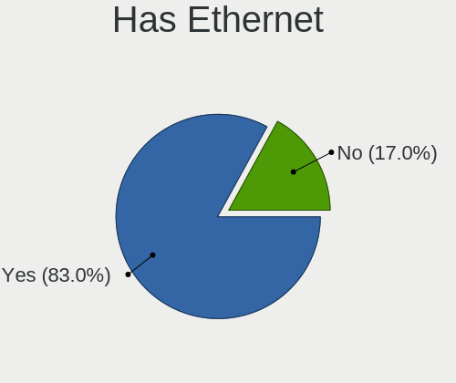
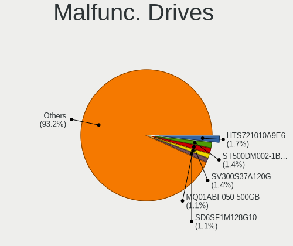
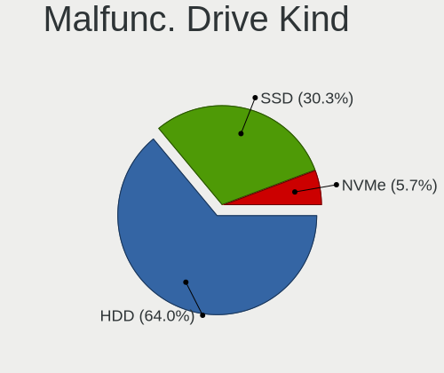
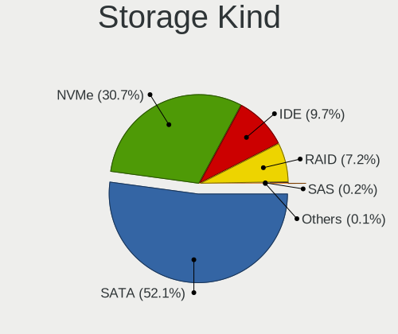
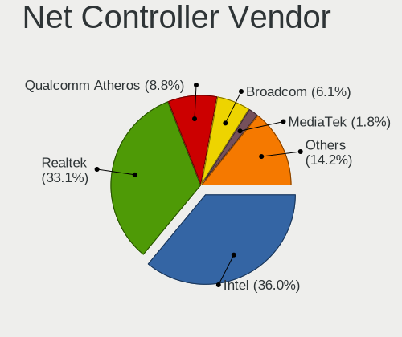
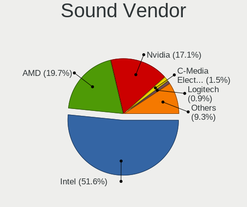

Linux in Netherlands - Tested Hardware & Statistics
---------------------------------------------------

A project to collect tested hardware configurations for Linux in Netherlands.

Anyone can contribute to this report by the [hw-probe](https://github.com/linuxhw/hw-probe) tool:

    sudo -E hw-probe -all -upload

Please contribute! Especially if your hardware is rare.

This is a report for all computer types. See also reports for [desktops](/Location/Netherlands/Desktop/README.md) and [notebooks](/Location/Netherlands/Notebook/README.md).

Contents
--------

* [ Test Cases ](#test-cases)

* [ System ](#system)
  - [ OS                       ](#os)
  - [ OS Family                ](#os-family)
  - [ Kernel                   ](#kernel)
  - [ Kernel Family            ](#kernel-family)
  - [ Kernel Major Ver.        ](#kernel-major-ver)
  - [ Arch                     ](#arch)
  - [ DE                       ](#de)
  - [ Display Server           ](#display-server)
  - [ Display Manager          ](#display-manager)
  - [ OS Lang                  ](#os-lang)
  - [ Boot Mode                ](#boot-mode)
  - [ Filesystem               ](#filesystem)
  - [ Part. scheme             ](#part-scheme)
  - [ Dual Boot with Linux/BSD ](#dual-boot-with-linuxbsd)
  - [ Dual Boot (Win)          ](#dual-boot-win)

* [ Board ](#board)
  - [ Vendor                   ](#vendor)
  - [ Model                    ](#model)
  - [ Model Family             ](#model-family)
  - [ MFG Year                 ](#mfg-year)
  - [ Form Factor              ](#form-factor)
  - [ Secure Boot              ](#secure-boot)
  - [ Coreboot                 ](#coreboot)
  - [ RAM Size                 ](#ram-size)
  - [ RAM Used                 ](#ram-used)
  - [ Total Drives             ](#total-drives)
  - [ Has CD-ROM               ](#has-cd-rom)
  - [ Has Ethernet             ](#has-ethernet)
  - [ Has WiFi                 ](#has-wifi)
  - [ Has Bluetooth            ](#has-bluetooth)

* [ Location ](#location)
  - [ Country                  ](#country)
  - [ City                     ](#city)

* [ Drives ](#drives)
  - [ Drive Vendor             ](#drive-vendor)
  - [ Drive Model              ](#drive-model)
  - [ HDD Vendor               ](#hdd-vendor)
  - [ SSD Vendor               ](#ssd-vendor)
  - [ Drive Kind               ](#drive-kind)
  - [ Drive Connector          ](#drive-connector)
  - [ Drive Size               ](#drive-size)
  - [ Space Total              ](#space-total)
  - [ Space Used               ](#space-used)
  - [ Malfunc. Drives          ](#malfunc-drives)
  - [ Malfunc. Drive Vendor    ](#malfunc-drive-vendor)
  - [ Malfunc. HDD Vendor      ](#malfunc-hdd-vendor)
  - [ Malfunc. Drive Kind      ](#malfunc-drive-kind)
  - [ Failed Drives            ](#failed-drives)
  - [ Failed Drive Vendor      ](#failed-drive-vendor)
  - [ Drive Status             ](#drive-status)

* [ Storage controller ](#storage-controller)
  - [ Storage Vendor           ](#storage-vendor)
  - [ Storage Model            ](#storage-model)
  - [ Storage Kind             ](#storage-kind)

* [ Processor ](#processor)
  - [ CPU Vendor               ](#cpu-vendor)
  - [ CPU Model                ](#cpu-model)
  - [ CPU Model Family         ](#cpu-model-family)
  - [ CPU Cores                ](#cpu-cores)
  - [ CPU Sockets              ](#cpu-sockets)
  - [ CPU Threads              ](#cpu-threads)
  - [ CPU Op-Modes             ](#cpu-op-modes)
  - [ CPU Microcode            ](#cpu-microcode)
  - [ CPU Microarch            ](#cpu-microarch)

* [ Graphics ](#graphics)
  - [ GPU Vendor               ](#gpu-vendor)
  - [ GPU Model                ](#gpu-model)
  - [ GPU Combo                ](#gpu-combo)
  - [ GPU Driver               ](#gpu-driver)
  - [ GPU Memory               ](#gpu-memory)

* [ Monitor ](#monitor)
  - [ Monitor Vendor           ](#monitor-vendor)
  - [ Monitor Model            ](#monitor-model)
  - [ Monitor Resolution       ](#monitor-resolution)
  - [ Monitor Diagonal         ](#monitor-diagonal)
  - [ Monitor Width            ](#monitor-width)
  - [ Aspect Ratio             ](#aspect-ratio)
  - [ Monitor Area             ](#monitor-area)
  - [ Pixel Density            ](#pixel-density)
  - [ Multiple Monitors        ](#multiple-monitors)

* [ Network ](#network)
  - [ Net Controller Vendor    ](#net-controller-vendor)
  - [ Net Controller Model     ](#net-controller-model)
  - [ Wireless Vendor          ](#wireless-vendor)
  - [ Wireless Model           ](#wireless-model)
  - [ Ethernet Vendor          ](#ethernet-vendor)
  - [ Ethernet Model           ](#ethernet-model)
  - [ Net Controller Kind      ](#net-controller-kind)
  - [ Used Controller          ](#used-controller)
  - [ NICs                     ](#nics)
  - [ IPv6                     ](#ipv6)

* [ Bluetooth ](#bluetooth)
  - [ Bluetooth Vendor         ](#bluetooth-vendor)
  - [ Bluetooth Model          ](#bluetooth-model)

* [ Sound ](#sound)
  - [ Sound Vendor             ](#sound-vendor)
  - [ Sound Model              ](#sound-model)

* [ Memory ](#memory)
  - [ Memory Vendor            ](#memory-vendor)
  - [ Memory Model             ](#memory-model)
  - [ Memory Kind              ](#memory-kind)
  - [ Memory Form Factor       ](#memory-form-factor)
  - [ Memory Size              ](#memory-size)
  - [ Memory Speed             ](#memory-speed)

* [ Printers & scanners ](#printers--scanners)
  - [ Printer Vendor           ](#printer-vendor)
  - [ Printer Model            ](#printer-model)
  - [ Scanner Vendor           ](#scanner-vendor)
  - [ Scanner Model            ](#scanner-model)

* [ Camera ](#camera)
  - [ Camera Vendor            ](#camera-vendor)
  - [ Camera Model             ](#camera-model)

* [ Security ](#security)
  - [ Fingerprint Vendor       ](#fingerprint-vendor)
  - [ Fingerprint Model        ](#fingerprint-model)
  - [ Chipcard Vendor          ](#chipcard-vendor)
  - [ Chipcard Model           ](#chipcard-model)

* [ Unsupported ](#unsupported)
  - [ Unsupported Devices      ](#unsupported-devices)
  - [ Unsupported Device Types ](#unsupported-device-types)

Test Cases
----------

Total: 6725

| Vendor        | Model                       | Form-Factor | Probe                                                      | Date         |
|---------------|-----------------------------|-------------|------------------------------------------------------------|--------------|
| Lenovo        | ThinkPad T540p 20BE0060M... | Notebook    | [71296d9e0f](https://linux-hardware.org/?probe=71296d9e0f) | Feb 02, 2024 |
| ASUSTek       | UX331UN                     | Notebook    | [9b0463c9de](https://linux-hardware.org/?probe=9b0463c9de) | Feb 02, 2024 |
| Dell          | Latitude 5290 2-in-1        | Tablet      | [51e59eeeb8](https://linux-hardware.org/?probe=51e59eeeb8) | Feb 02, 2024 |
| Acer          | NC-F5-771G-72XY             | Notebook    | [2f4c6fbadb](https://linux-hardware.org/?probe=2f4c6fbadb) | Feb 02, 2024 |
| ASUSTek       | N53SV                       | Notebook    | [ee79ea1cbb](https://linux-hardware.org/?probe=ee79ea1cbb) | Feb 01, 2024 |
| Dell          | Vostro 3525                 | Notebook    | [495877fada](https://linux-hardware.org/?probe=495877fada) | Feb 01, 2024 |
| ASUSTek       | N53SV                       | Notebook    | [29807f0dfa](https://linux-hardware.org/?probe=29807f0dfa) | Feb 01, 2024 |
| ASUSTek       | GL552VW                     | Notebook    | [1579728415](https://linux-hardware.org/?probe=1579728415) | Feb 01, 2024 |
| Acer          | AOD255                      | Notebook    | [43304c651c](https://linux-hardware.org/?probe=43304c651c) | Feb 01, 2024 |
| Dell          | Latitude 5290 2-in-1        | Tablet      | [cfd409b2af](https://linux-hardware.org/?probe=cfd409b2af) | Jan 31, 2024 |
| Lenovo        | ThinkPad T16 Gen 2 21K7C... | Notebook    | [3e6a5bfa72](https://linux-hardware.org/?probe=3e6a5bfa72) | Jan 31, 2024 |
| Lenovo        | Legion 5 Pro 16IAH7H 82R... | Notebook    | [cbcf46b2fa](https://linux-hardware.org/?probe=cbcf46b2fa) | Jan 31, 2024 |
| Packard Be... | EasyNote LS11SB             | Notebook    | [3dcf56426c](https://linux-hardware.org/?probe=3dcf56426c) | Jan 31, 2024 |
| HP            | EliteBook 8560p             | Notebook    | [5d0eb85b93](https://linux-hardware.org/?probe=5d0eb85b93) | Jan 31, 2024 |
| Intel         | NUC8BEB J72692-309          | Mini pc     | [a2536bd0a5](https://linux-hardware.org/?probe=a2536bd0a5) | Jan 31, 2024 |
| Lenovo        | ThinkPad T430 23491R8       | Notebook    | [65c338c5ed](https://linux-hardware.org/?probe=65c338c5ed) | Jan 31, 2024 |
| Dell          | XPS 15 9570                 | Notebook    | [a8a446cfdd](https://linux-hardware.org/?probe=a8a446cfdd) | Jan 30, 2024 |
| ASUSTek       | X540LA                      | Notebook    | [503b80e997](https://linux-hardware.org/?probe=503b80e997) | Jan 30, 2024 |
| Pegatron      | Benicia                     | Desktop     | [b127dc2bc0](https://linux-hardware.org/?probe=b127dc2bc0) | Jan 29, 2024 |
| Dell          | Latitude E6540              | Notebook    | [a64ea19d4b](https://linux-hardware.org/?probe=a64ea19d4b) | Jan 29, 2024 |
| Lenovo        | IdeaPad 330-17AST 81D7      | Notebook    | [4983e50390](https://linux-hardware.org/?probe=4983e50390) | Jan 29, 2024 |
| Dell          | Latitude E6540              | Notebook    | [adb3309384](https://linux-hardware.org/?probe=adb3309384) | Jan 28, 2024 |
| ASRock        | G31M-S                      | Desktop     | [3030db55a6](https://linux-hardware.org/?probe=3030db55a6) | Jan 28, 2024 |
| Unknown       | Unknown                     | Desktop     | [52ae8cfe76](https://linux-hardware.org/?probe=52ae8cfe76) | Jan 28, 2024 |
| Unknown       | Unknown                     | Desktop     | [1834dd7444](https://linux-hardware.org/?probe=1834dd7444) | Jan 28, 2024 |
| ASRock        | X570 Phantom Gaming 4       | Desktop     | [23980d6bfb](https://linux-hardware.org/?probe=23980d6bfb) | Jan 28, 2024 |
| Unknown       | Unknown                     | Soc         | [58cb0745cc](https://linux-hardware.org/?probe=58cb0745cc) | Jan 28, 2024 |
| Medion        | Akoya P7628                 | Notebook    | [77cd29bced](https://linux-hardware.org/?probe=77cd29bced) | Jan 27, 2024 |
| Medion        | MS-7616                     | Desktop     | [3645021c62](https://linux-hardware.org/?probe=3645021c62) | Jan 27, 2024 |
| Apple         | Mac-942B59F58194171B iMa... | All in one  | [6431000318](https://linux-hardware.org/?probe=6431000318) | Jan 26, 2024 |
| Dell          | Latitude 5440               | Notebook    | [af460e243b](https://linux-hardware.org/?probe=af460e243b) | Jan 26, 2024 |
| ASRock        | H97 Anniversary             | Desktop     | [b33697ceee](https://linux-hardware.org/?probe=b33697ceee) | Jan 26, 2024 |
| Lenovo        | ThinkPad T580 20LAS62M07    | Notebook    | [d55ac7557b](https://linux-hardware.org/?probe=d55ac7557b) | Jan 26, 2024 |
| Notebook      | NS5x_NS7xAU                 | Notebook    | [25b199fd9d](https://linux-hardware.org/?probe=25b199fd9d) | Jan 26, 2024 |
| HP            | 8299                        | Desktop     | [60a7b54af3](https://linux-hardware.org/?probe=60a7b54af3) | Jan 25, 2024 |
| HP            | 8299                        | Desktop     | [7c8a8d7fc1](https://linux-hardware.org/?probe=7c8a8d7fc1) | Jan 25, 2024 |
| Dell          | Latitude E7240              | Notebook    | [d8e5d4a8da](https://linux-hardware.org/?probe=d8e5d4a8da) | Jan 25, 2024 |
| MSI           | B450 GAMING PRO CARBON A... | Desktop     | [af91485fb2](https://linux-hardware.org/?probe=af91485fb2) | Jan 25, 2024 |
| Unknown       | Unknown                     | Desktop     | [a743ba7b8b](https://linux-hardware.org/?probe=a743ba7b8b) | Jan 24, 2024 |
| Gigabyte      | X99-Gaming 5P               | Desktop     | [e306ef8710](https://linux-hardware.org/?probe=e306ef8710) | Jan 24, 2024 |
| HP            | ProBook 4530s               | Notebook    | [db169567f6](https://linux-hardware.org/?probe=db169567f6) | Jan 24, 2024 |
| Dell          | 0Y7WYT A00                  | Desktop     | [4069a89cac](https://linux-hardware.org/?probe=4069a89cac) | Jan 23, 2024 |
| TUXEDO        | Pulse 14 Gen1               | Notebook    | [7cd83ff81e](https://linux-hardware.org/?probe=7cd83ff81e) | Jan 23, 2024 |
| Acer          | Aspire 5680                 | Notebook    | [0c6c1413f7](https://linux-hardware.org/?probe=0c6c1413f7) | Jan 23, 2024 |
| TUXEDO        | Pulse 14 Gen1               | Notebook    | [b8a8ce8fc0](https://linux-hardware.org/?probe=b8a8ce8fc0) | Jan 23, 2024 |
| Dell          | XPS 15 9500                 | Notebook    | [909b4a8f7c](https://linux-hardware.org/?probe=909b4a8f7c) | Jan 23, 2024 |
| HP            | ZBook Studio G5             | Notebook    | [114d79aa75](https://linux-hardware.org/?probe=114d79aa75) | Jan 23, 2024 |
| Lenovo        | G710 20252                  | Notebook    | [2cbd0dd7d8](https://linux-hardware.org/?probe=2cbd0dd7d8) | Jan 23, 2024 |
| Acer          | Aspire A715-74G             | Notebook    | [5692c7ee1e](https://linux-hardware.org/?probe=5692c7ee1e) | Jan 23, 2024 |
| Acer          | Aspire A715-74G             | Notebook    | [c4c4e2b5b1](https://linux-hardware.org/?probe=c4c4e2b5b1) | Jan 23, 2024 |
| Unknown       | Unknown                     | Notebook    | [b35ba11b64](https://linux-hardware.org/?probe=b35ba11b64) | Jan 22, 2024 |
| HP            | Laptop 15-fc0xxx            | Notebook    | [8dacf655a4](https://linux-hardware.org/?probe=8dacf655a4) | Jan 22, 2024 |
| HP            | Laptop 15-fc0xxx            | Notebook    | [c3f3bb78c6](https://linux-hardware.org/?probe=c3f3bb78c6) | Jan 22, 2024 |
| Clevo         | W150ER                      | Notebook    | [ff97b73a0d](https://linux-hardware.org/?probe=ff97b73a0d) | Jan 22, 2024 |
| Clevo         | W150ER                      | Notebook    | [d477c19fae](https://linux-hardware.org/?probe=d477c19fae) | Jan 22, 2024 |
| Clevo         | W150ER                      | Notebook    | [af918f19aa](https://linux-hardware.org/?probe=af918f19aa) | Jan 22, 2024 |
| HP            | ENVY x360 Convertible 13... | Convertible | [23f12deb76](https://linux-hardware.org/?probe=23f12deb76) | Jan 21, 2024 |
| HP            | ENVY x360 Convertible 13... | Convertible | [12bc62b3a4](https://linux-hardware.org/?probe=12bc62b3a4) | Jan 21, 2024 |
| Lenovo        | IdeaPad Gaming 3 15ACH6 ... | Notebook    | [edfd27fb22](https://linux-hardware.org/?probe=edfd27fb22) | Jan 21, 2024 |
| HP            | 212B                        | Desktop     | [cb5e65ba08](https://linux-hardware.org/?probe=cb5e65ba08) | Jan 21, 2024 |
| Acer          | Aspire A715-51G             | Notebook    | [1053d8db44](https://linux-hardware.org/?probe=1053d8db44) | Jan 21, 2024 |
| HP            | 8055                        | Desktop     | [803d8b26db](https://linux-hardware.org/?probe=803d8b26db) | Jan 21, 2024 |
| MSI           | B450 GAMING PRO CARBON A... | Desktop     | [195dbfe0e7](https://linux-hardware.org/?probe=195dbfe0e7) | Jan 20, 2024 |
| Lenovo        | IdeaPad Gaming 3 15ACH6 ... | Notebook    | [d1e6b15e7c](https://linux-hardware.org/?probe=d1e6b15e7c) | Jan 20, 2024 |
| ASUSTek       | H97M-E                      | Desktop     | [d6fe598f33](https://linux-hardware.org/?probe=d6fe598f33) | Jan 20, 2024 |
| Lenovo        | ThinkPad X395 20NLCTO1WW    | Notebook    | [07799fb2f9](https://linux-hardware.org/?probe=07799fb2f9) | Jan 19, 2024 |
| MSI           | B85M-E45                    | Desktop     | [641e17fe01](https://linux-hardware.org/?probe=641e17fe01) | Jan 19, 2024 |
| HP            | ProLiant MicroServer        | Desktop     | [81dd188b0f](https://linux-hardware.org/?probe=81dd188b0f) | Jan 19, 2024 |
| Lenovo        | ThinkPad T14 Gen 1 20UD0... | Notebook    | [9226bd619b](https://linux-hardware.org/?probe=9226bd619b) | Jan 19, 2024 |
| ASUSTek       | PRIME X299-DELUXE II        | Desktop     | [1fff56f3cf](https://linux-hardware.org/?probe=1fff56f3cf) | Jan 19, 2024 |
| MSI           | B85M-E45                    | Desktop     | [32fd96fdd0](https://linux-hardware.org/?probe=32fd96fdd0) | Jan 19, 2024 |
| Dell          | 0D24M8 A00                  | Desktop     | [521b297c38](https://linux-hardware.org/?probe=521b297c38) | Jan 19, 2024 |
| Intel         | HM570                       | Desktop     | [3f05344c2c](https://linux-hardware.org/?probe=3f05344c2c) | Jan 18, 2024 |
| Dell          | Latitude 9420               | Notebook    | [8fe55c7fc3](https://linux-hardware.org/?probe=8fe55c7fc3) | Jan 18, 2024 |
| Acer          | Aspire V3-772               | Notebook    | [6c1d2a4e4d](https://linux-hardware.org/?probe=6c1d2a4e4d) | Jan 18, 2024 |
| ASUSTek       | X550VQ                      | Notebook    | [f20c1955ef](https://linux-hardware.org/?probe=f20c1955ef) | Jan 18, 2024 |
| MSI           | B450 TOMAHAWK               | Desktop     | [9bed697ae6](https://linux-hardware.org/?probe=9bed697ae6) | Jan 18, 2024 |
| Lenovo        | IdeaPad 5 14IIL05 81YH      | Notebook    | [817d6ac197](https://linux-hardware.org/?probe=817d6ac197) | Jan 18, 2024 |
| MSI           | B450 TOMAHAWK               | Desktop     | [d0f45c11a7](https://linux-hardware.org/?probe=d0f45c11a7) | Jan 18, 2024 |
| Dell          | XPS 15 9570                 | Notebook    | [1d01e5da12](https://linux-hardware.org/?probe=1d01e5da12) | Jan 18, 2024 |
| ASUSTek       | P8Z77-V                     | Desktop     | [cc154717f4](https://linux-hardware.org/?probe=cc154717f4) | Jan 18, 2024 |
| ASRock        | B450M Pro4                  | Desktop     | [195a26ad26](https://linux-hardware.org/?probe=195a26ad26) | Jan 17, 2024 |
| Microsoft     | Surface Pro 3               | Tablet      | [daced9894a](https://linux-hardware.org/?probe=daced9894a) | Jan 17, 2024 |
| Packard Be... | IMEDIA S3810                | Desktop     | [616954684d](https://linux-hardware.org/?probe=616954684d) | Jan 17, 2024 |
| UNOWHY        | Y13G012S4EI                 | Notebook    | [4fdd521da4](https://linux-hardware.org/?probe=4fdd521da4) | Jan 17, 2024 |
| ASUSTek       | Zenbook UM3402YAR_UM3402... | Notebook    | [09c8624b31](https://linux-hardware.org/?probe=09c8624b31) | Jan 16, 2024 |
| ASUSTek       | ROG Zephyrus G14 GA402RK... | Notebook    | [a28b135223](https://linux-hardware.org/?probe=a28b135223) | Jan 16, 2024 |
| Intel         | Unknown                     | Notebook    | [dfd975eff3](https://linux-hardware.org/?probe=dfd975eff3) | Jan 15, 2024 |
| ASUSTek       | N551JB                      | Notebook    | [b227f8fa88](https://linux-hardware.org/?probe=b227f8fa88) | Jan 15, 2024 |
| ASUSTek       | N551JB                      | Notebook    | [46cc56760e](https://linux-hardware.org/?probe=46cc56760e) | Jan 15, 2024 |
| ASUSTek       | ASUS EXPERTBOOK B7402FBA... | Convertible | [128765ce37](https://linux-hardware.org/?probe=128765ce37) | Jan 15, 2024 |
| ASUSTek       | ASUS EXPERTBOOK B7402FBA... | Convertible | [3af1df104e](https://linux-hardware.org/?probe=3af1df104e) | Jan 15, 2024 |
| Lenovo        | ThinkPad X270 20K5S1A524    | Notebook    | [2943099ca8](https://linux-hardware.org/?probe=2943099ca8) | Jan 15, 2024 |
| ASUSTek       | M4A87TD/USB3                | Desktop     | [7d6c792c7c](https://linux-hardware.org/?probe=7d6c792c7c) | Jan 14, 2024 |
| ASUSTek       | PRIME N100I-D D4            | Desktop     | [da3a345b8c](https://linux-hardware.org/?probe=da3a345b8c) | Jan 14, 2024 |
| Notebook      | NH50_70_55_58_ED,EDQ        | Notebook    | [12af552024](https://linux-hardware.org/?probe=12af552024) | Jan 14, 2024 |
| Acer          | Aspire GX-781               | Desktop     | [a12a5666f0](https://linux-hardware.org/?probe=a12a5666f0) | Jan 14, 2024 |
| ASUSTek       | UX410UAK                    | Notebook    | [1b0a0718e2](https://linux-hardware.org/?probe=1b0a0718e2) | Jan 14, 2024 |
| HP            | ProBook 430 G8 Notebook ... | Notebook    | [5551053ab1](https://linux-hardware.org/?probe=5551053ab1) | Jan 13, 2024 |
| Intel         | NUC12WSBi3 M36953-304       | Mini pc     | [9b934c4a38](https://linux-hardware.org/?probe=9b934c4a38) | Jan 13, 2024 |
| Lenovo        | Legion Y740-15IRHg 81UH     | Notebook    | [f1b5487574](https://linux-hardware.org/?probe=f1b5487574) | Jan 13, 2024 |
| Gigabyte      | B550M AORUS ELITE           | Desktop     | [e2a832747d](https://linux-hardware.org/?probe=e2a832747d) | Jan 13, 2024 |
| Dell          | Latitude E6440              | Notebook    | [faec13f702](https://linux-hardware.org/?probe=faec13f702) | Jan 13, 2024 |
| Dell          | Latitude 3350               | Notebook    | [cadeab67e5](https://linux-hardware.org/?probe=cadeab67e5) | Jan 12, 2024 |
| ASUSTek       | PRIME B560M-A               | Desktop     | [ee518e7cc7](https://linux-hardware.org/?probe=ee518e7cc7) | Jan 12, 2024 |
| Intel         | NUC12WSBi7 M63355-302       | Mini pc     | [0a521ffd8c](https://linux-hardware.org/?probe=0a521ffd8c) | Jan 12, 2024 |
| Intel         | NUC12WSBi7 M63355-302       | Mini pc     | [9920d0aef9](https://linux-hardware.org/?probe=9920d0aef9) | Jan 12, 2024 |
| Dell          | Latitude E6430              | Notebook    | [d09873629d](https://linux-hardware.org/?probe=d09873629d) | Jan 12, 2024 |
| Dell          | Inspiron 15 7000 Gaming     | Notebook    | [ab72da32d1](https://linux-hardware.org/?probe=ab72da32d1) | Jan 11, 2024 |
| Dell          | Latitude E5510              | Notebook    | [a107ab666c](https://linux-hardware.org/?probe=a107ab666c) | Jan 11, 2024 |
| Gigabyte      | B450M DS3H-CF               | Desktop     | [f5226841b7](https://linux-hardware.org/?probe=f5226841b7) | Jan 11, 2024 |
| MSI           | Z97S SLI Krait Edition      | Desktop     | [24a9b78491](https://linux-hardware.org/?probe=24a9b78491) | Jan 11, 2024 |
| Apple         | MacBookPro5,5               | Notebook    | [38c0ed167d](https://linux-hardware.org/?probe=38c0ed167d) | Jan 11, 2024 |
| Medion        | E4251 MD61435               | Notebook    | [6a9251fa94](https://linux-hardware.org/?probe=6a9251fa94) | Jan 11, 2024 |
| HP            | Laptop 17-cp0xxx            | Notebook    | [49486d60b3](https://linux-hardware.org/?probe=49486d60b3) | Jan 10, 2024 |
| Dell          | Latitude 3120               | Convertible | [e381cd8485](https://linux-hardware.org/?probe=e381cd8485) | Jan 10, 2024 |
| Pegatron      | NARRA3                      | Desktop     | [08c60d9c7a](https://linux-hardware.org/?probe=08c60d9c7a) | Jan 10, 2024 |
| HP            | ZBook Firefly 14 inch G1... | Notebook    | [6bc95e50e2](https://linux-hardware.org/?probe=6bc95e50e2) | Jan 10, 2024 |
| Medion        | MS-7616                     | Desktop     | [c8a2c8be49](https://linux-hardware.org/?probe=c8a2c8be49) | Jan 10, 2024 |
| Valve         | Jupiter                     | Notebook    | [941126dfcc](https://linux-hardware.org/?probe=941126dfcc) | Jan 10, 2024 |
| HP            | ProBook 450 G1              | Notebook    | [028d205023](https://linux-hardware.org/?probe=028d205023) | Jan 09, 2024 |
| HP            | Compaq 6710b (GB887ET#AB... | Notebook    | [2aaeccac56](https://linux-hardware.org/?probe=2aaeccac56) | Jan 08, 2024 |
| Gigabyte      | B550M AORUS ELITE           | Desktop     | [c5b2a8a90a](https://linux-hardware.org/?probe=c5b2a8a90a) | Jan 08, 2024 |
| Dell          | XPS 9315                    | Notebook    | [af18bb67fd](https://linux-hardware.org/?probe=af18bb67fd) | Jan 08, 2024 |
| ASUSTek       | ROG STRIX B550-A GAMING     | Desktop     | [74497839e7](https://linux-hardware.org/?probe=74497839e7) | Jan 07, 2024 |
| HUAWEI        | WRT-WX9                     | Notebook    | [33092c4e45](https://linux-hardware.org/?probe=33092c4e45) | Jan 07, 2024 |
| HP            | Spectre x360 2-in-1 Lapt... | Convertible | [083aded553](https://linux-hardware.org/?probe=083aded553) | Jan 07, 2024 |
| HP            | Spectre x360 2-in-1 Lapt... | Convertible | [65cd40e96f](https://linux-hardware.org/?probe=65cd40e96f) | Jan 07, 2024 |
| Google        | Zako                        | Desktop     | [1daf09e8e8](https://linux-hardware.org/?probe=1daf09e8e8) | Jan 06, 2024 |
| HP            | EliteBook 8560p             | Notebook    | [01d2d230da](https://linux-hardware.org/?probe=01d2d230da) | Jan 06, 2024 |
| HP            | 8055                        | Desktop     | [d6ed47cf06](https://linux-hardware.org/?probe=d6ed47cf06) | Jan 06, 2024 |
| Apple         | Mac-FFE5EF870D7BA81A iMa... | All in one  | [fc6839b76a](https://linux-hardware.org/?probe=fc6839b76a) | Jan 06, 2024 |
| Apple         | MacBookPro6,2               | Notebook    | [aefa04bfd2](https://linux-hardware.org/?probe=aefa04bfd2) | Jan 06, 2024 |
| OEM           | Unknown                     | Notebook    | [de6b4bdba5](https://linux-hardware.org/?probe=de6b4bdba5) | Jan 06, 2024 |
| Apple         | MacBook4,1                  | Notebook    | [6d15625c9b](https://linux-hardware.org/?probe=6d15625c9b) | Jan 05, 2024 |
| HUAWEI        | WRT-WX9                     | Notebook    | [1c7bfceeec](https://linux-hardware.org/?probe=1c7bfceeec) | Jan 04, 2024 |
| Apple         | MacBookAir7,1               | Notebook    | [5596e9e3a7](https://linux-hardware.org/?probe=5596e9e3a7) | Jan 04, 2024 |
| Valve         | Jupiter                     | Notebook    | [9d4ea07ea6](https://linux-hardware.org/?probe=9d4ea07ea6) | Jan 03, 2024 |
| Apple         | MacBookPro5,5               | Notebook    | [76f1cdbedb](https://linux-hardware.org/?probe=76f1cdbedb) | Jan 03, 2024 |
| Lenovo        | ThinkBook 13s-IWL 20R9      | Notebook    | [cdec50a425](https://linux-hardware.org/?probe=cdec50a425) | Jan 03, 2024 |
| Gigabyte      | X670 GAMING X AX V2         | Desktop     | [e4a3d2463f](https://linux-hardware.org/?probe=e4a3d2463f) | Jan 03, 2024 |
| TUXEDO        | Pulse 15 Gen1               | Notebook    | [84278ca428](https://linux-hardware.org/?probe=84278ca428) | Jan 02, 2024 |
| ASUSTek       | M4A87TD/USB3                | Desktop     | [8c2ae70cdd](https://linux-hardware.org/?probe=8c2ae70cdd) | Jan 02, 2024 |
| Gigabyte      | Z590 UD AC                  | Desktop     | [0db9ec67ac](https://linux-hardware.org/?probe=0db9ec67ac) | Jan 02, 2024 |
| Valve         | Jupiter                     | Notebook    | [95183ba54e](https://linux-hardware.org/?probe=95183ba54e) | Jan 01, 2024 |
| ASUSTek       | TUF Gaming X670E-PLUS WI... | Desktop     | [c6c9c3c74e](https://linux-hardware.org/?probe=c6c9c3c74e) | Jan 01, 2024 |
| HP            | Pavilion Notebook           | Notebook    | [a7ff16d496](https://linux-hardware.org/?probe=a7ff16d496) | Jan 01, 2024 |
| Microsoft     | Surface Pro 7+              | Tablet      | [b4c9aa37e6](https://linux-hardware.org/?probe=b4c9aa37e6) | Dec 31, 2023 |
| Lenovo        | 312D SDK0J40697 WIN 3305... | Mini pc     | [53e87c1e24](https://linux-hardware.org/?probe=53e87c1e24) | Dec 31, 2023 |
| Dell          | Latitude E4300              | Notebook    | [528165bb06](https://linux-hardware.org/?probe=528165bb06) | Dec 31, 2023 |
| ASUSTek       | PN50                        | Mini pc     | [bf96c5a66e](https://linux-hardware.org/?probe=bf96c5a66e) | Dec 30, 2023 |
| ASUSTek       | PN50                        | Mini pc     | [458091606d](https://linux-hardware.org/?probe=458091606d) | Dec 30, 2023 |
| Seeed Stud... | ODYSSEY-X86J41X5 SD-BS-C... | Desktop     | [90b5ba3d1e](https://linux-hardware.org/?probe=90b5ba3d1e) | Dec 30, 2023 |
| Dell          | Latitude E7450              | Notebook    | [dd5f4a17c4](https://linux-hardware.org/?probe=dd5f4a17c4) | Dec 30, 2023 |
| Fujitsu       | D3222-A1 S26361-D3222-A1    | Desktop     | [7e628cb2ca](https://linux-hardware.org/?probe=7e628cb2ca) | Dec 30, 2023 |
| Dell          | Latitude E6440              | Notebook    | [8c8ec73113](https://linux-hardware.org/?probe=8c8ec73113) | Dec 30, 2023 |
| Lenovo        | ThinkPad P15v Gen 1 20TR... | Notebook    | [017090bd57](https://linux-hardware.org/?probe=017090bd57) | Dec 30, 2023 |
| Dell          | Latitude E7450              | Notebook    | [0d3dc05a2d](https://linux-hardware.org/?probe=0d3dc05a2d) | Dec 29, 2023 |
| Gigabyte      | X670 GAMING X AX V2         | Desktop     | [fb8e3461de](https://linux-hardware.org/?probe=fb8e3461de) | Dec 29, 2023 |
| Lenovo        | ThinkBook 13s-IWL 20R9      | Notebook    | [53fc03e451](https://linux-hardware.org/?probe=53fc03e451) | Dec 29, 2023 |
| ASUSTek       | M4A87TD/USB3                | Desktop     | [62939d6430](https://linux-hardware.org/?probe=62939d6430) | Dec 29, 2023 |
| ASRock        | B85M Pro3                   | Desktop     | [f61d357d7f](https://linux-hardware.org/?probe=f61d357d7f) | Dec 29, 2023 |
| ASUSTek       | ROG STRIX Z790-F GAMING ... | Desktop     | [4f4c0766c2](https://linux-hardware.org/?probe=4f4c0766c2) | Dec 28, 2023 |
| ASUSTek       | K75VM                       | Notebook    | [4f1fddffba](https://linux-hardware.org/?probe=4f1fddffba) | Dec 27, 2023 |
| ASUSTek       | VivoBook_ASUSLaptop X160... | Notebook    | [242659bbee](https://linux-hardware.org/?probe=242659bbee) | Dec 27, 2023 |
| Lenovo        | ThinkBook 13s-IWL 20R9      | Notebook    | [eaa68fe0f5](https://linux-hardware.org/?probe=eaa68fe0f5) | Dec 27, 2023 |
| Acer          | Aspire 5736Z                | Notebook    | [36f131247e](https://linux-hardware.org/?probe=36f131247e) | Dec 27, 2023 |
| Medion        | Iron238G                    | All in one  | [702f3f3bc5](https://linux-hardware.org/?probe=702f3f3bc5) | Dec 26, 2023 |
| Medion        | P6613                       | Notebook    | [1f30069d6d](https://linux-hardware.org/?probe=1f30069d6d) | Dec 26, 2023 |
| Pegatron      | EVANS                       | Desktop     | [657b94df2b](https://linux-hardware.org/?probe=657b94df2b) | Dec 26, 2023 |
| ASUSTek       | PRIME X370-PRO              | Desktop     | [f8483f02ab](https://linux-hardware.org/?probe=f8483f02ab) | Dec 26, 2023 |
| Dell          | XPS 13 9380                 | Notebook    | [541f2d959f](https://linux-hardware.org/?probe=541f2d959f) | Dec 26, 2023 |
| ASUSTek       | M4A87TD/USB3                | Desktop     | [ac88b7e1f2](https://linux-hardware.org/?probe=ac88b7e1f2) | Dec 26, 2023 |
| HP            | 2ADE                        | Desktop     | [294857f38f](https://linux-hardware.org/?probe=294857f38f) | Dec 25, 2023 |
| Lenovo        | ThinkPad T460p 20FWCTO1W... | Notebook    | [00e7af074b](https://linux-hardware.org/?probe=00e7af074b) | Dec 25, 2023 |
| Dell          | Latitude E6230              | Notebook    | [618343f74c](https://linux-hardware.org/?probe=618343f74c) | Dec 25, 2023 |
| Lenovo        | Legion 5 Pro 16ACH6H 82J... | Notebook    | [23f36cddd3](https://linux-hardware.org/?probe=23f36cddd3) | Dec 24, 2023 |
| Lenovo        | Yoga 2 Pro 20266            | Notebook    | [e6d150acea](https://linux-hardware.org/?probe=e6d150acea) | Dec 24, 2023 |
| HP            | 0B4Ch D                     | Desktop     | [2f8f606e9f](https://linux-hardware.org/?probe=2f8f606e9f) | Dec 24, 2023 |
| HP            | 0B4Ch D                     | Desktop     | [6ee70cb266](https://linux-hardware.org/?probe=6ee70cb266) | Dec 24, 2023 |
| Lenovo        | IdeaPad Pro 5 14APH8 83A... | Notebook    | [39e33e4510](https://linux-hardware.org/?probe=39e33e4510) | Dec 24, 2023 |
| Dell          | Latitude E7450              | Notebook    | [6758499db8](https://linux-hardware.org/?probe=6758499db8) | Dec 24, 2023 |
| Dell          | Latitude E7450              | Notebook    | [d3eb47d0a5](https://linux-hardware.org/?probe=d3eb47d0a5) | Dec 24, 2023 |
| ASUSTek       | ROG STRIX B450-F GAMING     | Desktop     | [a84743b247](https://linux-hardware.org/?probe=a84743b247) | Dec 23, 2023 |
| Raspberry ... | Raspberry Pi Zero W Rev ... | Soc         | [861b433642](https://linux-hardware.org/?probe=861b433642) | Dec 23, 2023 |
| Lenovo        | Legion Slim 7 16APH8 82Y... | Notebook    | [9a5d0ca94a](https://linux-hardware.org/?probe=9a5d0ca94a) | Dec 23, 2023 |
| ASUSTek       | Maximus VIII RANGER         | Desktop     | [3fa9465c1a](https://linux-hardware.org/?probe=3fa9465c1a) | Dec 22, 2023 |
| Dell          | Latitude 5540               | Notebook    | [3716993a6e](https://linux-hardware.org/?probe=3716993a6e) | Dec 22, 2023 |
| Entroware     | Hybris                      | Notebook    | [870d0c5323](https://linux-hardware.org/?probe=870d0c5323) | Dec 22, 2023 |
| Lenovo        | ThinkBook 13s-IWL 20R9      | Notebook    | [e864a3cd22](https://linux-hardware.org/?probe=e864a3cd22) | Dec 21, 2023 |
| Fujitsu       | LIFEBOOK AH530              | Notebook    | [cb7f868a54](https://linux-hardware.org/?probe=cb7f868a54) | Dec 21, 2023 |
| ASUSTek       | X411UA                      | Notebook    | [a4a14550e8](https://linux-hardware.org/?probe=a4a14550e8) | Dec 21, 2023 |
| Lenovo        | ThinkPad X201 3680WXT       | Notebook    | [a6e0d33afd](https://linux-hardware.org/?probe=a6e0d33afd) | Dec 21, 2023 |
| ASUSTek       | ROG STRIX Z390-F GAMING     | Desktop     | [761fb59fa5](https://linux-hardware.org/?probe=761fb59fa5) | Dec 20, 2023 |
| Dell          | Latitude E5510              | Notebook    | [e1edf60996](https://linux-hardware.org/?probe=e1edf60996) | Dec 20, 2023 |
| HP            | 18E7                        | Desktop     | [fad52327eb](https://linux-hardware.org/?probe=fad52327eb) | Dec 20, 2023 |
| Framework     | Laptop                      | Notebook    | [2aab7ea892](https://linux-hardware.org/?probe=2aab7ea892) | Dec 19, 2023 |
| Medion        | E15415                      | Notebook    | [03ee2b7f5e](https://linux-hardware.org/?probe=03ee2b7f5e) | Dec 19, 2023 |
| Lenovo        | 330B SDK0T76530 WIN 3556... | Mini pc     | [97d6dd408b](https://linux-hardware.org/?probe=97d6dd408b) | Dec 19, 2023 |
| HP            | EliteBook x360 1030 G2      | Convertible | [d41e584b48](https://linux-hardware.org/?probe=d41e584b48) | Dec 19, 2023 |
| ASUSTek       | ROG STRIX B560-E GAMING ... | Desktop     | [fd9a0ec0c4](https://linux-hardware.org/?probe=fd9a0ec0c4) | Dec 19, 2023 |
| Framework     | Laptop 13 (AMD Ryzen 704... | Notebook    | [923f390d62](https://linux-hardware.org/?probe=923f390d62) | Dec 18, 2023 |
| Lenovo        | MAHOBAY No DPK              | All in one  | [e1acdde6d8](https://linux-hardware.org/?probe=e1acdde6d8) | Dec 18, 2023 |
| MSI           | 2A9C                        | Desktop     | [342d099a7f](https://linux-hardware.org/?probe=342d099a7f) | Dec 17, 2023 |
| MSI           | Prestige 14Evo A11M         | Notebook    | [50ef2b12e3](https://linux-hardware.org/?probe=50ef2b12e3) | Dec 17, 2023 |
| Lenovo        | ThinkPad A475 20KMS08300    | Notebook    | [b652245cca](https://linux-hardware.org/?probe=b652245cca) | Dec 17, 2023 |
| Intel         | NUC12WSBi5 M46425-303       | Mini pc     | [8297f20357](https://linux-hardware.org/?probe=8297f20357) | Dec 16, 2023 |
| ASUSTek       | VivoBook_ASUSLaptop X760... | Notebook    | [a7be5e66cd](https://linux-hardware.org/?probe=a7be5e66cd) | Dec 15, 2023 |
| MSI           | X470 GAMING PLUS MAX        | Desktop     | [20a11e4c01](https://linux-hardware.org/?probe=20a11e4c01) | Dec 15, 2023 |
| Google        | Guado                       | Desktop     | [e981ac3399](https://linux-hardware.org/?probe=e981ac3399) | Dec 15, 2023 |
| Medion        | E4251 MD61435               | Notebook    | [7d20d738b1](https://linux-hardware.org/?probe=7d20d738b1) | Dec 14, 2023 |
| ASUSTek       | Maximus VIII HERO           | Desktop     | [b65075cb67](https://linux-hardware.org/?probe=b65075cb67) | Dec 14, 2023 |
| ASUSTek       | M4A78T-E                    | Desktop     | [f34b148b2e](https://linux-hardware.org/?probe=f34b148b2e) | Dec 14, 2023 |
| Google        | Guado                       | Desktop     | [50ceaa2515](https://linux-hardware.org/?probe=50ceaa2515) | Dec 14, 2023 |
| HP            | Laptop 17-cp0xxx            | Notebook    | [7d584c6a4d](https://linux-hardware.org/?probe=7d584c6a4d) | Dec 13, 2023 |
| ASUSTek       | PRIME H570M-PLUS            | Desktop     | [06f64404ec](https://linux-hardware.org/?probe=06f64404ec) | Dec 12, 2023 |
| Huanan        | X99-F8 V2.0                 | Desktop     | [7ac710e7da](https://linux-hardware.org/?probe=7ac710e7da) | Dec 11, 2023 |
| HP            | ProBook 450 G8 Notebook ... | Notebook    | [9a6a483608](https://linux-hardware.org/?probe=9a6a483608) | Dec 11, 2023 |
| Shuttle       | SH55J V10                   | Desktop     | [d7ca143ac0](https://linux-hardware.org/?probe=d7ca143ac0) | Dec 11, 2023 |
| HP            | EliteBook 840 G7 Noteboo... | Notebook    | [860c083099](https://linux-hardware.org/?probe=860c083099) | Dec 11, 2023 |
| Gigabyte      | B550 AORUS ELITE V2         | Desktop     | [508ad0be0e](https://linux-hardware.org/?probe=508ad0be0e) | Dec 10, 2023 |
| HP            | Pavilion Notebook           | Notebook    | [0e463b364d](https://linux-hardware.org/?probe=0e463b364d) | Dec 10, 2023 |
| Lenovo        | ThinkPad T470s W10DG 20J... | Notebook    | [37214745c0](https://linux-hardware.org/?probe=37214745c0) | Dec 10, 2023 |
| Fujitsu       | LIFEBOOK AH530              | Notebook    | [c0797a823b](https://linux-hardware.org/?probe=c0797a823b) | Dec 10, 2023 |
| Gigabyte      | A520M S2H                   | Desktop     | [27101e8e16](https://linux-hardware.org/?probe=27101e8e16) | Dec 10, 2023 |
| Apple         | MacBookPro11,2              | Notebook    | [817f57a6bf](https://linux-hardware.org/?probe=817f57a6bf) | Dec 10, 2023 |
| ASUSTek       | PRIME A320M-C R2.0          | Desktop     | [a8685fb67b](https://linux-hardware.org/?probe=a8685fb67b) | Dec 10, 2023 |
| Dell          | Latitude E7240              | Notebook    | [93f24d2411](https://linux-hardware.org/?probe=93f24d2411) | Dec 09, 2023 |
| Gigabyte      | B550 AORUS ELITE V2         | Desktop     | [e468ba51f6](https://linux-hardware.org/?probe=e468ba51f6) | Dec 09, 2023 |
| MSI           | Z97S SLI Krait Edition      | Desktop     | [2b1117b052](https://linux-hardware.org/?probe=2b1117b052) | Dec 09, 2023 |
| Dell          | Latitude 7400               | Notebook    | [71ba2c1398](https://linux-hardware.org/?probe=71ba2c1398) | Dec 08, 2023 |
| Medion        | E11201                      | Notebook    | [8e7e346f7f](https://linux-hardware.org/?probe=8e7e346f7f) | Dec 08, 2023 |
| HP            | EliteBook 840 G6            | Notebook    | [2d85c45e57](https://linux-hardware.org/?probe=2d85c45e57) | Dec 08, 2023 |
| HP            | EliteBook 840 G6            | Notebook    | [01177d538f](https://linux-hardware.org/?probe=01177d538f) | Dec 08, 2023 |
| Fujitsu       | LIFEBOOK E744               | Notebook    | [2b97f06319](https://linux-hardware.org/?probe=2b97f06319) | Dec 07, 2023 |
| HP            | EliteBook 840 G6            | Notebook    | [6e7af6d32b](https://linux-hardware.org/?probe=6e7af6d32b) | Dec 07, 2023 |
| HP            | 3398                        | Desktop     | [7046f0cd90](https://linux-hardware.org/?probe=7046f0cd90) | Dec 07, 2023 |
| ASUSTek       | K52Jc                       | Notebook    | [54e52154d1](https://linux-hardware.org/?probe=54e52154d1) | Dec 07, 2023 |
| HP            | Pavilion 17                 | Notebook    | [93ecaf88d6](https://linux-hardware.org/?probe=93ecaf88d6) | Dec 06, 2023 |
| Lenovo        | ThinkBook 14-IIL 20SL       | Notebook    | [36fe4a1de9](https://linux-hardware.org/?probe=36fe4a1de9) | Dec 06, 2023 |
| ASRock        | B450M Pro4 R2.0             | Desktop     | [38c8286c83](https://linux-hardware.org/?probe=38c8286c83) | Dec 06, 2023 |
| Lenovo        | IdeaPad 5 Pro 16ACH6 82L... | Notebook    | [52ee43b1e5](https://linux-hardware.org/?probe=52ee43b1e5) | Dec 06, 2023 |
| HP            | Pavilion Notebook           | Notebook    | [e36be09527](https://linux-hardware.org/?probe=e36be09527) | Dec 06, 2023 |
| ASUSTek       | X540SAA                     | Notebook    | [86295630b8](https://linux-hardware.org/?probe=86295630b8) | Dec 06, 2023 |
| Apple         | MacBookAir7,2               | Notebook    | [1748ab2263](https://linux-hardware.org/?probe=1748ab2263) | Dec 05, 2023 |
| HP            | 339A                        | Desktop     | [53b6aa6808](https://linux-hardware.org/?probe=53b6aa6808) | Dec 05, 2023 |
| Acer          | Aspire A315-510P            | Notebook    | [3937003fd0](https://linux-hardware.org/?probe=3937003fd0) | Dec 05, 2023 |
| Lenovo        | IdeaPad 5 Pro 16ACH6 82L... | Notebook    | [c64bc46e3a](https://linux-hardware.org/?probe=c64bc46e3a) | Dec 05, 2023 |
| HP            | Compaq 6730b (NA373UC#AB... | Notebook    | [7e0d2ebaaf](https://linux-hardware.org/?probe=7e0d2ebaaf) | Dec 04, 2023 |
| Gigabyte      | B650M AORUS ELITE AX        | Desktop     | [1c38809a61](https://linux-hardware.org/?probe=1c38809a61) | Dec 04, 2023 |
| Dell          | Precision 5680              | Notebook    | [6982d86e8c](https://linux-hardware.org/?probe=6982d86e8c) | Dec 03, 2023 |
| MSI           | 870A-G54                    | Desktop     | [46f9552be9](https://linux-hardware.org/?probe=46f9552be9) | Dec 03, 2023 |
| ASUSTek       | VivoBook_ASUSLaptop X513... | Notebook    | [58a0ae4fcc](https://linux-hardware.org/?probe=58a0ae4fcc) | Dec 02, 2023 |
| HP            | ENVY x360 Convertible 13... | Convertible | [aab717794b](https://linux-hardware.org/?probe=aab717794b) | Dec 01, 2023 |
| ASUSTek       | ProArt X670E-CREATOR WIF... | Desktop     | [8da975749c](https://linux-hardware.org/?probe=8da975749c) | Nov 30, 2023 |
| ASUSTek       | N71Jq                       | Notebook    | [f13e32bb82](https://linux-hardware.org/?probe=f13e32bb82) | Nov 29, 2023 |
| Acer          | TravelMate P614-51-G2       | Notebook    | [17c4552f25](https://linux-hardware.org/?probe=17c4552f25) | Nov 29, 2023 |
| Toshiba       | Satellite L70-A             | Notebook    | [3ac84816d0](https://linux-hardware.org/?probe=3ac84816d0) | Nov 28, 2023 |
| Apple         | Mac-F22C86C8                | Mini pc     | [d185d53d8a](https://linux-hardware.org/?probe=d185d53d8a) | Nov 27, 2023 |
| Dell          | Latitude 13                 | Notebook    | [bf50df43fa](https://linux-hardware.org/?probe=bf50df43fa) | Nov 27, 2023 |
| HP            | ZBook 15 G3                 | Notebook    | [03586846aa](https://linux-hardware.org/?probe=03586846aa) | Nov 27, 2023 |
| HP            | 83EE                        | Desktop     | [4a9e67adc6](https://linux-hardware.org/?probe=4a9e67adc6) | Nov 27, 2023 |
| SLIMBOOK      | PROX-AMD5                   | Notebook    | [be532e0503](https://linux-hardware.org/?probe=be532e0503) | Nov 27, 2023 |
| ASUSTek       | TUF Gaming X570-PLUS        | Desktop     | [f6d20427d3](https://linux-hardware.org/?probe=f6d20427d3) | Nov 26, 2023 |
| Lenovo        | G50-45 80E3                 | Notebook    | [6f475bfe64](https://linux-hardware.org/?probe=6f475bfe64) | Nov 26, 2023 |
| Samsung       | R520/R522/R620              | Notebook    | [36cde2f22a](https://linux-hardware.org/?probe=36cde2f22a) | Nov 25, 2023 |
| Dell          | Latitude 7490               | Notebook    | [a9d03c8349](https://linux-hardware.org/?probe=a9d03c8349) | Nov 25, 2023 |
| MSI           | MAG B650 TOMAHAWK WIFI      | Desktop     | [a44be8cd81](https://linux-hardware.org/?probe=a44be8cd81) | Nov 25, 2023 |
| MSI           | Z87-S02                     | Desktop     | [2d40c55867](https://linux-hardware.org/?probe=2d40c55867) | Nov 25, 2023 |
| Dell          | Latitude E5540              | Notebook    | [33e3a21810](https://linux-hardware.org/?probe=33e3a21810) | Nov 25, 2023 |
| Apple         | Mac-FFE5EF870D7BA81A iMa... | All in one  | [862134fc6e](https://linux-hardware.org/?probe=862134fc6e) | Nov 24, 2023 |
| Lenovo        | Z710 20250                  | Notebook    | [c9522c065e](https://linux-hardware.org/?probe=c9522c065e) | Nov 24, 2023 |
| MSI           | A320M PRO-VD/S              | Desktop     | [79b6cf831c](https://linux-hardware.org/?probe=79b6cf831c) | Nov 24, 2023 |
| Toshiba       | Satellite Pro C70-B         | Notebook    | [97f5f12369](https://linux-hardware.org/?probe=97f5f12369) | Nov 24, 2023 |
| Dell          | Latitude E5450              | Notebook    | [fad9a32575](https://linux-hardware.org/?probe=fad9a32575) | Nov 23, 2023 |
| HP            | 1998                        | Desktop     | [260f73efb3](https://linux-hardware.org/?probe=260f73efb3) | Nov 22, 2023 |
| ASUSTek       | ROG Flow X13 GV301QE_GV3... | Notebook    | [ce955eaeb4](https://linux-hardware.org/?probe=ce955eaeb4) | Nov 22, 2023 |
| ASUSTek       | ROG Flow X13 GV301QE_GV3... | Notebook    | [194465c3c5](https://linux-hardware.org/?probe=194465c3c5) | Nov 22, 2023 |
| HP            | 1998                        | Desktop     | [cc59ee230b](https://linux-hardware.org/?probe=cc59ee230b) | Nov 22, 2023 |
| Dell          | Latitude 3580               | Notebook    | [c5c5d11d39](https://linux-hardware.org/?probe=c5c5d11d39) | Nov 22, 2023 |
| Sony          | VPCF23P1E                   | Notebook    | [0bfcf70f1a](https://linux-hardware.org/?probe=0bfcf70f1a) | Nov 21, 2023 |
| HP            | EliteBook 725 G2            | Notebook    | [b6cfe558cb](https://linux-hardware.org/?probe=b6cfe558cb) | Nov 21, 2023 |
| Foxconn       | 2ABF                        | Desktop     | [c05c0dccd3](https://linux-hardware.org/?probe=c05c0dccd3) | Nov 21, 2023 |
| Foxconn       | 2ABF                        | Desktop     | [043a7040bc](https://linux-hardware.org/?probe=043a7040bc) | Nov 21, 2023 |
| ASUSTek       | VivoBook_ASUSLaptop M150... | Notebook    | [243ff5e0c9](https://linux-hardware.org/?probe=243ff5e0c9) | Nov 21, 2023 |
| HP            | ProBook 6560b               | Notebook    | [84d3b269c8](https://linux-hardware.org/?probe=84d3b269c8) | Nov 21, 2023 |
| Rockchip      | Orange Pi 5                 | Soc         | [09b6107952](https://linux-hardware.org/?probe=09b6107952) | Nov 20, 2023 |
| Toshiba       | Satellite Pro C70-B         | Notebook    | [da5735e87b](https://linux-hardware.org/?probe=da5735e87b) | Nov 20, 2023 |
| HP            | ENVY x360 Convertible 13... | Convertible | [6df3bded78](https://linux-hardware.org/?probe=6df3bded78) | Nov 20, 2023 |
| BTO           | 17X1183                     | Notebook    | [6cd57738ff](https://linux-hardware.org/?probe=6cd57738ff) | Nov 20, 2023 |
| Apple         | MacBookPro11,2              | Notebook    | [b4c20e35e9](https://linux-hardware.org/?probe=b4c20e35e9) | Nov 19, 2023 |
| Apple         | MacBookPro11,2              | Notebook    | [050c215616](https://linux-hardware.org/?probe=050c215616) | Nov 19, 2023 |
| Lenovo        | IdeaPad 330S-14IKB U 81F... | Notebook    | [0b06f82d9d](https://linux-hardware.org/?probe=0b06f82d9d) | Nov 19, 2023 |
| Lenovo        | G510 20238                  | Notebook    | [2567713f24](https://linux-hardware.org/?probe=2567713f24) | Nov 19, 2023 |
| ASUSTek       | M4A87TD/USB3                | Desktop     | [1c63aea539](https://linux-hardware.org/?probe=1c63aea539) | Nov 19, 2023 |
| Lenovo        | ThinkPad X1 Carbon Gen 8... | Notebook    | [deea1f8184](https://linux-hardware.org/?probe=deea1f8184) | Nov 19, 2023 |
| Packard Be... | ENLE11BZ                    | Notebook    | [905ad855b3](https://linux-hardware.org/?probe=905ad855b3) | Nov 19, 2023 |
| ASRock        | B450 Pro4                   | Desktop     | [cfc45028e8](https://linux-hardware.org/?probe=cfc45028e8) | Nov 19, 2023 |
| HP            | 8754                        | Mini pc     | [869f3e6995](https://linux-hardware.org/?probe=869f3e6995) | Nov 18, 2023 |
| Apple         | Mac-942B5BF58194151B        | All in one  | [5a27242e70](https://linux-hardware.org/?probe=5a27242e70) | Nov 18, 2023 |
| ASUSTek       | TUF Gaming X570-PLUS        | Desktop     | [7ed36f1817](https://linux-hardware.org/?probe=7ed36f1817) | Nov 18, 2023 |
| Apple         | MacBookAir7,2               | Notebook    | [186bca6f10](https://linux-hardware.org/?probe=186bca6f10) | Nov 18, 2023 |
| ASUSTek       | TUF Gaming X570-PLUS        | Desktop     | [f2070cd827](https://linux-hardware.org/?probe=f2070cd827) | Nov 18, 2023 |
| Dell          | Latitude 3189               | Notebook    | [97c8d8041c](https://linux-hardware.org/?probe=97c8d8041c) | Nov 18, 2023 |
| Apple         | MacBookPro14,3              | Notebook    | [8f5057710c](https://linux-hardware.org/?probe=8f5057710c) | Nov 18, 2023 |
| Framework     | Laptop 13 (AMD Ryzen 704... | Notebook    | [2be4a499cb](https://linux-hardware.org/?probe=2be4a499cb) | Nov 18, 2023 |
| HP            | ProBook 650 G1              | Notebook    | [d61fe67d3f](https://linux-hardware.org/?probe=d61fe67d3f) | Nov 18, 2023 |
| Dell          | Precision 5480              | Notebook    | [ee10103325](https://linux-hardware.org/?probe=ee10103325) | Nov 18, 2023 |
| Medion        | E4251 MD61435               | Notebook    | [01ea5c9a87](https://linux-hardware.org/?probe=01ea5c9a87) | Nov 17, 2023 |
| HP            | ProBook 650 G1              | Notebook    | [8cba43dfd6](https://linux-hardware.org/?probe=8cba43dfd6) | Nov 17, 2023 |
| HP            | Pavilion Laptop 14-ce0xx... | Notebook    | [644a0b97d3](https://linux-hardware.org/?probe=644a0b97d3) | Nov 16, 2023 |
| HP            | 83E8                        | Desktop     | [393ca40cd9](https://linux-hardware.org/?probe=393ca40cd9) | Nov 16, 2023 |
| HP            | EliteBook 840 14 inch G1... | Notebook    | [fd50b727cb](https://linux-hardware.org/?probe=fd50b727cb) | Nov 16, 2023 |
| Lenovo        | G50-70 20351                | Notebook    | [7f136c3e39](https://linux-hardware.org/?probe=7f136c3e39) | Nov 16, 2023 |
| Dell          | XPS 9320                    | Notebook    | [f0435ea4b7](https://linux-hardware.org/?probe=f0435ea4b7) | Nov 15, 2023 |
| HP            | EliteBook 830 G5            | Notebook    | [b87f339bd3](https://linux-hardware.org/?probe=b87f339bd3) | Nov 15, 2023 |
| ASRock        | B550 Phantom Gaming 4/ac    | Desktop     | [37ee3fb832](https://linux-hardware.org/?probe=37ee3fb832) | Nov 15, 2023 |
| ASRock        | B550 Phantom Gaming 4/ac    | Desktop     | [28e8fe53e2](https://linux-hardware.org/?probe=28e8fe53e2) | Nov 15, 2023 |
| Dell          | Latitude E6410              | Notebook    | [1e9606e755](https://linux-hardware.org/?probe=1e9606e755) | Nov 14, 2023 |
| HP            | EliteBook x360 1040 G8 N... | Convertible | [3baab940f8](https://linux-hardware.org/?probe=3baab940f8) | Nov 14, 2023 |
| HP            | EliteBook 850 G8 Noteboo... | Notebook    | [1baa2ce489](https://linux-hardware.org/?probe=1baa2ce489) | Nov 13, 2023 |
| Toshiba       | Satellite C870-15J          | Notebook    | [e71fa72088](https://linux-hardware.org/?probe=e71fa72088) | Nov 13, 2023 |
| Toshiba       | Satellite C870-15J          | Notebook    | [86aac4739f](https://linux-hardware.org/?probe=86aac4739f) | Nov 13, 2023 |
| ASRock        | B760M Steel Legend WiFi     | Desktop     | [8fd2ed0ba7](https://linux-hardware.org/?probe=8fd2ed0ba7) | Nov 13, 2023 |
| Lenovo        | ThinkPad T14 Gen 1 20UD0... | Notebook    | [d74ee5702a](https://linux-hardware.org/?probe=d74ee5702a) | Nov 13, 2023 |
| HP            | Spectre x2 Pro              | Notebook    | [8363c9eb12](https://linux-hardware.org/?probe=8363c9eb12) | Nov 12, 2023 |
| ASUSTek       | VivoBook_ASUSLaptop X160... | Notebook    | [c00b5e7c16](https://linux-hardware.org/?probe=c00b5e7c16) | Nov 12, 2023 |
| Lenovo        | IdeaPad 5 15ALC05 82LN      | Notebook    | [99b19c5226](https://linux-hardware.org/?probe=99b19c5226) | Nov 11, 2023 |
| Pegatron      | Maureen                     | Desktop     | [e0c211d925](https://linux-hardware.org/?probe=e0c211d925) | Nov 11, 2023 |
| Dell          | Latitude 5580               | Notebook    | [41900c8211](https://linux-hardware.org/?probe=41900c8211) | Nov 10, 2023 |
| Notebook      | NS5x_NS7xAU                 | Notebook    | [0ecd643e18](https://linux-hardware.org/?probe=0ecd643e18) | Nov 10, 2023 |
| Lenovo        | ThinkPad P16v Gen 1 21FC... | Notebook    | [f2e379d36f](https://linux-hardware.org/?probe=f2e379d36f) | Nov 10, 2023 |
| ASRock        | N68C-GS FX                  | Desktop     | [fae6b5df26](https://linux-hardware.org/?probe=fae6b5df26) | Nov 09, 2023 |
| ASUSTek       | Maximus VI HERO             | Desktop     | [5d5c032d3a](https://linux-hardware.org/?probe=5d5c032d3a) | Nov 09, 2023 |
| HP            | EliteBook 840 G8 Noteboo... | Notebook    | [ecb49b0454](https://linux-hardware.org/?probe=ecb49b0454) | Nov 09, 2023 |
| HP            | EliteBook 840 G8 Noteboo... | Notebook    | [5b67ed0642](https://linux-hardware.org/?probe=5b67ed0642) | Nov 09, 2023 |
| MSI           | Prestige 14Evo A12M         | Notebook    | [fc8b4307d1](https://linux-hardware.org/?probe=fc8b4307d1) | Nov 09, 2023 |
| Apple         | MacBookAir6,1               | Notebook    | [e3e009b3ce](https://linux-hardware.org/?probe=e3e009b3ce) | Nov 09, 2023 |
| ASRock        | Z77 Extreme4                | Desktop     | [ebe40897c3](https://linux-hardware.org/?probe=ebe40897c3) | Nov 08, 2023 |
| ASUSTek       | PRIME Z370-A II             | Desktop     | [b322a9ec80](https://linux-hardware.org/?probe=b322a9ec80) | Nov 08, 2023 |
| ASUSTek       | PRIME Z370-A II             | Desktop     | [ca850731e5](https://linux-hardware.org/?probe=ca850731e5) | Nov 08, 2023 |
| Medion        | P6613                       | Notebook    | [549455ad75](https://linux-hardware.org/?probe=549455ad75) | Nov 08, 2023 |
| Medion        | P6613                       | Notebook    | [ad65262643](https://linux-hardware.org/?probe=ad65262643) | Nov 08, 2023 |
| Lenovo        | 31A7 SDK0K17763 WIN 1801... | Mini pc     | [29f9da7451](https://linux-hardware.org/?probe=29f9da7451) | Nov 07, 2023 |
| Valve         | Jupiter                     | Notebook    | [ef2daabe89](https://linux-hardware.org/?probe=ef2daabe89) | Nov 07, 2023 |
| Valve         | Jupiter                     | Notebook    | [21df431e01](https://linux-hardware.org/?probe=21df431e01) | Nov 07, 2023 |
| ASUSTek       | N71Jq                       | Notebook    | [680e4d8cc9](https://linux-hardware.org/?probe=680e4d8cc9) | Nov 07, 2023 |
| ASUSTek       | PRIME X570-PRO              | Desktop     | [1786e4735e](https://linux-hardware.org/?probe=1786e4735e) | Nov 07, 2023 |
| Dell          | XPS 15 9500                 | Notebook    | [e07422acdd](https://linux-hardware.org/?probe=e07422acdd) | Nov 06, 2023 |
| Lenovo        | 3750 SDK0T76461 WIN 3422... | Desktop     | [995234c08b](https://linux-hardware.org/?probe=995234c08b) | Nov 06, 2023 |
| Intel         | NUC7i7DNB J83500-206        | Mini pc     | [4f84ffcc50](https://linux-hardware.org/?probe=4f84ffcc50) | Nov 06, 2023 |
| Lenovo        | ThinkBook 15 G2 ITL 20VE    | Notebook    | [4a41a28625](https://linux-hardware.org/?probe=4a41a28625) | Nov 06, 2023 |
| Medion        | MS-7708                     | Desktop     | [9170f4dd42](https://linux-hardware.org/?probe=9170f4dd42) | Nov 06, 2023 |
| Dell          | Inspiron 15-3567            | Notebook    | [b42102e397](https://linux-hardware.org/?probe=b42102e397) | Nov 06, 2023 |
| Apple         | Mac-942B59F58194171B iMa... | All in one  | [17dda27251](https://linux-hardware.org/?probe=17dda27251) | Nov 06, 2023 |
| Dell          | Latitude 5590               | Notebook    | [913308d97b](https://linux-hardware.org/?probe=913308d97b) | Nov 05, 2023 |
| Lenovo        | IdeaPad 1 11IGL05 81VT      | Notebook    | [27923cd021](https://linux-hardware.org/?probe=27923cd021) | Nov 05, 2023 |
| ASUSTek       | P8H61-M LE R2.0             | Desktop     | [1c86a5a6de](https://linux-hardware.org/?probe=1c86a5a6de) | Nov 05, 2023 |
| Acidanther... | Mac-CFF7D910A743CAAF iMa... | All in one  | [4601ae11d9](https://linux-hardware.org/?probe=4601ae11d9) | Nov 05, 2023 |
| HP            | Compaq 6710b                | Notebook    | [7a0b2fd29b](https://linux-hardware.org/?probe=7a0b2fd29b) | Nov 05, 2023 |
| ASUSTek       | Maximus IX FORMULA          | Desktop     | [45e65903ff](https://linux-hardware.org/?probe=45e65903ff) | Nov 04, 2023 |
| Lenovo        | IdeaPad L340-15IRH Gamin... | Notebook    | [b390f8cd05](https://linux-hardware.org/?probe=b390f8cd05) | Nov 04, 2023 |
| Gigabyte      | B550M S2H                   | Desktop     | [7fb9150b16](https://linux-hardware.org/?probe=7fb9150b16) | Nov 04, 2023 |
| Lenovo        | IdeaPad 3 14ABA7 82RM       | Notebook    | [a8bb556bfe](https://linux-hardware.org/?probe=a8bb556bfe) | Nov 04, 2023 |
| Apple         | Mac-F221BEC8                | Desktop     | [03f4055831](https://linux-hardware.org/?probe=03f4055831) | Nov 04, 2023 |
| ASUSTek       | VivoBook_ASUSLaptop X415... | Notebook    | [aba7da7a37](https://linux-hardware.org/?probe=aba7da7a37) | Nov 04, 2023 |
| ASRock        | B450M Steel Legend          | Desktop     | [ea9a865ed2](https://linux-hardware.org/?probe=ea9a865ed2) | Nov 03, 2023 |
| Dell          | Latitude E6420              | Notebook    | [1f2c5ea57b](https://linux-hardware.org/?probe=1f2c5ea57b) | Nov 03, 2023 |
| Irbis         | NB211                       | Notebook    | [694ca0f127](https://linux-hardware.org/?probe=694ca0f127) | Nov 03, 2023 |
| Packard Be... | EasyNote TK87               | Notebook    | [3ff2e66179](https://linux-hardware.org/?probe=3ff2e66179) | Nov 03, 2023 |
| ASUSTek       | VivoBook_ASUSLaptop X160... | Notebook    | [a0c7507d6d](https://linux-hardware.org/?probe=a0c7507d6d) | Nov 03, 2023 |
| Medion        | ERAZER X7855 MD60892        | Notebook    | [b34c69b29d](https://linux-hardware.org/?probe=b34c69b29d) | Nov 03, 2023 |
| Gigabyte      | B550M DS3H                  | Desktop     | [49ec48adb9](https://linux-hardware.org/?probe=49ec48adb9) | Nov 03, 2023 |
| Gigabyte      | B550M DS3H                  | Desktop     | [3c4533c5a9](https://linux-hardware.org/?probe=3c4533c5a9) | Nov 03, 2023 |
| Irbis         | NB211                       | Notebook    | [3ebca4338a](https://linux-hardware.org/?probe=3ebca4338a) | Nov 03, 2023 |
| Fujitsu       | LIFEBOOK A3510              | Notebook    | [0929326be0](https://linux-hardware.org/?probe=0929326be0) | Nov 03, 2023 |
| Lenovo        | 31A7 SDK0K17763 WIN 1801... | Mini pc     | [4291eb9ffb](https://linux-hardware.org/?probe=4291eb9ffb) | Nov 02, 2023 |
| Lenovo        | 31A7 SDK0K17763 WIN 1801... | Mini pc     | [b616f22a15](https://linux-hardware.org/?probe=b616f22a15) | Nov 02, 2023 |
| HP            | EliteBook Folio 1040 G2     | Notebook    | [5c4a8fa3ed](https://linux-hardware.org/?probe=5c4a8fa3ed) | Nov 02, 2023 |
| ASUSTek       | Zenbook UP6502ZD_UP6502Z... | Convertible | [849d24e533](https://linux-hardware.org/?probe=849d24e533) | Nov 02, 2023 |
| HP            | 8924 0101                   | All in one  | [2a4ccfce66](https://linux-hardware.org/?probe=2a4ccfce66) | Nov 02, 2023 |
| MSI           | Titan GT77HX 13VI           | Notebook    | [1fb8b0ccb3](https://linux-hardware.org/?probe=1fb8b0ccb3) | Nov 01, 2023 |
| ASUSTek       | P8H61-M LE R2.0             | Desktop     | [9893d57e1b](https://linux-hardware.org/?probe=9893d57e1b) | Nov 01, 2023 |
| Lenovo        | ThinkPad P16s Gen 2 21K9... | Notebook    | [317aadad91](https://linux-hardware.org/?probe=317aadad91) | Nov 01, 2023 |
| HP            | EliteBook 8470w             | Notebook    | [d4b6365e3f](https://linux-hardware.org/?probe=d4b6365e3f) | Nov 01, 2023 |
| Gigabyte      | P55A-UD3                    | Desktop     | [6af2aaed4e](https://linux-hardware.org/?probe=6af2aaed4e) | Nov 01, 2023 |
| Medion        | MS-7800                     | Desktop     | [8ebfbd5941](https://linux-hardware.org/?probe=8ebfbd5941) | Nov 01, 2023 |
| Lenovo        | ThinkPad T420 4236WR1       | Notebook    | [2abdc4603a](https://linux-hardware.org/?probe=2abdc4603a) | Nov 01, 2023 |
| Lenovo        | 31A7 SDK0K17763 WIN 1801... | Mini pc     | [cba0718bc1](https://linux-hardware.org/?probe=cba0718bc1) | Oct 31, 2023 |
| HP            | Spectre x360 2-in-1 Lapt... | Convertible | [aef5a9f17c](https://linux-hardware.org/?probe=aef5a9f17c) | Oct 31, 2023 |
| ASUSTek       | PRIME B660-PLUS D4          | Desktop     | [53e53337bb](https://linux-hardware.org/?probe=53e53337bb) | Oct 30, 2023 |
| ASUSTek       | Zenbook UM3402YAR_UM3402... | Notebook    | [48f8f53d3e](https://linux-hardware.org/?probe=48f8f53d3e) | Oct 30, 2023 |
| Dell          | Latitude 7430               | Notebook    | [b72f3f4264](https://linux-hardware.org/?probe=b72f3f4264) | Oct 30, 2023 |
| ASUSTek       | ZenBook UX425EA_UX425EA     | Notebook    | [5863bd6189](https://linux-hardware.org/?probe=5863bd6189) | Oct 30, 2023 |
| ASUSTek       | VivoBook_ASUSLaptop X160... | Notebook    | [1267d6df00](https://linux-hardware.org/?probe=1267d6df00) | Oct 29, 2023 |
| Lenovo        | ThinkPad L14 Gen 4 21H10... | Notebook    | [0a7d468516](https://linux-hardware.org/?probe=0a7d468516) | Oct 29, 2023 |
| HP            | 1998                        | Desktop     | [2182b05a45](https://linux-hardware.org/?probe=2182b05a45) | Oct 29, 2023 |
| ASUSTek       | M4A88T-M                    | Desktop     | [af4673599a](https://linux-hardware.org/?probe=af4673599a) | Oct 29, 2023 |
| Dell          | XPS 9315                    | Notebook    | [6f3e496918](https://linux-hardware.org/?probe=6f3e496918) | Oct 29, 2023 |
| Notebook      | N85_N87HCHNHZ               | Notebook    | [751a447386](https://linux-hardware.org/?probe=751a447386) | Oct 28, 2023 |
| Lenovo        | ThinkPad E15 Gen 3 20YGC... | Notebook    | [91f7b242b9](https://linux-hardware.org/?probe=91f7b242b9) | Oct 28, 2023 |
| Lenovo        | Legion Y540-17IRH 81Q4      | Notebook    | [aaf303e411](https://linux-hardware.org/?probe=aaf303e411) | Oct 28, 2023 |
| Intel         | NUC12WSBi3 M36953-304       | Mini pc     | [c976a3e607](https://linux-hardware.org/?probe=c976a3e607) | Oct 28, 2023 |
| HP            | ENVY x360 Convertible 15... | Convertible | [9a6fdf5543](https://linux-hardware.org/?probe=9a6fdf5543) | Oct 28, 2023 |
| HP            | ENVY x360 Convertible 15... | Convertible | [85b2c39c93](https://linux-hardware.org/?probe=85b2c39c93) | Oct 28, 2023 |
| MSI           | MPG X570S CARBON MAX WIF... | Desktop     | [8b0a272a4e](https://linux-hardware.org/?probe=8b0a272a4e) | Oct 28, 2023 |
| Gigabyte      | G1.Sniper B5-CF             | Desktop     | [291bf42f9d](https://linux-hardware.org/?probe=291bf42f9d) | Oct 27, 2023 |
| Lenovo        | G50-70 20351                | Notebook    | [39e2fb6be6](https://linux-hardware.org/?probe=39e2fb6be6) | Oct 27, 2023 |
| Dell          | Latitude 5440               | Notebook    | [e7d56ee207](https://linux-hardware.org/?probe=e7d56ee207) | Oct 26, 2023 |
| Dell          | Latitude 7490               | Notebook    | [58324a8dfd](https://linux-hardware.org/?probe=58324a8dfd) | Oct 26, 2023 |
| Samsung       | 900X3C/900X3D/900X3E/900... | Notebook    | [d7ffb73521](https://linux-hardware.org/?probe=d7ffb73521) | Oct 26, 2023 |
| ASUSTek       | P5E-VM HDMI                 | Desktop     | [4491bc9ec0](https://linux-hardware.org/?probe=4491bc9ec0) | Oct 26, 2023 |
| Acer          | Aspire SW5-171              | Notebook    | [3b2a04a910](https://linux-hardware.org/?probe=3b2a04a910) | Oct 26, 2023 |
| MSI           | MAG B650 TOMAHAWK WIFI      | Desktop     | [3a1039b4b6](https://linux-hardware.org/?probe=3a1039b4b6) | Oct 26, 2023 |
| ASUSTek       | CROSSHAIR V FORMULA-Z       | Desktop     | [da8b82a004](https://linux-hardware.org/?probe=da8b82a004) | Oct 26, 2023 |
| Apple         | Mac-F226BEC8 PVT            | All in one  | [4b51bd3321](https://linux-hardware.org/?probe=4b51bd3321) | Oct 25, 2023 |
| MSI           | 2A9C                        | Desktop     | [d87ee22b95](https://linux-hardware.org/?probe=d87ee22b95) | Oct 24, 2023 |
| Lenovo        | SHARKBAY 31900058 STD       | Desktop     | [b8ac729343](https://linux-hardware.org/?probe=b8ac729343) | Oct 24, 2023 |
| Lenovo        | IdeaPad MIIX 700-12ISK 8... | Notebook    | [0206625e43](https://linux-hardware.org/?probe=0206625e43) | Oct 24, 2023 |
| Dell          | 0RCPW3 A03                  | Desktop     | [a461b9f3e7](https://linux-hardware.org/?probe=a461b9f3e7) | Oct 23, 2023 |
| Lenovo        | Legion 5 Pro 16IAH7H 82R... | Notebook    | [f1e5521102](https://linux-hardware.org/?probe=f1e5521102) | Oct 23, 2023 |
| ASRockRack    | ROMED8-2T                   | Desktop     | [d71e04d478](https://linux-hardware.org/?probe=d71e04d478) | Oct 23, 2023 |
| Dell          | XPS 9315                    | Notebook    | [c03a4ad29d](https://linux-hardware.org/?probe=c03a4ad29d) | Oct 23, 2023 |
| ASRock        | B550M-ITX/ac                | Desktop     | [d4d7110981](https://linux-hardware.org/?probe=d4d7110981) | Oct 23, 2023 |
| Medion        | P6613                       | Notebook    | [c36f8ad846](https://linux-hardware.org/?probe=c36f8ad846) | Oct 23, 2023 |
| MSI           | X58 Pro SLI                 | Desktop     | [e127c69a3f](https://linux-hardware.org/?probe=e127c69a3f) | Oct 23, 2023 |
| Acer          | Aspire A317-33              | Notebook    | [f48b2b4e3c](https://linux-hardware.org/?probe=f48b2b4e3c) | Oct 23, 2023 |
| Medion        | P6613                       | Notebook    | [18975f3ee4](https://linux-hardware.org/?probe=18975f3ee4) | Oct 23, 2023 |
| Apple         | Mac-F226BEC8 PVT            | All in one  | [60926fccde](https://linux-hardware.org/?probe=60926fccde) | Oct 22, 2023 |
| Lenovo        | V15 G2 ALC 82KD             | Notebook    | [93043f297f](https://linux-hardware.org/?probe=93043f297f) | Oct 22, 2023 |
| MSI           | B760 GAMING PLUS WIFI       | Desktop     | [817e15f7e6](https://linux-hardware.org/?probe=817e15f7e6) | Oct 22, 2023 |
| ASRock        | 970 Pro3 R2.0               | Desktop     | [ed30fdba07](https://linux-hardware.org/?probe=ed30fdba07) | Oct 22, 2023 |
| HP            | ProBook 6550b               | Notebook    | [da6e693794](https://linux-hardware.org/?probe=da6e693794) | Oct 22, 2023 |
| Gigabyte      | GA-78LMT-USB3 SEx           | Desktop     | [d38a6fb326](https://linux-hardware.org/?probe=d38a6fb326) | Oct 22, 2023 |
| ASUSTek       | ProArt X670E-CREATOR WIF... | Desktop     | [ec48996f11](https://linux-hardware.org/?probe=ec48996f11) | Oct 21, 2023 |
| Apple         | MacBookAir4,2               | Notebook    | [dcef0a70af](https://linux-hardware.org/?probe=dcef0a70af) | Oct 21, 2023 |
| Lenovo        | ThinkPad T540p 20BE0086M... | Notebook    | [a149fbf417](https://linux-hardware.org/?probe=a149fbf417) | Oct 21, 2023 |
| HP            | Laptop 14s-dq2xxx           | Notebook    | [330cbe85c6](https://linux-hardware.org/?probe=330cbe85c6) | Oct 21, 2023 |
| Lenovo        | ThinkPad T540p 20BE0086M... | Notebook    | [f4f7d19069](https://linux-hardware.org/?probe=f4f7d19069) | Oct 20, 2023 |
| Intel         | NUC7i7BNB J31145-303        | Mini pc     | [53a5331f12](https://linux-hardware.org/?probe=53a5331f12) | Oct 20, 2023 |
| HP            | EliteBook 8570p             | Notebook    | [5cea3b7124](https://linux-hardware.org/?probe=5cea3b7124) | Oct 18, 2023 |
| Acer          | Swift SF314-54              | Notebook    | [0df63f5012](https://linux-hardware.org/?probe=0df63f5012) | Oct 17, 2023 |
| Acer          | Swift SF314-54              | Notebook    | [0bb3061070](https://linux-hardware.org/?probe=0bb3061070) | Oct 17, 2023 |
| Dell          | XPS 15 9530                 | Notebook    | [96f3c530df](https://linux-hardware.org/?probe=96f3c530df) | Oct 17, 2023 |
| Lenovo        | IdeaPad S540-13IML 81XA     | Notebook    | [d4a36e5a56](https://linux-hardware.org/?probe=d4a36e5a56) | Oct 17, 2023 |
| Gigabyte      | AORUS 15G XB                | Notebook    | [9e4c6d48d4](https://linux-hardware.org/?probe=9e4c6d48d4) | Oct 16, 2023 |
| BESSTAR Te... | GB7                         | Mini pc     | [04ff7db18a](https://linux-hardware.org/?probe=04ff7db18a) | Oct 16, 2023 |
| Apple         | Mac-F226BEC8 PVT            | All in one  | [07b407d18a](https://linux-hardware.org/?probe=07b407d18a) | Oct 16, 2023 |
| Gigabyte      | 970A-DS3P                   | Desktop     | [37983381b0](https://linux-hardware.org/?probe=37983381b0) | Oct 15, 2023 |
| HP            | 8055                        | Desktop     | [5fe9038a50](https://linux-hardware.org/?probe=5fe9038a50) | Oct 15, 2023 |
| HP            | 8055                        | Desktop     | [8a74853b61](https://linux-hardware.org/?probe=8a74853b61) | Oct 15, 2023 |
| Gigabyte      | 970A-DS3P                   | Desktop     | [8bbdd141fe](https://linux-hardware.org/?probe=8bbdd141fe) | Oct 15, 2023 |
| HUAWEI        | NBLB-WAX9N                  | Notebook    | [c3e8cf453e](https://linux-hardware.org/?probe=c3e8cf453e) | Oct 15, 2023 |
| HUAWEI        | NBLB-WAX9N                  | Notebook    | [46cc5e4c0a](https://linux-hardware.org/?probe=46cc5e4c0a) | Oct 15, 2023 |
| ASUSTek       | ROG Strix G713QE_G713QE     | Notebook    | [398445f93d](https://linux-hardware.org/?probe=398445f93d) | Oct 14, 2023 |
| Lenovo        | G50-70 20351                | Notebook    | [bdd8aeaf43](https://linux-hardware.org/?probe=bdd8aeaf43) | Oct 14, 2023 |
| MSI           | B450 TOMAHAWK               | Desktop     | [729234c285](https://linux-hardware.org/?probe=729234c285) | Oct 14, 2023 |
| ASRockRack    | X470D4U2-2T                 | Desktop     | [5f59c8dd03](https://linux-hardware.org/?probe=5f59c8dd03) | Oct 14, 2023 |
| MSI           | GF75 Thin 9SC               | Notebook    | [e9bee28805](https://linux-hardware.org/?probe=e9bee28805) | Oct 14, 2023 |
| Dell          | Inspiron 3793               | Notebook    | [ef66b70c6f](https://linux-hardware.org/?probe=ef66b70c6f) | Oct 12, 2023 |
| Acer          | Aspire E5-575               | Notebook    | [ab55bb1001](https://linux-hardware.org/?probe=ab55bb1001) | Oct 12, 2023 |
| Notebook      | PB50_70RF,RD,RC             | Notebook    | [2dbab85ec9](https://linux-hardware.org/?probe=2dbab85ec9) | Oct 12, 2023 |
| Dell          | Inspiron 3793               | Notebook    | [ec7d122a78](https://linux-hardware.org/?probe=ec7d122a78) | Oct 12, 2023 |
| Acer          | Aspire MC605 v1.0           | Desktop     | [e7252be8a1](https://linux-hardware.org/?probe=e7252be8a1) | Oct 12, 2023 |
| Acer          | Aspire MC605 v1.0           | Desktop     | [1328071174](https://linux-hardware.org/?probe=1328071174) | Oct 12, 2023 |
| ASUSTek       | ProArt X570-CREATOR WIFI    | Desktop     | [f33ca79691](https://linux-hardware.org/?probe=f33ca79691) | Oct 12, 2023 |
| ASUSTek       | P5QL-ASUS-SE                | Desktop     | [6edb73b1b7](https://linux-hardware.org/?probe=6edb73b1b7) | Oct 11, 2023 |
| HP            | ProBook 650 G1              | Notebook    | [b506ceb439](https://linux-hardware.org/?probe=b506ceb439) | Oct 11, 2023 |
| ASUSTek       | ROG Strix G713QE_G713QE     | Notebook    | [5e8749954f](https://linux-hardware.org/?probe=5e8749954f) | Oct 11, 2023 |
| Gigabyte      | Z390 DESIGNARE-CF           | Desktop     | [3df74e5b96](https://linux-hardware.org/?probe=3df74e5b96) | Oct 11, 2023 |
| Acer          | Aspire A515-44G             | Notebook    | [58d145f207](https://linux-hardware.org/?probe=58d145f207) | Oct 11, 2023 |
| Lenovo        | Yoga 7 14ACN6 82N7          | Convertible | [875dd4eedb](https://linux-hardware.org/?probe=875dd4eedb) | Oct 10, 2023 |
| Acer          | Aspire A315-55G             | Notebook    | [df54ad11e5](https://linux-hardware.org/?probe=df54ad11e5) | Oct 10, 2023 |
| Acer          | Aspire 5732Z                | Notebook    | [d9c5086891](https://linux-hardware.org/?probe=d9c5086891) | Oct 09, 2023 |
| Notebook      | PCx0Dx                      | Notebook    | [9e8bfb1d9e](https://linux-hardware.org/?probe=9e8bfb1d9e) | Oct 09, 2023 |
| HP            | ProBook 650 G1              | Notebook    | [33dc949dff](https://linux-hardware.org/?probe=33dc949dff) | Oct 09, 2023 |
| Dell          | Vostro 3700                 | Notebook    | [5776334e3a](https://linux-hardware.org/?probe=5776334e3a) | Oct 09, 2023 |
| Acer          | Aspire A315-55G             | Notebook    | [53e4e70567](https://linux-hardware.org/?probe=53e4e70567) | Oct 09, 2023 |
| HP            | EliteBook 2540p             | Notebook    | [5cc0f3a697](https://linux-hardware.org/?probe=5cc0f3a697) | Oct 09, 2023 |
| Lenovo        | ThinkPad L13 Yoga Gen 3 ... | Convertible | [b3f3a17f8c](https://linux-hardware.org/?probe=b3f3a17f8c) | Oct 08, 2023 |
| ASUSTek       | G551JW                      | Notebook    | [7f805877ed](https://linux-hardware.org/?probe=7f805877ed) | Oct 08, 2023 |
| HP            | OMEN by Laptop 17-an0xx     | Notebook    | [c975944c8e](https://linux-hardware.org/?probe=c975944c8e) | Oct 07, 2023 |
| ASRock        | 970 Pro3 R2.0               | Desktop     | [84ff0a9a08](https://linux-hardware.org/?probe=84ff0a9a08) | Oct 07, 2023 |
| ASRock        | 970 Pro3 R2.0               | Desktop     | [1505f63948](https://linux-hardware.org/?probe=1505f63948) | Oct 07, 2023 |
| MSI           | B450 TOMAHAWK               | Desktop     | [7d321bffa1](https://linux-hardware.org/?probe=7d321bffa1) | Oct 07, 2023 |
| Samsung       | 950QED                      | Convertible | [739568d199](https://linux-hardware.org/?probe=739568d199) | Oct 07, 2023 |
| Gigabyte      | H61M-D2H-USB3               | Desktop     | [00fa623097](https://linux-hardware.org/?probe=00fa623097) | Oct 07, 2023 |
| Unknown       | Unknown                     | Soc         | [d0bfdb9730](https://linux-hardware.org/?probe=d0bfdb9730) | Oct 06, 2023 |
| Unknown       | Unknown                     | Soc         | [bc57962bed](https://linux-hardware.org/?probe=bc57962bed) | Oct 06, 2023 |
| Lenovo        | ThinkBook 15 G2 ARE 20VG    | Notebook    | [1c741fc115](https://linux-hardware.org/?probe=1c741fc115) | Oct 06, 2023 |
| ASUSTek       | TUF Gaming X570-PLUS        | Desktop     | [16098f839a](https://linux-hardware.org/?probe=16098f839a) | Oct 06, 2023 |
| Gigabyte      | GA-A75M-S2V                 | Desktop     | [3da2ab0f79](https://linux-hardware.org/?probe=3da2ab0f79) | Oct 06, 2023 |
| Medion        | E4251 MD61435               | Notebook    | [b8f2dc6919](https://linux-hardware.org/?probe=b8f2dc6919) | Oct 05, 2023 |
| HP            | ZBook Studio G5             | Notebook    | [47a1dadfc2](https://linux-hardware.org/?probe=47a1dadfc2) | Oct 05, 2023 |
| ASRock        | B450 Pro4 R2.0              | Desktop     | [cef2fbcb68](https://linux-hardware.org/?probe=cef2fbcb68) | Oct 05, 2023 |
| OrangePi      | Zero3                       | Soc         | [a97205648a](https://linux-hardware.org/?probe=a97205648a) | Oct 05, 2023 |
| Gigabyte      | H61M-D2H-USB3               | Desktop     | [7849b5efb5](https://linux-hardware.org/?probe=7849b5efb5) | Oct 05, 2023 |
| Dell          | Latitude 5530               | Notebook    | [1a05adb467](https://linux-hardware.org/?probe=1a05adb467) | Oct 04, 2023 |
| ASUSTek       | E402BA                      | Notebook    | [ff16ab19fd](https://linux-hardware.org/?probe=ff16ab19fd) | Oct 04, 2023 |
| ASRock        | Z790 PG Riptide             | Desktop     | [82630a534f](https://linux-hardware.org/?probe=82630a534f) | Oct 03, 2023 |
| ASUSTek       | VivoBook_ASUSLaptop K360... | Notebook    | [85af984a69](https://linux-hardware.org/?probe=85af984a69) | Oct 03, 2023 |
| Gigabyte      | EP45T-UD3R                  | Desktop     | [a9fd86c33d](https://linux-hardware.org/?probe=a9fd86c33d) | Oct 03, 2023 |
| ECS           | H67H2-EM                    | Desktop     | [15b851571b](https://linux-hardware.org/?probe=15b851571b) | Oct 02, 2023 |
| HP            | Pavilion dv6                | Notebook    | [b210c95b8e](https://linux-hardware.org/?probe=b210c95b8e) | Oct 02, 2023 |
| HP            | Pavilion dv6                | Notebook    | [2519f8a695](https://linux-hardware.org/?probe=2519f8a695) | Oct 02, 2023 |
| VALE          | Notebook Classic C140       | Notebook    | [0516711124](https://linux-hardware.org/?probe=0516711124) | Oct 02, 2023 |
| ASUSTek       | A88X-PLUS                   | Desktop     | [8c7e1a3205](https://linux-hardware.org/?probe=8c7e1a3205) | Oct 02, 2023 |
| Lenovo        | Yoga Slim 7 Pro 14ACH5 8... | Notebook    | [127980fc54](https://linux-hardware.org/?probe=127980fc54) | Oct 01, 2023 |
| HP            | ProLiant MicroServer Gen... | Desktop     | [aeb0b469c8](https://linux-hardware.org/?probe=aeb0b469c8) | Oct 01, 2023 |
| HP            | Pro Tablet 608 G1           | Notebook    | [14fcb9ce4b](https://linux-hardware.org/?probe=14fcb9ce4b) | Sep 30, 2023 |
| MSI           | B550M PRO-VDH WIFI          | Desktop     | [bc2e88dd9c](https://linux-hardware.org/?probe=bc2e88dd9c) | Sep 30, 2023 |
| Dell          | 0V8WGR A02                  | Desktop     | [9c9ded765b](https://linux-hardware.org/?probe=9c9ded765b) | Sep 30, 2023 |
| Medion        | MS-7667                     | Desktop     | [a91527e825](https://linux-hardware.org/?probe=a91527e825) | Sep 30, 2023 |
| HP            | Pro Tablet 608 G1           | Notebook    | [ab84386c83](https://linux-hardware.org/?probe=ab84386c83) | Sep 30, 2023 |
| MP            | MS-7848                     | Desktop     | [63d5662351](https://linux-hardware.org/?probe=63d5662351) | Sep 30, 2023 |
| ASUSTek       | ROG Strix G713PI_G713PI     | Notebook    | [a3af35a207](https://linux-hardware.org/?probe=a3af35a207) | Sep 29, 2023 |
| Dell          | Latitude 3301               | Notebook    | [3859ed5445](https://linux-hardware.org/?probe=3859ed5445) | Sep 29, 2023 |
| MSI           | PRO B660M-A DDR4            | Desktop     | [4b5a46a1e2](https://linux-hardware.org/?probe=4b5a46a1e2) | Sep 29, 2023 |
| SKIKK         | Sindri 14                   | Notebook    | [9766c80aa9](https://linux-hardware.org/?probe=9766c80aa9) | Sep 29, 2023 |
| ASUSTek       | VivoBook_ASUSLaptop X412... | Notebook    | [5828bffdb6](https://linux-hardware.org/?probe=5828bffdb6) | Sep 29, 2023 |
| HP            | EliteBook x360 1040 G6      | Convertible | [76c2234d3e](https://linux-hardware.org/?probe=76c2234d3e) | Sep 29, 2023 |
| HP            | EliteBook x360 1040 G6      | Convertible | [6bb37fb224](https://linux-hardware.org/?probe=6bb37fb224) | Sep 29, 2023 |
| HP            | EliteBook x360 1040 G6      | Convertible | [50e5cd4da6](https://linux-hardware.org/?probe=50e5cd4da6) | Sep 28, 2023 |
| ASUSTek       | P7P55 LX                    | Desktop     | [6e4c4376c5](https://linux-hardware.org/?probe=6e4c4376c5) | Sep 28, 2023 |
| Unknown       | Unknown                     | Desktop     | [a329c5630e](https://linux-hardware.org/?probe=a329c5630e) | Sep 28, 2023 |
| ASUSTek       | VivoBook_ASUSLaptop X513... | Notebook    | [58fdd789af](https://linux-hardware.org/?probe=58fdd789af) | Sep 28, 2023 |
| Lenovo        | ThinkPad X1 Carbon 7th 2... | Notebook    | [a95feaee78](https://linux-hardware.org/?probe=a95feaee78) | Sep 27, 2023 |
| Lenovo        | ThinkPad T16 Gen 1 21CHC... | Notebook    | [f1623258a8](https://linux-hardware.org/?probe=f1623258a8) | Sep 27, 2023 |
| Intel         | X79G V2.x                   | Desktop     | [3d001a09ab](https://linux-hardware.org/?probe=3d001a09ab) | Sep 27, 2023 |
| HP            | Laptop 14-ck0xxx            | Notebook    | [f4326ad956](https://linux-hardware.org/?probe=f4326ad956) | Sep 26, 2023 |
| Gigabyte      | B550M S2H                   | Desktop     | [f61801ddb3](https://linux-hardware.org/?probe=f61801ddb3) | Sep 26, 2023 |
| Acer          | FX58M                       | Desktop     | [e24f36e0bd](https://linux-hardware.org/?probe=e24f36e0bd) | Sep 26, 2023 |
| MSI           | B450 GAMING PRO CARBON A... | Desktop     | [b49d28bbd4](https://linux-hardware.org/?probe=b49d28bbd4) | Sep 26, 2023 |
| HP            | Laptop 14-ck0xxx            | Notebook    | [3ff273b73c](https://linux-hardware.org/?probe=3ff273b73c) | Sep 26, 2023 |
| HP            | 2ADE                        | Desktop     | [ec7d683b49](https://linux-hardware.org/?probe=ec7d683b49) | Sep 25, 2023 |
| HP            | OMEN by Gaming Laptop 16... | Notebook    | [cb2b1325cc](https://linux-hardware.org/?probe=cb2b1325cc) | Sep 25, 2023 |
| HP            | ProBook 450 15.6 inch G9... | Notebook    | [2e717c304e](https://linux-hardware.org/?probe=2e717c304e) | Sep 25, 2023 |
| MSI           | Katana 15 B12VGK            | Notebook    | [9a6d33a191](https://linux-hardware.org/?probe=9a6d33a191) | Sep 24, 2023 |
| ASUSTek       | ROG STRIX X670E-F GAMING... | Desktop     | [7a121f2a9e](https://linux-hardware.org/?probe=7a121f2a9e) | Sep 24, 2023 |
| MSI           | H61MA-E35                   | Desktop     | [888c822527](https://linux-hardware.org/?probe=888c822527) | Sep 24, 2023 |
| Lenovo        | ThinkPad X1 Carbon 6th 2... | Notebook    | [42309ddc8c](https://linux-hardware.org/?probe=42309ddc8c) | Sep 23, 2023 |
| System76      | Gazelle                     | Notebook    | [2e31a65d58](https://linux-hardware.org/?probe=2e31a65d58) | Sep 23, 2023 |
| MSI           | H110M PRO-D                 | Desktop     | [40380b4dce](https://linux-hardware.org/?probe=40380b4dce) | Sep 22, 2023 |
| ASUSTek       | A88X-PLUS                   | Desktop     | [4e3033c305](https://linux-hardware.org/?probe=4e3033c305) | Sep 22, 2023 |
| Notebook      | NH50_70RH                   | Notebook    | [57070abf3c](https://linux-hardware.org/?probe=57070abf3c) | Sep 21, 2023 |
| Gigabyte      | AB350N-Gaming WIFI-CF       | Desktop     | [6c9da4e4fa](https://linux-hardware.org/?probe=6c9da4e4fa) | Sep 21, 2023 |
| Acer          | Aspire A114-33              | Notebook    | [4b581786a8](https://linux-hardware.org/?probe=4b581786a8) | Sep 21, 2023 |
| Acer          | Aspire 7520                 | Notebook    | [5e16126a55](https://linux-hardware.org/?probe=5e16126a55) | Sep 21, 2023 |
| ASUSTek       | P7P55D                      | Desktop     | [ff8d00073e](https://linux-hardware.org/?probe=ff8d00073e) | Sep 21, 2023 |
| Lenovo        | ThinkPad L540 20AU006CRI    | Notebook    | [e8885911a0](https://linux-hardware.org/?probe=e8885911a0) | Sep 21, 2023 |
| Lenovo        | ThinkPad T14 Gen 1 20UD0... | Notebook    | [4ab55a6c83](https://linux-hardware.org/?probe=4ab55a6c83) | Sep 21, 2023 |
| Acer          | Aspire VN7-572G             | Notebook    | [8936ef0637](https://linux-hardware.org/?probe=8936ef0637) | Sep 21, 2023 |
| Lenovo        | ThinkPad T14 Gen 1 20UD0... | Notebook    | [a41b85a029](https://linux-hardware.org/?probe=a41b85a029) | Sep 21, 2023 |
| HP            | 0B40h                       | Desktop     | [b9c00a29ab](https://linux-hardware.org/?probe=b9c00a29ab) | Sep 21, 2023 |
| Chuwi         | MiniBook X                  | Notebook    | [50d0819b3b](https://linux-hardware.org/?probe=50d0819b3b) | Sep 20, 2023 |
| Clevo         | E7130                       | Notebook    | [38de5c7699](https://linux-hardware.org/?probe=38de5c7699) | Sep 20, 2023 |
| Acer          | Aspire 7520                 | Notebook    | [bbba1d5ea4](https://linux-hardware.org/?probe=bbba1d5ea4) | Sep 20, 2023 |
| HP            | Spectre x360 2-in-1 Lapt... | Convertible | [dde4d0b10f](https://linux-hardware.org/?probe=dde4d0b10f) | Sep 20, 2023 |
| Medion        | Akoya E7416                 | Notebook    | [f820e8515d](https://linux-hardware.org/?probe=f820e8515d) | Sep 19, 2023 |
| HP            | EliteBook 8570w             | Notebook    | [d90f46756b](https://linux-hardware.org/?probe=d90f46756b) | Sep 19, 2023 |
| ASUSTek       | ASUS TUF Gaming F15 FX50... | Notebook    | [acd1c47b9d](https://linux-hardware.org/?probe=acd1c47b9d) | Sep 19, 2023 |
| Lenovo        | IdeaPad 520-15IKB 81BF      | Notebook    | [9e9652809d](https://linux-hardware.org/?probe=9e9652809d) | Sep 18, 2023 |
| Raspberry ... | Raspberry Pi 4 Model B R... | Soc         | [cf0fa1658a](https://linux-hardware.org/?probe=cf0fa1658a) | Sep 18, 2023 |
| Lenovo        | Z50-75 80EC                 | Notebook    | [410df263b8](https://linux-hardware.org/?probe=410df263b8) | Sep 18, 2023 |
| Lenovo        | ThinkPad L13 Gen 2 20VH0... | Notebook    | [ebfe5ca0b0](https://linux-hardware.org/?probe=ebfe5ca0b0) | Sep 18, 2023 |
| Lenovo        | Yoga 6 13ALC7 82UD          | Convertible | [a7f191e99f](https://linux-hardware.org/?probe=a7f191e99f) | Sep 18, 2023 |
| Lenovo        | Yoga 6 13ALC7 82UD          | Convertible | [50a48f1548](https://linux-hardware.org/?probe=50a48f1548) | Sep 18, 2023 |
| Lenovo        | ThinkPad A475 20KMS08300    | Notebook    | [5f99185bbb](https://linux-hardware.org/?probe=5f99185bbb) | Sep 17, 2023 |
| Dell          | 0T568R A00                  | Desktop     | [675cec7d95](https://linux-hardware.org/?probe=675cec7d95) | Sep 17, 2023 |
| HP            | Laptop 15-dy2xxx            | Notebook    | [faa9a71ce1](https://linux-hardware.org/?probe=faa9a71ce1) | Sep 17, 2023 |
| HP            | Pavilion Gaming Laptop 1... | Notebook    | [416798463e](https://linux-hardware.org/?probe=416798463e) | Sep 16, 2023 |
| ASUSTek       | ROG STRIX B650E-F GAMING... | Desktop     | [c47a157971](https://linux-hardware.org/?probe=c47a157971) | Sep 16, 2023 |
| HP            | 2ADE                        | Desktop     | [5b1bf011de](https://linux-hardware.org/?probe=5b1bf011de) | Sep 16, 2023 |
| ASUSTek       | K54L                        | Notebook    | [4b62e4c882](https://linux-hardware.org/?probe=4b62e4c882) | Sep 15, 2023 |
| HP            | EliteBook Revolve 810 G3    | Notebook    | [960947648b](https://linux-hardware.org/?probe=960947648b) | Sep 15, 2023 |
| Dell          | 0GY6Y8 A02                  | Desktop     | [623cd3e438](https://linux-hardware.org/?probe=623cd3e438) | Sep 14, 2023 |
| Acer          | Aspire E5-774               | Notebook    | [3d3f930e69](https://linux-hardware.org/?probe=3d3f930e69) | Sep 14, 2023 |
| Lenovo        | ThinkPad T480 20L6S1FU00    | Notebook    | [d0e8034434](https://linux-hardware.org/?probe=d0e8034434) | Sep 14, 2023 |
| SolidRun      | CEX7 Platform               | Desktop     | [2a695cf7f9](https://linux-hardware.org/?probe=2a695cf7f9) | Sep 13, 2023 |
| SolidRun      | CEX7 Platform               | Desktop     | [06b4774756](https://linux-hardware.org/?probe=06b4774756) | Sep 13, 2023 |
| ASUSTek       | TUF Gaming B550M-PLUS       | Desktop     | [0c8393b2d4](https://linux-hardware.org/?probe=0c8393b2d4) | Sep 13, 2023 |
| ASUSTek       | PRIME B550-PLUS             | Desktop     | [775b7ba530](https://linux-hardware.org/?probe=775b7ba530) | Sep 13, 2023 |
| Lenovo        | Yoga 7 14ARB7 82QF          | Convertible | [caa54219cf](https://linux-hardware.org/?probe=caa54219cf) | Sep 13, 2023 |
| Lenovo        | MIIX 320-10ICR 80XF         | Tablet      | [97909e20b1](https://linux-hardware.org/?probe=97909e20b1) | Sep 12, 2023 |
| ASRock        | A300M-STX                   | Desktop     | [923e3060e8](https://linux-hardware.org/?probe=923e3060e8) | Sep 10, 2023 |
| Medion        | E11201                      | Notebook    | [c62ac67427](https://linux-hardware.org/?probe=c62ac67427) | Sep 10, 2023 |
| HP            | Pavilion g6                 | Notebook    | [f39fbfabcc](https://linux-hardware.org/?probe=f39fbfabcc) | Sep 10, 2023 |
| HP            | Pavilion g6                 | Notebook    | [e82f904ef8](https://linux-hardware.org/?probe=e82f904ef8) | Sep 10, 2023 |
| Gigabyte      | X570 AORUS MASTER           | Desktop     | [6ed0b47516](https://linux-hardware.org/?probe=6ed0b47516) | Sep 08, 2023 |
| MSI           | H61MA-E35                   | Desktop     | [e64c5d24b0](https://linux-hardware.org/?probe=e64c5d24b0) | Sep 08, 2023 |
| HP            | 339A                        | Desktop     | [4ba272aaf9](https://linux-hardware.org/?probe=4ba272aaf9) | Sep 08, 2023 |
| MSI           | MS-B1711                    | Desktop     | [4c68221aae](https://linux-hardware.org/?probe=4c68221aae) | Sep 08, 2023 |
| ASUSTek       | P8H61-I R2.0                | Desktop     | [16e39e16a0](https://linux-hardware.org/?probe=16e39e16a0) | Sep 08, 2023 |
| ASUSTek       | VivoBook_ASUSLaptop X513... | Notebook    | [ecef237a9c](https://linux-hardware.org/?probe=ecef237a9c) | Sep 07, 2023 |
| Valve         | Jupiter                     | Notebook    | [85a4fe79c2](https://linux-hardware.org/?probe=85a4fe79c2) | Sep 07, 2023 |
| ASUSTek       | N751JX                      | Notebook    | [8ece217753](https://linux-hardware.org/?probe=8ece217753) | Sep 06, 2023 |
| Gigabyte      | AB350M-Gaming 3-CF          | Desktop     | [a738df6114](https://linux-hardware.org/?probe=a738df6114) | Sep 06, 2023 |
| HP            | 21F5                        | Desktop     | [af9bc6bde6](https://linux-hardware.org/?probe=af9bc6bde6) | Sep 06, 2023 |
| ASUSTek       | B150M-PLUS                  | Desktop     | [a5a6f0acfb](https://linux-hardware.org/?probe=a5a6f0acfb) | Sep 06, 2023 |
| Lenovo        | IdeaPad 1 14AMN7 82VF       | Notebook    | [dccf0aaf61](https://linux-hardware.org/?probe=dccf0aaf61) | Sep 06, 2023 |
| Intel         | D33217GKE G76540-205        | Desktop     | [98630bd8bd](https://linux-hardware.org/?probe=98630bd8bd) | Sep 05, 2023 |
| Lenovo        | IdeaPad 1 14AMN7 82VF       | Notebook    | [51e417460a](https://linux-hardware.org/?probe=51e417460a) | Sep 05, 2023 |
| Framework     | Laptop                      | Notebook    | [bd2852cd9e](https://linux-hardware.org/?probe=bd2852cd9e) | Sep 05, 2023 |
| Lenovo        | IdeaPad 3 15ALC6 82KU       | Notebook    | [312d4a06dc](https://linux-hardware.org/?probe=312d4a06dc) | Sep 05, 2023 |
| Toshiba       | Satellite A200              | Notebook    | [a26939af7b](https://linux-hardware.org/?probe=a26939af7b) | Sep 05, 2023 |
| HP            | ProBook 6550b               | Notebook    | [5881531377](https://linux-hardware.org/?probe=5881531377) | Sep 05, 2023 |
| Medion        | H110H4-EM                   | Desktop     | [e4752c330e](https://linux-hardware.org/?probe=e4752c330e) | Sep 04, 2023 |
| ASUSTek       | ASUS TUF Gaming F15 FX50... | Notebook    | [9accfe317a](https://linux-hardware.org/?probe=9accfe317a) | Sep 04, 2023 |
| Lenovo        | Legion 5 Pro 16ACH6H 82J... | Notebook    | [945acb9ea2](https://linux-hardware.org/?probe=945acb9ea2) | Sep 04, 2023 |
| MSI           | Prestige 14Evo A12M         | Notebook    | [d7b4b0f2f1](https://linux-hardware.org/?probe=d7b4b0f2f1) | Sep 04, 2023 |
| Lenovo        | Z50-75 80EC                 | Notebook    | [12894bacfb](https://linux-hardware.org/?probe=12894bacfb) | Sep 03, 2023 |
| ASUSTek       | M2N-MX SE Plus              | Desktop     | [5656c8fd0b](https://linux-hardware.org/?probe=5656c8fd0b) | Sep 03, 2023 |
| ASUSTek       | PRIME B365M-A               | Desktop     | [b44e37eec5](https://linux-hardware.org/?probe=b44e37eec5) | Sep 03, 2023 |
| BESSTAR Te... | UM350                       | Desktop     | [9e80502e5d](https://linux-hardware.org/?probe=9e80502e5d) | Sep 03, 2023 |
| Gigabyte      | Z270X-Ultra Gaming-CF       | Desktop     | [ad65335e8d](https://linux-hardware.org/?probe=ad65335e8d) | Sep 02, 2023 |
| HUAWEI        | HN-WX9X                     | Notebook    | [efd67d7c17](https://linux-hardware.org/?probe=efd67d7c17) | Sep 02, 2023 |
| Lenovo        | 3129 SDK0J40700 WIN 3258... | Desktop     | [c4c911d725](https://linux-hardware.org/?probe=c4c911d725) | Sep 02, 2023 |
| Lenovo        | 3129 SDK0J40700 WIN 3258... | Desktop     | [bc7e99e576](https://linux-hardware.org/?probe=bc7e99e576) | Sep 02, 2023 |
| Gigabyte      | X570 AORUS MASTER           | Desktop     | [7907301c2f](https://linux-hardware.org/?probe=7907301c2f) | Sep 02, 2023 |
| ASUSTek       | ROG Strix G814JI_G814JI     | Notebook    | [5032531f3e](https://linux-hardware.org/?probe=5032531f3e) | Sep 02, 2023 |
| Dell          | Latitude 5420               | Notebook    | [2acb1da32c](https://linux-hardware.org/?probe=2acb1da32c) | Sep 02, 2023 |
| Dell          | 0GY6Y8 A01                  | Desktop     | [f592e65a04](https://linux-hardware.org/?probe=f592e65a04) | Sep 02, 2023 |
| Lenovo        | 14w Gen 2 82N9              | Notebook    | [87c8a118b5](https://linux-hardware.org/?probe=87c8a118b5) | Sep 02, 2023 |
| MSI           | B450 TOMAHAWK MAX           | Desktop     | [07a44c323f](https://linux-hardware.org/?probe=07a44c323f) | Sep 01, 2023 |
| ASRock        | AB350M Pro4                 | Desktop     | [0f9de0fdf4](https://linux-hardware.org/?probe=0f9de0fdf4) | Sep 01, 2023 |
| ASRock        | B450M-HDV                   | Desktop     | [3b02e0db71](https://linux-hardware.org/?probe=3b02e0db71) | Sep 01, 2023 |
| Acer          | Aspire V3-772               | Notebook    | [5cb3aa2368](https://linux-hardware.org/?probe=5cb3aa2368) | Aug 31, 2023 |
| Foxconn       | G41S/G41S-K                 | Desktop     | [8ad8098315](https://linux-hardware.org/?probe=8ad8098315) | Aug 31, 2023 |
| HP            | EliteBook 2570p             | Notebook    | [436e4af3ce](https://linux-hardware.org/?probe=436e4af3ce) | Aug 31, 2023 |
| HP            | 1495                        | Desktop     | [09b1cf815c](https://linux-hardware.org/?probe=09b1cf815c) | Aug 31, 2023 |
| MSI           | Z370-A PRO                  | Desktop     | [56e3937602](https://linux-hardware.org/?probe=56e3937602) | Aug 31, 2023 |
| ASUSTek       | P6T6 WS REVOLUTION          | Desktop     | [cff4daa814](https://linux-hardware.org/?probe=cff4daa814) | Aug 30, 2023 |
| Acer          | Aspire XC-330               | Desktop     | [2e1b103708](https://linux-hardware.org/?probe=2e1b103708) | Aug 30, 2023 |
| Gigabyte      | B550 AORUS ELITE V2         | Desktop     | [27e226b6d4](https://linux-hardware.org/?probe=27e226b6d4) | Aug 30, 2023 |
| Intel         | DH55TC AAE70932-205         | Desktop     | [5e3be336db](https://linux-hardware.org/?probe=5e3be336db) | Aug 30, 2023 |
| ASRock        | B450M-HDV                   | Desktop     | [047f752404](https://linux-hardware.org/?probe=047f752404) | Aug 30, 2023 |
| MSI           | Katana GF76 11UC            | Notebook    | [dd25d90357](https://linux-hardware.org/?probe=dd25d90357) | Aug 30, 2023 |
| HP            | 885F A                      | Desktop     | [d665bb8939](https://linux-hardware.org/?probe=d665bb8939) | Aug 29, 2023 |
| ASUSTek       | VivoBook_ASUSLaptop X712... | Notebook    | [338a8026f3](https://linux-hardware.org/?probe=338a8026f3) | Aug 29, 2023 |
| MSI           | G41M-P33 Combo              | Desktop     | [23712e9380](https://linux-hardware.org/?probe=23712e9380) | Aug 28, 2023 |
| Lenovo        | Legion 5 Pro 16ACH6H 82J... | Notebook    | [87b94b4ea0](https://linux-hardware.org/?probe=87b94b4ea0) | Aug 28, 2023 |
| ASUSTek       | M4N68T-M-V2                 | Desktop     | [409ccc747c](https://linux-hardware.org/?probe=409ccc747c) | Aug 28, 2023 |
| Lenovo        | Yoga 300-11IBR 80M1         | Notebook    | [8c0be85e0e](https://linux-hardware.org/?probe=8c0be85e0e) | Aug 28, 2023 |
| Acer          | Veriton X2631G V:1.0        | Desktop     | [47b9d876af](https://linux-hardware.org/?probe=47b9d876af) | Aug 27, 2023 |
| ASRock        | X399 Taichi                 | Desktop     | [3d8f7e9e00](https://linux-hardware.org/?probe=3d8f7e9e00) | Aug 27, 2023 |
| Valve         | Jupiter                     | Notebook    | [4d894addd1](https://linux-hardware.org/?probe=4d894addd1) | Aug 27, 2023 |
| Dell          | XPS 13 9310                 | Notebook    | [40802d54a7](https://linux-hardware.org/?probe=40802d54a7) | Aug 27, 2023 |
| ASUSTek       | VivoBook_ASUSLaptop X760... | Notebook    | [5ef3048a11](https://linux-hardware.org/?probe=5ef3048a11) | Aug 26, 2023 |
| HP            | EliteBook 840 G3            | Notebook    | [25b5ca25b8](https://linux-hardware.org/?probe=25b5ca25b8) | Aug 26, 2023 |
| Lenovo        | IdeaPad Y700-15ISK 80NV     | Notebook    | [14605463c1](https://linux-hardware.org/?probe=14605463c1) | Aug 26, 2023 |
| Lenovo        | IdeaPad Y700-15ISK 80NV     | Notebook    | [738c091241](https://linux-hardware.org/?probe=738c091241) | Aug 26, 2023 |
| HP            | Notebook                    | Notebook    | [b27d20b450](https://linux-hardware.org/?probe=b27d20b450) | Aug 26, 2023 |
| MSI           | Z390-A PRO                  | Desktop     | [7425d71f52](https://linux-hardware.org/?probe=7425d71f52) | Aug 26, 2023 |
| MSI           | Z390-A PRO                  | Desktop     | [fc86b0463f](https://linux-hardware.org/?probe=fc86b0463f) | Aug 26, 2023 |
| Lenovo        | IdeaPad L340-15IRH Gamin... | Notebook    | [6496a666d7](https://linux-hardware.org/?probe=6496a666d7) | Aug 26, 2023 |
| Lenovo        | ThinkPad P50 20EQS5C701     | Notebook    | [adb5d31da7](https://linux-hardware.org/?probe=adb5d31da7) | Aug 25, 2023 |
| Google        | Rammus                      | Notebook    | [28554e7ce5](https://linux-hardware.org/?probe=28554e7ce5) | Aug 25, 2023 |
| ASRock        | B650 PG Lightning           | Desktop     | [de1d12ec95](https://linux-hardware.org/?probe=de1d12ec95) | Aug 24, 2023 |
| MSI           | B450 TOMAHAWK MAX           | Desktop     | [6788c79a8b](https://linux-hardware.org/?probe=6788c79a8b) | Aug 24, 2023 |
| Google        | Rammus                      | Notebook    | [57b3596f63](https://linux-hardware.org/?probe=57b3596f63) | Aug 24, 2023 |
| Lenovo        | Legion 5 15ACH6H 82JU       | Notebook    | [3746b277b6](https://linux-hardware.org/?probe=3746b277b6) | Aug 24, 2023 |
| Lenovo        | Legion 5 15ACH6H 82JU       | Notebook    | [3e241db8f7](https://linux-hardware.org/?probe=3e241db8f7) | Aug 24, 2023 |
| Dell          | XPS 15 7590                 | Notebook    | [66b46e04d3](https://linux-hardware.org/?probe=66b46e04d3) | Aug 23, 2023 |
| HP            | Victus by Laptop 16-d0xx... | Notebook    | [845b1d4d76](https://linux-hardware.org/?probe=845b1d4d76) | Aug 22, 2023 |
| Positivo      | Mobile                      | Notebook    | [e39dbd02a9](https://linux-hardware.org/?probe=e39dbd02a9) | Aug 22, 2023 |
| Dell          | XPS 15 9500                 | Notebook    | [23474c1faa](https://linux-hardware.org/?probe=23474c1faa) | Aug 22, 2023 |
| Unknown       | Unknown                     | Soc         | [a89fb0968e](https://linux-hardware.org/?probe=a89fb0968e) | Aug 22, 2023 |
| Lenovo        | ThinkPad P51 20HJS3MY00     | Notebook    | [010dac0caa](https://linux-hardware.org/?probe=010dac0caa) | Aug 22, 2023 |
| ASUSTek       | PRIME B550M-A               | Desktop     | [b59f9b2f6a](https://linux-hardware.org/?probe=b59f9b2f6a) | Aug 22, 2023 |
| ASUSTek       | PRIME B550M-A               | Desktop     | [b1aa1b9853](https://linux-hardware.org/?probe=b1aa1b9853) | Aug 21, 2023 |
| Lenovo        | IdeaPad 510-15ISK 80SR      | Notebook    | [81bc5661ca](https://linux-hardware.org/?probe=81bc5661ca) | Aug 21, 2023 |
| Lenovo        | ThinkPad X230 23243VG       | Notebook    | [be77bad24e](https://linux-hardware.org/?probe=be77bad24e) | Aug 21, 2023 |
| HP            | Presario CQ42               | Notebook    | [183f035603](https://linux-hardware.org/?probe=183f035603) | Aug 20, 2023 |
| ASUSTek       | ROG Zephyrus G14 GA402XY... | Notebook    | [19675df004](https://linux-hardware.org/?probe=19675df004) | Aug 20, 2023 |
| Gigabyte      | X570 I AORUS PRO WIFI       | Desktop     | [31861c8357](https://linux-hardware.org/?probe=31861c8357) | Aug 20, 2023 |
| Apple         | MacBookAir7,2               | Notebook    | [fb3c8c793c](https://linux-hardware.org/?probe=fb3c8c793c) | Aug 19, 2023 |
| HP            | EliteBook 2540p             | Notebook    | [dc150253e5](https://linux-hardware.org/?probe=dc150253e5) | Aug 18, 2023 |
| HP            | 0B40h                       | Desktop     | [27ee0e32c4](https://linux-hardware.org/?probe=27ee0e32c4) | Aug 17, 2023 |
| HP            | ProBook 445 G8 Notebook ... | Notebook    | [24a295f95b](https://linux-hardware.org/?probe=24a295f95b) | Aug 17, 2023 |
| ASUSTek       | Vivobook Go E1404FA_E140... | Notebook    | [43fd1aad67](https://linux-hardware.org/?probe=43fd1aad67) | Aug 17, 2023 |
| Apple         | Mac-8ED6AF5B48C039E1 Mac... | Mini pc     | [dd8d164747](https://linux-hardware.org/?probe=dd8d164747) | Aug 17, 2023 |
| Acer          | Aspire A515-52G             | Notebook    | [2d38a6554a](https://linux-hardware.org/?probe=2d38a6554a) | Aug 16, 2023 |
| HP            | 1998                        | Desktop     | [b44d5aaf94](https://linux-hardware.org/?probe=b44d5aaf94) | Aug 16, 2023 |
| Dell          | XPS 15 9500                 | Notebook    | [56759a6a05](https://linux-hardware.org/?probe=56759a6a05) | Aug 16, 2023 |
| HP            | Laptop 17-ca0xxx            | Notebook    | [bbf606d6e8](https://linux-hardware.org/?probe=bbf606d6e8) | Aug 16, 2023 |
| HP            | Spectre x360 Convertible... | Convertible | [3da24e6a41](https://linux-hardware.org/?probe=3da24e6a41) | Aug 15, 2023 |
| Gigabyte      | B550 AORUS ELITE AX V2      | Desktop     | [12c4ed323e](https://linux-hardware.org/?probe=12c4ed323e) | Aug 15, 2023 |
| Gigabyte      | H61M-DS2V                   | Desktop     | [a1dccbbd3f](https://linux-hardware.org/?probe=a1dccbbd3f) | Aug 15, 2023 |
| HP            | Pavilion Laptop 15-cc5xx    | Notebook    | [7aac45ad2d](https://linux-hardware.org/?probe=7aac45ad2d) | Aug 15, 2023 |
| Apple         | MacBookPro9,2               | Notebook    | [61ff7ac5f1](https://linux-hardware.org/?probe=61ff7ac5f1) | Aug 14, 2023 |
| ASUSTek       | PRIME B350M-A               | Desktop     | [2c2aca991d](https://linux-hardware.org/?probe=2c2aca991d) | Aug 13, 2023 |
| Valve         | Jupiter                     | Notebook    | [ed10f1ef39](https://linux-hardware.org/?probe=ed10f1ef39) | Aug 13, 2023 |
| MSI           | MPG X570 GAMING PRO CARB... | Desktop     | [ef08441bc9](https://linux-hardware.org/?probe=ef08441bc9) | Aug 13, 2023 |
| Lenovo        | IdeaPad 5 14ITL05 82FE      | Notebook    | [7ad086cf8b](https://linux-hardware.org/?probe=7ad086cf8b) | Aug 13, 2023 |
| AMI           | Unknown                     | Notebook    | [326999bd6b](https://linux-hardware.org/?probe=326999bd6b) | Aug 12, 2023 |
| AMI           | Unknown                     | Notebook    | [614b443c5c](https://linux-hardware.org/?probe=614b443c5c) | Aug 12, 2023 |
| Lenovo        | ThinkPad T490 20N3S8FN0F    | Notebook    | [cff61d75ae](https://linux-hardware.org/?probe=cff61d75ae) | Aug 12, 2023 |
| MSI           | H170M PRO-DH                | Desktop     | [0eb433075b](https://linux-hardware.org/?probe=0eb433075b) | Aug 12, 2023 |
| Apple         | Mac-F2268DAE                | All in one  | [6fdc79e1c7](https://linux-hardware.org/?probe=6fdc79e1c7) | Aug 12, 2023 |
| HP            | ProBook 6560b               | Notebook    | [01c0e5d78c](https://linux-hardware.org/?probe=01c0e5d78c) | Aug 12, 2023 |
| Dell          | Inspiron 1720               | Notebook    | [1cb123d894](https://linux-hardware.org/?probe=1cb123d894) | Aug 12, 2023 |
| ASUSTek       | ROG STRIX X570-E GAMING     | Desktop     | [4fe5238f21](https://linux-hardware.org/?probe=4fe5238f21) | Aug 12, 2023 |
| ASUSTek       | ZenBook UX425EA_UX425EA     | Notebook    | [0d45e9e048](https://linux-hardware.org/?probe=0d45e9e048) | Aug 12, 2023 |
| Apple         | Mac-F2268DAE                | All in one  | [b4a67f9e6d](https://linux-hardware.org/?probe=b4a67f9e6d) | Aug 11, 2023 |
| ASUSTek       | X751LD                      | Notebook    | [e98d8d116d](https://linux-hardware.org/?probe=e98d8d116d) | Aug 10, 2023 |
| Apple         | MacBookAir5,2               | Notebook    | [7f91d6f9d8](https://linux-hardware.org/?probe=7f91d6f9d8) | Aug 10, 2023 |
| ASUSTek       | K75VJ                       | Notebook    | [7d1e95601c](https://linux-hardware.org/?probe=7d1e95601c) | Aug 09, 2023 |
| HP            | ProBook 4310s               | Notebook    | [ac0c1be078](https://linux-hardware.org/?probe=ac0c1be078) | Aug 09, 2023 |
| MSI           | Cyborg 15 A12VF             | Notebook    | [b041192310](https://linux-hardware.org/?probe=b041192310) | Aug 09, 2023 |
| HP            | EliteBook 2540p             | Notebook    | [2a02492c01](https://linux-hardware.org/?probe=2a02492c01) | Aug 09, 2023 |
| HP            | EliteBook 2540p             | Notebook    | [509b979b88](https://linux-hardware.org/?probe=509b979b88) | Aug 09, 2023 |
| HONOR         | BOHK-WAX9X                  | Notebook    | [8a6ead436f](https://linux-hardware.org/?probe=8a6ead436f) | Aug 08, 2023 |
| Lenovo        | IdeaPad Gaming 3 15IHU6 ... | Notebook    | [c06b23398a](https://linux-hardware.org/?probe=c06b23398a) | Aug 08, 2023 |
| HP            | EliteBook 840 G6            | Notebook    | [60a28c22c7](https://linux-hardware.org/?probe=60a28c22c7) | Aug 08, 2023 |
| HP            | EliteBook 840 G6            | Notebook    | [9f044dbe9e](https://linux-hardware.org/?probe=9f044dbe9e) | Aug 08, 2023 |
| Lenovo        | IdeaPad Gaming 3 15IHU6 ... | Notebook    | [543719cf07](https://linux-hardware.org/?probe=543719cf07) | Aug 07, 2023 |
| ASUSTek       | ROG Flow X13 GV301QE_GV3... | Notebook    | [c1062b9705](https://linux-hardware.org/?probe=c1062b9705) | Aug 07, 2023 |
| ASUSTek       | ROG Flow X13 GV301QE_GV3... | Notebook    | [46a7513850](https://linux-hardware.org/?probe=46a7513850) | Aug 07, 2023 |
| LG Electro... | 14Z90N-V.AA78B              | Notebook    | [af79c7f5f5](https://linux-hardware.org/?probe=af79c7f5f5) | Aug 07, 2023 |
| Dell          | XPS 15 9500                 | Notebook    | [309b546405](https://linux-hardware.org/?probe=309b546405) | Aug 07, 2023 |
| Apple         | Mac-F2268DAE                | All in one  | [7c6e6aaaea](https://linux-hardware.org/?probe=7c6e6aaaea) | Aug 07, 2023 |
| Apple         | MacBookPro9,2               | Notebook    | [16936ef482](https://linux-hardware.org/?probe=16936ef482) | Aug 06, 2023 |
| Apple         | Mac-F226BEC8 PVT            | All in one  | [8ee3625d12](https://linux-hardware.org/?probe=8ee3625d12) | Aug 06, 2023 |
| Gigabyte      | X570 GAMING X               | Desktop     | [34dc1bc754](https://linux-hardware.org/?probe=34dc1bc754) | Aug 06, 2023 |
| Dell          | Latitude 7480               | Notebook    | [eeb7f6e8fe](https://linux-hardware.org/?probe=eeb7f6e8fe) | Aug 06, 2023 |
| HP            | 829A                        | Mini pc     | [8d7ea68ded](https://linux-hardware.org/?probe=8d7ea68ded) | Aug 05, 2023 |
| Intel         | NUC6CAYB J23203-403         | Mini pc     | [c157382bd3](https://linux-hardware.org/?probe=c157382bd3) | Aug 05, 2023 |
| ASUSTek       | P8H61-M LE/USB3             | Desktop     | [4a2c7a9f15](https://linux-hardware.org/?probe=4a2c7a9f15) | Aug 04, 2023 |
| Lenovo        | ThinkPad X1 Carbon 4th 2... | Notebook    | [fcc05278d6](https://linux-hardware.org/?probe=fcc05278d6) | Aug 04, 2023 |
| Gigabyte      | H77N-WIFI                   | Desktop     | [32fd45f163](https://linux-hardware.org/?probe=32fd45f163) | Aug 04, 2023 |
| Dell          | 0KWVT8 A03                  | Desktop     | [6ec952b536](https://linux-hardware.org/?probe=6ec952b536) | Aug 04, 2023 |
| ASUSTek       | H97M-E                      | Desktop     | [5636598221](https://linux-hardware.org/?probe=5636598221) | Aug 03, 2023 |
| Sun Micros... | Ultra 24 50                 | Desktop     | [1318f4d842](https://linux-hardware.org/?probe=1318f4d842) | Aug 03, 2023 |
| Dell          | 0CRH6C A02                  | Desktop     | [79d26043a0](https://linux-hardware.org/?probe=79d26043a0) | Aug 03, 2023 |
| Notebook      | PB50_70RF,RD,RC             | Notebook    | [deb7c70ef0](https://linux-hardware.org/?probe=deb7c70ef0) | Aug 02, 2023 |
| MSI           | H170M PRO-DH                | Desktop     | [e0b553c4dd](https://linux-hardware.org/?probe=e0b553c4dd) | Aug 02, 2023 |
| ASUSTek       | P5B-VM SE                   | Desktop     | [d5bb32f2de](https://linux-hardware.org/?probe=d5bb32f2de) | Aug 02, 2023 |
| ASRock        | B450M Pro4 R2.0             | Desktop     | [5bbfe225b6](https://linux-hardware.org/?probe=5bbfe225b6) | Aug 02, 2023 |
| ASRock        | B450M Pro4 R2.0             | Desktop     | [8c9bca1e79](https://linux-hardware.org/?probe=8c9bca1e79) | Aug 02, 2023 |
| Gigabyte      | P35-DS4                     | Desktop     | [9116e4042c](https://linux-hardware.org/?probe=9116e4042c) | Aug 01, 2023 |
| ASUSTek       | ROG STRIX B450-F GAMING     | Desktop     | [fd9503645f](https://linux-hardware.org/?probe=fd9503645f) | Aug 01, 2023 |
| Dell          | Latitude E6440              | Notebook    | [57ce920c06](https://linux-hardware.org/?probe=57ce920c06) | Aug 01, 2023 |
| Fujitsu       | D3222-A1 S26361-D3222-A1    | Desktop     | [22e8927934](https://linux-hardware.org/?probe=22e8927934) | Aug 01, 2023 |
| Fujitsu       | D3222-A1 S26361-D3222-A1    | Desktop     | [046b3ffe68](https://linux-hardware.org/?probe=046b3ffe68) | Aug 01, 2023 |
| Dell          | OptiPlex 980                | Desktop     | [7ec85c3865](https://linux-hardware.org/?probe=7ec85c3865) | Aug 01, 2023 |
| HP            | 8924 0101                   | All in one  | [e2fa4d7d10](https://linux-hardware.org/?probe=e2fa4d7d10) | Jul 31, 2023 |
| Intel         | NUC7i7DNB J83500-207        | Mini pc     | [e18855dc59](https://linux-hardware.org/?probe=e18855dc59) | Jul 30, 2023 |
| Apple         | MacBookAir3,1               | Notebook    | [9a3416654f](https://linux-hardware.org/?probe=9a3416654f) | Jul 30, 2023 |
| BESSTAR Te... | GB7                         | Mini pc     | [4f94bdf300](https://linux-hardware.org/?probe=4f94bdf300) | Jul 30, 2023 |
| Lenovo        | ThinkPad X1 Carbon Gen 1... | Notebook    | [4d875892d6](https://linux-hardware.org/?probe=4d875892d6) | Jul 30, 2023 |
| Lenovo        | SHARKBAY 31900058 STD       | Desktop     | [4ff0e84129](https://linux-hardware.org/?probe=4ff0e84129) | Jul 30, 2023 |
| Lenovo        | Legion Y540-17IRH 81Q4      | Notebook    | [f1db906c7c](https://linux-hardware.org/?probe=f1db906c7c) | Jul 30, 2023 |
| ASUSTek       | M4A88T-V EVO/USB3           | Desktop     | [02383fb507](https://linux-hardware.org/?probe=02383fb507) | Jul 30, 2023 |
| HP            | EliteBook 840 G5            | Notebook    | [c8391bd952](https://linux-hardware.org/?probe=c8391bd952) | Jul 29, 2023 |
| Gigabyte      | X570S UD                    | Desktop     | [dd0cfabd4b](https://linux-hardware.org/?probe=dd0cfabd4b) | Jul 29, 2023 |
| Acer          | TravelMate B115-M           | Notebook    | [ca01eab0e3](https://linux-hardware.org/?probe=ca01eab0e3) | Jul 29, 2023 |
| Lenovo        | ThinkPad T470 W10DG 20JN... | Notebook    | [95e189ee7a](https://linux-hardware.org/?probe=95e189ee7a) | Jul 29, 2023 |
| HP            | ZBook 15 G5                 | Notebook    | [dfe51162d1](https://linux-hardware.org/?probe=dfe51162d1) | Jul 29, 2023 |
| VALE          | Notebook Classic C140       | Notebook    | [ec65662265](https://linux-hardware.org/?probe=ec65662265) | Jul 28, 2023 |
| HP            | ZBook 15 G5                 | Notebook    | [8996d2d4fd](https://linux-hardware.org/?probe=8996d2d4fd) | Jul 28, 2023 |
| ASRock        | H81 Pro BTC R2.0            | Desktop     | [b322ef8e74](https://linux-hardware.org/?probe=b322ef8e74) | Jul 28, 2023 |
| HP            | 829D                        | Desktop     | [35b5c3a375](https://linux-hardware.org/?probe=35b5c3a375) | Jul 28, 2023 |
| ASRock        | X570 Extreme4               | Desktop     | [5b1a74fc68](https://linux-hardware.org/?probe=5b1a74fc68) | Jul 27, 2023 |
| MP            | MS-7848                     | Desktop     | [3dd9f22548](https://linux-hardware.org/?probe=3dd9f22548) | Jul 26, 2023 |
| Dell          | XPS 15 9530                 | Notebook    | [d6855eabe2](https://linux-hardware.org/?probe=d6855eabe2) | Jul 26, 2023 |
| ASRock        | B450 Gaming-ITX/ac          | Desktop     | [3548050f99](https://linux-hardware.org/?probe=3548050f99) | Jul 26, 2023 |
| Minix         | NEO Z83-4A                  | Notebook    | [3a884d55d3](https://linux-hardware.org/?probe=3a884d55d3) | Jul 26, 2023 |
| Dell          | Latitude E7440              | Notebook    | [9b8234d640](https://linux-hardware.org/?probe=9b8234d640) | Jul 26, 2023 |
| ASRock        | B450M-HDV R4.0              | Desktop     | [864fcc639d](https://linux-hardware.org/?probe=864fcc639d) | Jul 25, 2023 |
| MSI           | Prestige 14Evo A12M         | Notebook    | [4872d1fdf6](https://linux-hardware.org/?probe=4872d1fdf6) | Jul 25, 2023 |
| Intel         | NUC5i5MYBE H47797-206       | Mini pc     | [393855b913](https://linux-hardware.org/?probe=393855b913) | Jul 25, 2023 |
| ASUSTek       | TUF Gaming FX705GD_FX705... | Notebook    | [c73107bcac](https://linux-hardware.org/?probe=c73107bcac) | Jul 25, 2023 |
| ASUSTek       | TUF Gaming FX705GD_FX705... | Notebook    | [1aeabb238f](https://linux-hardware.org/?probe=1aeabb238f) | Jul 25, 2023 |
| Lenovo        | IdeaPad 5 14ARE05 81YM      | Notebook    | [7970e46266](https://linux-hardware.org/?probe=7970e46266) | Jul 25, 2023 |
| Notebook      | NH50_70RH                   | Notebook    | [12c8f156b9](https://linux-hardware.org/?probe=12c8f156b9) | Jul 25, 2023 |
| Notebook      | NH50_70RH                   | Notebook    | [52d2901ce2](https://linux-hardware.org/?probe=52d2901ce2) | Jul 25, 2023 |
| ASUSTek       | P8B75-M LE                  | Desktop     | [b30f6c221b](https://linux-hardware.org/?probe=b30f6c221b) | Jul 25, 2023 |
| ASUSTek       | T303UA                      | Tablet      | [19f4fde1e4](https://linux-hardware.org/?probe=19f4fde1e4) | Jul 24, 2023 |
| ASUSTek       | T303UA                      | Tablet      | [8e189305b3](https://linux-hardware.org/?probe=8e189305b3) | Jul 24, 2023 |
| Apple         | Mac-F2238BAE iMac11,3       | All in one  | [67585d0d00](https://linux-hardware.org/?probe=67585d0d00) | Jul 24, 2023 |
| HP            | 212B                        | Desktop     | [3e033bf376](https://linux-hardware.org/?probe=3e033bf376) | Jul 24, 2023 |
| Lenovo        | IdeaPad 5 15ARE05 81YQ      | Notebook    | [02cae62d32](https://linux-hardware.org/?probe=02cae62d32) | Jul 24, 2023 |
| Sony          | SVF1521A6EW                 | Notebook    | [3c39100c6f](https://linux-hardware.org/?probe=3c39100c6f) | Jul 23, 2023 |
| Apple         | Mac-F2238BAE iMac11,3       | All in one  | [684aa3a397](https://linux-hardware.org/?probe=684aa3a397) | Jul 23, 2023 |
| Medion        | E4251 MD61435               | Notebook    | [4cd0b97344](https://linux-hardware.org/?probe=4cd0b97344) | Jul 23, 2023 |
| Lenovo        | Legion 5 Pro 16IAH7H 82R... | Notebook    | [de58b924e1](https://linux-hardware.org/?probe=de58b924e1) | Jul 23, 2023 |
| ASUSTek       | P8B75-M LE                  | Desktop     | [5215522010](https://linux-hardware.org/?probe=5215522010) | Jul 23, 2023 |
| AMI           | Intel                       | Desktop     | [fe2999b2aa](https://linux-hardware.org/?probe=fe2999b2aa) | Jul 22, 2023 |
| HP            | EliteBook 820 G4            | Notebook    | [3051483589](https://linux-hardware.org/?probe=3051483589) | Jul 22, 2023 |
| Standard      | Unknown                     | Notebook    | [74acf0f707](https://linux-hardware.org/?probe=74acf0f707) | Jul 21, 2023 |
| Lenovo        | Legion Y540-17IRH 81Q4      | Notebook    | [2a3971e2fc](https://linux-hardware.org/?probe=2a3971e2fc) | Jul 21, 2023 |
| HP            | EliteBook 820 G4            | Notebook    | [c85c21d42e](https://linux-hardware.org/?probe=c85c21d42e) | Jul 21, 2023 |
| ASUSTek       | TUF Gaming X670E-PLUS WI... | Desktop     | [5f9962eafc](https://linux-hardware.org/?probe=5f9962eafc) | Jul 21, 2023 |
| MSI           | MPG Z390 GAMING PLUS        | Desktop     | [620c7f4aec](https://linux-hardware.org/?probe=620c7f4aec) | Jul 21, 2023 |
| ASUSTek       | TUF Gaming X670E-PLUS WI... | Desktop     | [022d677eda](https://linux-hardware.org/?probe=022d677eda) | Jul 21, 2023 |
| Lenovo        | 330B SDK0T76530 WIN 3556... | Mini pc     | [f7218e4043](https://linux-hardware.org/?probe=f7218e4043) | Jul 20, 2023 |
| ASRock        | B450M Pro4 R2.0             | Desktop     | [b3a1dbc5d0](https://linux-hardware.org/?probe=b3a1dbc5d0) | Jul 19, 2023 |
| Lenovo        | G50-70 20351                | Notebook    | [a55acd567e](https://linux-hardware.org/?probe=a55acd567e) | Jul 19, 2023 |
| MSI           | MAG Z590 TORPEDO            | Desktop     | [73bad4fbb8](https://linux-hardware.org/?probe=73bad4fbb8) | Jul 19, 2023 |
| Apple         | Mac-F226BEC8 PVT            | All in one  | [92efeaeef7](https://linux-hardware.org/?probe=92efeaeef7) | Jul 18, 2023 |
| ASRock        | B450 Gaming-ITX/ac          | Desktop     | [49a085a451](https://linux-hardware.org/?probe=49a085a451) | Jul 18, 2023 |
| Notebook      | NH5x_7xDPx                  | Notebook    | [098f2f58c7](https://linux-hardware.org/?probe=098f2f58c7) | Jul 18, 2023 |
| HP            | Notebook                    | Notebook    | [4498c757a7](https://linux-hardware.org/?probe=4498c757a7) | Jul 18, 2023 |
| Dell          | Latitude E5510              | Notebook    | [3b006db4ec](https://linux-hardware.org/?probe=3b006db4ec) | Jul 18, 2023 |
| ASRock        | A300M-STX                   | Desktop     | [2fd0158946](https://linux-hardware.org/?probe=2fd0158946) | Jul 17, 2023 |
| ASUSTek       | P7H55-M                     | Desktop     | [19b0d02a1e](https://linux-hardware.org/?probe=19b0d02a1e) | Jul 17, 2023 |
| ASRock        | 970 Extreme4                | Desktop     | [de055c3a95](https://linux-hardware.org/?probe=de055c3a95) | Jul 17, 2023 |
| ASRock        | B450M Pro4 R2.0             | Desktop     | [6039e0f3c4](https://linux-hardware.org/?probe=6039e0f3c4) | Jul 17, 2023 |
| MSI           | MAG B550M MORTAR            | Desktop     | [83175318ff](https://linux-hardware.org/?probe=83175318ff) | Jul 16, 2023 |
| Apple         | Mac-F226BEC8 PVT            | All in one  | [e22c4ba5ee](https://linux-hardware.org/?probe=e22c4ba5ee) | Jul 16, 2023 |
| Unknown       | Unknown                     | Desktop     | [1073620f0c](https://linux-hardware.org/?probe=1073620f0c) | Jul 16, 2023 |
| HP            | Pavilion 17                 | Notebook    | [7c39d851fd](https://linux-hardware.org/?probe=7c39d851fd) | Jul 16, 2023 |
| ASUSTek       | N53SM                       | Notebook    | [d06ca4b9c2](https://linux-hardware.org/?probe=d06ca4b9c2) | Jul 16, 2023 |
| ASUSTek       | N53SM                       | Notebook    | [103e7e5196](https://linux-hardware.org/?probe=103e7e5196) | Jul 16, 2023 |
| ASRock        | H370 Performance            | Desktop     | [43286f18d3](https://linux-hardware.org/?probe=43286f18d3) | Jul 16, 2023 |
| Lenovo        | ThinkPad T470s 20HGS1VD0... | Notebook    | [b62ed55325](https://linux-hardware.org/?probe=b62ed55325) | Jul 15, 2023 |
| HP            | EliteBook 850 G8 Noteboo... | Notebook    | [7872b8a730](https://linux-hardware.org/?probe=7872b8a730) | Jul 15, 2023 |
| HP            | ZBook 17 G2                 | Notebook    | [bf8b4001a4](https://linux-hardware.org/?probe=bf8b4001a4) | Jul 15, 2023 |
| Raspberry ... | Raspberry Pi 4 Model B R... | Soc         | [d553e03b18](https://linux-hardware.org/?probe=d553e03b18) | Jul 15, 2023 |
| Raspberry ... | Raspberry Pi 4 Model B R... | Soc         | [a230ea3a4d](https://linux-hardware.org/?probe=a230ea3a4d) | Jul 15, 2023 |
| Lenovo        | ThinkPad X1 Carbon Gen 1... | Notebook    | [038a62a49f](https://linux-hardware.org/?probe=038a62a49f) | Jul 15, 2023 |
| Apple         | MacBookPro8,1               | Notebook    | [4de092adb7](https://linux-hardware.org/?probe=4de092adb7) | Jul 14, 2023 |
| ASUSTek       | ProArt X670E-CREATOR WIF... | Desktop     | [4e78c933e4](https://linux-hardware.org/?probe=4e78c933e4) | Jul 14, 2023 |
| Dell          | Precision 7540              | Notebook    | [c862752535](https://linux-hardware.org/?probe=c862752535) | Jul 14, 2023 |
| Gigabyte      | B550 AORUS ELITE V2         | Desktop     | [4dc6731c7a](https://linux-hardware.org/?probe=4dc6731c7a) | Jul 14, 2023 |
| Gigabyte      | B550 AORUS ELITE V2         | Desktop     | [e32b594990](https://linux-hardware.org/?probe=e32b594990) | Jul 14, 2023 |
| MSI           | H170M PRO-VDH               | Desktop     | [ce0a8a33fb](https://linux-hardware.org/?probe=ce0a8a33fb) | Jul 13, 2023 |
| Gigabyte      | B760M DS3H DDR4             | Desktop     | [74ef14c05b](https://linux-hardware.org/?probe=74ef14c05b) | Jul 13, 2023 |
| Gigabyte      | B760M DS3H DDR4             | Desktop     | [b937fd31a8](https://linux-hardware.org/?probe=b937fd31a8) | Jul 13, 2023 |
| Dell          | 0GY6Y8 A01                  | Desktop     | [144711a0e0](https://linux-hardware.org/?probe=144711a0e0) | Jul 13, 2023 |
| ASUSTek       | TUF Gaming X670E-PLUS       | Desktop     | [e612d95542](https://linux-hardware.org/?probe=e612d95542) | Jul 12, 2023 |
| HP            | ProBook 6570b               | Notebook    | [0c933d2dd8](https://linux-hardware.org/?probe=0c933d2dd8) | Jul 12, 2023 |
| Toshiba       | Satellite C850-1GL          | Notebook    | [e160b642b4](https://linux-hardware.org/?probe=e160b642b4) | Jul 12, 2023 |
| MSI           | B450 TOMAHAWK               | Desktop     | [becf9726c7](https://linux-hardware.org/?probe=becf9726c7) | Jul 11, 2023 |
| Lenovo        | 312D SDK0J40697 WIN 3305... | Mini pc     | [ea5b457e85](https://linux-hardware.org/?probe=ea5b457e85) | Jul 11, 2023 |
| Acer          | Extensa 7630G               | Notebook    | [47c7ddbf85](https://linux-hardware.org/?probe=47c7ddbf85) | Jul 11, 2023 |
| Toshiba       | Satellite C850-1GL          | Notebook    | [f7305d0265](https://linux-hardware.org/?probe=f7305d0265) | Jul 11, 2023 |
| Lenovo        | 36EE SDK0J40700 WIN 3258... | Desktop     | [8ec23e64db](https://linux-hardware.org/?probe=8ec23e64db) | Jul 10, 2023 |
| Dell          | XPS 15 9530                 | Notebook    | [f60d21d84f](https://linux-hardware.org/?probe=f60d21d84f) | Jul 10, 2023 |
| Lenovo        | 3716 SDK0T76463 WIN 3422... | Desktop     | [fe6456ff43](https://linux-hardware.org/?probe=fe6456ff43) | Jul 09, 2023 |
| MSI           | B250M PRO-VD                | Desktop     | [f9c2ea463a](https://linux-hardware.org/?probe=f9c2ea463a) | Jul 09, 2023 |
| Acer          | TravelMate P2510-G2-M       | Notebook    | [c96a405528](https://linux-hardware.org/?probe=c96a405528) | Jul 09, 2023 |
| Apple         | MacBookPro11,2              | Notebook    | [e6693c16ff](https://linux-hardware.org/?probe=e6693c16ff) | Jul 09, 2023 |
| ECS           | P43T-AD3                    | Desktop     | [bdbd07c719](https://linux-hardware.org/?probe=bdbd07c719) | Jul 08, 2023 |
| Pegatron      | 2AC3                        | Desktop     | [a2981d590e](https://linux-hardware.org/?probe=a2981d590e) | Jul 08, 2023 |
| MSI           | Cyborg 15 A12VF             | Notebook    | [a34d0d8290](https://linux-hardware.org/?probe=a34d0d8290) | Jul 08, 2023 |
| Lenovo        | ThinkBook 15 G2 ITL 20VE    | Notebook    | [a3fd5e4b9d](https://linux-hardware.org/?probe=a3fd5e4b9d) | Jul 07, 2023 |
| Gigabyte      | A320M-S2H-CF                | Desktop     | [3401b425ae](https://linux-hardware.org/?probe=3401b425ae) | Jul 07, 2023 |
| ASUSTek       | G73Jw                       | Notebook    | [79053de50e](https://linux-hardware.org/?probe=79053de50e) | Jul 07, 2023 |
| Gigabyte      | X570 AORUS PRO              | Desktop     | [2802b7951e](https://linux-hardware.org/?probe=2802b7951e) | Jul 06, 2023 |
| ASUSTek       | Strix GL504GM_GL504GM       | Notebook    | [b482f282a5](https://linux-hardware.org/?probe=b482f282a5) | Jul 06, 2023 |
| Intel         | NUC10i3FNB M38070-307       | Mini pc     | [55d33d8a40](https://linux-hardware.org/?probe=55d33d8a40) | Jul 06, 2023 |
| Notebook      | NJx0PU                      | Notebook    | [29ebf426d1](https://linux-hardware.org/?probe=29ebf426d1) | Jul 06, 2023 |
| Acer          | TravelMate P215-53          | Notebook    | [d759c2c726](https://linux-hardware.org/?probe=d759c2c726) | Jul 06, 2023 |
| Intel         | NUC10i3FNB M38070-307       | Mini pc     | [4e88e96d9f](https://linux-hardware.org/?probe=4e88e96d9f) | Jul 06, 2023 |
| Acer          | Aspire Z24-890              | All in one  | [d988a440f0](https://linux-hardware.org/?probe=d988a440f0) | Jul 05, 2023 |
| Acer          | Aspire Z24-890              | All in one  | [4397540a82](https://linux-hardware.org/?probe=4397540a82) | Jul 05, 2023 |
| Dell          | Inspiron 5593               | Notebook    | [a40b38a093](https://linux-hardware.org/?probe=a40b38a093) | Jul 05, 2023 |
| Dell          | 0WG261                      | Desktop     | [8ef0f126d5](https://linux-hardware.org/?probe=8ef0f126d5) | Jul 04, 2023 |
| HP            | EliteBook 820 G4            | Notebook    | [58ced183c2](https://linux-hardware.org/?probe=58ced183c2) | Jul 04, 2023 |
| HP            | 212B                        | Desktop     | [5c022be621](https://linux-hardware.org/?probe=5c022be621) | Jul 04, 2023 |
| ASUSTek       | P8P67 LE                    | Desktop     | [2296d2e846](https://linux-hardware.org/?probe=2296d2e846) | Jul 03, 2023 |
| Lenovo        | IdeaPadFlex 5 16ABR8 82X... | Convertible | [9330835392](https://linux-hardware.org/?probe=9330835392) | Jul 03, 2023 |
| HP            | Compaq Presario CQ60        | Notebook    | [983745a0d2](https://linux-hardware.org/?probe=983745a0d2) | Jul 03, 2023 |
| HP            | Compaq Presario CQ60        | Notebook    | [a5bd493e91](https://linux-hardware.org/?probe=a5bd493e91) | Jul 03, 2023 |
| ASUSTek       | PRIME X570-P                | Desktop     | [0302d7f3a8](https://linux-hardware.org/?probe=0302d7f3a8) | Jul 03, 2023 |
| ASUSTek       | UX430UAR                    | Notebook    | [6a51948293](https://linux-hardware.org/?probe=6a51948293) | Jul 03, 2023 |
| ASUSTek       | ProArt X670E-CREATOR WIF... | Desktop     | [5af51ee197](https://linux-hardware.org/?probe=5af51ee197) | Jul 03, 2023 |
| ASRock        | B550M PG Riptide            | Desktop     | [e578144ebb](https://linux-hardware.org/?probe=e578144ebb) | Jul 02, 2023 |
| MSI           | PRO Z790-P WIFI             | Desktop     | [b4d959d91f](https://linux-hardware.org/?probe=b4d959d91f) | Jul 02, 2023 |
| ASRock        | B550M PG Riptide            | Desktop     | [83fd2dc626](https://linux-hardware.org/?probe=83fd2dc626) | Jul 02, 2023 |
| ASUSTek       | Crosshair V Formula         | Desktop     | [e0810c9450](https://linux-hardware.org/?probe=e0810c9450) | Jul 02, 2023 |
| ASUSTek       | PRIME X570-P                | Desktop     | [40ab1ca8ab](https://linux-hardware.org/?probe=40ab1ca8ab) | Jul 02, 2023 |
| ASUSTek       | PRIME X570-P                | Desktop     | [5c7d4754d6](https://linux-hardware.org/?probe=5c7d4754d6) | Jul 02, 2023 |
| Gigabyte      | X570 AORUS PRO              | Desktop     | [0a9e5c0979](https://linux-hardware.org/?probe=0a9e5c0979) | Jul 02, 2023 |
| Packard Be... | EasyNote TJ67               | Notebook    | [92be4d3a56](https://linux-hardware.org/?probe=92be4d3a56) | Jul 02, 2023 |
| Lenovo        | ThinkPad T14 Gen 1 20UDC... | Notebook    | [54987b03a1](https://linux-hardware.org/?probe=54987b03a1) | Jul 02, 2023 |
| Dell          | 09T7VV A02                  | Server      | [a63b9c6851](https://linux-hardware.org/?probe=a63b9c6851) | Jul 01, 2023 |
| Intel         | NUC11PHBi7 M26151-405       | Mini pc     | [e33c7b943c](https://linux-hardware.org/?probe=e33c7b943c) | Jul 01, 2023 |
| Lenovo        | 3716 SDK0T76463 WIN 3422... | Desktop     | [e0e64ac6a1](https://linux-hardware.org/?probe=e0e64ac6a1) | Jul 01, 2023 |
| HP            | ZBook Fury 16 G9 Mobile ... | Notebook    | [6ee8b4e949](https://linux-hardware.org/?probe=6ee8b4e949) | Jul 01, 2023 |
| HP            | Pavilion TS 11              | Notebook    | [88b4565c0b](https://linux-hardware.org/?probe=88b4565c0b) | Jul 01, 2023 |
| HP            | Pavilion TS 11              | Notebook    | [7e1b98b585](https://linux-hardware.org/?probe=7e1b98b585) | Jul 01, 2023 |
| HP            | 1998                        | Desktop     | [cee46b5772](https://linux-hardware.org/?probe=cee46b5772) | Jul 01, 2023 |
| Acer          | FRS780M                     | Desktop     | [3066c1772f](https://linux-hardware.org/?probe=3066c1772f) | Jul 01, 2023 |
| Acer          | FRS780M                     | Desktop     | [4f8ad26557](https://linux-hardware.org/?probe=4f8ad26557) | Jul 01, 2023 |
| HP            | EliteBook 2540p             | Notebook    | [7b546735a4](https://linux-hardware.org/?probe=7b546735a4) | Jun 30, 2023 |
| Lenovo        | ThinkPad L512 44444NG       | Notebook    | [300a79aa88](https://linux-hardware.org/?probe=300a79aa88) | Jun 30, 2023 |
| Apple         | MacBookAir7,1               | Notebook    | [70ce1e280f](https://linux-hardware.org/?probe=70ce1e280f) | Jun 30, 2023 |
| Apple         | MacBookAir7,1               | Notebook    | [b5e0044759](https://linux-hardware.org/?probe=b5e0044759) | Jun 30, 2023 |
| ASRock        | 970 Pro3 R2.0               | Desktop     | [64e81a22a5](https://linux-hardware.org/?probe=64e81a22a5) | Jun 29, 2023 |
| ASUSTek       | X751MA                      | Notebook    | [b36ca5687c](https://linux-hardware.org/?probe=b36ca5687c) | Jun 29, 2023 |
| Acer          | Aspire 5745G                | Notebook    | [c3394b9eb0](https://linux-hardware.org/?probe=c3394b9eb0) | Jun 28, 2023 |
| Dell          | Latitude 7370               | Notebook    | [cb11921012](https://linux-hardware.org/?probe=cb11921012) | Jun 28, 2023 |
| Gigabyte      | 970A-DS3P                   | Desktop     | [3ef19cf418](https://linux-hardware.org/?probe=3ef19cf418) | Jun 28, 2023 |
| MSI           | B450 TOMAHAWK               | Desktop     | [1ef1762ac3](https://linux-hardware.org/?probe=1ef1762ac3) | Jun 28, 2023 |
| ASUSTek       | SABERTOOTH X79              | Desktop     | [e39c7f5f6f](https://linux-hardware.org/?probe=e39c7f5f6f) | Jun 28, 2023 |
| Acer          | Aspire A315-51              | Notebook    | [771e2e233a](https://linux-hardware.org/?probe=771e2e233a) | Jun 28, 2023 |
| Lenovo        | ThinkPad X1 Carbon Gen 8... | Notebook    | [3ea9e41d03](https://linux-hardware.org/?probe=3ea9e41d03) | Jun 28, 2023 |
| Lenovo        | ThinkPad X280 20KF001RUK    | Notebook    | [a1da72b9a5](https://linux-hardware.org/?probe=a1da72b9a5) | Jun 27, 2023 |
| Intel Clie... | LAPRC710                    | Notebook    | [5aabe7850a](https://linux-hardware.org/?probe=5aabe7850a) | Jun 27, 2023 |
| Fujitsu       | D3061-A1 S26361-D3061-A1    | Desktop     | [e1b714fdf1](https://linux-hardware.org/?probe=e1b714fdf1) | Jun 27, 2023 |
| Gigabyte      | AB350M-D3H-CF               | Desktop     | [c73458700f](https://linux-hardware.org/?probe=c73458700f) | Jun 27, 2023 |
| HP            | EliteBook 850 G8 Noteboo... | Notebook    | [e16689358e](https://linux-hardware.org/?probe=e16689358e) | Jun 26, 2023 |
| HP            | 8599                        | Desktop     | [d72522f488](https://linux-hardware.org/?probe=d72522f488) | Jun 26, 2023 |
| Dell          | XPS 13 9365                 | Convertible | [da86501858](https://linux-hardware.org/?probe=da86501858) | Jun 26, 2023 |
| HP            | EliteBook 2540p             | Notebook    | [f5e04da161](https://linux-hardware.org/?probe=f5e04da161) | Jun 26, 2023 |
| MSI           | GF75 Thin 9SC               | Notebook    | [554a954c22](https://linux-hardware.org/?probe=554a954c22) | Jun 26, 2023 |
| Dell          | XPS 15 9530                 | Notebook    | [9c925666a5](https://linux-hardware.org/?probe=9c925666a5) | Jun 26, 2023 |
| Dell          | XPS 15 9530                 | Notebook    | [ea814b3f7b](https://linux-hardware.org/?probe=ea814b3f7b) | Jun 26, 2023 |
| MSI           | B450M MORTAR                | Desktop     | [9888e54285](https://linux-hardware.org/?probe=9888e54285) | Jun 25, 2023 |
| Apple         | MacBookPro11,2              | Notebook    | [2d7e4f3505](https://linux-hardware.org/?probe=2d7e4f3505) | Jun 24, 2023 |
| Lenovo        | Legion 5 Pro 16ARH7H 82R... | Notebook    | [23c2fe2245](https://linux-hardware.org/?probe=23c2fe2245) | Jun 24, 2023 |
| ASUSTek       | P5B                         | Desktop     | [a62968d622](https://linux-hardware.org/?probe=a62968d622) | Jun 24, 2023 |
| Lenovo        | 312D SDK0J40697 WIN 3305... | Mini pc     | [abbe9c9751](https://linux-hardware.org/?probe=abbe9c9751) | Jun 23, 2023 |
| ASUSTek       | VivoBook_ASUSLaptop M350... | Notebook    | [d7e8503e88](https://linux-hardware.org/?probe=d7e8503e88) | Jun 23, 2023 |
| Lenovo        | Flex 2-14 20404             | Notebook    | [4ab121533a](https://linux-hardware.org/?probe=4ab121533a) | Jun 23, 2023 |
| ASRock        | B85M Pro4                   | Desktop     | [0ee3f7532c](https://linux-hardware.org/?probe=0ee3f7532c) | Jun 23, 2023 |
| ASUSTek       | X751LD                      | Notebook    | [c7be73b6ca](https://linux-hardware.org/?probe=c7be73b6ca) | Jun 23, 2023 |
| ASUSTek       | X751LD                      | Notebook    | [346bbb0b47](https://linux-hardware.org/?probe=346bbb0b47) | Jun 23, 2023 |
| HP            | EliteBook 2540p             | Notebook    | [b33e52fa0a](https://linux-hardware.org/?probe=b33e52fa0a) | Jun 22, 2023 |
| ASUSTek       | PN64                        | Mini pc     | [c63cf5f434](https://linux-hardware.org/?probe=c63cf5f434) | Jun 22, 2023 |
| ASUSTek       | ROG Zephyrus G15 GA503RS... | Notebook    | [7782ddf809](https://linux-hardware.org/?probe=7782ddf809) | Jun 22, 2023 |
| HP            | EliteBook 865 16 inch G9... | Notebook    | [e4407d328d](https://linux-hardware.org/?probe=e4407d328d) | Jun 22, 2023 |
| HP            | 0B40h                       | Desktop     | [ac50670d44](https://linux-hardware.org/?probe=ac50670d44) | Jun 21, 2023 |
| Dell          | Latitude E6410              | Notebook    | [b34442d8c3](https://linux-hardware.org/?probe=b34442d8c3) | Jun 20, 2023 |
| Gigabyte      | B450 I AORUS PRO WIFI-CF    | Desktop     | [b154e92f35](https://linux-hardware.org/?probe=b154e92f35) | Jun 20, 2023 |
| Gigabyte      | B450 I AORUS PRO WIFI-CF    | Desktop     | [ee8a4e18c4](https://linux-hardware.org/?probe=ee8a4e18c4) | Jun 20, 2023 |
| Dell          | Venue 11 Pro 7140           | Notebook    | [f9bf8920f7](https://linux-hardware.org/?probe=f9bf8920f7) | Jun 20, 2023 |
| Dell          | Venue 11 Pro 7140           | Notebook    | [c436287876](https://linux-hardware.org/?probe=c436287876) | Jun 20, 2023 |
| Lenovo        | ThinkPad Z16 Gen 1 21D4C... | Notebook    | [9e06717237](https://linux-hardware.org/?probe=9e06717237) | Jun 19, 2023 |
| Gigabyte      | Z97X-Gaming 3               | Desktop     | [b6b7fa0f5d](https://linux-hardware.org/?probe=b6b7fa0f5d) | Jun 19, 2023 |
| HP            | ProBook 450 15.6 inch G9... | Notebook    | [bcd39f0607](https://linux-hardware.org/?probe=bcd39f0607) | Jun 19, 2023 |
| HP            | HDX18                       | Notebook    | [dec8492b2f](https://linux-hardware.org/?probe=dec8492b2f) | Jun 19, 2023 |
| ASUSTek       | X541NA                      | Notebook    | [2fa7c42c59](https://linux-hardware.org/?probe=2fa7c42c59) | Jun 18, 2023 |
| HP            | Spectre x360 2-in-1 Lapt... | Convertible | [b7a4e69498](https://linux-hardware.org/?probe=b7a4e69498) | Jun 18, 2023 |
| Dell          | Latitude 5430               | Notebook    | [cb097e3c83](https://linux-hardware.org/?probe=cb097e3c83) | Jun 18, 2023 |
| Dell          | Precision 7540              | Notebook    | [8b9ddcc1d8](https://linux-hardware.org/?probe=8b9ddcc1d8) | Jun 18, 2023 |
| Acer          | Aspire Z24-890              | All in one  | [8f7aac560c](https://linux-hardware.org/?probe=8f7aac560c) | Jun 18, 2023 |
| Intel         | DG965RY AAD41691-301        | Desktop     | [3f18a24757](https://linux-hardware.org/?probe=3f18a24757) | Jun 18, 2023 |
| HUAWEI        | MACHC-WAX9                  | Notebook    | [8f32e75d6e](https://linux-hardware.org/?probe=8f32e75d6e) | Jun 18, 2023 |
| Dell          | Latitude 3189               | Notebook    | [c7f2d1b100](https://linux-hardware.org/?probe=c7f2d1b100) | Jun 17, 2023 |
| HP            | 3397                        | Desktop     | [b9fa9f9e43](https://linux-hardware.org/?probe=b9fa9f9e43) | Jun 17, 2023 |
| Dell          | 0PU052                      | Desktop     | [93bd9e7b0b](https://linux-hardware.org/?probe=93bd9e7b0b) | Jun 17, 2023 |
| Dell          | 0PU052                      | Desktop     | [36b0b1204f](https://linux-hardware.org/?probe=36b0b1204f) | Jun 17, 2023 |
| HP            | EliteBook 2540p             | Notebook    | [a62dc4b2ed](https://linux-hardware.org/?probe=a62dc4b2ed) | Jun 17, 2023 |
| HP            | Spectre x360 2-in-1 Lapt... | Convertible | [6e0568f0df](https://linux-hardware.org/?probe=6e0568f0df) | Jun 17, 2023 |
| Dell          | 0PU052                      | Desktop     | [d5d7c6ec90](https://linux-hardware.org/?probe=d5d7c6ec90) | Jun 16, 2023 |
| ASUSTek       | ROG STRIX X570-F GAMING     | Desktop     | [c338e10965](https://linux-hardware.org/?probe=c338e10965) | Jun 16, 2023 |
| Acer          | Aspire V5-571P              | Notebook    | [2adeb26f8a](https://linux-hardware.org/?probe=2adeb26f8a) | Jun 15, 2023 |
| HP            | HDX18                       | Notebook    | [9a49d14af9](https://linux-hardware.org/?probe=9a49d14af9) | Jun 15, 2023 |
| Dell          | Inspiron 15 3511            | Notebook    | [175aa8aae4](https://linux-hardware.org/?probe=175aa8aae4) | Jun 15, 2023 |
| Apple         | Mac-FFE5EF870D7BA81A iMa... | All in one  | [6b73cb1d75](https://linux-hardware.org/?probe=6b73cb1d75) | Jun 15, 2023 |
| Razer         | Blade 16 - RZ09-0483        | Notebook    | [a8cc966bac](https://linux-hardware.org/?probe=a8cc966bac) | Jun 15, 2023 |
| Lenovo        | IdeaPad 5 Pro 16ACH6 82L... | Notebook    | [bc3ba9b05e](https://linux-hardware.org/?probe=bc3ba9b05e) | Jun 15, 2023 |
| Dell          | Latitude 3310               | Notebook    | [40aa328d98](https://linux-hardware.org/?probe=40aa328d98) | Jun 15, 2023 |
| ASUSTek       | P8B75-M LE                  | Desktop     | [cc3d8c4659](https://linux-hardware.org/?probe=cc3d8c4659) | Jun 15, 2023 |
| Acer          | Aspire V3-772               | Notebook    | [1f5318c2b4](https://linux-hardware.org/?probe=1f5318c2b4) | Jun 14, 2023 |
| Dell          | Latitude E5270              | Notebook    | [49f184b9e9](https://linux-hardware.org/?probe=49f184b9e9) | Jun 13, 2023 |
| Samsung       | 750XED                      | Notebook    | [8997330d6a](https://linux-hardware.org/?probe=8997330d6a) | Jun 13, 2023 |
| HP            | ProBook 440 14 inch G9 N... | Notebook    | [39d97bb85b](https://linux-hardware.org/?probe=39d97bb85b) | Jun 12, 2023 |
| HP            | ProBook 440 14 inch G9 N... | Notebook    | [aca09b2a54](https://linux-hardware.org/?probe=aca09b2a54) | Jun 12, 2023 |
| ASUSTek       | P5B                         | Desktop     | [6308a1c633](https://linux-hardware.org/?probe=6308a1c633) | Jun 12, 2023 |
| Lenovo        | ThinkPad X230 Tablet 343... | Notebook    | [b815ac19d4](https://linux-hardware.org/?probe=b815ac19d4) | Jun 12, 2023 |
| Lenovo        | IdeaPad 330S-14IKB 81F4     | Notebook    | [b9c83e1b8a](https://linux-hardware.org/?probe=b9c83e1b8a) | Jun 12, 2023 |
| Notebook      | NJx0MU                      | Notebook    | [d2cb2b5360](https://linux-hardware.org/?probe=d2cb2b5360) | Jun 11, 2023 |
| Google        | Snappy                      | Notebook    | [737988d62e](https://linux-hardware.org/?probe=737988d62e) | Jun 11, 2023 |
| Google        | Snappy                      | Notebook    | [f228dabe46](https://linux-hardware.org/?probe=f228dabe46) | Jun 11, 2023 |
| ASUSTek       | P5B                         | Desktop     | [794635cbea](https://linux-hardware.org/?probe=794635cbea) | Jun 10, 2023 |
| Dell          | Latitude 9420               | Convertible | [354adf0653](https://linux-hardware.org/?probe=354adf0653) | Jun 10, 2023 |
| Samsung       | N150/N210/N220              | Notebook    | [977d645961](https://linux-hardware.org/?probe=977d645961) | Jun 10, 2023 |
| MP            | MS-7848                     | Desktop     | [cd63c98850](https://linux-hardware.org/?probe=cd63c98850) | Jun 10, 2023 |
| Apple         | MacBookPro9,2               | Notebook    | [f502f89e9d](https://linux-hardware.org/?probe=f502f89e9d) | Jun 10, 2023 |
| Dell          | 0PU052                      | Desktop     | [84db4b658c](https://linux-hardware.org/?probe=84db4b658c) | Jun 09, 2023 |
| Dell          | 0PU052                      | Desktop     | [145d296b59](https://linux-hardware.org/?probe=145d296b59) | Jun 09, 2023 |
| Dell          | Latitude 9420               | Convertible | [593403cb67](https://linux-hardware.org/?probe=593403cb67) | Jun 09, 2023 |
| Valve         | Jupiter                     | Notebook    | [7a36bdb92a](https://linux-hardware.org/?probe=7a36bdb92a) | Jun 09, 2023 |
| HUAWEI        | MACHC-WAX9                  | Notebook    | [6f26f51ef6](https://linux-hardware.org/?probe=6f26f51ef6) | Jun 09, 2023 |
| Lenovo        | Legion Y540-17IRH 81Q4      | Notebook    | [ab95a219f5](https://linux-hardware.org/?probe=ab95a219f5) | Jun 09, 2023 |
| Dell          | Precision 7540              | Notebook    | [41fe2f93ff](https://linux-hardware.org/?probe=41fe2f93ff) | Jun 09, 2023 |
| ASUSTek       | P5B                         | Desktop     | [32baec6c0f](https://linux-hardware.org/?probe=32baec6c0f) | Jun 08, 2023 |
| Gigabyte      | F2A88XM-D3H                 | Desktop     | [610c9c318f](https://linux-hardware.org/?probe=610c9c318f) | Jun 08, 2023 |
| ASUSTek       | X99-DELUXE II               | Desktop     | [aab84214f1](https://linux-hardware.org/?probe=aab84214f1) | Jun 06, 2023 |
| Lenovo        | ThinkPad T590 20N5000AMH    | Notebook    | [91c0d99427](https://linux-hardware.org/?probe=91c0d99427) | Jun 06, 2023 |
| Dell          | Latitude 7480               | Notebook    | [61c800a3b4](https://linux-hardware.org/?probe=61c800a3b4) | Jun 06, 2023 |
| Dell          | XPS 15 9560                 | Notebook    | [0d326774c9](https://linux-hardware.org/?probe=0d326774c9) | Jun 06, 2023 |
| Gigabyte      | B550M DS3H                  | Desktop     | [4895fe7746](https://linux-hardware.org/?probe=4895fe7746) | Jun 05, 2023 |
| Dell          | Precision 7540              | Notebook    | [a10ecca056](https://linux-hardware.org/?probe=a10ecca056) | Jun 04, 2023 |
| Toshiba       | Satellite Pro C70-B         | Notebook    | [d4bc6d6c8c](https://linux-hardware.org/?probe=d4bc6d6c8c) | Jun 04, 2023 |
| ASRock        | J5040-ITX                   | Desktop     | [5e1bb16065](https://linux-hardware.org/?probe=5e1bb16065) | Jun 04, 2023 |
| HP            | Laptop 17-cp0xxx            | Notebook    | [253c561829](https://linux-hardware.org/?probe=253c561829) | Jun 04, 2023 |
| AMI           | Intel                       | Notebook    | [cd2beb79d2](https://linux-hardware.org/?probe=cd2beb79d2) | Jun 04, 2023 |
| ASUSTek       | H170-PRO                    | Desktop     | [b9fd75507c](https://linux-hardware.org/?probe=b9fd75507c) | Jun 04, 2023 |
| Lenovo        | IdeaPad Gaming 3 16IAH7 ... | Notebook    | [6d8d7f6384](https://linux-hardware.org/?probe=6d8d7f6384) | Jun 04, 2023 |
| Gigabyte      | X570 AORUS PRO              | Desktop     | [309d09ae8c](https://linux-hardware.org/?probe=309d09ae8c) | Jun 03, 2023 |
| ASUSTek       | X553MA                      | Notebook    | [d07b3215b1](https://linux-hardware.org/?probe=d07b3215b1) | Jun 03, 2023 |
| Dell          | Latitude E6420              | Notebook    | [4d1ad8d52a](https://linux-hardware.org/?probe=4d1ad8d52a) | Jun 03, 2023 |
| ASRock        | FM2A68M-DG3+                | Desktop     | [3e7ad22b6b](https://linux-hardware.org/?probe=3e7ad22b6b) | Jun 03, 2023 |
| Gigabyte      | X79-UD3                     | Desktop     | [e459d2654f](https://linux-hardware.org/?probe=e459d2654f) | Jun 03, 2023 |
| Dell          | XPS 17 9720                 | Notebook    | [71c4a65aae](https://linux-hardware.org/?probe=71c4a65aae) | Jun 03, 2023 |
| Apple         | MacBookAir6,1               | Notebook    | [20a14caf03](https://linux-hardware.org/?probe=20a14caf03) | Jun 03, 2023 |

...

See full list of test cases in the file [Test_Cases.md](</Location/Netherlands/All/Test_Cases.md>).

System
------

OS
--

Installed operating systems

| Name                         | Computers | Percent |
|------------------------------|-----------|---------|
| Ubuntu 20.04                 | 584       | 12.05%  |
| Ubuntu 22.04                 | 322       | 6.64%   |
| Ubuntu 18.04                 | 305       | 6.29%   |
| OpenMandriva 4.3             | 199       | 4.11%   |
| Zorin 16                     | 116       | 2.39%   |
| Debian 11                    | 111       | 2.29%   |
| Arch Rolling                 | 85        | 1.75%   |
| Linux Mint 20.3              | 80        | 1.65%   |
| Pop!_OS 22.04                | 78        | 1.61%   |
| Fedora 38                    | 73        | 1.51%   |
| Ubuntu 20.10                 | 66        | 1.36%   |
| Arch                         | 66        | 1.36%   |
| Manjaro                      | 65        | 1.34%   |
| Linux Mint 21.1              | 63        | 1.3%    |
| Xubuntu 20.04                | 56        | 1.16%   |
| openSUSE Tumbleweed-XXXXXXXX | 56        | 1.16%   |
| OpenMandriva 4.2             | 55        | 1.13%   |
| KDE neon 20.04               | 54        | 1.11%   |
| Linux Mint 21.2              | 53        | 1.09%   |
| Linux Mint 20.2              | 53        | 1.09%   |
| Fedora 36                    | 53        | 1.09%   |
| Fedora 34                    | 53        | 1.09%   |
| Ubuntu 21.10                 | 51        | 1.05%   |
| Fedora 37                    | 51        | 1.05%   |
| Linux Mint 19.3              | 49        | 1.01%   |
| Ubuntu 21.04                 | 46        | 0.95%   |
| Linux Mint 20.1              | 46        | 0.95%   |
| ArcoLinux Rolling            | 46        | 0.95%   |
| Fedora 35                    | 44        | 0.91%   |
| Debian 12                    | 44        | 0.91%   |
| Ubuntu 19.10                 | 43        | 0.89%   |
| Pop!_OS 20.10                | 41        | 0.85%   |
| Fedora 33                    | 41        | 0.85%   |
| Pop!_OS 20.04                | 40        | 0.83%   |
| Zorin 15                     | 39        | 0.8%    |
| Pop!_OS 21.04                | 39        | 0.8%    |
| Ubuntu 22.10                 | 38        | 0.78%   |
| Linux Mint 20                | 38        | 0.78%   |
| Kubuntu 20.04                | 38        | 0.78%   |
| Fedora 31                    | 38        | 0.78%   |

OS Family
---------

OS without a version

| Name          | Computers | Percent |
|---------------|-----------|---------|
| Ubuntu        | 1507      | 32.92%  |
| Linux Mint    | 427       | 9.33%   |
| Fedora        | 377       | 8.24%   |
| OpenMandriva  | 363       | 7.93%   |
| Pop!_OS       | 224       | 4.89%   |
| Debian        | 213       | 4.65%   |
| Zorin         | 171       | 3.74%   |
| Manjaro       | 167       | 3.65%   |
| Arch          | 152       | 3.32%   |
| Kubuntu       | 103       | 2.25%   |
| Xubuntu       | 102       | 2.23%   |
| KDE neon      | 83        | 1.81%   |
| openSUSE      | 75        | 1.64%   |
| ArcoLinux     | 49        | 1.07%   |
| EndeavourOS   | 37        | 0.81%   |
| Kali          | 35        | 0.76%   |
| Gentoo        | 34        | 0.74%   |
| Elementary    | 34        | 0.74%   |
| Lubuntu       | 29        | 0.63%   |
| ROSA          | 28        | 0.61%   |
| SteamOS       | 26        | 0.57%   |
| Ubuntu Unity  | 23        | 0.5%    |
| Ubuntu MATE   | 21        | 0.46%   |
| LMDE          | 20        | 0.44%   |
| Clear Linux   | 20        | 0.44%   |
| Parrot        | 17        | 0.37%   |
| Endless       | 16        | 0.35%   |
| Ubuntu Budgie | 15        | 0.33%   |
| Nobara        | 14        | 0.31%   |
| MX            | 14        | 0.31%   |
| Garuda Linux  | 13        | 0.28%   |
| Raspbian      | 12        | 0.26%   |
| Solus         | 10        | 0.22%   |
| Peppermint    | 10        | 0.22%   |
| NixOS         | 10        | 0.22%   |
| CentOS        | 10        | 0.22%   |
| BlackPanther  | 7         | 0.15%   |
| Xero          | 6         | 0.13%   |
| RHEL          | 6         | 0.13%   |
| Void Linux    | 5         | 0.11%   |

Kernel
------

Version of the Linux kernel

| Version                  | Computers | Percent |
|--------------------------|-----------|---------|
| 5.16.7-desktop-1omv4003  | 197       | 3.66%   |
| 5.4.0-42-generic         | 69        | 1.28%   |
| 5.10.14-desktop-1omv4002 | 54        | 1%      |
| 5.8.0-50-generic         | 43        | 0.8%    |
| 5.4.0-58-generic         | 43        | 0.8%    |
| 5.15.0-56-generic        | 39        | 0.72%   |
| 5.15.0-58-generic        | 37        | 0.69%   |
| 5.4.0-52-generic         | 36        | 0.67%   |
| 5.4.0-48-generic         | 35        | 0.65%   |
| 5.11.0-38-generic        | 33        | 0.61%   |
| 5.15.0-46-generic        | 30        | 0.56%   |
| 6.2.6-desktop-1omv2390   | 28        | 0.52%   |
| 6.1.1-desktop-1omv2290   | 28        | 0.52%   |
| 5.8.0-43-generic         | 26        | 0.48%   |
| 5.4.0-26-generic         | 26        | 0.48%   |
| 5.13.0-28-generic        | 26        | 0.48%   |
| 5.11.0-27-generic        | 26        | 0.48%   |
| 5.4.0-77-generic         | 25        | 0.46%   |
| 5.15.0-91-generic        | 25        | 0.46%   |
| 5.15.0-52-generic        | 25        | 0.46%   |
| 5.4.0-40-generic         | 24        | 0.45%   |
| 5.19.0-35-generic        | 24        | 0.45%   |
| 5.15.0-76-generic        | 24        | 0.45%   |
| 5.15.0-43-generic        | 24        | 0.45%   |
| 5.4.0-37-generic         | 22        | 0.41%   |
| 5.15.0-67-generic        | 22        | 0.41%   |
| 5.15.0-48-generic        | 22        | 0.41%   |
| 6.5.0-14-generic         | 21        | 0.39%   |
| 5.8.0-53-generic         | 21        | 0.39%   |
| 5.4.0-65-generic         | 21        | 0.39%   |
| 5.15.0-60-generic        | 21        | 0.39%   |
| 5.13.0-39-generic        | 21        | 0.39%   |
| 5.11.0-7620-generic      | 21        | 0.39%   |
| 6.2.0-36-generic         | 20        | 0.37%   |
| 6.2.0-26-generic         | 20        | 0.37%   |
| 5.8.0-7630-generic       | 20        | 0.37%   |
| 5.4.0-56-generic         | 20        | 0.37%   |
| 5.4.0-33-generic         | 20        | 0.37%   |
| 5.4.0-29-generic         | 20        | 0.37%   |
| 6.4.11-desktop-1omv2390  | 19        | 0.35%   |

Kernel Family
-------------

Linux kernel without a distro release

| Version | Computers | Percent |
|---------|-----------|---------|
| 5.4.0   | 727       | 14.41%  |
| 5.15.0  | 474       | 9.39%   |
| 5.8.0   | 286       | 5.67%   |
| 4.15.0  | 243       | 4.82%   |
| 5.11.0  | 236       | 4.68%   |
| 5.13.0  | 205       | 4.06%   |
| 5.16.7  | 200       | 3.96%   |
| 5.19.0  | 157       | 3.11%   |
| 6.2.0   | 147       | 2.91%   |
| 5.3.0   | 141       | 2.79%   |
| 5.10.0  | 129       | 2.56%   |
| 5.0.0   | 108       | 2.14%   |
| 4.18.0  | 73        | 1.45%   |
| 6.1.0   | 61        | 1.21%   |
| 5.10.14 | 57        | 1.13%   |
| 6.5.0   | 54        | 1.07%   |
| 6.2.6   | 44        | 0.87%   |
| 4.19.0  | 37        | 0.73%   |
| 6.1.1   | 33        | 0.65%   |
| 5.14.0  | 27        | 0.54%   |
| 6.4.11  | 23        | 0.46%   |
| 4.4.0   | 18        | 0.36%   |
| 6.4.6   | 16        | 0.32%   |
| 5.6.0   | 16        | 0.32%   |
| 5.16.11 | 16        | 0.32%   |
| 5.17.5  | 15        | 0.3%    |
| 6.3.0   | 14        | 0.28%   |
| 6.2.9   | 14        | 0.28%   |
| 6.0.6   | 14        | 0.28%   |
| 5.9.16  | 14        | 0.28%   |
| 6.6.2   | 12        | 0.24%   |
| 6.5.6   | 12        | 0.24%   |
| 6.3.8   | 12        | 0.24%   |
| 6.0.0   | 12        | 0.24%   |
| 6.0.12  | 11        | 0.22%   |
| 5.3.18  | 11        | 0.22%   |
| 5.18.0  | 11        | 0.22%   |
| 5.17.1  | 11        | 0.22%   |
| 5.17.0  | 10        | 0.2%    |
| 5.16.0  | 10        | 0.2%    |

Kernel Major Ver.
-----------------

Linux kernel major version

| Version | Computers | Percent |
|---------|-----------|---------|
| 5.4     | 791       | 15.86%  |
| 5.15    | 587       | 11.77%  |
| 5.8     | 337       | 6.76%   |
| 5.11    | 283       | 5.67%   |
| 5.16    | 268       | 5.37%   |
| 5.10    | 253       | 5.07%   |
| 6.2     | 251       | 5.03%   |
| 5.13    | 247       | 4.95%   |
| 4.15    | 244       | 4.89%   |
| 5.19    | 195       | 3.91%   |
| 6.1     | 186       | 3.73%   |
| 5.3     | 173       | 3.47%   |
| 6.5     | 115       | 2.31%   |
| 5.0     | 112       | 2.25%   |
| 4.18    | 88        | 1.76%   |
| 6.0     | 86        | 1.72%   |
| 6.4     | 80        | 1.6%    |
| 6.3     | 73        | 1.46%   |
| 5.17    | 69        | 1.38%   |
| 5.14    | 68        | 1.36%   |
| 6.6     | 66        | 1.32%   |
| 5.18    | 61        | 1.22%   |
| 5.9     | 56        | 1.12%   |
| 5.6     | 51        | 1.02%   |
| 4.19    | 50        | 1%      |
| 5.12    | 36        | 0.72%   |
| 5.7     | 32        | 0.64%   |
| 5.5     | 28        | 0.56%   |
| 4.9     | 26        | 0.52%   |
| 4.4     | 20        | 0.4%    |
| 6.7     | 11        | 0.22%   |
| 5.2     | 9         | 0.18%   |
| 4.16    | 5         | 0.1%    |
| 4.10    | 5         | 0.1%    |
| 4.20    | 4         | 0.08%   |
| 4.14    | 4         | 0.08%   |
| 4.12    | 4         | 0.08%   |
| 3.10    | 3         | 0.06%   |
| 4.1     | 2         | 0.04%   |
| 3.16    | 2         | 0.04%   |

Arch
----

OS architecture (x86_64, i586, etc.)

| Name    | Computers | Percent |
|---------|-----------|---------|
| x86_64  | 4270      | 96.3%   |
| i686    | 105       | 2.37%   |
| aarch64 | 49        | 1.11%   |
| armv7l  | 7         | 0.16%   |
| armv6l  | 2         | 0.05%   |
| armv8l  | 1         | 0.02%   |

DE
--

Desktop Environment

| Name             | Computers | Percent |
|------------------|-----------|---------|
| GNOME            | 2063      | 44.7%   |
| KDE5             | 822       | 17.81%  |
| Unknown          | 555       | 12.03%  |
| X-Cinnamon       | 336       | 7.28%   |
| XFCE             | 322       | 6.98%   |
| MATE             | 108       | 2.34%   |
| KDE              | 94        | 2.04%   |
| Cinnamon         | 40        | 0.87%   |
| Pantheon         | 34        | 0.74%   |
| LXQt             | 34        | 0.74%   |
| LXDE             | 29        | 0.63%   |
| i3               | 27        | 0.59%   |
| Budgie           | 27        | 0.59%   |
| Unity            | 23        | 0.5%    |
| KDE4             | 17        | 0.37%   |
| GNOME Flashback  | 15        | 0.33%   |
| openbox          | 9         | 0.2%    |
| sway             | 8         | 0.17%   |
| Deepin           | 8         | 0.17%   |
| icewm            | 5         | 0.11%   |
| Hyprland         | 5         | 0.11%   |
| Enlightenment    | 5         | 0.11%   |
| qtile            | 4         | 0.09%   |
| none+i3          | 4         | 0.09%   |
| awesome          | 4         | 0.09%   |
| lightdm-xsession | 3         | 0.07%   |
| Trinity          | 2         | 0.04%   |
| GNOME Classic    | 2         | 0.04%   |
| xmonad           | 1         | 0.02%   |
| LeftWM           | 1         | 0.02%   |
| jwm              | 1         | 0.02%   |
| herbstluftwm     | 1         | 0.02%   |
| gamescope        | 1         | 0.02%   |
| fluxbox          | 1         | 0.02%   |
| DWM              | 1         | 0.02%   |
| dusk             | 1         | 0.02%   |
| Core             | 1         | 0.02%   |
| bspwm            | 1         | 0.02%   |

Display Server
--------------

X11 or Wayland

| Name    | Computers | Percent |
|---------|-----------|---------|
| X11     | 3300      | 72.29%  |
| Wayland | 888       | 19.45%  |
| Unknown | 271       | 5.94%   |
| Tty     | 104       | 2.28%   |
| Web     | 2         | 0.04%   |

Display Manager
---------------

SDDM, LightDM, etc.

| Name    | Computers | Percent |
|---------|-----------|---------|
| Unknown | 2248      | 48.86%  |
| SDDM    | 687       | 14.93%  |
| GDM3    | 583       | 12.67%  |
| GDM     | 507       | 11.02%  |
| LightDM | 443       | 9.63%   |
| TDM     | 94        | 2.04%   |
| KDM     | 16        | 0.35%   |
| XDM     | 8         | 0.17%   |
| SLiM    | 4         | 0.09%   |
| Ly      | 4         | 0.09%   |
| GREETD  | 3         | 0.07%   |
| LXDM    | 2         | 0.04%   |
| NODM    | 1         | 0.02%   |
| MDM     | 1         | 0.02%   |

OS Lang
-------

Language

| Lang        | Computers | Percent |
|-------------|-----------|---------|
| en_US       | 2237      | 49.18%  |
| nl_NL       | 1280      | 28.14%  |
| Unknown     | 436       | 9.58%   |
| en_GB       | 191       | 4.2%    |
| C           | 77        | 1.69%   |
| de_DE       | 50        | 1.1%    |
| pl_PL       | 40        | 0.88%   |
| ru_RU       | 33        | 0.73%   |
| fr_FR       | 17        | 0.37%   |
| en_NL       | 14        | 0.31%   |
| en_IE       | 14        | 0.31%   |
| POSIX       | 13        | 0.29%   |
| it_IT       | 12        | 0.26%   |
| es_ES       | 10        | 0.22%   |
| nl_BE       | 9         | 0.2%    |
| en_IN       | 7         | 0.15%   |
| en_CA       | 7         | 0.15%   |
| sk_SK       | 6         | 0.13%   |
| en_DK       | 6         | 0.13%   |
| en_AG       | 6         | 0.13%   |
| C.UTF8      | 6         | 0.13%   |
| fr_BE       | 5         | 0.11%   |
| sv_SE       | 4         | 0.09%   |
| ru_UA       | 4         | 0.09%   |
| pt_PT       | 4         | 0.09%   |
| hu_HU       | 4         | 0.09%   |
| es_MX       | 4         | 0.09%   |
| de_AT       | 4         | 0.09%   |
| cs_CZ       | 4         | 0.09%   |
| tr_TR       | 3         | 0.07%   |
| pt_BR       | 3         | 0.07%   |
| nb_NO       | 3         | 0.07%   |
| en_ZA       | 3         | 0.07%   |
| en_US.utf-8 | 3         | 0.07%   |
| en_AU       | 3         | 0.07%   |
| zh_CN       | 2         | 0.04%   |
| uk_UA       | 2         | 0.04%   |
| nl_AW       | 2         | 0.04%   |
| en_SG       | 2         | 0.04%   |
| ca_ES       | 2         | 0.04%   |

Boot Mode
---------

EFI or BIOS

| Mode | Computers | Percent |
|------|-----------|---------|
| EFI  | 2365      | 52.21%  |
| BIOS | 2165      | 47.79%  |

Filesystem
----------

Type of filesystem

| Type    | Computers | Percent |
|---------|-----------|---------|
| Ext4    | 3297      | 72.29%  |
| Btrfs   | 462       | 10.13%  |
| Overlay | 382       | 8.38%   |
| Tmpfs   | 165       | 3.62%   |
| Unknown | 126       | 2.76%   |
| Xfs     | 56        | 1.23%   |
| Zfs     | 44        | 0.96%   |
| Ext2    | 10        | 0.22%   |
| F2fs    | 9         | 0.2%    |
| Ext3    | 6         | 0.13%   |
| Aufs    | 3         | 0.07%   |
| Jfs     | 1         | 0.02%   |

Part. scheme
------------

Scheme of partitioning

| Type    | Computers | Percent |
|---------|-----------|---------|
| Unknown | 2356      | 51.97%  |
| GPT     | 1801      | 39.73%  |
| MBR     | 376       | 8.29%   |

Dual Boot with Linux/BSD
------------------------

Hosting more than one Linux/BSD

| Dual boot | Computers | Percent |
|-----------|-----------|---------|
| No        | 3851      | 85.33%  |
| Yes       | 662       | 14.67%  |

Dual Boot (Win)
---------------

Hosting Linux and Windows

| Dual boot | Computers | Percent |
|-----------|-----------|---------|
| No        | 3209      | 71.33%  |
| Yes       | 1290      | 28.67%  |

Board
-----

Vendor
------

Motherboard manufacturer

| Name                    | Computers | Percent |
|-------------------------|-----------|---------|
| Hewlett-Packard         | 691       | 15.61%  |
| Dell                    | 690       | 15.59%  |
| ASUSTek Computer        | 636       | 14.37%  |
| Lenovo                  | 524       | 11.84%  |
| Acer                    | 261       | 5.9%    |
| Gigabyte Technology     | 247       | 5.58%   |
| MSI                     | 243       | 5.49%   |
| ASRock                  | 177       | 4%      |
| Apple                   | 142       | 3.21%   |
| Intel                   | 97        | 2.19%   |
| Medion                  | 71        | 1.6%    |
| Toshiba                 | 60        | 1.36%   |
| Notebook                | 59        | 1.33%   |
| Raspberry Pi Foundation | 46        | 1.04%   |
| Unknown                 | 36        | 0.81%   |
| Packard Bell            | 32        | 0.72%   |
| Samsung Electronics     | 28        | 0.63%   |
| Fujitsu                 | 26        | 0.59%   |
| Valve                   | 23        | 0.52%   |
| Google                  | 22        | 0.5%    |
| Microsoft               | 18        | 0.41%   |
| Sony                    | 17        | 0.38%   |
| HUAWEI                  | 16        | 0.36%   |
| Foxconn                 | 14        | 0.32%   |
| Pegatron                | 13        | 0.29%   |
| Fujitsu Siemens         | 13        | 0.29%   |
| Alienware               | 10        | 0.23%   |
| Supermicro              | 9         | 0.2%    |
| TUXEDO                  | 8         | 0.18%   |
| BESSTAR Tech            | 8         | 0.18%   |
| AMI                     | 8         | 0.18%   |
| Shuttle                 | 7         | 0.16%   |
| Biostar                 | 7         | 0.16%   |
| Timi                    | 6         | 0.14%   |
| Insyde                  | 6         | 0.14%   |
| Chuwi                   | 6         | 0.14%   |
| ZOTAC                   | 5         | 0.11%   |
| System76                | 5         | 0.11%   |
| PC Specialist           | 5         | 0.11%   |
| SLIMBOOK                | 4         | 0.09%   |

Model
-----

Motherboard model

| Name                                | Computers | Percent |
|-------------------------------------|-----------|---------|
| Dell Latitude 3120                  | 57        | 1.29%   |
| Unknown                             | 51        | 1.15%   |
| Dell Latitude 3190 2-in-1           | 41        | 0.93%   |
| Dell Latitude 3310                  | 32        | 0.72%   |
| ASUS All Series                     | 31        | 0.7%    |
| Valve Jupiter                       | 23        | 0.52%   |
| RPi Raspberry Pi                    | 17        | 0.38%   |
| Dell OptiPlex 7010                  | 14        | 0.32%   |
| Dell XPS 15 7590                    | 13        | 0.29%   |
| RPi Raspberry Pi 4 Model B Rev 1.4  | 11        | 0.25%   |
| MSI MS-7C02                         | 11        | 0.25%   |
| HP Notebook                         | 11        | 0.25%   |
| Dell XPS 15 9500                    | 11        | 0.25%   |
| Apple MacBookPro9,2                 | 10        | 0.23%   |
| HP ZBook Studio G5                  | 9         | 0.2%    |
| HP Pavilion dv7                     | 9         | 0.2%    |
| Dell XPS 15 9560                    | 9         | 0.2%    |
| Dell Latitude E6410                 | 9         | 0.2%    |
| ASRock B450M Pro4                   | 9         | 0.2%    |
| MSI MS-7C37                         | 8         | 0.18%   |
| MSI MS-7817                         | 8         | 0.18%   |
| HP Pavilion Gaming Laptop 15-cx0xxx | 8         | 0.18%   |
| HP Pavilion g7                      | 8         | 0.18%   |
| HP Pavilion g6                      | 8         | 0.18%   |
| Gigabyte B550 AORUS ELITE V2        | 8         | 0.18%   |
| Dell XPS 13 9310                    | 8         | 0.18%   |
| Dell OptiPlex 3020                  | 8         | 0.18%   |
| Dell Latitude 3300                  | 8         | 0.18%   |
| Dell Latitude 3189                  | 8         | 0.18%   |
| MSI MS-7B86                         | 7         | 0.16%   |
| Lenovo ThinkBook 15 G2 ITL 20VE     | 7         | 0.16%   |
| HP ProBook 6570b                    | 7         | 0.16%   |
| HP Pavilion Laptop 15-cw1xxx        | 7         | 0.16%   |
| HP Pavilion dv6                     | 7         | 0.16%   |
| HP EliteDesk 800 G1 SFF             | 7         | 0.16%   |
| HP EliteBook 8570w                  | 7         | 0.16%   |
| Gigabyte B450M DS3H                 | 7         | 0.16%   |
| Dell XPS 15 9570                    | 7         | 0.16%   |
| ASUS ROG STRIX B450-F GAMING        | 7         | 0.16%   |
| Apple iMac8,1                       | 7         | 0.16%   |

Model Family
------------

Motherboard model prefix

| Name                  | Computers | Percent |
|-----------------------|-----------|---------|
| Dell Latitude         | 351       | 7.93%   |
| Lenovo ThinkPad       | 251       | 5.67%   |
| Acer Aspire           | 178       | 4.02%   |
| HP EliteBook          | 121       | 2.73%   |
| Dell XPS              | 115       | 2.6%    |
| HP Pavilion           | 111       | 2.51%   |
| HP Compaq             | 111       | 2.51%   |
| Lenovo IdeaPad        | 91        | 2.06%   |
| HP ProBook            | 80        | 1.81%   |
| ASUS PRIME            | 71        | 1.6%    |
| Dell OptiPlex         | 70        | 1.58%   |
| ASUS ROG              | 66        | 1.49%   |
| Toshiba Satellite     | 55        | 1.24%   |
| Dell Inspiron         | 54        | 1.22%   |
| Unknown               | 51        | 1.15%   |
| RPi Raspberry         | 46        | 1.04%   |
| HP ZBook              | 40        | 0.9%    |
| Dell Precision        | 40        | 0.9%    |
| Lenovo Yoga           | 38        | 0.86%   |
| Lenovo Legion         | 37        | 0.84%   |
| ASUS VivoBook         | 34        | 0.77%   |
| HP ENVY               | 31        | 0.7%    |
| ASUS All              | 31        | 0.7%    |
| HP Laptop             | 25        | 0.56%   |
| ASUS TUF              | 25        | 0.56%   |
| Gigabyte X570         | 24        | 0.54%   |
| Valve Jupiter         | 23        | 0.52%   |
| Packard Bell EasyNote | 23        | 0.52%   |
| Lenovo ThinkBook      | 21        | 0.47%   |
| Lenovo ThinkCentre    | 19        | 0.43%   |
| HP ProDesk            | 19        | 0.43%   |
| Microsoft Surface     | 18        | 0.41%   |
| ASUS ZenBook          | 18        | 0.41%   |
| HP EliteDesk          | 17        | 0.38%   |
| HP Spectre            | 16        | 0.36%   |
| Fujitsu LIFEBOOK      | 16        | 0.36%   |
| Acer TravelMate       | 16        | 0.36%   |
| Acer Swift            | 15        | 0.34%   |
| Gigabyte B550         | 14        | 0.32%   |
| ASRock B450M          | 14        | 0.32%   |

MFG Year
--------

Motherboard manufacture year

| Year    | Computers | Percent |
|---------|-----------|---------|
| 2019    | 484       | 10.93%  |
| 2018    | 383       | 8.65%   |
| 2020    | 364       | 8.22%   |
| 2021    | 337       | 7.61%   |
| 2012    | 322       | 7.27%   |
| 2013    | 292       | 6.6%    |
| 2011    | 281       | 6.35%   |
| 2017    | 266       | 6.01%   |
| 2014    | 235       | 5.31%   |
| 2010    | 227       | 5.13%   |
| 2016    | 203       | 4.59%   |
| 2015    | 203       | 4.59%   |
| 2022    | 180       | 4.07%   |
| 2008    | 174       | 3.93%   |
| 2009    | 166       | 3.75%   |
| 2007    | 126       | 2.85%   |
| 2023    | 56        | 1.26%   |
| Unknown | 53        | 1.2%    |
| 2006    | 51        | 1.15%   |
| 2005    | 13        | 0.29%   |
| 2004    | 7         | 0.16%   |
| 2003    | 3         | 0.07%   |
| 2002    | 1         | 0.02%   |

Form Factor
-----------

Physical design of the computer

| Name           | Computers | Percent |
|----------------|-----------|---------|
| Notebook       | 2370      | 53.54%  |
| Desktop        | 1542      | 34.83%  |
| Convertible    | 215       | 4.86%   |
| Mini pc        | 110       | 2.48%   |
| All in one     | 60        | 1.36%   |
| System on chip | 55        | 1.24%   |
| Tablet         | 46        | 1.04%   |
| Server         | 27        | 0.61%   |
| Phone          | 2         | 0.05%   |

Secure Boot
-----------

Enabled or disabled

| State    | Computers | Percent |
|----------|-----------|---------|
| Disabled | 4093      | 91.77%  |
| Enabled  | 367       | 8.23%   |

Coreboot
--------

Have coreboot on board

| Used | Computers | Percent |
|------|-----------|---------|
| No   | 4398      | 99.34%  |
| Yes  | 29        | 0.66%   |

RAM Size
--------

Total RAM memory

| Size in GB      | Computers | Percent |
|-----------------|-----------|---------|
| 4.01-8.0        | 1012      | 22.47%  |
| 16.01-24.0      | 940       | 20.87%  |
| 3.01-4.0        | 801       | 17.78%  |
| 8.01-16.0       | 775       | 17.21%  |
| 32.01-64.0      | 479       | 10.63%  |
| 1.01-2.0        | 155       | 3.44%   |
| 64.01-256.0     | 132       | 2.93%   |
| 24.01-32.0      | 91        | 2.02%   |
| 2.01-3.0        | 79        | 1.75%   |
| 0.51-1.0        | 36        | 0.8%    |
| More than 256.0 | 2         | 0.04%   |
| 0.01-0.5        | 2         | 0.04%   |

RAM Used
--------

Used RAM memory

| Used GB     | Computers | Percent |
|-------------|-----------|---------|
| 1.01-2.0    | 1715      | 34.91%  |
| 2.01-3.0    | 1172      | 23.86%  |
| 4.01-8.0    | 723       | 14.72%  |
| 3.01-4.0    | 644       | 13.11%  |
| 0.51-1.0    | 294       | 5.98%   |
| 8.01-16.0   | 251       | 5.11%   |
| 16.01-24.0  | 49        | 1%      |
| 0.01-0.5    | 46        | 0.94%   |
| 32.01-64.0  | 13        | 0.26%   |
| 24.01-32.0  | 5         | 0.1%    |
| 64.01-256.0 | 1         | 0.02%   |

Total Drives
------------

Number of drives on board

| Drives  | Computers | Percent |
|---------|-----------|---------|
| 1       | 2699      | 59.31%  |
| 2       | 1107      | 24.32%  |
| 3       | 346       | 7.6%    |
| 4       | 173       | 3.8%    |
| 5       | 87        | 1.91%   |
| 0       | 56        | 1.23%   |
| 6       | 37        | 0.81%   |
| 7       | 26        | 0.57%   |
| 8       | 7         | 0.15%   |
| 9       | 6         | 0.13%   |
| Unknown | 4         | 0.09%   |
| 28      | 1         | 0.02%   |
| 27      | 1         | 0.02%   |
| 10      | 1         | 0.02%   |

Has CD-ROM
----------

Has CD-ROM on board

| Presented | Computers | Percent |
|-----------|-----------|---------|
| No        | 2868      | 64.28%  |
| Yes       | 1594      | 35.72%  |

Has Ethernet
------------

Has Ethernet on board

| Presented | Computers | Percent |
|-----------|-----------|---------|
| Yes       | 3682      | 82.87%  |
| No        | 761       | 17.13%  |

Has WiFi
--------

Has WiFi module

| Presented | Computers | Percent |
|-----------|-----------|---------|
| Yes       | 3315      | 74.54%  |
| No        | 1132      | 25.46%  |

Has Bluetooth
-------------

Has Bluetooth module

| Presented | Computers | Percent |
|-----------|-----------|---------|
| Yes       | 2732      | 60.68%  |
| No        | 1770      | 39.32%  |

Location
--------

Country
-------

Geographic location (country)

| Country     | Computers | Percent |
|-------------|-----------|---------|
| Netherlands | 4427      | 100%    |

City
----

Geographic location (city)

| City                   | Computers | Percent |
|------------------------|-----------|---------|
| Amsterdam              | 841       | 17.79%  |
| The Hague              | 226       | 4.78%   |
| Rotterdam              | 162       | 3.43%   |
| Schagen                | 142       | 3%      |
| Utrecht                | 114       | 2.41%   |
| Delft                  | 100       | 2.12%   |
| Haarlem                | 91        | 1.93%   |
| Groningen              | 77        | 1.63%   |
| Naaldwijk              | 76        | 1.61%   |
| Almere Stad            | 73        | 1.54%   |
| Eindhoven              | 68        | 1.44%   |
| Amersfoort             | 52        | 1.1%    |
| Enschede               | 51        | 1.08%   |
| Tilburg                | 50        | 1.06%   |
| Leiden                 | 45        | 0.95%   |
| Nijmegen               | 37        | 0.78%   |
| Arnhem                 | 37        | 0.78%   |
| Zoetermeer             | 36        | 0.76%   |
| Apeldoorn              | 36        | 0.76%   |
| Almelo                 | 33        | 0.7%    |
| Breda                  | 31        | 0.66%   |
| Capelle aan den IJssel | 28        | 0.59%   |
| Roosendaal             | 27        | 0.57%   |
| Zwolle                 | 26        | 0.55%   |
| Zeist                  | 26        | 0.55%   |
| Hilversum              | 26        | 0.55%   |
| Amstelveen             | 26        | 0.55%   |
| Maastricht             | 25        | 0.53%   |
| Lelystad               | 25        | 0.53%   |
| Heerlen                | 25        | 0.53%   |
| Gouda                  | 25        | 0.53%   |
| Dordrecht              | 25        | 0.53%   |
| Assen                  | 24        | 0.51%   |
| Purmerend              | 22        | 0.47%   |
| Alkmaar                | 22        | 0.47%   |
| 's-Hertogenbosch       | 22        | 0.47%   |
| Hoofddorp              | 21        | 0.44%   |
| Schiedam               | 19        | 0.4%    |
| Leeuwarden             | 19        | 0.4%    |
| Meppel                 | 18        | 0.38%   |

Drives
------

Drive Vendor
------------

Hard drive vendors

| Vendor                      | Computers | Drives | Percent |
|-----------------------------|-----------|--------|---------|
| Samsung Electronics         | 1464      | 2387   | 22.91%  |
| WDC                         | 805       | 1249   | 12.6%   |
| Seagate                     | 736       | 1156   | 11.52%  |
| Kingston                    | 399       | 525    | 6.24%   |
| Toshiba                     | 337       | 464    | 5.27%   |
| SanDisk                     | 311       | 412    | 4.87%   |
| Unknown                     | 278       | 356    | 4.35%   |
| Crucial                     | 272       | 365    | 4.26%   |
| SK hynix                    | 233       | 278    | 3.65%   |
| Intel                       | 197       | 262    | 3.08%   |
| Hitachi                     | 183       | 235    | 2.86%   |
| HGST                        | 104       | 129    | 1.63%   |
| Micron Technology           | 90        | 110    | 1.41%   |
| A-DATA Technology           | 72        | 82     | 1.13%   |
| KIOXIA                      | 66        | 81     | 1.03%   |
| Apple                       | 59        | 87     | 0.92%   |
| LITEON                      | 44        | 55     | 0.69%   |
| Maxtor                      | 34        | 46     | 0.53%   |
| China                       | 34        | 48     | 0.53%   |
| OCZ                         | 33        | 41     | 0.52%   |
| Phison                      | 32        | 49     | 0.5%    |
| PNY                         | 28        | 36     | 0.44%   |
| Corsair                     | 28        | 37     | 0.44%   |
| LITEONIT                    | 27        | 30     | 0.42%   |
| Fujitsu                     | 25        | 28     | 0.39%   |
| Transcend                   | 24        | 29     | 0.38%   |
| Kingston Technology Company | 24        | 28     | 0.38%   |
| Intenso                     | 23        | 23     | 0.36%   |
| Unknown                     | 23        | 27     | 0.36%   |
| Micron/Crucial Technology   | 21        | 27     | 0.33%   |
| SSSTC                       | 20        | 22     | 0.31%   |
| Phison Electronics          | 20        | 29     | 0.31%   |
| JMicron Technology          | 19        | 27     | 0.3%    |
| GOODRAM                     | 19        | 21     | 0.3%    |
| Gigabyte Technology         | 19        | 25     | 0.3%    |
| SPCC                        | 18        | 21     | 0.28%   |
| Patriot                     | 17        | 21     | 0.27%   |
| ASMT                        | 17        | 20     | 0.27%   |
| KingFast                    | 14        | 19     | 0.22%   |
| Silicon Motion              | 10        | 11     | 0.16%   |

Drive Model
-----------

Hard drive models

| Model                                              | Computers | Percent |
|----------------------------------------------------|-----------|---------|
| Samsung SSD 850 EVO 250GB                          | 102       | 1.42%   |
| Samsung NVMe SSD Controller SM981/PM981/PM983 1TB  | 86        | 1.2%    |
| Samsung SSD 860 EVO 500GB                          | 73        | 1.02%   |
| Samsung SSD 850 EVO 500GB                          | 72        | 1%      |
| Kingston SA400S37240G 240GB SSD                    | 56        | 0.78%   |
| Unknown MMC Card  32GB                             | 48        | 0.67%   |
| Samsung NVMe SSD Controller PM9A1/PM9A3/980PRO 2TB | 48        | 0.67%   |
| Samsung NVMe SSD Drive 500GB                       | 47        | 0.65%   |
| Samsung NVMe SSD Drive 1TB                         | 46        | 0.64%   |
| Samsung SSD 980 1TB                                | 44        | 0.61%   |
| Samsung SSD 840 EVO 250GB                          | 44        | 0.61%   |
| Kingston SA400S37120G 120GB SSD                    | 44        | 0.61%   |
| Unknown MMC Card  64GB                             | 41        | 0.57%   |
| Samsung SSD 860 EVO 1TB                            | 40        | 0.56%   |
| Kingston SV300S37A120G 120GB SSD                   | 38        | 0.53%   |
| Crucial CT500MX500SSD1 500GB                       | 37        | 0.51%   |
| Seagate Expansion 1TB                              | 36        | 0.5%    |
| Samsung SSD 840 EVO 120GB                          | 35        | 0.49%   |
| Seagate ST500DM002-1BD142 500GB                    | 33        | 0.46%   |
| Seagate ST2000DM008-2FR102 2TB                     | 31        | 0.43%   |
| Samsung SSD 970 EVO 1TB                            | 31        | 0.43%   |
| HGST HTS721010A9E630 1TB                           | 29        | 0.4%    |
| Crucial CT1000MX500SSD1 1TB                        | 29        | 0.4%    |
| Seagate ST1000LM035-1RK172 1TB                     | 28        | 0.39%   |
| Samsung PM963 2.5" NVMe PCIe SSD 256GB             | 28        | 0.39%   |
| Crucial CT240BX500SSD1 240GB                       | 28        | 0.39%   |
| Toshiba DT01ACA100 1TB                             | 26        | 0.36%   |
| Kingston SA400S37480G 480GB SSD                    | 26        | 0.36%   |
| Samsung SSD 860 QVO 1TB                            | 25        | 0.35%   |
| Samsung NVMe SSD Drive 512GB                       | 25        | 0.35%   |
| Samsung SSD 870 QVO 1TB                            | 24        | 0.33%   |
| Toshiba MQ01ABF050 500GB                           | 23        | 0.32%   |
| Seagate ST9500325AS 500GB                          | 23        | 0.32%   |
| Unknown                                            | 23        | 0.32%   |
| SK hynix BC711 NVMe 128GB                          | 22        | 0.31%   |
| Samsung SSD 970 EVO Plus 1TB                       | 22        | 0.31%   |
| Samsung SSD 860 EVO 250GB                          | 22        | 0.31%   |
| Samsung NVMe SSD Drive 1024GB                      | 22        | 0.31%   |
| SanDisk NVMe SSD Drive 512GB                       | 21        | 0.29%   |
| Samsung SSD 870 EVO 500GB                          | 21        | 0.29%   |

HDD Vendor
----------

Hard disk drive vendors

| Vendor              | Computers | Drives | Percent |
|---------------------|-----------|--------|---------|
| Seagate             | 721       | 1130   | 33.27%  |
| WDC                 | 653       | 1022   | 30.13%  |
| Toshiba             | 226       | 321    | 10.43%  |
| Hitachi             | 183       | 235    | 8.44%   |
| Samsung Electronics | 148       | 233    | 6.83%   |
| HGST                | 104       | 129    | 4.8%    |
| Maxtor              | 34        | 46     | 1.57%   |
| Fujitsu             | 25        | 28     | 1.15%   |
| Unknown             | 13        | 20     | 0.6%    |
| Apple               | 13        | 18     | 0.6%    |
| JMicron Technology  | 12        | 16     | 0.55%   |
| ASMT                | 5         | 8      | 0.23%   |
| Intenso             | 4         | 4      | 0.18%   |
| HGST HTS            | 3         | 4      | 0.14%   |
| SAGE                | 2         | 2      | 0.09%   |
| IBM/Hitachi         | 2         | 2      | 0.09%   |
| Hewlett-Packard     | 2         | 3      | 0.09%   |
| External            | 2         | 4      | 0.09%   |
| ExcelStor           | 2         | 2      | 0.09%   |
| TO Exter            | 1         | 1      | 0.05%   |
| TDAS                | 1         | 5      | 0.05%   |
| Synology            | 1         | 1      | 0.05%   |
| StoreJet            | 1         | 1      | 0.05%   |
| SSK                 | 1         | 1      | 0.05%   |
| QNAP                | 1         | 1      | 0.05%   |
| NAS                 | 1         | 10     | 0.05%   |
| Maxtor 6            | 1         | 2      | 0.05%   |
| Magnetic Data       | 1         | 1      | 0.05%   |
| LIO-ORG             | 1         | 4      | 0.05%   |
| LaCie               | 1         | 1      | 0.05%   |
| KESU                | 1         | 1      | 0.05%   |
| Inateck             | 1         | 1      | 0.05%   |

SSD Vendor
----------

Solid state drive vendors

| Vendor              | Computers | Drives | Percent |
|---------------------|-----------|--------|---------|
| Samsung Electronics | 763       | 1152   | 33.42%  |
| Kingston            | 299       | 384    | 13.1%   |
| Crucial             | 260       | 352    | 11.39%  |
| SanDisk             | 177       | 221    | 7.75%   |
| WDC                 | 86        | 124    | 3.77%   |
| Intel               | 76        | 94     | 3.33%   |
| SK hynix            | 59        | 76     | 2.58%   |
| A-DATA Technology   | 58        | 68     | 2.54%   |
| Micron Technology   | 40        | 53     | 1.75%   |
| LITEON              | 36        | 47     | 1.58%   |
| China               | 34        | 48     | 1.49%   |
| OCZ                 | 33        | 41     | 1.45%   |
| Apple               | 33        | 46     | 1.45%   |
| Toshiba             | 29        | 38     | 1.27%   |
| PNY                 | 28        | 36     | 1.23%   |
| LITEONIT            | 27        | 30     | 1.18%   |
| Transcend           | 20        | 25     | 0.88%   |
| Corsair             | 20        | 28     | 0.88%   |
| GOODRAM             | 19        | 21     | 0.83%   |
| SPCC                | 18        | 21     | 0.79%   |
| Patriot             | 17        | 21     | 0.74%   |
| Intenso             | 15        | 15     | 0.66%   |
| ASMT                | 11        | 11     | 0.48%   |
| KingSpec            | 7         | 9      | 0.31%   |
| Gigabyte Technology | 7         | 11     | 0.31%   |
| Unknown             | 7         | 11     | 0.31%   |
| Netac               | 5         | 5      | 0.22%   |
| Mushkin             | 5         | 7      | 0.22%   |
| KingFast            | 5         | 7      | 0.22%   |
| Apacer              | 5         | 5      | 0.22%   |
| Unknown             | 4         | 4      | 0.18%   |
| Phison              | 4         | 11     | 0.18%   |
| KingDian            | 4         | 5      | 0.18%   |
| ACASIS              | 4         | 4      | 0.18%   |
| Team                | 3         | 5      | 0.13%   |
| SSSTC               | 3         | 3      | 0.13%   |
| Plextor             | 3         | 4      | 0.13%   |
| Leven               | 3         | 3      | 0.13%   |
| FORESEE             | 3         | 3      | 0.13%   |
| ASMedia             | 3         | 5      | 0.13%   |

Drive Kind
----------

HDD or SSD

| Kind    | Computers | Drives | Percent |
|---------|-----------|--------|---------|
| SSD     | 1994      | 3110   | 34.53%  |
| HDD     | 1787      | 3257   | 30.94%  |
| NVMe    | 1649      | 2360   | 28.55%  |
| MMC     | 272       | 328    | 4.71%   |
| Unknown | 73        | 101    | 1.26%   |

Drive Connector
---------------

SATA, SAS, NVMe, etc.

| Type | Computers | Drives | Percent |
|------|-----------|--------|---------|
| SATA | 3015      | 6034   | 57.89%  |
| NVMe | 1648      | 2355   | 31.64%  |
| SAS  | 273       | 439    | 5.24%   |
| MMC  | 272       | 328    | 5.22%   |

Drive Size
----------

Size of hard drive

| Size in TB | Computers | Drives | Percent |
|------------|-----------|--------|---------|
| 0.01-0.5   | 2448      | 3892   | 61.46%  |
| 0.51-1.0   | 981       | 1488   | 24.63%  |
| 1.01-2.0   | 304       | 495    | 7.63%   |
| 3.01-4.0   | 101       | 204    | 2.54%   |
| 4.01-10.0  | 74        | 172    | 1.86%   |
| 2.01-3.0   | 68        | 97     | 1.71%   |
| 10.01-20.0 | 6         | 18     | 0.15%   |
| 20.01-50.0 | 1         | 1      | 0.03%   |

Space Total
-----------

Amount of disk space available on the file system

| Size in GB     | Computers | Percent |
|----------------|-----------|---------|
| 101-250        | 1220      | 25.92%  |
| 251-500        | 929       | 19.74%  |
| 501-1000       | 622       | 13.22%  |
| 1-20           | 470       | 9.99%   |
| 1001-2000      | 412       | 8.75%   |
| 51-100         | 308       | 6.54%   |
| More than 3000 | 270       | 5.74%   |
| 21-50          | 198       | 4.21%   |
| 2001-3000      | 140       | 2.97%   |
| Unknown        | 137       | 2.91%   |

Space Used
----------

Amount of used disk space

| Used GB        | Computers | Percent |
|----------------|-----------|---------|
| 1-20           | 1883      | 38.71%  |
| 21-50          | 765       | 15.73%  |
| 101-250        | 578       | 11.88%  |
| 51-100         | 516       | 10.61%  |
| 251-500        | 364       | 7.48%   |
| 501-1000       | 297       | 6.11%   |
| 1001-2000      | 154       | 3.17%   |
| Unknown        | 137       | 2.82%   |
| More than 3000 | 109       | 2.24%   |
| 2001-3000      | 58        | 1.19%   |
| 0              | 3         | 0.06%   |

Malfunc. Drives
---------------

Drive models with a malfunction

| Model                                 | Computers | Drives | Percent |
|---------------------------------------|-----------|--------|---------|
| Kingston SV300S37A120G 120GB SSD      | 5         | 6      | 1.72%   |
| HGST HTS721010A9E630 1TB              | 5         | 6      | 1.72%   |
| Seagate ST500DM002-1BD142 500GB       | 4         | 4      | 1.37%   |
| SanDisk SD6SF1M128G1022I 128GB SSD    | 4         | 4      | 1.37%   |
| Crucial CT128MX100SSD1 128GB          | 4         | 4      | 1.37%   |
| WDC WD10EADS-22M2B0 1TB               | 3         | 3      | 1.03%   |
| Toshiba MQ01ABF050 500GB              | 3         | 3      | 1.03%   |
| Seagate ST9250410AS 250GB             | 3         | 3      | 1.03%   |
| Seagate ST1000DM003-1ER162 1TB        | 3         | 3      | 1.03%   |
| Samsung Electronics SSD 870 EVO 500GB | 3         | 3      | 1.03%   |
| Kingston SA400S37120G 120GB SSD       | 3         | 4      | 1.03%   |
| Intel SSDSC2BW120A4 120GB             | 3         | 4      | 1.03%   |
| Intel SSDSA2M080G2GC 80GB             | 3         | 4      | 1.03%   |
| HGST HTS725050A7E630 500GB            | 3         | 3      | 1.03%   |
| WDC WDS240G2G0A-00JH30 240GB SSD      | 2         | 2      | 0.69%   |
| WDC WD60EFRX-68MYMN1 6TB              | 2         | 2      | 0.69%   |
| WDC WD20EZRZ-00Z5HB0 2TB              | 2         | 2      | 0.69%   |
| WDC WD1002FAEX-00Z3A0 1TB             | 2         | 3      | 0.69%   |
| WDC WD1002FAEX-00Y9A0 1TB             | 2         | 2      | 0.69%   |
| Toshiba MQ01ABD100 1TB                | 2         | 2      | 0.69%   |
| Toshiba MQ01ABD050 500GB              | 2         | 3      | 0.69%   |
| SK hynix HFS128G39TND-N210A 128GB SSD | 2         | 2      | 0.69%   |
| Seagate ST9500325AS 500GB             | 2         | 2      | 0.69%   |
| Seagate ST500LT012-9WS142 500GB       | 2         | 2      | 0.69%   |
| Seagate ST380011A 80GB                | 2         | 2      | 0.69%   |
| Seagate ST3500418AS 500GB             | 2         | 2      | 0.69%   |
| Seagate ST31000524AS 1TB              | 2         | 2      | 0.69%   |
| Seagate ST2000DM001-1CH164 2TB        | 2         | 2      | 0.69%   |
| Seagate ST1000LM024 HN-M101MBB 1TB    | 2         | 2      | 0.69%   |
| Samsung Electronics HM500JI 500GB     | 2         | 2      | 0.69%   |
| Samsung Electronics HD753LJ 752GB     | 2         | 2      | 0.69%   |
| Samsung Electronics HD103UJ 1TB       | 2         | 2      | 0.69%   |
| Kingston SUV400S37240G 240GB SSD      | 2         | 2      | 0.69%   |
| Intel SSDSC2CW120A3 120GB             | 2         | 2      | 0.69%   |
| Intel SSDMAEXC024G3H 24GB             | 2         | 2      | 0.69%   |
| Hitachi HTS725050A7E630 500GB         | 2         | 3      | 0.69%   |
| Hitachi HTS545050A7E380 500GB         | 2         | 3      | 0.69%   |
| Hitachi HTS542525K9A300 250GB         | 2         | 2      | 0.69%   |
| Fujitsu MHZ2320BH G2 320GB            | 2         | 2      | 0.69%   |
| Crucial CT525MX300SSD1 528GB          | 2         | 2      | 0.69%   |

Malfunc. Drive Vendor
---------------------

Vendors of faulty drives

| Vendor                      | Computers | Drives | Percent |
|-----------------------------|-----------|--------|---------|
| WDC                         | 66        | 80     | 23.08%  |
| Seagate                     | 53        | 68     | 18.53%  |
| Samsung Electronics         | 21        | 26     | 7.34%   |
| Intel                       | 19        | 24     | 6.64%   |
| Hitachi                     | 18        | 20     | 6.29%   |
| Kingston                    | 17        | 19     | 5.94%   |
| Toshiba                     | 14        | 15     | 4.9%    |
| HGST                        | 13        | 16     | 4.55%   |
| Crucial                     | 13        | 22     | 4.55%   |
| SK hynix                    | 8         | 8      | 2.8%    |
| SanDisk                     | 8         | 8      | 2.8%    |
| Maxtor                      | 5         | 7      | 1.75%   |
| Micron Technology           | 4         | 4      | 1.4%    |
| Fujitsu                     | 4         | 4      | 1.4%    |
| LITEON                      | 3         | 6      | 1.05%   |
| A-DATA Technology           | 3         | 3      | 1.05%   |
| OCZ                         | 2         | 2      | 0.7%    |
| LITEONIT                    | 2         | 2      | 0.7%    |
| Corsair                     | 2         | 4      | 0.7%    |
| Realtek                     | 1         | 1      | 0.35%   |
| PNY                         | 1         | 1      | 0.35%   |
| Patriot                     | 1         | 1      | 0.35%   |
| Micron/Crucial Technology   | 1         | 1      | 0.35%   |
| Kingston Technology Company | 1         | 1      | 0.35%   |
| Intenso                     | 1         | 1      | 0.35%   |
| GOODRAM                     | 1         | 1      | 0.35%   |
| China                       | 1         | 2      | 0.35%   |
| C-Series                    | 1         | 1      | 0.35%   |
| Apple                       | 1         | 1      | 0.35%   |
| Anobit                      | 1         | 1      | 0.35%   |

Malfunc. HDD Vendor
-------------------

Vendors of faulty HDD drives

| Vendor              | Computers | Drives | Percent |
|---------------------|-----------|--------|---------|
| WDC                 | 62        | 76     | 34.44%  |
| Seagate             | 53        | 68     | 29.44%  |
| Hitachi             | 18        | 20     | 10%     |
| Toshiba             | 13        | 14     | 7.22%   |
| HGST                | 13        | 16     | 7.22%   |
| Samsung Electronics | 11        | 11     | 6.11%   |
| Maxtor              | 5         | 7      | 2.78%   |
| Fujitsu             | 4         | 4      | 2.22%   |
| Apple               | 1         | 1      | 0.56%   |

Malfunc. Drive Kind
-------------------

Kinds of faulty drives

| Kind | Computers | Drives | Percent |
|------|-----------|--------|---------|
| HDD  | 169       | 217    | 61.9%   |
| SSD  | 92        | 114    | 33.7%   |
| NVMe | 12        | 19     | 4.4%    |

Failed Drives
-------------

Failed drive models

| Model                             | Computers | Drives | Percent |
|-----------------------------------|-----------|--------|---------|
| WDC WD2500BEVT-22ZCT0 250GB       | 1         | 1      | 11.11%  |
| Toshiba MK5065GSXN 500GB          | 1         | 1      | 11.11%  |
| Toshiba HDWG180 8TB               | 1         | 4      | 11.11%  |
| Seagate ST2000DL001-9VT156 2TB    | 1         | 1      | 11.11%  |
| Samsung Electronics HD502HJ 500GB | 1         | 1      | 11.11%  |
| Samsung Electronics HD161HJ 160GB | 1         | 1      | 11.11%  |
| Crucial M4-CT256M4SSD3 256GB      | 1         | 1      | 11.11%  |
| Apple SSD TS256C 256GB            | 1         | 2      | 11.11%  |
| Apple HDD HTS541010A9E662 1TB     | 1         | 1      | 11.11%  |

Failed Drive Vendor
-------------------

Failed drive vendors

| Vendor              | Computers | Drives | Percent |
|---------------------|-----------|--------|---------|
| Toshiba             | 2         | 5      | 22.22%  |
| Samsung Electronics | 2         | 2      | 22.22%  |
| Apple               | 2         | 3      | 22.22%  |
| WDC                 | 1         | 1      | 11.11%  |
| Seagate             | 1         | 1      | 11.11%  |
| Crucial             | 1         | 1      | 11.11%  |

Drive Status
------------

Number of failed and malfunc. drives

| Status   | Computers | Drives | Percent |
|----------|-----------|--------|---------|
| Detected | 2810      | 5916   | 59.31%  |
| Works    | 1658      | 2877   | 34.99%  |
| Malfunc  | 261       | 350    | 5.51%   |
| Failed   | 9         | 13     | 0.19%   |

Storage controller
------------------

Storage Vendor
--------------

Storage controller vendors

| Vendor                                  | Computers | Percent |
|-----------------------------------------|-----------|---------|
| Intel                                   | 2864      | 51.14%  |
| Samsung Electronics                     | 724       | 12.93%  |
| AMD                                     | 707       | 12.63%  |
| SanDisk                                 | 207       | 3.7%    |
| SK hynix                                | 172       | 3.07%   |
| Kingston Technology Company             | 123       | 2.2%    |
| Toshiba America Info Systems            | 94        | 1.68%   |
| ASMedia Technology                      | 87        | 1.55%   |
| Phison Electronics                      | 68        | 1.21%   |
| JMicron Technology                      | 68        | 1.21%   |
| Nvidia                                  | 66        | 1.18%   |
| KIOXIA                                  | 66        | 1.18%   |
| Marvell Technology Group                | 58        | 1.04%   |
| Micron Technology                       | 51        | 0.91%   |
| Micron/Crucial Technology               | 31        | 0.55%   |
| Solid State Storage Technology          | 21        | 0.38%   |
| Silicon Motion                          | 18        | 0.32%   |
| ADATA Technology                        | 18        | 0.32%   |
| VIA Technologies                        | 15        | 0.27%   |
| Silicon Integrated Systems [SiS]        | 15        | 0.27%   |
| Apple                                   | 14        | 0.25%   |
| Seagate Technology                      | 13        | 0.23%   |
| Lite-On Technology                      | 11        | 0.2%    |
| Broadcom / LSI                          | 11        | 0.2%    |
| LSI Logic / Symbios Logic               | 9         | 0.16%   |
| Union Memory (Shenzhen)                 | 8         | 0.14%   |
| Silicon Image                           | 8         | 0.14%   |
| Realtek Semiconductor                   | 8         | 0.14%   |
| O2 Micro                                | 6         | 0.11%   |
| Shenzhen Longsys Electronics            | 5         | 0.09%   |
| Hewlett-Packard                         | 5         | 0.09%   |
| MAXIO Technology (Hangzhou)             | 4         | 0.07%   |
| Adaptec                                 | 4         | 0.07%   |
| Integrated Technology Express           | 3         | 0.05%   |
| INNOGRIT                                | 3         | 0.05%   |
| ULi Electronics                         | 2         | 0.04%   |
| Transcend                               | 2         | 0.04%   |
| Shenzhen Unionmemory Information System | 2         | 0.04%   |
| Promise Technology                      | 2         | 0.04%   |
| HighPoint Technologies                  | 2         | 0.04%   |

Storage Model
-------------

Storage controller models

| Model                                                                          | Computers | Percent |
|--------------------------------------------------------------------------------|-----------|---------|
| AMD FCH SATA Controller [AHCI mode]                                            | 440       | 6.83%   |
| Samsung NVMe SSD Controller SM981/PM981/PM983                                  | 350       | 5.43%   |
| Intel 8 Series/C220 Series Chipset Family 6-port SATA Controller 1 [AHCI mode] | 204       | 3.17%   |
| Intel 7 Series Chipset Family 6-port SATA Controller [AHCI mode]               | 194       | 3.01%   |
| Intel Sunrise Point-LP SATA Controller [AHCI mode]                             | 188       | 2.92%   |
| Samsung NVMe SSD Controller 980 (DRAM-less)                                    | 171       | 2.65%   |
| Intel 82801 Mobile SATA Controller [RAID mode]                                 | 167       | 2.59%   |
| Intel 6 Series/C200 Series Chipset Family 6 port Mobile SATA AHCI Controller   | 121       | 1.88%   |
| AMD 400 Series Chipset SATA Controller                                         | 109       | 1.69%   |
| Intel Cannon Lake Mobile PCH SATA AHCI Controller                              | 102       | 1.58%   |
| Intel Q170/Q150/B150/H170/H110/Z170/CM236 Chipset SATA Controller [AHCI Mode]  | 98        | 1.52%   |
| Samsung NVMe SSD Controller PM9A1/PM9A3/980PRO                                 | 94        | 1.46%   |
| Intel Volume Management Device NVMe RAID Controller                            | 94        | 1.46%   |
| Intel 6 Series/C200 Series Chipset Family 6 port Desktop SATA AHCI Controller  | 84        | 1.3%    |
| Intel 82801IBM/IEM (ICH9M/ICH9M-E) 4 port SATA Controller [AHCI mode]          | 83        | 1.29%   |
| Intel SATA Controller [RAID Mode]                                              | 82        | 1.27%   |
| Samsung NVMe SSD Controller SM961/PM961/SM963                                  | 81        | 1.26%   |
| Intel 8 Series SATA Controller 1 [AHCI mode]                                   | 80        | 1.24%   |
| ASMedia ASM1061/ASM1062 Serial ATA Controller                                  | 79        | 1.23%   |
| AMD SB7x0/SB8x0/SB9x0 IDE Controller                                           | 79        | 1.23%   |
| Intel Celeron/Pentium Silver Processor SATA Controller                         | 75        | 1.16%   |
| AMD 500 Series Chipset SATA Controller                                         | 74        | 1.15%   |
| Intel 7 Series/C210 Series Chipset Family 6-port SATA Controller [AHCI mode]   | 71        | 1.1%    |
| Intel 5 Series/3400 Series Chipset 6 port SATA AHCI Controller                 | 70        | 1.09%   |
| AMD SB7x0/SB8x0/SB9x0 SATA Controller [AHCI mode]                              | 69        | 1.07%   |
| SK hynix Gold P31/BC711/PC711 NVMe Solid State Drive                           | 68        | 1.06%   |
| Intel 200 Series PCH SATA controller [AHCI mode]                               | 67        | 1.04%   |
| Intel HM170/QM170 Chipset SATA Controller [AHCI Mode]                          | 64        | 0.99%   |
| Intel 5 Series/3400 Series Chipset 4 port SATA AHCI Controller                 | 63        | 0.98%   |
| Intel Wildcat Point-LP SATA Controller [AHCI Mode]                             | 62        | 0.96%   |
| Intel 82801G (ICH7 Family) IDE Controller                                      | 61        | 0.95%   |
| Intel 82801HM/HEM (ICH8M/ICH8M-E) IDE Controller                               | 57        | 0.88%   |
| KIOXIA NVMe SSD Controller BG4 (DRAM-less)                                     | 55        | 0.85%   |
| Intel NM10/ICH7 Family SATA Controller [IDE mode]                              | 55        | 0.85%   |
| Kingston Company A2000 NVMe SSD SM2263EN                                       | 54        | 0.84%   |
| Intel SSD 660P Series                                                          | 53        | 0.82%   |
| AMD SB7x0/SB8x0/SB9x0 SATA Controller [IDE mode]                               | 51        | 0.79%   |
| SanDisk Extreme Pro / WD Black SN750 / PC SN730 / Red SN700 NVMe SSD           | 49        | 0.76%   |
| Intel 82801HM/HEM (ICH8M/ICH8M-E) SATA Controller [AHCI mode]                  | 48        | 0.75%   |
| Intel Comet Lake SATA AHCI Controller                                          | 46        | 0.71%   |

Storage Kind
------------

Kind of storage controller (IDE, SATA, NVMe, SAS, ...)

| Kind | Computers | Percent |
|------|-----------|---------|
| SATA | 2968      | 52.48%  |
| NVMe | 1660      | 29.35%  |
| IDE  | 605       | 10.7%   |
| RAID | 404       | 7.14%   |
| SAS  | 11        | 0.19%   |
| SCSI | 7         | 0.12%   |

Processor
---------

CPU Vendor
----------

Processor vendors

| Vendor       | Computers | Percent |
|--------------|-----------|---------|
| Intel        | 3439      | 77.68%  |
| AMD          | 927       | 20.94%  |
| ARM          | 58        | 1.31%   |
| CentaurHauls | 2         | 0.05%   |
| QUALCOMM     | 1         | 0.02%   |

CPU Model
---------

Processor models

| Model                                         | Computers | Percent |
|-----------------------------------------------|-----------|---------|
| Intel Pentium Silver N6000 @ 1.10GHz          | 59        | 1.33%   |
| Intel Core i7-9750H CPU @ 2.60GHz             | 51        | 1.15%   |
| Intel Core i5-8265U CPU @ 1.60GHz             | 45        | 1.01%   |
| ARM Processor                                 | 45        | 1.01%   |
| AMD Ryzen 5 3600 6-Core Processor             | 43        | 0.97%   |
| Intel 11th Gen Core i7-1165G7 @ 2.80GHz       | 41        | 0.92%   |
| Intel Core i7-7700HQ CPU @ 2.80GHz            | 40        | 0.9%    |
| Intel 11th Gen Core i5-1135G7 @ 2.40GHz       | 40        | 0.9%    |
| Intel Core i7-8750H CPU @ 2.20GHz             | 37        | 0.83%   |
| Intel Core i5-8250U CPU @ 1.60GHz             | 36        | 0.81%   |
| Intel Core i7-8565U CPU @ 1.80GHz             | 35        | 0.79%   |
| AMD Ryzen 7 3700X 8-Core Processor            | 34        | 0.77%   |
| Intel Core i7-6700HQ CPU @ 2.60GHz            | 31        | 0.7%    |
| Intel Pentium Silver N5030 CPU @ 1.10GHz      | 30        | 0.68%   |
| Intel Core i7-8550U CPU @ 1.80GHz             | 29        | 0.65%   |
| Intel Core i7-10510U CPU @ 1.80GHz            | 29        | 0.65%   |
| Intel Core i5-3210M CPU @ 2.50GHz             | 29        | 0.65%   |
| Intel Core i5-10210U CPU @ 1.60GHz            | 27        | 0.61%   |
| AMD Ryzen 7 5800H with Radeon Graphics        | 26        | 0.59%   |
| Intel Core i5-6300U CPU @ 2.40GHz             | 25        | 0.56%   |
| Intel Core i5-2520M CPU @ 2.50GHz             | 25        | 0.56%   |
| Intel Atom x5-Z8350 CPU @ 1.44GHz             | 25        | 0.56%   |
| AMD Ryzen 9 3900X 12-Core Processor           | 25        | 0.56%   |
| Intel Core i5-3320M CPU @ 2.60GHz             | 23        | 0.52%   |
| Intel 11th Gen Core i7-1185G7 @ 3.00GHz       | 23        | 0.52%   |
| AMD Custom APU 0405                           | 23        | 0.52%   |
| Intel Core i7-3770 CPU @ 3.40GHz              | 22        | 0.5%    |
| AMD Ryzen 5 2600 Six-Core Processor           | 22        | 0.5%    |
| Intel Core i7-2600 CPU @ 3.40GHz              | 21        | 0.47%   |
| Intel Core i5-7200U CPU @ 2.50GHz             | 21        | 0.47%   |
| Intel Core i5-6200U CPU @ 2.30GHz             | 21        | 0.47%   |
| Intel Core i5-5200U CPU @ 2.20GHz             | 21        | 0.47%   |
| Intel Core i5-4460 CPU @ 3.20GHz              | 21        | 0.47%   |
| Intel Core i3-8145U CPU @ 2.10GHz             | 21        | 0.47%   |
| Intel Core 2 Duo CPU E8400 @ 3.00GHz          | 21        | 0.47%   |
| AMD Ryzen 7 4700U with Radeon Graphics        | 20        | 0.45%   |
| AMD Ryzen 5 3500U with Radeon Vega Mobile Gfx | 20        | 0.45%   |
| Intel Core i7-3630QM CPU @ 2.40GHz            | 19        | 0.43%   |
| AMD Ryzen 5 5600X 6-Core Processor            | 19        | 0.43%   |
| AMD Ryzen 5 4500U with Radeon Graphics        | 19        | 0.43%   |

CPU Model Family
----------------

Processor model prefix

| Model                   | Computers | Percent |
|-------------------------|-----------|---------|
| Intel Core i5           | 945       | 21.32%  |
| Intel Core i7           | 869       | 19.61%  |
| Other                   | 367       | 8.28%   |
| Intel Core i3           | 315       | 7.11%   |
| AMD Ryzen 5             | 223       | 5.03%   |
| AMD Ryzen 7             | 218       | 4.92%   |
| Intel Core 2 Duo        | 186       | 4.2%    |
| Intel Celeron           | 161       | 3.63%   |
| Intel Pentium Silver    | 108       | 2.44%   |
| Intel Atom              | 97        | 2.19%   |
| Intel Pentium           | 96        | 2.17%   |
| Intel Xeon              | 92        | 2.08%   |
| AMD Ryzen 9             | 79        | 1.78%   |
| Intel Pentium Dual-Core | 60        | 1.35%   |
| Intel Core 2 Quad       | 47        | 1.06%   |
| Intel Core i9           | 42        | 0.95%   |
| AMD FX                  | 41        | 0.93%   |
| AMD Ryzen 7 PRO         | 31        | 0.7%    |
| AMD A6                  | 31        | 0.7%    |
| Intel Core 2            | 29        | 0.65%   |
| Intel Pentium Dual      | 26        | 0.59%   |
| Intel Genuine           | 24        | 0.54%   |
| AMD Ryzen 5 PRO         | 23        | 0.52%   |
| AMD A8                  | 23        | 0.52%   |
| AMD Ryzen 3             | 22        | 0.5%    |
| AMD Athlon 64 X2        | 20        | 0.45%   |
| AMD Phenom II X4        | 19        | 0.43%   |
| AMD A4                  | 16        | 0.36%   |
| AMD A10                 | 16        | 0.36%   |
| Intel Pentium 4         | 15        | 0.34%   |
| AMD Athlon II X2        | 14        | 0.32%   |
| Intel Pentium D         | 13        | 0.29%   |
| AMD E                   | 13        | 0.29%   |
| ARM BCM                 | 12        | 0.27%   |
| AMD E1                  | 11        | 0.25%   |
| AMD Athlon              | 9         | 0.2%    |
| AMD Ryzen Threadripper  | 8         | 0.18%   |
| AMD Athlon II X4        | 8         | 0.18%   |
| Intel Core m3           | 7         | 0.16%   |
| AMD Phenom II X6        | 7         | 0.16%   |

CPU Cores
---------

Number of processor cores

| Number  | Computers | Percent |
|---------|-----------|---------|
| 4       | 1735      | 39.11%  |
| 2       | 1579      | 35.6%   |
| 6       | 435       | 9.81%   |
| 8       | 347       | 7.82%   |
| 1       | 98        | 2.21%   |
| 12      | 90        | 2.03%   |
| 10      | 49        | 1.1%    |
| 14      | 32        | 0.72%   |
| 16      | 31        | 0.7%    |
| 24      | 12        | 0.27%   |
| 3       | 12        | 0.27%   |
| Unknown | 11        | 0.25%   |
| 64      | 1         | 0.02%   |
| 48      | 1         | 0.02%   |
| 32      | 1         | 0.02%   |
| 18      | 1         | 0.02%   |
| 5       | 1         | 0.02%   |

CPU Sockets
-----------

Number of sockets

| Number  | Computers | Percent |
|---------|-----------|---------|
| 1       | 4385      | 99.05%  |
| 2       | 30        | 0.68%   |
| Unknown | 9         | 0.2%    |
| 3       | 2         | 0.05%   |
| 4       | 1         | 0.02%   |

CPU Threads
-----------

Threads per core (Hyper-Threading)

| Number  | Computers | Percent |
|---------|-----------|---------|
| 2       | 2896      | 65.34%  |
| 1       | 1522      | 34.34%  |
| Unknown | 11        | 0.25%   |
| 16      | 1         | 0.02%   |
| 8       | 1         | 0.02%   |
| 4       | 1         | 0.02%   |

CPU Op-Modes
------------

CPU Operation Modes (32-bit, 64-bit)

| Op mode        | Computers | Percent |
|----------------|-----------|---------|
| 32-bit, 64-bit | 4304      | 97%     |
| Unknown        | 96        | 2.16%   |
| 32-bit         | 31        | 0.7%    |
| 64-bit         | 6         | 0.14%   |

CPU Microcode
-------------

Microcode number

| Number     | Computers | Percent |
|------------|-----------|---------|
| Unknown    | 1392      | 30.21%  |
| 0x306a9    | 218       | 4.73%   |
| 0x206a7    | 207       | 4.49%   |
| 0x306c3    | 181       | 3.93%   |
| 0x1067a    | 145       | 3.15%   |
| 0x806ec    | 126       | 2.73%   |
| 0x906ea    | 117       | 2.54%   |
| 0x806c1    | 81        | 1.76%   |
| 0x806ea    | 80        | 1.74%   |
| 0x406e3    | 78        | 1.69%   |
| 0x506e3    | 76        | 1.65%   |
| 0x40651    | 74        | 1.61%   |
| 0x20655    | 72        | 1.56%   |
| 0x806e9    | 69        | 1.5%    |
| 0x906e9    | 65        | 1.41%   |
| 0x906c0    | 60        | 1.3%    |
| 0x08701021 | 60        | 1.3%    |
| 0x6fd      | 59        | 1.28%   |
| 0x306d4    | 52        | 1.13%   |
| 0x08600106 | 48        | 1.04%   |
| 0x0a50000c | 47        | 1.02%   |
| 0x706a8    | 42        | 0.91%   |
| 0x30678    | 41        | 0.89%   |
| 0x6fb      | 35        | 0.76%   |
| 0x08701013 | 34        | 0.74%   |
| 0x010000c8 | 34        | 0.74%   |
| 0x806eb    | 33        | 0.72%   |
| 0x10676    | 30        | 0.65%   |
| 0xa0652    | 28        | 0.61%   |
| 0x0800820d | 28        | 0.61%   |
| 0x906ed    | 27        | 0.59%   |
| 0x706e5    | 27        | 0.59%   |
| 0x706a1    | 27        | 0.59%   |
| 0x20652    | 27        | 0.59%   |
| 0x106e5    | 27        | 0.59%   |
| 0x406c4    | 26        | 0.56%   |
| 0x08108109 | 26        | 0.56%   |
| 0x506c9    | 25        | 0.54%   |
| 0x08108102 | 24        | 0.52%   |
| 0x06001119 | 24        | 0.52%   |

CPU Microarch
-------------

Microarchitecture

| Name             | Computers | Percent |
|------------------|-----------|---------|
| KabyLake         | 748       | 16.85%  |
| Haswell          | 380       | 8.56%   |
| IvyBridge        | 305       | 6.87%   |
| SandyBridge      | 288       | 6.49%   |
| Skylake          | 231       | 5.2%    |
| Penryn           | 230       | 5.18%   |
| Unknown          | 227       | 5.11%   |
| Zen 2            | 225       | 5.07%   |
| Core             | 157       | 3.54%   |
| Zen 3            | 152       | 3.42%   |
| Westmere         | 150       | 3.38%   |
| Silvermont       | 136       | 3.06%   |
| TigerLake        | 129       | 2.91%   |
| Zen+             | 105       | 2.37%   |
| Broadwell        | 92        | 2.07%   |
| Alderlake Hybrid | 83        | 1.87%   |
| Goldmont plus    | 79        | 1.78%   |
| CometLake        | 79        | 1.78%   |
| Nehalem          | 67        | 1.51%   |
| K10              | 65        | 1.46%   |
| Piledriver       | 64        | 1.44%   |
| Zen              | 60        | 1.35%   |
| IceLake          | 59        | 1.33%   |
| Tremont          | 53        | 1.19%   |
| Goldmont         | 38        | 0.86%   |
| K8 Hammer        | 37        | 0.83%   |
| NetBurst         | 32        | 0.72%   |
| Excavator        | 28        | 0.63%   |
| Bonnell          | 22        | 0.5%    |
| Bobcat           | 22        | 0.5%    |
| K10 Llano        | 19        | 0.43%   |
| P6               | 17        | 0.38%   |
| Jaguar           | 16        | 0.36%   |
| Steamroller      | 13        | 0.29%   |
| Puma             | 12        | 0.27%   |
| K8 & K10 hybrid  | 9         | 0.2%    |
| Bulldozer        | 7         | 0.16%   |
| Gracemont        | 2         | 0.05%   |
| CannonLake       | 1         | 0.02%   |

Graphics
--------

GPU Vendor
----------

Vendors of graphics cards

| Vendor                           | Computers | Percent |
|----------------------------------|-----------|---------|
| Intel                            | 2603      | 50.5%   |
| Nvidia                           | 1426      | 27.67%  |
| AMD                              | 1081      | 20.97%  |
| Matrox Electronics Systems       | 17        | 0.33%   |
| ASPEED Technology                | 11        | 0.21%   |
| Silicon Integrated Systems [SiS] | 8         | 0.16%   |
| VIA Technologies                 | 7         | 0.14%   |
| ATI Technologies                 | 1         | 0.02%   |

GPU Model
---------

Graphics card models

| Model                                                                                    | Computers | Percent |
|------------------------------------------------------------------------------------------|-----------|---------|
| Intel 2nd Generation Core Processor Family Integrated Graphics Controller                | 207       | 3.91%   |
| Intel 3rd Gen Core processor Graphics Controller                                         | 177       | 3.34%   |
| Intel WhiskeyLake-U GT2 [UHD Graphics 620]                                               | 131       | 2.47%   |
| Intel CoffeeLake-H GT2 [UHD Graphics 630]                                                | 123       | 2.32%   |
| Intel TigerLake-LP GT2 [Iris Xe Graphics]                                                | 120       | 2.27%   |
| Intel UHD Graphics 620                                                                   | 101       | 1.91%   |
| AMD Renoir [Radeon RX Vega 6 (Ryzen 4000/5000 Mobile Series)]                            | 91        | 1.72%   |
| Intel Haswell-ULT Integrated Graphics Controller                                         | 88        | 1.66%   |
| Intel Skylake GT2 [HD Graphics 520]                                                      | 84        | 1.59%   |
| Intel Core Processor Integrated Graphics Controller                                      | 83        | 1.57%   |
| Intel HD Graphics 620                                                                    | 81        | 1.53%   |
| Intel Xeon E3-1200 v3/4th Gen Core Processor Integrated Graphics Controller              | 80        | 1.51%   |
| AMD Ellesmere [Radeon RX 470/480/570/570X/580/580X/590]                                  | 78        | 1.47%   |
| Intel 4th Gen Core Processor Integrated Graphics Controller                              | 76        | 1.44%   |
| Intel HD Graphics 630                                                                    | 72        | 1.36%   |
| AMD Cezanne [Radeon Vega Series / Radeon Vega Mobile Series]                             | 69        | 1.3%    |
| Intel CometLake-U GT2 [UHD Graphics]                                                     | 68        | 1.28%   |
| Intel Atom/Celeron/Pentium Processor x5-E8000/J3xxx/N3xxx Integrated Graphics Controller | 67        | 1.27%   |
| Intel Atom Processor Z36xxx/Z37xxx Series Graphics & Display                             | 67        | 1.27%   |
| Intel JasperLake [UHD Graphics]                                                          | 66        | 1.25%   |
| Intel HD Graphics 530                                                                    | 65        | 1.23%   |
| Intel Mobile 4 Series Chipset Integrated Graphics Controller                             | 63        | 1.19%   |
| AMD Picasso/Raven 2 [Radeon Vega Series / Radeon Vega Mobile Series]                     | 57        | 1.08%   |
| Intel HD Graphics 5500                                                                   | 54        | 1.02%   |
| Nvidia TU117M [GeForce GTX 1650 Mobile / Max-Q]                                          | 49        | 0.93%   |
| Intel GeminiLake [UHD Graphics 605]                                                      | 49        | 0.93%   |
| Nvidia GK208B [GeForce GT 710]                                                           | 48        | 0.91%   |
| Intel CometLake-H GT2 [UHD Graphics]                                                     | 44        | 0.83%   |
| Intel Xeon E3-1200 v2/3rd Gen Core processor Graphics Controller                         | 43        | 0.81%   |
| Nvidia GP107M [GeForce GTX 1050 Mobile]                                                  | 42        | 0.79%   |
| Nvidia GP107 [GeForce GTX 1050 Ti]                                                       | 38        | 0.72%   |
| Intel CoffeeLake-S GT2 [UHD Graphics 630]                                                | 34        | 0.64%   |
| Intel Alder Lake-P GT2 [Iris Xe Graphics]                                                | 34        | 0.64%   |
| Intel Mobile GM965/GL960 Integrated Graphics Controller (secondary)                      | 33        | 0.62%   |
| Intel Mobile GM965/GL960 Integrated Graphics Controller (primary)                        | 33        | 0.62%   |
| Intel 4 Series Chipset Integrated Graphics Controller                                    | 33        | 0.62%   |
| Nvidia GT218 [GeForce 210]                                                               | 32        | 0.6%    |
| Intel GeminiLake [UHD Graphics 600]                                                      | 30        | 0.57%   |
| Nvidia GP106 [GeForce GTX 1060 6GB]                                                      | 27        | 0.51%   |
| AMD Navi 10 [Radeon RX 5600 OEM/5600 XT / 5700/5700 XT]                                  | 26        | 0.49%   |

GPU Combo
---------

Combinations of graphics cards

| Name                     | Computers | Percent |
|--------------------------|-----------|---------|
| 1 x Intel                | 1898      | 42.55%  |
| 1 x AMD                  | 882       | 19.77%  |
| 1 x Nvidia               | 795       | 17.82%  |
| Intel + Nvidia           | 553       | 12.4%   |
| Intel + AMD              | 81        | 1.82%   |
| Other                    | 65        | 1.46%   |
| AMD + Nvidia             | 63        | 1.41%   |
| 2 x AMD                  | 53        | 1.19%   |
| 1 x Matrox               | 14        | 0.31%   |
| 2 x Intel                | 13        | 0.29%   |
| 2 x Nvidia               | 12        | 0.27%   |
| 1 x SiS                  | 8         | 0.18%   |
| 1 x VIA                  | 7         | 0.16%   |
| 1 x ASPEED               | 6         | 0.13%   |
| Nvidia + ASPEED          | 4         | 0.09%   |
| Nvidia + Matrox          | 2         | 0.04%   |
| Intel + AMD + 1 x Nvidia | 2         | 0.04%   |
| Intel + 2 x AMD          | 1         | 0.02%   |
| AMD + Matrox             | 1         | 0.02%   |
| AMD + ASPEED             | 1         | 0.02%   |

GPU Driver
----------

Free vs proprietary

| Driver      | Computers | Percent |
|-------------|-----------|---------|
| Free        | 3532      | 78.38%  |
| Proprietary | 767       | 17.02%  |
| Unknown     | 207       | 4.59%   |

GPU Memory
----------

Total video memory

| Size in GB | Computers | Percent |
|------------|-----------|---------|
| Unknown    | 2698      | 59.23%  |
| 1.01-2.0   | 456       | 10.01%  |
| 0.01-0.5   | 438       | 9.62%   |
| 0.51-1.0   | 312       | 6.85%   |
| 3.01-4.0   | 285       | 6.26%   |
| 7.01-8.0   | 193       | 4.24%   |
| 5.01-6.0   | 89        | 1.95%   |
| 8.01-16.0  | 49        | 1.08%   |
| 2.01-3.0   | 27        | 0.59%   |
| 16.01-24.0 | 8         | 0.18%   |

Monitor
-------

Monitor Vendor
--------------

Monitor vendors

| Vendor                  | Computers | Percent |
|-------------------------|-----------|---------|
| AU Optronics            | 634       | 13.02%  |
| Samsung Electronics     | 604       | 12.4%   |
| LG Display              | 391       | 8.03%   |
| BOE                     | 379       | 7.78%   |
| Chimei Innolux          | 330       | 6.77%   |
| Dell                    | 265       | 5.44%   |
| Goldstar                | 229       | 4.7%    |
| Iiyama                  | 219       | 4.5%    |
| Philips                 | 209       | 4.29%   |
| Hewlett-Packard         | 170       | 3.49%   |
| Acer                    | 149       | 3.06%   |
| Apple                   | 126       | 2.59%   |
| Sharp                   | 113       | 2.32%   |
| AOC                     | 108       | 2.22%   |
| BenQ                    | 95        | 1.95%   |
| Chi Mei Optoelectronics | 67        | 1.38%   |
| Ancor Communications    | 62        | 1.27%   |
| Lenovo                  | 61        | 1.25%   |
| Sony                    | 38        | 0.78%   |
| LG Philips              | 36        | 0.74%   |
| Medion                  | 33        | 0.68%   |
| InfoVision              | 31        | 0.64%   |
| Idek Iiyama             | 29        | 0.6%    |
| Eizo                    | 26        | 0.53%   |
| PANDA                   | 23        | 0.47%   |
| CSO                     | 23        | 0.47%   |
| ASUSTek Computer        | 23        | 0.47%   |
| MSI                     | 22        | 0.45%   |
| LG Electronics          | 22        | 0.45%   |
| Valve                   | 19        | 0.39%   |
| Unknown                 | 17        | 0.35%   |
| Panasonic               | 16        | 0.33%   |
| Gigabyte Technology     | 14        | 0.29%   |
| Fujitsu Siemens         | 13        | 0.27%   |
| ViewSonic               | 12        | 0.25%   |
| Packard Bell            | 12        | 0.25%   |
| NEC Computers           | 12        | 0.25%   |
| Vestel Elektronik       | 11        | 0.23%   |
| Toshiba                 | 11        | 0.23%   |
| HannStar                | 10        | 0.21%   |

Monitor Model
-------------

Monitor models

| Model                                                                     | Computers | Percent |
|---------------------------------------------------------------------------|-----------|---------|
| BOE LCD Monitor BOE093D 1366x768 256x144mm 11.6-inch                      | 33        | 0.65%   |
| AU Optronics LCD Monitor AUO21ED 1920x1080 344x193mm 15.5-inch            | 27        | 0.53%   |
| AU Optronics LCD Monitor AUO202D 1920x1080 293x165mm 13.2-inch            | 23        | 0.45%   |
| Samsung Electronics LCD Monitor SEC5441 1366x768 344x194mm 15.5-inch      | 21        | 0.41%   |
| Chimei Innolux LCD Monitor CMN14D4 1920x1080 309x173mm 13.9-inch          | 21        | 0.41%   |
| AU Optronics LCD Monitor AUO38ED 1920x1080 344x193mm 15.5-inch            | 20        | 0.39%   |
| AU Optronics LCD Monitor AUO403D 1920x1080 309x174mm 14.0-inch            | 19        | 0.37%   |
| Goldstar ULTRAWIDE GSM59F1 2560x1080 673x284mm 28.8-inch                  | 18        | 0.36%   |
| AU Optronics LCD Monitor AUO405C 1366x768 256x144mm 11.6-inch             | 18        | 0.36%   |
| Valve ANX7530 U VLV3001 800x1280 100x150mm 7.1-inch                       | 16        | 0.32%   |
| Samsung Electronics LCD Monitor SDCA029 3840x2160 344x194mm 15.5-inch     | 16        | 0.32%   |
| AU Optronics LCD Monitor AUO573D 1920x1080 309x174mm 14.0-inch            | 15        | 0.3%    |
| Chimei Innolux LCD Monitor CMN15E7 1920x1080 344x193mm 15.5-inch          | 14        | 0.28%   |
| Chimei Innolux LCD Monitor CMN15E8 1920x1080 344x193mm 15.5-inch          | 13        | 0.26%   |
| BOE LCD Monitor BOE0744 1366x768 256x144mm 11.6-inch                      | 13        | 0.26%   |
| Goldstar Ultra HD GSM5B09 3840x2160 600x340mm 27.2-inch                   | 12        | 0.24%   |
| Chimei Innolux LCD Monitor CMN14C9 1920x1080 309x173mm 13.9-inch          | 12        | 0.24%   |
| AU Optronics LCD Monitor AUO7E91 1366x768 256x144mm 11.6-inch             | 12        | 0.24%   |
| Vestel Elektronik 32FHD_LCD_TV VES3700 1920x1080 700x400mm 31.7-inch      | 11        | 0.22%   |
| LG Display LCD Monitor LGD046F 1920x1080 345x194mm 15.6-inch              | 11        | 0.22%   |
| Dell U2412M DELA07A 1920x1200 518x324mm 24.1-inch                         | 11        | 0.22%   |
| Samsung Electronics LCD Monitor SEC544B 1600x900 382x214mm 17.2-inch      | 10        | 0.2%    |
| LG Display LCD Monitor LGD05E5 1920x1080 344x194mm 15.5-inch              | 10        | 0.2%    |
| Chi Mei Optoelectronics LCD Monitor CMO1720 1920x1080 382x215mm 17.3-inch | 10        | 0.2%    |
| Philips PHL 243V7 PHLC155 1920x1080 527x296mm 23.8-inch                   | 9         | 0.18%   |
| Philips PHL 223V5 PHLC0CF 1920x1080 477x268mm 21.5-inch                   | 9         | 0.18%   |
| LG Display LCD Monitor LGD02DC 1366x768 344x194mm 15.5-inch               | 9         | 0.18%   |
| Goldstar IPS FULLHD GSM5AB8 1920x1080 480x270mm 21.7-inch                 | 9         | 0.18%   |
| Chimei Innolux LCD Monitor CMN1735 1920x1080 382x215mm 17.3-inch          | 9         | 0.18%   |
| Chimei Innolux LCD Monitor CMN151E 1920x1080 344x193mm 15.5-inch          | 9         | 0.18%   |
| BOE LCD Monitor BOE0700 1920x1080 344x194mm 15.5-inch                     | 9         | 0.18%   |
| AU Optronics LCD Monitor AUO26EC 1366x768 344x193mm 15.5-inch             | 9         | 0.18%   |
| AU Optronics LCD Monitor AUO243D 1920x1080 309x173mm 13.9-inch            | 9         | 0.18%   |
| AOC 27G2G8 AOC2702 1920x1080 598x336mm 27.0-inch                          | 9         | 0.18%   |
| Samsung Electronics C27F390 SAM0D32 1920x1080 598x336mm 27.0-inch         | 8         | 0.16%   |
| LGD LCD Monitor 1920x1080                                                 | 8         | 0.16%   |
| Iiyama PL2530H IVM6132 1920x1080 544x303mm 24.5-inch                      | 8         | 0.16%   |
| Iiyama PL2492H IVM612F 1920x1080 527x296mm 23.8-inch                      | 8         | 0.16%   |
| Goldstar HDR 4K GSM7706 3840x2160 600x340mm 27.2-inch                     | 8         | 0.16%   |
| BOE LCD Monitor BOE097B 1366x768 256x144mm 11.6-inch                      | 8         | 0.16%   |

Monitor Resolution
------------------

Monitor screen resolution

| Resolution         | Computers | Percent |
|--------------------|-----------|---------|
| 1920x1080 (FHD)    | 1988      | 42.27%  |
| 1366x768 (WXGA)    | 624       | 13.27%  |
| 3840x2160 (4K)     | 330       | 7.02%   |
| 2560x1440 (QHD)    | 284       | 6.04%   |
| 1600x900 (HD+)     | 200       | 4.25%   |
| 1680x1050 (WSXGA+) | 154       | 3.27%   |
| 1280x1024 (SXGA)   | 153       | 3.25%   |
| 1920x1200 (WUXGA)  | 141       | 3%      |
| 1280x800 (WXGA)    | 124       | 2.64%   |
| 1440x900 (WXGA+)   | 113       | 2.4%    |
| 3440x1440          | 78        | 1.66%   |
| Unknown            | 59        | 1.25%   |
| 2560x1600          | 56        | 1.19%   |
| 2560x1080          | 53        | 1.13%   |
| 1360x768           | 37        | 0.79%   |
| 3840x2400          | 35        | 0.74%   |
| 2880x1800          | 33        | 0.7%    |
| 3840x1080          | 24        | 0.51%   |
| 800x1280           | 19        | 0.4%    |
| 1024x768 (XGA)     | 19        | 0.4%    |
| 1920x540           | 13        | 0.28%   |
| 2736x1824          | 10        | 0.21%   |
| 2160x1440          | 10        | 0.21%   |
| 1600x1200          | 9         | 0.19%   |
| 1280x720 (HD)      | 9         | 0.19%   |
| 3840x1600          | 8         | 0.17%   |
| 3456x2160          | 7         | 0.15%   |
| 3200x1800 (QHD+)   | 7         | 0.15%   |
| 1400x1050          | 7         | 0.15%   |
| 3840x1200          | 6         | 0.13%   |
| 2256x1504          | 6         | 0.13%   |
| 1024x600           | 6         | 0.13%   |
| 3600x1080          | 5         | 0.11%   |
| 3000x2000          | 5         | 0.11%   |
| 2048x1152          | 5         | 0.11%   |
| 7680x2160          | 4         | 0.09%   |
| 5760x1080          | 4         | 0.09%   |
| 3072x1920          | 4         | 0.09%   |
| 1280x960           | 4         | 0.09%   |
| 2288x1287          | 3         | 0.06%   |

Monitor Diagonal
----------------

Diagonal size in inches

| Inches  | Computers | Percent |
|---------|-----------|---------|
| 15      | 1046      | 21.44%  |
| 13      | 426       | 8.73%   |
| 17      | 373       | 7.65%   |
| 24      | 364       | 7.46%   |
| 27      | 363       | 7.44%   |
| 14      | 313       | 6.42%   |
| 23      | 295       | 6.05%   |
| Unknown | 255       | 5.23%   |
| 21      | 225       | 4.61%   |
| 11      | 156       | 3.2%    |
| 19      | 120       | 2.46%   |
| 34      | 107       | 2.19%   |
| 12      | 103       | 2.11%   |
| 31      | 102       | 2.09%   |
| 22      | 97        | 1.99%   |
| 20      | 62        | 1.27%   |
| 16      | 57        | 1.17%   |
| 18      | 52        | 1.07%   |
| 84      | 37        | 0.76%   |
| 25      | 35        | 0.72%   |
| 40      | 31        | 0.64%   |
| 72      | 30        | 0.61%   |
| 54      | 18        | 0.37%   |
| 65      | 17        | 0.35%   |
| 28      | 17        | 0.35%   |
| 10      | 17        | 0.35%   |
| 7       | 16        | 0.33%   |
| 26      | 13        | 0.27%   |
| 32      | 11        | 0.23%   |
| 29      | 11        | 0.23%   |
| 37      | 10        | 0.2%    |
| 33      | 10        | 0.2%    |
| 52      | 8         | 0.16%   |
| 35      | 8         | 0.16%   |
| 36      | 7         | 0.14%   |
| 48      | 6         | 0.12%   |
| 46      | 6         | 0.12%   |
| 58      | 5         | 0.1%    |
| 49      | 5         | 0.1%    |
| 42      | 5         | 0.1%    |

Monitor Width
-------------

Physical width

| Width in mm    | Computers | Percent |
|----------------|-----------|---------|
| 301-350        | 1591      | 33.18%  |
| 501-600        | 970       | 20.23%  |
| 201-300        | 556       | 11.6%   |
| 401-500        | 465       | 9.7%    |
| 351-400        | 420       | 8.76%   |
| Unknown        | 255       | 5.32%   |
| 601-700        | 165       | 3.44%   |
| 701-800        | 132       | 2.75%   |
| 1001-1500      | 79        | 1.65%   |
| 1501-2000      | 70        | 1.46%   |
| 801-900        | 57        | 1.19%   |
| 1-100          | 19        | 0.4%    |
| 901-1000       | 12        | 0.25%   |
| More than 2000 | 2         | 0.04%   |
| 101-200        | 2         | 0.04%   |

Aspect Ratio
------------

Proportional relationship between the width and the height

| Ratio   | Computers | Percent |
|---------|-----------|---------|
| 16/9    | 3122      | 70.65%  |
| 16/10   | 665       | 15.05%  |
| Unknown | 210       | 4.75%   |
| 5/4     | 147       | 3.33%   |
| 21/9    | 132       | 2.99%   |
| 3/2     | 52        | 1.18%   |
| 4/3     | 43        | 0.97%   |
| 0.67    | 16        | 0.36%   |
| 6/5     | 11        | 0.25%   |
| 32/9    | 11        | 0.25%   |
| 0.56    | 3         | 0.07%   |
| 1.00    | 2         | 0.05%   |
| 3.40    | 1         | 0.02%   |
| 3.33    | 1         | 0.02%   |
| 0.80    | 1         | 0.02%   |
| 0.62    | 1         | 0.02%   |
| 0.45    | 1         | 0.02%   |

Monitor Area
------------

Area in inch

| Area in inch | Computers | Percent |
|----------------|-----------|---------|
| 101-110        | 1030      | 21.29%  |
| 201-250        | 774       | 16%     |
| 81-90          | 513       | 10.6%   |
| 301-350        | 376       | 7.77%   |
| 351-500        | 260       | 5.37%   |
| Unknown        | 255       | 5.27%   |
| 121-130        | 254       | 5.25%   |
| 151-200        | 253       | 5.23%   |
| 71-80          | 235       | 4.86%   |
| 51-60          | 158       | 3.27%   |
| 251-300        | 157       | 3.25%   |
| More than 1000 | 135       | 2.79%   |
| 141-150        | 110       | 2.27%   |
| 61-70          | 89        | 1.84%   |
| 501-1000       | 81        | 1.67%   |
| 111-120        | 65        | 1.34%   |
| 131-140        | 48        | 0.99%   |
| 1-40           | 21        | 0.43%   |
| 41-50          | 16        | 0.33%   |
| 91-100         | 8         | 0.17%   |

Pixel Density
-------------

Pixels per inch

| Density       | Computers | Percent |
|---------------|-----------|---------|
| 51-100        | 1475      | 31.31%  |
| 121-160       | 1358      | 28.83%  |
| 101-120       | 1005      | 21.33%  |
| 161-240       | 337       | 7.15%   |
| Unknown       | 255       | 5.41%   |
| More than 240 | 168       | 3.57%   |
| 1-50          | 113       | 2.4%    |

Multiple Monitors
-----------------

Total monitors connected

| Total | Computers | Percent |
|-------|-----------|---------|
| 1     | 3490      | 76.86%  |
| 2     | 742       | 16.34%  |
| 0     | 220       | 4.84%   |
| 3     | 83        | 1.83%   |
| 4     | 5         | 0.11%   |
| 5     | 1         | 0.02%   |

Network
-------

Net Controller Vendor
---------------------

Controller vendors

| Vendor                                | Computers | Percent |
|---------------------------------------|-----------|---------|
| Intel                                 | 2354      | 36.17%  |
| Realtek Semiconductor                 | 2133      | 32.78%  |
| Qualcomm Atheros                      | 603       | 9.27%   |
| Broadcom                              | 400       | 6.15%   |
| Broadcom Limited                      | 96        | 1.48%   |
| MediaTek                              | 89        | 1.37%   |
| TP-Link                               | 79        | 1.21%   |
| Marvell Technology Group              | 79        | 1.21%   |
| Ralink Technology                     | 78        | 1.2%    |
| Ralink                                | 62        | 0.95%   |
| Nvidia                                | 53        | 0.81%   |
| ASIX Electronics                      | 43        | 0.66%   |
| DisplayLink                           | 38        | 0.58%   |
| Dell                                  | 32        | 0.49%   |
| Hewlett-Packard                       | 27        | 0.41%   |
| NetGear                               | 17        | 0.26%   |
| Microsoft                             | 17        | 0.26%   |
| Sitecom Europe                        | 15        | 0.23%   |
| Samsung Electronics                   | 15        | 0.23%   |
| Qualcomm                              | 15        | 0.23%   |
| JMicron Technology                    | 15        | 0.23%   |
| Sierra Wireless                       | 14        | 0.22%   |
| IMC Networks                          | 14        | 0.22%   |
| Lenovo                                | 13        | 0.2%    |
| Huawei Technologies                   | 13        | 0.2%    |
| Ericsson Business Mobile Networks     | 13        | 0.2%    |
| Aquantia                              | 13        | 0.2%    |
| Silicon Integrated Systems [SiS]      | 12        | 0.18%   |
| ASUSTek Computer                      | 11        | 0.17%   |
| VIA Technologies                      | 6         | 0.09%   |
| Qualcomm Atheros Communications       | 6         | 0.09%   |
| Gemtek                                | 6         | 0.09%   |
| D-Link                                | 6         | 0.09%   |
| Xiaomi                                | 5         | 0.08%   |
| Mellanox Technologies                 | 5         | 0.08%   |
| Fibocom                               | 5         | 0.08%   |
| Edimax Technology                     | 5         | 0.08%   |
| Belkin Components                     | 5         | 0.08%   |
| 802.11g Adapter [Linksys WUSB54GC v3] | 5         | 0.08%   |
| ZTE WCDMA Technologies MSM            | 4         | 0.06%   |

Net Controller Model
--------------------

Controller models

| Model                                                                  | Computers | Percent |
|------------------------------------------------------------------------|-----------|---------|
| Realtek RTL8111/8168/8211/8411 PCI Express Gigabit Ethernet Controller | 1510      | 19.82%  |
| Intel Wi-Fi 6 AX200                                                    | 232       | 3.04%   |
| Intel Wireless 8265 / 8275                                             | 179       | 2.35%   |
| Realtek RTL810xE PCI Express Fast Ethernet controller                  | 175       | 2.3%    |
| Intel 82579LM Gigabit Network Connection (Lewisville)                  | 175       | 2.3%    |
| Realtek RTL8153 Gigabit Ethernet Adapter                               | 164       | 2.15%   |
| Intel Cannon Point-LP CNVi [Wireless-AC]                               | 123       | 1.61%   |
| Intel Wireless 7265                                                    | 108       | 1.42%   |
| Intel I211 Gigabit Network Connection                                  | 106       | 1.39%   |
| Intel Wi-Fi 6 AX201                                                    | 102       | 1.34%   |
| Realtek RTL8125 2.5GbE Controller                                      | 96        | 1.26%   |
| Intel Wireless 7260                                                    | 86        | 1.13%   |
| Qualcomm Atheros QCA6174 802.11ac Wireless Network Adapter             | 81        | 1.06%   |
| Intel Wireless 8260                                                    | 73        | 0.96%   |
| Intel Cannon Lake PCH CNVi WiFi                                        | 71        | 0.93%   |
| Qualcomm Atheros AR9285 Wireless Network Adapter (PCI-Express)         | 68        | 0.89%   |
| Intel Ethernet Connection (2) I219-V                                   | 68        | 0.89%   |
| Qualcomm Atheros AR9485 Wireless Network Adapter                       | 66        | 0.87%   |
| Realtek RTL8821CE 802.11ac PCIe Wireless Network Adapter               | 64        | 0.84%   |
| Intel Centrino Advanced-N 6205 [Taylor Peak]                           | 64        | 0.84%   |
| Intel Alder Lake-P PCH CNVi WiFi                                       | 64        | 0.84%   |
| Intel Wi-Fi 6 AX201 160MHz                                             | 61        | 0.8%    |
| Qualcomm Atheros QCA9377 802.11ac Wireless Network Adapter             | 58        | 0.76%   |
| Realtek RTL8822CE 802.11ac PCIe Wireless Network Adapter               | 57        | 0.75%   |
| Intel Ethernet Connection I217-LM                                      | 55        | 0.72%   |
| Intel Dual Band Wireless-AC 3168NGW [Stone Peak]                       | 52        | 0.68%   |
| Intel Wireless 3165                                                    | 51        | 0.67%   |
| Intel Comet Lake PCH-LP CNVi WiFi                                      | 51        | 0.67%   |
| Qualcomm Atheros QCA9565 / AR9565 Wireless Network Adapter             | 49        | 0.64%   |
| Intel Wi-Fi 5(802.11ac) Wireless-AC 9x6x [Thunder Peak]                | 49        | 0.64%   |
| Intel 82579V Gigabit Network Connection                                | 49        | 0.64%   |
| Intel Ethernet Controller I225-V                                       | 47        | 0.62%   |
| MediaTek MT7921 802.11ax PCI Express Wireless Network Adapter          | 43        | 0.56%   |
| Intel Wi-Fi 6E(802.11ax) AX210/AX1675* 2x2 [Typhoon Peak]              | 43        | 0.56%   |
| Qualcomm Atheros AR9462 Wireless Network Adapter                       | 41        | 0.54%   |
| Intel PRO/Wireless 3945ABG [Golan] Network Connection                  | 40        | 0.52%   |
| Intel Ethernet Connection (4) I219-LM                                  | 39        | 0.51%   |
| Intel Centrino Ultimate-N 6300                                         | 39        | 0.51%   |
| Intel Ethernet Connection I219-LM                                      | 38        | 0.5%    |
| Realtek RTL8822BE 802.11a/b/g/n/ac WiFi adapter                        | 37        | 0.49%   |

Wireless Vendor
---------------

Wireless vendors

| Vendor                                | Computers | Percent |
|---------------------------------------|-----------|---------|
| Intel                                 | 1819      | 52%     |
| Qualcomm Atheros                      | 478       | 13.66%  |
| Realtek Semiconductor                 | 414       | 11.84%  |
| Broadcom                              | 252       | 7.2%    |
| MediaTek                              | 87        | 2.49%   |
| Ralink Technology                     | 78        | 2.23%   |
| TP-Link                               | 70        | 2%      |
| Ralink                                | 62        | 1.77%   |
| Broadcom Limited                      | 49        | 1.4%    |
| NetGear                               | 17        | 0.49%   |
| Sitecom Europe                        | 15        | 0.43%   |
| Microsoft                             | 15        | 0.43%   |
| Dell                                  | 15        | 0.43%   |
| Sierra Wireless                       | 14        | 0.4%    |
| Marvell Technology Group              | 14        | 0.4%    |
| IMC Networks                          | 14        | 0.4%    |
| Qualcomm                              | 12        | 0.34%   |
| ASUSTek Computer                      | 11        | 0.31%   |
| Qualcomm Atheros Communications       | 6         | 0.17%   |
| Hewlett-Packard                       | 6         | 0.17%   |
| Gemtek                                | 6         | 0.17%   |
| D-Link                                | 6         | 0.17%   |
| Fibocom                               | 5         | 0.14%   |
| Edimax Technology                     | 5         | 0.14%   |
| Belkin Components                     | 5         | 0.14%   |
| 802.11g Adapter [Linksys WUSB54GC v3] | 5         | 0.14%   |
| Linksys                               | 4         | 0.11%   |
| Senao                                 | 2         | 0.06%   |
| Sagem                                 | 2         | 0.06%   |
| CyberTAN Technology                   | 2         | 0.06%   |
| Wilocity                              | 1         | 0.03%   |
| Tenda                                 | 1         | 0.03%   |
| Silicon Integrated Systems [SiS]      | 1         | 0.03%   |
| Samsung Electronics                   | 1         | 0.03%   |
| Ericsson Business Mobile Networks     | 1         | 0.03%   |
| Cinterion                             | 1         | 0.03%   |
| BUFFALO                               | 1         | 0.03%   |
| AVM                                   | 1         | 0.03%   |

Wireless Model
--------------

Wireless models

| Model                                                                   | Computers | Percent |
|-------------------------------------------------------------------------|-----------|---------|
| Intel Wi-Fi 6 AX200                                                     | 232       | 6.6%    |
| Intel Wireless 8265 / 8275                                              | 179       | 5.09%   |
| Intel Cannon Point-LP CNVi [Wireless-AC]                                | 123       | 3.5%    |
| Intel Wireless 7265                                                     | 108       | 3.07%   |
| Intel Wi-Fi 6 AX201                                                     | 102       | 2.9%    |
| Intel Wireless 7260                                                     | 86        | 2.45%   |
| Qualcomm Atheros QCA6174 802.11ac Wireless Network Adapter              | 81        | 2.3%    |
| Intel Wireless 8260                                                     | 73        | 2.08%   |
| Intel Cannon Lake PCH CNVi WiFi                                         | 71        | 2.02%   |
| Qualcomm Atheros AR9285 Wireless Network Adapter (PCI-Express)          | 68        | 1.93%   |
| Qualcomm Atheros AR9485 Wireless Network Adapter                        | 66        | 1.88%   |
| Realtek RTL8821CE 802.11ac PCIe Wireless Network Adapter                | 64        | 1.82%   |
| Intel Centrino Advanced-N 6205 [Taylor Peak]                            | 64        | 1.82%   |
| Intel Alder Lake-P PCH CNVi WiFi                                        | 64        | 1.82%   |
| Intel Wi-Fi 6 AX201 160MHz                                              | 61        | 1.73%   |
| Qualcomm Atheros QCA9377 802.11ac Wireless Network Adapter              | 58        | 1.65%   |
| Realtek RTL8822CE 802.11ac PCIe Wireless Network Adapter                | 57        | 1.62%   |
| Intel Dual Band Wireless-AC 3168NGW [Stone Peak]                        | 52        | 1.48%   |
| Intel Wireless 3165                                                     | 51        | 1.45%   |
| Intel Comet Lake PCH-LP CNVi WiFi                                       | 51        | 1.45%   |
| Qualcomm Atheros QCA9565 / AR9565 Wireless Network Adapter              | 49        | 1.39%   |
| Intel Wi-Fi 5(802.11ac) Wireless-AC 9x6x [Thunder Peak]                 | 49        | 1.39%   |
| MediaTek MT7921 802.11ax PCI Express Wireless Network Adapter           | 43        | 1.22%   |
| Intel Wi-Fi 6E(802.11ax) AX210/AX1675* 2x2 [Typhoon Peak]               | 43        | 1.22%   |
| Qualcomm Atheros AR9462 Wireless Network Adapter                        | 41        | 1.17%   |
| Intel PRO/Wireless 3945ABG [Golan] Network Connection                   | 40        | 1.14%   |
| Intel Centrino Ultimate-N 6300                                          | 39        | 1.11%   |
| Realtek RTL8822BE 802.11a/b/g/n/ac WiFi adapter                         | 37        | 1.05%   |
| Intel Centrino Advanced-N 6200                                          | 35        | 1%      |
| Broadcom BCM4313 802.11bgn Wireless Network Adapter                     | 35        | 1%      |
| Intel Wireless 3160                                                     | 34        | 0.97%   |
| Qualcomm Atheros AR242x / AR542x Wireless Network Adapter (PCI-Express) | 32        | 0.91%   |
| Intel Comet Lake PCH CNVi WiFi                                          | 32        | 0.91%   |
| Broadcom BCM43142 802.11b/g/n                                           | 28        | 0.8%    |
| Realtek RTL8723BE PCIe Wireless Network Adapter                         | 26        | 0.74%   |
| Qualcomm Atheros AR928X Wireless Network Adapter (PCI-Express)          | 26        | 0.74%   |
| MediaTek MT7922 802.11ax PCI Express Wireless Network Adapter           | 26        | 0.74%   |
| Broadcom BCM4331 802.11a/b/g/n                                          | 26        | 0.74%   |
| Intel Ice Lake-LP PCH CNVi WiFi                                         | 25        | 0.71%   |
| Broadcom BCM4360 802.11ac Dual Band Wireless Network Adapter            | 24        | 0.68%   |

Ethernet Vendor
---------------

Ethernet vendors

| Vendor                                 | Computers | Percent |
|----------------------------------------|-----------|---------|
| Realtek Semiconductor                  | 1965      | 50.24%  |
| Intel                                  | 1151      | 29.43%  |
| Broadcom                               | 206       | 5.27%   |
| Qualcomm Atheros                       | 192       | 4.91%   |
| Marvell Technology Group               | 65        | 1.66%   |
| Nvidia                                 | 52        | 1.33%   |
| Broadcom Limited                       | 47        | 1.2%    |
| ASIX Electronics                       | 43        | 1.1%    |
| DisplayLink                            | 38        | 0.97%   |
| JMicron Technology                     | 15        | 0.38%   |
| Samsung Electronics                    | 14        | 0.36%   |
| Lenovo                                 | 13        | 0.33%   |
| Aquantia                               | 13        | 0.33%   |
| Silicon Integrated Systems [SiS]       | 11        | 0.28%   |
| TP-Link                                | 9         | 0.23%   |
| Huawei Technologies                    | 9         | 0.23%   |
| Hewlett-Packard                        | 7         | 0.18%   |
| VIA Technologies                       | 6         | 0.15%   |
| Xiaomi                                 | 5         | 0.13%   |
| ZTE WCDMA Technologies MSM             | 4         | 0.1%    |
| Mellanox Technologies                  | 4         | 0.1%    |
| ICS Advent                             | 4         | 0.1%    |
| Standard Microsystems                  | 3         | 0.08%   |
| Qualcomm                               | 3         | 0.08%   |
| Google                                 | 3         | 0.08%   |
| 3Com                                   | 3         | 0.08%   |
| ULi Electronics                        | 2         | 0.05%   |
| Sundance Technology Inc / IC Plus      | 2         | 0.05%   |
| Motorola PCS                           | 2         | 0.05%   |
| MosChip Semiconductor                  | 2         | 0.05%   |
| Microsoft                              | 2         | 0.05%   |
| Microchip Technology                   | 2         | 0.05%   |
| Apple                                  | 2         | 0.05%   |
| Accton Technology                      | 2         | 0.05%   |
| Spreadtrum Communications              | 1         | 0.03%   |
| Sony Ericsson Mobile Communications AB | 1         | 0.03%   |
| QLogic                                 | 1         | 0.03%   |
| OnePlus Technology (Shenzhen)          | 1         | 0.03%   |
| MediaTek                               | 1         | 0.03%   |
| Jolla Oy                               | 1         | 0.03%   |

Ethernet Model
--------------

Ethernet models

| Model                                                                  | Computers | Percent |
|------------------------------------------------------------------------|-----------|---------|
| Realtek RTL8111/8168/8211/8411 PCI Express Gigabit Ethernet Controller | 1510      | 37.63%  |
| Realtek RTL810xE PCI Express Fast Ethernet controller                  | 175       | 4.36%   |
| Intel 82579LM Gigabit Network Connection (Lewisville)                  | 175       | 4.36%   |
| Realtek RTL8153 Gigabit Ethernet Adapter                               | 164       | 4.09%   |
| Intel I211 Gigabit Network Connection                                  | 106       | 2.64%   |
| Realtek RTL8125 2.5GbE Controller                                      | 96        | 2.39%   |
| Intel Ethernet Connection (2) I219-V                                   | 68        | 1.69%   |
| Intel Ethernet Connection I217-LM                                      | 55        | 1.37%   |
| Intel 82579V Gigabit Network Connection                                | 49        | 1.22%   |
| Intel Ethernet Controller I225-V                                       | 47        | 1.17%   |
| Intel Ethernet Connection (4) I219-LM                                  | 39        | 0.97%   |
| Intel Ethernet Connection I219-LM                                      | 38        | 0.95%   |
| ASIX AX88179 Gigabit Ethernet                                          | 37        | 0.92%   |
| Intel Ethernet Connection (6) I219-V                                   | 36        | 0.9%    |
| Intel 82577LM Gigabit Network Connection                               | 36        | 0.9%    |
| Qualcomm Atheros AR8151 v2.0 Gigabit Ethernet                          | 35        | 0.87%   |
| Intel Ethernet Connection I217-V                                       | 34        | 0.85%   |
| Broadcom NetXtreme BCM57765 Gigabit Ethernet PCIe                      | 33        | 0.82%   |
| Realtek RTL-8100/8101L/8139 PCI Fast Ethernet Adapter                  | 32        | 0.8%    |
| Intel Ethernet Connection (7) I219-V                                   | 30        | 0.75%   |
| Intel Ethernet Connection I218-LM                                      | 29        | 0.72%   |
| Qualcomm Atheros Killer E220x Gigabit Ethernet Controller              | 28        | 0.7%    |
| Intel Ethernet Connection (2) I219-LM                                  | 26        | 0.65%   |
| Intel 82567LM-3 Gigabit Network Connection                             | 26        | 0.65%   |
| Intel Ethernet Connection (4) I219-V                                   | 25        | 0.62%   |
| Broadcom NetLink BCM57780 Gigabit Ethernet PCIe                        | 25        | 0.62%   |
| Intel Ethernet Connection (3) I218-LM                                  | 22        | 0.55%   |
| Nvidia MCP79 Ethernet                                                  | 21        | 0.52%   |
| Intel Ethernet Connection (6) I219-LM                                  | 20        | 0.5%    |
| Intel 82566DM-2 Gigabit Network Connection                             | 20        | 0.5%    |
| Qualcomm Atheros AR8121/AR8113/AR8114 Gigabit or Fast Ethernet         | 18        | 0.45%   |
| Intel I210 Gigabit Network Connection                                  | 18        | 0.45%   |
| Intel 82574L Gigabit Network Connection                                | 18        | 0.45%   |
| Broadcom NetXtreme BCM5764M Gigabit Ethernet PCIe                      | 18        | 0.45%   |
| Intel Ethernet Connection (7) I219-LM                                  | 17        | 0.42%   |
| Realtek RTL8152 Fast Ethernet Adapter                                  | 16        | 0.4%    |
| Qualcomm Atheros AR8161 Gigabit Ethernet                               | 16        | 0.4%    |
| Broadcom Limited NetLink BCM5787M Gigabit Ethernet PCI Express         | 16        | 0.4%    |
| Qualcomm Atheros Killer E2400 Gigabit Ethernet Controller              | 15        | 0.37%   |
| Intel Ethernet Connection (5) I219-LM                                  | 15        | 0.37%   |

Net Controller Kind
-------------------

Ethernet, WiFi or modem

| Kind     | Computers | Percent |
|----------|-----------|---------|
| Ethernet | 3682      | 51.98%  |
| WiFi     | 3313      | 46.77%  |
| Modem    | 78        | 1.1%    |
| Unknown  | 10        | 0.14%   |

Used Controller
---------------

Currently used network controller

| Kind     | Computers | Percent |
|----------|-----------|---------|
| WiFi     | 2523      | 54.38%  |
| Ethernet | 2116      | 45.6%   |
| Unknown  | 1         | 0.02%   |

NICs
----

Total network controllers on board

| Total | Computers | Percent |
|-------|-----------|---------|
| 2     | 2284      | 51.45%  |
| 1     | 1911      | 43.05%  |
| 0     | 116       | 2.61%   |
| 3     | 97        | 2.19%   |
| 4     | 20        | 0.45%   |
| 5     | 4         | 0.09%   |
| 7     | 3         | 0.07%   |
| 6     | 3         | 0.07%   |
| 8     | 1         | 0.02%   |

IPv6
----

IPv6 vs IPv4

| Used | Computers | Percent |
|------|-----------|---------|
| No   | 3499      | 77.21%  |
| Yes  | 1033      | 22.79%  |

Bluetooth
---------

Bluetooth Vendor
----------------

Controller vendors

| Vendor                          | Computers | Percent |
|---------------------------------|-----------|---------|
| Intel                           | 1471      | 53.26%  |
| Cambridge Silicon Radio         | 212       | 7.68%   |
| Realtek Semiconductor           | 190       | 6.88%   |
| Qualcomm Atheros Communications | 138       | 5%      |
| Apple                           | 128       | 4.63%   |
| Broadcom                        | 115       | 4.16%   |
| IMC Networks                    | 104       | 3.77%   |
| Foxconn / Hon Hai               | 84        | 3.04%   |
| Lite-On Technology              | 71        | 2.57%   |
| ASUSTek Computer                | 50        | 1.81%   |
| Hewlett-Packard                 | 48        | 1.74%   |
| Dell                            | 38        | 1.38%   |
| Toshiba                         | 21        | 0.76%   |
| MediaTek                        | 19        | 0.69%   |
| Marvell Semiconductor           | 14        | 0.51%   |
| Ralink                          | 10        | 0.36%   |
| TP-Link                         | 9         | 0.33%   |
| Realtek                         | 7         | 0.25%   |
| Integrated System Solution      | 5         | 0.18%   |
| Foxconn International           | 5         | 0.18%   |
| USI                             | 4         | 0.14%   |
| Alps Electric                   | 4         | 0.14%   |
| Ralink Technology               | 3         | 0.11%   |
| Sitecom Europe                  | 2         | 0.07%   |
| Micro Star International        | 2         | 0.07%   |
| Roper                           | 1         | 0.04%   |
| Edimax Technology               | 1         | 0.04%   |
| Conwise Technology              | 1         | 0.04%   |
| Chicony Electronics             | 1         | 0.04%   |
| Belkin Components               | 1         | 0.04%   |
| Askey Computer                  | 1         | 0.04%   |
| Actions                         | 1         | 0.04%   |
| Unknown                         | 1         | 0.04%   |

Bluetooth Model
---------------

Controller models

| Model                                               | Computers | Percent |
|-----------------------------------------------------|-----------|---------|
| Intel Bluetooth wireless interface                  | 501       | 18.11%  |
| Intel AX201 Bluetooth                               | 272       | 9.83%   |
| Intel AX200 Bluetooth                               | 222       | 8.02%   |
| Intel Bluetooth 9460/9560 Jefferson Peak (JfP)      | 213       | 7.7%    |
| Cambridge Silicon Radio Bluetooth Dongle (HCI mode) | 212       | 7.66%   |
| Realtek Bluetooth Radio                             | 124       | 4.48%   |
| Intel Bluetooth Device                              | 94        | 3.4%    |
| Intel Wireless-AC 3168 Bluetooth                    | 51        | 1.84%   |
| Qualcomm Atheros  Bluetooth Device                  | 50        | 1.81%   |
| Apple Bluetooth Host Controller                     | 49        | 1.77%   |
| Realtek  Bluetooth 4.2 Adapter                      | 47        | 1.7%    |
| Intel Wireless-AC 9260 Bluetooth Adapter            | 47        | 1.7%    |
| IMC Networks Bluetooth Radio                        | 42        | 1.52%   |
| Intel AX210 Bluetooth                               | 41        | 1.48%   |
| Foxconn / Hon Hai Wireless_Device                   | 38        | 1.37%   |
| Apple Bluetooth USB Host Controller                 | 37        | 1.34%   |
| Intel Centrino Bluetooth Wireless Transceiver       | 33        | 1.19%   |
| Qualcomm Atheros QCA61x4 Bluetooth 4.0              | 29        | 1.05%   |
| Lite-On Bluetooth Device                            | 29        | 1.05%   |
| Apple Built-in Bluetooth 2.0+EDR HCI                | 28        | 1.01%   |
| Qualcomm Atheros AR3012 Bluetooth 4.0               | 27        | 0.98%   |
| Foxconn / Hon Hai Bluetooth Device                  | 27        | 0.98%   |
| IMC Networks Bluetooth Device                       | 25        | 0.9%    |
| HP Broadcom 2070 Bluetooth Combo                    | 25        | 0.9%    |
| Qualcomm Atheros AR3011 Bluetooth                   | 22        | 0.8%    |
| HP Bluetooth 2.0 Interface [Broadcom BCM2045]       | 22        | 0.8%    |
| IMC Networks Wireless_Device                        | 20        | 0.72%   |
| Dell DW375 Bluetooth Module                         | 20        | 0.72%   |
| Broadcom HP Portable SoftSailing                    | 20        | 0.72%   |
| Lite-On Qualcomm Atheros QCA9377 Bluetooth          | 19        | 0.69%   |
| Broadcom BCM2045B (BDC-2.1)                         | 18        | 0.65%   |
| MediaTek Wireless_Device                            | 17        | 0.61%   |
| ASUS Broadcom BCM20702A0 Bluetooth                  | 16        | 0.58%   |
| Broadcom BCM20702 Bluetooth 4.0 [ThinkPad]          | 14        | 0.51%   |
| Broadcom BCM2045 Bluetooth                          | 13        | 0.47%   |
| Apple Bluetooth HCI                                 | 13        | 0.47%   |
| Dell BCM20702A0 Bluetooth Module                    | 12        | 0.43%   |
| Marvell Bluetooth and Wireless LAN Composite        | 11        | 0.4%    |
| Ralink RT3290 Bluetooth                             | 10        | 0.36%   |
| Broadcom HP Portable Bumble Bee                     | 10        | 0.36%   |

Sound
-----

Sound Vendor
------------

Sound card vendors

| Vendor                           | Computers | Percent |
|----------------------------------|-----------|---------|
| Intel                            | 3234      | 52.87%  |
| AMD                              | 1171      | 19.14%  |
| Nvidia                           | 1022      | 16.71%  |
| C-Media Electronics              | 92        | 1.5%    |
| Logitech                         | 52        | 0.85%   |
| Realtek Semiconductor            | 42        | 0.69%   |
| GN Netcom                        | 37        | 0.6%    |
| Creative Labs                    | 35        | 0.57%   |
| Texas Instruments                | 28        | 0.46%   |
| Focusrite-Novation               | 23        | 0.38%   |
| Hewlett-Packard                  | 17        | 0.28%   |
| JMTek                            | 16        | 0.26%   |
| Creative Technology              | 16        | 0.26%   |
| SteelSeries ApS                  | 15        | 0.25%   |
| BEHRINGER International          | 15        | 0.25%   |
| Silicon Integrated Systems [SiS] | 14        | 0.23%   |
| ASUSTek Computer                 | 13        | 0.21%   |
| Plantronics                      | 12        | 0.2%    |
| Kingston Technology              | 12        | 0.2%    |
| VIA Technologies                 | 11        | 0.18%   |
| Corsair                          | 11        | 0.18%   |
| RODE Microphones                 | 10        | 0.16%   |
| Razer USA                        | 10        | 0.16%   |
| Generalplus Technology           | 10        | 0.16%   |
| GYROCOM C&C                      | 9         | 0.15%   |
| Apple                            | 9         | 0.15%   |
| Sony                             | 8         | 0.13%   |
| Sennheiser Communications        | 8         | 0.13%   |
| Lenovo                           | 8         | 0.13%   |
| Micro Star International         | 7         | 0.11%   |
| Yamaha                           | 5         | 0.08%   |
| Native Instruments               | 5         | 0.08%   |
| Cambridge Silicon Radio          | 5         | 0.08%   |
| Blue Microphones                 | 5         | 0.08%   |
| XMOS                             | 4         | 0.07%   |
| Schiit Audio                     | 4         | 0.07%   |
| SAVITECH                         | 4         | 0.07%   |
| Samson Technologies              | 4         | 0.07%   |
| BR23                             | 4         | 0.07%   |
| AKAI Professional M.I.           | 4         | 0.07%   |

Sound Model
-----------

Sound card models

| Model                                                                      | Computers | Percent |
|----------------------------------------------------------------------------|-----------|---------|
| AMD Family 17h/19h HD Audio Controller                                     | 337       | 4.71%   |
| Intel Sunrise Point-LP HD Audio                                            | 308       | 4.3%    |
| Intel 7 Series/C216 Chipset Family High Definition Audio Controller        | 299       | 4.18%   |
| Intel 6 Series/C200 Series Chipset Family High Definition Audio Controller | 260       | 3.63%   |
| Intel 8 Series/C220 Series Chipset High Definition Audio Controller        | 223       | 3.11%   |
| AMD Starship/Matisse HD Audio Controller                                   | 187       | 2.61%   |
| Intel Cannon Lake PCH cAVS                                                 | 184       | 2.57%   |
| AMD Renoir Radeon High Definition Audio Controller                         | 183       | 2.56%   |
| Intel 5 Series/3400 Series Chipset High Definition Audio                   | 170       | 2.37%   |
| Intel Xeon E3-1200 v3/4th Gen Core Processor HD Audio Controller           | 160       | 2.23%   |
| Intel Cannon Point-LP High Definition Audio Controller                     | 150       | 2.09%   |
| Intel 82801I (ICH9 Family) HD Audio Controller                             | 136       | 1.9%    |
| Intel Tiger Lake-LP Smart Sound Technology Audio Controller                | 129       | 1.8%    |
| AMD SBx00 Azalia (Intel HDA)                                               | 124       | 1.73%   |
| Intel 100 Series/C230 Series Chipset Family HD Audio Controller            | 119       | 1.66%   |
| Intel NM10/ICH7 Family High Definition Audio Controller                    | 104       | 1.45%   |
| AMD FCH Azalia Controller                                                  | 96        | 1.34%   |
| Nvidia GP107GL High Definition Audio Controller                            | 95        | 1.33%   |
| Intel Haswell-ULT HD Audio Controller                                      | 92        | 1.28%   |
| Intel 8 Series HD Audio Controller                                         | 92        | 1.28%   |
| Intel Broadwell-U Audio Controller                                         | 84        | 1.17%   |
| Intel 82801H (ICH8 Family) HD Audio Controller                             | 81        | 1.13%   |
| Intel Wildcat Point-LP High Definition Audio Controller                    | 79        | 1.1%    |
| Intel Celeron/Pentium Silver Processor High Definition Audio               | 79        | 1.1%    |
| AMD Ellesmere HDMI Audio [Radeon RX 470/480 / 570/580/590]                 | 79        | 1.1%    |
| Nvidia GK208 HDMI/DP Audio Controller                                      | 78        | 1.09%   |
| AMD Raven/Raven2/Fenghuang HDMI/DP Audio Controller                        | 78        | 1.09%   |
| Nvidia High Definition Audio Controller                                    | 76        | 1.06%   |
| AMD Family 17h (Models 00h-0fh) HD Audio Controller                        | 75        | 1.05%   |
| Intel 200 Series PCH HD Audio                                              | 72        | 1.01%   |
| Intel Comet Lake PCH-LP cAVS                                               | 71        | 0.99%   |
| Intel Alder Lake PCH-P High Definition Audio Controller                    | 67        | 0.94%   |
| Intel Jasper Lake HD Audio                                                 | 66        | 0.92%   |
| AMD Rembrandt Radeon High Definition Audio Controller                      | 64        | 0.89%   |
| Intel Comet Lake PCH cAVS                                                  | 61        | 0.85%   |
| Nvidia TU106 High Definition Audio Controller                              | 60        | 0.84%   |
| Intel 82801JI (ICH10 Family) HD Audio Controller                           | 59        | 0.82%   |
| Intel CM238 HD Audio Controller                                            | 58        | 0.81%   |
| AMD Oland/Hainan/Cape Verde/Pitcairn HDMI Audio [Radeon HD 7000 Series]    | 58        | 0.81%   |
| Nvidia GF108 High Definition Audio Controller                              | 52        | 0.73%   |

Memory
------

Memory Vendor
-------------

Memory module vendors

| Vendor                       | Computers | Percent |
|------------------------------|-----------|---------|
| SK hynix                     | 572       | 22.49%  |
| Samsung Electronics          | 499       | 19.62%  |
| Kingston                     | 274       | 10.77%  |
| Micron Technology            | 270       | 10.62%  |
| Corsair                      | 210       | 8.26%   |
| Unknown                      | 180       | 7.08%   |
| Crucial                      | 167       | 6.57%   |
| G.Skill                      | 91        | 3.58%   |
| Ramaxel Technology           | 39        | 1.53%   |
| A-DATA Technology            | 34        | 1.34%   |
| Nanya Technology             | 33        | 1.3%    |
| Elpida                       | 26        | 1.02%   |
| Unknown                      | 20        | 0.79%   |
| Unknown (ABCD)               | 13        | 0.51%   |
| Transcend                    | 13        | 0.51%   |
| Team                         | 9         | 0.35%   |
| GOODRAM                      | 8         | 0.31%   |
| Qimonda                      | 7         | 0.28%   |
| ASint Technology             | 5         | 0.2%    |
| Patriot                      | 4         | 0.16%   |
| A Force                      | 4         | 0.16%   |
| 48spaces                     | 4         | 0.16%   |
| Wilk                         | 3         | 0.12%   |
| TakeMS                       | 3         | 0.12%   |
| GeIL                         | 3         | 0.12%   |
| Axiom                        | 3         | 0.12%   |
| Toshiba                      | 2         | 0.08%   |
| PNY                          | 2         | 0.08%   |
| Lexar                        | 2         | 0.08%   |
| Hewlett-Packard              | 2         | 0.08%   |
| Goldkey                      | 2         | 0.08%   |
| Avant                        | 2         | 0.08%   |
| Atermiter                    | 2         | 0.08%   |
| AMD                          | 2         | 0.08%   |
| A-DA                         | 2         | 0.08%   |
| ZIFEI                        | 1         | 0.04%   |
| zApacer                      | 1         | 0.04%   |
| Unknown (AD8A)               | 1         | 0.04%   |
| Unknown (768A)               | 1         | 0.04%   |
| Unknown (0xFFFF000000000000) | 1         | 0.04%   |

Memory Model
------------

Memory module models

| Model                                                               | Computers | Percent |
|---------------------------------------------------------------------|-----------|---------|
| SK hynix RAM HCNNNBKMMLXR-NEE 4GB Row Of Chips LPDDR4 4267MT/s      | 43        | 1.58%   |
| SK hynix RAM HMA81GS6AFR8N-UH 8GB SODIMM DDR4 2667MT/s              | 31        | 1.14%   |
| Corsair RAM CMK16GX4M2B3200C16 8GB DIMM DDR4 3600MT/s               | 29        | 1.07%   |
| Samsung RAM M471A1G44AB0-CWE 8GB SODIMM DDR4 3200MT/s               | 24        | 0.88%   |
| Unknown                                                             | 20        | 0.74%   |
| SK hynix RAM HMAA1GS6CJR6N-XN 8GB SODIMM DDR4 3200MT/s              | 19        | 0.7%    |
| Micron RAM 0000000000-00000 8GB SODIMM DDR4 2400MT/s                | 19        | 0.7%    |
| SK hynix RAM HMA81GS6JJR8N-VK 8GB SODIMM DDR4 2667MT/s              | 17        | 0.63%   |
| SK hynix RAM 0000000000-00000 8GB SODIMM DDR4 2400MT/s              | 17        | 0.63%   |
| SK hynix RAM HMT451S6BFR8A-PB 4GB SODIMM DDR3 1600MT/s              | 16        | 0.59%   |
| SK hynix RAM HMT451S6AFR8A-PB 4GB SODIMM DDR3 1600MT/s              | 14        | 0.52%   |
| SK hynix RAM HMT351S6CFR8C-PB 4GB SODIMM DDR3 1600MT/s              | 14        | 0.52%   |
| SK hynix RAM HMA81GS6DJR8N-XN 8GB SODIMM DDR4 3200MT/s              | 14        | 0.52%   |
| SK hynix RAM HMA81GS6CJR8N-VK 8GB SODIMM DDR4 2667MT/s              | 14        | 0.52%   |
| Samsung RAM M471B5173QH0-YK0 4096MB SODIMM DDR3 1600MT/s            | 14        | 0.52%   |
| Samsung RAM M471A5244CB0-CTD 4096MB SODIMM DDR4 3266MT/s            | 14        | 0.52%   |
| Samsung RAM M471A1K43DB1-CWE 8GB SODIMM DDR4 3200MT/s               | 14        | 0.52%   |
| Micron RAM 4ATF1G64HZ-3G2E2 8GB SODIMM DDR4 3200MT/s                | 14        | 0.52%   |
| Samsung RAM M471A1K43CB1-CTD 8GB SODIMM DDR4 2667MT/s               | 13        | 0.48%   |
| Samsung RAM M471A4G43MB1-CTD 32GB SODIMM DDR4 2667MT/s              | 12        | 0.44%   |
| Samsung RAM M471A1K43EB1-CWE 8GB SODIMM DDR4 3200MT/s               | 12        | 0.44%   |
| SK hynix RAM HMA82GS6JJR8N-VK 16GB SODIMM DDR4 2667MT/s             | 11        | 0.4%    |
| Samsung RAM M471A1K43DB1-CTD 8GB SODIMM DDR4 2667MT/s               | 11        | 0.4%    |
| Samsung RAM M471A1G44AB0-CWE 8GB Row Of Chips DDR4 3200MT/s         | 11        | 0.4%    |
| Corsair RAM CMK16GX4M2B3000C15 8GB DIMM DDR4 3533MT/s               | 11        | 0.4%    |
| Samsung RAM M471A5244CB0-CRC 4GB SODIMM DDR4 2667MT/s               | 10        | 0.37%   |
| SK hynix RAM HMT41GS6BFR8A-PB 8GB SODIMM DDR3 1600MT/s              | 9         | 0.33%   |
| SK hynix RAM HMA851S6CJR6N-VK 4GB SODIMM DDR4 2667MT/s              | 9         | 0.33%   |
| Samsung RAM M471B5273CH0-CH9 4GB SODIMM DDR3 1334MT/s               | 9         | 0.33%   |
| Micron RAM 8ATF1G64HZ-3G2J1 8GB SODIMM DDR4 3200MT/s                | 9         | 0.33%   |
| Micron RAM 4ATF51264HZ-2G6E1 4GB SODIMM DDR4 2667MT/s               | 9         | 0.33%   |
| Corsair RAM CMK32GX4M2D3600C18 16GB DIMM DDR4 3800MT/s              | 9         | 0.33%   |
| Unknown (ABCD) RAM 123456789012345678 2048MB SODIMM LPDDR4 2400MT/s | 8         | 0.29%   |
| SK hynix RAM Module 4GB SODIMM DDR3 1600MT/s                        | 8         | 0.29%   |
| SK hynix RAM HMT351S6BFR8C-H9 4GB SODIMM DDR3 1333MT/s              | 8         | 0.29%   |
| SK hynix RAM HMA41GS6AFR8N-TF 8GB SODIMM DDR4 2667MT/s              | 8         | 0.29%   |
| Samsung RAM M471B5273DH0-CH9 4GB SODIMM DDR3 1334MT/s               | 8         | 0.29%   |
| Samsung RAM M471B5173EB0-YK0 4GB SODIMM DDR3 1600MT/s               | 8         | 0.29%   |
| Samsung RAM M471B1G73DB0-YK0 8GB SODIMM DDR3 1600MT/s               | 8         | 0.29%   |
| Samsung RAM M471A1K43BB1-CRC 8GB SODIMM DDR4 2667MT/s               | 8         | 0.29%   |

Memory Kind
-----------

Memory module kinds

| Kind    | Computers | Percent |
|---------|-----------|---------|
| DDR4    | 1078      | 48.28%  |
| DDR3    | 663       | 29.69%  |
| LPDDR4  | 138       | 6.18%   |
| DDR2    | 90        | 4.03%   |
| LPDDR3  | 68        | 3.05%   |
| SDRAM   | 64        | 2.87%   |
| DDR5    | 51        | 2.28%   |
| Unknown | 33        | 1.48%   |
| LPDDR5  | 27        | 1.21%   |
| DDR     | 16        | 0.72%   |
| DRAM    | 4         | 0.18%   |
| EEPROM  | 1         | 0.04%   |

Memory Form Factor
------------------

Physical design of the memory module

| Name         | Computers | Percent |
|--------------|-----------|---------|
| SODIMM       | 1283      | 57.53%  |
| DIMM         | 689       | 30.9%   |
| Row Of Chips | 235       | 10.54%  |
| Unknown      | 10        | 0.45%   |
| Chip         | 9         | 0.4%    |
| FB-DIMM      | 2         | 0.09%   |
| RIMM         | 1         | 0.04%   |
| DIP          | 1         | 0.04%   |

Memory Size
-----------

Memory module size

| Size  | Computers | Percent |
|-------|-----------|---------|
| 8192  | 944       | 39.02%  |
| 4096  | 598       | 24.72%  |
| 16384 | 398       | 16.45%  |
| 2048  | 301       | 12.44%  |
| 1024  | 82        | 3.39%   |
| 32768 | 81        | 3.35%   |
| 512   | 11        | 0.45%   |
| 3072  | 1         | 0.04%   |
| 256   | 1         | 0.04%   |
| 64    | 1         | 0.04%   |
| 1     | 1         | 0.04%   |

Memory Speed
------------

Memory module speed

| Speed   | Computers | Percent |
|---------|-----------|---------|
| 1600    | 406       | 17.04%  |
| 3200    | 372       | 15.62%  |
| 2667    | 344       | 14.44%  |
| 2400    | 174       | 7.3%    |
| 1333    | 144       | 6.05%   |
| 2133    | 120       | 5.04%   |
| 4267    | 99        | 4.16%   |
| 3600    | 67        | 2.81%   |
| 1334    | 65        | 2.73%   |
| 1867    | 54        | 2.27%   |
| 667     | 51        | 2.14%   |
| 800     | 50        | 2.1%    |
| Unknown | 37        | 1.55%   |
| 4800    | 35        | 1.47%   |
| 6400    | 25        | 1.05%   |
| 1066    | 24        | 1.01%   |
| 3800    | 21        | 0.88%   |
| 1067    | 19        | 0.8%    |
| 2933    | 17        | 0.71%   |
| 3266    | 16        | 0.67%   |
| 1866    | 16        | 0.67%   |
| 3733    | 15        | 0.63%   |
| 1800    | 15        | 0.63%   |
| 8400    | 12        | 0.5%    |
| 3533    | 12        | 0.5%    |
| 3000    | 12        | 0.5%    |
| 3866    | 11        | 0.46%   |
| 2666    | 11        | 0.46%   |
| 4199    | 10        | 0.42%   |
| 2048    | 10        | 0.42%   |
| 4266    | 9         | 0.38%   |
| 3400    | 9         | 0.38%   |
| 1639    | 9         | 0.38%   |
| 3466    | 8         | 0.34%   |
| 400     | 8         | 0.34%   |
| 6000    | 7         | 0.29%   |
| 533     | 6         | 0.25%   |
| 5600    | 5         | 0.21%   |
| 3666    | 4         | 0.17%   |
| 2800    | 4         | 0.17%   |

Printers & scanners
-------------------

Printer Vendor
--------------

Printer device vendors

| Vendor                | Computers | Percent |
|-----------------------|-----------|---------|
| Hewlett-Packard       | 31        | 29.25%  |
| Brother Industries    | 20        | 18.87%  |
| Canon                 | 18        | 16.98%  |
| Samsung Electronics   | 11        | 10.38%  |
| Dymo-CoStar           | 9         | 8.49%   |
| Seiko Epson           | 7         | 6.6%    |
| Citizen               | 4         | 3.77%   |
| Zebra                 | 1         | 0.94%   |
| STMicroelectronics    | 1         | 0.94%   |
| Ricoh                 | 1         | 0.94%   |
| Prolific Technology   | 1         | 0.94%   |
| Lexmark International | 1         | 0.94%   |
| Apple                 | 1         | 0.94%   |

Printer Model
-------------

Printer device models

| Model                                                     | Computers | Percent |
|-----------------------------------------------------------|-----------|---------|
| Dymo-CoStar LabelWriter 450                               | 6         | 5.66%   |
| HP DeskJet 2600 series                                    | 4         | 3.77%   |
| Citizen Thermal Receipt Printer [CT-E351]                 | 4         | 3.77%   |
| HP ENVY 5000 series                                       | 3         | 2.83%   |
| HP Deskjet 2540 series                                    | 3         | 2.83%   |
| Seiko Epson ET-2820 Series                                | 2         | 1.89%   |
| Samsung SCX-4600 Series                                   | 2         | 1.89%   |
| Samsung ML-216x Series Laser Printer                      | 2         | 1.89%   |
| Samsung ML-1640 Series Laser Printer                      | 2         | 1.89%   |
| HP DeskJet 2700 series                                    | 2         | 1.89%   |
| Canon TS3100 series                                       | 2         | 1.89%   |
| Canon PIXMA MX920 Series                                  | 2         | 1.89%   |
| Canon PIXMA MG5600 Series                                 | 2         | 1.89%   |
| Canon PIXMA MG2500 Series                                 | 2         | 1.89%   |
| Brother Printer                                           | 2         | 1.89%   |
| Brother HL-2030 Laser Printer                             | 2         | 1.89%   |
| Zebra Thrmal 2844                                         | 1         | 0.94%   |
| STMicroelectronics LED badge -- mini LED display -- 11x44 | 1         | 0.94%   |
| Seiko Epson XP-4200 Series                                | 1         | 0.94%   |
| Seiko Epson XP-200 Series                                 | 1         | 0.94%   |
| Seiko Epson Thermal Receipt Printer [TM-T20]              | 1         | 0.94%   |
| Seiko Epson Printer                                       | 1         | 0.94%   |
| Seiko Epson ET-2720 Series                                | 1         | 0.94%   |
| Samsung SCX-4300 Series                                   | 1         | 0.94%   |
| Samsung ML-2240 Series                                    | 1         | 0.94%   |
| Samsung CLX-3180 Series                                   | 1         | 0.94%   |
| Samsung C48x Series                                       | 1         | 0.94%   |
| Samsung C43x Series                                       | 1         | 0.94%   |
| Ricoh Aficio SP 3510DN                                    | 1         | 0.94%   |
| Prolific PL2305 Parallel Port                             | 1         | 0.94%   |
| Lexmark International MC3326adwe                          | 1         | 0.94%   |
| HP Printing Support                                       | 1         | 0.94%   |
| HP OfficeJet Pro 8020 series                              | 1         | 0.94%   |
| HP OfficeJet 8010 series                                  | 1         | 0.94%   |
| HP OfficeJet 6950                                         | 1         | 0.94%   |
| HP OfficeJet 3830 series                                  | 1         | 0.94%   |
| HP LaserJet Professional P1102w                           | 1         | 0.94%   |
| HP LaserJet P1005                                         | 1         | 0.94%   |
| HP LaserJet 1320                                          | 1         | 0.94%   |
| HP LaserJet 1018                                          | 1         | 0.94%   |

Scanner Vendor
--------------

Scanner device vendors

| Vendor          | Computers | Percent |
|-----------------|-----------|---------|
| Canon           | 23        | 60.53%  |
| Seiko Epson     | 7         | 18.42%  |
| Mustek Systems  | 4         | 10.53%  |
| Hewlett-Packard | 3         | 7.89%   |
| Plustek         | 1         | 2.63%   |

Scanner Model
-------------

Scanner device models

| Model                                         | Computers | Percent |
|-----------------------------------------------|-----------|---------|
| Canon CanoScan LiDE 220                       | 4         | 10.26%  |
| Canon CanoScan LiDE 210                       | 4         | 10.26%  |
| Mustek Systems ScanExpress 1200 UB            | 3         | 7.69%   |
| Seiko Epson Scanner                           | 2         | 5.13%   |
| Seiko Epson GT-X820 [Perfection V600 Photo]   | 2         | 5.13%   |
| Seiko Epson GT-X770 [Perfection V500]         | 2         | 5.13%   |
| Canon CanoScan N670U/N676U/LiDE 20            | 2         | 5.13%   |
| Canon CanoScan N650U/N656U                    | 2         | 5.13%   |
| Canon CanoScan LiDE 200                       | 2         | 5.13%   |
| Canon CanoScan LiDE 120                       | 2         | 5.13%   |
| Canon CanoScan LiDE 110                       | 2         | 5.13%   |
| Seiko Epson GT-9300UF [Perfection 2400 PHOTO] | 1         | 2.56%   |
| Seiko Epson GT-7700U [Perfection 1240U]       | 1         | 2.56%   |
| Plustek 600dpi USB Scanner                    | 1         | 2.56%   |
| Mustek Systems BearPaw 2400 CU Plus           | 1         | 2.56%   |
| HP Scanjet N6350                              | 1         | 2.56%   |
| HP ScanJet 5590                               | 1         | 2.56%   |
| HP ScanJet 3300c                              | 1         | 2.56%   |
| Canon CanoScan N1240U/LiDE 30                 | 1         | 2.56%   |
| Canon CanoScan LiDE 60                        | 1         | 2.56%   |
| Canon CanoScan FB630U                         | 1         | 2.56%   |
| Canon CanoScan 9000F Mark II                  | 1         | 2.56%   |
| Canon CanoScan 5600F                          | 1         | 2.56%   |

Camera
------

Camera Vendor
-------------

Camera device vendors

| Vendor                                 | Computers | Percent |
|----------------------------------------|-----------|---------|
| Chicony Electronics                    | 563       | 20.85%  |
| Microdia                               | 305       | 11.3%   |
| Realtek Semiconductor                  | 256       | 9.48%   |
| IMC Networks                           | 225       | 8.33%   |
| Sunplus Innovation Technology          | 175       | 6.48%   |
| Logitech                               | 173       | 6.41%   |
| Bison Electronics                      | 127       | 4.7%    |
| Apple                                  | 109       | 4.04%   |
| Cheng Uei Precision Industry (Foxlink) | 107       | 3.96%   |
| Quanta                                 | 93        | 3.44%   |
| Suyin                                  | 78        | 2.89%   |
| Acer                                   | 60        | 2.22%   |
| Lite-On Technology                     | 51        | 1.89%   |
| Syntek                                 | 39        | 1.44%   |
| Luxvisions Innotech Limited            | 34        | 1.26%   |
| Samsung Electronics                    | 25        | 0.93%   |
| Silicon Motion                         | 22        | 0.81%   |
| Microsoft                              | 21        | 0.78%   |
| Ricoh                                  | 19        | 0.7%    |
| Alcor Micro                            | 18        | 0.67%   |
| Lenovo                                 | 17        | 0.63%   |
| Primax Electronics                     | 14        | 0.52%   |
| Sonix Technology                       | 13        | 0.48%   |
| Trust                                  | 11        | 0.41%   |
| Importek                               | 9         | 0.33%   |
| MacroSilicon                           | 8         | 0.3%    |
| Jieli Technology                       | 8         | 0.3%    |
| Generalplus Technology                 | 7         | 0.26%   |
| Z-Star Microelectronics                | 6         | 0.22%   |
| ARC International                      | 6         | 0.22%   |
| ALi                                    | 6         | 0.22%   |
| Sweex                                  | 4         | 0.15%   |
| SunplusIT                              | 4         | 0.15%   |
| OmniVision Technologies                | 4         | 0.15%   |
| Creative Technology                    | 4         | 0.15%   |
| Y Media                                | 3         | 0.11%   |
| Valve Software                         | 3         | 0.11%   |
| Ruision                                | 3         | 0.11%   |
| LG Electronics                         | 3         | 0.11%   |
| Genesys Logic                          | 3         | 0.11%   |

Camera Model
------------

Camera device models

| Model                                                                      | Computers | Percent |
|----------------------------------------------------------------------------|-----------|---------|
| Microdia Integrated_Webcam_HD                                              | 179       | 6.51%   |
| Realtek Integrated_Webcam_HD                                               | 98        | 3.56%   |
| Chicony Integrated Camera                                                  | 92        | 3.34%   |
| IMC Networks Integrated Camera                                             | 80        | 2.91%   |
| Chicony HD WebCam                                                          | 75        | 2.73%   |
| Sunplus Integrated_Webcam_HD                                               | 71        | 2.58%   |
| Realtek Integrated_Webcam_5M                                               | 68        | 2.47%   |
| IMC Networks USB2.0 HD UVC WebCam                                          | 55        | 2%      |
| Bison Integrated Camera                                                    | 42        | 1.53%   |
| Chicony HP HD Camera                                                       | 40        | 1.45%   |
| Apple Built-in iSight                                                      | 35        | 1.27%   |
| Logitech Webcam C270                                                       | 32        | 1.16%   |
| Chicony USB2.0 Camera                                                      | 28        | 1.02%   |
| Samsung Galaxy series, misc. (MTP mode)                                    | 25        | 0.91%   |
| Apple iPhone 5/5C/5S/6/SE/7/8/X/XR                                         | 25        | 0.91%   |
| Syntek Integrated Camera                                                   | 24        | 0.87%   |
| Logitech HD Pro Webcam C920                                                | 24        | 0.87%   |
| Chicony HP Wide Vision HD Camera                                           | 24        | 0.87%   |
| Bison BisonCam,NB Pro                                                      | 24        | 0.87%   |
| Apple FaceTime HD Camera (Built-in)                                        | 22        | 0.8%    |
| Microdia Integrated_Webcam_5M                                              | 21        | 0.76%   |
| Apple FaceTime HD Camera                                                   | 21        | 0.76%   |
| Chicony USB 2.0 Camera                                                     | 20        | 0.73%   |
| Chicony TOSHIBA Web Camera - HD                                            | 19        | 0.69%   |
| Sunplus HD WebCam                                                          | 18        | 0.65%   |
| Microdia Integrated Webcam                                                 | 18        | 0.65%   |
| Suyin Acer/HP Integrated Webcam [CN0314]                                   | 17        | 0.62%   |
| Realtek USB Camera                                                         | 17        | 0.62%   |
| Logitech C922 Pro Stream Webcam                                            | 17        | 0.62%   |
| Cheng Uei Precision Industry (Foxlink) HP HD Camera                        | 17        | 0.62%   |
| Quanta HP HD Camera                                                        | 16        | 0.58%   |
| Logitech Webcam C310                                                       | 16        | 0.58%   |
| Chicony Integrated HP HD Webcam                                            | 16        | 0.58%   |
| Cheng Uei Precision Industry (Foxlink) HP Wide Vision HD Integrated Webcam | 16        | 0.58%   |
| Acer Integrated Camera                                                     | 16        | 0.58%   |
| Quanta HD User Facing                                                      | 15        | 0.55%   |
| Chicony USB2.0 HD UVC WebCam                                               | 15        | 0.55%   |
| Lite-On Integrated Camera                                                  | 14        | 0.51%   |
| Lite-On HP HD Camera                                                       | 14        | 0.51%   |
| IMC Networks USB2.0 VGA UVC WebCam                                         | 14        | 0.51%   |

Security
--------

Fingerprint Vendor
------------------

Fingerprint sensor vendors

| Vendor                             | Computers | Percent |
|------------------------------------|-----------|---------|
| Synaptics                          | 175       | 33.21%  |
| Validity Sensors                   | 172       | 32.64%  |
| Shenzhen Goodix Technology         | 72        | 13.66%  |
| AuthenTec                          | 34        | 6.45%   |
| Elan Microelectronics              | 25        | 4.74%   |
| LighTuning Technology              | 24        | 4.55%   |
| Upek                               | 20        | 3.8%    |
| STMicroelectronics                 | 3         | 0.57%   |
| Samsung Electronics                | 1         | 0.19%   |
| Realtek USB2.0 Finger Print Bridge | 1         | 0.19%   |

Fingerprint Model
-----------------

Fingerprint sensor models

| Model                                                                      | Computers | Percent |
|----------------------------------------------------------------------------|-----------|---------|
| Synaptics Prometheus MIS Touch Fingerprint Reader                          | 61        | 11.57%  |
| Validity Sensors VFS495 Fingerprint Reader                                 | 44        | 8.35%   |
| Shenzhen Goodix  FingerPrint Device                                        | 30        | 5.69%   |
| Shenzhen Goodix FingerPrint                                                | 23        | 4.36%   |
| Validity Sensors VFS491                                                    | 21        | 3.98%   |
| Upek Biometric Touchchip/Touchstrip Fingerprint Sensor                     | 19        | 3.61%   |
| Shenzhen Goodix Fingerprint Reader                                         | 19        | 3.61%   |
| Validity Sensors Synaptics VFS7552 Touch Fingerprint Sensor with PurePrint | 16        | 3.04%   |
| Synaptics UWP WBDI                                                         | 16        | 3.04%   |
| LighTuning EgisTec Touch Fingerprint Sensor                                | 16        | 3.04%   |
| Validity Sensors VFS471 Fingerprint Reader                                 | 15        | 2.85%   |
| Validity Sensors VFS451 Fingerprint Reader                                 | 14        | 2.66%   |
| Synaptics Metallica MIS Touch Fingerprint Reader                           | 14        | 2.66%   |
| Validity Sensors VFS5011 Fingerprint Reader                                | 13        | 2.47%   |
| Synaptics  WBDI                                                            | 13        | 2.47%   |
| Synaptics Fingerprint reader [HP G6]                                       | 13        | 2.47%   |
| Elan ELAN:ARM-M4                                                           | 13        | 2.47%   |
| AuthenTec AES2501 Fingerprint Sensor                                       | 13        | 2.47%   |
| Elan ELAN:Fingerprint                                                      | 12        | 2.28%   |
| Validity Sensors VFS 5011 fingerprint sensor                               | 11        | 2.09%   |
| Synaptics WBDI                                                             | 11        | 2.09%   |
| Validity Sensors Synaptics WBDI                                            | 9         | 1.71%   |
| AuthenTec AES2810                                                          | 9         | 1.71%   |
| Validity Sensors VFS7500 Touch Fingerprint Sensor                          | 7         | 1.33%   |
| Synaptics WBDI Fingerprint Reader USB 086                                  | 7         | 1.33%   |
| Synaptics TouchPad                                                         | 7         | 1.33%   |
| AuthenTec AES1600                                                          | 7         | 1.33%   |
| Unknown                                                                    | 7         | 1.33%   |
| Synaptics FS7604 Touch Fingerprint Sensor with PurePrint                   | 6         | 1.14%   |
| LighTuning ES603 Swipe Fingerprint Sensor                                  | 6         | 1.14%   |
| Validity Sensors VFS101 Fingerprint Reader                                 | 5         | 0.95%   |
| Validity Sensors Fingerprint scanner                                       | 5         | 0.95%   |
| Synaptics  FS7604 Touch Fingerprint Sensor with PurePrint                  | 5         | 0.95%   |
| Synaptics Metallica MOH Touch Fingerprint Reader                           | 5         | 0.95%   |
| Synaptics WBDI Device                                                      | 4         | 0.76%   |
| Synaptics UWP WBDI Device                                                  | 4         | 0.76%   |
| Validity Sensors VFS7552 Touch Fingerprint Sensor                          | 3         | 0.57%   |
| Validity Sensors Synaptics VFS7552 Touch Fingerprint Sensor                | 3         | 0.57%   |
| STMicroelectronics Fingerprint Reader                                      | 3         | 0.57%   |
| AuthenTec Fingerprint Sensor                                               | 3         | 0.57%   |

Chipcard Vendor
---------------

Chipcard module vendors

| Vendor                            | Computers | Percent |
|-----------------------------------|-----------|---------|
| Broadcom                          | 133       | 52.99%  |
| Alcor Micro                       | 68        | 27.09%  |
| O2 Micro                          | 24        | 9.56%   |
| Upek                              | 8         | 3.19%   |
| Lenovo                            | 6         | 2.39%   |
| SCM Microsystems                  | 2         | 0.8%    |
| OmniKey                           | 2         | 0.8%    |
| Gemalto (was Gemplus)             | 2         | 0.8%    |
| Yubico.com                        | 1         | 0.4%    |
| VASCO Data Security International | 1         | 0.4%    |
| Fujitsu Siemens Computers         | 1         | 0.4%    |
| Clay Logic                        | 1         | 0.4%    |
| Chicony Electronics               | 1         | 0.4%    |
| Advanced Card Systems             | 1         | 0.4%    |

Chipcard Model
--------------

Chipcard module models

| Model                                                                        | Computers | Percent |
|------------------------------------------------------------------------------|-----------|---------|
| Alcor Micro AU9540 Smartcard Reader                                          | 68        | 27.09%  |
| Broadcom BCM5880 Secure Applications Processor                               | 41        | 16.33%  |
| Broadcom 58200                                                               | 40        | 15.94%  |
| Broadcom 5880                                                                | 29        | 11.55%  |
| Broadcom BCM5880 Secure Applications Processor with fingerprint swipe sensor | 23        | 9.16%   |
| O2 Micro OZ776 CCID Smartcard Reader                                         | 22        | 8.76%   |
| Upek TouchChip Fingerprint Coprocessor (WBF advanced mode)                   | 8         | 3.19%   |
| Lenovo Integrated Smart Card Reader                                          | 6         | 2.39%   |
| SCM Microsystems SCR3340 - ExpressCard54 Smart Card Reader                   | 2         | 0.8%    |
| O2 Micro Oz776 SmartCard Reader                                              | 2         | 0.8%    |
| Yubico.com Yubikey 4/5 U2F+CCID                                              | 1         | 0.4%    |
| VASCO Data Security International Digipass 905 SmartCard Reader              | 1         | 0.4%    |
| OmniKey 5422 Smartcard Reader                                                | 1         | 0.4%    |
| OmniKey 3x21 Smart Card Reader                                               | 1         | 0.4%    |
| Gemalto (was Gemplus) GemPC Twin SmartCard Reader                            | 1         | 0.4%    |
| Gemalto (was Gemplus) Compact Smart Card Reader Writer                       | 1         | 0.4%    |
| Fujitsu Siemens Computers Keyboard KB SCR                                    | 1         | 0.4%    |
| Clay Logic Nitrokey HSM                                                      | 1         | 0.4%    |
| Chicony Electronics HP Skylab USB Smartcard Keyboard                         | 1         | 0.4%    |
| Advanced Card Systems ACR122U                                                | 1         | 0.4%    |

Unsupported
-----------

Unsupported Devices
-------------------

Total unsupported devices on board

| Total | Computers | Percent |
|-------|-----------|---------|
| 0     | 3067      | 67.56%  |
| 1     | 1166      | 25.68%  |
| 2     | 247       | 5.44%   |
| 3     | 40        | 0.88%   |
| 4     | 11        | 0.24%   |
| 5     | 4         | 0.09%   |
| 6     | 3         | 0.07%   |
| 9     | 1         | 0.02%   |
| 8     | 1         | 0.02%   |

Unsupported Device Types
------------------------

Types of unsupported devices

| Type                     | Computers | Percent |
|--------------------------|-----------|---------|
| Fingerprint reader       | 522       | 29.06%  |
| Graphics card            | 380       | 21.16%  |
| Chipcard                 | 216       | 12.03%  |
| Multimedia controller    | 178       | 9.91%   |
| Net/wireless             | 176       | 9.8%    |
| Communication controller | 67        | 3.73%   |
| Camera                   | 58        | 3.23%   |
| Bluetooth                | 36        | 2%      |
| Unassigned class         | 32        | 1.78%   |
| Sound                    | 27        | 1.5%    |
| Storage                  | 22        | 1.22%   |
| Card reader              | 19        | 1.06%   |
| Network                  | 16        | 0.89%   |
| Net/ethernet             | 14        | 0.78%   |
| Flash memory             | 8         | 0.45%   |
| Storage/ide              | 5         | 0.28%   |
| Storage/ata              | 5         | 0.28%   |
| Storage/raid             | 4         | 0.22%   |
| Modem                    | 4         | 0.22%   |
| Tv card                  | 3         | 0.17%   |
| Storage/nvme             | 2         | 0.11%   |
| Firewire controller      | 1         | 0.06%   |
| Dvb card                 | 1         | 0.06%   |

