Linux in Netherlands - Tested Hardware & Statistics (Desktops)
--------------------------------------------------------------

A project to collect tested hardware configurations for Linux in Netherlands.

Anyone can contribute to this report by the [hw-probe](https://github.com/linuxhw/hw-probe) tool:

    sudo -E hw-probe -all -upload

Please contribute! Especially if your hardware is rare.

Contents
--------

* [ Test Cases ](#test-cases)

* [ System ](#system)
  - [ OS                       ](#os)
  - [ OS Family                ](#os-family)
  - [ Kernel                   ](#kernel)
  - [ Kernel Family            ](#kernel-family)
  - [ Kernel Major Ver.        ](#kernel-major-ver)
  - [ Arch                     ](#arch)
  - [ DE                       ](#de)
  - [ Display Server           ](#display-server)
  - [ Display Manager          ](#display-manager)
  - [ OS Lang                  ](#os-lang)
  - [ Boot Mode                ](#boot-mode)
  - [ Filesystem               ](#filesystem)
  - [ Part. scheme             ](#part-scheme)
  - [ Dual Boot with Linux/BSD ](#dual-boot-with-linuxbsd)
  - [ Dual Boot (Win)          ](#dual-boot-win)

* [ Board ](#board)
  - [ Vendor                   ](#vendor)
  - [ Model                    ](#model)
  - [ Model Family             ](#model-family)
  - [ MFG Year                 ](#mfg-year)
  - [ Form Factor              ](#form-factor)
  - [ Secure Boot              ](#secure-boot)
  - [ Coreboot                 ](#coreboot)
  - [ RAM Size                 ](#ram-size)
  - [ RAM Used                 ](#ram-used)
  - [ Total Drives             ](#total-drives)
  - [ Has CD-ROM               ](#has-cd-rom)
  - [ Has Ethernet             ](#has-ethernet)
  - [ Has WiFi                 ](#has-wifi)
  - [ Has Bluetooth            ](#has-bluetooth)

* [ Location ](#location)
  - [ Country                  ](#country)
  - [ City                     ](#city)

* [ Drives ](#drives)
  - [ Drive Vendor             ](#drive-vendor)
  - [ Drive Model              ](#drive-model)
  - [ HDD Vendor               ](#hdd-vendor)
  - [ SSD Vendor               ](#ssd-vendor)
  - [ Drive Kind               ](#drive-kind)
  - [ Drive Connector          ](#drive-connector)
  - [ Drive Size               ](#drive-size)
  - [ Space Total              ](#space-total)
  - [ Space Used               ](#space-used)
  - [ Malfunc. Drives          ](#malfunc-drives)
  - [ Malfunc. Drive Vendor    ](#malfunc-drive-vendor)
  - [ Malfunc. HDD Vendor      ](#malfunc-hdd-vendor)
  - [ Malfunc. Drive Kind      ](#malfunc-drive-kind)
  - [ Failed Drives            ](#failed-drives)
  - [ Failed Drive Vendor      ](#failed-drive-vendor)
  - [ Drive Status             ](#drive-status)

* [ Storage controller ](#storage-controller)
  - [ Storage Vendor           ](#storage-vendor)
  - [ Storage Model            ](#storage-model)
  - [ Storage Kind             ](#storage-kind)

* [ Processor ](#processor)
  - [ CPU Vendor               ](#cpu-vendor)
  - [ CPU Model                ](#cpu-model)
  - [ CPU Model Family         ](#cpu-model-family)
  - [ CPU Cores                ](#cpu-cores)
  - [ CPU Sockets              ](#cpu-sockets)
  - [ CPU Threads              ](#cpu-threads)
  - [ CPU Op-Modes             ](#cpu-op-modes)
  - [ CPU Microcode            ](#cpu-microcode)
  - [ CPU Microarch            ](#cpu-microarch)

* [ Graphics ](#graphics)
  - [ GPU Vendor               ](#gpu-vendor)
  - [ GPU Model                ](#gpu-model)
  - [ GPU Combo                ](#gpu-combo)
  - [ GPU Driver               ](#gpu-driver)
  - [ GPU Memory               ](#gpu-memory)

* [ Monitor ](#monitor)
  - [ Monitor Vendor           ](#monitor-vendor)
  - [ Monitor Model            ](#monitor-model)
  - [ Monitor Resolution       ](#monitor-resolution)
  - [ Monitor Diagonal         ](#monitor-diagonal)
  - [ Monitor Width            ](#monitor-width)
  - [ Aspect Ratio             ](#aspect-ratio)
  - [ Monitor Area             ](#monitor-area)
  - [ Pixel Density            ](#pixel-density)
  - [ Multiple Monitors        ](#multiple-monitors)

* [ Network ](#network)
  - [ Net Controller Vendor    ](#net-controller-vendor)
  - [ Net Controller Model     ](#net-controller-model)
  - [ Wireless Vendor          ](#wireless-vendor)
  - [ Wireless Model           ](#wireless-model)
  - [ Ethernet Vendor          ](#ethernet-vendor)
  - [ Ethernet Model           ](#ethernet-model)
  - [ Net Controller Kind      ](#net-controller-kind)
  - [ Used Controller          ](#used-controller)
  - [ NICs                     ](#nics)
  - [ IPv6                     ](#ipv6)

* [ Bluetooth ](#bluetooth)
  - [ Bluetooth Vendor         ](#bluetooth-vendor)
  - [ Bluetooth Model          ](#bluetooth-model)

* [ Sound ](#sound)
  - [ Sound Vendor             ](#sound-vendor)
  - [ Sound Model              ](#sound-model)

* [ Memory ](#memory)
  - [ Memory Vendor            ](#memory-vendor)
  - [ Memory Model             ](#memory-model)
  - [ Memory Kind              ](#memory-kind)
  - [ Memory Form Factor       ](#memory-form-factor)
  - [ Memory Size              ](#memory-size)
  - [ Memory Speed             ](#memory-speed)

* [ Printers & scanners ](#printers--scanners)
  - [ Printer Vendor           ](#printer-vendor)
  - [ Printer Model            ](#printer-model)
  - [ Scanner Vendor           ](#scanner-vendor)
  - [ Scanner Model            ](#scanner-model)

* [ Camera ](#camera)
  - [ Camera Vendor            ](#camera-vendor)
  - [ Camera Model             ](#camera-model)

* [ Security ](#security)
  - [ Fingerprint Vendor       ](#fingerprint-vendor)
  - [ Fingerprint Model        ](#fingerprint-model)
  - [ Chipcard Vendor          ](#chipcard-vendor)
  - [ Chipcard Model           ](#chipcard-model)

* [ Unsupported ](#unsupported)
  - [ Unsupported Devices      ](#unsupported-devices)
  - [ Unsupported Device Types ](#unsupported-device-types)

Test Cases
----------

Total: 1662

| Vendor        | Model                       | Probe                                                      | Date         |
|---------------|-----------------------------|------------------------------------------------------------|--------------|
| Gigabyte      | P55A-UD3                    | [297cab0eb2](https://linux-hardware.org/?probe=297cab0eb2) | Sep 01, 2022 |
| HP            | 1906                        | [a23cef9946](https://linux-hardware.org/?probe=a23cef9946) | Aug 31, 2022 |
| MSI           | B450 GAMING PRO CARBON A... | [2c72dfccbb](https://linux-hardware.org/?probe=2c72dfccbb) | Aug 30, 2022 |
| HP            | 2B38                        | [9170225d70](https://linux-hardware.org/?probe=9170225d70) | Aug 30, 2022 |
| Acer          | Predator G3-710             | [b14bf667d5](https://linux-hardware.org/?probe=b14bf667d5) | Aug 30, 2022 |
| Shuttle       | XH310V2                     | [375b995195](https://linux-hardware.org/?probe=375b995195) | Aug 28, 2022 |
| ASUSTek       | Crosshair IV Formula        | [3a7218e2b1](https://linux-hardware.org/?probe=3a7218e2b1) | Aug 27, 2022 |
| HP            | 805D                        | [419598ebba](https://linux-hardware.org/?probe=419598ebba) | Aug 27, 2022 |
| MSI           | B450-A PRO                  | [36f10ad555](https://linux-hardware.org/?probe=36f10ad555) | Aug 24, 2022 |
| ASUSTek       | TUF Gaming X570-PLUS        | [0df091061c](https://linux-hardware.org/?probe=0df091061c) | Aug 24, 2022 |
| ASUSTek       | TUF Gaming X570-PLUS        | [0c80683e2a](https://linux-hardware.org/?probe=0c80683e2a) | Aug 23, 2022 |
| ASUSTek       | PRIME H370-PLUS             | [eb81df27ce](https://linux-hardware.org/?probe=eb81df27ce) | Aug 22, 2022 |
| MSI           | Z170A PC MATE               | [8df71394cd](https://linux-hardware.org/?probe=8df71394cd) | Aug 20, 2022 |
| ASUSTek       | Z97-PRO GAMER               | [bbbda98d21](https://linux-hardware.org/?probe=bbbda98d21) | Aug 15, 2022 |
| ASRock        | J3455-ITX                   | [4386fccad1](https://linux-hardware.org/?probe=4386fccad1) | Aug 14, 2022 |
| Dell          | 04YP6J A01                  | [c402ff86c1](https://linux-hardware.org/?probe=c402ff86c1) | Aug 13, 2022 |
| Lenovo        | 364F SDK0J40700 WIN 3258... | [0c80c167e4](https://linux-hardware.org/?probe=0c80c167e4) | Aug 13, 2022 |
| Dell          | 0WR7PY A03                  | [2f9e03051e](https://linux-hardware.org/?probe=2f9e03051e) | Aug 13, 2022 |
| Dell          | 04YP6J A01                  | [43257ffabd](https://linux-hardware.org/?probe=43257ffabd) | Aug 11, 2022 |
| HP            | 18E7                        | [531c621cdb](https://linux-hardware.org/?probe=531c621cdb) | Aug 11, 2022 |
| Gigabyte      | A320M-S2H-CF                | [613aea18b5](https://linux-hardware.org/?probe=613aea18b5) | Aug 09, 2022 |
| Gigabyte      | X570 AORUS PRO              | [8558001fa2](https://linux-hardware.org/?probe=8558001fa2) | Aug 09, 2022 |
| ASUSTek       | P5VD2-VM                    | [1d8a97ade8](https://linux-hardware.org/?probe=1d8a97ade8) | Aug 09, 2022 |
| MSI           | MAG X570S TORPEDO MAX       | [d0b0186eb9](https://linux-hardware.org/?probe=d0b0186eb9) | Aug 09, 2022 |
| Lenovo        | MAHOBAY Win8 STD MM DPK ... | [254f5e8412](https://linux-hardware.org/?probe=254f5e8412) | Aug 08, 2022 |
| Gigabyte      | B150M-D3H-CF                | [5235533a87](https://linux-hardware.org/?probe=5235533a87) | Aug 07, 2022 |
| MP            | MS-7848                     | [8d4402905d](https://linux-hardware.org/?probe=8d4402905d) | Aug 06, 2022 |
| MSI           | B550-A PRO                  | [a0177bc58d](https://linux-hardware.org/?probe=a0177bc58d) | Aug 05, 2022 |
| MSI           | 2A9C                        | [d125bcbfe9](https://linux-hardware.org/?probe=d125bcbfe9) | Aug 05, 2022 |
| HP            | 339A                        | [53a3b6e834](https://linux-hardware.org/?probe=53a3b6e834) | Aug 05, 2022 |
| HP            | 339A                        | [8883c2cb6c](https://linux-hardware.org/?probe=8883c2cb6c) | Aug 05, 2022 |
| Dell          | 0KG317                      | [65c105e2be](https://linux-hardware.org/?probe=65c105e2be) | Aug 04, 2022 |
| Standard      | X50-V2                      | [cb09d559a8](https://linux-hardware.org/?probe=cb09d559a8) | Aug 04, 2022 |
| MSI           | H81M-E34                    | [c0be356e96](https://linux-hardware.org/?probe=c0be356e96) | Aug 01, 2022 |
| HP            | 3646h                       | [7988eaa5e3](https://linux-hardware.org/?probe=7988eaa5e3) | Aug 01, 2022 |
| ASUSTek       | P8H67-M PRO                 | [3a3a7c1a8a](https://linux-hardware.org/?probe=3a3a7c1a8a) | Aug 01, 2022 |
| ASRock        | X570 Steel Legend           | [f43e0c2c81](https://linux-hardware.org/?probe=f43e0c2c81) | Jul 31, 2022 |
| Dell          | 0D24M8 A00                  | [6367e245e6](https://linux-hardware.org/?probe=6367e245e6) | Jul 31, 2022 |
| HP            | 3646h                       | [443cfc9c15](https://linux-hardware.org/?probe=443cfc9c15) | Jul 31, 2022 |
| ASUSTek       | M4N68T-M-LE-V2              | [7cc8e19d03](https://linux-hardware.org/?probe=7cc8e19d03) | Jul 30, 2022 |
| Dell          | 051FJ8 A00                  | [f2bdee0d64](https://linux-hardware.org/?probe=f2bdee0d64) | Jul 30, 2022 |
| ASUSTek       | PRIME A320M-K               | [9a97caa028](https://linux-hardware.org/?probe=9a97caa028) | Jul 28, 2022 |
| ASUSTek       | PRIME A320M-K               | [d00325cd68](https://linux-hardware.org/?probe=d00325cd68) | Jul 28, 2022 |
| ASRock        | H310CM-ITX/ac               | [df9564b6b3](https://linux-hardware.org/?probe=df9564b6b3) | Jul 27, 2022 |
| MSI           | MPG Z690 EDGE WIFI DDR4     | [60a2d97137](https://linux-hardware.org/?probe=60a2d97137) | Jul 25, 2022 |
| Lenovo        | ThinkCentre M58p 6137B28    | [5473e97fa6](https://linux-hardware.org/?probe=5473e97fa6) | Jul 25, 2022 |
| HP            | 3646h                       | [65d1da3eba](https://linux-hardware.org/?probe=65d1da3eba) | Jul 24, 2022 |
| MSI           | MAG B550M BAZOOKA           | [76f5f39b78](https://linux-hardware.org/?probe=76f5f39b78) | Jul 24, 2022 |
| Shuttle       | NC01U V1.0                  | [827d6c81ae](https://linux-hardware.org/?probe=827d6c81ae) | Jul 22, 2022 |
| MP            | MS-7848                     | [f7696965e0](https://linux-hardware.org/?probe=f7696965e0) | Jul 22, 2022 |
| ASRock        | B550 Phantom Gaming 4/ac    | [b4454d2aa5](https://linux-hardware.org/?probe=b4454d2aa5) | Jul 22, 2022 |
| ASUSTek       | P8B75-M LE                  | [f5c169fed7](https://linux-hardware.org/?probe=f5c169fed7) | Jul 22, 2022 |
| ASUSTek       | PRIME Z390-A                | [83d47fc3dc](https://linux-hardware.org/?probe=83d47fc3dc) | Jul 22, 2022 |
| Shuttle       | NC01U V1.0                  | [1177e7dbe0](https://linux-hardware.org/?probe=1177e7dbe0) | Jul 21, 2022 |
| Gigabyte      | Z690 GAMING X DDR4          | [b3f65d7c35](https://linux-hardware.org/?probe=b3f65d7c35) | Jul 21, 2022 |
| Shuttle       | NC01U V1.0                  | [fecfaf6008](https://linux-hardware.org/?probe=fecfaf6008) | Jul 21, 2022 |
| ASUSTek       | Z87M-PLUS                   | [da502f8dfd](https://linux-hardware.org/?probe=da502f8dfd) | Jul 20, 2022 |
| eMachines     | EL1870                      | [58e76fb684](https://linux-hardware.org/?probe=58e76fb684) | Jul 19, 2022 |
| ASUSTek       | P8B75-M LE                  | [34f50b057e](https://linux-hardware.org/?probe=34f50b057e) | Jul 18, 2022 |
| MSI           | B450 GAMING PRO CARBON A... | [03d7fde009](https://linux-hardware.org/?probe=03d7fde009) | Jul 18, 2022 |
| HP            | 8906 SMVB                   | [3b89e3e952](https://linux-hardware.org/?probe=3b89e3e952) | Jul 17, 2022 |
| ASUSTek       | PRIME X570-PRO              | [b1633a8844](https://linux-hardware.org/?probe=b1633a8844) | Jul 17, 2022 |
| Gigabyte      | X570S AORUS MASTER          | [14a754a395](https://linux-hardware.org/?probe=14a754a395) | Jul 14, 2022 |
| Gigabyte      | A320M-H-CF                  | [9b24417251](https://linux-hardware.org/?probe=9b24417251) | Jul 12, 2022 |
| Gigabyte      | GB-BRR7H-4800               | [a3c14e06c9](https://linux-hardware.org/?probe=a3c14e06c9) | Jul 11, 2022 |
| MSI           | Z77A-G45                    | [ff2bae4518](https://linux-hardware.org/?probe=ff2bae4518) | Jul 11, 2022 |
| MSI           | Z77A-G45                    | [2d4a011972](https://linux-hardware.org/?probe=2d4a011972) | Jul 10, 2022 |
| ASUSTek       | PRIME X570-PRO              | [55e633cda2](https://linux-hardware.org/?probe=55e633cda2) | Jul 07, 2022 |
| HP            | 3646h                       | [36c53efdac](https://linux-hardware.org/?probe=36c53efdac) | Jul 05, 2022 |
| HP            | 3646h                       | [675a46eda3](https://linux-hardware.org/?probe=675a46eda3) | Jul 05, 2022 |
| Medion        | B250H4-EM                   | [2c42d7ef06](https://linux-hardware.org/?probe=2c42d7ef06) | Jul 04, 2022 |
| MSI           | MPG X570 GAMING EDGE WIF... | [7da3547526](https://linux-hardware.org/?probe=7da3547526) | Jul 01, 2022 |
| Gigabyte      | P55A-UD3                    | [36dcdacdb1](https://linux-hardware.org/?probe=36dcdacdb1) | Jul 01, 2022 |
| ASRock        | B450M Pro4                  | [5dd727cd5e](https://linux-hardware.org/?probe=5dd727cd5e) | Jul 01, 2022 |
| Dell          | 0HHV7N A00                  | [41255f7150](https://linux-hardware.org/?probe=41255f7150) | Jun 30, 2022 |
| Gigabyte      | X570S AORUS ELITE AX        | [ec8f2e717c](https://linux-hardware.org/?probe=ec8f2e717c) | Jun 29, 2022 |
| Gigabyte      | GB-BRR7H-4700               | [5ac6d883d6](https://linux-hardware.org/?probe=5ac6d883d6) | Jun 29, 2022 |
| ASUSTek       | PRIME Z270-A                | [da80c0d1cd](https://linux-hardware.org/?probe=da80c0d1cd) | Jun 29, 2022 |
| HP            | 212B                        | [72b9156d16](https://linux-hardware.org/?probe=72b9156d16) | Jun 29, 2022 |
| HP            | 212B                        | [687ca162d2](https://linux-hardware.org/?probe=687ca162d2) | Jun 27, 2022 |
| Gigabyte      | X570S AORUS MASTER          | [95d5b870bb](https://linux-hardware.org/?probe=95d5b870bb) | Jun 23, 2022 |
| Dell          | 0GY6Y8 A01                  | [d97ba1924c](https://linux-hardware.org/?probe=d97ba1924c) | Jun 23, 2022 |
| MSI           | MPG X570 GAMING EDGE WIF... | [21d1dc43e6](https://linux-hardware.org/?probe=21d1dc43e6) | Jun 22, 2022 |
| MSI           | MPG X570 GAMING EDGE WIF... | [6ba04b0f37](https://linux-hardware.org/?probe=6ba04b0f37) | Jun 18, 2022 |
| MSI           | Z270 GAMING PRO CARBON      | [63e3deaaf4](https://linux-hardware.org/?probe=63e3deaaf4) | Jun 17, 2022 |
| ASUSTek       | TUF Gaming X570-PLUS        | [fe7fa5fe7a](https://linux-hardware.org/?probe=fe7fa5fe7a) | Jun 17, 2022 |
| ASRock        | QC6000M                     | [176afb6dcc](https://linux-hardware.org/?probe=176afb6dcc) | Jun 17, 2022 |
| Gigabyte      | A320M-S2H-CF                | [59fa9b4918](https://linux-hardware.org/?probe=59fa9b4918) | Jun 16, 2022 |
| MSI           | B550-A PRO                  | [f7201ee1de](https://linux-hardware.org/?probe=f7201ee1de) | Jun 14, 2022 |
| HP            | 212B                        | [2680c53ca7](https://linux-hardware.org/?probe=2680c53ca7) | Jun 13, 2022 |
| ASRock        | B460M Pro4                  | [603eff18a0](https://linux-hardware.org/?probe=603eff18a0) | Jun 12, 2022 |
| Gigabyte      | H370 AORUS GAMING 3 WIFI... | [14ed78a258](https://linux-hardware.org/?probe=14ed78a258) | Jun 11, 2022 |
| Unknown       | Intel X79                   | [e59708e6d6](https://linux-hardware.org/?probe=e59708e6d6) | Jun 11, 2022 |
| ASUSTek       | PRIME H570M-PLUS            | [a332c946a2](https://linux-hardware.org/?probe=a332c946a2) | Jun 11, 2022 |
| MSI           | X470 GAMING PLUS MAX        | [661f4f701b](https://linux-hardware.org/?probe=661f4f701b) | Jun 10, 2022 |
| Gigabyte      | A320M-S2H-CF                | [f65aaff4bd](https://linux-hardware.org/?probe=f65aaff4bd) | Jun 10, 2022 |
| Gigabyte      | X570 AORUS ELITE            | [1fef4f1cf3](https://linux-hardware.org/?probe=1fef4f1cf3) | Jun 10, 2022 |
| Gigabyte      | EP45-DS3P                   | [cbc045c8d5](https://linux-hardware.org/?probe=cbc045c8d5) | Jun 08, 2022 |
| Gigabyte      | Z77-D3H                     | [942421d880](https://linux-hardware.org/?probe=942421d880) | Jun 07, 2022 |
| Acer          | Aspire X3995                | [cfe006603b](https://linux-hardware.org/?probe=cfe006603b) | Jun 07, 2022 |
| Gigabyte      | X570 AORUS MASTER           | [9998592ce0](https://linux-hardware.org/?probe=9998592ce0) | Jun 06, 2022 |
| Gigabyte      | GB-BRR7H-4700               | [4ca3d47b50](https://linux-hardware.org/?probe=4ca3d47b50) | Jun 06, 2022 |
| Gigabyte      | Z77-D3H                     | [4377bcad2a](https://linux-hardware.org/?probe=4377bcad2a) | Jun 06, 2022 |
| Gigabyte      | B460M DS3H V2               | [afb7427d61](https://linux-hardware.org/?probe=afb7427d61) | Jun 05, 2022 |
| ASUSTek       | TUF Gaming B550-PLUS        | [c076ddaf30](https://linux-hardware.org/?probe=c076ddaf30) | Jun 05, 2022 |
| Medion        | Z370H4-EM                   | [9f8f6c5f2d](https://linux-hardware.org/?probe=9f8f6c5f2d) | Jun 04, 2022 |
| HP            | 3397                        | [f2e8417afc](https://linux-hardware.org/?probe=f2e8417afc) | Jun 04, 2022 |
| Gigabyte      | GB-BRR7H-4700               | [9737a9fa38](https://linux-hardware.org/?probe=9737a9fa38) | Jun 03, 2022 |
| HP            | 1998                        | [e1bd6ae3e1](https://linux-hardware.org/?probe=e1bd6ae3e1) | Jun 03, 2022 |
| MSI           | IONA                        | [0393c6e1b6](https://linux-hardware.org/?probe=0393c6e1b6) | Jun 02, 2022 |
| ASUSTek       | M5A78L-M/USB3               | [07a415d261](https://linux-hardware.org/?probe=07a415d261) | Jun 02, 2022 |
| ASUSTek       | P8Z68-V PRO GEN3            | [f0bd3f4809](https://linux-hardware.org/?probe=f0bd3f4809) | Jun 01, 2022 |
| ASUSTek       | P8B75-M LE                  | [8ee7ddfd56](https://linux-hardware.org/?probe=8ee7ddfd56) | Jun 01, 2022 |
| Acer          | Aspire XC-886 V:2.0         | [2fe8cdaf93](https://linux-hardware.org/?probe=2fe8cdaf93) | May 31, 2022 |
| MSI           | B450 TOMAHAWK               | [0020802901](https://linux-hardware.org/?probe=0020802901) | May 30, 2022 |
| ASUSTek       | F1A55-M LX                  | [eeeb2c5bfa](https://linux-hardware.org/?probe=eeeb2c5bfa) | May 29, 2022 |
| ASUSTek       | P7P55D DELUXE               | [ba2d55d308](https://linux-hardware.org/?probe=ba2d55d308) | May 29, 2022 |
| BESSTAR Te... | HM80                        | [f507d65c2e](https://linux-hardware.org/?probe=f507d65c2e) | May 28, 2022 |
| ASRock        | IMB-185                     | [f7b3b565a0](https://linux-hardware.org/?probe=f7b3b565a0) | May 27, 2022 |
| ASUSTek       | F1A55-M LX                  | [ec77008f63](https://linux-hardware.org/?probe=ec77008f63) | May 26, 2022 |
| ASUSTek       | P5KPL-SE                    | [c4b27d79ef](https://linux-hardware.org/?probe=c4b27d79ef) | May 26, 2022 |
| ASUSTek       | P8B75-M LE                  | [af3a0a674a](https://linux-hardware.org/?probe=af3a0a674a) | May 26, 2022 |
| MSI           | B450 TOMAHAWK               | [66b453536a](https://linux-hardware.org/?probe=66b453536a) | May 24, 2022 |
| MSI           | MAG B550 TOMAHAWK           | [5c9c033d2f](https://linux-hardware.org/?probe=5c9c033d2f) | May 24, 2022 |
| MSI           | H97M-G43                    | [4c1e9752b6](https://linux-hardware.org/?probe=4c1e9752b6) | May 23, 2022 |
| Gigabyte      | GB-BRR7H-4700               | [4e378acf87](https://linux-hardware.org/?probe=4e378acf87) | May 23, 2022 |
| Gigabyte      | GB-BRR7H-4700               | [9ba025f6fd](https://linux-hardware.org/?probe=9ba025f6fd) | May 23, 2022 |
| ASUSTek       | PRIME X570-PRO              | [7a2b254899](https://linux-hardware.org/?probe=7a2b254899) | May 22, 2022 |
| ASUSTek       | ROG STRIX B450-F GAMING     | [654070d432](https://linux-hardware.org/?probe=654070d432) | May 21, 2022 |
| Gigabyte      | GB-BRR7H-4700               | [1f9eed3fb4](https://linux-hardware.org/?probe=1f9eed3fb4) | May 20, 2022 |
| ASUSTek       | ROG STRIX B450-F GAMING     | [5c133a0848](https://linux-hardware.org/?probe=5c133a0848) | May 20, 2022 |
| ASUSTek       | A8R-MX                      | [50420da989](https://linux-hardware.org/?probe=50420da989) | May 19, 2022 |
| Acer          | Aspire G7750                | [28f3018ecc](https://linux-hardware.org/?probe=28f3018ecc) | May 18, 2022 |
| HP            | 0A54h                       | [c785131d66](https://linux-hardware.org/?probe=c785131d66) | May 15, 2022 |
| Gigabyte      | B550 AORUS ELITE V2         | [e8443680c9](https://linux-hardware.org/?probe=e8443680c9) | May 15, 2022 |
| MSI           | H87-G41 PC Mate             | [b8c903e438](https://linux-hardware.org/?probe=b8c903e438) | May 14, 2022 |
| MSI           | H87-G41 PC Mate             | [ea3683a2da](https://linux-hardware.org/?probe=ea3683a2da) | May 14, 2022 |
| Dell          | 0WMJ54 A00                  | [393406b0e8](https://linux-hardware.org/?probe=393406b0e8) | May 11, 2022 |
| Gigabyte      | A320M-S2H-CF                | [7ea6059ac1](https://linux-hardware.org/?probe=7ea6059ac1) | May 10, 2022 |
| MSI           | Z170A GAMING M5             | [766ec913a6](https://linux-hardware.org/?probe=766ec913a6) | May 09, 2022 |
| Dell          | 0GXM1W A02                  | [1606b44e03](https://linux-hardware.org/?probe=1606b44e03) | May 09, 2022 |
| Dell          | 0GXM1W A02                  | [bf028580b1](https://linux-hardware.org/?probe=bf028580b1) | May 09, 2022 |
| ASUSTek       | P8Z68-V LX                  | [2cd65296c2](https://linux-hardware.org/?probe=2cd65296c2) | May 08, 2022 |
| HP            | 0A54h                       | [ccc66dd2d8](https://linux-hardware.org/?probe=ccc66dd2d8) | May 07, 2022 |
| Foxconn       | 2ABF                        | [8d9c902ae4](https://linux-hardware.org/?probe=8d9c902ae4) | May 07, 2022 |
| ASRock        | B85M DASH/OL R2.0           | [61c86467ba](https://linux-hardware.org/?probe=61c86467ba) | May 06, 2022 |
| MSI           | B450 GAMING PRO CARBON A... | [0021b7ff7f](https://linux-hardware.org/?probe=0021b7ff7f) | May 05, 2022 |
| HP            | 1906                        | [6f7f0536a9](https://linux-hardware.org/?probe=6f7f0536a9) | May 05, 2022 |
| ASUSTek       | Z97M-PLUS                   | [c2ab1a3ec2](https://linux-hardware.org/?probe=c2ab1a3ec2) | May 04, 2022 |
| Acer          | Aspire XC100A               | [dbad5c417d](https://linux-hardware.org/?probe=dbad5c417d) | May 04, 2022 |
| Gigabyte      | EP45-DS3P                   | [871c09cebe](https://linux-hardware.org/?probe=871c09cebe) | May 03, 2022 |
| HP            | 1906                        | [60ce09d82e](https://linux-hardware.org/?probe=60ce09d82e) | May 03, 2022 |
| Acer          | Aspire X3995                | [7db1de12e9](https://linux-hardware.org/?probe=7db1de12e9) | May 03, 2022 |
| Dell          | 0M017G A00                  | [93884340db](https://linux-hardware.org/?probe=93884340db) | May 02, 2022 |
| Gigabyte      | P55A-UD3                    | [b212517217](https://linux-hardware.org/?probe=b212517217) | May 01, 2022 |
| ASRock        | B450M Pro4                  | [79a3d8d3f6](https://linux-hardware.org/?probe=79a3d8d3f6) | May 01, 2022 |
| HP            | 18E7                        | [90a161bd80](https://linux-hardware.org/?probe=90a161bd80) | Apr 30, 2022 |
| Gigabyte      | B550 AORUS ELITE V2         | [7cd33daa8a](https://linux-hardware.org/?probe=7cd33daa8a) | Apr 29, 2022 |
| MSI           | Z390-A PRO                  | [e2f7ad0f81](https://linux-hardware.org/?probe=e2f7ad0f81) | Apr 29, 2022 |
| Gigabyte      | B550 AORUS ELITE AX V2      | [ab83eedd1f](https://linux-hardware.org/?probe=ab83eedd1f) | Apr 28, 2022 |
| ASUSTek       | M5A78L-M/USB3               | [f45e5abc4a](https://linux-hardware.org/?probe=f45e5abc4a) | Apr 28, 2022 |
| ASUSTek       | M5A78L-M/USB3               | [6f3ea2d512](https://linux-hardware.org/?probe=6f3ea2d512) | Apr 28, 2022 |
| Gigabyte      | X570 AORUS PRO              | [44e25caaa1](https://linux-hardware.org/?probe=44e25caaa1) | Apr 28, 2022 |
| Unknown       | Unknown                     | [82ad7e86b5](https://linux-hardware.org/?probe=82ad7e86b5) | Apr 27, 2022 |
| ASUSTek       | Hematite                    | [a6eec927f0](https://linux-hardware.org/?probe=a6eec927f0) | Apr 26, 2022 |
| HP            | 3646h                       | [131d2ef893](https://linux-hardware.org/?probe=131d2ef893) | Apr 23, 2022 |
| HP            | 3646h                       | [e232464dd6](https://linux-hardware.org/?probe=e232464dd6) | Apr 22, 2022 |
| ASRock        | AB350M Pro4                 | [544c5dbbf7](https://linux-hardware.org/?probe=544c5dbbf7) | Apr 22, 2022 |
| Unknown       | Unknown                     | [f5deab7689](https://linux-hardware.org/?probe=f5deab7689) | Apr 17, 2022 |
| ASUSTek       | Maximus VI HERO             | [923a82e975](https://linux-hardware.org/?probe=923a82e975) | Apr 16, 2022 |
| MSI           | H110M PRO-VD                | [2fc240d0aa](https://linux-hardware.org/?probe=2fc240d0aa) | Apr 16, 2022 |
| ASRock        | B550M Pro4                  | [e1b00199f8](https://linux-hardware.org/?probe=e1b00199f8) | Apr 14, 2022 |
| Gigabyte      | B550 AORUS ELITE V2         | [76bb4d06e3](https://linux-hardware.org/?probe=76bb4d06e3) | Apr 13, 2022 |
| MSI           | Z270 SLI PLUS               | [fa00f6ccd6](https://linux-hardware.org/?probe=fa00f6ccd6) | Apr 13, 2022 |
| Gigabyte      | X570 AORUS MASTER           | [5923be4543](https://linux-hardware.org/?probe=5923be4543) | Apr 13, 2022 |
| ASUSTek       | PRIME B550-PLUS             | [1f7a434559](https://linux-hardware.org/?probe=1f7a434559) | Apr 13, 2022 |
| ASUSTek       | H87-PLUS                    | [8555858306](https://linux-hardware.org/?probe=8555858306) | Apr 13, 2022 |
| Dell          | 0JP3NX A00                  | [c76114b4b3](https://linux-hardware.org/?probe=c76114b4b3) | Apr 13, 2022 |
| Gigabyte      | P55A-UD3                    | [9c6781cf90](https://linux-hardware.org/?probe=9c6781cf90) | Apr 10, 2022 |
| Gigabyte      | H81M-S2PV                   | [4c37e32ae6](https://linux-hardware.org/?probe=4c37e32ae6) | Apr 10, 2022 |
| Gigabyte      | Z77-DS3H                    | [88fba1bae6](https://linux-hardware.org/?probe=88fba1bae6) | Apr 09, 2022 |
| Acer          | EG43M                       | [cf64046a46](https://linux-hardware.org/?probe=cf64046a46) | Apr 08, 2022 |
| Dell          | 0TP406                      | [13fa76c1c5](https://linux-hardware.org/?probe=13fa76c1c5) | Apr 07, 2022 |
| ASRock        | H310CM-ITX/ac               | [60948d1473](https://linux-hardware.org/?probe=60948d1473) | Apr 07, 2022 |
| Biostar       | A55ML2                      | [11d2b22b90](https://linux-hardware.org/?probe=11d2b22b90) | Apr 06, 2022 |
| BESSTAR Te... | HM90                        | [202fc7c2a2](https://linux-hardware.org/?probe=202fc7c2a2) | Apr 06, 2022 |
| Dell          | 0TP406                      | [28425b209c](https://linux-hardware.org/?probe=28425b209c) | Apr 06, 2022 |
| Dell          | 0TP406                      | [8805b80b73](https://linux-hardware.org/?probe=8805b80b73) | Apr 06, 2022 |
| Dell          | 0D24M8 A00                  | [4f81a4a54a](https://linux-hardware.org/?probe=4f81a4a54a) | Apr 06, 2022 |
| Dell          | 09D2HH A00                  | [ed5450f496](https://linux-hardware.org/?probe=ed5450f496) | Apr 05, 2022 |
| MSI           | MS-7204                     | [e04077c3ac](https://linux-hardware.org/?probe=e04077c3ac) | Apr 05, 2022 |
| MSI           | MS-7204                     | [817c6f06bf](https://linux-hardware.org/?probe=817c6f06bf) | Apr 05, 2022 |
| HP            | 2820h                       | [c4461b3710](https://linux-hardware.org/?probe=c4461b3710) | Apr 04, 2022 |
| ASRock        | X470 Master SLI             | [255ce25970](https://linux-hardware.org/?probe=255ce25970) | Apr 04, 2022 |
| HP            | 0AA8h                       | [f599c9dc5b](https://linux-hardware.org/?probe=f599c9dc5b) | Apr 03, 2022 |
| Minix         | NEO Z83-4 V1.1              | [81925864d4](https://linux-hardware.org/?probe=81925864d4) | Apr 02, 2022 |
| Gigabyte      | GA-880GM-UD2H               | [0fd3382ba7](https://linux-hardware.org/?probe=0fd3382ba7) | Apr 02, 2022 |
| MSI           | B450 GAMING PRO CARBON A... | [0d1d941941](https://linux-hardware.org/?probe=0d1d941941) | Apr 02, 2022 |
| Intel         | D33217GKE G76540-201        | [04874b84db](https://linux-hardware.org/?probe=04874b84db) | Mar 31, 2022 |
| Acer          | EG43M                       | [28b4dd5236](https://linux-hardware.org/?probe=28b4dd5236) | Mar 31, 2022 |
| HP            | 0AA8h                       | [374efb9d66](https://linux-hardware.org/?probe=374efb9d66) | Mar 29, 2022 |
| Gigabyte      | G1.Sniper 5                 | [918167d1e1](https://linux-hardware.org/?probe=918167d1e1) | Mar 29, 2022 |
| Gigabyte      | EX58-UD4P                   | [b3a7b518b6](https://linux-hardware.org/?probe=b3a7b518b6) | Mar 29, 2022 |
| Google        | Guado                       | [b9e3791c3d](https://linux-hardware.org/?probe=b9e3791c3d) | Mar 28, 2022 |
| Acer          | FMP55                       | [3464cd398f](https://linux-hardware.org/?probe=3464cd398f) | Mar 28, 2022 |
| Medion        | MS-7848                     | [8d6108a1a8](https://linux-hardware.org/?probe=8d6108a1a8) | Mar 27, 2022 |
| Gigabyte      | Z87P-D3                     | [3313178485](https://linux-hardware.org/?probe=3313178485) | Mar 25, 2022 |
| Gigabyte      | G1.Sniper 5                 | [272dabac8d](https://linux-hardware.org/?probe=272dabac8d) | Mar 25, 2022 |
| MSI           | Z97 GAMING 5                | [0bb5a2b0d1](https://linux-hardware.org/?probe=0bb5a2b0d1) | Mar 24, 2022 |
| Gigabyte      | X570S AORUS ELITE AX        | [090041bea7](https://linux-hardware.org/?probe=090041bea7) | Mar 24, 2022 |
| MSI           | B450 TOMAHAWK               | [4345817b16](https://linux-hardware.org/?probe=4345817b16) | Mar 23, 2022 |
| Gigabyte      | Z370 HD3-OP-CF              | [7bbd4d76d8](https://linux-hardware.org/?probe=7bbd4d76d8) | Mar 22, 2022 |
| Acer          | Aspire X1440                | [dba7164067](https://linux-hardware.org/?probe=dba7164067) | Mar 20, 2022 |
| Gigabyte      | X570 AORUS PRO              | [861e43b0c6](https://linux-hardware.org/?probe=861e43b0c6) | Mar 19, 2022 |
| Gigabyte      | X570 AORUS PRO              | [8328ee30d7](https://linux-hardware.org/?probe=8328ee30d7) | Mar 19, 2022 |
| Online Lab... | SR 42                       | [2e13340a50](https://linux-hardware.org/?probe=2e13340a50) | Mar 19, 2022 |
| ASUSTek       | ROG CROSSHAIR VIII HERO     | [2c1ca9145b](https://linux-hardware.org/?probe=2c1ca9145b) | Mar 18, 2022 |
| ASRock        | H370M-ITX/ac                | [e425e911e9](https://linux-hardware.org/?probe=e425e911e9) | Mar 18, 2022 |
| ASUSTek       | Hematite                    | [e4258e3376](https://linux-hardware.org/?probe=e4258e3376) | Mar 17, 2022 |
| ASUSTek       | M2A-VM HDMI                 | [ea35877485](https://linux-hardware.org/?probe=ea35877485) | Mar 17, 2022 |
| ASUSTek       | Rampage IV FORMULA          | [433ed3c3d7](https://linux-hardware.org/?probe=433ed3c3d7) | Mar 17, 2022 |
| ASRock        | Z87 Professional            | [e75eb7a802](https://linux-hardware.org/?probe=e75eb7a802) | Mar 15, 2022 |
| Dell          | 06X1TJ A00                  | [0480518e2e](https://linux-hardware.org/?probe=0480518e2e) | Mar 15, 2022 |
| ASUSTek       | M4A87TD                     | [aded9135ae](https://linux-hardware.org/?probe=aded9135ae) | Mar 13, 2022 |
| ASUSTek       | P5QL-E                      | [e73adbc339](https://linux-hardware.org/?probe=e73adbc339) | Mar 12, 2022 |
| HP            | 8767 A                      | [6eca88e86f](https://linux-hardware.org/?probe=6eca88e86f) | Mar 12, 2022 |
| Dell          | 0WMJ54 A01                  | [48767ec6ab](https://linux-hardware.org/?probe=48767ec6ab) | Mar 11, 2022 |
| MSI           | B450 GAMING PRO CARBON A... | [889e5fe7a3](https://linux-hardware.org/?probe=889e5fe7a3) | Mar 11, 2022 |
| ASUSTek       | P8P67                       | [33bf33cb8d](https://linux-hardware.org/?probe=33bf33cb8d) | Mar 10, 2022 |
| Unknown       | Unknown                     | [b60fd7636c](https://linux-hardware.org/?probe=b60fd7636c) | Mar 10, 2022 |
| Apple         | Mac-F60DEB81FF30ACF6 Mac... | [0bd936f5b1](https://linux-hardware.org/?probe=0bd936f5b1) | Mar 09, 2022 |
| Gigabyte      | B660 GAMING X DDR4          | [77b32e1116](https://linux-hardware.org/?probe=77b32e1116) | Mar 09, 2022 |
| MSI           | MAG B550 TOMAHAWK           | [95b7c99a5a](https://linux-hardware.org/?probe=95b7c99a5a) | Mar 08, 2022 |
| Acer          | EG43M                       | [3df7717081](https://linux-hardware.org/?probe=3df7717081) | Mar 06, 2022 |
| Dell          | 0WR7PY A00                  | [19895058a5](https://linux-hardware.org/?probe=19895058a5) | Mar 05, 2022 |
| ASRock        | FM2A58M-DG3+                | [0b7875b1b5](https://linux-hardware.org/?probe=0b7875b1b5) | Mar 05, 2022 |
| ASUSTek       | P6T DELUXE V2               | [d37684f01f](https://linux-hardware.org/?probe=d37684f01f) | Mar 04, 2022 |
| ASUSTek       | P6T DELUXE V2               | [30da3f764c](https://linux-hardware.org/?probe=30da3f764c) | Mar 04, 2022 |
| Unknown       | TB-4000                     | [d92c05a18a](https://linux-hardware.org/?probe=d92c05a18a) | Mar 03, 2022 |
| ASRock        | AB350M Pro4                 | [6ea2fbdb95](https://linux-hardware.org/?probe=6ea2fbdb95) | Mar 03, 2022 |
| Gigabyte      | Z590 UD AC                  | [5e75b405ea](https://linux-hardware.org/?probe=5e75b405ea) | Mar 02, 2022 |
| Gigabyte      | Z590 UD AC                  | [74601a3854](https://linux-hardware.org/?probe=74601a3854) | Mar 02, 2022 |
| ASUSTek       | ROG STRIX B550-I GAMING     | [7af526bbb7](https://linux-hardware.org/?probe=7af526bbb7) | Mar 01, 2022 |
| Gigabyte      | P55A-UD3                    | [677fa0d0a3](https://linux-hardware.org/?probe=677fa0d0a3) | Mar 01, 2022 |
| ASRock        | B450M Pro4                  | [e81420b85c](https://linux-hardware.org/?probe=e81420b85c) | Mar 01, 2022 |
| ASRock        | B450M Pro4                  | [71a4f46379](https://linux-hardware.org/?probe=71a4f46379) | Feb 27, 2022 |
| HP            | 0B54h D                     | [56502d78cd](https://linux-hardware.org/?probe=56502d78cd) | Feb 26, 2022 |
| Dell          | 0FJ030                      | [7a5ba0085b](https://linux-hardware.org/?probe=7a5ba0085b) | Feb 25, 2022 |
| ASUSTek       | Q87M-E                      | [9d4c111e9a](https://linux-hardware.org/?probe=9d4c111e9a) | Feb 23, 2022 |
| ASUSTek       | P8H67                       | [8f3572d865](https://linux-hardware.org/?probe=8f3572d865) | Feb 23, 2022 |
| ASUSTek       | Z170 PRO GAMING             | [52bbb8515e](https://linux-hardware.org/?probe=52bbb8515e) | Feb 23, 2022 |
| TYAN Compu... | D1691 S26361-D1691          | [2e2ef200f8](https://linux-hardware.org/?probe=2e2ef200f8) | Feb 23, 2022 |
| TYAN Compu... | D1691 S26361-D1691          | [7d04325630](https://linux-hardware.org/?probe=7d04325630) | Feb 22, 2022 |
| ASUSTek       | F1A55-M LX                  | [c032200973](https://linux-hardware.org/?probe=c032200973) | Feb 21, 2022 |
| ASUSTek       | F1A55-M LX                  | [1980619c3c](https://linux-hardware.org/?probe=1980619c3c) | Feb 21, 2022 |
| MSI           | B450 GAMING PRO CARBON A... | [e1943c32e9](https://linux-hardware.org/?probe=e1943c32e9) | Feb 20, 2022 |
| MSI           | B450 TOMAHAWK               | [362c220f2d](https://linux-hardware.org/?probe=362c220f2d) | Feb 20, 2022 |
| HP            | 1998                        | [1cd99a92d0](https://linux-hardware.org/?probe=1cd99a92d0) | Feb 20, 2022 |
| Gigabyte      | B450M DS3H V2               | [9d3a5fd18e](https://linux-hardware.org/?probe=9d3a5fd18e) | Feb 20, 2022 |
| HP            | 3397                        | [05cb6a1cf3](https://linux-hardware.org/?probe=05cb6a1cf3) | Feb 19, 2022 |
| MSI           | MS-AAA71 100                | [cf1a921cae](https://linux-hardware.org/?probe=cf1a921cae) | Feb 19, 2022 |
| ASRock        | FM2A75 Pro4-M               | [fd9cad1813](https://linux-hardware.org/?probe=fd9cad1813) | Feb 19, 2022 |
| MSI           | MS-B9181                    | [e9c63013e3](https://linux-hardware.org/?probe=e9c63013e3) | Feb 18, 2022 |
| Biostar       | A960A3+                     | [cafdbc0ef4](https://linux-hardware.org/?probe=cafdbc0ef4) | Feb 18, 2022 |
| ASUSTek       | ROG STRIX Z370-F GAMING     | [ff74abc44d](https://linux-hardware.org/?probe=ff74abc44d) | Feb 18, 2022 |
| ASUSTek       | ROG ZENITH II EXTREME AL... | [15efc7df1a](https://linux-hardware.org/?probe=15efc7df1a) | Feb 18, 2022 |
| ASUSTek       | B150M-PLUS                  | [40b6be481b](https://linux-hardware.org/?probe=40b6be481b) | Feb 17, 2022 |
| Google        | Buddy                       | [ad6c39107e](https://linux-hardware.org/?probe=ad6c39107e) | Feb 17, 2022 |
| Google        | Buddy                       | [bfc46ff8aa](https://linux-hardware.org/?probe=bfc46ff8aa) | Feb 17, 2022 |
| HP            | 3031h                       | [2c5079d9d8](https://linux-hardware.org/?probe=2c5079d9d8) | Feb 16, 2022 |
| ASUSTek       | P5B-Deluxe                  | [9a95256627](https://linux-hardware.org/?probe=9a95256627) | Feb 16, 2022 |
| ASUSTek       | ROG STRIX B550-F GAMING     | [bd1fb80901](https://linux-hardware.org/?probe=bd1fb80901) | Feb 15, 2022 |
| ASUSTek       | TUF Gaming B550-PLUS        | [73752ed315](https://linux-hardware.org/?probe=73752ed315) | Feb 13, 2022 |
| ASUSTek       | TUF Gaming B550-PLUS        | [74ae2ff1b5](https://linux-hardware.org/?probe=74ae2ff1b5) | Feb 13, 2022 |
| HP            | 3031h                       | [1475e006cd](https://linux-hardware.org/?probe=1475e006cd) | Feb 13, 2022 |
| Lenovo        | MAHOBAY NO DPK              | [d5ba9deed5](https://linux-hardware.org/?probe=d5ba9deed5) | Feb 13, 2022 |
| MSI           | X470 GAMING PLUS MAX        | [05460455bc](https://linux-hardware.org/?probe=05460455bc) | Feb 12, 2022 |
| Gigabyte      | B460M DS3H V2               | [791cf67d84](https://linux-hardware.org/?probe=791cf67d84) | Feb 12, 2022 |
| Acer          | Aspire M3920                | [8f76b3f28c](https://linux-hardware.org/?probe=8f76b3f28c) | Feb 12, 2022 |
| Acer          | Aspire M3920                | [9f171d548e](https://linux-hardware.org/?probe=9f171d548e) | Feb 12, 2022 |
| ASRock        | Z370M Pro4                  | [f98f8c1b7e](https://linux-hardware.org/?probe=f98f8c1b7e) | Feb 11, 2022 |
| Lenovo        | MAHOBAY NO DPK              | [1b6bf699a8](https://linux-hardware.org/?probe=1b6bf699a8) | Feb 11, 2022 |
| ASUSTek       | Rampage II GENE             | [2f13c2e219](https://linux-hardware.org/?probe=2f13c2e219) | Feb 10, 2022 |
| Gigabyte      | H81M-HD3                    | [c0334497da](https://linux-hardware.org/?probe=c0334497da) | Feb 09, 2022 |
| HP            | 8906 SMVB                   | [d73530de34](https://linux-hardware.org/?probe=d73530de34) | Feb 09, 2022 |
| Gigabyte      | GA-78LMT-USB3               | [0c4ce33bab](https://linux-hardware.org/?probe=0c4ce33bab) | Feb 08, 2022 |
| Gigabyte      | GA-78LMT-USB3               | [691b0d2c8a](https://linux-hardware.org/?probe=691b0d2c8a) | Feb 08, 2022 |
| MSI           | B450 TOMAHAWK               | [b3ff58ce92](https://linux-hardware.org/?probe=b3ff58ce92) | Feb 06, 2022 |
| ASUSTek       | PRIME X370-PRO              | [25d529f5d7](https://linux-hardware.org/?probe=25d529f5d7) | Feb 05, 2022 |
| MSI           | B450 TOMAHAWK               | [2f03547791](https://linux-hardware.org/?probe=2f03547791) | Feb 05, 2022 |
| Medion        | B360H4-EM V1.0              | [d1518dc34b](https://linux-hardware.org/?probe=d1518dc34b) | Feb 04, 2022 |
| ASRock        | 870 Extreme3                | [6bbf5f06c2](https://linux-hardware.org/?probe=6bbf5f06c2) | Feb 03, 2022 |
| Gigabyte      | H81M-H                      | [4c55c42084](https://linux-hardware.org/?probe=4c55c42084) | Feb 03, 2022 |
| Gigabyte      | B550M AORUS PRO-P           | [3e91c92999](https://linux-hardware.org/?probe=3e91c92999) | Feb 02, 2022 |
| Gigabyte      | B550M AORUS PRO-P           | [e1c7c237e8](https://linux-hardware.org/?probe=e1c7c237e8) | Feb 02, 2022 |
| Unknown       | Unknown                     | [f302ce9f42](https://linux-hardware.org/?probe=f302ce9f42) | Feb 01, 2022 |
| Foxconn       | 2ABF                        | [a598d34d8b](https://linux-hardware.org/?probe=a598d34d8b) | Feb 01, 2022 |
| HP            | 158A                        | [1f77d0f211](https://linux-hardware.org/?probe=1f77d0f211) | Feb 01, 2022 |
| MSI           | Z390-A PRO                  | [27f07635df](https://linux-hardware.org/?probe=27f07635df) | Jan 31, 2022 |
| Lenovo        | 374F SDK0R32862 WIN 3258... | [ee7ecf2967](https://linux-hardware.org/?probe=ee7ecf2967) | Jan 31, 2022 |
| HP            | 0B4Ch D                     | [e498058bd8](https://linux-hardware.org/?probe=e498058bd8) | Jan 28, 2022 |
| ASUSTek       | P5Q SE2                     | [c599255dc5](https://linux-hardware.org/?probe=c599255dc5) | Jan 28, 2022 |
| MSI           | Z97 GAMING 3                | [7bf9b21a5c](https://linux-hardware.org/?probe=7bf9b21a5c) | Jan 25, 2022 |
| Gigabyte      | 970A-DS3P FX                | [a34f050707](https://linux-hardware.org/?probe=a34f050707) | Jan 24, 2022 |
| MSI           | B450 GAMING PRO CARBON A... | [1bea66eb77](https://linux-hardware.org/?probe=1bea66eb77) | Jan 23, 2022 |
| MSI           | Z97 GAMING 5                | [e4f1a055f6](https://linux-hardware.org/?probe=e4f1a055f6) | Jan 23, 2022 |
| ASUSTek       | Rampage II GENE             | [7bda8eb36a](https://linux-hardware.org/?probe=7bda8eb36a) | Jan 21, 2022 |
| HP            | 158A                        | [c889f7be59](https://linux-hardware.org/?probe=c889f7be59) | Jan 21, 2022 |
| Shuttle       | FB62                        | [01c9cc70b3](https://linux-hardware.org/?probe=01c9cc70b3) | Jan 20, 2022 |
| ASUSTek       | P6T WS PRO                  | [bbc373d97c](https://linux-hardware.org/?probe=bbc373d97c) | Jan 19, 2022 |
| ASUSTek       | P6T WS PRO                  | [011bdd164f](https://linux-hardware.org/?probe=011bdd164f) | Jan 19, 2022 |
| MSI           | X470 GAMING PLUS MAX        | [ca82eeb3d3](https://linux-hardware.org/?probe=ca82eeb3d3) | Jan 19, 2022 |
| MSI           | 880GM-E41                   | [88e5431a81](https://linux-hardware.org/?probe=88e5431a81) | Jan 18, 2022 |
| MSI           | 880GM-E41                   | [49aaf5ccbe](https://linux-hardware.org/?probe=49aaf5ccbe) | Jan 18, 2022 |
| MSI           | MPG X570 GAMING EDGE WIF... | [ce0d7ad7f6](https://linux-hardware.org/?probe=ce0d7ad7f6) | Jan 18, 2022 |
| MSI           | Z97 GAMING 5                | [ad25878d8b](https://linux-hardware.org/?probe=ad25878d8b) | Jan 17, 2022 |
| Lenovo        | MAHOBAY NOK                 | [0f5a776f84](https://linux-hardware.org/?probe=0f5a776f84) | Jan 16, 2022 |
| Biostar       | H77MU3                      | [da779dbb31](https://linux-hardware.org/?probe=da779dbb31) | Jan 15, 2022 |
| MSI           | H61M-P25                    | [3433cb58a1](https://linux-hardware.org/?probe=3433cb58a1) | Jan 14, 2022 |
| MSI           | B450-A PRO MAX              | [7bf06ab6f0](https://linux-hardware.org/?probe=7bf06ab6f0) | Jan 14, 2022 |
| Gigabyte      | X470 AORUS ULTRA GAMING-... | [771b852db1](https://linux-hardware.org/?probe=771b852db1) | Jan 12, 2022 |
| Lenovo        | 374F SDK0R32862 WIN 3258... | [dcd83fe037](https://linux-hardware.org/?probe=dcd83fe037) | Jan 10, 2022 |
| ASUSTek       | P8H61-I R2.0                | [5b08de311b](https://linux-hardware.org/?probe=5b08de311b) | Jan 10, 2022 |
| MSI           | A68HM GRENADE               | [0f44471905](https://linux-hardware.org/?probe=0f44471905) | Jan 10, 2022 |
| Unknown       | Unknown                     | [d43bc9ead0](https://linux-hardware.org/?probe=d43bc9ead0) | Jan 08, 2022 |
| Unknown       | Unknown                     | [5cabde7162](https://linux-hardware.org/?probe=5cabde7162) | Jan 08, 2022 |
| MSI           | H61M-P25                    | [5f095c2bf8](https://linux-hardware.org/?probe=5f095c2bf8) | Jan 08, 2022 |
| Dell          | 0WMJ54 A01                  | [401e51bc40](https://linux-hardware.org/?probe=401e51bc40) | Jan 07, 2022 |
| Gigabyte      | P55A-UD3                    | [46878503d2](https://linux-hardware.org/?probe=46878503d2) | Jan 07, 2022 |
| MSI           | H61M-P25                    | [f5060a86a8](https://linux-hardware.org/?probe=f5060a86a8) | Jan 07, 2022 |
| Shuttle       | FB62                        | [704df008d5](https://linux-hardware.org/?probe=704df008d5) | Jan 06, 2022 |
| Shuttle       | FB62                        | [2da02c481d](https://linux-hardware.org/?probe=2da02c481d) | Jan 06, 2022 |
| Compaq        | 07E4h                       | [535804dbc6](https://linux-hardware.org/?probe=535804dbc6) | Jan 05, 2022 |
| Supermicro    | C7SIM-Q                     | [e4919133a9](https://linux-hardware.org/?probe=e4919133a9) | Jan 05, 2022 |
| ASUSTek       | TUF Z370-PLUS GAMING        | [54f06dc854](https://linux-hardware.org/?probe=54f06dc854) | Jan 04, 2022 |
| Gigabyte      | B550 AORUS ELITE V2         | [c804b37a93](https://linux-hardware.org/?probe=c804b37a93) | Jan 04, 2022 |
| MSI           | H61M-P25                    | [3679d16bdb](https://linux-hardware.org/?probe=3679d16bdb) | Jan 04, 2022 |
| ASRock        | B450M Pro4                  | [9b8e2862e0](https://linux-hardware.org/?probe=9b8e2862e0) | Jan 04, 2022 |
| ASRock        | B450M Pro4                  | [5ce8d98461](https://linux-hardware.org/?probe=5ce8d98461) | Jan 04, 2022 |
| ASRock        | B450 Gaming-ITX/ac          | [4020ca9754](https://linux-hardware.org/?probe=4020ca9754) | Jan 04, 2022 |
| MSI           | H61M-P25                    | [004392f0ef](https://linux-hardware.org/?probe=004392f0ef) | Jan 04, 2022 |
| Gigabyte      | G31M-ES2L                   | [7202f73eb4](https://linux-hardware.org/?probe=7202f73eb4) | Jan 03, 2022 |
| MSI           | Z97S SLI Krait Edition      | [abff969a99](https://linux-hardware.org/?probe=abff969a99) | Jan 02, 2022 |
| Gigabyte      | B450 AORUS PRO-CF           | [7a62214858](https://linux-hardware.org/?probe=7a62214858) | Jan 02, 2022 |
| Dell          | 0D28YY A03                  | [1eabdb1eec](https://linux-hardware.org/?probe=1eabdb1eec) | Jan 02, 2022 |
| Dell          | 0D28YY A03                  | [5bdfb337f2](https://linux-hardware.org/?probe=5bdfb337f2) | Jan 02, 2022 |
| Gigabyte      | Z97-D3H-CF                  | [f288a91383](https://linux-hardware.org/?probe=f288a91383) | Jan 02, 2022 |
| HP            | 83E8                        | [c79a0cc45e](https://linux-hardware.org/?probe=c79a0cc45e) | Dec 31, 2021 |
| ASUSTek       | P9X79 LE                    | [61e605e1d8](https://linux-hardware.org/?probe=61e605e1d8) | Dec 31, 2021 |
| ASUSTek       | P8H61-M LX3 PLUS R2.0       | [02881d7e37](https://linux-hardware.org/?probe=02881d7e37) | Dec 30, 2021 |
| ASRock        | X570M Pro4                  | [18830ebc64](https://linux-hardware.org/?probe=18830ebc64) | Dec 30, 2021 |
| ASRock        | H370M-ITX/ac                | [12dd615663](https://linux-hardware.org/?probe=12dd615663) | Dec 29, 2021 |
| ASUSTek       | Maximus VIII EXTREME        | [ccc49903fd](https://linux-hardware.org/?probe=ccc49903fd) | Dec 28, 2021 |
| Gigabyte      | B550M AORUS PRO-P           | [19ab5f1e89](https://linux-hardware.org/?probe=19ab5f1e89) | Dec 27, 2021 |
| MSI           | Z390-A PRO                  | [b8d518ea38](https://linux-hardware.org/?probe=b8d518ea38) | Dec 27, 2021 |
| Intel         | DG965RY AAD41691-301        | [c2d30af3ce](https://linux-hardware.org/?probe=c2d30af3ce) | Dec 25, 2021 |
| Intel         | DG965RY AAD41691-301        | [586e536e6c](https://linux-hardware.org/?probe=586e536e6c) | Dec 25, 2021 |
| MSI           | 0A90                        | [b08d40599d](https://linux-hardware.org/?probe=b08d40599d) | Dec 23, 2021 |
| Gigabyte      | H110N-CF                    | [17067982ca](https://linux-hardware.org/?probe=17067982ca) | Dec 23, 2021 |
| ASUSTek       | ROG STRIX B550-F GAMING     | [d00c0b2ded](https://linux-hardware.org/?probe=d00c0b2ded) | Dec 23, 2021 |
| ASRock        | J4105B-ITX                  | [e6b535db39](https://linux-hardware.org/?probe=e6b535db39) | Dec 22, 2021 |
| HP            | 87C3                        | [b9310a3287](https://linux-hardware.org/?probe=b9310a3287) | Dec 22, 2021 |
| ASUSTek       | M5A99X EVO R2.0             | [4a626ea302](https://linux-hardware.org/?probe=4a626ea302) | Dec 22, 2021 |
| ASRock        | Z170 Extreme7+              | [094b6e829a](https://linux-hardware.org/?probe=094b6e829a) | Dec 21, 2021 |
| Gigabyte      | Z390 GAMING X-CF            | [086effe4a8](https://linux-hardware.org/?probe=086effe4a8) | Dec 21, 2021 |
| ASUSTek       | ROG STRIX Z370-F GAMING     | [7f09e89b0f](https://linux-hardware.org/?probe=7f09e89b0f) | Dec 20, 2021 |
| HP            | 1998                        | [42064cfbfc](https://linux-hardware.org/?probe=42064cfbfc) | Dec 20, 2021 |
| ASUSTek       | P8H61-M LX3 PLUS R2.0       | [8986819d3f](https://linux-hardware.org/?probe=8986819d3f) | Dec 19, 2021 |
| ASUSTek       | PRIME Z490M-PLUS            | [4d12856637](https://linux-hardware.org/?probe=4d12856637) | Dec 19, 2021 |
| Acer          | Aspire XC-704               | [6f35b410ae](https://linux-hardware.org/?probe=6f35b410ae) | Dec 19, 2021 |
| Acer          | EG43M                       | [6f5d9e50df](https://linux-hardware.org/?probe=6f5d9e50df) | Dec 17, 2021 |
| MSI           | Z390-A PRO                  | [c1a35b5a0c](https://linux-hardware.org/?probe=c1a35b5a0c) | Dec 17, 2021 |
| Gigabyte      | X470 AORUS ULTRA GAMING-... | [68f7af279e](https://linux-hardware.org/?probe=68f7af279e) | Dec 17, 2021 |
| ASRock        | Z87 Pro3                    | [8e1159b4c7](https://linux-hardware.org/?probe=8e1159b4c7) | Dec 16, 2021 |
| Gigabyte      | EX58-UD5                    | [57e73dd859](https://linux-hardware.org/?probe=57e73dd859) | Dec 16, 2021 |
| ASUSTek       | P6T DELUXE V2               | [275bcfce49](https://linux-hardware.org/?probe=275bcfce49) | Dec 15, 2021 |
| MSI           | B85M-E33                    | [40a459840d](https://linux-hardware.org/?probe=40a459840d) | Dec 15, 2021 |
| Dell          | 0PU052                      | [280cb1ef78](https://linux-hardware.org/?probe=280cb1ef78) | Dec 14, 2021 |
| ASUSTek       | Rampage IV EXTREME          | [6e6b8401d5](https://linux-hardware.org/?probe=6e6b8401d5) | Dec 14, 2021 |
| HP            | 1495                        | [7566d35441](https://linux-hardware.org/?probe=7566d35441) | Dec 13, 2021 |
| Gigabyte      | B550M AORUS PRO-P           | [7370afc8b1](https://linux-hardware.org/?probe=7370afc8b1) | Dec 12, 2021 |
| ASUSTek       | P8H61-M LX3 PLUS R2.0       | [1f799f28c2](https://linux-hardware.org/?probe=1f799f28c2) | Dec 12, 2021 |
| ASUSTek       | PRIME X570-PRO              | [b9eda20029](https://linux-hardware.org/?probe=b9eda20029) | Dec 12, 2021 |
| HP            | 304Ah                       | [6d87535158](https://linux-hardware.org/?probe=6d87535158) | Dec 10, 2021 |
| Unknown       | 1.0                         | [884c6fee8a](https://linux-hardware.org/?probe=884c6fee8a) | Dec 10, 2021 |
| ASUSTek       | ROG STRIX X470-I GAMING     | [bf533d0378](https://linux-hardware.org/?probe=bf533d0378) | Dec 09, 2021 |
| Fujitsu       | D2990-A3 S26361-D2990-A3    | [b1ff547978](https://linux-hardware.org/?probe=b1ff547978) | Dec 07, 2021 |
| ASUSTek       | P8B75-M LE                  | [fba5b9a41b](https://linux-hardware.org/?probe=fba5b9a41b) | Dec 07, 2021 |
| MSI           | B450 TOMAHAWK MAX           | [49fe509dd2](https://linux-hardware.org/?probe=49fe509dd2) | Dec 04, 2021 |
| Gigabyte      | Z170X-UD5 TH-CF             | [36879da781](https://linux-hardware.org/?probe=36879da781) | Dec 04, 2021 |
| Gigabyte      | B150M-D3H-CF                | [633a8b9f67](https://linux-hardware.org/?probe=633a8b9f67) | Dec 03, 2021 |
| HP            | 0AA4h                       | [f7438f59ac](https://linux-hardware.org/?probe=f7438f59ac) | Dec 01, 2021 |
| Gigabyte      | B450M S2H V2                | [63228e3c6f](https://linux-hardware.org/?probe=63228e3c6f) | Nov 30, 2021 |
| ASRock        | H67DE3                      | [d710784470](https://linux-hardware.org/?probe=d710784470) | Nov 30, 2021 |
| ASUSTek       | P7P55 LX                    | [fbeb247dbf](https://linux-hardware.org/?probe=fbeb247dbf) | Nov 30, 2021 |
| ASUSTek       | M5A97 LE R2.0               | [afc69583d1](https://linux-hardware.org/?probe=afc69583d1) | Nov 29, 2021 |
| ASUSTek       | UN45H                       | [7ef92e91ad](https://linux-hardware.org/?probe=7ef92e91ad) | Nov 29, 2021 |
| ASUSTek       | H97M-E                      | [4a9ecb83f8](https://linux-hardware.org/?probe=4a9ecb83f8) | Nov 28, 2021 |
| ASUSTek       | PRIME B560M-A               | [e03e498453](https://linux-hardware.org/?probe=e03e498453) | Nov 28, 2021 |
| Dell          | 0KC9NP A01                  | [5a3c7dac55](https://linux-hardware.org/?probe=5a3c7dac55) | Nov 27, 2021 |
| Gigabyte      | MZBSWIP-SI                  | [e348715c0e](https://linux-hardware.org/?probe=e348715c0e) | Nov 27, 2021 |
| HP            | 0AA8h                       | [1d80d6636e](https://linux-hardware.org/?probe=1d80d6636e) | Nov 26, 2021 |
| Dell          | 0WG864                      | [0c33b47ccd](https://linux-hardware.org/?probe=0c33b47ccd) | Nov 26, 2021 |
| Unknown       | 1.0                         | [9587847a87](https://linux-hardware.org/?probe=9587847a87) | Nov 25, 2021 |
| ASUSTek       | PRIME X570-PRO              | [a6b3b8877b](https://linux-hardware.org/?probe=a6b3b8877b) | Nov 24, 2021 |
| ASUSTek       | PRIME X570-PRO              | [7546b1e030](https://linux-hardware.org/?probe=7546b1e030) | Nov 24, 2021 |
| Acer          | Aspire XC-105               | [84fd6895ba](https://linux-hardware.org/?probe=84fd6895ba) | Nov 23, 2021 |
| MSI           | MAG B550 TOMAHAWK           | [35063b25d7](https://linux-hardware.org/?probe=35063b25d7) | Nov 23, 2021 |
| Gigabyte      | Z370P D3-CF                 | [4597ebef52](https://linux-hardware.org/?probe=4597ebef52) | Nov 23, 2021 |
| Medion        | MS-7728                     | [3968447dc2](https://linux-hardware.org/?probe=3968447dc2) | Nov 21, 2021 |
| HP            | ProLiant ML150 G6           | [ddb6ba2a2b](https://linux-hardware.org/?probe=ddb6ba2a2b) | Nov 21, 2021 |
| Gigabyte      | 970A-DS3P                   | [f8501c9239](https://linux-hardware.org/?probe=f8501c9239) | Nov 21, 2021 |
| HP            | ProLiant ML150 G6           | [734028d2b9](https://linux-hardware.org/?probe=734028d2b9) | Nov 21, 2021 |
| ASUSTek       | P5K3 Deluxe                 | [be68b07b70](https://linux-hardware.org/?probe=be68b07b70) | Nov 20, 2021 |
| ASUSTek       | P7P55 LX                    | [3c44bbdaeb](https://linux-hardware.org/?probe=3c44bbdaeb) | Nov 19, 2021 |
| ASRock        | H55M Pro                    | [174ad8527c](https://linux-hardware.org/?probe=174ad8527c) | Nov 17, 2021 |
| HP            | 0AA8h                       | [5cd5f5de04](https://linux-hardware.org/?probe=5cd5f5de04) | Nov 16, 2021 |
| MSI           | 2A9C                        | [80ef0caf18](https://linux-hardware.org/?probe=80ef0caf18) | Nov 15, 2021 |
| MSI           | 2A9C                        | [44e1dcea05](https://linux-hardware.org/?probe=44e1dcea05) | Nov 15, 2021 |
| ASUSTek       | P5E3 PRO                    | [b07b0970ae](https://linux-hardware.org/?probe=b07b0970ae) | Nov 15, 2021 |
| Gigabyte      | X570 AORUS PRO              | [c202664327](https://linux-hardware.org/?probe=c202664327) | Nov 15, 2021 |
| Gigabyte      | Z390 AORUS ULTRA-CF         | [79a4be215e](https://linux-hardware.org/?probe=79a4be215e) | Nov 14, 2021 |
| Acer          | Aspire XC-105               | [e433def470](https://linux-hardware.org/?probe=e433def470) | Nov 13, 2021 |
| HP            | 0AACh                       | [31db25eee2](https://linux-hardware.org/?probe=31db25eee2) | Nov 13, 2021 |
| HP            | 0AACh                       | [490587bfd6](https://linux-hardware.org/?probe=490587bfd6) | Nov 13, 2021 |
| SIMPC         | MS-7621                     | [3f67bd227e](https://linux-hardware.org/?probe=3f67bd227e) | Nov 13, 2021 |
| Gigabyte      | B85M-HD3                    | [f042aedbd9](https://linux-hardware.org/?probe=f042aedbd9) | Nov 12, 2021 |
| Gigabyte      | B450 I AORUS PRO WIFI-CF    | [df0cb26378](https://linux-hardware.org/?probe=df0cb26378) | Nov 10, 2021 |
| ASRock        | B450M Pro4                  | [4f2ba75be6](https://linux-hardware.org/?probe=4f2ba75be6) | Nov 10, 2021 |
| ASUSTek       | P5QP18L/T5-P5G41E           | [c64c41d162](https://linux-hardware.org/?probe=c64c41d162) | Nov 10, 2021 |
| Apple         | Mac-F4208DC8 PVT            | [8378557eb5](https://linux-hardware.org/?probe=8378557eb5) | Nov 09, 2021 |
| Apple         | Mac-F4208DC8 PVT            | [2e75320963](https://linux-hardware.org/?probe=2e75320963) | Nov 09, 2021 |
| ASRock        | H55M Pro                    | [32ba6b164c](https://linux-hardware.org/?probe=32ba6b164c) | Nov 06, 2021 |
| Dell          | 0NKW6Y A00                  | [82a09e132d](https://linux-hardware.org/?probe=82a09e132d) | Nov 05, 2021 |
| Biostar       | H77MU3                      | [620dd98d14](https://linux-hardware.org/?probe=620dd98d14) | Nov 05, 2021 |
| Medion        | MS-7646                     | [eb827743e9](https://linux-hardware.org/?probe=eb827743e9) | Nov 04, 2021 |
| Lenovo        | ThinkCentre M70e 0833A29    | [6d1875bdd9](https://linux-hardware.org/?probe=6d1875bdd9) | Nov 04, 2021 |
| HP            | 3031h                       | [9803321690](https://linux-hardware.org/?probe=9803321690) | Nov 03, 2021 |
| ASUSTek       | P8H61-M LX                  | [56a2cc16cf](https://linux-hardware.org/?probe=56a2cc16cf) | Nov 03, 2021 |
| Medion        | MS-7646                     | [5cf0312f01](https://linux-hardware.org/?probe=5cf0312f01) | Nov 03, 2021 |
| MSI           | B450 GAMING PRO CARBON A... | [c8716ec9a6](https://linux-hardware.org/?probe=c8716ec9a6) | Nov 03, 2021 |
| Lenovo        | ThinkCentre M70e 0833A29    | [e13dd10e78](https://linux-hardware.org/?probe=e13dd10e78) | Oct 31, 2021 |
| Gigabyte      | A320M-S2H-CF                | [cf804488dd](https://linux-hardware.org/?probe=cf804488dd) | Oct 30, 2021 |
| ASUSTek       | M4A87TD EVO                 | [fbcb5d8594](https://linux-hardware.org/?probe=fbcb5d8594) | Oct 29, 2021 |
| Gigabyte      | Z68X-UD7-B3                 | [ab9c12af26](https://linux-hardware.org/?probe=ab9c12af26) | Oct 29, 2021 |
| MSI           | B150M BAZOOKA               | [b396e1c4f4](https://linux-hardware.org/?probe=b396e1c4f4) | Oct 29, 2021 |
| Dell          | 0HHV7N A00                  | [6eba24cf71](https://linux-hardware.org/?probe=6eba24cf71) | Oct 28, 2021 |
| Dell          | 088DT1 A01                  | [287d0004f3](https://linux-hardware.org/?probe=287d0004f3) | Oct 28, 2021 |
| Gigabyte      | A320M-S2H-CF                | [542c0524de](https://linux-hardware.org/?probe=542c0524de) | Oct 27, 2021 |
| ASRock        | B450M-HDV R4.0              | [9a707e937a](https://linux-hardware.org/?probe=9a707e937a) | Oct 27, 2021 |
| ASRock        | A300M-STX                   | [1fb86737fd](https://linux-hardware.org/?probe=1fb86737fd) | Oct 27, 2021 |
| HP            | 805F                        | [f7bfb95642](https://linux-hardware.org/?probe=f7bfb95642) | Oct 26, 2021 |
| MSI           | Z68A-GD55                   | [e83f9dcbbc](https://linux-hardware.org/?probe=e83f9dcbbc) | Oct 25, 2021 |
| ASRock        | H370M-ITX/ac                | [b84ac64f99](https://linux-hardware.org/?probe=b84ac64f99) | Oct 25, 2021 |
| Apple         | Mac-F60DEB81FF30ACF6 Mac... | [97f8374a85](https://linux-hardware.org/?probe=97f8374a85) | Oct 24, 2021 |
| MSI           | Z77A-GD65                   | [947cdfd30b](https://linux-hardware.org/?probe=947cdfd30b) | Oct 24, 2021 |
| ASUSTek       | PRIME B350M-A               | [d3d69e7587](https://linux-hardware.org/?probe=d3d69e7587) | Oct 24, 2021 |
| Dell          | 0T10XW A00                  | [971b85f5db](https://linux-hardware.org/?probe=971b85f5db) | Oct 23, 2021 |
| ASUSTek       | Q87M-E                      | [2253d95e90](https://linux-hardware.org/?probe=2253d95e90) | Oct 22, 2021 |
| Medion        | H81H3-EM2 H81EM2W08.309     | [7775a20781](https://linux-hardware.org/?probe=7775a20781) | Oct 20, 2021 |
| Dell          | 0GXM1W A02                  | [fedcdfcd41](https://linux-hardware.org/?probe=fedcdfcd41) | Oct 19, 2021 |
| ASUSTek       | PRIME H410I-PLUS            | [58f899c8dc](https://linux-hardware.org/?probe=58f899c8dc) | Oct 17, 2021 |
| ASUSTek       | PRIME H410I-PLUS            | [3a9e47a21b](https://linux-hardware.org/?probe=3a9e47a21b) | Oct 17, 2021 |
| ASUSTek       | PRIME A320M-A               | [6b7f927fe2](https://linux-hardware.org/?probe=6b7f927fe2) | Oct 16, 2021 |
| HP            | 1906                        | [e1eaae6e47](https://linux-hardware.org/?probe=e1eaae6e47) | Oct 14, 2021 |
| ASUSTek       | M5A78L                      | [a027b0f5ba](https://linux-hardware.org/?probe=a027b0f5ba) | Oct 12, 2021 |
| Foxconn       | 2AB1h                       | [6216ce3f5c](https://linux-hardware.org/?probe=6216ce3f5c) | Oct 12, 2021 |
| ASUSTek       | M5A78L                      | [071d7e45a0](https://linux-hardware.org/?probe=071d7e45a0) | Oct 11, 2021 |
| ASUSTek       | Maximus IX FORMULA          | [a6b5188018](https://linux-hardware.org/?probe=a6b5188018) | Oct 09, 2021 |
| ASRock        | H110M-ITX/ac                | [261f3477ea](https://linux-hardware.org/?probe=261f3477ea) | Oct 09, 2021 |
| ASUSTek       | P8P67                       | [271ce3048a](https://linux-hardware.org/?probe=271ce3048a) | Oct 08, 2021 |
| Gigabyte      | B450M DS3H V2               | [bd9fe373d2](https://linux-hardware.org/?probe=bd9fe373d2) | Oct 06, 2021 |
| ASRock        | AM1B-ITX                    | [6cd53a4eb7](https://linux-hardware.org/?probe=6cd53a4eb7) | Oct 03, 2021 |
| Gigabyte      | H61MA-D3V                   | [275c0aa427](https://linux-hardware.org/?probe=275c0aa427) | Oct 02, 2021 |
| Gigabyte      | B550 AORUS ELITE V2         | [2a8da86d79](https://linux-hardware.org/?probe=2a8da86d79) | Oct 01, 2021 |
| Acer          | Aspire XC-780               | [f723ac396a](https://linux-hardware.org/?probe=f723ac396a) | Oct 01, 2021 |
| Gigabyte      | B85M-HD3 R4                 | [ab7bf7f0db](https://linux-hardware.org/?probe=ab7bf7f0db) | Sep 29, 2021 |
| ASRock        | B150 Pro4                   | [a949a65588](https://linux-hardware.org/?probe=a949a65588) | Sep 29, 2021 |
| Gigabyte      | Z97-HD3                     | [5f6c245dc5](https://linux-hardware.org/?probe=5f6c245dc5) | Sep 28, 2021 |
| Unknown       | Unknown                     | [49df68356d](https://linux-hardware.org/?probe=49df68356d) | Sep 26, 2021 |
| HP            | 0A80h                       | [b939bfa24c](https://linux-hardware.org/?probe=b939bfa24c) | Sep 25, 2021 |
| HP            | 1906                        | [a9117a2b7d](https://linux-hardware.org/?probe=a9117a2b7d) | Sep 22, 2021 |
| ASRock        | X99 Extreme11               | [b502d23978](https://linux-hardware.org/?probe=b502d23978) | Sep 21, 2021 |
| HP            | ProLiant ML350 G6           | [d0063b7f93](https://linux-hardware.org/?probe=d0063b7f93) | Sep 21, 2021 |
| Lenovo        | 3708 SDK0J40700 WIN 3258... | [ef22f8090a](https://linux-hardware.org/?probe=ef22f8090a) | Sep 20, 2021 |
| ASUSTek       | P5KPL-AM EPU                | [9c0ade7c9c](https://linux-hardware.org/?probe=9c0ade7c9c) | Sep 20, 2021 |
| ASRock        | FM2A58M-DG3+                | [183fc0dd5e](https://linux-hardware.org/?probe=183fc0dd5e) | Sep 18, 2021 |
| Gigabyte      | GA-E7AUM-DS2H               | [879eb33660](https://linux-hardware.org/?probe=879eb33660) | Sep 18, 2021 |
| HP            | 304Ah                       | [ea9dbc3295](https://linux-hardware.org/?probe=ea9dbc3295) | Sep 18, 2021 |
| Gigabyte      | GA-E7AUM-DS2H               | [423826edd0](https://linux-hardware.org/?probe=423826edd0) | Sep 14, 2021 |
| HP            | 1906                        | [1eb46ff281](https://linux-hardware.org/?probe=1eb46ff281) | Sep 14, 2021 |
| Gigabyte      | GA-E7AUM-DS2H               | [c5801cfce8](https://linux-hardware.org/?probe=c5801cfce8) | Sep 14, 2021 |
| MSI           | Z68A-GD55                   | [aae29d0847](https://linux-hardware.org/?probe=aae29d0847) | Sep 13, 2021 |
| ASRock        | FM2A58M-DG3+                | [7433bea790](https://linux-hardware.org/?probe=7433bea790) | Sep 13, 2021 |
| ASUSTek       | Maximus VIII RANGER         | [6928772253](https://linux-hardware.org/?probe=6928772253) | Sep 12, 2021 |
| ASUSTek       | Maximus VIII RANGER         | [93a0d7ac6a](https://linux-hardware.org/?probe=93a0d7ac6a) | Sep 12, 2021 |
| HP            | 339A                        | [9284a70a92](https://linux-hardware.org/?probe=9284a70a92) | Sep 12, 2021 |
| ASUSTek       | PRIME A520M-K               | [1a4b83e8cc](https://linux-hardware.org/?probe=1a4b83e8cc) | Sep 12, 2021 |
| ASUSTek       | PRIME A520M-K               | [5c407737c5](https://linux-hardware.org/?probe=5c407737c5) | Sep 11, 2021 |
| Gigabyte      | B450M DS3H V2               | [70c214c3b6](https://linux-hardware.org/?probe=70c214c3b6) | Sep 07, 2021 |
| ASUSTek       | V-P8H67E                    | [a5eb4302d5](https://linux-hardware.org/?probe=a5eb4302d5) | Sep 06, 2021 |
| Gigabyte      | Z390 I AORUS PRO WIFI-CF    | [0c12f5a5a6](https://linux-hardware.org/?probe=0c12f5a5a6) | Aug 31, 2021 |
| ASUSTek       | ET2321I                     | [5520af0af4](https://linux-hardware.org/?probe=5520af0af4) | Aug 30, 2021 |
| Gigabyte      | B450M DS3H-CF               | [126a68c966](https://linux-hardware.org/?probe=126a68c966) | Aug 29, 2021 |
| Medion        | MS-7646                     | [51b5a18244](https://linux-hardware.org/?probe=51b5a18244) | Aug 26, 2021 |
| Gigabyte      | Z68X-UD3H-B3                | [c55ae2cdce](https://linux-hardware.org/?probe=c55ae2cdce) | Aug 26, 2021 |
| Packard Be... | FMP55                       | [ecaccf06ea](https://linux-hardware.org/?probe=ecaccf06ea) | Aug 26, 2021 |
| Acer          | Aspire X3990                | [7873e0e2e6](https://linux-hardware.org/?probe=7873e0e2e6) | Aug 24, 2021 |
| MSI           | H87-G41 PC Mate             | [5983efaa09](https://linux-hardware.org/?probe=5983efaa09) | Aug 23, 2021 |
| ASRock        | H370M-ITX/ac                | [d967006286](https://linux-hardware.org/?probe=d967006286) | Aug 23, 2021 |
| ASRock        | H370M-ITX/ac                | [2459d35480](https://linux-hardware.org/?probe=2459d35480) | Aug 23, 2021 |
| MSI           | MAG B550 TOMAHAWK           | [6eb4797b58](https://linux-hardware.org/?probe=6eb4797b58) | Aug 23, 2021 |
| ASUSTek       | PRIME Z390-A                | [983a472563](https://linux-hardware.org/?probe=983a472563) | Aug 22, 2021 |
| ASUSTek       | PRIME Z370-A                | [a6f2aa42c9](https://linux-hardware.org/?probe=a6f2aa42c9) | Aug 22, 2021 |
| ASUSTek       | PRIME Z370-A                | [03826ea2dc](https://linux-hardware.org/?probe=03826ea2dc) | Aug 22, 2021 |
| ASRock        | B450 Steel Legend           | [4819fabe04](https://linux-hardware.org/?probe=4819fabe04) | Aug 20, 2021 |
| ASUSTek       | P6X58D-E                    | [db1ef28e92](https://linux-hardware.org/?probe=db1ef28e92) | Aug 20, 2021 |
| ASRock        | H310CM-ITX/ac               | [894b4aa792](https://linux-hardware.org/?probe=894b4aa792) | Aug 19, 2021 |
| ASRock        | X399 Professional Gaming    | [30e51ec830](https://linux-hardware.org/?probe=30e51ec830) | Aug 19, 2021 |
| HP            | 304Ah                       | [047d1b0887](https://linux-hardware.org/?probe=047d1b0887) | Aug 18, 2021 |
| Acer          | Aspire TC-605               | [b8346987e3](https://linux-hardware.org/?probe=b8346987e3) | Aug 17, 2021 |
| Acer          | Aspire TC-605               | [2b22f501e9](https://linux-hardware.org/?probe=2b22f501e9) | Aug 16, 2021 |
| Acer          | Aspire TC-605               | [a358ccd34e](https://linux-hardware.org/?probe=a358ccd34e) | Aug 16, 2021 |
| Gigabyte      | A320M-H-CF                  | [83e29d3882](https://linux-hardware.org/?probe=83e29d3882) | Aug 16, 2021 |
| HP            | 0AA8h                       | [d9a8fd3722](https://linux-hardware.org/?probe=d9a8fd3722) | Aug 15, 2021 |
| HP            | 3396                        | [d30572a124](https://linux-hardware.org/?probe=d30572a124) | Aug 14, 2021 |
| MSI           | B350M MORTAR ARCTIC         | [944cd264e8](https://linux-hardware.org/?probe=944cd264e8) | Aug 13, 2021 |
| Medion        | Z370H4-EM                   | [3561e67663](https://linux-hardware.org/?probe=3561e67663) | Aug 13, 2021 |
| ASUSTek       | Z170-PRO                    | [7f9b5606a5](https://linux-hardware.org/?probe=7f9b5606a5) | Aug 13, 2021 |
| Medion        | H110H4-EM2                  | [f4e01958e5](https://linux-hardware.org/?probe=f4e01958e5) | Aug 10, 2021 |
| Gigabyte      | X470 AORUS ULTRA GAMING-... | [4aeef8ef33](https://linux-hardware.org/?probe=4aeef8ef33) | Aug 10, 2021 |
| ASUSTek       | ROG STRIX Z390-F GAMING     | [d74d9e37ce](https://linux-hardware.org/?probe=d74d9e37ce) | Aug 10, 2021 |
| ASUSTek       | PRIME Z370-A                | [48f2b29fbb](https://linux-hardware.org/?probe=48f2b29fbb) | Aug 08, 2021 |
| Lenovo        | ThinkCentre M70e 0833A29    | [b4fe0907aa](https://linux-hardware.org/?probe=b4fe0907aa) | Aug 08, 2021 |
| MSI           | B450M PRO-VDH MAX           | [0eafaadf13](https://linux-hardware.org/?probe=0eafaadf13) | Aug 07, 2021 |
| ASUSTek       | TUF Z370-PLUS GAMING        | [80c7711147](https://linux-hardware.org/?probe=80c7711147) | Aug 07, 2021 |
| Lenovo        | ThinkCentre M70e 0833A29    | [a053325efe](https://linux-hardware.org/?probe=a053325efe) | Aug 06, 2021 |
| Lenovo        | ThinkCentre M70e 0833A29    | [2415e3e33f](https://linux-hardware.org/?probe=2415e3e33f) | Aug 06, 2021 |
| ASUSTek       | PRIME Z370-A                | [05c1703574](https://linux-hardware.org/?probe=05c1703574) | Aug 03, 2021 |
| Acer          | Veriton L4610G              | [8f81cbc969](https://linux-hardware.org/?probe=8f81cbc969) | Aug 02, 2021 |
| Intel         | DH87RL AAG74240-403         | [ec1970f896](https://linux-hardware.org/?probe=ec1970f896) | Aug 02, 2021 |
| ASUSTek       | PRIME B350M-K               | [b195a48138](https://linux-hardware.org/?probe=b195a48138) | Aug 02, 2021 |
| ASUSTek       | PRIME Z370-A                | [faf304d157](https://linux-hardware.org/?probe=faf304d157) | Aug 02, 2021 |
| ASUSTek       | ROG STRIX B450-F GAMING ... | [3577610ea4](https://linux-hardware.org/?probe=3577610ea4) | Aug 01, 2021 |
| MSI           | Z97 GAMING 3                | [35871e8f66](https://linux-hardware.org/?probe=35871e8f66) | Jul 31, 2021 |
| ASUSTek       | TUF B350M-PLUS GAMING       | [6e3b595fb5](https://linux-hardware.org/?probe=6e3b595fb5) | Jul 31, 2021 |
| Gigabyte      | B550M AORUS PRO-P           | [ed7394c65a](https://linux-hardware.org/?probe=ed7394c65a) | Jul 29, 2021 |
| Dell          | 0J3C2F A02                  | [c41a93deb8](https://linux-hardware.org/?probe=c41a93deb8) | Jul 29, 2021 |
| Lenovo        | SHARKBAY 0B98401 WIN        | [c55a385620](https://linux-hardware.org/?probe=c55a385620) | Jul 28, 2021 |
| ASUSTek       | P8Z77-V PRO                 | [50ebb9f152](https://linux-hardware.org/?probe=50ebb9f152) | Jul 28, 2021 |
| Gigabyte      | X570 GAMING X               | [71ec66a230](https://linux-hardware.org/?probe=71ec66a230) | Jul 28, 2021 |
| MSI           | X570-A PRO                  | [265ab10b75](https://linux-hardware.org/?probe=265ab10b75) | Jul 27, 2021 |
| ASUSTek       | P8Z77-V PRO                 | [a7813af9da](https://linux-hardware.org/?probe=a7813af9da) | Jul 27, 2021 |
| MSI           | Z170A TOMAHAWK              | [a3022fab56](https://linux-hardware.org/?probe=a3022fab56) | Jul 25, 2021 |
| Acer          | Veriton EN76G V:1.2         | [a1cf4c4535](https://linux-hardware.org/?probe=a1cf4c4535) | Jul 24, 2021 |
| Acer          | Veriton EN76G V:1.2         | [505f1008b9](https://linux-hardware.org/?probe=505f1008b9) | Jul 24, 2021 |
| ASRock        | X99 Extreme11               | [cdb84a3960](https://linux-hardware.org/?probe=cdb84a3960) | Jul 24, 2021 |
| Intel         | DG41TY AAE47335-300         | [1f0237b627](https://linux-hardware.org/?probe=1f0237b627) | Jul 23, 2021 |
| Acer          | WMCP78M                     | [591c077e28](https://linux-hardware.org/?probe=591c077e28) | Jul 22, 2021 |
| MAXSUN        | MS-A10 4600 Quad            | [18d7ee985d](https://linux-hardware.org/?probe=18d7ee985d) | Jul 20, 2021 |
| Gigabyte      | Z490 GAMING X               | [a540fa2f59](https://linux-hardware.org/?probe=a540fa2f59) | Jul 19, 2021 |
| ASUSTek       | P5Q                         | [3f95acd934](https://linux-hardware.org/?probe=3f95acd934) | Jul 19, 2021 |
| ASUSTek       | PRIME Z390-A                | [f8767723e4](https://linux-hardware.org/?probe=f8767723e4) | Jul 18, 2021 |
| Dell          | 0M863N A00                  | [3d05e8db4a](https://linux-hardware.org/?probe=3d05e8db4a) | Jul 18, 2021 |
| MSI           | CSM-H81M-P32                | [bb1a577dcb](https://linux-hardware.org/?probe=bb1a577dcb) | Jul 16, 2021 |
| ASRock        | Z370 Extreme4               | [2bb85ea1fa](https://linux-hardware.org/?probe=2bb85ea1fa) | Jul 16, 2021 |
| MSI           | MPG B550 GAMING PLUS        | [28a75498dc](https://linux-hardware.org/?probe=28a75498dc) | Jul 16, 2021 |
| MSI           | CSM-H81M-P32                | [33a729d21a](https://linux-hardware.org/?probe=33a729d21a) | Jul 16, 2021 |
| Gigabyte      | H510M H                     | [70f8b94923](https://linux-hardware.org/?probe=70f8b94923) | Jul 16, 2021 |
| MSI           | CSM-H81M-P32                | [898c0290c3](https://linux-hardware.org/?probe=898c0290c3) | Jul 16, 2021 |
| ASUSTek       | M5A97 LE R2.0               | [560552deb4](https://linux-hardware.org/?probe=560552deb4) | Jul 16, 2021 |
| ASUSTek       | PRIME B550M-A               | [4ec6b2f316](https://linux-hardware.org/?probe=4ec6b2f316) | Jul 14, 2021 |
| Dell          | 0PC5F7 A02                  | [22292958a8](https://linux-hardware.org/?probe=22292958a8) | Jul 13, 2021 |
| Dell          | 0D6H9T A00                  | [a989b9d184](https://linux-hardware.org/?probe=a989b9d184) | Jul 13, 2021 |
| Dell          | 0D6H9T A00                  | [19a34b1a62](https://linux-hardware.org/?probe=19a34b1a62) | Jul 13, 2021 |
| HP            | 3033h                       | [c2c9087398](https://linux-hardware.org/?probe=c2c9087398) | Jul 13, 2021 |
| HP            | 3396                        | [b4b3b24ab8](https://linux-hardware.org/?probe=b4b3b24ab8) | Jul 12, 2021 |
| MSI           | CSM-H81M-P32                | [dcac2bf6e1](https://linux-hardware.org/?probe=dcac2bf6e1) | Jul 08, 2021 |
| MSI           | H170 GAMING M3              | [664dcbec03](https://linux-hardware.org/?probe=664dcbec03) | Jul 07, 2021 |
| Dell          | 0PC5F7 A02                  | [69010b3987](https://linux-hardware.org/?probe=69010b3987) | Jul 06, 2021 |
| ASUSTek       | P8H61 R2.0                  | [4b09460ffe](https://linux-hardware.org/?probe=4b09460ffe) | Jul 05, 2021 |
| ASUSTek       | P8H61 R2.0                  | [e8b5b518f5](https://linux-hardware.org/?probe=e8b5b518f5) | Jul 05, 2021 |
| HP            | 212B                        | [17ed8f7604](https://linux-hardware.org/?probe=17ed8f7604) | Jul 03, 2021 |
| ASUSTek       | H97-PRO GAMER               | [2a51e0d9e9](https://linux-hardware.org/?probe=2a51e0d9e9) | Jul 03, 2021 |
| MSI           | CSM-H81M-P32                | [f1598502b7](https://linux-hardware.org/?probe=f1598502b7) | Jul 02, 2021 |
| Dell          | 0WMJ54 A01                  | [54eb3b7908](https://linux-hardware.org/?probe=54eb3b7908) | Jul 01, 2021 |
| MSI           | CSM-H81M-P32                | [4d9ea62879](https://linux-hardware.org/?probe=4d9ea62879) | Jun 30, 2021 |
| Gigabyte      | AX370-Gaming K7             | [e325df530d](https://linux-hardware.org/?probe=e325df530d) | Jun 30, 2021 |
| MSI           | CSM-H81M-P32                | [aeddb749a5](https://linux-hardware.org/?probe=aeddb749a5) | Jun 30, 2021 |
| ASUSTek       | PRIME Z370-A                | [1185271556](https://linux-hardware.org/?probe=1185271556) | Jun 29, 2021 |
| ASUSTek       | PRIME Z370-A                | [0369ff2b06](https://linux-hardware.org/?probe=0369ff2b06) | Jun 29, 2021 |
| ASRock        | TRX40 Taichi                | [6a2d22eae8](https://linux-hardware.org/?probe=6a2d22eae8) | Jun 26, 2021 |
| ASRock        | TRX40 Taichi                | [5b1b696b98](https://linux-hardware.org/?probe=5b1b696b98) | Jun 26, 2021 |
| ONDA          | D1800 BTC V1.04 Ver:1.04    | [65beb6c6f4](https://linux-hardware.org/?probe=65beb6c6f4) | Jun 26, 2021 |
| Gigabyte      | GA-970A-UD3                 | [134c59d2f0](https://linux-hardware.org/?probe=134c59d2f0) | Jun 25, 2021 |
| ASUSTek       | PRIME B460M-A               | [95a80b91fd](https://linux-hardware.org/?probe=95a80b91fd) | Jun 25, 2021 |
| HP            | 0AA8h                       | [8de391044c](https://linux-hardware.org/?probe=8de391044c) | Jun 24, 2021 |
| HP            | 0AA8h                       | [a477bc402f](https://linux-hardware.org/?probe=a477bc402f) | Jun 24, 2021 |
| ASUSTek       | PRIME Z270-K                | [407cc03b98](https://linux-hardware.org/?probe=407cc03b98) | Jun 24, 2021 |
| ASUSTek       | PRIME Z270-K                | [a6ea87df19](https://linux-hardware.org/?probe=a6ea87df19) | Jun 24, 2021 |
| Pegatron      | 2A94                        | [670987b884](https://linux-hardware.org/?probe=670987b884) | Jun 24, 2021 |
| MSI           | A78M-E45                    | [65c6ba4865](https://linux-hardware.org/?probe=65c6ba4865) | Jun 23, 2021 |
| Medion        | MS-7800                     | [90db582ae3](https://linux-hardware.org/?probe=90db582ae3) | Jun 22, 2021 |
| Intel         | X79 V2.0                    | [8d919f5f90](https://linux-hardware.org/?probe=8d919f5f90) | Jun 22, 2021 |
| Medion        | MS-7848                     | [9b089ee5f2](https://linux-hardware.org/?probe=9b089ee5f2) | Jun 22, 2021 |
| ASUSTek       | PRIME B460M-A               | [5050b7baad](https://linux-hardware.org/?probe=5050b7baad) | Jun 21, 2021 |
| HP            | 8184 X4                     | [429b73d4c9](https://linux-hardware.org/?probe=429b73d4c9) | Jun 20, 2021 |
| HP            | 8184 X4                     | [a7280fe917](https://linux-hardware.org/?probe=a7280fe917) | Jun 20, 2021 |
| HP            | 8184 X4                     | [dd1fa9b71e](https://linux-hardware.org/?probe=dd1fa9b71e) | Jun 20, 2021 |
| HP            | 3031h                       | [e216976e4f](https://linux-hardware.org/?probe=e216976e4f) | Jun 18, 2021 |
| Dell          | 0DR845                      | [5b3909eeea](https://linux-hardware.org/?probe=5b3909eeea) | Jun 18, 2021 |
| HP            | 0AA8h                       | [43103b39a5](https://linux-hardware.org/?probe=43103b39a5) | Jun 17, 2021 |
| Gigabyte      | AB350N-Gaming WIFI-CF       | [5aba9bb92a](https://linux-hardware.org/?probe=5aba9bb92a) | Jun 17, 2021 |
| Gigabyte      | Z170M-D3H-CF                | [afd44ff35a](https://linux-hardware.org/?probe=afd44ff35a) | Jun 14, 2021 |
| ASUSTek       | PRIME B450M-A II            | [715f19bf10](https://linux-hardware.org/?probe=715f19bf10) | Jun 13, 2021 |
| HP            | 0AA8h                       | [9154911bc9](https://linux-hardware.org/?probe=9154911bc9) | Jun 13, 2021 |
| ASUSTek       | P8H67                       | [07c121e3a8](https://linux-hardware.org/?probe=07c121e3a8) | Jun 12, 2021 |
| HP            | 212B                        | [cccf3ad9d7](https://linux-hardware.org/?probe=cccf3ad9d7) | Jun 11, 2021 |
| Dell          | 0M863N A00                  | [791a12cef2](https://linux-hardware.org/?probe=791a12cef2) | Jun 10, 2021 |
| Gigabyte      | Z97-HD3                     | [1ab4ff25ab](https://linux-hardware.org/?probe=1ab4ff25ab) | Jun 10, 2021 |
| Gigabyte      | B150N Phoenix-WIFI-CF       | [841baaf1eb](https://linux-hardware.org/?probe=841baaf1eb) | Jun 09, 2021 |
| MSI           | K9N6PGM2-V2                 | [07e0f412b0](https://linux-hardware.org/?probe=07e0f412b0) | Jun 09, 2021 |
| Gigabyte      | B550M AORUS PRO-P           | [6f5aed374a](https://linux-hardware.org/?probe=6f5aed374a) | Jun 06, 2021 |
| Gigabyte      | X470 AORUS ULTRA GAMING-... | [204b2a5d7c](https://linux-hardware.org/?probe=204b2a5d7c) | Jun 05, 2021 |
| ASRock        | Q1900M                      | [5a6a3fd400](https://linux-hardware.org/?probe=5a6a3fd400) | Jun 04, 2021 |
| MSI           | B85-G43 GAMING              | [00d1d057e5](https://linux-hardware.org/?probe=00d1d057e5) | Jun 03, 2021 |
| ASUSTek       | PRIME B550M-A               | [7fb5f68146](https://linux-hardware.org/?probe=7fb5f68146) | Jun 02, 2021 |
| MSI           | H97M-G43                    | [ad63da340e](https://linux-hardware.org/?probe=ad63da340e) | Jun 02, 2021 |
| Medion        | B360H4-EM V1.0              | [8ce3bc5db0](https://linux-hardware.org/?probe=8ce3bc5db0) | Jun 01, 2021 |
| HP            | 0AA8h                       | [5ef9b701f3](https://linux-hardware.org/?probe=5ef9b701f3) | Jun 01, 2021 |
| Gigabyte      | AX370M-DS3H-CF              | [f544511e0a](https://linux-hardware.org/?probe=f544511e0a) | Jun 01, 2021 |
| Gigabyte      | X79-UP4                     | [912c8764ef](https://linux-hardware.org/?probe=912c8764ef) | May 31, 2021 |
| Dell          | 0R849J A00                  | [7a75936b55](https://linux-hardware.org/?probe=7a75936b55) | May 31, 2021 |
| ASRock        | H81 Pro BTC R2.0            | [f36828f316](https://linux-hardware.org/?probe=f36828f316) | May 30, 2021 |
| ASRock        | B550 Phantom Gaming 4       | [75b89efd82](https://linux-hardware.org/?probe=75b89efd82) | May 29, 2021 |
| MSI           | P45 Neo3                    | [568ab8505e](https://linux-hardware.org/?probe=568ab8505e) | May 28, 2021 |
| ASUSTek       | ROG STRIX B365-G GAMING     | [cc3b68507d](https://linux-hardware.org/?probe=cc3b68507d) | May 27, 2021 |
| Biostar       | H77MU3                      | [68732ecd4b](https://linux-hardware.org/?probe=68732ecd4b) | May 26, 2021 |
| Medion        | MS-7748                     | [ce5b2bf4ab](https://linux-hardware.org/?probe=ce5b2bf4ab) | May 26, 2021 |
| MSI           | FM2-A85XMA-P33              | [0a01344d75](https://linux-hardware.org/?probe=0a01344d75) | May 26, 2021 |
| ASUSTek       | P8P67 LE                    | [33bb3c3b9a](https://linux-hardware.org/?probe=33bb3c3b9a) | May 26, 2021 |
| MSI           | FM2-A85XMA-P33              | [0fabdb3aad](https://linux-hardware.org/?probe=0fabdb3aad) | May 25, 2021 |
| MSI           | Gamila/Giovani/Neon seri... | [cd3697bd15](https://linux-hardware.org/?probe=cd3697bd15) | May 25, 2021 |
| MSI           | Gamila/Giovani/Neon seri... | [7c520b0d6e](https://linux-hardware.org/?probe=7c520b0d6e) | May 25, 2021 |
| MSI           | FM2-A85XMA-P33              | [40de3f5310](https://linux-hardware.org/?probe=40de3f5310) | May 25, 2021 |
| HP            | 0A60h                       | [1065543012](https://linux-hardware.org/?probe=1065543012) | May 24, 2021 |
| ASRock        | FM2A58M-DG3+                | [55e751ab54](https://linux-hardware.org/?probe=55e751ab54) | May 24, 2021 |
| MSI           | Z490-A PRO                  | [e034d1b339](https://linux-hardware.org/?probe=e034d1b339) | May 23, 2021 |
| MSI           | B450 GAMING PLUS MAX        | [92187479c3](https://linux-hardware.org/?probe=92187479c3) | May 22, 2021 |
| ASRock        | H97 Pro4                    | [b58191c0ab](https://linux-hardware.org/?probe=b58191c0ab) | May 22, 2021 |
| Acer          | EG43LMK                     | [c6f4b7dc40](https://linux-hardware.org/?probe=c6f4b7dc40) | May 22, 2021 |
| ASUSTek       | M5A99FX PRO R2.0            | [f2d9eef592](https://linux-hardware.org/?probe=f2d9eef592) | May 21, 2021 |
| Medion        | MS-7366                     | [c554c3a77f](https://linux-hardware.org/?probe=c554c3a77f) | May 20, 2021 |
| Medion        | MS-7366                     | [903b29e77e](https://linux-hardware.org/?probe=903b29e77e) | May 20, 2021 |
| ASUSTek       | TUF Gaming X570-PLUS        | [b3af421ae5](https://linux-hardware.org/?probe=b3af421ae5) | May 18, 2021 |
| Acer          | EG43LMK                     | [1aaa7ce005](https://linux-hardware.org/?probe=1aaa7ce005) | May 18, 2021 |
| Gigabyte      | B150M-D3H-CF                | [1fc64a9567](https://linux-hardware.org/?probe=1fc64a9567) | May 16, 2021 |
| ASUSTek       | P8H61-I R2.0                | [c641f2aee4](https://linux-hardware.org/?probe=c641f2aee4) | May 16, 2021 |
| ASUSTek       | P8H61-I R2.0                | [500443b449](https://linux-hardware.org/?probe=500443b449) | May 16, 2021 |
| HP            | 198E                        | [01e862baa7](https://linux-hardware.org/?probe=01e862baa7) | May 16, 2021 |
| ASUSTek       | TUF Gaming B550-PLUS        | [7d180179c9](https://linux-hardware.org/?probe=7d180179c9) | May 15, 2021 |
| ASUSTek       | M2N-MX SE Plus              | [a31ac61c4b](https://linux-hardware.org/?probe=a31ac61c4b) | May 15, 2021 |
| Dell          | 0RY007                      | [409813e8e9](https://linux-hardware.org/?probe=409813e8e9) | May 14, 2021 |
| ASUSTek       | PRIME B560-PLUS             | [a44fcb1c39](https://linux-hardware.org/?probe=a44fcb1c39) | May 13, 2021 |
| MSI           | B450M MORTAR MAX            | [42615ceaf6](https://linux-hardware.org/?probe=42615ceaf6) | May 13, 2021 |
| ASUSTek       | ROG STRIX B450-F GAMING     | [307f03a22d](https://linux-hardware.org/?probe=307f03a22d) | May 12, 2021 |
| ASUSTek       | PRIME B560-PLUS             | [2efd6e26e3](https://linux-hardware.org/?probe=2efd6e26e3) | May 12, 2021 |
| ASRock        | Z68 Extreme4 Gen3           | [1a53bcfaee](https://linux-hardware.org/?probe=1a53bcfaee) | May 11, 2021 |
| Dell          | 0200DY A00                  | [38f2da4073](https://linux-hardware.org/?probe=38f2da4073) | May 11, 2021 |
| Gigabyte      | X570 I AORUS PRO WIFI       | [7e1389e1ed](https://linux-hardware.org/?probe=7e1389e1ed) | May 09, 2021 |
| Fujitsu Si... | MS-7379VP                   | [37fc7a9d11](https://linux-hardware.org/?probe=37fc7a9d11) | May 09, 2021 |
| HP            | 1495                        | [edcac20052](https://linux-hardware.org/?probe=edcac20052) | May 09, 2021 |
| HP            | 1495                        | [511a9836f9](https://linux-hardware.org/?probe=511a9836f9) | May 09, 2021 |
| ASRock        | B450M Steel Legend          | [bc1c6768ef](https://linux-hardware.org/?probe=bc1c6768ef) | May 08, 2021 |
| ASUSTek       | P5LD2-SE                    | [01a631df0a](https://linux-hardware.org/?probe=01a631df0a) | May 08, 2021 |
| Fujitsu Si... | MS-7379VP                   | [e9df0666cb](https://linux-hardware.org/?probe=e9df0666cb) | May 08, 2021 |
| ASUSTek       | M5A97 R2.0                  | [143d4d07ab](https://linux-hardware.org/?probe=143d4d07ab) | May 07, 2021 |
| Gigabyte      | A520I AC                    | [eb32404ebf](https://linux-hardware.org/?probe=eb32404ebf) | May 07, 2021 |
| Fujitsu Si... | MS-7379VP                   | [7607ff1e97](https://linux-hardware.org/?probe=7607ff1e97) | May 05, 2021 |
| ASRock        | Z77 Pro4-M                  | [e9fe60f89a](https://linux-hardware.org/?probe=e9fe60f89a) | May 05, 2021 |
| ASRock        | FM2A58M-HD+                 | [22cfe5b72a](https://linux-hardware.org/?probe=22cfe5b72a) | May 04, 2021 |
| ASUSTek       | M5A97 R2.0                  | [18fedce180](https://linux-hardware.org/?probe=18fedce180) | May 04, 2021 |
| Gigabyte      | X570 AORUS MASTER           | [05bc374383](https://linux-hardware.org/?probe=05bc374383) | May 02, 2021 |
| HP            | 3397                        | [52732e2ef7](https://linux-hardware.org/?probe=52732e2ef7) | May 01, 2021 |
| ASUSTek       | Z97-PRO                     | [fbe5a2da06](https://linux-hardware.org/?probe=fbe5a2da06) | May 01, 2021 |
| Pegatron      | 2A94h                       | [a878fd66eb](https://linux-hardware.org/?probe=a878fd66eb) | May 01, 2021 |
| ASUSTek       | P5QL-ASUS-SE                | [72b785dd42](https://linux-hardware.org/?probe=72b785dd42) | Apr 29, 2021 |
| MSI           | 990FXA-GD65                 | [3ab1cd59ae](https://linux-hardware.org/?probe=3ab1cd59ae) | Apr 29, 2021 |
| MSI           | 990FXA-GD65                 | [99308888c8](https://linux-hardware.org/?probe=99308888c8) | Apr 28, 2021 |
| ASRock        | H310CM-ITX/ac               | [638690d465](https://linux-hardware.org/?probe=638690d465) | Apr 27, 2021 |
| Acer          | Veriton L4610G              | [ce84b68730](https://linux-hardware.org/?probe=ce84b68730) | Apr 27, 2021 |
| HP            | 0A54h                       | [6ffbc65ee7](https://linux-hardware.org/?probe=6ffbc65ee7) | Apr 26, 2021 |
| HP            | 0A54h                       | [6d52fc9b60](https://linux-hardware.org/?probe=6d52fc9b60) | Apr 25, 2021 |
| Colorful T... | BATTLE-AX B365M-HD PRO V... | [0058e203e8](https://linux-hardware.org/?probe=0058e203e8) | Apr 25, 2021 |
| Intel         | DX58SO AAE29331-404         | [e4f384c278](https://linux-hardware.org/?probe=e4f384c278) | Apr 24, 2021 |
| ASUSTek       | H87M-PLUS                   | [02220ad005](https://linux-hardware.org/?probe=02220ad005) | Apr 23, 2021 |
| Gigabyte      | X570 AORUS PRO              | [75567232ab](https://linux-hardware.org/?probe=75567232ab) | Apr 21, 2021 |
| Gigabyte      | X570 AORUS PRO              | [59dbdcb7ca](https://linux-hardware.org/?probe=59dbdcb7ca) | Apr 21, 2021 |
| Gigabyte      | B450M DS3H-CF               | [dc24c1770f](https://linux-hardware.org/?probe=dc24c1770f) | Apr 20, 2021 |
| MSI           | B450M MORTAR MAX            | [b231eba176](https://linux-hardware.org/?probe=b231eba176) | Apr 20, 2021 |
| Gigabyte      | H81M-S2V                    | [6dba735784](https://linux-hardware.org/?probe=6dba735784) | Apr 20, 2021 |
| Gigabyte      | 970A-UD3                    | [a10778a5bb](https://linux-hardware.org/?probe=a10778a5bb) | Apr 20, 2021 |
| Dell          | 0WMJ54 A01                  | [09232a1dc1](https://linux-hardware.org/?probe=09232a1dc1) | Apr 18, 2021 |
| Dell          | 0WMJ54 A01                  | [13d82b26a3](https://linux-hardware.org/?probe=13d82b26a3) | Apr 18, 2021 |
| ASUSTek       | P6T DELUXE                  | [ca892da387](https://linux-hardware.org/?probe=ca892da387) | Apr 16, 2021 |
| Gigabyte      | H81M-S2V                    | [8e9d22ed4d](https://linux-hardware.org/?probe=8e9d22ed4d) | Apr 15, 2021 |
| Fujitsu Si... | D2840-A1 S26361-D2840-A1    | [d5310b7f74](https://linux-hardware.org/?probe=d5310b7f74) | Apr 15, 2021 |
| HP            | 3031h                       | [c5ae037d12](https://linux-hardware.org/?probe=c5ae037d12) | Apr 14, 2021 |
| ASUSTek       | PRIME H310I-PLUS R2.0       | [9aee7b7176](https://linux-hardware.org/?probe=9aee7b7176) | Apr 13, 2021 |
| ASUSTek       | M4A78LT-M                   | [7b793e42b6](https://linux-hardware.org/?probe=7b793e42b6) | Apr 13, 2021 |
| HP            | 18E7                        | [81ec312d3f](https://linux-hardware.org/?probe=81ec312d3f) | Apr 13, 2021 |
| ASUSTek       | P6T DELUXE                  | [e22cceb6c8](https://linux-hardware.org/?probe=e22cceb6c8) | Apr 12, 2021 |
| Foxconn       | 45CS/45CSX                  | [a2238ca7c2](https://linux-hardware.org/?probe=a2238ca7c2) | Apr 10, 2021 |
| Foxconn       | 45CS/45CSX                  | [d512a6b9f4](https://linux-hardware.org/?probe=d512a6b9f4) | Apr 10, 2021 |
| Gigabyte      | B75M-D3V                    | [e99429099b](https://linux-hardware.org/?probe=e99429099b) | Apr 10, 2021 |
| ASUSTek       | P6T DELUXE                  | [4f894a1421](https://linux-hardware.org/?probe=4f894a1421) | Apr 09, 2021 |
| ASUSTek       | B75M-PLUS                   | [1885080105](https://linux-hardware.org/?probe=1885080105) | Apr 08, 2021 |
| ASUSTek       | B75M-PLUS                   | [91e82d93c1](https://linux-hardware.org/?probe=91e82d93c1) | Apr 08, 2021 |
| MSI           | B85-G43 GAMING              | [01687bd18e](https://linux-hardware.org/?probe=01687bd18e) | Apr 08, 2021 |
| MSI           | B85-G43 GAMING              | [35a99c45fd](https://linux-hardware.org/?probe=35a99c45fd) | Apr 08, 2021 |
| Apple         | Mac-F221BEC8                | [e3292dd662](https://linux-hardware.org/?probe=e3292dd662) | Apr 08, 2021 |
| ASRock        | B360M Pro4                  | [07fba1f228](https://linux-hardware.org/?probe=07fba1f228) | Apr 07, 2021 |
| MSI           | MAG B550 TOMAHAWK           | [b590cd21cc](https://linux-hardware.org/?probe=b590cd21cc) | Apr 07, 2021 |
| ASRock        | B360M Pro4                  | [65dd1419ba](https://linux-hardware.org/?probe=65dd1419ba) | Apr 06, 2021 |
| Dell          | 040DDP A01                  | [b9a72b6307](https://linux-hardware.org/?probe=b9a72b6307) | Apr 05, 2021 |
| ASUSTek       | P8H61-M LE                  | [b7ca2f4a18](https://linux-hardware.org/?probe=b7ca2f4a18) | Apr 04, 2021 |
| ASRock        | H81M-HDS                    | [44d4e3ca20](https://linux-hardware.org/?probe=44d4e3ca20) | Apr 04, 2021 |
| ASRock        | A300M-STX                   | [fab06f5134](https://linux-hardware.org/?probe=fab06f5134) | Apr 03, 2021 |
| Intel         | DG33FB AAD81072-303         | [af996aa861](https://linux-hardware.org/?probe=af996aa861) | Apr 03, 2021 |
| HP            | 2ADE                        | [5d3e982185](https://linux-hardware.org/?probe=5d3e982185) | Apr 03, 2021 |
| ASUSTek       | P5KPL-AM                    | [5d108994bf](https://linux-hardware.org/?probe=5d108994bf) | Apr 02, 2021 |
| Dell          | 0VRWRC A00                  | [379fb6e9d5](https://linux-hardware.org/?probe=379fb6e9d5) | Apr 02, 2021 |
| Gigabyte      | B550M S2H                   | [993b88f7a7](https://linux-hardware.org/?probe=993b88f7a7) | Apr 02, 2021 |
| ASRock        | N68C-GS4 FX                 | [f8c2960a69](https://linux-hardware.org/?probe=f8c2960a69) | Apr 02, 2021 |
| ASRock        | B450 Gaming-ITX/ac          | [b41b0c2610](https://linux-hardware.org/?probe=b41b0c2610) | Mar 28, 2021 |
| ASUSTek       | M5A88-M EVO                 | [68d4045b2b](https://linux-hardware.org/?probe=68d4045b2b) | Mar 27, 2021 |
| MSI           | B450 GAMING PRO CARBON A... | [5f69c7e7af](https://linux-hardware.org/?probe=5f69c7e7af) | Mar 27, 2021 |
| Medion        | MS-7708                     | [1124efcc8b](https://linux-hardware.org/?probe=1124efcc8b) | Mar 26, 2021 |
| Intel         | DH87RL AAG74240-403         | [24a18712e2](https://linux-hardware.org/?probe=24a18712e2) | Mar 25, 2021 |
| ASUSTek       | PRIME Z270M-PLUS            | [3185f9f525](https://linux-hardware.org/?probe=3185f9f525) | Mar 25, 2021 |
| ASUSTek       | Leonite2                    | [5a924aa5d6](https://linux-hardware.org/?probe=5a924aa5d6) | Mar 24, 2021 |
| ASUSTek       | TUF Gaming Z490-PLUS        | [a9aefaa328](https://linux-hardware.org/?probe=a9aefaa328) | Mar 23, 2021 |
| ASUSTek       | PRIME Z270M-PLUS            | [e83bcffc5c](https://linux-hardware.org/?probe=e83bcffc5c) | Mar 23, 2021 |
| ASUSTek       | PRIME Z270M-PLUS            | [e84eaa43a6](https://linux-hardware.org/?probe=e84eaa43a6) | Mar 22, 2021 |
| ASUSTek       | PRIME A320M-K               | [4c755699d3](https://linux-hardware.org/?probe=4c755699d3) | Mar 21, 2021 |
| HP            | 1850                        | [dc3365be9e](https://linux-hardware.org/?probe=dc3365be9e) | Mar 21, 2021 |
| HP            | 1850                        | [d100f6f8d2](https://linux-hardware.org/?probe=d100f6f8d2) | Mar 21, 2021 |
| Acer          | Veriton X2611G V1.0         | [fb7ee37f69](https://linux-hardware.org/?probe=fb7ee37f69) | Mar 20, 2021 |
| Dell          | 0VHXCD A01                  | [8363ef2a4d](https://linux-hardware.org/?probe=8363ef2a4d) | Mar 20, 2021 |
| MSI           | K9N6PGM2-V2                 | [2c47bb1725](https://linux-hardware.org/?probe=2c47bb1725) | Mar 19, 2021 |
| Intel         | DH67BL AAG10189-207         | [74fdf95be5](https://linux-hardware.org/?probe=74fdf95be5) | Mar 18, 2021 |
| ASUSTek       | ET1610PT                    | [9962e5d3c3](https://linux-hardware.org/?probe=9962e5d3c3) | Mar 17, 2021 |
| ASUSTek       | F1A75-M LE                  | [f75d4bc749](https://linux-hardware.org/?probe=f75d4bc749) | Mar 16, 2021 |
| HP            | 339A                        | [355b85c060](https://linux-hardware.org/?probe=355b85c060) | Mar 13, 2021 |
| ASUSTek       | P5P43TD                     | [f0539d32a3](https://linux-hardware.org/?probe=f0539d32a3) | Mar 13, 2021 |
| ASUSTek       | P5P43TD                     | [b3f2fab399](https://linux-hardware.org/?probe=b3f2fab399) | Mar 13, 2021 |
| ASRock        | H370M-ITX/ac                | [27c62d531a](https://linux-hardware.org/?probe=27c62d531a) | Mar 11, 2021 |
| ASRock        | B450M Pro4                  | [cb6eaf072a](https://linux-hardware.org/?probe=cb6eaf072a) | Mar 09, 2021 |
| ASUSTek       | Z170 PRO GAMING             | [0b70f18f6d](https://linux-hardware.org/?probe=0b70f18f6d) | Mar 09, 2021 |
| Gigabyte      | 970A-DS3P                   | [9df5a8eb64](https://linux-hardware.org/?probe=9df5a8eb64) | Mar 08, 2021 |
| Dell          | 08K0X7 A01                  | [95a6ea57e6](https://linux-hardware.org/?probe=95a6ea57e6) | Mar 08, 2021 |
| Gigabyte      | Z87-HD3                     | [661d1b585d](https://linux-hardware.org/?probe=661d1b585d) | Mar 07, 2021 |
| AMD           | Armorhead CRB               | [5039edaecf](https://linux-hardware.org/?probe=5039edaecf) | Mar 07, 2021 |
| AMD           | Armorhead CRB               | [59cb66c6da](https://linux-hardware.org/?probe=59cb66c6da) | Mar 07, 2021 |
| HP            | 3048h                       | [27c3c8df0e](https://linux-hardware.org/?probe=27c3c8df0e) | Mar 07, 2021 |
| Dell          | 0C522T A01                  | [4871abab72](https://linux-hardware.org/?probe=4871abab72) | Mar 06, 2021 |
| ASRock        | B450M Pro4                  | [de7cd1f262](https://linux-hardware.org/?probe=de7cd1f262) | Mar 05, 2021 |
| MSI           | Z97 GAMING 3                | [2e5166f59c](https://linux-hardware.org/?probe=2e5166f59c) | Mar 05, 2021 |
| ASUSTek       | P5B-MX                      | [0caf3ef9eb](https://linux-hardware.org/?probe=0caf3ef9eb) | Mar 04, 2021 |
| MSI           | B75MA-P45                   | [9cfb1efab5](https://linux-hardware.org/?probe=9cfb1efab5) | Mar 04, 2021 |
| HP            | 0A98h                       | [0a7ab4d43e](https://linux-hardware.org/?probe=0a7ab4d43e) | Mar 03, 2021 |
| Lenovo        | 3708 SDK0J40700 WIN 3258... | [445a3c1e01](https://linux-hardware.org/?probe=445a3c1e01) | Mar 02, 2021 |
| Acer          | Veriton X2611G V1.0         | [0f52aff29d](https://linux-hardware.org/?probe=0f52aff29d) | Feb 27, 2021 |
| Acer          | Veriton X2611G V1.0         | [ba907b59a6](https://linux-hardware.org/?probe=ba907b59a6) | Feb 27, 2021 |
| ASUSTek       | ROG STRIX X570-F GAMING     | [0752151d41](https://linux-hardware.org/?probe=0752151d41) | Feb 26, 2021 |
| ASUSTek       | P8Z77-V LX                  | [3defa02f89](https://linux-hardware.org/?probe=3defa02f89) | Feb 24, 2021 |
| Gigabyte      | M55S-S3                     | [0d4f758e92](https://linux-hardware.org/?probe=0d4f758e92) | Feb 24, 2021 |
| Gigabyte      | AX370-Gaming 5              | [20714e3850](https://linux-hardware.org/?probe=20714e3850) | Feb 22, 2021 |
| Gigabyte      | Z97X-UD3H-BK-CF             | [801ba81801](https://linux-hardware.org/?probe=801ba81801) | Feb 22, 2021 |
| ASUSTek       | A88XM-PLUS                  | [36132fe892](https://linux-hardware.org/?probe=36132fe892) | Feb 21, 2021 |
| Dell          | 0JJ7YG A00                  | [d068643fef](https://linux-hardware.org/?probe=d068643fef) | Feb 21, 2021 |
| ASUSTek       | M5A97 R2.0                  | [8afeeb9a4d](https://linux-hardware.org/?probe=8afeeb9a4d) | Feb 20, 2021 |
| ASRock        | X570 Taichi                 | [c4b8167be5](https://linux-hardware.org/?probe=c4b8167be5) | Feb 20, 2021 |
| ASRock        | 970 Pro3 R2.0               | [b738509452](https://linux-hardware.org/?probe=b738509452) | Feb 20, 2021 |
| ASRock        | B550M Pro4                  | [c076095afb](https://linux-hardware.org/?probe=c076095afb) | Feb 20, 2021 |
| ASUSTek       | PRIME A320M-K               | [23c8d52843](https://linux-hardware.org/?probe=23c8d52843) | Feb 18, 2021 |
| ASUSTek       | P8H61-M LE/USB3             | [7e13ee8b5e](https://linux-hardware.org/?probe=7e13ee8b5e) | Feb 18, 2021 |
| ASUSTek       | P8H61-M LE/USB3             | [cd6b364d5c](https://linux-hardware.org/?probe=cd6b364d5c) | Feb 18, 2021 |
| ASUSTek       | P8H61-M LE/USB3             | [ebed50eedc](https://linux-hardware.org/?probe=ebed50eedc) | Feb 18, 2021 |
| Gigabyte      | GA-880GM-UD2H               | [7f41757cff](https://linux-hardware.org/?probe=7f41757cff) | Feb 17, 2021 |
| Gigabyte      | B85M-HD3                    | [84d70bc8d9](https://linux-hardware.org/?probe=84d70bc8d9) | Feb 17, 2021 |
| MSI           | G31TM-P21                   | [ad864ed4a7](https://linux-hardware.org/?probe=ad864ed4a7) | Feb 17, 2021 |
| Acer          | Aspire X3995                | [17cacbd59e](https://linux-hardware.org/?probe=17cacbd59e) | Feb 15, 2021 |
| MSI           | H81M-P33                    | [a242aae8f0](https://linux-hardware.org/?probe=a242aae8f0) | Feb 14, 2021 |
| ASUSTek       | ET1610PT                    | [cfd29dadc2](https://linux-hardware.org/?probe=cfd29dadc2) | Feb 14, 2021 |
| Intel         | DH55TC AAE70932-205         | [4b77473a07](https://linux-hardware.org/?probe=4b77473a07) | Feb 13, 2021 |
| ASUSTek       | PRIME Z490M-PLUS            | [b66d9aba5f](https://linux-hardware.org/?probe=b66d9aba5f) | Feb 13, 2021 |
| ASUSTek       | M5A97 R2.0                  | [ff97cc5a5f](https://linux-hardware.org/?probe=ff97cc5a5f) | Feb 13, 2021 |
| ASUSTek       | ET1610PT                    | [46c0d18b91](https://linux-hardware.org/?probe=46c0d18b91) | Feb 13, 2021 |
| ASUSTek       | H81I-PLUS                   | [65a76fd75d](https://linux-hardware.org/?probe=65a76fd75d) | Feb 13, 2021 |
| Acer          | Aspire X3995                | [0a74fd3993](https://linux-hardware.org/?probe=0a74fd3993) | Feb 12, 2021 |
| Gigabyte      | H61MA-D3V                   | [316105fe11](https://linux-hardware.org/?probe=316105fe11) | Feb 09, 2021 |
| MSI           | A78M-E45                    | [4bf342433c](https://linux-hardware.org/?probe=4bf342433c) | Feb 09, 2021 |
| Gigabyte      | Z370 AORUS Gaming K3-CF     | [39720b4123](https://linux-hardware.org/?probe=39720b4123) | Feb 09, 2021 |
| Gigabyte      | Z97P-D3                     | [61688ec01d](https://linux-hardware.org/?probe=61688ec01d) | Feb 08, 2021 |
| MSI           | H87-G43 GAMING              | [c87c06fa30](https://linux-hardware.org/?probe=c87c06fa30) | Feb 07, 2021 |
| Gigabyte      | B450 AORUS ELITE            | [8bd48eef32](https://linux-hardware.org/?probe=8bd48eef32) | Feb 07, 2021 |
| ASUSTek       | LITHIUM                     | [78517932f6](https://linux-hardware.org/?probe=78517932f6) | Feb 07, 2021 |
| Gigabyte      | G33-DS3R                    | [380fca47e2](https://linux-hardware.org/?probe=380fca47e2) | Feb 05, 2021 |
| ASRock        | H81 Pro BTC R2.0            | [f7337b0aef](https://linux-hardware.org/?probe=f7337b0aef) | Feb 05, 2021 |
| MSI           | G31TM-P21                   | [32a55d5e20](https://linux-hardware.org/?probe=32a55d5e20) | Feb 05, 2021 |
| ASUSTek       | M2A-VM HDMI                 | [bdc752e9c2](https://linux-hardware.org/?probe=bdc752e9c2) | Feb 05, 2021 |
| ASRock        | FM2A58M-HD+                 | [d629981b18](https://linux-hardware.org/?probe=d629981b18) | Feb 03, 2021 |
| Packard Be... | MCP73PVT-PM                 | [066559ea13](https://linux-hardware.org/?probe=066559ea13) | Feb 03, 2021 |
| ASUSTek       | PRIME X570-PRO              | [16a2447c65](https://linux-hardware.org/?probe=16a2447c65) | Feb 02, 2021 |
| Gigabyte      | H61M-D2H-USB3               | [e39393dcdb](https://linux-hardware.org/?probe=e39393dcdb) | Feb 02, 2021 |
| MSI           | B450-A PRO MAX              | [0521e66a3f](https://linux-hardware.org/?probe=0521e66a3f) | Feb 01, 2021 |
| MSI           | B450 GAMING PRO CARBON A... | [c8a843e815](https://linux-hardware.org/?probe=c8a843e815) | Jan 31, 2021 |
| ASUSTek       | P5KPL-AM EPU                | [9761a3446c](https://linux-hardware.org/?probe=9761a3446c) | Jan 30, 2021 |
| MSI           | B450-A PRO MAX              | [1e3b19bb06](https://linux-hardware.org/?probe=1e3b19bb06) | Jan 30, 2021 |
| MSI           | B350 PC MATE                | [2f5faaf22e](https://linux-hardware.org/?probe=2f5faaf22e) | Jan 29, 2021 |
| ASRock        | B550M-HDV                   | [91b6e1cb16](https://linux-hardware.org/?probe=91b6e1cb16) | Jan 28, 2021 |
| ASRock        | H55M Pro                    | [ab945b1fda](https://linux-hardware.org/?probe=ab945b1fda) | Jan 27, 2021 |
| ASUSTek       | TUF Gaming X570-PLUS        | [6d86921fcf](https://linux-hardware.org/?probe=6d86921fcf) | Jan 26, 2021 |
| HP            | 843B                        | [4d87dc2b65](https://linux-hardware.org/?probe=4d87dc2b65) | Jan 25, 2021 |
| ASUSTek       | P9X79                       | [b96b88613a](https://linux-hardware.org/?probe=b96b88613a) | Jan 24, 2021 |
| MSI           | MS-7270                     | [9e5fa11934](https://linux-hardware.org/?probe=9e5fa11934) | Jan 24, 2021 |
| ASUSTek       | PRIME B550M-A               | [bc781fb0f1](https://linux-hardware.org/?probe=bc781fb0f1) | Jan 23, 2021 |
| ASUSTek       | ROG STRIX X570-E GAMING     | [b1f5eac9a6](https://linux-hardware.org/?probe=b1f5eac9a6) | Jan 23, 2021 |
| Dell          | 0D6H9T A01                  | [33d903fa91](https://linux-hardware.org/?probe=33d903fa91) | Jan 23, 2021 |
| ASUSTek       | PRIME Z270-A                | [2c760a2055](https://linux-hardware.org/?probe=2c760a2055) | Jan 22, 2021 |
| ASUSTek       | H81I-PLUS                   | [cf3bc6aae7](https://linux-hardware.org/?probe=cf3bc6aae7) | Jan 22, 2021 |
| ASUSTek       | ROG STRIX X570-F GAMING     | [1e5b1ac8ca](https://linux-hardware.org/?probe=1e5b1ac8ca) | Jan 21, 2021 |
| Dell          | 03NVJ6 A03                  | [be3757c485](https://linux-hardware.org/?probe=be3757c485) | Jan 18, 2021 |
| Gigabyte      | B460M DS3H                  | [7c6d1576bc](https://linux-hardware.org/?probe=7c6d1576bc) | Jan 18, 2021 |
| ASUSTek       | PRIME Z390-P                | [f25a998d4f](https://linux-hardware.org/?probe=f25a998d4f) | Jan 18, 2021 |
| ASUSTek       | M5A78L-M/USB3               | [a09e6f3fc7](https://linux-hardware.org/?probe=a09e6f3fc7) | Jan 18, 2021 |
| MSI           | B550-A PRO                  | [19aff6f710](https://linux-hardware.org/?probe=19aff6f710) | Jan 16, 2021 |
| MSI           | B550-A PRO                  | [9b567554f4](https://linux-hardware.org/?probe=9b567554f4) | Jan 16, 2021 |
| Gigabyte      | Z97X-Gaming 5               | [62a6d2d0b8](https://linux-hardware.org/?probe=62a6d2d0b8) | Jan 15, 2021 |
| Google        | Panther                     | [f75d17f4a1](https://linux-hardware.org/?probe=f75d17f4a1) | Jan 15, 2021 |
| Gigabyte      | Z370 AORUS Gaming K3-CF     | [de64a038f3](https://linux-hardware.org/?probe=de64a038f3) | Jan 15, 2021 |
| ASUSTek       | ROG STRIX B550-F GAMING     | [866d489976](https://linux-hardware.org/?probe=866d489976) | Jan 15, 2021 |
| MSI           | Z97M-G43                    | [65ae7ef0c9](https://linux-hardware.org/?probe=65ae7ef0c9) | Jan 14, 2021 |
| Pegatron      | 2A73h                       | [0bd79433a3](https://linux-hardware.org/?probe=0bd79433a3) | Jan 13, 2021 |
| Gigabyte      | B460M DS3H                  | [1f148c6329](https://linux-hardware.org/?probe=1f148c6329) | Jan 13, 2021 |
| HP            | 2240 1                      | [8d09c291c1](https://linux-hardware.org/?probe=8d09c291c1) | Jan 12, 2021 |
| ASUSTek       | Berkeley                    | [4db5f0b0aa](https://linux-hardware.org/?probe=4db5f0b0aa) | Jan 12, 2021 |
| ASUSTek       | VM60                        | [d2c347340e](https://linux-hardware.org/?probe=d2c347340e) | Jan 11, 2021 |
| ASUSTek       | PRIME Z390-P                | [ae2c1ae2d1](https://linux-hardware.org/?probe=ae2c1ae2d1) | Jan 10, 2021 |
| MSI           | B450 GAMING PRO CARBON M... | [920bde8fca](https://linux-hardware.org/?probe=920bde8fca) | Jan 09, 2021 |
| MSI           | A78M-E45                    | [fd2b198e3b](https://linux-hardware.org/?probe=fd2b198e3b) | Jan 09, 2021 |
| Acer          | WMCP78M                     | [b942b5fb12](https://linux-hardware.org/?probe=b942b5fb12) | Jan 09, 2021 |
| ASRock        | N68C-GS4 FX                 | [4ceac56e05](https://linux-hardware.org/?probe=4ceac56e05) | Jan 09, 2021 |
| ASRock        | N68C-GS4 FX                 | [20d5511b5f](https://linux-hardware.org/?probe=20d5511b5f) | Jan 09, 2021 |
| MSI           | G41M-P28                    | [fd37a435f8](https://linux-hardware.org/?probe=fd37a435f8) | Jan 09, 2021 |
| ASRock        | B75 Pro3-M                  | [e514f058fe](https://linux-hardware.org/?probe=e514f058fe) | Jan 08, 2021 |
| Dell          | 0R849J A00                  | [09a2b418d2](https://linux-hardware.org/?probe=09a2b418d2) | Jan 08, 2021 |
| MSI           | B85-G43 GAMING              | [db6ce0d0e4](https://linux-hardware.org/?probe=db6ce0d0e4) | Jan 07, 2021 |
| HP            | 0B4Ch D                     | [1cf9b4e160](https://linux-hardware.org/?probe=1cf9b4e160) | Jan 06, 2021 |
| Fujitsu Si... | D2812-A1 S26361-D2812-A1    | [2e6d1bb521](https://linux-hardware.org/?probe=2e6d1bb521) | Jan 06, 2021 |
| Fujitsu Si... | D2812-A1 S26361-D2812-A1    | [f371c46d8c](https://linux-hardware.org/?probe=f371c46d8c) | Jan 06, 2021 |
| Lenovo        | SHARKBAY NOK                | [5a90cd5b0f](https://linux-hardware.org/?probe=5a90cd5b0f) | Jan 05, 2021 |
| Gigabyte      | B75M-D3V                    | [29a9e9dd7a](https://linux-hardware.org/?probe=29a9e9dd7a) | Jan 04, 2021 |
| Gigabyte      | X58A-UD3R                   | [17344d5408](https://linux-hardware.org/?probe=17344d5408) | Jan 04, 2021 |
| Packard Be... | Veriton M275                | [6ab8bf0485](https://linux-hardware.org/?probe=6ab8bf0485) | Jan 04, 2021 |
| ASRock        | X570 Phantom Gaming-ITX/... | [f3e397ac96](https://linux-hardware.org/?probe=f3e397ac96) | Jan 04, 2021 |
| Gigabyte      | X58A-UD3R                   | [3d8c62e8fe](https://linux-hardware.org/?probe=3d8c62e8fe) | Jan 04, 2021 |
| MSI           | B85-G43 GAMING              | [8fe013f04a](https://linux-hardware.org/?probe=8fe013f04a) | Jan 04, 2021 |
| Medion        | MS-7848                     | [e845ea11e1](https://linux-hardware.org/?probe=e845ea11e1) | Jan 03, 2021 |
| ASUSTek       | Z170 PRO GAMING             | [52ce3be58a](https://linux-hardware.org/?probe=52ce3be58a) | Jan 02, 2021 |
| ASRock        | B450M Pro4                  | [3ecb2794ed](https://linux-hardware.org/?probe=3ecb2794ed) | Jan 02, 2021 |
| ASRock        | B450M Pro4                  | [c49aa2f880](https://linux-hardware.org/?probe=c49aa2f880) | Jan 02, 2021 |
| MSI           | G41M-P28                    | [44ae201a42](https://linux-hardware.org/?probe=44ae201a42) | Jan 02, 2021 |
| ASUSTek       | PRIME Z270-A                | [2b9d1a410c](https://linux-hardware.org/?probe=2b9d1a410c) | Dec 31, 2020 |
| MSI           | Z97M-G43                    | [b56961504d](https://linux-hardware.org/?probe=b56961504d) | Dec 31, 2020 |
| MSI           | Z97M-G43                    | [5910fdd202](https://linux-hardware.org/?probe=5910fdd202) | Dec 31, 2020 |
| MSI           | MAG B550M MORTAR            | [62695e050c](https://linux-hardware.org/?probe=62695e050c) | Dec 29, 2020 |
| ASUSTek       | P8Z77-I DELUXE              | [188b144bf8](https://linux-hardware.org/?probe=188b144bf8) | Dec 29, 2020 |
| ASUSTek       | P8H67                       | [da589a4e39](https://linux-hardware.org/?probe=da589a4e39) | Dec 28, 2020 |
| ASUSTek       | P8H67                       | [f7049a20a9](https://linux-hardware.org/?probe=f7049a20a9) | Dec 28, 2020 |
| Medion        | Z370H4-EM                   | [74aa93009c](https://linux-hardware.org/?probe=74aa93009c) | Dec 28, 2020 |
| Dell          | 0GXM1W A04                  | [989f983b51](https://linux-hardware.org/?probe=989f983b51) | Dec 28, 2020 |
| Dell          | 03NVJ6 A03                  | [5f73d09607](https://linux-hardware.org/?probe=5f73d09607) | Dec 27, 2020 |
| Dell          | 03NVJ6 A03                  | [416b042b63](https://linux-hardware.org/?probe=416b042b63) | Dec 27, 2020 |
| MSI           | MAG B550M MORTAR            | [3bbb320076](https://linux-hardware.org/?probe=3bbb320076) | Dec 26, 2020 |
| ASRock        | FM2A58M-HD+                 | [cd038bd21f](https://linux-hardware.org/?probe=cd038bd21f) | Dec 26, 2020 |
| MSI           | MAG B550M MORTAR            | [962c03c577](https://linux-hardware.org/?probe=962c03c577) | Dec 26, 2020 |
| Dell          | 0M3849                      | [b3f8c202e6](https://linux-hardware.org/?probe=b3f8c202e6) | Dec 26, 2020 |
| Dell          | 0M3849                      | [d7fa6537a1](https://linux-hardware.org/?probe=d7fa6537a1) | Dec 26, 2020 |
| Dell          | 0HN7XN A01                  | [4056bb2a7a](https://linux-hardware.org/?probe=4056bb2a7a) | Dec 25, 2020 |
| Foxconn       | 2ABF                        | [9f73be02e9](https://linux-hardware.org/?probe=9f73be02e9) | Dec 24, 2020 |
| ASUSTek       | PRIME X570-PRO              | [efee113ead](https://linux-hardware.org/?probe=efee113ead) | Dec 24, 2020 |
| HP            | 8767 A                      | [8f872e22d2](https://linux-hardware.org/?probe=8f872e22d2) | Dec 23, 2020 |
| Medion        | B360H4-EM V1.0              | [d3136c1071](https://linux-hardware.org/?probe=d3136c1071) | Dec 23, 2020 |
| Acer          | Veriton X4640G V:1.1        | [8a65f68e82](https://linux-hardware.org/?probe=8a65f68e82) | Dec 21, 2020 |
| HP            | 8767 A                      | [8197cd2a3e](https://linux-hardware.org/?probe=8197cd2a3e) | Dec 21, 2020 |
| ASRock        | H81M-GL                     | [218126d732](https://linux-hardware.org/?probe=218126d732) | Dec 21, 2020 |
| MSI           | Z270-A PRO                  | [ebf927d0a8](https://linux-hardware.org/?probe=ebf927d0a8) | Dec 21, 2020 |
| Gigabyte      | X570 AORUS ELITE            | [aeaa55d759](https://linux-hardware.org/?probe=aeaa55d759) | Dec 21, 2020 |
| MSI           | Z97 GAMING 3                | [6e4b2c6326](https://linux-hardware.org/?probe=6e4b2c6326) | Dec 19, 2020 |
| ASRock        | H310CM-ITX/ac               | [441ecf536e](https://linux-hardware.org/?probe=441ecf536e) | Dec 18, 2020 |
| Gigabyte      | Z97-D3H-CF                  | [d4f30fc8ce](https://linux-hardware.org/?probe=d4f30fc8ce) | Dec 18, 2020 |
| MSI           | B150M BAZOOKA               | [dd32b9e41e](https://linux-hardware.org/?probe=dd32b9e41e) | Dec 18, 2020 |
| ASUSTek       | B85M-G                      | [b35c4ecd4c](https://linux-hardware.org/?probe=b35c4ecd4c) | Dec 17, 2020 |
| Gigabyte      | AB350-Gaming 3-CF           | [ad16b0aefe](https://linux-hardware.org/?probe=ad16b0aefe) | Dec 17, 2020 |
| ASUSTek       | VM60                        | [fba63481f8](https://linux-hardware.org/?probe=fba63481f8) | Dec 17, 2020 |
| ASRock        | H310CM-ITX/ac               | [ad2314503d](https://linux-hardware.org/?probe=ad2314503d) | Dec 17, 2020 |
| MSI           | B450M MORTAR MAX            | [72bb4c14cb](https://linux-hardware.org/?probe=72bb4c14cb) | Dec 14, 2020 |
| ASUSTek       | P6T DELUXE                  | [8c9d0043e2](https://linux-hardware.org/?probe=8c9d0043e2) | Dec 13, 2020 |
| MSI           | G31TM-P21                   | [f2c2f603ce](https://linux-hardware.org/?probe=f2c2f603ce) | Dec 12, 2020 |
| ASUSTek       | P5QD TURBO                  | [5fa9477ba3](https://linux-hardware.org/?probe=5fa9477ba3) | Dec 11, 2020 |
| ASUSTek       | P5QD TURBO                  | [9f8c1a298a](https://linux-hardware.org/?probe=9f8c1a298a) | Dec 11, 2020 |
| ASUSTek       | ROG STRIX B450-F GAMING     | [e4ea0cc463](https://linux-hardware.org/?probe=e4ea0cc463) | Dec 09, 2020 |
| Gigabyte      | X58A-UD3R                   | [a138dbf3ac](https://linux-hardware.org/?probe=a138dbf3ac) | Dec 08, 2020 |
| Biostar       | A880G+                      | [90d4449293](https://linux-hardware.org/?probe=90d4449293) | Dec 08, 2020 |
| MSI           | MPG X570 GAMING EDGE WIF... | [9efe0dd098](https://linux-hardware.org/?probe=9efe0dd098) | Dec 08, 2020 |
| HP            | 18E9                        | [72c2d9d600](https://linux-hardware.org/?probe=72c2d9d600) | Dec 07, 2020 |
| HP            | 1497                        | [ad8270246c](https://linux-hardware.org/?probe=ad8270246c) | Dec 05, 2020 |
| Acer          | FMP55                       | [7836ab23f2](https://linux-hardware.org/?probe=7836ab23f2) | Dec 04, 2020 |
| HP            | 18E9                        | [de8a5b56d9](https://linux-hardware.org/?probe=de8a5b56d9) | Dec 04, 2020 |
| HP            | 212B                        | [1f35323dc0](https://linux-hardware.org/?probe=1f35323dc0) | Dec 04, 2020 |
| ASUSTek       | Hematite                    | [92eba910df](https://linux-hardware.org/?probe=92eba910df) | Dec 04, 2020 |
| ASRock        | X370 Pro4                   | [accfe08fcf](https://linux-hardware.org/?probe=accfe08fcf) | Dec 03, 2020 |
| ASRock        | H110M-STX/COM               | [64b456b069](https://linux-hardware.org/?probe=64b456b069) | Dec 03, 2020 |
| Pegatron      | VIOLET                      | [d3bb4bd97a](https://linux-hardware.org/?probe=d3bb4bd97a) | Dec 03, 2020 |
| MSI           | B450 GAMING PRO CARBON A... | [b9c5f5fd4f](https://linux-hardware.org/?probe=b9c5f5fd4f) | Dec 02, 2020 |
| Medion        | Cattle24 1M                 | [61f840f162](https://linux-hardware.org/?probe=61f840f162) | Dec 02, 2020 |
| Acer          | EM61SM/EM61PM               | [3ef5d8d387](https://linux-hardware.org/?probe=3ef5d8d387) | Dec 01, 2020 |
| MSI           | B350 PC MATE                | [da50ee97cf](https://linux-hardware.org/?probe=da50ee97cf) | Dec 01, 2020 |
| NEXCOM        | NSA3110 B                   | [5da8a8bcdf](https://linux-hardware.org/?probe=5da8a8bcdf) | Nov 30, 2020 |
| NEXCOM        | NSA3110 B                   | [915437aff9](https://linux-hardware.org/?probe=915437aff9) | Nov 28, 2020 |
| MSI           | X99S SLI PLUS               | [31752a553b](https://linux-hardware.org/?probe=31752a553b) | Nov 27, 2020 |
| Acer          | Veriton X4620G V1.0         | [0c9f3c4db1](https://linux-hardware.org/?probe=0c9f3c4db1) | Nov 26, 2020 |
| Gigabyte      | AX370M-DS3H-CF              | [d390d5e008](https://linux-hardware.org/?probe=d390d5e008) | Nov 26, 2020 |
| MSI           | Gypsum                      | [22314ebafc](https://linux-hardware.org/?probe=22314ebafc) | Nov 25, 2020 |
| MSI           | Gypsum                      | [fdfd3108bd](https://linux-hardware.org/?probe=fdfd3108bd) | Nov 25, 2020 |
| ASUSTek       | ROG STRIX B550-F GAMING     | [b7fec4788f](https://linux-hardware.org/?probe=b7fec4788f) | Nov 25, 2020 |
| Gigabyte      | Z390 AORUS ULTRA-CF         | [bc0f93a7b3](https://linux-hardware.org/?probe=bc0f93a7b3) | Nov 22, 2020 |
| Dell          | 0KC9NP A01                  | [57ef5451bc](https://linux-hardware.org/?probe=57ef5451bc) | Nov 21, 2020 |
| Dell          | 0DR845                      | [592326d99b](https://linux-hardware.org/?probe=592326d99b) | Nov 21, 2020 |
| ASRock        | A55M-HVS                    | [c214b14df7](https://linux-hardware.org/?probe=c214b14df7) | Nov 20, 2020 |
| Gigabyte      | Z270X-UD3-CF                | [3015fe939e](https://linux-hardware.org/?probe=3015fe939e) | Nov 20, 2020 |
| HP            | 1494                        | [d358799e79](https://linux-hardware.org/?probe=d358799e79) | Nov 20, 2020 |
| ASRock        | A55M-HVS                    | [9c29cee20d](https://linux-hardware.org/?probe=9c29cee20d) | Nov 20, 2020 |
| Rockwell A... | 6177R A1                    | [fe9015c15e](https://linux-hardware.org/?probe=fe9015c15e) | Nov 20, 2020 |
| Lenovo        | ThinkCentre A58 75227CG     | [24c4cbf87b](https://linux-hardware.org/?probe=24c4cbf87b) | Nov 19, 2020 |
| Gigabyte      | H310M S2H x.x               | [85932e6090](https://linux-hardware.org/?probe=85932e6090) | Nov 19, 2020 |
| ASUSTek       | M5A78L-M LX3                | [836130efe9](https://linux-hardware.org/?probe=836130efe9) | Nov 18, 2020 |
| MSI           | MEG X570 ACE                | [df9073af0d](https://linux-hardware.org/?probe=df9073af0d) | Nov 16, 2020 |
| Gigabyte      | H310M S2H x.x               | [df70e49f02](https://linux-hardware.org/?probe=df70e49f02) | Nov 16, 2020 |
| Rockwell A... | 6177R A1                    | [a12a2989fd](https://linux-hardware.org/?probe=a12a2989fd) | Nov 16, 2020 |
| Medion        | B360H4-EM V1.0              | [1915ad5c58](https://linux-hardware.org/?probe=1915ad5c58) | Nov 15, 2020 |
| ASUSTek       | B150M-PLUS                  | [27cd387c8d](https://linux-hardware.org/?probe=27cd387c8d) | Nov 13, 2020 |
| MSI           | B150M BAZOOKA               | [0e4495c03f](https://linux-hardware.org/?probe=0e4495c03f) | Nov 13, 2020 |
| Gigabyte      | X570 GAMING X               | [852e3e07ea](https://linux-hardware.org/?probe=852e3e07ea) | Nov 13, 2020 |
| Gigabyte      | X570 AORUS ELITE            | [ac9374fc21](https://linux-hardware.org/?probe=ac9374fc21) | Nov 12, 2020 |
| HP            | 09F8h                       | [41f17bf7fc](https://linux-hardware.org/?probe=41f17bf7fc) | Nov 12, 2020 |
| HP            | 09F8h                       | [879925f102](https://linux-hardware.org/?probe=879925f102) | Nov 12, 2020 |
| ASUSTek       | PRIME X570-PRO              | [2fe2d6ddb1](https://linux-hardware.org/?probe=2fe2d6ddb1) | Nov 12, 2020 |
| ASUSTek       | X99-DELUXE                  | [72e0270e6d](https://linux-hardware.org/?probe=72e0270e6d) | Nov 11, 2020 |
| ASRock        | H270M-ITX/ac                | [b21c36ea25](https://linux-hardware.org/?probe=b21c36ea25) | Nov 11, 2020 |
| ASUSTek       | B150M-PLUS                  | [5f181e0e65](https://linux-hardware.org/?probe=5f181e0e65) | Nov 10, 2020 |
| Dell          | 06NWYK A00                  | [b62f9d4650](https://linux-hardware.org/?probe=b62f9d4650) | Nov 09, 2020 |
| ASUSTek       | PRIME X570-PRO              | [52fb917bb4](https://linux-hardware.org/?probe=52fb917bb4) | Nov 09, 2020 |
| Acer          | Veriton X4640G V:1.1        | [b2fa5948d8](https://linux-hardware.org/?probe=b2fa5948d8) | Nov 08, 2020 |
| HP            | 1587h                       | [6c8e8d3a2e](https://linux-hardware.org/?probe=6c8e8d3a2e) | Nov 07, 2020 |
| ASUSTek       | PRIME X370-PRO              | [a5c518748c](https://linux-hardware.org/?probe=a5c518748c) | Nov 06, 2020 |
| Medion        | MS-7797                     | [7e6563d31c](https://linux-hardware.org/?probe=7e6563d31c) | Nov 06, 2020 |
| Gigabyte      | EP45T-UD3R                  | [92065256f6](https://linux-hardware.org/?probe=92065256f6) | Nov 06, 2020 |
| Gigabyte      | EP45T-UD3R                  | [42a45f3dbb](https://linux-hardware.org/?probe=42a45f3dbb) | Nov 06, 2020 |
| MSI           | H87-G43 GAMING              | [38591dcea5](https://linux-hardware.org/?probe=38591dcea5) | Nov 06, 2020 |
| MSI           | H87-G43 GAMING              | [f0921d8567](https://linux-hardware.org/?probe=f0921d8567) | Nov 06, 2020 |
| Gigabyte      | 970A-DS3P                   | [0000ff019e](https://linux-hardware.org/?probe=0000ff019e) | Nov 05, 2020 |
| MSI           | H81M-E34                    | [52c225c379](https://linux-hardware.org/?probe=52c225c379) | Nov 04, 2020 |
| ASUSTek       | Maximus VIII RANGER         | [5d1138192c](https://linux-hardware.org/?probe=5d1138192c) | Nov 03, 2020 |
| Gigabyte      | EP45T-UD3R                  | [4a31c6bc7c](https://linux-hardware.org/?probe=4a31c6bc7c) | Nov 03, 2020 |
| ASUSTek       | ROG ZENITH EXTREME          | [6879002942](https://linux-hardware.org/?probe=6879002942) | Nov 03, 2020 |
| Gigabyte      | B150M-D3H-CF                | [97130cbbc4](https://linux-hardware.org/?probe=97130cbbc4) | Nov 03, 2020 |
| ASUSTek       | ROG ZENITH EXTREME          | [6edccaf622](https://linux-hardware.org/?probe=6edccaf622) | Nov 03, 2020 |
| ASUSTek       | Hematite                    | [f460b9f0eb](https://linux-hardware.org/?probe=f460b9f0eb) | Nov 02, 2020 |
| Gigabyte      | EP45T-UD3R                  | [563f5dbad8](https://linux-hardware.org/?probe=563f5dbad8) | Nov 02, 2020 |
| Dell          | 0G3HR7 A00                  | [edb93958c2](https://linux-hardware.org/?probe=edb93958c2) | Nov 01, 2020 |
| ASRock        | FM2A88M Extreme4+           | [9875911102](https://linux-hardware.org/?probe=9875911102) | Nov 01, 2020 |
| Gigabyte      | P55A-UD3                    | [8dafd4dd5b](https://linux-hardware.org/?probe=8dafd4dd5b) | Oct 31, 2020 |
| MiTAC         | PH12LI                      | [bd586137ba](https://linux-hardware.org/?probe=bd586137ba) | Oct 31, 2020 |
| Gigabyte      | B150M-D3H-CF                | [57d7a8f5f7](https://linux-hardware.org/?probe=57d7a8f5f7) | Oct 31, 2020 |
| HP            | 0AA8h                       | [e64ebb4397](https://linux-hardware.org/?probe=e64ebb4397) | Oct 30, 2020 |
| HP            | 0AA8h                       | [765793ea94](https://linux-hardware.org/?probe=765793ea94) | Oct 30, 2020 |
| ASRock        | B75 Pro3-M                  | [6123325109](https://linux-hardware.org/?probe=6123325109) | Oct 29, 2020 |
| Foxconn       | 2AB1h                       | [dd42a7e94c](https://linux-hardware.org/?probe=dd42a7e94c) | Oct 29, 2020 |
| MSI           | B550M PRO-VDH WIFI          | [58ddbe0cbb](https://linux-hardware.org/?probe=58ddbe0cbb) | Oct 29, 2020 |
| ASRock        | B450M Pro4                  | [b56d43c472](https://linux-hardware.org/?probe=b56d43c472) | Oct 28, 2020 |
| Shuttle       | FS81                        | [2d64e921a9](https://linux-hardware.org/?probe=2d64e921a9) | Oct 28, 2020 |
| Shuttle       | FS81                        | [163d0e5bc9](https://linux-hardware.org/?probe=163d0e5bc9) | Oct 28, 2020 |
| ASRock        | FM2A88M Extreme4+           | [dcbbea95b8](https://linux-hardware.org/?probe=dcbbea95b8) | Oct 28, 2020 |
| ASRockRack    | X399D8A-2T                  | [069e75c80b](https://linux-hardware.org/?probe=069e75c80b) | Oct 28, 2020 |
| ASRockRack    | X399D8A-2T                  | [b8a8dbd1aa](https://linux-hardware.org/?probe=b8a8dbd1aa) | Oct 28, 2020 |
| ASUSTek       | M4A78LT-M                   | [180b2ec397](https://linux-hardware.org/?probe=180b2ec397) | Oct 28, 2020 |
| MSI           | A78M-E35                    | [6e4eaa3c6d](https://linux-hardware.org/?probe=6e4eaa3c6d) | Oct 27, 2020 |
| Gigabyte      | X570 I AORUS PRO WIFI       | [c69d1ad2b4](https://linux-hardware.org/?probe=c69d1ad2b4) | Oct 27, 2020 |
| ASRock        | B550M Steel Legend          | [4a39d12d46](https://linux-hardware.org/?probe=4a39d12d46) | Oct 26, 2020 |
| ASRock        | FM2A75 Pro4-M               | [8ebc1639b1](https://linux-hardware.org/?probe=8ebc1639b1) | Oct 25, 2020 |
| Acer          | F690GVM                     | [b6fcdf0abb](https://linux-hardware.org/?probe=b6fcdf0abb) | Oct 25, 2020 |
| Packard Be... | MCP61                       | [c838b17430](https://linux-hardware.org/?probe=c838b17430) | Oct 25, 2020 |
| MSI           | MS-7367                     | [7b41b504d7](https://linux-hardware.org/?probe=7b41b504d7) | Oct 24, 2020 |
| Dell          | 0N826N A03                  | [fb7b9f374b](https://linux-hardware.org/?probe=fb7b9f374b) | Oct 24, 2020 |
| Intel         | D915GAV AAC64134-400        | [73b829201a](https://linux-hardware.org/?probe=73b829201a) | Oct 24, 2020 |
| Intel         | D915GAV AAC64134-400        | [5df08a35e8](https://linux-hardware.org/?probe=5df08a35e8) | Oct 24, 2020 |
| ASUSTek       | WS-C621E-SAGE Series        | [f3f320a44e](https://linux-hardware.org/?probe=f3f320a44e) | Oct 24, 2020 |
| ASUSTek       | WS-C621E-SAGE Series        | [fbc73137e6](https://linux-hardware.org/?probe=fbc73137e6) | Oct 24, 2020 |
| ASUSTek       | P5Q-EM                      | [5b449cf9a6](https://linux-hardware.org/?probe=5b449cf9a6) | Oct 22, 2020 |
| ASUSTek       | E45M1-M PRO                 | [559b9ca151](https://linux-hardware.org/?probe=559b9ca151) | Oct 21, 2020 |
| ASUSTek       | ROG STRIX Z370-H GAMING     | [23b99cc8ba](https://linux-hardware.org/?probe=23b99cc8ba) | Oct 20, 2020 |
| ASRock        | B450M-HDV                   | [bd79aa3e2b](https://linux-hardware.org/?probe=bd79aa3e2b) | Oct 19, 2020 |
| ASRock        | FM2A88M Extreme4+           | [f1597de5a9](https://linux-hardware.org/?probe=f1597de5a9) | Oct 19, 2020 |
| ASRock        | B450 Gaming-ITX/ac          | [63e58bdbc7](https://linux-hardware.org/?probe=63e58bdbc7) | Oct 18, 2020 |
| ASRock        | N68C-GS FX                  | [d0dcba5f5d](https://linux-hardware.org/?probe=d0dcba5f5d) | Oct 18, 2020 |
| ASRock        | N68C-GS FX                  | [54d0b30e69](https://linux-hardware.org/?probe=54d0b30e69) | Oct 18, 2020 |
| ASUSTek       | M5A78L-M/USB3               | [bed914e833](https://linux-hardware.org/?probe=bed914e833) | Oct 18, 2020 |
| Gigabyte      | X570 I AORUS PRO WIFI       | [cacf226be4](https://linux-hardware.org/?probe=cacf226be4) | Oct 16, 2020 |
| HP            | 3397                        | [33fdc768a1](https://linux-hardware.org/?probe=33fdc768a1) | Oct 15, 2020 |
| MSI           | Z97 GAMING 3                | [d70dc5679f](https://linux-hardware.org/?probe=d70dc5679f) | Oct 15, 2020 |
| ASRock        | B450M Pro4                  | [928ffa0370](https://linux-hardware.org/?probe=928ffa0370) | Oct 15, 2020 |
| ASRock        | B450M Pro4                  | [2ff14fe718](https://linux-hardware.org/?probe=2ff14fe718) | Oct 15, 2020 |
| ASRock        | FM2A88M Extreme4+           | [5b3b9a365f](https://linux-hardware.org/?probe=5b3b9a365f) | Oct 14, 2020 |
| ASRock        | B450M Pro4                  | [676623dc17](https://linux-hardware.org/?probe=676623dc17) | Oct 14, 2020 |
| ASRock        | B550 Phantom Gaming 4       | [65c2e79405](https://linux-hardware.org/?probe=65c2e79405) | Oct 13, 2020 |
| Intel         | DG965RY AAD41691-301        | [22be735dca](https://linux-hardware.org/?probe=22be735dca) | Oct 11, 2020 |
| ASRock        | FM2A58M-HD+                 | [2971e5263a](https://linux-hardware.org/?probe=2971e5263a) | Oct 10, 2020 |
| ASRock        | J4105B-ITX                  | [5229312d8a](https://linux-hardware.org/?probe=5229312d8a) | Oct 10, 2020 |
| HP            | 1495                        | [95e7609af2](https://linux-hardware.org/?probe=95e7609af2) | Oct 10, 2020 |
| Lenovo        | ThinkCentre A58 75227CG     | [6254b64f24](https://linux-hardware.org/?probe=6254b64f24) | Oct 08, 2020 |
| ASUSTek       | TUF Gaming X570-PLUS        | [a116b7a0e3](https://linux-hardware.org/?probe=a116b7a0e3) | Oct 08, 2020 |
| ASUSTek       | ROG ZENITH EXTREME          | [5d3f7000fa](https://linux-hardware.org/?probe=5d3f7000fa) | Oct 08, 2020 |
| Gigabyte      | B360 AORUS GAMING 3 WIFI... | [a8135f177b](https://linux-hardware.org/?probe=a8135f177b) | Oct 08, 2020 |
| ASUSTek       | P5Q-EM                      | [693986101b](https://linux-hardware.org/?probe=693986101b) | Oct 07, 2020 |
| ASUSTek       | P5Q-EM                      | [f0cc4734aa](https://linux-hardware.org/?probe=f0cc4734aa) | Oct 07, 2020 |
| ASUSTek       | A8R-MX                      | [791a3288d5](https://linux-hardware.org/?probe=791a3288d5) | Oct 07, 2020 |
| ASRock        | J4105B-ITX                  | [5ea1332795](https://linux-hardware.org/?probe=5ea1332795) | Oct 06, 2020 |
| ASRock        | X570 Phantom Gaming-ITX/... | [4c9fc71c64](https://linux-hardware.org/?probe=4c9fc71c64) | Oct 06, 2020 |
| ASRock        | X570 Phantom Gaming-ITX/... | [f3201a0e2c](https://linux-hardware.org/?probe=f3201a0e2c) | Oct 06, 2020 |
| ASUSTek       | LEONITE                     | [ab0e072f1e](https://linux-hardware.org/?probe=ab0e072f1e) | Oct 06, 2020 |
| MSI           | H110M ECO                   | [21fea178f7](https://linux-hardware.org/?probe=21fea178f7) | Oct 06, 2020 |
| HP            | 1589                        | [21308638c4](https://linux-hardware.org/?probe=21308638c4) | Oct 06, 2020 |
| ASRock        | J4105B-ITX                  | [c4633d012b](https://linux-hardware.org/?probe=c4633d012b) | Oct 05, 2020 |
| HP            | 3047h                       | [7c018d0b98](https://linux-hardware.org/?probe=7c018d0b98) | Oct 05, 2020 |
| ASUSTek       | F1A75-M LE                  | [a528bbeefc](https://linux-hardware.org/?probe=a528bbeefc) | Oct 05, 2020 |
| ASUSTek       | H81M-C                      | [cd136e059e](https://linux-hardware.org/?probe=cd136e059e) | Oct 05, 2020 |
| ASUSTek       | P5Q3                        | [5c14426d29](https://linux-hardware.org/?probe=5c14426d29) | Oct 03, 2020 |
| ASUSTek       | P5Q3                        | [fd685fd8b1](https://linux-hardware.org/?probe=fd685fd8b1) | Oct 03, 2020 |
| ASUSTek       | P5B-MX/WiFi-AP              | [6f952c42c3](https://linux-hardware.org/?probe=6f952c42c3) | Oct 03, 2020 |
| ASUSTek       | P5B-MX/WiFi-AP              | [77c8601464](https://linux-hardware.org/?probe=77c8601464) | Oct 03, 2020 |
| HP            | 0A60h                       | [2e07c80651](https://linux-hardware.org/?probe=2e07c80651) | Oct 02, 2020 |
| ASUSTek       | P8H67-M EVO                 | [817e2f90af](https://linux-hardware.org/?probe=817e2f90af) | Oct 02, 2020 |
| ASRock        | H61M-DGS R2.0               | [d9af6eb687](https://linux-hardware.org/?probe=d9af6eb687) | Oct 02, 2020 |
| HP            | 0A60h                       | [2d4669733f](https://linux-hardware.org/?probe=2d4669733f) | Oct 01, 2020 |
| HP            | 09F8h                       | [a05c147755](https://linux-hardware.org/?probe=a05c147755) | Oct 01, 2020 |
| MSI           | B450 GAMING PRO CARBON A... | [09a02746ac](https://linux-hardware.org/?probe=09a02746ac) | Oct 01, 2020 |
| ASRock        | B450 Gaming-ITX/ac          | [2c35fa260a](https://linux-hardware.org/?probe=2c35fa260a) | Sep 29, 2020 |
| MSI           | 2A9Ch                       | [09fc4642cf](https://linux-hardware.org/?probe=09fc4642cf) | Sep 29, 2020 |
| ASRock        | X570 Phantom Gaming X       | [241be84584](https://linux-hardware.org/?probe=241be84584) | Sep 28, 2020 |
| ASUSTek       | M5A99FX PRO R2.0            | [bf255c3c98](https://linux-hardware.org/?probe=bf255c3c98) | Sep 28, 2020 |
| ASRock        | 970 Pro3 R2.0               | [2b8de9d4d4](https://linux-hardware.org/?probe=2b8de9d4d4) | Sep 28, 2020 |
| ASUSTek       | ROG CROSSHAIR VII HERO      | [968d37fe06](https://linux-hardware.org/?probe=968d37fe06) | Sep 28, 2020 |
| Gigabyte      | AB350M-DS3H-CF              | [18ab2e789b](https://linux-hardware.org/?probe=18ab2e789b) | Sep 28, 2020 |
| ASUSTek       | ROG CROSSHAIR VII HERO      | [7f19a0b86d](https://linux-hardware.org/?probe=7f19a0b86d) | Sep 28, 2020 |
| Foxconn       | 2ABF                        | [07e8019f76](https://linux-hardware.org/?probe=07e8019f76) | Sep 28, 2020 |
| MSI           | B450 TOMAHAWK               | [0d7ff552ea](https://linux-hardware.org/?probe=0d7ff552ea) | Sep 25, 2020 |
| ASUSTek       | PRIME B350M-A               | [b2866e5035](https://linux-hardware.org/?probe=b2866e5035) | Sep 23, 2020 |
| ASUSTek       | PRIME B350M-A               | [a0f9a063a1](https://linux-hardware.org/?probe=a0f9a063a1) | Sep 23, 2020 |
| Gigabyte      | X570 AORUS ELITE            | [20bbf9f706](https://linux-hardware.org/?probe=20bbf9f706) | Sep 23, 2020 |
| ASUSTek       | PRIME B350-PLUS             | [05e817eba5](https://linux-hardware.org/?probe=05e817eba5) | Sep 20, 2020 |
| ASRock        | B450M Pro4                  | [95734c50d2](https://linux-hardware.org/?probe=95734c50d2) | Sep 20, 2020 |
| Dell          | 0Y958C A00                  | [c3013c3f27](https://linux-hardware.org/?probe=c3013c3f27) | Sep 19, 2020 |
| ASUSTek       | PRIME X570-PRO              | [bfb6d5de37](https://linux-hardware.org/?probe=bfb6d5de37) | Sep 18, 2020 |
| Medion        | Z370H4-EM                   | [5f10c1b458](https://linux-hardware.org/?probe=5f10c1b458) | Sep 16, 2020 |
| HP            | 1495                        | [94de1a6e23](https://linux-hardware.org/?probe=94de1a6e23) | Sep 16, 2020 |
| ASUSTek       | P8H61-M LX2                 | [6b0f8a2063](https://linux-hardware.org/?probe=6b0f8a2063) | Sep 16, 2020 |
| ASUSTek       | P8H61-M LX2                 | [048dd53259](https://linux-hardware.org/?probe=048dd53259) | Sep 16, 2020 |
| Intel         | DH87RL AAG74240-403         | [afa08a0ab9](https://linux-hardware.org/?probe=afa08a0ab9) | Sep 16, 2020 |
| Intel         | DH87RL AAG74240-403         | [1f8ed93153](https://linux-hardware.org/?probe=1f8ed93153) | Sep 16, 2020 |
| HP            | 1495                        | [0c1425b11e](https://linux-hardware.org/?probe=0c1425b11e) | Sep 16, 2020 |
| Dell          | 0GXM1W A02                  | [d4f329e596](https://linux-hardware.org/?probe=d4f329e596) | Sep 13, 2020 |
| MSI           | Z170A GAMING M7             | [148ef17d91](https://linux-hardware.org/?probe=148ef17d91) | Sep 13, 2020 |
| MSI           | Z97 GAMING 5                | [f1d169324d](https://linux-hardware.org/?probe=f1d169324d) | Sep 13, 2020 |
| ASRock        | B450M Pro4                  | [338d6ecd8e](https://linux-hardware.org/?probe=338d6ecd8e) | Sep 12, 2020 |
| ASRock        | B450M-HDV                   | [b1f92807e9](https://linux-hardware.org/?probe=b1f92807e9) | Sep 11, 2020 |
| Gigabyte      | B450M DS3H-CF               | [e6bcdfd9c3](https://linux-hardware.org/?probe=e6bcdfd9c3) | Sep 10, 2020 |
| MSI           | MPG X570 GAMING PRO CARB... | [f31147b2b2](https://linux-hardware.org/?probe=f31147b2b2) | Sep 09, 2020 |
| ASUSTek       | PRIME B450-PLUS             | [ed6724ef0b](https://linux-hardware.org/?probe=ed6724ef0b) | Sep 09, 2020 |
| ASUSTek       | ROG ZENITH EXTREME          | [c45b64a8d0](https://linux-hardware.org/?probe=c45b64a8d0) | Sep 08, 2020 |
| ASUSTek       | H97M-E                      | [e1952c8c11](https://linux-hardware.org/?probe=e1952c8c11) | Sep 08, 2020 |
| ASUSTek       | P6T                         | [5b4f0b4a9d](https://linux-hardware.org/?probe=5b4f0b4a9d) | Sep 06, 2020 |
| Gigabyte      | 970A-UD3P                   | [37ce819888](https://linux-hardware.org/?probe=37ce819888) | Sep 06, 2020 |
| MSI           | B450 GAMING PRO CARBON A... | [ab556edb8e](https://linux-hardware.org/?probe=ab556edb8e) | Sep 06, 2020 |
| Unknown       | Unknown                     | [5ac8dac001](https://linux-hardware.org/?probe=5ac8dac001) | Sep 05, 2020 |
| ASUSTek       | P8H77-V                     | [04efcd81d1](https://linux-hardware.org/?probe=04efcd81d1) | Sep 05, 2020 |
| ASUSTek       | M5A97 LE R2.0               | [61cb9d03a6](https://linux-hardware.org/?probe=61cb9d03a6) | Sep 04, 2020 |
| HP            | 0A1Ch D                     | [e9c43bb0bf](https://linux-hardware.org/?probe=e9c43bb0bf) | Sep 04, 2020 |
| Medion        | MS-7708                     | [c58e461f9d](https://linux-hardware.org/?probe=c58e461f9d) | Sep 03, 2020 |
| ASRock        | Z97 Extreme4                | [63353fe20b](https://linux-hardware.org/?probe=63353fe20b) | Sep 03, 2020 |
| MSI           | B450 GAMING PRO CARBON A... | [368ce209d9](https://linux-hardware.org/?probe=368ce209d9) | Sep 03, 2020 |
| Gigabyte      | Z390 AORUS PRO WIFI-CF      | [4bf4f029df](https://linux-hardware.org/?probe=4bf4f029df) | Sep 03, 2020 |
| ASRock        | 970 Extreme4                | [18ee353c55](https://linux-hardware.org/?probe=18ee353c55) | Sep 03, 2020 |
| Gigabyte      | Z87-HD3                     | [488a7a8338](https://linux-hardware.org/?probe=488a7a8338) | Sep 03, 2020 |
| HP            | ProLiant MicroServer Gen... | [fd255f2532](https://linux-hardware.org/?probe=fd255f2532) | Sep 03, 2020 |
| Gigabyte      | B85M-HD3                    | [587f334b75](https://linux-hardware.org/?probe=587f334b75) | Sep 03, 2020 |
| Gigabyte      | B85M-HD3                    | [1cdb83831f](https://linux-hardware.org/?probe=1cdb83831f) | Sep 03, 2020 |
| MSI           | Z97 GAMING 5                | [0beaa388d7](https://linux-hardware.org/?probe=0beaa388d7) | Sep 03, 2020 |
| Medion        | MS-7616                     | [4a3d334430](https://linux-hardware.org/?probe=4a3d334430) | Sep 02, 2020 |
| Medion        | MS-7616                     | [f60cb7c32e](https://linux-hardware.org/?probe=f60cb7c32e) | Sep 02, 2020 |
| ASUSTek       | M5A97 R2.0                  | [8639b42e78](https://linux-hardware.org/?probe=8639b42e78) | Sep 02, 2020 |
| ASUSTek       | P5K PRO                     | [0c2a333044](https://linux-hardware.org/?probe=0c2a333044) | Sep 01, 2020 |
| ASUSTek       | P6T DELUXE                  | [c100066771](https://linux-hardware.org/?probe=c100066771) | Aug 30, 2020 |
| ASUSTek       | PRIME B450M-A               | [e4cd61504d](https://linux-hardware.org/?probe=e4cd61504d) | Aug 29, 2020 |
| ASUSTek       | STRIX Z270H GAMING          | [ce54993f5d](https://linux-hardware.org/?probe=ce54993f5d) | Aug 29, 2020 |
| Dell          | 0773VG A00                  | [1ad044293c](https://linux-hardware.org/?probe=1ad044293c) | Aug 28, 2020 |
| MSI           | Z370 PC PRO                 | [e93beec26d](https://linux-hardware.org/?probe=e93beec26d) | Aug 28, 2020 |
| HP            | 339A                        | [6565380ec2](https://linux-hardware.org/?probe=6565380ec2) | Aug 26, 2020 |
| Dell          | 0773VG A00                  | [7011550263](https://linux-hardware.org/?probe=7011550263) | Aug 23, 2020 |
| Fujitsu       | D3222-A1 S26361-D3222-A1    | [00834d5b62](https://linux-hardware.org/?probe=00834d5b62) | Aug 23, 2020 |
| Dell          | 0773VG A00                  | [57daef2be7](https://linux-hardware.org/?probe=57daef2be7) | Aug 23, 2020 |
| ASUSTek       | M4N68T                      | [12daabedc0](https://linux-hardware.org/?probe=12daabedc0) | Aug 23, 2020 |
| HP            | 212B                        | [2ec5e51a63](https://linux-hardware.org/?probe=2ec5e51a63) | Aug 21, 2020 |
| MSI           | B450 TOMAHAWK MAX           | [532be87782](https://linux-hardware.org/?probe=532be87782) | Aug 20, 2020 |
| Gigabyte      | X570 AORUS ULTRA            | [858df13bbc](https://linux-hardware.org/?probe=858df13bbc) | Aug 20, 2020 |
| Intel         | DN2820FYK H24582-201        | [1b1964b688](https://linux-hardware.org/?probe=1b1964b688) | Aug 19, 2020 |
| HP            | 1497                        | [d91b32bb86](https://linux-hardware.org/?probe=d91b32bb86) | Aug 18, 2020 |
| ASUSTek       | SABERTOOTH X99              | [1789dafea4](https://linux-hardware.org/?probe=1789dafea4) | Aug 16, 2020 |
| MSI           | MS-7513                     | [fa5bfb63a5](https://linux-hardware.org/?probe=fa5bfb63a5) | Aug 16, 2020 |
| ASUSTek       | M5A97 PLUS                  | [5648cf98d6](https://linux-hardware.org/?probe=5648cf98d6) | Aug 15, 2020 |
| ASUSTek       | Q87M-E                      | [bb59bcf511](https://linux-hardware.org/?probe=bb59bcf511) | Aug 14, 2020 |
| Gigabyte      | Z370P D3-CF                 | [46fd96264c](https://linux-hardware.org/?probe=46fd96264c) | Aug 14, 2020 |
| HP            | 1497                        | [1d640d030f](https://linux-hardware.org/?probe=1d640d030f) | Aug 13, 2020 |
| ASUSTek       | SABERTOOTH X99              | [ce76243437](https://linux-hardware.org/?probe=ce76243437) | Aug 12, 2020 |
| ASUSTek       | PRIME B550M-K               | [4d18520109](https://linux-hardware.org/?probe=4d18520109) | Aug 11, 2020 |
| ASUSTek       | CM6630_CM6730_CM6830        | [c37ffa0d1f](https://linux-hardware.org/?probe=c37ffa0d1f) | Aug 09, 2020 |
| Acer          | Veriton X4640G V:1.1        | [fca8a5b540](https://linux-hardware.org/?probe=fca8a5b540) | Aug 09, 2020 |
| Intel         | MAHOBAY                     | [c0dde75b94](https://linux-hardware.org/?probe=c0dde75b94) | Aug 06, 2020 |
| HP            | 3647h                       | [f8ef8bf474](https://linux-hardware.org/?probe=f8ef8bf474) | Aug 05, 2020 |
| ASUSTek       | P9X79 DELUXE                | [bd1790913e](https://linux-hardware.org/?probe=bd1790913e) | Aug 03, 2020 |
| Intel         | MAHOBAY                     | [f79f3b002e](https://linux-hardware.org/?probe=f79f3b002e) | Jul 31, 2020 |
| Gigabyte      | H110M-S2H-CF                | [71ec735f2d](https://linux-hardware.org/?probe=71ec735f2d) | Jul 30, 2020 |
| Gigabyte      | H110M-S2H-CF                | [236b52433f](https://linux-hardware.org/?probe=236b52433f) | Jul 29, 2020 |
| ASUSTek       | P9X79 DELUXE                | [3ee7d0dc49](https://linux-hardware.org/?probe=3ee7d0dc49) | Jul 28, 2020 |
| MSI           | MPG X570 GAMING PLUS        | [cbcb48792e](https://linux-hardware.org/?probe=cbcb48792e) | Jul 27, 2020 |
| ASUSTek       | E45M1-M PRO                 | [b4e6ad4325](https://linux-hardware.org/?probe=b4e6ad4325) | Jul 25, 2020 |
| HP            | 1497                        | [ef31cca294](https://linux-hardware.org/?probe=ef31cca294) | Jul 25, 2020 |
| ASRock        | X399 Taichi                 | [325996fbbc](https://linux-hardware.org/?probe=325996fbbc) | Jul 25, 2020 |
| Gigabyte      | X570 AORUS PRO              | [e25c083873](https://linux-hardware.org/?probe=e25c083873) | Jul 24, 2020 |
| ASUSTek       | M5A78L-M/USB3               | [41cceef79b](https://linux-hardware.org/?probe=41cceef79b) | Jul 23, 2020 |
| MSI           | H97 GUARD-PRO               | [ca29557f55](https://linux-hardware.org/?probe=ca29557f55) | Jul 23, 2020 |
| Gigabyte      | H110M-S2H-CF                | [f55972e41a](https://linux-hardware.org/?probe=f55972e41a) | Jul 23, 2020 |
| ASUSTek       | E45M1-M PRO                 | [cf22d23381](https://linux-hardware.org/?probe=cf22d23381) | Jul 22, 2020 |
| ASUSTek       | B85-PRO GAMER               | [f69af5d26f](https://linux-hardware.org/?probe=f69af5d26f) | Jul 21, 2020 |
| MSI           | B350 PC MATE                | [a32f4bbad4](https://linux-hardware.org/?probe=a32f4bbad4) | Jul 17, 2020 |
| Packard Be... | Veriton M275                | [422ac96231](https://linux-hardware.org/?probe=422ac96231) | Jul 17, 2020 |
| Packard Be... | IMEDIA S2185                | [6279b73002](https://linux-hardware.org/?probe=6279b73002) | Jul 16, 2020 |
| ASUSTek       | P5G41T-M LX                 | [ead1bdd199](https://linux-hardware.org/?probe=ead1bdd199) | Jul 16, 2020 |
| Packard Be... | IMEDIA S2185                | [13760f9004](https://linux-hardware.org/?probe=13760f9004) | Jul 15, 2020 |
| Medion        | H110H4-EM2                  | [180d6f662c](https://linux-hardware.org/?probe=180d6f662c) | Jul 14, 2020 |
| ASUSTek       | P5QL PRO                    | [84fcdb52ef](https://linux-hardware.org/?probe=84fcdb52ef) | Jul 14, 2020 |
| ASUSTek       | ROG STRIX X299-XE GAMING    | [8431be310d](https://linux-hardware.org/?probe=8431be310d) | Jul 14, 2020 |
| ASRock        | P55 Pro                     | [8e89302495](https://linux-hardware.org/?probe=8e89302495) | Jul 14, 2020 |
| ASRock        | B450 Gaming K4              | [994119d6f6](https://linux-hardware.org/?probe=994119d6f6) | Jul 11, 2020 |
| HP            | 2820h                       | [4c52a559b2](https://linux-hardware.org/?probe=4c52a559b2) | Jul 11, 2020 |
| HP            | 3048h                       | [d5a59e4d72](https://linux-hardware.org/?probe=d5a59e4d72) | Jul 11, 2020 |
| ASRock        | B450 Gaming K4              | [c3658c312d](https://linux-hardware.org/?probe=c3658c312d) | Jul 11, 2020 |
| Gigabyte      | B450M S2H                   | [93b9ba0c1d](https://linux-hardware.org/?probe=93b9ba0c1d) | Jul 11, 2020 |
| Dell          | 0J8H4R A00                  | [9a85f778c4](https://linux-hardware.org/?probe=9a85f778c4) | Jul 10, 2020 |
| ASUSTek       | M4A78LT-M                   | [d370221a33](https://linux-hardware.org/?probe=d370221a33) | Jul 09, 2020 |
| ASUSTek       | Leonite2                    | [982bee04b0](https://linux-hardware.org/?probe=982bee04b0) | Jul 08, 2020 |
| ASUSTek       | Q87M-E                      | [4c1fd357f4](https://linux-hardware.org/?probe=4c1fd357f4) | Jul 08, 2020 |
| ASRock        | J4105M                      | [7677c5d88e](https://linux-hardware.org/?probe=7677c5d88e) | Jul 05, 2020 |
| ASUSTek       | P5G41T-M LX                 | [23faee185b](https://linux-hardware.org/?probe=23faee185b) | Jul 05, 2020 |
| Gigabyte      | H110M-S2H-CF                | [884c20e57a](https://linux-hardware.org/?probe=884c20e57a) | Jul 04, 2020 |
| HP            | 1791                        | [685526db7c](https://linux-hardware.org/?probe=685526db7c) | Jul 04, 2020 |
| HP            | 1791                        | [7cfbc9a18c](https://linux-hardware.org/?probe=7cfbc9a18c) | Jul 04, 2020 |
| Acer          | Veriton L4610G              | [a6b3ba6f49](https://linux-hardware.org/?probe=a6b3ba6f49) | Jul 04, 2020 |
| ASRock        | B450M-HDV R4.0              | [3dab9867c3](https://linux-hardware.org/?probe=3dab9867c3) | Jul 02, 2020 |
| ASRock        | B450M-HDV R4.0              | [3123634f83](https://linux-hardware.org/?probe=3123634f83) | Jul 02, 2020 |
| ASUSTek       | Hematite                    | [808fceee5d](https://linux-hardware.org/?probe=808fceee5d) | Jul 01, 2020 |
| ASUSTek       | Hematite                    | [19944fac99](https://linux-hardware.org/?probe=19944fac99) | Jul 01, 2020 |
| MSI           | 970A-G46                    | [9fe4406d67](https://linux-hardware.org/?probe=9fe4406d67) | Jul 01, 2020 |
| Gigabyte      | H110M-S2H-CF                | [f719e48a04](https://linux-hardware.org/?probe=f719e48a04) | Jun 30, 2020 |
| Biostar       | A10N-8800E                  | [3943d3c1f2](https://linux-hardware.org/?probe=3943d3c1f2) | Jun 29, 2020 |
| Gigabyte      | 970A-UD3P                   | [4347672a65](https://linux-hardware.org/?probe=4347672a65) | Jun 28, 2020 |
| Dell          | 0773VG A00                  | [bde6f8112f](https://linux-hardware.org/?probe=bde6f8112f) | Jun 28, 2020 |
| ASUSTek       | Leonite2                    | [12ce72fcbd](https://linux-hardware.org/?probe=12ce72fcbd) | Jun 27, 2020 |
| Dell          | 0773VG A00                  | [046d3ac2ef](https://linux-hardware.org/?probe=046d3ac2ef) | Jun 26, 2020 |
| ASUSTek       | P8H61-M LE/USB3             | [9d863f1440](https://linux-hardware.org/?probe=9d863f1440) | Jun 22, 2020 |
| Dell          | 0N826N A03                  | [6bae57ac48](https://linux-hardware.org/?probe=6bae57ac48) | Jun 21, 2020 |
| Dell          | 0Y2MRG A00                  | [c64fcf2a5d](https://linux-hardware.org/?probe=c64fcf2a5d) | Jun 21, 2020 |
| Dell          | 0Y2MRG A00                  | [21bd837ffa](https://linux-hardware.org/?probe=21bd837ffa) | Jun 20, 2020 |
| Dell          | 0N826N A03                  | [e5d1b05e9f](https://linux-hardware.org/?probe=e5d1b05e9f) | Jun 19, 2020 |
| Gigabyte      | Z170X-Gaming 7              | [031299eea4](https://linux-hardware.org/?probe=031299eea4) | Jun 19, 2020 |
| Biostar       | TB250-BTC                   | [7c56efb9cd](https://linux-hardware.org/?probe=7c56efb9cd) | Jun 19, 2020 |
| Gigabyte      | X570 AORUS ELITE            | [eea45be825](https://linux-hardware.org/?probe=eea45be825) | Jun 19, 2020 |
| Biostar       | A10N-8800E                  | [a745e33262](https://linux-hardware.org/?probe=a745e33262) | Jun 19, 2020 |
| Biostar       | TB250-BTC                   | [9401828e3e](https://linux-hardware.org/?probe=9401828e3e) | Jun 18, 2020 |
| ASRock        | X570 Taichi                 | [d12eef2feb](https://linux-hardware.org/?probe=d12eef2feb) | Jun 16, 2020 |
| Alienware     | 07JNH0 A00                  | [2951b9c787](https://linux-hardware.org/?probe=2951b9c787) | Jun 16, 2020 |
| HP            | 3048h                       | [de98bd1bfa](https://linux-hardware.org/?probe=de98bd1bfa) | Jun 15, 2020 |
| ASUSTek       | Basswood                    | [57d0efb326](https://linux-hardware.org/?probe=57d0efb326) | Jun 14, 2020 |
| ASUSTek       | ROG Maximus XI HERO         | [fbbf2e05d2](https://linux-hardware.org/?probe=fbbf2e05d2) | Jun 12, 2020 |
| ASUSTek       | P5K                         | [b2eaae9b33](https://linux-hardware.org/?probe=b2eaae9b33) | Jun 12, 2020 |
| Gigabyte      | B450M S2H                   | [43a4aa57d5](https://linux-hardware.org/?probe=43a4aa57d5) | Jun 12, 2020 |
| MSI           | B150 PC MATE                | [f60e9ece43](https://linux-hardware.org/?probe=f60e9ece43) | Jun 10, 2020 |
| Dell          | 0HH807                      | [e233bd2a4d](https://linux-hardware.org/?probe=e233bd2a4d) | Jun 09, 2020 |
| HP            | 0AACh                       | [03c30eff1a](https://linux-hardware.org/?probe=03c30eff1a) | Jun 08, 2020 |
| MSI           | IONA                        | [7d98f45ec2](https://linux-hardware.org/?probe=7d98f45ec2) | Jun 08, 2020 |
| ASUSTek       | M4A89GTD-PRO/USB3           | [b615dce0ce](https://linux-hardware.org/?probe=b615dce0ce) | Jun 07, 2020 |
| Lenovo        | 0833AL2                     | [e648610bef](https://linux-hardware.org/?probe=e648610bef) | Jun 06, 2020 |
| Acer          | Veriton X4620G V1.0         | [4ffadd9b76](https://linux-hardware.org/?probe=4ffadd9b76) | Jun 06, 2020 |
| Lenovo        | 0833AL2                     | [582d333d15](https://linux-hardware.org/?probe=582d333d15) | Jun 06, 2020 |
| ASRock        | B450M Pro4                  | [09fde042b6](https://linux-hardware.org/?probe=09fde042b6) | Jun 06, 2020 |
| MSI           | B450 GAMING PRO CARBON A... | [7fa78a7e1d](https://linux-hardware.org/?probe=7fa78a7e1d) | Jun 05, 2020 |
| Lenovo        | SHARKBAY 31900058 STD or... | [7851d4e40c](https://linux-hardware.org/?probe=7851d4e40c) | Jun 03, 2020 |
| Lenovo        | SHARKBAY 31900058 STD or... | [1bea676492](https://linux-hardware.org/?probe=1bea676492) | Jun 03, 2020 |
| HP            | 213D A01                    | [35b53f617e](https://linux-hardware.org/?probe=35b53f617e) | Jun 03, 2020 |
| HP            | 213D A01                    | [32547410a5](https://linux-hardware.org/?probe=32547410a5) | Jun 03, 2020 |
| ASUSTek       | P8Z68-V                     | [0fedb7707a](https://linux-hardware.org/?probe=0fedb7707a) | May 30, 2020 |
| MSI           | IONA                        | [338a663a47](https://linux-hardware.org/?probe=338a663a47) | May 26, 2020 |
| Gigabyte      | AB350-Gaming-CF             | [ec9adc1cdc](https://linux-hardware.org/?probe=ec9adc1cdc) | May 26, 2020 |
| ASUSTek       | P8Z77-V LX                  | [aa53a3eba5](https://linux-hardware.org/?probe=aa53a3eba5) | May 26, 2020 |
| Lenovo        | ThinkCentre M58 7359WK5     | [1b004d7746](https://linux-hardware.org/?probe=1b004d7746) | May 26, 2020 |
| ASUSTek       | CM6330_CM6630_CM6730_CM6... | [2840080980](https://linux-hardware.org/?probe=2840080980) | May 25, 2020 |
| Dell          | 0X231R A01                  | [f49d48a769](https://linux-hardware.org/?probe=f49d48a769) | May 24, 2020 |
| ASRock        | Z75 Pro3                    | [b87bd193e6](https://linux-hardware.org/?probe=b87bd193e6) | May 24, 2020 |
| HP            | 8055                        | [6ff5430bba](https://linux-hardware.org/?probe=6ff5430bba) | May 23, 2020 |
| ASRock        | FM2A88M-HD+                 | [dc464ba3e1](https://linux-hardware.org/?probe=dc464ba3e1) | May 23, 2020 |
| MSI           | IONA                        | [91ed32c200](https://linux-hardware.org/?probe=91ed32c200) | May 23, 2020 |
| Shuttle       | FS81                        | [48d8fb692d](https://linux-hardware.org/?probe=48d8fb692d) | May 23, 2020 |
| Intel         | Unknown                     | [5ab7c564e6](https://linux-hardware.org/?probe=5ab7c564e6) | May 20, 2020 |
| HP            | 3048h                       | [4c4cf3abf4](https://linux-hardware.org/?probe=4c4cf3abf4) | May 20, 2020 |
| Dell          | 018D1Y A00                  | [d6351a82ef](https://linux-hardware.org/?probe=d6351a82ef) | May 20, 2020 |
| Fujitsu       | D3041-A1 S26361-D3041-A1    | [0be394989c](https://linux-hardware.org/?probe=0be394989c) | May 17, 2020 |
| Pegatron      | 2A94h                       | [c9b37b2fc7](https://linux-hardware.org/?probe=c9b37b2fc7) | May 17, 2020 |
| Intel         | D525MW AAE93082-402         | [e3fed43667](https://linux-hardware.org/?probe=e3fed43667) | May 15, 2020 |
| MSI           | IONA                        | [a42611a6a0](https://linux-hardware.org/?probe=a42611a6a0) | May 14, 2020 |
| MSI           | A320M PRO-VD/S              | [6dc152845b](https://linux-hardware.org/?probe=6dc152845b) | May 13, 2020 |
| ASUSTek       | PRIME A320M-K               | [ad4a95415d](https://linux-hardware.org/?probe=ad4a95415d) | May 12, 2020 |
| Fujitsu Si... | MS-7293VP                   | [a812ea5b0e](https://linux-hardware.org/?probe=a812ea5b0e) | May 10, 2020 |
| ASRock        | X99 Extreme11               | [0216ce0fd7](https://linux-hardware.org/?probe=0216ce0fd7) | May 10, 2020 |
| Acer          | Veriton EN76G V:1.2         | [c3cff1ec7e](https://linux-hardware.org/?probe=c3cff1ec7e) | May 10, 2020 |
| Acer          | Veriton EN76G V:1.2         | [b42aa1bbe4](https://linux-hardware.org/?probe=b42aa1bbe4) | May 10, 2020 |
| Gigabyte      | MZBSWBP-00                  | [bb1d16897e](https://linux-hardware.org/?probe=bb1d16897e) | May 09, 2020 |
| Gigabyte      | MZBSWMP-00                  | [32d7edb212](https://linux-hardware.org/?probe=32d7edb212) | May 09, 2020 |
| ASRock        | X99 Extreme11               | [77b5e23185](https://linux-hardware.org/?probe=77b5e23185) | May 09, 2020 |
| MSI           | H81M-E34                    | [97d04bfca2](https://linux-hardware.org/?probe=97d04bfca2) | May 08, 2020 |
| MSI           | H81M-E34                    | [1328a074b7](https://linux-hardware.org/?probe=1328a074b7) | May 07, 2020 |
| Lenovo        | SHARKBAY NOK                | [6bca003489](https://linux-hardware.org/?probe=6bca003489) | May 07, 2020 |
| Lenovo        | SHARKBAY NOK                | [99989f2ab6](https://linux-hardware.org/?probe=99989f2ab6) | May 07, 2020 |
| MSI           | Z390-A PRO                  | [6c7ef85ec5](https://linux-hardware.org/?probe=6c7ef85ec5) | May 07, 2020 |
| Gigabyte      | GA-A75-D3H                  | [1d963b3624](https://linux-hardware.org/?probe=1d963b3624) | May 04, 2020 |
| Gigabyte      | MZBSWBP-00                  | [186b619a5e](https://linux-hardware.org/?probe=186b619a5e) | May 04, 2020 |
| ASRock        | G31M-GS                     | [a9f0718400](https://linux-hardware.org/?probe=a9f0718400) | May 03, 2020 |
| Lenovo        | SHARKBAY NOK                | [9fd4687c0e](https://linux-hardware.org/?probe=9fd4687c0e) | May 03, 2020 |
| Lenovo        | SHARKBAY NOK                | [8c2604fdce](https://linux-hardware.org/?probe=8c2604fdce) | May 03, 2020 |
| Packard Be... | Veriton M275                | [26cfa9df27](https://linux-hardware.org/?probe=26cfa9df27) | May 03, 2020 |
| ASUSTek       | P8Z77-V LX                  | [a2a84c2dea](https://linux-hardware.org/?probe=a2a84c2dea) | May 02, 2020 |
| ASRock        | X570 Phantom Gaming 4       | [853757de98](https://linux-hardware.org/?probe=853757de98) | May 01, 2020 |
| ASRock        | X570 Phantom Gaming 4       | [1be78d4b56](https://linux-hardware.org/?probe=1be78d4b56) | May 01, 2020 |
| Gigabyte      | 970A-UD3P                   | [d2338da0a2](https://linux-hardware.org/?probe=d2338da0a2) | Apr 30, 2020 |
| MSI           | B450 GAMING PLUS MAX        | [fc022d7f14](https://linux-hardware.org/?probe=fc022d7f14) | Apr 30, 2020 |
| Gigabyte      | X570 AORUS ELITE            | [e5a1d28cd7](https://linux-hardware.org/?probe=e5a1d28cd7) | Apr 30, 2020 |
| ASUSTek       | P5KC                        | [a964b3ea59](https://linux-hardware.org/?probe=a964b3ea59) | Apr 29, 2020 |
| Gigabyte      | H81M-H                      | [7344f363e8](https://linux-hardware.org/?probe=7344f363e8) | Apr 28, 2020 |
| Dell          | 09KPNV A00                  | [488c9a1ac5](https://linux-hardware.org/?probe=488c9a1ac5) | Apr 28, 2020 |
| ASUSTek       | Z170 PRO GAMING             | [d6600dd52d](https://linux-hardware.org/?probe=d6600dd52d) | Apr 26, 2020 |
| ASUSTek       | Z170 PRO GAMING             | [b4930db7ff](https://linux-hardware.org/?probe=b4930db7ff) | Apr 26, 2020 |
| Intel         | DQ77MK AAG39642-500         | [625bcb85c8](https://linux-hardware.org/?probe=625bcb85c8) | Apr 25, 2020 |
| ASUSTek       | PRIME B360M-A               | [b024eaf30b](https://linux-hardware.org/?probe=b024eaf30b) | Apr 25, 2020 |
| ASUSTek       | PRIME B360M-A               | [c91b4f1fa2](https://linux-hardware.org/?probe=c91b4f1fa2) | Apr 25, 2020 |
| Pegatron      | Benicia                     | [628cd71111](https://linux-hardware.org/?probe=628cd71111) | Apr 25, 2020 |
| Foxconn       | 2A8C                        | [418f081485](https://linux-hardware.org/?probe=418f081485) | Apr 24, 2020 |
| HP            | 18E7                        | [12eba05e5a](https://linux-hardware.org/?probe=12eba05e5a) | Apr 23, 2020 |
| Foxconn       | 2ABF                        | [97de04e2ca](https://linux-hardware.org/?probe=97de04e2ca) | Apr 22, 2020 |
| Dell          | 0XR1GT A00                  | [6bc59eb1e8](https://linux-hardware.org/?probe=6bc59eb1e8) | Apr 22, 2020 |
| HP            | 18E7                        | [94a4d96ad2](https://linux-hardware.org/?probe=94a4d96ad2) | Apr 21, 2020 |
| HP            | 18E7                        | [746f956b7b](https://linux-hardware.org/?probe=746f956b7b) | Apr 21, 2020 |
| ASUSTek       | PRIME A320M-K               | [16438aff63](https://linux-hardware.org/?probe=16438aff63) | Apr 21, 2020 |
| Gigabyte      | Z370P D3-CF                 | [f962cbc7a9](https://linux-hardware.org/?probe=f962cbc7a9) | Apr 19, 2020 |
| Shuttle       | FS81                        | [16bd9d26a1](https://linux-hardware.org/?probe=16bd9d26a1) | Apr 19, 2020 |
| Intel         | D33217CK G76541-301         | [14d794cd2d](https://linux-hardware.org/?probe=14d794cd2d) | Apr 18, 2020 |
| Intel         | D33217CK G76541-301         | [d2f86aa25d](https://linux-hardware.org/?probe=d2f86aa25d) | Apr 18, 2020 |
| ASRock        | B85M Pro4                   | [7b14ed8bb5](https://linux-hardware.org/?probe=7b14ed8bb5) | Apr 17, 2020 |
| Foxconn       | P55MX Series                | [0522619fae](https://linux-hardware.org/?probe=0522619fae) | Apr 14, 2020 |
| Dell          | 0CU409                      | [661761d2ca](https://linux-hardware.org/?probe=661761d2ca) | Apr 14, 2020 |
| Dell          | 0CU409                      | [017b9137d9](https://linux-hardware.org/?probe=017b9137d9) | Apr 14, 2020 |
| Dell          | 0CU409                      | [5512733c4a](https://linux-hardware.org/?probe=5512733c4a) | Apr 14, 2020 |
| ASUSTek       | H110I-PLUS                  | [a6f978a01f](https://linux-hardware.org/?probe=a6f978a01f) | Apr 14, 2020 |
| MSI           | B450 GAMING PLUS MAX        | [0306d1bda2](https://linux-hardware.org/?probe=0306d1bda2) | Apr 14, 2020 |
| ASRock        | B450M Pro4                  | [7f112b58fe](https://linux-hardware.org/?probe=7f112b58fe) | Apr 12, 2020 |
| Dell          | 06X1TJ A00                  | [a90fb757f7](https://linux-hardware.org/?probe=a90fb757f7) | Apr 12, 2020 |
| ASUSTek       | P8H61-M                     | [d10f62a6e2](https://linux-hardware.org/?probe=d10f62a6e2) | Apr 11, 2020 |
| Foxconn       | P55MX Series                | [15f62a5397](https://linux-hardware.org/?probe=15f62a5397) | Apr 11, 2020 |
| Foxconn       | P55MX Series                | [e0992884c0](https://linux-hardware.org/?probe=e0992884c0) | Apr 11, 2020 |
| Gigabyte      | X470 AORUS ULTRA GAMING-... | [ac8d2baf83](https://linux-hardware.org/?probe=ac8d2baf83) | Apr 09, 2020 |
| Intel         | D945GCLF2 AAE46416-103      | [40f8e948f8](https://linux-hardware.org/?probe=40f8e948f8) | Apr 09, 2020 |
| Intel         | D945GCLF2 AAE46416-103      | [48c1e61a46](https://linux-hardware.org/?probe=48c1e61a46) | Apr 09, 2020 |
| Gigabyte      | Z97X-Gaming 5               | [fc88d4bf53](https://linux-hardware.org/?probe=fc88d4bf53) | Apr 08, 2020 |
| ASUSTek       | PRIME Z390-P                | [e1e2f84ab5](https://linux-hardware.org/?probe=e1e2f84ab5) | Apr 08, 2020 |
| ASUSTek       | M4A78LT-M                   | [00759f4f6b](https://linux-hardware.org/?probe=00759f4f6b) | Apr 06, 2020 |
| HP            | 3048h                       | [88d989b158](https://linux-hardware.org/?probe=88d989b158) | Apr 06, 2020 |
| Gigabyte      | GA-A75M-UD2H                | [64f0b4bbb2](https://linux-hardware.org/?probe=64f0b4bbb2) | Apr 05, 2020 |
| MSI           | Z370 PC PRO                 | [e0dc1c6aad](https://linux-hardware.org/?probe=e0dc1c6aad) | Apr 04, 2020 |
| ASUSTek       | P5G41-M LX                  | [96ab2e92dc](https://linux-hardware.org/?probe=96ab2e92dc) | Apr 04, 2020 |
| ASUSTek       | P5G41-M LX                  | [15922ac61c](https://linux-hardware.org/?probe=15922ac61c) | Apr 04, 2020 |
| Unknown       | LakePort                    | [85bfbe1e35](https://linux-hardware.org/?probe=85bfbe1e35) | Apr 02, 2020 |
| ASRock        | 970DE3/U3S3                 | [7c2dc86f57](https://linux-hardware.org/?probe=7c2dc86f57) | Apr 02, 2020 |
| Gigabyte      | EX58-UD4P                   | [80df709114](https://linux-hardware.org/?probe=80df709114) | Apr 02, 2020 |
| ASRock        | 970 Pro3 R2.0               | [ef5de07dbd](https://linux-hardware.org/?probe=ef5de07dbd) | Mar 30, 2020 |
| ASRock        | 970 Pro3 R2.0               | [3d37c7ae4e](https://linux-hardware.org/?probe=3d37c7ae4e) | Mar 30, 2020 |
| HP            | 0914h                       | [d575bb8da8](https://linux-hardware.org/?probe=d575bb8da8) | Mar 28, 2020 |
| ASUSTek       | P8H61-M LX                  | [0a46dae61b](https://linux-hardware.org/?probe=0a46dae61b) | Mar 28, 2020 |
| Gigabyte      | AX370-Gaming 5              | [c854817725](https://linux-hardware.org/?probe=c854817725) | Mar 26, 2020 |
| Gigabyte      | 970A-DS3P                   | [99345c2ffa](https://linux-hardware.org/?probe=99345c2ffa) | Mar 25, 2020 |
| Gigabyte      | 970A-DS3P                   | [8d74d455dd](https://linux-hardware.org/?probe=8d74d455dd) | Mar 25, 2020 |
| Dell          | 09KPNV A00                  | [f9d0fa41af](https://linux-hardware.org/?probe=f9d0fa41af) | Mar 24, 2020 |
| ASRock        | X570 Phantom Gaming 4       | [97ffeec17e](https://linux-hardware.org/?probe=97ffeec17e) | Mar 23, 2020 |
| Apple         | Mac-F221BEC8                | [477afd03f4](https://linux-hardware.org/?probe=477afd03f4) | Mar 21, 2020 |
| ASRock        | FM2A85X Extreme6            | [e4588ca61a](https://linux-hardware.org/?probe=e4588ca61a) | Mar 21, 2020 |
| Packard Be... | MCP61                       | [df2ad1250a](https://linux-hardware.org/?probe=df2ad1250a) | Mar 21, 2020 |
| ASRock        | X570 Taichi                 | [c9edc06f7f](https://linux-hardware.org/?probe=c9edc06f7f) | Mar 20, 2020 |
| Packard Be... | MCP61                       | [f86b622e3e](https://linux-hardware.org/?probe=f86b622e3e) | Mar 19, 2020 |
| Dell          | 09KPNV A00                  | [a2e39295a6](https://linux-hardware.org/?probe=a2e39295a6) | Mar 19, 2020 |
| ASUSTek       | P5KC                        | [1fa353fc7d](https://linux-hardware.org/?probe=1fa353fc7d) | Mar 16, 2020 |
| ASRock        | B450M Steel Legend          | [c31de2ff81](https://linux-hardware.org/?probe=c31de2ff81) | Mar 15, 2020 |
| Foxconn       | 2ABF                        | [1f67988077](https://linux-hardware.org/?probe=1f67988077) | Mar 15, 2020 |
| ASUSTek       | M4A78LT-M                   | [32466cea26](https://linux-hardware.org/?probe=32466cea26) | Mar 12, 2020 |
| ASUSTek       | M4A78LT-M                   | [05cf7600b4](https://linux-hardware.org/?probe=05cf7600b4) | Mar 12, 2020 |
| ASUSTek       | P5Q                         | [eb33cd9776](https://linux-hardware.org/?probe=eb33cd9776) | Mar 10, 2020 |
| Gigabyte      | B250M-D3H-CF                | [41ce1c95ce](https://linux-hardware.org/?probe=41ce1c95ce) | Mar 10, 2020 |
| ASRock        | 960GM-VGS3 FX               | [33f12a53a3](https://linux-hardware.org/?probe=33f12a53a3) | Mar 09, 2020 |
| MSI           | B450 TOMAHAWK               | [3ea452e498](https://linux-hardware.org/?probe=3ea452e498) | Mar 09, 2020 |
| Unknown       | Unknown                     | [d948f9aa67](https://linux-hardware.org/?probe=d948f9aa67) | Mar 07, 2020 |
| Gigabyte      | B250M-D3H-CF                | [6405e327cc](https://linux-hardware.org/?probe=6405e327cc) | Mar 06, 2020 |
| Acer          | FMP55                       | [5bfe86e9d4](https://linux-hardware.org/?probe=5bfe86e9d4) | Mar 06, 2020 |
| Acer          | FMP55                       | [d3ed095f21](https://linux-hardware.org/?probe=d3ed095f21) | Mar 06, 2020 |
| MSI           | 990FXA-GD65                 | [f37fcd524e](https://linux-hardware.org/?probe=f37fcd524e) | Mar 02, 2020 |
| ASRock        | X570 Phantom Gaming 4       | [63b8db155d](https://linux-hardware.org/?probe=63b8db155d) | Mar 02, 2020 |
| ASRock        | X570 Phantom Gaming 4       | [ed0b979970](https://linux-hardware.org/?probe=ed0b979970) | Mar 01, 2020 |
| ASRock        | X570 Phantom Gaming 4       | [85c6480266](https://linux-hardware.org/?probe=85c6480266) | Mar 01, 2020 |
| ASUSTek       | LEONITE                     | [86eade1f6a](https://linux-hardware.org/?probe=86eade1f6a) | Feb 28, 2020 |
| ASUSTek       | LEONITE                     | [dd59e76640](https://linux-hardware.org/?probe=dd59e76640) | Feb 28, 2020 |
| ASUSTek       | PRIME A320M-K               | [d01bfda856](https://linux-hardware.org/?probe=d01bfda856) | Feb 27, 2020 |
| Gigabyte      | Z77N-WIFI                   | [0ee7d772f6](https://linux-hardware.org/?probe=0ee7d772f6) | Feb 26, 2020 |
| ASUSTek       | SABERTOOTH 990FX R2.0       | [0cb9b0cec2](https://linux-hardware.org/?probe=0cb9b0cec2) | Feb 23, 2020 |
| MSI           | B450 GAMING PRO CARBON A... | [3452afafe6](https://linux-hardware.org/?probe=3452afafe6) | Feb 22, 2020 |
| Gigabyte      | B150M-D3H-CF                | [aaecbb1f5e](https://linux-hardware.org/?probe=aaecbb1f5e) | Feb 21, 2020 |
| ASUSTek       | B150M PRO GAMING            | [2b2a5dd3c8](https://linux-hardware.org/?probe=2b2a5dd3c8) | Feb 20, 2020 |
| ASUSTek       | M5A97 R2.0                  | [f3693b0fe8](https://linux-hardware.org/?probe=f3693b0fe8) | Feb 19, 2020 |
| ASUSTek       | M5A97 R2.0                  | [16403b3dc6](https://linux-hardware.org/?probe=16403b3dc6) | Feb 19, 2020 |
| MSI           | B250M PRO-VDH               | [cb9b878f04](https://linux-hardware.org/?probe=cb9b878f04) | Feb 17, 2020 |
| Acer          | Veriton L4610G              | [e38723516e](https://linux-hardware.org/?probe=e38723516e) | Feb 17, 2020 |
| Acer          | Veriton L4610G              | [aef314a65c](https://linux-hardware.org/?probe=aef314a65c) | Feb 17, 2020 |
| ASUSTek       | M4A78LT-M                   | [4fc984e3d0](https://linux-hardware.org/?probe=4fc984e3d0) | Feb 14, 2020 |
| ASUSTek       | M4A78LT-M                   | [ad92aab362](https://linux-hardware.org/?probe=ad92aab362) | Feb 12, 2020 |
| Gigabyte      | 970A-UD3P                   | [1b7fb61df1](https://linux-hardware.org/?probe=1b7fb61df1) | Feb 11, 2020 |
| Lenovo        | 36EE SDK0J40700 WIN 3258... | [aea07531a8](https://linux-hardware.org/?probe=aea07531a8) | Feb 11, 2020 |
| ASUSTek       | M4A78LT-M                   | [235ae304bc](https://linux-hardware.org/?probe=235ae304bc) | Feb 11, 2020 |
| ASUSTek       | M4A78LT-M                   | [b0f2f45d99](https://linux-hardware.org/?probe=b0f2f45d99) | Feb 10, 2020 |
| Acer          | Aspire X3990                | [a80c64731f](https://linux-hardware.org/?probe=a80c64731f) | Feb 09, 2020 |
| Intel         | DH61BE AAG14062-204         | [7f2b3ed726](https://linux-hardware.org/?probe=7f2b3ed726) | Feb 08, 2020 |
| Intel         | DH61BE AAG14062-204         | [61ae489c00](https://linux-hardware.org/?probe=61ae489c00) | Feb 08, 2020 |
| Dell          | 0T656F A01                  | [8a02351abd](https://linux-hardware.org/?probe=8a02351abd) | Feb 08, 2020 |
| ASUSTek       | PRIME B450M-A               | [f62741949a](https://linux-hardware.org/?probe=f62741949a) | Feb 07, 2020 |
| Gigabyte      | AX370-Gaming-CF se1         | [2bfc7eae61](https://linux-hardware.org/?probe=2bfc7eae61) | Feb 06, 2020 |
| Fujitsu       | D3644-B1 S26361-D3644-B1    | [889f615d63](https://linux-hardware.org/?probe=889f615d63) | Feb 05, 2020 |
| Dell          | 06X1TJ A00                  | [2422f2e2cb](https://linux-hardware.org/?probe=2422f2e2cb) | Feb 04, 2020 |
| Dell          | 0T656F A01                  | [dd8b477d45](https://linux-hardware.org/?probe=dd8b477d45) | Feb 04, 2020 |
| MSI           | MPG X570 GAMING PLUS        | [9fe13caba7](https://linux-hardware.org/?probe=9fe13caba7) | Feb 03, 2020 |
| ASUSTek       | LOCKTITE                    | [d43727ed9e](https://linux-hardware.org/?probe=d43727ed9e) | Feb 02, 2020 |
| HP            | 1495                        | [ebb00913f5](https://linux-hardware.org/?probe=ebb00913f5) | Feb 02, 2020 |
| MSI           | B450 TOMAHAWK               | [beb211e350](https://linux-hardware.org/?probe=beb211e350) | Jan 30, 2020 |
| Dell          | 0F6X5P A00                  | [5485e951a5](https://linux-hardware.org/?probe=5485e951a5) | Jan 30, 2020 |
| MSI           | B350M MORTAR                | [dfd9b00a37](https://linux-hardware.org/?probe=dfd9b00a37) | Jan 30, 2020 |
| MSI           | H81M-P33                    | [d47e5465c8](https://linux-hardware.org/?probe=d47e5465c8) | Jan 29, 2020 |
| ASRock        | E350M1                      | [b23330ac1b](https://linux-hardware.org/?probe=b23330ac1b) | Jan 29, 2020 |
| Fujitsu       | D3644-B1 S26361-D3644-B1    | [edba1aeae6](https://linux-hardware.org/?probe=edba1aeae6) | Jan 28, 2020 |
| MSI           | H81M-P33                    | [88adef88fe](https://linux-hardware.org/?probe=88adef88fe) | Jan 28, 2020 |
| Sapphire      | EDGE VS series FP2M3038     | [11075900c9](https://linux-hardware.org/?probe=11075900c9) | Jan 27, 2020 |
| MSI           | B85-G43 GAMING              | [2be333201b](https://linux-hardware.org/?probe=2be333201b) | Jan 25, 2020 |
| MP            | MS-7797                     | [130c0f6f21](https://linux-hardware.org/?probe=130c0f6f21) | Jan 25, 2020 |
| MSI           | B450-A PRO                  | [1cfef450f3](https://linux-hardware.org/?probe=1cfef450f3) | Jan 24, 2020 |
| MSI           | B450 TOMAHAWK               | [b6695e65ca](https://linux-hardware.org/?probe=b6695e65ca) | Jan 24, 2020 |
| Gigabyte      | H97-D3H-CF                  | [285d77984f](https://linux-hardware.org/?probe=285d77984f) | Jan 24, 2020 |
| HP            | 1495                        | [120b2d0ece](https://linux-hardware.org/?probe=120b2d0ece) | Jan 24, 2020 |
| Packard Be... | FMP55                       | [18049343eb](https://linux-hardware.org/?probe=18049343eb) | Jan 19, 2020 |
| Packard Be... | FMP55                       | [5085de0395](https://linux-hardware.org/?probe=5085de0395) | Jan 19, 2020 |
| ASUSTek       | P6T                         | [617428865f](https://linux-hardware.org/?probe=617428865f) | Jan 18, 2020 |
| Dell          | 0HN7XN A01                  | [397cc11015](https://linux-hardware.org/?probe=397cc11015) | Jan 18, 2020 |
| Gigabyte      | Z87-HD3                     | [2f6e83655a](https://linux-hardware.org/?probe=2f6e83655a) | Jan 17, 2020 |
| ASRock        | H81 Pro BTC R2.0            | [9ad122a9b9](https://linux-hardware.org/?probe=9ad122a9b9) | Jan 16, 2020 |
| AAEON         | MF-001 V1.0                 | [f472a220c7](https://linux-hardware.org/?probe=f472a220c7) | Jan 12, 2020 |
| MSI           | MS-7513                     | [cfabe7ddfa](https://linux-hardware.org/?probe=cfabe7ddfa) | Jan 11, 2020 |
| MSI           | MS-7513                     | [22a293bc9f](https://linux-hardware.org/?probe=22a293bc9f) | Jan 11, 2020 |
| ASUSTek       | P5KPL-AM IN/GB              | [00a3244ceb](https://linux-hardware.org/?probe=00a3244ceb) | Jan 10, 2020 |
| ASUSTek       | P5KPL-AM IN/GB              | [b2da843a44](https://linux-hardware.org/?probe=b2da843a44) | Jan 10, 2020 |
| Acer          | Aspire X3990                | [81c1d81958](https://linux-hardware.org/?probe=81c1d81958) | Jan 09, 2020 |
| Medion        | Akoya E6239                 | [3741c84d8e](https://linux-hardware.org/?probe=3741c84d8e) | Jan 09, 2020 |
| ASUSTek       | P8Z68-V PRO                 | [87481bc1e7](https://linux-hardware.org/?probe=87481bc1e7) | Jan 07, 2020 |
| ASUSTek       | P8Z68-V PRO                 | [b434a5e603](https://linux-hardware.org/?probe=b434a5e603) | Jan 07, 2020 |
| ASUSTek       | Z170 PRO GAMING             | [24d5e961b1](https://linux-hardware.org/?probe=24d5e961b1) | Jan 06, 2020 |
| HP            | 0AA8h                       | [77b5333591](https://linux-hardware.org/?probe=77b5333591) | Jan 04, 2020 |
| Fujitsu Si... | D2581-A1 S26361-D2581-A1    | [393297feda](https://linux-hardware.org/?probe=393297feda) | Jan 03, 2020 |
| ASUSTek       | ROG STRIX B450-E GAMING     | [6ed1e47578](https://linux-hardware.org/?probe=6ed1e47578) | Jan 02, 2020 |
| ASUSTek       | PRIME Z390-P                | [4b67108301](https://linux-hardware.org/?probe=4b67108301) | Jan 02, 2020 |
| MSI           | Z87-G45 GAMING              | [94569f6b89](https://linux-hardware.org/?probe=94569f6b89) | Jan 01, 2020 |
| ASUSTek       | M4N68T                      | [8a779f2405](https://linux-hardware.org/?probe=8a779f2405) | Dec 31, 2019 |
| ASUSTek       | Z97-K                       | [77f8792bb7](https://linux-hardware.org/?probe=77f8792bb7) | Dec 30, 2019 |
| Dell          | 0M5DCD A00                  | [3b2118b728](https://linux-hardware.org/?probe=3b2118b728) | Dec 28, 2019 |
| Dell          | 0M5DCD A00                  | [3f95298098](https://linux-hardware.org/?probe=3f95298098) | Dec 28, 2019 |
| ASUSTek       | P6T                         | [664c0ba4e5](https://linux-hardware.org/?probe=664c0ba4e5) | Dec 27, 2019 |
| Gigabyte      | X570 AORUS MASTER           | [8c849d61e8](https://linux-hardware.org/?probe=8c849d61e8) | Dec 27, 2019 |
| Shuttle       | FH61V                       | [db21b09521](https://linux-hardware.org/?probe=db21b09521) | Dec 26, 2019 |
| Dell          | 0CRH6C A01                  | [4d1157b020](https://linux-hardware.org/?probe=4d1157b020) | Dec 26, 2019 |
| Dell          | 0CRH6C A01                  | [0e66e03cac](https://linux-hardware.org/?probe=0e66e03cac) | Dec 26, 2019 |
| MSI           | B450M MORTAR MAX            | [d85422e2c1](https://linux-hardware.org/?probe=d85422e2c1) | Dec 24, 2019 |
| Foxconn       | 2AB1h                       | [35862adad1](https://linux-hardware.org/?probe=35862adad1) | Dec 23, 2019 |
| Acer          | Aspire X3990                | [68ebbe767e](https://linux-hardware.org/?probe=68ebbe767e) | Dec 21, 2019 |
| ASUSTek       | TUF Gaming X570-PLUS        | [172f18a294](https://linux-hardware.org/?probe=172f18a294) | Dec 20, 2019 |
| ASUSTek       | PRIME X370-PRO              | [238ad0f889](https://linux-hardware.org/?probe=238ad0f889) | Dec 20, 2019 |
| Gigabyte      | X570 AORUS MASTER           | [a70bc24dcc](https://linux-hardware.org/?probe=a70bc24dcc) | Dec 14, 2019 |
| HP            | 1494                        | [90441a9248](https://linux-hardware.org/?probe=90441a9248) | Dec 12, 2019 |
| ASUSTek       | P5QL-ASUS-SE                | [8fe7fbada1](https://linux-hardware.org/?probe=8fe7fbada1) | Dec 12, 2019 |
| ASUSTek       | P5QL-ASUS-SE                | [57db030a3f](https://linux-hardware.org/?probe=57db030a3f) | Dec 12, 2019 |
| ECS           | A780LM-M2                   | [fd3960c614](https://linux-hardware.org/?probe=fd3960c614) | Dec 10, 2019 |
| ECS           | A780LM-M2                   | [217ce2dacd](https://linux-hardware.org/?probe=217ce2dacd) | Dec 10, 2019 |
| ASUSTek       | P8H61-M LE/USB3             | [db5403bea4](https://linux-hardware.org/?probe=db5403bea4) | Dec 09, 2019 |
| ASRock        | Z87 Pro4                    | [0a6d5f5cb4](https://linux-hardware.org/?probe=0a6d5f5cb4) | Dec 09, 2019 |
| ASUSTek       | P8Z68-V                     | [1f35578fe9](https://linux-hardware.org/?probe=1f35578fe9) | Dec 03, 2019 |
| ASUSTek       | K8V-MX                      | [d20509ca50](https://linux-hardware.org/?probe=d20509ca50) | Dec 02, 2019 |
| ASUSTek       | P8H61-M LE R2.0             | [d89bba8d23](https://linux-hardware.org/?probe=d89bba8d23) | Dec 02, 2019 |
| ASRock        | 870 Extreme3 R2.0           | [6e9f465b58](https://linux-hardware.org/?probe=6e9f465b58) | Dec 01, 2019 |
| ASRock        | J3160-NUC                   | [1c63c4d3c7](https://linux-hardware.org/?probe=1c63c4d3c7) | Nov 29, 2019 |
| ASRock        | J3160-NUC                   | [f56cc45bc6](https://linux-hardware.org/?probe=f56cc45bc6) | Nov 29, 2019 |
| Packard Be... | IMEDIA S1360                | [052c8db31a](https://linux-hardware.org/?probe=052c8db31a) | Nov 28, 2019 |
| Dell          | 0WF810                      | [fa39bd0e6d](https://linux-hardware.org/?probe=fa39bd0e6d) | Nov 28, 2019 |
| Packard Be... | IMEDIA S1360                | [67cfbb279d](https://linux-hardware.org/?probe=67cfbb279d) | Nov 27, 2019 |
| Foxconn       | 2AB1h                       | [f00a312a97](https://linux-hardware.org/?probe=f00a312a97) | Nov 21, 2019 |
| Foxconn       | 2AB1h                       | [44de546ba0](https://linux-hardware.org/?probe=44de546ba0) | Nov 21, 2019 |
| Biostar       | H77MU3                      | [7ba4eeca79](https://linux-hardware.org/?probe=7ba4eeca79) | Nov 20, 2019 |
| ASUSTek       | A88XM-PLUS                  | [837d403b7c](https://linux-hardware.org/?probe=837d403b7c) | Nov 17, 2019 |
| Gigabyte      | Z97X-Gaming 3               | [25393ef083](https://linux-hardware.org/?probe=25393ef083) | Nov 15, 2019 |
| Acer          | Aspire X3995                | [6566319f04](https://linux-hardware.org/?probe=6566319f04) | Nov 15, 2019 |
| Acer          | Aspire X3995                | [66b81676e0](https://linux-hardware.org/?probe=66b81676e0) | Nov 15, 2019 |
| ASUSTek       | Leonite2                    | [c4a328c606](https://linux-hardware.org/?probe=c4a328c606) | Nov 13, 2019 |
| MSI           | B450 GAMING PRO CARBON A... | [9961c00b21](https://linux-hardware.org/?probe=9961c00b21) | Nov 13, 2019 |
| ASUSTek       | M32CD4-K                    | [de9d187401](https://linux-hardware.org/?probe=de9d187401) | Nov 10, 2019 |
| ASUSTek       | M2R32-MVP                   | [367a4f2a17](https://linux-hardware.org/?probe=367a4f2a17) | Nov 09, 2019 |
| ASRock        | X58 SuperComputer           | [4cf5303fde](https://linux-hardware.org/?probe=4cf5303fde) | Nov 08, 2019 |
| Acer          | Veriton L4610G              | [958ff955af](https://linux-hardware.org/?probe=958ff955af) | Nov 07, 2019 |
| Gigabyte      | P35-DS4                     | [071f922873](https://linux-hardware.org/?probe=071f922873) | Nov 06, 2019 |
| Dell          | 0WMJ54 A01                  | [43de8bd9bd](https://linux-hardware.org/?probe=43de8bd9bd) | Nov 04, 2019 |
| Acer          | Veriton L4610G              | [c543dc0171](https://linux-hardware.org/?probe=c543dc0171) | Nov 04, 2019 |
| HP            | 0AA8h                       | [844cb3bf90](https://linux-hardware.org/?probe=844cb3bf90) | Nov 03, 2019 |
| Dell          | 0773VG A00                  | [adf2d5daca](https://linux-hardware.org/?probe=adf2d5daca) | Oct 31, 2019 |
| Dell          | 0773VG A00                  | [2f3044da6d](https://linux-hardware.org/?probe=2f3044da6d) | Oct 31, 2019 |
| HP            | 0AA8h                       | [a4964d421c](https://linux-hardware.org/?probe=a4964d421c) | Oct 30, 2019 |
| HP            | 0AA8h                       | [fabf3d9497](https://linux-hardware.org/?probe=fabf3d9497) | Oct 29, 2019 |
| ASRock        | X58 SuperComputer           | [54b0fb97cf](https://linux-hardware.org/?probe=54b0fb97cf) | Oct 29, 2019 |
| Dell          | 0D441T A00                  | [835282f510](https://linux-hardware.org/?probe=835282f510) | Oct 28, 2019 |
| ASRock        | B75 Pro3-M                  | [c6522dffe0](https://linux-hardware.org/?probe=c6522dffe0) | Oct 26, 2019 |
| ASUSTek       | PRIME B350-PLUS             | [94eaae4a60](https://linux-hardware.org/?probe=94eaae4a60) | Oct 25, 2019 |
| ASUSTek       | M5A97 R2.0                  | [846cfa1057](https://linux-hardware.org/?probe=846cfa1057) | Oct 24, 2019 |
| ASUSTek       | M5A97 R2.0                  | [e377856904](https://linux-hardware.org/?probe=e377856904) | Oct 24, 2019 |
| Unknown       | YL-SKUL6                    | [a07c00c0d1](https://linux-hardware.org/?probe=a07c00c0d1) | Oct 22, 2019 |
| Dell          | 014GRG A02                  | [589f2b8cc5](https://linux-hardware.org/?probe=589f2b8cc5) | Oct 22, 2019 |
| HP            | 0AA8h                       | [aed0268b37](https://linux-hardware.org/?probe=aed0268b37) | Oct 19, 2019 |
| Dell          | 0X8582                      | [895bbd3d91](https://linux-hardware.org/?probe=895bbd3d91) | Oct 19, 2019 |
| ASUSTek       | Maximus VII RANGER          | [59ffe32cfa](https://linux-hardware.org/?probe=59ffe32cfa) | Oct 17, 2019 |
| ASUSTek       | ROG STRIX X470-F GAMING     | [17d03076df](https://linux-hardware.org/?probe=17d03076df) | Oct 16, 2019 |
| ASUSTek       | PRIME H270-PRO              | [931bed40de](https://linux-hardware.org/?probe=931bed40de) | Oct 16, 2019 |
| ASUSTek       | F1A75-I DELUXE              | [3eda8059ee](https://linux-hardware.org/?probe=3eda8059ee) | Oct 15, 2019 |
| Gigabyte      | X470 AORUS ULTRA GAMING-... | [c471483799](https://linux-hardware.org/?probe=c471483799) | Oct 15, 2019 |
| ASUSTek       | Maximus VII RANGER          | [d16120fa97](https://linux-hardware.org/?probe=d16120fa97) | Oct 14, 2019 |
| Gigabyte      | X470 AORUS ULTRA GAMING-... | [1057632f33](https://linux-hardware.org/?probe=1057632f33) | Oct 13, 2019 |
| Fujitsu       | D3227-A1 S26361-D3227-A1    | [11a89e3f6f](https://linux-hardware.org/?probe=11a89e3f6f) | Oct 13, 2019 |
| HP            | 0AA8h                       | [d63a0a3f89](https://linux-hardware.org/?probe=d63a0a3f89) | Oct 13, 2019 |
| MSI           | B450 TOMAHAWK MAX           | [e8131440f2](https://linux-hardware.org/?probe=e8131440f2) | Oct 12, 2019 |
| HP            | 0AA8h                       | [b6bd334341](https://linux-hardware.org/?probe=b6bd334341) | Oct 11, 2019 |
| ASUSTek       | H110M-A                     | [33db565a12](https://linux-hardware.org/?probe=33db565a12) | Oct 09, 2019 |
| ASUSTek       | Leonite2                    | [dadbaf0d4e](https://linux-hardware.org/?probe=dadbaf0d4e) | Oct 08, 2019 |
| ASUSTek       | F1A75-I DELUXE              | [a83452c976](https://linux-hardware.org/?probe=a83452c976) | Oct 08, 2019 |
| Intel         | DP35DP AAD81073-211         | [457df05673](https://linux-hardware.org/?probe=457df05673) | Oct 04, 2019 |
| HP            | 0AA8h                       | [d73ddef6ce](https://linux-hardware.org/?probe=d73ddef6ce) | Oct 04, 2019 |
| HP            | PX718AA-ABH w5080.nl        | [4ed412d115](https://linux-hardware.org/?probe=4ed412d115) | Oct 01, 2019 |
| MSI           | 870A-G54                    | [6dcca89fca](https://linux-hardware.org/?probe=6dcca89fca) | Sep 30, 2019 |
| ASUSTek       | B75M-PLUS                   | [60d4f00ee6](https://linux-hardware.org/?probe=60d4f00ee6) | Sep 27, 2019 |
| ASUSTek       | V-P7H55E                    | [35b7bb82ca](https://linux-hardware.org/?probe=35b7bb82ca) | Sep 23, 2019 |
| Gigabyte      | 970A-DS3P                   | [234b2e07ba](https://linux-hardware.org/?probe=234b2e07ba) | Sep 22, 2019 |
| Gigabyte      | 970A-DS3P                   | [469d0e956c](https://linux-hardware.org/?probe=469d0e956c) | Sep 22, 2019 |
| ASRock        | Z87 Killer                  | [15e68d8448](https://linux-hardware.org/?probe=15e68d8448) | Sep 22, 2019 |
| ASUSTek       | M5A78L-M/USB3               | [a727dc0d5b](https://linux-hardware.org/?probe=a727dc0d5b) | Sep 20, 2019 |
| ASUSTek       | M5A78L-M PLUS/USB3          | [e2288f88e5](https://linux-hardware.org/?probe=e2288f88e5) | Sep 16, 2019 |
| MSI           | H270 TOMAHAWK ARCTIC        | [a3e9040cd5](https://linux-hardware.org/?probe=a3e9040cd5) | Sep 15, 2019 |
| ASUSTek       | P5K                         | [ce615294bf](https://linux-hardware.org/?probe=ce615294bf) | Sep 12, 2019 |
| ASUSTek       | H81M-PLUS                   | [91337a6d76](https://linux-hardware.org/?probe=91337a6d76) | Sep 11, 2019 |
| ASRock        | Z87 Killer                  | [9c07dd1b6d](https://linux-hardware.org/?probe=9c07dd1b6d) | Sep 09, 2019 |
| ASUSTek       | P8H61-M LE/USB3             | [d98e38a538](https://linux-hardware.org/?probe=d98e38a538) | Sep 09, 2019 |
| ASUSTek       | H81M-PLUS                   | [7a8b0b27b5](https://linux-hardware.org/?probe=7a8b0b27b5) | Sep 03, 2019 |
| ASUSTek       | M5A78L-M/USB3               | [7e6e029bf5](https://linux-hardware.org/?probe=7e6e029bf5) | Sep 01, 2019 |
| HP            | 1495                        | [e38768e200](https://linux-hardware.org/?probe=e38768e200) | Aug 30, 2019 |
| ASUSTek       | V-P8H67E                    | [fd7814d31d](https://linux-hardware.org/?probe=fd7814d31d) | Aug 21, 2019 |
| Dell          | 0HN7XN A01                  | [12f11490e3](https://linux-hardware.org/?probe=12f11490e3) | Aug 16, 2019 |
| ASRock        | X370 Pro4                   | [cecf83927e](https://linux-hardware.org/?probe=cecf83927e) | Aug 15, 2019 |
| Sapphire      | EDGE VS series FP2M3038     | [375a7150de](https://linux-hardware.org/?probe=375a7150de) | Aug 14, 2019 |
| Dell          | 03NVJ6 A00                  | [a7269bfbff](https://linux-hardware.org/?probe=a7269bfbff) | Aug 13, 2019 |
| HP            | 0A5Ch                       | [7bffd403ae](https://linux-hardware.org/?probe=7bffd403ae) | Aug 13, 2019 |
| HP            | 805D                        | [fd5547c75d](https://linux-hardware.org/?probe=fd5547c75d) | Aug 12, 2019 |
| Intel         | DP35DP AAD81073-211         | [e56b612813](https://linux-hardware.org/?probe=e56b612813) | Aug 11, 2019 |
| Gigabyte      | P35-DS4                     | [2da4049ddf](https://linux-hardware.org/?probe=2da4049ddf) | Aug 11, 2019 |
| Dell          | 0HN7XN A01                  | [58754b3f38](https://linux-hardware.org/?probe=58754b3f38) | Aug 11, 2019 |
| Intel         | DP35DP AAD81073-211         | [e97b79861d](https://linux-hardware.org/?probe=e97b79861d) | Aug 09, 2019 |
| IBM           | 8187NGA                     | [601b4b8031](https://linux-hardware.org/?probe=601b4b8031) | Aug 03, 2019 |
| IBM           | 8187NGA                     | [e4aeea0a17](https://linux-hardware.org/?probe=e4aeea0a17) | Aug 03, 2019 |
| ASRock        | J4105M                      | [f0020596fd](https://linux-hardware.org/?probe=f0020596fd) | Aug 02, 2019 |
| Acer          | Veriton S4620G v1.0         | [4793262c21](https://linux-hardware.org/?probe=4793262c21) | Aug 01, 2019 |
| Gigabyte      | Z68MX-UD2H-B3               | [6be398496c](https://linux-hardware.org/?probe=6be398496c) | Aug 01, 2019 |
| Acer          | Veriton S4620G v1.0         | [10eca0516f](https://linux-hardware.org/?probe=10eca0516f) | Aug 01, 2019 |
| Acer          | Veriton S4620G v1.0         | [fba799b1f7](https://linux-hardware.org/?probe=fba799b1f7) | Aug 01, 2019 |
| HP            | PX718AA-ABH w5080.nl        | [a2c57b1303](https://linux-hardware.org/?probe=a2c57b1303) | Jul 29, 2019 |
| Acer          | Aspire TC-780               | [240876777b](https://linux-hardware.org/?probe=240876777b) | Jul 26, 2019 |
| MSI           | H61MA-E35                   | [8d8be94484](https://linux-hardware.org/?probe=8d8be94484) | Jul 23, 2019 |
| ASUSTek       | A88XM-PLUS                  | [35160c78ad](https://linux-hardware.org/?probe=35160c78ad) | Jul 20, 2019 |
| MSI           | MS-7721                     | [b80bdb1f75](https://linux-hardware.org/?probe=b80bdb1f75) | Jul 20, 2019 |
| ASRock        | 970 Extreme3                | [4cfba0b699](https://linux-hardware.org/?probe=4cfba0b699) | Jul 16, 2019 |
| ASRock        | 970 Extreme3                | [97bec56798](https://linux-hardware.org/?probe=97bec56798) | Jul 15, 2019 |
| ASUSTek       | X99-DELUXE                  | [ab917ae97e](https://linux-hardware.org/?probe=ab917ae97e) | Jul 12, 2019 |
| ASRock        | H310M-HDV                   | [8ddd5b677b](https://linux-hardware.org/?probe=8ddd5b677b) | Jul 12, 2019 |
| HP            | PX718AA-ABH w5080.nl        | [6a798f999c](https://linux-hardware.org/?probe=6a798f999c) | Jul 10, 2019 |
| ASRock        | Z87 Killer                  | [cd0f6202cb](https://linux-hardware.org/?probe=cd0f6202cb) | Jul 07, 2019 |
| HP            | 339A                        | [ceca915fa8](https://linux-hardware.org/?probe=ceca915fa8) | Jun 27, 2019 |
| Gigabyte      | MZGLKDP-00                  | [8991709c89](https://linux-hardware.org/?probe=8991709c89) | Jun 25, 2019 |
| Lenovo        | ThinkCentre M55e 9643Y13    | [a185749a53](https://linux-hardware.org/?probe=a185749a53) | Jun 25, 2019 |
| Unknown       | KN1                         | [0d2e8c1f17](https://linux-hardware.org/?probe=0d2e8c1f17) | Jun 20, 2019 |
| Unknown       | KN1                         | [0bc1251a3d](https://linux-hardware.org/?probe=0bc1251a3d) | Jun 20, 2019 |
| Unknown       | KN1                         | [22d292ed71](https://linux-hardware.org/?probe=22d292ed71) | Jun 20, 2019 |
| ASRock        | B450 Pro4                   | [17fe02eab6](https://linux-hardware.org/?probe=17fe02eab6) | Jun 17, 2019 |
| Gigabyte      | GA-8ST800                   | [445429c65f](https://linux-hardware.org/?probe=445429c65f) | Jun 15, 2019 |
| Dell          | 0WMJ54 A01                  | [ddab5fe8b4](https://linux-hardware.org/?probe=ddab5fe8b4) | Jun 13, 2019 |
| HP            | 09F8h                       | [ee384478e9](https://linux-hardware.org/?probe=ee384478e9) | Jun 09, 2019 |
| ASUSTek       | M11AD                       | [f8fd891b32](https://linux-hardware.org/?probe=f8fd891b32) | Jun 09, 2019 |
| Dell          | 0HHV7N A00                  | [019bfc3983](https://linux-hardware.org/?probe=019bfc3983) | Jun 08, 2019 |
| Gigabyte      | H61M-USB3H                  | [b1e9f8c11a](https://linux-hardware.org/?probe=b1e9f8c11a) | Jun 05, 2019 |
| MSI           | A78M-E45 V2                 | [ba5b7b57d6](https://linux-hardware.org/?probe=ba5b7b57d6) | Jun 03, 2019 |
| MSI           | P45 Neo-F                   | [3908b3eda3](https://linux-hardware.org/?probe=3908b3eda3) | May 30, 2019 |
| MSI           | P45 Neo-F                   | [e5cae5c05b](https://linux-hardware.org/?probe=e5cae5c05b) | May 30, 2019 |
| MSI           | A78M-E45 V2                 | [ec6e71b7a8](https://linux-hardware.org/?probe=ec6e71b7a8) | May 30, 2019 |
| HP            | ProLiant MicroServer Gen... | [456cda8c49](https://linux-hardware.org/?probe=456cda8c49) | May 30, 2019 |
| HP            | 3396                        | [8d6b45abfb](https://linux-hardware.org/?probe=8d6b45abfb) | May 28, 2019 |
| ASRock        | 970 Performance             | [b8451b8a40](https://linux-hardware.org/?probe=b8451b8a40) | May 28, 2019 |
| Gigabyte      | GA-MA74GM-S2H               | [c6b223fd61](https://linux-hardware.org/?probe=c6b223fd61) | May 26, 2019 |
| Gigabyte      | GA-MA74GM-S2H               | [7c1464c243](https://linux-hardware.org/?probe=7c1464c243) | May 26, 2019 |
| ASRock        | Z77 Pro4-M                  | [5bf2a5e86a](https://linux-hardware.org/?probe=5bf2a5e86a) | May 26, 2019 |
| Pegatron      | 2AC3                        | [b5914a50d6](https://linux-hardware.org/?probe=b5914a50d6) | May 25, 2019 |
| ASUSTek       | H110M-A                     | [46b504a53c](https://linux-hardware.org/?probe=46b504a53c) | May 24, 2019 |
| HP            | 3396                        | [7781a6661d](https://linux-hardware.org/?probe=7781a6661d) | May 22, 2019 |
| ASRock        | H61M-S                      | [0f8eb119d3](https://linux-hardware.org/?probe=0f8eb119d3) | May 21, 2019 |
| Intel         | DG31PR AAD97573-206         | [b11376c913](https://linux-hardware.org/?probe=b11376c913) | May 18, 2019 |
| MSI           | H81M-P33                    | [929e42ee77](https://linux-hardware.org/?probe=929e42ee77) | May 18, 2019 |
| Intel         | DG31PR AAD97573-206         | [200b213fc6](https://linux-hardware.org/?probe=200b213fc6) | May 17, 2019 |
| ASUSTek       | Maximus IV Extreme-Z        | [44aa7cc920](https://linux-hardware.org/?probe=44aa7cc920) | May 17, 2019 |
| MSI           | H110M PRO-D                 | [e8e5204ffd](https://linux-hardware.org/?probe=e8e5204ffd) | May 14, 2019 |
| ASRock        | 970 Extreme4                | [7f74a650db](https://linux-hardware.org/?probe=7f74a650db) | May 09, 2019 |
| ASRock        | B450 Pro4                   | [c2d1f5c35a](https://linux-hardware.org/?probe=c2d1f5c35a) | May 09, 2019 |
| ASUSTek       | M5A78L-M PLUS/USB3          | [049c18db44](https://linux-hardware.org/?probe=049c18db44) | May 07, 2019 |
| HP            | 09F8h                       | [7d0119ffcb](https://linux-hardware.org/?probe=7d0119ffcb) | May 01, 2019 |
| ASRock        | G41MH/USB3                  | [1b46fb5691](https://linux-hardware.org/?probe=1b46fb5691) | Apr 28, 2019 |
| ASRock        | G41MH/USB3                  | [268c77efdc](https://linux-hardware.org/?probe=268c77efdc) | Apr 28, 2019 |
| Dell          | 0WMJ54 A01                  | [e60e8752b7](https://linux-hardware.org/?probe=e60e8752b7) | Apr 23, 2019 |
| MSI           | Z87-G45 GAMING              | [91d43b6213](https://linux-hardware.org/?probe=91d43b6213) | Apr 19, 2019 |
| Lenovo        | 36EE SDK0J40700 WIN 3258... | [52ed0bafbd](https://linux-hardware.org/?probe=52ed0bafbd) | Apr 19, 2019 |
| ASUSTek       | Maximus IV Extreme-Z        | [19aa6ca2bc](https://linux-hardware.org/?probe=19aa6ca2bc) | Apr 15, 2019 |
| ASRock        | Z170 Extreme4               | [0b374bc520](https://linux-hardware.org/?probe=0b374bc520) | Apr 12, 2019 |
| Packard Be... | 1.0                         | [e6d16c44aa](https://linux-hardware.org/?probe=e6d16c44aa) | Apr 09, 2019 |
| ASRock        | 970 Extreme3 R2.0           | [cc20ad8991](https://linux-hardware.org/?probe=cc20ad8991) | Apr 08, 2019 |
| ASRock        | 970 Extreme3 R2.0           | [bc8bd0c4ae](https://linux-hardware.org/?probe=bc8bd0c4ae) | Apr 08, 2019 |
| Medion        | H81H3-EM2 H81EM2W08.309     | [63c667b4e6](https://linux-hardware.org/?probe=63c667b4e6) | Apr 07, 2019 |
| ASRock        | FM2A68M-DG3+                | [9323c5eba5](https://linux-hardware.org/?probe=9323c5eba5) | Apr 06, 2019 |
| Intel         | X79-1356 V5.32M             | [a0efaa8a88](https://linux-hardware.org/?probe=a0efaa8a88) | Apr 05, 2019 |
| MSI           | Z390-A PRO                  | [297e534cf0](https://linux-hardware.org/?probe=297e534cf0) | Apr 03, 2019 |
| Dell          | 0GXM1W A00                  | [a06b7e475f](https://linux-hardware.org/?probe=a06b7e475f) | Apr 02, 2019 |
| ASRock        | Z170 Extreme4               | [22d3777f62](https://linux-hardware.org/?probe=22d3777f62) | Mar 28, 2019 |
| ASUSTek       | P6T SE                      | [78016eccca](https://linux-hardware.org/?probe=78016eccca) | Mar 26, 2019 |
| MSI           | B150M PRO-VH                | [6f43f2fb75](https://linux-hardware.org/?probe=6f43f2fb75) | Mar 21, 2019 |
| ASRock        | G31M-GS                     | [3e9f67965d](https://linux-hardware.org/?probe=3e9f67965d) | Mar 17, 2019 |
| ASUSTek       | H87-PRO                     | [b687251741](https://linux-hardware.org/?probe=b687251741) | Mar 14, 2019 |
| ASRock        | N68C-S UCC                  | [96cba5367f](https://linux-hardware.org/?probe=96cba5367f) | Mar 13, 2019 |
| Gigabyte      | F2A78M-DS2                  | [e6571f1fb7](https://linux-hardware.org/?probe=e6571f1fb7) | Mar 05, 2019 |
| ASUSTek       | PRIME B450-PLUS             | [e75d35a197](https://linux-hardware.org/?probe=e75d35a197) | Feb 28, 2019 |
| Dell          | 055H3G A01                  | [010679ba10](https://linux-hardware.org/?probe=010679ba10) | Feb 20, 2019 |
| Cincoze       | DS-1100.01.001              | [e5901957ad](https://linux-hardware.org/?probe=e5901957ad) | Feb 20, 2019 |
| MPL           | CEC10 Family                | [6960f82ae6](https://linux-hardware.org/?probe=6960f82ae6) | Feb 19, 2019 |
| MPL           | CEC10 Family                | [8960e5a0c3](https://linux-hardware.org/?probe=8960e5a0c3) | Feb 19, 2019 |
| MSI           | 0A48                        | [4b7960d4ab](https://linux-hardware.org/?probe=4b7960d4ab) | Feb 13, 2019 |
| MPL           | CEC10 Family                | [a211982e39](https://linux-hardware.org/?probe=a211982e39) | Feb 12, 2019 |
| MPL           | CEC10 Family                | [6b124bcff7](https://linux-hardware.org/?probe=6b124bcff7) | Feb 11, 2019 |
| ASUSTek       | P6T SE                      | [8a111257f8](https://linux-hardware.org/?probe=8a111257f8) | Feb 10, 2019 |
| Gigabyte      | Z97M-D3H                    | [d1b3d0e283](https://linux-hardware.org/?probe=d1b3d0e283) | Feb 05, 2019 |
| Shuttle       | FS67U                       | [3c52a0820f](https://linux-hardware.org/?probe=3c52a0820f) | Jan 31, 2019 |
| Gigabyte      | H61M-D2-B3                  | [15bce24dc8](https://linux-hardware.org/?probe=15bce24dc8) | Jan 26, 2019 |
| Gigabyte      | H61M-D2-B3                  | [c4223bad0c](https://linux-hardware.org/?probe=c4223bad0c) | Jan 24, 2019 |
| ASUSTek       | P6T SE                      | [160a8be90a](https://linux-hardware.org/?probe=160a8be90a) | Jan 23, 2019 |
| ASRock        | G31M-GS                     | [a21551f6b4](https://linux-hardware.org/?probe=a21551f6b4) | Jan 22, 2019 |
| Gigabyte      | Z97X-Gaming 3               | [bfe5cbd890](https://linux-hardware.org/?probe=bfe5cbd890) | Jan 22, 2019 |
| MSI           | B450M PRO-VDH               | [48caeff57f](https://linux-hardware.org/?probe=48caeff57f) | Jan 12, 2019 |
| ASRock        | G31M-GS                     | [a3fcf6e2d4](https://linux-hardware.org/?probe=a3fcf6e2d4) | Jan 07, 2019 |
| ASRock        | G31M-GS                     | [40d803b712](https://linux-hardware.org/?probe=40d803b712) | Jan 07, 2019 |
| Gigabyte      | GA-790XTA-UD4               | [dbbc68ef21](https://linux-hardware.org/?probe=dbbc68ef21) | Dec 29, 2018 |
| HP            | 0A54h                       | [d3909942e4](https://linux-hardware.org/?probe=d3909942e4) | Dec 27, 2018 |
| ASRock        | H77M-ITX                    | [c862e15d58](https://linux-hardware.org/?probe=c862e15d58) | Dec 26, 2018 |
| Acer          | Predator G3-605             | [8ea8dae0b0](https://linux-hardware.org/?probe=8ea8dae0b0) | Dec 23, 2018 |
| ASUSTek       | P8H61-M LX3 PLUS R2.0       | [6506c298ef](https://linux-hardware.org/?probe=6506c298ef) | Dec 23, 2018 |
| ASUSTek       | P8H61-M LX3 PLUS R2.0       | [3bd489c22d](https://linux-hardware.org/?probe=3bd489c22d) | Dec 23, 2018 |
| Gigabyte      | MZGLKDP-00                  | [fd9bfb4e05](https://linux-hardware.org/?probe=fd9bfb4e05) | Dec 21, 2018 |
| Gigabyte      | MZGLKDP-00                  | [c38b4bdd6a](https://linux-hardware.org/?probe=c38b4bdd6a) | Dec 10, 2018 |
| Foxconn       | A6VMX 0A                    | [64854a3f5d](https://linux-hardware.org/?probe=64854a3f5d) | Dec 08, 2018 |
| Foxconn       | A6VMX 0A                    | [5cd8720c1a](https://linux-hardware.org/?probe=5cd8720c1a) | Dec 08, 2018 |
| HP            | 2B38                        | [25c0838fe6](https://linux-hardware.org/?probe=25c0838fe6) | Dec 03, 2018 |
| HP            | 2B38                        | [762c20ba26](https://linux-hardware.org/?probe=762c20ba26) | Dec 03, 2018 |
| Gigabyte      | M68MT-D3P                   | [de9caf6101](https://linux-hardware.org/?probe=de9caf6101) | Nov 25, 2018 |
| Gigabyte      | M68MT-D3P                   | [8e4eb0dc51](https://linux-hardware.org/?probe=8e4eb0dc51) | Nov 25, 2018 |
| Acer          | EG43M                       | [2e1e395eb5](https://linux-hardware.org/?probe=2e1e395eb5) | Nov 22, 2018 |
| Gigabyte      | Z97M-D3H                    | [f704d4c99b](https://linux-hardware.org/?probe=f704d4c99b) | Nov 18, 2018 |
| ASUSTek       | PRIME Z270-P                | [ddc37b050d](https://linux-hardware.org/?probe=ddc37b050d) | Nov 17, 2018 |
| Gigabyte      | MZGLKDP-00                  | [3abb773f25](https://linux-hardware.org/?probe=3abb773f25) | Nov 13, 2018 |
| Gigabyte      | G41M-Combo                  | [bff48df162](https://linux-hardware.org/?probe=bff48df162) | Nov 10, 2018 |
| Gigabyte      | G41M-Combo                  | [4216d872df](https://linux-hardware.org/?probe=4216d872df) | Nov 10, 2018 |
| Dell          | 0HN7XN A01                  | [6960e1baae](https://linux-hardware.org/?probe=6960e1baae) | Nov 08, 2018 |
| Dell          | 0HN7XN A01                  | [935fa33869](https://linux-hardware.org/?probe=935fa33869) | Nov 07, 2018 |
| Gigabyte      | Z170X-UD3-CF                | [3014c29fbf](https://linux-hardware.org/?probe=3014c29fbf) | Nov 04, 2018 |
| Gigabyte      | Z170X-UD3-CF                | [b24b7f01bd](https://linux-hardware.org/?probe=b24b7f01bd) | Nov 04, 2018 |
| Dell          | 0WF810                      | [367552e742](https://linux-hardware.org/?probe=367552e742) | Oct 31, 2018 |
| Gigabyte      | B360N WIFI-CF               | [f4bdd6bc90](https://linux-hardware.org/?probe=f4bdd6bc90) | Oct 28, 2018 |
| Dell          | 0WF810                      | [057d342839](https://linux-hardware.org/?probe=057d342839) | Oct 28, 2018 |
| Gigabyte      | Z170X-UD3-CF                | [94ab793eab](https://linux-hardware.org/?probe=94ab793eab) | Oct 26, 2018 |
| ASUSTek       | P6T                         | [5d6303185f](https://linux-hardware.org/?probe=5d6303185f) | Oct 26, 2018 |
| ASUSTek       | H97M-E                      | [63b74bc6ea](https://linux-hardware.org/?probe=63b74bc6ea) | Oct 24, 2018 |
| Dell          | 0M858N A00                  | [5bf7920ba3](https://linux-hardware.org/?probe=5bf7920ba3) | Oct 24, 2018 |
| Dell          | 0M858N A00                  | [71a3d2a907](https://linux-hardware.org/?probe=71a3d2a907) | Oct 20, 2018 |
| Intel         | DG31PR AAD97573-203         | [501a01e376](https://linux-hardware.org/?probe=501a01e376) | Sep 21, 2018 |
| Gigabyte      | B250M-D2V-CF                | [d8eb4fc2a9](https://linux-hardware.org/?probe=d8eb4fc2a9) | Sep 06, 2018 |
| Gigabyte      | G1.Sniper Z97               | [d89de1d6d3](https://linux-hardware.org/?probe=d89de1d6d3) | Mar 03, 2018 |
| ASUSTek       | M4A78LT-M                   | [700fbe7f0a](https://linux-hardware.org/?probe=700fbe7f0a) | Feb 27, 2018 |
| Dell          | 0D883F A06                  | [fe194d3a7f](https://linux-hardware.org/?probe=fe194d3a7f) | Jan 19, 2018 |
| Supermicro    | X7DCA-L                     | [eb99dbd9c1](https://linux-hardware.org/?probe=eb99dbd9c1) | Dec 19, 2017 |
| ASUSTek       | A88XM-E/USB                 | [71aba86389](https://linux-hardware.org/?probe=71aba86389) | Dec 17, 2017 |
| MSI           | 2A9C                        | [9b3ebd4a06](https://linux-hardware.org/?probe=9b3ebd4a06) | Nov 15, 2017 |
| MSI           | X370 SLI PLUS               | [b3a63f5535](https://linux-hardware.org/?probe=b3a63f5535) | Sep 09, 2017 |
| MSI           | MS-7367                     | [0ceff70dad](https://linux-hardware.org/?probe=0ceff70dad) | Jul 13, 2017 |
| MSI           | 2A9C                        | [7e690e9f89](https://linux-hardware.org/?probe=7e690e9f89) | Jun 12, 2017 |
| Biostar       | TA790GX 128M                | [19b41d0579](https://linux-hardware.org/?probe=19b41d0579) | Jun 06, 2017 |
| MSI           | NF750-G55                   | [93a7fe905e](https://linux-hardware.org/?probe=93a7fe905e) | May 23, 2017 |
| Gigabyte      | H81M-D2V                    | [4905bd9396](https://linux-hardware.org/?probe=4905bd9396) | May 04, 2017 |
| ASUSTek       | M4A78                       | [d572592c64](https://linux-hardware.org/?probe=d572592c64) | Apr 21, 2017 |
| Gigabyte      | H81M-D2V                    | [67c17e0b90](https://linux-hardware.org/?probe=67c17e0b90) | Apr 21, 2017 |
| Dell          | 02Y832                      | [2025dc1289](https://linux-hardware.org/?probe=2025dc1289) | Nov 13, 2016 |
| ASUSTek       | M4A87TD/USB3                | [d12cf5e919](https://linux-hardware.org/?probe=d12cf5e919) | Dec 07, 2015 |

...

See full list of test cases in the file [Test_Cases.md](</Location/Netherlands/Desktop/Test_Cases.md>).

System
------

OS
--

Installed operating systems

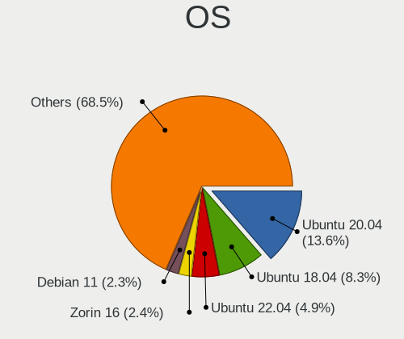

| Name                         | Desktops | Percent |
|------------------------------|----------|---------|
| Ubuntu 20.04                 | 207      | 17.77%  |
| Ubuntu 18.04                 | 131      | 11.24%  |
| OpenMandriva 4.2             | 30       | 2.58%   |
| Ubuntu 20.10                 | 29       | 2.49%   |
| Zorin 16                     | 24       | 2.06%   |
| KDE neon 20.04               | 24       | 2.06%   |
| Linux Mint 19.3              | 23       | 1.97%   |
| Xubuntu 20.04                | 22       | 1.89%   |
| Arch                         | 22       | 1.89%   |
| OpenMandriva 4.3             | 21       | 1.8%    |
| Pop!_OS 21.10                | 20       | 1.72%   |
| Ubuntu 19.10                 | 19       | 1.63%   |
| Linux Mint 20.1              | 19       | 1.63%   |
| Pop!_OS 20.04                | 18       | 1.55%   |
| Linux Mint 20.2              | 18       | 1.55%   |
| Linux Mint 20                | 18       | 1.55%   |
| Debian 10                    | 18       | 1.55%   |
| Linux Mint 20.3              | 17       | 1.46%   |
| Arch Rolling                 | 17       | 1.46%   |
| Zorin 15                     | 16       | 1.37%   |
| Pop!_OS 21.04                | 16       | 1.37%   |
| Kubuntu 20.04                | 16       | 1.37%   |
| Ubuntu 16.04                 | 15       | 1.29%   |
| Manjaro                      | 15       | 1.29%   |
| Ubuntu 19.04                 | 14       | 1.2%    |
| Pop!_OS 20.10                | 14       | 1.2%    |
| Xubuntu 18.04                | 13       | 1.12%   |
| Ubuntu 22.04                 | 13       | 1.12%   |
| Ubuntu 21.04                 | 13       | 1.12%   |
| Debian 11                    | 13       | 1.12%   |
| ArcoLinux Rolling            | 12       | 1.03%   |
| Pop!_OS 22.04                | 11       | 0.94%   |
| openSUSE Tumbleweed-XXXXXXXX | 11       | 0.94%   |
| Fedora 33                    | 11       | 0.94%   |
| Ubuntu 21.10                 | 10       | 0.86%   |
| Linux Mint 19.2              | 10       | 0.86%   |
| Fedora 36                    | 10       | 0.86%   |
| Fedora 35                    | 8        | 0.69%   |
| Linux Mint 19.1              | 7        | 0.6%    |
| Ubuntu 18.10                 | 6        | 0.52%   |
| Manjaro 20.1                 | 6        | 0.52%   |
| Gentoo 2.7                   | 6        | 0.52%   |
| Fedora 31                    | 6        | 0.52%   |
| EndeavourOS Rolling          | 6        | 0.52%   |
| ROSA R10                     | 5        | 0.43%   |
| LMDE 4                       | 5        | 0.43%   |
| KDE neon 18.04               | 5        | 0.43%   |
| Debian Testing               | 5        | 0.43%   |
| Zorin 12                     | 4        | 0.34%   |
| Ubuntu MATE 20.04            | 4        | 0.34%   |
| ROSA R9                      | 4        | 0.34%   |
| Fedora 34                    | 4        | 0.34%   |
| ROSA R8.1                    | 3        | 0.26%   |
| ROSA R11                     | 3        | 0.26%   |
| Reborn OS                    | 3        | 0.26%   |
| openSUSE Leap-15.4           | 3        | 0.26%   |
| openSUSE Leap-15.3           | 3        | 0.26%   |
| openSUSE Leap-15.2           | 3        | 0.26%   |
| Manjaro 20.2                 | 3        | 0.26%   |
| Lubuntu 20.04                | 3        | 0.26%   |

OS Family
---------

OS without a version

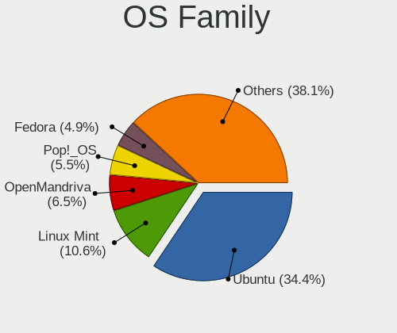

| Name          | Desktops | Percent |
|---------------|----------|---------|
| Ubuntu        | 440      | 39.71%  |
| Linux Mint    | 110      | 9.93%   |
| Pop!_OS       | 74       | 6.68%   |
| OpenMandriva  | 54       | 4.87%   |
| Zorin         | 44       | 3.97%   |
| Manjaro       | 41       | 3.7%    |
| Arch          | 41       | 3.7%    |
| Fedora        | 39       | 3.52%   |
| Xubuntu       | 37       | 3.34%   |
| Debian        | 36       | 3.25%   |
| KDE neon      | 28       | 2.53%   |
| Kubuntu       | 24       | 2.17%   |
| ROSA          | 17       | 1.53%   |
| openSUSE      | 17       | 1.53%   |
| ArcoLinux     | 14       | 1.26%   |
| Lubuntu       | 9        | 0.81%   |
| Gentoo        | 7        | 0.63%   |
| EndeavourOS   | 7        | 0.63%   |
| Ubuntu MATE   | 6        | 0.54%   |
| Endless       | 6        | 0.54%   |
| Clear Linux   | 6        | 0.54%   |
| LMDE          | 5        | 0.45%   |
| Elementary    | 4        | 0.36%   |
| CentOS        | 4        | 0.36%   |
| Ubuntu Budgie | 3        | 0.27%   |
| Reborn OS     | 3        | 0.27%   |
| Parrot        | 3        | 0.27%   |
| Kali          | 3        | 0.27%   |
| Garuda Linux  | 3        | 0.27%   |
| BlackPanther  | 3        | 0.27%   |
| Solus         | 2        | 0.18%   |
| MX            | 2        | 0.18%   |
| LinuxFX       | 2        | 0.18%   |
| Devuan        | 2        | 0.18%   |
| Xero          | 1        | 0.09%   |
| Void Linux    | 1        | 0.09%   |
| Ubuntu Studio | 1        | 0.09%   |
| Rockstor      | 1        | 0.09%   |
| RHEL          | 1        | 0.09%   |
| Q4OS          | 1        | 0.09%   |
| Peppermint    | 1        | 0.09%   |
| Parabola      | 1        | 0.09%   |
| Nobara        | 1        | 0.09%   |
| MocaccinoOS   | 1        | 0.09%   |
| Linux Lite    | 1        | 0.09%   |
| ArchLabs      | 1        | 0.09%   |

Kernel
------

Version of the Linux kernel

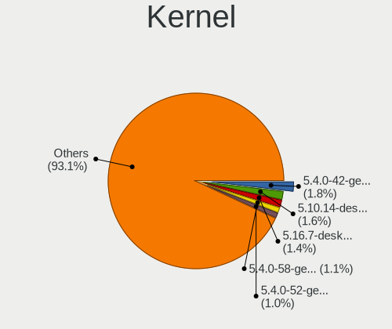

| Version                  | Desktops | Percent |
|--------------------------|----------|---------|
| 5.4.0-42-generic         | 33       | 2.53%   |
| 5.10.14-desktop-1omv4002 | 29       | 2.22%   |
| 5.16.7-desktop-1omv4003  | 20       | 1.53%   |
| 5.4.0-58-generic         | 19       | 1.45%   |
| 5.4.0-52-generic         | 18       | 1.38%   |
| 5.8.0-50-generic         | 15       | 1.15%   |
| 5.4.0-40-generic         | 15       | 1.15%   |
| 5.4.0-48-generic         | 13       | 1%      |
| 5.11.0-7620-generic      | 13       | 1%      |
| 5.4.0-77-generic         | 11       | 0.84%   |
| 5.3.0-28-generic         | 11       | 0.84%   |
| 5.11.0-38-generic        | 11       | 0.84%   |
| 5.11.0-27-generic        | 11       | 0.84%   |
| 5.4.0-65-generic         | 10       | 0.77%   |
| 5.4.0-56-generic         | 10       | 0.77%   |
| 5.4.0-37-generic         | 10       | 0.77%   |
| 5.4.0-54-generic         | 9        | 0.69%   |
| 5.4.0-26-generic         | 9        | 0.69%   |
| 5.8.0-44-generic         | 8        | 0.61%   |
| 5.8.0-43-generic         | 8        | 0.61%   |
| 5.4.0-47-generic         | 8        | 0.61%   |
| 5.11.0-41-generic        | 8        | 0.61%   |
| 5.0.0-32-generic         | 8        | 0.61%   |
| 5.0.0-31-generic         | 8        | 0.61%   |
| 4.15.0-29-generic        | 8        | 0.61%   |
| 5.8.0-7630-generic       | 7        | 0.54%   |
| 5.4.0-91-generic         | 7        | 0.54%   |
| 5.4.0-7642-generic       | 7        | 0.54%   |
| 5.4.0-72-generic         | 7        | 0.54%   |
| 5.4.0-66-generic         | 7        | 0.54%   |
| 5.4.0-33-generic         | 7        | 0.54%   |
| 5.15.5-76051505-generic  | 7        | 0.54%   |
| 5.13.0-39-generic        | 7        | 0.54%   |
| 5.11.0-43-generic        | 7        | 0.54%   |
| 5.11.0-40-generic        | 7        | 0.54%   |
| 5.0.0-37-generic         | 7        | 0.54%   |
| 4.15.0-43-generic        | 7        | 0.54%   |
| 5.8.0-53-generic         | 6        | 0.46%   |
| 5.8.0-48-generic         | 6        | 0.46%   |
| 5.8.0-45-generic         | 6        | 0.46%   |
| 5.8.0-25-generic         | 6        | 0.46%   |
| 5.4.0-90-generic         | 6        | 0.46%   |
| 5.4.0-81-generic         | 6        | 0.46%   |
| 5.4.0-122-generic        | 6        | 0.46%   |
| 5.4.0-107-generic        | 6        | 0.46%   |
| 5.3.0-46-generic         | 6        | 0.46%   |
| 5.3.0-42-generic         | 6        | 0.46%   |
| 5.3.0-40-generic         | 6        | 0.46%   |
| 5.3.0-26-generic         | 6        | 0.46%   |
| 5.16.11-76051611-generic | 6        | 0.46%   |
| 5.15.0-43-generic        | 6        | 0.46%   |
| 5.15.0-41-generic        | 6        | 0.46%   |
| 5.13.0-44-generic        | 6        | 0.46%   |
| 5.13.0-41-generic        | 6        | 0.46%   |
| 5.13.0-28-generic        | 6        | 0.46%   |
| 5.0.0-23-generic         | 6        | 0.46%   |
| 4.15.0-54-generic        | 6        | 0.46%   |
| 4.15.0-50-generic        | 6        | 0.46%   |
| 4.15.0-45-generic        | 6        | 0.46%   |
| 5.8.0-55-generic         | 5        | 0.38%   |

Kernel Family
-------------

Linux kernel without a distro release

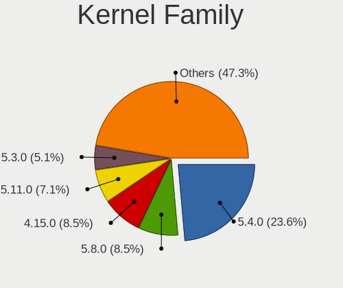

| Version | Desktops | Percent |
|---------|----------|---------|
| 5.4.0   | 287      | 23.6%   |
| 5.8.0   | 103      | 8.47%   |
| 4.15.0  | 103      | 8.47%   |
| 5.11.0  | 86       | 7.07%   |
| 5.3.0   | 62       | 5.1%    |
| 5.13.0  | 57       | 4.69%   |
| 5.0.0   | 48       | 3.95%   |
| 5.10.14 | 30       | 2.47%   |
| 4.18.0  | 30       | 2.47%   |
| 5.15.0  | 28       | 2.3%    |
| 5.16.7  | 21       | 1.73%   |
| 5.10.0  | 16       | 1.32%   |
| 4.19.0  | 14       | 1.15%   |
| 5.16.11 | 11       | 0.9%    |
| 5.17.5  | 8        | 0.66%   |
| 4.4.0   | 8        | 0.66%   |
| 5.15.5  | 7        | 0.58%   |
| 5.3.18  | 6        | 0.49%   |
| 5.15.12 | 6        | 0.49%   |
| 5.6.0   | 5        | 0.41%   |
| 5.15.11 | 5        | 0.41%   |
| 4.9.20  | 5        | 0.41%   |
| 5.8.10  | 4        | 0.33%   |
| 5.16.19 | 4        | 0.33%   |
| 5.15.10 | 4        | 0.33%   |
| 5.14.14 | 4        | 0.33%   |
| 4.9.60  | 4        | 0.33%   |
| 5.8.16  | 3        | 0.25%   |
| 5.8.11  | 3        | 0.25%   |
| 5.18.7  | 3        | 0.25%   |
| 5.18.14 | 3        | 0.25%   |
| 5.18.12 | 3        | 0.25%   |
| 5.18.0  | 3        | 0.25%   |
| 5.17.15 | 3        | 0.25%   |
| 5.16.15 | 3        | 0.25%   |
| 5.10.19 | 3        | 0.25%   |
| 4.18.16 | 3        | 0.25%   |
| 5.9.8   | 2        | 0.16%   |
| 5.9.16  | 2        | 0.16%   |
| 5.9.14  | 2        | 0.16%   |
| 5.9.12  | 2        | 0.16%   |
| 5.9.11  | 2        | 0.16%   |
| 5.9.1   | 2        | 0.16%   |
| 5.9.0   | 2        | 0.16%   |
| 5.8.6   | 2        | 0.16%   |
| 5.8.1   | 2        | 0.16%   |
| 5.7.19  | 2        | 0.16%   |
| 5.7.0   | 2        | 0.16%   |
| 5.6.7   | 2        | 0.16%   |
| 5.6.4   | 2        | 0.16%   |
| 5.6.15  | 2        | 0.16%   |
| 5.5.5   | 2        | 0.16%   |
| 5.4.60  | 2        | 0.16%   |
| 5.4.13  | 2        | 0.16%   |
| 5.4.119 | 2        | 0.16%   |
| 5.3.7   | 2        | 0.16%   |
| 5.2.13  | 2        | 0.16%   |
| 5.19.5  | 2        | 0.16%   |
| 5.18.16 | 2        | 0.16%   |
| 5.18.13 | 2        | 0.16%   |

Kernel Major Ver.
-----------------

Linux kernel major version

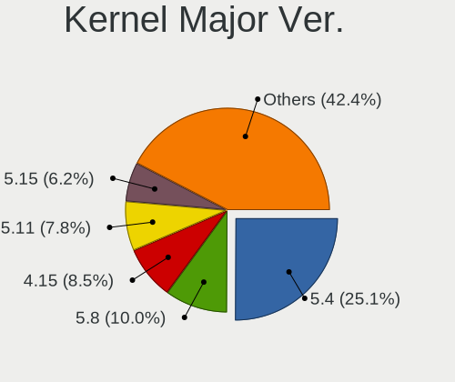

| Version | Desktops | Percent |
|---------|----------|---------|
| 5.4     | 307      | 25.52%  |
| 5.8     | 122      | 10.14%  |
| 4.15    | 104      | 8.65%   |
| 5.11    | 96       | 7.98%   |
| 5.3     | 74       | 6.15%   |
| 5.10    | 71       | 5.9%    |
| 5.13    | 66       | 5.49%   |
| 5.15    | 65       | 5.4%    |
| 5.0     | 49       | 4.07%   |
| 5.16    | 48       | 3.99%   |
| 4.18    | 37       | 3.08%   |
| 5.18    | 23       | 1.91%   |
| 4.19    | 18       | 1.5%    |
| 5.9     | 17       | 1.41%   |
| 5.6     | 16       | 1.33%   |
| 5.17    | 16       | 1.33%   |
| 4.9     | 13       | 1.08%   |
| 5.5     | 11       | 0.91%   |
| 5.14    | 11       | 0.91%   |
| 5.12    | 10       | 0.83%   |
| 4.4     | 8        | 0.67%   |
| 5.7     | 5        | 0.42%   |
| 5.2     | 3        | 0.25%   |
| 5.19    | 3        | 0.25%   |
| 4.20    | 2        | 0.17%   |
| 4.10    | 2        | 0.17%   |
| 4.1     | 2        | 0.17%   |
| 4.14    | 1        | 0.08%   |
| 4.12    | 1        | 0.08%   |
| 3.16    | 1        | 0.08%   |
| 3.10    | 1        | 0.08%   |

Arch
----

OS architecture (x86_64, i586, etc.)

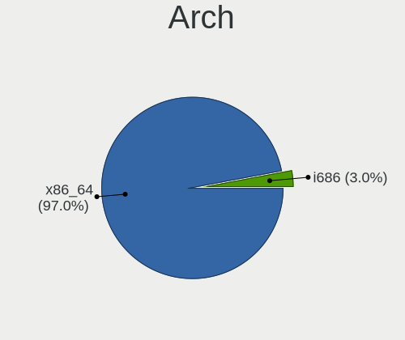

| Name   | Desktops | Percent |
|--------|----------|---------|
| x86_64 | 1042     | 96.75%  |
| i686   | 35       | 3.25%   |

DE
--

Desktop Environment

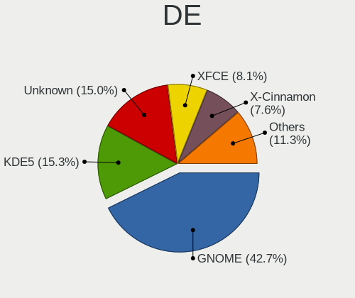

| Name             | Desktops | Percent |
|------------------|----------|---------|
| GNOME            | 476      | 42.65%  |
| Unknown          | 192      | 17.2%   |
| KDE5             | 148      | 13.26%  |
| XFCE             | 87       | 7.8%    |
| X-Cinnamon       | 77       | 6.9%    |
| KDE              | 38       | 3.41%   |
| MATE             | 24       | 2.15%   |
| Unity            | 11       | 0.99%   |
| LXQt             | 10       | 0.9%    |
| KDE4             | 10       | 0.9%    |
| Cinnamon         | 10       | 0.9%    |
| LXDE             | 7        | 0.63%   |
| Budgie           | 6        | 0.54%   |
| Pantheon         | 4        | 0.36%   |
| i3               | 3        | 0.27%   |
| GNOME Flashback  | 3        | 0.27%   |
| enlightenment    | 2        | 0.18%   |
| Deepin           | 2        | 0.18%   |
| awesome          | 2        | 0.18%   |
| trinity          | 1        | 0.09%   |
| lightdm-xsession | 1        | 0.09%   |
| jwm              | 1        | 0.09%   |
| dusk             | 1        | 0.09%   |

Display Server
--------------

X11 or Wayland

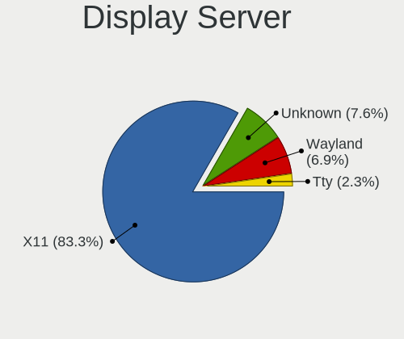

| Name    | Desktops | Percent |
|---------|----------|---------|
| X11     | 919      | 83.77%  |
| Unknown | 86       | 7.84%   |
| Wayland | 66       | 6.02%   |
| Tty     | 26       | 2.37%   |

Display Manager
---------------

SDDM, LightDM, etc.

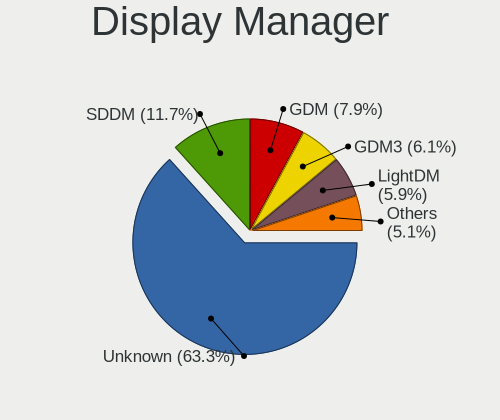

| Name    | Desktops | Percent |
|---------|----------|---------|
| Unknown | 699      | 62.69%  |
| SDDM    | 134      | 12.02%  |
| GDM     | 86       | 7.71%   |
| LightDM | 71       | 6.37%   |
| GDM3    | 70       | 6.28%   |
| TDM     | 38       | 3.41%   |
| KDM     | 9        | 0.81%   |
| Ly      | 3        | 0.27%   |
| XDM     | 2        | 0.18%   |
| SLiM    | 2        | 0.18%   |
| MDM     | 1        | 0.09%   |

OS Lang
-------

Language

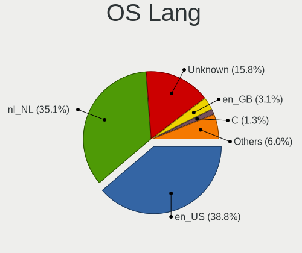

| Lang        | Desktops | Percent |
|-------------|----------|---------|
| en_US       | 431      | 39.08%  |
| nl_NL       | 389      | 35.27%  |
| Unknown     | 168      | 15.23%  |
| en_GB       | 36       | 3.26%   |
| C           | 15       | 1.36%   |
| de_DE       | 13       | 1.18%   |
| pl_PL       | 7        | 0.63%   |
| ru_RU       | 5        | 0.45%   |
| en_IE       | 5        | 0.45%   |
| ru_UA       | 3        | 0.27%   |
| fr_BE       | 3        | 0.27%   |
| en_NL       | 3        | 0.27%   |
| en_CA       | 3        | 0.27%   |
| pt_BR       | 2        | 0.18%   |
| fr_FR       | 2        | 0.18%   |
| es_ES       | 2        | 0.18%   |
| ar_KW       | 2        | 0.18%   |
| sv_SE       | 1        | 0.09%   |
| sk_SK       | 1        | 0.09%   |
| pt_PT       | 1        | 0.09%   |
| POSIX       | 1        | 0.09%   |
| nl_AW       | 1        | 0.09%   |
| en_US.utf-8 | 1        | 0.09%   |
| en_IN       | 1        | 0.09%   |
| en_DK       | 1        | 0.09%   |
| en_AU       | 1        | 0.09%   |
| en_AG       | 1        | 0.09%   |
| en_001      | 1        | 0.09%   |
| de_CH       | 1        | 0.09%   |
| cs_CZ       | 1        | 0.09%   |
| C.UTF8      | 1        | 0.09%   |

Boot Mode
---------

EFI or BIOS

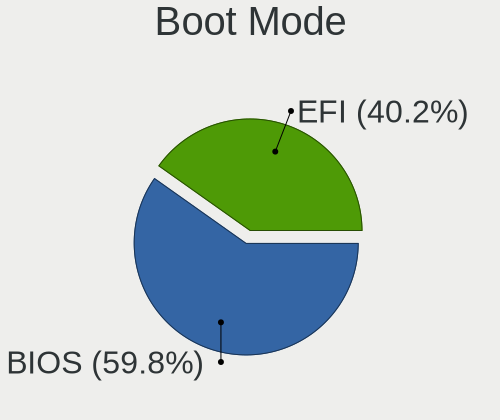

| Mode | Desktops | Percent |
|------|----------|---------|
| BIOS | 676      | 61.57%  |
| EFI  | 422      | 38.43%  |

Filesystem
----------

Type of filesystem

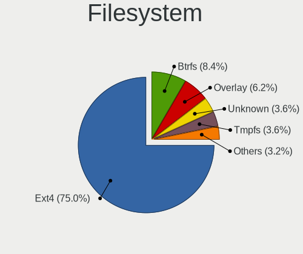

| Type    | Desktops | Percent |
|---------|----------|---------|
| Ext4    | 875      | 79.76%  |
| Overlay | 71       | 6.47%   |
| Unknown | 57       | 5.2%    |
| Btrfs   | 52       | 4.74%   |
| Zfs     | 17       | 1.55%   |
| Xfs     | 14       | 1.28%   |
| Ext2    | 4        | 0.36%   |
| F2fs    | 3        | 0.27%   |
| Tmpfs   | 2        | 0.18%   |
| Ext3    | 1        | 0.09%   |
| Aufs    | 1        | 0.09%   |

Part. scheme
------------

Scheme of partitioning

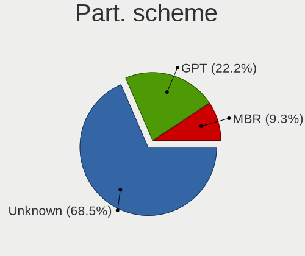

| Type    | Desktops | Percent |
|---------|----------|---------|
| Unknown | 744      | 68.38%  |
| GPT     | 244      | 22.43%  |
| MBR     | 100      | 9.19%   |

Dual Boot with Linux/BSD
------------------------

Hosting more than one Linux/BSD

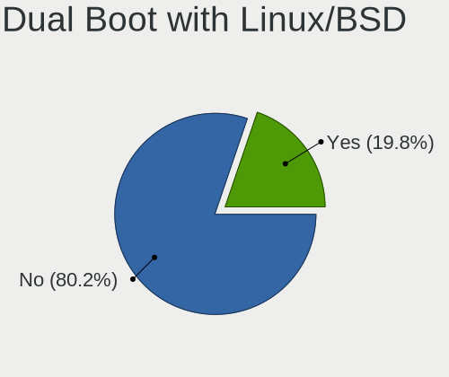

| Dual boot | Desktops | Percent |
|-----------|----------|---------|
| No        | 883      | 80.49%  |
| Yes       | 214      | 19.51%  |

Dual Boot (Win)
---------------

Hosting Linux and Windows

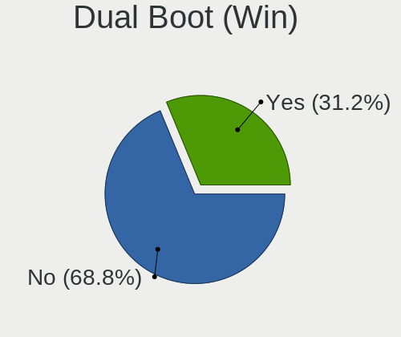

| Dual boot | Desktops | Percent |
|-----------|----------|---------|
| No        | 757      | 68.76%  |
| Yes       | 344      | 31.24%  |

Board
-----

Vendor
------

Motherboard manufacturer

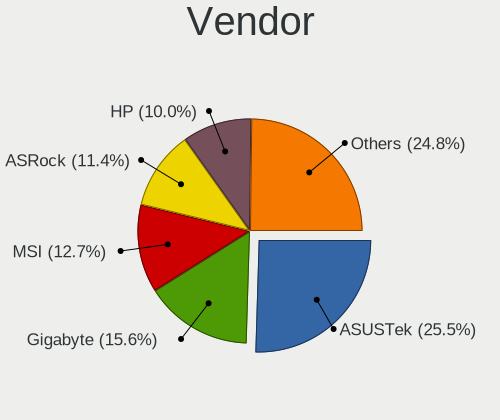

| Name                              | Desktops | Percent |
|-----------------------------------|----------|---------|
| ASUSTek Computer                  | 273      | 25.42%  |
| Gigabyte Technology               | 163      | 15.18%  |
| MSI                               | 138      | 12.85%  |
| ASRock                            | 124      | 11.55%  |
| Hewlett-Packard                   | 103      | 9.59%   |
| Dell                              | 81       | 7.54%   |
| Acer                              | 33       | 3.07%   |
| Medion                            | 25       | 2.33%   |
| Intel                             | 23       | 2.14%   |
| Lenovo                            | 17       | 1.58%   |
| Unknown                           | 12       | 1.12%   |
| Foxconn                           | 10       | 0.93%   |
| Pegatron                          | 7        | 0.65%   |
| Packard Bell                      | 7        | 0.65%   |
| Biostar                           | 7        | 0.65%   |
| Shuttle                           | 6        | 0.56%   |
| Fujitsu Siemens                   | 5        | 0.47%   |
| Fujitsu                           | 5        | 0.47%   |
| Apple                             | 4        | 0.37%   |
| MP                                | 3        | 0.28%   |
| Google                            | 3        | 0.28%   |
| Supermicro                        | 2        | 0.19%   |
| BESSTAR Tech                      | 2        | 0.19%   |
| TYAN Computer                     | 1        | 0.09%   |
| Standard                          | 1        | 0.09%   |
| SIMPC                             | 1        | 0.09%   |
| Sapphire                          | 1        | 0.09%   |
| Rockwell Automation/Allen-Bradley | 1        | 0.09%   |
| Online Labs                       | 1        | 0.09%   |
| ONDA                              | 1        | 0.09%   |
| NEXCOM                            | 1        | 0.09%   |
| MPL                               | 1        | 0.09%   |
| MiTAC                             | 1        | 0.09%   |
| Minix                             | 1        | 0.09%   |
| IBM                               | 1        | 0.09%   |
| eMachines                         | 1        | 0.09%   |
| ECS                               | 1        | 0.09%   |
| Compaq                            | 1        | 0.09%   |
| Colorful Technology               | 1        | 0.09%   |
| Cincoze                           | 1        | 0.09%   |
| ASRockRack                        | 1        | 0.09%   |
| AMD                               | 1        | 0.09%   |
| Alienware                         | 1        | 0.09%   |
| AAEON                             | 1        | 0.09%   |

Model
-----

Motherboard model

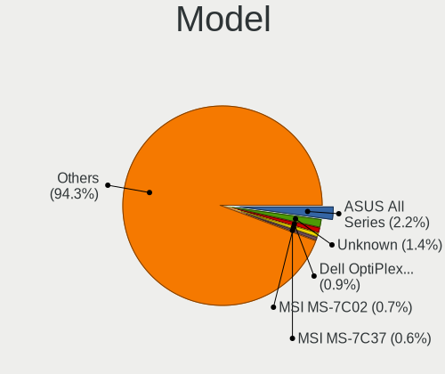

| Name                                | Desktops | Percent |
|-------------------------------------|----------|---------|
| ASUS All Series                     | 24       | 2.23%   |
| Unknown                             | 13       | 1.21%   |
| Dell OptiPlex 7010                  | 8        | 0.74%   |
| Dell OptiPlex 3020                  | 8        | 0.74%   |
| ASRock B450M Pro4                   | 8        | 0.74%   |
| MSI MS-7C02                         | 7        | 0.65%   |
| MSI MS-7817                         | 7        | 0.65%   |
| MSI MS-7C37                         | 6        | 0.56%   |
| MSI MS-7B86                         | 6        | 0.56%   |
| ASUS PRIME A320M-K                  | 6        | 0.56%   |
| ASUS M4A78LT-M                      | 6        | 0.56%   |
| MSI MS-7816                         | 5        | 0.47%   |
| MSI MS-7721                         | 5        | 0.47%   |
| HP Compaq dc7900 Small Form Factor  | 5        | 0.47%   |
| Gigabyte X570 AORUS PRO             | 5        | 0.47%   |
| Gigabyte X570 AORUS ELITE           | 5        | 0.47%   |
| Dell OptiPlex 9020                  | 5        | 0.47%   |
| ASUS Z170 PRO GAMING                | 5        | 0.47%   |
| ASUS M5A78L-M/USB3                  | 5        | 0.47%   |
| MSI MS-7C56                         | 4        | 0.37%   |
| MSI MS-7B89                         | 4        | 0.37%   |
| MSI MS-7B85                         | 4        | 0.37%   |
| HP Compaq Elite 8300 SFF            | 4        | 0.37%   |
| HP Compaq dc7800 Small Form Factor  | 4        | 0.37%   |
| HP Compaq 6000 Pro SFF PC           | 4        | 0.37%   |
| Gigabyte X470 AORUS ULTRA GAMING    | 4        | 0.37%   |
| Gigabyte B550M AORUS PRO-P          | 4        | 0.37%   |
| Gigabyte B550 AORUS ELITE V2        | 4        | 0.37%   |
| ASUS TUF Gaming X570-PLUS           | 4        | 0.37%   |
| ASUS ROG STRIX B550-F GAMING        | 4        | 0.37%   |
| ASUS ROG STRIX B450-F GAMING        | 4        | 0.37%   |
| ASUS PRIME X570-PRO                 | 4        | 0.37%   |
| ASUS P8H61-M LE/USB3                | 4        | 0.37%   |
| MSI MS-7C91                         | 3        | 0.28%   |
| MSI MS-7B98                         | 3        | 0.28%   |
| MSI MS-7996                         | 3        | 0.28%   |
| MSI MS-7924                         | 3        | 0.28%   |
| MSI MS-7917                         | 3        | 0.28%   |
| Medion MS-7848                      | 3        | 0.28%   |
| HP ProDesk 600 G1 SFF               | 3        | 0.28%   |
| HP EliteDesk 800 G1 SFF             | 3        | 0.28%   |
| HP Compaq Pro 6300 SFF              | 3        | 0.28%   |
| HP Compaq dc7800p Small Form Factor | 3        | 0.28%   |
| HP Compaq 8100 Elite SFF PC         | 3        | 0.28%   |
| Gigabyte Z87-HD3                    | 3        | 0.28%   |
| Gigabyte X570 I AORUS PRO WIFI      | 3        | 0.28%   |
| Gigabyte X570 AORUS MASTER          | 3        | 0.28%   |
| Gigabyte P55A-UD3                   | 3        | 0.28%   |
| Gigabyte B450M DS3H                 | 3        | 0.28%   |
| Gigabyte B150M-D3H                  | 3        | 0.28%   |
| Dell Precision Tower 5810           | 3        | 0.28%   |
| Dell OptiPlex 790                   | 3        | 0.28%   |
| Dell OptiPlex 755                   | 3        | 0.28%   |
| Dell OptiPlex 745                   | 3        | 0.28%   |
| ASUS UNLOCK INSTALL                 | 3        | 0.28%   |
| ASUS TUF Gaming B550-PLUS           | 3        | 0.28%   |
| ASUS PRIME X370-PRO                 | 3        | 0.28%   |
| ASUS P8Z77-V LX                     | 3        | 0.28%   |
| ASUS P6T                            | 3        | 0.28%   |
| ASRock Z87 Killer                   | 3        | 0.28%   |

Model Family
------------

Motherboard model prefix

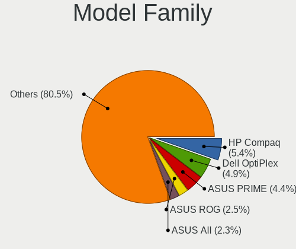

| Name                | Desktops | Percent |
|---------------------|----------|---------|
| HP Compaq           | 57       | 5.31%   |
| Dell OptiPlex       | 52       | 4.84%   |
| ASUS PRIME          | 49       | 4.56%   |
| ASUS ROG            | 25       | 2.33%   |
| ASUS All            | 24       | 2.23%   |
| Acer Aspire         | 20       | 1.86%   |
| Gigabyte X570       | 18       | 1.68%   |
| Unknown             | 13       | 1.21%   |
| Lenovo ThinkCentre  | 10       | 0.93%   |
| HP ProDesk          | 10       | 0.93%   |
| ASUS TUF            | 10       | 0.93%   |
| ASUS P8H61-M        | 10       | 0.93%   |
| ASRock B450M        | 10       | 0.93%   |
| Dell Precision      | 9        | 0.84%   |
| Acer Veriton        | 9        | 0.84%   |
| ASUS P6T            | 8        | 0.74%   |
| ASRock X570         | 8        | 0.74%   |
| ASRock 970          | 8        | 0.74%   |
| MSI MS-7C02         | 7        | 0.65%   |
| MSI MS-7817         | 7        | 0.65%   |
| Gigabyte B450M      | 7        | 0.65%   |
| ASUS M5A78L-M       | 7        | 0.65%   |
| ASRock B450         | 7        | 0.65%   |
| MSI MS-7C37         | 6        | 0.56%   |
| MSI MS-7B86         | 6        | 0.56%   |
| Dell Inspiron       | 6        | 0.56%   |
| ASUS M4A78LT-M      | 6        | 0.56%   |
| ASRock Z87          | 6        | 0.56%   |
| MSI MS-7816         | 5        | 0.47%   |
| MSI MS-7721         | 5        | 0.47%   |
| HP Pavilion         | 5        | 0.47%   |
| Gigabyte Z390       | 5        | 0.47%   |
| Gigabyte B550M      | 5        | 0.47%   |
| Gigabyte B550       | 5        | 0.47%   |
| ASUS Z170           | 5        | 0.47%   |
| ASUS P8Z68-V        | 5        | 0.47%   |
| ASUS Maximus        | 5        | 0.47%   |
| ASUS M5A97          | 5        | 0.47%   |
| Packard Bell IMEDIA | 4        | 0.37%   |
| MSI MS-7C56         | 4        | 0.37%   |
| MSI MS-7B89         | 4        | 0.37%   |
| MSI MS-7B85         | 4        | 0.37%   |
| Medion Akoya        | 4        | 0.37%   |
| Lenovo IdeaCentre   | 4        | 0.37%   |
| HP ProLiant         | 4        | 0.37%   |
| HP EliteDesk        | 4        | 0.37%   |
| Gigabyte X470       | 4        | 0.37%   |
| Dell Studio         | 4        | 0.37%   |
| ASUS P8Z77-V        | 4        | 0.37%   |
| Pegatron Pro        | 3        | 0.28%   |
| MSI MS-7C91         | 3        | 0.28%   |
| MSI MS-7B98         | 3        | 0.28%   |
| MSI MS-7996         | 3        | 0.28%   |
| MSI MS-7924         | 3        | 0.28%   |
| MSI MS-7917         | 3        | 0.28%   |
| Medion MS-7848      | 3        | 0.28%   |
| Gigabyte Z87-HD3    | 3        | 0.28%   |
| Gigabyte X570S      | 3        | 0.28%   |
| Gigabyte P55A-UD3   | 3        | 0.28%   |
| Gigabyte B450       | 3        | 0.28%   |

MFG Year
--------

Motherboard manufacture year

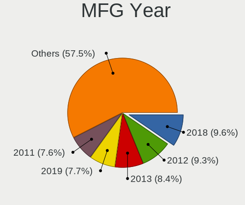

| Year    | Desktops | Percent |
|---------|----------|---------|
| 2018    | 103      | 9.59%   |
| 2012    | 98       | 9.12%   |
| 2013    | 94       | 8.75%   |
| 2011    | 87       | 8.1%    |
| 2014    | 83       | 7.73%   |
| 2019    | 78       | 7.26%   |
| 2020    | 68       | 6.33%   |
| 2010    | 68       | 6.33%   |
| 2017    | 63       | 5.87%   |
| 2009    | 63       | 5.87%   |
| 2008    | 53       | 4.93%   |
| 2016    | 48       | 4.47%   |
| 2015    | 45       | 4.19%   |
| 2007    | 44       | 4.1%    |
| 2021    | 30       | 2.79%   |
| 2006    | 29       | 2.7%    |
| 2005    | 9        | 0.84%   |
| 2004    | 5        | 0.47%   |
| 2022    | 2        | 0.19%   |
| 2003    | 2        | 0.19%   |
| 2002    | 1        | 0.09%   |
| Unknown | 1        | 0.09%   |

Form Factor
-----------

Physical design of the computer

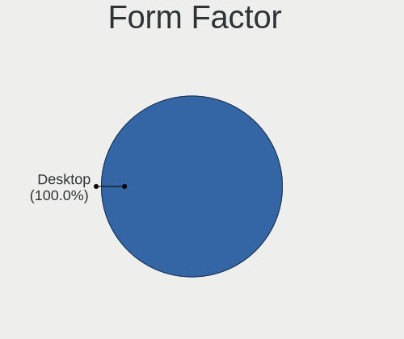

| Name    | Desktops | Percent |
|---------|----------|---------|
| Desktop | 1074     | 100%    |

Secure Boot
-----------

Enabled or disabled

| State    | Desktops | Percent |
|----------|----------|---------|
| Disabled | 1050     | 97.4%   |
| Enabled  | 28       | 2.6%    |

Coreboot
--------

Have coreboot on board

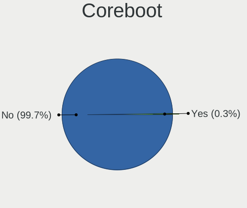

| Used | Desktops | Percent |
|------|----------|---------|
| No   | 1071     | 99.72%  |
| Yes  | 3        | 0.28%   |

RAM Size
--------

Total RAM memory

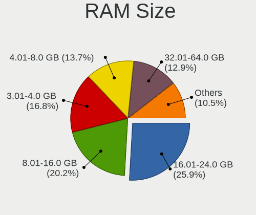

| Size in GB  | Desktops | Percent |
|-------------|----------|---------|
| 16.01-24.0  | 284      | 25.89%  |
| 8.01-16.0   | 221      | 20.15%  |
| 3.01-4.0    | 180      | 16.41%  |
| 4.01-8.0    | 150      | 13.67%  |
| 32.01-64.0  | 149      | 13.58%  |
| 64.01-256.0 | 39       | 3.56%   |
| 1.01-2.0    | 31       | 2.83%   |
| 24.01-32.0  | 20       | 1.82%   |
| 2.01-3.0    | 13       | 1.19%   |
| 0.51-1.0    | 10       | 0.91%   |

RAM Used
--------

Used RAM memory

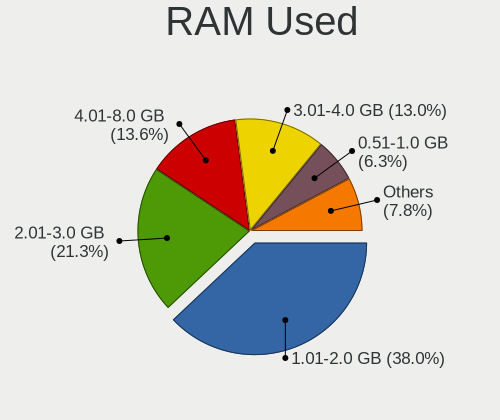

| Used GB     | Desktops | Percent |
|-------------|----------|---------|
| 1.01-2.0    | 469      | 39.64%  |
| 2.01-3.0    | 247      | 20.88%  |
| 4.01-8.0    | 152      | 12.85%  |
| 3.01-4.0    | 146      | 12.34%  |
| 0.51-1.0    | 82       | 6.93%   |
| 8.01-16.0   | 53       | 4.48%   |
| 16.01-24.0  | 15       | 1.27%   |
| 0.01-0.5    | 11       | 0.93%   |
| 32.01-64.0  | 7        | 0.59%   |
| 64.01-256.0 | 1        | 0.08%   |

Total Drives
------------

Number of drives on board

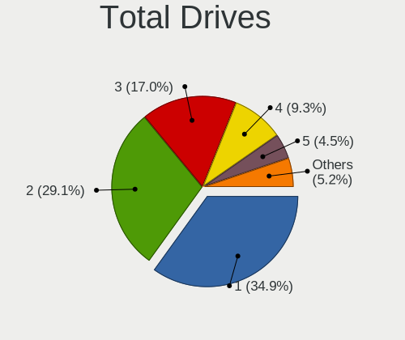

| Drives | Desktops | Percent |
|--------|----------|---------|
| 1      | 389      | 34.86%  |
| 2      | 329      | 29.48%  |
| 3      | 189      | 16.94%  |
| 4      | 103      | 9.23%   |
| 5      | 49       | 4.39%   |
| 6      | 25       | 2.24%   |
| 7      | 13       | 1.16%   |
| 0      | 9        | 0.81%   |
| 8      | 5        | 0.45%   |
| 9      | 2        | 0.18%   |
| 28     | 1        | 0.09%   |
| 27     | 1        | 0.09%   |
| 10     | 1        | 0.09%   |

Has CD-ROM
----------

Has CD-ROM on board

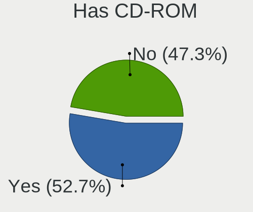

| Presented | Desktops | Percent |
|-----------|----------|---------|
| Yes       | 580      | 53.21%  |
| No        | 510      | 46.79%  |

Has Ethernet
------------

Has Ethernet on board

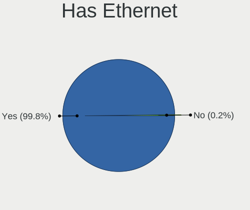

| Presented | Desktops | Percent |
|-----------|----------|---------|
| Yes       | 1072     | 99.81%  |
| No        | 2        | 0.19%   |

Has WiFi
--------

Has WiFi module

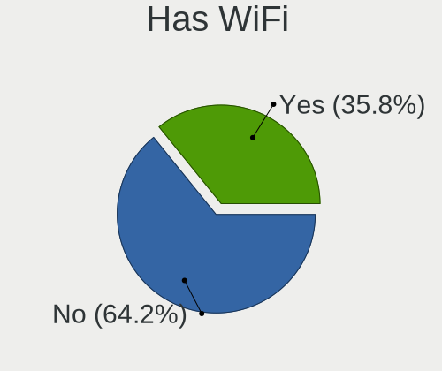

| Presented | Desktops | Percent |
|-----------|----------|---------|
| No        | 700      | 64.52%  |
| Yes       | 385      | 35.48%  |

Has Bluetooth
-------------

Has Bluetooth module

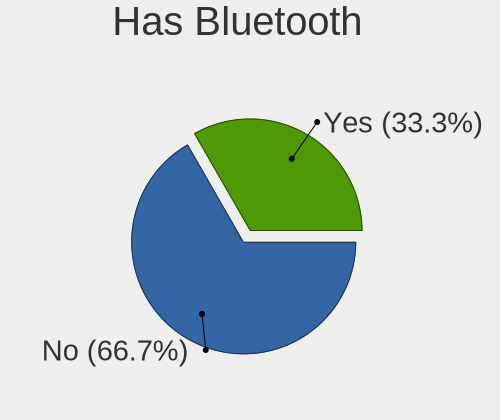

| Presented | Desktops | Percent |
|-----------|----------|---------|
| No        | 788      | 72.1%   |
| Yes       | 305      | 27.9%   |

Location
--------

Country
-------

Geographic location (country)

| Country     | Desktops | Percent |
|-------------|----------|---------|
| Netherlands | 1074     | 100%    |

City
----

Geographic location (city)

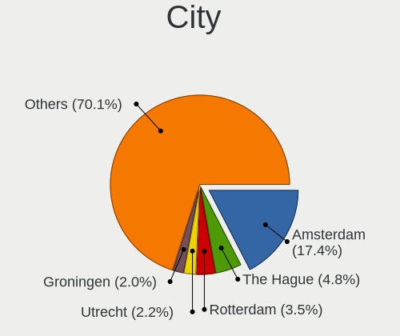

| City                   | Desktops | Percent |
|------------------------|----------|---------|
| Amsterdam              | 191      | 16.75%  |
| The Hague              | 49       | 4.3%    |
| Rotterdam              | 35       | 3.07%   |
| Utrecht                | 29       | 2.54%   |
| Haarlem                | 24       | 2.11%   |
| Groningen              | 23       | 2.02%   |
| Leiden                 | 16       | 1.4%    |
| Almere Stad            | 16       | 1.4%    |
| Tilburg                | 15       | 1.32%   |
| Zoetermeer             | 12       | 1.05%   |
| Nijmegen               | 12       | 1.05%   |
| Eindhoven              | 12       | 1.05%   |
| Delft                  | 12       | 1.05%   |
| Lelystad               | 11       | 0.96%   |
| Breda                  | 11       | 0.96%   |
| Assen                  | 11       | 0.96%   |
| Arnhem                 | 11       | 0.96%   |
| Schiedam               | 10       | 0.88%   |
| Naaldwijk              | 10       | 0.88%   |
| Amersfoort             | 10       | 0.88%   |
| Almelo                 | 10       | 0.88%   |
| Enschede               | 9        | 0.79%   |
| Apeldoorn              | 9        | 0.79%   |
| Roosendaal             | 8        | 0.7%    |
| Dordrecht              | 8        | 0.7%    |
| Capelle aan den IJssel | 8        | 0.7%    |
| 's-Hertogenbosch       | 8        | 0.7%    |
| Zaandam                | 7        | 0.61%   |
| Hilversum              | 7        | 0.61%   |
| Helmond                | 7        | 0.61%   |
| Zwolle                 | 6        | 0.53%   |
| Purmerend              | 6        | 0.53%   |
| Deventer               | 6        | 0.53%   |
| Amstelveen             | 6        | 0.53%   |
| Wageningen             | 5        | 0.44%   |
| Steenbergen            | 5        | 0.44%   |
| Spijkenisse            | 5        | 0.44%   |
| Meppel                 | 5        | 0.44%   |
| Maastricht             | 5        | 0.44%   |
| Hengelo                | 5        | 0.44%   |
| Heerenveen             | 5        | 0.44%   |
| Gouda                  | 5        | 0.44%   |
| Flushing               | 5        | 0.44%   |
| Beverwijk              | 5        | 0.44%   |
| Alphen aan den Rijn    | 5        | 0.44%   |
| Wijchen                | 4        | 0.35%   |
| Voorburg               | 4        | 0.35%   |
| Uithuizen              | 4        | 0.35%   |
| Oosterhout             | 4        | 0.35%   |
| Oosterbeek             | 4        | 0.35%   |
| Maarssen               | 4        | 0.35%   |
| Emmen                  | 4        | 0.35%   |
| Ede                    | 4        | 0.35%   |
| Culemborg              | 4        | 0.35%   |
| Bussum                 | 4        | 0.35%   |
| Brunssum               | 4        | 0.35%   |
| Zwijndrecht            | 3        | 0.26%   |
| Zutphen                | 3        | 0.26%   |
| Zevenaar               | 3        | 0.26%   |
| Zeist                  | 3        | 0.26%   |

Drives
------

Drive Vendor
------------

Hard drive vendors

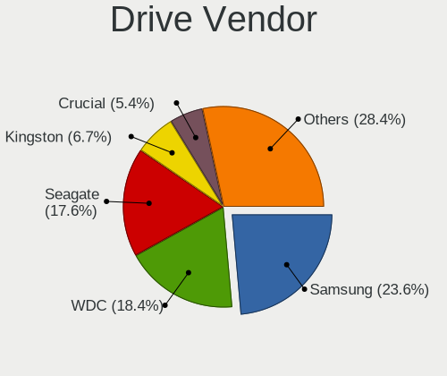

| Vendor                    | Desktops | Drives | Percent |
|---------------------------|----------|--------|---------|
| Samsung Electronics       | 463      | 830    | 23.72%  |
| WDC                       | 378      | 630    | 19.36%  |
| Seagate                   | 353      | 591    | 18.08%  |
| Kingston                  | 128      | 175    | 6.56%   |
| Crucial                   | 100      | 132    | 5.12%   |
| Toshiba                   | 82       | 131    | 4.2%    |
| Hitachi                   | 66       | 90     | 3.38%   |
| SanDisk                   | 65       | 101    | 3.33%   |
| Intel                     | 50       | 68     | 2.56%   |
| Maxtor                    | 27       | 33     | 1.38%   |
| A-DATA Technology         | 27       | 30     | 1.38%   |
| HGST                      | 21       | 25     | 1.08%   |
| Corsair                   | 16       | 22     | 0.82%   |
| OCZ                       | 15       | 17     | 0.77%   |
| Phison                    | 14       | 22     | 0.72%   |
| Unknown                   | 13       | 18     | 0.67%   |
| Transcend                 | 13       | 17     | 0.67%   |
| XPG                       | 7        | 9      | 0.36%   |
| Patriot                   | 7        | 7      | 0.36%   |
| SPCC                      | 6        | 7      | 0.31%   |
| China                     | 6        | 7      | 0.31%   |
| PNY                       | 5        | 5      | 0.26%   |
| Micron/Crucial Technology | 5        | 7      | 0.26%   |
| Intenso                   | 5        | 5      | 0.26%   |
| Goodram                   | 5        | 6      | 0.26%   |
| Gigabyte Technology       | 5        | 8      | 0.26%   |
| ASMT                      | 5        | 7      | 0.26%   |
| SK hynix                  | 4        | 4      | 0.2%    |
| Mushkin                   | 4        | 6      | 0.2%    |
| Micron Technology         | 4        | 7      | 0.2%    |
| KingFast                  | 4        | 5      | 0.2%    |
| Silicon Motion            | 3        | 3      | 0.15%   |
| Plextor                   | 3        | 4      | 0.15%   |
| LITEON                    | 3        | 4      | 0.15%   |
| MAIWO                     | 2        | 2      | 0.1%    |
| LITEONIT                  | 2        | 2      | 0.1%    |
| Leven                     | 2        | 2      | 0.1%    |
| KingSpec                  | 2        | 3      | 0.1%    |
| Kingchuxing               | 2        | 2      | 0.1%    |
| JMicron Technology        | 2        | 6      | 0.1%    |
| IBM/Hitachi               | 2        | 2      | 0.1%    |
| Fujitsu                   | 2        | 2      | 0.1%    |
| ExcelStor                 | 2        | 2      | 0.1%    |
| Apple                     | 2        | 2      | 0.1%    |
| XUM                       | 1        | 1      | 0.05%   |
| TO Exter                  | 1        | 1      | 0.05%   |
| OCZ-VERTEX2               | 1        | 2      | 0.05%   |
| Netac                     | 1        | 1      | 0.05%   |
| NAS                       | 1        | 10     | 0.05%   |
| Maxtor 6                  | 1        | 2      | 0.05%   |
| MARVELL                   | 1        | 1      | 0.05%   |
| Magnetic Data             | 1        | 1      | 0.05%   |
| Linux                     | 1        | 1      | 0.05%   |
| LaCie                     | 1        | 1      | 0.05%   |
| Innodisk                  | 1        | 1      | 0.05%   |
| Hewlett-Packard           | 1        | 1      | 0.05%   |
| Golden                    | 1        | 2      | 0.05%   |
| Freecom                   | 1        | 1      | 0.05%   |
| FORESEE                   | 1        | 1      | 0.05%   |
| CT480BX5                  | 1        | 2      | 0.05%   |

Drive Model
-----------

Hard drive models

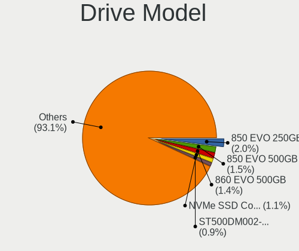

| Model                            | Desktops | Percent |
|----------------------------------|----------|---------|
| Samsung SSD 850 EVO 250GB        | 56       | 2.38%   |
| Samsung SSD 860 EVO 500GB        | 36       | 1.53%   |
| Samsung SSD 850 EVO 500GB        | 35       | 1.49%   |
| Samsung NVMe SSD Drive 500GB     | 28       | 1.19%   |
| Samsung NVMe SSD Drive 1TB       | 27       | 1.15%   |
| Seagate ST2000DM008-2FR102 2TB   | 25       | 1.06%   |
| Samsung SSD 840 EVO 120GB        | 23       | 0.98%   |
| Seagate ST500DM002-1BD142 500GB  | 22       | 0.94%   |
| Kingston SA400S37240G 240GB SSD  | 21       | 0.89%   |
| Samsung SSD 840 EVO 250GB        | 20       | 0.85%   |
| Toshiba DT01ACA100 1TB           | 17       | 0.72%   |
| Seagate Expansion 500GB          | 17       | 0.72%   |
| Samsung SSD 970 EVO 1TB          | 17       | 0.72%   |
| Samsung SSD 860 EVO 1TB          | 17       | 0.72%   |
| Kingston SA400S37120G 120GB SSD  | 17       | 0.72%   |
| Crucial CT500MX500SSD1 500GB     | 17       | 0.72%   |
| Seagate ST1000DM010-2EP102 1TB   | 16       | 0.68%   |
| Samsung HD103SJ 1TB              | 16       | 0.68%   |
| Seagate ST2000DM006-2DM164 2TB   | 15       | 0.64%   |
| Samsung HD204UI 2TB              | 15       | 0.64%   |
| WDC WD20EARX-00PASB0 2TB         | 13       | 0.55%   |
| Seagate ST31000524AS 1TB         | 13       | 0.55%   |
| Seagate ST1000DM003-1CH162 1TB   | 13       | 0.55%   |
| Kingston SV300S37A120G 120GB SSD | 13       | 0.55%   |
| WDC WD20EZRX-00D8PB0 2TB         | 12       | 0.51%   |
| Seagate ST2000DM001-1CH164 2TB   | 12       | 0.51%   |
| Samsung NVMe SSD Drive 250GB     | 12       | 0.51%   |
| Samsung HD103SI 1TB              | 12       | 0.51%   |
| WDC WD10EZEX-08WN4A0 1TB         | 11       | 0.47%   |
| Toshiba DT01ACA050 500GB         | 11       | 0.47%   |
| Seagate ST31000528AS 1TB         | 11       | 0.47%   |
| Samsung SSD 870 QVO 1TB          | 11       | 0.47%   |
| Samsung HD103UJ 1TB              | 11       | 0.47%   |
| Kingston NVMe SSD Drive 1TB      | 11       | 0.47%   |
| Seagate ST3500418AS 500GB        | 10       | 0.43%   |
| Seagate ST1000DM003-1ER162 1TB   | 10       | 0.43%   |
| Samsung SSD 970 EVO Plus 500GB   | 10       | 0.43%   |
| Samsung SSD 860 QVO 1TB          | 10       | 0.43%   |
| Samsung SSD 850 EVO 120GB        | 10       | 0.43%   |
| Crucial CT1000MX500SSD1 1TB      | 10       | 0.43%   |
| WDC WD20EARS-00MVWB0 2TB         | 9        | 0.38%   |
| Seagate ST4000DM004-2CV104 4TB   | 9        | 0.38%   |
| Seagate ST2000DM001-1ER164 2TB   | 9        | 0.38%   |
| Kingston SV300S37A60G 64GB SSD   | 9        | 0.38%   |
| Crucial CT256MX100SSD1 256GB     | 9        | 0.38%   |
| WDC WD40EZRZ-00GXCB0 4TB         | 8        | 0.34%   |
| WDC WD30EFRX-68EUZN0 3TB         | 8        | 0.34%   |
| WDC WD20EZRZ-00Z5HB0 2TB         | 8        | 0.34%   |
| Toshiba DT01ACA200 2TB           | 8        | 0.34%   |
| Seagate Expansion Desk 4TB       | 8        | 0.34%   |
| Samsung SSD 980 1TB              | 8        | 0.34%   |
| Samsung SSD 860 EVO 250GB        | 8        | 0.34%   |
| Samsung SSD 850 EVO 1TB          | 8        | 0.34%   |
| Kingston SV300S37A240G 240GB SSD | 8        | 0.34%   |
| WDC WD15EARS-00MVWB0 1TB         | 7        | 0.3%    |
| WDC WD10EZEX-00BN5A0 1TB         | 7        | 0.3%    |
| WDC WD10EARS-00Y5B1 1TB          | 7        | 0.3%    |
| Seagate Backup+ Hub BK 8TB       | 7        | 0.3%    |
| Samsung SSD 830 Series 128GB     | 7        | 0.3%    |
| Samsung HD753LJ 752GB            | 7        | 0.3%    |

HDD Vendor
----------

Hard disk drive vendors

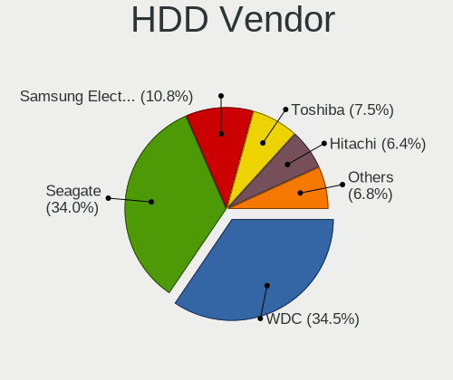

| Vendor              | Desktops | Drives | Percent |
|---------------------|----------|--------|---------|
| WDC                 | 352      | 582    | 34.44%  |
| Seagate             | 348      | 582    | 34.05%  |
| Samsung Electronics | 109      | 169    | 10.67%  |
| Toshiba             | 76       | 119    | 7.44%   |
| Hitachi             | 66       | 90     | 6.46%   |
| Maxtor              | 27       | 33     | 2.64%   |
| HGST                | 21       | 25     | 2.05%   |
| Unknown             | 4        | 6      | 0.39%   |
| ASMT                | 4        | 6      | 0.39%   |
| Intenso             | 2        | 2      | 0.2%    |
| IBM/Hitachi         | 2        | 2      | 0.2%    |
| Fujitsu             | 2        | 2      | 0.2%    |
| ExcelStor           | 2        | 2      | 0.2%    |
| NAS                 | 1        | 10     | 0.1%    |
| Maxtor 6            | 1        | 2      | 0.1%    |
| Magnetic Data       | 1        | 1      | 0.1%    |
| LaCie               | 1        | 1      | 0.1%    |
| JMicron Technology  | 1        | 3      | 0.1%    |
| Hewlett-Packard     | 1        | 1      | 0.1%    |
| Apple               | 1        | 1      | 0.1%    |

SSD Vendor
----------

Solid state drive vendors

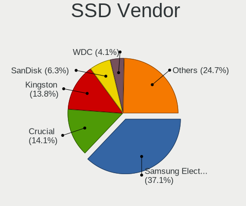

| Vendor              | Desktops | Drives | Percent |
|---------------------|----------|--------|---------|
| Samsung Electronics | 286      | 446    | 39.18%  |
| Kingston            | 97       | 122    | 13.29%  |
| Crucial             | 96       | 128    | 13.15%  |
| SanDisk             | 52       | 68     | 7.12%   |
| WDC                 | 33       | 41     | 4.52%   |
| Intel               | 30       | 44     | 4.11%   |
| A-DATA Technology   | 24       | 27     | 3.29%   |
| OCZ                 | 15       | 17     | 2.05%   |
| Transcend           | 11       | 15     | 1.51%   |
| Corsair             | 10       | 15     | 1.37%   |
| Toshiba             | 7        | 8      | 0.96%   |
| Patriot             | 7        | 7      | 0.96%   |
| SPCC                | 6        | 7      | 0.82%   |
| China               | 6        | 7      | 0.82%   |
| PNY                 | 5        | 5      | 0.68%   |
| GOODRAM             | 5        | 6      | 0.68%   |
| Mushkin             | 4        | 6      | 0.55%   |
| Plextor             | 3        | 4      | 0.41%   |
| Micron Technology   | 3        | 5      | 0.41%   |
| LITEON              | 3        | 4      | 0.41%   |
| Gigabyte Technology | 3        | 6      | 0.41%   |
| SK hynix            | 2        | 2      | 0.27%   |
| LITEONIT            | 2        | 2      | 0.27%   |
| Leven               | 2        | 2      | 0.27%   |
| KingSpec            | 2        | 3      | 0.27%   |
| XUM                 | 1        | 1      | 0.14%   |
| TO Exter            | 1        | 1      | 0.14%   |
| Seagate             | 1        | 1      | 0.14%   |
| Phison              | 1        | 1      | 0.14%   |
| OCZ-VERTEX2         | 1        | 2      | 0.14%   |
| Netac               | 1        | 1      | 0.14%   |
| Intenso             | 1        | 1      | 0.14%   |
| Innodisk            | 1        | 1      | 0.14%   |
| Golden              | 1        | 2      | 0.14%   |
| FORESEE             | 1        | 1      | 0.14%   |
| CT480BX5            | 1        | 2      | 0.14%   |
| ASMT                | 1        | 1      | 0.14%   |
| Apple               | 1        | 1      | 0.14%   |
| Apacer              | 1        | 1      | 0.14%   |
| Anobit              | 1        | 1      | 0.14%   |
| Unknown             | 1        | 2      | 0.14%   |

Drive Kind
----------

HDD or SSD

| Kind    | Desktops | Drives | Percent |
|---------|----------|--------|---------|
| HDD     | 764      | 1639   | 46.53%  |
| SSD     | 603      | 1017   | 36.72%  |
| NVMe    | 246      | 401    | 14.98%  |
| Unknown | 25       | 32     | 1.52%   |
| MMC     | 4        | 5      | 0.24%   |

Drive Connector
---------------

SATA, SAS, NVMe, etc.

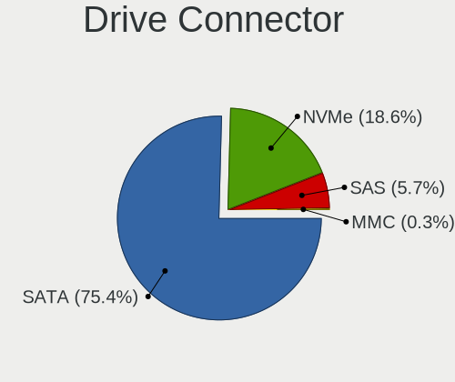

| Type | Desktops | Drives | Percent |
|------|----------|--------|---------|
| SATA | 1003     | 2532   | 75.41%  |
| NVMe | 246      | 401    | 18.5%   |
| SAS  | 77       | 156    | 5.79%   |
| MMC  | 4        | 5      | 0.3%    |

Drive Size
----------

Size of hard drive

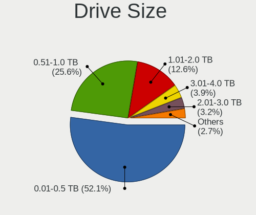

| Size in TB | Desktops | Drives | Percent |
|------------|----------|--------|---------|
| 0.01-0.5   | 800      | 1415   | 52.77%  |
| 0.51-1.0   | 389      | 627    | 25.66%  |
| 1.01-2.0   | 181      | 304    | 11.94%  |
| 3.01-4.0   | 59       | 128    | 3.89%   |
| 2.01-3.0   | 48       | 70     | 3.17%   |
| 4.01-10.0  | 37       | 98     | 2.44%   |
| 10.01-20.0 | 2        | 14     | 0.13%   |

Space Total
-----------

Amount of disk space available on the file system

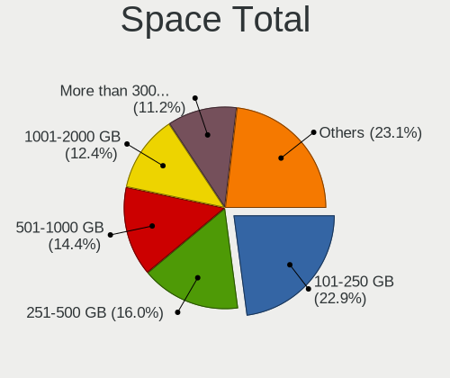

| Size in GB     | Desktops | Percent |
|----------------|----------|---------|
| 101-250        | 281      | 24.35%  |
| 251-500        | 184      | 15.94%  |
| 501-1000       | 164      | 14.21%  |
| 1001-2000      | 134      | 11.61%  |
| More than 3000 | 126      | 10.92%  |
| 1-20           | 67       | 5.81%   |
| 2001-3000      | 65       | 5.63%   |
| 51-100         | 65       | 5.63%   |
| Unknown        | 39       | 3.38%   |
| 21-50          | 29       | 2.51%   |

Space Used
----------

Amount of used disk space

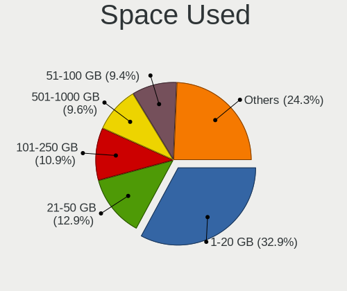

| Used GB        | Desktops | Percent |
|----------------|----------|---------|
| 1-20           | 411      | 34.77%  |
| 21-50          | 141      | 11.93%  |
| 101-250        | 131      | 11.08%  |
| 501-1000       | 108      | 9.14%   |
| 51-100         | 100      | 8.46%   |
| 251-500        | 86       | 7.28%   |
| 1001-2000      | 71       | 6.01%   |
| More than 3000 | 60       | 5.08%   |
| Unknown        | 39       | 3.3%    |
| 2001-3000      | 34       | 2.88%   |
| 0              | 1        | 0.08%   |

Malfunc. Drives
---------------

Drive models with a malfunction

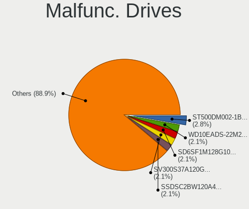

| Model                                 | Desktops | Drives | Percent |
|---------------------------------------|----------|--------|---------|
| Seagate ST500DM002-1BD142 500GB       | 4        | 4      | 4.08%   |
| WDC WD10EADS-22M2B0 1TB               | 3        | 3      | 3.06%   |
| SanDisk SD6SF1M128G1022I 128GB SSD    | 3        | 3      | 3.06%   |
| Toshiba MQ01ABD050 500GB              | 2        | 3      | 2.04%   |
| Seagate ST380011A 80GB                | 2        | 2      | 2.04%   |
| Seagate ST3500418AS 500GB             | 2        | 2      | 2.04%   |
| Seagate ST31000524AS 1TB              | 2        | 2      | 2.04%   |
| Intel SSDSC2BW120A4 120GB             | 2        | 3      | 2.04%   |
| Intel SSDSA2M080G2GC 80GB             | 2        | 3      | 2.04%   |
| Crucial CT525MX300SSD1 528GB          | 2        | 2      | 2.04%   |
| WDC WDS240G2G0A-00JH30 240GB SSD      | 1        | 1      | 1.02%   |
| WDC WD6400AACS-00G8B1 640GB           | 1        | 1      | 1.02%   |
| WDC WD60EFRX-68MYMN1 6TB              | 1        | 1      | 1.02%   |
| WDC WD5000BPVT-22HXZT3 500GB          | 1        | 1      | 1.02%   |
| WDC WD5000AVDS-63U7B1 500GB           | 1        | 1      | 1.02%   |
| WDC WD5000AAKX-001CA0 500GB           | 1        | 1      | 1.02%   |
| WDC WD5000AAKS-75V0A0 500GB           | 1        | 1      | 1.02%   |
| WDC WD5000AAKS-60Z1A0 500GB           | 1        | 1      | 1.02%   |
| WDC WD5000AAKS-41YGA1 500GB           | 1        | 1      | 1.02%   |
| WDC WD30EZRX-00MMMB0 3TB              | 1        | 1      | 1.02%   |
| WDC WD30EFRX-68EUZN0 3TB              | 1        | 2      | 1.02%   |
| WDC WD2500AAKX-00ERMA0 250GB          | 1        | 1      | 1.02%   |
| WDC WD20PURZ-85AKKY0 2TB              | 1        | 1      | 1.02%   |
| WDC WD20EZRZ-00Z5HB0 2TB              | 1        | 1      | 1.02%   |
| WDC WD20EFRX-68EUZN0 2TB              | 1        | 6      | 1.02%   |
| WDC WD20EARX-00PASB0 2TB              | 1        | 1      | 1.02%   |
| WDC WD1600AAJS-75M0A0 160GB           | 1        | 2      | 1.02%   |
| WDC WD15EADS-00P8B0 1TB               | 1        | 1      | 1.02%   |
| WDC WD1200JB-00CRA1 120GB             | 1        | 1      | 1.02%   |
| WDC WD10EZEX-60M2NA0 1TB              | 1        | 1      | 1.02%   |
| WDC WD10EARS-00Y5B1 1TB               | 1        | 1      | 1.02%   |
| WDC WD1003FZEX-00MK2A0 1TB            | 1        | 1      | 1.02%   |
| WDC WD1002FAEX-00Z3A0 1TB             | 1        | 1      | 1.02%   |
| WDC WD1002FAEX-00Y9A0 1TB             | 1        | 1      | 1.02%   |
| Toshiba MQ01ABF050 500GB              | 1        | 1      | 1.02%   |
| Seagate ST9500420AS 500GB             | 1        | 1      | 1.02%   |
| Seagate ST9250315AS 250GB             | 1        | 1      | 1.02%   |
| Seagate ST9100822A 100GB              | 1        | 1      | 1.02%   |
| Seagate ST4000VN008-2DR166 4TB        | 1        | 1      | 1.02%   |
| Seagate ST4000DM004-2CV104 4TB        | 1        | 2      | 1.02%   |
| Seagate ST3750630AS 752GB             | 1        | 1      | 1.02%   |
| Seagate ST3320620AS 320GB             | 1        | 1      | 1.02%   |
| Seagate ST3250820AS 250GB             | 1        | 1      | 1.02%   |
| Seagate ST3250620AS 250GB             | 1        | 1      | 1.02%   |
| Seagate ST3250318AS 250GB             | 1        | 1      | 1.02%   |
| Seagate ST3200822A 200GB              | 1        | 1      | 1.02%   |
| Seagate ST31500341AS 1TB              | 1        | 2      | 1.02%   |
| Seagate ST31000528AS 1TB              | 1        | 2      | 1.02%   |
| Seagate ST2000DM001-1CH164 2TB        | 1        | 1      | 1.02%   |
| Seagate ST1000DM003-9YN162 1TB        | 1        | 1      | 1.02%   |
| Seagate ST1000DM003-1ER162 1TB        | 1        | 1      | 1.02%   |
| Samsung Electronics SSD 970 EVO 250GB | 1        | 1      | 1.02%   |
| Samsung Electronics SSD 970 EVO 1TB   | 1        | 2      | 1.02%   |
| Samsung Electronics HM500JI 500GB     | 1        | 1      | 1.02%   |
| Samsung Electronics HM160HI 160GB     | 1        | 1      | 1.02%   |
| Samsung Electronics HD753LJ 752GB     | 1        | 1      | 1.02%   |
| Samsung Electronics HD204UI 2TB       | 1        | 1      | 1.02%   |
| Samsung Electronics HD103UJ 1TB       | 1        | 1      | 1.02%   |
| Patriot Burst 480GB SSD               | 1        | 1      | 1.02%   |
| OCZ VERTEX3 120GB SSD                 | 1        | 1      | 1.02%   |

Malfunc. Drive Vendor
---------------------

Vendors of faulty drives

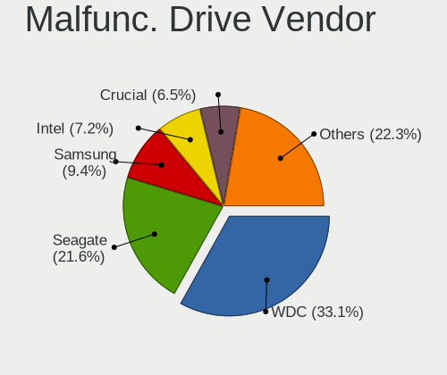

| Vendor              | Desktops | Drives | Percent |
|---------------------|----------|--------|---------|
| WDC                 | 26       | 34     | 27.08%  |
| Seagate             | 25       | 29     | 26.04%  |
| Intel               | 8        | 10     | 8.33%   |
| Samsung Electronics | 7        | 8      | 7.29%   |
| Crucial             | 7        | 11     | 7.29%   |
| Hitachi             | 5        | 6      | 5.21%   |
| Kingston            | 4        | 4      | 4.17%   |
| Toshiba             | 3        | 4      | 3.13%   |
| SanDisk             | 3        | 3      | 3.13%   |
| Maxtor              | 2        | 2      | 2.08%   |
| Patriot             | 1        | 1      | 1.04%   |
| OCZ                 | 1        | 1      | 1.04%   |
| LITEONIT            | 1        | 1      | 1.04%   |
| HGST                | 1        | 2      | 1.04%   |
| Anobit              | 1        | 1      | 1.04%   |
| A-DATA Technology   | 1        | 1      | 1.04%   |

Malfunc. HDD Vendor
-------------------

Vendors of faulty HDD drives

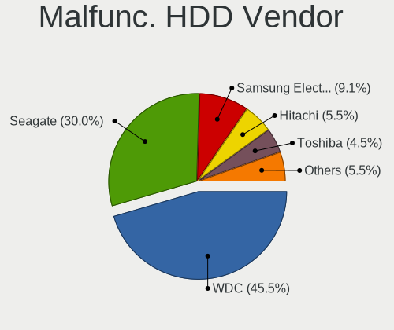

| Vendor              | Desktops | Drives | Percent |
|---------------------|----------|--------|---------|
| WDC                 | 25       | 33     | 37.88%  |
| Seagate             | 25       | 29     | 37.88%  |
| Samsung Electronics | 5        | 5      | 7.58%   |
| Hitachi             | 5        | 6      | 7.58%   |
| Toshiba             | 3        | 4      | 4.55%   |
| Maxtor              | 2        | 2      | 3.03%   |
| HGST                | 1        | 2      | 1.52%   |

Malfunc. Drive Kind
-------------------

Kinds of faulty drives

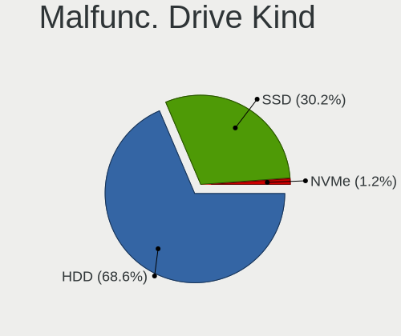

| Kind | Desktops | Drives | Percent |
|------|----------|--------|---------|
| HDD  | 59       | 81     | 66.29%  |
| SSD  | 27       | 33     | 30.34%  |
| NVMe | 3        | 4      | 3.37%   |

Failed Drives
-------------

Failed drive models

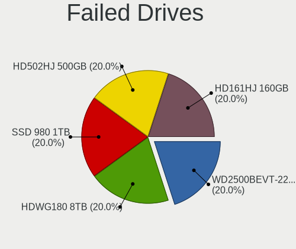

| Model                             | Desktops | Drives | Percent |
|-----------------------------------|----------|--------|---------|
| WDC WD2500BEVT-22ZCT0 250GB       | 1        | 1      | 33.33%  |
| Samsung Electronics HD502HJ 500GB | 1        | 1      | 33.33%  |
| Samsung Electronics HD161HJ 160GB | 1        | 1      | 33.33%  |

Failed Drive Vendor
-------------------

Failed drive vendors

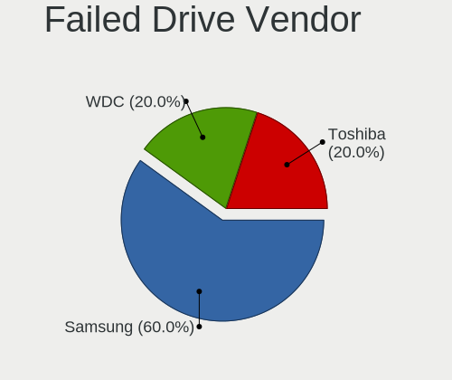

| Vendor              | Desktops | Drives | Percent |
|---------------------|----------|--------|---------|
| Samsung Electronics | 2        | 2      | 66.67%  |
| WDC                 | 1        | 1      | 33.33%  |

Drive Status
------------

Number of failed and malfunc. drives

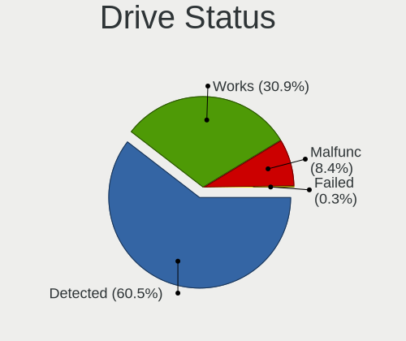

| Status   | Desktops | Drives | Percent |
|----------|----------|--------|---------|
| Detected | 755      | 2155   | 65.25%  |
| Works    | 315      | 818    | 27.23%  |
| Malfunc  | 84       | 118    | 7.26%   |
| Failed   | 3        | 3      | 0.26%   |

Storage controller
------------------

Storage Vendor
--------------

Storage controller vendors

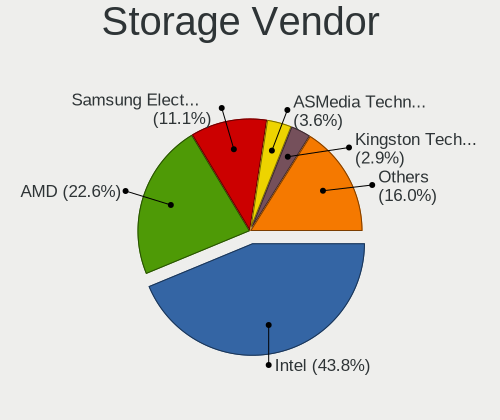

| Vendor                           | Desktops | Percent |
|----------------------------------|----------|---------|
| Intel                            | 711      | 47.59%  |
| AMD                              | 337      | 22.56%  |
| Samsung Electronics              | 143      | 9.57%   |
| ASMedia Technology               | 51       | 3.41%   |
| JMicron Technology               | 46       | 3.08%   |
| Marvell Technology Group         | 41       | 2.74%   |
| Kingston Technology Company      | 34       | 2.28%   |
| Nvidia                           | 25       | 1.67%   |
| Phison Electronics               | 21       | 1.41%   |
| SanDisk                          | 18       | 1.2%    |
| ADATA Technology                 | 10       | 0.67%   |
| VIA Technologies                 | 8        | 0.54%   |
| Micron/Crucial Technology        | 8        | 0.54%   |
| Silicon Image                    | 6        | 0.4%    |
| Silicon Motion                   | 5        | 0.33%   |
| Seagate Technology               | 4        | 0.27%   |
| Toshiba America Info Systems     | 3        | 0.2%    |
| Integrated Technology Express    | 3        | 0.2%    |
| ULi Electronics                  | 2        | 0.13%   |
| SK hynix                         | 2        | 0.13%   |
| Silicon Integrated Systems [SiS] | 2        | 0.13%   |
| Promise Technology               | 2        | 0.13%   |
| Micron Technology                | 2        | 0.13%   |
| LSI Logic / Symbios Logic        | 2        | 0.13%   |
| Broadcom / LSI                   | 2        | 0.13%   |
| Adaptec                          | 2        | 0.13%   |
| Realtek Semiconductor            | 1        | 0.07%   |
| Lite-On IT Corp. / Plextor       | 1        | 0.07%   |
| HighPoint Technologies           | 1        | 0.07%   |
| Hewlett-Packard                  | 1        | 0.07%   |

Storage Model
-------------

Storage controller models

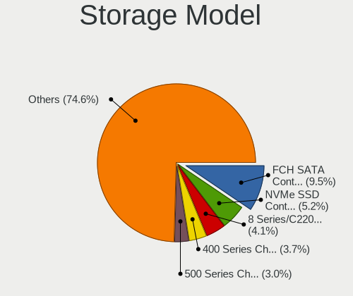

| Model                                                                                   | Desktops | Percent |
|-----------------------------------------------------------------------------------------|----------|---------|
| AMD FCH SATA Controller [AHCI mode]                                                     | 197      | 10.18%  |
| Samsung NVMe SSD Controller SM981/PM981/PM983                                           | 95       | 4.91%   |
| Intel 8 Series/C220 Series Chipset Family 6-port SATA Controller 1 [AHCI mode]          | 92       | 4.75%   |
| AMD 400 Series Chipset SATA Controller                                                  | 77       | 3.98%   |
| Intel 6 Series/C200 Series Chipset Family 6 port Desktop SATA AHCI Controller           | 55       | 2.84%   |
| Intel Q170/Q150/B150/H170/H110/Z170/CM236 Chipset SATA Controller [AHCI Mode]           | 54       | 2.79%   |
| AMD SB7x0/SB8x0/SB9x0 IDE Controller                                                    | 54       | 2.79%   |
| Intel SATA Controller [RAID mode]                                                       | 52       | 2.69%   |
| ASMedia ASM1062 Serial ATA Controller                                                   | 47       | 2.43%   |
| Intel 7 Series/C210 Series Chipset Family 6-port SATA Controller [AHCI mode]            | 46       | 2.38%   |
| Intel NM10/ICH7 Family SATA Controller [IDE mode]                                       | 44       | 2.27%   |
| Intel 82801G (ICH7 Family) IDE Controller                                               | 41       | 2.12%   |
| Intel 200 Series PCH SATA controller [AHCI mode]                                        | 41       | 2.12%   |
| AMD 500 Series Chipset SATA Controller                                                  | 40       | 2.07%   |
| AMD SB7x0/SB8x0/SB9x0 SATA Controller [IDE mode]                                        | 37       | 1.91%   |
| AMD SB7x0/SB8x0/SB9x0 SATA Controller [AHCI mode]                                       | 36       | 1.86%   |
| JMicron JMB363 SATA/IDE Controller                                                      | 29       | 1.5%    |
| Intel 9 Series Chipset Family SATA Controller [AHCI Mode]                               | 29       | 1.5%    |
| Intel 6 Series/C200 Series Chipset Family Desktop SATA Controller (IDE mode, ports 4-5) | 29       | 1.5%    |
| Intel 6 Series/C200 Series Chipset Family Desktop SATA Controller (IDE mode, ports 0-3) | 29       | 1.5%    |
| Kingston Company A2000 NVMe SSD                                                         | 28       | 1.45%   |
| Intel 82801JI (ICH10 Family) SATA AHCI Controller                                       | 28       | 1.45%   |
| Intel 82801I (ICH9 Family) 2 port SATA Controller [IDE mode]                            | 27       | 1.39%   |
| Samsung NVMe SSD Controller 980                                                         | 22       | 1.14%   |
| Intel Cannon Lake PCH SATA AHCI Controller                                              | 22       | 1.14%   |
| Intel 82801IR/IO/IH (ICH9R/DO/DH) 4 port SATA Controller [IDE mode]                     | 21       | 1.08%   |
| Intel 82801JI (ICH10 Family) 4 port SATA IDE Controller #1                              | 20       | 1.03%   |
| Intel 82801JI (ICH10 Family) 2 port SATA IDE Controller #2                              | 20       | 1.03%   |
| Samsung NVMe SSD Controller SM961/PM961/SM963                                           | 19       | 0.98%   |
| Intel 82801JD/DO (ICH10 Family) SATA AHCI Controller                                    | 16       | 0.83%   |
| Intel 4 Series Chipset PT IDER Controller                                               | 16       | 0.83%   |
| AMD FCH IDE Controller                                                                  | 15       | 0.77%   |
| Intel SSD 660P Series                                                                   | 14       | 0.72%   |
| AMD 300 Series Chipset SATA Controller                                                  | 14       | 0.72%   |
| Intel 82Q35 Express PT IDER Controller                                                  | 13       | 0.67%   |
| Intel 5 Series/3400 Series Chipset 6 port SATA AHCI Controller                          | 13       | 0.67%   |
| Samsung NVMe SSD Controller PM9A1/PM9A3/980PRO                                          | 12       | 0.62%   |
| Phison E12 NVMe Controller                                                              | 11       | 0.57%   |
| AMD FCH SATA Controller D                                                               | 11       | 0.57%   |
| Nvidia MCP61 SATA Controller                                                            | 10       | 0.52%   |
| Intel C600/X79 series chipset 6-Port SATA AHCI Controller                               | 10       | 0.52%   |
| Intel 82801H (ICH8 Family) 4 port SATA Controller [IDE mode]                            | 10       | 0.52%   |
| Intel 5 Series/3400 Series Chipset 4 port SATA IDE Controller                           | 10       | 0.52%   |
| Intel 5 Series/3400 Series Chipset 2 port SATA IDE Controller                           | 10       | 0.52%   |
| AMD X370 Series Chipset SATA Controller                                                 | 10       | 0.52%   |
| ADATA XPG SX8200 Pro PCIe Gen3x4 M.2 2280 Solid State Drive                             | 10       | 0.52%   |
| Nvidia MCP61 IDE                                                                        | 9        | 0.46%   |
| JMicron JMB368 IDE controller                                                           | 9        | 0.46%   |
| Marvell Group 88SE9172 SATA 6Gb/s Controller                                            | 8        | 0.41%   |
| Intel Sunrise Point-LP SATA Controller [AHCI mode]                                      | 7        | 0.36%   |
| Intel NM10/ICH7 Family SATA Controller [AHCI mode]                                      | 7        | 0.36%   |
| Intel Comet Lake SATA AHCI Controller                                                   | 7        | 0.36%   |
| Intel C610/X99 series chipset sSATA Controller [AHCI mode]                              | 7        | 0.36%   |
| AMD SB600 Non-Raid-5 SATA                                                               | 7        | 0.36%   |
| AMD SB600 IDE                                                                           | 7        | 0.36%   |
| Marvell Group 88SE6111/6121 SATA II / PATA Controller                                   | 6        | 0.31%   |
| Intel Atom/Celeron/Pentium Processor x5-E8000/J3xxx/N3xxx Series SATA Controller        | 6        | 0.31%   |
| Intel 82801IB (ICH9) 2 port SATA Controller [IDE mode]                                  | 6        | 0.31%   |
| Intel 82801HR/HO/HH (ICH8R/DO/DH) 2 port SATA Controller [IDE mode]                     | 6        | 0.31%   |
| Intel 7 Series/C210 Series Chipset Family 4-port SATA Controller [IDE mode]             | 6        | 0.31%   |

Storage Kind
------------

Kind of storage controller (IDE, SATA, NVMe, SAS, ...)

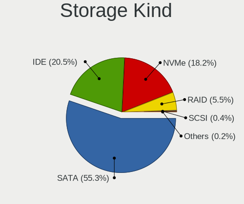

| Kind | Desktops | Percent |
|------|----------|---------|
| SATA | 829      | 55.6%   |
| IDE  | 326      | 21.86%  |
| NVMe | 248      | 16.63%  |
| RAID | 82       | 5.5%    |
| SCSI | 4        | 0.27%   |
| SAS  | 2        | 0.13%   |

Processor
---------

CPU Vendor
----------

Processor vendors

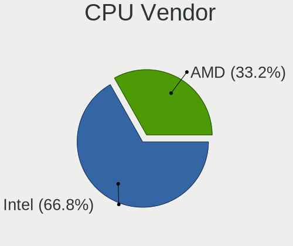

| Vendor | Desktops | Percent |
|--------|----------|---------|
| Intel  | 714      | 66.48%  |
| AMD    | 360      | 33.52%  |

CPU Model
---------

Processor models

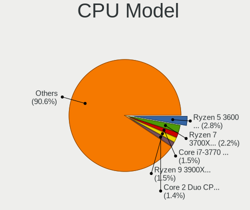

| Model                                       | Desktops | Percent |
|---------------------------------------------|----------|---------|
| AMD Ryzen 5 3600 6-Core Processor           | 27       | 2.5%    |
| AMD Ryzen 7 3700X 8-Core Processor          | 24       | 2.22%   |
| AMD Ryzen 5 2600 Six-Core Processor         | 19       | 1.76%   |
| Intel Core 2 Duo CPU E8400 @ 3.00GHz        | 18       | 1.67%   |
| Intel Core i7-2600 CPU @ 3.40GHz            | 17       | 1.58%   |
| Intel Core i5-4460 CPU @ 3.20GHz            | 17       | 1.58%   |
| Intel Core i7-3770 CPU @ 3.40GHz            | 14       | 1.3%    |
| Intel Core i5-4590 CPU @ 3.30GHz            | 13       | 1.2%    |
| Intel Core i5-3470 CPU @ 3.20GHz            | 13       | 1.2%    |
| AMD Ryzen 9 3900X 12-Core Processor         | 13       | 1.2%    |
| AMD Ryzen 5 5600X 6-Core Processor          | 13       | 1.2%    |
| Intel Core i7-4790 CPU @ 3.60GHz            | 12       | 1.11%   |
| AMD Ryzen 7 2700X Eight-Core Processor      | 12       | 1.11%   |
| AMD FX-8350 Eight-Core Processor            | 12       | 1.11%   |
| Intel Core i7-6700K CPU @ 4.00GHz           | 11       | 1.02%   |
| Intel Core i5-2400 CPU @ 3.10GHz            | 11       | 1.02%   |
| Intel Core i3-2120 CPU @ 3.30GHz            | 11       | 1.02%   |
| Intel Core 2 Quad CPU Q6600 @ 2.40GHz       | 11       | 1.02%   |
| Intel Core i5-4570 CPU @ 3.20GHz            | 10       | 0.93%   |
| AMD Ryzen 7 5800X 8-Core Processor          | 10       | 0.93%   |
| Intel Core i7 CPU 920 @ 2.67GHz             | 9        | 0.83%   |
| AMD Ryzen 5 1600 Six-Core Processor         | 9        | 0.83%   |
| Intel Core i5-4440 CPU @ 3.10GHz            | 8        | 0.74%   |
| Intel Core i5 CPU 750 @ 2.67GHz             | 8        | 0.74%   |
| Intel Core i3-3220 CPU @ 3.30GHz            | 8        | 0.74%   |
| Intel Pentium D CPU 3.00GHz                 | 7        | 0.65%   |
| Intel Core i7-4790K CPU @ 4.00GHz           | 7        | 0.65%   |
| Intel Core i5-9600K CPU @ 3.70GHz           | 7        | 0.65%   |
| Intel Core i5-7400 CPU @ 3.00GHz            | 7        | 0.65%   |
| Intel Core i5-6600 CPU @ 3.30GHz            | 7        | 0.65%   |
| Intel Core i3-2100 CPU @ 3.10GHz            | 7        | 0.65%   |
| AMD Ryzen 5 3600X 6-Core Processor          | 7        | 0.65%   |
| AMD Ryzen 5 2400G with Radeon Vega Graphics | 7        | 0.65%   |
| Intel Core i7-2600K CPU @ 3.40GHz           | 6        | 0.56%   |
| Intel Core i7 CPU 860 @ 2.80GHz             | 6        | 0.56%   |
| Intel Core i5-6400 CPU @ 2.70GHz            | 6        | 0.56%   |
| Intel Core i5-2500 CPU @ 3.30GHz            | 6        | 0.56%   |
| Intel Core i5 CPU 650 @ 3.20GHz             | 6        | 0.56%   |
| Intel Core 2 Duo CPU E6550 @ 2.33GHz        | 6        | 0.56%   |
| Intel Pentium CPU G620 @ 2.60GHz            | 5        | 0.46%   |
| Intel Core i7-8700K CPU @ 3.70GHz           | 5        | 0.46%   |
| Intel Core i7-8700 CPU @ 3.20GHz            | 5        | 0.46%   |
| Intel Core i7-7700K CPU @ 4.20GHz           | 5        | 0.46%   |
| Intel Core i7-7700 CPU @ 3.60GHz            | 5        | 0.46%   |
| Intel Core i7-4770 CPU @ 3.40GHz            | 5        | 0.46%   |
| Intel Core i7 CPU 950 @ 3.07GHz             | 5        | 0.46%   |
| Intel Core i5-6600K CPU @ 3.50GHz           | 5        | 0.46%   |
| Intel Core i5-6500 CPU @ 3.20GHz            | 5        | 0.46%   |
| Intel Core i5-4690K CPU @ 3.50GHz           | 5        | 0.46%   |
| Intel Core i5-4690 CPU @ 3.50GHz            | 5        | 0.46%   |
| Intel Core i5-2500K CPU @ 3.30GHz           | 5        | 0.46%   |
| Intel Core i3-4130 CPU @ 3.40GHz            | 5        | 0.46%   |
| Intel Core 2 Duo CPU E6850 @ 3.00GHz        | 5        | 0.46%   |
| Intel Core 2 Duo CPU E6750 @ 2.66GHz        | 5        | 0.46%   |
| AMD Ryzen 9 5900X 12-Core Processor         | 5        | 0.46%   |
| AMD Ryzen 7 3800X 8-Core Processor          | 5        | 0.46%   |
| AMD Ryzen 5 3400G with Radeon Vega Graphics | 5        | 0.46%   |
| AMD Ryzen 3 2200G with Radeon Vega Graphics | 5        | 0.46%   |
| AMD FX-6300 Six-Core Processor              | 5        | 0.46%   |
| AMD Athlon 64 X2 Dual Core Processor 5000+  | 5        | 0.46%   |

CPU Model Family
----------------

Processor model prefix

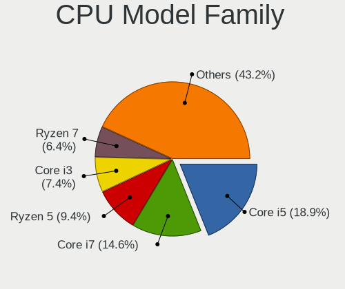

| Model                   | Desktops | Percent |
|-------------------------|----------|---------|
| Intel Core i5           | 211      | 19.59%  |
| Intel Core i7           | 157      | 14.58%  |
| AMD Ryzen 5             | 100      | 9.29%   |
| Intel Core i3           | 72       | 6.69%   |
| AMD Ryzen 7             | 68       | 6.31%   |
| Intel Core 2 Duo        | 48       | 4.46%   |
| Intel Xeon              | 42       | 3.9%    |
| Intel Core 2 Quad       | 35       | 3.25%   |
| Intel Celeron           | 35       | 3.25%   |
| AMD FX                  | 31       | 2.88%   |
| Intel Pentium Dual-Core | 26       | 2.41%   |
| AMD Ryzen 9             | 24       | 2.23%   |
| Intel Pentium           | 20       | 1.86%   |
| AMD Athlon 64 X2        | 16       | 1.49%   |
| AMD A8                  | 14       | 1.3%    |
| Intel Pentium D         | 13       | 1.21%   |
| Intel Pentium 4         | 13       | 1.21%   |
| AMD Phenom II X4        | 13       | 1.21%   |
| AMD Athlon II X2        | 13       | 1.21%   |
| Intel Core i9           | 10       | 0.93%   |
| Intel Core 2            | 10       | 0.93%   |
| Intel Atom              | 10       | 0.93%   |
| AMD Ryzen 3             | 10       | 0.93%   |
| Other                   | 8        | 0.74%   |
| AMD Athlon              | 7        | 0.65%   |
| AMD A4                  | 7        | 0.65%   |
| AMD Ryzen Threadripper  | 6        | 0.56%   |
| AMD Athlon II X4        | 6        | 0.56%   |
| AMD A6                  | 6        | 0.56%   |
| AMD A10                 | 6        | 0.56%   |
| Intel Pentium Dual      | 5        | 0.46%   |
| AMD E                   | 4        | 0.37%   |
| AMD Ryzen 5 PRO         | 3        | 0.28%   |
| AMD Phenom II X6        | 3        | 0.28%   |
| AMD Athlon Dual Core    | 3        | 0.28%   |
| AMD Athlon 64           | 3        | 0.28%   |
| Intel Pentium Gold      | 2        | 0.19%   |
| AMD Sempron             | 2        | 0.19%   |
| AMD E2                  | 2        | 0.19%   |
| AMD E1                  | 2        | 0.19%   |
| AMD Athlon X4           | 2        | 0.19%   |
| AMD Athlon II X3        | 2        | 0.19%   |
| Intel Genuine           | 1        | 0.09%   |
| AMD Ryzen 3 PRO         | 1        | 0.09%   |
| AMD Phenom II X2        | 1        | 0.09%   |
| AMD Phenom              | 1        | 0.09%   |
| AMD Hammer              | 1        | 0.09%   |
| AMD GX                  | 1        | 0.09%   |
| AMD Athlon X2           | 1        | 0.09%   |

CPU Cores
---------

Number of processor cores

| Number  | Desktops | Percent |
|---------|----------|---------|
| 4       | 454      | 42.15%  |
| 2       | 299      | 27.76%  |
| 6       | 150      | 13.93%  |
| 8       | 85       | 7.89%   |
| 1       | 36       | 3.34%   |
| 12      | 27       | 2.51%   |
| 3       | 8        | 0.74%   |
| 16      | 6        | 0.56%   |
| 10      | 5        | 0.46%   |
| 24      | 2        | 0.19%   |
| Unknown | 2        | 0.19%   |
| 64      | 1        | 0.09%   |
| 48      | 1        | 0.09%   |
| 5       | 1        | 0.09%   |

CPU Sockets
-----------

Number of sockets

| Number | Desktops | Percent |
|--------|----------|---------|
| 1      | 1065     | 99.16%  |
| 2      | 9        | 0.84%   |

CPU Threads
-----------

Threads per core (Hyper-Threading)

| Number  | Desktops | Percent |
|---------|----------|---------|
| 2       | 553      | 51.35%  |
| 1       | 522      | 48.47%  |
| Unknown | 2        | 0.19%   |

CPU Op-Modes
------------

CPU Operation Modes (32-bit, 64-bit)

| Op mode        | Desktops | Percent |
|----------------|----------|---------|
| 32-bit, 64-bit | 1043     | 96.84%  |
| Unknown        | 25       | 2.32%   |
| 32-bit         | 9        | 0.84%   |

CPU Microcode
-------------

Microcode number

| Number     | Desktops | Percent |
|------------|----------|---------|
| Unknown    | 243      | 21.72%  |
| 0x306c3    | 106      | 9.47%   |
| 0x206a7    | 69       | 6.17%   |
| 0x1067a    | 63       | 5.63%   |
| 0x306a9    | 52       | 4.65%   |
| 0x08701021 | 44       | 3.93%   |
| 0x506e3    | 39       | 3.49%   |
| 0x08701013 | 27       | 2.41%   |
| 0x010000c8 | 25       | 2.23%   |
| 0x0800820d | 23       | 2.06%   |
| 0x906ea    | 22       | 1.97%   |
| 0x906e9    | 22       | 1.97%   |
| 0x6fb      | 22       | 1.97%   |
| 0x06000852 | 20       | 1.79%   |
| 0x106e5    | 16       | 1.43%   |
| 0x106a5    | 14       | 1.25%   |
| 0x06001119 | 14       | 1.25%   |
| 0x0a201016 | 12       | 1.07%   |
| 0x6fd      | 10       | 0.89%   |
| 0x906ec    | 9        | 0.8%    |
| 0x10676    | 9        | 0.8%    |
| 0x906ed    | 8        | 0.71%   |
| 0x0a201009 | 8        | 0.71%   |
| 0x08101016 | 8        | 0.71%   |
| 0x6f6      | 7        | 0.63%   |
| 0x20655    | 7        | 0.63%   |
| 0x08108109 | 7        | 0.63%   |
| 0x06003106 | 7        | 0.63%   |
| 0x03000027 | 7        | 0.63%   |
| 0xa0655    | 6        | 0.54%   |
| 0x206c2    | 6        | 0.54%   |
| 0xf65      | 5        | 0.45%   |
| 0xf41      | 5        | 0.45%   |
| 0xa0653    | 5        | 0.45%   |
| 0x306f2    | 5        | 0.45%   |
| 0x0800820b | 5        | 0.45%   |
| 0x08001138 | 5        | 0.45%   |
| 0x08001137 | 5        | 0.45%   |
| 0x0600063e | 5        | 0.45%   |
| 0x010000db | 5        | 0.45%   |
| 0x906eb    | 4        | 0.36%   |
| 0x90672    | 4        | 0.36%   |
| 0x6f2      | 4        | 0.36%   |
| 0x406c4    | 4        | 0.36%   |
| 0x306e4    | 4        | 0.36%   |
| 0x206d7    | 4        | 0.36%   |
| 0x20652    | 4        | 0.36%   |
| 0x0810100b | 4        | 0.36%   |
| 0x05000119 | 4        | 0.36%   |
| 0xf49      | 3        | 0.27%   |
| 0xf27      | 3        | 0.27%   |
| 0x806e9    | 3        | 0.27%   |
| 0x706a1    | 3        | 0.27%   |
| 0x406e3    | 3        | 0.27%   |
| 0x106ca    | 3        | 0.27%   |
| 0x106a4    | 3        | 0.27%   |
| 0x10677    | 3        | 0.27%   |
| 0x0a50000c | 3        | 0.27%   |
| 0x08600106 | 3        | 0.27%   |
| 0x0700010f | 3        | 0.27%   |

CPU Microarch
-------------

Microarchitecture

| Name             | Desktops | Percent |
|------------------|----------|---------|
| Haswell          | 142      | 13.22%  |
| Zen 2            | 91       | 8.47%   |
| SandyBridge      | 89       | 8.29%   |
| Penryn           | 82       | 7.64%   |
| KabyLake         | 82       | 7.64%   |
| IvyBridge        | 70       | 6.52%   |
| Skylake          | 54       | 5.03%   |
| Core             | 53       | 4.93%   |
| Zen+             | 52       | 4.84%   |
| K10              | 41       | 3.82%   |
| Piledriver       | 40       | 3.72%   |
| Nehalem          | 37       | 3.45%   |
| Zen 3            | 36       | 3.35%   |
| Zen              | 36       | 3.35%   |
| NetBurst         | 29       | 2.7%    |
| K8 Hammer        | 27       | 2.51%   |
| Westmere         | 21       | 1.96%   |
| CometLake        | 16       | 1.49%   |
| Silvermont       | 15       | 1.4%    |
| Steamroller      | 8        | 0.74%   |
| K10 Llano        | 8        | 0.74%   |
| Broadwell        | 6        | 0.56%   |
| Bonnell          | 6        | 0.56%   |
| Bobcat           | 6        | 0.56%   |
| Bulldozer        | 5        | 0.47%   |
| Jaguar           | 4        | 0.37%   |
| Unknown          | 4        | 0.37%   |
| Goldmont plus    | 3        | 0.28%   |
| Excavator        | 3        | 0.28%   |
| Alderlake Hybrid | 3        | 0.28%   |
| Puma             | 2        | 0.19%   |
| Goldmont         | 2        | 0.19%   |
| P6               | 1        | 0.09%   |

Graphics
--------

GPU Vendor
----------

Vendors of graphics cards

| Vendor                     | Desktops | Percent |
|----------------------------|----------|---------|
| Nvidia                     | 468      | 40.55%  |
| AMD                        | 360      | 31.2%   |
| Intel                      | 319      | 27.64%  |
| Matrox Electronics Systems | 4        | 0.35%   |
| VIA Technologies           | 2        | 0.17%   |
| ASPEED Technology          | 1        | 0.09%   |

GPU Model
---------

Graphics card models

| Model                                                                                    | Desktops | Percent |
|------------------------------------------------------------------------------------------|----------|---------|
| Intel Xeon E3-1200 v3/4th Gen Core Processor Integrated Graphics Controller              | 62       | 5.23%   |
| AMD Ellesmere [Radeon RX 470/480/570/570X/580/580X/590]                                  | 59       | 4.98%   |
| Intel 2nd Generation Core Processor Family Integrated Graphics Controller                | 39       | 3.29%   |
| Nvidia GK208B [GeForce GT 710]                                                           | 31       | 2.62%   |
| Intel 4 Series Chipset Integrated Graphics Controller                                    | 27       | 2.28%   |
| Intel Xeon E3-1200 v2/3rd Gen Core processor Graphics Controller                         | 26       | 2.19%   |
| Nvidia GP107 [GeForce GTX 1050 Ti]                                                       | 25       | 2.11%   |
| Nvidia GP106 [GeForce GTX 1060 6GB]                                                      | 23       | 1.94%   |
| Nvidia GT218 [GeForce 210]                                                               | 20       | 1.69%   |
| AMD Navi 10 [Radeon RX 5600 OEM/5600 XT / 5700/5700 XT]                                  | 19       | 1.6%    |
| Nvidia GM204 [GeForce GTX 970]                                                           | 18       | 1.52%   |
| Intel CoffeeLake-S GT2 [UHD Graphics 630]                                                | 17       | 1.43%   |
| Intel HD Graphics 530                                                                    | 16       | 1.35%   |
| Nvidia GP108 [GeForce GT 1030]                                                           | 13       | 1.1%    |
| Nvidia GM206 [GeForce GTX 960]                                                           | 13       | 1.1%    |
| Nvidia GP104 [GeForce GTX 1070]                                                          | 12       | 1.01%   |
| Nvidia GK208B [GeForce GT 730]                                                           | 12       | 1.01%   |
| AMD Raven Ridge [Radeon Vega Series / Radeon Vega Mobile Series]                         | 12       | 1.01%   |
| AMD Cape Verde PRO [Radeon HD 7750/8740 / R7 250E]                                       | 12       | 1.01%   |
| Intel HD Graphics 630                                                                    | 11       | 0.93%   |
| AMD Caicos [Radeon HD 6450/7450/8450 / R5 230 OEM]                                       | 11       | 0.93%   |
| AMD Baffin [Radeon RX 460/560D / Pro 450/455/460/555/555X/560/560X]                      | 11       | 0.93%   |
| Nvidia GP104 [GeForce GTX 1080]                                                          | 10       | 0.84%   |
| Nvidia GM107 [GeForce GTX 750 Ti]                                                        | 10       | 0.84%   |
| Intel CometLake-S GT2 [UHD Graphics 630]                                                 | 10       | 0.84%   |
| Intel 4th Generation Core Processor Family Integrated Graphics Controller                | 10       | 0.84%   |
| AMD Juniper XT [Radeon HD 5770]                                                          | 10       | 0.84%   |
| AMD Cedar [Radeon HD 5000/6000/7350/8350 Series]                                         | 10       | 0.84%   |
| Nvidia TU116 [GeForce GTX 1660 SUPER]                                                    | 9        | 0.76%   |
| Nvidia GP107 [GeForce GTX 1050]                                                          | 9        | 0.76%   |
| Intel IvyBridge GT2 [HD Graphics 4000]                                                   | 9        | 0.76%   |
| Intel 82Q35 Express Integrated Graphics Controller                                       | 9        | 0.76%   |
| AMD Picasso/Raven 2 [Radeon Vega Series / Radeon Vega Mobile Series]                     | 9        | 0.76%   |
| Intel Atom/Celeron/Pentium Processor x5-E8000/J3xxx/N3xxx Integrated Graphics Controller | 8        | 0.68%   |
| Intel 82G33/G31 Express Integrated Graphics Controller                                   | 8        | 0.68%   |
| Nvidia TU116 [GeForce GTX 1660 Ti]                                                       | 7        | 0.59%   |
| Nvidia GK107 [GeForce GTX 650]                                                           | 7        | 0.59%   |
| Nvidia GF119 [GeForce GT 610]                                                            | 7        | 0.59%   |
| Intel Core Processor Integrated Graphics Controller                                      | 7        | 0.59%   |
| Intel 82Q963/Q965 Integrated Graphics Controller                                         | 7        | 0.59%   |
| AMD RS780L [Radeon 3000]                                                                 | 7        | 0.59%   |
| AMD Renoir                                                                               | 7        | 0.59%   |
| Nvidia TU117 [GeForce GTX 1650]                                                          | 6        | 0.51%   |
| Nvidia TU106 [GeForce RTX 2060 SUPER]                                                    | 6        | 0.51%   |
| Nvidia TU106 [GeForce RTX 2060 Rev. A]                                                   | 6        | 0.51%   |
| Nvidia TU104 [GeForce RTX 2070 SUPER]                                                    | 6        | 0.51%   |
| Nvidia GK104 [GeForce GTX 760]                                                           | 6        | 0.51%   |
| Intel Atom Processor Z36xxx/Z37xxx Series Graphics & Display                             | 6        | 0.51%   |
| AMD Vega 10 XL/XT [Radeon RX Vega 56/64]                                                 | 6        | 0.51%   |
| AMD RV710 [Radeon HD 4350/4550]                                                          | 6        | 0.51%   |
| AMD Baffin [Radeon RX 550 640SP / RX 560/560X]                                           | 6        | 0.51%   |
| Nvidia GP106 [GeForce GTX 1060 3GB]                                                      | 5        | 0.42%   |
| Nvidia GK104 [GeForce GTX 660 Ti]                                                        | 5        | 0.42%   |
| Nvidia GF119 [GeForce GT 520]                                                            | 5        | 0.42%   |
| Nvidia GF114 [GeForce GTX 560 Ti]                                                        | 5        | 0.42%   |
| Nvidia G96C [GeForce 9400 GT]                                                            | 5        | 0.42%   |
| Intel 82945G/GZ Integrated Graphics Controller                                           | 5        | 0.42%   |
| AMD Turks XT [Radeon HD 6670/7670]                                                       | 5        | 0.42%   |
| AMD Navi 23 [Radeon RX 6600/6600 XT/6600M]                                               | 5        | 0.42%   |
| AMD Navi 21 [Radeon RX 6800/6800 XT / 6900 XT]                                           | 5        | 0.42%   |

GPU Combo
---------

Combinations of graphics cards

| Name                     | Desktops | Percent |
|--------------------------|----------|---------|
| 1 x Nvidia               | 433      | 39.83%  |
| 1 x AMD                  | 325      | 29.9%   |
| 1 x Intel                | 261      | 24.01%  |
| Intel + Nvidia           | 18       | 1.66%   |
| 2 x AMD                  | 17       | 1.56%   |
| AMD + Nvidia             | 9        | 0.83%   |
| Intel + AMD              | 7        | 0.64%   |
| 2 x Nvidia               | 5        | 0.46%   |
| Other                    | 3        | 0.28%   |
| 1 x Matrox               | 3        | 0.28%   |
| 1 x VIA                  | 2        | 0.18%   |
| Intel + AMD + 1 x Nvidia | 2        | 0.18%   |
| Nvidia + ASPEED          | 1        | 0.09%   |
| AMD + Matrox             | 1        | 0.09%   |

GPU Driver
----------

Free vs proprietary

| Driver      | Desktops | Percent |
|-------------|----------|---------|
| Free        | 778      | 70.86%  |
| Proprietary | 280      | 25.5%   |
| Unknown     | 40       | 3.64%   |

GPU Memory
----------

Total video memory

| Size in GB | Desktops | Percent |
|------------|----------|---------|
| Unknown    | 391      | 35.1%   |
| 1.01-2.0   | 176      | 15.8%   |
| 0.51-1.0   | 150      | 13.46%  |
| 0.01-0.5   | 125      | 11.22%  |
| 7.01-8.0   | 103      | 9.25%   |
| 3.01-4.0   | 93       | 8.35%   |
| 5.01-6.0   | 48       | 4.31%   |
| 8.01-16.0  | 15       | 1.35%   |
| 2.01-3.0   | 12       | 1.08%   |
| 16.01-24.0 | 1        | 0.09%   |

Monitor
-------

Monitor Vendor
--------------

Monitor vendors

| Vendor               | Desktops | Percent |
|----------------------|----------|---------|
| Samsung Electronics  | 199      | 16.99%  |
| Dell                 | 113      | 9.65%   |
| Philips              | 105      | 8.97%   |
| Iiyama               | 99       | 8.45%   |
| Goldstar             | 91       | 7.77%   |
| Acer                 | 86       | 7.34%   |
| Hewlett-Packard      | 74       | 6.32%   |
| BenQ                 | 55       | 4.7%    |
| AOC                  | 47       | 4.01%   |
| Ancor Communications | 42       | 3.59%   |
| Medion               | 24       | 2.05%   |
| Idek Iiyama          | 24       | 2.05%   |
| LG Electronics       | 18       | 1.54%   |
| Sony                 | 17       | 1.45%   |
| Eizo                 | 13       | 1.11%   |
| Packard Bell         | 10       | 0.85%   |
| Unknown              | 9        | 0.77%   |
| Fujitsu Siemens      | 8        | 0.68%   |
| NEC Computers        | 7        | 0.6%    |
| Lenovo               | 7        | 0.6%    |
| Vestel Elektronik    | 6        | 0.51%   |
| MSI                  | 6        | 0.51%   |
| Belinea              | 6        | 0.51%   |
| Gigabyte Technology  | 5        | 0.43%   |
| ASUSTek Computer     | 5        | 0.43%   |
| HannStar             | 4        | 0.34%   |
| ViewSonic            | 3        | 0.26%   |
| Sharp                | 3        | 0.26%   |
| RIS                  | 3        | 0.26%   |
| Panasonic            | 3        | 0.26%   |
| Marantz              | 3        | 0.26%   |
| FUS                  | 3        | 0.26%   |
| Apple                | 3        | 0.26%   |
| Wacom                | 2        | 0.17%   |
| Valve                | 2        | 0.17%   |
| Toshiba              | 2        | 0.17%   |
| Sun                  | 2        | 0.17%   |
| Onkyo                | 2        | 0.17%   |
| NXG                  | 2        | 0.17%   |
| MStar                | 2        | 0.17%   |
| Microstep            | 2        | 0.17%   |
| Medion Akoya         | 2        | 0.17%   |
| Lite-On              | 2        | 0.17%   |
| LG Display           | 2        | 0.17%   |
| DENON                | 2        | 0.17%   |
| CTX                  | 2        | 0.17%   |
| AGO                  | 2        | 0.17%   |
| ___                  | 1        | 0.09%   |
| Yamaha               | 1        | 0.09%   |
| Vizio                | 1        | 0.09%   |
| Vestel               | 1        | 0.09%   |
| Unknown (XXX)        | 1        | 0.09%   |
| TV_                  | 1        | 0.09%   |
| TVT                  | 1        | 0.09%   |
| Targa Visionary      | 1        | 0.09%   |
| TAR                  | 1        | 0.09%   |
| SANYO                | 1        | 0.09%   |
| Ruijiang             | 1        | 0.09%   |
| RTK                  | 1        | 0.09%   |
| Prestigio            | 1        | 0.09%   |

Monitor Model
-------------

Monitor models

| Model                                                                  | Desktops | Percent |
|------------------------------------------------------------------------|----------|---------|
| Vestel Elektronik 50UHD_LCD_TV VES3700 3840x2160 1872x1053mm 84.6-inch | 6        | 0.47%   |
| Philips PHL 243V5 PHLC0D1 1920x1080 521x293mm 23.5-inch                | 6        | 0.47%   |
| Philips PHL 223V5 PHLC0CF 1920x1080 477x268mm 21.5-inch                | 6        | 0.47%   |
| Hewlett-Packard L1740 HWP2649 1280x1024 338x270mm 17.0-inch            | 6        | 0.47%   |
| Goldstar ULTRAWIDE GSM59F1 2560x1080 673x284mm 28.8-inch               | 6        | 0.47%   |
| Acer AL1716 ACRAD46 1280x1024 338x270mm 17.0-inch                      | 6        | 0.47%   |
| Samsung Electronics C27F390 SAM0D32 1920x1080 600x340mm 27.2-inch      | 5        | 0.39%   |
| Philips PHL 240V5 PHLC10A 1920x1080 527x296mm 23.8-inch                | 5        | 0.39%   |
| Iiyama PL2409HD IVM560C 1920x1080 521x293mm 23.5-inch                  | 5        | 0.39%   |
| Goldstar Ultra HD GSM5B09 3840x2160 600x340mm 27.2-inch                | 5        | 0.39%   |
| Samsung Electronics LCD Monitor SAM0B7C 1920x1080 480x270mm 21.7-inch  | 4        | 0.31%   |
| Samsung Electronics LCD Monitor SAM0509 1920x1080                      | 4        | 0.31%   |
| Samsung Electronics C24F390 SAM0D2C 1920x1080 520x290mm 23.4-inch      | 4        | 0.31%   |
| Philips PHL 276E8V PHLC18F 3840x2160 597x336mm 27.0-inch               | 4        | 0.31%   |
| Iiyama PL2530H IVM6132 1920x1080 540x300mm 24.3-inch                   | 4        | 0.31%   |
| Iiyama PL2209HD IVM560B 1920x1080 478x269mm 21.6-inch                  | 4        | 0.31%   |
| Hewlett-Packard L2245w HWP26FB 1680x1050 473x296mm 22.0-inch           | 4        | 0.31%   |
| Goldstar LCD Monitor GSM5AB8 1920x1080 480x270mm 21.7-inch             | 4        | 0.31%   |
| Goldstar 27GL850 GSM5B7F 2560x1440 597x336mm 27.0-inch                 | 4        | 0.31%   |
| Dell U2412M DELA07A 1920x1200 518x324mm 24.1-inch                      | 4        | 0.31%   |
| Acer X223W ACR000D 1680x1050 474x296mm 22.0-inch                       | 4        | 0.31%   |
| Sony TV SNYEE01 1920x1080                                              | 3        | 0.24%   |
| Samsung Electronics SyncMaster SAM03D0 1440x900 410x257mm 19.1-inch    | 3        | 0.24%   |
| Samsung Electronics SyncMaster SAM027C 1680x1050 433x271mm 20.1-inch   | 3        | 0.24%   |
| Samsung Electronics S27B350 SAM08DC 1920x1080 598x336mm 27.0-inch      | 3        | 0.24%   |
| Samsung Electronics S24R65x SAM1023 1920x1080 527x296mm 23.8-inch      | 3        | 0.24%   |
| Samsung Electronics S24F350 SAM0D20 1920x1080 521x293mm 23.5-inch      | 3        | 0.24%   |
| Samsung Electronics S24B350 SAM08DA 1920x1080 531x299mm 24.0-inch      | 3        | 0.24%   |
| Samsung Electronics LCD Monitor SAM0B60 1920x1080 887x500mm 40.1-inch  | 3        | 0.24%   |
| Samsung Electronics LCD Monitor SAM0B30 1920x1080 885x498mm 40.0-inch  | 3        | 0.24%   |
| Samsung Electronics LCD Monitor SAM03BC 1920x1080                      | 3        | 0.24%   |
| Samsung Electronics LCD Monitor C27F390 1920x1080                      | 3        | 0.24%   |
| RIS D185W1-8E RIS0709 1366x768 410x230mm 18.5-inch                     | 3        | 0.24%   |
| Philips PHL 243V7 PHLC155 1920x1080 527x296mm 23.8-inch                | 3        | 0.24%   |
| Philips PHL 237E7 PHLC101 1920x1080 509x286mm 23.0-inch                | 3        | 0.24%   |
| Philips FTV PHL04C3 1920x1080 1440x810mm 65.0-inch                     | 3        | 0.24%   |
| Philips FTV PHL01EA 1920x1080 1440x810mm 65.0-inch                     | 3        | 0.24%   |
| NEC Computers EA243WM NEC6864 1920x1200 519x324mm 24.1-inch            | 3        | 0.24%   |
| Iiyama PLT1931 IVM483F 1280x1024 376x301mm 19.0-inch                   | 3        | 0.24%   |
| Iiyama PLE2607WS IVM5608 1920x1080 550x344mm 25.5-inch                 | 3        | 0.24%   |
| Iiyama PLB2403WS IVM5601 1920x1200 520x330mm 24.2-inch                 | 3        | 0.24%   |
| Iiyama PL2783Q IVM661F 2560x1440 597x336mm 27.0-inch                   | 3        | 0.24%   |
| Hewlett-Packard LA1951 HWP285B 1280x1024 380x300mm 19.1-inch           | 3        | 0.24%   |
| Hewlett-Packard L1740 HWP2648 1280x1024 337x270mm 17.0-inch            | 3        | 0.24%   |
| Goldstar ULTRAWIDE GSM76F6 3440x1440 800x335mm 34.1-inch               | 3        | 0.24%   |
| Goldstar Ultra HD GSM5B08 3840x2160 600x340mm 27.2-inch                | 3        | 0.24%   |
| Goldstar HDR 4K GSM7707 3840x2160 600x340mm 27.2-inch                  | 3        | 0.24%   |
| Dell U2515H DELD06F 2560x1440 553x311mm 25.0-inch                      | 3        | 0.24%   |
| Dell U2414H DELA0A4 1920x1080 527x296mm 23.8-inch                      | 3        | 0.24%   |
| Dell U2412M DELA07B 1920x1200 518x324mm 24.1-inch                      | 3        | 0.24%   |
| Dell P2419H DELD0DA 1920x1080 527x296mm 23.8-inch                      | 3        | 0.24%   |
| BenQ XL2411Z BNQ7F31 1920x1080 531x298mm 24.0-inch                     | 3        | 0.24%   |
| BenQ G2420HDB BNQ7842 1920x1080 477x268mm 21.5-inch                    | 3        | 0.24%   |
| AOC Q3279WG5B AOC3279 2560x1440 725x428mm 33.1-inch                    | 3        | 0.24%   |
| AOC Q24P1W1 AOC2401 2560x1440 530x300mm 24.0-inch                      | 3        | 0.24%   |
| AOC 27G2G4 AOC2702 1920x1080 598x336mm 27.0-inch                       | 3        | 0.24%   |
| AOC 24B1W1 AOC2401 1920x1080 527x296mm 23.8-inch                       | 3        | 0.24%   |
| AOC 2460G5 AOC246A 1920x1080 531x299mm 24.0-inch                       | 3        | 0.24%   |
| Ancor Communications ASUS VS247 ACI249A 1920x1080 521x293mm 23.5-inch  | 3        | 0.24%   |
| Acer ET271 ACR056D 1920x1080 598x336mm 27.0-inch                       | 3        | 0.24%   |

Monitor Resolution
------------------

Monitor screen resolution

| Resolution         | Desktops | Percent |
|--------------------|----------|---------|
| 1920x1080 (FHD)    | 496      | 43.06%  |
| 1280x1024 (SXGA)   | 104      | 9.03%   |
| 1680x1050 (WSXGA+) | 96       | 8.33%   |
| 2560x1440 (QHD)    | 88       | 7.64%   |
| 3840x2160 (4K)     | 79       | 6.86%   |
| 1920x1200 (WUXGA)  | 49       | 4.25%   |
| Unknown            | 42       | 3.65%   |
| 1440x900 (WXGA+)   | 33       | 2.86%   |
| 3440x1440          | 28       | 2.43%   |
| 2560x1080          | 19       | 1.65%   |
| 1366x768 (WXGA)    | 15       | 1.3%    |
| 3840x1080          | 13       | 1.13%   |
| 1360x768           | 11       | 0.95%   |
| 1024x768 (XGA)     | 11       | 0.95%   |
| 1600x900 (HD+)     | 9        | 0.78%   |
| 1920x540           | 6        | 0.52%   |
| 1600x1200          | 5        | 0.43%   |
| 7680x2160          | 4        | 0.35%   |
| 3600x1080          | 4        | 0.35%   |
| 2048x1152          | 4        | 0.35%   |
| 1280x720 (HD)      | 4        | 0.35%   |
| 5760x1080          | 3        | 0.26%   |
| 3840x1200          | 3        | 0.26%   |
| 1400x1050          | 3        | 0.26%   |
| 1280x960           | 3        | 0.26%   |
| 5760x2160          | 2        | 0.17%   |
| 2560x1600          | 2        | 0.17%   |
| 6400x2160          | 1        | 0.09%   |
| 6400x1440          | 1        | 0.09%   |
| 5760x1200          | 1        | 0.09%   |
| 5520x2160          | 1        | 0.09%   |
| 5120x1440          | 1        | 0.09%   |
| 4608x1440          | 1        | 0.09%   |
| 4480x1440          | 1        | 0.09%   |
| 3840x1600          | 1        | 0.09%   |
| 3200x1080          | 1        | 0.09%   |
| 2880x1200          | 1        | 0.09%   |
| 2720x1024          | 1        | 0.09%   |
| 2560x1024          | 1        | 0.09%   |
| 2288x1287          | 1        | 0.09%   |
| 1920x1440          | 1        | 0.09%   |
| 1820x1023          | 1        | 0.09%   |
| 1152x864           | 1        | 0.09%   |

Monitor Diagonal
----------------

Diagonal size in inches

| Inches  | Desktops | Percent |
|---------|----------|---------|
| Unknown | 161      | 13.73%  |
| 23      | 154      | 13.13%  |
| 24      | 149      | 12.7%   |
| 27      | 144      | 12.28%  |
| 21      | 105      | 8.95%   |
| 19      | 79       | 6.73%   |
| 22      | 62       | 5.29%   |
| 17      | 54       | 4.6%    |
| 20      | 37       | 3.15%   |
| 34      | 32       | 2.73%   |
| 31      | 26       | 2.22%   |
| 18      | 22       | 1.88%   |
| 25      | 18       | 1.53%   |
| 84      | 16       | 1.36%   |
| 40      | 16       | 1.36%   |
| 72      | 13       | 1.11%   |
| 15      | 13       | 1.11%   |
| 65      | 8        | 0.68%   |
| 54      | 7        | 0.6%    |
| 33      | 7        | 0.6%    |
| 32      | 7        | 0.6%    |
| 43      | 4        | 0.34%   |
| 42      | 4        | 0.34%   |
| 26      | 4        | 0.34%   |
| 52      | 3        | 0.26%   |
| 46      | 3        | 0.26%   |
| 29      | 3        | 0.26%   |
| 28      | 3        | 0.26%   |
| 55      | 2        | 0.17%   |
| 39      | 2        | 0.17%   |
| 37      | 2        | 0.17%   |
| 35      | 2        | 0.17%   |
| 12      | 2        | 0.17%   |
| 64      | 1        | 0.09%   |
| 57      | 1        | 0.09%   |
| 48      | 1        | 0.09%   |
| 47      | 1        | 0.09%   |
| 41      | 1        | 0.09%   |
| 36      | 1        | 0.09%   |
| 16      | 1        | 0.09%   |
| 14      | 1        | 0.09%   |
| 13      | 1        | 0.09%   |

Monitor Width
-------------

Physical width

| Width in mm | Desktops | Percent |
|-------------|----------|---------|
| 501-600     | 429      | 37.7%   |
| 401-500     | 243      | 21.35%  |
| Unknown     | 161      | 14.15%  |
| 301-350     | 65       | 5.71%   |
| 351-400     | 59       | 5.18%   |
| 701-800     | 45       | 3.95%   |
| 601-700     | 43       | 3.78%   |
| 1501-2000   | 29       | 2.55%   |
| 1001-1500   | 27       | 2.37%   |
| 801-900     | 23       | 2.02%   |
| 901-1000    | 9        | 0.79%   |
| 201-300     | 5        | 0.44%   |

Aspect Ratio
------------

Proportional relationship between the width and the height

| Ratio   | Desktops | Percent |
|---------|----------|---------|
| 16/9    | 605      | 55.2%   |
| 16/10   | 177      | 16.15%  |
| Unknown | 139      | 12.68%  |
| 5/4     | 100      | 9.12%   |
| 21/9    | 40       | 3.65%   |
| 4/3     | 23       | 2.1%    |
| 3/2     | 5        | 0.46%   |
| 6/5     | 4        | 0.36%   |
| 32/9    | 2        | 0.18%   |
| 0.80    | 1        | 0.09%   |

Monitor Area
------------

Area in inch²

| Area in inch² | Desktops | Percent |
|----------------|----------|---------|
| 201-250        | 366      | 31.77%  |
| Unknown        | 161      | 13.98%  |
| 151-200        | 152      | 13.19%  |
| 301-350        | 147      | 12.76%  |
| 251-300        | 81       | 7.03%   |
| 351-500        | 78       | 6.77%   |
| 141-150        | 64       | 5.56%   |
| More than 1000 | 51       | 4.43%   |
| 501-1000       | 34       | 2.95%   |
| 101-110        | 12       | 1.04%   |
| 71-80          | 3        | 0.26%   |
| 111-120        | 3        | 0.26%   |

Pixel Density
-------------

Pixels per inch

| Density | Desktops | Percent |
|---------|----------|---------|
| 51-100  | 655      | 59.76%  |
| 101-120 | 190      | 17.34%  |
| Unknown | 161      | 14.69%  |
| 1-50    | 43       | 3.92%   |
| 121-160 | 29       | 2.65%   |
| 161-240 | 18       | 1.64%   |

Multiple Monitors
-----------------

Total monitors connected

| Total | Desktops | Percent |
|-------|----------|---------|
| 1     | 864      | 78.62%  |
| 2     | 182      | 16.56%  |
| 0     | 35       | 3.18%   |
| 3     | 18       | 1.64%   |

Network
-------

Net Controller Vendor
---------------------

Controller vendors

| Vendor                                | Desktops | Percent |
|---------------------------------------|----------|---------|
| Realtek Semiconductor                 | 634      | 42.98%  |
| Intel                                 | 436      | 29.56%  |
| Qualcomm Atheros                      | 87       | 5.9%    |
| Broadcom                              | 55       | 3.73%   |
| Ralink Technology                     | 36       | 2.44%   |
| TP-Link                               | 34       | 2.31%   |
| Nvidia                                | 19       | 1.29%   |
| Ralink                                | 18       | 1.22%   |
| Marvell Technology Group              | 18       | 1.22%   |
| Broadcom Limited                      | 13       | 0.88%   |
| Sitecom Europe                        | 11       | 0.75%   |
| IMC Networks                          | 10       | 0.68%   |
| Microsoft                             | 9        | 0.61%   |
| NetGear                               | 7        | 0.47%   |
| ASUSTek Computer                      | 7        | 0.47%   |
| Gemtek                                | 6        | 0.41%   |
| MediaTek                              | 5        | 0.34%   |
| Huawei Technologies                   | 4        | 0.27%   |
| VIA Technologies                      | 3        | 0.2%    |
| ULi Electronics                       | 3        | 0.2%    |
| U-Blox                                | 3        | 0.2%    |
| Qualcomm Atheros Communications       | 3        | 0.2%    |
| Mellanox Technologies                 | 3        | 0.2%    |
| Belkin Components                     | 3        | 0.2%    |
| ASIX Electronics                      | 3        | 0.2%    |
| 802.11g Adapter [Linksys WUSB54GC v3] | 3        | 0.2%    |
| Sundance Technology Inc / IC Plus     | 2        | 0.14%   |
| Samsung Electronics                   | 2        | 0.14%   |
| Realtek                               | 2        | 0.14%   |
| OnePlus Technology (Shenzhen)         | 2        | 0.14%   |
| Motorola PCS                          | 2        | 0.14%   |
| Linksys                               | 2        | 0.14%   |
| JMicron Technology                    | 2        | 0.14%   |
| D-Link                                | 2        | 0.14%   |
| Aquantia                              | 2        | 0.14%   |
| Accton Technology                     | 2        | 0.14%   |
| 3Com                                  | 2        | 0.14%   |
| Xiaomi                                | 1        | 0.07%   |
| Wilocity                              | 1        | 0.07%   |
| Texas Instruments                     | 1        | 0.07%   |
| Systec                                | 1        | 0.07%   |
| Sigma Designs                         | 1        | 0.07%   |
| Senao                                 | 1        | 0.07%   |
| Sagem                                 | 1        | 0.07%   |
| Qualcomm                              | 1        | 0.07%   |
| Oculus VR                             | 1        | 0.07%   |
| NXP Semiconductors                    | 1        | 0.07%   |
| Microchip Technology                  | 1        | 0.07%   |
| Intersil                              | 1        | 0.07%   |
| Holtek Semiconductor                  | 1        | 0.07%   |
| Google                                | 1        | 0.07%   |
| Emulex                                | 1        | 0.07%   |
| Edimax Technology                     | 1        | 0.07%   |
| CyberTAN Technology                   | 1        | 0.07%   |
| Cinterion                             | 1        | 0.07%   |
| Atmel                                 | 1        | 0.07%   |
| Arduino SA                            | 1        | 0.07%   |

Net Controller Model
--------------------

Controller models

| Model                                                             | Desktops | Percent |
|-------------------------------------------------------------------|----------|---------|
| Realtek RTL8111/8168/8411 PCI Express Gigabit Ethernet Controller | 529      | 32.35%  |
| Intel I211 Gigabit Network Connection                             | 78       | 4.77%   |
| Intel Ethernet Connection (2) I219-V                              | 55       | 3.36%   |
| Intel Wi-Fi 6 AX200                                               | 43       | 2.63%   |
| Intel 82579LM Gigabit Network Connection (Lewisville)             | 43       | 2.63%   |
| Realtek RTL8125 2.5GbE Controller                                 | 34       | 2.08%   |
| Intel Ethernet Connection I217-LM                                 | 24       | 1.47%   |
| Intel 82579V Gigabit Network Connection                           | 24       | 1.47%   |
| Intel 82567LM-3 Gigabit Network Connection                        | 21       | 1.28%   |
| Intel Dual Band Wireless-AC 3168NGW [Stone Peak]                  | 20       | 1.22%   |
| Realtek RTL-8100/8101L/8139 PCI Fast Ethernet Adapter             | 18       | 1.1%    |
| Realtek RTL810xE PCI Express Fast Ethernet controller             | 17       | 1.04%   |
| Qualcomm Atheros Killer E220x Gigabit Ethernet Controller         | 17       | 1.04%   |
| Intel Ethernet Connection (7) I219-V                              | 17       | 1.04%   |
| Intel 82566DM-2 Gigabit Network Connection                        | 15       | 0.92%   |
| Realtek RTL8153 Gigabit Ethernet Adapter                          | 14       | 0.86%   |
| Intel Ethernet Connection I217-V                                  | 14       | 0.86%   |
| Broadcom BCM4360 802.11ac Wireless Network Adapter                | 14       | 0.86%   |
| Intel 82574L Gigabit Network Connection                           | 13       | 0.8%    |
| Intel Ethernet Connection (2) I218-V                              | 12       | 0.73%   |
| Ralink RT5370 Wireless Adapter                                    | 11       | 0.67%   |
| Marvell Group 88E8056 PCI-E Gigabit Ethernet Controller           | 10       | 0.61%   |
| Intel Cannon Lake PCH CNVi WiFi                                   | 10       | 0.61%   |
| TP-Link TL-WN823N v2/v3 [Realtek RTL8192EU]                       | 9        | 0.55%   |
| Realtek RTL8188CUS 802.11n WLAN Adapter                           | 9        | 0.55%   |
| Intel Wireless-AC 9260                                            | 9        | 0.55%   |
| Intel Ethernet Controller I225-V                                  | 9        | 0.55%   |
| Qualcomm Atheros AR8121/AR8113/AR8114 Gigabit or Fast Ethernet    | 8        | 0.49%   |
| Intel NM10/ICH7 Family LAN Controller                             | 8        | 0.49%   |
| IMC Networks Mediao 802.11n WLAN [Realtek RTL8191SU]              | 8        | 0.49%   |
| Realtek RTL8192CU 802.11n WLAN Adapter                            | 7        | 0.43%   |
| Realtek RTL8188EUS 802.11n Wireless Network Adapter               | 7        | 0.43%   |
| Qualcomm Atheros AR93xx Wireless Network Adapter                  | 7        | 0.43%   |
| Qualcomm Atheros AR9227 Wireless Network Adapter                  | 7        | 0.43%   |
| Nvidia MCP61 Ethernet                                             | 7        | 0.43%   |
| Intel Wireless 3165                                               | 7        | 0.43%   |
| Realtek RTL8169 PCI Gigabit Ethernet Controller                   | 6        | 0.37%   |
| Ralink MT7610U ("Archer T2U" 2.4G+5G WLAN Adapter                 | 6        | 0.37%   |
| Ralink MT7601U Wireless Adapter                                   | 6        | 0.37%   |
| Ralink RT3090 Wireless 802.11n 1T/1R PCIe                         | 6        | 0.37%   |
| Qualcomm Atheros AR8151 v2.0 Gigabit Ethernet                     | 6        | 0.37%   |
| Intel 82578DM Gigabit Network Connection                          | 6        | 0.37%   |
| Gemtek WUBR-177G [Ralink RT2571W]                                 | 6        | 0.37%   |
| Broadcom NetXtreme BCM5761 Gigabit Ethernet PCIe                  | 6        | 0.37%   |
| TP-Link Archer T3U [Realtek RTL8812BU]                            | 5        | 0.31%   |
| Realtek RTL8821CE 802.11ac PCIe Wireless Network Adapter          | 5        | 0.31%   |
| Ralink RT2870/RT3070 Wireless Adapter                             | 5        | 0.31%   |
| Qualcomm Atheros Attansic L1 Gigabit Ethernet                     | 5        | 0.31%   |
| Qualcomm Atheros AR9462 Wireless Network Adapter                  | 5        | 0.31%   |
| Qualcomm Atheros AR9285 Wireless Network Adapter (PCI-Express)    | 5        | 0.31%   |
| Intel Wireless 7260                                               | 5        | 0.31%   |
| Intel Wireless 3160                                               | 5        | 0.31%   |
| Intel I210 Gigabit Network Connection                             | 5        | 0.31%   |
| Intel Ethernet Connection (11) I219-V                             | 5        | 0.31%   |
| Sitecom Europe WL-344 Wireless Adapter 300N X2 [Ralink RT3071]    | 4        | 0.24%   |
| Realtek RTL8822BE 802.11a/b/g/n/ac WiFi adapter                   | 4        | 0.24%   |
| Realtek RTL8192CE PCIe Wireless Network Adapter                   | 4        | 0.24%   |
| Qualcomm Atheros QCA8171 Gigabit Ethernet                         | 4        | 0.24%   |
| Qualcomm Atheros Killer E2400 Gigabit Ethernet Controller         | 4        | 0.24%   |
| Nvidia MCP77 Ethernet                                             | 4        | 0.24%   |

Wireless Vendor
---------------

Wireless vendors

| Vendor                                | Desktops | Percent |
|---------------------------------------|----------|---------|
| Intel                                 | 111      | 26.3%   |
| Realtek Semiconductor                 | 78       | 18.48%  |
| Qualcomm Atheros                      | 42       | 9.95%   |
| Ralink Technology                     | 36       | 8.53%   |
| TP-Link                               | 33       | 7.82%   |
| Broadcom                              | 24       | 5.69%   |
| Ralink                                | 18       | 4.27%   |
| Sitecom Europe                        | 11       | 2.61%   |
| IMC Networks                          | 10       | 2.37%   |
| Microsoft                             | 9        | 2.13%   |
| NetGear                               | 7        | 1.66%   |
| ASUSTek Computer                      | 7        | 1.66%   |
| Gemtek                                | 6        | 1.42%   |
| MediaTek                              | 4        | 0.95%   |
| Broadcom Limited                      | 4        | 0.95%   |
| Qualcomm Atheros Communications       | 3        | 0.71%   |
| Belkin Components                     | 3        | 0.71%   |
| 802.11g Adapter [Linksys WUSB54GC v3] | 3        | 0.71%   |
| Realtek                               | 2        | 0.47%   |
| Linksys                               | 2        | 0.47%   |
| D-Link                                | 2        | 0.47%   |
| Wilocity                              | 1        | 0.24%   |
| Senao                                 | 1        | 0.24%   |
| Samsung Electronics                   | 1        | 0.24%   |
| Sagem                                 | 1        | 0.24%   |
| Edimax Technology                     | 1        | 0.24%   |
| CyberTAN Technology                   | 1        | 0.24%   |
| Cinterion                             | 1        | 0.24%   |

Wireless Model
--------------

Wireless models

| Model                                                                                         | Desktops | Percent |
|-----------------------------------------------------------------------------------------------|----------|---------|
| Intel Wi-Fi 6 AX200                                                                           | 43       | 10.14%  |
| Intel Dual Band Wireless-AC 3168NGW [Stone Peak]                                              | 20       | 4.72%   |
| Broadcom BCM4360 802.11ac Wireless Network Adapter                                            | 14       | 3.3%    |
| Ralink RT5370 Wireless Adapter                                                                | 11       | 2.59%   |
| Intel Cannon Lake PCH CNVi WiFi                                                               | 10       | 2.36%   |
| TP-Link TL-WN823N v2/v3 [Realtek RTL8192EU]                                                   | 9        | 2.12%   |
| Realtek RTL8188CUS 802.11n WLAN Adapter                                                       | 9        | 2.12%   |
| Intel Wireless-AC 9260                                                                        | 9        | 2.12%   |
| IMC Networks Mediao 802.11n WLAN [Realtek RTL8191SU]                                          | 8        | 1.89%   |
| Realtek RTL8192CU 802.11n WLAN Adapter                                                        | 7        | 1.65%   |
| Realtek RTL8188EUS 802.11n Wireless Network Adapter                                           | 7        | 1.65%   |
| Qualcomm Atheros AR93xx Wireless Network Adapter                                              | 7        | 1.65%   |
| Qualcomm Atheros AR9227 Wireless Network Adapter                                              | 7        | 1.65%   |
| Intel Wireless 3165                                                                           | 7        | 1.65%   |
| Ralink MT7610U ("Archer T2U" 2.4G+5G WLAN Adapter                                             | 6        | 1.42%   |
| Ralink MT7601U Wireless Adapter                                                               | 6        | 1.42%   |
| Ralink RT3090 Wireless 802.11n 1T/1R PCIe                                                     | 6        | 1.42%   |
| Gemtek WUBR-177G [Ralink RT2571W]                                                             | 6        | 1.42%   |
| TP-Link Archer T3U [Realtek RTL8812BU]                                                        | 5        | 1.18%   |
| Realtek RTL8821CE 802.11ac PCIe Wireless Network Adapter                                      | 5        | 1.18%   |
| Ralink RT2870/RT3070 Wireless Adapter                                                         | 5        | 1.18%   |
| Qualcomm Atheros AR9462 Wireless Network Adapter                                              | 5        | 1.18%   |
| Qualcomm Atheros AR9285 Wireless Network Adapter (PCI-Express)                                | 5        | 1.18%   |
| Intel Wireless 7260                                                                           | 5        | 1.18%   |
| Intel Wireless 3160                                                                           | 5        | 1.18%   |
| Sitecom Europe WL-344 Wireless Adapter 300N X2 [Ralink RT3071]                                | 4        | 0.94%   |
| Realtek RTL8822BE 802.11a/b/g/n/ac WiFi adapter                                               | 4        | 0.94%   |
| Realtek RTL8192CE PCIe Wireless Network Adapter                                               | 4        | 0.94%   |
| Microsoft Wireless XBox Controller Dongle                                                     | 4        | 0.94%   |
| MediaTek MT7921K (RZ608) Wi-Fi 6E 80MHz                                                       | 4        | 0.94%   |
| Intel Wi-Fi 6 AX210/AX211/AX411 160MHz                                                        | 4        | 0.94%   |
| TP-Link TL-WN821N v5/v6 [RTL8192EU]                                                           | 3        | 0.71%   |
| TP-Link Archer T9UH v1 [Realtek RTL8814AU]                                                    | 3        | 0.71%   |
| TP-Link Archer T4U ver.3                                                                      | 3        | 0.71%   |
| Sitecom Europe 802.11n WLAN Adapter                                                           | 3        | 0.71%   |
| Realtek RTL8821AE 802.11ac PCIe Wireless Network Adapter                                      | 3        | 0.71%   |
| Realtek RTL8812AU 802.11a/b/g/n/ac 2T2R DB WLAN Adapter                                       | 3        | 0.71%   |
| Realtek RTL8812AE 802.11ac PCIe Wireless Network Adapter                                      | 3        | 0.71%   |
| Realtek RTL8723BE PCIe Wireless Network Adapter                                               | 3        | 0.71%   |
| Realtek RTL8192EU 802.11b/g/n WLAN Adapter                                                    | 3        | 0.71%   |
| Realtek RTL8188EE Wireless Network Adapter                                                    | 3        | 0.71%   |
| Realtek 802.11ac NIC                                                                          | 3        | 0.71%   |
| Ralink RT3572 Wireless Adapter                                                                | 3        | 0.71%   |
| Ralink RT2790 Wireless 802.11n 1T/2R PCIe                                                     | 3        | 0.71%   |
| Qualcomm Atheros AR9485 Wireless Network Adapter                                              | 3        | 0.71%   |
| Qualcomm Atheros AR5413/AR5414 Wireless Network Adapter [AR5006X(S) 802.11abg]                | 3        | 0.71%   |
| Microsoft XBOX ACC                                                                            | 3        | 0.71%   |
| Broadcom Limited BCM4321 802.11a/b/g/n                                                        | 3        | 0.71%   |
| ASUS AC51 802.11a/b/g/n/ac Wireless Adapter [Mediatek MT7610U]                                | 3        | 0.71%   |
| TP-Link TL-WN722N v2                                                                          | 2        | 0.47%   |
| TP-Link Archer T2U PLUS [RTL8821AU]                                                           | 2        | 0.47%   |
| TP-Link AC600 wireless Realtek RTL8811AU [Archer T2U Nano]                                    | 2        | 0.47%   |
| Sitecom Europe WL-345 Wireless USB adapter 300N X3                                            | 2        | 0.47%   |
| Realtek RTL88x2bu [AC1200 Techkey]                                                            | 2        | 0.47%   |
| Realtek RTL8192EE PCIe Wireless Network Adapter                                               | 2        | 0.47%   |
| Realtek RTL8191SEvB Wireless LAN Controller                                                   | 2        | 0.47%   |
| Realtek RTL8188FTV 802.11b/g/n 1T1R 2.4G WLAN Adapter                                         | 2        | 0.47%   |
| Realtek RTL8188CE 802.11b/g/n WiFi Adapter                                                    | 2        | 0.47%   |
| Realtek Realtek 8812AU/8821AU 802.11ac WLAN Adapter [USB Wireless Dual-Band Adapter 2.4/5Ghz] | 2        | 0.47%   |
| Ralink RT5572 Wireless Adapter                                                                | 2        | 0.47%   |

Ethernet Vendor
---------------

Ethernet vendors

| Vendor                            | Desktops | Percent |
|-----------------------------------|----------|---------|
| Realtek Semiconductor             | 606      | 52.56%  |
| Intel                             | 385      | 33.39%  |
| Qualcomm Atheros                  | 51       | 4.42%   |
| Broadcom                          | 33       | 2.86%   |
| Nvidia                            | 19       | 1.65%   |
| Marvell Technology Group          | 18       | 1.56%   |
| Broadcom Limited                  | 9        | 0.78%   |
| VIA Technologies                  | 3        | 0.26%   |
| Mellanox Technologies             | 3        | 0.26%   |
| Huawei Technologies               | 3        | 0.26%   |
| ASIX Electronics                  | 3        | 0.26%   |
| ULi Electronics                   | 2        | 0.17%   |
| Sundance Technology Inc / IC Plus | 2        | 0.17%   |
| JMicron Technology                | 2        | 0.17%   |
| Aquantia                          | 2        | 0.17%   |
| Accton Technology                 | 2        | 0.17%   |
| 3Com                              | 2        | 0.17%   |
| Xiaomi                            | 1        | 0.09%   |
| TP-Link                           | 1        | 0.09%   |
| Samsung Electronics               | 1        | 0.09%   |
| Qualcomm                          | 1        | 0.09%   |
| Motorola PCS                      | 1        | 0.09%   |
| MediaTek                          | 1        | 0.09%   |
| Google                            | 1        | 0.09%   |
| Emulex                            | 1        | 0.09%   |

Ethernet Model
--------------

Ethernet models

| Model                                                                      | Desktops | Percent |
|----------------------------------------------------------------------------|----------|---------|
| Realtek RTL8111/8168/8411 PCI Express Gigabit Ethernet Controller          | 529      | 44.38%  |
| Intel I211 Gigabit Network Connection                                      | 78       | 6.54%   |
| Intel Ethernet Connection (2) I219-V                                       | 55       | 4.61%   |
| Intel 82579LM Gigabit Network Connection (Lewisville)                      | 43       | 3.61%   |
| Realtek RTL8125 2.5GbE Controller                                          | 34       | 2.85%   |
| Intel Ethernet Connection I217-LM                                          | 24       | 2.01%   |
| Intel 82579V Gigabit Network Connection                                    | 24       | 2.01%   |
| Intel 82567LM-3 Gigabit Network Connection                                 | 21       | 1.76%   |
| Realtek RTL-8100/8101L/8139 PCI Fast Ethernet Adapter                      | 18       | 1.51%   |
| Realtek RTL810xE PCI Express Fast Ethernet controller                      | 17       | 1.43%   |
| Qualcomm Atheros Killer E220x Gigabit Ethernet Controller                  | 17       | 1.43%   |
| Intel Ethernet Connection (7) I219-V                                       | 17       | 1.43%   |
| Intel 82566DM-2 Gigabit Network Connection                                 | 15       | 1.26%   |
| Realtek RTL8153 Gigabit Ethernet Adapter                                   | 14       | 1.17%   |
| Intel Ethernet Connection I217-V                                           | 14       | 1.17%   |
| Intel 82574L Gigabit Network Connection                                    | 13       | 1.09%   |
| Intel Ethernet Connection (2) I218-V                                       | 12       | 1.01%   |
| Marvell Group 88E8056 PCI-E Gigabit Ethernet Controller                    | 10       | 0.84%   |
| Intel Ethernet Controller I225-V                                           | 9        | 0.76%   |
| Qualcomm Atheros AR8121/AR8113/AR8114 Gigabit or Fast Ethernet             | 8        | 0.67%   |
| Intel NM10/ICH7 Family LAN Controller                                      | 8        | 0.67%   |
| Nvidia MCP61 Ethernet                                                      | 7        | 0.59%   |
| Realtek RTL8169 PCI Gigabit Ethernet Controller                            | 6        | 0.5%    |
| Qualcomm Atheros AR8151 v2.0 Gigabit Ethernet                              | 6        | 0.5%    |
| Intel 82578DM Gigabit Network Connection                                   | 6        | 0.5%    |
| Broadcom NetXtreme BCM5761 Gigabit Ethernet PCIe                           | 6        | 0.5%    |
| Qualcomm Atheros Attansic L1 Gigabit Ethernet                              | 5        | 0.42%   |
| Intel I210 Gigabit Network Connection                                      | 5        | 0.42%   |
| Intel Ethernet Connection (11) I219-V                                      | 5        | 0.42%   |
| Qualcomm Atheros QCA8171 Gigabit Ethernet                                  | 4        | 0.34%   |
| Qualcomm Atheros Killer E2400 Gigabit Ethernet Controller                  | 4        | 0.34%   |
| Nvidia MCP77 Ethernet                                                      | 4        | 0.34%   |
| Intel Ethernet Connection (2) I219-LM                                      | 4        | 0.34%   |
| Intel 82578DC Gigabit Network Connection                                   | 4        | 0.34%   |
| Intel 82566DC-2 Gigabit Network Connection                                 | 4        | 0.34%   |
| Intel 82562EZ 10/100 Ethernet Controller                                   | 4        | 0.34%   |
| Broadcom NetXtreme BCM5754 Gigabit Ethernet PCI Express                    | 4        | 0.34%   |
| Broadcom NetLink BCM57780 Gigabit Ethernet PCIe                            | 4        | 0.34%   |
| Realtek RTL-8110SC/8169SC Gigabit Ethernet                                 | 3        | 0.25%   |
| Qualcomm Atheros AR8131 Gigabit Ethernet                                   | 3        | 0.25%   |
| Nvidia MCP51 Ethernet Controller                                           | 3        | 0.25%   |
| Marvell Group 88E8057 PCI-E Gigabit Ethernet Controller                    | 3        | 0.25%   |
| Intel 82583V Gigabit Network Connection                                    | 3        | 0.25%   |
| Intel 82567V-2 Gigabit Network Connection                                  | 3        | 0.25%   |
| Intel 82566DM Gigabit Network Connection                                   | 3        | 0.25%   |
| Intel 82541PI Gigabit Ethernet Controller                                  | 3        | 0.25%   |
| Huawei JNY-LX1                                                             | 3        | 0.25%   |
| Broadcom NetXtreme BCM5764M Gigabit Ethernet PCIe                          | 3        | 0.25%   |
| Broadcom NetXtreme BCM5751 Gigabit Ethernet PCI Express                    | 3        | 0.25%   |
| VIA VT6102/VT6103 [Rhine-II]                                               | 2        | 0.17%   |
| ULi ULi 1689,1573 integrated ethernet.                                     | 2        | 0.17%   |
| Sundance Inc / IC Plus IC Plus IP100A Integrated 10/100 Ethernet MAC + PHY | 2        | 0.17%   |
| Qualcomm Atheros Killer E2500 Gigabit Ethernet Controller                  | 2        | 0.17%   |
| Nvidia MCP55 Ethernet                                                      | 2        | 0.17%   |
| Mellanox MT26448 [ConnectX EN 10GigE, PCIe 2.0 5GT/s]                      | 2        | 0.17%   |
| Marvell Group 88E8001 Gigabit Ethernet Controller                          | 2        | 0.17%   |
| Intel Ethernet Connection I219-LM                                          | 2        | 0.17%   |
| Intel Ethernet Connection (5) I219-LM                                      | 2        | 0.17%   |
| Intel Ethernet Connection (2) I218-LM                                      | 2        | 0.17%   |
| Intel Ethernet Connection (14) I219-V                                      | 2        | 0.17%   |

Net Controller Kind
-------------------

Ethernet, WiFi or modem

| Kind     | Desktops | Percent |
|----------|----------|---------|
| Ethernet | 1073     | 72.7%   |
| WiFi     | 385      | 26.08%  |
| Modem    | 12       | 0.81%   |
| Unknown  | 6        | 0.41%   |

Used Controller
---------------

Currently used network controller

| Kind     | Desktops | Percent |
|----------|----------|---------|
| Ethernet | 932      | 83.74%  |
| WiFi     | 180      | 16.17%  |
| Unknown  | 1        | 0.09%   |

NICs
----

Total network controllers on board

| Total | Desktops | Percent |
|-------|----------|---------|
| 1     | 752      | 69.76%  |
| 2     | 282      | 26.16%  |
| 3     | 33       | 3.06%   |
| 4     | 3        | 0.28%   |
| 0     | 3        | 0.28%   |
| 7     | 2        | 0.19%   |
| 6     | 2        | 0.19%   |
| 8     | 1        | 0.09%   |

IPv6
----

IPv6 vs IPv4

| Used | Desktops | Percent |
|------|----------|---------|
| No   | 921      | 83.5%   |
| Yes  | 182      | 16.5%   |

Bluetooth
---------

Bluetooth Vendor
----------------

Controller vendors

| Vendor                          | Desktops | Percent |
|---------------------------------|----------|---------|
| Cambridge Silicon Radio         | 117      | 37.5%   |
| Intel                           | 105      | 33.65%  |
| ASUSTek Computer                | 26       | 8.33%   |
| Realtek Semiconductor           | 17       | 5.45%   |
| Qualcomm Atheros Communications | 12       | 3.85%   |
| Broadcom                        | 9        | 2.88%   |
| IMC Networks                    | 8        | 2.56%   |
| Lite-On Technology              | 4        | 1.28%   |
| Apple                           | 4        | 1.28%   |
| MediaTek                        | 3        | 0.96%   |
| TP-Link                         | 1        | 0.32%   |
| Sitecom Europe                  | 1        | 0.32%   |
| Roper                           | 1        | 0.32%   |
| Ralink                          | 1        | 0.32%   |
| Micro Star International        | 1        | 0.32%   |
| Dell                            | 1        | 0.32%   |
| Belkin Components               | 1        | 0.32%   |

Bluetooth Model
---------------

Controller models

| Model                                                     | Desktops | Percent |
|-----------------------------------------------------------|----------|---------|
| Cambridge Silicon Radio Bluetooth Dongle (HCI mode)       | 117      | 37.5%   |
| Intel AX200 Bluetooth                                     | 40       | 12.82%  |
| Intel Wireless-AC 3168 Bluetooth                          | 21       | 6.73%   |
| Intel Bluetooth wireless interface                        | 20       | 6.41%   |
| Realtek Bluetooth Radio                                   | 13       | 4.17%   |
| Intel Bluetooth 9460/9560 Jefferson Peak (JfP)            | 11       | 3.53%   |
| ASUS Broadcom BCM20702A0 Bluetooth                        | 11       | 3.53%   |
| Qualcomm Atheros AR3011 Bluetooth                         | 10       | 3.21%   |
| Intel Wireless-AC 9260 Bluetooth Adapter                  | 9        | 2.88%   |
| Lite-On Bluetooth Device                                  | 4        | 1.28%   |
| ASUS Bluetooth Radio                                      | 4        | 1.28%   |
| MediaTek Wireless_Device                                  | 3        | 0.96%   |
| Intel AX210 Bluetooth                                     | 3        | 0.96%   |
| IMC Networks Bluetooth Device                             | 3        | 0.96%   |
| Broadcom BCM20702A0 Bluetooth 4.0                         | 3        | 0.96%   |
| ASUS Broadcom BCM20702 Single-Chip Bluetooth 4.0 + LE     | 3        | 0.96%   |
| ASUS ASUS USB-BT500                                       | 3        | 0.96%   |
| Realtek  Bluetooth 4.2 Adapter                            | 2        | 0.64%   |
| IMC Networks Bluetooth Radio                              | 2        | 0.64%   |
| Broadcom BCM43142A0 Bluetooth 4.0                         | 2        | 0.64%   |
| Broadcom BCM2045 Bluetooth                                | 2        | 0.64%   |
| Broadcom BCM2035 Bluetooth dongle                         | 2        | 0.64%   |
| ASUS BCM20702A0                                           | 2        | 0.64%   |
| Apple Built-in Bluetooth 2.0+EDR HCI                      | 2        | 0.64%   |
| TP-Link UB500 Adapter                                     | 1        | 0.32%   |
| Sitecom Europe Sitecom bluetooth2.0 class 2 dongle CN-512 | 1        | 0.32%   |
| Roper Class 1 Bluetooth Dongle                            | 1        | 0.32%   |
| Realtek RTL8821A Bluetooth                                | 1        | 0.32%   |
| Realtek RTL8723B Bluetooth                                | 1        | 0.32%   |
| Ralink RT3290 Bluetooth                                   | 1        | 0.32%   |
| Qualcomm Atheros AR9462 Bluetooth                         | 1        | 0.32%   |
| Qualcomm Atheros AR3012 Bluetooth 4.0                     | 1        | 0.32%   |
| Micro Star International MS-6970 BToes Bluetooth adapter  | 1        | 0.32%   |
| Intel AX201 Bluetooth                                     | 1        | 0.32%   |
| IMC Networks Bluetooth Module                             | 1        | 0.32%   |
| IMC Networks BCM20702A0                                   | 1        | 0.32%   |
| IMC Networks Asus Integrated Bluetooth module [AR3011]    | 1        | 0.32%   |
| Dell BT Mini-Receiver                                     | 1        | 0.32%   |
| Belkin Components F8T012 Bluetooth Adapter                | 1        | 0.32%   |
| ASUS Qualcomm Bluetooth 4.1                               | 1        | 0.32%   |
| ASUS Bluetooth Device                                     | 1        | 0.32%   |
| ASUS Bluetooth Adapter                                    | 1        | 0.32%   |
| Apple Bluetooth USB Host Controller                       | 1        | 0.32%   |
| Apple Bluetooth Host Controller                           | 1        | 0.32%   |

Sound
-----

Sound Vendor
------------

Sound card vendors

| Vendor                                       | Desktops | Percent |
|----------------------------------------------|----------|---------|
| Intel                                        | 670      | 36.75%  |
| AMD                                          | 460      | 25.23%  |
| Nvidia                                       | 427      | 23.42%  |
| C-Media Electronics                          | 42       | 2.3%    |
| Creative Labs                                | 25       | 1.37%   |
| Logitech                                     | 16       | 0.88%   |
| Texas Instruments                            | 14       | 0.77%   |
| Focusrite-Novation                           | 12       | 0.66%   |
| Creative Technology                          | 11       | 0.6%    |
| GN Netcom                                    | 9        | 0.49%   |
| Corsair                                      | 8        | 0.44%   |
| Kingston Technology                          | 6        | 0.33%   |
| VIA Technologies                             | 5        | 0.27%   |
| SteelSeries ApS                              | 5        | 0.27%   |
| Sony                                         | 5        | 0.27%   |
| Realtek Semiconductor                        | 5        | 0.27%   |
| BEHRINGER International                      | 5        | 0.27%   |
| Yamaha                                       | 4        | 0.22%   |
| Sennheiser Communications                    | 4        | 0.22%   |
| RODE Microphones                             | 4        | 0.22%   |
| Native Instruments                           | 4        | 0.22%   |
| JMTek                                        | 4        | 0.22%   |
| XMOS                                         | 3        | 0.16%   |
| Samson Technologies                          | 3        | 0.16%   |
| Plantronics                                  | 3        | 0.16%   |
| GYROCOM C&C                                  | 3        | 0.16%   |
| Generalplus Technology                       | 3        | 0.16%   |
| Blue Microphones                             | 3        | 0.16%   |
| Valve Software                               | 2        | 0.11%   |
| ULi Electronics                              | 2        | 0.11%   |
| Tenx Technology                              | 2        | 0.11%   |
| Schiit Audio                                 | 2        | 0.11%   |
| SAVITECH                                     | 2        | 0.11%   |
| Razer USA                                    | 2        | 0.11%   |
| Philips (or NXP)                             | 2        | 0.11%   |
| M-Audio                                      | 2        | 0.11%   |
| Guillemot                                    | 2        | 0.11%   |
| FiiO Electronics Technology                  | 2        | 0.11%   |
| Cooler Master                                | 2        | 0.11%   |
| Cambridge Silicon Radio                      | 2        | 0.11%   |
| ASUSTek Computer                             | 2        | 0.11%   |
| AKAI Professional M.I.                       | 2        | 0.11%   |
| Zoran Co. Personal Media Division (Nogatech) | 1        | 0.05%   |
| Xilinx                                       | 1        | 0.05%   |
| Unknown                                      | 1        | 0.05%   |
| Turtle Beach                                 | 1        | 0.05%   |
| Trust                                        | 1        | 0.05%   |
| Thesycon Systemsoftware & Consulting         | 1        | 0.05%   |
| SlrTek                                       | 1        | 0.05%   |
| Silicon Integrated Systems [SiS]             | 1        | 0.05%   |
| RME                                          | 1        | 0.05%   |
| PreSonus Audio Electronics                   | 1        | 0.05%   |
| Oculus VR                                    | 1        | 0.05%   |
| Numark                                       | 1        | 0.05%   |
| Nordic Semiconductor ASA                     | 1        | 0.05%   |
| Nam Tai E&E Products                         | 1        | 0.05%   |
| NAD Electronics                              | 1        | 0.05%   |
| Mytek Digital                                | 1        | 0.05%   |
| Micro Star International                     | 1        | 0.05%   |
| Lautsprecher Teufel                          | 1        | 0.05%   |

Sound Model
-----------

Sound card models

| Model                                                                             | Desktops | Percent |
|-----------------------------------------------------------------------------------|----------|---------|
| AMD Starship/Matisse HD Audio Controller                                          | 115      | 5.39%   |
| Intel 8 Series/C220 Series Chipset High Definition Audio Controller               | 99       | 4.64%   |
| Intel 6 Series/C200 Series Chipset Family High Definition Audio Controller        | 87       | 4.08%   |
| AMD SBx00 Azalia (Intel HDA)                                                      | 77       | 3.61%   |
| Intel Xeon E3-1200 v3/4th Gen Core Processor HD Audio Controller                  | 68       | 3.19%   |
| AMD Family 17h (Models 00h-0fh) HD Audio Controller                               | 60       | 2.81%   |
| AMD Ellesmere HDMI Audio [Radeon RX 470/480 / 570/580/590]                        | 59       | 2.77%   |
| Intel 7 Series/C216 Chipset Family High Definition Audio Controller               | 54       | 2.53%   |
| Intel NM10/ICH7 Family High Definition Audio Controller                           | 52       | 2.44%   |
| Nvidia GK208 HDMI/DP Audio Controller                                             | 51       | 2.39%   |
| Intel 100 Series/C230 Series Chipset Family HD Audio Controller                   | 50       | 2.35%   |
| Intel 82801JI (ICH10 Family) HD Audio Controller                                  | 47       | 2.2%    |
| Intel 200 Series PCH HD Audio                                                     | 44       | 2.06%   |
| AMD FCH Azalia Controller                                                         | 37       | 1.74%   |
| AMD Oland/Hainan/Cape Verde/Pitcairn HDMI Audio [Radeon HD 7000 Series]           | 35       | 1.64%   |
| AMD Family 17h/19h HD Audio Controller                                            | 35       | 1.64%   |
| Nvidia High Definition Audio Controller                                           | 34       | 1.59%   |
| Nvidia GP107GL High Definition Audio Controller                                   | 34       | 1.59%   |
| Intel 82801I (ICH9 Family) HD Audio Controller                                    | 33       | 1.55%   |
| Intel 5 Series/3400 Series Chipset High Definition Audio                          | 29       | 1.36%   |
| Nvidia GP106 High Definition Audio Controller                                     | 28       | 1.31%   |
| Intel 9 Series Chipset Family HD Audio Controller                                 | 28       | 1.31%   |
| Intel Cannon Lake PCH cAVS                                                        | 27       | 1.27%   |
| Nvidia GP104 High Definition Audio Controller                                     | 23       | 1.08%   |
| AMD Navi 10 HDMI Audio                                                            | 22       | 1.03%   |
| Nvidia TU116 High Definition Audio Controller                                     | 21       | 0.98%   |
| Nvidia TU106 High Definition Audio Controller                                     | 21       | 0.98%   |
| Intel 82801JD/DO (ICH10 Family) HD Audio Controller                               | 21       | 0.98%   |
| AMD Raven/Raven2/Fenghuang HDMI/DP Audio Controller                               | 21       | 0.98%   |
| Nvidia GK107 HDMI Audio Controller                                                | 20       | 0.94%   |
| AMD Baffin HDMI/DP Audio [Radeon RX 550 640SP / RX 560/560X]                      | 20       | 0.94%   |
| Nvidia GM204 High Definition Audio Controller                                     | 19       | 0.89%   |
| Nvidia GM206 High Definition Audio Controller                                     | 16       | 0.75%   |
| Nvidia GK104 HDMI Audio Controller                                                | 16       | 0.75%   |
| AMD Juniper HDMI Audio [Radeon HD 5700 Series]                                    | 15       | 0.7%    |
| AMD Caicos HDMI Audio [Radeon HD 6450 / 7450/8450/8490 OEM / R5 230/235/235X OEM] | 15       | 0.7%    |
| Nvidia GP108 High Definition Audio Controller                                     | 13       | 0.61%   |
| Nvidia GM107 High Definition Audio Controller [GeForce 940MX]                     | 13       | 0.61%   |
| Nvidia GF119 HDMI Audio Controller                                                | 13       | 0.61%   |
| Nvidia GF108 High Definition Audio Controller                                     | 13       | 0.61%   |
| Intel 82801H (ICH8 Family) HD Audio Controller                                    | 13       | 0.61%   |
| AMD RV710/730 HDMI Audio [Radeon HD 4000 series]                                  | 13       | 0.61%   |
| Nvidia TU104 HD Audio Controller                                                  | 12       | 0.56%   |
| Intel C600/X79 series chipset High Definition Audio Controller                    | 12       | 0.56%   |
| AMD Navi 21/23 HDMI/DP Audio Controller                                           | 12       | 0.56%   |
| AMD Cedar HDMI Audio [Radeon HD 5400/6300/7300 Series]                            | 12       | 0.56%   |
| AMD Turks HDMI Audio [Radeon HD 6500/6600 / 6700M Series]                         | 11       | 0.52%   |
| AMD Renoir Radeon High Definition Audio Controller                                | 11       | 0.52%   |
| Nvidia MCP61 High Definition Audio                                                | 10       | 0.47%   |
| Intel C610/X99 series chipset HD Audio Controller                                 | 10       | 0.47%   |
| Creative Labs Sound Core3D [Sound Blaster Recon3D / Z-Series]                     | 10       | 0.47%   |
| C-Media Electronics Audio Adapter (Unitek Y-247A)                                 | 10       | 0.47%   |
| Nvidia GK106 HDMI Audio Controller                                                | 9        | 0.42%   |
| Nvidia GA102 High Definition Audio Controller                                     | 9        | 0.42%   |
| Texas Instruments PCM2902 Audio Codec                                             | 8        | 0.38%   |
| Intel Comet Lake PCH cAVS                                                         | 8        | 0.38%   |
| AMD Trinity HDMI Audio Controller                                                 | 8        | 0.38%   |
| AMD Tahiti HDMI Audio [Radeon HD 7870 XT / 7950/7970]                             | 8        | 0.38%   |
| Nvidia GF114 HDMI Audio Controller                                                | 7        | 0.33%   |
| AMD RS780 HDMI Audio [Radeon 3000/3100 / HD 3200/3300]                            | 7        | 0.33%   |

Memory
------

Memory Vendor
-------------

Memory module vendors

| Vendor              | Desktops | Percent |
|---------------------|----------|---------|
| Corsair             | 108      | 21.22%  |
| Kingston            | 98       | 19.25%  |
| Unknown             | 62       | 12.18%  |
| Crucial             | 56       | 11%     |
| SK hynix            | 38       | 7.47%   |
| G.Skill             | 34       | 6.68%   |
| Samsung Electronics | 33       | 6.48%   |
| Micron Technology   | 20       | 3.93%   |
| Nanya Technology    | 11       | 2.16%   |
| Transcend           | 7        | 1.38%   |
| A-DATA Technology   | 7        | 1.38%   |
| Elpida              | 6        | 1.18%   |
| GeIL                | 3        | 0.59%   |
| Axiom               | 3        | 0.59%   |
| Unknown             | 3        | 0.59%   |
| TakeMS              | 2        | 0.39%   |
| Ramaxel Technology  | 2        | 0.39%   |
| Patriot             | 2        | 0.39%   |
| AMD                 | 2        | 0.39%   |
| zApacer             | 1        | 0.2%    |
| Unknown (ABCD)      | 1        | 0.2%    |
| Unknown (0x873E)    | 1        | 0.2%    |
| Unknown (08C8)      | 1        | 0.2%    |
| Team                | 1        | 0.2%    |
| Qimonda             | 1        | 0.2%    |
| OCZ                 | 1        | 0.2%    |
| Kingmax             | 1        | 0.2%    |
| Hewlett-Packard     | 1        | 0.2%    |
| F7852C80            | 1        | 0.2%    |
| CSX                 | 1        | 0.2%    |
| Avant               | 1        | 0.2%    |

Memory Model
------------

Memory module models

| Model                                                     | Desktops | Percent |
|-----------------------------------------------------------|----------|---------|
| Corsair RAM CMK16GX4M2B3200C16 8GB DIMM DDR4 3600MT/s     | 17       | 3.01%   |
| Crucial RAM BLS4G3D1609DS1S00. 4GB DIMM DDR3 1600MT/s     | 7        | 1.24%   |
| Corsair RAM CMK32GX4M2B3200C16 16GB DIMM DDR4 3400MT/s    | 7        | 1.24%   |
| Corsair RAM CMK16GX4M2B3000C15 8GB DIMM DDR4 3000MT/s     | 7        | 1.24%   |
| Crucial RAM BLS8G3D1609DS1S00. 8GB DIMM DDR3 1600MT/s     | 6        | 1.06%   |
| Corsair RAM CMK16GX4M2A2666C16 8GB DIMM DDR4 3200MT/s     | 6        | 1.06%   |
| Kingston RAM KHX1600C10D3/8G 8GB DIMM DDR3 1600MT/s       | 5        | 0.89%   |
| Corsair RAM CMK32GX4M2D3600C18 16GB DIMM DDR4 3600MT/s    | 5        | 0.89%   |
| Corsair RAM CMK16GX4M2A2400C16 8GB DIMM DDR4 2933MT/s     | 5        | 0.89%   |
| Unknown RAM Module 2GB DIMM SDRAM                         | 4        | 0.71%   |
| Kingston RAM KHX2666C16/8G 8GB DIMM DDR4 3466MT/s         | 4        | 0.71%   |
| Kingston RAM KHX1600C9D3/4GX 4GB DIMM DDR3 2400MT/s       | 4        | 0.71%   |
| Unknown RAM Module 8192MB DIMM DDR3 1600MT/s              | 3        | 0.53%   |
| Unknown RAM Module 2GB DIMM DDR2 800MT/s                  | 3        | 0.53%   |
| Unknown RAM Module 2048MB DIMM DDR2 800MT/s               | 3        | 0.53%   |
| Unknown RAM Module 2048MB DIMM 1333MT/s                   | 3        | 0.53%   |
| Unknown RAM Module 1GB DIMM SDRAM                         | 3        | 0.53%   |
| Unknown RAM Module 1GB DIMM DDR2 667MT/s                  | 3        | 0.53%   |
| SK hynix RAM HYMP125U64CP8-S6 2GB DIMM DDR2 49926MT/s     | 3        | 0.53%   |
| SK hynix RAM HMT125U6TFR8C-H9 2GB DIMM DDR3 1333MT/s      | 3        | 0.53%   |
| Samsung RAM M378B5273DH0-CH9 4096MB DIMM DDR3 2133MT/s    | 3        | 0.53%   |
| Samsung RAM M378B5173EB0-YK0 4GB DIMM DDR3 1600MT/s       | 3        | 0.53%   |
| Samsung RAM M378B1G73DB0-CK0 8GB DIMM DDR3 2133MT/s       | 3        | 0.53%   |
| Kingston RAM KHX3200C16D4/16GX 16GB DIMM DDR4 3600MT/s    | 3        | 0.53%   |
| Kingston RAM KHX2666C15D4/8G 8GB DIMM DDR4 3200MT/s       | 3        | 0.53%   |
| G.Skill RAM F4-3600C16-16GVKC 16GB DIMM DDR4 3866MT/s     | 3        | 0.53%   |
| G.Skill RAM F4-3600C16-16GTZNC 16GB DIMM DDR4 3600MT/s    | 3        | 0.53%   |
| G.Skill RAM F4-3000C16-16GISB 16384MB DIMM DDR4 3000MT/s  | 3        | 0.53%   |
| Crucial RAM CT8G4DFS8266.M8FD 8192MB DIMM DDR4 2667MT/s   | 3        | 0.53%   |
| Corsair RAM CML8GX3M2A1600C9 4GB DIMM DDR3 1867MT/s       | 3        | 0.53%   |
| Corsair RAM CML16GX3M2A1600C10 8GB DIMM DDR3 1600MT/s     | 3        | 0.53%   |
| Corsair RAM CMK32GX4M2B3000C15 16GB DIMM DDR4 3000MT/s    | 3        | 0.53%   |
| Corsair RAM CMK16GX4M2D3000C16 8GB DIMM DDR4 3200MT/s     | 3        | 0.53%   |
| Corsair RAM CMK16GX4M2A2400C14 8GB DIMM DDR4 2800MT/s     | 3        | 0.53%   |
| Unknown                                                   | 3        | 0.53%   |
| Unknown RAM Module 4GB DIMM DDR3 1333MT/s                 | 2        | 0.35%   |
| Unknown RAM Module 4GB DIMM 1333MT/s                      | 2        | 0.35%   |
| Unknown RAM Module 4096MB DIMM 400MT/s                    | 2        | 0.35%   |
| Unknown RAM Module 4096MB DIMM 1333MT/s                   | 2        | 0.35%   |
| Unknown RAM Module 2048MB DIMM DDR2 667MT/s               | 2        | 0.35%   |
| Unknown RAM Module 2048MB DIMM DDR2 333MT/s               | 2        | 0.35%   |
| Unknown RAM Module 2048MB DIMM 400MT/s                    | 2        | 0.35%   |
| Unknown RAM Module 1024MB DIMM DDR2 800MT/s               | 2        | 0.35%   |
| Unknown RAM Module 1024MB DIMM DDR2 333MT/s               | 2        | 0.35%   |
| Transcend RAM JM3200HLG-8G 8GB DIMM DDR4 2933MT/s         | 2        | 0.35%   |
| SK hynix RAM HMT451S6BFR8A-PB 4GB SODIMM DDR3 1600MT/s    | 2        | 0.35%   |
| SK hynix RAM HMT451S6AFR8A-PB 4096MB SODIMM DDR3 1600MT/s | 2        | 0.35%   |
| SK hynix RAM HMT351U6BFR8C-H9 4GB DIMM DDR3 1333MT/s      | 2        | 0.35%   |
| SK hynix RAM HMT125U6BFR8C-H9 2GB DIMM DDR3 1333MT/s      | 2        | 0.35%   |
| SK hynix RAM HMT125U6BFR8C-H9 2GB DIMM 1333MT/s           | 2        | 0.35%   |
| Samsung RAM M378B5673EH1-CH9 2GB DIMM DDR3 1333MT/s       | 2        | 0.35%   |
| Samsung RAM M378B5273CH0-CH9 4GB DIMM DDR3 1867MT/s       | 2        | 0.35%   |
| Samsung RAM M378B5173QH0-CK0 4GB DIMM DDR3 1866MT/s       | 2        | 0.35%   |
| Nanya RAM NT1GT64U8HB0BY-25D 1024MB DIMM DDR2 800MT/s     | 2        | 0.35%   |
| Nanya RAM M2F4G64CB8HG5N-CG 4GB DIMM DDR3 1600MT/s        | 2        | 0.35%   |
| Micron RAM 8JTF51264AZ-1G6E1 4096MB DIMM DDR3 1600MT/s    | 2        | 0.35%   |
| Kingston RAM KHX3200C16D4/32GX 32GB DIMM DDR4 3200MT/s    | 2        | 0.35%   |
| Kingston RAM KHX2133C14D4/8G 8GB DIMM DDR4 2667MT/s       | 2        | 0.35%   |
| Kingston RAM KHX2133C14/8G 8GB DIMM DDR4 2400MT/s         | 2        | 0.35%   |
| Kingston RAM KHX1866C10D3/8G 8GB DIMM DDR3 1867MT/s       | 2        | 0.35%   |

Memory Kind
-----------

Memory module kinds

| Kind    | Desktops | Percent |
|---------|----------|---------|
| DDR4    | 195      | 42.86%  |
| DDR3    | 174      | 38.24%  |
| DDR2    | 35       | 7.69%   |
| SDRAM   | 28       | 6.15%   |
| Unknown | 18       | 3.96%   |
| DDR     | 4        | 0.88%   |
| LPDDR4  | 1        | 0.22%   |

Memory Form Factor
------------------

Physical design of the memory module

| Name    | Desktops | Percent |
|---------|----------|---------|
| DIMM    | 421      | 94.18%  |
| SODIMM  | 22       | 4.92%   |
| Unknown | 2        | 0.45%   |
| RIMM    | 1        | 0.22%   |
| FB-DIMM | 1        | 0.22%   |

Memory Size
-----------

Memory module size

| Size  | Desktops | Percent |
|-------|----------|---------|
| 8192  | 177      | 35.61%  |
| 4096  | 129      | 25.96%  |
| 2048  | 80       | 16.1%   |
| 16384 | 76       | 15.29%  |
| 1024  | 22       | 4.43%   |
| 32768 | 9        | 1.81%   |
| 512   | 3        | 0.6%    |
| 256   | 1        | 0.2%    |

Memory Speed
------------

Memory module speed

| Speed   | Desktops | Percent |
|---------|----------|---------|
| 1600    | 97       | 19.6%   |
| 1333    | 60       | 12.12%  |
| 3200    | 50       | 10.1%   |
| 3600    | 44       | 8.89%   |
| 2400    | 27       | 5.45%   |
| 800     | 27       | 5.45%   |
| 2133    | 20       | 4.04%   |
| 667     | 19       | 3.84%   |
| 2667    | 15       | 3.03%   |
| 1867    | 15       | 3.03%   |
| 3466    | 13       | 2.63%   |
| 2933    | 13       | 2.63%   |
| 3000    | 12       | 2.42%   |
| Unknown | 10       | 2.02%   |
| 3400    | 7        | 1.41%   |
| 400     | 7        | 1.41%   |
| 1866    | 6        | 1.21%   |
| 2800    | 4        | 0.81%   |
| 49926   | 3        | 0.61%   |
| 3866    | 3        | 0.61%   |
| 1800    | 3        | 0.61%   |
| 1334    | 3        | 0.61%   |
| 333     | 3        | 0.61%   |
| 4400    | 2        | 0.4%    |
| 4200    | 2        | 0.4%    |
| 3800    | 2        | 0.4%    |
| 3334    | 2        | 0.4%    |
| 3333    | 2        | 0.4%    |
| 3266    | 2        | 0.4%    |
| 2048    | 2        | 0.4%    |
| 1639    | 2        | 0.4%    |
| 1066    | 2        | 0.4%    |
| 533     | 2        | 0.4%    |
| 4199    | 1        | 0.2%    |
| 4000    | 1        | 0.2%    |
| 3733    | 1        | 0.2%    |
| 3666    | 1        | 0.2%    |
| 3500    | 1        | 0.2%    |
| 2866    | 1        | 0.2%    |
| 2666    | 1        | 0.2%    |
| 2465    | 1        | 0.2%    |
| 2176    | 1        | 0.2%    |
| 2134    | 1        | 0.2%    |
| 1648    | 1        | 0.2%    |
| 1280    | 1        | 0.2%    |
| 1067    | 1        | 0.2%    |
| 266     | 1        | 0.2%    |

Printers & scanners
-------------------

Printer Vendor
--------------

Printer device vendors

| Vendor              | Desktops | Percent |
|---------------------|----------|---------|
| Hewlett-Packard     | 16       | 28.07%  |
| Brother Industries  | 12       | 21.05%  |
| Canon               | 10       | 17.54%  |
| Samsung Electronics | 9        | 15.79%  |
| Dymo-CoStar         | 4        | 7.02%   |
| Seiko Epson         | 3        | 5.26%   |
| Citizen             | 2        | 3.51%   |
| Prolific Technology | 1        | 1.75%   |

Printer Model
-------------

Printer device models

| Model                                                 | Desktops | Percent |
|-------------------------------------------------------|----------|---------|
| HP Deskjet 2540 series                                | 3        | 5.26%   |
| Dymo-CoStar LabelWriter 450                           | 3        | 5.26%   |
| Samsung SCX-4600 Series                               | 2        | 3.51%   |
| Samsung ML-1640 Series Laser Printer                  | 2        | 3.51%   |
| Citizen Thermal Receipt Printer [CT-E351]             | 2        | 3.51%   |
| Canon TS3100 series                                   | 2        | 3.51%   |
| Brother Printer                                       | 2        | 3.51%   |
| Brother HL-2030 Laser Printer                         | 2        | 3.51%   |
| Seiko Epson TM-T20                                    | 1        | 1.75%   |
| Seiko Epson Printer                                   | 1        | 1.75%   |
| Seiko Epson ET-2820 Series                            | 1        | 1.75%   |
| Samsung SCX-4300 Series                               | 1        | 1.75%   |
| Samsung ML-2240 Series                                | 1        | 1.75%   |
| Samsung ML-216x Series Laser Printer                  | 1        | 1.75%   |
| Samsung C48x Series Color Laser Multifunction Printer | 1        | 1.75%   |
| Samsung C43x Series                                   | 1        | 1.75%   |
| Prolific PL2305 Parallel Port                         | 1        | 1.75%   |
| HP OfficeJet 6950                                     | 1        | 1.75%   |
| HP LaserJet Professional P1102w                       | 1        | 1.75%   |
| HP LaserJet P1005                                     | 1        | 1.75%   |
| HP LaserJet 1320                                      | 1        | 1.75%   |
| HP Laser 107w                                         | 1        | 1.75%   |
| HP ENVY 5000 series                                   | 1        | 1.75%   |
| HP DeskJet F2100 Printer series                       | 1        | 1.75%   |
| HP Deskjet D1500 series                               | 1        | 1.75%   |
| HP DeskJet 916C                                       | 1        | 1.75%   |
| HP DeskJet 6940 series                                | 1        | 1.75%   |
| HP DeskJet 3630 series                                | 1        | 1.75%   |
| HP DeskJet 2620 All-in-One Printer                    | 1        | 1.75%   |
| HP designjet 30/130 series                            | 1        | 1.75%   |
| Dymo-CoStar DYMO LabelWriter 4XL                      | 1        | 1.75%   |
| Canon PIXMA MX920 Series                              | 1        | 1.75%   |
| Canon PIXMA MG2500 Series                             | 1        | 1.75%   |
| Canon MG5600 series                                   | 1        | 1.75%   |
| Canon MF4010 series                                   | 1        | 1.75%   |
| Canon LiDE 400                                        | 1        | 1.75%   |
| Canon iP7200 series                                   | 1        | 1.75%   |
| Canon iP4800 series                                   | 1        | 1.75%   |
| Canon iP2600 series                                   | 1        | 1.75%   |
| Brother MFC-L3770CDW series                           | 1        | 1.75%   |
| Brother MFC-J480DW                                    | 1        | 1.75%   |
| Brother HL-3140CW series                              | 1        | 1.75%   |
| Brother HL-2130 series                                | 1        | 1.75%   |
| Brother HL-1430 Laser Printer                         | 1        | 1.75%   |
| Brother HL-1210W series                               | 1        | 1.75%   |
| Brother DCP-L2560DW                                   | 1        | 1.75%   |
| Brother DCP-1510                                      | 1        | 1.75%   |

Scanner Vendor
--------------

Scanner device vendors

| Vendor          | Desktops | Percent |
|-----------------|----------|---------|
| Canon           | 17       | 60.71%  |
| Seiko Epson     | 6        | 21.43%  |
| Mustek Systems  | 2        | 7.14%   |
| Hewlett-Packard | 2        | 7.14%   |
| Plustek         | 1        | 3.57%   |

Scanner Model
-------------

Scanner device models

| Model                                       | Desktops | Percent |
|---------------------------------------------|----------|---------|
| Canon CanoScan LiDE 220                     | 4        | 13.79%  |
| Seiko Epson Scanner                         | 2        | 6.9%    |
| Seiko Epson GT-X820 [Perfection V600 Photo] | 2        | 6.9%    |
| Seiko Epson GT-X770 [Perfection V500]       | 2        | 6.9%    |
| Mustek Systems ScanExpress 1200 UB          | 2        | 6.9%    |
| Canon CanoScan LiDE 210                     | 2        | 6.9%    |
| Canon CanoScan LiDE 200                     | 2        | 6.9%    |
| Canon CanoScan LiDE 120                     | 2        | 6.9%    |
| Canon CanoScan LiDE 110                     | 2        | 6.9%    |
| Seiko Epson GT-7700U [Perfection 1240U]     | 1        | 3.45%   |
| Plustek 600dpi USB Scanner                  | 1        | 3.45%   |
| HP ScanJet 5590                             | 1        | 3.45%   |
| HP ScanJet 3300c                            | 1        | 3.45%   |
| Canon CanoScan N670U/N676U/LiDE 20          | 1        | 3.45%   |
| Canon CanoScan N1240U/LiDE 30               | 1        | 3.45%   |
| Canon CanoScan LiDE 60                      | 1        | 3.45%   |
| Canon CanoScan FB630U                       | 1        | 3.45%   |
| Canon CanoScan 9000F Mark II                | 1        | 3.45%   |

Camera
------

Camera Vendor
-------------

Camera device vendors

| Vendor                        | Desktops | Percent |
|-------------------------------|----------|---------|
| Logitech                      | 85       | 48.57%  |
| Microdia                      | 15       | 8.57%   |
| Apple                         | 7        | 4%      |
| Samsung Electronics           | 6        | 3.43%   |
| Trust                         | 5        | 2.86%   |
| MacroSilicon                  | 4        | 2.29%   |
| Chicony Electronics           | 4        | 2.29%   |
| Sunplus Innovation Technology | 3        | 1.71%   |
| Microsoft                     | 3        | 1.71%   |
| Valve Software                | 2        | 1.14%   |
| Sweex                         | 2        | 1.14%   |
| Jieli Technology              | 2        | 1.14%   |
| IMC Networks                  | 2        | 1.14%   |
| Cubeternet                    | 2        | 1.14%   |
| Creative Technology           | 2        | 1.14%   |
| ARC International             | 2        | 1.14%   |
| Alcor Micro                   | 2        | 1.14%   |
| Acer                          | 2        | 1.14%   |
| Z-Star Microelectronics       | 1        | 0.57%   |
| ViewSonic                     | 1        | 0.57%   |
| Unknown                       | 1        | 0.57%   |
| Teslong Camera                | 1        | 0.57%   |
| Suyin                         | 1        | 0.57%   |
| Sonix Technology              | 1        | 0.57%   |
| Softkinetic                   | 1        | 0.57%   |
| Service & Quality Technology  | 1        | 0.57%   |
| Ruision                       | 1        | 0.57%   |
| Realtek Semiconductor         | 1        | 0.57%   |
| Pixart Imaging                | 1        | 0.57%   |
| Philips (or NXP)              | 1        | 0.57%   |
| OmniVision Technologies       | 1        | 0.57%   |
| Novatel Wireless              | 1        | 0.57%   |
| Novatek Microelectronics      | 1        | 0.57%   |
| Nikon                         | 1        | 0.57%   |
| Lenovo                        | 1        | 0.57%   |
| KYE Systems (Mouse Systems)   | 1        | 0.57%   |
| HHT                           | 1        | 0.57%   |
| Genesys Logic                 | 1        | 0.57%   |
| Generalplus Technology        | 1        | 0.57%   |
| Divio                         | 1        | 0.57%   |
| Aveo Technology               | 1        | 0.57%   |
| Asuscom Network               | 1        | 0.57%   |
| Unknown                       | 1        | 0.57%   |

Camera Model
------------

Camera device models

| Model                                         | Desktops | Percent |
|-----------------------------------------------|----------|---------|
| Logitech Webcam C270                          | 18       | 10.23%  |
| Logitech HD Pro Webcam C920                   | 15       | 8.52%   |
| Logitech Webcam C310                          | 11       | 6.25%   |
| Samsung Galaxy series, misc. (MTP mode)       | 6        | 3.41%   |
| Apple iPhone 5/5C/5S/6/SE                     | 6        | 3.41%   |
| Microdia Sonix USB 2.0 Camera                 | 5        | 2.84%   |
| Logitech HD Webcam C525                       | 5        | 2.84%   |
| Logitech C922 Pro Stream Webcam               | 5        | 2.84%   |
| Trust Full HD Webcam                          | 4        | 2.27%   |
| Logitech Webcam C925e                         | 4        | 2.27%   |
| MacroSilicon USB Video                        | 3        | 1.7%    |
| Logitech Webcam C170                          | 3        | 1.7%    |
| Valve Software 3D Camera                      | 2        | 1.14%   |
| Sweex WC060 Series HD Webcam                  | 2        | 1.14%   |
| Microdia Webcam Vitade AF                     | 2        | 1.14%   |
| Microdia USB 2.0 Camera                       | 2        | 1.14%   |
| Microdia Integrated Camera                    | 2        | 1.14%   |
| Microdia Camera                               | 2        | 1.14%   |
| Logitech Webcam C300                          | 2        | 1.14%   |
| Logitech Webcam C210                          | 2        | 1.14%   |
| Logitech StreamCam                            | 2        | 1.14%   |
| Logitech QuickCam Pro 9000                    | 2        | 1.14%   |
| Logitech QuickCam Pro 5000                    | 2        | 1.14%   |
| Logitech HD Webcam C910                       | 2        | 1.14%   |
| Jieli USB PHY 2.0                             | 2        | 1.14%   |
| Creative Live! Cam Sync 1080p                 | 2        | 1.14%   |
| ARC International Camera                      | 2        | 1.14%   |
| Alcor Micro USB 2.0 PC Camera                 | 2        | 1.14%   |
| Z-Star Venus USB2.0 Camera                    | 1        | 0.57%   |
| ViewSonic PC Camera                           | 1        | 0.57%   |
| Unknown HD camera                             | 1        | 0.57%   |
| Trust Webcam                                  | 1        | 0.57%   |
| Teslong Camera                                | 1        | 0.57%   |
| Suyin HD WebCam                               | 1        | 0.57%   |
| Sunplus HD 720P webcam                        | 1        | 0.57%   |
| Sunplus Depstech webcam MIC                   | 1        | 0.57%   |
| Sunplus Canyon CNS-CWC5 Webcam                | 1        | 0.57%   |
| Sonix HDF Webcam USB                          | 1        | 0.57%   |
| Softkinetic DepthSense 325                    | 1        | 0.57%   |
| Service & Quality USB PC Camera               | 1        | 0.57%   |
| Ruision UVC Camera                            | 1        | 0.57%   |
| Realtek Thronmax StreamGo Webcam              | 1        | 0.57%   |
| Pixart Imaging Digital Wireless Camera        | 1        | 0.57%   |
| Philips (or NXP) PCVC675K Webcam [pwc]        | 1        | 0.57%   |
| OmniVision OV511 Webcam                       | 1        | 0.57%   |
| Novatel Wireless Merlin U740 (non-Vodafone)   | 1        | 0.57%   |
| Novatek HP High Definition 2MP Webcam         | 1        | 0.57%   |
| Nikon DSC D3100                               | 1        | 0.57%   |
| Microsoft LifeCam Studio                      | 1        | 0.57%   |
| Microsoft LifeCam HD-5000                     | 1        | 0.57%   |
| Microsoft LifeCam HD-3000                     | 1        | 0.57%   |
| Microdia MSI Starcam Racer                    | 1        | 0.57%   |
| Microdia Defender G-Lens 2577 HD720p Camera   | 1        | 0.57%   |
| MacroSilicon MS210x Video Grabber [EasierCAP] | 1        | 0.57%   |
| Logitech Webcam C920-C                        | 1        | 0.57%   |
| Logitech Webcam C250                          | 1        | 0.57%   |
| Logitech Webcam C120                          | 1        | 0.57%   |
| Logitech QuickCam Orbit/Sphere AF             | 1        | 0.57%   |
| Logitech QuickCam Communicate MP/S5500        | 1        | 0.57%   |
| Logitech QuickCam Communicate Deluxe          | 1        | 0.57%   |

Security
--------

Fingerprint Vendor
------------------

Fingerprint sensor vendors

| Vendor                     | Desktops | Percent |
|----------------------------|----------|---------|
| Shenzhen Goodix Technology | 1        | 100%    |

Fingerprint Model
-----------------

Fingerprint sensor models

| Model                               | Desktops | Percent |
|-------------------------------------|----------|---------|
| Shenzhen Goodix  Fingerprint Device | 1        | 100%    |

Chipcard Vendor
---------------

Chipcard module vendors

| Vendor                            | Desktops | Percent |
|-----------------------------------|----------|---------|
| VASCO Data Security International | 1        | 25%     |
| Clay Logic                        | 1        | 25%     |
| Chicony Electronics               | 1        | 25%     |
| Alcor Micro                       | 1        | 25%     |

Chipcard Model
--------------

Chipcard module models

| Model                                                           | Desktops | Percent |
|-----------------------------------------------------------------|----------|---------|
| VASCO Data Security International Digipass 905 SmartCard Reader | 1        | 25%     |
| Clay Logic Nitrokey HSM                                         | 1        | 25%     |
| Chicony Electronics HP Skylab USB Smartcard Keyboard            | 1        | 25%     |
| Alcor Micro AU9540 Smartcard Reader                             | 1        | 25%     |

Unsupported
-----------

Unsupported Devices
-------------------

Total unsupported devices on board

| Total | Desktops | Percent |
|-------|----------|---------|
| 0     | 956      | 87.39%  |
| 1     | 116      | 10.6%   |
| 2     | 14       | 1.28%   |
| 3     | 3        | 0.27%   |
| 6     | 2        | 0.18%   |
| 5     | 2        | 0.18%   |
| 4     | 1        | 0.09%   |

Unsupported Device Types
------------------------

Types of unsupported devices

| Type                     | Desktops | Percent |
|--------------------------|----------|---------|
| Graphics card            | 49       | 29.34%  |
| Net/wireless             | 37       | 22.16%  |
| Communication controller | 18       | 10.78%  |
| Sound                    | 13       | 7.78%   |
| Unassigned class         | 12       | 7.19%   |
| Network                  | 8        | 4.79%   |
| Bluetooth                | 7        | 4.19%   |
| Multimedia controller    | 6        | 3.59%   |
| Net/ethernet             | 3        | 1.8%    |
| Camera                   | 3        | 1.8%    |
| Tv card                  | 2        | 1.2%    |
| Storage/ide              | 2        | 1.2%    |
| Chipcard                 | 2        | 1.2%    |
| Card reader              | 2        | 1.2%    |
| Storage/nvme             | 1        | 0.6%    |
| Storage/ata              | 1        | 0.6%    |
| Dvb card                 | 1        | 0.6%    |

