Linux in Netherlands - Tested Hardware & Statistics (Desktops)
--------------------------------------------------------------

A project to collect tested hardware configurations for Linux in Netherlands.

Anyone can contribute to this report by the [hw-probe](https://github.com/linuxhw/hw-probe) tool:

    sudo -E hw-probe -all -upload

Please contribute! Especially if your hardware is rare.

Contents
--------

* [ Test Cases ](#test-cases)

* [ System ](#system)
  - [ OS                       ](#os)
  - [ OS Family                ](#os-family)
  - [ Kernel                   ](#kernel)
  - [ Kernel Family            ](#kernel-family)
  - [ Kernel Major Ver.        ](#kernel-major-ver)
  - [ Arch                     ](#arch)
  - [ DE                       ](#de)
  - [ Display Server           ](#display-server)
  - [ Display Manager          ](#display-manager)
  - [ OS Lang                  ](#os-lang)
  - [ Boot Mode                ](#boot-mode)
  - [ Filesystem               ](#filesystem)
  - [ Part. scheme             ](#part-scheme)
  - [ Dual Boot with Linux/BSD ](#dual-boot-with-linuxbsd)
  - [ Dual Boot (Win)          ](#dual-boot-win)

* [ Board ](#board)
  - [ Vendor                   ](#vendor)
  - [ Model                    ](#model)
  - [ Model Family             ](#model-family)
  - [ MFG Year                 ](#mfg-year)
  - [ Form Factor              ](#form-factor)
  - [ Secure Boot              ](#secure-boot)
  - [ Coreboot                 ](#coreboot)
  - [ RAM Size                 ](#ram-size)
  - [ RAM Used                 ](#ram-used)
  - [ Total Drives             ](#total-drives)
  - [ Has CD-ROM               ](#has-cd-rom)
  - [ Has Ethernet             ](#has-ethernet)
  - [ Has WiFi                 ](#has-wifi)
  - [ Has Bluetooth            ](#has-bluetooth)

* [ Location ](#location)
  - [ Country                  ](#country)
  - [ City                     ](#city)

* [ Drives ](#drives)
  - [ Drive Vendor             ](#drive-vendor)
  - [ Drive Model              ](#drive-model)
  - [ HDD Vendor               ](#hdd-vendor)
  - [ SSD Vendor               ](#ssd-vendor)
  - [ Drive Kind               ](#drive-kind)
  - [ Drive Connector          ](#drive-connector)
  - [ Drive Size               ](#drive-size)
  - [ Space Total              ](#space-total)
  - [ Space Used               ](#space-used)
  - [ Malfunc. Drives          ](#malfunc-drives)
  - [ Malfunc. Drive Vendor    ](#malfunc-drive-vendor)
  - [ Malfunc. HDD Vendor      ](#malfunc-hdd-vendor)
  - [ Malfunc. Drive Kind      ](#malfunc-drive-kind)
  - [ Failed Drives            ](#failed-drives)
  - [ Failed Drive Vendor      ](#failed-drive-vendor)
  - [ Drive Status             ](#drive-status)

* [ Storage controller ](#storage-controller)
  - [ Storage Vendor           ](#storage-vendor)
  - [ Storage Model            ](#storage-model)
  - [ Storage Kind             ](#storage-kind)

* [ Processor ](#processor)
  - [ CPU Vendor               ](#cpu-vendor)
  - [ CPU Model                ](#cpu-model)
  - [ CPU Model Family         ](#cpu-model-family)
  - [ CPU Cores                ](#cpu-cores)
  - [ CPU Sockets              ](#cpu-sockets)
  - [ CPU Threads              ](#cpu-threads)
  - [ CPU Op-Modes             ](#cpu-op-modes)
  - [ CPU Microcode            ](#cpu-microcode)
  - [ CPU Microarch            ](#cpu-microarch)

* [ Graphics ](#graphics)
  - [ GPU Vendor               ](#gpu-vendor)
  - [ GPU Model                ](#gpu-model)
  - [ GPU Combo                ](#gpu-combo)
  - [ GPU Driver               ](#gpu-driver)
  - [ GPU Memory               ](#gpu-memory)

* [ Monitor ](#monitor)
  - [ Monitor Vendor           ](#monitor-vendor)
  - [ Monitor Model            ](#monitor-model)
  - [ Monitor Resolution       ](#monitor-resolution)
  - [ Monitor Diagonal         ](#monitor-diagonal)
  - [ Monitor Width            ](#monitor-width)
  - [ Aspect Ratio             ](#aspect-ratio)
  - [ Monitor Area             ](#monitor-area)
  - [ Pixel Density            ](#pixel-density)
  - [ Multiple Monitors        ](#multiple-monitors)

* [ Network ](#network)
  - [ Net Controller Vendor    ](#net-controller-vendor)
  - [ Net Controller Model     ](#net-controller-model)
  - [ Wireless Vendor          ](#wireless-vendor)
  - [ Wireless Model           ](#wireless-model)
  - [ Ethernet Vendor          ](#ethernet-vendor)
  - [ Ethernet Model           ](#ethernet-model)
  - [ Net Controller Kind      ](#net-controller-kind)
  - [ Used Controller          ](#used-controller)
  - [ NICs                     ](#nics)
  - [ IPv6                     ](#ipv6)

* [ Bluetooth ](#bluetooth)
  - [ Bluetooth Vendor         ](#bluetooth-vendor)
  - [ Bluetooth Model          ](#bluetooth-model)

* [ Sound ](#sound)
  - [ Sound Vendor             ](#sound-vendor)
  - [ Sound Model              ](#sound-model)

* [ Memory ](#memory)
  - [ Memory Vendor            ](#memory-vendor)
  - [ Memory Model             ](#memory-model)
  - [ Memory Kind              ](#memory-kind)
  - [ Memory Form Factor       ](#memory-form-factor)
  - [ Memory Size              ](#memory-size)
  - [ Memory Speed             ](#memory-speed)

* [ Printers & scanners ](#printers--scanners)
  - [ Printer Vendor           ](#printer-vendor)
  - [ Printer Model            ](#printer-model)
  - [ Scanner Vendor           ](#scanner-vendor)
  - [ Scanner Model            ](#scanner-model)

* [ Camera ](#camera)
  - [ Camera Vendor            ](#camera-vendor)
  - [ Camera Model             ](#camera-model)

* [ Security ](#security)
  - [ Fingerprint Vendor       ](#fingerprint-vendor)
  - [ Fingerprint Model        ](#fingerprint-model)
  - [ Chipcard Vendor          ](#chipcard-vendor)
  - [ Chipcard Model           ](#chipcard-model)

* [ Unsupported ](#unsupported)
  - [ Unsupported Devices      ](#unsupported-devices)
  - [ Unsupported Device Types ](#unsupported-device-types)

Test Cases
----------

Total: 3478

| Vendor        | Model                       | Probe                                                      | Date         |
|---------------|-----------------------------|------------------------------------------------------------|--------------|
| ASRock        | P67 Pro3                    | [046f4b4b67](https://linux-hardware.org/?probe=046f4b4b67) | Jan 03, 2026 |
| ASUSTek       | PRIME B550M-A WIFI II       | [91662ecf8c](https://linux-hardware.org/?probe=91662ecf8c) | Jan 02, 2026 |
| MSI           | Z77A-GD65                   | [46c97e75a3](https://linux-hardware.org/?probe=46c97e75a3) | Jan 02, 2026 |
| ASUSTek       | Z97-K                       | [11fdb57821](https://linux-hardware.org/?probe=11fdb57821) | Jan 02, 2026 |
| ASUSTek       | Z97-K                       | [56dfc5d390](https://linux-hardware.org/?probe=56dfc5d390) | Jan 02, 2026 |
| MSI           | MAG B550 TOMAHAWK           | [23939c8b2e](https://linux-hardware.org/?probe=23939c8b2e) | Dec 31, 2025 |
| ASUSTek       | Z97-K                       | [978c878097](https://linux-hardware.org/?probe=978c878097) | Dec 31, 2025 |
| Gigabyte      | GB-BSi5-1135G7              | [6ae53887a0](https://linux-hardware.org/?probe=6ae53887a0) | Dec 31, 2025 |
| ASUSTek       | Z170M-PLUS                  | [b37890fb7f](https://linux-hardware.org/?probe=b37890fb7f) | Dec 31, 2025 |
| MSI           | H410M PRO                   | [8e0b33c304](https://linux-hardware.org/?probe=8e0b33c304) | Dec 30, 2025 |
| ASUSTek       | Z97-K                       | [e8580f42cb](https://linux-hardware.org/?probe=e8580f42cb) | Dec 30, 2025 |
| Medion        | MS-7616                     | [5311226d26](https://linux-hardware.org/?probe=5311226d26) | Dec 30, 2025 |
| Medion        | MS-7616                     | [75eef37c9d](https://linux-hardware.org/?probe=75eef37c9d) | Dec 30, 2025 |
| Gigabyte      | X870E AORUS ELITE WIFI7     | [b76dbe7d7f](https://linux-hardware.org/?probe=b76dbe7d7f) | Dec 30, 2025 |
| PC Engines    | APU3                        | [19f77dd489](https://linux-hardware.org/?probe=19f77dd489) | Dec 29, 2025 |
| ASRock        | B365M Pro4                  | [0dd45d5721](https://linux-hardware.org/?probe=0dd45d5721) | Dec 29, 2025 |
| ASUSTek       | TUF Gaming B550-PLUS WIF... | [dd920e4c8b](https://linux-hardware.org/?probe=dd920e4c8b) | Dec 29, 2025 |
| ASRock        | H81M-DGS                    | [249213ea6d](https://linux-hardware.org/?probe=249213ea6d) | Dec 28, 2025 |
| WeiBu         | ADL-N Prod                  | [5e9e0d019f](https://linux-hardware.org/?probe=5e9e0d019f) | Dec 28, 2025 |
| Gigabyte      | X870E AORUS ELITE WIFI7     | [b4b1625257](https://linux-hardware.org/?probe=b4b1625257) | Dec 28, 2025 |
| HP            | 82F2                        | [f4f77bcf19](https://linux-hardware.org/?probe=f4f77bcf19) | Dec 27, 2025 |
| Shenzhen D... | MP100                       | [c779624a7c](https://linux-hardware.org/?probe=c779624a7c) | Dec 27, 2025 |
| ASRock        | H610M-HDV/M.2               | [162a6b58e1](https://linux-hardware.org/?probe=162a6b58e1) | Dec 26, 2025 |
| HP            | 83EC                        | [018d6a9dbe](https://linux-hardware.org/?probe=018d6a9dbe) | Dec 24, 2025 |
| ASRock        | B550M PG Riptide            | [ec0cb6636f](https://linux-hardware.org/?probe=ec0cb6636f) | Dec 23, 2025 |
| ASRock        | N3050-NUC                   | [396ff4ac18](https://linux-hardware.org/?probe=396ff4ac18) | Dec 23, 2025 |
| Gigabyte      | B760M GAMING X DDR4         | [9a26ca5754](https://linux-hardware.org/?probe=9a26ca5754) | Dec 23, 2025 |
| ASRock        | B550M PG Riptide            | [0023cd5f96](https://linux-hardware.org/?probe=0023cd5f96) | Dec 22, 2025 |
| ASUSTek       | PRIME B850M-A WIFI          | [32972c5aa5](https://linux-hardware.org/?probe=32972c5aa5) | Dec 21, 2025 |
| ASRock        | B650M Pro RS WiFi           | [dfcae1db19](https://linux-hardware.org/?probe=dfcae1db19) | Dec 21, 2025 |
| WeiBu         | ADL-N Prod                  | [95d20d23ee](https://linux-hardware.org/?probe=95d20d23ee) | Dec 21, 2025 |
| MSI           | MAG X570S TORPEDO MAX       | [6c4b3f9034](https://linux-hardware.org/?probe=6c4b3f9034) | Dec 21, 2025 |
| WeiBu         | ADL-N Prod                  | [d5ce906d92](https://linux-hardware.org/?probe=d5ce906d92) | Dec 20, 2025 |
| ASUSTek       | ROG STRIX X670E-F GAMING... | [3e310cb356](https://linux-hardware.org/?probe=3e310cb356) | Dec 19, 2025 |
| Alienware     | 0VDT73 A00                  | [90c2d8a5b4](https://linux-hardware.org/?probe=90c2d8a5b4) | Dec 19, 2025 |
| MSI           | P43T-C51                    | [0cd76adb57](https://linux-hardware.org/?probe=0cd76adb57) | Dec 19, 2025 |
| MSI           | B450M MORTAR MAX            | [4f88301f4f](https://linux-hardware.org/?probe=4f88301f4f) | Dec 19, 2025 |
| ASUSTek       | SABERTOOTH 990FX R2.0       | [b03877e6ed](https://linux-hardware.org/?probe=b03877e6ed) | Dec 19, 2025 |
| TianBei       | WTR PRO                     | [023010f1bf](https://linux-hardware.org/?probe=023010f1bf) | Dec 15, 2025 |
| Dell          | 0VHWTR A01                  | [5a1952a0bd](https://linux-hardware.org/?probe=5a1952a0bd) | Dec 15, 2025 |
| ASUSTek       | ROG STRIX X670E-F GAMING... | [a200499cab](https://linux-hardware.org/?probe=a200499cab) | Dec 14, 2025 |
| Dell          | 0D8XDK A01                  | [7c947e9858](https://linux-hardware.org/?probe=7c947e9858) | Dec 14, 2025 |
| MSI           | MAG Z890 TOMAHAWK WIFI      | [81271061d1](https://linux-hardware.org/?probe=81271061d1) | Dec 13, 2025 |
| MSI           | MAG Z890 TOMAHAWK WIFI      | [3f1ac52bfd](https://linux-hardware.org/?probe=3f1ac52bfd) | Dec 13, 2025 |
| ASUSTek       | Rampage II Extreme          | [46989a6ed3](https://linux-hardware.org/?probe=46989a6ed3) | Dec 12, 2025 |
| ASRock        | H610M-HDV/M.2               | [123a120dbd](https://linux-hardware.org/?probe=123a120dbd) | Dec 12, 2025 |
| Gigabyte      | Z77X-D3H                    | [445e38a0af](https://linux-hardware.org/?probe=445e38a0af) | Dec 12, 2025 |
| HP            | 83F2                        | [b7c67af69b](https://linux-hardware.org/?probe=b7c67af69b) | Dec 11, 2025 |
| MSI           | PRO H610M-G DDR4            | [b38acc8d36](https://linux-hardware.org/?probe=b38acc8d36) | Dec 10, 2025 |
| Packard Be... | FIH57                       | [bd22fdc365](https://linux-hardware.org/?probe=bd22fdc365) | Dec 10, 2025 |
| MSI           | MAG Z790 TOMAHAWK WIFI      | [631f6b82c2](https://linux-hardware.org/?probe=631f6b82c2) | Dec 09, 2025 |
| Gigabyte      | Z790 AORUS PRO X            | [50fe543f66](https://linux-hardware.org/?probe=50fe543f66) | Dec 09, 2025 |
| Gigabyte      | P55-UD3                     | [f89fa17517](https://linux-hardware.org/?probe=f89fa17517) | Dec 09, 2025 |
| Dell          | 0D441T A04                  | [3dbd96278d](https://linux-hardware.org/?probe=3dbd96278d) | Dec 08, 2025 |
| Gigabyte      | Z390 GAMING SLI-CF          | [ce0d048003](https://linux-hardware.org/?probe=ce0d048003) | Dec 08, 2025 |
| Gigabyte      | Z390 GAMING SLI-CF          | [40cdbd71e9](https://linux-hardware.org/?probe=40cdbd71e9) | Dec 08, 2025 |
| Gigabyte      | B650M D3HP AX               | [daa5ecc8e9](https://linux-hardware.org/?probe=daa5ecc8e9) | Dec 07, 2025 |
| Dell          | 0D441T A04                  | [c7b55c6d2d](https://linux-hardware.org/?probe=c7b55c6d2d) | Dec 07, 2025 |
| ASUSTek       | P8H77-I                     | [3a193e56ca](https://linux-hardware.org/?probe=3a193e56ca) | Dec 07, 2025 |
| Gigabyte      | H270-Gaming 3               | [ea8abb3b89](https://linux-hardware.org/?probe=ea8abb3b89) | Dec 07, 2025 |
| ASRock        | B650M-HDV/M.2               | [7aace85a62](https://linux-hardware.org/?probe=7aace85a62) | Dec 07, 2025 |
| AZW           | MINI S 10                   | [3b25335cca](https://linux-hardware.org/?probe=3b25335cca) | Dec 07, 2025 |
| Gigabyte      | B450M DS3H-CF               | [6f150b390d](https://linux-hardware.org/?probe=6f150b390d) | Dec 07, 2025 |
| Gigabyte      | B450M DS3H-CF               | [237033841d](https://linux-hardware.org/?probe=237033841d) | Dec 07, 2025 |
| ASRock        | B650I Lightning WiFi        | [11bd2beaf1](https://linux-hardware.org/?probe=11bd2beaf1) | Dec 07, 2025 |
| MSI           | MPG X570 GAMING PLUS        | [2ced00e86f](https://linux-hardware.org/?probe=2ced00e86f) | Dec 06, 2025 |
| Gigabyte      | X670E AORUS MASTER          | [90f69ea3c3](https://linux-hardware.org/?probe=90f69ea3c3) | Dec 04, 2025 |
| Gigabyte      | X870E AORUS ELITE WIFI7     | [3ccffc84ad](https://linux-hardware.org/?probe=3ccffc84ad) | Dec 04, 2025 |
| MSI           | B450 TOMAHAWK               | [9d2adfa4cd](https://linux-hardware.org/?probe=9d2adfa4cd) | Dec 03, 2025 |
| MSI           | Z270 SLI PLUS               | [630cb4afc8](https://linux-hardware.org/?probe=630cb4afc8) | Dec 02, 2025 |
| MSI           | B450 TOMAHAWK               | [c256b164b1](https://linux-hardware.org/?probe=c256b164b1) | Dec 02, 2025 |
| ASRock        | B650M Pro RS                | [831af22721](https://linux-hardware.org/?probe=831af22721) | Dec 01, 2025 |
| ASUSTek       | B150I PRO GAMING/WIFI/AU... | [17092b0c7c](https://linux-hardware.org/?probe=17092b0c7c) | Nov 30, 2025 |
| ASUSTek       | Z97-K                       | [6f9487e9e8](https://linux-hardware.org/?probe=6f9487e9e8) | Nov 30, 2025 |
| Gigabyte      | A520 AORUS ELITE            | [efa1e5093a](https://linux-hardware.org/?probe=efa1e5093a) | Nov 30, 2025 |
| Dell          | 0XCR8D A01                  | [e075cb6a94](https://linux-hardware.org/?probe=e075cb6a94) | Nov 28, 2025 |
| ASUSTek       | Z97-K                       | [1df397543d](https://linux-hardware.org/?probe=1df397543d) | Nov 28, 2025 |
| Medion        | MS-7658                     | [9db658a2ad](https://linux-hardware.org/?probe=9db658a2ad) | Nov 27, 2025 |
| Medion        | MS-7658                     | [96ab3f55cf](https://linux-hardware.org/?probe=96ab3f55cf) | Nov 27, 2025 |
| ASUSTek       | Z170 PRO GAMING             | [b05d71efda](https://linux-hardware.org/?probe=b05d71efda) | Nov 27, 2025 |
| Shenzhen D... | H30                         | [248ab1f06d](https://linux-hardware.org/?probe=248ab1f06d) | Nov 27, 2025 |
| Dell          | 0XCR8D A01                  | [459ef4db6f](https://linux-hardware.org/?probe=459ef4db6f) | Nov 26, 2025 |
| HP            | 8594                        | [627149481e](https://linux-hardware.org/?probe=627149481e) | Nov 26, 2025 |
| ASUSTek       | ROG CROSSHAIR X870E HERO    | [34c9402b9f](https://linux-hardware.org/?probe=34c9402b9f) | Nov 25, 2025 |
| ASRock        | B450M-HDV R4.0              | [69b1afb330](https://linux-hardware.org/?probe=69b1afb330) | Nov 25, 2025 |
| Unknown       | P43R1600Twins-WiFi          | [e63fa40f93](https://linux-hardware.org/?probe=e63fa40f93) | Nov 22, 2025 |
| Dell          | 0JP3NX A01                  | [0a4bbe5ce9](https://linux-hardware.org/?probe=0a4bbe5ce9) | Nov 21, 2025 |
| MSI           | Z270 GAMING PRO CARBON      | [a4616e5270](https://linux-hardware.org/?probe=a4616e5270) | Nov 19, 2025 |
| MSI           | Z270 GAMING PRO CARBON      | [32122df931](https://linux-hardware.org/?probe=32122df931) | Nov 19, 2025 |
| MSI           | Z97 GAMING 3                | [3fb2a93ff9](https://linux-hardware.org/?probe=3fb2a93ff9) | Nov 19, 2025 |
| Gigabyte      | B550 AORUS ELITE V2         | [4037255d1f](https://linux-hardware.org/?probe=4037255d1f) | Nov 18, 2025 |
| Gigabyte      | B650 GAMING X               | [93382f8594](https://linux-hardware.org/?probe=93382f8594) | Nov 18, 2025 |
| MSI           | B560M-A PRO                 | [4a90045325](https://linux-hardware.org/?probe=4a90045325) | Nov 17, 2025 |
| SZQFTX        | MI2-SC                      | [0cfd60f82b](https://linux-hardware.org/?probe=0cfd60f82b) | Nov 16, 2025 |
| ASUSTek       | P8H61-M LE/USB3             | [b25f612579](https://linux-hardware.org/?probe=b25f612579) | Nov 16, 2025 |
| SZQFTX        | MI2-SC                      | [6cde1b6385](https://linux-hardware.org/?probe=6cde1b6385) | Nov 15, 2025 |
| ASUSTek       | PRIME X470-PRO              | [6a88a5511a](https://linux-hardware.org/?probe=6a88a5511a) | Nov 15, 2025 |
| GMKtec        | NucBox K11                  | [729887b588](https://linux-hardware.org/?probe=729887b588) | Nov 15, 2025 |
| Lenovo        | 367D 31900058 STD           | [149529ce81](https://linux-hardware.org/?probe=149529ce81) | Nov 15, 2025 |
| Packard Be... | FIH57                       | [8a3b8cdc8f](https://linux-hardware.org/?probe=8a3b8cdc8f) | Nov 15, 2025 |
| Dell          | 0JP3NX A01                  | [dde31b7e95](https://linux-hardware.org/?probe=dde31b7e95) | Nov 14, 2025 |
| Acer          | Aspire X3470                | [988f7ae359](https://linux-hardware.org/?probe=988f7ae359) | Nov 12, 2025 |
| BESSTAR Te... | UM350                       | [9b35fbd6aa](https://linux-hardware.org/?probe=9b35fbd6aa) | Nov 12, 2025 |
| ASRock        | B450M Pro4 R2.0             | [1eabe8f912](https://linux-hardware.org/?probe=1eabe8f912) | Nov 11, 2025 |
| ASUSTek       | PRIME X870-P WIFI           | [02fa7f9e15](https://linux-hardware.org/?probe=02fa7f9e15) | Nov 09, 2025 |
| ASUSTek       | PRIME B560M-A               | [448ec8ab68](https://linux-hardware.org/?probe=448ec8ab68) | Nov 07, 2025 |
| HP            | 8949 11                     | [2fcef0cdd5](https://linux-hardware.org/?probe=2fcef0cdd5) | Nov 07, 2025 |
| ASUSTek       | ROG STRIX X870-I GAMING ... | [8102758edd](https://linux-hardware.org/?probe=8102758edd) | Nov 06, 2025 |
| Foxconn       | G41MX/G41MX-K 2.0 1.0       | [a140788444](https://linux-hardware.org/?probe=a140788444) | Nov 05, 2025 |
| ASUSTek       | Z97-K                       | [a91bf8c330](https://linux-hardware.org/?probe=a91bf8c330) | Nov 04, 2025 |
| Acer          | Aspire M3970                | [a3757da4b8](https://linux-hardware.org/?probe=a3757da4b8) | Nov 04, 2025 |
| ASUSTek       | ROG STRIX Z490-I GAMING     | [90c07e5402](https://linux-hardware.org/?probe=90c07e5402) | Nov 03, 2025 |
| ASUSTek       | ROG CROSSHAIR VIII HERO     | [d25022c40f](https://linux-hardware.org/?probe=d25022c40f) | Nov 03, 2025 |
| Dell          | 0J3C2F A00                  | [d9e8f6bcf2](https://linux-hardware.org/?probe=d9e8f6bcf2) | Nov 03, 2025 |
| ASUSTek       | Z97-K                       | [24d4886d11](https://linux-hardware.org/?probe=24d4886d11) | Nov 03, 2025 |
| Dell          | 0JP3NX A01                  | [1b7a746e44](https://linux-hardware.org/?probe=1b7a746e44) | Nov 03, 2025 |
| ASUSTek       | PRIME B360M-A               | [3995244bde](https://linux-hardware.org/?probe=3995244bde) | Nov 03, 2025 |
| ASUSTek       | P8H61-I LX R2.0             | [22e8eae2ff](https://linux-hardware.org/?probe=22e8eae2ff) | Nov 03, 2025 |
| ASUSTek       | PRIME A320M-K               | [c8daf9da85](https://linux-hardware.org/?probe=c8daf9da85) | Nov 02, 2025 |
| ASUSTek       | PRIME A320M-K               | [4aed74daeb](https://linux-hardware.org/?probe=4aed74daeb) | Nov 02, 2025 |
| ASUSTek       | ROG CROSSHAIR VIII HERO     | [4aa3d846bb](https://linux-hardware.org/?probe=4aa3d846bb) | Nov 02, 2025 |
| ASUSTek       | ROG CROSSHAIR VIII HERO     | [5fd2c0b860](https://linux-hardware.org/?probe=5fd2c0b860) | Nov 02, 2025 |
| ASUSTek       | TUF Gaming B550-PLUS WIF... | [a4d3938f5c](https://linux-hardware.org/?probe=a4d3938f5c) | Nov 01, 2025 |
| Gigabyte      | AB350-Gaming 3-CF           | [2ead4011c2](https://linux-hardware.org/?probe=2ead4011c2) | Nov 01, 2025 |
| ASUSTek       | TUF Gaming B550-PLUS WIF... | [f24af2596b](https://linux-hardware.org/?probe=f24af2596b) | Nov 01, 2025 |
| Gigabyte      | X570 AORUS MASTER           | [d5a4575c0e](https://linux-hardware.org/?probe=d5a4575c0e) | Oct 29, 2025 |
| Supermicro    | H11DSU-iN                   | [723c2d40c6](https://linux-hardware.org/?probe=723c2d40c6) | Oct 29, 2025 |
| ASUSTek       | PRIME A320M-K               | [33a8fe694d](https://linux-hardware.org/?probe=33a8fe694d) | Oct 29, 2025 |
| ASRock        | B450M Pro4-F                | [adde969299](https://linux-hardware.org/?probe=adde969299) | Oct 28, 2025 |
| Acer          | Veriton N4620G              | [4ad4b974d4](https://linux-hardware.org/?probe=4ad4b974d4) | Oct 27, 2025 |
| Gigabyte      | B550 AORUS ELITE V2         | [e75481277d](https://linux-hardware.org/?probe=e75481277d) | Oct 26, 2025 |
| Dell          | 0NV0M7 A02                  | [208dcedf62](https://linux-hardware.org/?probe=208dcedf62) | Oct 26, 2025 |
| HP            | 806A                        | [3082a7dc03](https://linux-hardware.org/?probe=3082a7dc03) | Oct 26, 2025 |
| HP            | 806A                        | [9b908d02e0](https://linux-hardware.org/?probe=9b908d02e0) | Oct 26, 2025 |
| ASUSTek       | ROG STRIX B650E-F GAMING... | [098981874d](https://linux-hardware.org/?probe=098981874d) | Oct 22, 2025 |
| Dell          | 0NV0M7 A02                  | [1790d0caa5](https://linux-hardware.org/?probe=1790d0caa5) | Oct 21, 2025 |
| Acer          | Aspire M3970                | [118b931eac](https://linux-hardware.org/?probe=118b931eac) | Oct 19, 2025 |
| Medion        | MD1315U-V4-D4-#A            | [496963d930](https://linux-hardware.org/?probe=496963d930) | Oct 18, 2025 |
| Unknown       | Unknown                     | [e064b16157](https://linux-hardware.org/?probe=e064b16157) | Oct 18, 2025 |
| MSI           | MPG Z690 EDGE WIFI DDR4     | [c96f5d356f](https://linux-hardware.org/?probe=c96f5d356f) | Oct 18, 2025 |
| MSI           | MAG X870 TOMAHAWK WIFI      | [7dc5ad3985](https://linux-hardware.org/?probe=7dc5ad3985) | Oct 17, 2025 |
| MSI           | MPG Z690 EDGE WIFI DDR4     | [1daa4e7576](https://linux-hardware.org/?probe=1daa4e7576) | Oct 17, 2025 |
| MSI           | X470 GAMING PLUS            | [a6c524a163](https://linux-hardware.org/?probe=a6c524a163) | Oct 17, 2025 |
| ASUSTek       | P8H61-I LX R2.0             | [d4821e76b0](https://linux-hardware.org/?probe=d4821e76b0) | Oct 16, 2025 |
| Acer          | Aspire M3970                | [2deb8bb943](https://linux-hardware.org/?probe=2deb8bb943) | Oct 15, 2025 |
| ASUSTek       | Z97-K                       | [7fbd62bff9](https://linux-hardware.org/?probe=7fbd62bff9) | Oct 14, 2025 |
| ASUSTek       | Z97-K                       | [39739f8e3c](https://linux-hardware.org/?probe=39739f8e3c) | Oct 11, 2025 |
| Medion        | MS-7616                     | [7de1ac3856](https://linux-hardware.org/?probe=7de1ac3856) | Oct 10, 2025 |
| HP            | 18E5                        | [7a2b0b7dc4](https://linux-hardware.org/?probe=7a2b0b7dc4) | Oct 09, 2025 |
| Gigabyte      | B550I AORUS PRO AX          | [d40e0188ee](https://linux-hardware.org/?probe=d40e0188ee) | Oct 07, 2025 |
| MSI           | MAG X870 TOMAHAWK WIFI      | [ea468bc5c9](https://linux-hardware.org/?probe=ea468bc5c9) | Oct 07, 2025 |
| Gigabyte      | B550M K                     | [69a1eeb2dc](https://linux-hardware.org/?probe=69a1eeb2dc) | Oct 06, 2025 |
| ASUSTek       | ROG STRIX Z590-F GAMING ... | [f586da447b](https://linux-hardware.org/?probe=f586da447b) | Oct 06, 2025 |
| Lenovo        | 30BC SDK0J40697 WIN 3305... | [347848cac1](https://linux-hardware.org/?probe=347848cac1) | Oct 05, 2025 |
| Gigabyte      | H97M-HD3                    | [c2f8185265](https://linux-hardware.org/?probe=c2f8185265) | Oct 05, 2025 |
| Lenovo        | 30BC SDK0J40697 WIN 3305... | [4c65de19c3](https://linux-hardware.org/?probe=4c65de19c3) | Oct 05, 2025 |
| Gigabyte      | F2A78M-DS2                  | [f4aa352d7e](https://linux-hardware.org/?probe=f4aa352d7e) | Oct 04, 2025 |
| MSI           | B450 TOMAHAWK MAX           | [dea36ca19a](https://linux-hardware.org/?probe=dea36ca19a) | Oct 04, 2025 |
| ASUSTek       | ROG STRIX B550-F GAMING     | [f0f0c715d4](https://linux-hardware.org/?probe=f0f0c715d4) | Oct 03, 2025 |
| ASUSTek       | PRIME B250M-PLUS            | [2750044610](https://linux-hardware.org/?probe=2750044610) | Oct 03, 2025 |
| Biostar       | A320MH                      | [03a925dd9a](https://linux-hardware.org/?probe=03a925dd9a) | Oct 02, 2025 |
| ASUSTek       | TUF Gaming B650-PLUS WIF... | [5986ff65fd](https://linux-hardware.org/?probe=5986ff65fd) | Oct 01, 2025 |
| Lenovo        | 3129 SDK0J40700 WIN 3258... | [1e7ad781af](https://linux-hardware.org/?probe=1e7ad781af) | Sep 30, 2025 |
| Gigabyte      | B850 GAMING X WIFI6E        | [e0bd9d5ab0](https://linux-hardware.org/?probe=e0bd9d5ab0) | Sep 29, 2025 |
| MSI           | MAG X570 TOMAHAWK WIFI      | [a0d53e2529](https://linux-hardware.org/?probe=a0d53e2529) | Sep 28, 2025 |
| Gigabyte      | GA-78LMT-USB3 R2 sex        | [2982747704](https://linux-hardware.org/?probe=2982747704) | Sep 28, 2025 |
| Dell          | 0JP3NX A01                  | [9f8942b4b0](https://linux-hardware.org/?probe=9f8942b4b0) | Sep 28, 2025 |
| ASRock        | B550M Pro4                  | [fa97e06ad3](https://linux-hardware.org/?probe=fa97e06ad3) | Sep 27, 2025 |
| Medion        | H110H4-CM2                  | [5252b4e642](https://linux-hardware.org/?probe=5252b4e642) | Sep 27, 2025 |
| Gigabyte      | X570 AORUS ELITE            | [7e21af7e71](https://linux-hardware.org/?probe=7e21af7e71) | Sep 27, 2025 |
| ASUSTek       | ROG STRIX X670E-F GAMING... | [b467039838](https://linux-hardware.org/?probe=b467039838) | Sep 27, 2025 |
| Medion        | H110H4-CM2                  | [c247ebe9f3](https://linux-hardware.org/?probe=c247ebe9f3) | Sep 27, 2025 |
| ASUSTek       | PRIME Z690-P D4             | [c42f538718](https://linux-hardware.org/?probe=c42f538718) | Sep 27, 2025 |
| ASUSTek       | ROG CROSSHAIR X870E HERO    | [9757702ae1](https://linux-hardware.org/?probe=9757702ae1) | Sep 26, 2025 |
| ASUSTek       | Z97-K                       | [90e60e6191](https://linux-hardware.org/?probe=90e60e6191) | Sep 26, 2025 |
| HP            | 82F2                        | [2f2bcb950d](https://linux-hardware.org/?probe=2f2bcb950d) | Sep 24, 2025 |
| ASUSTek       | M2N68-AM Plus               | [70f0e3659f](https://linux-hardware.org/?probe=70f0e3659f) | Sep 24, 2025 |
| ASUSTek       | PRIME A520M-K               | [91e9bf2baa](https://linux-hardware.org/?probe=91e9bf2baa) | Sep 24, 2025 |
| ASRock        | X300-ITX                    | [dd16eb8170](https://linux-hardware.org/?probe=dd16eb8170) | Sep 24, 2025 |
| Dell          | 06D7TR A01                  | [5def3fb6a6](https://linux-hardware.org/?probe=5def3fb6a6) | Sep 19, 2025 |
| MSI           | MAG B650 TOMAHAWK WIFI      | [3b2e6aefc8](https://linux-hardware.org/?probe=3b2e6aefc8) | Sep 18, 2025 |
| HP            | 1589                        | [6dc706c0a9](https://linux-hardware.org/?probe=6dc706c0a9) | Sep 16, 2025 |
| ASUSTek       | PRIME A320M-C R2.0          | [4442a6e0de](https://linux-hardware.org/?probe=4442a6e0de) | Sep 16, 2025 |
| Biostar       | GF8200C M2+                 | [2be08877f3](https://linux-hardware.org/?probe=2be08877f3) | Sep 15, 2025 |
| ASUSTek       | ProArt X670E-CREATOR WIF... | [eee14227ed](https://linux-hardware.org/?probe=eee14227ed) | Sep 15, 2025 |
| Gigabyte      | B650M GAMING X AX           | [3afd723720](https://linux-hardware.org/?probe=3afd723720) | Sep 15, 2025 |
| Dell          | OptiPlex 980                | [00d314321e](https://linux-hardware.org/?probe=00d314321e) | Sep 15, 2025 |
| Unknown       | Unknown                     | [4ec8b6cd30](https://linux-hardware.org/?probe=4ec8b6cd30) | Sep 14, 2025 |
| Dell          | 0X8DXD A00                  | [4822808f6f](https://linux-hardware.org/?probe=4822808f6f) | Sep 13, 2025 |
| Lenovo        | SHARKBAY 0B98401 WIN        | [8742eba55b](https://linux-hardware.org/?probe=8742eba55b) | Sep 13, 2025 |
| HP            | 8767 A                      | [39b3c7fd4c](https://linux-hardware.org/?probe=39b3c7fd4c) | Sep 12, 2025 |
| Unknown       | Unknown                     | [226f78ba91](https://linux-hardware.org/?probe=226f78ba91) | Sep 11, 2025 |
| Unknown       | Unknown                     | [a0072b8e08](https://linux-hardware.org/?probe=a0072b8e08) | Sep 11, 2025 |
| ASUSTek       | Z97-K                       | [40f7ea3f9a](https://linux-hardware.org/?probe=40f7ea3f9a) | Sep 09, 2025 |
| ASUSTek       | ROG CROSSHAIR X870E HERO    | [0c35e516ca](https://linux-hardware.org/?probe=0c35e516ca) | Sep 06, 2025 |
| ASUSTek       | Z97-K                       | [3f776fda79](https://linux-hardware.org/?probe=3f776fda79) | Sep 06, 2025 |
| MSI           | X470 GAMING PLUS MAX        | [d65e2bc1e2](https://linux-hardware.org/?probe=d65e2bc1e2) | Sep 06, 2025 |
| Dell          | 0YJMC0 A02                  | [e9f6bbf8b4](https://linux-hardware.org/?probe=e9f6bbf8b4) | Sep 01, 2025 |
| MSI           | H310M PRO-M2                | [5bfa32bfba](https://linux-hardware.org/?probe=5bfa32bfba) | Sep 01, 2025 |
| ASRock        | B450M Pro4-F                | [541035dcb7](https://linux-hardware.org/?probe=541035dcb7) | Aug 31, 2025 |
| Gigabyte      | X470 AORUS ULTRA GAMING-... | [a798eedd49](https://linux-hardware.org/?probe=a798eedd49) | Aug 30, 2025 |
| HP            | 84FD                        | [1c60f1848d](https://linux-hardware.org/?probe=1c60f1848d) | Aug 30, 2025 |
| Gigabyte      | B650M GAMING X AX           | [312af76ffb](https://linux-hardware.org/?probe=312af76ffb) | Aug 29, 2025 |
| Gigabyte      | Z87X-UD4H-CF                | [c2d1dccfe3](https://linux-hardware.org/?probe=c2d1dccfe3) | Aug 28, 2025 |
| HP            | 198E                        | [0b464a5008](https://linux-hardware.org/?probe=0b464a5008) | Aug 28, 2025 |
| MSI           | MPG X870E CARBON WIFI       | [f35e1e500e](https://linux-hardware.org/?probe=f35e1e500e) | Aug 27, 2025 |
| Gigabyte      | H510M S2H                   | [2bfed16051](https://linux-hardware.org/?probe=2bfed16051) | Aug 27, 2025 |
| ASUSTek       | P8B75-V                     | [a280920e07](https://linux-hardware.org/?probe=a280920e07) | Aug 25, 2025 |
| MSI           | MPG Z790 EDGE WIFI DDR4     | [0327affeff](https://linux-hardware.org/?probe=0327affeff) | Aug 25, 2025 |
| MSI           | MAG X870 TOMAHAWK WIFI      | [dad90bf953](https://linux-hardware.org/?probe=dad90bf953) | Aug 24, 2025 |
| ASUSTek       | P8B75-V                     | [bd62a98e0a](https://linux-hardware.org/?probe=bd62a98e0a) | Aug 24, 2025 |
| Gigabyte      | H110M-S2H-CF                | [437f8b8232](https://linux-hardware.org/?probe=437f8b8232) | Aug 24, 2025 |
| GMKtec        | NucBox M6                   | [4a75b8ceeb](https://linux-hardware.org/?probe=4a75b8ceeb) | Aug 24, 2025 |
| ASUSTek       | PRIME X570-P                | [6a51e2f62a](https://linux-hardware.org/?probe=6a51e2f62a) | Aug 23, 2025 |
| ASUSTek       | Z87-K                       | [08bbcb0370](https://linux-hardware.org/?probe=08bbcb0370) | Aug 22, 2025 |
| ASUSTek       | V-P8H67E                    | [e7f8238b79](https://linux-hardware.org/?probe=e7f8238b79) | Aug 22, 2025 |
| ASUSTek       | M2N68-AM Plus               | [7ab3f2e19f](https://linux-hardware.org/?probe=7ab3f2e19f) | Aug 20, 2025 |
| MSI           | MAG X870 TOMAHAWK WIFI      | [4d9db1822a](https://linux-hardware.org/?probe=4d9db1822a) | Aug 19, 2025 |
| Gigabyte      | B650M AORUS ELITE AX        | [719dbc6d84](https://linux-hardware.org/?probe=719dbc6d84) | Aug 19, 2025 |
| ASUSTek       | Z97-A                       | [4c3cfa140a](https://linux-hardware.org/?probe=4c3cfa140a) | Aug 19, 2025 |
| Gigabyte      | H510M H                     | [e0eb39afbe](https://linux-hardware.org/?probe=e0eb39afbe) | Aug 18, 2025 |
| ASRock        | A520M Pro4                  | [5c28388260](https://linux-hardware.org/?probe=5c28388260) | Aug 18, 2025 |
| ASUSTek       | ProArt X870E-CREATOR WIF... | [091df2f81b](https://linux-hardware.org/?probe=091df2f81b) | Aug 15, 2025 |
| ASUSTek       | ROG STRIX B550-F GAMING     | [08437f4f15](https://linux-hardware.org/?probe=08437f4f15) | Aug 14, 2025 |
| ASUSTek       | ROG STRIX B660-I GAMING ... | [1d6c76836f](https://linux-hardware.org/?probe=1d6c76836f) | Aug 13, 2025 |
| Gigabyte      | B850 AORUS ELITE WIFI7 I... | [66b3deb7ce](https://linux-hardware.org/?probe=66b3deb7ce) | Aug 13, 2025 |
| Gigabyte      | Z77X-D3H                    | [ac0fcdba36](https://linux-hardware.org/?probe=ac0fcdba36) | Aug 13, 2025 |
| MSI           | B550-A PRO                  | [4176b1ad84](https://linux-hardware.org/?probe=4176b1ad84) | Aug 12, 2025 |
| Gigabyte      | 970A-DS3P                   | [da31b8242d](https://linux-hardware.org/?probe=da31b8242d) | Aug 12, 2025 |
| MSI           | B450M PRO-VDH MAX           | [453cae6be0](https://linux-hardware.org/?probe=453cae6be0) | Aug 12, 2025 |
| ASUSTek       | ROG STRIX X670E-F GAMING... | [e800b1b00d](https://linux-hardware.org/?probe=e800b1b00d) | Aug 11, 2025 |
| Intel         | X99-P4 V8.2                 | [de15ccb19e](https://linux-hardware.org/?probe=de15ccb19e) | Aug 11, 2025 |
| ASUSTek       | ROG STRIX X670E-F GAMING... | [e6a614f976](https://linux-hardware.org/?probe=e6a614f976) | Aug 09, 2025 |
| ASUSTek       | H87M-E                      | [0ae1a3d073](https://linux-hardware.org/?probe=0ae1a3d073) | Aug 09, 2025 |
| HP            | 8436                        | [0533aa0469](https://linux-hardware.org/?probe=0533aa0469) | Aug 08, 2025 |
| MSI           | A520M PRO                   | [c09fc9fb9d](https://linux-hardware.org/?probe=c09fc9fb9d) | Aug 07, 2025 |
| MSI           | A520M PRO                   | [dd517889c5](https://linux-hardware.org/?probe=dd517889c5) | Aug 07, 2025 |
| ASUSTek       | TUF Gaming B850-BTF WIFI... | [d1eafaf49b](https://linux-hardware.org/?probe=d1eafaf49b) | Aug 06, 2025 |
| ASUSTek       | TUF Gaming B850-BTF WIFI... | [2578e8015b](https://linux-hardware.org/?probe=2578e8015b) | Aug 06, 2025 |
| Gigabyte      | X870 GAMING X WIFI7         | [58d9c46c49](https://linux-hardware.org/?probe=58d9c46c49) | Aug 05, 2025 |
| HP            | 8436                        | [4b9f9a7b9f](https://linux-hardware.org/?probe=4b9f9a7b9f) | Aug 04, 2025 |
| HP            | 83E1                        | [b12bc39ec0](https://linux-hardware.org/?probe=b12bc39ec0) | Aug 04, 2025 |
| Dell          | 0RY206                      | [95bde3730d](https://linux-hardware.org/?probe=95bde3730d) | Aug 03, 2025 |
| Gigabyte      | B650I AX                    | [b0f0c65f68](https://linux-hardware.org/?probe=b0f0c65f68) | Aug 02, 2025 |
| ASUSTek       | P7H55-M/USB3                | [7e4930287b](https://linux-hardware.org/?probe=7e4930287b) | Aug 01, 2025 |
| Foxconn       | 2ABF                        | [4047f547af](https://linux-hardware.org/?probe=4047f547af) | Jul 31, 2025 |
| MSI           | Z170A TOMAHAWK              | [85a3ac528d](https://linux-hardware.org/?probe=85a3ac528d) | Jul 31, 2025 |
| Foxconn       | 2ABF                        | [40c9a45fac](https://linux-hardware.org/?probe=40c9a45fac) | Jul 31, 2025 |
| Gigabyte      | X870 GAMING X WIFI7         | [c724f29034](https://linux-hardware.org/?probe=c724f29034) | Jul 30, 2025 |
| Dell          | 0MGK50 A02                  | [a70662075f](https://linux-hardware.org/?probe=a70662075f) | Jul 30, 2025 |
| ASUSTek       | PRIME B450M-A               | [b2c4cc8edb](https://linux-hardware.org/?probe=b2c4cc8edb) | Jul 29, 2025 |
| ASUSTek       | PRIME B450M-A               | [5466048061](https://linux-hardware.org/?probe=5466048061) | Jul 29, 2025 |
| ASUSTek       | M5A78L-M/USB3               | [6d22655017](https://linux-hardware.org/?probe=6d22655017) | Jul 29, 2025 |
| ASUSTek       | M2N68-AM Plus               | [3b97d778a1](https://linux-hardware.org/?probe=3b97d778a1) | Jul 25, 2025 |
| HP            | 18E5                        | [39bb223426](https://linux-hardware.org/?probe=39bb223426) | Jul 22, 2025 |
| Gigabyte      | Z97X-UD3H-CF                | [f0c0d22f2b](https://linux-hardware.org/?probe=f0c0d22f2b) | Jul 21, 2025 |
| ASRock        | B850M-X                     | [5c67d72548](https://linux-hardware.org/?probe=5c67d72548) | Jul 21, 2025 |
| ASRock        | B550M Pro4                  | [d07d85521e](https://linux-hardware.org/?probe=d07d85521e) | Jul 21, 2025 |
| ASUSTek       | H170I-PLUS D3               | [00516a1740](https://linux-hardware.org/?probe=00516a1740) | Jul 20, 2025 |
| Medion        | Cattle24 1M                 | [92b7e1852f](https://linux-hardware.org/?probe=92b7e1852f) | Jul 18, 2025 |
| Dell          | 0JP3NX A01                  | [8646e4e7b2](https://linux-hardware.org/?probe=8646e4e7b2) | Jul 18, 2025 |
| Lenovo        | ThinkCentre M58p 7479AD4    | [9bc70b7efe](https://linux-hardware.org/?probe=9bc70b7efe) | Jul 17, 2025 |
| Lenovo        | ThinkCentre Edge71 1578D... | [925feb962f](https://linux-hardware.org/?probe=925feb962f) | Jul 17, 2025 |
| MSI           | A520M-A PRO                 | [c9d077ef5c](https://linux-hardware.org/?probe=c9d077ef5c) | Jul 15, 2025 |
| ASUSTek       | Z97-K                       | [3a875931e5](https://linux-hardware.org/?probe=3a875931e5) | Jul 15, 2025 |
| Unknown       | P43R1600Twins-WiFi          | [e731131209](https://linux-hardware.org/?probe=e731131209) | Jul 15, 2025 |
| HP            | 8062                        | [4d1ab6c7d8](https://linux-hardware.org/?probe=4d1ab6c7d8) | Jul 15, 2025 |
| ASUSTek       | PRIME X570-PRO              | [adf717d77e](https://linux-hardware.org/?probe=adf717d77e) | Jul 14, 2025 |
| Gigabyte      | Z690 AORUS MASTER           | [59cc7c4ebb](https://linux-hardware.org/?probe=59cc7c4ebb) | Jul 13, 2025 |
| ASUSTek       | P9X79                       | [38e8940a49](https://linux-hardware.org/?probe=38e8940a49) | Jul 13, 2025 |
| MSI           | MAG X670E TOMAHAWK WIFI     | [734a2190e2](https://linux-hardware.org/?probe=734a2190e2) | Jul 12, 2025 |
| Gigabyte      | X570 I AORUS PRO WIFI       | [24c6f4dc4b](https://linux-hardware.org/?probe=24c6f4dc4b) | Jul 12, 2025 |
| Gigabyte      | B550M K                     | [cdab7da3f7](https://linux-hardware.org/?probe=cdab7da3f7) | Jul 12, 2025 |
| Gigabyte      | X870E AORUS ELITE WIFI7     | [77d4e568c3](https://linux-hardware.org/?probe=77d4e568c3) | Jul 12, 2025 |
| ASUSTek       | ROG STRIX B550-F GAMING     | [bb97610722](https://linux-hardware.org/?probe=bb97610722) | Jul 12, 2025 |
| ASUSTek       | Z97-K                       | [3d1a5776b3](https://linux-hardware.org/?probe=3d1a5776b3) | Jul 11, 2025 |
| MSI           | B250M PRO-VDH               | [4687dd0b7c](https://linux-hardware.org/?probe=4687dd0b7c) | Jul 11, 2025 |
| ASUSTek       | PRIME X670E-PRO WIFI        | [9fa564b51c](https://linux-hardware.org/?probe=9fa564b51c) | Jul 10, 2025 |
| ASUSTek       | PRIME H510M-A               | [790cd00faa](https://linux-hardware.org/?probe=790cd00faa) | Jul 08, 2025 |
| ASUSTek       | P9X79                       | [dd19cc16fe](https://linux-hardware.org/?probe=dd19cc16fe) | Jul 07, 2025 |
| AZW           | GTi                         | [4c81296a36](https://linux-hardware.org/?probe=4c81296a36) | Jul 07, 2025 |
| MSI           | H110M PRO-VH                | [b84ab0db46](https://linux-hardware.org/?probe=b84ab0db46) | Jul 04, 2025 |
| MSI           | Z270 GAMING PRO CARBON      | [514a61c237](https://linux-hardware.org/?probe=514a61c237) | Jul 04, 2025 |
| ASUSTek       | M5A78L-M/USB3               | [cb4c0a4408](https://linux-hardware.org/?probe=cb4c0a4408) | Jul 03, 2025 |
| AZW           | GTi                         | [9afa88f223](https://linux-hardware.org/?probe=9afa88f223) | Jul 03, 2025 |
| ASUSTek       | Z97-PRO GAMER               | [39aa414728](https://linux-hardware.org/?probe=39aa414728) | Jul 02, 2025 |
| ASUSTek       | Maximus VIII RANGER         | [58f0276ab1](https://linux-hardware.org/?probe=58f0276ab1) | Jun 30, 2025 |
| Dell          | 0JP3NX A01                  | [0658925f43](https://linux-hardware.org/?probe=0658925f43) | Jun 30, 2025 |
| ASUSTek       | Maximus VII RANGER          | [4c3c9aed8f](https://linux-hardware.org/?probe=4c3c9aed8f) | Jun 29, 2025 |
| Medion        | Cattle24 1M                 | [1755bd9834](https://linux-hardware.org/?probe=1755bd9834) | Jun 29, 2025 |
| Intel         | DG41RQ AAE54511-205         | [5ece9cfb5d](https://linux-hardware.org/?probe=5ece9cfb5d) | Jun 29, 2025 |
| Acer          | Aspire XC-886 V:2.0         | [1cdddc956d](https://linux-hardware.org/?probe=1cdddc956d) | Jun 27, 2025 |
| HC Technol... | HCAR5000-MI                 | [6b50b0bad1](https://linux-hardware.org/?probe=6b50b0bad1) | Jun 25, 2025 |
| Gigabyte      | B650 GAMING X AX V2         | [bebf279b68](https://linux-hardware.org/?probe=bebf279b68) | Jun 24, 2025 |
| Acer          | Aspire XC-886 V:2.0         | [b13b2429e9](https://linux-hardware.org/?probe=b13b2429e9) | Jun 24, 2025 |
| Gigabyte      | Z390 AORUS MASTER-CF        | [bb5d2dca1a](https://linux-hardware.org/?probe=bb5d2dca1a) | Jun 22, 2025 |
| Apple         | Mac-F42C88C8 Proto1         | [58f944e6a6](https://linux-hardware.org/?probe=58f944e6a6) | Jun 21, 2025 |
| ASRock        | Z97 Extreme4                | [f2e1d51aab](https://linux-hardware.org/?probe=f2e1d51aab) | Jun 21, 2025 |
| ASRock        | Z97 Extreme4                | [37f88156f2](https://linux-hardware.org/?probe=37f88156f2) | Jun 21, 2025 |
| Gigabyte      | B650M AORUS ELITE AX        | [f8d41e015f](https://linux-hardware.org/?probe=f8d41e015f) | Jun 19, 2025 |
| MSI           | MAG X670E TOMAHAWK WIFI     | [67bbb57ac4](https://linux-hardware.org/?probe=67bbb57ac4) | Jun 18, 2025 |
| Dell          | 0MGK50 A02                  | [5f154ba5b2](https://linux-hardware.org/?probe=5f154ba5b2) | Jun 18, 2025 |
| HP            | 21F5                        | [031674a295](https://linux-hardware.org/?probe=031674a295) | Jun 18, 2025 |
| Gigabyte      | B850 AORUS ELITE WIFI7 I... | [5bf68abef3](https://linux-hardware.org/?probe=5bf68abef3) | Jun 17, 2025 |
| MSI           | MAG B550M MORTAR            | [c5fabea340](https://linux-hardware.org/?probe=c5fabea340) | Jun 16, 2025 |
| ASUSTek       | ROG CROSSHAIR X870E EXTR... | [06705129a8](https://linux-hardware.org/?probe=06705129a8) | Jun 16, 2025 |
| HP            | 18E9                        | [0eb467fbd4](https://linux-hardware.org/?probe=0eb467fbd4) | Jun 14, 2025 |
| ASUSTek       | M3A32-MVP DELUXE            | [783498eac3](https://linux-hardware.org/?probe=783498eac3) | Jun 13, 2025 |
| Gigabyte      | B450M S2H V2                | [6a331a492d](https://linux-hardware.org/?probe=6a331a492d) | Jun 13, 2025 |
| ASUSTek       | Z170 PRO GAMING             | [788b95720b](https://linux-hardware.org/?probe=788b95720b) | Jun 13, 2025 |
| Unknown       | Unknown                     | [df6e791244](https://linux-hardware.org/?probe=df6e791244) | Jun 12, 2025 |
| Gigabyte      | H81M-H                      | [9f66b2d2cb](https://linux-hardware.org/?probe=9f66b2d2cb) | Jun 11, 2025 |
| MSI           | MPG B550 GAMING PLUS        | [4a89545636](https://linux-hardware.org/?probe=4a89545636) | Jun 10, 2025 |
| Acer          | Aspire XC600 v1.0           | [da407f4741](https://linux-hardware.org/?probe=da407f4741) | Jun 08, 2025 |
| Gigabyte      | B650 EAGLE AX               | [765cf68312](https://linux-hardware.org/?probe=765cf68312) | Jun 04, 2025 |
| ASUSTek       | Z97-K                       | [be8aec559d](https://linux-hardware.org/?probe=be8aec559d) | Jun 04, 2025 |
| Gigabyte      | H510M H V2                  | [acc268f166](https://linux-hardware.org/?probe=acc268f166) | Jun 04, 2025 |
| ASRock        | Z87 Extreme4                | [74992676c2](https://linux-hardware.org/?probe=74992676c2) | Jun 02, 2025 |
| ASRock        | B650E PG-ITX WiFi           | [a7688a36cb](https://linux-hardware.org/?probe=a7688a36cb) | Jun 02, 2025 |
| HP            | 8298                        | [798257ba89](https://linux-hardware.org/?probe=798257ba89) | Jun 01, 2025 |
| ASUSTek       | H110M-A D3                  | [35e32ed2cb](https://linux-hardware.org/?probe=35e32ed2cb) | Jun 01, 2025 |
| ASUSTek       | Z97-K                       | [14dcba6692](https://linux-hardware.org/?probe=14dcba6692) | Jun 01, 2025 |
| Gigabyte      | B550M DS3H                  | [1811535c1c](https://linux-hardware.org/?probe=1811535c1c) | Jun 01, 2025 |
| MSI           | B450M PRO-M2 MAX            | [2b29702211](https://linux-hardware.org/?probe=2b29702211) | Jun 01, 2025 |
| ASUSTek       | TUF Gaming B550-PLUS WIF... | [b0b8323b45](https://linux-hardware.org/?probe=b0b8323b45) | May 31, 2025 |
| Gigabyte      | B650E AORUS STEALTH ICE     | [765ea57543](https://linux-hardware.org/?probe=765ea57543) | May 30, 2025 |
| Medion        | H81H3-EM2 H81EM2W08.308     | [7a96e5b95b](https://linux-hardware.org/?probe=7a96e5b95b) | May 29, 2025 |
| ASRock        | B460 Steel Legend           | [7b1e20a379](https://linux-hardware.org/?probe=7b1e20a379) | May 29, 2025 |
| Dell          | 0MGK50 A02                  | [3a5f3483e9](https://linux-hardware.org/?probe=3a5f3483e9) | May 28, 2025 |
| Medion        | H81H3-EM2 H81EM2W08.308     | [7e80a85145](https://linux-hardware.org/?probe=7e80a85145) | May 27, 2025 |
| Medion        | MS-7857                     | [f03e754177](https://linux-hardware.org/?probe=f03e754177) | May 27, 2025 |
| Gigabyte      | H510M S2H V3                | [a0f4fb4b30](https://linux-hardware.org/?probe=a0f4fb4b30) | May 27, 2025 |
| Gigabyte      | B450 AORUS ELITE            | [f8de531b09](https://linux-hardware.org/?probe=f8de531b09) | May 25, 2025 |
| Unknown       | Unknown                     | [8d706d610e](https://linux-hardware.org/?probe=8d706d610e) | May 25, 2025 |
| Gigabyte      | B450 AORUS ELITE            | [d10f24db70](https://linux-hardware.org/?probe=d10f24db70) | May 25, 2025 |
| ASUSTek       | M5A97 LE R2.0               | [fc7be5a650](https://linux-hardware.org/?probe=fc7be5a650) | May 24, 2025 |
| Gigabyte      | H270-Gaming 3               | [e6657147fd](https://linux-hardware.org/?probe=e6657147fd) | May 23, 2025 |
| MSI           | PRO Z690-A DDR4             | [976223f600](https://linux-hardware.org/?probe=976223f600) | May 22, 2025 |
| Gigabyte      | B85M-HD3                    | [8c70d0dd05](https://linux-hardware.org/?probe=8c70d0dd05) | May 22, 2025 |
| ASUSTek       | PRIME B550M-A               | [96bbce6853](https://linux-hardware.org/?probe=96bbce6853) | May 22, 2025 |
| Gigabyte      | B650E AORUS STEALTH ICE     | [995b4713a7](https://linux-hardware.org/?probe=995b4713a7) | May 20, 2025 |
| MSI           | MPG B550 GAMING PLUS        | [f5f47c2cd2](https://linux-hardware.org/?probe=f5f47c2cd2) | May 20, 2025 |
| ASUSTek       | P3-P5G43 R1.04G             | [a45581f49b](https://linux-hardware.org/?probe=a45581f49b) | May 19, 2025 |
| Dell          | 0JP3NX A01                  | [1072e03dcc](https://linux-hardware.org/?probe=1072e03dcc) | May 19, 2025 |
| Intel         | DG33FB AAD81072-306         | [964f04e240](https://linux-hardware.org/?probe=964f04e240) | May 18, 2025 |
| ASRock        | H410M-ITX/ac                | [cef8f6e6b7](https://linux-hardware.org/?probe=cef8f6e6b7) | May 18, 2025 |
| ASRock        | J3455-ITX                   | [c8629c1dd7](https://linux-hardware.org/?probe=c8629c1dd7) | May 18, 2025 |
| Gigabyte      | B850 AORUS ELITE WIFI7      | [654db1cd61](https://linux-hardware.org/?probe=654db1cd61) | May 17, 2025 |
| Gigabyte      | H55M-UD2H                   | [fa6e4eaac4](https://linux-hardware.org/?probe=fa6e4eaac4) | May 17, 2025 |
| ASUSTek       | ROG Maximus Z790 HERO       | [f8caf12522](https://linux-hardware.org/?probe=f8caf12522) | May 17, 2025 |
| Unknown       | P43R1600Twins-WiFi          | [0a71197b71](https://linux-hardware.org/?probe=0a71197b71) | May 16, 2025 |
| MSI           | MAG X570 TOMAHAWK WIFI      | [e4db41e7c2](https://linux-hardware.org/?probe=e4db41e7c2) | May 16, 2025 |
| ASUSTek       | ROG STRIX X570-E GAMING     | [7f918c8269](https://linux-hardware.org/?probe=7f918c8269) | May 14, 2025 |
| ASUSTek       | H87M-E                      | [fa17049212](https://linux-hardware.org/?probe=fa17049212) | May 14, 2025 |
| MSI           | H81M-P33                    | [d671bf24ed](https://linux-hardware.org/?probe=d671bf24ed) | May 13, 2025 |
| ASRock        | P67 Pro3 SE                 | [02e4af91ad](https://linux-hardware.org/?probe=02e4af91ad) | May 12, 2025 |
| Dell          | 0JP3NX A01                  | [fd4c44e4fc](https://linux-hardware.org/?probe=fd4c44e4fc) | May 12, 2025 |
| ASUSTek       | H87M-E                      | [362090aa42](https://linux-hardware.org/?probe=362090aa42) | May 11, 2025 |
| ASRock        | X870E Taichi                | [e8ac340ece](https://linux-hardware.org/?probe=e8ac340ece) | May 10, 2025 |
| ASUSTek       | ROG STRIX X370-F GAMING     | [2fb46473a7](https://linux-hardware.org/?probe=2fb46473a7) | May 10, 2025 |
| ASUSTek       | ProArt B650-CREATOR         | [cc406b80ab](https://linux-hardware.org/?probe=cc406b80ab) | May 10, 2025 |
| ASRock        | H410M-ITX/ac                | [dc42615563](https://linux-hardware.org/?probe=dc42615563) | May 09, 2025 |
| MSI           | MAG B560 TOMAHAWK WIFI      | [ec17f74bb0](https://linux-hardware.org/?probe=ec17f74bb0) | May 07, 2025 |
| ASRock        | X570 Phantom Gaming 4       | [d40625e528](https://linux-hardware.org/?probe=d40625e528) | May 05, 2025 |
| HP            | 18E7                        | [4bad05f9eb](https://linux-hardware.org/?probe=4bad05f9eb) | May 04, 2025 |
| ASUSTek       | Rampage II Extreme          | [9d286055af](https://linux-hardware.org/?probe=9d286055af) | May 04, 2025 |
| MSI           | Z270 SLI PLUS               | [e259fae678](https://linux-hardware.org/?probe=e259fae678) | May 04, 2025 |
| ASUSTek       | Z97-K                       | [5107502fe9](https://linux-hardware.org/?probe=5107502fe9) | May 03, 2025 |
| Dell          | 0HHV7N A00                  | [67ca27ad67](https://linux-hardware.org/?probe=67ca27ad67) | May 03, 2025 |
| Dell          | 0HHV7N A00                  | [e7b3ed3811](https://linux-hardware.org/?probe=e7b3ed3811) | May 03, 2025 |
| Gigabyte      | H87M-D3H                    | [e4d635cc1b](https://linux-hardware.org/?probe=e4d635cc1b) | May 01, 2025 |
| Gigabyte      | H87M-D3H                    | [f075057eb2](https://linux-hardware.org/?probe=f075057eb2) | May 01, 2025 |
| Acer          | Aspire XC-603               | [ea61c2236a](https://linux-hardware.org/?probe=ea61c2236a) | May 01, 2025 |
| Gigabyte      | A320M-S2H-CF                | [194286f25d](https://linux-hardware.org/?probe=194286f25d) | May 01, 2025 |
| ASUSTek       | Rampage II Extreme          | [80cfccc09f](https://linux-hardware.org/?probe=80cfccc09f) | Apr 30, 2025 |
| Dell          | 0KC9NP A01                  | [0a8708f0d6](https://linux-hardware.org/?probe=0a8708f0d6) | Apr 30, 2025 |
| ASUSTek       | Z97-K                       | [08223990ea](https://linux-hardware.org/?probe=08223990ea) | Apr 30, 2025 |
| MSI           | B75MA-E31                   | [bd9cd5135c](https://linux-hardware.org/?probe=bd9cd5135c) | Apr 30, 2025 |
| MSI           | B75MA-E31                   | [08cea1e8c1](https://linux-hardware.org/?probe=08cea1e8c1) | Apr 30, 2025 |
| ASUSTek       | P8H77-I                     | [e00a17c621](https://linux-hardware.org/?probe=e00a17c621) | Apr 29, 2025 |
| Biostar       | A520MS                      | [7068bba573](https://linux-hardware.org/?probe=7068bba573) | Apr 28, 2025 |
| Gigabyte      | B550M AORUS ELITE           | [11114a2612](https://linux-hardware.org/?probe=11114a2612) | Apr 26, 2025 |
| ASUSTek       | ROG STRIX Z370-F GAMING     | [48a9b6ddad](https://linux-hardware.org/?probe=48a9b6ddad) | Apr 26, 2025 |
| Dell          | 08PFGW A00                  | [2e82438d89](https://linux-hardware.org/?probe=2e82438d89) | Apr 25, 2025 |
| HP            | 83EF                        | [0ac34403a0](https://linux-hardware.org/?probe=0ac34403a0) | Apr 24, 2025 |
| ASUSTek       | ROG STRIX Z370-F GAMING     | [a94e0d68cb](https://linux-hardware.org/?probe=a94e0d68cb) | Apr 24, 2025 |
| Gigabyte      | B650M GAMING X AX           | [f863322fc6](https://linux-hardware.org/?probe=f863322fc6) | Apr 24, 2025 |
| Gigabyte      | Z490 GAMING X               | [48e613d9ff](https://linux-hardware.org/?probe=48e613d9ff) | Apr 24, 2025 |
| MSI           | Z370 KRAIT GAMING           | [d4146f990f](https://linux-hardware.org/?probe=d4146f990f) | Apr 23, 2025 |
| Gigabyte      | B650M GAMING X AX           | [b3e74f535b](https://linux-hardware.org/?probe=b3e74f535b) | Apr 23, 2025 |
| ASUSTek       | ROG STRIX X570-E GAMING ... | [635fbeec45](https://linux-hardware.org/?probe=635fbeec45) | Apr 23, 2025 |
| Lenovo        | 30D9 SDK0J40697 WIN 3305... | [b9fe0fc150](https://linux-hardware.org/?probe=b9fe0fc150) | Apr 23, 2025 |
| ASUSTek       | Z97-K                       | [b772e143b4](https://linux-hardware.org/?probe=b772e143b4) | Apr 22, 2025 |
| Gigabyte      | B550M K                     | [8c7a8d1911](https://linux-hardware.org/?probe=8c7a8d1911) | Apr 22, 2025 |
| HP            | 18E6                        | [e08b2f51fe](https://linux-hardware.org/?probe=e08b2f51fe) | Apr 21, 2025 |
| ASUSTek       | Maximus VIII HERO           | [3b58c3ca72](https://linux-hardware.org/?probe=3b58c3ca72) | Apr 21, 2025 |
| Gigabyte      | Z87X-UD4H-CF                | [b6cdff06e5](https://linux-hardware.org/?probe=b6cdff06e5) | Apr 21, 2025 |
| Acer          | Veriton X2611G V1.0         | [a97b9b8233](https://linux-hardware.org/?probe=a97b9b8233) | Apr 20, 2025 |
| Unknown       | Unknown                     | [80ae5550b4](https://linux-hardware.org/?probe=80ae5550b4) | Apr 20, 2025 |
| ASUSTek       | Rampage II Extreme          | [6b9cf0cb8b](https://linux-hardware.org/?probe=6b9cf0cb8b) | Apr 20, 2025 |
| ASUSTek       | Rampage II Extreme          | [1aa9a91fa5](https://linux-hardware.org/?probe=1aa9a91fa5) | Apr 19, 2025 |
| ASUSTek       | Benicia                     | [a043abbb2b](https://linux-hardware.org/?probe=a043abbb2b) | Apr 18, 2025 |
| Medion        | MS-7857                     | [591fb915fb](https://linux-hardware.org/?probe=591fb915fb) | Apr 16, 2025 |
| HP            | 845A                        | [457911b204](https://linux-hardware.org/?probe=457911b204) | Apr 16, 2025 |
| Lenovo        | 30BE SDK0J40697 WIN 3305... | [49033b6be8](https://linux-hardware.org/?probe=49033b6be8) | Apr 16, 2025 |
| Lenovo        | 30BE SDK0J40697 WIN 3305... | [8018bf7762](https://linux-hardware.org/?probe=8018bf7762) | Apr 16, 2025 |
| Gigabyte      | Z87X-UD4H-CF                | [109012ae87](https://linux-hardware.org/?probe=109012ae87) | Apr 16, 2025 |
| ASUSTek       | Maximus VII RANGER          | [9d3c2e81e6](https://linux-hardware.org/?probe=9d3c2e81e6) | Apr 15, 2025 |
| HP            | 18E7                        | [71c791cebe](https://linux-hardware.org/?probe=71c791cebe) | Apr 14, 2025 |
| MSI           | A78M-E45                    | [76f64fa200](https://linux-hardware.org/?probe=76f64fa200) | Apr 14, 2025 |
| HP            | 805D                        | [6bddedeeba](https://linux-hardware.org/?probe=6bddedeeba) | Apr 14, 2025 |
| HP            | 805D                        | [8da1e9a78b](https://linux-hardware.org/?probe=8da1e9a78b) | Apr 14, 2025 |
| Gigabyte      | X870E AORUS ELITE WIFI7     | [b47a4890ac](https://linux-hardware.org/?probe=b47a4890ac) | Apr 13, 2025 |
| Gigabyte      | B550M DS3H                  | [b33107089e](https://linux-hardware.org/?probe=b33107089e) | Apr 11, 2025 |
| Lenovo        | 0B98405 STD                 | [deca380ba3](https://linux-hardware.org/?probe=deca380ba3) | Apr 10, 2025 |
| ASUSTek       | P8H61-MX USB3               | [5e20d04d1d](https://linux-hardware.org/?probe=5e20d04d1d) | Apr 09, 2025 |
| ASUSTek       | PRIME A320M-K               | [b6e51e0110](https://linux-hardware.org/?probe=b6e51e0110) | Apr 08, 2025 |
| MSI           | MAG X570 TOMAHAWK WIFI      | [69c3dd42cb](https://linux-hardware.org/?probe=69c3dd42cb) | Apr 06, 2025 |
| HP            | 1589                        | [b35598f454](https://linux-hardware.org/?probe=b35598f454) | Apr 06, 2025 |
| Gigabyte      | B85M-D3H                    | [32ac37b665](https://linux-hardware.org/?probe=32ac37b665) | Apr 06, 2025 |
| Gigabyte      | GA-970A-UD3                 | [b9fd89d31f](https://linux-hardware.org/?probe=b9fd89d31f) | Apr 06, 2025 |
| Dell          | 0Y2MRG A00                  | [9261543f5a](https://linux-hardware.org/?probe=9261543f5a) | Apr 06, 2025 |
| Gigabyte      | GA-990FXA-D3                | [86bd2cba07](https://linux-hardware.org/?probe=86bd2cba07) | Apr 05, 2025 |
| ASUSTek       | Z97-K                       | [6ae87b106b](https://linux-hardware.org/?probe=6ae87b106b) | Apr 04, 2025 |
| ASUSTek       | TUF Gaming B650M-PLUS WI... | [a87024f00d](https://linux-hardware.org/?probe=a87024f00d) | Apr 04, 2025 |
| Gigabyte      | B650M AORUS ELITE AX        | [e25f3a4571](https://linux-hardware.org/?probe=e25f3a4571) | Apr 01, 2025 |
| Gigabyte      | B650M AORUS ELITE AX        | [085b5c04a6](https://linux-hardware.org/?probe=085b5c04a6) | Apr 01, 2025 |
| HP            | 8595                        | [ada23d8421](https://linux-hardware.org/?probe=ada23d8421) | Mar 31, 2025 |
| ASRock        | H77M                        | [315685ee2c](https://linux-hardware.org/?probe=315685ee2c) | Mar 31, 2025 |
| ASRock        | H77M                        | [cb471dae2d](https://linux-hardware.org/?probe=cb471dae2d) | Mar 31, 2025 |
| ASRock        | X570 Phantom Gaming 4       | [d59fd41d8b](https://linux-hardware.org/?probe=d59fd41d8b) | Mar 29, 2025 |
| ASUSTek       | Z97-K                       | [9f7a6c2a28](https://linux-hardware.org/?probe=9f7a6c2a28) | Mar 27, 2025 |
| MSI           | G41M-P33 Combo              | [33d255728e](https://linux-hardware.org/?probe=33d255728e) | Mar 26, 2025 |
| Medion        | H81H3-EM2 H81EM2W08.309     | [c4b023112c](https://linux-hardware.org/?probe=c4b023112c) | Mar 26, 2025 |
| MSI           | B450M PRO-M2                | [9b3abfdf2e](https://linux-hardware.org/?probe=9b3abfdf2e) | Mar 26, 2025 |
| HP            | 198E                        | [b3b78174c8](https://linux-hardware.org/?probe=b3b78174c8) | Mar 26, 2025 |
| MSI           | A75A-G35                    | [5d3b0e3218](https://linux-hardware.org/?probe=5d3b0e3218) | Mar 25, 2025 |
| Dell          | 0D28YY A00                  | [eed7fee79d](https://linux-hardware.org/?probe=eed7fee79d) | Mar 24, 2025 |
| Medion        | H110H4-EM                   | [bef7eb941e](https://linux-hardware.org/?probe=bef7eb941e) | Mar 24, 2025 |
| ASUSTek       | M5A97 R2.0                  | [decd87067a](https://linux-hardware.org/?probe=decd87067a) | Mar 23, 2025 |
| MSI           | Z87-G45 GAMING              | [6b54949f6b](https://linux-hardware.org/?probe=6b54949f6b) | Mar 22, 2025 |
| MSI           | B75MA-E33                   | [1c203e2305](https://linux-hardware.org/?probe=1c203e2305) | Mar 22, 2025 |
| HP            | 198E                        | [eb0115fa51](https://linux-hardware.org/?probe=eb0115fa51) | Mar 22, 2025 |
| ASUSTek       | CROSSHAIR V FORMULA-Z       | [adab9a7e63](https://linux-hardware.org/?probe=adab9a7e63) | Mar 19, 2025 |
| OE            | B75 Ver:1.51                | [aff97b4167](https://linux-hardware.org/?probe=aff97b4167) | Mar 18, 2025 |
| OE            | B75 Ver:1.51                | [fe9e3970b9](https://linux-hardware.org/?probe=fe9e3970b9) | Mar 18, 2025 |
| ASUSTek       | A_F_K20CE                   | [e2c0f24abc](https://linux-hardware.org/?probe=e2c0f24abc) | Mar 17, 2025 |
| Gigabyte      | F2A78M-DS2                  | [aadfc57f77](https://linux-hardware.org/?probe=aadfc57f77) | Mar 17, 2025 |
| ASUSTek       | TUF Gaming B650M-PLUS WI... | [2e451f2143](https://linux-hardware.org/?probe=2e451f2143) | Mar 17, 2025 |
| Biostar       | A320MH                      | [2d01122c3d](https://linux-hardware.org/?probe=2d01122c3d) | Mar 17, 2025 |
| MSI           | Z390-A PRO                  | [c49c97d8f5](https://linux-hardware.org/?probe=c49c97d8f5) | Mar 16, 2025 |
| ASUSTek       | Z97-K                       | [029f26506f](https://linux-hardware.org/?probe=029f26506f) | Mar 15, 2025 |
| Gigabyte      | X670 AORUS ELITE AX         | [d13056ffb7](https://linux-hardware.org/?probe=d13056ffb7) | Mar 15, 2025 |
| ASUSTek       | Z97-K                       | [2a73aab962](https://linux-hardware.org/?probe=2a73aab962) | Mar 14, 2025 |
| ASUSTek       | P8Z68-V LX                  | [30e6ea0ce3](https://linux-hardware.org/?probe=30e6ea0ce3) | Mar 14, 2025 |
| ASUSTek       | CP6230                      | [383279a512](https://linux-hardware.org/?probe=383279a512) | Mar 13, 2025 |
| Gigabyte      | GA-970A-UD3                 | [85876fa307](https://linux-hardware.org/?probe=85876fa307) | Mar 13, 2025 |
| Protectli     | FW6 Ver                     | [e55e127358](https://linux-hardware.org/?probe=e55e127358) | Mar 12, 2025 |
| ASUSTek       | PRIME B450-PLUS             | [f296eb3307](https://linux-hardware.org/?probe=f296eb3307) | Mar 12, 2025 |
| ASUSTek       | PRIME B450-PLUS             | [947a0d88f0](https://linux-hardware.org/?probe=947a0d88f0) | Mar 12, 2025 |
| AMI           | Intel                       | [bde33227e8](https://linux-hardware.org/?probe=bde33227e8) | Mar 12, 2025 |
| Lenovo        | ThinkCentre M58 6258A16     | [2ec50e1f27](https://linux-hardware.org/?probe=2ec50e1f27) | Mar 12, 2025 |
| ASUSTek       | H87M-PLUS                   | [6a8496d4f9](https://linux-hardware.org/?probe=6a8496d4f9) | Mar 11, 2025 |
| Gigabyte      | Z87X-UD4H-CF                | [3af3f6ebcd](https://linux-hardware.org/?probe=3af3f6ebcd) | Mar 11, 2025 |
| Dell          | 0M863N A01                  | [a449b2d4c4](https://linux-hardware.org/?probe=a449b2d4c4) | Mar 11, 2025 |
| Gigabyte      | Z390 UD                     | [affa0a068b](https://linux-hardware.org/?probe=affa0a068b) | Mar 10, 2025 |
| Gigabyte      | Z390 UD                     | [709293b097](https://linux-hardware.org/?probe=709293b097) | Mar 10, 2025 |
| ASUSTek       | ROG STRIX B550-A GAMING     | [04c7f0612b](https://linux-hardware.org/?probe=04c7f0612b) | Mar 10, 2025 |
| Dell          | 0M5DCD A00                  | [a38078b121](https://linux-hardware.org/?probe=a38078b121) | Mar 09, 2025 |
| Gigabyte      | B450M DS3H-CF               | [008680f66c](https://linux-hardware.org/?probe=008680f66c) | Mar 09, 2025 |
| Gigabyte      | G1.Sniper B5-CF             | [380e558ea5](https://linux-hardware.org/?probe=380e558ea5) | Mar 09, 2025 |
| Dell          | 0V8WGR A02                  | [228991eee3](https://linux-hardware.org/?probe=228991eee3) | Mar 09, 2025 |
| ASUSTek       | PRIME A320M-K               | [4c0df4a632](https://linux-hardware.org/?probe=4c0df4a632) | Mar 06, 2025 |
| ASRock        | Z370 Extreme4               | [1a03f175d1](https://linux-hardware.org/?probe=1a03f175d1) | Mar 05, 2025 |
| GMKtec        | NucBox K8 Plus              | [15d8be1cfd](https://linux-hardware.org/?probe=15d8be1cfd) | Mar 05, 2025 |
| ASRock        | A620I Lightning WiFi        | [27c2b6e4be](https://linux-hardware.org/?probe=27c2b6e4be) | Mar 05, 2025 |
| Gigabyte      | Z87X-UD4H-CF                | [e9c5f6a40b](https://linux-hardware.org/?probe=e9c5f6a40b) | Mar 04, 2025 |
| Gigabyte      | Z790 AORUS PRO X            | [cd6321ef85](https://linux-hardware.org/?probe=cd6321ef85) | Mar 03, 2025 |
| MSI           | G41M-P33 Combo              | [8823ffc430](https://linux-hardware.org/?probe=8823ffc430) | Mar 03, 2025 |
| Gigabyte      | Z790 AORUS PRO X            | [c39e480a96](https://linux-hardware.org/?probe=c39e480a96) | Mar 03, 2025 |
| MSI           | MAG B550 TOMAHAWK MAX WI... | [4c2fdbb442](https://linux-hardware.org/?probe=4c2fdbb442) | Mar 02, 2025 |
| Unknown       | Unknown                     | [e6c1510af5](https://linux-hardware.org/?probe=e6c1510af5) | Mar 02, 2025 |
| ASRock        | A520M-HDV                   | [204dec9a77](https://linux-hardware.org/?probe=204dec9a77) | Mar 01, 2025 |
| ASRock        | X570 Phantom Gaming 4       | [0a5770d6d8](https://linux-hardware.org/?probe=0a5770d6d8) | Mar 01, 2025 |
| MSI           | A520M-A PRO                 | [d116356000](https://linux-hardware.org/?probe=d116356000) | Feb 28, 2025 |
| ASRock        | A520M-HDV                   | [bb9aa489d6](https://linux-hardware.org/?probe=bb9aa489d6) | Feb 27, 2025 |
| Supermicro    | X9DRD-7LN4F                 | [f246d95df8](https://linux-hardware.org/?probe=f246d95df8) | Feb 27, 2025 |
| ASUSTek       | PRIME Z270-A                | [b0e75777a1](https://linux-hardware.org/?probe=b0e75777a1) | Feb 27, 2025 |
| BESSTAR Te... | TH50                        | [fdd2e91625](https://linux-hardware.org/?probe=fdd2e91625) | Feb 26, 2025 |
| ASRock        | J4105M                      | [862bd6a845](https://linux-hardware.org/?probe=862bd6a845) | Feb 25, 2025 |
| Dell          | 05XGC8 A01                  | [b70fee4b1e](https://linux-hardware.org/?probe=b70fee4b1e) | Feb 25, 2025 |
| Dell          | 05XGC8 A01                  | [f6a8bdbe73](https://linux-hardware.org/?probe=f6a8bdbe73) | Feb 25, 2025 |
| Shenzhen M... | F7BFD                       | [de817dc4c5](https://linux-hardware.org/?probe=de817dc4c5) | Feb 25, 2025 |
| Gigabyte      | X670 AORUS ELITE AX         | [f0f590f64e](https://linux-hardware.org/?probe=f0f590f64e) | Feb 24, 2025 |
| ASRock        | Z97 Killer                  | [ae1ae6d7a2](https://linux-hardware.org/?probe=ae1ae6d7a2) | Feb 24, 2025 |
| ASRock        | Z270 Taichi                 | [8f6de47a54](https://linux-hardware.org/?probe=8f6de47a54) | Feb 23, 2025 |
| HP            | 1589                        | [4fd4b8f677](https://linux-hardware.org/?probe=4fd4b8f677) | Feb 22, 2025 |
| MSI           | B450 GAMING PLUS MAX        | [e458e04296](https://linux-hardware.org/?probe=e458e04296) | Feb 22, 2025 |
| Gigabyte      | X470 AORUS ULTRA GAMING-... | [6ccad9d9de](https://linux-hardware.org/?probe=6ccad9d9de) | Feb 22, 2025 |
| Dell          | 02YYK5 A01                  | [8d400519cb](https://linux-hardware.org/?probe=8d400519cb) | Feb 21, 2025 |
| Gigabyte      | B650 GAMING X AX V2         | [74c422a1d1](https://linux-hardware.org/?probe=74c422a1d1) | Feb 21, 2025 |
| ASUSTek       | P8Z77-V LX                  | [4e93bb253f](https://linux-hardware.org/?probe=4e93bb253f) | Feb 20, 2025 |
| ASUSTek       | PRIME Z790-P WIFI           | [539ba89485](https://linux-hardware.org/?probe=539ba89485) | Feb 20, 2025 |
| Dell          | 0C27VV A00                  | [633394781b](https://linux-hardware.org/?probe=633394781b) | Feb 20, 2025 |
| Medion        | MS-7728                     | [1bd4eec225](https://linux-hardware.org/?probe=1bd4eec225) | Feb 20, 2025 |
| Acer          | Veriton X4610G              | [cec415c27a](https://linux-hardware.org/?probe=cec415c27a) | Feb 19, 2025 |
| HP            | 8433 11                     | [8b22ae111a](https://linux-hardware.org/?probe=8b22ae111a) | Feb 19, 2025 |
| HP            | 8433 11                     | [ddbee46a1c](https://linux-hardware.org/?probe=ddbee46a1c) | Feb 19, 2025 |
| Dell          | 0200DY A01                  | [cccbf5fa34](https://linux-hardware.org/?probe=cccbf5fa34) | Feb 18, 2025 |
| Dell          | 0200DY A01                  | [35bee43fff](https://linux-hardware.org/?probe=35bee43fff) | Feb 18, 2025 |
| MSI           | MAG B560 TOMAHAWK WIFI      | [c92eb43c50](https://linux-hardware.org/?probe=c92eb43c50) | Feb 18, 2025 |
| ASUSTek       | Pro WS WRX80E-SAGE SE WI... | [582931ae92](https://linux-hardware.org/?probe=582931ae92) | Feb 18, 2025 |
| ASUSTek       | PRIME B350-PLUS             | [2383f7b4f3](https://linux-hardware.org/?probe=2383f7b4f3) | Feb 18, 2025 |
| Dell          | 0C27VV A00                  | [7ef29f3023](https://linux-hardware.org/?probe=7ef29f3023) | Feb 17, 2025 |
| SLIMBOOK      | ONE-AMD8                    | [466763c4ff](https://linux-hardware.org/?probe=466763c4ff) | Feb 17, 2025 |
| MSI           | H510M PRO                   | [a552d76162](https://linux-hardware.org/?probe=a552d76162) | Feb 17, 2025 |
| Gigabyte      | Z790 GAMING X AX            | [f2cfb5e634](https://linux-hardware.org/?probe=f2cfb5e634) | Feb 16, 2025 |
| Gigabyte      | GA-970A-D3                  | [ff1422daed](https://linux-hardware.org/?probe=ff1422daed) | Feb 14, 2025 |
| ASUSTek       | Pro WS WRX80E-SAGE SE WI... | [57ac69ab1f](https://linux-hardware.org/?probe=57ac69ab1f) | Feb 14, 2025 |
| ASUSTek       | ROG STRIX B550-F GAMING     | [0c27e1f679](https://linux-hardware.org/?probe=0c27e1f679) | Feb 13, 2025 |
| ASUSTek       | ROG STRIX B550-F GAMING     | [444f4b6dea](https://linux-hardware.org/?probe=444f4b6dea) | Feb 12, 2025 |
| Gigabyte      | H370M D3H GSM-CF            | [2bad39642d](https://linux-hardware.org/?probe=2bad39642d) | Feb 12, 2025 |
| Gigabyte      | X399 DESIGNARE EX-CF        | [824cf344ba](https://linux-hardware.org/?probe=824cf344ba) | Feb 12, 2025 |
| Shenzhen M... | F7BFD                       | [41f3ff4392](https://linux-hardware.org/?probe=41f3ff4392) | Feb 12, 2025 |
| MSI           | MAG X570 TOMAHAWK WIFI      | [8808651169](https://linux-hardware.org/?probe=8808651169) | Feb 11, 2025 |
| Lenovo        | SHARKBAY SDK0J40700 WIN ... | [7e945a16e6](https://linux-hardware.org/?probe=7e945a16e6) | Feb 11, 2025 |
| Lenovo        | SHARKBAY SDK0J40700 WIN ... | [115520772a](https://linux-hardware.org/?probe=115520772a) | Feb 10, 2025 |
| ASUSTek       | Maximus IX HERO             | [b5e91ae6ca](https://linux-hardware.org/?probe=b5e91ae6ca) | Feb 09, 2025 |
| MSI           | MAG B550 TOMAHAWK           | [303a0e3e4a](https://linux-hardware.org/?probe=303a0e3e4a) | Feb 09, 2025 |
| ASUSTek       | ROG CROSSHAIR VIII DARK ... | [51d6787432](https://linux-hardware.org/?probe=51d6787432) | Feb 08, 2025 |
| ASRock        | X570 Phantom Gaming 4       | [37d0e251b3](https://linux-hardware.org/?probe=37d0e251b3) | Feb 08, 2025 |
| MSI           | MAG B560 TOMAHAWK WIFI      | [002b332478](https://linux-hardware.org/?probe=002b332478) | Feb 08, 2025 |
| Gigabyte      | Z390 GAMING SLI-CF          | [dc0d009524](https://linux-hardware.org/?probe=dc0d009524) | Feb 07, 2025 |
| ASUSTek       | P8Z77-V LX                  | [dbd154b188](https://linux-hardware.org/?probe=dbd154b188) | Feb 07, 2025 |
| HP            | 8265                        | [ae589a075a](https://linux-hardware.org/?probe=ae589a075a) | Feb 07, 2025 |
| Gigabyte      | B550 AORUS PRO AC           | [2001480eb8](https://linux-hardware.org/?probe=2001480eb8) | Feb 06, 2025 |
| ASUSTek       | TUF Gaming X670E-PLUS       | [970862f4e3](https://linux-hardware.org/?probe=970862f4e3) | Feb 06, 2025 |
| MSI           | MPG B550 GAMING PLUS        | [1163ce2038](https://linux-hardware.org/?probe=1163ce2038) | Feb 05, 2025 |
| ASUSTek       | PRIME B450M-A               | [49998ad82d](https://linux-hardware.org/?probe=49998ad82d) | Feb 05, 2025 |
| Gigabyte      | B250M-D3H-CF                | [86d24910d5](https://linux-hardware.org/?probe=86d24910d5) | Feb 01, 2025 |
| Gigabyte      | B250M-D3H-CF                | [c41602bf2d](https://linux-hardware.org/?probe=c41602bf2d) | Feb 01, 2025 |
| HP            | 8265                        | [f79c601afc](https://linux-hardware.org/?probe=f79c601afc) | Feb 01, 2025 |
| Dell          | 0773VG A01                  | [2d92abb2ca](https://linux-hardware.org/?probe=2d92abb2ca) | Feb 01, 2025 |
| Shuttle       | FH67H                       | [5462a99867](https://linux-hardware.org/?probe=5462a99867) | Jan 31, 2025 |
| ASUSTek       | PRIME Z790-P WIFI           | [ddef3e4f26](https://linux-hardware.org/?probe=ddef3e4f26) | Jan 30, 2025 |
| ASRock        | B450M-HDV                   | [64654339f0](https://linux-hardware.org/?probe=64654339f0) | Jan 30, 2025 |
| ASUSTek       | PRIME B550M-K               | [372d87070e](https://linux-hardware.org/?probe=372d87070e) | Jan 29, 2025 |
| HP            | 2B05                        | [a755fdc1b1](https://linux-hardware.org/?probe=a755fdc1b1) | Jan 28, 2025 |
| ASUSTek       | H81M-PLUS                   | [96fdc67622](https://linux-hardware.org/?probe=96fdc67622) | Jan 27, 2025 |
| WeiBu         | ADL-N Prod                  | [27426a421e](https://linux-hardware.org/?probe=27426a421e) | Jan 27, 2025 |
| Gigabyte      | Z390 UD                     | [ffbc1252c9](https://linux-hardware.org/?probe=ffbc1252c9) | Jan 27, 2025 |
| MSI           | MAG B550M MORTAR WIFI       | [70d2c60e88](https://linux-hardware.org/?probe=70d2c60e88) | Jan 26, 2025 |
| ASUSTek       | Z97-K                       | [9345a06f90](https://linux-hardware.org/?probe=9345a06f90) | Jan 26, 2025 |
| ASUSTek       | ROG STRIX X670E-F GAMING... | [013c6568bc](https://linux-hardware.org/?probe=013c6568bc) | Jan 25, 2025 |
| Gigabyte      | GB-BRR7H-4800               | [8bc6a27bfd](https://linux-hardware.org/?probe=8bc6a27bfd) | Jan 25, 2025 |
| Gigabyte      | P55A-UD3                    | [3d2918ae8c](https://linux-hardware.org/?probe=3d2918ae8c) | Jan 25, 2025 |
| HP            | 2B05                        | [b66298e47a](https://linux-hardware.org/?probe=b66298e47a) | Jan 25, 2025 |
| ASUSTek       | TUF B450-PLUS GAMING        | [2495b2ed3d](https://linux-hardware.org/?probe=2495b2ed3d) | Jan 24, 2025 |
| ASUSTek       | P7P55 LX                    | [409496e600](https://linux-hardware.org/?probe=409496e600) | Jan 23, 2025 |
| HP            | 859C                        | [ff03328115](https://linux-hardware.org/?probe=ff03328115) | Jan 23, 2025 |
| Gigabyte      | GB-BRR3H-4300               | [bc44334993](https://linux-hardware.org/?probe=bc44334993) | Jan 23, 2025 |
| ASUSTek       | Z97-K                       | [5905c25460](https://linux-hardware.org/?probe=5905c25460) | Jan 23, 2025 |
| Gigabyte      | GB-BRR3H-4300               | [d2c65257c0](https://linux-hardware.org/?probe=d2c65257c0) | Jan 23, 2025 |
| Pegatron      | 2A8E                        | [495a416991](https://linux-hardware.org/?probe=495a416991) | Jan 22, 2025 |
| HP            | 83E0                        | [be4cad8c4c](https://linux-hardware.org/?probe=be4cad8c4c) | Jan 22, 2025 |
| Gigabyte      | X570 AORUS ELITE            | [9ffd01d27a](https://linux-hardware.org/?probe=9ffd01d27a) | Jan 21, 2025 |
| MSI           | B560M-A PRO                 | [77973e2054](https://linux-hardware.org/?probe=77973e2054) | Jan 21, 2025 |
| ASUSTek       | PRIME Z790-P WIFI           | [048e96977b](https://linux-hardware.org/?probe=048e96977b) | Jan 20, 2025 |
| Gigabyte      | GB-BRR7H-4800               | [c55750ef08](https://linux-hardware.org/?probe=c55750ef08) | Jan 19, 2025 |
| Pegatron      | 2A8E                        | [db5fe07c46](https://linux-hardware.org/?probe=db5fe07c46) | Jan 19, 2025 |
| ASUSTek       | PRIME B450M-A               | [8badf3eccf](https://linux-hardware.org/?probe=8badf3eccf) | Jan 19, 2025 |
| HP            | 198E                        | [922f994e30](https://linux-hardware.org/?probe=922f994e30) | Jan 18, 2025 |
| MSI           | Z270 TOMAHAWK ARCTIC        | [b68d524efd](https://linux-hardware.org/?probe=b68d524efd) | Jan 17, 2025 |
| Gigabyte      | GB-BRR7H-4800               | [cd82b09ef1](https://linux-hardware.org/?probe=cd82b09ef1) | Jan 17, 2025 |
| Lenovo        | SKYBAY SDK0J40700 WIN 32... | [2024201637](https://linux-hardware.org/?probe=2024201637) | Jan 15, 2025 |
| Gigabyte      | MZBSWBP-00                  | [6d01a94e52](https://linux-hardware.org/?probe=6d01a94e52) | Jan 15, 2025 |
| ASUSTek       | H110M-A D3                  | [39c015ac03](https://linux-hardware.org/?probe=39c015ac03) | Jan 15, 2025 |
| Gigabyte      | Z390 GAMING SLI-CF          | [f96c3ab48d](https://linux-hardware.org/?probe=f96c3ab48d) | Jan 14, 2025 |
| Gigabyte      | Z790 AORUS PRO X            | [c9cc2fd5af](https://linux-hardware.org/?probe=c9cc2fd5af) | Jan 14, 2025 |
| ASUSTek       | ROG STRIX X570-E GAMING ... | [4b97cc6b6c](https://linux-hardware.org/?probe=4b97cc6b6c) | Jan 14, 2025 |
| MSI           | B85M-P33 V2                 | [d8e1d1ae88](https://linux-hardware.org/?probe=d8e1d1ae88) | Jan 13, 2025 |
| Intel         | D54250WYK H13922-303        | [dc4e6b8688](https://linux-hardware.org/?probe=dc4e6b8688) | Jan 13, 2025 |
| Dell          | 042P49 A02                  | [7265fa688f](https://linux-hardware.org/?probe=7265fa688f) | Jan 13, 2025 |
| ASUSTek       | PRIME B450M-A               | [ee92b994a4](https://linux-hardware.org/?probe=ee92b994a4) | Jan 12, 2025 |
| ASUSTek       | Z97-K                       | [17700f6d55](https://linux-hardware.org/?probe=17700f6d55) | Jan 11, 2025 |
| Dell          | 0MGK50 A02                  | [b5419ea01c](https://linux-hardware.org/?probe=b5419ea01c) | Jan 10, 2025 |
| ASUSTek       | TUF B450M-PLUS GAMING       | [3a97674844](https://linux-hardware.org/?probe=3a97674844) | Jan 10, 2025 |
| ASRock        | B650M-H/M.2+                | [44990dc3cf](https://linux-hardware.org/?probe=44990dc3cf) | Jan 09, 2025 |
| HP            | 8054                        | [92a45fdcf7](https://linux-hardware.org/?probe=92a45fdcf7) | Jan 09, 2025 |
| Gigabyte      | Z390 GAMING SLI-CF          | [6f956a20e2](https://linux-hardware.org/?probe=6f956a20e2) | Jan 08, 2025 |
| ASRock        | H81M-DGS                    | [3be4c5eeef](https://linux-hardware.org/?probe=3be4c5eeef) | Jan 07, 2025 |
| Intel         | DP55WG AAE57269-404         | [aa9c130a3f](https://linux-hardware.org/?probe=aa9c130a3f) | Jan 07, 2025 |
| ASUSTek       | TUF Gaming B650M-PLUS WI... | [89570dca98](https://linux-hardware.org/?probe=89570dca98) | Jan 07, 2025 |
| Lenovo        | SHARKBAY 31900058 STD       | [e1ab989081](https://linux-hardware.org/?probe=e1ab989081) | Jan 06, 2025 |
| MSI           | MS-B0A41                    | [72d4614eaf](https://linux-hardware.org/?probe=72d4614eaf) | Jan 05, 2025 |
| ASRock        | B650M-HDV/M.2               | [7db2107e2a](https://linux-hardware.org/?probe=7db2107e2a) | Jan 05, 2025 |
| ASUSTek       | Z97-K                       | [ba47136806](https://linux-hardware.org/?probe=ba47136806) | Jan 05, 2025 |
| ASRock        | B650M-HDV/M.2               | [483e929c10](https://linux-hardware.org/?probe=483e929c10) | Jan 05, 2025 |
| MSI           | A55M-E33                    | [491adf615a](https://linux-hardware.org/?probe=491adf615a) | Jan 04, 2025 |
| Acer          | Aspire XC-105               | [997c408078](https://linux-hardware.org/?probe=997c408078) | Jan 03, 2025 |
| Lenovo        | 3728 SDK0J40709 WIN 3259... | [04c0c560d4](https://linux-hardware.org/?probe=04c0c560d4) | Jan 03, 2025 |
| ASUSTek       | Z97-K                       | [ead5b54010](https://linux-hardware.org/?probe=ead5b54010) | Dec 31, 2024 |
| Medion        | MS-7800                     | [4d798c6151](https://linux-hardware.org/?probe=4d798c6151) | Dec 28, 2024 |
| Gigabyte      | B550M S2H                   | [18287a9af1](https://linux-hardware.org/?probe=18287a9af1) | Dec 27, 2024 |
| ASUSTek       | PRIME B550M-A               | [119767b103](https://linux-hardware.org/?probe=119767b103) | Dec 27, 2024 |
| ASUSTek       | H170-PRO                    | [04f9098e0d](https://linux-hardware.org/?probe=04f9098e0d) | Dec 26, 2024 |
| MSI           | P45 Neo3                    | [4952d3011f](https://linux-hardware.org/?probe=4952d3011f) | Dec 26, 2024 |
| Gigabyte      | B550M S2H                   | [0076231d40](https://linux-hardware.org/?probe=0076231d40) | Dec 26, 2024 |
| MSI           | PRO X670-P WIFI             | [603c73537a](https://linux-hardware.org/?probe=603c73537a) | Dec 25, 2024 |
| MSI           | PRO X670-P WIFI             | [9713f44b0a](https://linux-hardware.org/?probe=9713f44b0a) | Dec 24, 2024 |
| ASUSTek       | Z97-K                       | [9c28b6bdee](https://linux-hardware.org/?probe=9c28b6bdee) | Dec 24, 2024 |
| ASUSTek       | ROG STRIX B650E-F GAMING... | [ad40c6b991](https://linux-hardware.org/?probe=ad40c6b991) | Dec 23, 2024 |
| HP            | 3396                        | [6e2c93c063](https://linux-hardware.org/?probe=6e2c93c063) | Dec 23, 2024 |
| HP            | 3396                        | [a237d63fa3](https://linux-hardware.org/?probe=a237d63fa3) | Dec 23, 2024 |
| ASUSTek       | PRIME Z370-A                | [17aedd4d99](https://linux-hardware.org/?probe=17aedd4d99) | Dec 22, 2024 |
| ASUSTek       | ROG Maximus XI GENE         | [e773c2d04f](https://linux-hardware.org/?probe=e773c2d04f) | Dec 22, 2024 |
| Dell          | 09KPNV A00                  | [3f5640444f](https://linux-hardware.org/?probe=3f5640444f) | Dec 21, 2024 |
| AZW           | U59                         | [b20a2719ec](https://linux-hardware.org/?probe=b20a2719ec) | Dec 20, 2024 |
| ASUSTek       | PRIME H510M-A               | [0b3d28fe51](https://linux-hardware.org/?probe=0b3d28fe51) | Dec 17, 2024 |
| MSI           | PRO Z690-A DDR4             | [63f734b1e5](https://linux-hardware.org/?probe=63f734b1e5) | Dec 17, 2024 |
| ASRock        | H510M-HDV/M.2 SE            | [6592ca3f42](https://linux-hardware.org/?probe=6592ca3f42) | Dec 16, 2024 |
| Medion        | H110H4-EM                   | [7e95fae863](https://linux-hardware.org/?probe=7e95fae863) | Dec 16, 2024 |
| HP            | 339A                        | [51ac462459](https://linux-hardware.org/?probe=51ac462459) | Dec 14, 2024 |
| HP            | 0A08h                       | [4b76eeac51](https://linux-hardware.org/?probe=4b76eeac51) | Dec 14, 2024 |
| Gigabyte      | X570 GAMING X               | [329e4898cd](https://linux-hardware.org/?probe=329e4898cd) | Dec 13, 2024 |
| ASUSTek       | PRIME X570-P                | [05e5753958](https://linux-hardware.org/?probe=05e5753958) | Dec 13, 2024 |
| Intel         | DH61ZE AAG43004-200         | [6e9ec5fdc8](https://linux-hardware.org/?probe=6e9ec5fdc8) | Dec 13, 2024 |
| Gigabyte      | X570 AORUS MASTER           | [9e851507fc](https://linux-hardware.org/?probe=9e851507fc) | Dec 12, 2024 |
| Acer          | Aspire X3960                | [7bc5a0a910](https://linux-hardware.org/?probe=7bc5a0a910) | Dec 11, 2024 |
| Gigabyte      | X670 GAMING X AX V2         | [95159b5753](https://linux-hardware.org/?probe=95159b5753) | Dec 10, 2024 |
| Medion        | H110H4-EM                   | [c13551963f](https://linux-hardware.org/?probe=c13551963f) | Dec 10, 2024 |
| Gigabyte      | X670 GAMING X AX V2         | [51d1c2d99a](https://linux-hardware.org/?probe=51d1c2d99a) | Dec 09, 2024 |
| Gigabyte      | B760M GAMING DDR4           | [ee69c81b6c](https://linux-hardware.org/?probe=ee69c81b6c) | Dec 07, 2024 |
| MSI           | MPG B650I EDGE WIFI         | [15ceab731a](https://linux-hardware.org/?probe=15ceab731a) | Dec 07, 2024 |
| Gigabyte      | B450 AORUS ELITE            | [4503233bdb](https://linux-hardware.org/?probe=4503233bdb) | Dec 07, 2024 |
| ASRock        | B360M Pro4                  | [110b5c92b3](https://linux-hardware.org/?probe=110b5c92b3) | Dec 05, 2024 |
| ASRock        | B360M Pro4                  | [51ed30ad3f](https://linux-hardware.org/?probe=51ed30ad3f) | Dec 05, 2024 |
| MSI           | MPG B650I EDGE WIFI         | [b1cf6cfea9](https://linux-hardware.org/?probe=b1cf6cfea9) | Dec 04, 2024 |
| ASUSTek       | TUF Gaming B650M-PLUS WI... | [2587e5c7d0](https://linux-hardware.org/?probe=2587e5c7d0) | Dec 01, 2024 |
| Gigabyte      | B550M AORUS PRO-P           | [d47f4ffd1e](https://linux-hardware.org/?probe=d47f4ffd1e) | Nov 30, 2024 |
| Gigabyte      | B650 EAGLE AX               | [cb30ab3228](https://linux-hardware.org/?probe=cb30ab3228) | Nov 30, 2024 |
| HP            | 0B4Ch D                     | [8ce4158fcc](https://linux-hardware.org/?probe=8ce4158fcc) | Nov 26, 2024 |
| HP            | 0B4Ch D                     | [5565676cca](https://linux-hardware.org/?probe=5565676cca) | Nov 26, 2024 |
| ASUSTek       | Maximus VIII HERO           | [f0eddec4ed](https://linux-hardware.org/?probe=f0eddec4ed) | Nov 26, 2024 |
| ASUSTek       | Z97-K                       | [b4503a8969](https://linux-hardware.org/?probe=b4503a8969) | Nov 25, 2024 |
| ASUSTek       | Maximus VIII HERO           | [64d558663e](https://linux-hardware.org/?probe=64d558663e) | Nov 25, 2024 |
| MSI           | MAG X570 TOMAHAWK WIFI      | [41d8012fc9](https://linux-hardware.org/?probe=41d8012fc9) | Nov 24, 2024 |
| MSI           | MAG X570 TOMAHAWK WIFI      | [8d5b062bbb](https://linux-hardware.org/?probe=8d5b062bbb) | Nov 24, 2024 |
| HP            | 8298                        | [4e3b0dc017](https://linux-hardware.org/?probe=4e3b0dc017) | Nov 24, 2024 |
| MSI           | MAG X570 TOMAHAWK WIFI      | [3f588402aa](https://linux-hardware.org/?probe=3f588402aa) | Nov 23, 2024 |
| MSI           | MAG X570 TOMAHAWK WIFI      | [770555fffb](https://linux-hardware.org/?probe=770555fffb) | Nov 23, 2024 |
| ASUSTek       | PRIME H610M-A D4            | [54f6f19483](https://linux-hardware.org/?probe=54f6f19483) | Nov 23, 2024 |
| Unknown       | Unknown                     | [877f62c03d](https://linux-hardware.org/?probe=877f62c03d) | Nov 23, 2024 |
| Acer          | Veriton X270                | [052d11375b](https://linux-hardware.org/?probe=052d11375b) | Nov 22, 2024 |
| ASUSTek       | Z97-K                       | [bf009388b3](https://linux-hardware.org/?probe=bf009388b3) | Nov 21, 2024 |
| HP            | ProLiant MicroServer        | [9fea6827be](https://linux-hardware.org/?probe=9fea6827be) | Nov 21, 2024 |
| Gigabyte      | B650 AORUS ELITE AX V2      | [fdc2572f83](https://linux-hardware.org/?probe=fdc2572f83) | Nov 20, 2024 |
| HP            | 0B4Ch D                     | [b0e9a86d51](https://linux-hardware.org/?probe=b0e9a86d51) | Nov 16, 2024 |
| HP            | 0B4Ch D                     | [5936f4bfdd](https://linux-hardware.org/?probe=5936f4bfdd) | Nov 15, 2024 |
| ASUSTek       | ROG STRIX Z790-H GAMING ... | [7055ac7293](https://linux-hardware.org/?probe=7055ac7293) | Nov 15, 2024 |
| MSI           | PRO X670-P WIFI             | [4be0aebcd2](https://linux-hardware.org/?probe=4be0aebcd2) | Nov 15, 2024 |
| Tianbei       | GEM12                       | [ac5bac18eb](https://linux-hardware.org/?probe=ac5bac18eb) | Nov 14, 2024 |
| Unknown       | Unknown                     | [194b0a5e70](https://linux-hardware.org/?probe=194b0a5e70) | Nov 14, 2024 |
| HP            | ProLiant MicroServer        | [488ae6c514](https://linux-hardware.org/?probe=488ae6c514) | Nov 14, 2024 |
| Dell          | 0427JK A00                  | [47c143822c](https://linux-hardware.org/?probe=47c143822c) | Nov 13, 2024 |
| MSI           | PRO Z690-A DDR4             | [7806627c9a](https://linux-hardware.org/?probe=7806627c9a) | Nov 13, 2024 |
| MSI           | PRO Z690-A DDR4             | [1b1cb41bb3](https://linux-hardware.org/?probe=1b1cb41bb3) | Nov 12, 2024 |
| MSI           | MAG B550 TOMAHAWK           | [74020752b4](https://linux-hardware.org/?probe=74020752b4) | Nov 11, 2024 |
| Gigabyte      | X99-Gaming 5P               | [381edc9377](https://linux-hardware.org/?probe=381edc9377) | Nov 11, 2024 |
| ASUSTek       | PRIME Z790-P WIFI           | [ab835c55ee](https://linux-hardware.org/?probe=ab835c55ee) | Nov 10, 2024 |
| ASUSTek       | PRIME Z790-P WIFI           | [483d600dd2](https://linux-hardware.org/?probe=483d600dd2) | Nov 10, 2024 |
| ASRock        | B650M-H/M.2+                | [2b900bec7d](https://linux-hardware.org/?probe=2b900bec7d) | Nov 07, 2024 |
| Gigabyte      | Z270P-D3-CF                 | [eb136f4faf](https://linux-hardware.org/?probe=eb136f4faf) | Nov 07, 2024 |
| Dell          | 0RCPW3 A03                  | [dff53af38f](https://linux-hardware.org/?probe=dff53af38f) | Nov 05, 2024 |
| Dell          | 06NWYK A00                  | [d3d8a8b29a](https://linux-hardware.org/?probe=d3d8a8b29a) | Nov 04, 2024 |
| Gigabyte      | Z390 GAMING SLI-CF          | [fe10e09e4d](https://linux-hardware.org/?probe=fe10e09e4d) | Nov 04, 2024 |
| ASRock        | B450M Pro4-F                | [62ad9febaa](https://linux-hardware.org/?probe=62ad9febaa) | Nov 04, 2024 |
| Dell          | 0D24M8 A01                  | [f76d75cd78](https://linux-hardware.org/?probe=f76d75cd78) | Nov 01, 2024 |
| NEC Comput... | GA-8I915PM                  | [ea18d3e519](https://linux-hardware.org/?probe=ea18d3e519) | Oct 31, 2024 |
| HP            | 8619                        | [67252e0467](https://linux-hardware.org/?probe=67252e0467) | Oct 30, 2024 |
| Gigabyte      | B550M S2H                   | [3809e7d626](https://linux-hardware.org/?probe=3809e7d626) | Oct 30, 2024 |
| HP            | 8437                        | [245b462c51](https://linux-hardware.org/?probe=245b462c51) | Oct 29, 2024 |
| Gigabyte      | A320M-S2H-CF                | [acff3f4794](https://linux-hardware.org/?probe=acff3f4794) | Oct 26, 2024 |
| Pegatron      | 2A94                        | [964aed098f](https://linux-hardware.org/?probe=964aed098f) | Oct 25, 2024 |
| Fujitsu       | D3233-A1 S26361-D3233-A1    | [bd388dcc0d](https://linux-hardware.org/?probe=bd388dcc0d) | Oct 23, 2024 |
| Intel         | DH55HC AAE70933-506         | [084f3a6d08](https://linux-hardware.org/?probe=084f3a6d08) | Oct 21, 2024 |
| MSI           | MPG B550 GAMING PLUS        | [67ab248762](https://linux-hardware.org/?probe=67ab248762) | Oct 20, 2024 |
| MSI           | PRO B650-S WIFI             | [6584d41bcc](https://linux-hardware.org/?probe=6584d41bcc) | Oct 20, 2024 |
| ASUSTek       | PRIME X570-PRO              | [e6d3630bb4](https://linux-hardware.org/?probe=e6d3630bb4) | Oct 19, 2024 |
| HP            | 3031h                       | [4a1f4140dc](https://linux-hardware.org/?probe=4a1f4140dc) | Oct 19, 2024 |
| ASUSTek       | P5B-Premium                 | [0f88362ff4](https://linux-hardware.org/?probe=0f88362ff4) | Oct 19, 2024 |
| ASUSTek       | PRIME B460-PLUS             | [c16cede43b](https://linux-hardware.org/?probe=c16cede43b) | Oct 18, 2024 |
| HP            | 339A                        | [f0f9699d37](https://linux-hardware.org/?probe=f0f9699d37) | Oct 16, 2024 |
| ASUSTek       | ROG STRIX X570-E GAMING ... | [76a70beb84](https://linux-hardware.org/?probe=76a70beb84) | Oct 16, 2024 |
| ASUSTek       | P5B-Premium                 | [774b4c386e](https://linux-hardware.org/?probe=774b4c386e) | Oct 15, 2024 |
| ASRock        | X570 Taichi Razer Editio... | [4099cf92ee](https://linux-hardware.org/?probe=4099cf92ee) | Oct 15, 2024 |
| HP            | 339A                        | [f141003cda](https://linux-hardware.org/?probe=f141003cda) | Oct 15, 2024 |
| HP            | 8298                        | [6517d90f4c](https://linux-hardware.org/?probe=6517d90f4c) | Oct 14, 2024 |
| ASUSTek       | Z97-K                       | [5b7c9c652a](https://linux-hardware.org/?probe=5b7c9c652a) | Oct 13, 2024 |
| Gigabyte      | B450M H                     | [f2674a42fb](https://linux-hardware.org/?probe=f2674a42fb) | Oct 13, 2024 |
| ASUSTek       | Z170 PRO GAMING             | [b59a4de42d](https://linux-hardware.org/?probe=b59a4de42d) | Oct 13, 2024 |
| ASRock        | B450M-HDV R4.0              | [0ca6315f8d](https://linux-hardware.org/?probe=0ca6315f8d) | Oct 12, 2024 |
| Dell          | 0GY6Y8 A01                  | [d9983b094d](https://linux-hardware.org/?probe=d9983b094d) | Oct 12, 2024 |
| ASUSTek       | Z97-K                       | [1b4e6389b8](https://linux-hardware.org/?probe=1b4e6389b8) | Oct 11, 2024 |
| Gigabyte      | B550 GAMING X               | [689256be03](https://linux-hardware.org/?probe=689256be03) | Oct 11, 2024 |
| HP            | 1825                        | [88172b3144](https://linux-hardware.org/?probe=88172b3144) | Oct 10, 2024 |
| Gigabyte      | A320M-S2H-CF                | [786357d8a3](https://linux-hardware.org/?probe=786357d8a3) | Oct 10, 2024 |
| ASUSTek       | M4A88TD-V EVO/USB3          | [191d6cb147](https://linux-hardware.org/?probe=191d6cb147) | Oct 09, 2024 |
| Dell          | 0D02VH A01                  | [41a2c212be](https://linux-hardware.org/?probe=41a2c212be) | Oct 08, 2024 |
| ASUSTek       | ROG STRIX B650E-I GAMING... | [bd1a270fb7](https://linux-hardware.org/?probe=bd1a270fb7) | Oct 08, 2024 |
| Dell          | 0KWVT8 A02                  | [0179ed32ae](https://linux-hardware.org/?probe=0179ed32ae) | Oct 08, 2024 |
| MSI           | MPG Z590 GAMING FORCE       | [224dee322a](https://linux-hardware.org/?probe=224dee322a) | Oct 06, 2024 |
| MSI           | MPG Z590 GAMING FORCE       | [e395202fd1](https://linux-hardware.org/?probe=e395202fd1) | Oct 05, 2024 |
| ASUSTek       | P7H55-M/USB3                | [07d2b8a2ce](https://linux-hardware.org/?probe=07d2b8a2ce) | Oct 05, 2024 |
| AZW           | MINI S                      | [2476470ecb](https://linux-hardware.org/?probe=2476470ecb) | Oct 04, 2024 |
| Dell          | 0GY6Y8 A01                  | [2b32bd4957](https://linux-hardware.org/?probe=2b32bd4957) | Oct 03, 2024 |
| ASUSTek       | PRIME B550-PLUS             | [41921a1eeb](https://linux-hardware.org/?probe=41921a1eeb) | Oct 03, 2024 |
| AZW           | MINI S                      | [b08901d4d7](https://linux-hardware.org/?probe=b08901d4d7) | Oct 03, 2024 |
| Gigabyte      | H81M-D2                     | [b30f1d076a](https://linux-hardware.org/?probe=b30f1d076a) | Sep 30, 2024 |
| ASRock        | AM1H-ITX                    | [266fc53771](https://linux-hardware.org/?probe=266fc53771) | Sep 29, 2024 |
| ASUSTek       | TUF Gaming X670E-PLUS WI... | [9e6105fdd5](https://linux-hardware.org/?probe=9e6105fdd5) | Sep 27, 2024 |
| ASUSTek       | ROG STRIX B450-I GAMING     | [dc0da7194e](https://linux-hardware.org/?probe=dc0da7194e) | Sep 27, 2024 |
| Lenovo        | SDK0E50510 WIN 262507025... | [26d5a61655](https://linux-hardware.org/?probe=26d5a61655) | Sep 25, 2024 |
| Gigabyte      | H55M-UD2H                   | [b0cce906a3](https://linux-hardware.org/?probe=b0cce906a3) | Sep 25, 2024 |
| Unknown       | Unknown                     | [57257bd2a2](https://linux-hardware.org/?probe=57257bd2a2) | Sep 25, 2024 |
| ASUSTek       | PRIME B550-PLUS             | [c468746cd8](https://linux-hardware.org/?probe=c468746cd8) | Sep 24, 2024 |
| MSI           | P45-C51                     | [1e87c16a46](https://linux-hardware.org/?probe=1e87c16a46) | Sep 24, 2024 |
| Gigabyte      | A320M-S2H-CF                | [879befd6a4](https://linux-hardware.org/?probe=879befd6a4) | Sep 21, 2024 |
| Dell          | 0D02VH A01                  | [d2be884226](https://linux-hardware.org/?probe=d2be884226) | Sep 21, 2024 |
| Medion        | B460H6-EM                   | [608a1b94ba](https://linux-hardware.org/?probe=608a1b94ba) | Sep 19, 2024 |
| ASUSTek       | Q87M-E                      | [089f06d66c](https://linux-hardware.org/?probe=089f06d66c) | Sep 18, 2024 |
| ASUSTek       | Z97-A                       | [15116f089f](https://linux-hardware.org/?probe=15116f089f) | Sep 18, 2024 |
| Gigabyte      | B450M DS3H V2               | [b3d8346a8c](https://linux-hardware.org/?probe=b3d8346a8c) | Sep 17, 2024 |
| Gigabyte      | H61M-S2PV                   | [acbc17cd93](https://linux-hardware.org/?probe=acbc17cd93) | Sep 17, 2024 |
| Gigabyte      | H61M-S2PV                   | [f9dc1de70f](https://linux-hardware.org/?probe=f9dc1de70f) | Sep 17, 2024 |
| HP            | 83E8                        | [e2f0a2a950](https://linux-hardware.org/?probe=e2f0a2a950) | Sep 15, 2024 |
| AZW           | MINI S 10                   | [e97fe80bee](https://linux-hardware.org/?probe=e97fe80bee) | Sep 15, 2024 |
| MSI           | MPG Z690 EDGE WIFI DDR4     | [d3014f1c81](https://linux-hardware.org/?probe=d3014f1c81) | Sep 13, 2024 |
| Unknown       | Unknown                     | [e933cad02e](https://linux-hardware.org/?probe=e933cad02e) | Sep 12, 2024 |
| MSI           | MAG B560 TOMAHAWK WIFI      | [2b594fdd97](https://linux-hardware.org/?probe=2b594fdd97) | Sep 10, 2024 |
| Gigabyte      | Z270X-Gaming 7              | [f021b1027d](https://linux-hardware.org/?probe=f021b1027d) | Sep 09, 2024 |
| ASUSTek       | PRIME B550M-A               | [9c2117f5ed](https://linux-hardware.org/?probe=9c2117f5ed) | Sep 09, 2024 |
| AZW           | GK mini                     | [51bb1a46f8](https://linux-hardware.org/?probe=51bb1a46f8) | Sep 09, 2024 |
| Gigabyte      | B550M DS3H                  | [73a7de5ddb](https://linux-hardware.org/?probe=73a7de5ddb) | Sep 08, 2024 |
| ASUSTek       | Z97-K                       | [fc41b72f03](https://linux-hardware.org/?probe=fc41b72f03) | Sep 08, 2024 |
| MSI           | B550 GAMING GEN3            | [daf8fb27fc](https://linux-hardware.org/?probe=daf8fb27fc) | Sep 07, 2024 |
| ASUSTek       | SABERTOOTH Z170 MARK 1      | [a75adced7f](https://linux-hardware.org/?probe=a75adced7f) | Sep 07, 2024 |
| Shenzhen M... | F7BFD                       | [aa282c1959](https://linux-hardware.org/?probe=aa282c1959) | Sep 06, 2024 |
| ASUSTek       | Z97-K                       | [d547ab1621](https://linux-hardware.org/?probe=d547ab1621) | Sep 05, 2024 |
| Apple         | Mac-F221BEC8                | [fb0ee62324](https://linux-hardware.org/?probe=fb0ee62324) | Sep 04, 2024 |
| Acer          | Veriton M6660G V:1.0        | [b47231d100](https://linux-hardware.org/?probe=b47231d100) | Sep 02, 2024 |
| Acer          | Veriton M6660G V:1.0        | [cd646ccb52](https://linux-hardware.org/?probe=cd646ccb52) | Sep 02, 2024 |
| Lenovo        | SHARKBAY 0B98401 WIN        | [2cbca58895](https://linux-hardware.org/?probe=2cbca58895) | Sep 02, 2024 |
| ASUSTek       | PRIME B450M-A               | [03d654ff82](https://linux-hardware.org/?probe=03d654ff82) | Aug 31, 2024 |
| ASUSTek       | TUF Gaming X670E-PLUS WI... | [70ccf740dc](https://linux-hardware.org/?probe=70ccf740dc) | Aug 30, 2024 |
| ASRock        | H370M-HDV                   | [57f9a9db2d](https://linux-hardware.org/?probe=57f9a9db2d) | Aug 30, 2024 |
| ASUSTek       | CP6230                      | [5681bb153e](https://linux-hardware.org/?probe=5681bb153e) | Aug 29, 2024 |
| ASUSTek       | ROG CROSSHAIR VIII HERO     | [0196302d4c](https://linux-hardware.org/?probe=0196302d4c) | Aug 29, 2024 |
| HP            | 0B4Ch                       | [ed2b2ff97f](https://linux-hardware.org/?probe=ed2b2ff97f) | Aug 28, 2024 |
| HP            | 0B4Ch                       | [fa5922c455](https://linux-hardware.org/?probe=fa5922c455) | Aug 28, 2024 |
| ASUSTek       | M5A97 R2.0                  | [273d4ce682](https://linux-hardware.org/?probe=273d4ce682) | Aug 27, 2024 |
| ASRock        | B550M-ITX/ac                | [927cbc3138](https://linux-hardware.org/?probe=927cbc3138) | Aug 25, 2024 |
| HP            | 339B                        | [e86a0e8817](https://linux-hardware.org/?probe=e86a0e8817) | Aug 24, 2024 |
| HP            | 304Ah                       | [4d2c7bc8b2](https://linux-hardware.org/?probe=4d2c7bc8b2) | Aug 23, 2024 |
| ASRock        | B450M-HDV                   | [934479027e](https://linux-hardware.org/?probe=934479027e) | Aug 21, 2024 |
| Unknown       | Unknown                     | [d73952383e](https://linux-hardware.org/?probe=d73952383e) | Aug 21, 2024 |
| Unknown       | FH5251                      | [50afcad45f](https://linux-hardware.org/?probe=50afcad45f) | Aug 19, 2024 |
| ASUSTek       | M5A97 R2.0                  | [dae06bd004](https://linux-hardware.org/?probe=dae06bd004) | Aug 19, 2024 |
| Gigabyte      | Z390 GAMING SLI-CF          | [bdb6cc72db](https://linux-hardware.org/?probe=bdb6cc72db) | Aug 18, 2024 |
| Gigabyte      | X670E AORUS PRO X           | [1317cc5e2c](https://linux-hardware.org/?probe=1317cc5e2c) | Aug 18, 2024 |
| Gigabyte      | X670E AORUS PRO X           | [0182b82b41](https://linux-hardware.org/?probe=0182b82b41) | Aug 17, 2024 |
| ASUSTek       | Z97-K                       | [957865f74c](https://linux-hardware.org/?probe=957865f74c) | Aug 15, 2024 |
| ASUSTek       | TUF Gaming X670E-PLUS       | [2d5e40f8fd](https://linux-hardware.org/?probe=2d5e40f8fd) | Aug 15, 2024 |
| Gigabyte      | B550 AORUS ELITE V2         | [5b1300f527](https://linux-hardware.org/?probe=5b1300f527) | Aug 15, 2024 |
| Gigabyte      | B550 AORUS ELITE V2         | [5ec30c0d8e](https://linux-hardware.org/?probe=5ec30c0d8e) | Aug 15, 2024 |
| MSI           | A75A-G35                    | [e7b9bd47ea](https://linux-hardware.org/?probe=e7b9bd47ea) | Aug 14, 2024 |
| Lenovo        | SHARKBAY 0B98401 WIN        | [4b7514c640](https://linux-hardware.org/?probe=4b7514c640) | Aug 14, 2024 |
| Gigabyte      | X570 AORUS MASTER           | [8550f2c150](https://linux-hardware.org/?probe=8550f2c150) | Aug 14, 2024 |
| ASUSTek       | ROG STRIX B550-F GAMING ... | [6a98f43bb8](https://linux-hardware.org/?probe=6a98f43bb8) | Aug 14, 2024 |
| Medion        | MS-7797                     | [a2f40141dc](https://linux-hardware.org/?probe=a2f40141dc) | Aug 12, 2024 |
| Acer          | Predator G3-710             | [4fe7b89bee](https://linux-hardware.org/?probe=4fe7b89bee) | Aug 12, 2024 |
| ASUSTek       | TUF Gaming B550-PLUS WIF... | [55ca6a17e4](https://linux-hardware.org/?probe=55ca6a17e4) | Aug 10, 2024 |
| Gigabyte      | H410M S2H V3                | [e7dbd4602c](https://linux-hardware.org/?probe=e7dbd4602c) | Aug 10, 2024 |
| ASUSTek       | TUF Gaming B550-PLUS WIF... | [eb52be1955](https://linux-hardware.org/?probe=eb52be1955) | Aug 10, 2024 |
| ASRock        | B650 PG Lightning           | [24b9cbc4c3](https://linux-hardware.org/?probe=24b9cbc4c3) | Aug 08, 2024 |
| HP            | 18E5                        | [859cb9444d](https://linux-hardware.org/?probe=859cb9444d) | Aug 08, 2024 |
| MSI           | B650 GAMING PLUS WIFI       | [6188a36667](https://linux-hardware.org/?probe=6188a36667) | Aug 07, 2024 |
| Unknown       | Unknown                     | [f99fe4cee7](https://linux-hardware.org/?probe=f99fe4cee7) | Aug 07, 2024 |
| Medion        | MS-7797                     | [bfff65fc32](https://linux-hardware.org/?probe=bfff65fc32) | Aug 07, 2024 |
| ASRock        | B450 Pro4                   | [20f39c9571](https://linux-hardware.org/?probe=20f39c9571) | Aug 03, 2024 |
| Gigabyte      | B650 GAMING X AX            | [e5c47e1119](https://linux-hardware.org/?probe=e5c47e1119) | Aug 02, 2024 |
| ASUSTek       | CM1735                      | [4422341690](https://linux-hardware.org/?probe=4422341690) | Aug 02, 2024 |
| Gigabyte      | 970A-DS3P                   | [8329b62e74](https://linux-hardware.org/?probe=8329b62e74) | Aug 01, 2024 |
| ASUSTek       | Z97-K                       | [91fc3340f9](https://linux-hardware.org/?probe=91fc3340f9) | Jul 31, 2024 |
| MSI           | MS-7093                     | [ce4d1dc712](https://linux-hardware.org/?probe=ce4d1dc712) | Jul 29, 2024 |
| ASUSTek       | PRIME H510M-E               | [9c7a6479d0](https://linux-hardware.org/?probe=9c7a6479d0) | Jul 29, 2024 |
| ASUSTek       | K30BF_M32BF_A_F_K31BF       | [90b84331bc](https://linux-hardware.org/?probe=90b84331bc) | Jul 28, 2024 |
| Gigabyte      | B650 GAMING X AX V2         | [b44831d863](https://linux-hardware.org/?probe=b44831d863) | Jul 28, 2024 |
| Gigabyte      | B650 GAMING X AX V2         | [25d9d7ec21](https://linux-hardware.org/?probe=25d9d7ec21) | Jul 28, 2024 |
| MSI           | B450M-A PRO MAX             | [456c72e5f8](https://linux-hardware.org/?probe=456c72e5f8) | Jul 27, 2024 |
| ASUSTek       | PRIME B360M-K               | [9ddafb5f4e](https://linux-hardware.org/?probe=9ddafb5f4e) | Jul 26, 2024 |
| ASUSTek       | ROG STRIX Z370-E GAMING     | [62b6bba4c9](https://linux-hardware.org/?probe=62b6bba4c9) | Jul 25, 2024 |
| Gigabyte      | B450M S2H                   | [0a7d9da06c](https://linux-hardware.org/?probe=0a7d9da06c) | Jul 25, 2024 |
| ASRock        | Z790 PG Riptide             | [eb49da1154](https://linux-hardware.org/?probe=eb49da1154) | Jul 24, 2024 |
| ASUSTek       | Maximus VIII HERO           | [bb4dba4fee](https://linux-hardware.org/?probe=bb4dba4fee) | Jul 24, 2024 |
| Foxconn       | G41S/G41S-K                 | [23e38e3c70](https://linux-hardware.org/?probe=23e38e3c70) | Jul 24, 2024 |
| HP            | 859C                        | [4797f69707](https://linux-hardware.org/?probe=4797f69707) | Jul 23, 2024 |
| ASUSTek       | TUF Gaming Z590-PLUS WIF... | [11a9fd17b0](https://linux-hardware.org/?probe=11a9fd17b0) | Jul 21, 2024 |
| ASUSTek       | ROG ZENITH EXTREME          | [8f514c2e5b](https://linux-hardware.org/?probe=8f514c2e5b) | Jul 21, 2024 |
| ASUSTek       | F1A75-M                     | [e6f4b32177](https://linux-hardware.org/?probe=e6f4b32177) | Jul 20, 2024 |
| Acer          | Predator G3-710             | [d6a9f27a47](https://linux-hardware.org/?probe=d6a9f27a47) | Jul 20, 2024 |
| Acer          | Predator G3-710             | [683759ab5c](https://linux-hardware.org/?probe=683759ab5c) | Jul 20, 2024 |
| Dell          | 06NWYK A00                  | [694e65b0fd](https://linux-hardware.org/?probe=694e65b0fd) | Jul 20, 2024 |
| Gigabyte      | B550M DS3H                  | [a3f16864aa](https://linux-hardware.org/?probe=a3f16864aa) | Jul 19, 2024 |
| HP            | 158A                        | [1d1922f258](https://linux-hardware.org/?probe=1d1922f258) | Jul 18, 2024 |
| Fujitsu       | D3313-A1 S26361-D3313-A1    | [77026eec6b](https://linux-hardware.org/?probe=77026eec6b) | Jul 18, 2024 |
| Fujitsu       | D3313-A1 S26361-D3313-A1    | [33ef38ca68](https://linux-hardware.org/?probe=33ef38ca68) | Jul 18, 2024 |
| Fujitsu       | D3313-E1 S26361-D3313-E1    | [9d4a0af1af](https://linux-hardware.org/?probe=9d4a0af1af) | Jul 18, 2024 |
| Fujitsu       | D3313-E1 S26361-D3313-E1    | [32c31b7e16](https://linux-hardware.org/?probe=32c31b7e16) | Jul 18, 2024 |
| Fujitsu       | D3313-E1 S26361-D3313-E1    | [7c8d295082](https://linux-hardware.org/?probe=7c8d295082) | Jul 18, 2024 |
| Gigabyte      | B550 GAMING X V2            | [c147fa74f7](https://linux-hardware.org/?probe=c147fa74f7) | Jul 17, 2024 |
| ASRock        | N100DC-ITX                  | [c94f86230a](https://linux-hardware.org/?probe=c94f86230a) | Jul 16, 2024 |
| ASUSTek       | M80CJ                       | [a8f814f76f](https://linux-hardware.org/?probe=a8f814f76f) | Jul 16, 2024 |
| ASUSTek       | TUF B450-PLUS GAMING        | [18a357209c](https://linux-hardware.org/?probe=18a357209c) | Jul 16, 2024 |
| ASUSTek       | ROG STRIX B550-F GAMING     | [f2c0a826a4](https://linux-hardware.org/?probe=f2c0a826a4) | Jul 16, 2024 |
| ASUSTek       | P5B-MX                      | [94452c2d7c](https://linux-hardware.org/?probe=94452c2d7c) | Jul 15, 2024 |
| MSI           | MS-B9221                    | [6def5391ec](https://linux-hardware.org/?probe=6def5391ec) | Jul 14, 2024 |
| AMI           | Intel                       | [9587965ee8](https://linux-hardware.org/?probe=9587965ee8) | Jul 13, 2024 |
| ASUSTek       | Z97-K                       | [a97866adb5](https://linux-hardware.org/?probe=a97866adb5) | Jul 12, 2024 |
| Gigabyte      | X470 AORUS ULTRA GAMING-... | [58812e9b83](https://linux-hardware.org/?probe=58812e9b83) | Jul 09, 2024 |
| Packard Be... | IMEDIA S2110A               | [6a2a57edc4](https://linux-hardware.org/?probe=6a2a57edc4) | Jul 08, 2024 |
| Packard Be... | IMEDIA S2110A               | [7576d5a85f](https://linux-hardware.org/?probe=7576d5a85f) | Jul 08, 2024 |
| ASRock        | B450M-HDV                   | [827ca50684](https://linux-hardware.org/?probe=827ca50684) | Jul 07, 2024 |
| ASUSTek       | ProArt X670E-CREATOR WIF... | [3214a3fb1c](https://linux-hardware.org/?probe=3214a3fb1c) | Jul 07, 2024 |
| ASUSTek       | Maximus VIII HERO           | [dac3a8c694](https://linux-hardware.org/?probe=dac3a8c694) | Jul 07, 2024 |
| ASUSTek       | ROG STRIX B660-I GAMING ... | [7a92877b6b](https://linux-hardware.org/?probe=7a92877b6b) | Jul 07, 2024 |
| AOpen         | nMCP7ALPx-DE R1.06 Oct.1... | [5796d289f1](https://linux-hardware.org/?probe=5796d289f1) | Jul 07, 2024 |
| ASUSTek       | Maximus VIII HERO           | [d6fd5fc900](https://linux-hardware.org/?probe=d6fd5fc900) | Jul 07, 2024 |
| ASUSTek       | Maximus VIII HERO           | [ed373b0ad2](https://linux-hardware.org/?probe=ed373b0ad2) | Jul 07, 2024 |
| MSI           | PRO B650-S WIFI             | [bab4ce8163](https://linux-hardware.org/?probe=bab4ce8163) | Jul 06, 2024 |
| ASUSTek       | Z97-K                       | [76355c65dc](https://linux-hardware.org/?probe=76355c65dc) | Jul 05, 2024 |
| ASUSTek       | TUF Gaming B650-PLUS        | [61d934db3e](https://linux-hardware.org/?probe=61d934db3e) | Jul 05, 2024 |
| Gigabyte      | Z390 GAMING SLI-CF          | [67e5c12fc0](https://linux-hardware.org/?probe=67e5c12fc0) | Jul 04, 2024 |
| Dell          | 0NW6H5 A00                  | [00fdac5275](https://linux-hardware.org/?probe=00fdac5275) | Jul 04, 2024 |
| Gigabyte      | B650 GAMING X AX V2         | [cb086849b5](https://linux-hardware.org/?probe=cb086849b5) | Jul 01, 2024 |
| Gigabyte      | B650 GAMING X AX V2         | [cfd857fbd9](https://linux-hardware.org/?probe=cfd857fbd9) | Jul 01, 2024 |
| ASUSTek       | TUF B450-PLUS GAMING        | [4a0147f2ed](https://linux-hardware.org/?probe=4a0147f2ed) | Jun 30, 2024 |
| MSI           | MPG B650I EDGE WIFI         | [b2efb774ac](https://linux-hardware.org/?probe=b2efb774ac) | Jun 29, 2024 |
| Acer          | Aspire GX-781               | [137ae977af](https://linux-hardware.org/?probe=137ae977af) | Jun 27, 2024 |
| ASUSTek       | ROG STRIX B450-F GAMING     | [b6b1d3c7cc](https://linux-hardware.org/?probe=b6b1d3c7cc) | Jun 25, 2024 |
| MSI           | MAG B550 TOMAHAWK           | [82f8e4c95a](https://linux-hardware.org/?probe=82f8e4c95a) | Jun 25, 2024 |
| ASUSTek       | ROG STRIX X570-E GAMING     | [9545489533](https://linux-hardware.org/?probe=9545489533) | Jun 24, 2024 |
| HP            | 198E                        | [30086bf89b](https://linux-hardware.org/?probe=30086bf89b) | Jun 24, 2024 |
| Lenovo        | 3706 NOK                    | [c281c31cf0](https://linux-hardware.org/?probe=c281c31cf0) | Jun 24, 2024 |
| MSI           | H110M PRO-VHL               | [bb88b120a2](https://linux-hardware.org/?probe=bb88b120a2) | Jun 24, 2024 |
| ASUSTek       | H81M-PLUS                   | [22c6635063](https://linux-hardware.org/?probe=22c6635063) | Jun 23, 2024 |
| Red Hat       | RHEL RHEL-9.4.0 PC          | [e7eff9ae50](https://linux-hardware.org/?probe=e7eff9ae50) | Jun 22, 2024 |
| ASUSTek       | ProArt X670E-CREATOR WIF... | [5920bffb0e](https://linux-hardware.org/?probe=5920bffb0e) | Jun 22, 2024 |
| Dell          | 048DY8 A01                  | [b044c0600b](https://linux-hardware.org/?probe=b044c0600b) | Jun 22, 2024 |
| Dell          | 048DY8 A01                  | [24b75bf751](https://linux-hardware.org/?probe=24b75bf751) | Jun 22, 2024 |
| Lenovo        | 3706 NOK                    | [059d6e5256](https://linux-hardware.org/?probe=059d6e5256) | Jun 21, 2024 |
| ASUSTek       | TUF B450-PLUS GAMING        | [bd60280ca3](https://linux-hardware.org/?probe=bd60280ca3) | Jun 19, 2024 |
| Gigabyte      | X470 AORUS ULTRA GAMING-... | [10803aa20c](https://linux-hardware.org/?probe=10803aa20c) | Jun 19, 2024 |
| ASUSTek       | ROG STRIX B550-F GAMING ... | [20a1195724](https://linux-hardware.org/?probe=20a1195724) | Jun 18, 2024 |
| MSI           | MPG B650I EDGE WIFI         | [cb02396527](https://linux-hardware.org/?probe=cb02396527) | Jun 16, 2024 |
| ASUSTek       | PRIME B450-PLUS             | [47bb7c0f58](https://linux-hardware.org/?probe=47bb7c0f58) | Jun 15, 2024 |
| Acer          | Aspire XC-1780              | [8b2550f530](https://linux-hardware.org/?probe=8b2550f530) | Jun 13, 2024 |
| ASRock        | FM2A68M-HD+                 | [e343db49f3](https://linux-hardware.org/?probe=e343db49f3) | Jun 12, 2024 |
| Lenovo        | MAHOBAY NO DPK              | [e913365531](https://linux-hardware.org/?probe=e913365531) | Jun 10, 2024 |
| Gigabyte      | Z390 DESIGNARE-CF           | [b6260ad0fc](https://linux-hardware.org/?probe=b6260ad0fc) | Jun 10, 2024 |
| Gigabyte      | H55M-UD2H                   | [0e48d854e3](https://linux-hardware.org/?probe=0e48d854e3) | Jun 08, 2024 |
| ASUSTek       | ROG STRIX Z370-E GAMING     | [b7bfc39f26](https://linux-hardware.org/?probe=b7bfc39f26) | Jun 08, 2024 |
| Simply NUC    | NUC13OXv9B                  | [1b387b937c](https://linux-hardware.org/?probe=1b387b937c) | Jun 07, 2024 |
| Shenzhen M... | F7BFD                       | [57a3c6f23c](https://linux-hardware.org/?probe=57a3c6f23c) | Jun 07, 2024 |
| Simply NUC    | NUC13OXv9B                  | [63ec0d6774](https://linux-hardware.org/?probe=63ec0d6774) | Jun 07, 2024 |
| Gigabyte      | Z390 DESIGNARE-CF           | [bea691795f](https://linux-hardware.org/?probe=bea691795f) | Jun 05, 2024 |
| ASUSTek       | PRIME Z790-A WIFI           | [b2f29f5cb7](https://linux-hardware.org/?probe=b2f29f5cb7) | Jun 04, 2024 |
| ASUSTek       | PRIME Z690-P WIFI D4        | [4d35408269](https://linux-hardware.org/?probe=4d35408269) | Jun 04, 2024 |
| ASUSTek       | ROG STRIX B650E-F GAMING... | [9f3168201c](https://linux-hardware.org/?probe=9f3168201c) | Jun 04, 2024 |
| Gigabyte      | H55M-UD2H                   | [247e40ca4a](https://linux-hardware.org/?probe=247e40ca4a) | Jun 04, 2024 |
| ASRock        | H87 Performance             | [5968bb803e](https://linux-hardware.org/?probe=5968bb803e) | Jun 04, 2024 |
| Gigabyte      | X670 AORUS ELITE AX         | [3ec8313514](https://linux-hardware.org/?probe=3ec8313514) | Jun 03, 2024 |
| HP            | 18E7                        | [b1e0cff114](https://linux-hardware.org/?probe=b1e0cff114) | Jun 02, 2024 |
| ASUSTek       | PRIME H310M-K R2.0          | [72a9b30345](https://linux-hardware.org/?probe=72a9b30345) | Jun 01, 2024 |
| Dell          | 0NKW6Y A00                  | [11b9dc77a8](https://linux-hardware.org/?probe=11b9dc77a8) | Jun 01, 2024 |
| Dell          | 09WH54 A00                  | [7cc20d86bb](https://linux-hardware.org/?probe=7cc20d86bb) | Jun 01, 2024 |
| ASUSTek       | PRIME B450-PLUS             | [3e2c916c28](https://linux-hardware.org/?probe=3e2c916c28) | May 31, 2024 |
| ASUSTek       | ROG STRIX B550-F GAMING     | [af3d9d57b2](https://linux-hardware.org/?probe=af3d9d57b2) | May 29, 2024 |
| Fujitsu       | D3009-A1 S26361-D3009-A1    | [fe8fd21c09](https://linux-hardware.org/?probe=fe8fd21c09) | May 27, 2024 |
| MSI           | MEG X570 UNIFY              | [07b1e8dd2a](https://linux-hardware.org/?probe=07b1e8dd2a) | May 26, 2024 |
| ASUSTek       | Q87M-E                      | [0b122cc2b5](https://linux-hardware.org/?probe=0b122cc2b5) | May 23, 2024 |
| ASUSTek       | Z97-K                       | [bd8c375da0](https://linux-hardware.org/?probe=bd8c375da0) | May 22, 2024 |
| MSI           | B450 GAMING PRO CARBON A... | [fb438ab94d](https://linux-hardware.org/?probe=fb438ab94d) | May 22, 2024 |
| MSI           | Z97S SLI Krait Edition      | [ec353bcfac](https://linux-hardware.org/?probe=ec353bcfac) | May 20, 2024 |
| MSI           | MPG X570 GAMING PLUS        | [810351e380](https://linux-hardware.org/?probe=810351e380) | May 19, 2024 |
| MSI           | MPG X570 GAMING PLUS        | [adae220666](https://linux-hardware.org/?probe=adae220666) | May 19, 2024 |
| MSI           | H61MA-E35                   | [1b90949bca](https://linux-hardware.org/?probe=1b90949bca) | May 18, 2024 |
| Gigabyte      | Z390 GAMING SLI-CF          | [6af12119ce](https://linux-hardware.org/?probe=6af12119ce) | May 17, 2024 |
| Dell          | 0RCPW3 A03                  | [fc65edcfa7](https://linux-hardware.org/?probe=fc65edcfa7) | May 17, 2024 |
| HP            | 1497                        | [fad69f9d82](https://linux-hardware.org/?probe=fad69f9d82) | May 16, 2024 |
| Fujitsu       | D3161-A1 S26361-D3161-A1    | [a3d788cabf](https://linux-hardware.org/?probe=a3d788cabf) | May 15, 2024 |
| Gigabyte      | Z170X-UD5-CF                | [0968a1a781](https://linux-hardware.org/?probe=0968a1a781) | May 15, 2024 |
| Gigabyte      | Z170X-UD5-CF                | [a24ab173bc](https://linux-hardware.org/?probe=a24ab173bc) | May 15, 2024 |
| MSI           | Z97 GAMING 5                | [d6693e5959](https://linux-hardware.org/?probe=d6693e5959) | May 15, 2024 |
| MSI           | X58 Pro-E                   | [3702db3a4c](https://linux-hardware.org/?probe=3702db3a4c) | May 14, 2024 |
| ASRock        | 970 Pro3 R2.0               | [297985d053](https://linux-hardware.org/?probe=297985d053) | May 12, 2024 |
| ASUSTek       | ROG STRIX Z690-F GAMING ... | [eb580dc178](https://linux-hardware.org/?probe=eb580dc178) | May 11, 2024 |
| ASUSTek       | ROG STRIX Z690-F GAMING ... | [09b21a2c45](https://linux-hardware.org/?probe=09b21a2c45) | May 11, 2024 |
| MACHINIST     | X99-MR9A PRO MAX V5.1       | [a65c473d2b](https://linux-hardware.org/?probe=a65c473d2b) | May 10, 2024 |
| Hardkernel    | ODROID-H3                   | [6786ce0a20](https://linux-hardware.org/?probe=6786ce0a20) | May 10, 2024 |
| HP            | 1905                        | [97b596060e](https://linux-hardware.org/?probe=97b596060e) | May 09, 2024 |
| Gigabyte      | H410M H V2                  | [fdb662e09b](https://linux-hardware.org/?probe=fdb662e09b) | May 09, 2024 |
| ASRock        | B450 Gaming-ITX/ac          | [9b4c39c111](https://linux-hardware.org/?probe=9b4c39c111) | May 07, 2024 |
| Dell          | 0XHGV1 A00                  | [b56a1f70d1](https://linux-hardware.org/?probe=b56a1f70d1) | May 07, 2024 |
| Dell          | 0XHGV1 A00                  | [35681eda7f](https://linux-hardware.org/?probe=35681eda7f) | May 07, 2024 |
| Unknown       | Unknown                     | [857bd41fc3](https://linux-hardware.org/?probe=857bd41fc3) | May 07, 2024 |
| Intel         | SKYBAY                      | [7e692c7e40](https://linux-hardware.org/?probe=7e692c7e40) | May 07, 2024 |
| ASRock        | H310CM-HDV                  | [1312cfac28](https://linux-hardware.org/?probe=1312cfac28) | May 06, 2024 |
| ASUSTek       | TUF Gaming A520M-PLUS WI... | [e4b1fdc5b2](https://linux-hardware.org/?probe=e4b1fdc5b2) | May 05, 2024 |
| Gigabyte      | G1.Sniper B5-CF             | [ec489a912b](https://linux-hardware.org/?probe=ec489a912b) | May 05, 2024 |
| Shenzhen M... | F7BFD                       | [41da20c6a7](https://linux-hardware.org/?probe=41da20c6a7) | May 05, 2024 |
| ASUSTek       | M4A88T-I DELUXE             | [98c3cc204a](https://linux-hardware.org/?probe=98c3cc204a) | May 04, 2024 |
| Medion        | MS-7848                     | [44af6191bc](https://linux-hardware.org/?probe=44af6191bc) | May 04, 2024 |
| Medion        | MS-7848                     | [e10e1b6256](https://linux-hardware.org/?probe=e10e1b6256) | May 04, 2024 |
| ASUSTek       | P8H61-I R2.0                | [2085626941](https://linux-hardware.org/?probe=2085626941) | May 04, 2024 |
| Google        | Teemo                       | [7371576eab](https://linux-hardware.org/?probe=7371576eab) | May 02, 2024 |
| MSI           | B450-A PRO MAX              | [2f0452583f](https://linux-hardware.org/?probe=2f0452583f) | Apr 30, 2024 |
| ASRock        | 970 Pro3 R2.0               | [7918dabd8f](https://linux-hardware.org/?probe=7918dabd8f) | Apr 28, 2024 |
| ASRock        | 970 Pro3 R2.0               | [0902f17c99](https://linux-hardware.org/?probe=0902f17c99) | Apr 27, 2024 |
| ASRock        | 970 Pro3 R2.0               | [91449c8a93](https://linux-hardware.org/?probe=91449c8a93) | Apr 27, 2024 |
| ASUSTek       | V-P8H67E                    | [685214183e](https://linux-hardware.org/?probe=685214183e) | Apr 26, 2024 |
| ASUSTek       | M2R-FVM                     | [90232f8ff9](https://linux-hardware.org/?probe=90232f8ff9) | Apr 26, 2024 |
| ASUSTek       | M2R-FVM                     | [fc2624bc84](https://linux-hardware.org/?probe=fc2624bc84) | Apr 26, 2024 |
| ASUSTek       | P8H77-M PRO                 | [ee55351883](https://linux-hardware.org/?probe=ee55351883) | Apr 25, 2024 |
| Supermicro    | X11SCH-F                    | [23f91828f4](https://linux-hardware.org/?probe=23f91828f4) | Apr 24, 2024 |
| Gigabyte      | B550 GAMING X V2            | [bf5d255cb3](https://linux-hardware.org/?probe=bf5d255cb3) | Apr 23, 2024 |
| Gigabyte      | Z390 DESIGNARE-CF           | [8ca3407fb3](https://linux-hardware.org/?probe=8ca3407fb3) | Apr 20, 2024 |
| Gigabyte      | Z390 GAMING SLI-CF          | [95968f8653](https://linux-hardware.org/?probe=95968f8653) | Apr 19, 2024 |
| ASRock        | A520M-HDV                   | [9a415b8705](https://linux-hardware.org/?probe=9a415b8705) | Apr 17, 2024 |
| ASRock        | H97 Anniversary             | [03e08a5b5a](https://linux-hardware.org/?probe=03e08a5b5a) | Apr 17, 2024 |
| Gigabyte      | B550M DS3H                  | [1952388280](https://linux-hardware.org/?probe=1952388280) | Apr 17, 2024 |
| ASUSTek       | PRIME X370-PRO              | [bfa1eb7573](https://linux-hardware.org/?probe=bfa1eb7573) | Apr 17, 2024 |
| ASUSTek       | PRIME X370-PRO              | [2e7cde0526](https://linux-hardware.org/?probe=2e7cde0526) | Apr 17, 2024 |
| ASUSTek       | P7P55 LX                    | [96dbbe51b4](https://linux-hardware.org/?probe=96dbbe51b4) | Apr 16, 2024 |
| ASUSTek       | P7P55 LX                    | [70ce7a6cb4](https://linux-hardware.org/?probe=70ce7a6cb4) | Apr 16, 2024 |
| Gigabyte      | B650 GAMING X AX V2         | [bf309bc034](https://linux-hardware.org/?probe=bf309bc034) | Apr 16, 2024 |
| ASUSTek       | H110M-A                     | [fcc681df4b](https://linux-hardware.org/?probe=fcc681df4b) | Apr 15, 2024 |
| ASUSTek       | H110M-A                     | [d46d720322](https://linux-hardware.org/?probe=d46d720322) | Apr 15, 2024 |
| Pegatron      | 2A94h                       | [6f40582b45](https://linux-hardware.org/?probe=6f40582b45) | Apr 15, 2024 |
| ASUSTek       | M2N-MX SE Plus              | [cd00417980](https://linux-hardware.org/?probe=cd00417980) | Apr 10, 2024 |
| Foxconn       | H55MX-S Series              | [e659b4546f](https://linux-hardware.org/?probe=e659b4546f) | Apr 09, 2024 |
| Foxconn       | H55MX-S Series              | [93deba6ce5](https://linux-hardware.org/?probe=93deba6ce5) | Apr 09, 2024 |
| Dell          | 03NJH0 A01                  | [7c5c2e6bfb](https://linux-hardware.org/?probe=7c5c2e6bfb) | Apr 08, 2024 |
| MSI           | MPG B650I EDGE WIFI         | [295a425d96](https://linux-hardware.org/?probe=295a425d96) | Apr 08, 2024 |
| ASRock        | B650M Pro RS                | [8a6331a3b2](https://linux-hardware.org/?probe=8a6331a3b2) | Apr 08, 2024 |
| ASRock        | B650M Pro RS                | [9c421a9dbb](https://linux-hardware.org/?probe=9c421a9dbb) | Apr 08, 2024 |
| SolidRun      | CEX7 Platform               | [921a652a7e](https://linux-hardware.org/?probe=921a652a7e) | Apr 07, 2024 |
| Gigabyte      | Z390 DESIGNARE-CF           | [fc997cf3eb](https://linux-hardware.org/?probe=fc997cf3eb) | Apr 06, 2024 |
| MSI           | MAG B550 TOMAHAWK           | [9207cd6c9a](https://linux-hardware.org/?probe=9207cd6c9a) | Apr 06, 2024 |
| Foxconn       | H55MX-S Series              | [57dab83b95](https://linux-hardware.org/?probe=57dab83b95) | Apr 06, 2024 |
| Foxconn       | H55MX-S Series              | [111eb94f46](https://linux-hardware.org/?probe=111eb94f46) | Apr 06, 2024 |
| ASUSTek       | TUF Gaming B650M-PLUS       | [836a40664c](https://linux-hardware.org/?probe=836a40664c) | Apr 05, 2024 |
| ASRock        | AB350M Pro4                 | [705e1fd7bf](https://linux-hardware.org/?probe=705e1fd7bf) | Apr 05, 2024 |
| Google        | Fizz                        | [55cd95ea52](https://linux-hardware.org/?probe=55cd95ea52) | Apr 03, 2024 |
| Lenovo        | 3709 SDK0J40700 WIN 3258... | [1e11e401a4](https://linux-hardware.org/?probe=1e11e401a4) | Apr 03, 2024 |
| ASUSTek       | M5A97 PLUS                  | [b45101bd55](https://linux-hardware.org/?probe=b45101bd55) | Apr 02, 2024 |
| Medion        | MS-7800                     | [f8676e23e7](https://linux-hardware.org/?probe=f8676e23e7) | Apr 02, 2024 |
| Medion        | MS-7800                     | [77cda7e8e5](https://linux-hardware.org/?probe=77cda7e8e5) | Apr 02, 2024 |
| Intel         | DG965RY AAD41691-301        | [7879a92b59](https://linux-hardware.org/?probe=7879a92b59) | Apr 02, 2024 |
| Dell          | 0GY6Y8 A01                  | [ae35aaa6fe](https://linux-hardware.org/?probe=ae35aaa6fe) | Apr 02, 2024 |
| MSI           | MAG Z690 TOMAHAWK WIFI D... | [378f4bbcad](https://linux-hardware.org/?probe=378f4bbcad) | Apr 02, 2024 |
| ASUSTek       | PRIME B250M-A               | [7f30a26ad7](https://linux-hardware.org/?probe=7f30a26ad7) | Apr 01, 2024 |
| Fujitsu       | D3221-A1 S26361-D3221-A1    | [f297f586b1](https://linux-hardware.org/?probe=f297f586b1) | Apr 01, 2024 |
| Foxconn       | H61MXL-K                    | [967587e883](https://linux-hardware.org/?probe=967587e883) | Mar 30, 2024 |
| ASUSTek       | Q87M-E                      | [ee9a533b40](https://linux-hardware.org/?probe=ee9a533b40) | Mar 30, 2024 |
| ASUSTek       | PRIME H310M-K R2.0          | [6f6c4699f5](https://linux-hardware.org/?probe=6f6c4699f5) | Mar 29, 2024 |
| ASUSTek       | P6X58D-E                    | [e5ee0e61a8](https://linux-hardware.org/?probe=e5ee0e61a8) | Mar 28, 2024 |
| Gigabyte      | B550M AORUS ELITE           | [ba5d17c1d9](https://linux-hardware.org/?probe=ba5d17c1d9) | Mar 28, 2024 |
| Intel         | X99                         | [2479fc825c](https://linux-hardware.org/?probe=2479fc825c) | Mar 25, 2024 |
| Dell          | 088DT1 A01                  | [753576c615](https://linux-hardware.org/?probe=753576c615) | Mar 25, 2024 |
| MSI           | X570-A PRO                  | [1545d7db10](https://linux-hardware.org/?probe=1545d7db10) | Mar 24, 2024 |
| Medion        | MS-7616                     | [56b5e8ba1d](https://linux-hardware.org/?probe=56b5e8ba1d) | Mar 24, 2024 |
| Dell          | 0XD433 A00                  | [dd7aca8bce](https://linux-hardware.org/?probe=dd7aca8bce) | Mar 24, 2024 |
| Dell          | 0XD433 A00                  | [7493f7d748](https://linux-hardware.org/?probe=7493f7d748) | Mar 23, 2024 |
| Gigabyte      | B550M AORUS PRO-P           | [97671bb0a9](https://linux-hardware.org/?probe=97671bb0a9) | Mar 23, 2024 |
| HP            | 8876 11                     | [7bae1a5b49](https://linux-hardware.org/?probe=7bae1a5b49) | Mar 22, 2024 |
| MSI           | Z97 GAMING 3                | [0022a19da8](https://linux-hardware.org/?probe=0022a19da8) | Mar 21, 2024 |
| Shenzhen M... | F7BFD                       | [3cd8223dd4](https://linux-hardware.org/?probe=3cd8223dd4) | Mar 18, 2024 |
| Shenzhen M... | F7BFD                       | [1cd52375ce](https://linux-hardware.org/?probe=1cd52375ce) | Mar 18, 2024 |
| MSI           | X470 GAMING PLUS MAX        | [d0cd5bb06c](https://linux-hardware.org/?probe=d0cd5bb06c) | Mar 17, 2024 |
| Acer          | Aspire MC605 v1.0           | [904ac049ec](https://linux-hardware.org/?probe=904ac049ec) | Mar 14, 2024 |
| Acer          | Aspire MC605 v1.0           | [0ffe490879](https://linux-hardware.org/?probe=0ffe490879) | Mar 14, 2024 |
| ASUSTek       | M2N-MX SE Plus              | [de771fafaf](https://linux-hardware.org/?probe=de771fafaf) | Mar 14, 2024 |
| ASUSTek       | PRIME X570-PRO              | [4011f682bd](https://linux-hardware.org/?probe=4011f682bd) | Mar 13, 2024 |
| ASUSTek       | Z97-K                       | [893ca1a5dc](https://linux-hardware.org/?probe=893ca1a5dc) | Mar 13, 2024 |
| ASUSTek       | M4N68T-M-V2                 | [7b684fbb84](https://linux-hardware.org/?probe=7b684fbb84) | Mar 13, 2024 |
| ASRock        | H110M-HDS                   | [0b9ca9c2ca](https://linux-hardware.org/?probe=0b9ca9c2ca) | Mar 12, 2024 |
| ASRock        | H110M-HDS                   | [0d754901a3](https://linux-hardware.org/?probe=0d754901a3) | Mar 12, 2024 |
| Lenovo        | 36E9 SDK0R32862 WIN 3258... | [e7e3f4e472](https://linux-hardware.org/?probe=e7e3f4e472) | Mar 12, 2024 |
| ASUSTek       | M2N-MX                      | [1d1290a81e](https://linux-hardware.org/?probe=1d1290a81e) | Mar 12, 2024 |
| HP            | 81C5 MVB                    | [3461cce880](https://linux-hardware.org/?probe=3461cce880) | Mar 11, 2024 |

...

See full list of test cases in the file [Test_Cases.md](</Location/Netherlands/Desktop/Test_Cases.md>).

System
------

OS
--

Installed operating systems

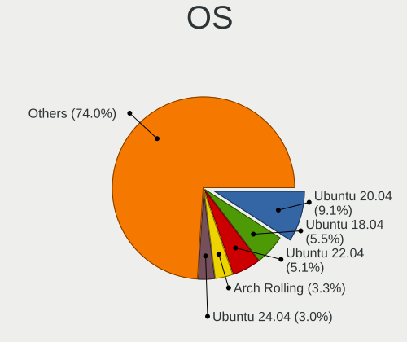

| Name                         | Desktops | Percent |
|------------------------------|----------|---------|
| Ubuntu 20.04                 | 224      | 9.1%    |
| Ubuntu 18.04                 | 136      | 5.53%   |
| Ubuntu 22.04                 | 126      | 5.12%   |
| Arch Rolling                 | 80       | 3.25%   |
| Ubuntu 24.04                 | 74       | 3.01%   |
| Pop!_OS 22.04                | 48       | 1.95%   |
| Debian 12                    | 48       | 1.95%   |
| Debian 11                    | 43       | 1.75%   |
| Zorin 17                     | 42       | 1.71%   |
| Zorin 16                     | 42       | 1.71%   |
| Linux Mint 22.1              | 35       | 1.42%   |
| openSUSE Tumbleweed-XXXXXXXX | 30       | 1.22%   |
| OpenMandriva 4.2             | 30       | 1.22%   |
| Linux Mint 21.1              | 30       | 1.22%   |
| Ubuntu 20.10                 | 29       | 1.18%   |
| Linux Mint 20.3              | 28       | 1.14%   |
| OpenMandriva 4.3             | 27       | 1.1%    |
| Manjaro                      | 27       | 1.1%    |
| OpenMandriva 24.12           | 25       | 1.02%   |
| Linux Mint 19.3              | 25       | 1.02%   |
| Fedora 38                    | 25       | 1.02%   |
| KDE neon 20.04               | 24       | 0.98%   |
| ArcoLinux Rolling            | 24       | 0.98%   |
| Xubuntu 20.04                | 23       | 0.93%   |
| Linux Mint 21.2              | 23       | 0.93%   |
| Linux Mint 22.2              | 22       | 0.89%   |
| Fedora 39                    | 22       | 0.89%   |
| Arch                         | 22       | 0.89%   |
| Fedora 40                    | 21       | 0.85%   |
| Pop!_OS 21.10                | 20       | 0.81%   |
| KDE neon 22.04               | 20       | 0.81%   |
| Fedora 41                    | 20       | 0.81%   |
| Debian 10                    | 20       | 0.81%   |
| Ubuntu 19.10                 | 19       | 0.77%   |
| Linux Mint 20.1              | 19       | 0.77%   |
| EndeavourOS Rolling          | 19       | 0.77%   |
| Zorin 15                     | 18       | 0.73%   |
| Pop!_OS 20.04                | 18       | 0.73%   |
| OpenMandriva 23.08           | 18       | 0.73%   |
| Linux Mint 20.2              | 18       | 0.73%   |

OS Family
---------

OS without a version

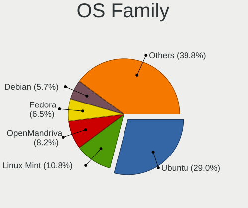

| Name          | Desktops | Percent |
|---------------|----------|---------|
| Ubuntu        | 671      | 29.04%  |
| Linux Mint    | 249      | 10.77%  |
| OpenMandriva  | 190      | 8.22%   |
| Fedora        | 150      | 6.49%   |
| Debian        | 131      | 5.67%   |
| Pop!_OS       | 116      | 5.02%   |
| Zorin         | 108      | 4.67%   |
| Arch          | 104      | 4.5%    |
| Manjaro       | 62       | 2.68%   |
| Kubuntu       | 57       | 2.47%   |
| KDE neon      | 51       | 2.21%   |
| Xubuntu       | 50       | 2.16%   |
| openSUSE      | 43       | 1.86%   |
| Bazzite       | 32       | 1.38%   |
| ArcoLinux     | 27       | 1.17%   |
| EndeavourOS   | 20       | 0.87%   |
| ROSA          | 19       | 0.82%   |
| Nobara        | 17       | 0.74%   |
| Gentoo        | 16       | 0.69%   |
| Elementary    | 14       | 0.61%   |
| Ubuntu Unity  | 13       | 0.56%   |
| Lubuntu       | 11       | 0.48%   |
| NixOS         | 10       | 0.43%   |
| LMDE          | 10       | 0.43%   |
| Garuda Linux  | 9        | 0.39%   |
| Ubuntu MATE   | 8        | 0.35%   |
| Endless       | 8        | 0.35%   |
| Kali          | 7        | 0.3%    |
| Clear Linux   | 7        | 0.3%    |
| SteamOS       | 6        | 0.26%   |
| Parrot        | 5        | 0.22%   |
| MX            | 5        | 0.22%   |
| Artix         | 5        | 0.22%   |
| TUXEDO OS     | 4        | 0.17%   |
| CentOS        | 4        | 0.17%   |
| BlackPanther  | 4        | 0.17%   |
| Xero          | 3        | 0.13%   |
| Void Linux    | 3        | 0.13%   |
| Ubuntu Budgie | 3        | 0.13%   |
| Rocky Linux   | 3        | 0.13%   |

Kernel
------

Version of the Linux kernel

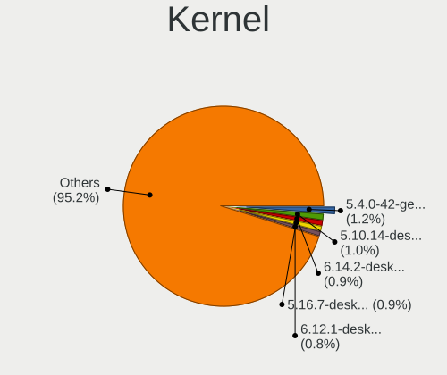

| Version                  | Desktops | Percent |
|--------------------------|----------|---------|
| 5.4.0-42-generic         | 33       | 1.19%   |
| 5.10.14-desktop-1omv4002 | 29       | 1.05%   |
| 6.14.2-desktop-3omv2590  | 25       | 0.9%    |
| 5.16.7-desktop-1omv4003  | 25       | 0.9%    |
| 6.12.1-desktop-1omv2490  | 22       | 0.8%    |
| 5.4.0-58-generic         | 19       | 0.69%   |
| 5.4.0-52-generic         | 18       | 0.65%   |
| 6.4.11-desktop-1omv2390  | 15       | 0.54%   |
| 5.4.0-40-generic         | 15       | 0.54%   |
| 6.1.1-desktop-1omv2290   | 14       | 0.51%   |
| 5.8.0-50-generic         | 14       | 0.51%   |
| 5.15.0-56-generic        | 14       | 0.51%   |
| 5.4.0-48-generic         | 13       | 0.47%   |
| 6.8.0-40-generic         | 12       | 0.43%   |
| 6.6.2-desktop-1omv2390   | 12       | 0.43%   |
| 6.14.0-29-generic        | 12       | 0.43%   |
| 5.11.0-7620-generic      | 12       | 0.43%   |
| 6.8.0-52-generic         | 11       | 0.4%    |
| 5.4.0-77-generic         | 11       | 0.4%    |
| 5.3.0-28-generic         | 11       | 0.4%    |
| 5.15.0-91-generic        | 11       | 0.4%    |
| 5.15.0-67-generic        | 11       | 0.4%    |
| 5.11.0-38-generic        | 11       | 0.4%    |
| 6.9.3-76060903-generic   | 10       | 0.36%   |
| 6.8.0-51-generic         | 10       | 0.36%   |
| 6.5.0-14-generic         | 10       | 0.36%   |
| 6.2.6-desktop-1omv2390   | 10       | 0.36%   |
| 6.14.0-33-generic        | 10       | 0.36%   |
| 5.4.0-65-generic         | 10       | 0.36%   |
| 5.4.0-56-generic         | 10       | 0.36%   |
| 5.4.0-37-generic         | 10       | 0.36%   |
| 5.19.0-32-generic        | 10       | 0.36%   |
| 5.11.0-27-generic        | 10       | 0.36%   |
| 5.4.0-54-generic         | 9        | 0.33%   |
| 5.4.0-26-generic         | 9        | 0.33%   |
| 5.15.0-76-generic        | 9        | 0.33%   |
| 5.15.0-58-generic        | 9        | 0.33%   |
| 5.11.0-43-generic        | 9        | 0.33%   |
| 6.8.0-45-generic         | 8        | 0.29%   |
| 6.8.0-31-generic         | 8        | 0.29%   |

Kernel Family
-------------

Linux kernel without a distro release

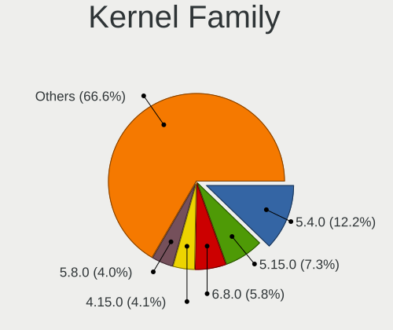

| Version | Desktops | Percent |
|---------|----------|---------|
| 5.4.0   | 316      | 12.22%  |
| 5.15.0  | 189      | 7.31%   |
| 6.8.0   | 149      | 5.76%   |
| 4.15.0  | 105      | 4.06%   |
| 5.8.0   | 104      | 4.02%   |
| 5.11.0  | 84       | 3.25%   |
| 6.5.0   | 74       | 2.86%   |
| 5.3.0   | 62       | 2.4%    |
| 5.13.0  | 61       | 2.36%   |
| 6.14.0  | 59       | 2.28%   |
| 6.1.0   | 48       | 1.86%   |
| 5.19.0  | 48       | 1.86%   |
| 5.0.0   | 48       | 1.86%   |
| 5.10.0  | 46       | 1.78%   |
| 6.2.0   | 43       | 1.66%   |
| 6.11.0  | 38       | 1.47%   |
| 5.10.14 | 30       | 1.16%   |
| 4.18.0  | 30       | 1.16%   |
| 6.14.2  | 28       | 1.08%   |
| 5.16.7  | 26       | 1.01%   |
| 6.12.1  | 23       | 0.89%   |
| 6.9.3   | 16       | 0.62%   |
| 6.4.11  | 16       | 0.62%   |
| 6.2.6   | 16       | 0.62%   |
| 6.1.1   | 16       | 0.62%   |
| 4.19.0  | 15       | 0.58%   |
| 6.17.7  | 14       | 0.54%   |
| 6.6.2   | 13       | 0.5%    |
| 5.16.11 | 11       | 0.43%   |
| 6.8.5   | 9        | 0.35%   |
| 6.15.6  | 9        | 0.35%   |
| 6.12.10 | 9        | 0.35%   |
| 6.16.3  | 8        | 0.31%   |
| 6.12.9  | 8        | 0.31%   |
| 5.17.5  | 8        | 0.31%   |
| 4.4.0   | 8        | 0.31%   |
| 6.15.9  | 7        | 0.27%   |
| 6.13.5  | 7        | 0.27%   |
| 5.15.5  | 7        | 0.27%   |
| 5.14.0  | 7        | 0.27%   |

Kernel Major Ver.
-----------------

Linux kernel major version

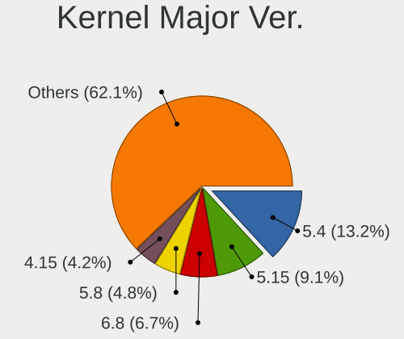

| Version | Desktops | Percent |
|---------|----------|---------|
| 5.4     | 336      | 13.16%  |
| 5.15    | 232      | 9.08%   |
| 6.8     | 170      | 6.66%   |
| 5.8     | 123      | 4.82%   |
| 4.15    | 106      | 4.15%   |
| 6.14    | 103      | 4.03%   |
| 5.10    | 102      | 3.99%   |
| 6.1     | 99       | 3.88%   |
| 6.5     | 97       | 3.8%    |
| 5.11    | 95       | 3.72%   |
| 6.12    | 84       | 3.29%   |
| 6.2     | 77       | 3.01%   |
| 5.3     | 74       | 2.9%    |
| 5.13    | 70       | 2.74%   |
| 6.11    | 66       | 2.58%   |
| 5.19    | 60       | 2.35%   |
| 5.16    | 54       | 2.11%   |
| 6.6     | 52       | 2.04%   |
| 5.0     | 49       | 1.92%   |
| 6.4     | 46       | 1.8%    |
| 4.18    | 38       | 1.49%   |
| 6.9     | 36       | 1.41%   |
| 6.17    | 35       | 1.37%   |
| 6.15    | 32       | 1.25%   |
| 6.10    | 28       | 1.1%    |
| 6.0     | 27       | 1.06%   |
| 6.3     | 26       | 1.02%   |
| 5.18    | 24       | 0.94%   |
| 6.7     | 21       | 0.82%   |
| 6.13    | 20       | 0.78%   |
| 5.14    | 19       | 0.74%   |
| 4.19    | 19       | 0.74%   |
| 5.9     | 17       | 0.67%   |
| 6.16    | 16       | 0.63%   |
| 5.6     | 16       | 0.63%   |
| 5.17    | 16       | 0.63%   |
| 4.9     | 14       | 0.55%   |
| 5.5     | 11       | 0.43%   |
| 5.12    | 10       | 0.39%   |
| 4.4     | 8        | 0.31%   |

Arch
----

OS architecture (x86_64, i586, etc.)

| Name    | Desktops | Percent |
|---------|----------|---------|
| x86_64  | 2176     | 98.06%  |
| i686    | 41       | 1.85%   |
| riscv64 | 1        | 0.05%   |
| aarch64 | 1        | 0.05%   |

DE
--

Desktop Environment

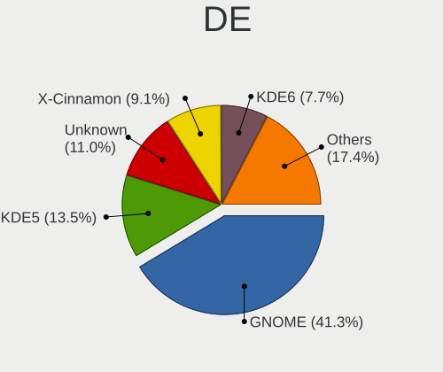

| Name             | Desktops | Percent |
|------------------|----------|---------|
| GNOME            | 963      | 41.35%  |
| KDE5             | 314      | 13.48%  |
| Unknown          | 257      | 11.03%  |
| X-Cinnamon       | 211      | 9.06%   |
| KDE6             | 179      | 7.69%   |
| XFCE             | 155      | 6.66%   |
| KDE              | 49       | 2.1%    |
| MATE             | 47       | 2.02%   |
| LXQt             | 22       | 0.94%   |
| Pantheon         | 14       | 0.6%    |
| Cinnamon         | 14       | 0.6%    |
| Unity            | 13       | 0.56%   |
| LXDE             | 12       | 0.52%   |
| KDE4             | 11       | 0.47%   |
| i3               | 11       | 0.47%   |
| Hyprland         | 9        | 0.39%   |
| GNOME Flashback  | 8        | 0.34%   |
| Budgie           | 8        | 0.34%   |
| COSMIC           | 5        | 0.21%   |
| sway             | 4        | 0.17%   |
| Enlightenment    | 4        | 0.17%   |
| Deepin           | 3        | 0.13%   |
| awesome          | 3        | 0.13%   |
| none+i3          | 2        | 0.09%   |
| GNOME Classic    | 2        | 0.09%   |
| Unicorn:XFCE     | 1        | 0.04%   |
| trinity          | 1        | 0.04%   |
| qtile            | 1        | 0.04%   |
| openbox          | 1        | 0.04%   |
| lightdm-xsession | 1        | 0.04%   |
| LeftWM           | 1        | 0.04%   |
| jwm              | 1        | 0.04%   |
| Endless:GNOME    | 1        | 0.04%   |
| dusk             | 1        | 0.04%   |

Display Server
--------------

X11 or Wayland

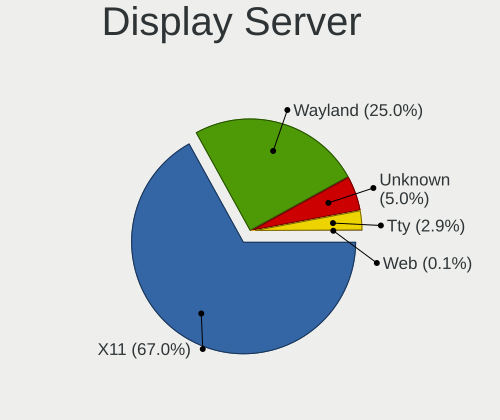

| Name    | Desktops | Percent |
|---------|----------|---------|
| X11     | 1541     | 66.97%  |
| Wayland | 576      | 25.03%  |
| Unknown | 116      | 5.04%   |
| Tty     | 66       | 2.87%   |
| Web     | 2        | 0.09%   |

Display Manager
---------------

SDDM, LightDM, etc.

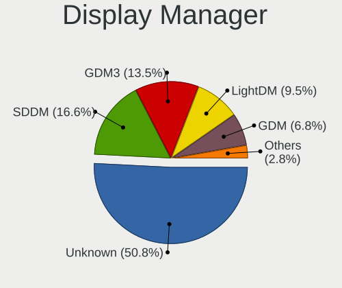

| Name           | Desktops | Percent |
|----------------|----------|---------|
| Unknown        | 1172     | 50.8%   |
| SDDM           | 383      | 16.6%   |
| GDM3           | 311      | 13.48%  |
| LightDM        | 219      | 9.49%   |
| GDM            | 158      | 6.85%   |
| TDM            | 38       | 1.65%   |
| KDM            | 9        | 0.39%   |
| XDM            | 3        | 0.13%   |
| SLiM           | 3        | 0.13%   |
| LY-DM          | 3        | 0.13%   |
| Ly             | 3        | 0.13%   |
| GREETD         | 2        | 0.09%   |
| MDM            | 1        | 0.04%   |
| LXDM           | 1        | 0.04%   |
| COSMIC-GREETER | 1        | 0.04%   |

OS Lang
-------

Language

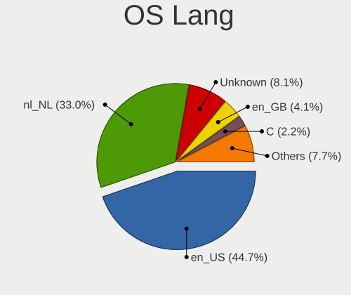

| Lang        | Desktops | Percent |
|-------------|----------|---------|
| en_US       | 1017     | 44.74%  |
| nl_NL       | 751      | 33.04%  |
| Unknown     | 185      | 8.14%   |
| en_GB       | 94       | 4.14%   |
| C           | 51       | 2.24%   |
| de_DE       | 38       | 1.67%   |
| pl_PL       | 18       | 0.79%   |
| nl_BE       | 14       | 0.62%   |
| ru_RU       | 11       | 0.48%   |
| fr_FR       | 9        | 0.4%    |
| es_ES       | 9        | 0.4%    |
| en_IE       | 9        | 0.4%    |
| it_IT       | 7        | 0.31%   |
| C.UTF8      | 7        | 0.31%   |
| ru_UA       | 5        | 0.22%   |
| en_NL       | 5        | 0.22%   |
| en_CA       | 4        | 0.18%   |
| en_AG       | 4        | 0.18%   |
| pt_BR       | 3        | 0.13%   |
| POSIX       | 3        | 0.13%   |
| fr_BE       | 3        | 0.13%   |
| tr_TR       | 2        | 0.09%   |
| sv_SE       | 2        | 0.09%   |
| en_IN       | 2        | 0.09%   |
| en_DK       | 2        | 0.09%   |
| cs_CZ       | 2        | 0.09%   |
| ar_KW       | 2        | 0.09%   |
| zh_CN       | 1        | 0.04%   |
| sk_SK       | 1        | 0.04%   |
| pt_PT       | 1        | 0.04%   |
| nl_AW       | 1        | 0.04%   |
| hu_HU       | 1        | 0.04%   |
| fi_FI       | 1        | 0.04%   |
| en_ZA       | 1        | 0.04%   |
| en_US.utf-8 | 1        | 0.04%   |
| en_EN       | 1        | 0.04%   |
| en_BW       | 1        | 0.04%   |
| en_AU       | 1        | 0.04%   |
| en_001      | 1        | 0.04%   |
| de_CH       | 1        | 0.04%   |

Boot Mode
---------

EFI or BIOS

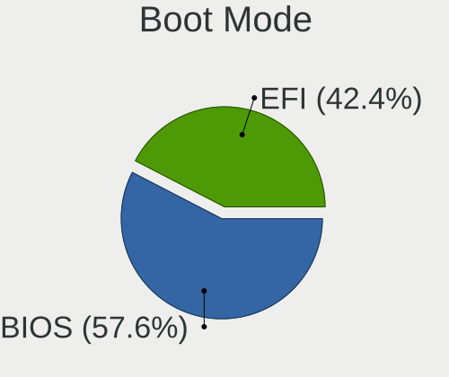

| Mode | Desktops | Percent |
|------|----------|---------|
| BIOS | 1304     | 57.6%   |
| EFI  | 960      | 42.4%   |

Filesystem
----------

Type of filesystem

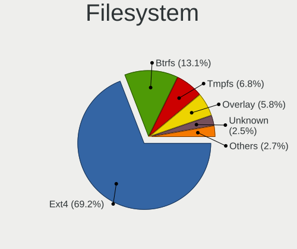

| Type    | Desktops | Percent |
|---------|----------|---------|
| Ext4    | 1587     | 69.15%  |
| Btrfs   | 300      | 13.07%  |
| Tmpfs   | 155      | 6.75%   |
| Overlay | 132      | 5.75%   |
| Unknown | 58       | 2.53%   |
| Xfs     | 27       | 1.18%   |
| Zfs     | 24       | 1.05%   |
| F2fs    | 5        | 0.22%   |
| Ext2    | 4        | 0.17%   |
| Ext3    | 2        | 0.09%   |
| Aufs    | 1        | 0.04%   |

Part. scheme
------------

Scheme of partitioning

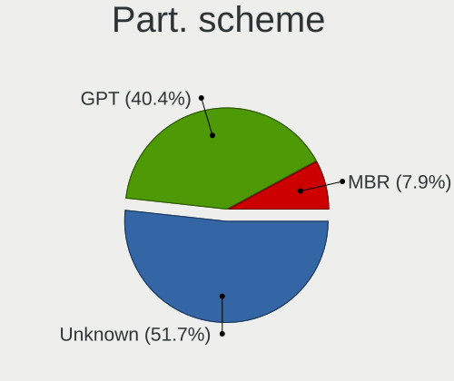

| Type    | Desktops | Percent |
|---------|----------|---------|
| Unknown | 1180     | 51.73%  |
| GPT     | 921      | 40.38%  |
| MBR     | 180      | 7.89%   |

Dual Boot with Linux/BSD
------------------------

Hosting more than one Linux/BSD

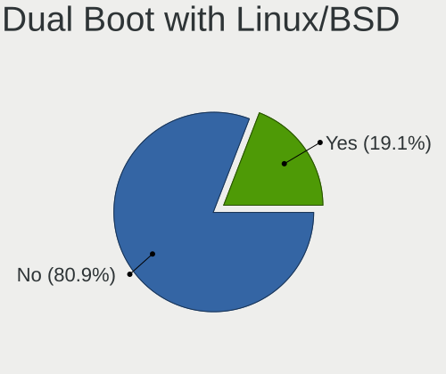

| Dual boot | Desktops | Percent |
|-----------|----------|---------|
| No        | 1833     | 80.86%  |
| Yes       | 434      | 19.14%  |

Dual Boot (Win)
---------------

Hosting Linux and Windows

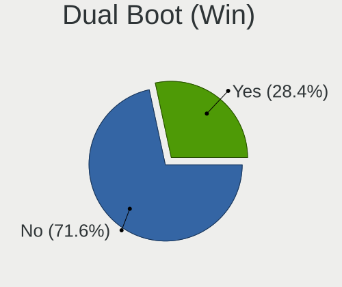

| Dual boot | Desktops | Percent |
|-----------|----------|---------|
| No        | 1624     | 71.64%  |
| Yes       | 643      | 28.36%  |

Board
-----

Vendor
------

Motherboard manufacturer

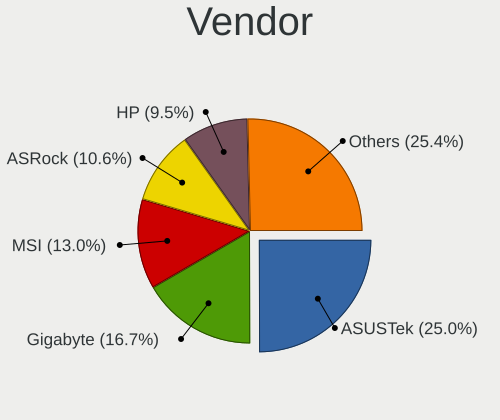

| Name                                 | Desktops | Percent |
|--------------------------------------|----------|---------|
| ASUSTek Computer                     | 553      | 24.97%  |
| Gigabyte Technology                  | 369      | 16.66%  |
| MSI                                  | 287      | 12.96%  |
| ASRock                               | 234      | 10.56%  |
| Hewlett-Packard                      | 210      | 9.48%   |
| Dell                                 | 148      | 6.68%   |
| Acer                                 | 59       | 2.66%   |
| Medion                               | 52       | 2.35%   |
| Lenovo                               | 47       | 2.12%   |
| Intel                                | 42       | 1.9%    |
| Unknown                              | 34       | 1.53%   |
| Foxconn                              | 18       | 0.81%   |
| Pegatron                             | 16       | 0.72%   |
| Fujitsu                              | 16       | 0.72%   |
| Biostar                              | 11       | 0.5%    |
| Packard Bell                         | 10       | 0.45%   |
| Shuttle                              | 8        | 0.36%   |
| Google                               | 7        | 0.32%   |
| BESSTAR Tech                         | 7        | 0.32%   |
| Apple                                | 7        | 0.32%   |
| Supermicro                           | 6        | 0.27%   |
| Fujitsu Siemens                      | 6        | 0.27%   |
| AZW                                  | 5        | 0.23%   |
| MP                                   | 3        | 0.14%   |
| GMKtec                               | 3        | 0.14%   |
| ECS                                  | 3        | 0.14%   |
| ASRockRack                           | 3        | 0.14%   |
| WeiBu                                | 2        | 0.09%   |
| Tianbei                              | 2        | 0.09%   |
| Shenzhen Meigao Electronic Equipment | 2        | 0.09%   |
| Huanan                               | 2        | 0.09%   |
| Hardkernel                           | 2        | 0.09%   |
| AMI                                  | 2        | 0.09%   |
| Alienware                            | 2        | 0.09%   |
| AAEON                                | 2        | 0.09%   |
| ZOTAC                                | 1        | 0.05%   |
| TYAN Computer                        | 1        | 0.05%   |
| SZQFTX                               | 1        | 0.05%   |
| Sun Microsystems                     | 1        | 0.05%   |
| Standard                             | 1        | 0.05%   |

Model
-----

Motherboard model

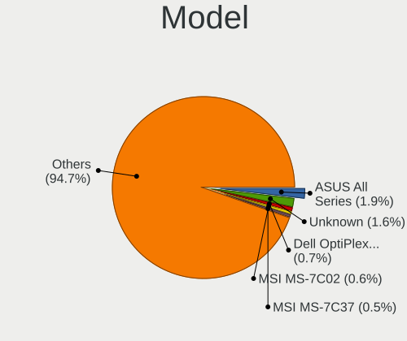

| Name                               | Desktops | Percent |
|------------------------------------|----------|---------|
| ASUS All Series                    | 41       | 1.85%   |
| Unknown                            | 36       | 1.63%   |
| Dell OptiPlex 7010                 | 16       | 0.72%   |
| MSI MS-7C02                        | 13       | 0.59%   |
| MSI MS-7C37                        | 12       | 0.54%   |
| Gigabyte B550 AORUS ELITE V2       | 11       | 0.5%    |
| ASUS ROG STRIX B550-F GAMING       | 11       | 0.5%    |
| MSI MS-7B86                        | 10       | 0.45%   |
| MSI MS-7C56                        | 9        | 0.41%   |
| MSI MS-7817                        | 9        | 0.41%   |
| Dell OptiPlex 3020                 | 9        | 0.41%   |
| ASUS Z170 PRO GAMING               | 9        | 0.41%   |
| ASUS PRIME A320M-K                 | 9        | 0.41%   |
| ASRock B450M Pro4                  | 9        | 0.41%   |
| MSI MS-7C91                        | 8        | 0.36%   |
| MSI MS-7721                        | 8        | 0.36%   |
| Gigabyte X570 AORUS ELITE          | 8        | 0.36%   |
| Dell OptiPlex 9020                 | 8        | 0.36%   |
| ASUS ROG STRIX B450-F GAMING       | 8        | 0.36%   |
| MSI MS-7B98                        | 7        | 0.32%   |
| MSI MS-7B79                        | 7        | 0.32%   |
| HP ProDesk 600 G1 SFF              | 7        | 0.32%   |
| HP EliteDesk 800 G1 SFF            | 7        | 0.32%   |
| Gigabyte X570 AORUS MASTER         | 7        | 0.32%   |
| Gigabyte B550M DS3H                | 7        | 0.32%   |
| Gigabyte B450M DS3H                | 7        | 0.32%   |
| ASUS ProArt X670E-CREATOR WIFI     | 7        | 0.32%   |
| MSI MS-7B89                        | 6        | 0.27%   |
| HP Compaq Pro 6300 SFF             | 6        | 0.27%   |
| HP Compaq dc7900 Small Form Factor | 6        | 0.27%   |
| HP Compaq 6000 Pro SFF PC          | 6        | 0.27%   |
| Gigabyte X570 I AORUS PRO WIFI     | 6        | 0.27%   |
| Gigabyte X570 AORUS PRO            | 6        | 0.27%   |
| Gigabyte X470 AORUS ULTRA GAMING   | 6        | 0.27%   |
| Gigabyte 970A-DS3P                 | 6        | 0.27%   |
| Dell OptiPlex 790                  | 6        | 0.27%   |
| ASUS PRIME X570-PRO                | 6        | 0.27%   |
| ASUS PRIME B450M-A                 | 6        | 0.27%   |
| ASUS P8H61-M LE/USB3               | 6        | 0.27%   |
| ASUS M5A78L-M/USB3                 | 6        | 0.27%   |

Model Family
------------

Motherboard model prefix

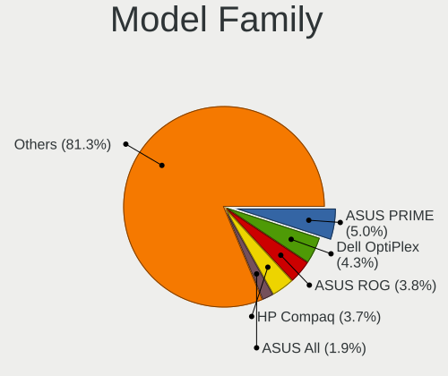

| Name               | Desktops | Percent |
|--------------------|----------|---------|
| ASUS PRIME         | 111      | 5.01%   |
| Dell OptiPlex      | 96       | 4.33%   |
| ASUS ROG           | 84       | 3.79%   |
| HP Compaq          | 83       | 3.75%   |
| ASUS All           | 41       | 1.85%   |
| ASUS TUF           | 37       | 1.67%   |
| Acer Aspire        | 37       | 1.67%   |
| Unknown            | 36       | 1.63%   |
| HP ProDesk         | 35       | 1.58%   |
| Gigabyte X570      | 32       | 1.44%   |
| HP EliteDesk       | 27       | 1.22%   |
| Lenovo ThinkCentre | 23       | 1.04%   |
| Gigabyte B550M     | 22       | 0.99%   |
| Gigabyte B550      | 21       | 0.95%   |
| Dell Precision     | 19       | 0.86%   |
| ASRock B450M       | 17       | 0.77%   |
| Gigabyte B450M     | 15       | 0.68%   |
| Acer Veriton       | 15       | 0.68%   |
| ASRock X570        | 14       | 0.63%   |
| MSI MS-7C02        | 13       | 0.59%   |
| ASUS P8H61-M       | 13       | 0.59%   |
| MSI MS-7C37        | 12       | 0.54%   |
| ASUS Maximus       | 12       | 0.54%   |
| ASRock B450        | 12       | 0.54%   |
| ASRock 970         | 12       | 0.54%   |
| Gigabyte Z390      | 11       | 0.5%    |
| ASUS ProArt        | 11       | 0.5%    |
| MSI MS-7B86        | 10       | 0.45%   |
| HP Pavilion        | 10       | 0.45%   |
| Fujitsu ESPRIMO    | 10       | 0.45%   |
| MSI MS-7C56        | 9        | 0.41%   |
| MSI MS-7817        | 9        | 0.41%   |
| ASUS Z170          | 9        | 0.41%   |
| ASUS P6T           | 9        | 0.41%   |
| ASUS M5A78L-M      | 9        | 0.41%   |
| MSI MS-7C91        | 8        | 0.36%   |
| MSI MS-7721        | 8        | 0.36%   |
| Lenovo IdeaCentre  | 8        | 0.36%   |
| HP ProLiant        | 8        | 0.36%   |
| Gigabyte B650      | 8        | 0.36%   |

MFG Year
--------

Motherboard manufacture year

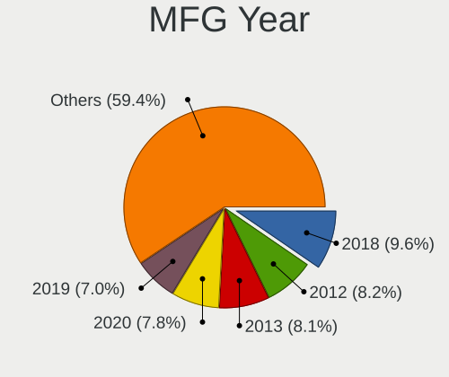

| Year    | Desktops | Percent |
|---------|----------|---------|
| 2018    | 212      | 9.57%   |
| 2012    | 181      | 8.17%   |
| 2013    | 180      | 8.13%   |
| 2020    | 172      | 7.77%   |
| 2019    | 155      | 7%      |
| 2011    | 151      | 6.82%   |
| 2014    | 141      | 6.37%   |
| 2017    | 115      | 5.19%   |
| 2021    | 114      | 5.15%   |
| 2009    | 107      | 4.83%   |
| 2010    | 103      | 4.65%   |
| 2015    | 92       | 4.15%   |
| 2022    | 91       | 4.11%   |
| 2016    | 89       | 4.02%   |
| 2008    | 77       | 3.48%   |
| 2023    | 69       | 3.12%   |
| 2007    | 59       | 2.66%   |
| 2024    | 38       | 1.72%   |
| 2006    | 35       | 1.58%   |
| 2005    | 12       | 0.54%   |
| 2025    | 10       | 0.45%   |
| 2004    | 6        | 0.27%   |
| 2003    | 3        | 0.14%   |
| Unknown | 2        | 0.09%   |
| 2002    | 1        | 0.05%   |

Form Factor
-----------

Physical design of the computer

| Name    | Desktops | Percent |
|---------|----------|---------|
| Desktop | 2215     | 100%    |

Secure Boot
-----------

Enabled or disabled

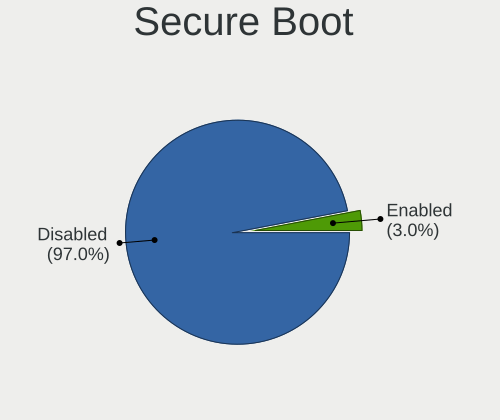

| State    | Desktops | Percent |
|----------|----------|---------|
| Disabled | 2158     | 96.99%  |
| Enabled  | 67       | 3.01%   |

Coreboot
--------

Have coreboot on board

| Used | Desktops | Percent |
|------|----------|---------|
| No   | 2207     | 99.64%  |
| Yes  | 8        | 0.36%   |

RAM Size
--------

Total RAM memory

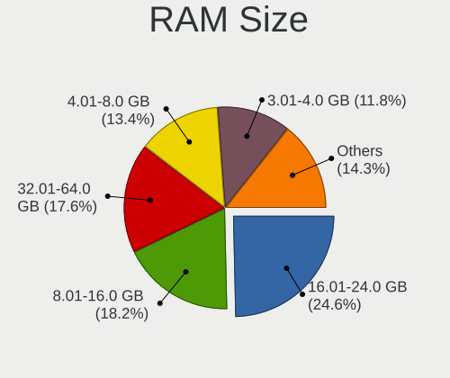

| Size in GB      | Desktops | Percent |
|-----------------|----------|---------|
| 16.01-24.0      | 560      | 24.65%  |
| 8.01-16.0       | 413      | 18.18%  |
| 32.01-64.0      | 399      | 17.56%  |
| 4.01-8.0        | 305      | 13.42%  |
| 3.01-4.0        | 269      | 11.84%  |
| 64.01-256.0     | 147      | 6.47%   |
| 24.01-32.0      | 106      | 4.67%   |
| 1.01-2.0        | 37       | 1.63%   |
| 2.01-3.0        | 22       | 0.97%   |
| 0.51-1.0        | 11       | 0.48%   |
| More than 256.0 | 3        | 0.13%   |

RAM Used
--------

Used RAM memory

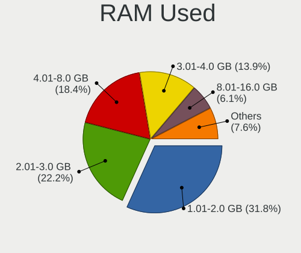

| Used GB     | Desktops | Percent |
|-------------|----------|---------|
| 1.01-2.0    | 791      | 31.78%  |
| 2.01-3.0    | 553      | 22.22%  |
| 4.01-8.0    | 457      | 18.36%  |
| 3.01-4.0    | 345      | 13.86%  |
| 8.01-16.0   | 153      | 6.15%   |
| 0.51-1.0    | 114      | 4.58%   |
| 16.01-24.0  | 32       | 1.29%   |
| 0.01-0.5    | 24       | 0.96%   |
| 32.01-64.0  | 10       | 0.4%    |
| 24.01-32.0  | 8        | 0.32%   |
| 64.01-256.0 | 1        | 0.04%   |
| Unknown     | 1        | 0.04%   |

Total Drives
------------

Number of drives on board

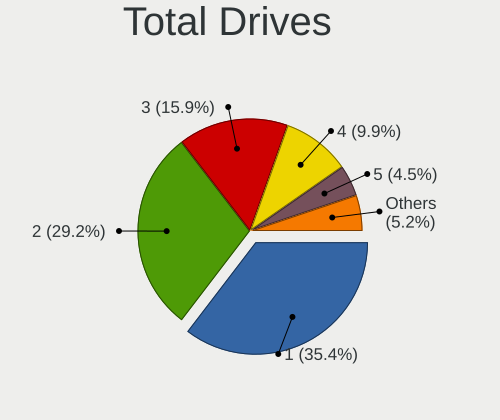

| Drives | Desktops | Percent |
|--------|----------|---------|
| 1      | 820      | 35.39%  |
| 2      | 676      | 29.18%  |
| 3      | 368      | 15.88%  |
| 4      | 229      | 9.88%   |
| 5      | 104      | 4.49%   |
| 6      | 51       | 2.2%    |
| 7      | 32       | 1.38%   |
| 0      | 14       | 0.6%    |
| 8      | 8        | 0.35%   |
| 9      | 6        | 0.26%   |
| 10     | 5        | 0.22%   |
| 30     | 1        | 0.04%   |
| 28     | 1        | 0.04%   |
| 27     | 1        | 0.04%   |
| 12     | 1        | 0.04%   |

Has CD-ROM
----------

Has CD-ROM on board

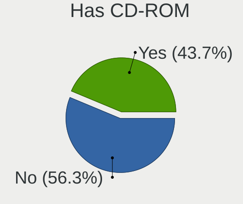

| Presented | Desktops | Percent |
|-----------|----------|---------|
| No        | 1263     | 56.28%  |
| Yes       | 981      | 43.72%  |

Has Ethernet
------------

Has Ethernet on board

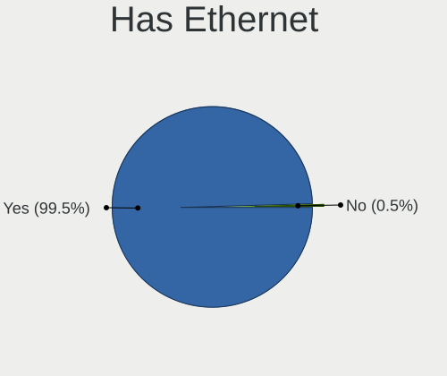

| Presented | Desktops | Percent |
|-----------|----------|---------|
| Yes       | 2205     | 99.55%  |
| No        | 10       | 0.45%   |

Has WiFi
--------

Has WiFi module

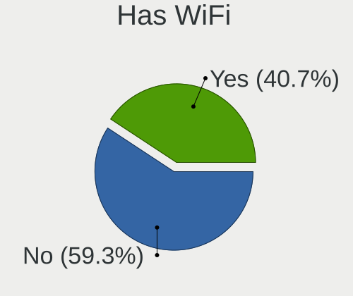

| Presented | Desktops | Percent |
|-----------|----------|---------|
| No        | 1326     | 59.28%  |
| Yes       | 911      | 40.72%  |

Has Bluetooth
-------------

Has Bluetooth module

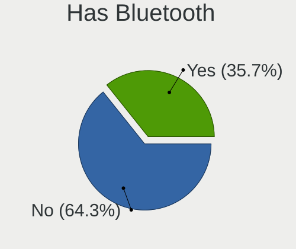

| Presented | Desktops | Percent |
|-----------|----------|---------|
| No        | 1458     | 64.26%  |
| Yes       | 811      | 35.74%  |

Location
--------

Country
-------

Geographic location (country)

| Country     | Desktops | Percent |
|-------------|----------|---------|
| Netherlands | 2215     | 100%    |

City
----

Geographic location (city)

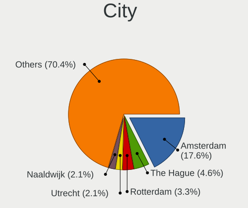

| City             | Desktops | Percent |
|------------------|----------|---------|
| Amsterdam        | 419      | 17.57%  |
| The Hague        | 109      | 4.57%   |
| Rotterdam        | 79       | 3.31%   |
| Utrecht          | 49       | 2.05%   |
| Naaldwijk        | 49       | 2.05%   |
| Haarlem          | 45       | 1.89%   |
| Almere Stad      | 43       | 1.8%    |
| Groningen        | 39       | 1.64%   |
| Tilburg          | 32       | 1.34%   |
| Enschede         | 31       | 1.3%    |
| Eindhoven        | 31       | 1.3%    |
| Leiden           | 26       | 1.09%   |
| Amersfoort       | 25       | 1.05%   |
| Nijmegen         | 22       | 0.92%   |
| Apeldoorn        | 22       | 0.92%   |
| Delft            | 20       | 0.84%   |
| Arnhem           | 20       | 0.84%   |
| Almelo           | 20       | 0.84%   |
| Zaandam          | 17       | 0.71%   |
| Roosendaal       | 17       | 0.71%   |
| Zoetermeer       | 16       | 0.67%   |
| Lelystad         | 16       | 0.67%   |
| Hilversum        | 16       | 0.67%   |
| Breda            | 16       | 0.67%   |
| Purmerend        | 15       | 0.63%   |
| Maastricht       | 15       | 0.63%   |
| Hengelo          | 15       | 0.63%   |
| Heemskerk        | 15       | 0.63%   |
| Zwolle           | 14       | 0.59%   |
| Gouda            | 14       | 0.59%   |
| Emmen            | 14       | 0.59%   |
| Amstelveen       | 14       | 0.59%   |
| 's-Hertogenbosch | 14       | 0.59%   |
| Ridderkerk       | 13       | 0.55%   |
| Waalwijk         | 12       | 0.5%    |
| Schiedam         | 12       | 0.5%    |
| Oldenzaal        | 12       | 0.5%    |
| Hoofddorp        | 12       | 0.5%    |
| Helmond          | 12       | 0.5%    |
| Assen            | 12       | 0.5%    |

Drives
------

Drive Vendor
------------

Hard drive vendors

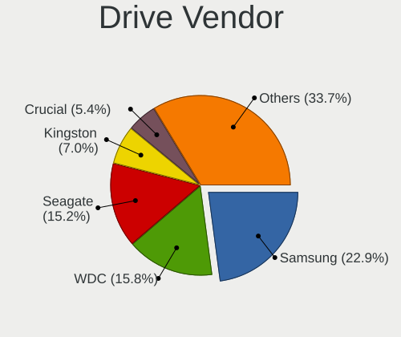

| Vendor                       | Desktops | Drives | Percent |
|------------------------------|----------|--------|---------|
| Samsung Electronics          | 945      | 1794   | 22.91%  |
| WDC                          | 652      | 1126   | 15.81%  |
| Seagate                      | 629      | 1078   | 15.25%  |
| Kingston                     | 289      | 403    | 7.01%   |
| Crucial                      | 221      | 319    | 5.36%   |
| SanDisk                      | 185      | 261    | 4.48%   |
| Toshiba                      | 176      | 292    | 4.27%   |
| Hitachi                      | 110      | 158    | 2.67%   |
| Intel                        | 98       | 134    | 2.38%   |
| A-DATA Technology            | 56       | 67     | 1.36%   |
| Kingston Technology Company  | 48       | 78     | 1.16%   |
| Unknown                      | 41       | 79     | 0.99%   |
| Maxtor                       | 37       | 52     | 0.9%    |
| HGST                         | 34       | 55     | 0.82%   |
| Micron/Crucial Technology    | 32       | 39     | 0.78%   |
| China                        | 30       | 38     | 0.73%   |
| PNY                          | 28       | 37     | 0.68%   |
| OCZ                          | 24       | 29     | 0.58%   |
| Patriot                      | 23       | 26     | 0.56%   |
| Intenso                      | 23       | 27     | 0.56%   |
| Corsair                      | 23       | 34     | 0.56%   |
| Transcend                    | 22       | 27     | 0.53%   |
| SK hynix                     | 22       | 30     | 0.53%   |
| Micron Technology            | 22       | 31     | 0.53%   |
| Shenzhen Longsys Electronics | 18       | 28     | 0.44%   |
| Phison Electronics           | 18       | 32     | 0.44%   |
| Gigabyte Technology          | 18       | 22     | 0.44%   |
| Phison                       | 15       | 23     | 0.36%   |
| GOODRAM                      | 15       | 18     | 0.36%   |
| MAXIO Technology (Hangzhou)  | 14       | 18     | 0.34%   |
| Silicon Motion               | 13       | 15     | 0.32%   |
| JMicron Technology           | 12       | 18     | 0.29%   |
| SPCC                         | 11       | 14     | 0.27%   |
| ASMT                         | 9        | 12     | 0.22%   |
| ADATA Technology             | 9        | 10     | 0.22%   |
| XPG                          | 8        | 10     | 0.19%   |
| Fanxiang                     | 8        | 10     | 0.19%   |
| Unknown                      | 8        | 10     | 0.19%   |
| Lexar                        | 7        | 7      | 0.17%   |
| KingFast                     | 7        | 8      | 0.17%   |

Drive Model
-----------

Hard drive models

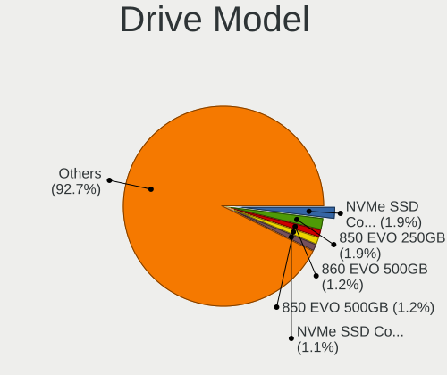

| Model                                              | Desktops | Percent |
|----------------------------------------------------|----------|---------|
| Samsung NVMe SSD Controller SM981/PM981/PM983 1TB  | 95       | 1.91%   |
| Samsung SSD 850 EVO 250GB                          | 94       | 1.89%   |
| Samsung SSD 860 EVO 500GB                          | 61       | 1.22%   |
| Samsung SSD 850 EVO 500GB                          | 60       | 1.2%    |
| Samsung NVMe SSD Controller PM9A1/PM9A3/980PRO 1TB | 56       | 1.12%   |
| Kingston SA400S37240G 240GB SSD                    | 50       | 1%      |
| Seagate ST2000DM008-2FR102 2TB                     | 44       | 0.88%   |
| Samsung SSD 860 EVO 1TB                            | 43       | 0.86%   |
| Seagate ST500DM002-1BD142 500GB                    | 40       | 0.8%    |
| Crucial CT500MX500SSD1 500GB                       | 39       | 0.78%   |
| Samsung SSD 980 1TB                                | 37       | 0.74%   |
| Toshiba DT01ACA100 1TB                             | 34       | 0.68%   |
| Samsung SSD 840 EVO 120GB                          | 34       | 0.68%   |
| Kingston SV300S37A120G 120GB SSD                   | 33       | 0.66%   |
| Samsung SSD 840 EVO 250GB                          | 32       | 0.64%   |
| Samsung NVMe SSD Drive 500GB                       | 29       | 0.58%   |
| Samsung NVMe SSD Drive 1TB                         | 28       | 0.56%   |
| Seagate ST1000DM010-2EP102 1TB                     | 27       | 0.54%   |
| Kingston SA400S37120G 120GB SSD                    | 26       | 0.52%   |
| Seagate ST1000DM003-1CH162 1TB                     | 25       | 0.5%    |
| Seagate Expansion 2TB                              | 24       | 0.48%   |
| Samsung SSD 970 EVO 1TB                            | 24       | 0.48%   |
| Samsung SSD 870 QVO 1TB                            | 24       | 0.48%   |
| Samsung SSD 870 EVO 1TB                            | 24       | 0.48%   |
| Crucial CT240BX500SSD1 240GB                       | 24       | 0.48%   |
| Crucial CT1000MX500SSD1 1TB                        | 24       | 0.48%   |
| Seagate ST4000DM004-2CV104 4TB                     | 23       | 0.46%   |
| Kingston SA400S37480G 480GB SSD                    | 23       | 0.46%   |
| Samsung HD103SJ 1TB                                | 22       | 0.44%   |
| WDC WD10EZEX-08WN4A0 1TB                           | 21       | 0.42%   |
| Samsung SSD 860 QVO 1TB                            | 21       | 0.42%   |
| WDC WD20EZRX-00D8PB0 2TB                           | 20       | 0.4%    |
| WDC WD20EARX-00PASB0 2TB                           | 20       | 0.4%    |
| Seagate ST2000DM006-2DM164 2TB                     | 19       | 0.38%   |
| Seagate ST2000DM001-1CH164 2TB                     | 19       | 0.38%   |
| Kingston Company A2000 NVMe SSD 250GB              | 19       | 0.38%   |
| Seagate ST1000DM003-1ER162 1TB                     | 18       | 0.36%   |
| Samsung SSD 870 EVO 500GB                          | 18       | 0.36%   |
| Samsung SSD 860 EVO 250GB                          | 18       | 0.36%   |
| Samsung HD204UI 2TB                                | 18       | 0.36%   |

HDD Vendor
----------

Hard disk drive vendors

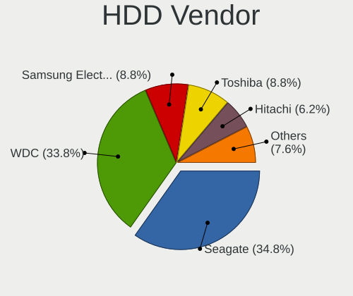

| Vendor              | Desktops | Drives | Percent |
|---------------------|----------|--------|---------|
| Seagate             | 615      | 1051   | 34.8%   |
| WDC                 | 597      | 1011   | 33.79%  |
| Samsung Electronics | 156      | 251    | 8.83%   |
| Toshiba             | 155      | 259    | 8.77%   |
| Hitachi             | 110      | 158    | 6.23%   |
| Maxtor              | 37       | 52     | 2.09%   |
| HGST                | 34       | 55     | 1.92%   |
| Unknown             | 15       | 27     | 0.85%   |
| JMicron Technology  | 6        | 9      | 0.34%   |
| Fujitsu             | 5        | 6      | 0.28%   |
| Intenso             | 4        | 4      | 0.23%   |
| Hewlett-Packard     | 4        | 7      | 0.23%   |
| ASMT                | 4        | 7      | 0.23%   |
| Apple               | 3        | 4      | 0.17%   |
| SAGE                | 2        | 2      | 0.11%   |
| IBM/Hitachi         | 2        | 2      | 0.11%   |
| HGST HTS            | 2        | 3      | 0.11%   |
| ExcelStor           | 2        | 2      | 0.11%   |
| ASMedia             | 2        | 2      | 0.11%   |
| WD MediaMax         | 1        | 1      | 0.06%   |
| TO Exter            | 1        | 1      | 0.06%   |
| TDAS                | 1        | 5      | 0.06%   |
| Synology            | 1        | 1      | 0.06%   |
| Shenzhen            | 1        | 1      | 0.06%   |
| QNAP                | 1        | 1      | 0.06%   |
| NAS                 | 1        | 10     | 0.06%   |
| Maxtor 6            | 1        | 2      | 0.06%   |
| Magnetic Data       | 1        | 1      | 0.06%   |
| LaCie               | 1        | 1      | 0.06%   |
| Inateck             | 1        | 1      | 0.06%   |
| IB-377U3            | 1        | 1      | 0.06%   |

SSD Vendor
----------

Solid state drive vendors

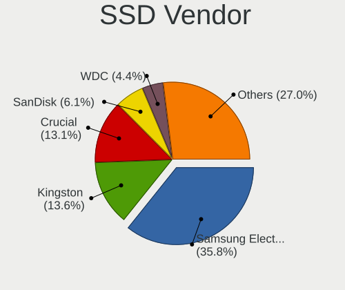

| Vendor              | Desktops | Drives | Percent |
|---------------------|----------|--------|---------|
| Samsung Electronics | 569      | 927    | 35.76%  |
| Kingston            | 217      | 289    | 13.64%  |
| Crucial             | 209      | 305    | 13.14%  |
| SanDisk             | 97       | 126    | 6.1%    |
| WDC                 | 70       | 101    | 4.4%    |
| Intel               | 56       | 76     | 3.52%   |
| A-DATA Technology   | 49       | 60     | 3.08%   |
| China               | 30       | 38     | 1.89%   |
| PNY                 | 28       | 37     | 1.76%   |
| OCZ                 | 24       | 29     | 1.51%   |
| Patriot             | 21       | 24     | 1.32%   |
| Transcend           | 19       | 24     | 1.19%   |
| Toshiba             | 17       | 19     | 1.07%   |
| GOODRAM             | 15       | 18     | 0.94%   |
| Intenso             | 14       | 18     | 0.88%   |
| Corsair             | 14       | 23     | 0.88%   |
| SPCC                | 11       | 14     | 0.69%   |
| Micron Technology   | 11       | 16     | 0.69%   |
| SK hynix            | 10       | 15     | 0.63%   |
| Gigabyte Technology | 9        | 13     | 0.57%   |
| LITEONIT            | 6        | 6      | 0.38%   |
| LITEON              | 6        | 7      | 0.38%   |
| KingSpec            | 6        | 10     | 0.38%   |
| Unknown             | 6        | 8      | 0.38%   |
| Mushkin             | 4        | 6      | 0.25%   |
| Lexar               | 4        | 4      | 0.25%   |
| FORESEE             | 4        | 4      | 0.25%   |
| Fanxiang            | 4        | 4      | 0.25%   |
| ASMT                | 4        | 4      | 0.25%   |
| Verbatim            | 3        | 6      | 0.19%   |
| Plextor             | 3        | 4      | 0.19%   |
| Netac               | 3        | 3      | 0.19%   |
| KingDian            | 3        | 3      | 0.19%   |
| Brainzap            | 3        | 3      | 0.19%   |
| Seagate             | 2        | 2      | 0.13%   |
| OCZ-VERTEX2         | 2        | 3      | 0.13%   |
| Leven               | 2        | 2      | 0.13%   |
| Integral            | 2        | 2      | 0.13%   |
| Dogfish             | 2        | 2      | 0.13%   |
| Apacer              | 2        | 2      | 0.13%   |

Drive Kind
----------

HDD or SSD

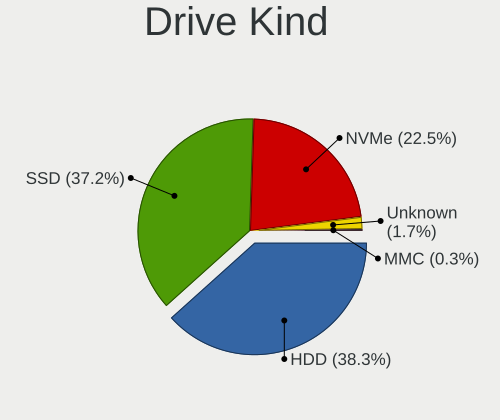

| Kind    | Desktops | Drives | Percent |
|---------|----------|--------|---------|
| HDD     | 1328     | 2938   | 38.35%  |
| SSD     | 1287     | 2292   | 37.16%  |
| NVMe    | 778      | 1350   | 22.47%  |
| Unknown | 60       | 91     | 1.73%   |
| MMC     | 10       | 11     | 0.29%   |

Drive Connector
---------------

SATA, SAS, NVMe, etc.

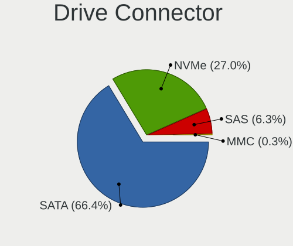

| Type | Desktops | Drives | Percent |
|------|----------|--------|---------|
| SATA | 1905     | 4990   | 66.35%  |
| NVMe | 775      | 1334   | 26.99%  |
| SAS  | 181      | 347    | 6.3%    |
| MMC  | 10       | 11     | 0.35%   |

Drive Size
----------

Size of hard drive

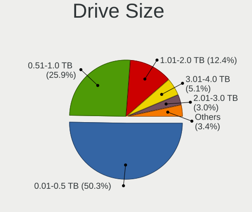

| Size in TB | Desktops | Drives | Percent |
|------------|----------|--------|---------|
| 0.01-0.5   | 1466     | 2728   | 50.29%  |
| 0.51-1.0   | 756      | 1225   | 25.93%  |
| 1.01-2.0   | 361      | 612    | 12.38%  |
| 3.01-4.0   | 148      | 312    | 5.08%   |
| 2.01-3.0   | 86       | 138    | 2.95%   |
| 4.01-10.0  | 79       | 177    | 2.71%   |
| 10.01-20.0 | 18       | 37     | 0.62%   |
| 20.01-50.0 | 1        | 1      | 0.03%   |

Space Total
-----------

Amount of disk space available on the file system

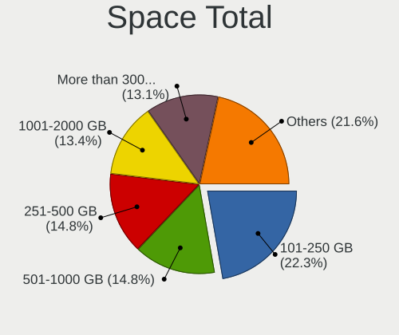

| Size in GB     | Desktops | Percent |
|----------------|----------|---------|
| 101-250        | 531      | 22.25%  |
| 501-1000       | 354      | 14.84%  |
| 251-500        | 353      | 14.79%  |
| 1001-2000      | 319      | 13.37%  |
| More than 3000 | 313      | 13.12%  |
| 2001-3000      | 138      | 5.78%   |
| 1-20           | 127      | 5.32%   |
| 51-100         | 110      | 4.61%   |
| Unknown        | 86       | 3.6%    |
| 21-50          | 55       | 2.31%   |

Space Used
----------

Amount of used disk space

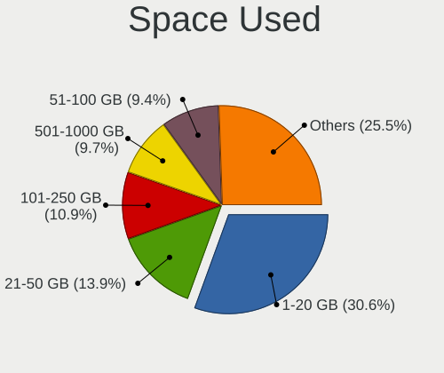

| Used GB        | Desktops | Percent |
|----------------|----------|---------|
| 1-20           | 756      | 30.56%  |
| 21-50          | 345      | 13.95%  |
| 101-250        | 269      | 10.87%  |
| 501-1000       | 239      | 9.66%   |
| 51-100         | 233      | 9.42%   |
| 251-500        | 181      | 7.32%   |
| 1001-2000      | 164      | 6.63%   |
| More than 3000 | 130      | 5.25%   |
| Unknown        | 86       | 3.48%   |
| 2001-3000      | 67       | 2.71%   |
| 0              | 4        | 0.16%   |

Malfunc. Drives
---------------

Drive models with a malfunction

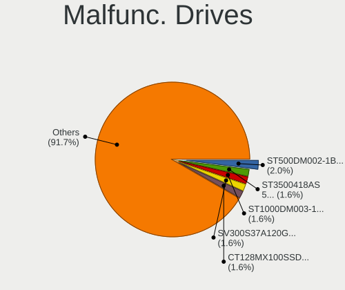

| Model                                                         | Desktops | Drives | Percent |
|---------------------------------------------------------------|----------|--------|---------|
| Seagate ST500DM002-1BD142 500GB                               | 5        | 5      | 1.98%   |
| Seagate ST3500418AS 500GB                                     | 4        | 4      | 1.58%   |
| Seagate ST1000DM003-1ER162 1TB                                | 4        | 4      | 1.58%   |
| Kingston SV300S37A120G 120GB SSD                              | 4        | 4      | 1.58%   |
| Crucial CT128MX100SSD1 128GB                                  | 4        | 5      | 1.58%   |
| WDC WD10EADS-22M2B0 1TB                                       | 3        | 3      | 1.19%   |
| Toshiba DT01ACA100 1TB                                        | 3        | 3      | 1.19%   |
| Seagate ST2000DM001-1CH164 2TB                                | 3        | 3      | 1.19%   |
| SanDisk SD6SF1M128G1022I 128GB SSD                            | 3        | 3      | 1.19%   |
| Samsung Electronics SSD 870 EVO 1TB                           | 3        | 4      | 1.19%   |
| Samsung Electronics NVMe SSD Controller SM981/PM981/PM983 1TB | 3        | 6      | 1.19%   |
| Samsung Electronics HD154UI 1TB                               | 3        | 4      | 1.19%   |
| Intel SSDSC2BW120A4 120GB                                     | 3        | 4      | 1.19%   |
| Intel SSDSA2M080G2GC 80GB                                     | 3        | 4      | 1.19%   |
| WDC WDS240G2G0A-00JH30 240GB SSD                              | 2        | 2      | 0.79%   |
| WDC WD60EFRX-68MYMN1 6TB                                      | 2        | 2      | 0.79%   |
| WDC WD60EFRX-68L0BN1 6TB                                      | 2        | 2      | 0.79%   |
| WDC WD20EZRZ-00Z5HB0 2TB                                      | 2        | 2      | 0.79%   |
| WDC WD20EFRX-68EUZN0 2TB                                      | 2        | 7      | 0.79%   |
| WDC WD20EARX-00PASB0 2TB                                      | 2        | 2      | 0.79%   |
| WDC WD1002FAEX-00Z3A0 1TB                                     | 2        | 4      | 0.79%   |
| WDC WD1002FAEX-00Y9A0 1TB                                     | 2        | 2      | 0.79%   |
| Toshiba MQ01ABD050 500GB                                      | 2        | 3      | 0.79%   |
| Toshiba DT01ACA300 3TB                                        | 2        | 6      | 0.79%   |
| Seagate ST9250315AS 250GB                                     | 2        | 2      | 0.79%   |
| Seagate ST4000DM004-2CV104 4TB                                | 2        | 3      | 0.79%   |
| Seagate ST380011A 80GB                                        | 2        | 2      | 0.79%   |
| Seagate ST3320418AS 320GB                                     | 2        | 2      | 0.79%   |
| Seagate ST31000524AS 1TB                                      | 2        | 2      | 0.79%   |
| Seagate ST2000DM008-2FR102 2TB                                | 2        | 2      | 0.79%   |
| Seagate ST2000DM001-9YN164 2TB                                | 2        | 2      | 0.79%   |
| Samsung Electronics SSD 980 1TB                               | 2        | 2      | 0.79%   |
| Samsung Electronics SSD 870 QVO 1TB                           | 2        | 4      | 0.79%   |
| Samsung Electronics SSD 870 EVO 4TB                           | 2        | 2      | 0.79%   |
| Samsung Electronics HD753LJ 752GB                             | 2        | 2      | 0.79%   |
| Samsung Electronics HD204UI 2TB                               | 2        | 2      | 0.79%   |
| Samsung Electronics HD103UJ 1TB                               | 2        | 2      | 0.79%   |
| Hitachi HDS721010CLA330 1TB                                   | 2        | 2      | 0.79%   |
| Crucial CT525MX300SSD1 528GB                                  | 2        | 2      | 0.79%   |
| WDC WDS120G2G0A-00JH30 120GB SSD                              | 1        | 1      | 0.4%    |

Malfunc. Drive Vendor
---------------------

Vendors of faulty drives

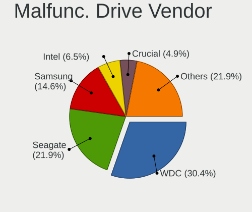

| Vendor              | Desktops | Drives | Percent |
|---------------------|----------|--------|---------|
| WDC                 | 75       | 97     | 30.36%  |
| Seagate             | 54       | 60     | 21.86%  |
| Samsung Electronics | 36       | 45     | 14.57%  |
| Intel               | 16       | 22     | 6.48%   |
| Crucial             | 12       | 22     | 4.86%   |
| Toshiba             | 11       | 16     | 4.45%   |
| Kingston            | 11       | 11     | 4.45%   |
| Hitachi             | 8        | 9      | 3.24%   |
| Maxtor              | 5        | 8      | 2.02%   |
| SanDisk             | 4        | 4      | 1.62%   |
| HGST                | 3        | 4      | 1.21%   |
| LITEONIT            | 2        | 2      | 0.81%   |
| Transcend           | 1        | 1      | 0.4%    |
| PNY                 | 1        | 1      | 0.4%    |
| Patriot             | 1        | 1      | 0.4%    |
| OCZ                 | 1        | 1      | 0.4%    |
| EK46XL85C49         | 1        | 1      | 0.4%    |
| Corsair             | 1        | 3      | 0.4%    |
| China               | 1        | 3      | 0.4%    |
| C-Series            | 1        | 1      | 0.4%    |
| Anobit              | 1        | 1      | 0.4%    |
| A-DATA Technology   | 1        | 1      | 0.4%    |

Malfunc. HDD Vendor
-------------------

Vendors of faulty HDD drives

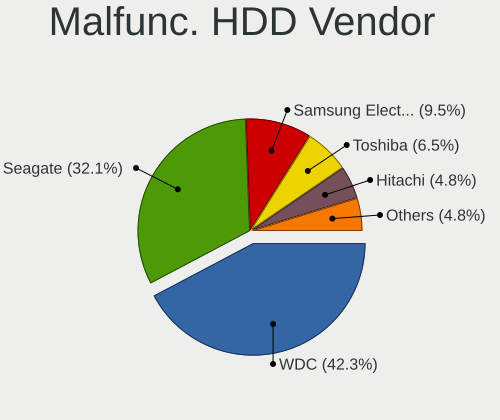

| Vendor              | Desktops | Drives | Percent |
|---------------------|----------|--------|---------|
| WDC                 | 71       | 93     | 42.26%  |
| Seagate             | 54       | 60     | 32.14%  |
| Samsung Electronics | 16       | 17     | 9.52%   |
| Toshiba             | 11       | 16     | 6.55%   |
| Hitachi             | 8        | 9      | 4.76%   |
| Maxtor              | 5        | 8      | 2.98%   |
| HGST                | 3        | 4      | 1.79%   |

Malfunc. Drive Kind
-------------------

Kinds of faulty drives

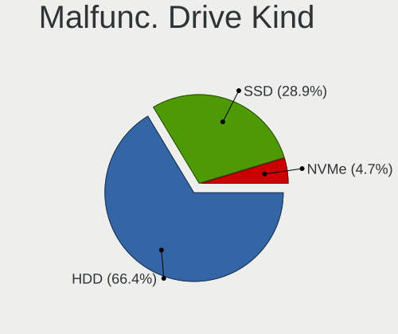

| Kind | Desktops | Drives | Percent |
|------|----------|--------|---------|
| HDD  | 156      | 207    | 66.38%  |
| SSD  | 68       | 88     | 28.94%  |
| NVMe | 11       | 19     | 4.68%   |

Failed Drives
-------------

Failed drive models

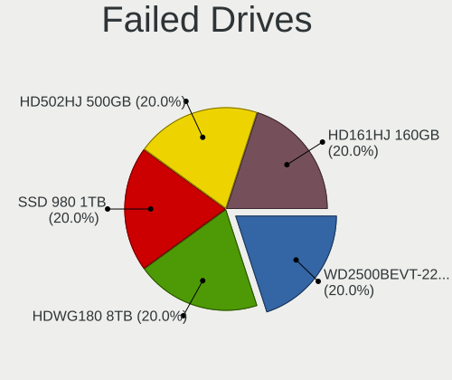

| Model                             | Desktops | Drives | Percent |
|-----------------------------------|----------|--------|---------|
| WDC WD2500BEVT-22ZCT0 250GB       | 1        | 1      | 20%     |
| Toshiba HDWG180 8TB               | 1        | 4      | 20%     |
| Samsung Electronics SSD 980 1TB   | 1        | 1      | 20%     |
| Samsung Electronics HD502HJ 500GB | 1        | 1      | 20%     |
| Samsung Electronics HD161HJ 160GB | 1        | 1      | 20%     |

Failed Drive Vendor
-------------------

Failed drive vendors

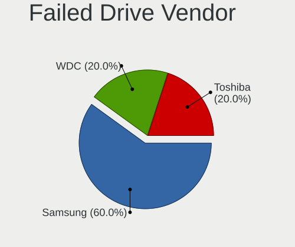

| Vendor              | Desktops | Drives | Percent |
|---------------------|----------|--------|---------|
| Samsung Electronics | 3        | 3      | 60%     |
| WDC                 | 1        | 1      | 20%     |
| Toshiba             | 1        | 4      | 20%     |

Drive Status
------------

Number of failed and malfunc. drives

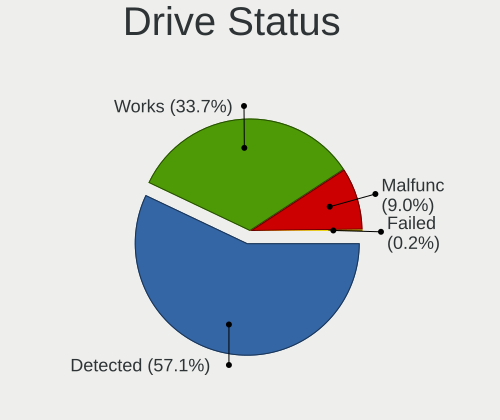

| Status   | Desktops | Drives | Percent |
|----------|----------|--------|---------|
| Detected | 1411     | 4260   | 57.06%  |
| Works    | 834      | 2100   | 33.72%  |
| Malfunc  | 223      | 314    | 9.02%   |
| Failed   | 5        | 8      | 0.2%    |

Storage controller
------------------

Storage Vendor
--------------

Storage controller vendors

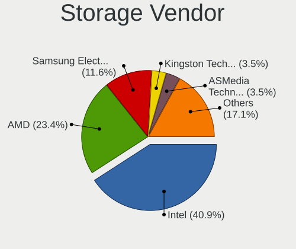

| Vendor                           | Desktops | Percent |
|----------------------------------|----------|---------|
| Intel                            | 1373     | 40.89%  |
| AMD                              | 785      | 23.38%  |
| Samsung Electronics              | 391      | 11.64%  |
| Kingston Technology Company      | 119      | 3.54%   |
| ASMedia Technology               | 117      | 3.48%   |
| Sandisk                          | 97       | 2.89%   |
| JMicron Technology               | 76       | 2.26%   |
| Marvell Technology Group         | 69       | 2.05%   |
| Phison Electronics               | 49       | 1.46%   |
| Micron/Crucial Technology        | 42       | 1.25%   |
| Nvidia                           | 37       | 1.1%    |
| ADATA Technology                 | 21       | 0.63%   |
| Shenzhen Longsys Electronics     | 20       | 0.6%    |
| Silicon Motion                   | 18       | 0.54%   |
| MAXIO Technology (Hangzhou)      | 17       | 0.51%   |
| Seagate Technology               | 14       | 0.42%   |
| Micron Technology                | 13       | 0.39%   |
| SK hynix                         | 12       | 0.36%   |
| VIA Technologies                 | 11       | 0.33%   |
| Silicon Image                    | 10       | 0.3%    |
| Toshiba America Info Systems     | 8        | 0.24%   |
| Broadcom / LSI                   | 7        | 0.21%   |
| KIOXIA                           | 6        | 0.18%   |
| INNOGRIT                         | 6        | 0.18%   |
| Realtek Semiconductor            | 5        | 0.15%   |
| LSI Logic / Symbios Logic        | 5        | 0.15%   |
| Adaptec                          | 4        | 0.12%   |
| Integrated Technology Express    | 3        | 0.09%   |
| Hosin Global Electronics         | 3        | 0.09%   |
| Yangtze Memory Technologies      | 2        | 0.06%   |
| Union Memory (Shenzhen)          | 2        | 0.06%   |
| ULi Electronics                  | 2        | 0.06%   |
| Silicon Integrated Systems [SiS] | 2        | 0.06%   |
| Promise Technology               | 2        | 0.06%   |
| HighPoint Technologies           | 2        | 0.06%   |
| Hewlett-Packard                  | 2        | 0.06%   |
| Transcend                        | 1        | 0.03%   |
| Toshiba                          | 1        | 0.03%   |
| Solidigm                         | 1        | 0.03%   |
| Netac Technology                 | 1        | 0.03%   |

Storage Model
-------------

Storage controller models

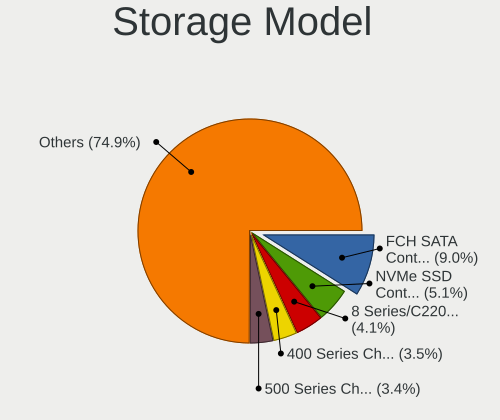

| Model                                                                                   | Desktops | Percent |
|-----------------------------------------------------------------------------------------|----------|---------|
| AMD FCH SATA Controller [AHCI mode]                                                     | 372      | 8.99%   |
| Samsung NVMe SSD Controller SM981/PM981/PM983                                           | 210      | 5.07%   |
| Intel 8 Series/C220 Series Chipset Family 6-port SATA Controller 1 [AHCI mode]          | 169      | 4.08%   |
| AMD 400 Series Chipset SATA Controller                                                  | 145      | 3.5%    |
| AMD 500 Series Chipset SATA Controller                                                  | 141      | 3.41%   |
| Intel Q170/Q150/B150/H170/H110/Z170/CM236 Chipset SATA Controller [AHCI Mode]           | 111      | 2.68%   |
| ASMedia ASM1061/ASM1062 Serial ATA Controller                                           | 104      | 2.51%   |
| Intel SATA Controller [RAID mode]                                                       | 96       | 2.32%   |
| AMD 600 Series Chipset SATA Controller                                                  | 95       | 2.3%    |
| Intel 6 Series/C200 Series Chipset Family 6 port Desktop SATA AHCI Controller           | 93       | 2.25%   |
| Intel 200 Series PCH SATA controller [AHCI mode]                                        | 89       | 2.15%   |
| Intel 7 Series/C210 Series Chipset Family 6-port SATA Controller [AHCI mode]            | 87       | 2.1%    |
| Samsung NVMe SSD Controller PM9A1/PM9A3/980PRO                                          | 81       | 1.96%   |
| AMD SB7x0/SB8x0/SB9x0 IDE Controller                                                    | 80       | 1.93%   |
| Intel Cannon Lake PCH SATA AHCI Controller                                              | 66       | 1.59%   |
| Samsung NVMe SSD Controller 980 (DRAM-less)                                             | 63       | 1.52%   |
| AMD SB7x0/SB8x0/SB9x0 SATA Controller [AHCI mode]                                       | 61       | 1.47%   |
| Intel NM10/ICH7 Family SATA Controller [IDE mode]                                       | 58       | 1.4%    |
| AMD SB7x0/SB8x0/SB9x0 SATA Controller [IDE mode]                                        | 54       | 1.3%    |
| Kingston Company A2000 NVMe SSD [SM2263EN]                                              | 53       | 1.28%   |
| Intel 82801G (ICH7 Family) IDE Controller                                               | 51       | 1.23%   |
| Intel 9 Series Chipset Family SATA Controller [AHCI Mode]                               | 49       | 1.18%   |
| Intel 6 Series/C200 Series Chipset Family Desktop SATA Controller (IDE mode, ports 4-5) | 48       | 1.16%   |
| Intel 6 Series/C200 Series Chipset Family Desktop SATA Controller (IDE mode, ports 0-3) | 48       | 1.16%   |
| JMicron JMB363 SATA/IDE Controller                                                      | 46       | 1.11%   |
| Samsung NVMe SSD Controller S4LV008[Pascal]                                             | 37       | 0.89%   |
| Intel 82801JI (ICH10 Family) SATA AHCI Controller                                       | 36       | 0.87%   |
| Samsung NVMe SSD Controller SM961/PM961/SM963                                           | 35       | 0.85%   |
| Intel 82801JI (ICH10 Family) 4 port SATA IDE Controller #1                              | 34       | 0.82%   |
| Intel 82801JI (ICH10 Family) 2 port SATA IDE Controller #2                              | 33       | 0.8%    |
| Intel 82801I (ICH9 Family) 2 port SATA Controller [IDE mode]                            | 33       | 0.8%    |
| Intel Alder Lake-S PCH SATA Controller [AHCI Mode]                                      | 32       | 0.77%   |
| AMD 300 Series Chipset SATA Controller                                                  | 31       | 0.75%   |
| Intel 5 Series/3400 Series Chipset 6 port SATA AHCI Controller                          | 30       | 0.72%   |
| Intel 82801JD/DO (ICH10 Family) SATA AHCI Controller                                    | 26       | 0.63%   |
| Intel 500 Series Chipset Family SATA AHCI Controller                                    | 26       | 0.63%   |
| Intel SSD 660P Series                                                                   | 25       | 0.6%    |
| Intel Raptor Lake SATA AHCI Controller                                                  | 25       | 0.6%    |
| Intel 82801IR/IO/IH (ICH9R/DO/DH) 4 port SATA Controller [IDE mode]                     | 25       | 0.6%    |
| Intel 4 Series Chipset PT IDER Controller                                               | 25       | 0.6%    |

Storage Kind
------------

Kind of storage controller (IDE, SATA, NVMe, SAS, ...)

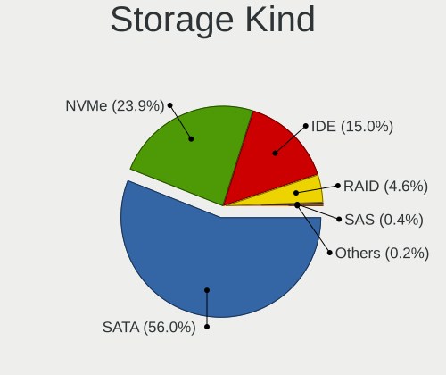

| Kind | Desktops | Percent |
|------|----------|---------|
| SATA | 1821     | 56.01%  |
| NVMe | 776      | 23.87%  |
| IDE  | 487      | 14.98%  |
| RAID | 148      | 4.55%   |
| SAS  | 12       | 0.37%   |
| SCSI | 7        | 0.22%   |

Processor
---------

CPU Vendor
----------

Processor vendors

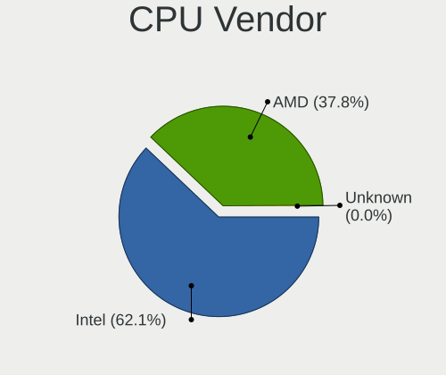

| Vendor  | Desktops | Percent |
|---------|----------|---------|
| Intel   | 1375     | 62.08%  |
| AMD     | 838      | 37.83%  |
| ARM     | 1        | 0.05%   |
| Unknown | 1        | 0.05%   |

CPU Model
---------

Processor models

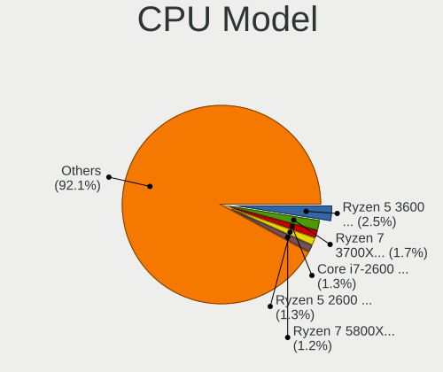

| Model                                       | Desktops | Percent |
|---------------------------------------------|----------|---------|
| AMD Ryzen 5 3600 6-Core Processor           | 56       | 2.52%   |
| AMD Ryzen 7 3700X 8-Core Processor          | 37       | 1.66%   |
| Intel Core i7-2600 CPU @ 3.40GHz            | 28       | 1.26%   |
| AMD Ryzen 5 2600 Six-Core Processor         | 28       | 1.26%   |
| AMD Ryzen 7 5800X 8-Core Processor          | 27       | 1.21%   |
| Intel Core i5-4460 CPU @ 3.20GHz            | 26       | 1.17%   |
| Intel Core 2 Duo CPU E8400 @ 3.00GHz        | 26       | 1.17%   |
| AMD Ryzen 5 5600X 6-Core Processor          | 26       | 1.17%   |
| Intel Core i7-3770 CPU @ 3.40GHz            | 25       | 1.12%   |
| AMD Ryzen 9 5900X 12-Core Processor         | 25       | 1.12%   |
| AMD Ryzen 9 3900X 12-Core Processor         | 25       | 1.12%   |
| Intel Core i7-4790 CPU @ 3.60GHz            | 21       | 0.94%   |
| Intel Core i5-4590 CPU @ 3.30GHz            | 21       | 0.94%   |
| Intel Core i5-3470 CPU @ 3.20GHz            | 20       | 0.9%    |
| AMD Ryzen 5 5600G with Radeon Graphics      | 20       | 0.9%    |
| AMD FX-8350 Eight-Core Processor            | 19       | 0.85%   |
| Intel Core i3-2120 CPU @ 3.30GHz            | 18       | 0.81%   |
| Intel Core i7-6700K CPU @ 4.00GHz           | 17       | 0.76%   |
| Intel Core i5-2400 CPU @ 3.10GHz            | 17       | 0.76%   |
| Intel Core 2 Quad CPU Q6600 @ 2.40GHz       | 17       | 0.76%   |
| Intel Core i7-7700K CPU @ 4.20GHz           | 16       | 0.72%   |
| Intel Core i5-4570 CPU @ 3.20GHz            | 16       | 0.72%   |
| Intel Core i3-3220 CPU @ 3.30GHz            | 16       | 0.72%   |
| AMD Ryzen 5 1600 Six-Core Processor         | 16       | 0.72%   |
| Intel Core i7-8700 CPU @ 3.20GHz            | 15       | 0.67%   |
| AMD Ryzen 7 5700X 8-Core Processor          | 15       | 0.67%   |
| AMD Ryzen 7 5700G with Radeon Graphics      | 15       | 0.67%   |
| AMD Ryzen 7 2700X Eight-Core Processor      | 15       | 0.67%   |
| Intel Core i7 CPU 920 @ 2.67GHz             | 14       | 0.63%   |
| Intel Core i3-4130 CPU @ 3.40GHz            | 14       | 0.63%   |
| Intel Core i7-6700 CPU @ 3.40GHz            | 13       | 0.58%   |
| Intel Core i7 CPU 860 @ 2.80GHz             | 13       | 0.58%   |
| Intel Core i5-7400 CPU @ 3.00GHz            | 13       | 0.58%   |
| AMD Ryzen 7 3800X 8-Core Processor          | 13       | 0.58%   |
| Intel Core i9-9900K CPU @ 3.60GHz           | 12       | 0.54%   |
| Intel Core i7-4790K CPU @ 4.00GHz           | 12       | 0.54%   |
| Intel Core i5-6500 CPU @ 3.20GHz            | 12       | 0.54%   |
| AMD Ryzen 5 3400G with Radeon Vega Graphics | 12       | 0.54%   |
| Intel Core i7-8700K CPU @ 3.70GHz           | 11       | 0.49%   |
| Intel Core i7-7700 CPU @ 3.60GHz            | 11       | 0.49%   |

CPU Model Family
----------------

Processor model prefix

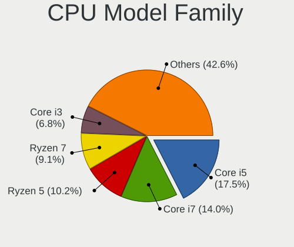

| Model                   | Desktops | Percent |
|-------------------------|----------|---------|
| Intel Core i5           | 388      | 17.48%  |
| Intel Core i7           | 310      | 13.96%  |
| AMD Ryzen 5             | 226      | 10.18%  |
| AMD Ryzen 7             | 201      | 9.05%   |
| Intel Core i3           | 150      | 6.76%   |
| AMD Ryzen 9             | 120      | 5.41%   |
| Other                   | 91       | 4.1%    |
| Intel Xeon              | 88       | 3.96%   |
| Intel Core 2 Duo        | 72       | 3.24%   |
| Intel Celeron           | 65       | 2.93%   |
| Intel Core 2 Quad       | 52       | 2.34%   |
| AMD FX                  | 51       | 2.3%    |
| Intel Pentium Dual-Core | 36       | 1.62%   |
| Intel Pentium           | 34       | 1.53%   |
| Intel Core i9           | 29       | 1.31%   |
| AMD Ryzen 3             | 25       | 1.13%   |
| AMD Athlon 64 X2        | 23       | 1.04%   |
| AMD Phenom II X4        | 22       | 0.99%   |
| AMD A8                  | 22       | 0.99%   |
| Intel Pentium 4         | 16       | 0.72%   |
| AMD Athlon II X2        | 16       | 0.72%   |
| Intel Pentium D         | 13       | 0.59%   |
| AMD A6                  | 13       | 0.59%   |
| Intel Atom              | 12       | 0.54%   |
| AMD Ryzen Threadripper  | 12       | 0.54%   |
| AMD A4                  | 12       | 0.54%   |
| Intel Core 2            | 11       | 0.5%    |
| AMD A10                 | 11       | 0.5%    |
| AMD Athlon              | 10       | 0.45%   |
| AMD Phenom II X6        | 9        | 0.41%   |
| AMD Athlon II X4        | 9        | 0.41%   |
| Intel Pentium Silver    | 6        | 0.27%   |
| AMD E                   | 6        | 0.27%   |
| Intel Pentium Gold      | 5        | 0.23%   |
| Intel Pentium Dual      | 5        | 0.23%   |
| AMD Ryzen 5 PRO         | 5        | 0.23%   |
| AMD GX                  | 5        | 0.23%   |
| AMD E1                  | 4        | 0.18%   |
| AMD Athlon X4           | 4        | 0.18%   |
| AMD Athlon 64           | 4        | 0.18%   |

CPU Cores
---------

Number of processor cores

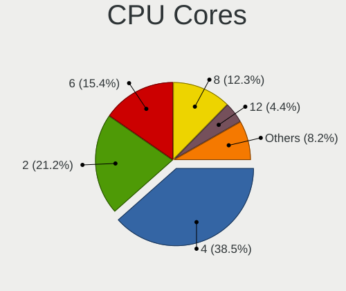

| Number  | Desktops | Percent |
|---------|----------|---------|
| 4       | 855      | 38.46%  |
| 2       | 471      | 21.19%  |
| 6       | 342      | 15.38%  |
| 8       | 274      | 12.33%  |
| 12      | 98       | 4.41%   |
| 16      | 61       | 2.74%   |
| 1       | 48       | 2.16%   |
| 10      | 23       | 1.03%   |
| 3       | 15       | 0.67%   |
| 24      | 13       | 0.58%   |
| 14      | 6        | 0.27%   |
| 20      | 5        | 0.22%   |
| 32      | 4        | 0.18%   |
| Unknown | 3        | 0.13%   |
| 18      | 2        | 0.09%   |
| 64      | 1        | 0.04%   |
| 48      | 1        | 0.04%   |
| 5       | 1        | 0.04%   |

CPU Sockets
-----------

Number of sockets

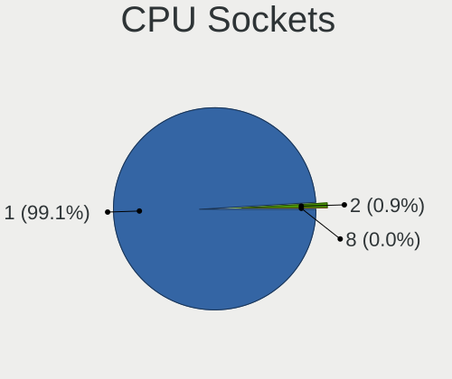

| Number | Desktops | Percent |
|--------|----------|---------|
| 1      | 2194     | 99.05%  |
| 2      | 20       | 0.9%    |
| 8      | 1        | 0.05%   |

CPU Threads
-----------

Threads per core (Hyper-Threading)

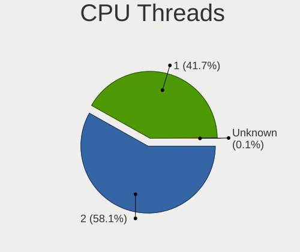

| Number  | Desktops | Percent |
|---------|----------|---------|
| 2       | 1292     | 58.15%  |
| 1       | 927      | 41.72%  |
| Unknown | 3        | 0.14%   |

CPU Op-Modes
------------

CPU Operation Modes (32-bit, 64-bit)

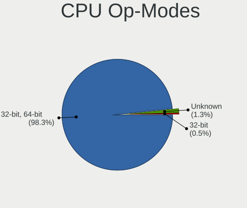

| Op mode        | Desktops | Percent |
|----------------|----------|---------|
| 32-bit, 64-bit | 2181     | 98.29%  |
| Unknown        | 28       | 1.26%   |
| 32-bit         | 10       | 0.45%   |

CPU Microcode
-------------

Microcode number

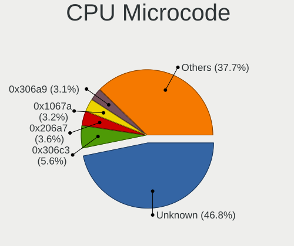

| Number     | Desktops | Percent |
|------------|----------|---------|
| Unknown    | 1084     | 46.8%   |
| 0x306c3    | 130      | 5.61%   |
| 0x206a7    | 83       | 3.58%   |
| 0x1067a    | 74       | 3.2%    |
| 0x306a9    | 71       | 3.07%   |
| 0x08701021 | 61       | 2.63%   |
| 0x506e3    | 51       | 2.2%    |
| 0x08701013 | 34       | 1.47%   |
| 0x010000c8 | 30       | 1.3%    |
| 0x906e9    | 29       | 1.25%   |
| 0x906ea    | 28       | 1.21%   |
| 0x6fb      | 28       | 1.21%   |
| 0x0800820d | 28       | 1.21%   |
| 0x06000852 | 26       | 1.12%   |
| 0x06001119 | 20       | 0.86%   |
| 0x106a5    | 19       | 0.82%   |
| 0x0a201016 | 19       | 0.82%   |
| 0x106e5    | 18       | 0.78%   |
| 0x20655    | 13       | 0.56%   |
| 0x0a601203 | 13       | 0.56%   |
| 0x906ed    | 12       | 0.52%   |
| 0x10676    | 12       | 0.52%   |
| 0x0a20120a | 12       | 0.52%   |
| 0x03000027 | 12       | 0.52%   |
| 0x906ec    | 11       | 0.47%   |
| 0x6fd      | 11       | 0.47%   |
| 0xa0655    | 10       | 0.43%   |
| 0x306f2    | 10       | 0.43%   |
| 0x0a201009 | 10       | 0.43%   |
| 0x08108109 | 10       | 0.43%   |
| 0x08101016 | 10       | 0.43%   |
| 0x08001138 | 10       | 0.43%   |
| 0xa0653    | 8        | 0.35%   |
| 0x90672    | 8        | 0.35%   |
| 0x6f6      | 8        | 0.35%   |
| 0x0a50000d | 8        | 0.35%   |
| 0x08701030 | 8        | 0.35%   |
| 0x906eb    | 7        | 0.3%    |
| 0x306e4    | 7        | 0.3%    |
| 0x206c2    | 7        | 0.3%    |

CPU Microarch
-------------

Microarchitecture

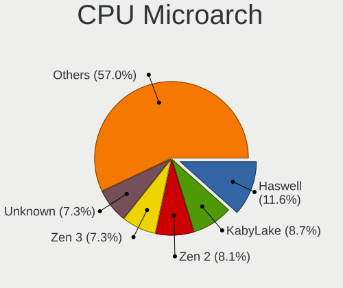

| Name             | Desktops | Percent |
|------------------|----------|---------|
| Haswell          | 258      | 11.61%  |
| KabyLake         | 193      | 8.69%   |
| Zen 2            | 179      | 8.06%   |
| Zen 3            | 163      | 7.34%   |
| Unknown          | 162      | 7.29%   |
| SandyBridge      | 144      | 6.48%   |
| IvyBridge        | 137      | 6.17%   |
| Penryn           | 121      | 5.45%   |
| Skylake          | 111      | 5%      |
| Zen+             | 86       | 3.87%   |
| Piledriver       | 72       | 3.24%   |
| Core             | 71       | 3.2%    |
| K10              | 67       | 3.02%   |
| Nehalem          | 65       | 2.93%   |
| Zen              | 64       | 2.88%   |
| CometLake        | 47       | 2.12%   |
| Westmere         | 37       | 1.67%   |
| K8 Hammer        | 35       | 1.58%   |
| NetBurst         | 32       | 1.44%   |
| Alderlake Hybrid | 30       | 1.35%   |
| Silvermont       | 22       | 0.99%   |
| K10 Llano        | 16       | 0.72%   |
| Goldmont plus    | 15       | 0.68%   |
| Excavator        | 11       | 0.5%    |
| Broadwell        | 11       | 0.5%    |
| Steamroller      | 10       | 0.45%   |
| Icelake          | 9        | 0.41%   |
| Jaguar           | 8        | 0.36%   |
| Gracemont        | 8        | 0.36%   |
| Bobcat           | 8        | 0.36%   |
| Bonnell          | 7        | 0.32%   |
| Bulldozer        | 6        | 0.27%   |
| Puma             | 5        | 0.23%   |
| Tremont          | 4        | 0.18%   |
| TigerLake        | 3        | 0.14%   |
| Goldmont         | 3        | 0.14%   |
| P6               | 1        | 0.05%   |
| Lunarlake Hybrid | 1        | 0.05%   |

Graphics
--------

GPU Vendor
----------

Vendors of graphics cards

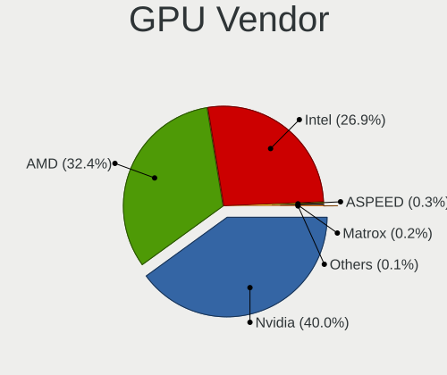

| Vendor                     | Desktops | Percent |
|----------------------------|----------|---------|
| Nvidia                     | 962      | 40%     |
| AMD                        | 780      | 32.43%  |
| Intel                      | 647      | 26.9%   |
| ASPEED Technology          | 7        | 0.29%   |
| Matrox Electronics Systems | 6        | 0.25%   |
| VIA Technologies           | 2        | 0.08%   |
| Red Hat                    | 1        | 0.04%   |

GPU Model
---------

Graphics card models

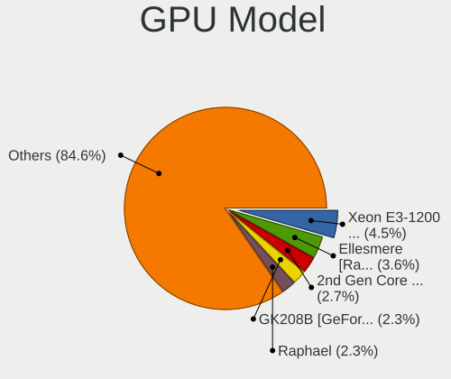

| Model                                                                       | Desktops | Percent |
|-----------------------------------------------------------------------------|----------|---------|
| Intel Xeon E3-1200 v3/4th Gen Core Processor Integrated Graphics Controller | 113      | 4.49%   |
| AMD Ellesmere [Radeon RX 470/480/570/570X/580/580X/590]                     | 91       | 3.62%   |
| Intel 2nd Generation Core Processor Family Integrated Graphics Controller   | 67       | 2.66%   |
| Nvidia GK208B [GeForce GT 710]                                              | 58       | 2.31%   |
| AMD Raphael                                                                 | 58       | 2.31%   |
| Nvidia GP107 [GeForce GTX 1050 Ti]                                          | 51       | 2.03%   |
| Intel Xeon E3-1200 v2/3rd Gen Core processor Graphics Controller            | 48       | 1.91%   |
| Intel Skylake-S GT2 [HD Graphics 530]                                       | 48       | 1.91%   |
| Intel CoffeeLake-S GT2 [UHD Graphics 630]                                   | 48       | 1.91%   |
| Intel 4 Series Chipset Integrated Graphics Controller                       | 41       | 1.63%   |
| Nvidia GP106 [GeForce GTX 1060 6GB]                                         | 37       | 1.47%   |
| Nvidia GT218 [GeForce 210]                                                  | 33       | 1.31%   |
| AMD Navi 10 [Radeon RX 5600 OEM/5600 XT / 5700/5700 XT]                     | 28       | 1.11%   |
| AMD Cezanne [Radeon Vega Series / Radeon Vega Mobile Series]                | 28       | 1.11%   |
| Nvidia GP108 [GeForce GT 1030]                                              | 26       | 1.03%   |
| Nvidia GP104 [GeForce GTX 1070]                                             | 26       | 1.03%   |
| Nvidia GM204 [GeForce GTX 970]                                              | 25       | 0.99%   |
| Intel Kaby Lake-S GT2 [HD Graphics 630]                                     | 25       | 0.99%   |
| AMD Picasso/Raven 2 [Radeon Vega Series / Radeon Vega Mobile Series]        | 25       | 0.99%   |
| Nvidia GP104 [GeForce GTX 1080]                                             | 23       | 0.91%   |
| Intel 4th Generation Core Processor Family Integrated Graphics Controller   | 22       | 0.87%   |
| AMD Navi 23 [Radeon RX 6600/6600 XT/6600M]                                  | 21       | 0.83%   |
| AMD Caicos [Radeon HD 6450/7450/8450 / R5 230 OEM]                          | 21       | 0.83%   |
| AMD Navi 31 [Radeon RX 7900 XT/7900 XTX/7900 GRE/7900M]                     | 20       | 0.8%    |
| Nvidia GM206 [GeForce GTX 960]                                              | 19       | 0.76%   |
| Intel IvyBridge GT2 [HD Graphics 4000]                                      | 19       | 0.76%   |
| Intel CometLake-S GT2 [UHD Graphics 630]                                    | 19       | 0.76%   |
| AMD Raven Ridge [Radeon Vega Series / Radeon Vega Mobile Series]            | 19       | 0.76%   |
| AMD Navi 32 [Radeon RX 7700 XT / 7800 XT]                                   | 19       | 0.76%   |
| AMD Navi 22 [Radeon RX 6700/6700 XT/6750 XT / 6800M/6850M XT]               | 18       | 0.72%   |
| Nvidia GK208B [GeForce GT 730]                                              | 17       | 0.68%   |
| AMD Granite Ridge [Radeon Graphics]                                         | 17       | 0.68%   |
| AMD Cedar [Radeon HD 5000/6000/7350/8350 Series]                            | 17       | 0.68%   |
| Nvidia TU117 [GeForce GTX 1650]                                             | 16       | 0.64%   |
| Nvidia TU116 [GeForce GTX 1660 SUPER]                                       | 16       | 0.64%   |
| Nvidia GM107 [GeForce GTX 750 Ti]                                           | 16       | 0.64%   |
| Nvidia TU116 [GeForce GTX 1660 Ti]                                          | 15       | 0.6%    |
| Nvidia TU104 [GeForce RTX 2070 SUPER]                                       | 15       | 0.6%    |
| AMD Navi 21 [Radeon RX 6800/6800 XT / 6900 XT]                              | 15       | 0.6%    |
| Nvidia GP102 [GeForce GTX 1080 Ti]                                          | 14       | 0.56%   |

GPU Combo
---------

Combinations of graphics cards

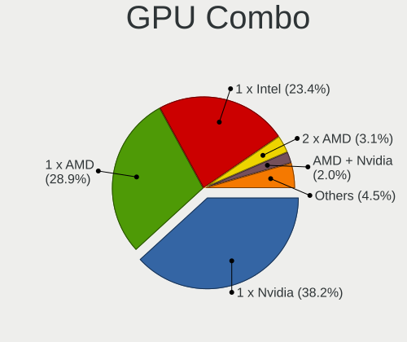

| Name                     | Desktops | Percent |
|--------------------------|----------|---------|
| 1 x Nvidia               | 858      | 38.2%   |
| 1 x AMD                  | 648      | 28.85%  |
| 1 x Intel                | 525      | 23.37%  |
| 2 x AMD                  | 70       | 3.12%   |
| AMD + Nvidia             | 45       | 2%      |
| Intel + Nvidia           | 42       | 1.87%   |
| Intel + AMD              | 16       | 0.71%   |
| 2 x Nvidia               | 11       | 0.49%   |
| Other                    | 6        | 0.27%   |
| 2 x Intel                | 5        | 0.22%   |
| 1 x Matrox               | 4        | 0.18%   |
| 1 x ASPEED               | 4        | 0.18%   |
| Nvidia + ASPEED          | 3        | 0.13%   |
| 1 x VIA                  | 2        | 0.09%   |
| Intel + AMD + 1 x Nvidia | 2        | 0.09%   |
| 1 x Red Hat              | 1        | 0.04%   |
| Nvidia + Matrox          | 1        | 0.04%   |
| Intel + 2 x AMD          | 1        | 0.04%   |
| AMD + 2 x Nvidia         | 1        | 0.04%   |
| AMD + Matrox             | 1        | 0.04%   |

GPU Driver
----------

Free vs proprietary

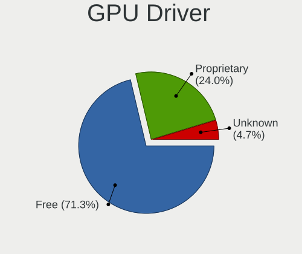

| Driver      | Desktops | Percent |
|-------------|----------|---------|
| Free        | 1622     | 71.3%   |
| Proprietary | 546      | 24%     |
| Unknown     | 107      | 4.7%    |

GPU Memory
----------

Total video memory

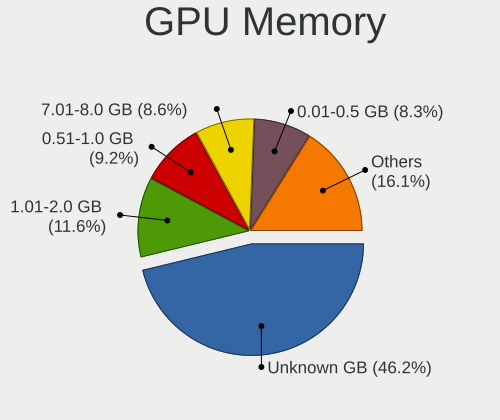

| Size in GB | Desktops | Percent |
|------------|----------|---------|
| Unknown    | 1067     | 46.21%  |
| 1.01-2.0   | 268      | 11.61%  |
| 0.51-1.0   | 213      | 9.22%   |
| 7.01-8.0   | 198      | 8.58%   |
| 0.01-0.5   | 191      | 8.27%   |
| 3.01-4.0   | 159      | 6.89%   |
| 8.01-16.0  | 95       | 4.11%   |
| 5.01-6.0   | 73       | 3.16%   |
| 16.01-24.0 | 24       | 1.04%   |
| 2.01-3.0   | 20       | 0.87%   |
| 24.01-32.0 | 1        | 0.04%   |

Monitor
-------

Monitor Vendor
--------------

Monitor vendors

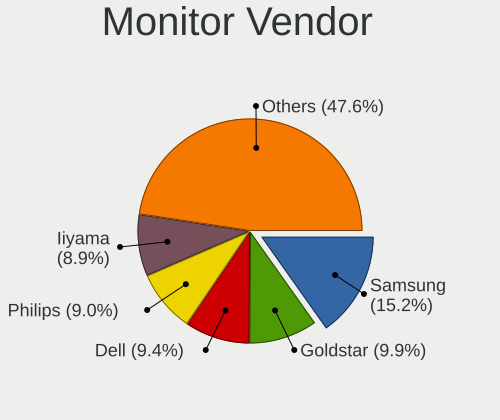

| Vendor               | Desktops | Percent |
|----------------------|----------|---------|
| Samsung Electronics  | 369      | 15.2%   |
| Goldstar             | 240      | 9.88%   |
| Dell                 | 228      | 9.39%   |
| Philips              | 219      | 9.02%   |
| Iiyama               | 216      | 8.9%    |
| Acer                 | 158      | 6.51%   |
| Hewlett-Packard      | 151      | 6.22%   |
| AOC                  | 124      | 5.11%   |
| BenQ                 | 93       | 3.83%   |
| Ancor Communications | 70       | 2.88%   |
| Medion               | 41       | 1.69%   |
| MSI                  | 38       | 1.57%   |
| ASUSTek Computer     | 36       | 1.48%   |
| Eizo                 | 31       | 1.28%   |
| Sony                 | 30       | 1.24%   |
| Idek Iiyama          | 30       | 1.24%   |
| LG Electronics       | 24       | 0.99%   |
| Lenovo               | 23       | 0.95%   |
| Unknown              | 20       | 0.82%   |
| Gigabyte Technology  | 20       | 0.82%   |
| Fujitsu Siemens      | 15       | 0.62%   |
| ViewSonic            | 12       | 0.49%   |
| Packard Bell         | 12       | 0.49%   |
| NEC Computers        | 11       | 0.45%   |
| Vestel Elektronik    | 9        | 0.37%   |
| Toshiba              | 9        | 0.37%   |
| Panasonic            | 8        | 0.33%   |
| DENON                | 8        | 0.33%   |
| Belinea              | 8        | 0.33%   |
| HannStar             | 7        | 0.29%   |
| Wacom                | 5        | 0.21%   |
| Sharp                | 5        | 0.21%   |
| MGW                  | 5        | 0.21%   |
| Marantz              | 5        | 0.21%   |
| Unknown              | 5        | 0.21%   |
| MStar                | 4        | 0.16%   |
| Mi                   | 4        | 0.16%   |
| Apple                | 4        | 0.16%   |
| Valve                | 3        | 0.12%   |
| Unknown (XXX)        | 3        | 0.12%   |

Monitor Model
-------------

Monitor models

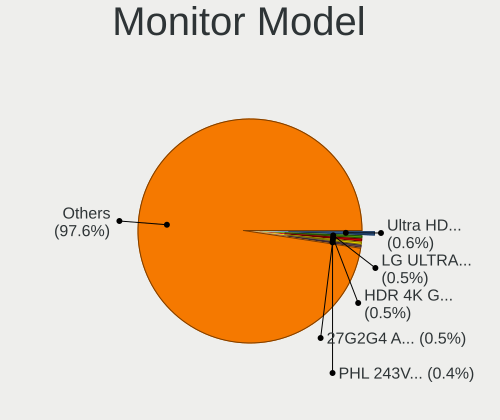

| Model                                                                 | Desktops | Percent |
|-----------------------------------------------------------------------|----------|---------|
| Goldstar Ultra HD GSM5B09 3840x2160 600x340mm 27.2-inch               | 16       | 0.61%   |
| Goldstar LG ULTRAWIDE GSM59F1 2560x1080 670x280mm 28.6-inch           | 12       | 0.46%   |
| Goldstar HDR 4K GSM7706 3840x2160 600x340mm 27.2-inch                 | 12       | 0.46%   |
| AOC 27G2G4 AOC2702 1920x1080 598x336mm 27.0-inch                      | 12       | 0.46%   |
| Philips PHL 243V5 PHLC0D1 1920x1080 521x293mm 23.5-inch               | 11       | 0.42%   |
| Goldstar ULTRAGEAR GSM5BD3 2560x1440 697x392mm 31.5-inch              | 11       | 0.42%   |
| AOC Q3279WG5B AOC3279 2560x1440 725x428mm 33.1-inch                   | 11       | 0.42%   |
| AOC 27G1G4 AOC2701 1920x1080 598x336mm 27.0-inch                      | 10       | 0.38%   |
| Vestel Elektronik 40UHD_LCD_TV VES3700 3840x2160 880x500mm 39.8-inch  | 9        | 0.34%   |
| Philips PHL 240V5A PHLC10C 1920x1080 527x296mm 23.8-inch              | 8        | 0.3%    |
| Philips PHL 223V5 PHLC0CF 1920x1080 477x268mm 21.5-inch               | 8        | 0.3%    |
| Iiyama PL2530H IVM6132 1920x1080 544x303mm 24.5-inch                  | 8        | 0.3%    |
| Dell U2412M DELA07A 1920x1200 518x324mm 24.1-inch                     | 8        | 0.3%    |
| Unknown LCD Monitor FFFF 2288x1287 2550x2550mm 142.0-inch             | 7        | 0.27%   |
| Philips PHL 276E8V PHLC18F 3840x2160 597x336mm 27.0-inch              | 7        | 0.27%   |
| Philips PHL 273V7 PHLC156 1920x1080 598x336mm 27.0-inch               | 7        | 0.27%   |
| Philips PHL 243V7 PHLC155 1920x1080 527x296mm 23.8-inch               | 7        | 0.27%   |
| Iiyama PL2492H IVM612F 1920x1080 527x296mm 23.8-inch                  | 7        | 0.27%   |
| Goldstar HDR 4K GSM7707 3840x2160 600x340mm 27.2-inch                 | 7        | 0.27%   |
| AOC 24G1WG4 AOC2401 1920x1080 520x290mm 23.4-inch                     | 7        | 0.27%   |
| Samsung Electronics C27F390 SAM0D32 1920x1080 598x336mm 27.0-inch     | 6        | 0.23%   |
| Philips PHL 240V5 PHLC10A 1920x1080 527x296mm 23.8-inch               | 6        | 0.23%   |
| MSI Optix MAG27CQ MSI1462 2560x1440 597x336mm 27.0-inch               | 6        | 0.23%   |
| Iiyama PL2409HD IVM560C 1920x1080 521x293mm 23.5-inch                 | 6        | 0.23%   |
| Hewlett-Packard L1740 HWP2649 1280x1024 337x270mm 17.0-inch           | 6        | 0.23%   |
| Goldstar LG IPS FULLHD GSM5AB8 1920x1080 480x270mm 21.7-inch          | 6        | 0.23%   |
| Goldstar IPS237 GSM5901 1920x1080 510x290mm 23.1-inch                 | 6        | 0.23%   |
| Goldstar 27GL850 GSM5B7F 2560x1440 597x336mm 27.0-inch                | 6        | 0.23%   |
| AOC U34G2G4R3 AOC3402 3440x1440 797x334mm 34.0-inch                   | 6        | 0.23%   |
| Acer AL1707 A ACRAD46 1280x1024 338x270mm 17.0-inch                   | 6        | 0.23%   |
| Samsung Electronics LU28R55 SAM1017 3840x2160 632x360mm 28.6-inch     | 5        | 0.19%   |
| Samsung Electronics LCD Monitor SAM0B7C 1920x1080 886x498mm 40.0-inch | 5        | 0.19%   |
| Samsung Electronics LCD Monitor SAM0902 1920x1080 890x500mm 40.2-inch | 5        | 0.19%   |
| Samsung Electronics LCD Monitor SAM03BC 1920x1080                     | 5        | 0.19%   |
| Samsung Electronics C32F391 SAM0D34 1920x1080 698x393mm 31.5-inch     | 5        | 0.19%   |
| Samsung Electronics C24F390 SAM0D2C 1920x1080 521x293mm 23.5-inch     | 5        | 0.19%   |
| Philips FTV PHL04C3 1920x1080 1440x810mm 65.0-inch                    | 5        | 0.19%   |
| Philips FTV PHL01EA 1920x1080 1440x810mm 65.0-inch                    | 5        | 0.19%   |
| MGW USB Capture MGW0206 1920x1200 708x398mm 32.0-inch                 | 5        | 0.19%   |
| Iiyama PLE2483H IVM6113 1920x1080 531x299mm 24.0-inch                 | 5        | 0.19%   |

Monitor Resolution
------------------

Monitor screen resolution

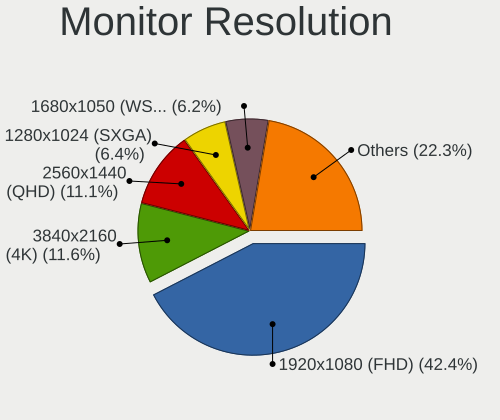

| Resolution         | Desktops | Percent |
|--------------------|----------|---------|
| 1920x1080 (FHD)    | 1014     | 42.43%  |
| 3840x2160 (4K)     | 277      | 11.59%  |
| 2560x1440 (QHD)    | 265      | 11.09%  |
| 1280x1024 (SXGA)   | 152      | 6.36%   |
| 1680x1050 (WSXGA+) | 148      | 6.19%   |
| 3440x1440          | 83       | 3.47%   |
| 1920x1200 (WUXGA)  | 81       | 3.39%   |
| Unknown            | 53       | 2.22%   |
| 1440x900 (WXGA+)   | 48       | 2.01%   |
| 2560x1080          | 41       | 1.72%   |
| 3840x1080          | 39       | 1.63%   |
| 1366x768 (WXGA)    | 27       | 1.13%   |
| 1360x768           | 24       | 1%      |
| 1600x900 (HD+)     | 17       | 0.71%   |
| 1024x768 (XGA)     | 14       | 0.59%   |
| 1920x540           | 10       | 0.42%   |
| 1600x1200          | 10       | 0.42%   |
| 2288x1287          | 8        | 0.33%   |
| 3840x1600          | 7        | 0.29%   |
| 1400x1050          | 7        | 0.29%   |
| 1280x720 (HD)      | 7        | 0.29%   |
| 2560x1600          | 6        | 0.25%   |
| 3840x1200          | 5        | 0.21%   |
| 2048x1152          | 5        | 0.21%   |
| 7680x2160          | 4        | 0.17%   |
| 5760x1080          | 4        | 0.17%   |
| 3600x1080          | 4        | 0.17%   |
| 5760x2160          | 3        | 0.13%   |
| 1280x960           | 3        | 0.13%   |
| 4480x1440          | 2        | 0.08%   |
| 1920x1440          | 2        | 0.08%   |
| 1280x800 (WXGA)    | 2        | 0.08%   |
| 6400x2160          | 1        | 0.04%   |
| 6400x1440          | 1        | 0.04%   |
| 5760x1200          | 1        | 0.04%   |
| 5520x2160          | 1        | 0.04%   |
| 5120x1440          | 1        | 0.04%   |
| 4608x1440          | 1        | 0.04%   |
| 3840x2560          | 1        | 0.04%   |
| 3600x1200          | 1        | 0.04%   |

Monitor Diagonal
----------------

Diagonal size in inches

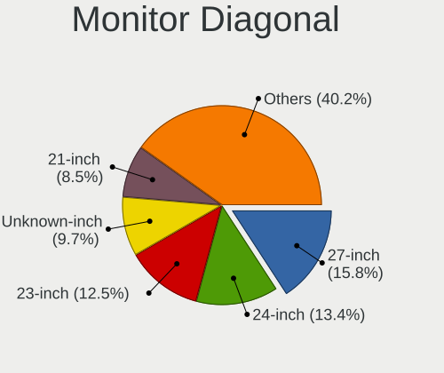

| Inches  | Desktops | Percent |
|---------|----------|---------|
| 27      | 385      | 15.81%  |
| 24      | 326      | 13.39%  |
| 23      | 304      | 12.48%  |
| Unknown | 235      | 9.65%   |
| 21      | 207      | 8.5%    |
| 19      | 121      | 4.97%   |
| 31      | 116      | 4.76%   |
| 22      | 107      | 4.39%   |
| 34      | 96       | 3.94%   |
| 17      | 73       | 3%      |
| 20      | 56       | 2.3%    |
| 84      | 44       | 1.81%   |
| 18      | 36       | 1.48%   |
| 25      | 32       | 1.31%   |
| 72      | 30       | 1.23%   |
| 40      | 30       | 1.23%   |
| 15      | 25       | 1.03%   |
| 65      | 17       | 0.7%    |
| 32      | 17       | 0.7%    |
| 33      | 16       | 0.66%   |
| 28      | 15       | 0.62%   |
| 26      | 15       | 0.62%   |
| 54      | 11       | 0.45%   |
| 29      | 10       | 0.41%   |
| 49      | 8        | 0.33%   |
| 48      | 8        | 0.33%   |
| 37      | 8        | 0.33%   |
| 142     | 7        | 0.29%   |
| 63      | 7        | 0.29%   |
| 42      | 7        | 0.29%   |
| 35      | 7        | 0.29%   |
| 43      | 6        | 0.25%   |
| 39      | 6        | 0.25%   |
| 58      | 5        | 0.21%   |
| 52      | 5        | 0.21%   |
| 46      | 4        | 0.16%   |
| 12      | 4        | 0.16%   |
| 41      | 3        | 0.12%   |
| 16      | 3        | 0.12%   |
| 74      | 2        | 0.08%   |

Monitor Width
-------------

Physical width

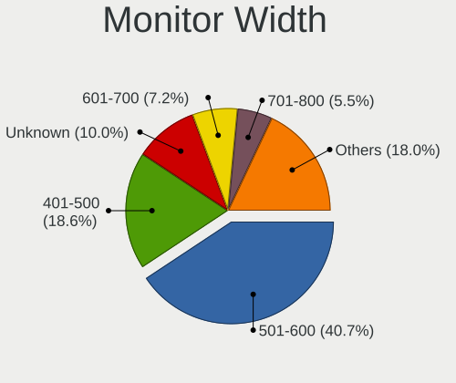

| Width in mm    | Desktops | Percent |
|----------------|----------|---------|
| 501-600        | 953      | 40.69%  |
| 401-500        | 436      | 18.62%  |
| Unknown        | 235      | 10.03%  |
| 601-700        | 168      | 7.17%   |
| 701-800        | 129      | 5.51%   |
| 301-350        | 96       | 4.1%    |
| 351-400        | 88       | 3.76%   |
| 1501-2000      | 78       | 3.33%   |
| 1001-1500      | 75       | 3.2%    |
| 801-900        | 51       | 2.18%   |
| 901-1000       | 18       | 0.77%   |
| 201-300        | 8        | 0.34%   |
| More than 2000 | 7        | 0.3%    |

Aspect Ratio
------------

Proportional relationship between the width and the height

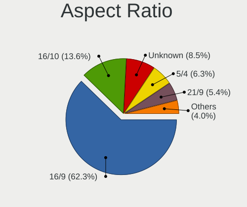

| Ratio   | Desktops | Percent |
|---------|----------|---------|
| 16/9    | 1390     | 62.28%  |
| 16/10   | 303      | 13.58%  |
| Unknown | 189      | 8.47%   |
| 5/4     | 140      | 6.27%   |
| 21/9    | 121      | 5.42%   |
| 4/3     | 39       | 1.75%   |
| 32/9    | 22       | 0.99%   |
| 3/2     | 10       | 0.45%   |
| 6/5     | 9        | 0.4%    |
| 1.00    | 7        | 0.31%   |
| 0.89    | 1        | 0.04%   |
| 0.80    | 1        | 0.04%   |

Monitor Area
------------

Area in inch²

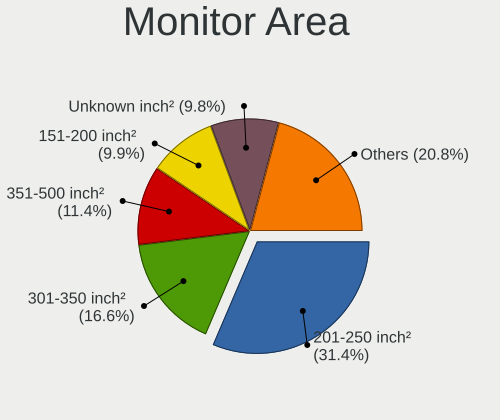

| Area in inch² | Desktops | Percent |
|----------------|----------|---------|
| 201-250        | 751      | 31.42%  |
| 301-350        | 397      | 16.61%  |
| 351-500        | 273      | 11.42%  |
| 151-200        | 236      | 9.87%   |
| Unknown        | 235      | 9.83%   |
| 251-300        | 149      | 6.23%   |
| More than 1000 | 135      | 5.65%   |
| 141-150        | 94       | 3.93%   |
| 501-1000       | 84       | 3.51%   |
| 101-110        | 19       | 0.79%   |
| 111-120        | 7        | 0.29%   |
| 71-80          | 6        | 0.25%   |
| 91-100         | 2        | 0.08%   |
| 81-90          | 1        | 0.04%   |
| 131-140        | 1        | 0.04%   |

Pixel Density
-------------

Pixels per inch

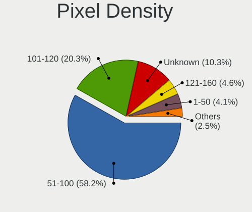

| Density | Desktops | Percent |
|---------|----------|---------|
| 51-100  | 1321     | 58.17%  |
| 101-120 | 461      | 20.3%   |
| Unknown | 235      | 10.35%  |
| 121-160 | 105      | 4.62%   |
| 1-50    | 93       | 4.1%    |
| 161-240 | 56       | 2.47%   |

Multiple Monitors
-----------------

Total monitors connected

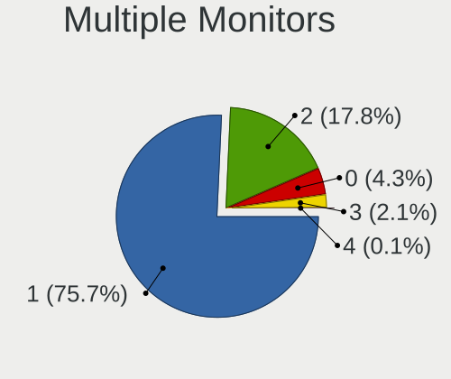

| Total | Desktops | Percent |
|-------|----------|---------|
| 1     | 1719     | 75.73%  |
| 2     | 403      | 17.75%  |
| 0     | 97       | 4.27%   |
| 3     | 48       | 2.11%   |
| 4     | 3        | 0.13%   |

Network
-------

Net Controller Vendor
---------------------

Controller vendors

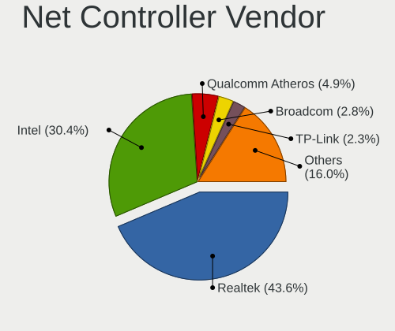

| Vendor                                | Desktops | Percent |
|---------------------------------------|----------|---------|
| Realtek Semiconductor                 | 1354     | 43.61%  |
| Intel                                 | 943      | 30.37%  |
| Qualcomm Atheros                      | 151      | 4.86%   |
| Broadcom                              | 88       | 2.83%   |
| TP-Link                               | 72       | 2.32%   |
| MediaTek                              | 70       | 2.25%   |
| Ralink Technology                     | 65       | 2.09%   |
| Ralink                                | 30       | 0.97%   |
| Nvidia                                | 30       | 0.97%   |
| Microsoft                             | 27       | 0.87%   |
| Marvell Technology Group              | 23       | 0.74%   |
| Aquantia                              | 20       | 0.64%   |
| Broadcom Limited                      | 16       | 0.52%   |
| Sitecom Europe                        | 15       | 0.48%   |
| IMC Networks                          | 15       | 0.48%   |
| NetGear                               | 14       | 0.45%   |
| ASUSTek Computer                      | 12       | 0.39%   |
| Samsung Electronics                   | 9        | 0.29%   |
| Qualcomm Atheros Communications       | 8        | 0.26%   |
| Gemtek                                | 7        | 0.23%   |
| Huawei Technologies                   | 6        | 0.19%   |
| Edimax Technology                     | 6        | 0.19%   |
| Belkin Components                     | 6        | 0.19%   |
| Mellanox Technologies                 | 5        | 0.16%   |
| Linksys                               | 5        | 0.16%   |
| 802.11g Adapter [Linksys WUSB54GC v3] | 5        | 0.16%   |
| Xiaomi                                | 4        | 0.13%   |
| U-Blox                                | 4        | 0.13%   |
| D-Link System                         | 4        | 0.13%   |
| D-Link                                | 4        | 0.13%   |
| ASIX Electronics                      | 4        | 0.13%   |
| VIA Technologies                      | 3        | 0.1%    |
| ULi Electronics                       | 3        | 0.1%    |
| Qualcomm Technologies                 | 3        | 0.1%    |
| Oculus VR                             | 3        | 0.1%    |
| Google                                | 3        | 0.1%    |
| DisplayLink                           | 3        | 0.1%    |
| AVM                                   | 3        | 0.1%    |
| aicsemi                               | 3        | 0.1%    |
| 3Com                                  | 3        | 0.1%    |

Net Controller Model
--------------------

Controller models

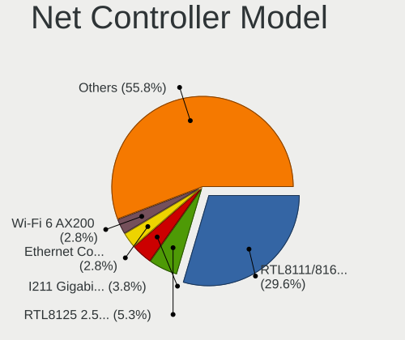

| Model                                                                  | Desktops | Percent |
|------------------------------------------------------------------------|----------|---------|
| Realtek RTL8111/8168/8211/8411 PCI Express Gigabit Ethernet Controller | 1040     | 29.55%  |
| Realtek RTL8125 2.5GbE Controller                                      | 185      | 5.26%   |
| Intel I211 Gigabit Network Connection                                  | 134      | 3.81%   |
| Intel Ethernet Connection (2) I219-V                                   | 99       | 2.81%   |
| Intel Wi-Fi 6 AX200                                                    | 98       | 2.78%   |
| Intel 82579LM Gigabit Network Connection (Lewisville)                  | 82       | 2.33%   |
| Intel Ethernet Controller I225-V                                       | 78       | 2.22%   |
| Intel Ethernet Connection I217-LM                                      | 52       | 1.48%   |
| Intel Wi-Fi 6E(802.11ax) AX210/AX1675* 2x2 [Typhoon Peak]              | 40       | 1.14%   |
| Intel 82579V Gigabit Network Connection                                | 40       | 1.14%   |
| Intel Ethernet Connection (7) I219-V                                   | 36       | 1.02%   |
| MediaTek MT7922 802.11ax PCI Express Wireless Network Adapter          | 34       | 0.97%   |
| Intel Dual Band Wireless-AC 3168NGW [Stone Peak]                       | 33       | 0.94%   |
| Intel 82567LM-3 Gigabit Network Connection                             | 33       | 0.94%   |
| Realtek RTL8153 Gigabit Ethernet Adapter                               | 30       | 0.85%   |
| Intel Ethernet Connection I217-V                                       | 29       | 0.82%   |
| Realtek RTL810xE PCI Express Fast Ethernet controller                  | 24       | 0.68%   |
| Realtek RTL-8100/8101L/8139 PCI Fast Ethernet Adapter                  | 24       | 0.68%   |
| Qualcomm Atheros Killer E220x Gigabit Ethernet Controller              | 24       | 0.68%   |
| Broadcom BCM4360 802.11ac Dual Band Wireless Network Adapter           | 23       | 0.65%   |
| Ralink RT5370 Wireless Adapter                                         | 21       | 0.6%    |
| Intel Wi-Fi 5(802.11ac) Wireless-AC 9x6x [Thunder Peak]                | 20       | 0.57%   |
| Intel Ethernet Connection (2) I218-V                                   | 20       | 0.57%   |
| Intel 82574L Gigabit Network Connection                                | 20       | 0.57%   |
| Intel 82566DM-2 Gigabit Network Connection                             | 20       | 0.57%   |
| TP-Link TL-WN823N v2/v3 [Realtek RTL8192EU]                            | 19       | 0.54%   |
| Intel Ethernet Controller I226-V                                       | 19       | 0.54%   |
| Realtek RTL8821CE 802.11ac PCIe Wireless Network Adapter               | 17       | 0.48%   |
| MediaTek MT7921K (RZ608) Wi-Fi 6E 80MHz                                | 17       | 0.48%   |
| Realtek RTL8188CUS 802.11n WLAN Adapter                                | 15       | 0.43%   |
| Nvidia MCP61 Ethernet                                                  | 15       | 0.43%   |
| Intel Wireless 7265                                                    | 15       | 0.43%   |
| Intel Cannon Lake PCH CNVi WiFi                                        | 15       | 0.43%   |
| TP-Link Archer T3U [Realtek RTL8812BU]                                 | 14       | 0.4%    |
| Microsoft Xbox Wireless Adapter for Windows                            | 14       | 0.4%    |
| Marvell Group 88E8056 PCI-E Gigabit Ethernet Controller                | 14       | 0.4%    |
| Intel Ethernet Connection (2) I219-LM                                  | 14       | 0.4%    |
| Realtek RTL8852BE PCIe 802.11ax Wireless Network Controller            | 13       | 0.37%   |
| Intel I210 Gigabit Network Connection                                  | 13       | 0.37%   |
| Realtek RTL88x2bu [AC1200 Techkey]                                     | 12       | 0.34%   |

Wireless Vendor
---------------

Wireless vendors

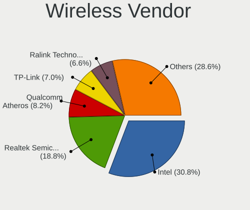

| Vendor                                | Desktops | Percent |
|---------------------------------------|----------|---------|
| Intel                                 | 302      | 30.78%  |
| Realtek Semiconductor                 | 184      | 18.76%  |
| Qualcomm Atheros                      | 80       | 8.15%   |
| TP-Link                               | 69       | 7.03%   |
| Ralink Technology                     | 65       | 6.63%   |
| MediaTek                              | 63       | 6.42%   |
| Broadcom                              | 40       | 4.08%   |
| Ralink                                | 30       | 3.06%   |
| Microsoft                             | 27       | 2.75%   |
| Sitecom Europe                        | 15       | 1.53%   |
| IMC Networks                          | 15       | 1.53%   |
| NetGear                               | 14       | 1.43%   |
| ASUSTek Computer                      | 12       | 1.22%   |
| Qualcomm Atheros Communications       | 8        | 0.82%   |
| Gemtek                                | 7        | 0.71%   |
| Edimax Technology                     | 6        | 0.61%   |
| Belkin Components                     | 6        | 0.61%   |
| Linksys                               | 5        | 0.51%   |
| Broadcom Limited                      | 5        | 0.51%   |
| 802.11g Adapter [Linksys WUSB54GC v3] | 5        | 0.51%   |
| D-Link                                | 4        | 0.41%   |
| D-Link System                         | 3        | 0.31%   |
| AVM                                   | 3        | 0.31%   |
| Wilocity                              | 2        | 0.2%    |
| CyberTAN Technology                   | 2        | 0.2%    |
| ZyXEL Communications                  | 1        | 0.1%    |
| Tenda                                 | 1        | 0.1%    |
| Senao                                 | 1        | 0.1%    |
| Samsung Electronics                   | 1        | 0.1%    |
| Sagem                                 | 1        | 0.1%    |
| Pegatron                              | 1        | 0.1%    |
| Panasonic (Matsushita)                | 1        | 0.1%    |
| Dell                                  | 1        | 0.1%    |
| Cinterion                             | 1        | 0.1%    |

Wireless Model
--------------

Wireless models

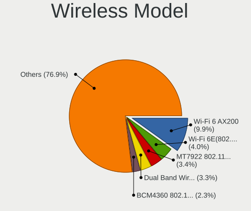

| Model                                                         | Desktops | Percent |
|---------------------------------------------------------------|----------|---------|
| Intel Wi-Fi 6 AX200                                           | 98       | 9.91%   |
| Intel Wi-Fi 6E(802.11ax) AX210/AX1675* 2x2 [Typhoon Peak]     | 40       | 4.04%   |
| MediaTek MT7922 802.11ax PCI Express Wireless Network Adapter | 34       | 3.44%   |
| Intel Dual Band Wireless-AC 3168NGW [Stone Peak]              | 33       | 3.34%   |
| Broadcom BCM4360 802.11ac Dual Band Wireless Network Adapter  | 23       | 2.33%   |
| Ralink RT5370 Wireless Adapter                                | 21       | 2.12%   |
| Intel Wi-Fi 5(802.11ac) Wireless-AC 9x6x [Thunder Peak]       | 20       | 2.02%   |
| TP-Link TL-WN823N v2/v3 [Realtek RTL8192EU]                   | 19       | 1.92%   |
| Realtek RTL8821CE 802.11ac PCIe Wireless Network Adapter      | 17       | 1.72%   |
| MediaTek MT7921K (RZ608) Wi-Fi 6E 80MHz                       | 17       | 1.72%   |
| Realtek RTL8188CUS 802.11n WLAN Adapter                       | 15       | 1.52%   |
| Intel Wireless 7265                                           | 15       | 1.52%   |
| Intel Cannon Lake PCH CNVi WiFi                               | 15       | 1.52%   |
| TP-Link Archer T3U [Realtek RTL8812BU]                        | 14       | 1.42%   |
| Microsoft Xbox Wireless Adapter for Windows                   | 14       | 1.42%   |
| Realtek RTL88x2bu [AC1200 Techkey]                            | 12       | 1.21%   |
| Realtek RTL8188EUS 802.11n Wireless Network Adapter           | 12       | 1.21%   |
| Ralink MT7601U Wireless Adapter                               | 12       | 1.21%   |
| Intel 700 Series Chipset CNVi WiFi                            | 12       | 1.21%   |
| IMC Networks Mediao 802.11n WLAN [Realtek RTL8191SU]          | 12       | 1.21%   |
| Realtek RTL8852CE PCIe 802.11ax Wireless Network Controller   | 11       | 1.11%   |
| Realtek RTL8192EU 802.11b/g/n WLAN Adapter                    | 11       | 1.11%   |
| Ralink RT2870/RT3070 Wireless Adapter                         | 11       | 1.11%   |
| Qualcomm Atheros AR9462 Wireless Network Adapter              | 11       | 1.11%   |
| Qualcomm Atheros AR9227 Wireless Network Adapter              | 11       | 1.11%   |
| Intel Wireless 7260                                           | 11       | 1.11%   |
| Intel Wireless 3165                                           | 11       | 1.11%   |
| Realtek RTL8822BE 802.11a/b/g/n/ac WiFi adapter               | 10       | 1.01%   |
| Realtek RTL8192CU 802.11n WLAN Adapter                        | 9        | 0.91%   |
| Realtek 802.11ac NIC                                          | 9        | 0.91%   |
| Ralink MT7610U ("Archer T2U" 2.4G+5G WLAN Adapter             | 9        | 0.91%   |
| Qualcomm Atheros QCA6174 802.11ac Wireless Network Adapter    | 9        | 0.91%   |
| Qualcomm Atheros AR93xx Wireless Network Adapter              | 9        | 0.91%   |
| Ralink RT3090 Wireless 802.11n 1T/1R PCIe                     | 8        | 0.81%   |
| Intel Wireless 3160                                           | 8        | 0.81%   |
| Ralink RT2790 Wireless 802.11n 1T/2R PCIe                     | 7        | 0.71%   |
| Qualcomm Atheros AR9485 Wireless Network Adapter              | 7        | 0.71%   |
| Microsoft Wireless XBox Controller Dongle                     | 7        | 0.71%   |
| Intel Wireless 8260                                           | 7        | 0.71%   |
| Intel Alder Lake-S PCH CNVi WiFi                              | 7        | 0.71%   |

Ethernet Vendor
---------------

Ethernet vendors

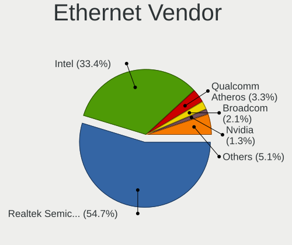

| Vendor                                 | Desktops | Percent |
|----------------------------------------|----------|---------|
| Realtek Semiconductor                  | 1307     | 54.71%  |
| Intel                                  | 799      | 33.44%  |
| Qualcomm Atheros                       | 80       | 3.35%   |
| Broadcom                               | 50       | 2.09%   |
| Nvidia                                 | 30       | 1.26%   |
| Marvell Technology Group               | 23       | 0.96%   |
| Aquantia                               | 20       | 0.84%   |
| Broadcom Limited                       | 11       | 0.46%   |
| Samsung Electronics                    | 8        | 0.33%   |
| Mellanox Technologies                  | 5        | 0.21%   |
| Huawei Technologies                    | 5        | 0.21%   |
| Xiaomi                                 | 4        | 0.17%   |
| ASIX Electronics                       | 4        | 0.17%   |
| VIA Technologies                       | 3        | 0.13%   |
| TP-Link                                | 3        | 0.13%   |
| Qualcomm Technologies                  | 3        | 0.13%   |
| Google                                 | 3        | 0.13%   |
| DisplayLink                            | 3        | 0.13%   |
| 3Com                                   | 3        | 0.13%   |
| ULi Electronics                        | 2        | 0.08%   |
| Suzhou Motorcomm Electronic Technology | 2        | 0.08%   |
| Sundance Technology Inc / IC Plus      | 2        | 0.08%   |
| Qualcomm                               | 2        | 0.08%   |
| Motorola PCS                           | 2        | 0.08%   |
| MediaTek                               | 2        | 0.08%   |
| JMicron Technology                     | 2        | 0.08%   |
| Emulex                                 | 2        | 0.08%   |
| Accton Technology                      | 2        | 0.08%   |
| OPPO Electronics                       | 1        | 0.04%   |
| Lenovo                                 | 1        | 0.04%   |
| ICS Advent                             | 1        | 0.04%   |
| D-Link System                          | 1        | 0.04%   |
| American Megatrends                    | 1        | 0.04%   |
| ADMtek                                 | 1        | 0.04%   |
| Unknown                                | 1        | 0.04%   |

Ethernet Model
--------------

Ethernet models

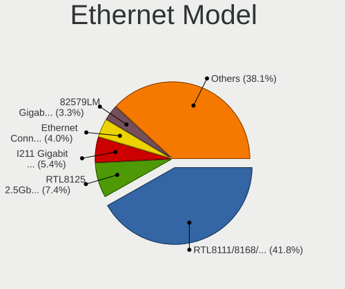

| Model                                                                           | Desktops | Percent |
|---------------------------------------------------------------------------------|----------|---------|
| Realtek RTL8111/8168/8211/8411 PCI Express Gigabit Ethernet Controller          | 1040     | 41.8%   |
| Realtek RTL8125 2.5GbE Controller                                               | 185      | 7.44%   |
| Intel I211 Gigabit Network Connection                                           | 134      | 5.39%   |
| Intel Ethernet Connection (2) I219-V                                            | 99       | 3.98%   |
| Intel 82579LM Gigabit Network Connection (Lewisville)                           | 82       | 3.3%    |
| Intel Ethernet Controller I225-V                                                | 78       | 3.14%   |
| Intel Ethernet Connection I217-LM                                               | 52       | 2.09%   |
| Intel 82579V Gigabit Network Connection                                         | 40       | 1.61%   |
| Intel Ethernet Connection (7) I219-V                                            | 36       | 1.45%   |
| Intel 82567LM-3 Gigabit Network Connection                                      | 33       | 1.33%   |
| Realtek RTL8153 Gigabit Ethernet Adapter                                        | 30       | 1.21%   |
| Intel Ethernet Connection I217-V                                                | 29       | 1.17%   |
| Realtek RTL810xE PCI Express Fast Ethernet controller                           | 24       | 0.96%   |
| Realtek RTL-8100/8101L/8139 PCI Fast Ethernet Adapter                           | 24       | 0.96%   |
| Qualcomm Atheros Killer E220x Gigabit Ethernet Controller                       | 24       | 0.96%   |
| Intel Ethernet Connection (2) I218-V                                            | 20       | 0.8%    |
| Intel 82574L Gigabit Network Connection                                         | 20       | 0.8%    |
| Intel 82566DM-2 Gigabit Network Connection                                      | 20       | 0.8%    |
| Intel Ethernet Controller I226-V                                                | 19       | 0.76%   |
| Nvidia MCP61 Ethernet                                                           | 15       | 0.6%    |
| Marvell Group 88E8056 PCI-E Gigabit Ethernet Controller                         | 14       | 0.56%   |
| Intel Ethernet Connection (2) I219-LM                                           | 14       | 0.56%   |
| Intel I210 Gigabit Network Connection                                           | 13       | 0.52%   |
| Qualcomm Atheros AR8151 v2.0 Gigabit Ethernet                                   | 12       | 0.48%   |
| Qualcomm Atheros AR8121/AR8113/AR8114 Gigabit or Fast Ethernet                  | 11       | 0.44%   |
| Intel Ethernet Connection (5) I219-LM                                           | 11       | 0.44%   |
| Intel 82578DM Gigabit Network Connection                                        | 11       | 0.44%   |
| Aquantia AQtion AQC113CS NBase-T/IEEE 802.3an Ethernet Controller [Antigua 10G] | 11       | 0.44%   |
| Realtek RTL8126 5GbE Controller                                                 | 10       | 0.4%    |
| Qualcomm Atheros Attansic L1 Gigabit Ethernet                                   | 9        | 0.36%   |
| Intel NM10/ICH7 Family LAN Controller                                           | 9        | 0.36%   |
| Intel Ethernet Connection (7) I219-LM                                           | 9        | 0.36%   |
| Realtek RTL8852BE PCIe 802.11ax Wireless Network Controller                     | 8        | 0.32%   |
| Realtek RTL8169 PCI Gigabit Ethernet Controller                                 | 8        | 0.32%   |
| Broadcom NetXtreme BCM5761 Gigabit Ethernet PCIe                                | 8        | 0.32%   |
| Intel Ethernet Connection (11) I219-V                                           | 7        | 0.28%   |
| Intel 82578DC Gigabit Network Connection                                        | 7        | 0.28%   |
| Samsung Galaxy series, misc. (tethering mode)                                   | 6        | 0.24%   |
| Realtek RTL8922AE 802.11be PCIe Wireless Network Adapter                        | 6        | 0.24%   |
| Realtek Killer E3000 2.5GbE Controller                                          | 6        | 0.24%   |

Net Controller Kind
-------------------

Ethernet, WiFi or modem

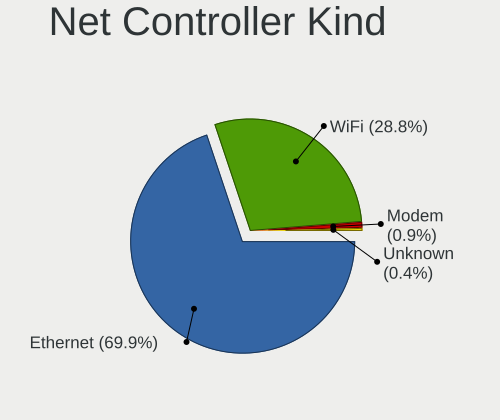

| Kind     | Desktops | Percent |
|----------|----------|---------|
| Ethernet | 2205     | 69.87%  |
| WiFi     | 910      | 28.83%  |
| Modem    | 27       | 0.86%   |
| Unknown  | 14       | 0.44%   |

Used Controller
---------------

Currently used network controller

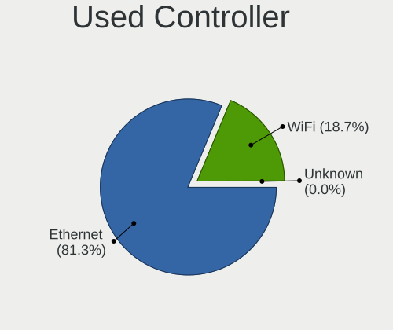

| Kind     | Desktops | Percent |
|----------|----------|---------|
| Ethernet | 1879     | 81.27%  |
| WiFi     | 432      | 18.69%  |
| Unknown  | 1        | 0.04%   |

NICs
----

Total network controllers on board

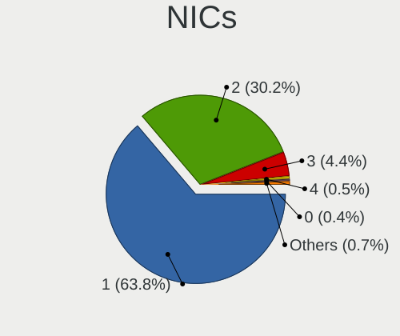

| Total | Desktops | Percent |
|-------|----------|---------|
| 1     | 1422     | 63.8%   |
| 2     | 674      | 30.24%  |
| 3     | 98       | 4.4%    |
| 4     | 11       | 0.49%   |
| 0     | 9        | 0.4%    |
| 5     | 6        | 0.27%   |
| 6     | 4        | 0.18%   |
| 7     | 3        | 0.13%   |
| 11    | 1        | 0.04%   |
| 8     | 1        | 0.04%   |

IPv6
----

IPv6 vs IPv4

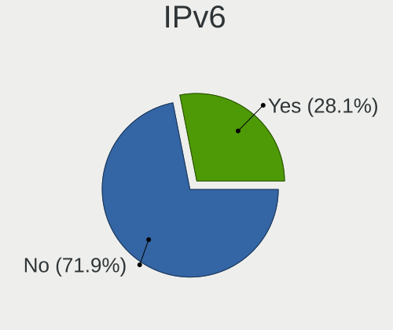

| Used | Desktops | Percent |
|------|----------|---------|
| No   | 1638     | 71.91%  |
| Yes  | 640      | 28.09%  |

Bluetooth
---------

Bluetooth Vendor
----------------

Controller vendors

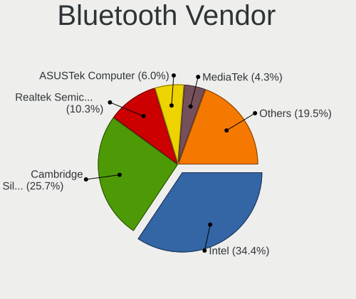

| Vendor                          | Desktops | Percent |
|---------------------------------|----------|---------|
| Intel                           | 288      | 34.37%  |
| Cambridge Silicon Radio         | 215      | 25.66%  |
| Realtek Semiconductor           | 86       | 10.26%  |
| ASUSTek Computer                | 50       | 5.97%   |
| MediaTek                        | 36       | 4.3%    |
| Foxconn / Hon Hai               | 32       | 3.82%   |
| TP-Link                         | 22       | 2.63%   |
| Qualcomm Atheros Communications | 21       | 2.51%   |
| IMC Networks                    | 21       | 2.51%   |
| Broadcom                        | 13       | 1.55%   |
| Apple                           | 11       | 1.31%   |
| Lite-On Technology              | 9        | 1.07%   |
| Actions                         | 7        | 0.84%   |
| Unknown                         | 6        | 0.72%   |
| Realtek                         | 5        | 0.6%    |
| Integrated System Solution      | 4        | 0.48%   |
| Dell                            | 3        | 0.36%   |
| Edimax Technology               | 2        | 0.24%   |
| Sitecom Europe                  | 1        | 0.12%   |
| Roper                           | 1        | 0.12%   |
| Ralink                          | 1        | 0.12%   |
| Micro Star International        | 1        | 0.12%   |
| Logitech                        | 1        | 0.12%   |
| Hewlett-Packard                 | 1        | 0.12%   |
| Belkin Components               | 1        | 0.12%   |

Bluetooth Model
---------------

Controller models

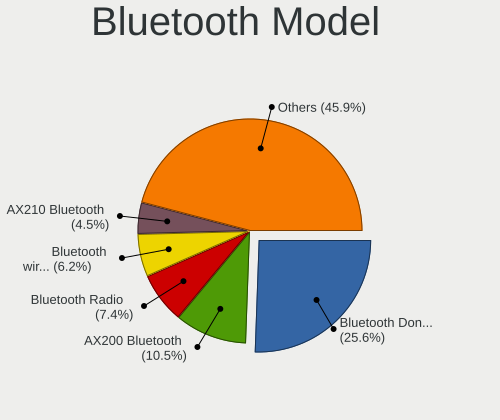

| Model                                                 | Desktops | Percent |
|-------------------------------------------------------|----------|---------|
| Cambridge Silicon Radio Bluetooth Dongle (HCI mode)   | 215      | 25.56%  |
| Intel AX200 Bluetooth                                 | 88       | 10.46%  |
| Realtek Bluetooth Radio                               | 62       | 7.37%   |
| Intel Bluetooth wireless interface                    | 52       | 6.18%   |
| Intel AX210 Bluetooth                                 | 38       | 4.52%   |
| MediaTek Wireless_Device                              | 36       | 4.28%   |
| Intel Wireless-AC 3168 Bluetooth                      | 34       | 4.04%   |
| Foxconn / Hon Hai Wireless_Device                     | 28       | 3.33%   |
| TP-Link TP-T@- UB500 Adapter                          | 22       | 2.62%   |
| Intel AX201 Bluetooth                                 | 21       | 2.5%    |
| Intel Wireless-AC 9260 Bluetooth Adapter              | 20       | 2.38%   |
| Intel Bluetooth 9460/9560 Jefferson Peak (JfP)        | 20       | 2.38%   |
| ASUS Broadcom BCM20702A0 Bluetooth                    | 16       | 1.9%    |
| Intel Bluetooth Device                                | 15       | 1.78%   |
| ASUS ASUS USB-BT500                                   | 13       | 1.55%   |
| Qualcomm Atheros AR3011 Bluetooth                     | 11       | 1.31%   |
| IMC Networks Bluetooth Radio                          | 11       | 1.31%   |
| Realtek  Bluetooth 4.2 Adapter                        | 9        | 1.07%   |
| Lite-On Bluetooth Device                              | 8        | 0.95%   |
| Qualcomm Atheros  Bluetooth Device                    | 7        | 0.83%   |
| Actions general adapter                               | 7        | 0.83%   |
| ASUS Bluetooth Radio                                  | 6        | 0.71%   |
| Unknown                                               | 6        | 0.71%   |
| Realtek Bluetooth Radio                               | 5        | 0.59%   |
| Broadcom BCM20702A0 Bluetooth 4.0                     | 5        | 0.59%   |
| ASUS Qualcomm Bluetooth 4.1                           | 5        | 0.59%   |
| Apple Bluetooth Host Controller                       | 5        | 0.59%   |
| Realtek RTL8723B Bluetooth                            | 4        | 0.48%   |
| Realtek Bluetooth 5.3 Radio                           | 4        | 0.48%   |
| IMC Networks Bluetooth Device                         | 4        | 0.48%   |
| Foxconn / Hon Hai Bluetooth Device                    | 4        | 0.48%   |
| ASUS Broadcom BCM20702 Single-Chip Bluetooth 4.0 + LE | 4        | 0.48%   |
| Apple Built-in Bluetooth 2.0+EDR HCI                  | 4        | 0.48%   |
| Realtek Bluetooth 5.4 Radio                           | 3        | 0.36%   |
| Realtek 802.11ac WLAN Adapter                         | 3        | 0.36%   |
| Integrated System Solution KY-BT100 Bluetooth Adapter | 3        | 0.36%   |
| IMC Networks Wireless_Device                          | 3        | 0.36%   |
| ASUS BCM20702A0                                       | 3        | 0.36%   |
| Qualcomm Atheros AR3012 Bluetooth 4.0                 | 2        | 0.24%   |
| Intel Centrino Bluetooth Wireless Transceiver         | 2        | 0.24%   |

Sound
-----

Sound Vendor
------------

Sound card vendors

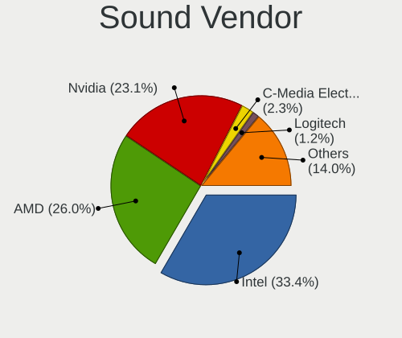

| Vendor                                       | Desktops | Percent |
|----------------------------------------------|----------|---------|
| Intel                                        | 1306     | 33.39%  |
| AMD                                          | 1017     | 26%     |
| Nvidia                                       | 905      | 23.14%  |
| C-Media Electronics                          | 89       | 2.28%   |
| Logitech                                     | 48       | 1.23%   |
| Creative Labs                                | 42       | 1.07%   |
| Texas Instruments                            | 31       | 0.79%   |
| Focusrite-Novation                           | 30       | 0.77%   |
| SteelSeries ApS                              | 28       | 0.72%   |
| ASUSTek Computer                             | 27       | 0.69%   |
| Micro Star International                     | 21       | 0.54%   |
| GN Netcom                                    | 18       | 0.46%   |
| Creative Technology                          | 18       | 0.46%   |
| Kingston Technology                          | 15       | 0.38%   |
| JMTek                                        | 14       | 0.36%   |
| Corsair                                      | 13       | 0.33%   |
| BEHRINGER International                      | 13       | 0.33%   |
| DSEA A/S                                     | 11       | 0.28%   |
| RODE Microphones                             | 10       | 0.26%   |
| Realtek Semiconductor                        | 10       | 0.26%   |
| Zoran Co. Personal Media Division (Nogatech) | 9        | 0.23%   |
| GYROCOM C&C                                  | 9        | 0.23%   |
| Generalplus Technology                       | 9        | 0.23%   |
| Sony                                         | 8        | 0.2%    |
| Samson Technologies                          | 8        | 0.2%    |
| Razer USA                                    | 8        | 0.2%    |
| XMOS                                         | 7        | 0.18%   |
| VIA Technologies                             | 6        | 0.15%   |
| Schiit Audio                                 | 6        | 0.15%   |
| KTMicro                                      | 6        | 0.15%   |
| Hewlett-Packard                              | 6        | 0.15%   |
| Blue Microphones                             | 6        | 0.15%   |
| Plantronics                                  | 5        | 0.13%   |
| Native Instruments                           | 5        | 0.13%   |
| Jieli Technology                             | 5        | 0.13%   |
| Yamaha                                       | 4        | 0.1%    |
| Trust                                        | 4        | 0.1%    |
| Tenx Technology                              | 4        | 0.1%    |
| FiiO Electronics Technology                  | 4        | 0.1%    |
| Cambridge Silicon Radio                      | 4        | 0.1%    |

Sound Model
-----------

Sound card models

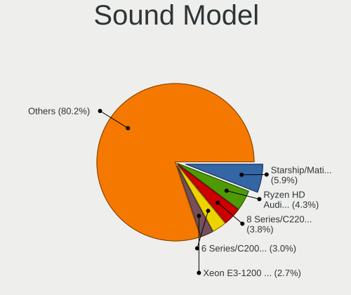

| Model                                                                             | Desktops | Percent |
|-----------------------------------------------------------------------------------|----------|---------|
| AMD Starship/Matisse HD Audio Controller                                          | 277      | 5.94%   |
| AMD Ryzen HD Audio Controller                                                     | 200      | 4.29%   |
| Intel 8 Series/C220 Series Chipset High Definition Audio Controller               | 179      | 3.84%   |
| Intel 6 Series/C200 Series Chipset Family High Definition Audio Controller        | 141      | 3.02%   |
| Intel Xeon E3-1200 v3/4th Gen Core Processor HD Audio Controller                  | 126      | 2.7%    |
| AMD SBx00 Azalia (Intel HDA)                                                      | 119      | 2.55%   |
| Intel 100 Series/C230 Series Chipset Family HD Audio Controller                   | 109      | 2.34%   |
| Intel 7 Series/C216 Chipset Family High Definition Audio Controller               | 103      | 2.21%   |
| Intel 200 Series PCH HD Audio                                                     | 97       | 2.08%   |
| AMD Ellesmere HDMI Audio [Radeon RX 470/480 / 570/580/590]                        | 94       | 2.02%   |
| AMD Family 17h (Models 00h-0fh) HD Audio Controller                               | 93       | 1.99%   |
| Nvidia GK208 HDMI/DP Audio Controller                                             | 86       | 1.84%   |
| AMD Radeon High Definition Audio Controller                                       | 86       | 1.84%   |
| AMD Navi 21/23 HDMI/DP Audio Controller                                           | 75       | 1.61%   |
| Intel Cannon Lake PCH cAVS                                                        | 72       | 1.54%   |
| Intel 82801JI (ICH10 Family) HD Audio Controller                                  | 70       | 1.5%    |
| Nvidia GP107GL High Definition Audio Controller                                   | 66       | 1.42%   |
| AMD FCH Azalia Controller                                                         | 66       | 1.42%   |
| Intel NM10/ICH7 Family High Definition Audio Controller                           | 65       | 1.39%   |
| AMD Renoir/Cezanne HDMI/DP Audio Controller                                       | 60       | 1.29%   |
| Nvidia High Definition Audio Controller                                           | 59       | 1.27%   |
| Nvidia GP104 High Definition Audio Controller                                     | 57       | 1.22%   |
| Intel 5 Series/3400 Series Chipset High Definition Audio                          | 57       | 1.22%   |
| AMD Navi 31 HDMI/DP Audio                                                         | 50       | 1.07%   |
| Nvidia GP106 High Definition Audio Controller                                     | 49       | 1.05%   |
| Intel 9 Series Chipset Family HD Audio Controller                                 | 49       | 1.05%   |
| AMD Oland/Hainan/Cape Verde/Pitcairn HDMI Audio [Radeon HD 7000 Series]           | 48       | 1.03%   |
| Nvidia GA104 High Definition Audio Controller                                     | 46       | 0.99%   |
| Intel 82801I (ICH9 Family) HD Audio Controller                                    | 46       | 0.99%   |
| Nvidia TU116 High Definition Audio Controller                                     | 45       | 0.97%   |
| AMD Raven/Raven2/Fenghuang HDMI/DP Audio Controller                               | 44       | 0.94%   |
| AMD Baffin HDMI/DP Audio [Radeon RX 550 640SP / RX 560/560X]                      | 40       | 0.86%   |
| Nvidia TU106 High Definition Audio Controller                                     | 39       | 0.84%   |
| Nvidia GA102 High Definition Audio Controller                                     | 37       | 0.79%   |
| Intel 82801JD/DO (ICH10 Family) HD Audio Controller                               | 34       | 0.73%   |
| Nvidia GK107 HDMI Audio Controller                                                | 33       | 0.71%   |
| AMD Navi 10 HDMI Audio                                                            | 32       | 0.69%   |
| AMD Caicos HDMI Audio [Radeon HD 6450 / 7450/8450/8490 OEM / R5 230/235/235X OEM] | 32       | 0.69%   |
| Nvidia TU104 HD Audio Controller                                                  | 30       | 0.64%   |
| Nvidia GF119 HDMI Audio Controller                                                | 30       | 0.64%   |

Memory
------

Memory Vendor
-------------

Memory module vendors

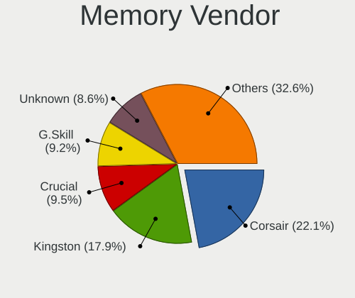

| Vendor                       | Desktops | Percent |
|------------------------------|----------|---------|
| Corsair                      | 264      | 22.09%  |
| Kingston                     | 214      | 17.91%  |
| Crucial                      | 114      | 9.54%   |
| G.Skill                      | 110      | 9.21%   |
| Unknown                      | 103      | 8.62%   |
| SK hynix                     | 98       | 8.2%    |
| Samsung Electronics          | 97       | 8.12%   |
| Micron Technology            | 62       | 5.19%   |
| Nanya Technology             | 22       | 1.84%   |
| Unknown                      | 15       | 1.26%   |
| Transcend                    | 12       | 1%      |
| A-DATA Technology            | 12       | 1%      |
| Elpida                       | 7        | 0.59%   |
| Patriot                      | 5        | 0.42%   |
| GOODRAM                      | 5        | 0.42%   |
| Ramaxel Technology           | 4        | 0.33%   |
| Unknown (ABCD)               | 3        | 0.25%   |
| Team                         | 3        | 0.25%   |
| TakeMS                       | 3        | 0.25%   |
| Qimonda                      | 3        | 0.25%   |
| GeIL                         | 3        | 0.25%   |
| Axiom                        | 3        | 0.25%   |
| A Force                      | 3        | 0.25%   |
| Unknown (0x0B92)             | 2        | 0.17%   |
| PNY                          | 2        | 0.17%   |
| Hewlett-Packard              | 2        | 0.17%   |
| Avant                        | 2        | 0.17%   |
| Atermiter                    | 2        | 0.17%   |
| ASint Technology             | 2        | 0.17%   |
| AMD                          | 2        | 0.17%   |
| zApacer                      | 1        | 0.08%   |
| Unknown (0x873E)             | 1        | 0.08%   |
| Unknown (0x0CC7)             | 1        | 0.08%   |
| Unknown (08C8)               | 1        | 0.08%   |
| Toshiba                      | 1        | 0.08%   |
| Timetec                      | 1        | 0.08%   |
| Samsung 3                    | 1        | 0.08%   |
| Samsung 1                    | 1        | 0.08%   |
| Red Hat                      | 1        | 0.08%   |
| Patriot Memory (PDP Systems) | 1        | 0.08%   |

Memory Model
------------

Memory module models

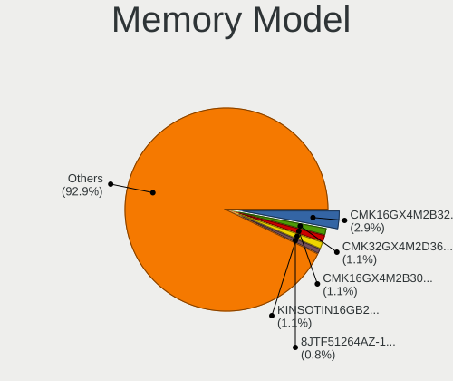

| Model                                                  | Desktops | Percent |
|--------------------------------------------------------|----------|---------|
| Corsair RAM CMK16GX4M2B3200C16 8GB DIMM DDR4 3600MT/s  | 39       | 2.93%   |
| Corsair RAM CMK32GX4M2D3600C18 16GB DIMM DDR4 3800MT/s | 15       | 1.13%   |
| Corsair RAM CMK16GX4M2B3000C15 8GB DIMM DDR4 3600MT/s  | 15       | 1.13%   |
| Unknown                                                | 15       | 1.13%   |
| Micron RAM 8JTF51264AZ-1G6E1 4GB DIMM DDR3 1600MT/s    | 11       | 0.83%   |
| G.Skill RAM F5-6000J3040G32G 32GB DIMM DDR5 6200MT/s   | 10       | 0.75%   |
| Corsair RAM CMK32GX4M2B3200C16 16GB DIMM DDR4 3800MT/s | 9        | 0.68%   |
| Corsair RAM CMK16GX4M2E3200C16 8GB DIMM DDR4 3466MT/s  | 9        | 0.68%   |
| Unknown RAM Module 4GB DIMM 1333MT/s                   | 8        | 0.6%    |
| Kingston RAM KHX2666C16/8G 8GiB DIMM DDR4 3466MT/s     | 8        | 0.6%    |
| Kingston RAM KHX1600C9D3/4GX 4GB DIMM DDR3 1867MT/s    | 8        | 0.6%    |
| Kingston RAM KHX1600C10D3/8G 8GB DIMM DDR3 2133MT/s    | 8        | 0.6%    |
| Crucial RAM BLS4G3D1609DS1S00. 4GB DIMM DDR3 1600MT/s  | 8        | 0.6%    |
| Samsung RAM M378B5173DB0-CK0 4096MB DIMM DDR3 1600MT/s | 7        | 0.53%   |
| Kingston RAM KHX3200C16D4/16GX 16GB DIMM DDR4 3600MT/s | 7        | 0.53%   |
| G.Skill RAM F4-3600C16-16GVKC 16GB DIMM DDR4 3866MT/s  | 7        | 0.53%   |
| G.Skill RAM F4-3200C16-16GIS 16GB DIMM DDR4 3600MT/s   | 7        | 0.53%   |
| Crucial RAM BLS8G3D1609DS1S00. 8GB DIMM DDR3 1800MT/s  | 7        | 0.53%   |
| Corsair RAM CMK16GX4M2A2666C16 8GB DIMM DDR4 3400MT/s  | 7        | 0.53%   |
| Corsair RAM CMK16GX4M2A2400C16 8GB DIMM DDR4 2933MT/s  | 7        | 0.53%   |
| Unknown RAM Module 2GB DIMM DDR2 800MT/s               | 6        | 0.45%   |
| SK hynix RAM HMT451S6BFR8A-PB 4GB SODIMM DDR3 1600MT/s | 6        | 0.45%   |
| SK hynix RAM HMT351U6EFR8C-PB 4GB DIMM DDR3 1600MT/s   | 6        | 0.45%   |
| Corsair RAM CML8GX3M2A1600C9 4GB DIMM DDR3 1600MT/s    | 6        | 0.45%   |
| Corsair RAM CMK32GX4M2Z3600C18 16GB DIMM DDR4 3800MT/s | 6        | 0.45%   |
| Corsair RAM CMK16GX4M2D3000C16 8GB DIMM DDR4 3400MT/s  | 6        | 0.45%   |
| Unknown RAM Module 4GB DIMM SDRAM                      | 5        | 0.38%   |
| Unknown RAM Module 2GB DIMM SDRAM                      | 5        | 0.38%   |
| Unknown RAM Module 1GB DIMM DDR2 667MT/s               | 5        | 0.38%   |
| Samsung RAM M378B5173QH0-CK0 4GB DIMM DDR3             | 5        | 0.38%   |
| Kingston RAM KF560C36-16 16GB DIMM DDR5 6000MT/s       | 5        | 0.38%   |
| G.Skill RAM F5-6000J3636F16G 16GB DIMM DDR5 6400MT/s   | 5        | 0.38%   |
| G.Skill RAM F4-3200C16-8GVKB 8GB DIMM DDR4 4000MT/s    | 5        | 0.38%   |
| G.Skill RAM F4-3000C16-16GISB 16GB DIMM DDR4 3200MT/s  | 5        | 0.38%   |
| Crucial RAM CT102464BA160B.C16 8GB DIMM DDR3 1600MT/s  | 5        | 0.38%   |
| Crucial RAM BLT4G3D1608ET3LX0. 4GB DIMM DDR3 1600MT/s  | 5        | 0.38%   |
| Corsair RAM CMK32GX4M2B3000C15 16GB DIMM DDR4 3000MT/s | 5        | 0.38%   |
| Corsair RAM CMK32GX4M2A2400C16 16GB DIMM DDR4 2400MT/s | 5        | 0.38%   |
| SK hynix RAM HMT451U6BFR8A-PB 4GB DIMM DDR3 1600MT/s   | 4        | 0.3%    |
| Samsung RAM M378B5273DH0-CH9 4GB DIMM DDR3 2133MT/s    | 4        | 0.3%    |

Memory Kind
-----------

Memory module kinds

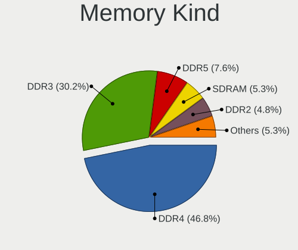

| Kind    | Desktops | Percent |
|---------|----------|---------|
| DDR4    | 497      | 46.8%   |
| DDR3    | 321      | 30.23%  |
| DDR5    | 81       | 7.63%   |
| SDRAM   | 56       | 5.27%   |
| DDR2    | 51       | 4.8%    |
| Unknown | 36       | 3.39%   |
| DDR     | 10       | 0.94%   |
| LPDDR4  | 6        | 0.56%   |
| DRAM    | 2        | 0.19%   |
| RAM     | 1        | 0.09%   |
| LPDDR5  | 1        | 0.09%   |

Memory Form Factor
------------------

Physical design of the memory module

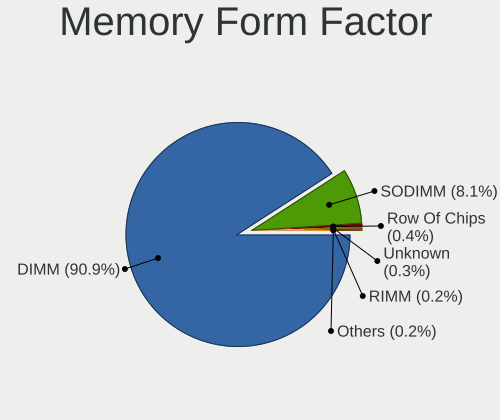

| Name         | Desktops | Percent |
|--------------|----------|---------|
| DIMM         | 947      | 90.88%  |
| SODIMM       | 84       | 8.06%   |
| Row Of Chips | 4        | 0.38%   |
| Unknown      | 3        | 0.29%   |
| RIMM         | 2        | 0.19%   |
| FB-DIMM      | 2        | 0.19%   |

Memory Size
-----------

Memory module size

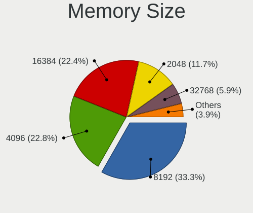

| Size  | Desktops | Percent |
|-------|----------|---------|
| 8192  | 386      | 33.28%  |
| 4096  | 264      | 22.76%  |
| 16384 | 260      | 22.41%  |
| 2048  | 136      | 11.72%  |
| 32768 | 69       | 5.95%   |
| 1024  | 34       | 2.93%   |
| 512   | 7        | 0.6%    |
| 256   | 2        | 0.17%   |
| 49152 | 1        | 0.09%   |
| 24576 | 1        | 0.09%   |

Memory Speed
------------

Memory module speed

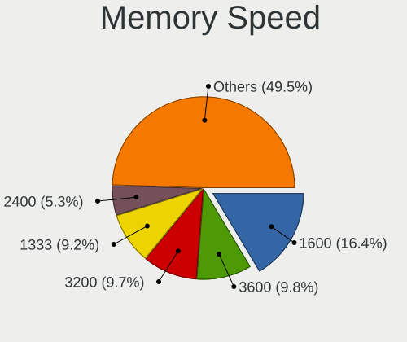

| Speed   | Desktops | Percent |
|---------|----------|---------|
| 1600    | 194      | 16.41%  |
| 3600    | 116      | 9.81%   |
| 3200    | 115      | 9.73%   |
| 1333    | 109      | 9.22%   |
| 2400    | 63       | 5.33%   |
| 2667    | 51       | 4.31%   |
| 2133    | 48       | 4.06%   |
| 6000    | 35       | 2.96%   |
| 800     | 35       | 2.96%   |
| 3800    | 34       | 2.88%   |
| 667     | 25       | 2.12%   |
| 3466    | 22       | 1.86%   |
| 2933    | 21       | 1.78%   |
| 3400    | 20       | 1.69%   |
| Unknown | 20       | 1.69%   |
| 1800    | 19       | 1.61%   |
| 3733    | 18       | 1.52%   |
| 3000    | 18       | 1.52%   |
| 1867    | 16       | 1.35%   |
| 1866    | 15       | 1.27%   |
| 1066    | 12       | 1.02%   |
| 6200    | 11       | 0.93%   |
| 3866    | 11       | 0.93%   |
| 2666    | 11       | 0.93%   |
| 4800    | 10       | 0.85%   |
| 6400    | 9        | 0.76%   |
| 400     | 9        | 0.76%   |
| 5600    | 8        | 0.68%   |
| 4000    | 8        | 0.68%   |
| 1334    | 7        | 0.59%   |
| 3100    | 5        | 0.42%   |
| 1648    | 5        | 0.42%   |
| 1639    | 5        | 0.42%   |
| 533     | 5        | 0.42%   |
| 4333    | 4        | 0.34%   |
| 3151    | 4        | 0.34%   |
| 2800    | 4        | 0.34%   |
| 1067    | 4        | 0.34%   |
| 49926   | 3        | 0.25%   |
| 5200    | 3        | 0.25%   |

Printers & scanners
-------------------

Printer Vendor
--------------

Printer device vendors

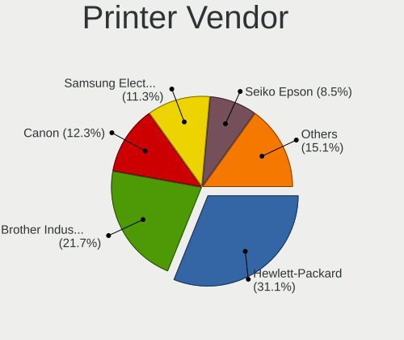

| Vendor                | Desktops | Percent |
|-----------------------|----------|---------|
| Hewlett-Packard       | 33       | 31.13%  |
| Brother Industries    | 23       | 21.7%   |
| Canon                 | 13       | 12.26%  |
| Samsung Electronics   | 12       | 11.32%  |
| Seiko Epson           | 9        | 8.49%   |
| Dymo-CoStar           | 6        | 5.66%   |
| Citizen               | 3        | 2.83%   |
| Zebra                 | 2        | 1.89%   |
| STMicroelectronics    | 1        | 0.94%   |
| Ricoh                 | 1        | 0.94%   |
| Prolific Technology   | 1        | 0.94%   |
| Lexmark International | 1        | 0.94%   |
| Apple                 | 1        | 0.94%   |

Printer Model
-------------

Printer device models

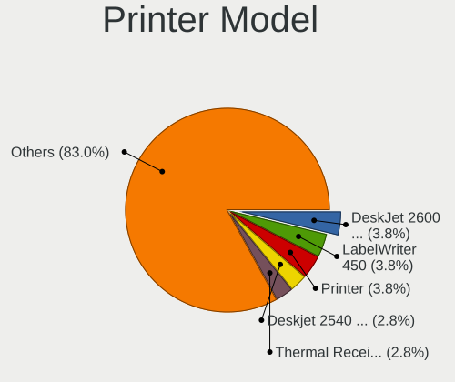

| Model                                                     | Desktops | Percent |
|-----------------------------------------------------------|----------|---------|
| HP DeskJet 2600 series                                    | 4        | 3.77%   |
| Dymo-CoStar LabelWriter 450                               | 4        | 3.77%   |
| Brother Printer                                           | 4        | 3.77%   |
| HP Deskjet 2540 series                                    | 3        | 2.83%   |
| Citizen Thermal Receipt Printer [CT-E351]                 | 3        | 2.83%   |
| Seiko Epson Printer                                       | 2        | 1.89%   |
| Seiko Epson ET-2820 Series                                | 2        | 1.89%   |
| Samsung SCX-4600 Series                                   | 2        | 1.89%   |
| Samsung ML-1640 Series Laser Printer                      | 2        | 1.89%   |
| Samsung C43x Series                                       | 2        | 1.89%   |
| HP LaserJet P2015 series                                  | 2        | 1.89%   |
| HP ENVY 5000 series                                       | 2        | 1.89%   |
| HP DeskJet 2700 series                                    | 2        | 1.89%   |
| Canon TS3100 series                                       | 2        | 1.89%   |
| Canon PIXMA MG2500 Series                                 | 2        | 1.89%   |
| Brother HL-2030 Laser Printer                             | 2        | 1.89%   |
| Brother DCP-1610W                                         | 2        | 1.89%   |
| Zebra Thrmal 2844                                         | 1        | 0.94%   |
| Zebra GK420t Label Printer                                | 1        | 0.94%   |
| STMicroelectronics LED badge -- mini LED display -- 11x44 | 1        | 0.94%   |
| Seiko Epson XP-4200 Series                                | 1        | 0.94%   |
| Seiko Epson XP-3200 Series                                | 1        | 0.94%   |
| Seiko Epson XP-240 Series                                 | 1        | 0.94%   |
| Seiko Epson Thermal Receipt Printer [TM-T20]              | 1        | 0.94%   |
| Seiko Epson ET-2870 Series                                | 1        | 0.94%   |
| Samsung SCX-4300 Series                                   | 1        | 0.94%   |
| Samsung SCX-3400 Series                                   | 1        | 0.94%   |
| Samsung ML-2240 Series                                    | 1        | 0.94%   |
| Samsung ML-216x Series Laser Printer                      | 1        | 0.94%   |
| Samsung CLX-6260 Series                                   | 1        | 0.94%   |
| Samsung C48x Series                                       | 1        | 0.94%   |
| Ricoh Aficio SP 3510DN                                    | 1        | 0.94%   |
| Prolific PL2305 Parallel Port                             | 1        | 0.94%   |
| Lexmark International MC3326adwe                          | 1        | 0.94%   |
| HP OfficeJet 8010 series                                  | 1        | 0.94%   |
| HP OfficeJet 6950                                         | 1        | 0.94%   |
| HP LaserJet Professional P1102w                           | 1        | 0.94%   |
| HP LaserJet P1005                                         | 1        | 0.94%   |
| HP LaserJet 1320                                          | 1        | 0.94%   |
| HP LaserJet 1022                                          | 1        | 0.94%   |

Scanner Vendor
--------------

Scanner device vendors

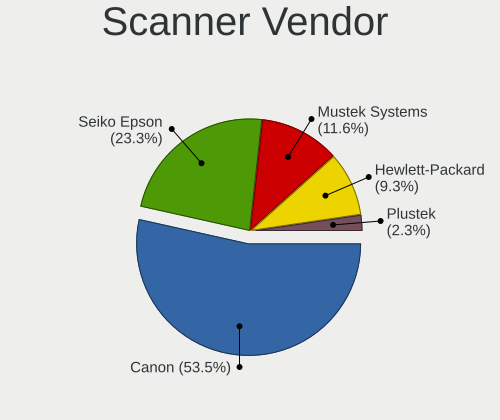

| Vendor          | Desktops | Percent |
|-----------------|----------|---------|
| Canon           | 23       | 53.49%  |
| Seiko Epson     | 10       | 23.26%  |
| Mustek Systems  | 5        | 11.63%  |
| Hewlett-Packard | 4        | 9.3%    |
| Plustek         | 1        | 2.33%   |

Scanner Model
-------------

Scanner device models

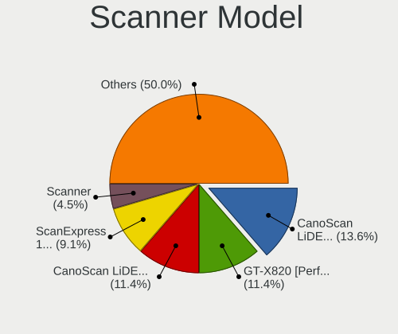

| Model                                       | Desktops | Percent |
|---------------------------------------------|----------|---------|
| Canon CanoScan LiDE 220                     | 6        | 13.64%  |
| Seiko Epson GT-X820 [Perfection V600 Photo] | 5        | 11.36%  |
| Canon CanoScan LiDE 210                     | 5        | 11.36%  |
| Mustek Systems ScanExpress 1200 UB          | 4        | 9.09%   |
| Seiko Epson Scanner                         | 2        | 4.55%   |
| Seiko Epson GT-X770 [Perfection V500]       | 2        | 4.55%   |
| Canon CanoScan N670U/N676U/LiDE 20          | 2        | 4.55%   |
| Canon CanoScan LiDE 200                     | 2        | 4.55%   |
| Canon CanoScan LiDE 120                     | 2        | 4.55%   |
| Canon CanoScan LiDE 110                     | 2        | 4.55%   |
| Seiko Epson GT-7700U [Perfection 1240U]     | 1        | 2.27%   |
| Seiko Epson GT-6600U [Perfection 610]       | 1        | 2.27%   |
| Plustek 600dpi USB Scanner                  | 1        | 2.27%   |
| Mustek Systems SNAPSCAN e22                 | 1        | 2.27%   |
| HP Scanjet N6350                            | 1        | 2.27%   |
| HP ScanJet 5590                             | 1        | 2.27%   |
| HP ScanJet 5300c/5370c                      | 1        | 2.27%   |
| HP ScanJet 3300c                            | 1        | 2.27%   |
| Canon CanoScan N1240U/LiDE 30               | 1        | 2.27%   |
| Canon CanoScan LiDE 60                      | 1        | 2.27%   |
| Canon CanoScan FB630U                       | 1        | 2.27%   |
| Canon CanoScan 9000F Mark II                | 1        | 2.27%   |

Camera
------

Camera Vendor
-------------

Camera device vendors

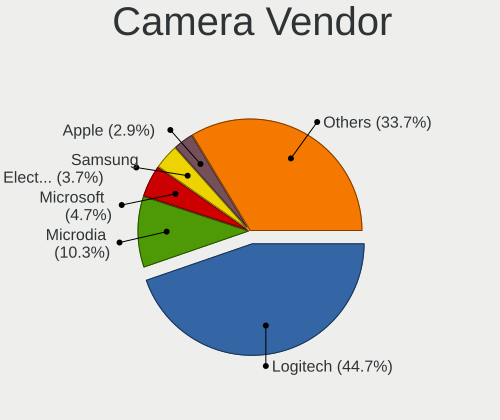

| Vendor                                 | Desktops | Percent |
|----------------------------------------|----------|---------|
| Logitech                               | 182      | 44.72%  |
| Microdia                               | 42       | 10.32%  |
| Microsoft                              | 19       | 4.67%   |
| Samsung Electronics                    | 15       | 3.69%   |
| Apple                                  | 12       | 2.95%   |
| Trust                                  | 11       | 2.7%    |
| Generalplus Technology                 | 11       | 2.7%    |
| Chicony Electronics                    | 10       | 2.46%   |
| MacroSilicon                           | 8        | 1.97%   |
| Jieli Technology                       | 7        | 1.72%   |
| Sunplus Innovation Technology          | 5        | 1.23%   |
| Realtek Semiconductor                  | 5        | 1.23%   |
| ARC International                      | 5        | 1.23%   |
| Creative Technology                    | 4        | 0.98%   |
| Valve Software                         | 3        | 0.74%   |
| Sweex                                  | 3        | 0.74%   |
| Lenovo                                 | 3        | 0.74%   |
| Insta360                               | 3        | 0.74%   |
| Cubeternet                             | 3        | 0.74%   |
| Z-Star Microelectronics                | 2        | 0.49%   |
| YGTek                                  | 2        | 0.49%   |
| Tobii Technology AB                    | 2        | 0.49%   |
| Sonix Technology                       | 2        | 0.49%   |
| Ruision                                | 2        | 0.49%   |
| Razer USA                              | 2        | 0.49%   |
| Motorola PCS                           | 2        | 0.49%   |
| LG Electronics                         | 2        | 0.49%   |
| IMC Networks                           | 2        | 0.49%   |
| Hewlett-Packard                        | 2        | 0.49%   |
| Cheng Uei Precision Industry (Foxlink) | 2        | 0.49%   |
| Bison Electronics                      | 2        | 0.49%   |
| Asuscom Network                        | 2        | 0.49%   |
| Alcor Micro                            | 2        | 0.49%   |
| ViewSonic                              | 1        | 0.25%   |
| Unknown                                | 1        | 0.25%   |
| Teslong Camera                         | 1        | 0.25%   |
| Suyin                                  | 1        | 0.25%   |
| SunplusIT                              | 1        | 0.25%   |
| Softkinetic                            | 1        | 0.25%   |
| Smartronix                             | 1        | 0.25%   |

Camera Model
------------

Camera device models

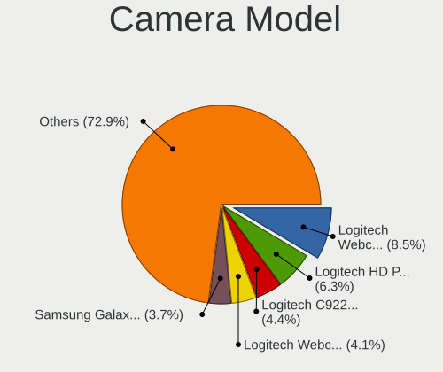

| Model                                         | Desktops | Percent |
|-----------------------------------------------|----------|---------|
| Logitech Webcam C270                          | 35       | 8.54%   |
| Logitech HD Pro Webcam C920                   | 26       | 6.34%   |
| Logitech C922 Pro Stream Webcam               | 18       | 4.39%   |
| Logitech Webcam C310                          | 17       | 4.15%   |
| Samsung Galaxy series, misc. (MTP mode)       | 15       | 3.66%   |
| Apple iPhone 5/5C/5S/6/SE/7/8/X               | 11       | 2.68%   |
| Microsoft LifeCam HD-3000                     | 10       | 2.44%   |
| Microdia Sonix USB 2.0 Camera                 | 10       | 2.44%   |
| Logitech BRIO Ultra HD Webcam                 | 10       | 2.44%   |
| Logitech C920 PRO HD Webcam                   | 9        | 2.2%    |
| Microdia Camera                               | 8        | 1.95%   |
| Trust Full HD Webcam                          | 7        | 1.71%   |
| Logitech StreamCam                            | 7        | 1.71%   |
| Logitech Logitech Webcam C925e                | 7        | 1.71%   |
| Logitech HD Webcam C525                       | 7        | 1.71%   |
| Jieli USB PHY 2.0                             | 7        | 1.71%   |
| Microdia CyberTrack H7                        | 6        | 1.46%   |
| Microdia USB 2.0 Camera                       | 5        | 1.22%   |
| Generalplus GENERAL WEBCAM                    | 5        | 1.22%   |
| ARC International Camera                      | 5        | 1.22%   |
| Microdia Webcam Vitade AF                     | 4        | 0.98%   |
| Microdia Integrated Camera                    | 4        | 0.98%   |
| MacroSilicon USB Video                        | 4        | 0.98%   |
| Logitech Webcam C170                          | 4        | 0.98%   |
| Logitech HD Webcam C615                       | 4        | 0.98%   |
| Logitech BRIO 4K Stream Edition               | 4        | 0.98%   |
| Generalplus WEB CAM                           | 4        | 0.98%   |
| Valve Software 3D Camera                      | 3        | 0.73%   |
| Sunplus Full HD webcam                        | 3        | 0.73%   |
| Realtek USB Camera                            | 3        | 0.73%   |
| Microsoft Microsoft LifeCam Cinema            | 3        | 0.73%   |
| MacroSilicon MS210x Video Grabber [EasierCAP] | 3        | 0.73%   |
| Logitech Webcam C250                          | 3        | 0.73%   |
| Logitech QuickCam Pro 9000                    | 3        | 0.73%   |
| Logitech HD Webcam C910                       | 3        | 0.73%   |
| Logitech HD Webcam C510                       | 3        | 0.73%   |
| Insta360 Link                                 | 3        | 0.73%   |
| Creative Live! Cam Sync 1080p                 | 3        | 0.73%   |
| YGTek Webcam                                  | 2        | 0.49%   |
| Trust Webcam                                  | 2        | 0.49%   |

Security
--------

Fingerprint Vendor
------------------

Fingerprint sensor vendors

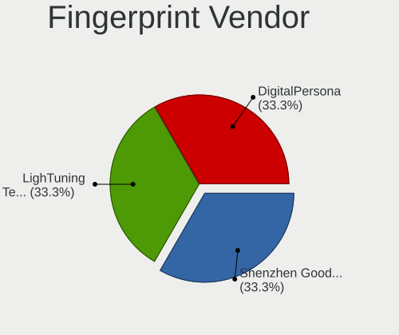

| Vendor                     | Desktops | Percent |
|----------------------------|----------|---------|
| Shenzhen Goodix Technology | 1        | 33.33%  |
| LighTuning Technology      | 1        | 33.33%  |
| DigitalPersona             | 1        | 33.33%  |

Fingerprint Model
-----------------

Fingerprint sensor models

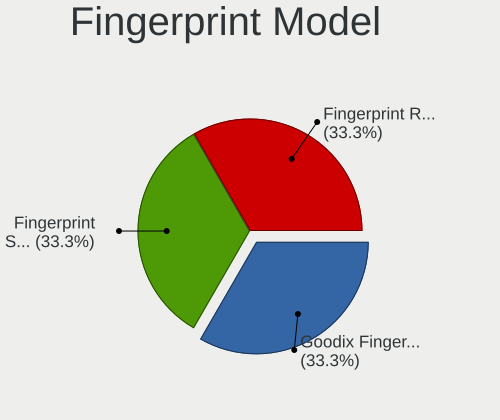

| Model                               | Desktops | Percent |
|-------------------------------------|----------|---------|
| Shenzhen Goodix  Fingerprint Device | 1        | 33.33%  |
| LighTuning Fingerprint Sensor       | 1        | 33.33%  |
| DigitalPersona Fingerprint Reader   | 1        | 33.33%  |

Chipcard Vendor
---------------

Chipcard module vendors

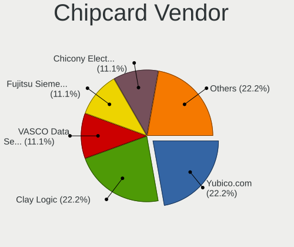

| Vendor                            | Desktops | Percent |
|-----------------------------------|----------|---------|
| Yubico.com                        | 2        | 22.22%  |
| Clay Logic                        | 2        | 22.22%  |
| VASCO Data Security International | 1        | 11.11%  |
| Fujitsu Siemens Computers         | 1        | 11.11%  |
| Chicony Electronics               | 1        | 11.11%  |
| Alcor Micro                       | 1        | 11.11%  |
| Advanced Card Systems             | 1        | 11.11%  |

Chipcard Model
--------------

Chipcard module models

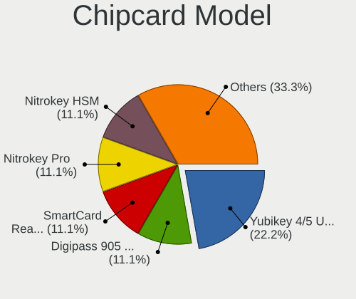

| Model                                                           | Desktops | Percent |
|-----------------------------------------------------------------|----------|---------|
| Yubico.com Yubikey 4/5 U2F+CCID                                 | 2        | 22.22%  |
| VASCO Data Security International Digipass 905 SmartCard Reader | 1        | 11.11%  |
| Fujitsu Siemens Computers SmartCard Reader 2A                   | 1        | 11.11%  |
| Clay Logic Nitrokey Pro                                         | 1        | 11.11%  |
| Clay Logic Nitrokey HSM                                         | 1        | 11.11%  |
| Chicony Electronics HP Skylab USB Smartcard Keyboard            | 1        | 11.11%  |
| Alcor Micro AU9540 Smartcard Reader                             | 1        | 11.11%  |
| Advanced Card Systems ACR122U                                   | 1        | 11.11%  |

Unsupported
-----------

Unsupported Devices
-------------------

Total unsupported devices on board

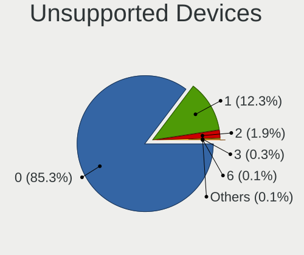

| Total | Desktops | Percent |
|-------|----------|---------|
| 0     | 1935     | 85.28%  |
| 1     | 279      | 12.3%   |
| 2     | 44       | 1.94%   |
| 3     | 6        | 0.26%   |
| 6     | 2        | 0.09%   |
| 5     | 2        | 0.09%   |
| 4     | 1        | 0.04%   |

Unsupported Device Types
------------------------

Types of unsupported devices

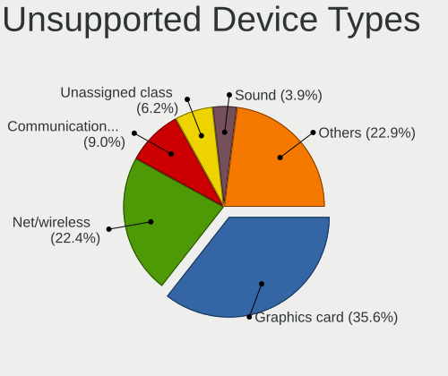

| Type                     | Desktops | Percent |
|--------------------------|----------|---------|
| Graphics card            | 138      | 35.57%  |
| Net/wireless             | 87       | 22.42%  |
| Communication controller | 35       | 9.02%   |
| Unassigned class         | 24       | 6.19%   |
| Sound                    | 15       | 3.87%   |
| Network                  | 14       | 3.61%   |
| Camera                   | 14       | 3.61%   |
| Net/ethernet             | 13       | 3.35%   |
| Bluetooth                | 13       | 3.35%   |
| Multimedia controller    | 11       | 2.84%   |
| Storage/raid             | 6        | 1.55%   |
| Tv card                  | 3        | 0.77%   |
| Chipcard                 | 3        | 0.77%   |
| Card reader              | 3        | 0.77%   |
| Storage/ide              | 2        | 0.52%   |
| Fingerprint reader       | 2        | 0.52%   |
| Storage/nvme             | 1        | 0.26%   |
| Storage/ata              | 1        | 0.26%   |
| Storage                  | 1        | 0.26%   |
| Modem                    | 1        | 0.26%   |
| Dvb card                 | 1        | 0.26%   |

