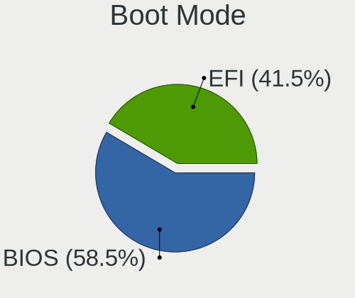
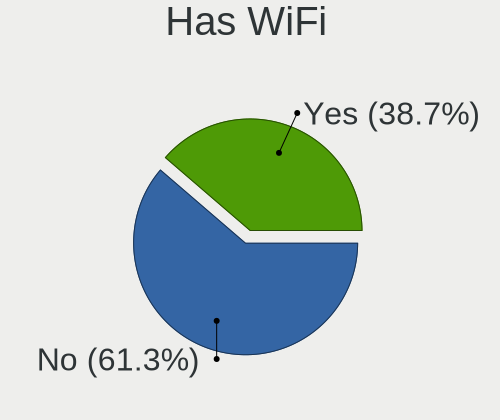
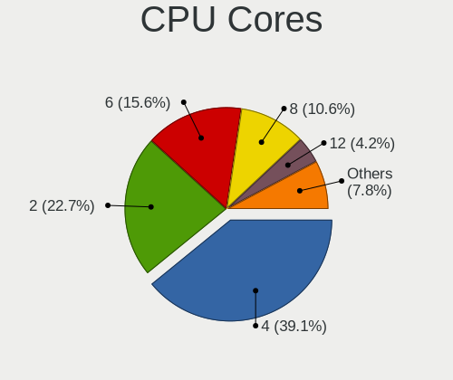
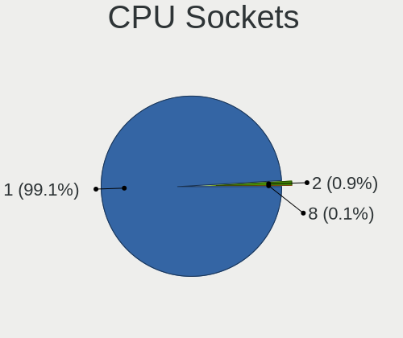
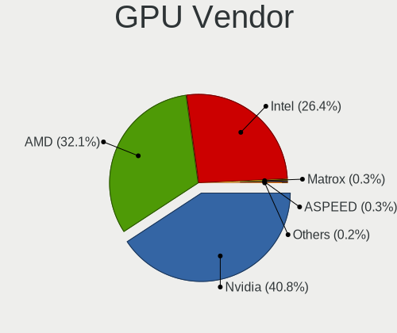
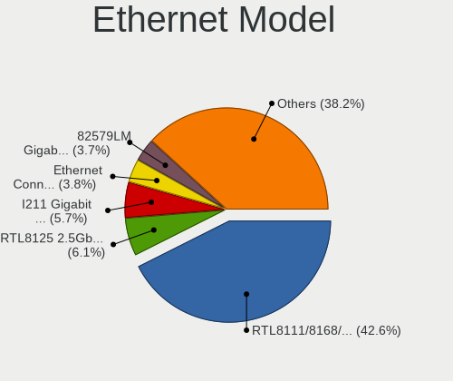
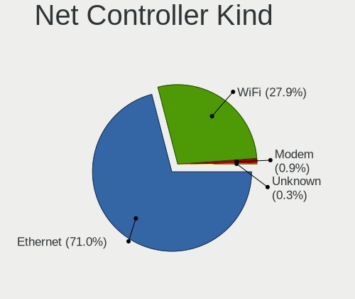
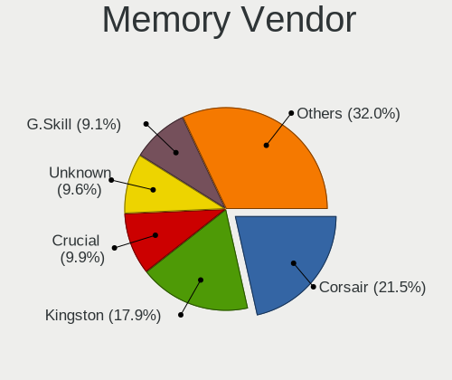
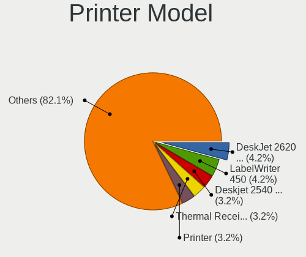

Linux in Netherlands - Tested Hardware & Statistics (Desktops)
--------------------------------------------------------------

A project to collect tested hardware configurations for Linux in Netherlands.

Anyone can contribute to this report by the [hw-probe](https://github.com/linuxhw/hw-probe) tool:

    sudo -E hw-probe -all -upload

Please contribute! Especially if your hardware is rare.

Contents
--------

* [ Test Cases ](#test-cases)

* [ System ](#system)
  - [ OS                       ](#os)
  - [ OS Family                ](#os-family)
  - [ Kernel                   ](#kernel)
  - [ Kernel Family            ](#kernel-family)
  - [ Kernel Major Ver.        ](#kernel-major-ver)
  - [ Arch                     ](#arch)
  - [ DE                       ](#de)
  - [ Display Server           ](#display-server)
  - [ Display Manager          ](#display-manager)
  - [ OS Lang                  ](#os-lang)
  - [ Boot Mode                ](#boot-mode)
  - [ Filesystem               ](#filesystem)
  - [ Part. scheme             ](#part-scheme)
  - [ Dual Boot with Linux/BSD ](#dual-boot-with-linuxbsd)
  - [ Dual Boot (Win)          ](#dual-boot-win)

* [ Board ](#board)
  - [ Vendor                   ](#vendor)
  - [ Model                    ](#model)
  - [ Model Family             ](#model-family)
  - [ MFG Year                 ](#mfg-year)
  - [ Form Factor              ](#form-factor)
  - [ Secure Boot              ](#secure-boot)
  - [ Coreboot                 ](#coreboot)
  - [ RAM Size                 ](#ram-size)
  - [ RAM Used                 ](#ram-used)
  - [ Total Drives             ](#total-drives)
  - [ Has CD-ROM               ](#has-cd-rom)
  - [ Has Ethernet             ](#has-ethernet)
  - [ Has WiFi                 ](#has-wifi)
  - [ Has Bluetooth            ](#has-bluetooth)

* [ Location ](#location)
  - [ Country                  ](#country)
  - [ City                     ](#city)

* [ Drives ](#drives)
  - [ Drive Vendor             ](#drive-vendor)
  - [ Drive Model              ](#drive-model)
  - [ HDD Vendor               ](#hdd-vendor)
  - [ SSD Vendor               ](#ssd-vendor)
  - [ Drive Kind               ](#drive-kind)
  - [ Drive Connector          ](#drive-connector)
  - [ Drive Size               ](#drive-size)
  - [ Space Total              ](#space-total)
  - [ Space Used               ](#space-used)
  - [ Malfunc. Drives          ](#malfunc-drives)
  - [ Malfunc. Drive Vendor    ](#malfunc-drive-vendor)
  - [ Malfunc. HDD Vendor      ](#malfunc-hdd-vendor)
  - [ Malfunc. Drive Kind      ](#malfunc-drive-kind)
  - [ Failed Drives            ](#failed-drives)
  - [ Failed Drive Vendor      ](#failed-drive-vendor)
  - [ Drive Status             ](#drive-status)

* [ Storage controller ](#storage-controller)
  - [ Storage Vendor           ](#storage-vendor)
  - [ Storage Model            ](#storage-model)
  - [ Storage Kind             ](#storage-kind)

* [ Processor ](#processor)
  - [ CPU Vendor               ](#cpu-vendor)
  - [ CPU Model                ](#cpu-model)
  - [ CPU Model Family         ](#cpu-model-family)
  - [ CPU Cores                ](#cpu-cores)
  - [ CPU Sockets              ](#cpu-sockets)
  - [ CPU Threads              ](#cpu-threads)
  - [ CPU Op-Modes             ](#cpu-op-modes)
  - [ CPU Microcode            ](#cpu-microcode)
  - [ CPU Microarch            ](#cpu-microarch)

* [ Graphics ](#graphics)
  - [ GPU Vendor               ](#gpu-vendor)
  - [ GPU Model                ](#gpu-model)
  - [ GPU Combo                ](#gpu-combo)
  - [ GPU Driver               ](#gpu-driver)
  - [ GPU Memory               ](#gpu-memory)

* [ Monitor ](#monitor)
  - [ Monitor Vendor           ](#monitor-vendor)
  - [ Monitor Model            ](#monitor-model)
  - [ Monitor Resolution       ](#monitor-resolution)
  - [ Monitor Diagonal         ](#monitor-diagonal)
  - [ Monitor Width            ](#monitor-width)
  - [ Aspect Ratio             ](#aspect-ratio)
  - [ Monitor Area             ](#monitor-area)
  - [ Pixel Density            ](#pixel-density)
  - [ Multiple Monitors        ](#multiple-monitors)

* [ Network ](#network)
  - [ Net Controller Vendor    ](#net-controller-vendor)
  - [ Net Controller Model     ](#net-controller-model)
  - [ Wireless Vendor          ](#wireless-vendor)
  - [ Wireless Model           ](#wireless-model)
  - [ Ethernet Vendor          ](#ethernet-vendor)
  - [ Ethernet Model           ](#ethernet-model)
  - [ Net Controller Kind      ](#net-controller-kind)
  - [ Used Controller          ](#used-controller)
  - [ NICs                     ](#nics)
  - [ IPv6                     ](#ipv6)

* [ Bluetooth ](#bluetooth)
  - [ Bluetooth Vendor         ](#bluetooth-vendor)
  - [ Bluetooth Model          ](#bluetooth-model)

* [ Sound ](#sound)
  - [ Sound Vendor             ](#sound-vendor)
  - [ Sound Model              ](#sound-model)

* [ Memory ](#memory)
  - [ Memory Vendor            ](#memory-vendor)
  - [ Memory Model             ](#memory-model)
  - [ Memory Kind              ](#memory-kind)
  - [ Memory Form Factor       ](#memory-form-factor)
  - [ Memory Size              ](#memory-size)
  - [ Memory Speed             ](#memory-speed)

* [ Printers & scanners ](#printers--scanners)
  - [ Printer Vendor           ](#printer-vendor)
  - [ Printer Model            ](#printer-model)
  - [ Scanner Vendor           ](#scanner-vendor)
  - [ Scanner Model            ](#scanner-model)

* [ Camera ](#camera)
  - [ Camera Vendor            ](#camera-vendor)
  - [ Camera Model             ](#camera-model)

* [ Security ](#security)
  - [ Fingerprint Vendor       ](#fingerprint-vendor)
  - [ Fingerprint Model        ](#fingerprint-model)
  - [ Chipcard Vendor          ](#chipcard-vendor)
  - [ Chipcard Model           ](#chipcard-model)

* [ Unsupported ](#unsupported)
  - [ Unsupported Devices      ](#unsupported-devices)
  - [ Unsupported Device Types ](#unsupported-device-types)

Test Cases
----------

Total: 1809

| Vendor        | Model                       | Probe                                                      | Date         |
|---------------|-----------------------------|------------------------------------------------------------|--------------|
| Gigabyte      | AB350-Gaming 3-CF           | [500ce7ae28](https://linux-hardware.org/?probe=500ce7ae28) | Dec 31, 2022 |
| ASRock        | Z790 PG Riptide             | [19c8814aba](https://linux-hardware.org/?probe=19c8814aba) | Dec 29, 2022 |
| Gigabyte      | GB-BRR3H-4300               | [241d631981](https://linux-hardware.org/?probe=241d631981) | Dec 28, 2022 |
| Gigabyte      | GB-BRR7H-4700               | [43c2d92e5f](https://linux-hardware.org/?probe=43c2d92e5f) | Dec 26, 2022 |
| ASUSTek       | ROG STRIX X670E-E GAMING... | [5d95c28ac6](https://linux-hardware.org/?probe=5d95c28ac6) | Dec 25, 2022 |
| ASUSTek       | ROG STRIX X670E-E GAMING... | [a98ca87f6a](https://linux-hardware.org/?probe=a98ca87f6a) | Dec 25, 2022 |
| ASUSTek       | ROG STRIX X670E-E GAMING... | [00af244895](https://linux-hardware.org/?probe=00af244895) | Dec 25, 2022 |
| Gigabyte      | B550 AORUS ELITE AX V2      | [5047d29893](https://linux-hardware.org/?probe=5047d29893) | Dec 24, 2022 |
| Dell          | 0M863N A00                  | [ce9fc7a224](https://linux-hardware.org/?probe=ce9fc7a224) | Dec 24, 2022 |
| Intel         | X99                         | [191fefa053](https://linux-hardware.org/?probe=191fefa053) | Dec 23, 2022 |
| ASUSTek       | B85-PRO GAMER               | [6a6ba7eba1](https://linux-hardware.org/?probe=6a6ba7eba1) | Dec 21, 2022 |
| ASUSTek       | P8H61-M LX3 PLUS R2.0       | [82687103ac](https://linux-hardware.org/?probe=82687103ac) | Dec 20, 2022 |
| ASUSTek       | P8H61-M LX3 PLUS R2.0       | [7f18d05353](https://linux-hardware.org/?probe=7f18d05353) | Dec 20, 2022 |
| HP            | 3048h                       | [4535cf0f5a](https://linux-hardware.org/?probe=4535cf0f5a) | Dec 20, 2022 |
| HP            | 3048h                       | [1d795fdd33](https://linux-hardware.org/?probe=1d795fdd33) | Dec 19, 2022 |
| Fujitsu       | D3041-A1 S26361-D3041-A1    | [2fa8510855](https://linux-hardware.org/?probe=2fa8510855) | Dec 19, 2022 |
| HP            | ProLiant ML350 G6           | [3b242628e4](https://linux-hardware.org/?probe=3b242628e4) | Dec 18, 2022 |
| ASUSTek       | M5A97 R2.0                  | [06f90011b2](https://linux-hardware.org/?probe=06f90011b2) | Dec 18, 2022 |
| ASUSTek       | P8H61-M LX2                 | [db147cf534](https://linux-hardware.org/?probe=db147cf534) | Dec 17, 2022 |
| ASUSTek       | P8H61-M LX2                 | [fa2cc2d975](https://linux-hardware.org/?probe=fa2cc2d975) | Dec 17, 2022 |
| Acer          | Aspire XC-1660 V:1.1        | [88aa1f841a](https://linux-hardware.org/?probe=88aa1f841a) | Dec 17, 2022 |
| ASUSTek       | X99-WS/IPMI                 | [41f02987e9](https://linux-hardware.org/?probe=41f02987e9) | Dec 16, 2022 |
| Gigabyte      | B550M DS3H                  | [7b3f9b5af0](https://linux-hardware.org/?probe=7b3f9b5af0) | Dec 16, 2022 |
| ASUSTek       | PRIME H370-A                | [eeb913fa7c](https://linux-hardware.org/?probe=eeb913fa7c) | Dec 15, 2022 |
| ASUSTek       | PRIME H370-A                | [7a72cfa484](https://linux-hardware.org/?probe=7a72cfa484) | Dec 15, 2022 |
| ASUSTek       | M5A97 R2.0                  | [bc8782be9a](https://linux-hardware.org/?probe=bc8782be9a) | Dec 15, 2022 |
| ASUSTek       | M5A97 R2.0                  | [d320b71c77](https://linux-hardware.org/?probe=d320b71c77) | Dec 15, 2022 |
| HP            | 3048h                       | [63f57e3458](https://linux-hardware.org/?probe=63f57e3458) | Dec 15, 2022 |
| ASUSTek       | TUF Gaming B650-PLUS WIF... | [72175490ae](https://linux-hardware.org/?probe=72175490ae) | Dec 15, 2022 |
| Gigabyte      | B550 AORUS ELITE AX V2      | [35ef32b165](https://linux-hardware.org/?probe=35ef32b165) | Dec 14, 2022 |
| ASRock        | A320M-HDV R4.0              | [b90d5cfed0](https://linux-hardware.org/?probe=b90d5cfed0) | Dec 14, 2022 |
| Gigabyte      | P35-DS4                     | [3f787740f8](https://linux-hardware.org/?probe=3f787740f8) | Dec 12, 2022 |
| HP            | 339A                        | [63c184fafd](https://linux-hardware.org/?probe=63c184fafd) | Dec 12, 2022 |
| ASUSTek       | PRIME B450M-A               | [2c52e941ea](https://linux-hardware.org/?probe=2c52e941ea) | Dec 11, 2022 |
| Supermicro    | C7SIM-Q                     | [76cf2b62db](https://linux-hardware.org/?probe=76cf2b62db) | Dec 11, 2022 |
| HP            | 3048h                       | [c2fd939c1f](https://linux-hardware.org/?probe=c2fd939c1f) | Dec 10, 2022 |
| MSI           | B450 GAMING PRO CARBON A... | [61a9d5f84c](https://linux-hardware.org/?probe=61a9d5f84c) | Dec 07, 2022 |
| ASUSTek       | ProArt Z690-CREATOR WIFI    | [611fd80398](https://linux-hardware.org/?probe=611fd80398) | Dec 07, 2022 |
| ASUSTek       | PRIME A320M-K               | [ce802653d4](https://linux-hardware.org/?probe=ce802653d4) | Dec 07, 2022 |
| ASRock        | X300-ITX                    | [77d8c41481](https://linux-hardware.org/?probe=77d8c41481) | Dec 04, 2022 |
| Intel         | Unknown                     | [d00187a52a](https://linux-hardware.org/?probe=d00187a52a) | Dec 04, 2022 |
| ASUSTek       | TUF B450M-PLUS GAMING       | [101ea9ca8e](https://linux-hardware.org/?probe=101ea9ca8e) | Dec 04, 2022 |
| ASRock        | Z87 Extreme4                | [422dde5ae5](https://linux-hardware.org/?probe=422dde5ae5) | Dec 03, 2022 |
| Dell          | 0GY6Y8 A01                  | [f86e02dee0](https://linux-hardware.org/?probe=f86e02dee0) | Dec 03, 2022 |
| MSI           | MEG X570 UNIFY              | [df74bf8e13](https://linux-hardware.org/?probe=df74bf8e13) | Dec 01, 2022 |
| ASUSTek       | H97-PLUS                    | [e8d75cbeed](https://linux-hardware.org/?probe=e8d75cbeed) | Dec 01, 2022 |
| ASUSTek       | P7H55-M                     | [b461d54421](https://linux-hardware.org/?probe=b461d54421) | Dec 01, 2022 |
| Gigabyte      | GB-BRR7H-4700               | [8398d00a16](https://linux-hardware.org/?probe=8398d00a16) | Nov 30, 2022 |
| ASUSTek       | P7H55-M                     | [729bb4ef87](https://linux-hardware.org/?probe=729bb4ef87) | Nov 30, 2022 |
| ASUSTek       | SABERTOOTH Z97 MARK S       | [2c5c1d6071](https://linux-hardware.org/?probe=2c5c1d6071) | Nov 30, 2022 |
| ASRock        | B450M Pro4                  | [219a616346](https://linux-hardware.org/?probe=219a616346) | Nov 28, 2022 |
| MSI           | B450 TOMAHAWK MAX           | [521f5c20a9](https://linux-hardware.org/?probe=521f5c20a9) | Nov 26, 2022 |
| MSI           | B560M-A PRO                 | [e2a8d64086](https://linux-hardware.org/?probe=e2a8d64086) | Nov 24, 2022 |
| HP            | 3397                        | [eb8968148c](https://linux-hardware.org/?probe=eb8968148c) | Nov 23, 2022 |
| Gigabyte      | A320M-S2H-CF                | [5d3424245f](https://linux-hardware.org/?probe=5d3424245f) | Nov 22, 2022 |
| Dell          | 0F3KHR A00                  | [72406b1647](https://linux-hardware.org/?probe=72406b1647) | Nov 21, 2022 |
| Unknown       | X99H                        | [1c931e307d](https://linux-hardware.org/?probe=1c931e307d) | Nov 20, 2022 |
| Unknown       | X99H                        | [06c69ccbcb](https://linux-hardware.org/?probe=06c69ccbcb) | Nov 20, 2022 |
| ASRock        | B550M Pro4                  | [7d1d0390ba](https://linux-hardware.org/?probe=7d1d0390ba) | Nov 20, 2022 |
| ASUSTek       | V-P7H55E                    | [3b08108f59](https://linux-hardware.org/?probe=3b08108f59) | Nov 19, 2022 |
| Intel         | X99                         | [c95c1d173b](https://linux-hardware.org/?probe=c95c1d173b) | Nov 18, 2022 |
| Lenovo        | 3716 SDK0R32862 WIN 3258... | [cd01bd7dad](https://linux-hardware.org/?probe=cd01bd7dad) | Nov 16, 2022 |
| Acer          | Aspire X3470                | [ccaec6d2cb](https://linux-hardware.org/?probe=ccaec6d2cb) | Nov 15, 2022 |
| ASUSTek       | PRIME B560M-A               | [db1488b844](https://linux-hardware.org/?probe=db1488b844) | Nov 15, 2022 |
| ASUSTek       | PRIME B560M-A               | [35f0fc8a5a](https://linux-hardware.org/?probe=35f0fc8a5a) | Nov 15, 2022 |
| Acer          | Predator G3-710             | [4be3a9e016](https://linux-hardware.org/?probe=4be3a9e016) | Nov 13, 2022 |
| MSI           | MAG B550M MORTAR            | [b4f06e5e2f](https://linux-hardware.org/?probe=b4f06e5e2f) | Nov 12, 2022 |
| ASUSTek       | Q170M2                      | [c62954095d](https://linux-hardware.org/?probe=c62954095d) | Nov 11, 2022 |
| Gigabyte      | B75M-D3H                    | [6dd51f8707](https://linux-hardware.org/?probe=6dd51f8707) | Nov 10, 2022 |
| ASUSTek       | B85-PRO GAMER               | [d29c069985](https://linux-hardware.org/?probe=d29c069985) | Nov 08, 2022 |
| ASUSTek       | ROG STRIX X570-I GAMING     | [8ef47e1adb](https://linux-hardware.org/?probe=8ef47e1adb) | Nov 06, 2022 |
| MSI           | MPG Z390 GAMING PRO CARB... | [05529fe361](https://linux-hardware.org/?probe=05529fe361) | Nov 06, 2022 |
| MSI           | MPG Z390 GAMING PRO CARB... | [677dcff84a](https://linux-hardware.org/?probe=677dcff84a) | Nov 06, 2022 |
| Gigabyte      | GA-990FX-GAMING             | [c383da71e1](https://linux-hardware.org/?probe=c383da71e1) | Nov 06, 2022 |
| ASRock        | X370 Taichi                 | [02a767e075](https://linux-hardware.org/?probe=02a767e075) | Nov 04, 2022 |
| Gigabyte      | A320M-S2H-CF                | [2ff0e6e61e](https://linux-hardware.org/?probe=2ff0e6e61e) | Nov 04, 2022 |
| HP            | 3646h                       | [e49a380102](https://linux-hardware.org/?probe=e49a380102) | Nov 03, 2022 |
| HP            | 1589                        | [81a347a6a7](https://linux-hardware.org/?probe=81a347a6a7) | Nov 02, 2022 |
| HP            | 212A                        | [80abe48959](https://linux-hardware.org/?probe=80abe48959) | Nov 02, 2022 |
| HP            | 3646h                       | [f88c9632b4](https://linux-hardware.org/?probe=f88c9632b4) | Nov 01, 2022 |
| Gigabyte      | P55A-UD3                    | [cd300a0714](https://linux-hardware.org/?probe=cd300a0714) | Nov 01, 2022 |
| ASRock        | B450M Pro4                  | [45a2f4473b](https://linux-hardware.org/?probe=45a2f4473b) | Nov 01, 2022 |
| ASUSTek       | B85-PRO GAMER               | [678ca55a4c](https://linux-hardware.org/?probe=678ca55a4c) | Oct 31, 2022 |
| ASUSTek       | ROG STRIX B450-F GAMING     | [71de876615](https://linux-hardware.org/?probe=71de876615) | Oct 30, 2022 |
| Gigabyte      | 970A-UD3P                   | [5f7d9d2a04](https://linux-hardware.org/?probe=5f7d9d2a04) | Oct 30, 2022 |
| ASRock        | B85 Pro4                    | [856d32288b](https://linux-hardware.org/?probe=856d32288b) | Oct 29, 2022 |
| Gigabyte      | Z370M DS3H-CF               | [1b93a2f7df](https://linux-hardware.org/?probe=1b93a2f7df) | Oct 28, 2022 |
| Gigabyte      | Z370M DS3H-CF               | [9a01d62b1e](https://linux-hardware.org/?probe=9a01d62b1e) | Oct 28, 2022 |
| ASRock        | B550M Pro4                  | [b21b6b2908](https://linux-hardware.org/?probe=b21b6b2908) | Oct 27, 2022 |
| ASUSTek       | V-P7H55E                    | [8e25520b70](https://linux-hardware.org/?probe=8e25520b70) | Oct 27, 2022 |
| ASUSTek       | ROG CROSSHAIR X670E HERO    | [54710cefe5](https://linux-hardware.org/?probe=54710cefe5) | Oct 24, 2022 |
| HP            | 1589                        | [0be048ec45](https://linux-hardware.org/?probe=0be048ec45) | Oct 24, 2022 |
| ASUSTek       | STRIX Z270E GAMING          | [ca0e86eb6b](https://linux-hardware.org/?probe=ca0e86eb6b) | Oct 22, 2022 |
| ASUSTek       | B85-PRO GAMER               | [0fd183c6a8](https://linux-hardware.org/?probe=0fd183c6a8) | Oct 21, 2022 |
| Gigabyte      | H170N-WIFI-CF               | [b864fd7ffa](https://linux-hardware.org/?probe=b864fd7ffa) | Oct 20, 2022 |
| Gigabyte      | GA-6LXSV 00000001           | [ac15415eca](https://linux-hardware.org/?probe=ac15415eca) | Oct 20, 2022 |
| ASUSTek       | V-P7H55E                    | [51f4793383](https://linux-hardware.org/?probe=51f4793383) | Oct 20, 2022 |
| Dell          | 0YXT71 A03                  | [c37d6f2369](https://linux-hardware.org/?probe=c37d6f2369) | Oct 20, 2022 |
| Dell          | 0782GW A00                  | [d54932d557](https://linux-hardware.org/?probe=d54932d557) | Oct 19, 2022 |
| Acer          | Aspire M1930                | [5b9cbd4f58](https://linux-hardware.org/?probe=5b9cbd4f58) | Oct 18, 2022 |
| ASUSTek       | ROG ZENITH II EXTREME AL... | [ff225777df](https://linux-hardware.org/?probe=ff225777df) | Oct 18, 2022 |
| MSI           | MPG Z390 GAMING PRO CARB... | [a4919afa07](https://linux-hardware.org/?probe=a4919afa07) | Oct 16, 2022 |
| Acer          | Aspire M1930                | [9fa87ae442](https://linux-hardware.org/?probe=9fa87ae442) | Oct 16, 2022 |
| HP            | 3646h                       | [c7436e0f9e](https://linux-hardware.org/?probe=c7436e0f9e) | Oct 16, 2022 |
| Acer          | Predator G3-710             | [289b6c8a18](https://linux-hardware.org/?probe=289b6c8a18) | Oct 16, 2022 |
| ASUSTek       | V-P7H55E                    | [289b913df1](https://linux-hardware.org/?probe=289b913df1) | Oct 16, 2022 |
| Lenovo        | ThinkCentre M58 7373A5G     | [ed6ebf5f98](https://linux-hardware.org/?probe=ed6ebf5f98) | Oct 16, 2022 |
| Dell          | 0782GW A00                  | [6a6f7314c0](https://linux-hardware.org/?probe=6a6f7314c0) | Oct 15, 2022 |
| Fujitsu       | D3161-A1 S26361-D3161-A1    | [c39709c3b2](https://linux-hardware.org/?probe=c39709c3b2) | Oct 12, 2022 |
| MSI           | MPG Z390 GAMING PRO CARB... | [a920c57a3e](https://linux-hardware.org/?probe=a920c57a3e) | Oct 11, 2022 |
| ASUSTek       | P7P55-M                     | [5f84ed0900](https://linux-hardware.org/?probe=5f84ed0900) | Oct 11, 2022 |
| HP            | 304Ah                       | [69f11e2008](https://linux-hardware.org/?probe=69f11e2008) | Oct 11, 2022 |
| Dell          | 0D441T A01                  | [f74cee10ac](https://linux-hardware.org/?probe=f74cee10ac) | Oct 11, 2022 |
| Standard      | X50-V2                      | [fbcfd56903](https://linux-hardware.org/?probe=fbcfd56903) | Oct 11, 2022 |
| Acer          | Aspire G7750                | [bd21d9c12b](https://linux-hardware.org/?probe=bd21d9c12b) | Oct 09, 2022 |
| Medion        | H110H4-EM2                  | [7bd38709d3](https://linux-hardware.org/?probe=7bd38709d3) | Oct 09, 2022 |
| ASUSTek       | M5A99X EVO                  | [baed8b1258](https://linux-hardware.org/?probe=baed8b1258) | Oct 08, 2022 |
| Fujitsu       | D2990-A3 S26361-D2990-A3    | [8ac874aef9](https://linux-hardware.org/?probe=8ac874aef9) | Oct 07, 2022 |
| HP            | 339A                        | [0cdc6fdbc0](https://linux-hardware.org/?probe=0cdc6fdbc0) | Oct 07, 2022 |
| HP            | 339A                        | [2e2105c60b](https://linux-hardware.org/?probe=2e2105c60b) | Oct 07, 2022 |
| Dell          | 0D24M8 A00                  | [8130af2fab](https://linux-hardware.org/?probe=8130af2fab) | Oct 06, 2022 |
| HP            | 843B                        | [5a744e115f](https://linux-hardware.org/?probe=5a744e115f) | Oct 06, 2022 |
| ASRock        | H61M-VG4                    | [7fe9bf7f20](https://linux-hardware.org/?probe=7fe9bf7f20) | Oct 05, 2022 |
| Lenovo        | 374F SDK0R32862 WIN 3258... | [b30ac8d979](https://linux-hardware.org/?probe=b30ac8d979) | Oct 05, 2022 |
| ASUSTek       | P7H55-USB3                  | [9f15eece8f](https://linux-hardware.org/?probe=9f15eece8f) | Oct 03, 2022 |
| HP            | 843B                        | [b683039e3b](https://linux-hardware.org/?probe=b683039e3b) | Oct 01, 2022 |
| ASUSTek       | M5A99X EVO                  | [4c5134b8fc](https://linux-hardware.org/?probe=4c5134b8fc) | Oct 01, 2022 |
| ASRock        | B250M-HDV                   | [b248539946](https://linux-hardware.org/?probe=b248539946) | Sep 29, 2022 |
| Gigabyte      | X570S AORUS ELITE AX        | [10b723415e](https://linux-hardware.org/?probe=10b723415e) | Sep 28, 2022 |
| ASRock        | B450M Pro4-F                | [ac1ee4aab2](https://linux-hardware.org/?probe=ac1ee4aab2) | Sep 25, 2022 |
| Gigabyte      | Z270X-Ultra Gaming-CF       | [e0eae2efbd](https://linux-hardware.org/?probe=e0eae2efbd) | Sep 24, 2022 |
| ASUSTek       | PRIME A320M-K               | [5588f73920](https://linux-hardware.org/?probe=5588f73920) | Sep 24, 2022 |
| Gigabyte      | Z270X-Ultra Gaming-CF       | [165b95bd2c](https://linux-hardware.org/?probe=165b95bd2c) | Sep 24, 2022 |
| Medion        | H110H4-EM                   | [2fa25ddedf](https://linux-hardware.org/?probe=2fa25ddedf) | Sep 23, 2022 |
| Medion        | H110H4-EM                   | [8e7d4a7aeb](https://linux-hardware.org/?probe=8e7d4a7aeb) | Sep 23, 2022 |
| ASUSTek       | PRIME A320M-K               | [a83e57d8c1](https://linux-hardware.org/?probe=a83e57d8c1) | Sep 23, 2022 |
| Lenovo        | SHARKBAY SDK0J40700 WIN     | [a4ab03ccc4](https://linux-hardware.org/?probe=a4ab03ccc4) | Sep 22, 2022 |
| Gigabyte      | GB-BRR7H-4800               | [d0f94bde46](https://linux-hardware.org/?probe=d0f94bde46) | Sep 21, 2022 |
| HP            | 82B4                        | [f4b85399b3](https://linux-hardware.org/?probe=f4b85399b3) | Sep 19, 2022 |
| ASRock        | X570 Steel Legend           | [6fd34fa73b](https://linux-hardware.org/?probe=6fd34fa73b) | Sep 19, 2022 |
| Lenovo        | SHARKBAY SDK0J40700 WIN     | [1abf3ddee3](https://linux-hardware.org/?probe=1abf3ddee3) | Sep 19, 2022 |
| HP            | 212B                        | [c823e0060e](https://linux-hardware.org/?probe=c823e0060e) | Sep 19, 2022 |
| HP            | 0AA8h                       | [c79bdb21ed](https://linux-hardware.org/?probe=c79bdb21ed) | Sep 18, 2022 |
| Acer          | Aspire G7750                | [c54e28dc84](https://linux-hardware.org/?probe=c54e28dc84) | Sep 18, 2022 |
| Gigabyte      | Z97P-D3                     | [ca9e537823](https://linux-hardware.org/?probe=ca9e537823) | Sep 15, 2022 |
| ASUSTek       | PRIME A320M-K               | [7b7a1cfeb9](https://linux-hardware.org/?probe=7b7a1cfeb9) | Sep 11, 2022 |
| HP            | 82B4                        | [855d078f26](https://linux-hardware.org/?probe=855d078f26) | Sep 11, 2022 |
| HP            | 82B4                        | [e39fbcb897](https://linux-hardware.org/?probe=e39fbcb897) | Sep 11, 2022 |
| Gigabyte      | X570S AERO G                | [37681cbc64](https://linux-hardware.org/?probe=37681cbc64) | Sep 11, 2022 |
| HP            | 3031h                       | [ea434d67b5](https://linux-hardware.org/?probe=ea434d67b5) | Sep 10, 2022 |
| HP            | 3031h                       | [feddf42c9f](https://linux-hardware.org/?probe=feddf42c9f) | Sep 10, 2022 |
| HP            | 0AA8h                       | [4e9a1e883c](https://linux-hardware.org/?probe=4e9a1e883c) | Sep 09, 2022 |
| ASRock        | X570 Phantom Gaming 4       | [248f47cae7](https://linux-hardware.org/?probe=248f47cae7) | Sep 08, 2022 |
| Biostar       | H77MU3                      | [20ba4d44ed](https://linux-hardware.org/?probe=20ba4d44ed) | Sep 05, 2022 |
| ASUSTek       | SABERTOOTH Z77              | [b36d7be7c1](https://linux-hardware.org/?probe=b36d7be7c1) | Sep 04, 2022 |
| ASUSTek       | P8H61 PRO                   | [082520f2d8](https://linux-hardware.org/?probe=082520f2d8) | Sep 03, 2022 |
| MSI           | Z170A GAMING M5             | [8f502f30ee](https://linux-hardware.org/?probe=8f502f30ee) | Sep 03, 2022 |
| Gigabyte      | P55A-UD3                    | [297cab0eb2](https://linux-hardware.org/?probe=297cab0eb2) | Sep 01, 2022 |
| HP            | 1906                        | [a23cef9946](https://linux-hardware.org/?probe=a23cef9946) | Aug 31, 2022 |
| MSI           | B450 GAMING PRO CARBON A... | [2c72dfccbb](https://linux-hardware.org/?probe=2c72dfccbb) | Aug 30, 2022 |
| HP            | 2B38                        | [9170225d70](https://linux-hardware.org/?probe=9170225d70) | Aug 30, 2022 |
| Acer          | Predator G3-710             | [b14bf667d5](https://linux-hardware.org/?probe=b14bf667d5) | Aug 30, 2022 |
| Shuttle       | XH310V2                     | [375b995195](https://linux-hardware.org/?probe=375b995195) | Aug 28, 2022 |
| ASUSTek       | Crosshair IV Formula        | [3a7218e2b1](https://linux-hardware.org/?probe=3a7218e2b1) | Aug 27, 2022 |
| HP            | 805D                        | [419598ebba](https://linux-hardware.org/?probe=419598ebba) | Aug 27, 2022 |
| MSI           | B450-A PRO                  | [36f10ad555](https://linux-hardware.org/?probe=36f10ad555) | Aug 24, 2022 |
| ASUSTek       | TUF Gaming X570-PLUS        | [0df091061c](https://linux-hardware.org/?probe=0df091061c) | Aug 24, 2022 |
| ASUSTek       | TUF Gaming X570-PLUS        | [0c80683e2a](https://linux-hardware.org/?probe=0c80683e2a) | Aug 23, 2022 |
| ASUSTek       | PRIME H370-PLUS             | [eb81df27ce](https://linux-hardware.org/?probe=eb81df27ce) | Aug 22, 2022 |
| MSI           | Z170A PC MATE               | [8df71394cd](https://linux-hardware.org/?probe=8df71394cd) | Aug 20, 2022 |
| ASUSTek       | Z97-PRO GAMER               | [bbbda98d21](https://linux-hardware.org/?probe=bbbda98d21) | Aug 15, 2022 |
| ASRock        | J3455-ITX                   | [4386fccad1](https://linux-hardware.org/?probe=4386fccad1) | Aug 14, 2022 |
| Dell          | 04YP6J A01                  | [c402ff86c1](https://linux-hardware.org/?probe=c402ff86c1) | Aug 13, 2022 |
| Lenovo        | 364F SDK0J40700 WIN 3258... | [0c80c167e4](https://linux-hardware.org/?probe=0c80c167e4) | Aug 13, 2022 |
| Dell          | 0WR7PY A03                  | [2f9e03051e](https://linux-hardware.org/?probe=2f9e03051e) | Aug 13, 2022 |
| Dell          | 04YP6J A01                  | [43257ffabd](https://linux-hardware.org/?probe=43257ffabd) | Aug 11, 2022 |
| HP            | 18E7                        | [531c621cdb](https://linux-hardware.org/?probe=531c621cdb) | Aug 11, 2022 |
| Gigabyte      | A320M-S2H-CF                | [613aea18b5](https://linux-hardware.org/?probe=613aea18b5) | Aug 09, 2022 |
| Gigabyte      | X570 AORUS PRO              | [8558001fa2](https://linux-hardware.org/?probe=8558001fa2) | Aug 09, 2022 |
| ASUSTek       | P5VD2-VM                    | [1d8a97ade8](https://linux-hardware.org/?probe=1d8a97ade8) | Aug 09, 2022 |
| MSI           | MAG X570S TORPEDO MAX       | [d0b0186eb9](https://linux-hardware.org/?probe=d0b0186eb9) | Aug 09, 2022 |
| Lenovo        | MAHOBAY Win8 STD MM DPK ... | [254f5e8412](https://linux-hardware.org/?probe=254f5e8412) | Aug 08, 2022 |
| Gigabyte      | B150M-D3H-CF                | [5235533a87](https://linux-hardware.org/?probe=5235533a87) | Aug 07, 2022 |
| MP            | MS-7848                     | [8d4402905d](https://linux-hardware.org/?probe=8d4402905d) | Aug 06, 2022 |
| MSI           | B550-A PRO                  | [a0177bc58d](https://linux-hardware.org/?probe=a0177bc58d) | Aug 05, 2022 |
| MSI           | 2A9C                        | [d125bcbfe9](https://linux-hardware.org/?probe=d125bcbfe9) | Aug 05, 2022 |
| HP            | 339A                        | [53a3b6e834](https://linux-hardware.org/?probe=53a3b6e834) | Aug 05, 2022 |
| HP            | 339A                        | [8883c2cb6c](https://linux-hardware.org/?probe=8883c2cb6c) | Aug 05, 2022 |
| Dell          | 0KG317                      | [65c105e2be](https://linux-hardware.org/?probe=65c105e2be) | Aug 04, 2022 |
| Standard      | X50-V2                      | [cb09d559a8](https://linux-hardware.org/?probe=cb09d559a8) | Aug 04, 2022 |
| MSI           | H81M-E34                    | [c0be356e96](https://linux-hardware.org/?probe=c0be356e96) | Aug 01, 2022 |
| ASUSTek       | P8H67-M PRO                 | [3a3a7c1a8a](https://linux-hardware.org/?probe=3a3a7c1a8a) | Aug 01, 2022 |
| ASRock        | X570 Steel Legend           | [f43e0c2c81](https://linux-hardware.org/?probe=f43e0c2c81) | Jul 31, 2022 |
| Dell          | 0D24M8 A00                  | [6367e245e6](https://linux-hardware.org/?probe=6367e245e6) | Jul 31, 2022 |
| ASUSTek       | M4N68T-M-LE-V2              | [7cc8e19d03](https://linux-hardware.org/?probe=7cc8e19d03) | Jul 30, 2022 |
| Dell          | 051FJ8 A00                  | [f2bdee0d64](https://linux-hardware.org/?probe=f2bdee0d64) | Jul 30, 2022 |
| ASUSTek       | PRIME A320M-K               | [9a97caa028](https://linux-hardware.org/?probe=9a97caa028) | Jul 28, 2022 |
| ASUSTek       | PRIME A320M-K               | [d00325cd68](https://linux-hardware.org/?probe=d00325cd68) | Jul 28, 2022 |
| ASRock        | H310CM-ITX/ac               | [df9564b6b3](https://linux-hardware.org/?probe=df9564b6b3) | Jul 27, 2022 |
| MSI           | MPG Z690 EDGE WIFI DDR4     | [60a2d97137](https://linux-hardware.org/?probe=60a2d97137) | Jul 25, 2022 |
| Lenovo        | ThinkCentre M58p 6137B28    | [5473e97fa6](https://linux-hardware.org/?probe=5473e97fa6) | Jul 25, 2022 |
| MSI           | MAG B550M BAZOOKA           | [76f5f39b78](https://linux-hardware.org/?probe=76f5f39b78) | Jul 24, 2022 |
| Shuttle       | NC01U V1.0                  | [827d6c81ae](https://linux-hardware.org/?probe=827d6c81ae) | Jul 22, 2022 |
| MP            | MS-7848                     | [f7696965e0](https://linux-hardware.org/?probe=f7696965e0) | Jul 22, 2022 |
| ASRock        | B550 Phantom Gaming 4/ac    | [b4454d2aa5](https://linux-hardware.org/?probe=b4454d2aa5) | Jul 22, 2022 |
| ASUSTek       | P8B75-M LE                  | [f5c169fed7](https://linux-hardware.org/?probe=f5c169fed7) | Jul 22, 2022 |
| ASUSTek       | PRIME Z390-A                | [83d47fc3dc](https://linux-hardware.org/?probe=83d47fc3dc) | Jul 22, 2022 |
| Gigabyte      | Z690 GAMING X DDR4          | [b3f65d7c35](https://linux-hardware.org/?probe=b3f65d7c35) | Jul 21, 2022 |
| Shuttle       | NC01U V1.0                  | [fecfaf6008](https://linux-hardware.org/?probe=fecfaf6008) | Jul 21, 2022 |
| ASUSTek       | Z87M-PLUS                   | [da502f8dfd](https://linux-hardware.org/?probe=da502f8dfd) | Jul 20, 2022 |
| eMachines     | EL1870                      | [58e76fb684](https://linux-hardware.org/?probe=58e76fb684) | Jul 19, 2022 |
| ASUSTek       | P8B75-M LE                  | [34f50b057e](https://linux-hardware.org/?probe=34f50b057e) | Jul 18, 2022 |
| MSI           | B450 GAMING PRO CARBON A... | [03d7fde009](https://linux-hardware.org/?probe=03d7fde009) | Jul 18, 2022 |
| HP            | 8906 SMVB                   | [3b89e3e952](https://linux-hardware.org/?probe=3b89e3e952) | Jul 17, 2022 |
| ASUSTek       | PRIME X570-PRO              | [b1633a8844](https://linux-hardware.org/?probe=b1633a8844) | Jul 17, 2022 |
| Gigabyte      | X570S AORUS MASTER          | [14a754a395](https://linux-hardware.org/?probe=14a754a395) | Jul 14, 2022 |
| Gigabyte      | A320M-H-CF                  | [9b24417251](https://linux-hardware.org/?probe=9b24417251) | Jul 12, 2022 |
| Gigabyte      | GB-BRR7H-4800               | [a3c14e06c9](https://linux-hardware.org/?probe=a3c14e06c9) | Jul 11, 2022 |
| MSI           | Z77A-G45                    | [ff2bae4518](https://linux-hardware.org/?probe=ff2bae4518) | Jul 11, 2022 |
| MSI           | Z77A-G45                    | [2d4a011972](https://linux-hardware.org/?probe=2d4a011972) | Jul 10, 2022 |
| ASUSTek       | PRIME X570-PRO              | [55e633cda2](https://linux-hardware.org/?probe=55e633cda2) | Jul 07, 2022 |
| HP            | 3646h                       | [675a46eda3](https://linux-hardware.org/?probe=675a46eda3) | Jul 05, 2022 |
| Medion        | B250H4-EM                   | [2c42d7ef06](https://linux-hardware.org/?probe=2c42d7ef06) | Jul 04, 2022 |
| MSI           | MPG X570 GAMING EDGE WIF... | [7da3547526](https://linux-hardware.org/?probe=7da3547526) | Jul 01, 2022 |
| Gigabyte      | P55A-UD3                    | [36dcdacdb1](https://linux-hardware.org/?probe=36dcdacdb1) | Jul 01, 2022 |
| ASRock        | B450M Pro4                  | [5dd727cd5e](https://linux-hardware.org/?probe=5dd727cd5e) | Jul 01, 2022 |
| Dell          | 0HHV7N A00                  | [41255f7150](https://linux-hardware.org/?probe=41255f7150) | Jun 30, 2022 |
| Gigabyte      | X570S AORUS ELITE AX        | [ec8f2e717c](https://linux-hardware.org/?probe=ec8f2e717c) | Jun 29, 2022 |
| Gigabyte      | GB-BRR7H-4700               | [5ac6d883d6](https://linux-hardware.org/?probe=5ac6d883d6) | Jun 29, 2022 |
| ASUSTek       | PRIME Z270-A                | [da80c0d1cd](https://linux-hardware.org/?probe=da80c0d1cd) | Jun 29, 2022 |
| HP            | 212B                        | [687ca162d2](https://linux-hardware.org/?probe=687ca162d2) | Jun 27, 2022 |
| Gigabyte      | X570S AORUS MASTER          | [95d5b870bb](https://linux-hardware.org/?probe=95d5b870bb) | Jun 23, 2022 |
| Dell          | 0GY6Y8 A01                  | [d97ba1924c](https://linux-hardware.org/?probe=d97ba1924c) | Jun 23, 2022 |
| MSI           | MPG X570 GAMING EDGE WIF... | [21d1dc43e6](https://linux-hardware.org/?probe=21d1dc43e6) | Jun 22, 2022 |
| MSI           | MPG X570 GAMING EDGE WIF... | [6ba04b0f37](https://linux-hardware.org/?probe=6ba04b0f37) | Jun 18, 2022 |
| MSI           | Z270 GAMING PRO CARBON      | [63e3deaaf4](https://linux-hardware.org/?probe=63e3deaaf4) | Jun 17, 2022 |
| ASUSTek       | TUF Gaming X570-PLUS        | [fe7fa5fe7a](https://linux-hardware.org/?probe=fe7fa5fe7a) | Jun 17, 2022 |
| ASRock        | QC6000M                     | [176afb6dcc](https://linux-hardware.org/?probe=176afb6dcc) | Jun 17, 2022 |
| Gigabyte      | A320M-S2H-CF                | [59fa9b4918](https://linux-hardware.org/?probe=59fa9b4918) | Jun 16, 2022 |
| MSI           | B550-A PRO                  | [f7201ee1de](https://linux-hardware.org/?probe=f7201ee1de) | Jun 14, 2022 |
| HP            | 212B                        | [2680c53ca7](https://linux-hardware.org/?probe=2680c53ca7) | Jun 13, 2022 |
| ASRock        | B460M Pro4                  | [603eff18a0](https://linux-hardware.org/?probe=603eff18a0) | Jun 12, 2022 |
| Gigabyte      | H370 AORUS GAMING 3 WIFI... | [14ed78a258](https://linux-hardware.org/?probe=14ed78a258) | Jun 11, 2022 |
| Unknown       | Intel X79                   | [e59708e6d6](https://linux-hardware.org/?probe=e59708e6d6) | Jun 11, 2022 |
| ASUSTek       | PRIME H570M-PLUS            | [a332c946a2](https://linux-hardware.org/?probe=a332c946a2) | Jun 11, 2022 |
| MSI           | X470 GAMING PLUS MAX        | [661f4f701b](https://linux-hardware.org/?probe=661f4f701b) | Jun 10, 2022 |
| Gigabyte      | A320M-S2H-CF                | [f65aaff4bd](https://linux-hardware.org/?probe=f65aaff4bd) | Jun 10, 2022 |
| Gigabyte      | X570 AORUS ELITE            | [1fef4f1cf3](https://linux-hardware.org/?probe=1fef4f1cf3) | Jun 10, 2022 |
| Gigabyte      | EP45-DS3P                   | [cbc045c8d5](https://linux-hardware.org/?probe=cbc045c8d5) | Jun 08, 2022 |
| Gigabyte      | Z77-D3H                     | [942421d880](https://linux-hardware.org/?probe=942421d880) | Jun 07, 2022 |
| Acer          | Aspire X3995                | [cfe006603b](https://linux-hardware.org/?probe=cfe006603b) | Jun 07, 2022 |
| Gigabyte      | X570 AORUS MASTER           | [9998592ce0](https://linux-hardware.org/?probe=9998592ce0) | Jun 06, 2022 |
| Gigabyte      | Z77-D3H                     | [4377bcad2a](https://linux-hardware.org/?probe=4377bcad2a) | Jun 06, 2022 |
| Gigabyte      | B460M DS3H V2               | [afb7427d61](https://linux-hardware.org/?probe=afb7427d61) | Jun 05, 2022 |
| ASUSTek       | TUF Gaming B550-PLUS        | [c076ddaf30](https://linux-hardware.org/?probe=c076ddaf30) | Jun 05, 2022 |
| Medion        | Z370H4-EM                   | [9f8f6c5f2d](https://linux-hardware.org/?probe=9f8f6c5f2d) | Jun 04, 2022 |
| HP            | 3397                        | [f2e8417afc](https://linux-hardware.org/?probe=f2e8417afc) | Jun 04, 2022 |
| HP            | 1998                        | [e1bd6ae3e1](https://linux-hardware.org/?probe=e1bd6ae3e1) | Jun 03, 2022 |
| MSI           | IONA                        | [0393c6e1b6](https://linux-hardware.org/?probe=0393c6e1b6) | Jun 02, 2022 |
| ASUSTek       | M5A78L-M/USB3               | [07a415d261](https://linux-hardware.org/?probe=07a415d261) | Jun 02, 2022 |
| ASUSTek       | P8Z68-V PRO GEN3            | [f0bd3f4809](https://linux-hardware.org/?probe=f0bd3f4809) | Jun 01, 2022 |
| ASUSTek       | P8B75-M LE                  | [8ee7ddfd56](https://linux-hardware.org/?probe=8ee7ddfd56) | Jun 01, 2022 |
| Acer          | Aspire XC-886 V:2.0         | [2fe8cdaf93](https://linux-hardware.org/?probe=2fe8cdaf93) | May 31, 2022 |
| MSI           | B450 TOMAHAWK               | [0020802901](https://linux-hardware.org/?probe=0020802901) | May 30, 2022 |
| ASUSTek       | F1A55-M LX                  | [eeeb2c5bfa](https://linux-hardware.org/?probe=eeeb2c5bfa) | May 29, 2022 |
| ASUSTek       | P7P55D DELUXE               | [ba2d55d308](https://linux-hardware.org/?probe=ba2d55d308) | May 29, 2022 |
| BESSTAR Te... | HM80                        | [f507d65c2e](https://linux-hardware.org/?probe=f507d65c2e) | May 28, 2022 |
| ASRock        | IMB-185                     | [f7b3b565a0](https://linux-hardware.org/?probe=f7b3b565a0) | May 27, 2022 |
| ASUSTek       | F1A55-M LX                  | [ec77008f63](https://linux-hardware.org/?probe=ec77008f63) | May 26, 2022 |
| ASUSTek       | P5KPL-SE                    | [c4b27d79ef](https://linux-hardware.org/?probe=c4b27d79ef) | May 26, 2022 |
| ASUSTek       | P8B75-M LE                  | [af3a0a674a](https://linux-hardware.org/?probe=af3a0a674a) | May 26, 2022 |
| MSI           | B450 TOMAHAWK               | [66b453536a](https://linux-hardware.org/?probe=66b453536a) | May 24, 2022 |
| MSI           | MAG B550 TOMAHAWK           | [5c9c033d2f](https://linux-hardware.org/?probe=5c9c033d2f) | May 24, 2022 |
| MSI           | H97M-G43                    | [4c1e9752b6](https://linux-hardware.org/?probe=4c1e9752b6) | May 23, 2022 |
| Gigabyte      | GB-BRR7H-4700               | [9ba025f6fd](https://linux-hardware.org/?probe=9ba025f6fd) | May 23, 2022 |
| ASUSTek       | PRIME X570-PRO              | [7a2b254899](https://linux-hardware.org/?probe=7a2b254899) | May 22, 2022 |
| ASUSTek       | ROG STRIX B450-F GAMING     | [654070d432](https://linux-hardware.org/?probe=654070d432) | May 21, 2022 |
| Gigabyte      | GB-BRR7H-4700               | [1f9eed3fb4](https://linux-hardware.org/?probe=1f9eed3fb4) | May 20, 2022 |
| ASUSTek       | ROG STRIX B450-F GAMING     | [5c133a0848](https://linux-hardware.org/?probe=5c133a0848) | May 20, 2022 |
| ASUSTek       | A8R-MX                      | [50420da989](https://linux-hardware.org/?probe=50420da989) | May 19, 2022 |
| Acer          | Aspire G7750                | [28f3018ecc](https://linux-hardware.org/?probe=28f3018ecc) | May 18, 2022 |
| HP            | 0A54h                       | [c785131d66](https://linux-hardware.org/?probe=c785131d66) | May 15, 2022 |
| Gigabyte      | B550 AORUS ELITE V2         | [e8443680c9](https://linux-hardware.org/?probe=e8443680c9) | May 15, 2022 |
| MSI           | H87-G41 PC Mate             | [b8c903e438](https://linux-hardware.org/?probe=b8c903e438) | May 14, 2022 |
| MSI           | H87-G41 PC Mate             | [ea3683a2da](https://linux-hardware.org/?probe=ea3683a2da) | May 14, 2022 |
| Dell          | 0WMJ54 A00                  | [393406b0e8](https://linux-hardware.org/?probe=393406b0e8) | May 11, 2022 |
| Gigabyte      | A320M-S2H-CF                | [7ea6059ac1](https://linux-hardware.org/?probe=7ea6059ac1) | May 10, 2022 |
| MSI           | Z170A GAMING M5             | [766ec913a6](https://linux-hardware.org/?probe=766ec913a6) | May 09, 2022 |
| Dell          | 0GXM1W A02                  | [1606b44e03](https://linux-hardware.org/?probe=1606b44e03) | May 09, 2022 |
| Dell          | 0GXM1W A02                  | [bf028580b1](https://linux-hardware.org/?probe=bf028580b1) | May 09, 2022 |
| ASUSTek       | P8Z68-V LX                  | [2cd65296c2](https://linux-hardware.org/?probe=2cd65296c2) | May 08, 2022 |
| HP            | 0A54h                       | [ccc66dd2d8](https://linux-hardware.org/?probe=ccc66dd2d8) | May 07, 2022 |
| Foxconn       | 2ABF                        | [8d9c902ae4](https://linux-hardware.org/?probe=8d9c902ae4) | May 07, 2022 |
| ASRock        | B85M DASH/OL R2.0           | [61c86467ba](https://linux-hardware.org/?probe=61c86467ba) | May 06, 2022 |
| MSI           | B450 GAMING PRO CARBON A... | [0021b7ff7f](https://linux-hardware.org/?probe=0021b7ff7f) | May 05, 2022 |
| HP            | 1906                        | [6f7f0536a9](https://linux-hardware.org/?probe=6f7f0536a9) | May 05, 2022 |
| ASUSTek       | Z97M-PLUS                   | [c2ab1a3ec2](https://linux-hardware.org/?probe=c2ab1a3ec2) | May 04, 2022 |
| Acer          | Aspire XC100A               | [dbad5c417d](https://linux-hardware.org/?probe=dbad5c417d) | May 04, 2022 |
| Gigabyte      | EP45-DS3P                   | [871c09cebe](https://linux-hardware.org/?probe=871c09cebe) | May 03, 2022 |
| HP            | 1906                        | [60ce09d82e](https://linux-hardware.org/?probe=60ce09d82e) | May 03, 2022 |
| Acer          | Aspire X3995                | [7db1de12e9](https://linux-hardware.org/?probe=7db1de12e9) | May 03, 2022 |
| Dell          | 0M017G A00                  | [93884340db](https://linux-hardware.org/?probe=93884340db) | May 02, 2022 |
| Gigabyte      | P55A-UD3                    | [b212517217](https://linux-hardware.org/?probe=b212517217) | May 01, 2022 |
| ASRock        | B450M Pro4                  | [79a3d8d3f6](https://linux-hardware.org/?probe=79a3d8d3f6) | May 01, 2022 |
| HP            | 18E7                        | [90a161bd80](https://linux-hardware.org/?probe=90a161bd80) | Apr 30, 2022 |
| Gigabyte      | B550 AORUS ELITE V2         | [7cd33daa8a](https://linux-hardware.org/?probe=7cd33daa8a) | Apr 29, 2022 |
| MSI           | Z390-A PRO                  | [e2f7ad0f81](https://linux-hardware.org/?probe=e2f7ad0f81) | Apr 29, 2022 |
| Gigabyte      | B550 AORUS ELITE AX V2      | [ab83eedd1f](https://linux-hardware.org/?probe=ab83eedd1f) | Apr 28, 2022 |
| ASUSTek       | M5A78L-M/USB3               | [f45e5abc4a](https://linux-hardware.org/?probe=f45e5abc4a) | Apr 28, 2022 |
| ASUSTek       | M5A78L-M/USB3               | [6f3ea2d512](https://linux-hardware.org/?probe=6f3ea2d512) | Apr 28, 2022 |
| Gigabyte      | X570 AORUS PRO              | [44e25caaa1](https://linux-hardware.org/?probe=44e25caaa1) | Apr 28, 2022 |
| Unknown       | Unknown                     | [82ad7e86b5](https://linux-hardware.org/?probe=82ad7e86b5) | Apr 27, 2022 |
| ASUSTek       | Hematite                    | [a6eec927f0](https://linux-hardware.org/?probe=a6eec927f0) | Apr 26, 2022 |
| HP            | 3646h                       | [131d2ef893](https://linux-hardware.org/?probe=131d2ef893) | Apr 23, 2022 |
| HP            | 3646h                       | [e232464dd6](https://linux-hardware.org/?probe=e232464dd6) | Apr 22, 2022 |
| ASRock        | AB350M Pro4                 | [544c5dbbf7](https://linux-hardware.org/?probe=544c5dbbf7) | Apr 22, 2022 |
| Unknown       | Unknown                     | [f5deab7689](https://linux-hardware.org/?probe=f5deab7689) | Apr 17, 2022 |
| ASUSTek       | Maximus VI HERO             | [923a82e975](https://linux-hardware.org/?probe=923a82e975) | Apr 16, 2022 |
| MSI           | H110M PRO-VD                | [2fc240d0aa](https://linux-hardware.org/?probe=2fc240d0aa) | Apr 16, 2022 |
| ASRock        | B550M Pro4                  | [e1b00199f8](https://linux-hardware.org/?probe=e1b00199f8) | Apr 14, 2022 |
| Gigabyte      | B550 AORUS ELITE V2         | [76bb4d06e3](https://linux-hardware.org/?probe=76bb4d06e3) | Apr 13, 2022 |
| MSI           | Z270 SLI PLUS               | [fa00f6ccd6](https://linux-hardware.org/?probe=fa00f6ccd6) | Apr 13, 2022 |
| Gigabyte      | X570 AORUS MASTER           | [5923be4543](https://linux-hardware.org/?probe=5923be4543) | Apr 13, 2022 |
| ASUSTek       | PRIME B550-PLUS             | [1f7a434559](https://linux-hardware.org/?probe=1f7a434559) | Apr 13, 2022 |
| ASUSTek       | H87-PLUS                    | [8555858306](https://linux-hardware.org/?probe=8555858306) | Apr 13, 2022 |
| Dell          | 0JP3NX A00                  | [c76114b4b3](https://linux-hardware.org/?probe=c76114b4b3) | Apr 13, 2022 |
| Gigabyte      | P55A-UD3                    | [9c6781cf90](https://linux-hardware.org/?probe=9c6781cf90) | Apr 10, 2022 |
| Gigabyte      | H81M-S2PV                   | [4c37e32ae6](https://linux-hardware.org/?probe=4c37e32ae6) | Apr 10, 2022 |
| Gigabyte      | Z77-DS3H                    | [88fba1bae6](https://linux-hardware.org/?probe=88fba1bae6) | Apr 09, 2022 |
| Acer          | EG43M                       | [cf64046a46](https://linux-hardware.org/?probe=cf64046a46) | Apr 08, 2022 |
| Dell          | 0TP406                      | [13fa76c1c5](https://linux-hardware.org/?probe=13fa76c1c5) | Apr 07, 2022 |
| ASRock        | H310CM-ITX/ac               | [60948d1473](https://linux-hardware.org/?probe=60948d1473) | Apr 07, 2022 |
| Biostar       | A55ML2                      | [11d2b22b90](https://linux-hardware.org/?probe=11d2b22b90) | Apr 06, 2022 |
| BESSTAR Te... | HM90                        | [202fc7c2a2](https://linux-hardware.org/?probe=202fc7c2a2) | Apr 06, 2022 |
| Dell          | 0TP406                      | [28425b209c](https://linux-hardware.org/?probe=28425b209c) | Apr 06, 2022 |
| Dell          | 0TP406                      | [8805b80b73](https://linux-hardware.org/?probe=8805b80b73) | Apr 06, 2022 |
| Dell          | 0D24M8 A00                  | [4f81a4a54a](https://linux-hardware.org/?probe=4f81a4a54a) | Apr 06, 2022 |
| Dell          | 09D2HH A00                  | [ed5450f496](https://linux-hardware.org/?probe=ed5450f496) | Apr 05, 2022 |
| MSI           | MS-7204                     | [e04077c3ac](https://linux-hardware.org/?probe=e04077c3ac) | Apr 05, 2022 |
| MSI           | MS-7204                     | [817c6f06bf](https://linux-hardware.org/?probe=817c6f06bf) | Apr 05, 2022 |
| HP            | 2820h                       | [c4461b3710](https://linux-hardware.org/?probe=c4461b3710) | Apr 04, 2022 |
| ASRock        | X470 Master SLI             | [255ce25970](https://linux-hardware.org/?probe=255ce25970) | Apr 04, 2022 |
| HP            | 0AA8h                       | [f599c9dc5b](https://linux-hardware.org/?probe=f599c9dc5b) | Apr 03, 2022 |
| Minix         | NEO Z83-4 V1.1              | [81925864d4](https://linux-hardware.org/?probe=81925864d4) | Apr 02, 2022 |
| Gigabyte      | GA-880GM-UD2H               | [0fd3382ba7](https://linux-hardware.org/?probe=0fd3382ba7) | Apr 02, 2022 |
| MSI           | B450 GAMING PRO CARBON A... | [0d1d941941](https://linux-hardware.org/?probe=0d1d941941) | Apr 02, 2022 |
| Intel         | D33217GKE G76540-201        | [04874b84db](https://linux-hardware.org/?probe=04874b84db) | Mar 31, 2022 |
| Acer          | EG43M                       | [28b4dd5236](https://linux-hardware.org/?probe=28b4dd5236) | Mar 31, 2022 |
| HP            | 0AA8h                       | [374efb9d66](https://linux-hardware.org/?probe=374efb9d66) | Mar 29, 2022 |
| Gigabyte      | G1.Sniper 5                 | [918167d1e1](https://linux-hardware.org/?probe=918167d1e1) | Mar 29, 2022 |
| Gigabyte      | EX58-UD4P                   | [b3a7b518b6](https://linux-hardware.org/?probe=b3a7b518b6) | Mar 29, 2022 |
| Google        | Guado                       | [b9e3791c3d](https://linux-hardware.org/?probe=b9e3791c3d) | Mar 28, 2022 |
| Acer          | FMP55                       | [3464cd398f](https://linux-hardware.org/?probe=3464cd398f) | Mar 28, 2022 |
| Medion        | MS-7848                     | [8d6108a1a8](https://linux-hardware.org/?probe=8d6108a1a8) | Mar 27, 2022 |
| Gigabyte      | Z87P-D3                     | [3313178485](https://linux-hardware.org/?probe=3313178485) | Mar 25, 2022 |
| Gigabyte      | G1.Sniper 5                 | [272dabac8d](https://linux-hardware.org/?probe=272dabac8d) | Mar 25, 2022 |
| MSI           | Z97 GAMING 5                | [0bb5a2b0d1](https://linux-hardware.org/?probe=0bb5a2b0d1) | Mar 24, 2022 |
| Gigabyte      | X570S AORUS ELITE AX        | [090041bea7](https://linux-hardware.org/?probe=090041bea7) | Mar 24, 2022 |
| MSI           | B450 TOMAHAWK               | [4345817b16](https://linux-hardware.org/?probe=4345817b16) | Mar 23, 2022 |
| Gigabyte      | Z370 HD3-OP-CF              | [7bbd4d76d8](https://linux-hardware.org/?probe=7bbd4d76d8) | Mar 22, 2022 |
| Acer          | Aspire X1440                | [dba7164067](https://linux-hardware.org/?probe=dba7164067) | Mar 20, 2022 |
| Gigabyte      | X570 AORUS PRO              | [861e43b0c6](https://linux-hardware.org/?probe=861e43b0c6) | Mar 19, 2022 |
| Gigabyte      | X570 AORUS PRO              | [8328ee30d7](https://linux-hardware.org/?probe=8328ee30d7) | Mar 19, 2022 |
| Online Lab... | SR 42                       | [2e13340a50](https://linux-hardware.org/?probe=2e13340a50) | Mar 19, 2022 |
| ASUSTek       | ROG CROSSHAIR VIII HERO     | [2c1ca9145b](https://linux-hardware.org/?probe=2c1ca9145b) | Mar 18, 2022 |
| ASRock        | H370M-ITX/ac                | [e425e911e9](https://linux-hardware.org/?probe=e425e911e9) | Mar 18, 2022 |
| ASUSTek       | Hematite                    | [e4258e3376](https://linux-hardware.org/?probe=e4258e3376) | Mar 17, 2022 |
| ASUSTek       | M2A-VM HDMI                 | [ea35877485](https://linux-hardware.org/?probe=ea35877485) | Mar 17, 2022 |
| ASUSTek       | Rampage IV FORMULA          | [433ed3c3d7](https://linux-hardware.org/?probe=433ed3c3d7) | Mar 17, 2022 |
| ASRock        | Z87 Professional            | [e75eb7a802](https://linux-hardware.org/?probe=e75eb7a802) | Mar 15, 2022 |
| Dell          | 06X1TJ A00                  | [0480518e2e](https://linux-hardware.org/?probe=0480518e2e) | Mar 15, 2022 |
| ASUSTek       | M4A87TD                     | [aded9135ae](https://linux-hardware.org/?probe=aded9135ae) | Mar 13, 2022 |
| ASUSTek       | P5QL-E                      | [e73adbc339](https://linux-hardware.org/?probe=e73adbc339) | Mar 12, 2022 |
| HP            | 8767 A                      | [6eca88e86f](https://linux-hardware.org/?probe=6eca88e86f) | Mar 12, 2022 |
| Dell          | 0WMJ54 A01                  | [48767ec6ab](https://linux-hardware.org/?probe=48767ec6ab) | Mar 11, 2022 |
| MSI           | B450 GAMING PRO CARBON A... | [889e5fe7a3](https://linux-hardware.org/?probe=889e5fe7a3) | Mar 11, 2022 |
| ASUSTek       | P8P67                       | [33bf33cb8d](https://linux-hardware.org/?probe=33bf33cb8d) | Mar 10, 2022 |
| Unknown       | Unknown                     | [b60fd7636c](https://linux-hardware.org/?probe=b60fd7636c) | Mar 10, 2022 |
| Apple         | Mac-F60DEB81FF30ACF6 Mac... | [0bd936f5b1](https://linux-hardware.org/?probe=0bd936f5b1) | Mar 09, 2022 |
| Gigabyte      | B660 GAMING X DDR4          | [77b32e1116](https://linux-hardware.org/?probe=77b32e1116) | Mar 09, 2022 |
| MSI           | MAG B550 TOMAHAWK           | [95b7c99a5a](https://linux-hardware.org/?probe=95b7c99a5a) | Mar 08, 2022 |
| Acer          | EG43M                       | [3df7717081](https://linux-hardware.org/?probe=3df7717081) | Mar 06, 2022 |
| Dell          | 0WR7PY A00                  | [19895058a5](https://linux-hardware.org/?probe=19895058a5) | Mar 05, 2022 |
| ASRock        | FM2A58M-DG3+                | [0b7875b1b5](https://linux-hardware.org/?probe=0b7875b1b5) | Mar 05, 2022 |
| ASUSTek       | P6T DELUXE V2               | [d37684f01f](https://linux-hardware.org/?probe=d37684f01f) | Mar 04, 2022 |
| ASUSTek       | P6T DELUXE V2               | [30da3f764c](https://linux-hardware.org/?probe=30da3f764c) | Mar 04, 2022 |
| Unknown       | TB-4000                     | [d92c05a18a](https://linux-hardware.org/?probe=d92c05a18a) | Mar 03, 2022 |
| ASRock        | AB350M Pro4                 | [6ea2fbdb95](https://linux-hardware.org/?probe=6ea2fbdb95) | Mar 03, 2022 |
| Gigabyte      | Z590 UD AC                  | [5e75b405ea](https://linux-hardware.org/?probe=5e75b405ea) | Mar 02, 2022 |
| Gigabyte      | Z590 UD AC                  | [74601a3854](https://linux-hardware.org/?probe=74601a3854) | Mar 02, 2022 |
| ASUSTek       | ROG STRIX B550-I GAMING     | [7af526bbb7](https://linux-hardware.org/?probe=7af526bbb7) | Mar 01, 2022 |
| Gigabyte      | P55A-UD3                    | [677fa0d0a3](https://linux-hardware.org/?probe=677fa0d0a3) | Mar 01, 2022 |
| ASRock        | B450M Pro4                  | [e81420b85c](https://linux-hardware.org/?probe=e81420b85c) | Mar 01, 2022 |
| ASRock        | B450M Pro4                  | [71a4f46379](https://linux-hardware.org/?probe=71a4f46379) | Feb 27, 2022 |
| HP            | 0B54h D                     | [56502d78cd](https://linux-hardware.org/?probe=56502d78cd) | Feb 26, 2022 |
| Dell          | 0FJ030                      | [7a5ba0085b](https://linux-hardware.org/?probe=7a5ba0085b) | Feb 25, 2022 |
| ASUSTek       | Q87M-E                      | [9d4c111e9a](https://linux-hardware.org/?probe=9d4c111e9a) | Feb 23, 2022 |
| ASUSTek       | P8H67                       | [8f3572d865](https://linux-hardware.org/?probe=8f3572d865) | Feb 23, 2022 |
| ASUSTek       | Z170 PRO GAMING             | [52bbb8515e](https://linux-hardware.org/?probe=52bbb8515e) | Feb 23, 2022 |
| TYAN Compu... | D1691 S26361-D1691          | [2e2ef200f8](https://linux-hardware.org/?probe=2e2ef200f8) | Feb 23, 2022 |
| TYAN Compu... | D1691 S26361-D1691          | [7d04325630](https://linux-hardware.org/?probe=7d04325630) | Feb 22, 2022 |
| ASUSTek       | F1A55-M LX                  | [1980619c3c](https://linux-hardware.org/?probe=1980619c3c) | Feb 21, 2022 |
| MSI           | B450 GAMING PRO CARBON A... | [e1943c32e9](https://linux-hardware.org/?probe=e1943c32e9) | Feb 20, 2022 |
| MSI           | B450 TOMAHAWK               | [362c220f2d](https://linux-hardware.org/?probe=362c220f2d) | Feb 20, 2022 |
| HP            | 1998                        | [1cd99a92d0](https://linux-hardware.org/?probe=1cd99a92d0) | Feb 20, 2022 |
| Gigabyte      | B450M DS3H V2               | [9d3a5fd18e](https://linux-hardware.org/?probe=9d3a5fd18e) | Feb 20, 2022 |
| HP            | 3397                        | [05cb6a1cf3](https://linux-hardware.org/?probe=05cb6a1cf3) | Feb 19, 2022 |
| MSI           | MS-AAA71 100                | [cf1a921cae](https://linux-hardware.org/?probe=cf1a921cae) | Feb 19, 2022 |
| ASRock        | FM2A75 Pro4-M               | [fd9cad1813](https://linux-hardware.org/?probe=fd9cad1813) | Feb 19, 2022 |
| MSI           | MS-B9181                    | [e9c63013e3](https://linux-hardware.org/?probe=e9c63013e3) | Feb 18, 2022 |
| Biostar       | A960A3+                     | [cafdbc0ef4](https://linux-hardware.org/?probe=cafdbc0ef4) | Feb 18, 2022 |
| ASUSTek       | ROG STRIX Z370-F GAMING     | [ff74abc44d](https://linux-hardware.org/?probe=ff74abc44d) | Feb 18, 2022 |
| ASUSTek       | ROG ZENITH II EXTREME AL... | [15efc7df1a](https://linux-hardware.org/?probe=15efc7df1a) | Feb 18, 2022 |
| ASUSTek       | B150M-PLUS                  | [40b6be481b](https://linux-hardware.org/?probe=40b6be481b) | Feb 17, 2022 |
| Google        | Buddy                       | [ad6c39107e](https://linux-hardware.org/?probe=ad6c39107e) | Feb 17, 2022 |
| Google        | Buddy                       | [bfc46ff8aa](https://linux-hardware.org/?probe=bfc46ff8aa) | Feb 17, 2022 |
| HP            | 3031h                       | [2c5079d9d8](https://linux-hardware.org/?probe=2c5079d9d8) | Feb 16, 2022 |
| ASUSTek       | P5B-Deluxe                  | [9a95256627](https://linux-hardware.org/?probe=9a95256627) | Feb 16, 2022 |
| ASUSTek       | ROG STRIX B550-F GAMING     | [bd1fb80901](https://linux-hardware.org/?probe=bd1fb80901) | Feb 15, 2022 |
| ASUSTek       | TUF Gaming B550-PLUS        | [73752ed315](https://linux-hardware.org/?probe=73752ed315) | Feb 13, 2022 |
| ASUSTek       | TUF Gaming B550-PLUS        | [74ae2ff1b5](https://linux-hardware.org/?probe=74ae2ff1b5) | Feb 13, 2022 |
| HP            | 3031h                       | [1475e006cd](https://linux-hardware.org/?probe=1475e006cd) | Feb 13, 2022 |
| Lenovo        | MAHOBAY NO DPK              | [d5ba9deed5](https://linux-hardware.org/?probe=d5ba9deed5) | Feb 13, 2022 |
| MSI           | X470 GAMING PLUS MAX        | [05460455bc](https://linux-hardware.org/?probe=05460455bc) | Feb 12, 2022 |
| Gigabyte      | B460M DS3H V2               | [791cf67d84](https://linux-hardware.org/?probe=791cf67d84) | Feb 12, 2022 |
| Acer          | Aspire M3920                | [8f76b3f28c](https://linux-hardware.org/?probe=8f76b3f28c) | Feb 12, 2022 |
| Acer          | Aspire M3920                | [9f171d548e](https://linux-hardware.org/?probe=9f171d548e) | Feb 12, 2022 |
| ASRock        | Z370M Pro4                  | [f98f8c1b7e](https://linux-hardware.org/?probe=f98f8c1b7e) | Feb 11, 2022 |
| Lenovo        | MAHOBAY NO DPK              | [1b6bf699a8](https://linux-hardware.org/?probe=1b6bf699a8) | Feb 11, 2022 |
| ASUSTek       | Rampage II GENE             | [2f13c2e219](https://linux-hardware.org/?probe=2f13c2e219) | Feb 10, 2022 |
| Gigabyte      | H81M-HD3                    | [c0334497da](https://linux-hardware.org/?probe=c0334497da) | Feb 09, 2022 |
| HP            | 8906 SMVB                   | [d73530de34](https://linux-hardware.org/?probe=d73530de34) | Feb 09, 2022 |
| Gigabyte      | GA-78LMT-USB3               | [0c4ce33bab](https://linux-hardware.org/?probe=0c4ce33bab) | Feb 08, 2022 |
| Gigabyte      | GA-78LMT-USB3               | [691b0d2c8a](https://linux-hardware.org/?probe=691b0d2c8a) | Feb 08, 2022 |
| MSI           | B450 TOMAHAWK               | [b3ff58ce92](https://linux-hardware.org/?probe=b3ff58ce92) | Feb 06, 2022 |
| ASUSTek       | PRIME X370-PRO              | [25d529f5d7](https://linux-hardware.org/?probe=25d529f5d7) | Feb 05, 2022 |
| MSI           | B450 TOMAHAWK               | [2f03547791](https://linux-hardware.org/?probe=2f03547791) | Feb 05, 2022 |
| Medion        | B360H4-EM V1.0              | [d1518dc34b](https://linux-hardware.org/?probe=d1518dc34b) | Feb 04, 2022 |
| ASRock        | 870 Extreme3                | [6bbf5f06c2](https://linux-hardware.org/?probe=6bbf5f06c2) | Feb 03, 2022 |
| Gigabyte      | H81M-H                      | [4c55c42084](https://linux-hardware.org/?probe=4c55c42084) | Feb 03, 2022 |
| Gigabyte      | B550M AORUS PRO-P           | [3e91c92999](https://linux-hardware.org/?probe=3e91c92999) | Feb 02, 2022 |
| Gigabyte      | B550M AORUS PRO-P           | [e1c7c237e8](https://linux-hardware.org/?probe=e1c7c237e8) | Feb 02, 2022 |
| Unknown       | Unknown                     | [f302ce9f42](https://linux-hardware.org/?probe=f302ce9f42) | Feb 01, 2022 |
| Foxconn       | 2ABF                        | [a598d34d8b](https://linux-hardware.org/?probe=a598d34d8b) | Feb 01, 2022 |
| HP            | 158A                        | [1f77d0f211](https://linux-hardware.org/?probe=1f77d0f211) | Feb 01, 2022 |
| MSI           | Z390-A PRO                  | [27f07635df](https://linux-hardware.org/?probe=27f07635df) | Jan 31, 2022 |
| Lenovo        | 374F SDK0R32862 WIN 3258... | [ee7ecf2967](https://linux-hardware.org/?probe=ee7ecf2967) | Jan 31, 2022 |
| HP            | 0B4Ch D                     | [e498058bd8](https://linux-hardware.org/?probe=e498058bd8) | Jan 28, 2022 |
| ASUSTek       | P5Q SE2                     | [c599255dc5](https://linux-hardware.org/?probe=c599255dc5) | Jan 28, 2022 |
| MSI           | Z97 GAMING 3                | [7bf9b21a5c](https://linux-hardware.org/?probe=7bf9b21a5c) | Jan 25, 2022 |
| Gigabyte      | 970A-DS3P FX                | [a34f050707](https://linux-hardware.org/?probe=a34f050707) | Jan 24, 2022 |
| MSI           | B450 GAMING PRO CARBON A... | [1bea66eb77](https://linux-hardware.org/?probe=1bea66eb77) | Jan 23, 2022 |
| MSI           | Z97 GAMING 5                | [e4f1a055f6](https://linux-hardware.org/?probe=e4f1a055f6) | Jan 23, 2022 |
| ASUSTek       | Rampage II GENE             | [7bda8eb36a](https://linux-hardware.org/?probe=7bda8eb36a) | Jan 21, 2022 |
| HP            | 158A                        | [c889f7be59](https://linux-hardware.org/?probe=c889f7be59) | Jan 21, 2022 |
| Shuttle       | FB62                        | [01c9cc70b3](https://linux-hardware.org/?probe=01c9cc70b3) | Jan 20, 2022 |
| ASUSTek       | P6T WS PRO                  | [bbc373d97c](https://linux-hardware.org/?probe=bbc373d97c) | Jan 19, 2022 |
| ASUSTek       | P6T WS PRO                  | [011bdd164f](https://linux-hardware.org/?probe=011bdd164f) | Jan 19, 2022 |
| MSI           | X470 GAMING PLUS MAX        | [ca82eeb3d3](https://linux-hardware.org/?probe=ca82eeb3d3) | Jan 19, 2022 |
| MSI           | 880GM-E41                   | [88e5431a81](https://linux-hardware.org/?probe=88e5431a81) | Jan 18, 2022 |
| MSI           | 880GM-E41                   | [49aaf5ccbe](https://linux-hardware.org/?probe=49aaf5ccbe) | Jan 18, 2022 |
| MSI           | MPG X570 GAMING EDGE WIF... | [ce0d7ad7f6](https://linux-hardware.org/?probe=ce0d7ad7f6) | Jan 18, 2022 |
| MSI           | Z97 GAMING 5                | [ad25878d8b](https://linux-hardware.org/?probe=ad25878d8b) | Jan 17, 2022 |
| Lenovo        | MAHOBAY NOK                 | [0f5a776f84](https://linux-hardware.org/?probe=0f5a776f84) | Jan 16, 2022 |
| Biostar       | H77MU3                      | [da779dbb31](https://linux-hardware.org/?probe=da779dbb31) | Jan 15, 2022 |
| MSI           | H61M-P25                    | [3433cb58a1](https://linux-hardware.org/?probe=3433cb58a1) | Jan 14, 2022 |
| MSI           | B450-A PRO MAX              | [7bf06ab6f0](https://linux-hardware.org/?probe=7bf06ab6f0) | Jan 14, 2022 |
| Gigabyte      | X470 AORUS ULTRA GAMING-... | [771b852db1](https://linux-hardware.org/?probe=771b852db1) | Jan 12, 2022 |
| Lenovo        | 374F SDK0R32862 WIN 3258... | [dcd83fe037](https://linux-hardware.org/?probe=dcd83fe037) | Jan 10, 2022 |
| ASUSTek       | P8H61-I R2.0                | [5b08de311b](https://linux-hardware.org/?probe=5b08de311b) | Jan 10, 2022 |
| MSI           | A68HM GRENADE               | [0f44471905](https://linux-hardware.org/?probe=0f44471905) | Jan 10, 2022 |
| Unknown       | Unknown                     | [d43bc9ead0](https://linux-hardware.org/?probe=d43bc9ead0) | Jan 08, 2022 |
| Unknown       | Unknown                     | [5cabde7162](https://linux-hardware.org/?probe=5cabde7162) | Jan 08, 2022 |
| MSI           | H61M-P25                    | [5f095c2bf8](https://linux-hardware.org/?probe=5f095c2bf8) | Jan 08, 2022 |
| Dell          | 0WMJ54 A01                  | [401e51bc40](https://linux-hardware.org/?probe=401e51bc40) | Jan 07, 2022 |
| Gigabyte      | P55A-UD3                    | [46878503d2](https://linux-hardware.org/?probe=46878503d2) | Jan 07, 2022 |
| MSI           | H61M-P25                    | [f5060a86a8](https://linux-hardware.org/?probe=f5060a86a8) | Jan 07, 2022 |
| Shuttle       | FB62                        | [704df008d5](https://linux-hardware.org/?probe=704df008d5) | Jan 06, 2022 |
| Shuttle       | FB62                        | [2da02c481d](https://linux-hardware.org/?probe=2da02c481d) | Jan 06, 2022 |
| Compaq        | 07E4h                       | [535804dbc6](https://linux-hardware.org/?probe=535804dbc6) | Jan 05, 2022 |
| Supermicro    | C7SIM-Q                     | [e4919133a9](https://linux-hardware.org/?probe=e4919133a9) | Jan 05, 2022 |
| ASUSTek       | TUF Z370-PLUS GAMING        | [54f06dc854](https://linux-hardware.org/?probe=54f06dc854) | Jan 04, 2022 |
| Gigabyte      | B550 AORUS ELITE V2         | [c804b37a93](https://linux-hardware.org/?probe=c804b37a93) | Jan 04, 2022 |
| MSI           | H61M-P25                    | [3679d16bdb](https://linux-hardware.org/?probe=3679d16bdb) | Jan 04, 2022 |
| ASRock        | B450M Pro4                  | [9b8e2862e0](https://linux-hardware.org/?probe=9b8e2862e0) | Jan 04, 2022 |
| ASRock        | B450M Pro4                  | [5ce8d98461](https://linux-hardware.org/?probe=5ce8d98461) | Jan 04, 2022 |
| ASRock        | B450 Gaming-ITX/ac          | [4020ca9754](https://linux-hardware.org/?probe=4020ca9754) | Jan 04, 2022 |
| MSI           | H61M-P25                    | [004392f0ef](https://linux-hardware.org/?probe=004392f0ef) | Jan 04, 2022 |
| Gigabyte      | G31M-ES2L                   | [7202f73eb4](https://linux-hardware.org/?probe=7202f73eb4) | Jan 03, 2022 |
| MSI           | Z97S SLI Krait Edition      | [abff969a99](https://linux-hardware.org/?probe=abff969a99) | Jan 02, 2022 |
| Gigabyte      | B450 AORUS PRO-CF           | [7a62214858](https://linux-hardware.org/?probe=7a62214858) | Jan 02, 2022 |
| Dell          | 0D28YY A03                  | [1eabdb1eec](https://linux-hardware.org/?probe=1eabdb1eec) | Jan 02, 2022 |
| Dell          | 0D28YY A03                  | [5bdfb337f2](https://linux-hardware.org/?probe=5bdfb337f2) | Jan 02, 2022 |
| Gigabyte      | Z97-D3H-CF                  | [f288a91383](https://linux-hardware.org/?probe=f288a91383) | Jan 02, 2022 |
| HP            | 83E8                        | [c79a0cc45e](https://linux-hardware.org/?probe=c79a0cc45e) | Dec 31, 2021 |
| ASUSTek       | P9X79 LE                    | [61e605e1d8](https://linux-hardware.org/?probe=61e605e1d8) | Dec 31, 2021 |
| ASUSTek       | P8H61-M LX3 PLUS R2.0       | [02881d7e37](https://linux-hardware.org/?probe=02881d7e37) | Dec 30, 2021 |
| ASRock        | X570M Pro4                  | [18830ebc64](https://linux-hardware.org/?probe=18830ebc64) | Dec 30, 2021 |
| ASRock        | H370M-ITX/ac                | [12dd615663](https://linux-hardware.org/?probe=12dd615663) | Dec 29, 2021 |
| ASUSTek       | Maximus VIII EXTREME        | [ccc49903fd](https://linux-hardware.org/?probe=ccc49903fd) | Dec 28, 2021 |
| Gigabyte      | B550M AORUS PRO-P           | [19ab5f1e89](https://linux-hardware.org/?probe=19ab5f1e89) | Dec 27, 2021 |
| MSI           | Z390-A PRO                  | [b8d518ea38](https://linux-hardware.org/?probe=b8d518ea38) | Dec 27, 2021 |
| Intel         | DG965RY AAD41691-301        | [c2d30af3ce](https://linux-hardware.org/?probe=c2d30af3ce) | Dec 25, 2021 |
| Intel         | DG965RY AAD41691-301        | [586e536e6c](https://linux-hardware.org/?probe=586e536e6c) | Dec 25, 2021 |
| MSI           | 0A90                        | [b08d40599d](https://linux-hardware.org/?probe=b08d40599d) | Dec 23, 2021 |
| Gigabyte      | H110N-CF                    | [17067982ca](https://linux-hardware.org/?probe=17067982ca) | Dec 23, 2021 |
| ASUSTek       | ROG STRIX B550-F GAMING     | [d00c0b2ded](https://linux-hardware.org/?probe=d00c0b2ded) | Dec 23, 2021 |
| ASRock        | J4105B-ITX                  | [e6b535db39](https://linux-hardware.org/?probe=e6b535db39) | Dec 22, 2021 |
| HP            | 87C3                        | [b9310a3287](https://linux-hardware.org/?probe=b9310a3287) | Dec 22, 2021 |
| ASUSTek       | M5A99X EVO R2.0             | [4a626ea302](https://linux-hardware.org/?probe=4a626ea302) | Dec 22, 2021 |
| ASRock        | Z170 Extreme7+              | [094b6e829a](https://linux-hardware.org/?probe=094b6e829a) | Dec 21, 2021 |
| Gigabyte      | Z390 GAMING X-CF            | [086effe4a8](https://linux-hardware.org/?probe=086effe4a8) | Dec 21, 2021 |
| ASUSTek       | ROG STRIX Z370-F GAMING     | [7f09e89b0f](https://linux-hardware.org/?probe=7f09e89b0f) | Dec 20, 2021 |
| HP            | 1998                        | [42064cfbfc](https://linux-hardware.org/?probe=42064cfbfc) | Dec 20, 2021 |
| ASUSTek       | P8H61-M LX3 PLUS R2.0       | [8986819d3f](https://linux-hardware.org/?probe=8986819d3f) | Dec 19, 2021 |
| ASUSTek       | PRIME Z490M-PLUS            | [4d12856637](https://linux-hardware.org/?probe=4d12856637) | Dec 19, 2021 |
| Acer          | Aspire XC-704               | [6f35b410ae](https://linux-hardware.org/?probe=6f35b410ae) | Dec 19, 2021 |
| Acer          | EG43M                       | [6f5d9e50df](https://linux-hardware.org/?probe=6f5d9e50df) | Dec 17, 2021 |
| MSI           | Z390-A PRO                  | [c1a35b5a0c](https://linux-hardware.org/?probe=c1a35b5a0c) | Dec 17, 2021 |
| Gigabyte      | X470 AORUS ULTRA GAMING-... | [68f7af279e](https://linux-hardware.org/?probe=68f7af279e) | Dec 17, 2021 |
| ASRock        | Z87 Pro3                    | [8e1159b4c7](https://linux-hardware.org/?probe=8e1159b4c7) | Dec 16, 2021 |
| Gigabyte      | EX58-UD5                    | [57e73dd859](https://linux-hardware.org/?probe=57e73dd859) | Dec 16, 2021 |
| ASUSTek       | P6T DELUXE V2               | [275bcfce49](https://linux-hardware.org/?probe=275bcfce49) | Dec 15, 2021 |
| MSI           | B85M-E33                    | [40a459840d](https://linux-hardware.org/?probe=40a459840d) | Dec 15, 2021 |
| Dell          | 0PU052                      | [280cb1ef78](https://linux-hardware.org/?probe=280cb1ef78) | Dec 14, 2021 |
| ASUSTek       | Rampage IV EXTREME          | [6e6b8401d5](https://linux-hardware.org/?probe=6e6b8401d5) | Dec 14, 2021 |
| HP            | 1495                        | [7566d35441](https://linux-hardware.org/?probe=7566d35441) | Dec 13, 2021 |
| Gigabyte      | B550M AORUS PRO-P           | [7370afc8b1](https://linux-hardware.org/?probe=7370afc8b1) | Dec 12, 2021 |
| ASUSTek       | P8H61-M LX3 PLUS R2.0       | [1f799f28c2](https://linux-hardware.org/?probe=1f799f28c2) | Dec 12, 2021 |
| ASUSTek       | PRIME X570-PRO              | [b9eda20029](https://linux-hardware.org/?probe=b9eda20029) | Dec 12, 2021 |
| HP            | 304Ah                       | [6d87535158](https://linux-hardware.org/?probe=6d87535158) | Dec 10, 2021 |
| Unknown       | 1.0                         | [884c6fee8a](https://linux-hardware.org/?probe=884c6fee8a) | Dec 10, 2021 |
| ASUSTek       | ROG STRIX X470-I GAMING     | [bf533d0378](https://linux-hardware.org/?probe=bf533d0378) | Dec 09, 2021 |
| Fujitsu       | D2990-A3 S26361-D2990-A3    | [b1ff547978](https://linux-hardware.org/?probe=b1ff547978) | Dec 07, 2021 |
| ASUSTek       | P8B75-M LE                  | [fba5b9a41b](https://linux-hardware.org/?probe=fba5b9a41b) | Dec 07, 2021 |
| MSI           | B450 TOMAHAWK MAX           | [49fe509dd2](https://linux-hardware.org/?probe=49fe509dd2) | Dec 04, 2021 |
| Gigabyte      | Z170X-UD5 TH-CF             | [36879da781](https://linux-hardware.org/?probe=36879da781) | Dec 04, 2021 |
| Gigabyte      | B150M-D3H-CF                | [633a8b9f67](https://linux-hardware.org/?probe=633a8b9f67) | Dec 03, 2021 |
| HP            | 0AA4h                       | [f7438f59ac](https://linux-hardware.org/?probe=f7438f59ac) | Dec 01, 2021 |
| Gigabyte      | B450M S2H V2                | [63228e3c6f](https://linux-hardware.org/?probe=63228e3c6f) | Nov 30, 2021 |
| ASRock        | H67DE3                      | [d710784470](https://linux-hardware.org/?probe=d710784470) | Nov 30, 2021 |
| ASUSTek       | P7P55 LX                    | [fbeb247dbf](https://linux-hardware.org/?probe=fbeb247dbf) | Nov 30, 2021 |
| ASUSTek       | M5A97 LE R2.0               | [afc69583d1](https://linux-hardware.org/?probe=afc69583d1) | Nov 29, 2021 |
| ASUSTek       | UN45H                       | [7ef92e91ad](https://linux-hardware.org/?probe=7ef92e91ad) | Nov 29, 2021 |
| ASUSTek       | H97M-E                      | [4a9ecb83f8](https://linux-hardware.org/?probe=4a9ecb83f8) | Nov 28, 2021 |
| ASUSTek       | PRIME B560M-A               | [e03e498453](https://linux-hardware.org/?probe=e03e498453) | Nov 28, 2021 |
| Dell          | 0KC9NP A01                  | [5a3c7dac55](https://linux-hardware.org/?probe=5a3c7dac55) | Nov 27, 2021 |
| Gigabyte      | MZBSWIP-SI                  | [e348715c0e](https://linux-hardware.org/?probe=e348715c0e) | Nov 27, 2021 |
| HP            | 0AA8h                       | [1d80d6636e](https://linux-hardware.org/?probe=1d80d6636e) | Nov 26, 2021 |
| Dell          | 0WG864                      | [0c33b47ccd](https://linux-hardware.org/?probe=0c33b47ccd) | Nov 26, 2021 |
| Unknown       | 1.0                         | [9587847a87](https://linux-hardware.org/?probe=9587847a87) | Nov 25, 2021 |
| ASUSTek       | PRIME X570-PRO              | [a6b3b8877b](https://linux-hardware.org/?probe=a6b3b8877b) | Nov 24, 2021 |
| ASUSTek       | PRIME X570-PRO              | [7546b1e030](https://linux-hardware.org/?probe=7546b1e030) | Nov 24, 2021 |
| Acer          | Aspire XC-105               | [84fd6895ba](https://linux-hardware.org/?probe=84fd6895ba) | Nov 23, 2021 |
| MSI           | MAG B550 TOMAHAWK           | [35063b25d7](https://linux-hardware.org/?probe=35063b25d7) | Nov 23, 2021 |
| Gigabyte      | Z370P D3-CF                 | [4597ebef52](https://linux-hardware.org/?probe=4597ebef52) | Nov 23, 2021 |
| Medion        | MS-7728                     | [3968447dc2](https://linux-hardware.org/?probe=3968447dc2) | Nov 21, 2021 |
| HP            | ProLiant ML150 G6           | [ddb6ba2a2b](https://linux-hardware.org/?probe=ddb6ba2a2b) | Nov 21, 2021 |
| Gigabyte      | 970A-DS3P                   | [f8501c9239](https://linux-hardware.org/?probe=f8501c9239) | Nov 21, 2021 |
| HP            | ProLiant ML150 G6           | [734028d2b9](https://linux-hardware.org/?probe=734028d2b9) | Nov 21, 2021 |
| ASUSTek       | P5K3 Deluxe                 | [be68b07b70](https://linux-hardware.org/?probe=be68b07b70) | Nov 20, 2021 |
| ASUSTek       | P7P55 LX                    | [3c44bbdaeb](https://linux-hardware.org/?probe=3c44bbdaeb) | Nov 19, 2021 |
| ASRock        | H55M Pro                    | [174ad8527c](https://linux-hardware.org/?probe=174ad8527c) | Nov 17, 2021 |
| HP            | 0AA8h                       | [5cd5f5de04](https://linux-hardware.org/?probe=5cd5f5de04) | Nov 16, 2021 |
| MSI           | 2A9C                        | [80ef0caf18](https://linux-hardware.org/?probe=80ef0caf18) | Nov 15, 2021 |
| MSI           | 2A9C                        | [44e1dcea05](https://linux-hardware.org/?probe=44e1dcea05) | Nov 15, 2021 |
| ASUSTek       | P5E3 PRO                    | [b07b0970ae](https://linux-hardware.org/?probe=b07b0970ae) | Nov 15, 2021 |
| Gigabyte      | X570 AORUS PRO              | [c202664327](https://linux-hardware.org/?probe=c202664327) | Nov 15, 2021 |
| Gigabyte      | Z390 AORUS ULTRA-CF         | [79a4be215e](https://linux-hardware.org/?probe=79a4be215e) | Nov 14, 2021 |
| Acer          | Aspire XC-105               | [e433def470](https://linux-hardware.org/?probe=e433def470) | Nov 13, 2021 |
| HP            | 0AACh                       | [31db25eee2](https://linux-hardware.org/?probe=31db25eee2) | Nov 13, 2021 |
| HP            | 0AACh                       | [490587bfd6](https://linux-hardware.org/?probe=490587bfd6) | Nov 13, 2021 |
| SIMPC         | MS-7621                     | [3f67bd227e](https://linux-hardware.org/?probe=3f67bd227e) | Nov 13, 2021 |
| Gigabyte      | B85M-HD3                    | [f042aedbd9](https://linux-hardware.org/?probe=f042aedbd9) | Nov 12, 2021 |
| Gigabyte      | B450 I AORUS PRO WIFI-CF    | [df0cb26378](https://linux-hardware.org/?probe=df0cb26378) | Nov 10, 2021 |
| ASRock        | B450M Pro4                  | [4f2ba75be6](https://linux-hardware.org/?probe=4f2ba75be6) | Nov 10, 2021 |
| ASUSTek       | P5QP18L/T5-P5G41E           | [c64c41d162](https://linux-hardware.org/?probe=c64c41d162) | Nov 10, 2021 |
| Apple         | Mac-F4208DC8 PVT            | [8378557eb5](https://linux-hardware.org/?probe=8378557eb5) | Nov 09, 2021 |
| Apple         | Mac-F4208DC8 PVT            | [2e75320963](https://linux-hardware.org/?probe=2e75320963) | Nov 09, 2021 |
| ASRock        | H55M Pro                    | [32ba6b164c](https://linux-hardware.org/?probe=32ba6b164c) | Nov 06, 2021 |
| Dell          | 0NKW6Y A00                  | [82a09e132d](https://linux-hardware.org/?probe=82a09e132d) | Nov 05, 2021 |
| Biostar       | H77MU3                      | [620dd98d14](https://linux-hardware.org/?probe=620dd98d14) | Nov 05, 2021 |
| Medion        | MS-7646                     | [eb827743e9](https://linux-hardware.org/?probe=eb827743e9) | Nov 04, 2021 |
| Lenovo        | ThinkCentre M70e 0833A29    | [6d1875bdd9](https://linux-hardware.org/?probe=6d1875bdd9) | Nov 04, 2021 |
| HP            | 3031h                       | [9803321690](https://linux-hardware.org/?probe=9803321690) | Nov 03, 2021 |
| ASUSTek       | P8H61-M LX                  | [56a2cc16cf](https://linux-hardware.org/?probe=56a2cc16cf) | Nov 03, 2021 |
| Medion        | MS-7646                     | [5cf0312f01](https://linux-hardware.org/?probe=5cf0312f01) | Nov 03, 2021 |
| MSI           | B450 GAMING PRO CARBON A... | [c8716ec9a6](https://linux-hardware.org/?probe=c8716ec9a6) | Nov 03, 2021 |
| Lenovo        | ThinkCentre M70e 0833A29    | [e13dd10e78](https://linux-hardware.org/?probe=e13dd10e78) | Oct 31, 2021 |
| Gigabyte      | A320M-S2H-CF                | [cf804488dd](https://linux-hardware.org/?probe=cf804488dd) | Oct 30, 2021 |
| ASUSTek       | M4A87TD EVO                 | [fbcb5d8594](https://linux-hardware.org/?probe=fbcb5d8594) | Oct 29, 2021 |
| Gigabyte      | Z68X-UD7-B3                 | [ab9c12af26](https://linux-hardware.org/?probe=ab9c12af26) | Oct 29, 2021 |
| MSI           | B150M BAZOOKA               | [b396e1c4f4](https://linux-hardware.org/?probe=b396e1c4f4) | Oct 29, 2021 |
| Dell          | 0HHV7N A00                  | [6eba24cf71](https://linux-hardware.org/?probe=6eba24cf71) | Oct 28, 2021 |
| Dell          | 088DT1 A01                  | [287d0004f3](https://linux-hardware.org/?probe=287d0004f3) | Oct 28, 2021 |
| Gigabyte      | A320M-S2H-CF                | [542c0524de](https://linux-hardware.org/?probe=542c0524de) | Oct 27, 2021 |
| ASRock        | B450M-HDV R4.0              | [9a707e937a](https://linux-hardware.org/?probe=9a707e937a) | Oct 27, 2021 |
| ASRock        | A300M-STX                   | [1fb86737fd](https://linux-hardware.org/?probe=1fb86737fd) | Oct 27, 2021 |
| HP            | 805F                        | [f7bfb95642](https://linux-hardware.org/?probe=f7bfb95642) | Oct 26, 2021 |
| MSI           | Z68A-GD55                   | [e83f9dcbbc](https://linux-hardware.org/?probe=e83f9dcbbc) | Oct 25, 2021 |
| ASRock        | H370M-ITX/ac                | [b84ac64f99](https://linux-hardware.org/?probe=b84ac64f99) | Oct 25, 2021 |
| Apple         | Mac-F60DEB81FF30ACF6 Mac... | [97f8374a85](https://linux-hardware.org/?probe=97f8374a85) | Oct 24, 2021 |
| MSI           | Z77A-GD65                   | [947cdfd30b](https://linux-hardware.org/?probe=947cdfd30b) | Oct 24, 2021 |
| ASUSTek       | PRIME B350M-A               | [d3d69e7587](https://linux-hardware.org/?probe=d3d69e7587) | Oct 24, 2021 |
| Dell          | 0T10XW A00                  | [971b85f5db](https://linux-hardware.org/?probe=971b85f5db) | Oct 23, 2021 |
| ASUSTek       | Q87M-E                      | [2253d95e90](https://linux-hardware.org/?probe=2253d95e90) | Oct 22, 2021 |
| Medion        | H81H3-EM2 H81EM2W08.309     | [7775a20781](https://linux-hardware.org/?probe=7775a20781) | Oct 20, 2021 |
| Dell          | 0GXM1W A02                  | [fedcdfcd41](https://linux-hardware.org/?probe=fedcdfcd41) | Oct 19, 2021 |
| ASUSTek       | PRIME H410I-PLUS            | [58f899c8dc](https://linux-hardware.org/?probe=58f899c8dc) | Oct 17, 2021 |
| ASUSTek       | PRIME H410I-PLUS            | [3a9e47a21b](https://linux-hardware.org/?probe=3a9e47a21b) | Oct 17, 2021 |
| ASUSTek       | PRIME A320M-A               | [6b7f927fe2](https://linux-hardware.org/?probe=6b7f927fe2) | Oct 16, 2021 |
| HP            | 1906                        | [e1eaae6e47](https://linux-hardware.org/?probe=e1eaae6e47) | Oct 14, 2021 |
| ASUSTek       | M5A78L                      | [a027b0f5ba](https://linux-hardware.org/?probe=a027b0f5ba) | Oct 12, 2021 |
| Foxconn       | 2AB1h                       | [6216ce3f5c](https://linux-hardware.org/?probe=6216ce3f5c) | Oct 12, 2021 |
| ASUSTek       | M5A78L                      | [071d7e45a0](https://linux-hardware.org/?probe=071d7e45a0) | Oct 11, 2021 |
| ASUSTek       | Maximus IX FORMULA          | [a6b5188018](https://linux-hardware.org/?probe=a6b5188018) | Oct 09, 2021 |
| ASRock        | H110M-ITX/ac                | [261f3477ea](https://linux-hardware.org/?probe=261f3477ea) | Oct 09, 2021 |
| ASUSTek       | P8P67                       | [271ce3048a](https://linux-hardware.org/?probe=271ce3048a) | Oct 08, 2021 |
| Gigabyte      | B450M DS3H V2               | [bd9fe373d2](https://linux-hardware.org/?probe=bd9fe373d2) | Oct 06, 2021 |
| ASRock        | AM1B-ITX                    | [6cd53a4eb7](https://linux-hardware.org/?probe=6cd53a4eb7) | Oct 03, 2021 |
| Gigabyte      | H61MA-D3V                   | [275c0aa427](https://linux-hardware.org/?probe=275c0aa427) | Oct 02, 2021 |
| Gigabyte      | B550 AORUS ELITE V2         | [2a8da86d79](https://linux-hardware.org/?probe=2a8da86d79) | Oct 01, 2021 |
| Acer          | Aspire XC-780               | [f723ac396a](https://linux-hardware.org/?probe=f723ac396a) | Oct 01, 2021 |
| Gigabyte      | B85M-HD3 R4                 | [ab7bf7f0db](https://linux-hardware.org/?probe=ab7bf7f0db) | Sep 29, 2021 |
| ASRock        | B150 Pro4                   | [a949a65588](https://linux-hardware.org/?probe=a949a65588) | Sep 29, 2021 |
| Gigabyte      | Z97-HD3                     | [5f6c245dc5](https://linux-hardware.org/?probe=5f6c245dc5) | Sep 28, 2021 |
| Unknown       | Unknown                     | [49df68356d](https://linux-hardware.org/?probe=49df68356d) | Sep 26, 2021 |
| HP            | 0A80h                       | [b939bfa24c](https://linux-hardware.org/?probe=b939bfa24c) | Sep 25, 2021 |
| HP            | 1906                        | [a9117a2b7d](https://linux-hardware.org/?probe=a9117a2b7d) | Sep 22, 2021 |
| ASRock        | X99 Extreme11               | [b502d23978](https://linux-hardware.org/?probe=b502d23978) | Sep 21, 2021 |
| HP            | ProLiant ML350 G6           | [d0063b7f93](https://linux-hardware.org/?probe=d0063b7f93) | Sep 21, 2021 |
| Lenovo        | 3708 SDK0J40700 WIN 3258... | [ef22f8090a](https://linux-hardware.org/?probe=ef22f8090a) | Sep 20, 2021 |
| ASUSTek       | P5KPL-AM EPU                | [9c0ade7c9c](https://linux-hardware.org/?probe=9c0ade7c9c) | Sep 20, 2021 |
| ASRock        | FM2A58M-DG3+                | [183fc0dd5e](https://linux-hardware.org/?probe=183fc0dd5e) | Sep 18, 2021 |
| Gigabyte      | GA-E7AUM-DS2H               | [879eb33660](https://linux-hardware.org/?probe=879eb33660) | Sep 18, 2021 |
| HP            | 304Ah                       | [ea9dbc3295](https://linux-hardware.org/?probe=ea9dbc3295) | Sep 18, 2021 |
| Gigabyte      | GA-E7AUM-DS2H               | [423826edd0](https://linux-hardware.org/?probe=423826edd0) | Sep 14, 2021 |
| HP            | 1906                        | [1eb46ff281](https://linux-hardware.org/?probe=1eb46ff281) | Sep 14, 2021 |
| Gigabyte      | GA-E7AUM-DS2H               | [c5801cfce8](https://linux-hardware.org/?probe=c5801cfce8) | Sep 14, 2021 |
| MSI           | Z68A-GD55                   | [aae29d0847](https://linux-hardware.org/?probe=aae29d0847) | Sep 13, 2021 |
| ASRock        | FM2A58M-DG3+                | [7433bea790](https://linux-hardware.org/?probe=7433bea790) | Sep 13, 2021 |
| ASUSTek       | Maximus VIII RANGER         | [6928772253](https://linux-hardware.org/?probe=6928772253) | Sep 12, 2021 |
| ASUSTek       | Maximus VIII RANGER         | [93a0d7ac6a](https://linux-hardware.org/?probe=93a0d7ac6a) | Sep 12, 2021 |
| HP            | 339A                        | [9284a70a92](https://linux-hardware.org/?probe=9284a70a92) | Sep 12, 2021 |
| ASUSTek       | PRIME A520M-K               | [1a4b83e8cc](https://linux-hardware.org/?probe=1a4b83e8cc) | Sep 12, 2021 |
| ASUSTek       | PRIME A520M-K               | [5c407737c5](https://linux-hardware.org/?probe=5c407737c5) | Sep 11, 2021 |
| Gigabyte      | B450M DS3H V2               | [70c214c3b6](https://linux-hardware.org/?probe=70c214c3b6) | Sep 07, 2021 |
| ASUSTek       | V-P8H67E                    | [a5eb4302d5](https://linux-hardware.org/?probe=a5eb4302d5) | Sep 06, 2021 |
| Gigabyte      | Z390 I AORUS PRO WIFI-CF    | [0c12f5a5a6](https://linux-hardware.org/?probe=0c12f5a5a6) | Aug 31, 2021 |
| ASUSTek       | ET2321I                     | [5520af0af4](https://linux-hardware.org/?probe=5520af0af4) | Aug 30, 2021 |
| Gigabyte      | B450M DS3H-CF               | [126a68c966](https://linux-hardware.org/?probe=126a68c966) | Aug 29, 2021 |
| Medion        | MS-7646                     | [51b5a18244](https://linux-hardware.org/?probe=51b5a18244) | Aug 26, 2021 |
| Gigabyte      | Z68X-UD3H-B3                | [c55ae2cdce](https://linux-hardware.org/?probe=c55ae2cdce) | Aug 26, 2021 |
| Packard Be... | FMP55                       | [ecaccf06ea](https://linux-hardware.org/?probe=ecaccf06ea) | Aug 26, 2021 |
| Acer          | Aspire X3990                | [7873e0e2e6](https://linux-hardware.org/?probe=7873e0e2e6) | Aug 24, 2021 |
| MSI           | H87-G41 PC Mate             | [5983efaa09](https://linux-hardware.org/?probe=5983efaa09) | Aug 23, 2021 |
| ASRock        | H370M-ITX/ac                | [d967006286](https://linux-hardware.org/?probe=d967006286) | Aug 23, 2021 |
| ASRock        | H370M-ITX/ac                | [2459d35480](https://linux-hardware.org/?probe=2459d35480) | Aug 23, 2021 |
| MSI           | MAG B550 TOMAHAWK           | [6eb4797b58](https://linux-hardware.org/?probe=6eb4797b58) | Aug 23, 2021 |
| ASUSTek       | PRIME Z390-A                | [983a472563](https://linux-hardware.org/?probe=983a472563) | Aug 22, 2021 |
| ASUSTek       | PRIME Z370-A                | [a6f2aa42c9](https://linux-hardware.org/?probe=a6f2aa42c9) | Aug 22, 2021 |
| ASUSTek       | PRIME Z370-A                | [03826ea2dc](https://linux-hardware.org/?probe=03826ea2dc) | Aug 22, 2021 |
| ASRock        | B450 Steel Legend           | [4819fabe04](https://linux-hardware.org/?probe=4819fabe04) | Aug 20, 2021 |
| ASUSTek       | P6X58D-E                    | [db1ef28e92](https://linux-hardware.org/?probe=db1ef28e92) | Aug 20, 2021 |
| ASRock        | H310CM-ITX/ac               | [894b4aa792](https://linux-hardware.org/?probe=894b4aa792) | Aug 19, 2021 |
| ASRock        | X399 Professional Gaming    | [30e51ec830](https://linux-hardware.org/?probe=30e51ec830) | Aug 19, 2021 |
| HP            | 304Ah                       | [047d1b0887](https://linux-hardware.org/?probe=047d1b0887) | Aug 18, 2021 |
| Acer          | Aspire TC-605               | [b8346987e3](https://linux-hardware.org/?probe=b8346987e3) | Aug 17, 2021 |
| Acer          | Aspire TC-605               | [2b22f501e9](https://linux-hardware.org/?probe=2b22f501e9) | Aug 16, 2021 |
| Acer          | Aspire TC-605               | [a358ccd34e](https://linux-hardware.org/?probe=a358ccd34e) | Aug 16, 2021 |
| Gigabyte      | A320M-H-CF                  | [83e29d3882](https://linux-hardware.org/?probe=83e29d3882) | Aug 16, 2021 |
| HP            | 0AA8h                       | [d9a8fd3722](https://linux-hardware.org/?probe=d9a8fd3722) | Aug 15, 2021 |
| HP            | 3396                        | [d30572a124](https://linux-hardware.org/?probe=d30572a124) | Aug 14, 2021 |
| MSI           | B350M MORTAR ARCTIC         | [944cd264e8](https://linux-hardware.org/?probe=944cd264e8) | Aug 13, 2021 |
| Medion        | Z370H4-EM                   | [3561e67663](https://linux-hardware.org/?probe=3561e67663) | Aug 13, 2021 |
| ASUSTek       | Z170-PRO                    | [7f9b5606a5](https://linux-hardware.org/?probe=7f9b5606a5) | Aug 13, 2021 |
| Medion        | H110H4-EM2                  | [f4e01958e5](https://linux-hardware.org/?probe=f4e01958e5) | Aug 10, 2021 |
| Gigabyte      | X470 AORUS ULTRA GAMING-... | [4aeef8ef33](https://linux-hardware.org/?probe=4aeef8ef33) | Aug 10, 2021 |
| ASUSTek       | ROG STRIX Z390-F GAMING     | [d74d9e37ce](https://linux-hardware.org/?probe=d74d9e37ce) | Aug 10, 2021 |
| ASUSTek       | PRIME Z370-A                | [48f2b29fbb](https://linux-hardware.org/?probe=48f2b29fbb) | Aug 08, 2021 |
| Lenovo        | ThinkCentre M70e 0833A29    | [b4fe0907aa](https://linux-hardware.org/?probe=b4fe0907aa) | Aug 08, 2021 |
| MSI           | B450M PRO-VDH MAX           | [0eafaadf13](https://linux-hardware.org/?probe=0eafaadf13) | Aug 07, 2021 |
| ASUSTek       | TUF Z370-PLUS GAMING        | [80c7711147](https://linux-hardware.org/?probe=80c7711147) | Aug 07, 2021 |
| Lenovo        | ThinkCentre M70e 0833A29    | [a053325efe](https://linux-hardware.org/?probe=a053325efe) | Aug 06, 2021 |
| Lenovo        | ThinkCentre M70e 0833A29    | [2415e3e33f](https://linux-hardware.org/?probe=2415e3e33f) | Aug 06, 2021 |
| ASUSTek       | PRIME Z370-A                | [05c1703574](https://linux-hardware.org/?probe=05c1703574) | Aug 03, 2021 |
| Acer          | Veriton L4610G              | [8f81cbc969](https://linux-hardware.org/?probe=8f81cbc969) | Aug 02, 2021 |
| Intel         | DH87RL AAG74240-403         | [ec1970f896](https://linux-hardware.org/?probe=ec1970f896) | Aug 02, 2021 |
| ASUSTek       | PRIME B350M-K               | [b195a48138](https://linux-hardware.org/?probe=b195a48138) | Aug 02, 2021 |
| ASUSTek       | PRIME Z370-A                | [faf304d157](https://linux-hardware.org/?probe=faf304d157) | Aug 02, 2021 |
| ASUSTek       | ROG STRIX B450-F GAMING ... | [3577610ea4](https://linux-hardware.org/?probe=3577610ea4) | Aug 01, 2021 |
| MSI           | Z97 GAMING 3                | [35871e8f66](https://linux-hardware.org/?probe=35871e8f66) | Jul 31, 2021 |
| ASUSTek       | TUF B350M-PLUS GAMING       | [6e3b595fb5](https://linux-hardware.org/?probe=6e3b595fb5) | Jul 31, 2021 |
| Gigabyte      | B550M AORUS PRO-P           | [ed7394c65a](https://linux-hardware.org/?probe=ed7394c65a) | Jul 29, 2021 |
| Dell          | 0J3C2F A02                  | [c41a93deb8](https://linux-hardware.org/?probe=c41a93deb8) | Jul 29, 2021 |
| Lenovo        | SHARKBAY 0B98401 WIN        | [c55a385620](https://linux-hardware.org/?probe=c55a385620) | Jul 28, 2021 |
| ASUSTek       | P8Z77-V PRO                 | [50ebb9f152](https://linux-hardware.org/?probe=50ebb9f152) | Jul 28, 2021 |
| Gigabyte      | X570 GAMING X               | [71ec66a230](https://linux-hardware.org/?probe=71ec66a230) | Jul 28, 2021 |
| MSI           | X570-A PRO                  | [265ab10b75](https://linux-hardware.org/?probe=265ab10b75) | Jul 27, 2021 |
| ASUSTek       | P8Z77-V PRO                 | [a7813af9da](https://linux-hardware.org/?probe=a7813af9da) | Jul 27, 2021 |
| MSI           | Z170A TOMAHAWK              | [a3022fab56](https://linux-hardware.org/?probe=a3022fab56) | Jul 25, 2021 |
| Acer          | Veriton EN76G V:1.2         | [a1cf4c4535](https://linux-hardware.org/?probe=a1cf4c4535) | Jul 24, 2021 |
| Acer          | Veriton EN76G V:1.2         | [505f1008b9](https://linux-hardware.org/?probe=505f1008b9) | Jul 24, 2021 |
| ASRock        | X99 Extreme11               | [cdb84a3960](https://linux-hardware.org/?probe=cdb84a3960) | Jul 24, 2021 |
| Intel         | DG41TY AAE47335-300         | [1f0237b627](https://linux-hardware.org/?probe=1f0237b627) | Jul 23, 2021 |
| Acer          | WMCP78M                     | [591c077e28](https://linux-hardware.org/?probe=591c077e28) | Jul 22, 2021 |
| MAXSUN        | MS-A10 4600 Quad            | [18d7ee985d](https://linux-hardware.org/?probe=18d7ee985d) | Jul 20, 2021 |
| Gigabyte      | Z490 GAMING X               | [a540fa2f59](https://linux-hardware.org/?probe=a540fa2f59) | Jul 19, 2021 |
| ASUSTek       | P5Q                         | [3f95acd934](https://linux-hardware.org/?probe=3f95acd934) | Jul 19, 2021 |
| ASUSTek       | PRIME Z390-A                | [f8767723e4](https://linux-hardware.org/?probe=f8767723e4) | Jul 18, 2021 |
| Dell          | 0M863N A00                  | [3d05e8db4a](https://linux-hardware.org/?probe=3d05e8db4a) | Jul 18, 2021 |
| MSI           | CSM-H81M-P32                | [bb1a577dcb](https://linux-hardware.org/?probe=bb1a577dcb) | Jul 16, 2021 |
| ASRock        | Z370 Extreme4               | [2bb85ea1fa](https://linux-hardware.org/?probe=2bb85ea1fa) | Jul 16, 2021 |
| MSI           | MPG B550 GAMING PLUS        | [28a75498dc](https://linux-hardware.org/?probe=28a75498dc) | Jul 16, 2021 |
| MSI           | CSM-H81M-P32                | [33a729d21a](https://linux-hardware.org/?probe=33a729d21a) | Jul 16, 2021 |
| Gigabyte      | H510M H                     | [70f8b94923](https://linux-hardware.org/?probe=70f8b94923) | Jul 16, 2021 |
| MSI           | CSM-H81M-P32                | [898c0290c3](https://linux-hardware.org/?probe=898c0290c3) | Jul 16, 2021 |
| ASUSTek       | M5A97 LE R2.0               | [560552deb4](https://linux-hardware.org/?probe=560552deb4) | Jul 16, 2021 |
| ASUSTek       | PRIME B550M-A               | [4ec6b2f316](https://linux-hardware.org/?probe=4ec6b2f316) | Jul 14, 2021 |
| Dell          | 0PC5F7 A02                  | [22292958a8](https://linux-hardware.org/?probe=22292958a8) | Jul 13, 2021 |
| Dell          | 0D6H9T A00                  | [a989b9d184](https://linux-hardware.org/?probe=a989b9d184) | Jul 13, 2021 |
| Dell          | 0D6H9T A00                  | [19a34b1a62](https://linux-hardware.org/?probe=19a34b1a62) | Jul 13, 2021 |
| HP            | 3033h                       | [c2c9087398](https://linux-hardware.org/?probe=c2c9087398) | Jul 13, 2021 |
| HP            | 3396                        | [b4b3b24ab8](https://linux-hardware.org/?probe=b4b3b24ab8) | Jul 12, 2021 |
| MSI           | CSM-H81M-P32                | [dcac2bf6e1](https://linux-hardware.org/?probe=dcac2bf6e1) | Jul 08, 2021 |
| MSI           | H170 GAMING M3              | [664dcbec03](https://linux-hardware.org/?probe=664dcbec03) | Jul 07, 2021 |
| Dell          | 0PC5F7 A02                  | [69010b3987](https://linux-hardware.org/?probe=69010b3987) | Jul 06, 2021 |
| ASUSTek       | P8H61 R2.0                  | [4b09460ffe](https://linux-hardware.org/?probe=4b09460ffe) | Jul 05, 2021 |
| ASUSTek       | P8H61 R2.0                  | [e8b5b518f5](https://linux-hardware.org/?probe=e8b5b518f5) | Jul 05, 2021 |
| HP            | 212B                        | [17ed8f7604](https://linux-hardware.org/?probe=17ed8f7604) | Jul 03, 2021 |
| ASUSTek       | H97-PRO GAMER               | [2a51e0d9e9](https://linux-hardware.org/?probe=2a51e0d9e9) | Jul 03, 2021 |
| MSI           | CSM-H81M-P32                | [f1598502b7](https://linux-hardware.org/?probe=f1598502b7) | Jul 02, 2021 |
| Dell          | 0WMJ54 A01                  | [54eb3b7908](https://linux-hardware.org/?probe=54eb3b7908) | Jul 01, 2021 |
| MSI           | CSM-H81M-P32                | [4d9ea62879](https://linux-hardware.org/?probe=4d9ea62879) | Jun 30, 2021 |
| Gigabyte      | AX370-Gaming K7             | [e325df530d](https://linux-hardware.org/?probe=e325df530d) | Jun 30, 2021 |
| MSI           | CSM-H81M-P32                | [aeddb749a5](https://linux-hardware.org/?probe=aeddb749a5) | Jun 30, 2021 |
| ASUSTek       | PRIME Z370-A                | [1185271556](https://linux-hardware.org/?probe=1185271556) | Jun 29, 2021 |
| ASUSTek       | PRIME Z370-A                | [0369ff2b06](https://linux-hardware.org/?probe=0369ff2b06) | Jun 29, 2021 |
| ASRock        | TRX40 Taichi                | [6a2d22eae8](https://linux-hardware.org/?probe=6a2d22eae8) | Jun 26, 2021 |
| ASRock        | TRX40 Taichi                | [5b1b696b98](https://linux-hardware.org/?probe=5b1b696b98) | Jun 26, 2021 |
| ONDA          | D1800 BTC V1.04 Ver:1.04    | [65beb6c6f4](https://linux-hardware.org/?probe=65beb6c6f4) | Jun 26, 2021 |
| Gigabyte      | GA-970A-UD3                 | [134c59d2f0](https://linux-hardware.org/?probe=134c59d2f0) | Jun 25, 2021 |
| ASUSTek       | PRIME B460M-A               | [95a80b91fd](https://linux-hardware.org/?probe=95a80b91fd) | Jun 25, 2021 |
| HP            | 0AA8h                       | [8de391044c](https://linux-hardware.org/?probe=8de391044c) | Jun 24, 2021 |
| HP            | 0AA8h                       | [a477bc402f](https://linux-hardware.org/?probe=a477bc402f) | Jun 24, 2021 |
| ASUSTek       | PRIME Z270-K                | [407cc03b98](https://linux-hardware.org/?probe=407cc03b98) | Jun 24, 2021 |
| ASUSTek       | PRIME Z270-K                | [a6ea87df19](https://linux-hardware.org/?probe=a6ea87df19) | Jun 24, 2021 |
| Pegatron      | 2A94                        | [670987b884](https://linux-hardware.org/?probe=670987b884) | Jun 24, 2021 |
| MSI           | A78M-E45                    | [65c6ba4865](https://linux-hardware.org/?probe=65c6ba4865) | Jun 23, 2021 |
| Medion        | MS-7800                     | [90db582ae3](https://linux-hardware.org/?probe=90db582ae3) | Jun 22, 2021 |
| Intel         | X79 V2.0                    | [8d919f5f90](https://linux-hardware.org/?probe=8d919f5f90) | Jun 22, 2021 |
| Medion        | MS-7848                     | [9b089ee5f2](https://linux-hardware.org/?probe=9b089ee5f2) | Jun 22, 2021 |
| ASUSTek       | PRIME B460M-A               | [5050b7baad](https://linux-hardware.org/?probe=5050b7baad) | Jun 21, 2021 |
| HP            | 8184 X4                     | [429b73d4c9](https://linux-hardware.org/?probe=429b73d4c9) | Jun 20, 2021 |
| HP            | 8184 X4                     | [a7280fe917](https://linux-hardware.org/?probe=a7280fe917) | Jun 20, 2021 |
| HP            | 8184 X4                     | [dd1fa9b71e](https://linux-hardware.org/?probe=dd1fa9b71e) | Jun 20, 2021 |
| HP            | 3031h                       | [e216976e4f](https://linux-hardware.org/?probe=e216976e4f) | Jun 18, 2021 |
| Dell          | 0DR845                      | [5b3909eeea](https://linux-hardware.org/?probe=5b3909eeea) | Jun 18, 2021 |
| HP            | 0AA8h                       | [43103b39a5](https://linux-hardware.org/?probe=43103b39a5) | Jun 17, 2021 |
| Gigabyte      | AB350N-Gaming WIFI-CF       | [5aba9bb92a](https://linux-hardware.org/?probe=5aba9bb92a) | Jun 17, 2021 |
| Gigabyte      | Z170M-D3H-CF                | [afd44ff35a](https://linux-hardware.org/?probe=afd44ff35a) | Jun 14, 2021 |
| ASUSTek       | PRIME B450M-A II            | [715f19bf10](https://linux-hardware.org/?probe=715f19bf10) | Jun 13, 2021 |
| HP            | 0AA8h                       | [9154911bc9](https://linux-hardware.org/?probe=9154911bc9) | Jun 13, 2021 |
| ASUSTek       | P8H67                       | [07c121e3a8](https://linux-hardware.org/?probe=07c121e3a8) | Jun 12, 2021 |
| HP            | 212B                        | [cccf3ad9d7](https://linux-hardware.org/?probe=cccf3ad9d7) | Jun 11, 2021 |
| Dell          | 0M863N A00                  | [791a12cef2](https://linux-hardware.org/?probe=791a12cef2) | Jun 10, 2021 |
| Gigabyte      | Z97-HD3                     | [1ab4ff25ab](https://linux-hardware.org/?probe=1ab4ff25ab) | Jun 10, 2021 |
| Gigabyte      | B150N Phoenix-WIFI-CF       | [841baaf1eb](https://linux-hardware.org/?probe=841baaf1eb) | Jun 09, 2021 |
| MSI           | K9N6PGM2-V2                 | [07e0f412b0](https://linux-hardware.org/?probe=07e0f412b0) | Jun 09, 2021 |
| Gigabyte      | B550M AORUS PRO-P           | [6f5aed374a](https://linux-hardware.org/?probe=6f5aed374a) | Jun 06, 2021 |
| Gigabyte      | X470 AORUS ULTRA GAMING-... | [204b2a5d7c](https://linux-hardware.org/?probe=204b2a5d7c) | Jun 05, 2021 |
| ASRock        | Q1900M                      | [5a6a3fd400](https://linux-hardware.org/?probe=5a6a3fd400) | Jun 04, 2021 |
| MSI           | B85-G43 GAMING              | [00d1d057e5](https://linux-hardware.org/?probe=00d1d057e5) | Jun 03, 2021 |
| ASUSTek       | PRIME B550M-A               | [7fb5f68146](https://linux-hardware.org/?probe=7fb5f68146) | Jun 02, 2021 |
| MSI           | H97M-G43                    | [ad63da340e](https://linux-hardware.org/?probe=ad63da340e) | Jun 02, 2021 |
| Medion        | B360H4-EM V1.0              | [8ce3bc5db0](https://linux-hardware.org/?probe=8ce3bc5db0) | Jun 01, 2021 |
| HP            | 0AA8h                       | [5ef9b701f3](https://linux-hardware.org/?probe=5ef9b701f3) | Jun 01, 2021 |
| Gigabyte      | AX370M-DS3H-CF              | [f544511e0a](https://linux-hardware.org/?probe=f544511e0a) | Jun 01, 2021 |
| Gigabyte      | X79-UP4                     | [912c8764ef](https://linux-hardware.org/?probe=912c8764ef) | May 31, 2021 |
| Dell          | 0R849J A00                  | [7a75936b55](https://linux-hardware.org/?probe=7a75936b55) | May 31, 2021 |
| ASRock        | H81 Pro BTC R2.0            | [f36828f316](https://linux-hardware.org/?probe=f36828f316) | May 30, 2021 |
| ASRock        | B550 Phantom Gaming 4       | [75b89efd82](https://linux-hardware.org/?probe=75b89efd82) | May 29, 2021 |
| MSI           | P45 Neo3                    | [568ab8505e](https://linux-hardware.org/?probe=568ab8505e) | May 28, 2021 |
| ASUSTek       | ROG STRIX B365-G GAMING     | [cc3b68507d](https://linux-hardware.org/?probe=cc3b68507d) | May 27, 2021 |
| Biostar       | H77MU3                      | [68732ecd4b](https://linux-hardware.org/?probe=68732ecd4b) | May 26, 2021 |
| Medion        | MS-7748                     | [ce5b2bf4ab](https://linux-hardware.org/?probe=ce5b2bf4ab) | May 26, 2021 |
| MSI           | FM2-A85XMA-P33              | [0a01344d75](https://linux-hardware.org/?probe=0a01344d75) | May 26, 2021 |
| ASUSTek       | P8P67 LE                    | [33bb3c3b9a](https://linux-hardware.org/?probe=33bb3c3b9a) | May 26, 2021 |
| MSI           | FM2-A85XMA-P33              | [0fabdb3aad](https://linux-hardware.org/?probe=0fabdb3aad) | May 25, 2021 |
| MSI           | Gamila/Giovani/Neon seri... | [cd3697bd15](https://linux-hardware.org/?probe=cd3697bd15) | May 25, 2021 |
| MSI           | Gamila/Giovani/Neon seri... | [7c520b0d6e](https://linux-hardware.org/?probe=7c520b0d6e) | May 25, 2021 |
| MSI           | FM2-A85XMA-P33              | [40de3f5310](https://linux-hardware.org/?probe=40de3f5310) | May 25, 2021 |
| HP            | 0A60h                       | [1065543012](https://linux-hardware.org/?probe=1065543012) | May 24, 2021 |
| ASRock        | FM2A58M-DG3+                | [55e751ab54](https://linux-hardware.org/?probe=55e751ab54) | May 24, 2021 |
| MSI           | Z490-A PRO                  | [e034d1b339](https://linux-hardware.org/?probe=e034d1b339) | May 23, 2021 |
| MSI           | B450 GAMING PLUS MAX        | [92187479c3](https://linux-hardware.org/?probe=92187479c3) | May 22, 2021 |
| ASRock        | H97 Pro4                    | [b58191c0ab](https://linux-hardware.org/?probe=b58191c0ab) | May 22, 2021 |
| Acer          | EG43LMK                     | [c6f4b7dc40](https://linux-hardware.org/?probe=c6f4b7dc40) | May 22, 2021 |
| ASUSTek       | M5A99FX PRO R2.0            | [f2d9eef592](https://linux-hardware.org/?probe=f2d9eef592) | May 21, 2021 |
| Medion        | MS-7366                     | [c554c3a77f](https://linux-hardware.org/?probe=c554c3a77f) | May 20, 2021 |
| Medion        | MS-7366                     | [903b29e77e](https://linux-hardware.org/?probe=903b29e77e) | May 20, 2021 |
| ASUSTek       | TUF Gaming X570-PLUS        | [b3af421ae5](https://linux-hardware.org/?probe=b3af421ae5) | May 18, 2021 |
| Acer          | EG43LMK                     | [1aaa7ce005](https://linux-hardware.org/?probe=1aaa7ce005) | May 18, 2021 |
| Gigabyte      | B150M-D3H-CF                | [1fc64a9567](https://linux-hardware.org/?probe=1fc64a9567) | May 16, 2021 |
| ASUSTek       | P8H61-I R2.0                | [c641f2aee4](https://linux-hardware.org/?probe=c641f2aee4) | May 16, 2021 |
| ASUSTek       | P8H61-I R2.0                | [500443b449](https://linux-hardware.org/?probe=500443b449) | May 16, 2021 |
| HP            | 198E                        | [01e862baa7](https://linux-hardware.org/?probe=01e862baa7) | May 16, 2021 |
| ASUSTek       | TUF Gaming B550-PLUS        | [7d180179c9](https://linux-hardware.org/?probe=7d180179c9) | May 15, 2021 |
| ASUSTek       | M2N-MX SE Plus              | [a31ac61c4b](https://linux-hardware.org/?probe=a31ac61c4b) | May 15, 2021 |
| Dell          | 0RY007                      | [409813e8e9](https://linux-hardware.org/?probe=409813e8e9) | May 14, 2021 |
| ASUSTek       | PRIME B560-PLUS             | [a44fcb1c39](https://linux-hardware.org/?probe=a44fcb1c39) | May 13, 2021 |
| MSI           | B450M MORTAR MAX            | [42615ceaf6](https://linux-hardware.org/?probe=42615ceaf6) | May 13, 2021 |
| ASUSTek       | ROG STRIX B450-F GAMING     | [307f03a22d](https://linux-hardware.org/?probe=307f03a22d) | May 12, 2021 |
| ASUSTek       | PRIME B560-PLUS             | [2efd6e26e3](https://linux-hardware.org/?probe=2efd6e26e3) | May 12, 2021 |
| ASRock        | Z68 Extreme4 Gen3           | [1a53bcfaee](https://linux-hardware.org/?probe=1a53bcfaee) | May 11, 2021 |
| Dell          | 0200DY A00                  | [38f2da4073](https://linux-hardware.org/?probe=38f2da4073) | May 11, 2021 |
| Gigabyte      | X570 I AORUS PRO WIFI       | [7e1389e1ed](https://linux-hardware.org/?probe=7e1389e1ed) | May 09, 2021 |
| Fujitsu Si... | MS-7379VP                   | [37fc7a9d11](https://linux-hardware.org/?probe=37fc7a9d11) | May 09, 2021 |
| HP            | 1495                        | [edcac20052](https://linux-hardware.org/?probe=edcac20052) | May 09, 2021 |
| HP            | 1495                        | [511a9836f9](https://linux-hardware.org/?probe=511a9836f9) | May 09, 2021 |
| ASRock        | B450M Steel Legend          | [bc1c6768ef](https://linux-hardware.org/?probe=bc1c6768ef) | May 08, 2021 |
| ASUSTek       | P5LD2-SE                    | [01a631df0a](https://linux-hardware.org/?probe=01a631df0a) | May 08, 2021 |
| Fujitsu Si... | MS-7379VP                   | [e9df0666cb](https://linux-hardware.org/?probe=e9df0666cb) | May 08, 2021 |
| ASUSTek       | M5A97 R2.0                  | [143d4d07ab](https://linux-hardware.org/?probe=143d4d07ab) | May 07, 2021 |
| Gigabyte      | A520I AC                    | [eb32404ebf](https://linux-hardware.org/?probe=eb32404ebf) | May 07, 2021 |
| Fujitsu Si... | MS-7379VP                   | [7607ff1e97](https://linux-hardware.org/?probe=7607ff1e97) | May 05, 2021 |
| ASRock        | Z77 Pro4-M                  | [e9fe60f89a](https://linux-hardware.org/?probe=e9fe60f89a) | May 05, 2021 |
| ASRock        | FM2A58M-HD+                 | [22cfe5b72a](https://linux-hardware.org/?probe=22cfe5b72a) | May 04, 2021 |
| ASUSTek       | M5A97 R2.0                  | [18fedce180](https://linux-hardware.org/?probe=18fedce180) | May 04, 2021 |
| Gigabyte      | X570 AORUS MASTER           | [05bc374383](https://linux-hardware.org/?probe=05bc374383) | May 02, 2021 |
| HP            | 3397                        | [52732e2ef7](https://linux-hardware.org/?probe=52732e2ef7) | May 01, 2021 |
| ASUSTek       | Z97-PRO                     | [fbe5a2da06](https://linux-hardware.org/?probe=fbe5a2da06) | May 01, 2021 |
| Pegatron      | 2A94h                       | [a878fd66eb](https://linux-hardware.org/?probe=a878fd66eb) | May 01, 2021 |
| ASUSTek       | P5QL-ASUS-SE                | [72b785dd42](https://linux-hardware.org/?probe=72b785dd42) | Apr 29, 2021 |
| MSI           | 990FXA-GD65                 | [3ab1cd59ae](https://linux-hardware.org/?probe=3ab1cd59ae) | Apr 29, 2021 |
| MSI           | 990FXA-GD65                 | [99308888c8](https://linux-hardware.org/?probe=99308888c8) | Apr 28, 2021 |
| ASRock        | H310CM-ITX/ac               | [638690d465](https://linux-hardware.org/?probe=638690d465) | Apr 27, 2021 |
| Acer          | Veriton L4610G              | [ce84b68730](https://linux-hardware.org/?probe=ce84b68730) | Apr 27, 2021 |
| HP            | 0A54h                       | [6ffbc65ee7](https://linux-hardware.org/?probe=6ffbc65ee7) | Apr 26, 2021 |
| HP            | 0A54h                       | [6d52fc9b60](https://linux-hardware.org/?probe=6d52fc9b60) | Apr 25, 2021 |
| Colorful T... | BATTLE-AX B365M-HD PRO V... | [0058e203e8](https://linux-hardware.org/?probe=0058e203e8) | Apr 25, 2021 |
| Intel         | DX58SO AAE29331-404         | [e4f384c278](https://linux-hardware.org/?probe=e4f384c278) | Apr 24, 2021 |
| ASUSTek       | H87M-PLUS                   | [02220ad005](https://linux-hardware.org/?probe=02220ad005) | Apr 23, 2021 |
| Gigabyte      | X570 AORUS PRO              | [75567232ab](https://linux-hardware.org/?probe=75567232ab) | Apr 21, 2021 |
| Gigabyte      | X570 AORUS PRO              | [59dbdcb7ca](https://linux-hardware.org/?probe=59dbdcb7ca) | Apr 21, 2021 |
| Gigabyte      | B450M DS3H-CF               | [dc24c1770f](https://linux-hardware.org/?probe=dc24c1770f) | Apr 20, 2021 |
| MSI           | B450M MORTAR MAX            | [b231eba176](https://linux-hardware.org/?probe=b231eba176) | Apr 20, 2021 |
| Gigabyte      | H81M-S2V                    | [6dba735784](https://linux-hardware.org/?probe=6dba735784) | Apr 20, 2021 |
| Gigabyte      | 970A-UD3                    | [a10778a5bb](https://linux-hardware.org/?probe=a10778a5bb) | Apr 20, 2021 |
| Dell          | 0WMJ54 A01                  | [09232a1dc1](https://linux-hardware.org/?probe=09232a1dc1) | Apr 18, 2021 |
| Dell          | 0WMJ54 A01                  | [13d82b26a3](https://linux-hardware.org/?probe=13d82b26a3) | Apr 18, 2021 |
| ASUSTek       | P6T DELUXE                  | [ca892da387](https://linux-hardware.org/?probe=ca892da387) | Apr 16, 2021 |
| Gigabyte      | H81M-S2V                    | [8e9d22ed4d](https://linux-hardware.org/?probe=8e9d22ed4d) | Apr 15, 2021 |
| Fujitsu Si... | D2840-A1 S26361-D2840-A1    | [d5310b7f74](https://linux-hardware.org/?probe=d5310b7f74) | Apr 15, 2021 |
| HP            | 3031h                       | [c5ae037d12](https://linux-hardware.org/?probe=c5ae037d12) | Apr 14, 2021 |
| ASUSTek       | PRIME H310I-PLUS R2.0       | [9aee7b7176](https://linux-hardware.org/?probe=9aee7b7176) | Apr 13, 2021 |
| ASUSTek       | M4A78LT-M                   | [7b793e42b6](https://linux-hardware.org/?probe=7b793e42b6) | Apr 13, 2021 |
| HP            | 18E7                        | [81ec312d3f](https://linux-hardware.org/?probe=81ec312d3f) | Apr 13, 2021 |
| ASUSTek       | P6T DELUXE                  | [e22cceb6c8](https://linux-hardware.org/?probe=e22cceb6c8) | Apr 12, 2021 |
| Foxconn       | 45CS/45CSX                  | [a2238ca7c2](https://linux-hardware.org/?probe=a2238ca7c2) | Apr 10, 2021 |
| Foxconn       | 45CS/45CSX                  | [d512a6b9f4](https://linux-hardware.org/?probe=d512a6b9f4) | Apr 10, 2021 |
| Gigabyte      | B75M-D3V                    | [e99429099b](https://linux-hardware.org/?probe=e99429099b) | Apr 10, 2021 |
| ASUSTek       | P6T DELUXE                  | [4f894a1421](https://linux-hardware.org/?probe=4f894a1421) | Apr 09, 2021 |
| ASUSTek       | B75M-PLUS                   | [1885080105](https://linux-hardware.org/?probe=1885080105) | Apr 08, 2021 |
| ASUSTek       | B75M-PLUS                   | [91e82d93c1](https://linux-hardware.org/?probe=91e82d93c1) | Apr 08, 2021 |
| MSI           | B85-G43 GAMING              | [01687bd18e](https://linux-hardware.org/?probe=01687bd18e) | Apr 08, 2021 |
| MSI           | B85-G43 GAMING              | [35a99c45fd](https://linux-hardware.org/?probe=35a99c45fd) | Apr 08, 2021 |
| Apple         | Mac-F221BEC8                | [e3292dd662](https://linux-hardware.org/?probe=e3292dd662) | Apr 08, 2021 |
| ASRock        | B360M Pro4                  | [07fba1f228](https://linux-hardware.org/?probe=07fba1f228) | Apr 07, 2021 |
| MSI           | MAG B550 TOMAHAWK           | [b590cd21cc](https://linux-hardware.org/?probe=b590cd21cc) | Apr 07, 2021 |
| ASRock        | B360M Pro4                  | [65dd1419ba](https://linux-hardware.org/?probe=65dd1419ba) | Apr 06, 2021 |
| Dell          | 040DDP A01                  | [b9a72b6307](https://linux-hardware.org/?probe=b9a72b6307) | Apr 05, 2021 |
| ASUSTek       | P8H61-M LE                  | [b7ca2f4a18](https://linux-hardware.org/?probe=b7ca2f4a18) | Apr 04, 2021 |
| ASRock        | H81M-HDS                    | [44d4e3ca20](https://linux-hardware.org/?probe=44d4e3ca20) | Apr 04, 2021 |
| ASRock        | A300M-STX                   | [fab06f5134](https://linux-hardware.org/?probe=fab06f5134) | Apr 03, 2021 |
| Intel         | DG33FB AAD81072-303         | [af996aa861](https://linux-hardware.org/?probe=af996aa861) | Apr 03, 2021 |
| HP            | 2ADE                        | [5d3e982185](https://linux-hardware.org/?probe=5d3e982185) | Apr 03, 2021 |
| ASUSTek       | P5KPL-AM                    | [5d108994bf](https://linux-hardware.org/?probe=5d108994bf) | Apr 02, 2021 |
| Dell          | 0VRWRC A00                  | [379fb6e9d5](https://linux-hardware.org/?probe=379fb6e9d5) | Apr 02, 2021 |
| Gigabyte      | B550M S2H                   | [993b88f7a7](https://linux-hardware.org/?probe=993b88f7a7) | Apr 02, 2021 |
| ASRock        | N68C-GS4 FX                 | [f8c2960a69](https://linux-hardware.org/?probe=f8c2960a69) | Apr 02, 2021 |
| ASRock        | B450 Gaming-ITX/ac          | [b41b0c2610](https://linux-hardware.org/?probe=b41b0c2610) | Mar 28, 2021 |
| ASUSTek       | M5A88-M EVO                 | [68d4045b2b](https://linux-hardware.org/?probe=68d4045b2b) | Mar 27, 2021 |
| MSI           | B450 GAMING PRO CARBON A... | [5f69c7e7af](https://linux-hardware.org/?probe=5f69c7e7af) | Mar 27, 2021 |
| Medion        | MS-7708                     | [1124efcc8b](https://linux-hardware.org/?probe=1124efcc8b) | Mar 26, 2021 |
| Intel         | DH87RL AAG74240-403         | [24a18712e2](https://linux-hardware.org/?probe=24a18712e2) | Mar 25, 2021 |
| ASUSTek       | PRIME Z270M-PLUS            | [3185f9f525](https://linux-hardware.org/?probe=3185f9f525) | Mar 25, 2021 |
| ASUSTek       | Leonite2                    | [5a924aa5d6](https://linux-hardware.org/?probe=5a924aa5d6) | Mar 24, 2021 |
| ASUSTek       | TUF Gaming Z490-PLUS        | [a9aefaa328](https://linux-hardware.org/?probe=a9aefaa328) | Mar 23, 2021 |
| ASUSTek       | PRIME Z270M-PLUS            | [e83bcffc5c](https://linux-hardware.org/?probe=e83bcffc5c) | Mar 23, 2021 |
| ASUSTek       | PRIME Z270M-PLUS            | [e84eaa43a6](https://linux-hardware.org/?probe=e84eaa43a6) | Mar 22, 2021 |
| ASUSTek       | PRIME A320M-K               | [4c755699d3](https://linux-hardware.org/?probe=4c755699d3) | Mar 21, 2021 |
| HP            | 1850                        | [dc3365be9e](https://linux-hardware.org/?probe=dc3365be9e) | Mar 21, 2021 |
| HP            | 1850                        | [d100f6f8d2](https://linux-hardware.org/?probe=d100f6f8d2) | Mar 21, 2021 |
| Acer          | Veriton X2611G V1.0         | [fb7ee37f69](https://linux-hardware.org/?probe=fb7ee37f69) | Mar 20, 2021 |
| Dell          | 0VHXCD A01                  | [8363ef2a4d](https://linux-hardware.org/?probe=8363ef2a4d) | Mar 20, 2021 |
| MSI           | K9N6PGM2-V2                 | [2c47bb1725](https://linux-hardware.org/?probe=2c47bb1725) | Mar 19, 2021 |
| Intel         | DH67BL AAG10189-207         | [74fdf95be5](https://linux-hardware.org/?probe=74fdf95be5) | Mar 18, 2021 |
| ASUSTek       | ET1610PT                    | [9962e5d3c3](https://linux-hardware.org/?probe=9962e5d3c3) | Mar 17, 2021 |
| ASUSTek       | F1A75-M LE                  | [f75d4bc749](https://linux-hardware.org/?probe=f75d4bc749) | Mar 16, 2021 |
| HP            | 339A                        | [355b85c060](https://linux-hardware.org/?probe=355b85c060) | Mar 13, 2021 |
| ASUSTek       | P5P43TD                     | [f0539d32a3](https://linux-hardware.org/?probe=f0539d32a3) | Mar 13, 2021 |
| ASUSTek       | P5P43TD                     | [b3f2fab399](https://linux-hardware.org/?probe=b3f2fab399) | Mar 13, 2021 |
| ASRock        | H370M-ITX/ac                | [27c62d531a](https://linux-hardware.org/?probe=27c62d531a) | Mar 11, 2021 |
| ASRock        | B450M Pro4                  | [cb6eaf072a](https://linux-hardware.org/?probe=cb6eaf072a) | Mar 09, 2021 |
| ASUSTek       | Z170 PRO GAMING             | [0b70f18f6d](https://linux-hardware.org/?probe=0b70f18f6d) | Mar 09, 2021 |
| Gigabyte      | 970A-DS3P                   | [9df5a8eb64](https://linux-hardware.org/?probe=9df5a8eb64) | Mar 08, 2021 |
| Dell          | 08K0X7 A01                  | [95a6ea57e6](https://linux-hardware.org/?probe=95a6ea57e6) | Mar 08, 2021 |
| Gigabyte      | Z87-HD3                     | [661d1b585d](https://linux-hardware.org/?probe=661d1b585d) | Mar 07, 2021 |
| AMD           | Armorhead CRB               | [5039edaecf](https://linux-hardware.org/?probe=5039edaecf) | Mar 07, 2021 |
| AMD           | Armorhead CRB               | [59cb66c6da](https://linux-hardware.org/?probe=59cb66c6da) | Mar 07, 2021 |
| HP            | 3048h                       | [27c3c8df0e](https://linux-hardware.org/?probe=27c3c8df0e) | Mar 07, 2021 |
| Dell          | 0C522T A01                  | [4871abab72](https://linux-hardware.org/?probe=4871abab72) | Mar 06, 2021 |
| ASRock        | B450M Pro4                  | [de7cd1f262](https://linux-hardware.org/?probe=de7cd1f262) | Mar 05, 2021 |
| MSI           | Z97 GAMING 3                | [2e5166f59c](https://linux-hardware.org/?probe=2e5166f59c) | Mar 05, 2021 |
| ASUSTek       | P5B-MX                      | [0caf3ef9eb](https://linux-hardware.org/?probe=0caf3ef9eb) | Mar 04, 2021 |
| MSI           | B75MA-P45                   | [9cfb1efab5](https://linux-hardware.org/?probe=9cfb1efab5) | Mar 04, 2021 |
| HP            | 0A98h                       | [0a7ab4d43e](https://linux-hardware.org/?probe=0a7ab4d43e) | Mar 03, 2021 |
| Lenovo        | 3708 SDK0J40700 WIN 3258... | [445a3c1e01](https://linux-hardware.org/?probe=445a3c1e01) | Mar 02, 2021 |
| Acer          | Veriton X2611G V1.0         | [0f52aff29d](https://linux-hardware.org/?probe=0f52aff29d) | Feb 27, 2021 |
| Acer          | Veriton X2611G V1.0         | [ba907b59a6](https://linux-hardware.org/?probe=ba907b59a6) | Feb 27, 2021 |
| ASUSTek       | ROG STRIX X570-F GAMING     | [0752151d41](https://linux-hardware.org/?probe=0752151d41) | Feb 26, 2021 |
| ASUSTek       | P8Z77-V LX                  | [3defa02f89](https://linux-hardware.org/?probe=3defa02f89) | Feb 24, 2021 |
| Gigabyte      | M55S-S3                     | [0d4f758e92](https://linux-hardware.org/?probe=0d4f758e92) | Feb 24, 2021 |
| Gigabyte      | AX370-Gaming 5              | [20714e3850](https://linux-hardware.org/?probe=20714e3850) | Feb 22, 2021 |
| Gigabyte      | Z97X-UD3H-BK-CF             | [801ba81801](https://linux-hardware.org/?probe=801ba81801) | Feb 22, 2021 |
| ASUSTek       | A88XM-PLUS                  | [36132fe892](https://linux-hardware.org/?probe=36132fe892) | Feb 21, 2021 |
| Dell          | 0JJ7YG A00                  | [d068643fef](https://linux-hardware.org/?probe=d068643fef) | Feb 21, 2021 |
| ASUSTek       | M5A97 R2.0                  | [8afeeb9a4d](https://linux-hardware.org/?probe=8afeeb9a4d) | Feb 20, 2021 |
| ASRock        | X570 Taichi                 | [c4b8167be5](https://linux-hardware.org/?probe=c4b8167be5) | Feb 20, 2021 |
| ASRock        | 970 Pro3 R2.0               | [b738509452](https://linux-hardware.org/?probe=b738509452) | Feb 20, 2021 |
| ASRock        | B550M Pro4                  | [c076095afb](https://linux-hardware.org/?probe=c076095afb) | Feb 20, 2021 |
| ASUSTek       | PRIME A320M-K               | [23c8d52843](https://linux-hardware.org/?probe=23c8d52843) | Feb 18, 2021 |
| ASUSTek       | P8H61-M LE/USB3             | [7e13ee8b5e](https://linux-hardware.org/?probe=7e13ee8b5e) | Feb 18, 2021 |
| ASUSTek       | P8H61-M LE/USB3             | [cd6b364d5c](https://linux-hardware.org/?probe=cd6b364d5c) | Feb 18, 2021 |
| ASUSTek       | P8H61-M LE/USB3             | [ebed50eedc](https://linux-hardware.org/?probe=ebed50eedc) | Feb 18, 2021 |
| Gigabyte      | GA-880GM-UD2H               | [7f41757cff](https://linux-hardware.org/?probe=7f41757cff) | Feb 17, 2021 |
| Gigabyte      | B85M-HD3                    | [84d70bc8d9](https://linux-hardware.org/?probe=84d70bc8d9) | Feb 17, 2021 |
| MSI           | G31TM-P21                   | [ad864ed4a7](https://linux-hardware.org/?probe=ad864ed4a7) | Feb 17, 2021 |
| Acer          | Aspire X3995                | [17cacbd59e](https://linux-hardware.org/?probe=17cacbd59e) | Feb 15, 2021 |
| MSI           | H81M-P33                    | [a242aae8f0](https://linux-hardware.org/?probe=a242aae8f0) | Feb 14, 2021 |
| ASUSTek       | ET1610PT                    | [cfd29dadc2](https://linux-hardware.org/?probe=cfd29dadc2) | Feb 14, 2021 |
| Intel         | DH55TC AAE70932-205         | [4b77473a07](https://linux-hardware.org/?probe=4b77473a07) | Feb 13, 2021 |
| ASUSTek       | PRIME Z490M-PLUS            | [b66d9aba5f](https://linux-hardware.org/?probe=b66d9aba5f) | Feb 13, 2021 |
| ASUSTek       | M5A97 R2.0                  | [ff97cc5a5f](https://linux-hardware.org/?probe=ff97cc5a5f) | Feb 13, 2021 |
| ASUSTek       | ET1610PT                    | [46c0d18b91](https://linux-hardware.org/?probe=46c0d18b91) | Feb 13, 2021 |
| ASUSTek       | H81I-PLUS                   | [65a76fd75d](https://linux-hardware.org/?probe=65a76fd75d) | Feb 13, 2021 |
| Acer          | Aspire X3995                | [0a74fd3993](https://linux-hardware.org/?probe=0a74fd3993) | Feb 12, 2021 |
| Gigabyte      | H61MA-D3V                   | [316105fe11](https://linux-hardware.org/?probe=316105fe11) | Feb 09, 2021 |
| MSI           | A78M-E45                    | [4bf342433c](https://linux-hardware.org/?probe=4bf342433c) | Feb 09, 2021 |
| Gigabyte      | Z370 AORUS Gaming K3-CF     | [39720b4123](https://linux-hardware.org/?probe=39720b4123) | Feb 09, 2021 |
| Gigabyte      | Z97P-D3                     | [61688ec01d](https://linux-hardware.org/?probe=61688ec01d) | Feb 08, 2021 |
| MSI           | H87-G43 GAMING              | [c87c06fa30](https://linux-hardware.org/?probe=c87c06fa30) | Feb 07, 2021 |
| Gigabyte      | B450 AORUS ELITE            | [8bd48eef32](https://linux-hardware.org/?probe=8bd48eef32) | Feb 07, 2021 |
| ASUSTek       | LITHIUM                     | [78517932f6](https://linux-hardware.org/?probe=78517932f6) | Feb 07, 2021 |
| Gigabyte      | G33-DS3R                    | [380fca47e2](https://linux-hardware.org/?probe=380fca47e2) | Feb 05, 2021 |
| ASRock        | H81 Pro BTC R2.0            | [f7337b0aef](https://linux-hardware.org/?probe=f7337b0aef) | Feb 05, 2021 |
| MSI           | G31TM-P21                   | [32a55d5e20](https://linux-hardware.org/?probe=32a55d5e20) | Feb 05, 2021 |
| ASUSTek       | M2A-VM HDMI                 | [bdc752e9c2](https://linux-hardware.org/?probe=bdc752e9c2) | Feb 05, 2021 |
| ASRock        | FM2A58M-HD+                 | [d629981b18](https://linux-hardware.org/?probe=d629981b18) | Feb 03, 2021 |
| Packard Be... | MCP73PVT-PM                 | [066559ea13](https://linux-hardware.org/?probe=066559ea13) | Feb 03, 2021 |
| ASUSTek       | PRIME X570-PRO              | [16a2447c65](https://linux-hardware.org/?probe=16a2447c65) | Feb 02, 2021 |
| Gigabyte      | H61M-D2H-USB3               | [e39393dcdb](https://linux-hardware.org/?probe=e39393dcdb) | Feb 02, 2021 |
| MSI           | B450-A PRO MAX              | [0521e66a3f](https://linux-hardware.org/?probe=0521e66a3f) | Feb 01, 2021 |
| MSI           | B450 GAMING PRO CARBON A... | [c8a843e815](https://linux-hardware.org/?probe=c8a843e815) | Jan 31, 2021 |
| ASUSTek       | P5KPL-AM EPU                | [9761a3446c](https://linux-hardware.org/?probe=9761a3446c) | Jan 30, 2021 |
| MSI           | B450-A PRO MAX              | [1e3b19bb06](https://linux-hardware.org/?probe=1e3b19bb06) | Jan 30, 2021 |
| MSI           | B350 PC MATE                | [2f5faaf22e](https://linux-hardware.org/?probe=2f5faaf22e) | Jan 29, 2021 |
| ASRock        | B550M-HDV                   | [91b6e1cb16](https://linux-hardware.org/?probe=91b6e1cb16) | Jan 28, 2021 |
| ASRock        | H55M Pro                    | [ab945b1fda](https://linux-hardware.org/?probe=ab945b1fda) | Jan 27, 2021 |
| ASUSTek       | TUF Gaming X570-PLUS        | [6d86921fcf](https://linux-hardware.org/?probe=6d86921fcf) | Jan 26, 2021 |
| HP            | 843B                        | [4d87dc2b65](https://linux-hardware.org/?probe=4d87dc2b65) | Jan 25, 2021 |
| ASUSTek       | P9X79                       | [b96b88613a](https://linux-hardware.org/?probe=b96b88613a) | Jan 24, 2021 |
| MSI           | MS-7270                     | [9e5fa11934](https://linux-hardware.org/?probe=9e5fa11934) | Jan 24, 2021 |
| ASUSTek       | PRIME B550M-A               | [bc781fb0f1](https://linux-hardware.org/?probe=bc781fb0f1) | Jan 23, 2021 |
| ASUSTek       | ROG STRIX X570-E GAMING     | [b1f5eac9a6](https://linux-hardware.org/?probe=b1f5eac9a6) | Jan 23, 2021 |
| Dell          | 0D6H9T A01                  | [33d903fa91](https://linux-hardware.org/?probe=33d903fa91) | Jan 23, 2021 |
| ASUSTek       | PRIME Z270-A                | [2c760a2055](https://linux-hardware.org/?probe=2c760a2055) | Jan 22, 2021 |
| ASUSTek       | H81I-PLUS                   | [cf3bc6aae7](https://linux-hardware.org/?probe=cf3bc6aae7) | Jan 22, 2021 |
| ASUSTek       | ROG STRIX X570-F GAMING     | [1e5b1ac8ca](https://linux-hardware.org/?probe=1e5b1ac8ca) | Jan 21, 2021 |
| Dell          | 03NVJ6 A03                  | [be3757c485](https://linux-hardware.org/?probe=be3757c485) | Jan 18, 2021 |
| Gigabyte      | B460M DS3H                  | [7c6d1576bc](https://linux-hardware.org/?probe=7c6d1576bc) | Jan 18, 2021 |
| ASUSTek       | PRIME Z390-P                | [f25a998d4f](https://linux-hardware.org/?probe=f25a998d4f) | Jan 18, 2021 |
| ASUSTek       | M5A78L-M/USB3               | [a09e6f3fc7](https://linux-hardware.org/?probe=a09e6f3fc7) | Jan 18, 2021 |
| MSI           | B550-A PRO                  | [19aff6f710](https://linux-hardware.org/?probe=19aff6f710) | Jan 16, 2021 |
| MSI           | B550-A PRO                  | [9b567554f4](https://linux-hardware.org/?probe=9b567554f4) | Jan 16, 2021 |
| Gigabyte      | Z97X-Gaming 5               | [62a6d2d0b8](https://linux-hardware.org/?probe=62a6d2d0b8) | Jan 15, 2021 |
| Google        | Panther                     | [f75d17f4a1](https://linux-hardware.org/?probe=f75d17f4a1) | Jan 15, 2021 |
| Gigabyte      | Z370 AORUS Gaming K3-CF     | [de64a038f3](https://linux-hardware.org/?probe=de64a038f3) | Jan 15, 2021 |
| ASUSTek       | ROG STRIX B550-F GAMING     | [866d489976](https://linux-hardware.org/?probe=866d489976) | Jan 15, 2021 |
| MSI           | Z97M-G43                    | [65ae7ef0c9](https://linux-hardware.org/?probe=65ae7ef0c9) | Jan 14, 2021 |
| Pegatron      | 2A73h                       | [0bd79433a3](https://linux-hardware.org/?probe=0bd79433a3) | Jan 13, 2021 |
| Gigabyte      | B460M DS3H                  | [1f148c6329](https://linux-hardware.org/?probe=1f148c6329) | Jan 13, 2021 |
| HP            | 2240 1                      | [8d09c291c1](https://linux-hardware.org/?probe=8d09c291c1) | Jan 12, 2021 |
| ASUSTek       | Berkeley                    | [4db5f0b0aa](https://linux-hardware.org/?probe=4db5f0b0aa) | Jan 12, 2021 |
| ASUSTek       | VM60                        | [d2c347340e](https://linux-hardware.org/?probe=d2c347340e) | Jan 11, 2021 |
| ASUSTek       | PRIME Z390-P                | [ae2c1ae2d1](https://linux-hardware.org/?probe=ae2c1ae2d1) | Jan 10, 2021 |
| MSI           | B450 GAMING PRO CARBON M... | [920bde8fca](https://linux-hardware.org/?probe=920bde8fca) | Jan 09, 2021 |
| MSI           | A78M-E45                    | [fd2b198e3b](https://linux-hardware.org/?probe=fd2b198e3b) | Jan 09, 2021 |
| Acer          | WMCP78M                     | [b942b5fb12](https://linux-hardware.org/?probe=b942b5fb12) | Jan 09, 2021 |
| ASRock        | N68C-GS4 FX                 | [4ceac56e05](https://linux-hardware.org/?probe=4ceac56e05) | Jan 09, 2021 |

...

See full list of test cases in the file [Test_Cases.md](</Location/Netherlands/Desktop/Test_Cases.md>).

System
------

OS
--

Installed operating systems

| Name                         | Desktops | Percent |
|------------------------------|----------|---------|
| Ubuntu 20.04                 | 210      | 16.64%  |
| Ubuntu 18.04                 | 131      | 10.38%  |
| Ubuntu 22.04                 | 34       | 2.69%   |
| Zorin 16                     | 30       | 2.38%   |
| OpenMandriva 4.2             | 30       | 2.38%   |
| Ubuntu 20.10                 | 29       | 2.3%    |
| OpenMandriva 4.3             | 24       | 1.9%    |
| KDE neon 20.04               | 24       | 1.9%    |
| Xubuntu 20.04                | 23       | 1.82%   |
| Linux Mint 20.3              | 23       | 1.82%   |
| Linux Mint 19.3              | 23       | 1.82%   |
| Debian 11                    | 23       | 1.82%   |
| Arch                         | 22       | 1.74%   |
| Pop!_OS 21.10                | 20       | 1.58%   |
| Arch Rolling                 | 20       | 1.58%   |
| Ubuntu 19.10                 | 19       | 1.51%   |
| Linux Mint 20.1              | 19       | 1.51%   |
| Pop!_OS 20.04                | 18       | 1.43%   |
| Linux Mint 20.2              | 18       | 1.43%   |
| Linux Mint 20                | 18       | 1.43%   |
| Debian 10                    | 18       | 1.43%   |
| Zorin 15                     | 17       | 1.35%   |
| Kubuntu 20.04                | 17       | 1.35%   |
| Pop!_OS 21.04                | 16       | 1.27%   |
| Manjaro                      | 16       | 1.27%   |
| Ubuntu 19.04                 | 14       | 1.11%   |
| Pop!_OS 20.10                | 14       | 1.11%   |
| ArcoLinux Rolling            | 14       | 1.11%   |
| Xubuntu 18.04                | 13       | 1.03%   |
| Ubuntu 21.04                 | 13       | 1.03%   |
| Pop!_OS 22.04                | 13       | 1.03%   |
| Fedora 36                    | 13       | 1.03%   |
| openSUSE Tumbleweed-XXXXXXXX | 11       | 0.87%   |
| Fedora 33                    | 11       | 0.87%   |
| Ubuntu 21.10                 | 10       | 0.79%   |
| Linux Mint 19.2              | 10       | 0.79%   |
| Ubuntu Unity 16.04           | 9        | 0.71%   |
| Linux Mint 21                | 8        | 0.63%   |
| Fedora 35                    | 8        | 0.63%   |
| Linux Mint 19.1              | 7        | 0.55%   |

OS Family
---------

OS without a version

| Name          | Desktops | Percent |
|---------------|----------|---------|
| Ubuntu        | 455      | 38.08%  |
| Linux Mint    | 120      | 10.04%  |
| Pop!_OS       | 76       | 6.36%   |
| OpenMandriva  | 57       | 4.77%   |
| Zorin         | 51       | 4.27%   |
| Fedora        | 45       | 3.77%   |
| Debian        | 45       | 3.77%   |
| Arch          | 44       | 3.68%   |
| Manjaro       | 43       | 3.6%    |
| Xubuntu       | 38       | 3.18%   |
| KDE neon      | 30       | 2.51%   |
| Kubuntu       | 29       | 2.43%   |
| ROSA          | 17       | 1.42%   |
| openSUSE      | 17       | 1.42%   |
| ArcoLinux     | 16       | 1.34%   |
| Ubuntu Unity  | 12       | 1%      |
| Lubuntu       | 9        | 0.75%   |
| EndeavourOS   | 8        | 0.67%   |
| Gentoo        | 7        | 0.59%   |
| Ubuntu MATE   | 6        | 0.5%    |
| Endless       | 6        | 0.5%    |
| Clear Linux   | 6        | 0.5%    |
| LMDE          | 5        | 0.42%   |
| Elementary    | 5        | 0.42%   |
| CentOS        | 4        | 0.33%   |
| Ubuntu Budgie | 3        | 0.25%   |
| Reborn OS     | 3        | 0.25%   |
| Parrot        | 3        | 0.25%   |
| Kali          | 3        | 0.25%   |
| Garuda Linux  | 3        | 0.25%   |
| BlackPanther  | 3        | 0.25%   |
| Solus         | 2        | 0.17%   |
| Nobara        | 2        | 0.17%   |
| MX            | 2        | 0.17%   |
| MocaccinoOS   | 2        | 0.17%   |
| LinuxFX       | 2        | 0.17%   |
| Devuan        | 2        | 0.17%   |
| Xero          | 1        | 0.08%   |
| Void Linux    | 1        | 0.08%   |
| Ubuntu Studio | 1        | 0.08%   |

Kernel
------

Version of the Linux kernel

| Version                  | Desktops | Percent |
|--------------------------|----------|---------|
| 5.4.0-42-generic         | 33       | 2.32%   |
| 5.10.14-desktop-1omv4002 | 29       | 2.04%   |
| 5.16.7-desktop-1omv4003  | 23       | 1.62%   |
| 5.4.0-58-generic         | 19       | 1.34%   |
| 5.4.0-52-generic         | 18       | 1.27%   |
| 5.8.0-50-generic         | 15       | 1.06%   |
| 5.4.0-40-generic         | 15       | 1.06%   |
| 5.4.0-48-generic         | 13       | 0.92%   |
| 5.11.0-7620-generic      | 13       | 0.92%   |
| 5.4.0-77-generic         | 11       | 0.77%   |
| 5.3.0-28-generic         | 11       | 0.77%   |
| 5.11.0-38-generic        | 11       | 0.77%   |
| 5.11.0-27-generic        | 11       | 0.77%   |
| 5.4.0-65-generic         | 10       | 0.7%    |
| 5.4.0-56-generic         | 10       | 0.7%    |
| 5.4.0-37-generic         | 10       | 0.7%    |
| 5.4.0-54-generic         | 9        | 0.63%   |
| 5.4.0-26-generic         | 9        | 0.63%   |
| 5.15.0-56-generic        | 9        | 0.63%   |
| 5.8.0-44-generic         | 8        | 0.56%   |
| 5.8.0-43-generic         | 8        | 0.56%   |
| 5.4.0-47-generic         | 8        | 0.56%   |
| 5.11.0-41-generic        | 8        | 0.56%   |
| 5.0.0-32-generic         | 8        | 0.56%   |
| 5.0.0-31-generic         | 8        | 0.56%   |
| 4.15.0-29-generic        | 8        | 0.56%   |
| 5.8.0-7630-generic       | 7        | 0.49%   |
| 5.4.0-91-generic         | 7        | 0.49%   |
| 5.4.0-7642-generic       | 7        | 0.49%   |
| 5.4.0-72-generic         | 7        | 0.49%   |
| 5.4.0-66-generic         | 7        | 0.49%   |
| 5.4.0-33-generic         | 7        | 0.49%   |
| 5.15.5-76051505-generic  | 7        | 0.49%   |
| 5.15.0-48-generic        | 7        | 0.49%   |
| 5.15.0-46-generic        | 7        | 0.49%   |
| 5.15.0-43-generic        | 7        | 0.49%   |
| 5.13.0-39-generic        | 7        | 0.49%   |
| 5.13.0-28-generic        | 7        | 0.49%   |
| 5.11.0-43-generic        | 7        | 0.49%   |
| 5.11.0-40-generic        | 7        | 0.49%   |

Kernel Family
-------------

Linux kernel without a distro release

| Version | Desktops | Percent |
|---------|----------|---------|
| 5.4.0   | 295      | 22.3%   |
| 4.15.0  | 104      | 7.86%   |
| 5.8.0   | 103      | 7.79%   |
| 5.11.0  | 87       | 6.58%   |
| 5.15.0  | 70       | 5.29%   |
| 5.3.0   | 62       | 4.69%   |
| 5.13.0  | 59       | 4.46%   |
| 5.0.0   | 48       | 3.63%   |
| 5.10.14 | 30       | 2.27%   |
| 4.18.0  | 30       | 2.27%   |
| 5.10.0  | 25       | 1.89%   |
| 5.16.7  | 24       | 1.81%   |
| 4.19.0  | 14       | 1.06%   |
| 5.16.11 | 11       | 0.83%   |
| 5.17.5  | 8        | 0.6%    |
| 4.4.0   | 8        | 0.6%    |
| 5.15.5  | 7        | 0.53%   |
| 5.3.18  | 6        | 0.45%   |
| 5.15.12 | 6        | 0.45%   |
| 5.6.0   | 5        | 0.38%   |
| 5.15.11 | 5        | 0.38%   |
| 4.9.20  | 5        | 0.38%   |
| 5.8.10  | 4        | 0.3%    |
| 5.19.0  | 4        | 0.3%    |
| 5.16.19 | 4        | 0.3%    |
| 5.15.10 | 4        | 0.3%    |
| 5.14.14 | 4        | 0.3%    |
| 5.14.0  | 4        | 0.3%    |
| 4.9.60  | 4        | 0.3%    |
| 6.0.9   | 3        | 0.23%   |
| 6.0.6   | 3        | 0.23%   |
| 6.0.5   | 3        | 0.23%   |
| 6.0.2   | 3        | 0.23%   |
| 6.0.12  | 3        | 0.23%   |
| 5.8.16  | 3        | 0.23%   |
| 5.8.11  | 3        | 0.23%   |
| 5.18.7  | 3        | 0.23%   |
| 5.18.14 | 3        | 0.23%   |
| 5.18.12 | 3        | 0.23%   |
| 5.18.0  | 3        | 0.23%   |

Kernel Major Ver.
-----------------

Linux kernel major version

| Version | Desktops | Percent |
|---------|----------|---------|
| 5.4     | 315      | 24.08%  |
| 5.8     | 122      | 9.33%   |
| 5.15    | 109      | 8.33%   |
| 4.15    | 105      | 8.03%   |
| 5.11    | 97       | 7.42%   |
| 5.10    | 81       | 6.19%   |
| 5.3     | 74       | 5.66%   |
| 5.13    | 68       | 5.2%    |
| 5.16    | 51       | 3.9%    |
| 5.0     | 49       | 3.75%   |
| 4.18    | 37       | 2.83%   |
| 5.18    | 24       | 1.83%   |
| 6.0     | 20       | 1.53%   |
| 4.19    | 18       | 1.38%   |
| 5.9     | 17       | 1.3%    |
| 5.6     | 16       | 1.22%   |
| 5.19    | 16       | 1.22%   |
| 5.17    | 16       | 1.22%   |
| 5.14    | 13       | 0.99%   |
| 4.9     | 13       | 0.99%   |
| 5.5     | 11       | 0.84%   |
| 5.12    | 10       | 0.76%   |
| 4.4     | 8        | 0.61%   |
| 5.7     | 5        | 0.38%   |
| 5.2     | 3        | 0.23%   |
| 4.20    | 2        | 0.15%   |
| 4.10    | 2        | 0.15%   |
| 4.1     | 2        | 0.15%   |
| 4.14    | 1        | 0.08%   |
| 4.12    | 1        | 0.08%   |
| 3.16    | 1        | 0.08%   |
| 3.10    | 1        | 0.08%   |

Arch
----

OS architecture (x86_64, i586, etc.)

| Name   | Desktops | Percent |
|--------|----------|---------|
| x86_64 | 1122     | 96.72%  |
| i686   | 38       | 3.28%   |

DE
--

Desktop Environment

| Name             | Desktops | Percent |
|------------------|----------|---------|
| GNOME            | 522      | 43.36%  |
| Unknown          | 195      | 16.2%   |
| KDE5             | 165      | 13.7%   |
| XFCE             | 96       | 7.97%   |
| X-Cinnamon       | 84       | 6.98%   |
| KDE              | 39       | 3.24%   |
| MATE             | 26       | 2.16%   |
| Unity            | 12       | 1%      |
| LXQt             | 10       | 0.83%   |
| KDE4             | 10       | 0.83%   |
| Cinnamon         | 10       | 0.83%   |
| LXDE             | 7        | 0.58%   |
| Budgie           | 6        | 0.5%    |
| Pantheon         | 5        | 0.42%   |
| i3               | 4        | 0.33%   |
| GNOME Flashback  | 3        | 0.25%   |
| enlightenment    | 2        | 0.17%   |
| Deepin           | 2        | 0.17%   |
| awesome          | 2        | 0.17%   |
| trinity          | 1        | 0.08%   |
| lightdm-xsession | 1        | 0.08%   |
| jwm              | 1        | 0.08%   |
| dusk             | 1        | 0.08%   |

Display Server
--------------

X11 or Wayland

| Name    | Desktops | Percent |
|---------|----------|---------|
| X11     | 976      | 82.5%   |
| Wayland | 93       | 7.86%   |
| Unknown | 86       | 7.27%   |
| Tty     | 27       | 2.28%   |
| Web     | 1        | 0.08%   |

Display Manager
---------------

SDDM, LightDM, etc.

| Name    | Desktops | Percent |
|---------|----------|---------|
| Unknown | 728      | 60.57%  |
| SDDM    | 146      | 12.15%  |
| GDM     | 95       | 7.9%    |
| GDM3    | 93       | 7.74%   |
| LightDM | 84       | 6.99%   |
| TDM     | 38       | 3.16%   |
| KDM     | 9        | 0.75%   |
| Ly      | 3        | 0.25%   |
| XDM     | 2        | 0.17%   |
| SLiM    | 2        | 0.17%   |
| MDM     | 1        | 0.08%   |
| LXDM    | 1        | 0.08%   |

OS Lang
-------

Language

| Lang        | Desktops | Percent |
|-------------|----------|---------|
| en_US       | 469      | 39.51%  |
| nl_NL       | 421      | 35.47%  |
| Unknown     | 169      | 14.24%  |
| en_GB       | 37       | 3.12%   |
| C           | 17       | 1.43%   |
| de_DE       | 16       | 1.35%   |
| pl_PL       | 7        | 0.59%   |
| ru_RU       | 5        | 0.42%   |
| en_IE       | 5        | 0.42%   |
| en_CA       | 4        | 0.34%   |
| ru_UA       | 3        | 0.25%   |
| fr_FR       | 3        | 0.25%   |
| fr_BE       | 3        | 0.25%   |
| en_NL       | 3        | 0.25%   |
| en_AG       | 3        | 0.25%   |
| pt_BR       | 2        | 0.17%   |
| it_IT       | 2        | 0.17%   |
| es_ES       | 2        | 0.17%   |
| C.UTF8      | 2        | 0.17%   |
| ar_KW       | 2        | 0.17%   |
| sv_SE       | 1        | 0.08%   |
| sk_SK       | 1        | 0.08%   |
| pt_PT       | 1        | 0.08%   |
| POSIX       | 1        | 0.08%   |
| nl_AW       | 1        | 0.08%   |
| en_US.utf-8 | 1        | 0.08%   |
| en_IN       | 1        | 0.08%   |
| en_DK       | 1        | 0.08%   |
| en_AU       | 1        | 0.08%   |
| en_001      | 1        | 0.08%   |
| de_CH       | 1        | 0.08%   |
| cs_CZ       | 1        | 0.08%   |

Boot Mode
---------

EFI or BIOS

| Mode | Desktops | Percent |
|------|----------|---------|
| BIOS | 722      | 61.13%  |
| EFI  | 459      | 38.87%  |

Filesystem
----------

Type of filesystem

| Type    | Desktops | Percent |
|---------|----------|---------|
| Ext4    | 939      | 79.58%  |
| Overlay | 76       | 6.44%   |
| Btrfs   | 61       | 5.17%   |
| Unknown | 57       | 4.83%   |
| Zfs     | 20       | 1.69%   |
| Xfs     | 16       | 1.36%   |
| Ext2    | 4        | 0.34%   |
| F2fs    | 3        | 0.25%   |
| Tmpfs   | 2        | 0.17%   |
| Ext3    | 1        | 0.08%   |
| Aufs    | 1        | 0.08%   |

Part. scheme
------------

Scheme of partitioning

| Type    | Desktops | Percent |
|---------|----------|---------|
| Unknown | 776      | 65.93%  |
| GPT     | 286      | 24.3%   |
| MBR     | 115      | 9.77%   |

Dual Boot with Linux/BSD
------------------------

Hosting more than one Linux/BSD

| Dual boot | Desktops | Percent |
|-----------|----------|---------|
| No        | 949      | 80.36%  |
| Yes       | 232      | 19.64%  |

Dual Boot (Win)
---------------

Hosting Linux and Windows

| Dual boot | Desktops | Percent |
|-----------|----------|---------|
| No        | 810      | 68.41%  |
| Yes       | 374      | 31.59%  |

Board
-----

Vendor
------

Motherboard manufacturer

| Name                              | Desktops | Percent |
|-----------------------------------|----------|---------|
| ASUSTek Computer                  | 296      | 25.61%  |
| Gigabyte Technology               | 177      | 15.31%  |
| MSI                               | 144      | 12.46%  |
| ASRock                            | 134      | 11.59%  |
| Hewlett-Packard                   | 114      | 9.86%   |
| Dell                              | 86       | 7.44%   |
| Acer                              | 36       | 3.11%   |
| Medion                            | 27       | 2.34%   |
| Intel                             | 25       | 2.16%   |
| Lenovo                            | 20       | 1.73%   |
| Unknown                           | 13       | 1.12%   |
| Foxconn                           | 10       | 0.87%   |
| Pegatron                          | 7        | 0.61%   |
| Packard Bell                      | 7        | 0.61%   |
| Fujitsu                           | 7        | 0.61%   |
| Biostar                           | 7        | 0.61%   |
| Shuttle                           | 6        | 0.52%   |
| Fujitsu Siemens                   | 5        | 0.43%   |
| Apple                             | 4        | 0.35%   |
| MP                                | 3        | 0.26%   |
| Google                            | 3        | 0.26%   |
| Supermicro                        | 2        | 0.17%   |
| BESSTAR Tech                      | 2        | 0.17%   |
| TYAN Computer                     | 1        | 0.09%   |
| Standard                          | 1        | 0.09%   |
| SIMPC                             | 1        | 0.09%   |
| Sapphire                          | 1        | 0.09%   |
| Rockwell Automation/Allen-Bradley | 1        | 0.09%   |
| Online Labs                       | 1        | 0.09%   |
| ONDA                              | 1        | 0.09%   |
| NEXCOM                            | 1        | 0.09%   |
| MPL                               | 1        | 0.09%   |
| MiTAC                             | 1        | 0.09%   |
| Minix                             | 1        | 0.09%   |
| IBM                               | 1        | 0.09%   |
| eMachines                         | 1        | 0.09%   |
| ECS                               | 1        | 0.09%   |
| Compaq                            | 1        | 0.09%   |
| Colorful Technology               | 1        | 0.09%   |
| Cincoze                           | 1        | 0.09%   |

Model
-----

Motherboard model

| Name                               | Desktops | Percent |
|------------------------------------|----------|---------|
| ASUS All Series                    | 26       | 2.25%   |
| Unknown                            | 14       | 1.21%   |
| Dell OptiPlex 7010                 | 10       | 0.87%   |
| MSI MS-7C02                        | 8        | 0.69%   |
| Dell OptiPlex 3020                 | 8        | 0.69%   |
| ASRock B450M Pro4                  | 8        | 0.69%   |
| MSI MS-7817                        | 7        | 0.61%   |
| MSI MS-7C37                        | 6        | 0.52%   |
| MSI MS-7B86                        | 6        | 0.52%   |
| HP Compaq dc7900 Small Form Factor | 6        | 0.52%   |
| ASUS PRIME A320M-K                 | 6        | 0.52%   |
| ASUS M4A78LT-M                     | 6        | 0.52%   |
| MSI MS-7816                        | 5        | 0.43%   |
| MSI MS-7721                        | 5        | 0.43%   |
| HP Compaq Elite 8300 SFF           | 5        | 0.43%   |
| HP Compaq dc7800 Small Form Factor | 5        | 0.43%   |
| HP Compaq 6000 Pro SFF PC          | 5        | 0.43%   |
| Gigabyte X570 AORUS PRO            | 5        | 0.43%   |
| Gigabyte X570 AORUS ELITE          | 5        | 0.43%   |
| Dell OptiPlex 9020                 | 5        | 0.43%   |
| ASUS Z170 PRO GAMING               | 5        | 0.43%   |
| ASUS ROG STRIX B450-F GAMING       | 5        | 0.43%   |
| ASUS M5A78L-M/USB3                 | 5        | 0.43%   |
| MSI MS-7C56                        | 4        | 0.35%   |
| MSI MS-7B89                        | 4        | 0.35%   |
| MSI MS-7B85                        | 4        | 0.35%   |
| HP Compaq Pro 6300 SFF             | 4        | 0.35%   |
| Gigabyte X470 AORUS ULTRA GAMING   | 4        | 0.35%   |
| Gigabyte B550M AORUS PRO-P         | 4        | 0.35%   |
| Gigabyte B550 AORUS ELITE V2       | 4        | 0.35%   |
| ASUS UNLOCK INSTALL                | 4        | 0.35%   |
| ASUS TUF Gaming X570-PLUS          | 4        | 0.35%   |
| ASUS ROG STRIX B550-F GAMING       | 4        | 0.35%   |
| ASUS PRIME X570-PRO                | 4        | 0.35%   |
| ASUS P8H61-M LE/USB3               | 4        | 0.35%   |
| MSI MS-7C91                        | 3        | 0.26%   |
| MSI MS-7B98                        | 3        | 0.26%   |
| MSI MS-7996                        | 3        | 0.26%   |
| MSI MS-7924                        | 3        | 0.26%   |
| MSI MS-7917                        | 3        | 0.26%   |

Model Family
------------

Motherboard model prefix

| Name               | Desktops | Percent |
|--------------------|----------|---------|
| HP Compaq          | 63       | 5.45%   |
| Dell OptiPlex      | 57       | 4.93%   |
| ASUS PRIME         | 52       | 4.5%    |
| ASUS ROG           | 29       | 2.51%   |
| ASUS All           | 26       | 2.25%   |
| Acer Aspire        | 23       | 1.99%   |
| Gigabyte X570      | 18       | 1.56%   |
| Unknown            | 14       | 1.21%   |
| ASUS TUF           | 12       | 1.04%   |
| Lenovo ThinkCentre | 11       | 0.95%   |
| HP ProDesk         | 11       | 0.95%   |
| ASRock B450M       | 11       | 0.95%   |
| ASUS P8H61-M       | 10       | 0.87%   |
| Dell Precision     | 9        | 0.78%   |
| ASRock X570        | 9        | 0.78%   |
| Acer Veriton       | 9        | 0.78%   |
| MSI MS-7C02        | 8        | 0.69%   |
| ASUS P6T           | 8        | 0.69%   |
| ASRock 970         | 8        | 0.69%   |
| MSI MS-7817        | 7        | 0.61%   |
| Gigabyte B450M     | 7        | 0.61%   |
| ASUS M5A78L-M      | 7        | 0.61%   |
| ASRock Z87         | 7        | 0.61%   |
| ASRock B450        | 7        | 0.61%   |
| MSI MS-7C37        | 6        | 0.52%   |
| MSI MS-7B86        | 6        | 0.52%   |
| HP Pavilion        | 6        | 0.52%   |
| Gigabyte B550M     | 6        | 0.52%   |
| Gigabyte B550      | 6        | 0.52%   |
| Dell Inspiron      | 6        | 0.52%   |
| ASUS M4A78LT-M     | 6        | 0.52%   |
| MSI MS-7816        | 5        | 0.43%   |
| MSI MS-7721        | 5        | 0.43%   |
| Medion Akoya       | 5        | 0.43%   |
| HP ProLiant        | 5        | 0.43%   |
| Gigabyte Z390      | 5        | 0.43%   |
| Fujitsu ESPRIMO    | 5        | 0.43%   |
| ASUS Z170          | 5        | 0.43%   |
| ASUS P8Z68-V       | 5        | 0.43%   |
| ASUS Maximus       | 5        | 0.43%   |

MFG Year
--------

Motherboard manufacture year

| Year    | Desktops | Percent |
|---------|----------|---------|
| 2018    | 113      | 9.78%   |
| 2012    | 106      | 9.17%   |
| 2013    | 101      | 8.74%   |
| 2011    | 91       | 7.87%   |
| 2014    | 89       | 7.7%    |
| 2019    | 88       | 7.61%   |
| 2020    | 72       | 6.23%   |
| 2010    | 72       | 6.23%   |
| 2017    | 68       | 5.88%   |
| 2009    | 67       | 5.8%    |
| 2008    | 55       | 4.76%   |
| 2016    | 52       | 4.5%    |
| 2015    | 48       | 4.15%   |
| 2007    | 45       | 3.89%   |
| 2021    | 38       | 3.29%   |
| 2006    | 29       | 2.51%   |
| 2005    | 9        | 0.78%   |
| 2004    | 5        | 0.43%   |
| 2022    | 4        | 0.35%   |
| 2003    | 2        | 0.17%   |
| 2002    | 1        | 0.09%   |
| Unknown | 1        | 0.09%   |

Form Factor
-----------

Physical design of the computer

| Name    | Desktops | Percent |
|---------|----------|---------|
| Desktop | 1156     | 100%    |

Secure Boot
-----------

Enabled or disabled

| State    | Desktops | Percent |
|----------|----------|---------|
| Disabled | 1130     | 97.33%  |
| Enabled  | 31       | 2.67%   |

Coreboot
--------

Have coreboot on board

| Used | Desktops | Percent |
|------|----------|---------|
| No   | 1153     | 99.74%  |
| Yes  | 3        | 0.26%   |

RAM Size
--------

Total RAM memory

| Size in GB  | Desktops | Percent |
|-------------|----------|---------|
| 16.01-24.0  | 310      | 26.2%   |
| 8.01-16.0   | 241      | 20.37%  |
| 3.01-4.0    | 185      | 15.64%  |
| 4.01-8.0    | 161      | 13.61%  |
| 32.01-64.0  | 160      | 13.52%  |
| 64.01-256.0 | 45       | 3.8%    |
| 1.01-2.0    | 32       | 2.7%    |
| 24.01-32.0  | 26       | 2.2%    |
| 2.01-3.0    | 13       | 1.1%    |
| 0.51-1.0    | 10       | 0.85%   |

RAM Used
--------

Used RAM memory

| Used GB     | Desktops | Percent |
|-------------|----------|---------|
| 1.01-2.0    | 500      | 38.91%  |
| 2.01-3.0    | 272      | 21.17%  |
| 4.01-8.0    | 168      | 13.07%  |
| 3.01-4.0    | 162      | 12.61%  |
| 0.51-1.0    | 87       | 6.77%   |
| 8.01-16.0   | 60       | 4.67%   |
| 16.01-24.0  | 17       | 1.32%   |
| 0.01-0.5    | 11       | 0.86%   |
| 32.01-64.0  | 7        | 0.54%   |
| 64.01-256.0 | 1        | 0.08%   |

Total Drives
------------

Number of drives on board

| Drives | Desktops | Percent |
|--------|----------|---------|
| 1      | 416      | 34.55%  |
| 2      | 355      | 29.49%  |
| 3      | 203      | 16.86%  |
| 4      | 112      | 9.3%    |
| 5      | 54       | 4.49%   |
| 6      | 27       | 2.24%   |
| 7      | 16       | 1.33%   |
| 0      | 10       | 0.83%   |
| 8      | 5        | 0.42%   |
| 9      | 3        | 0.25%   |
| 28     | 1        | 0.08%   |
| 27     | 1        | 0.08%   |
| 10     | 1        | 0.08%   |

Has CD-ROM
----------

Has CD-ROM on board

| Presented | Desktops | Percent |
|-----------|----------|---------|
| Yes       | 612      | 52.09%  |
| No        | 563      | 47.91%  |

Has Ethernet
------------

Has Ethernet on board

| Presented | Desktops | Percent |
|-----------|----------|---------|
| Yes       | 1154     | 99.83%  |
| No        | 2        | 0.17%   |

Has WiFi
--------

Has WiFi module

| Presented | Desktops | Percent |
|-----------|----------|---------|
| No        | 749      | 64.07%  |
| Yes       | 420      | 35.93%  |

Has Bluetooth
-------------

Has Bluetooth module

| Presented | Desktops | Percent |
|-----------|----------|---------|
| No        | 837      | 71.05%  |
| Yes       | 341      | 28.95%  |

Location
--------

Country
-------

Geographic location (country)

| Country     | Desktops | Percent |
|-------------|----------|---------|
| Netherlands | 1156     | 100%    |

City
----

Geographic location (city)

| City                   | Desktops | Percent |
|------------------------|----------|---------|
| Amsterdam              | 213      | 17.25%  |
| The Hague              | 53       | 4.29%   |
| Rotterdam              | 38       | 3.08%   |
| Utrecht                | 29       | 2.35%   |
| Haarlem                | 25       | 2.02%   |
| Groningen              | 24       | 1.94%   |
| Tilburg                | 17       | 1.38%   |
| Almere Stad            | 17       | 1.38%   |
| Leiden                 | 16       | 1.3%    |
| Zoetermeer             | 15       | 1.21%   |
| Nijmegen               | 13       | 1.05%   |
| Delft                  | 13       | 1.05%   |
| Arnhem                 | 13       | 1.05%   |
| Enschede               | 12       | 0.97%   |
| Eindhoven              | 12       | 0.97%   |
| Amersfoort             | 12       | 0.97%   |
| Naaldwijk              | 11       | 0.89%   |
| Lelystad               | 11       | 0.89%   |
| Breda                  | 11       | 0.89%   |
| Assen                  | 11       | 0.89%   |
| Schiedam               | 10       | 0.81%   |
| Almelo                 | 10       | 0.81%   |
| Roosendaal             | 9        | 0.73%   |
| Dordrecht              | 9        | 0.73%   |
| Apeldoorn              | 9        | 0.73%   |
| Zaandam                | 8        | 0.65%   |
| Hilversum              | 8        | 0.65%   |
| Capelle aan den IJssel | 8        | 0.65%   |
| Amstelveen             | 8        | 0.65%   |
| 's-Hertogenbosch       | 8        | 0.65%   |
| Zwolle                 | 7        | 0.57%   |
| Helmond                | 7        | 0.57%   |
| Wageningen             | 6        | 0.49%   |
| Purmerend              | 6        | 0.49%   |
| Maastricht             | 6        | 0.49%   |
| Hengelo                | 6        | 0.49%   |
| Deventer               | 6        | 0.49%   |
| Alphen aan den Rijn    | 6        | 0.49%   |
| Steenbergen            | 5        | 0.4%    |
| Spijkenisse            | 5        | 0.4%    |

Drives
------

Drive Vendor
------------

Hard drive vendors

| Vendor                      | Desktops | Drives | Percent |
|-----------------------------|----------|--------|---------|
| Samsung Electronics         | 503      | 912    | 23.75%  |
| WDC                         | 401      | 680    | 18.93%  |
| Seagate                     | 374      | 637    | 17.66%  |
| Kingston                    | 144      | 198    | 6.8%    |
| Crucial                     | 110      | 146    | 5.19%   |
| Toshiba                     | 90       | 150    | 4.25%   |
| Hitachi                     | 68       | 94     | 3.21%   |
| SanDisk                     | 66       | 105    | 3.12%   |
| Intel                       | 57       | 81     | 2.69%   |
| Maxtor                      | 28       | 35     | 1.32%   |
| A-DATA Technology           | 27       | 30     | 1.27%   |
| HGST                        | 22       | 26     | 1.04%   |
| Corsair                     | 17       | 24     | 0.8%    |
| OCZ                         | 16       | 18     | 0.76%   |
| Transcend                   | 15       | 19     | 0.71%   |
| Phison                      | 14       | 22     | 0.66%   |
| Unknown                     | 13       | 20     | 0.61%   |
| China                       | 9        | 10     | 0.42%   |
| XPG                         | 7        | 9      | 0.33%   |
| PNY                         | 7        | 9      | 0.33%   |
| Patriot                     | 7        | 7      | 0.33%   |
| SPCC                        | 6        | 7      | 0.28%   |
| Micron/Crucial Technology   | 6        | 8      | 0.28%   |
| GOODRAM                     | 6        | 7      | 0.28%   |
| Kingston Technology Company | 5        | 5      | 0.24%   |
| Intenso                     | 5        | 5      | 0.24%   |
| Gigabyte Technology         | 5        | 9      | 0.24%   |
| ASMT                        | 5        | 7      | 0.24%   |
| SK hynix                    | 4        | 4      | 0.19%   |
| Silicon Motion              | 4        | 4      | 0.19%   |
| Mushkin                     | 4        | 6      | 0.19%   |
| Micron Technology           | 4        | 7      | 0.19%   |
| LITEON                      | 4        | 5      | 0.19%   |
| KingFast                    | 4        | 5      | 0.19%   |
| Plextor                     | 3        | 4      | 0.14%   |
| Kingchuxing                 | 3        | 4      | 0.14%   |
| JMicron Technology          | 3        | 7      | 0.14%   |
| ADATA Technology            | 3        | 3      | 0.14%   |
| Phison Electronics          | 2        | 2      | 0.09%   |
| MAIWO                       | 2        | 2      | 0.09%   |

Drive Model
-----------

Hard drive models

| Model                            | Desktops | Percent |
|----------------------------------|----------|---------|
| Samsung SSD 850 EVO 250GB        | 58       | 2.26%   |
| Samsung SSD 860 EVO 500GB        | 38       | 1.48%   |
| Samsung SSD 850 EVO 500GB        | 38       | 1.48%   |
| Samsung NVMe SSD Drive 500GB     | 29       | 1.13%   |
| Samsung NVMe SSD Drive 1TB       | 28       | 1.09%   |
| Seagate ST2000DM008-2FR102 2TB   | 25       | 0.98%   |
| Kingston SA400S37240G 240GB SSD  | 24       | 0.94%   |
| Seagate ST500DM002-1BD142 500GB  | 23       | 0.9%    |
| Samsung SSD 840 EVO 120GB        | 23       | 0.9%    |
| Samsung SSD 840 EVO 250GB        | 22       | 0.86%   |
| Seagate Expansion 4TB            | 19       | 0.74%   |
| Toshiba DT01ACA100 1TB           | 18       | 0.7%    |
| Samsung SSD 860 EVO 1TB          | 18       | 0.7%    |
| Crucial CT500MX500SSD1 500GB     | 18       | 0.7%    |
| Seagate ST1000DM010-2EP102 1TB   | 17       | 0.66%   |
| Samsung SSD 970 EVO 1TB          | 17       | 0.66%   |
| Samsung HD103SJ 1TB              | 17       | 0.66%   |
| Kingston SA400S37120G 120GB SSD  | 17       | 0.66%   |
| Seagate ST2000DM006-2DM164 2TB   | 15       | 0.59%   |
| Samsung HD204UI 2TB              | 15       | 0.59%   |
| WDC WD20EARX-00PASB0 2TB         | 14       | 0.55%   |
| Seagate ST1000DM003-1CH162 1TB   | 14       | 0.55%   |
| Kingston SV300S37A120G 120GB SSD | 14       | 0.55%   |
| WDC WD20EZRX-00D8PB0 2TB         | 13       | 0.51%   |
| Seagate ST31000524AS 1TB         | 13       | 0.51%   |
| WDC WD10EZEX-08WN4A0 1TB         | 12       | 0.47%   |
| Seagate ST31000528AS 1TB         | 12       | 0.47%   |
| Seagate ST2000DM001-1CH164 2TB   | 12       | 0.47%   |
| Samsung SSD 870 QVO 1TB          | 12       | 0.47%   |
| Samsung NVMe SSD Drive 250GB     | 12       | 0.47%   |
| Samsung HD103SI 1TB              | 12       | 0.47%   |
| Toshiba DT01ACA050 500GB         | 11       | 0.43%   |
| Seagate ST1000DM003-1ER162 1TB   | 11       | 0.43%   |
| Samsung SSD 980 1TB              | 11       | 0.43%   |
| Samsung SSD 860 QVO 1TB          | 11       | 0.43%   |
| Samsung HD103UJ 1TB              | 11       | 0.43%   |
| Kingston NVMe SSD Drive 1TB      | 11       | 0.43%   |
| Crucial CT1000MX500SSD1 1TB      | 11       | 0.43%   |
| WDC WD20EARS-00MVWB0 2TB         | 10       | 0.39%   |
| Seagate ST4000DM004-2CV104 4TB   | 10       | 0.39%   |

HDD Vendor
----------

Hard disk drive vendors

| Vendor              | Desktops | Drives | Percent |
|---------------------|----------|--------|---------|
| WDC                 | 374      | 625    | 34.44%  |
| Seagate             | 369      | 627    | 33.98%  |
| Samsung Electronics | 114      | 183    | 10.5%   |
| Toshiba             | 84       | 138    | 7.73%   |
| Hitachi             | 68       | 94     | 6.26%   |
| Maxtor              | 28       | 35     | 2.58%   |
| HGST                | 22       | 26     | 2.03%   |
| Unknown             | 4        | 8      | 0.37%   |
| ASMT                | 4        | 6      | 0.37%   |
| Intenso             | 2        | 2      | 0.18%   |
| IBM/Hitachi         | 2        | 2      | 0.18%   |
| HGST HTS            | 2        | 2      | 0.18%   |
| Fujitsu             | 2        | 2      | 0.18%   |
| ExcelStor           | 2        | 2      | 0.18%   |
| Synology            | 1        | 1      | 0.09%   |
| QNAP                | 1        | 1      | 0.09%   |
| NAS                 | 1        | 10     | 0.09%   |
| Maxtor 6            | 1        | 2      | 0.09%   |
| Magnetic Data       | 1        | 1      | 0.09%   |
| LaCie               | 1        | 1      | 0.09%   |
| JMicron Technology  | 1        | 3      | 0.09%   |
| Hewlett-Packard     | 1        | 1      | 0.09%   |
| Apple               | 1        | 1      | 0.09%   |

SSD Vendor
----------

Solid state drive vendors

| Vendor              | Desktops | Drives | Percent |
|---------------------|----------|--------|---------|
| Samsung Electronics | 308      | 483    | 38.94%  |
| Kingston            | 107      | 137    | 13.53%  |
| Crucial             | 105      | 141    | 13.27%  |
| SanDisk             | 52       | 70     | 6.57%   |
| WDC                 | 36       | 46     | 4.55%   |
| Intel               | 33       | 48     | 4.17%   |
| A-DATA Technology   | 24       | 27     | 3.03%   |
| OCZ                 | 16       | 18     | 2.02%   |
| Transcend           | 13       | 17     | 1.64%   |
| Corsair             | 11       | 17     | 1.39%   |
| China               | 9        | 10     | 1.14%   |
| Toshiba             | 7        | 8      | 0.88%   |
| PNY                 | 7        | 9      | 0.88%   |
| Patriot             | 7        | 7      | 0.88%   |
| SPCC                | 6        | 7      | 0.76%   |
| Goodram             | 6        | 7      | 0.76%   |
| Mushkin             | 4        | 6      | 0.51%   |
| LITEON              | 4        | 5      | 0.51%   |
| Plextor             | 3        | 4      | 0.38%   |
| Micron Technology   | 3        | 5      | 0.38%   |
| Gigabyte Technology | 3        | 7      | 0.38%   |
| SK hynix            | 2        | 2      | 0.25%   |
| LITEONIT            | 2        | 2      | 0.25%   |
| Leven               | 2        | 2      | 0.25%   |
| KingSpec            | 2        | 3      | 0.25%   |
| XUM                 | 1        | 2      | 0.13%   |
| XrayDisk            | 1        | 1      | 0.13%   |
| TO Exter            | 1        | 1      | 0.13%   |
| Seagate             | 1        | 1      | 0.13%   |
| Phison              | 1        | 1      | 0.13%   |
| OCZ-VERTEX2         | 1        | 2      | 0.13%   |
| Netac               | 1        | 1      | 0.13%   |
| JMicron Technology  | 1        | 1      | 0.13%   |
| Intenso             | 1        | 1      | 0.13%   |
| Integral            | 1        | 1      | 0.13%   |
| Innodisk            | 1        | 1      | 0.13%   |
| Golden              | 1        | 2      | 0.13%   |
| FORESEE             | 1        | 1      | 0.13%   |
| CT480BX5            | 1        | 2      | 0.13%   |
| ASMT                | 1        | 1      | 0.13%   |

Drive Kind
----------

HDD or SSD

| Kind    | Desktops | Drives | Percent |
|---------|----------|--------|---------|
| HDD     | 811      | 1773   | 45.66%  |
| SSD     | 652      | 1112   | 36.71%  |
| NVMe    | 280      | 468    | 15.77%  |
| Unknown | 29       | 38     | 1.63%   |
| MMC     | 4        | 5      | 0.23%   |

Drive Connector
---------------

SATA, SAS, NVMe, etc.

| Type | Desktops | Drives | Percent |
|------|----------|--------|---------|
| SATA | 1073     | 2754   | 74.46%  |
| NVMe | 280      | 468    | 19.43%  |
| SAS  | 84       | 169    | 5.83%   |
| MMC  | 4        | 5      | 0.28%   |

Drive Size
----------

Size of hard drive

| Size in TB | Desktops | Drives | Percent |
|------------|----------|--------|---------|
| 0.01-0.5   | 847      | 1514   | 51.9%   |
| 0.51-1.0   | 416      | 674    | 25.49%  |
| 1.01-2.0   | 194      | 329    | 11.89%  |
| 3.01-4.0   | 75       | 152    | 4.6%    |
| 2.01-3.0   | 50       | 73     | 3.06%   |
| 4.01-10.0  | 47       | 127    | 2.88%   |
| 10.01-20.0 | 2        | 14     | 0.12%   |
| 20.01-50.0 | 1        | 2      | 0.06%   |

Space Total
-----------

Amount of disk space available on the file system

| Size in GB     | Desktops | Percent |
|----------------|----------|---------|
| 101-250        | 298      | 23.92%  |
| 251-500        | 197      | 15.81%  |
| 501-1000       | 177      | 14.21%  |
| 1001-2000      | 148      | 11.88%  |
| More than 3000 | 139      | 11.16%  |
| 2001-3000      | 72       | 5.78%   |
| 1-20           | 71       | 5.7%    |
| 51-100         | 71       | 5.7%    |
| Unknown        | 42       | 3.37%   |
| 21-50          | 31       | 2.49%   |

Space Used
----------

Amount of used disk space

| Used GB        | Desktops | Percent |
|----------------|----------|---------|
| 1-20           | 432      | 33.7%   |
| 21-50          | 156      | 12.17%  |
| 101-250        | 143      | 11.15%  |
| 501-1000       | 118      | 9.2%    |
| 51-100         | 114      | 8.89%   |
| 251-500        | 94       | 7.33%   |
| 1001-2000      | 76       | 5.93%   |
| More than 3000 | 67       | 5.23%   |
| Unknown        | 42       | 3.28%   |
| 2001-3000      | 39       | 3.04%   |
| 0              | 1        | 0.08%   |

Malfunc. Drives
---------------

Drive models with a malfunction

| Model                              | Desktops | Drives | Percent |
|------------------------------------|----------|--------|---------|
| Seagate ST500DM002-1BD142 500GB    | 4        | 4      | 3.51%   |
| WDC WD10EADS-22M2B0 1TB            | 3        | 3      | 2.63%   |
| SanDisk SD6SF1M128G1022I 128GB SSD | 3        | 3      | 2.63%   |
| WDC WD60EFRX-68MYMN1 6TB           | 2        | 2      | 1.75%   |
| WDC WD1002FAEX-00Z3A0 1TB          | 2        | 2      | 1.75%   |
| Toshiba MQ01ABD050 500GB           | 2        | 3      | 1.75%   |
| Seagate ST380011A 80GB             | 2        | 2      | 1.75%   |
| Seagate ST3500418AS 500GB          | 2        | 2      | 1.75%   |
| Seagate ST31000524AS 1TB           | 2        | 2      | 1.75%   |
| Intel SSDSC2BW120A4 120GB          | 2        | 3      | 1.75%   |
| Intel SSDSA2M080G2GC 80GB          | 2        | 3      | 1.75%   |
| Crucial CT525MX300SSD1 528GB       | 2        | 2      | 1.75%   |
| Crucial CT128MX100SSD1 128GB       | 2        | 2      | 1.75%   |
| WDC WDS240G2G0A-00JH30 240GB SSD   | 1        | 1      | 0.88%   |
| WDC WD6400AACS-00G8B1 640GB        | 1        | 1      | 0.88%   |
| WDC WD60EFRX-68L0BN1 6TB           | 1        | 1      | 0.88%   |
| WDC WD5000BPVT-22HXZT3 500GB       | 1        | 1      | 0.88%   |
| WDC WD5000AVDS-63U7B1 500GB        | 1        | 1      | 0.88%   |
| WDC WD5000AAKX-001CA0 500GB        | 1        | 1      | 0.88%   |
| WDC WD5000AAKS-75V0A0 500GB        | 1        | 1      | 0.88%   |
| WDC WD5000AAKS-60Z1A0 500GB        | 1        | 1      | 0.88%   |
| WDC WD5000AAKS-41YGA1 500GB        | 1        | 1      | 0.88%   |
| WDC WD5000AACS-00G8B1 500GB        | 1        | 1      | 0.88%   |
| WDC WD30EZRX-00MMMB0 3TB           | 1        | 1      | 0.88%   |
| WDC WD30EURX-63T0FY0 3TB           | 1        | 1      | 0.88%   |
| WDC WD30EFRX-68EUZN0 3TB           | 1        | 2      | 0.88%   |
| WDC WD2500AAKX-00ERMA0 250GB       | 1        | 1      | 0.88%   |
| WDC WD20PURZ-85AKKY0 2TB           | 1        | 1      | 0.88%   |
| WDC WD20EZRZ-00Z5HB0 2TB           | 1        | 1      | 0.88%   |
| WDC WD20EFRX-68EUZN0 2TB           | 1        | 6      | 0.88%   |
| WDC WD20EARX-00PASB0 2TB           | 1        | 1      | 0.88%   |
| WDC WD1600AAJS-75M0A0 160GB        | 1        | 3      | 0.88%   |
| WDC WD15EADS-00P8B0 1TB            | 1        | 1      | 0.88%   |
| WDC WD1200JB-00CRA1 120GB          | 1        | 1      | 0.88%   |
| WDC WD10EZEX-60M2NA0 1TB           | 1        | 1      | 0.88%   |
| WDC WD10EZEX-21WN4A0 1TB           | 1        | 1      | 0.88%   |
| WDC WD10EFRX-68JCSN0 1TB           | 1        | 1      | 0.88%   |
| WDC WD10EARS-00Y5B1 1TB            | 1        | 1      | 0.88%   |
| WDC WD1003FZEX-00MK2A0 1TB         | 1        | 1      | 0.88%   |
| WDC WD1002FAEX-00Y9A0 1TB          | 1        | 1      | 0.88%   |

Malfunc. Drive Vendor
---------------------

Vendors of faulty drives

| Vendor              | Desktops | Drives | Percent |
|---------------------|----------|--------|---------|
| WDC                 | 33       | 42     | 29.73%  |
| Seagate             | 25       | 29     | 22.52%  |
| Samsung Electronics | 10       | 11     | 9.01%   |
| Intel               | 9        | 13     | 8.11%   |
| Crucial             | 8        | 13     | 7.21%   |
| Kingston            | 5        | 5      | 4.5%    |
| Hitachi             | 5        | 6      | 4.5%    |
| Toshiba             | 3        | 4      | 2.7%    |
| SanDisk             | 3        | 3      | 2.7%    |
| Maxtor              | 3        | 4      | 2.7%    |
| Patriot             | 1        | 1      | 0.9%    |
| OCZ                 | 1        | 1      | 0.9%    |
| LITEONIT            | 1        | 1      | 0.9%    |
| HGST                | 1        | 2      | 0.9%    |
| Corsair             | 1        | 1      | 0.9%    |
| Anobit              | 1        | 1      | 0.9%    |
| A-DATA Technology   | 1        | 1      | 0.9%    |

Malfunc. HDD Vendor
-------------------

Vendors of faulty HDD drives

| Vendor              | Desktops | Drives | Percent |
|---------------------|----------|--------|---------|
| WDC                 | 32       | 41     | 43.24%  |
| Seagate             | 25       | 29     | 33.78%  |
| Samsung Electronics | 5        | 5      | 6.76%   |
| Hitachi             | 5        | 6      | 6.76%   |
| Toshiba             | 3        | 4      | 4.05%   |
| Maxtor              | 3        | 4      | 4.05%   |
| HGST                | 1        | 2      | 1.35%   |

Malfunc. Drive Kind
-------------------

Kinds of faulty drives

| Kind | Desktops | Drives | Percent |
|------|----------|--------|---------|
| HDD  | 66       | 91     | 64.08%  |
| SSD  | 33       | 40     | 32.04%  |
| NVMe | 4        | 7      | 3.88%   |

Failed Drives
-------------

Failed drive models

| Model                             | Desktops | Drives | Percent |
|-----------------------------------|----------|--------|---------|
| WDC WD2500BEVT-22ZCT0 250GB       | 1        | 1      | 33.33%  |
| Samsung Electronics HD502HJ 500GB | 1        | 1      | 33.33%  |
| Samsung Electronics HD161HJ 160GB | 1        | 1      | 33.33%  |

Failed Drive Vendor
-------------------

Failed drive vendors

| Vendor              | Desktops | Drives | Percent |
|---------------------|----------|--------|---------|
| Samsung Electronics | 2        | 2      | 66.67%  |
| WDC                 | 1        | 1      | 33.33%  |

Drive Status
------------

Number of failed and malfunc. drives

| Status   | Desktops | Drives | Percent |
|----------|----------|--------|---------|
| Detected | 810      | 2357   | 64.7%   |
| Works    | 344      | 898    | 27.48%  |
| Malfunc  | 95       | 138    | 7.59%   |
| Failed   | 3        | 3      | 0.24%   |

Storage controller
------------------

Storage Vendor
--------------

Storage controller vendors

| Vendor                           | Desktops | Percent |
|----------------------------------|----------|---------|
| Intel                            | 767      | 47.26%  |
| AMD                              | 361      | 22.24%  |
| Samsung Electronics              | 161      | 9.92%   |
| ASMedia Technology               | 57       | 3.51%   |
| JMicron Technology               | 48       | 2.96%   |
| Kingston Technology Company      | 42       | 2.59%   |
| Marvell Technology Group         | 41       | 2.53%   |
| Nvidia                           | 25       | 1.54%   |
| Phison Electronics               | 23       | 1.42%   |
| SanDisk                          | 19       | 1.17%   |
| ADATA Technology                 | 12       | 0.74%   |
| VIA Technologies                 | 10       | 0.62%   |
| Micron/Crucial Technology        | 10       | 0.62%   |
| Silicon Motion                   | 6        | 0.37%   |
| Silicon Image                    | 6        | 0.37%   |
| Seagate Technology               | 5        | 0.31%   |
| Toshiba America Info Systems     | 3        | 0.18%   |
| LSI Logic / Symbios Logic        | 3        | 0.18%   |
| Integrated Technology Express    | 3        | 0.18%   |
| Broadcom / LSI                   | 3        | 0.18%   |
| ULi Electronics                  | 2        | 0.12%   |
| SK hynix                         | 2        | 0.12%   |
| Silicon Integrated Systems [SiS] | 2        | 0.12%   |
| Promise Technology               | 2        | 0.12%   |
| Micron Technology                | 2        | 0.12%   |
| Hewlett-Packard                  | 2        | 0.12%   |
| Adaptec                          | 2        | 0.12%   |
| Realtek Semiconductor            | 1        | 0.06%   |
| Lite-On IT Corp. / Plextor       | 1        | 0.06%   |
| KIOXIA                           | 1        | 0.06%   |
| HighPoint Technologies           | 1        | 0.06%   |

Storage Model
-------------

Storage controller models

| Model                                                                                   | Desktops | Percent |
|-----------------------------------------------------------------------------------------|----------|---------|
| AMD FCH SATA Controller [AHCI mode]                                                     | 211      | 10.04%  |
| Samsung NVMe SSD Controller SM981/PM981/PM983                                           | 104      | 4.95%   |
| Intel 8 Series/C220 Series Chipset Family 6-port SATA Controller 1 [AHCI mode]          | 98       | 4.66%   |
| AMD 400 Series Chipset SATA Controller                                                  | 82       | 3.9%    |
| Intel Q170/Q150/B150/H170/H110/Z170/CM236 Chipset SATA Controller [AHCI Mode]           | 59       | 2.81%   |
| Intel 6 Series/C200 Series Chipset Family 6 port Desktop SATA AHCI Controller           | 58       | 2.76%   |
| AMD SB7x0/SB8x0/SB9x0 IDE Controller                                                    | 55       | 2.62%   |
| Intel SATA Controller [RAID mode]                                                       | 54       | 2.57%   |
| Intel 7 Series/C210 Series Chipset Family 6-port SATA Controller [AHCI mode]            | 53       | 2.52%   |
| ASMedia ASM1062 Serial ATA Controller                                                   | 53       | 2.52%   |
| Intel 200 Series PCH SATA controller [AHCI mode]                                        | 47       | 2.24%   |
| Intel NM10/ICH7 Family SATA Controller [IDE mode]                                       | 46       | 2.19%   |
| AMD 500 Series Chipset SATA Controller                                                  | 44       | 2.09%   |
| Intel 82801G (ICH7 Family) IDE Controller                                               | 41       | 1.95%   |
| AMD SB7x0/SB8x0/SB9x0 SATA Controller [AHCI mode]                                       | 39       | 1.86%   |
| AMD SB7x0/SB8x0/SB9x0 SATA Controller [IDE mode]                                        | 37       | 1.76%   |
| Intel 9 Series Chipset Family SATA Controller [AHCI Mode]                               | 32       | 1.52%   |
| Kingston Company A2000 NVMe SSD                                                         | 31       | 1.48%   |
| JMicron JMB363 SATA/IDE Controller                                                      | 30       | 1.43%   |
| Intel 6 Series/C200 Series Chipset Family Desktop SATA Controller (IDE mode, ports 4-5) | 30       | 1.43%   |
| Intel 6 Series/C200 Series Chipset Family Desktop SATA Controller (IDE mode, ports 0-3) | 30       | 1.43%   |
| Intel 82801JI (ICH10 Family) SATA AHCI Controller                                       | 28       | 1.33%   |
| Intel 82801I (ICH9 Family) 2 port SATA Controller [IDE mode]                            | 27       | 1.29%   |
| Samsung NVMe SSD Controller 980                                                         | 25       | 1.19%   |
| Intel Cannon Lake PCH SATA AHCI Controller                                              | 25       | 1.19%   |
| Samsung NVMe SSD Controller SM961/PM961/SM963                                           | 22       | 1.05%   |
| Intel 82801JI (ICH10 Family) 4 port SATA IDE Controller #1                              | 21       | 1%      |
| Intel 82801JI (ICH10 Family) 2 port SATA IDE Controller #2                              | 21       | 1%      |
| Intel 82801IR/IO/IH (ICH9R/DO/DH) 4 port SATA Controller [IDE mode]                     | 21       | 1%      |
| Intel 4 Series Chipset PT IDER Controller                                               | 19       | 0.9%    |
| Intel 82801JD/DO (ICH10 Family) SATA AHCI Controller                                    | 18       | 0.86%   |
| Intel SSD 660P Series                                                                   | 17       | 0.81%   |
| Intel 5 Series/3400 Series Chipset 6 port SATA AHCI Controller                          | 15       | 0.71%   |
| AMD FCH IDE Controller                                                                  | 15       | 0.71%   |
| AMD 300 Series Chipset SATA Controller                                                  | 15       | 0.71%   |
| Samsung NVMe SSD Controller PM9A1/PM9A3/980PRO                                          | 14       | 0.67%   |
| Intel 82Q35 Express PT IDER Controller                                                  | 14       | 0.67%   |
| Intel 5 Series/3400 Series Chipset 4 port SATA IDE Controller                           | 13       | 0.62%   |
| Intel 5 Series/3400 Series Chipset 2 port SATA IDE Controller                           | 13       | 0.62%   |
| AMD FCH SATA Controller D                                                               | 12       | 0.57%   |

Storage Kind
------------

Kind of storage controller (IDE, SATA, NVMe, SAS, ...)

| Kind | Desktops | Percent |
|------|----------|---------|
| SATA | 898      | 55.43%  |
| IDE  | 344      | 21.23%  |
| NVMe | 282      | 17.41%  |
| RAID | 88       | 5.43%   |
| SCSI | 5        | 0.31%   |
| SAS  | 3        | 0.19%   |

Processor
---------

CPU Vendor
----------

Processor vendors

| Vendor | Desktops | Percent |
|--------|----------|---------|
| Intel  | 770      | 66.61%  |
| AMD    | 386      | 33.39%  |

CPU Model
---------

Processor models

| Model                                       | Desktops | Percent |
|---------------------------------------------|----------|---------|
| AMD Ryzen 5 3600 6-Core Processor           | 30       | 2.58%   |
| AMD Ryzen 7 3700X 8-Core Processor          | 26       | 2.24%   |
| AMD Ryzen 5 2600 Six-Core Processor         | 20       | 1.72%   |
| Intel Core 2 Duo CPU E8400 @ 3.00GHz        | 19       | 1.64%   |
| Intel Core i5-4460 CPU @ 3.20GHz            | 18       | 1.55%   |
| Intel Core i7-3770 CPU @ 3.40GHz            | 17       | 1.46%   |
| Intel Core i7-2600 CPU @ 3.40GHz            | 17       | 1.46%   |
| Intel Core i5-4590 CPU @ 3.30GHz            | 14       | 1.2%    |
| AMD Ryzen 9 3900X 12-Core Processor         | 14       | 1.2%    |
| AMD Ryzen 5 5600X 6-Core Processor          | 14       | 1.2%    |
| Intel Core i5-3470 CPU @ 3.20GHz            | 13       | 1.12%   |
| Intel Core i7-4790 CPU @ 3.60GHz            | 12       | 1.03%   |
| AMD Ryzen 7 2700X Eight-Core Processor      | 12       | 1.03%   |
| AMD FX-8350 Eight-Core Processor            | 12       | 1.03%   |
| Intel Core i7-6700K CPU @ 4.00GHz           | 11       | 0.95%   |
| Intel Core i5-2400 CPU @ 3.10GHz            | 11       | 0.95%   |
| Intel Core i3-2120 CPU @ 3.30GHz            | 11       | 0.95%   |
| Intel Core 2 Quad CPU Q6600 @ 2.40GHz       | 11       | 0.95%   |
| Intel Core i5-4570 CPU @ 3.20GHz            | 10       | 0.86%   |
| Intel Core i3-3220 CPU @ 3.30GHz            | 10       | 0.86%   |
| AMD Ryzen 7 5800X 8-Core Processor          | 10       | 0.86%   |
| Intel Core i7 CPU 920 @ 2.67GHz             | 9        | 0.77%   |
| Intel Core i5 CPU 750 @ 2.67GHz             | 9        | 0.77%   |
| AMD Ryzen 5 1600 Six-Core Processor         | 9        | 0.77%   |
| Intel Core i5-7400 CPU @ 3.00GHz            | 8        | 0.69%   |
| Intel Core i5-4440 CPU @ 3.10GHz            | 8        | 0.69%   |
| Intel Core i5 CPU 650 @ 3.20GHz             | 8        | 0.69%   |
| Intel Pentium D CPU 3.00GHz                 | 7        | 0.6%    |
| Intel Core i7-7700K CPU @ 4.20GHz           | 7        | 0.6%    |
| Intel Core i7-4790K CPU @ 4.00GHz           | 7        | 0.6%    |
| Intel Core i7 CPU 860 @ 2.80GHz             | 7        | 0.6%    |
| Intel Core i5-9600K CPU @ 3.70GHz           | 7        | 0.6%    |
| Intel Core i5-6600 CPU @ 3.30GHz            | 7        | 0.6%    |
| Intel Core i3-2100 CPU @ 3.10GHz            | 7        | 0.6%    |
| Intel Core 2 Duo CPU E6550 @ 2.33GHz        | 7        | 0.6%    |
| AMD Ryzen 9 5900X 12-Core Processor         | 7        | 0.6%    |
| AMD Ryzen 5 3600X 6-Core Processor          | 7        | 0.6%    |
| AMD Ryzen 5 2400G with Radeon Vega Graphics | 7        | 0.6%    |
| Intel Core i7-7700 CPU @ 3.60GHz            | 6        | 0.52%   |
| Intel Core i7-3770K CPU @ 3.50GHz           | 6        | 0.52%   |

CPU Model Family
----------------

Processor model prefix

| Model                   | Desktops | Percent |
|-------------------------|----------|---------|
| Intel Core i5           | 230      | 19.83%  |
| Intel Core i7           | 168      | 14.48%  |
| AMD Ryzen 5             | 108      | 9.31%   |
| Intel Core i3           | 81       | 6.98%   |
| AMD Ryzen 7             | 75       | 6.47%   |
| Intel Core 2 Duo        | 51       | 4.4%    |
| Intel Xeon              | 49       | 4.22%   |
| Intel Core 2 Quad       | 35       | 3.02%   |
| Intel Celeron           | 35       | 3.02%   |
| AMD FX                  | 32       | 2.76%   |
| AMD Ryzen 9             | 30       | 2.59%   |
| Intel Pentium Dual-Core | 28       | 2.41%   |
| Intel Pentium           | 21       | 1.81%   |
| AMD Athlon 64 X2        | 16       | 1.38%   |
| AMD Phenom II X4        | 15       | 1.29%   |
| AMD A8                  | 14       | 1.21%   |
| Intel Pentium D         | 13       | 1.12%   |
| Intel Pentium 4         | 13       | 1.12%   |
| AMD Athlon II X2        | 13       | 1.12%   |
| Other                   | 11       | 0.95%   |
| Intel Core i9           | 11       | 0.95%   |
| AMD Ryzen 3             | 11       | 0.95%   |
| Intel Core 2            | 10       | 0.86%   |
| Intel Atom              | 10       | 0.86%   |
| AMD Athlon              | 7        | 0.6%    |
| AMD A6                  | 7        | 0.6%    |
| AMD A4                  | 7        | 0.6%    |
| AMD A10                 | 7        | 0.6%    |
| AMD Ryzen Threadripper  | 6        | 0.52%   |
| AMD Athlon II X4        | 6        | 0.52%   |
| Intel Pentium Dual      | 5        | 0.43%   |
| AMD E                   | 4        | 0.34%   |
| AMD Ryzen 5 PRO         | 3        | 0.26%   |
| AMD Phenom II X6        | 3        | 0.26%   |
| AMD Athlon Dual Core    | 3        | 0.26%   |
| AMD Athlon 64           | 3        | 0.26%   |
| Intel Pentium Gold      | 2        | 0.17%   |
| AMD Sempron             | 2        | 0.17%   |
| AMD E2                  | 2        | 0.17%   |
| AMD E1                  | 2        | 0.17%   |

CPU Cores
---------

Number of processor cores

| Number  | Desktops | Percent |
|---------|----------|---------|
| 4       | 482      | 41.55%  |
| 2       | 317      | 27.33%  |
| 6       | 165      | 14.22%  |
| 8       | 94       | 8.1%    |
| 1       | 36       | 3.1%    |
| 12      | 31       | 2.67%   |
| 16      | 10       | 0.86%   |
| 10      | 9        | 0.78%   |
| 3       | 8        | 0.69%   |
| 24      | 3        | 0.26%   |
| Unknown | 2        | 0.17%   |
| 64      | 1        | 0.09%   |
| 48      | 1        | 0.09%   |
| 5       | 1        | 0.09%   |

CPU Sockets
-----------

Number of sockets

| Number | Desktops | Percent |
|--------|----------|---------|
| 1      | 1146     | 99.13%  |
| 2      | 10       | 0.87%   |

CPU Threads
-----------

Threads per core (Hyper-Threading)

| Number  | Desktops | Percent |
|---------|----------|---------|
| 2       | 605      | 52.16%  |
| 1       | 553      | 47.67%  |
| Unknown | 2        | 0.17%   |

CPU Op-Modes
------------

CPU Operation Modes (32-bit, 64-bit)

| Op mode        | Desktops | Percent |
|----------------|----------|---------|
| 32-bit, 64-bit | 1125     | 97.07%  |
| Unknown        | 25       | 2.16%   |
| 32-bit         | 9        | 0.78%   |

CPU Microcode
-------------

Microcode number

| Number     | Desktops | Percent |
|------------|----------|---------|
| Unknown    | 280      | 23.18%  |
| 0x306c3    | 109      | 9.02%   |
| 0x206a7    | 71       | 5.88%   |
| 0x1067a    | 66       | 5.46%   |
| 0x306a9    | 59       | 4.88%   |
| 0x08701021 | 46       | 3.81%   |
| 0x506e3    | 41       | 3.39%   |
| 0x08701013 | 28       | 2.32%   |
| 0x010000c8 | 26       | 2.15%   |
| 0x906e9    | 25       | 2.07%   |
| 0x906ea    | 24       | 1.99%   |
| 0x0800820d | 24       | 1.99%   |
| 0x6fb      | 23       | 1.9%    |
| 0x06000852 | 20       | 1.66%   |
| 0x106e5    | 16       | 1.32%   |
| 0x106a5    | 14       | 1.16%   |
| 0x06001119 | 14       | 1.16%   |
| 0x0a201016 | 12       | 0.99%   |
| 0x906ec    | 10       | 0.83%   |
| 0x6fd      | 10       | 0.83%   |
| 0x20655    | 10       | 0.83%   |
| 0x10676    | 10       | 0.83%   |
| 0x906ed    | 9        | 0.75%   |
| 0x0a201009 | 9        | 0.75%   |
| 0x306f2    | 8        | 0.66%   |
| 0x08101016 | 8        | 0.66%   |
| 0x03000027 | 8        | 0.66%   |
| 0x6f6      | 7        | 0.58%   |
| 0x08108109 | 7        | 0.58%   |
| 0x06003106 | 7        | 0.58%   |
| 0xa0655    | 6        | 0.5%    |
| 0x206c2    | 6        | 0.5%    |
| 0x08001138 | 6        | 0.5%    |
| 0xf65      | 5        | 0.41%   |
| 0xf41      | 5        | 0.41%   |
| 0xa0653    | 5        | 0.41%   |
| 0x306e4    | 5        | 0.41%   |
| 0x0800820b | 5        | 0.41%   |
| 0x08001137 | 5        | 0.41%   |
| 0x0600063e | 5        | 0.41%   |

CPU Microarch
-------------

Microarchitecture

| Name             | Desktops | Percent |
|------------------|----------|---------|
| Haswell          | 153      | 13.22%  |
| Zen 2            | 100      | 8.64%   |
| KabyLake         | 92       | 7.95%   |
| SandyBridge      | 91       | 7.87%   |
| Penryn           | 86       | 7.43%   |
| IvyBridge        | 82       | 7.09%   |
| Skylake          | 58       | 5.01%   |
| Core             | 54       | 4.67%   |
| Zen+             | 53       | 4.58%   |
| Zen 3            | 43       | 3.72%   |
| K10              | 43       | 3.72%   |
| Piledriver       | 41       | 3.54%   |
| Nehalem          | 39       | 3.37%   |
| Zen              | 38       | 3.28%   |
| NetBurst         | 29       | 2.51%   |
| K8 Hammer        | 27       | 2.33%   |
| Westmere         | 25       | 2.16%   |
| CometLake        | 18       | 1.56%   |
| Silvermont       | 15       | 1.3%    |
| K10 Llano        | 9        | 0.78%   |
| Unknown          | 9        | 0.78%   |
| Steamroller      | 8        | 0.69%   |
| Broadwell        | 7        | 0.61%   |
| Bonnell          | 6        | 0.52%   |
| Bobcat           | 6        | 0.52%   |
| Bulldozer        | 5        | 0.43%   |
| Jaguar           | 4        | 0.35%   |
| Excavator        | 4        | 0.35%   |
| Goldmont plus    | 3        | 0.26%   |
| Alderlake Hybrid | 3        | 0.26%   |
| Puma             | 2        | 0.17%   |
| Goldmont         | 2        | 0.17%   |
| P6               | 1        | 0.09%   |
| Icelake          | 1        | 0.09%   |

Graphics
--------

GPU Vendor
----------

Vendors of graphics cards

| Vendor                     | Desktops | Percent |
|----------------------------|----------|---------|
| Nvidia                     | 512      | 41.19%  |
| AMD                        | 382      | 30.73%  |
| Intel                      | 340      | 27.35%  |
| Matrox Electronics Systems | 4        | 0.32%   |
| ASPEED Technology          | 3        | 0.24%   |
| VIA Technologies           | 2        | 0.16%   |

GPU Model
---------

Graphics card models

| Model                                                                                    | Desktops | Percent |
|------------------------------------------------------------------------------------------|----------|---------|
| Intel Xeon E3-1200 v3/4th Gen Core Processor Integrated Graphics Controller              | 64       | 5.01%   |
| AMD Ellesmere [Radeon RX 470/480/570/570X/580/580X/590]                                  | 60       | 4.7%    |
| Intel 2nd Generation Core Processor Family Integrated Graphics Controller                | 40       | 3.13%   |
| Nvidia GK208B [GeForce GT 710]                                                           | 34       | 2.66%   |
| Intel 4 Series Chipset Integrated Graphics Controller                                    | 30       | 2.35%   |
| Nvidia GP107 [GeForce GTX 1050 Ti]                                                       | 29       | 2.27%   |
| Intel Xeon E3-1200 v2/3rd Gen Core processor Graphics Controller                         | 28       | 2.19%   |
| Nvidia GP106 [GeForce GTX 1060 6GB]                                                      | 23       | 1.8%    |
| Nvidia GT218 [GeForce 210]                                                               | 22       | 1.72%   |
| Nvidia GM204 [GeForce GTX 970]                                                           | 19       | 1.49%   |
| Intel HD Graphics 530                                                                    | 19       | 1.49%   |
| AMD Navi 10 [Radeon RX 5600 OEM/5600 XT / 5700/5700 XT]                                  | 19       | 1.49%   |
| Intel CoffeeLake-S GT2 [UHD Graphics 630]                                                | 17       | 1.33%   |
| Nvidia GP108 [GeForce GT 1030]                                                           | 14       | 1.1%    |
| Nvidia GP104 [GeForce GTX 1070]                                                          | 14       | 1.1%    |
| Nvidia GP104 [GeForce GTX 1080]                                                          | 13       | 1.02%   |
| Nvidia GM206 [GeForce GTX 960]                                                           | 13       | 1.02%   |
| Intel HD Graphics 630                                                                    | 13       | 1.02%   |
| AMD Caicos [Radeon HD 6450/7450/8450 / R5 230 OEM]                                       | 13       | 1.02%   |
| Nvidia GK208B [GeForce GT 730]                                                           | 12       | 0.94%   |
| Intel IvyBridge GT2 [HD Graphics 4000]                                                   | 12       | 0.94%   |
| Intel 4th Generation Core Processor Family Integrated Graphics Controller                | 12       | 0.94%   |
| AMD Raven Ridge [Radeon Vega Series / Radeon Vega Mobile Series]                         | 12       | 0.94%   |
| AMD Cedar [Radeon HD 5000/6000/7350/8350 Series]                                         | 12       | 0.94%   |
| AMD Cape Verde PRO [Radeon HD 7750/8740 / R7 250E]                                       | 12       | 0.94%   |
| AMD Baffin [Radeon RX 460/560D / Pro 450/455/460/555/555X/560/560X]                      | 12       | 0.94%   |
| Nvidia GM107 [GeForce GTX 750 Ti]                                                        | 11       | 0.86%   |
| Intel CometLake-S GT2 [UHD Graphics 630]                                                 | 11       | 0.86%   |
| AMD Juniper XT [Radeon HD 5770]                                                          | 11       | 0.86%   |
| Nvidia TU116 [GeForce GTX 1660 Ti]                                                       | 9        | 0.7%    |
| Nvidia TU116 [GeForce GTX 1660 SUPER]                                                    | 9        | 0.7%    |
| Nvidia TU104 [GeForce RTX 2070 SUPER]                                                    | 9        | 0.7%    |
| Nvidia GP107 [GeForce GTX 1050]                                                          | 9        | 0.7%    |
| Intel 82Q35 Express Integrated Graphics Controller                                       | 9        | 0.7%    |
| AMD Renoir                                                                               | 9        | 0.7%    |
| AMD Picasso/Raven 2 [Radeon Vega Series / Radeon Vega Mobile Series]                     | 9        | 0.7%    |
| Nvidia GK107 [GeForce GTX 650]                                                           | 8        | 0.63%   |
| Nvidia GF119 [GeForce GT 610]                                                            | 8        | 0.63%   |
| Intel Core Processor Integrated Graphics Controller                                      | 8        | 0.63%   |
| Intel Atom/Celeron/Pentium Processor x5-E8000/J3xxx/N3xxx Integrated Graphics Controller | 8        | 0.63%   |

GPU Combo
---------

Combinations of graphics cards

| Name                     | Desktops | Percent |
|--------------------------|----------|---------|
| 1 x Nvidia               | 473      | 40.39%  |
| 1 x AMD                  | 341      | 29.12%  |
| 1 x Intel                | 281      | 24%     |
| 2 x AMD                  | 19       | 1.62%   |
| Intel + Nvidia           | 18       | 1.54%   |
| AMD + Nvidia             | 12       | 1.02%   |
| Intel + AMD              | 8        | 0.68%   |
| 2 x Nvidia               | 5        | 0.43%   |
| Other                    | 3        | 0.26%   |
| 1 x Matrox               | 3        | 0.26%   |
| 1 x VIA                  | 2        | 0.17%   |
| Nvidia + ASPEED          | 2        | 0.17%   |
| Intel + AMD + 1 x Nvidia | 2        | 0.17%   |
| 1 x ASPEED               | 1        | 0.09%   |
| AMD + Matrox             | 1        | 0.09%   |

GPU Driver
----------

Free vs proprietary

| Driver      | Desktops | Percent |
|-------------|----------|---------|
| Free        | 829      | 70.08%  |
| Proprietary | 306      | 25.87%  |
| Unknown     | 48       | 4.06%   |

GPU Memory
----------

Total video memory

| Size in GB | Desktops | Percent |
|------------|----------|---------|
| Unknown    | 441      | 36.63%  |
| 1.01-2.0   | 185      | 15.37%  |
| 0.51-1.0   | 154      | 12.79%  |
| 0.01-0.5   | 129      | 10.71%  |
| 7.01-8.0   | 113      | 9.39%   |
| 3.01-4.0   | 103      | 8.55%   |
| 5.01-6.0   | 48       | 3.99%   |
| 8.01-16.0  | 17       | 1.41%   |
| 2.01-3.0   | 13       | 1.08%   |
| 16.01-24.0 | 1        | 0.08%   |

Monitor
-------

Monitor Vendor
--------------

Monitor vendors

| Vendor               | Desktops | Percent |
|----------------------|----------|---------|
| Samsung Electronics  | 216      | 17.09%  |
| Dell                 | 124      | 9.81%   |
| Philips              | 112      | 8.86%   |
| Iiyama               | 108      | 8.54%   |
| Goldstar             | 99       | 7.83%   |
| Acer                 | 89       | 7.04%   |
| Hewlett-Packard      | 78       | 6.17%   |
| BenQ                 | 60       | 4.75%   |
| AOC                  | 51       | 4.03%   |
| Ancor Communications | 43       | 3.4%    |
| Medion               | 24       | 1.9%    |
| Idek Iiyama          | 24       | 1.9%    |
| LG Electronics       | 20       | 1.58%   |
| Sony                 | 18       | 1.42%   |
| Eizo                 | 14       | 1.11%   |
| Fujitsu Siemens      | 11       | 0.87%   |
| Unknown              | 10       | 0.79%   |
| Packard Bell         | 10       | 0.79%   |
| Lenovo               | 8        | 0.63%   |
| ASUSTek Computer     | 8        | 0.63%   |
| NEC Computers        | 7        | 0.55%   |
| MSI                  | 7        | 0.55%   |
| Vestel Elektronik    | 6        | 0.47%   |
| Belinea              | 6        | 0.47%   |
| Panasonic            | 5        | 0.4%    |
| Gigabyte Technology  | 5        | 0.4%    |
| HannStar             | 4        | 0.32%   |
| DENON                | 4        | 0.32%   |
| ViewSonic            | 3        | 0.24%   |
| Sharp                | 3        | 0.24%   |
| RIS                  | 3        | 0.24%   |
| Marantz              | 3        | 0.24%   |
| FUS                  | 3        | 0.24%   |
| Apple                | 3        | 0.24%   |
| Wacom                | 2        | 0.16%   |
| Valve                | 2        | 0.16%   |
| Toshiba              | 2        | 0.16%   |
| Sun                  | 2        | 0.16%   |
| Onkyo                | 2        | 0.16%   |
| NXG                  | 2        | 0.16%   |

Monitor Model
-------------

Monitor models

| Model                                                                 | Desktops | Percent |
|-----------------------------------------------------------------------|----------|---------|
| Philips PHL 223V5 PHLC0CF 1920x1080 477x268mm 21.5-inch               | 7        | 0.51%   |
| Vestel Elektronik 40UHD_LCD_TV VES3700 3840x2160 890x500mm 40.2-inch  | 6        | 0.44%   |
| Philips PHL 243V5 PHLC0D1 1920x1080 521x293mm 23.5-inch               | 6        | 0.44%   |
| Hewlett-Packard L1740 HWP2649 1280x1024 338x270mm 17.0-inch           | 6        | 0.44%   |
| Goldstar ULTRAWIDE GSM59F1 2560x1080 798x334mm 34.1-inch              | 6        | 0.44%   |
| Acer AL1716A ACRAD46 1280x1024 338x270mm 17.0-inch                    | 6        | 0.44%   |
| Samsung Electronics C27F390 SAM0D32 1920x1080 598x336mm 27.0-inch     | 5        | 0.36%   |
| Philips PHL 240V5 PHLC10A 1920x1080 527x296mm 23.8-inch               | 5        | 0.36%   |
| Iiyama PL2409HD IVM560C 1920x1080 520x290mm 23.4-inch                 | 5        | 0.36%   |
| Goldstar Ultra HD GSM5B09 3840x2160 600x340mm 27.2-inch               | 5        | 0.36%   |
| Samsung Electronics S24R65x SAM1023 1920x1080 527x296mm 23.8-inch     | 4        | 0.29%   |
| Samsung Electronics S24B350 SAM08DA 1920x1080 531x299mm 24.0-inch     | 4        | 0.29%   |
| Samsung Electronics LCD Monitor SAM0B7C 1920x1080 890x500mm 40.2-inch | 4        | 0.29%   |
| Samsung Electronics LCD Monitor SAM0509 1920x1080                     | 4        | 0.29%   |
| Samsung Electronics LCD Monitor SAM03BC 1920x1080                     | 4        | 0.29%   |
| Samsung Electronics C24F390 SAM0D2C 1920x1080 521x293mm 23.5-inch     | 4        | 0.29%   |
| Philips PHL 276E8V PHLC18F 3840x2160 600x340mm 27.2-inch              | 4        | 0.29%   |
| Philips FTV PHL04C3 1920x1080 1440x810mm 65.0-inch                    | 4        | 0.29%   |
| Iiyama PL2783Q IVM661F 2560x1440 597x336mm 27.0-inch                  | 4        | 0.29%   |
| Iiyama PL2530H IVM6132 1920x1080 544x303mm 24.5-inch                  | 4        | 0.29%   |
| Iiyama PL2209HD IVM560B 1920x1080 478x269mm 21.6-inch                 | 4        | 0.29%   |
| Hewlett-Packard L2245w HWP26FB 1680x1050 473x296mm 22.0-inch          | 4        | 0.29%   |
| Goldstar LG ULTRAGEAR GSM5B7F 2560x1440 600x340mm 27.2-inch           | 4        | 0.29%   |
| Goldstar IPS FULLHD GSM5AB8 1920x1080 480x270mm 21.7-inch             | 4        | 0.29%   |
| Dell U2414H DELA0A4 1920x1080 527x296mm 23.8-inch                     | 4        | 0.29%   |
| Dell U2412M DELA07A 1920x1200 518x324mm 24.1-inch                     | 4        | 0.29%   |
| Acer X223W ACR000D 1680x1050 470x300mm 22.0-inch                      | 4        | 0.29%   |
| Sony TV SNYEE01 1920x1080                                             | 3        | 0.22%   |
| Samsung Electronics SyncMaster SAM03D0 1440x900 410x257mm 19.1-inch   | 3        | 0.22%   |
| Samsung Electronics SyncMaster SAM027C 1680x1050 433x271mm 20.1-inch  | 3        | 0.22%   |
| Samsung Electronics S27B350 SAM08DC 1920x1080 598x336mm 27.0-inch     | 3        | 0.22%   |
| Samsung Electronics S24F350 SAM0D20 1920x1080 520x290mm 23.4-inch     | 3        | 0.22%   |
| Samsung Electronics LCD Monitor SAM0B60 1920x1080 887x500mm 40.1-inch | 3        | 0.22%   |
| Samsung Electronics LCD Monitor SAM0B30 1920x1080 885x498mm 40.0-inch | 3        | 0.22%   |
| Samsung Electronics LCD Monitor C27F390 1920x1080                     | 3        | 0.22%   |
| RIS HD915L RIS0709 1360x768 410x230mm 18.5-inch                       | 3        | 0.22%   |
| Philips PHL 243V7 PHLC155 1920x1080 527x296mm 23.8-inch               | 3        | 0.22%   |
| Philips PHL 237E7 PHLC101 1920x1080 509x286mm 23.0-inch               | 3        | 0.22%   |
| Philips FTV PHL01EA 1920x1080 1440x810mm 65.0-inch                    | 3        | 0.22%   |
| Philips 220C PHLC038 1680x1050 474x296mm 22.0-inch                    | 3        | 0.22%   |

Monitor Resolution
------------------

Monitor screen resolution

| Resolution         | Desktops | Percent |
|--------------------|----------|---------|
| 1920x1080 (FHD)    | 535      | 43.01%  |
| 1280x1024 (SXGA)   | 109      | 8.76%   |
| 1680x1050 (WSXGA+) | 103      | 8.28%   |
| 2560x1440 (QHD)    | 99       | 7.96%   |
| 3840x2160 (4K)     | 87       | 6.99%   |
| 1920x1200 (WUXGA)  | 52       | 4.18%   |
| Unknown            | 43       | 3.46%   |
| 1440x900 (WXGA+)   | 34       | 2.73%   |
| 3440x1440          | 29       | 2.33%   |
| 2560x1080          | 22       | 1.77%   |
| 1366x768 (WXGA)    | 16       | 1.29%   |
| 3840x1080          | 14       | 1.13%   |
| 1360x768           | 12       | 0.96%   |
| 1024x768 (XGA)     | 12       | 0.96%   |
| 1600x900 (HD+)     | 10       | 0.8%    |
| 1920x540           | 6        | 0.48%   |
| 1600x1200          | 6        | 0.48%   |
| 1280x720 (HD)      | 6        | 0.48%   |
| 7680x2160          | 4        | 0.32%   |
| 5760x1080          | 4        | 0.32%   |
| 3840x1200          | 4        | 0.32%   |
| 3600x1080          | 4        | 0.32%   |
| 2048x1152          | 4        | 0.32%   |
| 2560x1600          | 3        | 0.24%   |
| 1400x1050          | 3        | 0.24%   |
| 1280x960           | 3        | 0.24%   |
| 5760x2160          | 2        | 0.16%   |
| 3840x1600          | 2        | 0.16%   |
| 6400x2160          | 1        | 0.08%   |
| 6400x1440          | 1        | 0.08%   |
| 5760x1200          | 1        | 0.08%   |
| 5520x2160          | 1        | 0.08%   |
| 5120x1440          | 1        | 0.08%   |
| 4608x1440          | 1        | 0.08%   |
| 4480x1440          | 1        | 0.08%   |
| 3600x1200          | 1        | 0.08%   |
| 3200x1080          | 1        | 0.08%   |
| 2880x1200          | 1        | 0.08%   |
| 2720x1024          | 1        | 0.08%   |
| 2560x1024          | 1        | 0.08%   |

Monitor Diagonal
----------------

Diagonal size in inches

| Inches  | Desktops | Percent |
|---------|----------|---------|
| Unknown | 172      | 13.59%  |
| 24      | 163      | 12.88%  |
| 23      | 162      | 12.8%   |
| 27      | 158      | 12.48%  |
| 21      | 112      | 8.85%   |
| 19      | 84       | 6.64%   |
| 22      | 67       | 5.29%   |
| 17      | 58       | 4.58%   |
| 20      | 39       | 3.08%   |
| 34      | 35       | 2.76%   |
| 31      | 29       | 2.29%   |
| 18      | 22       | 1.74%   |
| 25      | 21       | 1.66%   |
| 84      | 16       | 1.26%   |
| 72      | 14       | 1.11%   |
| 15      | 14       | 1.11%   |
| 40      | 12       | 0.95%   |
| 65      | 10       | 0.79%   |
| 54      | 8        | 0.63%   |
| 33      | 7        | 0.55%   |
| 32      | 6        | 0.47%   |
| 26      | 5        | 0.39%   |
| 58      | 4        | 0.32%   |
| 43      | 4        | 0.32%   |
| 42      | 4        | 0.32%   |
| 29      | 4        | 0.32%   |
| 28      | 4        | 0.32%   |
| 52      | 3        | 0.24%   |
| 46      | 3        | 0.24%   |
| 39      | 3        | 0.24%   |
| 37      | 3        | 0.24%   |
| 57      | 2        | 0.16%   |
| 48      | 2        | 0.16%   |
| 41      | 2        | 0.16%   |
| 35      | 2        | 0.16%   |
| 12      | 2        | 0.16%   |
| 64      | 1        | 0.08%   |
| 63      | 1        | 0.08%   |
| 60      | 1        | 0.08%   |
| 55      | 1        | 0.08%   |

Monitor Width
-------------

Physical width

| Width in mm | Desktops | Percent |
|-------------|----------|---------|
| 501-600     | 464      | 37.82%  |
| 401-500     | 260      | 21.19%  |
| Unknown     | 172      | 14.02%  |
| 301-350     | 69       | 5.62%   |
| 351-400     | 62       | 5.05%   |
| 601-700     | 49       | 3.99%   |
| 701-800     | 47       | 3.83%   |
| 1001-1500   | 37       | 3.02%   |
| 1501-2000   | 30       | 2.44%   |
| 801-900     | 21       | 1.71%   |
| 901-1000    | 11       | 0.9%    |
| 201-300     | 5        | 0.41%   |

Aspect Ratio
------------

Proportional relationship between the width and the height

| Ratio   | Desktops | Percent |
|---------|----------|---------|
| 16/9    | 649      | 55.09%  |
| 16/10   | 190      | 16.13%  |
| Unknown | 148      | 12.56%  |
| 5/4     | 104      | 8.83%   |
| 21/9    | 45       | 3.82%   |
| 4/3     | 27       | 2.29%   |
| 3/2     | 6        | 0.51%   |
| 6/5     | 5        | 0.42%   |
| 32/9    | 3        | 0.25%   |
| 0.80    | 1        | 0.08%   |

Monitor Area
------------

Area in inch

| Area in inch | Desktops | Percent |
|----------------|----------|---------|
| 201-250        | 394      | 31.7%   |
| Unknown        | 172      | 13.84%  |
| 301-350        | 162      | 13.03%  |
| 151-200        | 159      | 12.79%  |
| 251-300        | 88       | 7.08%   |
| 351-500        | 85       | 6.84%   |
| 141-150        | 68       | 5.47%   |
| More than 1000 | 61       | 4.91%   |
| 501-1000       | 35       | 2.82%   |
| 101-110        | 12       | 0.97%   |
| 111-120        | 4        | 0.32%   |
| 71-80          | 3        | 0.24%   |

Pixel Density
-------------

Pixels per inch

| Density | Desktops | Percent |
|---------|----------|---------|
| 51-100  | 700      | 59.22%  |
| 101-120 | 207      | 17.51%  |
| Unknown | 172      | 14.55%  |
| 1-50    | 51       | 4.31%   |
| 121-160 | 32       | 2.71%   |
| 161-240 | 20       | 1.69%   |

Multiple Monitors
-----------------

Total monitors connected

| Total | Desktops | Percent |
|-------|----------|---------|
| 1     | 921      | 77.85%  |
| 2     | 196      | 16.57%  |
| 0     | 43       | 3.63%   |
| 3     | 23       | 1.94%   |

Network
-------

Net Controller Vendor
---------------------

Controller vendors

| Vendor                                | Desktops | Percent |
|---------------------------------------|----------|---------|
| Realtek Semiconductor                 | 681      | 42.8%   |
| Intel                                 | 481      | 30.23%  |
| Qualcomm Atheros                      | 92       | 5.78%   |
| Broadcom                              | 57       | 3.58%   |
| Ralink Technology                     | 41       | 2.58%   |
| TP-Link                               | 37       | 2.33%   |
| Ralink                                | 20       | 1.26%   |
| Nvidia                                | 19       | 1.19%   |
| Marvell Technology Group              | 18       | 1.13%   |
| Broadcom Limited                      | 13       | 0.82%   |
| Sitecom Europe                        | 11       | 0.69%   |
| Microsoft                             | 11       | 0.69%   |
| IMC Networks                          | 10       | 0.63%   |
| NetGear                               | 7        | 0.44%   |
| MediaTek                              | 7        | 0.44%   |
| ASUSTek Computer                      | 7        | 0.44%   |
| Gemtek                                | 6        | 0.38%   |
| Huawei Technologies                   | 5        | 0.31%   |
| Aquantia                              | 4        | 0.25%   |
| VIA Technologies                      | 3        | 0.19%   |
| ULi Electronics                       | 3        | 0.19%   |
| U-Blox                                | 3        | 0.19%   |
| Qualcomm Atheros Communications       | 3        | 0.19%   |
| Mellanox Technologies                 | 3        | 0.19%   |
| Linksys                               | 3        | 0.19%   |
| Belkin Components                     | 3        | 0.19%   |
| ASIX Electronics                      | 3        | 0.19%   |
| Sundance Technology Inc / IC Plus     | 2        | 0.13%   |
| Samsung Electronics                   | 2        | 0.13%   |
| OnePlus Technology (Shenzhen)         | 2        | 0.13%   |
| Motorola PCS                          | 2        | 0.13%   |
| Microchip Technology                  | 2        | 0.13%   |
| JMicron Technology                    | 2        | 0.13%   |
| D-Link                                | 2        | 0.13%   |
| Accton Technology                     | 2        | 0.13%   |
| 802.11g Adapter [Linksys WUSB54GC v3] | 2        | 0.13%   |
| 3Com                                  | 2        | 0.13%   |
| Xiaomi                                | 1        | 0.06%   |
| Wilocity                              | 1        | 0.06%   |
| Texas Instruments                     | 1        | 0.06%   |

Net Controller Model
--------------------

Controller models

| Model                                                             | Desktops | Percent |
|-------------------------------------------------------------------|----------|---------|
| Realtek RTL8111/8168/8411 PCI Express Gigabit Ethernet Controller | 566      | 32.07%  |
| Intel I211 Gigabit Network Connection                             | 83       | 4.7%    |
| Intel Ethernet Connection (2) I219-V                              | 59       | 3.34%   |
| Intel Wi-Fi 6 AX200                                               | 52       | 2.95%   |
| Intel 82579LM Gigabit Network Connection (Lewisville)             | 50       | 2.83%   |
| Realtek RTL8125 2.5GbE Controller                                 | 41       | 2.32%   |
| Intel 82579V Gigabit Network Connection                           | 26       | 1.47%   |
| Intel Ethernet Connection I217-LM                                 | 24       | 1.36%   |
| Intel 82567LM-3 Gigabit Network Connection                        | 24       | 1.36%   |
| Intel Dual Band Wireless-AC 3168NGW [Stone Peak]                  | 21       | 1.19%   |
| Realtek RTL-8100/8101L/8139 PCI Fast Ethernet Adapter             | 19       | 1.08%   |
| Qualcomm Atheros Killer E220x Gigabit Ethernet Controller         | 18       | 1.02%   |
| Intel Ethernet Connection (7) I219-V                              | 18       | 1.02%   |
| Realtek RTL810xE PCI Express Fast Ethernet controller             | 17       | 0.96%   |
| Intel Ethernet Connection I217-V                                  | 16       | 0.91%   |
| Intel 82566DM-2 Gigabit Network Connection                        | 16       | 0.91%   |
| Realtek RTL8153 Gigabit Ethernet Adapter                          | 15       | 0.85%   |
| Broadcom BCM4360 802.11ac Wireless Network Adapter                | 15       | 0.85%   |
| Ralink RT5370 Wireless Adapter                                    | 14       | 0.79%   |
| Intel Ethernet Controller I225-V                                  | 13       | 0.74%   |
| Intel Ethernet Connection (2) I218-V                              | 13       | 0.74%   |
| Intel 82574L Gigabit Network Connection                           | 13       | 0.74%   |
| Intel Wireless-AC 9260                                            | 11       | 0.62%   |
| Marvell Group 88E8056 PCI-E Gigabit Ethernet Controller           | 10       | 0.57%   |
| Intel Cannon Lake PCH CNVi WiFi                                   | 10       | 0.57%   |
| TP-Link TL-WN823N v2/v3 [Realtek RTL8192EU]                       | 9        | 0.51%   |
| Realtek RTL8188CUS 802.11n WLAN Adapter                           | 9        | 0.51%   |
| Realtek RTL8188EUS 802.11n Wireless Network Adapter               | 8        | 0.45%   |
| Qualcomm Atheros AR9227 Wireless Network Adapter                  | 8        | 0.45%   |
| Qualcomm Atheros AR8121/AR8113/AR8114 Gigabit or Fast Ethernet    | 8        | 0.45%   |
| Intel NM10/ICH7 Family LAN Controller                             | 8        | 0.45%   |
| IMC Networks Mediao 802.11n WLAN [Realtek RTL8191SU]              | 8        | 0.45%   |
| Realtek RTL8192CU 802.11n WLAN Adapter                            | 7        | 0.4%    |
| Ralink RT2870/RT3070 Wireless Adapter                             | 7        | 0.4%    |
| Qualcomm Atheros AR93xx Wireless Network Adapter                  | 7        | 0.4%    |
| Nvidia MCP61 Ethernet                                             | 7        | 0.4%    |
| Intel Wireless 3165                                               | 7        | 0.4%    |
| Intel I210 Gigabit Network Connection                             | 7        | 0.4%    |
| Intel 82578DM Gigabit Network Connection                          | 7        | 0.4%    |
| TP-Link Archer T3U [Realtek RTL8812BU]                            | 6        | 0.34%   |

Wireless Vendor
---------------

Wireless vendors

| Vendor                                | Desktops | Percent |
|---------------------------------------|----------|---------|
| Intel                                 | 126      | 27.45%  |
| Realtek Semiconductor                 | 83       | 18.08%  |
| Qualcomm Atheros                      | 45       | 9.8%    |
| Ralink Technology                     | 41       | 8.93%   |
| TP-Link                               | 36       | 7.84%   |
| Broadcom                              | 25       | 5.45%   |
| Ralink                                | 20       | 4.36%   |
| Sitecom Europe                        | 11       | 2.4%    |
| Microsoft                             | 11       | 2.4%    |
| IMC Networks                          | 10       | 2.18%   |
| NetGear                               | 7        | 1.53%   |
| ASUSTek Computer                      | 7        | 1.53%   |
| MediaTek                              | 6        | 1.31%   |
| Gemtek                                | 6        | 1.31%   |
| Broadcom Limited                      | 4        | 0.87%   |
| Qualcomm Atheros Communications       | 3        | 0.65%   |
| Linksys                               | 3        | 0.65%   |
| Belkin Components                     | 3        | 0.65%   |
| D-Link                                | 2        | 0.44%   |
| 802.11g Adapter [Linksys WUSB54GC v3] | 2        | 0.44%   |
| Wilocity                              | 1        | 0.22%   |
| Tenda                                 | 1        | 0.22%   |
| Senao                                 | 1        | 0.22%   |
| Samsung Electronics                   | 1        | 0.22%   |
| Sagem                                 | 1        | 0.22%   |
| Edimax Technology                     | 1        | 0.22%   |
| CyberTAN Technology                   | 1        | 0.22%   |
| Cinterion                             | 1        | 0.22%   |

Wireless Model
--------------

Wireless models

| Model                                                          | Desktops | Percent |
|----------------------------------------------------------------|----------|---------|
| Intel Wi-Fi 6 AX200                                            | 52       | 11.28%  |
| Intel Dual Band Wireless-AC 3168NGW [Stone Peak]               | 21       | 4.56%   |
| Broadcom BCM4360 802.11ac Wireless Network Adapter             | 15       | 3.25%   |
| Ralink RT5370 Wireless Adapter                                 | 14       | 3.04%   |
| Intel Wireless-AC 9260                                         | 11       | 2.39%   |
| Intel Cannon Lake PCH CNVi WiFi                                | 10       | 2.17%   |
| TP-Link TL-WN823N v2/v3 [Realtek RTL8192EU]                    | 9        | 1.95%   |
| Realtek RTL8188CUS 802.11n WLAN Adapter                        | 9        | 1.95%   |
| Realtek RTL8188EUS 802.11n Wireless Network Adapter            | 8        | 1.74%   |
| Qualcomm Atheros AR9227 Wireless Network Adapter               | 8        | 1.74%   |
| IMC Networks Mediao 802.11n WLAN [Realtek RTL8191SU]           | 8        | 1.74%   |
| Realtek RTL8192CU 802.11n WLAN Adapter                         | 7        | 1.52%   |
| Ralink RT2870/RT3070 Wireless Adapter                          | 7        | 1.52%   |
| Qualcomm Atheros AR93xx Wireless Network Adapter               | 7        | 1.52%   |
| Intel Wireless 3165                                            | 7        | 1.52%   |
| TP-Link Archer T3U [Realtek RTL8812BU]                         | 6        | 1.3%    |
| Ralink MT7610U ("Archer T2U" 2.4G+5G WLAN Adapter              | 6        | 1.3%    |
| Ralink MT7601U Wireless Adapter                                | 6        | 1.3%    |
| Ralink RT3090 Wireless 802.11n 1T/1R PCIe                      | 6        | 1.3%    |
| Intel Wi-Fi 6 AX210/AX211/AX411 160MHz                         | 6        | 1.3%    |
| Gemtek WUBR-177G [Ralink RT2571W]                              | 6        | 1.3%    |
| Realtek RTL8822BE 802.11a/b/g/n/ac WiFi adapter                | 5        | 1.08%   |
| Realtek RTL8821CE 802.11ac PCIe Wireless Network Adapter       | 5        | 1.08%   |
| Qualcomm Atheros AR9462 Wireless Network Adapter               | 5        | 1.08%   |
| Qualcomm Atheros AR9285 Wireless Network Adapter (PCI-Express) | 5        | 1.08%   |
| Microsoft XBOX ACC                                             | 5        | 1.08%   |
| MediaTek MT7921K (RZ608) Wi-Fi 6E 80MHz                        | 5        | 1.08%   |
| Intel Wireless 7260                                            | 5        | 1.08%   |
| Intel Wireless 3160                                            | 5        | 1.08%   |
| Sitecom Europe WL-344 Wireless Adapter 300N X2 [Ralink RT3071] | 4        | 0.87%   |
| Realtek RTL8812AU 802.11a/b/g/n/ac 2T2R DB WLAN Adapter        | 4        | 0.87%   |
| Realtek RTL8192CE PCIe Wireless Network Adapter                | 4        | 0.87%   |
| Microsoft Wireless XBox Controller Dongle                      | 4        | 0.87%   |
| TP-Link TL-WN821N v5/v6 [RTL8192EU]                            | 3        | 0.65%   |
| TP-Link Archer T9UH v1 [Realtek RTL8814AU]                     | 3        | 0.65%   |
| TP-Link Archer T4U ver.3                                       | 3        | 0.65%   |
| Sitecom Europe 802.11n WLAN Adapter                            | 3        | 0.65%   |
| Realtek RTL88x2bu [AC1200 Techkey]                             | 3        | 0.65%   |
| Realtek RTL8821AE 802.11ac PCIe Wireless Network Adapter       | 3        | 0.65%   |
| Realtek RTL8812AE 802.11ac PCIe Wireless Network Adapter       | 3        | 0.65%   |

Ethernet Vendor
---------------

Ethernet vendors

| Vendor                            | Desktops | Percent |
|-----------------------------------|----------|---------|
| Realtek Semiconductor             | 651      | 52.42%  |
| Intel                             | 423      | 34.06%  |
| Qualcomm Atheros                  | 53       | 4.27%   |
| Broadcom                          | 34       | 2.74%   |
| Nvidia                            | 19       | 1.53%   |
| Marvell Technology Group          | 18       | 1.45%   |
| Broadcom Limited                  | 9        | 0.72%   |
| Huawei Technologies               | 4        | 0.32%   |
| Aquantia                          | 4        | 0.32%   |
| VIA Technologies                  | 3        | 0.24%   |
| Mellanox Technologies             | 3        | 0.24%   |
| ASIX Electronics                  | 3        | 0.24%   |
| ULi Electronics                   | 2        | 0.16%   |
| Sundance Technology Inc / IC Plus | 2        | 0.16%   |
| JMicron Technology                | 2        | 0.16%   |
| Accton Technology                 | 2        | 0.16%   |
| 3Com                              | 2        | 0.16%   |
| Xiaomi                            | 1        | 0.08%   |
| TP-Link                           | 1        | 0.08%   |
| Samsung Electronics               | 1        | 0.08%   |
| Qualcomm                          | 1        | 0.08%   |
| Motorola PCS                      | 1        | 0.08%   |
| MediaTek                          | 1        | 0.08%   |
| Google                            | 1        | 0.08%   |
| Emulex                            | 1        | 0.08%   |

Ethernet Model
--------------

Ethernet models

| Model                                                             | Desktops | Percent |
|-------------------------------------------------------------------|----------|---------|
| Realtek RTL8111/8168/8411 PCI Express Gigabit Ethernet Controller | 566      | 44.08%  |
| Intel I211 Gigabit Network Connection                             | 83       | 6.46%   |
| Intel Ethernet Connection (2) I219-V                              | 59       | 4.6%    |
| Intel 82579LM Gigabit Network Connection (Lewisville)             | 50       | 3.89%   |
| Realtek RTL8125 2.5GbE Controller                                 | 41       | 3.19%   |
| Intel 82579V Gigabit Network Connection                           | 26       | 2.02%   |
| Intel Ethernet Connection I217-LM                                 | 24       | 1.87%   |
| Intel 82567LM-3 Gigabit Network Connection                        | 24       | 1.87%   |
| Realtek RTL-8100/8101L/8139 PCI Fast Ethernet Adapter             | 19       | 1.48%   |
| Qualcomm Atheros Killer E220x Gigabit Ethernet Controller         | 18       | 1.4%    |
| Intel Ethernet Connection (7) I219-V                              | 18       | 1.4%    |
| Realtek RTL810xE PCI Express Fast Ethernet controller             | 17       | 1.32%   |
| Intel Ethernet Connection I217-V                                  | 16       | 1.25%   |
| Intel 82566DM-2 Gigabit Network Connection                        | 16       | 1.25%   |
| Realtek RTL8153 Gigabit Ethernet Adapter                          | 15       | 1.17%   |
| Intel Ethernet Controller I225-V                                  | 13       | 1.01%   |
| Intel Ethernet Connection (2) I218-V                              | 13       | 1.01%   |
| Intel 82574L Gigabit Network Connection                           | 13       | 1.01%   |
| Marvell Group 88E8056 PCI-E Gigabit Ethernet Controller           | 10       | 0.78%   |
| Qualcomm Atheros AR8121/AR8113/AR8114 Gigabit or Fast Ethernet    | 8        | 0.62%   |
| Intel NM10/ICH7 Family LAN Controller                             | 8        | 0.62%   |
| Nvidia MCP61 Ethernet                                             | 7        | 0.55%   |
| Intel I210 Gigabit Network Connection                             | 7        | 0.55%   |
| Intel 82578DM Gigabit Network Connection                          | 7        | 0.55%   |
| Realtek RTL8169 PCI Gigabit Ethernet Controller                   | 6        | 0.47%   |
| Qualcomm Atheros AR8151 v2.0 Gigabit Ethernet                     | 6        | 0.47%   |
| Broadcom NetXtreme BCM5761 Gigabit Ethernet PCIe                  | 6        | 0.47%   |
| Qualcomm Atheros Killer E2400 Gigabit Ethernet Controller         | 5        | 0.39%   |
| Qualcomm Atheros Attansic L1 Gigabit Ethernet                     | 5        | 0.39%   |
| Intel Ethernet Connection (2) I219-LM                             | 5        | 0.39%   |
| Intel Ethernet Connection (11) I219-V                             | 5        | 0.39%   |
| Qualcomm Atheros QCA8171 Gigabit Ethernet                         | 4        | 0.31%   |
| Nvidia MCP77 Ethernet                                             | 4        | 0.31%   |
| Intel 82578DC Gigabit Network Connection                          | 4        | 0.31%   |
| Intel 82566DC-2 Gigabit Network Connection                        | 4        | 0.31%   |
| Intel 82562EZ 10/100 Ethernet Controller                          | 4        | 0.31%   |
| Broadcom NetXtreme BCM5754 Gigabit Ethernet PCI Express           | 4        | 0.31%   |
| Broadcom NetLink BCM57780 Gigabit Ethernet PCIe                   | 4        | 0.31%   |
| Realtek RTL-8110SC/8169SC Gigabit Ethernet                        | 3        | 0.23%   |
| Qualcomm Atheros AR8131 Gigabit Ethernet                          | 3        | 0.23%   |

Net Controller Kind
-------------------

Ethernet, WiFi or modem

| Kind     | Desktops | Percent |
|----------|----------|---------|
| Ethernet | 1155     | 72.46%  |
| WiFi     | 420      | 26.35%  |
| Modem    | 13       | 0.82%   |
| Unknown  | 6        | 0.38%   |

Used Controller
---------------

Currently used network controller

| Kind     | Desktops | Percent |
|----------|----------|---------|
| Ethernet | 1006     | 83.9%   |
| WiFi     | 192      | 16.01%  |
| Unknown  | 1        | 0.08%   |

NICs
----

Total network controllers on board

| Total | Desktops | Percent |
|-------|----------|---------|
| 1     | 803      | 69.16%  |
| 2     | 310      | 26.7%   |
| 3     | 36       | 3.1%    |
| 4     | 3        | 0.26%   |
| 0     | 3        | 0.26%   |
| 7     | 2        | 0.17%   |
| 6     | 2        | 0.17%   |
| 8     | 1        | 0.09%   |
| 5     | 1        | 0.09%   |

IPv6
----

IPv6 vs IPv4

| Used | Desktops | Percent |
|------|----------|---------|
| No   | 975      | 82.07%  |
| Yes  | 213      | 17.93%  |

Bluetooth
---------

Bluetooth Vendor
----------------

Controller vendors

| Vendor                          | Desktops | Percent |
|---------------------------------|----------|---------|
| Cambridge Silicon Radio         | 132      | 37.82%  |
| Intel                           | 119      | 34.1%   |
| ASUSTek Computer                | 27       | 7.74%   |
| Realtek Semiconductor           | 18       | 5.16%   |
| Qualcomm Atheros Communications | 12       | 3.44%   |
| IMC Networks                    | 9        | 2.58%   |
| Broadcom                        | 9        | 2.58%   |
| MediaTek                        | 5        | 1.43%   |
| Lite-On Technology              | 5        | 1.43%   |
| Apple                           | 4        | 1.15%   |
| TP-Link                         | 2        | 0.57%   |
| Sitecom Europe                  | 1        | 0.29%   |
| Roper                           | 1        | 0.29%   |
| Realtek                         | 1        | 0.29%   |
| Ralink                          | 1        | 0.29%   |
| Micro Star International        | 1        | 0.29%   |
| Dell                            | 1        | 0.29%   |
| Belkin Components               | 1        | 0.29%   |

Bluetooth Model
---------------

Controller models

| Model                                                     | Desktops | Percent |
|-----------------------------------------------------------|----------|---------|
| Cambridge Silicon Radio Bluetooth Dongle (HCI mode)       | 132      | 37.82%  |
| Intel AX200 Bluetooth                                     | 48       | 13.75%  |
| Intel Wireless-AC 3168 Bluetooth                          | 22       | 6.3%    |
| Intel Bluetooth wireless interface                        | 21       | 6.02%   |
| Realtek Bluetooth Radio                                   | 13       | 3.72%   |
| Intel Wireless-AC 9260 Bluetooth Adapter                  | 11       | 3.15%   |
| Intel Bluetooth 9460/9560 Jefferson Peak (JfP)            | 11       | 3.15%   |
| ASUS Broadcom BCM20702A0 Bluetooth                        | 11       | 3.15%   |
| Qualcomm Atheros AR3011 Bluetooth                         | 10       | 2.87%   |
| MediaTek Wireless_Device                                  | 5        | 1.43%   |
| Intel AX210 Bluetooth                                     | 5        | 1.43%   |
| Lite-On Bluetooth Device                                  | 4        | 1.15%   |
| ASUS Bluetooth Radio                                      | 4        | 1.15%   |
| ASUS Bluetooth Device                                     | 4        | 1.15%   |
| Realtek  Bluetooth 4.2 Adapter                            | 3        | 0.86%   |
| IMC Networks Bluetooth Device                             | 3        | 0.86%   |
| Broadcom BCM20702A0 Bluetooth 4.0                         | 3        | 0.86%   |
| ASUS Broadcom BCM20702 Single-Chip Bluetooth 4.0 + LE     | 3        | 0.86%   |
| TP-Link UB500 Adapter                                     | 2        | 0.57%   |
| IMC Networks Bluetooth Radio                              | 2        | 0.57%   |
| Broadcom BCM43142A0 Bluetooth 4.0                         | 2        | 0.57%   |
| Broadcom BCM2045 Bluetooth                                | 2        | 0.57%   |
| Broadcom BCM2035 Bluetooth dongle                         | 2        | 0.57%   |
| ASUS Qualcomm Bluetooth 4.1                               | 2        | 0.57%   |
| ASUS BCM20702A0                                           | 2        | 0.57%   |
| Apple Built-in Bluetooth 2.0+EDR HCI                      | 2        | 0.57%   |
| Sitecom Europe Sitecom bluetooth2.0 class 2 dongle CN-512 | 1        | 0.29%   |
| Roper Class 1 Bluetooth Dongle                            | 1        | 0.29%   |
| Realtek RTL8821A Bluetooth                                | 1        | 0.29%   |
| Realtek RTL8723B Bluetooth                                | 1        | 0.29%   |
| Realtek Bluetooth Radio                                   | 1        | 0.29%   |
| Ralink RT3290 Bluetooth                                   | 1        | 0.29%   |
| Qualcomm Atheros AR9462 Bluetooth                         | 1        | 0.29%   |
| Qualcomm Atheros AR3012 Bluetooth 4.0                     | 1        | 0.29%   |
| Micro Star International MS-6970 BToes Bluetooth adapter  | 1        | 0.29%   |
| Lite-On Qualcomm Atheros QCA9377 Bluetooth                | 1        | 0.29%   |
| Intel AX201 Bluetooth                                     | 1        | 0.29%   |
| IMC Networks Wireless_Device                              | 1        | 0.29%   |
| IMC Networks Bluetooth Module                             | 1        | 0.29%   |
| IMC Networks BCM20702A0                                   | 1        | 0.29%   |

Sound
-----

Sound Vendor
------------

Sound card vendors

| Vendor                      | Desktops | Percent |
|-----------------------------|----------|---------|
| Intel                       | 722      | 36.56%  |
| AMD                         | 493      | 24.96%  |
| Nvidia                      | 470      | 23.8%   |
| C-Media Electronics         | 45       | 2.28%   |
| Creative Labs               | 28       | 1.42%   |
| Logitech                    | 17       | 0.86%   |
| Texas Instruments           | 14       | 0.71%   |
| Focusrite-Novation          | 13       | 0.66%   |
| Creative Technology         | 12       | 0.61%   |
| GN Netcom                   | 9        | 0.46%   |
| Corsair                     | 8        | 0.41%   |
| ASUSTek Computer            | 7        | 0.35%   |
| Kingston Technology         | 6        | 0.3%    |
| BEHRINGER International     | 6        | 0.3%    |
| VIA Technologies            | 5        | 0.25%   |
| SteelSeries ApS             | 5        | 0.25%   |
| Sony                        | 5        | 0.25%   |
| RODE Microphones            | 5        | 0.25%   |
| Realtek Semiconductor       | 5        | 0.25%   |
| Yamaha                      | 4        | 0.2%    |
| Native Instruments          | 4        | 0.2%    |
| JMTek                       | 4        | 0.2%    |
| XMOS                        | 3        | 0.15%   |
| Sennheiser Communications   | 3        | 0.15%   |
| Samson Technologies         | 3        | 0.15%   |
| Plantronics                 | 3        | 0.15%   |
| GYROCOM C&C                 | 3        | 0.15%   |
| Generalplus Technology      | 3        | 0.15%   |
| DSEA A/S                    | 3        | 0.15%   |
| Blue Microphones            | 3        | 0.15%   |
| Valve Software              | 2        | 0.1%    |
| ULi Electronics             | 2        | 0.1%    |
| Tenx Technology             | 2        | 0.1%    |
| Schiit Audio                | 2        | 0.1%    |
| SAVITECH                    | 2        | 0.1%    |
| Razer USA                   | 2        | 0.1%    |
| Philips (or NXP)            | 2        | 0.1%    |
| M-Audio                     | 2        | 0.1%    |
| Guillemot                   | 2        | 0.1%    |
| FiiO Electronics Technology | 2        | 0.1%    |

Sound Model
-----------

Sound card models

| Model                                                                             | Desktops | Percent |
|-----------------------------------------------------------------------------------|----------|---------|
| AMD Starship/Matisse HD Audio Controller                                          | 126      | 5.48%   |
| Intel 8 Series/C220 Series Chipset High Definition Audio Controller               | 103      | 4.48%   |
| Intel 6 Series/C200 Series Chipset Family High Definition Audio Controller        | 91       | 3.96%   |
| AMD SBx00 Azalia (Intel HDA)                                                      | 80       | 3.48%   |
| Intel Xeon E3-1200 v3/4th Gen Core Processor HD Audio Controller                  | 72       | 3.13%   |
| Intel 7 Series/C216 Chipset Family High Definition Audio Controller               | 63       | 2.74%   |
| AMD Family 17h (Models 00h-0fh) HD Audio Controller                               | 63       | 2.74%   |
| AMD Ellesmere HDMI Audio [Radeon RX 470/480 / 570/580/590]                        | 60       | 2.61%   |
| Intel 100 Series/C230 Series Chipset Family HD Audio Controller                   | 55       | 2.39%   |
| Nvidia GK208 HDMI/DP Audio Controller                                             | 54       | 2.35%   |
| Intel NM10/ICH7 Family High Definition Audio Controller                           | 53       | 2.3%    |
| Intel 200 Series PCH HD Audio                                                     | 49       | 2.13%   |
| Intel 82801JI (ICH10 Family) HD Audio Controller                                  | 47       | 2.04%   |
| AMD Family 17h/19h HD Audio Controller                                            | 40       | 1.74%   |
| Nvidia GP107GL High Definition Audio Controller                                   | 39       | 1.7%    |
| Nvidia High Definition Audio Controller                                           | 38       | 1.65%   |
| AMD FCH Azalia Controller                                                         | 37       | 1.61%   |
| AMD Oland/Hainan/Cape Verde/Pitcairn HDMI Audio [Radeon HD 7000 Series]           | 36       | 1.57%   |
| Intel 82801I (ICH9 Family) HD Audio Controller                                    | 34       | 1.48%   |
| Intel 5 Series/3400 Series Chipset High Definition Audio                          | 34       | 1.48%   |
| Intel 9 Series Chipset Family HD Audio Controller                                 | 31       | 1.35%   |
| Intel Cannon Lake PCH cAVS                                                        | 30       | 1.3%    |
| Nvidia GP106 High Definition Audio Controller                                     | 28       | 1.22%   |
| Nvidia GP104 High Definition Audio Controller                                     | 28       | 1.22%   |
| Intel 82801JD/DO (ICH10 Family) HD Audio Controller                               | 24       | 1.04%   |
| Nvidia TU116 High Definition Audio Controller                                     | 23       | 1%      |
| Nvidia TU106 High Definition Audio Controller                                     | 23       | 1%      |
| Nvidia GK107 HDMI Audio Controller                                                | 22       | 0.96%   |
| AMD Navi 10 HDMI Audio                                                            | 22       | 0.96%   |
| Nvidia GM204 High Definition Audio Controller                                     | 21       | 0.91%   |
| AMD Raven/Raven2/Fenghuang HDMI/DP Audio Controller                               | 21       | 0.91%   |
| AMD Baffin HDMI/DP Audio [Radeon RX 550 640SP / RX 560/560X]                      | 21       | 0.91%   |
| AMD Caicos HDMI Audio [Radeon HD 6450 / 7450/8450/8490 OEM / R5 230/235/235X OEM] | 17       | 0.74%   |
| Nvidia TU104 HD Audio Controller                                                  | 16       | 0.7%    |
| Nvidia GM206 High Definition Audio Controller                                     | 16       | 0.7%    |
| Nvidia GK104 HDMI Audio Controller                                                | 16       | 0.7%    |
| AMD Juniper HDMI Audio [Radeon HD 5700 Series]                                    | 16       | 0.7%    |
| Nvidia GM107 High Definition Audio Controller [GeForce 940MX]                     | 15       | 0.65%   |
| Nvidia GF119 HDMI Audio Controller                                                | 15       | 0.65%   |
| AMD Renoir Radeon High Definition Audio Controller                                | 15       | 0.65%   |

Memory
------

Memory Vendor
-------------

Memory module vendors

| Vendor              | Desktops | Percent |
|---------------------|----------|---------|
| Corsair             | 122      | 21.94%  |
| Kingston            | 107      | 19.24%  |
| Unknown             | 64       | 11.51%  |
| Crucial             | 62       | 11.15%  |
| SK hynix            | 40       | 7.19%   |
| Samsung Electronics | 39       | 7.01%   |
| G.Skill             | 36       | 6.47%   |
| Micron Technology   | 21       | 3.78%   |
| Nanya Technology    | 12       | 2.16%   |
| Transcend           | 7        | 1.26%   |
| A-DATA Technology   | 7        | 1.26%   |
| Elpida              | 6        | 1.08%   |
| Unknown             | 4        | 0.72%   |
| Ramaxel Technology  | 3        | 0.54%   |
| GeIL                | 3        | 0.54%   |
| Axiom               | 3        | 0.54%   |
| TakeMS              | 2        | 0.36%   |
| Qimonda             | 2        | 0.36%   |
| Patriot             | 2        | 0.36%   |
| AMD                 | 2        | 0.36%   |
| zApacer             | 1        | 0.18%   |
| Unknown (ABCD)      | 1        | 0.18%   |
| Unknown (0x873E)    | 1        | 0.18%   |
| Unknown (08C8)      | 1        | 0.18%   |
| Team                | 1        | 0.18%   |
| OCZ                 | 1        | 0.18%   |
| Kingmax             | 1        | 0.18%   |
| Hewlett-Packard     | 1        | 0.18%   |
| F7852C80            | 1        | 0.18%   |
| CSX                 | 1        | 0.18%   |
| Avant               | 1        | 0.18%   |
| Atermiter           | 1        | 0.18%   |

Memory Model
------------

Memory module models

| Model                                                  | Desktops | Percent |
|--------------------------------------------------------|----------|---------|
| Corsair RAM CMK16GX4M2B3200C16 8GB DIMM DDR4 3600MT/s  | 20       | 3.25%   |
| Crucial RAM BLS4G3D1609DS1S00. 4GB DIMM DDR3 1600MT/s  | 7        | 1.14%   |
| Corsair RAM CMK32GX4M2B3200C16 16GB DIMM DDR4 3400MT/s | 7        | 1.14%   |
| Corsair RAM CMK16GX4M2B3000C15 8GB DIMM DDR4 3200MT/s  | 7        | 1.14%   |
| Crucial RAM BLS8G3D1609DS1S00. 8GB DIMM DDR3 1600MT/s  | 6        | 0.98%   |
| Corsair RAM CMK16GX4M2A2666C16 8GB DIMM DDR4 3400MT/s  | 6        | 0.98%   |
| Kingston RAM KHX1600C9D3/4GX 4GB DIMM DDR3 2400MT/s    | 5        | 0.81%   |
| Kingston RAM KHX1600C10D3/8G 8192MB DIMM DDR3 1600MT/s | 5        | 0.81%   |
| Corsair RAM CML8GX3M2A1600C9 4GB DIMM DDR3 1867MT/s    | 5        | 0.81%   |
| Corsair RAM CMK32GX4M2D3600C18 16GB DIMM DDR4 3600MT/s | 5        | 0.81%   |
| Corsair RAM CMK16GX4M2A2400C16 8GB DIMM DDR4 2933MT/s  | 5        | 0.81%   |
| Unknown RAM Module 2GB DIMM SDRAM                      | 4        | 0.65%   |
| SK hynix RAM HMT125U6BFR8C-H9 2GB DIMM DDR3 1333MT/s   | 4        | 0.65%   |
| Kingston RAM KHX2666C16/8G 8GB DIMM DDR4 3466MT/s      | 4        | 0.65%   |
| Unknown                                                | 4        | 0.65%   |
| Unknown RAM Module 8192MB DIMM DDR3 1600MT/s           | 3        | 0.49%   |
| Unknown RAM Module 2GB DIMM DDR2 800MT/s               | 3        | 0.49%   |
| Unknown RAM Module 2048MB DIMM DDR2 800MT/s            | 3        | 0.49%   |
| Unknown RAM Module 2048MB DIMM 1333MT/s                | 3        | 0.49%   |
| Unknown RAM Module 1GB DIMM SDRAM                      | 3        | 0.49%   |
| Unknown RAM Module 1GB DIMM DDR2 667MT/s               | 3        | 0.49%   |
| SK hynix RAM HYMP125U64CP8-S6 2GB DIMM DDR2 49926MT/s  | 3        | 0.49%   |
| SK hynix RAM HMT125U6TFR8C-H9 2GB DIMM DDR3 1333MT/s   | 3        | 0.49%   |
| Samsung RAM M378B5273DH0-CH9 4096MB DIMM DDR3 2133MT/s | 3        | 0.49%   |
| Samsung RAM M378B5173EB0-YK0 4GB DIMM DDR3 1600MT/s    | 3        | 0.49%   |
| Samsung RAM M378B1G73DB0-CK0 8GB DIMM DDR3 2133MT/s    | 3        | 0.49%   |
| Kingston RAM KHX3200C16D4/8GX 8GB DIMM DDR4 3600MT/s   | 3        | 0.49%   |
| Kingston RAM KHX3200C16D4/16GX 16GB DIMM DDR4 3600MT/s | 3        | 0.49%   |
| Kingston RAM KHX2666C15D4/8G 8GB DIMM DDR4 3200MT/s    | 3        | 0.49%   |
| G.Skill RAM F4-3600C16-16GVKC 16GB DIMM DDR4 3866MT/s  | 3        | 0.49%   |
| G.Skill RAM F4-3600C16-16GTZNC 16GB DIMM DDR4 3600MT/s | 3        | 0.49%   |
| G.Skill RAM F4-3000C16-16GISB 16GB DIMM DDR4 3000MT/s  | 3        | 0.49%   |
| Crucial RAM CT8G4DFS8266.M8FD 8GB DIMM DDR4 3200MT/s   | 3        | 0.49%   |
| Corsair RAM CMX8GX3M2A1600C9 4GB DIMM DDR3 1800MT/s    | 3        | 0.49%   |
| Corsair RAM CML16GX3M2A1600C10 8GB DIMM DDR3 1600MT/s  | 3        | 0.49%   |
| Corsair RAM CMK32GX4M2B3000C15 16GB DIMM DDR4 3000MT/s | 3        | 0.49%   |
| Corsair RAM CMK16GX4M2D3000C16 8GB DIMM DDR4 3200MT/s  | 3        | 0.49%   |
| Corsair RAM CMK16GX4M2A2400C14 8GB DIMM DDR4 2800MT/s  | 3        | 0.49%   |
| Unknown RAM Module 4GB DIMM DDR3 1333MT/s              | 2        | 0.33%   |
| Unknown RAM Module 4GB DIMM 1333MT/s                   | 2        | 0.33%   |

Memory Kind
-----------

Memory module kinds

| Kind    | Desktops | Percent |
|---------|----------|---------|
| DDR4    | 210      | 42.6%   |
| DDR3    | 187      | 37.93%  |
| DDR2    | 38       | 7.71%   |
| SDRAM   | 30       | 6.09%   |
| Unknown | 20       | 4.06%   |
| DDR     | 4        | 0.81%   |
| DDR5    | 3        | 0.61%   |
| LPDDR4  | 1        | 0.2%    |

Memory Form Factor
------------------

Physical design of the memory module

| Name    | Desktops | Percent |
|---------|----------|---------|
| DIMM    | 454      | 94.19%  |
| SODIMM  | 24       | 4.98%   |
| Unknown | 2        | 0.41%   |
| RIMM    | 1        | 0.21%   |
| FB-DIMM | 1        | 0.21%   |

Memory Size
-----------

Memory module size

| Size  | Desktops | Percent |
|-------|----------|---------|
| 8192  | 189      | 35.06%  |
| 4096  | 141      | 26.16%  |
| 2048  | 87       | 16.14%  |
| 16384 | 83       | 15.4%   |
| 1024  | 24       | 4.45%   |
| 32768 | 11       | 2.04%   |
| 512   | 3        | 0.56%   |
| 256   | 1        | 0.19%   |

Memory Speed
------------

Memory module speed

| Speed   | Desktops | Percent |
|---------|----------|---------|
| 1600    | 106      | 19.59%  |
| 1333    | 63       | 11.65%  |
| 3200    | 51       | 9.43%   |
| 3600    | 49       | 9.06%   |
| 2400    | 31       | 5.73%   |
| 800     | 29       | 5.36%   |
| 2133    | 22       | 4.07%   |
| 667     | 19       | 3.51%   |
| 1867    | 17       | 3.14%   |
| 2667    | 15       | 2.77%   |
| 3400    | 13       | 2.4%    |
| 2933    | 13       | 2.4%    |
| 3466    | 12       | 2.22%   |
| 3000    | 12       | 2.22%   |
| Unknown | 10       | 1.85%   |
| 400     | 7        | 1.29%   |
| 1866    | 6        | 1.11%   |
| 3866    | 5        | 0.92%   |
| 2800    | 4        | 0.74%   |
| 1800    | 4        | 0.74%   |
| 1334    | 4        | 0.74%   |
| 49926   | 3        | 0.55%   |
| 4800    | 3        | 0.55%   |
| 1066    | 3        | 0.55%   |
| 333     | 3        | 0.55%   |
| 4400    | 2        | 0.37%   |
| 4200    | 2        | 0.37%   |
| 3800    | 2        | 0.37%   |
| 3733    | 2        | 0.37%   |
| 3334    | 2        | 0.37%   |
| 3333    | 2        | 0.37%   |
| 2048    | 2        | 0.37%   |
| 1639    | 2        | 0.37%   |
| 1067    | 2        | 0.37%   |
| 533     | 2        | 0.37%   |
| 5600    | 1        | 0.18%   |
| 4199    | 1        | 0.18%   |
| 4000    | 1        | 0.18%   |
| 3666    | 1        | 0.18%   |
| 3533    | 1        | 0.18%   |

Printers & scanners
-------------------

Printer Vendor
--------------

Printer device vendors

| Vendor              | Desktops | Percent |
|---------------------|----------|---------|
| Hewlett-Packard     | 17       | 28.33%  |
| Brother Industries  | 13       | 21.67%  |
| Canon               | 11       | 18.33%  |
| Samsung Electronics | 9        | 15%     |
| Dymo-CoStar         | 4        | 6.67%   |
| Seiko Epson         | 3        | 5%      |
| Citizen             | 2        | 3.33%   |
| Prolific Technology | 1        | 1.67%   |

Printer Model
-------------

Printer device models

| Model                                     | Desktops | Percent |
|-------------------------------------------|----------|---------|
| HP Deskjet 2540 series                    | 3        | 5%      |
| Dymo-CoStar LabelWriter 450               | 3        | 5%      |
| Samsung SCX-4600 Series                   | 2        | 3.33%   |
| Samsung ML-1640 Series Laser Printer      | 2        | 3.33%   |
| HP DeskJet 2620 All-in-One Printer        | 2        | 3.33%   |
| Citizen Thermal Receipt Printer [CT-E351] | 2        | 3.33%   |
| Canon TS3100 series                       | 2        | 3.33%   |
| Brother Printer                           | 2        | 3.33%   |
| Brother HL-2030 Laser Printer             | 2        | 3.33%   |
| Seiko Epson TM-T20                        | 1        | 1.67%   |
| Seiko Epson Printer                       | 1        | 1.67%   |
| Seiko Epson ET-2820 Series                | 1        | 1.67%   |
| Samsung SCX-4300 Series                   | 1        | 1.67%   |
| Samsung ML-2240 Series                    | 1        | 1.67%   |
| Samsung ML-216x Series Laser Printer      | 1        | 1.67%   |
| Samsung C48x Series                       | 1        | 1.67%   |
| Samsung C43x Series                       | 1        | 1.67%   |
| Prolific PL2305 Parallel Port             | 1        | 1.67%   |
| HP OfficeJet 6950                         | 1        | 1.67%   |
| HP LaserJet Professional P1102w           | 1        | 1.67%   |
| HP LaserJet P1005                         | 1        | 1.67%   |
| HP LaserJet 1320                          | 1        | 1.67%   |
| HP Laser 107a                             | 1        | 1.67%   |
| HP ENVY 5000 series                       | 1        | 1.67%   |
| HP DeskJet F2100 Printer series           | 1        | 1.67%   |
| HP Deskjet D1500 series                   | 1        | 1.67%   |
| HP DeskJet 916C                           | 1        | 1.67%   |
| HP DeskJet 6940 series                    | 1        | 1.67%   |
| HP DeskJet 3630 series                    | 1        | 1.67%   |
| HP designjet 30/130 series                | 1        | 1.67%   |
| Dymo-CoStar DYMO LabelWriter 4XL          | 1        | 1.67%   |
| Canon PIXMA MX920 Series                  | 1        | 1.67%   |
| Canon PIXMA MG2500 Series                 | 1        | 1.67%   |
| Canon MG5600 series                       | 1        | 1.67%   |
| Canon MF4010 series                       | 1        | 1.67%   |
| Canon LiDE 400                            | 1        | 1.67%   |
| Canon iP7200 series                       | 1        | 1.67%   |
| Canon iP4800 series                       | 1        | 1.67%   |
| Canon iP2600 series                       | 1        | 1.67%   |
| Canon G3020 series                        | 1        | 1.67%   |

Scanner Vendor
--------------

Scanner device vendors

| Vendor          | Desktops | Percent |
|-----------------|----------|---------|
| Canon           | 17       | 60.71%  |
| Seiko Epson     | 6        | 21.43%  |
| Mustek Systems  | 2        | 7.14%   |
| Hewlett-Packard | 2        | 7.14%   |
| Plustek         | 1        | 3.57%   |

Scanner Model
-------------

Scanner device models

| Model                                       | Desktops | Percent |
|---------------------------------------------|----------|---------|
| Canon CanoScan LiDE 220                     | 4        | 13.79%  |
| Seiko Epson Scanner                         | 2        | 6.9%    |
| Seiko Epson GT-X820 [Perfection V600 Photo] | 2        | 6.9%    |
| Seiko Epson GT-X770 [Perfection V500]       | 2        | 6.9%    |
| Mustek Systems ScanExpress 1200 UB          | 2        | 6.9%    |
| Canon CanoScan LiDE 210                     | 2        | 6.9%    |
| Canon CanoScan LiDE 200                     | 2        | 6.9%    |
| Canon CanoScan LiDE 120                     | 2        | 6.9%    |
| Canon CanoScan LiDE 110                     | 2        | 6.9%    |
| Seiko Epson GT-7700U [Perfection 1240U]     | 1        | 3.45%   |
| Plustek 600dpi USB Scanner                  | 1        | 3.45%   |
| HP ScanJet 5590                             | 1        | 3.45%   |
| HP ScanJet 3300c                            | 1        | 3.45%   |
| Canon CanoScan N670U/N676U/LiDE 20          | 1        | 3.45%   |
| Canon CanoScan N1240U/LiDE 30               | 1        | 3.45%   |
| Canon CanoScan LiDE 60                      | 1        | 3.45%   |
| Canon CanoScan FB630U                       | 1        | 3.45%   |
| Canon CanoScan 9000F Mark II                | 1        | 3.45%   |

Camera
------

Camera Vendor
-------------

Camera device vendors

| Vendor                        | Desktops | Percent |
|-------------------------------|----------|---------|
| Logitech                      | 88       | 45.13%  |
| Microdia                      | 17       | 8.72%   |
| Apple                         | 9        | 4.62%   |
| Samsung Electronics           | 8        | 4.1%    |
| Trust                         | 7        | 3.59%   |
| Microsoft                     | 6        | 3.08%   |
| Chicony Electronics           | 5        | 2.56%   |
| MacroSilicon                  | 4        | 2.05%   |
| Sunplus Innovation Technology | 3        | 1.54%   |
| Jieli Technology              | 3        | 1.54%   |
| Valve Software                | 2        | 1.03%   |
| Sweex                         | 2        | 1.03%   |
| Ruision                       | 2        | 1.03%   |
| Realtek Semiconductor         | 2        | 1.03%   |
| IMC Networks                  | 2        | 1.03%   |
| Generalplus Technology        | 2        | 1.03%   |
| Cubeternet                    | 2        | 1.03%   |
| Creative Technology           | 2        | 1.03%   |
| ARC International             | 2        | 1.03%   |
| Alcor Micro                   | 2        | 1.03%   |
| Acer                          | 2        | 1.03%   |
| Z-Star Microelectronics       | 1        | 0.51%   |
| ViewSonic                     | 1        | 0.51%   |
| Unknown                       | 1        | 0.51%   |
| Teslong Camera                | 1        | 0.51%   |
| Suyin                         | 1        | 0.51%   |
| Sonix Technology              | 1        | 0.51%   |
| Softkinetic                   | 1        | 0.51%   |
| Service & Quality Technology  | 1        | 0.51%   |
| Razer USA                     | 1        | 0.51%   |
| Pixart Imaging                | 1        | 0.51%   |
| Philips (or NXP)              | 1        | 0.51%   |
| OmniVision Technologies       | 1        | 0.51%   |
| Novatel Wireless              | 1        | 0.51%   |
| Novatek Microelectronics      | 1        | 0.51%   |
| Nikon                         | 1        | 0.51%   |
| Lenovo                        | 1        | 0.51%   |
| KYE Systems (Mouse Systems)   | 1        | 0.51%   |
| HHT                           | 1        | 0.51%   |
| Genesys Logic                 | 1        | 0.51%   |

Camera Model
------------

Camera device models

| Model                            | Desktops | Percent |
|----------------------------------|----------|---------|
| Logitech Webcam C270             | 18       | 9.18%   |
| Logitech HD Pro Webcam C920      | 16       | 8.16%   |
| Logitech Webcam C310             | 11       | 5.61%   |
| Samsung Galaxy A5 (MTP)          | 8        | 4.08%   |
| Apple iPhone5/5C/5S/6            | 8        | 4.08%   |
| Microdia Sonix USB 2.0 Camera    | 6        | 3.06%   |
| Logitech C922 Pro Stream Webcam  | 6        | 3.06%   |
| Logitech HD Webcam C525          | 5        | 2.55%   |
| Trust Full HD Webcam             | 4        | 2.04%   |
| Logitech Webcam C925e            | 4        | 2.04%   |
| Microsoft LifeCam HD-3000        | 3        | 1.53%   |
| Microdia USB 2.0 Camera          | 3        | 1.53%   |
| MacroSilicon USB Video           | 3        | 1.53%   |
| Logitech Webcam C170             | 3        | 1.53%   |
| Logitech StreamCam               | 3        | 1.53%   |
| Jieli USB PHY 2.0                | 3        | 1.53%   |
| Valve Software 3D Camera         | 2        | 1.02%   |
| Trust WB-6250X Webcam            | 2        | 1.02%   |
| Sweex WC060 Series HD Webcam     | 2        | 1.02%   |
| Ruision UVC Camera               | 2        | 1.02%   |
| Realtek USB Camera               | 2        | 1.02%   |
| Microdia Webcam Vitade AF        | 2        | 1.02%   |
| Microdia Integrated Camera       | 2        | 1.02%   |
| Microdia Camera                  | 2        | 1.02%   |
| Logitech Webcam C300             | 2        | 1.02%   |
| Logitech Webcam C210             | 2        | 1.02%   |
| Logitech QuickCam Pro 9000       | 2        | 1.02%   |
| Logitech QuickCam Pro 5000       | 2        | 1.02%   |
| Logitech HD Webcam C910          | 2        | 1.02%   |
| Creative Live! Cam Sync 1080p    | 2        | 1.02%   |
| ARC International Camera         | 2        | 1.02%   |
| Alcor Micro USB 2.0 PC Camera    | 2        | 1.02%   |
| Z-Star Venus USB2.0 Camera       | 1        | 0.51%   |
| ViewSonic PC Camera              | 1        | 0.51%   |
| Unknown HD camera                | 1        | 0.51%   |
| Trust Webcam                     | 1        | 0.51%   |
| Teslong Camera                   | 1        | 0.51%   |
| Suyin HD WebCam                  | 1        | 0.51%   |
| Sunplus SPCA2650 AV Camera       | 1        | 0.51%   |
| Sunplus NexiGo N930AF FHD Webcam | 1        | 0.51%   |

Security
--------

Fingerprint Vendor
------------------

Fingerprint sensor vendors

| Vendor                     | Desktops | Percent |
|----------------------------|----------|---------|
| Shenzhen Goodix Technology | 1        | 100%    |

Fingerprint Model
-----------------

Fingerprint sensor models

| Model                               | Desktops | Percent |
|-------------------------------------|----------|---------|
| Shenzhen Goodix  Fingerprint Device | 1        | 100%    |

Chipcard Vendor
---------------

Chipcard module vendors

| Vendor                            | Desktops | Percent |
|-----------------------------------|----------|---------|
| VASCO Data Security International | 1        | 25%     |
| Clay Logic                        | 1        | 25%     |
| Chicony Electronics               | 1        | 25%     |
| Alcor Micro                       | 1        | 25%     |

Chipcard Model
--------------

Chipcard module models

| Model                                                           | Desktops | Percent |
|-----------------------------------------------------------------|----------|---------|
| VASCO Data Security International Digipass 905 SmartCard Reader | 1        | 25%     |
| Clay Logic Nitrokey HSM                                         | 1        | 25%     |
| Chicony Electronics HP Skylab USB Smartcard Keyboard            | 1        | 25%     |
| Alcor Micro AU9540 Smartcard Reader                             | 1        | 25%     |

Unsupported
-----------

Unsupported Devices
-------------------

Total unsupported devices on board

| Total | Desktops | Percent |
|-------|----------|---------|
| 0     | 1020     | 86.37%  |
| 1     | 133      | 11.26%  |
| 2     | 19       | 1.61%   |
| 3     | 4        | 0.34%   |
| 6     | 2        | 0.17%   |
| 5     | 2        | 0.17%   |
| 4     | 1        | 0.08%   |

Unsupported Device Types
------------------------

Types of unsupported devices

| Type                     | Desktops | Percent |
|--------------------------|----------|---------|
| Graphics card            | 63       | 32.31%  |
| Net/wireless             | 43       | 22.05%  |
| Communication controller | 19       | 9.74%   |
| Unassigned class         | 14       | 7.18%   |
| Sound                    | 13       | 6.67%   |
| Network                  | 9        | 4.62%   |
| Bluetooth                | 8        | 4.1%    |
| Multimedia controller    | 6        | 3.08%   |
| Camera                   | 5        | 2.56%   |
| Net/ethernet             | 3        | 1.54%   |
| Tv card                  | 2        | 1.03%   |
| Storage/ide              | 2        | 1.03%   |
| Chipcard                 | 2        | 1.03%   |
| Card reader              | 2        | 1.03%   |
| Storage/raid             | 1        | 0.51%   |
| Storage/nvme             | 1        | 0.51%   |
| Storage/ata              | 1        | 0.51%   |
| Dvb card                 | 1        | 0.51%   |

