Linux in Netherlands - Tested Hardware & Statistics (Desktops)
--------------------------------------------------------------

A project to collect tested hardware configurations for Linux in Netherlands.

Anyone can contribute to this report by the [hw-probe](https://github.com/linuxhw/hw-probe) tool:

    sudo -E hw-probe -all -upload

Please contribute! Especially if your hardware is rare.

Contents
--------

* [ Test Cases ](#test-cases)

* [ System ](#system)
  - [ OS                       ](#os)
  - [ OS Family                ](#os-family)
  - [ Kernel                   ](#kernel)
  - [ Kernel Family            ](#kernel-family)
  - [ Kernel Major Ver.        ](#kernel-major-ver)
  - [ Arch                     ](#arch)
  - [ DE                       ](#de)
  - [ Display Server           ](#display-server)
  - [ Display Manager          ](#display-manager)
  - [ OS Lang                  ](#os-lang)
  - [ Boot Mode                ](#boot-mode)
  - [ Filesystem               ](#filesystem)
  - [ Part. scheme             ](#part-scheme)
  - [ Dual Boot with Linux/BSD ](#dual-boot-with-linuxbsd)
  - [ Dual Boot (Win)          ](#dual-boot-win)

* [ Board ](#board)
  - [ Vendor                   ](#vendor)
  - [ Model                    ](#model)
  - [ Model Family             ](#model-family)
  - [ MFG Year                 ](#mfg-year)
  - [ Form Factor              ](#form-factor)
  - [ Secure Boot              ](#secure-boot)
  - [ Coreboot                 ](#coreboot)
  - [ RAM Size                 ](#ram-size)
  - [ RAM Used                 ](#ram-used)
  - [ Total Drives             ](#total-drives)
  - [ Has CD-ROM               ](#has-cd-rom)
  - [ Has Ethernet             ](#has-ethernet)
  - [ Has WiFi                 ](#has-wifi)
  - [ Has Bluetooth            ](#has-bluetooth)

* [ Location ](#location)
  - [ Country                  ](#country)
  - [ City                     ](#city)

* [ Drives ](#drives)
  - [ Drive Vendor             ](#drive-vendor)
  - [ Drive Model              ](#drive-model)
  - [ HDD Vendor               ](#hdd-vendor)
  - [ SSD Vendor               ](#ssd-vendor)
  - [ Drive Kind               ](#drive-kind)
  - [ Drive Connector          ](#drive-connector)
  - [ Drive Size               ](#drive-size)
  - [ Space Total              ](#space-total)
  - [ Space Used               ](#space-used)
  - [ Malfunc. Drives          ](#malfunc-drives)
  - [ Malfunc. Drive Vendor    ](#malfunc-drive-vendor)
  - [ Malfunc. HDD Vendor      ](#malfunc-hdd-vendor)
  - [ Malfunc. Drive Kind      ](#malfunc-drive-kind)
  - [ Failed Drives            ](#failed-drives)
  - [ Failed Drive Vendor      ](#failed-drive-vendor)
  - [ Drive Status             ](#drive-status)

* [ Storage controller ](#storage-controller)
  - [ Storage Vendor           ](#storage-vendor)
  - [ Storage Model            ](#storage-model)
  - [ Storage Kind             ](#storage-kind)

* [ Processor ](#processor)
  - [ CPU Vendor               ](#cpu-vendor)
  - [ CPU Model                ](#cpu-model)
  - [ CPU Model Family         ](#cpu-model-family)
  - [ CPU Cores                ](#cpu-cores)
  - [ CPU Sockets              ](#cpu-sockets)
  - [ CPU Threads              ](#cpu-threads)
  - [ CPU Op-Modes             ](#cpu-op-modes)
  - [ CPU Microcode            ](#cpu-microcode)
  - [ CPU Microarch            ](#cpu-microarch)

* [ Graphics ](#graphics)
  - [ GPU Vendor               ](#gpu-vendor)
  - [ GPU Model                ](#gpu-model)
  - [ GPU Combo                ](#gpu-combo)
  - [ GPU Driver               ](#gpu-driver)
  - [ GPU Memory               ](#gpu-memory)

* [ Monitor ](#monitor)
  - [ Monitor Vendor           ](#monitor-vendor)
  - [ Monitor Model            ](#monitor-model)
  - [ Monitor Resolution       ](#monitor-resolution)
  - [ Monitor Diagonal         ](#monitor-diagonal)
  - [ Monitor Width            ](#monitor-width)
  - [ Aspect Ratio             ](#aspect-ratio)
  - [ Monitor Area             ](#monitor-area)
  - [ Pixel Density            ](#pixel-density)
  - [ Multiple Monitors        ](#multiple-monitors)

* [ Network ](#network)
  - [ Net Controller Vendor    ](#net-controller-vendor)
  - [ Net Controller Model     ](#net-controller-model)
  - [ Wireless Vendor          ](#wireless-vendor)
  - [ Wireless Model           ](#wireless-model)
  - [ Ethernet Vendor          ](#ethernet-vendor)
  - [ Ethernet Model           ](#ethernet-model)
  - [ Net Controller Kind      ](#net-controller-kind)
  - [ Used Controller          ](#used-controller)
  - [ NICs                     ](#nics)
  - [ IPv6                     ](#ipv6)

* [ Bluetooth ](#bluetooth)
  - [ Bluetooth Vendor         ](#bluetooth-vendor)
  - [ Bluetooth Model          ](#bluetooth-model)

* [ Sound ](#sound)
  - [ Sound Vendor             ](#sound-vendor)
  - [ Sound Model              ](#sound-model)

* [ Memory ](#memory)
  - [ Memory Vendor            ](#memory-vendor)
  - [ Memory Model             ](#memory-model)
  - [ Memory Kind              ](#memory-kind)
  - [ Memory Form Factor       ](#memory-form-factor)
  - [ Memory Size              ](#memory-size)
  - [ Memory Speed             ](#memory-speed)

* [ Printers & scanners ](#printers--scanners)
  - [ Printer Vendor           ](#printer-vendor)
  - [ Printer Model            ](#printer-model)
  - [ Scanner Vendor           ](#scanner-vendor)
  - [ Scanner Model            ](#scanner-model)

* [ Camera ](#camera)
  - [ Camera Vendor            ](#camera-vendor)
  - [ Camera Model             ](#camera-model)

* [ Security ](#security)
  - [ Fingerprint Vendor       ](#fingerprint-vendor)
  - [ Fingerprint Model        ](#fingerprint-model)
  - [ Chipcard Vendor          ](#chipcard-vendor)
  - [ Chipcard Model           ](#chipcard-model)

* [ Unsupported ](#unsupported)
  - [ Unsupported Devices      ](#unsupported-devices)
  - [ Unsupported Device Types ](#unsupported-device-types)

Test Cases
----------

Total: 2885

| Vendor        | Model                       | Probe                                                      | Date         |
|---------------|-----------------------------|------------------------------------------------------------|--------------|
| Lenovo        | SHARKBAY 31900058 STD       | [e1ab989081](https://linux-hardware.org/?probe=e1ab989081) | Jan 06, 2025 |
| MSI           | MS-B0A41                    | [72d4614eaf](https://linux-hardware.org/?probe=72d4614eaf) | Jan 05, 2025 |
| ASRock        | B650M-HDV/M.2               | [7db2107e2a](https://linux-hardware.org/?probe=7db2107e2a) | Jan 05, 2025 |
| ASUSTek       | Z97-K                       | [ba47136806](https://linux-hardware.org/?probe=ba47136806) | Jan 05, 2025 |
| ASRock        | B650M-HDV/M.2               | [483e929c10](https://linux-hardware.org/?probe=483e929c10) | Jan 05, 2025 |
| MSI           | A55M-E33                    | [491adf615a](https://linux-hardware.org/?probe=491adf615a) | Jan 04, 2025 |
| Acer          | Aspire XC-105               | [997c408078](https://linux-hardware.org/?probe=997c408078) | Jan 03, 2025 |
| Lenovo        | 3728 SDK0J40709 WIN 3259... | [04c0c560d4](https://linux-hardware.org/?probe=04c0c560d4) | Jan 03, 2025 |
| ASUSTek       | Z97-K                       | [ead5b54010](https://linux-hardware.org/?probe=ead5b54010) | Dec 31, 2024 |
| Medion        | MS-7800                     | [4d798c6151](https://linux-hardware.org/?probe=4d798c6151) | Dec 28, 2024 |
| Gigabyte      | B550M S2H                   | [18287a9af1](https://linux-hardware.org/?probe=18287a9af1) | Dec 27, 2024 |
| ASUSTek       | PRIME B550M-A               | [119767b103](https://linux-hardware.org/?probe=119767b103) | Dec 27, 2024 |
| ASUSTek       | H170-PRO                    | [04f9098e0d](https://linux-hardware.org/?probe=04f9098e0d) | Dec 26, 2024 |
| MSI           | P45 Neo3                    | [4952d3011f](https://linux-hardware.org/?probe=4952d3011f) | Dec 26, 2024 |
| Gigabyte      | B550M S2H                   | [0076231d40](https://linux-hardware.org/?probe=0076231d40) | Dec 26, 2024 |
| MSI           | PRO X670-P WIFI             | [603c73537a](https://linux-hardware.org/?probe=603c73537a) | Dec 25, 2024 |
| MSI           | PRO X670-P WIFI             | [9713f44b0a](https://linux-hardware.org/?probe=9713f44b0a) | Dec 24, 2024 |
| ASUSTek       | Z97-K                       | [9c28b6bdee](https://linux-hardware.org/?probe=9c28b6bdee) | Dec 24, 2024 |
| ASUSTek       | ROG STRIX B650E-F GAMING... | [ad40c6b991](https://linux-hardware.org/?probe=ad40c6b991) | Dec 23, 2024 |
| HP            | 3396                        | [6e2c93c063](https://linux-hardware.org/?probe=6e2c93c063) | Dec 23, 2024 |
| HP            | 3396                        | [a237d63fa3](https://linux-hardware.org/?probe=a237d63fa3) | Dec 23, 2024 |
| ASUSTek       | PRIME Z370-A                | [17aedd4d99](https://linux-hardware.org/?probe=17aedd4d99) | Dec 22, 2024 |
| ASUSTek       | ROG Maximus XI GENE         | [e773c2d04f](https://linux-hardware.org/?probe=e773c2d04f) | Dec 22, 2024 |
| Dell          | 09KPNV A00                  | [3f5640444f](https://linux-hardware.org/?probe=3f5640444f) | Dec 21, 2024 |
| AZW           | U59                         | [b20a2719ec](https://linux-hardware.org/?probe=b20a2719ec) | Dec 20, 2024 |
| ASUSTek       | PRIME H510M-A               | [0b3d28fe51](https://linux-hardware.org/?probe=0b3d28fe51) | Dec 17, 2024 |
| MSI           | PRO Z690-A DDR4             | [63f734b1e5](https://linux-hardware.org/?probe=63f734b1e5) | Dec 17, 2024 |
| ASRock        | H510M-HDV/M.2 SE            | [6592ca3f42](https://linux-hardware.org/?probe=6592ca3f42) | Dec 16, 2024 |
| Medion        | H110H4-EM                   | [7e95fae863](https://linux-hardware.org/?probe=7e95fae863) | Dec 16, 2024 |
| HP            | 339A                        | [51ac462459](https://linux-hardware.org/?probe=51ac462459) | Dec 14, 2024 |
| HP            | 0A08h                       | [4b76eeac51](https://linux-hardware.org/?probe=4b76eeac51) | Dec 14, 2024 |
| Gigabyte      | X570 GAMING X               | [329e4898cd](https://linux-hardware.org/?probe=329e4898cd) | Dec 13, 2024 |
| ASUSTek       | PRIME X570-P                | [05e5753958](https://linux-hardware.org/?probe=05e5753958) | Dec 13, 2024 |
| Intel         | DH61ZE AAG43004-200         | [6e9ec5fdc8](https://linux-hardware.org/?probe=6e9ec5fdc8) | Dec 13, 2024 |
| Gigabyte      | X570 AORUS MASTER           | [9e851507fc](https://linux-hardware.org/?probe=9e851507fc) | Dec 12, 2024 |
| Acer          | Aspire X3960                | [7bc5a0a910](https://linux-hardware.org/?probe=7bc5a0a910) | Dec 11, 2024 |
| Gigabyte      | X670 GAMING X AX V2         | [95159b5753](https://linux-hardware.org/?probe=95159b5753) | Dec 10, 2024 |
| Medion        | H110H4-EM                   | [c13551963f](https://linux-hardware.org/?probe=c13551963f) | Dec 10, 2024 |
| Gigabyte      | X670 GAMING X AX V2         | [51d1c2d99a](https://linux-hardware.org/?probe=51d1c2d99a) | Dec 09, 2024 |
| Gigabyte      | B760M GAMING DDR4           | [ee69c81b6c](https://linux-hardware.org/?probe=ee69c81b6c) | Dec 07, 2024 |
| MSI           | MPG B650I EDGE WIFI         | [15ceab731a](https://linux-hardware.org/?probe=15ceab731a) | Dec 07, 2024 |
| Gigabyte      | B450 AORUS ELITE            | [4503233bdb](https://linux-hardware.org/?probe=4503233bdb) | Dec 07, 2024 |
| ASRock        | B360M Pro4                  | [110b5c92b3](https://linux-hardware.org/?probe=110b5c92b3) | Dec 05, 2024 |
| ASRock        | B360M Pro4                  | [51ed30ad3f](https://linux-hardware.org/?probe=51ed30ad3f) | Dec 05, 2024 |
| MSI           | MPG B650I EDGE WIFI         | [b1cf6cfea9](https://linux-hardware.org/?probe=b1cf6cfea9) | Dec 04, 2024 |
| ASUSTek       | TUF Gaming B650M-PLUS WI... | [2587e5c7d0](https://linux-hardware.org/?probe=2587e5c7d0) | Dec 01, 2024 |
| Gigabyte      | B550M AORUS PRO-P           | [d47f4ffd1e](https://linux-hardware.org/?probe=d47f4ffd1e) | Nov 30, 2024 |
| Gigabyte      | B650 EAGLE AX               | [cb30ab3228](https://linux-hardware.org/?probe=cb30ab3228) | Nov 30, 2024 |
| HP            | 0B4Ch D                     | [8ce4158fcc](https://linux-hardware.org/?probe=8ce4158fcc) | Nov 26, 2024 |
| HP            | 0B4Ch D                     | [5565676cca](https://linux-hardware.org/?probe=5565676cca) | Nov 26, 2024 |
| ASUSTek       | Maximus VIII HERO           | [f0eddec4ed](https://linux-hardware.org/?probe=f0eddec4ed) | Nov 26, 2024 |
| ASUSTek       | Z97-K                       | [b4503a8969](https://linux-hardware.org/?probe=b4503a8969) | Nov 25, 2024 |
| ASUSTek       | Maximus VIII HERO           | [64d558663e](https://linux-hardware.org/?probe=64d558663e) | Nov 25, 2024 |
| MSI           | MAG X570 TOMAHAWK WIFI      | [41d8012fc9](https://linux-hardware.org/?probe=41d8012fc9) | Nov 24, 2024 |
| MSI           | MAG X570 TOMAHAWK WIFI      | [8d5b062bbb](https://linux-hardware.org/?probe=8d5b062bbb) | Nov 24, 2024 |
| HP            | 8298                        | [4e3b0dc017](https://linux-hardware.org/?probe=4e3b0dc017) | Nov 24, 2024 |
| MSI           | MAG X570 TOMAHAWK WIFI      | [3f588402aa](https://linux-hardware.org/?probe=3f588402aa) | Nov 23, 2024 |
| MSI           | MAG X570 TOMAHAWK WIFI      | [770555fffb](https://linux-hardware.org/?probe=770555fffb) | Nov 23, 2024 |
| ASUSTek       | PRIME H610M-A D4            | [54f6f19483](https://linux-hardware.org/?probe=54f6f19483) | Nov 23, 2024 |
| Unknown       | Unknown                     | [877f62c03d](https://linux-hardware.org/?probe=877f62c03d) | Nov 23, 2024 |
| Acer          | Veriton X270                | [052d11375b](https://linux-hardware.org/?probe=052d11375b) | Nov 22, 2024 |
| ASUSTek       | Z97-K                       | [bf009388b3](https://linux-hardware.org/?probe=bf009388b3) | Nov 21, 2024 |
| HP            | ProLiant MicroServer        | [9fea6827be](https://linux-hardware.org/?probe=9fea6827be) | Nov 21, 2024 |
| Gigabyte      | B650 AORUS ELITE AX V2      | [fdc2572f83](https://linux-hardware.org/?probe=fdc2572f83) | Nov 20, 2024 |
| HP            | 0B4Ch D                     | [b0e9a86d51](https://linux-hardware.org/?probe=b0e9a86d51) | Nov 16, 2024 |
| HP            | 0B4Ch D                     | [5936f4bfdd](https://linux-hardware.org/?probe=5936f4bfdd) | Nov 15, 2024 |
| ASUSTek       | ROG STRIX Z790-H GAMING ... | [7055ac7293](https://linux-hardware.org/?probe=7055ac7293) | Nov 15, 2024 |
| MSI           | PRO X670-P WIFI             | [4be0aebcd2](https://linux-hardware.org/?probe=4be0aebcd2) | Nov 15, 2024 |
| Tianbei       | GEM12                       | [ac5bac18eb](https://linux-hardware.org/?probe=ac5bac18eb) | Nov 14, 2024 |
| Unknown       | Unknown                     | [194b0a5e70](https://linux-hardware.org/?probe=194b0a5e70) | Nov 14, 2024 |
| HP            | ProLiant MicroServer        | [488ae6c514](https://linux-hardware.org/?probe=488ae6c514) | Nov 14, 2024 |
| Dell          | 0427JK A00                  | [47c143822c](https://linux-hardware.org/?probe=47c143822c) | Nov 13, 2024 |
| MSI           | PRO Z690-A DDR4             | [7806627c9a](https://linux-hardware.org/?probe=7806627c9a) | Nov 13, 2024 |
| MSI           | PRO Z690-A DDR4             | [1b1cb41bb3](https://linux-hardware.org/?probe=1b1cb41bb3) | Nov 12, 2024 |
| MSI           | MAG B550 TOMAHAWK           | [74020752b4](https://linux-hardware.org/?probe=74020752b4) | Nov 11, 2024 |
| Gigabyte      | X99-Gaming 5P               | [381edc9377](https://linux-hardware.org/?probe=381edc9377) | Nov 11, 2024 |
| ASUSTek       | PRIME Z790-P WIFI           | [ab835c55ee](https://linux-hardware.org/?probe=ab835c55ee) | Nov 10, 2024 |
| ASUSTek       | PRIME Z790-P WIFI           | [483d600dd2](https://linux-hardware.org/?probe=483d600dd2) | Nov 10, 2024 |
| ASRock        | B650M-H/M.2+                | [2b900bec7d](https://linux-hardware.org/?probe=2b900bec7d) | Nov 07, 2024 |
| Gigabyte      | Z270P-D3-CF                 | [eb136f4faf](https://linux-hardware.org/?probe=eb136f4faf) | Nov 07, 2024 |
| Dell          | 0RCPW3 A03                  | [dff53af38f](https://linux-hardware.org/?probe=dff53af38f) | Nov 05, 2024 |
| Dell          | 06NWYK A00                  | [d3d8a8b29a](https://linux-hardware.org/?probe=d3d8a8b29a) | Nov 04, 2024 |
| Gigabyte      | Z390 GAMING SLI-CF          | [fe10e09e4d](https://linux-hardware.org/?probe=fe10e09e4d) | Nov 04, 2024 |
| ASRock        | B450M Pro4-F                | [62ad9febaa](https://linux-hardware.org/?probe=62ad9febaa) | Nov 04, 2024 |
| Dell          | 0D24M8 A01                  | [f76d75cd78](https://linux-hardware.org/?probe=f76d75cd78) | Nov 01, 2024 |
| NEC Comput... | GA-8I915PM                  | [ea18d3e519](https://linux-hardware.org/?probe=ea18d3e519) | Oct 31, 2024 |
| HP            | 8619                        | [67252e0467](https://linux-hardware.org/?probe=67252e0467) | Oct 30, 2024 |
| Gigabyte      | B550M S2H                   | [3809e7d626](https://linux-hardware.org/?probe=3809e7d626) | Oct 30, 2024 |
| HP            | 8437                        | [245b462c51](https://linux-hardware.org/?probe=245b462c51) | Oct 29, 2024 |
| Gigabyte      | A320M-S2H-CF                | [acff3f4794](https://linux-hardware.org/?probe=acff3f4794) | Oct 26, 2024 |
| Pegatron      | 2A94                        | [964aed098f](https://linux-hardware.org/?probe=964aed098f) | Oct 25, 2024 |
| Fujitsu       | D3233-A1 S26361-D3233-A1    | [bd388dcc0d](https://linux-hardware.org/?probe=bd388dcc0d) | Oct 23, 2024 |
| Intel         | DH55HC AAE70933-506         | [084f3a6d08](https://linux-hardware.org/?probe=084f3a6d08) | Oct 21, 2024 |
| MSI           | MPG B550 GAMING PLUS        | [67ab248762](https://linux-hardware.org/?probe=67ab248762) | Oct 20, 2024 |
| MSI           | PRO B650-S WIFI             | [6584d41bcc](https://linux-hardware.org/?probe=6584d41bcc) | Oct 20, 2024 |
| ASUSTek       | PRIME X570-PRO              | [e6d3630bb4](https://linux-hardware.org/?probe=e6d3630bb4) | Oct 19, 2024 |
| HP            | 3031h                       | [4a1f4140dc](https://linux-hardware.org/?probe=4a1f4140dc) | Oct 19, 2024 |
| ASUSTek       | P5B-Premium                 | [0f88362ff4](https://linux-hardware.org/?probe=0f88362ff4) | Oct 19, 2024 |
| ASUSTek       | PRIME B460-PLUS             | [c16cede43b](https://linux-hardware.org/?probe=c16cede43b) | Oct 18, 2024 |
| HP            | 339A                        | [f0f9699d37](https://linux-hardware.org/?probe=f0f9699d37) | Oct 16, 2024 |
| ASUSTek       | ROG STRIX X570-E GAMING ... | [76a70beb84](https://linux-hardware.org/?probe=76a70beb84) | Oct 16, 2024 |
| ASUSTek       | P5B-Premium                 | [774b4c386e](https://linux-hardware.org/?probe=774b4c386e) | Oct 15, 2024 |
| ASRock        | X570 Taichi Razer Editio... | [4099cf92ee](https://linux-hardware.org/?probe=4099cf92ee) | Oct 15, 2024 |
| HP            | 339A                        | [f141003cda](https://linux-hardware.org/?probe=f141003cda) | Oct 15, 2024 |
| HP            | 8298                        | [6517d90f4c](https://linux-hardware.org/?probe=6517d90f4c) | Oct 14, 2024 |
| ASUSTek       | Z97-K                       | [5b7c9c652a](https://linux-hardware.org/?probe=5b7c9c652a) | Oct 13, 2024 |
| Gigabyte      | B450M H                     | [f2674a42fb](https://linux-hardware.org/?probe=f2674a42fb) | Oct 13, 2024 |
| ASUSTek       | Z170 PRO GAMING             | [b59a4de42d](https://linux-hardware.org/?probe=b59a4de42d) | Oct 13, 2024 |
| ASRock        | B450M-HDV R4.0              | [0ca6315f8d](https://linux-hardware.org/?probe=0ca6315f8d) | Oct 12, 2024 |
| Dell          | 0GY6Y8 A01                  | [d9983b094d](https://linux-hardware.org/?probe=d9983b094d) | Oct 12, 2024 |
| ASUSTek       | Z97-K                       | [1b4e6389b8](https://linux-hardware.org/?probe=1b4e6389b8) | Oct 11, 2024 |
| Gigabyte      | B550 GAMING X               | [689256be03](https://linux-hardware.org/?probe=689256be03) | Oct 11, 2024 |
| HP            | 1825                        | [88172b3144](https://linux-hardware.org/?probe=88172b3144) | Oct 10, 2024 |
| Gigabyte      | A320M-S2H-CF                | [786357d8a3](https://linux-hardware.org/?probe=786357d8a3) | Oct 10, 2024 |
| ASUSTek       | M4A88TD-V EVO/USB3          | [191d6cb147](https://linux-hardware.org/?probe=191d6cb147) | Oct 09, 2024 |
| Dell          | 0D02VH A01                  | [41a2c212be](https://linux-hardware.org/?probe=41a2c212be) | Oct 08, 2024 |
| ASUSTek       | ROG STRIX B650E-I GAMING... | [bd1a270fb7](https://linux-hardware.org/?probe=bd1a270fb7) | Oct 08, 2024 |
| Dell          | 0KWVT8 A02                  | [0179ed32ae](https://linux-hardware.org/?probe=0179ed32ae) | Oct 08, 2024 |
| MSI           | MPG Z590 GAMING FORCE       | [224dee322a](https://linux-hardware.org/?probe=224dee322a) | Oct 06, 2024 |
| MSI           | MPG Z590 GAMING FORCE       | [e395202fd1](https://linux-hardware.org/?probe=e395202fd1) | Oct 05, 2024 |
| ASUSTek       | P7H55-M/USB3                | [07d2b8a2ce](https://linux-hardware.org/?probe=07d2b8a2ce) | Oct 05, 2024 |
| AZW           | MINI S                      | [2476470ecb](https://linux-hardware.org/?probe=2476470ecb) | Oct 04, 2024 |
| Dell          | 0GY6Y8 A01                  | [2b32bd4957](https://linux-hardware.org/?probe=2b32bd4957) | Oct 03, 2024 |
| ASUSTek       | PRIME B550-PLUS             | [41921a1eeb](https://linux-hardware.org/?probe=41921a1eeb) | Oct 03, 2024 |
| AZW           | MINI S                      | [b08901d4d7](https://linux-hardware.org/?probe=b08901d4d7) | Oct 03, 2024 |
| Gigabyte      | H81M-D2                     | [b30f1d076a](https://linux-hardware.org/?probe=b30f1d076a) | Sep 30, 2024 |
| ASRock        | AM1H-ITX                    | [266fc53771](https://linux-hardware.org/?probe=266fc53771) | Sep 29, 2024 |
| ASUSTek       | TUF Gaming X670E-PLUS WI... | [9e6105fdd5](https://linux-hardware.org/?probe=9e6105fdd5) | Sep 27, 2024 |
| ASUSTek       | ROG STRIX B450-I GAMING     | [dc0da7194e](https://linux-hardware.org/?probe=dc0da7194e) | Sep 27, 2024 |
| Lenovo        | SDK0E50510 WIN 262507025... | [26d5a61655](https://linux-hardware.org/?probe=26d5a61655) | Sep 25, 2024 |
| Gigabyte      | H55M-UD2H                   | [b0cce906a3](https://linux-hardware.org/?probe=b0cce906a3) | Sep 25, 2024 |
| Unknown       | Unknown                     | [57257bd2a2](https://linux-hardware.org/?probe=57257bd2a2) | Sep 25, 2024 |
| ASUSTek       | PRIME B550-PLUS             | [c468746cd8](https://linux-hardware.org/?probe=c468746cd8) | Sep 24, 2024 |
| MSI           | P45-C51                     | [1e87c16a46](https://linux-hardware.org/?probe=1e87c16a46) | Sep 24, 2024 |
| Gigabyte      | A320M-S2H-CF                | [879befd6a4](https://linux-hardware.org/?probe=879befd6a4) | Sep 21, 2024 |
| Dell          | 0D02VH A01                  | [d2be884226](https://linux-hardware.org/?probe=d2be884226) | Sep 21, 2024 |
| Medion        | B460H6-EM                   | [608a1b94ba](https://linux-hardware.org/?probe=608a1b94ba) | Sep 19, 2024 |
| ASUSTek       | Q87M-E                      | [089f06d66c](https://linux-hardware.org/?probe=089f06d66c) | Sep 18, 2024 |
| ASUSTek       | Z97-A                       | [15116f089f](https://linux-hardware.org/?probe=15116f089f) | Sep 18, 2024 |
| Gigabyte      | B450M DS3H V2               | [b3d8346a8c](https://linux-hardware.org/?probe=b3d8346a8c) | Sep 17, 2024 |
| Gigabyte      | H61M-S2PV                   | [acbc17cd93](https://linux-hardware.org/?probe=acbc17cd93) | Sep 17, 2024 |
| Gigabyte      | H61M-S2PV                   | [f9dc1de70f](https://linux-hardware.org/?probe=f9dc1de70f) | Sep 17, 2024 |
| HP            | 83E8                        | [e2f0a2a950](https://linux-hardware.org/?probe=e2f0a2a950) | Sep 15, 2024 |
| AZW           | MINI S 10                   | [e97fe80bee](https://linux-hardware.org/?probe=e97fe80bee) | Sep 15, 2024 |
| MSI           | MPG Z690 EDGE WIFI DDR4     | [d3014f1c81](https://linux-hardware.org/?probe=d3014f1c81) | Sep 13, 2024 |
| Unknown       | Unknown                     | [e933cad02e](https://linux-hardware.org/?probe=e933cad02e) | Sep 12, 2024 |
| MSI           | MAG B560 TOMAHAWK WIFI      | [2b594fdd97](https://linux-hardware.org/?probe=2b594fdd97) | Sep 10, 2024 |
| Gigabyte      | Z270X-Gaming 7              | [f021b1027d](https://linux-hardware.org/?probe=f021b1027d) | Sep 09, 2024 |
| ASUSTek       | PRIME B550M-A               | [9c2117f5ed](https://linux-hardware.org/?probe=9c2117f5ed) | Sep 09, 2024 |
| AZW           | GK mini                     | [51bb1a46f8](https://linux-hardware.org/?probe=51bb1a46f8) | Sep 09, 2024 |
| Gigabyte      | B550M DS3H                  | [73a7de5ddb](https://linux-hardware.org/?probe=73a7de5ddb) | Sep 08, 2024 |
| ASUSTek       | Z97-K                       | [fc41b72f03](https://linux-hardware.org/?probe=fc41b72f03) | Sep 08, 2024 |
| MSI           | B550 GAMING GEN3            | [daf8fb27fc](https://linux-hardware.org/?probe=daf8fb27fc) | Sep 07, 2024 |
| ASUSTek       | SABERTOOTH Z170 MARK 1      | [a75adced7f](https://linux-hardware.org/?probe=a75adced7f) | Sep 07, 2024 |
| Shenzhen M... | F7BFD                       | [aa282c1959](https://linux-hardware.org/?probe=aa282c1959) | Sep 06, 2024 |
| ASUSTek       | Z97-K                       | [d547ab1621](https://linux-hardware.org/?probe=d547ab1621) | Sep 05, 2024 |
| Apple         | Mac-F221BEC8                | [fb0ee62324](https://linux-hardware.org/?probe=fb0ee62324) | Sep 04, 2024 |
| Acer          | Veriton M6660G V:1.0        | [b47231d100](https://linux-hardware.org/?probe=b47231d100) | Sep 02, 2024 |
| Acer          | Veriton M6660G V:1.0        | [cd646ccb52](https://linux-hardware.org/?probe=cd646ccb52) | Sep 02, 2024 |
| Lenovo        | SHARKBAY 0B98401 WIN        | [2cbca58895](https://linux-hardware.org/?probe=2cbca58895) | Sep 02, 2024 |
| ASUSTek       | PRIME B450M-A               | [03d654ff82](https://linux-hardware.org/?probe=03d654ff82) | Aug 31, 2024 |
| ASUSTek       | TUF Gaming X670E-PLUS WI... | [70ccf740dc](https://linux-hardware.org/?probe=70ccf740dc) | Aug 30, 2024 |
| ASRock        | H370M-HDV                   | [57f9a9db2d](https://linux-hardware.org/?probe=57f9a9db2d) | Aug 30, 2024 |
| ASUSTek       | CP6230                      | [5681bb153e](https://linux-hardware.org/?probe=5681bb153e) | Aug 29, 2024 |
| ASUSTek       | ROG CROSSHAIR VIII HERO     | [0196302d4c](https://linux-hardware.org/?probe=0196302d4c) | Aug 29, 2024 |
| HP            | 0B4Ch                       | [ed2b2ff97f](https://linux-hardware.org/?probe=ed2b2ff97f) | Aug 28, 2024 |
| HP            | 0B4Ch                       | [fa5922c455](https://linux-hardware.org/?probe=fa5922c455) | Aug 28, 2024 |
| ASUSTek       | M5A97 R2.0                  | [273d4ce682](https://linux-hardware.org/?probe=273d4ce682) | Aug 27, 2024 |
| ASRock        | B550M-ITX/ac                | [927cbc3138](https://linux-hardware.org/?probe=927cbc3138) | Aug 25, 2024 |
| HP            | 339B                        | [e86a0e8817](https://linux-hardware.org/?probe=e86a0e8817) | Aug 24, 2024 |
| HP            | 304Ah                       | [4d2c7bc8b2](https://linux-hardware.org/?probe=4d2c7bc8b2) | Aug 23, 2024 |
| ASRock        | B450M-HDV                   | [934479027e](https://linux-hardware.org/?probe=934479027e) | Aug 21, 2024 |
| Unknown       | Unknown                     | [d73952383e](https://linux-hardware.org/?probe=d73952383e) | Aug 21, 2024 |
| Unknown       | FH5251                      | [50afcad45f](https://linux-hardware.org/?probe=50afcad45f) | Aug 19, 2024 |
| ASUSTek       | M5A97 R2.0                  | [dae06bd004](https://linux-hardware.org/?probe=dae06bd004) | Aug 19, 2024 |
| Gigabyte      | Z390 GAMING SLI-CF          | [bdb6cc72db](https://linux-hardware.org/?probe=bdb6cc72db) | Aug 18, 2024 |
| Gigabyte      | X670E AORUS PRO X           | [1317cc5e2c](https://linux-hardware.org/?probe=1317cc5e2c) | Aug 18, 2024 |
| Gigabyte      | X670E AORUS PRO X           | [0182b82b41](https://linux-hardware.org/?probe=0182b82b41) | Aug 17, 2024 |
| ASUSTek       | Z97-K                       | [957865f74c](https://linux-hardware.org/?probe=957865f74c) | Aug 15, 2024 |
| ASUSTek       | TUF Gaming X670E-PLUS       | [2d5e40f8fd](https://linux-hardware.org/?probe=2d5e40f8fd) | Aug 15, 2024 |
| Gigabyte      | B550 AORUS ELITE V2         | [5b1300f527](https://linux-hardware.org/?probe=5b1300f527) | Aug 15, 2024 |
| Gigabyte      | B550 AORUS ELITE V2         | [5ec30c0d8e](https://linux-hardware.org/?probe=5ec30c0d8e) | Aug 15, 2024 |
| MSI           | A75A-G35                    | [e7b9bd47ea](https://linux-hardware.org/?probe=e7b9bd47ea) | Aug 14, 2024 |
| Lenovo        | SHARKBAY 0B98401 WIN        | [4b7514c640](https://linux-hardware.org/?probe=4b7514c640) | Aug 14, 2024 |
| Gigabyte      | X570 AORUS MASTER           | [8550f2c150](https://linux-hardware.org/?probe=8550f2c150) | Aug 14, 2024 |
| ASUSTek       | ROG STRIX B550-F GAMING ... | [6a98f43bb8](https://linux-hardware.org/?probe=6a98f43bb8) | Aug 14, 2024 |
| Medion        | MS-7797                     | [a2f40141dc](https://linux-hardware.org/?probe=a2f40141dc) | Aug 12, 2024 |
| Acer          | Predator G3-710             | [4fe7b89bee](https://linux-hardware.org/?probe=4fe7b89bee) | Aug 12, 2024 |
| ASUSTek       | TUF Gaming B550-PLUS WIF... | [55ca6a17e4](https://linux-hardware.org/?probe=55ca6a17e4) | Aug 10, 2024 |
| Gigabyte      | H410M S2H V3                | [e7dbd4602c](https://linux-hardware.org/?probe=e7dbd4602c) | Aug 10, 2024 |
| ASUSTek       | TUF Gaming B550-PLUS WIF... | [eb52be1955](https://linux-hardware.org/?probe=eb52be1955) | Aug 10, 2024 |
| ASRock        | B650 PG Lightning           | [24b9cbc4c3](https://linux-hardware.org/?probe=24b9cbc4c3) | Aug 08, 2024 |
| HP            | 18E5                        | [859cb9444d](https://linux-hardware.org/?probe=859cb9444d) | Aug 08, 2024 |
| MSI           | B650 GAMING PLUS WIFI       | [6188a36667](https://linux-hardware.org/?probe=6188a36667) | Aug 07, 2024 |
| Unknown       | Unknown                     | [f99fe4cee7](https://linux-hardware.org/?probe=f99fe4cee7) | Aug 07, 2024 |
| Medion        | MS-7797                     | [bfff65fc32](https://linux-hardware.org/?probe=bfff65fc32) | Aug 07, 2024 |
| ASRock        | B450 Pro4                   | [20f39c9571](https://linux-hardware.org/?probe=20f39c9571) | Aug 03, 2024 |
| Gigabyte      | B650 GAMING X AX            | [e5c47e1119](https://linux-hardware.org/?probe=e5c47e1119) | Aug 02, 2024 |
| ASUSTek       | CM1735                      | [4422341690](https://linux-hardware.org/?probe=4422341690) | Aug 02, 2024 |
| Gigabyte      | 970A-DS3P                   | [8329b62e74](https://linux-hardware.org/?probe=8329b62e74) | Aug 01, 2024 |
| ASUSTek       | Z97-K                       | [91fc3340f9](https://linux-hardware.org/?probe=91fc3340f9) | Jul 31, 2024 |
| MSI           | MS-7093                     | [ce4d1dc712](https://linux-hardware.org/?probe=ce4d1dc712) | Jul 29, 2024 |
| ASUSTek       | PRIME H510M-E               | [9c7a6479d0](https://linux-hardware.org/?probe=9c7a6479d0) | Jul 29, 2024 |
| ASUSTek       | K30BF_M32BF_A_F_K31BF       | [90b84331bc](https://linux-hardware.org/?probe=90b84331bc) | Jul 28, 2024 |
| Gigabyte      | B650 GAMING X AX V2         | [b44831d863](https://linux-hardware.org/?probe=b44831d863) | Jul 28, 2024 |
| Gigabyte      | B650 GAMING X AX V2         | [25d9d7ec21](https://linux-hardware.org/?probe=25d9d7ec21) | Jul 28, 2024 |
| MSI           | B450M-A PRO MAX             | [456c72e5f8](https://linux-hardware.org/?probe=456c72e5f8) | Jul 27, 2024 |
| ASUSTek       | PRIME B360M-K               | [9ddafb5f4e](https://linux-hardware.org/?probe=9ddafb5f4e) | Jul 26, 2024 |
| ASUSTek       | ROG STRIX Z370-E GAMING     | [62b6bba4c9](https://linux-hardware.org/?probe=62b6bba4c9) | Jul 25, 2024 |
| Gigabyte      | B450M S2H                   | [0a7d9da06c](https://linux-hardware.org/?probe=0a7d9da06c) | Jul 25, 2024 |
| ASRock        | Z790 PG Riptide             | [eb49da1154](https://linux-hardware.org/?probe=eb49da1154) | Jul 24, 2024 |
| ASUSTek       | Maximus VIII HERO           | [bb4dba4fee](https://linux-hardware.org/?probe=bb4dba4fee) | Jul 24, 2024 |
| Foxconn       | G41S/G41S-K                 | [23e38e3c70](https://linux-hardware.org/?probe=23e38e3c70) | Jul 24, 2024 |
| HP            | 859C                        | [4797f69707](https://linux-hardware.org/?probe=4797f69707) | Jul 23, 2024 |
| ASUSTek       | TUF Gaming Z590-PLUS WIF... | [11a9fd17b0](https://linux-hardware.org/?probe=11a9fd17b0) | Jul 21, 2024 |
| ASUSTek       | ROG ZENITH EXTREME          | [8f514c2e5b](https://linux-hardware.org/?probe=8f514c2e5b) | Jul 21, 2024 |
| ASUSTek       | F1A75-M                     | [e6f4b32177](https://linux-hardware.org/?probe=e6f4b32177) | Jul 20, 2024 |
| Acer          | Predator G3-710             | [d6a9f27a47](https://linux-hardware.org/?probe=d6a9f27a47) | Jul 20, 2024 |
| Acer          | Predator G3-710             | [683759ab5c](https://linux-hardware.org/?probe=683759ab5c) | Jul 20, 2024 |
| Dell          | 06NWYK A00                  | [694e65b0fd](https://linux-hardware.org/?probe=694e65b0fd) | Jul 20, 2024 |
| Gigabyte      | B550M DS3H                  | [a3f16864aa](https://linux-hardware.org/?probe=a3f16864aa) | Jul 19, 2024 |
| HP            | 158A                        | [1d1922f258](https://linux-hardware.org/?probe=1d1922f258) | Jul 18, 2024 |
| Fujitsu       | D3313-A1 S26361-D3313-A1    | [77026eec6b](https://linux-hardware.org/?probe=77026eec6b) | Jul 18, 2024 |
| Fujitsu       | D3313-A1 S26361-D3313-A1    | [33ef38ca68](https://linux-hardware.org/?probe=33ef38ca68) | Jul 18, 2024 |
| Fujitsu       | D3313-E1 S26361-D3313-E1    | [9d4a0af1af](https://linux-hardware.org/?probe=9d4a0af1af) | Jul 18, 2024 |
| Fujitsu       | D3313-E1 S26361-D3313-E1    | [32c31b7e16](https://linux-hardware.org/?probe=32c31b7e16) | Jul 18, 2024 |
| Fujitsu       | D3313-E1 S26361-D3313-E1    | [7c8d295082](https://linux-hardware.org/?probe=7c8d295082) | Jul 18, 2024 |
| Gigabyte      | B550 GAMING X V2            | [c147fa74f7](https://linux-hardware.org/?probe=c147fa74f7) | Jul 17, 2024 |
| ASRock        | N100DC-ITX                  | [c94f86230a](https://linux-hardware.org/?probe=c94f86230a) | Jul 16, 2024 |
| ASUSTek       | M80CJ                       | [a8f814f76f](https://linux-hardware.org/?probe=a8f814f76f) | Jul 16, 2024 |
| ASUSTek       | TUF B450-PLUS GAMING        | [18a357209c](https://linux-hardware.org/?probe=18a357209c) | Jul 16, 2024 |
| ASUSTek       | ROG STRIX B550-F GAMING     | [f2c0a826a4](https://linux-hardware.org/?probe=f2c0a826a4) | Jul 16, 2024 |
| ASUSTek       | P5B-MX                      | [94452c2d7c](https://linux-hardware.org/?probe=94452c2d7c) | Jul 15, 2024 |
| MSI           | MS-B9221                    | [6def5391ec](https://linux-hardware.org/?probe=6def5391ec) | Jul 14, 2024 |
| AMI           | Intel                       | [9587965ee8](https://linux-hardware.org/?probe=9587965ee8) | Jul 13, 2024 |
| ASUSTek       | Z97-K                       | [a97866adb5](https://linux-hardware.org/?probe=a97866adb5) | Jul 12, 2024 |
| Gigabyte      | X470 AORUS ULTRA GAMING-... | [58812e9b83](https://linux-hardware.org/?probe=58812e9b83) | Jul 09, 2024 |
| Packard Be... | IMEDIA S2110A               | [6a2a57edc4](https://linux-hardware.org/?probe=6a2a57edc4) | Jul 08, 2024 |
| Packard Be... | IMEDIA S2110A               | [7576d5a85f](https://linux-hardware.org/?probe=7576d5a85f) | Jul 08, 2024 |
| ASRock        | B450M-HDV                   | [827ca50684](https://linux-hardware.org/?probe=827ca50684) | Jul 07, 2024 |
| ASUSTek       | ProArt X670E-CREATOR WIF... | [3214a3fb1c](https://linux-hardware.org/?probe=3214a3fb1c) | Jul 07, 2024 |
| ASUSTek       | Maximus VIII HERO           | [dac3a8c694](https://linux-hardware.org/?probe=dac3a8c694) | Jul 07, 2024 |
| ASUSTek       | ROG STRIX B660-I GAMING ... | [7a92877b6b](https://linux-hardware.org/?probe=7a92877b6b) | Jul 07, 2024 |
| AOpen         | nMCP7ALPx-DE R1.06 Oct.1... | [5796d289f1](https://linux-hardware.org/?probe=5796d289f1) | Jul 07, 2024 |
| ASUSTek       | Maximus VIII HERO           | [d6fd5fc900](https://linux-hardware.org/?probe=d6fd5fc900) | Jul 07, 2024 |
| ASUSTek       | Maximus VIII HERO           | [ed373b0ad2](https://linux-hardware.org/?probe=ed373b0ad2) | Jul 07, 2024 |
| MSI           | PRO B650-S WIFI             | [bab4ce8163](https://linux-hardware.org/?probe=bab4ce8163) | Jul 06, 2024 |
| ASUSTek       | Z97-K                       | [76355c65dc](https://linux-hardware.org/?probe=76355c65dc) | Jul 05, 2024 |
| ASUSTek       | TUF Gaming B650-PLUS        | [61d934db3e](https://linux-hardware.org/?probe=61d934db3e) | Jul 05, 2024 |
| Gigabyte      | Z390 GAMING SLI-CF          | [67e5c12fc0](https://linux-hardware.org/?probe=67e5c12fc0) | Jul 04, 2024 |
| Dell          | 0NW6H5 A00                  | [00fdac5275](https://linux-hardware.org/?probe=00fdac5275) | Jul 04, 2024 |
| Gigabyte      | B650 GAMING X AX V2         | [cb086849b5](https://linux-hardware.org/?probe=cb086849b5) | Jul 01, 2024 |
| Gigabyte      | B650 GAMING X AX V2         | [cfd857fbd9](https://linux-hardware.org/?probe=cfd857fbd9) | Jul 01, 2024 |
| ASUSTek       | TUF B450-PLUS GAMING        | [4a0147f2ed](https://linux-hardware.org/?probe=4a0147f2ed) | Jun 30, 2024 |
| MSI           | MPG B650I EDGE WIFI         | [b2efb774ac](https://linux-hardware.org/?probe=b2efb774ac) | Jun 29, 2024 |
| Acer          | Aspire GX-781               | [137ae977af](https://linux-hardware.org/?probe=137ae977af) | Jun 27, 2024 |
| ASUSTek       | ROG STRIX B450-F GAMING     | [b6b1d3c7cc](https://linux-hardware.org/?probe=b6b1d3c7cc) | Jun 25, 2024 |
| MSI           | MAG B550 TOMAHAWK           | [82f8e4c95a](https://linux-hardware.org/?probe=82f8e4c95a) | Jun 25, 2024 |
| ASUSTek       | ROG STRIX X570-E GAMING     | [9545489533](https://linux-hardware.org/?probe=9545489533) | Jun 24, 2024 |
| HP            | 198E                        | [30086bf89b](https://linux-hardware.org/?probe=30086bf89b) | Jun 24, 2024 |
| Lenovo        | 3706 NOK                    | [c281c31cf0](https://linux-hardware.org/?probe=c281c31cf0) | Jun 24, 2024 |
| MSI           | H110M PRO-VHL               | [bb88b120a2](https://linux-hardware.org/?probe=bb88b120a2) | Jun 24, 2024 |
| ASUSTek       | H81M-PLUS                   | [22c6635063](https://linux-hardware.org/?probe=22c6635063) | Jun 23, 2024 |
| Red Hat       | RHEL RHEL-9.4.0 PC          | [e7eff9ae50](https://linux-hardware.org/?probe=e7eff9ae50) | Jun 22, 2024 |
| ASUSTek       | ProArt X670E-CREATOR WIF... | [5920bffb0e](https://linux-hardware.org/?probe=5920bffb0e) | Jun 22, 2024 |
| Dell          | 048DY8 A01                  | [b044c0600b](https://linux-hardware.org/?probe=b044c0600b) | Jun 22, 2024 |
| Dell          | 048DY8 A01                  | [24b75bf751](https://linux-hardware.org/?probe=24b75bf751) | Jun 22, 2024 |
| Lenovo        | 3706 NOK                    | [059d6e5256](https://linux-hardware.org/?probe=059d6e5256) | Jun 21, 2024 |
| ASUSTek       | TUF B450-PLUS GAMING        | [bd60280ca3](https://linux-hardware.org/?probe=bd60280ca3) | Jun 19, 2024 |
| Gigabyte      | X470 AORUS ULTRA GAMING-... | [10803aa20c](https://linux-hardware.org/?probe=10803aa20c) | Jun 19, 2024 |
| ASUSTek       | ROG STRIX B550-F GAMING ... | [20a1195724](https://linux-hardware.org/?probe=20a1195724) | Jun 18, 2024 |
| MSI           | MPG B650I EDGE WIFI         | [cb02396527](https://linux-hardware.org/?probe=cb02396527) | Jun 16, 2024 |
| ASUSTek       | PRIME B450-PLUS             | [47bb7c0f58](https://linux-hardware.org/?probe=47bb7c0f58) | Jun 15, 2024 |
| Acer          | Aspire XC-1780              | [8b2550f530](https://linux-hardware.org/?probe=8b2550f530) | Jun 13, 2024 |
| ASRock        | FM2A68M-HD+                 | [e343db49f3](https://linux-hardware.org/?probe=e343db49f3) | Jun 12, 2024 |
| Lenovo        | MAHOBAY NO DPK              | [e913365531](https://linux-hardware.org/?probe=e913365531) | Jun 10, 2024 |
| Gigabyte      | Z390 DESIGNARE-CF           | [b6260ad0fc](https://linux-hardware.org/?probe=b6260ad0fc) | Jun 10, 2024 |
| Gigabyte      | H55M-UD2H                   | [0e48d854e3](https://linux-hardware.org/?probe=0e48d854e3) | Jun 08, 2024 |
| ASUSTek       | ROG STRIX Z370-E GAMING     | [b7bfc39f26](https://linux-hardware.org/?probe=b7bfc39f26) | Jun 08, 2024 |
| Simply NUC    | NUC13OXv9B                  | [1b387b937c](https://linux-hardware.org/?probe=1b387b937c) | Jun 07, 2024 |
| Shenzhen M... | F7BFD                       | [57a3c6f23c](https://linux-hardware.org/?probe=57a3c6f23c) | Jun 07, 2024 |
| Simply NUC    | NUC13OXv9B                  | [63ec0d6774](https://linux-hardware.org/?probe=63ec0d6774) | Jun 07, 2024 |
| Gigabyte      | Z390 DESIGNARE-CF           | [bea691795f](https://linux-hardware.org/?probe=bea691795f) | Jun 05, 2024 |
| ASUSTek       | PRIME Z790-A WIFI           | [b2f29f5cb7](https://linux-hardware.org/?probe=b2f29f5cb7) | Jun 04, 2024 |
| ASUSTek       | PRIME Z690-P WIFI D4        | [4d35408269](https://linux-hardware.org/?probe=4d35408269) | Jun 04, 2024 |
| ASUSTek       | ROG STRIX B650E-F GAMING... | [9f3168201c](https://linux-hardware.org/?probe=9f3168201c) | Jun 04, 2024 |
| Gigabyte      | H55M-UD2H                   | [247e40ca4a](https://linux-hardware.org/?probe=247e40ca4a) | Jun 04, 2024 |
| ASRock        | H87 Performance             | [5968bb803e](https://linux-hardware.org/?probe=5968bb803e) | Jun 04, 2024 |
| Gigabyte      | X670 AORUS ELITE AX         | [3ec8313514](https://linux-hardware.org/?probe=3ec8313514) | Jun 03, 2024 |
| HP            | 18E7                        | [b1e0cff114](https://linux-hardware.org/?probe=b1e0cff114) | Jun 02, 2024 |
| ASUSTek       | PRIME H310M-K R2.0          | [72a9b30345](https://linux-hardware.org/?probe=72a9b30345) | Jun 01, 2024 |
| Dell          | 0NKW6Y A00                  | [11b9dc77a8](https://linux-hardware.org/?probe=11b9dc77a8) | Jun 01, 2024 |
| Dell          | 09WH54 A00                  | [7cc20d86bb](https://linux-hardware.org/?probe=7cc20d86bb) | Jun 01, 2024 |
| ASUSTek       | PRIME B450-PLUS             | [3e2c916c28](https://linux-hardware.org/?probe=3e2c916c28) | May 31, 2024 |
| ASUSTek       | ROG STRIX B550-F GAMING     | [af3d9d57b2](https://linux-hardware.org/?probe=af3d9d57b2) | May 29, 2024 |
| Fujitsu       | D3009-A1 S26361-D3009-A1    | [fe8fd21c09](https://linux-hardware.org/?probe=fe8fd21c09) | May 27, 2024 |
| MSI           | MEG X570 UNIFY              | [07b1e8dd2a](https://linux-hardware.org/?probe=07b1e8dd2a) | May 26, 2024 |
| ASUSTek       | Q87M-E                      | [0b122cc2b5](https://linux-hardware.org/?probe=0b122cc2b5) | May 23, 2024 |
| ASUSTek       | Z97-K                       | [bd8c375da0](https://linux-hardware.org/?probe=bd8c375da0) | May 22, 2024 |
| MSI           | B450 GAMING PRO CARBON A... | [fb438ab94d](https://linux-hardware.org/?probe=fb438ab94d) | May 22, 2024 |
| MSI           | Z97S SLI Krait Edition      | [ec353bcfac](https://linux-hardware.org/?probe=ec353bcfac) | May 20, 2024 |
| MSI           | MPG X570 GAMING PLUS        | [810351e380](https://linux-hardware.org/?probe=810351e380) | May 19, 2024 |
| MSI           | MPG X570 GAMING PLUS        | [adae220666](https://linux-hardware.org/?probe=adae220666) | May 19, 2024 |
| MSI           | H61MA-E35                   | [1b90949bca](https://linux-hardware.org/?probe=1b90949bca) | May 18, 2024 |
| Gigabyte      | Z390 GAMING SLI-CF          | [6af12119ce](https://linux-hardware.org/?probe=6af12119ce) | May 17, 2024 |
| Dell          | 0RCPW3 A03                  | [fc65edcfa7](https://linux-hardware.org/?probe=fc65edcfa7) | May 17, 2024 |
| HP            | 1497                        | [fad69f9d82](https://linux-hardware.org/?probe=fad69f9d82) | May 16, 2024 |
| Fujitsu       | D3161-A1 S26361-D3161-A1    | [a3d788cabf](https://linux-hardware.org/?probe=a3d788cabf) | May 15, 2024 |
| Gigabyte      | Z170X-UD5-CF                | [0968a1a781](https://linux-hardware.org/?probe=0968a1a781) | May 15, 2024 |
| Gigabyte      | Z170X-UD5-CF                | [a24ab173bc](https://linux-hardware.org/?probe=a24ab173bc) | May 15, 2024 |
| MSI           | Z97 GAMING 5                | [d6693e5959](https://linux-hardware.org/?probe=d6693e5959) | May 15, 2024 |
| MSI           | X58 Pro-E                   | [3702db3a4c](https://linux-hardware.org/?probe=3702db3a4c) | May 14, 2024 |
| ASRock        | 970 Pro3 R2.0               | [297985d053](https://linux-hardware.org/?probe=297985d053) | May 12, 2024 |
| ASUSTek       | ROG STRIX Z690-F GAMING ... | [eb580dc178](https://linux-hardware.org/?probe=eb580dc178) | May 11, 2024 |
| ASUSTek       | ROG STRIX Z690-F GAMING ... | [09b21a2c45](https://linux-hardware.org/?probe=09b21a2c45) | May 11, 2024 |
| MACHINIST     | X99-MR9A PRO MAX V5.1       | [a65c473d2b](https://linux-hardware.org/?probe=a65c473d2b) | May 10, 2024 |
| Hardkernel    | ODROID-H3                   | [6786ce0a20](https://linux-hardware.org/?probe=6786ce0a20) | May 10, 2024 |
| HP            | 1905                        | [97b596060e](https://linux-hardware.org/?probe=97b596060e) | May 09, 2024 |
| Gigabyte      | H410M H V2                  | [fdb662e09b](https://linux-hardware.org/?probe=fdb662e09b) | May 09, 2024 |
| ASRock        | B450 Gaming-ITX/ac          | [9b4c39c111](https://linux-hardware.org/?probe=9b4c39c111) | May 07, 2024 |
| Dell          | 0XHGV1 A00                  | [b56a1f70d1](https://linux-hardware.org/?probe=b56a1f70d1) | May 07, 2024 |
| Dell          | 0XHGV1 A00                  | [35681eda7f](https://linux-hardware.org/?probe=35681eda7f) | May 07, 2024 |
| Unknown       | Unknown                     | [857bd41fc3](https://linux-hardware.org/?probe=857bd41fc3) | May 07, 2024 |
| Intel         | SKYBAY                      | [7e692c7e40](https://linux-hardware.org/?probe=7e692c7e40) | May 07, 2024 |
| ASRock        | H310CM-HDV                  | [1312cfac28](https://linux-hardware.org/?probe=1312cfac28) | May 06, 2024 |
| ASUSTek       | TUF Gaming A520M-PLUS WI... | [e4b1fdc5b2](https://linux-hardware.org/?probe=e4b1fdc5b2) | May 05, 2024 |
| Gigabyte      | G1.Sniper B5-CF             | [ec489a912b](https://linux-hardware.org/?probe=ec489a912b) | May 05, 2024 |
| Shenzhen M... | F7BFD                       | [41da20c6a7](https://linux-hardware.org/?probe=41da20c6a7) | May 05, 2024 |
| ASUSTek       | M4A88T-I DELUXE             | [98c3cc204a](https://linux-hardware.org/?probe=98c3cc204a) | May 04, 2024 |
| Medion        | MS-7848                     | [44af6191bc](https://linux-hardware.org/?probe=44af6191bc) | May 04, 2024 |
| Medion        | MS-7848                     | [e10e1b6256](https://linux-hardware.org/?probe=e10e1b6256) | May 04, 2024 |
| ASUSTek       | P8H61-I R2.0                | [2085626941](https://linux-hardware.org/?probe=2085626941) | May 04, 2024 |
| Google        | Teemo                       | [7371576eab](https://linux-hardware.org/?probe=7371576eab) | May 02, 2024 |
| MSI           | B450-A PRO MAX              | [2f0452583f](https://linux-hardware.org/?probe=2f0452583f) | Apr 30, 2024 |
| ASRock        | 970 Pro3 R2.0               | [7918dabd8f](https://linux-hardware.org/?probe=7918dabd8f) | Apr 28, 2024 |
| ASRock        | 970 Pro3 R2.0               | [0902f17c99](https://linux-hardware.org/?probe=0902f17c99) | Apr 27, 2024 |
| ASRock        | 970 Pro3 R2.0               | [91449c8a93](https://linux-hardware.org/?probe=91449c8a93) | Apr 27, 2024 |
| ASUSTek       | V-P8H67E                    | [685214183e](https://linux-hardware.org/?probe=685214183e) | Apr 26, 2024 |
| ASUSTek       | M2R-FVM                     | [90232f8ff9](https://linux-hardware.org/?probe=90232f8ff9) | Apr 26, 2024 |
| ASUSTek       | M2R-FVM                     | [fc2624bc84](https://linux-hardware.org/?probe=fc2624bc84) | Apr 26, 2024 |
| ASUSTek       | P8H77-M PRO                 | [ee55351883](https://linux-hardware.org/?probe=ee55351883) | Apr 25, 2024 |
| Supermicro    | X11SCH-F                    | [23f91828f4](https://linux-hardware.org/?probe=23f91828f4) | Apr 24, 2024 |
| Gigabyte      | B550 GAMING X V2            | [bf5d255cb3](https://linux-hardware.org/?probe=bf5d255cb3) | Apr 23, 2024 |
| Gigabyte      | Z390 DESIGNARE-CF           | [8ca3407fb3](https://linux-hardware.org/?probe=8ca3407fb3) | Apr 20, 2024 |
| Gigabyte      | Z390 GAMING SLI-CF          | [95968f8653](https://linux-hardware.org/?probe=95968f8653) | Apr 19, 2024 |
| ASRock        | A520M-HDV                   | [9a415b8705](https://linux-hardware.org/?probe=9a415b8705) | Apr 17, 2024 |
| ASRock        | H97 Anniversary             | [03e08a5b5a](https://linux-hardware.org/?probe=03e08a5b5a) | Apr 17, 2024 |
| Gigabyte      | B550M DS3H                  | [1952388280](https://linux-hardware.org/?probe=1952388280) | Apr 17, 2024 |
| ASUSTek       | PRIME X370-PRO              | [bfa1eb7573](https://linux-hardware.org/?probe=bfa1eb7573) | Apr 17, 2024 |
| ASUSTek       | PRIME X370-PRO              | [2e7cde0526](https://linux-hardware.org/?probe=2e7cde0526) | Apr 17, 2024 |
| ASUSTek       | P7P55 LX                    | [96dbbe51b4](https://linux-hardware.org/?probe=96dbbe51b4) | Apr 16, 2024 |
| ASUSTek       | P7P55 LX                    | [70ce7a6cb4](https://linux-hardware.org/?probe=70ce7a6cb4) | Apr 16, 2024 |
| Gigabyte      | B650 GAMING X AX V2         | [bf309bc034](https://linux-hardware.org/?probe=bf309bc034) | Apr 16, 2024 |
| ASUSTek       | H110M-A                     | [fcc681df4b](https://linux-hardware.org/?probe=fcc681df4b) | Apr 15, 2024 |
| ASUSTek       | H110M-A                     | [d46d720322](https://linux-hardware.org/?probe=d46d720322) | Apr 15, 2024 |
| Pegatron      | 2A94h                       | [6f40582b45](https://linux-hardware.org/?probe=6f40582b45) | Apr 15, 2024 |
| ASUSTek       | M2N-MX SE Plus              | [cd00417980](https://linux-hardware.org/?probe=cd00417980) | Apr 10, 2024 |
| Foxconn       | H55MX-S Series              | [e659b4546f](https://linux-hardware.org/?probe=e659b4546f) | Apr 09, 2024 |
| Foxconn       | H55MX-S Series              | [93deba6ce5](https://linux-hardware.org/?probe=93deba6ce5) | Apr 09, 2024 |
| Dell          | 03NJH0 A01                  | [7c5c2e6bfb](https://linux-hardware.org/?probe=7c5c2e6bfb) | Apr 08, 2024 |
| MSI           | MPG B650I EDGE WIFI         | [295a425d96](https://linux-hardware.org/?probe=295a425d96) | Apr 08, 2024 |
| ASRock        | B650M Pro RS                | [8a6331a3b2](https://linux-hardware.org/?probe=8a6331a3b2) | Apr 08, 2024 |
| ASRock        | B650M Pro RS                | [9c421a9dbb](https://linux-hardware.org/?probe=9c421a9dbb) | Apr 08, 2024 |
| SolidRun      | CEX7 Platform               | [921a652a7e](https://linux-hardware.org/?probe=921a652a7e) | Apr 07, 2024 |
| Gigabyte      | Z390 DESIGNARE-CF           | [fc997cf3eb](https://linux-hardware.org/?probe=fc997cf3eb) | Apr 06, 2024 |
| MSI           | MAG B550 TOMAHAWK           | [9207cd6c9a](https://linux-hardware.org/?probe=9207cd6c9a) | Apr 06, 2024 |
| Foxconn       | H55MX-S Series              | [57dab83b95](https://linux-hardware.org/?probe=57dab83b95) | Apr 06, 2024 |
| Foxconn       | H55MX-S Series              | [111eb94f46](https://linux-hardware.org/?probe=111eb94f46) | Apr 06, 2024 |
| ASUSTek       | TUF Gaming B650M-PLUS       | [836a40664c](https://linux-hardware.org/?probe=836a40664c) | Apr 05, 2024 |
| ASRock        | AB350M Pro4                 | [705e1fd7bf](https://linux-hardware.org/?probe=705e1fd7bf) | Apr 05, 2024 |
| Google        | Fizz                        | [55cd95ea52](https://linux-hardware.org/?probe=55cd95ea52) | Apr 03, 2024 |
| Lenovo        | 3709 SDK0J40700 WIN 3258... | [1e11e401a4](https://linux-hardware.org/?probe=1e11e401a4) | Apr 03, 2024 |
| ASUSTek       | M5A97 PLUS                  | [b45101bd55](https://linux-hardware.org/?probe=b45101bd55) | Apr 02, 2024 |
| Medion        | MS-7800                     | [f8676e23e7](https://linux-hardware.org/?probe=f8676e23e7) | Apr 02, 2024 |
| Medion        | MS-7800                     | [77cda7e8e5](https://linux-hardware.org/?probe=77cda7e8e5) | Apr 02, 2024 |
| Intel         | DG965RY AAD41691-301        | [7879a92b59](https://linux-hardware.org/?probe=7879a92b59) | Apr 02, 2024 |
| Dell          | 0GY6Y8 A01                  | [ae35aaa6fe](https://linux-hardware.org/?probe=ae35aaa6fe) | Apr 02, 2024 |
| MSI           | MAG Z690 TOMAHAWK WIFI D... | [378f4bbcad](https://linux-hardware.org/?probe=378f4bbcad) | Apr 02, 2024 |
| ASUSTek       | PRIME B250M-A               | [7f30a26ad7](https://linux-hardware.org/?probe=7f30a26ad7) | Apr 01, 2024 |
| Fujitsu       | D3221-A1 S26361-D3221-A1    | [f297f586b1](https://linux-hardware.org/?probe=f297f586b1) | Apr 01, 2024 |
| Foxconn       | H61MXL-K                    | [967587e883](https://linux-hardware.org/?probe=967587e883) | Mar 30, 2024 |
| ASUSTek       | Q87M-E                      | [ee9a533b40](https://linux-hardware.org/?probe=ee9a533b40) | Mar 30, 2024 |
| ASUSTek       | PRIME H310M-K R2.0          | [6f6c4699f5](https://linux-hardware.org/?probe=6f6c4699f5) | Mar 29, 2024 |
| ASUSTek       | P6X58D-E                    | [e5ee0e61a8](https://linux-hardware.org/?probe=e5ee0e61a8) | Mar 28, 2024 |
| Gigabyte      | B550M AORUS ELITE           | [ba5d17c1d9](https://linux-hardware.org/?probe=ba5d17c1d9) | Mar 28, 2024 |
| Intel         | X99                         | [2479fc825c](https://linux-hardware.org/?probe=2479fc825c) | Mar 25, 2024 |
| Dell          | 088DT1 A01                  | [753576c615](https://linux-hardware.org/?probe=753576c615) | Mar 25, 2024 |
| MSI           | X570-A PRO                  | [1545d7db10](https://linux-hardware.org/?probe=1545d7db10) | Mar 24, 2024 |
| Medion        | MS-7616                     | [56b5e8ba1d](https://linux-hardware.org/?probe=56b5e8ba1d) | Mar 24, 2024 |
| Dell          | 0XD433 A00                  | [dd7aca8bce](https://linux-hardware.org/?probe=dd7aca8bce) | Mar 24, 2024 |
| Dell          | 0XD433 A00                  | [7493f7d748](https://linux-hardware.org/?probe=7493f7d748) | Mar 23, 2024 |
| Gigabyte      | B550M AORUS PRO-P           | [97671bb0a9](https://linux-hardware.org/?probe=97671bb0a9) | Mar 23, 2024 |
| HP            | 8876 11                     | [7bae1a5b49](https://linux-hardware.org/?probe=7bae1a5b49) | Mar 22, 2024 |
| MSI           | Z97 GAMING 3                | [0022a19da8](https://linux-hardware.org/?probe=0022a19da8) | Mar 21, 2024 |
| Shenzhen M... | F7BFD                       | [3cd8223dd4](https://linux-hardware.org/?probe=3cd8223dd4) | Mar 18, 2024 |
| Shenzhen M... | F7BFD                       | [1cd52375ce](https://linux-hardware.org/?probe=1cd52375ce) | Mar 18, 2024 |
| MSI           | X470 GAMING PLUS MAX        | [d0cd5bb06c](https://linux-hardware.org/?probe=d0cd5bb06c) | Mar 17, 2024 |
| Acer          | Aspire MC605 v1.0           | [904ac049ec](https://linux-hardware.org/?probe=904ac049ec) | Mar 14, 2024 |
| Acer          | Aspire MC605 v1.0           | [0ffe490879](https://linux-hardware.org/?probe=0ffe490879) | Mar 14, 2024 |
| ASUSTek       | M2N-MX SE Plus              | [de771fafaf](https://linux-hardware.org/?probe=de771fafaf) | Mar 14, 2024 |
| ASUSTek       | PRIME X570-PRO              | [4011f682bd](https://linux-hardware.org/?probe=4011f682bd) | Mar 13, 2024 |
| ASUSTek       | Z97-K                       | [893ca1a5dc](https://linux-hardware.org/?probe=893ca1a5dc) | Mar 13, 2024 |
| ASUSTek       | M4N68T-M-V2                 | [7b684fbb84](https://linux-hardware.org/?probe=7b684fbb84) | Mar 13, 2024 |
| ASRock        | H110M-HDS                   | [0b9ca9c2ca](https://linux-hardware.org/?probe=0b9ca9c2ca) | Mar 12, 2024 |
| ASRock        | H110M-HDS                   | [0d754901a3](https://linux-hardware.org/?probe=0d754901a3) | Mar 12, 2024 |
| Lenovo        | 36E9 SDK0R32862 WIN 3258... | [e7e3f4e472](https://linux-hardware.org/?probe=e7e3f4e472) | Mar 12, 2024 |
| ASUSTek       | M2N-MX                      | [1d1290a81e](https://linux-hardware.org/?probe=1d1290a81e) | Mar 12, 2024 |
| HP            | 81C5 MVB                    | [3461cce880](https://linux-hardware.org/?probe=3461cce880) | Mar 11, 2024 |
| Lenovo        | 36EE SDK0J40700 WIN 3258... | [1f32685a18](https://linux-hardware.org/?probe=1f32685a18) | Mar 11, 2024 |
| ASUSTek       | ROG STRIX X670E-I GAMING... | [d6cad978b8](https://linux-hardware.org/?probe=d6cad978b8) | Mar 07, 2024 |
| HP            | 3048h                       | [a832768efe](https://linux-hardware.org/?probe=a832768efe) | Mar 07, 2024 |
| HP            | 3048h                       | [a235ce01a0](https://linux-hardware.org/?probe=a235ce01a0) | Mar 07, 2024 |
| MSI           | X470 GAMING PLUS            | [e98e94009f](https://linux-hardware.org/?probe=e98e94009f) | Mar 06, 2024 |
| MSI           | B350 PC MATE                | [d8d878b292](https://linux-hardware.org/?probe=d8d878b292) | Mar 06, 2024 |
| Gigabyte      | Z170-HD3-CF                 | [97c364bb47](https://linux-hardware.org/?probe=97c364bb47) | Mar 06, 2024 |
| ASUSTek       | Z97-K                       | [6fc76b614f](https://linux-hardware.org/?probe=6fc76b614f) | Mar 05, 2024 |
| HP            | 3048h                       | [23c4d82b12](https://linux-hardware.org/?probe=23c4d82b12) | Mar 05, 2024 |
| Dell          | 02YYK5 A01                  | [fa518467ad](https://linux-hardware.org/?probe=fa518467ad) | Mar 04, 2024 |
| Dell          | 0XCR8D A01                  | [100fbdf257](https://linux-hardware.org/?probe=100fbdf257) | Mar 04, 2024 |
| ASRock        | 980DE3/U3S3                 | [3818d7195f](https://linux-hardware.org/?probe=3818d7195f) | Mar 03, 2024 |
| ASUSTek       | F1A75-M LE                  | [41138f47f9](https://linux-hardware.org/?probe=41138f47f9) | Mar 01, 2024 |
| ASUSTek       | Z170M-PLUS                  | [fc61c496ae](https://linux-hardware.org/?probe=fc61c496ae) | Feb 29, 2024 |
| Gigabyte      | Z390 UD                     | [bd6ca078d8](https://linux-hardware.org/?probe=bd6ca078d8) | Feb 29, 2024 |
| HP            | 1494                        | [71fe25b3da](https://linux-hardware.org/?probe=71fe25b3da) | Feb 29, 2024 |
| HP            | 3031h                       | [7f8ca0e8e8](https://linux-hardware.org/?probe=7f8ca0e8e8) | Feb 29, 2024 |
| Gigabyte      | GA-770TA-UD3                | [3ea09274a4](https://linux-hardware.org/?probe=3ea09274a4) | Feb 29, 2024 |
| Lenovo        | SHARKBAY 31900058 STD       | [37c0d2130b](https://linux-hardware.org/?probe=37c0d2130b) | Feb 28, 2024 |
| ASUSTek       | ProArt X670E-CREATOR WIF... | [a31c198126](https://linux-hardware.org/?probe=a31c198126) | Feb 28, 2024 |
| MSI           | X470 GAMING PLUS            | [b7b1a97ad5](https://linux-hardware.org/?probe=b7b1a97ad5) | Feb 25, 2024 |
| Gigabyte      | X570 I AORUS PRO WIFI       | [8bb9b8a42a](https://linux-hardware.org/?probe=8bb9b8a42a) | Feb 24, 2024 |
| ASUSTek       | Pro WS WRX80E-SAGE SE WI... | [b72538d4d2](https://linux-hardware.org/?probe=b72538d4d2) | Feb 24, 2024 |
| ASUSTek       | ROG STRIX B550-F GAMING     | [064fa8c5e8](https://linux-hardware.org/?probe=064fa8c5e8) | Feb 23, 2024 |
| Dell          | 088DT1 A01                  | [84b4b61957](https://linux-hardware.org/?probe=84b4b61957) | Feb 22, 2024 |
| ASRock        | H410M-HVS                   | [d07941ad3f](https://linux-hardware.org/?probe=d07941ad3f) | Feb 20, 2024 |
| Gigabyte      | Z790 AORUS PRO X            | [741b69bf98](https://linux-hardware.org/?probe=741b69bf98) | Feb 20, 2024 |
| Gigabyte      | B550M AORUS ELITE           | [8ecbb265e1](https://linux-hardware.org/?probe=8ecbb265e1) | Feb 19, 2024 |
| Gigabyte      | B550M AORUS ELITE           | [954b7c6acf](https://linux-hardware.org/?probe=954b7c6acf) | Feb 19, 2024 |
| Gigabyte      | Z490 AORUS ELITE AC         | [31c62326ca](https://linux-hardware.org/?probe=31c62326ca) | Feb 19, 2024 |
| Gigabyte      | Z790 AORUS ELITE AX         | [6eb913e53f](https://linux-hardware.org/?probe=6eb913e53f) | Feb 19, 2024 |
| HP            | 8055                        | [f7f9e50963](https://linux-hardware.org/?probe=f7f9e50963) | Feb 18, 2024 |
| Dell          | 0773VG A00                  | [e16acfce98](https://linux-hardware.org/?probe=e16acfce98) | Feb 17, 2024 |
| Gigabyte      | B650M GAMING X AX           | [843ade06e7](https://linux-hardware.org/?probe=843ade06e7) | Feb 16, 2024 |
| MSI           | 2AE0                        | [85d065236b](https://linux-hardware.org/?probe=85d065236b) | Feb 15, 2024 |
| Gigabyte      | X570 AORUS ELITE            | [317a98ac74](https://linux-hardware.org/?probe=317a98ac74) | Feb 15, 2024 |
| MSI           | MPG X570 GAMING PLUS        | [853ba00e19](https://linux-hardware.org/?probe=853ba00e19) | Feb 15, 2024 |
| ASUSTek       | M80CJ                       | [6be6ccea0d](https://linux-hardware.org/?probe=6be6ccea0d) | Feb 13, 2024 |
| ASRock        | B450M Pro4-F                | [a98775e16e](https://linux-hardware.org/?probe=a98775e16e) | Feb 13, 2024 |
| ASRock        | Q270 Pro BTC+               | [7ec14e5949](https://linux-hardware.org/?probe=7ec14e5949) | Feb 13, 2024 |
| Gigabyte      | H310M S2H                   | [0ccb8813c9](https://linux-hardware.org/?probe=0ccb8813c9) | Feb 12, 2024 |
| Dell          | 0773VG A00                  | [b8953dd719](https://linux-hardware.org/?probe=b8953dd719) | Feb 10, 2024 |
| Gigabyte      | X570 AORUS ELITE            | [0c36321ae6](https://linux-hardware.org/?probe=0c36321ae6) | Feb 10, 2024 |
| ASUSTek       | M80CJ                       | [197e08e3e9](https://linux-hardware.org/?probe=197e08e3e9) | Feb 09, 2024 |
| Gigabyte      | H310M S2H                   | [329de876ea](https://linux-hardware.org/?probe=329de876ea) | Feb 09, 2024 |
| Acer          | Predator PO3-630            | [c0f6de019d](https://linux-hardware.org/?probe=c0f6de019d) | Feb 08, 2024 |
| Gigabyte      | Z390 GAMING SLI-CF          | [fefa1b06db](https://linux-hardware.org/?probe=fefa1b06db) | Feb 08, 2024 |
| Gigabyte      | Z390 GAMING SLI-CF          | [cddf54149e](https://linux-hardware.org/?probe=cddf54149e) | Feb 08, 2024 |
| Gigabyte      | Z390 UD                     | [215f7c67af](https://linux-hardware.org/?probe=215f7c67af) | Feb 08, 2024 |
| HP            | 3398                        | [4f02ccf76d](https://linux-hardware.org/?probe=4f02ccf76d) | Feb 05, 2024 |
| HP            | 3398                        | [38516d645c](https://linux-hardware.org/?probe=38516d645c) | Feb 05, 2024 |
| Gigabyte      | Z390 UD                     | [9b59064471](https://linux-hardware.org/?probe=9b59064471) | Feb 03, 2024 |
| Gigabyte      | GA-770TA-UD3                | [949f1167af](https://linux-hardware.org/?probe=949f1167af) | Feb 03, 2024 |
| ASRock        | G31M-S                      | [a596a04111](https://linux-hardware.org/?probe=a596a04111) | Feb 03, 2024 |
| Pegatron      | Benicia                     | [b127dc2bc0](https://linux-hardware.org/?probe=b127dc2bc0) | Jan 29, 2024 |
| ASRock        | G31M-S                      | [3030db55a6](https://linux-hardware.org/?probe=3030db55a6) | Jan 28, 2024 |
| Unknown       | Unknown                     | [52ae8cfe76](https://linux-hardware.org/?probe=52ae8cfe76) | Jan 28, 2024 |
| Unknown       | Unknown                     | [1834dd7444](https://linux-hardware.org/?probe=1834dd7444) | Jan 28, 2024 |
| ASRock        | X570 Phantom Gaming 4       | [23980d6bfb](https://linux-hardware.org/?probe=23980d6bfb) | Jan 28, 2024 |
| Medion        | MS-7616                     | [3645021c62](https://linux-hardware.org/?probe=3645021c62) | Jan 27, 2024 |
| ASRock        | H97 Anniversary             | [b33697ceee](https://linux-hardware.org/?probe=b33697ceee) | Jan 26, 2024 |
| HP            | 8299                        | [60a7b54af3](https://linux-hardware.org/?probe=60a7b54af3) | Jan 25, 2024 |
| HP            | 8299                        | [7c8a8d7fc1](https://linux-hardware.org/?probe=7c8a8d7fc1) | Jan 25, 2024 |
| MSI           | B450 GAMING PRO CARBON A... | [af91485fb2](https://linux-hardware.org/?probe=af91485fb2) | Jan 25, 2024 |
| Unknown       | Unknown                     | [a743ba7b8b](https://linux-hardware.org/?probe=a743ba7b8b) | Jan 24, 2024 |
| Gigabyte      | X99-Gaming 5P               | [e306ef8710](https://linux-hardware.org/?probe=e306ef8710) | Jan 24, 2024 |
| Dell          | 0Y7WYT A00                  | [4069a89cac](https://linux-hardware.org/?probe=4069a89cac) | Jan 23, 2024 |
| HP            | 212B                        | [cb5e65ba08](https://linux-hardware.org/?probe=cb5e65ba08) | Jan 21, 2024 |
| HP            | 8055                        | [803d8b26db](https://linux-hardware.org/?probe=803d8b26db) | Jan 21, 2024 |
| MSI           | B450 GAMING PRO CARBON A... | [195dbfe0e7](https://linux-hardware.org/?probe=195dbfe0e7) | Jan 20, 2024 |
| ASUSTek       | H97M-E                      | [d6fe598f33](https://linux-hardware.org/?probe=d6fe598f33) | Jan 20, 2024 |
| MSI           | B85M-E45                    | [641e17fe01](https://linux-hardware.org/?probe=641e17fe01) | Jan 19, 2024 |
| HP            | ProLiant MicroServer        | [81dd188b0f](https://linux-hardware.org/?probe=81dd188b0f) | Jan 19, 2024 |
| ASUSTek       | PRIME X299-DELUXE II        | [1fff56f3cf](https://linux-hardware.org/?probe=1fff56f3cf) | Jan 19, 2024 |
| MSI           | B85M-E45                    | [32fd96fdd0](https://linux-hardware.org/?probe=32fd96fdd0) | Jan 19, 2024 |
| Dell          | 0D24M8 A00                  | [521b297c38](https://linux-hardware.org/?probe=521b297c38) | Jan 19, 2024 |
| Intel         | HM570                       | [3f05344c2c](https://linux-hardware.org/?probe=3f05344c2c) | Jan 18, 2024 |
| MSI           | B450 TOMAHAWK               | [9bed697ae6](https://linux-hardware.org/?probe=9bed697ae6) | Jan 18, 2024 |
| MSI           | B450 TOMAHAWK               | [d0f45c11a7](https://linux-hardware.org/?probe=d0f45c11a7) | Jan 18, 2024 |
| ASUSTek       | P8Z77-V                     | [cc154717f4](https://linux-hardware.org/?probe=cc154717f4) | Jan 18, 2024 |
| ASRock        | B450M Pro4                  | [195a26ad26](https://linux-hardware.org/?probe=195a26ad26) | Jan 17, 2024 |
| Packard Be... | IMEDIA S3810                | [616954684d](https://linux-hardware.org/?probe=616954684d) | Jan 17, 2024 |
| ASUSTek       | M4A87TD/USB3                | [7d6c792c7c](https://linux-hardware.org/?probe=7d6c792c7c) | Jan 14, 2024 |
| ASUSTek       | PRIME N100I-D D4            | [da3a345b8c](https://linux-hardware.org/?probe=da3a345b8c) | Jan 14, 2024 |
| Acer          | Aspire GX-781               | [a12a5666f0](https://linux-hardware.org/?probe=a12a5666f0) | Jan 14, 2024 |
| Gigabyte      | B550M AORUS ELITE           | [e2a832747d](https://linux-hardware.org/?probe=e2a832747d) | Jan 13, 2024 |
| ASUSTek       | PRIME B560M-A               | [ee518e7cc7](https://linux-hardware.org/?probe=ee518e7cc7) | Jan 12, 2024 |
| Gigabyte      | B450M DS3H-CF               | [f5226841b7](https://linux-hardware.org/?probe=f5226841b7) | Jan 11, 2024 |
| MSI           | Z97S SLI Krait Edition      | [24a9b78491](https://linux-hardware.org/?probe=24a9b78491) | Jan 11, 2024 |
| Pegatron      | NARRA3                      | [08c60d9c7a](https://linux-hardware.org/?probe=08c60d9c7a) | Jan 10, 2024 |
| Medion        | MS-7616                     | [c8a2c8be49](https://linux-hardware.org/?probe=c8a2c8be49) | Jan 10, 2024 |
| Gigabyte      | B550M AORUS ELITE           | [c5b2a8a90a](https://linux-hardware.org/?probe=c5b2a8a90a) | Jan 08, 2024 |
| ASUSTek       | ROG STRIX B550-A GAMING     | [74497839e7](https://linux-hardware.org/?probe=74497839e7) | Jan 07, 2024 |
| Google        | Zako                        | [1daf09e8e8](https://linux-hardware.org/?probe=1daf09e8e8) | Jan 06, 2024 |
| HP            | 8055                        | [d6ed47cf06](https://linux-hardware.org/?probe=d6ed47cf06) | Jan 06, 2024 |
| Gigabyte      | X670 GAMING X AX V2         | [e4a3d2463f](https://linux-hardware.org/?probe=e4a3d2463f) | Jan 03, 2024 |
| ASUSTek       | M4A87TD/USB3                | [8c2ae70cdd](https://linux-hardware.org/?probe=8c2ae70cdd) | Jan 02, 2024 |
| Gigabyte      | Z590 UD AC                  | [0db9ec67ac](https://linux-hardware.org/?probe=0db9ec67ac) | Jan 02, 2024 |
| ASUSTek       | TUF Gaming X670E-PLUS WI... | [c6c9c3c74e](https://linux-hardware.org/?probe=c6c9c3c74e) | Jan 01, 2024 |
| Seeed Stud... | ODYSSEY-X86J41X5 SD-BS-C... | [90b5ba3d1e](https://linux-hardware.org/?probe=90b5ba3d1e) | Dec 30, 2023 |
| Fujitsu       | D3222-A1 S26361-D3222-A1    | [7e628cb2ca](https://linux-hardware.org/?probe=7e628cb2ca) | Dec 30, 2023 |
| Gigabyte      | X670 GAMING X AX V2         | [fb8e3461de](https://linux-hardware.org/?probe=fb8e3461de) | Dec 29, 2023 |
| ASUSTek       | M4A87TD/USB3                | [62939d6430](https://linux-hardware.org/?probe=62939d6430) | Dec 29, 2023 |
| ASRock        | B85M Pro3                   | [f61d357d7f](https://linux-hardware.org/?probe=f61d357d7f) | Dec 29, 2023 |
| ASUSTek       | ROG STRIX Z790-F GAMING ... | [4f4c0766c2](https://linux-hardware.org/?probe=4f4c0766c2) | Dec 28, 2023 |
| Pegatron      | EVANS                       | [657b94df2b](https://linux-hardware.org/?probe=657b94df2b) | Dec 26, 2023 |
| ASUSTek       | PRIME X370-PRO              | [f8483f02ab](https://linux-hardware.org/?probe=f8483f02ab) | Dec 26, 2023 |
| ASUSTek       | M4A87TD/USB3                | [ac88b7e1f2](https://linux-hardware.org/?probe=ac88b7e1f2) | Dec 26, 2023 |
| HP            | 2ADE                        | [294857f38f](https://linux-hardware.org/?probe=294857f38f) | Dec 25, 2023 |
| HP            | 0B4Ch D                     | [2f8f606e9f](https://linux-hardware.org/?probe=2f8f606e9f) | Dec 24, 2023 |
| HP            | 0B4Ch D                     | [6ee70cb266](https://linux-hardware.org/?probe=6ee70cb266) | Dec 24, 2023 |
| ASUSTek       | ROG STRIX B450-F GAMING     | [a84743b247](https://linux-hardware.org/?probe=a84743b247) | Dec 23, 2023 |
| ASUSTek       | Maximus VIII RANGER         | [3fa9465c1a](https://linux-hardware.org/?probe=3fa9465c1a) | Dec 22, 2023 |
| ASUSTek       | ROG STRIX Z390-F GAMING     | [761fb59fa5](https://linux-hardware.org/?probe=761fb59fa5) | Dec 20, 2023 |
| HP            | 18E7                        | [fad52327eb](https://linux-hardware.org/?probe=fad52327eb) | Dec 20, 2023 |
| ASUSTek       | ROG STRIX B560-E GAMING ... | [fd9a0ec0c4](https://linux-hardware.org/?probe=fd9a0ec0c4) | Dec 19, 2023 |
| MSI           | 2A9C                        | [342d099a7f](https://linux-hardware.org/?probe=342d099a7f) | Dec 17, 2023 |
| MSI           | X470 GAMING PLUS MAX        | [20a11e4c01](https://linux-hardware.org/?probe=20a11e4c01) | Dec 15, 2023 |
| Google        | Guado                       | [e981ac3399](https://linux-hardware.org/?probe=e981ac3399) | Dec 15, 2023 |
| ASUSTek       | Maximus VIII HERO           | [b65075cb67](https://linux-hardware.org/?probe=b65075cb67) | Dec 14, 2023 |
| ASUSTek       | M4A78T-E                    | [f34b148b2e](https://linux-hardware.org/?probe=f34b148b2e) | Dec 14, 2023 |
| Google        | Guado                       | [50ceaa2515](https://linux-hardware.org/?probe=50ceaa2515) | Dec 14, 2023 |
| ASUSTek       | PRIME H570M-PLUS            | [06f64404ec](https://linux-hardware.org/?probe=06f64404ec) | Dec 12, 2023 |
| Huanan        | X99-F8 V2.0                 | [7ac710e7da](https://linux-hardware.org/?probe=7ac710e7da) | Dec 11, 2023 |
| Shuttle       | SH55J V10                   | [d7ca143ac0](https://linux-hardware.org/?probe=d7ca143ac0) | Dec 11, 2023 |
| Gigabyte      | B550 AORUS ELITE V2         | [508ad0be0e](https://linux-hardware.org/?probe=508ad0be0e) | Dec 10, 2023 |
| Gigabyte      | A520M S2H                   | [27101e8e16](https://linux-hardware.org/?probe=27101e8e16) | Dec 10, 2023 |
| ASUSTek       | PRIME A320M-C R2.0          | [a8685fb67b](https://linux-hardware.org/?probe=a8685fb67b) | Dec 10, 2023 |
| Gigabyte      | B550 AORUS ELITE V2         | [e468ba51f6](https://linux-hardware.org/?probe=e468ba51f6) | Dec 09, 2023 |
| MSI           | Z97S SLI Krait Edition      | [2b1117b052](https://linux-hardware.org/?probe=2b1117b052) | Dec 09, 2023 |
| HP            | 3398                        | [7046f0cd90](https://linux-hardware.org/?probe=7046f0cd90) | Dec 07, 2023 |
| ASRock        | B450M Pro4 R2.0             | [38c8286c83](https://linux-hardware.org/?probe=38c8286c83) | Dec 06, 2023 |
| HP            | 339A                        | [53b6aa6808](https://linux-hardware.org/?probe=53b6aa6808) | Dec 05, 2023 |
| Gigabyte      | B650M AORUS ELITE AX        | [1c38809a61](https://linux-hardware.org/?probe=1c38809a61) | Dec 04, 2023 |
| MSI           | 870A-G54                    | [46f9552be9](https://linux-hardware.org/?probe=46f9552be9) | Dec 03, 2023 |
| ASUSTek       | ProArt X670E-CREATOR WIF... | [8da975749c](https://linux-hardware.org/?probe=8da975749c) | Nov 30, 2023 |
| HP            | 83EE                        | [4a9e67adc6](https://linux-hardware.org/?probe=4a9e67adc6) | Nov 27, 2023 |
| ASUSTek       | TUF Gaming X570-PLUS        | [f6d20427d3](https://linux-hardware.org/?probe=f6d20427d3) | Nov 26, 2023 |
| MSI           | MAG B650 TOMAHAWK WIFI      | [a44be8cd81](https://linux-hardware.org/?probe=a44be8cd81) | Nov 25, 2023 |
| MSI           | Z87-S02                     | [2d40c55867](https://linux-hardware.org/?probe=2d40c55867) | Nov 25, 2023 |
| MSI           | A320M PRO-VD/S              | [79b6cf831c](https://linux-hardware.org/?probe=79b6cf831c) | Nov 24, 2023 |
| HP            | 1998                        | [260f73efb3](https://linux-hardware.org/?probe=260f73efb3) | Nov 22, 2023 |
| HP            | 1998                        | [cc59ee230b](https://linux-hardware.org/?probe=cc59ee230b) | Nov 22, 2023 |
| Foxconn       | 2ABF                        | [c05c0dccd3](https://linux-hardware.org/?probe=c05c0dccd3) | Nov 21, 2023 |
| Foxconn       | 2ABF                        | [043a7040bc](https://linux-hardware.org/?probe=043a7040bc) | Nov 21, 2023 |
| ASUSTek       | M4A87TD/USB3                | [1c63aea539](https://linux-hardware.org/?probe=1c63aea539) | Nov 19, 2023 |
| ASRock        | B450 Pro4                   | [cfc45028e8](https://linux-hardware.org/?probe=cfc45028e8) | Nov 19, 2023 |
| ASUSTek       | TUF Gaming X570-PLUS        | [7ed36f1817](https://linux-hardware.org/?probe=7ed36f1817) | Nov 18, 2023 |
| ASUSTek       | TUF Gaming X570-PLUS        | [f2070cd827](https://linux-hardware.org/?probe=f2070cd827) | Nov 18, 2023 |
| HP            | 83E8                        | [393ca40cd9](https://linux-hardware.org/?probe=393ca40cd9) | Nov 16, 2023 |
| ASRock        | B550 Phantom Gaming 4/ac    | [37ee3fb832](https://linux-hardware.org/?probe=37ee3fb832) | Nov 15, 2023 |
| ASRock        | B550 Phantom Gaming 4/ac    | [28e8fe53e2](https://linux-hardware.org/?probe=28e8fe53e2) | Nov 15, 2023 |
| ASRock        | B760M Steel Legend WiFi     | [8fd2ed0ba7](https://linux-hardware.org/?probe=8fd2ed0ba7) | Nov 13, 2023 |
| Pegatron      | Maureen                     | [e0c211d925](https://linux-hardware.org/?probe=e0c211d925) | Nov 11, 2023 |
| ASRock        | N68C-GS FX                  | [fae6b5df26](https://linux-hardware.org/?probe=fae6b5df26) | Nov 09, 2023 |
| ASUSTek       | Maximus VI HERO             | [5d5c032d3a](https://linux-hardware.org/?probe=5d5c032d3a) | Nov 09, 2023 |
| ASRock        | Z77 Extreme4                | [ebe40897c3](https://linux-hardware.org/?probe=ebe40897c3) | Nov 08, 2023 |
| ASUSTek       | PRIME Z370-A II             | [b322a9ec80](https://linux-hardware.org/?probe=b322a9ec80) | Nov 08, 2023 |
| ASUSTek       | PRIME Z370-A II             | [ca850731e5](https://linux-hardware.org/?probe=ca850731e5) | Nov 08, 2023 |
| ASUSTek       | PRIME X570-PRO              | [1786e4735e](https://linux-hardware.org/?probe=1786e4735e) | Nov 07, 2023 |
| Lenovo        | 3750 SDK0T76461 WIN 3422... | [995234c08b](https://linux-hardware.org/?probe=995234c08b) | Nov 06, 2023 |
| Medion        | MS-7708                     | [9170f4dd42](https://linux-hardware.org/?probe=9170f4dd42) | Nov 06, 2023 |
| ASUSTek       | P8H61-M LE R2.0             | [1c86a5a6de](https://linux-hardware.org/?probe=1c86a5a6de) | Nov 05, 2023 |
| ASUSTek       | Maximus IX FORMULA          | [45e65903ff](https://linux-hardware.org/?probe=45e65903ff) | Nov 04, 2023 |
| Gigabyte      | B550M S2H                   | [7fb9150b16](https://linux-hardware.org/?probe=7fb9150b16) | Nov 04, 2023 |
| Apple         | Mac-F221BEC8                | [03f4055831](https://linux-hardware.org/?probe=03f4055831) | Nov 04, 2023 |
| ASRock        | B450M Steel Legend          | [ea9a865ed2](https://linux-hardware.org/?probe=ea9a865ed2) | Nov 03, 2023 |
| Gigabyte      | B550M DS3H                  | [49ec48adb9](https://linux-hardware.org/?probe=49ec48adb9) | Nov 03, 2023 |
| Gigabyte      | B550M DS3H                  | [3c4533c5a9](https://linux-hardware.org/?probe=3c4533c5a9) | Nov 03, 2023 |
| ASUSTek       | P8H61-M LE R2.0             | [9893d57e1b](https://linux-hardware.org/?probe=9893d57e1b) | Nov 01, 2023 |
| Gigabyte      | P55A-UD3                    | [6af2aaed4e](https://linux-hardware.org/?probe=6af2aaed4e) | Nov 01, 2023 |
| Medion        | MS-7800                     | [8ebfbd5941](https://linux-hardware.org/?probe=8ebfbd5941) | Nov 01, 2023 |
| ASUSTek       | PRIME B660-PLUS D4          | [53e53337bb](https://linux-hardware.org/?probe=53e53337bb) | Oct 30, 2023 |
| HP            | 1998                        | [2182b05a45](https://linux-hardware.org/?probe=2182b05a45) | Oct 29, 2023 |
| ASUSTek       | M4A88T-M                    | [af4673599a](https://linux-hardware.org/?probe=af4673599a) | Oct 29, 2023 |
| MSI           | MPG X570S CARBON MAX WIF... | [8b0a272a4e](https://linux-hardware.org/?probe=8b0a272a4e) | Oct 28, 2023 |
| Gigabyte      | G1.Sniper B5-CF             | [291bf42f9d](https://linux-hardware.org/?probe=291bf42f9d) | Oct 27, 2023 |
| ASUSTek       | P5E-VM HDMI                 | [4491bc9ec0](https://linux-hardware.org/?probe=4491bc9ec0) | Oct 26, 2023 |
| MSI           | MAG B650 TOMAHAWK WIFI      | [3a1039b4b6](https://linux-hardware.org/?probe=3a1039b4b6) | Oct 26, 2023 |
| ASUSTek       | CROSSHAIR V FORMULA-Z       | [da8b82a004](https://linux-hardware.org/?probe=da8b82a004) | Oct 26, 2023 |
| MSI           | 2A9C                        | [d87ee22b95](https://linux-hardware.org/?probe=d87ee22b95) | Oct 24, 2023 |
| Lenovo        | SHARKBAY 31900058 STD       | [b8ac729343](https://linux-hardware.org/?probe=b8ac729343) | Oct 24, 2023 |
| Dell          | 0RCPW3 A03                  | [a461b9f3e7](https://linux-hardware.org/?probe=a461b9f3e7) | Oct 23, 2023 |
| ASRockRack    | ROMED8-2T                   | [d71e04d478](https://linux-hardware.org/?probe=d71e04d478) | Oct 23, 2023 |
| ASRock        | B550M-ITX/ac                | [d4d7110981](https://linux-hardware.org/?probe=d4d7110981) | Oct 23, 2023 |
| MSI           | X58 Pro SLI                 | [e127c69a3f](https://linux-hardware.org/?probe=e127c69a3f) | Oct 23, 2023 |
| MSI           | B760 GAMING PLUS WIFI       | [817e15f7e6](https://linux-hardware.org/?probe=817e15f7e6) | Oct 22, 2023 |
| ASRock        | 970 Pro3 R2.0               | [ed30fdba07](https://linux-hardware.org/?probe=ed30fdba07) | Oct 22, 2023 |
| Gigabyte      | GA-78LMT-USB3 SEx           | [d38a6fb326](https://linux-hardware.org/?probe=d38a6fb326) | Oct 22, 2023 |
| ASUSTek       | ProArt X670E-CREATOR WIF... | [ec48996f11](https://linux-hardware.org/?probe=ec48996f11) | Oct 21, 2023 |
| Gigabyte      | 970A-DS3P                   | [37983381b0](https://linux-hardware.org/?probe=37983381b0) | Oct 15, 2023 |
| HP            | 8055                        | [5fe9038a50](https://linux-hardware.org/?probe=5fe9038a50) | Oct 15, 2023 |
| HP            | 8055                        | [8a74853b61](https://linux-hardware.org/?probe=8a74853b61) | Oct 15, 2023 |
| Gigabyte      | 970A-DS3P                   | [8bbdd141fe](https://linux-hardware.org/?probe=8bbdd141fe) | Oct 15, 2023 |
| MSI           | B450 TOMAHAWK               | [729234c285](https://linux-hardware.org/?probe=729234c285) | Oct 14, 2023 |
| ASRockRack    | X470D4U2-2T                 | [5f59c8dd03](https://linux-hardware.org/?probe=5f59c8dd03) | Oct 14, 2023 |
| Acer          | Aspire MC605 v1.0           | [e7252be8a1](https://linux-hardware.org/?probe=e7252be8a1) | Oct 12, 2023 |
| Acer          | Aspire MC605 v1.0           | [1328071174](https://linux-hardware.org/?probe=1328071174) | Oct 12, 2023 |
| ASUSTek       | ProArt X570-CREATOR WIFI    | [f33ca79691](https://linux-hardware.org/?probe=f33ca79691) | Oct 12, 2023 |
| ASUSTek       | P5QL-ASUS-SE                | [6edb73b1b7](https://linux-hardware.org/?probe=6edb73b1b7) | Oct 11, 2023 |
| Gigabyte      | Z390 DESIGNARE-CF           | [3df74e5b96](https://linux-hardware.org/?probe=3df74e5b96) | Oct 11, 2023 |
| ASRock        | 970 Pro3 R2.0               | [84ff0a9a08](https://linux-hardware.org/?probe=84ff0a9a08) | Oct 07, 2023 |
| ASRock        | 970 Pro3 R2.0               | [1505f63948](https://linux-hardware.org/?probe=1505f63948) | Oct 07, 2023 |
| MSI           | B450 TOMAHAWK               | [7d321bffa1](https://linux-hardware.org/?probe=7d321bffa1) | Oct 07, 2023 |
| Gigabyte      | H61M-D2H-USB3               | [00fa623097](https://linux-hardware.org/?probe=00fa623097) | Oct 07, 2023 |
| ASUSTek       | TUF Gaming X570-PLUS        | [16098f839a](https://linux-hardware.org/?probe=16098f839a) | Oct 06, 2023 |
| Gigabyte      | GA-A75M-S2V                 | [3da2ab0f79](https://linux-hardware.org/?probe=3da2ab0f79) | Oct 06, 2023 |
| ASRock        | B450 Pro4 R2.0              | [cef2fbcb68](https://linux-hardware.org/?probe=cef2fbcb68) | Oct 05, 2023 |
| Gigabyte      | H61M-D2H-USB3               | [7849b5efb5](https://linux-hardware.org/?probe=7849b5efb5) | Oct 05, 2023 |
| ASRock        | Z790 PG Riptide             | [82630a534f](https://linux-hardware.org/?probe=82630a534f) | Oct 03, 2023 |
| Gigabyte      | EP45T-UD3R                  | [a9fd86c33d](https://linux-hardware.org/?probe=a9fd86c33d) | Oct 03, 2023 |
| ECS           | H67H2-EM                    | [15b851571b](https://linux-hardware.org/?probe=15b851571b) | Oct 02, 2023 |
| ASUSTek       | A88X-PLUS                   | [8c7e1a3205](https://linux-hardware.org/?probe=8c7e1a3205) | Oct 02, 2023 |
| HP            | ProLiant MicroServer Gen... | [aeb0b469c8](https://linux-hardware.org/?probe=aeb0b469c8) | Oct 01, 2023 |
| MSI           | B550M PRO-VDH WIFI          | [bc2e88dd9c](https://linux-hardware.org/?probe=bc2e88dd9c) | Sep 30, 2023 |
| Dell          | 0V8WGR A02                  | [9c9ded765b](https://linux-hardware.org/?probe=9c9ded765b) | Sep 30, 2023 |
| Medion        | MS-7667                     | [a91527e825](https://linux-hardware.org/?probe=a91527e825) | Sep 30, 2023 |
| MP            | MS-7848                     | [63d5662351](https://linux-hardware.org/?probe=63d5662351) | Sep 30, 2023 |
| MSI           | PRO B660M-A DDR4            | [4b5a46a1e2](https://linux-hardware.org/?probe=4b5a46a1e2) | Sep 29, 2023 |
| ASUSTek       | P7P55 LX                    | [6e4c4376c5](https://linux-hardware.org/?probe=6e4c4376c5) | Sep 28, 2023 |
| Unknown       | Unknown                     | [a329c5630e](https://linux-hardware.org/?probe=a329c5630e) | Sep 28, 2023 |
| Intel         | X79G V2.x                   | [3d001a09ab](https://linux-hardware.org/?probe=3d001a09ab) | Sep 27, 2023 |
| Gigabyte      | B550M S2H                   | [f61801ddb3](https://linux-hardware.org/?probe=f61801ddb3) | Sep 26, 2023 |
| Acer          | FX58M                       | [e24f36e0bd](https://linux-hardware.org/?probe=e24f36e0bd) | Sep 26, 2023 |
| MSI           | B450 GAMING PRO CARBON A... | [b49d28bbd4](https://linux-hardware.org/?probe=b49d28bbd4) | Sep 26, 2023 |
| HP            | 2ADE                        | [ec7d683b49](https://linux-hardware.org/?probe=ec7d683b49) | Sep 25, 2023 |
| ASUSTek       | ROG STRIX X670E-F GAMING... | [7a121f2a9e](https://linux-hardware.org/?probe=7a121f2a9e) | Sep 24, 2023 |
| MSI           | H61MA-E35                   | [888c822527](https://linux-hardware.org/?probe=888c822527) | Sep 24, 2023 |
| MSI           | H110M PRO-D                 | [40380b4dce](https://linux-hardware.org/?probe=40380b4dce) | Sep 22, 2023 |
| ASUSTek       | A88X-PLUS                   | [4e3033c305](https://linux-hardware.org/?probe=4e3033c305) | Sep 22, 2023 |
| Gigabyte      | AB350N-Gaming WIFI-CF       | [6c9da4e4fa](https://linux-hardware.org/?probe=6c9da4e4fa) | Sep 21, 2023 |
| ASUSTek       | P7P55D                      | [ff8d00073e](https://linux-hardware.org/?probe=ff8d00073e) | Sep 21, 2023 |
| HP            | 0B40h                       | [b9c00a29ab](https://linux-hardware.org/?probe=b9c00a29ab) | Sep 21, 2023 |
| Dell          | 0T568R A00                  | [675cec7d95](https://linux-hardware.org/?probe=675cec7d95) | Sep 17, 2023 |
| ASUSTek       | ROG STRIX B650E-F GAMING... | [c47a157971](https://linux-hardware.org/?probe=c47a157971) | Sep 16, 2023 |
| HP            | 2ADE                        | [5b1bf011de](https://linux-hardware.org/?probe=5b1bf011de) | Sep 16, 2023 |
| Dell          | 0GY6Y8 A02                  | [623cd3e438](https://linux-hardware.org/?probe=623cd3e438) | Sep 14, 2023 |
| SolidRun      | CEX7 Platform               | [2a695cf7f9](https://linux-hardware.org/?probe=2a695cf7f9) | Sep 13, 2023 |
| SolidRun      | CEX7 Platform               | [06b4774756](https://linux-hardware.org/?probe=06b4774756) | Sep 13, 2023 |
| ASUSTek       | TUF Gaming B550M-PLUS       | [0c8393b2d4](https://linux-hardware.org/?probe=0c8393b2d4) | Sep 13, 2023 |
| ASUSTek       | PRIME B550-PLUS             | [775b7ba530](https://linux-hardware.org/?probe=775b7ba530) | Sep 13, 2023 |
| ASRock        | A300M-STX                   | [923e3060e8](https://linux-hardware.org/?probe=923e3060e8) | Sep 10, 2023 |
| Gigabyte      | X570 AORUS MASTER           | [6ed0b47516](https://linux-hardware.org/?probe=6ed0b47516) | Sep 08, 2023 |
| MSI           | H61MA-E35                   | [e64c5d24b0](https://linux-hardware.org/?probe=e64c5d24b0) | Sep 08, 2023 |
| HP            | 339A                        | [4ba272aaf9](https://linux-hardware.org/?probe=4ba272aaf9) | Sep 08, 2023 |
| MSI           | MS-B1711                    | [4c68221aae](https://linux-hardware.org/?probe=4c68221aae) | Sep 08, 2023 |
| ASUSTek       | P8H61-I R2.0                | [16e39e16a0](https://linux-hardware.org/?probe=16e39e16a0) | Sep 08, 2023 |
| Gigabyte      | AB350M-Gaming 3-CF          | [a738df6114](https://linux-hardware.org/?probe=a738df6114) | Sep 06, 2023 |
| HP            | 21F5                        | [af9bc6bde6](https://linux-hardware.org/?probe=af9bc6bde6) | Sep 06, 2023 |
| ASUSTek       | B150M-PLUS                  | [a5a6f0acfb](https://linux-hardware.org/?probe=a5a6f0acfb) | Sep 06, 2023 |
| Intel         | D33217GKE G76540-205        | [98630bd8bd](https://linux-hardware.org/?probe=98630bd8bd) | Sep 05, 2023 |
| Medion        | H110H4-EM                   | [e4752c330e](https://linux-hardware.org/?probe=e4752c330e) | Sep 04, 2023 |
| ASUSTek       | M2N-MX SE Plus              | [5656c8fd0b](https://linux-hardware.org/?probe=5656c8fd0b) | Sep 03, 2023 |
| ASUSTek       | PRIME B365M-A               | [b44e37eec5](https://linux-hardware.org/?probe=b44e37eec5) | Sep 03, 2023 |
| BESSTAR Te... | UM350                       | [9e80502e5d](https://linux-hardware.org/?probe=9e80502e5d) | Sep 03, 2023 |
| Gigabyte      | Z270X-Ultra Gaming-CF       | [ad65335e8d](https://linux-hardware.org/?probe=ad65335e8d) | Sep 02, 2023 |
| Lenovo        | 3129 SDK0J40700 WIN 3258... | [c4c911d725](https://linux-hardware.org/?probe=c4c911d725) | Sep 02, 2023 |
| Lenovo        | 3129 SDK0J40700 WIN 3258... | [bc7e99e576](https://linux-hardware.org/?probe=bc7e99e576) | Sep 02, 2023 |
| Gigabyte      | X570 AORUS MASTER           | [7907301c2f](https://linux-hardware.org/?probe=7907301c2f) | Sep 02, 2023 |
| Dell          | 0GY6Y8 A01                  | [f592e65a04](https://linux-hardware.org/?probe=f592e65a04) | Sep 02, 2023 |
| MSI           | B450 TOMAHAWK MAX           | [07a44c323f](https://linux-hardware.org/?probe=07a44c323f) | Sep 01, 2023 |
| ASRock        | AB350M Pro4                 | [0f9de0fdf4](https://linux-hardware.org/?probe=0f9de0fdf4) | Sep 01, 2023 |
| ASRock        | B450M-HDV                   | [3b02e0db71](https://linux-hardware.org/?probe=3b02e0db71) | Sep 01, 2023 |
| Foxconn       | G41S/G41S-K                 | [8ad8098315](https://linux-hardware.org/?probe=8ad8098315) | Aug 31, 2023 |
| HP            | 1495                        | [09b1cf815c](https://linux-hardware.org/?probe=09b1cf815c) | Aug 31, 2023 |
| MSI           | Z370-A PRO                  | [56e3937602](https://linux-hardware.org/?probe=56e3937602) | Aug 31, 2023 |
| ASUSTek       | P6T6 WS REVOLUTION          | [cff4daa814](https://linux-hardware.org/?probe=cff4daa814) | Aug 30, 2023 |
| Acer          | Aspire XC-330               | [2e1b103708](https://linux-hardware.org/?probe=2e1b103708) | Aug 30, 2023 |
| Gigabyte      | B550 AORUS ELITE V2         | [27e226b6d4](https://linux-hardware.org/?probe=27e226b6d4) | Aug 30, 2023 |
| Intel         | DH55TC AAE70932-205         | [5e3be336db](https://linux-hardware.org/?probe=5e3be336db) | Aug 30, 2023 |
| ASRock        | B450M-HDV                   | [047f752404](https://linux-hardware.org/?probe=047f752404) | Aug 30, 2023 |
| HP            | 885F A                      | [d665bb8939](https://linux-hardware.org/?probe=d665bb8939) | Aug 29, 2023 |
| MSI           | G41M-P33 Combo              | [23712e9380](https://linux-hardware.org/?probe=23712e9380) | Aug 28, 2023 |
| ASUSTek       | M4N68T-M-V2                 | [409ccc747c](https://linux-hardware.org/?probe=409ccc747c) | Aug 28, 2023 |
| Acer          | Veriton X2631G V:1.0        | [47b9d876af](https://linux-hardware.org/?probe=47b9d876af) | Aug 27, 2023 |
| ASRock        | X399 Taichi                 | [3d8f7e9e00](https://linux-hardware.org/?probe=3d8f7e9e00) | Aug 27, 2023 |
| MSI           | Z390-A PRO                  | [7425d71f52](https://linux-hardware.org/?probe=7425d71f52) | Aug 26, 2023 |
| MSI           | Z390-A PRO                  | [fc86b0463f](https://linux-hardware.org/?probe=fc86b0463f) | Aug 26, 2023 |
| ASRock        | B650 PG Lightning           | [de1d12ec95](https://linux-hardware.org/?probe=de1d12ec95) | Aug 24, 2023 |
| MSI           | B450 TOMAHAWK MAX           | [6788c79a8b](https://linux-hardware.org/?probe=6788c79a8b) | Aug 24, 2023 |
| ASUSTek       | PRIME B550M-A               | [b59f9b2f6a](https://linux-hardware.org/?probe=b59f9b2f6a) | Aug 22, 2023 |
| ASUSTek       | PRIME B550M-A               | [b1aa1b9853](https://linux-hardware.org/?probe=b1aa1b9853) | Aug 21, 2023 |
| Gigabyte      | X570 I AORUS PRO WIFI       | [31861c8357](https://linux-hardware.org/?probe=31861c8357) | Aug 20, 2023 |
| HP            | 0B40h                       | [27ee0e32c4](https://linux-hardware.org/?probe=27ee0e32c4) | Aug 17, 2023 |
| HP            | 1998                        | [b44d5aaf94](https://linux-hardware.org/?probe=b44d5aaf94) | Aug 16, 2023 |
| Gigabyte      | B550 AORUS ELITE AX V2      | [12c4ed323e](https://linux-hardware.org/?probe=12c4ed323e) | Aug 15, 2023 |
| Gigabyte      | H61M-DS2V                   | [a1dccbbd3f](https://linux-hardware.org/?probe=a1dccbbd3f) | Aug 15, 2023 |
| ASUSTek       | PRIME B350M-A               | [2c2aca991d](https://linux-hardware.org/?probe=2c2aca991d) | Aug 13, 2023 |
| MSI           | MPG X570 GAMING PRO CARB... | [ef08441bc9](https://linux-hardware.org/?probe=ef08441bc9) | Aug 13, 2023 |
| MSI           | H170M PRO-DH                | [0eb433075b](https://linux-hardware.org/?probe=0eb433075b) | Aug 12, 2023 |
| ASUSTek       | ROG STRIX X570-E GAMING     | [4fe5238f21](https://linux-hardware.org/?probe=4fe5238f21) | Aug 12, 2023 |
| Gigabyte      | X570 GAMING X               | [34dc1bc754](https://linux-hardware.org/?probe=34dc1bc754) | Aug 06, 2023 |
| ASUSTek       | P8H61-M LE/USB3             | [4a2c7a9f15](https://linux-hardware.org/?probe=4a2c7a9f15) | Aug 04, 2023 |
| Gigabyte      | H77N-WIFI                   | [32fd45f163](https://linux-hardware.org/?probe=32fd45f163) | Aug 04, 2023 |
| Dell          | 0KWVT8 A03                  | [6ec952b536](https://linux-hardware.org/?probe=6ec952b536) | Aug 04, 2023 |
| ASUSTek       | H97M-E                      | [5636598221](https://linux-hardware.org/?probe=5636598221) | Aug 03, 2023 |
| Sun Micros... | Ultra 24 50                 | [1318f4d842](https://linux-hardware.org/?probe=1318f4d842) | Aug 03, 2023 |
| Dell          | 0CRH6C A02                  | [79d26043a0](https://linux-hardware.org/?probe=79d26043a0) | Aug 03, 2023 |
| MSI           | H170M PRO-DH                | [e0b553c4dd](https://linux-hardware.org/?probe=e0b553c4dd) | Aug 02, 2023 |
| ASUSTek       | P5B-VM SE                   | [d5bb32f2de](https://linux-hardware.org/?probe=d5bb32f2de) | Aug 02, 2023 |
| ASRock        | B450M Pro4 R2.0             | [5bbfe225b6](https://linux-hardware.org/?probe=5bbfe225b6) | Aug 02, 2023 |
| ASRock        | B450M Pro4 R2.0             | [8c9bca1e79](https://linux-hardware.org/?probe=8c9bca1e79) | Aug 02, 2023 |
| Gigabyte      | P35-DS4                     | [9116e4042c](https://linux-hardware.org/?probe=9116e4042c) | Aug 01, 2023 |
| ASUSTek       | ROG STRIX B450-F GAMING     | [fd9503645f](https://linux-hardware.org/?probe=fd9503645f) | Aug 01, 2023 |
| Fujitsu       | D3222-A1 S26361-D3222-A1    | [22e8927934](https://linux-hardware.org/?probe=22e8927934) | Aug 01, 2023 |
| Fujitsu       | D3222-A1 S26361-D3222-A1    | [046b3ffe68](https://linux-hardware.org/?probe=046b3ffe68) | Aug 01, 2023 |
| Dell          | OptiPlex 980                | [7ec85c3865](https://linux-hardware.org/?probe=7ec85c3865) | Aug 01, 2023 |
| Lenovo        | SHARKBAY 31900058 STD       | [4ff0e84129](https://linux-hardware.org/?probe=4ff0e84129) | Jul 30, 2023 |
| ASUSTek       | M4A88T-V EVO/USB3           | [02383fb507](https://linux-hardware.org/?probe=02383fb507) | Jul 30, 2023 |
| Gigabyte      | X570S UD                    | [dd0cfabd4b](https://linux-hardware.org/?probe=dd0cfabd4b) | Jul 29, 2023 |
| ASRock        | H81 Pro BTC R2.0            | [b322ef8e74](https://linux-hardware.org/?probe=b322ef8e74) | Jul 28, 2023 |
| HP            | 829D                        | [35b5c3a375](https://linux-hardware.org/?probe=35b5c3a375) | Jul 28, 2023 |
| ASRock        | X570 Extreme4               | [5b1a74fc68](https://linux-hardware.org/?probe=5b1a74fc68) | Jul 27, 2023 |
| MP            | MS-7848                     | [3dd9f22548](https://linux-hardware.org/?probe=3dd9f22548) | Jul 26, 2023 |
| ASRock        | B450 Gaming-ITX/ac          | [3548050f99](https://linux-hardware.org/?probe=3548050f99) | Jul 26, 2023 |
| ASRock        | B450M-HDV R4.0              | [864fcc639d](https://linux-hardware.org/?probe=864fcc639d) | Jul 25, 2023 |
| ASUSTek       | P8B75-M LE                  | [b30f6c221b](https://linux-hardware.org/?probe=b30f6c221b) | Jul 25, 2023 |
| HP            | 212B                        | [3e033bf376](https://linux-hardware.org/?probe=3e033bf376) | Jul 24, 2023 |
| ASUSTek       | P8B75-M LE                  | [5215522010](https://linux-hardware.org/?probe=5215522010) | Jul 23, 2023 |
| AMI           | Intel                       | [fe2999b2aa](https://linux-hardware.org/?probe=fe2999b2aa) | Jul 22, 2023 |
| ASUSTek       | TUF Gaming X670E-PLUS WI... | [5f9962eafc](https://linux-hardware.org/?probe=5f9962eafc) | Jul 21, 2023 |
| MSI           | MPG Z390 GAMING PLUS        | [620c7f4aec](https://linux-hardware.org/?probe=620c7f4aec) | Jul 21, 2023 |
| ASUSTek       | TUF Gaming X670E-PLUS WI... | [022d677eda](https://linux-hardware.org/?probe=022d677eda) | Jul 21, 2023 |
| ASRock        | B450M Pro4 R2.0             | [b3a1dbc5d0](https://linux-hardware.org/?probe=b3a1dbc5d0) | Jul 19, 2023 |
| MSI           | MAG Z590 TORPEDO            | [73bad4fbb8](https://linux-hardware.org/?probe=73bad4fbb8) | Jul 19, 2023 |
| ASRock        | B450 Gaming-ITX/ac          | [49a085a451](https://linux-hardware.org/?probe=49a085a451) | Jul 18, 2023 |
| ASRock        | A300M-STX                   | [2fd0158946](https://linux-hardware.org/?probe=2fd0158946) | Jul 17, 2023 |
| ASUSTek       | P7H55-M                     | [19b0d02a1e](https://linux-hardware.org/?probe=19b0d02a1e) | Jul 17, 2023 |
| ASRock        | 970 Extreme4                | [de055c3a95](https://linux-hardware.org/?probe=de055c3a95) | Jul 17, 2023 |
| ASRock        | B450M Pro4 R2.0             | [6039e0f3c4](https://linux-hardware.org/?probe=6039e0f3c4) | Jul 17, 2023 |
| MSI           | MAG B550M MORTAR            | [83175318ff](https://linux-hardware.org/?probe=83175318ff) | Jul 16, 2023 |
| Unknown       | Unknown                     | [1073620f0c](https://linux-hardware.org/?probe=1073620f0c) | Jul 16, 2023 |
| ASRock        | H370 Performance            | [43286f18d3](https://linux-hardware.org/?probe=43286f18d3) | Jul 16, 2023 |
| ASUSTek       | ProArt X670E-CREATOR WIF... | [4e78c933e4](https://linux-hardware.org/?probe=4e78c933e4) | Jul 14, 2023 |
| Gigabyte      | B550 AORUS ELITE V2         | [4dc6731c7a](https://linux-hardware.org/?probe=4dc6731c7a) | Jul 14, 2023 |
| Gigabyte      | B550 AORUS ELITE V2         | [e32b594990](https://linux-hardware.org/?probe=e32b594990) | Jul 14, 2023 |
| MSI           | H170M PRO-VDH               | [ce0a8a33fb](https://linux-hardware.org/?probe=ce0a8a33fb) | Jul 13, 2023 |
| Gigabyte      | B760M DS3H DDR4             | [74ef14c05b](https://linux-hardware.org/?probe=74ef14c05b) | Jul 13, 2023 |
| Gigabyte      | B760M DS3H DDR4             | [b937fd31a8](https://linux-hardware.org/?probe=b937fd31a8) | Jul 13, 2023 |
| Dell          | 0GY6Y8 A01                  | [144711a0e0](https://linux-hardware.org/?probe=144711a0e0) | Jul 13, 2023 |
| ASUSTek       | TUF Gaming X670E-PLUS       | [e612d95542](https://linux-hardware.org/?probe=e612d95542) | Jul 12, 2023 |
| MSI           | B450 TOMAHAWK               | [becf9726c7](https://linux-hardware.org/?probe=becf9726c7) | Jul 11, 2023 |
| Lenovo        | 36EE SDK0J40700 WIN 3258... | [8ec23e64db](https://linux-hardware.org/?probe=8ec23e64db) | Jul 10, 2023 |
| Lenovo        | 3716 SDK0T76463 WIN 3422... | [fe6456ff43](https://linux-hardware.org/?probe=fe6456ff43) | Jul 09, 2023 |
| MSI           | B250M PRO-VD                | [f9c2ea463a](https://linux-hardware.org/?probe=f9c2ea463a) | Jul 09, 2023 |
| ECS           | P43T-AD3                    | [bdbd07c719](https://linux-hardware.org/?probe=bdbd07c719) | Jul 08, 2023 |
| Pegatron      | 2AC3                        | [a2981d590e](https://linux-hardware.org/?probe=a2981d590e) | Jul 08, 2023 |
| Gigabyte      | A320M-S2H-CF                | [3401b425ae](https://linux-hardware.org/?probe=3401b425ae) | Jul 07, 2023 |
| Gigabyte      | X570 AORUS PRO              | [2802b7951e](https://linux-hardware.org/?probe=2802b7951e) | Jul 06, 2023 |
| Dell          | 0WG261                      | [8ef0f126d5](https://linux-hardware.org/?probe=8ef0f126d5) | Jul 04, 2023 |
| HP            | 212B                        | [5c022be621](https://linux-hardware.org/?probe=5c022be621) | Jul 04, 2023 |
| ASUSTek       | P8P67 LE                    | [2296d2e846](https://linux-hardware.org/?probe=2296d2e846) | Jul 03, 2023 |
| ASUSTek       | PRIME X570-P                | [0302d7f3a8](https://linux-hardware.org/?probe=0302d7f3a8) | Jul 03, 2023 |
| ASUSTek       | ProArt X670E-CREATOR WIF... | [5af51ee197](https://linux-hardware.org/?probe=5af51ee197) | Jul 03, 2023 |
| ASRock        | B550M PG Riptide            | [e578144ebb](https://linux-hardware.org/?probe=e578144ebb) | Jul 02, 2023 |
| MSI           | PRO Z790-P WIFI             | [b4d959d91f](https://linux-hardware.org/?probe=b4d959d91f) | Jul 02, 2023 |
| ASRock        | B550M PG Riptide            | [83fd2dc626](https://linux-hardware.org/?probe=83fd2dc626) | Jul 02, 2023 |
| ASUSTek       | Crosshair V Formula         | [e0810c9450](https://linux-hardware.org/?probe=e0810c9450) | Jul 02, 2023 |
| ASUSTek       | PRIME X570-P                | [40ab1ca8ab](https://linux-hardware.org/?probe=40ab1ca8ab) | Jul 02, 2023 |
| ASUSTek       | PRIME X570-P                | [5c7d4754d6](https://linux-hardware.org/?probe=5c7d4754d6) | Jul 02, 2023 |
| Gigabyte      | X570 AORUS PRO              | [0a9e5c0979](https://linux-hardware.org/?probe=0a9e5c0979) | Jul 02, 2023 |
| Lenovo        | 3716 SDK0T76463 WIN 3422... | [e0e64ac6a1](https://linux-hardware.org/?probe=e0e64ac6a1) | Jul 01, 2023 |
| HP            | 1998                        | [cee46b5772](https://linux-hardware.org/?probe=cee46b5772) | Jul 01, 2023 |
| Acer          | FRS780M                     | [3066c1772f](https://linux-hardware.org/?probe=3066c1772f) | Jul 01, 2023 |
| Acer          | FRS780M                     | [4f8ad26557](https://linux-hardware.org/?probe=4f8ad26557) | Jul 01, 2023 |
| ASRock        | 970 Pro3 R2.0               | [64e81a22a5](https://linux-hardware.org/?probe=64e81a22a5) | Jun 29, 2023 |
| Gigabyte      | 970A-DS3P                   | [3ef19cf418](https://linux-hardware.org/?probe=3ef19cf418) | Jun 28, 2023 |
| MSI           | B450 TOMAHAWK               | [1ef1762ac3](https://linux-hardware.org/?probe=1ef1762ac3) | Jun 28, 2023 |
| ASUSTek       | SABERTOOTH X79              | [e39c7f5f6f](https://linux-hardware.org/?probe=e39c7f5f6f) | Jun 28, 2023 |
| Fujitsu       | D3061-A1 S26361-D3061-A1    | [e1b714fdf1](https://linux-hardware.org/?probe=e1b714fdf1) | Jun 27, 2023 |
| Gigabyte      | AB350M-D3H-CF               | [c73458700f](https://linux-hardware.org/?probe=c73458700f) | Jun 27, 2023 |
| HP            | 8599                        | [d72522f488](https://linux-hardware.org/?probe=d72522f488) | Jun 26, 2023 |
| MSI           | B450M MORTAR                | [9888e54285](https://linux-hardware.org/?probe=9888e54285) | Jun 25, 2023 |
| ASUSTek       | P5B                         | [a62968d622](https://linux-hardware.org/?probe=a62968d622) | Jun 24, 2023 |
| ASRock        | B85M Pro4                   | [0ee3f7532c](https://linux-hardware.org/?probe=0ee3f7532c) | Jun 23, 2023 |
| HP            | 0B40h                       | [ac50670d44](https://linux-hardware.org/?probe=ac50670d44) | Jun 21, 2023 |
| Gigabyte      | B450 I AORUS PRO WIFI-CF    | [b154e92f35](https://linux-hardware.org/?probe=b154e92f35) | Jun 20, 2023 |
| Gigabyte      | B450 I AORUS PRO WIFI-CF    | [ee8a4e18c4](https://linux-hardware.org/?probe=ee8a4e18c4) | Jun 20, 2023 |
| Gigabyte      | Z97X-Gaming 3               | [b6b7fa0f5d](https://linux-hardware.org/?probe=b6b7fa0f5d) | Jun 19, 2023 |
| Intel         | DG965RY AAD41691-301        | [3f18a24757](https://linux-hardware.org/?probe=3f18a24757) | Jun 18, 2023 |
| HP            | 3397                        | [b9fa9f9e43](https://linux-hardware.org/?probe=b9fa9f9e43) | Jun 17, 2023 |
| Dell          | 0PU052                      | [93bd9e7b0b](https://linux-hardware.org/?probe=93bd9e7b0b) | Jun 17, 2023 |
| Dell          | 0PU052                      | [36b0b1204f](https://linux-hardware.org/?probe=36b0b1204f) | Jun 17, 2023 |
| Dell          | 0PU052                      | [d5d7c6ec90](https://linux-hardware.org/?probe=d5d7c6ec90) | Jun 16, 2023 |
| ASUSTek       | ROG STRIX X570-F GAMING     | [c338e10965](https://linux-hardware.org/?probe=c338e10965) | Jun 16, 2023 |
| ASUSTek       | P8B75-M LE                  | [cc3d8c4659](https://linux-hardware.org/?probe=cc3d8c4659) | Jun 15, 2023 |
| ASUSTek       | P5B                         | [6308a1c633](https://linux-hardware.org/?probe=6308a1c633) | Jun 12, 2023 |
| ASUSTek       | P5B                         | [794635cbea](https://linux-hardware.org/?probe=794635cbea) | Jun 10, 2023 |
| MP            | MS-7848                     | [cd63c98850](https://linux-hardware.org/?probe=cd63c98850) | Jun 10, 2023 |
| Dell          | 0PU052                      | [84db4b658c](https://linux-hardware.org/?probe=84db4b658c) | Jun 09, 2023 |
| Dell          | 0PU052                      | [145d296b59](https://linux-hardware.org/?probe=145d296b59) | Jun 09, 2023 |
| ASUSTek       | P5B                         | [32baec6c0f](https://linux-hardware.org/?probe=32baec6c0f) | Jun 08, 2023 |
| Gigabyte      | F2A88XM-D3H                 | [610c9c318f](https://linux-hardware.org/?probe=610c9c318f) | Jun 08, 2023 |
| ASUSTek       | X99-DELUXE II               | [aab84214f1](https://linux-hardware.org/?probe=aab84214f1) | Jun 06, 2023 |
| Gigabyte      | B550M DS3H                  | [4895fe7746](https://linux-hardware.org/?probe=4895fe7746) | Jun 05, 2023 |
| ASRock        | J5040-ITX                   | [5e1bb16065](https://linux-hardware.org/?probe=5e1bb16065) | Jun 04, 2023 |
| ASUSTek       | H170-PRO                    | [b9fd75507c](https://linux-hardware.org/?probe=b9fd75507c) | Jun 04, 2023 |
| Gigabyte      | X570 AORUS PRO              | [309d09ae8c](https://linux-hardware.org/?probe=309d09ae8c) | Jun 03, 2023 |
| ASRock        | FM2A68M-DG3+                | [3e7ad22b6b](https://linux-hardware.org/?probe=3e7ad22b6b) | Jun 03, 2023 |
| Gigabyte      | X79-UD3                     | [e459d2654f](https://linux-hardware.org/?probe=e459d2654f) | Jun 03, 2023 |
| ASUSTek       | P8Z77-V LK                  | [d50ca19dc3](https://linux-hardware.org/?probe=d50ca19dc3) | Jun 02, 2023 |
| HP            | 1906                        | [ac98480bd2](https://linux-hardware.org/?probe=ac98480bd2) | Jun 01, 2023 |
| Supermicro    | X11SCD-F                    | [80072f2519](https://linux-hardware.org/?probe=80072f2519) | Jun 01, 2023 |
| MSI           | PRO X670-P WIFI             | [10f4ef3e86](https://linux-hardware.org/?probe=10f4ef3e86) | May 31, 2023 |
| Gigabyte      | B450 I AORUS PRO WIFI-CF    | [ad79be40f5](https://linux-hardware.org/?probe=ad79be40f5) | May 31, 2023 |
| ASUSTek       | M4A87TD/USB3                | [bf0674c0f0](https://linux-hardware.org/?probe=bf0674c0f0) | May 28, 2023 |
| AAEON         | UP-CHCR1 V0.4               | [b77201e825](https://linux-hardware.org/?probe=b77201e825) | May 26, 2023 |
| Intel         | DN2820FYK H24582-204        | [1987af2458](https://linux-hardware.org/?probe=1987af2458) | May 25, 2023 |
| ASUSTek       | P8B75-V                     | [cbcfc55949](https://linux-hardware.org/?probe=cbcfc55949) | May 25, 2023 |
| Acer          | Aspire M3920                | [5e61c22a26](https://linux-hardware.org/?probe=5e61c22a26) | May 24, 2023 |
| ASUSTek       | Z87-DELUXE/DUAL             | [0f0c4f64ce](https://linux-hardware.org/?probe=0f0c4f64ce) | May 23, 2023 |
| ASRock        | A520M Phantom Gaming 4      | [50b46e4d8c](https://linux-hardware.org/?probe=50b46e4d8c) | May 22, 2023 |
| AMI           | Intel                       | [9ddb291be3](https://linux-hardware.org/?probe=9ddb291be3) | May 22, 2023 |
| Fujitsu Si... | D2831-S1 S26361-D2831-S1    | [0d2426a070](https://linux-hardware.org/?probe=0d2426a070) | May 21, 2023 |
| HP            | 0A08h                       | [9d159d2637](https://linux-hardware.org/?probe=9d159d2637) | May 21, 2023 |
| AMI           | Intel                       | [13f87e64f1](https://linux-hardware.org/?probe=13f87e64f1) | May 21, 2023 |
| Gigabyte      | B450M DS3H-CF               | [b344b7ea03](https://linux-hardware.org/?probe=b344b7ea03) | May 21, 2023 |
| ASUSTek       | PRIME B460-PLUS             | [97149ea35b](https://linux-hardware.org/?probe=97149ea35b) | May 18, 2023 |
| Gigabyte      | GB-BRR7H-4700               | [215d88c8b6](https://linux-hardware.org/?probe=215d88c8b6) | May 18, 2023 |
| Gigabyte      | GB-BRR7H-4700               | [d452669f4a](https://linux-hardware.org/?probe=d452669f4a) | May 18, 2023 |
| Gigabyte      | X670E AORUS MASTER          | [beacb75b2c](https://linux-hardware.org/?probe=beacb75b2c) | May 18, 2023 |
| ASUSTek       | TUF Gaming B550-PLUS        | [e31c83db5e](https://linux-hardware.org/?probe=e31c83db5e) | May 16, 2023 |
| HP            | 3398                        | [858590e655](https://linux-hardware.org/?probe=858590e655) | May 15, 2023 |
| Lenovo        | 30D9 SDK0J40697 WIN 3305... | [7332acbb0e](https://linux-hardware.org/?probe=7332acbb0e) | May 15, 2023 |
| Medion        | B360H4-EM V1.0              | [1efefa9214](https://linux-hardware.org/?probe=1efefa9214) | May 15, 2023 |
| HP            | 829D                        | [a9358c228a](https://linux-hardware.org/?probe=a9358c228a) | May 14, 2023 |
| Lenovo        | ThinkCentre M58 7373A5G     | [4318c51164](https://linux-hardware.org/?probe=4318c51164) | May 12, 2023 |
| Dell          | 0X8DXD A00                  | [1e8359a02c](https://linux-hardware.org/?probe=1e8359a02c) | May 11, 2023 |
| Gigabyte      | B360N WIFI-CF               | [e4b3bba2b5](https://linux-hardware.org/?probe=e4b3bba2b5) | May 10, 2023 |
| HP            | 0AA8h                       | [05689fe634](https://linux-hardware.org/?probe=05689fe634) | May 08, 2023 |
| Acer          | Aspire M1930                | [712a246ce4](https://linux-hardware.org/?probe=712a246ce4) | May 08, 2023 |
| HP            | ProLiant MicroServer        | [8e4cbc4837](https://linux-hardware.org/?probe=8e4cbc4837) | May 08, 2023 |
| Acer          | Aspire M3920                | [aed14c1e20](https://linux-hardware.org/?probe=aed14c1e20) | May 07, 2023 |
| Gigabyte      | X570S AORUS ELITE AX        | [bdafbe06aa](https://linux-hardware.org/?probe=bdafbe06aa) | May 07, 2023 |
| Intel         | JSL MRD                     | [76ff5c3bd7](https://linux-hardware.org/?probe=76ff5c3bd7) | May 05, 2023 |
| ASUSTek       | P8B75-M LE                  | [f839b22217](https://linux-hardware.org/?probe=f839b22217) | May 05, 2023 |
| MSI           | MPG X570 GAMING PLUS        | [f3b0efc277](https://linux-hardware.org/?probe=f3b0efc277) | May 01, 2023 |
| Gigabyte      | P55A-UD3                    | [07324ae678](https://linux-hardware.org/?probe=07324ae678) | May 01, 2023 |
| ASRock        | B450M Pro4                  | [24363c23cf](https://linux-hardware.org/?probe=24363c23cf) | May 01, 2023 |
| ASUSTek       | M5A78L-M PLUS/USB3          | [ef3f4d1ac1](https://linux-hardware.org/?probe=ef3f4d1ac1) | Apr 29, 2023 |
| Dell          | 0773VG A02                  | [bd3dba564e](https://linux-hardware.org/?probe=bd3dba564e) | Apr 28, 2023 |
| Dell          | 0773VG A02                  | [cab1aa59e0](https://linux-hardware.org/?probe=cab1aa59e0) | Apr 28, 2023 |
| ASRock        | Z790 Steel Legend WiFi      | [36175223a5](https://linux-hardware.org/?probe=36175223a5) | Apr 28, 2023 |
| Gigabyte      | A520M S2H                   | [fa82c3b6ba](https://linux-hardware.org/?probe=fa82c3b6ba) | Apr 28, 2023 |
| ASUSTek       | ROG CROSSHAIR X670E GENE    | [c416a3f44a](https://linux-hardware.org/?probe=c416a3f44a) | Apr 28, 2023 |
| Medion        | MS-7708                     | [af2020cd9c](https://linux-hardware.org/?probe=af2020cd9c) | Apr 28, 2023 |
| Medion        | MS-7708                     | [424c4ca2db](https://linux-hardware.org/?probe=424c4ca2db) | Apr 28, 2023 |
| ASUSTek       | P8H67-M PRO                 | [589810ee4b](https://linux-hardware.org/?probe=589810ee4b) | Apr 28, 2023 |
| BESSTAR Te... | HM80                        | [476c573547](https://linux-hardware.org/?probe=476c573547) | Apr 28, 2023 |
| Gigabyte      | GA-770TA-UD3                | [6b17eb81f8](https://linux-hardware.org/?probe=6b17eb81f8) | Apr 26, 2023 |
| Acer          | Aspire X3995                | [877c9deb7a](https://linux-hardware.org/?probe=877c9deb7a) | Apr 25, 2023 |
| Acer          | Predator G3-605             | [37cd92a7f0](https://linux-hardware.org/?probe=37cd92a7f0) | Apr 25, 2023 |
| Acer          | Predator G3-605             | [0b966e7b88](https://linux-hardware.org/?probe=0b966e7b88) | Apr 25, 2023 |
| Gigabyte      | Z270X-UD3-CF                | [06fbe4d0b6](https://linux-hardware.org/?probe=06fbe4d0b6) | Apr 25, 2023 |
| ASRock        | H97M Anniversary            | [fdcfb2bde7](https://linux-hardware.org/?probe=fdcfb2bde7) | Apr 24, 2023 |
| Gigabyte      | GA-770TA-UD3                | [2337ae230f](https://linux-hardware.org/?probe=2337ae230f) | Apr 24, 2023 |
| Gigabyte      | GA-770TA-UD3                | [90db0063b0](https://linux-hardware.org/?probe=90db0063b0) | Apr 24, 2023 |
| ASUSTek       | P8Z77-M PRO                 | [2e828158e5](https://linux-hardware.org/?probe=2e828158e5) | Apr 22, 2023 |
| EVERCOM NE... | Unknown                     | [d36803f05d](https://linux-hardware.org/?probe=d36803f05d) | Apr 21, 2023 |
| HP            | 1494                        | [625373a1de](https://linux-hardware.org/?probe=625373a1de) | Apr 21, 2023 |
| ASUSTek       | PRIME Z370-A                | [4e45f9c51f](https://linux-hardware.org/?probe=4e45f9c51f) | Apr 20, 2023 |
| Lenovo        | 3714 SDK0J40709 WIN 3259... | [ae7ea68877](https://linux-hardware.org/?probe=ae7ea68877) | Apr 18, 2023 |
| ASRock        | Z790 Taichi                 | [0d25cf28bc](https://linux-hardware.org/?probe=0d25cf28bc) | Apr 17, 2023 |
| Lenovo        | 3714 SDK0J40709 WIN 3259... | [6c08e40387](https://linux-hardware.org/?probe=6c08e40387) | Apr 17, 2023 |
| Intel         | DH61WW AAG23116-204         | [6c62f23970](https://linux-hardware.org/?probe=6c62f23970) | Apr 16, 2023 |
| HP            | 18E7                        | [6c2c248eec](https://linux-hardware.org/?probe=6c2c248eec) | Apr 16, 2023 |
| ASRock        | A320M-HDV R4.0              | [2c7e1238eb](https://linux-hardware.org/?probe=2c7e1238eb) | Apr 15, 2023 |
| Gigabyte      | B550 AORUS ELITE AX V2      | [c30c14f9b0](https://linux-hardware.org/?probe=c30c14f9b0) | Apr 14, 2023 |
| Foxconn       | G31MVP FAB:1.0              | [41eac5ca2f](https://linux-hardware.org/?probe=41eac5ca2f) | Apr 14, 2023 |
| Medion        | MS-7857                     | [5d04997966](https://linux-hardware.org/?probe=5d04997966) | Apr 14, 2023 |
| ASUSTek       | P9X79                       | [7f4d0d2d91](https://linux-hardware.org/?probe=7f4d0d2d91) | Apr 14, 2023 |
| ASUSTek       | P9X79                       | [f3114cd0d7](https://linux-hardware.org/?probe=f3114cd0d7) | Apr 14, 2023 |
| Dell          | 03V7GF A01                  | [c309233437](https://linux-hardware.org/?probe=c309233437) | Apr 12, 2023 |
| Gigabyte      | X79-UD3                     | [d2fbfe344c](https://linux-hardware.org/?probe=d2fbfe344c) | Apr 12, 2023 |
| MSI           | B450 GAMING PRO CARBON A... | [e8645a51dc](https://linux-hardware.org/?probe=e8645a51dc) | Apr 11, 2023 |
| Gigabyte      | B550 AORUS PRO V2           | [3fe1220d26](https://linux-hardware.org/?probe=3fe1220d26) | Apr 08, 2023 |
| Gigabyte      | G1.Sniper B5-CF             | [e0913458ee](https://linux-hardware.org/?probe=e0913458ee) | Apr 07, 2023 |
| Acer          | Aspire M1930                | [2bc158bf57](https://linux-hardware.org/?probe=2bc158bf57) | Apr 06, 2023 |
| MSI           | B450 TOMAHAWK MAX           | [7aec6da94d](https://linux-hardware.org/?probe=7aec6da94d) | Apr 05, 2023 |
| Gigabyte      | H610M S2H DDR4              | [b34f7e7ea6](https://linux-hardware.org/?probe=b34f7e7ea6) | Apr 05, 2023 |
| HP            | 3032h                       | [75792234b4](https://linux-hardware.org/?probe=75792234b4) | Apr 03, 2023 |
| Dell          | 09KPNV A00                  | [2296872799](https://linux-hardware.org/?probe=2296872799) | Apr 03, 2023 |
| BESSTAR Te... | UM700                       | [2e820040bc](https://linux-hardware.org/?probe=2e820040bc) | Apr 02, 2023 |
| Medion        | H61H2-LM3                   | [1fb4c6ac6a](https://linux-hardware.org/?probe=1fb4c6ac6a) | Apr 01, 2023 |
| ASUSTek       | TUF B450M-PLUS GAMING       | [5ef1391fb2](https://linux-hardware.org/?probe=5ef1391fb2) | Apr 01, 2023 |
| Medion        | H61H2-LM3                   | [80bb5bbf28](https://linux-hardware.org/?probe=80bb5bbf28) | Apr 01, 2023 |
| ASRock        | B450 Pro4 R2.0              | [046d59655e](https://linux-hardware.org/?probe=046d59655e) | Apr 01, 2023 |
| ASRock        | H470M-STX                   | [c1f349f579](https://linux-hardware.org/?probe=c1f349f579) | Apr 01, 2023 |
| Medion        | H61H2-LM3                   | [2e79b95cb4](https://linux-hardware.org/?probe=2e79b95cb4) | Apr 01, 2023 |
| HP            | 843F                        | [862f573134](https://linux-hardware.org/?probe=862f573134) | Mar 30, 2023 |
| Foxconn       | ETON                        | [52e92b5803](https://linux-hardware.org/?probe=52e92b5803) | Mar 30, 2023 |
| ASRock        | J5040-ITX                   | [799a14a5d5](https://linux-hardware.org/?probe=799a14a5d5) | Mar 28, 2023 |
| MSI           | H87-G41 PC Mate             | [0d1345af82](https://linux-hardware.org/?probe=0d1345af82) | Mar 28, 2023 |
| ZOTAC         | AMD M1                      | [2b2c8fd4fa](https://linux-hardware.org/?probe=2b2c8fd4fa) | Mar 28, 2023 |
| ASRock        | B250M-HDV                   | [af90cee242](https://linux-hardware.org/?probe=af90cee242) | Mar 27, 2023 |
| ASUSTek       | P8Z77-V LE                  | [b6a0d45508](https://linux-hardware.org/?probe=b6a0d45508) | Mar 26, 2023 |
| Gigabyte      | Z77X-D3H                    | [5fff36a878](https://linux-hardware.org/?probe=5fff36a878) | Mar 25, 2023 |
| MSI           | 2AE0                        | [43a4a75176](https://linux-hardware.org/?probe=43a4a75176) | Mar 25, 2023 |
| ASUSTek       | ROG Maximus XII FORMULA     | [c37a546614](https://linux-hardware.org/?probe=c37a546614) | Mar 25, 2023 |
| ASUSTek       | ROG Maximus XII FORMULA     | [444375922e](https://linux-hardware.org/?probe=444375922e) | Mar 25, 2023 |
| Acer          | Aspire M1930                | [228747d646](https://linux-hardware.org/?probe=228747d646) | Mar 22, 2023 |
| Gigabyte      | X570 AORUS PRO              | [825332bfce](https://linux-hardware.org/?probe=825332bfce) | Mar 21, 2023 |
| HP            | 1494                        | [e682c9975e](https://linux-hardware.org/?probe=e682c9975e) | Mar 21, 2023 |
| Medion        | MS-7797                     | [180b0242e8](https://linux-hardware.org/?probe=180b0242e8) | Mar 20, 2023 |
| Gigabyte      | AB350-Gaming 3-CF           | [53a3d14aa0](https://linux-hardware.org/?probe=53a3d14aa0) | Mar 20, 2023 |
| Gigabyte      | GB-BRR7H-4700               | [9d7f6de46c](https://linux-hardware.org/?probe=9d7f6de46c) | Mar 19, 2023 |
| MSI           | PRO B660M-A DDR4            | [149e050820](https://linux-hardware.org/?probe=149e050820) | Mar 19, 2023 |
| HP            | 8056                        | [fa7f589aea](https://linux-hardware.org/?probe=fa7f589aea) | Mar 19, 2023 |
| ASUSTek       | Z170 PRO GAMING             | [add9634ad5](https://linux-hardware.org/?probe=add9634ad5) | Mar 19, 2023 |
| ASUSTek       | Z170 PRO GAMING             | [e2cfab15ef](https://linux-hardware.org/?probe=e2cfab15ef) | Mar 19, 2023 |
| ASUSTek       | TUF Gaming B560M-PLUS       | [75dd9244fb](https://linux-hardware.org/?probe=75dd9244fb) | Mar 18, 2023 |
| Gigabyte      | MZBSWMP-00                  | [5356d2a0ef](https://linux-hardware.org/?probe=5356d2a0ef) | Mar 18, 2023 |
| HP            | 198E                        | [23e214216d](https://linux-hardware.org/?probe=23e214216d) | Mar 17, 2023 |
| HP            | 198E                        | [d5d5af66a8](https://linux-hardware.org/?probe=d5d5af66a8) | Mar 17, 2023 |
| Dell          | 0T10XW A00                  | [ba56245418](https://linux-hardware.org/?probe=ba56245418) | Mar 17, 2023 |
| ASUSTek       | ROG STRIX Z390-F GAMING     | [c6ef926aa6](https://linux-hardware.org/?probe=c6ef926aa6) | Mar 17, 2023 |
| MSI           | MAG B550 TOMAHAWK           | [e0fa4709db](https://linux-hardware.org/?probe=e0fa4709db) | Mar 17, 2023 |
| MSI           | MAG B550 TOMAHAWK           | [3e5167941c](https://linux-hardware.org/?probe=3e5167941c) | Mar 17, 2023 |
| ASUSTek       | M4A88T-M                    | [372deb4bed](https://linux-hardware.org/?probe=372deb4bed) | Mar 16, 2023 |
| ASUSTek       | M4A88T-M                    | [d8e1601e65](https://linux-hardware.org/?probe=d8e1601e65) | Mar 16, 2023 |
| Acer          | Predator PO3-630            | [07ac5c2647](https://linux-hardware.org/?probe=07ac5c2647) | Mar 16, 2023 |
| Acer          | Aspire M3920                | [bb2e9ec8a1](https://linux-hardware.org/?probe=bb2e9ec8a1) | Mar 16, 2023 |
| HP            | 3397                        | [5f261fa554](https://linux-hardware.org/?probe=5f261fa554) | Mar 15, 2023 |
| Gigabyte      | F2A78M-DS2                  | [659e2861d9](https://linux-hardware.org/?probe=659e2861d9) | Mar 13, 2023 |
| ASUSTek       | V-P7H55E                    | [53357f1807](https://linux-hardware.org/?probe=53357f1807) | Mar 11, 2023 |
| ASRock        | H87M Pro4                   | [49a012cecd](https://linux-hardware.org/?probe=49a012cecd) | Mar 09, 2023 |
| Gigabyte      | AB350M-Gaming 3-CF          | [f4dd257e1d](https://linux-hardware.org/?probe=f4dd257e1d) | Mar 07, 2023 |
| MSI           | B450M-A PRO MAX             | [c6119be13a](https://linux-hardware.org/?probe=c6119be13a) | Mar 07, 2023 |
| HP            | 3398                        | [024ce6b407](https://linux-hardware.org/?probe=024ce6b407) | Mar 06, 2023 |
| MSI           | PRO Z790-A WIFI             | [439ec46914](https://linux-hardware.org/?probe=439ec46914) | Mar 05, 2023 |
| MSI           | X58 Pro-E                   | [52169be881](https://linux-hardware.org/?probe=52169be881) | Mar 05, 2023 |
| MSI           | X58 Pro-E                   | [d841b24c32](https://linux-hardware.org/?probe=d841b24c32) | Mar 05, 2023 |
| Gigabyte      | GA-770TA-UD3                | [76243066c7](https://linux-hardware.org/?probe=76243066c7) | Mar 05, 2023 |
| Gigabyte      | GA-770TA-UD3                | [9667db85fc](https://linux-hardware.org/?probe=9667db85fc) | Mar 05, 2023 |
| HP            | 89B5 A                      | [b1f4e34d2d](https://linux-hardware.org/?probe=b1f4e34d2d) | Mar 04, 2023 |
| ASUSTek       | P5B-MX                      | [823575b2b0](https://linux-hardware.org/?probe=823575b2b0) | Mar 04, 2023 |
| ASUSTek       | P8B75-M LE                  | [b5b5f89ca1](https://linux-hardware.org/?probe=b5b5f89ca1) | Mar 04, 2023 |
| HP            | 212B                        | [45dec8a39c](https://linux-hardware.org/?probe=45dec8a39c) | Mar 03, 2023 |
| HP            | 3398                        | [6479dbaa0e](https://linux-hardware.org/?probe=6479dbaa0e) | Mar 02, 2023 |
| Gigabyte      | GA-770TA-UD3                | [bbdc843fb2](https://linux-hardware.org/?probe=bbdc843fb2) | Mar 02, 2023 |
| Gigabyte      | H310M H x.x                 | [f6b780ae7e](https://linux-hardware.org/?probe=f6b780ae7e) | Mar 01, 2023 |
| Gigabyte      | P55A-UD3                    | [80dca547fc](https://linux-hardware.org/?probe=80dca547fc) | Mar 01, 2023 |
| Gigabyte      | H310M H x.x                 | [25112e4f96](https://linux-hardware.org/?probe=25112e4f96) | Mar 01, 2023 |
| Intel         | D34010WYK H14771-303        | [5bc379ea65](https://linux-hardware.org/?probe=5bc379ea65) | Mar 01, 2023 |
| ASRock        | B450M Pro4                  | [89fb184b09](https://linux-hardware.org/?probe=89fb184b09) | Mar 01, 2023 |
| Sun Micros... | Ultra 24 50                 | [71b8cbeda5](https://linux-hardware.org/?probe=71b8cbeda5) | Feb 28, 2023 |
| ASUSTek       | PRIME X370-A                | [6bf890e60c](https://linux-hardware.org/?probe=6bf890e60c) | Feb 27, 2023 |
| MSI           | Z390-A PRO                  | [979b4559fe](https://linux-hardware.org/?probe=979b4559fe) | Feb 27, 2023 |
| ASUSTek       | P8H67                       | [323a03f1c6](https://linux-hardware.org/?probe=323a03f1c6) | Feb 27, 2023 |
| Dell          | 0J584C A00                  | [c16b58c7ce](https://linux-hardware.org/?probe=c16b58c7ce) | Feb 26, 2023 |
| Dell          | 0J584C A00                  | [9d8016f80e](https://linux-hardware.org/?probe=9d8016f80e) | Feb 26, 2023 |
| ASUSTek       | M4A87TD/USB3                | [8184285a7d](https://linux-hardware.org/?probe=8184285a7d) | Feb 26, 2023 |
| ASRock        | B450 Pro4                   | [926fcff980](https://linux-hardware.org/?probe=926fcff980) | Feb 24, 2023 |
| HP            | ProLiant MicroServer        | [f91140d700](https://linux-hardware.org/?probe=f91140d700) | Feb 24, 2023 |
| MSI           | PRO B660M-A DDR4            | [66b104fc61](https://linux-hardware.org/?probe=66b104fc61) | Feb 24, 2023 |
| HP            | ProLiant MicroServer        | [7233b168b4](https://linux-hardware.org/?probe=7233b168b4) | Feb 24, 2023 |
| MSI           | PRO B660M-A DDR4            | [9398719812](https://linux-hardware.org/?probe=9398719812) | Feb 24, 2023 |
| ASUSTek       | PRIME Z270-P                | [fa08c93ecd](https://linux-hardware.org/?probe=fa08c93ecd) | Feb 24, 2023 |
| Intel         | SKYBAY                      | [a3d9851893](https://linux-hardware.org/?probe=a3d9851893) | Feb 23, 2023 |
| Dell          | 0YC03K A03                  | [0101ef8ce7](https://linux-hardware.org/?probe=0101ef8ce7) | Feb 23, 2023 |
| MSI           | PRO B650M-A WIFI            | [cd66af8994](https://linux-hardware.org/?probe=cd66af8994) | Feb 21, 2023 |
| ASRock        | H87 Performance             | [a28df01cad](https://linux-hardware.org/?probe=a28df01cad) | Feb 19, 2023 |
| Acer          | Aspire XC-780               | [db95126414](https://linux-hardware.org/?probe=db95126414) | Feb 19, 2023 |
| ASUSTek       | PRIME B560M-A               | [0a015cdb94](https://linux-hardware.org/?probe=0a015cdb94) | Feb 18, 2023 |
| ASUSTek       | P5KC                        | [b2a9f21210](https://linux-hardware.org/?probe=b2a9f21210) | Feb 18, 2023 |
| MSI           | PRO B650M-A WIFI            | [5857177f10](https://linux-hardware.org/?probe=5857177f10) | Feb 18, 2023 |
| ASUSTek       | ROG Maximus X HERO          | [7e8c7de460](https://linux-hardware.org/?probe=7e8c7de460) | Feb 17, 2023 |
| ASUSTek       | ROG Maximus X HERO          | [e01cd81ae1](https://linux-hardware.org/?probe=e01cd81ae1) | Feb 16, 2023 |
| HP            | 3031h                       | [2b0cc2bd6e](https://linux-hardware.org/?probe=2b0cc2bd6e) | Feb 16, 2023 |
| MSI           | PRO B650M-A WIFI            | [38c3a4311b](https://linux-hardware.org/?probe=38c3a4311b) | Feb 16, 2023 |
| HP            | 870C                        | [76ae5c62cf](https://linux-hardware.org/?probe=76ae5c62cf) | Feb 15, 2023 |
| Medion        | MS-7616                     | [0655a4e58c](https://linux-hardware.org/?probe=0655a4e58c) | Feb 15, 2023 |
| HP            | 3648h                       | [18eb122bc9](https://linux-hardware.org/?probe=18eb122bc9) | Feb 14, 2023 |
| Acer          | Aspire M1930                | [3b78f6fb4e](https://linux-hardware.org/?probe=3b78f6fb4e) | Feb 13, 2023 |
| MSI           | X99A SLI PLUS               | [98447ce3dd](https://linux-hardware.org/?probe=98447ce3dd) | Feb 13, 2023 |
| Gigabyte      | GA-770TA-UD3                | [ea169af948](https://linux-hardware.org/?probe=ea169af948) | Feb 13, 2023 |
| HP            | 843F                        | [3047a0ff5b](https://linux-hardware.org/?probe=3047a0ff5b) | Feb 13, 2023 |
| MSI           | PRO B650M-A WIFI            | [672b71db3e](https://linux-hardware.org/?probe=672b71db3e) | Feb 12, 2023 |
| ASUSTek       | M2N-SLI DELUXE              | [86026e4f54](https://linux-hardware.org/?probe=86026e4f54) | Feb 12, 2023 |
| ASRock        | X300M-STX                   | [4829b991be](https://linux-hardware.org/?probe=4829b991be) | Feb 12, 2023 |
| Sun Micros... | Ultra 24 50                 | [e1dc99210d](https://linux-hardware.org/?probe=e1dc99210d) | Feb 11, 2023 |
| MSI           | PRO B650M-A WIFI            | [f5a8290d38](https://linux-hardware.org/?probe=f5a8290d38) | Feb 10, 2023 |
| Gigabyte      | B660M GAMING X DDR4         | [845d2e4d52](https://linux-hardware.org/?probe=845d2e4d52) | Feb 10, 2023 |
| ASUSTek       | ROG STRIX B550-A GAMING     | [eeafe897ae](https://linux-hardware.org/?probe=eeafe897ae) | Feb 09, 2023 |
| MSI           | PRO B650M-A WIFI            | [0779ef912a](https://linux-hardware.org/?probe=0779ef912a) | Feb 08, 2023 |
| MSI           | Z390-A PRO                  | [bb851866ac](https://linux-hardware.org/?probe=bb851866ac) | Feb 08, 2023 |
| Gigabyte      | B550 GAMING X               | [e92a6b0131](https://linux-hardware.org/?probe=e92a6b0131) | Feb 08, 2023 |
| ASUSTek       | H81M-PLUS                   | [2e581dc622](https://linux-hardware.org/?probe=2e581dc622) | Feb 06, 2023 |
| ASUSTek       | H81M-PLUS                   | [3b4320a91a](https://linux-hardware.org/?probe=3b4320a91a) | Feb 06, 2023 |
| MSI           | MS-7376                     | [5f62748624](https://linux-hardware.org/?probe=5f62748624) | Feb 04, 2023 |
| MSI           | MS-7376                     | [33fa767f72](https://linux-hardware.org/?probe=33fa767f72) | Feb 04, 2023 |
| ASUSTek       | TUF Gaming B650-PLUS WIF... | [9f5df7e4e0](https://linux-hardware.org/?probe=9f5df7e4e0) | Feb 04, 2023 |
| Gigabyte      | B660M GAMING X DDR4         | [04c5cc4aec](https://linux-hardware.org/?probe=04c5cc4aec) | Feb 04, 2023 |

...

See full list of test cases in the file [Test_Cases.md](</Location/Netherlands/Desktop/Test_Cases.md>).

System
------

OS
--

Installed operating systems

| Name                         | Desktops | Percent |
|------------------------------|----------|---------|
| Ubuntu 20.04                 | 223      | 11.01%  |
| Ubuntu 18.04                 | 136      | 6.72%   |
| Ubuntu 22.04                 | 116      | 5.73%   |
| Arch Rolling                 | 60       | 2.96%   |
| Zorin 16                     | 42       | 2.07%   |
| Pop!_OS 22.04                | 40       | 1.98%   |
| Debian 11                    | 39       | 1.93%   |
| Ubuntu 24.04                 | 31       | 1.53%   |
| OpenMandriva 4.2             | 30       | 1.48%   |
| Ubuntu 20.10                 | 29       | 1.43%   |
| Linux Mint 21.1              | 29       | 1.43%   |
| Debian 12                    | 29       | 1.43%   |
| Linux Mint 20.3              | 28       | 1.38%   |
| OpenMandriva 4.3             | 27       | 1.33%   |
| Manjaro                      | 26       | 1.28%   |
| Zorin 17                     | 25       | 1.23%   |
| Fedora 38                    | 25       | 1.23%   |
| Linux Mint 19.3              | 24       | 1.19%   |
| KDE neon 20.04               | 24       | 1.19%   |
| ArcoLinux Rolling            | 24       | 1.19%   |
| Xubuntu 20.04                | 23       | 1.14%   |
| openSUSE Tumbleweed-XXXXXXXX | 23       | 1.14%   |
| Linux Mint 21.2              | 22       | 1.09%   |
| Arch                         | 22       | 1.09%   |
| Fedora 40                    | 21       | 1.04%   |
| Fedora 39                    | 21       | 1.04%   |
| Pop!_OS 21.10                | 20       | 0.99%   |
| KDE neon 22.04               | 20       | 0.99%   |
| Debian 10                    | 20       | 0.99%   |
| Ubuntu 19.10                 | 19       | 0.94%   |
| Linux Mint 20.1              | 19       | 0.94%   |
| Zorin 15                     | 18       | 0.89%   |
| Pop!_OS 20.04                | 18       | 0.89%   |
| OpenMandriva 23.08           | 18       | 0.89%   |
| Linux Mint 20.2              | 18       | 0.89%   |
| Linux Mint 20                | 18       | 0.89%   |
| Kubuntu 20.04                | 17       | 0.84%   |
| Kubuntu 22.04                | 16       | 0.79%   |
| Pop!_OS 21.04                | 15       | 0.74%   |
| Pop!_OS 20.10                | 15       | 0.74%   |

OS Family
---------

OS without a version

| Name             | Desktops | Percent |
|------------------|----------|---------|
| Ubuntu           | 609      | 31.92%  |
| Linux Mint       | 186      | 9.75%   |
| OpenMandriva     | 133      | 6.97%   |
| Fedora           | 120      | 6.29%   |
| Pop!_OS          | 104      | 5.45%   |
| Debian           | 95       | 4.98%   |
| Zorin            | 88       | 4.61%   |
| Arch             | 84       | 4.4%    |
| Manjaro          | 58       | 3.04%   |
| Kubuntu          | 51       | 2.67%   |
| KDE neon         | 48       | 2.52%   |
| Xubuntu          | 47       | 2.46%   |
| openSUSE         | 35       | 1.83%   |
| ArcoLinux        | 27       | 1.42%   |
| ROSA             | 18       | 0.94%   |
| EndeavourOS      | 16       | 0.84%   |
| Nobara           | 15       | 0.79%   |
| Ubuntu Unity     | 13       | 0.68%   |
| Gentoo           | 11       | 0.58%   |
| Elementary       | 11       | 0.58%   |
| Lubuntu          | 10       | 0.52%   |
| LMDE             | 8        | 0.42%   |
| Endless          | 8        | 0.42%   |
| Ubuntu MATE      | 7        | 0.37%   |
| Kali             | 7        | 0.37%   |
| Garuda Linux     | 7        | 0.37%   |
| NixOS            | 6        | 0.31%   |
| Clear Linux      | 6        | 0.31%   |
| Parrot           | 4        | 0.21%   |
| CentOS           | 4        | 0.21%   |
| BlackPanther     | 4        | 0.21%   |
| Artix            | 4        | 0.21%   |
| Xero             | 3        | 0.16%   |
| Void Linux       | 3        | 0.16%   |
| Ubuntu Budgie    | 3        | 0.16%   |
| SteamOS          | 3        | 0.16%   |
| Reborn OS        | 3        | 0.16%   |
| org.kde.Platform | 3        | 0.16%   |
| MX               | 3        | 0.16%   |
| Linux Lite       | 3        | 0.16%   |

Kernel
------

Version of the Linux kernel

| Version                  | Desktops | Percent |
|--------------------------|----------|---------|
| 5.4.0-42-generic         | 33       | 1.44%   |
| 5.10.14-desktop-1omv4002 | 29       | 1.27%   |
| 5.16.7-desktop-1omv4003  | 25       | 1.09%   |
| 5.4.0-58-generic         | 19       | 0.83%   |
| 5.4.0-52-generic         | 18       | 0.79%   |
| 6.4.11-desktop-1omv2390  | 15       | 0.66%   |
| 5.4.0-40-generic         | 15       | 0.66%   |
| 6.1.1-desktop-1omv2290   | 14       | 0.61%   |
| 5.8.0-50-generic         | 14       | 0.61%   |
| 5.15.0-56-generic        | 14       | 0.61%   |
| 5.4.0-48-generic         | 13       | 0.57%   |
| 6.8.0-40-generic         | 12       | 0.52%   |
| 5.11.0-7620-generic      | 12       | 0.52%   |
| 6.6.2-desktop-1omv2390   | 11       | 0.48%   |
| 5.4.0-77-generic         | 11       | 0.48%   |
| 5.3.0-28-generic         | 11       | 0.48%   |
| 5.15.0-91-generic        | 11       | 0.48%   |
| 5.11.0-38-generic        | 11       | 0.48%   |
| 6.5.0-14-generic         | 10       | 0.44%   |
| 5.4.0-65-generic         | 10       | 0.44%   |
| 5.4.0-56-generic         | 10       | 0.44%   |
| 5.4.0-37-generic         | 10       | 0.44%   |
| 5.19.0-32-generic        | 10       | 0.44%   |
| 5.15.0-67-generic        | 10       | 0.44%   |
| 5.11.0-27-generic        | 10       | 0.44%   |
| 6.9.3-76060903-generic   | 9        | 0.39%   |
| 6.2.6-desktop-1omv2390   | 9        | 0.39%   |
| 6.12.1-desktop-1omv2490  | 9        | 0.39%   |
| 5.4.0-54-generic         | 9        | 0.39%   |
| 5.4.0-26-generic         | 9        | 0.39%   |
| 5.15.0-76-generic        | 9        | 0.39%   |
| 5.15.0-58-generic        | 9        | 0.39%   |
| 5.11.0-43-generic        | 9        | 0.39%   |
| 5.8.0-44-generic         | 8        | 0.35%   |
| 5.8.0-43-generic         | 8        | 0.35%   |
| 5.4.0-47-generic         | 8        | 0.35%   |
| 5.15.0-69-generic        | 8        | 0.35%   |
| 5.15.0-57-generic        | 8        | 0.35%   |
| 5.15.0-52-generic        | 8        | 0.35%   |
| 5.13.0-39-generic        | 8        | 0.35%   |

Kernel Family
-------------

Linux kernel without a distro release

| Version | Desktops | Percent |
|---------|----------|---------|
| 5.4.0   | 315      | 14.75%  |
| 5.15.0  | 178      | 8.34%   |
| 4.15.0  | 105      | 4.92%   |
| 5.8.0   | 104      | 4.87%   |
| 5.11.0  | 84       | 3.93%   |
| 6.5.0   | 72       | 3.37%   |
| 6.8.0   | 67       | 3.14%   |
| 5.3.0   | 62       | 2.9%    |
| 5.13.0  | 61       | 2.86%   |
| 5.19.0  | 48       | 2.25%   |
| 5.0.0   | 48       | 2.25%   |
| 6.2.0   | 43       | 2.01%   |
| 5.10.0  | 43       | 2.01%   |
| 6.1.0   | 30       | 1.41%   |
| 5.10.14 | 30       | 1.41%   |
| 4.18.0  | 30       | 1.41%   |
| 5.16.7  | 26       | 1.22%   |
| 6.4.11  | 16       | 0.75%   |
| 6.1.1   | 16       | 0.75%   |
| 6.9.3   | 15       | 0.7%    |
| 6.2.6   | 15       | 0.7%    |
| 4.19.0  | 15       | 0.7%    |
| 6.6.2   | 12       | 0.56%   |
| 5.16.11 | 11       | 0.52%   |
| 6.12.1  | 10       | 0.47%   |
| 6.8.5   | 9        | 0.42%   |
| 6.11.0  | 9        | 0.42%   |
| 5.17.5  | 8        | 0.37%   |
| 4.4.0   | 8        | 0.37%   |
| 5.15.5  | 7        | 0.33%   |
| 6.9.7   | 6        | 0.28%   |
| 6.7.4   | 6        | 0.28%   |
| 6.5.6   | 6        | 0.28%   |
| 6.3.12  | 6        | 0.28%   |
| 6.10.0  | 6        | 0.28%   |
| 6.0.12  | 6        | 0.28%   |
| 5.3.18  | 6        | 0.28%   |
| 5.15.12 | 6        | 0.28%   |
| 5.14.0  | 6        | 0.28%   |
| 4.9.20  | 6        | 0.28%   |

Kernel Major Ver.
-----------------

Linux kernel major version

| Version | Desktops | Percent |
|---------|----------|---------|
| 5.4     | 335      | 15.88%  |
| 5.15    | 221      | 10.48%  |
| 5.8     | 123      | 5.83%   |
| 4.15    | 106      | 5.03%   |
| 5.10    | 99       | 4.69%   |
| 6.5     | 95       | 4.5%    |
| 5.11    | 95       | 4.5%    |
| 6.8     | 88       | 4.17%   |
| 6.1     | 81       | 3.84%   |
| 6.2     | 76       | 3.6%    |
| 5.3     | 74       | 3.51%   |
| 5.13    | 70       | 3.32%   |
| 5.19    | 60       | 2.84%   |
| 5.16    | 54       | 2.56%   |
| 5.0     | 49       | 2.32%   |
| 6.6     | 46       | 2.18%   |
| 6.4     | 45       | 2.13%   |
| 4.18    | 38       | 1.8%    |
| 6.9     | 35       | 1.66%   |
| 6.11    | 29       | 1.38%   |
| 6.10    | 27       | 1.28%   |
| 6.0     | 27       | 1.28%   |
| 6.3     | 26       | 1.23%   |
| 5.18    | 24       | 1.14%   |
| 6.7     | 21       | 1%      |
| 4.19    | 19       | 0.9%    |
| 5.14    | 18       | 0.85%   |
| 5.9     | 17       | 0.81%   |
| 6.12    | 16       | 0.76%   |
| 5.6     | 16       | 0.76%   |
| 5.17    | 16       | 0.76%   |
| 4.9     | 14       | 0.66%   |
| 5.5     | 11       | 0.52%   |
| 5.12    | 10       | 0.47%   |
| 4.4     | 8        | 0.38%   |
| 5.7     | 5        | 0.24%   |
| 5.2     | 3        | 0.14%   |
| 4.20    | 2        | 0.09%   |
| 4.10    | 2        | 0.09%   |
| 4.1     | 2        | 0.09%   |

Arch
----

OS architecture (x86_64, i586, etc.)

| Name    | Desktops | Percent |
|---------|----------|---------|
| x86_64  | 1794     | 97.66%  |
| i686    | 41       | 2.23%   |
| riscv64 | 1        | 0.05%   |
| aarch64 | 1        | 0.05%   |

DE
--

Desktop Environment

| Name             | Desktops | Percent |
|------------------|----------|---------|
| GNOME            | 830      | 43.07%  |
| KDE5             | 303      | 15.72%  |
| Unknown          | 246      | 12.77%  |
| X-Cinnamon       | 149      | 7.73%   |
| XFCE             | 139      | 7.21%   |
| KDE6             | 43       | 2.23%   |
| KDE              | 43       | 2.23%   |
| MATE             | 40       | 2.08%   |
| LXQt             | 20       | 1.04%   |
| Cinnamon         | 14       | 0.73%   |
| Unity            | 13       | 0.67%   |
| Pantheon         | 11       | 0.57%   |
| KDE4             | 11       | 0.57%   |
| i3               | 11       | 0.57%   |
| LXDE             | 10       | 0.52%   |
| GNOME Flashback  | 8        | 0.42%   |
| Budgie           | 8        | 0.42%   |
| enlightenment    | 4        | 0.21%   |
| sway             | 3        | 0.16%   |
| Hyprland         | 3        | 0.16%   |
| Deepin           | 3        | 0.16%   |
| awesome          | 3        | 0.16%   |
| none+i3          | 2        | 0.1%    |
| Unicorn:XFCE     | 1        | 0.05%   |
| trinity          | 1        | 0.05%   |
| qtile            | 1        | 0.05%   |
| openbox          | 1        | 0.05%   |
| lightdm-xsession | 1        | 0.05%   |
| LeftWM           | 1        | 0.05%   |
| jwm              | 1        | 0.05%   |
| Endless:GNOME    | 1        | 0.05%   |
| dusk             | 1        | 0.05%   |
| COSMIC           | 1        | 0.05%   |

Display Server
--------------

X11 or Wayland

| Name    | Desktops | Percent |
|---------|----------|---------|
| X11     | 1354     | 71.38%  |
| Wayland | 385      | 20.3%   |
| Unknown | 104      | 5.48%   |
| Tty     | 52       | 2.74%   |
| Web     | 2        | 0.11%   |

Display Manager
---------------

SDDM, LightDM, etc.

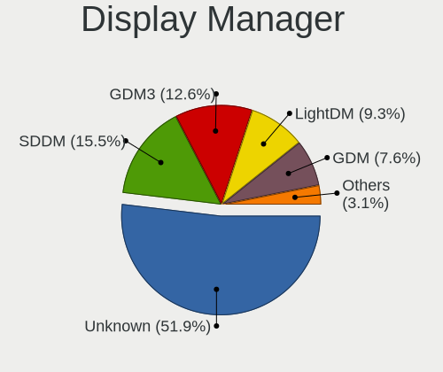

| Name    | Desktops | Percent |
|---------|----------|---------|
| Unknown | 992      | 51.88%  |
| SDDM    | 297      | 15.53%  |
| GDM3    | 241      | 12.6%   |
| LightDM | 177      | 9.26%   |
| GDM     | 145      | 7.58%   |
| TDM     | 38       | 1.99%   |
| KDM     | 9        | 0.47%   |
| XDM     | 3        | 0.16%   |
| SLiM    | 3        | 0.16%   |
| Ly      | 3        | 0.16%   |
| LY-DM   | 2        | 0.1%    |
| MDM     | 1        | 0.05%   |
| LXDM    | 1        | 0.05%   |

OS Lang
-------

Language

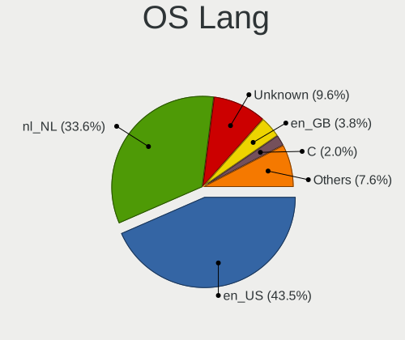

| Lang        | Desktops | Percent |
|-------------|----------|---------|
| en_US       | 817      | 43.46%  |
| nl_NL       | 631      | 33.56%  |
| Unknown     | 180      | 9.57%   |
| en_GB       | 72       | 3.83%   |
| C           | 37       | 1.97%   |
| de_DE       | 32       | 1.7%    |
| pl_PL       | 14       | 0.74%   |
| ru_RU       | 9        | 0.48%   |
| fr_FR       | 8        | 0.43%   |
| en_IE       | 8        | 0.43%   |
| nl_BE       | 7        | 0.37%   |
| es_ES       | 7        | 0.37%   |
| it_IT       | 6        | 0.32%   |
| en_NL       | 5        | 0.27%   |
| C.UTF8      | 5        | 0.27%   |
| ru_UA       | 4        | 0.21%   |
| en_CA       | 4        | 0.21%   |
| en_AG       | 4        | 0.21%   |
| POSIX       | 3        | 0.16%   |
| fr_BE       | 3        | 0.16%   |
| tr_TR       | 2        | 0.11%   |
| sv_SE       | 2        | 0.11%   |
| pt_BR       | 2        | 0.11%   |
| en_IN       | 2        | 0.11%   |
| cs_CZ       | 2        | 0.11%   |
| ar_KW       | 2        | 0.11%   |
| sk_SK       | 1        | 0.05%   |
| pt_PT       | 1        | 0.05%   |
| nl_AW       | 1        | 0.05%   |
| hu_HU       | 1        | 0.05%   |
| fi_FI       | 1        | 0.05%   |
| en_ZA       | 1        | 0.05%   |
| en_US.utf-8 | 1        | 0.05%   |
| en_EN       | 1        | 0.05%   |
| en_DK       | 1        | 0.05%   |
| en_AU       | 1        | 0.05%   |
| en_001      | 1        | 0.05%   |
| de_CH       | 1        | 0.05%   |

Boot Mode
---------

EFI or BIOS

| Mode | Desktops | Percent |
|------|----------|---------|
| BIOS | 1095     | 58.49%  |
| EFI  | 777      | 41.51%  |

Filesystem
----------

Type of filesystem

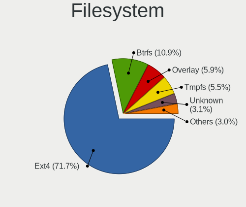

| Type    | Desktops | Percent |
|---------|----------|---------|
| Ext4    | 1360     | 71.69%  |
| Btrfs   | 206      | 10.86%  |
| Overlay | 112      | 5.9%    |
| Tmpfs   | 105      | 5.54%   |
| Unknown | 58       | 3.06%   |
| Zfs     | 24       | 1.27%   |
| Xfs     | 22       | 1.16%   |
| Ext2    | 4        | 0.21%   |
| F2fs    | 3        | 0.16%   |
| Ext3    | 2        | 0.11%   |
| Aufs    | 1        | 0.05%   |

Part. scheme
------------

Scheme of partitioning

| Type    | Desktops | Percent |
|---------|----------|---------|
| Unknown | 1015     | 53.76%  |
| GPT     | 705      | 37.34%  |
| MBR     | 168      | 8.9%    |

Dual Boot with Linux/BSD
------------------------

Hosting more than one Linux/BSD

| Dual boot | Desktops | Percent |
|-----------|----------|---------|
| No        | 1508     | 80.47%  |
| Yes       | 366      | 19.53%  |

Dual Boot (Win)
---------------

Hosting Linux and Windows

| Dual boot | Desktops | Percent |
|-----------|----------|---------|
| No        | 1318     | 70.22%  |
| Yes       | 559      | 29.78%  |

Board
-----

Vendor
------

Motherboard manufacturer

| Name                                 | Desktops | Percent |
|--------------------------------------|----------|---------|
| ASUSTek Computer                     | 472      | 25.75%  |
| Gigabyte Technology                  | 291      | 15.88%  |
| MSI                                  | 231      | 12.6%   |
| ASRock                               | 198      | 10.8%   |
| Hewlett-Packard                      | 178      | 9.71%   |
| Dell                                 | 121      | 6.6%    |
| Acer                                 | 51       | 2.78%   |
| Medion                               | 42       | 2.29%   |
| Intel                                | 37       | 2.02%   |
| Lenovo                               | 36       | 1.96%   |
| Unknown                              | 26       | 1.42%   |
| Fujitsu                              | 16       | 0.87%   |
| Foxconn                              | 16       | 0.87%   |
| Pegatron                             | 15       | 0.82%   |
| Packard Bell                         | 9        | 0.49%   |
| Shuttle                              | 7        | 0.38%   |
| Google                               | 7        | 0.38%   |
| Biostar                              | 7        | 0.38%   |
| Fujitsu Siemens                      | 6        | 0.33%   |
| Apple                                | 6        | 0.33%   |
| BESSTAR Tech                         | 5        | 0.27%   |
| Supermicro                           | 4        | 0.22%   |
| AZW                                  | 4        | 0.22%   |
| MP                                   | 3        | 0.16%   |
| ECS                                  | 3        | 0.16%   |
| ASRockRack                           | 3        | 0.16%   |
| Shenzhen Meigao Electronic Equipment | 2        | 0.11%   |
| Huanan                               | 2        | 0.11%   |
| Hardkernel                           | 2        | 0.11%   |
| AMI                                  | 2        | 0.11%   |
| AAEON                                | 2        | 0.11%   |
| ZOTAC                                | 1        | 0.05%   |
| TYAN Computer                        | 1        | 0.05%   |
| Tianbei                              | 1        | 0.05%   |
| Sun Microsystems                     | 1        | 0.05%   |
| Standard                             | 1        | 0.05%   |
| SolidRun                             | 1        | 0.05%   |
| Simply NUC                           | 1        | 0.05%   |
| SIMPC                                | 1        | 0.05%   |
| Seeed Studio                         | 1        | 0.05%   |

Model
-----

Motherboard model

| Name                               | Desktops | Percent |
|------------------------------------|----------|---------|
| ASUS All Series                    | 35       | 1.91%   |
| Unknown                            | 28       | 1.53%   |
| Dell OptiPlex 7010                 | 15       | 0.82%   |
| MSI MS-7C37                        | 11       | 0.6%    |
| MSI MS-7C02                        | 11       | 0.6%    |
| MSI MS-7B86                        | 9        | 0.49%   |
| Gigabyte B550 AORUS ELITE V2       | 9        | 0.49%   |
| ASRock B450M Pro4                  | 9        | 0.49%   |
| MSI MS-7817                        | 8        | 0.44%   |
| Dell OptiPlex 3020                 | 8        | 0.44%   |
| ASUS ROG STRIX B450-F GAMING       | 8        | 0.44%   |
| MSI MS-7721                        | 7        | 0.38%   |
| HP EliteDesk 800 G1 SFF            | 7        | 0.38%   |
| ASUS Z170 PRO GAMING               | 7        | 0.38%   |
| ASUS ROG STRIX B550-F GAMING       | 7        | 0.38%   |
| MSI MS-7C91                        | 6        | 0.33%   |
| MSI MS-7B98                        | 6        | 0.33%   |
| HP Compaq Pro 6300 SFF             | 6        | 0.33%   |
| HP Compaq Elite 8300 SFF           | 6        | 0.33%   |
| HP Compaq dc7900 Small Form Factor | 6        | 0.33%   |
| HP Compaq 6000 Pro SFF PC          | 6        | 0.33%   |
| Gigabyte X570 AORUS PRO            | 6        | 0.33%   |
| Gigabyte X570 AORUS MASTER         | 6        | 0.33%   |
| Gigabyte X570 AORUS ELITE          | 6        | 0.33%   |
| Gigabyte B550M DS3H                | 6        | 0.33%   |
| Gigabyte B450M DS3H                | 6        | 0.33%   |
| Dell OptiPlex 9020                 | 6        | 0.33%   |
| ASUS ProArt X670E-CREATOR WIFI     | 6        | 0.33%   |
| ASUS PRIME A320M-K                 | 6        | 0.33%   |
| ASUS M4A78LT-M                     | 6        | 0.33%   |
| ASRock 970 Pro3 R2.0               | 6        | 0.33%   |
| MSI MS-7C56                        | 5        | 0.27%   |
| MSI MS-7B89                        | 5        | 0.27%   |
| MSI MS-7B85                        | 5        | 0.27%   |
| MSI MS-7B79                        | 5        | 0.27%   |
| MSI MS-7816                        | 5        | 0.27%   |
| HP Z400 Workstation                | 5        | 0.27%   |
| HP ProDesk 600 G1 SFF              | 5        | 0.27%   |
| HP Compaq Pro 6300 MT              | 5        | 0.27%   |
| HP Compaq dc7800 Small Form Factor | 5        | 0.27%   |

Model Family
------------

Motherboard model prefix

| Name               | Desktops | Percent |
|--------------------|----------|---------|
| ASUS PRIME         | 90       | 4.91%   |
| HP Compaq          | 83       | 4.53%   |
| Dell OptiPlex      | 75       | 4.09%   |
| ASUS ROG           | 67       | 3.66%   |
| ASUS All           | 35       | 1.91%   |
| ASUS TUF           | 32       | 1.75%   |
| Acer Aspire        | 32       | 1.75%   |
| Gigabyte X570      | 28       | 1.53%   |
| Unknown            | 28       | 1.53%   |
| HP ProDesk         | 23       | 1.25%   |
| Gigabyte B550      | 18       | 0.98%   |
| HP EliteDesk       | 17       | 0.93%   |
| Gigabyte B550M     | 17       | 0.93%   |
| Dell Precision     | 16       | 0.87%   |
| Lenovo ThinkCentre | 15       | 0.82%   |
| ASRock B450M       | 15       | 0.82%   |
| Gigabyte B450M     | 13       | 0.71%   |
| ASUS P8H61-M       | 12       | 0.65%   |
| ASRock X570        | 12       | 0.65%   |
| ASRock B450        | 12       | 0.65%   |
| ASRock 970         | 12       | 0.65%   |
| Acer Veriton       | 12       | 0.65%   |
| MSI MS-7C37        | 11       | 0.6%    |
| MSI MS-7C02        | 11       | 0.6%    |
| Fujitsu ESPRIMO    | 10       | 0.55%   |
| MSI MS-7B86        | 9        | 0.49%   |
| ASUS P6T           | 9        | 0.49%   |
| ASUS Maximus       | 9        | 0.49%   |
| MSI MS-7817        | 8        | 0.44%   |
| HP ProLiant        | 8        | 0.44%   |
| Gigabyte Z390      | 8        | 0.44%   |
| ASUS ProArt        | 8        | 0.44%   |
| ASUS M5A78L-M      | 8        | 0.44%   |
| MSI MS-7721        | 7        | 0.38%   |
| Lenovo IdeaCentre  | 7        | 0.38%   |
| Dell XPS           | 7        | 0.38%   |
| Dell Inspiron      | 7        | 0.38%   |
| ASUS Z170          | 7        | 0.38%   |
| ASUS P8Z77-V       | 7        | 0.38%   |
| ASRock Z87         | 7        | 0.38%   |

MFG Year
--------

Motherboard manufacture year

| Year    | Desktops | Percent |
|---------|----------|---------|
| 2018    | 174      | 9.49%   |
| 2012    | 162      | 8.84%   |
| 2013    | 152      | 8.29%   |
| 2020    | 141      | 7.69%   |
| 2019    | 133      | 7.26%   |
| 2011    | 126      | 6.87%   |
| 2014    | 125      | 6.82%   |
| 2017    | 99       | 5.4%    |
| 2010    | 99       | 5.4%    |
| 2021    | 94       | 5.13%   |
| 2009    | 92       | 5.02%   |
| 2008    | 71       | 3.87%   |
| 2015    | 70       | 3.82%   |
| 2022    | 68       | 3.71%   |
| 2016    | 66       | 3.6%    |
| 2007    | 56       | 3.06%   |
| 2023    | 40       | 2.18%   |
| 2006    | 35       | 1.91%   |
| 2005    | 12       | 0.65%   |
| 2024    | 6        | 0.33%   |
| 2004    | 6        | 0.33%   |
| 2003    | 3        | 0.16%   |
| Unknown | 2        | 0.11%   |
| 2002    | 1        | 0.05%   |

Form Factor
-----------

Physical design of the computer

| Name    | Desktops | Percent |
|---------|----------|---------|
| Desktop | 1833     | 100%    |

Secure Boot
-----------

Enabled or disabled

| State    | Desktops | Percent |
|----------|----------|---------|
| Disabled | 1787     | 97.12%  |
| Enabled  | 53       | 2.88%   |

Coreboot
--------

Have coreboot on board

| Used | Desktops | Percent |
|------|----------|---------|
| No   | 1826     | 99.62%  |
| Yes  | 7        | 0.38%   |

RAM Size
--------

Total RAM memory

| Size in GB      | Desktops | Percent |
|-----------------|----------|---------|
| 16.01-24.0      | 471      | 25.05%  |
| 8.01-16.0       | 356      | 18.94%  |
| 32.01-64.0      | 310      | 16.49%  |
| 4.01-8.0        | 253      | 13.46%  |
| 3.01-4.0        | 245      | 13.03%  |
| 64.01-256.0     | 105      | 5.59%   |
| 24.01-32.0      | 71       | 3.78%   |
| 1.01-2.0        | 35       | 1.86%   |
| 2.01-3.0        | 21       | 1.12%   |
| 0.51-1.0        | 11       | 0.59%   |
| More than 256.0 | 2        | 0.11%   |

RAM Used
--------

Used RAM memory

| Used GB     | Desktops | Percent |
|-------------|----------|---------|
| 1.01-2.0    | 697      | 33.93%  |
| 2.01-3.0    | 453      | 22.05%  |
| 4.01-8.0    | 339      | 16.5%   |
| 3.01-4.0    | 275      | 13.39%  |
| 8.01-16.0   | 119      | 5.79%   |
| 0.51-1.0    | 107      | 5.21%   |
| 16.01-24.0  | 27       | 1.31%   |
| 0.01-0.5    | 20       | 0.97%   |
| 32.01-64.0  | 10       | 0.49%   |
| 24.01-32.0  | 5        | 0.24%   |
| 64.01-256.0 | 1        | 0.05%   |
| Unknown     | 1        | 0.05%   |

Total Drives
------------

Number of drives on board

| Drives | Desktops | Percent |
|--------|----------|---------|
| 1      | 678      | 35.37%  |
| 2      | 553      | 28.85%  |
| 3      | 309      | 16.12%  |
| 4      | 182      | 9.49%   |
| 5      | 94       | 4.9%    |
| 6      | 39       | 2.03%   |
| 7      | 29       | 1.51%   |
| 0      | 14       | 0.73%   |
| 8      | 8        | 0.42%   |
| 9      | 6        | 0.31%   |
| 10     | 3        | 0.16%   |
| 28     | 1        | 0.05%   |
| 27     | 1        | 0.05%   |

Has CD-ROM
----------

Has CD-ROM on board

| Presented | Desktops | Percent |
|-----------|----------|---------|
| No        | 999      | 53.8%   |
| Yes       | 858      | 46.2%   |

Has Ethernet
------------

Has Ethernet on board

| Presented | Desktops | Percent |
|-----------|----------|---------|
| Yes       | 1823     | 99.45%  |
| No        | 10       | 0.55%   |

Has WiFi
--------

Has WiFi module

| Presented | Desktops | Percent |
|-----------|----------|---------|
| No        | 1136     | 61.31%  |
| Yes       | 717      | 38.69%  |

Has Bluetooth
-------------

Has Bluetooth module

| Presented | Desktops | Percent |
|-----------|----------|---------|
| No        | 1250     | 66.7%   |
| Yes       | 624      | 33.3%   |

Location
--------

Country
-------

Geographic location (country)

| Country     | Desktops | Percent |
|-------------|----------|---------|
| Netherlands | 1833     | 100%    |

City
----

Geographic location (city)

| City                   | Desktops | Percent |
|------------------------|----------|---------|
| Amsterdam              | 359      | 18.17%  |
| The Hague              | 92       | 4.66%   |
| Rotterdam              | 70       | 3.54%   |
| Utrecht                | 41       | 2.07%   |
| Almere Stad            | 36       | 1.82%   |
| Groningen              | 35       | 1.77%   |
| Naaldwijk              | 33       | 1.67%   |
| Haarlem                | 32       | 1.62%   |
| Enschede               | 27       | 1.37%   |
| Tilburg                | 21       | 1.06%   |
| Leiden                 | 21       | 1.06%   |
| Amersfoort             | 20       | 1.01%   |
| Eindhoven              | 19       | 0.96%   |
| Delft                  | 19       | 0.96%   |
| Nijmegen               | 18       | 0.91%   |
| Arnhem                 | 18       | 0.91%   |
| Zoetermeer             | 16       | 0.81%   |
| Roosendaal             | 16       | 0.81%   |
| Lelystad               | 16       | 0.81%   |
| Apeldoorn              | 16       | 0.81%   |
| Almelo                 | 16       | 0.81%   |
| Zaandam                | 15       | 0.76%   |
| Heemskerk              | 14       | 0.71%   |
| Breda                  | 14       | 0.71%   |
| Purmerend              | 13       | 0.66%   |
| Hilversum              | 12       | 0.61%   |
| Assen                  | 12       | 0.61%   |
| 's-Hertogenbosch       | 12       | 0.61%   |
| Emmen                  | 11       | 0.56%   |
| Dordrecht              | 11       | 0.56%   |
| Capelle aan den IJssel | 11       | 0.56%   |
| Amstelveen             | 11       | 0.56%   |
| Zwolle                 | 10       | 0.51%   |
| Schiedam               | 10       | 0.51%   |
| Oldenzaal              | 10       | 0.51%   |
| Maastricht             | 10       | 0.51%   |
| Hengelo                | 10       | 0.51%   |
| Gouda                  | 10       | 0.51%   |
| Waalwijk               | 9        | 0.46%   |
| Steenbergen            | 9        | 0.46%   |

Drives
------

Drive Vendor
------------

Hard drive vendors

| Vendor                       | Desktops | Drives | Percent |
|------------------------------|----------|--------|---------|
| Samsung Electronics          | 785      | 1473   | 22.98%  |
| WDC                          | 569      | 976    | 16.66%  |
| Seagate                      | 537      | 920    | 15.72%  |
| Kingston                     | 238      | 333    | 6.97%   |
| Crucial                      | 183      | 261    | 5.36%   |
| Toshiba                      | 148      | 240    | 4.33%   |
| SanDisk                      | 139      | 198    | 4.07%   |
| Hitachi                      | 96       | 140    | 2.81%   |
| Intel                        | 81       | 111    | 2.37%   |
| A-DATA Technology            | 50       | 57     | 1.46%   |
| Maxtor                       | 34       | 48     | 1%      |
| Unknown                      | 32       | 65     | 0.94%   |
| HGST                         | 31       | 37     | 0.91%   |
| Kingston Technology Company  | 27       | 44     | 0.79%   |
| China                        | 25       | 32     | 0.73%   |
| OCZ                          | 22       | 27     | 0.64%   |
| PNY                          | 21       | 30     | 0.61%   |
| Corsair                      | 21       | 32     | 0.61%   |
| Transcend                    | 20       | 24     | 0.59%   |
| Patriot                      | 20       | 23     | 0.59%   |
| Micron/Crucial Technology    | 20       | 24     | 0.59%   |
| Micron Technology            | 17       | 24     | 0.5%    |
| Intenso                      | 16       | 17     | 0.47%   |
| SK hynix                     | 15       | 22     | 0.44%   |
| Phison Electronics           | 15       | 19     | 0.44%   |
| Phison                       | 15       | 23     | 0.44%   |
| Gigabyte Technology          | 13       | 17     | 0.38%   |
| SPCC                         | 11       | 14     | 0.32%   |
| JMicron Technology           | 10       | 16     | 0.29%   |
| GOODRAM                      | 10       | 12     | 0.29%   |
| Silicon Motion               | 9        | 9      | 0.26%   |
| Shenzhen Longsys Electronics | 9        | 10     | 0.26%   |
| XPG                          | 8        | 10     | 0.23%   |
| ASMT                         | 8        | 11     | 0.23%   |
| Unknown                      | 7        | 9      | 0.2%    |
| Mushkin                      | 6        | 8      | 0.18%   |
| LITEONIT                     | 6        | 6      | 0.18%   |
| KingFast                     | 6        | 7      | 0.18%   |
| Fanxiang                     | 6        | 8      | 0.18%   |
| ADATA Technology             | 6        | 6      | 0.18%   |

Drive Model
-----------

Hard drive models

| Model                                                | Desktops | Percent |
|------------------------------------------------------|----------|---------|
| Samsung SSD 850 EVO 250GB                            | 80       | 1.94%   |
| Samsung NVMe SSD Controller SM981/PM981/PM983 512GB  | 65       | 1.58%   |
| Samsung SSD 850 EVO 500GB                            | 57       | 1.38%   |
| Samsung SSD 860 EVO 500GB                            | 54       | 1.31%   |
| Samsung NVMe SSD Controller PM9A1/PM9A3/980PRO 512GB | 40       | 0.97%   |
| Kingston SA400S37240G 240GB SSD                      | 38       | 0.92%   |
| Seagate ST2000DM008-2FR102 2TB                       | 36       | 0.87%   |
| Seagate ST500DM002-1BD142 500GB                      | 34       | 0.82%   |
| Samsung SSD 980 1TB                                  | 31       | 0.75%   |
| Samsung SSD 860 EVO 1TB                              | 30       | 0.73%   |
| Samsung SSD 840 EVO 250GB                            | 30       | 0.73%   |
| Samsung SSD 840 EVO 120GB                            | 30       | 0.73%   |
| Kingston SV300S37A120G 120GB SSD                     | 30       | 0.73%   |
| Toshiba DT01ACA100 1TB                               | 29       | 0.7%    |
| Samsung NVMe SSD Drive 500GB                         | 29       | 0.7%    |
| Crucial CT500MX500SSD1 500GB                         | 29       | 0.7%    |
| Samsung NVMe SSD Drive 1TB                           | 28       | 0.68%   |
| Samsung SSD 970 EVO 1TB                              | 23       | 0.56%   |
| Seagate Expansion 1TB                                | 22       | 0.53%   |
| Kingston SA400S37120G 120GB SSD                      | 22       | 0.53%   |
| Seagate ST1000DM003-1CH162 1TB                       | 21       | 0.51%   |
| Samsung HD103SJ 1TB                                  | 21       | 0.51%   |
| Crucial CT1000MX500SSD1 1TB                          | 21       | 0.51%   |
| Seagate ST4000DM004-2CV104 4TB                       | 20       | 0.48%   |
| Seagate ST1000DM010-2EP102 1TB                       | 20       | 0.48%   |
| WDC WD20EZRX-00D8PB0 2TB                             | 19       | 0.46%   |
| WDC WD10EZEX-08WN4A0 1TB                             | 19       | 0.46%   |
| WDC WD20EARX-00PASB0 2TB                             | 18       | 0.44%   |
| Samsung HD204UI 2TB                                  | 18       | 0.44%   |
| Samsung SSD 870 QVO 1TB                              | 17       | 0.41%   |
| Samsung SSD 860 QVO 1TB                              | 17       | 0.41%   |
| Kingston SA400S37480G 480GB SSD                      | 17       | 0.41%   |
| Crucial CT240BX500SSD1 240GB                         | 17       | 0.41%   |
| Seagate ST2000DM001-1CH164 2TB                       | 16       | 0.39%   |
| Samsung HD103SI 1TB                                  | 16       | 0.39%   |
| Toshiba DT01ACA050 500GB                             | 15       | 0.36%   |
| Seagate ST2000DM006-2DM164 2TB                       | 15       | 0.36%   |
| Samsung SSD 870 EVO 1TB                              | 15       | 0.36%   |
| Samsung HD103UJ 1TB                                  | 15       | 0.36%   |
| Seagate ST3500418AS 500GB                            | 14       | 0.34%   |

HDD Vendor
----------

Hard disk drive vendors

| Vendor              | Desktops | Drives | Percent |
|---------------------|----------|--------|---------|
| WDC                 | 525      | 890    | 34.02%  |
| Seagate             | 524      | 896    | 33.96%  |
| Samsung Electronics | 142      | 229    | 9.2%    |
| Toshiba             | 135      | 215    | 8.75%   |
| Hitachi             | 96       | 140    | 6.22%   |
| Maxtor              | 34       | 48     | 2.2%    |
| HGST                | 31       | 37     | 2.01%   |
| Unknown             | 10       | 19     | 0.65%   |
| ASMT                | 7        | 10     | 0.45%   |
| JMicron Technology  | 5        | 9      | 0.32%   |
| Fujitsu             | 5        | 6      | 0.32%   |
| Hewlett-Packard     | 4        | 7      | 0.26%   |
| Intenso             | 3        | 3      | 0.19%   |
| Apple               | 3        | 4      | 0.19%   |
| SAGE                | 2        | 2      | 0.13%   |
| IBM/Hitachi         | 2        | 2      | 0.13%   |
| HGST HTS            | 2        | 3      | 0.13%   |
| ExcelStor           | 2        | 2      | 0.13%   |
| TO Exter            | 1        | 1      | 0.06%   |
| TDAS                | 1        | 5      | 0.06%   |
| Synology            | 1        | 1      | 0.06%   |
| Shenzhen            | 1        | 1      | 0.06%   |
| QNAP                | 1        | 1      | 0.06%   |
| NAS                 | 1        | 10     | 0.06%   |
| Maxtor 6            | 1        | 2      | 0.06%   |
| Magnetic Data       | 1        | 1      | 0.06%   |
| LaCie               | 1        | 1      | 0.06%   |
| Inateck             | 1        | 1      | 0.06%   |
| ASMedia             | 1        | 1      | 0.06%   |

SSD Vendor
----------

Solid state drive vendors

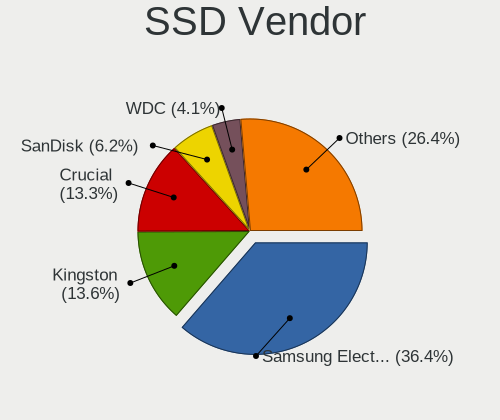

| Vendor              | Desktops | Drives | Percent |
|---------------------|----------|--------|---------|
| Samsung Electronics | 477      | 767    | 36.36%  |
| Kingston            | 178      | 239    | 13.57%  |
| Crucial             | 175      | 253    | 13.34%  |
| SanDisk             | 82       | 108    | 6.25%   |
| WDC                 | 54       | 72     | 4.12%   |
| Intel               | 48       | 64     | 3.66%   |
| A-DATA Technology   | 43       | 50     | 3.28%   |
| China               | 25       | 32     | 1.91%   |
| OCZ                 | 22       | 27     | 1.68%   |
| PNY                 | 21       | 30     | 1.6%    |
| Patriot             | 19       | 22     | 1.45%   |
| Transcend           | 17       | 21     | 1.3%    |
| Corsair             | 12       | 21     | 0.91%   |
| Toshiba             | 11       | 13     | 0.84%   |
| SPCC                | 11       | 14     | 0.84%   |
| GOODRAM             | 10       | 12     | 0.76%   |
| SK hynix            | 9        | 14     | 0.69%   |
| Micron Technology   | 8        | 12     | 0.61%   |
| Intenso             | 8        | 9      | 0.61%   |
| Gigabyte Technology | 7        | 11     | 0.53%   |
| LITEONIT            | 6        | 6      | 0.46%   |
| KingSpec            | 5        | 7      | 0.38%   |
| Unknown             | 5        | 7      | 0.38%   |
| Mushkin             | 4        | 6      | 0.3%    |
| LITEON              | 4        | 5      | 0.3%    |
| Plextor             | 3        | 4      | 0.23%   |
| KingDian            | 3        | 3      | 0.23%   |
| FORESEE             | 3        | 3      | 0.23%   |
| Fanxiang            | 3        | 3      | 0.23%   |
| Brainzap            | 3        | 3      | 0.23%   |
| Verbatim            | 2        | 3      | 0.15%   |
| Seagate             | 2        | 2      | 0.15%   |
| OCZ-VERTEX2         | 2        | 3      | 0.15%   |
| Leven               | 2        | 2      | 0.15%   |
| Dogfish             | 2        | 2      | 0.15%   |
| Apacer              | 2        | 2      | 0.15%   |
| XUM                 | 1        | 3      | 0.08%   |
| XrayDisk            | 1        | 1      | 0.08%   |
| WDC WDS1            | 1        | 1      | 0.08%   |
| WDC WDS             | 1        | 1      | 0.08%   |

Drive Kind
----------

HDD or SSD

| Kind    | Desktops | Drives | Percent |
|---------|----------|--------|---------|
| HDD     | 1155     | 2547   | 40.34%  |
| SSD     | 1062     | 1881   | 37.09%  |
| NVMe    | 585      | 987    | 20.43%  |
| Unknown | 52       | 82     | 1.82%   |
| MMC     | 9        | 10     | 0.31%   |

Drive Connector
---------------

SATA, SAS, NVMe, etc.

| Type | Desktops | Drives | Percent |
|------|----------|--------|---------|
| SATA | 1615     | 4221   | 68.37%  |
| NVMe | 585      | 984    | 24.77%  |
| SAS  | 153      | 292    | 6.48%   |
| MMC  | 9        | 10     | 0.38%   |

Drive Size
----------

Size of hard drive

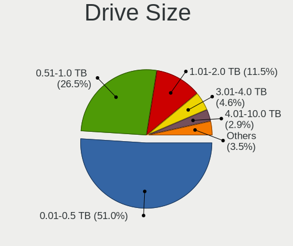

| Size in TB | Desktops | Drives | Percent |
|------------|----------|--------|---------|
| 0.01-0.5   | 1260     | 2359   | 51.01%  |
| 0.51-1.0   | 655      | 1057   | 26.52%  |
| 1.01-2.0   | 283      | 479    | 11.46%  |
| 3.01-4.0   | 114      | 240    | 4.62%   |
| 2.01-3.0   | 72       | 108    | 2.91%   |
| 4.01-10.0  | 72       | 159    | 2.91%   |
| 10.01-20.0 | 14       | 26     | 0.57%   |

Space Total
-----------

Amount of disk space available on the file system

| Size in GB     | Desktops | Percent |
|----------------|----------|---------|
| 101-250        | 442      | 22.4%   |
| 251-500        | 301      | 15.26%  |
| 501-1000       | 290      | 14.7%   |
| 1001-2000      | 263      | 13.33%  |
| More than 3000 | 244      | 12.37%  |
| 1-20           | 108      | 5.47%   |
| 2001-3000      | 106      | 5.37%   |
| 51-100         | 104      | 5.27%   |
| Unknown        | 68       | 3.45%   |
| 21-50          | 47       | 2.38%   |

Space Used
----------

Amount of used disk space

| Used GB        | Desktops | Percent |
|----------------|----------|---------|
| 1-20           | 651      | 31.85%  |
| 21-50          | 280      | 13.7%   |
| 101-250        | 215      | 10.52%  |
| 51-100         | 198      | 9.69%   |
| 501-1000       | 195      | 9.54%   |
| 251-500        | 145      | 7.09%   |
| 1001-2000      | 132      | 6.46%   |
| More than 3000 | 106      | 5.19%   |
| Unknown        | 68       | 3.33%   |
| 2001-3000      | 52       | 2.54%   |
| 0              | 2        | 0.1%    |

Malfunc. Drives
---------------

Drive models with a malfunction

| Model                                                           | Desktops | Drives | Percent |
|-----------------------------------------------------------------|----------|--------|---------|
| Seagate ST500DM002-1BD142 500GB                                 | 5        | 5      | 2.36%   |
| Kingston SV300S37A120G 120GB SSD                                | 4        | 4      | 1.89%   |
| WDC WD10EADS-22M2B0 1TB                                         | 3        | 3      | 1.42%   |
| Toshiba DT01ACA100 1TB                                          | 3        | 3      | 1.42%   |
| Seagate ST3500418AS 500GB                                       | 3        | 3      | 1.42%   |
| Seagate ST2000DM001-1CH164 2TB                                  | 3        | 3      | 1.42%   |
| Seagate ST1000DM003-1ER162 1TB                                  | 3        | 3      | 1.42%   |
| SanDisk SD6SF1M128G1022I 128GB SSD                              | 3        | 3      | 1.42%   |
| Intel SSDSC2BW120A4 120GB                                       | 3        | 4      | 1.42%   |
| Intel SSDSA2M080G2GC 80GB                                       | 3        | 4      | 1.42%   |
| Crucial CT128MX100SSD1 128GB                                    | 3        | 3      | 1.42%   |
| WDC WD60EFRX-68MYMN1 6TB                                        | 2        | 2      | 0.94%   |
| WDC WD60EFRX-68L0BN1 6TB                                        | 2        | 2      | 0.94%   |
| WDC WD20EZRZ-00Z5HB0 2TB                                        | 2        | 2      | 0.94%   |
| WDC WD20EARX-00PASB0 2TB                                        | 2        | 2      | 0.94%   |
| WDC WD1002FAEX-00Z3A0 1TB                                       | 2        | 3      | 0.94%   |
| WDC WD1002FAEX-00Y9A0 1TB                                       | 2        | 2      | 0.94%   |
| Toshiba MQ01ABD050 500GB                                        | 2        | 3      | 0.94%   |
| Toshiba DT01ACA300 3TB                                          | 2        | 6      | 0.94%   |
| Seagate ST380011A 80GB                                          | 2        | 2      | 0.94%   |
| Seagate ST31000524AS 1TB                                        | 2        | 2      | 0.94%   |
| Seagate ST2000DM008-2FR102 2TB                                  | 2        | 2      | 0.94%   |
| Seagate ST2000DM001-9YN164 2TB                                  | 2        | 2      | 0.94%   |
| Samsung Electronics SSD 980 1TB                                 | 2        | 2      | 0.94%   |
| Samsung Electronics SSD 870 EVO 4TB                             | 2        | 2      | 0.94%   |
| Samsung Electronics SSD 870 EVO 1TB                             | 2        | 3      | 0.94%   |
| Samsung Electronics NVMe SSD Controller SM981/PM981/PM983 512GB | 2        | 5      | 0.94%   |
| Samsung Electronics HD753LJ 752GB                               | 2        | 2      | 0.94%   |
| Samsung Electronics HD204UI 2TB                                 | 2        | 2      | 0.94%   |
| Samsung Electronics HD103UJ 1TB                                 | 2        | 2      | 0.94%   |
| Crucial CT525MX300SSD1 528GB                                    | 2        | 2      | 0.94%   |
| WDC WDS240G2G0A-00JH30 240GB SSD                                | 1        | 1      | 0.47%   |
| WDC WDS120G2G0A-00JH30 120GB SSD                                | 1        | 1      | 0.47%   |
| WDC WD800JD-00HKA0 80GB                                         | 1        | 1      | 0.47%   |
| WDC WD6400AACS-00G8B1 640GB                                     | 1        | 1      | 0.47%   |
| WDC WD5000HHTZ-04N21V0 500GB                                    | 1        | 1      | 0.47%   |
| WDC WD5000BPVT-22HXZT3 500GB                                    | 1        | 1      | 0.47%   |
| WDC WD5000AVDS-63U7B1 500GB                                     | 1        | 1      | 0.47%   |
| WDC WD5000AAKX-753CA1 500GB                                     | 1        | 2      | 0.47%   |
| WDC WD5000AAKX-08U6AA0 500GB                                    | 1        | 1      | 0.47%   |

Malfunc. Drive Vendor
---------------------

Vendors of faulty drives

| Vendor              | Desktops | Drives | Percent |
|---------------------|----------|--------|---------|
| WDC                 | 64       | 82     | 31.07%  |
| Seagate             | 44       | 50     | 21.36%  |
| Samsung Electronics | 26       | 32     | 12.62%  |
| Intel               | 15       | 21     | 7.28%   |
| Toshiba             | 10       | 15     | 4.85%   |
| Crucial             | 10       | 19     | 4.85%   |
| Kingston            | 9        | 9      | 4.37%   |
| Hitachi             | 6        | 7      | 2.91%   |
| Maxtor              | 5        | 8      | 2.43%   |
| SanDisk             | 3        | 3      | 1.46%   |
| LITEONIT            | 2        | 2      | 0.97%   |
| HGST                | 2        | 3      | 0.97%   |
| Transcend           | 1        | 1      | 0.49%   |
| PNY                 | 1        | 1      | 0.49%   |
| Patriot             | 1        | 1      | 0.49%   |
| OCZ                 | 1        | 1      | 0.49%   |
| EK46XL85C49         | 1        | 1      | 0.49%   |
| Corsair             | 1        | 3      | 0.49%   |
| China               | 1        | 3      | 0.49%   |
| C-Series            | 1        | 1      | 0.49%   |
| Anobit              | 1        | 1      | 0.49%   |
| A-DATA Technology   | 1        | 1      | 0.49%   |

Malfunc. HDD Vendor
-------------------

Vendors of faulty HDD drives

| Vendor              | Desktops | Drives | Percent |
|---------------------|----------|--------|---------|
| WDC                 | 61       | 79     | 43.57%  |
| Seagate             | 44       | 50     | 31.43%  |
| Samsung Electronics | 12       | 12     | 8.57%   |
| Toshiba             | 10       | 15     | 7.14%   |
| Hitachi             | 6        | 7      | 4.29%   |
| Maxtor              | 5        | 8      | 3.57%   |
| HGST                | 2        | 3      | 1.43%   |

Malfunc. Drive Kind
-------------------

Kinds of faulty drives

| Kind | Desktops | Drives | Percent |
|------|----------|--------|---------|
| HDD  | 129      | 174    | 66.15%  |
| SSD  | 58       | 75     | 29.74%  |
| NVMe | 8        | 16     | 4.1%    |

Failed Drives
-------------

Failed drive models

| Model                             | Desktops | Drives | Percent |
|-----------------------------------|----------|--------|---------|
| WDC WD2500BEVT-22ZCT0 250GB       | 1        | 1      | 20%     |
| Toshiba HDWG180 8TB               | 1        | 4      | 20%     |
| Samsung Electronics SSD 980 1TB   | 1        | 1      | 20%     |
| Samsung Electronics HD502HJ 500GB | 1        | 1      | 20%     |
| Samsung Electronics HD161HJ 160GB | 1        | 1      | 20%     |

Failed Drive Vendor
-------------------

Failed drive vendors

| Vendor              | Desktops | Drives | Percent |
|---------------------|----------|--------|---------|
| Samsung Electronics | 3        | 3      | 60%     |
| WDC                 | 1        | 1      | 20%     |
| Toshiba             | 1        | 4      | 20%     |

Drive Status
------------

Number of failed and malfunc. drives

| Status   | Desktops | Drives | Percent |
|----------|----------|--------|---------|
| Detected | 1186     | 3555   | 58.19%  |
| Works    | 664      | 1679   | 32.58%  |
| Malfunc  | 183      | 265    | 8.98%   |
| Failed   | 5        | 8      | 0.25%   |

Storage controller
------------------

Storage Vendor
--------------

Storage controller vendors

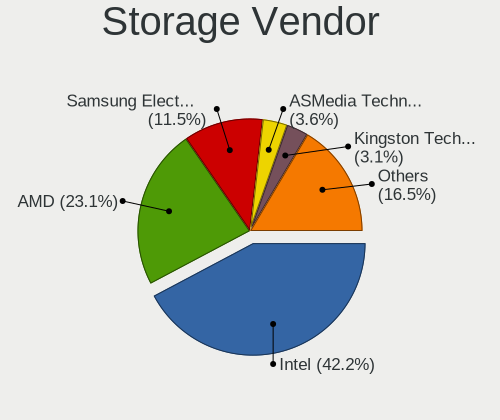

| Vendor                           | Desktops | Percent |
|----------------------------------|----------|---------|
| Intel                            | 1154     | 42.24%  |
| AMD                              | 632      | 23.13%  |
| Samsung Electronics              | 313      | 11.46%  |
| ASMedia Technology               | 97       | 3.55%   |
| Kingston Technology Company      | 86       | 3.15%   |
| JMicron Technology               | 71       | 2.6%    |
| SanDisk                          | 64       | 2.34%   |
| Marvell Technology Group         | 61       | 2.23%   |
| Phison Electronics               | 43       | 1.57%   |
| Nvidia                           | 34       | 1.24%   |
| Micron/Crucial Technology        | 27       | 0.99%   |
| ADATA Technology                 | 18       | 0.66%   |
| Silicon Motion                   | 13       | 0.48%   |
| Seagate Technology               | 13       | 0.48%   |
| Shenzhen Longsys Electronics     | 12       | 0.44%   |
| VIA Technologies                 | 11       | 0.4%    |
| Micron Technology                | 10       | 0.37%   |
| Silicon Image                    | 9        | 0.33%   |
| MAXIO Technology (Hangzhou)      | 7        | 0.26%   |
| Toshiba America Info Systems     | 6        | 0.22%   |
| SK hynix                         | 6        | 0.22%   |
| Broadcom / LSI                   | 6        | 0.22%   |
| LSI Logic / Symbios Logic        | 5        | 0.18%   |
| INNOGRIT                         | 4        | 0.15%   |
| Realtek Semiconductor            | 3        | 0.11%   |
| Integrated Technology Express    | 3        | 0.11%   |
| Adaptec                          | 3        | 0.11%   |
| Union Memory (Shenzhen)          | 2        | 0.07%   |
| ULi Electronics                  | 2        | 0.07%   |
| Silicon Integrated Systems [SiS] | 2        | 0.07%   |
| Promise Technology               | 2        | 0.07%   |
| Hosin Global Electronics         | 2        | 0.07%   |
| HighPoint Technologies           | 2        | 0.07%   |
| Hewlett-Packard                  | 2        | 0.07%   |
| Yangtze Memory Technologies      | 1        | 0.04%   |
| Transcend                        | 1        | 0.04%   |
| Toshiba                          | 1        | 0.04%   |
| Solidigm                         | 1        | 0.04%   |
| Lite-On IT Corp. / Plextor       | 1        | 0.04%   |
| KIOXIA                           | 1        | 0.04%   |

Storage Model
-------------

Storage controller models

| Model                                                                                   | Desktops | Percent |
|-----------------------------------------------------------------------------------------|----------|---------|
| AMD FCH SATA Controller [AHCI mode]                                                     | 324      | 9.48%   |
| Samsung NVMe SSD Controller SM981/PM981/PM983                                           | 177      | 5.18%   |
| Intel 8 Series/C220 Series Chipset Family 6-port SATA Controller 1 [AHCI mode]          | 140      | 4.1%    |
| AMD 400 Series Chipset SATA Controller                                                  | 126      | 3.69%   |
| AMD 500 Series Chipset SATA Controller                                                  | 102      | 2.99%   |
| Intel Q170/Q150/B150/H170/H110/Z170/CM236 Chipset SATA Controller [AHCI Mode]           | 88       | 2.58%   |
| ASMedia ASM1061/ASM1062 Serial ATA Controller                                           | 88       | 2.58%   |
| Intel SATA Controller [RAID mode]                                                       | 86       | 2.52%   |
| Intel 6 Series/C200 Series Chipset Family 6 port Desktop SATA AHCI Controller           | 80       | 2.34%   |
| Intel 7 Series/C210 Series Chipset Family 6-port SATA Controller [AHCI mode]            | 77       | 2.25%   |
| AMD SB7x0/SB8x0/SB9x0 IDE Controller                                                    | 76       | 2.22%   |
| Intel 200 Series PCH SATA controller [AHCI mode]                                        | 72       | 2.11%   |
| Samsung NVMe SSD Controller PM9A1/PM9A3/980PRO                                          | 59       | 1.73%   |
| AMD SB7x0/SB8x0/SB9x0 SATA Controller [AHCI mode]                                       | 55       | 1.61%   |
| Samsung NVMe SSD Controller 980 (DRAM-less)                                             | 54       | 1.58%   |
| Intel NM10/ICH7 Family SATA Controller [IDE mode]                                       | 54       | 1.58%   |
| AMD SB7x0/SB8x0/SB9x0 SATA Controller [IDE mode]                                        | 50       | 1.46%   |
| AMD 600 Series Chipset SATA Controller                                                  | 50       | 1.46%   |
| Intel Cannon Lake PCH SATA AHCI Controller                                              | 48       | 1.41%   |
| Intel 82801G (ICH7 Family) IDE Controller                                               | 47       | 1.38%   |
| Kingston Company A2000 NVMe SSD [SM2263EN]                                              | 45       | 1.32%   |
| JMicron JMB363 SATA/IDE Controller                                                      | 44       | 1.29%   |
| Intel 6 Series/C200 Series Chipset Family Desktop SATA Controller (IDE mode, ports 4-5) | 42       | 1.23%   |
| Intel 6 Series/C200 Series Chipset Family Desktop SATA Controller (IDE mode, ports 0-3) | 42       | 1.23%   |
| Intel 9 Series Chipset Family SATA Controller [AHCI Mode]                               | 41       | 1.2%    |
| Intel 82801JI (ICH10 Family) SATA AHCI Controller                                       | 35       | 1.02%   |
| Samsung NVMe SSD Controller SM961/PM961/SM963                                           | 32       | 0.94%   |
| Intel 82801I (ICH9 Family) 2 port SATA Controller [IDE mode]                            | 32       | 0.94%   |
| Intel 82801JI (ICH10 Family) 4 port SATA IDE Controller #1                              | 31       | 0.91%   |
| Intel 82801JI (ICH10 Family) 2 port SATA IDE Controller #2                              | 30       | 0.88%   |
| Intel 5 Series/3400 Series Chipset 6 port SATA AHCI Controller                          | 26       | 0.76%   |
| AMD 300 Series Chipset SATA Controller                                                  | 26       | 0.76%   |
| Intel Alder Lake-S PCH SATA Controller [AHCI Mode]                                      | 25       | 0.73%   |
| Intel 82801IR/IO/IH (ICH9R/DO/DH) 4 port SATA Controller [IDE mode]                     | 24       | 0.7%    |
| Intel 82801JD/DO (ICH10 Family) SATA AHCI Controller                                    | 22       | 0.64%   |
| Intel SSD 660P Series                                                                   | 21       | 0.61%   |
| Intel 500 Series Chipset Family SATA AHCI Controller                                    | 21       | 0.61%   |
| Intel 4 Series Chipset PT IDER Controller                                               | 21       | 0.61%   |
| Phison E12 NVMe Controller                                                              | 18       | 0.53%   |
| AMD A320 Chipset SATA Controller [AHCI mode]                                            | 18       | 0.53%   |

Storage Kind
------------

Kind of storage controller (IDE, SATA, NVMe, SAS, ...)

| Kind | Desktops | Percent |
|------|----------|---------|
| SATA | 1481     | 55.59%  |
| NVMe | 587      | 22.03%  |
| IDE  | 447      | 16.78%  |
| RAID | 134      | 5.03%   |
| SAS  | 8        | 0.3%    |
| SCSI | 7        | 0.26%   |

Processor
---------

CPU Vendor
----------

Processor vendors

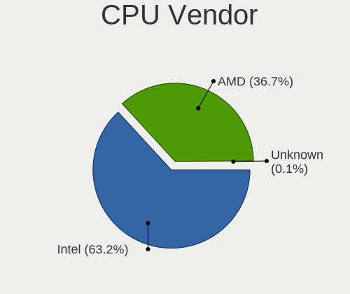

| Vendor  | Desktops | Percent |
|---------|----------|---------|
| Intel   | 1158     | 63.18%  |
| AMD     | 673      | 36.72%  |
| ARM     | 1        | 0.05%   |
| Unknown | 1        | 0.05%   |

CPU Model
---------

Processor models

| Model                                  | Desktops | Percent |
|----------------------------------------|----------|---------|
| AMD Ryzen 5 3600 6-Core Processor      | 50       | 2.72%   |
| AMD Ryzen 7 3700X 8-Core Processor     | 35       | 1.9%    |
| AMD Ryzen 9 3900X 12-Core Processor    | 25       | 1.36%   |
| AMD Ryzen 5 2600 Six-Core Processor    | 25       | 1.36%   |
| Intel Core i7-3770 CPU @ 3.40GHz       | 24       | 1.3%    |
| Intel Core i5-4460 CPU @ 3.20GHz       | 23       | 1.25%   |
| AMD Ryzen 5 5600X 6-Core Processor     | 23       | 1.25%   |
| Intel Core 2 Duo CPU E8400 @ 3.00GHz   | 22       | 1.2%    |
| Intel Core i7-2600 CPU @ 3.40GHz       | 21       | 1.14%   |
| Intel Core i5-3470 CPU @ 3.20GHz       | 19       | 1.03%   |
| AMD Ryzen 7 5800X 8-Core Processor     | 19       | 1.03%   |
| Intel Core i7-6700K CPU @ 4.00GHz      | 17       | 0.92%   |
| Intel Core i7-4790 CPU @ 3.60GHz       | 17       | 0.92%   |
| Intel Core i5-4590 CPU @ 3.30GHz       | 17       | 0.92%   |
| AMD Ryzen 9 5900X 12-Core Processor    | 17       | 0.92%   |
| AMD Ryzen 5 5600G with Radeon Graphics | 17       | 0.92%   |
| AMD FX-8350 Eight-Core Processor       | 16       | 0.87%   |
| Intel Core i5-2400 CPU @ 3.10GHz       | 15       | 0.81%   |
| Intel Core i3-3220 CPU @ 3.30GHz       | 15       | 0.81%   |
| Intel Core 2 Quad CPU Q6600 @ 2.40GHz  | 15       | 0.81%   |
| Intel Core i3-2120 CPU @ 3.30GHz       | 14       | 0.76%   |
| AMD Ryzen 7 2700X Eight-Core Processor | 14       | 0.76%   |
| AMD Ryzen 5 1600 Six-Core Processor    | 14       | 0.76%   |
| Intel Core i7 CPU 920 @ 2.67GHz        | 13       | 0.71%   |
| Intel Core i5-4570 CPU @ 3.20GHz       | 13       | 0.71%   |
| Intel Core i7 CPU 860 @ 2.80GHz        | 12       | 0.65%   |
| Intel Core i3-4130 CPU @ 3.40GHz       | 12       | 0.65%   |
| Intel Core i7-8700 CPU @ 3.20GHz       | 11       | 0.6%    |
| Intel Core i7-7700K CPU @ 4.20GHz      | 11       | 0.6%    |
| Intel Core i7-6700 CPU @ 3.40GHz       | 11       | 0.6%    |
| Intel Core i5-7400 CPU @ 3.00GHz       | 11       | 0.6%    |
| Intel Core i5-4440 CPU @ 3.10GHz       | 11       | 0.6%    |
| Intel Core i5 CPU 650 @ 3.20GHz        | 11       | 0.6%    |
| AMD Ryzen 7 3800X 8-Core Processor     | 11       | 0.6%    |
| Intel Core i9-9900K CPU @ 3.60GHz      | 10       | 0.54%   |
| Intel Core i5 CPU 750 @ 2.67GHz        | 10       | 0.54%   |
| Intel Core i3-2100 CPU @ 3.10GHz       | 10       | 0.54%   |
| Intel Core 2 Duo CPU E6550 @ 2.33GHz   | 10       | 0.54%   |
| Intel Core i7-4790K CPU @ 4.00GHz      | 9        | 0.49%   |
| Intel Core i7-4770 CPU @ 3.40GHz       | 9        | 0.49%   |

CPU Model Family
----------------

Processor model prefix

| Model                   | Desktops | Percent |
|-------------------------|----------|---------|
| Intel Core i5           | 323      | 17.57%  |
| Intel Core i7           | 260      | 14.15%  |
| AMD Ryzen 5             | 192      | 10.45%  |
| AMD Ryzen 7             | 140      | 7.62%   |
| Intel Core i3           | 120      | 6.53%   |
| AMD Ryzen 9             | 85       | 4.62%   |
| Intel Xeon              | 79       | 4.3%    |
| Other                   | 66       | 3.59%   |
| Intel Core 2 Duo        | 63       | 3.43%   |
| Intel Celeron           | 58       | 3.16%   |
| Intel Core 2 Quad       | 49       | 2.67%   |
| AMD FX                  | 44       | 2.39%   |
| Intel Pentium Dual-Core | 33       | 1.8%    |
| Intel Pentium           | 27       | 1.47%   |
| AMD Phenom II X4        | 22       | 1.2%    |
| Intel Core i9           | 21       | 1.14%   |
| AMD Athlon 64 X2        | 20       | 1.09%   |
| AMD A8                  | 20       | 1.09%   |
| AMD Ryzen 3             | 19       | 1.03%   |
| Intel Pentium 4         | 16       | 0.87%   |
| AMD Athlon II X2        | 14       | 0.76%   |
| Intel Pentium D         | 13       | 0.71%   |
| Intel Atom              | 12       | 0.65%   |
| AMD A4                  | 12       | 0.65%   |
| Intel Core 2            | 11       | 0.6%    |
| AMD Ryzen Threadripper  | 10       | 0.54%   |
| AMD A6                  | 10       | 0.54%   |
| AMD Athlon II X4        | 9        | 0.49%   |
| AMD Athlon              | 9        | 0.49%   |
| AMD A10                 | 9        | 0.49%   |
| AMD Phenom II X6        | 7        | 0.38%   |
| AMD E                   | 6        | 0.33%   |
| Intel Pentium Silver    | 5        | 0.27%   |
| Intel Pentium Gold      | 5        | 0.27%   |
| Intel Pentium Dual      | 5        | 0.27%   |
| AMD Ryzen 5 PRO         | 5        | 0.27%   |
| AMD GX                  | 4        | 0.22%   |
| AMD E1                  | 4        | 0.22%   |
| AMD Athlon X4           | 4        | 0.22%   |
| AMD Athlon 64           | 4        | 0.22%   |

CPU Cores
---------

Number of processor cores

| Number  | Desktops | Percent |
|---------|----------|---------|
| 4       | 720      | 39.11%  |
| 2       | 417      | 22.65%  |
| 6       | 287      | 15.59%  |
| 8       | 196      | 10.65%  |
| 12      | 78       | 4.24%   |
| 1       | 48       | 2.61%   |
| 16      | 39       | 2.12%   |
| 10      | 16       | 0.87%   |
| 3       | 15       | 0.81%   |
| 24      | 9        | 0.49%   |
| 14      | 4        | 0.22%   |
| 20      | 3        | 0.16%   |
| Unknown | 3        | 0.16%   |
| 32      | 2        | 0.11%   |
| 64      | 1        | 0.05%   |
| 48      | 1        | 0.05%   |
| 18      | 1        | 0.05%   |
| 5       | 1        | 0.05%   |

CPU Sockets
-----------

Number of sockets

| Number | Desktops | Percent |
|--------|----------|---------|
| 1      | 1816     | 99.07%  |
| 2      | 16       | 0.87%   |
| 8      | 1        | 0.05%   |

CPU Threads
-----------

Threads per core (Hyper-Threading)

| Number  | Desktops | Percent |
|---------|----------|---------|
| 2       | 1043     | 56.75%  |
| 1       | 792      | 43.09%  |
| Unknown | 3        | 0.16%   |

CPU Op-Modes
------------

CPU Operation Modes (32-bit, 64-bit)

| Op mode        | Desktops | Percent |
|----------------|----------|---------|
| 32-bit, 64-bit | 1799     | 97.98%  |
| Unknown        | 27       | 1.47%   |
| 32-bit         | 10       | 0.54%   |

CPU Microcode
-------------

Microcode number

| Number     | Desktops | Percent |
|------------|----------|---------|
| Unknown    | 722      | 37.49%  |
| 0x306c3    | 126      | 6.54%   |
| 0x206a7    | 83       | 4.31%   |
| 0x1067a    | 73       | 3.79%   |
| 0x306a9    | 70       | 3.63%   |
| 0x08701021 | 61       | 3.17%   |
| 0x506e3    | 48       | 2.49%   |
| 0x08701013 | 34       | 1.77%   |
| 0x010000c8 | 30       | 1.56%   |
| 0x906ea    | 28       | 1.45%   |
| 0x906e9    | 28       | 1.45%   |
| 0x0800820d | 28       | 1.45%   |
| 0x6fb      | 27       | 1.4%    |
| 0x06000852 | 25       | 1.3%    |
| 0x06001119 | 20       | 1.04%   |
| 0x106a5    | 19       | 0.99%   |
| 0x0a201016 | 19       | 0.99%   |
| 0x106e5    | 17       | 0.88%   |
| 0x20655    | 13       | 0.67%   |
| 0x0a601203 | 13       | 0.67%   |
| 0x906ed    | 12       | 0.62%   |
| 0x10676    | 12       | 0.62%   |
| 0x0a20120a | 12       | 0.62%   |
| 0x03000027 | 12       | 0.62%   |
| 0x906ec    | 11       | 0.57%   |
| 0x6fd      | 11       | 0.57%   |
| 0x0a201009 | 10       | 0.52%   |
| 0x08108109 | 10       | 0.52%   |
| 0x08101016 | 10       | 0.52%   |
| 0xa0655    | 9        | 0.47%   |
| 0x306f2    | 9        | 0.47%   |
| 0x08001138 | 9        | 0.47%   |
| 0x90672    | 8        | 0.42%   |
| 0x6f6      | 8        | 0.42%   |
| 0x0a50000d | 8        | 0.42%   |
| 0x08701030 | 8        | 0.42%   |
| 0xa0653    | 7        | 0.36%   |
| 0x906eb    | 7        | 0.36%   |
| 0x306e4    | 7        | 0.36%   |
| 0x206c2    | 7        | 0.36%   |

CPU Microarch
-------------

Microarchitecture

| Name             | Desktops | Percent |
|------------------|----------|---------|
| Haswell          | 215      | 11.7%   |
| Zen 2            | 161      | 8.76%   |
| KabyLake         | 150      | 8.16%   |
| SandyBridge      | 124      | 6.75%   |
| IvyBridge        | 121      | 6.58%   |
| Zen 3            | 114      | 6.2%    |
| Penryn           | 109      | 5.93%   |
| Unknown          | 94       | 5.11%   |
| Skylake          | 90       | 4.9%    |
| Zen+             | 72       | 3.92%   |
| Core             | 67       | 3.65%   |
| Piledriver       | 63       | 3.43%   |
| K10              | 63       | 3.43%   |
| Nehalem          | 58       | 3.16%   |
| Zen              | 57       | 3.1%    |
| Westmere         | 36       | 1.96%   |
| CometLake        | 36       | 1.96%   |
| NetBurst         | 32       | 1.74%   |
| K8 Hammer        | 32       | 1.74%   |
| Alderlake Hybrid | 21       | 1.14%   |
| Silvermont       | 18       | 0.98%   |
| K10 Llano        | 15       | 0.82%   |
| Goldmont plus    | 12       | 0.65%   |
| Broadwell        | 11       | 0.6%    |
| Steamroller      | 9        | 0.49%   |
| Icelake          | 9        | 0.49%   |
| Bobcat           | 8        | 0.44%   |
| Jaguar           | 7        | 0.38%   |
| Excavator        | 7        | 0.38%   |
| Bonnell          | 7        | 0.38%   |
| Bulldozer        | 5        | 0.27%   |
| Tremont          | 4        | 0.22%   |
| Puma             | 4        | 0.22%   |
| Gracemont        | 3        | 0.16%   |
| Goldmont         | 2        | 0.11%   |
| TigerLake        | 1        | 0.05%   |
| P6               | 1        | 0.05%   |

Graphics
--------

GPU Vendor
----------

Vendors of graphics cards

| Vendor                     | Desktops | Percent |
|----------------------------|----------|---------|
| Nvidia                     | 810      | 40.76%  |
| AMD                        | 637      | 32.06%  |
| Intel                      | 525      | 26.42%  |
| Matrox Electronics Systems | 6        | 0.3%    |
| ASPEED Technology          | 6        | 0.3%    |
| VIA Technologies           | 2        | 0.1%    |
| Red Hat                    | 1        | 0.05%   |

GPU Model
---------

Graphics card models

| Model                                                                       | Desktops | Percent |
|-----------------------------------------------------------------------------|----------|---------|
| Intel Xeon E3-1200 v3/4th Gen Core Processor Integrated Graphics Controller | 90       | 4.35%   |
| AMD Ellesmere [Radeon RX 470/480/570/570X/580/580X/590]                     | 85       | 4.11%   |
| Intel 2nd Generation Core Processor Family Integrated Graphics Controller   | 56       | 2.71%   |
| Nvidia GK208B [GeForce GT 710]                                              | 53       | 2.56%   |
| Nvidia GP107 [GeForce GTX 1050 Ti]                                          | 47       | 2.27%   |
| Intel Xeon E3-1200 v2/3rd Gen Core processor Graphics Controller            | 45       | 2.17%   |
| AMD Raphael                                                                 | 44       | 2.13%   |
| Intel CoffeeLake-S GT2 [UHD Graphics 630]                                   | 35       | 1.69%   |
| Intel 4 Series Chipset Integrated Graphics Controller                       | 35       | 1.69%   |
| Intel HD Graphics 530                                                       | 34       | 1.64%   |
| Nvidia GT218 [GeForce 210]                                                  | 32       | 1.55%   |
| Nvidia GP106 [GeForce GTX 1060 6GB]                                         | 31       | 1.5%    |
| AMD Navi 10 [Radeon RX 5600 OEM/5600 XT / 5700/5700 XT]                     | 26       | 1.26%   |
| Nvidia GM204 [GeForce GTX 970]                                              | 25       | 1.21%   |
| Nvidia GP108 [GeForce GT 1030]                                              | 23       | 1.11%   |
| Nvidia GP104 [GeForce GTX 1080]                                             | 20       | 0.97%   |
| Intel HD Graphics 630                                                       | 20       | 0.97%   |
| AMD Cezanne [Radeon Vega Series / Radeon Vega Mobile Series]                | 20       | 0.97%   |
| Nvidia GP104 [GeForce GTX 1070]                                             | 19       | 0.92%   |
| Nvidia GM206 [GeForce GTX 960]                                              | 18       | 0.87%   |
| Intel 4th Generation Core Processor Family Integrated Graphics Controller   | 18       | 0.87%   |
| AMD Raven Ridge [Radeon Vega Series / Radeon Vega Mobile Series]            | 18       | 0.87%   |
| AMD Navi 23 [Radeon RX 6600/6600 XT/6600M]                                  | 18       | 0.87%   |
| Intel CometLake-S GT2 [UHD Graphics 630]                                    | 17       | 0.82%   |
| Nvidia GK208B [GeForce GT 730]                                              | 16       | 0.77%   |
| Intel IvyBridge GT2 [HD Graphics 4000]                                      | 16       | 0.77%   |
| AMD Picasso/Raven 2 [Radeon Vega Series / Radeon Vega Mobile Series]        | 16       | 0.77%   |
| AMD Caicos [Radeon HD 6450/7450/8450 / R5 230 OEM]                          | 16       | 0.77%   |
| Nvidia GM107 [GeForce GTX 750 Ti]                                           | 15       | 0.72%   |
| AMD Cedar [Radeon HD 5000/6000/7350/8350 Series]                            | 15       | 0.72%   |
| Nvidia TU116 [GeForce GTX 1660 Ti]                                          | 14       | 0.68%   |
| Nvidia TU116 [GeForce GTX 1660 SUPER]                                       | 14       | 0.68%   |
| AMD Navi 22 [Radeon RX 6700/6700 XT/6750 XT / 6800M/6850M XT]               | 14       | 0.68%   |
| AMD Baffin [Radeon RX 460/560D / Pro 450/455/460/555/555X/560/560X]         | 14       | 0.68%   |
| AMD Renoir [Radeon Vega Series / Radeon Vega Mobile Series]                 | 13       | 0.63%   |
| AMD Navi 31 [Radeon RX 7900 XT/7900 XTX/7900 GRE/7900M]                     | 13       | 0.63%   |
| AMD Cape Verde PRO [Radeon HD 7750/8740 / R7 250E]                          | 13       | 0.63%   |
| Nvidia TU117 [GeForce GTX 1650]                                             | 12       | 0.58%   |
| Nvidia TU106 [GeForce RTX 2060 Rev. A]                                      | 12       | 0.58%   |
| Nvidia TU104 [GeForce RTX 2070 SUPER]                                       | 12       | 0.58%   |

GPU Combo
---------

Combinations of graphics cards

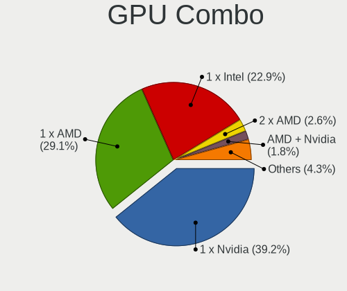

| Name                     | Desktops | Percent |
|--------------------------|----------|---------|
| 1 x Nvidia               | 730      | 39.23%  |
| 1 x AMD                  | 542      | 29.12%  |
| 1 x Intel                | 427      | 22.94%  |
| 2 x AMD                  | 48       | 2.58%   |
| AMD + Nvidia             | 34       | 1.83%   |
| Intel + Nvidia           | 32       | 1.72%   |
| Intel + AMD              | 12       | 0.64%   |
| 2 x Nvidia               | 11       | 0.59%   |
| Other                    | 5        | 0.27%   |
| 1 x Matrox               | 4        | 0.21%   |
| 1 x ASPEED               | 4        | 0.21%   |
| 2 x Intel                | 2        | 0.11%   |
| 1 x VIA                  | 2        | 0.11%   |
| Nvidia + ASPEED          | 2        | 0.11%   |
| Intel + AMD + 1 x Nvidia | 2        | 0.11%   |
| 1 x Red Hat              | 1        | 0.05%   |
| Nvidia + Matrox          | 1        | 0.05%   |
| Intel + 2 x AMD          | 1        | 0.05%   |
| AMD + Matrox             | 1        | 0.05%   |

GPU Driver
----------

Free vs proprietary

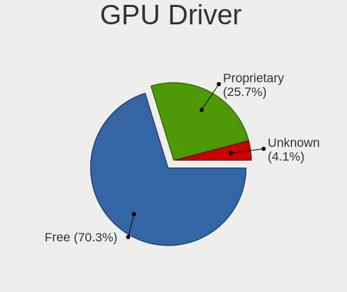

| Driver      | Desktops | Percent |
|-------------|----------|---------|
| Free        | 1320     | 70.25%  |
| Proprietary | 482      | 25.65%  |
| Unknown     | 77       | 4.1%    |

GPU Memory
----------

Total video memory

| Size in GB | Desktops | Percent |
|------------|----------|---------|
| Unknown    | 805      | 42.12%  |
| 1.01-2.0   | 246      | 12.87%  |
| 0.51-1.0   | 197      | 10.31%  |
| 0.01-0.5   | 180      | 9.42%   |
| 7.01-8.0   | 177      | 9.26%   |
| 3.01-4.0   | 141      | 7.38%   |
| 5.01-6.0   | 67       | 3.51%   |
| 8.01-16.0  | 64       | 3.35%   |
| 2.01-3.0   | 18       | 0.94%   |
| 16.01-24.0 | 16       | 0.84%   |

Monitor
-------

Monitor Vendor
--------------

Monitor vendors

| Vendor               | Desktops | Percent |
|----------------------|----------|---------|
| Samsung Electronics  | 310      | 15.48%  |
| Philips              | 192      | 9.59%   |
| Goldstar             | 188      | 9.39%   |
| Dell                 | 185      | 9.24%   |
| Iiyama               | 174      | 8.69%   |
| Acer                 | 140      | 6.99%   |
| Hewlett-Packard      | 127      | 6.34%   |
| AOC                  | 97       | 4.84%   |
| BenQ                 | 82       | 4.09%   |
| Ancor Communications | 56       | 2.8%    |
| Medion               | 32       | 1.6%    |
| Idek Iiyama          | 29       | 1.45%   |
| ASUSTek Computer     | 29       | 1.45%   |
| Sony                 | 27       | 1.35%   |
| LG Electronics       | 22       | 1.1%    |
| MSI                  | 21       | 1.05%   |
| Eizo                 | 21       | 1.05%   |
| Lenovo               | 19       | 0.95%   |
| Unknown              | 16       | 0.8%    |
| Gigabyte Technology  | 15       | 0.75%   |
| Fujitsu Siemens      | 15       | 0.75%   |
| Packard Bell         | 11       | 0.55%   |
| ViewSonic            | 10       | 0.5%    |
| NEC Computers        | 10       | 0.5%    |
| Vestel Elektronik    | 9        | 0.45%   |
| Panasonic            | 7        | 0.35%   |
| Belinea              | 7        | 0.35%   |
| Toshiba              | 6        | 0.3%    |
| HannStar             | 6        | 0.3%    |
| Sharp                | 5        | 0.25%   |
| Marantz              | 5        | 0.25%   |
| DENON                | 5        | 0.25%   |
| Unknown              | 5        | 0.25%   |
| MStar                | 4        | 0.2%    |
| MGW                  | 4        | 0.2%    |
| Wacom                | 3        | 0.15%   |
| Valve                | 3        | 0.15%   |
| RIS                  | 3        | 0.15%   |
| HJW                  | 3        | 0.15%   |
| FUS                  | 3        | 0.15%   |

Monitor Model
-------------

Monitor models

| Model                                                                 | Desktops | Percent |
|-----------------------------------------------------------------------|----------|---------|
| Goldstar Ultra HD GSM5B09 3840x2160 600x340mm 27.2-inch               | 12       | 0.55%   |
| Philips PHL 243V5 PHLC0D1 1920x1080 521x293mm 23.5-inch               | 11       | 0.51%   |
| Goldstar ULTRAWIDE GSM59F1 2560x1080 677x290mm 29.0-inch              | 10       | 0.46%   |
| Vestel Elektronik 49FHD_LCD_TV VES3700 1920x1080 1280x720mm 57.8-inch | 9        | 0.41%   |
| Goldstar HDR 4K GSM7706 3840x2160 600x340mm 27.2-inch                 | 9        | 0.41%   |
| AOC Q27G2WG4 AOC2702 2560x1440 597x336mm 27.0-inch                    | 9        | 0.41%   |
| Philips PHL 240V5A PHLC10C 1920x1080 530x300mm 24.0-inch              | 8        | 0.37%   |
| Philips PHL 223V5 PHLC0CF 1920x1080 480x270mm 21.7-inch               | 8        | 0.37%   |
| AOC Q3279WG5B AOC3279 2560x1440 725x428mm 33.1-inch                   | 8        | 0.37%   |
| AOC 27G1G4 AOC2701 1920x1080 598x336mm 27.0-inch                      | 8        | 0.37%   |
| Philips PHL 276E8V PHLC18F 3840x2160 600x340mm 27.2-inch              | 7        | 0.32%   |
| Iiyama PL2530H IVM6132 1920x1080 544x303mm 24.5-inch                  | 7        | 0.32%   |
| Goldstar ULTRAGEAR GSM5BD3 2560x1440 697x392mm 31.5-inch              | 7        | 0.32%   |
| Dell U2412M DELA07A 1920x1200 518x324mm 24.1-inch                     | 7        | 0.32%   |
| Samsung Electronics C27F390 SAM0D32 1920x1080 600x340mm 27.2-inch     | 6        | 0.28%   |
| Philips PHL 273V7 PHLC156 1920x1080 598x336mm 27.0-inch               | 6        | 0.28%   |
| Philips PHL 243V7 PHLC155 1920x1080 527x296mm 23.8-inch               | 6        | 0.28%   |
| Philips PHL 240V5 PHLC10A 1920x1080 527x296mm 23.8-inch               | 6        | 0.28%   |
| Iiyama PL2492H IVM612F 1920x1080 527x296mm 23.8-inch                  | 6        | 0.28%   |
| Hewlett-Packard L1740 HWP2649 1280x1024 337x270mm 17.0-inch           | 6        | 0.28%   |
| Goldstar IPS237 GSM5901 1920x1080 510x290mm 23.1-inch                 | 6        | 0.28%   |
| Goldstar IPS FULLHD GSM5AB8 1920x1080 480x270mm 21.7-inch             | 6        | 0.28%   |
| Goldstar HDR 4K GSM7707 3840x2160 600x340mm 27.2-inch                 | 6        | 0.28%   |
| AOC 24G1WG4 AOC2401 1920x1080 520x290mm 23.4-inch                     | 6        | 0.28%   |
| Acer AL1716A ACRAD46 1280x1024 338x270mm 17.0-inch                    | 6        | 0.28%   |
| Samsung Electronics LU28R55 SAM1017 3840x2160 632x360mm 28.6-inch     | 5        | 0.23%   |
| Samsung Electronics LCD Monitor SAM0B7C 1920x1080 886x498mm 40.0-inch | 5        | 0.23%   |
| Samsung Electronics LCD Monitor SAM03BC 1920x1080                     | 5        | 0.23%   |
| Philips FTV PHL04C3 1920x1080 1440x810mm 65.0-inch                    | 5        | 0.23%   |
| Philips FTV PHL01EA 1920x1080 1440x810mm 65.0-inch                    | 5        | 0.23%   |
| Iiyama PL2409HD IVM560C 1920x1080 521x293mm 23.5-inch                 | 5        | 0.23%   |
| Dell U2414H DELA0A4 1920x1080 527x296mm 23.8-inch                     | 5        | 0.23%   |
| Unknown                                                               | 5        | 0.23%   |
| Unknown LCD Monitor FFFF 2288x1287 2550x2550mm 142.0-inch             | 4        | 0.18%   |
| Samsung Electronics SyncMaster SAM021C 1400x1050 408x300mm 19.9-inch  | 4        | 0.18%   |
| Samsung Electronics S24R65x SAM1023 1920x1080 527x296mm 23.8-inch     | 4        | 0.18%   |
| Samsung Electronics S24F350 SAM0D20 1920x1080 521x293mm 23.5-inch     | 4        | 0.18%   |
| Samsung Electronics S24B350 SAM08DA 1920x1080 530x300mm 24.0-inch     | 4        | 0.18%   |
| Samsung Electronics LCD Monitor SAM0509 1920x1080                     | 4        | 0.18%   |
| Samsung Electronics C24F390 SAM0D2C 1920x1080 521x293mm 23.5-inch     | 4        | 0.18%   |

Monitor Resolution
------------------

Monitor screen resolution

| Resolution         | Desktops | Percent |
|--------------------|----------|---------|
| 1920x1080 (FHD)    | 834      | 42.23%  |
| 3840x2160 (4K)     | 213      | 10.78%  |
| 2560x1440 (QHD)    | 195      | 9.87%   |
| 1280x1024 (SXGA)   | 137      | 6.94%   |
| 1680x1050 (WSXGA+) | 133      | 6.73%   |
| 1920x1200 (WUXGA)  | 66       | 3.34%   |
| 3440x1440          | 63       | 3.19%   |
| Unknown            | 51       | 2.58%   |
| 1440x900 (WXGA+)   | 44       | 2.23%   |
| 2560x1080          | 37       | 1.87%   |
| 3840x1080          | 28       | 1.42%   |
| 1366x768 (WXGA)    | 25       | 1.27%   |
| 1360x768           | 23       | 1.16%   |
| 1600x900 (HD+)     | 14       | 0.71%   |
| 1024x768 (XGA)     | 14       | 0.71%   |
| 1920x540           | 9        | 0.46%   |
| 1600x1200          | 9        | 0.46%   |
| 1400x1050          | 7        | 0.35%   |
| 3840x1600          | 6        | 0.3%    |
| 2048x1152          | 6        | 0.3%    |
| 1280x720 (HD)      | 6        | 0.3%    |
| 3840x1200          | 5        | 0.25%   |
| 2560x1600          | 5        | 0.25%   |
| 2288x1287          | 5        | 0.25%   |
| 7680x2160          | 4        | 0.2%    |
| 5760x1080          | 4        | 0.2%    |
| 3600x1080          | 4        | 0.2%    |
| 5760x2160          | 3        | 0.15%   |
| 1280x960           | 3        | 0.15%   |
| 4480x1440          | 2        | 0.1%    |
| 1920x1440          | 2        | 0.1%    |
| 1280x800 (WXGA)    | 2        | 0.1%    |
| 6400x2160          | 1        | 0.05%   |
| 6400x1440          | 1        | 0.05%   |
| 5760x1200          | 1        | 0.05%   |
| 5520x2160          | 1        | 0.05%   |
| 5120x1440          | 1        | 0.05%   |
| 4608x1440          | 1        | 0.05%   |
| 3600x1200          | 1        | 0.05%   |
| 3200x1080          | 1        | 0.05%   |

Monitor Diagonal
----------------

Diagonal size in inches

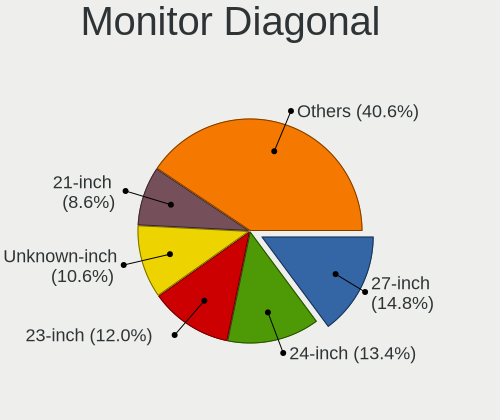

| Inches  | Desktops | Percent |
|---------|----------|---------|
| 27      | 298      | 14.85%  |
| 24      | 269      | 13.4%   |
| 23      | 240      | 11.96%  |
| Unknown | 213      | 10.61%  |
| 21      | 172      | 8.57%   |
| 19      | 106      | 5.28%   |
| 22      | 95       | 4.73%   |
| 31      | 88       | 4.38%   |
| 34      | 78       | 3.89%   |
| 17      | 71       | 3.54%   |
| 20      | 50       | 2.49%   |
| 18      | 33       | 1.64%   |
| 84      | 32       | 1.59%   |
| 40      | 27       | 1.35%   |
| 25      | 26       | 1.3%    |
| 72      | 24       | 1.2%    |
| 15      | 20       | 1%      |
| 65      | 16       | 0.8%    |
| 32      | 14       | 0.7%    |
| 28      | 14       | 0.7%    |
| 33      | 12       | 0.6%    |
| 26      | 9        | 0.45%   |
| 29      | 8        | 0.4%    |
| 54      | 7        | 0.35%   |
| 49      | 7        | 0.35%   |
| 37      | 7        | 0.35%   |
| 39      | 6        | 0.3%    |
| 35      | 6        | 0.3%    |
| 58      | 5        | 0.25%   |
| 52      | 5        | 0.25%   |
| 48      | 5        | 0.25%   |
| 43      | 5        | 0.25%   |
| 142     | 4        | 0.2%    |
| 46      | 4        | 0.2%    |
| 42      | 4        | 0.2%    |
| 12      | 3        | 0.15%   |
| 60      | 2        | 0.1%    |
| 57      | 2        | 0.1%    |
| 47      | 2        | 0.1%    |
| 41      | 2        | 0.1%    |

Monitor Width
-------------

Physical width

| Width in mm    | Desktops | Percent |
|----------------|----------|---------|
| 501-600        | 761      | 39.21%  |
| 401-500        | 378      | 19.47%  |
| Unknown        | 213      | 10.97%  |
| 601-700        | 134      | 6.9%    |
| 701-800        | 104      | 5.36%   |
| 301-350        | 89       | 4.59%   |
| 351-400        | 75       | 3.86%   |
| 1501-2000      | 59       | 3.04%   |
| 1001-1500      | 59       | 3.04%   |
| 801-900        | 46       | 2.37%   |
| 901-1000       | 13       | 0.67%   |
| 201-300        | 6        | 0.31%   |
| More than 2000 | 4        | 0.21%   |

Aspect Ratio
------------

Proportional relationship between the width and the height

| Ratio   | Desktops | Percent |
|---------|----------|---------|
| 16/9    | 1114     | 60.31%  |
| 16/10   | 256      | 13.86%  |
| Unknown | 177      | 9.58%   |
| 5/4     | 129      | 6.98%   |
| 21/9    | 100      | 5.41%   |
| 4/3     | 36       | 1.95%   |
| 32/9    | 14       | 0.76%   |
| 3/2     | 8        | 0.43%   |
| 6/5     | 7        | 0.38%   |
| 1.00    | 4        | 0.22%   |
| 0.89    | 1        | 0.05%   |
| 0.80    | 1        | 0.05%   |

Monitor Area
------------

Area in inch

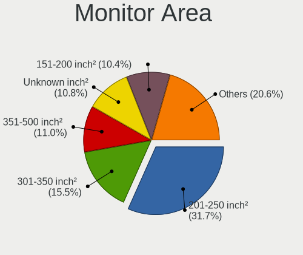

| Area in inch | Desktops | Percent |
|----------------|----------|---------|
| 201-250        | 625      | 31.69%  |
| 301-350        | 306      | 15.52%  |
| 351-500        | 217      | 11%     |
| Unknown        | 213      | 10.8%   |
| 151-200        | 205      | 10.4%   |
| 251-300        | 116      | 5.88%   |
| More than 1000 | 102      | 5.17%   |
| 141-150        | 90       | 4.56%   |
| 501-1000       | 70       | 3.55%   |
| 101-110        | 17       | 0.86%   |
| 71-80          | 4        | 0.2%    |
| 111-120        | 4        | 0.2%    |
| 81-90          | 1        | 0.05%   |
| 131-140        | 1        | 0.05%   |
| 91-100         | 1        | 0.05%   |

Pixel Density
-------------

Pixels per inch

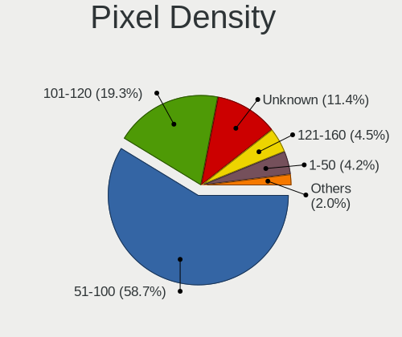

| Density       | Desktops | Percent |
|---------------|----------|---------|
| 51-100        | 1101     | 58.72%  |
| 101-120       | 362      | 19.31%  |
| Unknown       | 213      | 11.36%  |
| 121-160       | 84       | 4.48%   |
| 1-50          | 78       | 4.16%   |
| 161-240       | 36       | 1.92%   |
| More than 240 | 1        | 0.05%   |

Multiple Monitors
-----------------

Total monitors connected

| Total | Desktops | Percent |
|-------|----------|---------|
| 1     | 1435     | 76.33%  |
| 2     | 325      | 17.29%  |
| 0     | 78       | 4.15%   |
| 3     | 39       | 2.07%   |
| 4     | 3        | 0.16%   |

Network
-------

Net Controller Vendor
---------------------

Controller vendors

| Vendor                                | Desktops | Percent |
|---------------------------------------|----------|---------|
| Realtek Semiconductor                 | 1106     | 43.24%  |
| Intel                                 | 780      | 30.49%  |
| Qualcomm Atheros                      | 130      | 5.08%   |
| Broadcom                              | 79       | 3.09%   |
| Ralink Technology                     | 59       | 2.31%   |
| TP-Link                               | 56       | 2.19%   |
| MediaTek                              | 44       | 1.72%   |
| Ralink                                | 29       | 1.13%   |
| Nvidia                                | 27       | 1.06%   |
| Marvell Technology Group              | 21       | 0.82%   |
| Microsoft                             | 19       | 0.74%   |
| Broadcom Limited                      | 15       | 0.59%   |
| Aquantia                              | 15       | 0.59%   |
| Sitecom Europe                        | 14       | 0.55%   |
| IMC Networks                          | 14       | 0.55%   |
| NetGear                               | 12       | 0.47%   |
| ASUSTek Computer                      | 9        | 0.35%   |
| Samsung Electronics                   | 8        | 0.31%   |
| Qualcomm Atheros Communications       | 6        | 0.23%   |
| Huawei Technologies                   | 6        | 0.23%   |
| Gemtek                                | 6        | 0.23%   |
| Belkin Components                     | 6        | 0.23%   |
| Edimax Technology                     | 5        | 0.2%    |
| 802.11g Adapter [Linksys WUSB54GC v3] | 5        | 0.2%    |
| U-Blox                                | 4        | 0.16%   |
| Mellanox Technologies                 | 4        | 0.16%   |
| Linksys                               | 4        | 0.16%   |
| D-Link                                | 4        | 0.16%   |
| Xiaomi                                | 3        | 0.12%   |
| VIA Technologies                      | 3        | 0.12%   |
| ULi Electronics                       | 3        | 0.12%   |
| DisplayLink                           | 3        | 0.12%   |
| D-Link System                         | 3        | 0.12%   |
| ASIX Electronics                      | 3        | 0.12%   |
| 3Com                                  | 3        | 0.12%   |
| Wilocity                              | 2        | 0.08%   |
| Sundance Technology Inc / IC Plus     | 2        | 0.08%   |
| OnePlus Technology (Shenzhen)         | 2        | 0.08%   |
| Motorola PCS                          | 2        | 0.08%   |
| Microchip Technology                  | 2        | 0.08%   |

Net Controller Model
--------------------

Controller models

| Model                                                                  | Desktops | Percent |
|------------------------------------------------------------------------|----------|---------|
| Realtek RTL8111/8168/8211/8411 PCI Express Gigabit Ethernet Controller | 874      | 30.52%  |
| Realtek RTL8125 2.5GbE Controller                                      | 125      | 4.36%   |
| Intel I211 Gigabit Network Connection                                  | 117      | 4.09%   |
| Intel Wi-Fi 6 AX200                                                    | 78       | 2.72%   |
| Intel Ethernet Connection (2) I219-V                                   | 77       | 2.69%   |
| Intel 82579LM Gigabit Network Connection (Lewisville)                  | 75       | 2.62%   |
| Intel Ethernet Controller I225-V                                       | 61       | 2.13%   |
| Intel Ethernet Connection I217-LM                                      | 43       | 1.5%    |
| Intel 82579V Gigabit Network Connection                                | 37       | 1.29%   |
| Intel Ethernet Connection (7) I219-V                                   | 30       | 1.05%   |
| Intel Dual Band Wireless-AC 3168NGW [Stone Peak]                       | 29       | 1.01%   |
| Intel 82567LM-3 Gigabit Network Connection                             | 28       | 0.98%   |
| Intel Ethernet Connection I217-V                                       | 25       | 0.87%   |
| Realtek RTL-8100/8101L/8139 PCI Fast Ethernet Adapter                  | 24       | 0.84%   |
| Intel Wi-Fi 6E(802.11ax) AX210/AX1675* 2x2 [Typhoon Peak]              | 24       | 0.84%   |
| Realtek RTL8153 Gigabit Ethernet Adapter                               | 22       | 0.77%   |
| Realtek RTL810xE PCI Express Fast Ethernet controller                  | 22       | 0.77%   |
| MediaTek MT7922 802.11ax PCI Express Wireless Network Adapter          | 22       | 0.77%   |
| Qualcomm Atheros Killer E220x Gigabit Ethernet Controller              | 21       | 0.73%   |
| Intel 82566DM-2 Gigabit Network Connection                             | 20       | 0.7%    |
| Intel 82574L Gigabit Network Connection                                | 19       | 0.66%   |
| Broadcom BCM4360 802.11ac Dual Band Wireless Network Adapter           | 19       | 0.66%   |
| Intel Wi-Fi 5(802.11ac) Wireless-AC 9x6x [Thunder Peak]                | 18       | 0.63%   |
| Ralink RT5370 Wireless Adapter                                         | 17       | 0.59%   |
| TP-Link TL-WN823N v2/v3 [Realtek RTL8192EU]                            | 16       | 0.56%   |
| Intel Ethernet Connection (2) I218-V                                   | 16       | 0.56%   |
| Microsoft Xbox Wireless Adapter for Windows                            | 15       | 0.52%   |
| MediaTek MT7921K (RZ608) Wi-Fi 6E 80MHz                                | 15       | 0.52%   |
| Realtek RTL8188CUS 802.11n WLAN Adapter                                | 14       | 0.49%   |
| Nvidia MCP61 Ethernet                                                  | 13       | 0.45%   |
| Intel Wireless 7265                                                    | 13       | 0.45%   |
| Intel Cannon Lake PCH CNVi WiFi                                        | 13       | 0.45%   |
| Realtek RTL8821CE 802.11ac PCIe Wireless Network Adapter               | 12       | 0.42%   |
| Ralink MT7601U Wireless Adapter                                        | 12       | 0.42%   |
| Marvell Group 88E8056 PCI-E Gigabit Ethernet Controller                | 12       | 0.42%   |
| Intel I210 Gigabit Network Connection                                  | 12       | 0.42%   |
| Realtek RTL8188EUS 802.11n Wireless Network Adapter                    | 11       | 0.38%   |
| Ralink RT2870/RT3070 Wireless Adapter                                  | 11       | 0.38%   |
| Qualcomm Atheros AR8151 v2.0 Gigabit Ethernet                          | 11       | 0.38%   |
| Qualcomm Atheros AR8121/AR8113/AR8114 Gigabit or Fast Ethernet         | 11       | 0.38%   |

Wireless Vendor
---------------

Wireless vendors

| Vendor                                | Desktops | Percent |
|---------------------------------------|----------|---------|
| Intel                                 | 241      | 31.1%   |
| Realtek Semiconductor                 | 141      | 18.19%  |
| Qualcomm Atheros                      | 65       | 8.39%   |
| Ralink Technology                     | 59       | 7.61%   |
| TP-Link                               | 53       | 6.84%   |
| Broadcom                              | 34       | 4.39%   |
| Ralink                                | 29       | 3.74%   |
| MediaTek                              | 29       | 3.74%   |
| Microsoft                             | 19       | 2.45%   |
| Sitecom Europe                        | 14       | 1.81%   |
| IMC Networks                          | 14       | 1.81%   |
| NetGear                               | 12       | 1.55%   |
| ASUSTek Computer                      | 9        | 1.16%   |
| Qualcomm Atheros Communications       | 6        | 0.77%   |
| Gemtek                                | 6        | 0.77%   |
| Belkin Components                     | 6        | 0.77%   |
| Edimax Technology                     | 5        | 0.65%   |
| Broadcom Limited                      | 5        | 0.65%   |
| 802.11g Adapter [Linksys WUSB54GC v3] | 5        | 0.65%   |
| Linksys                               | 4        | 0.52%   |
| D-Link                                | 4        | 0.52%   |
| Wilocity                              | 2        | 0.26%   |
| D-Link System                         | 2        | 0.26%   |
| CyberTAN Technology                   | 2        | 0.26%   |
| AVM                                   | 2        | 0.26%   |
| ZyXEL Communications                  | 1        | 0.13%   |
| Tenda                                 | 1        | 0.13%   |
| Senao                                 | 1        | 0.13%   |
| Samsung Electronics                   | 1        | 0.13%   |
| Sagem                                 | 1        | 0.13%   |
| Dell                                  | 1        | 0.13%   |
| Cinterion                             | 1        | 0.13%   |

Wireless Model
--------------

Wireless models

| Model                                                          | Desktops | Percent |
|----------------------------------------------------------------|----------|---------|
| Intel Wi-Fi 6 AX200                                            | 78       | 9.99%   |
| Intel Dual Band Wireless-AC 3168NGW [Stone Peak]               | 29       | 3.71%   |
| Intel Wi-Fi 6E(802.11ax) AX210/AX1675* 2x2 [Typhoon Peak]      | 24       | 3.07%   |
| Broadcom BCM4360 802.11ac Dual Band Wireless Network Adapter   | 19       | 2.43%   |
| Intel Wi-Fi 5(802.11ac) Wireless-AC 9x6x [Thunder Peak]        | 18       | 2.3%    |
| Ralink RT5370 Wireless Adapter                                 | 17       | 2.18%   |
| TP-Link TL-WN823N v2/v3 [Realtek RTL8192EU]                    | 16       | 2.05%   |
| Microsoft Xbox Wireless Adapter for Windows                    | 15       | 1.92%   |
| MediaTek MT7921K (RZ608) Wi-Fi 6E 80MHz                        | 15       | 1.92%   |
| Realtek RTL8188CUS 802.11n WLAN Adapter                        | 14       | 1.79%   |
| Intel Wireless 7265                                            | 13       | 1.66%   |
| Intel Cannon Lake PCH CNVi WiFi                                | 13       | 1.66%   |
| Realtek RTL8821CE 802.11ac PCIe Wireless Network Adapter       | 12       | 1.54%   |
| Ralink MT7601U Wireless Adapter                                | 12       | 1.54%   |
| Realtek RTL8188EUS 802.11n Wireless Network Adapter            | 11       | 1.41%   |
| Ralink RT2870/RT3070 Wireless Adapter                          | 11       | 1.41%   |
| IMC Networks Mediao 802.11n WLAN [Realtek RTL8191SU]           | 11       | 1.41%   |
| MediaTek MT7922 802.11ax PCI Express Wireless Network Adapter  | 10       | 1.28%   |
| Intel Wireless 3165                                            | 10       | 1.28%   |
| Realtek RTL8192CU 802.11n WLAN Adapter                         | 9        | 1.15%   |
| Ralink MT7610U ("Archer T2U" 2.4G+5G WLAN Adapter              | 9        | 1.15%   |
| Qualcomm Atheros AR9227 Wireless Network Adapter               | 9        | 1.15%   |
| Intel Raptor Lake-S PCH CNVi WiFi                              | 9        | 1.15%   |
| Intel Alder Lake-S PCH CNVi WiFi                               | 9        | 1.15%   |
| TP-Link Archer T3U [Realtek RTL8812BU]                         | 8        | 1.02%   |
| Realtek RTL8822BE 802.11a/b/g/n/ac WiFi adapter                | 8        | 1.02%   |
| Ralink RT3090 Wireless 802.11n 1T/1R PCIe                      | 8        | 1.02%   |
| Qualcomm Atheros AR9462 Wireless Network Adapter               | 8        | 1.02%   |
| Qualcomm Atheros AR93xx Wireless Network Adapter               | 8        | 1.02%   |
| Realtek RTL88x2bu [AC1200 Techkey]                             | 7        | 0.9%    |
| Realtek 802.11ac NIC                                           | 7        | 0.9%    |
| Ralink RT2790 Wireless 802.11n 1T/2R PCIe                      | 7        | 0.9%    |
| Intel Wireless 7260                                            | 7        | 0.9%    |
| Realtek RTL8852CE PCIe 802.11ax Wireless Network Controller    | 6        | 0.77%   |
| Realtek RTL8192EU 802.11b/g/n WLAN Adapter                     | 6        | 0.77%   |
| Qualcomm Atheros QCA6174 802.11ac Wireless Network Adapter     | 6        | 0.77%   |
| Qualcomm Atheros AR9285 Wireless Network Adapter (PCI-Express) | 6        | 0.77%   |
| Intel Wireless 8260                                            | 6        | 0.77%   |
| Gemtek WUBR-177G [Ralink RT2571W]                              | 6        | 0.77%   |
| TP-Link Archer T4U ver.3                                       | 5        | 0.64%   |

Ethernet Vendor
---------------

Ethernet vendors

| Vendor                            | Desktops | Percent |
|-----------------------------------|----------|---------|
| Realtek Semiconductor             | 1065     | 53.68%  |
| Intel                             | 661      | 33.32%  |
| Qualcomm Atheros                  | 72       | 3.63%   |
| Broadcom                          | 47       | 2.37%   |
| Nvidia                            | 27       | 1.36%   |
| Marvell Technology Group          | 21       | 1.06%   |
| Aquantia                          | 15       | 0.76%   |
| MediaTek                          | 13       | 0.66%   |
| Broadcom Limited                  | 10       | 0.5%    |
| Samsung Electronics               | 5        | 0.25%   |
| Huawei Technologies               | 5        | 0.25%   |
| Mellanox Technologies             | 4        | 0.2%    |
| Xiaomi                            | 3        | 0.15%   |
| VIA Technologies                  | 3        | 0.15%   |
| TP-Link                           | 3        | 0.15%   |
| DisplayLink                       | 3        | 0.15%   |
| ASIX Electronics                  | 3        | 0.15%   |
| 3Com                              | 3        | 0.15%   |
| ULi Electronics                   | 2        | 0.1%    |
| Sundance Technology Inc / IC Plus | 2        | 0.1%    |
| Motorola PCS                      | 2        | 0.1%    |
| JMicron Technology                | 2        | 0.1%    |
| Google                            | 2        | 0.1%    |
| Emulex                            | 2        | 0.1%    |
| Accton Technology                 | 2        | 0.1%    |
| Qualcomm                          | 1        | 0.05%   |
| OPPO Electronics                  | 1        | 0.05%   |
| Lenovo                            | 1        | 0.05%   |
| ICS Advent                        | 1        | 0.05%   |
| D-Link System                     | 1        | 0.05%   |
| American Megatrends               | 1        | 0.05%   |
| Unknown                           | 1        | 0.05%   |

Ethernet Model
--------------

Ethernet models

| Model                                                                           | Desktops | Percent |
|---------------------------------------------------------------------------------|----------|---------|
| Realtek RTL8111/8168/8211/8411 PCI Express Gigabit Ethernet Controller          | 874      | 42.59%  |
| Realtek RTL8125 2.5GbE Controller                                               | 125      | 6.09%   |
| Intel I211 Gigabit Network Connection                                           | 117      | 5.7%    |
| Intel Ethernet Connection (2) I219-V                                            | 77       | 3.75%   |
| Intel 82579LM Gigabit Network Connection (Lewisville)                           | 75       | 3.65%   |
| Intel Ethernet Controller I225-V                                                | 61       | 2.97%   |
| Intel Ethernet Connection I217-LM                                               | 43       | 2.1%    |
| Intel 82579V Gigabit Network Connection                                         | 37       | 1.8%    |
| Intel Ethernet Connection (7) I219-V                                            | 30       | 1.46%   |
| Intel 82567LM-3 Gigabit Network Connection                                      | 28       | 1.36%   |
| Intel Ethernet Connection I217-V                                                | 25       | 1.22%   |
| Realtek RTL-8100/8101L/8139 PCI Fast Ethernet Adapter                           | 24       | 1.17%   |
| Realtek RTL8153 Gigabit Ethernet Adapter                                        | 22       | 1.07%   |
| Realtek RTL810xE PCI Express Fast Ethernet controller                           | 22       | 1.07%   |
| Qualcomm Atheros Killer E220x Gigabit Ethernet Controller                       | 21       | 1.02%   |
| Intel 82566DM-2 Gigabit Network Connection                                      | 20       | 0.97%   |
| Intel 82574L Gigabit Network Connection                                         | 19       | 0.93%   |
| Intel Ethernet Connection (2) I218-V                                            | 16       | 0.78%   |
| Nvidia MCP61 Ethernet                                                           | 13       | 0.63%   |
| MediaTek MT7922 802.11ax PCI Express Wireless Network Adapter                   | 12       | 0.58%   |
| Marvell Group 88E8056 PCI-E Gigabit Ethernet Controller                         | 12       | 0.58%   |
| Intel I210 Gigabit Network Connection                                           | 12       | 0.58%   |
| Qualcomm Atheros AR8151 v2.0 Gigabit Ethernet                                   | 11       | 0.54%   |
| Qualcomm Atheros AR8121/AR8113/AR8114 Gigabit or Fast Ethernet                  | 11       | 0.54%   |
| Intel Ethernet Connection (5) I219-LM                                           | 10       | 0.49%   |
| Intel Ethernet Connection (2) I219-LM                                           | 10       | 0.49%   |
| Intel 82578DM Gigabit Network Connection                                        | 10       | 0.49%   |
| Qualcomm Atheros Attansic L1 Gigabit Ethernet                                   | 9        | 0.44%   |
| Intel NM10/ICH7 Family LAN Controller                                           | 9        | 0.44%   |
| Aquantia AQtion AQC113CS NBase-T/IEEE 802.3an Ethernet Controller [Antigua 10G] | 9        | 0.44%   |
| Broadcom NetXtreme BCM5761 Gigabit Ethernet PCIe                                | 8        | 0.39%   |
| Realtek RTL8169 PCI Gigabit Ethernet Controller                                 | 7        | 0.34%   |
| Intel Ethernet Connection (2) I218-LM                                           | 6        | 0.29%   |
| Intel Ethernet Connection (14) I219-V                                           | 6        | 0.29%   |
| Intel Ethernet Connection (11) I219-V                                           | 6        | 0.29%   |
| Intel 82583V Gigabit Network Connection                                         | 6        | 0.29%   |
| Broadcom NetXtreme BCM5764M Gigabit Ethernet PCIe                               | 6        | 0.29%   |
| Samsung Galaxy series, misc. (tethering mode)                                   | 5        | 0.24%   |
| Realtek Killer E3000 2.5GbE Controller                                          | 5        | 0.24%   |
| Qualcomm Atheros Killer E2400 Gigabit Ethernet Controller                       | 5        | 0.24%   |

Net Controller Kind
-------------------

Ethernet, WiFi or modem

| Kind     | Desktops | Percent |
|----------|----------|---------|
| Ethernet | 1823     | 70.96%  |
| WiFi     | 716      | 27.87%  |
| Modem    | 22       | 0.86%   |
| Unknown  | 8        | 0.31%   |

Used Controller
---------------

Currently used network controller

| Kind     | Desktops | Percent |
|----------|----------|---------|
| Ethernet | 1572     | 82.22%  |
| WiFi     | 339      | 17.73%  |
| Unknown  | 1        | 0.05%   |

NICs
----

Total network controllers on board

| Total | Desktops | Percent |
|-------|----------|---------|
| 1     | 1206     | 65.4%   |
| 2     | 536      | 29.07%  |
| 3     | 74       | 4.01%   |
| 0     | 9        | 0.49%   |
| 4     | 8        | 0.43%   |
| 5     | 5        | 0.27%   |
| 6     | 3        | 0.16%   |
| 7     | 2        | 0.11%   |
| 8     | 1        | 0.05%   |

IPv6
----

IPv6 vs IPv4

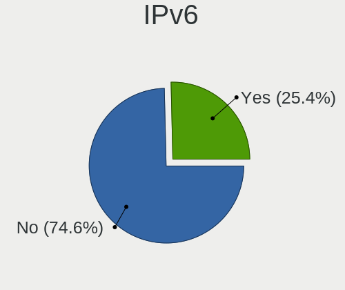

| Used | Desktops | Percent |
|------|----------|---------|
| No   | 1406     | 74.63%  |
| Yes  | 478      | 25.37%  |

Bluetooth
---------

Bluetooth Vendor
----------------

Controller vendors

| Vendor                          | Desktops | Percent |
|---------------------------------|----------|---------|
| Intel                           | 232      | 35.91%  |
| Cambridge Silicon Radio         | 195      | 30.19%  |
| Realtek Semiconductor           | 49       | 7.59%   |
| ASUSTek Computer                | 42       | 6.5%    |
| MediaTek                        | 25       | 3.87%   |
| Qualcomm Atheros Communications | 17       | 2.63%   |
| IMC Networks                    | 14       | 2.17%   |
| Foxconn / Hon Hai               | 14       | 2.17%   |
| Broadcom                        | 12       | 1.86%   |
| TP-Link                         | 11       | 1.7%    |
| Apple                           | 8        | 1.24%   |
| Lite-On Technology              | 7        | 1.08%   |
| Realtek                         | 4        | 0.62%   |
| Integrated System Solution      | 2        | 0.31%   |
| Dell                            | 2        | 0.31%   |
| Actions                         | 2        | 0.31%   |
| Unknown                         | 2        | 0.31%   |
| Sitecom Europe                  | 1        | 0.15%   |
| Roper                           | 1        | 0.15%   |
| Ralink                          | 1        | 0.15%   |
| Micro Star International        | 1        | 0.15%   |
| Logitech                        | 1        | 0.15%   |
| Hewlett-Packard                 | 1        | 0.15%   |
| Edimax Technology               | 1        | 0.15%   |
| Belkin Components               | 1        | 0.15%   |

Bluetooth Model
---------------

Controller models

| Model                                                 | Desktops | Percent |
|-------------------------------------------------------|----------|---------|
| Cambridge Silicon Radio Bluetooth Dongle (HCI mode)   | 195      | 30.14%  |
| Intel AX200 Bluetooth                                 | 69       | 10.66%  |
| Intel Bluetooth wireless interface                    | 43       | 6.65%   |
| Realtek Bluetooth Radio                               | 35       | 5.41%   |
| Intel Wireless-AC 3168 Bluetooth                      | 30       | 4.64%   |
| MediaTek Wireless_Device                              | 25       | 3.86%   |
| Intel AX210 Bluetooth                                 | 25       | 3.86%   |
| Intel Wireless-AC 9260 Bluetooth Adapter              | 18       | 2.78%   |
| Intel Bluetooth 9460/9560 Jefferson Peak (JfP)        | 18       | 2.78%   |
| Intel AX201 Bluetooth                                 | 16       | 2.47%   |
| Foxconn / Hon Hai Wireless_Device                     | 14       | 2.16%   |
| ASUS Broadcom BCM20702A0 Bluetooth                    | 14       | 2.16%   |
| TP-Link TP-Link Bluetooth USB Adapter                 | 11       | 1.7%    |
| Qualcomm Atheros AR3011 Bluetooth                     | 11       | 1.7%    |
| Intel AX211 Bluetooth                                 | 11       | 1.7%    |
| ASUS ASUS USB-BT500                                   | 9        | 1.39%   |
| Lite-On Bluetooth Device                              | 6        | 0.93%   |
| ASUS Bluetooth Radio                                  | 6        | 0.93%   |
| Realtek  Bluetooth 4.2 Adapter                        | 5        | 0.77%   |
| IMC Networks Bluetooth Radio                          | 5        | 0.77%   |
| Realtek Bluetooth Radio                               | 4        | 0.62%   |
| Qualcomm Atheros  Bluetooth Device                    | 4        | 0.62%   |
| IMC Networks Bluetooth Device                         | 4        | 0.62%   |
| Broadcom BCM20702A0 Bluetooth 4.0                     | 4        | 0.62%   |
| ASUS Broadcom BCM20702 Single-Chip Bluetooth 4.0 + LE | 4        | 0.62%   |
| Apple Built-in Bluetooth 2.0+EDR HCI                  | 4        | 0.62%   |
| Realtek RTL8723B Bluetooth                            | 3        | 0.46%   |
| IMC Networks Wireless_Device                          | 3        | 0.46%   |
| ASUS Qualcomm Bluetooth 4.1                           | 3        | 0.46%   |
| ASUS BCM20702A0                                       | 3        | 0.46%   |
| Apple Bluetooth Host Controller                       | 3        | 0.46%   |
| Realtek Bluetooth 5.3 Radio                           | 2        | 0.31%   |
| Realtek 802.11ac WLAN Adapter                         | 2        | 0.31%   |
| Intel Centrino Bluetooth Wireless Transceiver         | 2        | 0.31%   |
| Dell BT Mini-Receiver                                 | 2        | 0.31%   |
| Broadcom BCM43142A0 Bluetooth 4.0                     | 2        | 0.31%   |
| Broadcom BCM2045 Bluetooth                            | 2        | 0.31%   |
| Broadcom BCM2035 Bluetooth dongle                     | 2        | 0.31%   |
| ASUS Bluetooth Device                                 | 2        | 0.31%   |
| Actions general adapter                               | 2        | 0.31%   |

Sound
-----

Sound Vendor
------------

Sound card vendors

| Vendor                                       | Desktops | Percent |
|----------------------------------------------|----------|---------|
| Intel                                        | 1090     | 34.06%  |
| AMD                                          | 829      | 25.91%  |
| Nvidia                                       | 757      | 23.66%  |
| C-Media Electronics                          | 72       | 2.25%   |
| Logitech                                     | 37       | 1.16%   |
| Creative Labs                                | 36       | 1.13%   |
| Texas Instruments                            | 23       | 0.72%   |
| Focusrite-Novation                           | 20       | 0.63%   |
| ASUSTek Computer                             | 19       | 0.59%   |
| SteelSeries ApS                              | 18       | 0.56%   |
| Creative Technology                          | 15       | 0.47%   |
| Micro Star International                     | 13       | 0.41%   |
| Kingston Technology                          | 13       | 0.41%   |
| JMTek                                        | 13       | 0.41%   |
| GN Netcom                                    | 13       | 0.41%   |
| BEHRINGER International                      | 11       | 0.34%   |
| RODE Microphones                             | 9        | 0.28%   |
| DSEA A/S                                     | 9        | 0.28%   |
| Corsair                                      | 9        | 0.28%   |
| Sony                                         | 8        | 0.25%   |
| Realtek Semiconductor                        | 8        | 0.25%   |
| GYROCOM C&C                                  | 8        | 0.25%   |
| Razer USA                                    | 7        | 0.22%   |
| VIA Technologies                             | 6        | 0.19%   |
| Blue Microphones                             | 6        | 0.19%   |
| Zoran Co. Personal Media Division (Nogatech) | 5        | 0.16%   |
| Schiit Audio                                 | 5        | 0.16%   |
| Samson Technologies                          | 5        | 0.16%   |
| Native Instruments                           | 5        | 0.16%   |
| Generalplus Technology                       | 5        | 0.16%   |
| Yamaha                                       | 4        | 0.13%   |
| XMOS                                         | 4        | 0.13%   |
| Plantronics                                  | 4        | 0.13%   |
| Jieli Technology                             | 4        | 0.13%   |
| FiiO Electronics Technology                  | 4        | 0.13%   |
| AKAI Professional M.I.                       | 4        | 0.13%   |
| Valve Software                               | 3        | 0.09%   |
| Trust                                        | 3        | 0.09%   |
| KTMicro                                      | 3        | 0.09%   |
| Hewlett-Packard                              | 3        | 0.09%   |

Sound Model
-----------

Sound card models

| Model                                                                             | Desktops | Percent |
|-----------------------------------------------------------------------------------|----------|---------|
| AMD Starship/Matisse HD Audio Controller                                          | 229      | 6.04%   |
| Intel 8 Series/C220 Series Chipset High Definition Audio Controller               | 148      | 3.9%    |
| AMD Family 17h/19h/1ah HD Audio Controller                                        | 127      | 3.35%   |
| Intel 6 Series/C200 Series Chipset Family High Definition Audio Controller        | 121      | 3.19%   |
| AMD SBx00 Azalia (Intel HDA)                                                      | 108      | 2.85%   |
| Intel Xeon E3-1200 v3/4th Gen Core Processor HD Audio Controller                  | 102      | 2.69%   |
| Intel 7 Series/C216 Chipset Family High Definition Audio Controller               | 92       | 2.43%   |
| Intel 100 Series/C230 Series Chipset Family HD Audio Controller                   | 86       | 2.27%   |
| AMD Ellesmere HDMI Audio [Radeon RX 470/480 / 570/580/590]                        | 86       | 2.27%   |
| AMD Family 17h (Models 00h-0fh) HD Audio Controller                               | 84       | 2.22%   |
| Intel 200 Series PCH HD Audio                                                     | 79       | 2.08%   |
| Nvidia GK208 HDMI/DP Audio Controller                                             | 78       | 2.06%   |
| Intel 82801JI (ICH10 Family) HD Audio Controller                                  | 66       | 1.74%   |
| Nvidia GP107GL High Definition Audio Controller                                   | 62       | 1.64%   |
| Intel NM10/ICH7 Family High Definition Audio Controller                           | 61       | 1.61%   |
| AMD FCH Azalia Controller                                                         | 60       | 1.58%   |
| AMD Navi 21/23 HDMI/DP Audio Controller                                           | 57       | 1.5%    |
| Nvidia High Definition Audio Controller                                           | 56       | 1.48%   |
| Intel Cannon Lake PCH cAVS                                                        | 53       | 1.4%    |
| Intel 5 Series/3400 Series Chipset High Definition Audio                          | 49       | 1.29%   |
| AMD Rembrandt Radeon High Definition Audio Controller                             | 49       | 1.29%   |
| Nvidia GP104 High Definition Audio Controller                                     | 46       | 1.21%   |
| AMD Oland/Hainan/Cape Verde/Pitcairn HDMI Audio [Radeon HD 7000 Series]           | 46       | 1.21%   |
| Intel 82801I (ICH9 Family) HD Audio Controller                                    | 43       | 1.13%   |
| AMD Renoir Radeon High Definition Audio Controller                                | 43       | 1.13%   |
| Nvidia GP106 High Definition Audio Controller                                     | 41       | 1.08%   |
| Intel 9 Series Chipset Family HD Audio Controller                                 | 40       | 1.06%   |
| Nvidia TU116 High Definition Audio Controller                                     | 38       | 1%      |
| Nvidia TU106 High Definition Audio Controller                                     | 36       | 0.95%   |
| Nvidia GA104 High Definition Audio Controller                                     | 36       | 0.95%   |
| AMD Raven/Raven2/Fenghuang HDMI/DP Audio Controller                               | 34       | 0.9%    |
| AMD Baffin HDMI/DP Audio [Radeon RX 550 640SP / RX 560/560X]                      | 31       | 0.82%   |
| AMD Navi 10 HDMI Audio                                                            | 30       | 0.79%   |
| Nvidia GK107 HDMI Audio Controller                                                | 29       | 0.76%   |
| Intel 82801JD/DO (ICH10 Family) HD Audio Controller                               | 29       | 0.76%   |
| AMD Navi 31 HDMI/DP Audio                                                         | 29       | 0.76%   |
| Nvidia GM204 High Definition Audio Controller                                     | 28       | 0.74%   |
| Nvidia GA102 High Definition Audio Controller                                     | 25       | 0.66%   |
| AMD Caicos HDMI Audio [Radeon HD 6450 / 7450/8450/8490 OEM / R5 230/235/235X OEM] | 25       | 0.66%   |
| Nvidia TU104 HD Audio Controller                                                  | 24       | 0.63%   |

Memory
------

Memory Vendor
-------------

Memory module vendors

| Vendor              | Desktops | Percent |
|---------------------|----------|---------|
| Corsair             | 213      | 21.52%  |
| Kingston            | 177      | 17.88%  |
| Crucial             | 98       | 9.9%    |
| Unknown             | 95       | 9.6%    |
| G.Skill             | 90       | 9.09%   |
| Samsung Electronics | 80       | 8.08%   |
| SK hynix            | 78       | 7.88%   |
| Micron Technology   | 49       | 4.95%   |
| Nanya Technology    | 20       | 2.02%   |
| A-DATA Technology   | 11       | 1.11%   |
| Unknown             | 11       | 1.11%   |
| Transcend           | 10       | 1.01%   |
| Elpida              | 6        | 0.61%   |
| Ramaxel Technology  | 4        | 0.4%    |
| Patriot             | 4        | 0.4%    |
| TakeMS              | 3        | 0.3%    |
| Qimonda             | 3        | 0.3%    |
| GOODRAM             | 3        | 0.3%    |
| GeIL                | 3        | 0.3%    |
| Axiom               | 3        | 0.3%    |
| A Force             | 3        | 0.3%    |
| Unknown (ABCD)      | 2        | 0.2%    |
| PNY                 | 2        | 0.2%    |
| Hewlett-Packard     | 2        | 0.2%    |
| Atermiter           | 2        | 0.2%    |
| AMD                 | 2        | 0.2%    |
| zApacer             | 1        | 0.1%    |
| Unknown (0x873E)    | 1        | 0.1%    |
| Unknown (0x0B92)    | 1        | 0.1%    |
| Unknown (08C8)      | 1        | 0.1%    |
| Timetec             | 1        | 0.1%    |
| Team                | 1        | 0.1%    |
| Samsung 3           | 1        | 0.1%    |
| Samsung 1           | 1        | 0.1%    |
| Red Hat             | 1        | 0.1%    |
| OCZ                 | 1        | 0.1%    |
| Lexar Co Limited    | 1        | 0.1%    |
| Kingmax             | 1        | 0.1%    |
| Infineon            | 1        | 0.1%    |
| F7852C80            | 1        | 0.1%    |

Memory Model
------------

Memory module models

| Model                                                     | Desktops | Percent |
|-----------------------------------------------------------|----------|---------|
| Corsair RAM CMK16GX4M2B3200C16 8GB DIMM DDR4 3600MT/s     | 33       | 3.01%   |
| Corsair RAM CMK16GX4M2B3000C15 8GB DIMM DDR4 3600MT/s     | 12       | 1.09%   |
| Corsair RAM CMK32GX4M2D3600C18 16GB DIMM DDR4 3800MT/s    | 11       | 1%      |
| Unknown                                                   | 11       | 1%      |
| Micron RAM 8JTF51264AZ-1G6E1 4GB DIMM 1600MT/s            | 9        | 0.82%   |
| Kingston RAM KHX1600C9D3/4GX 4GB DIMM DDR3 1800MT/s       | 8        | 0.73%   |
| Kingston RAM KHX1600C10D3/8G 8GB DIMM DDR3 1600MT/s       | 8        | 0.73%   |
| Corsair RAM CMK16GX4M2E3200C16 8GB DIMM DDR4 3466MT/s     | 8        | 0.73%   |
| Samsung RAM M378B5173DB0-CK0 4096MB DIMM DDR3 1600MT/s    | 7        | 0.64%   |
| Kingston RAM KHX2666C16/8G 8GB DIMM DDR4 3466MT/s         | 7        | 0.64%   |
| Crucial RAM BLS8G3D1609DS1S00. 8GB DIMM DDR3 1800MT/s     | 7        | 0.64%   |
| Crucial RAM BLS4G3D1609DS1S00. 4GB DIMM DDR3 1600MT/s     | 7        | 0.64%   |
| Corsair RAM CMK32GX4M2B3200C16 16GB DIMM DDR4 3800MT/s    | 7        | 0.64%   |
| Corsair RAM CMK16GX4M2A2666C16 8GB DIMM DDR4 3400MT/s     | 7        | 0.64%   |
| Corsair RAM CMK16GX4M2A2400C16 8GB DIMM DDR4 2933MT/s     | 7        | 0.64%   |
| Unknown RAM Module 4GB DIMM 1333MT/s                      | 6        | 0.55%   |
| Kingston RAM KHX3200C16D4/16GX 16GB DIMM DDR4 3600MT/s    | 6        | 0.55%   |
| G.Skill RAM F4-3600C16-16GVKC 16GB DIMM DDR4 3866MT/s     | 6        | 0.55%   |
| Corsair RAM CML8GX3M2A1600C9 4GB DIMM DDR3 1867MT/s       | 6        | 0.55%   |
| Unknown RAM Module 2GB DIMM SDRAM                         | 5        | 0.46%   |
| Unknown RAM Module 1GB DIMM DDR2 667MT/s                  | 5        | 0.46%   |
| SK hynix RAM HMT451S6BFR8A-PB 4096MB SODIMM DDR3 1600MT/s | 5        | 0.46%   |
| G.Skill RAM F4-3200C16-8GVKB 8GB DIMM DDR4 4000MT/s       | 5        | 0.46%   |
| G.Skill RAM F4-3200C16-16GIS 16GB DIMM DDR4 3600MT/s      | 5        | 0.46%   |
| G.Skill RAM F4-3000C16-16GISB 16GB DIMM DDR4 3200MT/s     | 5        | 0.46%   |
| Crucial RAM CT102464BA160B.C16 8192MB DIMM DDR3 1600MT/s  | 5        | 0.46%   |
| Corsair RAM CMK16GX4M2D3000C16 8GB DIMM DDR4 3200MT/s     | 5        | 0.46%   |
| Unknown RAM Module 4GB DIMM SDRAM                         | 4        | 0.36%   |
| Unknown RAM Module 2GB DIMM DDR2 800MT/s                  | 4        | 0.36%   |
| SK hynix RAM HMT351U6EFR8C-PB 4GB DIMM DDR3 1600MT/s      | 4        | 0.36%   |
| SK hynix RAM HMT125U6BFR8C-H9 2GB DIMM DDR3 1333MT/s      | 4        | 0.36%   |
| Samsung RAM M378B5173QH0-CK0 4GB DIMM DDR3 1600MT/s       | 4        | 0.36%   |
| Samsung RAM M378B5173EB0-YK0 4GB DIMM DDR3 1600MT/s       | 4        | 0.36%   |
| Nanya RAM M2F4G64CB88C7N-DI 4GB DIMM DDR3 1600MT/s        | 4        | 0.36%   |
| Kingston RAM KHX3200C16D4/8GX 8GB DIMM DDR4 3733MT/s      | 4        | 0.36%   |
| G.Skill RAM F5-6000J3636F16G 16GB DIMM DDR5 6400MT/s      | 4        | 0.36%   |
| G.Skill RAM F4-3600C16-16GTZNC 16GB DIMM DDR4 3866MT/s    | 4        | 0.36%   |
| Crucial RAM CT8G4DFS8266.M8FD 8192MB DIMM DDR4 3600MT/s   | 4        | 0.36%   |
| Crucial RAM BLT4G3D1608ET3LX0. 4GB DIMM DDR3 1600MT/s     | 4        | 0.36%   |
| Corsair RAM CML16GX3M2A1600C10 8GB DIMM DDR3 1600MT/s     | 4        | 0.36%   |

Memory Kind
-----------

Memory module kinds

| Kind    | Desktops | Percent |
|---------|----------|---------|
| DDR4    | 399      | 45.76%  |
| DDR3    | 284      | 32.57%  |
| DDR5    | 47       | 5.39%   |
| DDR2    | 47       | 5.39%   |
| SDRAM   | 44       | 5.05%   |
| Unknown | 32       | 3.67%   |
| DDR     | 11       | 1.26%   |
| LPDDR4  | 4        | 0.46%   |
| DRAM    | 2        | 0.23%   |
| RAM     | 1        | 0.11%   |
| LPDDR5  | 1        | 0.11%   |

Memory Form Factor
------------------

Physical design of the memory module

| Name         | Desktops | Percent |
|--------------|----------|---------|
| DIMM         | 791      | 92.19%  |
| SODIMM       | 58       | 6.76%   |
| Row Of Chips | 3        | 0.35%   |
| Unknown      | 3        | 0.35%   |
| FB-DIMM      | 2        | 0.23%   |
| RIMM         | 1        | 0.12%   |

Memory Size
-----------

Memory module size

| Size  | Desktops | Percent |
|-------|----------|---------|
| 8192  | 314      | 32.74%  |
| 4096  | 237      | 24.71%  |
| 16384 | 198      | 20.65%  |
| 2048  | 126      | 13.14%  |
| 32768 | 41       | 4.28%   |
| 1024  | 33       | 3.44%   |
| 512   | 7        | 0.73%   |
| 256   | 2        | 0.21%   |
| 49152 | 1        | 0.1%    |

Memory Speed
------------

Memory module speed

| Speed   | Desktops | Percent |
|---------|----------|---------|
| 1600    | 165      | 17.03%  |
| 3200    | 95       | 9.8%    |
| 1333    | 94       | 9.7%    |
| 3600    | 91       | 9.39%   |
| 2400    | 56       | 5.78%   |
| 2667    | 34       | 3.51%   |
| 800     | 34       | 3.51%   |
| 2133    | 29       | 2.99%   |
| 3800    | 25       | 2.58%   |
| 667     | 24       | 2.48%   |
| 1867    | 23       | 2.37%   |
| 2933    | 21       | 2.17%   |
| 3466    | 19       | 1.96%   |
| Unknown | 19       | 1.96%   |
| 6000    | 18       | 1.86%   |
| 1800    | 18       | 1.86%   |
| 3000    | 16       | 1.65%   |
| 3733    | 13       | 1.34%   |
| 4800    | 12       | 1.24%   |
| 1066    | 12       | 1.24%   |
| 3400    | 11       | 1.14%   |
| 1866    | 11       | 1.14%   |
| 3866    | 10       | 1.03%   |
| 2666    | 10       | 1.03%   |
| 400     | 8        | 0.83%   |
| 6400    | 7        | 0.72%   |
| 1334    | 7        | 0.72%   |
| 4000    | 6        | 0.62%   |
| 5600    | 5        | 0.52%   |
| 1639    | 5        | 0.52%   |
| 533     | 5        | 0.52%   |
| 3666    | 4        | 0.41%   |
| 2800    | 4        | 0.41%   |
| 1648    | 4        | 0.41%   |
| 49926   | 3        | 0.31%   |
| 5200    | 3        | 0.31%   |
| 3534    | 3        | 0.31%   |
| 3266    | 3        | 0.31%   |
| 333     | 3        | 0.31%   |
| 4400    | 2        | 0.21%   |

Printers & scanners
-------------------

Printer Vendor
--------------

Printer device vendors

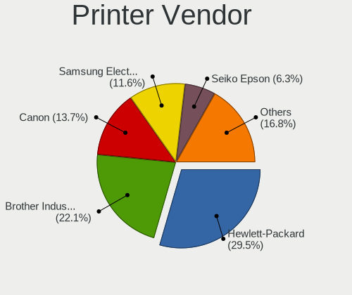

| Vendor                | Desktops | Percent |
|-----------------------|----------|---------|
| Hewlett-Packard       | 28       | 29.47%  |
| Brother Industries    | 21       | 22.11%  |
| Canon                 | 13       | 13.68%  |
| Samsung Electronics   | 11       | 11.58%  |
| Seiko Epson           | 6        | 6.32%   |
| Dymo-CoStar           | 6        | 6.32%   |
| Citizen               | 3        | 3.16%   |
| Zebra                 | 2        | 2.11%   |
| STMicroelectronics    | 1        | 1.05%   |
| Ricoh                 | 1        | 1.05%   |
| Prolific Technology   | 1        | 1.05%   |
| Lexmark International | 1        | 1.05%   |
| Apple                 | 1        | 1.05%   |

Printer Model
-------------

Printer device models

| Model                                                     | Desktops | Percent |
|-----------------------------------------------------------|----------|---------|
| HP DeskJet 2620 All-in-One Printer                        | 4        | 4.21%   |
| Dymo-CoStar LabelWriter 450                               | 4        | 4.21%   |
| HP Deskjet 2540 series                                    | 3        | 3.16%   |
| Citizen Thermal Receipt Printer [CT-E351]                 | 3        | 3.16%   |
| Brother Printer                                           | 3        | 3.16%   |
| Seiko Epson Printer                                       | 2        | 2.11%   |
| Seiko Epson ET-2820 Series                                | 2        | 2.11%   |
| Samsung SCX-4600 Series                                   | 2        | 2.11%   |
| Samsung ML-1640 Series Laser Printer                      | 2        | 2.11%   |
| HP ENVY 5000 series                                       | 2        | 2.11%   |
| Canon TS3100 series                                       | 2        | 2.11%   |
| Canon PIXMA MG2500 Series                                 | 2        | 2.11%   |
| Brother HL-2030 Laser Printer                             | 2        | 2.11%   |
| Brother DCP-1610W                                         | 2        | 2.11%   |
| Zebra Thrmal 2844                                         | 1        | 1.05%   |
| Zebra GK420t Label Printer                                | 1        | 1.05%   |
| STMicroelectronics LED badge -- mini LED display -- 11x44 | 1        | 1.05%   |
| Seiko Epson XP-4200 Series                                | 1        | 1.05%   |
| Seiko Epson Thermal Receipt Printer [TM-T20]              | 1        | 1.05%   |
| Samsung SCX-4300 Series                                   | 1        | 1.05%   |
| Samsung SCX-3400 Series                                   | 1        | 1.05%   |
| Samsung ML-2240 Series                                    | 1        | 1.05%   |
| Samsung ML-216x Series Laser Printer                      | 1        | 1.05%   |
| Samsung CLX-6260 Series                                   | 1        | 1.05%   |
| Samsung C48x Series Color Laser Multifunction Printer     | 1        | 1.05%   |
| Samsung C43x Series                                       | 1        | 1.05%   |
| Ricoh Aficio SP 3510DN                                    | 1        | 1.05%   |
| Prolific PL2305 Parallel Port                             | 1        | 1.05%   |
| Lexmark International MC3326adwe                          | 1        | 1.05%   |
| HP OfficeJet Pro 8020 series                              | 1        | 1.05%   |
| HP OfficeJet 8010 series                                  | 1        | 1.05%   |
| HP OfficeJet 6950                                         | 1        | 1.05%   |
| HP LaserJet Professional P1102w                           | 1        | 1.05%   |
| HP LaserJet P1005                                         | 1        | 1.05%   |
| HP LaserJet 1320                                          | 1        | 1.05%   |
| HP LaserJet 1022                                          | 1        | 1.05%   |
| HP LaserJet 1018                                          | 1        | 1.05%   |
| HP HP Laser 107w                                          | 1        | 1.05%   |
| HP ENVY 4520 series                                       | 1        | 1.05%   |
| HP DeskJet F2100 Printer series                           | 1        | 1.05%   |

Scanner Vendor
--------------

Scanner device vendors

| Vendor          | Desktops | Percent |
|-----------------|----------|---------|
| Canon           | 20       | 54.05%  |
| Seiko Epson     | 7        | 18.92%  |
| Mustek Systems  | 5        | 13.51%  |
| Hewlett-Packard | 4        | 10.81%  |
| Plustek         | 1        | 2.7%    |

Scanner Model
-------------

Scanner device models

| Model                                       | Desktops | Percent |
|---------------------------------------------|----------|---------|
| Mustek Systems ScanExpress 1200 UB          | 4        | 10.53%  |
| Canon CanoScan LiDE 220                     | 4        | 10.53%  |
| Canon CanoScan LiDE 210                     | 4        | 10.53%  |
| Seiko Epson GT-X820 [Perfection V600 Photo] | 3        | 7.89%   |
| Seiko Epson Scanner                         | 2        | 5.26%   |
| Seiko Epson GT-X770 [Perfection V500]       | 2        | 5.26%   |
| Canon CanoScan N670U/N676U/LiDE 20          | 2        | 5.26%   |
| Canon CanoScan LiDE 200                     | 2        | 5.26%   |
| Canon CanoScan LiDE 120                     | 2        | 5.26%   |
| Canon CanoScan LiDE 110                     | 2        | 5.26%   |
| Seiko Epson GT-7700U [Perfection 1240U]     | 1        | 2.63%   |
| Plustek 600dpi USB Scanner                  | 1        | 2.63%   |
| Mustek Systems SNAPSCAN e22                 | 1        | 2.63%   |
| HP Scanjet N6350                            | 1        | 2.63%   |
| HP ScanJet 5590                             | 1        | 2.63%   |
| HP ScanJet 5300c/5370c                      | 1        | 2.63%   |
| HP ScanJet 3300c                            | 1        | 2.63%   |
| Canon CanoScan N1240U/LiDE 30               | 1        | 2.63%   |
| Canon CanoScan LiDE 60                      | 1        | 2.63%   |
| Canon CanoScan FB630U                       | 1        | 2.63%   |
| Canon CanoScan 9000F Mark II                | 1        | 2.63%   |

Camera
------

Camera Vendor
-------------

Camera device vendors

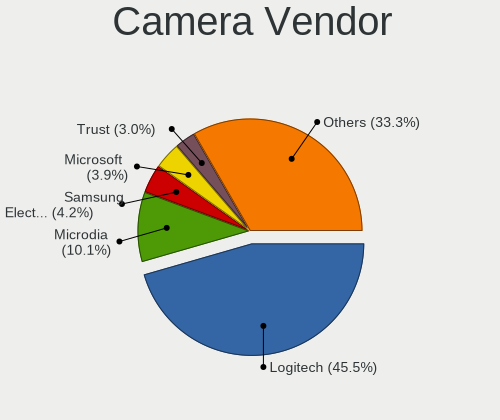

| Vendor                        | Desktops | Percent |
|-------------------------------|----------|---------|
| Logitech                      | 153      | 45.54%  |
| Microdia                      | 34       | 10.12%  |
| Samsung Electronics           | 14       | 4.17%   |
| Microsoft                     | 13       | 3.87%   |
| Trust                         | 10       | 2.98%   |
| Apple                         | 10       | 2.98%   |
| Generalplus Technology        | 7        | 2.08%   |
| Chicony Electronics           | 7        | 2.08%   |
| MacroSilicon                  | 6        | 1.79%   |
| Jieli Technology              | 6        | 1.79%   |
| Sunplus Innovation Technology | 5        | 1.49%   |
| Realtek Semiconductor         | 4        | 1.19%   |
| ARC International             | 4        | 1.19%   |
| Valve Software                | 3        | 0.89%   |
| Sweex                         | 3        | 0.89%   |
| Insta360                      | 3        | 0.89%   |
| Cubeternet                    | 3        | 0.89%   |
| Creative Technology           | 3        | 0.89%   |
| Z-Star Microelectronics       | 2        | 0.6%    |
| Sonix Technology              | 2        | 0.6%    |
| Ruision                       | 2        | 0.6%    |
| Razer USA                     | 2        | 0.6%    |
| LG Electronics                | 2        | 0.6%    |
| Lenovo                        | 2        | 0.6%    |
| IMC Networks                  | 2        | 0.6%    |
| Asuscom Network               | 2        | 0.6%    |
| Alcor Micro                   | 2        | 0.6%    |
| YGTek                         | 1        | 0.3%    |
| ViewSonic                     | 1        | 0.3%    |
| Unknown                       | 1        | 0.3%    |
| Tobii Technology AB           | 1        | 0.3%    |
| Teslong Camera                | 1        | 0.3%    |
| Suyin                         | 1        | 0.3%    |
| SunplusIT                     | 1        | 0.3%    |
| Softkinetic                   | 1        | 0.3%    |
| Smartronix                    | 1        | 0.3%    |
| Service & Quality Technology  | 1        | 0.3%    |
| Pixart Imaging                | 1        | 0.3%    |
| Philips (or NXP)              | 1        | 0.3%    |
| OmniVision Technologies       | 1        | 0.3%    |

Camera Model
------------

Camera device models

| Model                                         | Desktops | Percent |
|-----------------------------------------------|----------|---------|
| Logitech Webcam C270                          | 30       | 8.85%   |
| Logitech HD Pro Webcam C920                   | 28       | 8.26%   |
| Samsung Galaxy series, misc. (MTP mode)       | 14       | 4.13%   |
| Logitech Webcam C310                          | 14       | 4.13%   |
| Logitech C922 Pro Stream Webcam               | 14       | 4.13%   |
| Apple iPhone 5/5C/5S/6/SE/7/8/X/XR            | 9        | 2.65%   |
| Microsoft LifeCam HD-3000                     | 8        | 2.36%   |
| Microdia Sonix USB 2.0 Camera                 | 8        | 2.36%   |
| Trust Trust Full HD Webcam                    | 7        | 2.06%   |
| Microdia Camera                               | 7        | 2.06%   |
| Logitech HD Webcam C525                       | 7        | 2.06%   |
| Logitech BRIO Ultra HD Webcam                 | 7        | 2.06%   |
| Logitech StreamCam                            | 6        | 1.77%   |
| Logitech Logitech Webcam C925e                | 6        | 1.77%   |
| Jieli USB PHY 2.0                             | 6        | 1.77%   |
| Generalplus GENERAL WEBCAM                    | 6        | 1.77%   |
| Microdia USB 2.0 Camera                       | 5        | 1.47%   |
| Microdia Integrated Camera                    | 4        | 1.18%   |
| Logitech Webcam C170                          | 4        | 1.18%   |
| Logitech HD Webcam C615                       | 4        | 1.18%   |
| ARC International Camera                      | 4        | 1.18%   |
| Valve Software 3D Camera                      | 3        | 0.88%   |
| Microdia Webcam Vitade AF                     | 3        | 0.88%   |
| MacroSilicon USB Video                        | 3        | 0.88%   |
| MacroSilicon MS210x Video Grabber [EasierCAP] | 3        | 0.88%   |
| Logitech HD Webcam C510                       | 3        | 0.88%   |
| Logitech BRIO 4K Stream Edition               | 3        | 0.88%   |
| Insta360 Link                                 | 3        | 0.88%   |
| Trust WB-6250X Webcam                         | 2        | 0.59%   |
| Sweex WC060 Series HD Webcam                  | 2        | 0.59%   |
| Sunplus HD 720P webcam                        | 2        | 0.59%   |
| Ruision UVC Camera                            | 2        | 0.59%   |
| Razer USA Gaming Webcam [Kiyo]                | 2        | 0.59%   |
| Microsoft LifeCam HD-5000                     | 2        | 0.59%   |
| Microsoft LifeCam Cinema                      | 2        | 0.59%   |
| Microdia Streaming Camera W8GS                | 2        | 0.59%   |
| Microdia Defender G-Lens 2577 HD720p Camera   | 2        | 0.59%   |
| Logitech Webcam C930e                         | 2        | 0.59%   |
| Logitech Webcam C300                          | 2        | 0.59%   |
| Logitech Webcam C250                          | 2        | 0.59%   |

Security
--------

Fingerprint Vendor
------------------

Fingerprint sensor vendors

| Vendor                     | Desktops | Percent |
|----------------------------|----------|---------|
| Shenzhen Goodix Technology | 1        | 100%    |

Fingerprint Model
-----------------

Fingerprint sensor models

| Model                               | Desktops | Percent |
|-------------------------------------|----------|---------|
| Shenzhen Goodix  Fingerprint Device | 1        | 100%    |

Chipcard Vendor
---------------

Chipcard module vendors

| Vendor                            | Desktops | Percent |
|-----------------------------------|----------|---------|
| Yubico.com                        | 2        | 25%     |
| VASCO Data Security International | 1        | 12.5%   |
| Fujitsu Siemens Computers         | 1        | 12.5%   |
| Clay Logic                        | 1        | 12.5%   |
| Chicony Electronics               | 1        | 12.5%   |
| Alcor Micro                       | 1        | 12.5%   |
| Advanced Card Systems             | 1        | 12.5%   |

Chipcard Model
--------------

Chipcard module models

| Model                                                           | Desktops | Percent |
|-----------------------------------------------------------------|----------|---------|
| Yubico.com Yubikey 4/5 U2F+CCID                                 | 2        | 25%     |
| VASCO Data Security International Digipass 905 SmartCard Reader | 1        | 12.5%   |
| Fujitsu Siemens Computers SmartCard Reader 2A                   | 1        | 12.5%   |
| Clay Logic Nitrokey HSM                                         | 1        | 12.5%   |
| Chicony Electronics HP Skylab USB Smartcard Keyboard            | 1        | 12.5%   |
| Alcor Micro AU9540 Smartcard Reader                             | 1        | 12.5%   |
| Advanced Card Systems ACR122U                                   | 1        | 12.5%   |

Unsupported
-----------

Unsupported Devices
-------------------

Total unsupported devices on board

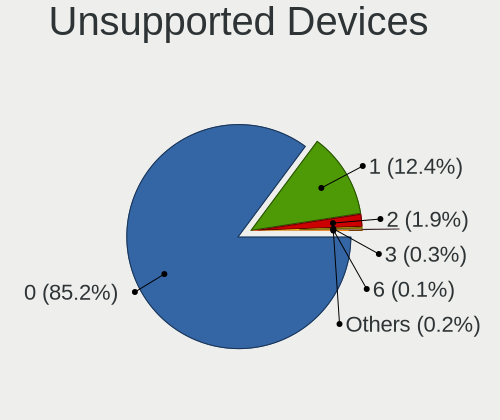

| Total | Desktops | Percent |
|-------|----------|---------|
| 0     | 1597     | 85.17%  |
| 1     | 232      | 12.37%  |
| 2     | 35       | 1.87%   |
| 3     | 6        | 0.32%   |
| 6     | 2        | 0.11%   |
| 5     | 2        | 0.11%   |
| 4     | 1        | 0.05%   |

Unsupported Device Types
------------------------

Types of unsupported devices

| Type                     | Desktops | Percent |
|--------------------------|----------|---------|
| Graphics card            | 118      | 36.65%  |
| Net/wireless             | 66       | 20.5%   |
| Communication controller | 31       | 9.63%   |
| Unassigned class         | 23       | 7.14%   |
| Sound                    | 14       | 4.35%   |
| Camera                   | 12       | 3.73%   |
| Network                  | 11       | 3.42%   |
| Bluetooth                | 10       | 3.11%   |
| Multimedia controller    | 9        | 2.8%    |
| Net/ethernet             | 7        | 2.17%   |
| Storage/raid             | 6        | 1.86%   |
| Tv card                  | 3        | 0.93%   |
| Chipcard                 | 3        | 0.93%   |
| Card reader              | 3        | 0.93%   |
| Storage/ide              | 2        | 0.62%   |
| Storage/nvme             | 1        | 0.31%   |
| Storage/ata              | 1        | 0.31%   |
| Storage                  | 1        | 0.31%   |
| Dvb card                 | 1        | 0.31%   |

