Linux in Netherlands - Tested Hardware & Statistics (Notebooks)
---------------------------------------------------------------

A project to collect tested hardware configurations for Linux in Netherlands.

Anyone can contribute to this report by the [hw-probe](https://github.com/linuxhw/hw-probe) tool:

    sudo -E hw-probe -all -upload

Please contribute! Especially if your hardware is rare.

Contents
--------

* [ Test Cases ](#test-cases)

* [ System ](#system)
  - [ OS                       ](#os)
  - [ OS Family                ](#os-family)
  - [ Kernel                   ](#kernel)
  - [ Kernel Family            ](#kernel-family)
  - [ Kernel Major Ver.        ](#kernel-major-ver)
  - [ Arch                     ](#arch)
  - [ DE                       ](#de)
  - [ Display Server           ](#display-server)
  - [ Display Manager          ](#display-manager)
  - [ OS Lang                  ](#os-lang)
  - [ Boot Mode                ](#boot-mode)
  - [ Filesystem               ](#filesystem)
  - [ Part. scheme             ](#part-scheme)
  - [ Dual Boot with Linux/BSD ](#dual-boot-with-linuxbsd)
  - [ Dual Boot (Win)          ](#dual-boot-win)

* [ Board ](#board)
  - [ Vendor                   ](#vendor)
  - [ Model                    ](#model)
  - [ Model Family             ](#model-family)
  - [ MFG Year                 ](#mfg-year)
  - [ Form Factor              ](#form-factor)
  - [ Secure Boot              ](#secure-boot)
  - [ Coreboot                 ](#coreboot)
  - [ RAM Size                 ](#ram-size)
  - [ RAM Used                 ](#ram-used)
  - [ Total Drives             ](#total-drives)
  - [ Has CD-ROM               ](#has-cd-rom)
  - [ Has Ethernet             ](#has-ethernet)
  - [ Has WiFi                 ](#has-wifi)
  - [ Has Bluetooth            ](#has-bluetooth)

* [ Location ](#location)
  - [ Country                  ](#country)
  - [ City                     ](#city)

* [ Drives ](#drives)
  - [ Drive Vendor             ](#drive-vendor)
  - [ Drive Model              ](#drive-model)
  - [ HDD Vendor               ](#hdd-vendor)
  - [ SSD Vendor               ](#ssd-vendor)
  - [ Drive Kind               ](#drive-kind)
  - [ Drive Connector          ](#drive-connector)
  - [ Drive Size               ](#drive-size)
  - [ Space Total              ](#space-total)
  - [ Space Used               ](#space-used)
  - [ Malfunc. Drives          ](#malfunc-drives)
  - [ Malfunc. Drive Vendor    ](#malfunc-drive-vendor)
  - [ Malfunc. HDD Vendor      ](#malfunc-hdd-vendor)
  - [ Malfunc. Drive Kind      ](#malfunc-drive-kind)
  - [ Failed Drives            ](#failed-drives)
  - [ Failed Drive Vendor      ](#failed-drive-vendor)
  - [ Drive Status             ](#drive-status)

* [ Storage controller ](#storage-controller)
  - [ Storage Vendor           ](#storage-vendor)
  - [ Storage Model            ](#storage-model)
  - [ Storage Kind             ](#storage-kind)

* [ Processor ](#processor)
  - [ CPU Vendor               ](#cpu-vendor)
  - [ CPU Model                ](#cpu-model)
  - [ CPU Model Family         ](#cpu-model-family)
  - [ CPU Cores                ](#cpu-cores)
  - [ CPU Sockets              ](#cpu-sockets)
  - [ CPU Threads              ](#cpu-threads)
  - [ CPU Op-Modes             ](#cpu-op-modes)
  - [ CPU Microcode            ](#cpu-microcode)
  - [ CPU Microarch            ](#cpu-microarch)

* [ Graphics ](#graphics)
  - [ GPU Vendor               ](#gpu-vendor)
  - [ GPU Model                ](#gpu-model)
  - [ GPU Combo                ](#gpu-combo)
  - [ GPU Driver               ](#gpu-driver)
  - [ GPU Memory               ](#gpu-memory)

* [ Monitor ](#monitor)
  - [ Monitor Vendor           ](#monitor-vendor)
  - [ Monitor Model            ](#monitor-model)
  - [ Monitor Resolution       ](#monitor-resolution)
  - [ Monitor Diagonal         ](#monitor-diagonal)
  - [ Monitor Width            ](#monitor-width)
  - [ Aspect Ratio             ](#aspect-ratio)
  - [ Monitor Area             ](#monitor-area)
  - [ Pixel Density            ](#pixel-density)
  - [ Multiple Monitors        ](#multiple-monitors)

* [ Network ](#network)
  - [ Net Controller Vendor    ](#net-controller-vendor)
  - [ Net Controller Model     ](#net-controller-model)
  - [ Wireless Vendor          ](#wireless-vendor)
  - [ Wireless Model           ](#wireless-model)
  - [ Ethernet Vendor          ](#ethernet-vendor)
  - [ Ethernet Model           ](#ethernet-model)
  - [ Net Controller Kind      ](#net-controller-kind)
  - [ Used Controller          ](#used-controller)
  - [ NICs                     ](#nics)
  - [ IPv6                     ](#ipv6)

* [ Bluetooth ](#bluetooth)
  - [ Bluetooth Vendor         ](#bluetooth-vendor)
  - [ Bluetooth Model          ](#bluetooth-model)

* [ Sound ](#sound)
  - [ Sound Vendor             ](#sound-vendor)
  - [ Sound Model              ](#sound-model)

* [ Memory ](#memory)
  - [ Memory Vendor            ](#memory-vendor)
  - [ Memory Model             ](#memory-model)
  - [ Memory Kind              ](#memory-kind)
  - [ Memory Form Factor       ](#memory-form-factor)
  - [ Memory Size              ](#memory-size)
  - [ Memory Speed             ](#memory-speed)

* [ Printers & scanners ](#printers--scanners)
  - [ Printer Vendor           ](#printer-vendor)
  - [ Printer Model            ](#printer-model)
  - [ Scanner Vendor           ](#scanner-vendor)
  - [ Scanner Model            ](#scanner-model)

* [ Camera ](#camera)
  - [ Camera Vendor            ](#camera-vendor)
  - [ Camera Model             ](#camera-model)

* [ Security ](#security)
  - [ Fingerprint Vendor       ](#fingerprint-vendor)
  - [ Fingerprint Model        ](#fingerprint-model)
  - [ Chipcard Vendor          ](#chipcard-vendor)
  - [ Chipcard Model           ](#chipcard-model)

* [ Unsupported ](#unsupported)
  - [ Unsupported Devices      ](#unsupported-devices)
  - [ Unsupported Device Types ](#unsupported-device-types)

Test Cases
----------

Total: 4921

| Vendor        | Model                       | Probe                                                      | Date         |
|---------------|-----------------------------|------------------------------------------------------------|--------------|
| Lenovo        | G50-30 80G0                 | [a1e7cd6d47](https://linux-hardware.org/?probe=a1e7cd6d47) | Jan 02, 2026 |
| Lenovo        | IdeaPad 3 15IML05 81WB      | [1ea64280f4](https://linux-hardware.org/?probe=1ea64280f4) | Jan 02, 2026 |
| ASUSTek       | ASUS EXPERTBOOK P1503CVA    | [486d613881](https://linux-hardware.org/?probe=486d613881) | Dec 31, 2025 |
| HP            | Pavilion Notebook           | [e96b506893](https://linux-hardware.org/?probe=e96b506893) | Dec 31, 2025 |
| HP            | Pavilion Notebook           | [1b2c7dfcbb](https://linux-hardware.org/?probe=1b2c7dfcbb) | Dec 31, 2025 |
| Dell          | Latitude 7490               | [768e27927b](https://linux-hardware.org/?probe=768e27927b) | Dec 30, 2025 |
| Lenovo        | IdeaPad Pro 5 16AHP9 83D... | [5b20ad7e39](https://linux-hardware.org/?probe=5b20ad7e39) | Dec 30, 2025 |
| ASUSTek       | VivoBook_ASUSLaptop X150... | [cd39d9f87b](https://linux-hardware.org/?probe=cd39d9f87b) | Dec 28, 2025 |
| Dell          | Latitude E6520              | [8b403704ef](https://linux-hardware.org/?probe=8b403704ef) | Dec 28, 2025 |
| Framework     | Laptop                      | [f68799061a](https://linux-hardware.org/?probe=f68799061a) | Dec 27, 2025 |
| Lenovo        | ThinkPad T470 W10DG 20JN... | [15ca769ef5](https://linux-hardware.org/?probe=15ca769ef5) | Dec 26, 2025 |
| Lenovo        | ThinkPad T470 W10DG 20JN... | [6184d9fdda](https://linux-hardware.org/?probe=6184d9fdda) | Dec 26, 2025 |
| ASUSTek       | ASUS TUF Gaming F15 FX50... | [2be1598ded](https://linux-hardware.org/?probe=2be1598ded) | Dec 25, 2025 |
| SKIKK         | Niflheim 17 II              | [617ed00aba](https://linux-hardware.org/?probe=617ed00aba) | Dec 25, 2025 |
| Acer          | Swift SFG14-63              | [5600bd5a2d](https://linux-hardware.org/?probe=5600bd5a2d) | Dec 25, 2025 |
| Framework     | Laptop 13 (AMD Ryzen 704... | [0702844c45](https://linux-hardware.org/?probe=0702844c45) | Dec 24, 2025 |
| ASUSTek       | VivoBook_ASUSLaptop X513... | [79a1b660ac](https://linux-hardware.org/?probe=79a1b660ac) | Dec 23, 2025 |
| ASUSTek       | VivoBook_ASUSLaptop X513... | [39b9f3c80f](https://linux-hardware.org/?probe=39b9f3c80f) | Dec 23, 2025 |
| Lenovo        | IdeaPad 320-15IKB 80YE      | [f84d70cd95](https://linux-hardware.org/?probe=f84d70cd95) | Dec 23, 2025 |
| ASUSTek       | ASUS Zenbook 14 UX3405MA... | [95fdc6aafe](https://linux-hardware.org/?probe=95fdc6aafe) | Dec 22, 2025 |
| Lenovo        | ThinkPad P1 Gen 2 20QUS0... | [5617f99277](https://linux-hardware.org/?probe=5617f99277) | Dec 21, 2025 |
| Lenovo        | ThinkPad T580 20L9CTO1WW    | [d4b3104c88](https://linux-hardware.org/?probe=d4b3104c88) | Dec 20, 2025 |
| Micro Comp... | Venus series                | [842ddabda9](https://linux-hardware.org/?probe=842ddabda9) | Dec 20, 2025 |
| Lenovo        | ThinkPad P15v Gen 3 21D9... | [e35e69883f](https://linux-hardware.org/?probe=e35e69883f) | Dec 19, 2025 |
| Lenovo        | ThinkPad X13 Gen 6 21RLS... | [9800401e9c](https://linux-hardware.org/?probe=9800401e9c) | Dec 19, 2025 |
| Apple         | MacBookPro11,1              | [7e5e3dfc96](https://linux-hardware.org/?probe=7e5e3dfc96) | Dec 18, 2025 |
| HP            | Pavilion Gaming Laptop 1... | [24d307e0e0](https://linux-hardware.org/?probe=24d307e0e0) | Dec 17, 2025 |
| HP            | EliteBook 8530w             | [63130fbd89](https://linux-hardware.org/?probe=63130fbd89) | Dec 15, 2025 |
| Apple         | MacBookPro8,2               | [97a87ca735](https://linux-hardware.org/?probe=97a87ca735) | Dec 15, 2025 |
| HP            | EliteBook 840 G6            | [f010d73e85](https://linux-hardware.org/?probe=f010d73e85) | Dec 14, 2025 |
| Dell          | Pro Max 18 Plus MB18250     | [1d8fee6090](https://linux-hardware.org/?probe=1d8fee6090) | Dec 14, 2025 |
| Lenovo        | Legion 5 15IMH05H 81Y6      | [3adbf91144](https://linux-hardware.org/?probe=3adbf91144) | Dec 13, 2025 |
| HP            | OMEN by Laptop 16-b1xxx     | [e2927026a0](https://linux-hardware.org/?probe=e2927026a0) | Dec 13, 2025 |
| HP            | EliteBook 1030 G1           | [4ad7cdb52d](https://linux-hardware.org/?probe=4ad7cdb52d) | Dec 12, 2025 |
| Dell          | Latitude 5540               | [b6931814c2](https://linux-hardware.org/?probe=b6931814c2) | Dec 12, 2025 |
| ASUSTek       | Zenbook UM3402YA_UM3402Y... | [d2b61db0d3](https://linux-hardware.org/?probe=d2b61db0d3) | Dec 12, 2025 |
| Lenovo        | ThinkPad S1 Yoga 20CD003... | [98c12c9846](https://linux-hardware.org/?probe=98c12c9846) | Dec 11, 2025 |
| HP            | Pavilion Notebook           | [f604f08ce1](https://linux-hardware.org/?probe=f604f08ce1) | Dec 11, 2025 |
| HP            | Pavilion Notebook           | [0839e431e5](https://linux-hardware.org/?probe=0839e431e5) | Dec 11, 2025 |
| Lenovo        | ThinkPad SL510 28477LG      | [b68c309562](https://linux-hardware.org/?probe=b68c309562) | Dec 11, 2025 |
| Dell          | Inspiron 3781               | [0ab0da5924](https://linux-hardware.org/?probe=0ab0da5924) | Dec 11, 2025 |
| Lenovo        | Legion Pro 7 16AFR10H 83... | [6750ba8f7d](https://linux-hardware.org/?probe=6750ba8f7d) | Dec 10, 2025 |
| Lenovo        | ThinkPad T530 24295XG       | [71ea72d150](https://linux-hardware.org/?probe=71ea72d150) | Dec 10, 2025 |
| Samsung       | 960XGL                      | [d902c9702a](https://linux-hardware.org/?probe=d902c9702a) | Dec 09, 2025 |
| Dell          | Precision M2800             | [34a39ab273](https://linux-hardware.org/?probe=34a39ab273) | Dec 09, 2025 |
| Lenovo        | Legion 5 17IMH05H 81Y8      | [f383fde38c](https://linux-hardware.org/?probe=f383fde38c) | Dec 09, 2025 |
| Acer          | Aspire A515-45G             | [60b96ac3ab](https://linux-hardware.org/?probe=60b96ac3ab) | Dec 09, 2025 |
| Framework     | Laptop 16 (AMD Ryzen 704... | [b0050f29bf](https://linux-hardware.org/?probe=b0050f29bf) | Dec 09, 2025 |
| Lenovo        | ThinkPad X1 Carbon 7th 2... | [d39d6098ad](https://linux-hardware.org/?probe=d39d6098ad) | Dec 09, 2025 |
| Apple         | MacBookPro11,3              | [48821f1833](https://linux-hardware.org/?probe=48821f1833) | Dec 09, 2025 |
| HP            | ProBook 430 G7              | [a33f50978b](https://linux-hardware.org/?probe=a33f50978b) | Dec 09, 2025 |
| Lenovo        | ThinkPad X1 Carbon 7th 2... | [ac1bdd6c34](https://linux-hardware.org/?probe=ac1bdd6c34) | Dec 09, 2025 |
| Lenovo        | IdeaPad 5 14ALC05 82LM      | [62e7349cef](https://linux-hardware.org/?probe=62e7349cef) | Dec 08, 2025 |
| ASUSTek       | N550JK                      | [f4230ae772](https://linux-hardware.org/?probe=f4230ae772) | Dec 07, 2025 |
| ASUSTek       | X550LD                      | [59ac8c5f5d](https://linux-hardware.org/?probe=59ac8c5f5d) | Dec 07, 2025 |
| ASUSTek       | N71Vg                       | [1969d1445a](https://linux-hardware.org/?probe=1969d1445a) | Dec 07, 2025 |
| Lenovo        | ThinkPad SL510 28477LG      | [7282bcca7c](https://linux-hardware.org/?probe=7282bcca7c) | Dec 07, 2025 |
| ASUSTek       | ASUS Zenbook 14 UM3406HA... | [3ae5ce1fa2](https://linux-hardware.org/?probe=3ae5ce1fa2) | Dec 07, 2025 |
| Dell          | Latitude 5401               | [3168d7525f](https://linux-hardware.org/?probe=3168d7525f) | Dec 06, 2025 |
| HP            | OMEN by Gaming Laptop 16... | [377e5eb19e](https://linux-hardware.org/?probe=377e5eb19e) | Dec 06, 2025 |
| ASUSTek       | ROG Strix G513RM_G513RM     | [77e8390db9](https://linux-hardware.org/?probe=77e8390db9) | Dec 06, 2025 |
| ASUSTek       | X550LD                      | [7ea11dae32](https://linux-hardware.org/?probe=7ea11dae32) | Dec 06, 2025 |
| Acidanther... | MacBookPro16,4              | [5a1455b5fe](https://linux-hardware.org/?probe=5a1455b5fe) | Dec 06, 2025 |
| Lenovo        | ThinkPad T580 20L9CTO1WW    | [78367b63d2](https://linux-hardware.org/?probe=78367b63d2) | Dec 04, 2025 |
| Dell          | Latitude 7390               | [559ad12fa3](https://linux-hardware.org/?probe=559ad12fa3) | Dec 04, 2025 |
| HP            | Presario CQ57               | [3ff61fadbd](https://linux-hardware.org/?probe=3ff61fadbd) | Dec 03, 2025 |
| ASUSTek       | X540SA                      | [bbeba478ec](https://linux-hardware.org/?probe=bbeba478ec) | Dec 03, 2025 |
| HP            | Pavilion Gaming Laptop 1... | [f4624fe374](https://linux-hardware.org/?probe=f4624fe374) | Dec 03, 2025 |
| ASUSTek       | X540SA                      | [385842ed88](https://linux-hardware.org/?probe=385842ed88) | Dec 02, 2025 |
| Acer          | Aspire V3-771               | [56faf4a015](https://linux-hardware.org/?probe=56faf4a015) | Dec 02, 2025 |
| MSI           | GE72 6QD                    | [7d101ae80a](https://linux-hardware.org/?probe=7d101ae80a) | Dec 02, 2025 |
| Dell          | Inspiron 5555               | [d75767cecd](https://linux-hardware.org/?probe=d75767cecd) | Nov 30, 2025 |
| Medion        | Scout E20                   | [eca9e1f444](https://linux-hardware.org/?probe=eca9e1f444) | Nov 30, 2025 |
| Acer          | Aspire V3-771               | [7e6fdc8613](https://linux-hardware.org/?probe=7e6fdc8613) | Nov 29, 2025 |
| Acer          | Aspire A315-44P             | [2160fdd19c](https://linux-hardware.org/?probe=2160fdd19c) | Nov 29, 2025 |
| Google        | Volet                       | [dba215a8ea](https://linux-hardware.org/?probe=dba215a8ea) | Nov 29, 2025 |
| ASUSTek       | VivoBook_ASUSLaptop X513... | [d235da21cc](https://linux-hardware.org/?probe=d235da21cc) | Nov 27, 2025 |
| Samsung       | RV420/RV520/RV720/E3530/... | [e6a25e20bc](https://linux-hardware.org/?probe=e6a25e20bc) | Nov 27, 2025 |
| ASUSTek       | VivoBook_ASUSLaptop X170... | [93655390ef](https://linux-hardware.org/?probe=93655390ef) | Nov 27, 2025 |
| SLIMBOOK      | PROX-AMD5                   | [51f7c2102c](https://linux-hardware.org/?probe=51f7c2102c) | Nov 27, 2025 |
| Lenovo        | IdeaPad Gaming 3 15ARH05... | [9b6723f901](https://linux-hardware.org/?probe=9b6723f901) | Nov 26, 2025 |
| Lenovo        | Yoga Slim 6 14IAP8 82WU     | [c039d191e9](https://linux-hardware.org/?probe=c039d191e9) | Nov 26, 2025 |
| ASUSTek       | ZenBook Pro Duo UX581GV_... | [515a16df69](https://linux-hardware.org/?probe=515a16df69) | Nov 26, 2025 |
| ASUSTek       | VivoBook_ASUSLaptop K360... | [d809071b45](https://linux-hardware.org/?probe=d809071b45) | Nov 24, 2025 |
| Google        | Droid                       | [cd7eea13c7](https://linux-hardware.org/?probe=cd7eea13c7) | Nov 23, 2025 |
| MSI           | GS75 Stealth 9SF            | [44c3724c1d](https://linux-hardware.org/?probe=44c3724c1d) | Nov 22, 2025 |
| Lenovo        | ThinkPad W540 20BHS0CY02    | [a4f2bccc07](https://linux-hardware.org/?probe=a4f2bccc07) | Nov 21, 2025 |
| Lenovo        | ThinkPad W540 20BHS0CY02    | [e2c9629656](https://linux-hardware.org/?probe=e2c9629656) | Nov 21, 2025 |
| Lenovo        | IdeaPad 700-15ISK 80RU      | [85270a62f9](https://linux-hardware.org/?probe=85270a62f9) | Nov 21, 2025 |
| Toshiba       | Satellite L650              | [905764f760](https://linux-hardware.org/?probe=905764f760) | Nov 21, 2025 |
| Toshiba       | Satellite L650              | [af3d25736a](https://linux-hardware.org/?probe=af3d25736a) | Nov 21, 2025 |
| Acer          | Aspire A514-54              | [2d2234a1ca](https://linux-hardware.org/?probe=2d2234a1ca) | Nov 20, 2025 |
| TongFang      | GX5HRXL                     | [7c06bea045](https://linux-hardware.org/?probe=7c06bea045) | Nov 20, 2025 |
| Dell          | Latitude E6420              | [37800569d4](https://linux-hardware.org/?probe=37800569d4) | Nov 20, 2025 |
| HP            | ZBook Ultra G1a 14 inch ... | [ca36f346ec](https://linux-hardware.org/?probe=ca36f346ec) | Nov 20, 2025 |
| Apple         | MacBookPro11,1              | [2d973af797](https://linux-hardware.org/?probe=2d973af797) | Nov 19, 2025 |
| HP            | ProBook 430 G7              | [2ccf6d2e9c](https://linux-hardware.org/?probe=2ccf6d2e9c) | Nov 19, 2025 |
| Lenovo        | IdeaPad 700-15ISK 80RU      | [8f692dba8e](https://linux-hardware.org/?probe=8f692dba8e) | Nov 19, 2025 |
| Lenovo        | IdeaPad 520S-14IKB 81BL     | [9c4263ac67](https://linux-hardware.org/?probe=9c4263ac67) | Nov 18, 2025 |
| Lenovo        | IdeaPad 520S-14IKB 81BL     | [1d6ba78216](https://linux-hardware.org/?probe=1d6ba78216) | Nov 18, 2025 |
| HP            | Laptop 15-fc0xxx            | [32ef98c225](https://linux-hardware.org/?probe=32ef98c225) | Nov 18, 2025 |
| HP            | EliteBook 840 G5            | [9cf24da0e9](https://linux-hardware.org/?probe=9cf24da0e9) | Nov 16, 2025 |
| Dell          | Latitude 7390 2-in-1        | [9b2c2eb86d](https://linux-hardware.org/?probe=9b2c2eb86d) | Nov 16, 2025 |
| HP            | Pavilion Laptop 15-cs1xx... | [26010af06f](https://linux-hardware.org/?probe=26010af06f) | Nov 15, 2025 |
| ASUSTek       | ROG Strix G512LW_G512LW     | [127b2444ec](https://linux-hardware.org/?probe=127b2444ec) | Nov 15, 2025 |
| Lenovo        | Legion Pro 5 16ADR10 83L... | [08eb43f88a](https://linux-hardware.org/?probe=08eb43f88a) | Nov 15, 2025 |
| Apple         | MacBookPro13,3              | [0e2b32448c](https://linux-hardware.org/?probe=0e2b32448c) | Nov 14, 2025 |
| ASUSTek       | K54HR                       | [4421ab23d3](https://linux-hardware.org/?probe=4421ab23d3) | Nov 13, 2025 |
| HP            | Laptop 15s-fq2xxx           | [dd10681e5c](https://linux-hardware.org/?probe=dd10681e5c) | Nov 12, 2025 |
| Dell          | Latitude 3590               | [5a0f399c70](https://linux-hardware.org/?probe=5a0f399c70) | Nov 12, 2025 |
| Lenovo        | ThinkPad T480 20L6SA5Q00    | [0819beaffe](https://linux-hardware.org/?probe=0819beaffe) | Nov 11, 2025 |
| Lenovo        | ThinkPad T580 20LAS0WX00    | [de3e445791](https://linux-hardware.org/?probe=de3e445791) | Nov 09, 2025 |
| HP            | OMEN by Gaming Laptop 16... | [f1d8998f04](https://linux-hardware.org/?probe=f1d8998f04) | Nov 09, 2025 |
| HP            | Laptop 15-db1xxx            | [b494afa7ad](https://linux-hardware.org/?probe=b494afa7ad) | Nov 09, 2025 |
| Lenovo        | IdeaPad 1 15ALC7 82R4       | [295d199a16](https://linux-hardware.org/?probe=295d199a16) | Nov 08, 2025 |
| Dell          | XPS 15 9570                 | [a755d659a2](https://linux-hardware.org/?probe=a755d659a2) | Nov 08, 2025 |
| ASUSTek       | VivoBook_ASUSLaptop M140... | [1b0fd6dccc](https://linux-hardware.org/?probe=1b0fd6dccc) | Nov 08, 2025 |
| Acer          | Aspire A315-44P             | [e24eb74fb1](https://linux-hardware.org/?probe=e24eb74fb1) | Nov 08, 2025 |
| HP            | Laptop 15-da0xxx            | [b8288c20e6](https://linux-hardware.org/?probe=b8288c20e6) | Nov 07, 2025 |
| HP            | EliteBook 840 G3            | [68914347a0](https://linux-hardware.org/?probe=68914347a0) | Nov 07, 2025 |
| Acer          | Aspire V3-772G              | [8af1112172](https://linux-hardware.org/?probe=8af1112172) | Nov 07, 2025 |
| Fujitsu       | LIFEBOOK U748               | [d69958bf0a](https://linux-hardware.org/?probe=d69958bf0a) | Nov 07, 2025 |
| Dell          | XPS 15 9570                 | [5a34471f10](https://linux-hardware.org/?probe=5a34471f10) | Nov 06, 2025 |
| HP            | ZBook Fury 16 G11 Mobile... | [4d56915c36](https://linux-hardware.org/?probe=4d56915c36) | Nov 06, 2025 |
| Acer          | Aspire V3-771               | [4155d3d184](https://linux-hardware.org/?probe=4155d3d184) | Nov 06, 2025 |
| Lenovo        | ThinkPad T480s 20L8S67V0... | [587afe2498](https://linux-hardware.org/?probe=587afe2498) | Nov 06, 2025 |
| Dell          | XPS 15 9570                 | [45335b5277](https://linux-hardware.org/?probe=45335b5277) | Nov 06, 2025 |
| Lenovo        | ThinkPad E14 Gen 6 21M3C... | [f1a649e68b](https://linux-hardware.org/?probe=f1a649e68b) | Nov 05, 2025 |
| HP            | EliteBook 840 G8 Noteboo... | [146658e741](https://linux-hardware.org/?probe=146658e741) | Nov 05, 2025 |
| Lenovo        | ThinkPad X395 20NMS0YF00    | [abd881e5b4](https://linux-hardware.org/?probe=abd881e5b4) | Nov 05, 2025 |
| Alienware     | m15 R6                      | [84566e407f](https://linux-hardware.org/?probe=84566e407f) | Nov 05, 2025 |
| Dell          | Inspiron 16 5645            | [7f29a20d7d](https://linux-hardware.org/?probe=7f29a20d7d) | Nov 05, 2025 |
| HP            | Laptop 15-db1xxx            | [675998e2d7](https://linux-hardware.org/?probe=675998e2d7) | Nov 04, 2025 |
| Dell          | Inspiron 5555               | [ce5d331003](https://linux-hardware.org/?probe=ce5d331003) | Nov 04, 2025 |
| Lenovo        | ThinkPad T460 20FMS43J2D    | [e84aa5cf58](https://linux-hardware.org/?probe=e84aa5cf58) | Nov 03, 2025 |
| HP            | Laptop 15-db1xxx            | [4e62083a10](https://linux-hardware.org/?probe=4e62083a10) | Nov 02, 2025 |
| Samsung       | 340XAA/350XAA/550XAA        | [01a9ac72b2](https://linux-hardware.org/?probe=01a9ac72b2) | Nov 01, 2025 |
| HP            | Pavilion Notebook           | [f574cbe172](https://linux-hardware.org/?probe=f574cbe172) | Oct 31, 2025 |
| Lenovo        | IdeaPad Y510P 20217         | [2c59a80ef4](https://linux-hardware.org/?probe=2c59a80ef4) | Oct 31, 2025 |
| HP            | EliteBook 840 G1            | [ada04a9805](https://linux-hardware.org/?probe=ada04a9805) | Oct 31, 2025 |
| Lenovo        | IdeaPad 300-15ISK 80Q7      | [d775bf2af4](https://linux-hardware.org/?probe=d775bf2af4) | Oct 31, 2025 |
| Acer          | Aspire 7736                 | [b662baa55a](https://linux-hardware.org/?probe=b662baa55a) | Oct 31, 2025 |
| Lenovo        | ThinkPad P52 20MAS4T100     | [80dfd7fcad](https://linux-hardware.org/?probe=80dfd7fcad) | Oct 31, 2025 |
| Lenovo        | ThinkPad T480s 20L8S3HD0... | [e5f9e2eb15](https://linux-hardware.org/?probe=e5f9e2eb15) | Oct 31, 2025 |
| Toshiba       | Satellite L350              | [39aa06a498](https://linux-hardware.org/?probe=39aa06a498) | Oct 30, 2025 |
| MSI           | Venture 14 AI A2HMG         | [5f47ec5bcf](https://linux-hardware.org/?probe=5f47ec5bcf) | Oct 30, 2025 |
| HP            | ProBook 6550b               | [40f98f4658](https://linux-hardware.org/?probe=40f98f4658) | Oct 29, 2025 |
| Dell          | Latitude E6420              | [b452b6f4ce](https://linux-hardware.org/?probe=b452b6f4ce) | Oct 29, 2025 |
| MSI           | Venture 14 AI A2HMG         | [e59b75da46](https://linux-hardware.org/?probe=e59b75da46) | Oct 28, 2025 |
| Acer          | Aspire AL15-41P             | [0193097dc1](https://linux-hardware.org/?probe=0193097dc1) | Oct 27, 2025 |
| Lenovo        | IdeaPad L340-17IRH Gamin... | [905260da82](https://linux-hardware.org/?probe=905260da82) | Oct 27, 2025 |
| Lenovo        | ThinkPad T540p 20BE00B2M... | [88e29f841c](https://linux-hardware.org/?probe=88e29f841c) | Oct 26, 2025 |
| Notebook      | V5xxKU                      | [c82da91e3a](https://linux-hardware.org/?probe=c82da91e3a) | Oct 25, 2025 |
| HP            | ZBook 17 G2                 | [a5cbe606a9](https://linux-hardware.org/?probe=a5cbe606a9) | Oct 25, 2025 |
| Dell          | XPS 15 9560                 | [baae1485f8](https://linux-hardware.org/?probe=baae1485f8) | Oct 25, 2025 |
| HP            | ProBook 450 G1              | [4d2562ab1b](https://linux-hardware.org/?probe=4d2562ab1b) | Oct 25, 2025 |
| HP            | Victus by Laptop 16-d0xx... | [9a701184f8](https://linux-hardware.org/?probe=9a701184f8) | Oct 25, 2025 |
| Timi          | Mi Laptop Pro 15            | [bd95569a02](https://linux-hardware.org/?probe=bd95569a02) | Oct 23, 2025 |
| Dell          | XPS 15 9570                 | [e90104aa30](https://linux-hardware.org/?probe=e90104aa30) | Oct 21, 2025 |
| ASUSTek       | ROG Strix G733ZM_G733ZM     | [a8388e3691](https://linux-hardware.org/?probe=a8388e3691) | Oct 21, 2025 |
| Lenovo        | ThinkPad X1 Carbon Gen 9... | [7737feaa50](https://linux-hardware.org/?probe=7737feaa50) | Oct 20, 2025 |
| Notebook      | N8xxEZ                      | [87b5603ff4](https://linux-hardware.org/?probe=87b5603ff4) | Oct 20, 2025 |
| PEAQ          | PNB series                  | [bd17cb2c44](https://linux-hardware.org/?probe=bd17cb2c44) | Oct 20, 2025 |
| Lenovo        | Z710 20250                  | [98e3b48016](https://linux-hardware.org/?probe=98e3b48016) | Oct 20, 2025 |
| HP            | EliteBook 840 G3            | [00a7982f3e](https://linux-hardware.org/?probe=00a7982f3e) | Oct 20, 2025 |
| Lenovo        | ThinkPad T440p 20AW0045M... | [16541763cd](https://linux-hardware.org/?probe=16541763cd) | Oct 20, 2025 |
| Acer          | Aspire A315-44P             | [32279a4232](https://linux-hardware.org/?probe=32279a4232) | Oct 20, 2025 |
| Lenovo        | ThinkPad L480 20LTS81B00    | [2f48bb6faa](https://linux-hardware.org/?probe=2f48bb6faa) | Oct 18, 2025 |
| Lenovo        | ThinkPad T14 Gen 1 20S00... | [881f585681](https://linux-hardware.org/?probe=881f585681) | Oct 18, 2025 |
| Apple         | MacBookPro11,3              | [2b87958e6d](https://linux-hardware.org/?probe=2b87958e6d) | Oct 18, 2025 |
| ASUSTek       | K72F                        | [fe493fb847](https://linux-hardware.org/?probe=fe493fb847) | Oct 17, 2025 |
| Dell          | XPS 15 9570                 | [873f1297b2](https://linux-hardware.org/?probe=873f1297b2) | Oct 17, 2025 |
| Lenovo        | IdeaPad 320-17IKB 80XM      | [73ee350c72](https://linux-hardware.org/?probe=73ee350c72) | Oct 17, 2025 |
| Apple         | MacBook7,1                  | [5a793158a9](https://linux-hardware.org/?probe=5a793158a9) | Oct 17, 2025 |
| Fujitsu       | LIFEBOOK E5510              | [6ab9283ad9](https://linux-hardware.org/?probe=6ab9283ad9) | Oct 17, 2025 |
| Acer          | Aspire V3-772G              | [d45ce7ec53](https://linux-hardware.org/?probe=d45ce7ec53) | Oct 16, 2025 |
| Toshiba       | Satellite Pro C50-A-1J1     | [07256b201a](https://linux-hardware.org/?probe=07256b201a) | Oct 16, 2025 |
| Acer          | Aspire A315-59              | [14cac72145](https://linux-hardware.org/?probe=14cac72145) | Oct 16, 2025 |
| Dell          | Latitude E6540              | [4f627054d3](https://linux-hardware.org/?probe=4f627054d3) | Oct 15, 2025 |
| ASUSTek       | GL552VX                     | [f57fa6bf75](https://linux-hardware.org/?probe=f57fa6bf75) | Oct 15, 2025 |
| Notebook      | V5xxKU                      | [bf9f02a732](https://linux-hardware.org/?probe=bf9f02a732) | Oct 15, 2025 |
| Dell          | Inspiron 5555               | [b250a43cc6](https://linux-hardware.org/?probe=b250a43cc6) | Oct 14, 2025 |
| Acer          | Aspire A315-57G             | [74e5304138](https://linux-hardware.org/?probe=74e5304138) | Oct 14, 2025 |
| HP            | ProBook 4740s               | [e8ec882fc2](https://linux-hardware.org/?probe=e8ec882fc2) | Oct 12, 2025 |
| Acer          | Aspire A315-57G             | [658e4326d8](https://linux-hardware.org/?probe=658e4326d8) | Oct 11, 2025 |
| HP            | ProBook 4740s               | [1f48402e28](https://linux-hardware.org/?probe=1f48402e28) | Oct 11, 2025 |
| Toshiba       | Satellite P70-A             | [5667c19a1b](https://linux-hardware.org/?probe=5667c19a1b) | Oct 11, 2025 |
| HP            | EliteBook 840 G3            | [9187736d25](https://linux-hardware.org/?probe=9187736d25) | Oct 11, 2025 |
| HP            | Laptop 17-by0xxx            | [81de05d5d6](https://linux-hardware.org/?probe=81de05d5d6) | Oct 11, 2025 |
| HP            | Laptop 17-by0xxx            | [624f744c8b](https://linux-hardware.org/?probe=624f744c8b) | Oct 11, 2025 |
| Timi          | Redmi Book Pro 14 2022      | [c8bcf447a9](https://linux-hardware.org/?probe=c8bcf447a9) | Oct 11, 2025 |
| ASUSTek       | E200HA                      | [a22687c5d0](https://linux-hardware.org/?probe=a22687c5d0) | Oct 10, 2025 |
| HP            | Pavilion Gaming Laptop 1... | [b31cdbe0e5](https://linux-hardware.org/?probe=b31cdbe0e5) | Oct 10, 2025 |
| Medion        | E6436 MD61100               | [4b21a5787f](https://linux-hardware.org/?probe=4b21a5787f) | Oct 10, 2025 |
| Dell          | XPS 15 9570                 | [c481e5f842](https://linux-hardware.org/?probe=c481e5f842) | Oct 10, 2025 |
| Sony          | VPCEJ2Z1E                   | [dd2413bbaf](https://linux-hardware.org/?probe=dd2413bbaf) | Oct 09, 2025 |
| Dell          | XPS 15 9570                 | [2d4c055b5e](https://linux-hardware.org/?probe=2d4c055b5e) | Oct 09, 2025 |
| HP            | EliteBook 820 G3            | [10ab332bd3](https://linux-hardware.org/?probe=10ab332bd3) | Oct 09, 2025 |
| HP            | Victus by Laptop 16-e1xx... | [e3fa1f2d19](https://linux-hardware.org/?probe=e3fa1f2d19) | Oct 08, 2025 |
| Dell          | XPS 14 9440                 | [035c5b4026](https://linux-hardware.org/?probe=035c5b4026) | Oct 08, 2025 |
| Lenovo        | IdeaPad 320-15ISK 80XH      | [6fbe14f2c5](https://linux-hardware.org/?probe=6fbe14f2c5) | Oct 07, 2025 |
| Lenovo        | ThinkPad T430 2349H86       | [4e51bbec19](https://linux-hardware.org/?probe=4e51bbec19) | Oct 07, 2025 |
| ASUSTek       | VivoBook_ASUSLaptop X515... | [a0082050a4](https://linux-hardware.org/?probe=a0082050a4) | Oct 07, 2025 |
| HP            | EliteBook 840 G2            | [890007667b](https://linux-hardware.org/?probe=890007667b) | Oct 06, 2025 |
| Acer          | Aspire 7735                 | [f67f3c848b](https://linux-hardware.org/?probe=f67f3c848b) | Oct 06, 2025 |
| HP            | ProBook 4540s               | [4adde3a721](https://linux-hardware.org/?probe=4adde3a721) | Oct 06, 2025 |
| Dell          | Latitude E7250              | [99a593e614](https://linux-hardware.org/?probe=99a593e614) | Oct 06, 2025 |
| HP            | ProBook 4540s               | [bfe9f7d4d6](https://linux-hardware.org/?probe=bfe9f7d4d6) | Oct 05, 2025 |
| Lenovo        | IdeaPad 5 14ITL05 82FE      | [1cd0eea63a](https://linux-hardware.org/?probe=1cd0eea63a) | Oct 03, 2025 |
| Acer          | Aspire E1-771               | [dd2f36b591](https://linux-hardware.org/?probe=dd2f36b591) | Oct 03, 2025 |
| Lenovo        | ThinkPad T580 20L9CTO1WW    | [b162c12f9b](https://linux-hardware.org/?probe=b162c12f9b) | Oct 02, 2025 |
| HP            | ZBook Firefly 15 G7 Mobi... | [46d4febe01](https://linux-hardware.org/?probe=46d4febe01) | Sep 30, 2025 |
| Apple         | MacBook6,1                  | [03117f8976](https://linux-hardware.org/?probe=03117f8976) | Sep 30, 2025 |
| Dell          | XPS 9315                    | [96ea627345](https://linux-hardware.org/?probe=96ea627345) | Sep 30, 2025 |
| Apple         | MacBookPro12,1              | [6b7bc44e5a](https://linux-hardware.org/?probe=6b7bc44e5a) | Sep 28, 2025 |
| Notebook      | P65_P67RGRERA               | [0c90889bf0](https://linux-hardware.org/?probe=0c90889bf0) | Sep 27, 2025 |
| Sony          | VPCF23C5E                   | [07579672f2](https://linux-hardware.org/?probe=07579672f2) | Sep 27, 2025 |
| Lenovo        | ThinkPad X1 Extreme 2nd ... | [864873ffc5](https://linux-hardware.org/?probe=864873ffc5) | Sep 27, 2025 |
| ASUSTek       | K54HR                       | [07241f21b1](https://linux-hardware.org/?probe=07241f21b1) | Sep 27, 2025 |
| Lenovo        | IdeaPad Slim 5 16ABR8 82... | [ee193f9300](https://linux-hardware.org/?probe=ee193f9300) | Sep 26, 2025 |
| Lenovo        | ThinkPad T580 20L9CTO1WW    | [76808f5ee3](https://linux-hardware.org/?probe=76808f5ee3) | Sep 26, 2025 |
| ASUSTek       | K72Jr                       | [bf57b34758](https://linux-hardware.org/?probe=bf57b34758) | Sep 26, 2025 |
| Dell          | Latitude E5430 non-vPro     | [8ddce627e5](https://linux-hardware.org/?probe=8ddce627e5) | Sep 25, 2025 |
| HP            | Notebook                    | [2774f6edd6](https://linux-hardware.org/?probe=2774f6edd6) | Sep 24, 2025 |
| Chuwi         | HeroBook Pro                | [f239de25ca](https://linux-hardware.org/?probe=f239de25ca) | Sep 23, 2025 |
| ASUSTek       | X75VD                       | [883f0c08cd](https://linux-hardware.org/?probe=883f0c08cd) | Sep 21, 2025 |
| Acer          | Aspire V3-771               | [6f14ee7072](https://linux-hardware.org/?probe=6f14ee7072) | Sep 21, 2025 |
| Acer          | Aspire 4820T                | [81ba6d3942](https://linux-hardware.org/?probe=81ba6d3942) | Sep 21, 2025 |
| Apple         | MacBookPro8,2               | [37a62185a9](https://linux-hardware.org/?probe=37a62185a9) | Sep 21, 2025 |
| HP            | ProBook 440 G7              | [792c15eeb7](https://linux-hardware.org/?probe=792c15eeb7) | Sep 20, 2025 |
| Lenovo        | ThinkPad P1 Gen 5 21DC00... | [25c0e60042](https://linux-hardware.org/?probe=25c0e60042) | Sep 19, 2025 |
| HP            | EliteBook Folio 1040 G2     | [63b5e638ed](https://linux-hardware.org/?probe=63b5e638ed) | Sep 17, 2025 |
| Acer          | Nitro AN17-42               | [327497e785](https://linux-hardware.org/?probe=327497e785) | Sep 17, 2025 |
| HP            | ZBook 15u G2                | [ac0e9be286](https://linux-hardware.org/?probe=ac0e9be286) | Sep 16, 2025 |
| HP            | ZBook 15u G2                | [7d82099edc](https://linux-hardware.org/?probe=7d82099edc) | Sep 16, 2025 |
| Dell          | Inspiron 16 5645            | [4a93f8b0d1](https://linux-hardware.org/?probe=4a93f8b0d1) | Sep 15, 2025 |
| MSI           | Thin GF63 12UCX             | [e5eed06261](https://linux-hardware.org/?probe=e5eed06261) | Sep 15, 2025 |
| Dell          | XPS 13 9370                 | [c0eb321026](https://linux-hardware.org/?probe=c0eb321026) | Sep 14, 2025 |
| Framework     | Laptop                      | [aa9d79982f](https://linux-hardware.org/?probe=aa9d79982f) | Sep 14, 2025 |
| HP            | ZBook X G1i 16 inch Mobi... | [ce766a392d](https://linux-hardware.org/?probe=ce766a392d) | Sep 14, 2025 |
| ASRock        | B550 Phantom Gaming-ITX/... | [ffba151d8e](https://linux-hardware.org/?probe=ffba151d8e) | Sep 14, 2025 |
| ASUSTek       | ROG Zephyrus G16 GA605WV... | [d7d0a95eb8](https://linux-hardware.org/?probe=d7d0a95eb8) | Sep 14, 2025 |
| Lenovo        | IdeaPad Slim 5 15ARP10 8... | [c4c2826886](https://linux-hardware.org/?probe=c4c2826886) | Sep 13, 2025 |
| Lenovo        | ThinkPad X270 20HN0016MH    | [31902f7630](https://linux-hardware.org/?probe=31902f7630) | Sep 12, 2025 |
| Dell          | Inspiron 16 5645            | [abcdd54c4d](https://linux-hardware.org/?probe=abcdd54c4d) | Sep 12, 2025 |
| Samsung       | RV420/RV520/RV720/E3530/... | [3d45d82b29](https://linux-hardware.org/?probe=3d45d82b29) | Sep 12, 2025 |
| ASUSTek       | ASUS TUF Gaming F15 FX50... | [640ae98c6f](https://linux-hardware.org/?probe=640ae98c6f) | Sep 12, 2025 |
| Medion        | E4251                       | [d39c0bd029](https://linux-hardware.org/?probe=d39c0bd029) | Sep 11, 2025 |
| AiStone       | X6FR558Y                    | [bba8133ae8](https://linux-hardware.org/?probe=bba8133ae8) | Sep 11, 2025 |
| AiStone       | X6FR558Y                    | [069914813e](https://linux-hardware.org/?probe=069914813e) | Sep 11, 2025 |
| Dell          | Latitude 5414               | [e260b8efff](https://linux-hardware.org/?probe=e260b8efff) | Sep 11, 2025 |
| Notebook      | P65_67RSRP                  | [817326c13f](https://linux-hardware.org/?probe=817326c13f) | Sep 11, 2025 |
| Lenovo        | ThinkBook 15p 20V3          | [95f69b5e52](https://linux-hardware.org/?probe=95f69b5e52) | Sep 10, 2025 |
| ASUSTek       | K54HR                       | [c8ab999ad0](https://linux-hardware.org/?probe=c8ab999ad0) | Sep 09, 2025 |
| MSI           | Prestige 16 AI Evo B1MG     | [c8472464e9](https://linux-hardware.org/?probe=c8472464e9) | Sep 09, 2025 |
| MSI           | Prestige 16 AI Evo B1MG     | [c857cbd6ce](https://linux-hardware.org/?probe=c857cbd6ce) | Sep 09, 2025 |
| Dell          | Latitude 3440               | [d15945f741](https://linux-hardware.org/?probe=d15945f741) | Sep 07, 2025 |
| Apple         | MacBookPro12,1              | [e3d8342efd](https://linux-hardware.org/?probe=e3d8342efd) | Sep 07, 2025 |
| Lenovo        | IdeaPad 520-15IKB 81BF      | [8a9ee740fc](https://linux-hardware.org/?probe=8a9ee740fc) | Sep 06, 2025 |
| ASUSTek       | ZenBook Pro 15 UX550GD_U... | [488eacbc93](https://linux-hardware.org/?probe=488eacbc93) | Sep 06, 2025 |
| ASUSTek       | VivoBook_ASUSLaptop X150... | [f78915546f](https://linux-hardware.org/?probe=f78915546f) | Sep 06, 2025 |
| Dell          | System XPS L502X            | [41d92adc98](https://linux-hardware.org/?probe=41d92adc98) | Sep 06, 2025 |
| MSI           | Katana GF76 11UC            | [ce16f3ee24](https://linux-hardware.org/?probe=ce16f3ee24) | Sep 06, 2025 |
| Acer          | Aspire 5733Z                | [828aa7afd4](https://linux-hardware.org/?probe=828aa7afd4) | Sep 04, 2025 |
| Lenovo        | ThinkBook 14-IIL 20SL       | [e07bf31ecf](https://linux-hardware.org/?probe=e07bf31ecf) | Sep 03, 2025 |
| PC Special... | N24_25JU                    | [8ba0df9a07](https://linux-hardware.org/?probe=8ba0df9a07) | Sep 02, 2025 |
| HP            | EliteBook X G1a 14 AI       | [bb195d1528](https://linux-hardware.org/?probe=bb195d1528) | Sep 02, 2025 |
| HP            | Compaq Presario CQ71        | [c1b7b3273e](https://linux-hardware.org/?probe=c1b7b3273e) | Sep 02, 2025 |
| HP            | EliteBook X G1a 14 AI       | [34281018a7](https://linux-hardware.org/?probe=34281018a7) | Sep 02, 2025 |
| Lenovo        | IdeaPad 1 14ALC7 82R3       | [99b64c67e7](https://linux-hardware.org/?probe=99b64c67e7) | Aug 31, 2025 |
| HP            | ProBook 440 G8 Notebook ... | [9fffa49f08](https://linux-hardware.org/?probe=9fffa49f08) | Aug 31, 2025 |
| Fujitsu       | LIFEBOOK E782               | [190e825158](https://linux-hardware.org/?probe=190e825158) | Aug 31, 2025 |
| HP            | ProBook 650 G1              | [3567db3d27](https://linux-hardware.org/?probe=3567db3d27) | Aug 31, 2025 |
| HP            | ProBook 650 G1              | [b28903de9d](https://linux-hardware.org/?probe=b28903de9d) | Aug 31, 2025 |
| Lenovo        | ThinkPad Edge E540 20C60... | [d49c267276](https://linux-hardware.org/?probe=d49c267276) | Aug 31, 2025 |
| PC Special... | GK5NPFO                     | [db9e81d86c](https://linux-hardware.org/?probe=db9e81d86c) | Aug 31, 2025 |
| Lenovo        | G70-70 80HW005UUK           | [a2e9a603ff](https://linux-hardware.org/?probe=a2e9a603ff) | Aug 30, 2025 |
| Lenovo        | IdeaPad 710S-13ISK 80SW     | [80e83bee7f](https://linux-hardware.org/?probe=80e83bee7f) | Aug 29, 2025 |
| Timi          | Redmi Book Pro 15 2022      | [f1b0dd29c7](https://linux-hardware.org/?probe=f1b0dd29c7) | Aug 29, 2025 |
| Lenovo        | ThinkPad X270 W10DG 20K5... | [83794f0456](https://linux-hardware.org/?probe=83794f0456) | Aug 28, 2025 |
| Lenovo        | IdeaPad Slim 5 14ARP10 8... | [48764e64e7](https://linux-hardware.org/?probe=48764e64e7) | Aug 27, 2025 |
| Lenovo        | IdeaPad Slim 5 14ARP10 8... | [0859ef9c36](https://linux-hardware.org/?probe=0859ef9c36) | Aug 27, 2025 |
| Toshiba       | TECRA Z40-A                 | [ddc93bf153](https://linux-hardware.org/?probe=ddc93bf153) | Aug 26, 2025 |
| Lenovo        | IdeaPad 1 15ALC7 82R4       | [00778e75fd](https://linux-hardware.org/?probe=00778e75fd) | Aug 26, 2025 |
| Dell          | XPS 15 9500                 | [ac1e8a2dc9](https://linux-hardware.org/?probe=ac1e8a2dc9) | Aug 25, 2025 |
| Dell          | Latitude 7430               | [6eeaea467a](https://linux-hardware.org/?probe=6eeaea467a) | Aug 25, 2025 |
| Lenovo        | ThinkPad T14 Gen 2i 20W0... | [07b807861b](https://linux-hardware.org/?probe=07b807861b) | Aug 22, 2025 |
| Acer          | Aspire ES1-533              | [124b4313d4](https://linux-hardware.org/?probe=124b4313d4) | Aug 22, 2025 |
| Lenovo        | ThinkPad T580 20L9CTO1WW    | [c54fe13da6](https://linux-hardware.org/?probe=c54fe13da6) | Aug 22, 2025 |
| HP            | ProBook 450 15.6 inch G1... | [a74b84ec65](https://linux-hardware.org/?probe=a74b84ec65) | Aug 22, 2025 |
| PC Special... | Lafite Pro 15 AMD           | [8335776c4d](https://linux-hardware.org/?probe=8335776c4d) | Aug 21, 2025 |
| HP            | Presario C700 (GR582EA#A... | [4edf58541e](https://linux-hardware.org/?probe=4edf58541e) | Aug 21, 2025 |
| HP            | Presario C700 (GR582EA#A... | [4dfccf9cce](https://linux-hardware.org/?probe=4dfccf9cce) | Aug 21, 2025 |
| Medion        | E7425 MD61172               | [f7d363f777](https://linux-hardware.org/?probe=f7d363f777) | Aug 20, 2025 |
| Google        | Swanky                      | [db99f8824f](https://linux-hardware.org/?probe=db99f8824f) | Aug 20, 2025 |
| Lenovo        | ThinkPad P16s Gen 2 21K9... | [bf9017d67a](https://linux-hardware.org/?probe=bf9017d67a) | Aug 18, 2025 |
| Gigabyte      | MMLP3AP-00                  | [f120ef8eba](https://linux-hardware.org/?probe=f120ef8eba) | Aug 18, 2025 |
| HP            | EliteBook 1040 14 inch G... | [9c75a2237d](https://linux-hardware.org/?probe=9c75a2237d) | Aug 16, 2025 |
| Lenovo        | ThinkBook 14 G7 ARP 21MV    | [7d2e1f6ae0](https://linux-hardware.org/?probe=7d2e1f6ae0) | Aug 15, 2025 |
| HUAWEI        | BOHB-WAX9                   | [09868d5e3f](https://linux-hardware.org/?probe=09868d5e3f) | Aug 15, 2025 |
| Acer          | TravelMate X3410-M          | [6477f885d2](https://linux-hardware.org/?probe=6477f885d2) | Aug 14, 2025 |
| Notebook      | W330AU                      | [b9f494448a](https://linux-hardware.org/?probe=b9f494448a) | Aug 14, 2025 |
| Lenovo        | ThinkPad P15v Gen 3 21D9... | [0c4e63739a](https://linux-hardware.org/?probe=0c4e63739a) | Aug 13, 2025 |
| Lenovo        | ThinkBook 15 G2 ITL 20VE    | [d6652ad4bd](https://linux-hardware.org/?probe=d6652ad4bd) | Aug 12, 2025 |
| Lenovo        | ThinkPad P14s Gen 5 21G3... | [64a5904571](https://linux-hardware.org/?probe=64a5904571) | Aug 12, 2025 |
| Dell          | Latitude E6320              | [724cbbacb6](https://linux-hardware.org/?probe=724cbbacb6) | Aug 10, 2025 |
| Lenovo        | ThinkPad P16s Gen 4 AMD ... | [831cf53825](https://linux-hardware.org/?probe=831cf53825) | Aug 07, 2025 |
| HP            | OMEN Gaming Laptop 16-am... | [313a7157c6](https://linux-hardware.org/?probe=313a7157c6) | Aug 05, 2025 |
| Lenovo        | Z710 20250                  | [6d051148b8](https://linux-hardware.org/?probe=6d051148b8) | Aug 04, 2025 |
| TongFang      | GX5HRXL                     | [0dfdeb8e46](https://linux-hardware.org/?probe=0dfdeb8e46) | Aug 03, 2025 |
| Apple         | MacBookPro5,2               | [06952df370](https://linux-hardware.org/?probe=06952df370) | Aug 02, 2025 |
| ASUSTek       | VivoBook_ASUSLaptop X760... | [26d2c8f15c](https://linux-hardware.org/?probe=26d2c8f15c) | Aug 02, 2025 |
| HP            | EliteBook X G1a 14 AI       | [fe9d77b1ca](https://linux-hardware.org/?probe=fe9d77b1ca) | Aug 01, 2025 |
| Dell          | Latitude 7390 2-in-1        | [e405daa3e6](https://linux-hardware.org/?probe=e405daa3e6) | Jul 30, 2025 |
| Lenovo        | ThinkPad T580 20L9CTO1WW    | [3ebd7d23d0](https://linux-hardware.org/?probe=3ebd7d23d0) | Jul 30, 2025 |
| ASUSTek       | K53SJ                       | [8cdcda2a02](https://linux-hardware.org/?probe=8cdcda2a02) | Jul 29, 2025 |
| ASUSTek       | K53SJ                       | [03bb41b14e](https://linux-hardware.org/?probe=03bb41b14e) | Jul 28, 2025 |
| Lenovo        | ThinkPad T550 20CJS0MW00    | [afdf4fbcb1](https://linux-hardware.org/?probe=afdf4fbcb1) | Jul 28, 2025 |
| Alienware     | 17                          | [d0187237ca](https://linux-hardware.org/?probe=d0187237ca) | Jul 27, 2025 |
| Framework     | Laptop                      | [ebaf6ceeeb](https://linux-hardware.org/?probe=ebaf6ceeeb) | Jul 26, 2025 |
| Lenovo        | IdeaPad 1 15ALC7 82R4       | [66ca985354](https://linux-hardware.org/?probe=66ca985354) | Jul 26, 2025 |
| Infinix       | INBOOK X1 NEO               | [2ea87d203f](https://linux-hardware.org/?probe=2ea87d203f) | Jul 23, 2025 |
| Lenovo        | ThinkPad T14p Gen 3 21RU... | [cb3f4974ef](https://linux-hardware.org/?probe=cb3f4974ef) | Jul 23, 2025 |
| Lenovo        | ThinkBook 15 G2 ARE 20VG    | [24d90556be](https://linux-hardware.org/?probe=24d90556be) | Jul 22, 2025 |
| GEEKOM        | GT1 Mega                    | [f653a33cf3](https://linux-hardware.org/?probe=f653a33cf3) | Jul 22, 2025 |
| Dell          | XPS 13 9340                 | [e1335d94a9](https://linux-hardware.org/?probe=e1335d94a9) | Jul 21, 2025 |
| ASUSTek       | K53SV                       | [20f7beab4b](https://linux-hardware.org/?probe=20f7beab4b) | Jul 21, 2025 |
| Dell          | XPS 13 9340                 | [b167ad2ff6](https://linux-hardware.org/?probe=b167ad2ff6) | Jul 20, 2025 |
| HP            | ProBook 430 G7              | [12142a39d9](https://linux-hardware.org/?probe=12142a39d9) | Jul 18, 2025 |
| HP            | Stream Laptop 14-ax0XX      | [afceeb02b4](https://linux-hardware.org/?probe=afceeb02b4) | Jul 18, 2025 |
| HP            | Laptop 14-bp0xx             | [0887c4b8fc](https://linux-hardware.org/?probe=0887c4b8fc) | Jul 17, 2025 |
| ASUSTek       | ROG Zephyrus G14 GA401QM... | [2bf4a2f775](https://linux-hardware.org/?probe=2bf4a2f775) | Jul 16, 2025 |
| Acer          | Aspire A515-45              | [bf2ee68a39](https://linux-hardware.org/?probe=bf2ee68a39) | Jul 15, 2025 |
| Dell          | Latitude E6220              | [918bbc2ae8](https://linux-hardware.org/?probe=918bbc2ae8) | Jul 14, 2025 |
| Dell          | Latitude E6520              | [28216be3b6](https://linux-hardware.org/?probe=28216be3b6) | Jul 12, 2025 |
| Dell          | Latitude 5410               | [3297fb34e5](https://linux-hardware.org/?probe=3297fb34e5) | Jul 12, 2025 |
| Acer          | Aspire V3-772G              | [f6fa5ee885](https://linux-hardware.org/?probe=f6fa5ee885) | Jul 12, 2025 |
| Lenovo        | ThinkPad T480 20L5S1S000    | [6c6ed9c2aa](https://linux-hardware.org/?probe=6c6ed9c2aa) | Jul 12, 2025 |
| TongFang      | GX5HRXL                     | [77ef355fa6](https://linux-hardware.org/?probe=77ef355fa6) | Jul 12, 2025 |
| TongFang      | GX5HRXL                     | [6cf011839a](https://linux-hardware.org/?probe=6cf011839a) | Jul 12, 2025 |
| Samsung       | R425D/R525D                 | [262a9ee8a6](https://linux-hardware.org/?probe=262a9ee8a6) | Jul 12, 2025 |
| Lenovo        | ThinkBook 16 G6 IRL 21KH    | [3948c830f2](https://linux-hardware.org/?probe=3948c830f2) | Jul 11, 2025 |
| Apple         | MacBookPro11,1              | [3c3b7cd125](https://linux-hardware.org/?probe=3c3b7cd125) | Jul 10, 2025 |
| TongFang      | GX4HRXL                     | [a7a624a970](https://linux-hardware.org/?probe=a7a624a970) | Jul 10, 2025 |
| Lenovo        | ThinkPad T440p              | [512d56828e](https://linux-hardware.org/?probe=512d56828e) | Jul 10, 2025 |
| HP            | ZBook Power G7 Mobile Wo... | [368ce446b5](https://linux-hardware.org/?probe=368ce446b5) | Jul 10, 2025 |
| HP            | Pavilion g6                 | [c1a17bfe9f](https://linux-hardware.org/?probe=c1a17bfe9f) | Jul 10, 2025 |
| HP            | Victus by Gaming Laptop ... | [d748d68740](https://linux-hardware.org/?probe=d748d68740) | Jul 09, 2025 |
| Apple         | MacBookPro10,2              | [4e2b70c984](https://linux-hardware.org/?probe=4e2b70c984) | Jul 09, 2025 |
| HP            | ZBook 15                    | [cb23d5b90b](https://linux-hardware.org/?probe=cb23d5b90b) | Jul 08, 2025 |
| HP            | ZBook 15                    | [5b3d83a8eb](https://linux-hardware.org/?probe=5b3d83a8eb) | Jul 08, 2025 |
| Lenovo        | Legion 7 16IRX9 83FD        | [63705d3856](https://linux-hardware.org/?probe=63705d3856) | Jul 06, 2025 |
| TongFang      | GX4HRXL                     | [7072f75de6](https://linux-hardware.org/?probe=7072f75de6) | Jul 06, 2025 |
| Valve         | Jupiter                     | [eb1cc26a3f](https://linux-hardware.org/?probe=eb1cc26a3f) | Jul 04, 2025 |
| ASUSTek       | GL552VX                     | [6c6bba2b66](https://linux-hardware.org/?probe=6c6bba2b66) | Jul 04, 2025 |
| ASUSTek       | Vivobook Go E1504FA_E150... | [e9e73349fe](https://linux-hardware.org/?probe=e9e73349fe) | Jul 04, 2025 |
| HP            | Notebook                    | [46a23759f1](https://linux-hardware.org/?probe=46a23759f1) | Jul 03, 2025 |
| HP            | Pavilion Laptop 15-cd0xx    | [16bd0fbadd](https://linux-hardware.org/?probe=16bd0fbadd) | Jul 03, 2025 |
| HP            | ProBook 450 G2              | [0db640a83e](https://linux-hardware.org/?probe=0db640a83e) | Jul 02, 2025 |
| HP            | EliteBook 830 G5            | [d0d3bd39fd](https://linux-hardware.org/?probe=d0d3bd39fd) | Jul 01, 2025 |
| Medion        | ERAZER P15811 MD61641       | [b2d7706d1f](https://linux-hardware.org/?probe=b2d7706d1f) | Jun 30, 2025 |
| Fujitsu       | LIFEBOOK E5510              | [c9c1bc7079](https://linux-hardware.org/?probe=c9c1bc7079) | Jun 29, 2025 |
| ASUSTek       | VivoBook_ASUSLaptop M150... | [ec061ad626](https://linux-hardware.org/?probe=ec061ad626) | Jun 24, 2025 |
| Lenovo        | G50-80 80L0                 | [822be85b5f](https://linux-hardware.org/?probe=822be85b5f) | Jun 23, 2025 |
| Valve         | Jupiter                     | [f18b5c0c6f](https://linux-hardware.org/?probe=f18b5c0c6f) | Jun 22, 2025 |
| ASUSTek       | VivoBook_ASUSLaptop M150... | [22c0341efe](https://linux-hardware.org/?probe=22c0341efe) | Jun 22, 2025 |
| Lenovo        | IdeaPad Y700-15ISK 80NV     | [97a1534d77](https://linux-hardware.org/?probe=97a1534d77) | Jun 22, 2025 |
| Acer          | Aspire A315-41G             | [a9b86e00c4](https://linux-hardware.org/?probe=a9b86e00c4) | Jun 21, 2025 |
| Acer          | Aspire A315-41G             | [89e44ec862](https://linux-hardware.org/?probe=89e44ec862) | Jun 21, 2025 |
| HP            | Pavilion Gaming Laptop 1... | [aecb54c73a](https://linux-hardware.org/?probe=aecb54c73a) | Jun 18, 2025 |
| Acer          | Aspire V3-771               | [a6f9a2d791](https://linux-hardware.org/?probe=a6f9a2d791) | Jun 17, 2025 |
| HP            | Pavilion Gaming Laptop 1... | [4e4ba4bc81](https://linux-hardware.org/?probe=4e4ba4bc81) | Jun 16, 2025 |
| HP            | ProBook 440 G4              | [64ab630b9c](https://linux-hardware.org/?probe=64ab630b9c) | Jun 15, 2025 |
| HP            | ZBook Power 15.6 inch G9... | [71fb0686e8](https://linux-hardware.org/?probe=71fb0686e8) | Jun 15, 2025 |
| Lenovo        | ThinkBook 15 G2 ITL 20VE    | [8bef5ab75c](https://linux-hardware.org/?probe=8bef5ab75c) | Jun 15, 2025 |
| Google        | Ezkinil                     | [38b5f6c018](https://linux-hardware.org/?probe=38b5f6c018) | Jun 14, 2025 |
| Acer          | Aspire V3-772G              | [d7798cc3ed](https://linux-hardware.org/?probe=d7798cc3ed) | Jun 14, 2025 |
| HP            | EliteBook 840 14 inch G1... | [01092d6667](https://linux-hardware.org/?probe=01092d6667) | Jun 12, 2025 |
| Lenovo        | IdeaPad 5 14ARE05 81YM      | [a562514b48](https://linux-hardware.org/?probe=a562514b48) | Jun 12, 2025 |
| Lenovo        | ThinkPad L14 Gen 1 20U6S... | [1752a9fe93](https://linux-hardware.org/?probe=1752a9fe93) | Jun 11, 2025 |
| HP            | EliteBook 840 G2            | [a838b9a130](https://linux-hardware.org/?probe=a838b9a130) | Jun 10, 2025 |
| Lenovo        | ThinkPad L14 Gen 1 20U6S... | [057ea6a2cd](https://linux-hardware.org/?probe=057ea6a2cd) | Jun 10, 2025 |
| Medion        | P8610                       | [56e869e73b](https://linux-hardware.org/?probe=56e869e73b) | Jun 10, 2025 |
| Lenovo        | ThinkPad T580 20L9CTO1WW    | [21d77047f8](https://linux-hardware.org/?probe=21d77047f8) | Jun 09, 2025 |
| Acer          | Aspire A517-53              | [f114c35a70](https://linux-hardware.org/?probe=f114c35a70) | Jun 09, 2025 |
| Lenovo        | LOQ 15AHP9 83DX             | [3b799ab6bf](https://linux-hardware.org/?probe=3b799ab6bf) | Jun 09, 2025 |
| Dell          | Latitude 3520               | [8038b74836](https://linux-hardware.org/?probe=8038b74836) | Jun 08, 2025 |
| Lenovo        | ThinkPad T450s 20BWS38V0... | [19541ddfff](https://linux-hardware.org/?probe=19541ddfff) | Jun 07, 2025 |
| Acer          | Predator PHN16-72           | [f215640dea](https://linux-hardware.org/?probe=f215640dea) | Jun 07, 2025 |
| Lenovo        | ThinkPad T580 20L9CTO1WW    | [93129aa44b](https://linux-hardware.org/?probe=93129aa44b) | Jun 06, 2025 |
| Dell          | Latitude 5490               | [006d364f1f](https://linux-hardware.org/?probe=006d364f1f) | Jun 06, 2025 |
| Dell          | XPS 13 9350                 | [db5b7a26f6](https://linux-hardware.org/?probe=db5b7a26f6) | Jun 06, 2025 |
| Fujitsu       | LIFEBOOK E5510              | [f8225ee660](https://linux-hardware.org/?probe=f8225ee660) | Jun 06, 2025 |
| HP            | EliteBook 640 14 inch G1... | [0a7e0a0060](https://linux-hardware.org/?probe=0a7e0a0060) | Jun 06, 2025 |
| Google        | Dratini                     | [ae30a4e5c6](https://linux-hardware.org/?probe=ae30a4e5c6) | Jun 05, 2025 |
| Dell          | Latitude 5401               | [63bcc6b194](https://linux-hardware.org/?probe=63bcc6b194) | Jun 03, 2025 |
| Acer          | Swift SFG14-63              | [e7232b9d32](https://linux-hardware.org/?probe=e7232b9d32) | Jun 03, 2025 |
| HP            | ZBook Fury 15.6 inch G8 ... | [2317bbf0b6](https://linux-hardware.org/?probe=2317bbf0b6) | Jun 03, 2025 |
| HP            | EliteBook 840 G3            | [879a59b95c](https://linux-hardware.org/?probe=879a59b95c) | Jun 02, 2025 |
| Lenovo        | IdeaPad 5 15ALC05 82LN      | [9706045e6f](https://linux-hardware.org/?probe=9706045e6f) | Jun 02, 2025 |
| Valve         | Galileo                     | [770c1cb2d5](https://linux-hardware.org/?probe=770c1cb2d5) | May 31, 2025 |
| ASUSTek       | VivoBook_ASUSLaptop K360... | [259084bb48](https://linux-hardware.org/?probe=259084bb48) | May 31, 2025 |
| Dell          | Latitude E7450              | [d6d70b82f0](https://linux-hardware.org/?probe=d6d70b82f0) | May 30, 2025 |
| Acer          | Aspire E5-774               | [24e627fb9c](https://linux-hardware.org/?probe=24e627fb9c) | May 29, 2025 |
| Lenovo        | ThinkPad L13 Gen 4 21FNC... | [bbaaa78f66](https://linux-hardware.org/?probe=bbaaa78f66) | May 29, 2025 |
| HP            | Pavilion Laptop 15-cw1xx... | [7f1edd5b3f](https://linux-hardware.org/?probe=7f1edd5b3f) | May 27, 2025 |
| ASUSTek       | N550JV                      | [0655bd536a](https://linux-hardware.org/?probe=0655bd536a) | May 26, 2025 |
| ASUSTek       | N550JV                      | [87ec1003c1](https://linux-hardware.org/?probe=87ec1003c1) | May 26, 2025 |
| Notebook      | V54x_6x_TU                  | [7d715db56f](https://linux-hardware.org/?probe=7d715db56f) | May 26, 2025 |
| HP            | Pavilion Gaming Laptop 1... | [5d0794c30f](https://linux-hardware.org/?probe=5d0794c30f) | May 23, 2025 |
| Dell          | XPS 13 9360                 | [d30e8bb1e5](https://linux-hardware.org/?probe=d30e8bb1e5) | May 23, 2025 |
| ASUSTek       | X205TA                      | [afce45b4fa](https://linux-hardware.org/?probe=afce45b4fa) | May 23, 2025 |
| HP            | OMEN by Laptop 17-an0xx     | [fd326304a1](https://linux-hardware.org/?probe=fd326304a1) | May 23, 2025 |
| PC Special... | GM5HG5A                     | [a362d140f5](https://linux-hardware.org/?probe=a362d140f5) | May 22, 2025 |
| Apple         | MacBookPro14,1              | [870e3b32a5](https://linux-hardware.org/?probe=870e3b32a5) | May 22, 2025 |
| DEXP          | Atlas M15-I5W303            | [d32b07907f](https://linux-hardware.org/?probe=d32b07907f) | May 22, 2025 |
| Acer          | Aspire 5736Z                | [fdb087fb74](https://linux-hardware.org/?probe=fdb087fb74) | May 21, 2025 |
| HP            | Victus by Gaming Laptop ... | [d85d090611](https://linux-hardware.org/?probe=d85d090611) | May 21, 2025 |
| ASUSTek       | S550CM                      | [791fc6b8fd](https://linux-hardware.org/?probe=791fc6b8fd) | May 20, 2025 |
| Lenovo        | LOQ 15ARP9 83JC             | [1e252140e5](https://linux-hardware.org/?probe=1e252140e5) | May 19, 2025 |
| HP            | EliteBook 840 G7 Noteboo... | [837d073d71](https://linux-hardware.org/?probe=837d073d71) | May 18, 2025 |
| HP            | Pavilion Gaming Laptop 1... | [cb7c549859](https://linux-hardware.org/?probe=cb7c549859) | May 17, 2025 |
| Acer          | Aspire A315-41G             | [6e950254be](https://linux-hardware.org/?probe=6e950254be) | May 16, 2025 |
| MSI           | Raider GE76 12UH            | [274c3a5628](https://linux-hardware.org/?probe=274c3a5628) | May 16, 2025 |
| ASUSTek       | ASUS Zenbook 14 UX3405MA... | [26830b7e18](https://linux-hardware.org/?probe=26830b7e18) | May 16, 2025 |
| Dell          | Latitude 7480               | [49d4d6e611](https://linux-hardware.org/?probe=49d4d6e611) | May 16, 2025 |
| Lenovo        | Legion 5 15ARH05 82B5       | [384e6ae9d3](https://linux-hardware.org/?probe=384e6ae9d3) | May 16, 2025 |
| Lenovo        | ThinkPad T580 20L9CTO1WW    | [3d27df6c79](https://linux-hardware.org/?probe=3d27df6c79) | May 15, 2025 |
| Lenovo        | Legion 5 15IMH05H 81Y6      | [e176903c0a](https://linux-hardware.org/?probe=e176903c0a) | May 13, 2025 |
| Lenovo        | Legion Slim 5 16AHP9 83D... | [a62025ce3c](https://linux-hardware.org/?probe=a62025ce3c) | May 12, 2025 |
| Lenovo        | ThinkPad X1 Carbon Gen 1... | [41fdd83009](https://linux-hardware.org/?probe=41fdd83009) | May 12, 2025 |
| Unknown       | Unknown                     | [6f70d40443](https://linux-hardware.org/?probe=6f70d40443) | May 10, 2025 |
| TUXEDO        | Sirius 16 Gen1              | [c77ecf0ac5](https://linux-hardware.org/?probe=c77ecf0ac5) | May 07, 2025 |
| Apple         | MacBookPro14,1              | [9c4c4f653c](https://linux-hardware.org/?probe=9c4c4f653c) | May 07, 2025 |
| HP            | OMEN by Gaming Laptop 16... | [09cc1e8f5f](https://linux-hardware.org/?probe=09cc1e8f5f) | May 07, 2025 |
| ASUSTek       | ASUS TUF Gaming A15 FA50... | [72cb249371](https://linux-hardware.org/?probe=72cb249371) | May 06, 2025 |
| Dell          | Latitude E7470              | [2a7e20cac1](https://linux-hardware.org/?probe=2a7e20cac1) | May 06, 2025 |
| Lenovo        | IdeaPad Gaming 3 15IMH05... | [4a0a73cd35](https://linux-hardware.org/?probe=4a0a73cd35) | May 06, 2025 |
| Lenovo        | IdeaPad Gaming 3 15IMH05... | [123fb2ee2b](https://linux-hardware.org/?probe=123fb2ee2b) | May 06, 2025 |
| Lenovo        | ThinkBook 13s-IWL 20R9      | [e6f3af04af](https://linux-hardware.org/?probe=e6f3af04af) | May 05, 2025 |
| HP            | 250 G5 Notebook PC          | [ccb5aad119](https://linux-hardware.org/?probe=ccb5aad119) | May 03, 2025 |
| Dell          | Inspiron 5555               | [e04905528c](https://linux-hardware.org/?probe=e04905528c) | May 03, 2025 |
| Medion        | Deputy P25                  | [8bba7bd9ad](https://linux-hardware.org/?probe=8bba7bd9ad) | May 02, 2025 |
| Medion        | Deputy P25                  | [816748a75c](https://linux-hardware.org/?probe=816748a75c) | May 02, 2025 |
| Lenovo        | IdeaPad 5 Pro 16ARH7 82S... | [55c3da9314](https://linux-hardware.org/?probe=55c3da9314) | May 02, 2025 |
| Google        | Candy                       | [2357aea3ed](https://linux-hardware.org/?probe=2357aea3ed) | May 01, 2025 |
| Samsung       | SBB-DA                      | [227f005e60](https://linux-hardware.org/?probe=227f005e60) | May 01, 2025 |
| Samsung       | SBB-DA                      | [0f6e59728c](https://linux-hardware.org/?probe=0f6e59728c) | Apr 30, 2025 |
| Lenovo        | Legion Pro 5 16ARX8 82WM    | [956ec863bf](https://linux-hardware.org/?probe=956ec863bf) | Apr 30, 2025 |
| Dell          | Inspiron 5555               | [73cb3bf87c](https://linux-hardware.org/?probe=73cb3bf87c) | Apr 30, 2025 |
| Lenovo        | ThinkPad T440p 20AWS19P0... | [708018032d](https://linux-hardware.org/?probe=708018032d) | Apr 29, 2025 |
| Lenovo        | ThinkPad W540 20BHS1Y200    | [7a60efbcee](https://linux-hardware.org/?probe=7a60efbcee) | Apr 28, 2025 |
| Lenovo        | IdeaPad Gaming 3 15ARH7 ... | [2d9663aab0](https://linux-hardware.org/?probe=2d9663aab0) | Apr 28, 2025 |
| Medion        | Akoya P7818                 | [cf5b744e6a](https://linux-hardware.org/?probe=cf5b744e6a) | Apr 28, 2025 |
| HP            | Pavilion Laptop 15-eh1xx... | [2627b909f7](https://linux-hardware.org/?probe=2627b909f7) | Apr 28, 2025 |
| Lenovo        | ThinkPad X1 Carbon 7th 2... | [5c794e6ddb](https://linux-hardware.org/?probe=5c794e6ddb) | Apr 27, 2025 |
| Lenovo        | Yoga Pro 7 14AKP10 83KG     | [a3090cf164](https://linux-hardware.org/?probe=a3090cf164) | Apr 26, 2025 |
| Lenovo        | IdeaPad3-14ADA05 81W0       | [57757aa15b](https://linux-hardware.org/?probe=57757aa15b) | Apr 26, 2025 |
| HP            | Presario CQ56               | [e6b7fdbf6c](https://linux-hardware.org/?probe=e6b7fdbf6c) | Apr 26, 2025 |
| HP            | Pavilion 11 x360 PC         | [da5de4fdeb](https://linux-hardware.org/?probe=da5de4fdeb) | Apr 26, 2025 |
| HP            | Pavilion 11 x360 PC         | [9c3954b0e3](https://linux-hardware.org/?probe=9c3954b0e3) | Apr 25, 2025 |
| ASUSTek       | TUF Gaming FX505DT_FX505... | [a4fe906f28](https://linux-hardware.org/?probe=a4fe906f28) | Apr 25, 2025 |
| Google        | Candy                       | [bd0e92777b](https://linux-hardware.org/?probe=bd0e92777b) | Apr 25, 2025 |
| ASUSTek       | N750JK                      | [689efd69b7](https://linux-hardware.org/?probe=689efd69b7) | Apr 25, 2025 |
| Lenovo        | ThinkPad X230 23252R0       | [ebb1f88303](https://linux-hardware.org/?probe=ebb1f88303) | Apr 24, 2025 |
| ASUSTek       | N750JK                      | [212845c965](https://linux-hardware.org/?probe=212845c965) | Apr 24, 2025 |
| ASUSTek       | VivoBook_ASUSLaptop X160... | [f51a584082](https://linux-hardware.org/?probe=f51a584082) | Apr 23, 2025 |
| Dell          | Latitude E5270              | [95bfe61a85](https://linux-hardware.org/?probe=95bfe61a85) | Apr 23, 2025 |
| Apple         | MacBookAir7,2               | [f250173893](https://linux-hardware.org/?probe=f250173893) | Apr 23, 2025 |
| HP            | Pavilion Laptop 15-eh1xx... | [dacb781221](https://linux-hardware.org/?probe=dacb781221) | Apr 22, 2025 |
| Acer          | Aspire V3-771               | [2dd93825a5](https://linux-hardware.org/?probe=2dd93825a5) | Apr 22, 2025 |
| Dell          | Latitude E5440              | [f8a3e52144](https://linux-hardware.org/?probe=f8a3e52144) | Apr 21, 2025 |
| ASUSTek       | VivoBook_ASUSLaptop X150... | [5000185366](https://linux-hardware.org/?probe=5000185366) | Apr 21, 2025 |
| HP            | Compaq nc4400 (EN004AV)     | [0202468cd4](https://linux-hardware.org/?probe=0202468cd4) | Apr 20, 2025 |
| Valve         | Galileo                     | [44968ededc](https://linux-hardware.org/?probe=44968ededc) | Apr 19, 2025 |
| Lenovo        | ThinkPad T580 20L9CTO1WW    | [b89399b8b4](https://linux-hardware.org/?probe=b89399b8b4) | Apr 18, 2025 |
| TongFang      | GX4HRXL                     | [dcd5e73065](https://linux-hardware.org/?probe=dcd5e73065) | Apr 17, 2025 |
| Medion        | P7614                       | [978818f8d3](https://linux-hardware.org/?probe=978818f8d3) | Apr 17, 2025 |
| Dell          | Latitude E5500              | [110bda8f96](https://linux-hardware.org/?probe=110bda8f96) | Apr 15, 2025 |
| Acer          | Aspire V3-771               | [f202da9c08](https://linux-hardware.org/?probe=f202da9c08) | Apr 15, 2025 |
| HP            | Presario CQ57               | [25e48c38cc](https://linux-hardware.org/?probe=25e48c38cc) | Apr 15, 2025 |
| HP            | ZBook Fury 15.6 inch G8 ... | [59c7f681ee](https://linux-hardware.org/?probe=59c7f681ee) | Apr 14, 2025 |
| HP            | ZBook Fury 15.6 inch G8 ... | [9ccb0a5303](https://linux-hardware.org/?probe=9ccb0a5303) | Apr 14, 2025 |
| Lenovo        | ThinkPad P15v Gen 1 20TR... | [9b53991d11](https://linux-hardware.org/?probe=9b53991d11) | Apr 14, 2025 |
| Dell          | Latitude E5500              | [cebe46efcd](https://linux-hardware.org/?probe=cebe46efcd) | Apr 13, 2025 |
| MSI           | Alpha 17 C7VF               | [32b878b768](https://linux-hardware.org/?probe=32b878b768) | Apr 12, 2025 |
| HP            | Victus by Gaming Laptop ... | [49193fb206](https://linux-hardware.org/?probe=49193fb206) | Apr 12, 2025 |
| HP            | Victus by Gaming Laptop ... | [f712492a4d](https://linux-hardware.org/?probe=f712492a4d) | Apr 12, 2025 |
| ASUSTek       | UX390UAK                    | [1a8cd366dd](https://linux-hardware.org/?probe=1a8cd366dd) | Apr 10, 2025 |
| Acer          | Aspire A715-42G             | [de9e977dce](https://linux-hardware.org/?probe=de9e977dce) | Apr 09, 2025 |
| ASUSTek       | Zephyrus G GU502DU_GA502... | [5f016cfc04](https://linux-hardware.org/?probe=5f016cfc04) | Apr 09, 2025 |
| Samsung       | 750XGK                      | [48f4d0ab2b](https://linux-hardware.org/?probe=48f4d0ab2b) | Apr 08, 2025 |
| Lenovo        | ThinkPad T430s 23564H3      | [dcc54db662](https://linux-hardware.org/?probe=dcc54db662) | Apr 06, 2025 |
| Lenovo        | ThinkPad T580 20L9CTO1WW    | [b32d221adc](https://linux-hardware.org/?probe=b32d221adc) | Apr 06, 2025 |
| Lenovo        | ThinkPad X200 7459J74       | [8204d5546a](https://linux-hardware.org/?probe=8204d5546a) | Apr 04, 2025 |
| Samsung       | 750XGK                      | [92f6215d81](https://linux-hardware.org/?probe=92f6215d81) | Apr 04, 2025 |
| Dell          | Inspiron 5555               | [04c3daaa5c](https://linux-hardware.org/?probe=04c3daaa5c) | Apr 04, 2025 |
| Dell          | Precision 7680              | [75c648429a](https://linux-hardware.org/?probe=75c648429a) | Apr 03, 2025 |
| Lenovo        | ThinkPad X1 Nano Gen 1 2... | [2de85a554c](https://linux-hardware.org/?probe=2de85a554c) | Apr 03, 2025 |
| Lenovo        | ThinkPad X200 7458FDG       | [4f14685547](https://linux-hardware.org/?probe=4f14685547) | Apr 02, 2025 |
| ASUSTek       | VivoBook_ASUSLaptop X160... | [cc9aef254d](https://linux-hardware.org/?probe=cc9aef254d) | Apr 02, 2025 |
| HP            | ProBook 450 G8 Notebook ... | [04c148d57b](https://linux-hardware.org/?probe=04c148d57b) | Apr 02, 2025 |
| HP            | ProBook 450 G8 Notebook ... | [0dd839a916](https://linux-hardware.org/?probe=0dd839a916) | Apr 02, 2025 |
| ASUSTek       | ASUS Zenbook S 14 UX5406... | [584d5221e8](https://linux-hardware.org/?probe=584d5221e8) | Apr 01, 2025 |
| ASUSTek       | ASUS Vivobook S 16 M5606... | [3fdde2a59f](https://linux-hardware.org/?probe=3fdde2a59f) | Apr 01, 2025 |
| Lenovo        | ThinkPad X200 7458FDG       | [73a05a0399](https://linux-hardware.org/?probe=73a05a0399) | Mar 31, 2025 |
| ASUSTek       | ROG Strix G512LV_G512LV     | [39ea75ca0b](https://linux-hardware.org/?probe=39ea75ca0b) | Mar 31, 2025 |
| Lenovo        | ThinkPad P50 20EQS27Q06     | [fed7b3e3db](https://linux-hardware.org/?probe=fed7b3e3db) | Mar 31, 2025 |
| HP            | ProBook 450 G3              | [0693c9a88a](https://linux-hardware.org/?probe=0693c9a88a) | Mar 30, 2025 |
| HP            | ProBook 450 G3              | [fce37b6a3b](https://linux-hardware.org/?probe=fce37b6a3b) | Mar 30, 2025 |
| MSI           | PS63 Modern 8RC             | [7ab5de1f69](https://linux-hardware.org/?probe=7ab5de1f69) | Mar 29, 2025 |
| HP            | Victus by Gaming Laptop ... | [125530a218](https://linux-hardware.org/?probe=125530a218) | Mar 29, 2025 |
| HP            | Grunt                       | [dc71ad5801](https://linux-hardware.org/?probe=dc71ad5801) | Mar 29, 2025 |
| HP            | EliteBook 820 G3            | [510f00067e](https://linux-hardware.org/?probe=510f00067e) | Mar 28, 2025 |
| Sony          | VGN-SR51MF_S                | [3a8e54136b](https://linux-hardware.org/?probe=3a8e54136b) | Mar 28, 2025 |
| Lenovo        | ThinkPad T430 2349H86       | [787b2876fb](https://linux-hardware.org/?probe=787b2876fb) | Mar 28, 2025 |
| Dell          | Precision 7680              | [4a01666c7c](https://linux-hardware.org/?probe=4a01666c7c) | Mar 28, 2025 |
| Apple         | MacBookPro8,1               | [35c1c2b03f](https://linux-hardware.org/?probe=35c1c2b03f) | Mar 28, 2025 |
| Acer          | Swift SF515-51T             | [46a23c5291](https://linux-hardware.org/?probe=46a23c5291) | Mar 26, 2025 |
| HP            | ENVY Laptop 13-ba1xxx       | [4d5503f4eb](https://linux-hardware.org/?probe=4d5503f4eb) | Mar 25, 2025 |
| Sony          | VPCF11M1E                   | [ad88c4b1fd](https://linux-hardware.org/?probe=ad88c4b1fd) | Mar 24, 2025 |
| HP            | ProBook 430 G7              | [02e459576b](https://linux-hardware.org/?probe=02e459576b) | Mar 24, 2025 |
| Sony          | VGN-SR51MF_S                | [1ad0a6a049](https://linux-hardware.org/?probe=1ad0a6a049) | Mar 23, 2025 |
| Dell          | Latitude E7440              | [d39903d2e8](https://linux-hardware.org/?probe=d39903d2e8) | Mar 23, 2025 |
| Apple         | MacBook4,1                  | [70cfdef37c](https://linux-hardware.org/?probe=70cfdef37c) | Mar 21, 2025 |
| Lenovo        | ThinkPad P16s Gen 1 21CK... | [a276d6cb2c](https://linux-hardware.org/?probe=a276d6cb2c) | Mar 21, 2025 |
| HP            | Presario CQ57               | [a3e98764e1](https://linux-hardware.org/?probe=a3e98764e1) | Mar 19, 2025 |
| Lenovo        | ThinkPad X1C 5th W10DG 2... | [57f777583a](https://linux-hardware.org/?probe=57f777583a) | Mar 19, 2025 |
| Lenovo        | ThinkPad T480 20L5S20U00    | [77d2c80595](https://linux-hardware.org/?probe=77d2c80595) | Mar 19, 2025 |
| Apple         | MacBook4,1                  | [9356e637c0](https://linux-hardware.org/?probe=9356e637c0) | Mar 19, 2025 |
| ASUSTek       | K50IE                       | [fe847bba58](https://linux-hardware.org/?probe=fe847bba58) | Mar 19, 2025 |
| ASUSTek       | VivoBook_ASUS Laptop E21... | [1efda9aabf](https://linux-hardware.org/?probe=1efda9aabf) | Mar 18, 2025 |
| ASUSTek       | VivoBook_ASUS Laptop E21... | [3ad5d28cab](https://linux-hardware.org/?probe=3ad5d28cab) | Mar 18, 2025 |
| Lenovo        | ThinkPad T14 Gen 1 20S1S... | [cd310546f1](https://linux-hardware.org/?probe=cd310546f1) | Mar 18, 2025 |
| Lenovo        | ThinkPad E14 Gen 6 21M3C... | [66704e98f5](https://linux-hardware.org/?probe=66704e98f5) | Mar 16, 2025 |
| Dell          | XPS 13 9340                 | [e8c9979130](https://linux-hardware.org/?probe=e8c9979130) | Mar 16, 2025 |
| Acer          | Aspire SW5-012              | [571a4d5d7c](https://linux-hardware.org/?probe=571a4d5d7c) | Mar 15, 2025 |
| ASUSTek       | N751JX                      | [e144c911c7](https://linux-hardware.org/?probe=e144c911c7) | Mar 14, 2025 |
| Lenovo        | ThinkPad X200 7458FDG       | [ade6f7153c](https://linux-hardware.org/?probe=ade6f7153c) | Mar 14, 2025 |
| ASUSTek       | N551JQ                      | [b42815e8b2](https://linux-hardware.org/?probe=b42815e8b2) | Mar 13, 2025 |
| HP            | Compaq nc4400 (EN004AV)     | [9905771103](https://linux-hardware.org/?probe=9905771103) | Mar 13, 2025 |
| HP            | Compaq nc4400 (EN004AV)     | [813d444ad6](https://linux-hardware.org/?probe=813d444ad6) | Mar 13, 2025 |
| Sony          | VPCF22C5E                   | [25e914532c](https://linux-hardware.org/?probe=25e914532c) | Mar 11, 2025 |
| HP            | EliteBook 840 G6            | [49ab4bfa3c](https://linux-hardware.org/?probe=49ab4bfa3c) | Mar 11, 2025 |
| Valve         | Jupiter                     | [5b7104f136](https://linux-hardware.org/?probe=5b7104f136) | Mar 10, 2025 |
| HP            | Notebook                    | [763db4acc1](https://linux-hardware.org/?probe=763db4acc1) | Mar 10, 2025 |
| Clevo         | M860TU                      | [59cade9378](https://linux-hardware.org/?probe=59cade9378) | Mar 09, 2025 |
| Clevo         | M860TU                      | [9888a41a5a](https://linux-hardware.org/?probe=9888a41a5a) | Mar 09, 2025 |
| Apple         | MacBookAir4,2               | [9ce10248b5](https://linux-hardware.org/?probe=9ce10248b5) | Mar 09, 2025 |
| Apple         | MacBookAir4,2               | [5ec465f353](https://linux-hardware.org/?probe=5ec465f353) | Mar 09, 2025 |
| Lenovo        | ThinkPad T470s W10DG 20J... | [e233f102db](https://linux-hardware.org/?probe=e233f102db) | Mar 09, 2025 |
| HP            | Pavilion Laptop 14-ce0xx... | [5663c266ae](https://linux-hardware.org/?probe=5663c266ae) | Mar 08, 2025 |
| Apple         | MacBookAir7,2               | [89e6433a41](https://linux-hardware.org/?probe=89e6433a41) | Mar 08, 2025 |
| Apple         | MacBookPro12,1              | [c1111a5d32](https://linux-hardware.org/?probe=c1111a5d32) | Mar 07, 2025 |
| Dell          | Latitude 7440               | [1465f06bab](https://linux-hardware.org/?probe=1465f06bab) | Mar 07, 2025 |
| Fujitsu       | LIFEBOOK E548               | [1ead0928b9](https://linux-hardware.org/?probe=1ead0928b9) | Mar 07, 2025 |
| HP            | ZBook Firefly 14 G7 Mobi... | [e154afaa5e](https://linux-hardware.org/?probe=e154afaa5e) | Mar 07, 2025 |
| Lenovo        | ThinkPad T14 Gen 1 20UES... | [efc41da627](https://linux-hardware.org/?probe=efc41da627) | Mar 05, 2025 |
| Dell          | XPS 15 9560                 | [ed9fd18adb](https://linux-hardware.org/?probe=ed9fd18adb) | Mar 05, 2025 |
| Dell          | XPS 13 9340                 | [45b49e26dd](https://linux-hardware.org/?probe=45b49e26dd) | Mar 05, 2025 |
| Acer          | Predator PHN16-72           | [a02d2c9599](https://linux-hardware.org/?probe=a02d2c9599) | Mar 04, 2025 |
| Acer          | Aspire A515-51              | [6e0f4f1893](https://linux-hardware.org/?probe=6e0f4f1893) | Mar 04, 2025 |
| Acer          | Aspire A515-51              | [d7ddf43ae4](https://linux-hardware.org/?probe=d7ddf43ae4) | Mar 04, 2025 |
| HP            | Pavilion dv9700             | [afaade3453](https://linux-hardware.org/?probe=afaade3453) | Mar 03, 2025 |
| HP            | ProBook 430 G4              | [fe7016b6f0](https://linux-hardware.org/?probe=fe7016b6f0) | Mar 03, 2025 |
| Lenovo        | ThinkPad S3-S440 20AY00B... | [fc29bd79f0](https://linux-hardware.org/?probe=fc29bd79f0) | Mar 03, 2025 |
| Lenovo        | IdeaPad 330-15AST 81D6      | [22a33e794d](https://linux-hardware.org/?probe=22a33e794d) | Mar 01, 2025 |
| Acer          | Aspire A715-75G             | [dcf391baf3](https://linux-hardware.org/?probe=dcf391baf3) | Mar 01, 2025 |
| Framework     | Laptop                      | [11a051a27c](https://linux-hardware.org/?probe=11a051a27c) | Mar 01, 2025 |
| Lenovo        | IdeaPad 3 15ITL6 82MD       | [60c6dbd1ec](https://linux-hardware.org/?probe=60c6dbd1ec) | Feb 28, 2025 |
| Lenovo        | ThinkPad T560 20FH0034MZ    | [744e05168e](https://linux-hardware.org/?probe=744e05168e) | Feb 28, 2025 |
| Lenovo        | ThinkPad X250 20CLS45J00    | [c4285e02ae](https://linux-hardware.org/?probe=c4285e02ae) | Feb 27, 2025 |
| HP            | ProBook 6570b               | [a580b39e74](https://linux-hardware.org/?probe=a580b39e74) | Feb 27, 2025 |
| Samsung       | 535U3C                      | [7f38a96ed8](https://linux-hardware.org/?probe=7f38a96ed8) | Feb 27, 2025 |
| Dell          | Latitude E7470              | [aec55db1f2](https://linux-hardware.org/?probe=aec55db1f2) | Feb 25, 2025 |
| Dell          | Latitude E5570              | [ef491d8171](https://linux-hardware.org/?probe=ef491d8171) | Feb 25, 2025 |
| Lenovo        | ThinkBook 14 G2 ARE 20VF    | [8610b45d30](https://linux-hardware.org/?probe=8610b45d30) | Feb 25, 2025 |
| Dell          | XPS 13 9343                 | [56f9697642](https://linux-hardware.org/?probe=56f9697642) | Feb 24, 2025 |
| Dell          | Latitude E7470              | [4bd971246b](https://linux-hardware.org/?probe=4bd971246b) | Feb 24, 2025 |
| HP            | EliteBook 820 G3            | [fc397518f8](https://linux-hardware.org/?probe=fc397518f8) | Feb 24, 2025 |
| Dell          | Latitude 3350               | [ffd5f03243](https://linux-hardware.org/?probe=ffd5f03243) | Feb 23, 2025 |
| ASUSTek       | K75VJ                       | [4027a5cde3](https://linux-hardware.org/?probe=4027a5cde3) | Feb 23, 2025 |
| Google        | Chell                       | [b20e5d79a9](https://linux-hardware.org/?probe=b20e5d79a9) | Feb 22, 2025 |
| Chuwi         | FreeBook                    | [555d0d2255](https://linux-hardware.org/?probe=555d0d2255) | Feb 22, 2025 |
| ASUSTek       | X550LD                      | [48dcfdcb6f](https://linux-hardware.org/?probe=48dcfdcb6f) | Feb 22, 2025 |
| ASUSTek       | Vivobook Go E1504FA_E150... | [de1eda3f39](https://linux-hardware.org/?probe=de1eda3f39) | Feb 22, 2025 |
| Dell          | XPS 13 9340                 | [5970cc11d9](https://linux-hardware.org/?probe=5970cc11d9) | Feb 22, 2025 |
| Lenovo        | IdeaPad 320-15IAP 80XR      | [08943ca6dc](https://linux-hardware.org/?probe=08943ca6dc) | Feb 21, 2025 |
| Valve         | Galileo                     | [0e563c8cdd](https://linux-hardware.org/?probe=0e563c8cdd) | Feb 21, 2025 |
| ASUSTek       | Vivobook Go E1504FA_E150... | [70e50a1fd2](https://linux-hardware.org/?probe=70e50a1fd2) | Feb 20, 2025 |
| Framework     | Laptop 13 (AMD Ryzen 704... | [2776c55951](https://linux-hardware.org/?probe=2776c55951) | Feb 20, 2025 |
| Lenovo        | ThinkBook 15-IML 20RW       | [aa4cf4eb33](https://linux-hardware.org/?probe=aa4cf4eb33) | Feb 20, 2025 |
| Lenovo        | ThinkPad T470s W10DG 20J... | [c4eac648b1](https://linux-hardware.org/?probe=c4eac648b1) | Feb 19, 2025 |
| ASUSTek       | N551JQ                      | [9faaeb45cf](https://linux-hardware.org/?probe=9faaeb45cf) | Feb 19, 2025 |
| Lenovo        | IdeaPad Y500 9541           | [b1422af7b0](https://linux-hardware.org/?probe=b1422af7b0) | Feb 19, 2025 |
| ASUSTek       | ZenBook UX425IA_UM425IA     | [4c2a66c06b](https://linux-hardware.org/?probe=4c2a66c06b) | Feb 19, 2025 |
| Fujitsu       | LIFEBOOK S752               | [da4f9ad83b](https://linux-hardware.org/?probe=da4f9ad83b) | Feb 19, 2025 |
| Acer\         | AS5738                      | [0913772417](https://linux-hardware.org/?probe=0913772417) | Feb 19, 2025 |
| Standard      | Unknown                     | [84096ff166](https://linux-hardware.org/?probe=84096ff166) | Feb 17, 2025 |
| HP            | Laptop 14-dk1xxx            | [dc9134d7a8](https://linux-hardware.org/?probe=dc9134d7a8) | Feb 17, 2025 |
| Dell          | Latitude D630               | [0c656306f0](https://linux-hardware.org/?probe=0c656306f0) | Feb 16, 2025 |
| Valve         | Galileo                     | [eeb4408fea](https://linux-hardware.org/?probe=eeb4408fea) | Feb 16, 2025 |
| HP            | ProBook 430 G8 Notebook ... | [8133d99519](https://linux-hardware.org/?probe=8133d99519) | Feb 16, 2025 |
| Apple         | MacBookPro15,4              | [569eb7307e](https://linux-hardware.org/?probe=569eb7307e) | Feb 15, 2025 |
| HP            | Pavilion g7                 | [d172528943](https://linux-hardware.org/?probe=d172528943) | Feb 15, 2025 |
| HP            | Presario CQ57               | [20a1114c66](https://linux-hardware.org/?probe=20a1114c66) | Feb 15, 2025 |
| HP            | EliteBook 8560p (WX787AV... | [96b1dee1fe](https://linux-hardware.org/?probe=96b1dee1fe) | Feb 15, 2025 |
| Standard      | Unknown                     | [8a69bff55e](https://linux-hardware.org/?probe=8a69bff55e) | Feb 14, 2025 |
| Razer         | Blade                       | [85ba72808f](https://linux-hardware.org/?probe=85ba72808f) | Feb 14, 2025 |
| Notebook      | PB50_70RF,RD,RC             | [22213f0ab7](https://linux-hardware.org/?probe=22213f0ab7) | Feb 13, 2025 |
| HP            | ENVY Laptop 13-ad1xx        | [dd74406597](https://linux-hardware.org/?probe=dd74406597) | Feb 12, 2025 |
| ASUSTek       | N71Vg                       | [318f9e31a7](https://linux-hardware.org/?probe=318f9e31a7) | Feb 12, 2025 |
| Chuwi         | LapBook Pro                 | [b82c15a364](https://linux-hardware.org/?probe=b82c15a364) | Feb 12, 2025 |
| Lenovo        | ThinkPad L14 Gen 2a 20X5... | [1abd024ed0](https://linux-hardware.org/?probe=1abd024ed0) | Feb 12, 2025 |
| Dell          | XPS 15 9560                 | [41ef43e0b7](https://linux-hardware.org/?probe=41ef43e0b7) | Feb 11, 2025 |
| Unknown       | Unknown                     | [359198351c](https://linux-hardware.org/?probe=359198351c) | Feb 10, 2025 |
| Unknown       | Unknown                     | [fd3741719d](https://linux-hardware.org/?probe=fd3741719d) | Feb 10, 2025 |
| HP            | Pavilion dv7                | [a990ce0893](https://linux-hardware.org/?probe=a990ce0893) | Feb 10, 2025 |
| ASUSTek       | ASUS TUF Gaming F15 FX50... | [b0d0750489](https://linux-hardware.org/?probe=b0d0750489) | Feb 09, 2025 |
| ASUSTek       | N71Vg                       | [76ece41c92](https://linux-hardware.org/?probe=76ece41c92) | Feb 09, 2025 |
| HP            | Laptop 15-db0xxx            | [789d76544e](https://linux-hardware.org/?probe=789d76544e) | Feb 08, 2025 |
| Lenovo        | ThinkBook 13x G2 IAP 21A... | [095a591e13](https://linux-hardware.org/?probe=095a591e13) | Feb 07, 2025 |
| Dell          | XPS 13 9340                 | [fc898ad143](https://linux-hardware.org/?probe=fc898ad143) | Feb 06, 2025 |
| MSI           | H310M PRO-M2                | [6202affca1](https://linux-hardware.org/?probe=6202affca1) | Feb 06, 2025 |
| HP            | ProBook 440 G6              | [7e608a6500](https://linux-hardware.org/?probe=7e608a6500) | Feb 05, 2025 |
| Lenovo        | ThinkPad T440p              | [895fc82e54](https://linux-hardware.org/?probe=895fc82e54) | Feb 05, 2025 |
| Dell          | Inspiron 5505               | [ca2eef5418](https://linux-hardware.org/?probe=ca2eef5418) | Feb 05, 2025 |
| HP            | EliteBook 840 G2            | [7f061197f1](https://linux-hardware.org/?probe=7f061197f1) | Feb 04, 2025 |
| Lenovo        | ThinkPad T580 20L9CTO1WW    | [05d88905af](https://linux-hardware.org/?probe=05d88905af) | Feb 04, 2025 |
| Lenovo        | ThinkPad T580 20L9CTO1WW    | [b6857afb91](https://linux-hardware.org/?probe=b6857afb91) | Feb 04, 2025 |
| Acer          | Acadia V1.45                | [76996aeab2](https://linux-hardware.org/?probe=76996aeab2) | Feb 03, 2025 |
| Lenovo        | ThinkBook 15p 20V3          | [fee00dd304](https://linux-hardware.org/?probe=fee00dd304) | Feb 03, 2025 |
| Acer          | ConceptD CN515-71P          | [5ac64ff52c](https://linux-hardware.org/?probe=5ac64ff52c) | Feb 02, 2025 |
| Lenovo        | IdeaPad 5 Pro 16ACH6 82L... | [307fb4622c](https://linux-hardware.org/?probe=307fb4622c) | Feb 02, 2025 |
| Lenovo        | IdeaPad 1 15ALC7 82R4       | [3ad2920ebc](https://linux-hardware.org/?probe=3ad2920ebc) | Feb 02, 2025 |
| Dell          | Latitude E5430 non-vPro     | [30de07c543](https://linux-hardware.org/?probe=30de07c543) | Feb 01, 2025 |
| Lenovo        | ThinkPad S5 Yoga 15 20DQ... | [5aa8e95969](https://linux-hardware.org/?probe=5aa8e95969) | Feb 01, 2025 |
| Alienware     | m16 R2                      | [75395fe64c](https://linux-hardware.org/?probe=75395fe64c) | Jan 29, 2025 |
| Lenovo        | Yoga Slim 7 14APU8 83AA     | [aac688268e](https://linux-hardware.org/?probe=aac688268e) | Jan 29, 2025 |
| Lenovo        | IdeaPad 3 14ALC6 82KT       | [25accf5d71](https://linux-hardware.org/?probe=25accf5d71) | Jan 29, 2025 |
| HP            | EliteBook 840 G2            | [3cfe4da1dd](https://linux-hardware.org/?probe=3cfe4da1dd) | Jan 29, 2025 |
| Valve         | Jupiter                     | [4b8bb2c706](https://linux-hardware.org/?probe=4b8bb2c706) | Jan 29, 2025 |
| HP            | ZBook 17 G6                 | [89920281bc](https://linux-hardware.org/?probe=89920281bc) | Jan 27, 2025 |
| HP            | ZBook 17 G6                 | [4481866298](https://linux-hardware.org/?probe=4481866298) | Jan 27, 2025 |
| Micro Comp... | Venus series                | [d997af4c15](https://linux-hardware.org/?probe=d997af4c15) | Jan 27, 2025 |
| Notebook      | NL40_50CU                   | [f826a7634a](https://linux-hardware.org/?probe=f826a7634a) | Jan 26, 2025 |
| Apple         | MacBookPro14,1              | [715cdb3a5a](https://linux-hardware.org/?probe=715cdb3a5a) | Jan 26, 2025 |
| Lenovo        | ThinkPad X270 20K5S1A524    | [537ec9bb88](https://linux-hardware.org/?probe=537ec9bb88) | Jan 26, 2025 |
| ASUSTek       | X302LA                      | [6d19d0671f](https://linux-hardware.org/?probe=6d19d0671f) | Jan 25, 2025 |
| ASUSTek       | ASUS EXPERTBOOK P5405CSA    | [f42e294588](https://linux-hardware.org/?probe=f42e294588) | Jan 25, 2025 |
| HP            | Victus by Gaming Laptop ... | [1cda486cfb](https://linux-hardware.org/?probe=1cda486cfb) | Jan 25, 2025 |
| Dell          | Latitude 5490               | [9c51471d93](https://linux-hardware.org/?probe=9c51471d93) | Jan 25, 2025 |
| HP            | Laptop 15s-fq4xxx           | [a1bcbb6fc0](https://linux-hardware.org/?probe=a1bcbb6fc0) | Jan 25, 2025 |
| MSI           | Modern 15 B12M              | [57dade80be](https://linux-hardware.org/?probe=57dade80be) | Jan 24, 2025 |
| ASUSTek       | X75A                        | [fc48a36678](https://linux-hardware.org/?probe=fc48a36678) | Jan 24, 2025 |
| Apple         | MacBookPro14,1              | [081bab0adf](https://linux-hardware.org/?probe=081bab0adf) | Jan 23, 2025 |
| ASUSTek       | N551JQ                      | [e165d32538](https://linux-hardware.org/?probe=e165d32538) | Jan 22, 2025 |
| Lenovo        | ThinkPad T470 W10DG 20JN... | [2f31b3fe3d](https://linux-hardware.org/?probe=2f31b3fe3d) | Jan 22, 2025 |
| ASUSTek       | VivoBook 15_ASUS Laptop ... | [46385fd887](https://linux-hardware.org/?probe=46385fd887) | Jan 22, 2025 |
| Dell          | Latitude 5550               | [bdeeea3744](https://linux-hardware.org/?probe=bdeeea3744) | Jan 21, 2025 |
| GPD           | G1619-04                    | [5085339995](https://linux-hardware.org/?probe=5085339995) | Jan 20, 2025 |
| Acer          | Aspire 7735                 | [3bda2f1c09](https://linux-hardware.org/?probe=3bda2f1c09) | Jan 19, 2025 |
| HP            | ProBook 450 G5              | [3d0a1da3af](https://linux-hardware.org/?probe=3d0a1da3af) | Jan 19, 2025 |
| HP            | Notebook                    | [9e25b6f0eb](https://linux-hardware.org/?probe=9e25b6f0eb) | Jan 18, 2025 |
| Fujitsu       | LIFEBOOK S936               | [451ff684f7](https://linux-hardware.org/?probe=451ff684f7) | Jan 18, 2025 |
| HP            | ProBook 450 G5              | [6f60bca14a](https://linux-hardware.org/?probe=6f60bca14a) | Jan 17, 2025 |
| Lenovo        | ThinkPad T480 20L6S4VD00    | [efe4d6b262](https://linux-hardware.org/?probe=efe4d6b262) | Jan 17, 2025 |
| Lenovo        | ThinkPad T480s 20L8SAH00... | [b74f7905d3](https://linux-hardware.org/?probe=b74f7905d3) | Jan 15, 2025 |
| Lenovo        | ThinkBook 15-IML 20RW       | [f88b3019f2](https://linux-hardware.org/?probe=f88b3019f2) | Jan 14, 2025 |
| Sony          | SVE1513C5E                  | [2901e0f570](https://linux-hardware.org/?probe=2901e0f570) | Jan 14, 2025 |
| Lenovo        | IdeaPad 3 14ADA6 82KQ       | [1deca80f53](https://linux-hardware.org/?probe=1deca80f53) | Jan 14, 2025 |
| Wortmann      | TERRA_MOBILE_1451           | [928e5b9708](https://linux-hardware.org/?probe=928e5b9708) | Jan 13, 2025 |
| Dell          | Precision M6800             | [d4a03ac598](https://linux-hardware.org/?probe=d4a03ac598) | Jan 11, 2025 |
| HP            | Laptop 15s-eq2xxx           | [29c3e3b3af](https://linux-hardware.org/?probe=29c3e3b3af) | Jan 10, 2025 |
| Lenovo        | ThinkPad W541 20EFS01B09    | [a29888da9b](https://linux-hardware.org/?probe=a29888da9b) | Jan 10, 2025 |
| Lenovo        | ThinkPad T14 Gen 2a 20XL... | [47ff076cec](https://linux-hardware.org/?probe=47ff076cec) | Jan 09, 2025 |
| Dell          | Inspiron 7537               | [c26bacf658](https://linux-hardware.org/?probe=c26bacf658) | Jan 09, 2025 |
| ASUSTek       | VivoBook_ASUSLaptop X150... | [2b27b6e381](https://linux-hardware.org/?probe=2b27b6e381) | Jan 09, 2025 |
| Dell          | Inspiron 7537               | [02a7b74d49](https://linux-hardware.org/?probe=02a7b74d49) | Jan 09, 2025 |
| Lenovo        | ThinkPad Z13 Gen 1 21D2C... | [01798975e7](https://linux-hardware.org/?probe=01798975e7) | Jan 08, 2025 |
| ASUSTek       | N551JQ                      | [c79f9ae698](https://linux-hardware.org/?probe=c79f9ae698) | Jan 08, 2025 |
| GPU Compan... | GWTC51427                   | [9b2e0a8bff](https://linux-hardware.org/?probe=9b2e0a8bff) | Jan 08, 2025 |
| ASUSTek       | ASUS Zenbook S 14 UX5406... | [e98b857758](https://linux-hardware.org/?probe=e98b857758) | Jan 08, 2025 |
| ASUSTek       | ROG Strix G713PV_G713PV     | [4db2e441db](https://linux-hardware.org/?probe=4db2e441db) | Jan 08, 2025 |
| Unknown       | Unknown                     | [4c8f9e7da7](https://linux-hardware.org/?probe=4c8f9e7da7) | Jan 07, 2025 |
| Google        | Dratini                     | [76ca0315ae](https://linux-hardware.org/?probe=76ca0315ae) | Jan 07, 2025 |
| ASUSTek       | ASUS Vivobook S 15 S5507... | [f076c03c7c](https://linux-hardware.org/?probe=f076c03c7c) | Jan 07, 2025 |
| Notebook      | NS5x_NS7xPU                 | [f77b1adf12](https://linux-hardware.org/?probe=f77b1adf12) | Jan 07, 2025 |
| Lenovo        | ThinkPad T14 Gen 3 21AH0... | [999312579b](https://linux-hardware.org/?probe=999312579b) | Jan 07, 2025 |
| Dell          | Latitude 5480               | [64d486b8f8](https://linux-hardware.org/?probe=64d486b8f8) | Jan 07, 2025 |
| Lenovo        | ThinkPad Z13 Gen 1 21D2C... | [e5ce7fddec](https://linux-hardware.org/?probe=e5ce7fddec) | Jan 06, 2025 |
| Lenovo        | ThinkPad Z13 Gen 1 21D2C... | [a8fdf278ff](https://linux-hardware.org/?probe=a8fdf278ff) | Jan 06, 2025 |
| Acer          | Aspire A515-52G             | [572616a1d9](https://linux-hardware.org/?probe=572616a1d9) | Jan 06, 2025 |
| HP            | Pavilion Power Laptop 15... | [83a930718f](https://linux-hardware.org/?probe=83a930718f) | Jan 06, 2025 |
| Lenovo        | ThinkPad X1 Carbon 6th 2... | [34234d8404](https://linux-hardware.org/?probe=34234d8404) | Jan 05, 2025 |
| ASUSTek       | ASUS Zenbook S 14 UX5406... | [689364573c](https://linux-hardware.org/?probe=689364573c) | Jan 05, 2025 |
| ASUSTek       | ASUS Zenbook S 14 UX5406... | [3497123a57](https://linux-hardware.org/?probe=3497123a57) | Jan 04, 2025 |
| Valve         | Jupiter                     | [7d460209df](https://linux-hardware.org/?probe=7d460209df) | Jan 03, 2025 |
| Lenovo        | ThinkPad T540p 20BE00B2M... | [d3fdfbc445](https://linux-hardware.org/?probe=d3fdfbc445) | Jan 03, 2025 |
| HP            | EliteBook 840 G2            | [54ab368174](https://linux-hardware.org/?probe=54ab368174) | Jan 03, 2025 |
| Google        | Chell                       | [165f302be9](https://linux-hardware.org/?probe=165f302be9) | Jan 03, 2025 |
| Lenovo        | ThinkPad X250 20CLS45J00    | [23c3a522f9](https://linux-hardware.org/?probe=23c3a522f9) | Jan 02, 2025 |
| Lenovo        | ThinkPad P14s Gen 4 21K5... | [419e7b4071](https://linux-hardware.org/?probe=419e7b4071) | Jan 02, 2025 |
| Notebook      | PD5x_7xSNC_SND_SNE          | [5765389ba6](https://linux-hardware.org/?probe=5765389ba6) | Jan 01, 2025 |
| Toshiba       | Satellite Pro S500          | [62a9b2c381](https://linux-hardware.org/?probe=62a9b2c381) | Jan 01, 2025 |
| Apple         | MacBookPro8,1               | [97406c849c](https://linux-hardware.org/?probe=97406c849c) | Jan 01, 2025 |
| Apple         | MacBookPro8,1               | [4c8c9d26c5](https://linux-hardware.org/?probe=4c8c9d26c5) | Jan 01, 2025 |
| Lenovo        | V155-15API 81V5             | [145938b91b](https://linux-hardware.org/?probe=145938b91b) | Dec 31, 2024 |
| Dell          | Latitude E6220              | [b93b3b88d1](https://linux-hardware.org/?probe=b93b3b88d1) | Dec 31, 2024 |
| ASUSTek       | X71SL                       | [e9857b1f50](https://linux-hardware.org/?probe=e9857b1f50) | Dec 30, 2024 |
| Lenovo        | ThinkPad T470s W10DG 20J... | [0d96f203f5](https://linux-hardware.org/?probe=0d96f203f5) | Dec 30, 2024 |
| Apple         | MacBookAir2,1               | [3a01cb6d48](https://linux-hardware.org/?probe=3a01cb6d48) | Dec 29, 2024 |
| Dell          | Latitude E4300              | [0c340c7391](https://linux-hardware.org/?probe=0c340c7391) | Dec 28, 2024 |
| Dell          | Latitude E4300              | [e00b4f8165](https://linux-hardware.org/?probe=e00b4f8165) | Dec 27, 2024 |
| ASUSTek       | N53SV                       | [af2f1ee4b9](https://linux-hardware.org/?probe=af2f1ee4b9) | Dec 26, 2024 |
| Lenovo        | Yoga Pro 7 14APH8 82Y8      | [26b3de30ce](https://linux-hardware.org/?probe=26b3de30ce) | Dec 26, 2024 |
| HP            | Pavilion dv7                | [c4f13a383d](https://linux-hardware.org/?probe=c4f13a383d) | Dec 23, 2024 |
| Notebook      | W65_W67RB                   | [0475d664f0](https://linux-hardware.org/?probe=0475d664f0) | Dec 22, 2024 |
| HP            | Notebook                    | [b72d574e31](https://linux-hardware.org/?probe=b72d574e31) | Dec 22, 2024 |
| Lenovo        | ThinkPad P1 Gen 2 20QUS0... | [8eaf87896d](https://linux-hardware.org/?probe=8eaf87896d) | Dec 21, 2024 |
| Dell          | Latitude 14 Rugged (5404... | [0613277441](https://linux-hardware.org/?probe=0613277441) | Dec 21, 2024 |
| HP            | ProBook 445R G6             | [6a6dd0b802](https://linux-hardware.org/?probe=6a6dd0b802) | Dec 21, 2024 |
| Lenovo        | ThinkPad X220 Tablet 429... | [df6f512e3a](https://linux-hardware.org/?probe=df6f512e3a) | Dec 21, 2024 |
| Lenovo        | ThinkPad X220 Tablet 429... | [7c430caf94](https://linux-hardware.org/?probe=7c430caf94) | Dec 21, 2024 |
| Lenovo        | ThinkPad X1 Carbon Gen 1... | [d8ec348d56](https://linux-hardware.org/?probe=d8ec348d56) | Dec 20, 2024 |
| Dell          | Inspiron 7773               | [d3a47ddb07](https://linux-hardware.org/?probe=d3a47ddb07) | Dec 19, 2024 |
| Dell          | Inspiron 7773               | [a6993bc0ed](https://linux-hardware.org/?probe=a6993bc0ed) | Dec 19, 2024 |
| Dell          | Precision M4800             | [8973087d8d](https://linux-hardware.org/?probe=8973087d8d) | Dec 17, 2024 |
| HP            | EliteBook 655 15.6 inch ... | [0c453f6750](https://linux-hardware.org/?probe=0c453f6750) | Dec 17, 2024 |
| ASUSTek       | Vivobook Go E1504FA_E150... | [357c54b699](https://linux-hardware.org/?probe=357c54b699) | Dec 17, 2024 |
| HP            | Compaq Presario CQ71        | [beb3a237e8](https://linux-hardware.org/?probe=beb3a237e8) | Dec 16, 2024 |
| ASUSTek       | N551JQ                      | [2a60939d27](https://linux-hardware.org/?probe=2a60939d27) | Dec 16, 2024 |
| HP            | ProBook 450 G6              | [74781357e5](https://linux-hardware.org/?probe=74781357e5) | Dec 16, 2024 |
| Dell          | Latitude 7280               | [8ed58033ee](https://linux-hardware.org/?probe=8ed58033ee) | Dec 14, 2024 |
| HP            | Pavilion dm1                | [338b8c9095](https://linux-hardware.org/?probe=338b8c9095) | Dec 12, 2024 |
| Lenovo        | ThinkPad T14 Gen 4 21K3C... | [e0b3f9eb93](https://linux-hardware.org/?probe=e0b3f9eb93) | Dec 11, 2024 |
| Acer          | Aspire A515-52G             | [d68404edcc](https://linux-hardware.org/?probe=d68404edcc) | Dec 11, 2024 |
| HP            | ProBook 450 G8 Notebook ... | [ee2af3d283](https://linux-hardware.org/?probe=ee2af3d283) | Dec 10, 2024 |
| Dell          | XPS 9315                    | [4c96378b88](https://linux-hardware.org/?probe=4c96378b88) | Dec 09, 2024 |
| ASUSTek       | UX305CA                     | [826fafd993](https://linux-hardware.org/?probe=826fafd993) | Dec 09, 2024 |
| Valve         | Jupiter                     | [adf22162c5](https://linux-hardware.org/?probe=adf22162c5) | Dec 08, 2024 |
| HP            | ProBook 650 G1              | [62f3ba4cc6](https://linux-hardware.org/?probe=62f3ba4cc6) | Dec 07, 2024 |
| ASUSTek       | N551JQ                      | [75779b5443](https://linux-hardware.org/?probe=75779b5443) | Dec 07, 2024 |
| Google        | Delbin                      | [e761f97d94](https://linux-hardware.org/?probe=e761f97d94) | Dec 06, 2024 |
| TUXEDO        | InfinityBook Pro AMD Gen... | [cda9658f32](https://linux-hardware.org/?probe=cda9658f32) | Dec 06, 2024 |
| HP            | EliteBook 845 G8 Noteboo... | [a81500a8d6](https://linux-hardware.org/?probe=a81500a8d6) | Dec 06, 2024 |
| ASUSTek       | N71Jv                       | [4089840eaa](https://linux-hardware.org/?probe=4089840eaa) | Dec 05, 2024 |
| Acer          | Aspire 5736Z                | [0ad38979a9](https://linux-hardware.org/?probe=0ad38979a9) | Dec 04, 2024 |
| ASUSTek       | GL552VW                     | [d0611dd371](https://linux-hardware.org/?probe=d0611dd371) | Dec 04, 2024 |
| Lenovo        | Legion Y540-17IRH 81Q4      | [7f5a0eea32](https://linux-hardware.org/?probe=7f5a0eea32) | Dec 03, 2024 |
| ASUSTek       | GL552VW                     | [4d38c63e3d](https://linux-hardware.org/?probe=4d38c63e3d) | Dec 02, 2024 |
| ASUSTek       | ASUS TUF Gaming A16 FA60... | [ad86291778](https://linux-hardware.org/?probe=ad86291778) | Dec 02, 2024 |
| ASUSTek       | ASUS TUF Gaming A16 FA60... | [d36311286b](https://linux-hardware.org/?probe=d36311286b) | Dec 02, 2024 |
| Razer         | Blade 17 (2022) - RZ09-0... | [84343acca8](https://linux-hardware.org/?probe=84343acca8) | Dec 02, 2024 |
| Google        | Delbin                      | [0b18a9a18c](https://linux-hardware.org/?probe=0b18a9a18c) | Dec 01, 2024 |
| Unknown       | YEPBOOK PRO                 | [a3393a26e8](https://linux-hardware.org/?probe=a3393a26e8) | Dec 01, 2024 |
| Framework     | Laptop                      | [dd1492ec61](https://linux-hardware.org/?probe=dd1492ec61) | Dec 01, 2024 |
| Lenovo        | G50-70 20351                | [a00b1c7b63](https://linux-hardware.org/?probe=a00b1c7b63) | Dec 01, 2024 |
| Dell          | Latitude 5520               | [4a8883bf6a](https://linux-hardware.org/?probe=4a8883bf6a) | Dec 01, 2024 |
| Dell          | XPS 15 7590                 | [8d0614c20c](https://linux-hardware.org/?probe=8d0614c20c) | Dec 01, 2024 |
| Dell          | Inspiron 5759               | [0b81892652](https://linux-hardware.org/?probe=0b81892652) | Nov 30, 2024 |
| Lenovo        | ThinkPad R500 2718W3V       | [3804c95f6f](https://linux-hardware.org/?probe=3804c95f6f) | Nov 29, 2024 |
| ASUSTek       | K50IE                       | [2b124f3ff4](https://linux-hardware.org/?probe=2b124f3ff4) | Nov 28, 2024 |
| ASUSTek       | G75VW                       | [b17bd0994c](https://linux-hardware.org/?probe=b17bd0994c) | Nov 28, 2024 |
| Dell          | Precision 5560              | [1699989ef7](https://linux-hardware.org/?probe=1699989ef7) | Nov 28, 2024 |
| HP            | Presario CQ57               | [bf744465ef](https://linux-hardware.org/?probe=bf744465ef) | Nov 27, 2024 |
| Apple         | MacBookPro12,1              | [fbf43a5c4b](https://linux-hardware.org/?probe=fbf43a5c4b) | Nov 27, 2024 |
| HP            | ZBook Firefly 15 G7 Mobi... | [8c0ecd4b30](https://linux-hardware.org/?probe=8c0ecd4b30) | Nov 26, 2024 |
| Dell          | XPS 16 9640                 | [7e6be4729e](https://linux-hardware.org/?probe=7e6be4729e) | Nov 26, 2024 |
| Acer          | Aspire A315-51              | [6489d208d6](https://linux-hardware.org/?probe=6489d208d6) | Nov 25, 2024 |
| Notebook      | NLxxPUx                     | [1f935fe7fc](https://linux-hardware.org/?probe=1f935fe7fc) | Nov 25, 2024 |
| Toshiba       | Satellite C870-1FZ          | [c562c674ef](https://linux-hardware.org/?probe=c562c674ef) | Nov 24, 2024 |
| Samsung       | RV420/RV520/RV720/E3530/... | [50c436b911](https://linux-hardware.org/?probe=50c436b911) | Nov 24, 2024 |
| Apple         | MacBookPro12,1              | [e6abfbffff](https://linux-hardware.org/?probe=e6abfbffff) | Nov 23, 2024 |
| HP            | 625                         | [b34c64fa81](https://linux-hardware.org/?probe=b34c64fa81) | Nov 23, 2024 |
| MSI           | CR70 2M/CX70 2OC/CX70 2O... | [28c28f679e](https://linux-hardware.org/?probe=28c28f679e) | Nov 21, 2024 |
| Lenovo        | ThinkPad T14 Gen 3 21CF0... | [c5a23e5058](https://linux-hardware.org/?probe=c5a23e5058) | Nov 21, 2024 |
| HP            | ZBook 15u G5                | [066acc45f9](https://linux-hardware.org/?probe=066acc45f9) | Nov 21, 2024 |
| BTO           | 15U1135                     | [cbb759b013](https://linux-hardware.org/?probe=cbb759b013) | Nov 21, 2024 |
| HP            | ZBook Firefly 15 G7 Mobi... | [99528ec5f3](https://linux-hardware.org/?probe=99528ec5f3) | Nov 20, 2024 |
| HP            | ZBook Firefly 15 G7 Mobi... | [53a79bee6b](https://linux-hardware.org/?probe=53a79bee6b) | Nov 20, 2024 |
| ASUSTek       | N752VX                      | [b519a4ac5e](https://linux-hardware.org/?probe=b519a4ac5e) | Nov 19, 2024 |
| Lenovo        | ThinkPad T14 Gen 1 20S1S... | [e6d1c043d2](https://linux-hardware.org/?probe=e6d1c043d2) | Nov 17, 2024 |
| HP            | Notebook                    | [a9643205fd](https://linux-hardware.org/?probe=a9643205fd) | Nov 17, 2024 |
| Lenovo        | G40-30 80FY                 | [9228ef946e](https://linux-hardware.org/?probe=9228ef946e) | Nov 17, 2024 |
| Dell          | Inspiron 7370               | [4ebb5ca686](https://linux-hardware.org/?probe=4ebb5ca686) | Nov 17, 2024 |
| ASUSTek       | Strix GL703GS_GL703GS       | [6ea29cc14a](https://linux-hardware.org/?probe=6ea29cc14a) | Nov 16, 2024 |
| Medion        | P8610                       | [6c3012e9ac](https://linux-hardware.org/?probe=6c3012e9ac) | Nov 15, 2024 |
| Medion        | P8610                       | [5a087d4ddf](https://linux-hardware.org/?probe=5a087d4ddf) | Nov 15, 2024 |
| Lenovo        | ThinkPad T440s 20ARS2A50... | [9587bdd9f1](https://linux-hardware.org/?probe=9587bdd9f1) | Nov 15, 2024 |
| Google        | Sasuke                      | [a2e298f62e](https://linux-hardware.org/?probe=a2e298f62e) | Nov 14, 2024 |
| Samsung       | 530U3BI/530U4BI/530U4BH     | [342d578a5c](https://linux-hardware.org/?probe=342d578a5c) | Nov 13, 2024 |
| HP            | ProBook 450 G6              | [350609bc50](https://linux-hardware.org/?probe=350609bc50) | Nov 12, 2024 |
| MSI           | Vector GP78HX 13VH          | [486b461c64](https://linux-hardware.org/?probe=486b461c64) | Nov 12, 2024 |
| Medion        | P7816                       | [58ec8f58ec](https://linux-hardware.org/?probe=58ec8f58ec) | Nov 12, 2024 |
| Lenovo        | Legion 5 Pro 16ACH6H 82J... | [6ee5a167b1](https://linux-hardware.org/?probe=6ee5a167b1) | Nov 12, 2024 |
| ASUSTek       | ASUS TUF Gaming F15 FX50... | [0cad793541](https://linux-hardware.org/?probe=0cad793541) | Nov 12, 2024 |
| ASUSTek       | ASUS TUF Gaming F15 FX50... | [c8797eb692](https://linux-hardware.org/?probe=c8797eb692) | Nov 12, 2024 |
| Lenovo        | V15 G2 ALC 82KD             | [d523323bd5](https://linux-hardware.org/?probe=d523323bd5) | Nov 12, 2024 |
| Samsung       | R510/P510                   | [45941aa5d5](https://linux-hardware.org/?probe=45941aa5d5) | Nov 11, 2024 |
| XIAOMI        | Redmi Book Pro 15 2023      | [12e8344508](https://linux-hardware.org/?probe=12e8344508) | Nov 10, 2024 |
| HP            | OMEN by Laptop 15-ce0xx     | [386e8d6e8c](https://linux-hardware.org/?probe=386e8d6e8c) | Nov 10, 2024 |
| HP            | ProBook 4720s               | [e65d783c0d](https://linux-hardware.org/?probe=e65d783c0d) | Nov 10, 2024 |
| HP            | ProBook 4720s               | [4e2933c1be](https://linux-hardware.org/?probe=4e2933c1be) | Nov 10, 2024 |
| Lenovo        | ThinkPad T480 20L5S05U00    | [cd6f4884f3](https://linux-hardware.org/?probe=cd6f4884f3) | Nov 09, 2024 |
| Dell          | Latitude 5290               | [abd67d3f59](https://linux-hardware.org/?probe=abd67d3f59) | Nov 08, 2024 |
| Dell          | Latitude 5290               | [a78422cebb](https://linux-hardware.org/?probe=a78422cebb) | Nov 07, 2024 |
| TECNO         | MEGABOOK T1                 | [967f21c668](https://linux-hardware.org/?probe=967f21c668) | Nov 06, 2024 |
| Lenovo        | ThinkPad T16 Gen 2 21K7S... | [ea85ca803b](https://linux-hardware.org/?probe=ea85ca803b) | Nov 05, 2024 |
| HP            | ZBook Firefly 14 inch G1... | [2f6316685d](https://linux-hardware.org/?probe=2f6316685d) | Nov 04, 2024 |
| Acer          | Aspire SW5-012              | [aed9a62d9a](https://linux-hardware.org/?probe=aed9a62d9a) | Nov 04, 2024 |
| ASRock        | A620I Lightning WiFi        | [8d69129552](https://linux-hardware.org/?probe=8d69129552) | Nov 04, 2024 |
| HP            | EliteBook 8540w             | [72ef3bdc40](https://linux-hardware.org/?probe=72ef3bdc40) | Nov 03, 2024 |
| Lenovo        | ThinkBook 14 G2 ITL 20VD    | [362643c5ee](https://linux-hardware.org/?probe=362643c5ee) | Nov 03, 2024 |
| Lenovo        | G40-30 80FY                 | [328a342a15](https://linux-hardware.org/?probe=328a342a15) | Nov 03, 2024 |
| Apple         | MacBookAir7,2               | [260459f303](https://linux-hardware.org/?probe=260459f303) | Nov 02, 2024 |
| Lenovo        | ThinkPad T490 20N3S5DQ01    | [5eadce2817](https://linux-hardware.org/?probe=5eadce2817) | Nov 02, 2024 |
| Notebook      | NS5x_NS7xPU                 | [5ebdc15f60](https://linux-hardware.org/?probe=5ebdc15f60) | Nov 02, 2024 |
| Insyde        | GeminiLake                  | [df7e9af6a4](https://linux-hardware.org/?probe=df7e9af6a4) | Nov 02, 2024 |
| Dell          | Latitude E6520              | [029a9feb19](https://linux-hardware.org/?probe=029a9feb19) | Nov 01, 2024 |
| Toshiba       | Satellite C850-19Z          | [31a049510a](https://linux-hardware.org/?probe=31a049510a) | Nov 01, 2024 |
| HP            | ProBook 645 G2              | [07452965ae](https://linux-hardware.org/?probe=07452965ae) | Nov 01, 2024 |
| MSI           | Thin GF63 12VE              | [4d4ed4c9e5](https://linux-hardware.org/?probe=4d4ed4c9e5) | Nov 01, 2024 |
| Notebook      | NS5x_NS7xPU                 | [7c2dc0be38](https://linux-hardware.org/?probe=7c2dc0be38) | Oct 31, 2024 |
| Toshiba       | PORTEGE R30-A               | [4e01e0352a](https://linux-hardware.org/?probe=4e01e0352a) | Oct 30, 2024 |
| Apple         | MacBookPro9,1               | [436bf59f00](https://linux-hardware.org/?probe=436bf59f00) | Oct 30, 2024 |
| Dell          | XPS 15 9510                 | [b8edc748d7](https://linux-hardware.org/?probe=b8edc748d7) | Oct 29, 2024 |
| Intel         | Unknown                     | [ae6815487a](https://linux-hardware.org/?probe=ae6815487a) | Oct 29, 2024 |
| Samsung       | RV420/RV520/RV720/E3530/... | [9af6dd6ef4](https://linux-hardware.org/?probe=9af6dd6ef4) | Oct 28, 2024 |
| HONOR         | FRI-FXX                     | [762796bb28](https://linux-hardware.org/?probe=762796bb28) | Oct 27, 2024 |
| HP            | ZBook Fury 16 G10 Mobile... | [e903944a84](https://linux-hardware.org/?probe=e903944a84) | Oct 26, 2024 |
| ASUSTek       | G75VW                       | [e106b29eab](https://linux-hardware.org/?probe=e106b29eab) | Oct 24, 2024 |
| Unknown       | YEPBOOK PRO                 | [0d3c07610a](https://linux-hardware.org/?probe=0d3c07610a) | Oct 24, 2024 |
| HP            | EliteBook 8730w             | [4c87a2a54b](https://linux-hardware.org/?probe=4c87a2a54b) | Oct 22, 2024 |
| HP            | EliteBook 8730w             | [6f80a1800b](https://linux-hardware.org/?probe=6f80a1800b) | Oct 22, 2024 |
| HP            | Pavilion Plus Laptop 14-... | [27c3ff8bf4](https://linux-hardware.org/?probe=27c3ff8bf4) | Oct 22, 2024 |
| Lenovo        | ThinkPad X1 Carbon 7th 2... | [c9ee96dd2a](https://linux-hardware.org/?probe=c9ee96dd2a) | Oct 22, 2024 |
| HP            | ProBook 4740s               | [b2dd7236f6](https://linux-hardware.org/?probe=b2dd7236f6) | Oct 20, 2024 |
| HP            | ProBook 6570b               | [27c97b3e40](https://linux-hardware.org/?probe=27c97b3e40) | Oct 19, 2024 |
| Acer          | Aspire E1-531               | [225705a8fb](https://linux-hardware.org/?probe=225705a8fb) | Oct 19, 2024 |
| Sony          | VPCEH1M9R                   | [78491a0382](https://linux-hardware.org/?probe=78491a0382) | Oct 18, 2024 |
| Toshiba       | TECRA R950                  | [4c64d6dc1c](https://linux-hardware.org/?probe=4c64d6dc1c) | Oct 16, 2024 |
| Lenovo        | IdeaPad 3 14ALC6 82KT       | [5a97215ee3](https://linux-hardware.org/?probe=5a97215ee3) | Oct 15, 2024 |
| Dell          | Latitude 3310               | [8cc7056a67](https://linux-hardware.org/?probe=8cc7056a67) | Oct 15, 2024 |
| Intel         | Unknown                     | [800aa4f46b](https://linux-hardware.org/?probe=800aa4f46b) | Oct 15, 2024 |
| Dell          | Latitude 3310               | [bf9e23b622](https://linux-hardware.org/?probe=bf9e23b622) | Oct 15, 2024 |
| Lenovo        | IdeaPad Gaming 3 15ACH6 ... | [4dbeafbd5f](https://linux-hardware.org/?probe=4dbeafbd5f) | Oct 15, 2024 |
| Apple         | MacBookPro9,1               | [e4bf67d476](https://linux-hardware.org/?probe=e4bf67d476) | Oct 15, 2024 |
| Timi          | RedmiBook Pro 15S           | [fe6bcab341](https://linux-hardware.org/?probe=fe6bcab341) | Oct 15, 2024 |
| Dell          | Latitude E6410              | [d3476d39f8](https://linux-hardware.org/?probe=d3476d39f8) | Oct 14, 2024 |
| Lenovo        | ThinkPad T470s W10DG 20J... | [bed669a5ae](https://linux-hardware.org/?probe=bed669a5ae) | Oct 14, 2024 |
| Acer          | TravelMate 8572             | [12985b02dc](https://linux-hardware.org/?probe=12985b02dc) | Oct 13, 2024 |
| HP            | mt41                        | [56a4716804](https://linux-hardware.org/?probe=56a4716804) | Oct 12, 2024 |
| HP            | EliteBook 845 G7 Noteboo... | [c331d0b34d](https://linux-hardware.org/?probe=c331d0b34d) | Oct 12, 2024 |
| Acer          | Nitro AN17-41               | [ee140d90aa](https://linux-hardware.org/?probe=ee140d90aa) | Oct 11, 2024 |
| Lenovo        | ThinkBook 15p G2 ITH 21B... | [0da47f72b3](https://linux-hardware.org/?probe=0da47f72b3) | Oct 11, 2024 |
| Notebook      | W9x0LU                      | [3c86804ce3](https://linux-hardware.org/?probe=3c86804ce3) | Oct 11, 2024 |
| Lenovo        | IdeaPad 3 15IIL05 81WE      | [7476a679e5](https://linux-hardware.org/?probe=7476a679e5) | Oct 11, 2024 |
| ASUSTek       | Zenbook UM6702RA_RM6702R... | [f3ba7890e9](https://linux-hardware.org/?probe=f3ba7890e9) | Oct 10, 2024 |
| Lenovo        | ThinkPad S5-S540 20B3A01... | [f69f8fa533](https://linux-hardware.org/?probe=f69f8fa533) | Oct 09, 2024 |
| Acer          | Aspire A315-51              | [0ee7b06a54](https://linux-hardware.org/?probe=0ee7b06a54) | Oct 09, 2024 |
| ASUSTek       | K50IJ                       | [dde98aa24b](https://linux-hardware.org/?probe=dde98aa24b) | Oct 09, 2024 |
| HP            | ZBook Firefly 14 inch G9... | [4fdb20cf2c](https://linux-hardware.org/?probe=4fdb20cf2c) | Oct 09, 2024 |
| Lenovo        | ThinkPad L380 20M50013MH    | [99c134d982](https://linux-hardware.org/?probe=99c134d982) | Oct 09, 2024 |
| Google        | Fleex                       | [f810d0e9a8](https://linux-hardware.org/?probe=f810d0e9a8) | Oct 08, 2024 |
| Apple         | MacBookAir7,2               | [d2f3a646e7](https://linux-hardware.org/?probe=d2f3a646e7) | Oct 08, 2024 |
| Apple         | MacBookAir7,2               | [d58d664863](https://linux-hardware.org/?probe=d58d664863) | Oct 08, 2024 |
| Acer          | Aspire A315-44P             | [05330a1c5b](https://linux-hardware.org/?probe=05330a1c5b) | Oct 08, 2024 |
| Acer          | Predator PH16-71            | [a8d449e92b](https://linux-hardware.org/?probe=a8d449e92b) | Oct 07, 2024 |
| Lenovo        | ThinkPad L14 Gen 4 21H6S... | [8ecd473a83](https://linux-hardware.org/?probe=8ecd473a83) | Oct 07, 2024 |
| Dell          | XPS 17 9730                 | [f898e9fae3](https://linux-hardware.org/?probe=f898e9fae3) | Oct 07, 2024 |
| Lenovo        | B50-30 80ES                 | [bd698857f2](https://linux-hardware.org/?probe=bd698857f2) | Oct 07, 2024 |
| Dell          | Inspiron 3521               | [046119d49c](https://linux-hardware.org/?probe=046119d49c) | Oct 07, 2024 |
| HONOR         | BBR-WAX9                    | [ca7c7ed0b0](https://linux-hardware.org/?probe=ca7c7ed0b0) | Oct 06, 2024 |
| Lenovo        | Legion Y540-17IRH 81Q4      | [467a5965cf](https://linux-hardware.org/?probe=467a5965cf) | Oct 06, 2024 |
| Apple         | MacBookPro8,3               | [6d79b159b0](https://linux-hardware.org/?probe=6d79b159b0) | Oct 06, 2024 |
| HP            | ProBook 470 G2              | [f288dea930](https://linux-hardware.org/?probe=f288dea930) | Oct 05, 2024 |
| Lenovo        | IdeaPad 5 14ALC05 82LM      | [5809fd4ac8](https://linux-hardware.org/?probe=5809fd4ac8) | Oct 05, 2024 |
| Lenovo        | ThinkBook 13x G2 IAP 21A... | [54c023b2f6](https://linux-hardware.org/?probe=54c023b2f6) | Oct 05, 2024 |
| HP            | EliteBook 850 G7 Noteboo... | [ecd87f632a](https://linux-hardware.org/?probe=ecd87f632a) | Oct 04, 2024 |
| Dell          | Latitude 7390               | [89ac346e1f](https://linux-hardware.org/?probe=89ac346e1f) | Oct 04, 2024 |
| HP            | ProBook 645 G2              | [07e2717694](https://linux-hardware.org/?probe=07e2717694) | Oct 02, 2024 |
| Lenovo        | Z50-75 80EC                 | [4417da4f82](https://linux-hardware.org/?probe=4417da4f82) | Oct 01, 2024 |
| Acer          | TravelMate P253             | [2eaa8a345c](https://linux-hardware.org/?probe=2eaa8a345c) | Sep 30, 2024 |
| Lenovo        | IdeaPad 5 15ALC05 82LN      | [8c29051bb8](https://linux-hardware.org/?probe=8c29051bb8) | Sep 30, 2024 |
| ASUSTek       | ASUS Zenbook S 16 UM5606... | [a28b21b5ab](https://linux-hardware.org/?probe=a28b21b5ab) | Sep 30, 2024 |
| Dell          | Precision M4600             | [44a29a7f1d](https://linux-hardware.org/?probe=44a29a7f1d) | Sep 29, 2024 |
| Apple         | MacBookPro10,2              | [680a669b9e](https://linux-hardware.org/?probe=680a669b9e) | Sep 29, 2024 |
| Lenovo        | ThinkPad T540p 20BE00B2M... | [e4db3b06ec](https://linux-hardware.org/?probe=e4db3b06ec) | Sep 28, 2024 |
| Lenovo        | ThinkPad T540p 20BE00B2M... | [98e08946d2](https://linux-hardware.org/?probe=98e08946d2) | Sep 27, 2024 |
| Google        | Shyvana                     | [2c38317d9f](https://linux-hardware.org/?probe=2c38317d9f) | Sep 25, 2024 |
| HONOR         | FRI-FXX                     | [1ed83fb238](https://linux-hardware.org/?probe=1ed83fb238) | Sep 24, 2024 |
| Apple         | MacBookPro11,1              | [05bb9f7907](https://linux-hardware.org/?probe=05bb9f7907) | Sep 24, 2024 |
| Acidanther... | MacBookPro11,2              | [036522cecc](https://linux-hardware.org/?probe=036522cecc) | Sep 23, 2024 |
| Dell          | XPS 16 9640                 | [a61385f8ee](https://linux-hardware.org/?probe=a61385f8ee) | Sep 23, 2024 |
| HP            | mt41                        | [43ec5adfbb](https://linux-hardware.org/?probe=43ec5adfbb) | Sep 22, 2024 |
| Lenovo        | IdeaPad 3 15IIL05 81WE      | [6491d85b51](https://linux-hardware.org/?probe=6491d85b51) | Sep 22, 2024 |
| HP            | mt41                        | [e73acf9786](https://linux-hardware.org/?probe=e73acf9786) | Sep 22, 2024 |
| ASUSTek       | K50IJ                       | [7a909b7ecd](https://linux-hardware.org/?probe=7a909b7ecd) | Sep 21, 2024 |
| Alienware     | m18 R2                      | [9f13ae9091](https://linux-hardware.org/?probe=9f13ae9091) | Sep 21, 2024 |
| Dell          | Latitude 3301               | [f6a8ab5a34](https://linux-hardware.org/?probe=f6a8ab5a34) | Sep 20, 2024 |
| Dell          | Inspiron 3737               | [d232424c4e](https://linux-hardware.org/?probe=d232424c4e) | Sep 20, 2024 |
| ASUSTek       | ROG Zephyrus G16 GU605MZ... | [b8990e6727](https://linux-hardware.org/?probe=b8990e6727) | Sep 20, 2024 |
| HP            | EliteBook 840 14 inch G1... | [6ceca74333](https://linux-hardware.org/?probe=6ceca74333) | Sep 19, 2024 |
| Apple         | MacBookPro11,3              | [bfb19595bb](https://linux-hardware.org/?probe=bfb19595bb) | Sep 18, 2024 |
| ASUSTek       | N551JQ                      | [165fb630b5](https://linux-hardware.org/?probe=165fb630b5) | Sep 18, 2024 |
| Lenovo        | ThinkPad W541 20EFS01B09    | [41af2ccf13](https://linux-hardware.org/?probe=41af2ccf13) | Sep 17, 2024 |
| Acer          | Aspire 5742G                | [57b9c92152](https://linux-hardware.org/?probe=57b9c92152) | Sep 17, 2024 |
| Framework     | Laptop 13 (AMD Ryzen 704... | [7a23f7cc90](https://linux-hardware.org/?probe=7a23f7cc90) | Sep 16, 2024 |
| Lenovo        | ThinkPad T14 Gen 4 21K3C... | [8e2cbf4a4c](https://linux-hardware.org/?probe=8e2cbf4a4c) | Sep 15, 2024 |
| Lenovo        | ThinkPad T14 Gen 4 21K3C... | [ba58290a64](https://linux-hardware.org/?probe=ba58290a64) | Sep 15, 2024 |
| Lenovo        | ThinkPad T14s Gen 5 21LS... | [0d443adfb0](https://linux-hardware.org/?probe=0d443adfb0) | Sep 14, 2024 |
| HP            | Compaq Presario CQ61        | [6c5ff283a3](https://linux-hardware.org/?probe=6c5ff283a3) | Sep 14, 2024 |
| Lenovo        | ThinkPad T580 20L9CTO1WW    | [9e24a563c9](https://linux-hardware.org/?probe=9e24a563c9) | Sep 14, 2024 |
| Lenovo        | ThinkPad E16 Gen 2 21M5S... | [a5df2c52de](https://linux-hardware.org/?probe=a5df2c52de) | Sep 13, 2024 |
| TECNO Mobi... | MEGABOOK T15DA              | [07a0fc1acc](https://linux-hardware.org/?probe=07a0fc1acc) | Sep 13, 2024 |
| Lenovo        | XiaoXinPro 14ACH 2021 82... | [9a91b7bb80](https://linux-hardware.org/?probe=9a91b7bb80) | Sep 12, 2024 |
| Lenovo        | ThinkPad T580 20L9CTO1WW    | [b8dd1fd916](https://linux-hardware.org/?probe=b8dd1fd916) | Sep 12, 2024 |
| Unknown       | Unknown                     | [bc3b851bac](https://linux-hardware.org/?probe=bc3b851bac) | Sep 11, 2024 |
| Dell          | Latitude 5520               | [48e02de343](https://linux-hardware.org/?probe=48e02de343) | Sep 11, 2024 |
| ASUSTek       | N551JQ                      | [ee37f5abdd](https://linux-hardware.org/?probe=ee37f5abdd) | Sep 11, 2024 |
| Acer          | Aspire 5742G                | [e0f18c3b52](https://linux-hardware.org/?probe=e0f18c3b52) | Sep 10, 2024 |
| ASUSTek       | E200HA                      | [7713cb87dd](https://linux-hardware.org/?probe=7713cb87dd) | Sep 09, 2024 |
| ASUSTek       | UX31E                       | [bc0ba44f6e](https://linux-hardware.org/?probe=bc0ba44f6e) | Sep 09, 2024 |
| Lenovo        | ThinkPad X240 20AL00BRUK    | [98d613e99d](https://linux-hardware.org/?probe=98d613e99d) | Sep 09, 2024 |
| ASUSTek       | T100TA                      | [46d4d907c1](https://linux-hardware.org/?probe=46d4d907c1) | Sep 09, 2024 |
| MSI           | Katana GF66 12UGSZOK        | [8e38f73372](https://linux-hardware.org/?probe=8e38f73372) | Sep 08, 2024 |
| HP            | ENVY Notebook               | [6b2db121eb](https://linux-hardware.org/?probe=6b2db121eb) | Sep 08, 2024 |
| ASUSTek       | K75VM                       | [f9f69948b3](https://linux-hardware.org/?probe=f9f69948b3) | Sep 06, 2024 |
| Dell          | Latitude E7450              | [c8f4f19e88](https://linux-hardware.org/?probe=c8f4f19e88) | Sep 05, 2024 |
| HP            | Compaq Presario CQ61        | [2f40a35a45](https://linux-hardware.org/?probe=2f40a35a45) | Sep 05, 2024 |
| SKIKK         | Freya 15 II                 | [dfa0e481b8](https://linux-hardware.org/?probe=dfa0e481b8) | Sep 04, 2024 |
| Lenovo        | ThinkPad P53 20QQS2R600     | [286a0fb0a7](https://linux-hardware.org/?probe=286a0fb0a7) | Sep 04, 2024 |
| Samsung       | 750XED                      | [932ab0c420](https://linux-hardware.org/?probe=932ab0c420) | Sep 03, 2024 |
| Acer          | TravelMate 8572             | [9433520464](https://linux-hardware.org/?probe=9433520464) | Sep 03, 2024 |
| Lenovo        | Legion 5 Pro 16IAH7H 82R... | [17ec832f89](https://linux-hardware.org/?probe=17ec832f89) | Sep 02, 2024 |
| MSI           | GP62 6QF                    | [5bdc4dc696](https://linux-hardware.org/?probe=5bdc4dc696) | Sep 02, 2024 |
| HP            | OMEN Laptop 15-en1xxx       | [c86f56860a](https://linux-hardware.org/?probe=c86f56860a) | Sep 02, 2024 |
| Acer          | A515-55                     | [a5c9d772bf](https://linux-hardware.org/?probe=a5c9d772bf) | Sep 01, 2024 |
| HP            | ProBook 430 G8 Notebook ... | [1cbf7bead0](https://linux-hardware.org/?probe=1cbf7bead0) | Aug 30, 2024 |
| Lenovo        | Legion 5 15IMH05H 81Y6      | [b4854a24dd](https://linux-hardware.org/?probe=b4854a24dd) | Aug 30, 2024 |
| Apple         | MacBookPro9,2               | [4fd49bc93f](https://linux-hardware.org/?probe=4fd49bc93f) | Aug 30, 2024 |
| Panasonic     | CF-31-5                     | [15b61b0ba5](https://linux-hardware.org/?probe=15b61b0ba5) | Aug 30, 2024 |
| Lenovo        | Legion 5 15ACH6H 82JU       | [dd30c68d90](https://linux-hardware.org/?probe=dd30c68d90) | Aug 30, 2024 |
| Apple         | MacBookPro5,5               | [135301e31b](https://linux-hardware.org/?probe=135301e31b) | Aug 29, 2024 |
| Toshiba       | Satellite Pro C70-B         | [ba9002ae1c](https://linux-hardware.org/?probe=ba9002ae1c) | Aug 28, 2024 |
| Dell          | Latitude 7430               | [361d6e718b](https://linux-hardware.org/?probe=361d6e718b) | Aug 28, 2024 |
| HP            | EliteBook 850 G7 Noteboo... | [70f47a99a4](https://linux-hardware.org/?probe=70f47a99a4) | Aug 28, 2024 |
| ASUSTek       | K53SD                       | [b63474e9b4](https://linux-hardware.org/?probe=b63474e9b4) | Aug 27, 2024 |
| Google        | Kohaku                      | [cabed264bd](https://linux-hardware.org/?probe=cabed264bd) | Aug 27, 2024 |
| Google        | Kohaku                      | [293a3b3069](https://linux-hardware.org/?probe=293a3b3069) | Aug 27, 2024 |
| Lenovo        | IdeaPad 3 17ITL6 82H9       | [2aa427ea2b](https://linux-hardware.org/?probe=2aa427ea2b) | Aug 27, 2024 |
| ASUSTek       | ROG Zephyrus G14 GA401IU... | [3c99fdbd9c](https://linux-hardware.org/?probe=3c99fdbd9c) | Aug 26, 2024 |
| Apple         | MacBookPro11,2              | [f6892d7513](https://linux-hardware.org/?probe=f6892d7513) | Aug 26, 2024 |
| Framework     | Laptop 16 (AMD Ryzen 704... | [04b6aafa21](https://linux-hardware.org/?probe=04b6aafa21) | Aug 26, 2024 |
| HP            | EliteBook 830 G6            | [453f8f7b00](https://linux-hardware.org/?probe=453f8f7b00) | Aug 25, 2024 |
| HP            | EliteBook 830 G6            | [082baba5be](https://linux-hardware.org/?probe=082baba5be) | Aug 25, 2024 |
| Notebook      | PD5x_7xSNC_SND_SNE          | [e85a0673d6](https://linux-hardware.org/?probe=e85a0673d6) | Aug 23, 2024 |
| Lenovo        | ThinkPad T580 20L9CTO1WW    | [7a3949e694](https://linux-hardware.org/?probe=7a3949e694) | Aug 22, 2024 |
| Dell          | Latitude 7490               | [6c34210dbc](https://linux-hardware.org/?probe=6c34210dbc) | Aug 22, 2024 |
| Apple         | MacBookPro8,1               | [a8f4d7f114](https://linux-hardware.org/?probe=a8f4d7f114) | Aug 22, 2024 |
| Apple         | MacBookPro8,1               | [de194919c2](https://linux-hardware.org/?probe=de194919c2) | Aug 21, 2024 |
| HP            | Pavilion dv5                | [788c26bc87](https://linux-hardware.org/?probe=788c26bc87) | Aug 21, 2024 |
| HP            | Pavilion dv5                | [bad59f7ed2](https://linux-hardware.org/?probe=bad59f7ed2) | Aug 21, 2024 |
| Lenovo        | ThinkPad T470s W10DG 20J... | [bc3ec6c9e4](https://linux-hardware.org/?probe=bc3ec6c9e4) | Aug 20, 2024 |
| ASUSTek       | N551JQ                      | [4e3f130d46](https://linux-hardware.org/?probe=4e3f130d46) | Aug 19, 2024 |
| HP            | ProBook 4540s               | [9e2a141d72](https://linux-hardware.org/?probe=9e2a141d72) | Aug 19, 2024 |
| Sony          | SVE1712C5E                  | [277bd30aed](https://linux-hardware.org/?probe=277bd30aed) | Aug 18, 2024 |
| ASUSTek       | N551JQ                      | [da17c5903f](https://linux-hardware.org/?probe=da17c5903f) | Aug 18, 2024 |
| Dell          | Latitude E6430              | [448f188efd](https://linux-hardware.org/?probe=448f188efd) | Aug 17, 2024 |
| HONOR         | FRI-FXX                     | [80aa71ea9a](https://linux-hardware.org/?probe=80aa71ea9a) | Aug 17, 2024 |
| Apple         | MacBookPro13,2              | [7c6ee7bb5a](https://linux-hardware.org/?probe=7c6ee7bb5a) | Aug 17, 2024 |
| Lenovo        | ThinkPad T490 20N2000BRT    | [ed2c883149](https://linux-hardware.org/?probe=ed2c883149) | Aug 17, 2024 |
| Dell          | XPS 13 9305                 | [e3bb39a459](https://linux-hardware.org/?probe=e3bb39a459) | Aug 16, 2024 |
| Acer          | Aspire A114-33              | [2a74f324ac](https://linux-hardware.org/?probe=2a74f324ac) | Aug 14, 2024 |
| Medion        | Akoya P7818                 | [bbad241178](https://linux-hardware.org/?probe=bbad241178) | Aug 14, 2024 |
| HP            | EliteBook 830 G5            | [a091b4e48d](https://linux-hardware.org/?probe=a091b4e48d) | Aug 14, 2024 |
| HP            | ProBook 4540s               | [005b166fb5](https://linux-hardware.org/?probe=005b166fb5) | Aug 14, 2024 |
| HP            | Pavilion 17                 | [d6d4c99ccf](https://linux-hardware.org/?probe=d6d4c99ccf) | Aug 13, 2024 |
| Apple         | MacBookPro11,2              | [9ed010f1ad](https://linux-hardware.org/?probe=9ed010f1ad) | Aug 13, 2024 |
| HP            | Pavilion 17                 | [f6d5b9a228](https://linux-hardware.org/?probe=f6d5b9a228) | Aug 13, 2024 |
| ASUSTek       | ROG Strix G512LV_G512LV     | [c458e7afeb](https://linux-hardware.org/?probe=c458e7afeb) | Aug 11, 2024 |
| HP            | ProBook 430 G5              | [f872b7c5ea](https://linux-hardware.org/?probe=f872b7c5ea) | Aug 11, 2024 |
| Acer          | Aspire A515-52G             | [653096cc0f](https://linux-hardware.org/?probe=653096cc0f) | Aug 09, 2024 |
| Lenovo        | ThinkPad T580 20L9CTO1WW    | [3db4f17184](https://linux-hardware.org/?probe=3db4f17184) | Aug 09, 2024 |
| Lenovo        | ThinkPad P1 Gen 6 21FV00... | [9359d579a1](https://linux-hardware.org/?probe=9359d579a1) | Aug 07, 2024 |
| HP            | Compaq Presario CQ61        | [46c8b43148](https://linux-hardware.org/?probe=46c8b43148) | Aug 06, 2024 |
| Lenovo        | Flex 2-14 20404             | [e61443fbcd](https://linux-hardware.org/?probe=e61443fbcd) | Aug 06, 2024 |
| MSI           | GL72 6QC                    | [b76a6d9ef2](https://linux-hardware.org/?probe=b76a6d9ef2) | Aug 04, 2024 |
| Samsung       | 340XAA/350XAA/550XAA        | [045d87b349](https://linux-hardware.org/?probe=045d87b349) | Aug 03, 2024 |
| Samsung       | 340XAA/350XAA/550XAA        | [90084daa60](https://linux-hardware.org/?probe=90084daa60) | Aug 03, 2024 |
| Framework     | Laptop 16 (AMD Ryzen 704... | [acad03452f](https://linux-hardware.org/?probe=acad03452f) | Aug 01, 2024 |
| XIAOMI        | Redmi Book Pro 14 2024      | [e9d8d65ea6](https://linux-hardware.org/?probe=e9d8d65ea6) | Jul 31, 2024 |
| ASUSTek       | ASUS TUF Gaming A17 FA70... | [f9b67d9f58](https://linux-hardware.org/?probe=f9b67d9f58) | Jul 30, 2024 |
| ASUSTek       | ASUS TUF Gaming A17 FA70... | [be68c4c337](https://linux-hardware.org/?probe=be68c4c337) | Jul 30, 2024 |
| HP            | Laptop 14s-fq1xxx           | [aaa0951afb](https://linux-hardware.org/?probe=aaa0951afb) | Jul 28, 2024 |
| Lenovo        | IdeaPad S410p 20296         | [442752ea3a](https://linux-hardware.org/?probe=442752ea3a) | Jul 28, 2024 |
| HP            | Pavilion x2 Detachable      | [f5fb19db6b](https://linux-hardware.org/?probe=f5fb19db6b) | Jul 27, 2024 |
| Acer          | Aspire A515-52G             | [22b494f9ad](https://linux-hardware.org/?probe=22b494f9ad) | Jul 26, 2024 |
| ASUSTek       | VivoBook_ASUSLaptop M150... | [232cfa1bdb](https://linux-hardware.org/?probe=232cfa1bdb) | Jul 26, 2024 |
| HP            | Notebook                    | [d223891862](https://linux-hardware.org/?probe=d223891862) | Jul 26, 2024 |

...

See full list of test cases in the file [Test_Cases.md](</Location/Netherlands/Notebook/Test_Cases.md>).

System
------

OS
--

Installed operating systems

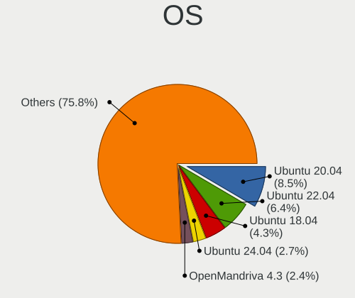

| Name                         | Notebooks | Percent |
|------------------------------|-----------|---------|
| Ubuntu 20.04                 | 307       | 8.46%   |
| Ubuntu 22.04                 | 231       | 6.37%   |
| Ubuntu 18.04                 | 157       | 4.33%   |
| Ubuntu 24.04                 | 98        | 2.7%    |
| OpenMandriva 4.3             | 86        | 2.37%   |
| Arch Rolling                 | 83        | 2.29%   |
| Pop!_OS 22.04                | 76        | 2.09%   |
| Debian 12                    | 69        | 1.9%    |
| Zorin 16                     | 67        | 1.85%   |
| Debian 11                    | 57        | 1.57%   |
| Zorin 17                     | 56        | 1.54%   |
| Linux Mint 22.1              | 52        | 1.43%   |
| openSUSE Tumbleweed-XXXXXXXX | 51        | 1.41%   |
| Linux Mint 20.3              | 46        | 1.27%   |
| Fedora 38                    | 46        | 1.27%   |
| Fedora 40                    | 43        | 1.18%   |
| Linux Mint 22.2              | 40        | 1.1%    |
| Manjaro                      | 39        | 1.07%   |
| Arch                         | 38        | 1.05%   |
| Fedora 34                    | 37        | 1.02%   |
| Linux Mint 21.2              | 35        | 0.96%   |
| Linux Mint 21.1              | 35        | 0.96%   |
| ArcoLinux Rolling            | 34        | 0.94%   |
| Linux Mint 20.2              | 33        | 0.91%   |
| Fedora 39                    | 33        | 0.91%   |
| Fedora 37                    | 32        | 0.88%   |
| Fedora 36                    | 32        | 0.88%   |
| EndeavourOS Rolling          | 32        | 0.88%   |
| Xubuntu 20.04                | 30        | 0.83%   |
| Ubuntu 21.10                 | 28        | 0.77%   |
| Linux Mint 21.3              | 28        | 0.77%   |
| Fedora 42                    | 28        | 0.77%   |
| OpenMandriva 24.12           | 27        | 0.74%   |
| Linux Mint 20.1              | 26        | 0.72%   |
| KDE neon 20.04               | 26        | 0.72%   |
| Fedora 41                    | 26        | 0.72%   |
| Fedora 31                    | 26        | 0.72%   |
| Ubuntu 21.04                 | 25        | 0.69%   |
| Fedora 35                    | 25        | 0.69%   |
| Pop!_OS 20.10                | 24        | 0.66%   |

OS Family
---------

OS without a version

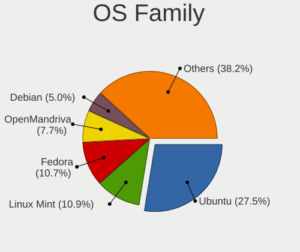

| Name             | Notebooks | Percent |
|------------------|-----------|---------|
| Ubuntu           | 943       | 27.55%  |
| Linux Mint       | 374       | 10.93%  |
| Fedora           | 365       | 10.66%  |
| OpenMandriva     | 262       | 7.65%   |
| Debian           | 172       | 5.02%   |
| Zorin            | 164       | 4.79%   |
| Pop!_OS          | 154       | 4.5%    |
| Arch             | 119       | 3.48%   |
| Manjaro          | 112       | 3.27%   |
| Kubuntu          | 73        | 2.13%   |
| openSUSE         | 66        | 1.93%   |
| Xubuntu          | 53        | 1.55%   |
| KDE neon         | 53        | 1.55%   |
| SteamOS          | 37        | 1.08%   |
| Kali             | 37        | 1.08%   |
| EndeavourOS      | 35        | 1.02%   |
| ArcoLinux        | 35        | 1.02%   |
| Elementary       | 34        | 0.99%   |
| Gentoo           | 26        | 0.76%   |
| LMDE             | 23        | 0.67%   |
| Lubuntu          | 21        | 0.61%   |
| NixOS            | 19        | 0.56%   |
| MX               | 16        | 0.47%   |
| Parrot           | 15        | 0.44%   |
| Ubuntu MATE      | 14        | 0.41%   |
| Ubuntu Budgie    | 13        | 0.38%   |
| ROSA             | 13        | 0.38%   |
| Clear Linux      | 12        | 0.35%   |
| Ubuntu Unity     | 11        | 0.32%   |
| Peppermint       | 10        | 0.29%   |
| Garuda Linux     | 9         | 0.26%   |
| Endless          | 9         | 0.26%   |
| Bazzite          | 9         | 0.26%   |
| Solus            | 7         | 0.2%    |
| CachyOS          | 7         | 0.2%    |
| org.kde.Platform | 5         | 0.15%   |
| Oracle Linux     | 5         | 0.15%   |
| Nobara           | 5         | 0.15%   |
| Artix            | 5         | 0.15%   |
| TUXEDO OS        | 4         | 0.12%   |

Kernel
------

Version of the Linux kernel

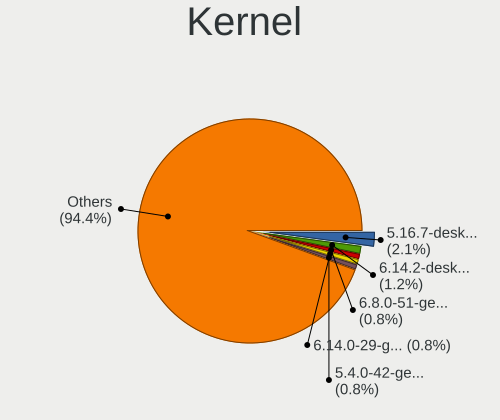

| Version                  | Notebooks | Percent |
|--------------------------|-----------|---------|
| 5.16.7-desktop-1omv4003  | 85        | 2.13%   |
| 6.14.2-desktop-3omv2590  | 46        | 1.15%   |
| 6.8.0-51-generic         | 31        | 0.78%   |
| 6.14.0-29-generic        | 31        | 0.78%   |
| 5.4.0-42-generic         | 30        | 0.75%   |
| 5.15.0-56-generic        | 24        | 0.6%    |
| 5.15.0-58-generic        | 22        | 0.55%   |
| 5.10.14-desktop-1omv4002 | 21        | 0.53%   |
| 5.4.0-58-generic         | 20        | 0.5%    |
| 6.12.1-desktop-1omv2490  | 19        | 0.48%   |
| 5.15.0-46-generic        | 19        | 0.48%   |
| 6.8.0-49-generic         | 18        | 0.45%   |
| 6.8.0-40-generic         | 18        | 0.45%   |
| 6.5.0-26-generic         | 18        | 0.45%   |
| 5.11.0-38-generic        | 18        | 0.45%   |
| 6.8.0-45-generic         | 17        | 0.43%   |
| 6.2.6-desktop-1omv2390   | 17        | 0.43%   |
| 5.8.0-50-generic         | 17        | 0.43%   |
| 5.4.0-48-generic         | 17        | 0.43%   |
| 5.15.0-43-generic        | 17        | 0.43%   |
| 6.9.3-76060903-generic   | 16        | 0.4%    |
| 6.2.0-26-generic         | 16        | 0.4%    |
| 5.8.0-43-generic         | 16        | 0.4%    |
| 5.15.0-91-generic        | 16        | 0.4%    |
| 6.8.0-60-generic         | 15        | 0.38%   |
| 6.8.0-52-generic         | 15        | 0.38%   |
| 5.4.0-26-generic         | 15        | 0.38%   |
| 5.13.0-28-generic        | 15        | 0.38%   |
| 5.11.0-27-generic        | 15        | 0.38%   |
| 6.14.0-36-generic        | 14        | 0.35%   |
| 6.1.1-desktop-1omv2290   | 14        | 0.35%   |
| 5.4.0-29-generic         | 14        | 0.35%   |
| 6.14.0-37-generic        | 13        | 0.33%   |
| 6.12.10-76061203-generic | 13        | 0.33%   |
| 5.8.0-53-generic         | 13        | 0.33%   |
| 5.4.0-77-generic         | 13        | 0.33%   |
| 5.4.0-52-generic         | 13        | 0.33%   |
| 5.4.0-33-generic         | 13        | 0.33%   |
| 5.19.0-35-generic        | 13        | 0.33%   |
| 5.15.0-60-generic        | 13        | 0.33%   |

Kernel Family
-------------

Linux kernel without a distro release

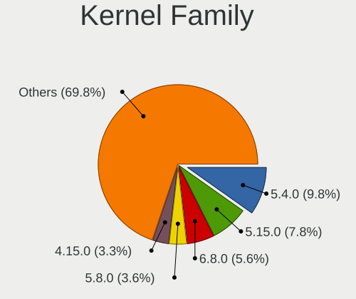

| Version | Notebooks | Percent |
|---------|-----------|---------|
| 5.4.0   | 369       | 9.8%    |
| 5.15.0  | 293       | 7.78%   |
| 6.8.0   | 212       | 5.63%   |
| 5.8.0   | 137       | 3.64%   |
| 4.15.0  | 126       | 3.34%   |
| 5.13.0  | 122       | 3.24%   |
| 5.11.0  | 122       | 3.24%   |
| 6.5.0   | 113       | 3%      |
| 6.14.0  | 107       | 2.84%   |
| 6.2.0   | 94        | 2.5%    |
| 5.19.0  | 92        | 2.44%   |
| 6.1.0   | 87        | 2.31%   |
| 5.16.7  | 86        | 2.28%   |
| 5.10.0  | 75        | 1.99%   |
| 5.3.0   | 70        | 1.86%   |
| 5.0.0   | 55        | 1.46%   |
| 6.14.2  | 48        | 1.27%   |
| 6.11.0  | 46        | 1.22%   |
| 4.18.0  | 40        | 1.06%   |
| 6.2.6   | 25        | 0.66%   |
| 6.12.1  | 23        | 0.61%   |
| 5.10.14 | 22        | 0.58%   |
| 6.9.3   | 20        | 0.53%   |
| 5.14.0  | 20        | 0.53%   |
| 4.19.0  | 19        | 0.5%    |
| 6.12.10 | 17        | 0.45%   |
| 6.1.1   | 17        | 0.45%   |
| 6.4.11  | 12        | 0.32%   |
| 6.17.7  | 12        | 0.32%   |
| 6.6.2   | 11        | 0.29%   |
| 6.4.6   | 11        | 0.29%   |
| 5.6.0   | 11        | 0.29%   |
| 6.7.9   | 10        | 0.27%   |
| 6.3.0   | 10        | 0.27%   |
| 6.2.9   | 10        | 0.27%   |
| 6.17.9  | 10        | 0.27%   |
| 6.12.9  | 10        | 0.27%   |
| 6.0.0   | 10        | 0.27%   |
| 6.5.6   | 9         | 0.24%   |
| 6.12.6  | 9         | 0.24%   |

Kernel Major Ver.
-----------------

Linux kernel major version

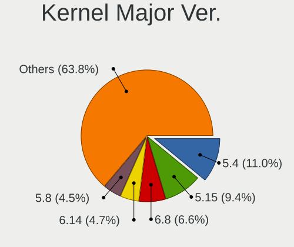

| Version | Notebooks | Percent |
|---------|-----------|---------|
| 5.4     | 407       | 10.96%  |
| 5.15    | 351       | 9.45%   |
| 6.8     | 244       | 6.57%   |
| 6.14    | 174       | 4.68%   |
| 5.8     | 167       | 4.5%    |
| 6.1     | 162       | 4.36%   |
| 6.2     | 158       | 4.25%   |
| 5.11    | 152       | 4.09%   |
| 6.5     | 151       | 4.06%   |
| 5.13    | 149       | 4.01%   |
| 5.10    | 126       | 3.39%   |
| 4.15    | 126       | 3.39%   |
| 5.16    | 117       | 3.15%   |
| 5.19    | 115       | 3.1%    |
| 6.12    | 99        | 2.66%   |
| 5.3     | 88        | 2.37%   |
| 6.11    | 83        | 2.23%   |
| 6.6     | 69        | 1.86%   |
| 5.0     | 58        | 1.56%   |
| 6.0     | 50        | 1.35%   |
| 5.14    | 49        | 1.32%   |
| 5.17    | 46        | 1.24%   |
| 4.18    | 46        | 1.24%   |
| 6.9     | 44        | 1.18%   |
| 6.17    | 44        | 1.18%   |
| 6.4     | 42        | 1.13%   |
| 6.3     | 42        | 1.13%   |
| 6.10    | 40        | 1.08%   |
| 6.7     | 35        | 0.94%   |
| 5.9     | 32        | 0.86%   |
| 5.18    | 31        | 0.83%   |
| 5.6     | 30        | 0.81%   |
| 5.7     | 23        | 0.62%   |
| 4.19    | 23        | 0.62%   |
| 6.15    | 22        | 0.59%   |
| 5.12    | 22        | 0.59%   |
| 6.13    | 18        | 0.48%   |
| 6.16    | 16        | 0.43%   |
| 5.5     | 15        | 0.4%    |
| 4.9     | 11        | 0.3%    |

Arch
----

OS architecture (x86_64, i586, etc.)

| Name    | Notebooks | Percent |
|---------|-----------|---------|
| x86_64  | 3238      | 97.88%  |
| i686    | 65        | 1.96%   |
| aarch64 | 4         | 0.12%   |
| riscv64 | 1         | 0.03%   |

DE
--

Desktop Environment

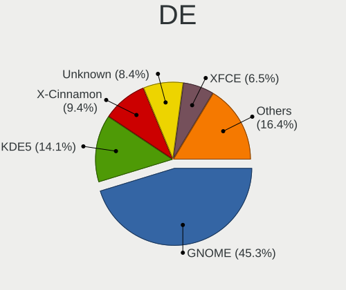

| Name             | Notebooks | Percent |
|------------------|-----------|---------|
| GNOME            | 1568      | 45.27%  |
| KDE5             | 489       | 14.12%  |
| X-Cinnamon       | 325       | 9.38%   |
| Unknown          | 290       | 8.37%   |
| XFCE             | 225       | 6.5%    |
| KDE6             | 176       | 5.08%   |
| MATE             | 78        | 2.25%   |
| KDE              | 54        | 1.56%   |
| LXQt             | 36        | 1.04%   |
| Pantheon         | 34        | 0.98%   |
| Cinnamon         | 24        | 0.69%   |
| i3               | 19        | 0.55%   |
| Hyprland         | 19        | 0.55%   |
| Budgie           | 19        | 0.55%   |
| LXDE             | 18        | 0.52%   |
| Unity            | 10        | 0.29%   |
| sway             | 9         | 0.26%   |
| KDE4             | 9         | 0.26%   |
| COSMIC           | 7         | 0.2%    |
| ICEWM            | 6         | 0.17%   |
| GNOME Flashback  | 6         | 0.17%   |
| Deepin           | 5         | 0.14%   |
| qtile            | 3         | 0.09%   |
| openbox          | 3         | 0.09%   |
| niri             | 3         | 0.09%   |
| GNOME Classic    | 3         | 0.09%   |
| awesome          | 3         | 0.09%   |
| none+i3          | 2         | 0.06%   |
| Enlightenment    | 2         | 0.06%   |
| Endless:GNOME    | 2         | 0.06%   |
| chadwm           | 2         | 0.06%   |
| bspwm            | 2         | 0.06%   |
| Xsession         | 1         | 0.03%   |
| xmonad           | 1         | 0.03%   |
| Trinity          | 1         | 0.03%   |
| sway:wlroots     | 1         | 0.03%   |
| lightdm-xsession | 1         | 0.03%   |
| herbstluftwm     | 1         | 0.03%   |
| gamescope        | 1         | 0.03%   |
| fluxbox          | 1         | 0.03%   |

Display Server
--------------

X11 or Wayland

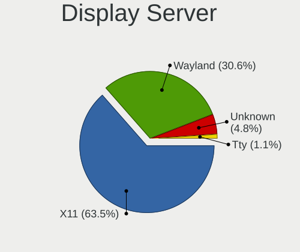

| Name    | Notebooks | Percent |
|---------|-----------|---------|
| X11     | 2177      | 63.52%  |
| Wayland | 1049      | 30.61%  |
| Unknown | 164       | 4.79%   |
| Tty     | 37        | 1.08%   |

Display Manager
---------------

SDDM, LightDM, etc.

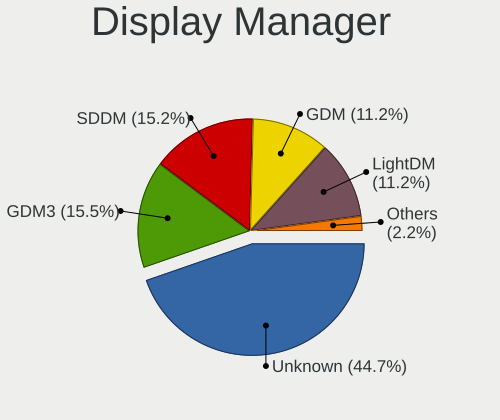

| Name           | Notebooks | Percent |
|----------------|-----------|---------|
| Unknown        | 1532      | 44.69%  |
| GDM3           | 532       | 15.52%  |
| SDDM           | 521       | 15.2%   |
| GDM            | 385       | 11.23%  |
| LightDM        | 384       | 11.2%   |
| TDM            | 47        | 1.37%   |
| KDM            | 7         | 0.2%    |
| GREETD         | 7         | 0.2%    |
| XDM            | 4         | 0.12%   |
| LY-DM          | 2         | 0.06%   |
| SLiM           | 1         | 0.03%   |
| NODM           | 1         | 0.03%   |
| Ly             | 1         | 0.03%   |
| LXDM           | 1         | 0.03%   |
| LEMURS         | 1         | 0.03%   |
| FLY-DM         | 1         | 0.03%   |
| COSMIC-GREETER | 1         | 0.03%   |

OS Lang
-------

Language

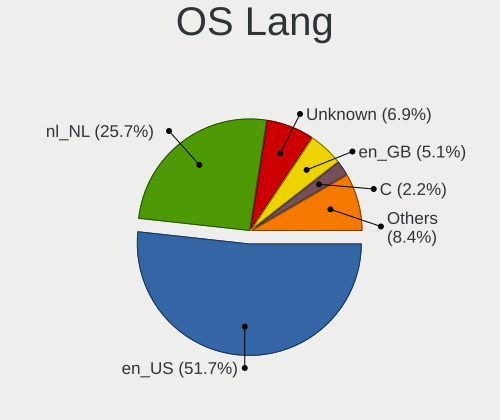

| Lang        | Notebooks | Percent |
|-------------|-----------|---------|
| en_US       | 1755      | 51.74%  |
| nl_NL       | 872       | 25.71%  |
| Unknown     | 234       | 6.9%    |
| en_GB       | 173       | 5.1%    |
| C           | 74        | 2.18%   |
| ru_RU       | 42        | 1.24%   |
| pl_PL       | 35        | 1.03%   |
| de_DE       | 34        | 1%      |
| fr_FR       | 14        | 0.41%   |
| nl_BE       | 13        | 0.38%   |
| POSIX       | 11        | 0.32%   |
| en_NL       | 11        | 0.32%   |
| en_IE       | 10        | 0.29%   |
| it_IT       | 9         | 0.27%   |
| en_IN       | 7         | 0.21%   |
| es_ES       | 6         | 0.18%   |
| en_DK       | 6         | 0.18%   |
| sk_SK       | 5         | 0.15%   |
| hu_HU       | 5         | 0.15%   |
| en_CA       | 5         | 0.15%   |
| pt_PT       | 4         | 0.12%   |
| es_MX       | 4         | 0.12%   |
| cs_CZ       | 4         | 0.12%   |
| zh_CN       | 3         | 0.09%   |
| uk_UA       | 3         | 0.09%   |
| tr_TR       | 3         | 0.09%   |
| sv_SE       | 3         | 0.09%   |
| ro_RO       | 3         | 0.09%   |
| pt_BR       | 3         | 0.09%   |
| nb_NO       | 3         | 0.09%   |
| C.UTF8      | 3         | 0.09%   |
| lt_LT       | 2         | 0.06%   |
| fr_BE       | 2         | 0.06%   |
| en_ZA       | 2         | 0.06%   |
| en_US.utf-8 | 2         | 0.06%   |
| en_SG       | 2         | 0.06%   |
| en_AG       | 2         | 0.06%   |
| de_AT       | 2         | 0.06%   |
| ca_ES       | 2         | 0.06%   |
| ru_UA       | 1         | 0.03%   |

Boot Mode
---------

EFI or BIOS

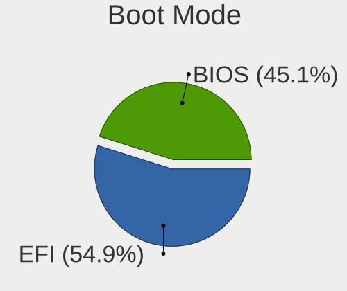

| Mode | Notebooks | Percent |
|------|-----------|---------|
| EFI  | 1860      | 54.85%  |
| BIOS | 1531      | 45.15%  |

Filesystem
----------

Type of filesystem

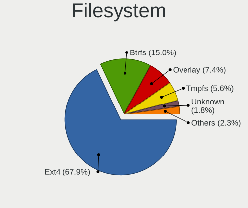

| Type    | Notebooks | Percent |
|---------|-----------|---------|
| Ext4    | 2322      | 67.93%  |
| Btrfs   | 512       | 14.98%  |
| Overlay | 253       | 7.4%    |
| Tmpfs   | 191       | 5.59%   |
| Unknown | 62        | 1.81%   |
| Xfs     | 40        | 1.17%   |
| Zfs     | 20        | 0.59%   |
| F2fs    | 8         | 0.23%   |
| Ext3    | 3         | 0.09%   |
| Ext2    | 3         | 0.09%   |
| Aufs    | 2         | 0.06%   |
| Rootfs  | 1         | 0.03%   |
| Jfs     | 1         | 0.03%   |

Part. scheme
------------

Scheme of partitioning

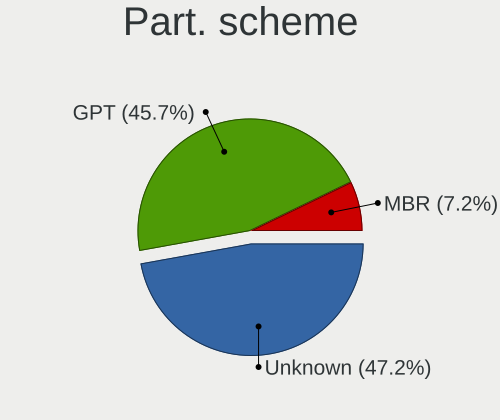

| Type    | Notebooks | Percent |
|---------|-----------|---------|
| Unknown | 1598      | 47.15%  |
| GPT     | 1548      | 45.68%  |
| MBR     | 243       | 7.17%   |

Dual Boot with Linux/BSD
------------------------

Hosting more than one Linux/BSD

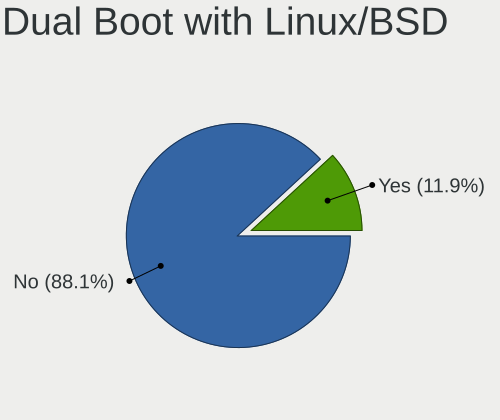

| Dual boot | Notebooks | Percent |
|-----------|-----------|---------|
| No        | 2964      | 88.14%  |
| Yes       | 399       | 11.86%  |

Dual Boot (Win)
---------------

Hosting Linux and Windows

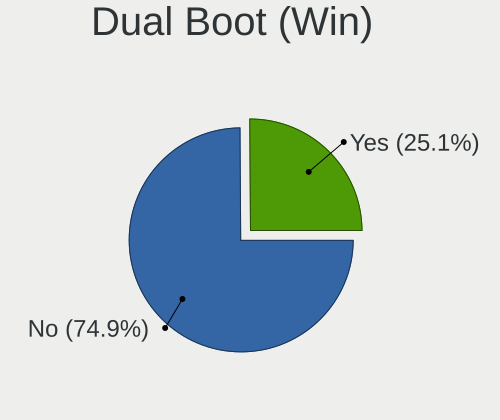

| Dual boot | Notebooks | Percent |
|-----------|-----------|---------|
| No        | 2509      | 74.9%   |
| Yes       | 841       | 25.1%   |

Board
-----

Vendor
------

Motherboard manufacturer

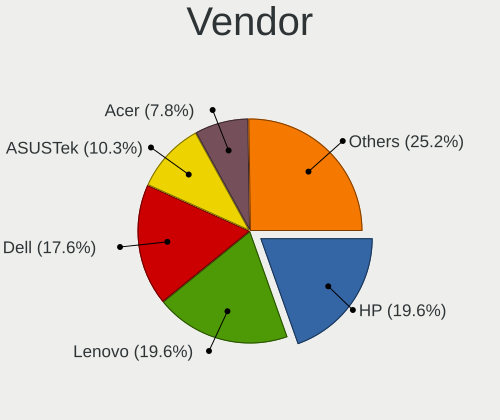

| Name                 | Notebooks | Percent |
|----------------------|-----------|---------|
| Hewlett-Packard      | 647       | 19.58%  |
| Lenovo               | 646       | 19.55%  |
| Dell                 | 581       | 17.58%  |
| ASUSTek Computer     | 339       | 10.26%  |
| Acer                 | 257       | 7.78%   |
| Apple                | 135       | 4.09%   |
| Notebook             | 76        | 2.3%    |
| MSI                  | 72        | 2.18%   |
| Toshiba              | 69        | 2.09%   |
| Samsung Electronics  | 39        | 1.18%   |
| Medion               | 39        | 1.18%   |
| Google               | 38        | 1.15%   |
| Valve                | 35        | 1.06%   |
| Sony                 | 27        | 0.82%   |
| Packard Bell         | 26        | 0.79%   |
| Fujitsu              | 25        | 0.76%   |
| Unknown              | 18        | 0.54%   |
| HUAWEI               | 16        | 0.48%   |
| Alienware            | 16        | 0.48%   |
| Framework            | 15        | 0.45%   |
| TUXEDO               | 12        | 0.36%   |
| Timi                 | 10        | 0.3%    |
| PC Specialist        | 9         | 0.27%   |
| Insyde               | 8         | 0.24%   |
| Gigabyte Technology  | 8         | 0.24%   |
| Chuwi                | 8         | 0.24%   |
| Fujitsu Siemens      | 7         | 0.21%   |
| TongFang             | 6         | 0.18%   |
| SLIMBOOK             | 6         | 0.18%   |
| SKIKK                | 6         | 0.18%   |
| Razer                | 6         | 0.18%   |
| System76             | 5         | 0.15%   |
| Clevo                | 5         | 0.15%   |
| Intel                | 4         | 0.12%   |
| TrekStor             | 3         | 0.09%   |
| Standard             | 3         | 0.09%   |
| Intel Client Systems | 3         | 0.09%   |
| HONOR                | 3         | 0.09%   |
| Hampoo               | 3         | 0.09%   |
| Acidanthera          | 3         | 0.09%   |

Model
-----

Motherboard model

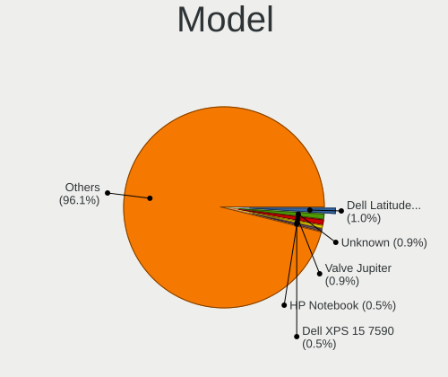

| Name                                  | Notebooks | Percent |
|---------------------------------------|-----------|---------|
| Dell Latitude 3310                    | 33        | 1%      |
| Unknown                               | 31        | 0.94%   |
| Valve Jupiter                         | 30        | 0.91%   |
| HP Notebook                           | 18        | 0.54%   |
| Dell XPS 15 7590                      | 16        | 0.48%   |
| Dell XPS 15 9560                      | 13        | 0.39%   |
| Dell XPS 15 9500                      | 12        | 0.36%   |
| Apple MacBookAir7,2                   | 12        | 0.36%   |
| HP Pavilion g6                        | 11        | 0.33%   |
| HP Pavilion dv7                       | 11        | 0.33%   |
| Apple MacBookPro9,2                   | 11        | 0.33%   |
| Apple MacBookPro12,1                  | 11        | 0.33%   |
| HP ZBook Studio G5                    | 10        | 0.3%    |
| HP ProBook 6570b                      | 10        | 0.3%    |
| Dell Latitude E6410                   | 10        | 0.3%    |
| Apple MacBookPro8,1                   | 10        | 0.3%    |
| HP Pavilion g7                        | 9         | 0.27%   |
| HP EliteBook 840 G3                   | 9         | 0.27%   |
| Dell Latitude 3189                    | 9         | 0.27%   |
| Lenovo ThinkBook 15 G2 ITL 20VE       | 8         | 0.24%   |
| Lenovo Legion 5 Pro 16ACH6H 82JQ      | 8         | 0.24%   |
| HP ProBook 650 G1                     | 8         | 0.24%   |
| HP Pavilion Laptop 15-cw1xxx          | 8         | 0.24%   |
| HP Pavilion Gaming Laptop 15-cx0xxx   | 8         | 0.24%   |
| HP Pavilion dv6                       | 8         | 0.24%   |
| Dell XPS 15 9570                      | 8         | 0.24%   |
| Dell XPS 13 9310                      | 8         | 0.24%   |
| Dell Latitude E6520                   | 8         | 0.24%   |
| Dell Latitude 3300                    | 8         | 0.24%   |
| Lenovo IdeaPad 5 Pro 16ACH6 82L5      | 7         | 0.21%   |
| HP EliteBook 8570w                    | 7         | 0.21%   |
| HP EliteBook 840 G2                   | 7         | 0.21%   |
| HP EliteBook 840 G1                   | 7         | 0.21%   |
| Dell XPS 13 9360                      | 7         | 0.21%   |
| Dell Latitude E6540                   | 7         | 0.21%   |
| Dell Latitude E6420                   | 7         | 0.21%   |
| Dell Latitude E6320                   | 7         | 0.21%   |
| Apple MacBookPro11,2                  | 7         | 0.21%   |
| Lenovo IdeaPad L340-15IRH Gaming 81LK | 6         | 0.18%   |
| Lenovo IdeaPad 5 15ARE05 81YQ         | 6         | 0.18%   |

Model Family
------------

Motherboard model prefix

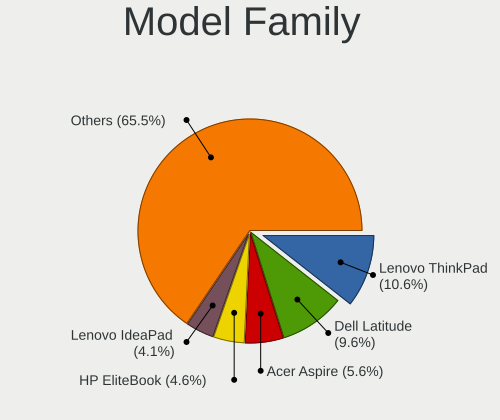

| Name                  | Notebooks | Percent |
|-----------------------|-----------|---------|
| Lenovo ThinkPad       | 350       | 10.59%  |
| Dell Latitude         | 316       | 9.56%   |
| Acer Aspire           | 185       | 5.6%    |
| HP EliteBook          | 151       | 4.57%   |
| Lenovo IdeaPad        | 137       | 4.15%   |
| HP Pavilion           | 126       | 3.81%   |
| Dell XPS              | 122       | 3.69%   |
| HP ProBook            | 118       | 3.57%   |
| Dell Inspiron         | 64        | 1.94%   |
| Toshiba Satellite     | 61        | 1.85%   |
| HP ZBook              | 60        | 1.82%   |
| ASUS VivoBook         | 57        | 1.73%   |
| Lenovo Legion         | 51        | 1.54%   |
| HP Compaq             | 41        | 1.24%   |
| HP Laptop             | 38        | 1.15%   |
| Dell Precision        | 38        | 1.15%   |
| Lenovo ThinkBook      | 34        | 1.03%   |
| Unknown               | 31        | 0.94%   |
| Valve Jupiter         | 30        | 0.91%   |
| ASUS ROG              | 30        | 0.91%   |
| ASUS ASUS             | 26        | 0.79%   |
| Packard Bell EasyNote | 24        | 0.73%   |
| Fujitsu LIFEBOOK      | 24        | 0.73%   |
| Lenovo Yoga           | 23        | 0.7%    |
| ASUS ZenBook          | 21        | 0.64%   |
| HP OMEN               | 20        | 0.61%   |
| Apple MacBookPro11    | 20        | 0.61%   |
| HP Notebook           | 18        | 0.54%   |
| Acer TravelMate       | 18        | 0.54%   |
| Apple MacBookPro8     | 17        | 0.51%   |
| Acer Swift            | 17        | 0.51%   |
| Framework Laptop      | 15        | 0.45%   |
| Apple MacBookPro9     | 15        | 0.45%   |
| HP ENVY               | 14        | 0.42%   |
| Apple MacBookAir7     | 14        | 0.42%   |
| HP Victus             | 11        | 0.33%   |
| Dell Vostro           | 11        | 0.33%   |
| Dell System           | 11        | 0.33%   |
| Apple MacBookPro12    | 11        | 0.33%   |
| Acer Nitro            | 10        | 0.3%    |

MFG Year
--------

Motherboard manufacture year

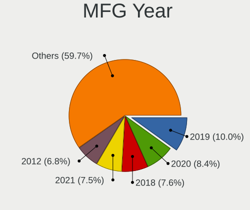

| Year    | Notebooks | Percent |
|---------|-----------|---------|
| 2019    | 329       | 9.96%   |
| 2020    | 276       | 8.35%   |
| 2018    | 252       | 7.63%   |
| 2021    | 248       | 7.51%   |
| 2012    | 226       | 6.84%   |
| 2013    | 215       | 6.51%   |
| 2017    | 193       | 5.84%   |
| 2011    | 191       | 5.78%   |
| 2015    | 184       | 5.57%   |
| 2022    | 180       | 5.45%   |
| 2016    | 156       | 4.72%   |
| 2014    | 150       | 4.54%   |
| 2010    | 148       | 4.48%   |
| 2023    | 127       | 3.84%   |
| 2008    | 112       | 3.39%   |
| 2009    | 105       | 3.18%   |
| 2024    | 84        | 2.54%   |
| 2007    | 68        | 2.06%   |
| 2006    | 33        | 1%      |
| 2025    | 18        | 0.54%   |
| 2005    | 4         | 0.12%   |
| Unknown | 3         | 0.09%   |
| 2004    | 1         | 0.03%   |
| 2001    | 1         | 0.03%   |

Form Factor
-----------

Physical design of the computer

| Name     | Notebooks | Percent |
|----------|-----------|---------|
| Notebook | 3304      | 100%    |

Secure Boot
-----------

Enabled or disabled

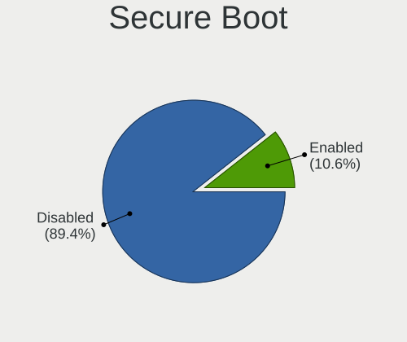

| State    | Notebooks | Percent |
|----------|-----------|---------|
| Disabled | 2979      | 89.38%  |
| Enabled  | 354       | 10.62%  |

Coreboot
--------

Have coreboot on board

| Used | Notebooks | Percent |
|------|-----------|---------|
| No   | 3255      | 98.52%  |
| Yes  | 49        | 1.48%   |

RAM Size
--------

Total RAM memory

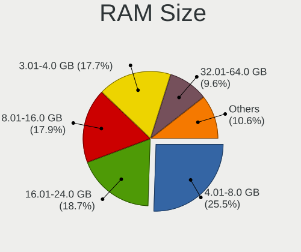

| Size in GB  | Notebooks | Percent |
|-------------|-----------|---------|
| 4.01-8.0    | 855       | 25.52%  |
| 16.01-24.0  | 628       | 18.75%  |
| 8.01-16.0   | 599       | 17.88%  |
| 3.01-4.0    | 593       | 17.7%   |
| 32.01-64.0  | 320       | 9.55%   |
| 1.01-2.0    | 107       | 3.19%   |
| 64.01-256.0 | 81        | 2.42%   |
| 24.01-32.0  | 77        | 2.3%    |
| 2.01-3.0    | 69        | 2.06%   |
| 0.51-1.0    | 20        | 0.6%    |
| 0.01-0.5    | 1         | 0.03%   |

RAM Used
--------

Used RAM memory

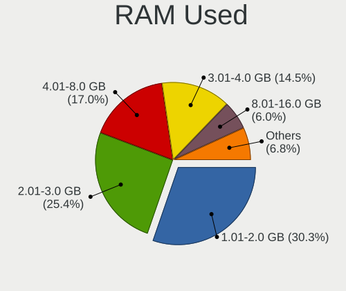

| Used GB    | Notebooks | Percent |
|------------|-----------|---------|
| 1.01-2.0   | 1111      | 30.3%   |
| 2.01-3.0   | 933       | 25.44%  |
| 4.01-8.0   | 622       | 16.96%  |
| 3.01-4.0   | 532       | 14.51%  |
| 8.01-16.0  | 219       | 5.97%   |
| 0.51-1.0   | 187       | 5.1%    |
| 16.01-24.0 | 34        | 0.93%   |
| 0.01-0.5   | 18        | 0.49%   |
| 24.01-32.0 | 9         | 0.25%   |
| 32.01-64.0 | 2         | 0.05%   |

Total Drives
------------

Number of drives on board

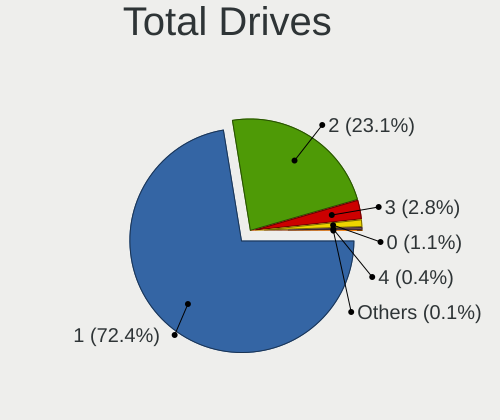

| Drives | Notebooks | Percent |
|--------|-----------|---------|
| 1      | 2440      | 72.43%  |
| 2      | 778       | 23.09%  |
| 3      | 95        | 2.82%   |
| 0      | 37        | 1.1%    |
| 4      | 14        | 0.42%   |
| 6      | 2         | 0.06%   |
| 5      | 2         | 0.06%   |
| 7      | 1         | 0.03%   |

Has CD-ROM
----------

Has CD-ROM on board

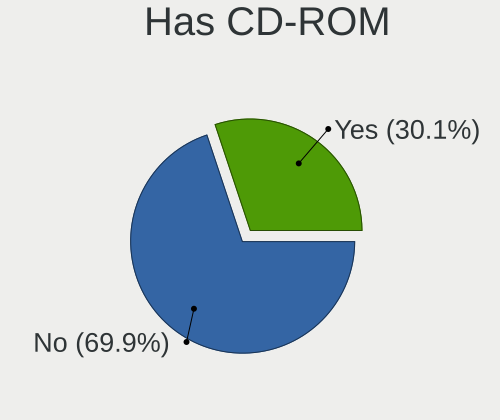

| Presented | Notebooks | Percent |
|-----------|-----------|---------|
| No        | 2321      | 69.89%  |
| Yes       | 1000      | 30.11%  |

Has Ethernet
------------

Has Ethernet on board

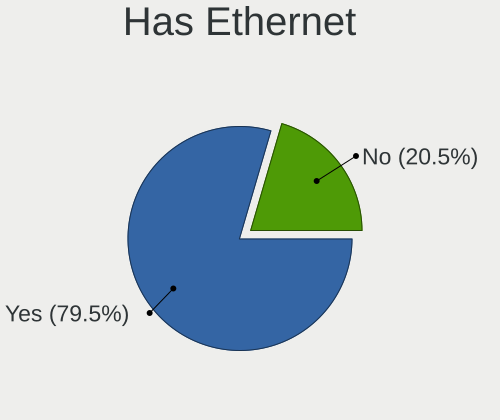

| Presented | Notebooks | Percent |
|-----------|-----------|---------|
| Yes       | 2640      | 79.52%  |
| No        | 680       | 20.48%  |

Has WiFi
--------

Has WiFi module

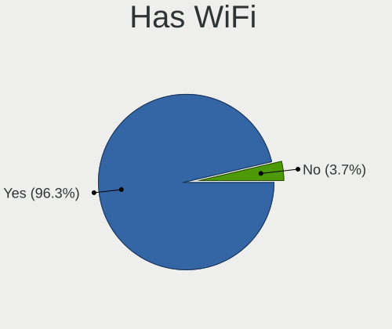

| Presented | Notebooks | Percent |
|-----------|-----------|---------|
| Yes       | 3185      | 96.34%  |
| No        | 121       | 3.66%   |

Has Bluetooth
-------------

Has Bluetooth module

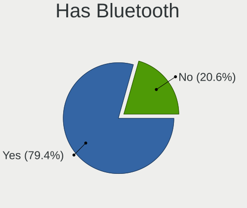

| Presented | Notebooks | Percent |
|-----------|-----------|---------|
| Yes       | 2661      | 79.39%  |
| No        | 691       | 20.61%  |

Location
--------

Country
-------

Geographic location (country)

| Country     | Notebooks | Percent |
|-------------|-----------|---------|
| Netherlands | 3304      | 100%    |

City
----

Geographic location (city)

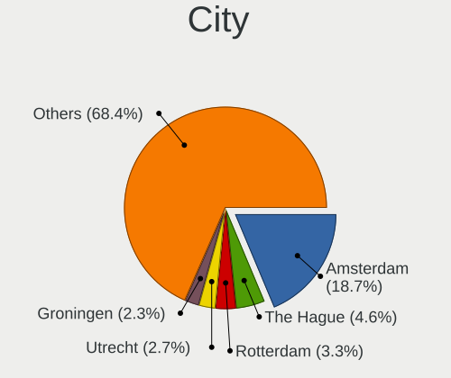

| City                   | Notebooks | Percent |
|------------------------|-----------|---------|
| Amsterdam              | 657       | 18.69%  |
| The Hague              | 163       | 4.64%   |
| Rotterdam              | 115       | 3.27%   |
| Utrecht                | 94        | 2.67%   |
| Groningen              | 80        | 2.28%   |
| Naaldwijk              | 77        | 2.19%   |
| Delft                  | 74        | 2.11%   |
| Haarlem                | 70        | 1.99%   |
| Eindhoven              | 61        | 1.74%   |
| Schagen                | 58        | 1.65%   |
| Almere Stad            | 50        | 1.42%   |
| Enschede               | 40        | 1.14%   |
| Tilburg                | 37        | 1.05%   |
| Amersfoort             | 31        | 0.88%   |
| Nijmegen               | 30        | 0.85%   |
| Leiden                 | 30        | 0.85%   |
| Breda                  | 28        | 0.8%    |
| Apeldoorn              | 27        | 0.77%   |
| Amstelveen             | 26        | 0.74%   |
| Zoetermeer             | 25        | 0.71%   |
| Hengelo                | 25        | 0.71%   |
| Dordrecht              | 24        | 0.68%   |
| Zwolle                 | 23        | 0.65%   |
| Roosendaal             | 22        | 0.63%   |
| Heerlen                | 22        | 0.63%   |
| Leeuwarden             | 21        | 0.6%    |
| Gouda                  | 21        | 0.6%    |
| Arnhem                 | 21        | 0.6%    |
| Meppel                 | 20        | 0.57%   |
| Hilversum              | 19        | 0.54%   |
| Hoofddorp              | 18        | 0.51%   |
| Capelle aan den IJssel | 18        | 0.51%   |
| Almelo                 | 18        | 0.51%   |
| Zeist                  | 17        | 0.48%   |
| Oss                    | 16        | 0.46%   |
| Nieuwegein             | 16        | 0.46%   |
| Maastricht             | 16        | 0.46%   |
| Alkmaar                | 16        | 0.46%   |
| Dronten                | 15        | 0.43%   |
| Lelystad               | 14        | 0.4%    |

Drives
------

Drive Vendor
------------

Hard drive vendors

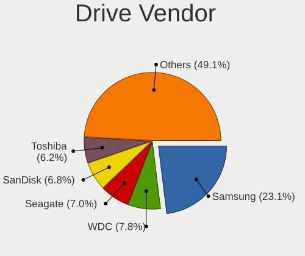

| Vendor                       | Notebooks | Drives | Percent |
|------------------------------|-----------|--------|---------|
| Samsung Electronics          | 940       | 1346   | 23.06%  |
| WDC                          | 318       | 403    | 7.8%    |
| Seagate                      | 286       | 354    | 7.02%   |
| SanDisk                      | 279       | 329    | 6.84%   |
| Toshiba                      | 251       | 318    | 6.16%   |
| Unknown                      | 248       | 304    | 6.08%   |
| SK hynix                     | 245       | 295    | 6.01%   |
| Kingston                     | 224       | 278    | 5.5%    |
| Crucial                      | 136       | 167    | 3.34%   |
| Intel                        | 134       | 173    | 3.29%   |
| Micron Technology            | 127       | 147    | 3.12%   |
| Hitachi                      | 106       | 123    | 2.6%    |
| HGST                         | 88        | 112    | 2.16%   |
| Apple                        | 73        | 101    | 1.79%   |
| KIOXIA                       | 71        | 74     | 1.74%   |
| LITEON                       | 40        | 51     | 0.98%   |
| A-DATA Technology            | 31        | 33     | 0.76%   |
| Phison Electronics           | 30        | 37     | 0.74%   |
| LITEONIT                     | 27        | 29     | 0.66%   |
| Fujitsu                      | 22        | 25     | 0.54%   |
| Phison                       | 20        | 34     | 0.49%   |
| China                        | 20        | 34     | 0.49%   |
| Kingston Technology Company  | 18        | 21     | 0.44%   |
| Intenso                      | 17        | 23     | 0.42%   |
| Unknown                      | 16        | 18     | 0.39%   |
| OCZ                          | 14        | 17     | 0.34%   |
| MAXIO Technology (Hangzhou)  | 14        | 15     | 0.34%   |
| Micron/Crucial Technology    | 13        | 17     | 0.32%   |
| PNY                          | 12        | 13     | 0.29%   |
| GOODRAM                      | 12        | 13     | 0.29%   |
| SPCC                         | 10        | 10     | 0.25%   |
| Shenzhen Longsys Electronics | 10        | 11     | 0.25%   |
| JMicron Technology           | 10        | 11     | 0.25%   |
| Transcend                    | 8         | 10     | 0.2%    |
| SSSTC                        | 8         | 9      | 0.2%    |
| Corsair                      | 8         | 8      | 0.2%    |
| O2 Micro                     | 7         | 8      | 0.17%   |
| Gigabyte Technology          | 7         | 9      | 0.17%   |
| Union Memory (Shenzhen)      | 6         | 6      | 0.15%   |
| Team                         | 6         | 8      | 0.15%   |

Drive Model
-----------

Hard drive models

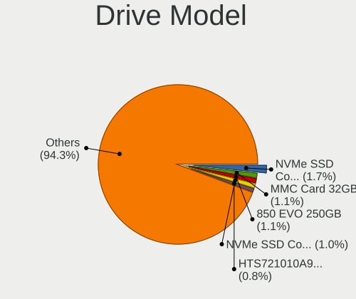

| Model                                                | Notebooks | Percent |
|------------------------------------------------------|-----------|---------|
| Samsung NVMe SSD Controller SM981/PM981/PM983 1TB    | 72        | 1.69%   |
| Unknown MMC Card  32GB                               | 47        | 1.1%    |
| Samsung SSD 850 EVO 250GB                            | 45        | 1.05%   |
| Samsung NVMe SSD Controller PM9A1/PM9A3/980PRO 1TB   | 43        | 1.01%   |
| HGST HTS721010A9E630 1TB                             | 35        | 0.82%   |
| Unknown MMC Card  64GB                               | 33        | 0.77%   |
| Kingston SA400S37240G 240GB SSD                      | 33        | 0.77%   |
| Samsung SSD 850 EVO 500GB                            | 28        | 0.66%   |
| Seagate ST1000LM035-1RK172 1TB                       | 26        | 0.61%   |
| Samsung SSD 860 EVO 500GB                            | 26        | 0.61%   |
| Kingston SA400S37120G 120GB SSD                      | 26        | 0.61%   |
| Seagate ST9500325AS 500GB                            | 25        | 0.59%   |
| Toshiba MQ01ABF050 500GB                             | 24        | 0.56%   |
| Toshiba MQ01ABD100 1TB                               | 24        | 0.56%   |
| Samsung NVMe SSD Controller SM961/PM961/SM963 1024GB | 24        | 0.56%   |
| Samsung SSD 980 1TB                                  | 22        | 0.52%   |
| SanDisk NVMe SSD Drive 512GB                         | 21        | 0.49%   |
| Samsung SSD 840 EVO 250GB                            | 21        | 0.49%   |
| Unknown MMC Card  128GB                              | 18        | 0.42%   |
| Seagate ST500LT012-1DG142 500GB                      | 18        | 0.42%   |
| Samsung NVMe SSD Drive 1TB                           | 18        | 0.42%   |
| Samsung NVMe SSD Drive 256GB                         | 17        | 0.4%    |
| Kingston SV300S37A120G 120GB SSD                     | 17        | 0.4%    |
| Intel SSD 660P Series 512GB                          | 17        | 0.4%    |
| Crucial CT500MX500SSD1 500GB                         | 17        | 0.4%    |
| Seagate ST1000LM024 HN-M101MBB 1TB                   | 16        | 0.37%   |
| Samsung NVMe SSD Drive 512GB                         | 16        | 0.37%   |
| Samsung MZALQ512HALU-000L2 512GB                     | 16        | 0.37%   |
| HGST HTS725050A7E630 500GB                           | 16        | 0.37%   |
| Crucial CT1000MX500SSD1 1TB                          | 16        | 0.37%   |
| Unknown                                              | 16        | 0.37%   |
| Samsung SSD 870 EVO 500GB                            | 15        | 0.35%   |
| Samsung SSD 860 EVO 250GB                            | 15        | 0.35%   |
| Samsung NVMe SSD Drive 500GB                         | 15        | 0.35%   |
| Samsung NVMe SSD Drive 1024GB                        | 15        | 0.35%   |
| WDC WDS240G2G0A-00JH30 240GB SSD                     | 14        | 0.33%   |
| Unknown MMC Card  512GB                              | 14        | 0.33%   |
| Toshiba NVMe SSD Drive 512GB                         | 14        | 0.33%   |
| Seagate Expansion 2TB                                | 14        | 0.33%   |
| Kingston SA400S37480G 480GB SSD                      | 14        | 0.33%   |

HDD Vendor
----------

Hard disk drive vendors

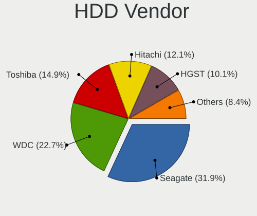

| Vendor              | Notebooks | Drives | Percent |
|---------------------|-----------|--------|---------|
| Seagate             | 279       | 344    | 31.92%  |
| WDC                 | 198       | 242    | 22.65%  |
| Toshiba             | 130       | 167    | 14.87%  |
| Hitachi             | 106       | 123    | 12.13%  |
| HGST                | 88        | 112    | 10.07%  |
| Fujitsu             | 22        | 25     | 2.52%   |
| Samsung Electronics | 17        | 20     | 1.95%   |
| Unknown             | 9         | 12     | 1.03%   |
| JMicron Technology  | 7         | 8      | 0.8%    |
| External            | 3         | 5      | 0.34%   |
| ASMT                | 3         | 4      | 0.34%   |
| Apple               | 3         | 4      | 0.34%   |
| USB3.0              | 1         | 1      | 0.11%   |
| StoreJet            | 1         | 1      | 0.11%   |
| SSK                 | 1         | 1      | 0.11%   |
| SABRENT             | 1         | 2      | 0.11%   |
| KESU                | 1         | 1      | 0.11%   |
| Intenso             | 1         | 1      | 0.11%   |
| IBM/Hitachi         | 1         | 1      | 0.11%   |
| HGST HTS            | 1         | 1      | 0.11%   |
| ASMedia             | 1         | 1      | 0.11%   |

SSD Vendor
----------

Solid state drive vendors

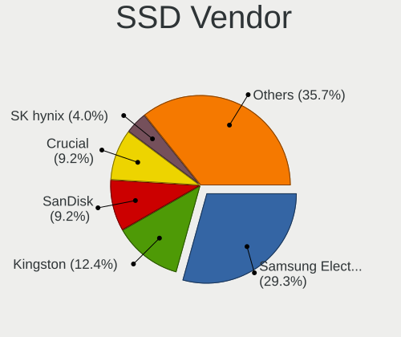

| Vendor              | Notebooks | Drives | Percent |
|---------------------|-----------|--------|---------|
| Samsung Electronics | 406       | 563    | 29.31%  |
| Kingston            | 172       | 211    | 12.42%  |
| SanDisk             | 128       | 143    | 9.24%   |
| Crucial             | 128       | 158    | 9.24%   |
| SK hynix            | 56        | 71     | 4.04%   |
| WDC                 | 54        | 82     | 3.9%    |
| Apple               | 53        | 65     | 3.83%   |
| Micron Technology   | 41        | 52     | 2.96%   |
| Intel               | 36        | 40     | 2.6%    |
| LITEON              | 32        | 43     | 2.31%   |
| Toshiba             | 29        | 40     | 2.09%   |
| LITEONIT            | 27        | 29     | 1.95%   |
| A-DATA Technology   | 25        | 27     | 1.81%   |
| China               | 20        | 34     | 1.44%   |
| OCZ                 | 14        | 17     | 1.01%   |
| Intenso             | 14        | 15     | 1.01%   |
| PNY                 | 12        | 13     | 0.87%   |
| GOODRAM             | 11        | 11     | 0.79%   |
| SPCC                | 9         | 9      | 0.65%   |
| Transcend           | 7         | 9      | 0.51%   |
| Corsair             | 7         | 7      | 0.51%   |
| Netac               | 6         | 6      | 0.43%   |
| SABRENT             | 5         | 6      | 0.36%   |
| KingSpec            | 5         | 5      | 0.36%   |
| Unknown             | 4         | 4      | 0.29%   |
| Team                | 4         | 6      | 0.29%   |
| Patriot             | 4         | 7      | 0.29%   |
| KingFast            | 4         | 6      | 0.29%   |
| KingDian            | 4         | 5      | 0.29%   |
| Verbatim            | 3         | 3      | 0.22%   |
| Phison              | 3         | 13     | 0.22%   |
| Leven               | 3         | 3      | 0.22%   |
| Gigabyte Technology | 3         | 3      | 0.22%   |
| ASMT                | 3         | 3      | 0.22%   |
| Unknown             | 3         | 4      | 0.22%   |
| VICKTER             | 2         | 6      | 0.14%   |
| Vaseky              | 2         | 2      | 0.14%   |
| SSSTC               | 2         | 2      | 0.14%   |
| Seagate             | 2         | 2      | 0.14%   |
| Lexar               | 2         | 2      | 0.14%   |

Drive Kind
----------

HDD or SSD

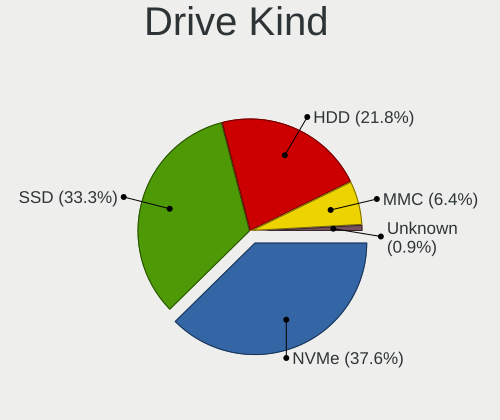

| Kind    | Notebooks | Drives | Percent |
|---------|-----------|--------|---------|
| NVMe    | 1453      | 2002   | 37.63%  |
| SSD     | 1287      | 1769   | 33.33%  |
| HDD     | 841       | 1076   | 21.78%  |
| MMC     | 246       | 297    | 6.37%   |
| Unknown | 34        | 46     | 0.88%   |

Drive Connector
---------------

SATA, SAS, NVMe, etc.

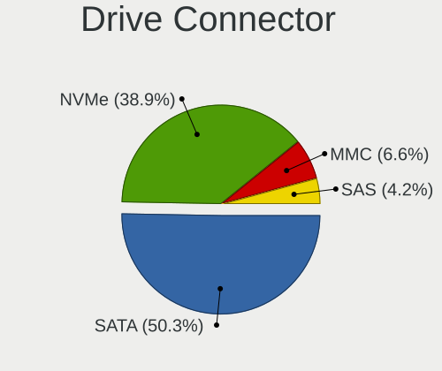

| Type | Notebooks | Drives | Percent |
|------|-----------|--------|---------|
| SATA | 1874      | 2711   | 50.28%  |
| NVMe | 1450      | 1980   | 38.91%  |
| MMC  | 246       | 297    | 6.6%    |
| SAS  | 157       | 202    | 4.21%   |

Drive Size
----------

Size of hard drive

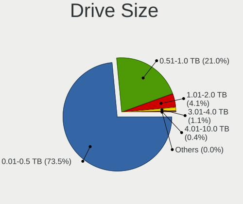

| Size in TB | Notebooks | Drives | Percent |
|------------|-----------|--------|---------|
| 0.01-0.5   | 1539      | 2104   | 73.5%   |
| 0.51-1.0   | 439       | 596    | 20.96%  |
| 1.01-2.0   | 85        | 106    | 4.06%   |
| 3.01-4.0   | 22        | 28     | 1.05%   |
| 4.01-10.0  | 8         | 10     | 0.38%   |
| 2.01-3.0   | 1         | 1      | 0.05%   |

Space Total
-----------

Amount of disk space available on the file system

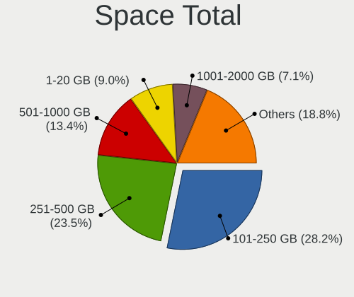

| Size in GB     | Notebooks | Percent |
|----------------|-----------|---------|
| 101-250        | 986       | 28.2%   |
| 251-500        | 821       | 23.48%  |
| 501-1000       | 470       | 13.44%  |
| 1-20           | 314       | 8.98%   |
| 1001-2000      | 248       | 7.09%   |
| 51-100         | 225       | 6.44%   |
| 21-50          | 142       | 4.06%   |
| Unknown        | 113       | 3.23%   |
| More than 3000 | 107       | 3.06%   |
| 2001-3000      | 70        | 2%      |

Space Used
----------

Amount of used disk space

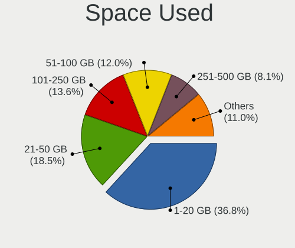

| Used GB        | Notebooks | Percent |
|----------------|-----------|---------|
| 1-20           | 1340      | 36.82%  |
| 21-50          | 674       | 18.52%  |
| 101-250        | 496       | 13.63%  |
| 51-100         | 436       | 11.98%  |
| 251-500        | 294       | 8.08%   |
| 501-1000       | 162       | 4.45%   |
| Unknown        | 113       | 3.11%   |
| 1001-2000      | 72        | 1.98%   |
| More than 3000 | 23        | 0.63%   |
| 2001-3000      | 21        | 0.58%   |
| 0              | 8         | 0.22%   |

Malfunc. Drives
---------------

Drive models with a malfunction

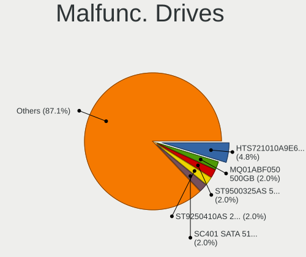

| Model                                 | Notebooks | Drives | Percent |
|---------------------------------------|-----------|--------|---------|
| HGST HTS721010A9E630 1TB              | 7         | 9      | 4.76%   |
| Toshiba MQ01ABF050 500GB              | 3         | 3      | 2.04%   |
| SK hynix SC401 SATA 512GB SSD         | 3         | 3      | 2.04%   |
| SK hynix HFS128G39TND-N210A 128GB SSD | 3         | 3      | 2.04%   |
| Seagate ST9500325AS 500GB             | 3         | 3      | 2.04%   |
| Seagate ST9250410AS 250GB             | 3         | 3      | 2.04%   |
| Kingston SA400S37120G 120GB SSD       | 3         | 4      | 2.04%   |
| HGST HTS725050A7E630 500GB            | 3         | 3      | 2.04%   |
| WDC WD10SPZX-60Z10T0 1TB              | 2         | 2      | 1.36%   |
| Toshiba MQ01ABD100 1TB                | 2         | 2      | 1.36%   |
| SK hynix BC711 HFM512GD3JX013N 512GB  | 2         | 2      | 1.36%   |
| Seagate ST9320325AS 320GB             | 2         | 2      | 1.36%   |
| Seagate ST500LT012-9WS142 500GB       | 2         | 2      | 1.36%   |
| Seagate ST1000LM024 HN-M101MBB 1TB    | 2         | 2      | 1.36%   |
| Samsung Electronics SSD 870 EVO 500GB | 2         | 2      | 1.36%   |
| LITEON CV8-8E128-HP 128GB SSD         | 2         | 5      | 1.36%   |
| Intel SSDMAEXC024G3H 24GB             | 2         | 2      | 1.36%   |
| Hitachi HTS725050A7E630 500GB         | 2         | 3      | 1.36%   |
| Hitachi HTS545050A7E380 500GB         | 2         | 2      | 1.36%   |
| Hitachi HTS542525K9A300 250GB         | 2         | 2      | 1.36%   |
| Fujitsu MHZ2320BH G2 320GB            | 2         | 2      | 1.36%   |
| WDC WDS240G2G0A-00JH30 240GB SSD      | 1         | 1      | 0.68%   |
| WDC WD7500BPVT-08HXZT3 752GB          | 1         | 1      | 0.68%   |
| WDC WD600UE-22HCT0 64GB               | 1         | 1      | 0.68%   |
| WDC WD5000LPVX-80V0TT0 500GB          | 1         | 1      | 0.68%   |
| WDC WD3200BPVT-80ZEST0 320GB          | 1         | 1      | 0.68%   |
| WDC WD3200BPVT-22JJ5T0 320GB          | 1         | 1      | 0.68%   |
| WDC WD3200BEVT-60ZCT1 320GB           | 1         | 1      | 0.68%   |
| WDC WD2500BEVT-75A23T0 250GB          | 1         | 1      | 0.68%   |
| WDC WD2500BEVT-22ZCT0 250GB           | 1         | 1      | 0.68%   |
| WDC WD2500BEVT-00ZCT0 250GB           | 1         | 1      | 0.68%   |
| WDC WD1600BEVT-75A23T0 160GB          | 1         | 1      | 0.68%   |
| WDC WD1600BEVT-22A23T0 160GB          | 1         | 1      | 0.68%   |
| WDC WD10SPZX-24Z10T0 1TB              | 1         | 1      | 0.68%   |
| WDC WD10JPVX-22JC3T0 1TB              | 1         | 1      | 0.68%   |
| WDC WD Green 2.5 240GB                | 1         | 2      | 0.68%   |
| WDC PC SA530 SDASB8Y1T00 1TB SSD      | 1         | 1      | 0.68%   |
| Toshiba THNSNK128GCS8 SATA 128GB SSD  | 1         | 1      | 0.68%   |
| Toshiba MK5061GSYN 500GB              | 1         | 1      | 0.68%   |
| Toshiba MK3265GSX 320GB               | 1         | 1      | 0.68%   |

Malfunc. Drive Vendor
---------------------

Vendors of faulty drives

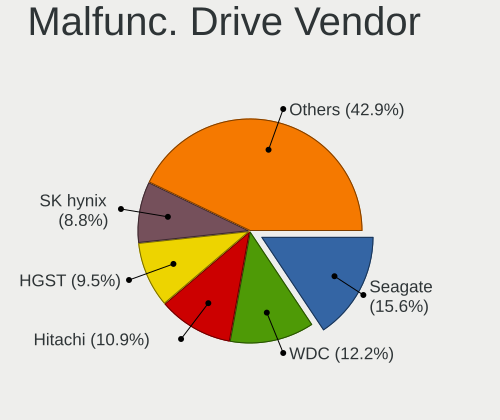

| Vendor                      | Notebooks | Drives | Percent |
|-----------------------------|-----------|--------|---------|
| Seagate                     | 23        | 25     | 15.65%  |
| WDC                         | 18        | 19     | 12.24%  |
| Hitachi                     | 16        | 17     | 10.88%  |
| HGST                        | 14        | 18     | 9.52%   |
| SK hynix                    | 13        | 13     | 8.84%   |
| Toshiba                     | 10        | 10     | 6.8%    |
| SanDisk                     | 7         | 7      | 4.76%   |
| Kingston                    | 7         | 9      | 4.76%   |
| Intel                       | 7         | 7      | 4.76%   |
| Samsung Electronics         | 5         | 5      | 3.4%    |
| LITEON                      | 5         | 8      | 3.4%    |
| Micron Technology           | 4         | 4      | 2.72%   |
| Fujitsu                     | 4         | 4      | 2.72%   |
| Crucial                     | 3         | 3      | 2.04%   |
| Realtek                     | 1         | 1      | 0.68%   |
| OCZ                         | 1         | 1      | 0.68%   |
| Micron/Crucial Technology   | 1         | 1      | 0.68%   |
| Leven                       | 1         | 1      | 0.68%   |
| Kingston Technology Company | 1         | 1      | 0.68%   |
| Intenso                     | 1         | 1      | 0.68%   |
| IBM/Hitachi                 | 1         | 1      | 0.68%   |
| GOODRAM                     | 1         | 1      | 0.68%   |
| Corsair                     | 1         | 1      | 0.68%   |
| Apple                       | 1         | 1      | 0.68%   |
| A-DATA Technology           | 1         | 1      | 0.68%   |

Malfunc. HDD Vendor
-------------------

Vendors of faulty HDD drives

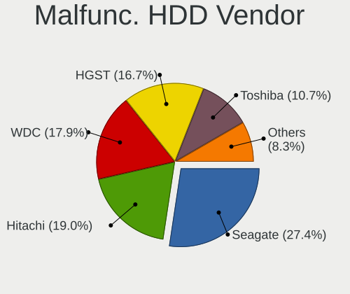

| Vendor              | Notebooks | Drives | Percent |
|---------------------|-----------|--------|---------|
| Seagate             | 23        | 25     | 27.38%  |
| Hitachi             | 16        | 17     | 19.05%  |
| WDC                 | 15        | 15     | 17.86%  |
| HGST                | 14        | 18     | 16.67%  |
| Toshiba             | 9         | 9      | 10.71%  |
| Fujitsu             | 4         | 4      | 4.76%   |
| Samsung Electronics | 1         | 1      | 1.19%   |
| IBM/Hitachi         | 1         | 1      | 1.19%   |
| Apple               | 1         | 1      | 1.19%   |

Malfunc. Drive Kind
-------------------

Kinds of faulty drives

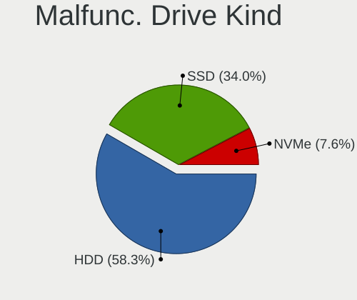

| Kind | Notebooks | Drives | Percent |
|------|-----------|--------|---------|
| HDD  | 84        | 91     | 58.33%  |
| SSD  | 49        | 57     | 34.03%  |
| NVMe | 11        | 12     | 7.64%   |

Failed Drives
-------------

Failed drive models

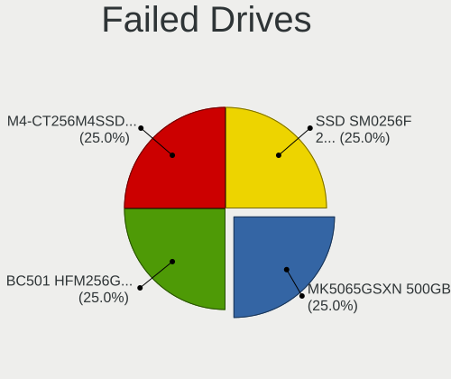

| Model                                   | Notebooks | Drives | Percent |
|-----------------------------------------|-----------|--------|---------|
| Toshiba MK5065GSXN 500GB                | 1         | 1      | 25%     |
| SK hynix BC501 HFM256GDJTNG-8310A 256GB | 1         | 1      | 25%     |
| Crucial M4-CT256M4SSD3 256GB            | 1         | 1      | 25%     |
| Apple SSD SM0256F 256GB                 | 1         | 1      | 25%     |

Failed Drive Vendor
-------------------

Failed drive vendors

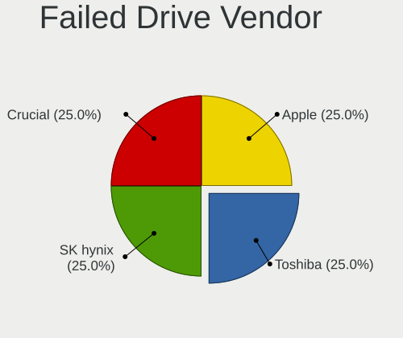

| Vendor   | Notebooks | Drives | Percent |
|----------|-----------|--------|---------|
| Toshiba  | 1         | 1      | 25%     |
| SK hynix | 1         | 1      | 25%     |
| Crucial  | 1         | 1      | 25%     |
| Apple    | 1         | 1      | 25%     |

Drive Status
------------

Number of failed and malfunc. drives

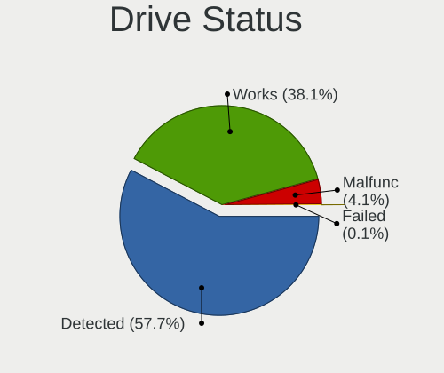

| Status   | Notebooks | Drives | Percent |
|----------|-----------|--------|---------|
| Detected | 2008      | 3227   | 57.7%   |
| Works    | 1325      | 1799   | 38.07%  |
| Malfunc  | 143       | 160    | 4.11%   |
| Failed   | 4         | 4      | 0.11%   |

Storage controller
------------------

Storage Vendor
--------------

Storage controller vendors

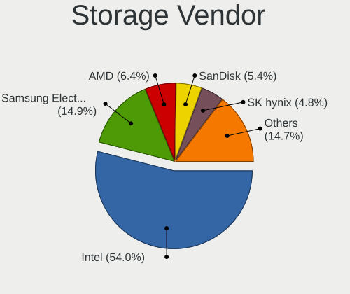

| Vendor                                  | Notebooks | Percent |
|-----------------------------------------|-----------|---------|
| Intel                                   | 2124      | 53.96%  |
| Samsung Electronics                     | 585       | 14.86%  |
| AMD                                     | 251       | 6.38%   |
| SanDisk                                 | 212       | 5.39%   |
| SK hynix                                | 187       | 4.75%   |
| Toshiba America Info Systems            | 99        | 2.52%   |
| Micron Technology                       | 88        | 2.24%   |
| KIOXIA                                  | 71        | 1.8%    |
| Kingston Technology Company             | 70        | 1.78%   |
| Phison Electronics                      | 52        | 1.32%   |
| Nvidia                                  | 35        | 0.89%   |
| Micron/Crucial Technology               | 17        | 0.43%   |
| MAXIO Technology (Hangzhou)             | 17        | 0.43%   |
| Apple                                   | 17        | 0.43%   |
| Silicon Integrated Systems [SiS]        | 14        | 0.36%   |
| Shenzhen Longsys Electronics            | 13        | 0.33%   |
| Lite-On Technology                      | 12        | 0.3%    |
| Solid State Storage Technology          | 10        | 0.25%   |
| Union Memory (Shenzhen)                 | 8         | 0.2%    |
| O2 Micro                                | 7         | 0.18%   |
| Silicon Motion                          | 6         | 0.15%   |
| Realtek Semiconductor                   | 6         | 0.15%   |
| ADATA Technology                        | 5         | 0.13%   |
| VIA Technologies                        | 3         | 0.08%   |
| Shenzhen Unionmemory Information System | 3         | 0.08%   |
| Seagate Technology                      | 3         | 0.08%   |
| Marvell Technology Group                | 3         | 0.08%   |
| JMicron Technology                      | 3         | 0.08%   |
| Yangtze Memory Technologies             | 2         | 0.05%   |
| Solidigm                                | 2         | 0.05%   |
| Lenovo                                  | 2         | 0.05%   |
| INNOGRIT                                | 2         | 0.05%   |
| ASMedia Technology                      | 2         | 0.05%   |
| Transcend                               | 1         | 0.03%   |
| Silicon Image                           | 1         | 0.03%   |
| Shenzhen Techwinsemi Technology         | 1         | 0.03%   |
| Hosin Global Electronics                | 1         | 0.03%   |
| Biwin Storage Technology                | 1         | 0.03%   |

Storage Model
-------------

Storage controller models

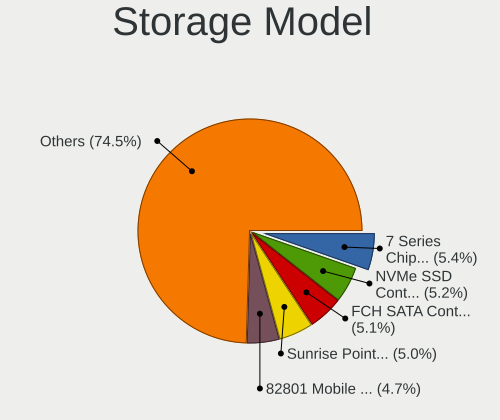

| Model                                                                          | Notebooks | Percent |
|--------------------------------------------------------------------------------|-----------|---------|
| Intel 7 Series Chipset Family 6-port SATA Controller [AHCI mode]               | 224       | 5.36%   |
| Samsung NVMe SSD Controller SM981/PM981/PM983                                  | 219       | 5.24%   |
| AMD FCH SATA Controller [AHCI mode]                                            | 214       | 5.12%   |
| Intel Sunrise Point-LP SATA Controller [AHCI mode]                             | 210       | 5.03%   |
| Intel 82801 Mobile SATA Controller [RAID mode]                                 | 197       | 4.72%   |
| Intel 6 Series/C200 Series Chipset Family 6 port Mobile SATA AHCI Controller   | 157       | 3.76%   |
| Samsung NVMe SSD Controller 980 (DRAM-less)                                    | 130       | 3.11%   |
| Intel Cannon Lake Mobile PCH SATA AHCI Controller                              | 120       | 2.87%   |
| Intel Volume Management Device NVMe RAID Controller                            | 115       | 2.75%   |
| Intel 8 Series/C220 Series Chipset Family 6-port SATA Controller 1 [AHCI mode] | 111       | 2.66%   |
| Intel 82801IBM/IEM (ICH9M/ICH9M-E) 4 port SATA Controller [AHCI mode]          | 103       | 2.47%   |
| Intel 8 Series SATA Controller 1 [AHCI mode]                                   | 95        | 2.27%   |
| Samsung NVMe SSD Controller PM9A1/PM9A3/980PRO                                 | 84        | 2.01%   |
| Intel HM170/QM170 Chipset SATA Controller [AHCI Mode]                          | 82        | 1.96%   |
| Intel Wildcat Point-LP SATA Controller [AHCI Mode]                             | 77        | 1.84%   |
| Intel 5 Series/3400 Series Chipset 4 port SATA AHCI Controller                 | 74        | 1.77%   |
| Samsung NVMe SSD Controller SM961/PM961/SM963                                  | 62        | 1.48%   |
| SK hynix Gold P31/BC711/PC711 NVMe Solid State Drive                           | 55        | 1.32%   |
| Intel 82801HM/HEM (ICH8M/ICH8M-E) IDE Controller                               | 54        | 1.29%   |
| Intel 5 Series/3400 Series Chipset 6 port SATA AHCI Controller                 | 50        | 1.2%    |
| SanDisk Extreme Pro / WD Black SN750 / PC SN730 / Red SN700 NVMe SSD           | 45        | 1.08%   |
| Intel 82801HM/HEM (ICH8M/ICH8M-E) SATA Controller [AHCI mode]                  | 45        | 1.08%   |
| KIOXIA NVMe SSD Controller BG4 (DRAM-less)                                     | 41        | 0.98%   |
| Intel Comet Lake SATA AHCI Controller                                          | 39        | 0.93%   |
| Toshiba America Info Systems XG6 NVMe SSD Controller                           | 38        | 0.91%   |
| Intel Tiger Lake-LP SATA Controller                                            | 38        | 0.91%   |
| Intel SSD 660P Series                                                          | 36        | 0.86%   |
| Intel Cannon Point-LP SATA Controller [AHCI Mode]                              | 36        | 0.86%   |
| Intel Celeron N3350/Pentium N4200/Atom E3900 Series SATA AHCI Controller       | 31        | 0.74%   |
| Toshiba America Info Systems XG5 NVMe SSD Controller                           | 29        | 0.69%   |
| SK hynix BC511 NVMe SSD                                                        | 27        | 0.65%   |
| SK hynix BC501 NVMe Solid State Drive                                          | 27        | 0.65%   |
| Samsung NVMe SSD Controller S4LV008[Pascal]                                    | 26        | 0.62%   |
| SanDisk WD PC SN810 / Black SN850 NVMe SSD                                     | 25        | 0.6%    |
| Samsung S4LN058A01[SSUBX] AHCI SSD Controller (Apple slot)                     | 25        | 0.6%    |
| Intel SSD 670p Series [Keystone Harbor]                                        | 25        | 0.6%    |
| Intel 400 Series Chipset Family SATA AHCI Controller                           | 25        | 0.6%    |
| Samsung NVMe SSD Controller PM9B1 (DRAM-less)                                  | 24        | 0.57%   |
| Intel Atom Processor E3800 Series SATA AHCI Controller                         | 24        | 0.57%   |
| SanDisk WD SN560/SN740/SN770/SN5000 NVMe SSD                                   | 23        | 0.55%   |

Storage Kind
------------

Kind of storage controller (IDE, SATA, NVMe, SAS, ...)

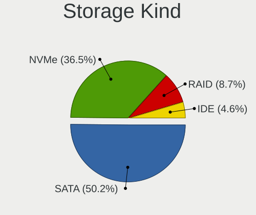

| Kind | Notebooks | Percent |
|------|-----------|---------|
| SATA | 2004      | 50.16%  |
| NVMe | 1458      | 36.5%   |
| RAID | 349       | 8.74%   |
| IDE  | 184       | 4.61%   |

Processor
---------

CPU Vendor
----------

Processor vendors

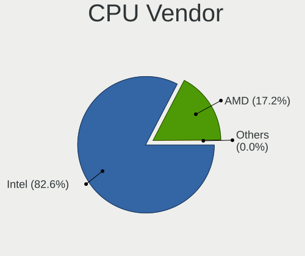

| Vendor        | Notebooks | Percent |
|---------------|-----------|---------|
| Intel         | 2730      | 82.63%  |
| AMD           | 569       | 17.22%  |
| ARM           | 2         | 0.06%   |
| sifive,u74-mc | 1         | 0.03%   |
| Qualcomm      | 1         | 0.03%   |
| Unknown       | 1         | 0.03%   |

CPU Model
---------

Processor models

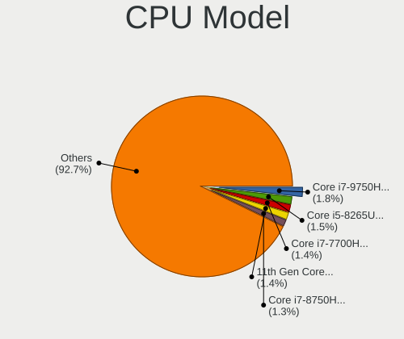

| Model                                         | Notebooks | Percent |
|-----------------------------------------------|-----------|---------|
| Intel Core i7-9750H CPU @ 2.60GHz             | 58        | 1.75%   |
| Intel Core i5-8265U CPU @ 1.60GHz             | 48        | 1.45%   |
| Intel Core i7-7700HQ CPU @ 2.80GHz            | 47        | 1.42%   |
| Intel 11th Gen Core i5-1135G7 @ 2.40GHz       | 45        | 1.36%   |
| Intel Core i7-8750H CPU @ 2.20GHz             | 42        | 1.27%   |
| Intel Core i7-6700HQ CPU @ 2.60GHz            | 41        | 1.24%   |
| Intel Core i5-8250U CPU @ 1.60GHz             | 40        | 1.21%   |
| Intel Core i7-8565U CPU @ 1.80GHz             | 39        | 1.18%   |
| Intel Core i7-8550U CPU @ 1.80GHz             | 37        | 1.12%   |
| Intel Core i5-6300U CPU @ 2.40GHz             | 36        | 1.09%   |
| AMD Ryzen 7 5800H with Radeon Graphics        | 36        | 1.09%   |
| Intel Core i5-3210M CPU @ 2.50GHz             | 35        | 1.06%   |
| Intel 11th Gen Core i7-1165G7 @ 2.80GHz       | 35        | 1.06%   |
| Intel Core i5-6200U CPU @ 2.30GHz             | 34        | 1.03%   |
| Intel Core i5-10210U CPU @ 1.60GHz            | 34        | 1.03%   |
| Intel Core i5-2520M CPU @ 2.50GHz             | 32        | 0.97%   |
| AMD Custom APU 0405                           | 30        | 0.91%   |
| Intel Core i7-10750H CPU @ 2.60GHz            | 27        | 0.82%   |
| Intel Core i5-5200U CPU @ 2.20GHz             | 27        | 0.82%   |
| Intel Core i5-3320M CPU @ 2.60GHz             | 26        | 0.79%   |
| Intel Core i5-7200U CPU @ 2.50GHz             | 25        | 0.76%   |
| Intel Core i5-8350U CPU @ 1.70GHz             | 24        | 0.73%   |
| AMD Ryzen 5 3500U with Radeon Vega Mobile Gfx | 24        | 0.73%   |
| Intel Core i7-3630QM CPU @ 2.40GHz            | 22        | 0.67%   |
| Intel Core i5 CPU M 520 @ 2.40GHz             | 22        | 0.67%   |
| Intel Core i3-8145U CPU @ 2.10GHz             | 22        | 0.67%   |
| AMD Ryzen 7 5700U with Radeon Graphics        | 22        | 0.67%   |
| Intel Core i7-10510U CPU @ 1.80GHz            | 21        | 0.64%   |
| Intel Core i5-4200M CPU @ 2.50GHz             | 21        | 0.64%   |
| Intel 11th Gen Core i7-1185G7 @ 3.00GHz       | 21        | 0.64%   |
| Intel 12th Gen Core i7-12700H                 | 20        | 0.61%   |
| Intel 11th Gen Core i7-11800H @ 2.30GHz       | 19        | 0.57%   |
| Intel Core i7-8665U CPU @ 1.90GHz             | 18        | 0.54%   |
| Intel Core i5-5300U CPU @ 2.30GHz             | 18        | 0.54%   |
| Intel Celeron CPU N2840 @ 2.16GHz             | 18        | 0.54%   |
| Intel 12th Gen Core i5-1235U                  | 18        | 0.54%   |
| AMD Ryzen 5 5500U with Radeon Graphics        | 18        | 0.54%   |
| Intel Core i7-7500U CPU @ 2.70GHz             | 17        | 0.51%   |
| Intel Core i5-3230M CPU @ 2.60GHz             | 17        | 0.51%   |
| Intel Pentium CPU N4200 @ 1.10GHz             | 16        | 0.48%   |

CPU Model Family
----------------

Processor model prefix

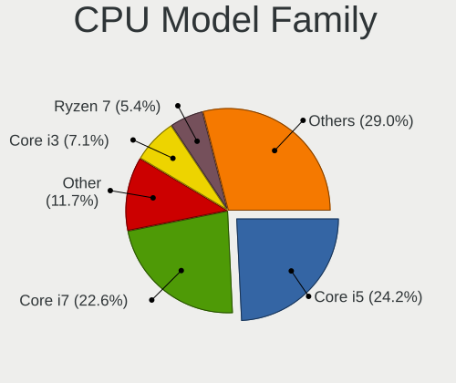

| Model                          | Notebooks | Percent |
|--------------------------------|-----------|---------|
| Intel Core i5                  | 801       | 24.24%  |
| Intel Core i7                  | 747       | 22.6%   |
| Other                          | 387       | 11.71%  |
| Intel Core i3                  | 235       | 7.11%   |
| AMD Ryzen 7                    | 177       | 5.36%   |
| Intel Core 2 Duo               | 134       | 4.05%   |
| Intel Celeron                  | 120       | 3.63%   |
| AMD Ryzen 5                    | 107       | 3.24%   |
| Intel Pentium                  | 77        | 2.33%   |
| Intel Atom                     | 70        | 2.12%   |
| AMD Ryzen 7 PRO                | 41        | 1.24%   |
| Intel Pentium Dual-Core        | 38        | 1.15%   |
| Intel Core i9                  | 35        | 1.06%   |
| AMD Ryzen 9                    | 33        | 1%      |
| Intel Core                     | 27        | 0.82%   |
| Intel Pentium Dual             | 25        | 0.76%   |
| AMD A6                         | 25        | 0.76%   |
| AMD Ryzen 5 PRO                | 24        | 0.73%   |
| Intel Genuine                  | 20        | 0.61%   |
| Intel Core 2                   | 18        | 0.54%   |
| AMD A10                        | 14        | 0.42%   |
| AMD E1                         | 13        | 0.39%   |
| Intel Pentium Silver           | 11        | 0.33%   |
| AMD Ryzen 3                    | 11        | 0.33%   |
| AMD A8                         | 11        | 0.33%   |
| Intel Core m3                  | 10        | 0.3%    |
| AMD A4                         | 10        | 0.3%    |
| AMD E                          | 9         | 0.27%   |
| Intel Xeon                     | 7         | 0.21%   |
| Intel Core m7                  | 5         | 0.15%   |
| Intel Celeron Dual-Core        | 5         | 0.15%   |
| AMD E2                         | 5         | 0.15%   |
| AMD Athlon II                  | 5         | 0.15%   |
| Intel Core m5                  | 4         | 0.12%   |
| Intel Celeron M                | 4         | 0.12%   |
| AMD Athlon X2                  | 4         | 0.12%   |
| AMD Athlon 64 X2               | 3         | 0.09%   |
| AMD Athlon                     | 3         | 0.09%   |
| Intel Core Duo                 | 2         | 0.06%   |
| AMD Turion X2 Dual-Core Mobile | 2         | 0.06%   |

CPU Cores
---------

Number of processor cores

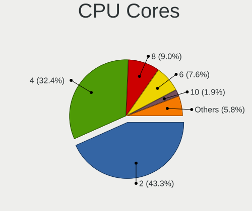

| Number | Notebooks | Percent |
|--------|-----------|---------|
| 2      | 1432      | 43.32%  |
| 4      | 1070      | 32.37%  |
| 8      | 298       | 9.01%   |
| 6      | 251       | 7.59%   |
| 10     | 63        | 1.91%   |
| 1      | 55        | 1.66%   |
| 14     | 52        | 1.57%   |
| 12     | 35        | 1.06%   |
| 16     | 30        | 0.91%   |
| 24     | 17        | 0.51%   |
| 20     | 3         | 0.09%   |

CPU Sockets
-----------

Number of sockets

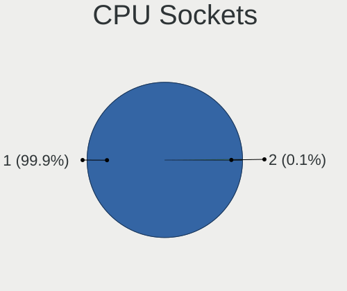

| Number | Notebooks | Percent |
|--------|-----------|---------|
| 1      | 3302      | 99.94%  |
| 2      | 2         | 0.06%   |

CPU Threads
-----------

Threads per core (Hyper-Threading)

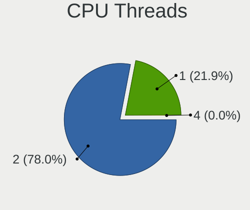

| Number | Notebooks | Percent |
|--------|-----------|---------|
| 2      | 2579      | 78.01%  |
| 1      | 725       | 21.93%  |
| 8      | 1         | 0.03%   |
| 4      | 1         | 0.03%   |

CPU Op-Modes
------------

CPU Operation Modes (32-bit, 64-bit)

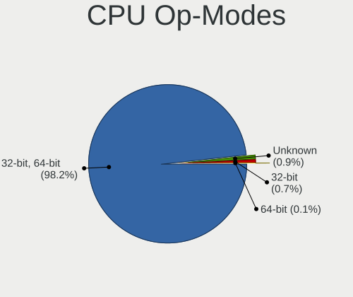

| Op mode        | Notebooks | Percent |
|----------------|-----------|---------|
| 32-bit, 64-bit | 3253      | 98.25%  |
| Unknown        | 31        | 0.94%   |
| 32-bit         | 23        | 0.69%   |
| 64-bit         | 4         | 0.12%   |

CPU Microcode
-------------

Microcode number

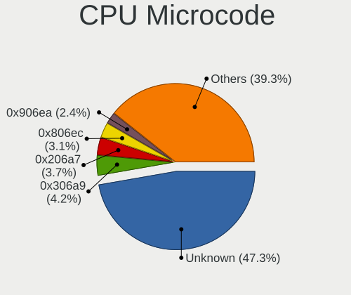

| Number     | Notebooks | Percent |
|------------|-----------|---------|
| Unknown    | 1625      | 47.25%  |
| 0x306a9    | 145       | 4.22%   |
| 0x206a7    | 127       | 3.69%   |
| 0x806ec    | 108       | 3.14%   |
| 0x906ea    | 82        | 2.38%   |
| 0x40651    | 72        | 2.09%   |
| 0x1067a    | 70        | 2.04%   |
| 0x806ea    | 65        | 1.89%   |
| 0x406e3    | 65        | 1.89%   |
| 0x20655    | 63        | 1.83%   |
| 0x806c1    | 62        | 1.8%    |
| 0x306c3    | 60        | 1.74%   |
| 0x306d4    | 55        | 1.6%    |
| 0x806e9    | 51        | 1.48%   |
| 0x6fd      | 50        | 1.45%   |
| 0x0a50000c | 41        | 1.19%   |
| 0x08600106 | 34        | 0.99%   |
| 0x906e9    | 33        | 0.96%   |
| 0x806eb    | 33        | 0.96%   |
| 0x30678    | 31        | 0.9%    |
| 0xa0652    | 27        | 0.79%   |
| 0x506e3    | 26        | 0.76%   |
| 0x08108102 | 23        | 0.67%   |
| 0x506c9    | 22        | 0.64%   |
| 0x20652    | 21        | 0.61%   |
| 0x906a4    | 19        | 0.55%   |
| 0x906a3    | 17        | 0.49%   |
| 0x10676    | 17        | 0.49%   |
| 0x08108109 | 17        | 0.49%   |
| 0x706e5    | 16        | 0.47%   |
| 0x08608103 | 16        | 0.47%   |
| 0x08600103 | 16        | 0.47%   |
| 0x806d1    | 15        | 0.44%   |
| 0x406c4    | 15        | 0.44%   |
| 0x906ed    | 14        | 0.41%   |
| 0x406c3    | 13        | 0.38%   |
| 0x706a8    | 12        | 0.35%   |
| 0x6f6      | 11        | 0.32%   |
| 0x40661    | 11        | 0.32%   |
| 0x6e8      | 10        | 0.29%   |

CPU Microarch
-------------

Microarchitecture

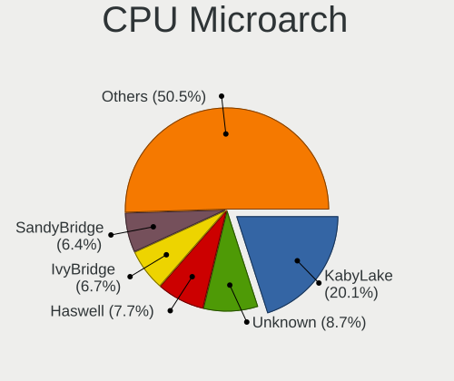

| Name              | Notebooks | Percent |
|-------------------|-----------|---------|
| KabyLake          | 665       | 20.05%  |
| Unknown           | 289       | 8.72%   |
| Haswell           | 254       | 7.66%   |
| IvyBridge         | 223       | 6.72%   |
| SandyBridge       | 211       | 6.36%   |
| Skylake           | 192       | 5.79%   |
| Penryn            | 145       | 4.37%   |
| Westmere          | 130       | 3.92%   |
| TigerLake         | 130       | 3.92%   |
| Alderlake Hybrid  | 119       | 3.59%   |
| Broadwell         | 108       | 3.26%   |
| Silvermont        | 105       | 3.17%   |
| Zen 3             | 101       | 3.05%   |
| Core              | 97        | 2.93%   |
| Zen 2             | 83        | 2.5%    |
| CometLake         | 76        | 2.29%   |
| Zen+              | 55        | 1.66%   |
| IceLake           | 54        | 1.63%   |
| Goldmont          | 34        | 1.03%   |
| Goldmont plus     | 31        | 0.93%   |
| Excavator         | 28        | 0.84%   |
| Bonnell           | 18        | 0.54%   |
| Puma              | 17        | 0.51%   |
| P6                | 17        | 0.51%   |
| Jaguar            | 15        | 0.45%   |
| Bobcat            | 14        | 0.42%   |
| Zen               | 13        | 0.39%   |
| Piledriver        | 13        | 0.39%   |
| Nehalem           | 13        | 0.39%   |
| K10               | 10        | 0.3%    |
| K8 Hammer         | 9         | 0.27%   |
| K8 & K10 hybrid   | 9         | 0.27%   |
| K10 Llano         | 9         | 0.27%   |
| Tremont           | 8         | 0.24%   |
| Meteorlake Hybrid | 8         | 0.24%   |
| Steamroller       | 5         | 0.15%   |
| Lunarlake Hybrid  | 4         | 0.12%   |
| Gracemont         | 4         | 0.12%   |

Graphics
--------

GPU Vendor
----------

Vendors of graphics cards

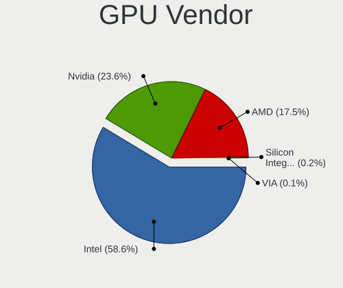

| Vendor                           | Notebooks | Percent |
|----------------------------------|-----------|---------|
| Intel                            | 2444      | 58.62%  |
| Nvidia                           | 985       | 23.63%  |
| AMD                              | 729       | 17.49%  |
| Silicon Integrated Systems [SiS] | 8         | 0.19%   |
| VIA Technologies                 | 3         | 0.07%   |

GPU Model
---------

Graphics card models

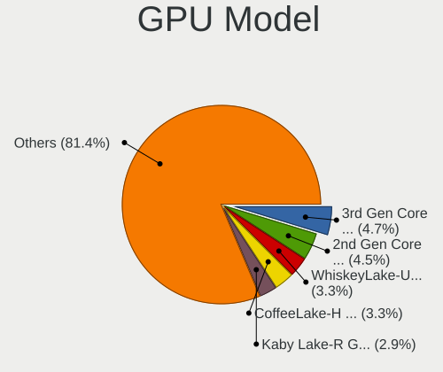

| Model                                                                                    | Notebooks | Percent |
|------------------------------------------------------------------------------------------|-----------|---------|
| Intel 3rd Gen Core processor Graphics Controller                                         | 201       | 4.71%   |
| Intel 2nd Generation Core Processor Family Integrated Graphics Controller                | 191       | 4.48%   |
| Intel WhiskeyLake-U GT2 [UHD Graphics 620]                                               | 140       | 3.28%   |
| Intel CoffeeLake-H GT2 [UHD Graphics 630]                                                | 140       | 3.28%   |
| Intel Kaby Lake-R GT2 [UHD Graphics 620]                                                 | 123       | 2.88%   |
| Intel TigerLake-LP GT2 [Iris Xe Graphics]                                                | 120       | 2.81%   |
| Intel Haswell-ULT Integrated Graphics Controller                                         | 113       | 2.65%   |
| Intel Skylake-U GT2 [HD Graphics 520]                                                    | 112       | 2.62%   |
| Intel 4th Gen Core Processor Integrated Graphics Controller                              | 112       | 2.62%   |
| Intel Core Processor Integrated Graphics Controller                                      | 81        | 1.9%    |
| Intel Mobile 4 Series Chipset Integrated Graphics Controller                             | 79        | 1.85%   |
| AMD Renoir [Radeon Vega Series / Radeon Vega Mobile Series]                              | 79        | 1.85%   |
| Intel Broadwell-U GT2 [HD Graphics 5500]                                                 | 74        | 1.73%   |
| AMD Cezanne [Radeon Vega Series / Radeon Vega Mobile Series]                             | 73        | 1.71%   |
| Intel Kaby Lake-U GT2 [HD Graphics 620]                                                  | 72        | 1.69%   |
| Intel CometLake-U GT2 [UHD Graphics]                                                     | 72        | 1.69%   |
| Intel CometLake-H GT2 [UHD Graphics]                                                     | 66        | 1.55%   |
| Nvidia TU117M [GeForce GTX 1650 Mobile / Max-Q]                                          | 62        | 1.45%   |
| Intel Kaby Lake-H GT2 [HD Graphics 630]                                                  | 57        | 1.34%   |
| Intel Atom Processor Z36xxx/Z37xxx Series Graphics & Display                             | 57        | 1.34%   |
| AMD Picasso/Raven 2 [Radeon Vega Series / Radeon Vega Mobile Series]                     | 57        | 1.34%   |
| Nvidia GP107M [GeForce GTX 1050 Mobile]                                                  | 50        | 1.17%   |
| Intel Skylake-H GT2 [HD Graphics 530]                                                    | 48        | 1.12%   |
| Intel Atom/Celeron/Pentium Processor x5-E8000/J3xxx/N3xxx Integrated Graphics Controller | 48        | 1.12%   |
| Intel Alder Lake-P GT2 [Iris Xe Graphics]                                                | 41        | 0.96%   |
| AMD Lucienne                                                                             | 41        | 0.96%   |
| Intel Mobile GM965/GL960 Integrated Graphics Controller (secondary)                      | 37        | 0.87%   |
| Intel Mobile GM965/GL960 Integrated Graphics Controller (primary)                        | 37        | 0.87%   |
| Intel Raptor Lake-P [Iris Xe Graphics]                                                   | 36        | 0.84%   |
| AMD Phoenix1                                                                             | 35        | 0.82%   |
| AMD Rembrandt [Radeon 680M]                                                              | 34        | 0.8%    |
| Nvidia GA106M [GeForce RTX 3060 Mobile / Max-Q]                                          | 30        | 0.7%    |
| AMD VanGogh [AMD Custom GPU 0405]                                                        | 30        | 0.7%    |
| Intel TigerLake-H GT1 [UHD Graphics]                                                     | 29        | 0.68%   |
| Intel Alder Lake-UP3 GT2 [Iris Xe Graphics]                                              | 29        | 0.68%   |
| Nvidia GP107M [GeForce GTX 1050 Ti Mobile]                                               | 27        | 0.63%   |
| Nvidia GA107M [GeForce RTX 3050 Mobile]                                                  | 25        | 0.59%   |
| Intel GeminiLake [UHD Graphics 600]                                                      | 25        | 0.59%   |
| AMD Park [Mobility Radeon HD 5430/5450/5470]                                             | 25        | 0.59%   |
| Nvidia TU117M [GeForce GTX 1650 Ti Mobile]                                               | 24        | 0.56%   |

GPU Combo
---------

Combinations of graphics cards

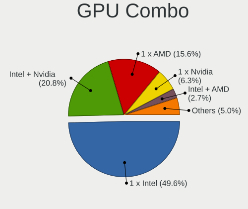

| Name           | Notebooks | Percent |
|----------------|-----------|---------|
| 1 x Intel      | 1649      | 49.61%  |
| Intel + Nvidia | 691       | 20.79%  |
| 1 x AMD        | 518       | 15.58%  |
| 1 x Nvidia     | 210       | 6.32%   |
| Intel + AMD    | 90        | 2.71%   |
| AMD + Nvidia   | 85        | 2.56%   |
| 2 x AMD        | 36        | 1.08%   |
| 2 x Intel      | 19        | 0.57%   |
| Other          | 9         | 0.27%   |
| 1 x SiS        | 8         | 0.24%   |
| 2 x Nvidia     | 6         | 0.18%   |
| 1 x VIA        | 3         | 0.09%   |

GPU Driver
----------

Free vs proprietary

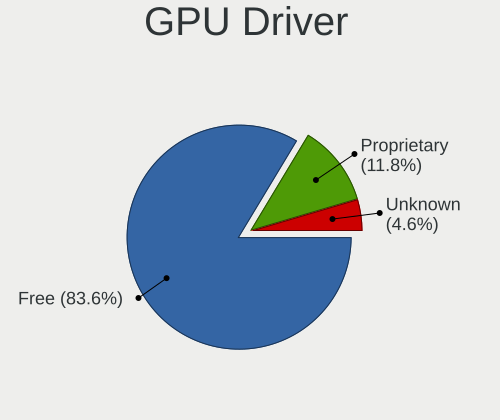

| Driver      | Notebooks | Percent |
|-------------|-----------|---------|
| Free        | 2814      | 83.63%  |
| Proprietary | 397       | 11.8%   |
| Unknown     | 154       | 4.58%   |

GPU Memory
----------

Total video memory

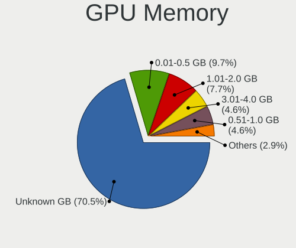

| Size in GB | Notebooks | Percent |
|------------|-----------|---------|
| Unknown    | 2382      | 70.47%  |
| 0.01-0.5   | 329       | 9.73%   |
| 1.01-2.0   | 259       | 7.66%   |
| 3.01-4.0   | 156       | 4.62%   |
| 0.51-1.0   | 156       | 4.62%   |
| 7.01-8.0   | 51        | 1.51%   |
| 5.01-6.0   | 33        | 0.98%   |
| 2.01-3.0   | 11        | 0.33%   |
| 8.01-16.0  | 2         | 0.06%   |
| 24.01-32.0 | 1         | 0.03%   |

Monitor
-------

Monitor Vendor
--------------

Monitor vendors

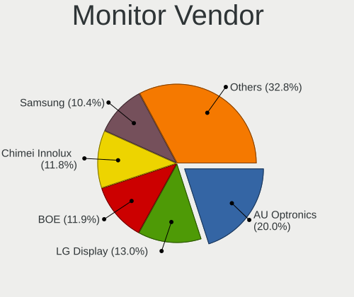

| Vendor                  | Notebooks | Percent |
|-------------------------|-----------|---------|
| AU Optronics            | 760       | 20.03%  |
| LG Display              | 493       | 12.99%  |
| BOE                     | 452       | 11.91%  |
| Chimei Innolux          | 448       | 11.81%  |
| Samsung Electronics     | 396       | 10.43%  |
| Apple                   | 135       | 3.56%   |
| Sharp                   | 121       | 3.19%   |
| Dell                    | 112       | 2.95%   |
| Goldstar                | 85        | 2.24%   |
| Chi Mei Optoelectronics | 82        | 2.16%   |
| Lenovo                  | 67        | 1.77%   |
| Philips                 | 62        | 1.63%   |
| Iiyama                  | 61        | 1.61%   |
| Hewlett-Packard         | 45        | 1.19%   |
| PANDA                   | 40        | 1.05%   |
| LG Philips              | 40        | 1.05%   |
| CSO                     | 35        | 0.92%   |
| AOC                     | 32        | 0.84%   |
| Acer                    | 29        | 0.76%   |
| Valve                   | 28        | 0.74%   |
| InfoVision              | 27        | 0.71%   |
| Sony                    | 16        | 0.42%   |
| BenQ                    | 16        | 0.42%   |
| MSI                     | 14        | 0.37%   |
| Ancor Communications    | 11        | 0.29%   |
| Toshiba                 | 10        | 0.26%   |
| Panasonic               | 10        | 0.26%   |
| LGD                     | 8         | 0.21%   |
| CSW                     | 8         | 0.21%   |
| CPT                     | 8         | 0.21%   |
| ASUSTek Computer        | 8         | 0.21%   |
| Eizo                    | 7         | 0.18%   |
| CSOT                    | 7         | 0.18%   |
| Seiko/Epson             | 6         | 0.16%   |
| HannStar                | 6         | 0.16%   |
| Unknown                 | 5         | 0.13%   |
| TMX                     | 5         | 0.13%   |
| JDI                     | 5         | 0.13%   |
| RTK                     | 4         | 0.11%   |
| Quanta Display          | 4         | 0.11%   |

Monitor Model
-------------

Monitor models

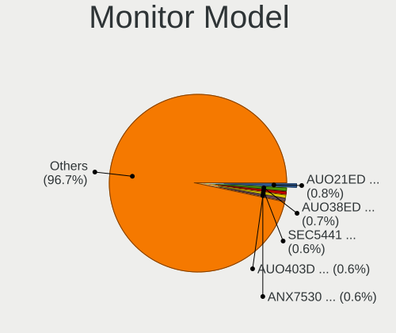

| Model                                                                     | Notebooks | Percent |
|---------------------------------------------------------------------------|-----------|---------|
| AU Optronics LCD Monitor AUO21ED 1920x1080 344x193mm 15.5-inch            | 30        | 0.78%   |
| AU Optronics LCD Monitor AUO38ED 1920x1080 344x193mm 15.5-inch            | 27        | 0.7%    |
| Samsung Electronics LCD Monitor SEC5441 1280x800 331x207mm 15.4-inch      | 24        | 0.62%   |
| AU Optronics LCD Monitor AUO403D 1920x1080 309x174mm 14.0-inch            | 24        | 0.62%   |
| Valve ANX7530 U VLV3001 800x1280 100x150mm 7.1-inch                       | 23        | 0.6%    |
| AU Optronics LCD Monitor AUO202D 1920x1080 293x165mm 13.2-inch            | 23        | 0.6%    |
| Chimei Innolux LCD Monitor CMN15E7 1920x1080 344x193mm 15.5-inch          | 22        | 0.57%   |
| Chimei Innolux LCD Monitor CMN14D4 1920x1080 309x173mm 13.9-inch          | 20        | 0.52%   |
| AU Optronics LCD Monitor AUO573D 1920x1080 309x174mm 14.0-inch            | 18        | 0.47%   |
| Chimei Innolux LCD Monitor CMN15E8 1920x1080 344x193mm 15.5-inch          | 17        | 0.44%   |
| Samsung Electronics LCD Monitor SDCA029 3840x2160 344x194mm 15.5-inch     | 16        | 0.42%   |
| LG Display LCD Monitor LGD046F 1920x1080 344x194mm 15.5-inch              | 16        | 0.42%   |
| LG Display LCD Monitor LGD05E5 1920x1080 344x194mm 15.5-inch              | 14        | 0.36%   |
| Chimei Innolux LCD Monitor CMN14C9 1920x1080 309x173mm 13.9-inch          | 14        | 0.36%   |
| AU Optronics LCD Monitor AUO133D 1920x1080 309x173mm 13.9-inch            | 14        | 0.36%   |
| Chimei Innolux LCD Monitor CMN1735 1920x1080 381x214mm 17.2-inch          | 13        | 0.34%   |
| Chi Mei Optoelectronics LCD Monitor CMO1720 1920x1080 382x215mm 17.3-inch | 13        | 0.34%   |
| AU Optronics LCD Monitor AUO106C 1366x768 276x155mm 12.5-inch             | 13        | 0.34%   |
| Samsung Electronics LCD Monitor SEC544B 1600x900 382x214mm 17.2-inch      | 12        | 0.31%   |
| AU Optronics LCD Monitor AUO26EC 1366x768 344x193mm 15.5-inch             | 12        | 0.31%   |
| AU Optronics LCD Monitor AUO235C 1366x768 256x144mm 11.6-inch             | 11        | 0.29%   |
| Apple Color LCD APP9CC7 1280x800 286x179mm 13.3-inch                      | 11        | 0.29%   |
| LG Display LCD Monitor LGD02DC 1366x768 344x194mm 15.5-inch               | 10        | 0.26%   |
| Chimei Innolux LCD Monitor CMN151E 1920x1080 344x193mm 15.5-inch          | 10        | 0.26%   |
| BOE LCD Monitor BOE0700 1920x1080 344x194mm 15.5-inch                     | 10        | 0.26%   |
| AU Optronics LCD Monitor AUO323D 1920x1080 309x174mm 14.0-inch            | 10        | 0.26%   |
| AU Optronics LCD Monitor AUO213D 1920x1080 309x173mm 13.9-inch            | 10        | 0.26%   |
| AU Optronics LCD Monitor AUO139E 1600x900 382x214mm 17.2-inch             | 10        | 0.26%   |
| Sharp LCD Monitor SHP14D0 3840x2400 336x210mm 15.6-inch                   | 9         | 0.23%   |
| Samsung Electronics LCD Monitor SDC4161 1920x1080 344x194mm 15.5-inch     | 9         | 0.23%   |
| Chimei Innolux LCD Monitor CMN15F5 1920x1080 344x193mm 15.5-inch          | 9         | 0.23%   |
| Chimei Innolux LCD Monitor CMN15C4 1920x1080 344x193mm 15.5-inch          | 9         | 0.23%   |
| Chimei Innolux LCD Monitor CMN15C2 1920x1080 344x194mm 15.5-inch          | 9         | 0.23%   |
| BOE LCD Monitor BOE07B9 1920x1080 293x165mm 13.2-inch                     | 9         | 0.23%   |
| AU Optronics LCD Monitor AUO45EC 1366x768 344x193mm 15.5-inch             | 9         | 0.23%   |
| AU Optronics LCD Monitor AUO243D 1920x1080 309x173mm 13.9-inch            | 9         | 0.23%   |
| AU Optronics LCD Monitor AUO149E 1600x900 382x214mm 17.2-inch             | 9         | 0.23%   |
| AU Optronics LCD Monitor AUO109D 1920x1080 381x214mm 17.2-inch            | 9         | 0.23%   |
| PANDA LCD Monitor NCP004D 1920x1080 344x194mm 15.5-inch                   | 8         | 0.21%   |
| LGD LCD Monitor 1920x1080                                                 | 8         | 0.21%   |

Monitor Resolution
------------------

Monitor screen resolution

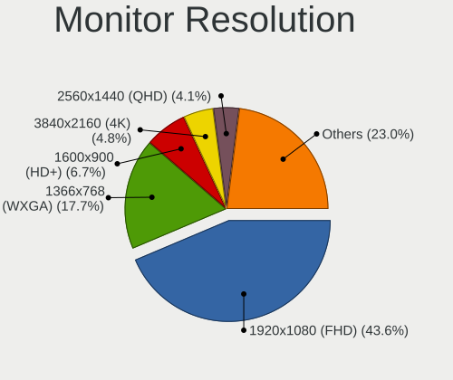

| Resolution         | Notebooks | Percent |
|--------------------|-----------|---------|
| 1920x1080 (FHD)    | 1575      | 43.63%  |
| 1366x768 (WXGA)    | 640       | 17.73%  |
| 1600x900 (HD+)     | 243       | 6.73%   |
| 3840x2160 (4K)     | 174       | 4.82%   |
| 2560x1440 (QHD)    | 148       | 4.1%    |
| 1280x800 (WXGA)    | 139       | 3.85%   |
| 1920x1200 (WUXGA)  | 122       | 3.38%   |
| 2560x1600          | 113       | 3.13%   |
| 1440x900 (WXGA+)   | 91        | 2.52%   |
| 2880x1800          | 59        | 1.63%   |
| 3840x2400          | 35        | 0.97%   |
| 3440x1440          | 34        | 0.94%   |
| 800x1280           | 31        | 0.86%   |
| 1680x1050 (WSXGA+) | 30        | 0.83%   |
| 2560x1080          | 21        | 0.58%   |
| 1280x1024 (SXGA)   | 19        | 0.53%   |
| 1360x768           | 15        | 0.42%   |
| Unknown            | 14        | 0.39%   |
| 2256x1504          | 11        | 0.3%    |
| 3456x2160          | 7         | 0.19%   |
| 3200x2000          | 7         | 0.19%   |
| 3200x1800 (QHD+)   | 7         | 0.19%   |
| 1024x600           | 7         | 0.19%   |
| 3072x1920          | 5         | 0.14%   |
| 3000x2000          | 5         | 0.14%   |
| 2160x1440          | 5         | 0.14%   |
| 1024x768 (XGA)     | 5         | 0.14%   |
| 3840x1600          | 4         | 0.11%   |
| 3840x1080          | 4         | 0.11%   |
| 2880x1920          | 4         | 0.11%   |
| 2240x1400          | 4         | 0.11%   |
| 1920x540           | 3         | 0.08%   |
| 1680x945           | 3         | 0.08%   |
| 1280x720 (HD)      | 3         | 0.08%   |
| 2944x1840          | 2         | 0.06%   |
| 2880x1620          | 2         | 0.06%   |
| 2304x1440          | 2         | 0.06%   |
| 1920x1280          | 2         | 0.06%   |
| 8960x2160          | 1         | 0.03%   |
| 5440x1800          | 1         | 0.03%   |

Monitor Diagonal
----------------

Diagonal size in inches

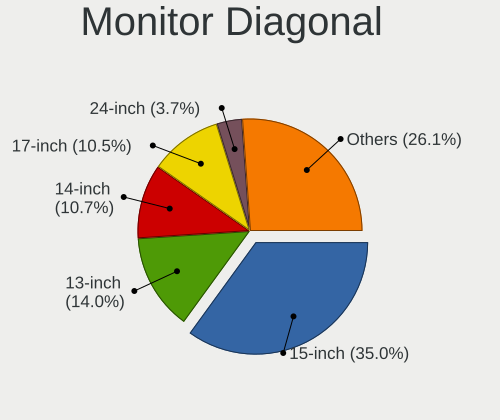

| Inches  | Notebooks | Percent |
|---------|-----------|---------|
| 15      | 1329      | 35%     |
| 13      | 530       | 13.96%  |
| 14      | 408       | 10.75%  |
| 17      | 399       | 10.51%  |
| 24      | 139       | 3.66%   |
| 27      | 136       | 3.58%   |
| 16      | 127       | 3.34%   |
| 12      | 104       | 2.74%   |
| 23      | 79        | 2.08%   |
| 11      | 79        | 2.08%   |
| 21      | 66        | 1.74%   |
| Unknown | 61        | 1.61%   |
| 31      | 60        | 1.58%   |
| 34      | 49        | 1.29%   |
| 18      | 29        | 0.76%   |
| 7       | 29        | 0.76%   |
| 22      | 16        | 0.42%   |
| 19      | 16        | 0.42%   |
| 25      | 15        | 0.4%    |
| 10      | 15        | 0.4%    |
| 72      | 14        | 0.37%   |
| 84      | 10        | 0.26%   |
| 40      | 9         | 0.24%   |
| 54      | 7         | 0.18%   |
| 28      | 7         | 0.18%   |
| 20      | 7         | 0.18%   |
| 32      | 6         | 0.16%   |
| 65      | 5         | 0.13%   |
| 37      | 5         | 0.13%   |
| 63      | 4         | 0.11%   |
| 3       | 4         | 0.11%   |
| 86      | 3         | 0.08%   |
| 52      | 3         | 0.08%   |
| 48      | 3         | 0.08%   |
| 46      | 3         | 0.08%   |
| 36      | 3         | 0.08%   |
| 29      | 3         | 0.08%   |
| 60      | 2         | 0.05%   |
| 26      | 2         | 0.05%   |
| 8       | 2         | 0.05%   |

Monitor Width
-------------

Physical width

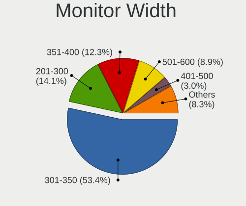

| Width in mm | Notebooks | Percent |
|-------------|-----------|---------|
| 301-350     | 2007      | 53.39%  |
| 201-300     | 530       | 14.1%   |
| 351-400     | 461       | 12.26%  |
| 501-600     | 335       | 8.91%   |
| 401-500     | 114       | 3.03%   |
| 601-700     | 82        | 2.18%   |
| Unknown     | 61        | 1.62%   |
| 701-800     | 59        | 1.57%   |
| 1001-1500   | 33        | 0.88%   |
| 1-100       | 31        | 0.82%   |
| 1501-2000   | 25        | 0.67%   |
| 801-900     | 17        | 0.45%   |
| 101-200     | 3         | 0.08%   |
| 901-1000    | 1         | 0.03%   |

Aspect Ratio
------------

Proportional relationship between the width and the height

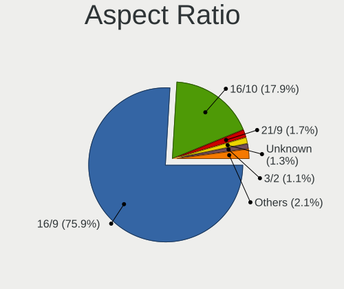

| Ratio   | Notebooks | Percent |
|---------|-----------|---------|
| 16/9    | 2566      | 75.94%  |
| 16/10   | 604       | 17.88%  |
| 21/9    | 56        | 1.66%   |
| Unknown | 45        | 1.33%   |
| 3/2     | 37        | 1.09%   |
| 0.67    | 23        | 0.68%   |
| 5/4     | 19        | 0.56%   |
| 4/3     | 9         | 0.27%   |
| 0.62    | 6         | 0.18%   |
| 6/5     | 4         | 0.12%   |
| 32/9    | 3         | 0.09%   |
| 0.56    | 3         | 0.09%   |
| 3.73    | 1         | 0.03%   |
| 3.40    | 1         | 0.03%   |
| 3.33    | 1         | 0.03%   |
| 0.25    | 1         | 0.03%   |

Monitor Area
------------

Area in inch²

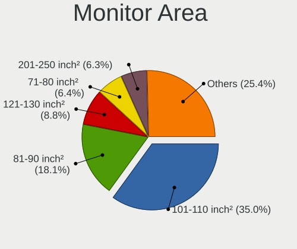

| Area in inch² | Notebooks | Percent |
|----------------|-----------|---------|
| 101-110        | 1324      | 34.98%  |
| 81-90          | 685       | 18.1%   |
| 121-130        | 332       | 8.77%   |
| 71-80          | 243       | 6.42%   |
| 201-250        | 240       | 6.34%   |
| 301-350        | 137       | 3.62%   |
| 351-500        | 124       | 3.28%   |
| 111-120        | 124       | 3.28%   |
| 61-70          | 102       | 2.69%   |
| 51-60          | 82        | 2.17%   |
| 131-140        | 63        | 1.66%   |
| Unknown        | 61        | 1.61%   |
| 251-300        | 58        | 1.53%   |
| More than 1000 | 52        | 1.37%   |
| 151-200        | 39        | 1.03%   |
| 1-40           | 34        | 0.9%    |
| 141-150        | 31        | 0.82%   |
| 501-1000       | 25        | 0.66%   |
| 91-100         | 16        | 0.42%   |
| 41-50          | 13        | 0.34%   |

Pixel Density
-------------

Pixels per inch

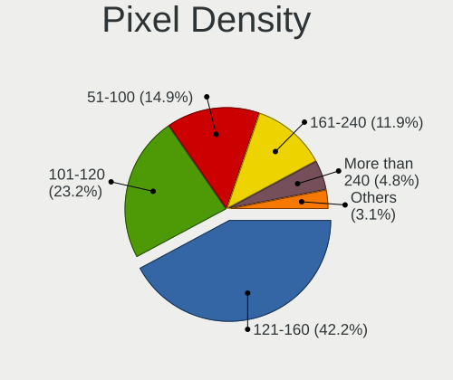

| Density       | Notebooks | Percent |
|---------------|-----------|---------|
| 121-160       | 1571      | 42.16%  |
| 101-120       | 865       | 23.22%  |
| 51-100        | 554       | 14.87%  |
| 161-240       | 444       | 11.92%  |
| More than 240 | 178       | 4.78%   |
| Unknown       | 61        | 1.64%   |
| 1-50          | 53        | 1.42%   |

Multiple Monitors
-----------------

Total monitors connected

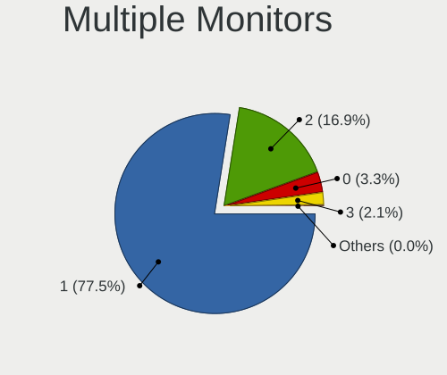

| Total | Notebooks | Percent |
|-------|-----------|---------|
| 1     | 2629      | 77.48%  |
| 2     | 575       | 16.95%  |
| 0     | 112       | 3.3%    |
| 3     | 70        | 2.06%   |
| 4     | 6         | 0.18%   |
| 5     | 1         | 0.03%   |

Network
-------

Net Controller Vendor
---------------------

Controller vendors

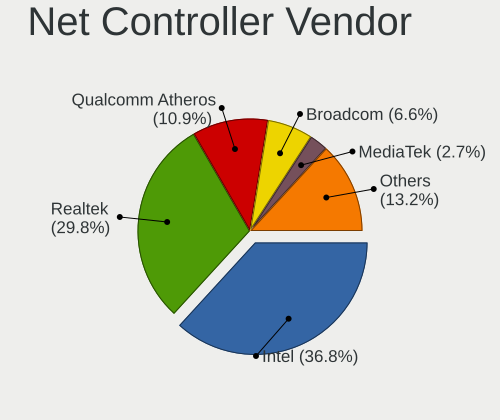

| Vendor                                 | Notebooks | Percent |
|----------------------------------------|-----------|---------|
| Intel                                  | 1943      | 36.8%   |
| Realtek Semiconductor                  | 1576      | 29.85%  |
| Qualcomm Atheros                       | 577       | 10.93%  |
| Broadcom                               | 348       | 6.59%   |
| MediaTek                               | 141       | 2.67%   |
| Broadcom Limited                       | 89        | 1.69%   |
| ASIX Electronics                       | 53        | 1%      |
| Ralink                                 | 50        | 0.95%   |
| DisplayLink                            | 43        | 0.81%   |
| Marvell Technology Group               | 42        | 0.8%    |
| Dell                                   | 40        | 0.76%   |
| TP-Link                                | 39        | 0.74%   |
| Shenzhen Goodix Technology             | 37        | 0.7%    |
| Hewlett-Packard                        | 31        | 0.59%   |
| Qualcomm                               | 29        | 0.55%   |
| Nvidia                                 | 26        | 0.49%   |
| Ralink Technology                      | 24        | 0.45%   |
| Sierra Wireless                        | 22        | 0.42%   |
| Lenovo                                 | 18        | 0.34%   |
| Samsung Electronics                    | 17        | 0.32%   |
| Ericsson Business Mobile Networks      | 16        | 0.3%    |
| JMicron Technology                     | 14        | 0.27%   |
| Silicon Integrated Systems [SiS]       | 13        | 0.25%   |
| Huawei Technologies                    | 7         | 0.13%   |
| Xiaomi                                 | 6         | 0.11%   |
| NetGear                                | 6         | 0.11%   |
| ZTE WCDMA Technologies MSM             | 4         | 0.08%   |
| Suzhou Motorcomm Electronic Technology | 4         | 0.08%   |
| ASUSTek Computer                       | 4         | 0.08%   |
| Apple                                  | 4         | 0.08%   |
| VIA Technologies                       | 3         | 0.06%   |
| Sitecom Europe                         | 3         | 0.06%   |
| Microsoft                              | 3         | 0.06%   |
| Fibocom                                | 3         | 0.06%   |
| Arduino SA                             | 3         | 0.06%   |
| Sony Ericsson Mobile Communications AB | 2         | 0.04%   |
| MosChip Semiconductor                  | 2         | 0.04%   |
| Google                                 | 2         | 0.04%   |
| Dresden Elektronik                     | 2         | 0.04%   |
| D-Link                                 | 2         | 0.04%   |

Net Controller Model
--------------------

Controller models

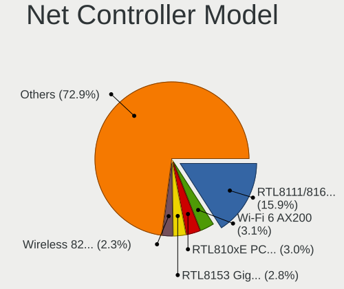

| Model                                                                  | Notebooks | Percent |
|------------------------------------------------------------------------|-----------|---------|
| Realtek RTL8111/8168/8211/8411 PCI Express Gigabit Ethernet Controller | 1010      | 15.93%  |
| Intel Wi-Fi 6 AX200                                                    | 195       | 3.07%   |
| Realtek RTL810xE PCI Express Fast Ethernet controller                  | 192       | 3.03%   |
| Realtek RTL8153 Gigabit Ethernet Adapter                               | 175       | 2.76%   |
| Intel Wireless 8265 / 8275                                             | 146       | 2.3%    |
| Intel 82579LM Gigabit Network Connection (Lewisville)                  | 131       | 2.07%   |
| Intel Wireless 7265                                                    | 128       | 2.02%   |
| Intel Cannon Point-LP CNVi [Wireless-AC]                               | 115       | 1.81%   |
| Intel Wireless 7260                                                    | 114       | 1.8%    |
| Intel Wi-Fi 6 AX201                                                    | 98        | 1.55%   |
| Intel Wireless 8260                                                    | 90        | 1.42%   |
| Qualcomm Atheros QCA6174 802.11ac Wireless Network Adapter             | 84        | 1.32%   |
| Intel Alder Lake-P PCH CNVi WiFi                                       | 83        | 1.31%   |
| Intel Centrino Advanced-N 6205 [Taylor Peak]                           | 80        | 1.26%   |
| Qualcomm Atheros AR9485 Wireless Network Adapter                       | 79        | 1.25%   |
| Qualcomm Atheros AR9285 Wireless Network Adapter (PCI-Express)         | 79        | 1.25%   |
| Qualcomm Atheros QCA9377 802.11ac Wireless Network Adapter             | 71        | 1.12%   |
| Realtek RTL8821CE 802.11ac PCIe Wireless Network Adapter               | 70        | 1.1%    |
| Intel Cannon Lake PCH CNVi WiFi                                        | 69        | 1.09%   |
| MediaTek MT7921 802.11ax PCIe Wireless Network Adapter [Filogic 330]   | 65        | 1.02%   |
| Realtek RTL8822CE 802.11ac PCIe Wireless Network Adapter               | 64        | 1.01%   |
| Intel Ethernet Connection (4) I219-LM                                  | 60        | 0.95%   |
| Intel Comet Lake PCH-LP CNVi WiFi                                      | 57        | 0.9%    |
| Qualcomm Atheros QCA9565 / AR9565 Wireless Network Adapter             | 53        | 0.84%   |
| Intel Wi-Fi 6E(802.11ax) AX210/AX1675* 2x2 [Typhoon Peak]              | 53        | 0.84%   |
| MediaTek MT7922 802.11ax PCI Express Wireless Network Adapter          | 50        | 0.79%   |
| Intel Ethernet Connection I219-LM                                      | 49        | 0.77%   |
| ASIX AX88179 Gigabit Ethernet                                          | 49        | 0.77%   |
| Intel Comet Lake PCH CNVi WiFi                                         | 48        | 0.76%   |
| Intel Wireless 3165                                                    | 47        | 0.74%   |
| Intel Centrino Ultimate-N 6300                                         | 47        | 0.74%   |
| Qualcomm Atheros AR9462 Wireless Network Adapter                       | 44        | 0.69%   |
| Intel PRO/Wireless 3945ABG [Golan] Network Connection                  | 43        | 0.68%   |
| Intel Wireless 3160                                                    | 42        | 0.66%   |
| Intel 82577LM Gigabit Network Connection                               | 42        | 0.66%   |
| Intel Ethernet Connection I217-LM                                      | 41        | 0.65%   |
| Broadcom BCM4313 802.11bgn Wireless Network Adapter                    | 40        | 0.63%   |
| Intel Ethernet Connection I218-LM                                      | 39        | 0.61%   |
| Intel Centrino Advanced-N 6200                                         | 39        | 0.61%   |
| Shenzhen Goodix Fingerprint Reader                                     | 37        | 0.58%   |

Wireless Vendor
---------------

Wireless vendors

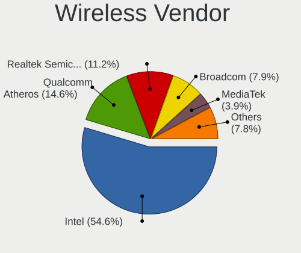

| Vendor                                | Notebooks | Percent |
|---------------------------------------|-----------|---------|
| Intel                                 | 1834      | 54.62%  |
| Qualcomm Atheros                      | 491       | 14.62%  |
| Realtek Semiconductor                 | 377       | 11.23%  |
| Broadcom                              | 264       | 7.86%   |
| MediaTek                              | 130       | 3.87%   |
| Ralink                                | 50        | 1.49%   |
| Broadcom Limited                      | 46        | 1.37%   |
| TP-Link                               | 32        | 0.95%   |
| Qualcomm                              | 26        | 0.77%   |
| Ralink Technology                     | 24        | 0.71%   |
| Sierra Wireless                       | 22        | 0.66%   |
| Dell                                  | 20        | 0.6%    |
| Hewlett-Packard                       | 9         | 0.27%   |
| NetGear                               | 6         | 0.18%   |
| ASUSTek Computer                      | 4         | 0.12%   |
| Sitecom Europe                        | 3         | 0.09%   |
| Fibocom                               | 3         | 0.09%   |
| Microsoft                             | 2         | 0.06%   |
| D-Link                                | 2         | 0.06%   |
| ZyXEL Communications                  | 1         | 0.03%   |
| Silicon Integrated Systems [SiS]      | 1         | 0.03%   |
| Senao                                 | 1         | 0.03%   |
| Sagem                                 | 1         | 0.03%   |
| Realtek                               | 1         | 0.03%   |
| Quectel Wireless Solutions            | 1         | 0.03%   |
| Qualcomm Technologies                 | 1         | 0.03%   |
| Qualcomm Atheros Communications       | 1         | 0.03%   |
| Linksys                               | 1         | 0.03%   |
| IMC Networks                          | 1         | 0.03%   |
| BUFFALO                               | 1         | 0.03%   |
| 802.11g Adapter [Linksys WUSB54GC v3] | 1         | 0.03%   |
| Unknown                               | 1         | 0.03%   |

Wireless Model
--------------

Wireless models

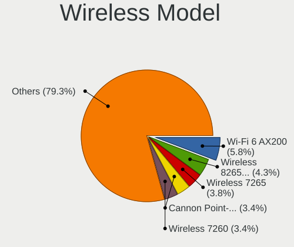

| Model                                                                   | Notebooks | Percent |
|-------------------------------------------------------------------------|-----------|---------|
| Intel Wi-Fi 6 AX200                                                     | 195       | 5.78%   |
| Intel Wireless 8265 / 8275                                              | 146       | 4.33%   |
| Intel Wireless 7265                                                     | 128       | 3.79%   |
| Intel Cannon Point-LP CNVi [Wireless-AC]                                | 115       | 3.41%   |
| Intel Wireless 7260                                                     | 114       | 3.38%   |
| Intel Wi-Fi 6 AX201                                                     | 98        | 2.9%    |
| Intel Wireless 8260                                                     | 90        | 2.67%   |
| Qualcomm Atheros QCA6174 802.11ac Wireless Network Adapter              | 84        | 2.49%   |
| Intel Centrino Advanced-N 6205 [Taylor Peak]                            | 80        | 2.37%   |
| Qualcomm Atheros AR9485 Wireless Network Adapter                        | 79        | 2.34%   |
| Qualcomm Atheros AR9285 Wireless Network Adapter (PCI-Express)          | 79        | 2.34%   |
| Qualcomm Atheros QCA9377 802.11ac Wireless Network Adapter              | 71        | 2.1%    |
| Realtek RTL8821CE 802.11ac PCIe Wireless Network Adapter                | 70        | 2.07%   |
| Intel Cannon Lake PCH CNVi WiFi                                         | 69        | 2.04%   |
| MediaTek MT7921 802.11ax PCIe Wireless Network Adapter [Filogic 330]    | 65        | 1.93%   |
| Realtek RTL8822CE 802.11ac PCIe Wireless Network Adapter                | 64        | 1.9%    |
| Intel Alder Lake-P PCH CNVi WiFi                                        | 58        | 1.72%   |
| Intel Comet Lake PCH-LP CNVi WiFi                                       | 57        | 1.69%   |
| Qualcomm Atheros QCA9565 / AR9565 Wireless Network Adapter              | 53        | 1.57%   |
| Intel Wi-Fi 6E(802.11ax) AX210/AX1675* 2x2 [Typhoon Peak]               | 53        | 1.57%   |
| Intel Comet Lake PCH CNVi WiFi                                          | 48        | 1.42%   |
| Intel Wireless 3165                                                     | 47        | 1.39%   |
| Intel Centrino Ultimate-N 6300                                          | 47        | 1.39%   |
| Qualcomm Atheros AR9462 Wireless Network Adapter                        | 44        | 1.3%    |
| MediaTek MT7922 802.11ax PCI Express Wireless Network Adapter           | 44        | 1.3%    |
| Intel PRO/Wireless 3945ABG [Golan] Network Connection                   | 43        | 1.27%   |
| Intel Wireless 3160                                                     | 42        | 1.24%   |
| Broadcom BCM4313 802.11bgn Wireless Network Adapter                     | 40        | 1.19%   |
| Intel Centrino Advanced-N 6200                                          | 39        | 1.16%   |
| Intel Wi-Fi 5(802.11ac) Wireless-AC 9x6x [Thunder Peak]                 | 35        | 1.04%   |
| Realtek RTL8723BE PCIe Wireless Network Adapter                         | 33        | 0.98%   |
| Qualcomm Atheros AR242x / AR542x Wireless Network Adapter (PCI-Express) | 33        | 0.98%   |
| Broadcom BCM43142 802.11b/g/n                                           | 33        | 0.98%   |
| Broadcom BCM4331 802.11a/b/g/n                                          | 32        | 0.95%   |
| Intel Raptor Lake PCH CNVi WiFi                                         | 30        | 0.89%   |
| Realtek RTL8852AE 802.11ax PCIe Wireless Network Adapter                | 29        | 0.86%   |
| Broadcom BCM43228 802.11a/b/g/n                                         | 29        | 0.86%   |
| Intel Centrino Advanced-N 6235                                          | 28        | 0.83%   |
| Realtek RTL8822BE 802.11a/b/g/n/ac WiFi adapter                         | 27        | 0.8%    |
| Intel Tiger Lake PCH CNVi WiFi                                          | 24        | 0.71%   |

Ethernet Vendor
---------------

Ethernet vendors

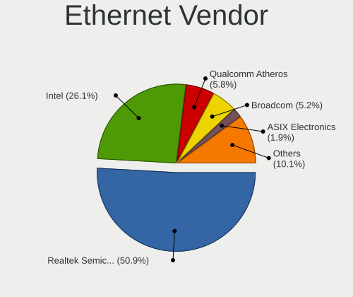

| Vendor                                 | Notebooks | Percent |
|----------------------------------------|-----------|---------|
| Realtek Semiconductor                  | 1419      | 50.88%  |
| Intel                                  | 727       | 26.07%  |
| Qualcomm Atheros                       | 163       | 5.84%   |
| Broadcom                               | 146       | 5.23%   |
| ASIX Electronics                       | 53        | 1.9%    |
| DisplayLink                            | 43        | 1.54%   |
| Broadcom Limited                       | 43        | 1.54%   |
| Marvell Technology Group               | 42        | 1.51%   |
| Nvidia                                 | 25        | 0.9%    |
| Lenovo                                 | 18        | 0.65%   |
| Samsung Electronics                    | 15        | 0.54%   |
| JMicron Technology                     | 14        | 0.5%    |
| Silicon Integrated Systems [SiS]       | 12        | 0.43%   |
| MediaTek                               | 9         | 0.32%   |
| Hewlett-Packard                        | 9         | 0.32%   |
| TP-Link                                | 7         | 0.25%   |
| Xiaomi                                 | 6         | 0.22%   |
| Suzhou Motorcomm Electronic Technology | 4         | 0.14%   |
| Huawei Technologies                    | 4         | 0.14%   |
| Apple                                  | 4         | 0.14%   |
| ZTE WCDMA Technologies MSM             | 3         | 0.11%   |
| VIA Technologies                       | 3         | 0.11%   |
| Qualcomm                               | 3         | 0.11%   |
| Sony Ericsson Mobile Communications AB | 2         | 0.07%   |
| MosChip Semiconductor                  | 2         | 0.07%   |
| Google                                 | 2         | 0.07%   |
| Spreadtrum Communications              | 1         | 0.04%   |
| Raspberry Pi                           | 1         | 0.04%   |
| OPPO Electronics                       | 1         | 0.04%   |
| Motorola PCS                           | 1         | 0.04%   |
| Motorcomm Microelectronics.            | 1         | 0.04%   |
| Microsoft                              | 1         | 0.04%   |
| LG Electronics                         | 1         | 0.04%   |
| Jolla Oy                               | 1         | 0.04%   |
| ICS Advent                             | 1         | 0.04%   |
| Attansic Technology                    | 1         | 0.04%   |
| ADMtek                                 | 1         | 0.04%   |

Ethernet Model
--------------

Ethernet models

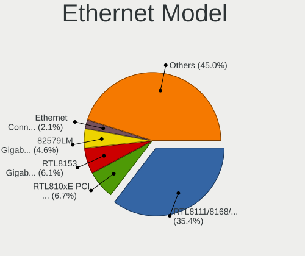

| Model                                                                  | Notebooks | Percent |
|------------------------------------------------------------------------|-----------|---------|
| Realtek RTL8111/8168/8211/8411 PCI Express Gigabit Ethernet Controller | 1010      | 35.41%  |
| Realtek RTL810xE PCI Express Fast Ethernet controller                  | 192       | 6.73%   |
| Realtek RTL8153 Gigabit Ethernet Adapter                               | 175       | 6.14%   |
| Intel 82579LM Gigabit Network Connection (Lewisville)                  | 131       | 4.59%   |
| Intel Ethernet Connection (4) I219-LM                                  | 60        | 2.1%    |
| Intel Ethernet Connection I219-LM                                      | 49        | 1.72%   |
| ASIX AX88179 Gigabit Ethernet                                          | 49        | 1.72%   |
| Intel 82577LM Gigabit Network Connection                               | 42        | 1.47%   |
| Intel Ethernet Connection I217-LM                                      | 41        | 1.44%   |
| Intel Ethernet Connection I218-LM                                      | 39        | 1.37%   |
| Qualcomm Atheros AR8151 v2.0 Gigabit Ethernet                          | 36        | 1.26%   |
| Intel Ethernet Connection (3) I218-LM                                  | 34        | 1.19%   |
| Broadcom NetXtreme BCM57765 Gigabit Ethernet PCIe                      | 32        | 1.12%   |
| Intel Ethernet Connection (4) I219-V                                   | 26        | 0.91%   |
| Intel Alder Lake-P PCH CNVi WiFi                                       | 25        | 0.88%   |
| Realtek RTL8125 2.5GbE Controller                                      | 23        | 0.81%   |
| Intel Ethernet Connection (6) I219-V                                   | 23        | 0.81%   |
| Intel Ethernet Connection (6) I219-LM                                  | 22        | 0.77%   |
| Qualcomm Atheros AR8161 Gigabit Ethernet                               | 21        | 0.74%   |
| Broadcom NetLink BCM57780 Gigabit Ethernet PCIe                        | 21        | 0.74%   |
| Intel 82579V Gigabit Network Connection                                | 20        | 0.7%    |
| Realtek RTL8152 Fast Ethernet Adapter                                  | 19        | 0.67%   |
| Intel Ethernet Connection (7) I219-LM                                  | 18        | 0.63%   |
| Nvidia MCP79 Ethernet                                                  | 16        | 0.56%   |
| Intel 82567LM Gigabit Network Connection                               | 16        | 0.56%   |
| Broadcom Limited NetLink BCM5787M Gigabit Ethernet PCI Express         | 16        | 0.56%   |
| Qualcomm Atheros QCA8171 Gigabit Ethernet                              | 15        | 0.53%   |
| Intel Ethernet Connection (2) I219-LM                                  | 15        | 0.53%   |
| Intel Ethernet Connection (13) I219-V                                  | 15        | 0.53%   |
| Realtek RTL-8100/8101L/8139 PCI Fast Ethernet Adapter                  | 14        | 0.49%   |
| Qualcomm Atheros Killer E2500 Gigabit Ethernet Controller              | 13        | 0.46%   |
| JMicron JMC250 PCI Express Gigabit Ethernet Controller                 | 13        | 0.46%   |
| Intel Ethernet Connection I217-V                                       | 13        | 0.46%   |
| Broadcom NetLink BCM5784M Gigabit Ethernet PCIe                        | 13        | 0.46%   |
| Silicon Integrated Systems [SiS] 191 Gigabit Ethernet Adapter          | 12        | 0.42%   |
| Qualcomm Atheros Killer E2400 Gigabit Ethernet Controller              | 12        | 0.42%   |
| Marvell Group 88E8040 PCI-E Fast Ethernet Controller                   | 12        | 0.42%   |
| DisplayLink Dell Universal Dock D6000                                  | 12        | 0.42%   |
| Broadcom NetLink BCM57785 Gigabit Ethernet PCIe                        | 12        | 0.42%   |
| Realtek Killer E3000 2.5GbE Controller                                 | 11        | 0.39%   |

Net Controller Kind
-------------------

Ethernet, WiFi or modem

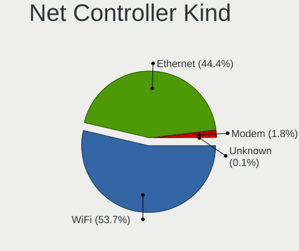

| Kind     | Notebooks | Percent |
|----------|-----------|---------|
| WiFi     | 3183      | 53.66%  |
| Ethernet | 2636      | 44.44%  |
| Modem    | 109       | 1.84%   |
| Unknown  | 4         | 0.07%   |

Used Controller
---------------

Currently used network controller

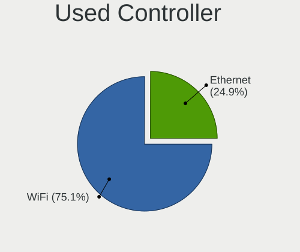

| Kind     | Notebooks | Percent |
|----------|-----------|---------|
| WiFi     | 2664      | 75.06%  |
| Ethernet | 885       | 24.94%  |

NICs
----

Total network controllers on board

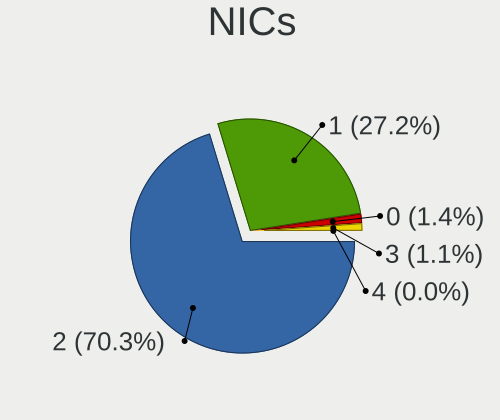

| Total | Notebooks | Percent |
|-------|-----------|---------|
| 2     | 2327      | 70.3%   |
| 1     | 901       | 27.22%  |
| 0     | 45        | 1.36%   |
| 3     | 36        | 1.09%   |
| 4     | 1         | 0.03%   |

IPv6
----

IPv6 vs IPv4

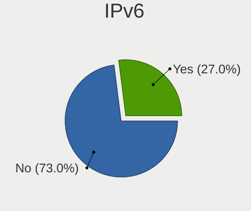

| Used | Notebooks | Percent |
|------|-----------|---------|
| No   | 2479      | 73%     |
| Yes  | 917       | 27%     |

Bluetooth
---------

Bluetooth Vendor
----------------

Controller vendors

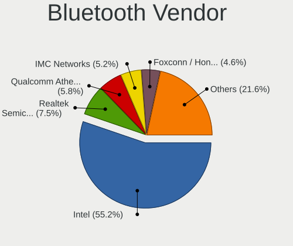

| Vendor                          | Notebooks | Percent |
|---------------------------------|-----------|---------|
| Intel                           | 1477      | 55.24%  |
| Realtek Semiconductor           | 201       | 7.52%   |
| Qualcomm Atheros Communications | 155       | 5.8%    |
| IMC Networks                    | 139       | 5.2%    |
| Foxconn / Hon Hai               | 124       | 4.64%   |
| Broadcom                        | 124       | 4.64%   |
| Apple                           | 116       | 4.34%   |
| Lite-On Technology              | 82        | 3.07%   |
| Hewlett-Packard                 | 55        | 2.06%   |
| Dell                            | 43        | 1.61%   |
| Cambridge Silicon Radio         | 39        | 1.46%   |
| Toshiba                         | 24        | 0.9%    |
| MediaTek                        | 20        | 0.75%   |
| USI                             | 12        | 0.45%   |
| Ralink                          | 12        | 0.45%   |
| ASUSTek Computer                | 12        | 0.45%   |
| Foxconn International           | 7         | 0.26%   |
| Realtek                         | 5         | 0.19%   |
| TP-Link                         | 4         | 0.15%   |
| Alps Electric                   | 4         | 0.15%   |
| Ralink Technology               | 3         | 0.11%   |
| Integrated System Solution      | 3         | 0.11%   |
| Unknown                         | 3         | 0.11%   |
| Opticis                         | 2         | 0.07%   |
| Chicony Electronics             | 2         | 0.07%   |
| Sitecom Europe                  | 1         | 0.04%   |
| Micro Star International        | 1         | 0.04%   |
| Edimax Technology               | 1         | 0.04%   |
| Conwise Technology              | 1         | 0.04%   |
| Askey Computer                  | 1         | 0.04%   |
| Actions                         | 1         | 0.04%   |

Bluetooth Model
---------------

Controller models

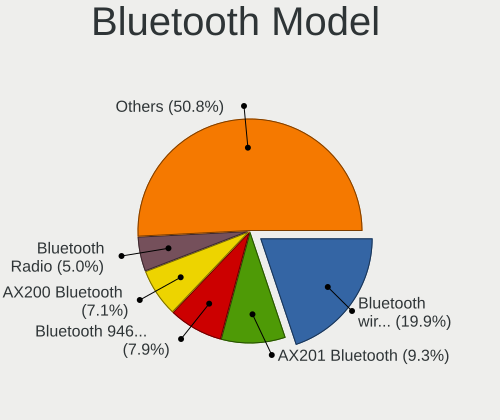

| Model                                               | Notebooks | Percent |
|-----------------------------------------------------|-----------|---------|
| Intel Bluetooth wireless interface                  | 532       | 19.86%  |
| Intel AX201 Bluetooth                               | 250       | 9.33%   |
| Intel Bluetooth 9460/9560 Jefferson Peak (JfP)      | 212       | 7.91%   |
| Intel AX200 Bluetooth                               | 189       | 7.05%   |
| Realtek Bluetooth Radio                             | 135       | 5.04%   |
| Intel Bluetooth Device                              | 135       | 5.04%   |
| Apple Bluetooth Host Controller                     | 72        | 2.69%   |
| Qualcomm Atheros  Bluetooth Device                  | 59        | 2.2%    |
| Intel AX210 Bluetooth                               | 52        | 1.94%   |
| IMC Networks Bluetooth Radio                        | 51        | 1.9%    |
| Realtek  Bluetooth 4.2 Adapter                      | 48        | 1.79%   |
| Intel Centrino Bluetooth Wireless Transceiver       | 42        | 1.57%   |
| IMC Networks Wireless_Device                        | 41        | 1.53%   |
| Cambridge Silicon Radio Bluetooth Dongle (HCI mode) | 39        | 1.46%   |
| Qualcomm Atheros QCA61x4 Bluetooth 4.0              | 36        | 1.34%   |
| Foxconn / Hon Hai Wireless_Device                   | 36        | 1.34%   |
| Apple Bluetooth USB Host Controller                 | 34        | 1.27%   |
| Intel Wireless-AC 9260 Bluetooth Adapter            | 33        | 1.23%   |
| Qualcomm Atheros AR3012 Bluetooth 4.0               | 31        | 1.16%   |
| Foxconn / Hon Hai Bluetooth Device                  | 31        | 1.16%   |
| HP Broadcom 2070 Bluetooth Combo                    | 30        | 1.12%   |
| Foxconn / Hon Hai MediaTek Bluetooth Adapter        | 29        | 1.08%   |
| Lite-On Qualcomm Atheros QCA9377 Bluetooth          | 26        | 0.97%   |
| Lite-On Bluetooth Device                            | 26        | 0.97%   |
| Dell DW375 Bluetooth Module                         | 26        | 0.97%   |
| HP Bluetooth 2.0 Interface [Broadcom BCM2045]       | 24        | 0.9%    |
| Broadcom HP Portable SoftSailing                    | 22        | 0.82%   |
| IMC Networks Bluetooth Device                       | 21        | 0.78%   |
| Broadcom BCM2045B (BDC-2.1)                         | 20        | 0.75%   |
| MediaTek Wireless_Device                            | 18        | 0.67%   |
| Intel Wireless-AC 3168 Bluetooth                    | 18        | 0.67%   |
| Intel Centrino Advanced-N 6230 Bluetooth adapter    | 17        | 0.63%   |
| Broadcom BCM20702 Bluetooth 4.0 [ThinkPad]          | 17        | 0.63%   |
| Qualcomm Atheros AR3011 Bluetooth                   | 16        | 0.6%    |
| Dell BCM20702A0 Bluetooth Module                    | 13        | 0.49%   |
| Broadcom HP Portable Bumble Bee                     | 13        | 0.49%   |
| USI Bluetooth Device                                | 12        | 0.45%   |
| Ralink RT3290 Bluetooth                             | 12        | 0.45%   |
| IMC Networks Atheros AR3012 Bluetooth 4.0 Adapter   | 11        | 0.41%   |
| Broadcom BCM2045 Bluetooth                          | 11        | 0.41%   |

Sound
-----

Sound Vendor
------------

Sound card vendors

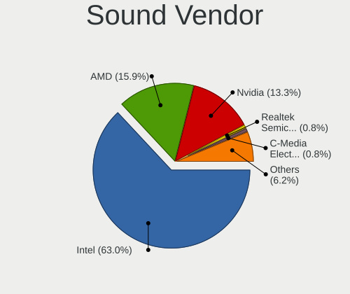

| Vendor                           | Notebooks | Percent |
|----------------------------------|-----------|---------|
| Intel                            | 2626      | 63.05%  |
| AMD                              | 661       | 15.87%  |
| Nvidia                           | 554       | 13.3%   |
| Realtek Semiconductor            | 32        | 0.77%   |
| C-Media Electronics              | 32        | 0.77%   |
| GN Netcom                        | 28        | 0.67%   |
| Logitech                         | 27        | 0.65%   |
| Lenovo                           | 22        | 0.53%   |
| Hewlett-Packard                  | 22        | 0.53%   |
| Silicon Integrated Systems [SiS] | 14        | 0.34%   |
| Plantronics                      | 10        | 0.24%   |
| Texas Instruments                | 9         | 0.22%   |
| JMTek                            | 9         | 0.22%   |
| SteelSeries ApS                  | 8         | 0.19%   |
| Apple                            | 8         | 0.19%   |
| BEHRINGER International          | 6         | 0.14%   |
| Sony                             | 5         | 0.12%   |
| Razer USA                        | 5         | 0.12%   |
| Kingston Technology              | 5         | 0.12%   |
| GYROCOM C&C                      | 4         | 0.1%    |
| DSEA A/S                         | 4         | 0.1%    |
| ASUSTek Computer                 | 4         | 0.1%    |
| VIA Technologies                 | 3         | 0.07%   |
| No brand                         | 3         | 0.07%   |
| Generalplus Technology           | 3         | 0.07%   |
| Focusrite-Novation               | 3         | 0.07%   |
| XMOS                             | 2         | 0.05%   |
| Veho                             | 2         | 0.05%   |
| Samsung Electronics              | 2         | 0.05%   |
| RODE Microphones                 | 2         | 0.05%   |
| Philips (or NXP)                 | 2         | 0.05%   |
| Google                           | 2         | 0.05%   |
| Creative Technology              | 2         | 0.05%   |
| Corsair                          | 2         | 0.05%   |
| Conexant Systems                 | 2         | 0.05%   |
| Cambridge Silicon Radio          | 2         | 0.05%   |
| YZ Technology                    | 1         | 0.02%   |
| Yealink Network Technology       | 1         | 0.02%   |
| Walmart                          | 1         | 0.02%   |
| Unknown                          | 1         | 0.02%   |

Sound Model
-----------

Sound card models

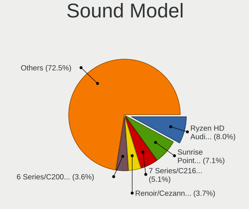

| Model                                                                      | Notebooks | Percent |
|----------------------------------------------------------------------------|-----------|---------|
| AMD Ryzen HD Audio Controller                                              | 397       | 7.96%   |
| Intel Sunrise Point-LP HD Audio                                            | 356       | 7.14%   |
| Intel 7 Series/C216 Chipset Family High Definition Audio Controller        | 255       | 5.11%   |
| AMD Renoir/Cezanne HDMI/DP Audio Controller                                | 182       | 3.65%   |
| Intel 6 Series/C200 Series Chipset Family High Definition Audio Controller | 180       | 3.61%   |
| Intel Cannon Lake PCH cAVS                                                 | 156       | 3.13%   |
| Intel Cannon Point-LP High Definition Audio Controller                     | 145       | 2.91%   |
| Intel 5 Series/3400 Series Chipset High Definition Audio                   | 143       | 2.87%   |
| Intel 8 Series/C220 Series Chipset High Definition Audio Controller        | 136       | 2.73%   |
| AMD Radeon High Definition Audio Controller                                | 132       | 2.65%   |
| Intel Tiger Lake-LP Smart Sound Technology Audio Controller                | 130       | 2.61%   |
| Intel 82801I (ICH9 Family) HD Audio Controller                             | 119       | 2.39%   |
| Intel Haswell-ULT HD Audio Controller                                      | 116       | 2.33%   |
| Intel 8 Series HD Audio Controller                                         | 116       | 2.33%   |
| Intel Broadwell-U Audio Controller                                         | 109       | 2.19%   |
| Intel Wildcat Point-LP High Definition Audio Controller                    | 108       | 2.17%   |
| Intel Xeon E3-1200 v3/4th Gen Core Processor HD Audio Controller           | 102       | 2.05%   |
| Intel Alder Lake PCH-P High Definition Audio Controller                    | 97        | 1.95%   |
| Intel Comet Lake PCH-LP cAVS                                               | 77        | 1.54%   |
| Intel Comet Lake PCH cAVS                                                  | 70        | 1.4%    |
| AMD FCH Azalia Controller                                                  | 65        | 1.3%    |
| AMD Raven/Raven2/Fenghuang HDMI/DP Audio Controller                        | 64        | 1.28%   |
| Intel CM238 HD Audio Controller                                            | 63        | 1.26%   |
| Intel 82801H (ICH8 Family) HD Audio Controller                             | 62        | 1.24%   |
| Intel 100 Series/C230 Series Chipset Family HD Audio Controller            | 57        | 1.14%   |
| Nvidia TU107 GeForce GTX 1650 High Definition Audio Controller             | 56        | 1.12%   |
| Nvidia GP107GL High Definition Audio Controller                            | 50        | 1%      |
| Nvidia GF108 High Definition Audio Controller                              | 46        | 0.92%   |
| AMD Kabini HDMI/DP Audio                                                   | 46        | 0.92%   |
| Intel Raptor Lake-P/U/H cAVS                                               | 45        | 0.9%    |
| Intel NM10/ICH7 Family High Definition Audio Controller                    | 44        | 0.88%   |
| Nvidia TU106 High Definition Audio Controller                              | 39        | 0.78%   |
| Nvidia GA104 High Definition Audio Controller                              | 34        | 0.68%   |
| Intel Celeron N3350/Pentium N4200/Atom E3900 Series Audio Cluster          | 34        | 0.68%   |
| Intel Tiger Lake-H HD Audio Controller                                     | 32        | 0.64%   |
| Intel Ice Lake-LP Smart Sound Technology Audio Controller                  | 32        | 0.64%   |
| Realtek Semiconductor USB Audio                                            | 31        | 0.62%   |
| Intel Atom Processor Z36xxx/Z37xxx Series High Definition Audio Controller | 31        | 0.62%   |
| Intel Celeron/Pentium Silver Processor High Definition Audio               | 30        | 0.6%    |
| Nvidia GK107 HDMI Audio Controller                                         | 29        | 0.58%   |

Memory
------

Memory Vendor
-------------

Memory module vendors

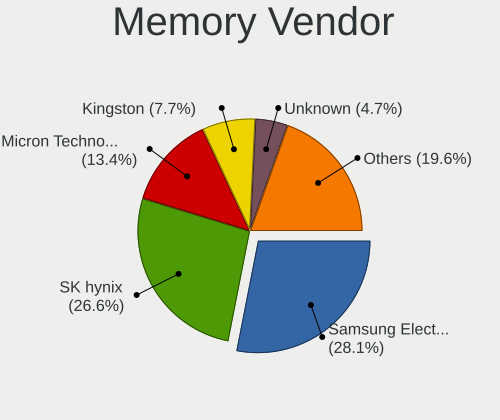

| Vendor                                  | Notebooks | Percent |
|-----------------------------------------|-----------|---------|
| Samsung Electronics                     | 576       | 28.08%  |
| SK hynix                                | 546       | 26.62%  |
| Micron Technology                       | 274       | 13.36%  |
| Kingston                                | 158       | 7.7%    |
| Unknown                                 | 96        | 4.68%   |
| Crucial                                 | 96        | 4.68%   |
| Ramaxel Technology                      | 40        | 1.95%   |
| Corsair                                 | 39        | 1.9%    |
| Elpida                                  | 32        | 1.56%   |
| A-DATA Technology                       | 31        | 1.51%   |
| Unknown                                 | 30        | 1.46%   |
| Nanya Technology                        | 26        | 1.27%   |
| G.Skill                                 | 21        | 1.02%   |
| Unknown (ABCD)                          | 10        | 0.49%   |
| Team                                    | 10        | 0.49%   |
| ASint Technology                        | 7         | 0.34%   |
| GOODRAM                                 | 6         | 0.29%   |
| 48spaces                                | 5         | 0.24%   |
| Transcend                               | 4         | 0.2%    |
| Qimonda                                 | 4         | 0.2%    |
| Wilk                                    | 3         | 0.15%   |
| ff                                      | 3         | 0.15%   |
| 4ea5                                    | 3         | 0.15%   |
| Unknown (0x0702)                        | 2         | 0.1%    |
| Toshiba                                 | 2         | 0.1%    |
| Sesame                                  | 2         | 0.1%    |
| Lexar                                   | 2         | 0.1%    |
| Goldkey                                 | 2         | 0.1%    |
| ZIFEI                                   | 1         | 0.05%   |
| Unknown (0xFFFF000000000000)            | 1         | 0.05%   |
| Unifosa                                 | 1         | 0.05%   |
| Timetec                                 | 1         | 0.05%   |
| tigo                                    | 1         | 0.05%   |
| Smart                                   | 1         | 0.05%   |
| Silicon Power Computer & Communications | 1         | 0.05%   |
| SHARETRONIC                             | 1         | 0.05%   |
| PKI/Kingston                            | 1         | 0.05%   |
| Micron/Elpida                           | 1         | 0.05%   |
| Lexar Co Limited                        | 1         | 0.05%   |
| Lenovo                                  | 1         | 0.05%   |

Memory Model
------------

Memory module models

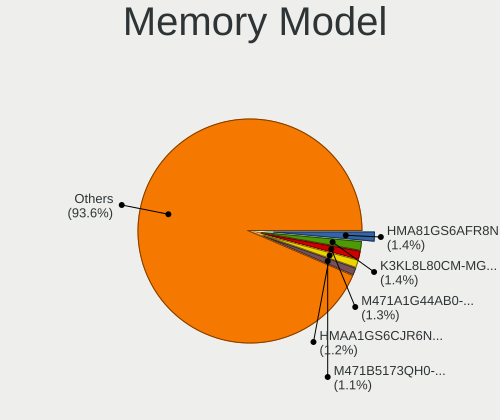

| Model                                                            | Notebooks | Percent |
|------------------------------------------------------------------|-----------|---------|
| SK hynix RAM HMA81GS6AFR8N-UH 8GB SODIMM DDR4 2667MT/s           | 31        | 1.44%   |
| Unknown                                                          | 30        | 1.39%   |
| Samsung RAM M471A1G44AB0-CWE 8GiB SODIMM DDR4 3200MT/s           | 28        | 1.3%    |
| SK hynix RAM HMAA1GS6CJR6N-XN 8GB SODIMM DDR4 3200MT/s           | 26        | 1.21%   |
| Samsung RAM M471B5173QH0-YK0 4GB SODIMM DDR3 1600MT/s            | 24        | 1.11%   |
| Samsung RAM M471A1K43DB1-CWE 8GB SODIMM DDR4 3200MT/s            | 21        | 0.97%   |
| Samsung RAM M471B5173EB0-YK0 4GB SODIMM DDR3 1600MT/s            | 19        | 0.88%   |
| Samsung RAM M471A1K43EB1-CWE 8GB SODIMM DDR4 3200MT/s            | 19        | 0.88%   |
| SK hynix RAM HMT451S6BFR8A-PB 4GB SODIMM DDR3 1600MT/s           | 18        | 0.83%   |
| SK hynix RAM HMT451S6AFR8A-PB 4GB SODIMM DDR3 1600MT/s           | 18        | 0.83%   |
| SK hynix RAM HMA81GS6CJR8N-VK 8GB SODIMM DDR4 2667MT/s           | 18        | 0.83%   |
| SK hynix RAM HMA81GS6JJR8N-VK 8GB SODIMM DDR4 2667MT/s           | 17        | 0.79%   |
| SK hynix RAM HMA81GS6DJR8N-XN 8GB SODIMM DDR4 3200MT/s           | 17        | 0.79%   |
| Samsung RAM M471A5244CB0-CTD 4GB SODIMM DDR4 3266MT/s            | 17        | 0.79%   |
| SK hynix RAM HMT351S6CFR8C-PB 4GB SODIMM DDR3 1600MT/s           | 15        | 0.7%    |
| Micron RAM 4ATF1G64HZ-3G2E2 8GB SODIMM DDR4 3200MT/s             | 15        | 0.7%    |
| Samsung RAM M471B1G73DB0-YK0 8GB SODIMM DDR3 1600MT/s            | 14        | 0.65%   |
| Samsung RAM M471A5244CB0-CRC 4GB SODIMM DDR4 2667MT/s            | 13        | 0.6%    |
| SK hynix RAM HMA82GS6JJR8N-VK 16GB SODIMM DDR4 2667MT/s          | 12        | 0.56%   |
| Samsung RAM M471B5273CH0-CH9 4GB SODIMM DDR3 1334MT/s            | 12        | 0.56%   |
| Samsung RAM M471A4G43MB1-CTD 32GB SODIMM DDR4 2667MT/s           | 12        | 0.56%   |
| Samsung RAM M471A1K43DB1-CTD 8GB SODIMM DDR4 2667MT/s            | 12        | 0.56%   |
| Samsung RAM M471A1G44AB0-CWE 8GB Row Of Chips DDR4 3200MT/s      | 12        | 0.56%   |
| Micron RAM 8ATF1G64HZ-3G2J1 8GB SODIMM DDR4 3200MT/s             | 12        | 0.56%   |
| SK hynix RAM Module 4GB SODIMM DDR3 1600MT/s                     | 11        | 0.51%   |
| SK hynix RAM HMT41GS6BFR8A-PB 8GB SODIMM DDR3 2667MT/s           | 11        | 0.51%   |
| SK hynix RAM HMT351S6BFR8C-H9 4GB SODIMM DDR3 1333MT/s           | 11        | 0.51%   |
| Samsung RAM M471B5273DH0-CK0 4GB SODIMM DDR3 2400MT/s            | 10        | 0.46%   |
| Samsung RAM M471B5273DH0-CH9 4GB SODIMM DDR3 1600MT/s            | 10        | 0.46%   |
| Samsung RAM M471B5173DB0-YK0 4GB SODIMM DDR3 1600MT/s            | 10        | 0.46%   |
| Samsung RAM M471A2K43CB1-CRC 16GB SODIMM DDR4 2667MT/s           | 10        | 0.46%   |
| Samsung RAM M471A1K43CB1-CTD 8GB SODIMM DDR4 3200MT/s            | 10        | 0.46%   |
| Samsung RAM M471A1K43BB1-CRC 8GB SODIMM DDR4 2667MT/s            | 10        | 0.46%   |
| Micron RAM 4ATF51264HZ-2G6E1 4GB SODIMM DDR4 2667MT/s            | 10        | 0.46%   |
| Unknown (ABCD) RAM 123456789012345678 2GB SODIMM LPDDR4 2400MT/s | 9         | 0.42%   |
| SK hynix RAM HMAA2GS6CJR8N-XN 16GB SODIMM DDR4 3200MT/s          | 9         | 0.42%   |
| SK hynix RAM HMA851S6AFR6N-UH 4GB SODIMM DDR4 2667MT/s           | 9         | 0.42%   |
| SK hynix RAM HMA82GS6CJR8N-VK 16GB SODIMM DDR4 2667MT/s          | 9         | 0.42%   |
| SK hynix RAM HMA41GS6AFR8N-TF 8GB SODIMM DDR4 2667MT/s           | 9         | 0.42%   |
| Micron RAM 8KTF51264HZ-1G6E1 4GB SODIMM DDR3 1600MT/s            | 9         | 0.42%   |

Memory Kind
-----------

Memory module kinds

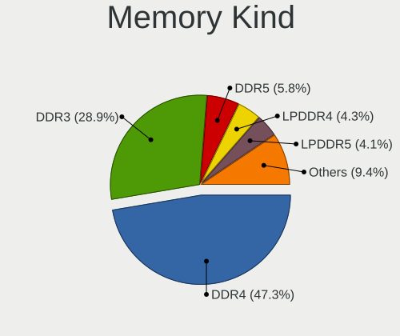

| Kind    | Notebooks | Percent |
|---------|-----------|---------|
| DDR4    | 834       | 47.33%  |
| DDR3    | 510       | 28.94%  |
| DDR5    | 103       | 5.85%   |
| LPDDR4  | 76        | 4.31%   |
| LPDDR5  | 73        | 4.14%   |
| LPDDR3  | 67        | 3.8%    |
| DDR2    | 53        | 3.01%   |
| SDRAM   | 32        | 1.82%   |
| DDR     | 5         | 0.28%   |
| Unknown | 5         | 0.28%   |
| DRAM    | 4         | 0.23%   |

Memory Form Factor
------------------

Physical design of the memory module

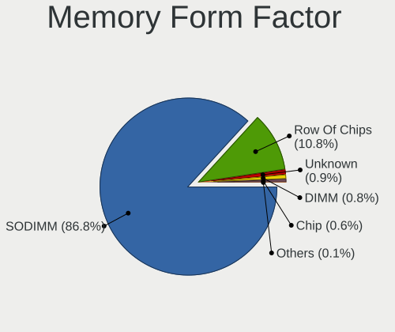

| Name            | Notebooks | Percent |
|-----------------|-----------|---------|
| SODIMM          | 1537      | 86.79%  |
| Row Of Chips    | 192       | 10.84%  |
| Unknown         | 16        | 0.9%    |
| DIMM            | 14        | 0.79%   |
| Chip            | 11        | 0.62%   |
| Proprietary Car | 1         | 0.06%   |

Memory Size
-----------

Memory module size

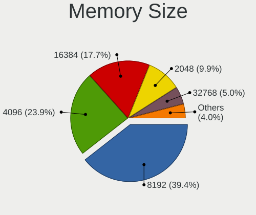

| Size  | Notebooks | Percent |
|-------|-----------|---------|
| 8192  | 751       | 39.44%  |
| 4096  | 456       | 23.95%  |
| 16384 | 337       | 17.7%   |
| 2048  | 188       | 9.87%   |
| 32768 | 95        | 4.99%   |
| 1024  | 61        | 3.2%    |
| 512   | 5         | 0.26%   |
| 49152 | 4         | 0.21%   |
| 6144  | 2         | 0.11%   |
| 3072  | 2         | 0.11%   |
| 12288 | 1         | 0.05%   |
| 256   | 1         | 0.05%   |
| 64    | 1         | 0.05%   |

Memory Speed
------------

Memory module speed

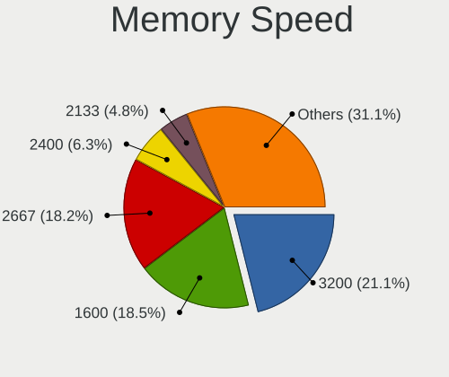

| Speed   | Notebooks | Percent |
|---------|-----------|---------|
| 3200    | 395       | 21.11%  |
| 1600    | 347       | 18.55%  |
| 2667    | 341       | 18.23%  |
| 2400    | 117       | 6.25%   |
| 2133    | 89        | 4.76%   |
| 1334    | 64        | 3.42%   |
| 1333    | 64        | 3.42%   |
| 5600    | 53        | 2.83%   |
| 4800    | 49        | 2.62%   |
| 1867    | 39        | 2.08%   |
| 6400    | 37        | 1.98%   |
| 4267    | 33        | 1.76%   |
| 667     | 30        | 1.6%    |
| Unknown | 26        | 1.39%   |
| 7500    | 22        | 1.18%   |
| 800     | 20        | 1.07%   |
| 8400    | 19        | 1.02%   |
| 1067    | 18        | 0.96%   |
| 3266    | 17        | 0.91%   |
| 4199    | 13        | 0.69%   |
| 4266    | 12        | 0.64%   |
| 1066    | 10        | 0.53%   |
| 2048    | 9         | 0.48%   |
| 1866    | 8         | 0.43%   |
| 1639    | 7         | 0.37%   |
| 7467    | 5         | 0.27%   |
| 8533    | 3         | 0.16%   |
| 975     | 3         | 0.16%   |
| 533     | 3         | 0.16%   |
| 8000    | 2         | 0.11%   |
| 5500    | 2         | 0.11%   |
| 4000    | 2         | 0.11%   |
| 3733    | 2         | 0.11%   |
| 3000    | 2         | 0.11%   |
| 31582   | 1         | 0.05%   |
| 5200    | 1         | 0.05%   |
| 3800    | 1         | 0.05%   |
| 3600    | 1         | 0.05%   |
| 3500    | 1         | 0.05%   |
| 2933    | 1         | 0.05%   |

Printers & scanners
-------------------

Printer Vendor
--------------

Printer device vendors

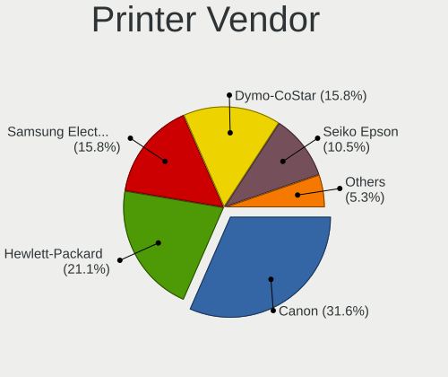

| Vendor              | Notebooks | Percent |
|---------------------|-----------|---------|
| Canon               | 6         | 31.58%  |
| Hewlett-Packard     | 4         | 21.05%  |
| Samsung Electronics | 3         | 15.79%  |
| Dymo-CoStar         | 3         | 15.79%  |
| Seiko Epson         | 2         | 10.53%  |
| Brother Industries  | 1         | 5.26%   |

Printer Model
-------------

Printer device models

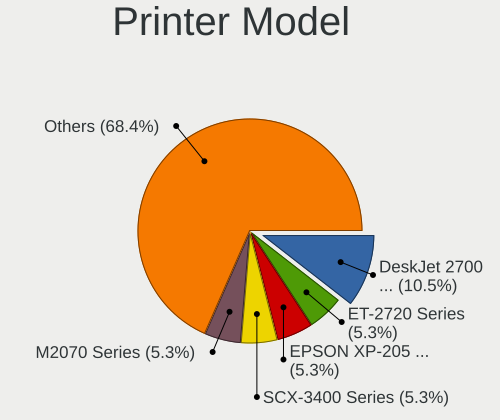

| Model                               | Notebooks | Percent |
|-------------------------------------|-----------|---------|
| HP DeskJet 2700 series              | 2         | 10.53%  |
| Seiko Epson ET-2720 Series          | 1         | 5.26%   |
| Seiko Epson EPSON XP-205 207 Series | 1         | 5.26%   |
| Samsung SCX-3400 Series             | 1         | 5.26%   |
| Samsung M2070 Series                | 1         | 5.26%   |
| Samsung CLX-3180 Series             | 1         | 5.26%   |
| HP Printing Support                 | 1         | 5.26%   |
| HP OfficeJet 3830 series            | 1         | 5.26%   |
| Dymo-CoStar LabelWriter 450         | 1         | 5.26%   |
| Dymo-CoStar LabelWriter 400         | 1         | 5.26%   |
| Dymo-CoStar DYMO LabelPOINT 350     | 1         | 5.26%   |
| Canon TR4700 series                 | 1         | 5.26%   |
| Canon TR4600 series                 | 1         | 5.26%   |
| Canon PIXMA MX920 Series            | 1         | 5.26%   |
| Canon PIXMA MG5600 Series           | 1         | 5.26%   |
| Canon LBP6680/3480 UFR II           | 1         | 5.26%   |
| Canon LBP2900                       | 1         | 5.26%   |
| Brother MFC-J4540DW                 | 1         | 5.26%   |

Scanner Vendor
--------------

Scanner device vendors

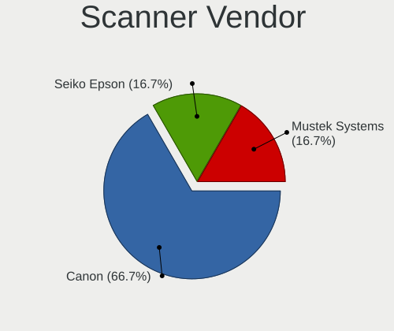

| Vendor         | Notebooks | Percent |
|----------------|-----------|---------|
| Canon          | 5         | 71.43%  |
| Seiko Epson    | 1         | 14.29%  |
| Mustek Systems | 1         | 14.29%  |

Scanner Model
-------------

Scanner device models

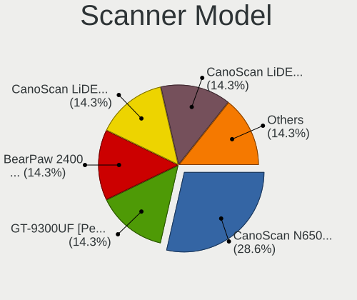

| Model                                         | Notebooks | Percent |
|-----------------------------------------------|-----------|---------|
| Canon CanoScan N650U/N656U                    | 2         | 28.57%  |
| Seiko Epson GT-9300UF [Perfection 2400 PHOTO] | 1         | 14.29%  |
| Mustek Systems BearPaw 2400 CU Plus           | 1         | 14.29%  |
| Canon CanoScan LiDE 210                       | 1         | 14.29%  |
| Canon CanoScan LiDE 120                       | 1         | 14.29%  |
| Canon CanoScan 5600F                          | 1         | 14.29%  |

Camera
------

Camera Vendor
-------------

Camera device vendors

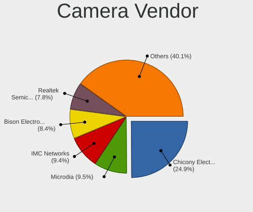

| Vendor                                 | Notebooks | Percent |
|----------------------------------------|-----------|---------|
| Chicony Electronics                    | 718       | 24.89%  |
| Microdia                               | 273       | 9.46%   |
| IMC Networks                           | 270       | 9.36%   |
| Bison Electronics                      | 242       | 8.39%   |
| Realtek Semiconductor                  | 224       | 7.76%   |
| Sunplus Innovation Technology          | 172       | 5.96%   |
| Cheng Uei Precision Industry (Foxlink) | 138       | 4.78%   |
| Quanta                                 | 132       | 4.58%   |
| Suyin                                  | 96        | 3.33%   |
| Apple                                  | 85        | 2.95%   |
| Lite-On Technology                     | 69        | 2.39%   |
| Luxvisions Innotech Limited            | 61        | 2.11%   |
| Syntek                                 | 55        | 1.91%   |
| Logitech                               | 52        | 1.8%    |
| Ricoh                                  | 27        | 0.94%   |
| Silicon Motion                         | 26        | 0.9%    |
| Sonix Technology                       | 22        | 0.76%   |
| Lenovo                                 | 19        | 0.66%   |
| Alcor Micro                            | 19        | 0.66%   |
| Samsung Electronics                    | 17        | 0.59%   |
| Shinetech                              | 14        | 0.49%   |
| Primax Electronics                     | 14        | 0.49%   |
| SunplusIT                              | 12        | 0.42%   |
| kingcome                               | 10        | 0.35%   |
| Importek                               | 10        | 0.35%   |
| ALi                                    | 8         | 0.28%   |
| Acer                                   | 8         | 0.28%   |
| Microsoft                              | 6         | 0.21%   |
| Z-Star Microelectronics                | 5         | 0.17%   |
| Trust                                  | 4         | 0.14%   |
| Jieli Technology                       | 4         | 0.14%   |
| Y Media                                | 3         | 0.1%    |
| OmniVision Technologies                | 3         | 0.1%    |
| icSpring                               | 3         | 0.1%    |
| Generalplus Technology                 | 3         | 0.1%    |
| Framework                              | 3         | 0.1%    |
| DigiTech                               | 3         | 0.1%    |
| ARC International                      | 3         | 0.1%    |
| Alpha Imaging Technology               | 3         | 0.1%    |
| Tobii Technology AB                    | 2         | 0.07%   |

Camera Model
------------

Camera device models

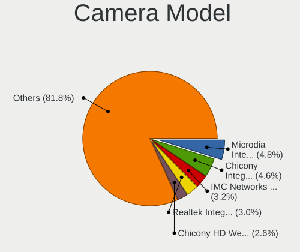

| Model                                                                      | Notebooks | Percent |
|----------------------------------------------------------------------------|-----------|---------|
| Microdia Integrated_Webcam_HD                                              | 140       | 4.82%   |
| Chicony Integrated Camera                                                  | 134       | 4.62%   |
| IMC Networks Integrated Camera                                             | 92        | 3.17%   |
| Realtek Integrated_Webcam_HD                                               | 88        | 3.03%   |
| Chicony HD WebCam                                                          | 75        | 2.58%   |
| IMC Networks USB2.0 HD UVC WebCam                                          | 73        | 2.51%   |
| Bison Integrated Camera                                                    | 69        | 2.38%   |
| Chicony HP HD Camera                                                       | 53        | 1.83%   |
| Sunplus Integrated_Webcam_HD                                               | 52        | 1.79%   |
| Syntek Integrated Camera                                                   | 38        | 1.31%   |
| Apple FaceTime HD Camera                                                   | 31        | 1.07%   |
| Bison BisonCam,NB Pro                                                      | 29        | 1%      |
| Microdia Integrated Webcam                                                 | 26        | 0.9%    |
| Chicony Chicony USB2.0 Camera                                              | 25        | 0.86%   |
| Quanta HP HD Camera                                                        | 24        | 0.83%   |
| Chicony TOSHIBA Web Camera - HD                                            | 23        | 0.79%   |
| Cheng Uei Precision Industry (Foxlink) HP HD Camera                        | 23        | 0.79%   |
| Sunplus HD WebCam                                                          | 22        | 0.76%   |
| Quanta HD User Facing                                                      | 22        | 0.76%   |
| Lite-On Integrated Camera                                                  | 22        | 0.76%   |
| Lite-On HP HD Camera                                                       | 22        | 0.76%   |
| Apple Built-in iSight                                                      | 22        | 0.76%   |
| Chicony FJ Camera                                                          | 21        | 0.72%   |
| Bison SunplusIT Integrated Camera                                          | 20        | 0.69%   |
| Bison Lenovo EasyCamera                                                    | 20        | 0.69%   |
| Quanta HP Wide Vision HD Camera                                            | 19        | 0.65%   |
| Chicony Integrated HP HD Webcam                                            | 19        | 0.65%   |
| Chicony HP Wide Vision HD Camera                                           | 19        | 0.65%   |
| Suyin Acer/HP Integrated Webcam [CN0314]                                   | 18        | 0.62%   |
| Chicony USB2.0 camera                                                      | 18        | 0.62%   |
| Chicony USB 2.0 Camera                                                     | 18        | 0.62%   |
| Cheng Uei Precision Industry (Foxlink) HP Wide Vision HD Integrated Webcam | 18        | 0.62%   |
| Samsung Galaxy series, misc. (MTP mode)                                    | 17        | 0.59%   |
| Chicony Integrated Camera (1280x720@30)                                    | 17        | 0.59%   |
| Chicony HP HD Webcam                                                       | 17        | 0.59%   |
| Quanta HD Webcam                                                           | 16        | 0.55%   |
| IMC Networks USB2.0 VGA UVC WebCam                                         | 16        | 0.55%   |
| IMC Networks Integrated Webcam                                             | 16        | 0.55%   |
| Chicony HD WebCam (Asus N-series)                                          | 16        | 0.55%   |
| Cheng Uei Precision Industry (Foxlink) HP HD Webcam                        | 16        | 0.55%   |

Security
--------

Fingerprint Vendor
------------------

Fingerprint sensor vendors

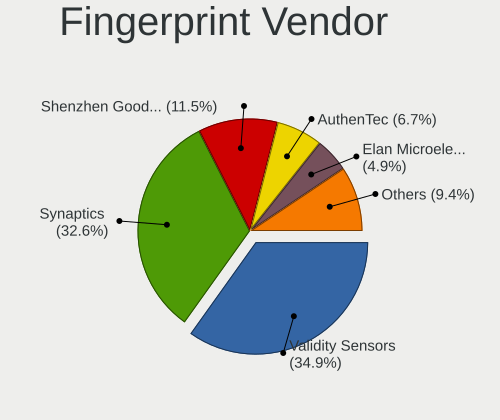

| Vendor                             | Notebooks | Percent |
|------------------------------------|-----------|---------|
| Validity Sensors                   | 219       | 34.87%  |
| Synaptics                          | 205       | 32.64%  |
| Shenzhen Goodix Technology         | 72        | 11.46%  |
| AuthenTec                          | 42        | 6.69%   |
| Elan Microelectronics              | 31        | 4.94%   |
| LighTuning Technology              | 29        | 4.62%   |
| Upek                               | 24        | 3.82%   |
| STMicroelectronics                 | 3         | 0.48%   |
| Realtek USB2.0 Finger Print Bridge | 2         | 0.32%   |
| HOLTEK                             | 1         | 0.16%   |

Fingerprint Model
-----------------

Fingerprint sensor models

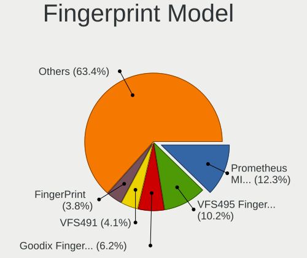

| Model                                                                      | Notebooks | Percent |
|----------------------------------------------------------------------------|-----------|---------|
| Synaptics Prometheus MIS Touch Fingerprint Reader                          | 77        | 12.26%  |
| Validity Sensors VFS495 Fingerprint Reader                                 | 64        | 10.19%  |
| Shenzhen Goodix  FingerPrint Device                                        | 39        | 6.21%   |
| Validity Sensors VFS491                                                    | 26        | 4.14%   |
| Shenzhen Goodix FingerPrint                                                | 24        | 3.82%   |
| Upek Biometric Touchchip/Touchstrip Fingerprint Sensor                     | 23        | 3.66%   |
| Synaptics Metallica MIS Touch Fingerprint Reader                           | 22        | 3.5%    |
| Validity Sensors Synaptics VFS7552 Touch Fingerprint Sensor with PurePrint | 19        | 3.03%   |
| Validity Sensors VFS 5011 fingerprint sensor                               | 18        | 2.87%   |
| Validity Sensors VFS451 Fingerprint Reader                                 | 17        | 2.71%   |
| LighTuning EgisTec Touch Fingerprint Sensor                                | 17        | 2.71%   |
| Synaptics FS7604 Touch Fingerprint Sensor with PurePrint                   | 16        | 2.55%   |
| Synaptics Fingerprint reader [HP G6]                                       | 16        | 2.55%   |
| Elan ELAN:ARM-M4                                                           | 16        | 2.55%   |
| Validity Sensors VFS471 Fingerprint Reader                                 | 15        | 2.39%   |
| Elan ELAN:Fingerprint                                                      | 15        | 2.39%   |
| AuthenTec AES2501 Fingerprint Sensor                                       | 15        | 2.39%   |
| Validity Sensors VFS5011 Fingerprint Reader                                | 14        | 2.23%   |
| Validity Sensors Synaptics WBDI                                            | 12        | 1.91%   |
| Synaptics Prometheus Fingerprint Reader                                    | 12        | 1.91%   |
| AuthenTec AES2810                                                          | 12        | 1.91%   |
| Synaptics  FS7604 Touch Fingerprint Sensor with PurePrint                  | 10        | 1.59%   |
| Shenzhen Goodix Fingerprint Reader                                         | 9         | 1.43%   |
| Synaptics UWP WBDI Device                                                  | 8         | 1.27%   |
| LighTuning ES603 Swipe Fingerprint Sensor                                  | 8         | 1.27%   |
| Synaptics WBDI Fingerprint Reader USB 086                                  | 7         | 1.11%   |
| Synaptics TouchPad                                                         | 7         | 1.11%   |
| Synaptics  WBDI                                                            | 7         | 1.11%   |
| Synaptics Metallica MOH Touch Fingerprint Reader                           | 7         | 1.11%   |
| AuthenTec AES1600                                                          | 7         | 1.11%   |
| Unknown                                                                    | 7         | 1.11%   |
| Validity Sensors Fingerprint scanner                                       | 6         | 0.96%   |
| Validity Sensors VFS7500 Touch Fingerprint Sensor                          | 5         | 0.8%    |
| Validity Sensors VFS101 Fingerprint Reader                                 | 5         | 0.8%    |
| Validity Sensors Swipe Fingerprint Sensor                                  | 5         | 0.8%    |
| AuthenTec Fingerprint Sensor                                               | 5         | 0.8%    |
| Validity Sensors VFS Fingerprint sensor                                    | 4         | 0.64%   |
| Synaptics WBDI Device                                                      | 4         | 0.64%   |
| Synaptics WBDI                                                             | 4         | 0.64%   |
| Validity Sensors VFS7552 Touch Fingerprint Sensor                          | 3         | 0.48%   |

Chipcard Vendor
---------------

Chipcard module vendors

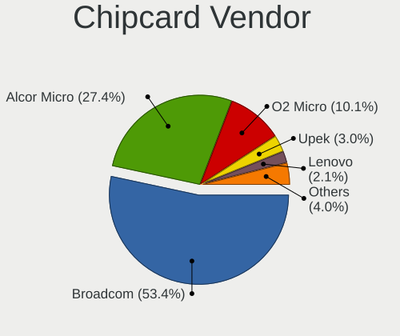

| Vendor                    | Notebooks | Percent |
|---------------------------|-----------|---------|
| Broadcom                  | 175       | 53.35%  |
| Alcor Micro               | 90        | 27.44%  |
| O2 Micro                  | 33        | 10.06%  |
| Upek                      | 10        | 3.05%   |
| Lenovo                    | 7         | 2.13%   |
| Yubico.com                | 3         | 0.91%   |
| SCM Microsystems          | 3         | 0.91%   |
| Gemalto (was Gemplus)     | 2         | 0.61%   |
| Advanced Card Systems     | 2         | 0.61%   |
| OmniKey                   | 1         | 0.3%    |
| Fujitsu Siemens Computers | 1         | 0.3%    |
| Chicony Electronics       | 1         | 0.3%    |

Chipcard Model
--------------

Chipcard module models

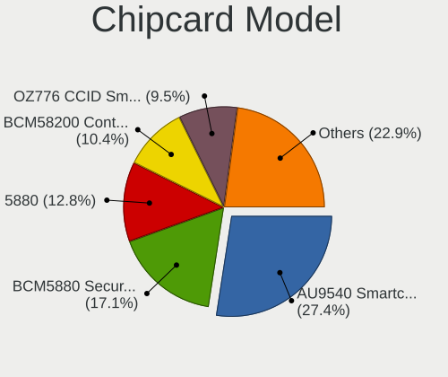

| Model                                                                        | Notebooks | Percent |
|------------------------------------------------------------------------------|-----------|---------|
| Alcor Micro AU9540 Smartcard Reader                                          | 90        | 27.44%  |
| Broadcom BCM5880 Secure Applications Processor                               | 56        | 17.07%  |
| Broadcom 5880                                                                | 42        | 12.8%   |
| Broadcom BCM58200 ControlVault 3 (FingerPrint sensor + Contacted SmartCard)  | 34        | 10.37%  |
| O2 Micro OZ776 CCID Smartcard Reader                                         | 31        | 9.45%   |
| Broadcom BCM5880 Secure Applications Processor with fingerprint swipe sensor | 30        | 9.15%   |
| Broadcom 58200                                                               | 12        | 3.66%   |
| Upek TouchChip Fingerprint Coprocessor (WBF advanced mode)                   | 10        | 3.05%   |
| Lenovo Integrated Smart Card Reader                                          | 7         | 2.13%   |
| Yubico.com Yubikey 4/5 U2F+CCID                                              | 3         | 0.91%   |
| SCM Microsystems SCR3340 - ExpressCard54 Smart Card Reader                   | 2         | 0.61%   |
| O2 Micro Oz776 SmartCard Reader                                              | 2         | 0.61%   |
| SCM Microsystems SCR35xx Smart Card Reader                                   | 1         | 0.3%    |
| OmniKey 3x21 Smart Card Reader                                               | 1         | 0.3%    |
| Gemalto (was Gemplus) GemPC Twin SmartCard Reader                            | 1         | 0.3%    |
| Gemalto (was Gemplus) Compact Smart Card Reader Writer                       | 1         | 0.3%    |
| Fujitsu Siemens Computers Keyboard KB SCR                                    | 1         | 0.3%    |
| Chicony Electronics HP Skylab USB Smartcard Keyboard                         | 1         | 0.3%    |
| Broadcom BCM5880 Secure Applications Processor with fingerprint touch sensor | 1         | 0.3%    |
| Advanced Card Systems ACR39U                                                 | 1         | 0.3%    |
| Advanced Card Systems ACR122U                                                | 1         | 0.3%    |

Unsupported
-----------

Unsupported Devices
-------------------

Total unsupported devices on board

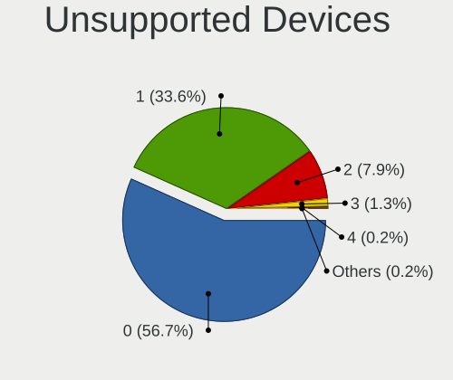

| Total | Notebooks | Percent |
|-------|-----------|---------|
| 0     | 1933      | 56.7%   |
| 1     | 1147      | 33.65%  |
| 2     | 271       | 7.95%   |
| 3     | 44        | 1.29%   |
| 4     | 8         | 0.23%   |
| 5     | 4         | 0.12%   |
| 9     | 1         | 0.03%   |
| 8     | 1         | 0.03%   |

Unsupported Device Types
------------------------

Types of unsupported devices

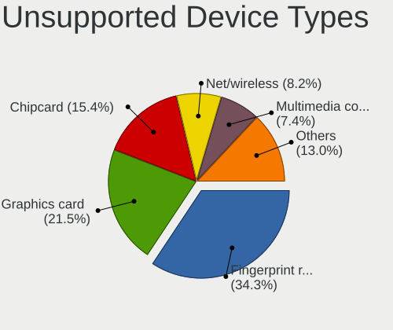

| Type                     | Notebooks | Percent |
|--------------------------|-----------|---------|
| Fingerprint reader       | 625       | 34.34%  |
| Graphics card            | 392       | 21.54%  |
| Chipcard                 | 281       | 15.44%  |
| Net/wireless             | 150       | 8.24%   |
| Multimedia controller    | 135       | 7.42%   |
| Camera                   | 54        | 2.97%   |
| Bluetooth                | 36        | 1.98%   |
| Communication controller | 33        | 1.81%   |
| Storage                  | 30        | 1.65%   |
| Card reader              | 22        | 1.21%   |
| Sound                    | 18        | 0.99%   |
| Net/ethernet             | 18        | 0.99%   |
| Network                  | 8         | 0.44%   |
| Flash memory             | 8         | 0.44%   |
| Modem                    | 6         | 0.33%   |
| Storage/nvme             | 1         | 0.05%   |
| Storage/ide              | 1         | 0.05%   |
| Storage/ata              | 1         | 0.05%   |
| Firewire controller      | 1         | 0.05%   |

