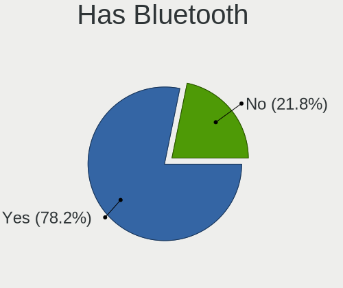
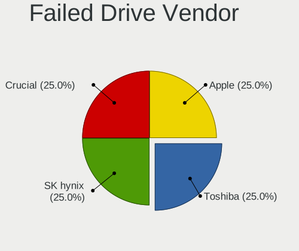
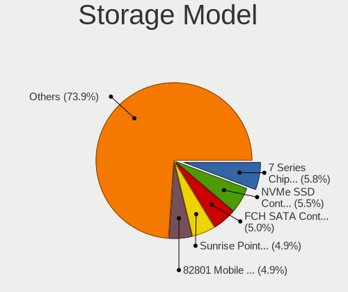
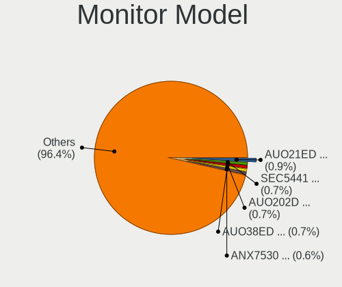
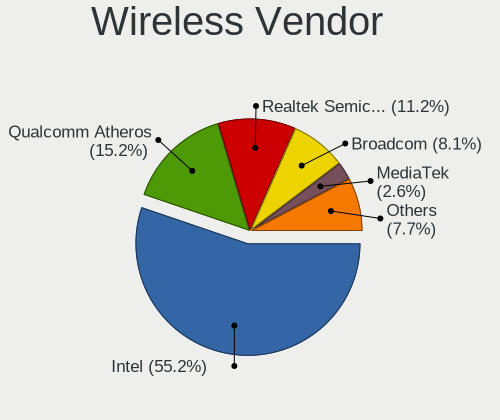
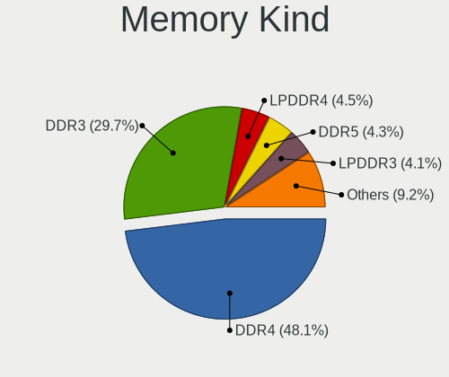

Linux in Netherlands - Tested Hardware & Statistics (Notebooks)
---------------------------------------------------------------

A project to collect tested hardware configurations for Linux in Netherlands.

Anyone can contribute to this report by the [hw-probe](https://github.com/linuxhw/hw-probe) tool:

    sudo -E hw-probe -all -upload

Please contribute! Especially if your hardware is rare.

Contents
--------

* [ Test Cases ](#test-cases)

* [ System ](#system)
  - [ OS                       ](#os)
  - [ OS Family                ](#os-family)
  - [ Kernel                   ](#kernel)
  - [ Kernel Family            ](#kernel-family)
  - [ Kernel Major Ver.        ](#kernel-major-ver)
  - [ Arch                     ](#arch)
  - [ DE                       ](#de)
  - [ Display Server           ](#display-server)
  - [ Display Manager          ](#display-manager)
  - [ OS Lang                  ](#os-lang)
  - [ Boot Mode                ](#boot-mode)
  - [ Filesystem               ](#filesystem)
  - [ Part. scheme             ](#part-scheme)
  - [ Dual Boot with Linux/BSD ](#dual-boot-with-linuxbsd)
  - [ Dual Boot (Win)          ](#dual-boot-win)

* [ Board ](#board)
  - [ Vendor                   ](#vendor)
  - [ Model                    ](#model)
  - [ Model Family             ](#model-family)
  - [ MFG Year                 ](#mfg-year)
  - [ Form Factor              ](#form-factor)
  - [ Secure Boot              ](#secure-boot)
  - [ Coreboot                 ](#coreboot)
  - [ RAM Size                 ](#ram-size)
  - [ RAM Used                 ](#ram-used)
  - [ Total Drives             ](#total-drives)
  - [ Has CD-ROM               ](#has-cd-rom)
  - [ Has Ethernet             ](#has-ethernet)
  - [ Has WiFi                 ](#has-wifi)
  - [ Has Bluetooth            ](#has-bluetooth)

* [ Location ](#location)
  - [ Country                  ](#country)
  - [ City                     ](#city)

* [ Drives ](#drives)
  - [ Drive Vendor             ](#drive-vendor)
  - [ Drive Model              ](#drive-model)
  - [ HDD Vendor               ](#hdd-vendor)
  - [ SSD Vendor               ](#ssd-vendor)
  - [ Drive Kind               ](#drive-kind)
  - [ Drive Connector          ](#drive-connector)
  - [ Drive Size               ](#drive-size)
  - [ Space Total              ](#space-total)
  - [ Space Used               ](#space-used)
  - [ Malfunc. Drives          ](#malfunc-drives)
  - [ Malfunc. Drive Vendor    ](#malfunc-drive-vendor)
  - [ Malfunc. HDD Vendor      ](#malfunc-hdd-vendor)
  - [ Malfunc. Drive Kind      ](#malfunc-drive-kind)
  - [ Failed Drives            ](#failed-drives)
  - [ Failed Drive Vendor      ](#failed-drive-vendor)
  - [ Drive Status             ](#drive-status)

* [ Storage controller ](#storage-controller)
  - [ Storage Vendor           ](#storage-vendor)
  - [ Storage Model            ](#storage-model)
  - [ Storage Kind             ](#storage-kind)

* [ Processor ](#processor)
  - [ CPU Vendor               ](#cpu-vendor)
  - [ CPU Model                ](#cpu-model)
  - [ CPU Model Family         ](#cpu-model-family)
  - [ CPU Cores                ](#cpu-cores)
  - [ CPU Sockets              ](#cpu-sockets)
  - [ CPU Threads              ](#cpu-threads)
  - [ CPU Op-Modes             ](#cpu-op-modes)
  - [ CPU Microcode            ](#cpu-microcode)
  - [ CPU Microarch            ](#cpu-microarch)

* [ Graphics ](#graphics)
  - [ GPU Vendor               ](#gpu-vendor)
  - [ GPU Model                ](#gpu-model)
  - [ GPU Combo                ](#gpu-combo)
  - [ GPU Driver               ](#gpu-driver)
  - [ GPU Memory               ](#gpu-memory)

* [ Monitor ](#monitor)
  - [ Monitor Vendor           ](#monitor-vendor)
  - [ Monitor Model            ](#monitor-model)
  - [ Monitor Resolution       ](#monitor-resolution)
  - [ Monitor Diagonal         ](#monitor-diagonal)
  - [ Monitor Width            ](#monitor-width)
  - [ Aspect Ratio             ](#aspect-ratio)
  - [ Monitor Area             ](#monitor-area)
  - [ Pixel Density            ](#pixel-density)
  - [ Multiple Monitors        ](#multiple-monitors)

* [ Network ](#network)
  - [ Net Controller Vendor    ](#net-controller-vendor)
  - [ Net Controller Model     ](#net-controller-model)
  - [ Wireless Vendor          ](#wireless-vendor)
  - [ Wireless Model           ](#wireless-model)
  - [ Ethernet Vendor          ](#ethernet-vendor)
  - [ Ethernet Model           ](#ethernet-model)
  - [ Net Controller Kind      ](#net-controller-kind)
  - [ Used Controller          ](#used-controller)
  - [ NICs                     ](#nics)
  - [ IPv6                     ](#ipv6)

* [ Bluetooth ](#bluetooth)
  - [ Bluetooth Vendor         ](#bluetooth-vendor)
  - [ Bluetooth Model          ](#bluetooth-model)

* [ Sound ](#sound)
  - [ Sound Vendor             ](#sound-vendor)
  - [ Sound Model              ](#sound-model)

* [ Memory ](#memory)
  - [ Memory Vendor            ](#memory-vendor)
  - [ Memory Model             ](#memory-model)
  - [ Memory Kind              ](#memory-kind)
  - [ Memory Form Factor       ](#memory-form-factor)
  - [ Memory Size              ](#memory-size)
  - [ Memory Speed             ](#memory-speed)

* [ Printers & scanners ](#printers--scanners)
  - [ Printer Vendor           ](#printer-vendor)
  - [ Printer Model            ](#printer-model)
  - [ Scanner Vendor           ](#scanner-vendor)
  - [ Scanner Model            ](#scanner-model)

* [ Camera ](#camera)
  - [ Camera Vendor            ](#camera-vendor)
  - [ Camera Model             ](#camera-model)

* [ Security ](#security)
  - [ Fingerprint Vendor       ](#fingerprint-vendor)
  - [ Fingerprint Model        ](#fingerprint-model)
  - [ Chipcard Vendor          ](#chipcard-vendor)
  - [ Chipcard Model           ](#chipcard-model)

* [ Unsupported ](#unsupported)
  - [ Unsupported Devices      ](#unsupported-devices)
  - [ Unsupported Device Types ](#unsupported-device-types)

Test Cases
----------

Total: 2230

| Vendor        | Model                       | Probe                                                      | Date         |
|---------------|-----------------------------|------------------------------------------------------------|--------------|
| Apple         | MacBookPro5,5               | [4eeca116f8](https://linux-hardware.org/?probe=4eeca116f8) | Aug 01, 2022 |
| HP            | ZBook Fury 15 G7 Mobile ... | [16a3f81537](https://linux-hardware.org/?probe=16a3f81537) | Aug 01, 2022 |
| HP            | EliteBook 745 G6            | [2546e4a593](https://linux-hardware.org/?probe=2546e4a593) | Aug 01, 2022 |
| HP            | ProBook 6570b               | [333a24bdee](https://linux-hardware.org/?probe=333a24bdee) | Jul 31, 2022 |
| HP            | Notebook                    | [2268ecaee2](https://linux-hardware.org/?probe=2268ecaee2) | Jul 31, 2022 |
| Fujitsu       | LIFEBOOK S936               | [90a08a49a3](https://linux-hardware.org/?probe=90a08a49a3) | Jul 31, 2022 |
| Fujitsu       | LIFEBOOK S936               | [1af46d1c56](https://linux-hardware.org/?probe=1af46d1c56) | Jul 31, 2022 |
| Dell          | Latitude E7470              | [ca7878faab](https://linux-hardware.org/?probe=ca7878faab) | Jul 30, 2022 |
| HP            | Notebook                    | [ac46775f8b](https://linux-hardware.org/?probe=ac46775f8b) | Jul 30, 2022 |
| Lenovo        | G700 20251                  | [24a9e92897](https://linux-hardware.org/?probe=24a9e92897) | Jul 29, 2022 |
| Lenovo        | ThinkPad T14 Gen 1 20UES... | [ef7aa9cb2e](https://linux-hardware.org/?probe=ef7aa9cb2e) | Jul 29, 2022 |
| ASUSTek       | N76VB                       | [15cea344b9](https://linux-hardware.org/?probe=15cea344b9) | Jul 27, 2022 |
| HP            | Pavilion g7                 | [75fa7f0ce4](https://linux-hardware.org/?probe=75fa7f0ce4) | Jul 27, 2022 |
| Lenovo        | ThinkPad E550 20DF0040CA    | [f54dc4ee78](https://linux-hardware.org/?probe=f54dc4ee78) | Jul 26, 2022 |
| Dell          | Latitude 3300               | [64cf4b87d9](https://linux-hardware.org/?probe=64cf4b87d9) | Jul 26, 2022 |
| Dell          | Latitude 3310               | [0fe12d0d48](https://linux-hardware.org/?probe=0fe12d0d48) | Jul 25, 2022 |
| Lenovo        | ThinkPad E550 20DF0040CA    | [276e2a32dc](https://linux-hardware.org/?probe=276e2a32dc) | Jul 25, 2022 |
| MSI           | GP60 2PE                    | [0fa37c70f5](https://linux-hardware.org/?probe=0fa37c70f5) | Jul 24, 2022 |
| ASUSTek       | X751MA                      | [4986a5eabc](https://linux-hardware.org/?probe=4986a5eabc) | Jul 24, 2022 |
| ASUSTek       | GL702VI                     | [7bb350de7e](https://linux-hardware.org/?probe=7bb350de7e) | Jul 24, 2022 |
| HP            | EliteBook 840 G4            | [d8d889ef85](https://linux-hardware.org/?probe=d8d889ef85) | Jul 23, 2022 |
| ASUSTek       | GL702VI                     | [ca8b9fbf8f](https://linux-hardware.org/?probe=ca8b9fbf8f) | Jul 22, 2022 |
| Dell          | Latitude 3310               | [bc6103f96b](https://linux-hardware.org/?probe=bc6103f96b) | Jul 21, 2022 |
| Dell          | Latitude 3310               | [abe159e82a](https://linux-hardware.org/?probe=abe159e82a) | Jul 21, 2022 |
| Dell          | Latitude 3310               | [d90f147df3](https://linux-hardware.org/?probe=d90f147df3) | Jul 21, 2022 |
| Dell          | Latitude 3310               | [324b95a49a](https://linux-hardware.org/?probe=324b95a49a) | Jul 21, 2022 |
| Dell          | Latitude 3310               | [086f88be40](https://linux-hardware.org/?probe=086f88be40) | Jul 20, 2022 |
| Dell          | Latitude 3310               | [0cb2abc6bc](https://linux-hardware.org/?probe=0cb2abc6bc) | Jul 20, 2022 |
| Dell          | Latitude 3310               | [dbd9b101c2](https://linux-hardware.org/?probe=dbd9b101c2) | Jul 20, 2022 |
| Acer          | Aspire 7560                 | [a0f1f7abee](https://linux-hardware.org/?probe=a0f1f7abee) | Jul 19, 2022 |
| Apple         | MacBookPro14,2              | [4f1ce227b5](https://linux-hardware.org/?probe=4f1ce227b5) | Jul 18, 2022 |
| Sony          | VPCEA1C5E                   | [4592d973d6](https://linux-hardware.org/?probe=4592d973d6) | Jul 18, 2022 |
| HP            | Pavilion g7                 | [5129e33508](https://linux-hardware.org/?probe=5129e33508) | Jul 18, 2022 |
| Acer          | Aspire 7560                 | [5bf15dc370](https://linux-hardware.org/?probe=5bf15dc370) | Jul 17, 2022 |
| ASUSTek       | 1201N                       | [05eb1e3b1b](https://linux-hardware.org/?probe=05eb1e3b1b) | Jul 17, 2022 |
| HP            | Pavilion g7                 | [9230cd5f0e](https://linux-hardware.org/?probe=9230cd5f0e) | Jul 16, 2022 |
| Dell          | Latitude E6510              | [42fcd7f8c8](https://linux-hardware.org/?probe=42fcd7f8c8) | Jul 16, 2022 |
| HP            | Laptop 17-cp0xxx            | [476ab880f4](https://linux-hardware.org/?probe=476ab880f4) | Jul 15, 2022 |
| HP            | Pavilion Laptop 13-an0xx... | [6021e75347](https://linux-hardware.org/?probe=6021e75347) | Jul 13, 2022 |
| Apple         | MacBookPro11,2              | [11e98244ac](https://linux-hardware.org/?probe=11e98244ac) | Jul 12, 2022 |
| Jumper        | EZbook                      | [2515427610](https://linux-hardware.org/?probe=2515427610) | Jul 12, 2022 |
| Lenovo        | ThinkBook 14-IIL 20SL       | [9703351d30](https://linux-hardware.org/?probe=9703351d30) | Jul 12, 2022 |
| Notebook      | NL5xRU                      | [a4bc7e790c](https://linux-hardware.org/?probe=a4bc7e790c) | Jul 11, 2022 |
| Insyde        | Skylake                     | [3c3afd7b46](https://linux-hardware.org/?probe=3c3afd7b46) | Jul 10, 2022 |
| Dell          | XPS 13 9333                 | [e464cd5823](https://linux-hardware.org/?probe=e464cd5823) | Jul 08, 2022 |
| Notebook      | NH55RGQ                     | [37de891a60](https://linux-hardware.org/?probe=37de891a60) | Jul 08, 2022 |
| HP            | ProBook 4540s               | [6b67ccac52](https://linux-hardware.org/?probe=6b67ccac52) | Jul 08, 2022 |
| HP            | ProBook 4540s               | [e209d1f716](https://linux-hardware.org/?probe=e209d1f716) | Jul 08, 2022 |
| Lenovo        | ThinkPad X200 7458FDG       | [435e7998bd](https://linux-hardware.org/?probe=435e7998bd) | Jul 08, 2022 |
| AZW           | T3 MRD                      | [7f8d8245e1](https://linux-hardware.org/?probe=7f8d8245e1) | Jul 08, 2022 |
| HP            | EliteBook 745 G4            | [cb445678be](https://linux-hardware.org/?probe=cb445678be) | Jul 08, 2022 |
| Acer          | Aspire V3-771               | [e8488fb0e2](https://linux-hardware.org/?probe=e8488fb0e2) | Jul 07, 2022 |
| Google        | Cave                        | [fd843b1768](https://linux-hardware.org/?probe=fd843b1768) | Jul 07, 2022 |
| Dell          | Inspiron 16 5625            | [dcbe63005c](https://linux-hardware.org/?probe=dcbe63005c) | Jul 06, 2022 |
| Alienware     | 13 R2                       | [ec877e9a2e](https://linux-hardware.org/?probe=ec877e9a2e) | Jul 06, 2022 |
| Alienware     | m15                         | [9578c619e6](https://linux-hardware.org/?probe=9578c619e6) | Jul 06, 2022 |
| Purism        | Librem 15 v3                | [1e39d0bba8](https://linux-hardware.org/?probe=1e39d0bba8) | Jul 06, 2022 |
| HONOR         | BOHK-WAX9X                  | [4070d60511](https://linux-hardware.org/?probe=4070d60511) | Jul 05, 2022 |
| Dell          | Latitude 5421               | [8a40be5ce5](https://linux-hardware.org/?probe=8a40be5ce5) | Jul 05, 2022 |
| Toshiba       | Satellite P50-A-12P         | [6fc4be2ae8](https://linux-hardware.org/?probe=6fc4be2ae8) | Jul 04, 2022 |
| Lenovo        | Legion 5 17ACH6 82K0        | [2afdf76afd](https://linux-hardware.org/?probe=2afdf76afd) | Jul 04, 2022 |
| Apple         | MacBookPro11,2              | [fe19e0e611](https://linux-hardware.org/?probe=fe19e0e611) | Jul 03, 2022 |
| Lenovo        | Legion 5 15ACH6 82JW        | [763752db1c](https://linux-hardware.org/?probe=763752db1c) | Jul 03, 2022 |
| Dell          | Latitude E7450              | [6dc8d46993](https://linux-hardware.org/?probe=6dc8d46993) | Jul 02, 2022 |
| Lenovo        | IdeaPad Gaming 3 15IHU6 ... | [e13cada6ae](https://linux-hardware.org/?probe=e13cada6ae) | Jul 02, 2022 |
| Medion        | E122X                       | [ccc1d37532](https://linux-hardware.org/?probe=ccc1d37532) | Jul 02, 2022 |
| HP            | ProBook 4540s               | [c47e971697](https://linux-hardware.org/?probe=c47e971697) | Jul 01, 2022 |
| ASUSTek       | X756UQK                     | [62595fe324](https://linux-hardware.org/?probe=62595fe324) | Jul 01, 2022 |
| Fujitsu       | LIFEBOOK U938               | [c959653e4f](https://linux-hardware.org/?probe=c959653e4f) | Jun 27, 2022 |
| Fujitsu       | LIFEBOOK U938               | [be4fb4ad71](https://linux-hardware.org/?probe=be4fb4ad71) | Jun 27, 2022 |
| Apple         | MacBookPro14,2              | [7fe621e5a7](https://linux-hardware.org/?probe=7fe621e5a7) | Jun 27, 2022 |
| ASUSTek       | ASUS EXPERTBOOK B1500CEA... | [f1b7197958](https://linux-hardware.org/?probe=f1b7197958) | Jun 25, 2022 |
| Lenovo        | ThinkPad T520 4243VE1       | [7fcfec26eb](https://linux-hardware.org/?probe=7fcfec26eb) | Jun 24, 2022 |
| Lenovo        | Legion 5 15ACH6H 82JU       | [b450b0c2dc](https://linux-hardware.org/?probe=b450b0c2dc) | Jun 24, 2022 |
| Dell          | Latitude 3420               | [027b943645](https://linux-hardware.org/?probe=027b943645) | Jun 24, 2022 |
| HP            | Pavilion Laptop 15-cw1xx... | [223e43004a](https://linux-hardware.org/?probe=223e43004a) | Jun 23, 2022 |
| Dell          | Latitude 3300               | [5275529516](https://linux-hardware.org/?probe=5275529516) | Jun 22, 2022 |
| HP            | EliteBook 830 G6            | [7c7d9af667](https://linux-hardware.org/?probe=7c7d9af667) | Jun 21, 2022 |
| Dell          | XPS 15 9570                 | [c6c4eda2cb](https://linux-hardware.org/?probe=c6c4eda2cb) | Jun 21, 2022 |
| Lenovo        | ThinkPad T470s 20HGS1D00... | [eacaed715b](https://linux-hardware.org/?probe=eacaed715b) | Jun 21, 2022 |
| Dell          | Latitude 3190               | [14521bc3eb](https://linux-hardware.org/?probe=14521bc3eb) | Jun 20, 2022 |
| ASUSTek       | ROG Strix G713QE_G713QE     | [ff63b72fd2](https://linux-hardware.org/?probe=ff63b72fd2) | Jun 19, 2022 |
| Sony          | SVD1321Z9RW                 | [adc9da6fe8](https://linux-hardware.org/?probe=adc9da6fe8) | Jun 19, 2022 |
| Lenovo        | ThinkPad X240 20AMS75900    | [47b7f42708](https://linux-hardware.org/?probe=47b7f42708) | Jun 18, 2022 |
| Dell          | Latitude 3380               | [0ccd773de6](https://linux-hardware.org/?probe=0ccd773de6) | Jun 17, 2022 |
| ASUSTek       | ROG Strix G713QE_G713QE     | [3ec9bac70f](https://linux-hardware.org/?probe=3ec9bac70f) | Jun 17, 2022 |
| Dell          | Latitude 3420               | [178e3cbcba](https://linux-hardware.org/?probe=178e3cbcba) | Jun 17, 2022 |
| Dell          | Latitude 3300               | [ed133c13de](https://linux-hardware.org/?probe=ed133c13de) | Jun 17, 2022 |
| Dell          | Latitude 3310               | [4715235090](https://linux-hardware.org/?probe=4715235090) | Jun 17, 2022 |
| Dell          | Latitude E6420              | [5ed4263a65](https://linux-hardware.org/?probe=5ed4263a65) | Jun 17, 2022 |
| Lenovo        | G500 20236                  | [512450d910](https://linux-hardware.org/?probe=512450d910) | Jun 17, 2022 |
| Lenovo        | IdeaPad 5 14ALC05 82LM      | [e21faf995b](https://linux-hardware.org/?probe=e21faf995b) | Jun 16, 2022 |
| Acer          | Aspire A515-44              | [5da40d4fd6](https://linux-hardware.org/?probe=5da40d4fd6) | Jun 16, 2022 |
| Notebook      | PA70ES                      | [7024a9dc03](https://linux-hardware.org/?probe=7024a9dc03) | Jun 16, 2022 |
| Dell          | Latitude 3310               | [549b7595b7](https://linux-hardware.org/?probe=549b7595b7) | Jun 16, 2022 |
| ASUSTek       | ROG Zephyrus G14 GA401QC... | [6fa09c2dd0](https://linux-hardware.org/?probe=6fa09c2dd0) | Jun 16, 2022 |
| ASUSTek       | ROG Zephyrus G14 GA401QC... | [d3f9fd8f0c](https://linux-hardware.org/?probe=d3f9fd8f0c) | Jun 16, 2022 |
| Dell          | XPS 15 9510                 | [61104911ed](https://linux-hardware.org/?probe=61104911ed) | Jun 14, 2022 |
| Google        | Quawks                      | [c513bb8294](https://linux-hardware.org/?probe=c513bb8294) | Jun 14, 2022 |
| Lenovo        | G50-70 20351                | [b4b03244a8](https://linux-hardware.org/?probe=b4b03244a8) | Jun 12, 2022 |
| Lenovo        | ThinkPad L15 Gen 1 20U70... | [0da40dea6c](https://linux-hardware.org/?probe=0da40dea6c) | Jun 12, 2022 |
| HP            | Pavilion Laptop 15-cw1xx... | [dbe7d6b6bf](https://linux-hardware.org/?probe=dbe7d6b6bf) | Jun 12, 2022 |
| HP            | Pavilion Laptop 15-cw1xx... | [554002fe47](https://linux-hardware.org/?probe=554002fe47) | Jun 12, 2022 |
| Lenovo        | ThinkPad A485 20MUCTO1WW    | [283958f1a4](https://linux-hardware.org/?probe=283958f1a4) | Jun 12, 2022 |
| HP            | ProBook 4540s               | [6688afd4f5](https://linux-hardware.org/?probe=6688afd4f5) | Jun 11, 2022 |
| HP            | Pavilion dv7                | [7f7678265b](https://linux-hardware.org/?probe=7f7678265b) | Jun 11, 2022 |
| HP            | Laptop 17-bs1xx             | [aa23e1d53e](https://linux-hardware.org/?probe=aa23e1d53e) | Jun 11, 2022 |
| HP            | Pavilion dv7                | [c8d1e1be32](https://linux-hardware.org/?probe=c8d1e1be32) | Jun 10, 2022 |
| Lenovo        | ThinkPad X13 Gen 1 20UF0... | [1967d32245](https://linux-hardware.org/?probe=1967d32245) | Jun 10, 2022 |
| HP            | ProBook 4540s               | [d0a6dcaa92](https://linux-hardware.org/?probe=d0a6dcaa92) | Jun 09, 2022 |
| HONOR         | BOHK-WAX9X                  | [30b6c5f641](https://linux-hardware.org/?probe=30b6c5f641) | Jun 09, 2022 |
| Apple         | MacBookPro5,5               | [0970e891ee](https://linux-hardware.org/?probe=0970e891ee) | Jun 07, 2022 |
| Apple         | MacBookPro5,5               | [3b33a1b625](https://linux-hardware.org/?probe=3b33a1b625) | Jun 07, 2022 |
| Lenovo        | Legion 5 17ACH6H 82JY       | [56ab62d27b](https://linux-hardware.org/?probe=56ab62d27b) | Jun 06, 2022 |
| HP            | EliteBook 2560p             | [9cd1c3d383](https://linux-hardware.org/?probe=9cd1c3d383) | Jun 05, 2022 |
| HP            | ProBook 450 G3              | [654b62a3bb](https://linux-hardware.org/?probe=654b62a3bb) | Jun 05, 2022 |
| HP            | ProBook 4540s               | [b74c4304e9](https://linux-hardware.org/?probe=b74c4304e9) | Jun 05, 2022 |
| HP            | EliteBook 845 G7 Noteboo... | [de4976b9dd](https://linux-hardware.org/?probe=de4976b9dd) | Jun 04, 2022 |
| ASUSTek       | ROG Strix G531GT_G531GT     | [7583c09b9d](https://linux-hardware.org/?probe=7583c09b9d) | Jun 04, 2022 |
| Schenker      | VIA_14_SVI14E20             | [3adb69bbf5](https://linux-hardware.org/?probe=3adb69bbf5) | Jun 03, 2022 |
| HP            | Pavilion dm1                | [a808588581](https://linux-hardware.org/?probe=a808588581) | Jun 03, 2022 |
| Dell          | Latitude 3189               | [f1899ceede](https://linux-hardware.org/?probe=f1899ceede) | Jun 03, 2022 |
| Dell          | XPS 15 9510                 | [5eff529610](https://linux-hardware.org/?probe=5eff529610) | Jun 02, 2022 |
| HP            | ProBook 4540s               | [da53c77e1a](https://linux-hardware.org/?probe=da53c77e1a) | Jun 02, 2022 |
| HP            | EliteBook 2560p             | [af6a91d3c7](https://linux-hardware.org/?probe=af6a91d3c7) | Jun 01, 2022 |
| Dell          | Inspiron 14 7420 2-in-1     | [131a117ca2](https://linux-hardware.org/?probe=131a117ca2) | May 31, 2022 |
| HONOR         | BOHK-WAX9X                  | [7941caaa08](https://linux-hardware.org/?probe=7941caaa08) | May 29, 2022 |
| Medion        | X6816                       | [6d7996894c](https://linux-hardware.org/?probe=6d7996894c) | May 28, 2022 |
| Lenovo        | ThinkPad P14s Gen 2a 21A... | [61cbe48681](https://linux-hardware.org/?probe=61cbe48681) | May 28, 2022 |
| Unknown       | Unknown                     | [7ca69b6206](https://linux-hardware.org/?probe=7ca69b6206) | May 28, 2022 |
| HP            | Pavilion Power Laptop 15... | [4813c4e0b4](https://linux-hardware.org/?probe=4813c4e0b4) | May 28, 2022 |
| Medion        | P6812                       | [b5416af5fd](https://linux-hardware.org/?probe=b5416af5fd) | May 28, 2022 |
| Medion        | X6816                       | [69e3c742fe](https://linux-hardware.org/?probe=69e3c742fe) | May 27, 2022 |
| Alienware     | 17 R4                       | [0a7c1705c9](https://linux-hardware.org/?probe=0a7c1705c9) | May 27, 2022 |
| Dell          | XPS 15 9570                 | [93d1ebbb72](https://linux-hardware.org/?probe=93d1ebbb72) | May 27, 2022 |
| Acer          | Aspire 7750G                | [d059ef8864](https://linux-hardware.org/?probe=d059ef8864) | May 26, 2022 |
| MSI           | GP62MVR 7RF                 | [2690f91679](https://linux-hardware.org/?probe=2690f91679) | May 25, 2022 |
| Valve         | Jupiter                     | [dee0bbedd1](https://linux-hardware.org/?probe=dee0bbedd1) | May 25, 2022 |
| Acer          | TravelMate 8372             | [fda4340056](https://linux-hardware.org/?probe=fda4340056) | May 25, 2022 |
| Lenovo        | ThinkPad W520 428223G       | [5672a27a7e](https://linux-hardware.org/?probe=5672a27a7e) | May 24, 2022 |
| Notebook      | NL5xRU                      | [fa1c36e965](https://linux-hardware.org/?probe=fa1c36e965) | May 23, 2022 |
| Dell          | XPS 13 9310                 | [a76a3417d7](https://linux-hardware.org/?probe=a76a3417d7) | May 23, 2022 |
| Lenovo        | Yoga Slim 7 14ARE05 82A2    | [952fd6afe9](https://linux-hardware.org/?probe=952fd6afe9) | May 22, 2022 |
| Lenovo        | ThinkPad Edge 03193TG       | [1ef9886070](https://linux-hardware.org/?probe=1ef9886070) | May 22, 2022 |
| Acer          | Aspire E5-573               | [e31114a6b2](https://linux-hardware.org/?probe=e31114a6b2) | May 21, 2022 |
| Lenovo        | Legion Y540-17IRH-PG0 81... | [086fceea4f](https://linux-hardware.org/?probe=086fceea4f) | May 19, 2022 |
| Dell          | XPS 15 9560                 | [d1575ec23a](https://linux-hardware.org/?probe=d1575ec23a) | May 17, 2022 |
| Lenovo        | Legion 5 15ACH6H 82JU       | [124aa63eaf](https://linux-hardware.org/?probe=124aa63eaf) | May 17, 2022 |
| Lenovo        | Legion 5 15ACH6A 82NW       | [e0697c999e](https://linux-hardware.org/?probe=e0697c999e) | May 17, 2022 |
| ASUSTek       | UL30A                       | [c121dd37ba](https://linux-hardware.org/?probe=c121dd37ba) | May 16, 2022 |
| Lenovo        | ThinkPad P15s Gen 2i 20W... | [a32c82c654](https://linux-hardware.org/?probe=a32c82c654) | May 16, 2022 |
| Packard Be... | EasyNote LE69KB             | [71c0982b04](https://linux-hardware.org/?probe=71c0982b04) | May 15, 2022 |
| Dell          | Precision 3551              | [8685d59ac6](https://linux-hardware.org/?probe=8685d59ac6) | May 14, 2022 |
| Lenovo        | IdeaPad L340-15IWL 81LG     | [4fe9787a82](https://linux-hardware.org/?probe=4fe9787a82) | May 14, 2022 |
| HP            | Pavilion Laptop 15-eh0xx... | [5dea5cd6ff](https://linux-hardware.org/?probe=5dea5cd6ff) | May 14, 2022 |
| Dell          | G3 3779                     | [75a0c428dd](https://linux-hardware.org/?probe=75a0c428dd) | May 13, 2022 |
| HP            | ZBook Studio G5             | [32358d7f08](https://linux-hardware.org/?probe=32358d7f08) | May 13, 2022 |
| HONOR         | BOHK-WAX9X                  | [e6c4aaa3d8](https://linux-hardware.org/?probe=e6c4aaa3d8) | May 12, 2022 |
| Dell          | Inspiron 1525               | [a9e9868b12](https://linux-hardware.org/?probe=a9e9868b12) | May 12, 2022 |
| HP            | ZBook 15 G6                 | [a4ce7187a6](https://linux-hardware.org/?probe=a4ce7187a6) | May 12, 2022 |
| Acer          | Swift SF514-55T             | [02cae91736](https://linux-hardware.org/?probe=02cae91736) | May 12, 2022 |
| Lenovo        | ThinkBook 15 G2 ITL 20VE    | [cbced4dcff](https://linux-hardware.org/?probe=cbced4dcff) | May 11, 2022 |
| Lenovo        | ThinkPad T14s Gen 1 20UH... | [a63f7cf593](https://linux-hardware.org/?probe=a63f7cf593) | May 10, 2022 |
| HP            | ProBook x360 11 G1 EE       | [cfe7a62390](https://linux-hardware.org/?probe=cfe7a62390) | May 08, 2022 |
| Panasonic     | CF-AX2LDCZMF                | [0eb2c8ff07](https://linux-hardware.org/?probe=0eb2c8ff07) | May 08, 2022 |
| MSI           | GS63 7RD                    | [eff12e3973](https://linux-hardware.org/?probe=eff12e3973) | May 08, 2022 |
| Dell          | Latitude 3120               | [0da044ae6c](https://linux-hardware.org/?probe=0da044ae6c) | May 06, 2022 |
| HP            | Pavilion Laptop 15-cw1xx... | [ef836a5eca](https://linux-hardware.org/?probe=ef836a5eca) | May 06, 2022 |
| ASUSTek       | UX430UAR                    | [6d471de246](https://linux-hardware.org/?probe=6d471de246) | May 05, 2022 |
| ASUSTek       | UX430UAR                    | [4aea04443a](https://linux-hardware.org/?probe=4aea04443a) | May 05, 2022 |
| Lenovo        | ThinkPad T14 Gen 1 20UES... | [8919eebaa3](https://linux-hardware.org/?probe=8919eebaa3) | May 05, 2022 |
| HP            | ProBook 6560b               | [10ed31948a](https://linux-hardware.org/?probe=10ed31948a) | May 04, 2022 |
| Dell          | Latitude 3520               | [586dc3475e](https://linux-hardware.org/?probe=586dc3475e) | May 04, 2022 |
| Lenovo        | ThinkPad X240 20AMS1S800    | [a00b8586b6](https://linux-hardware.org/?probe=a00b8586b6) | May 03, 2022 |
| Lenovo        | ThinkBook 15 G2 ITL 20VE    | [2cf6d0c3f9](https://linux-hardware.org/?probe=2cf6d0c3f9) | May 02, 2022 |
| Dell          | Latitude 3310               | [2b74207996](https://linux-hardware.org/?probe=2b74207996) | May 02, 2022 |
| Dell          | Latitude E6510              | [916f405c55](https://linux-hardware.org/?probe=916f405c55) | May 02, 2022 |
| Lenovo        | ThinkPad X201 3680AC2       | [5c4515d51e](https://linux-hardware.org/?probe=5c4515d51e) | May 01, 2022 |
| Notebook      | PB50_70RF,RD,RC             | [43afa2936d](https://linux-hardware.org/?probe=43afa2936d) | May 01, 2022 |
| Acer          | Aspire E1-532               | [38d01733a6](https://linux-hardware.org/?probe=38d01733a6) | May 01, 2022 |
| Lenovo        | Legion 7 16ACHg6 82N6       | [bad5b7036e](https://linux-hardware.org/?probe=bad5b7036e) | Apr 29, 2022 |
| HP            | EliteBook 8570w             | [e6f47edf47](https://linux-hardware.org/?probe=e6f47edf47) | Apr 29, 2022 |
| Lenovo        | Legion 5 15ACH6 82JW        | [e962d2016e](https://linux-hardware.org/?probe=e962d2016e) | Apr 28, 2022 |
| Packard Be... | EasyNote_MX37-U-057NL       | [41760b3852](https://linux-hardware.org/?probe=41760b3852) | Apr 27, 2022 |
| HP            | Compaq Presario CQ70        | [ebfb06702f](https://linux-hardware.org/?probe=ebfb06702f) | Apr 25, 2022 |
| Lenovo        | Legion 7 16ACHg6 82N6       | [a65d23d316](https://linux-hardware.org/?probe=a65d23d316) | Apr 25, 2022 |
| TUXEDO        | Pulse 15 Gen1               | [190d52b2d6](https://linux-hardware.org/?probe=190d52b2d6) | Apr 25, 2022 |
| Lenovo        | IdeaPad 5 Pro 14ACN6 82L... | [803959fe3c](https://linux-hardware.org/?probe=803959fe3c) | Apr 24, 2022 |
| Dell          | Latitude 3380               | [2aa3eacaee](https://linux-hardware.org/?probe=2aa3eacaee) | Apr 24, 2022 |
| Dell          | Inspiron N5110              | [30209dbcd1](https://linux-hardware.org/?probe=30209dbcd1) | Apr 23, 2022 |
| Dell          | Latitude 5580               | [cbd7aaec4a](https://linux-hardware.org/?probe=cbd7aaec4a) | Apr 23, 2022 |
| Fujitsu       | CELSIUS H720                | [4c3233cd10](https://linux-hardware.org/?probe=4c3233cd10) | Apr 22, 2022 |
| HP            | Pavilion Gaming Laptop 1... | [6be9414efd](https://linux-hardware.org/?probe=6be9414efd) | Apr 22, 2022 |
| Dell          | Precision 3560              | [cc7a9c5fe2](https://linux-hardware.org/?probe=cc7a9c5fe2) | Apr 22, 2022 |
| Dell          | Latitude 3310               | [3130a4d7c3](https://linux-hardware.org/?probe=3130a4d7c3) | Apr 21, 2022 |
| Dell          | XPS 13 9333                 | [e3fcba68df](https://linux-hardware.org/?probe=e3fcba68df) | Apr 20, 2022 |
| Valve         | Jupiter                     | [f2e59fcb97](https://linux-hardware.org/?probe=f2e59fcb97) | Apr 20, 2022 |
| Toshiba       | dynabook Satellite B552/... | [60e6d780aa](https://linux-hardware.org/?probe=60e6d780aa) | Apr 19, 2022 |
| Dell          | Inspiron 5558               | [51a3d5d920](https://linux-hardware.org/?probe=51a3d5d920) | Apr 19, 2022 |
| Lenovo        | IdeaPad S510p 20298         | [80943ca395](https://linux-hardware.org/?probe=80943ca395) | Apr 18, 2022 |
| Lenovo        | IdeaPad C340-14API 81N6     | [9e1d98199a](https://linux-hardware.org/?probe=9e1d98199a) | Apr 18, 2022 |
| Packard Be... | EasyNote LE69KB             | [0afcb896ee](https://linux-hardware.org/?probe=0afcb896ee) | Apr 18, 2022 |
| Chuwi         | HeroBook Air                | [647f782e9f](https://linux-hardware.org/?probe=647f782e9f) | Apr 17, 2022 |
| Lenovo        | ThinkPad X230 2325YGM       | [3606442649](https://linux-hardware.org/?probe=3606442649) | Apr 16, 2022 |
| Dell          | Latitude E6320              | [84523d9bd9](https://linux-hardware.org/?probe=84523d9bd9) | Apr 16, 2022 |
| Dell          | XPS 15 9560                 | [9529ed78e9](https://linux-hardware.org/?probe=9529ed78e9) | Apr 16, 2022 |
| Dell          | XPS 15 9560                 | [1ef9e4e85d](https://linux-hardware.org/?probe=1ef9e4e85d) | Apr 16, 2022 |
| Dell          | XPS 15 9560                 | [abee14fa00](https://linux-hardware.org/?probe=abee14fa00) | Apr 16, 2022 |
| Lenovo        | IdeaPad 330-15IKB 81DC      | [9f099000d4](https://linux-hardware.org/?probe=9f099000d4) | Apr 16, 2022 |
| Lenovo        | IdeaPad 3 15ALC6 82KU       | [4645168704](https://linux-hardware.org/?probe=4645168704) | Apr 15, 2022 |
| MSI           | CX700                       | [b7715b0ff7](https://linux-hardware.org/?probe=b7715b0ff7) | Apr 15, 2022 |
| Notebook      | NH55RGQ                     | [a5b036d6a3](https://linux-hardware.org/?probe=a5b036d6a3) | Apr 15, 2022 |
| ASUSTek       | GX501VIK                    | [076208c6fd](https://linux-hardware.org/?probe=076208c6fd) | Apr 15, 2022 |
| ASUSTek       | GX501VIK                    | [15c4c7877b](https://linux-hardware.org/?probe=15c4c7877b) | Apr 15, 2022 |
| Dell          | XPS 13 9333                 | [0d1712dd76](https://linux-hardware.org/?probe=0d1712dd76) | Apr 14, 2022 |
| HP            | ProBook 650 G5              | [db89b961c4](https://linux-hardware.org/?probe=db89b961c4) | Apr 14, 2022 |
| Lenovo        | IdeaPad 330-15ICH 81FK      | [afe37cb756](https://linux-hardware.org/?probe=afe37cb756) | Apr 14, 2022 |
| Notebook      | P7xxTM1                     | [b502ccf767](https://linux-hardware.org/?probe=b502ccf767) | Apr 14, 2022 |
| Dell          | XPS 13 9370                 | [0175e41474](https://linux-hardware.org/?probe=0175e41474) | Apr 14, 2022 |
| Lenovo        | IdeaPad L340-15IRH Gamin... | [b5375b9ffb](https://linux-hardware.org/?probe=b5375b9ffb) | Apr 13, 2022 |
| Dell          | XPS 13 9360                 | [20f315a2e7](https://linux-hardware.org/?probe=20f315a2e7) | Apr 13, 2022 |
| Lenovo        | ThinkPad P1 Gen 4i 20Y30... | [6dc0087ab4](https://linux-hardware.org/?probe=6dc0087ab4) | Apr 13, 2022 |
| Lenovo        | ThinkPad T14 Gen 1 20UD0... | [90505ddcfa](https://linux-hardware.org/?probe=90505ddcfa) | Apr 13, 2022 |
| Lenovo        | ThinkPad T480 20L5CTO1WW    | [5584985b1e](https://linux-hardware.org/?probe=5584985b1e) | Apr 13, 2022 |
| Google        | Kip                         | [4641a94428](https://linux-hardware.org/?probe=4641a94428) | Apr 13, 2022 |
| TongFang      | GM5TG8W                     | [a37f30bc86](https://linux-hardware.org/?probe=a37f30bc86) | Apr 12, 2022 |
| ASUSTek       | ROG Zephyrus G15 GA503QS... | [1e2fd3e919](https://linux-hardware.org/?probe=1e2fd3e919) | Apr 12, 2022 |
| Lenovo        | Y310                        | [09b47046f3](https://linux-hardware.org/?probe=09b47046f3) | Apr 11, 2022 |
| Clevo         | P770ZM                      | [0bc9b7a8b9](https://linux-hardware.org/?probe=0bc9b7a8b9) | Apr 11, 2022 |
| Notebook      | NS50_70MU                   | [cf76bb9e39](https://linux-hardware.org/?probe=cf76bb9e39) | Apr 10, 2022 |
| TongFang      | GM5TG8W                     | [b4004b859e](https://linux-hardware.org/?probe=b4004b859e) | Apr 10, 2022 |
| Timi          | A35                         | [d7e8ca818b](https://linux-hardware.org/?probe=d7e8ca818b) | Apr 09, 2022 |
| HP            | Pavilion dv7                | [7dbbd223a6](https://linux-hardware.org/?probe=7dbbd223a6) | Apr 08, 2022 |
| Dell          | Latitude E6530              | [46bbc49e43](https://linux-hardware.org/?probe=46bbc49e43) | Apr 07, 2022 |
| ASUSTek       | N750JV                      | [9b4200359d](https://linux-hardware.org/?probe=9b4200359d) | Apr 07, 2022 |
| Dell          | Latitude E7250              | [a39d4e32a0](https://linux-hardware.org/?probe=a39d4e32a0) | Apr 06, 2022 |
| Lenovo        | IdeaPad 510-15ISK 80SR      | [fe1e7bc4e4](https://linux-hardware.org/?probe=fe1e7bc4e4) | Apr 06, 2022 |
| HP            | Laptop 14-df0xxx            | [11e5440dde](https://linux-hardware.org/?probe=11e5440dde) | Apr 06, 2022 |
| HP            | Laptop 14-df0xxx            | [509c236d89](https://linux-hardware.org/?probe=509c236d89) | Apr 06, 2022 |
| ASUSTek       | X756UQK                     | [136b45b510](https://linux-hardware.org/?probe=136b45b510) | Apr 06, 2022 |
| Medion        | E15303                      | [21bdec99bb](https://linux-hardware.org/?probe=21bdec99bb) | Apr 05, 2022 |
| Lenovo        | Legion 5 15ACH6 82JW        | [de29cbd8d8](https://linux-hardware.org/?probe=de29cbd8d8) | Apr 05, 2022 |
| ASUSTek       | X756UQK                     | [fc8869d11f](https://linux-hardware.org/?probe=fc8869d11f) | Apr 05, 2022 |
| Dell          | Latitude 3189               | [326c734059](https://linux-hardware.org/?probe=326c734059) | Apr 05, 2022 |
| Dell          | Latitude 3310               | [69ee7c1eaf](https://linux-hardware.org/?probe=69ee7c1eaf) | Apr 05, 2022 |
| MSI           | Modern 15 A5M               | [e422a0e166](https://linux-hardware.org/?probe=e422a0e166) | Apr 05, 2022 |
| Dell          | Latitude 3190               | [bac14a83cf](https://linux-hardware.org/?probe=bac14a83cf) | Apr 04, 2022 |
| Apple         | MacBookPro10,1              | [1bbdbe7117](https://linux-hardware.org/?probe=1bbdbe7117) | Apr 04, 2022 |
| HUAWEI        | KPL-W0X                     | [c1419a6f3c](https://linux-hardware.org/?probe=c1419a6f3c) | Apr 03, 2022 |
| Dell          | Latitude 5520               | [0fc592dd2c](https://linux-hardware.org/?probe=0fc592dd2c) | Apr 03, 2022 |
| Framework     | Laptop                      | [a0e35b1871](https://linux-hardware.org/?probe=a0e35b1871) | Apr 03, 2022 |
| Dell          | XPS 13 9360                 | [0c15b6cd16](https://linux-hardware.org/?probe=0c15b6cd16) | Apr 02, 2022 |
| Lenovo        | ThinkPad X1 Extreme 20MF... | [96c05c62d7](https://linux-hardware.org/?probe=96c05c62d7) | Apr 02, 2022 |
| HP            | Compaq 6730b (NN204ET#AB... | [4f09568c52](https://linux-hardware.org/?probe=4f09568c52) | Apr 01, 2022 |
| ASUSTek       | Strix GL504GW_GL504GW       | [aa7f16fc39](https://linux-hardware.org/?probe=aa7f16fc39) | Apr 01, 2022 |
| Lenovo        | ThinkPad Edge E531 6885D... | [913c396bde](https://linux-hardware.org/?probe=913c396bde) | Apr 01, 2022 |
| Lenovo        | ThinkPad Edge E531 6885D... | [6774f9f9c8](https://linux-hardware.org/?probe=6774f9f9c8) | Apr 01, 2022 |
| Acer          | Aspire V3-372               | [f330b12de2](https://linux-hardware.org/?probe=f330b12de2) | Mar 31, 2022 |
| Dell          | Latitude 3189               | [36115f4eb5](https://linux-hardware.org/?probe=36115f4eb5) | Mar 31, 2022 |
| Toshiba       | Satellite C660D             | [ccdf4d5f94](https://linux-hardware.org/?probe=ccdf4d5f94) | Mar 30, 2022 |
| HP            | EliteBook 830 G5            | [271af2d869](https://linux-hardware.org/?probe=271af2d869) | Mar 30, 2022 |
| HP            | 250 G7 Notebook PC          | [001de10f82](https://linux-hardware.org/?probe=001de10f82) | Mar 30, 2022 |
| Fujitsu Si... | ESPRIMO Mobile V6555        | [b6b724342d](https://linux-hardware.org/?probe=b6b724342d) | Mar 29, 2022 |
| Lenovo        | ThinkPad X200 7458FDG       | [273e92c386](https://linux-hardware.org/?probe=273e92c386) | Mar 28, 2022 |
| Lenovo        | ThinkPad X200 7458FDG       | [c53390efae](https://linux-hardware.org/?probe=c53390efae) | Mar 27, 2022 |
| Samsung       | RV420/RV520/RV720/E3530/... | [972823a7b3](https://linux-hardware.org/?probe=972823a7b3) | Mar 27, 2022 |
| Samsung       | RV420/RV520/RV720/E3530/... | [a087e0e731](https://linux-hardware.org/?probe=a087e0e731) | Mar 25, 2022 |
| Dell          | Latitude 3300               | [0dbed1a827](https://linux-hardware.org/?probe=0dbed1a827) | Mar 25, 2022 |
| HP            | Laptop 15s-fq1xxx           | [d081c85de2](https://linux-hardware.org/?probe=d081c85de2) | Mar 23, 2022 |
| Lenovo        | ThinkPad L14 Gen 1 20U1S... | [f140780c32](https://linux-hardware.org/?probe=f140780c32) | Mar 22, 2022 |
| Dell          | Latitude 3189               | [1ba82561d5](https://linux-hardware.org/?probe=1ba82561d5) | Mar 22, 2022 |
| ASUSTek       | X501A                       | [5c8c010850](https://linux-hardware.org/?probe=5c8c010850) | Mar 22, 2022 |
| HP            | 15 Notebook PC              | [0f99b7ff76](https://linux-hardware.org/?probe=0f99b7ff76) | Mar 21, 2022 |
| Apple         | MacBookPro7,1               | [9ff3211d28](https://linux-hardware.org/?probe=9ff3211d28) | Mar 20, 2022 |
| HP            | EliteBook 8470p             | [0207f22677](https://linux-hardware.org/?probe=0207f22677) | Mar 19, 2022 |
| Dell          | Latitude 3189               | [89ec672f05](https://linux-hardware.org/?probe=89ec672f05) | Mar 18, 2022 |
| Acer          | Aspire A317-51G             | [f2a7cadaff](https://linux-hardware.org/?probe=f2a7cadaff) | Mar 18, 2022 |
| Fujitsu       | LIFEBOOK S751               | [80788c6cd4](https://linux-hardware.org/?probe=80788c6cd4) | Mar 17, 2022 |
| Timi          | TM1613                      | [1127e193e2](https://linux-hardware.org/?probe=1127e193e2) | Mar 17, 2022 |
| Dell          | Inspiron 3521               | [781207a46b](https://linux-hardware.org/?probe=781207a46b) | Mar 17, 2022 |
| Samsung       | RV420/RV520/RV720/E3530/... | [13baa252d4](https://linux-hardware.org/?probe=13baa252d4) | Mar 16, 2022 |
| Dell          | XPS 15 7590                 | [624b149362](https://linux-hardware.org/?probe=624b149362) | Mar 15, 2022 |
| Dell          | Precision 7540              | [0af29774c8](https://linux-hardware.org/?probe=0af29774c8) | Mar 15, 2022 |
| Lenovo        | ThinkPad X200 7458FDG       | [0fa518d174](https://linux-hardware.org/?probe=0fa518d174) | Mar 15, 2022 |
| HP            | Victus by Laptop 16-e0xx... | [7c09492e3b](https://linux-hardware.org/?probe=7c09492e3b) | Mar 14, 2022 |
| HP            | Victus by Laptop 16-e0xx... | [f7e85dbf71](https://linux-hardware.org/?probe=f7e85dbf71) | Mar 14, 2022 |
| Samsung       | RV420/RV520/RV720/E3530/... | [a4b13c65c3](https://linux-hardware.org/?probe=a4b13c65c3) | Mar 13, 2022 |
| Acer          | TravelMate B113             | [e4b608fade](https://linux-hardware.org/?probe=e4b608fade) | Mar 13, 2022 |
| ASUSTek       | F5RL                        | [aed8a7279f](https://linux-hardware.org/?probe=aed8a7279f) | Mar 12, 2022 |
| Lenovo        | Y310                        | [96745135a2](https://linux-hardware.org/?probe=96745135a2) | Mar 12, 2022 |
| Dell          | Latitude 3310               | [d0f00ace6c](https://linux-hardware.org/?probe=d0f00ace6c) | Mar 11, 2022 |
| Dell          | Latitude 3390 2-in-1        | [b482b781bd](https://linux-hardware.org/?probe=b482b781bd) | Mar 11, 2022 |
| HUAWEI        | BOHK-WAX9X                  | [2b1ac5c4f4](https://linux-hardware.org/?probe=2b1ac5c4f4) | Mar 11, 2022 |
| HP            | ProBook 450 G5              | [02df6e8b6e](https://linux-hardware.org/?probe=02df6e8b6e) | Mar 10, 2022 |
| HP            | Laptop 15s-fq1xxx           | [85bfdc09db](https://linux-hardware.org/?probe=85bfdc09db) | Mar 09, 2022 |
| Toshiba       | Satellite L350D             | [8023f07e6c](https://linux-hardware.org/?probe=8023f07e6c) | Mar 09, 2022 |
| HP            | ZBook 15 G6                 | [41ac7effbe](https://linux-hardware.org/?probe=41ac7effbe) | Mar 09, 2022 |
| Toshiba       | TECRA Z50-A                 | [cc5f0f79dd](https://linux-hardware.org/?probe=cc5f0f79dd) | Mar 09, 2022 |
| Dell          | Latitude 3180               | [87f27d2503](https://linux-hardware.org/?probe=87f27d2503) | Mar 08, 2022 |
| Lenovo        | Legion 5 15ACH6 82JW        | [7cf1e6f3af](https://linux-hardware.org/?probe=7cf1e6f3af) | Mar 08, 2022 |
| Dell          | Latitude 3310               | [0268bb19d1](https://linux-hardware.org/?probe=0268bb19d1) | Mar 07, 2022 |
| Lenovo        | IdeaPad 5 14ITL05 82FE      | [f9c159a911](https://linux-hardware.org/?probe=f9c159a911) | Mar 06, 2022 |
| Lenovo        | IdeaPad 5 14ITL05 82FE      | [ec13383aff](https://linux-hardware.org/?probe=ec13383aff) | Mar 06, 2022 |
| Acer          | TravelMate B113             | [12d09f53a2](https://linux-hardware.org/?probe=12d09f53a2) | Mar 05, 2022 |
| HP            | ProBook 4720s               | [631600dd74](https://linux-hardware.org/?probe=631600dd74) | Mar 04, 2022 |
| HP            | Pavilion dv7                | [db550138fb](https://linux-hardware.org/?probe=db550138fb) | Mar 03, 2022 |
| HP            | ProBook 4720s               | [8afd2b3c97](https://linux-hardware.org/?probe=8afd2b3c97) | Mar 03, 2022 |
| HP            | EliteBook 8570w             | [851e340c24](https://linux-hardware.org/?probe=851e340c24) | Mar 03, 2022 |
| HP            | Compaq 6730b (NN204ET#AB... | [f20f8759b1](https://linux-hardware.org/?probe=f20f8759b1) | Mar 02, 2022 |
| Dell          | XPS 13 9333                 | [93ec468fa7](https://linux-hardware.org/?probe=93ec468fa7) | Mar 02, 2022 |
| Dell          | XPS 15 7590                 | [96f81d9300](https://linux-hardware.org/?probe=96f81d9300) | Mar 01, 2022 |
| ASUSTek       | ROG Strix G513QY_G513QY     | [01f6429898](https://linux-hardware.org/?probe=01f6429898) | Mar 01, 2022 |
| Lenovo        | IdeaPad 100-14IBY 80MH      | [159807ca18](https://linux-hardware.org/?probe=159807ca18) | Feb 28, 2022 |
| HP            | Pavilion Notebook           | [1c7889cec5](https://linux-hardware.org/?probe=1c7889cec5) | Feb 28, 2022 |
| HP            | EliteBook 840 G4            | [c00d2254e9](https://linux-hardware.org/?probe=c00d2254e9) | Feb 28, 2022 |
| HP            | EliteBook 840 G4            | [4e9488a678](https://linux-hardware.org/?probe=4e9488a678) | Feb 28, 2022 |
| Medion        | E6226                       | [ef3a4be7c2](https://linux-hardware.org/?probe=ef3a4be7c2) | Feb 27, 2022 |
| Medion        | P6812                       | [b458fbb9de](https://linux-hardware.org/?probe=b458fbb9de) | Feb 27, 2022 |
| Lenovo        | G70-70 80HW007LNX           | [a0ba78ccea](https://linux-hardware.org/?probe=a0ba78ccea) | Feb 27, 2022 |
| HP            | ZBook 15 G6                 | [e7a8b4af9f](https://linux-hardware.org/?probe=e7a8b4af9f) | Feb 27, 2022 |
| Medion        | WIM2140                     | [ce6005769a](https://linux-hardware.org/?probe=ce6005769a) | Feb 26, 2022 |
| HP            | Compaq nc6320 (RH380ET#A... | [a1a7a8fd65](https://linux-hardware.org/?probe=a1a7a8fd65) | Feb 25, 2022 |
| Dell          | Latitude 3540               | [6fb057646a](https://linux-hardware.org/?probe=6fb057646a) | Feb 25, 2022 |
| HP            | Pavilion Notebook           | [34d4439b39](https://linux-hardware.org/?probe=34d4439b39) | Feb 25, 2022 |
| HP            | EliteBook 820 G4            | [2d4387b0f4](https://linux-hardware.org/?probe=2d4387b0f4) | Feb 24, 2022 |
| Dell          | XPS 15 9510                 | [6c5203e00a](https://linux-hardware.org/?probe=6c5203e00a) | Feb 22, 2022 |
| Toshiba       | Satellite C50-A-19T         | [c0735b93a0](https://linux-hardware.org/?probe=c0735b93a0) | Feb 22, 2022 |
| Toshiba       | Satellite C50-A-19T         | [c307c3abc8](https://linux-hardware.org/?probe=c307c3abc8) | Feb 22, 2022 |
| Acer          | Aspire E5-774               | [39ee56bc80](https://linux-hardware.org/?probe=39ee56bc80) | Feb 21, 2022 |
| ASUSTek       | K52F                        | [51504b5b77](https://linux-hardware.org/?probe=51504b5b77) | Feb 21, 2022 |
| MSI           | GT70 2OC/2OD                | [bae169d343](https://linux-hardware.org/?probe=bae169d343) | Feb 21, 2022 |
| Lenovo        | ThinkPad E15 Gen 2 20TD0... | [39a12eaef0](https://linux-hardware.org/?probe=39a12eaef0) | Feb 20, 2022 |
| Lenovo        | G505 20240                  | [7813a47a19](https://linux-hardware.org/?probe=7813a47a19) | Feb 20, 2022 |
| ASUSTek       | X705UDR                     | [6788479ad3](https://linux-hardware.org/?probe=6788479ad3) | Feb 18, 2022 |
| Acer          | Extensa 5230                | [3c58103e6a](https://linux-hardware.org/?probe=3c58103e6a) | Feb 17, 2022 |
| HP            | ProBook 470 G4              | [e612c279bf](https://linux-hardware.org/?probe=e612c279bf) | Feb 17, 2022 |
| Lenovo        | Flex 2-14 20404             | [41713d7553](https://linux-hardware.org/?probe=41713d7553) | Feb 17, 2022 |
| Dell          | Latitude E5550              | [302c0a3b5f](https://linux-hardware.org/?probe=302c0a3b5f) | Feb 16, 2022 |
| HP            | Pavilion g7                 | [d550adc412](https://linux-hardware.org/?probe=d550adc412) | Feb 16, 2022 |
| Google        | Chell                       | [a7795e2fb9](https://linux-hardware.org/?probe=a7795e2fb9) | Feb 15, 2022 |
| Google        | Chell                       | [9ec35bc2d1](https://linux-hardware.org/?probe=9ec35bc2d1) | Feb 15, 2022 |
| Lenovo        | ThinkPad X1 Carbon 6th 2... | [832c433c19](https://linux-hardware.org/?probe=832c433c19) | Feb 15, 2022 |
| ASUSTek       | F5VL                        | [acdfe6952b](https://linux-hardware.org/?probe=acdfe6952b) | Feb 13, 2022 |
| Acer          | Aspire A114-32              | [ac87b42a18](https://linux-hardware.org/?probe=ac87b42a18) | Feb 13, 2022 |
| Lenovo        | ThinkBook 15 G2 ITL 20VE    | [f84892675f](https://linux-hardware.org/?probe=f84892675f) | Feb 12, 2022 |
| Dell          | Latitude E5540              | [b5d2027192](https://linux-hardware.org/?probe=b5d2027192) | Feb 12, 2022 |
| Lenovo        | ThinkPad T500 2241CT7       | [e8559e7aba](https://linux-hardware.org/?probe=e8559e7aba) | Feb 12, 2022 |
| Dell          | XPS 13 9370                 | [ad7ba85afc](https://linux-hardware.org/?probe=ad7ba85afc) | Feb 11, 2022 |
| Dell          | Latitude E7240              | [0ba881cc6e](https://linux-hardware.org/?probe=0ba881cc6e) | Feb 11, 2022 |
| Dell          | XPS 13 9370                 | [d0bc075b13](https://linux-hardware.org/?probe=d0bc075b13) | Feb 11, 2022 |
| Acer          | Aspire ES1-520              | [dadc839fc9](https://linux-hardware.org/?probe=dadc839fc9) | Feb 10, 2022 |
| TongFang      | LYNX 4                      | [425c72db05](https://linux-hardware.org/?probe=425c72db05) | Feb 10, 2022 |
| ASUSTek       | X751LAB                     | [53d804a7ed](https://linux-hardware.org/?probe=53d804a7ed) | Feb 09, 2022 |
| Sony          | VGN-FW51JF_H                | [922a10f2f4](https://linux-hardware.org/?probe=922a10f2f4) | Feb 09, 2022 |
| Dell          | Latitude E6420              | [85d1f4fe0a](https://linux-hardware.org/?probe=85d1f4fe0a) | Feb 09, 2022 |
| Notebook      | N85_N87,HJ,HJ1,HK1          | [0ec0943d03](https://linux-hardware.org/?probe=0ec0943d03) | Feb 08, 2022 |
| Dell          | Studio 1747                 | [3ba0a684e4](https://linux-hardware.org/?probe=3ba0a684e4) | Feb 07, 2022 |
| Lenovo        | Y310                        | [11bab215f5](https://linux-hardware.org/?probe=11bab215f5) | Feb 07, 2022 |
| ASUSTek       | K73SD                       | [ee4f8f2bfb](https://linux-hardware.org/?probe=ee4f8f2bfb) | Feb 07, 2022 |
| Lenovo        | ThinkPad W510 431963G       | [a2e027fa38](https://linux-hardware.org/?probe=a2e027fa38) | Feb 07, 2022 |
| Lenovo        | G70-70 80HW007LNX           | [79e8d4895c](https://linux-hardware.org/?probe=79e8d4895c) | Feb 06, 2022 |
| Acer          | Aspire 5600                 | [35dd7239e3](https://linux-hardware.org/?probe=35dd7239e3) | Feb 06, 2022 |
| Acer          | Aspire 5600                 | [4d2723a19e](https://linux-hardware.org/?probe=4d2723a19e) | Feb 06, 2022 |
| Dell          | System XPS L502X            | [c2a3b5d930](https://linux-hardware.org/?probe=c2a3b5d930) | Feb 05, 2022 |
| ASUSTek       | ROG Strix G713QE_G713QE     | [af586bb69e](https://linux-hardware.org/?probe=af586bb69e) | Feb 05, 2022 |
| Dell          | Latitude E6420              | [45ce016cb4](https://linux-hardware.org/?probe=45ce016cb4) | Feb 05, 2022 |
| HP            | EliteBook 840 G2            | [711d2a668d](https://linux-hardware.org/?probe=711d2a668d) | Feb 05, 2022 |
| HP            | EliteBook 840 G1            | [cf90d5430c](https://linux-hardware.org/?probe=cf90d5430c) | Feb 04, 2022 |
| Notebook      | PCx0Dx                      | [d14bd1019f](https://linux-hardware.org/?probe=d14bd1019f) | Feb 04, 2022 |
| Notebook      | PCx0Dx                      | [6a6b14cdb5](https://linux-hardware.org/?probe=6a6b14cdb5) | Feb 04, 2022 |
| ASUSTek       | N750JV                      | [bd64d6f2dc](https://linux-hardware.org/?probe=bd64d6f2dc) | Feb 03, 2022 |
| Lenovo        | Legion 5 15ACH6 82JW        | [b5d54059d7](https://linux-hardware.org/?probe=b5d54059d7) | Feb 03, 2022 |
| Apple         | MacBookAir6,2               | [7b7a2f85e0](https://linux-hardware.org/?probe=7b7a2f85e0) | Feb 02, 2022 |
| Notebook      | PA70ES                      | [794ffc9a83](https://linux-hardware.org/?probe=794ffc9a83) | Feb 02, 2022 |
| Lenovo        | ThinkBook 15 G2 ARE 20VG    | [7d22e9e472](https://linux-hardware.org/?probe=7d22e9e472) | Feb 02, 2022 |
| HP            | Laptop 15s-fq1xxx           | [81f3f014e7](https://linux-hardware.org/?probe=81f3f014e7) | Feb 01, 2022 |
| HP            | Laptop 15s-fq1xxx           | [8699f7407a](https://linux-hardware.org/?probe=8699f7407a) | Feb 01, 2022 |
| Dell          | XPS 15 7590                 | [c8025340af](https://linux-hardware.org/?probe=c8025340af) | Feb 01, 2022 |
| ASUSTek       | N56VM                       | [6ad187a1ef](https://linux-hardware.org/?probe=6ad187a1ef) | Feb 01, 2022 |
| ASUSTek       | N750JV                      | [dc4c5eb361](https://linux-hardware.org/?probe=dc4c5eb361) | Feb 01, 2022 |
| HP            | EliteBook 725 G2            | [d49dd26324](https://linux-hardware.org/?probe=d49dd26324) | Feb 01, 2022 |
| Lenovo        | Y310                        | [e72f6125db](https://linux-hardware.org/?probe=e72f6125db) | Jan 31, 2022 |
| Dell          | Latitude 7410               | [5f60c8df83](https://linux-hardware.org/?probe=5f60c8df83) | Jan 31, 2022 |
| HP            | ProBook 4310s               | [d256362c70](https://linux-hardware.org/?probe=d256362c70) | Jan 30, 2022 |
| HP            | ProBook 4310s               | [333d4b626a](https://linux-hardware.org/?probe=333d4b626a) | Jan 30, 2022 |
| Lenovo        | ThinkPad E570 20H500B4MH    | [209156e57d](https://linux-hardware.org/?probe=209156e57d) | Jan 29, 2022 |
| Lenovo        | ThinkPad E570 20H500B4MH    | [2f9a17c907](https://linux-hardware.org/?probe=2f9a17c907) | Jan 29, 2022 |
| Dell          | Precision 7520              | [4cdcfc0e31](https://linux-hardware.org/?probe=4cdcfc0e31) | Jan 29, 2022 |
| ASUSTek       | K55VD                       | [a2e3ba2bd6](https://linux-hardware.org/?probe=a2e3ba2bd6) | Jan 28, 2022 |
| ASUSTek       | K55VD                       | [ce77a09245](https://linux-hardware.org/?probe=ce77a09245) | Jan 28, 2022 |
| Lenovo        | ThinkPad L380 20M5003GMH    | [df98a8a0b7](https://linux-hardware.org/?probe=df98a8a0b7) | Jan 27, 2022 |
| Lenovo        | ThinkPad L380 20M5003GMH    | [a1b013a1cf](https://linux-hardware.org/?probe=a1b013a1cf) | Jan 27, 2022 |
| Dell          | Latitude E5530 non-vPro     | [16aeee2b77](https://linux-hardware.org/?probe=16aeee2b77) | Jan 24, 2022 |
| Apple         | MacBookPro10,1              | [813105d44d](https://linux-hardware.org/?probe=813105d44d) | Jan 24, 2022 |
| Acer          | Aspire E1-572G              | [26dbe44da4](https://linux-hardware.org/?probe=26dbe44da4) | Jan 23, 2022 |
| Phoenix/Si... | M7x0S                       | [85f4d256df](https://linux-hardware.org/?probe=85f4d256df) | Jan 23, 2022 |
| Phoenix/Si... | M7x0S                       | [1c646d422a](https://linux-hardware.org/?probe=1c646d422a) | Jan 23, 2022 |
| Medion        | Akoya E6412T                | [c6d08ba1cd](https://linux-hardware.org/?probe=c6d08ba1cd) | Jan 22, 2022 |
| Gateway       | NV57H                       | [0ddff00cb3](https://linux-hardware.org/?probe=0ddff00cb3) | Jan 22, 2022 |
| HP            | ZBook 14                    | [b64ef7e687](https://linux-hardware.org/?probe=b64ef7e687) | Jan 21, 2022 |
| ASUSTek       | VivoBook_ASUSLaptop X712... | [c996d7e988](https://linux-hardware.org/?probe=c996d7e988) | Jan 20, 2022 |
| Lenovo        | ThinkPad W510 431963G       | [6906b181eb](https://linux-hardware.org/?probe=6906b181eb) | Jan 20, 2022 |
| Dell          | Latitude E6410              | [2e43a65524](https://linux-hardware.org/?probe=2e43a65524) | Jan 20, 2022 |
| HP            | Laptop 15s-fq1xxx           | [b48e7b60cd](https://linux-hardware.org/?probe=b48e7b60cd) | Jan 19, 2022 |
| Dell          | XPS 13 9360                 | [0370593223](https://linux-hardware.org/?probe=0370593223) | Jan 18, 2022 |
| Lenovo        | ThinkPad X240 20AMS1S800    | [a168ef0aa5](https://linux-hardware.org/?probe=a168ef0aa5) | Jan 18, 2022 |
| HP            | EliteBook 8570w             | [edc7be1068](https://linux-hardware.org/?probe=edc7be1068) | Jan 18, 2022 |
| Lenovo        | ThinkPad T495 20NKS0QN0C    | [e9b572998d](https://linux-hardware.org/?probe=e9b572998d) | Jan 17, 2022 |
| HP            | Unknown                     | [f42c9c5b75](https://linux-hardware.org/?probe=f42c9c5b75) | Jan 17, 2022 |
| HP            | EliteBook 8570w             | [e324ae4a05](https://linux-hardware.org/?probe=e324ae4a05) | Jan 16, 2022 |
| Dell          | Latitude E5570              | [5c4c02c6f4](https://linux-hardware.org/?probe=5c4c02c6f4) | Jan 16, 2022 |
| Lenovo        | ThinkPad T460s 20FAS09Y0... | [339ea299c8](https://linux-hardware.org/?probe=339ea299c8) | Jan 16, 2022 |
| Lenovo        | IdeaPad L340-15API 81LW     | [04ad5fb2c1](https://linux-hardware.org/?probe=04ad5fb2c1) | Jan 16, 2022 |
| HP            | EliteBook 8570w             | [dd6c66b4dc](https://linux-hardware.org/?probe=dd6c66b4dc) | Jan 15, 2022 |
| Lenovo        | ThinkPad T495 20NKS0QN0C    | [7a3312aec2](https://linux-hardware.org/?probe=7a3312aec2) | Jan 15, 2022 |
| HYRICAN_AG    | M550SE/M660SE               | [3097837534](https://linux-hardware.org/?probe=3097837534) | Jan 14, 2022 |
| Intel Clie... | LAPBC710                    | [50f8ca3c0e](https://linux-hardware.org/?probe=50f8ca3c0e) | Jan 14, 2022 |
| Intel Clie... | LAPBC710                    | [bff400b353](https://linux-hardware.org/?probe=bff400b353) | Jan 14, 2022 |
| Alienware     | 13 R2                       | [65c1ae9026](https://linux-hardware.org/?probe=65c1ae9026) | Jan 14, 2022 |
| Acer          | Aspire A315-31              | [972630705f](https://linux-hardware.org/?probe=972630705f) | Jan 14, 2022 |
| Dell          | XPS 15 9510                 | [edb752adea](https://linux-hardware.org/?probe=edb752adea) | Jan 13, 2022 |
| Dell          | XPS 15 9510                 | [eb7e68d366](https://linux-hardware.org/?probe=eb7e68d366) | Jan 13, 2022 |
| Lenovo        | ThinkPad X1 Extreme Gen ... | [4e45161acc](https://linux-hardware.org/?probe=4e45161acc) | Jan 12, 2022 |
| Dell          | Precision 5510              | [4df6b95a0d](https://linux-hardware.org/?probe=4df6b95a0d) | Jan 11, 2022 |
| Acer          | Aspire V3-371               | [01a96428e7](https://linux-hardware.org/?probe=01a96428e7) | Jan 10, 2022 |
| ASUSTek       | N750JV                      | [35339ffa21](https://linux-hardware.org/?probe=35339ffa21) | Jan 10, 2022 |
| HP            | EliteBook 8440p             | [538509922f](https://linux-hardware.org/?probe=538509922f) | Jan 10, 2022 |
| TUXEDO        | Polaris 15 AMD Gen1         | [4df70f0938](https://linux-hardware.org/?probe=4df70f0938) | Jan 09, 2022 |
| Dell          | Latitude E5430 non-vPro     | [37d39e8efe](https://linux-hardware.org/?probe=37d39e8efe) | Jan 09, 2022 |
| Lenovo        | Y520-15IKBN 80WK            | [6be1bf5b86](https://linux-hardware.org/?probe=6be1bf5b86) | Jan 07, 2022 |
| Acer          | Aspire 1510                 | [26c825b4a7](https://linux-hardware.org/?probe=26c825b4a7) | Jan 07, 2022 |
| Lenovo        | IdeaPad 530S-15IKB 81EV     | [96dd604fa9](https://linux-hardware.org/?probe=96dd604fa9) | Jan 06, 2022 |
| Packard Be... | EasyNote MZ35               | [63281c8766](https://linux-hardware.org/?probe=63281c8766) | Jan 06, 2022 |
| Packard Be... | EasyNote MZ35               | [205f3bc0b9](https://linux-hardware.org/?probe=205f3bc0b9) | Jan 06, 2022 |
| Dell          | Latitude E6520              | [8c59662d46](https://linux-hardware.org/?probe=8c59662d46) | Jan 06, 2022 |
| Dell          | Latitude E6520              | [6065957c5e](https://linux-hardware.org/?probe=6065957c5e) | Jan 05, 2022 |
| Acer          | TravelMate P253             | [90c92c4f35](https://linux-hardware.org/?probe=90c92c4f35) | Jan 04, 2022 |
| Samsung       | 900X3C/900X3D/900X3E/900... | [83036c3a63](https://linux-hardware.org/?probe=83036c3a63) | Jan 03, 2022 |
| Acer          | Aspire 7715Z                | [4f79a85c6b](https://linux-hardware.org/?probe=4f79a85c6b) | Jan 03, 2022 |
| Lenovo        | ThinkPad X1 Carbon 7th 2... | [e55162d481](https://linux-hardware.org/?probe=e55162d481) | Jan 02, 2022 |
| Lenovo        | ThinkPad X1 Carbon 7th 2... | [ee6ede67e9](https://linux-hardware.org/?probe=ee6ede67e9) | Jan 02, 2022 |
| Samsung       | NC210/NC110                 | [ccee740b06](https://linux-hardware.org/?probe=ccee740b06) | Jan 02, 2022 |
| Dell          | Latitude E5470              | [f1623fdbd5](https://linux-hardware.org/?probe=f1623fdbd5) | Jan 02, 2022 |
| HP            | Notebook                    | [42e7ac4065](https://linux-hardware.org/?probe=42e7ac4065) | Jan 02, 2022 |
| Samsung       | NC210/NC110                 | [4d26b14130](https://linux-hardware.org/?probe=4d26b14130) | Dec 31, 2021 |
| Samsung       | NC210/NC110                 | [bb92ee12a5](https://linux-hardware.org/?probe=bb92ee12a5) | Dec 31, 2021 |
| Lenovo        | ThinkPad T460 20FMS80M0C    | [dfdcb1f759](https://linux-hardware.org/?probe=dfdcb1f759) | Dec 29, 2021 |
| Lenovo        | ThinkPad A485 20MU000CMH    | [ec36ac81a4](https://linux-hardware.org/?probe=ec36ac81a4) | Dec 29, 2021 |
| HP            | ProBook 6450b               | [4790bd694c](https://linux-hardware.org/?probe=4790bd694c) | Dec 26, 2021 |
| HP            | ProBook 6450b               | [b0439a1f8a](https://linux-hardware.org/?probe=b0439a1f8a) | Dec 26, 2021 |
| Lenovo        | ThinkPad E15 Gen 3 20YG0... | [17cc2bca69](https://linux-hardware.org/?probe=17cc2bca69) | Dec 26, 2021 |
| Acer          | Aspire A715-75G             | [65a1aa570a](https://linux-hardware.org/?probe=65a1aa570a) | Dec 25, 2021 |
| Dell          | Vostro 3560                 | [7bd51b12d6](https://linux-hardware.org/?probe=7bd51b12d6) | Dec 25, 2021 |
| Dell          | Vostro 3560                 | [0929a4f988](https://linux-hardware.org/?probe=0929a4f988) | Dec 25, 2021 |
| ASUSTek       | VivoBook_ASUSLaptop X712... | [840f7b0eff](https://linux-hardware.org/?probe=840f7b0eff) | Dec 25, 2021 |
| HUAWEI        | BOHB-WAX9                   | [2797b5bd37](https://linux-hardware.org/?probe=2797b5bd37) | Dec 23, 2021 |
| Dell          | Inspiron MP061              | [ecf9d462df](https://linux-hardware.org/?probe=ecf9d462df) | Dec 23, 2021 |
| HP            | EliteBook 745 G3            | [ea071b8d0b](https://linux-hardware.org/?probe=ea071b8d0b) | Dec 23, 2021 |
| HP            | EliteBook 745 G3            | [fd30ba561a](https://linux-hardware.org/?probe=fd30ba561a) | Dec 23, 2021 |
| ASUSTek       | VivoBook_ASUSLaptop X512... | [f74c2da103](https://linux-hardware.org/?probe=f74c2da103) | Dec 22, 2021 |
| Acer          | Aspire A715-75G             | [c349552561](https://linux-hardware.org/?probe=c349552561) | Dec 20, 2021 |
| ASUSTek       | X751LD                      | [2013d9d5d8](https://linux-hardware.org/?probe=2013d9d5d8) | Dec 19, 2021 |
| Lenovo        | Y520-15IKBN 80WK            | [b76cc36b22](https://linux-hardware.org/?probe=b76cc36b22) | Dec 19, 2021 |
| ASUSTek       | X751LD                      | [67286f0d11](https://linux-hardware.org/?probe=67286f0d11) | Dec 19, 2021 |
| Fujitsu       | LIFEBOOK E544               | [e3c52dc6ae](https://linux-hardware.org/?probe=e3c52dc6ae) | Dec 18, 2021 |
| HP            | EliteBook 745 G6            | [7ec5b89a1f](https://linux-hardware.org/?probe=7ec5b89a1f) | Dec 18, 2021 |
| Lenovo        | IdeaPad 5 Pro 16ACH6 82L... | [5627f53d66](https://linux-hardware.org/?probe=5627f53d66) | Dec 17, 2021 |
| Lenovo        | ThinkPad T470 W10DG 20JN... | [a42a1e13ab](https://linux-hardware.org/?probe=a42a1e13ab) | Dec 16, 2021 |
| Dell          | Latitude D830               | [5c79754a4d](https://linux-hardware.org/?probe=5c79754a4d) | Dec 15, 2021 |
| HP            | ENVY Notebook               | [69b60fabe0](https://linux-hardware.org/?probe=69b60fabe0) | Dec 15, 2021 |
| HP            | ProBook 450 G3              | [d197761676](https://linux-hardware.org/?probe=d197761676) | Dec 15, 2021 |
| Sony          | VGN-FW51JF_H                | [65e7795371](https://linux-hardware.org/?probe=65e7795371) | Dec 15, 2021 |
| Dell          | Inspiron MP061              | [8f57caacb2](https://linux-hardware.org/?probe=8f57caacb2) | Dec 15, 2021 |
| HP            | ProBook 6550b               | [c09879cfcd](https://linux-hardware.org/?probe=c09879cfcd) | Dec 15, 2021 |
| Dell          | Latitude E6410              | [fc321454c3](https://linux-hardware.org/?probe=fc321454c3) | Dec 14, 2021 |
| HP            | ProBook 450 G3              | [54846cdc88](https://linux-hardware.org/?probe=54846cdc88) | Dec 12, 2021 |
| Lenovo        | Legion 5 Pro 16ACH6H 82J... | [da7c19f0b4](https://linux-hardware.org/?probe=da7c19f0b4) | Dec 12, 2021 |
| Lenovo        | ThinkPad E495 20NECTO1WW    | [b34dcf2270](https://linux-hardware.org/?probe=b34dcf2270) | Dec 11, 2021 |
| Dell          | Precision 3561              | [1a93ee047d](https://linux-hardware.org/?probe=1a93ee047d) | Dec 11, 2021 |
| Lenovo        | ThinkPad E495 20NECTO1WW    | [eda70fd30b](https://linux-hardware.org/?probe=eda70fd30b) | Dec 11, 2021 |
| HP            | ProBook 470 G3              | [f09340f6d9](https://linux-hardware.org/?probe=f09340f6d9) | Dec 09, 2021 |
| Lenovo        | ThinkPad T510 4384A78       | [2c5d450c67](https://linux-hardware.org/?probe=2c5d450c67) | Dec 08, 2021 |
| Fujitsu Si... | ESPRIMO Mobile V5535        | [5a2032216b](https://linux-hardware.org/?probe=5a2032216b) | Dec 08, 2021 |
| Toshiba       | Satellite L40               | [e0b79ec8e8](https://linux-hardware.org/?probe=e0b79ec8e8) | Dec 07, 2021 |
| Dell          | Latitude E6320              | [55b3a4ea7f](https://linux-hardware.org/?probe=55b3a4ea7f) | Dec 07, 2021 |
| HP            | HDX 16                      | [cf114f9094](https://linux-hardware.org/?probe=cf114f9094) | Dec 07, 2021 |
| Toshiba       | Satellite C850-19Z          | [4fdaf4108a](https://linux-hardware.org/?probe=4fdaf4108a) | Dec 07, 2021 |
| Dell          | Latitude E5420              | [e9fdf365b6](https://linux-hardware.org/?probe=e9fdf365b6) | Dec 07, 2021 |
| Lenovo        | ThinkPad L15 Gen 1 20U70... | [caaaef312c](https://linux-hardware.org/?probe=caaaef312c) | Dec 06, 2021 |
| Acer          | Aspire 5336                 | [ce9d41eb2f](https://linux-hardware.org/?probe=ce9d41eb2f) | Dec 06, 2021 |
| HP            | EliteBook 840 G2            | [f2cf016694](https://linux-hardware.org/?probe=f2cf016694) | Dec 06, 2021 |
| Acer          | Aspire 7715Z                | [8124f61a3f](https://linux-hardware.org/?probe=8124f61a3f) | Dec 06, 2021 |
| Toshiba       | Satellite L300              | [1a2930b22b](https://linux-hardware.org/?probe=1a2930b22b) | Dec 02, 2021 |
| HP            | ProBook 450 G3              | [ca49dc0eee](https://linux-hardware.org/?probe=ca49dc0eee) | Dec 02, 2021 |
| HP            | Presario CQ56               | [cc3bb815a9](https://linux-hardware.org/?probe=cc3bb815a9) | Dec 01, 2021 |
| Apple         | MacBookPro7,1               | [976a64dcf0](https://linux-hardware.org/?probe=976a64dcf0) | Dec 01, 2021 |
| Apple         | MacBookPro7,1               | [dae33f2aa5](https://linux-hardware.org/?probe=dae33f2aa5) | Dec 01, 2021 |
| Dell          | Inspiron MP061              | [f4d9686e78](https://linux-hardware.org/?probe=f4d9686e78) | Nov 30, 2021 |
| ASUSTek       | ZenBook UX533FN_UX533FN     | [f7103cbd20](https://linux-hardware.org/?probe=f7103cbd20) | Nov 30, 2021 |
| HP            | EliteBook 840 G2            | [81e0d1f84c](https://linux-hardware.org/?probe=81e0d1f84c) | Nov 30, 2021 |
| Acer          | Aspire V3-371               | [ae313b5d79](https://linux-hardware.org/?probe=ae313b5d79) | Nov 30, 2021 |
| HP            | Laptop 15s-fq1xxx           | [f219ee63ff](https://linux-hardware.org/?probe=f219ee63ff) | Nov 30, 2021 |
| HP            | Laptop 15s-fq1xxx           | [3199d159a4](https://linux-hardware.org/?probe=3199d159a4) | Nov 30, 2021 |
| Acer          | Swift SF314-56              | [6c60445d08](https://linux-hardware.org/?probe=6c60445d08) | Nov 29, 2021 |
| MSI           | Alpha 17 A4DEK              | [6a72e44cf5](https://linux-hardware.org/?probe=6a72e44cf5) | Nov 29, 2021 |
| Lenovo        | G40-30 80FY                 | [43ff865e00](https://linux-hardware.org/?probe=43ff865e00) | Nov 28, 2021 |
| Apple         | MacBookPro11,2              | [826ba30f64](https://linux-hardware.org/?probe=826ba30f64) | Nov 28, 2021 |
| Dell          | G3 3579                     | [26c20a8325](https://linux-hardware.org/?probe=26c20a8325) | Nov 28, 2021 |
| ASUSTek       | X202EP                      | [0ac8fbbbd1](https://linux-hardware.org/?probe=0ac8fbbbd1) | Nov 27, 2021 |
| HP            | ProBook 650 G1              | [c260f22229](https://linux-hardware.org/?probe=c260f22229) | Nov 27, 2021 |
| ASUSTek       | K55VD                       | [682d323df2](https://linux-hardware.org/?probe=682d323df2) | Nov 26, 2021 |
| ASUSTek       | K55VD                       | [4d2c0a8906](https://linux-hardware.org/?probe=4d2c0a8906) | Nov 26, 2021 |
| Notebook      | PCX0DX                      | [dd551e6aad](https://linux-hardware.org/?probe=dd551e6aad) | Nov 26, 2021 |
| HP            | EliteBook 2560p             | [94ff8f8214](https://linux-hardware.org/?probe=94ff8f8214) | Nov 26, 2021 |
| Dell          | XPS 15 9510                 | [bf2867279a](https://linux-hardware.org/?probe=bf2867279a) | Nov 25, 2021 |
| HP            | ZBook Studio G5             | [1fbb0d4bba](https://linux-hardware.org/?probe=1fbb0d4bba) | Nov 25, 2021 |
| Lenovo        | ThinkPad T490 20N2006KMH    | [d4b2302c72](https://linux-hardware.org/?probe=d4b2302c72) | Nov 24, 2021 |
| HP            | EliteBook 850 G3            | [18d1fa0af4](https://linux-hardware.org/?probe=18d1fa0af4) | Nov 24, 2021 |
| Toxic         | GM7MQ8P                     | [deb5cbd490](https://linux-hardware.org/?probe=deb5cbd490) | Nov 24, 2021 |
| Lenovo        | ThinkPad X230 23252FG       | [35508b1562](https://linux-hardware.org/?probe=35508b1562) | Nov 24, 2021 |
| Lenovo        | Yoga 300-11IBR 80M1         | [1bfd5fb612](https://linux-hardware.org/?probe=1bfd5fb612) | Nov 23, 2021 |
| Lenovo        | ThinkPad X1 Carbon 7th 2... | [3c3fbf498a](https://linux-hardware.org/?probe=3c3fbf498a) | Nov 23, 2021 |
| HP            | 250 G7 Notebook PC          | [fac36029d0](https://linux-hardware.org/?probe=fac36029d0) | Nov 23, 2021 |
| Dell          | XPS 13 9310                 | [01fd26642f](https://linux-hardware.org/?probe=01fd26642f) | Nov 23, 2021 |
| Dell          | Latitude E7240              | [d18ac2e69d](https://linux-hardware.org/?probe=d18ac2e69d) | Nov 22, 2021 |
| Apple         | MacBook3,1                  | [990a15b0b4](https://linux-hardware.org/?probe=990a15b0b4) | Nov 22, 2021 |
| Dell          | Latitude E5570              | [8cf8db7a89](https://linux-hardware.org/?probe=8cf8db7a89) | Nov 21, 2021 |
| ASUSTek       | VivoBook_ASUSLaptop X412... | [c9ecfca27b](https://linux-hardware.org/?probe=c9ecfca27b) | Nov 21, 2021 |
| HP            | Compaq 6730b (KE717AV)      | [71527b8152](https://linux-hardware.org/?probe=71527b8152) | Nov 21, 2021 |
| Packard Be... | EasyNote TJ75               | [76b8b98ec9](https://linux-hardware.org/?probe=76b8b98ec9) | Nov 21, 2021 |
| Samsung       | N150P/N210P/N220P           | [674bb00d63](https://linux-hardware.org/?probe=674bb00d63) | Nov 21, 2021 |
| Samsung       | N150P/N210P/N220P           | [47908fe107](https://linux-hardware.org/?probe=47908fe107) | Nov 21, 2021 |
| HP            | ProBook x360 11 G1 EE       | [6147da0a48](https://linux-hardware.org/?probe=6147da0a48) | Nov 20, 2021 |
| Toshiba       | Satellite C850-19Z          | [38b73bb691](https://linux-hardware.org/?probe=38b73bb691) | Nov 20, 2021 |
| MSI           | MS-1688                     | [c773cbb1a7](https://linux-hardware.org/?probe=c773cbb1a7) | Nov 19, 2021 |
| Lenovo        | ThinkPad T61 766511G        | [e1c74cc580](https://linux-hardware.org/?probe=e1c74cc580) | Nov 19, 2021 |
| HP            | Pavilion Laptop             | [ab2e04130f](https://linux-hardware.org/?probe=ab2e04130f) | Nov 19, 2021 |
| Lenovo        | ThinkPad T470 20HD000EMH    | [31902cc75f](https://linux-hardware.org/?probe=31902cc75f) | Nov 19, 2021 |
| Dell          | Inspiron 3593               | [0e670dc090](https://linux-hardware.org/?probe=0e670dc090) | Nov 19, 2021 |
| Apple         | MacBookPro5,2               | [f98f49bb84](https://linux-hardware.org/?probe=f98f49bb84) | Nov 18, 2021 |
| Dell          | Latitude 7410               | [3efa87284e](https://linux-hardware.org/?probe=3efa87284e) | Nov 18, 2021 |
| Apple         | MacBook3,1                  | [ee6a3c4240](https://linux-hardware.org/?probe=ee6a3c4240) | Nov 18, 2021 |
| Lenovo        | ThinkPad T14 Gen 2i 20W0... | [33fcefc1b3](https://linux-hardware.org/?probe=33fcefc1b3) | Nov 17, 2021 |
| Intel Clie... | LAPBC710                    | [994e4bac0a](https://linux-hardware.org/?probe=994e4bac0a) | Nov 16, 2021 |
| Notebook      | NH55RGQ                     | [b3cb30c28d](https://linux-hardware.org/?probe=b3cb30c28d) | Nov 16, 2021 |
| Lenovo        | ThinkPad T495s 20QJ000FM... | [b6a64d8dae](https://linux-hardware.org/?probe=b6a64d8dae) | Nov 15, 2021 |
| Acer          | Aspire A715-72G             | [2a2d9fc8f1](https://linux-hardware.org/?probe=2a2d9fc8f1) | Nov 15, 2021 |
| Dell          | XPS 15 9500                 | [691e7450a0](https://linux-hardware.org/?probe=691e7450a0) | Nov 15, 2021 |
| Acer          | Aspire VN7-593G             | [9d5442fe37](https://linux-hardware.org/?probe=9d5442fe37) | Nov 13, 2021 |
| Lenovo        | ThinkPad T490 20N2CTO1WW    | [9e8eab1073](https://linux-hardware.org/?probe=9e8eab1073) | Nov 13, 2021 |
| Dell          | Latitude E6220              | [09a75055c9](https://linux-hardware.org/?probe=09a75055c9) | Nov 12, 2021 |
| Lenovo        | ThinkPad E15 20RD004FMH     | [898d6c5381](https://linux-hardware.org/?probe=898d6c5381) | Nov 12, 2021 |
| Dell          | Latitude E5530 non-vPro     | [1a9a79dad8](https://linux-hardware.org/?probe=1a9a79dad8) | Nov 12, 2021 |
| Dell          | Latitude E5530 non-vPro     | [1af862be27](https://linux-hardware.org/?probe=1af862be27) | Nov 12, 2021 |
| Dell          | Latitude E6410              | [08fde74c0e](https://linux-hardware.org/?probe=08fde74c0e) | Nov 12, 2021 |
| HP            | Compaq 6710b (KE121ET#AB... | [4fa3fa9834](https://linux-hardware.org/?probe=4fa3fa9834) | Nov 12, 2021 |
| ASUSTek       | X501A                       | [f1eb057027](https://linux-hardware.org/?probe=f1eb057027) | Nov 11, 2021 |
| Lenovo        | ThinkPad L15 Gen 1 20U70... | [79e78d0c90](https://linux-hardware.org/?probe=79e78d0c90) | Nov 11, 2021 |
| HP            | Pavilion g6                 | [ed1f976323](https://linux-hardware.org/?probe=ed1f976323) | Nov 10, 2021 |
| Toshiba       | Satellite L300              | [6962924fff](https://linux-hardware.org/?probe=6962924fff) | Nov 10, 2021 |
| Samsung       | R530/R730/R540              | [a9360a0208](https://linux-hardware.org/?probe=a9360a0208) | Nov 09, 2021 |
| Dell          | G3 3779                     | [341c243df9](https://linux-hardware.org/?probe=341c243df9) | Nov 09, 2021 |
| Dell          | XPS 13 9310                 | [94b138fb37](https://linux-hardware.org/?probe=94b138fb37) | Nov 09, 2021 |
| Dell          | XPS 13 9310                 | [3f47def69d](https://linux-hardware.org/?probe=3f47def69d) | Nov 09, 2021 |
| Lenovo        | ThinkPad P15s Gen 1 20T4... | [6d3d2766f2](https://linux-hardware.org/?probe=6d3d2766f2) | Nov 09, 2021 |
| HP            | Notebook                    | [e254c5c947](https://linux-hardware.org/?probe=e254c5c947) | Nov 08, 2021 |
| Medion        | P8610                       | [122043c04d](https://linux-hardware.org/?probe=122043c04d) | Nov 08, 2021 |
| Lenovo        | ThinkPad P50 20ENS1L000     | [318b5aea2b](https://linux-hardware.org/?probe=318b5aea2b) | Nov 08, 2021 |
| Lenovo        | ThinkPad E590 20NB005GMH    | [146b572cd0](https://linux-hardware.org/?probe=146b572cd0) | Nov 08, 2021 |
| HP            | Compaq 6710b (KE121ET#AB... | [2eb6ea64c6](https://linux-hardware.org/?probe=2eb6ea64c6) | Nov 08, 2021 |
| ASUSTek       | M51Vr                       | [79b0978619](https://linux-hardware.org/?probe=79b0978619) | Nov 08, 2021 |
| Lenovo        | ThinkPad E590 20NB001AMH    | [745ce58b52](https://linux-hardware.org/?probe=745ce58b52) | Nov 07, 2021 |
| Medion        | P8610                       | [4d519680a1](https://linux-hardware.org/?probe=4d519680a1) | Nov 07, 2021 |
| PC Special... | W94_95_97PU                 | [2c6e08bf5d](https://linux-hardware.org/?probe=2c6e08bf5d) | Nov 06, 2021 |
| HP            | Laptop 15-bw0xx             | [746f64d20b](https://linux-hardware.org/?probe=746f64d20b) | Nov 06, 2021 |
| Lenovo        | Legion Y530-15ICH 81FV      | [72769ff542](https://linux-hardware.org/?probe=72769ff542) | Nov 06, 2021 |
| HP            | Laptop 15-bw0xx             | [245941966f](https://linux-hardware.org/?probe=245941966f) | Nov 06, 2021 |
| HP            | Compaq 6710b (KE121ET#AB... | [5d577f71a4](https://linux-hardware.org/?probe=5d577f71a4) | Nov 06, 2021 |
| HP            | Compaq 6710b (KE121ET#AB... | [c37780e9ad](https://linux-hardware.org/?probe=c37780e9ad) | Nov 06, 2021 |
| ASUSTek       | K53TA                       | [e924b214bc](https://linux-hardware.org/?probe=e924b214bc) | Nov 06, 2021 |
| HP            | Laptop 15s-fq1xxx           | [25f858c7b1](https://linux-hardware.org/?probe=25f858c7b1) | Nov 05, 2021 |
| ASUSTek       | G551JM                      | [e4d8d0194f](https://linux-hardware.org/?probe=e4d8d0194f) | Nov 04, 2021 |
| HP            | EliteBook 840 G2            | [cd9efb14b2](https://linux-hardware.org/?probe=cd9efb14b2) | Nov 04, 2021 |
| HP            | ProBook 450 G4              | [8a681d718e](https://linux-hardware.org/?probe=8a681d718e) | Nov 04, 2021 |
| Lenovo        | IdeaPad 5 15ARE05 81YQ      | [cd291857e2](https://linux-hardware.org/?probe=cd291857e2) | Nov 04, 2021 |
| Lenovo        | IdeaPad Z580                | [6ed854b445](https://linux-hardware.org/?probe=6ed854b445) | Nov 03, 2021 |
| Dell          | Latitude E5440              | [8cc78d0e7a](https://linux-hardware.org/?probe=8cc78d0e7a) | Nov 03, 2021 |
| HP            | ProBook 450 G4              | [933ed05cbc](https://linux-hardware.org/?probe=933ed05cbc) | Nov 02, 2021 |
| Google        | Edgar                       | [1d16a72e5c](https://linux-hardware.org/?probe=1d16a72e5c) | Nov 01, 2021 |
| HP            | Compaq nc6320 (RH569ET#A... | [33a586daf3](https://linux-hardware.org/?probe=33a586daf3) | Nov 01, 2021 |
| HP            | Compaq nc6320 (RH569ET#A... | [9bfece22f2](https://linux-hardware.org/?probe=9bfece22f2) | Nov 01, 2021 |
| Dell          | Latitude 5580               | [d8ac1567c1](https://linux-hardware.org/?probe=d8ac1567c1) | Nov 01, 2021 |
| HP            | Pavilion g7                 | [fbf77d8c63](https://linux-hardware.org/?probe=fbf77d8c63) | Oct 30, 2021 |
| HP            | Mini 110-3100               | [7312570938](https://linux-hardware.org/?probe=7312570938) | Oct 30, 2021 |
| ASUSTek       | N71Jv                       | [29e3747e17](https://linux-hardware.org/?probe=29e3747e17) | Oct 28, 2021 |
| HP            | ZBook Studio G3             | [b91315ee52](https://linux-hardware.org/?probe=b91315ee52) | Oct 28, 2021 |
| HP            | EliteBook 840 G2            | [a7cc3183f2](https://linux-hardware.org/?probe=a7cc3183f2) | Oct 28, 2021 |
| HP            | ZBook Power G7 Mobile Wo... | [e0d6eafd15](https://linux-hardware.org/?probe=e0d6eafd15) | Oct 28, 2021 |
| Lenovo        | Legion 5 15ACH6H 82JU       | [c7a45f22c5](https://linux-hardware.org/?probe=c7a45f22c5) | Oct 27, 2021 |
| ASUSTek       | X501A                       | [2e47dd4121](https://linux-hardware.org/?probe=2e47dd4121) | Oct 27, 2021 |
| Apple         | MacBookPro12,1              | [f69b01435f](https://linux-hardware.org/?probe=f69b01435f) | Oct 25, 2021 |
| Timi          | A35S                        | [99eff2370b](https://linux-hardware.org/?probe=99eff2370b) | Oct 24, 2021 |
| Toshiba       | Satellite C70-B             | [a17b7c3888](https://linux-hardware.org/?probe=a17b7c3888) | Oct 24, 2021 |
| Dell          | System XPS 15Z              | [33cec7ae6f](https://linux-hardware.org/?probe=33cec7ae6f) | Oct 24, 2021 |
| Dell          | XPS 15 9500                 | [994b96d25d](https://linux-hardware.org/?probe=994b96d25d) | Oct 22, 2021 |
| Fujitsu       | LIFEBOOK E544               | [a0197c30db](https://linux-hardware.org/?probe=a0197c30db) | Oct 22, 2021 |
| Lenovo        | ThinkPad T61p 64575KG       | [87aad99434](https://linux-hardware.org/?probe=87aad99434) | Oct 22, 2021 |
| Lenovo        | ThinkPad W510 431963G       | [ba467258aa](https://linux-hardware.org/?probe=ba467258aa) | Oct 21, 2021 |
| TUXEDO        | Aura 15 Gen1                | [627c62ae00](https://linux-hardware.org/?probe=627c62ae00) | Oct 21, 2021 |
| HP            | ProBook 650 G1              | [20be8bd8e7](https://linux-hardware.org/?probe=20be8bd8e7) | Oct 21, 2021 |
| Notebook      | NS50MU                      | [ad8b0e22a7](https://linux-hardware.org/?probe=ad8b0e22a7) | Oct 21, 2021 |
| HP            | Pavilion 15                 | [a111283a6b](https://linux-hardware.org/?probe=a111283a6b) | Oct 20, 2021 |
| Dell          | System XPS 15Z              | [751ffeefa0](https://linux-hardware.org/?probe=751ffeefa0) | Oct 20, 2021 |
| ASUSTek       | X580VD                      | [aff8edafa4](https://linux-hardware.org/?probe=aff8edafa4) | Oct 20, 2021 |
| Lenovo        | IdeaPad 5 15ARE05 81YQ      | [8a6e0ee275](https://linux-hardware.org/?probe=8a6e0ee275) | Oct 19, 2021 |
| Lenovo        | ThinkPad T590 20N5S4Y100    | [f00be1a69f](https://linux-hardware.org/?probe=f00be1a69f) | Oct 19, 2021 |
| Lenovo        | ThinkPad T510 4384A78       | [a2aee507a3](https://linux-hardware.org/?probe=a2aee507a3) | Oct 19, 2021 |
| Lenovo        | ThinkPad T510 4384A78       | [5a3e03b67e](https://linux-hardware.org/?probe=5a3e03b67e) | Oct 19, 2021 |
| HP            | Presario CQ42               | [d82c04d026](https://linux-hardware.org/?probe=d82c04d026) | Oct 19, 2021 |
| Lenovo        | ThinkPad X230 23245NG       | [8daf8f0501](https://linux-hardware.org/?probe=8daf8f0501) | Oct 18, 2021 |
| Matsushita... | CF-30GTSZZAM                | [3678f83bba](https://linux-hardware.org/?probe=3678f83bba) | Oct 18, 2021 |
| Acer          | Extensa 2511                | [d6d3f97221](https://linux-hardware.org/?probe=d6d3f97221) | Oct 17, 2021 |
| Acer          | Nitro AN515-45              | [bdbff8abc8](https://linux-hardware.org/?probe=bdbff8abc8) | Oct 16, 2021 |
| Acer          | Aspire 7715Z                | [d2b159ed70](https://linux-hardware.org/?probe=d2b159ed70) | Oct 16, 2021 |
| Acer          | Aspire E5-571               | [b967df63ce](https://linux-hardware.org/?probe=b967df63ce) | Oct 15, 2021 |
| Dell          | XPS 15 7590                 | [c8741d1225](https://linux-hardware.org/?probe=c8741d1225) | Oct 15, 2021 |
| Lenovo        | ThinkPad P14s Gen 2a 21A... | [8c2ed0d838](https://linux-hardware.org/?probe=8c2ed0d838) | Oct 15, 2021 |
| Lenovo        | IdeaPad S145-15AST 81N3     | [e9abe9397f](https://linux-hardware.org/?probe=e9abe9397f) | Oct 14, 2021 |
| Dell          | Latitude 7490               | [790768846e](https://linux-hardware.org/?probe=790768846e) | Oct 14, 2021 |
| Pine Micro... | Pine64 Pinebook Pro         | [10fb804abd](https://linux-hardware.org/?probe=10fb804abd) | Oct 13, 2021 |
| Lenovo        | ThinkPad X230 2325DE0       | [991007e92a](https://linux-hardware.org/?probe=991007e92a) | Oct 13, 2021 |
| Toshiba       | Satellite C850-19Z          | [59617db66a](https://linux-hardware.org/?probe=59617db66a) | Oct 13, 2021 |
| Dell          | Inspiron 5567               | [e551d622a8](https://linux-hardware.org/?probe=e551d622a8) | Oct 11, 2021 |
| ASUSTek       | K75VJ                       | [e460d65395](https://linux-hardware.org/?probe=e460d65395) | Oct 10, 2021 |
| MSI           | GE66 Raider 10UH            | [43c72c2ff3](https://linux-hardware.org/?probe=43c72c2ff3) | Oct 08, 2021 |
| MSI           | GE66 Raider 10UH            | [7994b3449d](https://linux-hardware.org/?probe=7994b3449d) | Oct 08, 2021 |
| Lenovo        | ThinkPad P50 20ENS1L000     | [f8443770b9](https://linux-hardware.org/?probe=f8443770b9) | Oct 08, 2021 |
| Medion        | S17402 MD63000              | [9df17ecabd](https://linux-hardware.org/?probe=9df17ecabd) | Oct 07, 2021 |
| Notebook      | NH5x_NH7x_HHx_HJx_HKx       | [d2088e43b2](https://linux-hardware.org/?probe=d2088e43b2) | Oct 07, 2021 |
| Lenovo        | Legion 5 Pro 16ACH6H 82J... | [ae113c0df0](https://linux-hardware.org/?probe=ae113c0df0) | Oct 06, 2021 |
| Dell          | XPS 13 9305                 | [4be3125675](https://linux-hardware.org/?probe=4be3125675) | Oct 06, 2021 |
| Lenovo        | Legion 5 Pro 16ACH6H 82J... | [dc9074514c](https://linux-hardware.org/?probe=dc9074514c) | Oct 06, 2021 |
| Lenovo        | Legion 5 15ACH6H 82JU       | [b7fdcc1fb7](https://linux-hardware.org/?probe=b7fdcc1fb7) | Oct 05, 2021 |
| Toshiba       | Satellite P50-A-12P         | [7730af22ba](https://linux-hardware.org/?probe=7730af22ba) | Oct 05, 2021 |
| Lenovo        | ThinkPad T530 2394CJ9       | [b36a94241d](https://linux-hardware.org/?probe=b36a94241d) | Oct 05, 2021 |
| Dell          | Studio 1558                 | [0bd515d97a](https://linux-hardware.org/?probe=0bd515d97a) | Oct 05, 2021 |
| ASUSTek       | ASUS TUF Gaming A15 FA50... | [0923a8b728](https://linux-hardware.org/?probe=0923a8b728) | Oct 05, 2021 |
| Lenovo        | Legion 5 15ACH6H 82JU       | [13d7ad71c7](https://linux-hardware.org/?probe=13d7ad71c7) | Oct 05, 2021 |
| Toshiba       | Satellite C70-B             | [2d4b467fdc](https://linux-hardware.org/?probe=2d4b467fdc) | Oct 04, 2021 |
| Lenovo        | Z51-70 80K6                 | [219e5cd0d5](https://linux-hardware.org/?probe=219e5cd0d5) | Oct 04, 2021 |
| HP            | ProBook 450 G3              | [4cadac3f8a](https://linux-hardware.org/?probe=4cadac3f8a) | Oct 04, 2021 |
| Fujitsu       | LIFEBOOK S751               | [f34d1166a5](https://linux-hardware.org/?probe=f34d1166a5) | Oct 03, 2021 |
| Acer          | E1-510                      | [5ccb33482f](https://linux-hardware.org/?probe=5ccb33482f) | Oct 03, 2021 |
| HP            | ENVY Laptop 13-ad0xx        | [a6d1182c1c](https://linux-hardware.org/?probe=a6d1182c1c) | Oct 01, 2021 |
| Notebook      | P7xxTM1                     | [ad788dd7dd](https://linux-hardware.org/?probe=ad788dd7dd) | Oct 01, 2021 |
| TrekStor      | Surfbook A13                | [e393d9bc10](https://linux-hardware.org/?probe=e393d9bc10) | Oct 01, 2021 |
| Lenovo        | IdeaPad 320-17AST 80XW      | [5dee3aa26b](https://linux-hardware.org/?probe=5dee3aa26b) | Oct 01, 2021 |
| Apple         | MacBookPro15,2              | [a93a313453](https://linux-hardware.org/?probe=a93a313453) | Sep 30, 2021 |
| Lenovo        | ThinkPad X131e 33691J1      | [9d07865058](https://linux-hardware.org/?probe=9d07865058) | Sep 30, 2021 |
| Dell          | XPS 15 9500                 | [ee67fb66ed](https://linux-hardware.org/?probe=ee67fb66ed) | Sep 29, 2021 |
| ASUSTek       | UX31A                       | [3a2b9502e1](https://linux-hardware.org/?probe=3a2b9502e1) | Sep 29, 2021 |
| Sony          | VPCSA2FGX                   | [60cfbaebef](https://linux-hardware.org/?probe=60cfbaebef) | Sep 29, 2021 |
| HP            | ProBook 455 G7              | [491cab82de](https://linux-hardware.org/?probe=491cab82de) | Sep 29, 2021 |
| HP            | ProBook 455 G7              | [04ff8f3c32](https://linux-hardware.org/?probe=04ff8f3c32) | Sep 29, 2021 |
| Acer          | Aspire 6530G                | [0cabe05cd9](https://linux-hardware.org/?probe=0cabe05cd9) | Sep 27, 2021 |
| Lenovo        | ThinkPad X131e 33691J1      | [fc55841d61](https://linux-hardware.org/?probe=fc55841d61) | Sep 26, 2021 |
| MSI           | PS63 Modern 8RC             | [91194a3fe1](https://linux-hardware.org/?probe=91194a3fe1) | Sep 26, 2021 |
| Lenovo        | IdeaPad C340-14API 81N6     | [82e0f76133](https://linux-hardware.org/?probe=82e0f76133) | Sep 25, 2021 |
| ASUSTek       | N751JX                      | [fab78e7b72](https://linux-hardware.org/?probe=fab78e7b72) | Sep 25, 2021 |
| Acer          | Aspire V3-771               | [2173e84f13](https://linux-hardware.org/?probe=2173e84f13) | Sep 24, 2021 |
| Acer          | Aspire V3-771               | [2d78661355](https://linux-hardware.org/?probe=2d78661355) | Sep 24, 2021 |
| Acer          | Aspire A515-44G             | [fceda20a86](https://linux-hardware.org/?probe=fceda20a86) | Sep 23, 2021 |
| Acer          | Aspire V3-771               | [6970955a58](https://linux-hardware.org/?probe=6970955a58) | Sep 23, 2021 |
| Lenovo        | ThinkPad W520 42763JU       | [efc15757fc](https://linux-hardware.org/?probe=efc15757fc) | Sep 23, 2021 |
| Dell          | Inspiron 7348               | [0fffa19186](https://linux-hardware.org/?probe=0fffa19186) | Sep 22, 2021 |
| Dell          | Latitude 3189               | [0bf27d0f8e](https://linux-hardware.org/?probe=0bf27d0f8e) | Sep 22, 2021 |
| Notebook      | NH55RGQ                     | [a3dfc7df90](https://linux-hardware.org/?probe=a3dfc7df90) | Sep 22, 2021 |
| HP            | ZBook Studio G5             | [0f2ad22f4c](https://linux-hardware.org/?probe=0f2ad22f4c) | Sep 22, 2021 |
| Lenovo        | IdeaPad 5 14ITL05 82FE      | [8d38632cc6](https://linux-hardware.org/?probe=8d38632cc6) | Sep 21, 2021 |
| Google        | Coral                       | [b389cbaa5d](https://linux-hardware.org/?probe=b389cbaa5d) | Sep 20, 2021 |
| HP            | Compaq CQ45                 | [87a47d3bc8](https://linux-hardware.org/?probe=87a47d3bc8) | Sep 20, 2021 |
| HP            | ProBook 4510s               | [721b35cbcb](https://linux-hardware.org/?probe=721b35cbcb) | Sep 19, 2021 |
| Notebook      | NL40_50CU                   | [9319323793](https://linux-hardware.org/?probe=9319323793) | Sep 19, 2021 |
| Dell          | Inspiron 1545               | [45b03d16ce](https://linux-hardware.org/?probe=45b03d16ce) | Sep 18, 2021 |
| ASUSTek       | X202EP                      | [ceb0df45dc](https://linux-hardware.org/?probe=ceb0df45dc) | Sep 18, 2021 |
| HUAWEI        | MACH-WX9                    | [cfa4f26454](https://linux-hardware.org/?probe=cfa4f26454) | Sep 15, 2021 |
| HP            | Pavilion Gaming Laptop 1... | [4d4918a470](https://linux-hardware.org/?probe=4d4918a470) | Sep 15, 2021 |
| Acer          | Aspire V3-571G              | [81ab7840d1](https://linux-hardware.org/?probe=81ab7840d1) | Sep 15, 2021 |
| Lenovo        | ThinkPad T15 Gen 2i 20W4... | [65b676f061](https://linux-hardware.org/?probe=65b676f061) | Sep 14, 2021 |
| Acer          | TravelMate 5720             | [4de6ed548e](https://linux-hardware.org/?probe=4de6ed548e) | Sep 12, 2021 |
| ASUSTek       | ASUS TUF Gaming A15 FA50... | [0b9ee7a59d](https://linux-hardware.org/?probe=0b9ee7a59d) | Sep 12, 2021 |
| HP            | EliteBook 820 G1            | [800d54370e](https://linux-hardware.org/?probe=800d54370e) | Sep 11, 2021 |
| ASUSTek       | VivoBook_ASUSLaptop X521... | [bced59049e](https://linux-hardware.org/?probe=bced59049e) | Sep 11, 2021 |
| Dell          | System XPS L702X            | [8842f899d2](https://linux-hardware.org/?probe=8842f899d2) | Sep 11, 2021 |
| ASUSTek       | N55SF                       | [33fd6d8c8f](https://linux-hardware.org/?probe=33fd6d8c8f) | Sep 11, 2021 |
| ASUSTek       | N55SF                       | [fa33f94b27](https://linux-hardware.org/?probe=fa33f94b27) | Sep 11, 2021 |
| Apple         | MacBookPro16,1              | [c8cc288f90](https://linux-hardware.org/?probe=c8cc288f90) | Sep 10, 2021 |
| HP            | Pavilion x2 Detachable      | [ddcedfc109](https://linux-hardware.org/?probe=ddcedfc109) | Sep 10, 2021 |
| ASUSTek       | VivoBook_ASUSLaptop X521... | [a3e329ff30](https://linux-hardware.org/?probe=a3e329ff30) | Sep 09, 2021 |
| HP            | ProBook 4510s               | [b2e4641005](https://linux-hardware.org/?probe=b2e4641005) | Sep 09, 2021 |
| HP            | ZBook 15 G6                 | [77972d0737](https://linux-hardware.org/?probe=77972d0737) | Sep 07, 2021 |
| Acer          | Aspire A315-41              | [48a05b1697](https://linux-hardware.org/?probe=48a05b1697) | Sep 07, 2021 |
| Lenovo        | ThinkPad P15s Gen 2i 20W... | [b34b284f99](https://linux-hardware.org/?probe=b34b284f99) | Sep 06, 2021 |
| Dell          | XPS 15 9570                 | [46bc533002](https://linux-hardware.org/?probe=46bc533002) | Sep 06, 2021 |
| HP            | ProBook 450 G3              | [d480a297c7](https://linux-hardware.org/?probe=d480a297c7) | Sep 06, 2021 |
| Packard Be... | EasyNote MH35               | [2b9a87de84](https://linux-hardware.org/?probe=2b9a87de84) | Sep 06, 2021 |
| Packard Be... | EasyNote MH35               | [25ee5fd445](https://linux-hardware.org/?probe=25ee5fd445) | Sep 06, 2021 |
| Lenovo        | ThinkPad X1 Carbon Gen 9... | [734b8a2cfa](https://linux-hardware.org/?probe=734b8a2cfa) | Sep 05, 2021 |
| Hampoo        | Cherry Trail CR             | [c1a354c2e2](https://linux-hardware.org/?probe=c1a354c2e2) | Sep 03, 2021 |
| Lenovo        | ThinkPad L14 Gen 1 20U50... | [acc05dc902](https://linux-hardware.org/?probe=acc05dc902) | Sep 03, 2021 |
| Dell          | Latitude 5580               | [2d949d7117](https://linux-hardware.org/?probe=2d949d7117) | Sep 02, 2021 |
| ASUSTek       | N551JX                      | [66e7ade0f9](https://linux-hardware.org/?probe=66e7ade0f9) | Sep 02, 2021 |
| TrekStor      | Primebook P14               | [026e7277ee](https://linux-hardware.org/?probe=026e7277ee) | Sep 02, 2021 |
| Dell          | Studio 1747                 | [8e77a169f4](https://linux-hardware.org/?probe=8e77a169f4) | Sep 02, 2021 |
| MSI           | Alpha 15 A3DDK              | [37b9634480](https://linux-hardware.org/?probe=37b9634480) | Aug 31, 2021 |
| ASUSTek       | ZenBook Pro 15 UX550GE_U... | [7a407e7543](https://linux-hardware.org/?probe=7a407e7543) | Aug 31, 2021 |
| Lenovo        | G50-30 80G0                 | [69f5c7f265](https://linux-hardware.org/?probe=69f5c7f265) | Aug 31, 2021 |
| Acer          | Aspire E5-571               | [c9b9067a3e](https://linux-hardware.org/?probe=c9b9067a3e) | Aug 31, 2021 |
| Dell          | Latitude E5570              | [c0e5d1fbdb](https://linux-hardware.org/?probe=c0e5d1fbdb) | Aug 30, 2021 |
| Dell          | Latitude E5570              | [bcc83fad01](https://linux-hardware.org/?probe=bcc83fad01) | Aug 30, 2021 |
| ASUSTek       | N55SF                       | [37589f5a69](https://linux-hardware.org/?probe=37589f5a69) | Aug 29, 2021 |
| ASUSTek       | ZenBook Pro 15 UX550GE_U... | [e9eb54512d](https://linux-hardware.org/?probe=e9eb54512d) | Aug 29, 2021 |
| ASUSTek       | K56CB                       | [1a44fc7e8f](https://linux-hardware.org/?probe=1a44fc7e8f) | Aug 29, 2021 |
| ASUSTek       | 1201HA                      | [eadb8752c9](https://linux-hardware.org/?probe=eadb8752c9) | Aug 28, 2021 |
| TUXEDO        | Unknown                     | [d72b243802](https://linux-hardware.org/?probe=d72b243802) | Aug 27, 2021 |
| Acer          | TravelMate 7750G            | [8d3d35021f](https://linux-hardware.org/?probe=8d3d35021f) | Aug 27, 2021 |
| Google        | Careena                     | [ab1bafda25](https://linux-hardware.org/?probe=ab1bafda25) | Aug 27, 2021 |
| Google        | Careena                     | [c71e6267cb](https://linux-hardware.org/?probe=c71e6267cb) | Aug 27, 2021 |
| Notebook      | N85_N87,HJ,HJ1,HK1          | [e7d4558643](https://linux-hardware.org/?probe=e7d4558643) | Aug 26, 2021 |
| Acer          | Swift SF514-55T             | [82e21775f5](https://linux-hardware.org/?probe=82e21775f5) | Aug 26, 2021 |
| HP            | Pavilion dv2000 (RD665EA... | [3b6dfaf6db](https://linux-hardware.org/?probe=3b6dfaf6db) | Aug 25, 2021 |
| HUAWEI        | MACH-WX9                    | [ffd49f5a01](https://linux-hardware.org/?probe=ffd49f5a01) | Aug 23, 2021 |
| Lenovo        | ThinkPad P14s Gen 1 20Y1... | [be4febc53b](https://linux-hardware.org/?probe=be4febc53b) | Aug 23, 2021 |
| Acer          | Aspire V3-771               | [86a90d5316](https://linux-hardware.org/?probe=86a90d5316) | Aug 23, 2021 |
| Lenovo        | G50-30 80G0                 | [d9a5ac6cc0](https://linux-hardware.org/?probe=d9a5ac6cc0) | Aug 22, 2021 |
| HP            | EliteBook 850 G2            | [89bfd52b3d](https://linux-hardware.org/?probe=89bfd52b3d) | Aug 22, 2021 |
| HP            | EliteBook 850 G2            | [a82576e8e2](https://linux-hardware.org/?probe=a82576e8e2) | Aug 22, 2021 |
| ASUSTek       | M51Sn                       | [5acb8c28ad](https://linux-hardware.org/?probe=5acb8c28ad) | Aug 21, 2021 |
| ASUSTek       | M51Sn                       | [4a85a76b94](https://linux-hardware.org/?probe=4a85a76b94) | Aug 21, 2021 |
| Acer          | Aspire 5680                 | [45c723fae8](https://linux-hardware.org/?probe=45c723fae8) | Aug 21, 2021 |
| ASUSTek       | X580VD                      | [5df36dba53](https://linux-hardware.org/?probe=5df36dba53) | Aug 21, 2021 |
| ASUSTek       | X501A                       | [e9784e8db3](https://linux-hardware.org/?probe=e9784e8db3) | Aug 21, 2021 |
| Dell          | System XPS L702X            | [32448925cb](https://linux-hardware.org/?probe=32448925cb) | Aug 20, 2021 |
| Dell          | System XPS L702X            | [93f7edad9b](https://linux-hardware.org/?probe=93f7edad9b) | Aug 20, 2021 |
| Acer          | Aspire V3-771               | [c47071ce0b](https://linux-hardware.org/?probe=c47071ce0b) | Aug 20, 2021 |
| Dell          | Inspiron 3442               | [b708963e17](https://linux-hardware.org/?probe=b708963e17) | Aug 20, 2021 |
| Lenovo        | ThinkPad W530 2447A55       | [bb1dabf95c](https://linux-hardware.org/?probe=bb1dabf95c) | Aug 19, 2021 |
| HP            | Mini 110-3100               | [9e1a66a2c0](https://linux-hardware.org/?probe=9e1a66a2c0) | Aug 19, 2021 |
| Notebook      | NS50MU                      | [4131fc9389](https://linux-hardware.org/?probe=4131fc9389) | Aug 19, 2021 |
| Apple         | MacBookPro8,3               | [367d598698](https://linux-hardware.org/?probe=367d598698) | Aug 18, 2021 |
| MSI           | GP62M 7RDX                  | [c82adc38b2](https://linux-hardware.org/?probe=c82adc38b2) | Aug 18, 2021 |
| ASUSTek       | E200HA                      | [d54a711f31](https://linux-hardware.org/?probe=d54a711f31) | Aug 18, 2021 |
| ASUSTek       | VivoBook_ASUSLaptop X421... | [635d8e55e7](https://linux-hardware.org/?probe=635d8e55e7) | Aug 17, 2021 |
| ASUSTek       | UX305CA                     | [9b7ea1199f](https://linux-hardware.org/?probe=9b7ea1199f) | Aug 16, 2021 |
| Razer         | Blade 15 Base Model (Ear... | [87cd3e3c9e](https://linux-hardware.org/?probe=87cd3e3c9e) | Aug 16, 2021 |
| ASUSTek       | X580VD                      | [4a86f48291](https://linux-hardware.org/?probe=4a86f48291) | Aug 14, 2021 |
| MSI           | Alpha 15 A3DDK              | [569059c4cd](https://linux-hardware.org/?probe=569059c4cd) | Aug 12, 2021 |
| ASUSTek       | X580VD                      | [aeae754f0f](https://linux-hardware.org/?probe=aeae754f0f) | Aug 12, 2021 |
| Acer          | Aspire 5680                 | [8889a2924f](https://linux-hardware.org/?probe=8889a2924f) | Aug 10, 2021 |
| Notebook      | NH55RGQ                     | [985e447ff5](https://linux-hardware.org/?probe=985e447ff5) | Aug 09, 2021 |
| ASUSTek       | ZenBook 13 UX331FN_UX331... | [fe9a44853c](https://linux-hardware.org/?probe=fe9a44853c) | Aug 08, 2021 |
| Lenovo        | ThinkPad T480 20L6SA5Q00    | [5459bf7337](https://linux-hardware.org/?probe=5459bf7337) | Aug 08, 2021 |
| Toshiba       | Satellite A300              | [227c27dda2](https://linux-hardware.org/?probe=227c27dda2) | Aug 07, 2021 |
| Toshiba       | Satellite A300              | [2d36d2e641](https://linux-hardware.org/?probe=2d36d2e641) | Aug 07, 2021 |
| ASUSTek       | G551JM                      | [78ce8eae1b](https://linux-hardware.org/?probe=78ce8eae1b) | Aug 06, 2021 |
| Acer          | Aspire 5310                 | [7cfa18c731](https://linux-hardware.org/?probe=7cfa18c731) | Aug 06, 2021 |
| Acer          | Aspire E5-575               | [9d4f584337](https://linux-hardware.org/?probe=9d4f584337) | Aug 06, 2021 |
| Notebook      | PCX0DX                      | [fe9c787f69](https://linux-hardware.org/?probe=fe9c787f69) | Aug 06, 2021 |
| HKC           | Y11CC                       | [a8e149ef22](https://linux-hardware.org/?probe=a8e149ef22) | Aug 05, 2021 |
| Lenovo        | ThinkPad Edge E535 32608... | [28ec8ce819](https://linux-hardware.org/?probe=28ec8ce819) | Aug 04, 2021 |
| ASUSTek       | GL553VD                     | [67a5dfd8d6](https://linux-hardware.org/?probe=67a5dfd8d6) | Aug 02, 2021 |
| Acer          | Mantasta                    | [ae5999001a](https://linux-hardware.org/?probe=ae5999001a) | Aug 02, 2021 |
| Acer          | Aspire V3-571G              | [8f049503c9](https://linux-hardware.org/?probe=8f049503c9) | Aug 01, 2021 |
| HP            | Pavilion Laptop 15-eh0xx... | [8b4aa2f705](https://linux-hardware.org/?probe=8b4aa2f705) | Jul 31, 2021 |
| HP            | OMEN by Laptop 15-dc0xxx    | [60f065b770](https://linux-hardware.org/?probe=60f065b770) | Jul 31, 2021 |
| HP            | Pavilion Laptop 15-cw1xx... | [eafe3a403f](https://linux-hardware.org/?probe=eafe3a403f) | Jul 30, 2021 |
| Lenovo        | G710 20252                  | [225bbab28e](https://linux-hardware.org/?probe=225bbab28e) | Jul 30, 2021 |
| Dell          | Inspiron 15-3567            | [fb839f1401](https://linux-hardware.org/?probe=fb839f1401) | Jul 30, 2021 |
| Lenovo        | IdeaPad S540-15IWL GTX 8... | [ba1ddda65a](https://linux-hardware.org/?probe=ba1ddda65a) | Jul 29, 2021 |
| MSI           | GE72 2QE                    | [899dfe320b](https://linux-hardware.org/?probe=899dfe320b) | Jul 29, 2021 |
| Apple         | MacBookPro11,2              | [700c8de7a9](https://linux-hardware.org/?probe=700c8de7a9) | Jul 28, 2021 |
| Lenovo        | ThinkPad T490 20RYCTO1WW    | [60c16ed267](https://linux-hardware.org/?probe=60c16ed267) | Jul 28, 2021 |
| HP            | Pavilion Gaming Laptop 1... | [d84cc38785](https://linux-hardware.org/?probe=d84cc38785) | Jul 27, 2021 |
| HP            | EliteBook 845 G7 Noteboo... | [0ccf971558](https://linux-hardware.org/?probe=0ccf971558) | Jul 26, 2021 |
| ASUSTek       | X75A                        | [59d886e9e2](https://linux-hardware.org/?probe=59d886e9e2) | Jul 26, 2021 |
| Lenovo        | G710 20252                  | [508a289100](https://linux-hardware.org/?probe=508a289100) | Jul 26, 2021 |
| Apple         | MacBookPro11,2              | [6682bf2673](https://linux-hardware.org/?probe=6682bf2673) | Jul 26, 2021 |
| Lenovo        | IdeaPad S540-15IWL GTX 8... | [b56b5cfff2](https://linux-hardware.org/?probe=b56b5cfff2) | Jul 26, 2021 |
| HP            | 250 G7 Notebook PC          | [0207d45fee](https://linux-hardware.org/?probe=0207d45fee) | Jul 26, 2021 |
| HP            | EliteBook 8440p             | [c703cf93ed](https://linux-hardware.org/?probe=c703cf93ed) | Jul 25, 2021 |
| Lenovo        | ThinkPad E15 Gen 2 20TD0... | [a085cda70b](https://linux-hardware.org/?probe=a085cda70b) | Jul 25, 2021 |
| Lenovo        | IdeaPad 530S-14IKB 81EU     | [26ab6b470a](https://linux-hardware.org/?probe=26ab6b470a) | Jul 25, 2021 |
| HP            | ProBook x360 11 G1 EE       | [90aeea53cc](https://linux-hardware.org/?probe=90aeea53cc) | Jul 25, 2021 |
| HP            | 250 G7 Notebook PC          | [a1a8e51991](https://linux-hardware.org/?probe=a1a8e51991) | Jul 25, 2021 |
| Dell          | XPS 15 9500                 | [1d35172085](https://linux-hardware.org/?probe=1d35172085) | Jul 25, 2021 |
| HP            | OMEN by Laptop 15-dc0xxx    | [b8a2299d30](https://linux-hardware.org/?probe=b8a2299d30) | Jul 25, 2021 |
| Dell          | XPS 15 9500                 | [93b1f77c92](https://linux-hardware.org/?probe=93b1f77c92) | Jul 25, 2021 |
| Lenovo        | ThinkPad T490 20N2CTO1WW    | [722792ec34](https://linux-hardware.org/?probe=722792ec34) | Jul 25, 2021 |
| Dell          | XPS 15 7590                 | [f22f34ea9a](https://linux-hardware.org/?probe=f22f34ea9a) | Jul 25, 2021 |
| Panasonic     | CF-AX2LDCZMF                | [31feab61fe](https://linux-hardware.org/?probe=31feab61fe) | Jul 25, 2021 |
| Fujitsu       | LIFEBOOK E751               | [8c1a8a17dc](https://linux-hardware.org/?probe=8c1a8a17dc) | Jul 24, 2021 |
| Lenovo        | G710 20252                  | [70a2143938](https://linux-hardware.org/?probe=70a2143938) | Jul 24, 2021 |
| Medion        | Unknown                     | [c9b56ed29d](https://linux-hardware.org/?probe=c9b56ed29d) | Jul 23, 2021 |
| Acer          | Aspire E1-572G              | [8532638f35](https://linux-hardware.org/?probe=8532638f35) | Jul 23, 2021 |
| HP            | EliteBook 830 G6            | [cdeb3f5272](https://linux-hardware.org/?probe=cdeb3f5272) | Jul 21, 2021 |
| ASUSTek       | K52JT                       | [243cac5745](https://linux-hardware.org/?probe=243cac5745) | Jul 20, 2021 |
| Acer          | Aspire E1-572G              | [5c3b7994ad](https://linux-hardware.org/?probe=5c3b7994ad) | Jul 20, 2021 |
| HP            | Laptop 15s-fq1xxx           | [70ca44751b](https://linux-hardware.org/?probe=70ca44751b) | Jul 19, 2021 |
| Lenovo        | ThinkBook 15 G2 ITL 20VE    | [9d9600aa00](https://linux-hardware.org/?probe=9d9600aa00) | Jul 19, 2021 |
| HP            | Laptop 15s-fq1xxx           | [1b699bf875](https://linux-hardware.org/?probe=1b699bf875) | Jul 19, 2021 |
| HP            | EliteBook 2560p             | [4dee6aa64b](https://linux-hardware.org/?probe=4dee6aa64b) | Jul 17, 2021 |
| HP            | EliteBook 2560p             | [b1b419e395](https://linux-hardware.org/?probe=b1b419e395) | Jul 17, 2021 |
| MSI           | Katana GF66 11UC            | [3d71bcfe22](https://linux-hardware.org/?probe=3d71bcfe22) | Jul 16, 2021 |
| Dell          | G3 3590                     | [5526842a03](https://linux-hardware.org/?probe=5526842a03) | Jul 16, 2021 |
| Acer          | Swift SF314-55              | [1ba77ad32d](https://linux-hardware.org/?probe=1ba77ad32d) | Jul 16, 2021 |
| Lenovo        | IdeaPad 320-15ISK 80XH      | [75ec31cefd](https://linux-hardware.org/?probe=75ec31cefd) | Jul 16, 2021 |
| Dell          | Inspiron 3521               | [58d278daa8](https://linux-hardware.org/?probe=58d278daa8) | Jul 15, 2021 |
| ASUSTek       | K52F                        | [d5e4b88107](https://linux-hardware.org/?probe=d5e4b88107) | Jul 15, 2021 |
| ASUSTek       | K52F                        | [ddb285f827](https://linux-hardware.org/?probe=ddb285f827) | Jul 15, 2021 |
| Lenovo        | IdeaPad 15ARE05 81YQ        | [9edec18576](https://linux-hardware.org/?probe=9edec18576) | Jul 15, 2021 |
| HP            | ZBook 15 G6                 | [4c8dc5d218](https://linux-hardware.org/?probe=4c8dc5d218) | Jul 14, 2021 |
| Lenovo        | ThinkPad A485 20MUCTO1WW    | [483690e890](https://linux-hardware.org/?probe=483690e890) | Jul 14, 2021 |
| Lenovo        | IdeaPad 5 14ARE05 81YM      | [300cd4ff38](https://linux-hardware.org/?probe=300cd4ff38) | Jul 13, 2021 |
| HP            | EliteBook 8460p             | [870b9bdfca](https://linux-hardware.org/?probe=870b9bdfca) | Jul 13, 2021 |
| Dell          | Latitude E5530 non-vPro     | [a1078eb34f](https://linux-hardware.org/?probe=a1078eb34f) | Jul 12, 2021 |
| ASUSTek       | ROG Strix G533QS_G533QS     | [98271924ba](https://linux-hardware.org/?probe=98271924ba) | Jul 11, 2021 |
| Acer          | Aspire 7740                 | [d8694dd629](https://linux-hardware.org/?probe=d8694dd629) | Jul 09, 2021 |
| ASUSTek       | N53SV                       | [53fef6a61a](https://linux-hardware.org/?probe=53fef6a61a) | Jul 08, 2021 |
| Notebook      | NH55RGQ                     | [553b287a99](https://linux-hardware.org/?probe=553b287a99) | Jul 08, 2021 |
| ASUSTek       | TUF Gaming FX505DT_FX505... | [7d426cda13](https://linux-hardware.org/?probe=7d426cda13) | Jul 07, 2021 |
| Acer          | Swift SF713-51              | [cfbfabdf1e](https://linux-hardware.org/?probe=cfbfabdf1e) | Jul 06, 2021 |
| MSI           | GF63 Thin 10SCSR            | [9da2c8084a](https://linux-hardware.org/?probe=9da2c8084a) | Jul 06, 2021 |
| Toshiba       | Satellite P870              | [c896408bd5](https://linux-hardware.org/?probe=c896408bd5) | Jul 06, 2021 |
| Chuwi         | GemiBook Pro                | [d8aa41e9c2](https://linux-hardware.org/?probe=d8aa41e9c2) | Jul 06, 2021 |
| ASUSTek       | ROG Strix G713QR_G713QR     | [0b10aaa23c](https://linux-hardware.org/?probe=0b10aaa23c) | Jul 06, 2021 |
| ASUSTek       | ROG Strix G713QR_G713QR     | [6c81e98dd0](https://linux-hardware.org/?probe=6c81e98dd0) | Jul 06, 2021 |
| Chuwi         | GemiBook Pro                | [28ed4f2d79](https://linux-hardware.org/?probe=28ed4f2d79) | Jul 06, 2021 |
| ASUSTek       | G60JX                       | [e8d5f8310c](https://linux-hardware.org/?probe=e8d5f8310c) | Jul 06, 2021 |
| Samsung       | 355V4C/355V4X/355V5C/355... | [85ee7fa5f1](https://linux-hardware.org/?probe=85ee7fa5f1) | Jul 05, 2021 |
| HP            | 2000                        | [d407444700](https://linux-hardware.org/?probe=d407444700) | Jul 05, 2021 |
| HP            | Compaq Presario CQ70        | [67164ff77c](https://linux-hardware.org/?probe=67164ff77c) | Jul 04, 2021 |
| Samsung       | NC210/NC110                 | [0723913929](https://linux-hardware.org/?probe=0723913929) | Jul 04, 2021 |
| Samsung       | 350V5C/351V5C/3540VC/344... | [64beaec8c9](https://linux-hardware.org/?probe=64beaec8c9) | Jul 03, 2021 |
| Samsung       | NC210/NC110                 | [89830217f4](https://linux-hardware.org/?probe=89830217f4) | Jul 03, 2021 |
| ASUSTek       | ROG Strix G731GW_G731GW     | [fc6a98826e](https://linux-hardware.org/?probe=fc6a98826e) | Jul 02, 2021 |
| HP            | Pavilion Gaming Laptop 1... | [e42003e8ce](https://linux-hardware.org/?probe=e42003e8ce) | Jul 01, 2021 |
| Packard Be... | EasyNote_SJ51               | [e997783e39](https://linux-hardware.org/?probe=e997783e39) | Jun 30, 2021 |
| ASUSTek       | X501A                       | [0a17576c5f](https://linux-hardware.org/?probe=0a17576c5f) | Jun 30, 2021 |
| Intel Clie... | LAPBC710                    | [93690f8eec](https://linux-hardware.org/?probe=93690f8eec) | Jun 30, 2021 |
| HP            | Pavilion g7                 | [46f283d457](https://linux-hardware.org/?probe=46f283d457) | Jun 28, 2021 |
| HP            | Pavilion dv7                | [abc0d17af2](https://linux-hardware.org/?probe=abc0d17af2) | Jun 27, 2021 |
| Dell          | Inspiron 3521               | [1b814c87a5](https://linux-hardware.org/?probe=1b814c87a5) | Jun 27, 2021 |
| Lenovo        | IdeaPad Gaming 3 15IMH05... | [306b388a14](https://linux-hardware.org/?probe=306b388a14) | Jun 27, 2021 |
| HP            | Pavilion dv7                | [93d2d0e853](https://linux-hardware.org/?probe=93d2d0e853) | Jun 26, 2021 |
| HP            | G72                         | [1d1f4771a9](https://linux-hardware.org/?probe=1d1f4771a9) | Jun 26, 2021 |
| HP            | Pavilion dv6                | [7f27dab916](https://linux-hardware.org/?probe=7f27dab916) | Jun 26, 2021 |
| Lenovo        | IdeaPad 330-15IKB 81DE      | [9957b51bea](https://linux-hardware.org/?probe=9957b51bea) | Jun 24, 2021 |
| HP            | Pavilion Laptop 15-eh0xx... | [2c6ef158c3](https://linux-hardware.org/?probe=2c6ef158c3) | Jun 23, 2021 |
| Lenovo        | ThinkPad T440s 20ARS1B70... | [41e8be3712](https://linux-hardware.org/?probe=41e8be3712) | Jun 23, 2021 |
| Dell          | Latitude 3310               | [ddea5b3c29](https://linux-hardware.org/?probe=ddea5b3c29) | Jun 23, 2021 |
| Dell          | Inspiron 1764               | [c07ba0955b](https://linux-hardware.org/?probe=c07ba0955b) | Jun 23, 2021 |
| Notebook      | NHxxRZQ                     | [221e4d197b](https://linux-hardware.org/?probe=221e4d197b) | Jun 19, 2021 |
| Acer          | Predator PH317-51           | [8d95247823](https://linux-hardware.org/?probe=8d95247823) | Jun 18, 2021 |
| Lenovo        | ThinkPad T480 20L6S29D07    | [5c87bcb1dc](https://linux-hardware.org/?probe=5c87bcb1dc) | Jun 18, 2021 |
| System76      | Adder WS                    | [5ac75f80f1](https://linux-hardware.org/?probe=5ac75f80f1) | Jun 18, 2021 |
| HP            | Laptop 15s-eq0xxx           | [944c9f91a2](https://linux-hardware.org/?probe=944c9f91a2) | Jun 17, 2021 |
| Samsung       | NC210/NC110                 | [796bc88fae](https://linux-hardware.org/?probe=796bc88fae) | Jun 17, 2021 |
| Samsung       | NC210/NC110                 | [e64d06bc43](https://linux-hardware.org/?probe=e64d06bc43) | Jun 17, 2021 |
| Acer          | Swift SF314-55G             | [4e5cf8aa1e](https://linux-hardware.org/?probe=4e5cf8aa1e) | Jun 13, 2021 |
| Unknown       | Unknown                     | [5f185a4077](https://linux-hardware.org/?probe=5f185a4077) | Jun 12, 2021 |
| Unknown       | Unknown                     | [d14b5b4d00](https://linux-hardware.org/?probe=d14b5b4d00) | Jun 12, 2021 |
| Fujitsu Si... | AMILO Li 1718               | [28837b4881](https://linux-hardware.org/?probe=28837b4881) | Jun 08, 2021 |
| Timi          | RedmiBook Pro 14S           | [c23781809b](https://linux-hardware.org/?probe=c23781809b) | Jun 08, 2021 |
| Lenovo        | IdeaPad 330-17AST 81D7      | [164c8b2ff9](https://linux-hardware.org/?probe=164c8b2ff9) | Jun 07, 2021 |
| HP            | EliteBook 850 G7 Noteboo... | [7c843291b5](https://linux-hardware.org/?probe=7c843291b5) | Jun 07, 2021 |
| HP            | Pavilion Laptop 15-cw1xx... | [28e371a13c](https://linux-hardware.org/?probe=28e371a13c) | Jun 06, 2021 |
| HP            | Pavilion Laptop 15-cw1xx... | [a7f3e31683](https://linux-hardware.org/?probe=a7f3e31683) | Jun 06, 2021 |
| HP            | G72                         | [dfae1b630a](https://linux-hardware.org/?probe=dfae1b630a) | Jun 05, 2021 |
| Acer          | Aspire 5715Z                | [5824a05a58](https://linux-hardware.org/?probe=5824a05a58) | Jun 05, 2021 |
| Lenovo        | IdeaPad 330-15IKB 81FE      | [985f14462f](https://linux-hardware.org/?probe=985f14462f) | Jun 04, 2021 |
| Acer          | Swift SF314-57              | [274b678e7a](https://linux-hardware.org/?probe=274b678e7a) | Jun 03, 2021 |
| Sony          | SVF1521A6EW                 | [5d6f2d1dbf](https://linux-hardware.org/?probe=5d6f2d1dbf) | Jun 02, 2021 |
| HP            | EliteBook 850 G7 Noteboo... | [8533dbc1de](https://linux-hardware.org/?probe=8533dbc1de) | Jun 02, 2021 |
| Lenovo        | Legion Y540-15IRH-PG0 81... | [9194adf3ed](https://linux-hardware.org/?probe=9194adf3ed) | Jun 02, 2021 |
| HP            | ProBook 450 G6              | [6c241e0b82](https://linux-hardware.org/?probe=6c241e0b82) | Jun 01, 2021 |
| HP            | ZBook Studio G5             | [72c6428c32](https://linux-hardware.org/?probe=72c6428c32) | Jun 01, 2021 |
| Dell          | Latitude 7400               | [011a257801](https://linux-hardware.org/?probe=011a257801) | May 31, 2021 |
| HP            | ZBook Studio G5             | [1060065f34](https://linux-hardware.org/?probe=1060065f34) | May 30, 2021 |
| Acer          | Aspire 5715Z                | [2e325cddc1](https://linux-hardware.org/?probe=2e325cddc1) | May 30, 2021 |
| Fujitsu       | LIFEBOOK E751               | [57d55a953c](https://linux-hardware.org/?probe=57d55a953c) | May 30, 2021 |
| Dell          | XPS 17 9700                 | [3b1546b203](https://linux-hardware.org/?probe=3b1546b203) | May 30, 2021 |
| Acer          | Aspire 5715Z                | [417206cc6a](https://linux-hardware.org/?probe=417206cc6a) | May 30, 2021 |
| HP            | Compaq Presario CQ70        | [ba556f37a1](https://linux-hardware.org/?probe=ba556f37a1) | May 30, 2021 |
| Acer          | TravelMate 5730             | [b6e44b21db](https://linux-hardware.org/?probe=b6e44b21db) | May 29, 2021 |
| HP            | Pavilion g7                 | [6607d7bfd4](https://linux-hardware.org/?probe=6607d7bfd4) | May 28, 2021 |
| Samsung       | RF510/RF410/RF710           | [ee109d9097](https://linux-hardware.org/?probe=ee109d9097) | May 27, 2021 |
| HP            | ZBook Studio G5             | [d21ff38bb9](https://linux-hardware.org/?probe=d21ff38bb9) | May 27, 2021 |
| Dell          | Latitude D630               | [e271885d51](https://linux-hardware.org/?probe=e271885d51) | May 27, 2021 |
| Dell          | XPS 15 7590                 | [d29da6f4ad](https://linux-hardware.org/?probe=d29da6f4ad) | May 27, 2021 |
| Unknown       | Unknown                     | [f36322ada4](https://linux-hardware.org/?probe=f36322ada4) | May 27, 2021 |
| HP            | Laptop 17-bs1xx             | [582d387cec](https://linux-hardware.org/?probe=582d387cec) | May 27, 2021 |
| Lenovo        | IdeaPad L340-15IRH Gamin... | [052b95ba1d](https://linux-hardware.org/?probe=052b95ba1d) | May 27, 2021 |
| HP            | 635                         | [c0fccb63bb](https://linux-hardware.org/?probe=c0fccb63bb) | May 26, 2021 |
| HP            | 635                         | [acff9705ee](https://linux-hardware.org/?probe=acff9705ee) | May 26, 2021 |
| Notebook      | PB50_70RF,RD,RC             | [fcd5c85a91](https://linux-hardware.org/?probe=fcd5c85a91) | May 25, 2021 |
| Notebook      | PB50_70RF,RD,RC             | [5607d8fb3e](https://linux-hardware.org/?probe=5607d8fb3e) | May 25, 2021 |
| Apple         | MacBookAir5,2               | [ec1abd9485](https://linux-hardware.org/?probe=ec1abd9485) | May 24, 2021 |
| HP            | 635                         | [b96dfdc2fa](https://linux-hardware.org/?probe=b96dfdc2fa) | May 24, 2021 |
| Acer          | TravelMate 8172Z            | [ed52345849](https://linux-hardware.org/?probe=ed52345849) | May 24, 2021 |
| HP            | EliteBook 8440p             | [f168c3b8d9](https://linux-hardware.org/?probe=f168c3b8d9) | May 24, 2021 |
| Unknown       | Unknown                     | [de75ca92a2](https://linux-hardware.org/?probe=de75ca92a2) | May 23, 2021 |
| Unknown       | Unknown                     | [292fe218cd](https://linux-hardware.org/?probe=292fe218cd) | May 23, 2021 |
| HP            | Pavilion dv7                | [f04eba21ce](https://linux-hardware.org/?probe=f04eba21ce) | May 22, 2021 |
| Dell          | Precision M2800             | [5b5d653c7a](https://linux-hardware.org/?probe=5b5d653c7a) | May 21, 2021 |
| Notebook      | NHxxRZQ                     | [f74dd50825](https://linux-hardware.org/?probe=f74dd50825) | May 21, 2021 |
| Dell          | Precision 7720              | [00ffeba6fc](https://linux-hardware.org/?probe=00ffeba6fc) | May 21, 2021 |
| Notebook      | NS50MU                      | [2feaa5043c](https://linux-hardware.org/?probe=2feaa5043c) | May 20, 2021 |
| HP            | Pavilion dv7                | [f908acc1ad](https://linux-hardware.org/?probe=f908acc1ad) | May 20, 2021 |
| HP            | EliteBook 845 G7 Noteboo... | [936e09e13c](https://linux-hardware.org/?probe=936e09e13c) | May 20, 2021 |
| HP            | EliteBook 845 G7 Noteboo... | [c0b08eec61](https://linux-hardware.org/?probe=c0b08eec61) | May 20, 2021 |
| Lenovo        | Y720-15IKB 80VR             | [dcc3f43c5b](https://linux-hardware.org/?probe=dcc3f43c5b) | May 19, 2021 |
| Lenovo        | Y720-15IKB 80VR             | [9a395856c5](https://linux-hardware.org/?probe=9a395856c5) | May 19, 2021 |
| Notebook      | NS50MU                      | [8e08645823](https://linux-hardware.org/?probe=8e08645823) | May 19, 2021 |
| Lenovo        | ThinkPad P51 20HHCT01WW     | [3f42eaf28b](https://linux-hardware.org/?probe=3f42eaf28b) | May 19, 2021 |
| Acer          | TravelMate 8172Z            | [3eb161b631](https://linux-hardware.org/?probe=3eb161b631) | May 19, 2021 |
| Dell          | Inspiron 7537               | [0e3be0292d](https://linux-hardware.org/?probe=0e3be0292d) | May 17, 2021 |
| Apple         | MacBookPro12,1              | [d0f7cef5fe](https://linux-hardware.org/?probe=d0f7cef5fe) | May 16, 2021 |
| Lenovo        | Yoga Slim 7 14ARE05 82A2    | [51c5d13230](https://linux-hardware.org/?probe=51c5d13230) | May 16, 2021 |
| Lenovo        | Yoga Slim 7 14ARE05 82A2    | [557f952ce8](https://linux-hardware.org/?probe=557f952ce8) | May 16, 2021 |
| Lenovo        | Y720-15IKB 80VR             | [49c655dd05](https://linux-hardware.org/?probe=49c655dd05) | May 12, 2021 |
| Acer          | AOA150                      | [21647e22ba](https://linux-hardware.org/?probe=21647e22ba) | May 12, 2021 |
| Dell          | Latitude E6320              | [3d76e2296e](https://linux-hardware.org/?probe=3d76e2296e) | May 11, 2021 |
| HP            | ZBook Studio G5             | [b5231411fd](https://linux-hardware.org/?probe=b5231411fd) | May 11, 2021 |
| HP            | ProBook 440 G8 Notebook ... | [b61a1c61d8](https://linux-hardware.org/?probe=b61a1c61d8) | May 10, 2021 |
| Lenovo        | ThinkPad Yoga 11e 20DAS0... | [b71b291af5](https://linux-hardware.org/?probe=b71b291af5) | May 10, 2021 |
| Dell          | XPS 15 9500                 | [e2f53fd988](https://linux-hardware.org/?probe=e2f53fd988) | May 09, 2021 |
| ASUSTek       | K52Jr                       | [5484537afd](https://linux-hardware.org/?probe=5484537afd) | May 09, 2021 |
| Dell          | Precision 7750              | [439fb8f524](https://linux-hardware.org/?probe=439fb8f524) | May 08, 2021 |
| Dell          | Precision 7750              | [f3cdb6163b](https://linux-hardware.org/?probe=f3cdb6163b) | May 08, 2021 |
| Dell          | Precision M4600             | [9f1f5b7ef7](https://linux-hardware.org/?probe=9f1f5b7ef7) | May 08, 2021 |
| HP            | Pavilion g6                 | [225644d3a3](https://linux-hardware.org/?probe=225644d3a3) | May 07, 2021 |
| HP            | Laptop 15-dw2xxx            | [0b4a5c33ef](https://linux-hardware.org/?probe=0b4a5c33ef) | May 06, 2021 |
| HP            | EliteBook 850 G1            | [42955b2c95](https://linux-hardware.org/?probe=42955b2c95) | May 06, 2021 |
| HP            | ZBook 15                    | [ccdf2eebed](https://linux-hardware.org/?probe=ccdf2eebed) | May 06, 2021 |
| HP            | ZBook 15                    | [702b924ad3](https://linux-hardware.org/?probe=702b924ad3) | May 06, 2021 |
| Lenovo        | ThinkPad E15 Gen 2 20T80... | [d186bad578](https://linux-hardware.org/?probe=d186bad578) | May 06, 2021 |
| Lenovo        | ThinkPad E15 Gen 2 20T80... | [9036e74d34](https://linux-hardware.org/?probe=9036e74d34) | May 06, 2021 |
| HP            | ProBook 4720s               | [be29386ec0](https://linux-hardware.org/?probe=be29386ec0) | May 05, 2021 |
| Toshiba       | Satellite P200              | [5fff6be5f0](https://linux-hardware.org/?probe=5fff6be5f0) | May 05, 2021 |
| TUXEDO        | Polaris 15 AMD Gen1         | [4dd6f9ee66](https://linux-hardware.org/?probe=4dd6f9ee66) | May 04, 2021 |
| HP            | Pavilion                    | [e874b8bf1c](https://linux-hardware.org/?probe=e874b8bf1c) | May 04, 2021 |
| TUXEDO        | Unknown                     | [daacb350d8](https://linux-hardware.org/?probe=daacb350d8) | May 03, 2021 |
| HP            | Pavilion Gaming Laptop 1... | [6f0263cc5e](https://linux-hardware.org/?probe=6f0263cc5e) | May 03, 2021 |
| HP            | Laptop 15s-fq1xxx           | [a9f1f61276](https://linux-hardware.org/?probe=a9f1f61276) | May 03, 2021 |
| Acer          | AO725                       | [4af062c83b](https://linux-hardware.org/?probe=4af062c83b) | May 02, 2021 |
| Lenovo        | ThinkBook 15-IIL 20SM       | [a9b6476d74](https://linux-hardware.org/?probe=a9b6476d74) | May 02, 2021 |
| HP            | ProBook 640 G1              | [c48920b807](https://linux-hardware.org/?probe=c48920b807) | May 01, 2021 |
| Acer          | Aspire A515-51G             | [c871e2a253](https://linux-hardware.org/?probe=c871e2a253) | May 01, 2021 |
| ASUSTek       | GL552VW                     | [4fcc4fbcb8](https://linux-hardware.org/?probe=4fcc4fbcb8) | Apr 30, 2021 |
| ASUSTek       | UX550VD                     | [8564c561bd](https://linux-hardware.org/?probe=8564c561bd) | Apr 28, 2021 |
| Fujitsu       | LIFEBOOK AH531/GFO          | [ad0dfb309f](https://linux-hardware.org/?probe=ad0dfb309f) | Apr 27, 2021 |
| HP            | Pavilion 13 x360 PC         | [23fb448b76](https://linux-hardware.org/?probe=23fb448b76) | Apr 25, 2021 |
| Lenovo        | ThinkPad S430 33644KG       | [ef8d3e2cea](https://linux-hardware.org/?probe=ef8d3e2cea) | Apr 24, 2021 |
| Dell          | Inspiron 5748               | [796f084ee3](https://linux-hardware.org/?probe=796f084ee3) | Apr 24, 2021 |
| ASUSTek       | K53E                        | [54fb711c08](https://linux-hardware.org/?probe=54fb711c08) | Apr 23, 2021 |
| Google        | Lars                        | [e37c5680c3](https://linux-hardware.org/?probe=e37c5680c3) | Apr 23, 2021 |
| Google        | Lars                        | [d2f13246b1](https://linux-hardware.org/?probe=d2f13246b1) | Apr 23, 2021 |
| HP            | ZBook Studio G5             | [d323a9cfbf](https://linux-hardware.org/?probe=d323a9cfbf) | Apr 23, 2021 |
| Dell          | Latitude E6540              | [26df8e7b5d](https://linux-hardware.org/?probe=26df8e7b5d) | Apr 22, 2021 |
| Toshiba       | Satellite L350              | [94f6fd27b6](https://linux-hardware.org/?probe=94f6fd27b6) | Apr 22, 2021 |
| MSI           | Prestige 15 A10SC           | [ece4d8837e](https://linux-hardware.org/?probe=ece4d8837e) | Apr 21, 2021 |
| ASUSTek       | K70IJ                       | [c372d5427b](https://linux-hardware.org/?probe=c372d5427b) | Apr 21, 2021 |
| Toshiba       | Satellite L775-18Q          | [3adfb91705](https://linux-hardware.org/?probe=3adfb91705) | Apr 21, 2021 |
| Lenovo        | ThinkPad X220 4291JN1       | [4f57fda418](https://linux-hardware.org/?probe=4f57fda418) | Apr 21, 2021 |
| Dell          | G3 3579                     | [44e3a249ee](https://linux-hardware.org/?probe=44e3a249ee) | Apr 21, 2021 |
| Dell          | G3 3579                     | [f61d3bc8d9](https://linux-hardware.org/?probe=f61d3bc8d9) | Apr 21, 2021 |
| Connect       | Tablet 9                    | [6d68fde5d8](https://linux-hardware.org/?probe=6d68fde5d8) | Apr 19, 2021 |
| MPMAN         | MPWIN8900CL                 | [3c21016b82](https://linux-hardware.org/?probe=3c21016b82) | Apr 19, 2021 |
| HP            | Pavilion Gaming Laptop 1... | [16d4553883](https://linux-hardware.org/?probe=16d4553883) | Apr 19, 2021 |
| Insyde        | i71c                        | [ec749b6624](https://linux-hardware.org/?probe=ec749b6624) | Apr 18, 2021 |
| TrekStor      | SurfTab wintron 7.0 ST70... | [12af9205b0](https://linux-hardware.org/?probe=12af9205b0) | Apr 18, 2021 |
| Notebook      | N150CU                      | [47188901d9](https://linux-hardware.org/?probe=47188901d9) | Apr 17, 2021 |
| Acer          | E1-510                      | [d5a5b71d6a](https://linux-hardware.org/?probe=d5a5b71d6a) | Apr 17, 2021 |
| Teclast       | TbooK 11                    | [29537c9609](https://linux-hardware.org/?probe=29537c9609) | Apr 17, 2021 |
| Notebook      | P95_96_97Ex,Rx              | [d15260f198](https://linux-hardware.org/?probe=d15260f198) | Apr 17, 2021 |
| Dell          | Latitude 5480               | [ff6578cc63](https://linux-hardware.org/?probe=ff6578cc63) | Apr 16, 2021 |
| Shenzhen P... | MOMO7W                      | [763921a4a1](https://linux-hardware.org/?probe=763921a4a1) | Apr 16, 2021 |
| Medion        | P861X                       | [109599a6f6](https://linux-hardware.org/?probe=109599a6f6) | Apr 15, 2021 |
| Medion        | P861X                       | [ae05cea55d](https://linux-hardware.org/?probe=ae05cea55d) | Apr 15, 2021 |
| Acer          | E1-510                      | [a831e2fdb1](https://linux-hardware.org/?probe=a831e2fdb1) | Apr 15, 2021 |
| Lenovo        | ThinkPad T440p 20AN00C2U... | [b0a0db02b2](https://linux-hardware.org/?probe=b0a0db02b2) | Apr 13, 2021 |
| Medion        | P6815                       | [684ff8cd10](https://linux-hardware.org/?probe=684ff8cd10) | Apr 13, 2021 |
| Fujitsu       | LIFEBOOK A555               | [7382b5564b](https://linux-hardware.org/?probe=7382b5564b) | Apr 11, 2021 |
| Toshiba       | Satellite P200              | [f6b3c134f2](https://linux-hardware.org/?probe=f6b3c134f2) | Apr 11, 2021 |
| Dell          | Latitude 7410               | [f37e7ac49d](https://linux-hardware.org/?probe=f37e7ac49d) | Apr 11, 2021 |
| Dell          | Inspiron 1545               | [a23936a0de](https://linux-hardware.org/?probe=a23936a0de) | Apr 10, 2021 |
| Dell          | Inspiron 3505               | [94af09f8f4](https://linux-hardware.org/?probe=94af09f8f4) | Apr 10, 2021 |
| HP            | Pavilion g6                 | [0c94394ebf](https://linux-hardware.org/?probe=0c94394ebf) | Apr 10, 2021 |
| Toshiba       | PORTEGE R500                | [217bd4d237](https://linux-hardware.org/?probe=217bd4d237) | Apr 10, 2021 |
| Acer          | Swift SF314-58              | [6dbc12e41d](https://linux-hardware.org/?probe=6dbc12e41d) | Apr 10, 2021 |
| Lenovo        | G70-70 80HW007LNX           | [4dae948802](https://linux-hardware.org/?probe=4dae948802) | Apr 09, 2021 |
| Lenovo        | ThinkPad X1 Carbon Gen 9... | [4c2971804a](https://linux-hardware.org/?probe=4c2971804a) | Apr 09, 2021 |
| Dell          | Latitude E7440              | [476c3b6c59](https://linux-hardware.org/?probe=476c3b6c59) | Apr 06, 2021 |
| HP            | EliteBook 8460p             | [a03ddac4a4](https://linux-hardware.org/?probe=a03ddac4a4) | Apr 05, 2021 |
| HP            | Pavilion g6                 | [0b60251ab6](https://linux-hardware.org/?probe=0b60251ab6) | Apr 04, 2021 |
| Dell          | Latitude E7440              | [628956bc89](https://linux-hardware.org/?probe=628956bc89) | Apr 04, 2021 |
| Dell          | Precision 5550              | [fb83e2c0e0](https://linux-hardware.org/?probe=fb83e2c0e0) | Apr 04, 2021 |
| Dell          | Precision 5550              | [bf3982f88a](https://linux-hardware.org/?probe=bf3982f88a) | Apr 04, 2021 |
| HP            | 15                          | [86dfaa0690](https://linux-hardware.org/?probe=86dfaa0690) | Apr 03, 2021 |
| HP            | Laptop 15-da0xxx            | [9529a146ea](https://linux-hardware.org/?probe=9529a146ea) | Apr 03, 2021 |
| Dell          | Venue 10 Pro 5055           | [39feaef221](https://linux-hardware.org/?probe=39feaef221) | Apr 03, 2021 |
| HP            | ProBook 650 G1              | [d0f094fc1b](https://linux-hardware.org/?probe=d0f094fc1b) | Apr 02, 2021 |
| ASUSTek       | K73SV                       | [73cb5986f0](https://linux-hardware.org/?probe=73cb5986f0) | Apr 02, 2021 |
| ASUSTek       | K73SV                       | [c927ee6194](https://linux-hardware.org/?probe=c927ee6194) | Apr 02, 2021 |
| Dell          | Latitude D630               | [0f25d6dee3](https://linux-hardware.org/?probe=0f25d6dee3) | Mar 31, 2021 |
| Notebook      | N7x0WU                      | [b67aa0cc8a](https://linux-hardware.org/?probe=b67aa0cc8a) | Mar 30, 2021 |
| HP            | Pavilion dv7                | [0ac3629fe7](https://linux-hardware.org/?probe=0ac3629fe7) | Mar 30, 2021 |
| HP            | Pavilion dv7                | [c52ed4a403](https://linux-hardware.org/?probe=c52ed4a403) | Mar 30, 2021 |
| Lenovo        | ThinkBook 15-IIL 20SM       | [74dc73e867](https://linux-hardware.org/?probe=74dc73e867) | Mar 29, 2021 |
| Packard Be... | EasyNote TK85               | [ef386f82ab](https://linux-hardware.org/?probe=ef386f82ab) | Mar 28, 2021 |
| Lenovo        | ThinkPad L15 Gen 1 20U70... | [a7ba6cfb28](https://linux-hardware.org/?probe=a7ba6cfb28) | Mar 28, 2021 |
| ASUSTek       | N750JV                      | [3fe074b7b5](https://linux-hardware.org/?probe=3fe074b7b5) | Mar 26, 2021 |
| ASUSTek       | N750JV                      | [6351a50f64](https://linux-hardware.org/?probe=6351a50f64) | Mar 26, 2021 |
| Apple         | MacBook10,1                 | [91ecdd0d87](https://linux-hardware.org/?probe=91ecdd0d87) | Mar 26, 2021 |
| Dell          | Latitude 7300               | [0dd11ceadd](https://linux-hardware.org/?probe=0dd11ceadd) | Mar 25, 2021 |
| Dell          | Latitude E5470              | [6f77c7810a](https://linux-hardware.org/?probe=6f77c7810a) | Mar 25, 2021 |
| ASUSTek       | K52JT                       | [56fa400fae](https://linux-hardware.org/?probe=56fa400fae) | Mar 23, 2021 |
| Dell          | Latitude 5300               | [efd4a051e5](https://linux-hardware.org/?probe=efd4a051e5) | Mar 23, 2021 |
| Dell          | Latitude 5300               | [1da225004a](https://linux-hardware.org/?probe=1da225004a) | Mar 23, 2021 |
| Apple         | MacBook10,1                 | [fa67f39496](https://linux-hardware.org/?probe=fa67f39496) | Mar 23, 2021 |
| Alienware     | m15 R2                      | [78d083f161](https://linux-hardware.org/?probe=78d083f161) | Mar 22, 2021 |
| Acer          | Predator G9-791             | [c059c4e3b6](https://linux-hardware.org/?probe=c059c4e3b6) | Mar 22, 2021 |
| HP            | Pavilion g6                 | [7def32f317](https://linux-hardware.org/?probe=7def32f317) | Mar 21, 2021 |
| ASUSTek       | TUF Gaming FX504GD_FX80G... | [5f904125d3](https://linux-hardware.org/?probe=5f904125d3) | Mar 21, 2021 |
| Apple         | MacBookPro8,1               | [fa10b7878e](https://linux-hardware.org/?probe=fa10b7878e) | Mar 20, 2021 |
| Fujitsu Si... | AMILO Pi 2512               | [64d9b3cc48](https://linux-hardware.org/?probe=64d9b3cc48) | Mar 19, 2021 |
| Dell          | Inspiron 5521               | [86c41c25e8](https://linux-hardware.org/?probe=86c41c25e8) | Mar 19, 2021 |
| Dell          | XPS 13 9310                 | [98158b966b](https://linux-hardware.org/?probe=98158b966b) | Mar 18, 2021 |
| ASUSTek       | K42Jc                       | [a09d3e4590](https://linux-hardware.org/?probe=a09d3e4590) | Mar 18, 2021 |
| ASUSTek       | K42Jc                       | [a0072f783d](https://linux-hardware.org/?probe=a0072f783d) | Mar 18, 2021 |
| ASUSTek       | K53SC                       | [5d856bc420](https://linux-hardware.org/?probe=5d856bc420) | Mar 18, 2021 |
| ASUSTek       | K53SC                       | [5caa8f28d4](https://linux-hardware.org/?probe=5caa8f28d4) | Mar 18, 2021 |
| Apple         | MacBook10,1                 | [a43f5ee2d4](https://linux-hardware.org/?probe=a43f5ee2d4) | Mar 18, 2021 |
| Dell          | XPS 13 9310                 | [931b4ef61d](https://linux-hardware.org/?probe=931b4ef61d) | Mar 17, 2021 |
| Dell          | Latitude E6420              | [b006880df4](https://linux-hardware.org/?probe=b006880df4) | Mar 17, 2021 |
| HP            | Pavilion dv6                | [cf490a5888](https://linux-hardware.org/?probe=cf490a5888) | Mar 17, 2021 |
| Dell          | Studio 1747                 | [aaab9c19df](https://linux-hardware.org/?probe=aaab9c19df) | Mar 16, 2021 |
| Dell          | Latitude 7300               | [f67f5c2c95](https://linux-hardware.org/?probe=f67f5c2c95) | Mar 16, 2021 |
| HP            | Pavilion Laptop 15-eh0xx... | [6b8f41261a](https://linux-hardware.org/?probe=6b8f41261a) | Mar 16, 2021 |
| Acer          | Aspire V3-772               | [6fd8e535b3](https://linux-hardware.org/?probe=6fd8e535b3) | Mar 15, 2021 |
| HP            | EliteBook 2560p             | [14300c6f28](https://linux-hardware.org/?probe=14300c6f28) | Mar 15, 2021 |
| Apple         | MacBook5,1                  | [0abdfbf8bf](https://linux-hardware.org/?probe=0abdfbf8bf) | Mar 15, 2021 |
| Apple         | MacBook5,1                  | [9eaf31396b](https://linux-hardware.org/?probe=9eaf31396b) | Mar 14, 2021 |
| Dell          | XPS 15 7590                 | [effd213d01](https://linux-hardware.org/?probe=effd213d01) | Mar 13, 2021 |
| Medion        | Akoya E7416                 | [310e7f2288](https://linux-hardware.org/?probe=310e7f2288) | Mar 11, 2021 |
| Lenovo        | ThinkPad L450 20DSS1G604    | [b38d404d64](https://linux-hardware.org/?probe=b38d404d64) | Mar 11, 2021 |
| Dell          | Latitude 7280               | [552b8e5250](https://linux-hardware.org/?probe=552b8e5250) | Mar 11, 2021 |
| HP            | Pavilion Laptop 15-eh0xx... | [18ce3596d7](https://linux-hardware.org/?probe=18ce3596d7) | Mar 10, 2021 |
| Notebook      | NH55RGQ                     | [4d907831d6](https://linux-hardware.org/?probe=4d907831d6) | Mar 09, 2021 |
| Sony          | VPCEA36FG                   | [29422d1d98](https://linux-hardware.org/?probe=29422d1d98) | Mar 09, 2021 |
| Dell          | Latitude E6420              | [027c467458](https://linux-hardware.org/?probe=027c467458) | Mar 09, 2021 |
| Medion        | P861X                       | [f163e14733](https://linux-hardware.org/?probe=f163e14733) | Mar 07, 2021 |
| ASUSTek       | K42Jc                       | [d21d838be1](https://linux-hardware.org/?probe=d21d838be1) | Mar 07, 2021 |
| Lenovo        | Legion 5 15ARH05 82B5       | [57bb9f146c](https://linux-hardware.org/?probe=57bb9f146c) | Mar 06, 2021 |
| Dell          | Inspiron 5420               | [11a466e06d](https://linux-hardware.org/?probe=11a466e06d) | Mar 05, 2021 |
| Dell          | Latitude E6220              | [48df3fe508](https://linux-hardware.org/?probe=48df3fe508) | Mar 04, 2021 |
| PC Special... | NS50MU                      | [bcaee8aeeb](https://linux-hardware.org/?probe=bcaee8aeeb) | Mar 04, 2021 |
| Medion        | P861X                       | [6b6562c621](https://linux-hardware.org/?probe=6b6562c621) | Mar 04, 2021 |
| Timi          | TM1701                      | [a47b371c00](https://linux-hardware.org/?probe=a47b371c00) | Mar 03, 2021 |
| Lenovo        | ThinkPad E15 Gen 2 20TD0... | [8ebc8b06a5](https://linux-hardware.org/?probe=8ebc8b06a5) | Mar 03, 2021 |
| Lenovo        | Legion 5 15ARH05 82B5       | [13649ef673](https://linux-hardware.org/?probe=13649ef673) | Mar 03, 2021 |
| Unknown       | Unknown                     | [327f8d1737](https://linux-hardware.org/?probe=327f8d1737) | Mar 02, 2021 |
| Unknown       | Unknown                     | [f134c85b61](https://linux-hardware.org/?probe=f134c85b61) | Mar 02, 2021 |
| Lenovo        | ThinkPad T420s 4174CN5      | [3cfc7cd94d](https://linux-hardware.org/?probe=3cfc7cd94d) | Mar 02, 2021 |
| Timi          | TM1701                      | [c82a03edc2](https://linux-hardware.org/?probe=c82a03edc2) | Mar 01, 2021 |
| HP            | Compaq nx7400 (EY294ET#A... | [b253d7d3fa](https://linux-hardware.org/?probe=b253d7d3fa) | Mar 01, 2021 |
| HP            | Compaq 6510b (GR690ET#AB... | [b9b8fa550a](https://linux-hardware.org/?probe=b9b8fa550a) | Feb 26, 2021 |
| HP            | Compaq 6510b (GR690ET#AB... | [4529dc90b2](https://linux-hardware.org/?probe=4529dc90b2) | Feb 26, 2021 |
| HP            | EliteBook 850 G3            | [8f0cc7194c](https://linux-hardware.org/?probe=8f0cc7194c) | Feb 26, 2021 |
| Dell          | Latitude 5590               | [95fa6d8570](https://linux-hardware.org/?probe=95fa6d8570) | Feb 26, 2021 |
| Toshiba       | Satellite L650              | [e5fff439ec](https://linux-hardware.org/?probe=e5fff439ec) | Feb 26, 2021 |
| Medion        | P861X                       | [b2b7b32fe1](https://linux-hardware.org/?probe=b2b7b32fe1) | Feb 26, 2021 |
| PC Special... | NS50MU                      | [144fda6559](https://linux-hardware.org/?probe=144fda6559) | Feb 26, 2021 |
| PC Special... | NS50MU                      | [1f5f05239e](https://linux-hardware.org/?probe=1f5f05239e) | Feb 26, 2021 |
| Medion        | P861X                       | [ef45a1774d](https://linux-hardware.org/?probe=ef45a1774d) | Feb 26, 2021 |
| Clevo         | P65_P67SE                   | [0757e565d0](https://linux-hardware.org/?probe=0757e565d0) | Feb 25, 2021 |
| ASUSTek       | K75VM                       | [76b4457e58](https://linux-hardware.org/?probe=76b4457e58) | Feb 25, 2021 |
| Apple         | MacBookPro9,2               | [ceb6b94413](https://linux-hardware.org/?probe=ceb6b94413) | Feb 23, 2021 |
| Apple         | MacBookPro11,3              | [c529114c36](https://linux-hardware.org/?probe=c529114c36) | Feb 23, 2021 |
| Apple         | MacBookPro11,3              | [c28a0de3f6](https://linux-hardware.org/?probe=c28a0de3f6) | Feb 23, 2021 |
| Lenovo        | ThinkPad X1 Carbon 6th 2... | [d49e5b0303](https://linux-hardware.org/?probe=d49e5b0303) | Feb 23, 2021 |
| Lenovo        | ThinkPad X1 Carbon 6th 2... | [290d20ab8b](https://linux-hardware.org/?probe=290d20ab8b) | Feb 23, 2021 |
| Dell          | Studio 1747                 | [114730b64e](https://linux-hardware.org/?probe=114730b64e) | Feb 21, 2021 |
| HP            | ENVY Notebook               | [e4cc508565](https://linux-hardware.org/?probe=e4cc508565) | Feb 21, 2021 |
| Notebook      | P95_96_97Ex,Rx              | [b9a07cad35](https://linux-hardware.org/?probe=b9a07cad35) | Feb 20, 2021 |
| Notebook      | P95_96_97Ex,Rx              | [4df1c636a1](https://linux-hardware.org/?probe=4df1c636a1) | Feb 20, 2021 |
| Lenovo        | ThinkBook 15-IIL 20SM       | [7ce0cf2ddb](https://linux-hardware.org/?probe=7ce0cf2ddb) | Feb 19, 2021 |
| Acer          | Swift SF314-56G             | [57ee4960f6](https://linux-hardware.org/?probe=57ee4960f6) | Feb 19, 2021 |
| Dell          | Inspiron 1525               | [ccb2c058d2](https://linux-hardware.org/?probe=ccb2c058d2) | Feb 18, 2021 |
| HP            | 650                         | [1496183ef4](https://linux-hardware.org/?probe=1496183ef4) | Feb 17, 2021 |
| Acer          | One S1002                   | [23688b2708](https://linux-hardware.org/?probe=23688b2708) | Feb 17, 2021 |
| Acer          | Aspire E1-531               | [73f0c23dcd](https://linux-hardware.org/?probe=73f0c23dcd) | Feb 16, 2021 |
| Insyde        | BayTrail                    | [90ffd16d35](https://linux-hardware.org/?probe=90ffd16d35) | Feb 16, 2021 |
| HP            | Notebook                    | [0102f95d55](https://linux-hardware.org/?probe=0102f95d55) | Feb 16, 2021 |
| ASUSTek       | X75A                        | [b7f386cb96](https://linux-hardware.org/?probe=b7f386cb96) | Feb 15, 2021 |
| Acer          | Aspire ES1-531              | [6bbbe6bd30](https://linux-hardware.org/?probe=6bbbe6bd30) | Feb 15, 2021 |
| ASUSTek       | X541UJ                      | [62cee7f93a](https://linux-hardware.org/?probe=62cee7f93a) | Feb 14, 2021 |
| ASUSTek       | X541UJ                      | [24109da610](https://linux-hardware.org/?probe=24109da610) | Feb 14, 2021 |
| Lenovo        | ThinkPad Edge E530c 3366... | [bbf8f212f1](https://linux-hardware.org/?probe=bbf8f212f1) | Feb 14, 2021 |
| Lenovo        | ThinkPad L14 Gen 1 20U50... | [9caf272c25](https://linux-hardware.org/?probe=9caf272c25) | Feb 14, 2021 |
| ASUSTek       | F5VL                        | [7610db0920](https://linux-hardware.org/?probe=7610db0920) | Feb 14, 2021 |
| Toshiba       | Satellite L850-14L          | [d37e16e595](https://linux-hardware.org/?probe=d37e16e595) | Feb 14, 2021 |
| ASUSTek       | X705NA                      | [681b624ddd](https://linux-hardware.org/?probe=681b624ddd) | Feb 13, 2021 |
| Acer          | Extensa 5635Z               | [c1269f168e](https://linux-hardware.org/?probe=c1269f168e) | Feb 13, 2021 |
| ASUSTek       | K73E                        | [bd22570811](https://linux-hardware.org/?probe=bd22570811) | Feb 13, 2021 |
| ASUSTek       | K73E                        | [20fefaf2bb](https://linux-hardware.org/?probe=20fefaf2bb) | Feb 13, 2021 |
| Acer          | Aspire E5-773G              | [1abd616409](https://linux-hardware.org/?probe=1abd616409) | Feb 13, 2021 |
| Acer          | Aspire E1-531               | [c7c9db803b](https://linux-hardware.org/?probe=c7c9db803b) | Feb 13, 2021 |
| HP            | ProBook 470 G3              | [0981049ac0](https://linux-hardware.org/?probe=0981049ac0) | Feb 12, 2021 |
| Toshiba       | Satellite C850-14X          | [73977134ff](https://linux-hardware.org/?probe=73977134ff) | Feb 12, 2021 |
| System76      | Lemur Pro                   | [fda0816588](https://linux-hardware.org/?probe=fda0816588) | Feb 12, 2021 |
| HP            | Pavilion dv5                | [5256bfbe63](https://linux-hardware.org/?probe=5256bfbe63) | Feb 12, 2021 |
| Toshiba       | Satellite L500              | [003b1f0799](https://linux-hardware.org/?probe=003b1f0799) | Feb 12, 2021 |
| Toshiba       | Satellite L500              | [a642972ffa](https://linux-hardware.org/?probe=a642972ffa) | Feb 12, 2021 |
| Acer          | Aspire E1-531               | [6818ad4fea](https://linux-hardware.org/?probe=6818ad4fea) | Feb 12, 2021 |
| Acer          | Aspire 7520                 | [eaf2861cd2](https://linux-hardware.org/?probe=eaf2861cd2) | Feb 11, 2021 |
| Acer          | Aspire 7520                 | [17161d338b](https://linux-hardware.org/?probe=17161d338b) | Feb 11, 2021 |
| Unknown       | Unknown                     | [b4f46a59c0](https://linux-hardware.org/?probe=b4f46a59c0) | Feb 10, 2021 |
| Unknown       | Unknown                     | [a8fca5b59d](https://linux-hardware.org/?probe=a8fca5b59d) | Feb 10, 2021 |
| Toshiba       | Satellite L350              | [0d808f968d](https://linux-hardware.org/?probe=0d808f968d) | Feb 10, 2021 |
| ASUSTek       | K55VM                       | [d1086456e9](https://linux-hardware.org/?probe=d1086456e9) | Feb 10, 2021 |
| Lenovo        | IdeaPad 5 15ARE05 81YQ      | [7c2ef960b5](https://linux-hardware.org/?probe=7c2ef960b5) | Feb 09, 2021 |
| HP            | EliteBook 2540p             | [833c1e8751](https://linux-hardware.org/?probe=833c1e8751) | Feb 08, 2021 |
| HP            | EliteBook 2540p             | [3ea6f66338](https://linux-hardware.org/?probe=3ea6f66338) | Feb 08, 2021 |
| Fujitsu       | LIFEBOOK E752               | [71f376cf2c](https://linux-hardware.org/?probe=71f376cf2c) | Feb 07, 2021 |
| Fujitsu       | LIFEBOOK E752               | [e06cd7dcc1](https://linux-hardware.org/?probe=e06cd7dcc1) | Feb 07, 2021 |
| Lenovo        | ThinkPad T14s Gen 1 20UH... | [f0a8cd5fb0](https://linux-hardware.org/?probe=f0a8cd5fb0) | Feb 07, 2021 |
| HP            | Compaq 6710b (KE121ET#AB... | [81884ad87c](https://linux-hardware.org/?probe=81884ad87c) | Feb 07, 2021 |
| HP            | Pavilion g6                 | [e99adeae5d](https://linux-hardware.org/?probe=e99adeae5d) | Feb 06, 2021 |
| Sony          | VGN-AR71S                   | [a5c6539aca](https://linux-hardware.org/?probe=a5c6539aca) | Feb 05, 2021 |
| Dell          | XPS 15 9500                 | [9d077a104b](https://linux-hardware.org/?probe=9d077a104b) | Feb 04, 2021 |
| Toshiba       | Satellite C70-A             | [e5381ff276](https://linux-hardware.org/?probe=e5381ff276) | Feb 04, 2021 |
| Toshiba       | Satellite C70-A             | [b1927c3e27](https://linux-hardware.org/?probe=b1927c3e27) | Feb 04, 2021 |
| Dell          | Latitude E6420              | [e5eaf078fb](https://linux-hardware.org/?probe=e5eaf078fb) | Feb 03, 2021 |
| Toshiba       | Satellite Pro A120          | [cdd1e92e16](https://linux-hardware.org/?probe=cdd1e92e16) | Feb 03, 2021 |
| ASUSTek       | ZenBook UX533FD_UX533FD     | [ac59e600a6](https://linux-hardware.org/?probe=ac59e600a6) | Feb 02, 2021 |
| HP            | EliteBook 2560p             | [6541923c82](https://linux-hardware.org/?probe=6541923c82) | Feb 01, 2021 |
| HP            | EliteBook 840 G4            | [5de895acb9](https://linux-hardware.org/?probe=5de895acb9) | Jan 31, 2021 |
| Toshiba       | Satellite L850-14L          | [726ba236d8](https://linux-hardware.org/?probe=726ba236d8) | Jan 31, 2021 |
| Dell          | XPS 13 7390                 | [203f2abb14](https://linux-hardware.org/?probe=203f2abb14) | Jan 30, 2021 |
| Toshiba       | Satellite L300              | [9b7beecf8b](https://linux-hardware.org/?probe=9b7beecf8b) | Jan 29, 2021 |
| Lenovo        | ThinkPad X270 20HMS0930J    | [e1e217471d](https://linux-hardware.org/?probe=e1e217471d) | Jan 29, 2021 |
| Acer          | Swift SF314-55              | [14e5a2a9f5](https://linux-hardware.org/?probe=14e5a2a9f5) | Jan 28, 2021 |
| Lenovo        | ThinkPad X270 20HMS0930J    | [b9e14ae3f2](https://linux-hardware.org/?probe=b9e14ae3f2) | Jan 28, 2021 |
| Estar         | BEAUTY HD Intel Quad cor... | [59c1597fbb](https://linux-hardware.org/?probe=59c1597fbb) | Jan 28, 2021 |
| Lenovo        | IdeaPad L340-15IRH Gamin... | [f32975549c](https://linux-hardware.org/?probe=f32975549c) | Jan 28, 2021 |
| HP            | 250 G3                      | [19a1d2d008](https://linux-hardware.org/?probe=19a1d2d008) | Jan 28, 2021 |
| Lenovo        | IdeaPad Gaming 3 15ARH05... | [dcefb0ec8f](https://linux-hardware.org/?probe=dcefb0ec8f) | Jan 28, 2021 |
| HP            | ZBook 17 G6                 | [63c3d95bd5](https://linux-hardware.org/?probe=63c3d95bd5) | Jan 27, 2021 |
| Lenovo        | IdeaPad 100-14IBY 80MH      | [f32f6f69f0](https://linux-hardware.org/?probe=f32f6f69f0) | Jan 26, 2021 |
| Dell          | Inspiron 7537               | [13f6a97193](https://linux-hardware.org/?probe=13f6a97193) | Jan 24, 2021 |
| Dell          | Inspiron 7537               | [7fdbfa0330](https://linux-hardware.org/?probe=7fdbfa0330) | Jan 24, 2021 |
| Dell          | Latitude E6430              | [f5bb578cc8](https://linux-hardware.org/?probe=f5bb578cc8) | Jan 24, 2021 |
| ASUSTek       | VivoBook_ASUSLaptop X512... | [edf6b41ca7](https://linux-hardware.org/?probe=edf6b41ca7) | Jan 23, 2021 |
| HP            | EliteBook 8470p             | [6fd25b9832](https://linux-hardware.org/?probe=6fd25b9832) | Jan 23, 2021 |
| Toshiba       | Satellite C70-A             | [a5bfecf081](https://linux-hardware.org/?probe=a5bfecf081) | Jan 23, 2021 |
| Lenovo        | ThinkBook 15 G2 ARE 20VG    | [47517be667](https://linux-hardware.org/?probe=47517be667) | Jan 23, 2021 |
| Lenovo        | ThinkPad T14 Gen 1 20UD0... | [9577ce9e95](https://linux-hardware.org/?probe=9577ce9e95) | Jan 23, 2021 |
| Lenovo        | ThinkPad T14 Gen 1 20UD0... | [befc13b460](https://linux-hardware.org/?probe=befc13b460) | Jan 23, 2021 |
| ASUSTek       | N53SV                       | [214cebc0cf](https://linux-hardware.org/?probe=214cebc0cf) | Jan 19, 2021 |
| Lenovo        | IdeaPad L340-15API 81LW     | [80243b8154](https://linux-hardware.org/?probe=80243b8154) | Jan 18, 2021 |
| Toshiba       | Satellite Pro C870-11R      | [7e95db6658](https://linux-hardware.org/?probe=7e95db6658) | Jan 18, 2021 |
| Toshiba       | Satellite Pro C870-11R      | [1f106a8eea](https://linux-hardware.org/?probe=1f106a8eea) | Jan 18, 2021 |
| Lenovo        | ThinkPad T470 20HD000EMH    | [067312326b](https://linux-hardware.org/?probe=067312326b) | Jan 15, 2021 |
| Dell          | XPS 13 9370                 | [c473e50c22](https://linux-hardware.org/?probe=c473e50c22) | Jan 15, 2021 |
| Apple         | MacBookPro8,2               | [8d99afdb6a](https://linux-hardware.org/?probe=8d99afdb6a) | Jan 14, 2021 |
| Dell          | G7 7588                     | [d8a002c84f](https://linux-hardware.org/?probe=d8a002c84f) | Jan 13, 2021 |
| Acer          | Aspire VN7-792G             | [0b1c2de104](https://linux-hardware.org/?probe=0b1c2de104) | Jan 13, 2021 |
| MSI           | Prestige 15 A10SC           | [a9bca2911b](https://linux-hardware.org/?probe=a9bca2911b) | Jan 12, 2021 |
| HP            | Pavilion g6                 | [2132944e80](https://linux-hardware.org/?probe=2132944e80) | Jan 12, 2021 |
| ASUSTek       | N750JV                      | [cc980741ae](https://linux-hardware.org/?probe=cc980741ae) | Jan 11, 2021 |
| Lenovo        | ThinkPad X1 Carbon Gen 8... | [5bf0c5ef4e](https://linux-hardware.org/?probe=5bf0c5ef4e) | Jan 11, 2021 |
| HP            | Pavilion Gaming Laptop 1... | [dd96b6cc50](https://linux-hardware.org/?probe=dd96b6cc50) | Jan 10, 2021 |
| HP            | Pavilion Gaming Laptop 1... | [a88caa73f3](https://linux-hardware.org/?probe=a88caa73f3) | Jan 10, 2021 |
| Apple         | MacBookPro8,2               | [cd809823f0](https://linux-hardware.org/?probe=cd809823f0) | Jan 10, 2021 |
| Apple         | MacBookPro8,2               | [1bf59f534a](https://linux-hardware.org/?probe=1bf59f534a) | Jan 10, 2021 |
| ASUSTek       | X553MA                      | [a8dacfffee](https://linux-hardware.org/?probe=a8dacfffee) | Jan 09, 2021 |
| Dell          | Inspiron 5570               | [781971121a](https://linux-hardware.org/?probe=781971121a) | Jan 09, 2021 |
| Lenovo        | ThinkPad E15 Gen 2 20T80... | [0b7c80f593](https://linux-hardware.org/?probe=0b7c80f593) | Jan 07, 2021 |
| Lenovo        | ThinkPad T495 20NJCTO1WW    | [cccd6e2d9f](https://linux-hardware.org/?probe=cccd6e2d9f) | Jan 07, 2021 |
| HP            | Pavilion dv6                | [f7f371d643](https://linux-hardware.org/?probe=f7f371d643) | Jan 05, 2021 |
| Samsung       | 300E4C/300E5C/300E7C        | [a9379157cd](https://linux-hardware.org/?probe=a9379157cd) | Jan 03, 2021 |
| Dell          | Inspiron 5720               | [5b3ea29f87](https://linux-hardware.org/?probe=5b3ea29f87) | Jan 03, 2021 |
| HP            | EliteBook 2730p             | [e0f107c8be](https://linux-hardware.org/?probe=e0f107c8be) | Jan 03, 2021 |
| PEAQ          | PMM C1010-I01NL MD99337     | [33f6e6e450](https://linux-hardware.org/?probe=33f6e6e450) | Jan 02, 2021 |
| Lenovo        | ThinkPad X1 Extreme 2nd ... | [1483935c23](https://linux-hardware.org/?probe=1483935c23) | Jan 02, 2021 |
| Dell          | Latitude E6420              | [8d40249c4e](https://linux-hardware.org/?probe=8d40249c4e) | Jan 01, 2021 |
| HP            | EliteBook 2730p             | [699bdefe63](https://linux-hardware.org/?probe=699bdefe63) | Jan 01, 2021 |
| Samsung       | 900X3C/900X3D/900X4C/900... | [492bf814a7](https://linux-hardware.org/?probe=492bf814a7) | Dec 31, 2020 |
| ASUSTek       | GL502VSK                    | [0d9dea21ba](https://linux-hardware.org/?probe=0d9dea21ba) | Dec 31, 2020 |
| Samsung       | 300E4A/300E5A/300E7A        | [a8028340ae](https://linux-hardware.org/?probe=a8028340ae) | Dec 31, 2020 |
| HP            | Laptop 15-db0xxx            | [f430118e5a](https://linux-hardware.org/?probe=f430118e5a) | Dec 29, 2020 |
| Gigabyte      | B450M DS3H-CF               | [b9c02872aa](https://linux-hardware.org/?probe=b9c02872aa) | Dec 29, 2020 |
| Dell          | Inspiron 1545               | [690ebfdf8f](https://linux-hardware.org/?probe=690ebfdf8f) | Dec 28, 2020 |
| Dell          | Vostro 3360                 | [86c9d529ee](https://linux-hardware.org/?probe=86c9d529ee) | Dec 28, 2020 |
| Dell          | XPS L521X                   | [c109644955](https://linux-hardware.org/?probe=c109644955) | Dec 28, 2020 |
| Lenovo        | ThinkPad P43s 20RHCTO1WW    | [1e6d6813b9](https://linux-hardware.org/?probe=1e6d6813b9) | Dec 28, 2020 |
| HP            | EliteBook Folio 9470m       | [9df1bba9f4](https://linux-hardware.org/?probe=9df1bba9f4) | Dec 27, 2020 |
| Lenovo        | ThinkPad T480 20L6S29D07    | [b29aa67573](https://linux-hardware.org/?probe=b29aa67573) | Dec 27, 2020 |
| HP            | Pavilion g6                 | [a2f441222a](https://linux-hardware.org/?probe=a2f441222a) | Dec 26, 2020 |
| ASUSTek       | ZenBook UX434FLC_UX434FL    | [5b174411b3](https://linux-hardware.org/?probe=5b174411b3) | Dec 26, 2020 |
| Acer          | Aspire V3-574G              | [0d6f471bad](https://linux-hardware.org/?probe=0d6f471bad) | Dec 26, 2020 |
| Notebook      | NH50_70RH                   | [17b9e17199](https://linux-hardware.org/?probe=17b9e17199) | Dec 25, 2020 |
| Gigabyte      | B450 I AORUS PRO WIFI-CF    | [94da6e09db](https://linux-hardware.org/?probe=94da6e09db) | Dec 24, 2020 |
| Gigabyte      | B450M DS3H-CF               | [d2701aa534](https://linux-hardware.org/?probe=d2701aa534) | Dec 24, 2020 |
| ASUSTek       | ZenBook UX434FLC_UX434FL    | [f1ae9f4de0](https://linux-hardware.org/?probe=f1ae9f4de0) | Dec 24, 2020 |
| ASUSTek       | N76VJ                       | [0e32d22b62](https://linux-hardware.org/?probe=0e32d22b62) | Dec 22, 2020 |
| MSI           | PS63 Modern 8RC             | [443a2a6be0](https://linux-hardware.org/?probe=443a2a6be0) | Dec 22, 2020 |
| ASUSTek       | K73E                        | [3173159735](https://linux-hardware.org/?probe=3173159735) | Dec 22, 2020 |
| ASUSTek       | K52JT                       | [e6da2dae88](https://linux-hardware.org/?probe=e6da2dae88) | Dec 22, 2020 |
| HP            | ZBook 17                    | [a931da71a8](https://linux-hardware.org/?probe=a931da71a8) | Dec 22, 2020 |
| Dell          | XPS M1330                   | [2a99154233](https://linux-hardware.org/?probe=2a99154233) | Dec 22, 2020 |
| Dell          | Latitude E6430              | [ff1b9b54b8](https://linux-hardware.org/?probe=ff1b9b54b8) | Dec 21, 2020 |
| ASUSTek       | N76VJ                       | [abd4959e3f](https://linux-hardware.org/?probe=abd4959e3f) | Dec 21, 2020 |
| Dell          | Latitude 3160               | [8d6b0a7484](https://linux-hardware.org/?probe=8d6b0a7484) | Dec 21, 2020 |
| HP            | Pavilion g6                 | [9149b8cc4f](https://linux-hardware.org/?probe=9149b8cc4f) | Dec 21, 2020 |
| Apple         | MacBookPro8,1               | [aa3e4ca9f5](https://linux-hardware.org/?probe=aa3e4ca9f5) | Dec 20, 2020 |
| Dell          | Latitude 3550               | [a04f3a171a](https://linux-hardware.org/?probe=a04f3a171a) | Dec 20, 2020 |
| Packard Be... | EasyNote_SJ51               | [1b681621b8](https://linux-hardware.org/?probe=1b681621b8) | Dec 19, 2020 |
| Acer          | Nitro AN515-52              | [b9668982a0](https://linux-hardware.org/?probe=b9668982a0) | Dec 19, 2020 |
| Dell          | Inspiron 7537               | [e9a1e6063b](https://linux-hardware.org/?probe=e9a1e6063b) | Dec 19, 2020 |
| Acer          | Nitro AN515-52              | [040fca4445](https://linux-hardware.org/?probe=040fca4445) | Dec 19, 2020 |
| HP            | ZBook 17 G6                 | [94594a968a](https://linux-hardware.org/?probe=94594a968a) | Dec 17, 2020 |
| Apple         | MacBookPro14,1              | [16916f679a](https://linux-hardware.org/?probe=16916f679a) | Dec 17, 2020 |
| HP            | ZBook 17 G6                 | [d253ffd0f9](https://linux-hardware.org/?probe=d253ffd0f9) | Dec 16, 2020 |
| Lenovo        | IdeaPad 330-17AST 81D7      | [d85c828c73](https://linux-hardware.org/?probe=d85c828c73) | Dec 16, 2020 |
| Dell          | Inspiron 3521               | [aefa168b04](https://linux-hardware.org/?probe=aefa168b04) | Dec 16, 2020 |
| Dell          | Latitude 7300               | [07ee4ec79c](https://linux-hardware.org/?probe=07ee4ec79c) | Dec 16, 2020 |
| HUAWEI        | MACHC-WAX9                  | [f3c803e537](https://linux-hardware.org/?probe=f3c803e537) | Dec 16, 2020 |
| HP            | 250 G1                      | [7d28ed7dd9](https://linux-hardware.org/?probe=7d28ed7dd9) | Dec 15, 2020 |
| HP            | Compaq 6710b (KE121ET#AB... | [06f85ea2e5](https://linux-hardware.org/?probe=06f85ea2e5) | Dec 15, 2020 |
| Notebook      | NL5xRU                      | [1ce919a3e5](https://linux-hardware.org/?probe=1ce919a3e5) | Dec 14, 2020 |
| Notebook      | NL5xRU                      | [c2f10e5702](https://linux-hardware.org/?probe=c2f10e5702) | Dec 14, 2020 |
| HP            | EliteBook 8460p             | [95ab4572a0](https://linux-hardware.org/?probe=95ab4572a0) | Dec 14, 2020 |
| MSI           | GP62M 7RDX                  | [83f38dcecb](https://linux-hardware.org/?probe=83f38dcecb) | Dec 13, 2020 |
| Dell          | Inspiron 15-3552            | [52a8ee00b5](https://linux-hardware.org/?probe=52a8ee00b5) | Dec 13, 2020 |
| HP            | Pavilion g6                 | [9704fac062](https://linux-hardware.org/?probe=9704fac062) | Dec 13, 2020 |
| Medion        | P7612                       | [4a528affeb](https://linux-hardware.org/?probe=4a528affeb) | Dec 12, 2020 |
| Acer          | Aspire A515-51G             | [d93841255d](https://linux-hardware.org/?probe=d93841255d) | Dec 12, 2020 |
| Acer          | Aspire V5-123               | [3fd99c398f](https://linux-hardware.org/?probe=3fd99c398f) | Dec 12, 2020 |
| HP            | ZBook 15 G6                 | [718d464d73](https://linux-hardware.org/?probe=718d464d73) | Dec 11, 2020 |
| Acer          | Aspire 5735                 | [8e251a6942](https://linux-hardware.org/?probe=8e251a6942) | Dec 10, 2020 |
| Acer          | Aspire V5-123               | [c9d15f9341](https://linux-hardware.org/?probe=c9d15f9341) | Dec 10, 2020 |
| Dell          | XPS 17 9700                 | [f40de39846](https://linux-hardware.org/?probe=f40de39846) | Dec 10, 2020 |
| Dell          | XPS 17 9700                 | [7dfab28acb](https://linux-hardware.org/?probe=7dfab28acb) | Dec 10, 2020 |
| Lenovo        | G70-70 80HW007LNX           | [f377016464](https://linux-hardware.org/?probe=f377016464) | Dec 09, 2020 |
| Lenovo        | Z50-70 20354                | [588130295d](https://linux-hardware.org/?probe=588130295d) | Dec 08, 2020 |
| Lenovo        | Legion 5 15ARH05 82B5       | [9b23b69040](https://linux-hardware.org/?probe=9b23b69040) | Dec 08, 2020 |
| HP            | ProBook 450 G3              | [68d5e14ae0](https://linux-hardware.org/?probe=68d5e14ae0) | Dec 08, 2020 |
| Insyde        | CherryTrail                 | [9820f25f9c](https://linux-hardware.org/?probe=9820f25f9c) | Dec 06, 2020 |
| HP            | ProBook 450 G3              | [a2e08c9405](https://linux-hardware.org/?probe=a2e08c9405) | Dec 06, 2020 |
| Lenovo        | IdeaPad 5 15ARE05 81YQ      | [95b4bf9004](https://linux-hardware.org/?probe=95b4bf9004) | Dec 06, 2020 |
| HP            | Pavilion g6                 | [8daab67fa2](https://linux-hardware.org/?probe=8daab67fa2) | Dec 06, 2020 |
| Dell          | XPS 15 9570                 | [a87f057c6a](https://linux-hardware.org/?probe=a87f057c6a) | Dec 04, 2020 |
| Dell          | XPS 13 9380                 | [12eca6d5e6](https://linux-hardware.org/?probe=12eca6d5e6) | Dec 03, 2020 |
| Dell          | XPS 13 9380                 | [3966da77f8](https://linux-hardware.org/?probe=3966da77f8) | Dec 03, 2020 |
| Lenovo        | ThinkPad T14 Gen 1 20UD0... | [7ef37d3b67](https://linux-hardware.org/?probe=7ef37d3b67) | Dec 02, 2020 |
| HP            | Pavilion g6                 | [12028704e4](https://linux-hardware.org/?probe=12028704e4) | Dec 02, 2020 |
| ASUSTek       | N750JV                      | [c53109e741](https://linux-hardware.org/?probe=c53109e741) | Dec 02, 2020 |
| Lenovo        | ThinkPad T400 2768G17       | [7fe76b1b56](https://linux-hardware.org/?probe=7fe76b1b56) | Dec 01, 2020 |
| Lenovo        | ThinkPad T400 2768G17       | [f34a6172e5](https://linux-hardware.org/?probe=f34a6172e5) | Dec 01, 2020 |
| Dell          | Latitude E6430              | [ebcf4f0d5f](https://linux-hardware.org/?probe=ebcf4f0d5f) | Dec 01, 2020 |
| Dell          | XPS 13 9310                 | [ba53f6e513](https://linux-hardware.org/?probe=ba53f6e513) | Dec 01, 2020 |
| Acer          | Aspire ES1-511              | [6b1a6c1d81](https://linux-hardware.org/?probe=6b1a6c1d81) | Dec 01, 2020 |
| Toshiba       | Satellite L50D-B            | [2b270faac1](https://linux-hardware.org/?probe=2b270faac1) | Nov 30, 2020 |
| HP            | EliteBook Folio 9470m       | [b3ff293458](https://linux-hardware.org/?probe=b3ff293458) | Nov 29, 2020 |
| HP            | EliteBook Folio 9470m       | [5d18fe2e3f](https://linux-hardware.org/?probe=5d18fe2e3f) | Nov 29, 2020 |
| Toshiba       | Satellite P50-A-12P         | [d8d0c804d1](https://linux-hardware.org/?probe=d8d0c804d1) | Nov 29, 2020 |
| Toshiba       | Satellite P50-A-12P         | [209cefb8da](https://linux-hardware.org/?probe=209cefb8da) | Nov 29, 2020 |
| Lenovo        | ThinkPad X1 Carbon Gen 8... | [bac9b50aa6](https://linux-hardware.org/?probe=bac9b50aa6) | Nov 29, 2020 |
| HP            | ProBook 6550b               | [bf1857d7de](https://linux-hardware.org/?probe=bf1857d7de) | Nov 29, 2020 |
| HP            | ProBook 6550b               | [5f152a63b9](https://linux-hardware.org/?probe=5f152a63b9) | Nov 29, 2020 |
| HP            | ProBook 455R G6             | [589714df6f](https://linux-hardware.org/?probe=589714df6f) | Nov 28, 2020 |
| Toshiba       | Satellite C70-A             | [d25f4553bd](https://linux-hardware.org/?probe=d25f4553bd) | Nov 27, 2020 |
| Dell          | Latitude 3350               | [46de8f611e](https://linux-hardware.org/?probe=46de8f611e) | Nov 27, 2020 |
| ASUSTek       | N53SV                       | [444b4904d5](https://linux-hardware.org/?probe=444b4904d5) | Nov 26, 2020 |
| ASUSTek       | X205TA                      | [819f50e58e](https://linux-hardware.org/?probe=819f50e58e) | Nov 26, 2020 |
| Apple         | MacBookPro12,1              | [3a38070df9](https://linux-hardware.org/?probe=3a38070df9) | Nov 26, 2020 |
| Dell          | Inspiron 5720               | [96891b6fcf](https://linux-hardware.org/?probe=96891b6fcf) | Nov 26, 2020 |
| Dell          | XPS 15 9570                 | [613707835e](https://linux-hardware.org/?probe=613707835e) | Nov 24, 2020 |
| Lenovo        | ThinkPad X220 4291QT1       | [a440445f3f](https://linux-hardware.org/?probe=a440445f3f) | Nov 24, 2020 |
| Dell          | Latitude 3310               | [8097d5c876](https://linux-hardware.org/?probe=8097d5c876) | Nov 23, 2020 |
| Dell          | Latitude 3180               | [04310607c3](https://linux-hardware.org/?probe=04310607c3) | Nov 23, 2020 |
| Dell          | Latitude 3180               | [0e5789a5ed](https://linux-hardware.org/?probe=0e5789a5ed) | Nov 23, 2020 |
| Toshiba       | Satellite S50-B             | [3a844ee120](https://linux-hardware.org/?probe=3a844ee120) | Nov 21, 2020 |
| Dell          | Latitude 7400               | [c471c6db8e](https://linux-hardware.org/?probe=c471c6db8e) | Nov 21, 2020 |
| HP            | 530 Notebook PC(KD092AA#... | [ae8a3e55cd](https://linux-hardware.org/?probe=ae8a3e55cd) | Nov 21, 2020 |
| ASUSTek       | N750JV                      | [324b36f2d2](https://linux-hardware.org/?probe=324b36f2d2) | Nov 20, 2020 |
| Lenovo        | ThinkPad X395 20NM0002UK    | [9e71e4e71c](https://linux-hardware.org/?probe=9e71e4e71c) | Nov 19, 2020 |
| HP            | Pavilion Gaming Laptop 1... | [a339ccacaa](https://linux-hardware.org/?probe=a339ccacaa) | Nov 19, 2020 |
| Lenovo        | ThinkPad L480 20LTS6VS00    | [c1376469ef](https://linux-hardware.org/?probe=c1376469ef) | Nov 18, 2020 |
| HP            | EliteBook 725 G2            | [c7f76b756a](https://linux-hardware.org/?probe=c7f76b756a) | Nov 18, 2020 |
| Toshiba       | Satellite C70-A             | [5c59fc6b41](https://linux-hardware.org/?probe=5c59fc6b41) | Nov 17, 2020 |
| Acer          | Aspire 7551                 | [958a844d2f](https://linux-hardware.org/?probe=958a844d2f) | Nov 17, 2020 |
| HP            | EliteBook Folio G1          | [7b48d6a46e](https://linux-hardware.org/?probe=7b48d6a46e) | Nov 16, 2020 |
| Dell          | Latitude E6430              | [4cbfa4d98e](https://linux-hardware.org/?probe=4cbfa4d98e) | Nov 16, 2020 |
| HP            | Compaq 8510p                | [532c0efba2](https://linux-hardware.org/?probe=532c0efba2) | Nov 16, 2020 |
| Medion        | Akoya E7416                 | [b01171ae2d](https://linux-hardware.org/?probe=b01171ae2d) | Nov 13, 2020 |
| Packard Be... | EasyNote MH36               | [d84fe10113](https://linux-hardware.org/?probe=d84fe10113) | Nov 13, 2020 |
| Packard Be... | EasyNote MH36               | [4f76ec5df8](https://linux-hardware.org/?probe=4f76ec5df8) | Nov 13, 2020 |
| HP            | EliteBook 2760p             | [c95f2a55fc](https://linux-hardware.org/?probe=c95f2a55fc) | Nov 13, 2020 |
| HP            | ZBook Studio G5             | [5dfa83d621](https://linux-hardware.org/?probe=5dfa83d621) | Nov 12, 2020 |
| ASUSTek       | ZenBook UX431FA_UX431FA     | [a075f54055](https://linux-hardware.org/?probe=a075f54055) | Nov 12, 2020 |
| MSI           | Prestige 15 A10SC           | [594737cb8b](https://linux-hardware.org/?probe=594737cb8b) | Nov 12, 2020 |
| MSI           | Prestige 15 A10SC           | [a261f81748](https://linux-hardware.org/?probe=a261f81748) | Nov 12, 2020 |
| Lenovo        | ThinkPad X1 Carbon 7th 2... | [7de01328d2](https://linux-hardware.org/?probe=7de01328d2) | Nov 12, 2020 |
| Notebook      | NH50_70RA                   | [06db49dffa](https://linux-hardware.org/?probe=06db49dffa) | Nov 12, 2020 |
| Toshiba       | Satellite L850-14L          | [30037dd663](https://linux-hardware.org/?probe=30037dd663) | Nov 12, 2020 |
| Lenovo        | Legion 5 15ARH05 82B5       | [7ab630580d](https://linux-hardware.org/?probe=7ab630580d) | Nov 12, 2020 |
| Lenovo        | IdeaPad S540-15IWL 81NE     | [23431dd3f0](https://linux-hardware.org/?probe=23431dd3f0) | Nov 11, 2020 |
| HP            | Laptop 17-bs1xx             | [3bd46e272b](https://linux-hardware.org/?probe=3bd46e272b) | Nov 11, 2020 |
| Lenovo        | IdeaPad Y700-15ISK 80NV     | [6608936515](https://linux-hardware.org/?probe=6608936515) | Nov 10, 2020 |
| HP            | EliteBook 840 G3            | [e7a663c792](https://linux-hardware.org/?probe=e7a663c792) | Nov 10, 2020 |
| HP            | Mini 110-3100               | [0fede729f6](https://linux-hardware.org/?probe=0fede729f6) | Nov 09, 2020 |
| HP            | ZBook 15 G2                 | [b31f30762f](https://linux-hardware.org/?probe=b31f30762f) | Nov 09, 2020 |
| SLIMBOOK      | PROX14-AMD                  | [deec7a28d9](https://linux-hardware.org/?probe=deec7a28d9) | Nov 09, 2020 |
| Lenovo        | ThinkPad Edge E530c 3366... | [5f8bd77a30](https://linux-hardware.org/?probe=5f8bd77a30) | Nov 08, 2020 |
| HP            | Compaq Presario CQ60        | [3744807a1e](https://linux-hardware.org/?probe=3744807a1e) | Nov 08, 2020 |
| HP            | Compaq Presario CQ60        | [96e8dbfe06](https://linux-hardware.org/?probe=96e8dbfe06) | Nov 08, 2020 |
| Toshiba       | Satellite S50-B             | [f3397d1a0f](https://linux-hardware.org/?probe=f3397d1a0f) | Nov 06, 2020 |
| Dell          | Vostro 3360                 | [68c510e0bc](https://linux-hardware.org/?probe=68c510e0bc) | Nov 06, 2020 |
| Notebook      | NH5xAx                      | [ac9f796111](https://linux-hardware.org/?probe=ac9f796111) | Nov 05, 2020 |
| HP            | EliteBook 840 G3            | [364cc81bf5](https://linux-hardware.org/?probe=364cc81bf5) | Nov 05, 2020 |
| Dell          | Latitude 5491               | [5b17fdf40d](https://linux-hardware.org/?probe=5b17fdf40d) | Nov 05, 2020 |
| Dell          | Latitude E5440              | [8d21aaa286](https://linux-hardware.org/?probe=8d21aaa286) | Nov 05, 2020 |
| Apple         | MacBookPro5,3               | [8a2ec55fee](https://linux-hardware.org/?probe=8a2ec55fee) | Nov 05, 2020 |
| Dell          | Precision 7730              | [20f0cbd338](https://linux-hardware.org/?probe=20f0cbd338) | Nov 05, 2020 |
| Notebook      | NL40_50CU                   | [df59f055e3](https://linux-hardware.org/?probe=df59f055e3) | Nov 05, 2020 |
| Dell          | System XPS L502X            | [1d535cfdfe](https://linux-hardware.org/?probe=1d535cfdfe) | Nov 05, 2020 |
| Lenovo        | ThinkPad T430s 2356L2G      | [201613938f](https://linux-hardware.org/?probe=201613938f) | Nov 05, 2020 |
| Apple         | MacBookPro11,4              | [e459ac1163](https://linux-hardware.org/?probe=e459ac1163) | Nov 04, 2020 |
| Apple         | MacBookPro11,4              | [df989b8919](https://linux-hardware.org/?probe=df989b8919) | Nov 04, 2020 |
| ASUSTek       | X75A                        | [4a0fb25d57](https://linux-hardware.org/?probe=4a0fb25d57) | Nov 03, 2020 |
| Acer          | Swift SF314-55              | [1cb334b7fd](https://linux-hardware.org/?probe=1cb334b7fd) | Nov 03, 2020 |
| Dell          | Latitude E6530              | [46ebf29e8a](https://linux-hardware.org/?probe=46ebf29e8a) | Nov 03, 2020 |
| Acer          | Aspire A314-32              | [686d0b8c4f](https://linux-hardware.org/?probe=686d0b8c4f) | Nov 03, 2020 |
| Notebook      | NH55RGQ                     | [7cf0031671](https://linux-hardware.org/?probe=7cf0031671) | Nov 02, 2020 |
| Medion        | P7612                       | [7045b11fbd](https://linux-hardware.org/?probe=7045b11fbd) | Nov 01, 2020 |
| HP            | ProBook 440 G7              | [11cc71290a](https://linux-hardware.org/?probe=11cc71290a) | Nov 01, 2020 |
| HP            | EliteBook 840 G3            | [6603ba59d7](https://linux-hardware.org/?probe=6603ba59d7) | Oct 31, 2020 |
| Gigabyte      | AERO 15 WB                  | [1a70aca57b](https://linux-hardware.org/?probe=1a70aca57b) | Oct 31, 2020 |
| Dell          | Latitude 5490               | [70f49f9246](https://linux-hardware.org/?probe=70f49f9246) | Oct 31, 2020 |
| Dell          | Latitude E6530              | [620044198e](https://linux-hardware.org/?probe=620044198e) | Oct 31, 2020 |
| ASUSTek       | X555LA                      | [c50647764f](https://linux-hardware.org/?probe=c50647764f) | Oct 28, 2020 |
| Notebook      | NH55RGQ                     | [c71e9b2d88](https://linux-hardware.org/?probe=c71e9b2d88) | Oct 27, 2020 |
| Lenovo        | ThinkPad T14 Gen 1 20UDC... | [b2cc3d1bfe](https://linux-hardware.org/?probe=b2cc3d1bfe) | Oct 27, 2020 |
| Lenovo        | ThinkPad T14 Gen 1 20UDC... | [36167f1f96](https://linux-hardware.org/?probe=36167f1f96) | Oct 27, 2020 |
| Acer          | Swift SF314-55              | [018146573b](https://linux-hardware.org/?probe=018146573b) | Oct 26, 2020 |
| HP            | EliteBook 840 G3            | [cad395fc2e](https://linux-hardware.org/?probe=cad395fc2e) | Oct 26, 2020 |
| HP            | EliteBook 840 G3            | [31d1f58eb9](https://linux-hardware.org/?probe=31d1f58eb9) | Oct 26, 2020 |
| Lenovo        | ThinkPad E15 Gen 2 20T80... | [13bbb928b0](https://linux-hardware.org/?probe=13bbb928b0) | Oct 26, 2020 |
| Dell          | Latitude 5500               | [b1f5e9ea7a](https://linux-hardware.org/?probe=b1f5e9ea7a) | Oct 25, 2020 |
| Notebook      | W35xSS_370SS                | [b277432aee](https://linux-hardware.org/?probe=b277432aee) | Oct 25, 2020 |
| Toshiba       | Satellite L850-14L          | [49923964af](https://linux-hardware.org/?probe=49923964af) | Oct 24, 2020 |
| Lenovo        | ThinkPad T450s 20BWS1CN0... | [a74f6e95d7](https://linux-hardware.org/?probe=a74f6e95d7) | Oct 24, 2020 |
| ASUSTek       | F5SL                        | [44dab16e0a](https://linux-hardware.org/?probe=44dab16e0a) | Oct 23, 2020 |
| MECHREVO      | Code 01 Series PF5NU1G      | [ad8c53bb70](https://linux-hardware.org/?probe=ad8c53bb70) | Oct 22, 2020 |
| HP            | 530                         | [b7b25f64ec](https://linux-hardware.org/?probe=b7b25f64ec) | Oct 22, 2020 |
| HP            | 530                         | [108027ac63](https://linux-hardware.org/?probe=108027ac63) | Oct 22, 2020 |
| Dell          | Inspiron 7559               | [d3265c616b](https://linux-hardware.org/?probe=d3265c616b) | Oct 21, 2020 |
| Notebook      | W35xSS_370SS                | [b8aa7a6f9a](https://linux-hardware.org/?probe=b8aa7a6f9a) | Oct 21, 2020 |
| HP            | ZBook 15 G2                 | [e08af6da0f](https://linux-hardware.org/?probe=e08af6da0f) | Oct 21, 2020 |
| Acer          | Aspire ES1-511              | [a23a177823](https://linux-hardware.org/?probe=a23a177823) | Oct 20, 2020 |
| Dell          | Inspiron 7559               | [01f75c41ed](https://linux-hardware.org/?probe=01f75c41ed) | Oct 20, 2020 |
| Dell          | System XPS L502X            | [178e6c01b7](https://linux-hardware.org/?probe=178e6c01b7) | Oct 20, 2020 |
| Acer          | Aspire A517-51              | [4b5f7f71e3](https://linux-hardware.org/?probe=4b5f7f71e3) | Oct 20, 2020 |
| HP            | ZBook Studio G5             | [d37cbd44aa](https://linux-hardware.org/?probe=d37cbd44aa) | Oct 20, 2020 |
| Notebook      | X170SM                      | [55521a7f28](https://linux-hardware.org/?probe=55521a7f28) | Oct 20, 2020 |
| HP            | Compaq 6710b (KE121ET#AB... | [bf3317f9bb](https://linux-hardware.org/?probe=bf3317f9bb) | Oct 19, 2020 |
| HP            | Pavilion Gaming Laptop 1... | [5283ed3ddd](https://linux-hardware.org/?probe=5283ed3ddd) | Oct 18, 2020 |
| Lenovo        | IdeaPad 330S-14IKB U 81F... | [bbf4db42c0](https://linux-hardware.org/?probe=bbf4db42c0) | Oct 18, 2020 |
| ASUSTek       | VivoBook_ASUSLaptop X412... | [adb3b7b623](https://linux-hardware.org/?probe=adb3b7b623) | Oct 18, 2020 |
| Dell          | Latitude 5300               | [4169f50442](https://linux-hardware.org/?probe=4169f50442) | Oct 18, 2020 |
| Dell          | Latitude E5540              | [e643f1337b](https://linux-hardware.org/?probe=e643f1337b) | Oct 17, 2020 |
| HP            | Pavilion TS Sleekbook 15    | [0d3675b44f](https://linux-hardware.org/?probe=0d3675b44f) | Oct 16, 2020 |
| Dell          | Inspiron 3521               | [5353f1b7ff](https://linux-hardware.org/?probe=5353f1b7ff) | Oct 16, 2020 |
| Dell          | Latitude 5300               | [4bd822b6e3](https://linux-hardware.org/?probe=4bd822b6e3) | Oct 15, 2020 |
| HP            | Pavilion dv6                | [aa66ea4d86](https://linux-hardware.org/?probe=aa66ea4d86) | Oct 15, 2020 |
| ASUSTek       | X550CC                      | [6379bf0f07](https://linux-hardware.org/?probe=6379bf0f07) | Oct 14, 2020 |
| ASUSTek       | UX430UAR                    | [41467f30ea](https://linux-hardware.org/?probe=41467f30ea) | Oct 13, 2020 |
| ASUSTek       | UX430UAR                    | [41a02f4df8](https://linux-hardware.org/?probe=41a02f4df8) | Oct 13, 2020 |
| Lenovo        | V110-15ISK 80TL             | [48350eed4b](https://linux-hardware.org/?probe=48350eed4b) | Oct 11, 2020 |
| Lenovo        | IdeaPad 510-15ISK 80SR      | [6b9b35b851](https://linux-hardware.org/?probe=6b9b35b851) | Oct 11, 2020 |
| Acer          | Aspire A517-51              | [fea8ec5bcc](https://linux-hardware.org/?probe=fea8ec5bcc) | Oct 10, 2020 |
| Dell          | Latitude 7300               | [56f4461a88](https://linux-hardware.org/?probe=56f4461a88) | Oct 09, 2020 |
| Apple         | MacBookAir5,2               | [2e3f769866](https://linux-hardware.org/?probe=2e3f769866) | Oct 08, 2020 |
| Dell          | System Vostro 3750          | [e2cf9fa658](https://linux-hardware.org/?probe=e2cf9fa658) | Oct 07, 2020 |
| HP            | G72                         | [9ffd6f9800](https://linux-hardware.org/?probe=9ffd6f9800) | Oct 06, 2020 |
| HP            | EliteBook 840 G1            | [59f038ef0b](https://linux-hardware.org/?probe=59f038ef0b) | Oct 06, 2020 |
| Toshiba       | Satellite C55D-C            | [0eaf011174](https://linux-hardware.org/?probe=0eaf011174) | Oct 06, 2020 |
| Toshiba       | Satellite C55D-C            | [20cb8f3aa6](https://linux-hardware.org/?probe=20cb8f3aa6) | Oct 06, 2020 |
| TUXEDO        | Unknown                     | [809434c279](https://linux-hardware.org/?probe=809434c279) | Oct 06, 2020 |
| Acer          | Aspire 7720                 | [37ee142080](https://linux-hardware.org/?probe=37ee142080) | Oct 05, 2020 |
| Gigabyte      | AERO 15 WB                  | [736fac7664](https://linux-hardware.org/?probe=736fac7664) | Oct 05, 2020 |
| Lenovo        | ThinkPad T14 Gen 1 20UES... | [5cd90973fc](https://linux-hardware.org/?probe=5cd90973fc) | Oct 04, 2020 |
| ASUSTek       | VivoBook_ASUSLaptop X412... | [703925da2c](https://linux-hardware.org/?probe=703925da2c) | Oct 04, 2020 |
| HP            | Pavilion Gaming Laptop 1... | [95662d3a2a](https://linux-hardware.org/?probe=95662d3a2a) | Oct 04, 2020 |
| Gigabyte      | AERO 15 WB                  | [39a35b4381](https://linux-hardware.org/?probe=39a35b4381) | Oct 04, 2020 |
| Lenovo        | ThinkPad T14 Gen 1 20UES... | [9c5d15be62](https://linux-hardware.org/?probe=9c5d15be62) | Oct 04, 2020 |
| Dell          | Latitude E5470              | [7b0f84256b](https://linux-hardware.org/?probe=7b0f84256b) | Oct 03, 2020 |
| HP            | ProBook 650 G1              | [eff1f91a65](https://linux-hardware.org/?probe=eff1f91a65) | Oct 03, 2020 |
| HP            | ProBook 450 G6              | [967430ded8](https://linux-hardware.org/?probe=967430ded8) | Oct 02, 2020 |
| HP            | ENVY Laptop 15-ep0xxx       | [991dcf8dae](https://linux-hardware.org/?probe=991dcf8dae) | Oct 01, 2020 |
| Acer          | Nitro AN515-52              | [811e442c45](https://linux-hardware.org/?probe=811e442c45) | Oct 01, 2020 |
| Medion        | P861X                       | [b088ab1281](https://linux-hardware.org/?probe=b088ab1281) | Oct 01, 2020 |
| HP            | Pavilion dv6                | [e579b3a47a](https://linux-hardware.org/?probe=e579b3a47a) | Sep 30, 2020 |
| Dell          | Venue 11 Pro 7130 vPro      | [9cbca84e95](https://linux-hardware.org/?probe=9cbca84e95) | Sep 30, 2020 |
| ASUSTek       | ROG Zephyrus G14 GA401IV... | [dec1a01b1c](https://linux-hardware.org/?probe=dec1a01b1c) | Sep 29, 2020 |
| HUAWEI        | MACH-WX9                    | [73668957cf](https://linux-hardware.org/?probe=73668957cf) | Sep 29, 2020 |
| Lenovo        | ThinkPad X1 Carbon Gen 8... | [cdf1ea1232](https://linux-hardware.org/?probe=cdf1ea1232) | Sep 29, 2020 |
| Acer          | Aspire 5736Z                | [45d37c8d1d](https://linux-hardware.org/?probe=45d37c8d1d) | Sep 28, 2020 |
| Toshiba       | Satellite C70-A             | [6089c4157f](https://linux-hardware.org/?probe=6089c4157f) | Sep 27, 2020 |
| ASUSTek       | X202EP                      | [7003257b9c](https://linux-hardware.org/?probe=7003257b9c) | Sep 26, 2020 |
| Acer          | Iconia W700                 | [2b49917dd2](https://linux-hardware.org/?probe=2b49917dd2) | Sep 25, 2020 |
| Toshiba       | Satellite C660              | [bff4df02c8](https://linux-hardware.org/?probe=bff4df02c8) | Sep 24, 2020 |
| Apple         | MacBookPro13,2              | [5dcafc6901](https://linux-hardware.org/?probe=5dcafc6901) | Sep 24, 2020 |
| Toshiba       | Satellite C70-A             | [11ea717058](https://linux-hardware.org/?probe=11ea717058) | Sep 24, 2020 |
| Lenovo        | ThinkPad L380 20M6S24V00    | [5ed75210ae](https://linux-hardware.org/?probe=5ed75210ae) | Sep 24, 2020 |
| HP            | EliteBook 850 G1            | [d96f5a68b7](https://linux-hardware.org/?probe=d96f5a68b7) | Sep 24, 2020 |
| Acer          | Swift SF314-55              | [222c0aa8f6](https://linux-hardware.org/?probe=222c0aa8f6) | Sep 23, 2020 |
| HUAWEI        | MACH-WX9                    | [77ca0c89ab](https://linux-hardware.org/?probe=77ca0c89ab) | Sep 22, 2020 |
| Notebook      | NL40_50CU                   | [61025fd739](https://linux-hardware.org/?probe=61025fd739) | Sep 21, 2020 |
| Dell          | Latitude E6430              | [ea0ad060bb](https://linux-hardware.org/?probe=ea0ad060bb) | Sep 21, 2020 |
| ASUSTek       | K52F                        | [1c33f7ae8d](https://linux-hardware.org/?probe=1c33f7ae8d) | Sep 21, 2020 |
| Dell          | XPS 15 9550                 | [7dcf186e26](https://linux-hardware.org/?probe=7dcf186e26) | Sep 21, 2020 |
| Toshiba       | Satellite L670              | [1e4f6b645b](https://linux-hardware.org/?probe=1e4f6b645b) | Sep 20, 2020 |
| ASUSTek       | UX430UAR                    | [2a6591b64b](https://linux-hardware.org/?probe=2a6591b64b) | Sep 20, 2020 |
| Lenovo        | ThinkPad T420 4236PRG       | [642718e912](https://linux-hardware.org/?probe=642718e912) | Sep 20, 2020 |
| Lenovo        | ThinkPad Edge E540 20C6S... | [f4cf2142bc](https://linux-hardware.org/?probe=f4cf2142bc) | Sep 19, 2020 |
| Lenovo        | ThinkPad Edge E540 20C6S... | [0f906e176f](https://linux-hardware.org/?probe=0f906e176f) | Sep 19, 2020 |
| HP            | Pavilion g7                 | [7a81ae667b](https://linux-hardware.org/?probe=7a81ae667b) | Sep 19, 2020 |
| HP            | Pavilion g7                 | [767609618f](https://linux-hardware.org/?probe=767609618f) | Sep 19, 2020 |
| Notebook      | NH55RGQ                     | [0c25dbec1a](https://linux-hardware.org/?probe=0c25dbec1a) | Sep 18, 2020 |
| Notebook      | NL40_50CU                   | [6b0b09bd3b](https://linux-hardware.org/?probe=6b0b09bd3b) | Sep 17, 2020 |
| Lenovo        | ThinkPad E14 Gen 2 20T6C... | [b2f146a3d1](https://linux-hardware.org/?probe=b2f146a3d1) | Sep 16, 2020 |
| Google        | Rammus                      | [efde72e6be](https://linux-hardware.org/?probe=efde72e6be) | Sep 16, 2020 |
| ASUSTek       | X202EP                      | [7331377f2b](https://linux-hardware.org/?probe=7331377f2b) | Sep 16, 2020 |
| MSI           | Prestige 15 A10SC           | [f725fcdd36](https://linux-hardware.org/?probe=f725fcdd36) | Sep 15, 2020 |
| Acer          | Aspire 7520                 | [d8ae16fc0b](https://linux-hardware.org/?probe=d8ae16fc0b) | Sep 14, 2020 |
| Lenovo        | ThinkPad X1 Extreme 2nd ... | [9316561dfe](https://linux-hardware.org/?probe=9316561dfe) | Sep 13, 2020 |
| Lenovo        | Legion 5 15ARH05 82B5       | [749dd9856d](https://linux-hardware.org/?probe=749dd9856d) | Sep 12, 2020 |
| Fujitsu Si... | AMILO Pi 2540               | [97ab8300bc](https://linux-hardware.org/?probe=97ab8300bc) | Sep 10, 2020 |
| Apple         | MacBookAir5,2               | [94c42c7f17](https://linux-hardware.org/?probe=94c42c7f17) | Sep 09, 2020 |
| HP            | ProBook 6360b               | [492279ec24](https://linux-hardware.org/?probe=492279ec24) | Sep 09, 2020 |
| Dell          | Latitude E5430 non-vPro     | [af78002507](https://linux-hardware.org/?probe=af78002507) | Sep 09, 2020 |
| Acer          | Aspire A715-75G             | [b134acf810](https://linux-hardware.org/?probe=b134acf810) | Sep 08, 2020 |
| Dell          | Latitude E5410              | [233cd6ea97](https://linux-hardware.org/?probe=233cd6ea97) | Sep 07, 2020 |
| HP            | ENVY Laptop 13-ah0xxx       | [b224b859d0](https://linux-hardware.org/?probe=b224b859d0) | Sep 07, 2020 |
| Dell          | Inspiron 5557               | [7359e2dd84](https://linux-hardware.org/?probe=7359e2dd84) | Sep 07, 2020 |
| ASUSTek       | Strix 17 GL703GE            | [72e7305bc5](https://linux-hardware.org/?probe=72e7305bc5) | Sep 07, 2020 |
| Dell          | Latitude E6430              | [cf911b6935](https://linux-hardware.org/?probe=cf911b6935) | Sep 06, 2020 |
| Fujitsu Si... | AMILO Pi 2540               | [26dc47d759](https://linux-hardware.org/?probe=26dc47d759) | Sep 06, 2020 |
| Intel         | powered classmate PC        | [a0df584def](https://linux-hardware.org/?probe=a0df584def) | Sep 06, 2020 |
| Toshiba       | Satellite L850-14L          | [80c07200fb](https://linux-hardware.org/?probe=80c07200fb) | Sep 06, 2020 |
| Dell          | Latitude E6430              | [c939b86591](https://linux-hardware.org/?probe=c939b86591) | Sep 06, 2020 |
| HP            | Compaq Presario CQ60        | [5a10409a8a](https://linux-hardware.org/?probe=5a10409a8a) | Sep 06, 2020 |
| MSI           | GV72 8RD                    | [cc59f0f327](https://linux-hardware.org/?probe=cc59f0f327) | Sep 06, 2020 |
| MSI           | GV72 8RD                    | [ea6b4e99be](https://linux-hardware.org/?probe=ea6b4e99be) | Sep 06, 2020 |
| HP            | ProBook 440 G3              | [3af7fb8714](https://linux-hardware.org/?probe=3af7fb8714) | Sep 06, 2020 |
| Acer          | Aspire 7520                 | [f77db01d2b](https://linux-hardware.org/?probe=f77db01d2b) | Sep 06, 2020 |
| Lenovo        | IdeaPad 330-15IKB 81DE      | [d6346fbb4b](https://linux-hardware.org/?probe=d6346fbb4b) | Sep 05, 2020 |
| Lenovo        | G710 20252                  | [74e56831fb](https://linux-hardware.org/?probe=74e56831fb) | Sep 04, 2020 |
| HP            | ZBook 15 G3                 | [acc6c85624](https://linux-hardware.org/?probe=acc6c85624) | Sep 04, 2020 |
| Samsung       | 350V5C/351V5C/3540VC/344... | [4a3037422e](https://linux-hardware.org/?probe=4a3037422e) | Sep 04, 2020 |
| Dell          | Inspiron 5557               | [a6f77b3cc6](https://linux-hardware.org/?probe=a6f77b3cc6) | Sep 04, 2020 |
| Dell          | Latitude E5540              | [7f237410a4](https://linux-hardware.org/?probe=7f237410a4) | Sep 03, 2020 |
| ASUSTek       | Zephyrus M GM501GS          | [1b62a94c2d](https://linux-hardware.org/?probe=1b62a94c2d) | Sep 03, 2020 |
| HP            | ZBook Studio G3             | [ab052271f5](https://linux-hardware.org/?probe=ab052271f5) | Sep 03, 2020 |
| Samsung       | 530U4E/540U4E               | [0225e13980](https://linux-hardware.org/?probe=0225e13980) | Sep 03, 2020 |
| Apple         | MacBookPro12,1              | [a1b06858c1](https://linux-hardware.org/?probe=a1b06858c1) | Sep 03, 2020 |
| Apple         | MacBookPro12,1              | [ffec166d37](https://linux-hardware.org/?probe=ffec166d37) | Sep 03, 2020 |
| Apple         | MacBookAir6,2               | [53f51fb08c](https://linux-hardware.org/?probe=53f51fb08c) | Sep 03, 2020 |
| ASUSTek       | X510UQ                      | [8131ef522a](https://linux-hardware.org/?probe=8131ef522a) | Sep 03, 2020 |
| ASUSTek       | N76VB                       | [d0a2ff590e](https://linux-hardware.org/?probe=d0a2ff590e) | Sep 02, 2020 |
| MSI           | GX60 3CC                    | [95480b0e35](https://linux-hardware.org/?probe=95480b0e35) | Sep 02, 2020 |
| Samsung       | 350V5C/351V5C/3540VC/344... | [b26d63baac](https://linux-hardware.org/?probe=b26d63baac) | Sep 02, 2020 |
| Medion        | Akoya E1318T                | [31e33c9d63](https://linux-hardware.org/?probe=31e33c9d63) | Sep 01, 2020 |
| Apple         | MacBookPro9,2               | [a00607ac5f](https://linux-hardware.org/?probe=a00607ac5f) | Sep 01, 2020 |
| Apple         | MacBookPro9,2               | [e76eecbdaa](https://linux-hardware.org/?probe=e76eecbdaa) | Sep 01, 2020 |
| HP            | ZBook Studio G5             | [4474effbd4](https://linux-hardware.org/?probe=4474effbd4) | Sep 01, 2020 |
| MSI           | GP72M 7REX                  | [08b9ad1081](https://linux-hardware.org/?probe=08b9ad1081) | Sep 01, 2020 |
| Dell          | Latitude D630               | [10c340ddb1](https://linux-hardware.org/?probe=10c340ddb1) | Sep 01, 2020 |
| Acer          | Aspire A315-51              | [abcf37cb0c](https://linux-hardware.org/?probe=abcf37cb0c) | Sep 01, 2020 |
| ASUSTek       | K53TK                       | [fb10f0e1b6](https://linux-hardware.org/?probe=fb10f0e1b6) | Sep 01, 2020 |
| ASUSTek       | ZenBook UX433FA_RX433FA     | [c5c5d7842d](https://linux-hardware.org/?probe=c5c5d7842d) | Aug 31, 2020 |
| Dell          | XPS 17 9700                 | [53ebfb48a3](https://linux-hardware.org/?probe=53ebfb48a3) | Aug 31, 2020 |
| Dell          | Latitude D620               | [2cee9ad674](https://linux-hardware.org/?probe=2cee9ad674) | Aug 29, 2020 |
| Medion        | Akoya E7416                 | [180701ddac](https://linux-hardware.org/?probe=180701ddac) | Aug 28, 2020 |
| Samsung       | 350V5C/351V5C/3540VC/344... | [b0459adaa7](https://linux-hardware.org/?probe=b0459adaa7) | Aug 28, 2020 |
| Acer          | Aspire ES1-512              | [9c0a45470d](https://linux-hardware.org/?probe=9c0a45470d) | Aug 28, 2020 |
| ASUSTek       | N53SV                       | [eacd03fc77](https://linux-hardware.org/?probe=eacd03fc77) | Aug 27, 2020 |
| Dell          | Inspiron 5557               | [09095e1ecf](https://linux-hardware.org/?probe=09095e1ecf) | Aug 27, 2020 |
| ASUSTek       | N53SV                       | [57ae84508b](https://linux-hardware.org/?probe=57ae84508b) | Aug 27, 2020 |
| Acer          | Aspire 9920 Aspire 9920     | [d1a0e6a322](https://linux-hardware.org/?probe=d1a0e6a322) | Aug 26, 2020 |
| Acer          | Swift SF114-32              | [179b01c469](https://linux-hardware.org/?probe=179b01c469) | Aug 25, 2020 |
| Lenovo        | ThinkPad T450s 20BWS17H0... | [6f245259d5](https://linux-hardware.org/?probe=6f245259d5) | Aug 25, 2020 |
| Hampoo        | Cherry Trail CR             | [adcbc1af5f](https://linux-hardware.org/?probe=adcbc1af5f) | Aug 25, 2020 |
| Hampoo        | Cherry Trail CR             | [b2a99bdee8](https://linux-hardware.org/?probe=b2a99bdee8) | Aug 25, 2020 |
| Dell          | XPS 13 9380                 | [ab6b629076](https://linux-hardware.org/?probe=ab6b629076) | Aug 23, 2020 |
| Acer          | Swift SF314-56G             | [483472ff3c](https://linux-hardware.org/?probe=483472ff3c) | Aug 21, 2020 |
| Lenovo        | ThinkPad T420 4236PRG       | [909b7ff191](https://linux-hardware.org/?probe=909b7ff191) | Aug 21, 2020 |
| Lenovo        | ThinkPad T420 4236PRG       | [3f035061a7](https://linux-hardware.org/?probe=3f035061a7) | Aug 21, 2020 |
| MSI           | GE65 Raider 9SE             | [9d51fe9468](https://linux-hardware.org/?probe=9d51fe9468) | Aug 20, 2020 |
| Acer          | Aspire A114-32              | [7f178a7089](https://linux-hardware.org/?probe=7f178a7089) | Aug 20, 2020 |
| Google        | Edgar                       | [ab25bf9595](https://linux-hardware.org/?probe=ab25bf9595) | Aug 20, 2020 |
| Dell          | Latitude E6410              | [650b03c57a](https://linux-hardware.org/?probe=650b03c57a) | Aug 19, 2020 |
| Samsung       | 350V5C/351V5C/3540VC/344... | [9b4d2c057e](https://linux-hardware.org/?probe=9b4d2c057e) | Aug 19, 2020 |
| Dell          | Latitude E6220              | [cfa9971ad6](https://linux-hardware.org/?probe=cfa9971ad6) | Aug 19, 2020 |
| Dell          | Latitude E6220              | [0b5903e0ce](https://linux-hardware.org/?probe=0b5903e0ce) | Aug 19, 2020 |
| HP            | Pavilion Gaming Laptop 1... | [9ec1ddedd4](https://linux-hardware.org/?probe=9ec1ddedd4) | Aug 18, 2020 |
| HP            | Compaq 6730b (NN204ET#AB... | [e7408dcfa5](https://linux-hardware.org/?probe=e7408dcfa5) | Aug 17, 2020 |
| Notebook      | P95xER                      | [bacf614951](https://linux-hardware.org/?probe=bacf614951) | Aug 17, 2020 |
| ASUSTek       | GL553VW                     | [b84ed4ed7f](https://linux-hardware.org/?probe=b84ed4ed7f) | Aug 16, 2020 |
| System76      | Lemur Pro                   | [42b5653929](https://linux-hardware.org/?probe=42b5653929) | Aug 16, 2020 |
| Dell          | XPS 15 7590                 | [a8e81cc13a](https://linux-hardware.org/?probe=a8e81cc13a) | Aug 15, 2020 |
| Dell          | Venue 8 Pro 5830            | [38e5e1e612](https://linux-hardware.org/?probe=38e5e1e612) | Aug 15, 2020 |
| Dell          | Venue 8 Pro 5830            | [e64ea85035](https://linux-hardware.org/?probe=e64ea85035) | Aug 15, 2020 |
| Lenovo        | ThinkPad L590 20Q8S1J200    | [a53ab805a9](https://linux-hardware.org/?probe=a53ab805a9) | Aug 13, 2020 |
| Acer          | Aspire 7520                 | [d878dbb71e](https://linux-hardware.org/?probe=d878dbb71e) | Aug 13, 2020 |
| HP            | EliteBook 8540p             | [152d3bf850](https://linux-hardware.org/?probe=152d3bf850) | Aug 11, 2020 |
| Lenovo        | ThinkPad T495s 20QJ000FM... | [5783469d3d](https://linux-hardware.org/?probe=5783469d3d) | Aug 10, 2020 |
| HP            | ProBook 4510s               | [7de91c360c](https://linux-hardware.org/?probe=7de91c360c) | Aug 10, 2020 |
| Toshiba       | Satellite C660              | [90db4cc4d1](https://linux-hardware.org/?probe=90db4cc4d1) | Aug 07, 2020 |
| Dell          | XPS 13 9360                 | [2f78aa8493](https://linux-hardware.org/?probe=2f78aa8493) | Aug 05, 2020 |
| Lenovo        | ThinkPad T500 2089WPF       | [2ccba9c959](https://linux-hardware.org/?probe=2ccba9c959) | Aug 03, 2020 |
| Samsung       | NC210/NC110                 | [5ec25fc1a7](https://linux-hardware.org/?probe=5ec25fc1a7) | Aug 03, 2020 |
| HP            | ProBook 6550b               | [6e29ae91ff](https://linux-hardware.org/?probe=6e29ae91ff) | Aug 02, 2020 |
| Acer          | Chapala                     | [709c333693](https://linux-hardware.org/?probe=709c333693) | Aug 02, 2020 |
| Acer          | Chapala                     | [6d9d4616c7](https://linux-hardware.org/?probe=6d9d4616c7) | Aug 02, 2020 |
| Lenovo        | ThinkPad X260 20F5000RSG    | [0368e4c996](https://linux-hardware.org/?probe=0368e4c996) | Aug 01, 2020 |
| Toshiba       | Satellite L850-14L          | [3c7f413bf7](https://linux-hardware.org/?probe=3c7f413bf7) | Aug 01, 2020 |
| Acer          | Aspire 7720                 | [99c73340ba](https://linux-hardware.org/?probe=99c73340ba) | Jul 31, 2020 |
| ASUSTek       | K50IJ                       | [9fbf3bc839](https://linux-hardware.org/?probe=9fbf3bc839) | Jul 31, 2020 |
| ASUSTek       | K50IJ                       | [341db39a5d](https://linux-hardware.org/?probe=341db39a5d) | Jul 31, 2020 |
| ASUSTek       | TUF Gaming FX505DT_FX505... | [fff84548aa](https://linux-hardware.org/?probe=fff84548aa) | Jul 30, 2020 |
| ASUSTek       | TUF Gaming FX505DT_FX505... | [c13b45a4ff](https://linux-hardware.org/?probe=c13b45a4ff) | Jul 30, 2020 |
| Acer          | Aspire 7520                 | [8e2cccfb97](https://linux-hardware.org/?probe=8e2cccfb97) | Jul 28, 2020 |
| HP            | G62                         | [2e41eeac58](https://linux-hardware.org/?probe=2e41eeac58) | Jul 28, 2020 |
| Acer          | Aspire 7520                 | [818cf10a71](https://linux-hardware.org/?probe=818cf10a71) | Jul 28, 2020 |
| HP            | G62                         | [65ef1efc27](https://linux-hardware.org/?probe=65ef1efc27) | Jul 28, 2020 |
| HP            | ProBook 450 G4              | [a50f775904](https://linux-hardware.org/?probe=a50f775904) | Jul 28, 2020 |
| HP            | ProBook 450 G4              | [289fdd4b71](https://linux-hardware.org/?probe=289fdd4b71) | Jul 28, 2020 |
| Google        | Coral                       | [a7fd3eea00](https://linux-hardware.org/?probe=a7fd3eea00) | Jul 27, 2020 |
| ASUSTek       | K52F                        | [26641f81f2](https://linux-hardware.org/?probe=26641f81f2) | Jul 25, 2020 |
| Lenovo        | ThinkPad T431s 20ACA06PU... | [7e699b9138](https://linux-hardware.org/?probe=7e699b9138) | Jul 25, 2020 |
| Lenovo        | ThinkPad X230 Tablet 343... | [48655ae4ad](https://linux-hardware.org/?probe=48655ae4ad) | Jul 24, 2020 |
| HP            | Pavilion Power Laptop 15... | [34ffe85e1f](https://linux-hardware.org/?probe=34ffe85e1f) | Jul 23, 2020 |
| Fujitsu       | LIFEBOOK T901               | [0894432e30](https://linux-hardware.org/?probe=0894432e30) | Jul 21, 2020 |
| Dell          | XPS 15 7590                 | [d4b2c87aab](https://linux-hardware.org/?probe=d4b2c87aab) | Jul 21, 2020 |
| Dell          | Precision 5540              | [a7ae20a237](https://linux-hardware.org/?probe=a7ae20a237) | Jul 20, 2020 |
| HP            | EliteBook 840 G3            | [08ca93b34a](https://linux-hardware.org/?probe=08ca93b34a) | Jul 20, 2020 |
| HP            | EliteBook 840 G3            | [b9dd901c1b](https://linux-hardware.org/?probe=b9dd901c1b) | Jul 20, 2020 |
| HP            | Compaq Presario CQ60        | [79c11f4f35](https://linux-hardware.org/?probe=79c11f4f35) | Jul 19, 2020 |
| Samsung       | 530U4E/540U4E               | [8672def9fa](https://linux-hardware.org/?probe=8672def9fa) | Jul 18, 2020 |
| ASUSTek       | K52F                        | [bdd3eb05cf](https://linux-hardware.org/?probe=bdd3eb05cf) | Jul 18, 2020 |
| Dell          | XPS 15 9560                 | [987d62f6ed](https://linux-hardware.org/?probe=987d62f6ed) | Jul 17, 2020 |
| ASUSTek       | K52F                        | [7690f672d5](https://linux-hardware.org/?probe=7690f672d5) | Jul 16, 2020 |
| Dell          | Precision M4700             | [289bb61580](https://linux-hardware.org/?probe=289bb61580) | Jul 16, 2020 |
| Dell          | Latitude 7390               | [72b667003a](https://linux-hardware.org/?probe=72b667003a) | Jul 16, 2020 |
| Dell          | Precision M90               | [914b3eee26](https://linux-hardware.org/?probe=914b3eee26) | Jul 15, 2020 |
| HP            | EliteBook 850 G3            | [529b5be1b5](https://linux-hardware.org/?probe=529b5be1b5) | Jul 14, 2020 |
| ASUSTek       | TUF Gaming FX705GD_FX705... | [43a917118a](https://linux-hardware.org/?probe=43a917118a) | Jul 14, 2020 |
| Lenovo        | IdeaPad C340-14API 81N6     | [e20ae600e7](https://linux-hardware.org/?probe=e20ae600e7) | Jul 13, 2020 |
| Sony          | VGN-P11Z_G                  | [7615c6d02b](https://linux-hardware.org/?probe=7615c6d02b) | Jul 11, 2020 |
| Dell          | XPS 15 9560                 | [63d3bdd37e](https://linux-hardware.org/?probe=63d3bdd37e) | Jul 10, 2020 |
| HP            | ProBook 440 G4              | [bdacffe665](https://linux-hardware.org/?probe=bdacffe665) | Jul 10, 2020 |
| ASUSTek       | ZenBook UX431FA_UX431FA     | [05fd7017cd](https://linux-hardware.org/?probe=05fd7017cd) | Jul 10, 2020 |
| Dell          | Latitude 7390               | [f054294bac](https://linux-hardware.org/?probe=f054294bac) | Jul 10, 2020 |
| Dell          | XPS 15 9560                 | [4924ca9182](https://linux-hardware.org/?probe=4924ca9182) | Jul 09, 2020 |
| MSI           | Prestige 15 A10SC           | [58ef520c43](https://linux-hardware.org/?probe=58ef520c43) | Jul 09, 2020 |
| MSI           | Prestige 15 A10SC           | [d7d44f6154](https://linux-hardware.org/?probe=d7d44f6154) | Jul 09, 2020 |
| Acer          | Aspire 5742G                | [50b3972995](https://linux-hardware.org/?probe=50b3972995) | Jul 08, 2020 |
| Acer          | Nitro AN517-51              | [c796207530](https://linux-hardware.org/?probe=c796207530) | Jul 08, 2020 |
| HP            | EliteBook 840 G6            | [1a175eee47](https://linux-hardware.org/?probe=1a175eee47) | Jul 07, 2020 |
| MSI           | Prestige 15 A10SC           | [b89eb4168e](https://linux-hardware.org/?probe=b89eb4168e) | Jul 06, 2020 |
| HP            | ProBook 450 G4              | [844578109a](https://linux-hardware.org/?probe=844578109a) | Jul 06, 2020 |
| Acer          | Aspire 7520                 | [d2d6a3d4e6](https://linux-hardware.org/?probe=d2d6a3d4e6) | Jul 06, 2020 |
| Notebook      | P9XXEN_EF_ED                | [f930622ffe](https://linux-hardware.org/?probe=f930622ffe) | Jul 04, 2020 |
| Dell          | Latitude 5300               | [65284e0295](https://linux-hardware.org/?probe=65284e0295) | Jul 04, 2020 |
| Lenovo        | ThinkPad A485 20MUCTO1WW    | [359f4615fa](https://linux-hardware.org/?probe=359f4615fa) | Jul 03, 2020 |
| Lenovo        | ThinkPad L470 20J4002FMH    | [f5262493e1](https://linux-hardware.org/?probe=f5262493e1) | Jul 03, 2020 |
| Acer          | Aspire E5-521               | [52cc50cce3](https://linux-hardware.org/?probe=52cc50cce3) | Jul 02, 2020 |
| Apple         | MacBookAir4,1               | [20b063b667](https://linux-hardware.org/?probe=20b063b667) | Jul 02, 2020 |
| Alienware     | 17 R4                       | [719e71f732](https://linux-hardware.org/?probe=719e71f732) | Jul 01, 2020 |
| HP            | EliteBook 840 G6            | [a1a5f19b97](https://linux-hardware.org/?probe=a1a5f19b97) | Jul 01, 2020 |
| HP            | EliteBook 840 G6            | [4a8b4959c2](https://linux-hardware.org/?probe=4a8b4959c2) | Jul 01, 2020 |
| Gigabyte      | AERO 15-X9                  | [7cb20a8170](https://linux-hardware.org/?probe=7cb20a8170) | Jul 01, 2020 |
| HP            | EliteBook 8470p             | [a960a3762f](https://linux-hardware.org/?probe=a960a3762f) | Jul 01, 2020 |
| Dell          | XPS 15 7590                 | [258c0a5093](https://linux-hardware.org/?probe=258c0a5093) | Jun 30, 2020 |
| Dell          | XPS 15 7590                 | [29d813936b](https://linux-hardware.org/?probe=29d813936b) | Jun 29, 2020 |
| Apple         | MacBookAir4,1               | [b69102bd6b](https://linux-hardware.org/?probe=b69102bd6b) | Jun 28, 2020 |
| Acer          | TravelMate 5742ZG           | [727591a399](https://linux-hardware.org/?probe=727591a399) | Jun 28, 2020 |
| Acer          | Swift SF314-57              | [6f94930e8e](https://linux-hardware.org/?probe=6f94930e8e) | Jun 28, 2020 |
| Acer          | Aspire V3-771               | [e255f13987](https://linux-hardware.org/?probe=e255f13987) | Jun 28, 2020 |
| Acer          | Aspire V3-771               | [b0a48a42dd](https://linux-hardware.org/?probe=b0a48a42dd) | Jun 28, 2020 |
| Dell          | Precision 5520              | [751f4c96a3](https://linux-hardware.org/?probe=751f4c96a3) | Jun 27, 2020 |
| Lenovo        | IdeaPad L340-15API 81LW     | [05e6c3c6bc](https://linux-hardware.org/?probe=05e6c3c6bc) | Jun 26, 2020 |
| Dell          | XPS 13 7390                 | [598acef23f](https://linux-hardware.org/?probe=598acef23f) | Jun 26, 2020 |
| Acer          | Peppy                       | [c858e37129](https://linux-hardware.org/?probe=c858e37129) | Jun 26, 2020 |
| Acer          | Peppy                       | [773efcf87c](https://linux-hardware.org/?probe=773efcf87c) | Jun 25, 2020 |
| HP            | EliteBook 8440p             | [841e46f062](https://linux-hardware.org/?probe=841e46f062) | Jun 25, 2020 |
| Lenovo        | ThinkPad E15 20RD004FMH     | [4bd7b759cb](https://linux-hardware.org/?probe=4bd7b759cb) | Jun 23, 2020 |
| ASUSTek       | X705UDR                     | [30f73b5b7f](https://linux-hardware.org/?probe=30f73b5b7f) | Jun 23, 2020 |
| ASUSTek       | X705UDR                     | [bd1d0f1829](https://linux-hardware.org/?probe=bd1d0f1829) | Jun 23, 2020 |
| HP            | Pavilion Laptop 15-cw1xx... | [326b11f044](https://linux-hardware.org/?probe=326b11f044) | Jun 22, 2020 |
| Acer          | Swift SF314-55              | [50c925adf2](https://linux-hardware.org/?probe=50c925adf2) | Jun 22, 2020 |
| Dell          | XPS 15 9560                 | [fd0f1c10ea](https://linux-hardware.org/?probe=fd0f1c10ea) | Jun 22, 2020 |
| HP            | EliteBook 745 G2            | [9e3d4f423a](https://linux-hardware.org/?probe=9e3d4f423a) | Jun 21, 2020 |
| HP            | EliteBook 745 G2            | [07027013e9](https://linux-hardware.org/?probe=07027013e9) | Jun 21, 2020 |
| HP            | Laptop 17-bs1xx             | [195819dd0b](https://linux-hardware.org/?probe=195819dd0b) | Jun 21, 2020 |
| Lenovo        | ThinkPad P51 W10DG 20MNS... | [31741c6aa1](https://linux-hardware.org/?probe=31741c6aa1) | Jun 21, 2020 |
| HP            | ZBook 15 G3                 | [a78d1dc06e](https://linux-hardware.org/?probe=a78d1dc06e) | Jun 19, 2020 |
| Dell          | XPS 13 9300                 | [fd7a1b9ce0](https://linux-hardware.org/?probe=fd7a1b9ce0) | Jun 19, 2020 |
| Sony          | VPCF23P1E                   | [2e0915f8a9](https://linux-hardware.org/?probe=2e0915f8a9) | Jun 18, 2020 |
| Dell          | Latitude 5300               | [8ebae81f7c](https://linux-hardware.org/?probe=8ebae81f7c) | Jun 18, 2020 |
| Lenovo        | ThinkBook 15-IIL 20SM       | [2c0dcbae5e](https://linux-hardware.org/?probe=2c0dcbae5e) | Jun 16, 2020 |
| Dell          | Latitude 7400               | [bef95ed2c8](https://linux-hardware.org/?probe=bef95ed2c8) | Jun 16, 2020 |
| ASUSTek       | ZenBook Pro Duo UX581GV_... | [c3cf636984](https://linux-hardware.org/?probe=c3cf636984) | Jun 16, 2020 |
| Dell          | Latitude D630               | [256a715a94](https://linux-hardware.org/?probe=256a715a94) | Jun 16, 2020 |
| Acer          | Aspire E5-521               | [7830dcd3e6](https://linux-hardware.org/?probe=7830dcd3e6) | Jun 15, 2020 |
| Samsung       | RC530/RC730                 | [42eab22006](https://linux-hardware.org/?probe=42eab22006) | Jun 15, 2020 |
| HP            | EliteBook 8440p             | [1f56fc2fae](https://linux-hardware.org/?probe=1f56fc2fae) | Jun 15, 2020 |
| HP            | 255 G2                      | [1de74926dc](https://linux-hardware.org/?probe=1de74926dc) | Jun 14, 2020 |
| Dell          | Latitude 5480               | [d0d56fbb1d](https://linux-hardware.org/?probe=d0d56fbb1d) | Jun 14, 2020 |
| Notebook      | W9x0LU                      | [862b20ad4a](https://linux-hardware.org/?probe=862b20ad4a) | Jun 14, 2020 |
| Lenovo        | IdeaPad L340-15API 81LW     | [30d93c4533](https://linux-hardware.org/?probe=30d93c4533) | Jun 14, 2020 |
| Lenovo        | IdeaPad L340-15API 81LW     | [2f3c35745c](https://linux-hardware.org/?probe=2f3c35745c) | Jun 14, 2020 |
| Gigabyte      | AERO 15-X9                  | [efaa58fcc8](https://linux-hardware.org/?probe=efaa58fcc8) | Jun 14, 2020 |
| ASUSTek       | K52F                        | [45cae7fd85](https://linux-hardware.org/?probe=45cae7fd85) | Jun 13, 2020 |
| Acer          | Aspire VN7-791G             | [597601467d](https://linux-hardware.org/?probe=597601467d) | Jun 13, 2020 |
| HP            | EliteBook 8440p             | [f13ca230eb](https://linux-hardware.org/?probe=f13ca230eb) | Jun 13, 2020 |
| Gigabyte      | AERO 15-X9                  | [b5fee1bf94](https://linux-hardware.org/?probe=b5fee1bf94) | Jun 12, 2020 |
| Acer          | Swift SF314-58              | [6faaf05f42](https://linux-hardware.org/?probe=6faaf05f42) | Jun 11, 2020 |
| Fujitsu       | LIFEBOOK P772               | [0589b2e0a0](https://linux-hardware.org/?probe=0589b2e0a0) | Jun 10, 2020 |
| Fujitsu       | LIFEBOOK P772               | [957ad12749](https://linux-hardware.org/?probe=957ad12749) | Jun 09, 2020 |
| Acer          | Aspire S3-391               | [7561b2014d](https://linux-hardware.org/?probe=7561b2014d) | Jun 09, 2020 |
| Apple         | MacBookAir5,2               | [0f1ebdef37](https://linux-hardware.org/?probe=0f1ebdef37) | Jun 09, 2020 |
| Packard Be... | EasyNote_SJ51               | [2e57d2a609](https://linux-hardware.org/?probe=2e57d2a609) | Jun 08, 2020 |
| HP            | ProBook 4730s               | [36ab8e3fce](https://linux-hardware.org/?probe=36ab8e3fce) | Jun 07, 2020 |
| Sony          | VGN-P11Z_G                  | [3dbf83be03](https://linux-hardware.org/?probe=3dbf83be03) | Jun 07, 2020 |
| ASUSTek       | N751JK                      | [e8f47a4600](https://linux-hardware.org/?probe=e8f47a4600) | Jun 06, 2020 |
| Packard Be... | EasyNote TK36               | [e040069d0d](https://linux-hardware.org/?probe=e040069d0d) | Jun 06, 2020 |
| Packard Be... | EasyNote TK36               | [4a212dec2f](https://linux-hardware.org/?probe=4a212dec2f) | Jun 06, 2020 |
| HP            | Mini 110-3100               | [0379643484](https://linux-hardware.org/?probe=0379643484) | Jun 05, 2020 |
| ASUSTek       | VivoBook_ASUSLaptop X580... | [3417f87a15](https://linux-hardware.org/?probe=3417f87a15) | Jun 05, 2020 |
| ASUSTek       | X756UQK                     | [c587d8fe0a](https://linux-hardware.org/?probe=c587d8fe0a) | Jun 05, 2020 |
| HP            | Pavilion dv9700             | [ac50f54c18](https://linux-hardware.org/?probe=ac50f54c18) | Jun 04, 2020 |
| ASUSTek       | 1225B                       | [9dfff1eb3d](https://linux-hardware.org/?probe=9dfff1eb3d) | Jun 03, 2020 |
| ASUSTek       | 1225B                       | [aca43b35da](https://linux-hardware.org/?probe=aca43b35da) | Jun 03, 2020 |
| Acer          | Aspire 7738                 | [452d04f351](https://linux-hardware.org/?probe=452d04f351) | Jun 03, 2020 |
| Acer          | Aspire 1810TZ               | [45ccb6143d](https://linux-hardware.org/?probe=45ccb6143d) | Jun 03, 2020 |
| Lenovo        | ThinkPad X240 20AMS70D00    | [02e0881f6f](https://linux-hardware.org/?probe=02e0881f6f) | Jun 01, 2020 |
| Lenovo        | IdeaPad 330S-14IKB U 81F... | [6eee76c0de](https://linux-hardware.org/?probe=6eee76c0de) | Jun 01, 2020 |
| Dell          | System XPS L502X            | [2f5ce6894f](https://linux-hardware.org/?probe=2f5ce6894f) | May 31, 2020 |
| HP            | 15                          | [6e8c13d052](https://linux-hardware.org/?probe=6e8c13d052) | May 30, 2020 |
| MSI           | GX700                       | [3f04da7d3f](https://linux-hardware.org/?probe=3f04da7d3f) | May 29, 2020 |
| MSI           | GP62 7RD                    | [8815b05b9d](https://linux-hardware.org/?probe=8815b05b9d) | May 29, 2020 |
| HP            | Notebook                    | [264c81dc81](https://linux-hardware.org/?probe=264c81dc81) | May 29, 2020 |
| Lenovo        | IdeaPad L340-15API 81LW     | [3edf71cb2e](https://linux-hardware.org/?probe=3edf71cb2e) | May 28, 2020 |
| ASUSTek       | UX31A                       | [3ec81caa8d](https://linux-hardware.org/?probe=3ec81caa8d) | May 28, 2020 |
| Medion        | E6415 MD60848               | [6a9987d214](https://linux-hardware.org/?probe=6a9987d214) | May 28, 2020 |
| Notebook      | NH55RGQ                     | [f2f21426d6](https://linux-hardware.org/?probe=f2f21426d6) | May 28, 2020 |
| HP            | Laptop 15-db1xxx            | [3d95f1786b](https://linux-hardware.org/?probe=3d95f1786b) | May 28, 2020 |
| Lenovo        | ThinkPad W550s 20E1S0L50... | [f4657ce6c7](https://linux-hardware.org/?probe=f4657ce6c7) | May 27, 2020 |
| HP            | Laptop 15-db1xxx            | [d81c93199c](https://linux-hardware.org/?probe=d81c93199c) | May 27, 2020 |
| Toshiba       | Satellite L870-141          | [f16ec3024d](https://linux-hardware.org/?probe=f16ec3024d) | May 27, 2020 |
| Toshiba       | Satellite L870-141          | [d4a67162b6](https://linux-hardware.org/?probe=d4a67162b6) | May 27, 2020 |
| Apple         | MacBookAir5,2               | [279b43d96a](https://linux-hardware.org/?probe=279b43d96a) | May 26, 2020 |
| MSI           | GX60 3CC                    | [12a7f3a64f](https://linux-hardware.org/?probe=12a7f3a64f) | May 25, 2020 |
| Acer          | Prespa M                    | [890a8d820f](https://linux-hardware.org/?probe=890a8d820f) | May 24, 2020 |
| HP            | G61                         | [fcf7874b89](https://linux-hardware.org/?probe=fcf7874b89) | May 24, 2020 |
| Lenovo        | IdeaPad L340-17IRH Gamin... | [8e792f55d4](https://linux-hardware.org/?probe=8e792f55d4) | May 24, 2020 |
| Lenovo        | IdeaPad L340-17IRH Gamin... | [9ada468931](https://linux-hardware.org/?probe=9ada468931) | May 24, 2020 |
| HP            | Pavilion dv6                | [4f57c97c54](https://linux-hardware.org/?probe=4f57c97c54) | May 24, 2020 |
| ASUSTek       | K55VD                       | [738d1f5ac5](https://linux-hardware.org/?probe=738d1f5ac5) | May 22, 2020 |
| HP            | EliteBook 2740p             | [88b865df75](https://linux-hardware.org/?probe=88b865df75) | May 22, 2020 |
| HP            | Notebook                    | [595c4ed9d8](https://linux-hardware.org/?probe=595c4ed9d8) | May 22, 2020 |
| HP            | Pavilion dv6                | [24066e5a2e](https://linux-hardware.org/?probe=24066e5a2e) | May 21, 2020 |
| Fujitsu       | LIFEBOOK A532               | [96ec25db7c](https://linux-hardware.org/?probe=96ec25db7c) | May 21, 2020 |
| Fujitsu       | LIFEBOOK A532               | [b2ecb833ba](https://linux-hardware.org/?probe=b2ecb833ba) | May 21, 2020 |
| Dell          | XPS 13 9380                 | [8d76dd8eef](https://linux-hardware.org/?probe=8d76dd8eef) | May 21, 2020 |
| HP            | Pavilion dv6                | [6fe84189d1](https://linux-hardware.org/?probe=6fe84189d1) | May 21, 2020 |
| HP            | Pavilion dv6                | [c73066693e](https://linux-hardware.org/?probe=c73066693e) | May 21, 2020 |
| Packard Be... | EasyNote TK85               | [7d7701b5bc](https://linux-hardware.org/?probe=7d7701b5bc) | May 20, 2020 |
| Packard Be... | EasyNote TK85               | [a8095f60c6](https://linux-hardware.org/?probe=a8095f60c6) | May 20, 2020 |
| Acer          | Aspire E5-771G              | [f7b2da81eb](https://linux-hardware.org/?probe=f7b2da81eb) | May 20, 2020 |
| Acer          | Aspire 8930                 | [3c60271275](https://linux-hardware.org/?probe=3c60271275) | May 20, 2020 |
| Acer          | Aspire VN7-791G             | [ce82525339](https://linux-hardware.org/?probe=ce82525339) | May 19, 2020 |
| HP            | Compaq 6730b (GW687AV)      | [d2036aeee1](https://linux-hardware.org/?probe=d2036aeee1) | May 19, 2020 |
| Dell          | Latitude E6410              | [262e028edd](https://linux-hardware.org/?probe=262e028edd) | May 18, 2020 |
| Lenovo        | ThinkPad T480s 20L7CTO1W... | [4f3805e6bc](https://linux-hardware.org/?probe=4f3805e6bc) | May 17, 2020 |
| Sony          | VGN-AR71S                   | [1e0aaf3c39](https://linux-hardware.org/?probe=1e0aaf3c39) | May 16, 2020 |
| Dell          | Inspiron MM061              | [5adf886fe0](https://linux-hardware.org/?probe=5adf886fe0) | May 16, 2020 |
| Notebook      | P17SM                       | [82daeabbb5](https://linux-hardware.org/?probe=82daeabbb5) | May 15, 2020 |
| Notebook      | P17SM                       | [a6c5fc41d3](https://linux-hardware.org/?probe=a6c5fc41d3) | May 15, 2020 |
| HP            | Presario CQ57               | [fd16921273](https://linux-hardware.org/?probe=fd16921273) | May 14, 2020 |
| HP            | ProBook 6360b               | [ab19b2e4e1](https://linux-hardware.org/?probe=ab19b2e4e1) | May 14, 2020 |
| HP            | ProBook 6360b               | [5506963a3a](https://linux-hardware.org/?probe=5506963a3a) | May 14, 2020 |
| Lenovo        | ThinkPad X201 3626D15       | [dae247ab0b](https://linux-hardware.org/?probe=dae247ab0b) | May 14, 2020 |
| Dell          | Latitude E6510              | [26f28abe7e](https://linux-hardware.org/?probe=26f28abe7e) | May 13, 2020 |
| HP            | G61                         | [3e52191917](https://linux-hardware.org/?probe=3e52191917) | May 13, 2020 |
| Lenovo        | ThinkPad T460s 20F90043M... | [a48c8122e3](https://linux-hardware.org/?probe=a48c8122e3) | May 12, 2020 |
| Dell          | Latitude E6510              | [fce9a6d95d](https://linux-hardware.org/?probe=fce9a6d95d) | May 12, 2020 |
| HP            | Mini 210-2000               | [380cc2571c](https://linux-hardware.org/?probe=380cc2571c) | May 12, 2020 |
| MSI           | MS-16Y1                     | [cd4852a2f1](https://linux-hardware.org/?probe=cd4852a2f1) | May 11, 2020 |
| HP            | 255 G5                      | [68d598251b](https://linux-hardware.org/?probe=68d598251b) | May 11, 2020 |
| HP            | 255 G5                      | [8eef9658fa](https://linux-hardware.org/?probe=8eef9658fa) | May 11, 2020 |
| Dell          | Inspiron MM061              | [0d48c76bfd](https://linux-hardware.org/?probe=0d48c76bfd) | May 11, 2020 |
| HP            | Pavilion dv6000 (RT145EA... | [b3eeed430b](https://linux-hardware.org/?probe=b3eeed430b) | May 11, 2020 |
| Packard Be... | EasyNote_SJ51               | [fef2951f06](https://linux-hardware.org/?probe=fef2951f06) | May 11, 2020 |
| Lenovo        | IdeaPad 330S-14IKB U 81F... | [7471b5cb44](https://linux-hardware.org/?probe=7471b5cb44) | May 10, 2020 |
| Dell          | Latitude E6510              | [cc511a00e8](https://linux-hardware.org/?probe=cc511a00e8) | May 10, 2020 |
| Dell          | Latitude E6510              | [9a58d29a05](https://linux-hardware.org/?probe=9a58d29a05) | May 10, 2020 |
| Packard Be... | EasyNote_SJ51               | [4d42e0bc6b](https://linux-hardware.org/?probe=4d42e0bc6b) | May 10, 2020 |
| NEC Comput... | Packard Bell EasyNote       | [06602f9ce5](https://linux-hardware.org/?probe=06602f9ce5) | May 10, 2020 |
| Lenovo        | ThinkPad X200 Tablet 744... | [6c9138359f](https://linux-hardware.org/?probe=6c9138359f) | May 10, 2020 |
| Gigabyte      | GB-BSi7A-6500               | [85e62a9352](https://linux-hardware.org/?probe=85e62a9352) | May 10, 2020 |
| Lenovo        | B5400 80B6QB0               | [41dbb12fa0](https://linux-hardware.org/?probe=41dbb12fa0) | May 09, 2020 |
| Lenovo        | B5400 80B6QB0               | [5609d9dbb1](https://linux-hardware.org/?probe=5609d9dbb1) | May 09, 2020 |
| HP            | EliteBook 2540p             | [b8e6118039](https://linux-hardware.org/?probe=b8e6118039) | May 06, 2020 |
| HP            | Unknown                     | [a264169708](https://linux-hardware.org/?probe=a264169708) | May 06, 2020 |
| Acer          | AO751h                      | [c07d39ee3e](https://linux-hardware.org/?probe=c07d39ee3e) | May 05, 2020 |
| HP            | Pavilion dv6                | [f1cc639edf](https://linux-hardware.org/?probe=f1cc639edf) | May 04, 2020 |
| HP            | ProBook 470 G1              | [0d8664d8e4](https://linux-hardware.org/?probe=0d8664d8e4) | May 04, 2020 |
| Lenovo        | IdeaPad Y700-17ISK 80Q0     | [a027ca39c1](https://linux-hardware.org/?probe=a027ca39c1) | May 03, 2020 |
| Toshiba       | Satellite C660              | [3d10f5b306](https://linux-hardware.org/?probe=3d10f5b306) | May 03, 2020 |
| Toshiba       | Satellite C660              | [0e91d35b8e](https://linux-hardware.org/?probe=0e91d35b8e) | May 03, 2020 |
| Acer          | Aspire E5-771G              | [d6a97cadd9](https://linux-hardware.org/?probe=d6a97cadd9) | May 02, 2020 |
| HP            | Pavilion dv9700             | [7a7f0a61c3](https://linux-hardware.org/?probe=7a7f0a61c3) | May 02, 2020 |
| Acer          | Aspire 8930                 | [eec65b444a](https://linux-hardware.org/?probe=eec65b444a) | May 02, 2020 |
| Packard Be... | EasyNote MH36               | [d012384390](https://linux-hardware.org/?probe=d012384390) | May 02, 2020 |
| MSI           | U270 series                 | [a201e8da32](https://linux-hardware.org/?probe=a201e8da32) | May 01, 2020 |
| Toshiba       | Satellite C660              | [354e994c53](https://linux-hardware.org/?probe=354e994c53) | May 01, 2020 |
| HP            | Pavilion g6                 | [581c3578e1](https://linux-hardware.org/?probe=581c3578e1) | May 01, 2020 |
| Packard Be... | EasyNote MH36               | [cbe2b65a6d](https://linux-hardware.org/?probe=cbe2b65a6d) | Apr 30, 2020 |
| Packard Be... | EasyNote MH36               | [76e8fedd97](https://linux-hardware.org/?probe=76e8fedd97) | Apr 30, 2020 |
| Lenovo        | ThinkPad X230 2325B14       | [9139ea9cd3](https://linux-hardware.org/?probe=9139ea9cd3) | Apr 29, 2020 |
| Dell          | Latitude 3500               | [06f4197112](https://linux-hardware.org/?probe=06f4197112) | Apr 29, 2020 |
| HP            | Pavilion dv9000 (GH842EA... | [1ff804f5c8](https://linux-hardware.org/?probe=1ff804f5c8) | Apr 28, 2020 |
| Toshiba       | Satellite L650              | [4b2414ddb5](https://linux-hardware.org/?probe=4b2414ddb5) | Apr 28, 2020 |
| Toshiba       | Satellite L670D             | [86c6b7cf6b](https://linux-hardware.org/?probe=86c6b7cf6b) | Apr 28, 2020 |
| Dell          | Latitude 3500               | [06c0e33c32](https://linux-hardware.org/?probe=06c0e33c32) | Apr 28, 2020 |
| ASUSTek       | UX31A                       | [6056572a18](https://linux-hardware.org/?probe=6056572a18) | Apr 28, 2020 |
| Lenovo        | ThinkPad X220 4291W2R       | [9e64926b63](https://linux-hardware.org/?probe=9e64926b63) | Apr 27, 2020 |
| ASUSTek       | X756UQK                     | [e91d18abc4](https://linux-hardware.org/?probe=e91d18abc4) | Apr 27, 2020 |
| Lenovo        | G70-70 80HW                 | [3edb27dbcf](https://linux-hardware.org/?probe=3edb27dbcf) | Apr 27, 2020 |
| Lenovo        | G70-70 80HW                 | [36106b3e1d](https://linux-hardware.org/?probe=36106b3e1d) | Apr 27, 2020 |
| Packard Be... | EasyNote MH36               | [b43ce8d30c](https://linux-hardware.org/?probe=b43ce8d30c) | Apr 27, 2020 |
| HP            | Pavilion Laptop 15-cw1xx... | [281a353356](https://linux-hardware.org/?probe=281a353356) | Apr 26, 2020 |
| MSI           | GE70 2PE                    | [6c5209016c](https://linux-hardware.org/?probe=6c5209016c) | Apr 26, 2020 |
| Packard Be... | EasyNote DT85               | [e0bcc4df92](https://linux-hardware.org/?probe=e0bcc4df92) | Apr 25, 2020 |
| HP            | EliteBook 8440p             | [fd2e615a46](https://linux-hardware.org/?probe=fd2e615a46) | Apr 25, 2020 |
| HP            | ZBook Studio G5             | [f924dc1c4f](https://linux-hardware.org/?probe=f924dc1c4f) | Apr 24, 2020 |
| Toshiba       | Satellite Pro C850          | [1744740eb4](https://linux-hardware.org/?probe=1744740eb4) | Apr 24, 2020 |
| Lenovo        | ThinkPad T490 20N3S4AG00    | [bd398b45e6](https://linux-hardware.org/?probe=bd398b45e6) | Apr 24, 2020 |
| Notebook      | NH55RGQ                     | [d0d5af5d49](https://linux-hardware.org/?probe=d0d5af5d49) | Apr 23, 2020 |
| Notebook      | W54_55SU1,SUW               | [e63e7b2e47](https://linux-hardware.org/?probe=e63e7b2e47) | Apr 23, 2020 |
| Notebook      | W54_55SU1,SUW               | [63cbaa7d26](https://linux-hardware.org/?probe=63cbaa7d26) | Apr 23, 2020 |
| ASUSTek       | K55VD                       | [a4ab7f7df8](https://linux-hardware.org/?probe=a4ab7f7df8) | Apr 22, 2020 |
| Acer          | Aspire 9810                 | [2d3698dec2](https://linux-hardware.org/?probe=2d3698dec2) | Apr 22, 2020 |
| HP            | Notebook                    | [7bd7bc9eeb](https://linux-hardware.org/?probe=7bd7bc9eeb) | Apr 21, 2020 |
| HP            | Notebook                    | [c5215b92ba](https://linux-hardware.org/?probe=c5215b92ba) | Apr 21, 2020 |
| ASUSTek       | ZenBook UX433FA_RX433FA     | [afd038118c](https://linux-hardware.org/?probe=afd038118c) | Apr 21, 2020 |
| MSI           | GF62 8RE                    | [56819fdecf](https://linux-hardware.org/?probe=56819fdecf) | Apr 15, 2020 |
| Lenovo        | ThinkPad X230 2325B14       | [879f49bbe7](https://linux-hardware.org/?probe=879f49bbe7) | Apr 15, 2020 |
| Dell          | Studio 1735                 | [f505e9e94f](https://linux-hardware.org/?probe=f505e9e94f) | Apr 15, 2020 |
| HP            | EliteBook 840 G3            | [70a9dbba8d](https://linux-hardware.org/?probe=70a9dbba8d) | Apr 15, 2020 |
| Dell          | Inspiron 5590               | [6711671a9c](https://linux-hardware.org/?probe=6711671a9c) | Apr 15, 2020 |
| Acer          | Aspire 5560                 | [6662bbd3d5](https://linux-hardware.org/?probe=6662bbd3d5) | Apr 14, 2020 |
| Acer          | Aspire 5560                 | [b4cdbe94da](https://linux-hardware.org/?probe=b4cdbe94da) | Apr 14, 2020 |
| Lenovo        | IdeaPad 330S-14IKB 81F4     | [ea0637f045](https://linux-hardware.org/?probe=ea0637f045) | Apr 14, 2020 |
| Packard Be... | EasyNote MH35               | [c16a387df8](https://linux-hardware.org/?probe=c16a387df8) | Apr 14, 2020 |
| Lenovo        | ThinkPad X230 2325VKV       | [4c2ec827de](https://linux-hardware.org/?probe=4c2ec827de) | Apr 13, 2020 |
| Dell          | Studio 1735                 | [adb713c594](https://linux-hardware.org/?probe=adb713c594) | Apr 13, 2020 |
| Toshiba       | Satellite Pro C50-A-1E2     | [a44876e76a](https://linux-hardware.org/?probe=a44876e76a) | Apr 12, 2020 |
| HP            | Pavilion dv6                | [926ca17057](https://linux-hardware.org/?probe=926ca17057) | Apr 11, 2020 |
| Sony          | SVS1311C5E                  | [e1dca691dc](https://linux-hardware.org/?probe=e1dca691dc) | Apr 10, 2020 |
| Dell          | System XPS L502X            | [c7e11f6650](https://linux-hardware.org/?probe=c7e11f6650) | Apr 10, 2020 |
| HP            | Pavilion dv6                | [2f6cda1b2c](https://linux-hardware.org/?probe=2f6cda1b2c) | Apr 10, 2020 |
| HP            | ZBook 15                    | [4723616d8c](https://linux-hardware.org/?probe=4723616d8c) | Apr 09, 2020 |
| HP            | EliteBook 840 G6            | [0fe4a6cafd](https://linux-hardware.org/?probe=0fe4a6cafd) | Apr 09, 2020 |
| ASUSTek       | G750JH                      | [f9bc5ab0cc](https://linux-hardware.org/?probe=f9bc5ab0cc) | Apr 09, 2020 |
| HP            | EliteBook 8460p             | [ce900d9d40](https://linux-hardware.org/?probe=ce900d9d40) | Apr 08, 2020 |
| Dell          | Latitude E6220              | [883077b04c](https://linux-hardware.org/?probe=883077b04c) | Apr 08, 2020 |
| Dell          | Latitude E6410              | [e196b8acff](https://linux-hardware.org/?probe=e196b8acff) | Apr 08, 2020 |
| HP            | ProBook 4510s               | [e560d19754](https://linux-hardware.org/?probe=e560d19754) | Apr 08, 2020 |
| Dell          | Latitude 5490               | [9a71228453](https://linux-hardware.org/?probe=9a71228453) | Apr 07, 2020 |
| Dell          | Latitude 5490               | [24adea582a](https://linux-hardware.org/?probe=24adea582a) | Apr 07, 2020 |
| Dell          | XPS 15 7590                 | [e9368679bf](https://linux-hardware.org/?probe=e9368679bf) | Apr 06, 2020 |
| Dell          | XPS 15 7590                 | [165050676a](https://linux-hardware.org/?probe=165050676a) | Apr 06, 2020 |
| HP            | Compaq 8510w                | [22ec338f5d](https://linux-hardware.org/?probe=22ec338f5d) | Apr 05, 2020 |
| Acer          | Prespa M                    | [b5438c3e95](https://linux-hardware.org/?probe=b5438c3e95) | Apr 04, 2020 |
| ASUSTek       | ZenBook UX434FLC_UX434FL    | [1986440abc](https://linux-hardware.org/?probe=1986440abc) | Apr 03, 2020 |
| Acer          | Aspire 5750                 | [487d84c0b3](https://linux-hardware.org/?probe=487d84c0b3) | Apr 02, 2020 |
| ASUSTek       | PU301LA                     | [84ffd7b059](https://linux-hardware.org/?probe=84ffd7b059) | Apr 02, 2020 |
| ASUSTek       | G550JK                      | [58d8b67e15](https://linux-hardware.org/?probe=58d8b67e15) | Apr 02, 2020 |
| HP            | ENVY Sleekbook 6 PC         | [53e54a3563](https://linux-hardware.org/?probe=53e54a3563) | Apr 02, 2020 |
| Toshiba       | QOSMIO G30                  | [0bad664989](https://linux-hardware.org/?probe=0bad664989) | Apr 01, 2020 |
| Toshiba       | QOSMIO G30                  | [f093740cd8](https://linux-hardware.org/?probe=f093740cd8) | Apr 01, 2020 |
| Dell          | Latitude E7450              | [1261904eb0](https://linux-hardware.org/?probe=1261904eb0) | Apr 01, 2020 |
| Acer          | Aspire VN7-791G             | [cd10eea9ff](https://linux-hardware.org/?probe=cd10eea9ff) | Apr 01, 2020 |
| ASUSTek       | X555LD                      | [23691d69f6](https://linux-hardware.org/?probe=23691d69f6) | Mar 30, 2020 |
| Fujitsu Si... | AMILO Si 1520               | [699d0c92ac](https://linux-hardware.org/?probe=699d0c92ac) | Mar 29, 2020 |
| Dell          | Latitude E6400              | [3f0931c0b1](https://linux-hardware.org/?probe=3f0931c0b1) | Mar 29, 2020 |
| Fujitsu Si... | AMILO Si 1520               | [1446542c95](https://linux-hardware.org/?probe=1446542c95) | Mar 28, 2020 |
| ASUSTek       | ZenBook UX534FTC_UX534FT    | [0b58b51d6c](https://linux-hardware.org/?probe=0b58b51d6c) | Mar 27, 2020 |
| MSI           | GX60 3CC                    | [eb0f31af69](https://linux-hardware.org/?probe=eb0f31af69) | Mar 27, 2020 |
| Lenovo        | ThinkPad P51 20HHCTO1WW     | [54f36d8b69](https://linux-hardware.org/?probe=54f36d8b69) | Mar 26, 2020 |
| HP            | ProBook 4710s               | [3101a696fe](https://linux-hardware.org/?probe=3101a696fe) | Mar 26, 2020 |
| ASUSTek       | GL553VW                     | [53110eccfd](https://linux-hardware.org/?probe=53110eccfd) | Mar 25, 2020 |
| Toshiba       | Satellite L650              | [f042fc2419](https://linux-hardware.org/?probe=f042fc2419) | Mar 23, 2020 |
| Notebook      | L140CU                      | [3b3fa62c67](https://linux-hardware.org/?probe=3b3fa62c67) | Mar 23, 2020 |
| HP            | Pavilion x2 Detachable      | [27c5f0f340](https://linux-hardware.org/?probe=27c5f0f340) | Mar 22, 2020 |
| Dell          | Latitude E5440              | [cacb58c63a](https://linux-hardware.org/?probe=cacb58c63a) | Mar 22, 2020 |
| Medion        | Erazer P6679 MD60262        | [96f1f9cf27](https://linux-hardware.org/?probe=96f1f9cf27) | Mar 21, 2020 |
| Notebook      | L140CU                      | [ab3a7deb3c](https://linux-hardware.org/?probe=ab3a7deb3c) | Mar 20, 2020 |
| Unknown       | Unknown                     | [268c0d4b3e](https://linux-hardware.org/?probe=268c0d4b3e) | Mar 20, 2020 |
| ASUSTek       | ZenBook UX434FLC_UX434FL    | [92148d6858](https://linux-hardware.org/?probe=92148d6858) | Mar 19, 2020 |
| Archos        | 80 Cesium                   | [42d4da6597](https://linux-hardware.org/?probe=42d4da6597) | Mar 19, 2020 |
| ASUSTek       | N751JX                      | [8f350a7676](https://linux-hardware.org/?probe=8f350a7676) | Mar 19, 2020 |
| ASUSTek       | N751JX                      | [bd978b5c11](https://linux-hardware.org/?probe=bd978b5c11) | Mar 19, 2020 |
| Lenovo        | ThinkPad T510 4384G47       | [490e474ee7](https://linux-hardware.org/?probe=490e474ee7) | Mar 18, 2020 |
| Dell          | Latitude 5491               | [0636c222dc](https://linux-hardware.org/?probe=0636c222dc) | Mar 17, 2020 |
| HP            | Compaq 6735s                | [97d6cb9b86](https://linux-hardware.org/?probe=97d6cb9b86) | Mar 17, 2020 |
| Toshiba       | PORTEGE R500                | [68a91ff054](https://linux-hardware.org/?probe=68a91ff054) | Mar 16, 2020 |
| Toshiba       | PORTEGE R500                | [d60f7dea83](https://linux-hardware.org/?probe=d60f7dea83) | Mar 16, 2020 |
| ASUSTek       | ZenBook UX434FLC_UX434FL    | [13a2b3c1cc](https://linux-hardware.org/?probe=13a2b3c1cc) | Mar 14, 2020 |
| Dell          | Vostro 5471                 | [98116574d0](https://linux-hardware.org/?probe=98116574d0) | Mar 13, 2020 |
| HP            | Laptop 14-dg0xxx            | [2bf6af41fa](https://linux-hardware.org/?probe=2bf6af41fa) | Mar 11, 2020 |
| HP            | Laptop 14-dg0xxx            | [a0cf7144a2](https://linux-hardware.org/?probe=a0cf7144a2) | Mar 11, 2020 |
| Apple         | MacBookPro9,2               | [81823b3c54](https://linux-hardware.org/?probe=81823b3c54) | Mar 11, 2020 |
| ASUSTek       | GL552VW                     | [56d04bfe02](https://linux-hardware.org/?probe=56d04bfe02) | Mar 10, 2020 |
| Apple         | MacBookPro9,2               | [ccde97eb8a](https://linux-hardware.org/?probe=ccde97eb8a) | Mar 10, 2020 |
| Apple         | MacBookPro9,2               | [289d3eb3d3](https://linux-hardware.org/?probe=289d3eb3d3) | Mar 10, 2020 |
| ASUSTek       | ZenBook UX434FLC_UX434FL    | [1bbf1190fe](https://linux-hardware.org/?probe=1bbf1190fe) | Mar 07, 2020 |
| ASUSTek       | ZenBook UX434FLC_UX434FL    | [ad3e9a51c8](https://linux-hardware.org/?probe=ad3e9a51c8) | Mar 07, 2020 |
| HP            | Pavilion Laptop 15-cw1xx... | [b420ac9c00](https://linux-hardware.org/?probe=b420ac9c00) | Mar 07, 2020 |
| Dell          | Latitude E6430              | [f417b7276c](https://linux-hardware.org/?probe=f417b7276c) | Mar 07, 2020 |
| ASUSTek       | GL552VW                     | [37f274ddbc](https://linux-hardware.org/?probe=37f274ddbc) | Mar 06, 2020 |
| ASUSTek       | ZenBook UX434FLC_UX434FL    | [0af19b1569](https://linux-hardware.org/?probe=0af19b1569) | Mar 04, 2020 |
| Medion        | Erazer P6679 MD60262        | [223a1559c9](https://linux-hardware.org/?probe=223a1559c9) | Mar 03, 2020 |
| MSI           | GE70 2PE                    | [2e9389faa7](https://linux-hardware.org/?probe=2e9389faa7) | Mar 01, 2020 |
| Dell          | Latitude E5440              | [b98df66f30](https://linux-hardware.org/?probe=b98df66f30) | Feb 29, 2020 |
| Dell          | Latitude E5440              | [258e799443](https://linux-hardware.org/?probe=258e799443) | Feb 29, 2020 |
| MSI           | GS60 6QE                    | [2a6bca470f](https://linux-hardware.org/?probe=2a6bca470f) | Feb 28, 2020 |
| Notebook      | NH55RGQ                     | [ac0d79e2bb](https://linux-hardware.org/?probe=ac0d79e2bb) | Feb 27, 2020 |
| HP            | ProBook 450 G1              | [62ecf7a2ec](https://linux-hardware.org/?probe=62ecf7a2ec) | Feb 27, 2020 |
| Dell          | Latitude 5490               | [7a293f3796](https://linux-hardware.org/?probe=7a293f3796) | Feb 26, 2020 |
| eMachines     | E520 V1.06                  | [33cabcad9d](https://linux-hardware.org/?probe=33cabcad9d) | Feb 24, 2020 |
| HP            | EliteBook Folio 1040 G2     | [2f82bd2377](https://linux-hardware.org/?probe=2f82bd2377) | Feb 21, 2020 |
| Lenovo        | IdeaPad 310-15ISK 80SM      | [6be4fed51d](https://linux-hardware.org/?probe=6be4fed51d) | Feb 21, 2020 |
| Acer          | Aspire VX5-591G             | [3713e69080](https://linux-hardware.org/?probe=3713e69080) | Feb 16, 2020 |
| Apple         | MacBookPro11,4              | [ee0d1bd0f0](https://linux-hardware.org/?probe=ee0d1bd0f0) | Feb 14, 2020 |
| Acer          | Aspire 9420                 | [eb72545df3](https://linux-hardware.org/?probe=eb72545df3) | Feb 13, 2020 |
| Acer          | Aspire 9420                 | [7321cd7d41](https://linux-hardware.org/?probe=7321cd7d41) | Feb 13, 2020 |
| HP            | Laptop 17-bs1xx             | [eb6c6b32de](https://linux-hardware.org/?probe=eb6c6b32de) | Feb 10, 2020 |
| HP            | Presario C500 (GH969EA#A... | [790792de14](https://linux-hardware.org/?probe=790792de14) | Feb 10, 2020 |
| Lenovo        | ThinkPad T490 20N2000LMH    | [5d0f5a5677](https://linux-hardware.org/?probe=5d0f5a5677) | Feb 09, 2020 |
| HP            | Presario C500 (GH969EA#A... | [8996f69df6](https://linux-hardware.org/?probe=8996f69df6) | Feb 09, 2020 |
| HP            | ProBook 4510s               | [2a1225cdbd](https://linux-hardware.org/?probe=2a1225cdbd) | Feb 08, 2020 |
| HP            | ProBook 6570b               | [a15139afdb](https://linux-hardware.org/?probe=a15139afdb) | Feb 07, 2020 |
| HP            | Mini 110-3100               | [59aa383f14](https://linux-hardware.org/?probe=59aa383f14) | Feb 06, 2020 |
| HP            | EliteBook 8440p             | [b379d71831](https://linux-hardware.org/?probe=b379d71831) | Feb 05, 2020 |
| HP            | Compaq 6910p                | [cd20526f7d](https://linux-hardware.org/?probe=cd20526f7d) | Feb 01, 2020 |
| Lenovo        | ThinkPad T440p 20AWS0DS0... | [cc1976643d](https://linux-hardware.org/?probe=cc1976643d) | Feb 01, 2020 |
| HP            | EliteBook 8770w             | [44b687a5ef](https://linux-hardware.org/?probe=44b687a5ef) | Jan 31, 2020 |
| Notebook      | W510TU                      | [4556eb747b](https://linux-hardware.org/?probe=4556eb747b) | Jan 31, 2020 |
| Acer          | Aspire 5336                 | [7827c16291](https://linux-hardware.org/?probe=7827c16291) | Jan 30, 2020 |
| Apple         | MacBookPro9,2               | [2bdbda4097](https://linux-hardware.org/?probe=2bdbda4097) | Jan 30, 2020 |
| HP            | 250 G4                      | [075d729608](https://linux-hardware.org/?probe=075d729608) | Jan 30, 2020 |
| ASUSTek       | S500CA                      | [4f82008cac](https://linux-hardware.org/?probe=4f82008cac) | Jan 29, 2020 |
| Dell          | Latitude E7270              | [df5a0749e6](https://linux-hardware.org/?probe=df5a0749e6) | Jan 29, 2020 |
| Acer          | Aspire VN7-791G             | [765e76c729](https://linux-hardware.org/?probe=765e76c729) | Jan 29, 2020 |
| Lenovo        | ThinkPad Edge E540 20C6C... | [e46050ef2c](https://linux-hardware.org/?probe=e46050ef2c) | Jan 29, 2020 |
| Acer          | Aspire VN7-791G             | [20b76cc32b](https://linux-hardware.org/?probe=20b76cc32b) | Jan 25, 2020 |
| MSI           | GE62 6QD                    | [54574b77f2](https://linux-hardware.org/?probe=54574b77f2) | Jan 24, 2020 |
| Lenovo        | ThinkPad T480s 20L7CTO1W... | [7331b5427b](https://linux-hardware.org/?probe=7331b5427b) | Jan 24, 2020 |
| Acer          | Aspire A715-71G             | [5aafd3310b](https://linux-hardware.org/?probe=5aafd3310b) | Jan 24, 2020 |
| PC Special... | N2x0WU                      | [bb26f0afc1](https://linux-hardware.org/?probe=bb26f0afc1) | Jan 24, 2020 |
| Apple         | MacBookPro15,1              | [8b285b9744](https://linux-hardware.org/?probe=8b285b9744) | Jan 24, 2020 |
| Notebook      | P15SM                       | [805d6a47cc](https://linux-hardware.org/?probe=805d6a47cc) | Jan 24, 2020 |
| Toshiba       | Satellite L650              | [af36f27536](https://linux-hardware.org/?probe=af36f27536) | Jan 23, 2020 |
| Acer          | Aspire V3-772G              | [fd1b29510e](https://linux-hardware.org/?probe=fd1b29510e) | Jan 23, 2020 |
| RKM           | Cherry Trail CR             | [733741ba8a](https://linux-hardware.org/?probe=733741ba8a) | Jan 22, 2020 |
| Dell          | XPS 13 9380                 | [235b608840](https://linux-hardware.org/?probe=235b608840) | Jan 20, 2020 |
| HP            | Pavilion g6                 | [99a372cd43](https://linux-hardware.org/?probe=99a372cd43) | Jan 19, 2020 |
| Unknown       | Unknown                     | [bc1f0794cc](https://linux-hardware.org/?probe=bc1f0794cc) | Jan 19, 2020 |
| Unknown       | Unknown                     | [5603e706a3](https://linux-hardware.org/?probe=5603e706a3) | Jan 19, 2020 |
| Toshiba       | Satellite C850D-11K         | [5a87907448](https://linux-hardware.org/?probe=5a87907448) | Jan 19, 2020 |
| Toshiba       | Satellite L650              | [a936febd52](https://linux-hardware.org/?probe=a936febd52) | Jan 19, 2020 |
| HP            | EliteBook 8440p             | [a071466b81](https://linux-hardware.org/?probe=a071466b81) | Jan 18, 2020 |
| HP            | EliteBook 8440p             | [4d325eda6a](https://linux-hardware.org/?probe=4d325eda6a) | Jan 18, 2020 |
| Dell          | XPS 15 9550                 | [c96ca0ab17](https://linux-hardware.org/?probe=c96ca0ab17) | Jan 18, 2020 |
| Dell          | XPS 15 9550                 | [3c1bc0daf9](https://linux-hardware.org/?probe=3c1bc0daf9) | Jan 18, 2020 |
| HP            | Laptop 17-bs1xx             | [2d9f083bb2](https://linux-hardware.org/?probe=2d9f083bb2) | Jan 17, 2020 |
| Lenovo        | ThinkPad 13 2nd Gen 20J1... | [bb79dd0dfb](https://linux-hardware.org/?probe=bb79dd0dfb) | Jan 17, 2020 |
| ASUSTek       | ZenBook UX433FA_RX433FA     | [7a11ed71d5](https://linux-hardware.org/?probe=7a11ed71d5) | Jan 16, 2020 |
| Notebook      | W740SU                      | [cec459905e](https://linux-hardware.org/?probe=cec459905e) | Jan 16, 2020 |
| Lenovo        | ThinkPad X270 20K5S0LS0E    | [7ed18c3a4f](https://linux-hardware.org/?probe=7ed18c3a4f) | Jan 16, 2020 |
| Lenovo        | IdeaPad S145-14IWL 81MU     | [9afa4563ce](https://linux-hardware.org/?probe=9afa4563ce) | Jan 15, 2020 |
| Acer          | Aspire VN7-791G             | [0967c13aea](https://linux-hardware.org/?probe=0967c13aea) | Jan 15, 2020 |
| ASUSTek       | X71Q                        | [1a3ecf86ac](https://linux-hardware.org/?probe=1a3ecf86ac) | Jan 14, 2020 |
| Notebook      | NH55RGQ                     | [b803aaddb8](https://linux-hardware.org/?probe=b803aaddb8) | Jan 13, 2020 |
| Lenovo        | ThinkPad X1 Carbon 7th 2... | [3f4e471690](https://linux-hardware.org/?probe=3f4e471690) | Jan 13, 2020 |
| HP            | EliteBook 1040 G4           | [3b62d1f1f2](https://linux-hardware.org/?probe=3b62d1f1f2) | Jan 13, 2020 |
| Acer          | Aspire VN7-791G             | [4b4115f313](https://linux-hardware.org/?probe=4b4115f313) | Jan 13, 2020 |
| Acer          | Aspire V3-574G              | [d2c6163383](https://linux-hardware.org/?probe=d2c6163383) | Jan 11, 2020 |
| Notebook      | PB50_70RF,RD,RC             | [853eac69c0](https://linux-hardware.org/?probe=853eac69c0) | Jan 10, 2020 |
| Acer          | Aspire V3-574G              | [134d713199](https://linux-hardware.org/?probe=134d713199) | Jan 10, 2020 |
| Notebook      | PB50_70RF,RD,RC             | [e8b6595a70](https://linux-hardware.org/?probe=e8b6595a70) | Jan 10, 2020 |
| Dell          | XPS 15 9570                 | [e1f2bcb372](https://linux-hardware.org/?probe=e1f2bcb372) | Jan 09, 2020 |
| Apple         | MacBook10,1                 | [39187f0396](https://linux-hardware.org/?probe=39187f0396) | Jan 08, 2020 |
| Packard Be... | EasyNote TK85               | [33575eeff4](https://linux-hardware.org/?probe=33575eeff4) | Jan 08, 2020 |
| HP            | EliteBook 725 G2            | [b20017a6ea](https://linux-hardware.org/?probe=b20017a6ea) | Jan 07, 2020 |
| Lenovo        | ThinkPad T440s 20ARS2C40... | [522d1ff5d2](https://linux-hardware.org/?probe=522d1ff5d2) | Jan 07, 2020 |
| Apple         | MacBookPro6,1               | [62f7f3e151](https://linux-hardware.org/?probe=62f7f3e151) | Jan 06, 2020 |
| HP            | Pavilion Sleekbook 15 PC    | [d17b0f7a1c](https://linux-hardware.org/?probe=d17b0f7a1c) | Jan 05, 2020 |
| HP            | Pavilion Sleekbook 15 PC    | [8816d74a05](https://linux-hardware.org/?probe=8816d74a05) | Jan 05, 2020 |
| HP            | Pavilion Sleekbook 15 PC    | [6b574614be](https://linux-hardware.org/?probe=6b574614be) | Jan 05, 2020 |
| Apple         | MacBookPro6,1               | [088fe1fa51](https://linux-hardware.org/?probe=088fe1fa51) | Jan 05, 2020 |
| Acer          | Aspire R3-131T              | [d6197e8842](https://linux-hardware.org/?probe=d6197e8842) | Jan 02, 2020 |
| Dell          | Vostro 5471                 | [cd7b2ef107](https://linux-hardware.org/?probe=cd7b2ef107) | Jan 01, 2020 |
| Lenovo        | ThinkPad X230 2325DE0       | [71b833bf8a](https://linux-hardware.org/?probe=71b833bf8a) | Dec 31, 2019 |
| Notebook      | PB50_70RF,RD,RC             | [fc88fe02a9](https://linux-hardware.org/?probe=fc88fe02a9) | Dec 28, 2019 |
| Notebook      | P65_67RSRP                  | [26ffa48b79](https://linux-hardware.org/?probe=26ffa48b79) | Dec 24, 2019 |
| Notebook      | P65_67RSRP                  | [e916cd4b8d](https://linux-hardware.org/?probe=e916cd4b8d) | Dec 24, 2019 |
| Lenovo        | ThinkPad X301 4057WHQ       | [badcab7790](https://linux-hardware.org/?probe=badcab7790) | Dec 22, 2019 |
| Lenovo        | ThinkPad T450s 20BWS17H0... | [71de9234cb](https://linux-hardware.org/?probe=71de9234cb) | Dec 16, 2019 |
| HP            | ProBook 4520s               | [79d7d4f6c4](https://linux-hardware.org/?probe=79d7d4f6c4) | Dec 16, 2019 |
| Dell          | Latitude E6220              | [f3f87090b3](https://linux-hardware.org/?probe=f3f87090b3) | Dec 13, 2019 |
| Acer          | Aspire VN7-791G             | [1807330c8c](https://linux-hardware.org/?probe=1807330c8c) | Dec 13, 2019 |
| Acer          | Aspire VN7-791G             | [bafbd08a78](https://linux-hardware.org/?probe=bafbd08a78) | Dec 12, 2019 |
| Lenovo        | IdeaPad S145-14IWL 81MU     | [6a1ec0281a](https://linux-hardware.org/?probe=6a1ec0281a) | Dec 11, 2019 |
| Acer          | Aspire V3-574G              | [9294f8d14c](https://linux-hardware.org/?probe=9294f8d14c) | Dec 10, 2019 |
| Notebook      | NH55RGQ                     | [c8804472d0](https://linux-hardware.org/?probe=c8804472d0) | Dec 10, 2019 |
| Dell          | Vostro 3550                 | [6f96325227](https://linux-hardware.org/?probe=6f96325227) | Dec 10, 2019 |
| HP            | Pavilion dv3500             | [ba878abe40](https://linux-hardware.org/?probe=ba878abe40) | Dec 09, 2019 |
| HP            | Pavilion dv3500             | [089a351d46](https://linux-hardware.org/?probe=089a351d46) | Dec 09, 2019 |
| Notebook      | W510TU                      | [f2102dfe5b](https://linux-hardware.org/?probe=f2102dfe5b) | Dec 09, 2019 |
| HP            | EliteBook 8470w             | [7195452ff3](https://linux-hardware.org/?probe=7195452ff3) | Dec 06, 2019 |
| HP            | EliteBook 8470w             | [c81959119d](https://linux-hardware.org/?probe=c81959119d) | Dec 06, 2019 |
| HP            | Presario CQ57               | [deede4edff](https://linux-hardware.org/?probe=deede4edff) | Dec 06, 2019 |
| Lenovo        | ThinkPad X395 20NL000TCD    | [bdda51616b](https://linux-hardware.org/?probe=bdda51616b) | Dec 06, 2019 |
| Lenovo        | ThinkPad X395 20NL000TCD    | [ce02c0bb9c](https://linux-hardware.org/?probe=ce02c0bb9c) | Dec 06, 2019 |
| Notebook      | PB50_70RF,RD,RC             | [da81e4a056](https://linux-hardware.org/?probe=da81e4a056) | Dec 05, 2019 |
| Dell          | Latitude E7450              | [87f64102a9](https://linux-hardware.org/?probe=87f64102a9) | Dec 04, 2019 |
| HP            | EliteBook 745 G5            | [f648dd0082](https://linux-hardware.org/?probe=f648dd0082) | Dec 02, 2019 |
| HP            | ProBook 11 G2               | [77809649cf](https://linux-hardware.org/?probe=77809649cf) | Dec 02, 2019 |
| Acer          | Aspire A315-51              | [ff7b5f668d](https://linux-hardware.org/?probe=ff7b5f668d) | Nov 29, 2019 |
| Acer          | Aspire E5-772               | [5775f42802](https://linux-hardware.org/?probe=5775f42802) | Nov 24, 2019 |
| Dell          | XPS 15 9550                 | [269063f134](https://linux-hardware.org/?probe=269063f134) | Nov 23, 2019 |
| ASUSTek       | X541NA                      | [269482323f](https://linux-hardware.org/?probe=269482323f) | Nov 21, 2019 |
| Dell          | Vostro 5471                 | [caf91aa8e2](https://linux-hardware.org/?probe=caf91aa8e2) | Nov 21, 2019 |
| Medion        | S6219 MD99998               | [dc7e6da83d](https://linux-hardware.org/?probe=dc7e6da83d) | Nov 19, 2019 |
| Dell          | Vostro 5471                 | [3c79105b6c](https://linux-hardware.org/?probe=3c79105b6c) | Nov 19, 2019 |
| HP            | EliteBook 8770w             | [2d934282a2](https://linux-hardware.org/?probe=2d934282a2) | Nov 17, 2019 |
| HP            | ZBook 15 G3                 | [a482d75fd1](https://linux-hardware.org/?probe=a482d75fd1) | Nov 16, 2019 |
| Notebook      | PB50_70RF,RD,RC             | [85de145167](https://linux-hardware.org/?probe=85de145167) | Nov 15, 2019 |
| Lenovo        | ThinkPad X1 Carbon 7th 2... | [e5b4852ad8](https://linux-hardware.org/?probe=e5b4852ad8) | Nov 15, 2019 |
| ASUSTek       | X541NA                      | [d7e3c08d72](https://linux-hardware.org/?probe=d7e3c08d72) | Nov 14, 2019 |
| Medion        | S6219 MD99998               | [3cb5c27206](https://linux-hardware.org/?probe=3cb5c27206) | Nov 13, 2019 |
| HP            | Compaq Presario CQ60        | [d2e914a3b0](https://linux-hardware.org/?probe=d2e914a3b0) | Nov 13, 2019 |
| Dell          | Latitude E7240              | [762e161656](https://linux-hardware.org/?probe=762e161656) | Nov 11, 2019 |
| Notebook      | NH55RGQ                     | [dd555f9fdc](https://linux-hardware.org/?probe=dd555f9fdc) | Nov 11, 2019 |
| Dell          | Latitude E6330              | [bbaa208359](https://linux-hardware.org/?probe=bbaa208359) | Nov 10, 2019 |
| Lenovo        | Legion Y540-15IRH 81SX      | [09716f947e](https://linux-hardware.org/?probe=09716f947e) | Nov 10, 2019 |
| Dell          | Latitude E6500              | [c0a71b84c2](https://linux-hardware.org/?probe=c0a71b84c2) | Nov 08, 2019 |
| Dell          | Latitude E6500              | [9cbb7cd80d](https://linux-hardware.org/?probe=9cbb7cd80d) | Nov 08, 2019 |
| Dell          | Latitude E6500              | [3eeb725e70](https://linux-hardware.org/?probe=3eeb725e70) | Nov 08, 2019 |
| Dell          | Latitude E6500              | [5894a860dd](https://linux-hardware.org/?probe=5894a860dd) | Nov 08, 2019 |
| Dell          | Latitude E6220              | [5c319d540b](https://linux-hardware.org/?probe=5c319d540b) | Nov 07, 2019 |
| Lenovo        | V330-14ARR 81B1             | [1697395761](https://linux-hardware.org/?probe=1697395761) | Nov 07, 2019 |
| Dell          | Latitude E6330              | [fd6a166562](https://linux-hardware.org/?probe=fd6a166562) | Nov 07, 2019 |
| ASUSTek       | X541NA                      | [beef439955](https://linux-hardware.org/?probe=beef439955) | Oct 27, 2019 |
| HP            | ProBook 645 G1              | [443be5222c](https://linux-hardware.org/?probe=443be5222c) | Oct 27, 2019 |
| HP            | Compaq 6710b (KE121ET#AB... | [82631259a1](https://linux-hardware.org/?probe=82631259a1) | Oct 26, 2019 |
| ASUSTek       | K73SJ                       | [a874d7ce23](https://linux-hardware.org/?probe=a874d7ce23) | Oct 26, 2019 |
| HP            | Compaq 6730b (GW687AV)      | [b7dd4f6e2c](https://linux-hardware.org/?probe=b7dd4f6e2c) | Oct 25, 2019 |
| HP            | 550                         | [ff0936189f](https://linux-hardware.org/?probe=ff0936189f) | Oct 23, 2019 |
| HP            | 550                         | [d87ebc71f7](https://linux-hardware.org/?probe=d87ebc71f7) | Oct 23, 2019 |
| HP            | Compaq 6730b (GW687AV)      | [dd43a94914](https://linux-hardware.org/?probe=dd43a94914) | Oct 21, 2019 |
| HP            | EliteBook 850 G2            | [2655a98997](https://linux-hardware.org/?probe=2655a98997) | Oct 20, 2019 |
| Lenovo        | ThinkPad X230 2324LM1       | [b6618486c2](https://linux-hardware.org/?probe=b6618486c2) | Oct 20, 2019 |
| Acer          | Aspire 3050                 | [944a344824](https://linux-hardware.org/?probe=944a344824) | Oct 13, 2019 |
| Acer          | Aspire 3050                 | [44c4f1455c](https://linux-hardware.org/?probe=44c4f1455c) | Oct 13, 2019 |
| Medion        | E6239 MD99689               | [eda40a6ad9](https://linux-hardware.org/?probe=eda40a6ad9) | Oct 12, 2019 |
| Toshiba       | Satellite L455              | [fd6fc05d97](https://linux-hardware.org/?probe=fd6fc05d97) | Oct 09, 2019 |
| Toshiba       | Satellite L455              | [1e43aacfaf](https://linux-hardware.org/?probe=1e43aacfaf) | Oct 09, 2019 |
| HP            | Compaq 6710b (RJ459AV)      | [0323cdba14](https://linux-hardware.org/?probe=0323cdba14) | Oct 08, 2019 |
| Dell          | Venue 11 Pro 7139           | [a9838b4e45](https://linux-hardware.org/?probe=a9838b4e45) | Oct 07, 2019 |
| Dell          | XPS 15 9560                 | [6d13ccae42](https://linux-hardware.org/?probe=6d13ccae42) | Oct 07, 2019 |
| Dell          | Studio 1747                 | [c5611aa241](https://linux-hardware.org/?probe=c5611aa241) | Oct 06, 2019 |
| Dell          | Studio 1747                 | [9dc8a6c09a](https://linux-hardware.org/?probe=9dc8a6c09a) | Oct 06, 2019 |
| HP            | Pavilion Laptop 15-cs2xx... | [fd3e0640b7](https://linux-hardware.org/?probe=fd3e0640b7) | Oct 05, 2019 |
| HP            | Pavilion Laptop 15-cs2xx... | [918bb5aabb](https://linux-hardware.org/?probe=918bb5aabb) | Oct 05, 2019 |
| Dell          | Latitude D630               | [9627ff9c9e](https://linux-hardware.org/?probe=9627ff9c9e) | Oct 05, 2019 |
| Dell          | Latitude D630               | [c5d15bf2c4](https://linux-hardware.org/?probe=c5d15bf2c4) | Oct 05, 2019 |
| Lenovo        | ThinkPad X230 2324LM1       | [95fdef14bb](https://linux-hardware.org/?probe=95fdef14bb) | Oct 05, 2019 |
| Dell          | Latitude E6410              | [6c65aeffb9](https://linux-hardware.org/?probe=6c65aeffb9) | Oct 03, 2019 |
| ASUSTek       | VivoBook E14 E402YA_E402... | [b905086a7f](https://linux-hardware.org/?probe=b905086a7f) | Oct 01, 2019 |
| HP            | ProBook 6560b               | [b826853cb8](https://linux-hardware.org/?probe=b826853cb8) | Sep 28, 2019 |
| Toshiba       | Satellite C850D-11K         | [fac1d4e3b8](https://linux-hardware.org/?probe=fac1d4e3b8) | Sep 28, 2019 |
| HP            | EliteBook 856               | [c4aa46aab5](https://linux-hardware.org/?probe=c4aa46aab5) | Sep 27, 2019 |
| Dell          | Latitude E6520              | [17f9207517](https://linux-hardware.org/?probe=17f9207517) | Sep 27, 2019 |
| Dell          | Studio 1737                 | [0b496e07ec](https://linux-hardware.org/?probe=0b496e07ec) | Sep 24, 2019 |
| Dell          | Studio 1737                 | [fa4f112c52](https://linux-hardware.org/?probe=fa4f112c52) | Sep 24, 2019 |
| HP            | ProBook 6570b               | [51d995051e](https://linux-hardware.org/?probe=51d995051e) | Sep 24, 2019 |
| ASUSTek       | N56VZ                       | [bbd203b927](https://linux-hardware.org/?probe=bbd203b927) | Sep 24, 2019 |
| ASUSTek       | N56VZ                       | [07f946fda6](https://linux-hardware.org/?probe=07f946fda6) | Sep 24, 2019 |
| Acer          | Aspire 7720                 | [29dde3b42d](https://linux-hardware.org/?probe=29dde3b42d) | Sep 23, 2019 |
| Lenovo        | ThinkPad X220 4291JN1       | [577d23a3e3](https://linux-hardware.org/?probe=577d23a3e3) | Sep 23, 2019 |
| Lenovo        | ThinkPad X220 4291JN1       | [01f9759005](https://linux-hardware.org/?probe=01f9759005) | Sep 23, 2019 |
| Lenovo        | ThinkPad X1 Carbon 3rd 2... | [be65961293](https://linux-hardware.org/?probe=be65961293) | Sep 23, 2019 |
| Lenovo        | ThinkPad X1 Carbon 7th 2... | [0b4e32e057](https://linux-hardware.org/?probe=0b4e32e057) | Sep 23, 2019 |
| Lenovo        | ThinkPad X1 Carbon 7th 2... | [3ce0e497d4](https://linux-hardware.org/?probe=3ce0e497d4) | Sep 22, 2019 |
| Lenovo        | IdeaPadFlex 15 20309        | [26f33af041](https://linux-hardware.org/?probe=26f33af041) | Sep 20, 2019 |
| HP            | EliteBook 8470p             | [37c1008c6c](https://linux-hardware.org/?probe=37c1008c6c) | Sep 19, 2019 |
| HP            | EliteBook 8470p             | [c7c3288fb4](https://linux-hardware.org/?probe=c7c3288fb4) | Sep 19, 2019 |
| Toshiba       | Satellite L850-1UT          | [665f589102](https://linux-hardware.org/?probe=665f589102) | Sep 18, 2019 |
| Dell          | XPS 15 9550                 | [f2a3c6f603](https://linux-hardware.org/?probe=f2a3c6f603) | Sep 17, 2019 |
| Dell          | XPS 15 7590                 | [b7e57f5acc](https://linux-hardware.org/?probe=b7e57f5acc) | Sep 16, 2019 |
| Acer          | Aspire 8930                 | [e562851316](https://linux-hardware.org/?probe=e562851316) | Sep 15, 2019 |
| Acer          | Aspire 8930                 | [c9580d03d1](https://linux-hardware.org/?probe=c9580d03d1) | Sep 15, 2019 |
| Lenovo        | G580 20150                  | [9635e87d8b](https://linux-hardware.org/?probe=9635e87d8b) | Sep 15, 2019 |
| Acer          | Aspire A114-31              | [fa749cb587](https://linux-hardware.org/?probe=fa749cb587) | Sep 14, 2019 |
| Lenovo        | Z50-70 20354                | [59c809c12f](https://linux-hardware.org/?probe=59c809c12f) | Sep 14, 2019 |
| Dell          | Studio 1737                 | [d88b151b7c](https://linux-hardware.org/?probe=d88b151b7c) | Sep 12, 2019 |
| Lenovo        | ThinkPad X250 20CLS29J02    | [23a28c69b3](https://linux-hardware.org/?probe=23a28c69b3) | Sep 10, 2019 |
| ASUSTek       | K70ID                       | [717dc8f28e](https://linux-hardware.org/?probe=717dc8f28e) | Sep 08, 2019 |
| Dell          | Studio 1737                 | [5583867efa](https://linux-hardware.org/?probe=5583867efa) | Sep 07, 2019 |
| Timi          | TM1701                      | [0b7212701a](https://linux-hardware.org/?probe=0b7212701a) | Sep 07, 2019 |
| ASUSTek       | K73TK                       | [2551cf30bb](https://linux-hardware.org/?probe=2551cf30bb) | Sep 04, 2019 |
| ASUSTek       | G551JM                      | [fe77742081](https://linux-hardware.org/?probe=fe77742081) | Sep 02, 2019 |
| ASUSTek       | G551JM                      | [a4f56089c0](https://linux-hardware.org/?probe=a4f56089c0) | Sep 02, 2019 |
| Lenovo        | Yoga 3 Pro-1370 80HE        | [7d2c7c038a](https://linux-hardware.org/?probe=7d2c7c038a) | Sep 02, 2019 |
| Fujitsu Si... | ESPRIMO Mobile V5535        | [2a2ba2584f](https://linux-hardware.org/?probe=2a2ba2584f) | Aug 30, 2019 |
| HP            | EliteBook 755 G2            | [f918d1ce65](https://linux-hardware.org/?probe=f918d1ce65) | Aug 29, 2019 |
| Lenovo        | ThinkPad T410 253759G       | [ab2e3011d6](https://linux-hardware.org/?probe=ab2e3011d6) | Aug 29, 2019 |
| Alienware     | 17 R4                       | [b87866b902](https://linux-hardware.org/?probe=b87866b902) | Aug 26, 2019 |
| HP            | EliteBook 8540w             | [ca3fbea4eb](https://linux-hardware.org/?probe=ca3fbea4eb) | Aug 22, 2019 |
| HP            | ProBook 6560b               | [4eda383f56](https://linux-hardware.org/?probe=4eda383f56) | Aug 21, 2019 |
| Apple         | MacBook7,1                  | [cd4bf7f622](https://linux-hardware.org/?probe=cd4bf7f622) | Aug 21, 2019 |
| Packard Be... | EasyNote TK85               | [047f944caa](https://linux-hardware.org/?probe=047f944caa) | Aug 16, 2019 |
| Fujitsu Si... | AMILO Si 1520               | [d0bc2cff75](https://linux-hardware.org/?probe=d0bc2cff75) | Aug 15, 2019 |
| Timi          | TM1701                      | [ecaedce566](https://linux-hardware.org/?probe=ecaedce566) | Aug 11, 2019 |
| HP            | ProBook 6570b               | [930b0c48ed](https://linux-hardware.org/?probe=930b0c48ed) | Aug 10, 2019 |
| HP            | EliteBook 8460p             | [1efcd02b90](https://linux-hardware.org/?probe=1efcd02b90) | Aug 09, 2019 |
| Acer          | Aspire 5742G                | [82ca2f20c8](https://linux-hardware.org/?probe=82ca2f20c8) | Aug 07, 2019 |
| ASUSTek       | G752VS                      | [7f050b2d3a](https://linux-hardware.org/?probe=7f050b2d3a) | Aug 07, 2019 |
| ASUSTek       | G752VS                      | [24e7b0e0ad](https://linux-hardware.org/?probe=24e7b0e0ad) | Aug 06, 2019 |
| Toshiba       | Satellite Pro U400          | [77ffa2806c](https://linux-hardware.org/?probe=77ffa2806c) | Aug 05, 2019 |
| Toshiba       | Satellite Pro U400          | [d61b15a7b1](https://linux-hardware.org/?probe=d61b15a7b1) | Aug 05, 2019 |
| Toshiba       | Satellite Pro U400          | [b07f5af8f6](https://linux-hardware.org/?probe=b07f5af8f6) | Aug 05, 2019 |
| Apple         | MacBookPro8,1               | [f61a6a5229](https://linux-hardware.org/?probe=f61a6a5229) | Aug 03, 2019 |
| Alienware     | 17 R4                       | [d16688a0fb](https://linux-hardware.org/?probe=d16688a0fb) | Aug 01, 2019 |
| HP            | ProBook 6560b               | [c063e666ba](https://linux-hardware.org/?probe=c063e666ba) | Jul 30, 2019 |
| HP            | ProBook 6560b               | [6aade79f2b](https://linux-hardware.org/?probe=6aade79f2b) | Jul 30, 2019 |
| Samsung       | 350V5C/351V5C/3540VC/344... | [4c9075bdd1](https://linux-hardware.org/?probe=4c9075bdd1) | Jul 29, 2019 |
| HP            | Laptop 15-bw0xx             | [d32b7275c3](https://linux-hardware.org/?probe=d32b7275c3) | Jul 24, 2019 |
| HP            | Laptop 15-bw0xx             | [fc51267a5a](https://linux-hardware.org/?probe=fc51267a5a) | Jul 24, 2019 |
| HP            | EliteBook 840 G1            | [a6a99375a8](https://linux-hardware.org/?probe=a6a99375a8) | Jul 22, 2019 |
| HP            | OMEN by Laptop 15-dc1xxx    | [29cb9464ae](https://linux-hardware.org/?probe=29cb9464ae) | Jul 21, 2019 |
| HP            | EliteBook 840 G1            | [b3bb828c5a](https://linux-hardware.org/?probe=b3bb828c5a) | Jul 19, 2019 |
| Acer          | Aspire ES1-531              | [55bfc21000](https://linux-hardware.org/?probe=55bfc21000) | Jul 19, 2019 |
| Dell          | Latitude E7250              | [4926835893](https://linux-hardware.org/?probe=4926835893) | Jul 19, 2019 |
| Sony          | VPCEH2F1E                   | [9b5d49431c](https://linux-hardware.org/?probe=9b5d49431c) | Jul 15, 2019 |
| Dell          | Latitude E7250              | [4765b7aed1](https://linux-hardware.org/?probe=4765b7aed1) | Jul 15, 2019 |
| HP            | Pavilion Sleekbook 15 PC    | [861b54c65a](https://linux-hardware.org/?probe=861b54c65a) | Jul 14, 2019 |
| Acer          | Aspire V5-552               | [eac775d35e](https://linux-hardware.org/?probe=eac775d35e) | Jul 14, 2019 |
| Toshiba       | Satellite C50-B             | [9585841301](https://linux-hardware.org/?probe=9585841301) | Jul 14, 2019 |
| HP            | EliteBook 850 G3            | [b8392b7335](https://linux-hardware.org/?probe=b8392b7335) | Jul 11, 2019 |
| Acer          | Aspire V5-573G              | [03766a19f1](https://linux-hardware.org/?probe=03766a19f1) | Jul 11, 2019 |
| HP            | ProBook 6570b               | [3b64b265cf](https://linux-hardware.org/?probe=3b64b265cf) | Jul 10, 2019 |
| HP            | Mini 210-2000               | [63aa3fb836](https://linux-hardware.org/?probe=63aa3fb836) | Jul 10, 2019 |
| HP            | Mini 210-2000               | [22df2c1423](https://linux-hardware.org/?probe=22df2c1423) | Jul 10, 2019 |
| ASUSTek       | X751LA                      | [211126ac11](https://linux-hardware.org/?probe=211126ac11) | Jul 10, 2019 |
| HP            | Compaq 6710b (RJ459AV)      | [21aceb2150](https://linux-hardware.org/?probe=21aceb2150) | Jul 07, 2019 |
| ASUSTek       | K52N                        | [f47f34752e](https://linux-hardware.org/?probe=f47f34752e) | Jul 06, 2019 |
| ASUSTek       | G752VS                      | [d09201d834](https://linux-hardware.org/?probe=d09201d834) | Jul 05, 2019 |
| ASUSTek       | G752VS                      | [97ddfefc15](https://linux-hardware.org/?probe=97ddfefc15) | Jul 05, 2019 |
| HP            | EliteBook 850 G3            | [c6ffa57d0a](https://linux-hardware.org/?probe=c6ffa57d0a) | Jul 05, 2019 |
| ASUSTek       | G752VS                      | [f66d6f4dc9](https://linux-hardware.org/?probe=f66d6f4dc9) | Jul 05, 2019 |
| ASUSTek       | X550LD                      | [761a86bdc8](https://linux-hardware.org/?probe=761a86bdc8) | Jul 04, 2019 |
| ASUSTek       | G752VS                      | [faface14fa](https://linux-hardware.org/?probe=faface14fa) | Jul 04, 2019 |
| ASUSTek       | G752VS                      | [5dc4bf3039](https://linux-hardware.org/?probe=5dc4bf3039) | Jul 04, 2019 |
| HP            | ZBook 14                    | [4ea34e6906](https://linux-hardware.org/?probe=4ea34e6906) | Jul 01, 2019 |
| HP            | ZBook 14                    | [0a6a71d8a4](https://linux-hardware.org/?probe=0a6a71d8a4) | Jul 01, 2019 |
| Samsung       | 530U4E/540U4E               | [7763b265d0](https://linux-hardware.org/?probe=7763b265d0) | Jun 29, 2019 |
| Notebook      | N85_N87,HJ,HJ1,HK1          | [1873a1b4c6](https://linux-hardware.org/?probe=1873a1b4c6) | Jun 27, 2019 |
| MSI           | GS60 6QD                    | [89ffe84279](https://linux-hardware.org/?probe=89ffe84279) | Jun 25, 2019 |
| Acer          | Aspire V3-731               | [b14efb1533](https://linux-hardware.org/?probe=b14efb1533) | Jun 20, 2019 |
| Lenovo        | ThinkPad X201 Tablet 309... | [23e3956f4a](https://linux-hardware.org/?probe=23e3956f4a) | Jun 13, 2019 |
| Dell          | XPS 15 9560                 | [65f14ca77f](https://linux-hardware.org/?probe=65f14ca77f) | Jun 11, 2019 |
| Lenovo        | IdeaPad Y510P 20217         | [e9edf45799](https://linux-hardware.org/?probe=e9edf45799) | Jun 09, 2019 |
| Notebook      | N150ZU                      | [0cac406018](https://linux-hardware.org/?probe=0cac406018) | Jun 05, 2019 |
| ASUSTek       | X751LA                      | [33de79aadb](https://linux-hardware.org/?probe=33de79aadb) | Jun 04, 2019 |
| Acer          | Aspire A515-51G             | [347e9f8521](https://linux-hardware.org/?probe=347e9f8521) | May 30, 2019 |
| Acer          | Aspire A515-51G             | [e3b18dcfe2](https://linux-hardware.org/?probe=e3b18dcfe2) | May 30, 2019 |
| Acer          | Aspire 7736                 | [72e1b5d4a9](https://linux-hardware.org/?probe=72e1b5d4a9) | May 27, 2019 |
| ASUSTek       | K55VD                       | [7957b3f2a0](https://linux-hardware.org/?probe=7957b3f2a0) | May 18, 2019 |
| HP            | ProBook 4530s               | [ee70cab577](https://linux-hardware.org/?probe=ee70cab577) | May 17, 2019 |
| Dell          | XPS 15 9560                 | [ea9d592f39](https://linux-hardware.org/?probe=ea9d592f39) | May 16, 2019 |
| Lenovo        | ThinkPad T430 2349KQ3       | [e70e5228b2](https://linux-hardware.org/?probe=e70e5228b2) | May 11, 2019 |
| Acer          | Capitan                     | [0afcefaa84](https://linux-hardware.org/?probe=0afcefaa84) | May 10, 2019 |
| Dell          | Vostro 3558                 | [34885fe075](https://linux-hardware.org/?probe=34885fe075) | May 10, 2019 |
| Lenovo        | ThinkPad T520 4243KG8       | [e7a16d4fc1](https://linux-hardware.org/?probe=e7a16d4fc1) | May 09, 2019 |
| HP            | EliteBook 2760p             | [164752ed98](https://linux-hardware.org/?probe=164752ed98) | May 09, 2019 |
| HP            | EliteBook Revolve 810 G1    | [9517ef8a13](https://linux-hardware.org/?probe=9517ef8a13) | May 06, 2019 |
| Dell          | Latitude E7250              | [127623fc05](https://linux-hardware.org/?probe=127623fc05) | May 05, 2019 |
| Fujitsu Si... | AMILO Pi 2540               | [dc80743772](https://linux-hardware.org/?probe=dc80743772) | May 04, 2019 |
| HP            | EliteBook 8560p             | [d67199d146](https://linux-hardware.org/?probe=d67199d146) | May 04, 2019 |
| Dell          | Latitude E6410              | [7ed1f06568](https://linux-hardware.org/?probe=7ed1f06568) | May 03, 2019 |
| Lenovo        | ThinkPad X240 20AMS70D00    | [97dc44dc84](https://linux-hardware.org/?probe=97dc44dc84) | May 01, 2019 |
| Acer          | Aspire 7736                 | [f8b6e1567b](https://linux-hardware.org/?probe=f8b6e1567b) | Apr 23, 2019 |
| Toshiba       | Satellite C660              | [2aa811d1a8](https://linux-hardware.org/?probe=2aa811d1a8) | Apr 23, 2019 |
| HP            | x360 310 G1 PC              | [d4460648e2](https://linux-hardware.org/?probe=d4460648e2) | Apr 22, 2019 |
| Apple         | MacBookPro11,2              | [f162139f11](https://linux-hardware.org/?probe=f162139f11) | Apr 22, 2019 |
| Samsung       | NC210/NC110                 | [48587d050a](https://linux-hardware.org/?probe=48587d050a) | Apr 21, 2019 |
| Lenovo        | ThinkPad W530 2447NG3       | [4e5dd05069](https://linux-hardware.org/?probe=4e5dd05069) | Apr 20, 2019 |
| Apple         | MacBook5,1                  | [3d6cd72556](https://linux-hardware.org/?probe=3d6cd72556) | Apr 19, 2019 |
| HP            | EliteBook 8440p             | [8a1811ea2d](https://linux-hardware.org/?probe=8a1811ea2d) | Apr 11, 2019 |
| Samsung       | NC210/NC110                 | [4359157da6](https://linux-hardware.org/?probe=4359157da6) | Apr 10, 2019 |
| Samsung       | NC210/NC110                 | [3d45aa3714](https://linux-hardware.org/?probe=3d45aa3714) | Apr 10, 2019 |
| Packard Be... | EasyNote_MX37-U-023         | [d5353fe432](https://linux-hardware.org/?probe=d5353fe432) | Apr 07, 2019 |
| ASUSTek       | N752VX                      | [43c93b8b9c](https://linux-hardware.org/?probe=43c93b8b9c) | Apr 07, 2019 |
| Samsung       | R530/R730/R540              | [96a2c22950](https://linux-hardware.org/?probe=96a2c22950) | Apr 06, 2019 |
| ASUSTek       | K72Jr                       | [77b0d8ae3f](https://linux-hardware.org/?probe=77b0d8ae3f) | Apr 04, 2019 |
| Acer          | Aspire 9420                 | [d14ce30bb6](https://linux-hardware.org/?probe=d14ce30bb6) | Apr 01, 2019 |
| Acer          | Aspire 9420                 | [941a05ac7d](https://linux-hardware.org/?probe=941a05ac7d) | Apr 01, 2019 |
| Acer          | Aspire E5-772               | [f4fdc48c94](https://linux-hardware.org/?probe=f4fdc48c94) | Mar 30, 2019 |
| Dell          | Latitude E7470              | [f94f992a34](https://linux-hardware.org/?probe=f94f992a34) | Mar 29, 2019 |
| Toshiba       | Satellite L755              | [b9ec033ff8](https://linux-hardware.org/?probe=b9ec033ff8) | Mar 27, 2019 |
| Toshiba       | Satellite L755              | [c74169d93a](https://linux-hardware.org/?probe=c74169d93a) | Mar 25, 2019 |
| Toshiba       | Satellite L755              | [4807c9654b](https://linux-hardware.org/?probe=4807c9654b) | Mar 25, 2019 |
| HP            | ProBook 640 G1              | [52f7b52511](https://linux-hardware.org/?probe=52f7b52511) | Mar 25, 2019 |
| ASUSTek       | K72Jr                       | [3c6a23e4a1](https://linux-hardware.org/?probe=3c6a23e4a1) | Mar 23, 2019 |
| Getac         | S410G2                      | [25c4cfd756](https://linux-hardware.org/?probe=25c4cfd756) | Mar 18, 2019 |
| Getac         | S410G2                      | [d4411d8f2e](https://linux-hardware.org/?probe=d4411d8f2e) | Mar 18, 2019 |
| Lenovo        | ThinkPad E490 20N8CTO1WW    | [b61c517cd6](https://linux-hardware.org/?probe=b61c517cd6) | Mar 15, 2019 |
| Notebook      | E7210                       | [422dcee98d](https://linux-hardware.org/?probe=422dcee98d) | Mar 12, 2019 |
| Lenovo        | IdeaPad 520-15IKB 81BF      | [8f0d870aef](https://linux-hardware.org/?probe=8f0d870aef) | Mar 06, 2019 |
| Lenovo        | IdeaPad 520-15IKB 81BF      | [050652b65f](https://linux-hardware.org/?probe=050652b65f) | Mar 06, 2019 |
| Lenovo        | IdeaPad 520-15IKB 81BF      | [b57f13ff82](https://linux-hardware.org/?probe=b57f13ff82) | Mar 06, 2019 |
| Toshiba       | Satellite Pro R50-B         | [6d7af3cc11](https://linux-hardware.org/?probe=6d7af3cc11) | Mar 05, 2019 |
| HP            | Notebook                    | [5945132d1c](https://linux-hardware.org/?probe=5945132d1c) | Feb 25, 2019 |
| Acer          | Aspire ES1-512              | [49697408dc](https://linux-hardware.org/?probe=49697408dc) | Feb 23, 2019 |
| Acer          | Aspire ES1-512              | [c2d8ddb7ac](https://linux-hardware.org/?probe=c2d8ddb7ac) | Feb 23, 2019 |
| Cube          | i16-L                       | [707e0db074](https://linux-hardware.org/?probe=707e0db074) | Feb 17, 2019 |
| Cube          | i16-L                       | [0483d297db](https://linux-hardware.org/?probe=0483d297db) | Feb 17, 2019 |
| Acer          | Aspire 7750                 | [19c783434f](https://linux-hardware.org/?probe=19c783434f) | Feb 17, 2019 |
| Acer          | Aspire 7750                 | [061690ad5b](https://linux-hardware.org/?probe=061690ad5b) | Feb 17, 2019 |
| HP            | Compaq 6710b (GR668ET#AB... | [1210fba1a6](https://linux-hardware.org/?probe=1210fba1a6) | Feb 17, 2019 |
| HP            | Compaq 6710b (GR668ET#AB... | [1ad5069e12](https://linux-hardware.org/?probe=1ad5069e12) | Feb 13, 2019 |
| Dell          | Latitude D630               | [dca27128cd](https://linux-hardware.org/?probe=dca27128cd) | Feb 09, 2019 |
| Dell          | Latitude D630               | [7b9d3e94d3](https://linux-hardware.org/?probe=7b9d3e94d3) | Feb 09, 2019 |
| ASUSTek       | Zephyrus GX501GI            | [b3a3bea53b](https://linux-hardware.org/?probe=b3a3bea53b) | Jan 29, 2019 |
| Fujitsu Si... | AMILO Si 1520               | [d02c7f9ba8](https://linux-hardware.org/?probe=d02c7f9ba8) | Jan 27, 2019 |
| HP            | Spectre Notebook            | [39d3594fd9](https://linux-hardware.org/?probe=39d3594fd9) | Jan 27, 2019 |
| HP            | Spectre Notebook            | [7dfda38db2](https://linux-hardware.org/?probe=7dfda38db2) | Jan 27, 2019 |
| Acer          | Aspire 7520                 | [48c36bbac4](https://linux-hardware.org/?probe=48c36bbac4) | Jan 23, 2019 |
| Acer          | Aspire 7520                 | [cd216f1ece](https://linux-hardware.org/?probe=cd216f1ece) | Jan 23, 2019 |
| Lenovo        | ThinkPad W541 20EGS11W00    | [acb8272aa7](https://linux-hardware.org/?probe=acb8272aa7) | Jan 21, 2019 |
| Dell          | Precision M6700             | [8277269d80](https://linux-hardware.org/?probe=8277269d80) | Jan 18, 2019 |
| Google        | Edgar                       | [3832871a79](https://linux-hardware.org/?probe=3832871a79) | Jan 16, 2019 |
| Clevo         | M660SR VT6363A              | [647fd58075](https://linux-hardware.org/?probe=647fd58075) | Jan 15, 2019 |
| Clevo         | M660SR VT6363A              | [ad84ff197d](https://linux-hardware.org/?probe=ad84ff197d) | Jan 15, 2019 |
| Google        | Edgar                       | [a71107d6e8](https://linux-hardware.org/?probe=a71107d6e8) | Jan 15, 2019 |
| Acer          | Aspire V3-771               | [10ae77a3a7](https://linux-hardware.org/?probe=10ae77a3a7) | Jan 13, 2019 |
| Timi          | TM1701                      | [3653b34dd6](https://linux-hardware.org/?probe=3653b34dd6) | Jan 12, 2019 |
| Dell          | Precision 7510              | [fbeb320569](https://linux-hardware.org/?probe=fbeb320569) | Jan 11, 2019 |
| Dell          | XPS 13 9360                 | [a32f163251](https://linux-hardware.org/?probe=a32f163251) | Jan 09, 2019 |
| HP            | Compaq Presario CQ71        | [4472e8e1e1](https://linux-hardware.org/?probe=4472e8e1e1) | Jan 09, 2019 |
| Acer          | Aspire E5-572G              | [5f45d4b333](https://linux-hardware.org/?probe=5f45d4b333) | Jan 03, 2019 |
| ASUSTek       | G752VS                      | [197d01ef9d](https://linux-hardware.org/?probe=197d01ef9d) | Dec 31, 2018 |
| ASUSTek       | G752VS                      | [9e9f9d13d1](https://linux-hardware.org/?probe=9e9f9d13d1) | Dec 31, 2018 |
| ASUSTek       | G752VS                      | [bceab38019](https://linux-hardware.org/?probe=bceab38019) | Dec 31, 2018 |
| ASUSTek       | G752VS                      | [dc71958181](https://linux-hardware.org/?probe=dc71958181) | Dec 28, 2018 |
| Apple         | MacBookPro8,2               | [bec467794e](https://linux-hardware.org/?probe=bec467794e) | Dec 27, 2018 |
| Lenovo        | IdeaPad 300-15ISK 80Q7      | [3aa5f167b1](https://linux-hardware.org/?probe=3aa5f167b1) | Dec 23, 2018 |
| Lenovo        | IdeaPad 300-15ISK 80Q7      | [de5bc11b46](https://linux-hardware.org/?probe=de5bc11b46) | Dec 22, 2018 |
| ASUSTek       | N751JK                      | [685b2ab759](https://linux-hardware.org/?probe=685b2ab759) | Dec 13, 2018 |
| ASUSTek       | N751JK                      | [e96f10a843](https://linux-hardware.org/?probe=e96f10a843) | Dec 13, 2018 |
| PC Special... | Recoil II                   | [0fd6d2f55d](https://linux-hardware.org/?probe=0fd6d2f55d) | Dec 11, 2018 |
| PC Special... | Recoil II                   | [fd7367dcf0](https://linux-hardware.org/?probe=fd7367dcf0) | Dec 11, 2018 |
| Lenovo        | ThinkPad T500 2241VDR       | [fd7250e85f](https://linux-hardware.org/?probe=fd7250e85f) | Dec 09, 2018 |
| AMD           | Brazos                      | [6d112d9a13](https://linux-hardware.org/?probe=6d112d9a13) | Dec 02, 2018 |
| Dell          | Latitude E5430 non-vPro     | [2de549d3db](https://linux-hardware.org/?probe=2de549d3db) | Dec 02, 2018 |
| Dell          | Latitude E5430 non-vPro     | [36081c0cbd](https://linux-hardware.org/?probe=36081c0cbd) | Dec 02, 2018 |
| Acer          | Aspire 7720Z                | [4625d65daa](https://linux-hardware.org/?probe=4625d65daa) | Dec 01, 2018 |
| HP            | 255 G6 Notebook PC          | [71473b0e6a](https://linux-hardware.org/?probe=71473b0e6a) | Nov 30, 2018 |
| Lenovo        | ThinkPad X260 20F5S09W2A    | [40eb495a39](https://linux-hardware.org/?probe=40eb495a39) | Nov 28, 2018 |
| HP            | ENVY Sleekbook 4 PC         | [81ccec1733](https://linux-hardware.org/?probe=81ccec1733) | Nov 14, 2018 |
| HP            | ENVY Sleekbook 4 PC         | [0439066510](https://linux-hardware.org/?probe=0439066510) | Nov 14, 2018 |
| HP            | Compaq Presario CQ71        | [93c0ef7223](https://linux-hardware.org/?probe=93c0ef7223) | Nov 12, 2018 |
| Dell          | Latitude E5430 non-vPro     | [ea4bd6e482](https://linux-hardware.org/?probe=ea4bd6e482) | Nov 10, 2018 |
| Acer          | Aspire 7750G                | [e84b54fcb8](https://linux-hardware.org/?probe=e84b54fcb8) | Nov 09, 2018 |
| Acer          | Aspire A715-72G             | [03a9e4d004](https://linux-hardware.org/?probe=03a9e4d004) | Nov 08, 2018 |
| Lenovo        | IdeaPad 520-15IKB 81BF      | [df3080368c](https://linux-hardware.org/?probe=df3080368c) | Nov 06, 2018 |
| ASUSTek       | FX503VD                     | [f643219206](https://linux-hardware.org/?probe=f643219206) | Nov 04, 2018 |
| Dell          | XPS 15 9550                 | [febcd24178](https://linux-hardware.org/?probe=febcd24178) | Oct 29, 2018 |
| Toshiba       | Satellite C70-B             | [9b54677f2e](https://linux-hardware.org/?probe=9b54677f2e) | Oct 27, 2018 |
| HP            | Laptop 15-bs0xx             | [31261d00b1](https://linux-hardware.org/?probe=31261d00b1) | Oct 26, 2018 |
| HP            | Laptop 15-bs0xx             | [03e68192ad](https://linux-hardware.org/?probe=03e68192ad) | Oct 26, 2018 |
| HP            | ZBook 15                    | [4dadc69efa](https://linux-hardware.org/?probe=4dadc69efa) | Oct 26, 2018 |
| Dell          | Latitude 7290               | [bbfdf26e6c](https://linux-hardware.org/?probe=bbfdf26e6c) | Oct 16, 2018 |
| Dell          | Latitude 7290               | [c7c6a273e6](https://linux-hardware.org/?probe=c7c6a273e6) | Oct 16, 2018 |
| Dell          | Latitude 7290               | [04f365b995](https://linux-hardware.org/?probe=04f365b995) | Oct 16, 2018 |
| ASUSTek       | UX550VD                     | [07e72798e1](https://linux-hardware.org/?probe=07e72798e1) | Oct 16, 2018 |
| Acer          | Aspire VN7-572G             | [339e62924f](https://linux-hardware.org/?probe=339e62924f) | Sep 19, 2018 |
| Dell          | Latitude E6230              | [a74f5fa8c0](https://linux-hardware.org/?probe=a74f5fa8c0) | Jul 13, 2018 |
| Dell          | Latitude E6230              | [fed28e5b12](https://linux-hardware.org/?probe=fed28e5b12) | Jul 11, 2018 |
| Dell          | Latitude E5440              | [2eb41dcc43](https://linux-hardware.org/?probe=2eb41dcc43) | May 24, 2018 |
| HP            | EliteBook 840 G1            | [7121932ba0](https://linux-hardware.org/?probe=7121932ba0) | May 15, 2018 |
| Dell          | Inspiron 5523               | [246b15a3a4](https://linux-hardware.org/?probe=246b15a3a4) | Mar 10, 2018 |
| HP            | EliteBook 8570w             | [c6e683b39b](https://linux-hardware.org/?probe=c6e683b39b) | Mar 03, 2018 |
| Acer          | Aspire V3-772G              | [06e11927f1](https://linux-hardware.org/?probe=06e11927f1) | Jan 27, 2018 |
| HP            | Unknown                     | [a979f29ac2](https://linux-hardware.org/?probe=a979f29ac2) | Jul 01, 2017 |
| Lenovo        | ThinkPad T510 4384GEG       | [b037bd5050](https://linux-hardware.org/?probe=b037bd5050) | Oct 11, 2016 |
| Medion        | P6812                       | [65e616fe9d](https://linux-hardware.org/?probe=65e616fe9d) | Aug 22, 2016 |
| Acer          | Aspire E5-522               | [76013f1c62](https://linux-hardware.org/?probe=76013f1c62) | Feb 04, 2016 |

...

See full list of test cases in the file [Test_Cases.md](</Location/Netherlands/Notebook/Test_Cases.md>).

System
------

OS
--

Installed operating systems

| Name                         | Notebooks | Percent |
|------------------------------|-----------|---------|
| Ubuntu 20.04                 | 275       | 17.11%  |
| Ubuntu 18.04                 | 159       | 9.89%   |
| OpenMandriva 4.3             | 53        | 3.3%    |
| Arch                         | 38        | 2.36%   |
| Fedora 34                    | 37        | 2.3%    |
| Linux Mint 20.2              | 30        | 1.87%   |
| Xubuntu 20.04                | 29        | 1.8%    |
| Debian 11                    | 29        | 1.8%    |
| Ubuntu 21.10                 | 28        | 1.74%   |
| Linux Mint 20.3              | 28        | 1.74%   |
| Fedora 31                    | 26        | 1.62%   |
| Ubuntu 21.04                 | 25        | 1.56%   |
| Ubuntu 22.04                 | 24        | 1.49%   |
| Pop!_OS 20.10                | 24        | 1.49%   |
| openSUSE Tumbleweed-XXXXXXXX | 24        | 1.49%   |
| Ubuntu 20.10                 | 23        | 1.43%   |
| Linux Mint 20.1              | 23        | 1.43%   |
| KDE neon 20.04               | 23        | 1.43%   |
| Fedora 33                    | 23        | 1.43%   |
| Fedora 32                    | 22        | 1.37%   |
| Zorin 16                     | 21        | 1.31%   |
| Pop!_OS 21.04                | 21        | 1.31%   |
| Linux Mint 19.3              | 21        | 1.31%   |
| Fedora 35                    | 21        | 1.31%   |
| Pop!_OS 20.04                | 20        | 1.24%   |
| OpenMandriva 4.2             | 20        | 1.24%   |
| Manjaro                      | 20        | 1.24%   |
| Zorin 15                     | 19        | 1.18%   |
| Ubuntu 19.04                 | 19        | 1.18%   |
| Ubuntu 19.10                 | 18        | 1.12%   |
| Linux Mint 20                | 17        | 1.06%   |
| Kubuntu 20.04                | 17        | 1.06%   |
| Arch Rolling                 | 16        | 1%      |
| Fedora 36                    | 15        | 0.93%   |
| ArcoLinux Rolling            | 13        | 0.81%   |
| Ubuntu 16.04                 | 12        | 0.75%   |
| Debian Testing               | 11        | 0.68%   |
| Xubuntu 18.04                | 10        | 0.62%   |
| Pop!_OS 21.10                | 10        | 0.62%   |
| Linux Mint 19.1              | 10        | 0.62%   |
| Debian 10                    | 10        | 0.62%   |
| Ubuntu 18.10                 | 9         | 0.56%   |
| Kubuntu 21.10                | 8         | 0.5%    |
| Gentoo 2.7                   | 8         | 0.5%    |
| Ubuntu MATE 20.04            | 7         | 0.44%   |
| Peppermint 10                | 7         | 0.44%   |
| EndeavourOS Rolling          | 7         | 0.44%   |
| LMDE 4                       | 6         | 0.37%   |
| Fedora 30                    | 6         | 0.37%   |
| Elementary 6.1               | 6         | 0.37%   |
| Debian 9                     | 6         | 0.37%   |
| Manjaro 20.1                 | 5         | 0.31%   |
| Manjaro 20.0.3               | 5         | 0.31%   |
| Linux Mint 19.2              | 5         | 0.31%   |
| Gentoo 2.6                   | 5         | 0.31%   |
| Zorin 12                     | 4         | 0.25%   |
| Ubuntu Budgie 20.04          | 4         | 0.25%   |
| openSUSE Leap-15.2           | 4         | 0.25%   |
| Manjaro 21.2.6               | 4         | 0.25%   |
| Manjaro 21.2.1               | 4         | 0.25%   |

OS Family
---------

OS without a version

| Name          | Notebooks | Percent |
|---------------|-----------|---------|
| Ubuntu        | 570       | 37.25%  |
| Fedora        | 132       | 8.63%   |
| Linux Mint    | 128       | 8.37%   |
| OpenMandriva  | 78        | 5.1%    |
| Pop!_OS       | 76        | 4.97%   |
| Manjaro       | 65        | 4.25%   |
| Debian        | 55        | 3.59%   |
| Arch          | 54        | 3.53%   |
| Zorin         | 44        | 2.88%   |
| Xubuntu       | 43        | 2.81%   |
| Kubuntu       | 36        | 2.35%   |
| openSUSE      | 31        | 2.03%   |
| KDE neon      | 25        | 1.63%   |
| Gentoo        | 15        | 0.98%   |
| Elementary    | 14        | 0.92%   |
| ArcoLinux     | 14        | 0.92%   |
| Kali          | 13        | 0.85%   |
| Clear Linux   | 12        | 0.78%   |
| Ubuntu MATE   | 11        | 0.72%   |
| Lubuntu       | 10        | 0.65%   |
| ROSA          | 9         | 0.59%   |
| Peppermint    | 9         | 0.59%   |
| EndeavourOS   | 8         | 0.52%   |
| Ubuntu Budgie | 7         | 0.46%   |
| Parrot        | 7         | 0.46%   |
| MX            | 7         | 0.46%   |
| Endless       | 7         | 0.46%   |
| LMDE          | 6         | 0.39%   |
| Solus         | 5         | 0.33%   |
| RHEL          | 3         | 0.2%    |
| Chrome OS     | 3         | 0.2%    |
| CentOS        | 3         | 0.2%    |
| BlackPanther  | 3         | 0.2%    |
| Artix         | 3         | 0.2%    |
| Void Linux    | 2         | 0.13%   |
| SteamOS       | 2         | 0.13%   |
| Reborn OS     | 2         | 0.13%   |
| Oracle Linux  | 2         | 0.13%   |
| LinuxFX       | 2         | 0.13%   |
| Garuda Linux  | 2         | 0.13%   |
| UbuntuDDE     | 1         | 0.07%   |
| Point Linux   | 1         | 0.07%   |
| NixOS         | 1         | 0.07%   |
| Makulu        | 1         | 0.07%   |
| Mageia        | 1         | 0.07%   |
| Linux Lite    | 1         | 0.07%   |
| LFS           | 1         | 0.07%   |
| GNOME OS      | 1         | 0.07%   |
| GalliumOS     | 1         | 0.07%   |
| Devuan        | 1         | 0.07%   |
| BlackArch     | 1         | 0.07%   |
| antiX         | 1         | 0.07%   |

Kernel
------

Version of the Linux kernel

| Version                  | Notebooks | Percent |
|--------------------------|-----------|---------|
| 5.16.7-desktop-1omv4003  | 53        | 2.97%   |
| 5.4.0-42-generic         | 30        | 1.68%   |
| 5.4.0-58-generic         | 20        | 1.12%   |
| 5.10.14-desktop-1omv4002 | 20        | 1.12%   |
| 5.11.0-38-generic        | 18        | 1.01%   |
| 5.4.0-48-generic         | 17        | 0.95%   |
| 5.8.0-50-generic         | 16        | 0.9%    |
| 5.8.0-43-generic         | 16        | 0.9%    |
| 5.13.0-28-generic        | 15        | 0.84%   |
| 5.4.0-29-generic         | 14        | 0.78%   |
| 5.4.0-26-generic         | 14        | 0.78%   |
| 5.8.0-53-generic         | 13        | 0.73%   |
| 5.4.0-77-generic         | 13        | 0.73%   |
| 5.4.0-52-generic         | 13        | 0.73%   |
| 5.4.0-33-generic         | 13        | 0.73%   |
| 5.11.0-27-generic        | 13        | 0.73%   |
| 5.8.0-7630-generic       | 12        | 0.67%   |
| 5.4.0-74-generic         | 12        | 0.67%   |
| 5.4.0-45-generic         | 12        | 0.67%   |
| 5.3.0-46-generic         | 12        | 0.67%   |
| 5.13.0-39-generic        | 11        | 0.62%   |
| 5.4.0-89-generic         | 10        | 0.56%   |
| 5.4.0-7634-generic       | 10        | 0.56%   |
| 5.4.0-65-generic         | 10        | 0.56%   |
| 5.4.0-37-generic         | 10        | 0.56%   |
| 5.8.0-48-generic         | 9         | 0.5%    |
| 5.4.0-47-generic         | 9         | 0.5%    |
| 5.3.0-42-generic         | 9         | 0.5%    |
| 4.15.0-54-generic        | 9         | 0.5%    |
| 4.15.0-29-generic        | 9         | 0.5%    |
| 5.8.0-41-generic         | 8         | 0.45%   |
| 5.8.0-33-generic         | 8         | 0.45%   |
| 5.4.0-91-generic         | 8         | 0.45%   |
| 5.4.0-56-generic         | 8         | 0.45%   |
| 5.4.0-54-generic         | 8         | 0.45%   |
| 5.4.0-40-generic         | 8         | 0.45%   |
| 5.3.0-51-generic         | 8         | 0.45%   |
| 5.13.0-40-generic        | 8         | 0.45%   |
| 5.11.0-43-generic        | 8         | 0.45%   |
| 5.11.0-41-generic        | 8         | 0.45%   |
| 5.11.0-40-generic        | 8         | 0.45%   |
| 5.11.0-37-generic        | 8         | 0.45%   |
| 5.8.0-7642-generic       | 7         | 0.39%   |
| 5.8.0-63-generic         | 7         | 0.39%   |
| 5.4.8-200.fc31.x86_64    | 7         | 0.39%   |
| 5.4.0-81-generic         | 7         | 0.39%   |
| 5.4.0-72-generic         | 7         | 0.39%   |
| 5.4.0-66-generic         | 7         | 0.39%   |
| 5.4.0-104-generic        | 7         | 0.39%   |
| 5.13.0-7614-generic      | 7         | 0.39%   |
| 5.13.0-30-generic        | 7         | 0.39%   |
| 5.13.0-27-generic        | 7         | 0.39%   |
| 5.11.0-7620-generic      | 7         | 0.39%   |
| 5.11.0-34-generic        | 7         | 0.39%   |
| 5.11.0-25-generic        | 7         | 0.39%   |
| 5.0.0-37-generic         | 7         | 0.39%   |
| 5.0.0-31-generic         | 7         | 0.39%   |
| 5.0.0-25-generic         | 7         | 0.39%   |
| 5.0.0-13-generic         | 7         | 0.39%   |
| 4.18.0-25-generic        | 7         | 0.39%   |

Kernel Family
-------------

Linux kernel without a distro release

| Version | Notebooks | Percent |
|---------|-----------|---------|
| 5.4.0   | 340       | 20.49%  |
| 5.8.0   | 135       | 8.14%   |
| 4.15.0  | 120       | 7.23%   |
| 5.11.0  | 116       | 6.99%   |
| 5.13.0  | 99        | 5.97%   |
| 5.3.0   | 70        | 4.22%   |
| 5.16.7  | 54        | 3.25%   |
| 5.0.0   | 53        | 3.19%   |
| 5.10.0  | 41        | 2.47%   |
| 4.18.0  | 39        | 2.35%   |
| 5.15.0  | 31        | 1.87%   |
| 5.10.14 | 21        | 1.27%   |
| 4.19.0  | 19        | 1.15%   |
| 5.6.0   | 11        | 0.66%   |
| 5.9.16  | 9         | 0.54%   |
| 5.17.1  | 8         | 0.48%   |
| 5.4.8   | 7         | 0.42%   |
| 5.14.0  | 7         | 0.42%   |
| 4.4.0   | 7         | 0.42%   |
| 5.18.0  | 6         | 0.36%   |
| 5.17.4  | 6         | 0.36%   |
| 5.16.0  | 6         | 0.36%   |
| 5.11.12 | 6         | 0.36%   |
| 5.9.8   | 5         | 0.3%    |
| 5.9.1   | 5         | 0.3%    |
| 5.9.0   | 5         | 0.3%    |
| 5.8.16  | 5         | 0.3%    |
| 5.8.12  | 5         | 0.3%    |
| 5.3.18  | 5         | 0.3%    |
| 5.17.13 | 5         | 0.3%    |
| 5.16.14 | 5         | 0.3%    |
| 5.14.14 | 5         | 0.3%    |
| 5.13.13 | 5         | 0.3%    |
| 5.13.12 | 5         | 0.3%    |
| 4.9.0   | 5         | 0.3%    |
| 5.9.10  | 4         | 0.24%   |
| 5.7.0   | 4         | 0.24%   |
| 5.5.5   | 4         | 0.24%   |
| 5.4.10  | 4         | 0.24%   |
| 5.18.12 | 4         | 0.24%   |
| 5.17.5  | 4         | 0.24%   |
| 5.17.0  | 4         | 0.24%   |
| 5.14.2  | 4         | 0.24%   |
| 5.14.17 | 4         | 0.24%   |
| 5.12.4  | 4         | 0.24%   |
| 5.12.13 | 4         | 0.24%   |
| 5.11.14 | 4         | 0.24%   |
| 5.7.1   | 3         | 0.18%   |
| 5.6.19  | 3         | 0.18%   |
| 5.6.16  | 3         | 0.18%   |
| 5.6.14  | 3         | 0.18%   |
| 5.6.10  | 3         | 0.18%   |
| 5.4.52  | 3         | 0.18%   |
| 5.4.1   | 3         | 0.18%   |
| 5.3.8   | 3         | 0.18%   |
| 5.18.2  | 3         | 0.18%   |
| 5.17.9  | 3         | 0.18%   |
| 5.17.2  | 3         | 0.18%   |
| 5.16.19 | 3         | 0.18%   |
| 5.16.18 | 3         | 0.18%   |

Kernel Major Ver.
-----------------

Linux kernel major version

| Version | Notebooks | Percent |
|---------|-----------|---------|
| 5.4     | 376       | 22.94%  |
| 5.8     | 165       | 10.07%  |
| 5.11    | 146       | 8.91%   |
| 5.13    | 124       | 7.57%   |
| 4.15    | 120       | 7.32%   |
| 5.10    | 90        | 5.49%   |
| 5.3     | 88        | 5.37%   |
| 5.16    | 83        | 5.06%   |
| 5.15    | 64        | 3.9%    |
| 5.0     | 56        | 3.42%   |
| 4.18    | 44        | 2.68%   |
| 5.17    | 42        | 2.56%   |
| 5.9     | 32        | 1.95%   |
| 5.14    | 32        | 1.95%   |
| 5.6     | 30        | 1.83%   |
| 5.7     | 23        | 1.4%    |
| 5.18    | 23        | 1.4%    |
| 5.12    | 23        | 1.4%    |
| 4.19    | 23        | 1.4%    |
| 5.5     | 15        | 0.92%   |
| 4.9     | 10        | 0.61%   |
| 4.4     | 8         | 0.49%   |
| 5.2     | 6         | 0.37%   |
| 4.16    | 3         | 0.18%   |
| 4.12    | 3         | 0.18%   |
| 4.10    | 3         | 0.18%   |
| 4.20    | 2         | 0.12%   |
| 5.1     | 1         | 0.06%   |
| 4.7     | 1         | 0.06%   |
| 4.17    | 1         | 0.06%   |
| 4.14    | 1         | 0.06%   |
| 3.16    | 1         | 0.06%   |

Arch
----

OS architecture (x86_64, i586, etc.)

| Name    | Notebooks | Percent |
|---------|-----------|---------|
| x86_64  | 1437      | 96.31%  |
| i686    | 54        | 3.62%   |
| aarch64 | 1         | 0.07%   |

DE
--

Desktop Environment

| Name            | Notebooks | Percent |
|-----------------|-----------|---------|
| GNOME           | 688       | 44.42%  |
| Unknown         | 250       | 16.14%  |
| KDE5            | 206       | 13.3%   |
| XFCE            | 117       | 7.55%   |
| X-Cinnamon      | 96        | 6.2%    |
| KDE             | 50        | 3.23%   |
| MATE            | 29        | 1.87%   |
| Cinnamon        | 18        | 1.16%   |
| Pantheon        | 14        | 0.9%    |
| Budgie          | 12        | 0.77%   |
| LXDE            | 11        | 0.71%   |
| Unity           | 9         | 0.58%   |
| LXQt            | 9         | 0.58%   |
| i3              | 9         | 0.58%   |
| KDE4            | 5         | 0.32%   |
| GNOME Flashback | 5         | 0.32%   |
| sway            | 3         | 0.19%   |
| Deepin          | 3         | 0.19%   |
| qtile           | 2         | 0.13%   |
| ICEWM           | 2         | 0.13%   |
| GNOME Classic   | 2         | 0.13%   |
| awesome         | 2         | 0.13%   |
| xmonad          | 1         | 0.06%   |
| Trinity         | 1         | 0.06%   |
| fluxbox         | 1         | 0.06%   |
| enlightenment   | 1         | 0.06%   |
| DWM             | 1         | 0.06%   |
| Core            | 1         | 0.06%   |
| bspwm           | 1         | 0.06%   |

Display Server
--------------

X11 or Wayland

| Name    | Notebooks | Percent |
|---------|-----------|---------|
| X11     | 1175      | 77.15%  |
| Wayland | 201       | 13.2%   |
| Unknown | 129       | 8.47%   |
| Tty     | 18        | 1.18%   |

Display Manager
---------------

SDDM, LightDM, etc.

| Name    | Notebooks | Percent |
|---------|-----------|---------|
| Unknown | 860       | 56.03%  |
| GDM     | 220       | 14.33%  |
| SDDM    | 174       | 11.34%  |
| LightDM | 125       | 8.14%   |
| GDM3    | 98        | 6.38%   |
| TDM     | 47        | 3.06%   |
| KDM     | 5         | 0.33%   |
| XDM     | 3         | 0.2%    |
| NODM    | 1         | 0.07%   |
| Ly      | 1         | 0.07%   |
| GREETD  | 1         | 0.07%   |

OS Lang
-------

Language

| Lang        | Notebooks | Percent |
|-------------|-----------|---------|
| en_US       | 707       | 46.12%  |
| nl_NL       | 405       | 26.42%  |
| Unknown     | 223       | 14.55%  |
| en_GB       | 70        | 4.57%   |
| C           | 18        | 1.17%   |
| pl_PL       | 14        | 0.91%   |
| de_DE       | 13        | 0.85%   |
| ru_RU       | 11        | 0.72%   |
| POSIX       | 8         | 0.52%   |
| en_NL       | 5         | 0.33%   |
| en_IE       | 5         | 0.33%   |
| fr_FR       | 4         | 0.26%   |
| en_IN       | 4         | 0.26%   |
| en_DK       | 4         | 0.26%   |
| nl_BE       | 3         | 0.2%    |
| it_IT       | 3         | 0.2%    |
| es_MX       | 3         | 0.2%    |
| en_CA       | 3         | 0.2%    |
| uk_UA       | 2         | 0.13%   |
| hu_HU       | 2         | 0.13%   |
| fr_BE       | 2         | 0.13%   |
| es_ES       | 2         | 0.13%   |
| en_ZA       | 2         | 0.13%   |
| en_SG       | 2         | 0.13%   |
| cs_CZ       | 2         | 0.13%   |
| zh_CN       | 1         | 0.07%   |
| tr_TR       | 1         | 0.07%   |
| sv_SE       | 1         | 0.07%   |
| sk_SK       | 1         | 0.07%   |
| ru_UA       | 1         | 0.07%   |
| pt_PT       | 1         | 0.07%   |
| nb_NO       | 1         | 0.07%   |
| fi_FI       | 1         | 0.07%   |
| es_CR       | 1         | 0.07%   |
| eo          | 1         | 0.07%   |
| en_US.utf-8 | 1         | 0.07%   |
| en_PH       | 1         | 0.07%   |
| en_NZ       | 1         | 0.07%   |
| en_DE       | 1         | 0.07%   |
| de_AT       | 1         | 0.07%   |
| C.UTF8      | 1         | 0.07%   |

Boot Mode
---------

EFI or BIOS

| Mode | Notebooks | Percent |
|------|-----------|---------|
| EFI  | 814       | 53.38%  |
| BIOS | 711       | 46.62%  |

Filesystem
----------

Type of filesystem

| Type    | Notebooks | Percent |
|---------|-----------|---------|
| Ext4    | 1201      | 79.01%  |
| Btrfs   | 114       | 7.5%    |
| Overlay | 101       | 6.64%   |
| Unknown | 62        | 4.08%   |
| Xfs     | 22        | 1.45%   |
| Zfs     | 6         | 0.39%   |
| F2fs    | 5         | 0.33%   |
| Ext2    | 3         | 0.2%    |
| Ext3    | 2         | 0.13%   |
| Aufs    | 2         | 0.13%   |
| Tmpfs   | 1         | 0.07%   |
| Jfs     | 1         | 0.07%   |

Part. scheme
------------

Scheme of partitioning

| Type    | Notebooks | Percent |
|---------|-----------|---------|
| Unknown | 941       | 62.36%  |
| GPT     | 461       | 30.55%  |
| MBR     | 107       | 7.09%   |

Dual Boot with Linux/BSD
------------------------

Hosting more than one Linux/BSD

| Dual boot | Notebooks | Percent |
|-----------|-----------|---------|
| No        | 1331      | 87.85%  |
| Yes       | 184       | 12.15%  |

Dual Boot (Win)
---------------

Hosting Linux and Windows

| Dual boot | Notebooks | Percent |
|-----------|-----------|---------|
| No        | 1117      | 74.07%  |
| Yes       | 391       | 25.93%  |

Board
-----

Vendor
------

Motherboard manufacturer

| Name                           | Notebooks | Percent |
|--------------------------------|-----------|---------|
| Hewlett-Packard                | 310       | 20.82%  |
| Dell                           | 287       | 19.27%  |
| Lenovo                         | 257       | 17.26%  |
| ASUSTek Computer               | 142       | 9.54%   |
| Acer                           | 139       | 9.34%   |
| Toshiba                        | 47        | 3.16%   |
| Apple                          | 47        | 3.16%   |
| Notebook                       | 43        | 2.89%   |
| MSI                            | 29        | 1.95%   |
| Medion                         | 20        | 1.34%   |
| Samsung Electronics            | 18        | 1.21%   |
| Packard Bell                   | 15        | 1.01%   |
| Sony                           | 12        | 0.81%   |
| Google                         | 12        | 0.81%   |
| Fujitsu                        | 12        | 0.81%   |
| HUAWEI                         | 7         | 0.47%   |
| Fujitsu Siemens                | 7         | 0.47%   |
| Timi                           | 6         | 0.4%    |
| Unknown                        | 6         | 0.4%    |
| TUXEDO                         | 5         | 0.34%   |
| Gigabyte Technology            | 5         | 0.34%   |
| Alienware                      | 5         | 0.34%   |
| PC Specialist                  | 4         | 0.27%   |
| Insyde                         | 4         | 0.27%   |
| TrekStor                       | 3         | 0.2%    |
| System76                       | 3         | 0.2%    |
| Valve                          | 2         | 0.13%   |
| TongFang                       | 2         | 0.13%   |
| Intel Client Systems           | 2         | 0.13%   |
| Hampoo                         | 2         | 0.13%   |
| Getac                          | 2         | 0.13%   |
| Clevo                          | 2         | 0.13%   |
| Chuwi                          | 2         | 0.13%   |
| Toxic                          | 1         | 0.07%   |
| Teclast                        | 1         | 0.07%   |
| SLIMBOOK                       | 1         | 0.07%   |
| Shenzhen PLOYER electronics    | 1         | 0.07%   |
| Schenker                       | 1         | 0.07%   |
| RKM                            | 1         | 0.07%   |
| Razer                          | 1         | 0.07%   |
| Purism                         | 1         | 0.07%   |
| Pine Microsystems              | 1         | 0.07%   |
| Phoenix/SiS                    | 1         | 0.07%   |
| PEAQ                           | 1         | 0.07%   |
| Panasonic                      | 1         | 0.07%   |
| NEC Computers                  | 1         | 0.07%   |
| MPMAN                          | 1         | 0.07%   |
| MECHREVO                       | 1         | 0.07%   |
| Matsushita Electric Industrial | 1         | 0.07%   |
| Jumper                         | 1         | 0.07%   |
| Intel                          | 1         | 0.07%   |
| HYRICAN_AG                     | 1         | 0.07%   |
| HONOR                          | 1         | 0.07%   |
| HKC                            | 1         | 0.07%   |
| Gateway                        | 1         | 0.07%   |
| Framework                      | 1         | 0.07%   |
| Estar                          | 1         | 0.07%   |
| eMachines                      | 1         | 0.07%   |
| Cube                           | 1         | 0.07%   |
| Connect                        | 1         | 0.07%   |

Model
-----

Motherboard model

| Name                                  | Notebooks | Percent |
|---------------------------------------|-----------|---------|
| Dell Latitude 3310                    | 17        | 1.14%   |
| Unknown                               | 12        | 0.81%   |
| Dell XPS 15 7590                      | 10        | 0.67%   |
| HP ZBook Studio G5                    | 8         | 0.54%   |
| Dell XPS 15 9560                      | 8         | 0.54%   |
| HP Pavilion Laptop 15-cw1xxx          | 7         | 0.47%   |
| HP Pavilion g7                        | 7         | 0.47%   |
| HP Notebook                           | 7         | 0.47%   |
| Dell Latitude E6410                   | 7         | 0.47%   |
| HP Pavilion g6                        | 6         | 0.4%    |
| HP Pavilion dv7                       | 6         | 0.4%    |
| HP Pavilion dv6                       | 6         | 0.4%    |
| Dell XPS 15 9570                      | 6         | 0.4%    |
| Dell Latitude D630                    | 6         | 0.4%    |
| Dell Latitude 3189                    | 6         | 0.4%    |
| HP ProBook 6570b                      | 5         | 0.34%   |
| HP EliteBook 8460p                    | 5         | 0.34%   |
| Dell XPS 15 9550                      | 5         | 0.34%   |
| Dell XPS 15 9500                      | 5         | 0.34%   |
| Dell XPS 13 9360                      | 5         | 0.34%   |
| Dell XPS 13 9310                      | 5         | 0.34%   |
| ASUS K52F                             | 5         | 0.34%   |
| HP ProBook 650 G1                     | 4         | 0.27%   |
| HP ProBook 450 G3                     | 4         | 0.27%   |
| HP Pavilion Laptop 15-eh0xxx          | 4         | 0.27%   |
| HP Pavilion Gaming Laptop 15-cx0xxx   | 4         | 0.27%   |
| HP EliteBook 8570w                    | 4         | 0.27%   |
| HP EliteBook 850 G3                   | 4         | 0.27%   |
| HP EliteBook 8470p                    | 4         | 0.27%   |
| HP EliteBook 8440p                    | 4         | 0.27%   |
| HP EliteBook 840 G1                   | 4         | 0.27%   |
| Dell XPS 13 9380                      | 4         | 0.27%   |
| Dell System XPS L502X                 | 4         | 0.27%   |
| Dell Latitude E6420                   | 4         | 0.27%   |
| Dell Latitude E6220                   | 4         | 0.27%   |
| Dell Latitude 7300                    | 4         | 0.27%   |
| Dell Latitude 3300                    | 4         | 0.27%   |
| Dell Inspiron 3521                    | 4         | 0.27%   |
| ASUS K55VD                            | 4         | 0.27%   |
| Apple MacBookPro9,2                   | 4         | 0.27%   |
| Apple MacBookPro12,1                  | 4         | 0.27%   |
| Apple MacBookPro11,2                  | 4         | 0.27%   |
| Acer Aspire V3-771                    | 4         | 0.27%   |
| Toshiba Satellite L650                | 3         | 0.2%    |
| Toshiba Satellite C660                | 3         | 0.2%    |
| Samsung 350V5C/351V5C/3540VC/3440VC   | 3         | 0.2%    |
| Packard Bell EasyNote TK85            | 3         | 0.2%    |
| Notebook NL5xRU                       | 3         | 0.2%    |
| Notebook NL40_50CU                    | 3         | 0.2%    |
| Notebook N85_N87,HJ,HJ1,HK1           | 3         | 0.2%    |
| Lenovo ThinkPad T14 Gen 1 20UD0013MH  | 3         | 0.2%    |
| Lenovo ThinkBook 15-IIL 20SM          | 3         | 0.2%    |
| Lenovo ThinkBook 15 G2 ITL 20VE       | 3         | 0.2%    |
| Lenovo Legion 5 15ARH05 82B5          | 3         | 0.2%    |
| Lenovo Legion 5 15ACH6H 82JU          | 3         | 0.2%    |
| Lenovo IdeaPad L340-15IRH Gaming 81LK | 3         | 0.2%    |
| Lenovo IdeaPad 5 15ARE05 81YQ         | 3         | 0.2%    |
| HUAWEI MACH-WX9                       | 3         | 0.2%    |
| HP ZBook 15 G3                        | 3         | 0.2%    |
| HP ZBook 15                           | 3         | 0.2%    |

Model Family
------------

Motherboard model prefix

| Name                    | Notebooks | Percent |
|-------------------------|-----------|---------|
| Lenovo ThinkPad         | 156       | 10.48%  |
| Dell Latitude           | 145       | 9.74%   |
| Acer Aspire             | 103       | 6.92%   |
| HP EliteBook            | 76        | 5.1%    |
| HP Pavilion             | 66        | 4.43%   |
| Dell XPS                | 64        | 4.3%    |
| HP ProBook              | 53        | 3.56%   |
| Lenovo IdeaPad          | 50        | 3.36%   |
| Toshiba Satellite       | 43        | 2.89%   |
| Dell Inspiron           | 31        | 2.08%   |
| HP Compaq               | 26        | 1.75%   |
| HP ZBook                | 25        | 1.68%   |
| Lenovo Legion           | 17        | 1.14%   |
| Dell Precision          | 17        | 1.14%   |
| Packard Bell EasyNote   | 15        | 1.01%   |
| HP Laptop               | 14        | 0.94%   |
| Unknown                 | 12        | 0.81%   |
| Fujitsu LIFEBOOK        | 11        | 0.74%   |
| Acer Swift              | 11        | 0.74%   |
| Lenovo ThinkBook        | 9         | 0.6%    |
| Dell System             | 9         | 0.6%    |
| ASUS ZenBook            | 9         | 0.6%    |
| ASUS VivoBook           | 9         | 0.6%    |
| ASUS ROG                | 9         | 0.6%    |
| Acer TravelMate         | 9         | 0.6%    |
| HP Notebook             | 7         | 0.47%   |
| HP ENVY                 | 7         | 0.47%   |
| Dell Vostro             | 6         | 0.4%    |
| Dell Studio             | 6         | 0.4%    |
| Apple MacBookPro8       | 6         | 0.4%    |
| Apple MacBookPro11      | 6         | 0.4%    |
| HP 250                  | 5         | 0.34%   |
| ASUS K52F               | 5         | 0.34%   |
| Lenovo Yoga             | 4         | 0.27%   |
| HP Presario             | 4         | 0.27%   |
| Fujitsu Siemens AMILO   | 4         | 0.27%   |
| Dell Venue              | 4         | 0.27%   |
| Dell G3                 | 4         | 0.27%   |
| ASUS K55VD              | 4         | 0.27%   |
| Apple MacBookPro9       | 4         | 0.27%   |
| Apple MacBookPro5       | 4         | 0.27%   |
| Apple MacBookPro12      | 4         | 0.27%   |
| Acer Nitro              | 4         | 0.27%   |
| Samsung 350V5C          | 3         | 0.2%    |
| Notebook NL5xRU         | 3         | 0.2%    |
| Notebook NL40           | 3         | 0.2%    |
| Notebook N85            | 3         | 0.2%    |
| Medion Akoya            | 3         | 0.2%    |
| HUAWEI MACH-WX9         | 3         | 0.2%    |
| HP 255                  | 3         | 0.2%    |
| HP 15                   | 3         | 0.2%    |
| Google Edgar            | 3         | 0.2%    |
| Fujitsu Siemens ESPRIMO | 3         | 0.2%    |
| ASUS UX430UAR           | 3         | 0.2%    |
| ASUS TUF                | 3         | 0.2%    |
| Apple MacBookPro14      | 3         | 0.2%    |
| Acer Extensa            | 3         | 0.2%    |
| Valve Jupiter           | 2         | 0.13%   |
| Timi TM1701             | 2         | 0.13%   |
| System76 Lemur          | 2         | 0.13%   |

MFG Year
--------

Motherboard manufacture year

| Year    | Notebooks | Percent |
|---------|-----------|---------|
| 2019    | 186       | 12.49%  |
| 2018    | 131       | 8.8%    |
| 2012    | 119       | 7.99%   |
| 2020    | 118       | 7.92%   |
| 2011    | 118       | 7.92%   |
| 2017    | 102       | 6.85%   |
| 2015    | 100       | 6.72%   |
| 2013    | 92        | 6.18%   |
| 2010    | 83        | 5.57%   |
| 2021    | 79        | 5.31%   |
| 2016    | 79        | 5.31%   |
| 2014    | 79        | 5.31%   |
| 2008    | 73        | 4.9%    |
| 2009    | 59        | 3.96%   |
| 2007    | 48        | 3.22%   |
| 2006    | 12        | 0.81%   |
| 2022    | 6         | 0.4%    |
| 2005    | 2         | 0.13%   |
| Unknown | 2         | 0.13%   |
| 2004    | 1         | 0.07%   |

Form Factor
-----------

Physical design of the computer

| Name     | Notebooks | Percent |
|----------|-----------|---------|
| Notebook | 1489      | 100%    |

Secure Boot
-----------

Enabled or disabled

| State    | Notebooks | Percent |
|----------|-----------|---------|
| Disabled | 1334      | 88.99%  |
| Enabled  | 165       | 11.01%  |

Coreboot
--------

Have coreboot on board

| Used | Notebooks | Percent |
|------|-----------|---------|
| No   | 1472      | 98.86%  |
| Yes  | 17        | 1.14%   |

RAM Size
--------

Total RAM memory

| Size in GB  | Notebooks | Percent |
|-------------|-----------|---------|
| 4.01-8.0    | 393       | 26.1%   |
| 3.01-4.0    | 343       | 22.78%  |
| 16.01-24.0  | 260       | 17.26%  |
| 8.01-16.0   | 229       | 15.21%  |
| 32.01-64.0  | 111       | 7.37%   |
| 1.01-2.0    | 66        | 4.38%   |
| 2.01-3.0    | 46        | 3.05%   |
| 64.01-256.0 | 23        | 1.53%   |
| 24.01-32.0  | 20        | 1.33%   |
| 0.51-1.0    | 15        | 1%      |

RAM Used
--------

Used RAM memory

| Used GB    | Notebooks | Percent |
|------------|-----------|---------|
| 1.01-2.0   | 607       | 36.99%  |
| 2.01-3.0   | 412       | 25.11%  |
| 3.01-4.0   | 212       | 12.92%  |
| 4.01-8.0   | 199       | 12.13%  |
| 0.51-1.0   | 116       | 7.07%   |
| 8.01-16.0  | 69        | 4.2%    |
| 16.01-24.0 | 11        | 0.67%   |
| 0.01-0.5   | 11        | 0.67%   |
| 24.01-32.0 | 3         | 0.18%   |
| 32.01-64.0 | 1         | 0.06%   |

Total Drives
------------

Number of drives on board

| Drives | Notebooks | Percent |
|--------|-----------|---------|
| 1      | 1084      | 71.46%  |
| 2      | 361       | 23.8%   |
| 3      | 41        | 2.7%    |
| 0      | 22        | 1.45%   |
| 4      | 7         | 0.46%   |
| 7      | 1         | 0.07%   |
| 5      | 1         | 0.07%   |

Has CD-ROM
----------

Has CD-ROM on board

| Presented | Notebooks | Percent |
|-----------|-----------|---------|
| No        | 940       | 62.92%  |
| Yes       | 554       | 37.08%  |

Has Ethernet
------------

Has Ethernet on board

| Presented | Notebooks | Percent |
|-----------|-----------|---------|
| Yes       | 1240      | 83.05%  |
| No        | 253       | 16.95%  |

Has WiFi
--------

Has WiFi module

| Presented | Notebooks | Percent |
|-----------|-----------|---------|
| Yes       | 1455      | 97.65%  |
| No        | 35        | 2.35%   |

Has Bluetooth
-------------

Has Bluetooth module

| Presented | Notebooks | Percent |
|-----------|-----------|---------|
| Yes       | 1118      | 73.99%  |
| No        | 393       | 26.01%  |

Location
--------

Country
-------

Geographic location (country)

| Country     | Notebooks | Percent |
|-------------|-----------|---------|
| Netherlands | 1489      | 100%    |

City
----

Geographic location (city)

| City                   | Notebooks | Percent |
|------------------------|-----------|---------|
| Amsterdam              | 288       | 18.43%  |
| The Hague              | 89        | 5.69%   |
| Rotterdam              | 53        | 3.39%   |
| Utrecht                | 49        | 3.13%   |
| Haarlem                | 36        | 2.3%    |
| Schagen                | 33        | 2.11%   |
| Delft                  | 31        | 1.98%   |
| Eindhoven              | 30        | 1.92%   |
| Groningen              | 25        | 1.6%    |
| Almere Stad            | 21        | 1.34%   |
| Amersfoort             | 20        | 1.28%   |
| Tilburg                | 18        | 1.15%   |
| Naaldwijk              | 16        | 1.02%   |
| Nijmegen               | 14        | 0.9%    |
| Zoetermeer             | 13        | 0.83%   |
| Enschede               | 13        | 0.83%   |
| Breda                  | 13        | 0.83%   |
| Zwolle                 | 12        | 0.77%   |
| Leiden                 | 12        | 0.77%   |
| Arnhem                 | 11        | 0.7%    |
| Capelle aan den IJssel | 10        | 0.64%   |
| Apeldoorn              | 10        | 0.64%   |
| Alkmaar                | 10        | 0.64%   |
| 's-Hertogenbosch       | 10        | 0.64%   |
| Zeist                  | 9         | 0.58%   |
| Heerlen                | 9         | 0.58%   |
| Amstelveen             | 9         | 0.58%   |
| Oss                    | 8         | 0.51%   |
| Maastricht             | 8         | 0.51%   |
| Hilversum              | 8         | 0.51%   |
| Goes                   | 8         | 0.51%   |
| Dordrecht              | 8         | 0.51%   |
| Almelo                 | 8         | 0.51%   |
| Nieuwegein             | 7         | 0.45%   |
| Lelystad               | 7         | 0.45%   |
| Hoorn                  | 7         | 0.45%   |
| Diemen                 | 7         | 0.45%   |
| Unknown                | 7         | 0.45%   |
| Vlaardingen            | 6         | 0.38%   |
| Venlo                  | 6         | 0.38%   |
| Rijswijk               | 6         | 0.38%   |
| Meppel                 | 6         | 0.38%   |
| Gouda                  | 6         | 0.38%   |
| Doetinchem             | 6         | 0.38%   |
| Deventer               | 6         | 0.38%   |
| Assen                  | 6         | 0.38%   |
| Weert                  | 5         | 0.32%   |
| Waalwijk               | 5         | 0.32%   |
| Spijkenisse            | 5         | 0.32%   |
| Schijndel              | 5         | 0.32%   |
| Ochten                 | 5         | 0.32%   |
| Leimuiden              | 5         | 0.32%   |
| Leeuwarden             | 5         | 0.32%   |
| Helmond                | 5         | 0.32%   |
| Heerenveen             | 5         | 0.32%   |
| Emmen                  | 5         | 0.32%   |
| Ede                    | 5         | 0.32%   |
| Dronten                | 5         | 0.32%   |
| Alphen aan den Rijn    | 5         | 0.32%   |
| Winschoten             | 4         | 0.26%   |

Drives
------

Drive Vendor
------------

Hard drive vendors

| Vendor                    | Notebooks | Drives | Percent |
|---------------------------|-----------|--------|---------|
| Samsung Electronics       | 389       | 576    | 21.34%  |
| WDC                       | 181       | 221    | 9.93%   |
| Seagate                   | 181       | 231    | 9.93%   |
| Toshiba                   | 159       | 190    | 8.72%   |
| Kingston                  | 107       | 135    | 5.87%   |
| SanDisk                   | 104       | 127    | 5.7%    |
| Unknown                   | 91        | 107    | 4.99%   |
| SK hynix                  | 88        | 106    | 4.83%   |
| Hitachi                   | 71        | 79     | 3.89%   |
| Crucial                   | 67        | 77     | 3.68%   |
| Intel                     | 60        | 69     | 3.29%   |
| HGST                      | 53        | 63     | 2.91%   |
| Micron Technology         | 41        | 46     | 2.25%   |
| Apple                     | 27        | 36     | 1.48%   |
| LITEON                    | 25        | 33     | 1.37%   |
| Fujitsu                   | 18        | 20     | 0.99%   |
| A-DATA Technology         | 18        | 20     | 0.99%   |
| KIOXIA                    | 17        | 17     | 0.93%   |
| LITEONIT                  | 16        | 17     | 0.88%   |
| OCZ                       | 10        | 13     | 0.55%   |
| Phison                    | 7         | 9      | 0.38%   |
| PNY                       | 6         | 7      | 0.33%   |
| China                     | 6         | 14     | 0.33%   |
| KingFast                  | 5         | 7      | 0.27%   |
| Intenso                   | 5         | 5      | 0.27%   |
| Transcend                 | 4         | 5      | 0.22%   |
| Goodram                   | 4         | 4      | 0.22%   |
| ASMT                      | 4         | 4      | 0.22%   |
| SSSTC                     | 3         | 3      | 0.16%   |
| Gigabyte Technology       | 3         | 4      | 0.16%   |
| Vaseky                    | 2         | 2      | 0.11%   |
| SPCC                      | 2         | 2      | 0.11%   |
| SABRENT                   | 2         | 2      | 0.11%   |
| Realtek                   | 2         | 2      | 0.11%   |
| Netac                     | 2         | 2      | 0.11%   |
| Lite-On                   | 2         | 2      | 0.11%   |
| KingSpec                  | 2         | 2      | 0.11%   |
| KingDian                  | 2         | 2      | 0.11%   |
| Corsair                   | 2         | 2      | 0.11%   |
| BIWIN                     | 2         | 2      | 0.11%   |
| ZTE                       | 1         | 1      | 0.05%   |
| XPG                       | 1         | 1      | 0.05%   |
| ValueTech                 | 1         | 1      | 0.05%   |
| Union Memory (Shenzhen)   | 1         | 1      | 0.05%   |
| UMIS                      | 1         | 1      | 0.05%   |
| TrekStor                  | 1         | 1      | 0.05%   |
| Team                      | 1         | 2      | 0.05%   |
| StoreJet                  | 1         | 1      | 0.05%   |
| STM                       | 1         | 1      | 0.05%   |
| Solid State Storage       | 1         | 1      | 0.05%   |
| Silicon Motion            | 1         | 2      | 0.05%   |
| Patriot                   | 1         | 3      | 0.05%   |
| OWC                       | 1         | 1      | 0.05%   |
| Mushkin                   | 1         | 1      | 0.05%   |
| Micron/Crucial Technology | 1         | 2      | 0.05%   |
| Mass                      | 1         | 1      | 0.05%   |
| Linux                     | 1         | 1      | 0.05%   |
| Leven                     | 1         | 1      | 0.05%   |
| Lenovo                    | 1         | 2      | 0.05%   |
| KESU                      | 1         | 1      | 0.05%   |

Drive Model
-----------

Hard drive models

| Model                              | Notebooks | Percent |
|------------------------------------|-----------|---------|
| Samsung SSD 850 EVO 250GB          | 21        | 1.1%    |
| Seagate ST9500325AS 500GB          | 20        | 1.05%   |
| Unknown MMC Card  32GB             | 18        | 0.94%   |
| Seagate ST1000LM035-1RK172 1TB     | 18        | 0.94%   |
| HGST HTS721010A9E630 1TB           | 18        | 0.94%   |
| Samsung NVMe SSD Drive 256GB       | 17        | 0.89%   |
| Samsung NVMe SSD Drive 1TB         | 17        | 0.89%   |
| Toshiba MQ01ABF050 500GB           | 15        | 0.79%   |
| SanDisk NVMe SSD Drive 512GB       | 15        | 0.79%   |
| Samsung SSD 860 EVO 500GB          | 15        | 0.79%   |
| Samsung NVMe SSD Drive 500GB       | 15        | 0.79%   |
| Kingston SA400S37120G 120GB SSD    | 15        | 0.79%   |
| Toshiba NVMe SSD Drive 512GB       | 14        | 0.73%   |
| Samsung SSD 850 EVO 500GB          | 14        | 0.73%   |
| Samsung NVMe SSD Drive 512GB       | 14        | 0.73%   |
| Samsung NVMe SSD Drive 1024GB      | 14        | 0.73%   |
| Toshiba MQ01ABD100 1TB             | 13        | 0.68%   |
| Toshiba NVMe SSD Drive 256GB       | 12        | 0.63%   |
| Unknown MMC Card  64GB             | 11        | 0.58%   |
| SK hynix NVMe SSD Drive 512GB      | 11        | 0.58%   |
| Seagate ST500LT012-1DG142 500GB    | 11        | 0.58%   |
| Kingston SA400S37240G 240GB SSD    | 11        | 0.58%   |
| HGST HTS725050A7E630 500GB         | 11        | 0.58%   |
| Seagate ST1000LM024 HN-M101MBB 1TB | 10        | 0.52%   |
| Samsung SSD 840 EVO 250GB          | 10        | 0.52%   |
| Kingston SV300S37A120G 120GB SSD   | 10        | 0.52%   |
| Crucial CT240BX500SSD1 240GB       | 10        | 0.52%   |
| SanDisk NVMe SSD Drive 256GB       | 9         | 0.47%   |
| Samsung SSD 970 EVO 1TB            | 9         | 0.47%   |
| Samsung SSD 860 EVO 1TB            | 9         | 0.47%   |
| Seagate ST1000LM049-2GH172 1TB     | 8         | 0.42%   |
| Samsung SSD 970 EVO Plus 1TB       | 8         | 0.42%   |
| Samsung SSD 860 EVO M.2 500GB      | 8         | 0.42%   |
| Samsung MZVLB512HBJQ-000L7 512GB   | 8         | 0.42%   |
| Intel NVMe SSD Drive 512GB         | 8         | 0.42%   |
| HGST HTS541010A9E680 1TB           | 8         | 0.42%   |
| Crucial CT500MX500SSD1 500GB       | 8         | 0.42%   |
| WDC WDS240G2G0A-00JH30 240GB SSD   | 7         | 0.37%   |
| Toshiba MQ04ABF100 1TB             | 7         | 0.37%   |
| Seagate ST500LT012-9WS142 500GB    | 7         | 0.37%   |
| Seagate Expansion 1TB              | 7         | 0.37%   |
| Samsung SSD 860 EVO 250GB          | 7         | 0.37%   |
| Kingston SV300S37A240G 240GB SSD   | 7         | 0.37%   |
| HGST HTS545050A7E380 500GB         | 7         | 0.37%   |
| Crucial CT1000MX500SSD1 1TB        | 7         | 0.37%   |
| WDC WD3200BEVT-22ZCT0 320GB        | 6         | 0.31%   |
| WDC WD10JPVX-22JC3T0 1TB           | 6         | 0.31%   |
| Unknown MMC Card  16GB             | 6         | 0.31%   |
| Toshiba MQ01ABD050 500GB           | 6         | 0.31%   |
| Seagate ST9250410AS 250GB          | 6         | 0.31%   |
| Seagate ST500LM000-1EJ162 500GB    | 6         | 0.31%   |
| Seagate ST1000LM048-2E7172 1TB     | 6         | 0.31%   |
| Samsung SSD 840 PRO Series 128GB   | 6         | 0.31%   |
| Samsung SSD 840 EVO 120GB          | 6         | 0.31%   |
| Kingston SUV400S37240G 240GB SSD   | 6         | 0.31%   |
| Kingston SA400S37480G 480GB SSD    | 6         | 0.31%   |
| Kingston NVMe SSD Drive 512GB      | 6         | 0.31%   |
| Hitachi HTS545032B9A300 320GB      | 6         | 0.31%   |
| WDC WD10SPZX-24Z10 1TB             | 5         | 0.26%   |
| WDC PC SN730 NVMe 1024GB           | 5         | 0.26%   |

HDD Vendor
----------

Hard disk drive vendors

| Vendor              | Notebooks | Drives | Percent |
|---------------------|-----------|--------|---------|
| Seagate             | 178       | 226    | 32.6%   |
| WDC                 | 112       | 132    | 20.51%  |
| Toshiba             | 91        | 114    | 16.67%  |
| Hitachi             | 71        | 79     | 13%     |
| HGST                | 53        | 63     | 9.71%   |
| Fujitsu             | 18        | 20     | 3.3%    |
| Samsung Electronics | 11        | 13     | 2.01%   |
| ASMT                | 3         | 3      | 0.55%   |
| Unknown             | 2         | 2      | 0.37%   |
| SABRENT             | 2         | 2      | 0.37%   |
| Apple               | 2         | 2      | 0.37%   |
| KESU                | 1         | 1      | 0.18%   |
| Intenso             | 1         | 1      | 0.18%   |
| ASMedia             | 1         | 3      | 0.18%   |

SSD Vendor
----------

Solid state drive vendors

| Vendor              | Notebooks | Drives | Percent |
|---------------------|-----------|--------|---------|
| Samsung Electronics | 214       | 305    | 31.38%  |
| Kingston            | 82        | 100    | 12.02%  |
| SanDisk             | 67        | 75     | 9.82%   |
| Crucial             | 64        | 74     | 9.38%   |
| Micron Technology   | 26        | 30     | 3.81%   |
| Intel               | 26        | 27     | 3.81%   |
| WDC                 | 25        | 38     | 3.67%   |
| SK hynix            | 23        | 27     | 3.37%   |
| LITEON              | 20        | 28     | 2.93%   |
| Apple               | 17        | 20     | 2.49%   |
| Toshiba             | 16        | 17     | 2.35%   |
| LITEONIT            | 16        | 17     | 2.35%   |
| A-DATA Technology   | 15        | 17     | 2.2%    |
| OCZ                 | 10        | 13     | 1.47%   |
| PNY                 | 6         | 7      | 0.88%   |
| China               | 6         | 14     | 0.88%   |
| Intenso             | 4         | 4      | 0.59%   |
| GOODRAM             | 4         | 4      | 0.59%   |
| Transcend           | 3         | 4      | 0.44%   |
| KingFast            | 3         | 3      | 0.44%   |
| Vaseky              | 2         | 2      | 0.29%   |
| Unknown             | 2         | 2      | 0.29%   |
| SSSTC               | 2         | 2      | 0.29%   |
| SPCC                | 2         | 2      | 0.29%   |
| Netac               | 2         | 2      | 0.29%   |
| KingSpec            | 2         | 2      | 0.29%   |
| KingDian            | 2         | 2      | 0.29%   |
| Corsair             | 2         | 2      | 0.29%   |
| ValueTech           | 1         | 1      | 0.15%   |
| TrekStor            | 1         | 1      | 0.15%   |
| Team                | 1         | 2      | 0.15%   |
| StoreJet            | 1         | 1      | 0.15%   |
| Seagate             | 1         | 1      | 0.15%   |
| Patriot             | 1         | 3      | 0.15%   |
| OWC                 | 1         | 1      | 0.15%   |
| Mushkin             | 1         | 1      | 0.15%   |
| Linux               | 1         | 1      | 0.15%   |
| Leven               | 1         | 1      | 0.15%   |
| HPE                 | 1         | 1      | 0.15%   |
| Gigabyte Technology | 1         | 1      | 0.15%   |
| FORESEE             | 1         | 1      | 0.15%   |
| BIWIN               | 1         | 1      | 0.15%   |
| Biostar             | 1         | 1      | 0.15%   |
| BHT                 | 1         | 1      | 0.15%   |
| ASMT                | 1         | 1      | 0.15%   |
| Apacer              | 1         | 1      | 0.15%   |
| ACASIS              | 1         | 1      | 0.15%   |

Drive Kind
----------

HDD or SSD

| Kind    | Notebooks | Drives | Percent |
|---------|-----------|--------|---------|
| SSD     | 647       | 862    | 36.87%  |
| HDD     | 526       | 661    | 29.97%  |
| NVMe    | 484       | 671    | 27.58%  |
| MMC     | 88        | 103    | 5.01%   |
| Unknown | 10        | 11     | 0.57%   |

Drive Connector
---------------

SATA, SAS, NVMe, etc.

| Type | Notebooks | Drives | Percent |
|------|-----------|--------|---------|
| SATA | 1029      | 1459   | 61.99%  |
| NVMe | 482       | 665    | 29.04%  |
| MMC  | 88        | 103    | 5.3%    |
| SAS  | 61        | 81     | 3.67%   |

Drive Size
----------

Size of hard drive

| Size in TB | Notebooks | Drives | Percent |
|------------|-----------|--------|---------|
| 0.01-0.5   | 860       | 1150   | 75.24%  |
| 0.51-1.0   | 248       | 325    | 21.7%   |
| 1.01-2.0   | 25        | 34     | 2.19%   |
| 3.01-4.0   | 8         | 12     | 0.7%    |
| 2.01-3.0   | 1         | 1      | 0.09%   |
| 4.01-10.0  | 1         | 1      | 0.09%   |

Space Total
-----------

Amount of disk space available on the file system

| Size in GB     | Notebooks | Percent |
|----------------|-----------|---------|
| 101-250        | 502       | 32.28%  |
| 251-500        | 371       | 23.86%  |
| 501-1000       | 188       | 12.09%  |
| 1-20           | 129       | 8.3%    |
| 51-100         | 111       | 7.14%   |
| 1001-2000      | 91        | 5.85%   |
| 21-50          | 72        | 4.63%   |
| More than 3000 | 35        | 2.25%   |
| Unknown        | 32        | 2.06%   |
| 2001-3000      | 24        | 1.54%   |

Space Used
----------

Amount of used disk space

| Used GB        | Notebooks | Percent |
|----------------|-----------|---------|
| 1-20           | 685       | 42.39%  |
| 21-50          | 257       | 15.9%   |
| 51-100         | 209       | 12.93%  |
| 101-250        | 208       | 12.87%  |
| 251-500        | 117       | 7.24%   |
| 501-1000       | 65        | 4.02%   |
| Unknown        | 32        | 1.98%   |
| 1001-2000      | 27        | 1.67%   |
| More than 3000 | 9         | 0.56%   |
| 2001-3000      | 7         | 0.43%   |

Malfunc. Drives
---------------

Drive models with a malfunction

| Model                                          | Notebooks | Drives | Percent |
|------------------------------------------------|-----------|--------|---------|
| Seagate ST9250410AS 250GB                      | 3         | 3      | 4.48%   |
| HGST HTS725050A7E630 500GB                     | 3         | 3      | 4.48%   |
| HGST HTS721010A9E630 1TB                       | 3         | 3      | 4.48%   |
| Seagate ST9500325AS 500GB                      | 2         | 2      | 2.99%   |
| Seagate ST500LT012-9WS142 500GB                | 2         | 2      | 2.99%   |
| WDC WDS240G2G0A-00JH30 240GB SSD               | 1         | 1      | 1.49%   |
| WDC WD7500BPVT-08HXZT3 752GB                   | 1         | 1      | 1.49%   |
| WDC WD3200BPVT-80ZEST0 320GB                   | 1         | 1      | 1.49%   |
| WDC WD3200BEVT-60ZCT1 320GB                    | 1         | 1      | 1.49%   |
| WDC WD1600BEVT-75A23T0 160GB                   | 1         | 1      | 1.49%   |
| WDC WD10SPZX-24Z10T0 1TB                       | 1         | 1      | 1.49%   |
| WDC WD10JPVX-22JC3T0 1TB                       | 1         | 1      | 1.49%   |
| Toshiba MQ01ABF050 500GB                       | 1         | 1      | 1.49%   |
| Toshiba MQ01ABD100 1TB                         | 1         | 1      | 1.49%   |
| Toshiba MK1252GSX 120GB                        | 1         | 1      | 1.49%   |
| Toshiba MK1234GSX 120GB                        | 1         | 1      | 1.49%   |
| SK hynix SC210 mSATA 256GB SSD                 | 1         | 1      | 1.49%   |
| SK hynix HFS128G39TND-N210A 128GB SSD          | 1         | 1      | 1.49%   |
| Seagate ST9200420ASG 200GB                     | 1         | 1      | 1.49%   |
| Seagate ST9160821A 137GB                       | 1         | 1      | 1.49%   |
| SanDisk SDSSDX240GG25 240GB                    | 1         | 1      | 1.49%   |
| SanDisk SDSSDP064G 64GB                        | 1         | 1      | 1.49%   |
| SanDisk SD9SN8W-256G-1006 256GB SSD            | 1         | 1      | 1.49%   |
| SanDisk SD8SN8U-256G-1006 256GB SSD            | 1         | 1      | 1.49%   |
| SanDisk SD6SF1M128G1022I 128GB SSD             | 1         | 1      | 1.49%   |
| Samsung Electronics SSD 870 EVO 500GB          | 1         | 1      | 1.49%   |
| Samsung Electronics SSD 850 EVO 1TB            | 1         | 1      | 1.49%   |
| Samsung Electronics HM500JI 500GB              | 1         | 1      | 1.49%   |
| OCZ TRION100 240GB SSD                         | 1         | 1      | 1.49%   |
| Micron Technology 5100_MTFDDAK1T9TBY 2TB SSD   | 1         | 1      | 1.49%   |
| Micron Technology 1100_MTFDDAV256TBN 256GB SSD | 1         | 1      | 1.49%   |
| Micron Technology 1100 SATA 256GB SSD          | 1         | 1      | 1.49%   |
| LITEON CV8-8E128-HP 128GB SSD                  | 1         | 3      | 1.49%   |
| Kingston SV300S37A120G 120GB SSD               | 1         | 2      | 1.49%   |
| Kingston SUV500M8960G 960GB SSD                | 1         | 1      | 1.49%   |
| Kingston SNS4151S332G 32GB SSD                 | 1         | 1      | 1.49%   |
| Kingston SHFS37A120G 120GB SSD                 | 1         | 1      | 1.49%   |
| Kingston SA400S37120G 120GB SSD                | 1         | 2      | 1.49%   |
| Intel SSDSCKKF256G8H 256GB                     | 1         | 1      | 1.49%   |
| Intel SSDSCKKF128G8 SATA 128GB                 | 1         | 1      | 1.49%   |
| Intel SSDSC2CW120A3 120GB                      | 1         | 1      | 1.49%   |
| Intel SSDMAEXC024G3H 24GB                      | 1         | 1      | 1.49%   |
| Hitachi HTS727550A9E364 500GB                  | 1         | 1      | 1.49%   |
| Hitachi HTS725050A9A364 500GB                  | 1         | 1      | 1.49%   |
| Hitachi HTS725050A7E630 500GB                  | 1         | 1      | 1.49%   |
| Hitachi HTS723232A7A364 320GB                  | 1         | 1      | 1.49%   |
| Hitachi HTS545050A7E380 500GB                  | 1         | 1      | 1.49%   |
| Hitachi HTS545032B9A300 320GB                  | 1         | 1      | 1.49%   |
| Hitachi HTS542525K9A300 250GB                  | 1         | 1      | 1.49%   |
| HGST HTS545050A7E680 500GB                     | 1         | 1      | 1.49%   |
| HGST HTS545050A7E380 500GB                     | 1         | 1      | 1.49%   |
| GOODRAM C40 120GB SSD                          | 1         | 1      | 1.49%   |
| Fujitsu MHZ2320BH G2 320GB                     | 1         | 1      | 1.49%   |
| Fujitsu MHZ2160BJ G2 160GB                     | 1         | 1      | 1.49%   |
| Fujitsu MHY2250BH 250GB                        | 1         | 1      | 1.49%   |
| Crucial CT512MX100SSD1 512GB                   | 1         | 1      | 1.49%   |
| Crucial CT1000P1SSD8 1TB                       | 1         | 1      | 1.49%   |
| Apple HDD HTS547550A9E384 500GB                | 1         | 1      | 1.49%   |
| A-DATA Technology SP550 240GB SSD              | 1         | 1      | 1.49%   |

Malfunc. Drive Vendor
---------------------

Vendors of faulty drives

| Vendor              | Notebooks | Drives | Percent |
|---------------------|-----------|--------|---------|
| Seagate             | 9         | 9      | 13.43%  |
| HGST                | 8         | 8      | 11.94%  |
| WDC                 | 7         | 7      | 10.45%  |
| Hitachi             | 7         | 7      | 10.45%  |
| SanDisk             | 5         | 5      | 7.46%   |
| Kingston            | 5         | 7      | 7.46%   |
| Toshiba             | 4         | 4      | 5.97%   |
| Intel               | 4         | 4      | 5.97%   |
| Samsung Electronics | 3         | 3      | 4.48%   |
| Micron Technology   | 3         | 3      | 4.48%   |
| Fujitsu             | 3         | 3      | 4.48%   |
| SK hynix            | 2         | 2      | 2.99%   |
| Crucial             | 2         | 2      | 2.99%   |
| OCZ                 | 1         | 1      | 1.49%   |
| LITEON              | 1         | 3      | 1.49%   |
| GOODRAM             | 1         | 1      | 1.49%   |
| Apple               | 1         | 1      | 1.49%   |
| A-DATA Technology   | 1         | 1      | 1.49%   |

Malfunc. HDD Vendor
-------------------

Vendors of faulty HDD drives

| Vendor              | Notebooks | Drives | Percent |
|---------------------|-----------|--------|---------|
| Seagate             | 9         | 9      | 23.08%  |
| HGST                | 8         | 8      | 20.51%  |
| Hitachi             | 7         | 7      | 17.95%  |
| WDC                 | 6         | 6      | 15.38%  |
| Toshiba             | 4         | 4      | 10.26%  |
| Fujitsu             | 3         | 3      | 7.69%   |
| Samsung Electronics | 1         | 1      | 2.56%   |
| Apple               | 1         | 1      | 2.56%   |

Malfunc. Drive Kind
-------------------

Kinds of faulty drives

| Kind | Notebooks | Drives | Percent |
|------|-----------|--------|---------|
| HDD  | 39        | 39     | 58.21%  |
| SSD  | 27        | 31     | 40.3%   |
| NVMe | 1         | 1      | 1.49%   |

Failed Drives
-------------

Failed drive models

| Model                    | Notebooks | Drives | Percent |
|--------------------------|-----------|--------|---------|
| Toshiba MK5065GSXN 500GB | 1         | 1      | 100%    |

Failed Drive Vendor
-------------------

Failed drive vendors

| Vendor  | Notebooks | Drives | Percent |
|---------|-----------|--------|---------|
| Toshiba | 1         | 1      | 100%    |

Drive Status
------------

Number of failed and malfunc. drives

| Status   | Notebooks | Drives | Percent |
|----------|-----------|--------|---------|
| Detected | 1003      | 1568   | 64.38%  |
| Works    | 488       | 668    | 31.32%  |
| Malfunc  | 66        | 71     | 4.24%   |
| Failed   | 1         | 1      | 0.06%   |

Storage controller
------------------

Storage Vendor
--------------

Storage controller vendors

| Vendor                           | Notebooks | Percent |
|----------------------------------|-----------|---------|
| Intel                            | 1064      | 61.82%  |
| Samsung Electronics              | 196       | 11.39%  |
| AMD                              | 123       | 7.15%   |
| SanDisk                          | 78        | 4.53%   |
| SK hynix                         | 63        | 3.66%   |
| Toshiba America Info Systems     | 58        | 3.37%   |
| Kingston Technology Company      | 25        | 1.45%   |
| Nvidia                           | 21        | 1.22%   |
| KIOXIA                           | 17        | 0.99%   |
| Micron Technology                | 15        | 0.87%   |
| Silicon Integrated Systems [SiS] | 10        | 0.58%   |
| Phison Electronics               | 9         | 0.52%   |
| Apple                            | 9         | 0.52%   |
| Lite-On Technology               | 7         | 0.41%   |
| VIA Technologies                 | 3         | 0.17%   |
| Union Memory (Shenzhen)          | 3         | 0.17%   |
| Realtek Semiconductor            | 3         | 0.17%   |
| Micron/Crucial Technology        | 3         | 0.17%   |
| Solid State Storage Technology   | 2         | 0.12%   |
| Silicon Motion                   | 2         | 0.12%   |
| Seagate Technology               | 2         | 0.12%   |
| JMicron Technology               | 2         | 0.12%   |
| Silicon Image                    | 1         | 0.06%   |
| Marvell Technology Group         | 1         | 0.06%   |
| Lenovo                           | 1         | 0.06%   |
| Biwin Storage Technology         | 1         | 0.06%   |
| ASMedia Technology               | 1         | 0.06%   |
| ADATA Technology                 | 1         | 0.06%   |

Storage Model
-------------

Storage controller models

| Model                                                                            | Notebooks | Percent |
|----------------------------------------------------------------------------------|-----------|---------|
| Intel 7 Series Chipset Family 6-port SATA Controller [AHCI mode]                 | 131       | 7.06%   |
| Samsung NVMe SSD Controller SM981/PM981/PM983                                    | 112       | 6.03%   |
| Intel 82801 Mobile SATA Controller [RAID mode]                                   | 106       | 5.71%   |
| Intel Sunrise Point-LP SATA Controller [AHCI mode]                               | 102       | 5.5%    |
| AMD FCH SATA Controller [AHCI mode]                                              | 97        | 5.23%   |
| Intel 6 Series/C200 Series Chipset Family 6 port Mobile SATA AHCI Controller     | 89        | 4.8%    |
| Intel Cannon Lake Mobile PCH SATA AHCI Controller                                | 71        | 3.83%   |
| Intel 82801IBM/IEM (ICH9M/ICH9M-E) 4 port SATA Controller [AHCI mode]            | 59        | 3.18%   |
| Intel 8 Series SATA Controller 1 [AHCI mode]                                     | 53        | 2.86%   |
| Intel 8 Series/C220 Series Chipset Family 6-port SATA Controller 1 [AHCI mode]   | 50        | 2.69%   |
| Intel HM170/QM170 Chipset SATA Controller [AHCI Mode]                            | 46        | 2.48%   |
| Intel 5 Series/3400 Series Chipset 4 port SATA AHCI Controller                   | 42        | 2.26%   |
| Intel 82801HM/HEM (ICH8M/ICH8M-E) IDE Controller                                 | 39        | 2.1%    |
| Samsung NVMe SSD Controller 980                                                  | 35        | 1.89%   |
| Intel Wildcat Point-LP SATA Controller [AHCI Mode]                               | 34        | 1.83%   |
| Intel 82801HM/HEM (ICH8M/ICH8M-E) SATA Controller [AHCI mode]                    | 31        | 1.67%   |
| Intel 5 Series/3400 Series Chipset 6 port SATA AHCI Controller                   | 30        | 1.62%   |
| Samsung NVMe SSD Controller SM961/PM961/SM963                                    | 28        | 1.51%   |
| SanDisk WD Black SN750 / PC SN730 NVMe SSD                                       | 26        | 1.4%    |
| Intel Cannon Point-LP SATA Controller [AHCI Mode]                                | 22        | 1.19%   |
| Toshiba America Info Systems XG6 NVMe SSD Controller                             | 19        | 1.02%   |
| KIOXIA NVMe SSD Controller BG4                                                   | 17        | 0.92%   |
| Intel Celeron N3350/Pentium N4200/Atom E3900 Series SATA AHCI Controller         | 17        | 0.92%   |
| SK hynix Non-Volatile memory controller                                          | 16        | 0.86%   |
| SK hynix BC511                                                                   | 16        | 0.86%   |
| Intel Volume Management Device NVMe RAID Controller                              | 16        | 0.86%   |
| Intel Atom Processor E3800 Series SATA AHCI Controller                           | 16        | 0.86%   |
| Toshiba America Info Systems Toshiba America Info Non-Volatile memory controller | 15        | 0.81%   |
| Micron Non-Volatile memory controller                                            | 15        | 0.81%   |
| Intel Comet Lake SATA AHCI Controller                                            | 15        | 0.81%   |
| AMD SB7x0/SB8x0/SB9x0 SATA Controller [AHCI mode]                                | 15        | 0.81%   |
| SK hynix Gold P31 SSD                                                            | 14        | 0.75%   |
| Intel 82801HM/HEM (ICH8M/ICH8M-E) SATA Controller [IDE mode]                     | 14        | 0.75%   |
| Intel 82801GBM/GHM (ICH7-M Family) SATA Controller [IDE mode]                    | 14        | 0.75%   |
| SanDisk WD Blue SN500 / PC SN520 NVMe SSD                                        | 13        | 0.7%    |
| Intel SSD 660P Series                                                            | 13        | 0.7%    |
| Intel Q170/Q150/B150/H170/H110/Z170/CM236 Chipset SATA Controller [AHCI Mode]    | 13        | 0.7%    |
| SanDisk WD Blue SN550 NVMe SSD                                                   | 12        | 0.65%   |
| Kingston Company A2000 NVMe SSD                                                  | 12        | 0.65%   |
| SK hynix BC501 NVMe Solid State Drive                                            | 11        | 0.59%   |
| Intel SSD Pro 7600p/760p/E 6100p Series                                          | 11        | 0.59%   |
| Toshiba America Info Systems BG3 NVMe SSD Controller                             | 10        | 0.54%   |
| Silicon Integrated Systems [SiS] SATA Controller / IDE mode                      | 10        | 0.54%   |
| Silicon Integrated Systems [SiS] 5513 IDE Controller                             | 10        | 0.54%   |
| SanDisk WD Black 2018/SN750 / PC SN720 NVMe SSD                                  | 10        | 0.54%   |
| Intel Tiger Lake-LP SATA Controller                                              | 10        | 0.54%   |
| Samsung NVMe SSD Controller PM9A1/PM9A3/980PRO                                   | 9         | 0.48%   |
| Intel Celeron/Pentium Silver Processor SATA Controller                           | 9         | 0.48%   |
| Intel 82801GBM/GHM (ICH7-M Family) SATA Controller [AHCI mode]                   | 9         | 0.48%   |
| Intel 82801G (ICH7 Family) IDE Controller                                        | 9         | 0.48%   |
| Toshiba America Info Systems XG4 NVMe SSD Controller                             | 8         | 0.43%   |
| SanDisk PC SN520 NVMe SSD                                                        | 8         | 0.43%   |
| Nvidia MCP79 AHCI Controller                                                     | 8         | 0.43%   |
| Intel Atom/Celeron/Pentium Processor x5-E8000/J3xxx/N3xxx Series SATA Controller | 8         | 0.43%   |
| Intel 82801IBM/IEM (ICH9M/ICH9M-E) 2 port SATA Controller [IDE mode]             | 7         | 0.38%   |
| AMD SB7x0/SB8x0/SB9x0 IDE Controller                                             | 7         | 0.38%   |
| Toshiba America Info Systems NVMe Controller                                     | 6         | 0.32%   |
| Samsung Electronics SATA controller                                              | 6         | 0.32%   |
| Samsung Apple PCIe SSD                                                           | 6         | 0.32%   |
| Intel SSD 600P Series                                                            | 6         | 0.32%   |

Storage Kind
------------

Kind of storage controller (IDE, SATA, NVMe, SAS, ...)

| Kind | Notebooks | Percent |
|------|-----------|---------|
| SATA | 1025      | 57.75%  |
| NVMe | 491       | 27.66%  |
| IDE  | 132       | 7.44%   |
| RAID | 127       | 7.15%   |

Processor
---------

CPU Vendor
----------

Processor vendors

| Vendor | Notebooks | Percent |
|--------|-----------|---------|
| Intel  | 1291      | 86.7%   |
| AMD    | 197       | 13.23%  |
| ARM    | 1         | 0.07%   |

CPU Model
---------

Processor models

| Model                                         | Notebooks | Percent |
|-----------------------------------------------|-----------|---------|
| Intel Core i7-9750H CPU @ 2.60GHz             | 34        | 2.28%   |
| Intel Core i7-7700HQ CPU @ 2.80GHz            | 30        | 2.01%   |
| Intel Core i7-8750H CPU @ 2.20GHz             | 29        | 1.95%   |
| Intel Core i5-8265U CPU @ 1.60GHz             | 26        | 1.75%   |
| Intel Core i7-8565U CPU @ 1.80GHz             | 23        | 1.54%   |
| Intel Core i7-6700HQ CPU @ 2.60GHz            | 22        | 1.48%   |
| Intel Core i5-2520M CPU @ 2.50GHz             | 21        | 1.41%   |
| Intel Core i5-3210M CPU @ 2.50GHz             | 20        | 1.34%   |
| Intel Core i5-8250U CPU @ 1.60GHz             | 19        | 1.28%   |
| Intel Core i5-6300U CPU @ 2.40GHz             | 19        | 1.28%   |
| Intel Core i7-8550U CPU @ 1.80GHz             | 18        | 1.21%   |
| Intel Core i5-3320M CPU @ 2.60GHz             | 16        | 1.07%   |
| AMD Ryzen 7 5800H with Radeon Graphics        | 15        | 1.01%   |
| Intel Core i5-6200U CPU @ 2.30GHz             | 14        | 0.94%   |
| Intel 11th Gen Core i7-1165G7 @ 2.80GHz       | 14        | 0.94%   |
| AMD Ryzen 5 3500U with Radeon Vega Mobile Gfx | 14        | 0.94%   |
| Intel Pentium CPU N4200 @ 1.10GHz             | 13        | 0.87%   |
| Intel Core i5-10210U CPU @ 1.60GHz            | 13        | 0.87%   |
| Intel Core i7-7500U CPU @ 2.70GHz             | 12        | 0.81%   |
| Intel Core i7-3630QM CPU @ 2.40GHz            | 12        | 0.81%   |
| Intel Core i7-10510U CPU @ 1.80GHz            | 12        | 0.81%   |
| Intel Core i5 CPU M 520 @ 2.40GHz             | 12        | 0.81%   |
| Intel Core i3-8145U CPU @ 2.10GHz             | 12        | 0.81%   |
| AMD Ryzen 5 4500U with Radeon Graphics        | 12        | 0.81%   |
| Intel Core i5-7200U CPU @ 2.50GHz             | 11        | 0.74%   |
| Intel Core i5-5200U CPU @ 2.20GHz             | 11        | 0.74%   |
| Intel Core i5-4210U CPU @ 1.70GHz             | 11        | 0.74%   |
| Intel 11th Gen Core i5-1135G7 @ 2.40GHz       | 11        | 0.74%   |
| Intel Core i7-8665U CPU @ 1.90GHz             | 10        | 0.67%   |
| Intel Core i7-10750H CPU @ 2.60GHz            | 10        | 0.67%   |
| Intel Core i5-3337U CPU @ 1.80GHz             | 10        | 0.67%   |
| Intel Core i5-2450M CPU @ 2.50GHz             | 10        | 0.67%   |
| Intel Celeron CPU N2840 @ 2.16GHz             | 10        | 0.67%   |
| AMD Ryzen 7 PRO 4750U with Radeon Graphics    | 10        | 0.67%   |
| AMD Ryzen 7 4700U with Radeon Graphics        | 10        | 0.67%   |
| Intel Core i7-2670QM CPU @ 2.20GHz            | 9         | 0.6%    |
| Intel Core i5-8300H CPU @ 2.30GHz             | 9         | 0.6%    |
| Intel Core i5-5300U CPU @ 2.30GHz             | 9         | 0.6%    |
| Intel Core i3-4030U CPU @ 1.90GHz             | 9         | 0.6%    |
| Intel Core i3-3110M CPU @ 2.40GHz             | 9         | 0.6%    |
| Intel Core 2 Duo CPU P8600 @ 2.40GHz          | 9         | 0.6%    |
| Intel Core i7-3610QM CPU @ 2.30GHz            | 8         | 0.54%   |
| Intel Core i7-2630QM CPU @ 2.00GHz            | 8         | 0.54%   |
| Intel Core i5-2540M CPU @ 2.60GHz             | 8         | 0.54%   |
| Intel Core i5 CPU M 540 @ 2.53GHz             | 8         | 0.54%   |
| Intel Core 2 Duo CPU T7250 @ 2.00GHz          | 8         | 0.54%   |
| Intel Core 2 Duo CPU P8700 @ 2.53GHz          | 8         | 0.54%   |
| Intel Atom CPU Z3735G @ 1.33GHz               | 8         | 0.54%   |
| Intel Core i5-8350U CPU @ 1.70GHz             | 7         | 0.47%   |
| Intel Core i5-4300U CPU @ 1.90GHz             | 7         | 0.47%   |
| Intel Core i5-4200M CPU @ 2.50GHz             | 7         | 0.47%   |
| Intel Core i5-2430M CPU @ 2.40GHz             | 7         | 0.47%   |
| Intel Core i5-2410M CPU @ 2.30GHz             | 7         | 0.47%   |
| Intel Core i3-8130U CPU @ 2.20GHz             | 7         | 0.47%   |
| Intel Core i3-6006U CPU @ 2.00GHz             | 7         | 0.47%   |
| Intel Core i3-2350M CPU @ 2.30GHz             | 7         | 0.47%   |
| Intel Core i3 CPU M 370 @ 2.40GHz             | 7         | 0.47%   |
| Intel Atom x5-Z8300 CPU @ 1.44GHz             | 7         | 0.47%   |
| AMD Ryzen 7 4800H with Radeon Graphics        | 7         | 0.47%   |
| Intel Pentium Dual-Core CPU T4500 @ 2.30GHz   | 6         | 0.4%    |

CPU Model Family
----------------

Processor model prefix

| Model                          | Notebooks | Percent |
|--------------------------------|-----------|---------|
| Intel Core i7                  | 400       | 26.86%  |
| Intel Core i5                  | 388       | 26.06%  |
| Intel Core i3                  | 128       | 8.6%    |
| Intel Core 2 Duo               | 83        | 5.57%   |
| Intel Celeron                  | 59        | 3.96%   |
| Other                          | 54        | 3.63%   |
| Intel Pentium                  | 46        | 3.09%   |
| AMD Ryzen 7                    | 44        | 2.96%   |
| AMD Ryzen 5                    | 37        | 2.48%   |
| Intel Atom                     | 34        | 2.28%   |
| Intel Pentium Dual             | 19        | 1.28%   |
| Intel Genuine                  | 17        | 1.14%   |
| Intel Pentium Dual-Core        | 16        | 1.07%   |
| AMD Ryzen 7 PRO                | 16        | 1.07%   |
| Intel Core i9                  | 15        | 1.01%   |
| AMD A6                         | 15        | 1.01%   |
| Intel Core 2                   | 13        | 0.87%   |
| AMD Ryzen 5 PRO                | 12        | 0.81%   |
| AMD Ryzen 9                    | 8         | 0.54%   |
| AMD E                          | 7         | 0.47%   |
| Intel Xeon                     | 6         | 0.4%    |
| AMD A4                         | 6         | 0.4%    |
| Intel Core m3                  | 5         | 0.34%   |
| AMD E1                         | 5         | 0.34%   |
| AMD A8                         | 5         | 0.34%   |
| AMD A10                        | 5         | 0.34%   |
| Intel Pentium Silver           | 4         | 0.27%   |
| Intel Celeron Dual-Core        | 4         | 0.27%   |
| AMD E2                         | 4         | 0.27%   |
| Intel Celeron M                | 3         | 0.2%    |
| AMD Athlon X2                  | 3         | 0.2%    |
| AMD Athlon II                  | 3         | 0.2%    |
| AMD Athlon 64 X2               | 3         | 0.2%    |
| AMD Turion X2 Dual-Core Mobile | 2         | 0.13%   |
| AMD Ryzen 3                    | 2         | 0.13%   |
| AMD PRO A10                    | 2         | 0.13%   |
| AMD Mobile Sempron             | 2         | 0.13%   |
| Intel Core m7                  | 1         | 0.07%   |
| Intel Core m5                  | 1         | 0.07%   |
| Intel Core Duo                 | 1         | 0.07%   |
| AMD Turion II Dual-Core        | 1         | 0.07%   |
| AMD Turion 64 X2 Mobile        | 1         | 0.07%   |
| AMD Turion 64 Mobile           | 1         | 0.07%   |
| AMD Turion                     | 1         | 0.07%   |
| AMD Sempron                    | 1         | 0.07%   |
| AMD Ryzen 3 PRO                | 1         | 0.07%   |
| AMD Phenom II                  | 1         | 0.07%   |
| AMD G                          | 1         | 0.07%   |
| AMD C-60                       | 1         | 0.07%   |
| AMD Athlon 64                  | 1         | 0.07%   |
| AMD Athlon                     | 1         | 0.07%   |

CPU Cores
---------

Number of processor cores

| Number | Notebooks | Percent |
|--------|-----------|---------|
| 2      | 773       | 51.91%  |
| 4      | 479       | 32.17%  |
| 6      | 116       | 7.79%   |
| 8      | 84        | 5.64%   |
| 1      | 35        | 2.35%   |
| 12     | 1         | 0.07%   |
| 10     | 1         | 0.07%   |

CPU Sockets
-----------

Number of sockets

| Number | Notebooks | Percent |
|--------|-----------|---------|
| 1      | 1489      | 100%    |

CPU Threads
-----------

Threads per core (Hyper-Threading)

| Number | Notebooks | Percent |
|--------|-----------|---------|
| 2      | 1106      | 74.28%  |
| 1      | 383       | 25.72%  |

CPU Op-Modes
------------

CPU Operation Modes (32-bit, 64-bit)

| Op mode        | Notebooks | Percent |
|----------------|-----------|---------|
| 32-bit, 64-bit | 1450      | 96.93%  |
| Unknown        | 29        | 1.94%   |
| 32-bit         | 16        | 1.07%   |
| 64-bit         | 1         | 0.07%   |

CPU Microcode
-------------

Microcode number

| Number     | Notebooks | Percent |
|------------|-----------|---------|
| Unknown    | 294       | 19.14%  |
| 0x306a9    | 110       | 7.16%   |
| 0x206a7    | 99        | 6.45%   |
| 0x806ec    | 70        | 4.56%   |
| 0x906ea    | 61        | 3.97%   |
| 0x40651    | 59        | 3.84%   |
| 0x1067a    | 55        | 3.58%   |
| 0x406e3    | 48        | 3.13%   |
| 0x806ea    | 47        | 3.06%   |
| 0x306c3    | 45        | 2.93%   |
| 0x20655    | 42        | 2.73%   |
| 0x6fd      | 41        | 2.67%   |
| 0x806e9    | 39        | 2.54%   |
| 0x306d4    | 36        | 2.34%   |
| 0x806c1    | 35        | 2.28%   |
| 0x08600106 | 30        | 1.95%   |
| 0x806eb    | 28        | 1.82%   |
| 0x906e9    | 25        | 1.63%   |
| 0x30678    | 25        | 1.63%   |
| 0x506e3    | 24        | 1.56%   |
| 0x08108102 | 21        | 1.37%   |
| 0xa0652    | 19        | 1.24%   |
| 0x506c9    | 17        | 1.11%   |
| 0x20652    | 17        | 1.11%   |
| 0x0a50000c | 16        | 1.04%   |
| 0x10676    | 13        | 0.85%   |
| 0x406c3    | 12        | 0.78%   |
| 0x906ed    | 11        | 0.72%   |
| 0x08600103 | 11        | 0.72%   |
| 0x706e5    | 10        | 0.65%   |
| 0x6f6      | 9         | 0.59%   |
| 0x6e8      | 9         | 0.59%   |
| 0x40661    | 9         | 0.59%   |
| 0x08108109 | 8         | 0.52%   |
| 0x05000119 | 8         | 0.52%   |
| 0x806d1    | 7         | 0.46%   |
| 0x6fb      | 7         | 0.46%   |
| 0x406c4    | 7         | 0.46%   |
| 0x106e5    | 6         | 0.39%   |
| 0x08600104 | 6         | 0.39%   |
| 0x06001119 | 6         | 0.39%   |
| 0x02000032 | 6         | 0.39%   |
| 0x706a8    | 5         | 0.33%   |
| 0x706a1    | 5         | 0.33%   |
| 0x106ca    | 5         | 0.33%   |
| 0x106c2    | 5         | 0.33%   |
| 0x0700010f | 5         | 0.33%   |
| 0x03000027 | 5         | 0.33%   |
| 0x6f2      | 4         | 0.26%   |
| 0x10661    | 4         | 0.26%   |
| 0x08608103 | 4         | 0.26%   |
| 0x06006705 | 4         | 0.26%   |
| 0x010000c8 | 4         | 0.26%   |
| 0x0810100b | 3         | 0.2%    |
| 0x07030105 | 3         | 0.2%    |
| 0x6ec      | 2         | 0.13%   |
| 0x30673    | 2         | 0.13%   |
| 0x0a50000b | 2         | 0.13%   |
| 0x08701013 | 2         | 0.13%   |
| 0x07030106 | 2         | 0.13%   |

CPU Microarch
-------------

Microarchitecture

| Name            | Notebooks | Percent |
|-----------------|-----------|---------|
| KabyLake        | 352       | 23.64%  |
| IvyBridge       | 133       | 8.93%   |
| Haswell         | 122       | 8.19%   |
| SandyBridge     | 121       | 8.13%   |
| Skylake         | 95        | 6.38%   |
| Penryn          | 80        | 5.37%   |
| Westmere        | 75        | 5.04%   |
| Core            | 73        | 4.9%    |
| Silvermont      | 54        | 3.63%   |
| Zen 2           | 53        | 3.56%   |
| Broadwell       | 42        | 2.82%   |
| TigerLake       | 37        | 2.48%   |
| Zen+            | 30        | 2.01%   |
| CometLake       | 27        | 1.81%   |
| Zen 3           | 26        | 1.75%   |
| Goldmont        | 19        | 1.28%   |
| IceLake         | 17        | 1.14%   |
| Unknown         | 12        | 0.81%   |
| P6              | 11        | 0.74%   |
| Excavator       | 11        | 0.74%   |
| Bonnell         | 11        | 0.74%   |
| Bobcat          | 11        | 0.74%   |
| Goldmont plus   | 10        | 0.67%   |
| Piledriver      | 9         | 0.6%    |
| K8 Hammer       | 8         | 0.54%   |
| K8 & K10 hybrid | 8         | 0.54%   |
| Puma            | 7         | 0.47%   |
| Nehalem         | 7         | 0.47%   |
| Jaguar          | 7         | 0.47%   |
| Zen             | 6         | 0.4%    |
| K10 Llano       | 6         | 0.4%    |
| K10             | 5         | 0.34%   |
| Steamroller     | 3         | 0.2%    |
| Tremont         | 1         | 0.07%   |

Graphics
--------

GPU Vendor
----------

Vendors of graphics cards

| Vendor                           | Notebooks | Percent |
|----------------------------------|-----------|---------|
| Intel                            | 1138      | 60.66%  |
| Nvidia                           | 449       | 23.93%  |
| AMD                              | 279       | 14.87%  |
| Silicon Integrated Systems [SiS] | 7         | 0.37%   |
| VIA Technologies                 | 3         | 0.16%   |

GPU Model
---------

Graphics card models

| Model                                                                                    | Notebooks | Percent |
|------------------------------------------------------------------------------------------|-----------|---------|
| Intel 3rd Gen Core processor Graphics Controller                                         | 120       | 6.19%   |
| Intel 2nd Generation Core Processor Family Integrated Graphics Controller                | 111       | 5.72%   |
| Intel CoffeeLake-H GT2 [UHD Graphics 630]                                                | 86        | 4.43%   |
| Intel WhiskeyLake-U GT2 [UHD Graphics 620]                                               | 78        | 4.02%   |
| Intel Haswell-ULT Integrated Graphics Controller                                         | 61        | 3.14%   |
| Intel UHD Graphics 620                                                                   | 56        | 2.89%   |
| Intel Skylake GT2 [HD Graphics 520]                                                      | 53        | 2.73%   |
| AMD Renoir                                                                               | 51        | 2.63%   |
| Intel Core Processor Integrated Graphics Controller                                      | 50        | 2.58%   |
| Intel Mobile 4 Series Chipset Integrated Graphics Controller                             | 49        | 2.53%   |
| Intel 4th Gen Core Processor Integrated Graphics Controller                              | 48        | 2.47%   |
| Intel HD Graphics 620                                                                    | 36        | 1.86%   |
| Intel HD Graphics 5500                                                                   | 34        | 1.75%   |
| Intel TigerLake-LP GT2 [Iris Xe Graphics]                                                | 33        | 1.7%    |
| Intel HD Graphics 630                                                                    | 33        | 1.7%    |
| Nvidia GP107M [GeForce GTX 1050 Mobile]                                                  | 32        | 1.65%   |
| Intel CometLake-U GT2 [UHD Graphics]                                                     | 32        | 1.65%   |
| Intel Atom Processor Z36xxx/Z37xxx Series Graphics & Display                             | 31        | 1.6%    |
| AMD Picasso/Raven 2 [Radeon Vega Series / Radeon Vega Mobile Series]                     | 30        | 1.55%   |
| Intel Mobile GM965/GL960 Integrated Graphics Controller (secondary)                      | 29        | 1.49%   |
| Intel Mobile GM965/GL960 Integrated Graphics Controller (primary)                        | 29        | 1.49%   |
| Intel HD Graphics 530                                                                    | 24        | 1.24%   |
| Nvidia TU117M [GeForce GTX 1650 Mobile / Max-Q]                                          | 23        | 1.19%   |
| Intel CometLake-H GT2 [UHD Graphics]                                                     | 23        | 1.19%   |
| Intel Atom/Celeron/Pentium Processor x5-E8000/J3xxx/N3xxx Integrated Graphics Controller | 23        | 1.19%   |
| AMD Cezanne                                                                              | 21        | 1.08%   |
| Nvidia GP107M [GeForce GTX 1050 Ti Mobile]                                               | 19        | 0.98%   |
| AMD Thames [Radeon HD 7500M/7600M Series]                                                | 16        | 0.82%   |
| Nvidia GM107M [GeForce GTX 960M]                                                         | 15        | 0.77%   |
| Intel Mobile 945GM/GMS/GME, 943/940GML Express Integrated Graphics Controller            | 14        | 0.72%   |
| Intel Celeron N3350/Pentium N4200/Atom E3900 Series Integrated Graphics Controller       | 13        | 0.67%   |
| Nvidia GM107M [GeForce GTX 950M]                                                         | 12        | 0.62%   |
| Intel Mobile 945GM/GMS, 943/940GML Express Integrated Graphics Controller                | 11        | 0.57%   |
| AMD Park [Mobility Radeon HD 5430/5450/5470]                                             | 11        | 0.57%   |
| Nvidia GP108M [GeForce MX150]                                                            | 10        | 0.52%   |
| Nvidia GP106M [GeForce GTX 1060 Mobile]                                                  | 10        | 0.52%   |
| Nvidia GP108M [GeForce MX250]                                                            | 9         | 0.46%   |
| Nvidia GF117M [GeForce 610M/710M/810M/820M / GT 620M/625M/630M/720M]                     | 9         | 0.46%   |
| Intel Iris Plus Graphics G1 (Ice Lake)                                                   | 9         | 0.46%   |
| AMD Topaz XT [Radeon R7 M260/M265 / M340/M360 / M440/M445 / 530/535 / 620/625 Mobile]    | 9         | 0.46%   |
| AMD Seymour [Radeon HD 6400M/7400M Series]                                               | 9         | 0.46%   |
| Nvidia TU117M [GeForce GTX 1650 Ti Mobile]                                               | 8         | 0.41%   |
| Nvidia TU106M [GeForce RTX 2070 Mobile]                                                  | 8         | 0.41%   |
| Nvidia GF108M [GeForce GT 525M]                                                          | 8         | 0.41%   |
| Intel TigerLake-H GT1 [UHD Graphics]                                                     | 8         | 0.41%   |
| Intel Crystal Well Integrated Graphics Controller                                        | 8         | 0.41%   |
| AMD Stoney [Radeon R2/R3/R4/R5 Graphics]                                                 | 8         | 0.41%   |
| Silicon Integrated Systems [SiS] 771/671 PCIE VGA Display Adapter                        | 7         | 0.36%   |
| Nvidia TU106M [GeForce RTX 2060 Mobile]                                                  | 7         | 0.36%   |
| Nvidia GF108M [GeForce GT 540M]                                                          | 7         | 0.36%   |
| Nvidia GA106M [GeForce RTX 3060 Mobile / Max-Q]                                          | 7         | 0.36%   |
| Intel GeminiLake [UHD Graphics 600]                                                      | 7         | 0.36%   |
| Nvidia GT218M [NVS 3100M]                                                                | 6         | 0.31%   |
| Nvidia G84M [GeForce 8600M GT]                                                           | 6         | 0.31%   |
| Nvidia C79 [GeForce 9400M]                                                               | 6         | 0.31%   |
| Intel HD Graphics 500                                                                    | 6         | 0.31%   |
| Intel Atom Processor D4xx/D5xx/N4xx/N5xx Integrated Graphics Controller                  | 6         | 0.31%   |
| Nvidia TU117M                                                                            | 5         | 0.26%   |
| Nvidia GP107M [GeForce GTX 1050 3 GB Max-Q]                                              | 5         | 0.26%   |
| Nvidia GP107GLM [Quadro P1000 Mobile]                                                    | 5         | 0.26%   |

GPU Combo
---------

Combinations of graphics cards

| Name           | Notebooks | Percent |
|----------------|-----------|---------|
| 1 x Intel      | 774       | 51.67%  |
| Intel + Nvidia | 321       | 21.43%  |
| 1 x AMD        | 200       | 13.35%  |
| 1 x Nvidia     | 108       | 7.21%   |
| Intel + AMD    | 45        | 3%      |
| AMD + Nvidia   | 18        | 1.2%    |
| 2 x AMD        | 16        | 1.07%   |
| 1 x SiS        | 7         | 0.47%   |
| 2 x Nvidia     | 4         | 0.27%   |
| 1 x VIA        | 3         | 0.2%    |
| Other          | 2         | 0.13%   |

GPU Driver
----------

Free vs proprietary

| Driver      | Notebooks | Percent |
|-------------|-----------|---------|
| Free        | 1264      | 83.54%  |
| Proprietary | 208       | 13.75%  |
| Unknown     | 41        | 2.71%   |

GPU Memory
----------

Total video memory

| Size in GB | Notebooks | Percent |
|------------|-----------|---------|
| Unknown    | 957       | 62.55%  |
| 1.01-2.0   | 168       | 10.98%  |
| 0.01-0.5   | 166       | 10.85%  |
| 3.01-4.0   | 106       | 6.93%   |
| 0.51-1.0   | 85        | 5.56%   |
| 7.01-8.0   | 25        | 1.63%   |
| 5.01-6.0   | 14        | 0.92%   |
| 2.01-3.0   | 8         | 0.52%   |
| 8.01-16.0  | 1         | 0.07%   |

Monitor
-------

Monitor Vendor
--------------

Monitor vendors

| Vendor                  | Notebooks | Percent |
|-------------------------|-----------|---------|
| AU Optronics            | 366       | 21.42%  |
| LG Display              | 252       | 14.75%  |
| Chimei Innolux          | 190       | 11.12%  |
| Samsung Electronics     | 186       | 10.88%  |
| BOE                     | 156       | 9.13%   |
| Sharp                   | 65        | 3.8%    |
| Dell                    | 51        | 2.98%   |
| Chi Mei Optoelectronics | 48        | 2.81%   |
| Apple                   | 48        | 2.81%   |
| Goldstar                | 37        | 2.17%   |
| Philips                 | 32        | 1.87%   |
| Lenovo                  | 31        | 1.81%   |
| Hewlett-Packard         | 29        | 1.7%    |
| LG Philips              | 27        | 1.58%   |
| Iiyama                  | 27        | 1.58%   |
| Acer                    | 16        | 0.94%   |
| PANDA                   | 14        | 0.82%   |
| AOC                     | 12        | 0.7%    |
| InfoVision              | 11        | 0.64%   |
| BenQ                    | 11        | 0.64%   |
| Ancor Communications    | 9         | 0.53%   |
| Sony                    | 8         | 0.47%   |
| LGD                     | 8         | 0.47%   |
| CSO                     | 7         | 0.41%   |
| Toshiba                 | 6         | 0.35%   |
| CPT                     | 6         | 0.35%   |
| Seiko/Epson             | 5         | 0.29%   |
| Unknown                 | 4         | 0.23%   |
| Quanta Display          | 4         | 0.23%   |
| JDI                     | 4         | 0.23%   |
| ViewSonic               | 3         | 0.18%   |
| Vestel Elektronik       | 3         | 0.18%   |
| MSI                     | 3         | 0.18%   |
| HannStar                | 3         | 0.18%   |
| Panasonic               | 2         | 0.12%   |
| LPL                     | 2         | 0.12%   |
| ___                     | 1         | 0.06%   |
| Vizio                   | 1         | 0.06%   |
| VIZ                     | 1         | 0.06%   |
| SDC                     | 1         | 0.06%   |
| SANYO                   | 1         | 0.06%   |
| Packard Bell            | 1         | 0.06%   |
| Orion                   | 1         | 0.06%   |
| Nvidia                  | 1         | 0.06%   |
| Medion Akoya            | 1         | 0.06%   |
| Medion                  | 1         | 0.06%   |
| Lenovo Group Limited    | 1         | 0.06%   |
| KTC                     | 1         | 0.06%   |
| InnoLux Display         | 1         | 0.06%   |
| Idek Iiyama             | 1         | 0.06%   |
| IBM                     | 1         | 0.06%   |
| HannStar Display        | 1         | 0.06%   |
| G-Story                 | 1         | 0.06%   |
| Fujitsu Siemens         | 1         | 0.06%   |
| Elo Touch               | 1         | 0.06%   |
| BOE Technology Group    | 1         | 0.06%   |
| ASUSTek Computer        | 1         | 0.06%   |
| ANX                     | 1         | 0.06%   |
| Unknown                 | 1         | 0.06%   |

Monitor Model
-------------

Monitor models

| Model                                                                     | Notebooks | Percent |
|---------------------------------------------------------------------------|-----------|---------|
| AU Optronics LCD Monitor AUO21ED 1920x1080 344x194mm 15.5-inch            | 16        | 0.92%   |
| Samsung Electronics LCD Monitor SEC5441 1366x768 344x194mm 15.5-inch      | 15        | 0.87%   |
| AU Optronics LCD Monitor AUO202D 1920x1080 293x165mm 13.2-inch            | 13        | 0.75%   |
| Samsung Electronics LCD Monitor SDCA029 3840x2160 344x194mm 15.5-inch     | 12        | 0.69%   |
| AU Optronics LCD Monitor AUO38ED 1920x1080 344x193mm 15.5-inch            | 12        | 0.69%   |
| Chimei Innolux LCD Monitor CMN14C9 1920x1080 309x173mm 13.9-inch          | 11        | 0.64%   |
| AU Optronics LCD Monitor AUO573D 1920x1080 309x174mm 14.0-inch            | 11        | 0.64%   |
| LG Display LCD Monitor LGD046F 1920x1080 345x194mm 15.6-inch              | 9         | 0.52%   |
| AU Optronics LCD Monitor AUO403D 1920x1080 309x174mm 14.0-inch            | 9         | 0.52%   |
| LGD LCD Monitor 1920x1080                                                 | 8         | 0.46%   |
| LG Display LCD Monitor LGD05E5 1920x1080 344x194mm 15.5-inch              | 8         | 0.46%   |
| Chimei Innolux LCD Monitor CMN14D4 1920x1080 309x173mm 13.9-inch          | 8         | 0.46%   |
| AU Optronics LCD Monitor AUO26EC 1366x768 344x193mm 15.5-inch             | 8         | 0.46%   |
| Samsung Electronics LCD Monitor SEC544B 1600x900 310x174mm 14.0-inch      | 7         | 0.4%    |
| Chimei Innolux LCD Monitor CMN1735 1920x1080 381x214mm 17.2-inch          | 7         | 0.4%    |
| Chimei Innolux LCD Monitor CMN15E8 1920x1080 344x193mm 15.5-inch          | 7         | 0.4%    |
| Chi Mei Optoelectronics LCD Monitor CMO1720 1920x1080 382x215mm 17.3-inch | 7         | 0.4%    |
| AU Optronics LCD Monitor AUO21EC 1366x768 344x193mm 15.5-inch             | 7         | 0.4%    |
| AU Optronics LCD Monitor AUO213D 1920x1080 309x173mm 13.9-inch            | 7         | 0.4%    |
| LG Display LCD Monitor LGD02DC 1366x768 344x194mm 15.5-inch               | 6         | 0.35%   |
| Chimei Innolux LCD Monitor CMN15C3 1920x1080 344x193mm 15.5-inch          | 6         | 0.35%   |
| BOE LCD Monitor BOE0700 1920x1080 344x194mm 15.5-inch                     | 6         | 0.35%   |
| BOE LCD Monitor BOE0687 1920x1080 344x193mm 15.5-inch                     | 6         | 0.35%   |
| AU Optronics LCD Monitor AUO6287 1440x900 367x229mm 17.0-inch             | 6         | 0.35%   |
| AU Optronics LCD Monitor AUO235C 1366x768 256x144mm 11.6-inch             | 6         | 0.35%   |
| AU Optronics LCD Monitor AUO133D 1920x1080 309x173mm 13.9-inch            | 6         | 0.35%   |
| AU Optronics LCD Monitor AUO106C 1366x768 277x156mm 12.5-inch             | 6         | 0.35%   |
| Sharp LCD Monitor SHP14D1 1920x1200 336x210mm 15.6-inch                   | 5         | 0.29%   |
| Sharp LCD Monitor SHP1476 3840x2160 346x194mm 15.6-inch                   | 5         | 0.29%   |
| Sharp LCD Monitor SHP143E 3840x2160 346x194mm 15.6-inch                   | 5         | 0.29%   |
| LG Philips LCD Monitor LPLA002 1440x900 367x230mm 17.1-inch               | 5         | 0.29%   |
| LG Display LCD Monitor LGD0456 1366x768 344x194mm 15.5-inch               | 5         | 0.29%   |
| LG Display LCD Monitor LGD033A 1366x768 344x194mm 15.5-inch               | 5         | 0.29%   |
| LG Display LCD Monitor LGD0258 1600x900 345x194mm 15.6-inch               | 5         | 0.29%   |
| Lenovo LCD Monitor LEN40B2 1920x1080 344x193mm 15.5-inch                  | 5         | 0.29%   |
| Lenovo LCD Monitor LEN4011 1280x800 261x163mm 12.1-inch                   | 5         | 0.29%   |
| Chimei Innolux LCD Monitor CMN15E7 1920x1080 344x193mm 15.5-inch          | 5         | 0.29%   |
| Chimei Innolux LCD Monitor CMN15AB 1366x768 344x193mm 15.5-inch           | 5         | 0.29%   |
| Chimei Innolux LCD Monitor CMN14D5 1920x1080 309x173mm 13.9-inch          | 5         | 0.29%   |
| Chi Mei Optoelectronics LCD Monitor CMO1592 1366x768 344x193mm 15.5-inch  | 5         | 0.29%   |
| BOE LCD Monitor BOE06C6 1920x1080 344x194mm 15.5-inch                     | 5         | 0.29%   |
| AU Optronics LCD Monitor AUO8074 1280x800 331x207mm 15.4-inch             | 5         | 0.29%   |
| AU Optronics LCD Monitor AUO45EC 1366x768 344x193mm 15.5-inch             | 5         | 0.29%   |
| AU Optronics LCD Monitor AUO35ED 1920x1080 344x193mm 15.5-inch            | 5         | 0.29%   |
| AU Optronics LCD Monitor AUO139E 1600x900 382x214mm 17.2-inch             | 5         | 0.29%   |
| AU Optronics LCD Monitor AUO109D 1920x1080 381x214mm 17.2-inch            | 5         | 0.29%   |
| AU Optronics LCD Monitor AUO105C 1366x768 256x144mm 11.6-inch             | 5         | 0.29%   |
| Sharp LCD Monitor SHP149A 1920x1080 344x194mm 15.5-inch                   | 4         | 0.23%   |
| Sharp LCD Monitor SHP1453 1920x1080 346x194mm 15.6-inch                   | 4         | 0.23%   |
| Samsung Electronics LCD Monitor SEC5541 1366x768 344x193mm 15.5-inch      | 4         | 0.23%   |
| Samsung Electronics LCD Monitor SEC504B 1600x900 382x215mm 17.3-inch      | 4         | 0.23%   |
| Samsung Electronics LCD Monitor SEC3454 1600x900 382x215mm 17.3-inch      | 4         | 0.23%   |
| LG Display LCD Monitor LGD062E 1920x1080 344x194mm 15.5-inch              | 4         | 0.23%   |
| LG Display LCD Monitor LGD05F6 1920x1080 309x174mm 14.0-inch              | 4         | 0.23%   |
| LG Display LCD Monitor LGD04E8 1920x1080 382x215mm 17.3-inch              | 4         | 0.23%   |
| LG Display LCD Monitor LGD046E 1920x1080 382x215mm 17.3-inch              | 4         | 0.23%   |
| LG Display LCD Monitor LGD046C 1920x1080 380x210mm 17.1-inch              | 4         | 0.23%   |
| LG Display LCD Monitor LGD03AB 1366x768 344x194mm 15.5-inch               | 4         | 0.23%   |
| LG Display LCD Monitor LGD01DD 1600x900 382x215mm 17.3-inch               | 4         | 0.23%   |
| Lenovo LCD Monitor LEN40BA 1920x1080 344x194mm 15.5-inch                  | 4         | 0.23%   |

Monitor Resolution
------------------

Monitor screen resolution

| Resolution         | Notebooks | Percent |
|--------------------|-----------|---------|
| 1920x1080 (FHD)    | 690       | 42.51%  |
| 1366x768 (WXGA)    | 363       | 22.37%  |
| 1600x900 (HD+)     | 125       | 7.7%    |
| 1280x800 (WXGA)    | 90        | 5.55%   |
| 3840x2160 (4K)     | 77        | 4.74%   |
| 2560x1440 (QHD)    | 64        | 3.94%   |
| 1440x900 (WXGA+)   | 46        | 2.83%   |
| 1920x1200 (WUXGA)  | 24        | 1.48%   |
| 1680x1050 (WSXGA+) | 16        | 0.99%   |
| 1280x1024 (SXGA)   | 15        | 0.92%   |
| 2880x1800          | 13        | 0.8%    |
| 3440x1440          | 12        | 0.74%   |
| 2560x1600          | 12        | 0.74%   |
| 1360x768           | 12        | 0.74%   |
| 3840x2400          | 11        | 0.68%   |
| 2560x1080          | 9         | 0.55%   |
| Unknown            | 6         | 0.37%   |
| 3200x1800 (QHD+)   | 4         | 0.25%   |
| 3000x2000          | 4         | 0.25%   |
| 3456x2160          | 3         | 0.18%   |
| 1920x540           | 3         | 0.18%   |
| 1024x768 (XGA)     | 3         | 0.18%   |
| 1024x600           | 3         | 0.18%   |
| 3840x1080          | 2         | 0.12%   |
| 2304x1440          | 2         | 0.12%   |
| 1680x945           | 2         | 0.12%   |
| 8960x2160          | 1         | 0.06%   |
| 800x1280           | 1         | 0.06%   |
| 5440x1800          | 1         | 0.06%   |
| 4480x1600          | 1         | 0.06%   |
| 3840x1100          | 1         | 0.06%   |
| 3600x1080          | 1         | 0.06%   |
| 3200x1080          | 1         | 0.06%   |
| 3072x1920          | 1         | 0.06%   |
| 2256x1504          | 1         | 0.06%   |
| 2160x1440          | 1         | 0.06%   |
| 1600x1200          | 1         | 0.06%   |
| 1400x1050          | 1         | 0.06%   |

Monitor Diagonal
----------------

Diagonal size in inches

| Inches  | Notebooks | Percent |
|---------|-----------|---------|
| 15      | 668       | 39.13%  |
| 13      | 222       | 13.01%  |
| 17      | 202       | 11.83%  |
| 14      | 159       | 9.31%   |
| 27      | 70        | 4.1%    |
| 24      | 62        | 3.63%   |
| 12      | 55        | 3.22%   |
| 11      | 41        | 2.4%    |
| Unknown | 40        | 2.34%   |
| 23      | 34        | 1.99%   |
| 21      | 24        | 1.41%   |
| 34      | 21        | 1.23%   |
| 31      | 16        | 0.94%   |
| 18      | 11        | 0.64%   |
| 16      | 10        | 0.59%   |
| 19      | 9         | 0.53%   |
| 25      | 8         | 0.47%   |
| 22      | 8         | 0.47%   |
| 10      | 8         | 0.47%   |
| 84      | 6         | 0.35%   |
| 72      | 5         | 0.29%   |
| 54      | 4         | 0.23%   |
| 47      | 3         | 0.18%   |
| 32      | 3         | 0.18%   |
| 29      | 2         | 0.12%   |
| 28      | 2         | 0.12%   |
| 26      | 2         | 0.12%   |
| 20      | 2         | 0.12%   |
| 8       | 2         | 0.12%   |
| 65      | 1         | 0.06%   |
| 60      | 1         | 0.06%   |
| 49      | 1         | 0.06%   |
| 48      | 1         | 0.06%   |
| 46      | 1         | 0.06%   |
| 40      | 1         | 0.06%   |
| 39      | 1         | 0.06%   |
| 37      | 1         | 0.06%   |

Monitor Width
-------------

Physical width

| Width in mm | Notebooks | Percent |
|-------------|-----------|---------|
| 301-350     | 905       | 53.52%  |
| 351-400     | 232       | 13.72%  |
| 201-300     | 231       | 13.66%  |
| 501-600     | 158       | 9.34%   |
| 401-500     | 46        | 2.72%   |
| Unknown     | 40        | 2.37%   |
| 601-700     | 27        | 1.6%    |
| 701-800     | 24        | 1.42%   |
| 1001-1500   | 12        | 0.71%   |
| 1501-2000   | 11        | 0.65%   |
| 801-900     | 3         | 0.18%   |
| 101-200     | 2         | 0.12%   |

Aspect Ratio
------------

Proportional relationship between the width and the height

| Ratio   | Notebooks | Percent |
|---------|-----------|---------|
| 16/9    | 1204      | 80.05%  |
| 16/10   | 209       | 13.9%   |
| Unknown | 32        | 2.13%   |
| 21/9    | 21        | 1.4%    |
| 3/2     | 14        | 0.93%   |
| 5/4     | 13        | 0.86%   |
| 4/3     | 7         | 0.47%   |
| 0.62    | 2         | 0.13%   |
| 32/9    | 1         | 0.07%   |
| 3.40    | 1         | 0.07%   |

Monitor Area
------------

Area in inch

| Area in inch | Notebooks | Percent |
|----------------|-----------|---------|
| 101-110        | 667       | 39.1%   |
| 81-90          | 272       | 15.94%  |
| 121-130        | 164       | 9.61%   |
| 71-80          | 106       | 6.21%   |
| 201-250        | 105       | 6.15%   |
| 301-350        | 72        | 4.22%   |
| 61-70          | 55        | 3.22%   |
| 351-500        | 44        | 2.58%   |
| 51-60          | 43        | 2.52%   |
| Unknown        | 40        | 2.34%   |
| 131-140        | 32        | 1.88%   |
| 251-300        | 25        | 1.47%   |
| 151-200        | 20        | 1.17%   |
| More than 1000 | 18        | 1.06%   |
| 141-150        | 14        | 0.82%   |
| 111-120        | 9         | 0.53%   |
| 501-1000       | 8         | 0.47%   |
| 41-50          | 7         | 0.41%   |
| 91-100         | 3         | 0.18%   |
| 1-40           | 2         | 0.12%   |

Pixel Density
-------------

Pixels per inch

| Density       | Notebooks | Percent |
|---------------|-----------|---------|
| 121-160       | 683       | 40.78%  |
| 101-120       | 443       | 26.45%  |
| 51-100        | 292       | 17.43%  |
| 161-240       | 113       | 6.75%   |
| More than 240 | 82        | 4.9%    |
| Unknown       | 40        | 2.39%   |
| 1-50          | 22        | 1.31%   |

Multiple Monitors
-----------------

Total monitors connected

| Total | Notebooks | Percent |
|-------|-----------|---------|
| 1     | 1179      | 77.06%  |
| 2     | 270       | 17.65%  |
| 0     | 55        | 3.59%   |
| 3     | 24        | 1.57%   |
| 4     | 2         | 0.13%   |

Network
-------

Net Controller Vendor
---------------------

Controller vendors

| Vendor                                 | Notebooks | Percent |
|----------------------------------------|-----------|---------|
| Intel                                  | 877       | 36.28%  |
| Realtek Semiconductor                  | 702       | 29.04%  |
| Qualcomm Atheros                       | 344       | 14.23%  |
| Broadcom                               | 179       | 7.41%   |
| Broadcom Limited                       | 46        | 1.9%    |
| Ralink                                 | 28        | 1.16%   |
| Marvell Technology Group               | 26        | 1.08%   |
| Dell                                   | 25        | 1.03%   |
| Hewlett-Packard                        | 19        | 0.79%   |
| Nvidia                                 | 17        | 0.7%    |
| TP-Link                                | 16        | 0.66%   |
| DisplayLink                            | 14        | 0.58%   |
| MediaTek                               | 13        | 0.54%   |
| Ericsson Business Mobile Networks      | 12        | 0.5%    |
| Ralink Technology                      | 11        | 0.46%   |
| ASIX Electronics                       | 11        | 0.46%   |
| JMicron Technology                     | 10        | 0.41%   |
| Sierra Wireless                        | 9         | 0.37%   |
| Silicon Integrated Systems [SiS]       | 8         | 0.33%   |
| Lenovo                                 | 5         | 0.21%   |
| Huawei Technologies                    | 5         | 0.21%   |
| Samsung Electronics                    | 4         | 0.17%   |
| Qualcomm                               | 4         | 0.17%   |
| ASUSTek Computer                       | 4         | 0.17%   |
| VIA Technologies                       | 3         | 0.12%   |
| Sitecom Europe                         | 3         | 0.12%   |
| NetGear                                | 3         | 0.12%   |
| Xiaomi                                 | 2         | 0.08%   |
| Arduino SA                             | 2         | 0.08%   |
| ZTE WCDMA Technologies MSM             | 1         | 0.04%   |
| Spreadtrum Communications              | 1         | 0.04%   |
| Sony Ericsson Mobile Communications AB | 1         | 0.04%   |
| Senao                                  | 1         | 0.04%   |
| Sagem                                  | 1         | 0.04%   |
| Motorola PCS                           | 1         | 0.04%   |
| MosChip Semiconductor                  | 1         | 0.04%   |
| Microsoft                              | 1         | 0.04%   |
| Linksys                                | 1         | 0.04%   |
| Jolla Oy                               | 1         | 0.04%   |
| Fibocom                                | 1         | 0.04%   |
| D-Link                                 | 1         | 0.04%   |
| BUFFALO                                | 1         | 0.04%   |
| Apple                                  | 1         | 0.04%   |
| ADMtek                                 | 1         | 0.04%   |

Net Controller Model
--------------------

Controller models

| Model                                                                   | Notebooks | Percent |
|-------------------------------------------------------------------------|-----------|---------|
| Realtek RTL8111/8168/8411 PCI Express Gigabit Ethernet Controller       | 476       | 16.42%  |
| Realtek RTL810xE PCI Express Fast Ethernet controller                   | 106       | 3.66%   |
| Intel Wi-Fi 6 AX200                                                     | 103       | 3.55%   |
| Intel 82579LM Gigabit Network Connection (Lewisville)                   | 79        | 2.73%   |
| Intel Wireless 8265 / 8275                                              | 70        | 2.41%   |
| Realtek RTL8153 Gigabit Ethernet Adapter                                | 63        | 2.17%   |
| Intel Wireless 7265                                                     | 63        | 2.17%   |
| Intel Cannon Point-LP CNVi [Wireless-AC]                                | 63        | 2.17%   |
| Qualcomm Atheros QCA6174 802.11ac Wireless Network Adapter              | 52        | 1.79%   |
| Intel Wireless 7260                                                     | 51        | 1.76%   |
| Qualcomm Atheros AR9485 Wireless Network Adapter                        | 50        | 1.72%   |
| Intel Centrino Advanced-N 6205 [Taylor Peak]                            | 44        | 1.52%   |
| Qualcomm Atheros AR9285 Wireless Network Adapter (PCI-Express)          | 43        | 1.48%   |
| Intel Cannon Lake PCH CNVi WiFi                                         | 41        | 1.41%   |
| Intel Wireless 8260                                                     | 39        | 1.35%   |
| Qualcomm Atheros QCA9565 / AR9565 Wireless Network Adapter              | 34        | 1.17%   |
| Qualcomm Atheros QCA9377 802.11ac Wireless Network Adapter              | 33        | 1.14%   |
| Intel PRO/Wireless 3945ABG [Golan] Network Connection                   | 32        | 1.1%    |
| Qualcomm Atheros AR9462 Wireless Network Adapter                        | 28        | 0.97%   |
| Intel Wireless 3165                                                     | 28        | 0.97%   |
| Intel Wi-Fi 6 AX201                                                     | 28        | 0.97%   |
| Intel Centrino Ultimate-N 6300                                          | 27        | 0.93%   |
| Realtek RTL8821CE 802.11ac PCIe Wireless Network Adapter                | 26        | 0.9%    |
| Qualcomm Atheros AR242x / AR542x Wireless Network Adapter (PCI-Express) | 26        | 0.9%    |
| Intel Wireless-AC 9260                                                  | 26        | 0.9%    |
| Intel 82577LM Gigabit Network Connection                                | 26        | 0.9%    |
| Intel Ethernet Connection I219-LM                                       | 25        | 0.86%   |
| Broadcom BCM4313 802.11bgn Wireless Network Adapter                     | 24        | 0.83%   |
| Qualcomm Atheros AR8151 v2.0 Gigabit Ethernet                           | 23        | 0.79%   |
| Intel Ethernet Connection (4) I219-LM                                   | 22        | 0.76%   |
| Intel Centrino Advanced-N 6200                                          | 22        | 0.76%   |
| Intel Ethernet Connection I218-LM                                       | 21        | 0.72%   |
| Intel Wireless 3160                                                     | 19        | 0.66%   |
| Intel Comet Lake PCH-LP CNVi WiFi                                       | 19        | 0.66%   |
| Realtek RTL8822BE 802.11a/b/g/n/ac WiFi adapter                         | 18        | 0.62%   |
| Broadcom BCM43228 802.11a/b/g/n                                         | 18        | 0.62%   |
| Intel Comet Lake PCH CNVi WiFi                                          | 17        | 0.59%   |
| Realtek RTL8723BE PCIe Wireless Network Adapter                         | 16        | 0.55%   |
| Intel PRO/Wireless 4965 AG or AGN [Kedron] Network Connection           | 16        | 0.55%   |
| Intel Centrino Advanced-N 6235                                          | 16        | 0.55%   |
| Realtek RTL8188CE 802.11b/g/n WiFi Adapter                              | 15        | 0.52%   |
| Intel Ethernet Connection (3) I218-LM                                   | 15        | 0.52%   |
| Broadcom BCM43142 802.11b/g/n                                           | 15        | 0.52%   |
| Intel Dual Band Wireless-AC 3168NGW [Stone Peak]                        | 14        | 0.48%   |
| Realtek RTL8822CE 802.11ac PCIe Wireless Network Adapter                | 13        | 0.45%   |
| Qualcomm Atheros AR928X Wireless Network Adapter (PCI-Express)          | 13        | 0.45%   |
| Qualcomm Atheros AR9287 Wireless Network Adapter (PCI-Express)          | 13        | 0.45%   |
| Intel PRO/Wireless 5100 AGN [Shiloh] Network Connection                 | 13        | 0.45%   |
| Intel Ethernet Connection (6) I219-V                                    | 13        | 0.45%   |
| Ralink RT5390 Wireless 802.11n 1T/1R PCIe                               | 12        | 0.41%   |
| Intel Centrino Wireless-N 1030 [Rainbow Peak]                           | 12        | 0.41%   |
| Intel Centrino Wireless-N 1000 [Condor Peak]                            | 12        | 0.41%   |
| Broadcom Limited NetLink BCM5787M Gigabit Ethernet PCI Express          | 12        | 0.41%   |
| Realtek RTL8852AE 802.11ax PCIe Wireless Network Adapter                | 11        | 0.38%   |
| Qualcomm Atheros AR8161 Gigabit Ethernet                                | 11        | 0.38%   |
| MediaTek MT7921 802.11ax PCI Express Wireless Network Adapter           | 11        | 0.38%   |
| Broadcom NetLink BCM57780 Gigabit Ethernet PCIe                         | 11        | 0.38%   |
| JMicron JMC250 PCI Express Gigabit Ethernet Controller                  | 10        | 0.34%   |
| Intel Wi-Fi 6 AX210/AX211/AX411 160MHz                                  | 10        | 0.34%   |
| Intel Ethernet Connection I217-LM                                       | 10        | 0.34%   |

Wireless Vendor
---------------

Wireless vendors

| Vendor                | Notebooks | Percent |
|-----------------------|-----------|---------|
| Intel                 | 838       | 54.74%  |
| Qualcomm Atheros      | 295       | 19.27%  |
| Realtek Semiconductor | 148       | 9.67%   |
| Broadcom              | 125       | 8.16%   |
| Ralink                | 28        | 1.83%   |
| Broadcom Limited      | 19        | 1.24%   |
| MediaTek              | 12        | 0.78%   |
| TP-Link               | 11        | 0.72%   |
| Ralink Technology     | 11        | 0.72%   |
| Dell                  | 11        | 0.72%   |
| Sierra Wireless       | 9         | 0.59%   |
| Hewlett-Packard       | 4         | 0.26%   |
| ASUSTek Computer      | 4         | 0.26%   |
| Sitecom Europe        | 3         | 0.2%    |
| Qualcomm              | 3         | 0.2%    |
| NetGear               | 3         | 0.2%    |
| Senao                 | 1         | 0.07%   |
| Sagem                 | 1         | 0.07%   |
| Microsoft             | 1         | 0.07%   |
| Linksys               | 1         | 0.07%   |
| Fibocom               | 1         | 0.07%   |
| D-Link                | 1         | 0.07%   |
| BUFFALO               | 1         | 0.07%   |

Wireless Model
--------------

Wireless models

| Model                                                                   | Notebooks | Percent |
|-------------------------------------------------------------------------|-----------|---------|
| Intel Wi-Fi 6 AX200                                                     | 103       | 6.69%   |
| Intel Wireless 8265 / 8275                                              | 70        | 4.55%   |
| Intel Wireless 7265                                                     | 63        | 4.09%   |
| Intel Cannon Point-LP CNVi [Wireless-AC]                                | 63        | 4.09%   |
| Qualcomm Atheros QCA6174 802.11ac Wireless Network Adapter              | 52        | 3.38%   |
| Intel Wireless 7260                                                     | 51        | 3.31%   |
| Qualcomm Atheros AR9485 Wireless Network Adapter                        | 50        | 3.25%   |
| Intel Centrino Advanced-N 6205 [Taylor Peak]                            | 44        | 2.86%   |
| Qualcomm Atheros AR9285 Wireless Network Adapter (PCI-Express)          | 43        | 2.79%   |
| Intel Cannon Lake PCH CNVi WiFi                                         | 41        | 2.66%   |
| Intel Wireless 8260                                                     | 39        | 2.53%   |
| Qualcomm Atheros QCA9565 / AR9565 Wireless Network Adapter              | 34        | 2.21%   |
| Qualcomm Atheros QCA9377 802.11ac Wireless Network Adapter              | 33        | 2.14%   |
| Intel PRO/Wireless 3945ABG [Golan] Network Connection                   | 32        | 2.08%   |
| Qualcomm Atheros AR9462 Wireless Network Adapter                        | 28        | 1.82%   |
| Intel Wireless 3165                                                     | 28        | 1.82%   |
| Intel Wi-Fi 6 AX201                                                     | 28        | 1.82%   |
| Intel Centrino Ultimate-N 6300                                          | 27        | 1.75%   |
| Realtek RTL8821CE 802.11ac PCIe Wireless Network Adapter                | 26        | 1.69%   |
| Qualcomm Atheros AR242x / AR542x Wireless Network Adapter (PCI-Express) | 26        | 1.69%   |
| Intel Wireless-AC 9260                                                  | 26        | 1.69%   |
| Broadcom BCM4313 802.11bgn Wireless Network Adapter                     | 24        | 1.56%   |
| Intel Centrino Advanced-N 6200                                          | 22        | 1.43%   |
| Intel Wireless 3160                                                     | 19        | 1.23%   |
| Intel Comet Lake PCH-LP CNVi WiFi                                       | 19        | 1.23%   |
| Realtek RTL8822BE 802.11a/b/g/n/ac WiFi adapter                         | 18        | 1.17%   |
| Broadcom BCM43228 802.11a/b/g/n                                         | 18        | 1.17%   |
| Intel Comet Lake PCH CNVi WiFi                                          | 17        | 1.1%    |
| Realtek RTL8723BE PCIe Wireless Network Adapter                         | 16        | 1.04%   |
| Intel PRO/Wireless 4965 AG or AGN [Kedron] Network Connection           | 16        | 1.04%   |
| Intel Centrino Advanced-N 6235                                          | 16        | 1.04%   |
| Realtek RTL8188CE 802.11b/g/n WiFi Adapter                              | 15        | 0.97%   |
| Broadcom BCM43142 802.11b/g/n                                           | 15        | 0.97%   |
| Intel Dual Band Wireless-AC 3168NGW [Stone Peak]                        | 14        | 0.91%   |
| Realtek RTL8822CE 802.11ac PCIe Wireless Network Adapter                | 13        | 0.84%   |
| Qualcomm Atheros AR928X Wireless Network Adapter (PCI-Express)          | 13        | 0.84%   |
| Qualcomm Atheros AR9287 Wireless Network Adapter (PCI-Express)          | 13        | 0.84%   |
| Intel PRO/Wireless 5100 AGN [Shiloh] Network Connection                 | 13        | 0.84%   |
| Ralink RT5390 Wireless 802.11n 1T/1R PCIe                               | 12        | 0.78%   |
| Intel Centrino Wireless-N 1030 [Rainbow Peak]                           | 12        | 0.78%   |
| Intel Centrino Wireless-N 1000 [Condor Peak]                            | 12        | 0.78%   |
| Realtek RTL8852AE 802.11ax PCIe Wireless Network Adapter                | 11        | 0.71%   |
| MediaTek MT7921 802.11ax PCI Express Wireless Network Adapter           | 11        | 0.71%   |
| Intel Wi-Fi 6 AX210/AX211/AX411 160MHz                                  | 10        | 0.65%   |
| Broadcom BCM43602 802.11ac Wireless LAN SoC                             | 10        | 0.65%   |
| Broadcom BCM4322 802.11a/b/g/n Wireless LAN Controller                  | 10        | 0.65%   |
| Intel Dual Band Wireless-AC 3165 Plus Bluetooth                         | 9         | 0.58%   |
| Intel Centrino Wireless-N 2230                                          | 9         | 0.58%   |
| Broadcom BCM4331 802.11a/b/g/n                                          | 9         | 0.58%   |
| Intel WiFi Link 5100                                                    | 8         | 0.52%   |
| Broadcom BCM43224 802.11a/b/g/n                                         | 8         | 0.52%   |
| Broadcom BCM4312 802.11b/g LP-PHY                                       | 8         | 0.52%   |
| Realtek RTL8191SEvB Wireless LAN Controller                             | 7         | 0.45%   |
| Ralink RT3290 Wireless 802.11n 1T/1R PCIe                               | 7         | 0.45%   |
| Intel Ice Lake-LP PCH CNVi WiFi                                         | 7         | 0.45%   |
| Broadcom Limited BCM4312 802.11b/g LP-PHY                               | 7         | 0.45%   |
| Realtek RTL8188EE Wireless Network Adapter                              | 6         | 0.39%   |
| Dell DW5811e Snapdragon X7 LTE                                    | 6         | 0.39%   |
| Realtek RTL8192EU 802.11b/g/n WLAN Adapter                              | 5         | 0.32%   |
| Realtek RTL8187B Wireless 802.11g 54Mbps Network Adapter                | 5         | 0.32%   |

Ethernet Vendor
---------------

Ethernet vendors

| Vendor                                 | Notebooks | Percent |
|----------------------------------------|-----------|---------|
| Realtek Semiconductor                  | 648       | 50%     |
| Intel                                  | 325       | 25.08%  |
| Qualcomm Atheros                       | 100       | 7.72%   |
| Broadcom                               | 77        | 5.94%   |
| Broadcom Limited                       | 27        | 2.08%   |
| Marvell Technology Group               | 26        | 2.01%   |
| Nvidia                                 | 16        | 1.23%   |
| DisplayLink                            | 14        | 1.08%   |
| ASIX Electronics                       | 11        | 0.85%   |
| JMicron Technology                     | 10        | 0.77%   |
| Silicon Integrated Systems [SiS]       | 8         | 0.62%   |
| TP-Link                                | 5         | 0.39%   |
| Lenovo                                 | 5         | 0.39%   |
| Samsung Electronics                    | 4         | 0.31%   |
| VIA Technologies                       | 3         | 0.23%   |
| Huawei Technologies                    | 3         | 0.23%   |
| Hewlett-Packard                        | 3         | 0.23%   |
| Xiaomi                                 | 2         | 0.15%   |
| ZTE WCDMA Technologies MSM             | 1         | 0.08%   |
| Spreadtrum Communications              | 1         | 0.08%   |
| Sony Ericsson Mobile Communications AB | 1         | 0.08%   |
| Qualcomm                               | 1         | 0.08%   |
| Motorola PCS                           | 1         | 0.08%   |
| MosChip Semiconductor                  | 1         | 0.08%   |
| Jolla Oy                               | 1         | 0.08%   |
| Apple                                  | 1         | 0.08%   |
| ADMtek                                 | 1         | 0.08%   |

Ethernet Model
--------------

Ethernet models

| Model                                                             | Notebooks | Percent |
|-------------------------------------------------------------------|-----------|---------|
| Realtek RTL8111/8168/8411 PCI Express Gigabit Ethernet Controller | 476       | 36.23%  |
| Realtek RTL810xE PCI Express Fast Ethernet controller             | 106       | 8.07%   |
| Intel 82579LM Gigabit Network Connection (Lewisville)             | 79        | 6.01%   |
| Realtek RTL8153 Gigabit Ethernet Adapter                          | 63        | 4.79%   |
| Intel 82577LM Gigabit Network Connection                          | 26        | 1.98%   |
| Intel Ethernet Connection I219-LM                                 | 25        | 1.9%    |
| Qualcomm Atheros AR8151 v2.0 Gigabit Ethernet                     | 23        | 1.75%   |
| Intel Ethernet Connection (4) I219-LM                             | 22        | 1.67%   |
| Intel Ethernet Connection I218-LM                                 | 21        | 1.6%    |
| Intel Ethernet Connection (3) I218-LM                             | 15        | 1.14%   |
| Intel Ethernet Connection (6) I219-V                              | 13        | 0.99%   |
| Broadcom Limited NetLink BCM5787M Gigabit Ethernet PCI Express    | 12        | 0.91%   |
| Qualcomm Atheros AR8161 Gigabit Ethernet                          | 11        | 0.84%   |
| Broadcom NetLink BCM57780 Gigabit Ethernet PCIe                   | 11        | 0.84%   |
| JMicron JMC250 PCI Express Gigabit Ethernet Controller            | 10        | 0.76%   |
| Intel Ethernet Connection I217-LM                                 | 10        | 0.76%   |
| Intel Ethernet Connection (4) I219-V                              | 10        | 0.76%   |
| Intel 82579V Gigabit Network Connection                           | 10        | 0.76%   |
| Intel 82567LM Gigabit Network Connection                          | 10        | 0.76%   |
| Broadcom NetXtreme BCM57765 Gigabit Ethernet PCIe                 | 10        | 0.76%   |
| Realtek RTL-8100/8101L/8139 PCI Fast Ethernet Adapter             | 9         | 0.68%   |
| Qualcomm Atheros Killer E2500 Gigabit Ethernet Controller         | 9         | 0.68%   |
| Qualcomm Atheros Killer E2400 Gigabit Ethernet Controller         | 9         | 0.68%   |
| Nvidia MCP79 Ethernet                                             | 9         | 0.68%   |
| Intel Ethernet Connection (6) I219-LM                             | 9         | 0.68%   |
| ASIX AX88179 Gigabit Ethernet                                     | 9         | 0.68%   |
| Silicon Integrated Systems [SiS] 191 Gigabit Ethernet Adapter     | 8         | 0.61%   |
| Qualcomm Atheros QCA8171 Gigabit Ethernet                         | 8         | 0.61%   |
| Marvell Group 88E8040 PCI-E Fast Ethernet Controller              | 8         | 0.61%   |
| Intel Ethernet Connection (7) I219-LM                             | 8         | 0.61%   |
| Intel Ethernet Connection (2) I219-LM                             | 8         | 0.61%   |
| Qualcomm Atheros QCA8172 Fast Ethernet                            | 7         | 0.53%   |
| Broadcom NetLink BCM5787M Gigabit Ethernet PCI Express            | 7         | 0.53%   |
| Broadcom NetLink BCM57785 Gigabit Ethernet PCIe                   | 7         | 0.53%   |
| Broadcom Limited NetLink BCM57780 Gigabit Ethernet PCIe           | 7         | 0.53%   |
| Qualcomm Atheros Killer E220x Gigabit Ethernet Controller         | 6         | 0.46%   |
| Qualcomm Atheros AR8121/AR8113/AR8114 Gigabit or Fast Ethernet    | 6         | 0.46%   |
| Intel Ethernet Connection I217-V                                  | 6         | 0.46%   |
| Broadcom NetXtreme BCM5764M Gigabit Ethernet PCIe                 | 6         | 0.46%   |
| Broadcom NetXtreme BCM5761 Gigabit Ethernet PCIe                  | 6         | 0.46%   |
| Broadcom NetXtreme BCM5755M Gigabit Ethernet PCI Express          | 6         | 0.46%   |
| Broadcom NetLink BCM5784M Gigabit Ethernet PCIe                   | 6         | 0.46%   |
| Qualcomm Atheros AR8162 Fast Ethernet                             | 5         | 0.38%   |
| Qualcomm Atheros AR8132 Fast Ethernet                             | 5         | 0.38%   |
| Qualcomm Atheros AR8131 Gigabit Ethernet                          | 5         | 0.38%   |
| Marvell Group 88E8072 PCI-E Gigabit Ethernet Controller           | 5         | 0.38%   |
| Marvell Group 88E8055 PCI-E Gigabit Ethernet Controller           | 5         | 0.38%   |
| Intel Ethernet Connection (5) I219-LM                             | 5         | 0.38%   |
| Intel Ethernet Connection (13) I219-V                             | 5         | 0.38%   |
| Intel 82577LC Gigabit Network Connection                          | 5         | 0.38%   |
| Intel 82566MM Gigabit Network Connection                          | 5         | 0.38%   |
| DisplayLink Dell Universal Dock D6000                             | 5         | 0.38%   |
| Broadcom NetXtreme BCM57786 Gigabit Ethernet PCIe                 | 5         | 0.38%   |
| TP-Link UE300 10/100/1000 LAN (ethernet mode) [Realtek RTL8153]   | 4         | 0.3%    |
| Realtek Killer E2600 Gigabit Ethernet Controller                  | 4         | 0.3%    |
| Nvidia MCP67 Ethernet                                             | 4         | 0.3%    |
| Intel Ethernet Connection (10) I219-V                             | 4         | 0.3%    |
| Intel 82573L Gigabit Ethernet Controller                          | 4         | 0.3%    |
| VIA VT6102/VT6103 [Rhine-II]                                      | 3         | 0.23%   |
| Qualcomm Atheros AR8152 v1.1 Fast Ethernet                        | 3         | 0.23%   |

Net Controller Kind
-------------------

Ethernet, WiFi or modem

| Kind     | Notebooks | Percent |
|----------|-----------|---------|
| WiFi     | 1455      | 53.08%  |
| Ethernet | 1241      | 45.28%  |
| Modem    | 44        | 1.61%   |
| Unknown  | 1         | 0.04%   |

Used Controller
---------------

Currently used network controller

| Kind     | Notebooks | Percent |
|----------|-----------|---------|
| WiFi     | 1220      | 75.45%  |
| Ethernet | 397       | 24.55%  |

NICs
----

Total network controllers on board

| Total | Notebooks | Percent |
|-------|-----------|---------|
| 2     | 1143      | 76.61%  |
| 1     | 308       | 20.64%  |
| 0     | 24        | 1.61%   |
| 3     | 17        | 1.14%   |

IPv6
----

IPv6 vs IPv4

| Used | Notebooks | Percent |
|------|-----------|---------|
| No   | 1273      | 83.75%  |
| Yes  | 247       | 16.25%  |

Bluetooth
---------

Bluetooth Vendor
----------------

Controller vendors

| Vendor                          | Notebooks | Percent |
|---------------------------------|-----------|---------|
| Intel                           | 604       | 53.69%  |
| Qualcomm Atheros Communications | 88        | 7.82%   |
| Broadcom                        | 74        | 6.58%   |
| Realtek Semiconductor           | 72        | 6.4%    |
| Lite-On Technology              | 45        | 4%      |
| Apple                           | 39        | 3.47%   |
| Foxconn / Hon Hai               | 38        | 3.38%   |
| Hewlett-Packard                 | 36        | 3.2%    |
| IMC Networks                    | 35        | 3.11%   |
| Dell                            | 26        | 2.31%   |
| Cambridge Silicon Radio         | 23        | 2.04%   |
| Toshiba                         | 17        | 1.51%   |
| Ralink                          | 7         | 0.62%   |
| ASUSTek Computer                | 7         | 0.62%   |
| Alps Electric                   | 3         | 0.27%   |
| Ralink Technology               | 2         | 0.18%   |
| Integrated System Solution      | 2         | 0.18%   |
| Foxconn International           | 2         | 0.18%   |
| Sitecom Europe                  | 1         | 0.09%   |
| Realtek                         | 1         | 0.09%   |
| MediaTek                        | 1         | 0.09%   |
| Chicony Electronics             | 1         | 0.09%   |
| Unknown                         | 1         | 0.09%   |

Bluetooth Model
---------------

Controller models

| Model                                                 | Notebooks | Percent |
|-------------------------------------------------------|-----------|---------|
| Intel Bluetooth wireless interface                    | 251       | 22.29%  |
| Intel Bluetooth 9460/9560 Jefferson Peak (JfP)        | 105       | 9.33%   |
| Intel AX200 Bluetooth                                 | 99        | 8.79%   |
| Intel AX201 Bluetooth                                 | 67        | 5.95%   |
| Qualcomm Atheros  Bluetooth Device                    | 52        | 4.62%   |
| Intel Bluetooth Device                                | 38        | 3.37%   |
| Realtek Bluetooth Radio                               | 36        | 3.2%    |
| Apple Bluetooth Host Controller                       | 28        | 2.49%   |
| Realtek  Bluetooth 4.2 Adapter                        | 27        | 2.4%    |
| Intel Centrino Bluetooth Wireless Transceiver         | 23        | 2.04%   |
| Cambridge Silicon Radio Bluetooth Dongle (HCI mode)   | 23        | 2.04%   |
| Foxconn / Hon Hai Bluetooth Device                    | 21        | 1.87%   |
| Qualcomm Atheros AR3012 Bluetooth 4.0                 | 19        | 1.69%   |
| Lite-On Bluetooth Device                              | 19        | 1.69%   |
| HP Broadcom 2070 Bluetooth Combo                      | 19        | 1.69%   |
| HP Bluetooth 2.0 Interface [Broadcom BCM2045]         | 17        | 1.51%   |
| Intel Wireless-AC 3168 Bluetooth                      | 13        | 1.15%   |
| Dell DW375 Bluetooth Module                           | 13        | 1.15%   |
| Broadcom BCM2045B (BDC-2.1)                           | 13        | 1.15%   |
| Lite-On Qualcomm Atheros QCA9377 Bluetooth            | 12        | 1.07%   |
| IMC Networks Bluetooth Radio                          | 11        | 0.98%   |
| Dell BCM20702A0 Bluetooth Module                      | 11        | 0.98%   |
| Broadcom BCM20702 Bluetooth 4.0 [ThinkPad]            | 11        | 0.98%   |
| IMC Networks Bluetooth Device                         | 10        | 0.89%   |
| Broadcom HP Portable SoftSailing                      | 10        | 0.89%   |
| Qualcomm Atheros AR3011 Bluetooth                     | 9         | 0.8%    |
| Intel AX210 Bluetooth                                 | 9         | 0.8%    |
| Broadcom BCM2045 Bluetooth                            | 9         | 0.8%    |
| Broadcom HP Portable Bumble Bee                       | 8         | 0.71%   |
| Ralink RT3290 Bluetooth                               | 7         | 0.62%   |
| Foxconn / Hon Hai BCM20702A0                          | 7         | 0.62%   |
| Apple Bluetooth USB Host Controller                   | 7         | 0.62%   |
| Lite-On Atheros AR3012 Bluetooth                      | 6         | 0.53%   |
| IMC Networks Atheros AR3012 Bluetooth 4.0 Adapter     | 6         | 0.53%   |
| Realtek RTL8822BE Bluetooth 4.2 Adapter               | 5         | 0.44%   |
| Foxconn / Hon Hai Wireless_Device                     | 5         | 0.44%   |
| Toshiba Atheros AR3012 Bluetooth                      | 4         | 0.36%   |
| IMC Networks Wireless_Device                          | 4         | 0.36%   |
| Broadcom BCM43142 Bluetooth 4.0                       | 4         | 0.36%   |
| Broadcom BCM2045B (BDC-2.1) [Bluetooth Controller]    | 4         | 0.36%   |
| Toshiba Bluetooth USB Host Controller                 | 3         | 0.27%   |
| Realtek RTL8723B Bluetooth                            | 3         | 0.27%   |
| Qualcomm Atheros Bluetooth USB Host Controller        | 3         | 0.27%   |
| Qualcomm Atheros Bluetooth                            | 3         | 0.27%   |
| Broadcom BCM20703A1 Bluetooth 4.1 + LE                | 3         | 0.27%   |
| ASUS BT-270 Bluetooth Adapter                         | 3         | 0.27%   |
| Apple Built-in Bluetooth 2.0+EDR HCI                  | 3         | 0.27%   |
| Toshiba RT Bluetooth Radio                            | 2         | 0.18%   |
| Toshiba Integrated Bluetooth HCI                      | 2         | 0.18%   |
| Toshiba Bluetooth Device                              | 2         | 0.18%   |
| Toshiba BCM43142A0                                    | 2         | 0.18%   |
| Ralink Motorola BC4 Bluetooth 3.0+HS Adapter          | 2         | 0.18%   |
| Qualcomm Atheros AR9462 Bluetooth                     | 2         | 0.18%   |
| Lite-On Bluetooth Radio                               | 2         | 0.18%   |
| Lite-On BCM43142A0                                    | 2         | 0.18%   |
| Lite-On Atheros Bluetooth                             | 2         | 0.18%   |
| Integrated System Solution KY-BT100 Bluetooth Adapter | 2         | 0.18%   |
| IMC Networks Bluetooth USB Host Controller            | 2         | 0.18%   |
| IMC Networks Bluetooth Module                         | 2         | 0.18%   |
| Foxconn International BCM43142A0 Bluetooth module     | 2         | 0.18%   |

Sound
-----

Sound Vendor
------------

Sound card vendors

| Vendor                           | Notebooks | Percent |
|----------------------------------|-----------|---------|
| Intel                            | 1237      | 66.72%  |
| AMD                              | 243       | 13.11%  |
| Nvidia                           | 230       | 12.41%  |
| Realtek Semiconductor            | 21        | 1.13%   |
| C-Media Electronics              | 16        | 0.86%   |
| GN Netcom                        | 13        | 0.7%    |
| Logitech                         | 12        | 0.65%   |
| Silicon Integrated Systems [SiS] | 10        | 0.54%   |
| Texas Instruments                | 5         | 0.27%   |
| Plantronics                      | 5         | 0.27%   |
| BEHRINGER International          | 5         | 0.27%   |
| Apple                            | 5         | 0.27%   |
| Lenovo                           | 4         | 0.22%   |
| Kingston Technology              | 4         | 0.22%   |
| JMTek                            | 4         | 0.22%   |
| Hewlett-Packard                  | 4         | 0.22%   |
| VIA Technologies                 | 3         | 0.16%   |
| Sennheiser Communications        | 3         | 0.16%   |
| GYROCOM C&C                      | 3         | 0.16%   |
| SteelSeries ApS                  | 2         | 0.11%   |
| No brand                         | 2         | 0.11%   |
| Corsair                          | 2         | 0.11%   |
| XMOS                             | 1         | 0.05%   |
| Veho                             | 1         | 0.05%   |
| Tenx Technology                  | 1         | 0.05%   |
| Sony                             | 1         | 0.05%   |
| Shenzhen Riitek Technology       | 1         | 0.05%   |
| RODE Microphones                 | 1         | 0.05%   |
| Razer USA                        | 1         | 0.05%   |
| Pioneer DJ                       | 1         | 0.05%   |
| Other World Computing            | 1         | 0.05%   |
| OnePlus Technology (Shenzhen)    | 1         | 0.05%   |
| M-Audio                          | 1         | 0.05%   |
| Guillemot                        | 1         | 0.05%   |
| Google                           | 1         | 0.05%   |
| Generalplus Technology           | 1         | 0.05%   |
| Focusrite-Novation               | 1         | 0.05%   |
| Dell                             | 1         | 0.05%   |
| Creative Technology              | 1         | 0.05%   |
| Creative Labs                    | 1         | 0.05%   |
| Cambridge Silicon Radio          | 1         | 0.05%   |
| C&T                              | 1         | 0.05%   |
| ARCAM                            | 1         | 0.05%   |

Sound Model
-----------

Sound card models

| Model                                                                                             | Notebooks | Percent |
|---------------------------------------------------------------------------------------------------|-----------|---------|
| Intel Sunrise Point-LP HD Audio                                                                   | 167       | 7.68%   |
| Intel 7 Series/C216 Chipset Family High Definition Audio Controller                               | 153       | 7.03%   |
| AMD Family 17h/19h HD Audio Controller                                                            | 117       | 5.38%   |
| Intel 6 Series/C200 Series Chipset Family High Definition Audio Controller                        | 101       | 4.64%   |
| Intel Cannon Lake PCH cAVS                                                                        | 94        | 4.32%   |
| Intel Cannon Point-LP High Definition Audio Controller                                            | 82        | 3.77%   |
| Intel 5 Series/3400 Series Chipset High Definition Audio                                          | 82        | 3.77%   |
| Intel 82801I (ICH9 Family) HD Audio Controller                                                    | 67        | 3.08%   |
| AMD Renoir Radeon High Definition Audio Controller                                                | 64        | 2.94%   |
| Intel Haswell-ULT HD Audio Controller                                                             | 62        | 2.85%   |
| Intel 8 Series HD Audio Controller                                                                | 62        | 2.85%   |
| Intel 8 Series/C220 Series Chipset High Definition Audio Controller                               | 58        | 2.67%   |
| Intel 82801H (ICH8 Family) HD Audio Controller                                                    | 46        | 2.11%   |
| Intel Xeon E3-1200 v3/4th Gen Core Processor HD Audio Controller                                  | 42        | 1.93%   |
| Intel Wildcat Point-LP High Definition Audio Controller                                           | 42        | 1.93%   |
| Intel Broadwell-U Audio Controller                                                                | 42        | 1.93%   |
| Intel CM238 HD Audio Controller                                                                   | 38        | 1.75%   |
| Intel Tiger Lake-LP Smart Sound Technology Audio Controller                                       | 37        | 1.7%    |
| AMD FCH Azalia Controller                                                                         | 37        | 1.7%    |
| Intel Comet Lake PCH-LP cAVS                                                                      | 33        | 1.52%   |
| AMD Raven/Raven2/Fenghuang HDMI/DP Audio Controller                                               | 33        | 1.52%   |
| Intel NM10/ICH7 Family High Definition Audio Controller                                           | 30        | 1.38%   |
| Intel 100 Series/C230 Series Chipset Family HD Audio Controller                                   | 30        | 1.38%   |
| Nvidia GF108 High Definition Audio Controller                                                     | 29        | 1.33%   |
| Nvidia GP107GL High Definition Audio Controller                                                   | 28        | 1.29%   |
| Intel Comet Lake PCH cAVS                                                                         | 26        | 1.2%    |
| Realtek Semiconductor USB Audio                                                                   | 20        | 0.92%   |
| Nvidia TU106 High Definition Audio Controller                                                     | 20        | 0.92%   |
| Nvidia TU107 GeForce GTX 1650 High Definition Audio Controller                                    | 19        | 0.87%   |
| Intel Celeron N3350/Pentium N4200/Atom E3900 Series Audio Cluster                                 | 19        | 0.87%   |
| Intel Atom Processor Z36xxx/Z37xxx Series High Definition Audio Controller                        | 18        | 0.83%   |
| AMD SBx00 Azalia (Intel HDA)                                                                      | 18        | 0.83%   |
| AMD Kabini HDMI/DP Audio                                                                          | 17        | 0.78%   |
| Nvidia GK107 HDMI Audio Controller                                                                | 16        | 0.74%   |
| Intel Atom/Celeron/Pentium Processor x5-E8000/J3xxx/N3xxx Series High Definition Audio Controller | 13        | 0.6%    |
| AMD Cedar HDMI Audio [Radeon HD 5400/6300/7300 Series]                                            | 13        | 0.6%    |
| Nvidia High Definition Audio Controller                                                           | 12        | 0.55%   |
| Nvidia MCP79 High Definition Audio                                                                | 11        | 0.51%   |
| Intel Ice Lake-LP Smart Sound Technology Audio Controller                                         | 11        | 0.51%   |
| Silicon Integrated Systems [SiS] Azalia Audio Controller                                          | 10        | 0.46%   |
| Intel Celeron/Pentium Silver Processor High Definition Audio                                      | 10        | 0.46%   |
| AMD Wrestler HDMI Audio                                                                           | 10        | 0.46%   |
| AMD Family 15h (Models 60h-6fh) Audio Controller                                                  | 10        | 0.46%   |
| Nvidia GT216 HDMI Audio Controller                                                                | 9         | 0.41%   |
| Nvidia GP106 High Definition Audio Controller                                                     | 9         | 0.41%   |
| Nvidia GA104 High Definition Audio Controller                                                     | 9         | 0.41%   |
| Intel Tiger Lake-H HD Audio Controller                                                            | 9         | 0.41%   |
| AMD Trinity HDMI Audio Controller                                                                 | 9         | 0.41%   |
| Nvidia GM107 High Definition Audio Controller [GeForce 940MX]                                     | 8         | 0.37%   |
| Intel Crystal Well HD Audio Controller                                                            | 8         | 0.37%   |
| AMD Turks HDMI Audio [Radeon HD 6500/6600 / 6700M Series]                                         | 8         | 0.37%   |
| AMD RV710/730 HDMI Audio [Radeon HD 4000 series]                                                  | 8         | 0.37%   |
| AMD Oland/Hainan/Cape Verde/Pitcairn HDMI Audio [Radeon HD 7000 Series]                           | 8         | 0.37%   |
| AMD High Definition Audio Controller                                                              | 8         | 0.37%   |
| Nvidia GP104 High Definition Audio Controller                                                     | 7         | 0.32%   |
| Nvidia GA106 High Definition Audio Controller                                                     | 7         | 0.32%   |
| Nvidia GF119 HDMI Audio Controller                                                                | 6         | 0.28%   |
| AMD BeaverCreek HDMI Audio [Radeon HD 6500D and 6400G-6600G series]                               | 6         | 0.28%   |
| Nvidia Audio device                                                                               | 5         | 0.23%   |
| Logitech H600 [Wireless Headset]                                                                  | 5         | 0.23%   |

Memory
------

Memory Vendor
-------------

Memory module vendors

| Vendor              | Notebooks | Percent |
|---------------------|-----------|---------|
| SK hynix            | 235       | 28.48%  |
| Samsung Electronics | 219       | 26.55%  |
| Micron Technology   | 95        | 11.52%  |
| Kingston            | 69        | 8.36%   |
| Unknown             | 50        | 6.06%   |
| Crucial             | 32        | 3.88%   |
| Corsair             | 20        | 2.42%   |
| Ramaxel Technology  | 18        | 2.18%   |
| A-DATA Technology   | 17        | 2.06%   |
| Elpida              | 12        | 1.45%   |
| Nanya Technology    | 8         | 0.97%   |
| G.Skill             | 7         | 0.85%   |
| Team                | 6         | 0.73%   |
| Unknown             | 6         | 0.73%   |
| ASint Technology    | 5         | 0.61%   |
| 48spaces            | 4         | 0.48%   |
| Unknown (ABCD)      | 3         | 0.36%   |
| Transcend           | 3         | 0.36%   |
| Qimonda             | 3         | 0.36%   |
| Wilk                | 2         | 0.24%   |
| Toshiba             | 2         | 0.24%   |
| SHARETRONIC         | 1         | 0.12%   |
| Sesame              | 1         | 0.12%   |
| PKI/Kingston        | 1         | 0.12%   |
| Micron/Elpida       | 1         | 0.12%   |
| Kllisre             | 1         | 0.12%   |
| GOODRAM             | 1         | 0.12%   |
| Goldkey             | 1         | 0.12%   |
| Golden Empire       | 1         | 0.12%   |
| Apacer              | 1         | 0.12%   |

Memory Model
------------

Memory module models

| Model                                                               | Notebooks | Percent |
|---------------------------------------------------------------------|-----------|---------|
| SK hynix RAM HMA81GS6AFR8N-UH 8GB SODIMM DDR4 2667MT/s              | 20        | 2.28%   |
| Samsung RAM M471A5244CB0-CTD 4096MB SODIMM DDR4 3266MT/s            | 10        | 1.14%   |
| Samsung RAM M471A4G43MB1-CTD 32GB SODIMM DDR4 2667MT/s              | 10        | 1.14%   |
| Samsung RAM M471A1G44AB0-CWE 8192MB SODIMM DDR4 3200MT/s            | 10        | 1.14%   |
| SK hynix RAM HMT451S6BFR8A-PB 4GB SODIMM DDR3 1600MT/s              | 9         | 1.03%   |
| SK hynix RAM HMA81GS6JJR8N-VK 8GB SODIMM DDR4 2667MT/s              | 9         | 1.03%   |
| Samsung RAM M471B5173QH0-YK0 4GB SODIMM DDR3 1600MT/s               | 9         | 1.03%   |
| Micron RAM 4ATF1G64HZ-3G2E2 8GB SODIMM DDR4 3200MT/s                | 9         | 1.03%   |
| SK hynix RAM HMT351S6CFR8C-PB 4GB SODIMM DDR3 1600MT/s              | 8         | 0.91%   |
| SK hynix RAM HMA82GS6JJR8N-VK 16GB SODIMM DDR4 2667MT/s             | 8         | 0.91%   |
| SK hynix RAM HMT451S6AFR8A-PB 4GB SODIMM DDR3 1600MT/s              | 7         | 0.8%    |
| SK hynix RAM HMAA1GS6CJR6N-XN 8GB SODIMM DDR4 3200MT/s              | 7         | 0.8%    |
| SK hynix RAM HMA81GS6DJR8N-XN 8GB SODIMM DDR4 3200MT/s              | 7         | 0.8%    |
| SK hynix RAM HMA81GS6CJR8N-VK 8GB SODIMM DDR4 2667MT/s              | 7         | 0.8%    |
| Samsung RAM M471B1G73DB0-YK0 8GB SODIMM DDR3 1600MT/s               | 7         | 0.8%    |
| Samsung RAM M471A5244CB0-CRC 4GB SODIMM DDR4 2667MT/s               | 7         | 0.8%    |
| Samsung RAM M471A1K43DB1-CTD 8192MB SODIMM DDR4 2667MT/s            | 7         | 0.8%    |
| SK hynix RAM HMT351S6BFR8C-H9 4GB SODIMM DDR3 1333MT/s              | 6         | 0.68%   |
| SK hynix RAM HMA41GS6AFR8N-TF 8192MB SODIMM DDR4 2667MT/s           | 6         | 0.68%   |
| Samsung RAM M471B5273CH0-CH9 4GB SODIMM DDR3 1334MT/s               | 6         | 0.68%   |
| Samsung RAM M471A2K43CB1-CTD 16GB SODIMM DDR4 8400MT/s              | 6         | 0.68%   |
| Samsung RAM M471A1K43DB1-CWE 8GB SODIMM DDR4 3200MT/s               | 6         | 0.68%   |
| Samsung RAM M471A1G44AB0-CWE 8GB Row Of Chips DDR4 3200MT/s         | 6         | 0.68%   |
| Unknown                                                             | 6         | 0.68%   |
| Unknown RAM Module 1GB SODIMM DDR3 1333MT/s                         | 5         | 0.57%   |
| SK hynix RAM HMT41GS6BFR8A-PB 8GB SODIMM DDR3 1600MT/s              | 5         | 0.57%   |
| SK hynix RAM HMT351S6CFR8C-H9 4GB SODIMM DDR3 1333MT/s              | 5         | 0.57%   |
| SK hynix RAM HMAB2GS6AMR6N-XN 16GB SODIMM DDR4 3200MT/s             | 5         | 0.57%   |
| SK hynix RAM HMA851S6CJR6N-VK 4GB SODIMM DDR4 2667MT/s              | 5         | 0.57%   |
| SK hynix RAM H9CCNNNCLGALAR-NVD 8192MB Row Of Chips LPDDR3 2133MT/s | 5         | 0.57%   |
| Samsung RAM M471B5273DH0-CK0 4GB SODIMM DDR3 1600MT/s               | 5         | 0.57%   |
| Samsung RAM M471B5273DH0-CH9 4GB SODIMM DDR3 1334MT/s               | 5         | 0.57%   |
| Samsung RAM M471A2K43DB1-CTD 16GB SODIMM DDR4 2667MT/s              | 5         | 0.57%   |
| Samsung RAM M471A1K43BB1-CRC 8GB SODIMM DDR4 2667MT/s               | 5         | 0.57%   |
| Micron RAM 8ATF1G64HZ-3G2J1 8GB SODIMM DDR4 3200MT/s                | 5         | 0.57%   |
| Micron RAM 4ATF51264HZ-2G6E1 4GB SODIMM DDR4 2667MT/s               | 5         | 0.57%   |
| Micron RAM 16KTF51264HZ-1G6M1 4GB SODIMM DDR3 1600MT/s              | 5         | 0.57%   |
| Micron RAM 16KTF1G64HZ-1G6E1 8GB SODIMM DDR3 1600MT/s               | 5         | 0.57%   |
| A-DATA RAM AO1P26KC8T1-BXPS 8GB SODIMM DDR4 2667MT/s                | 5         | 0.57%   |
| Unknown RAM Module 2GB Row Of Chips LPDDR4 4267MT/s                 | 4         | 0.46%   |
| Team RAM TEAMGROUP-SD4-2400 16GB SODIMM DDR4 8400MT/s               | 4         | 0.46%   |
| SK hynix RAM HMT351S6EFR8A-PB 4GB SODIMM DDR3 1600MT/s              | 4         | 0.46%   |
| SK hynix RAM HMAA1GS6CMR6N-XN 8GB SODIMM DDR4 3200MT/s              | 4         | 0.46%   |
| SK hynix RAM HMA82GS6CJR8N-VK 16384MB SODIMM DDR4 2667MT/s          | 4         | 0.46%   |
| SK hynix RAM HMA82GS6AFR8N-UH 16GB SODIMM DDR4 2667MT/s             | 4         | 0.46%   |
| SK hynix RAM HMA451S6AFR8N-TF 4GB SODIMM DDR4 2133MT/s              | 4         | 0.46%   |
| Samsung RAM Module 8192MB SODIMM DDR4 2133MT/s                      | 4         | 0.46%   |
| Samsung RAM M471B5673FH0-CH9 2GB SODIMM DDR3 1334MT/s               | 4         | 0.46%   |
| Samsung RAM M471B5173EB0-YK0 4GB SODIMM DDR3 1600MT/s               | 4         | 0.46%   |
| Samsung RAM M471A2K43DB1-CWE 16GB SODIMM DDR4 3200MT/s              | 4         | 0.46%   |
| Samsung RAM M471A1K43CB1-CTD 8GB SODIMM DDR4 2667MT/s               | 4         | 0.46%   |
| Micron RAM 8ATF1G64HZ-2G6E1 8GB SODIMM DDR4 2667MT/s                | 4         | 0.46%   |
| Micron RAM 4ATS1G64HZ-2G6E1 8GB SODIMM DDR4 2667MT/s                | 4         | 0.46%   |
| Elpida RAM EBJ41UF8BCS0-DJ-F 4GB SODIMM DDR3 1334MT/s               | 4         | 0.46%   |
| Unknown RAM Module 2GB SODIMM DDR3 1333MT/s                         | 3         | 0.34%   |
| Unknown RAM Module 2048MB SODIMM DDR2                               | 3         | 0.34%   |
| Unknown (ABCD) RAM 123456789012345678 4GB SODIMM LPDDR4 2400MT/s    | 3         | 0.34%   |
| SK hynix RAM Module 8GB SODIMM DDR4 2400MT/s                        | 3         | 0.34%   |
| SK hynix RAM Module 4GB SODIMM DDR3 1600MT/s                        | 3         | 0.34%   |
| SK hynix RAM HMT451S6AFR8C-PB 4GB SODIMM DDR3 1600MT/s              | 3         | 0.34%   |

Memory Kind
-----------

Memory module kinds

| Kind    | Notebooks | Percent |
|---------|-----------|---------|
| DDR4    | 356       | 50.07%  |
| DDR3    | 245       | 34.46%  |
| LPDDR3  | 38        | 5.34%   |
| DDR2    | 26        | 3.66%   |
| LPDDR4  | 22        | 3.09%   |
| SDRAM   | 15        | 2.11%   |
| DRAM    | 3         | 0.42%   |
| DDR     | 3         | 0.42%   |
| Unknown | 3         | 0.42%   |

Memory Form Factor
------------------

Physical design of the memory module

| Name         | Notebooks | Percent |
|--------------|-----------|---------|
| SODIMM       | 636       | 88.95%  |
| Row Of Chips | 62        | 8.67%   |
| DIMM         | 8         | 1.12%   |
| Unknown      | 5         | 0.7%    |
| Chip         | 4         | 0.56%   |

Memory Size
-----------

Memory module size

| Size  | Notebooks | Percent |
|-------|-----------|---------|
| 8192  | 284       | 36.27%  |
| 4096  | 211       | 26.95%  |
| 16384 | 121       | 15.45%  |
| 2048  | 99        | 12.64%  |
| 1024  | 35        | 4.47%   |
| 32768 | 28        | 3.58%   |
| 512   | 4         | 0.51%   |
| 64    | 1         | 0.13%   |

Memory Speed
------------

Memory module speed

| Speed   | Notebooks | Percent |
|---------|-----------|---------|
| 2667    | 177       | 23.35%  |
| 1600    | 152       | 20.05%  |
| 3200    | 110       | 14.51%  |
| 2133    | 56        | 7.39%   |
| 1334    | 43        | 5.67%   |
| 2400    | 42        | 5.54%   |
| 1333    | 42        | 5.54%   |
| Unknown | 17        | 2.24%   |
| 667     | 16        | 2.11%   |
| 1867    | 15        | 1.98%   |
| 4267    | 13        | 1.72%   |
| 8400    | 10        | 1.32%   |
| 3266    | 10        | 1.32%   |
| 1067    | 10        | 1.32%   |
| 800     | 8         | 1.06%   |
| 1066    | 7         | 0.92%   |
| 4199    | 6         | 0.79%   |
| 1866    | 6         | 0.79%   |
| 2048    | 4         | 0.53%   |
| 1639    | 4         | 0.53%   |
| 3000    | 2         | 0.26%   |
| 31582   | 1         | 0.13%   |
| 4266    | 1         | 0.13%   |
| 3733    | 1         | 0.13%   |
| 3600    | 1         | 0.13%   |
| 3500    | 1         | 0.13%   |
| 3400    | 1         | 0.13%   |
| 975     | 1         | 0.13%   |
| 533     | 1         | 0.13%   |

Printers & scanners
-------------------

Printer Vendor
--------------

Printer device vendors

| Vendor          | Notebooks | Percent |
|-----------------|-----------|---------|
| Hewlett-Packard | 3         | 33.33%  |
| Canon           | 3         | 33.33%  |
| Seiko Epson     | 2         | 22.22%  |
| Dymo-CoStar     | 1         | 11.11%  |

Printer Model
-------------

Printer device models

| Model                             | Notebooks | Percent |
|-----------------------------------|-----------|---------|
| Seiko Epson XP-202 203 206 Series | 1         | 11.11%  |
| Seiko Epson ET-2720 Series        | 1         | 11.11%  |
| HP Printing Support               | 1         | 11.11%  |
| HP OfficeJet 3830 series          | 1         | 11.11%  |
| HP DeskJet 2700 series            | 1         | 11.11%  |
| Dymo-CoStar LabelWriter 400       | 1         | 11.11%  |
| Canon PIXMA MX920 Series          | 1         | 11.11%  |
| Canon MG5600 series               | 1         | 11.11%  |
| Canon LBP6680/3480 UFR II         | 1         | 11.11%  |

Scanner Vendor
--------------

Scanner device vendors

| Vendor      | Notebooks | Percent |
|-------------|-----------|---------|
| Canon       | 4         | 80%     |
| Seiko Epson | 1         | 20%     |

Scanner Model
-------------

Scanner device models

| Model                                         | Notebooks | Percent |
|-----------------------------------------------|-----------|---------|
| Canon CanoScan N650U/N656U                    | 2         | 40%     |
| Seiko Epson GT-9300UF [Perfection 2400 PHOTO] | 1         | 20%     |
| Canon CanoScan LiDE 210                       | 1         | 20%     |
| Canon CanoScan 5600F                          | 1         | 20%     |

Camera
------

Camera Vendor
-------------

Camera device vendors

| Vendor                                 | Notebooks | Percent |
|----------------------------------------|-----------|---------|
| Chicony Electronics                    | 348       | 26.67%  |
| Microdia                               | 129       | 9.89%   |
| IMC Networks                           | 115       | 8.81%   |
| Realtek Semiconductor                  | 108       | 8.28%   |
| Acer                                   | 108       | 8.28%   |
| Sunplus Innovation Technology          | 92        | 7.05%   |
| Cheng Uei Precision Industry (Foxlink) | 77        | 5.9%    |
| Suyin                                  | 54        | 4.14%   |
| Quanta                                 | 43        | 3.3%    |
| Apple                                  | 35        | 2.68%   |
| Lite-On Technology                     | 33        | 2.53%   |
| Logitech                               | 24        | 1.84%   |
| Syntek                                 | 16        | 1.23%   |
| Silicon Motion                         | 15        | 1.15%   |
| Ricoh                                  | 15        | 1.15%   |
| Lenovo                                 | 11        | 0.84%   |
| Primax Electronics                     | 10        | 0.77%   |
| Samsung Electronics                    | 8         | 0.61%   |
| Alcor Micro                            | 8         | 0.61%   |
| Luxvisions Innotech Limited            | 7         | 0.54%   |
| Microsoft                              | 5         | 0.38%   |
| Importek                               | 5         | 0.38%   |
| Y Media                                | 3         | 0.23%   |
| Z-Star Microelectronics                | 2         | 0.15%   |
| Tobii Technology AB                    | 2         | 0.15%   |
| Jieli Technology                       | 2         | 0.15%   |
| Generalplus Technology                 | 2         | 0.15%   |
| DigiTech                               | 2         | 0.15%   |
| Creative Technology                    | 2         | 0.15%   |
| Alpha Imaging Technology               | 2         | 0.15%   |
| ALi                                    | 2         | 0.15%   |
| Xiongmai                               | 1         | 0.08%   |
| Xiaomi                                 | 1         | 0.08%   |
| Trust                                  | 1         | 0.08%   |
| Sunplus Technology                     | 1         | 0.08%   |
| Sonix Technology                       | 1         | 0.08%   |
| SJ-180517-N                            | 1         | 0.08%   |
| Pixart Imaging                         | 1         | 0.08%   |
| OmniVision Technologies                | 1         | 0.08%   |
| MacroSilicon                           | 1         | 0.08%   |
| LG Electronics                         | 1         | 0.08%   |
| kingcome                               | 1         | 0.08%   |
| Intel                                  | 1         | 0.08%   |
| icSpring                               | 1         | 0.08%   |
| Holitech                               | 1         | 0.08%   |
| Genesys Logic                          | 1         | 0.08%   |
| eMPIA Technology                       | 1         | 0.08%   |
| DJJHNA29IE70D3                         | 1         | 0.08%   |
| CKCamera                               | 1         | 0.08%   |
| Arkmicro Technologies                  | 1         | 0.08%   |
| ARC International                      | 1         | 0.08%   |

Camera Model
------------

Camera device models

| Model                                                                      | Notebooks | Percent |
|----------------------------------------------------------------------------|-----------|---------|
| Microdia Integrated_Webcam_HD                                              | 68        | 5.18%   |
| Chicony Integrated Camera                                                  | 52        | 3.96%   |
| Realtek Integrated_Webcam_HD                                               | 50        | 3.81%   |
| Chicony HD WebCam                                                          | 46        | 3.5%    |
| IMC Networks Integrated Camera                                             | 37        | 2.82%   |
| Sunplus Integrated_Webcam_HD                                               | 33        | 2.51%   |
| Acer Integrated Camera                                                     | 24        | 1.83%   |
| IMC Networks USB2.0 HD UVC WebCam                                          | 21        | 1.6%    |
| Chicony USB2.0 Camera                                                      | 20        | 1.52%   |
| Chicony HP HD Camera                                                       | 19        | 1.45%   |
| Chicony TOSHIBA Web Camera - HD                                            | 16        | 1.22%   |
| Acer BisonCam,NB Pro                                                       | 16        | 1.22%   |
| Sunplus HD WebCam                                                          | 13        | 0.99%   |
| Chicony USB 2.0 Camera                                                     | 13        | 0.99%   |
| Cheng Uei Precision Industry (Foxlink) HP Wide Vision HD Integrated Webcam | 13        | 0.99%   |
| Cheng Uei Precision Industry (Foxlink) HP HD Camera                        | 13        | 0.99%   |
| Suyin Acer/HP Integrated Webcam [CN0314]                                   | 11        | 0.84%   |
| Microdia Integrated Webcam                                                 | 11        | 0.84%   |
| Lite-On HP HD Camera                                                       | 11        | 0.84%   |
| IMC Networks USB2.0 UVC HD Webcam                                          | 11        | 0.84%   |
| Lite-On Integrated Camera                                                  | 10        | 0.76%   |
| IMC Networks Integrated Webcam                                             | 10        | 0.76%   |
| Chicony USB2.0 HD UVC WebCam                                               | 10        | 0.76%   |
| Chicony Integrated HP HD Webcam                                            | 10        | 0.76%   |
| Chicony HP Wide Vision HD Camera                                           | 10        | 0.76%   |
| Chicony FJ Camera                                                          | 10        | 0.76%   |
| Cheng Uei Precision Industry (Foxlink) HP HD Webcam                        | 10        | 0.76%   |
| Apple Built-in iSight                                                      | 10        | 0.76%   |
| Acer SunplusIT Integrated Camera                                           | 10        | 0.76%   |
| Acer BisonCam, NB Pro                                                      | 10        | 0.76%   |
| Cheng Uei Precision Industry (Foxlink) HP Webcam                           | 9         | 0.68%   |
| Apple FaceTime HD Camera                                                   | 9         | 0.68%   |
| Suyin HP TrueVision HD                                                     | 8         | 0.61%   |
| Samsung Galaxy A5 (MTP)                                                    | 8         | 0.61%   |
| Quanta HP HD Camera                                                        | 8         | 0.61%   |
| Primax HP HD Webcam [Fixed]                                                | 8         | 0.61%   |
| Chicony Integrated Camera (1280x720@30)                                    | 8         | 0.61%   |
| Apple iPhone 5/5C/5S/6/SE                                                  | 8         | 0.61%   |
| Acer HD Webcam                                                             | 8         | 0.61%   |
| Syntek Integrated Camera                                                   | 7         | 0.53%   |
| Sunplus Laptop_Integrated_Webcam_HD                                        | 7         | 0.53%   |
| Sunplus Laptop_Integrated_Webcam_FHD                                       | 7         | 0.53%   |
| Sunplus HP HD Webcam [Fixed]                                               | 7         | 0.53%   |
| Sunplus ASUS USB2.0 Webcam                                                 | 7         | 0.53%   |
| IMC Networks USB2.0 VGA UVC WebCam                                         | 7         | 0.53%   |
| Chicony Lenovo Integrated Camera (0.3MP)                                   | 7         | 0.53%   |
| Chicony HP HD Webcam                                                       | 7         | 0.53%   |
| Acer ThinkPad Integrated Camera                                            | 7         | 0.53%   |
| Acer EasyCamera                                                            | 7         | 0.53%   |
| Sunplus Laptop Integrated Webcam HD                                        | 6         | 0.46%   |
| Realtek USB Camera                                                         | 6         | 0.46%   |
| Realtek Integrated Webcam                                                  | 6         | 0.46%   |
| Quanta Laptop_Integrated_Webcam_2HDM                                       | 6         | 0.46%   |
| Quanta HP Wide Vision HD Camera                                            | 6         | 0.46%   |
| Quanta HD Webcam                                                           | 6         | 0.46%   |
| Lite-On HP HD Webcam                                                       | 6         | 0.46%   |
| IMC Networks UVC VGA Webcam                                                | 6         | 0.46%   |
| IMC Networks USB2.0 HD IR UVC WebCam                                       | 6         | 0.46%   |
| Chicony VGA Webcam                                                         | 6         | 0.46%   |
| Chicony USB2.0 VGA UVC WebCam                                              | 6         | 0.46%   |

Security
--------

Fingerprint Vendor
------------------

Fingerprint sensor vendors

| Vendor                     | Notebooks | Percent |
|----------------------------|-----------|---------|
| Validity Sensors           | 114       | 36.42%  |
| Synaptics                  | 85        | 27.16%  |
| Shenzhen Goodix Technology | 35        | 11.18%  |
| AuthenTec                  | 28        | 8.95%   |
| Elan Microelectronics      | 17        | 5.43%   |
| Upek                       | 16        | 5.11%   |
| LighTuning Technology      | 15        | 4.79%   |
| STMicroelectronics         | 3         | 0.96%   |

Fingerprint Model
-----------------

Fingerprint sensor models

| Model                                                                      | Notebooks | Percent |
|----------------------------------------------------------------------------|-----------|---------|
| Synaptics Prometheus MIS Touch Fingerprint Reader                          | 36        | 11.5%   |
| Validity Sensors VFS495 Fingerprint Reader                                 | 33        | 10.54%  |
| Unknown                                                                    | 21        | 6.71%   |
| Upek Biometric Touchchip/Touchstrip Fingerprint Sensor                     | 16        | 5.11%   |
| Shenzhen Goodix FingerPrint                                                | 15        | 4.79%   |
| Validity Sensors VFS491                                                    | 13        | 4.15%   |
| Shenzhen Goodix  Fingerprint Device                                        | 13        | 4.15%   |
| Validity Sensors VFS451 Fingerprint Reader                                 | 12        | 3.83%   |
| Elan ELAN:Fingerprint                                                      | 11        | 3.51%   |
| Validity Sensors VFS471 Fingerprint Reader                                 | 10        | 3.19%   |
| AuthenTec AES2501 Fingerprint Sensor                                       | 10        | 3.19%   |
| Validity Sensors VFS5011 Fingerprint Reader                                | 9         | 2.88%   |
| Validity Sensors Synaptics VFS7552 Touch Fingerprint Sensor with PurePrint | 9         | 2.88%   |
| Synaptics Metallica MIS Touch Fingerprint Reader                           | 9         | 2.88%   |
| LighTuning EgisTec Touch Fingerprint Sensor                                | 9         | 2.88%   |
| AuthenTec AES2810                                                          | 8         | 2.56%   |
| Validity Sensors VFS 5011 fingerprint sensor                               | 7         | 2.24%   |
| Synaptics  VFS7552 Touch Fingerprint Sensor with PurePrint                 | 7         | 2.24%   |
| Shenzhen Goodix Fingerprint Reader                                         | 7         | 2.24%   |
| Elan ELAN:ARM-M4                                                           | 6         | 1.92%   |
| Validity Sensors Synaptics WBDI                                            | 5         | 1.6%    |
| Validity Sensors Fingerprint scanner                                       | 5         | 1.6%    |
| AuthenTec AES1600                                                          | 5         | 1.6%    |
| Synaptics WBDI Device                                                      | 4         | 1.28%   |
| LighTuning ES603 Swipe Fingerprint Sensor                                  | 4         | 1.28%   |
| Validity Sensors VFS101 Fingerprint Reader                                 | 3         | 0.96%   |
| Synaptics  WBDI                                                            | 3         | 0.96%   |
| Synaptics Metallica MOH Touch Fingerprint Reader                           | 3         | 0.96%   |
| STMicroelectronics Fingerprint Reader                                      | 3         | 0.96%   |
| AuthenTec Fingerprint Sensor                                               | 3         | 0.96%   |
| Validity Sensors VFS7500 Touch Fingerprint Sensor                          | 2         | 0.64%   |
| Validity Sensors Swipe Fingerprint Sensor                                  | 2         | 0.64%   |
| Synaptics  FS7604 Touch Fingerprint Sensor with PurePrint                  | 2         | 0.64%   |
| LighTuning Fingerprint Reader                                              | 2         | 0.64%   |
| AuthenTec AES1660 Fingerprint Sensor                                       | 2         | 0.64%   |
| Validity Sensors VFS7552 Touch Fingerprint Sensor                          | 1         | 0.32%   |
| Validity Sensors VFS301 Fingerprint Reader                                 | 1         | 0.32%   |
| Validity Sensors VFS Fingerprint sensor                                    | 1         | 0.32%   |
| Validity Sensors Synaptics VFS7552 Touch Fingerprint Sensor                | 1         | 0.32%   |

Chipcard Vendor
---------------

Chipcard module vendors

| Vendor                | Notebooks | Percent |
|-----------------------|-----------|---------|
| Broadcom              | 80        | 53.33%  |
| Alcor Micro           | 34        | 22.67%  |
| O2 Micro              | 23        | 15.33%  |
| Lenovo                | 6         | 4%      |
| Upek                  | 5         | 3.33%   |
| SCM Microsystems      | 1         | 0.67%   |
| Advanced Card Systems | 1         | 0.67%   |

Chipcard Model
--------------

Chipcard module models

| Model                                                                        | Notebooks | Percent |
|------------------------------------------------------------------------------|-----------|---------|
| Alcor Micro AU9540 Smartcard Reader                                          | 34        | 22.67%  |
| Broadcom BCM5880 Secure Applications Processor                               | 27        | 18%     |
| O2 Micro OZ776 CCID Smartcard Reader                                         | 21        | 14%     |
| Broadcom 5880                                                                | 18        | 12%     |
| Broadcom 58200                                                               | 18        | 12%     |
| Broadcom BCM5880 Secure Applications Processor with fingerprint swipe sensor | 17        | 11.33%  |
| Lenovo Integrated Smart Card Reader                                          | 6         | 4%      |
| Upek TouchChip Fingerprint Coprocessor (WBF advanced mode)                   | 5         | 3.33%   |
| O2 Micro Oz776 SmartCard Reader                                              | 2         | 1.33%   |
| SCM Microsystems SCR3340 - ExpressCard54 Smart Card Reader                   | 1         | 0.67%   |
| Advanced Card Systems ACR122U                                                | 1         | 0.67%   |

Unsupported
-----------

Unsupported Devices
-------------------

Total unsupported devices on board

| Total | Notebooks | Percent |
|-------|-----------|---------|
| 0     | 896       | 58.49%  |
| 1     | 491       | 32.05%  |
| 2     | 119       | 7.77%   |
| 3     | 19        | 1.24%   |
| 4     | 5         | 0.33%   |
| 5     | 2         | 0.13%   |

Unsupported Device Types
------------------------

Types of unsupported devices

| Type                     | Notebooks | Percent |
|--------------------------|-----------|---------|
| Fingerprint reader       | 311       | 39.57%  |
| Graphics card            | 136       | 17.3%   |
| Chipcard                 | 134       | 17.05%  |
| Net/wireless             | 64        | 8.14%   |
| Multimedia controller    | 47        | 5.98%   |
| Camera                   | 18        | 2.29%   |
| Storage                  | 17        | 2.16%   |
| Bluetooth                | 13        | 1.65%   |
| Communication controller | 10        | 1.27%   |
| Net/ethernet             | 8         | 1.02%   |
| Card reader              | 8         | 1.02%   |
| Flash memory             | 7         | 0.89%   |
| Sound                    | 5         | 0.64%   |
| Network                  | 3         | 0.38%   |
| Storage/nvme             | 1         | 0.13%   |
| Storage/ide              | 1         | 0.13%   |
| Storage/ata              | 1         | 0.13%   |
| Modem                    | 1         | 0.13%   |
| Firewire controller      | 1         | 0.13%   |

