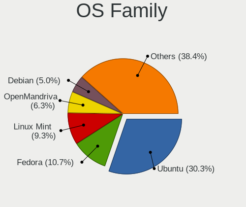
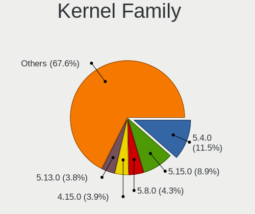
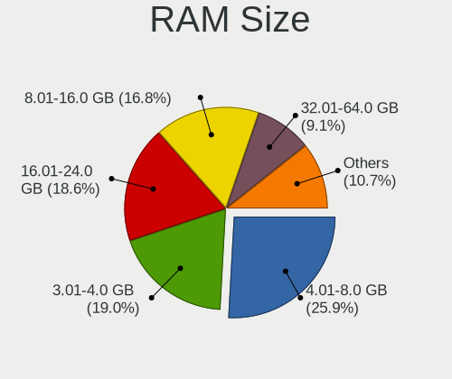
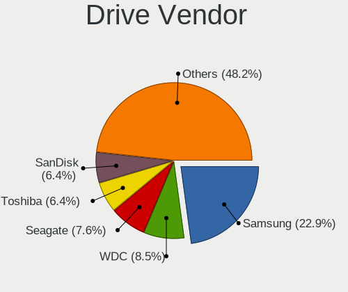
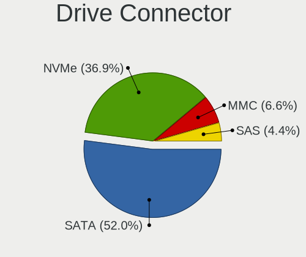
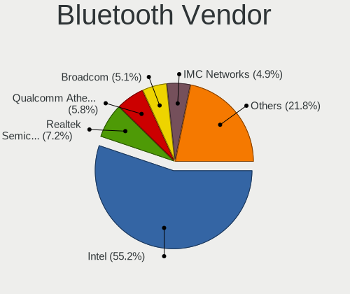

Linux in Netherlands - Tested Hardware & Statistics (Notebooks)
---------------------------------------------------------------

A project to collect tested hardware configurations for Linux in Netherlands.

Anyone can contribute to this report by the [hw-probe](https://github.com/linuxhw/hw-probe) tool:

    sudo -E hw-probe -all -upload

Please contribute! Especially if your hardware is rare.

Contents
--------

* [ Test Cases ](#test-cases)

* [ System ](#system)
  - [ OS                       ](#os)
  - [ OS Family                ](#os-family)
  - [ Kernel                   ](#kernel)
  - [ Kernel Family            ](#kernel-family)
  - [ Kernel Major Ver.        ](#kernel-major-ver)
  - [ Arch                     ](#arch)
  - [ DE                       ](#de)
  - [ Display Server           ](#display-server)
  - [ Display Manager          ](#display-manager)
  - [ OS Lang                  ](#os-lang)
  - [ Boot Mode                ](#boot-mode)
  - [ Filesystem               ](#filesystem)
  - [ Part. scheme             ](#part-scheme)
  - [ Dual Boot with Linux/BSD ](#dual-boot-with-linuxbsd)
  - [ Dual Boot (Win)          ](#dual-boot-win)

* [ Board ](#board)
  - [ Vendor                   ](#vendor)
  - [ Model                    ](#model)
  - [ Model Family             ](#model-family)
  - [ MFG Year                 ](#mfg-year)
  - [ Form Factor              ](#form-factor)
  - [ Secure Boot              ](#secure-boot)
  - [ Coreboot                 ](#coreboot)
  - [ RAM Size                 ](#ram-size)
  - [ RAM Used                 ](#ram-used)
  - [ Total Drives             ](#total-drives)
  - [ Has CD-ROM               ](#has-cd-rom)
  - [ Has Ethernet             ](#has-ethernet)
  - [ Has WiFi                 ](#has-wifi)
  - [ Has Bluetooth            ](#has-bluetooth)

* [ Location ](#location)
  - [ Country                  ](#country)
  - [ City                     ](#city)

* [ Drives ](#drives)
  - [ Drive Vendor             ](#drive-vendor)
  - [ Drive Model              ](#drive-model)
  - [ HDD Vendor               ](#hdd-vendor)
  - [ SSD Vendor               ](#ssd-vendor)
  - [ Drive Kind               ](#drive-kind)
  - [ Drive Connector          ](#drive-connector)
  - [ Drive Size               ](#drive-size)
  - [ Space Total              ](#space-total)
  - [ Space Used               ](#space-used)
  - [ Malfunc. Drives          ](#malfunc-drives)
  - [ Malfunc. Drive Vendor    ](#malfunc-drive-vendor)
  - [ Malfunc. HDD Vendor      ](#malfunc-hdd-vendor)
  - [ Malfunc. Drive Kind      ](#malfunc-drive-kind)
  - [ Failed Drives            ](#failed-drives)
  - [ Failed Drive Vendor      ](#failed-drive-vendor)
  - [ Drive Status             ](#drive-status)

* [ Storage controller ](#storage-controller)
  - [ Storage Vendor           ](#storage-vendor)
  - [ Storage Model            ](#storage-model)
  - [ Storage Kind             ](#storage-kind)

* [ Processor ](#processor)
  - [ CPU Vendor               ](#cpu-vendor)
  - [ CPU Model                ](#cpu-model)
  - [ CPU Model Family         ](#cpu-model-family)
  - [ CPU Cores                ](#cpu-cores)
  - [ CPU Sockets              ](#cpu-sockets)
  - [ CPU Threads              ](#cpu-threads)
  - [ CPU Op-Modes             ](#cpu-op-modes)
  - [ CPU Microcode            ](#cpu-microcode)
  - [ CPU Microarch            ](#cpu-microarch)

* [ Graphics ](#graphics)
  - [ GPU Vendor               ](#gpu-vendor)
  - [ GPU Model                ](#gpu-model)
  - [ GPU Combo                ](#gpu-combo)
  - [ GPU Driver               ](#gpu-driver)
  - [ GPU Memory               ](#gpu-memory)

* [ Monitor ](#monitor)
  - [ Monitor Vendor           ](#monitor-vendor)
  - [ Monitor Model            ](#monitor-model)
  - [ Monitor Resolution       ](#monitor-resolution)
  - [ Monitor Diagonal         ](#monitor-diagonal)
  - [ Monitor Width            ](#monitor-width)
  - [ Aspect Ratio             ](#aspect-ratio)
  - [ Monitor Area             ](#monitor-area)
  - [ Pixel Density            ](#pixel-density)
  - [ Multiple Monitors        ](#multiple-monitors)

* [ Network ](#network)
  - [ Net Controller Vendor    ](#net-controller-vendor)
  - [ Net Controller Model     ](#net-controller-model)
  - [ Wireless Vendor          ](#wireless-vendor)
  - [ Wireless Model           ](#wireless-model)
  - [ Ethernet Vendor          ](#ethernet-vendor)
  - [ Ethernet Model           ](#ethernet-model)
  - [ Net Controller Kind      ](#net-controller-kind)
  - [ Used Controller          ](#used-controller)
  - [ NICs                     ](#nics)
  - [ IPv6                     ](#ipv6)

* [ Bluetooth ](#bluetooth)
  - [ Bluetooth Vendor         ](#bluetooth-vendor)
  - [ Bluetooth Model          ](#bluetooth-model)

* [ Sound ](#sound)
  - [ Sound Vendor             ](#sound-vendor)
  - [ Sound Model              ](#sound-model)

* [ Memory ](#memory)
  - [ Memory Vendor            ](#memory-vendor)
  - [ Memory Model             ](#memory-model)
  - [ Memory Kind              ](#memory-kind)
  - [ Memory Form Factor       ](#memory-form-factor)
  - [ Memory Size              ](#memory-size)
  - [ Memory Speed             ](#memory-speed)

* [ Printers & scanners ](#printers--scanners)
  - [ Printer Vendor           ](#printer-vendor)
  - [ Printer Model            ](#printer-model)
  - [ Scanner Vendor           ](#scanner-vendor)
  - [ Scanner Model            ](#scanner-model)

* [ Camera ](#camera)
  - [ Camera Vendor            ](#camera-vendor)
  - [ Camera Model             ](#camera-model)

* [ Security ](#security)
  - [ Fingerprint Vendor       ](#fingerprint-vendor)
  - [ Fingerprint Model        ](#fingerprint-model)
  - [ Chipcard Vendor          ](#chipcard-vendor)
  - [ Chipcard Model           ](#chipcard-model)

* [ Unsupported ](#unsupported)
  - [ Unsupported Devices      ](#unsupported-devices)
  - [ Unsupported Device Types ](#unsupported-device-types)

Test Cases
----------

Total: 4230

| Vendor        | Model                       | Probe                                                      | Date         |
|---------------|-----------------------------|------------------------------------------------------------|--------------|
| Lenovo        | ThinkPad Z13 Gen 1 21D2C... | [a8fdf278ff](https://linux-hardware.org/?probe=a8fdf278ff) | Jan 06, 2025 |
| Acer          | Aspire A515-52G             | [572616a1d9](https://linux-hardware.org/?probe=572616a1d9) | Jan 06, 2025 |
| HP            | Pavilion Power Laptop 15... | [83a930718f](https://linux-hardware.org/?probe=83a930718f) | Jan 06, 2025 |
| Lenovo        | ThinkPad X1 Carbon 6th 2... | [34234d8404](https://linux-hardware.org/?probe=34234d8404) | Jan 05, 2025 |
| ASUSTek       | ASUS Zenbook S 14 UX5406... | [689364573c](https://linux-hardware.org/?probe=689364573c) | Jan 05, 2025 |
| ASUSTek       | ASUS Zenbook S 14 UX5406... | [3497123a57](https://linux-hardware.org/?probe=3497123a57) | Jan 04, 2025 |
| Valve         | Jupiter                     | [7d460209df](https://linux-hardware.org/?probe=7d460209df) | Jan 03, 2025 |
| Lenovo        | ThinkPad T540p 20BE00B2M... | [d3fdfbc445](https://linux-hardware.org/?probe=d3fdfbc445) | Jan 03, 2025 |
| HP            | EliteBook 840 G2            | [54ab368174](https://linux-hardware.org/?probe=54ab368174) | Jan 03, 2025 |
| Google        | Chell                       | [165f302be9](https://linux-hardware.org/?probe=165f302be9) | Jan 03, 2025 |
| Lenovo        | ThinkPad X250 20CLS45J00    | [23c3a522f9](https://linux-hardware.org/?probe=23c3a522f9) | Jan 02, 2025 |
| Lenovo        | ThinkPad P14s Gen 4 21K5... | [419e7b4071](https://linux-hardware.org/?probe=419e7b4071) | Jan 02, 2025 |
| Notebook      | PD5x_7xSNC_SND_SNE          | [5765389ba6](https://linux-hardware.org/?probe=5765389ba6) | Jan 01, 2025 |
| Toshiba       | Satellite Pro S500          | [62a9b2c381](https://linux-hardware.org/?probe=62a9b2c381) | Jan 01, 2025 |
| Apple         | MacBookPro8,1               | [97406c849c](https://linux-hardware.org/?probe=97406c849c) | Jan 01, 2025 |
| Apple         | MacBookPro8,1               | [4c8c9d26c5](https://linux-hardware.org/?probe=4c8c9d26c5) | Jan 01, 2025 |
| Lenovo        | V155-15API 81V5             | [145938b91b](https://linux-hardware.org/?probe=145938b91b) | Dec 31, 2024 |
| Dell          | Latitude E6220              | [b93b3b88d1](https://linux-hardware.org/?probe=b93b3b88d1) | Dec 31, 2024 |
| ASUSTek       | X71SL                       | [e9857b1f50](https://linux-hardware.org/?probe=e9857b1f50) | Dec 30, 2024 |
| Lenovo        | ThinkPad T470s W10DG 20J... | [0d96f203f5](https://linux-hardware.org/?probe=0d96f203f5) | Dec 30, 2024 |
| Apple         | MacBookAir2,1               | [3a01cb6d48](https://linux-hardware.org/?probe=3a01cb6d48) | Dec 29, 2024 |
| Dell          | Latitude E4300              | [0c340c7391](https://linux-hardware.org/?probe=0c340c7391) | Dec 28, 2024 |
| Dell          | Latitude E4300              | [e00b4f8165](https://linux-hardware.org/?probe=e00b4f8165) | Dec 27, 2024 |
| ASUSTek       | N53SV                       | [af2f1ee4b9](https://linux-hardware.org/?probe=af2f1ee4b9) | Dec 26, 2024 |
| Lenovo        | Yoga Pro 7 14APH8 82Y8      | [26b3de30ce](https://linux-hardware.org/?probe=26b3de30ce) | Dec 26, 2024 |
| HP            | Pavilion dv7                | [c4f13a383d](https://linux-hardware.org/?probe=c4f13a383d) | Dec 23, 2024 |
| Notebook      | W65_W67RB                   | [0475d664f0](https://linux-hardware.org/?probe=0475d664f0) | Dec 22, 2024 |
| HP            | Notebook                    | [b72d574e31](https://linux-hardware.org/?probe=b72d574e31) | Dec 22, 2024 |
| Lenovo        | ThinkPad P1 Gen 2 20QUS0... | [8eaf87896d](https://linux-hardware.org/?probe=8eaf87896d) | Dec 21, 2024 |
| Dell          | Latitude 14 Rugged (5404... | [0613277441](https://linux-hardware.org/?probe=0613277441) | Dec 21, 2024 |
| HP            | ProBook 445R G6             | [6a6dd0b802](https://linux-hardware.org/?probe=6a6dd0b802) | Dec 21, 2024 |
| Lenovo        | ThinkPad X220 Tablet 429... | [df6f512e3a](https://linux-hardware.org/?probe=df6f512e3a) | Dec 21, 2024 |
| Lenovo        | ThinkPad X220 Tablet 429... | [7c430caf94](https://linux-hardware.org/?probe=7c430caf94) | Dec 21, 2024 |
| Lenovo        | ThinkPad X1 Carbon Gen 1... | [d8ec348d56](https://linux-hardware.org/?probe=d8ec348d56) | Dec 20, 2024 |
| Dell          | Inspiron 7773               | [d3a47ddb07](https://linux-hardware.org/?probe=d3a47ddb07) | Dec 19, 2024 |
| Dell          | Inspiron 7773               | [a6993bc0ed](https://linux-hardware.org/?probe=a6993bc0ed) | Dec 19, 2024 |
| Dell          | Precision M4800             | [8973087d8d](https://linux-hardware.org/?probe=8973087d8d) | Dec 17, 2024 |
| HP            | EliteBook 655 15.6 inch ... | [0c453f6750](https://linux-hardware.org/?probe=0c453f6750) | Dec 17, 2024 |
| ASUSTek       | Vivobook Go E1504FA_E150... | [357c54b699](https://linux-hardware.org/?probe=357c54b699) | Dec 17, 2024 |
| HP            | Compaq Presario CQ71        | [beb3a237e8](https://linux-hardware.org/?probe=beb3a237e8) | Dec 16, 2024 |
| ASUSTek       | N551JQ                      | [2a60939d27](https://linux-hardware.org/?probe=2a60939d27) | Dec 16, 2024 |
| HP            | ProBook 450 G6              | [74781357e5](https://linux-hardware.org/?probe=74781357e5) | Dec 16, 2024 |
| Dell          | Latitude 7280               | [8ed58033ee](https://linux-hardware.org/?probe=8ed58033ee) | Dec 14, 2024 |
| HP            | Pavilion dm1                | [338b8c9095](https://linux-hardware.org/?probe=338b8c9095) | Dec 12, 2024 |
| Lenovo        | ThinkPad T14 Gen 4 21K3C... | [e0b3f9eb93](https://linux-hardware.org/?probe=e0b3f9eb93) | Dec 11, 2024 |
| Acer          | Aspire A515-52G             | [d68404edcc](https://linux-hardware.org/?probe=d68404edcc) | Dec 11, 2024 |
| HP            | ProBook 450 G8 Notebook ... | [ee2af3d283](https://linux-hardware.org/?probe=ee2af3d283) | Dec 10, 2024 |
| Dell          | XPS 9315                    | [4c96378b88](https://linux-hardware.org/?probe=4c96378b88) | Dec 09, 2024 |
| ASUSTek       | UX305CA                     | [826fafd993](https://linux-hardware.org/?probe=826fafd993) | Dec 09, 2024 |
| Valve         | Jupiter                     | [adf22162c5](https://linux-hardware.org/?probe=adf22162c5) | Dec 08, 2024 |
| HP            | ProBook 650 G1              | [62f3ba4cc6](https://linux-hardware.org/?probe=62f3ba4cc6) | Dec 07, 2024 |
| ASUSTek       | N551JQ                      | [75779b5443](https://linux-hardware.org/?probe=75779b5443) | Dec 07, 2024 |
| Google        | Delbin                      | [e761f97d94](https://linux-hardware.org/?probe=e761f97d94) | Dec 06, 2024 |
| TUXEDO        | InfinityBook Pro AMD Gen... | [cda9658f32](https://linux-hardware.org/?probe=cda9658f32) | Dec 06, 2024 |
| HP            | EliteBook 845 G8 Noteboo... | [a81500a8d6](https://linux-hardware.org/?probe=a81500a8d6) | Dec 06, 2024 |
| ASUSTek       | N71Jv                       | [4089840eaa](https://linux-hardware.org/?probe=4089840eaa) | Dec 05, 2024 |
| Acer          | Aspire 5736Z                | [0ad38979a9](https://linux-hardware.org/?probe=0ad38979a9) | Dec 04, 2024 |
| ASUSTek       | GL552VW                     | [d0611dd371](https://linux-hardware.org/?probe=d0611dd371) | Dec 04, 2024 |
| Lenovo        | Legion Y540-17IRH 81Q4      | [7f5a0eea32](https://linux-hardware.org/?probe=7f5a0eea32) | Dec 03, 2024 |
| ASUSTek       | GL552VW                     | [4d38c63e3d](https://linux-hardware.org/?probe=4d38c63e3d) | Dec 02, 2024 |
| ASUSTek       | ASUS TUF Gaming A16 FA60... | [ad86291778](https://linux-hardware.org/?probe=ad86291778) | Dec 02, 2024 |
| ASUSTek       | ASUS TUF Gaming A16 FA60... | [d36311286b](https://linux-hardware.org/?probe=d36311286b) | Dec 02, 2024 |
| Razer         | Blade 17 (2022) - RZ09-0... | [84343acca8](https://linux-hardware.org/?probe=84343acca8) | Dec 02, 2024 |
| Google        | Delbin                      | [0b18a9a18c](https://linux-hardware.org/?probe=0b18a9a18c) | Dec 01, 2024 |
| Unknown       | YEPBOOK PRO                 | [a3393a26e8](https://linux-hardware.org/?probe=a3393a26e8) | Dec 01, 2024 |
| Framework     | Laptop                      | [dd1492ec61](https://linux-hardware.org/?probe=dd1492ec61) | Dec 01, 2024 |
| Lenovo        | G50-70 20351                | [a00b1c7b63](https://linux-hardware.org/?probe=a00b1c7b63) | Dec 01, 2024 |
| Dell          | Latitude 5520               | [4a8883bf6a](https://linux-hardware.org/?probe=4a8883bf6a) | Dec 01, 2024 |
| Dell          | XPS 15 7590                 | [8d0614c20c](https://linux-hardware.org/?probe=8d0614c20c) | Dec 01, 2024 |
| Dell          | Inspiron 5759               | [0b81892652](https://linux-hardware.org/?probe=0b81892652) | Nov 30, 2024 |
| Lenovo        | ThinkPad R500 2718W3V       | [3804c95f6f](https://linux-hardware.org/?probe=3804c95f6f) | Nov 29, 2024 |
| ASUSTek       | K50IE                       | [2b124f3ff4](https://linux-hardware.org/?probe=2b124f3ff4) | Nov 28, 2024 |
| ASUSTek       | G75VW                       | [b17bd0994c](https://linux-hardware.org/?probe=b17bd0994c) | Nov 28, 2024 |
| Dell          | Precision 5560              | [1699989ef7](https://linux-hardware.org/?probe=1699989ef7) | Nov 28, 2024 |
| HP            | Presario CQ57               | [bf744465ef](https://linux-hardware.org/?probe=bf744465ef) | Nov 27, 2024 |
| Apple         | MacBookPro12,1              | [fbf43a5c4b](https://linux-hardware.org/?probe=fbf43a5c4b) | Nov 27, 2024 |
| HP            | ZBook Firefly 15 G7 Mobi... | [8c0ecd4b30](https://linux-hardware.org/?probe=8c0ecd4b30) | Nov 26, 2024 |
| Dell          | XPS 16 9640                 | [7e6be4729e](https://linux-hardware.org/?probe=7e6be4729e) | Nov 26, 2024 |
| Acer          | Aspire A315-51              | [6489d208d6](https://linux-hardware.org/?probe=6489d208d6) | Nov 25, 2024 |
| Notebook      | NLxxPUx                     | [1f935fe7fc](https://linux-hardware.org/?probe=1f935fe7fc) | Nov 25, 2024 |
| Toshiba       | Satellite C870-1FZ          | [c562c674ef](https://linux-hardware.org/?probe=c562c674ef) | Nov 24, 2024 |
| Samsung       | RV420/RV520/RV720/E3530/... | [50c436b911](https://linux-hardware.org/?probe=50c436b911) | Nov 24, 2024 |
| Apple         | MacBookPro12,1              | [e6abfbffff](https://linux-hardware.org/?probe=e6abfbffff) | Nov 23, 2024 |
| HP            | 625                         | [b34c64fa81](https://linux-hardware.org/?probe=b34c64fa81) | Nov 23, 2024 |
| MSI           | CR70 2M/CX70 2OC/CX70 2O... | [28c28f679e](https://linux-hardware.org/?probe=28c28f679e) | Nov 21, 2024 |
| Lenovo        | ThinkPad T14 Gen 3 21CF0... | [c5a23e5058](https://linux-hardware.org/?probe=c5a23e5058) | Nov 21, 2024 |
| HP            | ZBook 15u G5                | [066acc45f9](https://linux-hardware.org/?probe=066acc45f9) | Nov 21, 2024 |
| BTO           | 15U1135                     | [cbb759b013](https://linux-hardware.org/?probe=cbb759b013) | Nov 21, 2024 |
| HP            | ZBook Firefly 15 G7 Mobi... | [99528ec5f3](https://linux-hardware.org/?probe=99528ec5f3) | Nov 20, 2024 |
| HP            | ZBook Firefly 15 G7 Mobi... | [53a79bee6b](https://linux-hardware.org/?probe=53a79bee6b) | Nov 20, 2024 |
| ASUSTek       | N752VX                      | [b519a4ac5e](https://linux-hardware.org/?probe=b519a4ac5e) | Nov 19, 2024 |
| Lenovo        | ThinkPad T14 Gen 1 20S1S... | [e6d1c043d2](https://linux-hardware.org/?probe=e6d1c043d2) | Nov 17, 2024 |
| HP            | Notebook                    | [a9643205fd](https://linux-hardware.org/?probe=a9643205fd) | Nov 17, 2024 |
| Lenovo        | G40-30 80FY                 | [9228ef946e](https://linux-hardware.org/?probe=9228ef946e) | Nov 17, 2024 |
| Dell          | Inspiron 7370               | [4ebb5ca686](https://linux-hardware.org/?probe=4ebb5ca686) | Nov 17, 2024 |
| ASUSTek       | Strix GL703GS_GL703GS       | [6ea29cc14a](https://linux-hardware.org/?probe=6ea29cc14a) | Nov 16, 2024 |
| Medion        | P8610                       | [6c3012e9ac](https://linux-hardware.org/?probe=6c3012e9ac) | Nov 15, 2024 |
| Medion        | P8610                       | [5a087d4ddf](https://linux-hardware.org/?probe=5a087d4ddf) | Nov 15, 2024 |
| Lenovo        | ThinkPad T440s 20ARS2A50... | [9587bdd9f1](https://linux-hardware.org/?probe=9587bdd9f1) | Nov 15, 2024 |
| Google        | Sasuke                      | [a2e298f62e](https://linux-hardware.org/?probe=a2e298f62e) | Nov 14, 2024 |
| Samsung       | 530U3BI/530U4BI/530U4BH     | [342d578a5c](https://linux-hardware.org/?probe=342d578a5c) | Nov 13, 2024 |
| HP            | ProBook 450 G6              | [350609bc50](https://linux-hardware.org/?probe=350609bc50) | Nov 12, 2024 |
| MSI           | Vector GP78HX 13VH          | [486b461c64](https://linux-hardware.org/?probe=486b461c64) | Nov 12, 2024 |
| Medion        | P7816                       | [58ec8f58ec](https://linux-hardware.org/?probe=58ec8f58ec) | Nov 12, 2024 |
| Lenovo        | Legion 5 Pro 16ACH6H 82J... | [6ee5a167b1](https://linux-hardware.org/?probe=6ee5a167b1) | Nov 12, 2024 |
| ASUSTek       | ASUS TUF Gaming F15 FX50... | [0cad793541](https://linux-hardware.org/?probe=0cad793541) | Nov 12, 2024 |
| ASUSTek       | ASUS TUF Gaming F15 FX50... | [c8797eb692](https://linux-hardware.org/?probe=c8797eb692) | Nov 12, 2024 |
| Lenovo        | V15 G2 ALC 82KD             | [d523323bd5](https://linux-hardware.org/?probe=d523323bd5) | Nov 12, 2024 |
| Samsung       | R510/P510                   | [45941aa5d5](https://linux-hardware.org/?probe=45941aa5d5) | Nov 11, 2024 |
| XIAOMI        | Redmi Book Pro 15 2023      | [12e8344508](https://linux-hardware.org/?probe=12e8344508) | Nov 10, 2024 |
| HP            | OMEN by Laptop 15-ce0xx     | [386e8d6e8c](https://linux-hardware.org/?probe=386e8d6e8c) | Nov 10, 2024 |
| HP            | ProBook 4720s               | [e65d783c0d](https://linux-hardware.org/?probe=e65d783c0d) | Nov 10, 2024 |
| HP            | ProBook 4720s               | [4e2933c1be](https://linux-hardware.org/?probe=4e2933c1be) | Nov 10, 2024 |
| Lenovo        | ThinkPad T480 20L5S05U00    | [cd6f4884f3](https://linux-hardware.org/?probe=cd6f4884f3) | Nov 09, 2024 |
| Dell          | Latitude 5290               | [abd67d3f59](https://linux-hardware.org/?probe=abd67d3f59) | Nov 08, 2024 |
| Dell          | Latitude 5290               | [a78422cebb](https://linux-hardware.org/?probe=a78422cebb) | Nov 07, 2024 |
| TECNO         | MEGABOOK T1                 | [967f21c668](https://linux-hardware.org/?probe=967f21c668) | Nov 06, 2024 |
| Lenovo        | ThinkPad T16 Gen 2 21K7S... | [ea85ca803b](https://linux-hardware.org/?probe=ea85ca803b) | Nov 05, 2024 |
| HP            | ZBook Firefly 14 inch G1... | [2f6316685d](https://linux-hardware.org/?probe=2f6316685d) | Nov 04, 2024 |
| Acer          | Aspire SW5-012              | [aed9a62d9a](https://linux-hardware.org/?probe=aed9a62d9a) | Nov 04, 2024 |
| ASRock        | A620I Lightning WiFi        | [8d69129552](https://linux-hardware.org/?probe=8d69129552) | Nov 04, 2024 |
| HP            | EliteBook 8540w             | [72ef3bdc40](https://linux-hardware.org/?probe=72ef3bdc40) | Nov 03, 2024 |
| Lenovo        | ThinkBook 14 G2 ITL 20VD    | [362643c5ee](https://linux-hardware.org/?probe=362643c5ee) | Nov 03, 2024 |
| Lenovo        | G40-30 80FY                 | [328a342a15](https://linux-hardware.org/?probe=328a342a15) | Nov 03, 2024 |
| Apple         | MacBookAir7,2               | [260459f303](https://linux-hardware.org/?probe=260459f303) | Nov 02, 2024 |
| Lenovo        | ThinkPad T490 20N3S5DQ01    | [5eadce2817](https://linux-hardware.org/?probe=5eadce2817) | Nov 02, 2024 |
| Notebook      | NS5x_NS7xPU                 | [5ebdc15f60](https://linux-hardware.org/?probe=5ebdc15f60) | Nov 02, 2024 |
| Insyde        | GeminiLake                  | [df7e9af6a4](https://linux-hardware.org/?probe=df7e9af6a4) | Nov 02, 2024 |
| Dell          | Latitude E6520              | [029a9feb19](https://linux-hardware.org/?probe=029a9feb19) | Nov 01, 2024 |
| Toshiba       | Satellite C850-19Z          | [31a049510a](https://linux-hardware.org/?probe=31a049510a) | Nov 01, 2024 |
| HP            | ProBook 645 G2              | [07452965ae](https://linux-hardware.org/?probe=07452965ae) | Nov 01, 2024 |
| MSI           | Thin GF63 12VE              | [4d4ed4c9e5](https://linux-hardware.org/?probe=4d4ed4c9e5) | Nov 01, 2024 |
| Notebook      | NS5x_NS7xPU                 | [7c2dc0be38](https://linux-hardware.org/?probe=7c2dc0be38) | Oct 31, 2024 |
| Toshiba       | PORTEGE R30-A               | [4e01e0352a](https://linux-hardware.org/?probe=4e01e0352a) | Oct 30, 2024 |
| Apple         | MacBookPro9,1               | [436bf59f00](https://linux-hardware.org/?probe=436bf59f00) | Oct 30, 2024 |
| Dell          | XPS 15 9510                 | [b8edc748d7](https://linux-hardware.org/?probe=b8edc748d7) | Oct 29, 2024 |
| Intel         | Unknown                     | [ae6815487a](https://linux-hardware.org/?probe=ae6815487a) | Oct 29, 2024 |
| Samsung       | RV420/RV520/RV720/E3530/... | [9af6dd6ef4](https://linux-hardware.org/?probe=9af6dd6ef4) | Oct 28, 2024 |
| HONOR         | FRI-FXX                     | [762796bb28](https://linux-hardware.org/?probe=762796bb28) | Oct 27, 2024 |
| HP            | ZBook Fury 16 G10 Mobile... | [e903944a84](https://linux-hardware.org/?probe=e903944a84) | Oct 26, 2024 |
| ASUSTek       | G75VW                       | [e106b29eab](https://linux-hardware.org/?probe=e106b29eab) | Oct 24, 2024 |
| Unknown       | YEPBOOK PRO                 | [0d3c07610a](https://linux-hardware.org/?probe=0d3c07610a) | Oct 24, 2024 |
| HP            | EliteBook 8730w             | [4c87a2a54b](https://linux-hardware.org/?probe=4c87a2a54b) | Oct 22, 2024 |
| HP            | EliteBook 8730w             | [6f80a1800b](https://linux-hardware.org/?probe=6f80a1800b) | Oct 22, 2024 |
| HP            | Pavilion Plus Laptop 14-... | [27c3ff8bf4](https://linux-hardware.org/?probe=27c3ff8bf4) | Oct 22, 2024 |
| Lenovo        | ThinkPad X1 Carbon 7th 2... | [c9ee96dd2a](https://linux-hardware.org/?probe=c9ee96dd2a) | Oct 22, 2024 |
| HP            | ProBook 4740s               | [b2dd7236f6](https://linux-hardware.org/?probe=b2dd7236f6) | Oct 20, 2024 |
| HP            | ProBook 6570b               | [27c97b3e40](https://linux-hardware.org/?probe=27c97b3e40) | Oct 19, 2024 |
| Acer          | Aspire E1-531               | [225705a8fb](https://linux-hardware.org/?probe=225705a8fb) | Oct 19, 2024 |
| Sony          | VPCEH1M9R                   | [78491a0382](https://linux-hardware.org/?probe=78491a0382) | Oct 18, 2024 |
| Toshiba       | TECRA R950                  | [4c64d6dc1c](https://linux-hardware.org/?probe=4c64d6dc1c) | Oct 16, 2024 |
| Lenovo        | IdeaPad 3 14ALC6 82KT       | [5a97215ee3](https://linux-hardware.org/?probe=5a97215ee3) | Oct 15, 2024 |
| Dell          | Latitude 3310               | [8cc7056a67](https://linux-hardware.org/?probe=8cc7056a67) | Oct 15, 2024 |
| Intel         | Unknown                     | [800aa4f46b](https://linux-hardware.org/?probe=800aa4f46b) | Oct 15, 2024 |
| Dell          | Latitude 3310               | [bf9e23b622](https://linux-hardware.org/?probe=bf9e23b622) | Oct 15, 2024 |
| Lenovo        | IdeaPad Gaming 3 15ACH6 ... | [4dbeafbd5f](https://linux-hardware.org/?probe=4dbeafbd5f) | Oct 15, 2024 |
| Apple         | MacBookPro9,1               | [e4bf67d476](https://linux-hardware.org/?probe=e4bf67d476) | Oct 15, 2024 |
| Timi          | RedmiBook Pro 15S           | [fe6bcab341](https://linux-hardware.org/?probe=fe6bcab341) | Oct 15, 2024 |
| Dell          | Latitude E6410              | [d3476d39f8](https://linux-hardware.org/?probe=d3476d39f8) | Oct 14, 2024 |
| Lenovo        | ThinkPad T470s W10DG 20J... | [bed669a5ae](https://linux-hardware.org/?probe=bed669a5ae) | Oct 14, 2024 |
| Acer          | TravelMate 8572             | [12985b02dc](https://linux-hardware.org/?probe=12985b02dc) | Oct 13, 2024 |
| HP            | mt41                        | [56a4716804](https://linux-hardware.org/?probe=56a4716804) | Oct 12, 2024 |
| HP            | EliteBook 845 G7 Noteboo... | [c331d0b34d](https://linux-hardware.org/?probe=c331d0b34d) | Oct 12, 2024 |
| Acer          | Nitro AN17-41               | [ee140d90aa](https://linux-hardware.org/?probe=ee140d90aa) | Oct 11, 2024 |
| Lenovo        | ThinkBook 15p G2 ITH 21B... | [0da47f72b3](https://linux-hardware.org/?probe=0da47f72b3) | Oct 11, 2024 |
| Notebook      | W9x0LU                      | [3c86804ce3](https://linux-hardware.org/?probe=3c86804ce3) | Oct 11, 2024 |
| Lenovo        | IdeaPad 3 15IIL05 81WE      | [7476a679e5](https://linux-hardware.org/?probe=7476a679e5) | Oct 11, 2024 |
| ASUSTek       | Zenbook UM6702RA_RM6702R... | [f3ba7890e9](https://linux-hardware.org/?probe=f3ba7890e9) | Oct 10, 2024 |
| Lenovo        | ThinkPad S5-S540 20B3A01... | [f69f8fa533](https://linux-hardware.org/?probe=f69f8fa533) | Oct 09, 2024 |
| Acer          | Aspire A315-51              | [0ee7b06a54](https://linux-hardware.org/?probe=0ee7b06a54) | Oct 09, 2024 |
| ASUSTek       | K50IJ                       | [dde98aa24b](https://linux-hardware.org/?probe=dde98aa24b) | Oct 09, 2024 |
| HP            | ZBook Firefly 14 inch G9... | [4fdb20cf2c](https://linux-hardware.org/?probe=4fdb20cf2c) | Oct 09, 2024 |
| Lenovo        | ThinkPad L380 20M50013MH    | [99c134d982](https://linux-hardware.org/?probe=99c134d982) | Oct 09, 2024 |
| Google        | Fleex                       | [f810d0e9a8](https://linux-hardware.org/?probe=f810d0e9a8) | Oct 08, 2024 |
| Apple         | MacBookAir7,2               | [d2f3a646e7](https://linux-hardware.org/?probe=d2f3a646e7) | Oct 08, 2024 |
| Apple         | MacBookAir7,2               | [d58d664863](https://linux-hardware.org/?probe=d58d664863) | Oct 08, 2024 |
| Acer          | Aspire A315-44P             | [05330a1c5b](https://linux-hardware.org/?probe=05330a1c5b) | Oct 08, 2024 |
| Acer          | Predator PH16-71            | [a8d449e92b](https://linux-hardware.org/?probe=a8d449e92b) | Oct 07, 2024 |
| Lenovo        | ThinkPad L14 Gen 4 21H6S... | [8ecd473a83](https://linux-hardware.org/?probe=8ecd473a83) | Oct 07, 2024 |
| Dell          | XPS 17 9730                 | [f898e9fae3](https://linux-hardware.org/?probe=f898e9fae3) | Oct 07, 2024 |
| Lenovo        | B50-30 80ES                 | [bd698857f2](https://linux-hardware.org/?probe=bd698857f2) | Oct 07, 2024 |
| Dell          | Inspiron 3521               | [046119d49c](https://linux-hardware.org/?probe=046119d49c) | Oct 07, 2024 |
| HONOR         | BBR-WAX9                    | [ca7c7ed0b0](https://linux-hardware.org/?probe=ca7c7ed0b0) | Oct 06, 2024 |
| Lenovo        | Legion Y540-17IRH 81Q4      | [467a5965cf](https://linux-hardware.org/?probe=467a5965cf) | Oct 06, 2024 |
| Apple         | MacBookPro8,3               | [6d79b159b0](https://linux-hardware.org/?probe=6d79b159b0) | Oct 06, 2024 |
| HP            | ProBook 470 G2              | [f288dea930](https://linux-hardware.org/?probe=f288dea930) | Oct 05, 2024 |
| Lenovo        | IdeaPad 5 14ALC05 82LM      | [5809fd4ac8](https://linux-hardware.org/?probe=5809fd4ac8) | Oct 05, 2024 |
| Lenovo        | ThinkBook 13x G2 IAP 21A... | [54c023b2f6](https://linux-hardware.org/?probe=54c023b2f6) | Oct 05, 2024 |
| HP            | EliteBook 850 G7 Noteboo... | [ecd87f632a](https://linux-hardware.org/?probe=ecd87f632a) | Oct 04, 2024 |
| Dell          | Latitude 7390               | [89ac346e1f](https://linux-hardware.org/?probe=89ac346e1f) | Oct 04, 2024 |
| HP            | ProBook 645 G2              | [07e2717694](https://linux-hardware.org/?probe=07e2717694) | Oct 02, 2024 |
| Lenovo        | Z50-75 80EC                 | [4417da4f82](https://linux-hardware.org/?probe=4417da4f82) | Oct 01, 2024 |
| Acer          | TravelMate P253             | [2eaa8a345c](https://linux-hardware.org/?probe=2eaa8a345c) | Sep 30, 2024 |
| Lenovo        | IdeaPad 5 15ALC05 82LN      | [8c29051bb8](https://linux-hardware.org/?probe=8c29051bb8) | Sep 30, 2024 |
| ASUSTek       | ASUS Zenbook S 16 UM5606... | [a28b21b5ab](https://linux-hardware.org/?probe=a28b21b5ab) | Sep 30, 2024 |
| Dell          | Precision M4600             | [44a29a7f1d](https://linux-hardware.org/?probe=44a29a7f1d) | Sep 29, 2024 |
| Apple         | MacBookPro10,2              | [680a669b9e](https://linux-hardware.org/?probe=680a669b9e) | Sep 29, 2024 |
| Lenovo        | ThinkPad T540p 20BE00B2M... | [e4db3b06ec](https://linux-hardware.org/?probe=e4db3b06ec) | Sep 28, 2024 |
| Lenovo        | ThinkPad T540p 20BE00B2M... | [98e08946d2](https://linux-hardware.org/?probe=98e08946d2) | Sep 27, 2024 |
| Google        | Shyvana                     | [2c38317d9f](https://linux-hardware.org/?probe=2c38317d9f) | Sep 25, 2024 |
| HONOR         | FRI-FXX                     | [1ed83fb238](https://linux-hardware.org/?probe=1ed83fb238) | Sep 24, 2024 |
| Apple         | MacBookPro11,1              | [05bb9f7907](https://linux-hardware.org/?probe=05bb9f7907) | Sep 24, 2024 |
| Acidanther... | MacBookPro11,2              | [036522cecc](https://linux-hardware.org/?probe=036522cecc) | Sep 23, 2024 |
| Dell          | XPS 16 9640                 | [a61385f8ee](https://linux-hardware.org/?probe=a61385f8ee) | Sep 23, 2024 |
| HP            | mt41                        | [43ec5adfbb](https://linux-hardware.org/?probe=43ec5adfbb) | Sep 22, 2024 |
| Lenovo        | IdeaPad 3 15IIL05 81WE      | [6491d85b51](https://linux-hardware.org/?probe=6491d85b51) | Sep 22, 2024 |
| HP            | mt41                        | [e73acf9786](https://linux-hardware.org/?probe=e73acf9786) | Sep 22, 2024 |
| ASUSTek       | K50IJ                       | [7a909b7ecd](https://linux-hardware.org/?probe=7a909b7ecd) | Sep 21, 2024 |
| Alienware     | m18 R2                      | [9f13ae9091](https://linux-hardware.org/?probe=9f13ae9091) | Sep 21, 2024 |
| Dell          | Latitude 3301               | [f6a8ab5a34](https://linux-hardware.org/?probe=f6a8ab5a34) | Sep 20, 2024 |
| Dell          | Inspiron 3737               | [d232424c4e](https://linux-hardware.org/?probe=d232424c4e) | Sep 20, 2024 |
| ASUSTek       | ROG Zephyrus G16 GU605MZ... | [b8990e6727](https://linux-hardware.org/?probe=b8990e6727) | Sep 20, 2024 |
| HP            | EliteBook 840 14 inch G1... | [6ceca74333](https://linux-hardware.org/?probe=6ceca74333) | Sep 19, 2024 |
| Apple         | MacBookPro11,3              | [bfb19595bb](https://linux-hardware.org/?probe=bfb19595bb) | Sep 18, 2024 |
| ASUSTek       | N551JQ                      | [165fb630b5](https://linux-hardware.org/?probe=165fb630b5) | Sep 18, 2024 |
| Lenovo        | ThinkPad W541 20EFS01B09    | [41af2ccf13](https://linux-hardware.org/?probe=41af2ccf13) | Sep 17, 2024 |
| Acer          | Aspire 5742G                | [57b9c92152](https://linux-hardware.org/?probe=57b9c92152) | Sep 17, 2024 |
| Framework     | Laptop 13 (AMD Ryzen 704... | [7a23f7cc90](https://linux-hardware.org/?probe=7a23f7cc90) | Sep 16, 2024 |
| Lenovo        | ThinkPad T14 Gen 4 21K3C... | [8e2cbf4a4c](https://linux-hardware.org/?probe=8e2cbf4a4c) | Sep 15, 2024 |
| Lenovo        | ThinkPad T14 Gen 4 21K3C... | [ba58290a64](https://linux-hardware.org/?probe=ba58290a64) | Sep 15, 2024 |
| Lenovo        | ThinkPad T14s Gen 5 21LS... | [0d443adfb0](https://linux-hardware.org/?probe=0d443adfb0) | Sep 14, 2024 |
| HP            | Compaq Presario CQ61        | [6c5ff283a3](https://linux-hardware.org/?probe=6c5ff283a3) | Sep 14, 2024 |
| Lenovo        | ThinkPad T580 20L9CTO1WW    | [9e24a563c9](https://linux-hardware.org/?probe=9e24a563c9) | Sep 14, 2024 |
| Lenovo        | ThinkPad E16 Gen 2 21M5S... | [a5df2c52de](https://linux-hardware.org/?probe=a5df2c52de) | Sep 13, 2024 |
| TECNO Mobi... | MEGABOOK T15DA              | [07a0fc1acc](https://linux-hardware.org/?probe=07a0fc1acc) | Sep 13, 2024 |
| Lenovo        | XiaoXinPro 14ACH 2021 82... | [9a91b7bb80](https://linux-hardware.org/?probe=9a91b7bb80) | Sep 12, 2024 |
| Lenovo        | ThinkPad T580 20L9CTO1WW    | [b8dd1fd916](https://linux-hardware.org/?probe=b8dd1fd916) | Sep 12, 2024 |
| Unknown       | Unknown                     | [bc3b851bac](https://linux-hardware.org/?probe=bc3b851bac) | Sep 11, 2024 |
| Dell          | Latitude 5520               | [48e02de343](https://linux-hardware.org/?probe=48e02de343) | Sep 11, 2024 |
| ASUSTek       | N551JQ                      | [ee37f5abdd](https://linux-hardware.org/?probe=ee37f5abdd) | Sep 11, 2024 |
| Acer          | Aspire 5742G                | [e0f18c3b52](https://linux-hardware.org/?probe=e0f18c3b52) | Sep 10, 2024 |
| ASUSTek       | E200HA                      | [7713cb87dd](https://linux-hardware.org/?probe=7713cb87dd) | Sep 09, 2024 |
| ASUSTek       | UX31E                       | [bc0ba44f6e](https://linux-hardware.org/?probe=bc0ba44f6e) | Sep 09, 2024 |
| Lenovo        | ThinkPad X240 20AL00BRUK    | [98d613e99d](https://linux-hardware.org/?probe=98d613e99d) | Sep 09, 2024 |
| ASUSTek       | T100TA                      | [46d4d907c1](https://linux-hardware.org/?probe=46d4d907c1) | Sep 09, 2024 |
| MSI           | Katana GF66 12UGSZOK        | [8e38f73372](https://linux-hardware.org/?probe=8e38f73372) | Sep 08, 2024 |
| HP            | ENVY Notebook               | [6b2db121eb](https://linux-hardware.org/?probe=6b2db121eb) | Sep 08, 2024 |
| ASUSTek       | K75VM                       | [f9f69948b3](https://linux-hardware.org/?probe=f9f69948b3) | Sep 06, 2024 |
| Dell          | Latitude E7450              | [c8f4f19e88](https://linux-hardware.org/?probe=c8f4f19e88) | Sep 05, 2024 |
| HP            | Compaq Presario CQ61        | [2f40a35a45](https://linux-hardware.org/?probe=2f40a35a45) | Sep 05, 2024 |
| SKIKK         | Freya 15 II                 | [dfa0e481b8](https://linux-hardware.org/?probe=dfa0e481b8) | Sep 04, 2024 |
| Lenovo        | ThinkPad P53 20QQS2R600     | [286a0fb0a7](https://linux-hardware.org/?probe=286a0fb0a7) | Sep 04, 2024 |
| Samsung       | 750XED                      | [932ab0c420](https://linux-hardware.org/?probe=932ab0c420) | Sep 03, 2024 |
| Acer          | TravelMate 8572             | [9433520464](https://linux-hardware.org/?probe=9433520464) | Sep 03, 2024 |
| Lenovo        | Legion 5 Pro 16IAH7H 82R... | [17ec832f89](https://linux-hardware.org/?probe=17ec832f89) | Sep 02, 2024 |
| MSI           | GP62 6QF                    | [5bdc4dc696](https://linux-hardware.org/?probe=5bdc4dc696) | Sep 02, 2024 |
| HP            | OMEN Laptop 15-en1xxx       | [c86f56860a](https://linux-hardware.org/?probe=c86f56860a) | Sep 02, 2024 |
| Acer          | A515-55                     | [a5c9d772bf](https://linux-hardware.org/?probe=a5c9d772bf) | Sep 01, 2024 |
| HP            | ProBook 430 G8 Notebook ... | [1cbf7bead0](https://linux-hardware.org/?probe=1cbf7bead0) | Aug 30, 2024 |
| Lenovo        | Legion 5 15IMH05H 81Y6      | [b4854a24dd](https://linux-hardware.org/?probe=b4854a24dd) | Aug 30, 2024 |
| Apple         | MacBookPro9,2               | [4fd49bc93f](https://linux-hardware.org/?probe=4fd49bc93f) | Aug 30, 2024 |
| Panasonic     | CF-31-5                     | [15b61b0ba5](https://linux-hardware.org/?probe=15b61b0ba5) | Aug 30, 2024 |
| Lenovo        | Legion 5 15ACH6H 82JU       | [dd30c68d90](https://linux-hardware.org/?probe=dd30c68d90) | Aug 30, 2024 |
| Apple         | MacBookPro5,5               | [135301e31b](https://linux-hardware.org/?probe=135301e31b) | Aug 29, 2024 |
| Toshiba       | Satellite Pro C70-B         | [ba9002ae1c](https://linux-hardware.org/?probe=ba9002ae1c) | Aug 28, 2024 |
| Dell          | Latitude 7430               | [361d6e718b](https://linux-hardware.org/?probe=361d6e718b) | Aug 28, 2024 |
| HP            | EliteBook 850 G7 Noteboo... | [70f47a99a4](https://linux-hardware.org/?probe=70f47a99a4) | Aug 28, 2024 |
| ASUSTek       | K53SD                       | [b63474e9b4](https://linux-hardware.org/?probe=b63474e9b4) | Aug 27, 2024 |
| Google        | Kohaku                      | [cabed264bd](https://linux-hardware.org/?probe=cabed264bd) | Aug 27, 2024 |
| Google        | Kohaku                      | [293a3b3069](https://linux-hardware.org/?probe=293a3b3069) | Aug 27, 2024 |
| Lenovo        | IdeaPad 3 17ITL6 82H9       | [2aa427ea2b](https://linux-hardware.org/?probe=2aa427ea2b) | Aug 27, 2024 |
| ASUSTek       | ROG Zephyrus G14 GA401IU... | [3c99fdbd9c](https://linux-hardware.org/?probe=3c99fdbd9c) | Aug 26, 2024 |
| Apple         | MacBookPro11,2              | [f6892d7513](https://linux-hardware.org/?probe=f6892d7513) | Aug 26, 2024 |
| Framework     | Laptop 16 (AMD Ryzen 704... | [04b6aafa21](https://linux-hardware.org/?probe=04b6aafa21) | Aug 26, 2024 |
| HP            | EliteBook 830 G6            | [453f8f7b00](https://linux-hardware.org/?probe=453f8f7b00) | Aug 25, 2024 |
| HP            | EliteBook 830 G6            | [082baba5be](https://linux-hardware.org/?probe=082baba5be) | Aug 25, 2024 |
| Notebook      | PD5x_7xSNC_SND_SNE          | [e85a0673d6](https://linux-hardware.org/?probe=e85a0673d6) | Aug 23, 2024 |
| Lenovo        | ThinkPad T580 20L9CTO1WW    | [7a3949e694](https://linux-hardware.org/?probe=7a3949e694) | Aug 22, 2024 |
| Dell          | Latitude 7490               | [6c34210dbc](https://linux-hardware.org/?probe=6c34210dbc) | Aug 22, 2024 |
| Apple         | MacBookPro8,1               | [a8f4d7f114](https://linux-hardware.org/?probe=a8f4d7f114) | Aug 22, 2024 |
| Apple         | MacBookPro8,1               | [de194919c2](https://linux-hardware.org/?probe=de194919c2) | Aug 21, 2024 |
| HP            | Pavilion dv5                | [788c26bc87](https://linux-hardware.org/?probe=788c26bc87) | Aug 21, 2024 |
| HP            | Pavilion dv5                | [bad59f7ed2](https://linux-hardware.org/?probe=bad59f7ed2) | Aug 21, 2024 |
| Lenovo        | ThinkPad T470s W10DG 20J... | [bc3ec6c9e4](https://linux-hardware.org/?probe=bc3ec6c9e4) | Aug 20, 2024 |
| ASUSTek       | N551JQ                      | [4e3f130d46](https://linux-hardware.org/?probe=4e3f130d46) | Aug 19, 2024 |
| HP            | ProBook 4540s               | [9e2a141d72](https://linux-hardware.org/?probe=9e2a141d72) | Aug 19, 2024 |
| Sony          | SVE1712C5E                  | [277bd30aed](https://linux-hardware.org/?probe=277bd30aed) | Aug 18, 2024 |
| ASUSTek       | N551JQ                      | [da17c5903f](https://linux-hardware.org/?probe=da17c5903f) | Aug 18, 2024 |
| Dell          | Latitude E6430              | [448f188efd](https://linux-hardware.org/?probe=448f188efd) | Aug 17, 2024 |
| HONOR         | FRI-FXX                     | [80aa71ea9a](https://linux-hardware.org/?probe=80aa71ea9a) | Aug 17, 2024 |
| Apple         | MacBookPro13,2              | [7c6ee7bb5a](https://linux-hardware.org/?probe=7c6ee7bb5a) | Aug 17, 2024 |
| Lenovo        | ThinkPad T490 20N2000BRT    | [ed2c883149](https://linux-hardware.org/?probe=ed2c883149) | Aug 17, 2024 |
| Dell          | XPS 13 9305                 | [e3bb39a459](https://linux-hardware.org/?probe=e3bb39a459) | Aug 16, 2024 |
| Acer          | Aspire A114-33              | [2a74f324ac](https://linux-hardware.org/?probe=2a74f324ac) | Aug 14, 2024 |
| Medion        | Akoya P7818                 | [bbad241178](https://linux-hardware.org/?probe=bbad241178) | Aug 14, 2024 |
| HP            | EliteBook 830 G5            | [a091b4e48d](https://linux-hardware.org/?probe=a091b4e48d) | Aug 14, 2024 |
| HP            | ProBook 4540s               | [005b166fb5](https://linux-hardware.org/?probe=005b166fb5) | Aug 14, 2024 |
| HP            | Pavilion 17                 | [d6d4c99ccf](https://linux-hardware.org/?probe=d6d4c99ccf) | Aug 13, 2024 |
| Apple         | MacBookPro11,2              | [9ed010f1ad](https://linux-hardware.org/?probe=9ed010f1ad) | Aug 13, 2024 |
| HP            | Pavilion 17                 | [f6d5b9a228](https://linux-hardware.org/?probe=f6d5b9a228) | Aug 13, 2024 |
| ASUSTek       | ROG Strix G512LV_G512LV     | [c458e7afeb](https://linux-hardware.org/?probe=c458e7afeb) | Aug 11, 2024 |
| HP            | ProBook 430 G5              | [f872b7c5ea](https://linux-hardware.org/?probe=f872b7c5ea) | Aug 11, 2024 |
| Acer          | Aspire A515-52G             | [653096cc0f](https://linux-hardware.org/?probe=653096cc0f) | Aug 09, 2024 |
| Lenovo        | ThinkPad T580 20L9CTO1WW    | [3db4f17184](https://linux-hardware.org/?probe=3db4f17184) | Aug 09, 2024 |
| Lenovo        | ThinkPad P1 Gen 6 21FV00... | [9359d579a1](https://linux-hardware.org/?probe=9359d579a1) | Aug 07, 2024 |
| HP            | Compaq Presario CQ61        | [46c8b43148](https://linux-hardware.org/?probe=46c8b43148) | Aug 06, 2024 |
| Lenovo        | Flex 2-14 20404             | [e61443fbcd](https://linux-hardware.org/?probe=e61443fbcd) | Aug 06, 2024 |
| MSI           | GL72 6QC                    | [b76a6d9ef2](https://linux-hardware.org/?probe=b76a6d9ef2) | Aug 04, 2024 |
| Samsung       | 340XAA/350XAA/550XAA        | [045d87b349](https://linux-hardware.org/?probe=045d87b349) | Aug 03, 2024 |
| Samsung       | 340XAA/350XAA/550XAA        | [90084daa60](https://linux-hardware.org/?probe=90084daa60) | Aug 03, 2024 |
| Framework     | Laptop 16 (AMD Ryzen 704... | [acad03452f](https://linux-hardware.org/?probe=acad03452f) | Aug 01, 2024 |
| XIAOMI        | Redmi Book Pro 14 2024      | [e9d8d65ea6](https://linux-hardware.org/?probe=e9d8d65ea6) | Jul 31, 2024 |
| ASUSTek       | ASUS TUF Gaming A17 FA70... | [f9b67d9f58](https://linux-hardware.org/?probe=f9b67d9f58) | Jul 30, 2024 |
| ASUSTek       | ASUS TUF Gaming A17 FA70... | [be68c4c337](https://linux-hardware.org/?probe=be68c4c337) | Jul 30, 2024 |
| HP            | Laptop 14s-fq1xxx           | [aaa0951afb](https://linux-hardware.org/?probe=aaa0951afb) | Jul 28, 2024 |
| Lenovo        | IdeaPad S410p 20296         | [442752ea3a](https://linux-hardware.org/?probe=442752ea3a) | Jul 28, 2024 |
| HP            | Pavilion x2 Detachable      | [f5fb19db6b](https://linux-hardware.org/?probe=f5fb19db6b) | Jul 27, 2024 |
| Acer          | Aspire A515-52G             | [22b494f9ad](https://linux-hardware.org/?probe=22b494f9ad) | Jul 26, 2024 |
| ASUSTek       | VivoBook_ASUSLaptop M150... | [232cfa1bdb](https://linux-hardware.org/?probe=232cfa1bdb) | Jul 26, 2024 |
| HP            | Notebook                    | [d223891862](https://linux-hardware.org/?probe=d223891862) | Jul 26, 2024 |
| HP            | Pavilion x2 Detachable      | [8f6ba78b79](https://linux-hardware.org/?probe=8f6ba78b79) | Jul 25, 2024 |
| Lenovo        | Yoga Pro 9 16IMH9 83DN      | [c149db7acc](https://linux-hardware.org/?probe=c149db7acc) | Jul 24, 2024 |
| HP            | Victus by Gaming Laptop ... | [2575a417d0](https://linux-hardware.org/?probe=2575a417d0) | Jul 24, 2024 |
| Lenovo        | ThinkPad T450s 20BWS2BC0... | [f4ac392dc5](https://linux-hardware.org/?probe=f4ac392dc5) | Jul 24, 2024 |
| Lenovo        | ThinkPad X1 Extreme Gen ... | [a0ab3c0a36](https://linux-hardware.org/?probe=a0ab3c0a36) | Jul 24, 2024 |
| HP            | Victus by Laptop 16-e0xx... | [9b9fcadc13](https://linux-hardware.org/?probe=9b9fcadc13) | Jul 23, 2024 |
| Notebook      | NLx0MU                      | [40d2dd5516](https://linux-hardware.org/?probe=40d2dd5516) | Jul 23, 2024 |
| Notebook      | NLx0MU                      | [fd8bc2b3fc](https://linux-hardware.org/?probe=fd8bc2b3fc) | Jul 23, 2024 |
| ASUSTek       | ASUS TUF Gaming F15 FX50... | [4282c50ad4](https://linux-hardware.org/?probe=4282c50ad4) | Jul 23, 2024 |
| HP            | Laptop 15s-fq4xxx           | [c872b62918](https://linux-hardware.org/?probe=c872b62918) | Jul 22, 2024 |
| SLIMBOOK      | PROX-AMD5                   | [9ff30b3a99](https://linux-hardware.org/?probe=9ff30b3a99) | Jul 21, 2024 |
| Lenovo        | Legion 5 Pro 16ACH6H 82J... | [df439076a6](https://linux-hardware.org/?probe=df439076a6) | Jul 21, 2024 |
| Apple         | MacBookAir7,2               | [cc1c062a07](https://linux-hardware.org/?probe=cc1c062a07) | Jul 21, 2024 |
| Lenovo        | IdeaPad Slim 5 14IAH8 83... | [1fd609b5ad](https://linux-hardware.org/?probe=1fd609b5ad) | Jul 20, 2024 |
| Lenovo        | IdeaPad Slim 5 14IAH8 83... | [07b0621ce0](https://linux-hardware.org/?probe=07b0621ce0) | Jul 20, 2024 |
| Dell          | Vostro 15 3510              | [b48a6b3ff7](https://linux-hardware.org/?probe=b48a6b3ff7) | Jul 20, 2024 |
| Framework     | Laptop 16 (AMD Ryzen 704... | [20a86e9b93](https://linux-hardware.org/?probe=20a86e9b93) | Jul 20, 2024 |
| Notebook      | NS50_70MU                   | [18865a7e49](https://linux-hardware.org/?probe=18865a7e49) | Jul 19, 2024 |
| Notebook      | NS50_70MU                   | [9c09cf0084](https://linux-hardware.org/?probe=9c09cf0084) | Jul 19, 2024 |
| Lenovo        | ThinkPad X230 23245QG       | [81d5833377](https://linux-hardware.org/?probe=81d5833377) | Jul 19, 2024 |
| ASUSTek       | Vivobook Go E1504FA_E150... | [04e7a016c8](https://linux-hardware.org/?probe=04e7a016c8) | Jul 19, 2024 |
| HP            | ZBook Studio G5             | [c6206c5900](https://linux-hardware.org/?probe=c6206c5900) | Jul 18, 2024 |
| Lenovo        | ThinkPad E15 Gen 2 20TD0... | [938a2e1b27](https://linux-hardware.org/?probe=938a2e1b27) | Jul 15, 2024 |
| Dell          | Inspiron 17 7000 Series ... | [6f0f37e1a0](https://linux-hardware.org/?probe=6f0f37e1a0) | Jul 15, 2024 |
| Dell          | Latitude 3189               | [04a36106c7](https://linux-hardware.org/?probe=04a36106c7) | Jul 13, 2024 |
| Lenovo        | ThinkPad Z13 Gen 2 21JVC... | [6e5a778fd3](https://linux-hardware.org/?probe=6e5a778fd3) | Jul 13, 2024 |
| AMI           | Unknown                     | [bbd263c78b](https://linux-hardware.org/?probe=bbd263c78b) | Jul 10, 2024 |
| Lenovo        | ThinkPad P1 Gen 6 21FV00... | [6cb42be3d8](https://linux-hardware.org/?probe=6cb42be3d8) | Jul 10, 2024 |
| Medion        | P8610                       | [a39e7058a3](https://linux-hardware.org/?probe=a39e7058a3) | Jul 09, 2024 |
| Lenovo        | IdeaPad L340-15API 81LW     | [31855e120f](https://linux-hardware.org/?probe=31855e120f) | Jul 09, 2024 |
| Dell          | Inspiron 15-3552            | [89d5f111d2](https://linux-hardware.org/?probe=89d5f111d2) | Jul 08, 2024 |
| HP            | Laptop 15-bs0xx             | [e7d34a0b87](https://linux-hardware.org/?probe=e7d34a0b87) | Jul 08, 2024 |
| Apple         | MacBookAir5,2               | [5730fa5e66](https://linux-hardware.org/?probe=5730fa5e66) | Jul 07, 2024 |
| Lenovo        | IdeaPad 330-17AST 81D7      | [84361faf02](https://linux-hardware.org/?probe=84361faf02) | Jul 07, 2024 |
| Dell          | Latitude E6540              | [433ba887b9](https://linux-hardware.org/?probe=433ba887b9) | Jul 07, 2024 |
| HP            | ZBook 15u G6                | [ddd6a6e4f8](https://linux-hardware.org/?probe=ddd6a6e4f8) | Jul 06, 2024 |
| Samsung       | N150P/N210P/N220P           | [71f46b1616](https://linux-hardware.org/?probe=71f46b1616) | Jul 06, 2024 |
| Google        | Cave                        | [54e5fefe66](https://linux-hardware.org/?probe=54e5fefe66) | Jul 06, 2024 |
| Lenovo        | ThinkPad T470s W10DG 20J... | [2f1f6fb1dd](https://linux-hardware.org/?probe=2f1f6fb1dd) | Jul 06, 2024 |
| HP            | EliteBook 8540p             | [eecfca3951](https://linux-hardware.org/?probe=eecfca3951) | Jul 06, 2024 |
| Lenovo        | ThinkPad T580 20L9CTO1WW    | [4b32331368](https://linux-hardware.org/?probe=4b32331368) | Jul 06, 2024 |
| Lenovo        | ThinkPad T580 20L9CTO1WW    | [97878dfcd0](https://linux-hardware.org/?probe=97878dfcd0) | Jul 05, 2024 |
| ASUSTek       | ASUS TUF Gaming F17 FX70... | [c1fd0de61a](https://linux-hardware.org/?probe=c1fd0de61a) | Jul 05, 2024 |
| Acer          | Aspire A515-57G             | [35e701f5d1](https://linux-hardware.org/?probe=35e701f5d1) | Jul 05, 2024 |
| Dell          | Latitude 3189               | [7921cd7e5f](https://linux-hardware.org/?probe=7921cd7e5f) | Jul 03, 2024 |
| Lenovo        | ThinkPad T470s W10DG 20J... | [983ddcb6d8](https://linux-hardware.org/?probe=983ddcb6d8) | Jul 03, 2024 |
| Acer          | Aspire A515-57G             | [7f72c6bff0](https://linux-hardware.org/?probe=7f72c6bff0) | Jul 03, 2024 |
| Lenovo        | IdeaPad 330-17AST 81D7      | [c95cf41827](https://linux-hardware.org/?probe=c95cf41827) | Jul 03, 2024 |
| Lenovo        | ThinkPad T440p 20AN00C6G... | [7cbd2641a3](https://linux-hardware.org/?probe=7cbd2641a3) | Jun 29, 2024 |
| MSI           | GF75 Thin 9SC               | [75a84aad3a](https://linux-hardware.org/?probe=75a84aad3a) | Jun 29, 2024 |
| HP            | ZBook 15u G5                | [13113deb85](https://linux-hardware.org/?probe=13113deb85) | Jun 26, 2024 |
| Acer          | Aspire A715-75G             | [dead12bc6c](https://linux-hardware.org/?probe=dead12bc6c) | Jun 26, 2024 |
| Lenovo        | ThinkPad X13s Gen 1 21BX... | [dfac5c9a0b](https://linux-hardware.org/?probe=dfac5c9a0b) | Jun 26, 2024 |
| Lenovo        | ThinkPad X13 Gen 3 21BN0... | [601ca329a0](https://linux-hardware.org/?probe=601ca329a0) | Jun 25, 2024 |
| HP            | ProBook 450 G8 Notebook ... | [b6bfb7b141](https://linux-hardware.org/?probe=b6bfb7b141) | Jun 24, 2024 |
| Lenovo        | ThinkPad X13 Gen 3 21BN0... | [2bf8a9fd85](https://linux-hardware.org/?probe=2bf8a9fd85) | Jun 24, 2024 |
| Dell          | Latitude 6430U              | [620f6dbbe5](https://linux-hardware.org/?probe=620f6dbbe5) | Jun 22, 2024 |
| Compaq        | Evo N600c                   | [1d46b43b7f](https://linux-hardware.org/?probe=1d46b43b7f) | Jun 21, 2024 |
| HP            | ProBook 6570b               | [32b9ae9577](https://linux-hardware.org/?probe=32b9ae9577) | Jun 21, 2024 |
| Dell          | XPS 15 9570                 | [6ac4d96b85](https://linux-hardware.org/?probe=6ac4d96b85) | Jun 21, 2024 |
| Dell          | Latitude 6430U              | [77d85fb623](https://linux-hardware.org/?probe=77d85fb623) | Jun 21, 2024 |
| Dell          | Inspiron 3542               | [73fc9a264c](https://linux-hardware.org/?probe=73fc9a264c) | Jun 20, 2024 |
| Google        | Blipper                     | [2417254039](https://linux-hardware.org/?probe=2417254039) | Jun 20, 2024 |
| Sony          | VPCSB1B9E                   | [1c932c3887](https://linux-hardware.org/?probe=1c932c3887) | Jun 18, 2024 |
| Dell          | System XPS L502X            | [58023857ae](https://linux-hardware.org/?probe=58023857ae) | Jun 17, 2024 |
| Lenovo        | Legion 7 16ACHg6 82N6       | [d45604cddb](https://linux-hardware.org/?probe=d45604cddb) | Jun 17, 2024 |
| Unknown       | Unknown                     | [77d1ea732e](https://linux-hardware.org/?probe=77d1ea732e) | Jun 17, 2024 |
| Dell          | Latitude 9520               | [46fa7c1788](https://linux-hardware.org/?probe=46fa7c1788) | Jun 17, 2024 |
| MSI           | GS60 2QE                    | [f0a0c8adbb](https://linux-hardware.org/?probe=f0a0c8adbb) | Jun 17, 2024 |
| HP            | ProBook 450 G7              | [0bb092dfa8](https://linux-hardware.org/?probe=0bb092dfa8) | Jun 16, 2024 |
| Lenovo        | Legion Pro 5 16IRX8 82WK    | [626843773d](https://linux-hardware.org/?probe=626843773d) | Jun 15, 2024 |
| Dell          | Latitude E7240              | [3450e6417a](https://linux-hardware.org/?probe=3450e6417a) | Jun 15, 2024 |
| Lenovo        | ThinkPad X201 3626D15       | [f1b684852e](https://linux-hardware.org/?probe=f1b684852e) | Jun 15, 2024 |
| Google        | Cave                        | [1d1c3955c3](https://linux-hardware.org/?probe=1d1c3955c3) | Jun 13, 2024 |
| Dell          | Inspiron 15 3520            | [9e7407cc22](https://linux-hardware.org/?probe=9e7407cc22) | Jun 13, 2024 |
| HP            | Presario CQ56               | [636aa7c066](https://linux-hardware.org/?probe=636aa7c066) | Jun 12, 2024 |
| Lenovo        | ThinkPad T14 Gen 1 20S1S... | [3f5fa783fc](https://linux-hardware.org/?probe=3f5fa783fc) | Jun 11, 2024 |
| MSI           | GF65 Thin 10UE              | [922f8adac6](https://linux-hardware.org/?probe=922f8adac6) | Jun 10, 2024 |
| Google        | Cave                        | [0dc8e92906](https://linux-hardware.org/?probe=0dc8e92906) | Jun 10, 2024 |
| HP            | ProBook 450 G8 Notebook ... | [9687674156](https://linux-hardware.org/?probe=9687674156) | Jun 10, 2024 |
| Lenovo        | V330-14ARR 81B1             | [5d6d133661](https://linux-hardware.org/?probe=5d6d133661) | Jun 10, 2024 |
| Lenovo        | V330-14ARR 81B1             | [79158306f8](https://linux-hardware.org/?probe=79158306f8) | Jun 10, 2024 |
| Lenovo        | IdeaPad Gaming 3 15ARH7 ... | [73535f78d4](https://linux-hardware.org/?probe=73535f78d4) | Jun 09, 2024 |
| Acer          | NG-AN515-51-786L            | [a23388be21](https://linux-hardware.org/?probe=a23388be21) | Jun 08, 2024 |
| Dell          | Latitude 3510               | [8669f5d0d7](https://linux-hardware.org/?probe=8669f5d0d7) | Jun 07, 2024 |
| Samsung       | 940XFG                      | [c0f65aff8d](https://linux-hardware.org/?probe=c0f65aff8d) | Jun 06, 2024 |
| TUXEDO        | Sirius 16 Gen1              | [db7ab0f569](https://linux-hardware.org/?probe=db7ab0f569) | Jun 05, 2024 |
| SLIMBOOK      | EXCALIBUR-16-AMD7           | [1d449f93fb](https://linux-hardware.org/?probe=1d449f93fb) | Jun 05, 2024 |
| ASUSTek       | G750JX                      | [a5580ec212](https://linux-hardware.org/?probe=a5580ec212) | Jun 04, 2024 |
| ASUSTek       | ASUS TUF Gaming F15 FX50... | [978b8ab12f](https://linux-hardware.org/?probe=978b8ab12f) | Jun 03, 2024 |
| Lenovo        | Legion Y540-17IRH 81Q4      | [e92dbce7a4](https://linux-hardware.org/?probe=e92dbce7a4) | Jun 02, 2024 |
| Dell          | Inspiron 15-3567            | [79d0be4a8b](https://linux-hardware.org/?probe=79d0be4a8b) | Jun 01, 2024 |
| Lenovo        | ThinkPad L380 20M50013MH    | [1abc132fe6](https://linux-hardware.org/?probe=1abc132fe6) | Jun 01, 2024 |
| Lenovo        | IdeaPad MIIX 700-12ISK 8... | [58dbd5712e](https://linux-hardware.org/?probe=58dbd5712e) | May 31, 2024 |
| Sony          | SVF13N1X2ES                 | [7d5fad74bb](https://linux-hardware.org/?probe=7d5fad74bb) | May 30, 2024 |
| Lenovo        | ThinkPad L14 Gen 1 20U50... | [4edc936b2e](https://linux-hardware.org/?probe=4edc936b2e) | May 30, 2024 |
| Apple         | MacBookPro5,5               | [cd7d53020b](https://linux-hardware.org/?probe=cd7d53020b) | May 29, 2024 |
| Lenovo        | ThinkPad T510 43145GG       | [800799fdcd](https://linux-hardware.org/?probe=800799fdcd) | May 29, 2024 |
| Alienware     | m16 R2                      | [c04f2740ce](https://linux-hardware.org/?probe=c04f2740ce) | May 29, 2024 |
| Apple         | MacBookPro11,1              | [97ad776dec](https://linux-hardware.org/?probe=97ad776dec) | May 27, 2024 |
| Lenovo        | ThinkPad T520 4243W4K       | [816ce82223](https://linux-hardware.org/?probe=816ce82223) | May 27, 2024 |
| Dell          | Latitude 5480               | [d5e80a6051](https://linux-hardware.org/?probe=d5e80a6051) | May 26, 2024 |
| ASUSTek       | N551JX                      | [032fd5519d](https://linux-hardware.org/?probe=032fd5519d) | May 26, 2024 |
| Dell          | G3 3779                     | [26ce6cbc7d](https://linux-hardware.org/?probe=26ce6cbc7d) | May 25, 2024 |
| MSI           | CR61 3M                     | [5e3a5261e4](https://linux-hardware.org/?probe=5e3a5261e4) | May 25, 2024 |
| HP            | Pavilion g6                 | [e46eabbbde](https://linux-hardware.org/?probe=e46eabbbde) | May 25, 2024 |
| Lenovo        | ThinkPad E580 20KTS0TF00    | [bc5755fdb6](https://linux-hardware.org/?probe=bc5755fdb6) | May 24, 2024 |
| Lenovo        | ThinkPad X270 20K5S1A524    | [e819fe705a](https://linux-hardware.org/?probe=e819fe705a) | May 24, 2024 |
| ASUSTek       | K70IJ                       | [80e5106ded](https://linux-hardware.org/?probe=80e5106ded) | May 24, 2024 |
| Lenovo        | ThinkPad T510 43145GG       | [ba9b8f1480](https://linux-hardware.org/?probe=ba9b8f1480) | May 24, 2024 |
| Lenovo        | Legion 5 Pro 16ACH6H 82J... | [2c7a528a64](https://linux-hardware.org/?probe=2c7a528a64) | May 23, 2024 |
| Dell          | XPS 15 7590                 | [1602a6a83f](https://linux-hardware.org/?probe=1602a6a83f) | May 22, 2024 |
| ASUSTek       | N53SV                       | [3800b67904](https://linux-hardware.org/?probe=3800b67904) | May 21, 2024 |
| Razer         | Blade 16 - RZ09-0510        | [965dc14fc2](https://linux-hardware.org/?probe=965dc14fc2) | May 20, 2024 |
| Apple         | MacBook5,1                  | [6898df688d](https://linux-hardware.org/?probe=6898df688d) | May 19, 2024 |
| Acer          | Aspire 7740                 | [2b336df08d](https://linux-hardware.org/?probe=2b336df08d) | May 18, 2024 |
| Acer          | Aspire 7740                 | [7e85cef5a7](https://linux-hardware.org/?probe=7e85cef5a7) | May 18, 2024 |
| HP            | EliteBook 8470p             | [68781bf67c](https://linux-hardware.org/?probe=68781bf67c) | May 18, 2024 |
| HP            | ProBook 6570b               | [4a36e6ae44](https://linux-hardware.org/?probe=4a36e6ae44) | May 18, 2024 |
| Lenovo        | ThinkPad L14 Gen 1 20U50... | [e603f2835b](https://linux-hardware.org/?probe=e603f2835b) | May 17, 2024 |
| SKIKK         | Niflheim 17 II              | [a11df298c8](https://linux-hardware.org/?probe=a11df298c8) | May 17, 2024 |
| Dell          | XPS 15 9570                 | [701c76d5da](https://linux-hardware.org/?probe=701c76d5da) | May 17, 2024 |
| HP            | ProBook 640 G2              | [d9ac499682](https://linux-hardware.org/?probe=d9ac499682) | May 17, 2024 |
| HP            | ProBook 640 G2              | [b589f6c3e4](https://linux-hardware.org/?probe=b589f6c3e4) | May 17, 2024 |
| Lenovo        | ThinkPad X1 Carbon Gen 9... | [3482098c25](https://linux-hardware.org/?probe=3482098c25) | May 16, 2024 |
| Acer          | Aspire V5-531               | [bd657da364](https://linux-hardware.org/?probe=bd657da364) | May 16, 2024 |
| Google        | Lars                        | [f7851bbb32](https://linux-hardware.org/?probe=f7851bbb32) | May 16, 2024 |
| Google        | Lars                        | [300f6211bf](https://linux-hardware.org/?probe=300f6211bf) | May 16, 2024 |
| Framework     | Laptop 16 (AMD Ryzen 704... | [be5fb65cd7](https://linux-hardware.org/?probe=be5fb65cd7) | May 15, 2024 |
| Dell          | Vostro 15 3515              | [a936d845d9](https://linux-hardware.org/?probe=a936d845d9) | May 14, 2024 |
| Lenovo        | Legion Y540-17IRH 81Q4      | [773adf91ff](https://linux-hardware.org/?probe=773adf91ff) | May 13, 2024 |
| HP            | Pavilion g6                 | [a59c32828c](https://linux-hardware.org/?probe=a59c32828c) | May 13, 2024 |
| MSI           | CR61 3M                     | [5db576edfd](https://linux-hardware.org/?probe=5db576edfd) | May 12, 2024 |
| Notebook      | NS50_70MU                   | [8a74ddf2ab](https://linux-hardware.org/?probe=8a74ddf2ab) | May 09, 2024 |
| Timi          | TM1701                      | [305b97ebea](https://linux-hardware.org/?probe=305b97ebea) | May 05, 2024 |
| Lenovo        | IdeaPad 5 Pro 16ACH6 82L... | [94542ba081](https://linux-hardware.org/?probe=94542ba081) | May 05, 2024 |
| Lenovo        | ThinkPad T440p 20AWS3D60... | [ee74f28516](https://linux-hardware.org/?probe=ee74f28516) | May 04, 2024 |
| Lenovo        | IdeaPad 5 15IIL05 81YK      | [1a042bfbb0](https://linux-hardware.org/?probe=1a042bfbb0) | May 04, 2024 |
| Lenovo        | ThinkPad T495 20NJCTO1WW    | [2dfceb527c](https://linux-hardware.org/?probe=2dfceb527c) | May 04, 2024 |
| MSI           | Raider GE68HX 13VG          | [b3f866a8e6](https://linux-hardware.org/?probe=b3f866a8e6) | May 04, 2024 |
| Framework     | Laptop 13 (AMD Ryzen 704... | [90520db800](https://linux-hardware.org/?probe=90520db800) | May 03, 2024 |
| Dell          | XPS 15 9570                 | [e0133e5a64](https://linux-hardware.org/?probe=e0133e5a64) | May 01, 2024 |
| Lenovo        | V330-14ARR 81B1             | [edceb0e782](https://linux-hardware.org/?probe=edceb0e782) | May 01, 2024 |
| Valve         | Jupiter                     | [5266501940](https://linux-hardware.org/?probe=5266501940) | Apr 30, 2024 |
| HP            | ZBook Studio G3             | [f22beb97bc](https://linux-hardware.org/?probe=f22beb97bc) | Apr 29, 2024 |
| ASUSTek       | ROG Zephyrus G14 GA403UI... | [c1bfbd0de5](https://linux-hardware.org/?probe=c1bfbd0de5) | Apr 28, 2024 |
| Lenovo        | Yoga Pro 7 14APH8 82Y8      | [0a2f393a3e](https://linux-hardware.org/?probe=0a2f393a3e) | Apr 27, 2024 |
| Dell          | Precision 5680              | [95bc853549](https://linux-hardware.org/?probe=95bc853549) | Apr 27, 2024 |
| Apple         | MacBookPro9,2               | [a066471974](https://linux-hardware.org/?probe=a066471974) | Apr 26, 2024 |
| ASUSTek       | VivoBook_ASUSLaptop M760... | [936e0bf88e](https://linux-hardware.org/?probe=936e0bf88e) | Apr 26, 2024 |
| Dell          | Latitude 5420               | [92305ad5a6](https://linux-hardware.org/?probe=92305ad5a6) | Apr 26, 2024 |
| MSI           | GS60 2QE                    | [f461221321](https://linux-hardware.org/?probe=f461221321) | Apr 25, 2024 |
| Valve         | Jupiter                     | [4cad19c61a](https://linux-hardware.org/?probe=4cad19c61a) | Apr 25, 2024 |
| Acidanther... | MacBookAir9,1               | [ba60edeb99](https://linux-hardware.org/?probe=ba60edeb99) | Apr 25, 2024 |
| SKIKK         | Freya                       | [c743ce4dbf](https://linux-hardware.org/?probe=c743ce4dbf) | Apr 24, 2024 |
| HP            | ProBook 440 G2              | [e5a4a84406](https://linux-hardware.org/?probe=e5a4a84406) | Apr 23, 2024 |
| Lenovo        | ThinkPad P16s Gen 2 21K9... | [95453a6898](https://linux-hardware.org/?probe=95453a6898) | Apr 23, 2024 |
| HP            | EliteBook 840 G3            | [efcac49277](https://linux-hardware.org/?probe=efcac49277) | Apr 23, 2024 |
| HP            | EliteBook 840 G3            | [ae4c858581](https://linux-hardware.org/?probe=ae4c858581) | Apr 23, 2024 |
| Dell          | Latitude 7490               | [13f0f49982](https://linux-hardware.org/?probe=13f0f49982) | Apr 23, 2024 |
| Dell          | Latitude 7490               | [1f22d48915](https://linux-hardware.org/?probe=1f22d48915) | Apr 23, 2024 |
| Google        | Blipper                     | [9e3d9fd3bb](https://linux-hardware.org/?probe=9e3d9fd3bb) | Apr 23, 2024 |
| Dell          | XPS 15 9560                 | [b5992402c8](https://linux-hardware.org/?probe=b5992402c8) | Apr 23, 2024 |
| Valve         | Galileo                     | [3baa035f72](https://linux-hardware.org/?probe=3baa035f72) | Apr 21, 2024 |
| MSI           | Modern 15 B12M              | [dbf027e01f](https://linux-hardware.org/?probe=dbf027e01f) | Apr 21, 2024 |
| Notebook      | W330SU2                     | [7efde9ff70](https://linux-hardware.org/?probe=7efde9ff70) | Apr 20, 2024 |
| Dell          | Latitude E5520              | [1cc2969282](https://linux-hardware.org/?probe=1cc2969282) | Apr 20, 2024 |
| Apple         | MacBookPro9,2               | [7f328c0dca](https://linux-hardware.org/?probe=7f328c0dca) | Apr 19, 2024 |
| Lenovo        | ThinkPad Edge E145 20BCA... | [572cb1f325](https://linux-hardware.org/?probe=572cb1f325) | Apr 19, 2024 |
| HP            | OMEN by Latpop 16-c0100n... | [0ee401b99c](https://linux-hardware.org/?probe=0ee401b99c) | Apr 19, 2024 |
| Dell          | XPS 15 9570                 | [7c799f03c5](https://linux-hardware.org/?probe=7c799f03c5) | Apr 19, 2024 |
| Dell          | Latitude E5570              | [3a04ef9eff](https://linux-hardware.org/?probe=3a04ef9eff) | Apr 18, 2024 |
| Valve         | Jupiter                     | [541aacb1a1](https://linux-hardware.org/?probe=541aacb1a1) | Apr 17, 2024 |
| Acer          | Aspire ES1-731              | [cd5f5f6530](https://linux-hardware.org/?probe=cd5f5f6530) | Apr 17, 2024 |
| Gigabyte      | AORUS 16X ASG               | [58a22b5fcc](https://linux-hardware.org/?probe=58a22b5fcc) | Apr 16, 2024 |
| Lenovo        | ThinkBook 15 G2 ITL 20VE    | [080c39059e](https://linux-hardware.org/?probe=080c39059e) | Apr 16, 2024 |
| HP            | ProBook 450 G6              | [d1f51a03b0](https://linux-hardware.org/?probe=d1f51a03b0) | Apr 15, 2024 |
| Packard Be... | ENNS45HR                    | [668c3b801a](https://linux-hardware.org/?probe=668c3b801a) | Apr 15, 2024 |
| Dell          | Latitude E6440              | [9a85d3d85f](https://linux-hardware.org/?probe=9a85d3d85f) | Apr 15, 2024 |
| Toshiba       | Satellite C70D-B            | [aec8c6b18e](https://linux-hardware.org/?probe=aec8c6b18e) | Apr 15, 2024 |
| HP            | ProBook 450 15.6 inch G9... | [d866d51612](https://linux-hardware.org/?probe=d866d51612) | Apr 14, 2024 |
| Unknown       | Unknown                     | [773a23ae2c](https://linux-hardware.org/?probe=773a23ae2c) | Apr 14, 2024 |
| HP            | EliteBook 840 G3            | [5b025453c2](https://linux-hardware.org/?probe=5b025453c2) | Apr 13, 2024 |
| HP            | ProBook 6570b               | [d17831e754](https://linux-hardware.org/?probe=d17831e754) | Apr 12, 2024 |
| Samsung       | RV411/RV511/E3511/S3511/... | [86056cf6ca](https://linux-hardware.org/?probe=86056cf6ca) | Apr 11, 2024 |
| Lenovo        | Yoga Slim 7 Pro 14ACH5 8... | [2b93085de2](https://linux-hardware.org/?probe=2b93085de2) | Apr 11, 2024 |
| HP            | ENVY Pro 4-b000 Ultraboo... | [64bbd1ee8c](https://linux-hardware.org/?probe=64bbd1ee8c) | Apr 10, 2024 |
| HP            | ENVY Pro 4-b000 Ultraboo... | [55a4b4a105](https://linux-hardware.org/?probe=55a4b4a105) | Apr 10, 2024 |
| Dell          | Precision 7670              | [d0d89414ce](https://linux-hardware.org/?probe=d0d89414ce) | Apr 10, 2024 |
| Dell          | Latitude E5510              | [923127ad28](https://linux-hardware.org/?probe=923127ad28) | Apr 09, 2024 |
| HP            | Compaq Presario A900        | [cafbe365ac](https://linux-hardware.org/?probe=cafbe365ac) | Apr 07, 2024 |
| Lenovo        | IdeaPad 710S-13ISK 80SW     | [75363d665b](https://linux-hardware.org/?probe=75363d665b) | Apr 06, 2024 |
| HP            | Pavilion dv6                | [bc5b62eec9](https://linux-hardware.org/?probe=bc5b62eec9) | Apr 06, 2024 |
| ASUSTek       | ROG Strix G713PI_G713PI     | [ed719f8ced](https://linux-hardware.org/?probe=ed719f8ced) | Apr 06, 2024 |
| Razer         | Blade 15 Base Model (Ear... | [9a21465a8e](https://linux-hardware.org/?probe=9a21465a8e) | Apr 06, 2024 |
| Packard Be... | EasyNote LS11HR             | [3d77de9e9d](https://linux-hardware.org/?probe=3d77de9e9d) | Apr 05, 2024 |
| Dell          | Precision M6500             | [d7df43ff91](https://linux-hardware.org/?probe=d7df43ff91) | Apr 04, 2024 |
| Lenovo        | IdeaPad 5 Pro 16ACH6 82L... | [d461adfb56](https://linux-hardware.org/?probe=d461adfb56) | Apr 03, 2024 |
| HP            | ProBook 650 G2              | [ff7fdcd8cd](https://linux-hardware.org/?probe=ff7fdcd8cd) | Apr 03, 2024 |
| HP            | ZBook Studio G3             | [99e8b4ea7b](https://linux-hardware.org/?probe=99e8b4ea7b) | Apr 03, 2024 |
| Google        | Blipper                     | [630fe7bf83](https://linux-hardware.org/?probe=630fe7bf83) | Apr 02, 2024 |
| Dell          | Inspiron 3737               | [57f0d2bdd7](https://linux-hardware.org/?probe=57f0d2bdd7) | Apr 02, 2024 |
| HP            | EliteBook 840 G3            | [992cf5c5a6](https://linux-hardware.org/?probe=992cf5c5a6) | Apr 02, 2024 |
| Lenovo        | ThinkBook 15 G3 ACL 21A4    | [3b12de1ede](https://linux-hardware.org/?probe=3b12de1ede) | Apr 02, 2024 |
| Dell          | Inspiron 3737               | [88d5ff86da](https://linux-hardware.org/?probe=88d5ff86da) | Apr 02, 2024 |
| ASUSTek       | VivoBook_ASUSLaptop X412... | [d21f6d3fe4](https://linux-hardware.org/?probe=d21f6d3fe4) | Apr 01, 2024 |
| HP            | ProBook 450 15.6 inch G9... | [dfb241ae3d](https://linux-hardware.org/?probe=dfb241ae3d) | Apr 01, 2024 |
| Google        | Blipper                     | [730ed40cc1](https://linux-hardware.org/?probe=730ed40cc1) | Apr 01, 2024 |
| HP            | ProBook 6570b               | [cf9fba8256](https://linux-hardware.org/?probe=cf9fba8256) | Apr 01, 2024 |
| HP            | ProBook 6570b               | [a26b2f6f54](https://linux-hardware.org/?probe=a26b2f6f54) | Apr 01, 2024 |
| HP            | ProBook 4540s               | [c641dc440f](https://linux-hardware.org/?probe=c641dc440f) | Mar 31, 2024 |
| Dell          | Latitude 7390 2-in-1        | [e1a08cb929](https://linux-hardware.org/?probe=e1a08cb929) | Mar 31, 2024 |
| Google        | Bobba                       | [d69b117fd0](https://linux-hardware.org/?probe=d69b117fd0) | Mar 30, 2024 |
| ASUSTek       | Vivobook Go E1404FA_E140... | [04c0b7c41b](https://linux-hardware.org/?probe=04c0b7c41b) | Mar 28, 2024 |
| Lenovo        | IdeaPad 5 15ALC05 82LN      | [80ad3b2985](https://linux-hardware.org/?probe=80ad3b2985) | Mar 27, 2024 |
| Dell          | Latitude E6220              | [56c93ecfd7](https://linux-hardware.org/?probe=56c93ecfd7) | Mar 27, 2024 |
| ASUSTek       | VivoBook_ASUSLaptop X760... | [ec5f9e5af3](https://linux-hardware.org/?probe=ec5f9e5af3) | Mar 26, 2024 |
| Lenovo        | ThinkPad T410 2537CQ7       | [8b91ec68dd](https://linux-hardware.org/?probe=8b91ec68dd) | Mar 26, 2024 |
| Lenovo        | IdeaPad Gaming 3 15IMH05... | [23261ca606](https://linux-hardware.org/?probe=23261ca606) | Mar 26, 2024 |
| Notebook      | W330SU2                     | [5228fe58bf](https://linux-hardware.org/?probe=5228fe58bf) | Mar 24, 2024 |
| Valve         | Jupiter                     | [4342049244](https://linux-hardware.org/?probe=4342049244) | Mar 24, 2024 |
| Valve         | Jupiter                     | [b61c5a739b](https://linux-hardware.org/?probe=b61c5a739b) | Mar 24, 2024 |
| ASUSTek       | 1025C                       | [3de65ffcfb](https://linux-hardware.org/?probe=3de65ffcfb) | Mar 24, 2024 |
| Dell          | Latitude E6540              | [d934512cbf](https://linux-hardware.org/?probe=d934512cbf) | Mar 24, 2024 |
| Dell          | Latitude E6540              | [d0f97030d5](https://linux-hardware.org/?probe=d0f97030d5) | Mar 24, 2024 |
| Samsung       | 535U3C                      | [6b29450ac6](https://linux-hardware.org/?probe=6b29450ac6) | Mar 23, 2024 |
| Dell          | XPS 15 9570                 | [df6fb5f11e](https://linux-hardware.org/?probe=df6fb5f11e) | Mar 23, 2024 |
| Lenovo        | ThinkPad L560 20F2S2UR02    | [cb8ac02893](https://linux-hardware.org/?probe=cb8ac02893) | Mar 22, 2024 |
| ASUSTek       | ZenBook UX481FL_UX481FL     | [12d5c69f60](https://linux-hardware.org/?probe=12d5c69f60) | Mar 22, 2024 |
| Acer          | Aspire E5-774G              | [0de719fa5b](https://linux-hardware.org/?probe=0de719fa5b) | Mar 21, 2024 |
| Apple         | MacBookPro6,1               | [a993d0d4bc](https://linux-hardware.org/?probe=a993d0d4bc) | Mar 21, 2024 |
| Notebook      | N24_25BU                    | [6ae3f85d1b](https://linux-hardware.org/?probe=6ae3f85d1b) | Mar 20, 2024 |
| ASUSTek       | VivoBook_ASUSLaptop X712... | [00f9ee02d9](https://linux-hardware.org/?probe=00f9ee02d9) | Mar 20, 2024 |
| Lenovo        | ThinkPad Edge E145 20BCA... | [850480e2ec](https://linux-hardware.org/?probe=850480e2ec) | Mar 20, 2024 |
| HP            | EliteBook 840 G3            | [febfdac13f](https://linux-hardware.org/?probe=febfdac13f) | Mar 19, 2024 |
| HP            | Pavilion Notebook           | [25ea07c0ef](https://linux-hardware.org/?probe=25ea07c0ef) | Mar 19, 2024 |
| HP            | Pavilion g6                 | [ada7f202fa](https://linux-hardware.org/?probe=ada7f202fa) | Mar 18, 2024 |
| HP            | Laptop 15s-eq2xxx           | [e24d05dacc](https://linux-hardware.org/?probe=e24d05dacc) | Mar 18, 2024 |
| HP            | ZBook 15 G3                 | [d565c68c67](https://linux-hardware.org/?probe=d565c68c67) | Mar 17, 2024 |
| HP            | ProBook 450 G3              | [9860e411fc](https://linux-hardware.org/?probe=9860e411fc) | Mar 17, 2024 |
| HP            | ProBook 450 G3              | [a1ef1bfc67](https://linux-hardware.org/?probe=a1ef1bfc67) | Mar 17, 2024 |
| HP            | EliteBook 840 G3            | [1de394a543](https://linux-hardware.org/?probe=1de394a543) | Mar 17, 2024 |
| Lenovo        | IdeaPad 3 15IIL05 81WE      | [5499d7f4db](https://linux-hardware.org/?probe=5499d7f4db) | Mar 17, 2024 |
| HP            | Pavilion g6                 | [19c3a7e428](https://linux-hardware.org/?probe=19c3a7e428) | Mar 17, 2024 |
| MSI           | Creator Z16 A12UET          | [3e3a98e47d](https://linux-hardware.org/?probe=3e3a98e47d) | Mar 16, 2024 |
| Unknown       | Unknown                     | [7c385c1bef](https://linux-hardware.org/?probe=7c385c1bef) | Mar 16, 2024 |
| Medion        | E4251                       | [e85db20237](https://linux-hardware.org/?probe=e85db20237) | Mar 16, 2024 |
| Micro Comp... | Venus series                | [ffb53207eb](https://linux-hardware.org/?probe=ffb53207eb) | Mar 15, 2024 |
| Micro Comp... | Venus series                | [41aa3958de](https://linux-hardware.org/?probe=41aa3958de) | Mar 15, 2024 |
| Lenovo        | B50-10 80QR                 | [f120e923bd](https://linux-hardware.org/?probe=f120e923bd) | Mar 15, 2024 |
| Apple         | MacBookPro9,1               | [244a8aa50d](https://linux-hardware.org/?probe=244a8aa50d) | Mar 15, 2024 |
| HP            | Pavilion Laptop 15-eh1xx... | [0bcd3f4115](https://linux-hardware.org/?probe=0bcd3f4115) | Mar 14, 2024 |
| Valve         | Jupiter                     | [14ec218ad2](https://linux-hardware.org/?probe=14ec218ad2) | Mar 14, 2024 |
| Google        | Bobba                       | [f01b89f659](https://linux-hardware.org/?probe=f01b89f659) | Mar 13, 2024 |
| Acer          | NG-G3-572-75Y3              | [23a29d65ee](https://linux-hardware.org/?probe=23a29d65ee) | Mar 13, 2024 |
| Dell          | XPS 15 7590                 | [cb98a0205a](https://linux-hardware.org/?probe=cb98a0205a) | Mar 12, 2024 |
| Toshiba       | TECRA Z40-A                 | [35673f4d11](https://linux-hardware.org/?probe=35673f4d11) | Mar 12, 2024 |
| Google        | Bobba                       | [8b2b9ab225](https://linux-hardware.org/?probe=8b2b9ab225) | Mar 12, 2024 |
| Unknown       | Unknown                     | [1a12cdf91f](https://linux-hardware.org/?probe=1a12cdf91f) | Mar 12, 2024 |
| ASUSTek       | K52JU                       | [f6f18b0e61](https://linux-hardware.org/?probe=f6f18b0e61) | Mar 12, 2024 |
| Alienware     | M17x                        | [073de6c7bd](https://linux-hardware.org/?probe=073de6c7bd) | Mar 12, 2024 |
| HP            | OMEN by Laptop 16-c0xxx     | [0d85faece4](https://linux-hardware.org/?probe=0d85faece4) | Mar 11, 2024 |
| Acer          | NG-G3-572-75Y3              | [b1da1a8b09](https://linux-hardware.org/?probe=b1da1a8b09) | Mar 09, 2024 |
| Acer          | Aspire 9410                 | [3307f5eede](https://linux-hardware.org/?probe=3307f5eede) | Mar 09, 2024 |
| Valve         | Galileo                     | [1b9852cbf9](https://linux-hardware.org/?probe=1b9852cbf9) | Mar 09, 2024 |
| Unknown       | Unknown                     | [e4a0023214](https://linux-hardware.org/?probe=e4a0023214) | Mar 08, 2024 |
| HP            | Pavilion Notebook           | [9659d66a4e](https://linux-hardware.org/?probe=9659d66a4e) | Mar 08, 2024 |
| Lenovo        | IdeaPad Z570 HuronRiver ... | [84b92381d6](https://linux-hardware.org/?probe=84b92381d6) | Mar 08, 2024 |
| Lenovo        | IdeaPad Z570 HuronRiver ... | [f60a7cfce5](https://linux-hardware.org/?probe=f60a7cfce5) | Mar 08, 2024 |
| HP            | EliteBook 840 G1            | [a9efafb13a](https://linux-hardware.org/?probe=a9efafb13a) | Mar 06, 2024 |
| TongFang      | GM7PX0N                     | [632d2a6962](https://linux-hardware.org/?probe=632d2a6962) | Mar 06, 2024 |
| Apple         | MacBookAir7,2               | [4c046066f7](https://linux-hardware.org/?probe=4c046066f7) | Mar 05, 2024 |
| TongFang      | GM7PX0N                     | [4282677961](https://linux-hardware.org/?probe=4282677961) | Mar 05, 2024 |
| Acer          | Nitro AN515-58              | [48b8cfbcad](https://linux-hardware.org/?probe=48b8cfbcad) | Mar 04, 2024 |
| Dell          | Latitude E5550              | [a518091c09](https://linux-hardware.org/?probe=a518091c09) | Mar 02, 2024 |
| Lenovo        | Legion R9000P ARX8 82WM     | [8a0a1f3b4a](https://linux-hardware.org/?probe=8a0a1f3b4a) | Mar 01, 2024 |
| Medion        | E4251                       | [99fbdc8707](https://linux-hardware.org/?probe=99fbdc8707) | Feb 29, 2024 |
| Micro Comp... | Venus series                | [48e8bb7676](https://linux-hardware.org/?probe=48e8bb7676) | Feb 29, 2024 |
| Insyde        | VESPA2                      | [e4ffb3787d](https://linux-hardware.org/?probe=e4ffb3787d) | Feb 29, 2024 |
| HP            | Pavilion dv9500             | [233bd911e6](https://linux-hardware.org/?probe=233bd911e6) | Feb 28, 2024 |
| Lenovo        | Legion 5 Pro 16ARH7H 82R... | [366278e847](https://linux-hardware.org/?probe=366278e847) | Feb 28, 2024 |
| HP            | Pavilion dv9500             | [8c5ec97398](https://linux-hardware.org/?probe=8c5ec97398) | Feb 27, 2024 |
| Lenovo        | Legion R9000P ARX8 82WM     | [f6c8d11592](https://linux-hardware.org/?probe=f6c8d11592) | Feb 26, 2024 |
| ASUSTek       | VivoBook_ASUSLaptop X760... | [f5ff681189](https://linux-hardware.org/?probe=f5ff681189) | Feb 26, 2024 |
| Toshiba       | TECRA Z40-A                 | [92f0adb70a](https://linux-hardware.org/?probe=92f0adb70a) | Feb 25, 2024 |
| Lenovo        | IdeaPad 330-17AST 81D7      | [f2a3d2b20d](https://linux-hardware.org/?probe=f2a3d2b20d) | Feb 25, 2024 |
| Lenovo        | IdeaPad 330-17AST 81D7      | [3bc039c267](https://linux-hardware.org/?probe=3bc039c267) | Feb 25, 2024 |
| Dell          | XPS 15 9570                 | [be7639bd6b](https://linux-hardware.org/?probe=be7639bd6b) | Feb 24, 2024 |
| HP            | ZBook Fury 17.3 inch G8 ... | [125a06b18a](https://linux-hardware.org/?probe=125a06b18a) | Feb 24, 2024 |
| TUXEDO        | Pulse 14 Gen3               | [f63d2faf13](https://linux-hardware.org/?probe=f63d2faf13) | Feb 24, 2024 |
| Micro Comp... | Venus series                | [8882e4e331](https://linux-hardware.org/?probe=8882e4e331) | Feb 22, 2024 |
| HP            | ProBook 4730s               | [84e5bf925d](https://linux-hardware.org/?probe=84e5bf925d) | Feb 22, 2024 |
| HP            | Pavilion g6                 | [e64c45e817](https://linux-hardware.org/?probe=e64c45e817) | Feb 21, 2024 |
| Lenovo        | ThinkPad X270 20K5S1A524    | [e8d9d9d1b9](https://linux-hardware.org/?probe=e8d9d9d1b9) | Feb 21, 2024 |
| Dream Mach... | Gaming Laptop               | [fb169a7c4d](https://linux-hardware.org/?probe=fb169a7c4d) | Feb 20, 2024 |
| Alienware     | 17                          | [99fe55256a](https://linux-hardware.org/?probe=99fe55256a) | Feb 20, 2024 |
| Chuwi         | Hero Book                   | [491887ab46](https://linux-hardware.org/?probe=491887ab46) | Feb 19, 2024 |
| Lenovo        | ThinkPad X1 Carbon Gen 1... | [77bd529ae3](https://linux-hardware.org/?probe=77bd529ae3) | Feb 19, 2024 |
| Dell          | Latitude E5470              | [09ae343306](https://linux-hardware.org/?probe=09ae343306) | Feb 19, 2024 |
| Lenovo        | G50-70 20351                | [c190bc6464](https://linux-hardware.org/?probe=c190bc6464) | Feb 19, 2024 |
| Acer          | Aspire E5-571               | [877b123282](https://linux-hardware.org/?probe=877b123282) | Feb 18, 2024 |
| Dell          | XPS 15 9530                 | [c399133475](https://linux-hardware.org/?probe=c399133475) | Feb 18, 2024 |
| ASUSTek       | T100TAM                     | [c1216daf6a](https://linux-hardware.org/?probe=c1216daf6a) | Feb 17, 2024 |
| ASUSTek       | ROG Strix G531GW_G531GW     | [4a22ae8966](https://linux-hardware.org/?probe=4a22ae8966) | Feb 17, 2024 |
| Lenovo        | G50-70 20351                | [8a338b52ec](https://linux-hardware.org/?probe=8a338b52ec) | Feb 17, 2024 |
| Framework     | Laptop 13 (AMD Ryzen 704... | [72f0f8a3fc](https://linux-hardware.org/?probe=72f0f8a3fc) | Feb 17, 2024 |
| Apple         | MacBookPro8,1               | [300632fc70](https://linux-hardware.org/?probe=300632fc70) | Feb 16, 2024 |
| Apple         | MacBookPro8,1               | [9fc9b01aab](https://linux-hardware.org/?probe=9fc9b01aab) | Feb 16, 2024 |
| Dell          | Latitude E7440              | [64e8b40f82](https://linux-hardware.org/?probe=64e8b40f82) | Feb 15, 2024 |
| MSI           | CR61 3M                     | [6a7b9ef9b5](https://linux-hardware.org/?probe=6a7b9ef9b5) | Feb 15, 2024 |
| Lenovo        | IdeaPad 5 15IIL05 81YK      | [a7a5d13378](https://linux-hardware.org/?probe=a7a5d13378) | Feb 14, 2024 |
| HP            | Notebook                    | [145f1a6992](https://linux-hardware.org/?probe=145f1a6992) | Feb 13, 2024 |
| HP            | ZBook 14u G5                | [936eb1d963](https://linux-hardware.org/?probe=936eb1d963) | Feb 13, 2024 |
| Dell          | Precision M4500             | [eb039bd770](https://linux-hardware.org/?probe=eb039bd770) | Feb 12, 2024 |
| Framework     | Laptop (13th Gen Intel C... | [02462bca6d](https://linux-hardware.org/?probe=02462bca6d) | Feb 12, 2024 |
| HP            | ENVY 17 Leap Motion SE N... | [9fee66c070](https://linux-hardware.org/?probe=9fee66c070) | Feb 10, 2024 |
| HP            | EliteBook 840 G2            | [1d2b728697](https://linux-hardware.org/?probe=1d2b728697) | Feb 09, 2024 |
| Dell          | XPS 15 9570                 | [a9d4939178](https://linux-hardware.org/?probe=a9d4939178) | Feb 09, 2024 |
| HP            | ProBook x360 11 G1 EE       | [247a43a5fe](https://linux-hardware.org/?probe=247a43a5fe) | Feb 09, 2024 |
| Lenovo        | IdeaPad 3 14ALC6 82KT       | [beabedadb4](https://linux-hardware.org/?probe=beabedadb4) | Feb 08, 2024 |
| Dell          | XPS 15 9570                 | [bfe9d20b8b](https://linux-hardware.org/?probe=bfe9d20b8b) | Feb 08, 2024 |
| Packard Be... | EasyNote LS11SB             | [68b272971a](https://linux-hardware.org/?probe=68b272971a) | Feb 07, 2024 |
| Google        | Lulu                        | [4eb0a88435](https://linux-hardware.org/?probe=4eb0a88435) | Feb 05, 2024 |
| Dell          | Latitude E5430 non-vPro     | [80dfa96476](https://linux-hardware.org/?probe=80dfa96476) | Feb 05, 2024 |
| HP            | ProBook 6570b               | [e1cd57f73e](https://linux-hardware.org/?probe=e1cd57f73e) | Feb 05, 2024 |
| Alienware     | 17                          | [df4a452076](https://linux-hardware.org/?probe=df4a452076) | Feb 05, 2024 |
| ASUSTek       | ASUS TUF Gaming A17 FA70... | [30c5e8cad8](https://linux-hardware.org/?probe=30c5e8cad8) | Feb 04, 2024 |
| ASUSTek       | ASUS TUF Gaming F15 FX50... | [c4e7517d41](https://linux-hardware.org/?probe=c4e7517d41) | Feb 04, 2024 |
| HP            | Pavilion dv5                | [9e1140f1c3](https://linux-hardware.org/?probe=9e1140f1c3) | Feb 04, 2024 |
| HP            | Pavilion dv5                | [e6f06d92e9](https://linux-hardware.org/?probe=e6f06d92e9) | Feb 04, 2024 |
| Micro Comp... | Venus series                | [d379353977](https://linux-hardware.org/?probe=d379353977) | Feb 03, 2024 |
| Micro Comp... | Venus series                | [657c184103](https://linux-hardware.org/?probe=657c184103) | Feb 03, 2024 |
| Acer          | Aspire ES1-523              | [b0ac3a4236](https://linux-hardware.org/?probe=b0ac3a4236) | Feb 03, 2024 |
| Lenovo        | G50-30 80G0                 | [faed137f72](https://linux-hardware.org/?probe=faed137f72) | Feb 03, 2024 |
| HP            | ZBook 14u G5                | [1ef80a7153](https://linux-hardware.org/?probe=1ef80a7153) | Feb 03, 2024 |
| Lenovo        | ThinkPad T540p 20BE0060M... | [71296d9e0f](https://linux-hardware.org/?probe=71296d9e0f) | Feb 02, 2024 |
| ASUSTek       | UX331UN                     | [9b0463c9de](https://linux-hardware.org/?probe=9b0463c9de) | Feb 02, 2024 |
| Acer          | NC-F5-771G-72XY             | [2f4c6fbadb](https://linux-hardware.org/?probe=2f4c6fbadb) | Feb 02, 2024 |
| ASUSTek       | N53SV                       | [ee79ea1cbb](https://linux-hardware.org/?probe=ee79ea1cbb) | Feb 01, 2024 |
| Dell          | Vostro 3525                 | [495877fada](https://linux-hardware.org/?probe=495877fada) | Feb 01, 2024 |
| ASUSTek       | N53SV                       | [29807f0dfa](https://linux-hardware.org/?probe=29807f0dfa) | Feb 01, 2024 |
| ASUSTek       | GL552VW                     | [1579728415](https://linux-hardware.org/?probe=1579728415) | Feb 01, 2024 |
| Acer          | AOD255                      | [43304c651c](https://linux-hardware.org/?probe=43304c651c) | Feb 01, 2024 |
| Lenovo        | ThinkPad T16 Gen 2 21K7C... | [3e6a5bfa72](https://linux-hardware.org/?probe=3e6a5bfa72) | Jan 31, 2024 |
| Lenovo        | Legion 5 Pro 16IAH7H 82R... | [cbcf46b2fa](https://linux-hardware.org/?probe=cbcf46b2fa) | Jan 31, 2024 |
| Packard Be... | EasyNote LS11SB             | [3dcf56426c](https://linux-hardware.org/?probe=3dcf56426c) | Jan 31, 2024 |
| HP            | EliteBook 8560p             | [5d0eb85b93](https://linux-hardware.org/?probe=5d0eb85b93) | Jan 31, 2024 |
| Lenovo        | ThinkPad T430 23491R8       | [65c338c5ed](https://linux-hardware.org/?probe=65c338c5ed) | Jan 31, 2024 |
| Dell          | XPS 15 9570                 | [a8a446cfdd](https://linux-hardware.org/?probe=a8a446cfdd) | Jan 30, 2024 |
| ASUSTek       | X540LA                      | [503b80e997](https://linux-hardware.org/?probe=503b80e997) | Jan 30, 2024 |
| Dell          | Latitude E6540              | [a64ea19d4b](https://linux-hardware.org/?probe=a64ea19d4b) | Jan 29, 2024 |
| Lenovo        | IdeaPad 330-17AST 81D7      | [4983e50390](https://linux-hardware.org/?probe=4983e50390) | Jan 29, 2024 |
| Dell          | Latitude E6540              | [adb3309384](https://linux-hardware.org/?probe=adb3309384) | Jan 28, 2024 |
| Medion        | Akoya P7628                 | [77cd29bced](https://linux-hardware.org/?probe=77cd29bced) | Jan 27, 2024 |
| Dell          | Latitude 5440               | [af460e243b](https://linux-hardware.org/?probe=af460e243b) | Jan 26, 2024 |
| Lenovo        | ThinkPad T580 20LAS62M07    | [d55ac7557b](https://linux-hardware.org/?probe=d55ac7557b) | Jan 26, 2024 |
| Notebook      | NS5x_NS7xAU                 | [25b199fd9d](https://linux-hardware.org/?probe=25b199fd9d) | Jan 26, 2024 |
| Dell          | Latitude E7240              | [d8e5d4a8da](https://linux-hardware.org/?probe=d8e5d4a8da) | Jan 25, 2024 |
| HP            | ProBook 4530s               | [db169567f6](https://linux-hardware.org/?probe=db169567f6) | Jan 24, 2024 |
| TUXEDO        | Pulse 14 Gen1               | [7cd83ff81e](https://linux-hardware.org/?probe=7cd83ff81e) | Jan 23, 2024 |
| Acer          | Aspire 5680                 | [0c6c1413f7](https://linux-hardware.org/?probe=0c6c1413f7) | Jan 23, 2024 |
| TUXEDO        | Pulse 14 Gen1               | [b8a8ce8fc0](https://linux-hardware.org/?probe=b8a8ce8fc0) | Jan 23, 2024 |
| Dell          | XPS 15 9500                 | [909b4a8f7c](https://linux-hardware.org/?probe=909b4a8f7c) | Jan 23, 2024 |
| HP            | ZBook Studio G5             | [114d79aa75](https://linux-hardware.org/?probe=114d79aa75) | Jan 23, 2024 |
| Lenovo        | G710 20252                  | [2cbd0dd7d8](https://linux-hardware.org/?probe=2cbd0dd7d8) | Jan 23, 2024 |
| Acer          | Aspire A715-74G             | [5692c7ee1e](https://linux-hardware.org/?probe=5692c7ee1e) | Jan 23, 2024 |
| Acer          | Aspire A715-74G             | [c4c4e2b5b1](https://linux-hardware.org/?probe=c4c4e2b5b1) | Jan 23, 2024 |
| Unknown       | Unknown                     | [b35ba11b64](https://linux-hardware.org/?probe=b35ba11b64) | Jan 22, 2024 |
| HP            | Laptop 15-fc0xxx            | [8dacf655a4](https://linux-hardware.org/?probe=8dacf655a4) | Jan 22, 2024 |
| HP            | Laptop 15-fc0xxx            | [c3f3bb78c6](https://linux-hardware.org/?probe=c3f3bb78c6) | Jan 22, 2024 |
| Clevo         | W150ER                      | [ff97b73a0d](https://linux-hardware.org/?probe=ff97b73a0d) | Jan 22, 2024 |
| Clevo         | W150ER                      | [d477c19fae](https://linux-hardware.org/?probe=d477c19fae) | Jan 22, 2024 |
| Clevo         | W150ER                      | [af918f19aa](https://linux-hardware.org/?probe=af918f19aa) | Jan 22, 2024 |
| Lenovo        | IdeaPad Gaming 3 15ACH6 ... | [edfd27fb22](https://linux-hardware.org/?probe=edfd27fb22) | Jan 21, 2024 |
| Acer          | Aspire A715-51G             | [1053d8db44](https://linux-hardware.org/?probe=1053d8db44) | Jan 21, 2024 |
| Lenovo        | IdeaPad Gaming 3 15ACH6 ... | [d1e6b15e7c](https://linux-hardware.org/?probe=d1e6b15e7c) | Jan 20, 2024 |
| Lenovo        | ThinkPad X395 20NLCTO1WW    | [07799fb2f9](https://linux-hardware.org/?probe=07799fb2f9) | Jan 19, 2024 |
| Lenovo        | ThinkPad T14 Gen 1 20UD0... | [9226bd619b](https://linux-hardware.org/?probe=9226bd619b) | Jan 19, 2024 |
| Dell          | Latitude 9420               | [8fe55c7fc3](https://linux-hardware.org/?probe=8fe55c7fc3) | Jan 18, 2024 |
| Acer          | Aspire V3-772               | [6c1d2a4e4d](https://linux-hardware.org/?probe=6c1d2a4e4d) | Jan 18, 2024 |
| ASUSTek       | X550VQ                      | [f20c1955ef](https://linux-hardware.org/?probe=f20c1955ef) | Jan 18, 2024 |
| Lenovo        | IdeaPad 5 14IIL05 81YH      | [817d6ac197](https://linux-hardware.org/?probe=817d6ac197) | Jan 18, 2024 |
| Dell          | XPS 15 9570                 | [1d01e5da12](https://linux-hardware.org/?probe=1d01e5da12) | Jan 18, 2024 |
| UNOWHY        | Y13G012S4EI                 | [4fdd521da4](https://linux-hardware.org/?probe=4fdd521da4) | Jan 17, 2024 |
| ASUSTek       | Zenbook UM3402YAR_UM3402... | [09c8624b31](https://linux-hardware.org/?probe=09c8624b31) | Jan 16, 2024 |
| ASUSTek       | ROG Zephyrus G14 GA402RK... | [a28b135223](https://linux-hardware.org/?probe=a28b135223) | Jan 16, 2024 |
| Intel         | Unknown                     | [dfd975eff3](https://linux-hardware.org/?probe=dfd975eff3) | Jan 15, 2024 |
| ASUSTek       | N551JB                      | [b227f8fa88](https://linux-hardware.org/?probe=b227f8fa88) | Jan 15, 2024 |
| ASUSTek       | N551JB                      | [46cc56760e](https://linux-hardware.org/?probe=46cc56760e) | Jan 15, 2024 |
| Lenovo        | ThinkPad X270 20K5S1A524    | [2943099ca8](https://linux-hardware.org/?probe=2943099ca8) | Jan 15, 2024 |
| Notebook      | NH50_70_55_58_ED,EDQ        | [12af552024](https://linux-hardware.org/?probe=12af552024) | Jan 14, 2024 |
| ASUSTek       | UX410UAK                    | [1b0a0718e2](https://linux-hardware.org/?probe=1b0a0718e2) | Jan 14, 2024 |
| HP            | ProBook 430 G8 Notebook ... | [5551053ab1](https://linux-hardware.org/?probe=5551053ab1) | Jan 13, 2024 |
| Lenovo        | Legion Y740-15IRHg 81UH     | [f1b5487574](https://linux-hardware.org/?probe=f1b5487574) | Jan 13, 2024 |
| Dell          | Latitude E6440              | [faec13f702](https://linux-hardware.org/?probe=faec13f702) | Jan 13, 2024 |
| Dell          | Latitude 3350               | [cadeab67e5](https://linux-hardware.org/?probe=cadeab67e5) | Jan 12, 2024 |
| Dell          | Latitude E6430              | [d09873629d](https://linux-hardware.org/?probe=d09873629d) | Jan 12, 2024 |
| Dell          | Inspiron 15 7000 Gaming     | [ab72da32d1](https://linux-hardware.org/?probe=ab72da32d1) | Jan 11, 2024 |
| Dell          | Latitude E5510              | [a107ab666c](https://linux-hardware.org/?probe=a107ab666c) | Jan 11, 2024 |
| Apple         | MacBookPro5,5               | [38c0ed167d](https://linux-hardware.org/?probe=38c0ed167d) | Jan 11, 2024 |
| Medion        | E4251 MD61435               | [6a9251fa94](https://linux-hardware.org/?probe=6a9251fa94) | Jan 11, 2024 |
| HP            | Laptop 17-cp0xxx            | [49486d60b3](https://linux-hardware.org/?probe=49486d60b3) | Jan 10, 2024 |
| HP            | ZBook Firefly 14 inch G1... | [6bc95e50e2](https://linux-hardware.org/?probe=6bc95e50e2) | Jan 10, 2024 |
| Valve         | Jupiter                     | [941126dfcc](https://linux-hardware.org/?probe=941126dfcc) | Jan 10, 2024 |
| HP            | ProBook 450 G1              | [028d205023](https://linux-hardware.org/?probe=028d205023) | Jan 09, 2024 |
| HP            | Compaq 6710b (GB887ET#AB... | [2aaeccac56](https://linux-hardware.org/?probe=2aaeccac56) | Jan 08, 2024 |
| Dell          | XPS 9315                    | [af18bb67fd](https://linux-hardware.org/?probe=af18bb67fd) | Jan 08, 2024 |
| HUAWEI        | WRT-WX9                     | [33092c4e45](https://linux-hardware.org/?probe=33092c4e45) | Jan 07, 2024 |
| HP            | EliteBook 8560p             | [01d2d230da](https://linux-hardware.org/?probe=01d2d230da) | Jan 06, 2024 |
| Apple         | MacBookPro6,2               | [aefa04bfd2](https://linux-hardware.org/?probe=aefa04bfd2) | Jan 06, 2024 |
| OEM           | Unknown                     | [de6b4bdba5](https://linux-hardware.org/?probe=de6b4bdba5) | Jan 06, 2024 |
| Apple         | MacBook4,1                  | [6d15625c9b](https://linux-hardware.org/?probe=6d15625c9b) | Jan 05, 2024 |
| HUAWEI        | WRT-WX9                     | [1c7bfceeec](https://linux-hardware.org/?probe=1c7bfceeec) | Jan 04, 2024 |
| Apple         | MacBookAir7,1               | [5596e9e3a7](https://linux-hardware.org/?probe=5596e9e3a7) | Jan 04, 2024 |
| Valve         | Jupiter                     | [9d4ea07ea6](https://linux-hardware.org/?probe=9d4ea07ea6) | Jan 03, 2024 |
| Apple         | MacBookPro5,5               | [76f1cdbedb](https://linux-hardware.org/?probe=76f1cdbedb) | Jan 03, 2024 |
| Lenovo        | ThinkBook 13s-IWL 20R9      | [cdec50a425](https://linux-hardware.org/?probe=cdec50a425) | Jan 03, 2024 |
| TUXEDO        | Pulse 15 Gen1               | [84278ca428](https://linux-hardware.org/?probe=84278ca428) | Jan 02, 2024 |
| Valve         | Jupiter                     | [95183ba54e](https://linux-hardware.org/?probe=95183ba54e) | Jan 01, 2024 |
| HP            | Pavilion Notebook           | [a7ff16d496](https://linux-hardware.org/?probe=a7ff16d496) | Jan 01, 2024 |
| Dell          | Latitude E4300              | [528165bb06](https://linux-hardware.org/?probe=528165bb06) | Dec 31, 2023 |
| Dell          | Latitude E7450              | [dd5f4a17c4](https://linux-hardware.org/?probe=dd5f4a17c4) | Dec 30, 2023 |
| Dell          | Latitude E6440              | [8c8ec73113](https://linux-hardware.org/?probe=8c8ec73113) | Dec 30, 2023 |
| Lenovo        | ThinkPad P15v Gen 1 20TR... | [017090bd57](https://linux-hardware.org/?probe=017090bd57) | Dec 30, 2023 |
| Dell          | Latitude E7450              | [0d3dc05a2d](https://linux-hardware.org/?probe=0d3dc05a2d) | Dec 29, 2023 |
| Lenovo        | ThinkBook 13s-IWL 20R9      | [53fc03e451](https://linux-hardware.org/?probe=53fc03e451) | Dec 29, 2023 |
| ASUSTek       | K75VM                       | [4f1fddffba](https://linux-hardware.org/?probe=4f1fddffba) | Dec 27, 2023 |
| ASUSTek       | VivoBook_ASUSLaptop X160... | [242659bbee](https://linux-hardware.org/?probe=242659bbee) | Dec 27, 2023 |
| Lenovo        | ThinkBook 13s-IWL 20R9      | [eaa68fe0f5](https://linux-hardware.org/?probe=eaa68fe0f5) | Dec 27, 2023 |
| Acer          | Aspire 5736Z                | [36f131247e](https://linux-hardware.org/?probe=36f131247e) | Dec 27, 2023 |
| Medion        | P6613                       | [1f30069d6d](https://linux-hardware.org/?probe=1f30069d6d) | Dec 26, 2023 |
| Dell          | XPS 13 9380                 | [541f2d959f](https://linux-hardware.org/?probe=541f2d959f) | Dec 26, 2023 |
| Lenovo        | ThinkPad T460p 20FWCTO1W... | [00e7af074b](https://linux-hardware.org/?probe=00e7af074b) | Dec 25, 2023 |
| Dell          | Latitude E6230              | [618343f74c](https://linux-hardware.org/?probe=618343f74c) | Dec 25, 2023 |
| Lenovo        | Legion 5 Pro 16ACH6H 82J... | [23f36cddd3](https://linux-hardware.org/?probe=23f36cddd3) | Dec 24, 2023 |
| Lenovo        | Yoga 2 Pro 20266            | [e6d150acea](https://linux-hardware.org/?probe=e6d150acea) | Dec 24, 2023 |
| Lenovo        | IdeaPad Pro 5 14APH8 83A... | [39e33e4510](https://linux-hardware.org/?probe=39e33e4510) | Dec 24, 2023 |
| Dell          | Latitude E7450              | [6758499db8](https://linux-hardware.org/?probe=6758499db8) | Dec 24, 2023 |
| Dell          | Latitude E7450              | [d3eb47d0a5](https://linux-hardware.org/?probe=d3eb47d0a5) | Dec 24, 2023 |
| Lenovo        | Legion Slim 7 16APH8 82Y... | [9a5d0ca94a](https://linux-hardware.org/?probe=9a5d0ca94a) | Dec 23, 2023 |
| Dell          | Latitude 5540               | [3716993a6e](https://linux-hardware.org/?probe=3716993a6e) | Dec 22, 2023 |
| Entroware     | Hybris                      | [870d0c5323](https://linux-hardware.org/?probe=870d0c5323) | Dec 22, 2023 |
| Lenovo        | ThinkBook 13s-IWL 20R9      | [e864a3cd22](https://linux-hardware.org/?probe=e864a3cd22) | Dec 21, 2023 |
| Fujitsu       | LIFEBOOK AH530              | [cb7f868a54](https://linux-hardware.org/?probe=cb7f868a54) | Dec 21, 2023 |
| ASUSTek       | X411UA                      | [a4a14550e8](https://linux-hardware.org/?probe=a4a14550e8) | Dec 21, 2023 |
| Lenovo        | ThinkPad X201 3680WXT       | [a6e0d33afd](https://linux-hardware.org/?probe=a6e0d33afd) | Dec 21, 2023 |
| Dell          | Latitude E5510              | [e1edf60996](https://linux-hardware.org/?probe=e1edf60996) | Dec 20, 2023 |
| Framework     | Laptop                      | [2aab7ea892](https://linux-hardware.org/?probe=2aab7ea892) | Dec 19, 2023 |
| Medion        | E15415                      | [03ee2b7f5e](https://linux-hardware.org/?probe=03ee2b7f5e) | Dec 19, 2023 |
| Framework     | Laptop 13 (AMD Ryzen 704... | [923f390d62](https://linux-hardware.org/?probe=923f390d62) | Dec 18, 2023 |
| MSI           | Prestige 14Evo A11M         | [50ef2b12e3](https://linux-hardware.org/?probe=50ef2b12e3) | Dec 17, 2023 |
| Lenovo        | ThinkPad A475 20KMS08300    | [b652245cca](https://linux-hardware.org/?probe=b652245cca) | Dec 17, 2023 |
| ASUSTek       | VivoBook_ASUSLaptop X760... | [a7be5e66cd](https://linux-hardware.org/?probe=a7be5e66cd) | Dec 15, 2023 |
| Medion        | E4251 MD61435               | [7d20d738b1](https://linux-hardware.org/?probe=7d20d738b1) | Dec 14, 2023 |
| HP            | Laptop 17-cp0xxx            | [7d584c6a4d](https://linux-hardware.org/?probe=7d584c6a4d) | Dec 13, 2023 |
| HP            | ProBook 450 G8 Notebook ... | [9a6a483608](https://linux-hardware.org/?probe=9a6a483608) | Dec 11, 2023 |
| HP            | EliteBook 840 G7 Noteboo... | [860c083099](https://linux-hardware.org/?probe=860c083099) | Dec 11, 2023 |
| HP            | Pavilion Notebook           | [0e463b364d](https://linux-hardware.org/?probe=0e463b364d) | Dec 10, 2023 |
| Lenovo        | ThinkPad T470s W10DG 20J... | [37214745c0](https://linux-hardware.org/?probe=37214745c0) | Dec 10, 2023 |
| Fujitsu       | LIFEBOOK AH530              | [c0797a823b](https://linux-hardware.org/?probe=c0797a823b) | Dec 10, 2023 |
| Apple         | MacBookPro11,2              | [817f57a6bf](https://linux-hardware.org/?probe=817f57a6bf) | Dec 10, 2023 |
| Dell          | Latitude E7240              | [93f24d2411](https://linux-hardware.org/?probe=93f24d2411) | Dec 09, 2023 |
| Dell          | Latitude 7400               | [71ba2c1398](https://linux-hardware.org/?probe=71ba2c1398) | Dec 08, 2023 |
| Medion        | E11201                      | [8e7e346f7f](https://linux-hardware.org/?probe=8e7e346f7f) | Dec 08, 2023 |
| HP            | EliteBook 840 G6            | [2d85c45e57](https://linux-hardware.org/?probe=2d85c45e57) | Dec 08, 2023 |
| HP            | EliteBook 840 G6            | [01177d538f](https://linux-hardware.org/?probe=01177d538f) | Dec 08, 2023 |
| Fujitsu       | LIFEBOOK E744               | [2b97f06319](https://linux-hardware.org/?probe=2b97f06319) | Dec 07, 2023 |
| HP            | EliteBook 840 G6            | [6e7af6d32b](https://linux-hardware.org/?probe=6e7af6d32b) | Dec 07, 2023 |
| ASUSTek       | K52Jc                       | [54e52154d1](https://linux-hardware.org/?probe=54e52154d1) | Dec 07, 2023 |
| HP            | Pavilion 17                 | [93ecaf88d6](https://linux-hardware.org/?probe=93ecaf88d6) | Dec 06, 2023 |
| Lenovo        | ThinkBook 14-IIL 20SL       | [36fe4a1de9](https://linux-hardware.org/?probe=36fe4a1de9) | Dec 06, 2023 |
| Lenovo        | IdeaPad 5 Pro 16ACH6 82L... | [52ee43b1e5](https://linux-hardware.org/?probe=52ee43b1e5) | Dec 06, 2023 |
| HP            | Pavilion Notebook           | [e36be09527](https://linux-hardware.org/?probe=e36be09527) | Dec 06, 2023 |
| ASUSTek       | X540SAA                     | [86295630b8](https://linux-hardware.org/?probe=86295630b8) | Dec 06, 2023 |
| Apple         | MacBookAir7,2               | [1748ab2263](https://linux-hardware.org/?probe=1748ab2263) | Dec 05, 2023 |
| Acer          | Aspire A315-510P            | [3937003fd0](https://linux-hardware.org/?probe=3937003fd0) | Dec 05, 2023 |
| Lenovo        | IdeaPad 5 Pro 16ACH6 82L... | [c64bc46e3a](https://linux-hardware.org/?probe=c64bc46e3a) | Dec 05, 2023 |
| HP            | Compaq 6730b (NA373UC#AB... | [7e0d2ebaaf](https://linux-hardware.org/?probe=7e0d2ebaaf) | Dec 04, 2023 |
| Dell          | Precision 5680              | [6982d86e8c](https://linux-hardware.org/?probe=6982d86e8c) | Dec 03, 2023 |
| ASUSTek       | VivoBook_ASUSLaptop X513... | [58a0ae4fcc](https://linux-hardware.org/?probe=58a0ae4fcc) | Dec 02, 2023 |
| ASUSTek       | N71Jq                       | [f13e32bb82](https://linux-hardware.org/?probe=f13e32bb82) | Nov 29, 2023 |
| Acer          | TravelMate P614-51-G2       | [17c4552f25](https://linux-hardware.org/?probe=17c4552f25) | Nov 29, 2023 |
| Toshiba       | Satellite L70-A             | [3ac84816d0](https://linux-hardware.org/?probe=3ac84816d0) | Nov 28, 2023 |
| Dell          | Latitude 13                 | [bf50df43fa](https://linux-hardware.org/?probe=bf50df43fa) | Nov 27, 2023 |
| HP            | ZBook 15 G3                 | [03586846aa](https://linux-hardware.org/?probe=03586846aa) | Nov 27, 2023 |
| SLIMBOOK      | PROX-AMD5                   | [be532e0503](https://linux-hardware.org/?probe=be532e0503) | Nov 27, 2023 |
| Lenovo        | G50-45 80E3                 | [6f475bfe64](https://linux-hardware.org/?probe=6f475bfe64) | Nov 26, 2023 |
| Samsung       | R520/R522/R620              | [36cde2f22a](https://linux-hardware.org/?probe=36cde2f22a) | Nov 25, 2023 |
| Dell          | Latitude 7490               | [a9d03c8349](https://linux-hardware.org/?probe=a9d03c8349) | Nov 25, 2023 |
| Dell          | Latitude E5540              | [33e3a21810](https://linux-hardware.org/?probe=33e3a21810) | Nov 25, 2023 |
| Lenovo        | Z710 20250                  | [c9522c065e](https://linux-hardware.org/?probe=c9522c065e) | Nov 24, 2023 |
| Toshiba       | Satellite Pro C70-B         | [97f5f12369](https://linux-hardware.org/?probe=97f5f12369) | Nov 24, 2023 |
| Dell          | Latitude E5450              | [fad9a32575](https://linux-hardware.org/?probe=fad9a32575) | Nov 23, 2023 |
| ASUSTek       | ROG Flow X13 GV301QE_GV3... | [ce955eaeb4](https://linux-hardware.org/?probe=ce955eaeb4) | Nov 22, 2023 |
| ASUSTek       | ROG Flow X13 GV301QE_GV3... | [194465c3c5](https://linux-hardware.org/?probe=194465c3c5) | Nov 22, 2023 |
| Dell          | Latitude 3580               | [c5c5d11d39](https://linux-hardware.org/?probe=c5c5d11d39) | Nov 22, 2023 |
| Sony          | VPCF23P1E                   | [0bfcf70f1a](https://linux-hardware.org/?probe=0bfcf70f1a) | Nov 21, 2023 |
| HP            | EliteBook 725 G2            | [b6cfe558cb](https://linux-hardware.org/?probe=b6cfe558cb) | Nov 21, 2023 |
| ASUSTek       | VivoBook_ASUSLaptop M150... | [243ff5e0c9](https://linux-hardware.org/?probe=243ff5e0c9) | Nov 21, 2023 |
| HP            | ProBook 6560b               | [84d3b269c8](https://linux-hardware.org/?probe=84d3b269c8) | Nov 21, 2023 |
| Toshiba       | Satellite Pro C70-B         | [da5735e87b](https://linux-hardware.org/?probe=da5735e87b) | Nov 20, 2023 |
| BTO           | 17X1183                     | [6cd57738ff](https://linux-hardware.org/?probe=6cd57738ff) | Nov 20, 2023 |
| Apple         | MacBookPro11,2              | [b4c20e35e9](https://linux-hardware.org/?probe=b4c20e35e9) | Nov 19, 2023 |
| Apple         | MacBookPro11,2              | [050c215616](https://linux-hardware.org/?probe=050c215616) | Nov 19, 2023 |
| Lenovo        | IdeaPad 330S-14IKB U 81F... | [0b06f82d9d](https://linux-hardware.org/?probe=0b06f82d9d) | Nov 19, 2023 |
| Lenovo        | G510 20238                  | [2567713f24](https://linux-hardware.org/?probe=2567713f24) | Nov 19, 2023 |
| Lenovo        | ThinkPad X1 Carbon Gen 8... | [deea1f8184](https://linux-hardware.org/?probe=deea1f8184) | Nov 19, 2023 |
| Packard Be... | ENLE11BZ                    | [905ad855b3](https://linux-hardware.org/?probe=905ad855b3) | Nov 19, 2023 |
| Apple         | MacBookAir7,2               | [186bca6f10](https://linux-hardware.org/?probe=186bca6f10) | Nov 18, 2023 |
| Dell          | Latitude 3189               | [97c8d8041c](https://linux-hardware.org/?probe=97c8d8041c) | Nov 18, 2023 |
| Apple         | MacBookPro14,3              | [8f5057710c](https://linux-hardware.org/?probe=8f5057710c) | Nov 18, 2023 |
| Framework     | Laptop 13 (AMD Ryzen 704... | [2be4a499cb](https://linux-hardware.org/?probe=2be4a499cb) | Nov 18, 2023 |
| HP            | ProBook 650 G1              | [d61fe67d3f](https://linux-hardware.org/?probe=d61fe67d3f) | Nov 18, 2023 |
| Dell          | Precision 5480              | [ee10103325](https://linux-hardware.org/?probe=ee10103325) | Nov 18, 2023 |
| Medion        | E4251 MD61435               | [01ea5c9a87](https://linux-hardware.org/?probe=01ea5c9a87) | Nov 17, 2023 |
| HP            | ProBook 650 G1              | [8cba43dfd6](https://linux-hardware.org/?probe=8cba43dfd6) | Nov 17, 2023 |
| HP            | Pavilion Laptop 14-ce0xx... | [644a0b97d3](https://linux-hardware.org/?probe=644a0b97d3) | Nov 16, 2023 |
| HP            | EliteBook 840 14 inch G1... | [fd50b727cb](https://linux-hardware.org/?probe=fd50b727cb) | Nov 16, 2023 |
| Lenovo        | G50-70 20351                | [7f136c3e39](https://linux-hardware.org/?probe=7f136c3e39) | Nov 16, 2023 |
| Dell          | XPS 9320                    | [f0435ea4b7](https://linux-hardware.org/?probe=f0435ea4b7) | Nov 15, 2023 |
| HP            | EliteBook 830 G5            | [b87f339bd3](https://linux-hardware.org/?probe=b87f339bd3) | Nov 15, 2023 |
| Dell          | Latitude E6410              | [1e9606e755](https://linux-hardware.org/?probe=1e9606e755) | Nov 14, 2023 |
| HP            | EliteBook 850 G8 Noteboo... | [1baa2ce489](https://linux-hardware.org/?probe=1baa2ce489) | Nov 13, 2023 |
| Toshiba       | Satellite C870-15J          | [e71fa72088](https://linux-hardware.org/?probe=e71fa72088) | Nov 13, 2023 |
| Toshiba       | Satellite C870-15J          | [86aac4739f](https://linux-hardware.org/?probe=86aac4739f) | Nov 13, 2023 |
| Lenovo        | ThinkPad T14 Gen 1 20UD0... | [d74ee5702a](https://linux-hardware.org/?probe=d74ee5702a) | Nov 13, 2023 |
| HP            | Spectre x2 Pro              | [8363c9eb12](https://linux-hardware.org/?probe=8363c9eb12) | Nov 12, 2023 |
| ASUSTek       | VivoBook_ASUSLaptop X160... | [c00b5e7c16](https://linux-hardware.org/?probe=c00b5e7c16) | Nov 12, 2023 |
| Lenovo        | IdeaPad 5 15ALC05 82LN      | [99b19c5226](https://linux-hardware.org/?probe=99b19c5226) | Nov 11, 2023 |
| Dell          | Latitude 5580               | [41900c8211](https://linux-hardware.org/?probe=41900c8211) | Nov 10, 2023 |
| Notebook      | NS5x_NS7xAU                 | [0ecd643e18](https://linux-hardware.org/?probe=0ecd643e18) | Nov 10, 2023 |
| Lenovo        | ThinkPad P16v Gen 1 21FC... | [f2e379d36f](https://linux-hardware.org/?probe=f2e379d36f) | Nov 10, 2023 |
| HP            | EliteBook 840 G8 Noteboo... | [ecb49b0454](https://linux-hardware.org/?probe=ecb49b0454) | Nov 09, 2023 |
| HP            | EliteBook 840 G8 Noteboo... | [5b67ed0642](https://linux-hardware.org/?probe=5b67ed0642) | Nov 09, 2023 |
| MSI           | Prestige 14Evo A12M         | [fc8b4307d1](https://linux-hardware.org/?probe=fc8b4307d1) | Nov 09, 2023 |
| Apple         | MacBookAir6,1               | [e3e009b3ce](https://linux-hardware.org/?probe=e3e009b3ce) | Nov 09, 2023 |
| Medion        | P6613                       | [549455ad75](https://linux-hardware.org/?probe=549455ad75) | Nov 08, 2023 |
| Medion        | P6613                       | [ad65262643](https://linux-hardware.org/?probe=ad65262643) | Nov 08, 2023 |
| Valve         | Jupiter                     | [ef2daabe89](https://linux-hardware.org/?probe=ef2daabe89) | Nov 07, 2023 |
| Valve         | Jupiter                     | [21df431e01](https://linux-hardware.org/?probe=21df431e01) | Nov 07, 2023 |
| ASUSTek       | N71Jq                       | [680e4d8cc9](https://linux-hardware.org/?probe=680e4d8cc9) | Nov 07, 2023 |
| Dell          | XPS 15 9500                 | [e07422acdd](https://linux-hardware.org/?probe=e07422acdd) | Nov 06, 2023 |
| Lenovo        | ThinkBook 15 G2 ITL 20VE    | [4a41a28625](https://linux-hardware.org/?probe=4a41a28625) | Nov 06, 2023 |
| Dell          | Inspiron 15-3567            | [b42102e397](https://linux-hardware.org/?probe=b42102e397) | Nov 06, 2023 |
| Dell          | Latitude 5590               | [913308d97b](https://linux-hardware.org/?probe=913308d97b) | Nov 05, 2023 |
| Lenovo        | IdeaPad 1 11IGL05 81VT      | [27923cd021](https://linux-hardware.org/?probe=27923cd021) | Nov 05, 2023 |
| HP            | Compaq 6710b                | [7a0b2fd29b](https://linux-hardware.org/?probe=7a0b2fd29b) | Nov 05, 2023 |
| Lenovo        | IdeaPad L340-15IRH Gamin... | [b390f8cd05](https://linux-hardware.org/?probe=b390f8cd05) | Nov 04, 2023 |
| Lenovo        | IdeaPad 3 14ABA7 82RM       | [a8bb556bfe](https://linux-hardware.org/?probe=a8bb556bfe) | Nov 04, 2023 |
| ASUSTek       | VivoBook_ASUSLaptop X415... | [aba7da7a37](https://linux-hardware.org/?probe=aba7da7a37) | Nov 04, 2023 |
| Dell          | Latitude E6420              | [1f2c5ea57b](https://linux-hardware.org/?probe=1f2c5ea57b) | Nov 03, 2023 |
| Irbis         | NB211                       | [694ca0f127](https://linux-hardware.org/?probe=694ca0f127) | Nov 03, 2023 |
| Packard Be... | EasyNote TK87               | [3ff2e66179](https://linux-hardware.org/?probe=3ff2e66179) | Nov 03, 2023 |
| ASUSTek       | VivoBook_ASUSLaptop X160... | [a0c7507d6d](https://linux-hardware.org/?probe=a0c7507d6d) | Nov 03, 2023 |
| Medion        | ERAZER X7855 MD60892        | [b34c69b29d](https://linux-hardware.org/?probe=b34c69b29d) | Nov 03, 2023 |
| Irbis         | NB211                       | [3ebca4338a](https://linux-hardware.org/?probe=3ebca4338a) | Nov 03, 2023 |
| Fujitsu       | LIFEBOOK A3510              | [0929326be0](https://linux-hardware.org/?probe=0929326be0) | Nov 03, 2023 |
| HP            | EliteBook Folio 1040 G2     | [5c4a8fa3ed](https://linux-hardware.org/?probe=5c4a8fa3ed) | Nov 02, 2023 |
| MSI           | Titan GT77HX 13VI           | [1fb8b0ccb3](https://linux-hardware.org/?probe=1fb8b0ccb3) | Nov 01, 2023 |
| Lenovo        | ThinkPad P16s Gen 2 21K9... | [317aadad91](https://linux-hardware.org/?probe=317aadad91) | Nov 01, 2023 |
| HP            | EliteBook 8470w             | [d4b6365e3f](https://linux-hardware.org/?probe=d4b6365e3f) | Nov 01, 2023 |
| Lenovo        | ThinkPad T420 4236WR1       | [2abdc4603a](https://linux-hardware.org/?probe=2abdc4603a) | Nov 01, 2023 |
| ASUSTek       | Zenbook UM3402YAR_UM3402... | [48f8f53d3e](https://linux-hardware.org/?probe=48f8f53d3e) | Oct 30, 2023 |
| Dell          | Latitude 7430               | [b72f3f4264](https://linux-hardware.org/?probe=b72f3f4264) | Oct 30, 2023 |
| ASUSTek       | ZenBook UX425EA_UX425EA     | [5863bd6189](https://linux-hardware.org/?probe=5863bd6189) | Oct 30, 2023 |
| ASUSTek       | VivoBook_ASUSLaptop X160... | [1267d6df00](https://linux-hardware.org/?probe=1267d6df00) | Oct 29, 2023 |
| Lenovo        | ThinkPad L14 Gen 4 21H10... | [0a7d468516](https://linux-hardware.org/?probe=0a7d468516) | Oct 29, 2023 |
| Dell          | XPS 9315                    | [6f3e496918](https://linux-hardware.org/?probe=6f3e496918) | Oct 29, 2023 |
| Notebook      | N85_N87HCHNHZ               | [751a447386](https://linux-hardware.org/?probe=751a447386) | Oct 28, 2023 |
| Lenovo        | ThinkPad E15 Gen 3 20YGC... | [91f7b242b9](https://linux-hardware.org/?probe=91f7b242b9) | Oct 28, 2023 |
| Lenovo        | Legion Y540-17IRH 81Q4      | [aaf303e411](https://linux-hardware.org/?probe=aaf303e411) | Oct 28, 2023 |
| Lenovo        | G50-70 20351                | [39e2fb6be6](https://linux-hardware.org/?probe=39e2fb6be6) | Oct 27, 2023 |
| Dell          | Latitude 5440               | [e7d56ee207](https://linux-hardware.org/?probe=e7d56ee207) | Oct 26, 2023 |
| Dell          | Latitude 7490               | [58324a8dfd](https://linux-hardware.org/?probe=58324a8dfd) | Oct 26, 2023 |
| Samsung       | 900X3C/900X3D/900X3E/900... | [d7ffb73521](https://linux-hardware.org/?probe=d7ffb73521) | Oct 26, 2023 |
| Acer          | Aspire SW5-171              | [3b2a04a910](https://linux-hardware.org/?probe=3b2a04a910) | Oct 26, 2023 |
| Lenovo        | IdeaPad MIIX 700-12ISK 8... | [0206625e43](https://linux-hardware.org/?probe=0206625e43) | Oct 24, 2023 |
| Lenovo        | Legion 5 Pro 16IAH7H 82R... | [f1e5521102](https://linux-hardware.org/?probe=f1e5521102) | Oct 23, 2023 |
| Dell          | XPS 9315                    | [c03a4ad29d](https://linux-hardware.org/?probe=c03a4ad29d) | Oct 23, 2023 |
| Medion        | P6613                       | [c36f8ad846](https://linux-hardware.org/?probe=c36f8ad846) | Oct 23, 2023 |
| Acer          | Aspire A317-33              | [f48b2b4e3c](https://linux-hardware.org/?probe=f48b2b4e3c) | Oct 23, 2023 |
| Medion        | P6613                       | [18975f3ee4](https://linux-hardware.org/?probe=18975f3ee4) | Oct 23, 2023 |
| Lenovo        | V15 G2 ALC 82KD             | [93043f297f](https://linux-hardware.org/?probe=93043f297f) | Oct 22, 2023 |
| HP            | ProBook 6550b               | [da6e693794](https://linux-hardware.org/?probe=da6e693794) | Oct 22, 2023 |
| Apple         | MacBookAir4,2               | [dcef0a70af](https://linux-hardware.org/?probe=dcef0a70af) | Oct 21, 2023 |
| Lenovo        | ThinkPad T540p 20BE0086M... | [a149fbf417](https://linux-hardware.org/?probe=a149fbf417) | Oct 21, 2023 |
| HP            | Laptop 14s-dq2xxx           | [330cbe85c6](https://linux-hardware.org/?probe=330cbe85c6) | Oct 21, 2023 |
| Lenovo        | ThinkPad T540p 20BE0086M... | [f4f7d19069](https://linux-hardware.org/?probe=f4f7d19069) | Oct 20, 2023 |
| HP            | EliteBook 8570p             | [5cea3b7124](https://linux-hardware.org/?probe=5cea3b7124) | Oct 18, 2023 |
| Acer          | Swift SF314-54              | [0df63f5012](https://linux-hardware.org/?probe=0df63f5012) | Oct 17, 2023 |
| Acer          | Swift SF314-54              | [0bb3061070](https://linux-hardware.org/?probe=0bb3061070) | Oct 17, 2023 |
| Dell          | XPS 15 9530                 | [96f3c530df](https://linux-hardware.org/?probe=96f3c530df) | Oct 17, 2023 |
| Lenovo        | IdeaPad S540-13IML 81XA     | [d4a36e5a56](https://linux-hardware.org/?probe=d4a36e5a56) | Oct 17, 2023 |
| Gigabyte      | AORUS 15G XB                | [9e4c6d48d4](https://linux-hardware.org/?probe=9e4c6d48d4) | Oct 16, 2023 |
| HUAWEI        | NBLB-WAX9N                  | [c3e8cf453e](https://linux-hardware.org/?probe=c3e8cf453e) | Oct 15, 2023 |
| HUAWEI        | NBLB-WAX9N                  | [46cc5e4c0a](https://linux-hardware.org/?probe=46cc5e4c0a) | Oct 15, 2023 |
| ASUSTek       | ROG Strix G713QE_G713QE     | [398445f93d](https://linux-hardware.org/?probe=398445f93d) | Oct 14, 2023 |
| Lenovo        | G50-70 20351                | [bdd8aeaf43](https://linux-hardware.org/?probe=bdd8aeaf43) | Oct 14, 2023 |
| MSI           | GF75 Thin 9SC               | [e9bee28805](https://linux-hardware.org/?probe=e9bee28805) | Oct 14, 2023 |
| Dell          | Inspiron 3793               | [ef66b70c6f](https://linux-hardware.org/?probe=ef66b70c6f) | Oct 12, 2023 |
| Acer          | Aspire E5-575               | [ab55bb1001](https://linux-hardware.org/?probe=ab55bb1001) | Oct 12, 2023 |
| Notebook      | PB50_70RF,RD,RC             | [2dbab85ec9](https://linux-hardware.org/?probe=2dbab85ec9) | Oct 12, 2023 |
| Dell          | Inspiron 3793               | [ec7d122a78](https://linux-hardware.org/?probe=ec7d122a78) | Oct 12, 2023 |
| HP            | ProBook 650 G1              | [b506ceb439](https://linux-hardware.org/?probe=b506ceb439) | Oct 11, 2023 |
| ASUSTek       | ROG Strix G713QE_G713QE     | [5e8749954f](https://linux-hardware.org/?probe=5e8749954f) | Oct 11, 2023 |
| Acer          | Aspire A515-44G             | [58d145f207](https://linux-hardware.org/?probe=58d145f207) | Oct 11, 2023 |
| Acer          | Aspire A315-55G             | [df54ad11e5](https://linux-hardware.org/?probe=df54ad11e5) | Oct 10, 2023 |
| Acer          | Aspire 5732Z                | [d9c5086891](https://linux-hardware.org/?probe=d9c5086891) | Oct 09, 2023 |
| Notebook      | PCx0Dx                      | [9e8bfb1d9e](https://linux-hardware.org/?probe=9e8bfb1d9e) | Oct 09, 2023 |
| HP            | ProBook 650 G1              | [33dc949dff](https://linux-hardware.org/?probe=33dc949dff) | Oct 09, 2023 |
| Dell          | Vostro 3700                 | [5776334e3a](https://linux-hardware.org/?probe=5776334e3a) | Oct 09, 2023 |
| Acer          | Aspire A315-55G             | [53e4e70567](https://linux-hardware.org/?probe=53e4e70567) | Oct 09, 2023 |
| HP            | EliteBook 2540p             | [5cc0f3a697](https://linux-hardware.org/?probe=5cc0f3a697) | Oct 09, 2023 |
| ASUSTek       | G551JW                      | [7f805877ed](https://linux-hardware.org/?probe=7f805877ed) | Oct 08, 2023 |
| HP            | OMEN by Laptop 17-an0xx     | [c975944c8e](https://linux-hardware.org/?probe=c975944c8e) | Oct 07, 2023 |
| Lenovo        | ThinkBook 15 G2 ARE 20VG    | [1c741fc115](https://linux-hardware.org/?probe=1c741fc115) | Oct 06, 2023 |
| Medion        | E4251 MD61435               | [b8f2dc6919](https://linux-hardware.org/?probe=b8f2dc6919) | Oct 05, 2023 |
| HP            | ZBook Studio G5             | [47a1dadfc2](https://linux-hardware.org/?probe=47a1dadfc2) | Oct 05, 2023 |
| Dell          | Latitude 5530               | [1a05adb467](https://linux-hardware.org/?probe=1a05adb467) | Oct 04, 2023 |
| ASUSTek       | E402BA                      | [ff16ab19fd](https://linux-hardware.org/?probe=ff16ab19fd) | Oct 04, 2023 |
| ASUSTek       | VivoBook_ASUSLaptop K360... | [85af984a69](https://linux-hardware.org/?probe=85af984a69) | Oct 03, 2023 |
| HP            | Pavilion dv6                | [b210c95b8e](https://linux-hardware.org/?probe=b210c95b8e) | Oct 02, 2023 |
| HP            | Pavilion dv6                | [2519f8a695](https://linux-hardware.org/?probe=2519f8a695) | Oct 02, 2023 |
| VALE          | Notebook Classic C140       | [0516711124](https://linux-hardware.org/?probe=0516711124) | Oct 02, 2023 |
| Lenovo        | Yoga Slim 7 Pro 14ACH5 8... | [127980fc54](https://linux-hardware.org/?probe=127980fc54) | Oct 01, 2023 |
| HP            | Pro Tablet 608 G1           | [14fcb9ce4b](https://linux-hardware.org/?probe=14fcb9ce4b) | Sep 30, 2023 |
| HP            | Pro Tablet 608 G1           | [ab84386c83](https://linux-hardware.org/?probe=ab84386c83) | Sep 30, 2023 |
| ASUSTek       | ROG Strix G713PI_G713PI     | [a3af35a207](https://linux-hardware.org/?probe=a3af35a207) | Sep 29, 2023 |
| Dell          | Latitude 3301               | [3859ed5445](https://linux-hardware.org/?probe=3859ed5445) | Sep 29, 2023 |
| SKIKK         | Sindri 14                   | [9766c80aa9](https://linux-hardware.org/?probe=9766c80aa9) | Sep 29, 2023 |
| ASUSTek       | VivoBook_ASUSLaptop X412... | [5828bffdb6](https://linux-hardware.org/?probe=5828bffdb6) | Sep 29, 2023 |
| ASUSTek       | VivoBook_ASUSLaptop X513... | [58fdd789af](https://linux-hardware.org/?probe=58fdd789af) | Sep 28, 2023 |
| Lenovo        | ThinkPad X1 Carbon 7th 2... | [a95feaee78](https://linux-hardware.org/?probe=a95feaee78) | Sep 27, 2023 |
| Lenovo        | ThinkPad T16 Gen 1 21CHC... | [f1623258a8](https://linux-hardware.org/?probe=f1623258a8) | Sep 27, 2023 |
| HP            | Laptop 14-ck0xxx            | [f4326ad956](https://linux-hardware.org/?probe=f4326ad956) | Sep 26, 2023 |
| HP            | Laptop 14-ck0xxx            | [3ff273b73c](https://linux-hardware.org/?probe=3ff273b73c) | Sep 26, 2023 |
| HP            | OMEN by Gaming Laptop 16... | [cb2b1325cc](https://linux-hardware.org/?probe=cb2b1325cc) | Sep 25, 2023 |
| HP            | ProBook 450 15.6 inch G9... | [2e717c304e](https://linux-hardware.org/?probe=2e717c304e) | Sep 25, 2023 |
| MSI           | Katana 15 B12VGK            | [9a6d33a191](https://linux-hardware.org/?probe=9a6d33a191) | Sep 24, 2023 |
| Lenovo        | ThinkPad X1 Carbon 6th 2... | [42309ddc8c](https://linux-hardware.org/?probe=42309ddc8c) | Sep 23, 2023 |
| System76      | Gazelle                     | [2e31a65d58](https://linux-hardware.org/?probe=2e31a65d58) | Sep 23, 2023 |
| Notebook      | NH50_70RH                   | [57070abf3c](https://linux-hardware.org/?probe=57070abf3c) | Sep 21, 2023 |
| Acer          | Aspire A114-33              | [4b581786a8](https://linux-hardware.org/?probe=4b581786a8) | Sep 21, 2023 |
| Acer          | Aspire 7520                 | [5e16126a55](https://linux-hardware.org/?probe=5e16126a55) | Sep 21, 2023 |
| Lenovo        | ThinkPad L540 20AU006CRI    | [e8885911a0](https://linux-hardware.org/?probe=e8885911a0) | Sep 21, 2023 |
| Lenovo        | ThinkPad T14 Gen 1 20UD0... | [4ab55a6c83](https://linux-hardware.org/?probe=4ab55a6c83) | Sep 21, 2023 |
| Acer          | Aspire VN7-572G             | [8936ef0637](https://linux-hardware.org/?probe=8936ef0637) | Sep 21, 2023 |
| Lenovo        | ThinkPad T14 Gen 1 20UD0... | [a41b85a029](https://linux-hardware.org/?probe=a41b85a029) | Sep 21, 2023 |
| Chuwi         | MiniBook X                  | [50d0819b3b](https://linux-hardware.org/?probe=50d0819b3b) | Sep 20, 2023 |
| Clevo         | E7130                       | [38de5c7699](https://linux-hardware.org/?probe=38de5c7699) | Sep 20, 2023 |
| Acer          | Aspire 7520                 | [bbba1d5ea4](https://linux-hardware.org/?probe=bbba1d5ea4) | Sep 20, 2023 |
| Medion        | Akoya E7416                 | [f820e8515d](https://linux-hardware.org/?probe=f820e8515d) | Sep 19, 2023 |
| HP            | EliteBook 8570w             | [d90f46756b](https://linux-hardware.org/?probe=d90f46756b) | Sep 19, 2023 |
| ASUSTek       | ASUS TUF Gaming F15 FX50... | [acd1c47b9d](https://linux-hardware.org/?probe=acd1c47b9d) | Sep 19, 2023 |
| Lenovo        | IdeaPad 520-15IKB 81BF      | [9e9652809d](https://linux-hardware.org/?probe=9e9652809d) | Sep 18, 2023 |
| Lenovo        | Z50-75 80EC                 | [410df263b8](https://linux-hardware.org/?probe=410df263b8) | Sep 18, 2023 |
| Lenovo        | ThinkPad L13 Gen 2 20VH0... | [ebfe5ca0b0](https://linux-hardware.org/?probe=ebfe5ca0b0) | Sep 18, 2023 |
| Lenovo        | ThinkPad A475 20KMS08300    | [5f99185bbb](https://linux-hardware.org/?probe=5f99185bbb) | Sep 17, 2023 |
| HP            | Laptop 15-dy2xxx            | [faa9a71ce1](https://linux-hardware.org/?probe=faa9a71ce1) | Sep 17, 2023 |
| HP            | Pavilion Gaming Laptop 1... | [416798463e](https://linux-hardware.org/?probe=416798463e) | Sep 16, 2023 |
| ASUSTek       | K54L                        | [4b62e4c882](https://linux-hardware.org/?probe=4b62e4c882) | Sep 15, 2023 |
| HP            | EliteBook Revolve 810 G3    | [960947648b](https://linux-hardware.org/?probe=960947648b) | Sep 15, 2023 |
| Acer          | Aspire E5-774               | [3d3f930e69](https://linux-hardware.org/?probe=3d3f930e69) | Sep 14, 2023 |
| Lenovo        | ThinkPad T480 20L6S1FU00    | [d0e8034434](https://linux-hardware.org/?probe=d0e8034434) | Sep 14, 2023 |
| Medion        | E11201                      | [c62ac67427](https://linux-hardware.org/?probe=c62ac67427) | Sep 10, 2023 |
| HP            | Pavilion g6                 | [f39fbfabcc](https://linux-hardware.org/?probe=f39fbfabcc) | Sep 10, 2023 |
| HP            | Pavilion g6                 | [e82f904ef8](https://linux-hardware.org/?probe=e82f904ef8) | Sep 10, 2023 |
| ASUSTek       | VivoBook_ASUSLaptop X513... | [ecef237a9c](https://linux-hardware.org/?probe=ecef237a9c) | Sep 07, 2023 |
| Valve         | Jupiter                     | [85a4fe79c2](https://linux-hardware.org/?probe=85a4fe79c2) | Sep 07, 2023 |
| ASUSTek       | N751JX                      | [8ece217753](https://linux-hardware.org/?probe=8ece217753) | Sep 06, 2023 |
| Lenovo        | IdeaPad 1 14AMN7 82VF       | [dccf0aaf61](https://linux-hardware.org/?probe=dccf0aaf61) | Sep 06, 2023 |
| Lenovo        | IdeaPad 1 14AMN7 82VF       | [51e417460a](https://linux-hardware.org/?probe=51e417460a) | Sep 05, 2023 |
| Framework     | Laptop                      | [bd2852cd9e](https://linux-hardware.org/?probe=bd2852cd9e) | Sep 05, 2023 |
| Lenovo        | IdeaPad 3 15ALC6 82KU       | [312d4a06dc](https://linux-hardware.org/?probe=312d4a06dc) | Sep 05, 2023 |
| Toshiba       | Satellite A200              | [a26939af7b](https://linux-hardware.org/?probe=a26939af7b) | Sep 05, 2023 |
| HP            | ProBook 6550b               | [5881531377](https://linux-hardware.org/?probe=5881531377) | Sep 05, 2023 |
| ASUSTek       | ASUS TUF Gaming F15 FX50... | [9accfe317a](https://linux-hardware.org/?probe=9accfe317a) | Sep 04, 2023 |
| Lenovo        | Legion 5 Pro 16ACH6H 82J... | [945acb9ea2](https://linux-hardware.org/?probe=945acb9ea2) | Sep 04, 2023 |
| MSI           | Prestige 14Evo A12M         | [d7b4b0f2f1](https://linux-hardware.org/?probe=d7b4b0f2f1) | Sep 04, 2023 |
| Lenovo        | Z50-75 80EC                 | [12894bacfb](https://linux-hardware.org/?probe=12894bacfb) | Sep 03, 2023 |
| HUAWEI        | HN-WX9X                     | [efd67d7c17](https://linux-hardware.org/?probe=efd67d7c17) | Sep 02, 2023 |
| ASUSTek       | ROG Strix G814JI_G814JI     | [5032531f3e](https://linux-hardware.org/?probe=5032531f3e) | Sep 02, 2023 |
| Dell          | Latitude 5420               | [2acb1da32c](https://linux-hardware.org/?probe=2acb1da32c) | Sep 02, 2023 |
| Lenovo        | 14w Gen 2 82N9              | [87c8a118b5](https://linux-hardware.org/?probe=87c8a118b5) | Sep 02, 2023 |
| Acer          | Aspire V3-772               | [5cb3aa2368](https://linux-hardware.org/?probe=5cb3aa2368) | Aug 31, 2023 |
| HP            | EliteBook 2570p             | [436e4af3ce](https://linux-hardware.org/?probe=436e4af3ce) | Aug 31, 2023 |
| MSI           | Katana GF76 11UC            | [dd25d90357](https://linux-hardware.org/?probe=dd25d90357) | Aug 30, 2023 |
| ASUSTek       | VivoBook_ASUSLaptop X712... | [338a8026f3](https://linux-hardware.org/?probe=338a8026f3) | Aug 29, 2023 |
| Lenovo        | Legion 5 Pro 16ACH6H 82J... | [87b94b4ea0](https://linux-hardware.org/?probe=87b94b4ea0) | Aug 28, 2023 |
| Lenovo        | Yoga 300-11IBR 80M1         | [8c0be85e0e](https://linux-hardware.org/?probe=8c0be85e0e) | Aug 28, 2023 |
| Valve         | Jupiter                     | [4d894addd1](https://linux-hardware.org/?probe=4d894addd1) | Aug 27, 2023 |

...

See full list of test cases in the file [Test_Cases.md](</Location/Netherlands/Notebook/Test_Cases.md>).

System
------

OS
--

Installed operating systems

| Name                         | Notebooks | Percent |
|------------------------------|-----------|---------|
| Ubuntu 20.04                 | 304       | 9.86%   |
| Ubuntu 22.04                 | 226       | 7.33%   |
| Ubuntu 18.04                 | 157       | 5.09%   |
| OpenMandriva 4.3             | 86        | 2.79%   |
| Zorin 16                     | 66        | 2.14%   |
| Arch Rolling                 | 65        | 2.11%   |
| Pop!_OS 22.04                | 60        | 1.95%   |
| Debian 11                    | 57        | 1.85%   |
| Ubuntu 24.04                 | 52        | 1.69%   |
| Debian 12                    | 52        | 1.69%   |
| openSUSE Tumbleweed-XXXXXXXX | 46        | 1.49%   |
| Linux Mint 20.3              | 46        | 1.49%   |
| Fedora 38                    | 46        | 1.49%   |
| Fedora 40                    | 43        | 1.39%   |
| Manjaro                      | 39        | 1.26%   |
| Arch                         | 38        | 1.23%   |
| Fedora 34                    | 37        | 1.2%    |
| Linux Mint 21.1              | 35        | 1.13%   |
| Zorin 17                     | 33        | 1.07%   |
| Linux Mint 21.2              | 33        | 1.07%   |
| Linux Mint 20.2              | 33        | 1.07%   |
| Fedora 39                    | 33        | 1.07%   |
| Fedora 37                    | 32        | 1.04%   |
| Fedora 36                    | 32        | 1.04%   |
| ArcoLinux Rolling            | 32        | 1.04%   |
| Xubuntu 20.04                | 30        | 0.97%   |
| Ubuntu 21.10                 | 28        | 0.91%   |
| EndeavourOS Rolling          | 27        | 0.88%   |
| Linux Mint 20.1              | 26        | 0.84%   |
| KDE neon 20.04               | 26        | 0.84%   |
| Fedora 31                    | 26        | 0.84%   |
| Ubuntu 21.04                 | 25        | 0.81%   |
| Fedora 35                    | 25        | 0.81%   |
| Pop!_OS 20.10                | 24        | 0.78%   |
| Linux Mint 21.3              | 24        | 0.78%   |
| Ubuntu 20.10                 | 23        | 0.75%   |
| Pop!_OS 21.04                | 23        | 0.75%   |
| Linux Mint 19.3              | 23        | 0.75%   |
| Fedora 33                    | 23        | 0.75%   |
| Ubuntu 22.10                 | 22        | 0.71%   |

OS Family
---------

OS without a version

| Name             | Notebooks | Percent |
|------------------|-----------|---------|
| Ubuntu           | 881       | 30.27%  |
| Fedora           | 310       | 10.65%  |
| Linux Mint       | 272       | 9.35%   |
| OpenMandriva     | 183       | 6.29%   |
| Debian           | 146       | 5.02%   |
| Pop!_OS          | 133       | 4.57%   |
| Zorin            | 122       | 4.19%   |
| Manjaro          | 110       | 3.78%   |
| Arch             | 101       | 3.47%   |
| Kubuntu          | 63        | 2.16%   |
| openSUSE         | 61        | 2.1%    |
| Xubuntu          | 53        | 1.82%   |
| KDE neon         | 49        | 1.68%   |
| ArcoLinux        | 33        | 1.13%   |
| SteamOS          | 32        | 1.1%    |
| Kali             | 30        | 1.03%   |
| EndeavourOS      | 30        | 1.03%   |
| Elementary       | 28        | 0.96%   |
| Gentoo           | 25        | 0.86%   |
| Lubuntu          | 20        | 0.69%   |
| Parrot           | 15        | 0.52%   |
| Ubuntu MATE      | 13        | 0.45%   |
| MX               | 13        | 0.45%   |
| LMDE             | 13        | 0.45%   |
| Ubuntu Budgie    | 12        | 0.41%   |
| ROSA             | 12        | 0.41%   |
| Clear Linux      | 12        | 0.41%   |
| Ubuntu Unity     | 10        | 0.34%   |
| NixOS            | 10        | 0.34%   |
| Peppermint       | 9         | 0.31%   |
| Garuda Linux     | 8         | 0.27%   |
| Endless          | 8         | 0.27%   |
| Solus            | 7         | 0.24%   |
| org.kde.Platform | 5         | 0.17%   |
| RHEL             | 4         | 0.14%   |
| Oracle Linux     | 4         | 0.14%   |
| BlackPanther     | 4         | 0.14%   |
| Artix            | 4         | 0.14%   |
| Xero             | 3         | 0.1%    |
| Nobara           | 3         | 0.1%    |

Kernel
------

Version of the Linux kernel

| Version                  | Notebooks | Percent |
|--------------------------|-----------|---------|
| 5.16.7-desktop-1omv4003  | 85        | 2.5%    |
| 5.4.0-42-generic         | 30        | 0.88%   |
| 5.15.0-56-generic        | 24        | 0.71%   |
| 5.15.0-58-generic        | 22        | 0.65%   |
| 5.10.14-desktop-1omv4002 | 21        | 0.62%   |
| 5.4.0-58-generic         | 20        | 0.59%   |
| 5.15.0-46-generic        | 19        | 0.56%   |
| 6.8.0-49-generic         | 18        | 0.53%   |
| 6.5.0-26-generic         | 18        | 0.53%   |
| 5.11.0-38-generic        | 18        | 0.53%   |
| 6.8.0-45-generic         | 17        | 0.5%    |
| 6.8.0-40-generic         | 17        | 0.5%    |
| 5.8.0-50-generic         | 17        | 0.5%    |
| 5.4.0-48-generic         | 17        | 0.5%    |
| 5.15.0-43-generic        | 17        | 0.5%    |
| 6.2.6-desktop-1omv2390   | 16        | 0.47%   |
| 6.2.0-26-generic         | 16        | 0.47%   |
| 5.8.0-43-generic         | 16        | 0.47%   |
| 5.15.0-91-generic        | 16        | 0.47%   |
| 5.4.0-26-generic         | 15        | 0.44%   |
| 5.13.0-28-generic        | 15        | 0.44%   |
| 5.11.0-27-generic        | 15        | 0.44%   |
| 6.1.1-desktop-1omv2290   | 14        | 0.41%   |
| 5.4.0-29-generic         | 14        | 0.41%   |
| 5.8.0-53-generic         | 13        | 0.38%   |
| 5.4.0-77-generic         | 13        | 0.38%   |
| 5.4.0-52-generic         | 13        | 0.38%   |
| 5.4.0-33-generic         | 13        | 0.38%   |
| 5.19.0-35-generic        | 13        | 0.38%   |
| 5.15.0-60-generic        | 13        | 0.38%   |
| 5.15.0-52-generic        | 13        | 0.38%   |
| 5.15.0-48-generic        | 13        | 0.38%   |
| 6.8.0-41-generic         | 12        | 0.35%   |
| 6.2.0-37-generic         | 12        | 0.35%   |
| 6.2.0-36-generic         | 12        | 0.35%   |
| 5.8.0-7630-generic       | 12        | 0.35%   |
| 5.4.0-74-generic         | 12        | 0.35%   |
| 5.4.0-45-generic         | 12        | 0.35%   |
| 5.3.0-46-generic         | 12        | 0.35%   |
| 5.15.0-76-generic        | 11        | 0.32%   |

Kernel Family
-------------

Linux kernel without a distro release

| Version | Notebooks | Percent |
|---------|-----------|---------|
| 5.4.0   | 368       | 11.5%   |
| 5.15.0  | 285       | 8.9%    |
| 5.8.0   | 137       | 4.28%   |
| 4.15.0  | 126       | 3.94%   |
| 5.13.0  | 122       | 3.81%   |
| 5.11.0  | 122       | 3.81%   |
| 6.8.0   | 108       | 3.37%   |
| 6.5.0   | 108       | 3.37%   |
| 6.2.0   | 93        | 2.91%   |
| 5.19.0  | 92        | 2.87%   |
| 5.16.7  | 86        | 2.69%   |
| 5.10.0  | 74        | 2.31%   |
| 5.3.0   | 70        | 2.19%   |
| 6.1.0   | 66        | 2.06%   |
| 5.0.0   | 55        | 1.72%   |
| 4.18.0  | 40        | 1.25%   |
| 6.2.6   | 24        | 0.75%   |
| 5.10.14 | 22        | 0.69%   |
| 4.19.0  | 19        | 0.59%   |
| 5.14.0  | 18        | 0.56%   |
| 6.1.1   | 17        | 0.53%   |
| 6.9.3   | 14        | 0.44%   |
| 6.4.11  | 12        | 0.37%   |
| 6.4.6   | 11        | 0.34%   |
| 5.6.0   | 11        | 0.34%   |
| 6.7.9   | 10        | 0.31%   |
| 6.3.0   | 10        | 0.31%   |
| 6.2.9   | 10        | 0.31%   |
| 6.0.0   | 10        | 0.31%   |
| 6.6.2   | 9         | 0.28%   |
| 6.5.6   | 9         | 0.28%   |
| 6.11.0  | 9         | 0.28%   |
| 5.9.16  | 9         | 0.28%   |
| 6.8.9   | 8         | 0.25%   |
| 6.12.1  | 8         | 0.25%   |
| 6.10.0  | 8         | 0.25%   |
| 6.0.6   | 8         | 0.25%   |
| 5.17.1  | 8         | 0.25%   |
| 6.9.7   | 7         | 0.22%   |
| 6.7.4   | 7         | 0.22%   |

Kernel Major Ver.
-----------------

Linux kernel major version

| Version | Notebooks | Percent |
|---------|-----------|---------|
| 5.4     | 406       | 12.87%  |
| 5.15    | 343       | 10.87%  |
| 5.8     | 167       | 5.29%   |
| 6.2     | 156       | 4.94%   |
| 5.11    | 152       | 4.82%   |
| 5.13    | 149       | 4.72%   |
| 6.5     | 146       | 4.63%   |
| 6.1     | 141       | 4.47%   |
| 6.8     | 139       | 4.41%   |
| 4.15    | 126       | 3.99%   |
| 5.10    | 125       | 3.96%   |
| 5.16    | 117       | 3.71%   |
| 5.19    | 115       | 3.65%   |
| 5.3     | 88        | 2.79%   |
| 6.6     | 62        | 1.97%   |
| 5.0     | 58        | 1.84%   |
| 6.0     | 50        | 1.58%   |
| 5.14    | 47        | 1.49%   |
| 5.17    | 46        | 1.46%   |
| 4.18    | 46        | 1.46%   |
| 6.4     | 42        | 1.33%   |
| 6.3     | 42        | 1.33%   |
| 6.10    | 40        | 1.27%   |
| 6.9     | 38        | 1.2%    |
| 6.11    | 38        | 1.2%    |
| 6.7     | 35        | 1.11%   |
| 5.9     | 32        | 1.01%   |
| 5.18    | 31        | 0.98%   |
| 5.6     | 30        | 0.95%   |
| 5.7     | 23        | 0.73%   |
| 4.19    | 23        | 0.73%   |
| 5.12    | 22        | 0.7%    |
| 6.12    | 21        | 0.67%   |
| 5.5     | 15        | 0.48%   |
| 4.9     | 11        | 0.35%   |
| 4.4     | 8         | 0.25%   |
| 5.2     | 6         | 0.19%   |
| 4.16    | 3         | 0.1%    |
| 4.12    | 3         | 0.1%    |
| 4.10    | 3         | 0.1%    |

Arch
----

OS architecture (x86_64, i586, etc.)

| Name    | Notebooks | Percent |
|---------|-----------|---------|
| x86_64  | 2744      | 97.58%  |
| i686    | 65        | 2.31%   |
| aarch64 | 3         | 0.11%   |

DE
--

Desktop Environment

| Name             | Notebooks | Percent |
|------------------|-----------|---------|
| GNOME            | 1380      | 46.92%  |
| KDE5             | 469       | 15.95%  |
| Unknown          | 284       | 9.66%   |
| X-Cinnamon       | 222       | 7.55%   |
| XFCE             | 207       | 7.04%   |
| MATE             | 68        | 2.31%   |
| KDE              | 51        | 1.73%   |
| KDE6             | 49        | 1.67%   |
| Pantheon         | 28        | 0.95%   |
| LXQt             | 28        | 0.95%   |
| Cinnamon         | 24        | 0.82%   |
| i3               | 18        | 0.61%   |
| Budgie           | 18        | 0.61%   |
| LXDE             | 16        | 0.54%   |
| Unity            | 10        | 0.34%   |
| Hyprland         | 10        | 0.34%   |
| KDE4             | 8         | 0.27%   |
| sway             | 6         | 0.2%    |
| icewm            | 6         | 0.2%    |
| GNOME Flashback  | 6         | 0.2%    |
| Deepin           | 5         | 0.17%   |
| qtile            | 3         | 0.1%    |
| openbox          | 3         | 0.1%    |
| awesome          | 3         | 0.1%    |
| none+i3          | 2         | 0.07%   |
| GNOME Classic    | 2         | 0.07%   |
| Xsession         | 1         | 0.03%   |
| xmonad           | 1         | 0.03%   |
| Trinity          | 1         | 0.03%   |
| lightdm-xsession | 1         | 0.03%   |
| herbstluftwm     | 1         | 0.03%   |
| gamescope        | 1         | 0.03%   |
| fluxbox          | 1         | 0.03%   |
| enlightenment    | 1         | 0.03%   |
| Endless:GNOME    | 1         | 0.03%   |
| DWM              | 1         | 0.03%   |
| dusk             | 1         | 0.03%   |
| Core             | 1         | 0.03%   |
| chadwm           | 1         | 0.03%   |
| BunsenLabs       | 1         | 0.03%   |

Display Server
--------------

X11 or Wayland

| Name    | Notebooks | Percent |
|---------|-----------|---------|
| X11     | 1932      | 66.32%  |
| Wayland | 797       | 27.36%  |
| Unknown | 150       | 5.15%   |
| Tty     | 34        | 1.17%   |

Display Manager
---------------

SDDM, LightDM, etc.

| Name    | Notebooks | Percent |
|---------|-----------|---------|
| Unknown | 1330      | 45.67%  |
| GDM3    | 455       | 15.63%  |
| SDDM    | 395       | 13.56%  |
| GDM     | 348       | 11.95%  |
| LightDM | 317       | 10.89%  |
| TDM     | 47        | 1.61%   |
| KDM     | 7         | 0.24%   |
| XDM     | 4         | 0.14%   |
| GREETD  | 4         | 0.14%   |
| SLiM    | 1         | 0.03%   |
| NODM    | 1         | 0.03%   |
| LY-DM   | 1         | 0.03%   |
| Ly      | 1         | 0.03%   |
| LXDM    | 1         | 0.03%   |

OS Lang
-------

Language

| Lang        | Notebooks | Percent |
|-------------|-----------|---------|
| en_US       | 1490      | 51.68%  |
| nl_NL       | 723       | 25.08%  |
| Unknown     | 233       | 8.08%   |
| en_GB       | 145       | 5.03%   |
| C           | 43        | 1.49%   |
| ru_RU       | 34        | 1.18%   |
| pl_PL       | 33        | 1.14%   |
| de_DE       | 31        | 1.08%   |
| fr_FR       | 13        | 0.45%   |
| POSIX       | 11        | 0.38%   |
| en_NL       | 10        | 0.35%   |
| en_IE       | 9         | 0.31%   |
| it_IT       | 8         | 0.28%   |
| nl_BE       | 7         | 0.24%   |
| en_IN       | 6         | 0.21%   |
| en_DK       | 6         | 0.21%   |
| sk_SK       | 5         | 0.17%   |
| es_ES       | 5         | 0.17%   |
| es_MX       | 4         | 0.14%   |
| en_CA       | 4         | 0.14%   |
| cs_CZ       | 4         | 0.14%   |
| zh_CN       | 3         | 0.1%    |
| uk_UA       | 3         | 0.1%    |
| tr_TR       | 3         | 0.1%    |
| sv_SE       | 3         | 0.1%    |
| pt_PT       | 3         | 0.1%    |
| nb_NO       | 3         | 0.1%    |
| ro_RO       | 2         | 0.07%   |
| lt_LT       | 2         | 0.07%   |
| hu_HU       | 2         | 0.07%   |
| fr_BE       | 2         | 0.07%   |
| en_ZA       | 2         | 0.07%   |
| en_US.utf-8 | 2         | 0.07%   |
| en_SG       | 2         | 0.07%   |
| en_AG       | 2         | 0.07%   |
| de_AT       | 2         | 0.07%   |
| ca_ES       | 2         | 0.07%   |
| C.UTF8      | 2         | 0.07%   |
| ru_UA       | 1         | 0.03%   |
| pt_BR       | 1         | 0.03%   |

Boot Mode
---------

EFI or BIOS

| Mode | Notebooks | Percent |
|------|-----------|---------|
| EFI  | 1576      | 54.61%  |
| BIOS | 1310      | 45.39%  |

Filesystem
----------

Type of filesystem

| Type    | Notebooks | Percent |
|---------|-----------|---------|
| Ext4    | 2011      | 69.23%  |
| Btrfs   | 407       | 14.01%  |
| Overlay | 202       | 6.95%   |
| Tmpfs   | 150       | 5.16%   |
| Unknown | 62        | 2.13%   |
| Xfs     | 36        | 1.24%   |
| Zfs     | 19        | 0.65%   |
| F2fs    | 8         | 0.28%   |
| Ext3    | 3         | 0.1%    |
| Ext2    | 3         | 0.1%    |
| Aufs    | 2         | 0.07%   |
| Rootfs  | 1         | 0.03%   |
| Jfs     | 1         | 0.03%   |

Part. scheme
------------

Scheme of partitioning

| Type    | Notebooks | Percent |
|---------|-----------|---------|
| Unknown | 1405      | 48.82%  |
| GPT     | 1259      | 43.75%  |
| MBR     | 214       | 7.44%   |

Dual Boot with Linux/BSD
------------------------

Hosting more than one Linux/BSD

| Dual boot | Notebooks | Percent |
|-----------|-----------|---------|
| No        | 2517      | 87.98%  |
| Yes       | 344       | 12.02%  |

Dual Boot (Win)
---------------

Hosting Linux and Windows

| Dual boot | Notebooks | Percent |
|-----------|-----------|---------|
| No        | 2128      | 74.8%   |
| Yes       | 717       | 25.2%   |

Board
-----

Vendor
------

Motherboard manufacturer

| Name                 | Notebooks | Percent |
|----------------------|-----------|---------|
| Hewlett-Packard      | 550       | 19.59%  |
| Lenovo               | 528       | 18.8%   |
| Dell                 | 519       | 18.48%  |
| ASUSTek Computer     | 274       | 9.76%   |
| Acer                 | 227       | 8.08%   |
| Apple                | 112       | 3.99%   |
| Notebook             | 69        | 2.46%   |
| Toshiba              | 64        | 2.28%   |
| MSI                  | 62        | 2.21%   |
| Samsung Electronics  | 33        | 1.18%   |
| Medion               | 33        | 1.18%   |
| Valve                | 30        | 1.07%   |
| Google               | 30        | 1.07%   |
| Packard Bell         | 26        | 0.93%   |
| Sony                 | 21        | 0.75%   |
| Fujitsu              | 17        | 0.61%   |
| HUAWEI               | 15        | 0.53%   |
| Unknown              | 15        | 0.53%   |
| Alienware            | 13        | 0.46%   |
| TUXEDO               | 11        | 0.39%   |
| Framework            | 11        | 0.39%   |
| Insyde               | 8         | 0.28%   |
| Timi                 | 7         | 0.25%   |
| Gigabyte Technology  | 7         | 0.25%   |
| Fujitsu Siemens      | 7         | 0.25%   |
| SLIMBOOK             | 6         | 0.21%   |
| Chuwi                | 6         | 0.21%   |
| System76             | 5         | 0.18%   |
| SKIKK                | 5         | 0.18%   |
| Razer                | 5         | 0.18%   |
| PC Specialist        | 5         | 0.18%   |
| Intel                | 4         | 0.14%   |
| Clevo                | 4         | 0.14%   |
| TrekStor             | 3         | 0.11%   |
| TongFang             | 3         | 0.11%   |
| Intel Client Systems | 3         | 0.11%   |
| HONOR                | 3         | 0.11%   |
| Hampoo               | 3         | 0.11%   |
| XIAOMI               | 2         | 0.07%   |
| VALE                 | 2         | 0.07%   |

Model
-----

Motherboard model

| Name                                  | Notebooks | Percent |
|---------------------------------------|-----------|---------|
| Dell Latitude 3310                    | 33        | 1.18%   |
| Valve Jupiter                         | 28        | 1%      |
| Unknown                               | 27        | 0.96%   |
| Dell XPS 15 7590                      | 16        | 0.57%   |
| HP Notebook                           | 15        | 0.53%   |
| Dell XPS 15 9500                      | 11        | 0.39%   |
| Apple MacBookPro9,2                   | 11        | 0.39%   |
| HP ZBook Studio G5                    | 10        | 0.36%   |
| HP Pavilion g6                        | 10        | 0.36%   |
| HP Pavilion dv7                       | 10        | 0.36%   |
| Dell XPS 15 9560                      | 10        | 0.36%   |
| Dell Latitude E6410                   | 10        | 0.36%   |
| Apple MacBookAir7,2                   | 10        | 0.36%   |
| HP ProBook 6570b                      | 9         | 0.32%   |
| Dell Latitude 3189                    | 9         | 0.32%   |
| Apple MacBookPro8,1                   | 9         | 0.32%   |
| Lenovo ThinkBook 15 G2 ITL 20VE       | 8         | 0.28%   |
| Lenovo Legion 5 Pro 16ACH6H 82JQ      | 8         | 0.28%   |
| HP Pavilion Gaming Laptop 15-cx0xxx   | 8         | 0.28%   |
| HP Pavilion g7                        | 8         | 0.28%   |
| HP Pavilion dv6                       | 8         | 0.28%   |
| Dell XPS 13 9310                      | 8         | 0.28%   |
| Dell Latitude 3300                    | 8         | 0.28%   |
| Apple MacBookPro12,1                  | 8         | 0.28%   |
| HP ProBook 650 G1                     | 7         | 0.25%   |
| HP Pavilion Laptop 15-cw1xxx          | 7         | 0.25%   |
| HP EliteBook 8570w                    | 7         | 0.25%   |
| Dell XPS 15 9570                      | 7         | 0.25%   |
| Apple MacBookPro11,2                  | 7         | 0.25%   |
| Lenovo IdeaPad L340-15IRH Gaming 81LK | 6         | 0.21%   |
| Lenovo IdeaPad 5 Pro 16ACH6 82L5      | 6         | 0.21%   |
| Lenovo IdeaPad 5 15ARE05 81YQ         | 6         | 0.21%   |
| HP EliteBook 8460p                    | 6         | 0.21%   |
| HP EliteBook 840 G3                   | 6         | 0.21%   |
| HP EliteBook 840 G1                   | 6         | 0.21%   |
| Dell XPS 15 9550                      | 6         | 0.21%   |
| Dell XPS 15 9510                      | 6         | 0.21%   |
| Dell XPS 13 9360                      | 6         | 0.21%   |
| Dell Latitude E7240                   | 6         | 0.21%   |
| Dell Latitude E6540                   | 6         | 0.21%   |

Model Family
------------

Motherboard model prefix

| Name                  | Notebooks | Percent |
|-----------------------|-----------|---------|
| Lenovo ThinkPad       | 290       | 10.33%  |
| Dell Latitude         | 282       | 10.04%  |
| Acer Aspire           | 161       | 5.73%   |
| HP EliteBook          | 132       | 4.7%    |
| Dell XPS              | 110       | 3.92%   |
| HP Pavilion           | 109       | 3.88%   |
| Lenovo IdeaPad        | 107       | 3.81%   |
| HP ProBook            | 101       | 3.6%    |
| Toshiba Satellite     | 57        | 2.03%   |
| Dell Inspiron         | 54        | 1.92%   |
| HP ZBook              | 49        | 1.75%   |
| Lenovo Legion         | 42        | 1.5%    |
| HP Compaq             | 40        | 1.42%   |
| ASUS VivoBook         | 40        | 1.42%   |
| Dell Precision        | 34        | 1.21%   |
| HP Laptop             | 29        | 1.03%   |
| Valve Jupiter         | 28        | 1%      |
| Unknown               | 27        | 0.96%   |
| Lenovo ThinkBook      | 25        | 0.89%   |
| Packard Bell EasyNote | 24        | 0.85%   |
| ASUS ROG              | 24        | 0.85%   |
| Lenovo Yoga           | 20        | 0.71%   |
| ASUS ZenBook          | 17        | 0.61%   |
| Acer TravelMate       | 17        | 0.61%   |
| Fujitsu LIFEBOOK      | 16        | 0.57%   |
| HP Notebook           | 15        | 0.53%   |
| Apple MacBookPro9     | 15        | 0.53%   |
| Apple MacBookPro8     | 15        | 0.53%   |
| Apple MacBookPro11    | 15        | 0.53%   |
| Acer Swift            | 15        | 0.53%   |
| HP OMEN               | 14        | 0.5%    |
| ASUS ASUS             | 14        | 0.5%    |
| HP ENVY               | 12        | 0.43%   |
| Apple MacBookAir7     | 12        | 0.43%   |
| Framework Laptop      | 11        | 0.39%   |
| Dell Vostro           | 11        | 0.39%   |
| Dell System           | 10        | 0.36%   |
| Acer Nitro            | 9         | 0.32%   |
| Apple MacBookPro5     | 8         | 0.28%   |
| Apple MacBookPro12    | 8         | 0.28%   |

MFG Year
--------

Motherboard manufacture year

| Year    | Notebooks | Percent |
|---------|-----------|---------|
| 2019    | 295       | 10.51%  |
| 2020    | 235       | 8.37%   |
| 2021    | 221       | 7.87%   |
| 2018    | 213       | 7.59%   |
| 2012    | 198       | 7.05%   |
| 2013    | 183       | 6.52%   |
| 2011    | 173       | 6.16%   |
| 2017    | 166       | 5.91%   |
| 2015    | 148       | 5.27%   |
| 2022    | 146       | 5.2%    |
| 2010    | 146       | 5.2%    |
| 2014    | 135       | 4.81%   |
| 2016    | 127       | 4.52%   |
| 2008    | 105       | 3.74%   |
| 2009    | 90        | 3.21%   |
| 2023    | 89        | 3.17%   |
| 2007    | 74        | 2.64%   |
| 2024    | 37        | 1.32%   |
| 2006    | 19        | 0.68%   |
| 2005    | 3         | 0.11%   |
| Unknown | 3         | 0.11%   |
| 2004    | 1         | 0.04%   |
| 2001    | 1         | 0.04%   |

Form Factor
-----------

Physical design of the computer

| Name     | Notebooks | Percent |
|----------|-----------|---------|
| Notebook | 2808      | 100%    |

Secure Boot
-----------

Enabled or disabled

| State    | Notebooks | Percent |
|----------|-----------|---------|
| Disabled | 2526      | 89.1%   |
| Enabled  | 309       | 10.9%   |

Coreboot
--------

Have coreboot on board

| Used | Notebooks | Percent |
|------|-----------|---------|
| No   | 2771      | 98.68%  |
| Yes  | 37        | 1.32%   |

RAM Size
--------

Total RAM memory

| Size in GB  | Notebooks | Percent |
|-------------|-----------|---------|
| 4.01-8.0    | 737       | 25.88%  |
| 3.01-4.0    | 540       | 18.96%  |
| 16.01-24.0  | 531       | 18.64%  |
| 8.01-16.0   | 478       | 16.78%  |
| 32.01-64.0  | 258       | 9.06%   |
| 1.01-2.0    | 101       | 3.55%   |
| 2.01-3.0    | 62        | 2.18%   |
| 24.01-32.0  | 60        | 2.11%   |
| 64.01-256.0 | 60        | 2.11%   |
| 0.51-1.0    | 20        | 0.7%    |
| 0.01-0.5    | 1         | 0.04%   |

RAM Used
--------

Used RAM memory

| Used GB    | Notebooks | Percent |
|------------|-----------|---------|
| 1.01-2.0   | 982       | 31.39%  |
| 2.01-3.0   | 795       | 25.42%  |
| 4.01-8.0   | 519       | 16.59%  |
| 3.01-4.0   | 428       | 13.68%  |
| 8.01-16.0  | 175       | 5.59%   |
| 0.51-1.0   | 174       | 5.56%   |
| 16.01-24.0 | 30        | 0.96%   |
| 0.01-0.5   | 17        | 0.54%   |
| 24.01-32.0 | 6         | 0.19%   |
| 32.01-64.0 | 2         | 0.06%   |

Total Drives
------------

Number of drives on board

| Drives | Notebooks | Percent |
|--------|-----------|---------|
| 1      | 2058      | 71.91%  |
| 2      | 670       | 23.41%  |
| 3      | 82        | 2.87%   |
| 0      | 37        | 1.29%   |
| 4      | 11        | 0.38%   |
| 5      | 2         | 0.07%   |
| 7      | 1         | 0.03%   |
| 6      | 1         | 0.03%   |

Has CD-ROM
----------

Has CD-ROM on board

| Presented | Notebooks | Percent |
|-----------|-----------|---------|
| No        | 1934      | 68.48%  |
| Yes       | 890       | 31.52%  |

Has Ethernet
------------

Has Ethernet on board

| Presented | Notebooks | Percent |
|-----------|-----------|---------|
| Yes       | 2239      | 79.45%  |
| No        | 579       | 20.55%  |

Has WiFi
--------

Has WiFi module

| Presented | Notebooks | Percent |
|-----------|-----------|---------|
| Yes       | 2720      | 96.8%   |
| No        | 90        | 3.2%    |

Has Bluetooth
-------------

Has Bluetooth module

| Presented | Notebooks | Percent |
|-----------|-----------|---------|
| Yes       | 2227      | 78.2%   |
| No        | 621       | 21.8%   |

Location
--------

Country
-------

Geographic location (country)

| Country     | Notebooks | Percent |
|-------------|-----------|---------|
| Netherlands | 2808      | 100%    |

City
----

Geographic location (city)

| City                   | Notebooks | Percent |
|------------------------|-----------|---------|
| Amsterdam              | 569       | 19.02%  |
| The Hague              | 144       | 4.81%   |
| Rotterdam              | 100       | 3.34%   |
| Utrecht                | 84        | 2.81%   |
| Delft                  | 68        | 2.27%   |
| Haarlem                | 64        | 2.14%   |
| Naaldwijk              | 63        | 2.11%   |
| Schagen                | 58        | 1.94%   |
| Eindhoven              | 52        | 1.74%   |
| Groningen              | 47        | 1.57%   |
| Almere Stad            | 42        | 1.4%    |
| Enschede               | 34        | 1.14%   |
| Tilburg                | 30        | 1%      |
| Amersfoort             | 29        | 0.97%   |
| Leiden                 | 27        | 0.9%    |
| Nijmegen               | 22        | 0.74%   |
| Breda                  | 22        | 0.74%   |
| Apeldoorn              | 22        | 0.74%   |
| Zoetermeer             | 21        | 0.7%    |
| Zwolle                 | 20        | 0.67%   |
| Roosendaal             | 20        | 0.67%   |
| Hengelo                | 20        | 0.67%   |
| Arnhem                 | 20        | 0.67%   |
| Amstelveen             | 20        | 0.67%   |
| Heerlen                | 18        | 0.6%    |
| Meppel                 | 17        | 0.57%   |
| Leeuwarden             | 17        | 0.57%   |
| Dordrecht              | 17        | 0.57%   |
| Capelle aan den IJssel | 17        | 0.57%   |
| Zeist                  | 15        | 0.5%    |
| Maastricht             | 15        | 0.5%    |
| Hilversum              | 15        | 0.5%    |
| Gouda                  | 15        | 0.5%    |
| Oss                    | 14        | 0.47%   |
| Almelo                 | 14        | 0.47%   |
| Alkmaar                | 14        | 0.47%   |
| Ede                    | 13        | 0.43%   |
| Rijswijk               | 12        | 0.4%    |
| Nieuwegein             | 12        | 0.4%    |
| Lelystad               | 12        | 0.4%    |

Drives
------

Drive Vendor
------------

Hard drive vendors

| Vendor                      | Notebooks | Drives | Percent |
|-----------------------------|-----------|--------|---------|
| Samsung Electronics         | 790       | 1131   | 22.87%  |
| WDC                         | 293       | 372    | 8.48%   |
| Seagate                     | 264       | 327    | 7.64%   |
| Toshiba                     | 221       | 282    | 6.4%    |
| SanDisk                     | 220       | 263    | 6.37%   |
| Unknown                     | 208       | 256    | 6.02%   |
| SK hynix                    | 201       | 245    | 5.82%   |
| Kingston                    | 193       | 243    | 5.59%   |
| Intel                       | 116       | 146    | 3.36%   |
| Crucial                     | 114       | 145    | 3.3%    |
| Hitachi                     | 98        | 114    | 2.84%   |
| Micron Technology           | 94        | 111    | 2.72%   |
| HGST                        | 80        | 103    | 2.32%   |
| Apple                       | 60        | 86     | 1.74%   |
| KIOXIA                      | 56        | 59     | 1.62%   |
| LITEON                      | 37        | 48     | 1.07%   |
| A-DATA Technology           | 29        | 31     | 0.84%   |
| Phison Electronics          | 23        | 30     | 0.67%   |
| LITEONIT                    | 23        | 25     | 0.67%   |
| Fujitsu                     | 20        | 22     | 0.58%   |
| China                       | 17        | 30     | 0.49%   |
| Phison                      | 16        | 27     | 0.46%   |
| Unknown                     | 15        | 17     | 0.43%   |
| Intenso                     | 13        | 15     | 0.38%   |
| PNY                         | 12        | 13     | 0.35%   |
| OCZ                         | 12        | 15     | 0.35%   |
| MAXIO Technology (Hangzhou) | 11        | 11     | 0.32%   |
| Kingston Technology Company | 11        | 13     | 0.32%   |
| GOODRAM                     | 10        | 11     | 0.29%   |
| Transcend                   | 8         | 10     | 0.23%   |
| JMicron Technology          | 8         | 9      | 0.23%   |
| SSSTC                       | 7         | 8      | 0.2%    |
| SPCC                        | 7         | 7      | 0.2%    |
| O2 Micro                    | 7         | 7      | 0.2%    |
| Micron/Crucial Technology   | 7         | 10     | 0.2%    |
| Gigabyte Technology         | 7         | 9      | 0.2%    |
| KingFast                    | 6         | 10     | 0.17%   |
| Corsair                     | 6         | 6      | 0.17%   |
| ASMT                        | 6         | 7      | 0.17%   |
| Union Memory (Shenzhen)     | 5         | 5      | 0.14%   |

Drive Model
-----------

Hard drive models

| Model                                                | Notebooks | Percent |
|------------------------------------------------------|-----------|---------|
| Samsung NVMe SSD Controller SM981/PM981/PM983 512GB  | 53        | 1.46%   |
| Unknown MMC Card  32GB                               | 39        | 1.08%   |
| Samsung SSD 850 EVO 250GB                            | 38        | 1.05%   |
| Samsung NVMe SSD Controller PM9A1/PM9A3/980PRO 512GB | 32        | 0.88%   |
| HGST HTS721010A9E630 1TB                             | 31        | 0.85%   |
| Unknown MMC Card  64GB                               | 29        | 0.8%    |
| Seagate ST1000LM035-1RK172 1TB                       | 25        | 0.69%   |
| Kingston SA400S37240G 240GB SSD                      | 25        | 0.69%   |
| Seagate ST9500325AS 500GB                            | 24        | 0.66%   |
| Samsung SSD 850 EVO 500GB                            | 24        | 0.66%   |
| Kingston SA400S37120G 120GB SSD                      | 24        | 0.66%   |
| Samsung SSD 860 EVO 500GB                            | 23        | 0.63%   |
| Toshiba MQ01ABD100 1TB                               | 22        | 0.61%   |
| Toshiba MQ01ABF050 500GB                             | 21        | 0.58%   |
| SanDisk NVMe SSD Drive 512GB                         | 19        | 0.52%   |
| Samsung SSD 980 1TB                                  | 19        | 0.52%   |
| Samsung SSD 840 EVO 250GB                            | 18        | 0.5%    |
| Samsung NVMe SSD Drive 1TB                           | 18        | 0.5%    |
| Seagate ST500LT012-1DG142 500GB                      | 17        | 0.47%   |
| Samsung NVMe SSD Drive 256GB                         | 17        | 0.47%   |
| Seagate ST1000LM024 HN-M101MBB 1TB                   | 16        | 0.44%   |
| Samsung NVMe SSD Drive 512GB                         | 16        | 0.44%   |
| Samsung NVMe SSD Drive 500GB                         | 15        | 0.41%   |
| Samsung NVMe SSD Drive 1024GB                        | 15        | 0.41%   |
| Samsung NVMe SSD Controller SM961/PM961/SM963 256GB  | 15        | 0.41%   |
| Unknown                                              | 15        | 0.41%   |
| WDC WDS240G2G0A-00JH30 240GB SSD                     | 14        | 0.39%   |
| Unknown MMC Card  128GB                              | 14        | 0.39%   |
| Toshiba NVMe SSD Drive 512GB                         | 14        | 0.39%   |
| Samsung MZALQ512HALU-000L2 512GB                     | 14        | 0.39%   |
| Kingston SA400S37480G 480GB SSD                      | 14        | 0.39%   |
| HGST HTS725050A7E630 500GB                           | 14        | 0.39%   |
| Seagate Expansion 1TB                                | 13        | 0.36%   |
| Samsung SSD 870 EVO 500GB                            | 13        | 0.36%   |
| Kingston SV300S37A120G 120GB SSD                     | 13        | 0.36%   |
| Crucial CT500MX500SSD1 500GB                         | 13        | 0.36%   |
| Crucial CT240BX500SSD1 240GB                         | 13        | 0.36%   |
| Toshiba NVMe SSD Drive 256GB                         | 12        | 0.33%   |
| SK hynix NVMe SSD Drive 512GB                        | 12        | 0.33%   |
| Samsung SSD 970 EVO Plus 1TB                         | 12        | 0.33%   |

HDD Vendor
----------

Hard disk drive vendors

| Vendor              | Notebooks | Drives | Percent |
|---------------------|-----------|--------|---------|
| Seagate             | 258       | 318    | 32.01%  |
| WDC                 | 185       | 226    | 22.95%  |
| Toshiba             | 119       | 152    | 14.76%  |
| Hitachi             | 98        | 114    | 12.16%  |
| HGST                | 80        | 103    | 9.93%   |
| Fujitsu             | 20        | 22     | 2.48%   |
| Samsung Electronics | 16        | 18     | 1.99%   |
| JMicron Technology  | 6         | 7      | 0.74%   |
| Unknown             | 5         | 5      | 0.62%   |
| ASMT                | 4         | 5      | 0.5%    |
| SABRENT             | 3         | 4      | 0.37%   |
| External            | 3         | 5      | 0.37%   |
| Apple               | 3         | 4      | 0.37%   |
| StoreJet            | 1         | 1      | 0.12%   |
| KESU                | 1         | 1      | 0.12%   |
| Intenso             | 1         | 1      | 0.12%   |
| IBM/Hitachi         | 1         | 1      | 0.12%   |
| HGST HTS            | 1         | 1      | 0.12%   |
| ASMedia             | 1         | 1      | 0.12%   |

SSD Vendor
----------

Solid state drive vendors

| Vendor              | Notebooks | Drives | Percent |
|---------------------|-----------|--------|---------|
| Samsung Electronics | 355       | 497    | 29.93%  |
| Kingston            | 146       | 182    | 12.31%  |
| Crucial             | 108       | 138    | 9.11%   |
| SanDisk             | 105       | 120    | 8.85%   |
| WDC                 | 49        | 74     | 4.13%   |
| SK hynix            | 48        | 63     | 4.05%   |
| Apple               | 43        | 55     | 3.63%   |
| Micron Technology   | 37        | 47     | 3.12%   |
| Intel               | 33        | 35     | 2.78%   |
| LITEON              | 29        | 40     | 2.45%   |
| Toshiba             | 25        | 36     | 2.11%   |
| LITEONIT            | 23        | 25     | 1.94%   |
| A-DATA Technology   | 23        | 25     | 1.94%   |
| China               | 17        | 30     | 1.43%   |
| PNY                 | 12        | 13     | 1.01%   |
| OCZ                 | 12        | 15     | 1.01%   |
| Intenso             | 10        | 10     | 0.84%   |
| GOODRAM             | 9         | 9      | 0.76%   |
| Transcend           | 7         | 9      | 0.59%   |
| SPCC                | 7         | 7      | 0.59%   |
| Corsair             | 6         | 6      | 0.51%   |
| Unknown             | 5         | 8      | 0.42%   |
| Netac               | 4         | 4      | 0.34%   |
| KingFast            | 4         | 6      | 0.34%   |
| Team                | 3         | 5      | 0.25%   |
| Phison              | 3         | 12     | 0.25%   |
| KingSpec            | 3         | 3      | 0.25%   |
| KingDian            | 3         | 4      | 0.25%   |
| Gigabyte Technology | 3         | 3      | 0.25%   |
| Unknown             | 3         | 4      | 0.25%   |
| VICKTER             | 2         | 4      | 0.17%   |
| Vaseky              | 2         | 2      | 0.17%   |
| SSSTC               | 2         | 2      | 0.17%   |
| Seagate             | 2         | 2      | 0.17%   |
| Patriot             | 2         | 4      | 0.17%   |
| Lexar               | 2         | 2      | 0.17%   |
| BHT                 | 2         | 2      | 0.17%   |
| ASMT                | 2         | 2      | 0.17%   |
| WDC WDS2            | 1         | 1      | 0.08%   |
| WALRAM              | 1         | 1      | 0.08%   |

Drive Kind
----------

HDD or SSD

| Kind    | Notebooks | Drives | Percent |
|---------|-----------|--------|---------|
| NVMe    | 1175      | 1600   | 35.63%  |
| SSD     | 1108      | 1542   | 33.6%   |
| HDD     | 774       | 989    | 23.47%  |
| MMC     | 211       | 258    | 6.4%    |
| Unknown | 30        | 37     | 0.91%   |

Drive Connector
---------------

SATA, SAS, NVMe, etc.

| Type | Notebooks | Drives | Percent |
|------|-----------|--------|---------|
| SATA | 1653      | 2403   | 52.05%  |
| NVMe | 1171      | 1588   | 36.87%  |
| MMC  | 211       | 258    | 6.64%   |
| SAS  | 141       | 177    | 4.44%   |

Drive Size
----------

Size of hard drive

| Size in TB | Notebooks | Drives | Percent |
|------------|-----------|--------|---------|
| 0.01-0.5   | 1354      | 1862   | 73.03%  |
| 0.51-1.0   | 416       | 567    | 22.44%  |
| 1.01-2.0   | 59        | 72     | 3.18%   |
| 3.01-4.0   | 11        | 16     | 0.59%   |
| 4.01-10.0  | 10        | 10     | 0.54%   |
| 10.01-20.0 | 3         | 3      | 0.16%   |
| 2.01-3.0   | 1         | 1      | 0.05%   |

Space Total
-----------

Amount of disk space available on the file system

| Size in GB     | Notebooks | Percent |
|----------------|-----------|---------|
| 101-250        | 847       | 28.53%  |
| 251-500        | 693       | 23.34%  |
| 501-1000       | 387       | 13.03%  |
| 1-20           | 276       | 9.3%    |
| 1001-2000      | 212       | 7.14%   |
| 51-100         | 200       | 6.74%   |
| 21-50          | 125       | 4.21%   |
| More than 3000 | 92        | 3.1%    |
| Unknown        | 85        | 2.86%   |
| 2001-3000      | 52        | 1.75%   |

Space Used
----------

Amount of used disk space

| Used GB        | Notebooks | Percent |
|----------------|-----------|---------|
| 1-20           | 1166      | 37.71%  |
| 21-50          | 557       | 18.01%  |
| 101-250        | 430       | 13.91%  |
| 51-100         | 366       | 11.84%  |
| 251-500        | 248       | 8.02%   |
| 501-1000       | 140       | 4.53%   |
| Unknown        | 85        | 2.75%   |
| 1001-2000      | 59        | 1.91%   |
| More than 3000 | 20        | 0.65%   |
| 2001-3000      | 17        | 0.55%   |
| 0              | 4         | 0.13%   |

Malfunc. Drives
---------------

Drive models with a malfunction

| Model                                 | Notebooks | Drives | Percent |
|---------------------------------------|-----------|--------|---------|
| HGST HTS721010A9E630 1TB              | 6         | 8      | 4.62%   |
| Toshiba MQ01ABF050 500GB              | 3         | 3      | 2.31%   |
| SK hynix SC401 SATA 512GB SSD         | 3         | 3      | 2.31%   |
| Seagate ST9500325AS 500GB             | 3         | 3      | 2.31%   |
| Seagate ST9250410AS 250GB             | 3         | 3      | 2.31%   |
| HGST HTS725050A7E630 500GB            | 3         | 3      | 2.31%   |
| WDC WD10SPZX-60Z10T0 1TB              | 2         | 2      | 1.54%   |
| Toshiba MQ01ABD100 1TB                | 2         | 2      | 1.54%   |
| SK hynix HFS128G39TND-N210A 128GB SSD | 2         | 2      | 1.54%   |
| Seagate ST500LT012-9WS142 500GB       | 2         | 2      | 1.54%   |
| Seagate ST1000LM024 HN-M101MBB 1TB    | 2         | 2      | 1.54%   |
| Samsung Electronics SSD 870 EVO 500GB | 2         | 2      | 1.54%   |
| Kingston SA400S37120G 120GB SSD       | 2         | 3      | 1.54%   |
| Intel SSDMAEXC024G3H 24GB             | 2         | 2      | 1.54%   |
| Hitachi HTS725050A7E630 500GB         | 2         | 3      | 1.54%   |
| Hitachi HTS545050A7E380 500GB         | 2         | 2      | 1.54%   |
| Hitachi HTS542525K9A300 250GB         | 2         | 2      | 1.54%   |
| Fujitsu MHZ2320BH G2 320GB            | 2         | 2      | 1.54%   |
| WDC WDS240G2G0A-00JH30 240GB SSD      | 1         | 1      | 0.77%   |
| WDC WD7500BPVT-08HXZT3 752GB          | 1         | 1      | 0.77%   |
| WDC WD600UE-22HCT0 64GB               | 1         | 1      | 0.77%   |
| WDC WD3200BPVT-80ZEST0 320GB          | 1         | 1      | 0.77%   |
| WDC WD3200BPVT-22JJ5T0 320GB          | 1         | 1      | 0.77%   |
| WDC WD3200BEVT-60ZCT1 320GB           | 1         | 1      | 0.77%   |
| WDC WD2500BEVT-22ZCT0 250GB           | 1         | 1      | 0.77%   |
| WDC WD2500BEVT-00ZCT0 250GB           | 1         | 1      | 0.77%   |
| WDC WD1600BEVT-75A23T0 160GB          | 1         | 1      | 0.77%   |
| WDC WD1600BEVT-22A23T0 160GB          | 1         | 1      | 0.77%   |
| WDC WD10SPZX-24Z10T0 1TB              | 1         | 1      | 0.77%   |
| WDC WD10JPVX-22JC3T0 1TB              | 1         | 1      | 0.77%   |
| WDC WD Green 2.5 240GB SSD            | 1         | 1      | 0.77%   |
| Toshiba THNSNK128GCS8 SATA 128GB SSD  | 1         | 1      | 0.77%   |
| Toshiba MK5061GSYN 500GB              | 1         | 1      | 0.77%   |
| Toshiba MK3265GSX 320GB               | 1         | 1      | 0.77%   |
| Toshiba MK1252GSX 120GB               | 1         | 1      | 0.77%   |
| Toshiba MK1234GSX 120GB               | 1         | 1      | 0.77%   |
| SK hynix SC210 mSATA 256GB SSD        | 1         | 1      | 0.77%   |
| SK hynix HFS256G32TND-N210A 256GB SSD | 1         | 1      | 0.77%   |
| SK hynix HFS128G32TND-N210A 128GB SSD | 1         | 1      | 0.77%   |
| SK hynix BC711 HFM512GD3JX013N 512GB  | 1         | 1      | 0.77%   |

Malfunc. Drive Vendor
---------------------

Vendors of faulty drives

| Vendor                      | Notebooks | Drives | Percent |
|-----------------------------|-----------|--------|---------|
| Seagate                     | 22        | 23     | 16.92%  |
| WDC                         | 15        | 15     | 11.54%  |
| Hitachi                     | 15        | 16     | 11.54%  |
| HGST                        | 13        | 17     | 10%     |
| Toshiba                     | 10        | 10     | 7.69%   |
| SK hynix                    | 9         | 9      | 6.92%   |
| Intel                       | 7         | 7      | 5.38%   |
| Kingston                    | 6         | 8      | 4.62%   |
| SanDisk                     | 5         | 5      | 3.85%   |
| Samsung Electronics         | 5         | 5      | 3.85%   |
| Micron Technology           | 4         | 4      | 3.08%   |
| Fujitsu                     | 4         | 4      | 3.08%   |
| LITEON                      | 3         | 6      | 2.31%   |
| Crucial                     | 2         | 2      | 1.54%   |
| Realtek                     | 1         | 1      | 0.77%   |
| OCZ                         | 1         | 1      | 0.77%   |
| Micron/Crucial Technology   | 1         | 1      | 0.77%   |
| Kingston Technology Company | 1         | 1      | 0.77%   |
| Intenso                     | 1         | 1      | 0.77%   |
| IBM/Hitachi                 | 1         | 1      | 0.77%   |
| GOODRAM                     | 1         | 1      | 0.77%   |
| Corsair                     | 1         | 1      | 0.77%   |
| Apple                       | 1         | 1      | 0.77%   |
| A-DATA Technology           | 1         | 1      | 0.77%   |

Malfunc. HDD Vendor
-------------------

Vendors of faulty HDD drives

| Vendor              | Notebooks | Drives | Percent |
|---------------------|-----------|--------|---------|
| Seagate             | 22        | 23     | 27.85%  |
| Hitachi             | 15        | 16     | 18.99%  |
| WDC                 | 13        | 13     | 16.46%  |
| HGST                | 13        | 17     | 16.46%  |
| Toshiba             | 9         | 9      | 11.39%  |
| Fujitsu             | 4         | 4      | 5.06%   |
| Samsung Electronics | 1         | 1      | 1.27%   |
| IBM/Hitachi         | 1         | 1      | 1.27%   |
| Apple               | 1         | 1      | 1.27%   |

Malfunc. Drive Kind
-------------------

Kinds of faulty drives

| Kind | Notebooks | Drives | Percent |
|------|-----------|--------|---------|
| HDD  | 79        | 85     | 62.2%   |
| SSD  | 39        | 46     | 30.71%  |
| NVMe | 9         | 10     | 7.09%   |

Failed Drives
-------------

Failed drive models

| Model                                   | Notebooks | Drives | Percent |
|-----------------------------------------|-----------|--------|---------|
| Toshiba MK5065GSXN 500GB                | 1         | 1      | 25%     |
| SK hynix BC501 HFM256GDJTNG-8310A 256GB | 1         | 1      | 25%     |
| Crucial M4-CT256M4SSD3 256GB            | 1         | 1      | 25%     |
| Apple SSD SM0256F 256GB                 | 1         | 1      | 25%     |

Failed Drive Vendor
-------------------

Failed drive vendors

| Vendor   | Notebooks | Drives | Percent |
|----------|-----------|--------|---------|
| Toshiba  | 1         | 1      | 25%     |
| SK hynix | 1         | 1      | 25%     |
| Crucial  | 1         | 1      | 25%     |
| Apple    | 1         | 1      | 25%     |

Drive Status
------------

Number of failed and malfunc. drives

| Status   | Notebooks | Drives | Percent |
|----------|-----------|--------|---------|
| Detected | 1753      | 2815   | 59.26%  |
| Works    | 1075      | 1466   | 36.34%  |
| Malfunc  | 126       | 141    | 4.26%   |
| Failed   | 4         | 4      | 0.14%   |

Storage controller
------------------

Storage Vendor
--------------

Storage controller vendors

| Vendor                                  | Notebooks | Percent |
|-----------------------------------------|-----------|---------|
| Intel                                   | 1844      | 55.73%  |
| Samsung Electronics                     | 480       | 14.51%  |
| AMD                                     | 213       | 6.44%   |
| SanDisk                                 | 169       | 5.11%   |
| SK hynix                                | 151       | 4.56%   |
| Toshiba America Info Systems            | 84        | 2.54%   |
| Micron Technology                       | 58        | 1.75%   |
| Kingston Technology Company             | 58        | 1.75%   |
| KIOXIA                                  | 56        | 1.69%   |
| Phison Electronics                      | 41        | 1.24%   |
| Nvidia                                  | 32        | 0.97%   |
| Silicon Integrated Systems [SiS]        | 14        | 0.42%   |
| Apple                                   | 14        | 0.42%   |
| MAXIO Technology (Hangzhou)             | 13        | 0.39%   |
| Micron/Crucial Technology               | 11        | 0.33%   |
| Lite-On Technology                      | 11        | 0.33%   |
| Solid State Storage Technology          | 8         | 0.24%   |
| Union Memory (Shenzhen)                 | 7         | 0.21%   |
| O2 Micro                                | 7         | 0.21%   |
| Shenzhen Longsys Electronics            | 6         | 0.18%   |
| Realtek Semiconductor                   | 5         | 0.15%   |
| ADATA Technology                        | 5         | 0.15%   |
| VIA Technologies                        | 3         | 0.09%   |
| Silicon Motion                          | 3         | 0.09%   |
| Shenzhen Unionmemory Information System | 3         | 0.09%   |
| Seagate Technology                      | 3         | 0.09%   |
| JMicron Technology                      | 3         | 0.09%   |
| ASMedia Technology                      | 2         | 0.06%   |
| Transcend                               | 1         | 0.03%   |
| Silicon Image                           | 1         | 0.03%   |
| Marvell Technology Group                | 1         | 0.03%   |
| Lenovo                                  | 1         | 0.03%   |
| Biwin Storage Technology                | 1         | 0.03%   |

Storage Model
-------------

Storage controller models

| Model                                                                          | Notebooks | Percent |
|--------------------------------------------------------------------------------|-----------|---------|
| Intel 7 Series Chipset Family 6-port SATA Controller [AHCI mode]               | 204       | 5.78%   |
| Samsung NVMe SSD Controller SM981/PM981/PM983                                  | 193       | 5.47%   |
| AMD FCH SATA Controller [AHCI mode]                                            | 178       | 5.04%   |
| Intel Sunrise Point-LP SATA Controller [AHCI mode]                             | 174       | 4.93%   |
| Intel 82801 Mobile SATA Controller [RAID mode]                                 | 172       | 4.87%   |
| Intel 6 Series/C200 Series Chipset Family 6 port Mobile SATA AHCI Controller   | 140       | 3.96%   |
| Samsung NVMe SSD Controller 980 (DRAM-less)                                    | 113       | 3.2%    |
| Intel Cannon Lake Mobile PCH SATA AHCI Controller                              | 111       | 3.14%   |
| Intel Volume Management Device NVMe RAID Controller                            | 93        | 2.63%   |
| Intel 82801IBM/IEM (ICH9M/ICH9M-E) 4 port SATA Controller [AHCI mode]          | 92        | 2.61%   |
| Intel 8 Series/C220 Series Chipset Family 6-port SATA Controller 1 [AHCI mode] | 91        | 2.58%   |
| Intel 8 Series SATA Controller 1 [AHCI mode]                                   | 84        | 2.38%   |
| Intel HM170/QM170 Chipset SATA Controller [AHCI Mode]                          | 72        | 2.04%   |
| Intel 5 Series/3400 Series Chipset 4 port SATA AHCI Controller                 | 70        | 1.98%   |
| Samsung NVMe SSD Controller PM9A1/PM9A3/980PRO                                 | 68        | 1.93%   |
| Intel Wildcat Point-LP SATA Controller [AHCI Mode]                             | 63        | 1.78%   |
| Samsung NVMe SSD Controller SM961/PM961/SM963                                  | 52        | 1.47%   |
| Intel 82801HM/HEM (ICH8M/ICH8M-E) IDE Controller                               | 50        | 1.42%   |
| SK hynix Gold P31/BC711/PC711 NVMe Solid State Drive                           | 49        | 1.39%   |
| Intel 5 Series/3400 Series Chipset 6 port SATA AHCI Controller                 | 48        | 1.36%   |
| SanDisk Extreme Pro / WD Black SN750 / PC SN730 / Red SN700 NVMe SSD           | 42        | 1.19%   |
| Intel 82801HM/HEM (ICH8M/ICH8M-E) SATA Controller [AHCI mode]                  | 41        | 1.16%   |
| KIOXIA NVMe SSD Controller BG4 (DRAM-less)                                     | 36        | 1.02%   |
| Intel Cannon Point-LP SATA Controller [AHCI Mode]                              | 35        | 0.99%   |
| Intel Tiger Lake-LP SATA Controller                                            | 33        | 0.93%   |
| Toshiba America Info Systems XG6 NVMe SSD Controller                           | 32        | 0.91%   |
| Intel Celeron N3350/Pentium N4200/Atom E3900 Series SATA AHCI Controller       | 29        | 0.82%   |
| Intel SSD 660P Series                                                          | 28        | 0.79%   |
| Intel Comet Lake SATA AHCI Controller                                          | 27        | 0.76%   |
| Toshiba America Info Systems XG5 NVMe SSD Controller                           | 25        | 0.71%   |
| SK hynix BC511 NVMe SSD                                                        | 24        | 0.68%   |
| Intel SSD 670p Series [Keystone Harbor]                                        | 23        | 0.65%   |
| SK hynix BC501 NVMe Solid State Drive                                          | 22        | 0.62%   |
| Samsung S4LN058A01[SSUBX] AHCI SSD Controller (Apple slot)                     | 22        | 0.62%   |
| Intel Atom Processor E3800 Series SATA AHCI Controller                         | 22        | 0.62%   |
| AMD SB7x0/SB8x0/SB9x0 SATA Controller [AHCI mode]                              | 22        | 0.62%   |
| SK hynix PC611 NVMe Solid State Drive                                          | 21        | 0.59%   |
| Intel Q170/Q150/B150/H170/H110/Z170/CM236 Chipset SATA Controller [AHCI Mode]  | 21        | 0.59%   |
| SanDisk WD Blue SN500 / PC SN520 x2 M.2 2280 NVMe SSD                          | 20        | 0.57%   |
| Intel Celeron/Pentium Silver Processor SATA Controller                         | 20        | 0.57%   |

Storage Kind
------------

Kind of storage controller (IDE, SATA, NVMe, SAS, ...)

| Kind | Notebooks | Percent |
|------|-----------|---------|
| SATA | 1743      | 51.48%  |
| NVMe | 1179      | 34.82%  |
| RAID | 291       | 8.59%   |
| IDE  | 173       | 5.11%   |

Processor
---------

CPU Vendor
----------

Processor vendors

| Vendor  | Notebooks | Percent |
|---------|-----------|---------|
| Intel   | 2356      | 83.9%   |
| AMD     | 449       | 15.99%  |
| ARM     | 2         | 0.07%   |
| Unknown | 1         | 0.04%   |

CPU Model
---------

Processor models

| Model                                         | Notebooks | Percent |
|-----------------------------------------------|-----------|---------|
| Intel Core i7-9750H CPU @ 2.60GHz             | 53        | 1.89%   |
| Intel Core i5-8265U CPU @ 1.60GHz             | 46        | 1.64%   |
| Intel Core i7-7700HQ CPU @ 2.80GHz            | 44        | 1.57%   |
| Intel 11th Gen Core i5-1135G7 @ 2.40GHz       | 40        | 1.42%   |
| Intel Core i7-8750H CPU @ 2.20GHz             | 39        | 1.39%   |
| Intel Core i7-8565U CPU @ 1.80GHz             | 38        | 1.35%   |
| AMD Ryzen 7 5800H with Radeon Graphics        | 36        | 1.28%   |
| Intel Core i7-6700HQ CPU @ 2.60GHz            | 35        | 1.25%   |
| Intel Core i5-8250U CPU @ 1.60GHz             | 34        | 1.21%   |
| Intel Core i5-3210M CPU @ 2.50GHz             | 32        | 1.14%   |
| Intel Core i7-8550U CPU @ 1.80GHz             | 31        | 1.1%    |
| Intel 11th Gen Core i7-1165G7 @ 2.80GHz       | 29        | 1.03%   |
| Intel Core i5-6300U CPU @ 2.40GHz             | 28        | 1%      |
| AMD Custom APU 0405                           | 28        | 1%      |
| Intel Core i5-2520M CPU @ 2.50GHz             | 27        | 0.96%   |
| Intel Core i5-6200U CPU @ 2.30GHz             | 26        | 0.93%   |
| Intel Core i5-10210U CPU @ 1.60GHz            | 26        | 0.93%   |
| Intel Core i5-3320M CPU @ 2.60GHz             | 25        | 0.89%   |
| Intel Core i5-5200U CPU @ 2.20GHz             | 22        | 0.78%   |
| AMD Ryzen 5 3500U with Radeon Vega Mobile Gfx | 22        | 0.78%   |
| Intel Core i5 CPU M 520 @ 2.40GHz             | 21        | 0.75%   |
| Intel Core i3-8145U CPU @ 2.10GHz             | 21        | 0.75%   |
| Intel Core i7-3630QM CPU @ 2.40GHz            | 20        | 0.71%   |
| Intel 11th Gen Core i7-1185G7 @ 3.00GHz       | 20        | 0.71%   |
| Intel Core i7-10510U CPU @ 1.80GHz            | 19        | 0.68%   |
| Intel Core i5-7200U CPU @ 2.50GHz             | 19        | 0.68%   |
| Intel Core i7-8665U CPU @ 1.90GHz             | 18        | 0.64%   |
| Intel Core i7-10750H CPU @ 2.60GHz            | 17        | 0.61%   |
| Intel Core i5-8350U CPU @ 1.70GHz             | 17        | 0.61%   |
| Intel Core i5-4200M CPU @ 2.50GHz             | 17        | 0.61%   |
| Intel Pentium CPU N4200 @ 1.10GHz             | 16        | 0.57%   |
| Intel Core i7-7500U CPU @ 2.70GHz             | 16        | 0.57%   |
| Intel 12th Gen Core i7-12700H                 | 16        | 0.57%   |
| Intel Core i5-8300H CPU @ 2.30GHz             | 15        | 0.53%   |
| Intel Core i5-2540M CPU @ 2.60GHz             | 15        | 0.53%   |
| Intel 11th Gen Core i7-11800H @ 2.30GHz       | 15        | 0.53%   |
| AMD Ryzen 7 5700U with Radeon Graphics        | 15        | 0.53%   |
| Intel Core i7-3610QM CPU @ 2.30GHz            | 14        | 0.5%    |
| Intel Celeron CPU N2840 @ 2.16GHz             | 14        | 0.5%    |
| AMD Ryzen 5 5500U with Radeon Graphics        | 14        | 0.5%    |

CPU Model Family
----------------

Processor model prefix

| Model                          | Notebooks | Percent |
|--------------------------------|-----------|---------|
| Intel Core i5                  | 686       | 24.42%  |
| Intel Core i7                  | 652       | 23.21%  |
| Other                          | 307       | 10.93%  |
| Intel Core i3                  | 207       | 7.37%   |
| AMD Ryzen 7                    | 129       | 4.59%   |
| Intel Core 2 Duo               | 120       | 4.27%   |
| Intel Celeron                  | 107       | 3.81%   |
| AMD Ryzen 5                    | 81        | 2.88%   |
| Intel Pentium                  | 68        | 2.42%   |
| Intel Atom                     | 67        | 2.39%   |
| AMD Ryzen 7 PRO                | 38        | 1.35%   |
| Intel Pentium Dual-Core        | 33        | 1.17%   |
| Intel Core i9                  | 30        | 1.07%   |
| AMD Ryzen 9                    | 26        | 0.93%   |
| Intel Pentium Dual             | 24        | 0.85%   |
| AMD A6                         | 22        | 0.78%   |
| Intel Genuine                  | 20        | 0.71%   |
| AMD Ryzen 5 PRO                | 20        | 0.71%   |
| Intel Core 2                   | 16        | 0.57%   |
| AMD E1                         | 13        | 0.46%   |
| Intel Pentium Silver           | 11        | 0.39%   |
| Intel Core m3                  | 10        | 0.36%   |
| AMD E                          | 9         | 0.32%   |
| AMD A8                         | 9         | 0.32%   |
| AMD A4                         | 9         | 0.32%   |
| Intel Core                     | 8         | 0.28%   |
| AMD Ryzen 3                    | 8         | 0.28%   |
| AMD A10                        | 8         | 0.28%   |
| Intel Xeon                     | 7         | 0.25%   |
| Intel Core m7                  | 5         | 0.18%   |
| Intel Celeron Dual-Core        | 5         | 0.18%   |
| AMD E2                         | 5         | 0.18%   |
| AMD Athlon II                  | 5         | 0.18%   |
| Intel Celeron M                | 4         | 0.14%   |
| AMD Athlon X2                  | 4         | 0.14%   |
| Intel Core m5                  | 3         | 0.11%   |
| AMD Athlon 64 X2               | 3         | 0.11%   |
| Intel Core Duo                 | 2         | 0.07%   |
| AMD Turion X2 Dual-Core Mobile | 2         | 0.07%   |
| AMD Turion 64 X2 Mobile        | 2         | 0.07%   |

CPU Cores
---------

Number of processor cores

| Number | Notebooks | Percent |
|--------|-----------|---------|
| 2      | 1257      | 44.73%  |
| 4      | 930       | 33.1%   |
| 8      | 233       | 8.29%   |
| 6      | 205       | 7.3%    |
| 1      | 53        | 1.89%   |
| 10     | 43        | 1.53%   |
| 14     | 39        | 1.39%   |
| 12     | 27        | 0.96%   |
| 24     | 12        | 0.43%   |
| 16     | 11        | 0.39%   |

CPU Sockets
-----------

Number of sockets

| Number | Notebooks | Percent |
|--------|-----------|---------|
| 1      | 2807      | 99.96%  |
| 2      | 1         | 0.04%   |

CPU Threads
-----------

Threads per core (Hyper-Threading)

| Number | Notebooks | Percent |
|--------|-----------|---------|
| 2      | 2173      | 77.36%  |
| 1      | 634       | 22.57%  |
| 8      | 1         | 0.04%   |
| 4      | 1         | 0.04%   |

CPU Op-Modes
------------

CPU Operation Modes (32-bit, 64-bit)

| Op mode        | Notebooks | Percent |
|----------------|-----------|---------|
| 32-bit, 64-bit | 2759      | 98.01%  |
| Unknown        | 30        | 1.07%   |
| 32-bit         | 23        | 0.82%   |
| 64-bit         | 3         | 0.11%   |

CPU Microcode
-------------

Microcode number

| Number     | Notebooks | Percent |
|------------|-----------|---------|
| Unknown    | 1142      | 38.96%  |
| 0x306a9    | 143       | 4.88%   |
| 0x206a7    | 124       | 4.23%   |
| 0x806ec    | 108       | 3.68%   |
| 0x906ea    | 82        | 2.8%    |
| 0x40651    | 72        | 2.46%   |
| 0x1067a    | 69        | 2.35%   |
| 0x806ea    | 64        | 2.18%   |
| 0x406e3    | 64        | 2.18%   |
| 0x20655    | 62        | 2.12%   |
| 0x806c1    | 61        | 2.08%   |
| 0x306c3    | 60        | 2.05%   |
| 0x306d4    | 54        | 1.84%   |
| 0x806e9    | 50        | 1.71%   |
| 0x6fd      | 49        | 1.67%   |
| 0x0a50000c | 41        | 1.4%    |
| 0x08600106 | 34        | 1.16%   |
| 0x906e9    | 32        | 1.09%   |
| 0x806eb    | 32        | 1.09%   |
| 0x30678    | 31        | 1.06%   |
| 0xa0652    | 27        | 0.92%   |
| 0x506e3    | 26        | 0.89%   |
| 0x08108102 | 22        | 0.75%   |
| 0x506c9    | 21        | 0.72%   |
| 0x20652    | 21        | 0.72%   |
| 0x906a4    | 19        | 0.65%   |
| 0x906a3    | 17        | 0.58%   |
| 0x10676    | 17        | 0.58%   |
| 0x08108109 | 17        | 0.58%   |
| 0x706e5    | 16        | 0.55%   |
| 0x08608103 | 16        | 0.55%   |
| 0x08600103 | 16        | 0.55%   |
| 0x806d1    | 15        | 0.51%   |
| 0x406c4    | 15        | 0.51%   |
| 0x906ed    | 14        | 0.48%   |
| 0x406c3    | 13        | 0.44%   |
| 0x706a8    | 12        | 0.41%   |
| 0x6f6      | 11        | 0.38%   |
| 0x40661    | 11        | 0.38%   |
| 0x6e8      | 10        | 0.34%   |

CPU Microarch
-------------

Microarchitecture

| Name              | Notebooks | Percent |
|-------------------|-----------|---------|
| KabyLake          | 582       | 20.65%  |
| Haswell           | 212       | 7.52%   |
| IvyBridge         | 204       | 7.24%   |
| Unknown           | 187       | 6.64%   |
| SandyBridge       | 186       | 6.6%    |
| Skylake           | 157       | 5.57%   |
| Penryn            | 129       | 4.58%   |
| Westmere          | 124       | 4.4%    |
| TigerLake         | 116       | 4.12%   |
| Silvermont        | 95        | 3.37%   |
| Core              | 91        | 3.23%   |
| Broadwell         | 89        | 3.16%   |
| Alderlake Hybrid  | 89        | 3.16%   |
| Zen 3             | 88        | 3.12%   |
| Zen 2             | 70        | 2.48%   |
| CometLake         | 59        | 2.09%   |
| Icelake           | 49        | 1.74%   |
| Zen+              | 47        | 1.67%   |
| Goldmont          | 32        | 1.14%   |
| Goldmont plus     | 27        | 0.96%   |
| Excavator         | 19        | 0.67%   |
| Bonnell           | 18        | 0.64%   |
| P6                | 17        | 0.6%    |
| Jaguar            | 15        | 0.53%   |
| Puma              | 14        | 0.5%    |
| Bobcat            | 14        | 0.5%    |
| Nehalem           | 13        | 0.46%   |
| Piledriver        | 12        | 0.43%   |
| Zen               | 9         | 0.32%   |
| K8 Hammer         | 9         | 0.32%   |
| K8 & K10 hybrid   | 9         | 0.32%   |
| K10 Llano         | 9         | 0.32%   |
| K10               | 9         | 0.32%   |
| Tremont           | 7         | 0.25%   |
| Steamroller       | 4         | 0.14%   |
| Meteorlake Hybrid | 3         | 0.11%   |
| Gracemont         | 3         | 0.11%   |
| Lunarlake Hybrid  | 1         | 0.04%   |

Graphics
--------

GPU Vendor
----------

Vendors of graphics cards

| Vendor                           | Notebooks | Percent |
|----------------------------------|-----------|---------|
| Intel                            | 2101      | 59.42%  |
| Nvidia                           | 833       | 23.56%  |
| AMD                              | 591       | 16.71%  |
| Silicon Integrated Systems [SiS] | 8         | 0.23%   |
| VIA Technologies                 | 3         | 0.08%   |

GPU Model
---------

Graphics card models

| Model                                                                                    | Notebooks | Percent |
|------------------------------------------------------------------------------------------|-----------|---------|
| Intel 3rd Gen Core processor Graphics Controller                                         | 184       | 5.08%   |
| Intel 2nd Generation Core Processor Family Integrated Graphics Controller                | 172       | 4.75%   |
| Intel WhiskeyLake-U GT2 [UHD Graphics 620]                                               | 135       | 3.73%   |
| Intel CoffeeLake-H GT2 [UHD Graphics 630]                                                | 129       | 3.56%   |
| Intel TigerLake-LP GT2 [Iris Xe Graphics]                                                | 108       | 2.98%   |
| Intel UHD Graphics 620                                                                   | 98        | 2.7%    |
| Intel Haswell-ULT Integrated Graphics Controller                                         | 96        | 2.65%   |
| Intel 4th Gen Core Processor Integrated Graphics Controller                              | 91        | 2.51%   |
| Intel Skylake GT2 [HD Graphics 520]                                                      | 87        | 2.4%    |
| Intel Core Processor Integrated Graphics Controller                                      | 78        | 2.15%   |
| Intel Mobile 4 Series Chipset Integrated Graphics Controller                             | 72        | 1.99%   |
| AMD Cezanne [Radeon Vega Series / Radeon Vega Mobile Series]                             | 68        | 1.88%   |
| Intel HD Graphics 620                                                                    | 67        | 1.85%   |
| AMD Renoir [Radeon Vega Series / Radeon Vega Mobile Series]                              | 67        | 1.85%   |
| Intel HD Graphics 5500                                                                   | 62        | 1.71%   |
| Intel CometLake-U GT2 [UHD Graphics]                                                     | 56        | 1.55%   |
| Nvidia TU117M [GeForce GTX 1650 Mobile / Max-Q]                                          | 54        | 1.49%   |
| Intel HD Graphics 630                                                                    | 54        | 1.49%   |
| Intel CometLake-H GT2 [UHD Graphics]                                                     | 51        | 1.41%   |
| Intel Atom Processor Z36xxx/Z37xxx Series Graphics & Display                             | 50        | 1.38%   |
| AMD Picasso/Raven 2 [Radeon Vega Series / Radeon Vega Mobile Series]                     | 48        | 1.32%   |
| Nvidia GP107M [GeForce GTX 1050 Mobile]                                                  | 46        | 1.27%   |
| Intel Atom/Celeron/Pentium Processor x5-E8000/J3xxx/N3xxx Integrated Graphics Controller | 45        | 1.24%   |
| Intel HD Graphics 530                                                                    | 40        | 1.1%    |
| Intel Mobile GM965/GL960 Integrated Graphics Controller (secondary)                      | 34        | 0.94%   |
| Intel Mobile GM965/GL960 Integrated Graphics Controller (primary)                        | 34        | 0.94%   |
| Intel Alder Lake-P GT2 [Iris Xe Graphics]                                                | 34        | 0.94%   |
| AMD Lucienne                                                                             | 30        | 0.83%   |
| AMD VanGogh [AMD Custom GPU 0405]                                                        | 28        | 0.77%   |
| AMD Phoenix1                                                                             | 27        | 0.75%   |
| Nvidia GP107M [GeForce GTX 1050 Ti Mobile]                                               | 26        | 0.72%   |
| Nvidia GA106M [GeForce RTX 3060 Mobile / Max-Q]                                          | 25        | 0.69%   |
| Intel TigerLake-H GT1 [UHD Graphics]                                                     | 24        | 0.66%   |
| Intel Raptor Lake-P [Iris Xe Graphics]                                                   | 24        | 0.66%   |
| AMD Park [Mobility Radeon HD 5430/5450/5470]                                             | 23        | 0.63%   |
| Nvidia GM107M [GeForce GTX 960M]                                                         | 22        | 0.61%   |
| Nvidia GA107M [GeForce RTX 3050 Mobile]                                                  | 21        | 0.58%   |
| Intel Iris Plus Graphics G1 (Ice Lake)                                                   | 21        | 0.58%   |
| Intel GeminiLake [UHD Graphics 600]                                                      | 21        | 0.58%   |
| Intel Alder Lake-UP3 GT2 [Iris Xe Graphics]                                              | 21        | 0.58%   |

GPU Combo
---------

Combinations of graphics cards

| Name           | Notebooks | Percent |
|----------------|-----------|---------|
| 1 x Intel      | 1417      | 50.16%  |
| Intel + Nvidia | 594       | 21.03%  |
| 1 x AMD        | 428       | 15.15%  |
| 1 x Nvidia     | 185       | 6.55%   |
| Intel + AMD    | 77        | 2.73%   |
| AMD + Nvidia   | 56        | 1.98%   |
| 2 x AMD        | 30        | 1.06%   |
| 2 x Intel      | 15        | 0.53%   |
| 1 x SiS        | 8         | 0.28%   |
| Other          | 7         | 0.25%   |
| 2 x Nvidia     | 5         | 0.18%   |
| 1 x VIA        | 3         | 0.11%   |

GPU Driver
----------

Free vs proprietary

| Driver      | Notebooks | Percent |
|-------------|-----------|---------|
| Free        | 2371      | 82.99%  |
| Proprietary | 390       | 13.65%  |
| Unknown     | 96        | 3.36%   |

GPU Memory
----------

Total video memory

| Size in GB | Notebooks | Percent |
|------------|-----------|---------|
| Unknown    | 1995      | 69.37%  |
| 0.01-0.5   | 280       | 9.74%   |
| 1.01-2.0   | 235       | 8.17%   |
| 3.01-4.0   | 148       | 5.15%   |
| 0.51-1.0   | 135       | 4.69%   |
| 7.01-8.0   | 41        | 1.43%   |
| 5.01-6.0   | 29        | 1.01%   |
| 2.01-3.0   | 11        | 0.38%   |
| 8.01-16.0  | 2         | 0.07%   |

Monitor
-------

Monitor Vendor
--------------

Monitor vendors

| Vendor                  | Notebooks | Percent |
|-------------------------|-----------|---------|
| AU Optronics            | 670       | 20.81%  |
| LG Display              | 423       | 13.14%  |
| Chimei Innolux          | 370       | 11.49%  |
| BOE                     | 362       | 11.24%  |
| Samsung Electronics     | 335       | 10.4%   |
| Apple                   | 113       | 3.51%   |
| Sharp                   | 104       | 3.23%   |
| Dell                    | 94        | 2.92%   |
| Goldstar                | 76        | 2.36%   |
| Chi Mei Optoelectronics | 76        | 2.36%   |
| Philips                 | 52        | 1.61%   |
| Iiyama                  | 51        | 1.58%   |
| Lenovo                  | 49        | 1.52%   |
| Hewlett-Packard         | 43        | 1.34%   |
| LG Philips              | 38        | 1.18%   |
| CSO                     | 35        | 1.09%   |
| PANDA                   | 31        | 0.96%   |
| AOC                     | 29        | 0.9%    |
| InfoVision              | 26        | 0.81%   |
| Acer                    | 25        | 0.78%   |
| Valve                   | 23        | 0.71%   |
| Sony                    | 15        | 0.47%   |
| BenQ                    | 15        | 0.47%   |
| Ancor Communications    | 10        | 0.31%   |
| Toshiba                 | 9         | 0.28%   |
| Panasonic               | 9         | 0.28%   |
| MSI                     | 9         | 0.28%   |
| LGD                     | 8         | 0.25%   |
| CPT                     | 7         | 0.22%   |
| ASUSTek Computer        | 7         | 0.22%   |
| Seiko/Epson             | 6         | 0.19%   |
| Eizo                    | 6         | 0.19%   |
| HannStar                | 5         | 0.16%   |
| Unknown                 | 4         | 0.12%   |
| RTK                     | 4         | 0.12%   |
| Quanta Display          | 4         | 0.12%   |
| JDI                     | 4         | 0.12%   |
| Analogix                | 4         | 0.12%   |
| ViewSonic               | 3         | 0.09%   |
| Vestel Elektronik       | 3         | 0.09%   |

Monitor Model
-------------

Monitor models

| Model                                                                     | Notebooks | Percent |
|---------------------------------------------------------------------------|-----------|---------|
| AU Optronics LCD Monitor AUO21ED 1920x1080 344x193mm 15.5-inch            | 28        | 0.86%   |
| Samsung Electronics LCD Monitor SEC5441 1280x800 286x179mm 13.3-inch      | 23        | 0.7%    |
| AU Optronics LCD Monitor AUO202D 1920x1080 293x165mm 13.2-inch            | 23        | 0.7%    |
| AU Optronics LCD Monitor AUO38ED 1920x1080 344x193mm 15.5-inch            | 22        | 0.67%   |
| Valve ANX7530 U VLV3001 800x1280 100x150mm 7.1-inch                       | 21        | 0.64%   |
| AU Optronics LCD Monitor AUO403D 1920x1080 309x174mm 14.0-inch            | 20        | 0.61%   |
| Chimei Innolux LCD Monitor CMN15E7 1920x1080 344x193mm 15.5-inch          | 18        | 0.55%   |
| Samsung Electronics Color LCD SDCA029 2160x1440 252x168mm 11.9-inch       | 16        | 0.49%   |
| Chimei Innolux LCD Monitor CMN15E8 1920x1080 344x193mm 15.5-inch          | 16        | 0.49%   |
| Chimei Innolux LCD Monitor CMN14D4 1920x1080 309x173mm 13.9-inch          | 16        | 0.49%   |
| AU Optronics LCD Monitor AUO573D 1920x1080 309x174mm 14.0-inch            | 15        | 0.46%   |
| LG Display LCD Monitor LGD046F 1920x1080 344x194mm 15.5-inch              | 14        | 0.43%   |
| Samsung Electronics LCD Monitor SEC544B 1600x900 382x215mm 17.3-inch      | 12        | 0.37%   |
| LG Display LCD Monitor LGD05E5 1920x1080 344x194mm 15.5-inch              | 12        | 0.37%   |
| Chimei Innolux LCD Monitor CMN14C9 1920x1080 309x173mm 13.9-inch          | 12        | 0.37%   |
| AU Optronics LCD Monitor AUO26EC 1366x768 344x193mm 15.5-inch             | 12        | 0.37%   |
| Chi Mei Optoelectronics LCD Monitor CMO1720 1920x1080 382x215mm 17.3-inch | 11        | 0.34%   |
| AU Optronics LCD Monitor AUO106C 1366x768 277x156mm 12.5-inch             | 11        | 0.34%   |
| Chimei Innolux LCD Monitor CMN1735 1920x1080 382x215mm 17.3-inch          | 10        | 0.31%   |
| Chimei Innolux LCD Monitor CMN151E 1920x1080 344x193mm 15.5-inch          | 10        | 0.31%   |
| AU Optronics LCD Monitor AUO133D 1920x1080 309x173mm 13.9-inch            | 10        | 0.31%   |
| Apple Color LCD APP9CC7 1280x800 286x179mm 13.3-inch                      | 10        | 0.31%   |
| LG Display LCD Monitor LGD02DC 1366x768 344x194mm 15.5-inch               | 9         | 0.28%   |
| BOE LCD Monitor BOE07B9 1920x1080 293x165mm 13.2-inch                     | 9         | 0.28%   |
| BOE LCD Monitor BOE0700 1920x1080 344x194mm 15.5-inch                     | 9         | 0.28%   |
| AU Optronics LCD Monitor AUO139E 1600x900 382x214mm 17.2-inch             | 9         | 0.28%   |
| AU Optronics LCD Monitor AUO109D 1920x1080 381x214mm 17.2-inch            | 9         | 0.28%   |
| Sharp LCD Monitor SHP14D0 3840x2400 336x210mm 15.6-inch                   | 8         | 0.24%   |
| LGD LCD Monitor 1920x1080                                                 | 8         | 0.24%   |
| LG Display LCD Monitor LGD02D8 1366x768 277x156mm 12.5-inch               | 8         | 0.24%   |
| Goldstar ULTRAWIDE GSM59F1 2560x1080 677x290mm 29.0-inch                  | 8         | 0.24%   |
| Chimei Innolux LCD Monitor CMN15F5 1920x1080 344x193mm 15.5-inch          | 8         | 0.24%   |
| Chimei Innolux LCD Monitor CMN14D5 1920x1080 309x173mm 13.9-inch          | 8         | 0.24%   |
| AU Optronics LCD Monitor AUO45EC 1366x768 344x193mm 15.5-inch             | 8         | 0.24%   |
| AU Optronics LCD Monitor AUO323D 1920x1080 309x174mm 14.0-inch            | 8         | 0.24%   |
| AU Optronics LCD Monitor AUO235C 1366x768 256x144mm 11.6-inch             | 8         | 0.24%   |
| AU Optronics LCD Monitor AUO22EC 1366x768 344x193mm 15.5-inch             | 8         | 0.24%   |
| AU Optronics LCD Monitor AUO213D 1920x1080 309x173mm 13.9-inch            | 8         | 0.24%   |
| AU Optronics LCD Monitor AUO149E 1600x900 382x214mm 17.2-inch             | 8         | 0.24%   |
| Apple Color LCD APP9CF0 1440x900 290x180mm 13.4-inch                      | 8         | 0.24%   |

Monitor Resolution
------------------

Monitor screen resolution

| Resolution         | Notebooks | Percent |
|--------------------|-----------|---------|
| 1920x1080 (FHD)    | 1304      | 42.59%  |
| 1366x768 (WXGA)    | 581       | 18.97%  |
| 1600x900 (HD+)     | 216       | 7.05%   |
| 3840x2160 (4K)     | 150       | 4.9%    |
| 1280x800 (WXGA)    | 132       | 4.31%   |
| 2560x1440 (QHD)    | 116       | 3.79%   |
| 1920x1200 (WUXGA)  | 92        | 3%      |
| 1440x900 (WXGA+)   | 83        | 2.71%   |
| 2560x1600          | 80        | 2.61%   |
| 2880x1800          | 43        | 1.4%    |
| 3840x2400          | 34        | 1.11%   |
| 800x1280           | 26        | 0.85%   |
| 3440x1440          | 26        | 0.85%   |
| 1680x1050 (WSXGA+) | 26        | 0.85%   |
| 2560x1080          | 20        | 0.65%   |
| 1280x1024 (SXGA)   | 18        | 0.59%   |
| 1360x768           | 15        | 0.49%   |
| Unknown            | 11        | 0.36%   |
| 2256x1504          | 8         | 0.26%   |
| 3456x2160          | 7         | 0.23%   |
| 1024x600           | 7         | 0.23%   |
| 3200x1800 (QHD+)   | 6         | 0.2%    |
| 3000x2000          | 5         | 0.16%   |
| 2160x1440          | 5         | 0.16%   |
| 3840x1600          | 4         | 0.13%   |
| 3840x1080          | 4         | 0.13%   |
| 3200x2000          | 4         | 0.13%   |
| 1024x768 (XGA)     | 4         | 0.13%   |
| 3072x1920          | 3         | 0.1%    |
| 2240x1400          | 3         | 0.1%    |
| 1920x540           | 3         | 0.1%    |
| 1680x945           | 3         | 0.1%    |
| 1280x720 (HD)      | 3         | 0.1%    |
| 2304x1440          | 2         | 0.07%   |
| 1920x1280          | 2         | 0.07%   |
| 8960x2160          | 1         | 0.03%   |
| 5440x1800          | 1         | 0.03%   |
| 504x315            | 1         | 0.03%   |
| 480x1920           | 1         | 0.03%   |
| 4480x1600          | 1         | 0.03%   |

Monitor Diagonal
----------------

Diagonal size in inches

| Inches  | Notebooks | Percent |
|---------|-----------|---------|
| 15      | 1143      | 35.47%  |
| 13      | 442       | 13.72%  |
| 17      | 348       | 10.8%   |
| 14      | 335       | 10.4%   |
| 24      | 122       | 3.79%   |
| 27      | 115       | 3.57%   |
| 12      | 93        | 2.89%   |
| 16      | 86        | 2.67%   |
| 11      | 72        | 2.23%   |
| 23      | 68        | 2.11%   |
| Unknown | 56        | 1.74%   |
| 21      | 55        | 1.71%   |
| 31      | 50        | 1.55%   |
| 34      | 43        | 1.33%   |
| 18      | 24        | 0.74%   |
| 7       | 24        | 0.74%   |
| 19      | 16        | 0.5%    |
| 10      | 15        | 0.47%   |
| 22      | 14        | 0.43%   |
| 72      | 11        | 0.34%   |
| 25      | 10        | 0.31%   |
| 84      | 8         | 0.25%   |
| 54      | 7         | 0.22%   |
| 40      | 6         | 0.19%   |
| 28      | 6         | 0.19%   |
| 20      | 6         | 0.19%   |
| 37      | 5         | 0.16%   |
| 32      | 5         | 0.16%   |
| 65      | 4         | 0.12%   |
| 3       | 4         | 0.12%   |
| 86      | 3         | 0.09%   |
| 48      | 3         | 0.09%   |
| 29      | 3         | 0.09%   |
| 60      | 2         | 0.06%   |
| 52      | 2         | 0.06%   |
| 46      | 2         | 0.06%   |
| 36      | 2         | 0.06%   |
| 35      | 2         | 0.06%   |
| 8       | 2         | 0.06%   |
| 57      | 1         | 0.03%   |

Monitor Width
-------------

Physical width

| Width in mm | Notebooks | Percent |
|-------------|-----------|---------|
| 301-350     | 1679      | 52.6%   |
| 201-300     | 464       | 14.54%  |
| 351-400     | 398       | 12.47%  |
| 501-600     | 284       | 8.9%    |
| 401-500     | 99        | 3.1%    |
| 601-700     | 71        | 2.22%   |
| Unknown     | 56        | 1.75%   |
| 701-800     | 51        | 1.6%    |
| 1-100       | 26        | 0.81%   |
| 1001-1500   | 25        | 0.78%   |
| 1501-2000   | 20        | 0.63%   |
| 801-900     | 15        | 0.47%   |
| 101-200     | 3         | 0.09%   |
| 901-1000    | 1         | 0.03%   |

Aspect Ratio
------------

Proportional relationship between the width and the height

| Ratio   | Notebooks | Percent |
|---------|-----------|---------|
| 16/9    | 2182      | 76.13%  |
| 16/10   | 496       | 17.31%  |
| 21/9    | 51        | 1.78%   |
| Unknown | 42        | 1.47%   |
| 3/2     | 32        | 1.12%   |
| 0.67    | 21        | 0.73%   |
| 5/4     | 18        | 0.63%   |
| 4/3     | 7         | 0.24%   |
| 6/5     | 4         | 0.14%   |
| 32/9    | 3         | 0.1%    |
| 0.62    | 3         | 0.1%    |
| 0.56    | 3         | 0.1%    |
| 3.73    | 1         | 0.03%   |
| 3.40    | 1         | 0.03%   |
| 3.33    | 1         | 0.03%   |
| 0.25    | 1         | 0.03%   |

Monitor Area
------------

Area in inch

| Area in inch | Notebooks | Percent |
|----------------|-----------|---------|
| 101-110        | 1135      | 35.33%  |
| 81-90          | 560       | 17.43%  |
| 121-130        | 288       | 8.96%   |
| 71-80          | 211       | 6.57%   |
| 201-250        | 205       | 6.38%   |
| 301-350        | 116       | 3.61%   |
| 351-500        | 107       | 3.33%   |
| 61-70          | 92        | 2.86%   |
| 111-120        | 88        | 2.74%   |
| 51-60          | 75        | 2.33%   |
| 131-140        | 57        | 1.77%   |
| Unknown        | 56        | 1.74%   |
| 251-300        | 48        | 1.49%   |
| More than 1000 | 40        | 1.24%   |
| 151-200        | 37        | 1.15%   |
| 1-40           | 29        | 0.9%    |
| 141-150        | 26        | 0.81%   |
| 501-1000       | 20        | 0.62%   |
| 41-50          | 13        | 0.4%    |
| 91-100         | 10        | 0.31%   |

Pixel Density
-------------

Pixels per inch

| Density       | Notebooks | Percent |
|---------------|-----------|---------|
| 121-160       | 1300      | 41.13%  |
| 101-120       | 762       | 24.11%  |
| 51-100        | 493       | 15.6%   |
| 161-240       | 351       | 11.1%   |
| More than 240 | 154       | 4.87%   |
| Unknown       | 56        | 1.77%   |
| 1-50          | 45        | 1.42%   |

Multiple Monitors
-----------------

Total monitors connected

| Total | Notebooks | Percent |
|-------|-----------|---------|
| 1     | 2216      | 76.78%  |
| 2     | 507       | 17.57%  |
| 0     | 103       | 3.57%   |
| 3     | 55        | 1.91%   |
| 4     | 4         | 0.14%   |
| 5     | 1         | 0.03%   |

Network
-------

Net Controller Vendor
---------------------

Controller vendors

| Vendor                                 | Notebooks | Percent |
|----------------------------------------|-----------|---------|
| Intel                                  | 1658      | 37.17%  |
| Realtek Semiconductor                  | 1343      | 30.11%  |
| Qualcomm Atheros                       | 509       | 11.41%  |
| Broadcom                               | 310       | 6.95%   |
| MediaTek                               | 90        | 2.02%   |
| Broadcom Limited                       | 79        | 1.77%   |
| Ralink                                 | 41        | 0.92%   |
| ASIX Electronics                       | 39        | 0.87%   |
| Marvell Technology Group               | 37        | 0.83%   |
| DisplayLink                            | 35        | 0.78%   |
| Dell                                   | 35        | 0.78%   |
| TP-Link                                | 33        | 0.74%   |
| Hewlett-Packard                        | 30        | 0.67%   |
| Qualcomm                               | 24        | 0.54%   |
| Nvidia                                 | 23        | 0.52%   |
| Ralink Technology                      | 21        | 0.47%   |
| Sierra Wireless                        | 16        | 0.36%   |
| JMicron Technology                     | 14        | 0.31%   |
| Silicon Integrated Systems [SiS]       | 13        | 0.29%   |
| Ericsson Business Mobile Networks      | 13        | 0.29%   |
| Samsung Electronics                    | 12        | 0.27%   |
| Lenovo                                 | 12        | 0.27%   |
| Huawei Technologies                    | 7         | 0.16%   |
| NetGear                                | 6         | 0.13%   |
| ZTE WCDMA Technologies MSM             | 4         | 0.09%   |
| Xiaomi                                 | 4         | 0.09%   |
| ASUSTek Computer                       | 4         | 0.09%   |
| Apple                                  | 4         | 0.09%   |
| VIA Technologies                       | 3         | 0.07%   |
| Sitecom Europe                         | 3         | 0.07%   |
| Microsoft                              | 3         | 0.07%   |
| Fibocom                                | 3         | 0.07%   |
| Arduino SA                             | 3         | 0.07%   |
| MosChip Semiconductor                  | 2         | 0.04%   |
| Dresden Elektronik                     | 2         | 0.04%   |
| D-Link                                 | 2         | 0.04%   |
| ZyXEL Communications                   | 1         | 0.02%   |
| U-Blox                                 | 1         | 0.02%   |
| Suzhou Motorcomm Electronic Technology | 1         | 0.02%   |
| Spreadtrum Communications              | 1         | 0.02%   |

Net Controller Model
--------------------

Controller models

| Model                                                                   | Notebooks | Percent |
|-------------------------------------------------------------------------|-----------|---------|
| Realtek RTL8111/8168/8211/8411 PCI Express Gigabit Ethernet Controller  | 858       | 16.01%  |
| Intel Wi-Fi 6 AX200                                                     | 174       | 3.25%   |
| Realtek RTL810xE PCI Express Fast Ethernet controller                   | 171       | 3.19%   |
| Realtek RTL8153 Gigabit Ethernet Adapter                                | 154       | 2.87%   |
| Intel Wireless 8265 / 8275                                              | 124       | 2.31%   |
| Intel 82579LM Gigabit Network Connection (Lewisville)                   | 120       | 2.24%   |
| Intel Wireless 7265                                                     | 115       | 2.15%   |
| Intel Cannon Point-LP CNVi [Wireless-AC]                                | 111       | 2.07%   |
| Intel Wireless 7260                                                     | 94        | 1.75%   |
| Intel Wi-Fi 6 AX201                                                     | 91        | 1.7%    |
| Qualcomm Atheros QCA6174 802.11ac Wireless Network Adapter              | 72        | 1.34%   |
| Qualcomm Atheros AR9285 Wireless Network Adapter (PCI-Express)          | 72        | 1.34%   |
| Intel Centrino Advanced-N 6205 [Taylor Peak]                            | 72        | 1.34%   |
| Qualcomm Atheros AR9485 Wireless Network Adapter                        | 71        | 1.33%   |
| Intel Alder Lake-P PCH CNVi WiFi                                        | 68        | 1.27%   |
| Intel Wireless 8260                                                     | 66        | 1.23%   |
| Intel Cannon Lake PCH CNVi WiFi                                         | 63        | 1.18%   |
| Qualcomm Atheros QCA9377 802.11ac Wireless Network Adapter              | 60        | 1.12%   |
| Realtek RTL8821CE 802.11ac PCIe Wireless Network Adapter                | 55        | 1.03%   |
| Realtek RTL8822CE 802.11ac PCIe Wireless Network Adapter                | 54        | 1.01%   |
| Qualcomm Atheros QCA9565 / AR9565 Wireless Network Adapter              | 48        | 0.9%    |
| MediaTek MT7921 802.11ax PCI Express Wireless Network Adapter           | 47        | 0.88%   |
| Intel Ethernet Connection (4) I219-LM                                   | 46        | 0.86%   |
| Intel Centrino Ultimate-N 6300                                          | 44        | 0.82%   |
| Intel 82577LM Gigabit Network Connection                                | 42        | 0.78%   |
| Intel Wireless 3165                                                     | 41        | 0.77%   |
| Intel PRO/Wireless 3945ABG [Golan] Network Connection                   | 41        | 0.77%   |
| Intel Comet Lake PCH-LP CNVi WiFi                                       | 41        | 0.77%   |
| Intel Centrino Advanced-N 6200                                          | 38        | 0.71%   |
| Broadcom BCM4313 802.11bgn Wireless Network Adapter                     | 38        | 0.71%   |
| Qualcomm Atheros AR9462 Wireless Network Adapter                        | 37        | 0.69%   |
| Intel Ethernet Connection I219-LM                                       | 36        | 0.67%   |
| Intel Wi-Fi 6E(802.11ax) AX210/AX1675* 2x2 [Typhoon Peak]               | 35        | 0.65%   |
| Intel Ethernet Connection I218-LM                                       | 35        | 0.65%   |
| ASIX AX88179 Gigabit Ethernet                                           | 35        | 0.65%   |
| Intel Comet Lake PCH CNVi WiFi                                          | 34        | 0.63%   |
| Intel Wi-Fi 5(802.11ac) Wireless-AC 9x6x [Thunder Peak]                 | 33        | 0.62%   |
| Qualcomm Atheros AR242x / AR542x Wireless Network Adapter (PCI-Express) | 32        | 0.6%    |
| MediaTek MT7922 802.11ax PCI Express Wireless Network Adapter           | 32        | 0.6%    |
| Intel Wireless 3160                                                     | 32        | 0.6%    |

Wireless Vendor
---------------

Wireless vendors

| Vendor                                | Notebooks | Percent |
|---------------------------------------|-----------|---------|
| Intel                                 | 1585      | 55.23%  |
| Qualcomm Atheros                      | 436       | 15.19%  |
| Realtek Semiconductor                 | 321       | 11.18%  |
| Broadcom                              | 232       | 8.08%   |
| MediaTek                              | 75        | 2.61%   |
| Ralink                                | 41        | 1.43%   |
| Broadcom Limited                      | 41        | 1.43%   |
| TP-Link                               | 27        | 0.94%   |
| Ralink Technology                     | 21        | 0.73%   |
| Qualcomm                              | 21        | 0.73%   |
| Dell                                  | 17        | 0.59%   |
| Sierra Wireless                       | 16        | 0.56%   |
| Hewlett-Packard                       | 9         | 0.31%   |
| NetGear                               | 6         | 0.21%   |
| ASUSTek Computer                      | 4         | 0.14%   |
| Sitecom Europe                        | 3         | 0.1%    |
| Fibocom                               | 3         | 0.1%    |
| Microsoft                             | 2         | 0.07%   |
| D-Link                                | 2         | 0.07%   |
| ZyXEL Communications                  | 1         | 0.03%   |
| Silicon Integrated Systems [SiS]      | 1         | 0.03%   |
| Senao                                 | 1         | 0.03%   |
| Sagem                                 | 1         | 0.03%   |
| Qualcomm Atheros Communications       | 1         | 0.03%   |
| Linksys                               | 1         | 0.03%   |
| BUFFALO                               | 1         | 0.03%   |
| 802.11g Adapter [Linksys WUSB54GC v3] | 1         | 0.03%   |

Wireless Model
--------------

Wireless models

| Model                                                                   | Notebooks | Percent |
|-------------------------------------------------------------------------|-----------|---------|
| Intel Wi-Fi 6 AX200                                                     | 174       | 6.03%   |
| Intel Wireless 8265 / 8275                                              | 124       | 4.3%    |
| Intel Wireless 7265                                                     | 115       | 3.99%   |
| Intel Cannon Point-LP CNVi [Wireless-AC]                                | 111       | 3.85%   |
| Intel Wireless 7260                                                     | 94        | 3.26%   |
| Intel Wi-Fi 6 AX201                                                     | 91        | 3.16%   |
| Qualcomm Atheros QCA6174 802.11ac Wireless Network Adapter              | 72        | 2.5%    |
| Qualcomm Atheros AR9285 Wireless Network Adapter (PCI-Express)          | 72        | 2.5%    |
| Intel Centrino Advanced-N 6205 [Taylor Peak]                            | 72        | 2.5%    |
| Qualcomm Atheros AR9485 Wireless Network Adapter                        | 71        | 2.46%   |
| Intel Alder Lake-P PCH CNVi WiFi                                        | 67        | 2.32%   |
| Intel Wireless 8260                                                     | 66        | 2.29%   |
| Intel Cannon Lake PCH CNVi WiFi                                         | 63        | 2.18%   |
| Qualcomm Atheros QCA9377 802.11ac Wireless Network Adapter              | 60        | 2.08%   |
| Realtek RTL8821CE 802.11ac PCIe Wireless Network Adapter                | 55        | 1.91%   |
| Realtek RTL8822CE 802.11ac PCIe Wireless Network Adapter                | 54        | 1.87%   |
| Qualcomm Atheros QCA9565 / AR9565 Wireless Network Adapter              | 48        | 1.66%   |
| MediaTek MT7921 802.11ax PCI Express Wireless Network Adapter           | 47        | 1.63%   |
| Intel Centrino Ultimate-N 6300                                          | 44        | 1.53%   |
| Intel Wireless 3165                                                     | 41        | 1.42%   |
| Intel PRO/Wireless 3945ABG [Golan] Network Connection                   | 41        | 1.42%   |
| Intel Comet Lake PCH-LP CNVi WiFi                                       | 41        | 1.42%   |
| Intel Centrino Advanced-N 6200                                          | 38        | 1.32%   |
| Broadcom BCM4313 802.11bgn Wireless Network Adapter                     | 38        | 1.32%   |
| Qualcomm Atheros AR9462 Wireless Network Adapter                        | 37        | 1.28%   |
| Intel Wi-Fi 6E(802.11ax) AX210/AX1675* 2x2 [Typhoon Peak]               | 35        | 1.21%   |
| Intel Comet Lake PCH CNVi WiFi                                          | 34        | 1.18%   |
| Intel Wi-Fi 5(802.11ac) Wireless-AC 9x6x [Thunder Peak]                 | 33        | 1.14%   |
| Qualcomm Atheros AR242x / AR542x Wireless Network Adapter (PCI-Express) | 32        | 1.11%   |
| Intel Wireless 3160                                                     | 32        | 1.11%   |
| Broadcom BCM4331 802.11a/b/g/n                                          | 29        | 1.01%   |
| Broadcom BCM43142 802.11b/g/n                                           | 29        | 1.01%   |
| Realtek RTL8723BE PCIe Wireless Network Adapter                         | 28        | 0.97%   |
| Realtek RTL8852AE 802.11ax PCIe Wireless Network Adapter                | 27        | 0.94%   |
| Realtek RTL8822BE 802.11a/b/g/n/ac WiFi adapter                         | 25        | 0.87%   |
| Intel Centrino Advanced-N 6235                                          | 25        | 0.87%   |
| Broadcom BCM43228 802.11a/b/g/n                                         | 24        | 0.83%   |
| Intel Raptor Lake PCH CNVi WiFi                                         | 23        | 0.8%    |
| Qualcomm Atheros AR9287 Wireless Network Adapter (PCI-Express)          | 21        | 0.73%   |
| Realtek RTL8188CE 802.11b/g/n WiFi Adapter                              | 19        | 0.66%   |

Ethernet Vendor
---------------

Ethernet vendors

| Vendor                                 | Notebooks | Percent |
|----------------------------------------|-----------|---------|
| Realtek Semiconductor                  | 1208      | 51.25%  |
| Intel                                  | 594       | 25.2%   |
| Qualcomm Atheros                       | 141       | 5.98%   |
| Broadcom                               | 135       | 5.73%   |
| ASIX Electronics                       | 39        | 1.65%   |
| Broadcom Limited                       | 38        | 1.61%   |
| Marvell Technology Group               | 37        | 1.57%   |
| DisplayLink                            | 35        | 1.48%   |
| Nvidia                                 | 22        | 0.93%   |
| MediaTek                               | 14        | 0.59%   |
| JMicron Technology                     | 14        | 0.59%   |
| Silicon Integrated Systems [SiS]       | 12        | 0.51%   |
| Lenovo                                 | 12        | 0.51%   |
| Hewlett-Packard                        | 8         | 0.34%   |
| Samsung Electronics                    | 7         | 0.3%    |
| TP-Link                                | 6         | 0.25%   |
| Xiaomi                                 | 4         | 0.17%   |
| Huawei Technologies                    | 4         | 0.17%   |
| Apple                                  | 4         | 0.17%   |
| ZTE WCDMA Technologies MSM             | 3         | 0.13%   |
| VIA Technologies                       | 3         | 0.13%   |
| Qualcomm                               | 3         | 0.13%   |
| MosChip Semiconductor                  | 2         | 0.08%   |
| Suzhou Motorcomm Electronic Technology | 1         | 0.04%   |
| Spreadtrum Communications              | 1         | 0.04%   |
| Sony Ericsson Mobile Communications AB | 1         | 0.04%   |
| OPPO Electronics                       | 1         | 0.04%   |
| Motorola PCS                           | 1         | 0.04%   |
| Microsoft                              | 1         | 0.04%   |
| Jolla Oy                               | 1         | 0.04%   |
| ICS Advent                             | 1         | 0.04%   |
| Google                                 | 1         | 0.04%   |
| Attansic Technology                    | 1         | 0.04%   |
| ADMtek                                 | 1         | 0.04%   |
| Unknown                                | 1         | 0.04%   |

Ethernet Model
--------------

Ethernet models

| Model                                                                  | Notebooks | Percent |
|------------------------------------------------------------------------|-----------|---------|
| Realtek RTL8111/8168/8211/8411 PCI Express Gigabit Ethernet Controller | 858       | 35.68%  |
| Realtek RTL810xE PCI Express Fast Ethernet controller                  | 171       | 7.11%   |
| Realtek RTL8153 Gigabit Ethernet Adapter                               | 154       | 6.4%    |
| Intel 82579LM Gigabit Network Connection (Lewisville)                  | 120       | 4.99%   |
| Intel Ethernet Connection (4) I219-LM                                  | 46        | 1.91%   |
| Intel 82577LM Gigabit Network Connection                               | 42        | 1.75%   |
| Intel Ethernet Connection I219-LM                                      | 36        | 1.5%    |
| Intel Ethernet Connection I218-LM                                      | 35        | 1.46%   |
| ASIX AX88179 Gigabit Ethernet                                          | 35        | 1.46%   |
| Qualcomm Atheros AR8151 v2.0 Gigabit Ethernet                          | 30        | 1.25%   |
| Intel Ethernet Connection I217-LM                                      | 30        | 1.25%   |
| Broadcom NetXtreme BCM57765 Gigabit Ethernet PCIe                      | 30        | 1.25%   |
| Intel Ethernet Connection (3) I218-LM                                  | 27        | 1.12%   |
| Intel Ethernet Connection (6) I219-V                                   | 23        | 0.96%   |
| Intel Ethernet Connection (6) I219-LM                                  | 21        | 0.87%   |
| Broadcom NetLink BCM57780 Gigabit Ethernet PCIe                        | 21        | 0.87%   |
| Intel Ethernet Connection (4) I219-V                                   | 20        | 0.83%   |
| Intel 82579V Gigabit Network Connection                                | 18        | 0.75%   |
| Qualcomm Atheros AR8161 Gigabit Ethernet                               | 17        | 0.71%   |
| Realtek RTL8152 Fast Ethernet Adapter                                  | 16        | 0.67%   |
| Broadcom Limited NetLink BCM5787M Gigabit Ethernet PCI Express         | 16        | 0.67%   |
| Realtek RTL8125 2.5GbE Controller                                      | 15        | 0.62%   |
| Intel Ethernet Connection (7) I219-LM                                  | 15        | 0.62%   |
| Intel 82567LM Gigabit Network Connection                               | 15        | 0.62%   |
| Nvidia MCP79 Ethernet                                                  | 14        | 0.58%   |
| MediaTek MT7922 802.11ax PCI Express Wireless Network Adapter          | 14        | 0.58%   |
| Intel Ethernet Connection (2) I219-LM                                  | 14        | 0.58%   |
| Realtek RTL-8100/8101L/8139 PCI Fast Ethernet Adapter                  | 13        | 0.54%   |
| JMicron JMC250 PCI Express Gigabit Ethernet Controller                 | 13        | 0.54%   |
| Intel Ethernet Connection (13) I219-V                                  | 13        | 0.54%   |
| Silicon Integrated Systems [SiS] 191 Gigabit Ethernet Adapter          | 12        | 0.5%    |
| Qualcomm Atheros QCA8171 Gigabit Ethernet                              | 12        | 0.5%    |
| Intel Ethernet Connection I217-V                                       | 12        | 0.5%    |
| Broadcom NetLink BCM57785 Gigabit Ethernet PCIe                        | 12        | 0.5%    |
| Qualcomm Atheros Killer E2500 Gigabit Ethernet Controller              | 11        | 0.46%   |
| Qualcomm Atheros Killer E2400 Gigabit Ethernet Controller              | 11        | 0.46%   |
| Realtek Killer E2600 GbE Controller                                    | 10        | 0.42%   |
| Qualcomm Atheros QCA8172 Fast Ethernet                                 | 10        | 0.42%   |
| Qualcomm Atheros Killer E220x Gigabit Ethernet Controller              | 10        | 0.42%   |
| Marvell Group 88E8040 PCI-E Fast Ethernet Controller                   | 10        | 0.42%   |

Net Controller Kind
-------------------

Ethernet, WiFi or modem

| Kind     | Notebooks | Percent |
|----------|-----------|---------|
| WiFi     | 2717      | 54.12%  |
| Ethernet | 2236      | 44.54%  |
| Modem    | 64        | 1.27%   |
| Unknown  | 3         | 0.06%   |

Used Controller
---------------

Currently used network controller

| Kind     | Notebooks | Percent |
|----------|-----------|---------|
| WiFi     | 2280      | 75.42%  |
| Ethernet | 743       | 24.58%  |

NICs
----

Total network controllers on board

| Total | Notebooks | Percent |
|-------|-----------|---------|
| 2     | 1985      | 70.59%  |
| 1     | 754       | 26.81%  |
| 0     | 43        | 1.53%   |
| 3     | 29        | 1.03%   |
| 4     | 1         | 0.04%   |

IPv6
----

IPv6 vs IPv4

| Used | Notebooks | Percent |
|------|-----------|---------|
| No   | 2172      | 75.31%  |
| Yes  | 712       | 24.69%  |

Bluetooth
---------

Bluetooth Vendor
----------------

Controller vendors

| Vendor                          | Notebooks | Percent |
|---------------------------------|-----------|---------|
| Intel                           | 1236      | 55.18%  |
| Realtek Semiconductor           | 161       | 7.19%   |
| Qualcomm Atheros Communications | 131       | 5.85%   |
| Broadcom                        | 114       | 5.09%   |
| IMC Networks                    | 109       | 4.87%   |
| Apple                           | 99        | 4.42%   |
| Foxconn / Hon Hai               | 94        | 4.2%    |
| Lite-On Technology              | 67        | 2.99%   |
| Hewlett-Packard                 | 51        | 2.28%   |
| Dell                            | 38        | 1.7%    |
| Cambridge Silicon Radio         | 35        | 1.56%   |
| Toshiba                         | 23        | 1.03%   |
| MediaTek                        | 13        | 0.58%   |
| ASUSTek Computer                | 12        | 0.54%   |
| Ralink                          | 11        | 0.49%   |
| USI                             | 10        | 0.45%   |
| Foxconn International           | 6         | 0.27%   |
| Realtek                         | 5         | 0.22%   |
| Alps Electric                   | 4         | 0.18%   |
| TP-Link                         | 3         | 0.13%   |
| Ralink Technology               | 3         | 0.13%   |
| Integrated System Solution      | 3         | 0.13%   |
| Unknown                         | 3         | 0.13%   |
| Chicony Electronics             | 2         | 0.09%   |
| Sitecom Europe                  | 1         | 0.04%   |
| Opticis                         | 1         | 0.04%   |
| Micro Star International        | 1         | 0.04%   |
| Edimax Technology               | 1         | 0.04%   |
| Conwise Technology              | 1         | 0.04%   |
| Askey Computer                  | 1         | 0.04%   |
| Actions                         | 1         | 0.04%   |

Bluetooth Model
---------------

Controller models

| Model                                               | Notebooks | Percent |
|-----------------------------------------------------|-----------|---------|
| Intel Bluetooth wireless interface                  | 441       | 19.65%  |
| Intel AX201 Bluetooth                               | 206       | 9.18%   |
| Intel Bluetooth 9460/9560 Jefferson Peak (JfP)      | 194       | 8.65%   |
| Intel AX200 Bluetooth                               | 170       | 7.58%   |
| Realtek Bluetooth Radio                             | 96        | 4.28%   |
| Intel AX211 Bluetooth                               | 83        | 3.7%    |
| Apple Bluetooth Host Controller                     | 59        | 2.63%   |
| Qualcomm Atheros  Bluetooth Device                  | 49        | 2.18%   |
| IMC Networks Bluetooth Radio                        | 43        | 1.92%   |
| Realtek  Bluetooth 4.2 Adapter                      | 39        | 1.74%   |
| Intel Centrino Bluetooth Wireless Transceiver       | 37        | 1.65%   |
| Cambridge Silicon Radio Bluetooth Dongle (HCI mode) | 35        | 1.56%   |
| Intel AX210 Bluetooth                               | 34        | 1.52%   |
| Apple Bluetooth USB Host Controller                 | 32        | 1.43%   |
| Intel Wireless-AC 9260 Bluetooth Adapter            | 31        | 1.38%   |
| Qualcomm Atheros QCA61x4 Bluetooth 4.0              | 30        | 1.34%   |
| HP Broadcom 2070 Bluetooth Combo                    | 28        | 1.25%   |
| Qualcomm Atheros AR3012 Bluetooth 4.0               | 27        | 1.2%    |
| Foxconn / Hon Hai Bluetooth Device                  | 27        | 1.2%    |
| IMC Networks Wireless_Device                        | 26        | 1.16%   |
| Lite-On Bluetooth Device                            | 24        | 1.07%   |
| Foxconn / Hon Hai MediaTek Bluetooth Adapter        | 23        | 1.02%   |
| HP Bluetooth 2.0 Interface [Broadcom BCM2045]       | 22        | 0.98%   |
| Dell DW375 Bluetooth Module                         | 22        | 0.98%   |
| Lite-On Qualcomm Atheros QCA9377 Bluetooth          | 21        | 0.94%   |
| Broadcom HP Portable SoftSailing                    | 21        | 0.94%   |
| Foxconn / Hon Hai Wireless_Device                   | 20        | 0.89%   |
| IMC Networks Bluetooth Device                       | 19        | 0.85%   |
| Broadcom BCM2045B (BDC-2.1)                         | 19        | 0.85%   |
| Intel Centrino Advanced-N 6230 Bluetooth adapter    | 17        | 0.76%   |
| Intel Wireless-AC 3168 Bluetooth                    | 16        | 0.71%   |
| Qualcomm Atheros AR3011 Bluetooth                   | 14        | 0.62%   |
| Broadcom BCM20702 Bluetooth 4.0 [ThinkPad]          | 14        | 0.62%   |
| Dell BCM20702A0 Bluetooth Module                    | 12        | 0.53%   |
| Broadcom HP Portable Bumble Bee                     | 12        | 0.53%   |
| Ralink RT3290 Bluetooth                             | 11        | 0.49%   |
| MediaTek Wireless_Device                            | 11        | 0.49%   |
| Broadcom BCM2045 Bluetooth                          | 11        | 0.49%   |
| USI Bluetooth Device                                | 10        | 0.45%   |
| IMC Networks Atheros AR3012 Bluetooth 4.0 Adapter   | 10        | 0.45%   |

Sound
-----

Sound Vendor
------------

Sound card vendors

| Vendor                           | Notebooks | Percent |
|----------------------------------|-----------|---------|
| Intel                            | 2259      | 64.01%  |
| AMD                              | 530       | 15.02%  |
| Nvidia                           | 455       | 12.89%  |
| Realtek Semiconductor            | 31        | 0.88%   |
| C-Media Electronics              | 30        | 0.85%   |
| GN Netcom                        | 26        | 0.74%   |
| Logitech                         | 24        | 0.68%   |
| Hewlett-Packard                  | 20        | 0.57%   |
| Lenovo                           | 15        | 0.43%   |
| Silicon Integrated Systems [SiS] | 14        | 0.4%    |
| Plantronics                      | 9         | 0.26%   |
| JMTek                            | 8         | 0.23%   |
| Texas Instruments                | 7         | 0.2%    |
| Apple                            | 7         | 0.2%    |
| BEHRINGER International          | 6         | 0.17%   |
| SteelSeries ApS                  | 5         | 0.14%   |
| Razer USA                        | 5         | 0.14%   |
| Kingston Technology              | 5         | 0.14%   |
| Sony                             | 4         | 0.11%   |
| ASUSTek Computer                 | 4         | 0.11%   |
| VIA Technologies                 | 3         | 0.09%   |
| Sennheiser Communications        | 3         | 0.09%   |
| No brand                         | 3         | 0.09%   |
| GYROCOM C&C                      | 3         | 0.09%   |
| XMOS                             | 2         | 0.06%   |
| Veho                             | 2         | 0.06%   |
| RODE Microphones                 | 2         | 0.06%   |
| Philips (or NXP)                 | 2         | 0.06%   |
| Generalplus Technology           | 2         | 0.06%   |
| Focusrite-Novation               | 2         | 0.06%   |
| Creative Technology              | 2         | 0.06%   |
| Corsair                          | 2         | 0.06%   |
| Cambridge Silicon Radio          | 2         | 0.06%   |
| YZ Technology                    | 1         | 0.03%   |
| Yealink Network Technology       | 1         | 0.03%   |
| Walmart                          | 1         | 0.03%   |
| Tenx Technology                  | 1         | 0.03%   |
| Syntek                           | 1         | 0.03%   |
| Shenzhen Riitek Technology       | 1         | 0.03%   |
| SAVITECH                         | 1         | 0.03%   |

Sound Model
-----------

Sound card models

| Model                                                                      | Notebooks | Percent |
|----------------------------------------------------------------------------|-----------|---------|
| AMD Family 17h/19h/1ah HD Audio Controller                                 | 299       | 7.13%   |
| Intel Sunrise Point-LP HD Audio                                            | 286       | 6.82%   |
| Intel 7 Series/C216 Chipset Family High Definition Audio Controller        | 232       | 5.53%   |
| Intel 6 Series/C200 Series Chipset Family High Definition Audio Controller | 159       | 3.79%   |
| AMD Renoir Radeon High Definition Audio Controller                         | 152       | 3.63%   |
| Intel Cannon Lake PCH cAVS                                                 | 143       | 3.41%   |
| Intel Cannon Point-LP High Definition Audio Controller                     | 140       | 3.34%   |
| Intel 5 Series/3400 Series Chipset High Definition Audio                   | 137       | 3.27%   |
| Intel Tiger Lake-LP Smart Sound Technology Audio Controller                | 116       | 2.77%   |
| Intel 8 Series/C220 Series Chipset High Definition Audio Controller        | 111       | 2.65%   |
| Intel 82801I (ICH9 Family) HD Audio Controller                             | 105       | 2.5%    |
| Intel Haswell-ULT HD Audio Controller                                      | 99        | 2.36%   |
| Intel 8 Series HD Audio Controller                                         | 99        | 2.36%   |
| Intel Broadwell-U Audio Controller                                         | 90        | 2.15%   |
| Intel Wildcat Point-LP High Definition Audio Controller                    | 89        | 2.12%   |
| Intel Xeon E3-1200 v3/4th Gen Core Processor HD Audio Controller           | 83        | 1.98%   |
| AMD Rembrandt Radeon High Definition Audio Controller                      | 83        | 1.98%   |
| Intel Alder Lake PCH-P High Definition Audio Controller                    | 74        | 1.77%   |
| Intel Comet Lake PCH-LP cAVS                                               | 60        | 1.43%   |
| AMD FCH Azalia Controller                                                  | 60        | 1.43%   |
| Intel CM238 HD Audio Controller                                            | 59        | 1.41%   |
| Intel 82801H (ICH8 Family) HD Audio Controller                             | 58        | 1.38%   |
| Intel Comet Lake PCH cAVS                                                  | 54        | 1.29%   |
| AMD Raven/Raven2/Fenghuang HDMI/DP Audio Controller                        | 53        | 1.26%   |
| Intel 100 Series/C230 Series Chipset Family HD Audio Controller            | 49        | 1.17%   |
| Nvidia GP107GL High Definition Audio Controller                            | 48        | 1.15%   |
| Intel NM10/ICH7 Family High Definition Audio Controller                    | 43        | 1.03%   |
| Nvidia TU107 GeForce GTX 1650 High Definition Audio Controller             | 40        | 0.95%   |
| Nvidia GF108 High Definition Audio Controller                              | 40        | 0.95%   |
| AMD Kabini HDMI/DP Audio                                                   | 37        | 0.88%   |
| Intel Celeron N3350/Pentium N4200/Atom E3900 Series Audio Cluster          | 32        | 0.76%   |
| Nvidia TU106 High Definition Audio Controller                              | 31        | 0.74%   |
| Nvidia GA104 High Definition Audio Controller                              | 31        | 0.74%   |
| Realtek Semiconductor USB Audio                                            | 30        | 0.72%   |
| Intel Ice Lake-LP Smart Sound Technology Audio Controller                  | 30        | 0.72%   |
| Intel Raptor Lake-P/U/H cAVS                                               | 29        | 0.69%   |
| Intel Tiger Lake-H HD Audio Controller                                     | 27        | 0.64%   |
| Intel Celeron/Pentium Silver Processor High Definition Audio               | 26        | 0.62%   |
| Intel Atom Processor Z36xxx/Z37xxx Series High Definition Audio Controller | 26        | 0.62%   |
| AMD Cedar HDMI Audio [Radeon HD 5400/6300/7300 Series]                     | 26        | 0.62%   |

Memory
------

Memory Vendor
-------------

Memory module vendors

| Vendor                       | Notebooks | Percent |
|------------------------------|-----------|---------|
| Samsung Electronics          | 475       | 27.92%  |
| SK hynix                     | 461       | 27.1%   |
| Micron Technology            | 222       | 13.05%  |
| Kingston                     | 133       | 7.82%   |
| Unknown                      | 87        | 5.11%   |
| Crucial                      | 71        | 4.17%   |
| Corsair                      | 34        | 2%      |
| Ramaxel Technology           | 33        | 1.94%   |
| Elpida                       | 27        | 1.59%   |
| A-DATA Technology            | 24        | 1.41%   |
| Nanya Technology             | 22        | 1.29%   |
| G.Skill                      | 21        | 1.23%   |
| Unknown                      | 19        | 1.12%   |
| Team                         | 10        | 0.59%   |
| Unknown (ABCD)               | 9         | 0.53%   |
| GOODRAM                      | 6         | 0.35%   |
| ASint Technology             | 5         | 0.29%   |
| 48spaces                     | 5         | 0.29%   |
| Transcend                    | 4         | 0.24%   |
| Qimonda                      | 4         | 0.24%   |
| Wilk                         | 3         | 0.18%   |
| Toshiba                      | 2         | 0.12%   |
| Lexar                        | 2         | 0.12%   |
| Goldkey                      | 2         | 0.12%   |
| ff                           | 2         | 0.12%   |
| 4ea5                         | 2         | 0.12%   |
| ZIFEI                        | 1         | 0.06%   |
| Unknown (0xFFFF000000000000) | 1         | 0.06%   |
| Unifosa                      | 1         | 0.06%   |
| Timetec                      | 1         | 0.06%   |
| tigo                         | 1         | 0.06%   |
| Smart                        | 1         | 0.06%   |
| SHARETRONIC                  | 1         | 0.06%   |
| Sesame                       | 1         | 0.06%   |
| PKI/Kingston                 | 1         | 0.06%   |
| Micron/Elpida                | 1         | 0.06%   |
| Lenovo                       | 1         | 0.06%   |
| Kllisre                      | 1         | 0.06%   |
| Golden Empire                | 1         | 0.06%   |
| Avant                        | 1         | 0.06%   |

Memory Model
------------

Memory module models

| Model                                                            | Notebooks | Percent |
|------------------------------------------------------------------|-----------|---------|
| SK hynix RAM HMA81GS6AFR8N-UH 8GB SODIMM DDR4 2667MT/s           | 28        | 1.56%   |
| Samsung RAM M471A1G44AB0-CWE 8GB SODIMM DDR4 3200MT/s            | 28        | 1.56%   |
| SK hynix RAM HMAA1GS6CJR6N-XN 8GB SODIMM DDR4 3200MT/s           | 21        | 1.17%   |
| Unknown                                                          | 19        | 1.06%   |
| Samsung RAM M471B5173QH0-YK0 4GB SODIMM DDR3 1600MT/s            | 18        | 1%      |
| Samsung RAM M471A1K43EB1-CWE 8GB SODIMM DDR4 3200MT/s            | 16        | 0.89%   |
| SK hynix RAM HMA81GS6JJR8N-VK 8GB SODIMM DDR4 2667MT/s           | 15        | 0.84%   |
| SK hynix RAM HMA81GS6CJR8N-VK 8GB SODIMM DDR4 2667MT/s           | 15        | 0.84%   |
| Samsung RAM M471A1K43DB1-CWE 8GB SODIMM DDR4 3200MT/s            | 15        | 0.84%   |
| SK hynix RAM HMT351S6CFR8C-PB 4GB SODIMM DDR3 1600MT/s           | 14        | 0.78%   |
| Micron RAM 4ATF1G64HZ-3G2E2 8GB SODIMM DDR4 3200MT/s             | 14        | 0.78%   |
| SK hynix RAM HMT451S6AFR8A-PB 4GB SODIMM DDR3 1600MT/s           | 13        | 0.72%   |
| SK hynix RAM HMA81GS6DJR8N-XN 8GB SODIMM DDR4 3200MT/s           | 13        | 0.72%   |
| Samsung RAM M471A5244CB0-CTD 4GB SODIMM DDR4 3266MT/s            | 13        | 0.72%   |
| Samsung RAM M471B5273CH0-CH9 4GB SODIMM DDR3 1334MT/s            | 12        | 0.67%   |
| Samsung RAM M471A4G43MB1-CTD 32GB SODIMM DDR4 2667MT/s           | 12        | 0.67%   |
| SK hynix RAM HMT451S6BFR8A-PB 4096MB SODIMM DDR3 1600MT/s        | 11        | 0.61%   |
| SK hynix RAM HMT41GS6BFR8A-PB 8GB SODIMM DDR3 1600MT/s           | 11        | 0.61%   |
| SK hynix RAM HMA82GS6JJR8N-VK 16GB SODIMM DDR4 2667MT/s          | 11        | 0.61%   |
| Samsung RAM M471B5173EB0-YK0 4GB SODIMM DDR3 1600MT/s            | 11        | 0.61%   |
| Samsung RAM M471A1K43DB1-CTD 8GB SODIMM DDR4 2667MT/s            | 11        | 0.61%   |
| Samsung RAM M471A1G44AB0-CWE 8GB Row Of Chips DDR4 3200MT/s      | 11        | 0.61%   |
| SK hynix RAM Module 4GB SODIMM DDR3 1600MT/s                     | 10        | 0.56%   |
| Samsung RAM M471B5273DH0-CK0 4GB SODIMM DDR3 2400MT/s            | 10        | 0.56%   |
| Samsung RAM M471B5173DB0-YK0 4GB SODIMM DDR3 1600MT/s            | 10        | 0.56%   |
| Samsung RAM M471B1G73DB0-YK0 8GB SODIMM DDR3 1600MT/s            | 10        | 0.56%   |
| Samsung RAM M471A5244CB0-CRC 4GB SODIMM DDR4 2667MT/s            | 10        | 0.56%   |
| Micron RAM 8ATF1G64HZ-3G2J1 8GB SODIMM DDR4 3200MT/s             | 10        | 0.56%   |
| Micron RAM 4ATF51264HZ-2G6E1 4GB SODIMM DDR4 2667MT/s            | 10        | 0.56%   |
| Unknown (ABCD) RAM 123456789012345678 2GB SODIMM LPDDR3 2400MT/s | 9         | 0.5%    |
| SK hynix RAM HMT351S6BFR8C-H9 4GB SODIMM DDR3 1333MT/s           | 9         | 0.5%    |
| SK hynix RAM HMAA2GS6CJR8N-XN 16GB SODIMM DDR4 3200MT/s          | 9         | 0.5%    |
| SK hynix RAM HMA41GS6AFR8N-TF 8GB SODIMM DDR4 2667MT/s           | 9         | 0.5%    |
| Samsung RAM M471A1K43CB1-CTD 8GB SODIMM DDR4 2667MT/s            | 9         | 0.5%    |
| Micron RAM 8KTF51264HZ-1G6E1 4GB SODIMM DDR3 1600MT/s            | 9         | 0.5%    |
| Samsung RAM M471B5273DH0-CH9 4GB SODIMM DDR3 1334MT/s            | 8         | 0.45%   |
| Samsung RAM M471A2K43DB1-CTD 16GB SODIMM DDR4 2667MT/s           | 8         | 0.45%   |
| Samsung RAM M471A2K43CB1-CRC 16GB SODIMM DDR4 2667MT/s           | 8         | 0.45%   |
| Samsung RAM M471A1K43BB1-CRC 8GB SODIMM DDR4 2667MT/s            | 8         | 0.45%   |
| Micron RAM 16KTF51264HZ-1G6M1 4GB SODIMM DDR3 1600MT/s           | 8         | 0.45%   |

Memory Kind
-----------

Memory module kinds

| Kind    | Notebooks | Percent |
|---------|-----------|---------|
| DDR4    | 708       | 48.07%  |
| DDR3    | 438       | 29.74%  |
| LPDDR4  | 67        | 4.55%   |
| DDR5    | 63        | 4.28%   |
| LPDDR3  | 61        | 4.14%   |
| DDR2    | 49        | 3.33%   |
| LPDDR5  | 46        | 3.12%   |
| SDRAM   | 27        | 1.83%   |
| DDR     | 5         | 0.34%   |
| Unknown | 5         | 0.34%   |
| DRAM    | 4         | 0.27%   |

Memory Form Factor
------------------

Physical design of the memory module

| Name            | Notebooks | Percent |
|-----------------|-----------|---------|
| SODIMM          | 1289      | 87.04%  |
| Row Of Chips    | 159       | 10.74%  |
| Unknown         | 13        | 0.88%   |
| DIMM            | 12        | 0.81%   |
| Chip            | 7         | 0.47%   |
| Proprietary Car | 1         | 0.07%   |

Memory Size
-----------

Memory module size

| Size  | Notebooks | Percent |
|-------|-----------|---------|
| 8192  | 611       | 38.38%  |
| 4096  | 381       | 23.93%  |
| 16384 | 290       | 18.22%  |
| 2048  | 171       | 10.74%  |
| 32768 | 71        | 4.46%   |
| 1024  | 57        | 3.58%   |
| 512   | 5         | 0.31%   |
| 49152 | 1         | 0.06%   |
| 12288 | 1         | 0.06%   |
| 6144  | 1         | 0.06%   |
| 3072  | 1         | 0.06%   |
| 256   | 1         | 0.06%   |
| 64    | 1         | 0.06%   |

Memory Speed
------------

Memory module speed

| Speed   | Notebooks | Percent |
|---------|-----------|---------|
| 3200    | 312       | 20.03%  |
| 2667    | 297       | 19.06%  |
| 1600    | 287       | 18.42%  |
| 2400    | 104       | 6.68%   |
| 2133    | 79        | 5.07%   |
| 1334    | 74        | 4.75%   |
| 1333    | 55        | 3.53%   |
| 4800    | 41        | 2.63%   |
| 4267    | 32        | 2.05%   |
| 667     | 29        | 1.86%   |
| 6400    | 27        | 1.73%   |
| 1867    | 27        | 1.73%   |
| Unknown | 25        | 1.6%    |
| 5600    | 22        | 1.41%   |
| 800     | 18        | 1.16%   |
| 1067    | 15        | 0.96%   |
| 7500    | 14        | 0.9%    |
| 3266    | 13        | 0.83%   |
| 8400    | 12        | 0.77%   |
| 1066    | 11        | 0.71%   |
| 4266    | 10        | 0.64%   |
| 4199    | 9         | 0.58%   |
| 2048    | 8         | 0.51%   |
| 1866    | 8         | 0.51%   |
| 1639    | 7         | 0.45%   |
| 533     | 3         | 0.19%   |
| 4000    | 2         | 0.13%   |
| 3733    | 2         | 0.13%   |
| 3000    | 2         | 0.13%   |
| 975     | 2         | 0.13%   |
| 31582   | 1         | 0.06%   |
| 8533    | 1         | 0.06%   |
| 7467    | 1         | 0.06%   |
| 5500    | 1         | 0.06%   |
| 5200    | 1         | 0.06%   |
| 3800    | 1         | 0.06%   |
| 3600    | 1         | 0.06%   |
| 3500    | 1         | 0.06%   |
| 2933    | 1         | 0.06%   |
| 2267    | 1         | 0.06%   |

Printers & scanners
-------------------

Printer Vendor
--------------

Printer device vendors

| Vendor              | Notebooks | Percent |
|---------------------|-----------|---------|
| Canon               | 5         | 29.41%  |
| Hewlett-Packard     | 4         | 23.53%  |
| Dymo-CoStar         | 3         | 17.65%  |
| Seiko Epson         | 2         | 11.76%  |
| Samsung Electronics | 2         | 11.76%  |
| Brother Industries  | 1         | 5.88%   |

Printer Model
-------------

Printer device models

| Model                           | Notebooks | Percent |
|---------------------------------|-----------|---------|
| HP DeskJet 2700 series          | 2         | 11.76%  |
| Seiko Epson XP-205 207 Series   | 1         | 5.88%   |
| Seiko Epson ET-2720 Series      | 1         | 5.88%   |
| Samsung SCX-3400 Series         | 1         | 5.88%   |
| Samsung CLX-3180 Series         | 1         | 5.88%   |
| HP Printing Support             | 1         | 5.88%   |
| HP OfficeJet 3830 series        | 1         | 5.88%   |
| Dymo-CoStar LabelWriter 450     | 1         | 5.88%   |
| Dymo-CoStar LabelWriter 400     | 1         | 5.88%   |
| Dymo-CoStar DYMO LabelPOINT 350 | 1         | 5.88%   |
| Canon TR4600 series             | 1         | 5.88%   |
| Canon PIXMA MX920 Series        | 1         | 5.88%   |
| Canon PIXMA MG5600 Series       | 1         | 5.88%   |
| Canon LBP6680/3480 UFR II       | 1         | 5.88%   |
| Canon LBP2900                   | 1         | 5.88%   |
| Brother MFC-J4540DW             | 1         | 5.88%   |

Scanner Vendor
--------------

Scanner device vendors

| Vendor         | Notebooks | Percent |
|----------------|-----------|---------|
| Canon          | 5         | 71.43%  |
| Seiko Epson    | 1         | 14.29%  |
| Mustek Systems | 1         | 14.29%  |

Scanner Model
-------------

Scanner device models

| Model                                         | Notebooks | Percent |
|-----------------------------------------------|-----------|---------|
| Canon CanoScan N650U/N656U                    | 2         | 28.57%  |
| Seiko Epson GT-9300UF [Perfection 2400 PHOTO] | 1         | 14.29%  |
| Mustek Systems BearPaw 2400 CU Plus           | 1         | 14.29%  |
| Canon CanoScan LiDE 210                       | 1         | 14.29%  |
| Canon CanoScan LiDE 120                       | 1         | 14.29%  |
| Canon CanoScan 5600F                          | 1         | 14.29%  |

Camera
------

Camera Vendor
-------------

Camera device vendors

| Vendor                                 | Notebooks | Percent |
|----------------------------------------|-----------|---------|
| Chicony Electronics                    | 601       | 24.51%  |
| Microdia                               | 245       | 9.99%   |
| IMC Networks                           | 232       | 9.46%   |
| Realtek Semiconductor                  | 196       | 7.99%   |
| Sunplus Innovation Technology          | 150       | 6.12%   |
| Bison Electronics                      | 149       | 6.08%   |
| Cheng Uei Precision Industry (Foxlink) | 115       | 4.69%   |
| Quanta                                 | 103       | 4.2%    |
| Suyin                                  | 89        | 3.63%   |
| Apple                                  | 76        | 3.1%    |
| Acer                                   | 66        | 2.69%   |
| Lite-On Technology                     | 55        | 2.24%   |
| Luxvisions Innotech Limited            | 50        | 2.04%   |
| Logitech                               | 48        | 1.96%   |
| Syntek                                 | 40        | 1.63%   |
| Silicon Motion                         | 24        | 0.98%   |
| Ricoh                                  | 22        | 0.9%    |
| Lenovo                                 | 18        | 0.73%   |
| Sonix Technology                       | 17        | 0.69%   |
| Alcor Micro                            | 17        | 0.69%   |
| Samsung Electronics                    | 16        | 0.65%   |
| Primax Electronics                     | 14        | 0.57%   |
| SunplusIT                              | 10        | 0.41%   |
| Importek                               | 8         | 0.33%   |
| ALi                                    | 7         | 0.29%   |
| Microsoft                              | 6         | 0.24%   |
| Z-Star Microelectronics                | 5         | 0.2%    |
| Shinetech                              | 5         | 0.2%    |
| Y Media                                | 3         | 0.12%   |
| OmniVision Technologies                | 3         | 0.12%   |
| kingcome                               | 3         | 0.12%   |
| Jieli Technology                       | 3         | 0.12%   |
| ARC International                      | 3         | 0.12%   |
| Alpha Imaging Technology               | 3         | 0.12%   |
| Trust                                  | 2         | 0.08%   |
| Tobii Technology AB                    | 2         | 0.08%   |
| Shine-optics                           | 2         | 0.08%   |
| Rayprus                                | 2         | 0.08%   |
| MacroSilicon                           | 2         | 0.08%   |
| Intel                                  | 2         | 0.08%   |

Camera Model
------------

Camera device models

| Model                                                                      | Notebooks | Percent |
|----------------------------------------------------------------------------|-----------|---------|
| Microdia Integrated_Webcam_HD                                              | 137       | 5.56%   |
| Chicony Integrated Camera                                                  | 103       | 4.18%   |
| Realtek Integrated_Webcam_HD                                               | 80        | 3.24%   |
| IMC Networks Integrated Camera                                             | 78        | 3.16%   |
| Chicony HD WebCam                                                          | 65        | 2.64%   |
| IMC Networks USB2.0 HD UVC WebCam                                          | 61        | 2.47%   |
| Sunplus Integrated_Webcam_HD                                               | 44        | 1.78%   |
| Bison Integrated Camera                                                    | 44        | 1.78%   |
| Chicony HP HD Camera                                                       | 42        | 1.7%    |
| Chicony USB2.0 Camera                                                      | 34        | 1.38%   |
| Apple FaceTime HD Camera                                                   | 29        | 1.18%   |
| Syntek Integrated Camera                                                   | 26        | 1.05%   |
| Acer BisonCam,NB Pro                                                       | 24        | 0.97%   |
| Quanta HP HD Camera                                                        | 21        | 0.85%   |
| Microdia Integrated Webcam                                                 | 21        | 0.85%   |
| Chicony TOSHIBA Web Camera - HD                                            | 21        | 0.85%   |
| Cheng Uei Precision Industry (Foxlink) HP HD Camera                        | 20        | 0.81%   |
| Acer Integrated Camera                                                     | 20        | 0.81%   |
| Sunplus HD WebCam                                                          | 19        | 0.77%   |
| Apple Built-in iSight                                                      | 19        | 0.77%   |
| Chicony USB 2.0 Camera                                                     | 18        | 0.73%   |
| Bison SunplusIT Integrated Camera                                          | 18        | 0.73%   |
| Suyin Acer/HP Integrated Webcam [CN0314]                                   | 17        | 0.69%   |
| Lite-On Integrated Camera                                                  | 17        | 0.69%   |
| Lite-On HP HD Camera                                                       | 17        | 0.69%   |
| Chicony Integrated HP HD Webcam                                            | 17        | 0.69%   |
| Cheng Uei Precision Industry (Foxlink) HP Wide Vision HD Integrated Webcam | 17        | 0.69%   |
| Samsung Galaxy series, misc. (MTP mode)                                    | 16        | 0.65%   |
| Quanta HD User Facing                                                      | 16        | 0.65%   |
| Chicony HP Wide Vision HD Camera                                           | 16        | 0.65%   |
| Chicony USB2.0 HD UVC WebCam                                               | 15        | 0.61%   |
| IMC Networks Integrated Webcam                                             | 14        | 0.57%   |
| Chicony Integrated Camera (1280x720@30)                                    | 14        | 0.57%   |
| Apple iPhone 5/5C/5S/6/SE/7/8/X/XR                                         | 14        | 0.57%   |
| Quanta HP Wide Vision HD Camera                                            | 13        | 0.53%   |
| Lite-On HP HD Webcam                                                       | 13        | 0.53%   |
| IMC Networks USB2.0 VGA UVC WebCam                                         | 13        | 0.53%   |
| Chicony HP TrueVision HD                                                   | 13        | 0.53%   |
| Chicony HP HD Webcam                                                       | 13        | 0.53%   |
| Chicony FJ Camera                                                          | 13        | 0.53%   |

Security
--------

Fingerprint Vendor
------------------

Fingerprint sensor vendors

| Vendor                             | Notebooks | Percent |
|------------------------------------|-----------|---------|
| Validity Sensors                   | 191       | 34.66%  |
| Synaptics                          | 172       | 31.22%  |
| Shenzhen Goodix Technology         | 67        | 12.16%  |
| AuthenTec                          | 39        | 7.08%   |
| Elan Microelectronics              | 28        | 5.08%   |
| LighTuning Technology              | 25        | 4.54%   |
| Upek                               | 23        | 4.17%   |
| STMicroelectronics                 | 3         | 0.54%   |
| Realtek USB2.0 Finger Print Bridge | 2         | 0.36%   |
| FocalTech                          | 1         | 0.18%   |

Fingerprint Model
-----------------

Fingerprint sensor models

| Model                                                                      | Notebooks | Percent |
|----------------------------------------------------------------------------|-----------|---------|
| Synaptics Prometheus MIS Touch Fingerprint Reader                          | 65        | 11.8%   |
| Validity Sensors VFS495 Fingerprint Reader                                 | 52        | 9.44%   |
| Shenzhen Goodix  FingerPrint Device                                        | 35        | 6.35%   |
| Validity Sensors VFS491                                                    | 23        | 4.17%   |
| Shenzhen Goodix FingerPrint                                                | 23        | 4.17%   |
| Upek Biometric Touchchip/Touchstrip Fingerprint Sensor                     | 22        | 3.99%   |
| Validity Sensors Synaptics VFS7552 Touch Fingerprint Sensor with PurePrint | 17        | 3.09%   |
| Synaptics Metallica MIS Touch Fingerprint Reader                           | 17        | 3.09%   |
| Validity Sensors VFS451 Fingerprint Reader                                 | 16        | 2.9%    |
| Synaptics Fingerprint reader [HP G6]                                       | 16        | 2.9%    |
| LighTuning EgisTec Touch Fingerprint Sensor                                | 16        | 2.9%    |
| Validity Sensors VFS471 Fingerprint Reader                                 | 15        | 2.72%   |
| Elan ELAN:ARM-M4                                                           | 15        | 2.72%   |
| Validity Sensors VFS5011 Fingerprint Reader                                | 14        | 2.54%   |
| Validity Sensors VFS 5011 fingerprint sensor                               | 14        | 2.54%   |
| AuthenTec AES2501 Fingerprint Sensor                                       | 13        | 2.36%   |
| AuthenTec AES2810                                                          | 11        | 2%      |
| Synaptics Prometheus Fingerprint Reader                                    | 10        | 1.81%   |
| Synaptics FS7604 Touch Fingerprint Sensor with PurePrint                   | 10        | 1.81%   |
| Validity Sensors Synaptics WBDI                                            | 9         | 1.63%   |
| Shenzhen Goodix Fingerprint Reader                                         | 9         | 1.63%   |
| Elan ELAN:Fingerprint                                                      | 9         | 1.63%   |
| Synaptics  FS7604 Touch Fingerprint Sensor with PurePrint                  | 8         | 1.45%   |
| Synaptics WBDI Fingerprint Reader USB 086                                  | 7         | 1.27%   |
| Synaptics TouchPad                                                         | 7         | 1.27%   |
| Synaptics Metallica MOH Touch Fingerprint Reader                           | 7         | 1.27%   |
| AuthenTec AES1600                                                          | 7         | 1.27%   |
| Unknown                                                                    | 7         | 1.27%   |
| Validity Sensors Fingerprint scanner                                       | 6         | 1.09%   |
| LighTuning ES603 Swipe Fingerprint Sensor                                  | 6         | 1.09%   |
| Validity Sensors VFS7500 Touch Fingerprint Sensor                          | 5         | 0.91%   |
| Validity Sensors VFS101 Fingerprint Reader                                 | 5         | 0.91%   |
| Synaptics UWP WBDI Device                                                  | 5         | 0.91%   |
| Synaptics  WBDI                                                            | 5         | 0.91%   |
| AuthenTec Fingerprint Sensor                                               | 5         | 0.91%   |
| Validity Sensors Swipe Fingerprint Sensor                                  | 4         | 0.73%   |
| Synaptics WBDI Device                                                      | 4         | 0.73%   |
| Synaptics WBDI                                                             | 4         | 0.73%   |
| Elan WBF Fingerprint Sensor                                                | 4         | 0.73%   |
| Validity Sensors VFS301 Fingerprint Reader                                 | 3         | 0.54%   |

Chipcard Vendor
---------------

Chipcard module vendors

| Vendor                    | Notebooks | Percent |
|---------------------------|-----------|---------|
| Broadcom                  | 155       | 55.16%  |
| Alcor Micro               | 71        | 25.27%  |
| O2 Micro                  | 28        | 9.96%   |
| Upek                      | 9         | 3.2%    |
| Lenovo                    | 6         | 2.14%   |
| Yubico.com                | 3         | 1.07%   |
| SCM Microsystems          | 3         | 1.07%   |
| Gemalto (was Gemplus)     | 2         | 0.71%   |
| OmniKey                   | 1         | 0.36%   |
| Fujitsu Siemens Computers | 1         | 0.36%   |
| Chicony Electronics       | 1         | 0.36%   |
| Advanced Card Systems     | 1         | 0.36%   |

Chipcard Model
--------------

Chipcard module models

| Model                                                                        | Notebooks | Percent |
|------------------------------------------------------------------------------|-----------|---------|
| Alcor Micro AU9540 Smartcard Reader                                          | 71        | 25.27%  |
| Broadcom BCM5880 Secure Applications Processor                               | 49        | 17.44%  |
| Broadcom 58200                                                               | 41        | 14.59%  |
| Broadcom 5880                                                                | 36        | 12.81%  |
| Broadcom BCM5880 Secure Applications Processor with fingerprint swipe sensor | 29        | 10.32%  |
| O2 Micro OZ776 CCID Smartcard Reader                                         | 26        | 9.25%   |
| Upek TouchChip Fingerprint Coprocessor (WBF advanced mode)                   | 9         | 3.2%    |
| Lenovo Integrated Smart Card Reader                                          | 6         | 2.14%   |
| Yubico.com Yubikey 4/5 U2F+CCID                                              | 3         | 1.07%   |
| SCM Microsystems SCR3340 - ExpressCard54 Smart Card Reader                   | 2         | 0.71%   |
| O2 Micro Oz776 SmartCard Reader                                              | 2         | 0.71%   |
| SCM Microsystems SCR35xx Smart Card Reader                                   | 1         | 0.36%   |
| OmniKey 3x21 Smart Card Reader                                               | 1         | 0.36%   |
| Gemalto (was Gemplus) GemPC Twin SmartCard Reader                            | 1         | 0.36%   |
| Gemalto (was Gemplus) Compact Smart Card Reader Writer                       | 1         | 0.36%   |
| Fujitsu Siemens Computers Keyboard KB SCR                                    | 1         | 0.36%   |
| Chicony Electronics HP Skylab USB Smartcard Keyboard                         | 1         | 0.36%   |
| Advanced Card Systems ACR122U                                                | 1         | 0.36%   |

Unsupported
-----------

Unsupported Devices
-------------------

Total unsupported devices on board

| Total | Notebooks | Percent |
|-------|-----------|---------|
| 0     | 1641      | 56.66%  |
| 1     | 973       | 33.6%   |
| 2     | 230       | 7.94%   |
| 3     | 39        | 1.35%   |
| 4     | 7         | 0.24%   |
| 5     | 4         | 0.14%   |
| 9     | 1         | 0.03%   |
| 8     | 1         | 0.03%   |

Unsupported Device Types
------------------------

Types of unsupported devices

| Type                     | Notebooks | Percent |
|--------------------------|-----------|---------|
| Fingerprint reader       | 548       | 35.29%  |
| Graphics card            | 318       | 20.48%  |
| Chipcard                 | 238       | 15.33%  |
| Net/wireless             | 131       | 8.44%   |
| Multimedia controller    | 115       | 7.41%   |
| Camera                   | 50        | 3.22%   |
| Bluetooth                | 31        | 2%      |
| Communication controller | 27        | 1.74%   |
| Storage                  | 26        | 1.67%   |
| Card reader              | 19        | 1.22%   |
| Sound                    | 14        | 0.9%    |
| Net/ethernet             | 13        | 0.84%   |
| Flash memory             | 8         | 0.52%   |
| Network                  | 6         | 0.39%   |
| Modem                    | 5         | 0.32%   |
| Storage/nvme             | 1         | 0.06%   |
| Storage/ide              | 1         | 0.06%   |
| Storage/ata              | 1         | 0.06%   |
| Firewire controller      | 1         | 0.06%   |

