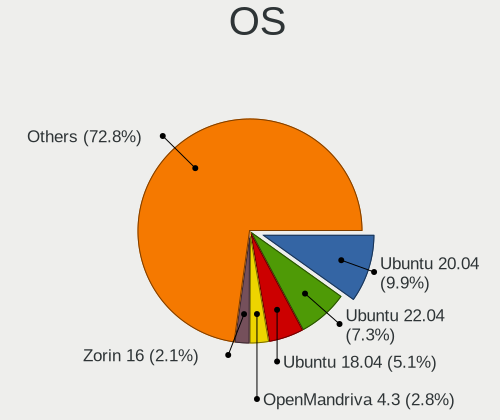
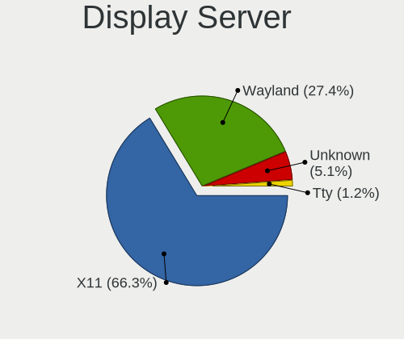
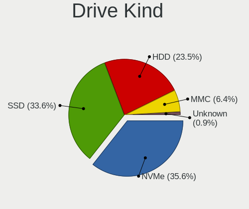
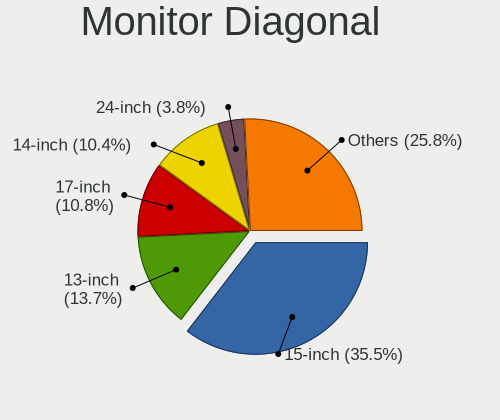
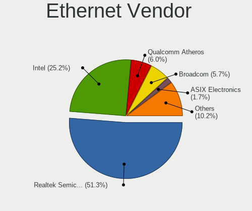
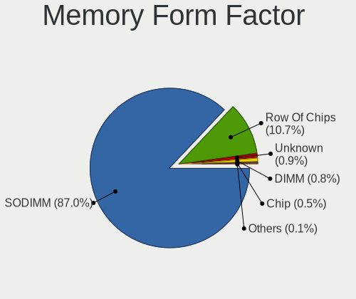
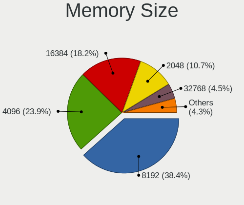
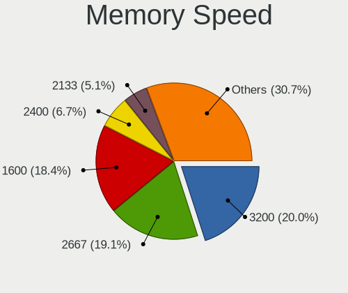

Linux in Netherlands - Tested Hardware & Statistics (Notebooks)
---------------------------------------------------------------

A project to collect tested hardware configurations for Linux in Netherlands.

Anyone can contribute to this report by the [hw-probe](https://github.com/linuxhw/hw-probe) tool:

    sudo -E hw-probe -all -upload

Please contribute! Especially if your hardware is rare.

Contents
--------

* [ Test Cases ](#test-cases)

* [ System ](#system)
  - [ OS                       ](#os)
  - [ OS Family                ](#os-family)
  - [ Kernel                   ](#kernel)
  - [ Kernel Family            ](#kernel-family)
  - [ Kernel Major Ver.        ](#kernel-major-ver)
  - [ Arch                     ](#arch)
  - [ DE                       ](#de)
  - [ Display Server           ](#display-server)
  - [ Display Manager          ](#display-manager)
  - [ OS Lang                  ](#os-lang)
  - [ Boot Mode                ](#boot-mode)
  - [ Filesystem               ](#filesystem)
  - [ Part. scheme             ](#part-scheme)
  - [ Dual Boot with Linux/BSD ](#dual-boot-with-linuxbsd)
  - [ Dual Boot (Win)          ](#dual-boot-win)

* [ Board ](#board)
  - [ Vendor                   ](#vendor)
  - [ Model                    ](#model)
  - [ Model Family             ](#model-family)
  - [ MFG Year                 ](#mfg-year)
  - [ Form Factor              ](#form-factor)
  - [ Secure Boot              ](#secure-boot)
  - [ Coreboot                 ](#coreboot)
  - [ RAM Size                 ](#ram-size)
  - [ RAM Used                 ](#ram-used)
  - [ Total Drives             ](#total-drives)
  - [ Has CD-ROM               ](#has-cd-rom)
  - [ Has Ethernet             ](#has-ethernet)
  - [ Has WiFi                 ](#has-wifi)
  - [ Has Bluetooth            ](#has-bluetooth)

* [ Location ](#location)
  - [ Country                  ](#country)
  - [ City                     ](#city)

* [ Drives ](#drives)
  - [ Drive Vendor             ](#drive-vendor)
  - [ Drive Model              ](#drive-model)
  - [ HDD Vendor               ](#hdd-vendor)
  - [ SSD Vendor               ](#ssd-vendor)
  - [ Drive Kind               ](#drive-kind)
  - [ Drive Connector          ](#drive-connector)
  - [ Drive Size               ](#drive-size)
  - [ Space Total              ](#space-total)
  - [ Space Used               ](#space-used)
  - [ Malfunc. Drives          ](#malfunc-drives)
  - [ Malfunc. Drive Vendor    ](#malfunc-drive-vendor)
  - [ Malfunc. HDD Vendor      ](#malfunc-hdd-vendor)
  - [ Malfunc. Drive Kind      ](#malfunc-drive-kind)
  - [ Failed Drives            ](#failed-drives)
  - [ Failed Drive Vendor      ](#failed-drive-vendor)
  - [ Drive Status             ](#drive-status)

* [ Storage controller ](#storage-controller)
  - [ Storage Vendor           ](#storage-vendor)
  - [ Storage Model            ](#storage-model)
  - [ Storage Kind             ](#storage-kind)

* [ Processor ](#processor)
  - [ CPU Vendor               ](#cpu-vendor)
  - [ CPU Model                ](#cpu-model)
  - [ CPU Model Family         ](#cpu-model-family)
  - [ CPU Cores                ](#cpu-cores)
  - [ CPU Sockets              ](#cpu-sockets)
  - [ CPU Threads              ](#cpu-threads)
  - [ CPU Op-Modes             ](#cpu-op-modes)
  - [ CPU Microcode            ](#cpu-microcode)
  - [ CPU Microarch            ](#cpu-microarch)

* [ Graphics ](#graphics)
  - [ GPU Vendor               ](#gpu-vendor)
  - [ GPU Model                ](#gpu-model)
  - [ GPU Combo                ](#gpu-combo)
  - [ GPU Driver               ](#gpu-driver)
  - [ GPU Memory               ](#gpu-memory)

* [ Monitor ](#monitor)
  - [ Monitor Vendor           ](#monitor-vendor)
  - [ Monitor Model            ](#monitor-model)
  - [ Monitor Resolution       ](#monitor-resolution)
  - [ Monitor Diagonal         ](#monitor-diagonal)
  - [ Monitor Width            ](#monitor-width)
  - [ Aspect Ratio             ](#aspect-ratio)
  - [ Monitor Area             ](#monitor-area)
  - [ Pixel Density            ](#pixel-density)
  - [ Multiple Monitors        ](#multiple-monitors)

* [ Network ](#network)
  - [ Net Controller Vendor    ](#net-controller-vendor)
  - [ Net Controller Model     ](#net-controller-model)
  - [ Wireless Vendor          ](#wireless-vendor)
  - [ Wireless Model           ](#wireless-model)
  - [ Ethernet Vendor          ](#ethernet-vendor)
  - [ Ethernet Model           ](#ethernet-model)
  - [ Net Controller Kind      ](#net-controller-kind)
  - [ Used Controller          ](#used-controller)
  - [ NICs                     ](#nics)
  - [ IPv6                     ](#ipv6)

* [ Bluetooth ](#bluetooth)
  - [ Bluetooth Vendor         ](#bluetooth-vendor)
  - [ Bluetooth Model          ](#bluetooth-model)

* [ Sound ](#sound)
  - [ Sound Vendor             ](#sound-vendor)
  - [ Sound Model              ](#sound-model)

* [ Memory ](#memory)
  - [ Memory Vendor            ](#memory-vendor)
  - [ Memory Model             ](#memory-model)
  - [ Memory Kind              ](#memory-kind)
  - [ Memory Form Factor       ](#memory-form-factor)
  - [ Memory Size              ](#memory-size)
  - [ Memory Speed             ](#memory-speed)

* [ Printers & scanners ](#printers--scanners)
  - [ Printer Vendor           ](#printer-vendor)
  - [ Printer Model            ](#printer-model)
  - [ Scanner Vendor           ](#scanner-vendor)
  - [ Scanner Model            ](#scanner-model)

* [ Camera ](#camera)
  - [ Camera Vendor            ](#camera-vendor)
  - [ Camera Model             ](#camera-model)

* [ Security ](#security)
  - [ Fingerprint Vendor       ](#fingerprint-vendor)
  - [ Fingerprint Model        ](#fingerprint-model)
  - [ Chipcard Vendor          ](#chipcard-vendor)
  - [ Chipcard Model           ](#chipcard-model)

* [ Unsupported ](#unsupported)
  - [ Unsupported Devices      ](#unsupported-devices)
  - [ Unsupported Device Types ](#unsupported-device-types)

Test Cases
----------

Total: 2950

| Vendor        | Model                       | Probe                                                      | Date         |
|---------------|-----------------------------|------------------------------------------------------------|--------------|
| Lenovo        | Legion 5 15ARH05 82B5       | [6c1969f77e](https://linux-hardware.org/?probe=6c1969f77e) | May 01, 2023 |
| Intel         | CHERRYVIEW D1 PLATFORM      | [6c58138c35](https://linux-hardware.org/?probe=6c58138c35) | May 01, 2023 |
| VIOS          | LTH17                       | [4d1a86ee61](https://linux-hardware.org/?probe=4d1a86ee61) | Apr 30, 2023 |
| HP            | Compaq Mini CQ10-500        | [9a1134210f](https://linux-hardware.org/?probe=9a1134210f) | Apr 30, 2023 |
| Intel         | CHERRYVIEW D1 PLATFORM      | [edf1d60e46](https://linux-hardware.org/?probe=edf1d60e46) | Apr 29, 2023 |
| Insyde        | M890BAP                     | [151efb0278](https://linux-hardware.org/?probe=151efb0278) | Apr 29, 2023 |
| Insyde        | CherryTrail                 | [a9f658c8af](https://linux-hardware.org/?probe=a9f658c8af) | Apr 29, 2023 |
| Lenovo        | ThinkPad P50 20EQS5C701     | [e84690f2d5](https://linux-hardware.org/?probe=e84690f2d5) | Apr 29, 2023 |
| Dell          | Latitude 3301               | [3a0aad0e75](https://linux-hardware.org/?probe=3a0aad0e75) | Apr 29, 2023 |
| HP            | Pavilion dv7                | [e3f05fe37f](https://linux-hardware.org/?probe=e3f05fe37f) | Apr 28, 2023 |
| HP            | Pavilion dv7                | [da542ba626](https://linux-hardware.org/?probe=da542ba626) | Apr 28, 2023 |
| Lenovo        | ThinkPad P14s Gen 2a 21A... | [b5a953a984](https://linux-hardware.org/?probe=b5a953a984) | Apr 28, 2023 |
| Dell          | Latitude 3301               | [855564b077](https://linux-hardware.org/?probe=855564b077) | Apr 28, 2023 |
| HUAWEI        | BOHB-WAX9                   | [858404838d](https://linux-hardware.org/?probe=858404838d) | Apr 27, 2023 |
| HUAWEI        | BOHB-WAX9                   | [0bf066e179](https://linux-hardware.org/?probe=0bf066e179) | Apr 27, 2023 |
| Medion        | E2215T MD60198              | [390ccbba6f](https://linux-hardware.org/?probe=390ccbba6f) | Apr 26, 2023 |
| Acer          | Swift SF114-34              | [693f0cea98](https://linux-hardware.org/?probe=693f0cea98) | Apr 25, 2023 |
| Lenovo        | ThinkPad X1 Carbon Gen 9... | [5236dde38f](https://linux-hardware.org/?probe=5236dde38f) | Apr 25, 2023 |
| HUAWEI        | BOHB-WAX9                   | [40df32580a](https://linux-hardware.org/?probe=40df32580a) | Apr 25, 2023 |
| Notebook      | P95_96_97Ex,Rx              | [297da8c979](https://linux-hardware.org/?probe=297da8c979) | Apr 24, 2023 |
| Apple         | MacBookPro15,2              | [09eb88ba6c](https://linux-hardware.org/?probe=09eb88ba6c) | Apr 24, 2023 |
| ASUSTek       | ROG Strix G733QS_G733QS     | [6cacf7a9f9](https://linux-hardware.org/?probe=6cacf7a9f9) | Apr 24, 2023 |
| BTO           | 17X1183                     | [134a6ead50](https://linux-hardware.org/?probe=134a6ead50) | Apr 23, 2023 |
| BTO           | 17X1183                     | [181163b5e8](https://linux-hardware.org/?probe=181163b5e8) | Apr 23, 2023 |
| Dell          | Latitude 9520               | [0ab9a83db6](https://linux-hardware.org/?probe=0ab9a83db6) | Apr 23, 2023 |
| HUAWEI        | BOHB-WAX9                   | [b906572f4b](https://linux-hardware.org/?probe=b906572f4b) | Apr 23, 2023 |
| Notebook      | NLxxPUx                     | [3648be5b0f](https://linux-hardware.org/?probe=3648be5b0f) | Apr 23, 2023 |
| Notebook      | W54_55_94_95_97AU,AUQ       | [f4e4c58948](https://linux-hardware.org/?probe=f4e4c58948) | Apr 23, 2023 |
| Apple         | MacBookPro12,1              | [65ba6571a2](https://linux-hardware.org/?probe=65ba6571a2) | Apr 23, 2023 |
| ASUSTek       | ROG Strix G733QS_G733QS     | [72088721ec](https://linux-hardware.org/?probe=72088721ec) | Apr 22, 2023 |
| Lenovo        | IdeaPad S540-15IWL GTX 8... | [112a18b586](https://linux-hardware.org/?probe=112a18b586) | Apr 22, 2023 |
| Dell          | Latitude E4300              | [f58f44d242](https://linux-hardware.org/?probe=f58f44d242) | Apr 22, 2023 |
| Medion        | E4251                       | [76820d982c](https://linux-hardware.org/?probe=76820d982c) | Apr 22, 2023 |
| HP            | EliteBook 2570p             | [a26039eb50](https://linux-hardware.org/?probe=a26039eb50) | Apr 22, 2023 |
| HP            | EliteBook 2570p             | [7e7a982c3c](https://linux-hardware.org/?probe=7e7a982c3c) | Apr 22, 2023 |
| Lenovo        | IdeaPad 5 Pro 14ACN6 82L... | [1c76d0f5a4](https://linux-hardware.org/?probe=1c76d0f5a4) | Apr 22, 2023 |
| Acer          | TP-SW3-013-181M             | [d231dc8846](https://linux-hardware.org/?probe=d231dc8846) | Apr 22, 2023 |
| Notebook      | N13_N140ZU                  | [51ee77485d](https://linux-hardware.org/?probe=51ee77485d) | Apr 21, 2023 |
| ASUSTek       | ZenBook UX333FN_RX333FN     | [8027ff2b04](https://linux-hardware.org/?probe=8027ff2b04) | Apr 21, 2023 |
| Apple         | MacBookAir7,2               | [8c9f6ec7ef](https://linux-hardware.org/?probe=8c9f6ec7ef) | Apr 20, 2023 |
| Chuwi         | HeroBook Pro                | [e8332849a1](https://linux-hardware.org/?probe=e8332849a1) | Apr 20, 2023 |
| Dell          | Latitude 5400               | [f0e05c9726](https://linux-hardware.org/?probe=f0e05c9726) | Apr 20, 2023 |
| Lenovo        | Yoga 300-11IBR 80M1         | [9093d27c30](https://linux-hardware.org/?probe=9093d27c30) | Apr 19, 2023 |
| ASUSTek       | K501LX                      | [00676747c4](https://linux-hardware.org/?probe=00676747c4) | Apr 19, 2023 |
| Lenovo        | Yoga 300-11IBR 80M1         | [f691871296](https://linux-hardware.org/?probe=f691871296) | Apr 19, 2023 |
| Acer          | Swift SF314-57              | [5fc25cc033](https://linux-hardware.org/?probe=5fc25cc033) | Apr 19, 2023 |
| Dell          | XPS 15 7590                 | [abcb6ed7e8](https://linux-hardware.org/?probe=abcb6ed7e8) | Apr 19, 2023 |
| Lenovo        | ThinkPad T440s 20AQ006HU... | [17b3242021](https://linux-hardware.org/?probe=17b3242021) | Apr 18, 2023 |
| Acer          | Iconia                      | [1ebc88d3ab](https://linux-hardware.org/?probe=1ebc88d3ab) | Apr 18, 2023 |
| Apple         | MacBookPro12,1              | [f045e3f800](https://linux-hardware.org/?probe=f045e3f800) | Apr 18, 2023 |
| Apple         | MacBookPro9,2               | [9f2a7943c7](https://linux-hardware.org/?probe=9f2a7943c7) | Apr 17, 2023 |
| Dell          | Latitude 5500               | [f4ac637463](https://linux-hardware.org/?probe=f4ac637463) | Apr 16, 2023 |
| HP            | EliteBook 840 G1            | [5994a04ee0](https://linux-hardware.org/?probe=5994a04ee0) | Apr 16, 2023 |
| HP            | ZBook 14u G5                | [fcf729207a](https://linux-hardware.org/?probe=fcf729207a) | Apr 15, 2023 |
| HP            | EliteBook 830 G6            | [75ce029800](https://linux-hardware.org/?probe=75ce029800) | Apr 13, 2023 |
| ASUSTek       | GL502VM                     | [4d31e0eb90](https://linux-hardware.org/?probe=4d31e0eb90) | Apr 13, 2023 |
| HP            | ProBook 640 G8 Notebook ... | [6b481f17c2](https://linux-hardware.org/?probe=6b481f17c2) | Apr 13, 2023 |
| Wortmann      | TERRA_MOBILE_1160           | [d40eed27fd](https://linux-hardware.org/?probe=d40eed27fd) | Apr 13, 2023 |
| HP            | Compaq Presario C700        | [0519471935](https://linux-hardware.org/?probe=0519471935) | Apr 13, 2023 |
| HP            | OMEN Laptop 15-en1xxx       | [0a09da06be](https://linux-hardware.org/?probe=0a09da06be) | Apr 13, 2023 |
| HP            | ZBook 15 G3                 | [5411d789c3](https://linux-hardware.org/?probe=5411d789c3) | Apr 12, 2023 |
| SLIMBOOK      | PROX-AMD5                   | [dc40d51336](https://linux-hardware.org/?probe=dc40d51336) | Apr 12, 2023 |
| Notebook      | NH55RGQ                     | [7fc1310fc2](https://linux-hardware.org/?probe=7fc1310fc2) | Apr 11, 2023 |
| Apple         | MacBookAir7,2               | [94efe20a0f](https://linux-hardware.org/?probe=94efe20a0f) | Apr 10, 2023 |
| Apple         | MacBookPro8,1               | [5a903505c7](https://linux-hardware.org/?probe=5a903505c7) | Apr 10, 2023 |
| HP            | EliteBook 8570p             | [854ec28c71](https://linux-hardware.org/?probe=854ec28c71) | Apr 09, 2023 |
| ASUSTek       | Zenbook UX8402ZA_UX8402Z... | [02bbb66fe9](https://linux-hardware.org/?probe=02bbb66fe9) | Apr 09, 2023 |
| Lenovo        | IdeaPad 5 Pro 16ACH6 82L... | [ea22560713](https://linux-hardware.org/?probe=ea22560713) | Apr 09, 2023 |
| Lenovo        | ThinkBook 13s-IWL 20R9      | [76af734c86](https://linux-hardware.org/?probe=76af734c86) | Apr 07, 2023 |
| Notebook      | N141CU                      | [8648ddb323](https://linux-hardware.org/?probe=8648ddb323) | Apr 07, 2023 |
| Lenovo        | IdeaPad 5 Pro 16ACH6 82L... | [8d68ef79c3](https://linux-hardware.org/?probe=8d68ef79c3) | Apr 06, 2023 |
| Lenovo        | V15 G2 ALC 82KD             | [c2195f003d](https://linux-hardware.org/?probe=c2195f003d) | Apr 06, 2023 |
| Lenovo        | Legion 5 Pro 16ACH6H 82J... | [405f73f1fd](https://linux-hardware.org/?probe=405f73f1fd) | Apr 05, 2023 |
| ASUSTek       | VivoBook_ASUSLaptop M650... | [0af2f7cc7f](https://linux-hardware.org/?probe=0af2f7cc7f) | Apr 05, 2023 |
| Lenovo        | Yoga Slim 7 13ACN5 82CY     | [10213d8aa1](https://linux-hardware.org/?probe=10213d8aa1) | Apr 05, 2023 |
| Valve         | Jupiter                     | [e8a69f8de9](https://linux-hardware.org/?probe=e8a69f8de9) | Apr 05, 2023 |
| Dell          | XPS 9320                    | [c78c87474d](https://linux-hardware.org/?probe=c78c87474d) | Apr 05, 2023 |
| HP            | EliteBook 2530p             | [519d2a4d5a](https://linux-hardware.org/?probe=519d2a4d5a) | Apr 04, 2023 |
| HP            | ProBook 6570b               | [d42564b34f](https://linux-hardware.org/?probe=d42564b34f) | Apr 04, 2023 |
| HP            | EliteBook 850 G6            | [1af731cc92](https://linux-hardware.org/?probe=1af731cc92) | Apr 03, 2023 |
| Lenovo        | ThinkPad P14s Gen 2a 21A... | [3125aa5d21](https://linux-hardware.org/?probe=3125aa5d21) | Apr 03, 2023 |
| Toxic         | GM5MPHY                     | [9ce64fb49a](https://linux-hardware.org/?probe=9ce64fb49a) | Apr 02, 2023 |
| ilife         | S806                        | [d089301e66](https://linux-hardware.org/?probe=d089301e66) | Apr 02, 2023 |
| Apple         | MacBookPro11,2              | [f78d5a9d04](https://linux-hardware.org/?probe=f78d5a9d04) | Apr 02, 2023 |
| ASUSTek       | VivoBook_ASUSLaptop X509... | [ac5393930b](https://linux-hardware.org/?probe=ac5393930b) | Apr 02, 2023 |
| ilife         | S806                        | [3a3ccd7c55](https://linux-hardware.org/?probe=3a3ccd7c55) | Apr 02, 2023 |
| HUAWEI        | MACHC-WAX9                  | [3494157f4b](https://linux-hardware.org/?probe=3494157f4b) | Apr 01, 2023 |
| Dell          | Latitude E7450              | [8bf693a890](https://linux-hardware.org/?probe=8bf693a890) | Apr 01, 2023 |
| Acer          | Aspire 7741                 | [34bd6f42b1](https://linux-hardware.org/?probe=34bd6f42b1) | Mar 30, 2023 |
| HUAWEI        | BOHB-WAX9                   | [6ade0ea04f](https://linux-hardware.org/?probe=6ade0ea04f) | Mar 30, 2023 |
| Apple         | MacBookPro11,3              | [0028f21c3e](https://linux-hardware.org/?probe=0028f21c3e) | Mar 30, 2023 |
| Lenovo        | ThinkPad T480 20L5CTO1WW    | [de3828d539](https://linux-hardware.org/?probe=de3828d539) | Mar 29, 2023 |
| HP            | ZBook 15 G5                 | [059358e49b](https://linux-hardware.org/?probe=059358e49b) | Mar 29, 2023 |
| Notebook      | N85_N87,HJ,HJ1,HK1          | [61ede0b764](https://linux-hardware.org/?probe=61ede0b764) | Mar 29, 2023 |
| Acer          | Aspire E5-773G              | [3cb72ca21c](https://linux-hardware.org/?probe=3cb72ca21c) | Mar 29, 2023 |
| HP            | Pavilion g7                 | [5b1e547f92](https://linux-hardware.org/?probe=5b1e547f92) | Mar 29, 2023 |
| HP            | Pavilion g7                 | [ce74564fd9](https://linux-hardware.org/?probe=ce74564fd9) | Mar 28, 2023 |
| Apple         | MacBookPro11,2              | [422e4056ea](https://linux-hardware.org/?probe=422e4056ea) | Mar 28, 2023 |
| Valve         | Jupiter                     | [68175ccbea](https://linux-hardware.org/?probe=68175ccbea) | Mar 27, 2023 |
| Unknown       | Unknown                     | [1988691e71](https://linux-hardware.org/?probe=1988691e71) | Mar 27, 2023 |
| Unknown       | Unknown                     | [dd081eb573](https://linux-hardware.org/?probe=dd081eb573) | Mar 27, 2023 |
| ASUSTek       | N76VM                       | [0a05b4b5ce](https://linux-hardware.org/?probe=0a05b4b5ce) | Mar 26, 2023 |
| Lenovo        | ThinkPad E15 Gen 4 21EES... | [79c876bced](https://linux-hardware.org/?probe=79c876bced) | Mar 25, 2023 |
| Haier         | S15                         | [497105206c](https://linux-hardware.org/?probe=497105206c) | Mar 25, 2023 |
| MSI           | Summit E16FlipEvo A11MT     | [62839dd4ac](https://linux-hardware.org/?probe=62839dd4ac) | Mar 24, 2023 |
| Acer          | Aspire 5733Z                | [8a7f87172d](https://linux-hardware.org/?probe=8a7f87172d) | Mar 24, 2023 |
| Framework     | Laptop                      | [4e1bd28ce3](https://linux-hardware.org/?probe=4e1bd28ce3) | Mar 24, 2023 |
| Dell          | XPS 15 9520                 | [06d6af1db0](https://linux-hardware.org/?probe=06d6af1db0) | Mar 23, 2023 |
| Dell          | XPS 13 9310                 | [386f37d114](https://linux-hardware.org/?probe=386f37d114) | Mar 22, 2023 |
| HP            | EliteBook 725 G2            | [5112f86dde](https://linux-hardware.org/?probe=5112f86dde) | Mar 21, 2023 |
| HP            | ZBook 15 G5                 | [83ddb49a8a](https://linux-hardware.org/?probe=83ddb49a8a) | Mar 21, 2023 |
| Hampoo        | Cherry Trail CR Hampoo_r... | [e7eb855568](https://linux-hardware.org/?probe=e7eb855568) | Mar 20, 2023 |
| Dell          | Latitude E6520              | [82f97b14f4](https://linux-hardware.org/?probe=82f97b14f4) | Mar 20, 2023 |
| Valve         | Jupiter                     | [b73f7b46c4](https://linux-hardware.org/?probe=b73f7b46c4) | Mar 20, 2023 |
| Dell          | Latitude E6520              | [7f92514d4e](https://linux-hardware.org/?probe=7f92514d4e) | Mar 20, 2023 |
| Dell          | XPS 9315                    | [3a6814a18f](https://linux-hardware.org/?probe=3a6814a18f) | Mar 20, 2023 |
| Dell          | XPS 9315                    | [a6054e6f0e](https://linux-hardware.org/?probe=a6054e6f0e) | Mar 20, 2023 |
| Lenovo        | ThinkPad E15 Gen 2 20TD0... | [92ae74e13d](https://linux-hardware.org/?probe=92ae74e13d) | Mar 19, 2023 |
| Dell          | Inspiron 15-3567            | [e90a87f6f2](https://linux-hardware.org/?probe=e90a87f6f2) | Mar 18, 2023 |
| Dell          | Latitude E7240              | [cbcae7df75](https://linux-hardware.org/?probe=cbcae7df75) | Mar 17, 2023 |
| HP            | Compaq 6730s                | [7e2310fcf0](https://linux-hardware.org/?probe=7e2310fcf0) | Mar 17, 2023 |
| Dell          | Latitude E7440              | [edf7e8521c](https://linux-hardware.org/?probe=edf7e8521c) | Mar 17, 2023 |
| Lenovo        | Yoga 300-11IBR 80M1         | [a78f938382](https://linux-hardware.org/?probe=a78f938382) | Mar 15, 2023 |
| HP            | EliteBook 2570p             | [1c6475f7da](https://linux-hardware.org/?probe=1c6475f7da) | Mar 15, 2023 |
| HUAWEI        | MACHC-WAX9                  | [fcb50f0e4f](https://linux-hardware.org/?probe=fcb50f0e4f) | Mar 14, 2023 |
| HUAWEI        | MACHC-WAX9                  | [fc7320db54](https://linux-hardware.org/?probe=fc7320db54) | Mar 14, 2023 |
| Lenovo        | IdeaPad 5 15ARE05 81YQ      | [b3e091147a](https://linux-hardware.org/?probe=b3e091147a) | Mar 14, 2023 |
| Lenovo        | ThinkPad L15 Gen 3 21C30... | [e6d2f2a3b4](https://linux-hardware.org/?probe=e6d2f2a3b4) | Mar 14, 2023 |
| Acer          | Aspire A715-74G             | [57000f8a86](https://linux-hardware.org/?probe=57000f8a86) | Mar 13, 2023 |
| Lenovo        | ThinkPad X1 Extreme 2nd ... | [a826b1cd32](https://linux-hardware.org/?probe=a826b1cd32) | Mar 13, 2023 |
| HP            | Pavilion dv7                | [66f70aa8f4](https://linux-hardware.org/?probe=66f70aa8f4) | Mar 12, 2023 |
| HP            | Compaq nc6120 (PY505EA#A... | [2b864d8f97](https://linux-hardware.org/?probe=2b864d8f97) | Mar 12, 2023 |
| Lenovo        | ThinkPad L15 Gen 3 21C30... | [eb987f6db2](https://linux-hardware.org/?probe=eb987f6db2) | Mar 12, 2023 |
| Medion        | E4251                       | [8b057f3a15](https://linux-hardware.org/?probe=8b057f3a15) | Mar 12, 2023 |
| Acer          | Aspire 8930                 | [7434247d21](https://linux-hardware.org/?probe=7434247d21) | Mar 12, 2023 |
| HP            | Pavilion Laptop 15-eh2xx... | [66094e937a](https://linux-hardware.org/?probe=66094e937a) | Mar 11, 2023 |
| HP            | Compaq nc6120 (PY505EA#A... | [c8d3cf3a4b](https://linux-hardware.org/?probe=c8d3cf3a4b) | Mar 11, 2023 |
| Lenovo        | ThinkPad T510 4384VJZ       | [d9c87b4795](https://linux-hardware.org/?probe=d9c87b4795) | Mar 11, 2023 |
| ASUSTek       | T100TAM                     | [1d647e564b](https://linux-hardware.org/?probe=1d647e564b) | Mar 10, 2023 |
| Acer          | Aspire A715-75G             | [3283454c2d](https://linux-hardware.org/?probe=3283454c2d) | Mar 10, 2023 |
| HP            | ProBook 430 G2              | [21595cd5ed](https://linux-hardware.org/?probe=21595cd5ed) | Mar 09, 2023 |
| Lenovo        | ThinkPad X1 Carbon Gen 1... | [276ce8bd7c](https://linux-hardware.org/?probe=276ce8bd7c) | Mar 09, 2023 |
| Lenovo        | ThinkPad X1 Carbon Gen 1... | [3daf833362](https://linux-hardware.org/?probe=3daf833362) | Mar 09, 2023 |
| HP            | Laptop 15s-fq4xxx           | [e8e1e04dbd](https://linux-hardware.org/?probe=e8e1e04dbd) | Mar 08, 2023 |
| HP            | Laptop 15s-fq4xxx           | [2dd91e2cd2](https://linux-hardware.org/?probe=2dd91e2cd2) | Mar 08, 2023 |
| Lenovo        | ThinkPad X1 Extreme Gen ... | [8a6c736217](https://linux-hardware.org/?probe=8a6c736217) | Mar 07, 2023 |
| HP            | ZBook 15 G3                 | [b00f87c99b](https://linux-hardware.org/?probe=b00f87c99b) | Mar 06, 2023 |
| Fujitsu       | LIFEBOOK U9312              | [19a72f502b](https://linux-hardware.org/?probe=19a72f502b) | Mar 06, 2023 |
| Lenovo        | ThinkPad X1 Carbon 6th 2... | [98a2c9f264](https://linux-hardware.org/?probe=98a2c9f264) | Mar 06, 2023 |
| Google        | Rammus                      | [0d905c6981](https://linux-hardware.org/?probe=0d905c6981) | Mar 05, 2023 |
| HUAWEI        | MACHC-WAX9                  | [53b112adac](https://linux-hardware.org/?probe=53b112adac) | Mar 05, 2023 |
| ASUSTek       | T200TA                      | [4d2a27cffa](https://linux-hardware.org/?probe=4d2a27cffa) | Mar 05, 2023 |
| Dell          | Studio XPS 1647             | [484c629656](https://linux-hardware.org/?probe=484c629656) | Mar 04, 2023 |
| ASUSTek       | ROG Strix G733QS_G733QS     | [4a80c78c43](https://linux-hardware.org/?probe=4a80c78c43) | Mar 03, 2023 |
| Alienware     | m15                         | [180a0251f5](https://linux-hardware.org/?probe=180a0251f5) | Mar 02, 2023 |
| HP            | Notebook                    | [453811c44a](https://linux-hardware.org/?probe=453811c44a) | Mar 02, 2023 |
| Apple         | MacBookAir5,2               | [6b7925d129](https://linux-hardware.org/?probe=6b7925d129) | Mar 02, 2023 |
| HP            | Pavilion Plus Laptop 14-... | [5cb58db69b](https://linux-hardware.org/?probe=5cb58db69b) | Mar 02, 2023 |
| ASUSTek       | N76VB                       | [0043164762](https://linux-hardware.org/?probe=0043164762) | Feb 28, 2023 |
| TECNO         | MEGABOOK T1                 | [3b70c27ca4](https://linux-hardware.org/?probe=3b70c27ca4) | Feb 28, 2023 |
| HP            | ProBook 6570b               | [3692011e3f](https://linux-hardware.org/?probe=3692011e3f) | Feb 28, 2023 |
| Sony          | VGN-FW11M                   | [06b355e1de](https://linux-hardware.org/?probe=06b355e1de) | Feb 28, 2023 |
| Unknown       | Unknown                     | [1dfaaf5a59](https://linux-hardware.org/?probe=1dfaaf5a59) | Feb 25, 2023 |
| HP            | Pavilion Gaming Laptop 1... | [3aae5788cf](https://linux-hardware.org/?probe=3aae5788cf) | Feb 25, 2023 |
| HP            | Pavilion g7                 | [8f46d24897](https://linux-hardware.org/?probe=8f46d24897) | Feb 25, 2023 |
| HP            | Pavilion Gaming Laptop 1... | [b5f840e593](https://linux-hardware.org/?probe=b5f840e593) | Feb 25, 2023 |
| HUAWEI        | NBLK-WAX9X                  | [2978ec71b8](https://linux-hardware.org/?probe=2978ec71b8) | Feb 25, 2023 |
| HP            | Laptop 15s-fq1xxx           | [ca2ef50547](https://linux-hardware.org/?probe=ca2ef50547) | Feb 25, 2023 |
| HP            | Laptop 15s-fq1xxx           | [3899b2f13e](https://linux-hardware.org/?probe=3899b2f13e) | Feb 24, 2023 |
| ASUSTek       | VivoBook_ASUSLaptop X512... | [2bbce041f5](https://linux-hardware.org/?probe=2bbce041f5) | Feb 24, 2023 |
| Acer          | Aspire 5732Z                | [2cb9f58eae](https://linux-hardware.org/?probe=2cb9f58eae) | Feb 24, 2023 |
| ASUSTek       | VivoBook_ASUSLaptop X340... | [a0bf98bcab](https://linux-hardware.org/?probe=a0bf98bcab) | Feb 23, 2023 |
| HP            | Laptop 14s-dq1xxx           | [1cca7fe830](https://linux-hardware.org/?probe=1cca7fe830) | Feb 22, 2023 |
| HP            | EliteBook 820 G4            | [de79cbb975](https://linux-hardware.org/?probe=de79cbb975) | Feb 22, 2023 |
| Valve         | Jupiter                     | [5e92cdeee7](https://linux-hardware.org/?probe=5e92cdeee7) | Feb 22, 2023 |
| HP            | Pavilion dv7                | [1ecf49cbaf](https://linux-hardware.org/?probe=1ecf49cbaf) | Feb 21, 2023 |
| TUXEDO        | Pulse 15 Gen1               | [e1c694b371](https://linux-hardware.org/?probe=e1c694b371) | Feb 20, 2023 |
| Dell          | Latitude 7300               | [65690f7efc](https://linux-hardware.org/?probe=65690f7efc) | Feb 20, 2023 |
| Dell          | Latitude E6320              | [0b5bcfefc5](https://linux-hardware.org/?probe=0b5bcfefc5) | Feb 20, 2023 |
| Lenovo        | Legion 5 15ACH6A 82NW       | [8ca2b786db](https://linux-hardware.org/?probe=8ca2b786db) | Feb 19, 2023 |
| Unknown       | Unknown                     | [f73ae7038f](https://linux-hardware.org/?probe=f73ae7038f) | Feb 19, 2023 |
| Dell          | Inspiron 15-3567            | [c2e0245ec5](https://linux-hardware.org/?probe=c2e0245ec5) | Feb 19, 2023 |
| Dell          | Latitude E6320              | [8110ff7717](https://linux-hardware.org/?probe=8110ff7717) | Feb 19, 2023 |
| Lenovo        | ThinkPad T440p 20AWS08S0... | [2daf635e15](https://linux-hardware.org/?probe=2daf635e15) | Feb 18, 2023 |
| HP            | Pavilion Laptop 15-eg0xx... | [c4a1fe4a4f](https://linux-hardware.org/?probe=c4a1fe4a4f) | Feb 17, 2023 |
| Lenovo        | ThinkPad P15 Gen 1 20ST0... | [3886d9287f](https://linux-hardware.org/?probe=3886d9287f) | Feb 17, 2023 |
| Lenovo        | ThinkPad P15 Gen 1 20ST0... | [1b401aa3cf](https://linux-hardware.org/?probe=1b401aa3cf) | Feb 17, 2023 |
| Unknown       | Unknown                     | [c59694e05c](https://linux-hardware.org/?probe=c59694e05c) | Feb 17, 2023 |
| Unknown       | Unknown                     | [c614caec4a](https://linux-hardware.org/?probe=c614caec4a) | Feb 17, 2023 |
| Alienware     | 15 R3                       | [c273319d9d](https://linux-hardware.org/?probe=c273319d9d) | Feb 17, 2023 |
| HP            | EliteBook 2570p             | [4fe16ec4fe](https://linux-hardware.org/?probe=4fe16ec4fe) | Feb 16, 2023 |
| HP            | Notebook                    | [3de841fd56](https://linux-hardware.org/?probe=3de841fd56) | Feb 16, 2023 |
| HP            | Pavilion dv7                | [130fe12846](https://linux-hardware.org/?probe=130fe12846) | Feb 16, 2023 |
| HP            | Pavilion dv7                | [7ca9bf386b](https://linux-hardware.org/?probe=7ca9bf386b) | Feb 16, 2023 |
| Google        | Helios                      | [4505c27d12](https://linux-hardware.org/?probe=4505c27d12) | Feb 16, 2023 |
| HP            | Pavilion Laptop 15-eg0xx... | [ddc2c7ec7a](https://linux-hardware.org/?probe=ddc2c7ec7a) | Feb 16, 2023 |
| Dell          | Latitude 3320               | [fecee449d4](https://linux-hardware.org/?probe=fecee449d4) | Feb 15, 2023 |
| Lenovo        | ThinkPad P15 Gen 1 20ST0... | [3039ccd4b0](https://linux-hardware.org/?probe=3039ccd4b0) | Feb 14, 2023 |
| HP            | EliteBook 8570w             | [0d16c9013f](https://linux-hardware.org/?probe=0d16c9013f) | Feb 14, 2023 |
| Toshiba       | Satellite P870              | [dcfa5b1fc5](https://linux-hardware.org/?probe=dcfa5b1fc5) | Feb 13, 2023 |
| Toshiba       | Satellite P870              | [3a4a4dedc3](https://linux-hardware.org/?probe=3a4a4dedc3) | Feb 13, 2023 |
| Dell          | Latitude E5570              | [16e090c63c](https://linux-hardware.org/?probe=16e090c63c) | Feb 13, 2023 |
| Acer          | TravelMate P215-53          | [7c1423b767](https://linux-hardware.org/?probe=7c1423b767) | Feb 13, 2023 |
| Dell          | Precision 3571              | [8f7f52dcaa](https://linux-hardware.org/?probe=8f7f52dcaa) | Feb 13, 2023 |
| Acer          | Predator PH315-52           | [480da10129](https://linux-hardware.org/?probe=480da10129) | Feb 12, 2023 |
| Valve         | Jupiter                     | [5629f3ed8c](https://linux-hardware.org/?probe=5629f3ed8c) | Feb 12, 2023 |
| HP            | Compaq 6820s                | [6c67866714](https://linux-hardware.org/?probe=6c67866714) | Feb 12, 2023 |
| Acer          | Aspire V3-772               | [95875d4afc](https://linux-hardware.org/?probe=95875d4afc) | Feb 11, 2023 |
| ASUSTek       | ASUS TUF Gaming F15 FX50... | [e4340c10db](https://linux-hardware.org/?probe=e4340c10db) | Feb 10, 2023 |
| ASUSTek       | N751JX                      | [fd591a3e67](https://linux-hardware.org/?probe=fd591a3e67) | Feb 10, 2023 |
| HP            | OMEN Laptop 15-en1xxx       | [7ac6f508b2](https://linux-hardware.org/?probe=7ac6f508b2) | Feb 10, 2023 |
| Dell          | Precision 3571              | [85985612ac](https://linux-hardware.org/?probe=85985612ac) | Feb 10, 2023 |
| Lenovo        | ThinkPad E14 Gen 2 20TA0... | [353bd3a5b2](https://linux-hardware.org/?probe=353bd3a5b2) | Feb 09, 2023 |
| Acer          | TravelMate P215-53          | [f3eb8a2592](https://linux-hardware.org/?probe=f3eb8a2592) | Feb 09, 2023 |
| HP            | EliteBook 850 G3            | [7091e6ba95](https://linux-hardware.org/?probe=7091e6ba95) | Feb 08, 2023 |
| Dell          | Latitude E7450              | [2513ec83c8](https://linux-hardware.org/?probe=2513ec83c8) | Feb 08, 2023 |
| HP            | ZBook 15 G2                 | [20d7058e4f](https://linux-hardware.org/?probe=20d7058e4f) | Feb 08, 2023 |
| Valve         | Jupiter                     | [b376c55e80](https://linux-hardware.org/?probe=b376c55e80) | Feb 07, 2023 |
| Dell          | Latitude E6320              | [6d1fe4f041](https://linux-hardware.org/?probe=6d1fe4f041) | Feb 06, 2023 |
| Lenovo        | ThinkPad T510 4349AF5       | [5d737e59ae](https://linux-hardware.org/?probe=5d737e59ae) | Feb 06, 2023 |
| Apple         | MacBookPro8,2               | [ffc97bf3de](https://linux-hardware.org/?probe=ffc97bf3de) | Feb 06, 2023 |
| Standard      | Unknown                     | [c983c471de](https://linux-hardware.org/?probe=c983c471de) | Feb 05, 2023 |
| HP            | OMEN by Laptop 16-c0xxx     | [b6333de3ab](https://linux-hardware.org/?probe=b6333de3ab) | Feb 05, 2023 |
| Valve         | Jupiter                     | [8dee1d9415](https://linux-hardware.org/?probe=8dee1d9415) | Feb 03, 2023 |
| HP            | Compaq Presario CQ60        | [c6d48c9847](https://linux-hardware.org/?probe=c6d48c9847) | Feb 03, 2023 |
| HP            | ZBook Power 15.6 inch G9... | [1e38d08821](https://linux-hardware.org/?probe=1e38d08821) | Feb 03, 2023 |
| Toshiba       | Satellite C660              | [2a25e1c4d6](https://linux-hardware.org/?probe=2a25e1c4d6) | Feb 02, 2023 |
| Lenovo        | Yoga Slim 7 Pro 14IAP7 8... | [b829e9afbd](https://linux-hardware.org/?probe=b829e9afbd) | Feb 01, 2023 |
| ASUSTek       | ROG Strix G713QE_G713QE     | [f05a20fe00](https://linux-hardware.org/?probe=f05a20fe00) | Feb 01, 2023 |
| Lenovo        | ThinkPad T14 Gen 2a 20XK... | [db8bdbd72b](https://linux-hardware.org/?probe=db8bdbd72b) | Jan 31, 2023 |
| HP            | EliteBook 2560p             | [798466ab86](https://linux-hardware.org/?probe=798466ab86) | Jan 31, 2023 |
| Lenovo        | IdeaPad 310-15ABR 80ST      | [2469884587](https://linux-hardware.org/?probe=2469884587) | Jan 30, 2023 |
| Lenovo        | IdeaPad 510-15ISK 80SR      | [debdb8208f](https://linux-hardware.org/?probe=debdb8208f) | Jan 29, 2023 |
| HP            | Pavilion Sleekbook 15       | [d17dc00a8a](https://linux-hardware.org/?probe=d17dc00a8a) | Jan 29, 2023 |
| Lenovo        | G550 2958                   | [8bee986aca](https://linux-hardware.org/?probe=8bee986aca) | Jan 28, 2023 |
| HP            | Compaq nc6320 (RH569ET#A... | [bf4432a140](https://linux-hardware.org/?probe=bf4432a140) | Jan 28, 2023 |
| Lenovo        | G550 2958                   | [a50b0e3645](https://linux-hardware.org/?probe=a50b0e3645) | Jan 28, 2023 |
| Acer          | Aspire E5-774               | [86e3285b31](https://linux-hardware.org/?probe=86e3285b31) | Jan 27, 2023 |
| Lenovo        | ThinkPad E560 20EVCTO1WW    | [d3adeb692c](https://linux-hardware.org/?probe=d3adeb692c) | Jan 27, 2023 |
| HP            | ZBook 15 G2                 | [b9793eca79](https://linux-hardware.org/?probe=b9793eca79) | Jan 27, 2023 |
| Lenovo        | ThinkPad E560 20EVCTO1WW    | [46b1227255](https://linux-hardware.org/?probe=46b1227255) | Jan 27, 2023 |
| HP            | Pavilion Laptop 15-eh2xx... | [ee769c62bf](https://linux-hardware.org/?probe=ee769c62bf) | Jan 27, 2023 |
| Dell          | XPS 13 9305                 | [c0468fe8fd](https://linux-hardware.org/?probe=c0468fe8fd) | Jan 27, 2023 |
| Lenovo        | ThinkPad T440 20B7S0JC0P    | [1a36af70e8](https://linux-hardware.org/?probe=1a36af70e8) | Jan 26, 2023 |
| Valve         | Jupiter                     | [cb8c4c9711](https://linux-hardware.org/?probe=cb8c4c9711) | Jan 26, 2023 |
| Valve         | Jupiter                     | [076783b777](https://linux-hardware.org/?probe=076783b777) | Jan 26, 2023 |
| Toshiba       | Satellite C870-12F          | [fc9a6d3a7e](https://linux-hardware.org/?probe=fc9a6d3a7e) | Jan 25, 2023 |
| HP            | Laptop 17-cp0xxx            | [70019cbdbf](https://linux-hardware.org/?probe=70019cbdbf) | Jan 25, 2023 |
| HP            | ZBook Power 15.6 inch G9... | [dd2f21ab84](https://linux-hardware.org/?probe=dd2f21ab84) | Jan 25, 2023 |
| ASUSTek       | K72Jr                       | [9b7c80b059](https://linux-hardware.org/?probe=9b7c80b059) | Jan 25, 2023 |
| MSI           | CX700ND/CX70 0NF/CX70 0N... | [dad68fd07f](https://linux-hardware.org/?probe=dad68fd07f) | Jan 24, 2023 |
| MSI           | CX700ND/CX70 0NF/CX70 0N... | [b61b0f981e](https://linux-hardware.org/?probe=b61b0f981e) | Jan 24, 2023 |
| HP            | ZBook 15 G3                 | [0bde1ca99a](https://linux-hardware.org/?probe=0bde1ca99a) | Jan 24, 2023 |
| MSI           | GE70 2QD                    | [3194fb8316](https://linux-hardware.org/?probe=3194fb8316) | Jan 24, 2023 |
| MSI           | GE70 2QD                    | [8e124bc501](https://linux-hardware.org/?probe=8e124bc501) | Jan 24, 2023 |
| Acer          | Aspire A715-51G             | [75362fb07d](https://linux-hardware.org/?probe=75362fb07d) | Jan 24, 2023 |
| Valve         | Jupiter                     | [8c427938e2](https://linux-hardware.org/?probe=8c427938e2) | Jan 24, 2023 |
| HP            | EliteBook 735 G6            | [bb321263f8](https://linux-hardware.org/?probe=bb321263f8) | Jan 24, 2023 |
| Valve         | Jupiter                     | [5ca72b0d88](https://linux-hardware.org/?probe=5ca72b0d88) | Jan 24, 2023 |
| Acer          | Aspire SW5-012              | [247455614c](https://linux-hardware.org/?probe=247455614c) | Jan 23, 2023 |
| HP            | ZBook 15 G2                 | [5e4253b22d](https://linux-hardware.org/?probe=5e4253b22d) | Jan 23, 2023 |
| realme        | CloudProXXXX                | [8ba70a4617](https://linux-hardware.org/?probe=8ba70a4617) | Jan 23, 2023 |
| Acer          | Aspire 5680                 | [b4b7ebe3f9](https://linux-hardware.org/?probe=b4b7ebe3f9) | Jan 23, 2023 |
| Lenovo        | Erazer Z500 20226           | [6e7a21c6d5](https://linux-hardware.org/?probe=6e7a21c6d5) | Jan 23, 2023 |
| Lenovo        | Erazer Z500 20226           | [7d6077c27c](https://linux-hardware.org/?probe=7d6077c27c) | Jan 23, 2023 |
| ASUSTek       | K72Jr                       | [54313c1c76](https://linux-hardware.org/?probe=54313c1c76) | Jan 23, 2023 |
| HP            | EliteBook 840 G4            | [459ab8ae3d](https://linux-hardware.org/?probe=459ab8ae3d) | Jan 23, 2023 |
| Medion        | E4251                       | [7c90da8c5f](https://linux-hardware.org/?probe=7c90da8c5f) | Jan 23, 2023 |
| Acer          | Aspire 5680                 | [b2792832c2](https://linux-hardware.org/?probe=b2792832c2) | Jan 22, 2023 |
| Dell          | Latitude 5520               | [a3541758f7](https://linux-hardware.org/?probe=a3541758f7) | Jan 22, 2023 |
| ASUSTek       | GL553VD                     | [eeea0542b8](https://linux-hardware.org/?probe=eeea0542b8) | Jan 21, 2023 |
| Dell          | XPS 13 9310                 | [5d606f2c60](https://linux-hardware.org/?probe=5d606f2c60) | Jan 21, 2023 |
| Lenovo        | ThinkPad T490 20N3S0E000    | [d324a863a5](https://linux-hardware.org/?probe=d324a863a5) | Jan 20, 2023 |
| HP            | ProBook 650 G1              | [9620f447dd](https://linux-hardware.org/?probe=9620f447dd) | Jan 19, 2023 |
| HP            | ProBook 650 G1              | [2135c30983](https://linux-hardware.org/?probe=2135c30983) | Jan 19, 2023 |
| HP            | Notebook                    | [63f0c0b90c](https://linux-hardware.org/?probe=63f0c0b90c) | Jan 19, 2023 |
| Lenovo        | Yoga Slim 7 13ACN5 82CY     | [da0d1f442a](https://linux-hardware.org/?probe=da0d1f442a) | Jan 19, 2023 |
| HP            | ProBook 430 G1              | [3591fb1d6c](https://linux-hardware.org/?probe=3591fb1d6c) | Jan 19, 2023 |
| Acer          | Aspire A715-75G             | [68d2fcbdcf](https://linux-hardware.org/?probe=68d2fcbdcf) | Jan 18, 2023 |
| Dell          | Latitude E6540              | [440b0eec1c](https://linux-hardware.org/?probe=440b0eec1c) | Jan 18, 2023 |
| Dell          | Precision M6800             | [62d01a5b26](https://linux-hardware.org/?probe=62d01a5b26) | Jan 18, 2023 |
| Dell          | Precision M6800             | [09e31ee1c8](https://linux-hardware.org/?probe=09e31ee1c8) | Jan 18, 2023 |
| Dell          | Latitude 5530               | [f9325236bb](https://linux-hardware.org/?probe=f9325236bb) | Jan 17, 2023 |
| Dell          | Latitude 5530               | [fafa35ef88](https://linux-hardware.org/?probe=fafa35ef88) | Jan 17, 2023 |
| HP            | ProBook 4540s               | [3f9e3a1cbb](https://linux-hardware.org/?probe=3f9e3a1cbb) | Jan 17, 2023 |
| HP            | Pavilion Laptop 15-eh2xx... | [856324369f](https://linux-hardware.org/?probe=856324369f) | Jan 17, 2023 |
| HP            | Pavilion Gaming Laptop 1... | [d6b6c22af1](https://linux-hardware.org/?probe=d6b6c22af1) | Jan 17, 2023 |
| HP            | ProBook 4540s               | [7b9cd1b51c](https://linux-hardware.org/?probe=7b9cd1b51c) | Jan 16, 2023 |
| Dell          | XPS 15 9550                 | [4da81f73f5](https://linux-hardware.org/?probe=4da81f73f5) | Jan 16, 2023 |
| Google        | Banon                       | [6bb3ed04f9](https://linux-hardware.org/?probe=6bb3ed04f9) | Jan 16, 2023 |
| Lenovo        | ThinkPad T490s 20NX0076M... | [4c896e2c0e](https://linux-hardware.org/?probe=4c896e2c0e) | Jan 16, 2023 |
| Acer          | Aspire 5680                 | [dc5f6d7ac6](https://linux-hardware.org/?probe=dc5f6d7ac6) | Jan 16, 2023 |
| HP            | Pavilion 17                 | [895f75daf7](https://linux-hardware.org/?probe=895f75daf7) | Jan 16, 2023 |
| Dell          | Latitude E5430 non-vPro     | [57cd4eaca3](https://linux-hardware.org/?probe=57cd4eaca3) | Jan 15, 2023 |
| Acer          | Aspire 5736Z                | [bdfc087b4d](https://linux-hardware.org/?probe=bdfc087b4d) | Jan 15, 2023 |
| Acer          | Nitro AN515-43              | [4621c0d31b](https://linux-hardware.org/?probe=4621c0d31b) | Jan 15, 2023 |
| Apple         | MacBookPro5,5               | [2f2fec82c8](https://linux-hardware.org/?probe=2f2fec82c8) | Jan 15, 2023 |
| HP            | Pavilion Laptop 14-ce0xx... | [dd0a234ebb](https://linux-hardware.org/?probe=dd0a234ebb) | Jan 14, 2023 |
| Dell          | Latitude E5410              | [909ca0fd93](https://linux-hardware.org/?probe=909ca0fd93) | Jan 14, 2023 |
| Lenovo        | Yoga Slim 7 13ACN5 82CY     | [116b26047d](https://linux-hardware.org/?probe=116b26047d) | Jan 14, 2023 |
| Apple         | MacBookAir5,2               | [c4cfa1aa47](https://linux-hardware.org/?probe=c4cfa1aa47) | Jan 13, 2023 |
| HP            | ZBook Studio G4             | [67168cc8a9](https://linux-hardware.org/?probe=67168cc8a9) | Jan 13, 2023 |
| Lenovo        | ThinkPad X270 20K5S1A524    | [e4eaef80f8](https://linux-hardware.org/?probe=e4eaef80f8) | Jan 13, 2023 |
| realme        | CloudProXXXX                | [25d1a9b890](https://linux-hardware.org/?probe=25d1a9b890) | Jan 13, 2023 |
| Dell          | Latitude 3350               | [065c4a4a95](https://linux-hardware.org/?probe=065c4a4a95) | Jan 12, 2023 |
| Lenovo        | G770 1037                   | [da21020be1](https://linux-hardware.org/?probe=da21020be1) | Jan 12, 2023 |
| Notebook      | NS50MU                      | [7d94a36b67](https://linux-hardware.org/?probe=7d94a36b67) | Jan 12, 2023 |
| Standard      | Unknown                     | [b6f4b12847](https://linux-hardware.org/?probe=b6f4b12847) | Jan 12, 2023 |
| HP            | Pavilion dv9500             | [0f8c99e8d7](https://linux-hardware.org/?probe=0f8c99e8d7) | Jan 11, 2023 |
| Sony          | VPCEB3L9E                   | [5a7ea474fd](https://linux-hardware.org/?probe=5a7ea474fd) | Jan 11, 2023 |
| Dell          | XPS 15 9500                 | [69b3403f94](https://linux-hardware.org/?probe=69b3403f94) | Jan 10, 2023 |
| Acer          | Aspire 5735                 | [27b63fd8b1](https://linux-hardware.org/?probe=27b63fd8b1) | Jan 10, 2023 |
| ASUSTek       | VivoBook_ASUSLaptop X712... | [5663965a51](https://linux-hardware.org/?probe=5663965a51) | Jan 09, 2023 |
| Lenovo        | ThinkPad Edge E540 20C60... | [774902b83f](https://linux-hardware.org/?probe=774902b83f) | Jan 09, 2023 |
| Acer          | Aspire One 721              | [4b9311cfed](https://linux-hardware.org/?probe=4b9311cfed) | Jan 08, 2023 |
| HP            | ZBook 15 G3                 | [648dcae4c6](https://linux-hardware.org/?probe=648dcae4c6) | Jan 08, 2023 |
| Acer          | TravelMate P614-51-G2       | [0d0c035342](https://linux-hardware.org/?probe=0d0c035342) | Jan 08, 2023 |
| Lenovo        | ThinkPad Edge E145 20BC0... | [8ca4d7b38b](https://linux-hardware.org/?probe=8ca4d7b38b) | Jan 08, 2023 |
| Apple         | MacBookAir7,2               | [a4e777ea7d](https://linux-hardware.org/?probe=a4e777ea7d) | Jan 08, 2023 |
| Lenovo        | IdeaPad 3 15ADA05 81W1      | [782467ee8c](https://linux-hardware.org/?probe=782467ee8c) | Jan 07, 2023 |
| Medion        | E4251 MD61435               | [7f3f24b812](https://linux-hardware.org/?probe=7f3f24b812) | Jan 05, 2023 |
| HP            | Pavilion 17                 | [fe325358d6](https://linux-hardware.org/?probe=fe325358d6) | Jan 04, 2023 |
| Dell          | Latitude E6330              | [0341a89f2f](https://linux-hardware.org/?probe=0341a89f2f) | Jan 04, 2023 |
| Sony          | VPCEB3L1E                   | [e8ac8a5d95](https://linux-hardware.org/?probe=e8ac8a5d95) | Jan 04, 2023 |
| Apple         | MacBookAir7,2               | [2f148d690a](https://linux-hardware.org/?probe=2f148d690a) | Jan 03, 2023 |
| Acer          | Aspire E5-774               | [96c68886cf](https://linux-hardware.org/?probe=96c68886cf) | Jan 03, 2023 |
| HP            | 240 G8 Notebook PC          | [a316608c78](https://linux-hardware.org/?probe=a316608c78) | Jan 03, 2023 |
| Acer          | Aspire V3-574G              | [a889bba557](https://linux-hardware.org/?probe=a889bba557) | Jan 02, 2023 |
| Lenovo        | IdeaPad 100-15IBD 80QQ      | [08fb8de608](https://linux-hardware.org/?probe=08fb8de608) | Jan 02, 2023 |
| Lenovo        | IdeaPad 100-15IBD 80QQ      | [bca75efbe5](https://linux-hardware.org/?probe=bca75efbe5) | Jan 02, 2023 |
| Lenovo        | ThinkPad T460s 20FAS1E70... | [e8b6dd6f1f](https://linux-hardware.org/?probe=e8b6dd6f1f) | Jan 01, 2023 |
| Notebook      | PB50_70RF,RD,RC             | [d1f655b9b1](https://linux-hardware.org/?probe=d1f655b9b1) | Dec 31, 2022 |
| HP            | Pavilion 17                 | [c87d61d0cd](https://linux-hardware.org/?probe=c87d61d0cd) | Dec 31, 2022 |
| HP            | Pavilion 17                 | [bbf52af119](https://linux-hardware.org/?probe=bbf52af119) | Dec 31, 2022 |
| Lenovo        | IdeaPad 320-15ISK 80XH      | [fc108fb0d8](https://linux-hardware.org/?probe=fc108fb0d8) | Dec 31, 2022 |
| HP            | EliteBook 820 G4            | [9e794046d8](https://linux-hardware.org/?probe=9e794046d8) | Dec 30, 2022 |
| Acer          | Aspire 5680                 | [c14cfe5386](https://linux-hardware.org/?probe=c14cfe5386) | Dec 29, 2022 |
| Acer          | Aspire V3-772               | [9f431b484a](https://linux-hardware.org/?probe=9f431b484a) | Dec 29, 2022 |
| Alienware     | x17 R2                      | [5a7ea2683a](https://linux-hardware.org/?probe=5a7ea2683a) | Dec 28, 2022 |
| Dell          | Latitude 2120               | [b52922b482](https://linux-hardware.org/?probe=b52922b482) | Dec 27, 2022 |
| Valve         | Jupiter                     | [488d26f3e8](https://linux-hardware.org/?probe=488d26f3e8) | Dec 27, 2022 |
| HP            | Pavilion Gaming Laptop 1... | [0763603d12](https://linux-hardware.org/?probe=0763603d12) | Dec 27, 2022 |
| LG Electro... | 17Z90Q-G.AA79G              | [59d7266746](https://linux-hardware.org/?probe=59d7266746) | Dec 26, 2022 |
| Apple         | MacBookPro8,2               | [3d8320e362](https://linux-hardware.org/?probe=3d8320e362) | Dec 25, 2022 |
| Medion        | E4251 MD61435               | [0ef8f76193](https://linux-hardware.org/?probe=0ef8f76193) | Dec 23, 2022 |
| Lenovo        | ThinkPad T16 Gen 1 21CHC... | [0c1d9b9b28](https://linux-hardware.org/?probe=0c1d9b9b28) | Dec 23, 2022 |
| Lenovo        | ThinkPad T16 Gen 1 21CHC... | [000660b461](https://linux-hardware.org/?probe=000660b461) | Dec 23, 2022 |
| Toshiba       | Satellite C70D-B            | [82cc0b362d](https://linux-hardware.org/?probe=82cc0b362d) | Dec 23, 2022 |
| Lenovo        | IdeaPad 3 14IAU7 82RJ       | [b5c5aba33a](https://linux-hardware.org/?probe=b5c5aba33a) | Dec 22, 2022 |
| Lenovo        | ThinkPad T470s 20HF003QU... | [5145350f9a](https://linux-hardware.org/?probe=5145350f9a) | Dec 21, 2022 |
| Acer          | Aspire 5680                 | [9b188c358e](https://linux-hardware.org/?probe=9b188c358e) | Dec 21, 2022 |
| Valve         | Jupiter                     | [90331ea7da](https://linux-hardware.org/?probe=90331ea7da) | Dec 21, 2022 |
| Dell          | Latitude 5521               | [6fcbfd9271](https://linux-hardware.org/?probe=6fcbfd9271) | Dec 21, 2022 |
| Lenovo        | ThinkPad T16 Gen 1 21CHC... | [638667a90f](https://linux-hardware.org/?probe=638667a90f) | Dec 20, 2022 |
| Lenovo        | ThinkPad T490 20N2CTO1WW    | [2aeb8fd0cd](https://linux-hardware.org/?probe=2aeb8fd0cd) | Dec 19, 2022 |
| ASUSTek       | N750JK                      | [8d876c21b0](https://linux-hardware.org/?probe=8d876c21b0) | Dec 18, 2022 |
| ASUSTek       | N750JK                      | [71575f3d8c](https://linux-hardware.org/?probe=71575f3d8c) | Dec 18, 2022 |
| Acer          | Aspire 5680                 | [64f5eb2f4b](https://linux-hardware.org/?probe=64f5eb2f4b) | Dec 17, 2022 |
| ASUSTek       | K50IE                       | [5681babfa5](https://linux-hardware.org/?probe=5681babfa5) | Dec 17, 2022 |
| Lenovo        | ThinkPad X230 Tablet 343... | [30f6db8749](https://linux-hardware.org/?probe=30f6db8749) | Dec 17, 2022 |
| Acer          | Aspire E5-575               | [3fd939cef5](https://linux-hardware.org/?probe=3fd939cef5) | Dec 17, 2022 |
| Toshiba       | Satellite C70D-B            | [182e467ce6](https://linux-hardware.org/?probe=182e467ce6) | Dec 17, 2022 |
| Lenovo        | G50-70 20351                | [4d39c63e0a](https://linux-hardware.org/?probe=4d39c63e0a) | Dec 17, 2022 |
| Dell          | XPS 15 7590                 | [e070540587](https://linux-hardware.org/?probe=e070540587) | Dec 16, 2022 |
| Dell          | Latitude 3120               | [e886df2722](https://linux-hardware.org/?probe=e886df2722) | Dec 16, 2022 |
| Acer          | Nitro AN517-54              | [cb963df304](https://linux-hardware.org/?probe=cb963df304) | Dec 16, 2022 |
| MSI           | GP75 Leopard 10SEK          | [9eda9896f3](https://linux-hardware.org/?probe=9eda9896f3) | Dec 15, 2022 |
| Lenovo        | ThinkPad T16 Gen 1 21CHC... | [de26ffa293](https://linux-hardware.org/?probe=de26ffa293) | Dec 14, 2022 |
| Dell          | Inspiron 15-3567            | [e94792b948](https://linux-hardware.org/?probe=e94792b948) | Dec 13, 2022 |
| Acer          | Aspire 5742G                | [ee22896cd2](https://linux-hardware.org/?probe=ee22896cd2) | Dec 12, 2022 |
| MSI           | Summit E16Flip A12UCT       | [1db3976bb5](https://linux-hardware.org/?probe=1db3976bb5) | Dec 12, 2022 |
| Toshiba       | Satellite C70D-B            | [56adac1fcb](https://linux-hardware.org/?probe=56adac1fcb) | Dec 12, 2022 |
| Medion        | E4251                       | [f7303bf4c9](https://linux-hardware.org/?probe=f7303bf4c9) | Dec 11, 2022 |
| Lenovo        | ThinkPad X201 Tablet 309... | [cd7399049b](https://linux-hardware.org/?probe=cd7399049b) | Dec 11, 2022 |
| Medion        | E4251                       | [a16b01515b](https://linux-hardware.org/?probe=a16b01515b) | Dec 10, 2022 |
| Lenovo        | IdeaPad 5 15ARE05 81YQ      | [173f4b722f](https://linux-hardware.org/?probe=173f4b722f) | Dec 10, 2022 |
| Lenovo        | ThinkPad P14s Gen 2a 21A... | [25d5b5623b](https://linux-hardware.org/?probe=25d5b5623b) | Dec 10, 2022 |
| Acer          | Aspire 5742G                | [869e2a9671](https://linux-hardware.org/?probe=869e2a9671) | Dec 09, 2022 |
| HP            | Compaq Presario CQ71        | [503b61f120](https://linux-hardware.org/?probe=503b61f120) | Dec 09, 2022 |
| HP            | EliteBook 850 G8 Noteboo... | [95d47d14cb](https://linux-hardware.org/?probe=95d47d14cb) | Dec 09, 2022 |
| MSI           | Modern 15 A11MU             | [e5ba0c8749](https://linux-hardware.org/?probe=e5ba0c8749) | Dec 09, 2022 |
| Apple         | MacBookPro9,2               | [27dc9420ed](https://linux-hardware.org/?probe=27dc9420ed) | Dec 07, 2022 |
| Apple         | MacBookPro9,2               | [9b7c1953a6](https://linux-hardware.org/?probe=9b7c1953a6) | Dec 07, 2022 |
| Lenovo        | ThinkPad T510 4349AF5       | [a7d8d66fb7](https://linux-hardware.org/?probe=a7d8d66fb7) | Dec 07, 2022 |
| Dell          | XPS 9320                    | [34c3b0b6a0](https://linux-hardware.org/?probe=34c3b0b6a0) | Dec 06, 2022 |
| Medion        | E4251                       | [a515c5c071](https://linux-hardware.org/?probe=a515c5c071) | Dec 05, 2022 |
| Acer          | Aspire 5742G                | [da82fb083d](https://linux-hardware.org/?probe=da82fb083d) | Dec 05, 2022 |
| Samsung       | 300E4A/300E5A/300E7A/343... | [1798adf382](https://linux-hardware.org/?probe=1798adf382) | Dec 05, 2022 |
| ASUSTek       | X756UQK                     | [b473216b84](https://linux-hardware.org/?probe=b473216b84) | Dec 05, 2022 |
| Lenovo        | ThinkPad E15 Gen 2 20TD0... | [05f6a48b4a](https://linux-hardware.org/?probe=05f6a48b4a) | Dec 05, 2022 |
| Lenovo        | IdeaPad Gaming 3 15ACH6 ... | [c22a748043](https://linux-hardware.org/?probe=c22a748043) | Dec 05, 2022 |
| Acer          | Aspire V3-772               | [942312fe9e](https://linux-hardware.org/?probe=942312fe9e) | Dec 05, 2022 |
| Lenovo        | ThinkBook 15 G2 ITL 20VE    | [344b0c3082](https://linux-hardware.org/?probe=344b0c3082) | Dec 05, 2022 |
| Medion        | E4251 MD61435               | [481a9c958a](https://linux-hardware.org/?probe=481a9c958a) | Dec 04, 2022 |
| Acer          | Aspire ES1-732              | [7000f5ee26](https://linux-hardware.org/?probe=7000f5ee26) | Dec 04, 2022 |
| Valve         | Jupiter                     | [d8890572a5](https://linux-hardware.org/?probe=d8890572a5) | Dec 03, 2022 |
| HP            | Pavilion Laptop 15-cw1xx... | [2cf560b162](https://linux-hardware.org/?probe=2cf560b162) | Dec 03, 2022 |
| Medion        | E4251 MD61435               | [c3f4fd226e](https://linux-hardware.org/?probe=c3f4fd226e) | Dec 03, 2022 |
| Medion        | E4251                       | [3167cbece1](https://linux-hardware.org/?probe=3167cbece1) | Dec 03, 2022 |
| HP            | EliteBook 820 G4            | [b0437249b0](https://linux-hardware.org/?probe=b0437249b0) | Dec 03, 2022 |
| Packard Be... | EasyNote TE11HC             | [5864876eff](https://linux-hardware.org/?probe=5864876eff) | Dec 02, 2022 |
| Acer          | Iconia W4-820               | [cf25eeba85](https://linux-hardware.org/?probe=cf25eeba85) | Dec 01, 2022 |
| MSI           | GL62M 7RE                   | [5fcb394edb](https://linux-hardware.org/?probe=5fcb394edb) | Dec 01, 2022 |
| Lenovo        | ThinkPad L560 20F2S2UR02    | [29c5e0f7b1](https://linux-hardware.org/?probe=29c5e0f7b1) | Dec 01, 2022 |
| THUNDEROBO... | 911MT                       | [cdd03a3498](https://linux-hardware.org/?probe=cdd03a3498) | Dec 01, 2022 |
| Lenovo        | 3000 V100 076346G           | [bb04272723](https://linux-hardware.org/?probe=bb04272723) | Dec 01, 2022 |
| THUNDEROBO... | 911MT                       | [2731961e4c](https://linux-hardware.org/?probe=2731961e4c) | Nov 30, 2022 |
| HP            | Victus by Laptop 16-d0xx... | [dae405ee81](https://linux-hardware.org/?probe=dae405ee81) | Nov 29, 2022 |
| Lenovo        | ThinkPad L14 Gen 1 20U50... | [9216162e85](https://linux-hardware.org/?probe=9216162e85) | Nov 29, 2022 |
| Lenovo        | IdeaPad 5 Pro 16ACH6 82L... | [39e771bd92](https://linux-hardware.org/?probe=39e771bd92) | Nov 28, 2022 |
| Lenovo        | ThinkPad T420 4236WR1       | [43fa54b5bc](https://linux-hardware.org/?probe=43fa54b5bc) | Nov 28, 2022 |
| Dell          | Latitude E6320              | [bcbdb4bf67](https://linux-hardware.org/?probe=bcbdb4bf67) | Nov 28, 2022 |
| Dell          | Latitude E6320              | [f77e444066](https://linux-hardware.org/?probe=f77e444066) | Nov 28, 2022 |
| HUAWEI        | BOHK-WAX9X                  | [4c6d3faf86](https://linux-hardware.org/?probe=4c6d3faf86) | Nov 28, 2022 |
| HUAWEI        | BOHK-WAX9X                  | [cd98ebccb9](https://linux-hardware.org/?probe=cd98ebccb9) | Nov 28, 2022 |
| Valve         | Jupiter                     | [81b0ea6c7a](https://linux-hardware.org/?probe=81b0ea6c7a) | Nov 27, 2022 |
| HP            | ProBook 5330m               | [3763f505a0](https://linux-hardware.org/?probe=3763f505a0) | Nov 27, 2022 |
| Valve         | Jupiter                     | [bee2852cb0](https://linux-hardware.org/?probe=bee2852cb0) | Nov 27, 2022 |
| HP            | EliteBook 830 G5            | [bda395e731](https://linux-hardware.org/?probe=bda395e731) | Nov 26, 2022 |
| HP            | EliteBook 830 G5            | [0138561b29](https://linux-hardware.org/?probe=0138561b29) | Nov 26, 2022 |
| ASUSTek       | A6R                         | [68f38deab1](https://linux-hardware.org/?probe=68f38deab1) | Nov 26, 2022 |
| HP            | ProBook 450 G5              | [9a8373739a](https://linux-hardware.org/?probe=9a8373739a) | Nov 26, 2022 |
| Lenovo        | ThinkPad T16 Gen 1 21CHC... | [8de1db7f12](https://linux-hardware.org/?probe=8de1db7f12) | Nov 25, 2022 |
| Lenovo        | Yoga Slim 7 Pro 14IAH7 8... | [fa4e2d1d61](https://linux-hardware.org/?probe=fa4e2d1d61) | Nov 23, 2022 |
| Schenker      | XMG FUSION 15 (XFU15L19)    | [eaab6a8319](https://linux-hardware.org/?probe=eaab6a8319) | Nov 23, 2022 |
| Valve         | Jupiter                     | [6049221fab](https://linux-hardware.org/?probe=6049221fab) | Nov 23, 2022 |
| ASUSTek       | X551MA                      | [4adc436e33](https://linux-hardware.org/?probe=4adc436e33) | Nov 23, 2022 |
| ASUSTek       | X551MA                      | [84a0005ad3](https://linux-hardware.org/?probe=84a0005ad3) | Nov 23, 2022 |
| Lenovo        | ThinkPad X1 Carbon 2nd 2... | [c799c028af](https://linux-hardware.org/?probe=c799c028af) | Nov 23, 2022 |
| Dell          | Latitude 5401               | [f964652e0c](https://linux-hardware.org/?probe=f964652e0c) | Nov 22, 2022 |
| Dell          | Latitude E6530              | [e40986d2fb](https://linux-hardware.org/?probe=e40986d2fb) | Nov 22, 2022 |
| Dell          | Latitude E6530              | [14debbe3e5](https://linux-hardware.org/?probe=14debbe3e5) | Nov 22, 2022 |
| Acer          | Aspire A715-74G             | [7e8b56ff73](https://linux-hardware.org/?probe=7e8b56ff73) | Nov 21, 2022 |
| ASUSTek       | E200HA                      | [635e9fe863](https://linux-hardware.org/?probe=635e9fe863) | Nov 21, 2022 |
| Dell          | XPS 15 9510                 | [09e98d8c02](https://linux-hardware.org/?probe=09e98d8c02) | Nov 21, 2022 |
| Apple         | MacBookPro11,5              | [e80e97466d](https://linux-hardware.org/?probe=e80e97466d) | Nov 21, 2022 |
| Apple         | MacBookPro11,5              | [12799c9216](https://linux-hardware.org/?probe=12799c9216) | Nov 21, 2022 |
| Valve         | Jupiter                     | [1e7b9730a4](https://linux-hardware.org/?probe=1e7b9730a4) | Nov 21, 2022 |
| HP            | Unknown                     | [4530507592](https://linux-hardware.org/?probe=4530507592) | Nov 20, 2022 |
| HP            | Compaq Presario CQ71        | [52c86bac3f](https://linux-hardware.org/?probe=52c86bac3f) | Nov 20, 2022 |
| Apple         | MacBookPro11,2              | [03447c1967](https://linux-hardware.org/?probe=03447c1967) | Nov 20, 2022 |
| Acer          | Aspire 5742G                | [9c9af5a79e](https://linux-hardware.org/?probe=9c9af5a79e) | Nov 20, 2022 |
| Apple         | MacBookPro11,5              | [3b5c35b319](https://linux-hardware.org/?probe=3b5c35b319) | Nov 19, 2022 |
| HP            | Notebook                    | [ded915d6cd](https://linux-hardware.org/?probe=ded915d6cd) | Nov 18, 2022 |
| Apple         | MacBookAir7,2               | [f0fa194e20](https://linux-hardware.org/?probe=f0fa194e20) | Nov 18, 2022 |
| Lenovo        | ThinkPad L560 20F2S2UR02    | [5170b27e5c](https://linux-hardware.org/?probe=5170b27e5c) | Nov 17, 2022 |
| Acer          | Aspire 7741                 | [4197d5fccf](https://linux-hardware.org/?probe=4197d5fccf) | Nov 17, 2022 |
| Apple         | MacBookPro11,5              | [62586ed7f9](https://linux-hardware.org/?probe=62586ed7f9) | Nov 16, 2022 |
| HP            | EliteBook 8570w             | [d5a16ba775](https://linux-hardware.org/?probe=d5a16ba775) | Nov 16, 2022 |
| HP            | Pavilion dv9500             | [65a473401c](https://linux-hardware.org/?probe=65a473401c) | Nov 16, 2022 |
| Acer          | Aspire 5742G                | [4a80ba0608](https://linux-hardware.org/?probe=4a80ba0608) | Nov 15, 2022 |
| Schenker      | XMG FUSION 15 (XFU15L19)    | [d2cf28fbb9](https://linux-hardware.org/?probe=d2cf28fbb9) | Nov 15, 2022 |
| Lenovo        | IdeaPad 5 14ITL05 82FE      | [e9182b2177](https://linux-hardware.org/?probe=e9182b2177) | Nov 15, 2022 |
| Dell          | Latitude E6510              | [21a6415538](https://linux-hardware.org/?probe=21a6415538) | Nov 15, 2022 |
| Dell          | Latitude E6510              | [3ce2f9981f](https://linux-hardware.org/?probe=3ce2f9981f) | Nov 15, 2022 |
| Dell          | Latitude E7450              | [3020a4edfc](https://linux-hardware.org/?probe=3020a4edfc) | Nov 15, 2022 |
| Lenovo        | Yoga Slim 7 Pro 14IAH7 8... | [1798f04a0b](https://linux-hardware.org/?probe=1798f04a0b) | Nov 14, 2022 |
| SLIMBOOK      | PROX14                      | [a109c5bf52](https://linux-hardware.org/?probe=a109c5bf52) | Nov 14, 2022 |
| Valve         | Jupiter                     | [92eb4009f3](https://linux-hardware.org/?probe=92eb4009f3) | Nov 14, 2022 |
| Dell          | XPS 15 9510                 | [85c469c069](https://linux-hardware.org/?probe=85c469c069) | Nov 13, 2022 |
| Dell          | XPS 15 9510                 | [dc86aa7d1e](https://linux-hardware.org/?probe=dc86aa7d1e) | Nov 13, 2022 |
| Dell          | Latitude 3380               | [f770a70f68](https://linux-hardware.org/?probe=f770a70f68) | Nov 12, 2022 |
| HP            | Compaq 6820s                | [c852376664](https://linux-hardware.org/?probe=c852376664) | Nov 12, 2022 |
| HP            | Compaq 6820s                | [dee9dbd56f](https://linux-hardware.org/?probe=dee9dbd56f) | Nov 12, 2022 |
| Lenovo        | Yoga Slim 7 13ACN5 82CY     | [70d68c6ca1](https://linux-hardware.org/?probe=70d68c6ca1) | Nov 10, 2022 |
| ASUSTek       | N752VX                      | [a5b6d827b2](https://linux-hardware.org/?probe=a5b6d827b2) | Nov 10, 2022 |
| Panasonic     | CF-R9KWCTDR                 | [2a414f5dc5](https://linux-hardware.org/?probe=2a414f5dc5) | Nov 10, 2022 |
| HP            | ProBook 430 G4              | [ef9d0cf774](https://linux-hardware.org/?probe=ef9d0cf774) | Nov 09, 2022 |
| Lenovo        | ThinkPad X200 7458FDG       | [e7de2507a0](https://linux-hardware.org/?probe=e7de2507a0) | Nov 09, 2022 |
| Acer          | Aspire 5750G                | [8383f208a6](https://linux-hardware.org/?probe=8383f208a6) | Nov 09, 2022 |
| MSI           | Modern 15 A11MU             | [b10bd50d9c](https://linux-hardware.org/?probe=b10bd50d9c) | Nov 09, 2022 |
| MSI           | MS-1688                     | [d8c76d2264](https://linux-hardware.org/?probe=d8c76d2264) | Nov 09, 2022 |
| Dell          | Precision 5550              | [16b375ce77](https://linux-hardware.org/?probe=16b375ce77) | Nov 08, 2022 |
| Dell          | Precision 5550              | [1499c28fe9](https://linux-hardware.org/?probe=1499c28fe9) | Nov 08, 2022 |
| Acer          | SW5-017                     | [d4ff3ee29e](https://linux-hardware.org/?probe=d4ff3ee29e) | Nov 08, 2022 |
| ASUSTek       | FX503VD                     | [0373b83f63](https://linux-hardware.org/?probe=0373b83f63) | Nov 06, 2022 |
| Lenovo        | ThinkPad Edge E431 6277C... | [0eef83e969](https://linux-hardware.org/?probe=0eef83e969) | Nov 06, 2022 |
| Lenovo        | ThinkPad Edge E431 6277C... | [3268b6af5f](https://linux-hardware.org/?probe=3268b6af5f) | Nov 06, 2022 |
| Lenovo        | IdeaPad 5 15ARE05 81YQ      | [3d53b3616f](https://linux-hardware.org/?probe=3d53b3616f) | Nov 06, 2022 |
| HP            | Pavilion g6                 | [43eefaca07](https://linux-hardware.org/?probe=43eefaca07) | Nov 06, 2022 |
| ASUSTek       | K56CA                       | [032fa97b2a](https://linux-hardware.org/?probe=032fa97b2a) | Nov 05, 2022 |
| ASUSTek       | FX503VD                     | [f80b5eaa0b](https://linux-hardware.org/?probe=f80b5eaa0b) | Nov 05, 2022 |
| Lenovo        | ThinkPad L380 20M50013MH    | [80ac51627a](https://linux-hardware.org/?probe=80ac51627a) | Nov 05, 2022 |
| Lenovo        | ThinkPad T16 Gen 1 21CHC... | [eeda582315](https://linux-hardware.org/?probe=eeda582315) | Nov 04, 2022 |
| Lenovo        | Yoga Slim 7 13ACN5 82CY     | [afeb473322](https://linux-hardware.org/?probe=afeb473322) | Nov 04, 2022 |
| HP            | EliteBook 745 G6            | [d4d0f735d4](https://linux-hardware.org/?probe=d4d0f735d4) | Nov 03, 2022 |
| HP            | EliteBook 745 G6            | [04e15fb2d7](https://linux-hardware.org/?probe=04e15fb2d7) | Nov 03, 2022 |
| HP            | ProBook 450 15.6 inch G9... | [29617200dd](https://linux-hardware.org/?probe=29617200dd) | Nov 03, 2022 |
| HP            | ProBook 450 15.6 inch G9... | [24f27140f8](https://linux-hardware.org/?probe=24f27140f8) | Nov 03, 2022 |
| HP            | OMEN by Laptop 15-dc0xxx    | [11d229ea2c](https://linux-hardware.org/?probe=11d229ea2c) | Nov 03, 2022 |
| Dell          | XPS 15 9520                 | [24eea2c3f7](https://linux-hardware.org/?probe=24eea2c3f7) | Nov 03, 2022 |
| Lenovo        | IdeaPad L340-15IRH Gamin... | [08a8e0079a](https://linux-hardware.org/?probe=08a8e0079a) | Nov 03, 2022 |
| Lenovo        | IdeaPad L340-15IRH Gamin... | [0235661dbe](https://linux-hardware.org/?probe=0235661dbe) | Nov 03, 2022 |
| Apple         | MacBookPro8,1               | [b4f9d04f4d](https://linux-hardware.org/?probe=b4f9d04f4d) | Nov 03, 2022 |
| Dell          | XPS 15 9510                 | [fea56b5428](https://linux-hardware.org/?probe=fea56b5428) | Nov 03, 2022 |
| HP            | EliteBook 865 16 inch G9... | [d1b0eff99b](https://linux-hardware.org/?probe=d1b0eff99b) | Nov 03, 2022 |
| HP            | Pavilion Gaming Laptop 1... | [020d8fd7e0](https://linux-hardware.org/?probe=020d8fd7e0) | Nov 03, 2022 |
| HP            | Pavilion g6                 | [22b32d9bac](https://linux-hardware.org/?probe=22b32d9bac) | Nov 02, 2022 |
| HP            | Pavilion g6                 | [24c2a01761](https://linux-hardware.org/?probe=24c2a01761) | Nov 02, 2022 |
| Acer          | Aspire one 1-431            | [09aeb9ec38](https://linux-hardware.org/?probe=09aeb9ec38) | Nov 02, 2022 |
| HP            | ProBook 4530s               | [6490664312](https://linux-hardware.org/?probe=6490664312) | Nov 01, 2022 |
| SLIMBOOK      | PROX-AMD5                   | [a85aef0a90](https://linux-hardware.org/?probe=a85aef0a90) | Oct 31, 2022 |
| ASUSTek       | X510UAR                     | [46f1da66b6](https://linux-hardware.org/?probe=46f1da66b6) | Oct 31, 2022 |
| ASUSTek       | X510UAR                     | [1409a7f78d](https://linux-hardware.org/?probe=1409a7f78d) | Oct 31, 2022 |
| Schenker      | XMG FUSION 15 (XFU15L19)    | [221710c9ea](https://linux-hardware.org/?probe=221710c9ea) | Oct 31, 2022 |
| Lenovo        | ThinkPad T490 20N3000KMH    | [3cb8d29f84](https://linux-hardware.org/?probe=3cb8d29f84) | Oct 31, 2022 |
| Lenovo        | ThinkPad T490 20N3000KMH    | [c54736f079](https://linux-hardware.org/?probe=c54736f079) | Oct 30, 2022 |
| Lenovo        | Legion Y740-17ICHg 81HH     | [ea1c9e069e](https://linux-hardware.org/?probe=ea1c9e069e) | Oct 29, 2022 |
| Medion        | X682X                       | [f05dd25a08](https://linux-hardware.org/?probe=f05dd25a08) | Oct 29, 2022 |
| HP            | Pavilion Gaming Laptop 1... | [3e6896ee0a](https://linux-hardware.org/?probe=3e6896ee0a) | Oct 28, 2022 |
| HP            | ZBook 15 G3                 | [2b886c255e](https://linux-hardware.org/?probe=2b886c255e) | Oct 27, 2022 |
| Dell          | Inspiron 7773               | [34d97b7ea2](https://linux-hardware.org/?probe=34d97b7ea2) | Oct 26, 2022 |
| Dell          | Inspiron 7773               | [c2cff54e7c](https://linux-hardware.org/?probe=c2cff54e7c) | Oct 26, 2022 |
| HP            | ZBook 15 G5                 | [0cb3fb3efc](https://linux-hardware.org/?probe=0cb3fb3efc) | Oct 25, 2022 |
| Lenovo        | ThinkPad X1 Extreme 2nd ... | [28c38a498d](https://linux-hardware.org/?probe=28c38a498d) | Oct 25, 2022 |
| Dell          | XPS 15 9510                 | [b14c37f999](https://linux-hardware.org/?probe=b14c37f999) | Oct 25, 2022 |
| Acer          | Aspire VN7-792G             | [2c1e50d1a2](https://linux-hardware.org/?probe=2c1e50d1a2) | Oct 22, 2022 |
| HP            | Pavilion TS 11              | [6437fb22e1](https://linux-hardware.org/?probe=6437fb22e1) | Oct 22, 2022 |
| HP            | Pavilion TS 11              | [a19b5987c6](https://linux-hardware.org/?probe=a19b5987c6) | Oct 22, 2022 |
| ASUSTek       | X756UQK                     | [2570a4e51f](https://linux-hardware.org/?probe=2570a4e51f) | Oct 22, 2022 |
| Dell          | Latitude 7480               | [2b377dce0a](https://linux-hardware.org/?probe=2b377dce0a) | Oct 21, 2022 |
| Dell          | Latitude 3380               | [352bedd96b](https://linux-hardware.org/?probe=352bedd96b) | Oct 18, 2022 |
| Dell          | Precision 5530              | [9b344fe820](https://linux-hardware.org/?probe=9b344fe820) | Oct 18, 2022 |
| Dell          | Latitude 7480               | [7919e68317](https://linux-hardware.org/?probe=7919e68317) | Oct 18, 2022 |
| Dell          | Latitude E6540              | [8ba8f257d2](https://linux-hardware.org/?probe=8ba8f257d2) | Oct 18, 2022 |
| HP            | ZBook 14u G5                | [151433ee2e](https://linux-hardware.org/?probe=151433ee2e) | Oct 18, 2022 |
| Dell          | Inspiron 7720               | [1117fe6b9e](https://linux-hardware.org/?probe=1117fe6b9e) | Oct 17, 2022 |
| Dell          | Latitude 7480               | [8d55df4648](https://linux-hardware.org/?probe=8d55df4648) | Oct 17, 2022 |
| ASUSTek       | TUF Gaming FX705GD_FX705... | [6243f8cdb8](https://linux-hardware.org/?probe=6243f8cdb8) | Oct 17, 2022 |
| Dell          | XPS 15 9510                 | [9e1f6ae49e](https://linux-hardware.org/?probe=9e1f6ae49e) | Oct 17, 2022 |
| HP            | Pavilion g6                 | [c19a6241e1](https://linux-hardware.org/?probe=c19a6241e1) | Oct 17, 2022 |
| Dell          | XPS 15 9510                 | [2fd734cbfb](https://linux-hardware.org/?probe=2fd734cbfb) | Oct 17, 2022 |
| Dell          | Latitude 3380               | [ab6969eabd](https://linux-hardware.org/?probe=ab6969eabd) | Oct 17, 2022 |
| HP            | ZBook Studio G5             | [0a9b0167c7](https://linux-hardware.org/?probe=0a9b0167c7) | Oct 17, 2022 |
| Acer          | Aspire 5742G                | [79a5162024](https://linux-hardware.org/?probe=79a5162024) | Oct 16, 2022 |
| Dell          | Latitude E7450              | [500311a1b8](https://linux-hardware.org/?probe=500311a1b8) | Oct 16, 2022 |
| Packard Be... | EasyNote TJ66               | [e5f4bf84f8](https://linux-hardware.org/?probe=e5f4bf84f8) | Oct 14, 2022 |
| Acer          | Aspire E5-553G              | [fcf93f53f4](https://linux-hardware.org/?probe=fcf93f53f4) | Oct 13, 2022 |
| Acer          | Aspire 5732Z                | [b75d98cfc2](https://linux-hardware.org/?probe=b75d98cfc2) | Oct 13, 2022 |
| Dell          | Latitude E7250              | [f397f81353](https://linux-hardware.org/?probe=f397f81353) | Oct 12, 2022 |
| Lenovo        | Y310                        | [0fe2ca4221](https://linux-hardware.org/?probe=0fe2ca4221) | Oct 12, 2022 |
| Dell          | Latitude E6420              | [0083bd14b8](https://linux-hardware.org/?probe=0083bd14b8) | Oct 12, 2022 |
| Acer          | Aspire A715-75G             | [93ca81946a](https://linux-hardware.org/?probe=93ca81946a) | Oct 11, 2022 |
| Acer          | Aspire A715-75G             | [921c4a26d1](https://linux-hardware.org/?probe=921c4a26d1) | Oct 11, 2022 |
| Acer          | Predator PH317-52           | [379aad9180](https://linux-hardware.org/?probe=379aad9180) | Oct 10, 2022 |
| Lenovo        | Yoga Slim 7 Pro 14IAP7 8... | [cc663da2bc](https://linux-hardware.org/?probe=cc663da2bc) | Oct 10, 2022 |
| ASUSTek       | VivoBook_ASUS Laptop E21... | [6c2f880759](https://linux-hardware.org/?probe=6c2f880759) | Oct 09, 2022 |
| HP            | Pavilion TS 11              | [1a6ea38863](https://linux-hardware.org/?probe=1a6ea38863) | Oct 09, 2022 |
| MSI           | GP60 2PE                    | [530a81df09](https://linux-hardware.org/?probe=530a81df09) | Oct 09, 2022 |
| Packard Be... | EasyNote LE69KB             | [8858f6d8f3](https://linux-hardware.org/?probe=8858f6d8f3) | Oct 08, 2022 |
| Lenovo        | IdeaPad 120S-14IAP 81A5     | [b3b9f964b7](https://linux-hardware.org/?probe=b3b9f964b7) | Oct 08, 2022 |
| Toshiba       | Satellite Pro P200          | [1ca9c6c574](https://linux-hardware.org/?probe=1ca9c6c574) | Oct 07, 2022 |
| Dell          | Latitude E6510              | [67f07a2413](https://linux-hardware.org/?probe=67f07a2413) | Oct 07, 2022 |
| ASUSTek       | VivoBook_ASUSLaptop X760... | [afeba82ecf](https://linux-hardware.org/?probe=afeba82ecf) | Oct 07, 2022 |
| Lenovo        | ThinkPad X220 4291WSH       | [c8c6a428db](https://linux-hardware.org/?probe=c8c6a428db) | Oct 06, 2022 |
| HP            | ZBook 15 G5                 | [ae7f5753fd](https://linux-hardware.org/?probe=ae7f5753fd) | Oct 05, 2022 |
| Acer          | Aspire 7741                 | [55afdd2a98](https://linux-hardware.org/?probe=55afdd2a98) | Oct 04, 2022 |
| Dell          | Precision 7560              | [877583cc90](https://linux-hardware.org/?probe=877583cc90) | Oct 04, 2022 |
| Lenovo        | ThinkPad T430s 2356B46      | [defefb2514](https://linux-hardware.org/?probe=defefb2514) | Oct 04, 2022 |
| Toshiba       | Satellite Pro P200          | [d08fe22261](https://linux-hardware.org/?probe=d08fe22261) | Oct 03, 2022 |
| Lenovo        | Yoga Slim 7 Pro 14IAP7 8... | [0d67980efe](https://linux-hardware.org/?probe=0d67980efe) | Oct 03, 2022 |
| Samsung       | 550XED                      | [f2e8965164](https://linux-hardware.org/?probe=f2e8965164) | Oct 03, 2022 |
| HP            | OMEN by Laptop              | [971859f63e](https://linux-hardware.org/?probe=971859f63e) | Oct 02, 2022 |
| Dell          | Inspiron 16 Plus 7620       | [23475045f2](https://linux-hardware.org/?probe=23475045f2) | Oct 02, 2022 |
| Apple         | MacBookPro5,5               | [42113dd7e3](https://linux-hardware.org/?probe=42113dd7e3) | Oct 01, 2022 |
| HP            | Pavilion TS 11              | [5bc67115db](https://linux-hardware.org/?probe=5bc67115db) | Oct 01, 2022 |
| HUAWEI        | BOHK-WAX9X                  | [6525098252](https://linux-hardware.org/?probe=6525098252) | Oct 01, 2022 |
| HP            | Pavilion TS 11              | [4758af490a](https://linux-hardware.org/?probe=4758af490a) | Oct 01, 2022 |
| System76      | Darter Pro                  | [2829e72506](https://linux-hardware.org/?probe=2829e72506) | Oct 01, 2022 |
| System76      | Darter Pro                  | [c142cf370a](https://linux-hardware.org/?probe=c142cf370a) | Oct 01, 2022 |
| ASUSTek       | X580VD                      | [e7ef06706d](https://linux-hardware.org/?probe=e7ef06706d) | Sep 30, 2022 |
| Dell          | Inspiron 16 Plus 7620       | [73e2559339](https://linux-hardware.org/?probe=73e2559339) | Sep 30, 2022 |
| Dell          | Latitude 5400               | [66a5bc26f0](https://linux-hardware.org/?probe=66a5bc26f0) | Sep 30, 2022 |
| Dell          | Latitude 3310               | [3c4874fa51](https://linux-hardware.org/?probe=3c4874fa51) | Sep 30, 2022 |
| Lenovo        | Yoga 300-11IBY 80M0         | [d5c0e2c5d3](https://linux-hardware.org/?probe=d5c0e2c5d3) | Sep 30, 2022 |
| Dell          | Latitude 5400               | [4536a4b473](https://linux-hardware.org/?probe=4536a4b473) | Sep 29, 2022 |
| Dell          | Latitude 5400               | [972e4ab3fa](https://linux-hardware.org/?probe=972e4ab3fa) | Sep 29, 2022 |
| Dell          | Latitude E6520              | [e228fa6546](https://linux-hardware.org/?probe=e228fa6546) | Sep 28, 2022 |
| Dell          | Latitude 3310               | [c21a321dce](https://linux-hardware.org/?probe=c21a321dce) | Sep 28, 2022 |
| Acer          | Aspire A715-75G             | [9489561c26](https://linux-hardware.org/?probe=9489561c26) | Sep 28, 2022 |
| Dell          | XPS 13 9310                 | [4073c084df](https://linux-hardware.org/?probe=4073c084df) | Sep 28, 2022 |
| Lenovo        | ThinkPad E550 20DF00CUFR    | [7b5e707097](https://linux-hardware.org/?probe=7b5e707097) | Sep 27, 2022 |
| Samsung       | 750XED                      | [dcb54d69f8](https://linux-hardware.org/?probe=dcb54d69f8) | Sep 27, 2022 |
| HUAWEI        | BOHK-WAX9X                  | [d0f8e8a0f6](https://linux-hardware.org/?probe=d0f8e8a0f6) | Sep 27, 2022 |
| Dell          | Latitude 3300               | [365349d964](https://linux-hardware.org/?probe=365349d964) | Sep 27, 2022 |
| Dell          | Latitude 3310               | [313ab64584](https://linux-hardware.org/?probe=313ab64584) | Sep 27, 2022 |
| Dell          | Precision M6800             | [a2f07e79d3](https://linux-hardware.org/?probe=a2f07e79d3) | Sep 27, 2022 |
| Dell          | Latitude 3420               | [ee7c1fce66](https://linux-hardware.org/?probe=ee7c1fce66) | Sep 26, 2022 |
| Dell          | Latitude 3310               | [0f1fb4687f](https://linux-hardware.org/?probe=0f1fb4687f) | Sep 26, 2022 |
| Dell          | Latitude 3310               | [a6ce17cd6b](https://linux-hardware.org/?probe=a6ce17cd6b) | Sep 26, 2022 |
| Dell          | Latitude 3310               | [87af9a8980](https://linux-hardware.org/?probe=87af9a8980) | Sep 26, 2022 |
| Valve         | Jupiter                     | [8c94cd9bd3](https://linux-hardware.org/?probe=8c94cd9bd3) | Sep 26, 2022 |
| Dell          | Latitude 13                 | [28d623103e](https://linux-hardware.org/?probe=28d623103e) | Sep 25, 2022 |
| Dell          | Precision M6800             | [83c3e91298](https://linux-hardware.org/?probe=83c3e91298) | Sep 24, 2022 |
| Lenovo        | Yoga Slim 7 Pro 14IAP7 8... | [ccba8f6c1a](https://linux-hardware.org/?probe=ccba8f6c1a) | Sep 24, 2022 |
| Dell          | Inspiron 16 Plus 7620       | [977d73b98a](https://linux-hardware.org/?probe=977d73b98a) | Sep 24, 2022 |
| Dell          | Latitude E5570              | [df18be69a3](https://linux-hardware.org/?probe=df18be69a3) | Sep 24, 2022 |
| Dell          | Latitude E6520              | [81612aa665](https://linux-hardware.org/?probe=81612aa665) | Sep 24, 2022 |
| Dell          | Latitude E6520              | [fc343204c6](https://linux-hardware.org/?probe=fc343204c6) | Sep 23, 2022 |
| Dell          | Latitude E6520              | [79aa87fb47](https://linux-hardware.org/?probe=79aa87fb47) | Sep 23, 2022 |
| Dell          | Latitude 3310               | [4c5dc33267](https://linux-hardware.org/?probe=4c5dc33267) | Sep 23, 2022 |
| Dell          | Latitude E6320              | [452304d040](https://linux-hardware.org/?probe=452304d040) | Sep 22, 2022 |
| Dell          | XPS 9320                    | [6866f3105c](https://linux-hardware.org/?probe=6866f3105c) | Sep 22, 2022 |
| ASUSTek       | ASUS BR1100CKA BR1100CKA... | [efaa235d34](https://linux-hardware.org/?probe=efaa235d34) | Sep 22, 2022 |
| Valve         | Jupiter                     | [ce15d6d4bb](https://linux-hardware.org/?probe=ce15d6d4bb) | Sep 22, 2022 |
| ASUSTek       | 1201PN                      | [3dd4546344](https://linux-hardware.org/?probe=3dd4546344) | Sep 21, 2022 |
| ASUSTek       | 1201PN                      | [080d9c8964](https://linux-hardware.org/?probe=080d9c8964) | Sep 21, 2022 |
| Lenovo        | ThinkBook 15 G2 ITL 20VE    | [3e80cdec5b](https://linux-hardware.org/?probe=3e80cdec5b) | Sep 20, 2022 |
| Notebook      | NH55RGQ                     | [f4aade3998](https://linux-hardware.org/?probe=f4aade3998) | Sep 20, 2022 |
| Notebook      | NH55RGQ                     | [95c8201663](https://linux-hardware.org/?probe=95c8201663) | Sep 20, 2022 |
| ASUSTek       | X555LAB                     | [71339e0cfb](https://linux-hardware.org/?probe=71339e0cfb) | Sep 19, 2022 |
| ASUSTek       | X555LAB                     | [a0acb674df](https://linux-hardware.org/?probe=a0acb674df) | Sep 19, 2022 |
| Dell          | Latitude 3310               | [0e1784b38d](https://linux-hardware.org/?probe=0e1784b38d) | Sep 19, 2022 |
| HUAWEI        | WRT-WX9                     | [4c8883345d](https://linux-hardware.org/?probe=4c8883345d) | Sep 19, 2022 |
| Dell          | Latitude 3310               | [55332651e0](https://linux-hardware.org/?probe=55332651e0) | Sep 19, 2022 |
| Dell          | Latitude 3120               | [558e95141d](https://linux-hardware.org/?probe=558e95141d) | Sep 19, 2022 |
| Dell          | Latitude 3300               | [a2513a9849](https://linux-hardware.org/?probe=a2513a9849) | Sep 19, 2022 |
| Chuwi         | GemiBook                    | [c6ec4f6320](https://linux-hardware.org/?probe=c6ec4f6320) | Sep 18, 2022 |
| ASUSTek       | VivoBook_ASUSLaptop X513... | [daa76ef1c9](https://linux-hardware.org/?probe=daa76ef1c9) | Sep 18, 2022 |
| ASUSTek       | VivoBook_ASUSLaptop X513... | [b0a2728114](https://linux-hardware.org/?probe=b0a2728114) | Sep 17, 2022 |
| Acer          | Swift SF314-57              | [8c905d820d](https://linux-hardware.org/?probe=8c905d820d) | Sep 17, 2022 |
| HP            | ENVY Laptop 13-ad1xx        | [59369fa3fb](https://linux-hardware.org/?probe=59369fa3fb) | Sep 17, 2022 |
| HP            | EliteBook 855 G7 Noteboo... | [cf4e574788](https://linux-hardware.org/?probe=cf4e574788) | Sep 16, 2022 |
| ASUSTek       | X75VC                       | [c8abec750c](https://linux-hardware.org/?probe=c8abec750c) | Sep 14, 2022 |
| ASUSTek       | VivoBook_ASUSLaptop X515... | [54ea6ab133](https://linux-hardware.org/?probe=54ea6ab133) | Sep 14, 2022 |
| Valve         | Jupiter                     | [9817414c4e](https://linux-hardware.org/?probe=9817414c4e) | Sep 14, 2022 |
| Lenovo        | G50-70 20351                | [4105fc929e](https://linux-hardware.org/?probe=4105fc929e) | Sep 13, 2022 |
| Lenovo        | Yoga Slim 7 Pro 14IAP7 8... | [b7eb07ec8d](https://linux-hardware.org/?probe=b7eb07ec8d) | Sep 12, 2022 |
| Lenovo        | ThinkPad X220 4291WSH       | [7064ea27f5](https://linux-hardware.org/?probe=7064ea27f5) | Sep 11, 2022 |
| Packard Be... | EasyNote LE69KB             | [a008db4da9](https://linux-hardware.org/?probe=a008db4da9) | Sep 11, 2022 |
| HP            | Laptop 15s-eq2xxx           | [c0adc468b3](https://linux-hardware.org/?probe=c0adc468b3) | Sep 10, 2022 |
| Packard Be... | EasyNote MH36               | [32025f0e69](https://linux-hardware.org/?probe=32025f0e69) | Sep 10, 2022 |
| SKIKK         | Standard                    | [3d7a0b8762](https://linux-hardware.org/?probe=3d7a0b8762) | Sep 08, 2022 |
| Dell          | XPS 15 9510                 | [db80996c7a](https://linux-hardware.org/?probe=db80996c7a) | Sep 08, 2022 |
| Lenovo        | ThinkPad T14 Gen 1 20S00... | [ea53dc8c02](https://linux-hardware.org/?probe=ea53dc8c02) | Sep 07, 2022 |
| Alienware     | x15 R2                      | [28e491fc3f](https://linux-hardware.org/?probe=28e491fc3f) | Sep 07, 2022 |
| Alienware     | x15 R2                      | [8acf26b5a3](https://linux-hardware.org/?probe=8acf26b5a3) | Sep 06, 2022 |
| HP            | ZBook 15u G6                | [af658eb920](https://linux-hardware.org/?probe=af658eb920) | Sep 06, 2022 |
| Dell          | Latitude 5530               | [4a2fb0c4c2](https://linux-hardware.org/?probe=4a2fb0c4c2) | Sep 06, 2022 |
| Dell          | Latitude 5530               | [a0896a063c](https://linux-hardware.org/?probe=a0896a063c) | Sep 06, 2022 |
| Apple         | MacBookPro5,5               | [70de682c06](https://linux-hardware.org/?probe=70de682c06) | Sep 03, 2022 |
| HP            | EliteBook 8460p             | [8aac8566b3](https://linux-hardware.org/?probe=8aac8566b3) | Sep 03, 2022 |
| Dell          | Latitude 3120               | [8716f564d8](https://linux-hardware.org/?probe=8716f564d8) | Sep 02, 2022 |
| Dell          | Inspiron 5490               | [3ef6519b6d](https://linux-hardware.org/?probe=3ef6519b6d) | Sep 01, 2022 |
| Lenovo        | ThinkPad X1 Extreme Gen ... | [d34c9cb705](https://linux-hardware.org/?probe=d34c9cb705) | Sep 01, 2022 |
| Dell          | Latitude 3190               | [d30269b33c](https://linux-hardware.org/?probe=d30269b33c) | Sep 01, 2022 |
| HP            | ProBook 6460b               | [a0e3db2eed](https://linux-hardware.org/?probe=a0e3db2eed) | Sep 01, 2022 |
| Lenovo        | ThinkPad X220 4291WSH       | [c86e73aed6](https://linux-hardware.org/?probe=c86e73aed6) | Sep 01, 2022 |
| ASUSTek       | UX550VD                     | [a43d53b3b7](https://linux-hardware.org/?probe=a43d53b3b7) | Sep 01, 2022 |
| Lenovo        | ThinkPad L15 Gen 2a 20X8... | [df33320d10](https://linux-hardware.org/?probe=df33320d10) | Aug 30, 2022 |
| Acer          | Aspire SW5-271              | [3446f93f1d](https://linux-hardware.org/?probe=3446f93f1d) | Aug 29, 2022 |
| Apple         | MacBookPro7,1               | [a879fb8249](https://linux-hardware.org/?probe=a879fb8249) | Aug 29, 2022 |
| ASUSTek       | N550JV                      | [059ab7e21e](https://linux-hardware.org/?probe=059ab7e21e) | Aug 29, 2022 |
| Dell          | XPS 15 9510                 | [45bba02b35](https://linux-hardware.org/?probe=45bba02b35) | Aug 29, 2022 |
| Dell          | Latitude 3300               | [bea8e53929](https://linux-hardware.org/?probe=bea8e53929) | Aug 29, 2022 |
| Dell          | Vostro 14 5410              | [2d4b907d84](https://linux-hardware.org/?probe=2d4b907d84) | Aug 29, 2022 |
| Dell          | Latitude 5590               | [e06f40dae9](https://linux-hardware.org/?probe=e06f40dae9) | Aug 29, 2022 |
| Fujitsu       | LIFEBOOK E746               | [5b0eba15c2](https://linux-hardware.org/?probe=5b0eba15c2) | Aug 29, 2022 |
| ASUSTek       | VivoBook_ASUSLaptop X513... | [c63d9bede8](https://linux-hardware.org/?probe=c63d9bede8) | Aug 27, 2022 |
| ASUSTek       | VivoBook_ASUSLaptop X513... | [a4a7c87b06](https://linux-hardware.org/?probe=a4a7c87b06) | Aug 27, 2022 |
| Acer          | Nitro AN515-57              | [8d314e1557](https://linux-hardware.org/?probe=8d314e1557) | Aug 27, 2022 |
| ASUSTek       | N76VB                       | [e488dd7682](https://linux-hardware.org/?probe=e488dd7682) | Aug 27, 2022 |
| Lenovo        | ThinkPad X1 Carbon Gen 9... | [b28edd3886](https://linux-hardware.org/?probe=b28edd3886) | Aug 26, 2022 |
| Lenovo        | ThinkPad X1 Carbon Gen 9... | [97770c5716](https://linux-hardware.org/?probe=97770c5716) | Aug 26, 2022 |
| Lenovo        | ThinkPad E580 20KS003GMH    | [5cadf3c5d2](https://linux-hardware.org/?probe=5cadf3c5d2) | Aug 26, 2022 |
| Lenovo        | IdeaPad 320-15IKB 80XL      | [4378f177a8](https://linux-hardware.org/?probe=4378f177a8) | Aug 24, 2022 |
| MSI           | Prestige 15 A10SC           | [35ffc8d54b](https://linux-hardware.org/?probe=35ffc8d54b) | Aug 23, 2022 |
| TEKNOSERVI... | PORTATIL TTL 15             | [054d000bb1](https://linux-hardware.org/?probe=054d000bb1) | Aug 23, 2022 |
| Lenovo        | IdeaPad 720S-13IKB 81BV     | [1b1c9cb460](https://linux-hardware.org/?probe=1b1c9cb460) | Aug 23, 2022 |
| MSI           | PS63 Modern 8RC             | [33a1092c01](https://linux-hardware.org/?probe=33a1092c01) | Aug 22, 2022 |
| Dell          | XPS 15 9520                 | [33ff4e4962](https://linux-hardware.org/?probe=33ff4e4962) | Aug 22, 2022 |
| Dell          | Latitude 7420               | [ebbef2bf39](https://linux-hardware.org/?probe=ebbef2bf39) | Aug 22, 2022 |
| Dell          | Latitude 3300               | [e8b139ecad](https://linux-hardware.org/?probe=e8b139ecad) | Aug 22, 2022 |
| Dell          | Latitude 3310               | [dedda1b96c](https://linux-hardware.org/?probe=dedda1b96c) | Aug 22, 2022 |
| ASUSTek       | Zenbook UM5401QA_UM5401Q... | [1380621999](https://linux-hardware.org/?probe=1380621999) | Aug 21, 2022 |
| Apple         | MacBookPro8,2               | [b01d72c341](https://linux-hardware.org/?probe=b01d72c341) | Aug 20, 2022 |
| HP            | ENVY Notebook               | [7d790e2b4d](https://linux-hardware.org/?probe=7d790e2b4d) | Aug 20, 2022 |
| Dell          | Latitude E6430              | [c7a98ce916](https://linux-hardware.org/?probe=c7a98ce916) | Aug 20, 2022 |
| HP            | Laptop 17-cp0xxx            | [9e72f598eb](https://linux-hardware.org/?probe=9e72f598eb) | Aug 19, 2022 |
| Dell          | Inspiron 5490               | [98f795ee5f](https://linux-hardware.org/?probe=98f795ee5f) | Aug 19, 2022 |
| Dell          | Latitude E6420              | [588755599f](https://linux-hardware.org/?probe=588755599f) | Aug 18, 2022 |
| ASUSTek       | ASUS TUF Gaming F15 FX50... | [9619850e97](https://linux-hardware.org/?probe=9619850e97) | Aug 18, 2022 |
| Dell          | Latitude 3380               | [a99b3cef26](https://linux-hardware.org/?probe=a99b3cef26) | Aug 17, 2022 |
| Dell          | Latitude 3310               | [92f66bf3aa](https://linux-hardware.org/?probe=92f66bf3aa) | Aug 17, 2022 |
| Unknown       | Unknown                     | [66053f0e50](https://linux-hardware.org/?probe=66053f0e50) | Aug 17, 2022 |
| Dell          | Latitude 3310               | [1694bfcea7](https://linux-hardware.org/?probe=1694bfcea7) | Aug 16, 2022 |
| ASUSTek       | K53TA                       | [db6525efb3](https://linux-hardware.org/?probe=db6525efb3) | Aug 15, 2022 |
| Lenovo        | Legion 5 17ACH6H 82JY       | [ffe1757df5](https://linux-hardware.org/?probe=ffe1757df5) | Aug 15, 2022 |
| HP            | Pavilion Laptop 15-eh1xx... | [caf6393a95](https://linux-hardware.org/?probe=caf6393a95) | Aug 15, 2022 |
| HP            | Elite x2 1012 G1            | [94fb37c745](https://linux-hardware.org/?probe=94fb37c745) | Aug 14, 2022 |
| MSI           | CX705                       | [d2c7d43ba9](https://linux-hardware.org/?probe=d2c7d43ba9) | Aug 14, 2022 |
| HP            | EliteBook 745 G3            | [913928c7ee](https://linux-hardware.org/?probe=913928c7ee) | Aug 13, 2022 |
| HP            | EliteBook 745 G3            | [bfc035a690](https://linux-hardware.org/?probe=bfc035a690) | Aug 13, 2022 |
| Apple         | MacBookPro9,2               | [f48110428f](https://linux-hardware.org/?probe=f48110428f) | Aug 11, 2022 |
| Apple         | MacBookPro14,2              | [9e297d5dde](https://linux-hardware.org/?probe=9e297d5dde) | Aug 11, 2022 |
| HP            | Elite x2 1012 G1            | [a76e460266](https://linux-hardware.org/?probe=a76e460266) | Aug 11, 2022 |
| Dell          | Latitude E6420              | [c5ce4b0bff](https://linux-hardware.org/?probe=c5ce4b0bff) | Aug 10, 2022 |
| Lenovo        | ThinkBook 15 G3 ACL 21A4    | [bd5bfb000b](https://linux-hardware.org/?probe=bd5bfb000b) | Aug 10, 2022 |
| Acer          | Aspire 7720                 | [0ceb259a2f](https://linux-hardware.org/?probe=0ceb259a2f) | Aug 08, 2022 |
| ASUSTek       | VivoBook_ASUSLaptop X760... | [9cdc2bc860](https://linux-hardware.org/?probe=9cdc2bc860) | Aug 08, 2022 |
| Notebook      | P64_HJ,HK1                  | [942bd9a76d](https://linux-hardware.org/?probe=942bd9a76d) | Aug 08, 2022 |
| Notebook      | P64_HJ,HK1                  | [0de18680fd](https://linux-hardware.org/?probe=0de18680fd) | Aug 08, 2022 |
| Dell          | Latitude E6420              | [54981e31fa](https://linux-hardware.org/?probe=54981e31fa) | Aug 08, 2022 |
| HP            | ProBook 430 G4              | [616a031820](https://linux-hardware.org/?probe=616a031820) | Aug 08, 2022 |
| HP            | ProBook 455 G7              | [c563966e9c](https://linux-hardware.org/?probe=c563966e9c) | Aug 06, 2022 |
| HP            | Notebook                    | [d9806ef95e](https://linux-hardware.org/?probe=d9806ef95e) | Aug 06, 2022 |
| Dell          | Precision 3570              | [fd1c9b5ad9](https://linux-hardware.org/?probe=fd1c9b5ad9) | Aug 06, 2022 |
| Lenovo        | IdeaPad L340-15API 81LW     | [eedde9d976](https://linux-hardware.org/?probe=eedde9d976) | Aug 05, 2022 |
| Dell          | Latitude 3310               | [97ac18f196](https://linux-hardware.org/?probe=97ac18f196) | Aug 05, 2022 |
| Dell          | Latitude 3410               | [8181c3588f](https://linux-hardware.org/?probe=8181c3588f) | Aug 05, 2022 |
| Apple         | MacBookPro14,2              | [d1079f3fba](https://linux-hardware.org/?probe=d1079f3fba) | Aug 04, 2022 |
| Medion        | E7419 MD60990               | [e1b74852bd](https://linux-hardware.org/?probe=e1b74852bd) | Aug 04, 2022 |
| HONOR         | BOHK-WAX9X                  | [3d426cb1de](https://linux-hardware.org/?probe=3d426cb1de) | Aug 04, 2022 |
| Dell          | Latitude 3490               | [fa1c5f753f](https://linux-hardware.org/?probe=fa1c5f753f) | Aug 04, 2022 |
| Dell          | Latitude 3310               | [9b9bed6ac6](https://linux-hardware.org/?probe=9b9bed6ac6) | Aug 04, 2022 |
| Apple         | MacBookPro16,1              | [0886c5ef7f](https://linux-hardware.org/?probe=0886c5ef7f) | Aug 04, 2022 |
| Apple         | MacBookPro9,2               | [f0479b116f](https://linux-hardware.org/?probe=f0479b116f) | Aug 03, 2022 |
| Apple         | MacBookPro9,2               | [245834865d](https://linux-hardware.org/?probe=245834865d) | Aug 03, 2022 |
| Toshiba       | Satellite P200              | [87bf7fcb48](https://linux-hardware.org/?probe=87bf7fcb48) | Aug 03, 2022 |
| ASUSTek       | X756UQK                     | [97b2316a06](https://linux-hardware.org/?probe=97b2316a06) | Aug 03, 2022 |
| Dell          | XPS 13 7390                 | [05e8b8d782](https://linux-hardware.org/?probe=05e8b8d782) | Aug 03, 2022 |
| Dell          | Latitude E6420              | [59c6623274](https://linux-hardware.org/?probe=59c6623274) | Aug 02, 2022 |
| HP            | Laptop 17-cp0xxx            | [eedeb321f6](https://linux-hardware.org/?probe=eedeb321f6) | Aug 02, 2022 |
| Dell          | XPS 13 9360                 | [f34ae117a3](https://linux-hardware.org/?probe=f34ae117a3) | Aug 02, 2022 |
| Apple         | MacBookPro5,5               | [4eeca116f8](https://linux-hardware.org/?probe=4eeca116f8) | Aug 01, 2022 |
| HP            | ZBook Fury 15 G7 Mobile ... | [16a3f81537](https://linux-hardware.org/?probe=16a3f81537) | Aug 01, 2022 |
| HP            | EliteBook 745 G6            | [2546e4a593](https://linux-hardware.org/?probe=2546e4a593) | Aug 01, 2022 |
| HP            | ProBook 6570b               | [333a24bdee](https://linux-hardware.org/?probe=333a24bdee) | Jul 31, 2022 |
| Fujitsu       | LIFEBOOK S936               | [90a08a49a3](https://linux-hardware.org/?probe=90a08a49a3) | Jul 31, 2022 |
| Fujitsu       | LIFEBOOK S936               | [1af46d1c56](https://linux-hardware.org/?probe=1af46d1c56) | Jul 31, 2022 |
| Dell          | Latitude E7470              | [ca7878faab](https://linux-hardware.org/?probe=ca7878faab) | Jul 30, 2022 |
| HP            | Notebook                    | [ac46775f8b](https://linux-hardware.org/?probe=ac46775f8b) | Jul 30, 2022 |
| Lenovo        | G700 20251                  | [24a9e92897](https://linux-hardware.org/?probe=24a9e92897) | Jul 29, 2022 |
| Lenovo        | ThinkPad T14 Gen 1 20UES... | [ef7aa9cb2e](https://linux-hardware.org/?probe=ef7aa9cb2e) | Jul 29, 2022 |
| ASUSTek       | N76VB                       | [15cea344b9](https://linux-hardware.org/?probe=15cea344b9) | Jul 27, 2022 |
| HP            | Pavilion g7                 | [75fa7f0ce4](https://linux-hardware.org/?probe=75fa7f0ce4) | Jul 27, 2022 |
| Lenovo        | ThinkPad E550 20DF0040CA    | [f54dc4ee78](https://linux-hardware.org/?probe=f54dc4ee78) | Jul 26, 2022 |
| Dell          | Latitude 3300               | [64cf4b87d9](https://linux-hardware.org/?probe=64cf4b87d9) | Jul 26, 2022 |
| Dell          | Latitude 3310               | [0fe12d0d48](https://linux-hardware.org/?probe=0fe12d0d48) | Jul 25, 2022 |
| Lenovo        | ThinkPad E550 20DF0040CA    | [276e2a32dc](https://linux-hardware.org/?probe=276e2a32dc) | Jul 25, 2022 |
| MSI           | GP60 2PE                    | [0fa37c70f5](https://linux-hardware.org/?probe=0fa37c70f5) | Jul 24, 2022 |
| ASUSTek       | X751MA                      | [4986a5eabc](https://linux-hardware.org/?probe=4986a5eabc) | Jul 24, 2022 |
| ASUSTek       | GL702VI                     | [7bb350de7e](https://linux-hardware.org/?probe=7bb350de7e) | Jul 24, 2022 |
| HP            | EliteBook 840 G4            | [d8d889ef85](https://linux-hardware.org/?probe=d8d889ef85) | Jul 23, 2022 |
| ASUSTek       | GL702VI                     | [ca8b9fbf8f](https://linux-hardware.org/?probe=ca8b9fbf8f) | Jul 22, 2022 |
| Dell          | Latitude 3310               | [bc6103f96b](https://linux-hardware.org/?probe=bc6103f96b) | Jul 21, 2022 |
| Dell          | Latitude 3310               | [abe159e82a](https://linux-hardware.org/?probe=abe159e82a) | Jul 21, 2022 |
| Dell          | Latitude 3310               | [d90f147df3](https://linux-hardware.org/?probe=d90f147df3) | Jul 21, 2022 |
| Dell          | Latitude 3310               | [324b95a49a](https://linux-hardware.org/?probe=324b95a49a) | Jul 21, 2022 |
| Dell          | Latitude 3310               | [086f88be40](https://linux-hardware.org/?probe=086f88be40) | Jul 20, 2022 |
| Dell          | Latitude 3310               | [0cb2abc6bc](https://linux-hardware.org/?probe=0cb2abc6bc) | Jul 20, 2022 |
| Dell          | Latitude 3310               | [dbd9b101c2](https://linux-hardware.org/?probe=dbd9b101c2) | Jul 20, 2022 |
| Acer          | Aspire 7560                 | [a0f1f7abee](https://linux-hardware.org/?probe=a0f1f7abee) | Jul 19, 2022 |
| Apple         | MacBookPro14,2              | [4f1ce227b5](https://linux-hardware.org/?probe=4f1ce227b5) | Jul 18, 2022 |
| Sony          | VPCEA1C5E                   | [4592d973d6](https://linux-hardware.org/?probe=4592d973d6) | Jul 18, 2022 |
| HP            | Pavilion g7                 | [5129e33508](https://linux-hardware.org/?probe=5129e33508) | Jul 18, 2022 |
| Acer          | Aspire 7560                 | [5bf15dc370](https://linux-hardware.org/?probe=5bf15dc370) | Jul 17, 2022 |
| ASUSTek       | 1201N                       | [05eb1e3b1b](https://linux-hardware.org/?probe=05eb1e3b1b) | Jul 17, 2022 |
| HP            | Pavilion g7                 | [9230cd5f0e](https://linux-hardware.org/?probe=9230cd5f0e) | Jul 16, 2022 |
| Dell          | Latitude E6510              | [42fcd7f8c8](https://linux-hardware.org/?probe=42fcd7f8c8) | Jul 16, 2022 |
| HP            | Laptop 17-cp0xxx            | [476ab880f4](https://linux-hardware.org/?probe=476ab880f4) | Jul 15, 2022 |
| HP            | Pavilion Laptop 13-an0xx... | [6021e75347](https://linux-hardware.org/?probe=6021e75347) | Jul 13, 2022 |
| Apple         | MacBookPro11,2              | [11e98244ac](https://linux-hardware.org/?probe=11e98244ac) | Jul 12, 2022 |
| Jumper        | EZbook                      | [2515427610](https://linux-hardware.org/?probe=2515427610) | Jul 12, 2022 |
| Lenovo        | ThinkBook 14-IIL 20SL       | [9703351d30](https://linux-hardware.org/?probe=9703351d30) | Jul 12, 2022 |
| Notebook      | NL5xRU                      | [a4bc7e790c](https://linux-hardware.org/?probe=a4bc7e790c) | Jul 11, 2022 |
| Insyde        | Skylake                     | [3c3afd7b46](https://linux-hardware.org/?probe=3c3afd7b46) | Jul 10, 2022 |
| Dell          | XPS 13 9333                 | [e464cd5823](https://linux-hardware.org/?probe=e464cd5823) | Jul 08, 2022 |
| Notebook      | NH55RGQ                     | [37de891a60](https://linux-hardware.org/?probe=37de891a60) | Jul 08, 2022 |
| HP            | ProBook 4540s               | [6b67ccac52](https://linux-hardware.org/?probe=6b67ccac52) | Jul 08, 2022 |
| Lenovo        | ThinkPad X200 7458FDG       | [435e7998bd](https://linux-hardware.org/?probe=435e7998bd) | Jul 08, 2022 |
| AZW           | T3 MRD                      | [7f8d8245e1](https://linux-hardware.org/?probe=7f8d8245e1) | Jul 08, 2022 |
| HP            | EliteBook 745 G4            | [cb445678be](https://linux-hardware.org/?probe=cb445678be) | Jul 08, 2022 |
| Acer          | Aspire V3-771               | [e8488fb0e2](https://linux-hardware.org/?probe=e8488fb0e2) | Jul 07, 2022 |
| Google        | Cave                        | [fd843b1768](https://linux-hardware.org/?probe=fd843b1768) | Jul 07, 2022 |
| Dell          | Inspiron 16 5625            | [dcbe63005c](https://linux-hardware.org/?probe=dcbe63005c) | Jul 06, 2022 |
| Alienware     | 13 R2                       | [ec877e9a2e](https://linux-hardware.org/?probe=ec877e9a2e) | Jul 06, 2022 |
| Alienware     | m15                         | [9578c619e6](https://linux-hardware.org/?probe=9578c619e6) | Jul 06, 2022 |
| Purism        | Librem 15 v3                | [1e39d0bba8](https://linux-hardware.org/?probe=1e39d0bba8) | Jul 06, 2022 |
| Dell          | Latitude 5421               | [8a40be5ce5](https://linux-hardware.org/?probe=8a40be5ce5) | Jul 05, 2022 |
| Toshiba       | Satellite P50-A-12P         | [6fc4be2ae8](https://linux-hardware.org/?probe=6fc4be2ae8) | Jul 04, 2022 |
| Lenovo        | Legion 5 17ACH6 82K0        | [2afdf76afd](https://linux-hardware.org/?probe=2afdf76afd) | Jul 04, 2022 |
| Apple         | MacBookPro11,2              | [fe19e0e611](https://linux-hardware.org/?probe=fe19e0e611) | Jul 03, 2022 |
| Lenovo        | Legion 5 15ACH6 82JW        | [763752db1c](https://linux-hardware.org/?probe=763752db1c) | Jul 03, 2022 |
| Dell          | Latitude E7450              | [6dc8d46993](https://linux-hardware.org/?probe=6dc8d46993) | Jul 02, 2022 |
| Lenovo        | IdeaPad Gaming 3 15IHU6 ... | [e13cada6ae](https://linux-hardware.org/?probe=e13cada6ae) | Jul 02, 2022 |
| Medion        | E122X                       | [ccc1d37532](https://linux-hardware.org/?probe=ccc1d37532) | Jul 02, 2022 |
| HP            | ProBook 4540s               | [c47e971697](https://linux-hardware.org/?probe=c47e971697) | Jul 01, 2022 |
| ASUSTek       | X756UQK                     | [62595fe324](https://linux-hardware.org/?probe=62595fe324) | Jul 01, 2022 |
| Fujitsu       | LIFEBOOK U938               | [c959653e4f](https://linux-hardware.org/?probe=c959653e4f) | Jun 27, 2022 |
| Fujitsu       | LIFEBOOK U938               | [be4fb4ad71](https://linux-hardware.org/?probe=be4fb4ad71) | Jun 27, 2022 |
| Apple         | MacBookPro14,2              | [7fe621e5a7](https://linux-hardware.org/?probe=7fe621e5a7) | Jun 27, 2022 |
| ASUSTek       | ASUS EXPERTBOOK B1500CEA... | [f1b7197958](https://linux-hardware.org/?probe=f1b7197958) | Jun 25, 2022 |
| Lenovo        | ThinkPad T520 4243VE1       | [7fcfec26eb](https://linux-hardware.org/?probe=7fcfec26eb) | Jun 24, 2022 |
| Lenovo        | Legion 5 15ACH6H 82JU       | [b450b0c2dc](https://linux-hardware.org/?probe=b450b0c2dc) | Jun 24, 2022 |
| Dell          | Latitude 3420               | [027b943645](https://linux-hardware.org/?probe=027b943645) | Jun 24, 2022 |
| HP            | Pavilion Laptop 15-cw1xx... | [223e43004a](https://linux-hardware.org/?probe=223e43004a) | Jun 23, 2022 |
| Dell          | Latitude 3300               | [5275529516](https://linux-hardware.org/?probe=5275529516) | Jun 22, 2022 |
| HP            | EliteBook 830 G6            | [7c7d9af667](https://linux-hardware.org/?probe=7c7d9af667) | Jun 21, 2022 |
| Dell          | XPS 15 9570                 | [c6c4eda2cb](https://linux-hardware.org/?probe=c6c4eda2cb) | Jun 21, 2022 |
| Lenovo        | ThinkPad T470s 20HGS1D00... | [eacaed715b](https://linux-hardware.org/?probe=eacaed715b) | Jun 21, 2022 |
| Dell          | Latitude 3190               | [14521bc3eb](https://linux-hardware.org/?probe=14521bc3eb) | Jun 20, 2022 |
| ASUSTek       | ROG Strix G713QE_G713QE     | [ff63b72fd2](https://linux-hardware.org/?probe=ff63b72fd2) | Jun 19, 2022 |
| Sony          | SVD1321Z9RW                 | [adc9da6fe8](https://linux-hardware.org/?probe=adc9da6fe8) | Jun 19, 2022 |
| Lenovo        | ThinkPad X240 20AMS75900    | [47b7f42708](https://linux-hardware.org/?probe=47b7f42708) | Jun 18, 2022 |
| Dell          | Latitude 3380               | [0ccd773de6](https://linux-hardware.org/?probe=0ccd773de6) | Jun 17, 2022 |
| ASUSTek       | ROG Strix G713QE_G713QE     | [3ec9bac70f](https://linux-hardware.org/?probe=3ec9bac70f) | Jun 17, 2022 |
| Dell          | Latitude 3420               | [178e3cbcba](https://linux-hardware.org/?probe=178e3cbcba) | Jun 17, 2022 |
| Dell          | Latitude 3300               | [ed133c13de](https://linux-hardware.org/?probe=ed133c13de) | Jun 17, 2022 |
| Dell          | Latitude 3310               | [4715235090](https://linux-hardware.org/?probe=4715235090) | Jun 17, 2022 |
| Dell          | Latitude E6420              | [5ed4263a65](https://linux-hardware.org/?probe=5ed4263a65) | Jun 17, 2022 |
| Lenovo        | G500 20236                  | [512450d910](https://linux-hardware.org/?probe=512450d910) | Jun 17, 2022 |
| Lenovo        | IdeaPad 5 14ALC05 82LM      | [e21faf995b](https://linux-hardware.org/?probe=e21faf995b) | Jun 16, 2022 |
| Acer          | Aspire A515-44              | [5da40d4fd6](https://linux-hardware.org/?probe=5da40d4fd6) | Jun 16, 2022 |
| Notebook      | PA70ES                      | [7024a9dc03](https://linux-hardware.org/?probe=7024a9dc03) | Jun 16, 2022 |
| Dell          | Latitude 3310               | [549b7595b7](https://linux-hardware.org/?probe=549b7595b7) | Jun 16, 2022 |
| ASUSTek       | ROG Zephyrus G14 GA401QC... | [6fa09c2dd0](https://linux-hardware.org/?probe=6fa09c2dd0) | Jun 16, 2022 |
| ASUSTek       | ROG Zephyrus G14 GA401QC... | [d3f9fd8f0c](https://linux-hardware.org/?probe=d3f9fd8f0c) | Jun 16, 2022 |
| Dell          | XPS 15 9510                 | [61104911ed](https://linux-hardware.org/?probe=61104911ed) | Jun 14, 2022 |
| Google        | Quawks                      | [c513bb8294](https://linux-hardware.org/?probe=c513bb8294) | Jun 14, 2022 |
| Lenovo        | G50-70 20351                | [b4b03244a8](https://linux-hardware.org/?probe=b4b03244a8) | Jun 12, 2022 |
| Lenovo        | ThinkPad L15 Gen 1 20U70... | [0da40dea6c](https://linux-hardware.org/?probe=0da40dea6c) | Jun 12, 2022 |
| HP            | Pavilion Laptop 15-cw1xx... | [dbe7d6b6bf](https://linux-hardware.org/?probe=dbe7d6b6bf) | Jun 12, 2022 |
| HP            | Pavilion Laptop 15-cw1xx... | [554002fe47](https://linux-hardware.org/?probe=554002fe47) | Jun 12, 2022 |
| Lenovo        | ThinkPad A485 20MUCTO1WW    | [283958f1a4](https://linux-hardware.org/?probe=283958f1a4) | Jun 12, 2022 |
| HP            | ProBook 4540s               | [6688afd4f5](https://linux-hardware.org/?probe=6688afd4f5) | Jun 11, 2022 |
| HP            | Pavilion dv7                | [7f7678265b](https://linux-hardware.org/?probe=7f7678265b) | Jun 11, 2022 |
| HP            | Laptop 17-bs1xx             | [aa23e1d53e](https://linux-hardware.org/?probe=aa23e1d53e) | Jun 11, 2022 |
| HP            | Pavilion dv7                | [c8d1e1be32](https://linux-hardware.org/?probe=c8d1e1be32) | Jun 10, 2022 |
| Lenovo        | ThinkPad X13 Gen 1 20UF0... | [1967d32245](https://linux-hardware.org/?probe=1967d32245) | Jun 10, 2022 |
| HP            | ProBook 4540s               | [d0a6dcaa92](https://linux-hardware.org/?probe=d0a6dcaa92) | Jun 09, 2022 |
| Apple         | MacBookPro5,5               | [0970e891ee](https://linux-hardware.org/?probe=0970e891ee) | Jun 07, 2022 |
| Apple         | MacBookPro5,5               | [3b33a1b625](https://linux-hardware.org/?probe=3b33a1b625) | Jun 07, 2022 |
| Lenovo        | Legion 5 17ACH6H 82JY       | [56ab62d27b](https://linux-hardware.org/?probe=56ab62d27b) | Jun 06, 2022 |
| HP            | EliteBook 2560p             | [9cd1c3d383](https://linux-hardware.org/?probe=9cd1c3d383) | Jun 05, 2022 |
| HP            | ProBook 450 G3              | [654b62a3bb](https://linux-hardware.org/?probe=654b62a3bb) | Jun 05, 2022 |
| HP            | ProBook 4540s               | [b74c4304e9](https://linux-hardware.org/?probe=b74c4304e9) | Jun 05, 2022 |
| HP            | EliteBook 845 G7 Noteboo... | [de4976b9dd](https://linux-hardware.org/?probe=de4976b9dd) | Jun 04, 2022 |
| ASUSTek       | ROG Strix G531GT_G531GT     | [7583c09b9d](https://linux-hardware.org/?probe=7583c09b9d) | Jun 04, 2022 |
| Schenker      | VIA_14_SVI14E20             | [3adb69bbf5](https://linux-hardware.org/?probe=3adb69bbf5) | Jun 03, 2022 |
| HP            | Pavilion dm1                | [a808588581](https://linux-hardware.org/?probe=a808588581) | Jun 03, 2022 |
| Dell          | Latitude 3189               | [f1899ceede](https://linux-hardware.org/?probe=f1899ceede) | Jun 03, 2022 |
| Dell          | XPS 15 9510                 | [5eff529610](https://linux-hardware.org/?probe=5eff529610) | Jun 02, 2022 |
| HP            | ProBook 4540s               | [da53c77e1a](https://linux-hardware.org/?probe=da53c77e1a) | Jun 02, 2022 |
| HP            | EliteBook 2560p             | [af6a91d3c7](https://linux-hardware.org/?probe=af6a91d3c7) | Jun 01, 2022 |
| Dell          | Inspiron 14 7420 2-in-1     | [131a117ca2](https://linux-hardware.org/?probe=131a117ca2) | May 31, 2022 |
| Medion        | X6816                       | [6d7996894c](https://linux-hardware.org/?probe=6d7996894c) | May 28, 2022 |
| Lenovo        | ThinkPad P14s Gen 2a 21A... | [61cbe48681](https://linux-hardware.org/?probe=61cbe48681) | May 28, 2022 |
| Unknown       | Unknown                     | [7ca69b6206](https://linux-hardware.org/?probe=7ca69b6206) | May 28, 2022 |
| HP            | Pavilion Power Laptop 15... | [4813c4e0b4](https://linux-hardware.org/?probe=4813c4e0b4) | May 28, 2022 |
| Medion        | P6812                       | [b5416af5fd](https://linux-hardware.org/?probe=b5416af5fd) | May 28, 2022 |
| Medion        | X6816                       | [69e3c742fe](https://linux-hardware.org/?probe=69e3c742fe) | May 27, 2022 |
| Alienware     | 17 R4                       | [0a7c1705c9](https://linux-hardware.org/?probe=0a7c1705c9) | May 27, 2022 |
| Dell          | XPS 15 9570                 | [93d1ebbb72](https://linux-hardware.org/?probe=93d1ebbb72) | May 27, 2022 |
| Acer          | Aspire 7750G                | [d059ef8864](https://linux-hardware.org/?probe=d059ef8864) | May 26, 2022 |
| MSI           | GP62MVR 7RF                 | [2690f91679](https://linux-hardware.org/?probe=2690f91679) | May 25, 2022 |
| Valve         | Jupiter                     | [dee0bbedd1](https://linux-hardware.org/?probe=dee0bbedd1) | May 25, 2022 |
| Acer          | TravelMate 8372             | [fda4340056](https://linux-hardware.org/?probe=fda4340056) | May 25, 2022 |
| Lenovo        | ThinkPad W520 428223G       | [5672a27a7e](https://linux-hardware.org/?probe=5672a27a7e) | May 24, 2022 |
| Notebook      | NL5xRU                      | [fa1c36e965](https://linux-hardware.org/?probe=fa1c36e965) | May 23, 2022 |
| Dell          | XPS 13 9310                 | [a76a3417d7](https://linux-hardware.org/?probe=a76a3417d7) | May 23, 2022 |
| Lenovo        | Yoga Slim 7 14ARE05 82A2    | [952fd6afe9](https://linux-hardware.org/?probe=952fd6afe9) | May 22, 2022 |
| Lenovo        | ThinkPad Edge 03193TG       | [1ef9886070](https://linux-hardware.org/?probe=1ef9886070) | May 22, 2022 |
| Acer          | Aspire E5-573               | [e31114a6b2](https://linux-hardware.org/?probe=e31114a6b2) | May 21, 2022 |
| Lenovo        | Legion Y540-17IRH-PG0 81... | [086fceea4f](https://linux-hardware.org/?probe=086fceea4f) | May 19, 2022 |
| Dell          | XPS 15 9560                 | [d1575ec23a](https://linux-hardware.org/?probe=d1575ec23a) | May 17, 2022 |
| Lenovo        | Legion 5 15ACH6H 82JU       | [124aa63eaf](https://linux-hardware.org/?probe=124aa63eaf) | May 17, 2022 |
| Lenovo        | Legion 5 15ACH6A 82NW       | [e0697c999e](https://linux-hardware.org/?probe=e0697c999e) | May 17, 2022 |
| ASUSTek       | UL30A                       | [c121dd37ba](https://linux-hardware.org/?probe=c121dd37ba) | May 16, 2022 |
| Lenovo        | ThinkPad P15s Gen 2i 20W... | [a32c82c654](https://linux-hardware.org/?probe=a32c82c654) | May 16, 2022 |
| Packard Be... | EasyNote LE69KB             | [71c0982b04](https://linux-hardware.org/?probe=71c0982b04) | May 15, 2022 |
| Dell          | Precision 3551              | [8685d59ac6](https://linux-hardware.org/?probe=8685d59ac6) | May 14, 2022 |
| Lenovo        | IdeaPad L340-15IWL 81LG     | [4fe9787a82](https://linux-hardware.org/?probe=4fe9787a82) | May 14, 2022 |
| HP            | Pavilion Laptop 15-eh0xx... | [5dea5cd6ff](https://linux-hardware.org/?probe=5dea5cd6ff) | May 14, 2022 |
| Dell          | G3 3779                     | [75a0c428dd](https://linux-hardware.org/?probe=75a0c428dd) | May 13, 2022 |
| HP            | ZBook Studio G5             | [32358d7f08](https://linux-hardware.org/?probe=32358d7f08) | May 13, 2022 |
| HONOR         | BOHK-WAX9X                  | [e6c4aaa3d8](https://linux-hardware.org/?probe=e6c4aaa3d8) | May 12, 2022 |
| Dell          | Inspiron 1525               | [a9e9868b12](https://linux-hardware.org/?probe=a9e9868b12) | May 12, 2022 |
| HP            | ZBook 15 G6                 | [a4ce7187a6](https://linux-hardware.org/?probe=a4ce7187a6) | May 12, 2022 |
| Acer          | Swift SF514-55T             | [02cae91736](https://linux-hardware.org/?probe=02cae91736) | May 12, 2022 |
| Lenovo        | ThinkBook 15 G2 ITL 20VE    | [cbced4dcff](https://linux-hardware.org/?probe=cbced4dcff) | May 11, 2022 |
| Lenovo        | ThinkPad T14s Gen 1 20UH... | [a63f7cf593](https://linux-hardware.org/?probe=a63f7cf593) | May 10, 2022 |
| HP            | ProBook x360 11 G1 EE       | [cfe7a62390](https://linux-hardware.org/?probe=cfe7a62390) | May 08, 2022 |
| Panasonic     | CF-AX2LDCZMF                | [0eb2c8ff07](https://linux-hardware.org/?probe=0eb2c8ff07) | May 08, 2022 |
| MSI           | GS63 7RD                    | [eff12e3973](https://linux-hardware.org/?probe=eff12e3973) | May 08, 2022 |
| Dell          | Latitude 3120               | [0da044ae6c](https://linux-hardware.org/?probe=0da044ae6c) | May 06, 2022 |
| HP            | Pavilion Laptop 15-cw1xx... | [ef836a5eca](https://linux-hardware.org/?probe=ef836a5eca) | May 06, 2022 |
| ASUSTek       | UX430UAR                    | [6d471de246](https://linux-hardware.org/?probe=6d471de246) | May 05, 2022 |
| ASUSTek       | UX430UAR                    | [4aea04443a](https://linux-hardware.org/?probe=4aea04443a) | May 05, 2022 |
| Lenovo        | ThinkPad T14 Gen 1 20UES... | [8919eebaa3](https://linux-hardware.org/?probe=8919eebaa3) | May 05, 2022 |
| HP            | ProBook 6560b               | [10ed31948a](https://linux-hardware.org/?probe=10ed31948a) | May 04, 2022 |
| Dell          | Latitude 3520               | [586dc3475e](https://linux-hardware.org/?probe=586dc3475e) | May 04, 2022 |
| Lenovo        | ThinkPad X240 20AMS1S800    | [a00b8586b6](https://linux-hardware.org/?probe=a00b8586b6) | May 03, 2022 |
| Lenovo        | ThinkBook 15 G2 ITL 20VE    | [2cf6d0c3f9](https://linux-hardware.org/?probe=2cf6d0c3f9) | May 02, 2022 |
| Dell          | Latitude 3310               | [2b74207996](https://linux-hardware.org/?probe=2b74207996) | May 02, 2022 |
| Dell          | Latitude E6510              | [916f405c55](https://linux-hardware.org/?probe=916f405c55) | May 02, 2022 |
| Lenovo        | ThinkPad X201 3680AC2       | [5c4515d51e](https://linux-hardware.org/?probe=5c4515d51e) | May 01, 2022 |
| Notebook      | PB50_70RF,RD,RC             | [43afa2936d](https://linux-hardware.org/?probe=43afa2936d) | May 01, 2022 |
| Acer          | Aspire E1-532               | [38d01733a6](https://linux-hardware.org/?probe=38d01733a6) | May 01, 2022 |
| Lenovo        | Legion 7 16ACHg6 82N6       | [bad5b7036e](https://linux-hardware.org/?probe=bad5b7036e) | Apr 29, 2022 |
| HP            | EliteBook 8570w             | [e6f47edf47](https://linux-hardware.org/?probe=e6f47edf47) | Apr 29, 2022 |
| Lenovo        | Legion 5 15ACH6 82JW        | [e962d2016e](https://linux-hardware.org/?probe=e962d2016e) | Apr 28, 2022 |
| Packard Be... | EasyNote_MX37-U-057NL       | [41760b3852](https://linux-hardware.org/?probe=41760b3852) | Apr 27, 2022 |
| HP            | Compaq Presario CQ70        | [ebfb06702f](https://linux-hardware.org/?probe=ebfb06702f) | Apr 25, 2022 |
| Lenovo        | Legion 7 16ACHg6 82N6       | [a65d23d316](https://linux-hardware.org/?probe=a65d23d316) | Apr 25, 2022 |
| TUXEDO        | Pulse 15 Gen1               | [190d52b2d6](https://linux-hardware.org/?probe=190d52b2d6) | Apr 25, 2022 |
| Lenovo        | IdeaPad 5 Pro 14ACN6 82L... | [803959fe3c](https://linux-hardware.org/?probe=803959fe3c) | Apr 24, 2022 |
| Dell          | Latitude 3380               | [2aa3eacaee](https://linux-hardware.org/?probe=2aa3eacaee) | Apr 24, 2022 |
| Dell          | Inspiron N5110              | [30209dbcd1](https://linux-hardware.org/?probe=30209dbcd1) | Apr 23, 2022 |
| Dell          | Latitude 5580               | [cbd7aaec4a](https://linux-hardware.org/?probe=cbd7aaec4a) | Apr 23, 2022 |
| Fujitsu       | CELSIUS H720                | [4c3233cd10](https://linux-hardware.org/?probe=4c3233cd10) | Apr 22, 2022 |
| HP            | Pavilion Gaming Laptop 1... | [6be9414efd](https://linux-hardware.org/?probe=6be9414efd) | Apr 22, 2022 |
| Dell          | Precision 3560              | [cc7a9c5fe2](https://linux-hardware.org/?probe=cc7a9c5fe2) | Apr 22, 2022 |
| Dell          | Latitude 3310               | [3130a4d7c3](https://linux-hardware.org/?probe=3130a4d7c3) | Apr 21, 2022 |
| Dell          | XPS 13 9333                 | [e3fcba68df](https://linux-hardware.org/?probe=e3fcba68df) | Apr 20, 2022 |
| Valve         | Jupiter                     | [f2e59fcb97](https://linux-hardware.org/?probe=f2e59fcb97) | Apr 20, 2022 |
| Toshiba       | dynabook Satellite B552/... | [60e6d780aa](https://linux-hardware.org/?probe=60e6d780aa) | Apr 19, 2022 |
| Dell          | Inspiron 5558               | [51a3d5d920](https://linux-hardware.org/?probe=51a3d5d920) | Apr 19, 2022 |
| Lenovo        | IdeaPad S510p 20298         | [80943ca395](https://linux-hardware.org/?probe=80943ca395) | Apr 18, 2022 |
| Lenovo        | IdeaPad C340-14API 81N6     | [9e1d98199a](https://linux-hardware.org/?probe=9e1d98199a) | Apr 18, 2022 |
| Packard Be... | EasyNote LE69KB             | [0afcb896ee](https://linux-hardware.org/?probe=0afcb896ee) | Apr 18, 2022 |
| Chuwi         | HeroBook Air                | [647f782e9f](https://linux-hardware.org/?probe=647f782e9f) | Apr 17, 2022 |
| Lenovo        | ThinkPad X230 2325YGM       | [3606442649](https://linux-hardware.org/?probe=3606442649) | Apr 16, 2022 |
| Dell          | Latitude E6320              | [84523d9bd9](https://linux-hardware.org/?probe=84523d9bd9) | Apr 16, 2022 |
| Dell          | XPS 15 9560                 | [9529ed78e9](https://linux-hardware.org/?probe=9529ed78e9) | Apr 16, 2022 |
| Dell          | XPS 15 9560                 | [1ef9e4e85d](https://linux-hardware.org/?probe=1ef9e4e85d) | Apr 16, 2022 |
| Dell          | XPS 15 9560                 | [abee14fa00](https://linux-hardware.org/?probe=abee14fa00) | Apr 16, 2022 |
| Lenovo        | IdeaPad 330-15IKB 81DC      | [9f099000d4](https://linux-hardware.org/?probe=9f099000d4) | Apr 16, 2022 |
| Lenovo        | IdeaPad 3 15ALC6 82KU       | [4645168704](https://linux-hardware.org/?probe=4645168704) | Apr 15, 2022 |
| MSI           | CX700                       | [b7715b0ff7](https://linux-hardware.org/?probe=b7715b0ff7) | Apr 15, 2022 |
| Notebook      | NH55RGQ                     | [a5b036d6a3](https://linux-hardware.org/?probe=a5b036d6a3) | Apr 15, 2022 |
| ASUSTek       | GX501VIK                    | [076208c6fd](https://linux-hardware.org/?probe=076208c6fd) | Apr 15, 2022 |
| ASUSTek       | GX501VIK                    | [15c4c7877b](https://linux-hardware.org/?probe=15c4c7877b) | Apr 15, 2022 |
| Dell          | XPS 13 9333                 | [0d1712dd76](https://linux-hardware.org/?probe=0d1712dd76) | Apr 14, 2022 |
| HP            | ProBook 650 G5              | [db89b961c4](https://linux-hardware.org/?probe=db89b961c4) | Apr 14, 2022 |
| Lenovo        | IdeaPad 330-15ICH 81FK      | [afe37cb756](https://linux-hardware.org/?probe=afe37cb756) | Apr 14, 2022 |
| Notebook      | P7xxTM1                     | [b502ccf767](https://linux-hardware.org/?probe=b502ccf767) | Apr 14, 2022 |
| Dell          | XPS 13 9370                 | [0175e41474](https://linux-hardware.org/?probe=0175e41474) | Apr 14, 2022 |
| Lenovo        | IdeaPad L340-15IRH Gamin... | [b5375b9ffb](https://linux-hardware.org/?probe=b5375b9ffb) | Apr 13, 2022 |
| Dell          | XPS 13 9360                 | [20f315a2e7](https://linux-hardware.org/?probe=20f315a2e7) | Apr 13, 2022 |
| Lenovo        | ThinkPad P1 Gen 4i 20Y30... | [6dc0087ab4](https://linux-hardware.org/?probe=6dc0087ab4) | Apr 13, 2022 |
| Lenovo        | ThinkPad T14 Gen 1 20UD0... | [90505ddcfa](https://linux-hardware.org/?probe=90505ddcfa) | Apr 13, 2022 |
| Lenovo        | ThinkPad T480 20L5CTO1WW    | [5584985b1e](https://linux-hardware.org/?probe=5584985b1e) | Apr 13, 2022 |
| Google        | Kip                         | [4641a94428](https://linux-hardware.org/?probe=4641a94428) | Apr 13, 2022 |
| TongFang      | GM5TG8W                     | [a37f30bc86](https://linux-hardware.org/?probe=a37f30bc86) | Apr 12, 2022 |
| ASUSTek       | ROG Zephyrus G15 GA503QS... | [1e2fd3e919](https://linux-hardware.org/?probe=1e2fd3e919) | Apr 12, 2022 |
| Lenovo        | Y310                        | [09b47046f3](https://linux-hardware.org/?probe=09b47046f3) | Apr 11, 2022 |
| Clevo         | P770ZM                      | [0bc9b7a8b9](https://linux-hardware.org/?probe=0bc9b7a8b9) | Apr 11, 2022 |
| Notebook      | NS50_70MU                   | [cf76bb9e39](https://linux-hardware.org/?probe=cf76bb9e39) | Apr 10, 2022 |
| TongFang      | GM5TG8W                     | [b4004b859e](https://linux-hardware.org/?probe=b4004b859e) | Apr 10, 2022 |
| Timi          | A35                         | [d7e8ca818b](https://linux-hardware.org/?probe=d7e8ca818b) | Apr 09, 2022 |
| HP            | Pavilion dv7                | [7dbbd223a6](https://linux-hardware.org/?probe=7dbbd223a6) | Apr 08, 2022 |
| Dell          | Latitude E6530              | [46bbc49e43](https://linux-hardware.org/?probe=46bbc49e43) | Apr 07, 2022 |
| ASUSTek       | N750JV                      | [9b4200359d](https://linux-hardware.org/?probe=9b4200359d) | Apr 07, 2022 |
| Dell          | Latitude E7250              | [a39d4e32a0](https://linux-hardware.org/?probe=a39d4e32a0) | Apr 06, 2022 |
| Lenovo        | IdeaPad 510-15ISK 80SR      | [fe1e7bc4e4](https://linux-hardware.org/?probe=fe1e7bc4e4) | Apr 06, 2022 |
| HP            | Laptop 14-df0xxx            | [11e5440dde](https://linux-hardware.org/?probe=11e5440dde) | Apr 06, 2022 |
| HP            | Laptop 14-df0xxx            | [509c236d89](https://linux-hardware.org/?probe=509c236d89) | Apr 06, 2022 |
| ASUSTek       | X756UQK                     | [136b45b510](https://linux-hardware.org/?probe=136b45b510) | Apr 06, 2022 |
| Medion        | E15303                      | [21bdec99bb](https://linux-hardware.org/?probe=21bdec99bb) | Apr 05, 2022 |
| Lenovo        | Legion 5 15ACH6 82JW        | [de29cbd8d8](https://linux-hardware.org/?probe=de29cbd8d8) | Apr 05, 2022 |
| ASUSTek       | X756UQK                     | [fc8869d11f](https://linux-hardware.org/?probe=fc8869d11f) | Apr 05, 2022 |
| Dell          | Latitude 3189               | [326c734059](https://linux-hardware.org/?probe=326c734059) | Apr 05, 2022 |
| Dell          | Latitude 3310               | [69ee7c1eaf](https://linux-hardware.org/?probe=69ee7c1eaf) | Apr 05, 2022 |
| MSI           | Modern 15 A5M               | [e422a0e166](https://linux-hardware.org/?probe=e422a0e166) | Apr 05, 2022 |
| Dell          | Latitude 3190               | [bac14a83cf](https://linux-hardware.org/?probe=bac14a83cf) | Apr 04, 2022 |
| Apple         | MacBookPro10,1              | [1bbdbe7117](https://linux-hardware.org/?probe=1bbdbe7117) | Apr 04, 2022 |
| HUAWEI        | KPL-W0X                     | [c1419a6f3c](https://linux-hardware.org/?probe=c1419a6f3c) | Apr 03, 2022 |
| Dell          | Latitude 5520               | [0fc592dd2c](https://linux-hardware.org/?probe=0fc592dd2c) | Apr 03, 2022 |
| Framework     | Laptop                      | [a0e35b1871](https://linux-hardware.org/?probe=a0e35b1871) | Apr 03, 2022 |
| Dell          | XPS 13 9360                 | [0c15b6cd16](https://linux-hardware.org/?probe=0c15b6cd16) | Apr 02, 2022 |
| Lenovo        | ThinkPad X1 Extreme 20MF... | [96c05c62d7](https://linux-hardware.org/?probe=96c05c62d7) | Apr 02, 2022 |
| HP            | Compaq 6730b (NN204ET#AB... | [4f09568c52](https://linux-hardware.org/?probe=4f09568c52) | Apr 01, 2022 |
| ASUSTek       | Strix GL504GW_GL504GW       | [aa7f16fc39](https://linux-hardware.org/?probe=aa7f16fc39) | Apr 01, 2022 |
| Lenovo        | ThinkPad Edge E531 6885D... | [913c396bde](https://linux-hardware.org/?probe=913c396bde) | Apr 01, 2022 |
| Lenovo        | ThinkPad Edge E531 6885D... | [6774f9f9c8](https://linux-hardware.org/?probe=6774f9f9c8) | Apr 01, 2022 |
| Acer          | Aspire V3-372               | [f330b12de2](https://linux-hardware.org/?probe=f330b12de2) | Mar 31, 2022 |
| Dell          | Latitude 3189               | [36115f4eb5](https://linux-hardware.org/?probe=36115f4eb5) | Mar 31, 2022 |
| Toshiba       | Satellite C660D             | [ccdf4d5f94](https://linux-hardware.org/?probe=ccdf4d5f94) | Mar 30, 2022 |
| HP            | EliteBook 830 G5            | [271af2d869](https://linux-hardware.org/?probe=271af2d869) | Mar 30, 2022 |
| HP            | 250 G7 Notebook PC          | [001de10f82](https://linux-hardware.org/?probe=001de10f82) | Mar 30, 2022 |
| Fujitsu Si... | ESPRIMO Mobile V6555        | [b6b724342d](https://linux-hardware.org/?probe=b6b724342d) | Mar 29, 2022 |
| Lenovo        | ThinkPad X200 7458FDG       | [273e92c386](https://linux-hardware.org/?probe=273e92c386) | Mar 28, 2022 |
| Lenovo        | ThinkPad X200 7458FDG       | [c53390efae](https://linux-hardware.org/?probe=c53390efae) | Mar 27, 2022 |
| Samsung       | RV420/RV520/RV720/E3530/... | [972823a7b3](https://linux-hardware.org/?probe=972823a7b3) | Mar 27, 2022 |
| Samsung       | RV420/RV520/RV720/E3530/... | [a087e0e731](https://linux-hardware.org/?probe=a087e0e731) | Mar 25, 2022 |
| Dell          | Latitude 3300               | [0dbed1a827](https://linux-hardware.org/?probe=0dbed1a827) | Mar 25, 2022 |
| HP            | Laptop 15s-fq1xxx           | [d081c85de2](https://linux-hardware.org/?probe=d081c85de2) | Mar 23, 2022 |
| Lenovo        | ThinkPad L14 Gen 1 20U1S... | [f140780c32](https://linux-hardware.org/?probe=f140780c32) | Mar 22, 2022 |
| Dell          | Latitude 3189               | [1ba82561d5](https://linux-hardware.org/?probe=1ba82561d5) | Mar 22, 2022 |
| ASUSTek       | X501A                       | [5c8c010850](https://linux-hardware.org/?probe=5c8c010850) | Mar 22, 2022 |
| HP            | 15 Notebook PC              | [0f99b7ff76](https://linux-hardware.org/?probe=0f99b7ff76) | Mar 21, 2022 |
| Apple         | MacBookPro7,1               | [9ff3211d28](https://linux-hardware.org/?probe=9ff3211d28) | Mar 20, 2022 |
| HP            | EliteBook 8470p             | [0207f22677](https://linux-hardware.org/?probe=0207f22677) | Mar 19, 2022 |
| Dell          | Latitude 3189               | [89ec672f05](https://linux-hardware.org/?probe=89ec672f05) | Mar 18, 2022 |
| Acer          | Aspire A317-51G             | [f2a7cadaff](https://linux-hardware.org/?probe=f2a7cadaff) | Mar 18, 2022 |
| Fujitsu       | LIFEBOOK S751               | [80788c6cd4](https://linux-hardware.org/?probe=80788c6cd4) | Mar 17, 2022 |
| Timi          | TM1613                      | [1127e193e2](https://linux-hardware.org/?probe=1127e193e2) | Mar 17, 2022 |
| Dell          | Inspiron 3521               | [781207a46b](https://linux-hardware.org/?probe=781207a46b) | Mar 17, 2022 |
| Samsung       | RV420/RV520/RV720/E3530/... | [13baa252d4](https://linux-hardware.org/?probe=13baa252d4) | Mar 16, 2022 |
| Dell          | XPS 15 7590                 | [624b149362](https://linux-hardware.org/?probe=624b149362) | Mar 15, 2022 |

...

See full list of test cases in the file [Test_Cases.md](</Location/Netherlands/Notebook/Test_Cases.md>).

System
------

OS
--

Installed operating systems

| Name                         | Notebooks | Percent |
|------------------------------|-----------|---------|
| Ubuntu 20.04                 | 296       | 13.88%  |
| Ubuntu 18.04                 | 156       | 7.31%   |
| Ubuntu 22.04                 | 108       | 5.06%   |
| OpenMandriva 4.3             | 84        | 3.94%   |
| Debian 11                    | 51        | 2.39%   |
| Zorin 16                     | 39        | 1.83%   |
| Linux Mint 20.3              | 39        | 1.83%   |
| Arch                         | 38        | 1.78%   |
| Fedora 34                    | 37        | 1.73%   |
| openSUSE Tumbleweed-XXXXXXXX | 34        | 1.59%   |
| Linux Mint 20.2              | 32        | 1.5%    |
| Fedora 36                    | 32        | 1.5%    |
| Manjaro                      | 30        | 1.41%   |
| Xubuntu 20.04                | 29        | 1.36%   |
| Ubuntu 21.10                 | 28        | 1.31%   |
| Fedora 37                    | 28        | 1.31%   |
| Arch Rolling                 | 28        | 1.31%   |
| KDE neon 20.04               | 26        | 1.22%   |
| Fedora 31                    | 26        | 1.22%   |
| Ubuntu 21.04                 | 25        | 1.17%   |
| Pop!_OS 22.04                | 25        | 1.17%   |
| Linux Mint 20.1              | 25        | 1.17%   |
| Pop!_OS 20.10                | 24        | 1.13%   |
| Fedora 35                    | 24        | 1.13%   |
| Ubuntu 20.10                 | 23        | 1.08%   |
| Pop!_OS 21.04                | 23        | 1.08%   |
| Fedora 33                    | 23        | 1.08%   |
| Linux Mint 21.1              | 22        | 1.03%   |
| Fedora 32                    | 22        | 1.03%   |
| OpenMandriva 4.2             | 21        | 0.98%   |
| Linux Mint 19.3              | 21        | 0.98%   |
| Zorin 15                     | 20        | 0.94%   |
| Pop!_OS 20.04                | 20        | 0.94%   |
| OpenMandriva 23.01           | 20        | 0.94%   |
| Ubuntu 22.10                 | 19        | 0.89%   |
| Ubuntu 19.04                 | 19        | 0.89%   |
| Linux Mint 21                | 19        | 0.89%   |
| Ubuntu 19.10                 | 18        | 0.84%   |
| Linux Mint 20                | 18        | 0.84%   |
| Kubuntu 20.04                | 18        | 0.84%   |

OS Family
---------

OS without a version

| Name          | Notebooks | Percent |
|---------------|-----------|---------|
| Ubuntu        | 683       | 33.75%  |
| Fedora        | 183       | 9.04%   |
| Linux Mint    | 180       | 8.89%   |
| OpenMandriva  | 143       | 7.07%   |
| Pop!_OS       | 99        | 4.89%   |
| Manjaro       | 89        | 4.4%    |
| Debian        | 80        | 3.95%   |
| Arch          | 65        | 3.21%   |
| Zorin         | 64        | 3.16%   |
| Xubuntu       | 49        | 2.42%   |
| openSUSE      | 43        | 2.12%   |
| Kubuntu       | 41        | 2.03%   |
| KDE neon      | 35        | 1.73%   |
| Gentoo        | 19        | 0.94%   |
| Kali          | 18        | 0.89%   |
| SteamOS       | 17        | 0.84%   |
| EndeavourOS   | 17        | 0.84%   |
| Elementary    | 17        | 0.84%   |
| ArcoLinux     | 17        | 0.84%   |
| Lubuntu       | 15        | 0.74%   |
| Clear Linux   | 12        | 0.59%   |
| Ubuntu MATE   | 11        | 0.54%   |
| Ubuntu Unity  | 9         | 0.44%   |
| Ubuntu Budgie | 9         | 0.44%   |
| ROSA          | 9         | 0.44%   |
| Peppermint    | 9         | 0.44%   |
| MX            | 9         | 0.44%   |
| Parrot        | 8         | 0.4%    |
| LMDE          | 7         | 0.35%   |
| Endless       | 7         | 0.35%   |
| Solus         | 5         | 0.25%   |
| Garuda Linux  | 5         | 0.25%   |
| RHEL          | 3         | 0.15%   |
| Oracle Linux  | 3         | 0.15%   |
| NixOS         | 3         | 0.15%   |
| Chrome OS     | 3         | 0.15%   |
| CentOS        | 3         | 0.15%   |
| BlackPanther  | 3         | 0.15%   |
| Artix         | 3         | 0.15%   |
| antiX         | 3         | 0.15%   |

Kernel
------

Version of the Linux kernel

| Version                  | Notebooks | Percent |
|--------------------------|-----------|---------|
| 5.16.7-desktop-1omv4003  | 84        | 3.57%   |
| 5.4.0-42-generic         | 30        | 1.28%   |
| 5.15.0-58-generic        | 22        | 0.94%   |
| 5.15.0-56-generic        | 22        | 0.94%   |
| 5.10.14-desktop-1omv4002 | 21        | 0.89%   |
| 5.4.0-58-generic         | 20        | 0.85%   |
| 5.15.0-46-generic        | 18        | 0.77%   |
| 5.11.0-38-generic        | 18        | 0.77%   |
| 5.8.0-50-generic         | 17        | 0.72%   |
| 5.4.0-48-generic         | 17        | 0.72%   |
| 5.15.0-43-generic        | 17        | 0.72%   |
| 5.8.0-43-generic         | 16        | 0.68%   |
| 5.13.0-28-generic        | 15        | 0.64%   |
| 6.1.1-desktop-1omv2290   | 14        | 0.6%    |
| 5.4.0-29-generic         | 14        | 0.6%    |
| 5.4.0-26-generic         | 14        | 0.6%    |
| 5.15.0-60-generic        | 14        | 0.6%    |
| 5.8.0-53-generic         | 13        | 0.55%   |
| 5.4.0-77-generic         | 13        | 0.55%   |
| 5.4.0-52-generic         | 13        | 0.55%   |
| 5.4.0-33-generic         | 13        | 0.55%   |
| 5.15.0-52-generic        | 13        | 0.55%   |
| 5.15.0-48-generic        | 13        | 0.55%   |
| 5.11.0-27-generic        | 13        | 0.55%   |
| 5.8.0-7630-generic       | 12        | 0.51%   |
| 5.4.0-74-generic         | 12        | 0.51%   |
| 5.4.0-45-generic         | 12        | 0.51%   |
| 5.3.0-46-generic         | 12        | 0.51%   |
| 5.19.0-35-generic        | 12        | 0.51%   |
| 6.2.6-desktop-1omv2390   | 11        | 0.47%   |
| 5.13.0-39-generic        | 11        | 0.47%   |
| 5.4.0-89-generic         | 10        | 0.43%   |
| 5.4.0-7634-generic       | 10        | 0.43%   |
| 5.4.0-65-generic         | 10        | 0.43%   |
| 5.4.0-37-generic         | 10        | 0.43%   |
| 5.15.0-41-generic        | 10        | 0.43%   |
| 5.8.0-48-generic         | 9         | 0.38%   |
| 5.4.0-91-generic         | 9         | 0.38%   |
| 5.4.0-47-generic         | 9         | 0.38%   |
| 5.3.0-42-generic         | 9         | 0.38%   |

Kernel Family
-------------

Linux kernel without a distro release

| Version | Notebooks | Percent |
|---------|-----------|---------|
| 5.4.0   | 356       | 16.17%  |
| 5.15.0  | 191       | 8.67%   |
| 5.8.0   | 137       | 6.22%   |
| 4.15.0  | 122       | 5.54%   |
| 5.11.0  | 120       | 5.45%   |
| 5.13.0  | 116       | 5.27%   |
| 5.16.7  | 85        | 3.86%   |
| 5.3.0   | 70        | 3.18%   |
| 5.10.0  | 67        | 3.04%   |
| 5.19.0  | 55        | 2.5%    |
| 5.0.0   | 53        | 2.41%   |
| 4.18.0  | 39        | 1.77%   |
| 5.10.14 | 22        | 1%      |
| 4.19.0  | 19        | 0.86%   |
| 6.1.1   | 16        | 0.73%   |
| 5.14.0  | 16        | 0.73%   |
| 6.2.6   | 14        | 0.64%   |
| 5.6.0   | 11        | 0.5%    |
| 5.9.16  | 9         | 0.41%   |
| 6.1.0   | 8         | 0.36%   |
| 6.0.6   | 8         | 0.36%   |
| 6.0.0   | 8         | 0.36%   |
| 5.17.1  | 8         | 0.36%   |
| 6.2.10  | 7         | 0.32%   |
| 6.1.4   | 7         | 0.32%   |
| 5.4.8   | 7         | 0.32%   |
| 5.18.0  | 7         | 0.32%   |
| 4.4.0   | 7         | 0.32%   |
| 6.3.0   | 6         | 0.27%   |
| 6.2.9   | 6         | 0.27%   |
| 6.1.11  | 6         | 0.27%   |
| 5.17.4  | 6         | 0.27%   |
| 5.17.0  | 6         | 0.27%   |
| 5.16.0  | 6         | 0.27%   |
| 5.15.78 | 6         | 0.27%   |
| 5.11.12 | 6         | 0.27%   |
| 4.9.0   | 6         | 0.27%   |
| 6.2.8   | 5         | 0.23%   |
| 6.0.8   | 5         | 0.23%   |
| 6.0.5   | 5         | 0.23%   |

Kernel Major Ver.
-----------------

Linux kernel major version

| Version | Notebooks | Percent |
|---------|-----------|---------|
| 5.4     | 394       | 18.1%   |
| 5.15    | 247       | 11.35%  |
| 5.8     | 167       | 7.67%   |
| 5.11    | 150       | 6.89%   |
| 5.13    | 141       | 6.48%   |
| 4.15    | 122       | 5.6%    |
| 5.10    | 118       | 5.42%   |
| 5.16    | 115       | 5.28%   |
| 5.3     | 88        | 4.04%   |
| 5.19    | 77        | 3.54%   |
| 5.0     | 56        | 2.57%   |
| 6.1     | 54        | 2.48%   |
| 6.0     | 46        | 2.11%   |
| 6.2     | 45        | 2.07%   |
| 5.17    | 45        | 2.07%   |
| 4.18    | 44        | 2.02%   |
| 5.14    | 43        | 1.98%   |
| 5.9     | 32        | 1.47%   |
| 5.18    | 31        | 1.42%   |
| 5.6     | 30        | 1.38%   |
| 5.7     | 23        | 1.06%   |
| 5.12    | 23        | 1.06%   |
| 4.19    | 23        | 1.06%   |
| 5.5     | 15        | 0.69%   |
| 4.9     | 11        | 0.51%   |
| 4.4     | 8         | 0.37%   |
| 6.3     | 6         | 0.28%   |
| 5.2     | 6         | 0.28%   |
| 4.16    | 3         | 0.14%   |
| 4.12    | 3         | 0.14%   |
| 4.10    | 3         | 0.14%   |
| 4.20    | 2         | 0.09%   |
| 5.17.1  | 1         | 0.05%   |
| 5.1     | 1         | 0.05%   |
| 4.7     | 1         | 0.05%   |
| 4.17    | 1         | 0.05%   |
| 4.14    | 1         | 0.05%   |
| 3.16    | 1         | 0.05%   |

Arch
----

OS architecture (x86_64, i586, etc.)

| Name    | Notebooks | Percent |
|---------|-----------|---------|
| x86_64  | 1905      | 96.9%   |
| i686    | 60        | 3.05%   |
| aarch64 | 1         | 0.05%   |

DE
--

Desktop Environment

| Name             | Notebooks | Percent |
|------------------|-----------|---------|
| GNOME            | 921       | 45.01%  |
| KDE5             | 352       | 17.2%   |
| Unknown          | 257       | 12.56%  |
| XFCE             | 152       | 7.43%   |
| X-Cinnamon       | 136       | 6.65%   |
| KDE              | 50        | 2.44%   |
| MATE             | 41        | 2%      |
| Cinnamon         | 21        | 1.03%   |
| Pantheon         | 17        | 0.83%   |
| LXQt             | 14        | 0.68%   |
| Budgie           | 14        | 0.68%   |
| LXDE             | 12        | 0.59%   |
| i3               | 10        | 0.49%   |
| Unity            | 9         | 0.44%   |
| GNOME Flashback  | 6         | 0.29%   |
| KDE4             | 5         | 0.24%   |
| icewm            | 5         | 0.24%   |
| sway             | 4         | 0.2%    |
| qtile            | 3         | 0.15%   |
| Deepin           | 3         | 0.15%   |
| GNOME Classic    | 2         | 0.1%    |
| awesome          | 2         | 0.1%    |
| xmonad           | 1         | 0.05%   |
| Trinity          | 1         | 0.05%   |
| openbox          | 1         | 0.05%   |
| lightdm-xsession | 1         | 0.05%   |
| herbstluftwm     | 1         | 0.05%   |
| fluxbox          | 1         | 0.05%   |
| enlightenment    | 1         | 0.05%   |
| DWM              | 1         | 0.05%   |
| Core             | 1         | 0.05%   |
| bspwm            | 1         | 0.05%   |

Display Server
--------------

X11 or Wayland

| Name    | Notebooks | Percent |
|---------|-----------|---------|
| X11     | 1498      | 74.49%  |
| Wayland | 356       | 17.7%   |
| Unknown | 135       | 6.71%   |
| Tty     | 22        | 1.09%   |

Display Manager
---------------

SDDM, LightDM, etc.

| Name    | Notebooks | Percent |
|---------|-----------|---------|
| Unknown | 1005      | 49.46%  |
| GDM     | 284       | 13.98%  |
| SDDM    | 279       | 13.73%  |
| GDM3    | 215       | 10.58%  |
| LightDM | 189       | 9.3%    |
| TDM     | 47        | 2.31%   |
| KDM     | 5         | 0.25%   |
| XDM     | 4         | 0.2%    |
| GREETD  | 2         | 0.1%    |
| NODM    | 1         | 0.05%   |
| Ly      | 1         | 0.05%   |

OS Lang
-------

Language

| Lang        | Notebooks | Percent |
|-------------|-----------|---------|
| en_US       | 997       | 49.48%  |
| nl_NL       | 518       | 25.71%  |
| Unknown     | 227       | 11.27%  |
| en_GB       | 93        | 4.62%   |
| pl_PL       | 23        | 1.14%   |
| C           | 22        | 1.09%   |
| ru_RU       | 18        | 0.89%   |
| de_DE       | 18        | 0.89%   |
| POSIX       | 10        | 0.5%    |
| en_NL       | 9         | 0.45%   |
| en_IE       | 6         | 0.3%    |
| fr_FR       | 5         | 0.25%   |
| en_IN       | 5         | 0.25%   |
| it_IT       | 4         | 0.2%    |
| en_DK       | 4         | 0.2%    |
| pt_PT       | 3         | 0.15%   |
| nl_BE       | 3         | 0.15%   |
| nb_NO       | 3         | 0.15%   |
| es_MX       | 3         | 0.15%   |
| es_ES       | 3         | 0.15%   |
| en_CA       | 3         | 0.15%   |
| zh_CN       | 2         | 0.1%    |
| uk_UA       | 2         | 0.1%    |
| sv_SE       | 2         | 0.1%    |
| sk_SK       | 2         | 0.1%    |
| hu_HU       | 2         | 0.1%    |
| fr_BE       | 2         | 0.1%    |
| en_ZA       | 2         | 0.1%    |
| en_US.utf-8 | 2         | 0.1%    |
| en_SG       | 2         | 0.1%    |
| cs_CZ       | 2         | 0.1%    |
| tr_TR       | 1         | 0.05%   |
| ru_UA       | 1         | 0.05%   |
| ro_RO       | 1         | 0.05%   |
| nl_AW       | 1         | 0.05%   |
| lt_LT       | 1         | 0.05%   |
| hr_HR       | 1         | 0.05%   |
| fi_FI       | 1         | 0.05%   |
| es_CR       | 1         | 0.05%   |
| es_CO       | 1         | 0.05%   |

Boot Mode
---------

EFI or BIOS

| Mode | Notebooks | Percent |
|------|-----------|---------|
| EFI  | 1107      | 55.18%  |
| BIOS | 899       | 44.82%  |

Filesystem
----------

Type of filesystem

| Type    | Notebooks | Percent |
|---------|-----------|---------|
| Ext4    | 1533      | 76.38%  |
| Btrfs   | 197       | 9.82%   |
| Overlay | 160       | 7.97%   |
| Unknown | 62        | 3.09%   |
| Xfs     | 27        | 1.35%   |
| Zfs     | 11        | 0.55%   |
| F2fs    | 6         | 0.3%    |
| Tmpfs   | 3         | 0.15%   |
| Ext2    | 3         | 0.15%   |
| Ext3    | 2         | 0.1%    |
| Aufs    | 2         | 0.1%    |
| Jfs     | 1         | 0.05%   |

Part. scheme
------------

Scheme of partitioning

| Type    | Notebooks | Percent |
|---------|-----------|---------|
| Unknown | 1097      | 54.71%  |
| GPT     | 748       | 37.31%  |
| MBR     | 160       | 7.98%   |

Dual Boot with Linux/BSD
------------------------

Hosting more than one Linux/BSD

| Dual boot | Notebooks | Percent |
|-----------|-----------|---------|
| No        | 1753      | 87.65%  |
| Yes       | 247       | 12.35%  |

Dual Boot (Win)
---------------

Hosting Linux and Windows

| Dual boot | Notebooks | Percent |
|-----------|-----------|---------|
| No        | 1454      | 73.21%  |
| Yes       | 532       | 26.79%  |

Board
-----

Vendor
------

Motherboard manufacturer

| Name                 | Notebooks | Percent |
|----------------------|-----------|---------|
| Hewlett-Packard      | 398       | 20.28%  |
| Dell                 | 381       | 19.41%  |
| Lenovo               | 344       | 17.52%  |
| ASUSTek Computer     | 185       | 9.42%   |
| Acer                 | 180       | 9.17%   |
| Apple                | 72        | 3.67%   |
| Toshiba              | 52        | 2.65%   |
| Notebook             | 50        | 2.55%   |
| MSI                  | 39        | 1.99%   |
| Medion               | 25        | 1.27%   |
| Samsung Electronics  | 21        | 1.07%   |
| Packard Bell         | 19        | 0.97%   |
| Valve                | 16        | 0.82%   |
| Sony                 | 15        | 0.76%   |
| Google               | 15        | 0.76%   |
| Fujitsu              | 14        | 0.71%   |
| HUAWEI               | 13        | 0.66%   |
| Alienware            | 9         | 0.46%   |
| Unknown              | 8         | 0.41%   |
| Fujitsu Siemens      | 7         | 0.36%   |
| TUXEDO               | 6         | 0.31%   |
| Timi                 | 6         | 0.31%   |
| Insyde               | 6         | 0.31%   |
| Gigabyte Technology  | 5         | 0.25%   |
| System76             | 4         | 0.2%    |
| SLIMBOOK             | 4         | 0.2%    |
| PC Specialist        | 4         | 0.2%    |
| Chuwi                | 4         | 0.2%    |
| TrekStor             | 3         | 0.15%   |
| Intel                | 3         | 0.15%   |
| Hampoo               | 3         | 0.15%   |
| Toxic                | 2         | 0.1%    |
| TongFang             | 2         | 0.1%    |
| Standard             | 2         | 0.1%    |
| Schenker             | 2         | 0.1%    |
| Panasonic            | 2         | 0.1%    |
| Intel Client Systems | 2         | 0.1%    |
| ilife                | 2         | 0.1%    |
| Getac                | 2         | 0.1%    |
| Framework            | 2         | 0.1%    |

Model
-----

Motherboard model

| Name                                | Notebooks | Percent |
|-------------------------------------|-----------|---------|
| Dell Latitude 3310                  | 31        | 1.58%   |
| Unknown                             | 17        | 0.87%   |
| Valve Jupiter                       | 16        | 0.82%   |
| Dell XPS 15 7590                    | 12        | 0.61%   |
| HP Notebook                         | 10        | 0.51%   |
| HP Pavilion dv7                     | 9         | 0.46%   |
| HP ZBook Studio G5                  | 8         | 0.41%   |
| HP Pavilion g7                      | 8         | 0.41%   |
| Dell XPS 15 9560                    | 8         | 0.41%   |
| Dell Latitude 3300                  | 8         | 0.41%   |
| Apple MacBookPro9,2                 | 8         | 0.41%   |
| HP Pavilion Laptop 15-cw1xxx        | 7         | 0.36%   |
| HP Pavilion Gaming Laptop 15-cx0xxx | 7         | 0.36%   |
| HP Pavilion g6                      | 7         | 0.36%   |
| Dell XPS 13 9310                    | 7         | 0.36%   |
| Dell Latitude E6410                 | 7         | 0.36%   |
| HP ProBook 6570b                    | 6         | 0.31%   |
| HP Pavilion dv6                     | 6         | 0.31%   |
| HP EliteBook 8570w                  | 6         | 0.31%   |
| HP EliteBook 8460p                  | 6         | 0.31%   |
| Dell XPS 15 9570                    | 6         | 0.31%   |
| Dell XPS 15 9550                    | 6         | 0.31%   |
| Dell XPS 15 9500                    | 6         | 0.31%   |
| Dell XPS 13 9360                    | 6         | 0.31%   |
| Dell Latitude E6320                 | 6         | 0.31%   |
| Dell Latitude D630                  | 6         | 0.31%   |
| Dell Latitude 3189                  | 6         | 0.31%   |
| Apple MacBookPro12,1                | 6         | 0.31%   |
| Lenovo Yoga Slim 7 13ACN5 82CY      | 5         | 0.25%   |
| Lenovo IdeaPad 5 15ARE05 81YQ       | 5         | 0.25%   |
| HP ProBook 650 G1                   | 5         | 0.25%   |
| HP EliteBook 850 G3                 | 5         | 0.25%   |
| HP EliteBook 840 G1                 | 5         | 0.25%   |
| Dell XPS 15 9510                    | 5         | 0.25%   |
| Dell Latitude E7450                 | 5         | 0.25%   |
| Dell Latitude E6520                 | 5         | 0.25%   |
| Dell Latitude E6510                 | 5         | 0.25%   |
| Dell Latitude E6420                 | 5         | 0.25%   |
| Dell Latitude 7300                  | 5         | 0.25%   |
| ASUS K52F                           | 5         | 0.25%   |

Model Family
------------

Motherboard model prefix

| Name                  | Notebooks | Percent |
|-----------------------|-----------|---------|
| Dell Latitude         | 206       | 10.49%  |
| Lenovo ThinkPad       | 203       | 10.34%  |
| Acer Aspire           | 130       | 6.62%   |
| HP EliteBook          | 93        | 4.74%   |
| HP Pavilion           | 88        | 4.48%   |
| Dell XPS              | 82        | 4.18%   |
| Lenovo IdeaPad        | 66        | 3.36%   |
| HP ProBook            | 65        | 3.31%   |
| Toshiba Satellite     | 48        | 2.45%   |
| Dell Inspiron         | 38        | 1.94%   |
| HP ZBook              | 34        | 1.73%   |
| HP Compaq             | 34        | 1.73%   |
| Dell Precision        | 23        | 1.17%   |
| Lenovo Legion         | 22        | 1.12%   |
| HP Laptop             | 20        | 1.02%   |
| ASUS VivoBook         | 20        | 1.02%   |
| Packard Bell EasyNote | 19        | 0.97%   |
| Unknown               | 17        | 0.87%   |
| Valve Jupiter         | 16        | 0.82%   |
| Acer Swift            | 14        | 0.71%   |
| Lenovo Yoga           | 13        | 0.66%   |
| Fujitsu LIFEBOOK      | 13        | 0.66%   |
| Lenovo ThinkBook      | 12        | 0.61%   |
| ASUS ZenBook          | 12        | 0.61%   |
| ASUS ROG              | 11        | 0.56%   |
| Acer TravelMate       | 11        | 0.56%   |
| HP Notebook           | 10        | 0.51%   |
| Apple MacBookPro8     | 10        | 0.51%   |
| Apple MacBookPro11    | 10        | 0.51%   |
| HP ENVY               | 9         | 0.46%   |
| Dell System           | 9         | 0.46%   |
| Apple MacBookPro9     | 8         | 0.41%   |
| HP OMEN               | 7         | 0.36%   |
| Dell Vostro           | 7         | 0.36%   |
| Dell Studio           | 7         | 0.36%   |
| Acer Nitro            | 7         | 0.36%   |
| Apple MacBookPro5     | 6         | 0.31%   |
| Apple MacBookPro12    | 6         | 0.31%   |
| HP 250                | 5         | 0.25%   |
| ASUS K52F             | 5         | 0.25%   |

MFG Year
--------

Motherboard manufacture year

| Year    | Notebooks | Percent |
|---------|-----------|---------|
| 2019    | 249       | 12.68%  |
| 2018    | 165       | 8.41%   |
| 2020    | 157       | 8%      |
| 2012    | 147       | 7.49%   |
| 2021    | 144       | 7.34%   |
| 2011    | 142       | 7.23%   |
| 2017    | 121       | 6.16%   |
| 2013    | 120       | 6.11%   |
| 2015    | 117       | 5.96%   |
| 2016    | 108       | 5.5%    |
| 2010    | 103       | 5.25%   |
| 2014    | 92        | 4.69%   |
| 2008    | 82        | 4.18%   |
| 2009    | 70        | 3.57%   |
| 2022    | 67        | 3.41%   |
| 2007    | 55        | 2.8%    |
| 2006    | 17        | 0.87%   |
| 2005    | 3         | 0.15%   |
| Unknown | 2         | 0.1%    |
| 2023    | 1         | 0.05%   |
| 2004    | 1         | 0.05%   |

Form Factor
-----------

Physical design of the computer

| Name     | Notebooks | Percent |
|----------|-----------|---------|
| Notebook | 1963      | 100%    |

Secure Boot
-----------

Enabled or disabled

| State    | Notebooks | Percent |
|----------|-----------|---------|
| Disabled | 1754      | 88.77%  |
| Enabled  | 222       | 11.23%  |

Coreboot
--------

Have coreboot on board

| Used | Notebooks | Percent |
|------|-----------|---------|
| No   | 1942      | 98.93%  |
| Yes  | 21        | 1.07%   |

RAM Size
--------

Total RAM memory

| Size in GB  | Notebooks | Percent |
|-------------|-----------|---------|
| 4.01-8.0    | 530       | 26.67%  |
| 3.01-4.0    | 409       | 20.58%  |
| 16.01-24.0  | 352       | 17.72%  |
| 8.01-16.0   | 321       | 16.16%  |
| 32.01-64.0  | 158       | 7.95%   |
| 1.01-2.0    | 86        | 4.33%   |
| 2.01-3.0    | 53        | 2.67%   |
| 24.01-32.0  | 31        | 1.56%   |
| 64.01-256.0 | 29        | 1.46%   |
| 0.51-1.0    | 18        | 0.91%   |

RAM Used
--------

Used RAM memory

| Used GB    | Notebooks | Percent |
|------------|-----------|---------|
| 1.01-2.0   | 768       | 35.47%  |
| 2.01-3.0   | 538       | 24.85%  |
| 4.01-8.0   | 297       | 13.72%  |
| 3.01-4.0   | 283       | 13.07%  |
| 0.51-1.0   | 145       | 6.7%    |
| 8.01-16.0  | 104       | 4.8%    |
| 16.01-24.0 | 14        | 0.65%   |
| 0.01-0.5   | 12        | 0.55%   |
| 24.01-32.0 | 3         | 0.14%   |
| 32.01-64.0 | 1         | 0.05%   |

Total Drives
------------

Number of drives on board

| Drives | Notebooks | Percent |
|--------|-----------|---------|
| 1      | 1421      | 71.16%  |
| 2      | 476       | 23.84%  |
| 3      | 58        | 2.9%    |
| 0      | 33        | 1.65%   |
| 4      | 7         | 0.35%   |
| 7      | 1         | 0.05%   |
| 5      | 1         | 0.05%   |

Has CD-ROM
----------

Has CD-ROM on board

| Presented | Notebooks | Percent |
|-----------|-----------|---------|
| No        | 1303      | 66.04%  |
| Yes       | 670       | 33.96%  |

Has Ethernet
------------

Has Ethernet on board

| Presented | Notebooks | Percent |
|-----------|-----------|---------|
| Yes       | 1600      | 81.22%  |
| No        | 370       | 18.78%  |

Has WiFi
--------

Has WiFi module

| Presented | Notebooks | Percent |
|-----------|-----------|---------|
| Yes       | 1914      | 97.4%   |
| No        | 51        | 2.6%    |

Has Bluetooth
-------------

Has Bluetooth module

| Presented | Notebooks | Percent |
|-----------|-----------|---------|
| Yes       | 1514      | 75.89%  |
| No        | 481       | 24.11%  |

Location
--------

Country
-------

Geographic location (country)

| Country     | Notebooks | Percent |
|-------------|-----------|---------|
| Netherlands | 1963      | 100%    |

City
----

Geographic location (city)

| City                   | Notebooks | Percent |
|------------------------|-----------|---------|
| Amsterdam              | 381       | 18.32%  |
| The Hague              | 112       | 5.38%   |
| Rotterdam              | 68        | 3.27%   |
| Schagen                | 58        | 2.79%   |
| Utrecht                | 55        | 2.64%   |
| Delft                  | 49        | 2.36%   |
| Haarlem                | 44        | 2.12%   |
| Eindhoven              | 37        | 1.78%   |
| Groningen              | 34        | 1.63%   |
| Almere Stad            | 28        | 1.35%   |
| Amersfoort             | 25        | 1.2%    |
| Tilburg                | 24        | 1.15%   |
| Naaldwijk              | 23        | 1.11%   |
| Enschede               | 19        | 0.91%   |
| Nijmegen               | 18        | 0.87%   |
| Leiden                 | 18        | 0.87%   |
| Apeldoorn              | 17        | 0.82%   |
| Zoetermeer             | 15        | 0.72%   |
| Breda                  | 15        | 0.72%   |
| Capelle aan den IJssel | 14        | 0.67%   |
| Amstelveen             | 14        | 0.67%   |
| Zwolle                 | 13        | 0.63%   |
| Zeist                  | 13        | 0.63%   |
| Hilversum              | 13        | 0.63%   |
| Arnhem                 | 12        | 0.58%   |
| Alkmaar                | 12        | 0.58%   |
| Maastricht             | 11        | 0.53%   |
| Heerlen                | 11        | 0.53%   |
| Dordrecht              | 11        | 0.53%   |
| Almelo                 | 11        | 0.53%   |
| 's-Hertogenbosch       | 11        | 0.53%   |
| Oss                    | 10        | 0.48%   |
| Rijswijk               | 9         | 0.43%   |
| Nieuwegein             | 9         | 0.43%   |
| Meppel                 | 9         | 0.43%   |
| Dronten                | 9         | 0.43%   |
| Diemen                 | 9         | 0.43%   |
| Roosendaal             | 8         | 0.38%   |
| Purmerend              | 8         | 0.38%   |
| Hoorn                  | 8         | 0.38%   |

Drives
------

Drive Vendor
------------

Hard drive vendors

| Vendor                      | Notebooks | Drives | Percent |
|-----------------------------|-----------|--------|---------|
| Samsung Electronics         | 540       | 788    | 22.44%  |
| WDC                         | 230       | 281    | 9.56%   |
| Seagate                     | 207       | 264    | 8.6%    |
| Toshiba                     | 179       | 218    | 7.44%   |
| Unknown                     | 136       | 159    | 5.65%   |
| SK hynix                    | 136       | 166    | 5.65%   |
| Sandisk                     | 133       | 160    | 5.53%   |
| Kingston                    | 133       | 165    | 5.53%   |
| Crucial                     | 83        | 98     | 3.45%   |
| Hitachi                     | 82        | 94     | 3.41%   |
| Intel                       | 78        | 95     | 3.24%   |
| HGST                        | 66        | 83     | 2.74%   |
| Micron Technology           | 61        | 71     | 2.54%   |
| Apple                       | 41        | 57     | 1.7%    |
| LITEON                      | 31        | 40     | 1.29%   |
| KIOXIA                      | 29        | 30     | 1.21%   |
| A-DATA Technology           | 21        | 23     | 0.87%   |
| LITEONIT                    | 19        | 21     | 0.79%   |
| Fujitsu                     | 19        | 21     | 0.79%   |
| Phison                      | 11        | 16     | 0.46%   |
| China                       | 11        | 20     | 0.46%   |
| OCZ                         | 10        | 13     | 0.42%   |
| PNY                         | 8         | 9      | 0.33%   |
| Intenso                     | 8         | 8      | 0.33%   |
| Unknown                     | 8         | 9      | 0.33%   |
| Transcend                   | 6         | 7      | 0.25%   |
| KingFast                    | 6         | 9      | 0.25%   |
| Corsair                     | 6         | 6      | 0.25%   |
| SSSTC                       | 5         | 6      | 0.21%   |
| SPCC                        | 5         | 5      | 0.21%   |
| Kingston Technology Company | 5         | 6      | 0.21%   |
| GOODRAM                     | 5         | 5      | 0.21%   |
| ASMT                        | 5         | 5      | 0.21%   |
| Phison Electronics          | 4         | 5      | 0.17%   |
| O2 Micro                    | 4         | 4      | 0.17%   |
| Gigabyte Technology         | 4         | 5      | 0.17%   |
| Realtek                     | 3         | 3      | 0.12%   |
| Netac                       | 3         | 3      | 0.12%   |
| KingSpec                    | 3         | 3      | 0.12%   |
| Vaseky                      | 2         | 2      | 0.08%   |

Drive Model
-----------

Hard drive models

| Model                                              | Notebooks | Percent |
|----------------------------------------------------|-----------|---------|
| Unknown MMC Card  32GB                             | 29        | 1.14%   |
| Samsung NVMe SSD Controller SM981/PM981/PM983 1TB  | 29        | 1.14%   |
| Samsung SSD 850 EVO 250GB                          | 28        | 1.11%   |
| HGST HTS721010A9E630 1TB                           | 24        | 0.95%   |
| Seagate ST1000LM035-1RK172 970GB                   | 22        | 0.87%   |
| Seagate ST9500325AS 500GB                          | 20        | 0.79%   |
| Kingston SA400S37120G 120GB SSD                    | 20        | 0.79%   |
| Toshiba MQ01ABF050 500GB                           | 18        | 0.71%   |
| Samsung SSD 850 EVO 500GB                          | 18        | 0.71%   |
| Samsung NVMe SSD Drive 1TB                         | 18        | 0.71%   |
| Samsung SSD 860 EVO 500GB                          | 17        | 0.67%   |
| Samsung NVMe SSD Drive 256GB                       | 17        | 0.67%   |
| Toshiba MQ01ABD100 1TB                             | 16        | 0.63%   |
| SanDisk NVMe SSD Drive 512GB                       | 16        | 0.63%   |
| Samsung NVMe SSD Drive 512GB                       | 16        | 0.63%   |
| Samsung NVMe SSD Drive 500GB                       | 15        | 0.59%   |
| Samsung NVMe SSD Drive 1024GB                      | 15        | 0.59%   |
| Unknown MMC Card  64GB                             | 14        | 0.55%   |
| Toshiba NVMe SSD Drive 512GB                       | 14        | 0.55%   |
| Kingston SA400S37240G 240GB SSD                    | 14        | 0.55%   |
| Samsung SSD 840 EVO 250GB                          | 13        | 0.51%   |
| Samsung NVMe SSD Controller PM9A1/PM9A3/980PRO 2TB | 13        | 0.51%   |
| HGST HTS725050A7E630 500GB                         | 13        | 0.51%   |
| Toshiba NVMe SSD Drive 256GB                       | 12        | 0.47%   |
| SK hynix NVMe SSD Drive 512GB                      | 12        | 0.47%   |
| Seagate ST1000LM024 HN-M101MBB 1TB                 | 12        | 0.47%   |
| Seagate ST500LT012-1DG142 500GB                    | 11        | 0.43%   |
| Seagate Expansion 4TB                              | 11        | 0.43%   |
| SanDisk NVMe SSD Drive 256GB                       | 11        | 0.43%   |
| Samsung SSD 970 EVO Plus 1TB                       | 11        | 0.43%   |
| Samsung SSD 860 EVO 1TB                            | 11        | 0.43%   |
| HGST HTS541010A9E680 1TB                           | 11        | 0.43%   |
| Crucial CT240BX500SSD1 240GB                       | 11        | 0.43%   |
| WDC WDS240G2G0A-00JH30 240GB SSD                   | 10        | 0.39%   |
| Samsung SSD 970 EVO 1TB                            | 10        | 0.39%   |
| Kingston SV300S37A120G 120GB SSD                   | 10        | 0.39%   |
| Seagate ST1000LM049-2GH172 1TB                     | 9         | 0.36%   |
| Samsung SSD 980 1TB                                | 9         | 0.36%   |
| Samsung SSD 860 EVO 250GB                          | 9         | 0.36%   |
| Samsung MZVLB1T0HBLR-000L2 1TB                     | 9         | 0.36%   |

HDD Vendor
----------

Hard disk drive vendors

| Vendor              | Notebooks | Drives | Percent |
|---------------------|-----------|--------|---------|
| Seagate             | 204       | 259    | 31.92%  |
| WDC                 | 145       | 169    | 22.69%  |
| Toshiba             | 101       | 128    | 15.81%  |
| Hitachi             | 82        | 94     | 12.83%  |
| HGST                | 66        | 83     | 10.33%  |
| Fujitsu             | 19        | 21     | 2.97%   |
| Samsung Electronics | 12        | 14     | 1.88%   |
| Apple               | 3         | 4      | 0.47%   |
| Unknown             | 2         | 2      | 0.31%   |
| KESU                | 1         | 1      | 0.16%   |
| JMicron Technology  | 1         | 1      | 0.16%   |
| Intenso             | 1         | 1      | 0.16%   |
| HGST HTS            | 1         | 1      | 0.16%   |
| ASMedia             | 1         | 3      | 0.16%   |

SSD Vendor
----------

Solid state drive vendors

| Vendor              | Notebooks | Drives | Percent |
|---------------------|-----------|--------|---------|
| Samsung Electronics | 269       | 379    | 31.21%  |
| Kingston            | 101       | 122    | 11.72%  |
| SanDisk             | 80        | 90     | 9.28%   |
| Crucial             | 79        | 94     | 9.16%   |
| WDC                 | 33        | 50     | 3.83%   |
| SK hynix            | 29        | 40     | 3.36%   |
| Micron Technology   | 28        | 36     | 3.25%   |
| Intel               | 28        | 30     | 3.25%   |
| Apple               | 27        | 33     | 3.13%   |
| LITEON              | 24        | 33     | 2.78%   |
| Toshiba             | 19        | 23     | 2.2%    |
| LITEONIT            | 19        | 21     | 2.2%    |
| A-DATA Technology   | 18        | 20     | 2.09%   |
| China               | 11        | 20     | 1.28%   |
| OCZ                 | 10        | 13     | 1.16%   |
| PNY                 | 8         | 9      | 0.93%   |
| Intenso             | 7         | 7      | 0.81%   |
| Corsair             | 6         | 6      | 0.7%    |
| Transcend           | 5         | 6      | 0.58%   |
| SPCC                | 5         | 5      | 0.58%   |
| GOODRAM             | 5         | 5      | 0.58%   |
| ASMT                | 5         | 5      | 0.58%   |
| KingFast            | 4         | 5      | 0.46%   |
| Netac               | 3         | 3      | 0.35%   |
| KingSpec            | 3         | 3      | 0.35%   |
| Vaseky              | 2         | 2      | 0.23%   |
| Unknown             | 2         | 2      | 0.23%   |
| Team                | 2         | 4      | 0.23%   |
| SSSTC               | 2         | 2      | 0.23%   |
| Patriot             | 2         | 4      | 0.23%   |
| KingDian            | 2         | 2      | 0.23%   |
| External            | 2         | 4      | 0.23%   |
| WDC WDS2            | 1         | 1      | 0.12%   |
| ValueTech           | 1         | 1      | 0.12%   |
| TrekStor            | 1         | 1      | 0.12%   |
| Teclast             | 1         | 2      | 0.12%   |
| StoreJet            | 1         | 1      | 0.12%   |
| Seagate             | 1         | 1      | 0.12%   |
| Reeinno             | 1         | 1      | 0.12%   |
| Ramaxel Technology  | 1         | 1      | 0.12%   |

Drive Kind
----------

HDD or SSD

| Kind    | Notebooks | Drives | Percent |
|---------|-----------|--------|---------|
| SSD     | 810       | 1105   | 35%     |
| NVMe    | 734       | 992    | 31.72%  |
| HDD     | 616       | 781    | 26.62%  |
| MMC     | 140       | 162    | 6.05%   |
| Unknown | 14        | 15     | 0.61%   |

Drive Connector
---------------

SATA, SAS, NVMe, etc.

| Type | Notebooks | Drives | Percent |
|------|-----------|--------|---------|
| SATA | 1250      | 1799   | 56.61%  |
| NVMe | 732       | 985    | 33.15%  |
| MMC  | 140       | 162    | 6.34%   |
| SAS  | 86        | 109    | 3.89%   |

Drive Size
----------

Size of hard drive

| Size in TB | Notebooks | Drives | Percent |
|------------|-----------|--------|---------|
| 0.01-0.5   | 1033      | 1401   | 73.94%  |
| 0.51-1.0   | 305       | 407    | 21.83%  |
| 1.01-2.0   | 36        | 48     | 2.58%   |
| 3.01-4.0   | 13        | 19     | 0.93%   |
| 4.01-10.0  | 5         | 5      | 0.36%   |
| 10.01-20.0 | 3         | 4      | 0.21%   |
| 2.01-3.0   | 2         | 2      | 0.14%   |

Space Total
-----------

Amount of disk space available on the file system

| Size in GB     | Notebooks | Percent |
|----------------|-----------|---------|
| 101-250        | 624       | 30.32%  |
| 251-500        | 475       | 23.08%  |
| 501-1000       | 260       | 12.63%  |
| 1-20           | 194       | 9.43%   |
| 51-100         | 139       | 6.75%   |
| 1001-2000      | 135       | 6.56%   |
| 21-50          | 103       | 5%      |
| Unknown        | 50        | 2.43%   |
| More than 3000 | 48        | 2.33%   |
| 2001-3000      | 30        | 1.46%   |

Space Used
----------

Amount of used disk space

| Used GB        | Notebooks | Percent |
|----------------|-----------|---------|
| 1-20           | 882       | 41.23%  |
| 21-50          | 351       | 16.41%  |
| 101-250        | 276       | 12.9%   |
| 51-100         | 256       | 11.97%  |
| 251-500        | 166       | 7.76%   |
| 501-1000       | 99        | 4.63%   |
| Unknown        | 50        | 2.34%   |
| 1001-2000      | 36        | 1.68%   |
| More than 3000 | 13        | 0.61%   |
| 2001-3000      | 9         | 0.42%   |
| 0              | 1         | 0.05%   |

Malfunc. Drives
---------------

Drive models with a malfunction

| Model                                 | Notebooks | Drives | Percent |
|---------------------------------------|-----------|--------|---------|
| Seagate ST9250410AS 250GB             | 3         | 3      | 3.3%    |
| HGST HTS725050A7E630 500GB            | 3         | 3      | 3.3%    |
| HGST HTS721010A9E630 1TB              | 3         | 4      | 3.3%    |
| Toshiba MQ01ABF050 500GB              | 2         | 2      | 2.2%    |
| SK hynix HFS128G39TND-N210A 128GB SSD | 2         | 2      | 2.2%    |
| Seagate ST9500325AS 500GB             | 2         | 2      | 2.2%    |
| Seagate ST500LT012-9WS142 500GB       | 2         | 2      | 2.2%    |
| Kingston SA400S37120G 120GB SSD       | 2         | 3      | 2.2%    |
| Hitachi HTS725050A7E630 500GB         | 2         | 2      | 2.2%    |
| Fujitsu MHZ2320BH G2 320GB            | 2         | 2      | 2.2%    |
| WDC WDS240G2G0A-00JH30 240GB SSD      | 1         | 1      | 1.1%    |
| WDC WD7500BPVT-08HXZT3 752GB          | 1         | 1      | 1.1%    |
| WDC WD600UE-22HCT0 64GB               | 1         | 1      | 1.1%    |
| WDC WD3200BPVT-80ZEST0 320GB          | 1         | 1      | 1.1%    |
| WDC WD3200BPVT-22JJ5T0 320GB          | 1         | 1      | 1.1%    |
| WDC WD3200BEVT-60ZCT1 320GB           | 1         | 1      | 1.1%    |
| WDC WD2500BEVT-22ZCT0 250GB           | 1         | 1      | 1.1%    |
| WDC WD1600BEVT-75A23T0 160GB          | 1         | 1      | 1.1%    |
| WDC WD1600BEVT-22A23T0 160GB          | 1         | 1      | 1.1%    |
| WDC WD10SPZX-24Z10T0 1TB              | 1         | 1      | 1.1%    |
| WDC WD10JPVX-22JC3T0 1TB              | 1         | 1      | 1.1%    |
| Toshiba THNSNK128GCS8 SATA 128GB SSD  | 1         | 1      | 1.1%    |
| Toshiba MQ01ABD100 1TB                | 1         | 1      | 1.1%    |
| Toshiba MK5061GSYN 500GB              | 1         | 1      | 1.1%    |
| Toshiba MK1252GSX 120GB               | 1         | 1      | 1.1%    |
| Toshiba MK1234GSX 120GB               | 1         | 1      | 1.1%    |
| SK hynix SC401 SATA 512GB SSD         | 1         | 1      | 1.1%    |
| SK hynix SC210 mSATA 256GB SSD        | 1         | 1      | 1.1%    |
| SK hynix BC711 HFM512GD3JX013N 512GB  | 1         | 1      | 1.1%    |
| Seagate ST9200420ASG 200GB            | 1         | 2      | 1.1%    |
| Seagate ST9160821A 137GB              | 1         | 1      | 1.1%    |
| Seagate ST1000LX015-1U7172 1TB        | 1         | 1      | 1.1%    |
| Seagate ST1000LM035-1RK172 970GB      | 1         | 1      | 1.1%    |
| Seagate ST1000LM024 HN-M101MBB 1TB    | 1         | 1      | 1.1%    |
| SanDisk SDSSDX240GG25 240GB           | 1         | 1      | 1.1%    |
| SanDisk SDSSDP064G 64GB               | 1         | 1      | 1.1%    |
| SanDisk SD9SN8W-256G-1006 256GB SSD   | 1         | 1      | 1.1%    |
| SanDisk SD8SN8U-256G-1006 256GB SSD   | 1         | 1      | 1.1%    |
| SanDisk SD6SF1M128G1022I 128GB SSD    | 1         | 1      | 1.1%    |
| Samsung Electronics SSD 870 EVO 500GB | 1         | 1      | 1.1%    |

Malfunc. Drive Vendor
---------------------

Vendors of faulty drives

| Vendor                      | Notebooks | Drives | Percent |
|-----------------------------|-----------|--------|---------|
| Seagate                     | 12        | 13     | 13.19%  |
| WDC                         | 11        | 11     | 12.09%  |
| Hitachi                     | 10        | 10     | 10.99%  |
| HGST                        | 9         | 10     | 9.89%   |
| Toshiba                     | 7         | 7      | 7.69%   |
| Kingston                    | 6         | 8      | 6.59%   |
| SK hynix                    | 5         | 5      | 5.49%   |
| SanDisk                     | 5         | 5      | 5.49%   |
| Intel                       | 4         | 4      | 4.4%    |
| Fujitsu                     | 4         | 4      | 4.4%    |
| Samsung Electronics         | 3         | 3      | 3.3%    |
| Micron Technology           | 3         | 3      | 3.3%    |
| LITEON                      | 2         | 4      | 2.2%    |
| Crucial                     | 2         | 2      | 2.2%    |
| Realtek                     | 1         | 1      | 1.1%    |
| OCZ                         | 1         | 1      | 1.1%    |
| Kingston Technology Company | 1         | 1      | 1.1%    |
| Intenso                     | 1         | 1      | 1.1%    |
| GOODRAM                     | 1         | 1      | 1.1%    |
| Corsair                     | 1         | 1      | 1.1%    |
| Apple                       | 1         | 1      | 1.1%    |
| A-DATA Technology           | 1         | 1      | 1.1%    |

Malfunc. HDD Vendor
-------------------

Vendors of faulty HDD drives

| Vendor              | Notebooks | Drives | Percent |
|---------------------|-----------|--------|---------|
| Seagate             | 12        | 13     | 22.64%  |
| WDC                 | 10        | 10     | 18.87%  |
| Hitachi             | 10        | 10     | 18.87%  |
| HGST                | 9         | 10     | 16.98%  |
| Toshiba             | 6         | 6      | 11.32%  |
| Fujitsu             | 4         | 4      | 7.55%   |
| Samsung Electronics | 1         | 1      | 1.89%   |
| Apple               | 1         | 1      | 1.89%   |

Malfunc. Drive Kind
-------------------

Kinds of faulty drives

| Kind | Notebooks | Drives | Percent |
|------|-----------|--------|---------|
| HDD  | 53        | 55     | 58.24%  |
| SSD  | 33        | 37     | 36.26%  |
| NVMe | 5         | 5      | 5.49%   |

Failed Drives
-------------

Failed drive models

| Model                        | Notebooks | Drives | Percent |
|------------------------------|-----------|--------|---------|
| Toshiba MK5065GSXN 500GB     | 1         | 1      | 50%     |
| Crucial M4-CT256M4SSD3 256GB | 1         | 1      | 50%     |

Failed Drive Vendor
-------------------

Failed drive vendors

| Vendor  | Notebooks | Drives | Percent |
|---------|-----------|--------|---------|
| Toshiba | 1         | 1      | 50%     |
| Crucial | 1         | 1      | 50%     |

Drive Status
------------

Number of failed and malfunc. drives

| Status   | Notebooks | Drives | Percent |
|----------|-----------|--------|---------|
| Detected | 1259      | 1989   | 60.97%  |
| Works    | 714       | 967    | 34.58%  |
| Malfunc  | 90        | 97     | 4.36%   |
| Failed   | 2         | 2      | 0.1%    |

Storage controller
------------------

Storage Vendor
--------------

Storage controller vendors

| Vendor                           | Notebooks | Percent |
|----------------------------------|-----------|---------|
| Intel                            | 1342      | 58.68%  |
| Samsung Electronics              | 308       | 13.47%  |
| AMD                              | 150       | 6.56%   |
| SK hynix                         | 105       | 4.59%   |
| SanDisk                          | 101       | 4.42%   |
| Toshiba America Info Systems     | 66        | 2.89%   |
| Kingston Technology Company      | 37        | 1.62%   |
| Micron Technology                | 33        | 1.44%   |
| KIOXIA                           | 28        | 1.22%   |
| Nvidia                           | 25        | 1.09%   |
| Phison Electronics               | 17        | 0.74%   |
| Apple                            | 12        | 0.52%   |
| Silicon Integrated Systems [SiS] | 11        | 0.48%   |
| Lite-On Technology               | 10        | 0.44%   |
| Union Memory (Shenzhen)          | 5         | 0.22%   |
| Micron/Crucial Technology        | 5         | 0.22%   |
| Solid State Storage Technology   | 4         | 0.17%   |
| Realtek Semiconductor            | 4         | 0.17%   |
| O2 Micro                         | 4         | 0.17%   |
| VIA Technologies                 | 3         | 0.13%   |
| JMicron Technology               | 3         | 0.13%   |
| Silicon Motion                   | 2         | 0.09%   |
| Seagate Technology               | 2         | 0.09%   |
| MAXIO Technology (Hangzhou)      | 2         | 0.09%   |
| ASMedia Technology               | 2         | 0.09%   |
| Transcend                        | 1         | 0.04%   |
| Silicon Image                    | 1         | 0.04%   |
| Marvell Technology Group         | 1         | 0.04%   |
| Lenovo                           | 1         | 0.04%   |
| Biwin Storage Technology         | 1         | 0.04%   |
| ADATA Technology                 | 1         | 0.04%   |

Storage Model
-------------

Storage controller models

| Model                                                                          | Notebooks | Percent |
|--------------------------------------------------------------------------------|-----------|---------|
| Intel 7 Series Chipset Family 6-port SATA Controller [AHCI mode]               | 157       | 6.4%    |
| Samsung NVMe SSD Controller SM981/PM981/PM983                                  | 156       | 6.36%   |
| Intel 82801 Mobile SATA Controller [RAID mode]                                 | 137       | 5.58%   |
| Intel Sunrise Point-LP SATA Controller [AHCI mode]                             | 124       | 5.06%   |
| AMD FCH SATA Controller [AHCI mode]                                            | 122       | 4.97%   |
| Intel 6 Series/C200 Series Chipset Family 6 port Mobile SATA AHCI Controller   | 107       | 4.36%   |
| Intel Cannon Lake Mobile PCH SATA AHCI Controller                              | 86        | 3.51%   |
| Intel 82801IBM/IEM (ICH9M/ICH9M-E) 4 port SATA Controller [AHCI mode]          | 72        | 2.94%   |
| Samsung NVMe SSD Controller 980                                                | 65        | 2.65%   |
| Intel 8 Series/C220 Series Chipset Family 6-port SATA Controller 1 [AHCI mode] | 63        | 2.57%   |
| Intel 8 Series SATA Controller 1 [AHCI mode]                                   | 62        | 2.53%   |
| Intel HM170/QM170 Chipset SATA Controller [AHCI Mode]                          | 55        | 2.24%   |
| Intel 5 Series/3400 Series Chipset 4 port SATA AHCI Controller                 | 52        | 2.12%   |
| Intel 82801HM/HEM (ICH8M/ICH8M-E) IDE Controller                               | 45        | 1.83%   |
| Intel Wildcat Point-LP SATA Controller [AHCI Mode]                             | 44        | 1.79%   |
| Intel Volume Management Device NVMe RAID Controller                            | 44        | 1.79%   |
| Samsung NVMe SSD Controller SM961/PM961/SM963                                  | 36        | 1.47%   |
| Intel 82801HM/HEM (ICH8M/ICH8M-E) SATA Controller [AHCI mode]                  | 36        | 1.47%   |
| Intel 5 Series/3400 Series Chipset 6 port SATA AHCI Controller                 | 35        | 1.43%   |
| SanDisk WD Black SN750 / PC SN730 NVMe SSD                                     | 32        | 1.3%    |
| Micron NVMe Storage Controller                                                 | 32        | 1.3%    |
| SK hynix Gold P31/PC711 NVMe Solid State Drive                                 | 31        | 1.26%   |
| Samsung NVMe SSD Controller PM9A1/PM9A3/980PRO                                 | 29        | 1.18%   |
| Intel Cannon Point-LP SATA Controller [AHCI Mode]                              | 29        | 1.18%   |
| KIOXIA NVMe SSD Controller BG4                                                 | 27        | 1.1%    |
| Toshiba America Info Systems XG6 NVMe SSD Controller                           | 23        | 0.94%   |
| SK hynix Non-Volatile memory controller                                        | 22        | 0.9%    |
| SK hynix BC511                                                                 | 22        | 0.9%    |
| Intel Comet Lake SATA AHCI Controller                                          | 20        | 0.82%   |
| Intel Celeron N3350/Pentium N4200/Atom E3900 Series SATA AHCI Controller       | 20        | 0.82%   |
| Toshiba America Info Systems XG5 NVMe SSD Controller                           | 19        | 0.77%   |
| SK hynix BC501 NVMe Solid State Drive                                          | 19        | 0.77%   |
| SanDisk WD Blue SN500 / PC SN520 NVMe SSD                                      | 17        | 0.69%   |
| Intel SSD 660P Series                                                          | 17        | 0.69%   |
| Intel Q170/Q150/B150/H170/H110/Z170/CM236 Chipset SATA Controller [AHCI Mode]  | 17        | 0.69%   |
| Intel Atom Processor E3800 Series SATA AHCI Controller                         | 17        | 0.69%   |
| Intel 82801GBM/GHM (ICH7-M Family) SATA Controller [IDE mode]                  | 16        | 0.65%   |
| AMD SB7x0/SB8x0/SB9x0 SATA Controller [AHCI mode]                              | 16        | 0.65%   |
| Intel Tiger Lake-LP SATA Controller                                            | 15        | 0.61%   |
| Intel Celeron/Pentium Silver Processor SATA Controller                         | 15        | 0.61%   |

Storage Kind
------------

Kind of storage controller (IDE, SATA, NVMe, SAS, ...)

| Kind | Notebooks | Percent |
|------|-----------|---------|
| SATA | 1274      | 54.17%  |
| NVMe | 741       | 31.51%  |
| RAID | 186       | 7.91%   |
| IDE  | 151       | 6.42%   |

Processor
---------

CPU Vendor
----------

Processor vendors

| Vendor | Notebooks | Percent |
|--------|-----------|---------|
| Intel  | 1687      | 85.94%  |
| AMD    | 275       | 14.01%  |
| ARM    | 1         | 0.05%   |

CPU Model
---------

Processor models

| Model                                         | Notebooks | Percent |
|-----------------------------------------------|-----------|---------|
| Intel Core i7-9750H CPU @ 2.60GHz             | 42        | 2.14%   |
| Intel Core i5-8265U CPU @ 1.60GHz             | 39        | 1.99%   |
| Intel Core i7-8750H CPU @ 2.20GHz             | 34        | 1.73%   |
| Intel Core i7-7700HQ CPU @ 2.80GHz            | 34        | 1.73%   |
| Intel Core i7-8565U CPU @ 1.80GHz             | 31        | 1.58%   |
| Intel Core i7-6700HQ CPU @ 2.60GHz            | 27        | 1.38%   |
| Intel Core i5-8250U CPU @ 1.60GHz             | 26        | 1.32%   |
| Intel Core i5-3210M CPU @ 2.50GHz             | 26        | 1.32%   |
| Intel Core i5-2520M CPU @ 2.50GHz             | 23        | 1.17%   |
| AMD Ryzen 7 5800H with Radeon Graphics        | 23        | 1.17%   |
| Intel Core i7-8550U CPU @ 1.80GHz             | 21        | 1.07%   |
| Intel 11th Gen Core i7-1165G7 @ 2.80GHz       | 21        | 1.07%   |
| Intel 11th Gen Core i5-1135G7 @ 2.40GHz       | 21        | 1.07%   |
| Intel Core i5-6300U CPU @ 2.40GHz             | 20        | 1.02%   |
| Intel Core i3-8145U CPU @ 2.10GHz             | 20        | 1.02%   |
| Intel Core i5-10210U CPU @ 1.60GHz            | 19        | 0.97%   |
| Intel Core i5-3320M CPU @ 2.60GHz             | 18        | 0.92%   |
| AMD Ryzen 5 3500U with Radeon Vega Mobile Gfx | 18        | 0.92%   |
| Intel Core i7-3630QM CPU @ 2.40GHz            | 16        | 0.82%   |
| Intel Core i5-6200U CPU @ 2.30GHz             | 16        | 0.82%   |
| AMD Custom APU 0405                           | 16        | 0.82%   |
| Intel Core i7-10510U CPU @ 1.80GHz            | 15        | 0.76%   |
| Intel Core i5-7200U CPU @ 2.50GHz             | 15        | 0.76%   |
| Intel Core i5-5200U CPU @ 2.20GHz             | 14        | 0.71%   |
| Intel Core i5 CPU M 520 @ 2.40GHz             | 14        | 0.71%   |
| Intel Pentium CPU N4200 @ 1.10GHz             | 13        | 0.66%   |
| Intel Core i7-8665U CPU @ 1.90GHz             | 13        | 0.66%   |
| Intel Core i7-7500U CPU @ 2.70GHz             | 13        | 0.66%   |
| Intel Core i7-10750H CPU @ 2.60GHz            | 13        | 0.66%   |
| AMD Ryzen 5 4500U with Radeon Graphics        | 13        | 0.66%   |
| Intel Core i5-8300H CPU @ 2.30GHz             | 12        | 0.61%   |
| Intel Core i5-2540M CPU @ 2.60GHz             | 12        | 0.61%   |
| Intel Core i5-2430M CPU @ 2.40GHz             | 12        | 0.61%   |
| Intel 11th Gen Core i7-1185G7 @ 3.00GHz       | 12        | 0.61%   |
| Intel Core i5-5300U CPU @ 2.30GHz             | 11        | 0.56%   |
| Intel Core i5-4210U CPU @ 1.70GHz             | 11        | 0.56%   |
| Intel Core i5-3337U CPU @ 1.80GHz             | 11        | 0.56%   |
| Intel Core i3-6006U CPU @ 2.00GHz             | 11        | 0.56%   |
| Intel 11th Gen Core i7-11800H @ 2.30GHz       | 11        | 0.56%   |
| AMD Ryzen 7 PRO 4750U with Radeon Graphics    | 11        | 0.56%   |

CPU Model Family
----------------

Processor model prefix

| Model                          | Notebooks | Percent |
|--------------------------------|-----------|---------|
| Intel Core i7                  | 497       | 25.32%  |
| Intel Core i5                  | 494       | 25.17%  |
| Intel Core i3                  | 162       | 8.25%   |
| Other                          | 141       | 7.18%   |
| Intel Core 2 Duo               | 98        | 4.99%   |
| AMD Ryzen 7                    | 74        | 3.77%   |
| Intel Celeron                  | 72        | 3.67%   |
| Intel Pentium                  | 56        | 2.85%   |
| Intel Atom                     | 54        | 2.75%   |
| AMD Ryzen 5                    | 48        | 2.45%   |
| Intel Pentium Dual-Core        | 25        | 1.27%   |
| AMD Ryzen 7 PRO                | 22        | 1.12%   |
| Intel Pentium Dual             | 20        | 1.02%   |
| Intel Genuine                  | 19        | 0.97%   |
| Intel Core i9                  | 18        | 0.92%   |
| AMD A6                         | 16        | 0.82%   |
| Intel Core 2                   | 15        | 0.76%   |
| AMD Ryzen 5 PRO                | 15        | 0.76%   |
| AMD Ryzen 9                    | 11        | 0.56%   |
| Intel Pentium Silver           | 9         | 0.46%   |
| AMD E1                         | 8         | 0.41%   |
| AMD A10                        | 8         | 0.41%   |
| AMD E                          | 7         | 0.36%   |
| AMD A4                         | 7         | 0.36%   |
| Intel Xeon                     | 6         | 0.31%   |
| Intel Core m3                  | 6         | 0.31%   |
| AMD A8                         | 6         | 0.31%   |
| Intel Celeron M                | 4         | 0.2%    |
| Intel Celeron Dual-Core        | 4         | 0.2%    |
| AMD E2                         | 4         | 0.2%    |
| AMD Athlon X2                  | 3         | 0.15%   |
| AMD Athlon II                  | 3         | 0.15%   |
| AMD Athlon 64 X2               | 3         | 0.15%   |
| Intel Core m5                  | 2         | 0.1%    |
| Intel Core Duo                 | 2         | 0.1%    |
| AMD Turion X2 Dual-Core Mobile | 2         | 0.1%    |
| AMD Ryzen 3 PRO                | 2         | 0.1%    |
| AMD Ryzen 3                    | 2         | 0.1%    |
| AMD PRO A10                    | 2         | 0.1%    |
| AMD Mobile Sempron             | 2         | 0.1%    |

CPU Cores
---------

Number of processor cores

| Number | Notebooks | Percent |
|--------|-----------|---------|
| 2      | 946       | 48.17%  |
| 4      | 661       | 33.66%  |
| 6      | 150       | 7.64%   |
| 8      | 131       | 6.67%   |
| 1      | 42        | 2.14%   |
| 12     | 12        | 0.61%   |
| 14     | 11        | 0.56%   |
| 10     | 11        | 0.56%   |

CPU Sockets
-----------

Number of sockets

| Number | Notebooks | Percent |
|--------|-----------|---------|
| 1      | 1963      | 100%    |

CPU Threads
-----------

Threads per core (Hyper-Threading)

| Number | Notebooks | Percent |
|--------|-----------|---------|
| 2      | 1478      | 75.29%  |
| 1      | 485       | 24.71%  |

CPU Op-Modes
------------

CPU Operation Modes (32-bit, 64-bit)

| Op mode        | Notebooks | Percent |
|----------------|-----------|---------|
| 32-bit, 64-bit | 1920      | 97.46%  |
| Unknown        | 29        | 1.47%   |
| 32-bit         | 20        | 1.02%   |
| 64-bit         | 1         | 0.05%   |

CPU Microcode
-------------

Microcode number

| Number     | Notebooks | Percent |
|------------|-----------|---------|
| Unknown    | 470       | 23.14%  |
| 0x306a9    | 132       | 6.5%    |
| 0x206a7    | 114       | 5.61%   |
| 0x806ec    | 102       | 5.02%   |
| 0x906ea    | 75        | 3.69%   |
| 0x40651    | 65        | 3.2%    |
| 0x1067a    | 62        | 3.05%   |
| 0x406e3    | 59        | 2.9%    |
| 0x806ea    | 57        | 2.81%   |
| 0x806c1    | 56        | 2.76%   |
| 0x20655    | 53        | 2.61%   |
| 0x306c3    | 49        | 2.41%   |
| 0x806e9    | 47        | 2.31%   |
| 0x6fd      | 47        | 2.31%   |
| 0x306d4    | 43        | 2.12%   |
| 0x0a50000c | 32        | 1.58%   |
| 0x08600106 | 31        | 1.53%   |
| 0x806eb    | 30        | 1.48%   |
| 0x906e9    | 29        | 1.43%   |
| 0x30678    | 29        | 1.43%   |
| 0xa0652    | 27        | 1.33%   |
| 0x506e3    | 25        | 1.23%   |
| 0x08108102 | 21        | 1.03%   |
| 0x20652    | 19        | 0.94%   |
| 0x506c9    | 18        | 0.89%   |
| 0x906a3    | 15        | 0.74%   |
| 0x706e5    | 15        | 0.74%   |
| 0x10676    | 15        | 0.74%   |
| 0x08108109 | 15        | 0.74%   |
| 0x906ed    | 14        | 0.69%   |
| 0x806d1    | 14        | 0.69%   |
| 0x406c3    | 13        | 0.64%   |
| 0x08600103 | 13        | 0.64%   |
| 0x406c4    | 12        | 0.59%   |
| 0x40661    | 11        | 0.54%   |
| 0x08608103 | 11        | 0.54%   |
| 0x6f6      | 10        | 0.49%   |
| 0x6e8      | 10        | 0.49%   |
| 0x706a8    | 9         | 0.44%   |
| 0x906a4    | 8         | 0.39%   |

CPU Microarch
-------------

Microarchitecture

| Name             | Notebooks | Percent |
|------------------|-----------|---------|
| KabyLake         | 455       | 23.16%  |
| IvyBridge        | 160       | 8.14%   |
| Haswell          | 149       | 7.58%   |
| SandyBridge      | 145       | 7.38%   |
| Skylake          | 115       | 5.85%   |
| Penryn           | 99        | 5.04%   |
| Westmere         | 92        | 4.68%   |
| Core             | 82        | 4.17%   |
| Silvermont       | 75        | 3.82%   |
| TigerLake        | 69        | 3.51%   |
| Broadwell        | 59        | 3%      |
| Zen 2            | 58        | 2.95%   |
| Zen 3            | 53        | 2.7%    |
| Unknown          | 52        | 2.65%   |
| Zen+             | 39        | 1.98%   |
| CometLake        | 38        | 1.93%   |
| Icelake          | 31        | 1.58%   |
| Alderlake Hybrid | 24        | 1.22%   |
| Goldmont         | 22        | 1.12%   |
| Goldmont plus    | 16        | 0.81%   |
| P6               | 15        | 0.76%   |
| Excavator        | 14        | 0.71%   |
| Bonnell          | 14        | 0.71%   |
| Jaguar           | 11        | 0.56%   |
| Bobcat           | 11        | 0.56%   |
| Piledriver       | 9         | 0.46%   |
| Puma             | 8         | 0.41%   |
| K8 Hammer        | 8         | 0.41%   |
| K8 & K10 hybrid  | 8         | 0.41%   |
| Nehalem          | 7         | 0.36%   |
| K10 Llano        | 7         | 0.36%   |
| Zen              | 6         | 0.31%   |
| K10              | 6         | 0.31%   |
| Tremont          | 5         | 0.25%   |
| Steamroller      | 3         | 0.15%   |

Graphics
--------

GPU Vendor
----------

Vendors of graphics cards

| Vendor                           | Notebooks | Percent |
|----------------------------------|-----------|---------|
| Intel                            | 1494      | 60.34%  |
| Nvidia                           | 582       | 23.51%  |
| AMD                              | 390       | 15.75%  |
| Silicon Integrated Systems [SiS] | 7         | 0.28%   |
| VIA Technologies                 | 3         | 0.12%   |

GPU Model
---------

Graphics card models

| Model                                                                                    | Notebooks | Percent |
|------------------------------------------------------------------------------------------|-----------|---------|
| Intel 3rd Gen Core processor Graphics Controller                                         | 144       | 5.65%   |
| Intel 2nd Generation Core Processor Family Integrated Graphics Controller                | 133       | 5.22%   |
| Intel WhiskeyLake-U GT2 [UHD Graphics 620]                                               | 112       | 4.4%    |
| Intel CoffeeLake-H GT2 [UHD Graphics 630]                                                | 107       | 4.2%    |
| Intel Haswell-ULT Integrated Graphics Controller                                         | 70        | 2.75%   |
| Intel UHD Graphics 620                                                                   | 69        | 2.71%   |
| Intel TigerLake-LP GT2 [Iris Xe Graphics]                                                | 64        | 2.51%   |
| Intel Skylake GT2 [HD Graphics 520]                                                      | 63        | 2.47%   |
| Intel 4th Gen Core Processor Integrated Graphics Controller                              | 61        | 2.39%   |
| Intel Mobile 4 Series Chipset Integrated Graphics Controller                             | 59        | 2.32%   |
| Intel Core Processor Integrated Graphics Controller                                      | 59        | 2.32%   |
| AMD Renoir                                                                               | 55        | 2.16%   |
| Intel HD Graphics 620                                                                    | 51        | 2%      |
| AMD Cezanne [Radeon Vega Series / Radeon Vega Mobile Series]                             | 43        | 1.69%   |
| Intel HD Graphics 5500                                                                   | 42        | 1.65%   |
| Intel CometLake-U GT2 [UHD Graphics]                                                     | 42        | 1.65%   |
| Intel HD Graphics 630                                                                    | 41        | 1.61%   |
| Intel Atom Processor Z36xxx/Z37xxx Series Graphics & Display                             | 41        | 1.61%   |
| Nvidia GP107M [GeForce GTX 1050 Mobile]                                                  | 40        | 1.57%   |
| AMD Picasso/Raven 2 [Radeon Vega Series / Radeon Vega Mobile Series]                     | 39        | 1.53%   |
| Intel Atom/Celeron/Pentium Processor x5-E8000/J3xxx/N3xxx Integrated Graphics Controller | 34        | 1.33%   |
| Intel CometLake-H GT2 [UHD Graphics]                                                     | 33        | 1.3%    |
| Nvidia TU117M [GeForce GTX 1650 Mobile / Max-Q]                                          | 31        | 1.22%   |
| Intel Mobile GM965/GL960 Integrated Graphics Controller (secondary)                      | 30        | 1.18%   |
| Intel Mobile GM965/GL960 Integrated Graphics Controller (primary)                        | 30        | 1.18%   |
| Intel HD Graphics 530                                                                    | 29        | 1.14%   |
| Nvidia GP107M [GeForce GTX 1050 Ti Mobile]                                               | 22        | 0.86%   |
| Intel Alder Lake-P Integrated Graphics Controller                                        | 22        | 0.86%   |
| AMD Park [Mobility Radeon HD 5430/5450/5470]                                             | 18        | 0.71%   |
| Nvidia GM107M [GeForce GTX 960M]                                                         | 17        | 0.67%   |
| AMD Thames [Radeon HD 7500M/7600M Series]                                                | 17        | 0.67%   |
| Nvidia GM107M [GeForce GTX 950M]                                                         | 16        | 0.63%   |
| Intel TigerLake-H GT1 [UHD Graphics]                                                     | 16        | 0.63%   |
| Intel Mobile 945GM/GMS/GME, 943/940GML Express Integrated Graphics Controller            | 16        | 0.63%   |
| AMD VanGogh [AMD Custom GPU 0405]                                                        | 16        | 0.63%   |
| Nvidia GP106M [GeForce GTX 1060 Mobile]                                                  | 14        | 0.55%   |
| Nvidia GA106M [GeForce RTX 3060 Mobile / Max-Q]                                          | 14        | 0.55%   |
| Intel Iris Plus Graphics G1 (Ice Lake)                                                   | 14        | 0.55%   |
| AMD Lucienne                                                                             | 14        | 0.55%   |
| Nvidia GP108M [GeForce MX150]                                                            | 13        | 0.51%   |

GPU Combo
---------

Combinations of graphics cards

| Name           | Notebooks | Percent |
|----------------|-----------|---------|
| 1 x Intel      | 1008      | 51.09%  |
| Intel + Nvidia | 419       | 21.24%  |
| 1 x AMD        | 280       | 14.19%  |
| 1 x Nvidia     | 134       | 6.79%   |
| Intel + AMD    | 62        | 3.14%   |
| AMD + Nvidia   | 28        | 1.42%   |
| 2 x AMD        | 20        | 1.01%   |
| 1 x SiS        | 7         | 0.35%   |
| 2 x Intel      | 6         | 0.3%    |
| 2 x Nvidia     | 4         | 0.2%    |
| 1 x VIA        | 3         | 0.15%   |
| Other          | 2         | 0.1%    |

GPU Driver
----------

Free vs proprietary

| Driver      | Notebooks | Percent |
|-------------|-----------|---------|
| Free        | 1663      | 83.44%  |
| Proprietary | 275       | 13.8%   |
| Unknown     | 55        | 2.76%   |

GPU Memory
----------

Total video memory

| Size in GB | Notebooks | Percent |
|------------|-----------|---------|
| Unknown    | 1319      | 65.56%  |
| 0.01-0.5   | 208       | 10.34%  |
| 1.01-2.0   | 194       | 9.64%   |
| 3.01-4.0   | 125       | 6.21%   |
| 0.51-1.0   | 105       | 5.22%   |
| 7.01-8.0   | 30        | 1.49%   |
| 5.01-6.0   | 20        | 0.99%   |
| 2.01-3.0   | 9         | 0.45%   |
| 8.01-16.0  | 2         | 0.1%    |

Monitor
-------

Monitor Vendor
--------------

Monitor vendors

| Vendor                  | Notebooks | Percent |
|-------------------------|-----------|---------|
| AU Optronics            | 477       | 21.37%  |
| LG Display              | 320       | 14.34%  |
| Chimei Innolux          | 250       | 11.2%   |
| Samsung Electronics     | 239       | 10.71%  |
| BOE                     | 225       | 10.08%  |
| Sharp                   | 78        | 3.49%   |
| Apple                   | 72        | 3.23%   |
| Dell                    | 71        | 3.18%   |
| Chi Mei Optoelectronics | 57        | 2.55%   |
| Goldstar                | 48        | 2.15%   |
| Philips                 | 38        | 1.7%    |
| Iiyama                  | 35        | 1.57%   |
| LG Philips              | 34        | 1.52%   |
| Lenovo                  | 34        | 1.52%   |
| Hewlett-Packard         | 34        | 1.52%   |
| Acer                    | 20        | 0.9%    |
| CSO                     | 17        | 0.76%   |
| PANDA                   | 16        | 0.72%   |
| InfoVision              | 16        | 0.72%   |
| AOC                     | 14        | 0.63%   |
| BenQ                    | 11        | 0.49%   |
| Sony                    | 10        | 0.45%   |
| Valve                   | 9         | 0.4%    |
| Ancor Communications    | 9         | 0.4%    |
| LGD                     | 8         | 0.36%   |
| Toshiba                 | 6         | 0.27%   |
| Seiko/Epson             | 6         | 0.27%   |
| CPT                     | 6         | 0.27%   |
| Unknown                 | 4         | 0.18%   |
| Quanta Display          | 4         | 0.18%   |
| Panasonic               | 4         | 0.18%   |
| MSI                     | 4         | 0.18%   |
| JDI                     | 4         | 0.18%   |
| HannStar                | 4         | 0.18%   |
| Analogix                | 4         | 0.18%   |
| ViewSonic               | 3         | 0.13%   |
| Vestel Elektronik       | 3         | 0.13%   |
| RTK                     | 2         | 0.09%   |
| Medion                  | 2         | 0.09%   |
| LPL                     | 2         | 0.09%   |

Monitor Model
-------------

Monitor models

| Model                                                                     | Notebooks | Percent |
|---------------------------------------------------------------------------|-----------|---------|
| AU Optronics LCD Monitor AUO21ED 1920x1080 344x193mm 15.5-inch            | 24        | 1.06%   |
| AU Optronics LCD Monitor AUO202D 1920x1080 293x165mm 13.2-inch            | 22        | 0.97%   |
| Samsung Electronics LCD Monitor SEC5441 1366x768 344x194mm 15.5-inch      | 17        | 0.75%   |
| AU Optronics LCD Monitor AUO403D 1920x1080 309x174mm 14.0-inch            | 15        | 0.66%   |
| AU Optronics LCD Monitor AUO38ED 1920x1080 344x193mm 15.5-inch            | 15        | 0.66%   |
| Samsung Electronics LCD Monitor SDCA029 2560x1440 294x165mm 13.3-inch     | 14        | 0.62%   |
| Chimei Innolux LCD Monitor CMN15E8 1920x1080 344x193mm 15.5-inch          | 12        | 0.53%   |
| AU Optronics LCD Monitor AUO573D 1920x1080 309x174mm 14.0-inch            | 12        | 0.53%   |
| LG Display LCD Monitor LGD046F 1920x1080 345x194mm 15.6-inch              | 11        | 0.49%   |
| Chimei Innolux LCD Monitor CMN14C9 1920x1080 309x173mm 13.9-inch          | 11        | 0.49%   |
| Valve ANX7530 U VLV3001 800x1280 100x150mm 7.1-inch                       | 9         | 0.4%    |
| Samsung Electronics LCD Monitor SEC544B 1600x900 310x174mm 14.0-inch      | 9         | 0.4%    |
| LG Display LCD Monitor LGD05E5 1920x1080 344x194mm 15.5-inch              | 9         | 0.4%    |
| LG Display LCD Monitor LGD02DC 1366x768 344x194mm 15.5-inch               | 9         | 0.4%    |
| Chimei Innolux LCD Monitor CMN14D4 1920x1080 309x173mm 13.9-inch          | 9         | 0.4%    |
| Chi Mei Optoelectronics LCD Monitor CMO1720 1920x1080 382x215mm 17.3-inch | 9         | 0.4%    |
| AU Optronics LCD Monitor AUO26EC 1366x768 344x193mm 15.5-inch             | 9         | 0.4%    |
| LGD LCD Monitor 1920x1080                                                 | 8         | 0.35%   |
| Chimei Innolux LCD Monitor CMN1735 1920x1080 381x214mm 17.2-inch          | 8         | 0.35%   |
| BOE LCD Monitor BOE07B9 1920x1080 293x165mm 13.2-inch                     | 8         | 0.35%   |
| LG Philips LCD Monitor LPLA002 1440x900 367x230mm 17.1-inch               | 7         | 0.31%   |
| Chimei Innolux LCD Monitor CMN15E7 1920x1080 344x193mm 15.5-inch          | 7         | 0.31%   |
| AU Optronics LCD Monitor AUO235C 1366x768 256x144mm 11.6-inch             | 7         | 0.31%   |
| AU Optronics LCD Monitor AUO21EC 1366x768 344x193mm 15.5-inch             | 7         | 0.31%   |
| AU Optronics LCD Monitor AUO213D 1920x1080 309x173mm 13.9-inch            | 7         | 0.31%   |
| AU Optronics LCD Monitor AUO133D 1920x1080 309x173mm 13.9-inch            | 7         | 0.31%   |
| AU Optronics LCD Monitor AUO109D 1920x1080 381x214mm 17.2-inch            | 7         | 0.31%   |
| Apple Color LCD APP9CC7 1280x800 286x179mm 13.3-inch                      | 7         | 0.31%   |
| Sharp LCD Monitor SHP143E 3840x2160 346x194mm 15.6-inch                   | 6         | 0.27%   |
| LG Display LCD Monitor LGD0258 1600x900 345x194mm 15.6-inch               | 6         | 0.27%   |
| Chimei Innolux LCD Monitor CMN15F5 1920x1080 344x193mm 15.5-inch          | 6         | 0.27%   |
| Chimei Innolux LCD Monitor CMN15C3 1920x1080 344x193mm 15.5-inch          | 6         | 0.27%   |
| Chimei Innolux LCD Monitor CMN15AB 1366x768 344x193mm 15.5-inch           | 6         | 0.27%   |
| Chimei Innolux LCD Monitor CMN151E 1920x1080 344x193mm 15.5-inch          | 6         | 0.27%   |
| BOE LCD Monitor BOE0700 1920x1080 344x194mm 15.5-inch                     | 6         | 0.27%   |
| BOE LCD Monitor BOE0687 1920x1080 344x193mm 15.5-inch                     | 6         | 0.27%   |
| AU Optronics LCD Monitor AUO6287 1440x900 367x229mm 17.0-inch             | 6         | 0.27%   |
| AU Optronics LCD Monitor AUO45EC 1366x768 344x193mm 15.5-inch             | 6         | 0.27%   |
| AU Optronics LCD Monitor AUO35ED 1920x1080 344x193mm 15.5-inch            | 6         | 0.27%   |
| AU Optronics LCD Monitor AUO22EC 1366x768 344x193mm 15.5-inch             | 6         | 0.27%   |

Monitor Resolution
------------------

Monitor screen resolution

| Resolution         | Notebooks | Percent |
|--------------------|-----------|---------|
| 1920x1080 (FHD)    | 913       | 42.94%  |
| 1366x768 (WXGA)    | 441       | 20.74%  |
| 1600x900 (HD+)     | 158       | 7.43%   |
| 1280x800 (WXGA)    | 106       | 4.99%   |
| 3840x2160 (4K)     | 101       | 4.75%   |
| 2560x1440 (QHD)    | 78        | 3.67%   |
| 1440x900 (WXGA+)   | 61        | 2.87%   |
| 1920x1200 (WUXGA)  | 37        | 1.74%   |
| 2560x1600          | 29        | 1.36%   |
| 2880x1800          | 25        | 1.18%   |
| 3840x2400          | 21        | 0.99%   |
| 1680x1050 (WSXGA+) | 19        | 0.89%   |
| 1280x1024 (SXGA)   | 18        | 0.85%   |
| 3440x1440          | 16        | 0.75%   |
| 1360x768           | 14        | 0.66%   |
| 800x1280           | 12        | 0.56%   |
| 2560x1080          | 12        | 0.56%   |
| Unknown            | 7         | 0.33%   |
| 3200x1800 (QHD+)   | 5         | 0.24%   |
| 3000x2000          | 5         | 0.24%   |
| 3456x2160          | 4         | 0.19%   |
| 1024x768 (XGA)     | 4         | 0.19%   |
| 1024x600           | 4         | 0.19%   |
| 3840x1600          | 3         | 0.14%   |
| 3072x1920          | 3         | 0.14%   |
| 2160x1440          | 3         | 0.14%   |
| 1920x540           | 3         | 0.14%   |
| 1680x945           | 3         | 0.14%   |
| 3840x1080          | 2         | 0.09%   |
| 2304x1440          | 2         | 0.09%   |
| 2256x1504          | 2         | 0.09%   |
| 1280x720 (HD)      | 2         | 0.09%   |
| 8960x2160          | 1         | 0.05%   |
| 5440x1800          | 1         | 0.05%   |
| 4480x1600          | 1         | 0.05%   |
| 3840x1100          | 1         | 0.05%   |
| 3600x1080          | 1         | 0.05%   |
| 3200x1080          | 1         | 0.05%   |
| 2880x864           | 1         | 0.05%   |
| 2880x1620          | 1         | 0.05%   |

Monitor Diagonal
----------------

Diagonal size in inches

| Inches  | Notebooks | Percent |
|---------|-----------|---------|
| 15      | 844       | 37.78%  |
| 13      | 308       | 13.79%  |
| 17      | 255       | 11.41%  |
| 14      | 217       | 9.71%   |
| 24      | 85        | 3.8%    |
| 27      | 78        | 3.49%   |
| 12      | 67        | 3%      |
| 11      | 53        | 2.37%   |
| Unknown | 49        | 2.19%   |
| 23      | 45        | 2.01%   |
| 21      | 31        | 1.39%   |
| 34      | 26        | 1.16%   |
| 31      | 26        | 1.16%   |
| 16      | 24        | 1.07%   |
| 18      | 17        | 0.76%   |
| 19      | 13        | 0.58%   |
| 22      | 10        | 0.45%   |
| 25      | 9         | 0.4%    |
| 10      | 9         | 0.4%    |
| 7       | 9         | 0.4%    |
| 84      | 6         | 0.27%   |
| 72      | 5         | 0.22%   |
| 54      | 5         | 0.22%   |
| 20      | 5         | 0.22%   |
| 40      | 4         | 0.18%   |
| 37      | 4         | 0.18%   |
| 65      | 3         | 0.13%   |
| 47      | 3         | 0.13%   |
| 32      | 3         | 0.13%   |
| 46      | 2         | 0.09%   |
| 35      | 2         | 0.09%   |
| 29      | 2         | 0.09%   |
| 28      | 2         | 0.09%   |
| 26      | 2         | 0.09%   |
| 8       | 2         | 0.09%   |
| 86      | 1         | 0.04%   |
| 60      | 1         | 0.04%   |
| 57      | 1         | 0.04%   |
| 50      | 1         | 0.04%   |
| 49      | 1         | 0.04%   |

Monitor Width
-------------

Physical width

| Width in mm | Notebooks | Percent |
|-------------|-----------|---------|
| 301-350     | 1163      | 52.53%  |
| 201-300     | 329       | 14.86%  |
| 351-400     | 290       | 13.1%   |
| 501-600     | 200       | 9.03%   |
| 401-500     | 63        | 2.85%   |
| Unknown     | 49        | 2.21%   |
| 601-700     | 37        | 1.67%   |
| 701-800     | 31        | 1.4%    |
| 1001-1500   | 16        | 0.72%   |
| 801-900     | 12        | 0.54%   |
| 1501-2000   | 12        | 0.54%   |
| 1-100       | 9         | 0.41%   |
| 101-200     | 2         | 0.09%   |
| 901-1000    | 1         | 0.05%   |

Aspect Ratio
------------

Proportional relationship between the width and the height

| Ratio   | Notebooks | Percent |
|---------|-----------|---------|
| 16/9    | 1556      | 78.47%  |
| 16/10   | 299       | 15.08%  |
| Unknown | 35        | 1.77%   |
| 21/9    | 31        | 1.56%   |
| 3/2     | 20        | 1.01%   |
| 5/4     | 16        | 0.81%   |
| 0.67    | 9         | 0.45%   |
| 4/3     | 8         | 0.4%    |
| 0.62    | 5         | 0.25%   |
| 32/9    | 1         | 0.05%   |
| 3.40    | 1         | 0.05%   |
| 3.33    | 1         | 0.05%   |
| 0.56    | 1         | 0.05%   |

Monitor Area
------------

Area in inch

| Area in inch | Notebooks | Percent |
|----------------|-----------|---------|
| 101-110        | 840       | 37.65%  |
| 81-90          | 361       | 16.18%  |
| 121-130        | 206       | 9.23%   |
| 71-80          | 159       | 7.13%   |
| 201-250        | 137       | 6.14%   |
| 301-350        | 80        | 3.59%   |
| 61-70          | 67        | 3%      |
| 351-500        | 64        | 2.87%   |
| 51-60          | 55        | 2.47%   |
| Unknown        | 49        | 2.2%    |
| 131-140        | 43        | 1.93%   |
| 251-300        | 34        | 1.52%   |
| 151-200        | 30        | 1.34%   |
| 111-120        | 25        | 1.12%   |
| More than 1000 | 23        | 1.03%   |
| 141-150        | 18        | 0.81%   |
| 501-1000       | 15        | 0.67%   |
| 1-40           | 11        | 0.49%   |
| 41-50          | 8         | 0.36%   |
| 91-100         | 6         | 0.27%   |

Pixel Density
-------------

Pixels per inch

| Density       | Notebooks | Percent |
|---------------|-----------|---------|
| 121-160       | 896       | 40.84%  |
| 101-120       | 552       | 25.16%  |
| 51-100        | 361       | 16.45%  |
| 161-240       | 195       | 8.89%   |
| More than 240 | 111       | 5.06%   |
| Unknown       | 49        | 2.23%   |
| 1-50          | 30        | 1.37%   |

Multiple Monitors
-----------------

Total monitors connected

| Total | Notebooks | Percent |
|-------|-----------|---------|
| 1     | 1551      | 76.78%  |
| 2     | 357       | 17.67%  |
| 0     | 77        | 3.81%   |
| 3     | 32        | 1.58%   |
| 4     | 2         | 0.1%    |
| 5     | 1         | 0.05%   |

Network
-------

Net Controller Vendor
---------------------

Controller vendors

| Vendor                                 | Notebooks | Percent |
|----------------------------------------|-----------|---------|
| Intel                                  | 1163      | 36.86%  |
| Realtek Semiconductor                  | 939       | 29.76%  |
| Qualcomm Atheros                       | 400       | 12.68%  |
| Broadcom                               | 229       | 7.26%   |
| Broadcom Limited                       | 57        | 1.81%   |
| Ralink                                 | 34        | 1.08%   |
| Marvell Technology Group               | 31        | 0.98%   |
| MediaTek                               | 29        | 0.92%   |
| Dell                                   | 28        | 0.89%   |
| ASIX Electronics                       | 28        | 0.89%   |
| TP-Link                                | 24        | 0.76%   |
| Hewlett-Packard                        | 23        | 0.73%   |
| DisplayLink                            | 23        | 0.73%   |
| Nvidia                                 | 19        | 0.6%    |
| Ralink Technology                      | 18        | 0.57%   |
| Ericsson Business Mobile Networks      | 12        | 0.38%   |
| JMicron Technology                     | 10        | 0.32%   |
| Silicon Integrated Systems [SiS]       | 9         | 0.29%   |
| Sierra Wireless                        | 9         | 0.29%   |
| Samsung Electronics                    | 8         | 0.25%   |
| Qualcomm                               | 7         | 0.22%   |
| Lenovo                                 | 7         | 0.22%   |
| Huawei Technologies                    | 7         | 0.22%   |
| ASUSTek Computer                       | 4         | 0.13%   |
| VIA Technologies                       | 3         | 0.1%    |
| Sitecom Europe                         | 3         | 0.1%    |
| NetGear                                | 3         | 0.1%    |
| Fibocom                                | 3         | 0.1%    |
| ZTE WCDMA Technologies MSM             | 2         | 0.06%   |
| Xiaomi                                 | 2         | 0.06%   |
| MosChip Semiconductor                  | 2         | 0.06%   |
| Dresden Elektronik                     | 2         | 0.06%   |
| D-Link                                 | 2         | 0.06%   |
| Arduino SA                             | 2         | 0.06%   |
| Spreadtrum Communications              | 1         | 0.03%   |
| Sony Ericsson Mobile Communications AB | 1         | 0.03%   |
| Senao                                  | 1         | 0.03%   |
| Sagem                                  | 1         | 0.03%   |
| Prusa                                  | 1         | 0.03%   |
| Motorola PCS                           | 1         | 0.03%   |

Net Controller Model
--------------------

Controller models

| Model                                                                   | Notebooks | Percent |
|-------------------------------------------------------------------------|-----------|---------|
| Realtek RTL8111/8168/8411 PCI Express Gigabit Ethernet Controller       | 615       | 16.24%  |
| Intel Wi-Fi 6 AX200                                                     | 138       | 3.64%   |
| Realtek RTL810xE PCI Express Fast Ethernet controller                   | 129       | 3.41%   |
| Intel 82579LM Gigabit Network Connection (Lewisville)                   | 99        | 2.61%   |
| Realtek RTL8153 Gigabit Ethernet Adapter                                | 96        | 2.53%   |
| Intel Cannon Point-LP CNVi [Wireless-AC]                                | 93        | 2.46%   |
| Intel Wireless 8265 / 8275                                              | 91        | 2.4%    |
| Intel Wireless 7265                                                     | 75        | 1.98%   |
| Intel Wireless 7260                                                     | 63        | 1.66%   |
| Qualcomm Atheros QCA6174 802.11ac Wireless Network Adapter              | 62        | 1.64%   |
| Qualcomm Atheros AR9485 Wireless Network Adapter                        | 55        | 1.45%   |
| Qualcomm Atheros AR9285 Wireless Network Adapter (PCI-Express)          | 54        | 1.43%   |
| Intel Centrino Advanced-N 6205 [Taylor Peak]                            | 54        | 1.43%   |
| Intel Wi-Fi 6 AX201                                                     | 52        | 1.37%   |
| Intel Cannon Lake PCH CNVi WiFi                                         | 49        | 1.29%   |
| Intel Wireless 8260                                                     | 46        | 1.21%   |
| Qualcomm Atheros QCA9377 802.11ac Wireless Network Adapter              | 44        | 1.16%   |
| Realtek RTL8821CE 802.11ac PCIe Wireless Network Adapter                | 40        | 1.06%   |
| Qualcomm Atheros QCA9565 / AR9565 Wireless Network Adapter              | 38        | 1%      |
| Intel PRO/Wireless 3945ABG [Golan] Network Connection                   | 38        | 1%      |
| Intel Centrino Ultimate-N 6300                                          | 36        | 0.95%   |
| Realtek RTL8822CE 802.11ac PCIe Wireless Network Adapter                | 33        | 0.87%   |
| Intel Wireless 3165                                                     | 31        | 0.82%   |
| Intel 82577LM Gigabit Network Connection                                | 31        | 0.82%   |
| Intel Wireless-AC 9260                                                  | 30        | 0.79%   |
| Broadcom BCM4313 802.11bgn Wireless Network Adapter                     | 30        | 0.79%   |
| Qualcomm Atheros AR9462 Wireless Network Adapter                        | 29        | 0.77%   |
| Intel Alder Lake-P PCH CNVi WiFi                                        | 29        | 0.77%   |
| Qualcomm Atheros AR242x / AR542x Wireless Network Adapter (PCI-Express) | 27        | 0.71%   |
| Intel Ethernet Connection (4) I219-LM                                   | 27        | 0.71%   |
| Intel Centrino Advanced-N 6200                                          | 27        | 0.71%   |
| Intel Ethernet Connection I219-LM                                       | 26        | 0.69%   |
| Intel Comet Lake PCH-LP CNVi WiFi                                       | 26        | 0.69%   |
| MediaTek MT7921 802.11ax PCI Express Wireless Network Adapter           | 25        | 0.66%   |
| Intel Comet Lake PCH CNVi WiFi                                          | 25        | 0.66%   |
| ASIX AX88179 Gigabit Ethernet                                           | 25        | 0.66%   |
| Qualcomm Atheros AR8151 v2.0 Gigabit Ethernet                           | 24        | 0.63%   |
| Intel Ethernet Connection I218-LM                                       | 24        | 0.63%   |
| Intel Wireless 3160                                                     | 23        | 0.61%   |
| Realtek RTL8822BE 802.11a/b/g/n/ac WiFi adapter                         | 22        | 0.58%   |

Wireless Vendor
---------------

Wireless vendors

| Vendor                                | Notebooks | Percent |
|---------------------------------------|-----------|---------|
| Intel                                 | 1117      | 55.49%  |
| Qualcomm Atheros                      | 342       | 16.99%  |
| Realtek Semiconductor                 | 217       | 10.78%  |
| Broadcom                              | 165       | 8.2%    |
| Ralink                                | 34        | 1.69%   |
| MediaTek                              | 28        | 1.39%   |
| Broadcom Limited                      | 27        | 1.34%   |
| TP-Link                               | 18        | 0.89%   |
| Ralink Technology                     | 18        | 0.89%   |
| Dell                                  | 11        | 0.55%   |
| Sierra Wireless                       | 6         | 0.3%    |
| Qualcomm                              | 5         | 0.25%   |
| Hewlett-Packard                       | 4         | 0.2%    |
| ASUSTek Computer                      | 4         | 0.2%    |
| Sitecom Europe                        | 3         | 0.15%   |
| NetGear                               | 3         | 0.15%   |
| Fibocom                               | 3         | 0.15%   |
| D-Link                                | 2         | 0.1%    |
| Senao                                 | 1         | 0.05%   |
| Sagem                                 | 1         | 0.05%   |
| Microsoft                             | 1         | 0.05%   |
| Linksys                               | 1         | 0.05%   |
| BUFFALO                               | 1         | 0.05%   |
| 802.11g Adapter [Linksys WUSB54GC v3] | 1         | 0.05%   |

Wireless Model
--------------

Wireless models

| Model                                                                   | Notebooks | Percent |
|-------------------------------------------------------------------------|-----------|---------|
| Intel Wi-Fi 6 AX200                                                     | 138       | 6.82%   |
| Intel Cannon Point-LP CNVi [Wireless-AC]                                | 93        | 4.6%    |
| Intel Wireless 8265 / 8275                                              | 91        | 4.5%    |
| Intel Wireless 7265                                                     | 75        | 3.71%   |
| Intel Wireless 7260                                                     | 63        | 3.12%   |
| Qualcomm Atheros QCA6174 802.11ac Wireless Network Adapter              | 62        | 3.07%   |
| Qualcomm Atheros AR9485 Wireless Network Adapter                        | 55        | 2.72%   |
| Qualcomm Atheros AR9285 Wireless Network Adapter (PCI-Express)          | 54        | 2.67%   |
| Intel Centrino Advanced-N 6205 [Taylor Peak]                            | 54        | 2.67%   |
| Intel Wi-Fi 6 AX201                                                     | 52        | 2.57%   |
| Intel Cannon Lake PCH CNVi WiFi                                         | 49        | 2.42%   |
| Intel Wireless 8260                                                     | 46        | 2.27%   |
| Qualcomm Atheros QCA9377 802.11ac Wireless Network Adapter              | 44        | 2.18%   |
| Realtek RTL8821CE 802.11ac PCIe Wireless Network Adapter                | 40        | 1.98%   |
| Qualcomm Atheros QCA9565 / AR9565 Wireless Network Adapter              | 38        | 1.88%   |
| Intel PRO/Wireless 3945ABG [Golan] Network Connection                   | 38        | 1.88%   |
| Intel Centrino Ultimate-N 6300                                          | 36        | 1.78%   |
| Realtek RTL8822CE 802.11ac PCIe Wireless Network Adapter                | 33        | 1.63%   |
| Intel Wireless 3165                                                     | 31        | 1.53%   |
| Intel Wireless-AC 9260                                                  | 30        | 1.48%   |
| Broadcom BCM4313 802.11bgn Wireless Network Adapter                     | 30        | 1.48%   |
| Qualcomm Atheros AR9462 Wireless Network Adapter                        | 29        | 1.43%   |
| Intel Alder Lake-P PCH CNVi WiFi                                        | 29        | 1.43%   |
| Qualcomm Atheros AR242x / AR542x Wireless Network Adapter (PCI-Express) | 27        | 1.34%   |
| Intel Centrino Advanced-N 6200                                          | 27        | 1.34%   |
| Intel Comet Lake PCH-LP CNVi WiFi                                       | 26        | 1.29%   |
| MediaTek MT7921 802.11ax PCI Express Wireless Network Adapter           | 25        | 1.24%   |
| Intel Comet Lake PCH CNVi WiFi                                          | 25        | 1.24%   |
| Intel Wireless 3160                                                     | 23        | 1.14%   |
| Realtek RTL8822BE 802.11a/b/g/n/ac WiFi adapter                         | 22        | 1.09%   |
| Realtek RTL8723BE PCIe Wireless Network Adapter                         | 20        | 0.99%   |
| Broadcom BCM43228 802.11a/b/g/n                                         | 20        | 0.99%   |
| Intel PRO/Wireless 4965 AG or AGN [Kedron] Network Connection           | 19        | 0.94%   |
| Intel Centrino Advanced-N 6235                                          | 19        | 0.94%   |
| Intel Wi-Fi 6 AX210/AX211/AX411 160MHz                                  | 18        | 0.89%   |
| Broadcom BCM4331 802.11a/b/g/n                                          | 17        | 0.84%   |
| Broadcom BCM43142 802.11b/g/n                                           | 17        | 0.84%   |
| Realtek RTL8852AE 802.11ax PCIe Wireless Network Adapter                | 16        | 0.79%   |
| Realtek RTL8188CE 802.11b/g/n WiFi Adapter                              | 16        | 0.79%   |
| Qualcomm Atheros AR928X Wireless Network Adapter (PCI-Express)          | 15        | 0.74%   |

Ethernet Vendor
---------------

Ethernet vendors

| Vendor                                 | Notebooks | Percent |
|----------------------------------------|-----------|---------|
| Realtek Semiconductor                  | 852       | 50.68%  |
| Intel                                  | 414       | 24.63%  |
| Qualcomm Atheros                       | 115       | 6.84%   |
| Broadcom                               | 103       | 6.13%   |
| Marvell Technology Group               | 31        | 1.84%   |
| Broadcom Limited                       | 30        | 1.78%   |
| ASIX Electronics                       | 28        | 1.67%   |
| DisplayLink                            | 23        | 1.37%   |
| Nvidia                                 | 18        | 1.07%   |
| JMicron Technology                     | 10        | 0.59%   |
| Silicon Integrated Systems [SiS]       | 9         | 0.54%   |
| Lenovo                                 | 7         | 0.42%   |
| TP-Link                                | 6         | 0.36%   |
| Samsung Electronics                    | 6         | 0.36%   |
| Hewlett-Packard                        | 5         | 0.3%    |
| Huawei Technologies                    | 4         | 0.24%   |
| VIA Technologies                       | 3         | 0.18%   |
| Sierra Wireless                        | 3         | 0.18%   |
| ZTE WCDMA Technologies MSM             | 2         | 0.12%   |
| Xiaomi                                 | 2         | 0.12%   |
| Qualcomm                               | 2         | 0.12%   |
| MosChip Semiconductor                  | 2         | 0.12%   |
| Spreadtrum Communications              | 1         | 0.06%   |
| Sony Ericsson Mobile Communications AB | 1         | 0.06%   |
| Motorola PCS                           | 1         | 0.06%   |
| Jolla Oy                               | 1         | 0.06%   |
| Apple                                  | 1         | 0.06%   |
| ADMtek                                 | 1         | 0.06%   |

Ethernet Model
--------------

Ethernet models

| Model                                                             | Notebooks | Percent |
|-------------------------------------------------------------------|-----------|---------|
| Realtek RTL8111/8168/8411 PCI Express Gigabit Ethernet Controller | 615       | 36.01%  |
| Realtek RTL810xE PCI Express Fast Ethernet controller             | 129       | 7.55%   |
| Intel 82579LM Gigabit Network Connection (Lewisville)             | 99        | 5.8%    |
| Realtek RTL8153 Gigabit Ethernet Adapter                          | 96        | 5.62%   |
| Intel 82577LM Gigabit Network Connection                          | 31        | 1.81%   |
| Intel Ethernet Connection (4) I219-LM                             | 27        | 1.58%   |
| Intel Ethernet Connection I219-LM                                 | 26        | 1.52%   |
| ASIX AX88179 Gigabit Ethernet                                     | 25        | 1.46%   |
| Qualcomm Atheros AR8151 v2.0 Gigabit Ethernet                     | 24        | 1.41%   |
| Intel Ethernet Connection I218-LM                                 | 24        | 1.41%   |
| Intel Ethernet Connection (6) I219-V                              | 19        | 1.11%   |
| Broadcom NetXtreme BCM57765 Gigabit Ethernet PCIe                 | 18        | 1.05%   |
| Intel Ethernet Connection (3) I218-LM                             | 17        | 1%      |
| Broadcom NetLink BCM57780 Gigabit Ethernet PCIe                   | 17        | 1%      |
| Intel Ethernet Connection I217-LM                                 | 16        | 0.94%   |
| Intel Ethernet Connection (6) I219-LM                             | 14        | 0.82%   |
| Intel Ethernet Connection (4) I219-V                              | 14        | 0.82%   |
| Qualcomm Atheros AR8161 Gigabit Ethernet                          | 13        | 0.76%   |
| Intel Ethernet Connection (7) I219-LM                             | 13        | 0.76%   |
| Broadcom Limited NetLink BCM5787M Gigabit Ethernet PCI Express    | 13        | 0.76%   |
| Realtek RTL-8100/8101L/8139 PCI Fast Ethernet Adapter             | 12        | 0.7%    |
| Intel 82579V Gigabit Network Connection                           | 12        | 0.7%    |
| Intel 82567LM Gigabit Network Connection                          | 12        | 0.7%    |
| Qualcomm Atheros Killer E2500 Gigabit Ethernet Controller         | 11        | 0.64%   |
| Nvidia MCP79 Ethernet                                             | 11        | 0.64%   |
| Intel Ethernet Connection (2) I219-LM                             | 11        | 0.64%   |
| Realtek RTL8152 Fast Ethernet Adapter                             | 10        | 0.59%   |
| Qualcomm Atheros Killer E2400 Gigabit Ethernet Controller         | 10        | 0.59%   |
| JMicron JMC250 PCI Express Gigabit Ethernet Controller            | 10        | 0.59%   |
| Silicon Integrated Systems [SiS] 191 Gigabit Ethernet Adapter     | 9         | 0.53%   |
| Qualcomm Atheros QCA8171 Gigabit Ethernet                         | 9         | 0.53%   |
| Broadcom NetLink BCM57785 Gigabit Ethernet PCIe                   | 9         | 0.53%   |
| Qualcomm Atheros Killer E220x Gigabit Ethernet Controller         | 8         | 0.47%   |
| Marvell Group 88E8040 PCI-E Fast Ethernet Controller              | 8         | 0.47%   |
| Intel Ethernet Connection I217-V                                  | 8         | 0.47%   |
| Broadcom NetLink BCM5787M Gigabit Ethernet PCI Express            | 8         | 0.47%   |
| Broadcom NetLink BCM5784M Gigabit Ethernet PCIe                   | 8         | 0.47%   |
| Broadcom Limited NetLink BCM57780 Gigabit Ethernet PCIe           | 8         | 0.47%   |
| Qualcomm Atheros QCA8172 Fast Ethernet                            | 7         | 0.41%   |
| Qualcomm Atheros AR8132 Fast Ethernet                             | 7         | 0.41%   |

Net Controller Kind
-------------------

Ethernet, WiFi or modem

| Kind     | Notebooks | Percent |
|----------|-----------|---------|
| WiFi     | 1914      | 53.61%  |
| Ethernet | 1600      | 44.82%  |
| Modem    | 55        | 1.54%   |
| Unknown  | 1         | 0.03%   |

Used Controller
---------------

Currently used network controller

| Kind     | Notebooks | Percent |
|----------|-----------|---------|
| WiFi     | 1601      | 75.48%  |
| Ethernet | 520       | 24.52%  |

NICs
----

Total network controllers on board

| Total | Notebooks | Percent |
|-------|-----------|---------|
| 2     | 1446      | 73.51%  |
| 1     | 464       | 23.59%  |
| 0     | 36        | 1.83%   |
| 3     | 21        | 1.07%   |

IPv6
----

IPv6 vs IPv4

| Used | Notebooks | Percent |
|------|-----------|---------|
| No   | 1592      | 79.2%   |
| Yes  | 418       | 20.8%   |

Bluetooth
---------

Bluetooth Vendor
----------------

Controller vendors

| Vendor                          | Notebooks | Percent |
|---------------------------------|-----------|---------|
| Intel                           | 834       | 54.65%  |
| Realtek Semiconductor           | 105       | 6.88%   |
| Qualcomm Atheros Communications | 102       | 6.68%   |
| Broadcom                        | 89        | 5.83%   |
| IMC Networks                    | 67        | 4.39%   |
| Apple                           | 60        | 3.93%   |
| Lite-On Technology              | 52        | 3.41%   |
| Foxconn / Hon Hai               | 52        | 3.41%   |
| Hewlett-Packard                 | 42        | 2.75%   |
| Dell                            | 35        | 2.29%   |
| Cambridge Silicon Radio         | 29        | 1.9%    |
| Toshiba                         | 19        | 1.25%   |
| Ralink                          | 9         | 0.59%   |
| ASUSTek Computer                | 9         | 0.59%   |
| Realtek                         | 4         | 0.26%   |
| Alps Electric                   | 4         | 0.26%   |
| Ralink Technology               | 3         | 0.2%    |
| Integrated System Solution      | 2         | 0.13%   |
| Foxconn International           | 2         | 0.13%   |
| USI                             | 1         | 0.07%   |
| TP-Link                         | 1         | 0.07%   |
| Sitecom Europe                  | 1         | 0.07%   |
| Micro Star International        | 1         | 0.07%   |
| MediaTek                        | 1         | 0.07%   |
| Chicony Electronics             | 1         | 0.07%   |
| Unknown                         | 1         | 0.07%   |

Bluetooth Model
---------------

Controller models

| Model                                               | Notebooks | Percent |
|-----------------------------------------------------|-----------|---------|
| Intel Bluetooth wireless interface                  | 310       | 20.29%  |
| Intel Bluetooth 9460/9560 Jefferson Peak (JfP)      | 146       | 9.55%   |
| Intel AX200 Bluetooth                               | 135       | 8.84%   |
| Intel AX201 Bluetooth                               | 118       | 7.72%   |
| Qualcomm Atheros  Bluetooth Device                  | 63        | 4.12%   |
| Realtek Bluetooth Radio                             | 58        | 3.8%    |
| Apple Bluetooth Host Controller                     | 40        | 2.62%   |
| Realtek  Bluetooth 4.2 Adapter                      | 34        | 2.23%   |
| Intel Centrino Bluetooth Wireless Transceiver       | 30        | 1.96%   |
| Cambridge Silicon Radio Bluetooth Dongle (HCI mode) | 29        | 1.9%    |
| Intel Wireless-AC 9260 Bluetooth Adapter            | 28        | 1.83%   |
| IMC Networks Bluetooth Radio                        | 28        | 1.83%   |
| Intel Bluetooth Device                              | 23        | 1.51%   |
| Foxconn / Hon Hai Bluetooth Device                  | 23        | 1.51%   |
| Lite-On Bluetooth Device                            | 21        | 1.37%   |
| HP Broadcom 2070 Bluetooth Combo                    | 21        | 1.37%   |
| HP Bluetooth 2.0 Interface [Broadcom BCM2045]       | 20        | 1.31%   |
| Qualcomm Atheros AR3012 Bluetooth 4.0               | 19        | 1.24%   |
| Dell DW375 Bluetooth Module                         | 19        | 1.24%   |
| Intel AX210 Bluetooth                               | 17        | 1.11%   |
| Broadcom BCM2045B (BDC-2.1)                         | 16        | 1.05%   |
| Broadcom HP Portable SoftSailing                    | 15        | 0.98%   |
| Apple Bluetooth USB Host Controller                 | 15        | 0.98%   |
| Lite-On Qualcomm Atheros QCA9377 Bluetooth          | 14        | 0.92%   |
| Intel Wireless-AC 3168 Bluetooth                    | 14        | 0.92%   |
| Intel Centrino Advanced-N 6230 Bluetooth adapter    | 14        | 0.92%   |
| IMC Networks Bluetooth Device                       | 14        | 0.92%   |
| Foxconn / Hon Hai Wireless_Device                   | 12        | 0.79%   |
| Dell BCM20702A0 Bluetooth Module                    | 12        | 0.79%   |
| Broadcom BCM20702 Bluetooth 4.0 [ThinkPad]          | 12        | 0.79%   |
| Qualcomm Atheros AR3011 Bluetooth                   | 11        | 0.72%   |
| Broadcom BCM2045 Bluetooth                          | 11        | 0.72%   |
| IMC Networks Wireless_Device                        | 10        | 0.65%   |
| Ralink RT3290 Bluetooth                             | 9         | 0.59%   |
| IMC Networks Atheros AR3012 Bluetooth 4.0 Adapter   | 9         | 0.59%   |
| Broadcom HP Portable Bumble Bee                     | 9         | 0.59%   |
| Lite-On Atheros AR3012 Bluetooth                    | 7         | 0.46%   |
| Realtek RTL8723B Bluetooth                          | 6         | 0.39%   |
| Foxconn / Hon Hai BCM20702A0                        | 6         | 0.39%   |
| Realtek RTL8822BE Bluetooth 4.2 Adapter             | 5         | 0.33%   |

Sound
-----

Sound Vendor
------------

Sound card vendors

| Vendor                           | Notebooks | Percent |
|----------------------------------|-----------|---------|
| Intel                            | 1610      | 65.93%  |
| AMD                              | 342       | 14%     |
| Nvidia                           | 303       | 12.41%  |
| Realtek Semiconductor            | 26        | 1.06%   |
| C-Media Electronics              | 21        | 0.86%   |
| Logitech                         | 18        | 0.74%   |
| GN Netcom                        | 15        | 0.61%   |
| Silicon Integrated Systems [SiS] | 11        | 0.45%   |
| Plantronics                      | 8         | 0.33%   |
| Hewlett-Packard                  | 8         | 0.33%   |
| Apple                            | 7         | 0.29%   |
| Texas Instruments                | 5         | 0.2%    |
| Lenovo                           | 5         | 0.2%    |
| BEHRINGER International          | 5         | 0.2%    |
| Kingston Technology              | 4         | 0.16%   |
| JMTek                            | 4         | 0.16%   |
| VIA Technologies                 | 3         | 0.12%   |
| No brand                         | 3         | 0.12%   |
| GYROCOM C&C                      | 3         | 0.12%   |
| Veho                             | 2         | 0.08%   |
| SteelSeries ApS                  | 2         | 0.08%   |
| Sony                             | 2         | 0.08%   |
| Razer USA                        | 2         | 0.08%   |
| DSEA A/S                         | 2         | 0.08%   |
| Creative Technology              | 2         | 0.08%   |
| Corsair                          | 2         | 0.08%   |
| YZ Technology                    | 1         | 0.04%   |
| XMOS                             | 1         | 0.04%   |
| Tenx Technology                  | 1         | 0.04%   |
| Syntek                           | 1         | 0.04%   |
| Shenzhen Riitek Technology       | 1         | 0.04%   |
| Sennheiser Communications        | 1         | 0.04%   |
| SAVITECH                         | 1         | 0.04%   |
| RODE Microphones                 | 1         | 0.04%   |
| PreSonus Audio Electronics       | 1         | 0.04%   |
| Polycom                          | 1         | 0.04%   |
| Pioneer DJ                       | 1         | 0.04%   |
| Other World Computing            | 1         | 0.04%   |
| OnePlus Technology (Shenzhen)    | 1         | 0.04%   |
| Nreal                            | 1         | 0.04%   |

Sound Model
-----------

Sound card models

| Model                                                                      | Notebooks | Percent |
|----------------------------------------------------------------------------|-----------|---------|
| Intel Sunrise Point-LP HD Audio                                            | 207       | 7.23%   |
| Intel 7 Series/C216 Chipset Family High Definition Audio Controller        | 181       | 6.32%   |
| AMD Family 17h/19h HD Audio Controller                                     | 171       | 5.97%   |
| Intel 6 Series/C200 Series Chipset Family High Definition Audio Controller | 124       | 4.33%   |
| Intel Cannon Point-LP High Definition Audio Controller                     | 117       | 4.09%   |
| Intel Cannon Lake PCH cAVS                                                 | 116       | 4.05%   |
| Intel 5 Series/3400 Series Chipset High Definition Audio                   | 99        | 3.46%   |
| AMD Renoir Radeon High Definition Audio Controller                         | 99        | 3.46%   |
| Intel 82801I (ICH9 Family) HD Audio Controller                             | 82        | 2.86%   |
| Intel 8 Series/C220 Series Chipset High Definition Audio Controller        | 76        | 2.65%   |
| Intel Haswell-ULT HD Audio Controller                                      | 71        | 2.48%   |
| Intel 8 Series HD Audio Controller                                         | 71        | 2.48%   |
| Intel Tiger Lake-LP Smart Sound Technology Audio Controller                | 69        | 2.41%   |
| Intel Wildcat Point-LP High Definition Audio Controller                    | 59        | 2.06%   |
| Intel Broadwell-U Audio Controller                                         | 59        | 2.06%   |
| Intel Xeon E3-1200 v3/4th Gen Core Processor HD Audio Controller           | 54        | 1.89%   |
| Intel 82801H (ICH8 Family) HD Audio Controller                             | 52        | 1.82%   |
| Intel CM238 HD Audio Controller                                            | 46        | 1.61%   |
| Intel Comet Lake PCH-LP cAVS                                               | 44        | 1.54%   |
| AMD FCH Azalia Controller                                                  | 43        | 1.5%    |
| AMD Raven/Raven2/Fenghuang HDMI/DP Audio Controller                        | 42        | 1.47%   |
| Nvidia GP107GL High Definition Audio Controller                            | 38        | 1.33%   |
| Intel NM10/ICH7 Family High Definition Audio Controller                    | 37        | 1.29%   |
| Intel 100 Series/C230 Series Chipset Family HD Audio Controller            | 37        | 1.29%   |
| Intel Comet Lake PCH cAVS                                                  | 36        | 1.26%   |
| Nvidia GF108 High Definition Audio Controller                              | 32        | 1.12%   |
| Intel Alder Lake PCH-P High Definition Audio Controller                    | 32        | 1.12%   |
| Nvidia TU107 GeForce GTX 1650 High Definition Audio Controller             | 29        | 1.01%   |
| Realtek Semiconductor USB Audio                                            | 25        | 0.87%   |
| Nvidia TU106 High Definition Audio Controller                              | 25        | 0.87%   |
| AMD Kabini HDMI/DP Audio                                                   | 25        | 0.87%   |
| Intel Celeron N3350/Pentium N4200/Atom E3900 Series Audio Cluster          | 22        | 0.77%   |
| Intel Atom Processor Z36xxx/Z37xxx Series High Definition Audio Controller | 20        | 0.7%    |
| AMD Rembrandt Radeon High Definition Audio Controller                      | 20        | 0.7%    |
| AMD Cedar HDMI Audio [Radeon HD 5400/6300/7300 Series]                     | 20        | 0.7%    |
| AMD SBx00 Azalia (Intel HDA)                                               | 19        | 0.66%   |
| Nvidia High Definition Audio Controller                                    | 18        | 0.63%   |
| Nvidia GK107 HDMI Audio Controller                                         | 18        | 0.63%   |
| Intel Tiger Lake-H HD Audio Controller                                     | 18        | 0.63%   |
| Intel Ice Lake-LP Smart Sound Technology Audio Controller                  | 17        | 0.59%   |

Memory
------

Memory Vendor
-------------

Memory module vendors

| Vendor              | Notebooks | Percent |
|---------------------|-----------|---------|
| SK hynix            | 323       | 27.8%   |
| Samsung Electronics | 317       | 27.28%  |
| Micron Technology   | 145       | 12.48%  |
| Kingston            | 90        | 7.75%   |
| Unknown             | 71        | 6.11%   |
| Crucial             | 49        | 4.22%   |
| Corsair             | 24        | 2.07%   |
| Ramaxel Technology  | 23        | 1.98%   |
| A-DATA Technology   | 23        | 1.98%   |
| Nanya Technology    | 16        | 1.38%   |
| Elpida              | 14        | 1.2%    |
| G.Skill             | 8         | 0.69%   |
| Unknown             | 8         | 0.69%   |
| Team                | 6         | 0.52%   |
| GOODRAM             | 6         | 0.52%   |
| ASint Technology    | 5         | 0.43%   |
| Unknown (ABCD)      | 4         | 0.34%   |
| Qimonda             | 4         | 0.34%   |
| 48spaces            | 4         | 0.34%   |
| Wilk                | 3         | 0.26%   |
| Transcend           | 3         | 0.26%   |
| Toshiba             | 2         | 0.17%   |
| Goldkey             | 2         | 0.17%   |
| ZIFEI               | 1         | 0.09%   |
| Timetec             | 1         | 0.09%   |
| tigo                | 1         | 0.09%   |
| Smart               | 1         | 0.09%   |
| SHARETRONIC         | 1         | 0.09%   |
| Sesame              | 1         | 0.09%   |
| PKI/Kingston        | 1         | 0.09%   |
| Micron/Elpida       | 1         | 0.09%   |
| Lexar               | 1         | 0.09%   |
| Kllisre             | 1         | 0.09%   |
| Golden Empire       | 1         | 0.09%   |
| Apacer              | 1         | 0.09%   |

Memory Model
------------

Memory module models

| Model                                                            | Notebooks | Percent |
|------------------------------------------------------------------|-----------|---------|
| SK hynix RAM HMA81GS6AFR8N-UH 8GB SODIMM DDR4 2667MT/s           | 26        | 2.12%   |
| Samsung RAM M471A1G44AB0-CWE 8GB SODIMM DDR4 3200MT/s            | 16        | 1.31%   |
| SK hynix RAM HMAA1GS6CJR6N-XN 8GB SODIMM DDR4 3200MT/s           | 14        | 1.14%   |
| SK hynix RAM HMA81GS6JJR8N-VK 8GB SODIMM DDR4 2667MT/s           | 13        | 1.06%   |
| Micron RAM 4ATF1G64HZ-3G2E2 8GB SODIMM DDR4 3200MT/s             | 13        | 1.06%   |
| Samsung RAM M471A4G43MB1-CTD 32GB SODIMM DDR4 2667MT/s           | 12        | 0.98%   |
| SK hynix RAM HMA82GS6JJR8N-VK 16GB SODIMM DDR4 2667MT/s          | 11        | 0.9%    |
| SK hynix RAM HMA81GS6DJR8N-XN 8GB SODIMM DDR4 3200MT/s           | 11        | 0.9%    |
| Samsung RAM M471B5173QH0-YK0 4GB SODIMM DDR3 1600MT/s            | 11        | 0.9%    |
| Samsung RAM M471A5244CB0-CTD 4GB SODIMM DDR4 3266MT/s            | 11        | 0.9%    |
| Samsung RAM M471A1K43DB1-CWE 8GB SODIMM DDR4 3200MT/s            | 11        | 0.9%    |
| SK hynix RAM HMT451S6AFR8A-PB 4GB SODIMM DDR3 1600MT/s           | 10        | 0.82%   |
| SK hynix RAM HMA81GS6CJR8N-VK 8GB SODIMM DDR4 2667MT/s           | 10        | 0.82%   |
| Samsung RAM M471A1K43DB1-CTD 8GB SODIMM DDR4 2667MT/s            | 10        | 0.82%   |
| SK hynix RAM HMT451S6BFR8A-PB 4GB SODIMM DDR3 1600MT/s           | 9         | 0.74%   |
| SK hynix RAM HMT351S6CFR8C-PB 4GB SODIMM DDR3 1600MT/s           | 9         | 0.74%   |
| SK hynix RAM HMT351S6BFR8C-H9 4GB SODIMM DDR3 1333MT/s           | 8         | 0.65%   |
| Samsung RAM M471B5273DH0-CH9 4GB SODIMM DDR3 1334MT/s            | 8         | 0.65%   |
| Samsung RAM M471B5273CH0-CH9 4GB SODIMM DDR3 1334MT/s            | 8         | 0.65%   |
| Samsung RAM M471B5173EB0-YK0 4GB SODIMM DDR3 1600MT/s            | 8         | 0.65%   |
| Samsung RAM M471B1G73DB0-YK0 8GB SODIMM DDR3 1600MT/s            | 8         | 0.65%   |
| Samsung RAM M471A5244CB0-CRC 4GB SODIMM DDR4 2667MT/s            | 8         | 0.65%   |
| Samsung RAM M471A1K43CB1-CTD 8GB SODIMM DDR4 2667MT/s            | 8         | 0.65%   |
| Samsung RAM M471A1G44AB0-CWE 8GB Row Of Chips DDR4 3200MT/s      | 8         | 0.65%   |
| Micron RAM 4ATF51264HZ-2G6E1 4GB SODIMM DDR4 2667MT/s            | 8         | 0.65%   |
| Unknown                                                          | 8         | 0.65%   |
| Unknown RAM Module 2GB Row Of Chips LPDDR4 4267MT/s              | 7         | 0.57%   |
| SK hynix RAM HMT41GS6BFR8A-PB 8GB SODIMM DDR3 1600MT/s           | 7         | 0.57%   |
| SK hynix RAM HMA41GS6AFR8N-TF 8GB SODIMM DDR4 2667MT/s           | 7         | 0.57%   |
| SK hynix RAM H9CCNNNCLGALAR-NVD 8GB Row Of Chips LPDDR3 2133MT/s | 7         | 0.57%   |
| Samsung RAM M471A2K43CB1-CTD 16384MB SODIMM DDR4 8400MT/s        | 7         | 0.57%   |
| Micron RAM 8ATF1G64HZ-3G2J1 8GB SODIMM DDR4 3200MT/s             | 7         | 0.57%   |
| Unknown RAM Module 1GB SODIMM DDR3 1333MT/s                      | 6         | 0.49%   |
| SK hynix RAM Module 4GB SODIMM DDR3 1600MT/s                     | 6         | 0.49%   |
| SK hynix RAM HMT351S6EFR8A-PB 4GB SODIMM DDR3 1600MT/s           | 6         | 0.49%   |
| SK hynix RAM HMA851S6CJR6N-VK 4GB SODIMM DDR4 2667MT/s           | 6         | 0.49%   |
| Samsung RAM M471B5273DH0-CK0 4GB SODIMM DDR3 1600MT/s            | 6         | 0.49%   |
| Samsung RAM M471A2K43DB1-CWE 16GB SODIMM DDR4 3200MT/s           | 6         | 0.49%   |
| Samsung RAM M471A2G44AM0-CWE 16GB SODIMM DDR4 3200MT/s           | 6         | 0.49%   |
| Samsung RAM M471A2G43AB2-CWE 16GB SODIMM DDR4 3200MT/s           | 6         | 0.49%   |

Memory Kind
-----------

Memory module kinds

| Kind    | Notebooks | Percent |
|---------|-----------|---------|
| DDR4    | 509       | 50.65%  |
| DDR3    | 316       | 31.44%  |
| LPDDR3  | 48        | 4.78%   |
| LPDDR4  | 45        | 4.48%   |
| DDR2    | 37        | 3.68%   |
| SDRAM   | 21        | 2.09%   |
| LPDDR5  | 9         | 0.9%    |
| DDR5    | 9         | 0.9%    |
| DDR     | 4         | 0.4%    |
| Unknown | 4         | 0.4%    |
| DRAM    | 3         | 0.3%    |

Memory Form Factor
------------------

Physical design of the memory module

| Name         | Notebooks | Percent |
|--------------|-----------|---------|
| SODIMM       | 886       | 87.46%  |
| Row Of Chips | 105       | 10.37%  |
| DIMM         | 9         | 0.89%   |
| Unknown      | 7         | 0.69%   |
| Chip         | 6         | 0.59%   |

Memory Size
-----------

Memory module size

| Size  | Notebooks | Percent |
|-------|-----------|---------|
| 8192  | 419       | 38.3%   |
| 4096  | 279       | 25.5%   |
| 16384 | 175       | 16%     |
| 2048  | 133       | 12.16%  |
| 1024  | 44        | 4.02%   |
| 32768 | 38        | 3.47%   |
| 512   | 5         | 0.46%   |
| 64    | 1         | 0.09%   |

Memory Speed
------------

Memory module speed

| Speed   | Notebooks | Percent |
|---------|-----------|---------|
| 2667    | 231       | 21.75%  |
| 3200    | 198       | 18.64%  |
| 1600    | 196       | 18.46%  |
| 2133    | 67        | 6.31%   |
| 2400    | 62        | 5.84%   |
| 1334    | 55        | 5.18%   |
| 1333    | 50        | 4.71%   |
| 4267    | 24        | 2.26%   |
| 667     | 22        | 2.07%   |
| 1867    | 20        | 1.88%   |
| Unknown | 20        | 1.88%   |
| 800     | 13        | 1.22%   |
| 8400    | 11        | 1.04%   |
| 3266    | 11        | 1.04%   |
| 1067    | 10        | 0.94%   |
| 6400    | 9         | 0.85%   |
| 4800    | 9         | 0.85%   |
| 1066    | 9         | 0.85%   |
| 2048    | 8         | 0.75%   |
| 4266    | 7         | 0.66%   |
| 4199    | 7         | 0.66%   |
| 1866    | 6         | 0.56%   |
| 1639    | 5         | 0.47%   |
| 533     | 3         | 0.28%   |
| 3000    | 2         | 0.19%   |
| 31582   | 1         | 0.09%   |
| 3733    | 1         | 0.09%   |
| 3600    | 1         | 0.09%   |
| 3500    | 1         | 0.09%   |
| 3400    | 1         | 0.09%   |
| 1200    | 1         | 0.09%   |
| 975     | 1         | 0.09%   |

Printers & scanners
-------------------

Printer Vendor
--------------

Printer device vendors

| Vendor          | Notebooks | Percent |
|-----------------|-----------|---------|
| Hewlett-Packard | 3         | 33.33%  |
| Canon           | 3         | 33.33%  |
| Seiko Epson     | 2         | 22.22%  |
| Dymo-CoStar     | 1         | 11.11%  |

Printer Model
-------------

Printer device models

| Model                       | Notebooks | Percent |
|-----------------------------|-----------|---------|
| Seiko Epson XP-200 Series   | 1         | 11.11%  |
| Seiko Epson ET-2720 Series  | 1         | 11.11%  |
| HP Printing Support         | 1         | 11.11%  |
| HP OfficeJet 3830 series    | 1         | 11.11%  |
| HP DeskJet 2700 series      | 1         | 11.11%  |
| Dymo-CoStar LabelWriter 400 | 1         | 11.11%  |
| Canon PIXMA MX920 Series    | 1         | 11.11%  |
| Canon MG5600 series         | 1         | 11.11%  |
| Canon LBP6680/3480 UFR II   | 1         | 11.11%  |

Scanner Vendor
--------------

Scanner device vendors

| Vendor      | Notebooks | Percent |
|-------------|-----------|---------|
| Canon       | 4         | 80%     |
| Seiko Epson | 1         | 20%     |

Scanner Model
-------------

Scanner device models

| Model                                         | Notebooks | Percent |
|-----------------------------------------------|-----------|---------|
| Canon CanoScan N650U/N656U                    | 2         | 40%     |
| Seiko Epson GT-9300UF [Perfection 2400 PHOTO] | 1         | 20%     |
| Canon CanoScan LiDE 210                       | 1         | 20%     |
| Canon CanoScan 5600F                          | 1         | 20%     |

Camera
------

Camera Vendor
-------------

Camera device vendors

| Vendor                                 | Notebooks | Percent |
|----------------------------------------|-----------|---------|
| Chicony Electronics                    | 447       | 26.02%  |
| Microdia                               | 180       | 10.48%  |
| IMC Networks                           | 166       | 9.66%   |
| Realtek Semiconductor                  | 141       | 8.21%   |
| Sunplus Innovation Technology          | 114       | 6.64%   |
| Cheng Uei Precision Industry (Foxlink) | 89        | 5.18%   |
| Acer                                   | 75        | 4.37%   |
| Suyin                                  | 67        | 3.9%    |
| Quanta                                 | 64        | 3.73%   |
| Bison Electronics                      | 63        | 3.67%   |
| Apple                                  | 49        | 2.85%   |
| Lite-On Technology                     | 41        | 2.39%   |
| Logitech                               | 34        | 1.98%   |
| Syntek                                 | 22        | 1.28%   |
| Luxvisions Innotech Limited            | 20        | 1.16%   |
| Silicon Motion                         | 18        | 1.05%   |
| Ricoh                                  | 18        | 1.05%   |
| Primax Electronics                     | 13        | 0.76%   |
| Lenovo                                 | 13        | 0.76%   |
| Alcor Micro                            | 13        | 0.76%   |
| Samsung Electronics                    | 10        | 0.58%   |
| Microsoft                              | 6         | 0.35%   |
| Sonix Technology                       | 5         | 0.29%   |
| Importek                               | 5         | 0.29%   |
| ALi                                    | 4         | 0.23%   |
| Y Media                                | 3         | 0.17%   |
| SunplusIT                              | 3         | 0.17%   |
| Z-Star Microelectronics                | 2         | 0.12%   |
| Tobii Technology AB                    | 2         | 0.12%   |
| Jieli Technology                       | 2         | 0.12%   |
| Intel                                  | 2         | 0.12%   |
| Genesys Logic                          | 2         | 0.12%   |
| Generalplus Technology                 | 2         | 0.12%   |
| DigiTech                               | 2         | 0.12%   |
| Creative Technology                    | 2         | 0.12%   |
| Alpha Imaging Technology               | 2         | 0.12%   |
| Xiongmai                               | 1         | 0.06%   |
| Xiaomi                                 | 1         | 0.06%   |
| Trust                                  | 1         | 0.06%   |
| Sunplus Technology                     | 1         | 0.06%   |

Camera Model
------------

Camera device models

| Model                                                                      | Notebooks | Percent |
|----------------------------------------------------------------------------|-----------|---------|
| Microdia Integrated_Webcam_HD                                              | 103       | 5.97%   |
| Chicony Integrated Camera                                                  | 70        | 4.06%   |
| Realtek Integrated_Webcam_HD                                               | 66        | 3.82%   |
| Chicony HD WebCam                                                          | 64        | 3.71%   |
| IMC Networks Integrated Camera                                             | 58        | 3.36%   |
| IMC Networks USB2.0 HD UVC WebCam                                          | 35        | 2.03%   |
| Sunplus Integrated_Webcam_HD                                               | 34        | 1.97%   |
| Chicony HP HD Camera                                                       | 29        | 1.68%   |
| Chicony USB2.0 Camera                                                      | 24        | 1.39%   |
| Acer Integrated Camera                                                     | 23        | 1.33%   |
| Chicony USB 2.0 Camera                                                     | 18        | 1.04%   |
| Chicony TOSHIBA Web Camera - HD                                            | 17        | 0.98%   |
| Bison BisonCam,NB Pro                                                      | 17        | 0.98%   |
| Apple FaceTime HD Camera                                                   | 17        | 0.98%   |
| Sunplus HD Webcam                                                          | 15        | 0.87%   |
| Cheng Uei Precision Industry (Foxlink) HP Wide Vision HD Integrated Webcam | 15        | 0.87%   |
| Cheng Uei Precision Industry (Foxlink) HP HD Camera                        | 15        | 0.87%   |
| Suyin Acer/HP Integrated Webcam [CN0314]                                   | 14        | 0.81%   |
| Microdia Integrated Webcam                                                 | 13        | 0.75%   |
| Chicony HP Wide Vision HD Camera                                           | 13        | 0.75%   |
| Apple Built-in iSight                                                      | 13        | 0.75%   |
| Syntek Integrated Camera                                                   | 12        | 0.7%    |
| Lite-On Integrated Camera                                                  | 12        | 0.7%    |
| Lite-On HP HD Camera                                                       | 12        | 0.7%    |
| IMC Networks Integrated Webcam                                             | 12        | 0.7%    |
| Chicony Integrated HP HD Webcam                                            | 12        | 0.7%    |
| Cheng Uei Precision Industry (Foxlink) HP HD Webcam                        | 12        | 0.7%    |
| Bison SunplusIT Integrated Camera                                          | 12        | 0.7%    |
| Bison Integrated Camera                                                    | 12        | 0.7%    |
| Quanta HD User Facing                                                      | 11        | 0.64%   |
| Primax HP HD Webcam [Fixed]                                                | 11        | 0.64%   |
| IMC Networks USB2.0 UVC HD Webcam                                          | 11        | 0.64%   |
| Chicony FJ Camera                                                          | 11        | 0.64%   |
| Suyin HP TrueVision HD                                                     | 10        | 0.58%   |
| Samsung Galaxy series, misc. (MTP mode)                                    | 10        | 0.58%   |
| Quanta HP HD Camera                                                        | 10        | 0.58%   |
| Lite-On HP HD Webcam                                                       | 10        | 0.58%   |
| IMC Networks USB2.0 VGA UVC WebCam                                         | 10        | 0.58%   |
| Chicony USB2.0 HD UVC WebCam                                               | 10        | 0.58%   |
| Chicony HP HD Webcam [Fixed]                                               | 10        | 0.58%   |

Security
--------

Fingerprint Vendor
------------------

Fingerprint sensor vendors

| Vendor                             | Notebooks | Percent |
|------------------------------------|-----------|---------|
| Validity Sensors                   | 143       | 35.57%  |
| Synaptics                          | 111       | 27.61%  |
| Shenzhen Goodix Technology         | 49        | 12.19%  |
| AuthenTec                          | 32        | 7.96%   |
| Elan Microelectronics              | 23        | 5.72%   |
| LighTuning Technology              | 21        | 5.22%   |
| Upek                               | 19        | 4.73%   |
| STMicroelectronics                 | 3         | 0.75%   |
| Realtek USB2.0 Finger Print Bridge | 1         | 0.25%   |

Fingerprint Model
-----------------

Fingerprint sensor models

| Model                                                                      | Notebooks | Percent |
|----------------------------------------------------------------------------|-----------|---------|
| Synaptics Prometheus MIS Touch Fingerprint Reader                          | 47        | 11.69%  |
| Validity Sensors VFS495 Fingerprint Reader                                 | 39        | 9.7%    |
| Shenzhen Goodix  FingerPrint Device                                        | 22        | 5.47%   |
| Validity Sensors VFS491                                                    | 19        | 4.73%   |
| Upek Biometric Touchchip/Touchstrip Fingerprint Sensor                     | 19        | 4.73%   |
| Shenzhen Goodix FingerPrint                                                | 19        | 4.73%   |
| Validity Sensors VFS471 Fingerprint Reader                                 | 14        | 3.48%   |
| LighTuning EgisTec Touch Fingerprint Sensor                                | 14        | 3.48%   |
| Validity Sensors VFS5011 Fingerprint Reader                                | 12        | 2.99%   |
| Validity Sensors VFS451 Fingerprint Reader                                 | 12        | 2.99%   |
| Validity Sensors Synaptics VFS7552 Touch Fingerprint Sensor with PurePrint | 12        | 2.99%   |
| Elan ELAN:Fingerprint                                                      | 12        | 2.99%   |
| AuthenTec AES2501 Fingerprint Sensor                                       | 12        | 2.99%   |
| Synaptics  VFS7552 Touch Fingerprint Sensor with PurePrint                 | 11        | 2.74%   |
| Synaptics Metallica MIS Touch Fingerprint Reader                           | 11        | 2.74%   |
| Elan ELAN:ARM-M4                                                           | 11        | 2.74%   |
| Validity Sensors VFS 5011 fingerprint sensor                               | 9         | 2.24%   |
| AuthenTec AES2810                                                          | 9         | 2.24%   |
| Shenzhen Goodix Fingerprint Reader                                         | 8         | 1.99%   |
| Unknown                                                                    | 7         | 1.74%   |
| Validity Sensors Synaptics WBDI                                            | 6         | 1.49%   |
| Synaptics UWP WBDI                                                         | 6         | 1.49%   |
| AuthenTec AES1600                                                          | 6         | 1.49%   |
| Validity Sensors Fingerprint scanner                                       | 5         | 1.24%   |
| Synaptics WBDI Fingerprint Reader USB 086                                  | 5         | 1.24%   |
| Synaptics Metallica MOH Touch Fingerprint Reader                           | 5         | 1.24%   |
| LighTuning ES603 Swipe Fingerprint Sensor                                  | 5         | 1.24%   |
| Validity Sensors VFS101 Fingerprint Reader                                 | 4         | 1%      |
| Synaptics WBDI Device                                                      | 4         | 1%      |
| Synaptics WBDI                                                             | 4         | 1%      |
| Synaptics  WBDI                                                            | 4         | 1%      |
| Validity Sensors VFS7500 Touch Fingerprint Sensor                          | 3         | 0.75%   |
| Synaptics UWP WBDI Device                                                  | 3         | 0.75%   |
| Synaptics  FS7604 Touch Fingerprint Sensor with PurePrint                  | 3         | 0.75%   |
| STMicroelectronics Fingerprint Reader                                      | 3         | 0.75%   |
| AuthenTec Fingerprint Sensor                                               | 3         | 0.75%   |
| Validity Sensors VFS301 Fingerprint Reader                                 | 2         | 0.5%    |
| Validity Sensors Synaptics VFS7552 Touch Fingerprint Sensor                | 2         | 0.5%    |
| Validity Sensors Swipe Fingerprint Sensor                                  | 2         | 0.5%    |
| LighTuning Fingerprint Reader                                              | 2         | 0.5%    |

Chipcard Vendor
---------------

Chipcard module vendors

| Vendor                    | Notebooks | Percent |
|---------------------------|-----------|---------|
| Broadcom                  | 100       | 52.63%  |
| Alcor Micro               | 51        | 26.84%  |
| O2 Micro                  | 23        | 12.11%  |
| Upek                      | 6         | 3.16%   |
| Lenovo                    | 6         | 3.16%   |
| SCM Microsystems          | 1         | 0.53%   |
| Gemalto (was Gemplus)     | 1         | 0.53%   |
| Fujitsu Siemens Computers | 1         | 0.53%   |
| Advanced Card Systems     | 1         | 0.53%   |

Chipcard Model
--------------

Chipcard module models

| Model                                                                        | Notebooks | Percent |
|------------------------------------------------------------------------------|-----------|---------|
| Alcor Micro AU9540 Smartcard Reader                                          | 51        | 26.84%  |
| Broadcom BCM5880 Secure Applications Processor                               | 35        | 18.42%  |
| Broadcom 58200                                                               | 25        | 13.16%  |
| O2 Micro OZ776 CCID Smartcard Reader                                         | 21        | 11.05%  |
| Broadcom BCM5880 Secure Applications Processor with fingerprint swipe sensor | 21        | 11.05%  |
| Broadcom 5880                                                                | 19        | 10%     |
| Upek TouchChip Fingerprint Coprocessor (WBF advanced mode)                   | 6         | 3.16%   |
| Lenovo Integrated Smart Card Reader                                          | 6         | 3.16%   |
| O2 Micro Oz776 SmartCard Reader                                              | 2         | 1.05%   |
| SCM Microsystems SCR3340 - ExpressCard54 Smart Card Reader                   | 1         | 0.53%   |
| Gemalto (was Gemplus) Compact Smart Card Reader Writer                       | 1         | 0.53%   |
| Fujitsu Siemens Computers Keyboard KB SCR                                    | 1         | 0.53%   |
| Advanced Card Systems ACR122U                                                | 1         | 0.53%   |

Unsupported
-----------

Unsupported Devices
-------------------

Total unsupported devices on board

| Total | Notebooks | Percent |
|-------|-----------|---------|
| 0     | 1148      | 56.83%  |
| 1     | 672       | 33.27%  |
| 2     | 163       | 8.07%   |
| 3     | 27        | 1.34%   |
| 4     | 6         | 0.3%    |
| 5     | 2         | 0.1%    |
| 8     | 1         | 0.05%   |
| 6     | 1         | 0.05%   |

Unsupported Device Types
------------------------

Types of unsupported devices

| Type                     | Notebooks | Percent |
|--------------------------|-----------|---------|
| Fingerprint reader       | 399       | 37.01%  |
| Graphics card            | 209       | 19.39%  |
| Chipcard                 | 168       | 15.58%  |
| Net/wireless             | 94        | 8.72%   |
| Multimedia controller    | 69        | 6.4%    |
| Camera                   | 33        | 3.06%   |
| Storage                  | 20        | 1.86%   |
| Communication controller | 18        | 1.67%   |
| Bluetooth                | 18        | 1.67%   |
| Card reader              | 12        | 1.11%   |
| Sound                    | 10        | 0.93%   |
| Net/ethernet             | 9         | 0.83%   |
| Flash memory             | 8         | 0.74%   |
| Network                  | 4         | 0.37%   |
| Modem                    | 3         | 0.28%   |
| Storage/nvme             | 1         | 0.09%   |
| Storage/ide              | 1         | 0.09%   |
| Storage/ata              | 1         | 0.09%   |
| Firewire controller      | 1         | 0.09%   |

