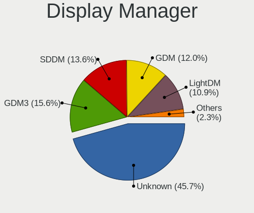
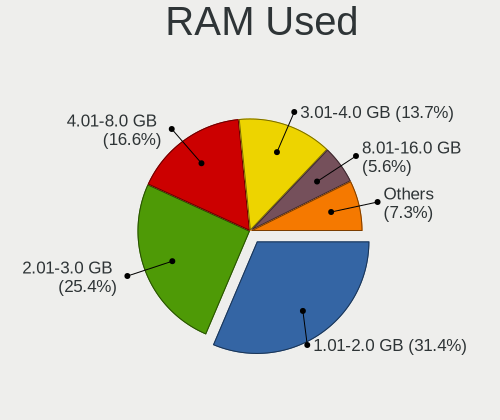
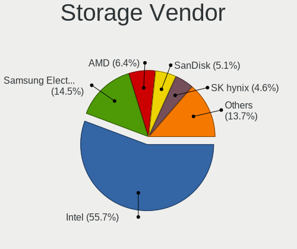
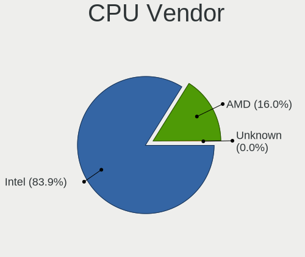
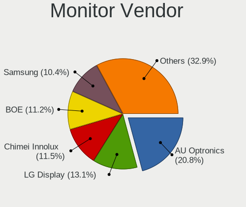
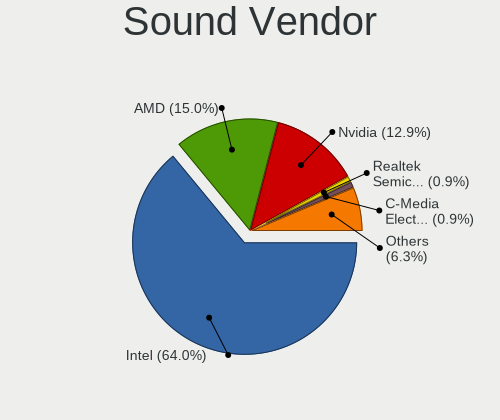
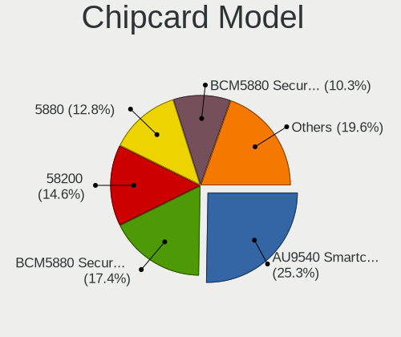

Linux in Netherlands - Tested Hardware & Statistics (Notebooks)
---------------------------------------------------------------

A project to collect tested hardware configurations for Linux in Netherlands.

Anyone can contribute to this report by the [hw-probe](https://github.com/linuxhw/hw-probe) tool:

    sudo -E hw-probe -all -upload

Please contribute! Especially if your hardware is rare.

Contents
--------

* [ Test Cases ](#test-cases)

* [ System ](#system)
  - [ OS                       ](#os)
  - [ OS Family                ](#os-family)
  - [ Kernel                   ](#kernel)
  - [ Kernel Family            ](#kernel-family)
  - [ Kernel Major Ver.        ](#kernel-major-ver)
  - [ Arch                     ](#arch)
  - [ DE                       ](#de)
  - [ Display Server           ](#display-server)
  - [ Display Manager          ](#display-manager)
  - [ OS Lang                  ](#os-lang)
  - [ Boot Mode                ](#boot-mode)
  - [ Filesystem               ](#filesystem)
  - [ Part. scheme             ](#part-scheme)
  - [ Dual Boot with Linux/BSD ](#dual-boot-with-linuxbsd)
  - [ Dual Boot (Win)          ](#dual-boot-win)

* [ Board ](#board)
  - [ Vendor                   ](#vendor)
  - [ Model                    ](#model)
  - [ Model Family             ](#model-family)
  - [ MFG Year                 ](#mfg-year)
  - [ Form Factor              ](#form-factor)
  - [ Secure Boot              ](#secure-boot)
  - [ Coreboot                 ](#coreboot)
  - [ RAM Size                 ](#ram-size)
  - [ RAM Used                 ](#ram-used)
  - [ Total Drives             ](#total-drives)
  - [ Has CD-ROM               ](#has-cd-rom)
  - [ Has Ethernet             ](#has-ethernet)
  - [ Has WiFi                 ](#has-wifi)
  - [ Has Bluetooth            ](#has-bluetooth)

* [ Location ](#location)
  - [ Country                  ](#country)
  - [ City                     ](#city)

* [ Drives ](#drives)
  - [ Drive Vendor             ](#drive-vendor)
  - [ Drive Model              ](#drive-model)
  - [ HDD Vendor               ](#hdd-vendor)
  - [ SSD Vendor               ](#ssd-vendor)
  - [ Drive Kind               ](#drive-kind)
  - [ Drive Connector          ](#drive-connector)
  - [ Drive Size               ](#drive-size)
  - [ Space Total              ](#space-total)
  - [ Space Used               ](#space-used)
  - [ Malfunc. Drives          ](#malfunc-drives)
  - [ Malfunc. Drive Vendor    ](#malfunc-drive-vendor)
  - [ Malfunc. HDD Vendor      ](#malfunc-hdd-vendor)
  - [ Malfunc. Drive Kind      ](#malfunc-drive-kind)
  - [ Failed Drives            ](#failed-drives)
  - [ Failed Drive Vendor      ](#failed-drive-vendor)
  - [ Drive Status             ](#drive-status)

* [ Storage controller ](#storage-controller)
  - [ Storage Vendor           ](#storage-vendor)
  - [ Storage Model            ](#storage-model)
  - [ Storage Kind             ](#storage-kind)

* [ Processor ](#processor)
  - [ CPU Vendor               ](#cpu-vendor)
  - [ CPU Model                ](#cpu-model)
  - [ CPU Model Family         ](#cpu-model-family)
  - [ CPU Cores                ](#cpu-cores)
  - [ CPU Sockets              ](#cpu-sockets)
  - [ CPU Threads              ](#cpu-threads)
  - [ CPU Op-Modes             ](#cpu-op-modes)
  - [ CPU Microcode            ](#cpu-microcode)
  - [ CPU Microarch            ](#cpu-microarch)

* [ Graphics ](#graphics)
  - [ GPU Vendor               ](#gpu-vendor)
  - [ GPU Model                ](#gpu-model)
  - [ GPU Combo                ](#gpu-combo)
  - [ GPU Driver               ](#gpu-driver)
  - [ GPU Memory               ](#gpu-memory)

* [ Monitor ](#monitor)
  - [ Monitor Vendor           ](#monitor-vendor)
  - [ Monitor Model            ](#monitor-model)
  - [ Monitor Resolution       ](#monitor-resolution)
  - [ Monitor Diagonal         ](#monitor-diagonal)
  - [ Monitor Width            ](#monitor-width)
  - [ Aspect Ratio             ](#aspect-ratio)
  - [ Monitor Area             ](#monitor-area)
  - [ Pixel Density            ](#pixel-density)
  - [ Multiple Monitors        ](#multiple-monitors)

* [ Network ](#network)
  - [ Net Controller Vendor    ](#net-controller-vendor)
  - [ Net Controller Model     ](#net-controller-model)
  - [ Wireless Vendor          ](#wireless-vendor)
  - [ Wireless Model           ](#wireless-model)
  - [ Ethernet Vendor          ](#ethernet-vendor)
  - [ Ethernet Model           ](#ethernet-model)
  - [ Net Controller Kind      ](#net-controller-kind)
  - [ Used Controller          ](#used-controller)
  - [ NICs                     ](#nics)
  - [ IPv6                     ](#ipv6)

* [ Bluetooth ](#bluetooth)
  - [ Bluetooth Vendor         ](#bluetooth-vendor)
  - [ Bluetooth Model          ](#bluetooth-model)

* [ Sound ](#sound)
  - [ Sound Vendor             ](#sound-vendor)
  - [ Sound Model              ](#sound-model)

* [ Memory ](#memory)
  - [ Memory Vendor            ](#memory-vendor)
  - [ Memory Model             ](#memory-model)
  - [ Memory Kind              ](#memory-kind)
  - [ Memory Form Factor       ](#memory-form-factor)
  - [ Memory Size              ](#memory-size)
  - [ Memory Speed             ](#memory-speed)

* [ Printers & scanners ](#printers--scanners)
  - [ Printer Vendor           ](#printer-vendor)
  - [ Printer Model            ](#printer-model)
  - [ Scanner Vendor           ](#scanner-vendor)
  - [ Scanner Model            ](#scanner-model)

* [ Camera ](#camera)
  - [ Camera Vendor            ](#camera-vendor)
  - [ Camera Model             ](#camera-model)

* [ Security ](#security)
  - [ Fingerprint Vendor       ](#fingerprint-vendor)
  - [ Fingerprint Model        ](#fingerprint-model)
  - [ Chipcard Vendor          ](#chipcard-vendor)
  - [ Chipcard Model           ](#chipcard-model)

* [ Unsupported ](#unsupported)
  - [ Unsupported Devices      ](#unsupported-devices)
  - [ Unsupported Device Types ](#unsupported-device-types)

Test Cases
----------

Total: 2618

| Vendor        | Model                       | Probe                                                      | Date         |
|---------------|-----------------------------|------------------------------------------------------------|--------------|
| Notebook      | PB50_70RF,RD,RC             | [d1f655b9b1](https://linux-hardware.org/?probe=d1f655b9b1) | Dec 31, 2022 |
| HP            | Pavilion 17                 | [c87d61d0cd](https://linux-hardware.org/?probe=c87d61d0cd) | Dec 31, 2022 |
| HP            | Pavilion 17                 | [bbf52af119](https://linux-hardware.org/?probe=bbf52af119) | Dec 31, 2022 |
| Lenovo        | IdeaPad 320-15ISK 80XH      | [fc108fb0d8](https://linux-hardware.org/?probe=fc108fb0d8) | Dec 31, 2022 |
| HP            | EliteBook 820 G4            | [9e794046d8](https://linux-hardware.org/?probe=9e794046d8) | Dec 30, 2022 |
| Acer          | Aspire 5680                 | [c14cfe5386](https://linux-hardware.org/?probe=c14cfe5386) | Dec 29, 2022 |
| Acer          | Aspire V3-772               | [9f431b484a](https://linux-hardware.org/?probe=9f431b484a) | Dec 29, 2022 |
| Alienware     | x17 R2                      | [5a7ea2683a](https://linux-hardware.org/?probe=5a7ea2683a) | Dec 28, 2022 |
| Dell          | Latitude 2120               | [b52922b482](https://linux-hardware.org/?probe=b52922b482) | Dec 27, 2022 |
| Valve         | Jupiter                     | [488d26f3e8](https://linux-hardware.org/?probe=488d26f3e8) | Dec 27, 2022 |
| HP            | Pavilion Gaming Laptop 1... | [0763603d12](https://linux-hardware.org/?probe=0763603d12) | Dec 27, 2022 |
| LG Electro... | 17Z90Q-G.AA79G              | [59d7266746](https://linux-hardware.org/?probe=59d7266746) | Dec 26, 2022 |
| Apple         | MacBookPro8,2               | [3d8320e362](https://linux-hardware.org/?probe=3d8320e362) | Dec 25, 2022 |
| Medion        | E4251 MD61435               | [0ef8f76193](https://linux-hardware.org/?probe=0ef8f76193) | Dec 23, 2022 |
| Lenovo        | ThinkPad T16 Gen 1 21CHC... | [0c1d9b9b28](https://linux-hardware.org/?probe=0c1d9b9b28) | Dec 23, 2022 |
| Lenovo        | ThinkPad T16 Gen 1 21CHC... | [000660b461](https://linux-hardware.org/?probe=000660b461) | Dec 23, 2022 |
| Toshiba       | Satellite C70D-B            | [82cc0b362d](https://linux-hardware.org/?probe=82cc0b362d) | Dec 23, 2022 |
| Lenovo        | IdeaPad 3 14IAU7 82RJ       | [b5c5aba33a](https://linux-hardware.org/?probe=b5c5aba33a) | Dec 22, 2022 |
| Lenovo        | ThinkPad T470s 20HF003QU... | [5145350f9a](https://linux-hardware.org/?probe=5145350f9a) | Dec 21, 2022 |
| Acer          | Aspire 5680                 | [9b188c358e](https://linux-hardware.org/?probe=9b188c358e) | Dec 21, 2022 |
| Valve         | Jupiter                     | [90331ea7da](https://linux-hardware.org/?probe=90331ea7da) | Dec 21, 2022 |
| Dell          | Latitude 5521               | [6fcbfd9271](https://linux-hardware.org/?probe=6fcbfd9271) | Dec 21, 2022 |
| Lenovo        | ThinkPad T16 Gen 1 21CHC... | [638667a90f](https://linux-hardware.org/?probe=638667a90f) | Dec 20, 2022 |
| Lenovo        | ThinkPad T490 20N2CTO1WW    | [2aeb8fd0cd](https://linux-hardware.org/?probe=2aeb8fd0cd) | Dec 19, 2022 |
| ASUSTek       | N750JK                      | [8d876c21b0](https://linux-hardware.org/?probe=8d876c21b0) | Dec 18, 2022 |
| ASUSTek       | N750JK                      | [71575f3d8c](https://linux-hardware.org/?probe=71575f3d8c) | Dec 18, 2022 |
| Acer          | Aspire 5680                 | [64f5eb2f4b](https://linux-hardware.org/?probe=64f5eb2f4b) | Dec 17, 2022 |
| ASUSTek       | K50IE                       | [5681babfa5](https://linux-hardware.org/?probe=5681babfa5) | Dec 17, 2022 |
| Lenovo        | ThinkPad X230 Tablet 343... | [30f6db8749](https://linux-hardware.org/?probe=30f6db8749) | Dec 17, 2022 |
| Acer          | Aspire E5-575               | [3fd939cef5](https://linux-hardware.org/?probe=3fd939cef5) | Dec 17, 2022 |
| Toshiba       | Satellite C70D-B            | [182e467ce6](https://linux-hardware.org/?probe=182e467ce6) | Dec 17, 2022 |
| Lenovo        | G50-70 20351                | [4d39c63e0a](https://linux-hardware.org/?probe=4d39c63e0a) | Dec 17, 2022 |
| Dell          | XPS 15 7590                 | [e070540587](https://linux-hardware.org/?probe=e070540587) | Dec 16, 2022 |
| Dell          | Latitude 3120               | [e886df2722](https://linux-hardware.org/?probe=e886df2722) | Dec 16, 2022 |
| Acer          | Nitro AN517-54              | [cb963df304](https://linux-hardware.org/?probe=cb963df304) | Dec 16, 2022 |
| MSI           | GP75 Leopard 10SEK          | [9eda9896f3](https://linux-hardware.org/?probe=9eda9896f3) | Dec 15, 2022 |
| Lenovo        | ThinkPad T16 Gen 1 21CHC... | [de26ffa293](https://linux-hardware.org/?probe=de26ffa293) | Dec 14, 2022 |
| Dell          | Inspiron 15-3567            | [e94792b948](https://linux-hardware.org/?probe=e94792b948) | Dec 13, 2022 |
| Acer          | Aspire 5742G                | [ee22896cd2](https://linux-hardware.org/?probe=ee22896cd2) | Dec 12, 2022 |
| MSI           | Summit E16Flip A12UCT       | [1db3976bb5](https://linux-hardware.org/?probe=1db3976bb5) | Dec 12, 2022 |
| Toshiba       | Satellite C70D-B            | [56adac1fcb](https://linux-hardware.org/?probe=56adac1fcb) | Dec 12, 2022 |
| Medion        | E4251                       | [f7303bf4c9](https://linux-hardware.org/?probe=f7303bf4c9) | Dec 11, 2022 |
| Lenovo        | ThinkPad X201 Tablet 309... | [cd7399049b](https://linux-hardware.org/?probe=cd7399049b) | Dec 11, 2022 |
| Medion        | E4251                       | [a16b01515b](https://linux-hardware.org/?probe=a16b01515b) | Dec 10, 2022 |
| Lenovo        | IdeaPad 5 15ARE05 81YQ      | [173f4b722f](https://linux-hardware.org/?probe=173f4b722f) | Dec 10, 2022 |
| Lenovo        | ThinkPad P14s Gen 2a 21A... | [25d5b5623b](https://linux-hardware.org/?probe=25d5b5623b) | Dec 10, 2022 |
| Acer          | Aspire 5742G                | [869e2a9671](https://linux-hardware.org/?probe=869e2a9671) | Dec 09, 2022 |
| HP            | Compaq Presario CQ71        | [503b61f120](https://linux-hardware.org/?probe=503b61f120) | Dec 09, 2022 |
| HP            | EliteBook 850 G8 Noteboo... | [95d47d14cb](https://linux-hardware.org/?probe=95d47d14cb) | Dec 09, 2022 |
| MSI           | Modern 15 A11MU             | [e5ba0c8749](https://linux-hardware.org/?probe=e5ba0c8749) | Dec 09, 2022 |
| Apple         | MacBookPro9,2               | [27dc9420ed](https://linux-hardware.org/?probe=27dc9420ed) | Dec 07, 2022 |
| Apple         | MacBookPro9,2               | [9b7c1953a6](https://linux-hardware.org/?probe=9b7c1953a6) | Dec 07, 2022 |
| Lenovo        | ThinkPad T510 4349AF5       | [a7d8d66fb7](https://linux-hardware.org/?probe=a7d8d66fb7) | Dec 07, 2022 |
| Dell          | XPS 9320                    | [34c3b0b6a0](https://linux-hardware.org/?probe=34c3b0b6a0) | Dec 06, 2022 |
| Medion        | E4251                       | [a515c5c071](https://linux-hardware.org/?probe=a515c5c071) | Dec 05, 2022 |
| Acer          | Aspire 5742G                | [da82fb083d](https://linux-hardware.org/?probe=da82fb083d) | Dec 05, 2022 |
| Samsung       | 300E4A/300E5A/300E7A/343... | [1798adf382](https://linux-hardware.org/?probe=1798adf382) | Dec 05, 2022 |
| ASUSTek       | X756UQK                     | [b473216b84](https://linux-hardware.org/?probe=b473216b84) | Dec 05, 2022 |
| Lenovo        | ThinkPad E15 Gen 2 20TD0... | [05f6a48b4a](https://linux-hardware.org/?probe=05f6a48b4a) | Dec 05, 2022 |
| Lenovo        | IdeaPad Gaming 3 15ACH6 ... | [c22a748043](https://linux-hardware.org/?probe=c22a748043) | Dec 05, 2022 |
| Acer          | Aspire V3-772               | [942312fe9e](https://linux-hardware.org/?probe=942312fe9e) | Dec 05, 2022 |
| Lenovo        | ThinkBook 15 G2 ITL 20VE    | [344b0c3082](https://linux-hardware.org/?probe=344b0c3082) | Dec 05, 2022 |
| Medion        | E4251 MD61435               | [481a9c958a](https://linux-hardware.org/?probe=481a9c958a) | Dec 04, 2022 |
| Acer          | Aspire ES1-732              | [7000f5ee26](https://linux-hardware.org/?probe=7000f5ee26) | Dec 04, 2022 |
| Valve         | Jupiter                     | [d8890572a5](https://linux-hardware.org/?probe=d8890572a5) | Dec 03, 2022 |
| HP            | Pavilion Laptop 15-cw1xx... | [2cf560b162](https://linux-hardware.org/?probe=2cf560b162) | Dec 03, 2022 |
| Medion        | E4251 MD61435               | [c3f4fd226e](https://linux-hardware.org/?probe=c3f4fd226e) | Dec 03, 2022 |
| Medion        | E4251                       | [3167cbece1](https://linux-hardware.org/?probe=3167cbece1) | Dec 03, 2022 |
| HP            | EliteBook 820 G4            | [b0437249b0](https://linux-hardware.org/?probe=b0437249b0) | Dec 03, 2022 |
| Packard Be... | EasyNote TE11HC             | [5864876eff](https://linux-hardware.org/?probe=5864876eff) | Dec 02, 2022 |
| Acer          | Iconia W4-820               | [cf25eeba85](https://linux-hardware.org/?probe=cf25eeba85) | Dec 01, 2022 |
| MSI           | GL62M 7RE                   | [5fcb394edb](https://linux-hardware.org/?probe=5fcb394edb) | Dec 01, 2022 |
| Lenovo        | ThinkPad L560 20F2S2UR02    | [29c5e0f7b1](https://linux-hardware.org/?probe=29c5e0f7b1) | Dec 01, 2022 |
| THUNDEROBO... | 911MT                       | [cdd03a3498](https://linux-hardware.org/?probe=cdd03a3498) | Dec 01, 2022 |
| Lenovo        | 3000 V100 076346G           | [bb04272723](https://linux-hardware.org/?probe=bb04272723) | Dec 01, 2022 |
| THUNDEROBO... | 911MT                       | [2731961e4c](https://linux-hardware.org/?probe=2731961e4c) | Nov 30, 2022 |
| HP            | Victus by Laptop 16-d0xx... | [dae405ee81](https://linux-hardware.org/?probe=dae405ee81) | Nov 29, 2022 |
| Lenovo        | ThinkPad L14 Gen 1 20U50... | [9216162e85](https://linux-hardware.org/?probe=9216162e85) | Nov 29, 2022 |
| Lenovo        | IdeaPad 5 Pro 16ACH6 82L... | [39e771bd92](https://linux-hardware.org/?probe=39e771bd92) | Nov 28, 2022 |
| Lenovo        | ThinkPad T420 4236WR1       | [43fa54b5bc](https://linux-hardware.org/?probe=43fa54b5bc) | Nov 28, 2022 |
| Dell          | Latitude E6320              | [bcbdb4bf67](https://linux-hardware.org/?probe=bcbdb4bf67) | Nov 28, 2022 |
| Dell          | Latitude E6320              | [f77e444066](https://linux-hardware.org/?probe=f77e444066) | Nov 28, 2022 |
| HUAWEI        | BOHK-WAX9X                  | [4c6d3faf86](https://linux-hardware.org/?probe=4c6d3faf86) | Nov 28, 2022 |
| HUAWEI        | BOHK-WAX9X                  | [cd98ebccb9](https://linux-hardware.org/?probe=cd98ebccb9) | Nov 28, 2022 |
| Valve         | Jupiter                     | [81b0ea6c7a](https://linux-hardware.org/?probe=81b0ea6c7a) | Nov 27, 2022 |
| HP            | ProBook 5330m               | [3763f505a0](https://linux-hardware.org/?probe=3763f505a0) | Nov 27, 2022 |
| Valve         | Jupiter                     | [bee2852cb0](https://linux-hardware.org/?probe=bee2852cb0) | Nov 27, 2022 |
| HP            | EliteBook 830 G5            | [bda395e731](https://linux-hardware.org/?probe=bda395e731) | Nov 26, 2022 |
| HP            | EliteBook 830 G5            | [0138561b29](https://linux-hardware.org/?probe=0138561b29) | Nov 26, 2022 |
| ASUSTek       | A6R                         | [68f38deab1](https://linux-hardware.org/?probe=68f38deab1) | Nov 26, 2022 |
| HP            | ProBook 450 G5              | [9a8373739a](https://linux-hardware.org/?probe=9a8373739a) | Nov 26, 2022 |
| Lenovo        | ThinkPad T16 Gen 1 21CHC... | [8de1db7f12](https://linux-hardware.org/?probe=8de1db7f12) | Nov 25, 2022 |
| Lenovo        | Yoga Slim 7 Pro 14IAH7 8... | [fa4e2d1d61](https://linux-hardware.org/?probe=fa4e2d1d61) | Nov 23, 2022 |
| Schenker      | XMG FUSION 15 (XFU15L19)    | [eaab6a8319](https://linux-hardware.org/?probe=eaab6a8319) | Nov 23, 2022 |
| Valve         | Jupiter                     | [6049221fab](https://linux-hardware.org/?probe=6049221fab) | Nov 23, 2022 |
| ASUSTek       | X551MA                      | [4adc436e33](https://linux-hardware.org/?probe=4adc436e33) | Nov 23, 2022 |
| ASUSTek       | X551MA                      | [84a0005ad3](https://linux-hardware.org/?probe=84a0005ad3) | Nov 23, 2022 |
| Lenovo        | ThinkPad X1 Carbon 2nd 2... | [c799c028af](https://linux-hardware.org/?probe=c799c028af) | Nov 23, 2022 |
| Dell          | Latitude 5401               | [f964652e0c](https://linux-hardware.org/?probe=f964652e0c) | Nov 22, 2022 |
| Dell          | Latitude E6530              | [e40986d2fb](https://linux-hardware.org/?probe=e40986d2fb) | Nov 22, 2022 |
| Dell          | Latitude E6530              | [14debbe3e5](https://linux-hardware.org/?probe=14debbe3e5) | Nov 22, 2022 |
| Acer          | Aspire A715-74G             | [7e8b56ff73](https://linux-hardware.org/?probe=7e8b56ff73) | Nov 21, 2022 |
| ASUSTek       | E200HA                      | [635e9fe863](https://linux-hardware.org/?probe=635e9fe863) | Nov 21, 2022 |
| Dell          | XPS 15 9510                 | [09e98d8c02](https://linux-hardware.org/?probe=09e98d8c02) | Nov 21, 2022 |
| Apple         | MacBookPro11,5              | [e80e97466d](https://linux-hardware.org/?probe=e80e97466d) | Nov 21, 2022 |
| Apple         | MacBookPro11,5              | [12799c9216](https://linux-hardware.org/?probe=12799c9216) | Nov 21, 2022 |
| Valve         | Jupiter                     | [1e7b9730a4](https://linux-hardware.org/?probe=1e7b9730a4) | Nov 21, 2022 |
| HP            | Unknown                     | [4530507592](https://linux-hardware.org/?probe=4530507592) | Nov 20, 2022 |
| HP            | Compaq Presario CQ71        | [52c86bac3f](https://linux-hardware.org/?probe=52c86bac3f) | Nov 20, 2022 |
| Apple         | MacBookPro11,2              | [03447c1967](https://linux-hardware.org/?probe=03447c1967) | Nov 20, 2022 |
| Acer          | Aspire 5742G                | [9c9af5a79e](https://linux-hardware.org/?probe=9c9af5a79e) | Nov 20, 2022 |
| Apple         | MacBookPro11,5              | [3b5c35b319](https://linux-hardware.org/?probe=3b5c35b319) | Nov 19, 2022 |
| HP            | Notebook                    | [ded915d6cd](https://linux-hardware.org/?probe=ded915d6cd) | Nov 18, 2022 |
| Apple         | MacBookAir7,2               | [f0fa194e20](https://linux-hardware.org/?probe=f0fa194e20) | Nov 18, 2022 |
| Lenovo        | ThinkPad L560 20F2S2UR02    | [5170b27e5c](https://linux-hardware.org/?probe=5170b27e5c) | Nov 17, 2022 |
| Acer          | Aspire 7741                 | [4197d5fccf](https://linux-hardware.org/?probe=4197d5fccf) | Nov 17, 2022 |
| Apple         | MacBookPro11,5              | [62586ed7f9](https://linux-hardware.org/?probe=62586ed7f9) | Nov 16, 2022 |
| HP            | EliteBook 8570w             | [d5a16ba775](https://linux-hardware.org/?probe=d5a16ba775) | Nov 16, 2022 |
| HP            | Pavilion dv9500             | [65a473401c](https://linux-hardware.org/?probe=65a473401c) | Nov 16, 2022 |
| Acer          | Aspire 5742G                | [4a80ba0608](https://linux-hardware.org/?probe=4a80ba0608) | Nov 15, 2022 |
| Schenker      | XMG FUSION 15 (XFU15L19)    | [d2cf28fbb9](https://linux-hardware.org/?probe=d2cf28fbb9) | Nov 15, 2022 |
| Lenovo        | IdeaPad 5 14ITL05 82FE      | [e9182b2177](https://linux-hardware.org/?probe=e9182b2177) | Nov 15, 2022 |
| Dell          | Latitude E6510              | [21a6415538](https://linux-hardware.org/?probe=21a6415538) | Nov 15, 2022 |
| Dell          | Latitude E6510              | [3ce2f9981f](https://linux-hardware.org/?probe=3ce2f9981f) | Nov 15, 2022 |
| Dell          | Latitude E7450              | [3020a4edfc](https://linux-hardware.org/?probe=3020a4edfc) | Nov 15, 2022 |
| Lenovo        | Yoga Slim 7 Pro 14IAH7 8... | [1798f04a0b](https://linux-hardware.org/?probe=1798f04a0b) | Nov 14, 2022 |
| SLIMBOOK      | PROX14                      | [a109c5bf52](https://linux-hardware.org/?probe=a109c5bf52) | Nov 14, 2022 |
| Valve         | Jupiter                     | [92eb4009f3](https://linux-hardware.org/?probe=92eb4009f3) | Nov 14, 2022 |
| Dell          | XPS 15 9510                 | [85c469c069](https://linux-hardware.org/?probe=85c469c069) | Nov 13, 2022 |
| Dell          | XPS 15 9510                 | [dc86aa7d1e](https://linux-hardware.org/?probe=dc86aa7d1e) | Nov 13, 2022 |
| Dell          | Latitude 3380               | [f770a70f68](https://linux-hardware.org/?probe=f770a70f68) | Nov 12, 2022 |
| HP            | Compaq 6820s                | [c852376664](https://linux-hardware.org/?probe=c852376664) | Nov 12, 2022 |
| HP            | Compaq 6820s                | [dee9dbd56f](https://linux-hardware.org/?probe=dee9dbd56f) | Nov 12, 2022 |
| Lenovo        | Yoga Slim 7 13ACN5 82CY     | [70d68c6ca1](https://linux-hardware.org/?probe=70d68c6ca1) | Nov 10, 2022 |
| ASUSTek       | N752VX                      | [a5b6d827b2](https://linux-hardware.org/?probe=a5b6d827b2) | Nov 10, 2022 |
| Panasonic     | CF-R9KWCTDR                 | [2a414f5dc5](https://linux-hardware.org/?probe=2a414f5dc5) | Nov 10, 2022 |
| HP            | ProBook 430 G4              | [ef9d0cf774](https://linux-hardware.org/?probe=ef9d0cf774) | Nov 09, 2022 |
| Lenovo        | ThinkPad X200 7458FDG       | [e7de2507a0](https://linux-hardware.org/?probe=e7de2507a0) | Nov 09, 2022 |
| Acer          | Aspire 5750G                | [8383f208a6](https://linux-hardware.org/?probe=8383f208a6) | Nov 09, 2022 |
| MSI           | Modern 15 A11MU             | [b10bd50d9c](https://linux-hardware.org/?probe=b10bd50d9c) | Nov 09, 2022 |
| MSI           | MS-1688                     | [d8c76d2264](https://linux-hardware.org/?probe=d8c76d2264) | Nov 09, 2022 |
| Dell          | Precision 5550              | [16b375ce77](https://linux-hardware.org/?probe=16b375ce77) | Nov 08, 2022 |
| Dell          | Precision 5550              | [1499c28fe9](https://linux-hardware.org/?probe=1499c28fe9) | Nov 08, 2022 |
| Acer          | SW5-017                     | [d4ff3ee29e](https://linux-hardware.org/?probe=d4ff3ee29e) | Nov 08, 2022 |
| ASUSTek       | FX503VD                     | [0373b83f63](https://linux-hardware.org/?probe=0373b83f63) | Nov 06, 2022 |
| Lenovo        | ThinkPad Edge E431 6277C... | [0eef83e969](https://linux-hardware.org/?probe=0eef83e969) | Nov 06, 2022 |
| Lenovo        | ThinkPad Edge E431 6277C... | [3268b6af5f](https://linux-hardware.org/?probe=3268b6af5f) | Nov 06, 2022 |
| Lenovo        | IdeaPad 5 15ARE05 81YQ      | [3d53b3616f](https://linux-hardware.org/?probe=3d53b3616f) | Nov 06, 2022 |
| HP            | Pavilion g6                 | [43eefaca07](https://linux-hardware.org/?probe=43eefaca07) | Nov 06, 2022 |
| ASUSTek       | K56CA                       | [032fa97b2a](https://linux-hardware.org/?probe=032fa97b2a) | Nov 05, 2022 |
| ASUSTek       | FX503VD                     | [f80b5eaa0b](https://linux-hardware.org/?probe=f80b5eaa0b) | Nov 05, 2022 |
| Lenovo        | ThinkPad L380 20M50013MH    | [80ac51627a](https://linux-hardware.org/?probe=80ac51627a) | Nov 05, 2022 |
| Lenovo        | ThinkPad T16 Gen 1 21CHC... | [eeda582315](https://linux-hardware.org/?probe=eeda582315) | Nov 04, 2022 |
| Lenovo        | Yoga Slim 7 13ACN5 82CY     | [afeb473322](https://linux-hardware.org/?probe=afeb473322) | Nov 04, 2022 |
| HP            | EliteBook 745 G6            | [d4d0f735d4](https://linux-hardware.org/?probe=d4d0f735d4) | Nov 03, 2022 |
| HP            | EliteBook 745 G6            | [04e15fb2d7](https://linux-hardware.org/?probe=04e15fb2d7) | Nov 03, 2022 |
| HP            | ProBook 450 15.6 inch G9... | [29617200dd](https://linux-hardware.org/?probe=29617200dd) | Nov 03, 2022 |
| HP            | ProBook 450 15.6 inch G9... | [24f27140f8](https://linux-hardware.org/?probe=24f27140f8) | Nov 03, 2022 |
| HP            | OMEN by Laptop 15-dc0xxx    | [11d229ea2c](https://linux-hardware.org/?probe=11d229ea2c) | Nov 03, 2022 |
| Dell          | XPS 15 9520                 | [24eea2c3f7](https://linux-hardware.org/?probe=24eea2c3f7) | Nov 03, 2022 |
| Lenovo        | IdeaPad L340-15IRH Gamin... | [08a8e0079a](https://linux-hardware.org/?probe=08a8e0079a) | Nov 03, 2022 |
| Lenovo        | IdeaPad L340-15IRH Gamin... | [0235661dbe](https://linux-hardware.org/?probe=0235661dbe) | Nov 03, 2022 |
| Apple         | MacBookPro8,1               | [b4f9d04f4d](https://linux-hardware.org/?probe=b4f9d04f4d) | Nov 03, 2022 |
| Dell          | XPS 15 9510                 | [fea56b5428](https://linux-hardware.org/?probe=fea56b5428) | Nov 03, 2022 |
| HP            | EliteBook 865 16 inch G9... | [d1b0eff99b](https://linux-hardware.org/?probe=d1b0eff99b) | Nov 03, 2022 |
| HP            | Pavilion Gaming Laptop 1... | [020d8fd7e0](https://linux-hardware.org/?probe=020d8fd7e0) | Nov 03, 2022 |
| HP            | Pavilion g6                 | [22b32d9bac](https://linux-hardware.org/?probe=22b32d9bac) | Nov 02, 2022 |
| HP            | Pavilion g6                 | [24c2a01761](https://linux-hardware.org/?probe=24c2a01761) | Nov 02, 2022 |
| Acer          | Aspire one 1-431            | [09aeb9ec38](https://linux-hardware.org/?probe=09aeb9ec38) | Nov 02, 2022 |
| HP            | ProBook 4530s               | [6490664312](https://linux-hardware.org/?probe=6490664312) | Nov 01, 2022 |
| SLIMBOOK      | PROX-AMD5                   | [a85aef0a90](https://linux-hardware.org/?probe=a85aef0a90) | Oct 31, 2022 |
| ASUSTek       | X510UAR                     | [46f1da66b6](https://linux-hardware.org/?probe=46f1da66b6) | Oct 31, 2022 |
| ASUSTek       | X510UAR                     | [1409a7f78d](https://linux-hardware.org/?probe=1409a7f78d) | Oct 31, 2022 |
| Schenker      | XMG FUSION 15 (XFU15L19)    | [221710c9ea](https://linux-hardware.org/?probe=221710c9ea) | Oct 31, 2022 |
| Lenovo        | ThinkPad T490 20N3000KMH    | [3cb8d29f84](https://linux-hardware.org/?probe=3cb8d29f84) | Oct 31, 2022 |
| Lenovo        | ThinkPad T490 20N3000KMH    | [c54736f079](https://linux-hardware.org/?probe=c54736f079) | Oct 30, 2022 |
| Lenovo        | Legion Y740-17ICHg 81HH     | [ea1c9e069e](https://linux-hardware.org/?probe=ea1c9e069e) | Oct 29, 2022 |
| Medion        | X682X                       | [f05dd25a08](https://linux-hardware.org/?probe=f05dd25a08) | Oct 29, 2022 |
| HP            | Pavilion Gaming Laptop 1... | [3e6896ee0a](https://linux-hardware.org/?probe=3e6896ee0a) | Oct 28, 2022 |
| HP            | ZBook 15 G3                 | [2b886c255e](https://linux-hardware.org/?probe=2b886c255e) | Oct 27, 2022 |
| Dell          | Inspiron 7773               | [34d97b7ea2](https://linux-hardware.org/?probe=34d97b7ea2) | Oct 26, 2022 |
| Dell          | Inspiron 7773               | [c2cff54e7c](https://linux-hardware.org/?probe=c2cff54e7c) | Oct 26, 2022 |
| HP            | ZBook 15 G5                 | [0cb3fb3efc](https://linux-hardware.org/?probe=0cb3fb3efc) | Oct 25, 2022 |
| Lenovo        | ThinkPad X1 Extreme 2nd ... | [28c38a498d](https://linux-hardware.org/?probe=28c38a498d) | Oct 25, 2022 |
| Dell          | XPS 15 9510                 | [b14c37f999](https://linux-hardware.org/?probe=b14c37f999) | Oct 25, 2022 |
| Acer          | Aspire VN7-792G             | [2c1e50d1a2](https://linux-hardware.org/?probe=2c1e50d1a2) | Oct 22, 2022 |
| HP            | Pavilion TS 11              | [6437fb22e1](https://linux-hardware.org/?probe=6437fb22e1) | Oct 22, 2022 |
| HP            | Pavilion TS 11              | [a19b5987c6](https://linux-hardware.org/?probe=a19b5987c6) | Oct 22, 2022 |
| ASUSTek       | X756UQK                     | [2570a4e51f](https://linux-hardware.org/?probe=2570a4e51f) | Oct 22, 2022 |
| Dell          | Latitude 7480               | [2b377dce0a](https://linux-hardware.org/?probe=2b377dce0a) | Oct 21, 2022 |
| Dell          | Latitude 3380               | [352bedd96b](https://linux-hardware.org/?probe=352bedd96b) | Oct 18, 2022 |
| Dell          | Precision 5530              | [9b344fe820](https://linux-hardware.org/?probe=9b344fe820) | Oct 18, 2022 |
| Dell          | Latitude 7480               | [7919e68317](https://linux-hardware.org/?probe=7919e68317) | Oct 18, 2022 |
| Dell          | Latitude E6540              | [8ba8f257d2](https://linux-hardware.org/?probe=8ba8f257d2) | Oct 18, 2022 |
| HP            | ZBook 14u G5                | [151433ee2e](https://linux-hardware.org/?probe=151433ee2e) | Oct 18, 2022 |
| Dell          | Inspiron 7720               | [1117fe6b9e](https://linux-hardware.org/?probe=1117fe6b9e) | Oct 17, 2022 |
| Dell          | Latitude 7480               | [8d55df4648](https://linux-hardware.org/?probe=8d55df4648) | Oct 17, 2022 |
| ASUSTek       | TUF Gaming FX705GD_FX705... | [6243f8cdb8](https://linux-hardware.org/?probe=6243f8cdb8) | Oct 17, 2022 |
| Dell          | XPS 15 9510                 | [9e1f6ae49e](https://linux-hardware.org/?probe=9e1f6ae49e) | Oct 17, 2022 |
| HP            | Pavilion g6                 | [c19a6241e1](https://linux-hardware.org/?probe=c19a6241e1) | Oct 17, 2022 |
| Dell          | XPS 15 9510                 | [2fd734cbfb](https://linux-hardware.org/?probe=2fd734cbfb) | Oct 17, 2022 |
| Dell          | Latitude 3380               | [ab6969eabd](https://linux-hardware.org/?probe=ab6969eabd) | Oct 17, 2022 |
| HP            | ZBook Studio G5             | [0a9b0167c7](https://linux-hardware.org/?probe=0a9b0167c7) | Oct 17, 2022 |
| Acer          | Aspire 5742G                | [79a5162024](https://linux-hardware.org/?probe=79a5162024) | Oct 16, 2022 |
| Dell          | Latitude E7450              | [500311a1b8](https://linux-hardware.org/?probe=500311a1b8) | Oct 16, 2022 |
| Packard Be... | EasyNote TJ66               | [e5f4bf84f8](https://linux-hardware.org/?probe=e5f4bf84f8) | Oct 14, 2022 |
| Acer          | Aspire E5-553G              | [fcf93f53f4](https://linux-hardware.org/?probe=fcf93f53f4) | Oct 13, 2022 |
| Acer          | Aspire 5732Z                | [b75d98cfc2](https://linux-hardware.org/?probe=b75d98cfc2) | Oct 13, 2022 |
| Dell          | Latitude E7250              | [f397f81353](https://linux-hardware.org/?probe=f397f81353) | Oct 12, 2022 |
| Lenovo        | Y310                        | [0fe2ca4221](https://linux-hardware.org/?probe=0fe2ca4221) | Oct 12, 2022 |
| Dell          | Latitude E6420              | [0083bd14b8](https://linux-hardware.org/?probe=0083bd14b8) | Oct 12, 2022 |
| Acer          | Aspire A715-75G             | [93ca81946a](https://linux-hardware.org/?probe=93ca81946a) | Oct 11, 2022 |
| Acer          | Aspire A715-75G             | [921c4a26d1](https://linux-hardware.org/?probe=921c4a26d1) | Oct 11, 2022 |
| Acer          | Predator PH317-52           | [379aad9180](https://linux-hardware.org/?probe=379aad9180) | Oct 10, 2022 |
| Lenovo        | Yoga Slim 7 Pro 14IAP7 8... | [cc663da2bc](https://linux-hardware.org/?probe=cc663da2bc) | Oct 10, 2022 |
| ASUSTek       | VivoBook_ASUS Laptop E21... | [6c2f880759](https://linux-hardware.org/?probe=6c2f880759) | Oct 09, 2022 |
| HP            | Pavilion TS 11              | [1a6ea38863](https://linux-hardware.org/?probe=1a6ea38863) | Oct 09, 2022 |
| MSI           | GP60 2PE                    | [530a81df09](https://linux-hardware.org/?probe=530a81df09) | Oct 09, 2022 |
| Packard Be... | EasyNote LE69KB             | [8858f6d8f3](https://linux-hardware.org/?probe=8858f6d8f3) | Oct 08, 2022 |
| Lenovo        | IdeaPad 120S-14IAP 81A5     | [b3b9f964b7](https://linux-hardware.org/?probe=b3b9f964b7) | Oct 08, 2022 |
| Toshiba       | Satellite Pro P200          | [1ca9c6c574](https://linux-hardware.org/?probe=1ca9c6c574) | Oct 07, 2022 |
| Dell          | Latitude E6510              | [67f07a2413](https://linux-hardware.org/?probe=67f07a2413) | Oct 07, 2022 |
| ASUSTek       | VivoBook_ASUSLaptop X760... | [afeba82ecf](https://linux-hardware.org/?probe=afeba82ecf) | Oct 07, 2022 |
| Lenovo        | ThinkPad X220 4291WSH       | [c8c6a428db](https://linux-hardware.org/?probe=c8c6a428db) | Oct 06, 2022 |
| HP            | ZBook 15 G5                 | [ae7f5753fd](https://linux-hardware.org/?probe=ae7f5753fd) | Oct 05, 2022 |
| Acer          | Aspire 7741                 | [55afdd2a98](https://linux-hardware.org/?probe=55afdd2a98) | Oct 04, 2022 |
| Dell          | Precision 7560              | [877583cc90](https://linux-hardware.org/?probe=877583cc90) | Oct 04, 2022 |
| Lenovo        | ThinkPad T430s 2356B46      | [defefb2514](https://linux-hardware.org/?probe=defefb2514) | Oct 04, 2022 |
| Toshiba       | Satellite Pro P200          | [d08fe22261](https://linux-hardware.org/?probe=d08fe22261) | Oct 03, 2022 |
| Lenovo        | Yoga Slim 7 Pro 14IAP7 8... | [0d67980efe](https://linux-hardware.org/?probe=0d67980efe) | Oct 03, 2022 |
| Samsung       | 550XED                      | [f2e8965164](https://linux-hardware.org/?probe=f2e8965164) | Oct 03, 2022 |
| HP            | OMEN by Laptop              | [971859f63e](https://linux-hardware.org/?probe=971859f63e) | Oct 02, 2022 |
| Dell          | Inspiron 16 Plus 7620       | [23475045f2](https://linux-hardware.org/?probe=23475045f2) | Oct 02, 2022 |
| Apple         | MacBookPro5,5               | [42113dd7e3](https://linux-hardware.org/?probe=42113dd7e3) | Oct 01, 2022 |
| HP            | Pavilion TS 11              | [5bc67115db](https://linux-hardware.org/?probe=5bc67115db) | Oct 01, 2022 |
| HUAWEI        | BOHK-WAX9X                  | [6525098252](https://linux-hardware.org/?probe=6525098252) | Oct 01, 2022 |
| HP            | Pavilion TS 11              | [4758af490a](https://linux-hardware.org/?probe=4758af490a) | Oct 01, 2022 |
| System76      | Darter Pro                  | [2829e72506](https://linux-hardware.org/?probe=2829e72506) | Oct 01, 2022 |
| System76      | Darter Pro                  | [c142cf370a](https://linux-hardware.org/?probe=c142cf370a) | Oct 01, 2022 |
| ASUSTek       | X580VD                      | [e7ef06706d](https://linux-hardware.org/?probe=e7ef06706d) | Sep 30, 2022 |
| Dell          | Inspiron 16 Plus 7620       | [73e2559339](https://linux-hardware.org/?probe=73e2559339) | Sep 30, 2022 |
| Dell          | Latitude 5400               | [66a5bc26f0](https://linux-hardware.org/?probe=66a5bc26f0) | Sep 30, 2022 |
| Dell          | Latitude 3310               | [3c4874fa51](https://linux-hardware.org/?probe=3c4874fa51) | Sep 30, 2022 |
| Lenovo        | Yoga 300-11IBY 80M0         | [d5c0e2c5d3](https://linux-hardware.org/?probe=d5c0e2c5d3) | Sep 30, 2022 |
| Dell          | Latitude 5400               | [4536a4b473](https://linux-hardware.org/?probe=4536a4b473) | Sep 29, 2022 |
| Dell          | Latitude 5400               | [972e4ab3fa](https://linux-hardware.org/?probe=972e4ab3fa) | Sep 29, 2022 |
| Dell          | Latitude E6520              | [e228fa6546](https://linux-hardware.org/?probe=e228fa6546) | Sep 28, 2022 |
| Dell          | Latitude 3310               | [c21a321dce](https://linux-hardware.org/?probe=c21a321dce) | Sep 28, 2022 |
| Acer          | Aspire A715-75G             | [9489561c26](https://linux-hardware.org/?probe=9489561c26) | Sep 28, 2022 |
| Dell          | XPS 13 9310                 | [4073c084df](https://linux-hardware.org/?probe=4073c084df) | Sep 28, 2022 |
| Lenovo        | ThinkPad E550 20DF00CUFR    | [7b5e707097](https://linux-hardware.org/?probe=7b5e707097) | Sep 27, 2022 |
| Samsung       | 750XED                      | [dcb54d69f8](https://linux-hardware.org/?probe=dcb54d69f8) | Sep 27, 2022 |
| HUAWEI        | BOHK-WAX9X                  | [d0f8e8a0f6](https://linux-hardware.org/?probe=d0f8e8a0f6) | Sep 27, 2022 |
| Dell          | Latitude 3300               | [365349d964](https://linux-hardware.org/?probe=365349d964) | Sep 27, 2022 |
| Dell          | Latitude 3310               | [313ab64584](https://linux-hardware.org/?probe=313ab64584) | Sep 27, 2022 |
| Dell          | Precision M6800             | [a2f07e79d3](https://linux-hardware.org/?probe=a2f07e79d3) | Sep 27, 2022 |
| Dell          | Latitude 3420               | [ee7c1fce66](https://linux-hardware.org/?probe=ee7c1fce66) | Sep 26, 2022 |
| Dell          | Latitude 3310               | [0f1fb4687f](https://linux-hardware.org/?probe=0f1fb4687f) | Sep 26, 2022 |
| Dell          | Latitude 3310               | [a6ce17cd6b](https://linux-hardware.org/?probe=a6ce17cd6b) | Sep 26, 2022 |
| Dell          | Latitude 3310               | [87af9a8980](https://linux-hardware.org/?probe=87af9a8980) | Sep 26, 2022 |
| Valve         | Jupiter                     | [8c94cd9bd3](https://linux-hardware.org/?probe=8c94cd9bd3) | Sep 26, 2022 |
| Dell          | Latitude 13                 | [28d623103e](https://linux-hardware.org/?probe=28d623103e) | Sep 25, 2022 |
| Dell          | Precision M6800             | [83c3e91298](https://linux-hardware.org/?probe=83c3e91298) | Sep 24, 2022 |
| Lenovo        | Yoga Slim 7 Pro 14IAP7 8... | [ccba8f6c1a](https://linux-hardware.org/?probe=ccba8f6c1a) | Sep 24, 2022 |
| Dell          | Inspiron 16 Plus 7620       | [977d73b98a](https://linux-hardware.org/?probe=977d73b98a) | Sep 24, 2022 |
| Dell          | Latitude E5570              | [df18be69a3](https://linux-hardware.org/?probe=df18be69a3) | Sep 24, 2022 |
| Dell          | Latitude E6520              | [81612aa665](https://linux-hardware.org/?probe=81612aa665) | Sep 24, 2022 |
| Dell          | Latitude E6520              | [fc343204c6](https://linux-hardware.org/?probe=fc343204c6) | Sep 23, 2022 |
| Dell          | Latitude E6520              | [79aa87fb47](https://linux-hardware.org/?probe=79aa87fb47) | Sep 23, 2022 |
| Dell          | Latitude 3310               | [4c5dc33267](https://linux-hardware.org/?probe=4c5dc33267) | Sep 23, 2022 |
| Dell          | Latitude E6320              | [452304d040](https://linux-hardware.org/?probe=452304d040) | Sep 22, 2022 |
| Dell          | XPS 9320                    | [6866f3105c](https://linux-hardware.org/?probe=6866f3105c) | Sep 22, 2022 |
| ASUSTek       | ASUS BR1100CKA BR1100CKA... | [efaa235d34](https://linux-hardware.org/?probe=efaa235d34) | Sep 22, 2022 |
| Valve         | Jupiter                     | [ce15d6d4bb](https://linux-hardware.org/?probe=ce15d6d4bb) | Sep 22, 2022 |
| ASUSTek       | 1201PN                      | [3dd4546344](https://linux-hardware.org/?probe=3dd4546344) | Sep 21, 2022 |
| ASUSTek       | 1201PN                      | [080d9c8964](https://linux-hardware.org/?probe=080d9c8964) | Sep 21, 2022 |
| Lenovo        | ThinkBook 15 G2 ITL 20VE    | [3e80cdec5b](https://linux-hardware.org/?probe=3e80cdec5b) | Sep 20, 2022 |
| Notebook      | NH55RGQ                     | [f4aade3998](https://linux-hardware.org/?probe=f4aade3998) | Sep 20, 2022 |
| Notebook      | NH55RGQ                     | [95c8201663](https://linux-hardware.org/?probe=95c8201663) | Sep 20, 2022 |
| ASUSTek       | X555LAB                     | [71339e0cfb](https://linux-hardware.org/?probe=71339e0cfb) | Sep 19, 2022 |
| ASUSTek       | X555LAB                     | [a0acb674df](https://linux-hardware.org/?probe=a0acb674df) | Sep 19, 2022 |
| Dell          | Latitude 3310               | [0e1784b38d](https://linux-hardware.org/?probe=0e1784b38d) | Sep 19, 2022 |
| HUAWEI        | WRT-WX9                     | [4c8883345d](https://linux-hardware.org/?probe=4c8883345d) | Sep 19, 2022 |
| Dell          | Latitude 3310               | [55332651e0](https://linux-hardware.org/?probe=55332651e0) | Sep 19, 2022 |
| Dell          | Latitude 3120               | [558e95141d](https://linux-hardware.org/?probe=558e95141d) | Sep 19, 2022 |
| Dell          | Latitude 3300               | [a2513a9849](https://linux-hardware.org/?probe=a2513a9849) | Sep 19, 2022 |
| Chuwi         | GemiBook                    | [c6ec4f6320](https://linux-hardware.org/?probe=c6ec4f6320) | Sep 18, 2022 |
| ASUSTek       | VivoBook_ASUSLaptop X513... | [daa76ef1c9](https://linux-hardware.org/?probe=daa76ef1c9) | Sep 18, 2022 |
| ASUSTek       | VivoBook_ASUSLaptop X513... | [b0a2728114](https://linux-hardware.org/?probe=b0a2728114) | Sep 17, 2022 |
| Acer          | Swift SF314-57              | [8c905d820d](https://linux-hardware.org/?probe=8c905d820d) | Sep 17, 2022 |
| HP            | ENVY Laptop 13-ad1xx        | [59369fa3fb](https://linux-hardware.org/?probe=59369fa3fb) | Sep 17, 2022 |
| HP            | EliteBook 855 G7 Noteboo... | [cf4e574788](https://linux-hardware.org/?probe=cf4e574788) | Sep 16, 2022 |
| ASUSTek       | X75VC                       | [c8abec750c](https://linux-hardware.org/?probe=c8abec750c) | Sep 14, 2022 |
| ASUSTek       | VivoBook_ASUSLaptop X515... | [54ea6ab133](https://linux-hardware.org/?probe=54ea6ab133) | Sep 14, 2022 |
| Valve         | Jupiter                     | [9817414c4e](https://linux-hardware.org/?probe=9817414c4e) | Sep 14, 2022 |
| Lenovo        | G50-70 20351                | [4105fc929e](https://linux-hardware.org/?probe=4105fc929e) | Sep 13, 2022 |
| Lenovo        | Yoga Slim 7 Pro 14IAP7 8... | [b7eb07ec8d](https://linux-hardware.org/?probe=b7eb07ec8d) | Sep 12, 2022 |
| Lenovo        | ThinkPad X220 4291WSH       | [7064ea27f5](https://linux-hardware.org/?probe=7064ea27f5) | Sep 11, 2022 |
| Packard Be... | EasyNote LE69KB             | [a008db4da9](https://linux-hardware.org/?probe=a008db4da9) | Sep 11, 2022 |
| HP            | Laptop 15s-eq2xxx           | [c0adc468b3](https://linux-hardware.org/?probe=c0adc468b3) | Sep 10, 2022 |
| Packard Be... | EasyNote MH36               | [32025f0e69](https://linux-hardware.org/?probe=32025f0e69) | Sep 10, 2022 |
| SKIKK         | Standard                    | [3d7a0b8762](https://linux-hardware.org/?probe=3d7a0b8762) | Sep 08, 2022 |
| Dell          | XPS 15 9510                 | [db80996c7a](https://linux-hardware.org/?probe=db80996c7a) | Sep 08, 2022 |
| Lenovo        | ThinkPad T14 Gen 1 20S00... | [ea53dc8c02](https://linux-hardware.org/?probe=ea53dc8c02) | Sep 07, 2022 |
| Alienware     | x15 R2                      | [28e491fc3f](https://linux-hardware.org/?probe=28e491fc3f) | Sep 07, 2022 |
| Alienware     | x15 R2                      | [8acf26b5a3](https://linux-hardware.org/?probe=8acf26b5a3) | Sep 06, 2022 |
| HP            | ZBook 15u G6                | [af658eb920](https://linux-hardware.org/?probe=af658eb920) | Sep 06, 2022 |
| Dell          | Latitude 5530               | [4a2fb0c4c2](https://linux-hardware.org/?probe=4a2fb0c4c2) | Sep 06, 2022 |
| Dell          | Latitude 5530               | [a0896a063c](https://linux-hardware.org/?probe=a0896a063c) | Sep 06, 2022 |
| Apple         | MacBookPro5,5               | [70de682c06](https://linux-hardware.org/?probe=70de682c06) | Sep 03, 2022 |
| HP            | EliteBook 8460p             | [8aac8566b3](https://linux-hardware.org/?probe=8aac8566b3) | Sep 03, 2022 |
| Dell          | Latitude 3120               | [8716f564d8](https://linux-hardware.org/?probe=8716f564d8) | Sep 02, 2022 |
| Dell          | Inspiron 5490               | [3ef6519b6d](https://linux-hardware.org/?probe=3ef6519b6d) | Sep 01, 2022 |
| Lenovo        | ThinkPad X1 Extreme Gen ... | [d34c9cb705](https://linux-hardware.org/?probe=d34c9cb705) | Sep 01, 2022 |
| Dell          | Latitude 3190               | [d30269b33c](https://linux-hardware.org/?probe=d30269b33c) | Sep 01, 2022 |
| HP            | ProBook 6460b               | [a0e3db2eed](https://linux-hardware.org/?probe=a0e3db2eed) | Sep 01, 2022 |
| Lenovo        | ThinkPad X220 4291WSH       | [c86e73aed6](https://linux-hardware.org/?probe=c86e73aed6) | Sep 01, 2022 |
| ASUSTek       | UX550VD                     | [a43d53b3b7](https://linux-hardware.org/?probe=a43d53b3b7) | Sep 01, 2022 |
| Lenovo        | ThinkPad L15 Gen 2a 20X8... | [df33320d10](https://linux-hardware.org/?probe=df33320d10) | Aug 30, 2022 |
| Acer          | Aspire SW5-271              | [3446f93f1d](https://linux-hardware.org/?probe=3446f93f1d) | Aug 29, 2022 |
| Apple         | MacBookPro7,1               | [a879fb8249](https://linux-hardware.org/?probe=a879fb8249) | Aug 29, 2022 |
| ASUSTek       | N550JV                      | [059ab7e21e](https://linux-hardware.org/?probe=059ab7e21e) | Aug 29, 2022 |
| Dell          | XPS 15 9510                 | [45bba02b35](https://linux-hardware.org/?probe=45bba02b35) | Aug 29, 2022 |
| Dell          | Latitude 3300               | [bea8e53929](https://linux-hardware.org/?probe=bea8e53929) | Aug 29, 2022 |
| Dell          | Vostro 14 5410              | [2d4b907d84](https://linux-hardware.org/?probe=2d4b907d84) | Aug 29, 2022 |
| Dell          | Latitude 5590               | [e06f40dae9](https://linux-hardware.org/?probe=e06f40dae9) | Aug 29, 2022 |
| Fujitsu       | LIFEBOOK E746               | [5b0eba15c2](https://linux-hardware.org/?probe=5b0eba15c2) | Aug 29, 2022 |
| ASUSTek       | VivoBook_ASUSLaptop X513... | [c63d9bede8](https://linux-hardware.org/?probe=c63d9bede8) | Aug 27, 2022 |
| ASUSTek       | VivoBook_ASUSLaptop X513... | [a4a7c87b06](https://linux-hardware.org/?probe=a4a7c87b06) | Aug 27, 2022 |
| Acer          | Nitro AN515-57              | [8d314e1557](https://linux-hardware.org/?probe=8d314e1557) | Aug 27, 2022 |
| ASUSTek       | N76VB                       | [e488dd7682](https://linux-hardware.org/?probe=e488dd7682) | Aug 27, 2022 |
| Lenovo        | ThinkPad X1 Carbon Gen 9... | [b28edd3886](https://linux-hardware.org/?probe=b28edd3886) | Aug 26, 2022 |
| Lenovo        | ThinkPad X1 Carbon Gen 9... | [97770c5716](https://linux-hardware.org/?probe=97770c5716) | Aug 26, 2022 |
| Lenovo        | ThinkPad E580 20KS003GMH    | [5cadf3c5d2](https://linux-hardware.org/?probe=5cadf3c5d2) | Aug 26, 2022 |
| Lenovo        | IdeaPad 320-15IKB 80XL      | [4378f177a8](https://linux-hardware.org/?probe=4378f177a8) | Aug 24, 2022 |
| MSI           | Prestige 15 A10SC           | [35ffc8d54b](https://linux-hardware.org/?probe=35ffc8d54b) | Aug 23, 2022 |
| TEKNOSERVI... | PORTATIL TTL 15             | [054d000bb1](https://linux-hardware.org/?probe=054d000bb1) | Aug 23, 2022 |
| Lenovo        | IdeaPad 720S-13IKB 81BV     | [1b1c9cb460](https://linux-hardware.org/?probe=1b1c9cb460) | Aug 23, 2022 |
| MSI           | PS63 Modern 8RC             | [33a1092c01](https://linux-hardware.org/?probe=33a1092c01) | Aug 22, 2022 |
| Dell          | XPS 15 9520                 | [33ff4e4962](https://linux-hardware.org/?probe=33ff4e4962) | Aug 22, 2022 |
| Dell          | Latitude 7420               | [ebbef2bf39](https://linux-hardware.org/?probe=ebbef2bf39) | Aug 22, 2022 |
| Dell          | Latitude 3300               | [e8b139ecad](https://linux-hardware.org/?probe=e8b139ecad) | Aug 22, 2022 |
| Dell          | Latitude 3310               | [dedda1b96c](https://linux-hardware.org/?probe=dedda1b96c) | Aug 22, 2022 |
| ASUSTek       | Zenbook UM5401QA_UM5401Q... | [1380621999](https://linux-hardware.org/?probe=1380621999) | Aug 21, 2022 |
| Apple         | MacBookPro8,2               | [b01d72c341](https://linux-hardware.org/?probe=b01d72c341) | Aug 20, 2022 |
| HP            | ENVY Notebook               | [7d790e2b4d](https://linux-hardware.org/?probe=7d790e2b4d) | Aug 20, 2022 |
| Dell          | Latitude E6430              | [c7a98ce916](https://linux-hardware.org/?probe=c7a98ce916) | Aug 20, 2022 |
| HP            | Laptop 17-cp0xxx            | [9e72f598eb](https://linux-hardware.org/?probe=9e72f598eb) | Aug 19, 2022 |
| Dell          | Inspiron 5490               | [98f795ee5f](https://linux-hardware.org/?probe=98f795ee5f) | Aug 19, 2022 |
| Dell          | Latitude E6420              | [588755599f](https://linux-hardware.org/?probe=588755599f) | Aug 18, 2022 |
| ASUSTek       | ASUS TUF Gaming F15 FX50... | [9619850e97](https://linux-hardware.org/?probe=9619850e97) | Aug 18, 2022 |
| Dell          | Latitude 3380               | [a99b3cef26](https://linux-hardware.org/?probe=a99b3cef26) | Aug 17, 2022 |
| Dell          | Latitude 3310               | [92f66bf3aa](https://linux-hardware.org/?probe=92f66bf3aa) | Aug 17, 2022 |
| Unknown       | Unknown                     | [66053f0e50](https://linux-hardware.org/?probe=66053f0e50) | Aug 17, 2022 |
| Dell          | Latitude 3310               | [1694bfcea7](https://linux-hardware.org/?probe=1694bfcea7) | Aug 16, 2022 |
| ASUSTek       | K53TA                       | [db6525efb3](https://linux-hardware.org/?probe=db6525efb3) | Aug 15, 2022 |
| Lenovo        | Legion 5 17ACH6H 82JY       | [ffe1757df5](https://linux-hardware.org/?probe=ffe1757df5) | Aug 15, 2022 |
| HP            | Pavilion Laptop 15-eh1xx... | [caf6393a95](https://linux-hardware.org/?probe=caf6393a95) | Aug 15, 2022 |
| HP            | Elite x2 1012 G1            | [94fb37c745](https://linux-hardware.org/?probe=94fb37c745) | Aug 14, 2022 |
| MSI           | CX705                       | [d2c7d43ba9](https://linux-hardware.org/?probe=d2c7d43ba9) | Aug 14, 2022 |
| HP            | EliteBook 745 G3            | [913928c7ee](https://linux-hardware.org/?probe=913928c7ee) | Aug 13, 2022 |
| HP            | EliteBook 745 G3            | [bfc035a690](https://linux-hardware.org/?probe=bfc035a690) | Aug 13, 2022 |
| Apple         | MacBookPro9,2               | [f48110428f](https://linux-hardware.org/?probe=f48110428f) | Aug 11, 2022 |
| Apple         | MacBookPro14,2              | [9e297d5dde](https://linux-hardware.org/?probe=9e297d5dde) | Aug 11, 2022 |
| HP            | Elite x2 1012 G1            | [a76e460266](https://linux-hardware.org/?probe=a76e460266) | Aug 11, 2022 |
| Dell          | Latitude E6420              | [c5ce4b0bff](https://linux-hardware.org/?probe=c5ce4b0bff) | Aug 10, 2022 |
| Lenovo        | ThinkBook 15 G3 ACL 21A4    | [bd5bfb000b](https://linux-hardware.org/?probe=bd5bfb000b) | Aug 10, 2022 |
| Acer          | Aspire 7720                 | [0ceb259a2f](https://linux-hardware.org/?probe=0ceb259a2f) | Aug 08, 2022 |
| ASUSTek       | VivoBook_ASUSLaptop X760... | [9cdc2bc860](https://linux-hardware.org/?probe=9cdc2bc860) | Aug 08, 2022 |
| Notebook      | P64_HJ,HK1                  | [942bd9a76d](https://linux-hardware.org/?probe=942bd9a76d) | Aug 08, 2022 |
| Notebook      | P64_HJ,HK1                  | [0de18680fd](https://linux-hardware.org/?probe=0de18680fd) | Aug 08, 2022 |
| Dell          | Latitude E6420              | [54981e31fa](https://linux-hardware.org/?probe=54981e31fa) | Aug 08, 2022 |
| HP            | ProBook 430 G4              | [616a031820](https://linux-hardware.org/?probe=616a031820) | Aug 08, 2022 |
| HP            | ProBook 455 G7              | [c563966e9c](https://linux-hardware.org/?probe=c563966e9c) | Aug 06, 2022 |
| HP            | Notebook                    | [d9806ef95e](https://linux-hardware.org/?probe=d9806ef95e) | Aug 06, 2022 |
| Dell          | Precision 3570              | [fd1c9b5ad9](https://linux-hardware.org/?probe=fd1c9b5ad9) | Aug 06, 2022 |
| Lenovo        | IdeaPad L340-15API 81LW     | [eedde9d976](https://linux-hardware.org/?probe=eedde9d976) | Aug 05, 2022 |
| Dell          | Latitude 3310               | [97ac18f196](https://linux-hardware.org/?probe=97ac18f196) | Aug 05, 2022 |
| Dell          | Latitude 3410               | [8181c3588f](https://linux-hardware.org/?probe=8181c3588f) | Aug 05, 2022 |
| Apple         | MacBookPro14,2              | [d1079f3fba](https://linux-hardware.org/?probe=d1079f3fba) | Aug 04, 2022 |
| Medion        | E7419 MD60990               | [e1b74852bd](https://linux-hardware.org/?probe=e1b74852bd) | Aug 04, 2022 |
| HONOR         | BOHK-WAX9X                  | [3d426cb1de](https://linux-hardware.org/?probe=3d426cb1de) | Aug 04, 2022 |
| Dell          | Latitude 3490               | [fa1c5f753f](https://linux-hardware.org/?probe=fa1c5f753f) | Aug 04, 2022 |
| Dell          | Latitude 3310               | [9b9bed6ac6](https://linux-hardware.org/?probe=9b9bed6ac6) | Aug 04, 2022 |
| Apple         | MacBookPro16,1              | [0886c5ef7f](https://linux-hardware.org/?probe=0886c5ef7f) | Aug 04, 2022 |
| Apple         | MacBookPro9,2               | [f0479b116f](https://linux-hardware.org/?probe=f0479b116f) | Aug 03, 2022 |
| Apple         | MacBookPro9,2               | [245834865d](https://linux-hardware.org/?probe=245834865d) | Aug 03, 2022 |
| Toshiba       | Satellite P200              | [87bf7fcb48](https://linux-hardware.org/?probe=87bf7fcb48) | Aug 03, 2022 |
| ASUSTek       | X756UQK                     | [97b2316a06](https://linux-hardware.org/?probe=97b2316a06) | Aug 03, 2022 |
| Dell          | XPS 13 7390                 | [05e8b8d782](https://linux-hardware.org/?probe=05e8b8d782) | Aug 03, 2022 |
| Dell          | Latitude E6420              | [59c6623274](https://linux-hardware.org/?probe=59c6623274) | Aug 02, 2022 |
| HP            | Laptop 17-cp0xxx            | [eedeb321f6](https://linux-hardware.org/?probe=eedeb321f6) | Aug 02, 2022 |
| Dell          | XPS 13 9360                 | [f34ae117a3](https://linux-hardware.org/?probe=f34ae117a3) | Aug 02, 2022 |
| Apple         | MacBookPro5,5               | [4eeca116f8](https://linux-hardware.org/?probe=4eeca116f8) | Aug 01, 2022 |
| HP            | ZBook Fury 15 G7 Mobile ... | [16a3f81537](https://linux-hardware.org/?probe=16a3f81537) | Aug 01, 2022 |
| HP            | EliteBook 745 G6            | [2546e4a593](https://linux-hardware.org/?probe=2546e4a593) | Aug 01, 2022 |
| HP            | ProBook 6570b               | [333a24bdee](https://linux-hardware.org/?probe=333a24bdee) | Jul 31, 2022 |
| Fujitsu       | LIFEBOOK S936               | [90a08a49a3](https://linux-hardware.org/?probe=90a08a49a3) | Jul 31, 2022 |
| Fujitsu       | LIFEBOOK S936               | [1af46d1c56](https://linux-hardware.org/?probe=1af46d1c56) | Jul 31, 2022 |
| Dell          | Latitude E7470              | [ca7878faab](https://linux-hardware.org/?probe=ca7878faab) | Jul 30, 2022 |
| HP            | Notebook                    | [ac46775f8b](https://linux-hardware.org/?probe=ac46775f8b) | Jul 30, 2022 |
| Lenovo        | G700 20251                  | [24a9e92897](https://linux-hardware.org/?probe=24a9e92897) | Jul 29, 2022 |
| Lenovo        | ThinkPad T14 Gen 1 20UES... | [ef7aa9cb2e](https://linux-hardware.org/?probe=ef7aa9cb2e) | Jul 29, 2022 |
| ASUSTek       | N76VB                       | [15cea344b9](https://linux-hardware.org/?probe=15cea344b9) | Jul 27, 2022 |
| HP            | Pavilion g7                 | [75fa7f0ce4](https://linux-hardware.org/?probe=75fa7f0ce4) | Jul 27, 2022 |
| Lenovo        | ThinkPad E550 20DF0040CA    | [f54dc4ee78](https://linux-hardware.org/?probe=f54dc4ee78) | Jul 26, 2022 |
| Dell          | Latitude 3300               | [64cf4b87d9](https://linux-hardware.org/?probe=64cf4b87d9) | Jul 26, 2022 |
| Dell          | Latitude 3310               | [0fe12d0d48](https://linux-hardware.org/?probe=0fe12d0d48) | Jul 25, 2022 |
| Lenovo        | ThinkPad E550 20DF0040CA    | [276e2a32dc](https://linux-hardware.org/?probe=276e2a32dc) | Jul 25, 2022 |
| MSI           | GP60 2PE                    | [0fa37c70f5](https://linux-hardware.org/?probe=0fa37c70f5) | Jul 24, 2022 |
| ASUSTek       | X751MA                      | [4986a5eabc](https://linux-hardware.org/?probe=4986a5eabc) | Jul 24, 2022 |
| ASUSTek       | GL702VI                     | [7bb350de7e](https://linux-hardware.org/?probe=7bb350de7e) | Jul 24, 2022 |
| HP            | EliteBook 840 G4            | [d8d889ef85](https://linux-hardware.org/?probe=d8d889ef85) | Jul 23, 2022 |
| ASUSTek       | GL702VI                     | [ca8b9fbf8f](https://linux-hardware.org/?probe=ca8b9fbf8f) | Jul 22, 2022 |
| Dell          | Latitude 3310               | [bc6103f96b](https://linux-hardware.org/?probe=bc6103f96b) | Jul 21, 2022 |
| Dell          | Latitude 3310               | [abe159e82a](https://linux-hardware.org/?probe=abe159e82a) | Jul 21, 2022 |
| Dell          | Latitude 3310               | [d90f147df3](https://linux-hardware.org/?probe=d90f147df3) | Jul 21, 2022 |
| Dell          | Latitude 3310               | [324b95a49a](https://linux-hardware.org/?probe=324b95a49a) | Jul 21, 2022 |
| Dell          | Latitude 3310               | [086f88be40](https://linux-hardware.org/?probe=086f88be40) | Jul 20, 2022 |
| Dell          | Latitude 3310               | [0cb2abc6bc](https://linux-hardware.org/?probe=0cb2abc6bc) | Jul 20, 2022 |
| Dell          | Latitude 3310               | [dbd9b101c2](https://linux-hardware.org/?probe=dbd9b101c2) | Jul 20, 2022 |
| Acer          | Aspire 7560                 | [a0f1f7abee](https://linux-hardware.org/?probe=a0f1f7abee) | Jul 19, 2022 |
| Apple         | MacBookPro14,2              | [4f1ce227b5](https://linux-hardware.org/?probe=4f1ce227b5) | Jul 18, 2022 |
| Sony          | VPCEA1C5E                   | [4592d973d6](https://linux-hardware.org/?probe=4592d973d6) | Jul 18, 2022 |
| HP            | Pavilion g7                 | [5129e33508](https://linux-hardware.org/?probe=5129e33508) | Jul 18, 2022 |
| Acer          | Aspire 7560                 | [5bf15dc370](https://linux-hardware.org/?probe=5bf15dc370) | Jul 17, 2022 |
| ASUSTek       | 1201N                       | [05eb1e3b1b](https://linux-hardware.org/?probe=05eb1e3b1b) | Jul 17, 2022 |
| HP            | Pavilion g7                 | [9230cd5f0e](https://linux-hardware.org/?probe=9230cd5f0e) | Jul 16, 2022 |
| Dell          | Latitude E6510              | [42fcd7f8c8](https://linux-hardware.org/?probe=42fcd7f8c8) | Jul 16, 2022 |
| HP            | Laptop 17-cp0xxx            | [476ab880f4](https://linux-hardware.org/?probe=476ab880f4) | Jul 15, 2022 |
| HP            | Pavilion Laptop 13-an0xx... | [6021e75347](https://linux-hardware.org/?probe=6021e75347) | Jul 13, 2022 |
| Apple         | MacBookPro11,2              | [11e98244ac](https://linux-hardware.org/?probe=11e98244ac) | Jul 12, 2022 |
| Jumper        | EZbook                      | [2515427610](https://linux-hardware.org/?probe=2515427610) | Jul 12, 2022 |
| Lenovo        | ThinkBook 14-IIL 20SL       | [9703351d30](https://linux-hardware.org/?probe=9703351d30) | Jul 12, 2022 |
| Notebook      | NL5xRU                      | [a4bc7e790c](https://linux-hardware.org/?probe=a4bc7e790c) | Jul 11, 2022 |
| Insyde        | Skylake                     | [3c3afd7b46](https://linux-hardware.org/?probe=3c3afd7b46) | Jul 10, 2022 |
| Dell          | XPS 13 9333                 | [e464cd5823](https://linux-hardware.org/?probe=e464cd5823) | Jul 08, 2022 |
| Notebook      | NH55RGQ                     | [37de891a60](https://linux-hardware.org/?probe=37de891a60) | Jul 08, 2022 |
| HP            | ProBook 4540s               | [6b67ccac52](https://linux-hardware.org/?probe=6b67ccac52) | Jul 08, 2022 |
| Lenovo        | ThinkPad X200 7458FDG       | [435e7998bd](https://linux-hardware.org/?probe=435e7998bd) | Jul 08, 2022 |
| AZW           | T3 MRD                      | [7f8d8245e1](https://linux-hardware.org/?probe=7f8d8245e1) | Jul 08, 2022 |
| HP            | EliteBook 745 G4            | [cb445678be](https://linux-hardware.org/?probe=cb445678be) | Jul 08, 2022 |
| Acer          | Aspire V3-771               | [e8488fb0e2](https://linux-hardware.org/?probe=e8488fb0e2) | Jul 07, 2022 |
| Google        | Cave                        | [fd843b1768](https://linux-hardware.org/?probe=fd843b1768) | Jul 07, 2022 |
| Dell          | Inspiron 16 5625            | [dcbe63005c](https://linux-hardware.org/?probe=dcbe63005c) | Jul 06, 2022 |
| Alienware     | 13 R2                       | [ec877e9a2e](https://linux-hardware.org/?probe=ec877e9a2e) | Jul 06, 2022 |
| Alienware     | m15                         | [9578c619e6](https://linux-hardware.org/?probe=9578c619e6) | Jul 06, 2022 |
| Purism        | Librem 15 v3                | [1e39d0bba8](https://linux-hardware.org/?probe=1e39d0bba8) | Jul 06, 2022 |
| Dell          | Latitude 5421               | [8a40be5ce5](https://linux-hardware.org/?probe=8a40be5ce5) | Jul 05, 2022 |
| Toshiba       | Satellite P50-A-12P         | [6fc4be2ae8](https://linux-hardware.org/?probe=6fc4be2ae8) | Jul 04, 2022 |
| Lenovo        | Legion 5 17ACH6 82K0        | [2afdf76afd](https://linux-hardware.org/?probe=2afdf76afd) | Jul 04, 2022 |
| Apple         | MacBookPro11,2              | [fe19e0e611](https://linux-hardware.org/?probe=fe19e0e611) | Jul 03, 2022 |
| Lenovo        | Legion 5 15ACH6 82JW        | [763752db1c](https://linux-hardware.org/?probe=763752db1c) | Jul 03, 2022 |
| Dell          | Latitude E7450              | [6dc8d46993](https://linux-hardware.org/?probe=6dc8d46993) | Jul 02, 2022 |
| Lenovo        | IdeaPad Gaming 3 15IHU6 ... | [e13cada6ae](https://linux-hardware.org/?probe=e13cada6ae) | Jul 02, 2022 |
| Medion        | E122X                       | [ccc1d37532](https://linux-hardware.org/?probe=ccc1d37532) | Jul 02, 2022 |
| HP            | ProBook 4540s               | [c47e971697](https://linux-hardware.org/?probe=c47e971697) | Jul 01, 2022 |
| ASUSTek       | X756UQK                     | [62595fe324](https://linux-hardware.org/?probe=62595fe324) | Jul 01, 2022 |
| Fujitsu       | LIFEBOOK U938               | [c959653e4f](https://linux-hardware.org/?probe=c959653e4f) | Jun 27, 2022 |
| Fujitsu       | LIFEBOOK U938               | [be4fb4ad71](https://linux-hardware.org/?probe=be4fb4ad71) | Jun 27, 2022 |
| Apple         | MacBookPro14,2              | [7fe621e5a7](https://linux-hardware.org/?probe=7fe621e5a7) | Jun 27, 2022 |
| ASUSTek       | ASUS EXPERTBOOK B1500CEA... | [f1b7197958](https://linux-hardware.org/?probe=f1b7197958) | Jun 25, 2022 |
| Lenovo        | ThinkPad T520 4243VE1       | [7fcfec26eb](https://linux-hardware.org/?probe=7fcfec26eb) | Jun 24, 2022 |
| Lenovo        | Legion 5 15ACH6H 82JU       | [b450b0c2dc](https://linux-hardware.org/?probe=b450b0c2dc) | Jun 24, 2022 |
| Dell          | Latitude 3420               | [027b943645](https://linux-hardware.org/?probe=027b943645) | Jun 24, 2022 |
| HP            | Pavilion Laptop 15-cw1xx... | [223e43004a](https://linux-hardware.org/?probe=223e43004a) | Jun 23, 2022 |
| Dell          | Latitude 3300               | [5275529516](https://linux-hardware.org/?probe=5275529516) | Jun 22, 2022 |
| HP            | EliteBook 830 G6            | [7c7d9af667](https://linux-hardware.org/?probe=7c7d9af667) | Jun 21, 2022 |
| Dell          | XPS 15 9570                 | [c6c4eda2cb](https://linux-hardware.org/?probe=c6c4eda2cb) | Jun 21, 2022 |
| Lenovo        | ThinkPad T470s 20HGS1D00... | [eacaed715b](https://linux-hardware.org/?probe=eacaed715b) | Jun 21, 2022 |
| Dell          | Latitude 3190               | [14521bc3eb](https://linux-hardware.org/?probe=14521bc3eb) | Jun 20, 2022 |
| ASUSTek       | ROG Strix G713QE_G713QE     | [ff63b72fd2](https://linux-hardware.org/?probe=ff63b72fd2) | Jun 19, 2022 |
| Sony          | SVD1321Z9RW                 | [adc9da6fe8](https://linux-hardware.org/?probe=adc9da6fe8) | Jun 19, 2022 |
| Lenovo        | ThinkPad X240 20AMS75900    | [47b7f42708](https://linux-hardware.org/?probe=47b7f42708) | Jun 18, 2022 |
| Dell          | Latitude 3380               | [0ccd773de6](https://linux-hardware.org/?probe=0ccd773de6) | Jun 17, 2022 |
| ASUSTek       | ROG Strix G713QE_G713QE     | [3ec9bac70f](https://linux-hardware.org/?probe=3ec9bac70f) | Jun 17, 2022 |
| Dell          | Latitude 3420               | [178e3cbcba](https://linux-hardware.org/?probe=178e3cbcba) | Jun 17, 2022 |
| Dell          | Latitude 3300               | [ed133c13de](https://linux-hardware.org/?probe=ed133c13de) | Jun 17, 2022 |
| Dell          | Latitude 3310               | [4715235090](https://linux-hardware.org/?probe=4715235090) | Jun 17, 2022 |
| Dell          | Latitude E6420              | [5ed4263a65](https://linux-hardware.org/?probe=5ed4263a65) | Jun 17, 2022 |
| Lenovo        | G500 20236                  | [512450d910](https://linux-hardware.org/?probe=512450d910) | Jun 17, 2022 |
| Lenovo        | IdeaPad 5 14ALC05 82LM      | [e21faf995b](https://linux-hardware.org/?probe=e21faf995b) | Jun 16, 2022 |
| Acer          | Aspire A515-44              | [5da40d4fd6](https://linux-hardware.org/?probe=5da40d4fd6) | Jun 16, 2022 |
| Notebook      | PA70ES                      | [7024a9dc03](https://linux-hardware.org/?probe=7024a9dc03) | Jun 16, 2022 |
| Dell          | Latitude 3310               | [549b7595b7](https://linux-hardware.org/?probe=549b7595b7) | Jun 16, 2022 |
| ASUSTek       | ROG Zephyrus G14 GA401QC... | [6fa09c2dd0](https://linux-hardware.org/?probe=6fa09c2dd0) | Jun 16, 2022 |
| ASUSTek       | ROG Zephyrus G14 GA401QC... | [d3f9fd8f0c](https://linux-hardware.org/?probe=d3f9fd8f0c) | Jun 16, 2022 |
| Dell          | XPS 15 9510                 | [61104911ed](https://linux-hardware.org/?probe=61104911ed) | Jun 14, 2022 |
| Google        | Quawks                      | [c513bb8294](https://linux-hardware.org/?probe=c513bb8294) | Jun 14, 2022 |
| Lenovo        | G50-70 20351                | [b4b03244a8](https://linux-hardware.org/?probe=b4b03244a8) | Jun 12, 2022 |
| Lenovo        | ThinkPad L15 Gen 1 20U70... | [0da40dea6c](https://linux-hardware.org/?probe=0da40dea6c) | Jun 12, 2022 |
| HP            | Pavilion Laptop 15-cw1xx... | [dbe7d6b6bf](https://linux-hardware.org/?probe=dbe7d6b6bf) | Jun 12, 2022 |
| HP            | Pavilion Laptop 15-cw1xx... | [554002fe47](https://linux-hardware.org/?probe=554002fe47) | Jun 12, 2022 |
| Lenovo        | ThinkPad A485 20MUCTO1WW    | [283958f1a4](https://linux-hardware.org/?probe=283958f1a4) | Jun 12, 2022 |
| HP            | ProBook 4540s               | [6688afd4f5](https://linux-hardware.org/?probe=6688afd4f5) | Jun 11, 2022 |
| HP            | Pavilion dv7                | [7f7678265b](https://linux-hardware.org/?probe=7f7678265b) | Jun 11, 2022 |
| HP            | Laptop 17-bs1xx             | [aa23e1d53e](https://linux-hardware.org/?probe=aa23e1d53e) | Jun 11, 2022 |
| HP            | Pavilion dv7                | [c8d1e1be32](https://linux-hardware.org/?probe=c8d1e1be32) | Jun 10, 2022 |
| Lenovo        | ThinkPad X13 Gen 1 20UF0... | [1967d32245](https://linux-hardware.org/?probe=1967d32245) | Jun 10, 2022 |
| HP            | ProBook 4540s               | [d0a6dcaa92](https://linux-hardware.org/?probe=d0a6dcaa92) | Jun 09, 2022 |
| Apple         | MacBookPro5,5               | [0970e891ee](https://linux-hardware.org/?probe=0970e891ee) | Jun 07, 2022 |
| Apple         | MacBookPro5,5               | [3b33a1b625](https://linux-hardware.org/?probe=3b33a1b625) | Jun 07, 2022 |
| Lenovo        | Legion 5 17ACH6H 82JY       | [56ab62d27b](https://linux-hardware.org/?probe=56ab62d27b) | Jun 06, 2022 |
| HP            | EliteBook 2560p             | [9cd1c3d383](https://linux-hardware.org/?probe=9cd1c3d383) | Jun 05, 2022 |
| HP            | ProBook 450 G3              | [654b62a3bb](https://linux-hardware.org/?probe=654b62a3bb) | Jun 05, 2022 |
| HP            | ProBook 4540s               | [b74c4304e9](https://linux-hardware.org/?probe=b74c4304e9) | Jun 05, 2022 |
| HP            | EliteBook 845 G7 Noteboo... | [de4976b9dd](https://linux-hardware.org/?probe=de4976b9dd) | Jun 04, 2022 |
| ASUSTek       | ROG Strix G531GT_G531GT     | [7583c09b9d](https://linux-hardware.org/?probe=7583c09b9d) | Jun 04, 2022 |
| Schenker      | VIA_14_SVI14E20             | [3adb69bbf5](https://linux-hardware.org/?probe=3adb69bbf5) | Jun 03, 2022 |
| HP            | Pavilion dm1                | [a808588581](https://linux-hardware.org/?probe=a808588581) | Jun 03, 2022 |
| Dell          | Latitude 3189               | [f1899ceede](https://linux-hardware.org/?probe=f1899ceede) | Jun 03, 2022 |
| Dell          | XPS 15 9510                 | [5eff529610](https://linux-hardware.org/?probe=5eff529610) | Jun 02, 2022 |
| HP            | ProBook 4540s               | [da53c77e1a](https://linux-hardware.org/?probe=da53c77e1a) | Jun 02, 2022 |
| HP            | EliteBook 2560p             | [af6a91d3c7](https://linux-hardware.org/?probe=af6a91d3c7) | Jun 01, 2022 |
| Dell          | Inspiron 14 7420 2-in-1     | [131a117ca2](https://linux-hardware.org/?probe=131a117ca2) | May 31, 2022 |
| Medion        | X6816                       | [6d7996894c](https://linux-hardware.org/?probe=6d7996894c) | May 28, 2022 |
| Lenovo        | ThinkPad P14s Gen 2a 21A... | [61cbe48681](https://linux-hardware.org/?probe=61cbe48681) | May 28, 2022 |
| Unknown       | Unknown                     | [7ca69b6206](https://linux-hardware.org/?probe=7ca69b6206) | May 28, 2022 |
| HP            | Pavilion Power Laptop 15... | [4813c4e0b4](https://linux-hardware.org/?probe=4813c4e0b4) | May 28, 2022 |
| Medion        | P6812                       | [b5416af5fd](https://linux-hardware.org/?probe=b5416af5fd) | May 28, 2022 |
| Medion        | X6816                       | [69e3c742fe](https://linux-hardware.org/?probe=69e3c742fe) | May 27, 2022 |
| Alienware     | 17 R4                       | [0a7c1705c9](https://linux-hardware.org/?probe=0a7c1705c9) | May 27, 2022 |
| Dell          | XPS 15 9570                 | [93d1ebbb72](https://linux-hardware.org/?probe=93d1ebbb72) | May 27, 2022 |
| Acer          | Aspire 7750G                | [d059ef8864](https://linux-hardware.org/?probe=d059ef8864) | May 26, 2022 |
| MSI           | GP62MVR 7RF                 | [2690f91679](https://linux-hardware.org/?probe=2690f91679) | May 25, 2022 |
| Valve         | Jupiter                     | [dee0bbedd1](https://linux-hardware.org/?probe=dee0bbedd1) | May 25, 2022 |
| Acer          | TravelMate 8372             | [fda4340056](https://linux-hardware.org/?probe=fda4340056) | May 25, 2022 |
| Lenovo        | ThinkPad W520 428223G       | [5672a27a7e](https://linux-hardware.org/?probe=5672a27a7e) | May 24, 2022 |
| Notebook      | NL5xRU                      | [fa1c36e965](https://linux-hardware.org/?probe=fa1c36e965) | May 23, 2022 |
| Dell          | XPS 13 9310                 | [a76a3417d7](https://linux-hardware.org/?probe=a76a3417d7) | May 23, 2022 |
| Lenovo        | Yoga Slim 7 14ARE05 82A2    | [952fd6afe9](https://linux-hardware.org/?probe=952fd6afe9) | May 22, 2022 |
| Lenovo        | ThinkPad Edge 03193TG       | [1ef9886070](https://linux-hardware.org/?probe=1ef9886070) | May 22, 2022 |
| Acer          | Aspire E5-573               | [e31114a6b2](https://linux-hardware.org/?probe=e31114a6b2) | May 21, 2022 |
| Lenovo        | Legion Y540-17IRH-PG0 81... | [086fceea4f](https://linux-hardware.org/?probe=086fceea4f) | May 19, 2022 |
| Dell          | XPS 15 9560                 | [d1575ec23a](https://linux-hardware.org/?probe=d1575ec23a) | May 17, 2022 |
| Lenovo        | Legion 5 15ACH6H 82JU       | [124aa63eaf](https://linux-hardware.org/?probe=124aa63eaf) | May 17, 2022 |
| Lenovo        | Legion 5 15ACH6A 82NW       | [e0697c999e](https://linux-hardware.org/?probe=e0697c999e) | May 17, 2022 |
| ASUSTek       | UL30A                       | [c121dd37ba](https://linux-hardware.org/?probe=c121dd37ba) | May 16, 2022 |
| Lenovo        | ThinkPad P15s Gen 2i 20W... | [a32c82c654](https://linux-hardware.org/?probe=a32c82c654) | May 16, 2022 |
| Packard Be... | EasyNote LE69KB             | [71c0982b04](https://linux-hardware.org/?probe=71c0982b04) | May 15, 2022 |
| Dell          | Precision 3551              | [8685d59ac6](https://linux-hardware.org/?probe=8685d59ac6) | May 14, 2022 |
| Lenovo        | IdeaPad L340-15IWL 81LG     | [4fe9787a82](https://linux-hardware.org/?probe=4fe9787a82) | May 14, 2022 |
| HP            | Pavilion Laptop 15-eh0xx... | [5dea5cd6ff](https://linux-hardware.org/?probe=5dea5cd6ff) | May 14, 2022 |
| Dell          | G3 3779                     | [75a0c428dd](https://linux-hardware.org/?probe=75a0c428dd) | May 13, 2022 |
| HP            | ZBook Studio G5             | [32358d7f08](https://linux-hardware.org/?probe=32358d7f08) | May 13, 2022 |
| HONOR         | BOHK-WAX9X                  | [e6c4aaa3d8](https://linux-hardware.org/?probe=e6c4aaa3d8) | May 12, 2022 |
| Dell          | Inspiron 1525               | [a9e9868b12](https://linux-hardware.org/?probe=a9e9868b12) | May 12, 2022 |
| HP            | ZBook 15 G6                 | [a4ce7187a6](https://linux-hardware.org/?probe=a4ce7187a6) | May 12, 2022 |
| Acer          | Swift SF514-55T             | [02cae91736](https://linux-hardware.org/?probe=02cae91736) | May 12, 2022 |
| Lenovo        | ThinkBook 15 G2 ITL 20VE    | [cbced4dcff](https://linux-hardware.org/?probe=cbced4dcff) | May 11, 2022 |
| Lenovo        | ThinkPad T14s Gen 1 20UH... | [a63f7cf593](https://linux-hardware.org/?probe=a63f7cf593) | May 10, 2022 |
| HP            | ProBook x360 11 G1 EE       | [cfe7a62390](https://linux-hardware.org/?probe=cfe7a62390) | May 08, 2022 |
| Panasonic     | CF-AX2LDCZMF                | [0eb2c8ff07](https://linux-hardware.org/?probe=0eb2c8ff07) | May 08, 2022 |
| MSI           | GS63 7RD                    | [eff12e3973](https://linux-hardware.org/?probe=eff12e3973) | May 08, 2022 |
| Dell          | Latitude 3120               | [0da044ae6c](https://linux-hardware.org/?probe=0da044ae6c) | May 06, 2022 |
| HP            | Pavilion Laptop 15-cw1xx... | [ef836a5eca](https://linux-hardware.org/?probe=ef836a5eca) | May 06, 2022 |
| ASUSTek       | UX430UAR                    | [6d471de246](https://linux-hardware.org/?probe=6d471de246) | May 05, 2022 |
| ASUSTek       | UX430UAR                    | [4aea04443a](https://linux-hardware.org/?probe=4aea04443a) | May 05, 2022 |
| Lenovo        | ThinkPad T14 Gen 1 20UES... | [8919eebaa3](https://linux-hardware.org/?probe=8919eebaa3) | May 05, 2022 |
| HP            | ProBook 6560b               | [10ed31948a](https://linux-hardware.org/?probe=10ed31948a) | May 04, 2022 |
| Dell          | Latitude 3520               | [586dc3475e](https://linux-hardware.org/?probe=586dc3475e) | May 04, 2022 |
| Lenovo        | ThinkPad X240 20AMS1S800    | [a00b8586b6](https://linux-hardware.org/?probe=a00b8586b6) | May 03, 2022 |
| Lenovo        | ThinkBook 15 G2 ITL 20VE    | [2cf6d0c3f9](https://linux-hardware.org/?probe=2cf6d0c3f9) | May 02, 2022 |
| Dell          | Latitude 3310               | [2b74207996](https://linux-hardware.org/?probe=2b74207996) | May 02, 2022 |
| Dell          | Latitude E6510              | [916f405c55](https://linux-hardware.org/?probe=916f405c55) | May 02, 2022 |
| Lenovo        | ThinkPad X201 3680AC2       | [5c4515d51e](https://linux-hardware.org/?probe=5c4515d51e) | May 01, 2022 |
| Notebook      | PB50_70RF,RD,RC             | [43afa2936d](https://linux-hardware.org/?probe=43afa2936d) | May 01, 2022 |
| Acer          | Aspire E1-532               | [38d01733a6](https://linux-hardware.org/?probe=38d01733a6) | May 01, 2022 |
| Lenovo        | Legion 7 16ACHg6 82N6       | [bad5b7036e](https://linux-hardware.org/?probe=bad5b7036e) | Apr 29, 2022 |
| HP            | EliteBook 8570w             | [e6f47edf47](https://linux-hardware.org/?probe=e6f47edf47) | Apr 29, 2022 |
| Lenovo        | Legion 5 15ACH6 82JW        | [e962d2016e](https://linux-hardware.org/?probe=e962d2016e) | Apr 28, 2022 |
| Packard Be... | EasyNote_MX37-U-057NL       | [41760b3852](https://linux-hardware.org/?probe=41760b3852) | Apr 27, 2022 |
| HP            | Compaq Presario CQ70        | [ebfb06702f](https://linux-hardware.org/?probe=ebfb06702f) | Apr 25, 2022 |
| Lenovo        | Legion 7 16ACHg6 82N6       | [a65d23d316](https://linux-hardware.org/?probe=a65d23d316) | Apr 25, 2022 |
| TUXEDO        | Pulse 15 Gen1               | [190d52b2d6](https://linux-hardware.org/?probe=190d52b2d6) | Apr 25, 2022 |
| Lenovo        | IdeaPad 5 Pro 14ACN6 82L... | [803959fe3c](https://linux-hardware.org/?probe=803959fe3c) | Apr 24, 2022 |
| Dell          | Latitude 3380               | [2aa3eacaee](https://linux-hardware.org/?probe=2aa3eacaee) | Apr 24, 2022 |
| Dell          | Inspiron N5110              | [30209dbcd1](https://linux-hardware.org/?probe=30209dbcd1) | Apr 23, 2022 |
| Dell          | Latitude 5580               | [cbd7aaec4a](https://linux-hardware.org/?probe=cbd7aaec4a) | Apr 23, 2022 |
| Fujitsu       | CELSIUS H720                | [4c3233cd10](https://linux-hardware.org/?probe=4c3233cd10) | Apr 22, 2022 |
| HP            | Pavilion Gaming Laptop 1... | [6be9414efd](https://linux-hardware.org/?probe=6be9414efd) | Apr 22, 2022 |
| Dell          | Precision 3560              | [cc7a9c5fe2](https://linux-hardware.org/?probe=cc7a9c5fe2) | Apr 22, 2022 |
| Dell          | Latitude 3310               | [3130a4d7c3](https://linux-hardware.org/?probe=3130a4d7c3) | Apr 21, 2022 |
| Dell          | XPS 13 9333                 | [e3fcba68df](https://linux-hardware.org/?probe=e3fcba68df) | Apr 20, 2022 |
| Valve         | Jupiter                     | [f2e59fcb97](https://linux-hardware.org/?probe=f2e59fcb97) | Apr 20, 2022 |
| Toshiba       | dynabook Satellite B552/... | [60e6d780aa](https://linux-hardware.org/?probe=60e6d780aa) | Apr 19, 2022 |
| Dell          | Inspiron 5558               | [51a3d5d920](https://linux-hardware.org/?probe=51a3d5d920) | Apr 19, 2022 |
| Lenovo        | IdeaPad S510p 20298         | [80943ca395](https://linux-hardware.org/?probe=80943ca395) | Apr 18, 2022 |
| Lenovo        | IdeaPad C340-14API 81N6     | [9e1d98199a](https://linux-hardware.org/?probe=9e1d98199a) | Apr 18, 2022 |
| Packard Be... | EasyNote LE69KB             | [0afcb896ee](https://linux-hardware.org/?probe=0afcb896ee) | Apr 18, 2022 |
| Chuwi         | HeroBook Air                | [647f782e9f](https://linux-hardware.org/?probe=647f782e9f) | Apr 17, 2022 |
| Lenovo        | ThinkPad X230 2325YGM       | [3606442649](https://linux-hardware.org/?probe=3606442649) | Apr 16, 2022 |
| Dell          | Latitude E6320              | [84523d9bd9](https://linux-hardware.org/?probe=84523d9bd9) | Apr 16, 2022 |
| Dell          | XPS 15 9560                 | [9529ed78e9](https://linux-hardware.org/?probe=9529ed78e9) | Apr 16, 2022 |
| Dell          | XPS 15 9560                 | [1ef9e4e85d](https://linux-hardware.org/?probe=1ef9e4e85d) | Apr 16, 2022 |
| Dell          | XPS 15 9560                 | [abee14fa00](https://linux-hardware.org/?probe=abee14fa00) | Apr 16, 2022 |
| Lenovo        | IdeaPad 330-15IKB 81DC      | [9f099000d4](https://linux-hardware.org/?probe=9f099000d4) | Apr 16, 2022 |
| Lenovo        | IdeaPad 3 15ALC6 82KU       | [4645168704](https://linux-hardware.org/?probe=4645168704) | Apr 15, 2022 |
| MSI           | CX700                       | [b7715b0ff7](https://linux-hardware.org/?probe=b7715b0ff7) | Apr 15, 2022 |
| Notebook      | NH55RGQ                     | [a5b036d6a3](https://linux-hardware.org/?probe=a5b036d6a3) | Apr 15, 2022 |
| ASUSTek       | GX501VIK                    | [076208c6fd](https://linux-hardware.org/?probe=076208c6fd) | Apr 15, 2022 |
| ASUSTek       | GX501VIK                    | [15c4c7877b](https://linux-hardware.org/?probe=15c4c7877b) | Apr 15, 2022 |
| Dell          | XPS 13 9333                 | [0d1712dd76](https://linux-hardware.org/?probe=0d1712dd76) | Apr 14, 2022 |
| HP            | ProBook 650 G5              | [db89b961c4](https://linux-hardware.org/?probe=db89b961c4) | Apr 14, 2022 |
| Lenovo        | IdeaPad 330-15ICH 81FK      | [afe37cb756](https://linux-hardware.org/?probe=afe37cb756) | Apr 14, 2022 |
| Notebook      | P7xxTM1                     | [b502ccf767](https://linux-hardware.org/?probe=b502ccf767) | Apr 14, 2022 |
| Dell          | XPS 13 9370                 | [0175e41474](https://linux-hardware.org/?probe=0175e41474) | Apr 14, 2022 |
| Lenovo        | IdeaPad L340-15IRH Gamin... | [b5375b9ffb](https://linux-hardware.org/?probe=b5375b9ffb) | Apr 13, 2022 |
| Dell          | XPS 13 9360                 | [20f315a2e7](https://linux-hardware.org/?probe=20f315a2e7) | Apr 13, 2022 |
| Lenovo        | ThinkPad P1 Gen 4i 20Y30... | [6dc0087ab4](https://linux-hardware.org/?probe=6dc0087ab4) | Apr 13, 2022 |
| Lenovo        | ThinkPad T14 Gen 1 20UD0... | [90505ddcfa](https://linux-hardware.org/?probe=90505ddcfa) | Apr 13, 2022 |
| Lenovo        | ThinkPad T480 20L5CTO1WW    | [5584985b1e](https://linux-hardware.org/?probe=5584985b1e) | Apr 13, 2022 |
| Google        | Kip                         | [4641a94428](https://linux-hardware.org/?probe=4641a94428) | Apr 13, 2022 |
| TongFang      | GM5TG8W                     | [a37f30bc86](https://linux-hardware.org/?probe=a37f30bc86) | Apr 12, 2022 |
| ASUSTek       | ROG Zephyrus G15 GA503QS... | [1e2fd3e919](https://linux-hardware.org/?probe=1e2fd3e919) | Apr 12, 2022 |
| Lenovo        | Y310                        | [09b47046f3](https://linux-hardware.org/?probe=09b47046f3) | Apr 11, 2022 |
| Clevo         | P770ZM                      | [0bc9b7a8b9](https://linux-hardware.org/?probe=0bc9b7a8b9) | Apr 11, 2022 |
| Notebook      | NS50_70MU                   | [cf76bb9e39](https://linux-hardware.org/?probe=cf76bb9e39) | Apr 10, 2022 |
| TongFang      | GM5TG8W                     | [b4004b859e](https://linux-hardware.org/?probe=b4004b859e) | Apr 10, 2022 |
| Timi          | A35                         | [d7e8ca818b](https://linux-hardware.org/?probe=d7e8ca818b) | Apr 09, 2022 |
| HP            | Pavilion dv7                | [7dbbd223a6](https://linux-hardware.org/?probe=7dbbd223a6) | Apr 08, 2022 |
| Dell          | Latitude E6530              | [46bbc49e43](https://linux-hardware.org/?probe=46bbc49e43) | Apr 07, 2022 |
| ASUSTek       | N750JV                      | [9b4200359d](https://linux-hardware.org/?probe=9b4200359d) | Apr 07, 2022 |
| Dell          | Latitude E7250              | [a39d4e32a0](https://linux-hardware.org/?probe=a39d4e32a0) | Apr 06, 2022 |
| Lenovo        | IdeaPad 510-15ISK 80SR      | [fe1e7bc4e4](https://linux-hardware.org/?probe=fe1e7bc4e4) | Apr 06, 2022 |
| HP            | Laptop 14-df0xxx            | [11e5440dde](https://linux-hardware.org/?probe=11e5440dde) | Apr 06, 2022 |
| HP            | Laptop 14-df0xxx            | [509c236d89](https://linux-hardware.org/?probe=509c236d89) | Apr 06, 2022 |
| ASUSTek       | X756UQK                     | [136b45b510](https://linux-hardware.org/?probe=136b45b510) | Apr 06, 2022 |
| Medion        | E15303                      | [21bdec99bb](https://linux-hardware.org/?probe=21bdec99bb) | Apr 05, 2022 |
| Lenovo        | Legion 5 15ACH6 82JW        | [de29cbd8d8](https://linux-hardware.org/?probe=de29cbd8d8) | Apr 05, 2022 |
| ASUSTek       | X756UQK                     | [fc8869d11f](https://linux-hardware.org/?probe=fc8869d11f) | Apr 05, 2022 |
| Dell          | Latitude 3189               | [326c734059](https://linux-hardware.org/?probe=326c734059) | Apr 05, 2022 |
| Dell          | Latitude 3310               | [69ee7c1eaf](https://linux-hardware.org/?probe=69ee7c1eaf) | Apr 05, 2022 |
| MSI           | Modern 15 A5M               | [e422a0e166](https://linux-hardware.org/?probe=e422a0e166) | Apr 05, 2022 |
| Dell          | Latitude 3190               | [bac14a83cf](https://linux-hardware.org/?probe=bac14a83cf) | Apr 04, 2022 |
| Apple         | MacBookPro10,1              | [1bbdbe7117](https://linux-hardware.org/?probe=1bbdbe7117) | Apr 04, 2022 |
| HUAWEI        | KPL-W0X                     | [c1419a6f3c](https://linux-hardware.org/?probe=c1419a6f3c) | Apr 03, 2022 |
| Dell          | Latitude 5520               | [0fc592dd2c](https://linux-hardware.org/?probe=0fc592dd2c) | Apr 03, 2022 |
| Framework     | Laptop                      | [a0e35b1871](https://linux-hardware.org/?probe=a0e35b1871) | Apr 03, 2022 |
| Dell          | XPS 13 9360                 | [0c15b6cd16](https://linux-hardware.org/?probe=0c15b6cd16) | Apr 02, 2022 |
| Lenovo        | ThinkPad X1 Extreme 20MF... | [96c05c62d7](https://linux-hardware.org/?probe=96c05c62d7) | Apr 02, 2022 |
| HP            | Compaq 6730b (NN204ET#AB... | [4f09568c52](https://linux-hardware.org/?probe=4f09568c52) | Apr 01, 2022 |
| ASUSTek       | Strix GL504GW_GL504GW       | [aa7f16fc39](https://linux-hardware.org/?probe=aa7f16fc39) | Apr 01, 2022 |
| Lenovo        | ThinkPad Edge E531 6885D... | [913c396bde](https://linux-hardware.org/?probe=913c396bde) | Apr 01, 2022 |
| Lenovo        | ThinkPad Edge E531 6885D... | [6774f9f9c8](https://linux-hardware.org/?probe=6774f9f9c8) | Apr 01, 2022 |
| Acer          | Aspire V3-372               | [f330b12de2](https://linux-hardware.org/?probe=f330b12de2) | Mar 31, 2022 |
| Dell          | Latitude 3189               | [36115f4eb5](https://linux-hardware.org/?probe=36115f4eb5) | Mar 31, 2022 |
| Toshiba       | Satellite C660D             | [ccdf4d5f94](https://linux-hardware.org/?probe=ccdf4d5f94) | Mar 30, 2022 |
| HP            | EliteBook 830 G5            | [271af2d869](https://linux-hardware.org/?probe=271af2d869) | Mar 30, 2022 |
| HP            | 250 G7 Notebook PC          | [001de10f82](https://linux-hardware.org/?probe=001de10f82) | Mar 30, 2022 |
| Fujitsu Si... | ESPRIMO Mobile V6555        | [b6b724342d](https://linux-hardware.org/?probe=b6b724342d) | Mar 29, 2022 |
| Lenovo        | ThinkPad X200 7458FDG       | [273e92c386](https://linux-hardware.org/?probe=273e92c386) | Mar 28, 2022 |
| Lenovo        | ThinkPad X200 7458FDG       | [c53390efae](https://linux-hardware.org/?probe=c53390efae) | Mar 27, 2022 |
| Samsung       | RV420/RV520/RV720/E3530/... | [972823a7b3](https://linux-hardware.org/?probe=972823a7b3) | Mar 27, 2022 |
| Samsung       | RV420/RV520/RV720/E3530/... | [a087e0e731](https://linux-hardware.org/?probe=a087e0e731) | Mar 25, 2022 |
| Dell          | Latitude 3300               | [0dbed1a827](https://linux-hardware.org/?probe=0dbed1a827) | Mar 25, 2022 |
| HP            | Laptop 15s-fq1xxx           | [d081c85de2](https://linux-hardware.org/?probe=d081c85de2) | Mar 23, 2022 |
| Lenovo        | ThinkPad L14 Gen 1 20U1S... | [f140780c32](https://linux-hardware.org/?probe=f140780c32) | Mar 22, 2022 |
| Dell          | Latitude 3189               | [1ba82561d5](https://linux-hardware.org/?probe=1ba82561d5) | Mar 22, 2022 |
| ASUSTek       | X501A                       | [5c8c010850](https://linux-hardware.org/?probe=5c8c010850) | Mar 22, 2022 |
| HP            | 15 Notebook PC              | [0f99b7ff76](https://linux-hardware.org/?probe=0f99b7ff76) | Mar 21, 2022 |
| Apple         | MacBookPro7,1               | [9ff3211d28](https://linux-hardware.org/?probe=9ff3211d28) | Mar 20, 2022 |
| HP            | EliteBook 8470p             | [0207f22677](https://linux-hardware.org/?probe=0207f22677) | Mar 19, 2022 |
| Dell          | Latitude 3189               | [89ec672f05](https://linux-hardware.org/?probe=89ec672f05) | Mar 18, 2022 |
| Acer          | Aspire A317-51G             | [f2a7cadaff](https://linux-hardware.org/?probe=f2a7cadaff) | Mar 18, 2022 |
| Fujitsu       | LIFEBOOK S751               | [80788c6cd4](https://linux-hardware.org/?probe=80788c6cd4) | Mar 17, 2022 |
| Timi          | TM1613                      | [1127e193e2](https://linux-hardware.org/?probe=1127e193e2) | Mar 17, 2022 |
| Dell          | Inspiron 3521               | [781207a46b](https://linux-hardware.org/?probe=781207a46b) | Mar 17, 2022 |
| Samsung       | RV420/RV520/RV720/E3530/... | [13baa252d4](https://linux-hardware.org/?probe=13baa252d4) | Mar 16, 2022 |
| Dell          | XPS 15 7590                 | [624b149362](https://linux-hardware.org/?probe=624b149362) | Mar 15, 2022 |
| Dell          | Precision 7540              | [0af29774c8](https://linux-hardware.org/?probe=0af29774c8) | Mar 15, 2022 |
| Lenovo        | ThinkPad X200 7458FDG       | [0fa518d174](https://linux-hardware.org/?probe=0fa518d174) | Mar 15, 2022 |
| HP            | Victus by Laptop 16-e0xx... | [7c09492e3b](https://linux-hardware.org/?probe=7c09492e3b) | Mar 14, 2022 |
| HP            | Victus by Laptop 16-e0xx... | [f7e85dbf71](https://linux-hardware.org/?probe=f7e85dbf71) | Mar 14, 2022 |
| Samsung       | RV420/RV520/RV720/E3530/... | [a4b13c65c3](https://linux-hardware.org/?probe=a4b13c65c3) | Mar 13, 2022 |
| Acer          | TravelMate B113             | [e4b608fade](https://linux-hardware.org/?probe=e4b608fade) | Mar 13, 2022 |
| ASUSTek       | F5RL                        | [aed8a7279f](https://linux-hardware.org/?probe=aed8a7279f) | Mar 12, 2022 |
| Lenovo        | Y310                        | [96745135a2](https://linux-hardware.org/?probe=96745135a2) | Mar 12, 2022 |
| Dell          | Latitude 3310               | [d0f00ace6c](https://linux-hardware.org/?probe=d0f00ace6c) | Mar 11, 2022 |
| Dell          | Latitude 3390 2-in-1        | [b482b781bd](https://linux-hardware.org/?probe=b482b781bd) | Mar 11, 2022 |
| HUAWEI        | BOHK-WAX9X                  | [2b1ac5c4f4](https://linux-hardware.org/?probe=2b1ac5c4f4) | Mar 11, 2022 |
| HP            | ProBook 450 G5              | [02df6e8b6e](https://linux-hardware.org/?probe=02df6e8b6e) | Mar 10, 2022 |
| HP            | Laptop 15s-fq1xxx           | [85bfdc09db](https://linux-hardware.org/?probe=85bfdc09db) | Mar 09, 2022 |
| Toshiba       | Satellite L350D             | [8023f07e6c](https://linux-hardware.org/?probe=8023f07e6c) | Mar 09, 2022 |
| HP            | ZBook 15 G6                 | [41ac7effbe](https://linux-hardware.org/?probe=41ac7effbe) | Mar 09, 2022 |
| Toshiba       | TECRA Z50-A                 | [cc5f0f79dd](https://linux-hardware.org/?probe=cc5f0f79dd) | Mar 09, 2022 |
| Dell          | Latitude 3180               | [87f27d2503](https://linux-hardware.org/?probe=87f27d2503) | Mar 08, 2022 |
| Lenovo        | Legion 5 15ACH6 82JW        | [7cf1e6f3af](https://linux-hardware.org/?probe=7cf1e6f3af) | Mar 08, 2022 |
| Dell          | Latitude 3310               | [0268bb19d1](https://linux-hardware.org/?probe=0268bb19d1) | Mar 07, 2022 |
| Lenovo        | IdeaPad 5 14ITL05 82FE      | [f9c159a911](https://linux-hardware.org/?probe=f9c159a911) | Mar 06, 2022 |
| Lenovo        | IdeaPad 5 14ITL05 82FE      | [ec13383aff](https://linux-hardware.org/?probe=ec13383aff) | Mar 06, 2022 |
| Acer          | TravelMate B113             | [12d09f53a2](https://linux-hardware.org/?probe=12d09f53a2) | Mar 05, 2022 |
| HP            | ProBook 4720s               | [631600dd74](https://linux-hardware.org/?probe=631600dd74) | Mar 04, 2022 |
| HP            | Pavilion dv7                | [db550138fb](https://linux-hardware.org/?probe=db550138fb) | Mar 03, 2022 |
| HP            | ProBook 4720s               | [8afd2b3c97](https://linux-hardware.org/?probe=8afd2b3c97) | Mar 03, 2022 |
| HP            | EliteBook 8570w             | [851e340c24](https://linux-hardware.org/?probe=851e340c24) | Mar 03, 2022 |
| HP            | Compaq 6730b (NN204ET#AB... | [f20f8759b1](https://linux-hardware.org/?probe=f20f8759b1) | Mar 02, 2022 |
| Dell          | XPS 13 9333                 | [93ec468fa7](https://linux-hardware.org/?probe=93ec468fa7) | Mar 02, 2022 |
| Dell          | XPS 15 7590                 | [96f81d9300](https://linux-hardware.org/?probe=96f81d9300) | Mar 01, 2022 |
| ASUSTek       | ROG Strix G513QY_G513QY     | [01f6429898](https://linux-hardware.org/?probe=01f6429898) | Mar 01, 2022 |
| Lenovo        | IdeaPad 100-14IBY 80MH      | [159807ca18](https://linux-hardware.org/?probe=159807ca18) | Feb 28, 2022 |
| HP            | Pavilion Notebook           | [1c7889cec5](https://linux-hardware.org/?probe=1c7889cec5) | Feb 28, 2022 |
| HP            | EliteBook 840 G4            | [c00d2254e9](https://linux-hardware.org/?probe=c00d2254e9) | Feb 28, 2022 |
| HP            | EliteBook 840 G4            | [4e9488a678](https://linux-hardware.org/?probe=4e9488a678) | Feb 28, 2022 |
| Medion        | E6226                       | [ef3a4be7c2](https://linux-hardware.org/?probe=ef3a4be7c2) | Feb 27, 2022 |
| Medion        | P6812                       | [b458fbb9de](https://linux-hardware.org/?probe=b458fbb9de) | Feb 27, 2022 |
| Lenovo        | G70-70 80HW007LNX           | [a0ba78ccea](https://linux-hardware.org/?probe=a0ba78ccea) | Feb 27, 2022 |
| HP            | ZBook 15 G6                 | [e7a8b4af9f](https://linux-hardware.org/?probe=e7a8b4af9f) | Feb 27, 2022 |
| Medion        | WIM2140                     | [ce6005769a](https://linux-hardware.org/?probe=ce6005769a) | Feb 26, 2022 |
| HP            | Compaq nc6320 (RH380ET#A... | [a1a7a8fd65](https://linux-hardware.org/?probe=a1a7a8fd65) | Feb 25, 2022 |
| Dell          | Latitude 3540               | [6fb057646a](https://linux-hardware.org/?probe=6fb057646a) | Feb 25, 2022 |
| HP            | Pavilion Notebook           | [34d4439b39](https://linux-hardware.org/?probe=34d4439b39) | Feb 25, 2022 |
| HP            | EliteBook 820 G4            | [2d4387b0f4](https://linux-hardware.org/?probe=2d4387b0f4) | Feb 24, 2022 |
| Dell          | XPS 15 9510                 | [6c5203e00a](https://linux-hardware.org/?probe=6c5203e00a) | Feb 22, 2022 |
| Toshiba       | Satellite C50-A-19T         | [c0735b93a0](https://linux-hardware.org/?probe=c0735b93a0) | Feb 22, 2022 |
| Toshiba       | Satellite C50-A-19T         | [c307c3abc8](https://linux-hardware.org/?probe=c307c3abc8) | Feb 22, 2022 |
| Acer          | Aspire E5-774               | [39ee56bc80](https://linux-hardware.org/?probe=39ee56bc80) | Feb 21, 2022 |
| ASUSTek       | K52F                        | [51504b5b77](https://linux-hardware.org/?probe=51504b5b77) | Feb 21, 2022 |
| MSI           | GT70 2OC/2OD                | [bae169d343](https://linux-hardware.org/?probe=bae169d343) | Feb 21, 2022 |
| Lenovo        | ThinkPad E15 Gen 2 20TD0... | [39a12eaef0](https://linux-hardware.org/?probe=39a12eaef0) | Feb 20, 2022 |
| Lenovo        | G505 20240                  | [7813a47a19](https://linux-hardware.org/?probe=7813a47a19) | Feb 20, 2022 |
| ASUSTek       | X705UDR                     | [6788479ad3](https://linux-hardware.org/?probe=6788479ad3) | Feb 18, 2022 |
| Acer          | Extensa 5230                | [3c58103e6a](https://linux-hardware.org/?probe=3c58103e6a) | Feb 17, 2022 |
| HP            | ProBook 470 G4              | [e612c279bf](https://linux-hardware.org/?probe=e612c279bf) | Feb 17, 2022 |
| Lenovo        | Flex 2-14 20404             | [41713d7553](https://linux-hardware.org/?probe=41713d7553) | Feb 17, 2022 |
| Dell          | Latitude E5550              | [302c0a3b5f](https://linux-hardware.org/?probe=302c0a3b5f) | Feb 16, 2022 |
| HP            | Pavilion g7                 | [d550adc412](https://linux-hardware.org/?probe=d550adc412) | Feb 16, 2022 |
| Google        | Chell                       | [a7795e2fb9](https://linux-hardware.org/?probe=a7795e2fb9) | Feb 15, 2022 |
| Google        | Chell                       | [9ec35bc2d1](https://linux-hardware.org/?probe=9ec35bc2d1) | Feb 15, 2022 |
| Lenovo        | ThinkPad X1 Carbon 6th 2... | [832c433c19](https://linux-hardware.org/?probe=832c433c19) | Feb 15, 2022 |
| ASUSTek       | F5VL                        | [acdfe6952b](https://linux-hardware.org/?probe=acdfe6952b) | Feb 13, 2022 |
| Acer          | Aspire A114-32              | [ac87b42a18](https://linux-hardware.org/?probe=ac87b42a18) | Feb 13, 2022 |
| Lenovo        | ThinkBook 15 G2 ITL 20VE    | [f84892675f](https://linux-hardware.org/?probe=f84892675f) | Feb 12, 2022 |
| Dell          | Latitude E5540              | [b5d2027192](https://linux-hardware.org/?probe=b5d2027192) | Feb 12, 2022 |
| Lenovo        | ThinkPad T500 2241CT7       | [e8559e7aba](https://linux-hardware.org/?probe=e8559e7aba) | Feb 12, 2022 |
| Dell          | XPS 13 9370                 | [ad7ba85afc](https://linux-hardware.org/?probe=ad7ba85afc) | Feb 11, 2022 |
| Dell          | Latitude E7240              | [0ba881cc6e](https://linux-hardware.org/?probe=0ba881cc6e) | Feb 11, 2022 |
| Dell          | XPS 13 9370                 | [d0bc075b13](https://linux-hardware.org/?probe=d0bc075b13) | Feb 11, 2022 |
| Acer          | Aspire ES1-520              | [dadc839fc9](https://linux-hardware.org/?probe=dadc839fc9) | Feb 10, 2022 |
| TongFang      | LYNX 4                      | [425c72db05](https://linux-hardware.org/?probe=425c72db05) | Feb 10, 2022 |
| ASUSTek       | X751LAB                     | [53d804a7ed](https://linux-hardware.org/?probe=53d804a7ed) | Feb 09, 2022 |
| Sony          | VGN-FW51JF_H                | [922a10f2f4](https://linux-hardware.org/?probe=922a10f2f4) | Feb 09, 2022 |
| Dell          | Latitude E6420              | [85d1f4fe0a](https://linux-hardware.org/?probe=85d1f4fe0a) | Feb 09, 2022 |
| Notebook      | N85_N87,HJ,HJ1,HK1          | [0ec0943d03](https://linux-hardware.org/?probe=0ec0943d03) | Feb 08, 2022 |
| Dell          | Studio 1747                 | [3ba0a684e4](https://linux-hardware.org/?probe=3ba0a684e4) | Feb 07, 2022 |
| Lenovo        | Y310                        | [11bab215f5](https://linux-hardware.org/?probe=11bab215f5) | Feb 07, 2022 |
| ASUSTek       | K73SD                       | [ee4f8f2bfb](https://linux-hardware.org/?probe=ee4f8f2bfb) | Feb 07, 2022 |
| Lenovo        | ThinkPad W510 431963G       | [a2e027fa38](https://linux-hardware.org/?probe=a2e027fa38) | Feb 07, 2022 |
| Lenovo        | G70-70 80HW007LNX           | [79e8d4895c](https://linux-hardware.org/?probe=79e8d4895c) | Feb 06, 2022 |
| Acer          | Aspire 5600                 | [35dd7239e3](https://linux-hardware.org/?probe=35dd7239e3) | Feb 06, 2022 |
| Acer          | Aspire 5600                 | [4d2723a19e](https://linux-hardware.org/?probe=4d2723a19e) | Feb 06, 2022 |
| Dell          | System XPS L502X            | [c2a3b5d930](https://linux-hardware.org/?probe=c2a3b5d930) | Feb 05, 2022 |
| ASUSTek       | ROG Strix G713QE_G713QE     | [af586bb69e](https://linux-hardware.org/?probe=af586bb69e) | Feb 05, 2022 |
| Dell          | Latitude E6420              | [45ce016cb4](https://linux-hardware.org/?probe=45ce016cb4) | Feb 05, 2022 |
| HP            | EliteBook 840 G2            | [711d2a668d](https://linux-hardware.org/?probe=711d2a668d) | Feb 05, 2022 |
| HP            | EliteBook 840 G1            | [cf90d5430c](https://linux-hardware.org/?probe=cf90d5430c) | Feb 04, 2022 |
| Notebook      | PCx0Dx                      | [d14bd1019f](https://linux-hardware.org/?probe=d14bd1019f) | Feb 04, 2022 |
| Notebook      | PCx0Dx                      | [6a6b14cdb5](https://linux-hardware.org/?probe=6a6b14cdb5) | Feb 04, 2022 |
| ASUSTek       | N750JV                      | [bd64d6f2dc](https://linux-hardware.org/?probe=bd64d6f2dc) | Feb 03, 2022 |
| Lenovo        | Legion 5 15ACH6 82JW        | [b5d54059d7](https://linux-hardware.org/?probe=b5d54059d7) | Feb 03, 2022 |
| Apple         | MacBookAir6,2               | [7b7a2f85e0](https://linux-hardware.org/?probe=7b7a2f85e0) | Feb 02, 2022 |
| Notebook      | PA70ES                      | [794ffc9a83](https://linux-hardware.org/?probe=794ffc9a83) | Feb 02, 2022 |
| Lenovo        | ThinkBook 15 G2 ARE 20VG    | [7d22e9e472](https://linux-hardware.org/?probe=7d22e9e472) | Feb 02, 2022 |
| HP            | Laptop 15s-fq1xxx           | [81f3f014e7](https://linux-hardware.org/?probe=81f3f014e7) | Feb 01, 2022 |
| HP            | Laptop 15s-fq1xxx           | [8699f7407a](https://linux-hardware.org/?probe=8699f7407a) | Feb 01, 2022 |
| Dell          | XPS 15 7590                 | [c8025340af](https://linux-hardware.org/?probe=c8025340af) | Feb 01, 2022 |
| ASUSTek       | N56VM                       | [6ad187a1ef](https://linux-hardware.org/?probe=6ad187a1ef) | Feb 01, 2022 |
| ASUSTek       | N750JV                      | [dc4c5eb361](https://linux-hardware.org/?probe=dc4c5eb361) | Feb 01, 2022 |
| HP            | EliteBook 725 G2            | [d49dd26324](https://linux-hardware.org/?probe=d49dd26324) | Feb 01, 2022 |
| Lenovo        | Y310                        | [e72f6125db](https://linux-hardware.org/?probe=e72f6125db) | Jan 31, 2022 |
| Dell          | Latitude 7410               | [5f60c8df83](https://linux-hardware.org/?probe=5f60c8df83) | Jan 31, 2022 |
| HP            | ProBook 4310s               | [d256362c70](https://linux-hardware.org/?probe=d256362c70) | Jan 30, 2022 |
| HP            | ProBook 4310s               | [333d4b626a](https://linux-hardware.org/?probe=333d4b626a) | Jan 30, 2022 |
| Lenovo        | ThinkPad E570 20H500B4MH    | [209156e57d](https://linux-hardware.org/?probe=209156e57d) | Jan 29, 2022 |
| Lenovo        | ThinkPad E570 20H500B4MH    | [2f9a17c907](https://linux-hardware.org/?probe=2f9a17c907) | Jan 29, 2022 |
| Dell          | Precision 7520              | [4cdcfc0e31](https://linux-hardware.org/?probe=4cdcfc0e31) | Jan 29, 2022 |
| ASUSTek       | K55VD                       | [a2e3ba2bd6](https://linux-hardware.org/?probe=a2e3ba2bd6) | Jan 28, 2022 |
| ASUSTek       | K55VD                       | [ce77a09245](https://linux-hardware.org/?probe=ce77a09245) | Jan 28, 2022 |
| Lenovo        | ThinkPad L380 20M5003GMH    | [df98a8a0b7](https://linux-hardware.org/?probe=df98a8a0b7) | Jan 27, 2022 |
| Lenovo        | ThinkPad L380 20M5003GMH    | [a1b013a1cf](https://linux-hardware.org/?probe=a1b013a1cf) | Jan 27, 2022 |
| Dell          | Latitude E5530 non-vPro     | [16aeee2b77](https://linux-hardware.org/?probe=16aeee2b77) | Jan 24, 2022 |
| Apple         | MacBookPro10,1              | [813105d44d](https://linux-hardware.org/?probe=813105d44d) | Jan 24, 2022 |
| Acer          | Aspire E1-572G              | [26dbe44da4](https://linux-hardware.org/?probe=26dbe44da4) | Jan 23, 2022 |
| Phoenix/Si... | M7x0S                       | [85f4d256df](https://linux-hardware.org/?probe=85f4d256df) | Jan 23, 2022 |
| Phoenix/Si... | M7x0S                       | [1c646d422a](https://linux-hardware.org/?probe=1c646d422a) | Jan 23, 2022 |
| Medion        | Akoya E6412T                | [c6d08ba1cd](https://linux-hardware.org/?probe=c6d08ba1cd) | Jan 22, 2022 |
| Gateway       | NV57H                       | [0ddff00cb3](https://linux-hardware.org/?probe=0ddff00cb3) | Jan 22, 2022 |
| HP            | ZBook 14                    | [b64ef7e687](https://linux-hardware.org/?probe=b64ef7e687) | Jan 21, 2022 |
| ASUSTek       | VivoBook_ASUSLaptop X712... | [c996d7e988](https://linux-hardware.org/?probe=c996d7e988) | Jan 20, 2022 |
| Lenovo        | ThinkPad W510 431963G       | [6906b181eb](https://linux-hardware.org/?probe=6906b181eb) | Jan 20, 2022 |
| Dell          | Latitude E6410              | [2e43a65524](https://linux-hardware.org/?probe=2e43a65524) | Jan 20, 2022 |
| HP            | Laptop 15s-fq1xxx           | [b48e7b60cd](https://linux-hardware.org/?probe=b48e7b60cd) | Jan 19, 2022 |
| Dell          | XPS 13 9360                 | [0370593223](https://linux-hardware.org/?probe=0370593223) | Jan 18, 2022 |
| Lenovo        | ThinkPad X240 20AMS1S800    | [a168ef0aa5](https://linux-hardware.org/?probe=a168ef0aa5) | Jan 18, 2022 |
| HP            | EliteBook 8570w             | [edc7be1068](https://linux-hardware.org/?probe=edc7be1068) | Jan 18, 2022 |
| Lenovo        | ThinkPad T495 20NKS0QN0C    | [e9b572998d](https://linux-hardware.org/?probe=e9b572998d) | Jan 17, 2022 |
| HP            | Unknown                     | [f42c9c5b75](https://linux-hardware.org/?probe=f42c9c5b75) | Jan 17, 2022 |
| HP            | EliteBook 8570w             | [e324ae4a05](https://linux-hardware.org/?probe=e324ae4a05) | Jan 16, 2022 |
| Dell          | Latitude E5570              | [5c4c02c6f4](https://linux-hardware.org/?probe=5c4c02c6f4) | Jan 16, 2022 |
| Lenovo        | ThinkPad T460s 20FAS09Y0... | [339ea299c8](https://linux-hardware.org/?probe=339ea299c8) | Jan 16, 2022 |
| Lenovo        | IdeaPad L340-15API 81LW     | [04ad5fb2c1](https://linux-hardware.org/?probe=04ad5fb2c1) | Jan 16, 2022 |
| HP            | EliteBook 8570w             | [dd6c66b4dc](https://linux-hardware.org/?probe=dd6c66b4dc) | Jan 15, 2022 |
| Lenovo        | ThinkPad T495 20NKS0QN0C    | [7a3312aec2](https://linux-hardware.org/?probe=7a3312aec2) | Jan 15, 2022 |
| HYRICAN_AG    | M550SE/M660SE               | [3097837534](https://linux-hardware.org/?probe=3097837534) | Jan 14, 2022 |
| Intel Clie... | LAPBC710                    | [50f8ca3c0e](https://linux-hardware.org/?probe=50f8ca3c0e) | Jan 14, 2022 |
| Intel Clie... | LAPBC710                    | [bff400b353](https://linux-hardware.org/?probe=bff400b353) | Jan 14, 2022 |
| Alienware     | 13 R2                       | [65c1ae9026](https://linux-hardware.org/?probe=65c1ae9026) | Jan 14, 2022 |
| Acer          | Aspire A315-31              | [972630705f](https://linux-hardware.org/?probe=972630705f) | Jan 14, 2022 |
| Dell          | XPS 15 9510                 | [edb752adea](https://linux-hardware.org/?probe=edb752adea) | Jan 13, 2022 |
| Dell          | XPS 15 9510                 | [eb7e68d366](https://linux-hardware.org/?probe=eb7e68d366) | Jan 13, 2022 |
| Lenovo        | ThinkPad X1 Extreme Gen ... | [4e45161acc](https://linux-hardware.org/?probe=4e45161acc) | Jan 12, 2022 |
| Dell          | Precision 5510              | [4df6b95a0d](https://linux-hardware.org/?probe=4df6b95a0d) | Jan 11, 2022 |
| Acer          | Aspire V3-371               | [01a96428e7](https://linux-hardware.org/?probe=01a96428e7) | Jan 10, 2022 |
| ASUSTek       | N750JV                      | [35339ffa21](https://linux-hardware.org/?probe=35339ffa21) | Jan 10, 2022 |
| HP            | EliteBook 8440p             | [538509922f](https://linux-hardware.org/?probe=538509922f) | Jan 10, 2022 |
| TUXEDO        | Polaris 15 AMD Gen1         | [4df70f0938](https://linux-hardware.org/?probe=4df70f0938) | Jan 09, 2022 |
| Dell          | Latitude E5430 non-vPro     | [37d39e8efe](https://linux-hardware.org/?probe=37d39e8efe) | Jan 09, 2022 |
| Lenovo        | Y520-15IKBN 80WK            | [6be1bf5b86](https://linux-hardware.org/?probe=6be1bf5b86) | Jan 07, 2022 |
| Acer          | Aspire 1510                 | [26c825b4a7](https://linux-hardware.org/?probe=26c825b4a7) | Jan 07, 2022 |
| Lenovo        | IdeaPad 530S-15IKB 81EV     | [96dd604fa9](https://linux-hardware.org/?probe=96dd604fa9) | Jan 06, 2022 |
| Packard Be... | EasyNote MZ35               | [63281c8766](https://linux-hardware.org/?probe=63281c8766) | Jan 06, 2022 |
| Packard Be... | EasyNote MZ35               | [205f3bc0b9](https://linux-hardware.org/?probe=205f3bc0b9) | Jan 06, 2022 |
| Dell          | Latitude E6520              | [8c59662d46](https://linux-hardware.org/?probe=8c59662d46) | Jan 06, 2022 |
| Dell          | Latitude E6520              | [6065957c5e](https://linux-hardware.org/?probe=6065957c5e) | Jan 05, 2022 |
| Acer          | TravelMate P253             | [90c92c4f35](https://linux-hardware.org/?probe=90c92c4f35) | Jan 04, 2022 |
| Samsung       | 900X3C/900X3D/900X3E/900... | [83036c3a63](https://linux-hardware.org/?probe=83036c3a63) | Jan 03, 2022 |
| Acer          | Aspire 7715Z                | [4f79a85c6b](https://linux-hardware.org/?probe=4f79a85c6b) | Jan 03, 2022 |
| Lenovo        | ThinkPad X1 Carbon 7th 2... | [e55162d481](https://linux-hardware.org/?probe=e55162d481) | Jan 02, 2022 |
| Lenovo        | ThinkPad X1 Carbon 7th 2... | [ee6ede67e9](https://linux-hardware.org/?probe=ee6ede67e9) | Jan 02, 2022 |
| Samsung       | NC210/NC110                 | [ccee740b06](https://linux-hardware.org/?probe=ccee740b06) | Jan 02, 2022 |
| Dell          | Latitude E5470              | [f1623fdbd5](https://linux-hardware.org/?probe=f1623fdbd5) | Jan 02, 2022 |
| HP            | Notebook                    | [42e7ac4065](https://linux-hardware.org/?probe=42e7ac4065) | Jan 02, 2022 |
| Samsung       | NC210/NC110                 | [4d26b14130](https://linux-hardware.org/?probe=4d26b14130) | Dec 31, 2021 |
| Samsung       | NC210/NC110                 | [bb92ee12a5](https://linux-hardware.org/?probe=bb92ee12a5) | Dec 31, 2021 |
| Lenovo        | ThinkPad T460 20FMS80M0C    | [dfdcb1f759](https://linux-hardware.org/?probe=dfdcb1f759) | Dec 29, 2021 |
| Lenovo        | ThinkPad A485 20MU000CMH    | [ec36ac81a4](https://linux-hardware.org/?probe=ec36ac81a4) | Dec 29, 2021 |
| HP            | ProBook 6450b               | [4790bd694c](https://linux-hardware.org/?probe=4790bd694c) | Dec 26, 2021 |
| HP            | ProBook 6450b               | [b0439a1f8a](https://linux-hardware.org/?probe=b0439a1f8a) | Dec 26, 2021 |
| Lenovo        | ThinkPad E15 Gen 3 20YG0... | [17cc2bca69](https://linux-hardware.org/?probe=17cc2bca69) | Dec 26, 2021 |
| Acer          | Aspire A715-75G             | [65a1aa570a](https://linux-hardware.org/?probe=65a1aa570a) | Dec 25, 2021 |
| Dell          | Vostro 3560                 | [7bd51b12d6](https://linux-hardware.org/?probe=7bd51b12d6) | Dec 25, 2021 |
| Dell          | Vostro 3560                 | [0929a4f988](https://linux-hardware.org/?probe=0929a4f988) | Dec 25, 2021 |
| ASUSTek       | VivoBook_ASUSLaptop X712... | [840f7b0eff](https://linux-hardware.org/?probe=840f7b0eff) | Dec 25, 2021 |
| HUAWEI        | BOHB-WAX9                   | [2797b5bd37](https://linux-hardware.org/?probe=2797b5bd37) | Dec 23, 2021 |
| Dell          | Inspiron MP061              | [ecf9d462df](https://linux-hardware.org/?probe=ecf9d462df) | Dec 23, 2021 |
| HP            | EliteBook 745 G3            | [ea071b8d0b](https://linux-hardware.org/?probe=ea071b8d0b) | Dec 23, 2021 |
| HP            | EliteBook 745 G3            | [fd30ba561a](https://linux-hardware.org/?probe=fd30ba561a) | Dec 23, 2021 |
| ASUSTek       | VivoBook_ASUSLaptop X512... | [f74c2da103](https://linux-hardware.org/?probe=f74c2da103) | Dec 22, 2021 |
| Acer          | Aspire A715-75G             | [c349552561](https://linux-hardware.org/?probe=c349552561) | Dec 20, 2021 |
| ASUSTek       | X751LD                      | [2013d9d5d8](https://linux-hardware.org/?probe=2013d9d5d8) | Dec 19, 2021 |
| Lenovo        | Y520-15IKBN 80WK            | [b76cc36b22](https://linux-hardware.org/?probe=b76cc36b22) | Dec 19, 2021 |
| ASUSTek       | X751LD                      | [67286f0d11](https://linux-hardware.org/?probe=67286f0d11) | Dec 19, 2021 |
| Fujitsu       | LIFEBOOK E544               | [e3c52dc6ae](https://linux-hardware.org/?probe=e3c52dc6ae) | Dec 18, 2021 |
| HP            | EliteBook 745 G6            | [7ec5b89a1f](https://linux-hardware.org/?probe=7ec5b89a1f) | Dec 18, 2021 |
| Lenovo        | IdeaPad 5 Pro 16ACH6 82L... | [5627f53d66](https://linux-hardware.org/?probe=5627f53d66) | Dec 17, 2021 |
| Lenovo        | ThinkPad T470 W10DG 20JN... | [a42a1e13ab](https://linux-hardware.org/?probe=a42a1e13ab) | Dec 16, 2021 |
| Dell          | Latitude D830               | [5c79754a4d](https://linux-hardware.org/?probe=5c79754a4d) | Dec 15, 2021 |
| HP            | ENVY Notebook               | [69b60fabe0](https://linux-hardware.org/?probe=69b60fabe0) | Dec 15, 2021 |
| HP            | ProBook 450 G3              | [d197761676](https://linux-hardware.org/?probe=d197761676) | Dec 15, 2021 |
| Sony          | VGN-FW51JF_H                | [65e7795371](https://linux-hardware.org/?probe=65e7795371) | Dec 15, 2021 |
| Dell          | Inspiron MP061              | [8f57caacb2](https://linux-hardware.org/?probe=8f57caacb2) | Dec 15, 2021 |
| HP            | ProBook 6550b               | [c09879cfcd](https://linux-hardware.org/?probe=c09879cfcd) | Dec 15, 2021 |
| Dell          | Latitude E6410              | [fc321454c3](https://linux-hardware.org/?probe=fc321454c3) | Dec 14, 2021 |
| HP            | ProBook 450 G3              | [54846cdc88](https://linux-hardware.org/?probe=54846cdc88) | Dec 12, 2021 |
| Lenovo        | Legion 5 Pro 16ACH6H 82J... | [da7c19f0b4](https://linux-hardware.org/?probe=da7c19f0b4) | Dec 12, 2021 |
| Lenovo        | ThinkPad E495 20NECTO1WW    | [b34dcf2270](https://linux-hardware.org/?probe=b34dcf2270) | Dec 11, 2021 |
| Dell          | Precision 3561              | [1a93ee047d](https://linux-hardware.org/?probe=1a93ee047d) | Dec 11, 2021 |
| Lenovo        | ThinkPad E495 20NECTO1WW    | [eda70fd30b](https://linux-hardware.org/?probe=eda70fd30b) | Dec 11, 2021 |
| HP            | ProBook 470 G3              | [f09340f6d9](https://linux-hardware.org/?probe=f09340f6d9) | Dec 09, 2021 |
| Lenovo        | ThinkPad T510 4384A78       | [2c5d450c67](https://linux-hardware.org/?probe=2c5d450c67) | Dec 08, 2021 |
| Fujitsu Si... | ESPRIMO Mobile V5535        | [5a2032216b](https://linux-hardware.org/?probe=5a2032216b) | Dec 08, 2021 |
| Toshiba       | Satellite L40               | [e0b79ec8e8](https://linux-hardware.org/?probe=e0b79ec8e8) | Dec 07, 2021 |
| Dell          | Latitude E6320              | [55b3a4ea7f](https://linux-hardware.org/?probe=55b3a4ea7f) | Dec 07, 2021 |
| HP            | HDX 16                      | [cf114f9094](https://linux-hardware.org/?probe=cf114f9094) | Dec 07, 2021 |
| Toshiba       | Satellite C850-19Z          | [4fdaf4108a](https://linux-hardware.org/?probe=4fdaf4108a) | Dec 07, 2021 |
| Dell          | Latitude E5420              | [e9fdf365b6](https://linux-hardware.org/?probe=e9fdf365b6) | Dec 07, 2021 |
| Lenovo        | ThinkPad L15 Gen 1 20U70... | [caaaef312c](https://linux-hardware.org/?probe=caaaef312c) | Dec 06, 2021 |
| Acer          | Aspire 5336                 | [ce9d41eb2f](https://linux-hardware.org/?probe=ce9d41eb2f) | Dec 06, 2021 |
| HP            | EliteBook 840 G2            | [f2cf016694](https://linux-hardware.org/?probe=f2cf016694) | Dec 06, 2021 |
| Acer          | Aspire 7715Z                | [8124f61a3f](https://linux-hardware.org/?probe=8124f61a3f) | Dec 06, 2021 |
| Toshiba       | Satellite L300              | [1a2930b22b](https://linux-hardware.org/?probe=1a2930b22b) | Dec 02, 2021 |
| HP            | ProBook 450 G3              | [ca49dc0eee](https://linux-hardware.org/?probe=ca49dc0eee) | Dec 02, 2021 |
| HP            | Presario CQ56               | [cc3bb815a9](https://linux-hardware.org/?probe=cc3bb815a9) | Dec 01, 2021 |
| Apple         | MacBookPro7,1               | [976a64dcf0](https://linux-hardware.org/?probe=976a64dcf0) | Dec 01, 2021 |
| Apple         | MacBookPro7,1               | [dae33f2aa5](https://linux-hardware.org/?probe=dae33f2aa5) | Dec 01, 2021 |
| Dell          | Inspiron MP061              | [f4d9686e78](https://linux-hardware.org/?probe=f4d9686e78) | Nov 30, 2021 |
| ASUSTek       | ZenBook UX533FN_UX533FN     | [f7103cbd20](https://linux-hardware.org/?probe=f7103cbd20) | Nov 30, 2021 |
| HP            | EliteBook 840 G2            | [81e0d1f84c](https://linux-hardware.org/?probe=81e0d1f84c) | Nov 30, 2021 |
| Acer          | Aspire V3-371               | [ae313b5d79](https://linux-hardware.org/?probe=ae313b5d79) | Nov 30, 2021 |
| HP            | Laptop 15s-fq1xxx           | [f219ee63ff](https://linux-hardware.org/?probe=f219ee63ff) | Nov 30, 2021 |
| HP            | Laptop 15s-fq1xxx           | [3199d159a4](https://linux-hardware.org/?probe=3199d159a4) | Nov 30, 2021 |
| Acer          | Swift SF314-56              | [6c60445d08](https://linux-hardware.org/?probe=6c60445d08) | Nov 29, 2021 |
| MSI           | Alpha 17 A4DEK              | [6a72e44cf5](https://linux-hardware.org/?probe=6a72e44cf5) | Nov 29, 2021 |
| Lenovo        | G40-30 80FY                 | [43ff865e00](https://linux-hardware.org/?probe=43ff865e00) | Nov 28, 2021 |
| Apple         | MacBookPro11,2              | [826ba30f64](https://linux-hardware.org/?probe=826ba30f64) | Nov 28, 2021 |
| Dell          | G3 3579                     | [26c20a8325](https://linux-hardware.org/?probe=26c20a8325) | Nov 28, 2021 |
| ASUSTek       | X202EP                      | [0ac8fbbbd1](https://linux-hardware.org/?probe=0ac8fbbbd1) | Nov 27, 2021 |
| HP            | ProBook 650 G1              | [c260f22229](https://linux-hardware.org/?probe=c260f22229) | Nov 27, 2021 |
| ASUSTek       | K55VD                       | [682d323df2](https://linux-hardware.org/?probe=682d323df2) | Nov 26, 2021 |
| ASUSTek       | K55VD                       | [4d2c0a8906](https://linux-hardware.org/?probe=4d2c0a8906) | Nov 26, 2021 |
| Notebook      | PCX0DX                      | [dd551e6aad](https://linux-hardware.org/?probe=dd551e6aad) | Nov 26, 2021 |
| HP            | EliteBook 2560p             | [94ff8f8214](https://linux-hardware.org/?probe=94ff8f8214) | Nov 26, 2021 |
| Dell          | XPS 15 9510                 | [bf2867279a](https://linux-hardware.org/?probe=bf2867279a) | Nov 25, 2021 |
| HP            | ZBook Studio G5             | [1fbb0d4bba](https://linux-hardware.org/?probe=1fbb0d4bba) | Nov 25, 2021 |
| Lenovo        | ThinkPad T490 20N2006KMH    | [d4b2302c72](https://linux-hardware.org/?probe=d4b2302c72) | Nov 24, 2021 |
| HP            | EliteBook 850 G3            | [18d1fa0af4](https://linux-hardware.org/?probe=18d1fa0af4) | Nov 24, 2021 |
| Toxic         | GM7MQ8P                     | [deb5cbd490](https://linux-hardware.org/?probe=deb5cbd490) | Nov 24, 2021 |
| Lenovo        | ThinkPad X230 23252FG       | [35508b1562](https://linux-hardware.org/?probe=35508b1562) | Nov 24, 2021 |
| Lenovo        | Yoga 300-11IBR 80M1         | [1bfd5fb612](https://linux-hardware.org/?probe=1bfd5fb612) | Nov 23, 2021 |
| Lenovo        | ThinkPad X1 Carbon 7th 2... | [3c3fbf498a](https://linux-hardware.org/?probe=3c3fbf498a) | Nov 23, 2021 |
| HP            | 250 G7 Notebook PC          | [fac36029d0](https://linux-hardware.org/?probe=fac36029d0) | Nov 23, 2021 |
| Dell          | XPS 13 9310                 | [01fd26642f](https://linux-hardware.org/?probe=01fd26642f) | Nov 23, 2021 |
| Dell          | Latitude E7240              | [d18ac2e69d](https://linux-hardware.org/?probe=d18ac2e69d) | Nov 22, 2021 |
| Apple         | MacBook3,1                  | [990a15b0b4](https://linux-hardware.org/?probe=990a15b0b4) | Nov 22, 2021 |
| Dell          | Latitude E5570              | [8cf8db7a89](https://linux-hardware.org/?probe=8cf8db7a89) | Nov 21, 2021 |
| ASUSTek       | VivoBook_ASUSLaptop X412... | [c9ecfca27b](https://linux-hardware.org/?probe=c9ecfca27b) | Nov 21, 2021 |
| HP            | Compaq 6730b (KE717AV)      | [71527b8152](https://linux-hardware.org/?probe=71527b8152) | Nov 21, 2021 |
| Packard Be... | EasyNote TJ75               | [76b8b98ec9](https://linux-hardware.org/?probe=76b8b98ec9) | Nov 21, 2021 |
| Samsung       | N150P/N210P/N220P           | [674bb00d63](https://linux-hardware.org/?probe=674bb00d63) | Nov 21, 2021 |
| Samsung       | N150P/N210P/N220P           | [47908fe107](https://linux-hardware.org/?probe=47908fe107) | Nov 21, 2021 |
| HP            | ProBook x360 11 G1 EE       | [6147da0a48](https://linux-hardware.org/?probe=6147da0a48) | Nov 20, 2021 |
| Toshiba       | Satellite C850-19Z          | [38b73bb691](https://linux-hardware.org/?probe=38b73bb691) | Nov 20, 2021 |
| MSI           | MS-1688                     | [c773cbb1a7](https://linux-hardware.org/?probe=c773cbb1a7) | Nov 19, 2021 |
| Lenovo        | ThinkPad T61 766511G        | [e1c74cc580](https://linux-hardware.org/?probe=e1c74cc580) | Nov 19, 2021 |
| HP            | Pavilion Laptop             | [ab2e04130f](https://linux-hardware.org/?probe=ab2e04130f) | Nov 19, 2021 |
| Lenovo        | ThinkPad T470 20HD000EMH    | [31902cc75f](https://linux-hardware.org/?probe=31902cc75f) | Nov 19, 2021 |
| Dell          | Inspiron 3593               | [0e670dc090](https://linux-hardware.org/?probe=0e670dc090) | Nov 19, 2021 |
| Apple         | MacBookPro5,2               | [f98f49bb84](https://linux-hardware.org/?probe=f98f49bb84) | Nov 18, 2021 |
| Dell          | Latitude 7410               | [3efa87284e](https://linux-hardware.org/?probe=3efa87284e) | Nov 18, 2021 |
| Apple         | MacBook3,1                  | [ee6a3c4240](https://linux-hardware.org/?probe=ee6a3c4240) | Nov 18, 2021 |
| Lenovo        | ThinkPad T14 Gen 2i 20W0... | [33fcefc1b3](https://linux-hardware.org/?probe=33fcefc1b3) | Nov 17, 2021 |
| Intel Clie... | LAPBC710                    | [994e4bac0a](https://linux-hardware.org/?probe=994e4bac0a) | Nov 16, 2021 |
| Notebook      | NH55RGQ                     | [b3cb30c28d](https://linux-hardware.org/?probe=b3cb30c28d) | Nov 16, 2021 |
| Lenovo        | ThinkPad T495s 20QJ000FM... | [b6a64d8dae](https://linux-hardware.org/?probe=b6a64d8dae) | Nov 15, 2021 |
| Acer          | Aspire A715-72G             | [2a2d9fc8f1](https://linux-hardware.org/?probe=2a2d9fc8f1) | Nov 15, 2021 |
| Dell          | XPS 15 9500                 | [691e7450a0](https://linux-hardware.org/?probe=691e7450a0) | Nov 15, 2021 |
| Acer          | Aspire VN7-593G             | [9d5442fe37](https://linux-hardware.org/?probe=9d5442fe37) | Nov 13, 2021 |
| Lenovo        | ThinkPad T490 20N2CTO1WW    | [9e8eab1073](https://linux-hardware.org/?probe=9e8eab1073) | Nov 13, 2021 |
| Dell          | Latitude E6220              | [09a75055c9](https://linux-hardware.org/?probe=09a75055c9) | Nov 12, 2021 |
| Lenovo        | ThinkPad E15 20RD004FMH     | [898d6c5381](https://linux-hardware.org/?probe=898d6c5381) | Nov 12, 2021 |
| Dell          | Latitude E5530 non-vPro     | [1a9a79dad8](https://linux-hardware.org/?probe=1a9a79dad8) | Nov 12, 2021 |
| Dell          | Latitude E5530 non-vPro     | [1af862be27](https://linux-hardware.org/?probe=1af862be27) | Nov 12, 2021 |
| Dell          | Latitude E6410              | [08fde74c0e](https://linux-hardware.org/?probe=08fde74c0e) | Nov 12, 2021 |
| HP            | Compaq 6710b (KE121ET#AB... | [4fa3fa9834](https://linux-hardware.org/?probe=4fa3fa9834) | Nov 12, 2021 |
| ASUSTek       | X501A                       | [f1eb057027](https://linux-hardware.org/?probe=f1eb057027) | Nov 11, 2021 |
| Lenovo        | ThinkPad L15 Gen 1 20U70... | [79e78d0c90](https://linux-hardware.org/?probe=79e78d0c90) | Nov 11, 2021 |
| HP            | Pavilion g6                 | [ed1f976323](https://linux-hardware.org/?probe=ed1f976323) | Nov 10, 2021 |
| Toshiba       | Satellite L300              | [6962924fff](https://linux-hardware.org/?probe=6962924fff) | Nov 10, 2021 |
| Samsung       | R530/R730/R540              | [a9360a0208](https://linux-hardware.org/?probe=a9360a0208) | Nov 09, 2021 |
| Dell          | G3 3779                     | [341c243df9](https://linux-hardware.org/?probe=341c243df9) | Nov 09, 2021 |
| Dell          | XPS 13 9310                 | [94b138fb37](https://linux-hardware.org/?probe=94b138fb37) | Nov 09, 2021 |
| Dell          | XPS 13 9310                 | [3f47def69d](https://linux-hardware.org/?probe=3f47def69d) | Nov 09, 2021 |
| Lenovo        | ThinkPad P15s Gen 1 20T4... | [6d3d2766f2](https://linux-hardware.org/?probe=6d3d2766f2) | Nov 09, 2021 |
| HP            | Notebook                    | [e254c5c947](https://linux-hardware.org/?probe=e254c5c947) | Nov 08, 2021 |
| Medion        | P8610                       | [122043c04d](https://linux-hardware.org/?probe=122043c04d) | Nov 08, 2021 |
| Lenovo        | ThinkPad P50 20ENS1L000     | [318b5aea2b](https://linux-hardware.org/?probe=318b5aea2b) | Nov 08, 2021 |
| Lenovo        | ThinkPad E590 20NB005GMH    | [146b572cd0](https://linux-hardware.org/?probe=146b572cd0) | Nov 08, 2021 |
| HP            | Compaq 6710b (KE121ET#AB... | [2eb6ea64c6](https://linux-hardware.org/?probe=2eb6ea64c6) | Nov 08, 2021 |
| ASUSTek       | M51Vr                       | [79b0978619](https://linux-hardware.org/?probe=79b0978619) | Nov 08, 2021 |
| Lenovo        | ThinkPad E590 20NB001AMH    | [745ce58b52](https://linux-hardware.org/?probe=745ce58b52) | Nov 07, 2021 |
| Medion        | P8610                       | [4d519680a1](https://linux-hardware.org/?probe=4d519680a1) | Nov 07, 2021 |
| PC Special... | W94_95_97PU                 | [2c6e08bf5d](https://linux-hardware.org/?probe=2c6e08bf5d) | Nov 06, 2021 |
| HP            | Laptop 15-bw0xx             | [746f64d20b](https://linux-hardware.org/?probe=746f64d20b) | Nov 06, 2021 |
| Lenovo        | Legion Y530-15ICH 81FV      | [72769ff542](https://linux-hardware.org/?probe=72769ff542) | Nov 06, 2021 |
| HP            | Laptop 15-bw0xx             | [245941966f](https://linux-hardware.org/?probe=245941966f) | Nov 06, 2021 |
| HP            | Compaq 6710b (KE121ET#AB... | [5d577f71a4](https://linux-hardware.org/?probe=5d577f71a4) | Nov 06, 2021 |
| HP            | Compaq 6710b (KE121ET#AB... | [c37780e9ad](https://linux-hardware.org/?probe=c37780e9ad) | Nov 06, 2021 |
| ASUSTek       | K53TA                       | [e924b214bc](https://linux-hardware.org/?probe=e924b214bc) | Nov 06, 2021 |
| HP            | Laptop 15s-fq1xxx           | [25f858c7b1](https://linux-hardware.org/?probe=25f858c7b1) | Nov 05, 2021 |
| ASUSTek       | G551JM                      | [e4d8d0194f](https://linux-hardware.org/?probe=e4d8d0194f) | Nov 04, 2021 |
| HP            | EliteBook 840 G2            | [cd9efb14b2](https://linux-hardware.org/?probe=cd9efb14b2) | Nov 04, 2021 |
| HP            | ProBook 450 G4              | [8a681d718e](https://linux-hardware.org/?probe=8a681d718e) | Nov 04, 2021 |
| Lenovo        | IdeaPad 5 15ARE05 81YQ      | [cd291857e2](https://linux-hardware.org/?probe=cd291857e2) | Nov 04, 2021 |
| Lenovo        | IdeaPad Z580                | [6ed854b445](https://linux-hardware.org/?probe=6ed854b445) | Nov 03, 2021 |
| Dell          | Latitude E5440              | [8cc78d0e7a](https://linux-hardware.org/?probe=8cc78d0e7a) | Nov 03, 2021 |
| HP            | ProBook 450 G4              | [933ed05cbc](https://linux-hardware.org/?probe=933ed05cbc) | Nov 02, 2021 |
| Google        | Edgar                       | [1d16a72e5c](https://linux-hardware.org/?probe=1d16a72e5c) | Nov 01, 2021 |
| HP            | Compaq nc6320 (RH569ET#A... | [33a586daf3](https://linux-hardware.org/?probe=33a586daf3) | Nov 01, 2021 |
| HP            | Compaq nc6320 (RH569ET#A... | [9bfece22f2](https://linux-hardware.org/?probe=9bfece22f2) | Nov 01, 2021 |
| Dell          | Latitude 5580               | [d8ac1567c1](https://linux-hardware.org/?probe=d8ac1567c1) | Nov 01, 2021 |
| HP            | Pavilion g7                 | [fbf77d8c63](https://linux-hardware.org/?probe=fbf77d8c63) | Oct 30, 2021 |
| HP            | Mini 110-3100               | [7312570938](https://linux-hardware.org/?probe=7312570938) | Oct 30, 2021 |
| ASUSTek       | N71Jv                       | [29e3747e17](https://linux-hardware.org/?probe=29e3747e17) | Oct 28, 2021 |
| HP            | ZBook Studio G3             | [b91315ee52](https://linux-hardware.org/?probe=b91315ee52) | Oct 28, 2021 |
| HP            | EliteBook 840 G2            | [a7cc3183f2](https://linux-hardware.org/?probe=a7cc3183f2) | Oct 28, 2021 |
| HP            | ZBook Power G7 Mobile Wo... | [e0d6eafd15](https://linux-hardware.org/?probe=e0d6eafd15) | Oct 28, 2021 |
| Lenovo        | Legion 5 15ACH6H 82JU       | [c7a45f22c5](https://linux-hardware.org/?probe=c7a45f22c5) | Oct 27, 2021 |
| ASUSTek       | X501A                       | [2e47dd4121](https://linux-hardware.org/?probe=2e47dd4121) | Oct 27, 2021 |
| Apple         | MacBookPro12,1              | [f69b01435f](https://linux-hardware.org/?probe=f69b01435f) | Oct 25, 2021 |
| Timi          | A35S                        | [99eff2370b](https://linux-hardware.org/?probe=99eff2370b) | Oct 24, 2021 |
| Toshiba       | Satellite C70-B             | [a17b7c3888](https://linux-hardware.org/?probe=a17b7c3888) | Oct 24, 2021 |
| Dell          | System XPS 15Z              | [33cec7ae6f](https://linux-hardware.org/?probe=33cec7ae6f) | Oct 24, 2021 |
| Dell          | XPS 15 9500                 | [994b96d25d](https://linux-hardware.org/?probe=994b96d25d) | Oct 22, 2021 |
| Fujitsu       | LIFEBOOK E544               | [a0197c30db](https://linux-hardware.org/?probe=a0197c30db) | Oct 22, 2021 |
| Lenovo        | ThinkPad T61p 64575KG       | [87aad99434](https://linux-hardware.org/?probe=87aad99434) | Oct 22, 2021 |
| Lenovo        | ThinkPad W510 431963G       | [ba467258aa](https://linux-hardware.org/?probe=ba467258aa) | Oct 21, 2021 |
| TUXEDO        | Aura 15 Gen1                | [627c62ae00](https://linux-hardware.org/?probe=627c62ae00) | Oct 21, 2021 |
| HP            | ProBook 650 G1              | [20be8bd8e7](https://linux-hardware.org/?probe=20be8bd8e7) | Oct 21, 2021 |
| Notebook      | NS50MU                      | [ad8b0e22a7](https://linux-hardware.org/?probe=ad8b0e22a7) | Oct 21, 2021 |
| HP            | Pavilion 15                 | [a111283a6b](https://linux-hardware.org/?probe=a111283a6b) | Oct 20, 2021 |
| Dell          | System XPS 15Z              | [751ffeefa0](https://linux-hardware.org/?probe=751ffeefa0) | Oct 20, 2021 |

...

See full list of test cases in the file [Test_Cases.md](</Location/Netherlands/Notebook/Test_Cases.md>).

System
------

OS
--

Installed operating systems

| Name                         | Notebooks | Percent |
|------------------------------|-----------|---------|
| Ubuntu 20.04                 | 290       | 15.38%  |
| Ubuntu 18.04                 | 156       | 8.27%   |
| OpenMandriva 4.3             | 82        | 4.35%   |
| Ubuntu 22.04                 | 66        | 3.5%    |
| Debian 11                    | 41        | 2.17%   |
| Arch                         | 38        | 2.01%   |
| Linux Mint 20.3              | 37        | 1.96%   |
| Fedora 34                    | 37        | 1.96%   |
| Linux Mint 20.2              | 32        | 1.7%    |
| Fedora 36                    | 30        | 1.59%   |
| Xubuntu 20.04                | 29        | 1.54%   |
| Zorin 16                     | 28        | 1.48%   |
| Ubuntu 21.10                 | 28        | 1.48%   |
| openSUSE Tumbleweed-XXXXXXXX | 28        | 1.48%   |
| KDE neon 20.04               | 26        | 1.38%   |
| Fedora 31                    | 26        | 1.38%   |
| Ubuntu 21.04                 | 25        | 1.33%   |
| Linux Mint 20.1              | 25        | 1.33%   |
| Pop!_OS 20.10                | 24        | 1.27%   |
| Ubuntu 20.10                 | 23        | 1.22%   |
| Manjaro                      | 23        | 1.22%   |
| Fedora 35                    | 23        | 1.22%   |
| Fedora 33                    | 23        | 1.22%   |
| Pop!_OS 21.04                | 22        | 1.17%   |
| Fedora 32                    | 22        | 1.17%   |
| Linux Mint 19.3              | 21        | 1.11%   |
| Arch Rolling                 | 21        | 1.11%   |
| Pop!_OS 20.04                | 20        | 1.06%   |
| OpenMandriva 4.2             | 20        | 1.06%   |
| Zorin 15                     | 19        | 1.01%   |
| Ubuntu 19.04                 | 19        | 1.01%   |
| Ubuntu 19.10                 | 18        | 0.95%   |
| Pop!_OS 22.04                | 18        | 0.95%   |
| Linux Mint 20                | 18        | 0.95%   |
| Kubuntu 20.04                | 17        | 0.9%    |
| Linux Mint 21                | 15        | 0.8%    |
| ArcoLinux Rolling            | 14        | 0.74%   |
| Ubuntu 22.10                 | 12        | 0.64%   |
| Xubuntu 18.04                | 11        | 0.58%   |
| Debian Testing               | 11        | 0.58%   |

OS Family
---------

OS without a version

| Name          | Notebooks | Percent |
|---------------|-----------|---------|
| Ubuntu        | 630       | 35.06%  |
| Linux Mint    | 158       | 8.79%   |
| Fedora        | 158       | 8.79%   |
| OpenMandriva  | 112       | 6.23%   |
| Pop!_OS       | 91        | 5.06%   |
| Manjaro       | 77        | 4.28%   |
| Debian        | 66        | 3.67%   |
| Arch          | 58        | 3.23%   |
| Zorin         | 52        | 2.89%   |
| Xubuntu       | 47        | 2.62%   |
| Kubuntu       | 39        | 2.17%   |
| openSUSE      | 36        | 2%      |
| KDE neon      | 31        | 1.73%   |
| Gentoo        | 17        | 0.95%   |
| Kali          | 16        | 0.89%   |
| Elementary    | 16        | 0.89%   |
| ArcoLinux     | 15        | 0.83%   |
| Lubuntu       | 12        | 0.67%   |
| EndeavourOS   | 12        | 0.67%   |
| Clear Linux   | 12        | 0.67%   |
| Ubuntu MATE   | 11        | 0.61%   |
| SteamOS       | 11        | 0.61%   |
| Ubuntu Unity  | 9         | 0.5%    |
| ROSA          | 9         | 0.5%    |
| Peppermint    | 9         | 0.5%    |
| Ubuntu Budgie | 8         | 0.45%   |
| Parrot        | 8         | 0.45%   |
| MX            | 8         | 0.45%   |
| Endless       | 7         | 0.39%   |
| LMDE          | 6         | 0.33%   |
| Solus         | 5         | 0.28%   |
| Garuda Linux  | 4         | 0.22%   |
| RHEL          | 3         | 0.17%   |
| Chrome OS     | 3         | 0.17%   |
| CentOS        | 3         | 0.17%   |
| BlackPanther  | 3         | 0.17%   |
| Artix         | 3         | 0.17%   |
| antiX         | 3         | 0.17%   |
| Void Linux    | 2         | 0.11%   |
| Reborn OS     | 2         | 0.11%   |

Kernel
------

Version of the Linux kernel

| Version                  | Notebooks | Percent |
|--------------------------|-----------|---------|
| 5.16.7-desktop-1omv4003  | 82        | 3.94%   |
| 5.4.0-42-generic         | 30        | 1.44%   |
| 5.4.0-58-generic         | 20        | 0.96%   |
| 5.10.14-desktop-1omv4002 | 20        | 0.96%   |
| 5.15.0-46-generic        | 18        | 0.86%   |
| 5.11.0-38-generic        | 18        | 0.86%   |
| 5.8.0-50-generic         | 17        | 0.82%   |
| 5.4.0-48-generic         | 17        | 0.82%   |
| 5.8.0-43-generic         | 16        | 0.77%   |
| 5.15.0-43-generic        | 15        | 0.72%   |
| 5.13.0-28-generic        | 15        | 0.72%   |
| 5.4.0-29-generic         | 14        | 0.67%   |
| 5.4.0-26-generic         | 14        | 0.67%   |
| 5.8.0-53-generic         | 13        | 0.62%   |
| 5.4.0-77-generic         | 13        | 0.62%   |
| 5.4.0-52-generic         | 13        | 0.62%   |
| 5.4.0-33-generic         | 13        | 0.62%   |
| 5.15.0-56-generic        | 13        | 0.62%   |
| 5.15.0-52-generic        | 13        | 0.62%   |
| 5.15.0-48-generic        | 13        | 0.62%   |
| 5.11.0-27-generic        | 13        | 0.62%   |
| 5.8.0-7630-generic       | 12        | 0.58%   |
| 5.4.0-74-generic         | 12        | 0.58%   |
| 5.4.0-45-generic         | 12        | 0.58%   |
| 5.3.0-46-generic         | 12        | 0.58%   |
| 5.13.0-39-generic        | 11        | 0.53%   |
| 5.4.0-89-generic         | 10        | 0.48%   |
| 5.4.0-7634-generic       | 10        | 0.48%   |
| 5.4.0-65-generic         | 10        | 0.48%   |
| 5.4.0-37-generic         | 10        | 0.48%   |
| 5.15.0-41-generic        | 10        | 0.48%   |
| 5.8.0-48-generic         | 9         | 0.43%   |
| 5.4.0-91-generic         | 9         | 0.43%   |
| 5.4.0-47-generic         | 9         | 0.43%   |
| 5.3.0-42-generic         | 9         | 0.43%   |
| 5.19.0-76051900-generic  | 9         | 0.43%   |
| 5.15.0-47-generic        | 9         | 0.43%   |
| 4.15.0-54-generic        | 9         | 0.43%   |
| 4.15.0-29-generic        | 9         | 0.43%   |
| 5.8.0-41-generic         | 8         | 0.38%   |

Kernel Family
-------------

Linux kernel without a distro release

| Version | Notebooks | Percent |
|---------|-----------|---------|
| 5.4.0   | 351       | 18.03%  |
| 5.8.0   | 136       | 6.99%   |
| 5.15.0  | 126       | 6.47%   |
| 4.15.0  | 122       | 6.27%   |
| 5.11.0  | 119       | 6.11%   |
| 5.13.0  | 110       | 5.65%   |
| 5.16.7  | 83        | 4.26%   |
| 5.3.0   | 70        | 3.6%    |
| 5.10.0  | 55        | 2.82%   |
| 5.0.0   | 53        | 2.72%   |
| 4.18.0  | 39        | 2%      |
| 5.19.0  | 22        | 1.13%   |
| 5.10.14 | 21        | 1.08%   |
| 4.19.0  | 19        | 0.98%   |
| 5.14.0  | 12        | 0.62%   |
| 5.6.0   | 11        | 0.56%   |
| 5.9.16  | 9         | 0.46%   |
| 6.0.6   | 8         | 0.41%   |
| 5.17.1  | 8         | 0.41%   |
| 5.4.8   | 7         | 0.36%   |
| 5.18.0  | 7         | 0.36%   |
| 4.4.0   | 7         | 0.36%   |
| 6.0.0   | 6         | 0.31%   |
| 5.17.4  | 6         | 0.31%   |
| 5.17.0  | 6         | 0.31%   |
| 5.16.0  | 6         | 0.31%   |
| 5.15.78 | 6         | 0.31%   |
| 5.11.12 | 6         | 0.31%   |
| 4.9.0   | 6         | 0.31%   |
| 6.0.8   | 5         | 0.26%   |
| 6.0.5   | 5         | 0.26%   |
| 5.9.8   | 5         | 0.26%   |
| 5.9.1   | 5         | 0.26%   |
| 5.9.0   | 5         | 0.26%   |
| 5.8.16  | 5         | 0.26%   |
| 5.8.12  | 5         | 0.26%   |
| 5.3.18  | 5         | 0.26%   |
| 5.17.5  | 5         | 0.26%   |
| 5.17.13 | 5         | 0.26%   |
| 5.16.14 | 5         | 0.26%   |

Kernel Major Ver.
-----------------

Linux kernel major version

| Version | Notebooks | Percent |
|---------|-----------|---------|
| 5.4     | 388       | 20.13%  |
| 5.15    | 175       | 9.08%   |
| 5.8     | 166       | 8.61%   |
| 5.11    | 149       | 7.73%   |
| 5.13    | 135       | 7.01%   |
| 4.15    | 122       | 6.33%   |
| 5.16    | 112       | 5.81%   |
| 5.10    | 105       | 5.45%   |
| 5.3     | 88        | 4.57%   |
| 5.0     | 56        | 2.91%   |
| 5.17    | 45        | 2.34%   |
| 5.19    | 44        | 2.28%   |
| 4.18    | 44        | 2.28%   |
| 6.0     | 38        | 1.97%   |
| 5.14    | 38        | 1.97%   |
| 5.9     | 32        | 1.66%   |
| 5.18    | 31        | 1.61%   |
| 5.6     | 30        | 1.56%   |
| 5.7     | 23        | 1.19%   |
| 5.12    | 23        | 1.19%   |
| 4.19    | 23        | 1.19%   |
| 5.5     | 15        | 0.78%   |
| 4.9     | 11        | 0.57%   |
| 4.4     | 8         | 0.42%   |
| 5.2     | 6         | 0.31%   |
| 6.1     | 3         | 0.16%   |
| 4.16    | 3         | 0.16%   |
| 4.12    | 3         | 0.16%   |
| 4.10    | 3         | 0.16%   |
| 4.20    | 2         | 0.1%    |
| 5.17.1  | 1         | 0.05%   |
| 5.1     | 1         | 0.05%   |
| 4.7     | 1         | 0.05%   |
| 4.17    | 1         | 0.05%   |
| 4.14    | 1         | 0.05%   |
| 3.16    | 1         | 0.05%   |

Arch
----

OS architecture (x86_64, i586, etc.)

| Name    | Notebooks | Percent |
|---------|-----------|---------|
| x86_64  | 1687      | 96.68%  |
| i686    | 57        | 3.27%   |
| aarch64 | 1         | 0.06%   |

DE
--

Desktop Environment

| Name            | Notebooks | Percent |
|-----------------|-----------|---------|
| GNOME           | 808       | 44.59%  |
| KDE5            | 285       | 15.73%  |
| Unknown         | 252       | 13.91%  |
| XFCE            | 138       | 7.62%   |
| X-Cinnamon      | 116       | 6.4%    |
| KDE             | 50        | 2.76%   |
| MATE            | 39        | 2.15%   |
| Cinnamon        | 18        | 0.99%   |
| Pantheon        | 16        | 0.88%   |
| Budgie          | 13        | 0.72%   |
| LXQt            | 11        | 0.61%   |
| LXDE            | 11        | 0.61%   |
| i3              | 10        | 0.55%   |
| Unity           | 9         | 0.5%    |
| KDE4            | 5         | 0.28%   |
| icewm           | 5         | 0.28%   |
| GNOME Flashback | 5         | 0.28%   |
| sway            | 4         | 0.22%   |
| Deepin          | 3         | 0.17%   |
| qtile           | 2         | 0.11%   |
| GNOME Classic   | 2         | 0.11%   |
| awesome         | 2         | 0.11%   |
| xmonad          | 1         | 0.06%   |
| Trinity         | 1         | 0.06%   |
| herbstluftwm    | 1         | 0.06%   |
| fluxbox         | 1         | 0.06%   |
| enlightenment   | 1         | 0.06%   |
| DWM             | 1         | 0.06%   |
| Core            | 1         | 0.06%   |
| bspwm           | 1         | 0.06%   |

Display Server
--------------

X11 or Wayland

| Name    | Notebooks | Percent |
|---------|-----------|---------|
| X11     | 1360      | 76.23%  |
| Wayland | 272       | 15.25%  |
| Unknown | 132       | 7.4%    |
| Tty     | 20        | 1.12%   |

Display Manager
---------------

SDDM, LightDM, etc.

| Name    | Notebooks | Percent |
|---------|-----------|---------|
| Unknown | 944       | 52.42%  |
| GDM     | 249       | 13.83%  |
| SDDM    | 229       | 12.72%  |
| LightDM | 161       | 8.94%   |
| GDM3    | 158       | 8.77%   |
| TDM     | 47        | 2.61%   |
| KDM     | 5         | 0.28%   |
| XDM     | 4         | 0.22%   |
| GREETD  | 2         | 0.11%   |
| NODM    | 1         | 0.06%   |
| Ly      | 1         | 0.06%   |

OS Lang
-------

Language

| Lang        | Notebooks | Percent |
|-------------|-----------|---------|
| en_US       | 868       | 48.52%  |
| nl_NL       | 459       | 25.66%  |
| Unknown     | 224       | 12.52%  |
| en_GB       | 86        | 4.81%   |
| C           | 21        | 1.17%   |
| pl_PL       | 18        | 1.01%   |
| de_DE       | 16        | 0.89%   |
| ru_RU       | 14        | 0.78%   |
| POSIX       | 8         | 0.45%   |
| en_NL       | 7         | 0.39%   |
| en_IE       | 6         | 0.34%   |
| en_IN       | 5         | 0.28%   |
| it_IT       | 4         | 0.22%   |
| fr_FR       | 4         | 0.22%   |
| en_DK       | 4         | 0.22%   |
| pt_PT       | 3         | 0.17%   |
| nl_BE       | 3         | 0.17%   |
| es_MX       | 3         | 0.17%   |
| en_CA       | 3         | 0.17%   |
| uk_UA       | 2         | 0.11%   |
| hu_HU       | 2         | 0.11%   |
| fr_BE       | 2         | 0.11%   |
| es_ES       | 2         | 0.11%   |
| en_ZA       | 2         | 0.11%   |
| en_SG       | 2         | 0.11%   |
| cs_CZ       | 2         | 0.11%   |
| zh_CN       | 1         | 0.06%   |
| tr_TR       | 1         | 0.06%   |
| sv_SE       | 1         | 0.06%   |
| sk_SK       | 1         | 0.06%   |
| ru_UA       | 1         | 0.06%   |
| nb_NO       | 1         | 0.06%   |
| hr_HR       | 1         | 0.06%   |
| fi_FI       | 1         | 0.06%   |
| es_CR       | 1         | 0.06%   |
| eo          | 1         | 0.06%   |
| en_US.utf-8 | 1         | 0.06%   |
| en_PH       | 1         | 0.06%   |
| en_NZ       | 1         | 0.06%   |
| en_DE       | 1         | 0.06%   |

Boot Mode
---------

EFI or BIOS

| Mode | Notebooks | Percent |
|------|-----------|---------|
| EFI  | 968       | 54.32%  |
| BIOS | 814       | 45.68%  |

Filesystem
----------

Type of filesystem

| Type    | Notebooks | Percent |
|---------|-----------|---------|
| Ext4    | 1374      | 77.23%  |
| Btrfs   | 160       | 8.99%   |
| Overlay | 136       | 7.64%   |
| Unknown | 62        | 3.49%   |
| Xfs     | 25        | 1.41%   |
| Zfs     | 8         | 0.45%   |
| F2fs    | 5         | 0.28%   |
| Ext2    | 3         | 0.17%   |
| Ext3    | 2         | 0.11%   |
| Aufs    | 2         | 0.11%   |
| Tmpfs   | 1         | 0.06%   |
| Jfs     | 1         | 0.06%   |

Part. scheme
------------

Scheme of partitioning

| Type    | Notebooks | Percent |
|---------|-----------|---------|
| Unknown | 1039      | 58.6%   |
| GPT     | 602       | 33.95%  |
| MBR     | 132       | 7.45%   |

Dual Boot with Linux/BSD
------------------------

Hosting more than one Linux/BSD

| Dual boot | Notebooks | Percent |
|-----------|-----------|---------|
| No        | 1568      | 88.39%  |
| Yes       | 206       | 11.61%  |

Dual Boot (Win)
---------------

Hosting Linux and Windows

| Dual boot | Notebooks | Percent |
|-----------|-----------|---------|
| No        | 1297      | 73.53%  |
| Yes       | 467       | 26.47%  |

Board
-----

Vendor
------

Motherboard manufacturer

| Name                 | Notebooks | Percent |
|----------------------|-----------|---------|
| Dell                 | 352       | 20.21%  |
| Hewlett-Packard      | 349       | 20.03%  |
| Lenovo               | 301       | 17.28%  |
| ASUSTek Computer     | 166       | 9.53%   |
| Acer                 | 160       | 9.18%   |
| Apple                | 61        | 3.5%    |
| Toshiba              | 50        | 2.87%   |
| Notebook             | 44        | 2.53%   |
| MSI                  | 36        | 2.07%   |
| Medion               | 24        | 1.38%   |
| Samsung Electronics  | 21        | 1.21%   |
| Packard Bell         | 19        | 1.09%   |
| Fujitsu              | 13        | 0.75%   |
| Sony                 | 12        | 0.69%   |
| Google               | 12        | 0.69%   |
| Valve                | 10        | 0.57%   |
| HUAWEI               | 10        | 0.57%   |
| Fujitsu Siemens      | 7         | 0.4%    |
| Alienware            | 7         | 0.4%    |
| Timi                 | 6         | 0.34%   |
| Unknown              | 6         | 0.34%   |
| TUXEDO               | 5         | 0.29%   |
| Gigabyte Technology  | 5         | 0.29%   |
| System76             | 4         | 0.23%   |
| PC Specialist        | 4         | 0.23%   |
| Insyde               | 4         | 0.23%   |
| TrekStor             | 3         | 0.17%   |
| SLIMBOOK             | 3         | 0.17%   |
| Chuwi                | 3         | 0.17%   |
| TongFang             | 2         | 0.11%   |
| Schenker             | 2         | 0.11%   |
| Panasonic            | 2         | 0.11%   |
| Intel Client Systems | 2         | 0.11%   |
| Hampoo               | 2         | 0.11%   |
| Getac                | 2         | 0.11%   |
| Clevo                | 2         | 0.11%   |
| Toxic                | 1         | 0.06%   |
| THUNDEROBOT          | 1         | 0.06%   |
| TEKNOSERVICE         | 1         | 0.06%   |
| Teclast              | 1         | 0.06%   |

Model
-----

Motherboard model

| Name                                  | Notebooks | Percent |
|---------------------------------------|-----------|---------|
| Dell Latitude 3310                    | 31        | 1.78%   |
| Unknown                               | 13        | 0.75%   |
| Dell XPS 15 7590                      | 11        | 0.63%   |
| Valve Jupiter                         | 10        | 0.57%   |
| HP ZBook Studio G5                    | 8         | 0.46%   |
| HP Notebook                           | 8         | 0.46%   |
| Dell XPS 15 9560                      | 8         | 0.46%   |
| Dell Latitude 3300                    | 8         | 0.46%   |
| HP Pavilion Laptop 15-cw1xxx          | 7         | 0.4%    |
| HP Pavilion g7                        | 7         | 0.4%    |
| HP Pavilion g6                        | 7         | 0.4%    |
| Dell Latitude E6410                   | 7         | 0.4%    |
| Apple MacBookPro9,2                   | 7         | 0.4%    |
| HP Pavilion Gaming Laptop 15-cx0xxx   | 6         | 0.34%   |
| HP Pavilion dv7                       | 6         | 0.34%   |
| HP Pavilion dv6                       | 6         | 0.34%   |
| HP EliteBook 8460p                    | 6         | 0.34%   |
| Dell XPS 15 9570                      | 6         | 0.34%   |
| Dell XPS 13 9360                      | 6         | 0.34%   |
| Dell Latitude D630                    | 6         | 0.34%   |
| Dell Latitude 3189                    | 6         | 0.34%   |
| HP ProBook 6570b                      | 5         | 0.29%   |
| HP EliteBook 8570w                    | 5         | 0.29%   |
| Dell XPS 15 9550                      | 5         | 0.29%   |
| Dell XPS 15 9510                      | 5         | 0.29%   |
| Dell XPS 15 9500                      | 5         | 0.29%   |
| Dell XPS 13 9310                      | 5         | 0.29%   |
| Dell Latitude E6510                   | 5         | 0.29%   |
| Dell Latitude E6420                   | 5         | 0.29%   |
| Dell Latitude E6320                   | 5         | 0.29%   |
| ASUS K52F                             | 5         | 0.29%   |
| Apple MacBookPro11,2                  | 5         | 0.29%   |
| Lenovo ThinkBook 15 G2 ITL 20VE       | 4         | 0.23%   |
| Lenovo IdeaPad L340-15IRH Gaming 81LK | 4         | 0.23%   |
| Lenovo IdeaPad 5 15ARE05 81YQ         | 4         | 0.23%   |
| HP ZBook 15 G3                        | 4         | 0.23%   |
| HP ProBook 650 G1                     | 4         | 0.23%   |
| HP ProBook 450 G3                     | 4         | 0.23%   |
| HP Pavilion Laptop 15-eh0xxx          | 4         | 0.23%   |
| HP Pavilion Gaming Laptop 15-dk0xxx   | 4         | 0.23%   |

Model Family
------------

Motherboard model prefix

| Name                  | Notebooks | Percent |
|-----------------------|-----------|---------|
| Dell Latitude         | 191       | 10.96%  |
| Lenovo ThinkPad       | 179       | 10.28%  |
| Acer Aspire           | 118       | 6.77%   |
| HP EliteBook          | 83        | 4.76%   |
| HP Pavilion           | 74        | 4.25%   |
| Dell XPS              | 73        | 4.19%   |
| Lenovo IdeaPad        | 59        | 3.39%   |
| HP ProBook            | 59        | 3.39%   |
| Toshiba Satellite     | 46        | 2.64%   |
| Dell Inspiron         | 36        | 2.07%   |
| HP ZBook              | 29        | 1.66%   |
| HP Compaq             | 29        | 1.66%   |
| Dell Precision        | 21        | 1.21%   |
| Packard Bell EasyNote | 19        | 1.09%   |
| Lenovo Legion         | 19        | 1.09%   |
| HP Laptop             | 17        | 0.98%   |
| ASUS VivoBook         | 15        | 0.86%   |
| Unknown               | 13        | 0.75%   |
| Fujitsu LIFEBOOK      | 12        | 0.69%   |
| Acer Swift            | 12        | 0.69%   |
| Lenovo ThinkBook      | 11        | 0.63%   |
| Valve Jupiter         | 10        | 0.57%   |
| ASUS ZenBook          | 10        | 0.57%   |
| Lenovo Yoga           | 9         | 0.52%   |
| HP ENVY               | 9         | 0.52%   |
| Dell System           | 9         | 0.52%   |
| ASUS ROG              | 9         | 0.52%   |
| Apple MacBookPro8     | 9         | 0.52%   |
| Apple MacBookPro11    | 9         | 0.52%   |
| Acer TravelMate       | 9         | 0.52%   |
| HP Notebook           | 8         | 0.46%   |
| Dell Vostro           | 7         | 0.4%    |
| Apple MacBookPro9     | 7         | 0.4%    |
| Dell Studio           | 6         | 0.34%   |
| Acer Nitro            | 6         | 0.34%   |
| HP 250                | 5         | 0.29%   |
| ASUS K52F             | 5         | 0.29%   |
| Apple MacBookPro5     | 5         | 0.29%   |
| HP Presario           | 4         | 0.23%   |
| HP OMEN               | 4         | 0.23%   |

MFG Year
--------

Motherboard manufacture year

| Year    | Notebooks | Percent |
|---------|-----------|---------|
| 2019    | 225       | 12.92%  |
| 2018    | 150       | 8.61%   |
| 2020    | 136       | 7.81%   |
| 2011    | 134       | 7.69%   |
| 2012    | 130       | 7.46%   |
| 2021    | 116       | 6.66%   |
| 2017    | 114       | 6.54%   |
| 2015    | 106       | 6.08%   |
| 2013    | 106       | 6.08%   |
| 2016    | 96        | 5.51%   |
| 2010    | 95        | 5.45%   |
| 2014    | 85        | 4.88%   |
| 2008    | 74        | 4.25%   |
| 2009    | 66        | 3.79%   |
| 2007    | 53        | 3.04%   |
| 2022    | 36        | 2.07%   |
| 2006    | 15        | 0.86%   |
| 2005    | 2         | 0.11%   |
| Unknown | 2         | 0.11%   |
| 2004    | 1         | 0.06%   |

Form Factor
-----------

Physical design of the computer

| Name     | Notebooks | Percent |
|----------|-----------|---------|
| Notebook | 1742      | 100%    |

Secure Boot
-----------

Enabled or disabled

| State    | Notebooks | Percent |
|----------|-----------|---------|
| Disabled | 1559      | 88.88%  |
| Enabled  | 195       | 11.12%  |

Coreboot
--------

Have coreboot on board

| Used | Notebooks | Percent |
|------|-----------|---------|
| No   | 1724      | 98.97%  |
| Yes  | 18        | 1.03%   |

RAM Size
--------

Total RAM memory

| Size in GB  | Notebooks | Percent |
|-------------|-----------|---------|
| 4.01-8.0    | 473       | 26.84%  |
| 3.01-4.0    | 383       | 21.74%  |
| 16.01-24.0  | 304       | 17.25%  |
| 8.01-16.0   | 279       | 15.83%  |
| 32.01-64.0  | 133       | 7.55%   |
| 1.01-2.0    | 72        | 4.09%   |
| 2.01-3.0    | 48        | 2.72%   |
| 24.01-32.0  | 28        | 1.59%   |
| 64.01-256.0 | 27        | 1.53%   |
| 0.51-1.0    | 15        | 0.85%   |

RAM Used
--------

Used RAM memory

| Used GB    | Notebooks | Percent |
|------------|-----------|---------|
| 1.01-2.0   | 698       | 36.35%  |
| 2.01-3.0   | 483       | 25.16%  |
| 3.01-4.0   | 248       | 12.92%  |
| 4.01-8.0   | 243       | 12.66%  |
| 0.51-1.0   | 128       | 6.67%   |
| 8.01-16.0  | 90        | 4.69%   |
| 16.01-24.0 | 14        | 0.73%   |
| 0.01-0.5   | 12        | 0.63%   |
| 24.01-32.0 | 3         | 0.16%   |
| 32.01-64.0 | 1         | 0.05%   |

Total Drives
------------

Number of drives on board

| Drives | Notebooks | Percent |
|--------|-----------|---------|
| 1      | 1263      | 71.28%  |
| 2      | 422       | 23.81%  |
| 3      | 48        | 2.71%   |
| 0      | 30        | 1.69%   |
| 4      | 7         | 0.4%    |
| 7      | 1         | 0.06%   |
| 5      | 1         | 0.06%   |

Has CD-ROM
----------

Has CD-ROM on board

| Presented | Notebooks | Percent |
|-----------|-----------|---------|
| No        | 1132      | 64.76%  |
| Yes       | 616       | 35.24%  |

Has Ethernet
------------

Has Ethernet on board

| Presented | Notebooks | Percent |
|-----------|-----------|---------|
| Yes       | 1437      | 82.26%  |
| No        | 310       | 17.74%  |

Has WiFi
--------

Has WiFi module

| Presented | Notebooks | Percent |
|-----------|-----------|---------|
| Yes       | 1707      | 97.88%  |
| No        | 37        | 2.12%   |

Has Bluetooth
-------------

Has Bluetooth module

| Presented | Notebooks | Percent |
|-----------|-----------|---------|
| Yes       | 1338      | 75.64%  |
| No        | 431       | 24.36%  |

Location
--------

Country
-------

Geographic location (country)

| Country     | Notebooks | Percent |
|-------------|-----------|---------|
| Netherlands | 1742      | 100%    |

City
----

Geographic location (city)

| City                   | Notebooks | Percent |
|------------------------|-----------|---------|
| Amsterdam              | 335       | 18.26%  |
| The Hague              | 99        | 5.4%    |
| Rotterdam              | 61        | 3.32%   |
| Schagen                | 58        | 3.16%   |
| Utrecht                | 49        | 2.67%   |
| Haarlem                | 41        | 2.23%   |
| Delft                  | 39        | 2.13%   |
| Eindhoven              | 31        | 1.69%   |
| Groningen              | 29        | 1.58%   |
| Almere Stad            | 24        | 1.31%   |
| Tilburg                | 23        | 1.25%   |
| Amersfoort             | 21        | 1.14%   |
| Naaldwijk              | 19        | 1.04%   |
| Nijmegen               | 15        | 0.82%   |
| Enschede               | 15        | 0.82%   |
| Zoetermeer             | 14        | 0.76%   |
| Leiden                 | 14        | 0.76%   |
| Apeldoorn              | 14        | 0.76%   |
| Zwolle                 | 13        | 0.71%   |
| Breda                  | 13        | 0.71%   |
| Amstelveen             | 13        | 0.71%   |
| Zeist                  | 12        | 0.65%   |
| Arnhem                 | 12        | 0.65%   |
| Dordrecht              | 11        | 0.6%    |
| Capelle aan den IJssel | 11        | 0.6%    |
| Hilversum              | 10        | 0.54%   |
| Heerlen                | 10        | 0.54%   |
| Alkmaar                | 10        | 0.54%   |
| 's-Hertogenbosch       | 10        | 0.54%   |
| Oss                    | 9         | 0.49%   |
| Almelo                 | 9         | 0.49%   |
| Rijswijk               | 8         | 0.44%   |
| Nieuwegein             | 8         | 0.44%   |
| Maastricht             | 8         | 0.44%   |
| Goes                   | 8         | 0.44%   |
| Dronten                | 8         | 0.44%   |
| Diemen                 | 8         | 0.44%   |
| Unknown                | 8         | 0.44%   |
| Weert                  | 7         | 0.38%   |
| Vlaardingen            | 7         | 0.38%   |

Drives
------

Drive Vendor
------------

Hard drive vendors

| Vendor                      | Notebooks | Drives | Percent |
|-----------------------------|-----------|--------|---------|
| Samsung Electronics         | 470       | 689    | 22.08%  |
| WDC                         | 204       | 251    | 9.58%   |
| Seagate                     | 195       | 247    | 9.16%   |
| Toshiba                     | 168       | 203    | 7.89%   |
| SK hynix                    | 122       | 148    | 5.73%   |
| SanDisk                     | 119       | 145    | 5.59%   |
| Kingston                    | 119       | 150    | 5.59%   |
| Unknown                     | 111       | 129    | 5.21%   |
| Crucial                     | 77        | 87     | 3.62%   |
| Hitachi                     | 75        | 85     | 3.52%   |
| Intel                       | 69        | 82     | 3.24%   |
| HGST                        | 61        | 76     | 2.87%   |
| Micron Technology           | 49        | 56     | 2.3%    |
| Apple                       | 34        | 47     | 1.6%    |
| LITEON                      | 29        | 37     | 1.36%   |
| KIOXIA                      | 25        | 26     | 1.17%   |
| A-DATA Technology           | 20        | 22     | 0.94%   |
| LITEONIT                    | 18        | 19     | 0.85%   |
| Fujitsu                     | 18        | 20     | 0.85%   |
| Phison                      | 10        | 12     | 0.47%   |
| OCZ                         | 10        | 13     | 0.47%   |
| China                       | 9         | 17     | 0.42%   |
| PNY                         | 7         | 8      | 0.33%   |
| Intenso                     | 6         | 6      | 0.28%   |
| Transcend                   | 5         | 6      | 0.23%   |
| SSSTC                       | 5         | 6      | 0.23%   |
| KingFast                    | 5         | 7      | 0.23%   |
| GOODRAM                     | 5         | 5      | 0.23%   |
| ASMT                        | 5         | 5      | 0.23%   |
| Kingston Technology Company | 4         | 5      | 0.19%   |
| Gigabyte Technology         | 4         | 5      | 0.19%   |
| Corsair                     | 4         | 4      | 0.19%   |
| SPCC                        | 3         | 3      | 0.14%   |
| Netac                       | 3         | 3      | 0.14%   |
| KingSpec                    | 3         | 3      | 0.14%   |
| Unknown                     | 3         | 3      | 0.14%   |
| Vaseky                      | 2         | 2      | 0.09%   |
| Team                        | 2         | 4      | 0.09%   |
| SABRENT                     | 2         | 2      | 0.09%   |
| Realtek                     | 2         | 2      | 0.09%   |

Drive Model
-----------

Hard drive models

| Model                                               | Notebooks | Percent |
|-----------------------------------------------------|-----------|---------|
| Samsung SSD 850 EVO 250GB                           | 24        | 1.07%   |
| Unknown MMC Card  32GB                              | 21        | 0.94%   |
| Seagate ST1000LM035-1RK172 1TB                      | 21        | 0.94%   |
| HGST HTS721010A9E630 1TB                            | 21        | 0.94%   |
| Seagate ST9500325AS 500GB                           | 20        | 0.89%   |
| Kingston SA400S37120G 120GB SSD                     | 19        | 0.85%   |
| Samsung NVMe SSD Drive 1TB                          | 18        | 0.8%    |
| Toshiba MQ01ABF050 500GB                            | 17        | 0.76%   |
| Samsung SSD 860 EVO 500GB                           | 17        | 0.76%   |
| Samsung SM963 2.5" NVMe PCIe SSD 256GB              | 17        | 0.76%   |
| Samsung NVMe SSD Drive 512GB                        | 16        | 0.71%   |
| SanDisk NVMe SSD Drive 512GB                        | 15        | 0.67%   |
| Samsung SSD 850 EVO 500GB                           | 15        | 0.67%   |
| Samsung NVMe SSD Drive 500GB                        | 15        | 0.67%   |
| Samsung NVMe SSD Drive 1024GB                       | 15        | 0.67%   |
| Toshiba NVMe SSD Drive 512GB                        | 14        | 0.63%   |
| Toshiba MQ01ABD100 1TB                              | 14        | 0.63%   |
| Samsung NVMe SSD Controller SM981/PM981/PM983 500GB | 14        | 0.63%   |
| HGST HTS725050A7E630 500GB                          | 13        | 0.58%   |
| Unknown MMC Card  64GB                              | 12        | 0.54%   |
| Toshiba NVMe SSD Drive 256GB                        | 12        | 0.54%   |
| SK hynix NVMe SSD Drive 512GB                       | 12        | 0.54%   |
| Kingston SA400S37240G 240GB SSD                     | 12        | 0.54%   |
| Seagate ST500LT012-1DG142 500GB                     | 11        | 0.49%   |
| Seagate ST1000LM024 HN-M101MBB 1TB                  | 11        | 0.49%   |
| Samsung SSD 860 EVO 1TB                             | 11        | 0.49%   |
| Samsung SSD 840 EVO 250GB                           | 11        | 0.49%   |
| WDC WDS240G2G0A-00JH30 240GB SSD                    | 10        | 0.45%   |
| SanDisk NVMe SSD Drive 256GB                        | 10        | 0.45%   |
| Samsung SSD 970 EVO Plus 1TB                        | 10        | 0.45%   |
| Kingston SV300S37A120G 120GB SSD                    | 10        | 0.45%   |
| HGST HTS541010A9E680 1TB                            | 10        | 0.45%   |
| Crucial CT240BX500SSD1 240GB                        | 10        | 0.45%   |
| Seagate ST1000LM049-2GH172 1TB                      | 9         | 0.4%    |
| Seagate Expansion 4TB                               | 9         | 0.4%    |
| Samsung SSD 970 EVO 1TB                             | 9         | 0.4%    |
| Intel NVMe SSD Drive 512GB                          | 9         | 0.4%    |
| Crucial CT500MX500SSD1 500GB                        | 9         | 0.4%    |
| SK hynix BC511 NVMe 256GB                           | 8         | 0.36%   |
| Seagate ST1000LM048-2E7172 1TB                      | 8         | 0.36%   |

HDD Vendor
----------

Hard disk drive vendors

| Vendor              | Notebooks | Drives | Percent |
|---------------------|-----------|--------|---------|
| Seagate             | 192       | 242    | 32.32%  |
| WDC                 | 126       | 148    | 21.21%  |
| Toshiba             | 96        | 121    | 16.16%  |
| Hitachi             | 75        | 85     | 12.63%  |
| HGST                | 61        | 76     | 10.27%  |
| Fujitsu             | 18        | 20     | 3.03%   |
| Samsung Electronics | 12        | 14     | 2.02%   |
| ASMT                | 5         | 5      | 0.84%   |
| Apple               | 3         | 4      | 0.51%   |
| Unknown             | 2         | 2      | 0.34%   |
| KESU                | 1         | 1      | 0.17%   |
| Intenso             | 1         | 1      | 0.17%   |
| HGST HTS            | 1         | 1      | 0.17%   |
| ASMedia             | 1         | 1      | 0.17%   |

SSD Vendor
----------

Solid state drive vendors

| Vendor              | Notebooks | Drives | Percent |
|---------------------|-----------|--------|---------|
| Samsung Electronics | 244       | 343    | 31.08%  |
| Kingston            | 91        | 111    | 11.59%  |
| SanDisk             | 77        | 87     | 9.81%   |
| Crucial             | 73        | 83     | 9.3%    |
| WDC                 | 31        | 47     | 3.95%   |
| Micron Technology   | 28        | 33     | 3.57%   |
| Intel               | 28        | 30     | 3.57%   |
| SK hynix            | 27        | 35     | 3.44%   |
| LITEON              | 23        | 31     | 2.93%   |
| Apple               | 21        | 24     | 2.68%   |
| LITEONIT            | 18        | 19     | 2.29%   |
| Toshiba             | 17        | 20     | 2.17%   |
| A-DATA Technology   | 17        | 19     | 2.17%   |
| OCZ                 | 10        | 13     | 1.27%   |
| China               | 9         | 17     | 1.15%   |
| PNY                 | 7         | 8      | 0.89%   |
| Intenso             | 5         | 5      | 0.64%   |
| GOODRAM             | 5         | 5      | 0.64%   |
| Transcend           | 4         | 5      | 0.51%   |
| Corsair             | 4         | 4      | 0.51%   |
| SPCC                | 3         | 3      | 0.38%   |
| Netac               | 3         | 3      | 0.38%   |
| KingSpec            | 3         | 3      | 0.38%   |
| KingFast            | 3         | 3      | 0.38%   |
| Vaseky              | 2         | 2      | 0.25%   |
| Unknown             | 2         | 2      | 0.25%   |
| Team                | 2         | 4      | 0.25%   |
| SSSTC               | 2         | 2      | 0.25%   |
| Patriot             | 2         | 4      | 0.25%   |
| KingDian            | 2         | 2      | 0.25%   |
| ValueTech           | 1         | 1      | 0.13%   |
| TrekStor            | 1         | 1      | 0.13%   |
| Teclast             | 1         | 2      | 0.13%   |
| StoreJet            | 1         | 1      | 0.13%   |
| Seagate             | 1         | 1      | 0.13%   |
| Ramaxel Technology  | 1         | 1      | 0.13%   |
| Phison              | 1         | 1      | 0.13%   |
| OWC                 | 1         | 1      | 0.13%   |
| Mushkin             | 1         | 1      | 0.13%   |
| Linux               | 1         | 1      | 0.13%   |

Drive Kind
----------

HDD or SSD

| Kind    | Notebooks | Drives | Percent |
|---------|-----------|--------|---------|
| SSD     | 741       | 991    | 36.11%  |
| NVMe    | 620       | 848    | 30.21%  |
| HDD     | 572       | 721    | 27.88%  |
| MMC     | 109       | 126    | 5.31%   |
| Unknown | 10        | 11     | 0.49%   |

Drive Connector
---------------

SATA, SAS, NVMe, etc.

| Type | Notebooks | Drives | Percent |
|------|-----------|--------|---------|
| SATA | 1150      | 1637   | 59%     |
| NVMe | 617       | 839    | 31.66%  |
| MMC  | 109       | 126    | 5.59%   |
| SAS  | 73        | 95     | 3.75%   |

Drive Size
----------

Size of hard drive

| Size in TB | Notebooks | Drives | Percent |
|------------|-----------|--------|---------|
| 0.01-0.5   | 964       | 1291   | 75.14%  |
| 0.51-1.0   | 265       | 350    | 20.65%  |
| 1.01-2.0   | 35        | 45     | 2.73%   |
| 3.01-4.0   | 11        | 16     | 0.86%   |
| 4.01-10.0  | 7         | 9      | 0.55%   |
| 2.01-3.0   | 1         | 1      | 0.08%   |

Space Total
-----------

Amount of disk space available on the file system

| Size in GB     | Notebooks | Percent |
|----------------|-----------|---------|
| 101-250        | 574       | 31.5%   |
| 251-500        | 423       | 23.22%  |
| 501-1000       | 225       | 12.35%  |
| 1-20           | 167       | 9.17%   |
| 51-100         | 123       | 6.75%   |
| 1001-2000      | 117       | 6.42%   |
| 21-50          | 81        | 4.45%   |
| More than 3000 | 44        | 2.41%   |
| Unknown        | 41        | 2.25%   |
| 2001-3000      | 27        | 1.48%   |

Space Used
----------

Amount of used disk space

| Used GB        | Notebooks | Percent |
|----------------|-----------|---------|
| 1-20           | 789       | 41.7%   |
| 21-50          | 304       | 16.07%  |
| 101-250        | 250       | 13.21%  |
| 51-100         | 230       | 12.16%  |
| 251-500        | 139       | 7.35%   |
| 501-1000       | 83        | 4.39%   |
| Unknown        | 41        | 2.17%   |
| 1001-2000      | 34        | 1.8%    |
| More than 3000 | 13        | 0.69%   |
| 2001-3000      | 8         | 0.42%   |
| 0              | 1         | 0.05%   |

Malfunc. Drives
---------------

Drive models with a malfunction

| Model                                           | Notebooks | Drives | Percent |
|-------------------------------------------------|-----------|--------|---------|
| Seagate ST9250410AS 250GB                       | 3         | 3      | 3.85%   |
| HGST HTS725050A7E630 500GB                      | 3         | 3      | 3.85%   |
| HGST HTS721010A9E630 1TB                        | 3         | 3      | 3.85%   |
| SK hynix HFS128G39TND-N210A 128GB SSD           | 2         | 2      | 2.56%   |
| Seagate ST9500325AS 500GB                       | 2         | 2      | 2.56%   |
| Seagate ST500LT012-9WS142 500GB                 | 2         | 2      | 2.56%   |
| WDC WDS240G2G0A-00JH30 240GB SSD                | 1         | 1      | 1.28%   |
| WDC WD7500BPVT-08HXZT3 752GB                    | 1         | 1      | 1.28%   |
| WDC WD600UE-22HCT0 64GB                         | 1         | 1      | 1.28%   |
| WDC WD3200BPVT-80ZEST0 320GB                    | 1         | 1      | 1.28%   |
| WDC WD3200BPVT-22JJ5T0 320GB                    | 1         | 1      | 1.28%   |
| WDC WD3200BEVT-60ZCT1 320GB                     | 1         | 1      | 1.28%   |
| WDC WD2500BEVT-22ZCT0 250GB                     | 1         | 1      | 1.28%   |
| WDC WD1600BEVT-75A23T0 160GB                    | 1         | 1      | 1.28%   |
| WDC WD10SPZX-24Z10T0 1TB                        | 1         | 1      | 1.28%   |
| WDC WD10JPVX-22JC3T0 1TB                        | 1         | 1      | 1.28%   |
| Toshiba MQ01ABF050 500GB                        | 1         | 1      | 1.28%   |
| Toshiba MQ01ABD100 1TB                          | 1         | 1      | 1.28%   |
| Toshiba MK1252GSX 120GB                         | 1         | 1      | 1.28%   |
| Toshiba MK1234GSX 120GB                         | 1         | 1      | 1.28%   |
| SK hynix SC210 mSATA 256GB SSD                  | 1         | 1      | 1.28%   |
| SK hynix BC711 HFM512GD3JX013N 512GB            | 1         | 1      | 1.28%   |
| Seagate ST9200420ASG 200GB                      | 1         | 1      | 1.28%   |
| Seagate ST9160821A 137GB                        | 1         | 1      | 1.28%   |
| Seagate ST1000LM035-1RK172 1TB                  | 1         | 1      | 1.28%   |
| SanDisk SDSSDX240GG25 240GB                     | 1         | 1      | 1.28%   |
| SanDisk SDSSDP064G 64GB                         | 1         | 1      | 1.28%   |
| SanDisk SD9SN8W-256G-1006 256GB SSD             | 1         | 1      | 1.28%   |
| SanDisk SD8SN8U-256G-1006 256GB SSD             | 1         | 1      | 1.28%   |
| SanDisk SD6SF1M128G1022I 128GB SSD              | 1         | 1      | 1.28%   |
| Samsung Electronics SSD 870 EVO 500GB           | 1         | 1      | 1.28%   |
| Samsung Electronics SSD 850 EVO 1TB             | 1         | 1      | 1.28%   |
| Samsung Electronics HM500JI 500GB               | 1         | 1      | 1.28%   |
| OCZ TRION100 240GB SSD                          | 1         | 1      | 1.28%   |
| Micron Technology 5100_MTFDDAK1T9TBY 2TB SSD    | 1         | 1      | 1.28%   |
| Micron Technology 1100_MTFDDAV256TBN 256GB SSD  | 1         | 1      | 1.28%   |
| Micron Technology 1100 SATA 256GB SSD           | 1         | 1      | 1.28%   |
| LITEON CV8-8E128-HP 128GB SSD                   | 1         | 3      | 1.28%   |
| LITEON CA1-8D128-HP 128GB                       | 1         | 1      | 1.28%   |
| Kingston Technology Company KC2000 NVMe SSD 2TB | 1         | 1      | 1.28%   |

Malfunc. Drive Vendor
---------------------

Vendors of faulty drives

| Vendor                      | Notebooks | Drives | Percent |
|-----------------------------|-----------|--------|---------|
| WDC                         | 10        | 10     | 12.82%  |
| Seagate                     | 10        | 10     | 12.82%  |
| HGST                        | 9         | 9      | 11.54%  |
| Hitachi                     | 8         | 8      | 10.26%  |
| SanDisk                     | 5         | 5      | 6.41%   |
| Kingston                    | 5         | 7      | 6.41%   |
| Toshiba                     | 4         | 4      | 5.13%   |
| SK hynix                    | 4         | 4      | 5.13%   |
| Intel                       | 4         | 4      | 5.13%   |
| Samsung Electronics         | 3         | 3      | 3.85%   |
| Micron Technology           | 3         | 3      | 3.85%   |
| Fujitsu                     | 3         | 3      | 3.85%   |
| LITEON                      | 2         | 4      | 2.56%   |
| Crucial                     | 2         | 2      | 2.56%   |
| OCZ                         | 1         | 1      | 1.28%   |
| Kingston Technology Company | 1         | 1      | 1.28%   |
| GOODRAM                     | 1         | 1      | 1.28%   |
| Corsair                     | 1         | 1      | 1.28%   |
| Apple                       | 1         | 1      | 1.28%   |
| A-DATA Technology           | 1         | 1      | 1.28%   |

Malfunc. HDD Vendor
-------------------

Vendors of faulty HDD drives

| Vendor              | Notebooks | Drives | Percent |
|---------------------|-----------|--------|---------|
| Seagate             | 10        | 10     | 22.22%  |
| WDC                 | 9         | 9      | 20%     |
| HGST                | 9         | 9      | 20%     |
| Hitachi             | 8         | 8      | 17.78%  |
| Toshiba             | 4         | 4      | 8.89%   |
| Fujitsu             | 3         | 3      | 6.67%   |
| Samsung Electronics | 1         | 1      | 2.22%   |
| Apple               | 1         | 1      | 2.22%   |

Malfunc. Drive Kind
-------------------

Kinds of faulty drives

| Kind | Notebooks | Drives | Percent |
|------|-----------|--------|---------|
| HDD  | 45        | 45     | 57.69%  |
| SSD  | 29        | 33     | 37.18%  |
| NVMe | 4         | 4      | 5.13%   |

Failed Drives
-------------

Failed drive models

| Model                    | Notebooks | Drives | Percent |
|--------------------------|-----------|--------|---------|
| Toshiba MK5065GSXN 500GB | 1         | 1      | 100%    |

Failed Drive Vendor
-------------------

Failed drive vendors

| Vendor  | Notebooks | Drives | Percent |
|---------|-----------|--------|---------|
| Toshiba | 1         | 1      | 100%    |

Drive Status
------------

Number of failed and malfunc. drives

| Status   | Notebooks | Drives | Percent |
|----------|-----------|--------|---------|
| Detected | 1143      | 1794   | 62.66%  |
| Works    | 603       | 820    | 33.06%  |
| Malfunc  | 77        | 82     | 4.22%   |
| Failed   | 1         | 1      | 0.05%   |

Storage controller
------------------

Storage Vendor
--------------

Storage controller vendors

| Vendor                           | Notebooks | Percent |
|----------------------------------|-----------|---------|
| Intel                            | 1215      | 60.06%  |
| Samsung Electronics              | 255       | 12.61%  |
| AMD                              | 135       | 6.67%   |
| SK hynix                         | 93        | 4.6%    |
| SanDisk                          | 86        | 4.25%   |
| Toshiba America Info Systems     | 61        | 3.02%   |
| Kingston Technology Company      | 32        | 1.58%   |
| KIOXIA                           | 25        | 1.24%   |
| Nvidia                           | 24        | 1.19%   |
| Micron Technology                | 21        | 1.04%   |
| Phison Electronics               | 14        | 0.69%   |
| Silicon Integrated Systems [SiS] | 11        | 0.54%   |
| Apple                            | 11        | 0.54%   |
| Lite-On Technology               | 9         | 0.44%   |
| Solid State Storage Technology   | 4         | 0.2%    |
| Micron/Crucial Technology        | 4         | 0.2%    |
| VIA Technologies                 | 3         | 0.15%   |
| Union Memory (Shenzhen)          | 3         | 0.15%   |
| Realtek Semiconductor            | 3         | 0.15%   |
| Silicon Motion                   | 2         | 0.1%    |
| Seagate Technology               | 2         | 0.1%    |
| JMicron Technology               | 2         | 0.1%    |
| ASMedia Technology               | 2         | 0.1%    |
| Silicon Image                    | 1         | 0.05%   |
| O2 Micro                         | 1         | 0.05%   |
| Marvell Technology Group         | 1         | 0.05%   |
| Lenovo                           | 1         | 0.05%   |
| Biwin Storage Technology         | 1         | 0.05%   |
| ADATA Technology                 | 1         | 0.05%   |

Storage Model
-------------

Storage controller models

| Model                                                                          | Notebooks | Percent |
|--------------------------------------------------------------------------------|-----------|---------|
| Intel 7 Series Chipset Family 6-port SATA Controller [AHCI mode]               | 144       | 6.62%   |
| Samsung NVMe SSD Controller SM981/PM981/PM983                                  | 132       | 6.07%   |
| Intel 82801 Mobile SATA Controller [RAID mode]                                 | 124       | 5.7%    |
| Intel Sunrise Point-LP SATA Controller [AHCI mode]                             | 118       | 5.42%   |
| AMD FCH SATA Controller [AHCI mode]                                            | 108       | 4.96%   |
| Intel 6 Series/C200 Series Chipset Family 6 port Mobile SATA AHCI Controller   | 102       | 4.69%   |
| Intel Cannon Lake Mobile PCH SATA AHCI Controller                              | 81        | 3.72%   |
| Intel 82801IBM/IEM (ICH9M/ICH9M-E) 4 port SATA Controller [AHCI mode]          | 64        | 2.94%   |
| Intel 8 Series SATA Controller 1 [AHCI mode]                                   | 57        | 2.62%   |
| Intel 8 Series/C220 Series Chipset Family 6-port SATA Controller 1 [AHCI mode] | 56        | 2.57%   |
| Samsung NVMe SSD Controller 980                                                | 53        | 2.44%   |
| Intel HM170/QM170 Chipset SATA Controller [AHCI Mode]                          | 51        | 2.34%   |
| Intel 5 Series/3400 Series Chipset 4 port SATA AHCI Controller                 | 44        | 2.02%   |
| Intel 82801HM/HEM (ICH8M/ICH8M-E) IDE Controller                               | 43        | 1.98%   |
| Intel Wildcat Point-LP SATA Controller [AHCI Mode]                             | 37        | 1.7%    |
| Intel 82801HM/HEM (ICH8M/ICH8M-E) SATA Controller [AHCI mode]                  | 34        | 1.56%   |
| Samsung NVMe SSD Controller SM961/PM961/SM963                                  | 33        | 1.52%   |
| Intel 5 Series/3400 Series Chipset 6 port SATA AHCI Controller                 | 33        | 1.52%   |
| Intel Volume Management Device NVMe RAID Controller                            | 32        | 1.47%   |
| SanDisk WD Black SN750 / PC SN730 NVMe SSD                                     | 29        | 1.33%   |
| SK hynix Gold P31/PC711 NVMe Solid State Drive                                 | 27        | 1.24%   |
| Intel Cannon Point-LP SATA Controller [AHCI Mode]                              | 25        | 1.15%   |
| KIOXIA NVMe SSD Controller BG4                                                 | 24        | 1.1%    |
| SK hynix Non-Volatile memory controller                                        | 21        | 0.97%   |
| SK hynix BC511                                                                 | 21        | 0.97%   |
| Micron Non-Volatile memory controller                                          | 21        | 0.97%   |
| Toshiba America Info Systems XG6 NVMe SSD Controller                           | 20        | 0.92%   |
| Samsung NVMe SSD Controller PM9A1/PM9A3/980PRO                                 | 20        | 0.92%   |
| Intel Celeron N3350/Pentium N4200/Atom E3900 Series SATA AHCI Controller       | 19        | 0.87%   |
| Toshiba America Info Systems XG5 NVMe SSD Controller                           | 17        | 0.78%   |
| SK hynix BC501 NVMe Solid State Drive                                          | 17        | 0.78%   |
| Intel Comet Lake SATA AHCI Controller                                          | 17        | 0.78%   |
| Intel Atom Processor E3800 Series SATA AHCI Controller                         | 17        | 0.78%   |
| Intel SSD 660P Series                                                          | 16        | 0.74%   |
| Intel 82801GBM/GHM (ICH7-M Family) SATA Controller [IDE mode]                  | 16        | 0.74%   |
| Intel 82801HM/HEM (ICH8M/ICH8M-E) SATA Controller [IDE mode]                   | 15        | 0.69%   |
| AMD SB7x0/SB8x0/SB9x0 SATA Controller [AHCI mode]                              | 15        | 0.69%   |
| Intel Tiger Lake-LP SATA Controller                                            | 14        | 0.64%   |
| Intel Q170/Q150/B150/H170/H110/Z170/CM236 Chipset SATA Controller [AHCI Mode]  | 14        | 0.64%   |
| Intel Celeron/Pentium Silver Processor SATA Controller                         | 14        | 0.64%   |

Storage Kind
------------

Kind of storage controller (IDE, SATA, NVMe, SAS, ...)

| Kind | Notebooks | Percent |
|------|-----------|---------|
| SATA | 1156      | 55.36%  |
| NVMe | 626       | 29.98%  |
| RAID | 162       | 7.76%   |
| IDE  | 144       | 6.9%    |

Processor
---------

CPU Vendor
----------

Processor vendors

| Vendor | Notebooks | Percent |
|--------|-----------|---------|
| Intel  | 1508      | 86.57%  |
| AMD    | 233       | 13.38%  |
| ARM    | 1         | 0.06%   |

CPU Model
---------

Processor models

| Model                                         | Notebooks | Percent |
|-----------------------------------------------|-----------|---------|
| Intel Core i7-9750H CPU @ 2.60GHz             | 39        | 2.24%   |
| Intel Core i5-8265U CPU @ 1.60GHz             | 34        | 1.95%   |
| Intel Core i7-8750H CPU @ 2.20GHz             | 33        | 1.89%   |
| Intel Core i7-7700HQ CPU @ 2.80GHz            | 33        | 1.89%   |
| Intel Core i7-8565U CPU @ 1.80GHz             | 27        | 1.55%   |
| Intel Core i5-8250U CPU @ 1.60GHz             | 25        | 1.44%   |
| Intel Core i7-6700HQ CPU @ 2.60GHz            | 24        | 1.38%   |
| Intel Core i5-3210M CPU @ 2.50GHz             | 23        | 1.32%   |
| Intel Core i5-2520M CPU @ 2.50GHz             | 23        | 1.32%   |
| Intel Core i5-6300U CPU @ 2.40GHz             | 20        | 1.15%   |
| Intel Core i7-8550U CPU @ 1.80GHz             | 19        | 1.09%   |
| Intel Core i3-8145U CPU @ 2.10GHz             | 19        | 1.09%   |
| Intel Core i5-3320M CPU @ 2.60GHz             | 18        | 1.03%   |
| AMD Ryzen 7 5800H with Radeon Graphics        | 18        | 1.03%   |
| Intel 11th Gen Core i7-1165G7 @ 2.80GHz       | 17        | 0.98%   |
| Intel Core i5-6200U CPU @ 2.30GHz             | 16        | 0.92%   |
| Intel Core i5-10210U CPU @ 1.60GHz            | 16        | 0.92%   |
| AMD Ryzen 5 3500U with Radeon Vega Mobile Gfx | 16        | 0.92%   |
| Intel 11th Gen Core i5-1135G7 @ 2.40GHz       | 15        | 0.86%   |
| Intel Core i7-3630QM CPU @ 2.40GHz            | 14        | 0.8%    |
| Intel Core i5-7200U CPU @ 2.50GHz             | 14        | 0.8%    |
| Intel Pentium CPU N4200 @ 1.10GHz             | 13        | 0.75%   |
| Intel Core i7-7500U CPU @ 2.70GHz             | 13        | 0.75%   |
| Intel Core i7-10510U CPU @ 1.80GHz            | 13        | 0.75%   |
| Intel Core i5-5200U CPU @ 2.20GHz             | 12        | 0.69%   |
| Intel Core i5 CPU M 520 @ 2.40GHz             | 12        | 0.69%   |
| AMD Ryzen 5 4500U with Radeon Graphics        | 12        | 0.69%   |
| Intel Core i7-8665U CPU @ 1.90GHz             | 11        | 0.63%   |
| Intel Core i7-10750H CPU @ 2.60GHz            | 11        | 0.63%   |
| Intel Core i5-8300H CPU @ 2.30GHz             | 11        | 0.63%   |
| Intel Core i5-4210U CPU @ 1.70GHz             | 11        | 0.63%   |
| AMD Ryzen 7 PRO 4750U with Radeon Graphics    | 11        | 0.63%   |
| Intel Core i5-5300U CPU @ 2.30GHz             | 10        | 0.57%   |
| Intel Core i5-3337U CPU @ 1.80GHz             | 10        | 0.57%   |
| Intel Core i5-2540M CPU @ 2.60GHz             | 10        | 0.57%   |
| Intel Core i5-2450M CPU @ 2.50GHz             | 10        | 0.57%   |
| Intel Core i3-6006U CPU @ 2.00GHz             | 10        | 0.57%   |
| Intel Core 2 Duo CPU P8600 @ 2.40GHz          | 10        | 0.57%   |
| Intel Celeron CPU N2840 @ 2.16GHz             | 10        | 0.57%   |
| Intel 11th Gen Core i7-11800H @ 2.30GHz       | 10        | 0.57%   |

CPU Model Family
----------------

Processor model prefix

| Model                          | Notebooks | Percent |
|--------------------------------|-----------|---------|
| Intel Core i7                  | 450       | 25.83%  |
| Intel Core i5                  | 445       | 25.55%  |
| Intel Core i3                  | 153       | 8.78%   |
| Other                          | 101       | 5.8%    |
| Intel Core 2 Duo               | 89        | 5.11%   |
| Intel Celeron                  | 67        | 3.85%   |
| AMD Ryzen 7                    | 53        | 3.04%   |
| Intel Pentium                  | 52        | 2.99%   |
| AMD Ryzen 5                    | 44        | 2.53%   |
| Intel Atom                     | 39        | 2.24%   |
| Intel Pentium Dual-Core        | 23        | 1.32%   |
| Intel Pentium Dual             | 19        | 1.09%   |
| Intel Genuine                  | 19        | 1.09%   |
| AMD Ryzen 7 PRO                | 19        | 1.09%   |
| Intel Core i9                  | 17        | 0.98%   |
| AMD A6                         | 16        | 0.92%   |
| AMD Ryzen 5 PRO                | 15        | 0.86%   |
| Intel Core 2                   | 14        | 0.8%    |
| Intel Pentium Silver           | 9         | 0.52%   |
| AMD Ryzen 9                    | 8         | 0.46%   |
| AMD E1                         | 7         | 0.4%    |
| AMD E                          | 7         | 0.4%    |
| AMD A4                         | 7         | 0.4%    |
| AMD A10                        | 7         | 0.4%    |
| Intel Xeon                     | 6         | 0.34%   |
| Intel Core m3                  | 5         | 0.29%   |
| AMD A8                         | 5         | 0.29%   |
| Intel Celeron M                | 4         | 0.23%   |
| Intel Celeron Dual-Core        | 4         | 0.23%   |
| AMD E2                         | 4         | 0.23%   |
| AMD Athlon X2                  | 3         | 0.17%   |
| AMD Athlon II                  | 3         | 0.17%   |
| AMD Athlon 64 X2               | 3         | 0.17%   |
| Intel Core m5                  | 2         | 0.11%   |
| Intel Core Duo                 | 2         | 0.11%   |
| AMD Turion X2 Dual-Core Mobile | 2         | 0.11%   |
| AMD Ryzen 3                    | 2         | 0.11%   |
| AMD PRO A10                    | 2         | 0.11%   |
| AMD Mobile Sempron             | 2         | 0.11%   |
| Intel Core m7                  | 1         | 0.06%   |

CPU Cores
---------

Number of processor cores

| Number | Notebooks | Percent |
|--------|-----------|---------|
| 2      | 870       | 49.94%  |
| 4      | 571       | 32.78%  |
| 6      | 140       | 8.04%   |
| 8      | 104       | 5.97%   |
| 1      | 38        | 2.18%   |
| 12     | 7         | 0.4%    |
| 14     | 6         | 0.34%   |
| 10     | 6         | 0.34%   |

CPU Sockets
-----------

Number of sockets

| Number | Notebooks | Percent |
|--------|-----------|---------|
| 1      | 1742      | 100%    |

CPU Threads
-----------

Threads per core (Hyper-Threading)

| Number | Notebooks | Percent |
|--------|-----------|---------|
| 2      | 1304      | 74.86%  |
| 1      | 438       | 25.14%  |

CPU Op-Modes
------------

CPU Operation Modes (32-bit, 64-bit)

| Op mode        | Notebooks | Percent |
|----------------|-----------|---------|
| 32-bit, 64-bit | 1700      | 97.2%   |
| Unknown        | 29        | 1.66%   |
| 32-bit         | 19        | 1.09%   |
| 64-bit         | 1         | 0.06%   |

CPU Microcode
-------------

Microcode number

| Number     | Notebooks | Percent |
|------------|-----------|---------|
| Unknown    | 371       | 20.66%  |
| 0x306a9    | 121       | 6.74%   |
| 0x206a7    | 111       | 6.18%   |
| 0x806ec    | 92        | 5.12%   |
| 0x906ea    | 70        | 3.9%    |
| 0x40651    | 62        | 3.45%   |
| 0x1067a    | 59        | 3.29%   |
| 0x406e3    | 55        | 3.06%   |
| 0x806ea    | 54        | 3.01%   |
| 0x806e9    | 47        | 2.62%   |
| 0x306c3    | 47        | 2.62%   |
| 0x20655    | 46        | 2.56%   |
| 0x806c1    | 45        | 2.51%   |
| 0x6fd      | 43        | 2.39%   |
| 0x306d4    | 39        | 2.17%   |
| 0x08600106 | 30        | 1.67%   |
| 0x806eb    | 29        | 1.61%   |
| 0x906e9    | 28        | 1.56%   |
| 0x30678    | 27        | 1.5%    |
| 0x506e3    | 24        | 1.34%   |
| 0x0a50000c | 23        | 1.28%   |
| 0xa0652    | 22        | 1.22%   |
| 0x08108102 | 21        | 1.17%   |
| 0x506c9    | 18        | 1%      |
| 0x20652    | 18        | 1%      |
| 0x906ed    | 14        | 0.78%   |
| 0x806d1    | 14        | 0.78%   |
| 0x10676    | 14        | 0.78%   |
| 0x406c3    | 13        | 0.72%   |
| 0x706e5    | 12        | 0.67%   |
| 0x08600103 | 11        | 0.61%   |
| 0x08108109 | 11        | 0.61%   |
| 0x6f6      | 10        | 0.56%   |
| 0x6e8      | 10        | 0.56%   |
| 0x40661    | 10        | 0.56%   |
| 0x906a3    | 8         | 0.45%   |
| 0x706a8    | 8         | 0.45%   |
| 0x406c4    | 8         | 0.45%   |
| 0x08608103 | 8         | 0.45%   |
| 0x05000119 | 8         | 0.45%   |

CPU Microarch
-------------

Microarchitecture

| Name             | Notebooks | Percent |
|------------------|-----------|---------|
| KabyLake         | 420       | 24.1%   |
| IvyBridge        | 146       | 8.38%   |
| SandyBridge      | 138       | 7.92%   |
| Haswell          | 135       | 7.75%   |
| Skylake          | 107       | 6.14%   |
| Penryn           | 91        | 5.22%   |
| Westmere         | 82        | 4.7%    |
| Core             | 77        | 4.42%   |
| Silvermont       | 60        | 3.44%   |
| Zen 2            | 55        | 3.16%   |
| TigerLake        | 51        | 2.93%   |
| Broadwell        | 46        | 2.64%   |
| Unknown          | 38        | 2.18%   |
| Zen 3            | 34        | 1.95%   |
| Zen+             | 33        | 1.89%   |
| CometLake        | 31        | 1.78%   |
| Icelake          | 26        | 1.49%   |
| Goldmont         | 21        | 1.2%    |
| Goldmont plus    | 15        | 0.86%   |
| P6               | 14        | 0.8%    |
| Excavator        | 13        | 0.75%   |
| Bonnell          | 13        | 0.75%   |
| Alderlake Hybrid | 12        | 0.69%   |
| Bobcat           | 11        | 0.63%   |
| Jaguar           | 10        | 0.57%   |
| Piledriver       | 9         | 0.52%   |
| K8 Hammer        | 8         | 0.46%   |
| K8 & K10 hybrid  | 8         | 0.46%   |
| Puma             | 7         | 0.4%    |
| Nehalem          | 7         | 0.4%    |
| K10 Llano        | 7         | 0.4%    |
| Zen              | 6         | 0.34%   |
| K10              | 5         | 0.29%   |
| Tremont          | 4         | 0.23%   |
| Steamroller      | 3         | 0.17%   |

Graphics
--------

GPU Vendor
----------

Vendors of graphics cards

| Vendor                           | Notebooks | Percent |
|----------------------------------|-----------|---------|
| Intel                            | 1332      | 60.6%   |
| Nvidia                           | 521       | 23.7%   |
| AMD                              | 335       | 15.24%  |
| Silicon Integrated Systems [SiS] | 7         | 0.32%   |
| VIA Technologies                 | 3         | 0.14%   |

GPU Model
---------

Graphics card models

| Model                                                                                    | Notebooks | Percent |
|------------------------------------------------------------------------------------------|-----------|---------|
| Intel 3rd Gen Core processor Graphics Controller                                         | 132       | 5.83%   |
| Intel 2nd Generation Core Processor Family Integrated Graphics Controller                | 127       | 5.61%   |
| Intel CoffeeLake-H GT2 [UHD Graphics 630]                                                | 101       | 4.46%   |
| Intel WhiskeyLake-U GT2 [UHD Graphics 620]                                               | 99        | 4.37%   |
| Intel UHD Graphics 620                                                                   | 65        | 2.87%   |
| Intel Haswell-ULT Integrated Graphics Controller                                         | 65        | 2.87%   |
| Intel Skylake GT2 [HD Graphics 520]                                                      | 59        | 2.6%    |
| Intel Core Processor Integrated Graphics Controller                                      | 54        | 2.38%   |
| Intel 4th Gen Core Processor Integrated Graphics Controller                              | 54        | 2.38%   |
| Intel Mobile 4 Series Chipset Integrated Graphics Controller                             | 53        | 2.34%   |
| AMD Renoir                                                                               | 53        | 2.34%   |
| Intel HD Graphics 620                                                                    | 49        | 2.16%   |
| Intel TigerLake-LP GT2 [Iris Xe Graphics]                                                | 46        | 2.03%   |
| Intel HD Graphics 630                                                                    | 38        | 1.68%   |
| Nvidia GP107M [GeForce GTX 1050 Mobile]                                                  | 37        | 1.63%   |
| Intel CometLake-U GT2 [UHD Graphics]                                                     | 37        | 1.63%   |
| Intel HD Graphics 5500                                                                   | 36        | 1.59%   |
| Intel Atom Processor Z36xxx/Z37xxx Series Graphics & Display                             | 34        | 1.5%    |
| AMD Picasso/Raven 2 [Radeon Vega Series / Radeon Vega Mobile Series]                     | 33        | 1.46%   |
| Intel Mobile GM965/GL960 Integrated Graphics Controller (secondary)                      | 29        | 1.28%   |
| Intel Mobile GM965/GL960 Integrated Graphics Controller (primary)                        | 29        | 1.28%   |
| AMD Cezanne [Radeon Vega Series / Radeon Vega Mobile Series]                             | 29        | 1.28%   |
| Nvidia TU117M [GeForce GTX 1650 Mobile / Max-Q]                                          | 28        | 1.24%   |
| Intel HD Graphics 530                                                                    | 27        | 1.19%   |
| Intel CometLake-H GT2 [UHD Graphics]                                                     | 26        | 1.15%   |
| Intel Atom/Celeron/Pentium Processor x5-E8000/J3xxx/N3xxx Integrated Graphics Controller | 26        | 1.15%   |
| Nvidia GP107M [GeForce GTX 1050 Ti Mobile]                                               | 22        | 0.97%   |
| AMD Thames [Radeon HD 7500M/7600M Series]                                                | 17        | 0.75%   |
| Nvidia GM107M [GeForce GTX 960M]                                                         | 16        | 0.71%   |
| Intel TigerLake-H GT1 [UHD Graphics]                                                     | 16        | 0.71%   |
| Intel Mobile 945GM/GMS/GME, 943/940GML Express Integrated Graphics Controller            | 15        | 0.66%   |
| Nvidia GP106M [GeForce GTX 1060 Mobile]                                                  | 13        | 0.57%   |
| Nvidia GM107M [GeForce GTX 950M]                                                         | 13        | 0.57%   |
| Intel Apollo Lake [HD Graphics 505]                                                      | 13        | 0.57%   |
| AMD Park [Mobility Radeon HD 5430/5450/5470]                                             | 13        | 0.57%   |
| Intel Mobile 945GM/GMS, 943/940GML Express Integrated Graphics Controller                | 12        | 0.53%   |
| Intel Alder Lake-P Integrated Graphics Controller                                        | 12        | 0.53%   |
| Nvidia GP108M [GeForce MX150]                                                            | 11        | 0.49%   |
| Intel Iris Plus Graphics G1 (Ice Lake)                                                   | 11        | 0.49%   |
| Intel GeminiLake [UHD Graphics 600]                                                      | 11        | 0.49%   |

GPU Combo
---------

Combinations of graphics cards

| Name           | Notebooks | Percent |
|----------------|-----------|---------|
| 1 x Intel      | 901       | 51.46%  |
| Intel + Nvidia | 378       | 21.59%  |
| 1 x AMD        | 242       | 13.82%  |
| 1 x Nvidia     | 120       | 6.85%   |
| Intel + AMD    | 53        | 3.03%   |
| AMD + Nvidia   | 21        | 1.2%    |
| 2 x AMD        | 18        | 1.03%   |
| 1 x SiS        | 7         | 0.4%    |
| 2 x Nvidia     | 4         | 0.23%   |
| 1 x VIA        | 3         | 0.17%   |
| Other          | 2         | 0.11%   |
| 2 x Intel      | 2         | 0.11%   |

GPU Driver
----------

Free vs proprietary

| Driver      | Notebooks | Percent |
|-------------|-----------|---------|
| Free        | 1472      | 83.26%  |
| Proprietary | 249       | 14.08%  |
| Unknown     | 47        | 2.66%   |

GPU Memory
----------

Total video memory

| Size in GB | Notebooks | Percent |
|------------|-----------|---------|
| Unknown    | 1154      | 64.54%  |
| 0.01-0.5   | 187       | 10.46%  |
| 1.01-2.0   | 183       | 10.23%  |
| 3.01-4.0   | 116       | 6.49%   |
| 0.51-1.0   | 98        | 5.48%   |
| 7.01-8.0   | 25        | 1.4%    |
| 5.01-6.0   | 15        | 0.84%   |
| 2.01-3.0   | 9         | 0.5%    |
| 8.01-16.0  | 1         | 0.06%   |

Monitor
-------

Monitor Vendor
--------------

Monitor vendors

| Vendor                  | Notebooks | Percent |
|-------------------------|-----------|---------|
| AU Optronics            | 429       | 21.32%  |
| LG Display              | 293       | 14.56%  |
| Chimei Innolux          | 223       | 11.08%  |
| Samsung Electronics     | 217       | 10.79%  |
| BOE                     | 193       | 9.59%   |
| Sharp                   | 71        | 3.53%   |
| Dell                    | 61        | 3.03%   |
| Apple                   | 61        | 3.03%   |
| Chi Mei Optoelectronics | 53        | 2.63%   |
| Goldstar                | 48        | 2.39%   |
| Philips                 | 38        | 1.89%   |
| Lenovo                  | 32        | 1.59%   |
| Iiyama                  | 31        | 1.54%   |
| LG Philips              | 30        | 1.49%   |
| Hewlett-Packard         | 30        | 1.49%   |
| Acer                    | 19        | 0.94%   |
| PANDA                   | 14        | 0.7%    |
| CSO                     | 14        | 0.7%    |
| InfoVision              | 13        | 0.65%   |
| AOC                     | 13        | 0.65%   |
| BenQ                    | 11        | 0.55%   |
| Ancor Communications    | 10        | 0.5%    |
| Sony                    | 8         | 0.4%    |
| LGD                     | 8         | 0.4%    |
| Toshiba                 | 6         | 0.3%    |
| Seiko/Epson             | 6         | 0.3%    |
| CPT                     | 6         | 0.3%    |
| Unknown                 | 4         | 0.2%    |
| Quanta Display          | 4         | 0.2%    |
| MSI                     | 4         | 0.2%    |
| JDI                     | 4         | 0.2%    |
| HannStar                | 4         | 0.2%    |
| Analogix                | 4         | 0.2%    |
| ViewSonic               | 3         | 0.15%   |
| Vestel Elektronik       | 3         | 0.15%   |
| Valve                   | 3         | 0.15%   |
| Panasonic               | 3         | 0.15%   |
| ANX                     | 3         | 0.15%   |
| RTK                     | 2         | 0.1%    |
| Medion                  | 2         | 0.1%    |

Monitor Model
-------------

Monitor models

| Model                                                                     | Notebooks | Percent |
|---------------------------------------------------------------------------|-----------|---------|
| AU Optronics LCD Monitor AUO21ED 1920x1080 344x193mm 15.5-inch            | 22        | 1.08%   |
| AU Optronics LCD Monitor AUO202D 1920x1080 293x165mm 13.2-inch            | 22        | 1.08%   |
| Samsung Electronics LCD Monitor SEC5441 1366x768 344x194mm 15.5-inch      | 17        | 0.83%   |
| AU Optronics LCD Monitor AUO38ED 1920x1080 344x193mm 15.5-inch            | 15        | 0.74%   |
| Samsung Electronics LCD Monitor SDCA029 3840x2160 344x194mm 15.5-inch     | 13        | 0.64%   |
| Chimei Innolux LCD Monitor CMN14C9 1920x1080 309x173mm 13.9-inch          | 11        | 0.54%   |
| AU Optronics LCD Monitor AUO573D 1920x1080 309x174mm 14.0-inch            | 11        | 0.54%   |
| AU Optronics LCD Monitor AUO403D 1920x1080 309x173mm 13.9-inch            | 11        | 0.54%   |
| LG Display LCD Monitor LGD046F 1920x1080 344x194mm 15.5-inch              | 10        | 0.49%   |
| Chimei Innolux LCD Monitor CMN15E8 1920x1080 344x193mm 15.5-inch          | 10        | 0.49%   |
| LG Display LCD Monitor LGD05E5 1920x1080 340x190mm 15.3-inch              | 9         | 0.44%   |
| Samsung Electronics LCD Monitor SEC544B 1600x900 382x214mm 17.2-inch      | 8         | 0.39%   |
| LGD LCD Monitor 1920x1080                                                 | 8         | 0.39%   |
| LG Display LCD Monitor LGD02DC 1366x768 344x194mm 15.5-inch               | 8         | 0.39%   |
| Chimei Innolux LCD Monitor CMN14D4 1920x1080 309x173mm 13.9-inch          | 8         | 0.39%   |
| Chi Mei Optoelectronics LCD Monitor CMO1720 1920x1080 382x215mm 17.3-inch | 8         | 0.39%   |
| BOE LCD Monitor BOE07B9 1920x1080 293x165mm 13.2-inch                     | 8         | 0.39%   |
| AU Optronics LCD Monitor AUO26EC 1366x768 344x193mm 15.5-inch             | 8         | 0.39%   |
| Chimei Innolux LCD Monitor CMN1735 1920x1080 382x215mm 17.3-inch          | 7         | 0.34%   |
| Chimei Innolux LCD Monitor CMN15E7 1920x1080 344x193mm 15.5-inch          | 7         | 0.34%   |
| AU Optronics LCD Monitor AUO235C 1366x768 256x144mm 11.6-inch             | 7         | 0.34%   |
| AU Optronics LCD Monitor AUO21EC 1366x768 344x193mm 15.5-inch             | 7         | 0.34%   |
| AU Optronics LCD Monitor AUO213D 1920x1080 309x173mm 13.9-inch            | 7         | 0.34%   |
| AU Optronics LCD Monitor AUO109D 1920x1080 381x214mm 17.2-inch            | 7         | 0.34%   |
| LG Philips LCD Monitor LPLA002 1440x900 367x230mm 17.1-inch               | 6         | 0.29%   |
| Chimei Innolux LCD Monitor CMN15C3 1920x1080 344x193mm 15.5-inch          | 6         | 0.29%   |
| BOE LCD Monitor BOE0700 1920x1080 344x194mm 15.5-inch                     | 6         | 0.29%   |
| BOE LCD Monitor BOE0687 1920x1080 344x193mm 15.5-inch                     | 6         | 0.29%   |
| AU Optronics LCD Monitor AUO6287 1440x900 367x229mm 17.0-inch             | 6         | 0.29%   |
| AU Optronics LCD Monitor AUO22EC 1366x768 344x193mm 15.5-inch             | 6         | 0.29%   |
| AU Optronics LCD Monitor AUO133D 1920x1080 309x173mm 13.9-inch            | 6         | 0.29%   |
| AU Optronics LCD Monitor AUO106C 1366x768 276x155mm 12.5-inch             | 6         | 0.29%   |
| Sharp LCD Monitor SHP14D1 1920x1200 336x210mm 15.6-inch                   | 5         | 0.25%   |
| Sharp LCD Monitor SHP149A 1920x1080 344x194mm 15.5-inch                   | 5         | 0.25%   |
| Sharp LCD Monitor SHP1476 3840x2160 346x194mm 15.6-inch                   | 5         | 0.25%   |
| Sharp LCD Monitor SHP143E 3840x2160 346x194mm 15.6-inch                   | 5         | 0.25%   |
| LG Display LCD Monitor LGD0456 1366x768 344x194mm 15.5-inch               | 5         | 0.25%   |
| LG Display LCD Monitor LGD033A 1366x768 344x194mm 15.5-inch               | 5         | 0.25%   |
| LG Display LCD Monitor LGD02D8 1366x768 277x156mm 12.5-inch               | 5         | 0.25%   |
| LG Display LCD Monitor LGD0258 1600x900 345x194mm 15.6-inch               | 5         | 0.25%   |

Monitor Resolution
------------------

Monitor screen resolution

| Resolution         | Notebooks | Percent |
|--------------------|-----------|---------|
| 1920x1080 (FHD)    | 822       | 42.95%  |
| 1366x768 (WXGA)    | 407       | 21.26%  |
| 1600x900 (HD+)     | 144       | 7.52%   |
| 1280x800 (WXGA)    | 99        | 5.17%   |
| 3840x2160 (4K)     | 93        | 4.86%   |
| 2560x1440 (QHD)    | 67        | 3.5%    |
| 1440x900 (WXGA+)   | 54        | 2.82%   |
| 1920x1200 (WUXGA)  | 33        | 1.72%   |
| 2880x1800          | 21        | 1.1%    |
| 2560x1600          | 21        | 1.1%    |
| 1680x1050 (WSXGA+) | 18        | 0.94%   |
| 3840x2400          | 15        | 0.78%   |
| 3440x1440          | 15        | 0.78%   |
| 1280x1024 (SXGA)   | 15        | 0.78%   |
| 1360x768           | 13        | 0.68%   |
| 2560x1080          | 12        | 0.63%   |
| 800x1280           | 9         | 0.47%   |
| Unknown            | 7         | 0.37%   |
| 3200x1800 (QHD+)   | 5         | 0.26%   |
| 3456x2160          | 4         | 0.21%   |
| 3000x2000          | 4         | 0.21%   |
| 1024x600           | 4         | 0.21%   |
| 3840x1080          | 3         | 0.16%   |
| 3072x1920          | 3         | 0.16%   |
| 1920x540           | 3         | 0.16%   |
| 1024x768 (XGA)     | 3         | 0.16%   |
| 2304x1440          | 2         | 0.1%    |
| 2160x1440          | 2         | 0.1%    |
| 1680x945           | 2         | 0.1%    |
| 1280x720 (HD)      | 2         | 0.1%    |
| 8960x2160          | 1         | 0.05%   |
| 5440x1800          | 1         | 0.05%   |
| 4480x1600          | 1         | 0.05%   |
| 3840x1600          | 1         | 0.05%   |
| 3840x1100          | 1         | 0.05%   |
| 3600x1080          | 1         | 0.05%   |
| 3200x1080          | 1         | 0.05%   |
| 2720x900           | 1         | 0.05%   |
| 2256x1504          | 1         | 0.05%   |
| 1920x1280          | 1         | 0.05%   |

Monitor Diagonal
----------------

Diagonal size in inches

| Inches  | Notebooks | Percent |
|---------|-----------|---------|
| 15      | 766       | 38.05%  |
| 13      | 265       | 13.16%  |
| 17      | 233       | 11.57%  |
| 14      | 191       | 9.49%   |
| 27      | 79        | 3.92%   |
| 24      | 75        | 3.73%   |
| 12      | 63        | 3.13%   |
| Unknown | 49        | 2.43%   |
| 11      | 48        | 2.38%   |
| 23      | 42        | 2.09%   |
| 21      | 28        | 1.39%   |
| 31      | 26        | 1.29%   |
| 34      | 25        | 1.24%   |
| 16      | 21        | 1.04%   |
| 18      | 14        | 0.7%    |
| 19      | 10        | 0.5%    |
| 22      | 9         | 0.45%   |
| 10      | 9         | 0.45%   |
| 25      | 8         | 0.4%    |
| 84      | 6         | 0.3%    |
| 72      | 5         | 0.25%   |
| 54      | 5         | 0.25%   |
| 20      | 4         | 0.2%    |
| 47      | 3         | 0.15%   |
| 32      | 3         | 0.15%   |
| 7       | 3         | 0.15%   |
| 65      | 2         | 0.1%    |
| 46      | 2         | 0.1%    |
| 37      | 2         | 0.1%    |
| 35      | 2         | 0.1%    |
| 29      | 2         | 0.1%    |
| 28      | 2         | 0.1%    |
| 26      | 2         | 0.1%    |
| 8       | 2         | 0.1%    |
| 60      | 1         | 0.05%   |
| 57      | 1         | 0.05%   |
| 50      | 1         | 0.05%   |
| 49      | 1         | 0.05%   |
| 48      | 1         | 0.05%   |
| 40      | 1         | 0.05%   |

Monitor Width
-------------

Physical width

| Width in mm | Notebooks | Percent |
|-------------|-----------|---------|
| 301-350     | 1047      | 52.43%  |
| 201-300     | 286       | 14.32%  |
| 351-400     | 266       | 13.32%  |
| 501-600     | 187       | 9.36%   |
| 401-500     | 57        | 2.85%   |
| Unknown     | 49        | 2.45%   |
| 601-700     | 38        | 1.9%    |
| 701-800     | 29        | 1.45%   |
| 1001-1500   | 16        | 0.8%    |
| 1501-2000   | 11        | 0.55%   |
| 801-900     | 6         | 0.3%    |
| 1-100       | 3         | 0.15%   |
| 101-200     | 2         | 0.1%    |

Aspect Ratio
------------

Proportional relationship between the width and the height

| Ratio   | Notebooks | Percent |
|---------|-----------|---------|
| 16/9    | 1401      | 78.97%  |
| 16/10   | 261       | 14.71%  |
| Unknown | 33        | 1.86%   |
| 21/9    | 28        | 1.58%   |
| 3/2     | 16        | 0.9%    |
| 5/4     | 13        | 0.73%   |
| 0.62    | 8         | 0.45%   |
| 4/3     | 7         | 0.39%   |
| 0.67    | 3         | 0.17%   |
| 32/9    | 2         | 0.11%   |
| 3.40    | 1         | 0.06%   |
| 0.56    | 1         | 0.06%   |

Monitor Area
------------

Area in inch

| Area in inch | Notebooks | Percent |
|----------------|-----------|---------|
| 101-110        | 764       | 37.99%  |
| 81-90          | 316       | 15.71%  |
| 121-130        | 187       | 9.3%    |
| 71-80          | 137       | 6.81%   |
| 201-250        | 126       | 6.27%   |
| 301-350        | 81        | 4.03%   |
| 61-70          | 63        | 3.13%   |
| 351-500        | 61        | 3.03%   |
| 51-60          | 50        | 2.49%   |
| Unknown        | 49        | 2.44%   |
| 131-140        | 40        | 1.99%   |
| 251-300        | 29        | 1.44%   |
| 151-200        | 24        | 1.19%   |
| More than 1000 | 21        | 1.04%   |
| 111-120        | 21        | 1.04%   |
| 141-150        | 16        | 0.8%    |
| 501-1000       | 10        | 0.5%    |
| 41-50          | 8         | 0.4%    |
| 1-40           | 5         | 0.25%   |
| 91-100         | 3         | 0.15%   |

Pixel Density
-------------

Pixels per inch

| Density       | Notebooks | Percent |
|---------------|-----------|---------|
| 121-160       | 807       | 40.88%  |
| 101-120       | 500       | 25.33%  |
| 51-100        | 335       | 16.97%  |
| 161-240       | 160       | 8.11%   |
| More than 240 | 96        | 4.86%   |
| Unknown       | 49        | 2.48%   |
| 1-50          | 27        | 1.37%   |

Multiple Monitors
-----------------

Total monitors connected

| Total | Notebooks | Percent |
|-------|-----------|---------|
| 1     | 1375      | 76.6%   |
| 2     | 326       | 18.16%  |
| 0     | 63        | 3.51%   |
| 3     | 28        | 1.56%   |
| 4     | 2         | 0.11%   |
| 5     | 1         | 0.06%   |

Network
-------

Net Controller Vendor
---------------------

Controller vendors

| Vendor                                 | Notebooks | Percent |
|----------------------------------------|-----------|---------|
| Intel                                  | 1042      | 36.91%  |
| Realtek Semiconductor                  | 835       | 29.58%  |
| Qualcomm Atheros                       | 376       | 13.32%  |
| Broadcom                               | 206       | 7.3%    |
| Broadcom Limited                       | 51        | 1.81%   |
| Ralink                                 | 32        | 1.13%   |
| Marvell Technology Group               | 26        | 0.92%   |
| Dell                                   | 26        | 0.92%   |
| Hewlett-Packard                        | 21        | 0.74%   |
| TP-Link                                | 20        | 0.71%   |
| MediaTek                               | 19        | 0.67%   |
| Nvidia                                 | 18        | 0.64%   |
| DisplayLink                            | 18        | 0.64%   |
| ASIX Electronics                       | 16        | 0.57%   |
| Ralink Technology                      | 14        | 0.5%    |
| Ericsson Business Mobile Networks      | 12        | 0.43%   |
| JMicron Technology                     | 10        | 0.35%   |
| Silicon Integrated Systems [SiS]       | 9         | 0.32%   |
| Sierra Wireless                        | 9         | 0.32%   |
| Lenovo                                 | 7         | 0.25%   |
| Huawei Technologies                    | 7         | 0.25%   |
| Samsung Electronics                    | 6         | 0.21%   |
| Qualcomm                               | 6         | 0.21%   |
| ASUSTek Computer                       | 4         | 0.14%   |
| VIA Technologies                       | 3         | 0.11%   |
| Sitecom Europe                         | 3         | 0.11%   |
| NetGear                                | 3         | 0.11%   |
| ZTE WCDMA Technologies MSM             | 2         | 0.07%   |
| Xiaomi                                 | 2         | 0.07%   |
| MosChip Semiconductor                  | 2         | 0.07%   |
| Dresden Elektronik                     | 2         | 0.07%   |
| D-Link                                 | 2         | 0.07%   |
| Arduino SA                             | 2         | 0.07%   |
| Spreadtrum Communications              | 1         | 0.04%   |
| Sony Ericsson Mobile Communications AB | 1         | 0.04%   |
| Senao                                  | 1         | 0.04%   |
| Sagem                                  | 1         | 0.04%   |
| Motorola PCS                           | 1         | 0.04%   |
| Microsoft                              | 1         | 0.04%   |
| Linksys                                | 1         | 0.04%   |

Net Controller Model
--------------------

Controller models

| Model                                                                   | Notebooks | Percent |
|-------------------------------------------------------------------------|-----------|---------|
| Realtek RTL8111/8168/8411 PCI Express Gigabit Ethernet Controller       | 558       | 16.5%   |
| Intel Wi-Fi 6 AX200                                                     | 121       | 3.58%   |
| Realtek RTL810xE PCI Express Fast Ethernet controller                   | 119       | 3.52%   |
| Intel 82579LM Gigabit Network Connection (Lewisville)                   | 92        | 2.72%   |
| Intel Wireless 8265 / 8275                                              | 85        | 2.51%   |
| Intel Cannon Point-LP CNVi [Wireless-AC]                                | 83        | 2.45%   |
| Realtek RTL8153 Gigabit Ethernet Adapter                                | 80        | 2.37%   |
| Intel Wireless 7265                                                     | 70        | 2.07%   |
| Qualcomm Atheros QCA6174 802.11ac Wireless Network Adapter              | 57        | 1.69%   |
| Qualcomm Atheros AR9485 Wireless Network Adapter                        | 54        | 1.6%    |
| Intel Wireless 7260                                                     | 53        | 1.57%   |
| Intel Centrino Advanced-N 6205 [Taylor Peak]                            | 51        | 1.51%   |
| Qualcomm Atheros AR9285 Wireless Network Adapter (PCI-Express)          | 49        | 1.45%   |
| Intel Cannon Lake PCH CNVi WiFi                                         | 47        | 1.39%   |
| Intel Wireless 8260                                                     | 43        | 1.27%   |
| Intel Wi-Fi 6 AX201                                                     | 41        | 1.21%   |
| Qualcomm Atheros QCA9377 802.11ac Wireless Network Adapter              | 40        | 1.18%   |
| Qualcomm Atheros QCA9565 / AR9565 Wireless Network Adapter              | 37        | 1.09%   |
| Intel PRO/Wireless 3945ABG [Golan] Network Connection                   | 37        | 1.09%   |
| Intel Centrino Ultimate-N 6300                                          | 32        | 0.95%   |
| Realtek RTL8821CE 802.11ac PCIe Wireless Network Adapter                | 31        | 0.92%   |
| Intel Wireless 3165                                                     | 30        | 0.89%   |
| Intel 82577LM Gigabit Network Connection                                | 30        | 0.89%   |
| Qualcomm Atheros AR9462 Wireless Network Adapter                        | 28        | 0.83%   |
| Intel Wireless-AC 9260                                                  | 28        | 0.83%   |
| Broadcom BCM4313 802.11bgn Wireless Network Adapter                     | 27        | 0.8%    |
| Qualcomm Atheros AR242x / AR542x Wireless Network Adapter (PCI-Express) | 26        | 0.77%   |
| Intel Ethernet Connection I219-LM                                       | 26        | 0.77%   |
| Intel Ethernet Connection (4) I219-LM                                   | 26        | 0.77%   |
| Realtek RTL8822CE 802.11ac PCIe Wireless Network Adapter                | 25        | 0.74%   |
| Intel Centrino Advanced-N 6200                                          | 25        | 0.74%   |
| Qualcomm Atheros AR8151 v2.0 Gigabit Ethernet                           | 23        | 0.68%   |
| Intel Comet Lake PCH-LP CNVi WiFi                                       | 22        | 0.65%   |
| Realtek RTL8822BE 802.11a/b/g/n/ac WiFi adapter                         | 21        | 0.62%   |
| Intel Wireless 3160                                                     | 21        | 0.62%   |
| Intel Ethernet Connection I218-LM                                       | 21        | 0.62%   |
| Realtek RTL8723BE PCIe Wireless Network Adapter                         | 19        | 0.56%   |
| Intel Comet Lake PCH CNVi WiFi                                          | 19        | 0.56%   |
| Broadcom BCM43228 802.11a/b/g/n                                         | 19        | 0.56%   |
| Intel PRO/Wireless 4965 AG or AGN [Kedron] Network Connection           | 18        | 0.53%   |

Wireless Vendor
---------------

Wireless vendors

| Vendor                | Notebooks | Percent |
|-----------------------|-----------|---------|
| Intel                 | 997       | 55.45%  |
| Qualcomm Atheros      | 323       | 17.96%  |
| Realtek Semiconductor | 184       | 10.23%  |
| Broadcom              | 145       | 8.06%   |
| Ralink                | 32        | 1.78%   |
| Broadcom Limited      | 23        | 1.28%   |
| MediaTek              | 18        | 1%      |
| TP-Link               | 15        | 0.83%   |
| Ralink Technology     | 14        | 0.78%   |
| Dell                  | 11        | 0.61%   |
| Sierra Wireless       | 9         | 0.5%    |
| Qualcomm              | 5         | 0.28%   |
| Hewlett-Packard       | 4         | 0.22%   |
| ASUSTek Computer      | 4         | 0.22%   |
| Sitecom Europe        | 3         | 0.17%   |
| NetGear               | 3         | 0.17%   |
| D-Link                | 2         | 0.11%   |
| Senao                 | 1         | 0.06%   |
| Sagem                 | 1         | 0.06%   |
| Microsoft             | 1         | 0.06%   |
| Linksys               | 1         | 0.06%   |
| Fibocom               | 1         | 0.06%   |
| BUFFALO               | 1         | 0.06%   |

Wireless Model
--------------

Wireless models

| Model                                                                   | Notebooks | Percent |
|-------------------------------------------------------------------------|-----------|---------|
| Intel Wi-Fi 6 AX200                                                     | 121       | 6.7%    |
| Intel Wireless 8265 / 8275                                              | 85        | 4.71%   |
| Intel Cannon Point-LP CNVi [Wireless-AC]                                | 83        | 4.6%    |
| Intel Wireless 7265                                                     | 70        | 3.88%   |
| Qualcomm Atheros QCA6174 802.11ac Wireless Network Adapter              | 57        | 3.16%   |
| Qualcomm Atheros AR9485 Wireless Network Adapter                        | 54        | 2.99%   |
| Intel Wireless 7260                                                     | 53        | 2.93%   |
| Intel Centrino Advanced-N 6205 [Taylor Peak]                            | 51        | 2.82%   |
| Qualcomm Atheros AR9285 Wireless Network Adapter (PCI-Express)          | 49        | 2.71%   |
| Intel Cannon Lake PCH CNVi WiFi                                         | 47        | 2.6%    |
| Intel Wireless 8260                                                     | 43        | 2.38%   |
| Intel Wi-Fi 6 AX201                                                     | 41        | 2.27%   |
| Qualcomm Atheros QCA9377 802.11ac Wireless Network Adapter              | 40        | 2.21%   |
| Qualcomm Atheros QCA9565 / AR9565 Wireless Network Adapter              | 37        | 2.05%   |
| Intel PRO/Wireless 3945ABG [Golan] Network Connection                   | 37        | 2.05%   |
| Intel Centrino Ultimate-N 6300                                          | 32        | 1.77%   |
| Realtek RTL8821CE 802.11ac PCIe Wireless Network Adapter                | 31        | 1.72%   |
| Intel Wireless 3165                                                     | 30        | 1.66%   |
| Qualcomm Atheros AR9462 Wireless Network Adapter                        | 28        | 1.55%   |
| Intel Wireless-AC 9260                                                  | 28        | 1.55%   |
| Broadcom BCM4313 802.11bgn Wireless Network Adapter                     | 27        | 1.5%    |
| Qualcomm Atheros AR242x / AR542x Wireless Network Adapter (PCI-Express) | 26        | 1.44%   |
| Realtek RTL8822CE 802.11ac PCIe Wireless Network Adapter                | 25        | 1.38%   |
| Intel Centrino Advanced-N 6200                                          | 25        | 1.38%   |
| Intel Comet Lake PCH-LP CNVi WiFi                                       | 22        | 1.22%   |
| Realtek RTL8822BE 802.11a/b/g/n/ac WiFi adapter                         | 21        | 1.16%   |
| Intel Wireless 3160                                                     | 21        | 1.16%   |
| Realtek RTL8723BE PCIe Wireless Network Adapter                         | 19        | 1.05%   |
| Intel Comet Lake PCH CNVi WiFi                                          | 19        | 1.05%   |
| Broadcom BCM43228 802.11a/b/g/n                                         | 19        | 1.05%   |
| Intel PRO/Wireless 4965 AG or AGN [Kedron] Network Connection           | 18        | 1%      |
| MediaTek MT7921 802.11ax PCI Express Wireless Network Adapter           | 17        | 0.94%   |
| Intel Centrino Advanced-N 6235                                          | 17        | 0.94%   |
| Intel Alder Lake-P PCH CNVi WiFi                                        | 17        | 0.94%   |
| Broadcom BCM43142 802.11b/g/n                                           | 16        | 0.89%   |
| Realtek RTL8188CE 802.11b/g/n WiFi Adapter                              | 15        | 0.83%   |
| Qualcomm Atheros AR928X Wireless Network Adapter (PCI-Express)          | 15        | 0.83%   |
| Intel Dual Band Wireless-AC 3168NGW [Stone Peak]                        | 15        | 0.83%   |
| Broadcom BCM4331 802.11a/b/g/n                                          | 15        | 0.83%   |
| Qualcomm Atheros AR9287 Wireless Network Adapter (PCI-Express)          | 14        | 0.78%   |

Ethernet Vendor
---------------

Ethernet vendors

| Vendor                                 | Notebooks | Percent |
|----------------------------------------|-----------|---------|
| Realtek Semiconductor                  | 764       | 50.9%   |
| Intel                                  | 371       | 24.72%  |
| Qualcomm Atheros                       | 105       | 7%      |
| Broadcom                               | 95        | 6.33%   |
| Broadcom Limited                       | 28        | 1.87%   |
| Marvell Technology Group               | 26        | 1.73%   |
| DisplayLink                            | 18        | 1.2%    |
| Nvidia                                 | 17        | 1.13%   |
| ASIX Electronics                       | 16        | 1.07%   |
| JMicron Technology                     | 10        | 0.67%   |
| Silicon Integrated Systems [SiS]       | 9         | 0.6%    |
| Lenovo                                 | 7         | 0.47%   |
| Samsung Electronics                    | 6         | 0.4%    |
| TP-Link                                | 5         | 0.33%   |
| Huawei Technologies                    | 4         | 0.27%   |
| Hewlett-Packard                        | 4         | 0.27%   |
| VIA Technologies                       | 3         | 0.2%    |
| ZTE WCDMA Technologies MSM             | 2         | 0.13%   |
| Xiaomi                                 | 2         | 0.13%   |
| MosChip Semiconductor                  | 2         | 0.13%   |
| Spreadtrum Communications              | 1         | 0.07%   |
| Sony Ericsson Mobile Communications AB | 1         | 0.07%   |
| Qualcomm                               | 1         | 0.07%   |
| Motorola PCS                           | 1         | 0.07%   |
| Jolla Oy                               | 1         | 0.07%   |
| Apple                                  | 1         | 0.07%   |
| ADMtek                                 | 1         | 0.07%   |

Ethernet Model
--------------

Ethernet models

| Model                                                             | Notebooks | Percent |
|-------------------------------------------------------------------|-----------|---------|
| Realtek RTL8111/8168/8411 PCI Express Gigabit Ethernet Controller | 558       | 36.61%  |
| Realtek RTL810xE PCI Express Fast Ethernet controller             | 119       | 7.81%   |
| Intel 82579LM Gigabit Network Connection (Lewisville)             | 92        | 6.04%   |
| Realtek RTL8153 Gigabit Ethernet Adapter                          | 80        | 5.25%   |
| Intel 82577LM Gigabit Network Connection                          | 30        | 1.97%   |
| Intel Ethernet Connection I219-LM                                 | 26        | 1.71%   |
| Intel Ethernet Connection (4) I219-LM                             | 26        | 1.71%   |
| Qualcomm Atheros AR8151 v2.0 Gigabit Ethernet                     | 23        | 1.51%   |
| Intel Ethernet Connection I218-LM                                 | 21        | 1.38%   |
| Intel Ethernet Connection (3) I218-LM                             | 16        | 1.05%   |
| Broadcom NetXtreme BCM57765 Gigabit Ethernet PCIe                 | 16        | 1.05%   |
| Intel Ethernet Connection (6) I219-V                              | 15        | 0.98%   |
| Broadcom NetLink BCM57780 Gigabit Ethernet PCIe                   | 15        | 0.98%   |
| Broadcom Limited NetLink BCM5787M Gigabit Ethernet PCI Express    | 13        | 0.85%   |
| ASIX AX88179 Gigabit Ethernet                                     | 13        | 0.85%   |
| Qualcomm Atheros AR8161 Gigabit Ethernet                          | 12        | 0.79%   |
| Intel Ethernet Connection I217-LM                                 | 12        | 0.79%   |
| Intel Ethernet Connection (7) I219-LM                             | 12        | 0.79%   |
| Realtek RTL-8100/8101L/8139 PCI Fast Ethernet Adapter             | 11        | 0.72%   |
| Intel Ethernet Connection (6) I219-LM                             | 11        | 0.72%   |
| Intel Ethernet Connection (4) I219-V                              | 11        | 0.72%   |
| Intel 82579V Gigabit Network Connection                           | 11        | 0.72%   |
| Nvidia MCP79 Ethernet                                             | 10        | 0.66%   |
| JMicron JMC250 PCI Express Gigabit Ethernet Controller            | 10        | 0.66%   |
| Intel 82567LM Gigabit Network Connection                          | 10        | 0.66%   |
| Silicon Integrated Systems [SiS] 191 Gigabit Ethernet Adapter     | 9         | 0.59%   |
| Qualcomm Atheros QCA8171 Gigabit Ethernet                         | 9         | 0.59%   |
| Qualcomm Atheros Killer E2500 Gigabit Ethernet Controller         | 9         | 0.59%   |
| Qualcomm Atheros Killer E2400 Gigabit Ethernet Controller         | 9         | 0.59%   |
| Intel Ethernet Connection (2) I219-LM                             | 9         | 0.59%   |
| Broadcom NetLink BCM57785 Gigabit Ethernet PCIe                   | 9         | 0.59%   |
| Marvell Group 88E8040 PCI-E Fast Ethernet Controller              | 8         | 0.52%   |
| Broadcom NetLink BCM5787M Gigabit Ethernet PCI Express            | 8         | 0.52%   |
| Qualcomm Atheros QCA8172 Fast Ethernet                            | 7         | 0.46%   |
| Qualcomm Atheros Killer E220x Gigabit Ethernet Controller         | 7         | 0.46%   |
| Qualcomm Atheros AR8132 Fast Ethernet                             | 7         | 0.46%   |
| Intel Ethernet Connection I217-V                                  | 7         | 0.46%   |
| Broadcom NetXtreme BCM5764M Gigabit Ethernet PCIe                 | 7         | 0.46%   |
| Broadcom NetLink BCM5784M Gigabit Ethernet PCIe                   | 7         | 0.46%   |
| Broadcom Limited NetLink BCM57780 Gigabit Ethernet PCIe           | 7         | 0.46%   |

Net Controller Kind
-------------------

Ethernet, WiFi or modem

| Kind     | Notebooks | Percent |
|----------|-----------|---------|
| WiFi     | 1707      | 53.46%  |
| Ethernet | 1437      | 45%     |
| Modem    | 48        | 1.5%    |
| Unknown  | 1         | 0.03%   |

Used Controller
---------------

Currently used network controller

| Kind     | Notebooks | Percent |
|----------|-----------|---------|
| WiFi     | 1431      | 75.71%  |
| Ethernet | 459       | 24.29%  |

NICs
----

Total network controllers on board

| Total | Notebooks | Percent |
|-------|-----------|---------|
| 2     | 1313      | 75.2%   |
| 1     | 390       | 22.34%  |
| 0     | 25        | 1.43%   |
| 3     | 18        | 1.03%   |

IPv6
----

IPv6 vs IPv4

| Used | Notebooks | Percent |
|------|-----------|---------|
| No   | 1455      | 81.7%   |
| Yes  | 326       | 18.3%   |

Bluetooth
---------

Bluetooth Vendor
----------------

Controller vendors

| Vendor                          | Notebooks | Percent |
|---------------------------------|-----------|---------|
| Intel                           | 737       | 54.71%  |
| Qualcomm Atheros Communications | 96        | 7.13%   |
| Realtek Semiconductor           | 87        | 6.46%   |
| Broadcom                        | 81        | 6.01%   |
| IMC Networks                    | 52        | 3.86%   |
| Apple                           | 51        | 3.79%   |
| Lite-On Technology              | 49        | 3.64%   |
| Foxconn / Hon Hai               | 45        | 3.34%   |
| Hewlett-Packard                 | 38        | 2.82%   |
| Dell                            | 32        | 2.38%   |
| Cambridge Silicon Radio         | 25        | 1.86%   |
| Toshiba                         | 18        | 1.34%   |
| Ralink                          | 8         | 0.59%   |
| ASUSTek Computer                | 8         | 0.59%   |
| Realtek                         | 3         | 0.22%   |
| Ralink Technology               | 3         | 0.22%   |
| Alps Electric                   | 3         | 0.22%   |
| Integrated System Solution      | 2         | 0.15%   |
| Foxconn International           | 2         | 0.15%   |
| USI                             | 1         | 0.07%   |
| TP-Link                         | 1         | 0.07%   |
| Sitecom Europe                  | 1         | 0.07%   |
| Micro Star International        | 1         | 0.07%   |
| MediaTek                        | 1         | 0.07%   |
| Chicony Electronics             | 1         | 0.07%   |
| Unknown                         | 1         | 0.07%   |

Bluetooth Model
---------------

Controller models

| Model                                               | Notebooks | Percent |
|-----------------------------------------------------|-----------|---------|
| Intel Bluetooth wireless interface                  | 283       | 20.98%  |
| Intel Bluetooth 9460/9560 Jefferson Peak (JfP)      | 134       | 9.93%   |
| Intel AX200 Bluetooth                               | 117       | 8.67%   |
| Intel AX201 Bluetooth                               | 98        | 7.26%   |
| Realtek Bluetooth Radio                             | 51        | 3.78%   |
| Apple Bluetooth Host Controller                     | 36        | 2.67%   |
| Qualcomm Atheros  Bluetooth Device                  | 34        | 2.52%   |
| Realtek  Bluetooth 4.2 Adapter                      | 30        | 2.22%   |
| Intel Centrino Bluetooth Wireless Transceiver       | 27        | 2%      |
| Intel Wireless-AC 9260 Bluetooth Adapter            | 26        | 1.93%   |
| Cambridge Silicon Radio Bluetooth Dongle (HCI mode) | 25        | 1.85%   |
| Qualcomm Atheros QCA61x4 Bluetooth 4.0              | 24        | 1.78%   |
| Foxconn / Hon Hai Bluetooth Device                  | 23        | 1.7%    |
| Lite-On Bluetooth Device                            | 20        | 1.48%   |
| IMC Networks Bluetooth Radio                        | 20        | 1.48%   |
| HP Broadcom 2070 Bluetooth Combo                    | 20        | 1.48%   |
| Qualcomm Atheros AR3012 Bluetooth 4.0               | 19        | 1.41%   |
| HP Bluetooth 2.0 Interface [Broadcom BCM2045]       | 18        | 1.33%   |
| Dell DW375 Bluetooth Module                         | 18        | 1.33%   |
| Intel Wireless-AC 3168 Bluetooth                    | 14        | 1.04%   |
| Intel Centrino Advanced-N 6230 Bluetooth adapter    | 14        | 1.04%   |
| Broadcom BCM2045B (BDC-2.1)                         | 14        | 1.04%   |
| Lite-On Qualcomm Atheros QCA9377 Bluetooth          | 13        | 0.96%   |
| Intel Bluetooth Device                              | 13        | 0.96%   |
| IMC Networks Bluetooth Device                       | 13        | 0.96%   |
| Intel AX210 Bluetooth                               | 12        | 0.89%   |
| Broadcom BCM20702 Bluetooth 4.0 [ThinkPad]          | 12        | 0.89%   |
| Qualcomm Atheros AR3011 Bluetooth                   | 11        | 0.82%   |
| Dell BCM20702A0 Bluetooth Module                    | 11        | 0.82%   |
| Broadcom HP Portable SoftSailing                    | 11        | 0.82%   |
| Broadcom BCM2045 Bluetooth                          | 11        | 0.82%   |
| Apple Bluetooth USB Host Controller                 | 11        | 0.82%   |
| Foxconn / Hon Hai Wireless_Device                   | 9         | 0.67%   |
| Broadcom HP Portable Bumble Bee                     | 9         | 0.67%   |
| Ralink RT3290 Bluetooth                             | 8         | 0.59%   |
| IMC Networks Atheros AR3012 Bluetooth 4.0 Adapter   | 8         | 0.59%   |
| Lite-On Atheros AR3012 Bluetooth                    | 7         | 0.52%   |
| Foxconn / Hon Hai BCM20702A0                        | 7         | 0.52%   |
| IMC Networks Wireless_Device                        | 6         | 0.44%   |
| Realtek RTL8723B Bluetooth                          | 5         | 0.37%   |

Sound
-----

Sound Vendor
------------

Sound card vendors

| Vendor                           | Notebooks | Percent |
|----------------------------------|-----------|---------|
| Intel                            | 1445      | 66.56%  |
| AMD                              | 289       | 13.31%  |
| Nvidia                           | 268       | 12.34%  |
| Realtek Semiconductor            | 24        | 1.11%   |
| C-Media Electronics              | 18        | 0.83%   |
| Logitech                         | 16        | 0.74%   |
| GN Netcom                        | 14        | 0.64%   |
| Silicon Integrated Systems [SiS] | 11        | 0.51%   |
| Plantronics                      | 6         | 0.28%   |
| Hewlett-Packard                  | 6         | 0.28%   |
| Apple                            | 6         | 0.28%   |
| Texas Instruments                | 5         | 0.23%   |
| BEHRINGER International          | 5         | 0.23%   |
| Lenovo                           | 4         | 0.18%   |
| Kingston Technology              | 4         | 0.18%   |
| JMTek                            | 4         | 0.18%   |
| VIA Technologies                 | 3         | 0.14%   |
| No brand                         | 3         | 0.14%   |
| GYROCOM C&C                      | 3         | 0.14%   |
| SteelSeries ApS                  | 2         | 0.09%   |
| Sony                             | 2         | 0.09%   |
| Razer USA                        | 2         | 0.09%   |
| DSEA A/S                         | 2         | 0.09%   |
| Corsair                          | 2         | 0.09%   |
| YZ Technology                    | 1         | 0.05%   |
| XMOS                             | 1         | 0.05%   |
| Veho                             | 1         | 0.05%   |
| Tenx Technology                  | 1         | 0.05%   |
| Syntek                           | 1         | 0.05%   |
| Shenzhen Riitek Technology       | 1         | 0.05%   |
| Sennheiser Communications        | 1         | 0.05%   |
| SAVITECH                         | 1         | 0.05%   |
| RODE Microphones                 | 1         | 0.05%   |
| Polycom                          | 1         | 0.05%   |
| Pioneer DJ                       | 1         | 0.05%   |
| Other World Computing            | 1         | 0.05%   |
| OnePlus Technology (Shenzhen)    | 1         | 0.05%   |
| M-Audio                          | 1         | 0.05%   |
| KTMicro                          | 1         | 0.05%   |
| Guillemot                        | 1         | 0.05%   |

Sound Model
-----------

Sound card models

| Model                                                                                             | Notebooks | Percent |
|---------------------------------------------------------------------------------------------------|-----------|---------|
| Intel Sunrise Point-LP HD Audio                                                                   | 196       | 7.73%   |
| Intel 7 Series/C216 Chipset Family High Definition Audio Controller                               | 167       | 6.59%   |
| AMD Family 17h/19h HD Audio Controller                                                            | 139       | 5.48%   |
| Intel 6 Series/C200 Series Chipset Family High Definition Audio Controller                        | 117       | 4.61%   |
| Intel Cannon Lake PCH cAVS                                                                        | 110       | 4.34%   |
| Intel Cannon Point-LP High Definition Audio Controller                                            | 103       | 4.06%   |
| Intel 5 Series/3400 Series Chipset High Definition Audio                                          | 89        | 3.51%   |
| AMD Renoir Radeon High Definition Audio Controller                                                | 79        | 3.12%   |
| Intel 82801I (ICH9 Family) HD Audio Controller                                                    | 73        | 2.88%   |
| Intel 8 Series/C220 Series Chipset High Definition Audio Controller                               | 67        | 2.64%   |
| Intel Haswell-ULT HD Audio Controller                                                             | 66        | 2.6%    |
| Intel 8 Series HD Audio Controller                                                                | 66        | 2.6%    |
| Intel Tiger Lake-LP Smart Sound Technology Audio Controller                                       | 51        | 2.01%   |
| Intel 82801H (ICH8 Family) HD Audio Controller                                                    | 50        | 1.97%   |
| Intel Xeon E3-1200 v3/4th Gen Core Processor HD Audio Controller                                  | 48        | 1.89%   |
| Intel Wildcat Point-LP High Definition Audio Controller                                           | 46        | 1.81%   |
| Intel Broadwell-U Audio Controller                                                                | 46        | 1.81%   |
| Intel CM238 HD Audio Controller                                                                   | 43        | 1.7%    |
| AMD FCH Azalia Controller                                                                         | 41        | 1.62%   |
| Intel Comet Lake PCH-LP cAVS                                                                      | 39        | 1.54%   |
| AMD Raven/Raven2/Fenghuang HDMI/DP Audio Controller                                               | 36        | 1.42%   |
| Nvidia GP107GL High Definition Audio Controller                                                   | 35        | 1.38%   |
| Intel NM10/ICH7 Family High Definition Audio Controller                                           | 35        | 1.38%   |
| Intel 100 Series/C230 Series Chipset Family HD Audio Controller                                   | 33        | 1.3%    |
| Nvidia GF108 High Definition Audio Controller                                                     | 31        | 1.22%   |
| Intel Comet Lake PCH cAVS                                                                         | 29        | 1.14%   |
| Nvidia TU107 GeForce GTX 1650 High Definition Audio Controller                                    | 24        | 0.95%   |
| Realtek Semiconductor USB Audio                                                                   | 23        | 0.91%   |
| Nvidia TU106 High Definition Audio Controller                                                     | 23        | 0.91%   |
| AMD Kabini HDMI/DP Audio                                                                          | 22        | 0.87%   |
| Intel Celeron N3350/Pentium N4200/Atom E3900 Series Audio Cluster                                 | 21        | 0.83%   |
| Intel Atom Processor Z36xxx/Z37xxx Series High Definition Audio Controller                        | 20        | 0.79%   |
| Intel Alder Lake PCH-P High Definition Audio Controller                                           | 18        | 0.71%   |
| AMD SBx00 Azalia (Intel HDA)                                                                      | 18        | 0.71%   |
| Intel Tiger Lake-H HD Audio Controller                                                            | 17        | 0.67%   |
| Nvidia High Definition Audio Controller                                                           | 16        | 0.63%   |
| Nvidia GK107 HDMI Audio Controller                                                                | 16        | 0.63%   |
| Intel Celeron/Pentium Silver Processor High Definition Audio                                      | 15        | 0.59%   |
| AMD Cedar HDMI Audio [Radeon HD 5400/6300/7300 Series]                                            | 15        | 0.59%   |
| Intel Atom/Celeron/Pentium Processor x5-E8000/J3xxx/N3xxx Series High Definition Audio Controller | 14        | 0.55%   |

Memory
------

Memory Vendor
-------------

Memory module vendors

| Vendor              | Notebooks | Percent |
|---------------------|-----------|---------|
| SK hynix            | 286       | 28.69%  |
| Samsung Electronics | 275       | 27.58%  |
| Micron Technology   | 118       | 11.84%  |
| Kingston            | 77        | 7.72%   |
| Unknown             | 57        | 5.72%   |
| Crucial             | 41        | 4.11%   |
| A-DATA Technology   | 23        | 2.31%   |
| Corsair             | 21        | 2.11%   |
| Ramaxel Technology  | 19        | 1.91%   |
| Nanya Technology    | 12        | 1.2%    |
| Elpida              | 12        | 1.2%    |
| G.Skill             | 7         | 0.7%    |
| Unknown             | 7         | 0.7%    |
| Team                | 6         | 0.6%    |
| ASint Technology    | 5         | 0.5%    |
| Unknown (ABCD)      | 4         | 0.4%    |
| 48spaces            | 4         | 0.4%    |
| Transcend           | 3         | 0.3%    |
| Qimonda             | 3         | 0.3%    |
| GOODRAM             | 3         | 0.3%    |
| Wilk                | 2         | 0.2%    |
| Toshiba             | 2         | 0.2%    |
| Goldkey             | 2         | 0.2%    |
| ZIFEI               | 1         | 0.1%    |
| SHARETRONIC         | 1         | 0.1%    |
| Sesame              | 1         | 0.1%    |
| PKI/Kingston        | 1         | 0.1%    |
| Micron/Elpida       | 1         | 0.1%    |
| Kllisre             | 1         | 0.1%    |
| Golden Empire       | 1         | 0.1%    |
| Apacer              | 1         | 0.1%    |

Memory Model
------------

Memory module models

| Model                                                            | Notebooks | Percent |
|------------------------------------------------------------------|-----------|---------|
| SK hynix RAM HMA81GS6AFR8N-UH 8GB SODIMM DDR4 2667MT/s           | 25        | 2.37%   |
| Samsung RAM M471A1G44AB0-CWE 8GB SODIMM DDR4 3200MT/s            | 15        | 1.42%   |
| SK hynix RAM HMAA1GS6CJR6N-XN 8GB SODIMM DDR4 3200MT/s           | 13        | 1.23%   |
| Micron RAM 4ATF1G64HZ-3G2E2 8GB SODIMM DDR4 3200MT/s             | 12        | 1.14%   |
| SK hynix RAM HMA81GS6JJR8N-VK 8GB SODIMM DDR4 2667MT/s           | 11        | 1.04%   |
| SK hynix RAM HMA82GS6JJR8N-VK 16GB SODIMM DDR4 2667MT/s          | 10        | 0.95%   |
| SK hynix RAM HMA81GS6CJR8N-VK 8GB SODIMM DDR4 2667MT/s           | 10        | 0.95%   |
| Samsung RAM M471A5244CB0-CTD 4GB SODIMM DDR4 3266MT/s            | 10        | 0.95%   |
| Samsung RAM M471A4G43MB1-CTD 32GB SODIMM DDR4 2667MT/s           | 10        | 0.95%   |
| SK hynix RAM HMT451S6BFR8A-PB 4GB SODIMM DDR3 1600MT/s           | 9         | 0.85%   |
| SK hynix RAM HMT451S6AFR8A-PB 4GB SODIMM DDR3 1600MT/s           | 9         | 0.85%   |
| SK hynix RAM HMT351S6CFR8C-PB 4GB SODIMM DDR3 1600MT/s           | 9         | 0.85%   |
| SK hynix RAM HMA81GS6DJR8N-XN 8GB SODIMM DDR4 3200MT/s           | 9         | 0.85%   |
| Samsung RAM M471B5173QH0-YK0 4GB SODIMM DDR3 1600MT/s            | 9         | 0.85%   |
| Samsung RAM M471A1K43DB1-CTD 8GB SODIMM DDR4 2667MT/s            | 9         | 0.85%   |
| Samsung RAM M471B5273CH0-CH9 4GB SODIMM DDR3 1334MT/s            | 8         | 0.76%   |
| Samsung RAM M471A5244CB0-CRC 4GB SODIMM DDR4 2667MT/s            | 8         | 0.76%   |
| Samsung RAM M471A1K43DB1-CWE 8GB SODIMM DDR4 3200MT/s            | 8         | 0.76%   |
| Samsung RAM M471A1K43CB1-CTD 8GB SODIMM DDR4 2667MT/s            | 8         | 0.76%   |
| SK hynix RAM HMT41GS6BFR8A-PB 8GB SODIMM DDR3 1600MT/s           | 7         | 0.66%   |
| SK hynix RAM HMT351S6BFR8C-H9 4GB SODIMM DDR3 1333MT/s           | 7         | 0.66%   |
| Samsung RAM M471B5273DH0-CH9 4096MB SODIMM DDR3 1334MT/s         | 7         | 0.66%   |
| Samsung RAM M471B5173EB0-YK0 4GB SODIMM DDR3 1600MT/s            | 7         | 0.66%   |
| Samsung RAM M471B1G73DB0-YK0 8GB SODIMM DDR3 1600MT/s            | 7         | 0.66%   |
| Samsung RAM M471A1G44AB0-CWE 8GB Row Of Chips DDR4 3200MT/s      | 7         | 0.66%   |
| Unknown                                                          | 7         | 0.66%   |
| SK hynix RAM HMA851S6CJR6N-VK 4GB SODIMM DDR4 2667MT/s           | 6         | 0.57%   |
| SK hynix RAM HMA41GS6AFR8N-TF 8GB SODIMM DDR4 2667MT/s           | 6         | 0.57%   |
| Samsung RAM M471A2K43CB1-CTD 16GB SODIMM DDR4 8400MT/s           | 6         | 0.57%   |
| Micron RAM 8ATF1G64HZ-3G2J1 8GB SODIMM DDR4 3200MT/s             | 6         | 0.57%   |
| Micron RAM 4ATF51264HZ-2G6E1 4GB SODIMM DDR4 2667MT/s            | 6         | 0.57%   |
| Micron RAM 16KTF51264HZ-1G6M1 4GB SODIMM DDR3 1600MT/s           | 6         | 0.57%   |
| Unknown RAM Module 1GB SODIMM DDR3 1333MT/s                      | 5         | 0.47%   |
| SK hynix RAM HMT351S6CFR8C-H9 4GB SODIMM DDR3 1333MT/s           | 5         | 0.47%   |
| SK hynix RAM HMAB2GS6AMR6N-XN 16GB SODIMM DDR4 3200MT/s          | 5         | 0.47%   |
| SK hynix RAM HMAA2GS6CJR8N-XN 16GB SODIMM DDR4 3200MT/s          | 5         | 0.47%   |
| SK hynix RAM H9CCNNNCLGALAR-NVD 8GB Row Of Chips LPDDR3 2133MT/s | 5         | 0.47%   |
| Samsung RAM M471B5273DH0-CK0 4GB SODIMM DDR3 1600MT/s            | 5         | 0.47%   |
| Samsung RAM M471A2K43DB1-CWE 16GB SODIMM DDR4 3200MT/s           | 5         | 0.47%   |
| Samsung RAM M471A2K43DB1-CTD 16GB SODIMM DDR4 2667MT/s           | 5         | 0.47%   |

Memory Kind
-----------

Memory module kinds

| Kind    | Notebooks | Percent |
|---------|-----------|---------|
| DDR4    | 441       | 51.22%  |
| DDR3    | 275       | 31.94%  |
| LPDDR3  | 41        | 4.76%   |
| LPDDR4  | 34        | 3.95%   |
| DDR2    | 29        | 3.37%   |
| SDRAM   | 20        | 2.32%   |
| DDR5    | 6         | 0.7%    |
| LPDDR5  | 5         | 0.58%   |
| DDR     | 4         | 0.46%   |
| DRAM    | 3         | 0.35%   |
| Unknown | 3         | 0.35%   |

Memory Form Factor
------------------

Physical design of the memory module

| Name         | Notebooks | Percent |
|--------------|-----------|---------|
| SODIMM       | 766       | 88.45%  |
| Row Of Chips | 82        | 9.47%   |
| DIMM         | 8         | 0.92%   |
| Chip         | 5         | 0.58%   |
| Unknown      | 5         | 0.58%   |

Memory Size
-----------

Memory module size

| Size  | Notebooks | Percent |
|-------|-----------|---------|
| 8192  | 361       | 38.32%  |
| 4096  | 246       | 26.11%  |
| 16384 | 148       | 15.71%  |
| 2048  | 109       | 11.57%  |
| 1024  | 40        | 4.25%   |
| 32768 | 32        | 3.4%    |
| 512   | 5         | 0.53%   |
| 64    | 1         | 0.11%   |

Memory Speed
------------

Memory module speed

| Speed   | Notebooks | Percent |
|---------|-----------|---------|
| 2667    | 211       | 23.19%  |
| 1600    | 171       | 18.79%  |
| 3200    | 153       | 16.81%  |
| 2133    | 61        | 6.7%    |
| 2400    | 53        | 5.82%   |
| 1334    | 49        | 5.38%   |
| 1333    | 43        | 4.73%   |
| Unknown | 19        | 2.09%   |
| 4267    | 18        | 1.98%   |
| 1867    | 18        | 1.98%   |
| 667     | 18        | 1.98%   |
| 8400    | 10        | 1.1%    |
| 3266    | 10        | 1.1%    |
| 1067    | 10        | 1.1%    |
| 800     | 9         | 0.99%   |
| 1066    | 8         | 0.88%   |
| 4199    | 7         | 0.77%   |
| 2048    | 7         | 0.77%   |
| 4800    | 6         | 0.66%   |
| 1866    | 6         | 0.66%   |
| 6400    | 5         | 0.55%   |
| 1639    | 5         | 0.55%   |
| 4266    | 4         | 0.44%   |
| 3000    | 2         | 0.22%   |
| 31582   | 1         | 0.11%   |
| 3733    | 1         | 0.11%   |
| 3600    | 1         | 0.11%   |
| 3500    | 1         | 0.11%   |
| 3400    | 1         | 0.11%   |
| 975     | 1         | 0.11%   |
| 533     | 1         | 0.11%   |

Printers & scanners
-------------------

Printer Vendor
--------------

Printer device vendors

| Vendor          | Notebooks | Percent |
|-----------------|-----------|---------|
| Hewlett-Packard | 3         | 33.33%  |
| Canon           | 3         | 33.33%  |
| Seiko Epson     | 2         | 22.22%  |
| Dymo-CoStar     | 1         | 11.11%  |

Printer Model
-------------

Printer device models

| Model                       | Notebooks | Percent |
|-----------------------------|-----------|---------|
| Seiko Epson XP-200 Series   | 1         | 11.11%  |
| Seiko Epson L3160 Series    | 1         | 11.11%  |
| HP Printing Support         | 1         | 11.11%  |
| HP OfficeJet 3830 series    | 1         | 11.11%  |
| HP DeskJet 2700 series      | 1         | 11.11%  |
| Dymo-CoStar LabelWriter 400 | 1         | 11.11%  |
| Canon PIXMA MX920 Series    | 1         | 11.11%  |
| Canon MG5600 series         | 1         | 11.11%  |
| Canon LBP6680/3480 UFR II   | 1         | 11.11%  |

Scanner Vendor
--------------

Scanner device vendors

| Vendor      | Notebooks | Percent |
|-------------|-----------|---------|
| Canon       | 4         | 80%     |
| Seiko Epson | 1         | 20%     |

Scanner Model
-------------

Scanner device models

| Model                                         | Notebooks | Percent |
|-----------------------------------------------|-----------|---------|
| Canon CanoScan N650U/N656U                    | 2         | 40%     |
| Seiko Epson GT-9300UF [Perfection 2400 PHOTO] | 1         | 20%     |
| Canon CanoScan LiDE 210                       | 1         | 20%     |
| Canon CanoScan 5600F                          | 1         | 20%     |

Camera
------

Camera Vendor
-------------

Camera device vendors

| Vendor                                 | Notebooks | Percent |
|----------------------------------------|-----------|---------|
| Chicony Electronics                    | 394       | 25.82%  |
| Microdia                               | 163       | 10.68%  |
| IMC Networks                           | 142       | 9.31%   |
| Realtek Semiconductor                  | 127       | 8.32%   |
| Acer                                   | 124       | 8.13%   |
| Sunplus Innovation Technology          | 107       | 7.01%   |
| Cheng Uei Precision Industry (Foxlink) | 81        | 5.31%   |
| Suyin                                  | 62        | 4.06%   |
| Quanta                                 | 52        | 3.41%   |
| Apple                                  | 45        | 2.95%   |
| Lite-On Technology                     | 39        | 2.56%   |
| Logitech                               | 30        | 1.97%   |
| Syntek                                 | 19        | 1.25%   |
| Silicon Motion                         | 16        | 1.05%   |
| Ricoh                                  | 16        | 1.05%   |
| Lenovo                                 | 12        | 0.79%   |
| Luxvisions Innotech Limited            | 11        | 0.72%   |
| Samsung Electronics                    | 10        | 0.66%   |
| Primax Electronics                     | 10        | 0.66%   |
| Alcor Micro                            | 10        | 0.66%   |
| Microsoft                              | 5         | 0.33%   |
| Importek                               | 5         | 0.33%   |
| Y Media                                | 3         | 0.2%    |
| Sonix Technology                       | 3         | 0.2%    |
| ALi                                    | 3         | 0.2%    |
| Z-Star Microelectronics                | 2         | 0.13%   |
| Tobii Technology AB                    | 2         | 0.13%   |
| SunplusIT                              | 2         | 0.13%   |
| Jieli Technology                       | 2         | 0.13%   |
| Generalplus Technology                 | 2         | 0.13%   |
| DJJHFA1BIF5595                         | 2         | 0.13%   |
| DigiTech                               | 2         | 0.13%   |
| Creative Technology                    | 2         | 0.13%   |
| Alpha Imaging Technology               | 2         | 0.13%   |
| Xiongmai                               | 1         | 0.07%   |
| Xiaomi                                 | 1         | 0.07%   |
| USB Camera                             | 1         | 0.07%   |
| Trust                                  | 1         | 0.07%   |
| Sunplus Technology                     | 1         | 0.07%   |
| SJ-180517-N                            | 1         | 0.07%   |

Camera Model
------------

Camera device models

| Model                                                                      | Notebooks | Percent |
|----------------------------------------------------------------------------|-----------|---------|
| Microdia Integrated_Webcam_HD                                              | 95        | 6.18%   |
| Realtek Integrated_Webcam_HD                                               | 65        | 4.23%   |
| Chicony Integrated Camera                                                  | 60        | 3.9%    |
| Chicony HD WebCam                                                          | 56        | 3.64%   |
| IMC Networks Integrated Camera                                             | 45        | 2.93%   |
| Acer Integrated Camera                                                     | 39        | 2.54%   |
| Sunplus Integrated_Webcam_HD                                               | 32        | 2.08%   |
| IMC Networks USB2.0 HD UVC WebCam                                          | 28        | 1.82%   |
| Chicony HP HD Camera                                                       | 24        | 1.56%   |
| Chicony USB2.0 Camera                                                      | 21        | 1.37%   |
| Chicony TOSHIBA Web Camera - HD                                            | 17        | 1.11%   |
| Acer BisonCam,NB Pro                                                       | 17        | 1.11%   |
| Chicony USB 2.0 Camera                                                     | 16        | 1.04%   |
| Sunplus HD WebCam                                                          | 15        | 0.98%   |
| Apple FaceTime HD Camera                                                   | 15        | 0.98%   |
| Cheng Uei Precision Industry (Foxlink) HP Wide Vision HD Integrated Webcam | 14        | 0.91%   |
| Cheng Uei Precision Industry (Foxlink) HP HD Camera                        | 14        | 0.91%   |
| Suyin Acer/HP Integrated Webcam [CN0314]                                   | 13        | 0.85%   |
| Microdia Integrated Webcam                                                 | 12        | 0.78%   |
| Lite-On Integrated Camera                                                  | 12        | 0.78%   |
| Chicony Integrated HP HD Webcam                                            | 12        | 0.78%   |
| Apple Built-in iSight                                                      | 12        | 0.78%   |
| Acer SunplusIT Integrated Camera                                           | 12        | 0.78%   |
| Lite-On HP HD Camera                                                       | 11        | 0.72%   |
| IMC Networks USB2.0 UVC HD Webcam                                          | 11        | 0.72%   |
| IMC Networks Integrated Webcam                                             | 11        | 0.72%   |
| Chicony HP Wide Vision HD Camera                                           | 11        | 0.72%   |
| Suyin HP Truevision HD                                                     | 10        | 0.65%   |
| Samsung Galaxy A5 (MTP)                                                    | 10        | 0.65%   |
| Chicony USB2.0 HD UVC WebCam                                               | 10        | 0.65%   |
| Chicony FJ Camera                                                          | 10        | 0.65%   |
| Cheng Uei Precision Industry (Foxlink) HP HD Webcam                        | 10        | 0.65%   |
| Apple iPhone5/5C/5S/6                                                      | 10        | 0.65%   |
| Acer BisonCam, NB Pro                                                      | 10        | 0.65%   |
| Syntek Integrated Camera                                                   | 9         | 0.59%   |
| Sunplus Laptop_Integrated_Webcam_FHD                                       | 9         | 0.59%   |
| Realtek USB Camera                                                         | 9         | 0.59%   |
| Quanta HP Wide Vision HD Camera                                            | 9         | 0.59%   |
| Lite-On HP HD Webcam                                                       | 9         | 0.59%   |
| IMC Networks USB2.0 VGA UVC WebCam                                         | 9         | 0.59%   |

Security
--------

Fingerprint Vendor
------------------

Fingerprint sensor vendors

| Vendor                     | Notebooks | Percent |
|----------------------------|-----------|---------|
| Validity Sensors           | 124       | 35.63%  |
| Synaptics                  | 96        | 27.59%  |
| Shenzhen Goodix Technology | 40        | 11.49%  |
| AuthenTec                  | 29        | 8.33%   |
| Elan Microelectronics      | 20        | 5.75%   |
| Upek                       | 18        | 5.17%   |
| LighTuning Technology      | 18        | 5.17%   |
| STMicroelectronics         | 3         | 0.86%   |

Fingerprint Model
-----------------

Fingerprint sensor models

| Model                                                                      | Notebooks | Percent |
|----------------------------------------------------------------------------|-----------|---------|
| Synaptics Prometheus MIS Touch Fingerprint Reader                          | 40        | 11.49%  |
| Validity Sensors VFS495 Fingerprint Reader                                 | 36        | 10.34%  |
| Unknown                                                                    | 23        | 6.61%   |
| Upek Biometric Touchchip/Touchstrip Fingerprint Sensor                     | 18        | 5.17%   |
| Shenzhen Goodix  FingerPrint Device                                        | 17        | 4.89%   |
| Shenzhen Goodix FingerPrint                                                | 16        | 4.6%    |
| Validity Sensors VFS491                                                    | 14        | 4.02%   |
| Validity Sensors VFS471 Fingerprint Reader                                 | 13        | 3.74%   |
| Validity Sensors VFS451 Fingerprint Reader                                 | 12        | 3.45%   |
| LighTuning EgisTec Touch Fingerprint Sensor                                | 12        | 3.45%   |
| Elan ELAN:Fingerprint                                                      | 12        | 3.45%   |
| Validity Sensors VFS5011 Fingerprint Reader                                | 10        | 2.87%   |
| Validity Sensors Synaptics VFS7552 Touch Fingerprint Sensor with PurePrint | 10        | 2.87%   |
| AuthenTec AES2501 Fingerprint Sensor                                       | 10        | 2.87%   |
| Synaptics Metallica MIS Touch Fingerprint Reader                           | 9         | 2.59%   |
| Synaptics  VFS7552 Touch Fingerprint Sensor with PurePrint                 | 8         | 2.3%    |
| Elan ELAN:ARM-M4                                                           | 8         | 2.3%    |
| AuthenTec AES2810                                                          | 8         | 2.3%    |
| Validity Sensors VFS 5011 fingerprint sensor                               | 7         | 2.01%   |
| Shenzhen Goodix Fingerprint Reader                                         | 7         | 2.01%   |
| AuthenTec AES1600                                                          | 6         | 1.72%   |
| Validity Sensors Synaptics WBDI                                            | 5         | 1.44%   |
| Validity Sensors Fingerprint scanner                                       | 5         | 1.44%   |
| Synaptics Metallica MOH Touch Fingerprint Reader                           | 5         | 1.44%   |
| Synaptics WBDI Device                                                      | 4         | 1.15%   |
| Synaptics  WBDI                                                            | 4         | 1.15%   |
| LighTuning ES603 Swipe Fingerprint Sensor                                  | 4         | 1.15%   |
| Validity Sensors VFS101 Fingerprint Reader                                 | 3         | 0.86%   |
| Synaptics  FS7604 Touch Fingerprint Sensor with PurePrint                  | 3         | 0.86%   |
| STMicroelectronics Fingerprint Reader                                      | 3         | 0.86%   |
| AuthenTec Fingerprint Sensor                                               | 3         | 0.86%   |
| Validity Sensors VFS7500 Touch Fingerprint Sensor                          | 2         | 0.57%   |
| Validity Sensors Synaptics VFS7552 Touch Fingerprint Sensor                | 2         | 0.57%   |
| Validity Sensors Swipe Fingerprint Sensor                                  | 2         | 0.57%   |
| LighTuning Fingerprint Reader                                              | 2         | 0.57%   |
| AuthenTec AES1660 Fingerprint Sensor                                       | 2         | 0.57%   |
| Validity Sensors VFS7552 Touch Fingerprint Sensor                          | 1         | 0.29%   |
| Validity Sensors VFS301 Fingerprint Reader                                 | 1         | 0.29%   |
| Validity Sensors VFS Fingerprint sensor                                    | 1         | 0.29%   |

Chipcard Vendor
---------------

Chipcard module vendors

| Vendor                | Notebooks | Percent |
|-----------------------|-----------|---------|
| Broadcom              | 93        | 54.39%  |
| Alcor Micro           | 40        | 23.39%  |
| O2 Micro              | 23        | 13.45%  |
| Upek                  | 6         | 3.51%   |
| Lenovo                | 6         | 3.51%   |
| SCM Microsystems      | 1         | 0.58%   |
| Gemalto (was Gemplus) | 1         | 0.58%   |
| Advanced Card Systems | 1         | 0.58%   |

Chipcard Model
--------------

Chipcard module models

| Model                                                                        | Notebooks | Percent |
|------------------------------------------------------------------------------|-----------|---------|
| Alcor Micro AU9540 Smartcard Reader                                          | 40        | 23.39%  |
| Broadcom BCM5880 Secure Applications Processor                               | 32        | 18.71%  |
| Broadcom 58200                                                               | 22        | 12.87%  |
| O2 Micro OZ776 CCID Smartcard Reader                                         | 21        | 12.28%  |
| Broadcom BCM5880 Secure Applications Processor with fingerprint swipe sensor | 20        | 11.7%   |
| Broadcom 5880                                                                | 19        | 11.11%  |
| Upek TouchChip Fingerprint Coprocessor (WBF advanced mode)                   | 6         | 3.51%   |
| Lenovo Integrated Smart Card Reader                                          | 6         | 3.51%   |
| O2 Micro Oz776 SmartCard Reader                                              | 2         | 1.17%   |
| SCM Microsystems SCR3340 - ExpressCard54 Smart Card Reader                   | 1         | 0.58%   |
| Gemalto (was Gemplus) Compact Smart Card Reader Writer                       | 1         | 0.58%   |
| Advanced Card Systems ACR122U                                                | 1         | 0.58%   |

Unsupported
-----------

Unsupported Devices
-------------------

Total unsupported devices on board

| Total | Notebooks | Percent |
|-------|-----------|---------|
| 0     | 1041      | 58.09%  |
| 1     | 583       | 32.53%  |
| 2     | 139       | 7.76%   |
| 3     | 21        | 1.17%   |
| 4     | 5         | 0.28%   |
| 5     | 2         | 0.11%   |
| 6     | 1         | 0.06%   |

Unsupported Device Types
------------------------

Types of unsupported devices

| Type                     | Notebooks | Percent |
|--------------------------|-----------|---------|
| Fingerprint reader       | 346       | 37.57%  |
| Graphics card            | 169       | 18.35%  |
| Chipcard                 | 151       | 16.4%   |
| Net/wireless             | 83        | 9.01%   |
| Multimedia controller    | 56        | 6.08%   |
| Camera                   | 24        | 2.61%   |
| Storage                  | 19        | 2.06%   |
| Communication controller | 15        | 1.63%   |
| Bluetooth                | 15        | 1.63%   |
| Card reader              | 11        | 1.19%   |
| Net/ethernet             | 9         | 0.98%   |
| Flash memory             | 8         | 0.87%   |
| Sound                    | 6         | 0.65%   |
| Network                  | 3         | 0.33%   |
| Modem                    | 2         | 0.22%   |
| Storage/nvme             | 1         | 0.11%   |
| Storage/ide              | 1         | 0.11%   |
| Storage/ata              | 1         | 0.11%   |
| Firewire controller      | 1         | 0.11%   |

